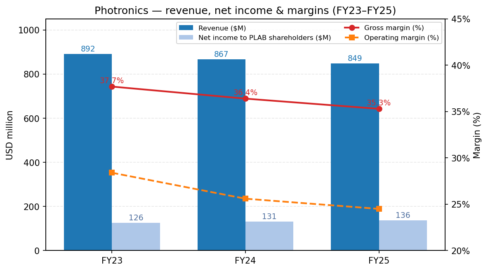
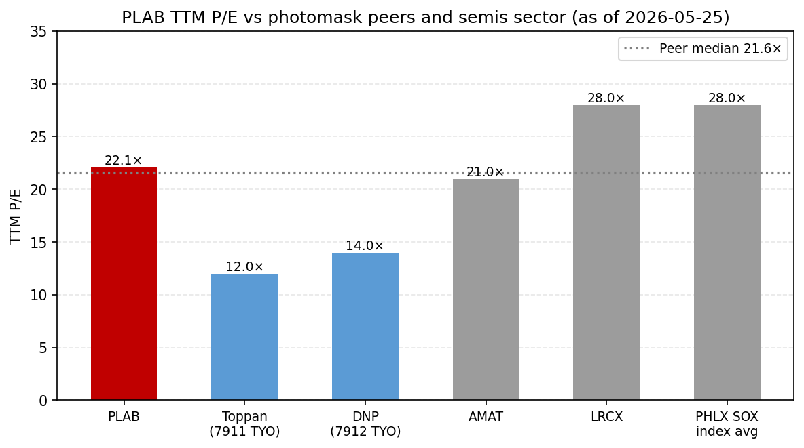
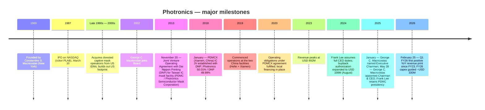
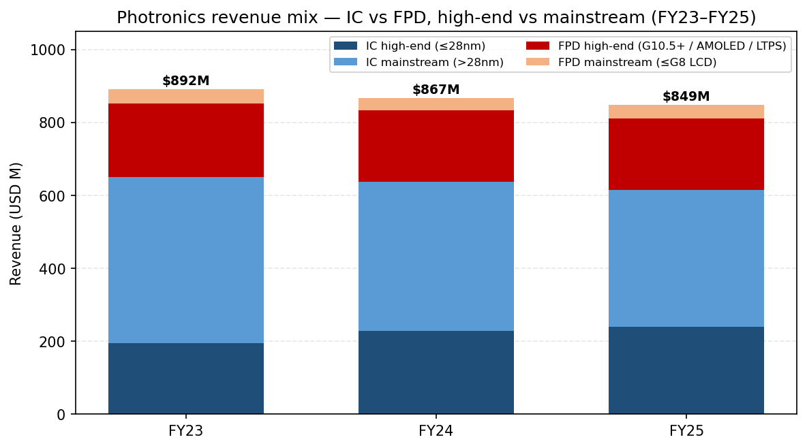
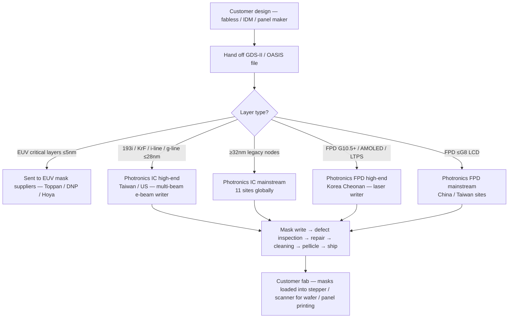
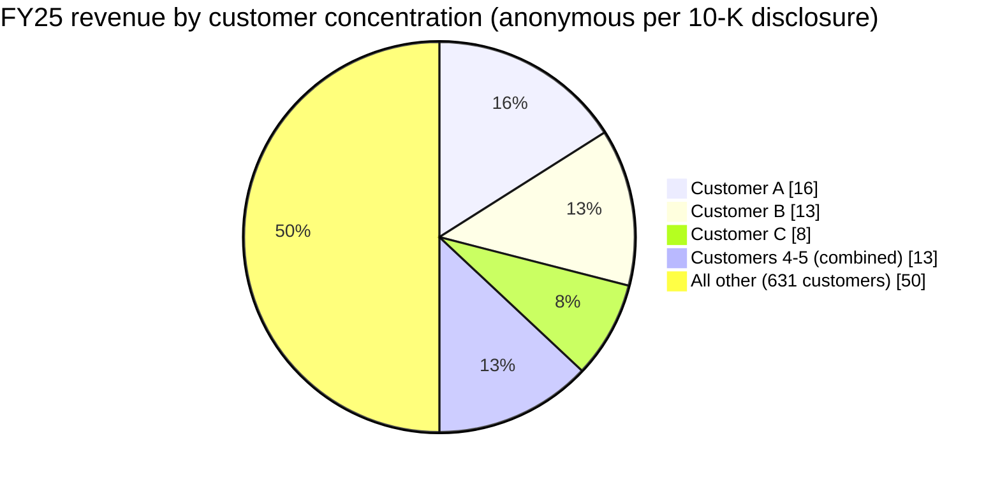
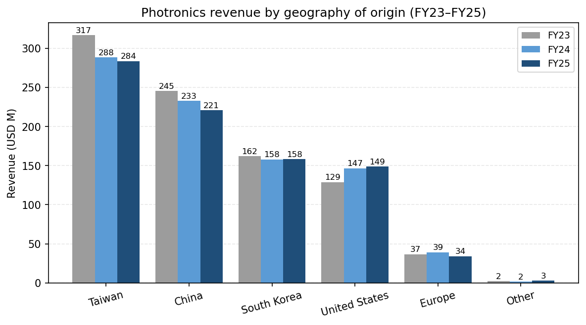
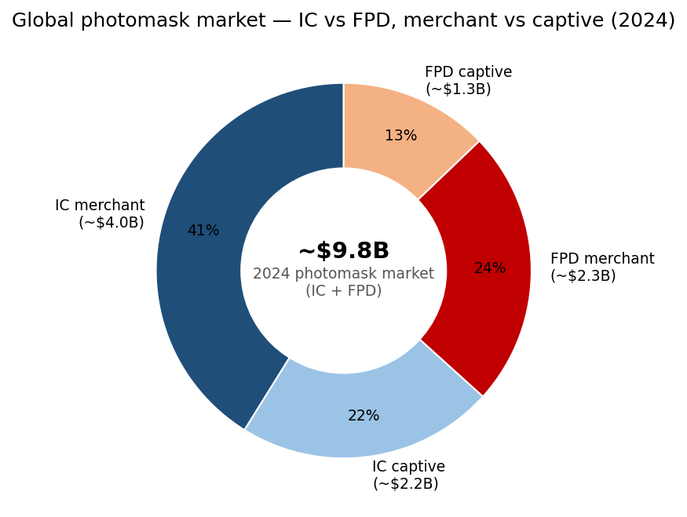
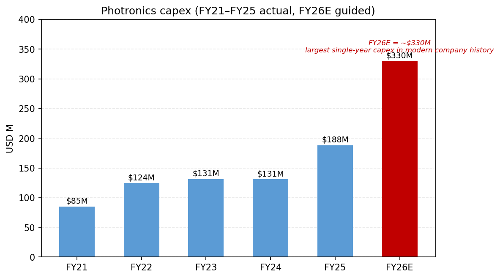

# Company Research Report: Photronics, Inc. (NASDAQ: PLAB)

**As of:** 2026-05-26
**Listing:** NASDAQ Global Select Market — ticker `PLAB` ([NASDAQ profile](https://www.nasdaq.com/market-activity/stocks/plab))
**HQ:** 15 Secor Road, Brookfield, Connecticut 06804, USA ([Photronics 10-K FY25, Item 1 Business](https://www.sec.gov/Archives/edgar/data/810136/000114036125045801/ef20057458_10k.htm))
**Founded:** 1969 by Constantine S. ("Deno") Macricostas ([Photronics 2026 DEF 14A, p. 9](https://www.sec.gov/Archives/edgar/data/810136/000153949726000750/n5545_x1-def14a.htm))
**Fiscal year-end:** Last Sunday of October (FY25 ended 2025-10-31)
**Sector context:** Anchor input — Nomura "Greater China Semi: A guide to Semi renaissance in 2026~30F", 2026-05-21 ([sector note](/Users/x/projects/financial_agent/reports/sector/半导体材料.md))

> **Update — FY26 capex stepped to ~USD 330M (disclosed 2025-12-17):** Management's FY26 capex guide of ~**USD 330M** is the largest single-year capital commitment in PLAB's modern history — roughly **+76%** vs. FY25 actual capex of $188.1M and **2.5×** the FY23/FY24 baseline of ~$131M. Stated drivers are high-end IC enablement (sub-28nm point tools), replacement of end-of-life mask-writing systems, and AMOLED FPD capacity ([PLAB 10-K FY25, Item 1A & Item 7](https://www.sec.gov/Archives/edgar/data/810136/000114036125045801/ef20057458_10k.htm)). At the same time the Board funded an incremental $25M of buyback authorization (June 2025) on top of the August 2024 $100M expansion ([PLAB 10-K FY25, Item 5](https://www.sec.gov/Archives/edgar/data/810136/000114036125045801/ef20057458_10k.htm)). The capex inflection compresses FY26 free cash flow even as the buyback continues — Section 1 and Section 9 walk through the tension.

---

## Table of Contents

1. Company Overview
2. Company History
3. Management Team
4. Products & Services
5. Customers & Go-to-Market
6. Industry Overview
7. Competitive Landscape
8. Market Opportunity (TAM)
9. Risk Assessment

References + Step 10 Verification Log

---

## 1. Company Overview

Photronics is **the largest US-headquartered merchant photomask manufacturer** and one of only three global merchant suppliers — the other two are Japan's Toppan and Dai Nippon Printing (DNP). A "photomask" (also called a *reticle*) is a high-precision quartz or glass plate carrying microscopic circuit patterns; it is the optical master that every semiconductor wafer and every flat-panel-display (FPD) substrate is printed against during photolithography ([PLAB 10-K FY25, Item 1 Business — Industry section](https://www.sec.gov/Archives/edgar/data/810136/000114036125045801/ef20057458_10k.htm)). For each new chip or display design the fab orders a *set* of photomasks — typically 30–80 layers per logic chip, 10–20 per display — so Photronics' revenue is driven not by wafer volume but by the number of *new tape-outs* (designs released to production) at its customers' fabs.

The Company "manufactur[es] photomasks, which are used as masters to transfer circuit patterns onto semiconductor wafers and FPD substrates" ([PLAB 10-K FY25, Item 1](https://www.sec.gov/Archives/edgar/data/810136/000114036125045801/ef20057458_10k.htm)) and operates **eleven manufacturing facilities across five geographies**: Taiwan (3), China (2), South Korea (1), the United States (3 — Allen TX, Brookfield CT, Boise ID), and Europe (2 — Manchester / Bridgend UK and Dresden Germany) ([PLAB 10-K FY25, Item 2 Properties](https://www.sec.gov/Archives/edgar/data/810136/000114036125045801/ef20057458_10k.htm)). The eleven-site footprint is a structural moat: photomask delivery is time-critical ("first several layers of photomasks are sometimes required to be delivered to customers within twenty-four hours from the time we receive customer design data" — [PLAB 10-K FY25, Item 1](https://www.sec.gov/Archives/edgar/data/810136/000114036125045801/ef20057458_10k.htm)), so geographic proximity to each foundry hub is itself a sales weapon. *Analyst view:* photomask is one of the few semi-supply niches where logistics, not just technology, is a moat.

**Business model.** Photronics sells photomasks "primarily to leading semiconductor and FPD designers and manufacturers… [including] integrated device manufacturers, fabless semiconductor companies, and 'pure-play' foundries", reaching roughly **636 customers in FY2025** ([PLAB 10-K FY25, Item 1 Markets](https://www.sec.gov/Archives/edgar/data/810136/000114036125045801/ef20057458_10k.htm)). Each new chip or panel design is quoted on a per-mask-set basis; pricing is negotiated against the customer's design specifications, but once a Photronics fab is qualified for a customer the relationship typically settles into "a specified percentage of that customer's photomask orders" rather than a re-bid per order ([PLAB 10-K FY25, Item 1](https://www.sec.gov/Archives/edgar/data/810136/000114036125045801/ef20057458_10k.htm)). Backlog is short — typically "one day to three weeks" for routine layers — so Photronics' revenue is a high-frequency, low-cycle-time business that resembles a specialty industrial more than a capital-equipment supplier.

**Single reporting segment, two product lines.** Under ASC 280 Photronics "operate[s] as a single reporting segment as a manufacturer of photomasks" because the chief operating decision maker — the CEO — "reviews operating results to make decisions about allocating resources… for the entire Company" ([PLAB 10-K FY25, Item 1 Segment](https://www.sec.gov/Archives/edgar/data/810136/000114036125045801/ef20057458_10k.htm)). The IC vs. FPD split therefore appears only in Item 7 MD&A revenue-disaggregation tables, not in segment-note arithmetic. The two product lines do, however, have **distinct customer bases, distinct R&D centers (IC in Boise, Idaho; FPD in Cheonan, South Korea) and largely separate manufacturing footprints** — so for analytical purposes the rest of this report treats IC and FPD as two parallel businesses, even though Photronics reports them as one.

**Scale.** FY25 revenue was **USD 849.3M** (−2.0% YoY), with net income to PLAB shareholders of **USD 136.4M** (+4.4% YoY) and **1,908 employees globally** ([PLAB 10-K FY25, Item 1 + Item 7](https://www.sec.gov/Archives/edgar/data/810136/000114036125045801/ef20057458_10k.htm); [PLAB FY25 multi-year SEC narrative](/Users/x/projects/financial_agent/reports/earnings/PLAB_20260525.md)). Five-year revenue trajectory: $664M (FY21) → $825M (FY22) → $892M (FY23) → $867M (FY24) → $849M (FY25) — Photronics rode the post-COVID design surge to a $892M peak in FY23, then absorbed two consecutive years of low-single-digit decline driven almost entirely by mainstream IC softness. Net income, by contrast, has *grown* every year over this window because the high-end IC and FPD mix is climbing — a "fewer dollars, better dollars" trajectory.

*Source: [PLAB 10-K FY25, Item 7 Results of Operations](https://www.sec.gov/Archives/edgar/data/810136/000114036125045801/ef20057458_10k.htm) — revenue, gross margin, and net income attributable to PLAB shareholders; built from disclosed annual figures.*

The chart shows the central tension: revenue compressed ~$43M over two years, gross margin slid ~240bp from 37.7% to 35.3%, **but net income continued to climb** because the high-end IC line scales at higher incremental margin than mainstream IC, and the company's tax rate stepped down (FY25 effective rate 14.2% after a one-time $16.7M valuation-allowance release in Q4) ([PLAB 10-K FY25, Item 7](https://www.sec.gov/Archives/edgar/data/810136/000114036125045801/ef20057458_10k.htm)). Q1 FY26 then printed +6.1% YoY revenue growth — the first positive YoY print since FY23 — driven by high-end IC (+19% YoY) and mainstream FPD (+51% YoY on China G8 IT-display demand), confirming the mix-shift inflection ([PLAB 10-Q Q1 FY26, Results of Operations](https://www.sec.gov/Archives/edgar/data/810136/000114036126009004/plab-20260201.htm)).

**Geographic mix.** FY25 revenue by origin: Taiwan $283.8M (33%), China $221.0M (26%), South Korea $158.5M (19%), United States $148.9M (18%), Europe $34.1M (4%), Other $2.9M ([PLAB 10-K FY25, Note 10 Revenue + Item 7](https://www.sec.gov/Archives/edgar/data/810136/000114036125045801/ef20057458_10k.htm)). **Non-US operations contributed 82% of total revenue** in FY25 (vs. 83% FY24, 86% FY23) — the gradual rise in US share reflects domestic foundry build-out (TSMC Arizona, Samsung Texas, Intel Ohio in planning) rather than absolute US growth.

**Valuation snapshot.** As of 2026-05-22 ([Stockanalysis.com data feed](https://stockanalysis.com/stocks/plab/)):

| Metric | PLAB | Photomask peers (Toppan / DNP) | Sector context |
|---|---|---|---|
| Price | USD ~51.5 | — | — |
| Market cap | USD 3.03 B | Toppan ~USD 11 B; DNP ~USD 7.5 B | — |
| TTM P/E | **22.1×** | Toppan ~12×, DNP ~14× ([WSJ market data](https://www.wsj.com/market-data/quotes/JP/XTKS/7911) / [DNP](https://www.wsj.com/market-data/quotes/JP/XTKS/7912)) | AMAT ~21×, LRCX ~28×, PHLX SOX index ~28× |
| TTM P/S | ~3.5× | Toppan ~0.4×, DNP ~0.5× | LRCX ~10× |
| TTM EPS | USD 2.33 | — | — |
| 52-wk range | USD 32.0 – 53.0 | — | — |

*Source: PLAB P/E from [Stockanalysis.com PLAB overview](https://stockanalysis.com/stocks/plab/) (price USD 51.5 / EPS USD 2.33 = 22.1×); Toppan 7911 TYO and DNP 7912 TYO P/E referenced via [WSJ market data](https://www.wsj.com/market-data/quotes/JP/XTKS/7911); AMAT and LRCX TTM P/E from [Yahoo Finance AMAT key statistics](https://finance.yahoo.com/quote/AMAT/key-statistics/) / [LRCX](https://finance.yahoo.com/quote/LRCX/key-statistics/); PHLX SOX index average from [Bloomberg SOX](https://www.bloomberg.com/quote/SOX:IND).*

**How to read the multiple.** PLAB trades at a meaningful premium to its two large Japanese peers (Toppan / DNP — each ~12–14× P/E) and at a slight premium to the photomask-pure read but **roughly in line with the broader semi-equipment median** (~22–25×). The gap to Toppan/DNP is justifiable in three ways: (1) Toppan and DNP are diversified printing conglomerates where photomask is <10% of revenue, so their P/Es reflect packaging, decorative materials, and other low-growth businesses; PLAB is the only public pure-play; (2) PLAB's gross margin (35.3% FY25) and ROIC are structurally higher than Toppan's group margin (~10%) because photomask economics dominate; (3) PLAB has a clean balance sheet (net cash position) and an active buyback ($97.4M deployed in FY25) ([PLAB 10-K FY25, Item 5 Issuer Purchases](https://www.sec.gov/Archives/edgar/data/810136/000114036125045801/ef20057458_10k.htm)). At 22× TTM with mid-single-digit revenue growth and a buyback, PLAB is **not stretched** — but it is also not screamingly cheap, and Section 9 flags valuation as one of the watchpoints if the FY26 capex pulse fails to land.

## 2. Company History

Photronics was founded in **1969** as a New York-area photomask shop by Constantine S. ("Deno") Macricostas ([Photronics 2026 DEF 14A, p. 9 Director Biographies](https://www.sec.gov/Archives/edgar/data/810136/000153949726000750/n5545_x1-def14a.htm)). The founding context was a US semiconductor industry that was just transitioning from in-house photomask shops to merchant supply; Macricostas built Photronics as a domestic alternative to captive mask operations at IBM, RCA, and Motorola. The Company went public on NASDAQ in **March 1987** ([Stockanalysis.com PLAB overview, IPO Date](https://stockanalysis.com/stocks/plab/)) and has continuously traded under the ticker `PLAB` since.

The next two decades were a steady consolidation of US merchant photomask supply (capturing assets from divested IDM captive mask shops) followed by a deliberate internationalization push. The single most consequential strategic decision in the company's modern history was the **2013 joint venture with Dai Nippon Printing Co., Ltd.** in Taiwan and the **2018 joint venture with DNP in Xiamen, China** — both structured to embed Photronics inside Asia's foundry corridor where the bulk of advanced-node logic and memory production occurs ([PLAB 10-K FY25, Exhibit Index — Joint Venture Operating Agreement dated November 20, 2013](https://www.sec.gov/Archives/edgar/data/810136/000114036125045801/ef20057458_10k.htm); [Note 6 PDMCX](https://www.sec.gov/Archives/edgar/data/810136/000114036125045801/ef20057458_10k.htm)). Those two JVs reset Photronics' geographic mix from ~50/50 US-Asia to **82% non-US revenue** by FY25 ([PLAB 10-K FY25, Item 1](https://www.sec.gov/Archives/edgar/data/810136/000114036125045801/ef20057458_10k.htm)).

*Source: composed from [PLAB 10-K FY25 Item 1 + Exhibits](https://www.sec.gov/Archives/edgar/data/810136/000114036125045801/ef20057458_10k.htm), [PLAB 2026 DEF 14A](https://www.sec.gov/Archives/edgar/data/810136/000153949726000750/n5545_x1-def14a.htm), and the [CEO-transition 8-K dated 2025-05-28](https://www.sec.gov/Archives/edgar/data/810136/000114036125020569/ef20049681_8k.htm).*

**Two strategic pivots that define the modern company.**

*Pivot 1 — From US merchant to global Asia-anchored merchant (2013–2019).* Photronics' two-step JV strategy with DNP in 2013 (Taiwan) and 2018 (China) was not a simple capacity expansion — it was a partial sell-down of economics in exchange for production-line co-location with the world's two largest concentrations of leading-edge foundry capacity. Each JV consolidates into Photronics' financials (Photronics holds majority economic and board control), but DNP receives ~50% of the JV's net income through the noncontrolling-interest line. FY25 noncontrolling-interest net income was **USD 53.8M out of consolidated net income of USD 190.2M** — meaning DNP's share of the consolidated bottom line is material (~28%) and the headline net-income-to-shareholders number understates the underlying business scale ([PLAB 10-K FY25, Item 7](https://www.sec.gov/Archives/edgar/data/810136/000114036125045801/ef20057458_10k.htm); [PLAB FY25 multi-year SEC narrative](/Users/x/projects/financial_agent/reports/earnings/PLAB_20260525.md)).

*Pivot 2 — CEO succession to the founder's family (2025).* On **May 28, 2025** Dr. Frank Lee stepped down as CEO after roughly a decade in operational leadership (most recently as CEO since 2017), and **George C. Macricostas — the founder's son** — assumed the Chairman & CEO role ([PLAB 8-K dated 2025-05-28, Item 5.02](https://www.sec.gov/Archives/edgar/data/810136/000114036125020569/ef20049681_8k.htm)). Lee continues as Chairman and President of the PDMC Taiwan subsidiary, retaining day-to-day operational oversight of the Asia footprint pending retirement "in the next year or two" ([same 8-K](https://www.sec.gov/Archives/edgar/data/810136/000114036125020569/ef20049681_8k.htm)). George Macricostas' previous PLAB role was SVP responsible for IT infrastructure — less operational than Lee's deep foundry background, but the succession was telegraphed (he became Executive Chairman on January 6, 2025 before the May CEO appointment) and the family retains ownership influence through both Constantine S. Macricostas's continuing Board role and the Macricostas Family Foundation ([Photronics 2026 DEF 14A, p. 9](https://www.sec.gov/Archives/edgar/data/810136/000153949726000750/n5545_x1-def14a.htm)).

**Recent developments (last 24 months).** (1) **CFO change**: Eric Rivera was named CFO on May 23, 2024 after serving as interim CFO since February 2024; he was elevated to President in addition on January 12, 2026 ([Photronics press release 2026-01-13](https://www.globenewswire.com/news-release/2026/01/13/3217819/0/en/Photronics-Announces-Executive-Officer-Appointments.html)). (2) **Advanced mask writer delivery (March 31, 2026)** for AMOLED FPD high-end production — confirms Photronics' Korea Cheonan facility is leaning into the AMOLED / LTPS upgrade cycle ([Photronics press release 2026-03-31](https://www.globenewswire.com/news-release/2026/03/31/3265409/0/en/Photronics-Receives-Advanced-Mask-Writer-Expanding-AMOLED-Leadership.html)). (3) **PSMC license renewal in July 2025** — the Taiwan operating company's foundational IP license was renewed without material restructuring ([PLAB FY25 multi-year SEC narrative](/Users/x/projects/financial_agent/reports/earnings/PLAB_20260525.md)). (4) **Sales leadership change**: Jeff Catlin was appointed SVP Global Sales effective January 8, 2026, "driving a unified" global sales organization ([Photronics press release 2026-01-08](https://www.globenewswire.com/news-release/2026/01/08/3215308/0/en/Photronics-Appoints-Jeff-Catlin-Senior-Vice-President-Global-Sales.html)).

## 3. Management Team

### Constantine S. ("Deno") Macricostas — Founder & Director (non-executive)

Constantine Macricostas founded Photronics in **1969** and built it from a regional US merchant-mask shop into one of three global merchant photomask suppliers ([Photronics 2026 DEF 14A, p. 9](https://www.sec.gov/Archives/edgar/data/810136/000153949726000750/n5545_x1-def14a.htm)). He served as CEO on **three separate occasions** — from 1974 until August 1997 (the founding-CEO stretch through the IPO), February 2004 to June 2005 (a transitional return), and April 2009 until May 2015 (the post-Lehman re-engagement that culminated in handing the company off in the modern shape) — a level of operational re-engagement uncommon for founders who long ago stepped back. He was Executive Chairman until January 20, 2018, then Chairman until January 6, 2025 when his son George C. Macricostas was named Executive Chairman ([Photronics 2026 DEF 14A, p. 9](https://www.sec.gov/Archives/edgar/data/810136/000153949726000750/n5545_x1-def14a.htm)).

Deno Macricostas's secondary professional credit is **director of RagingWire Data Centers, Inc.** — the mission-critical colocation business his son George founded and ran — which was 80% sold to NTT of Japan in 2014 (closing completed in 2018) ([Photronics CEO-transition 8-K dated 2025-05-28](https://www.sec.gov/Archives/edgar/data/810136/000114036125020569/ef20049681_8k.htm)). He remains on Photronics' Board, is the founder and director of **The Macricostas Family Foundation** (a 501(c)(3) formed in 2001 that funds educational and international programs), and sits on the Board's Cybersecurity Committee as well as serving as a non-voting advisor to the Compensation Committee ([Photronics 2026 DEF 14A, p. 9](https://www.sec.gov/Archives/edgar/data/810136/000153949726000750/n5545_x1-def14a.htm)). The Macricostas family's name is on the **Macricostas School of Arts and Sciences at Western Connecticut State University** — a marker of the family's long-running philanthropic capital. Deno Macricostas's continuing Board presence after handing the CEO role to his son provides institutional memory and external-relationship capital (especially in Asia, where the JV partnerships he originally negotiated still anchor the business) — but it also concentrates governance influence inside one family across three generations of leadership ([Photronics 2026 DEF 14A, p. 9-11 governance discussion](https://www.sec.gov/Archives/edgar/data/810136/000153949726000750/n5545_x1-def14a.htm)).

### George C. Macricostas — Chairman & Chief Executive Officer (since May 28, 2025)

George C. Macricostas, **age 55** as of mid-2025 ([Photronics CEO-transition 8-K dated 2025-05-28](https://www.sec.gov/Archives/edgar/data/810136/000114036125020569/ef20049681_8k.htm)), is the **son of founder Constantine S. Macricostas** and assumed the CEO role on May 28, 2025 after a five-month executive-chairman onboarding period (Executive Chairman from January 6, 2025) ([Photronics 2026 DEF 14A, p. 9](https://www.sec.gov/Archives/edgar/data/810136/000153949726000750/n5545_x1-def14a.htm)). He has been on the Photronics Board since 2002 — a continuous 23-year service before becoming CEO — including stints on the Nominating Committee, the Cybersecurity Committee, and most recently as Chairman of the Compensation Committee until that role passed to David A. Garcia on January 6, 2025 in connection with his own promotion.

George's most consequential prior operating experience was **founding, chairing, and serving as CEO of RagingWire Data Centers, Inc.**, a US provider of mission-critical wholesale colocation data-center capacity ([Photronics CEO-transition 8-K dated 2025-05-28](https://www.sec.gov/Archives/edgar/data/810136/000114036125020569/ef20049681_8k.htm)). He led RagingWire through an **80% sale to NTT of Japan in 2014** — at the time one of the largest international data-center M&A deals — and completed the residual sale in 2018, ultimately delivering a full exit to NTT. The data-center build-out experience is non-obvious preparation for running a photomask manufacturer, but two skills transfer: large-multi-site facility-capex management (NTT-RagingWire built hyperscale colocation sites across Northern Virginia, Sacramento, Dallas, and Chicago) and Japan-strategic-partner management (the NTT sale anticipates the partnership style Photronics already uses with DNP in Taiwan and Xiamen) ([Photronics CEO-transition 8-K](https://www.sec.gov/Archives/edgar/data/810136/000114036125020569/ef20049681_8k.htm)). His earlier PLAB role was **senior vice president responsible for IT infrastructure** — not a direct operations role but an exposure to the data flow of a global multi-fab manufacturer ([Photronics 2026 DEF 14A, p. 9](https://www.sec.gov/Archives/edgar/data/810136/000153949726000750/n5545_x1-def14a.htm)).

George Macricostas describes himself in filings as "an investor and entrepreneur" with "over 30 years of technical and business management experience in business operations and information technology" ([Photronics CEO-transition 8-K](https://www.sec.gov/Archives/edgar/data/810136/000114036125020569/ef20049681_8k.htm)). The intentional decision to retain **Frank Lee as Chairman and President of the PDMC Taiwan subsidiary** through retirement preserves the operational continuity at the Asia hub that drives the majority of revenue — George is therefore stepping into a structurally supported role rather than a clean takeover, which dampens execution risk during the transition. The Company indicated in the May 2025 8-K that it would "amend its existing Employment Agreement with Mr. Macricostas to reflect his role as Chief Executive Officer on terms to be agreed with the Compensation Committee" — the formal CEO comp package terms are disclosed in the 2026 DEF 14A's Compensation Discussion and Analysis section ([Photronics 2026 DEF 14A, Executive Compensation discussion](https://www.sec.gov/Archives/edgar/data/810136/000153949726000750/n5545_x1-def14a.htm)).

## 4. Products & Services

Section 4 is built on the **Photronics FY25 10-K Item 1 "Business" — Industry and Markets subsections**, which together comprise the issuer's own verbatim product narrative. Photronics does not publish a tabular product matrix in the way an LRCX or AMAT would; instead, the product range is described in narrative form, organized along two axes: **End-market (IC vs. FPD)** and **Technology tier (High-end vs. Mainstream)**. The 10-K defines these as follows:

> "'High-end' photomasks support 28 nanometer and smaller design nodes for ICs and Generation 10.5+, AMOLED, and LTPS display-based process technologies for FPDs. However, 32 nanometer and above geometries for semiconductors and Generation 8 and below (excluding AMOLED and LTPS) process technologies for displays, which we refer to as 'mainstream' photomasks, constitute the majority of designs currently being fabricated in volume." — [PLAB 10-K FY25, Item 1 Industry](https://www.sec.gov/Archives/edgar/data/810136/000114036125045801/ef20057458_10k.htm)

The four resulting product cells — each with a disclosed FY25 revenue figure from Item 7 MD&A — are the working product matrix.

### 4.1 The product matrix (analyst-constructed from 10-K narrative + Item 7 revenue table)

| End-market | Tier | Definition | FY25 revenue ($M) | FY24 revenue ($M) | FY23 revenue ($M) | YoY |
|---|---|---|---:|---:|---:|---:|
| **IC** | High-end | ≤28nm semiconductor design nodes; multi-beam e-beam writers | **$238.9M** | $228.5M | $194.9M | +4.6% |
| **IC** | Mainstream | ≥32nm semiconductor nodes (still the volume bulk of designs) | **$376.2M** | $409.7M | $456.3M | −8.2% |
| **FPD** | High-end | Generation 10.5+ TFT-LCD, AMOLED, LTPS panel-display masks | **$195.5M** | $195.4M | $200.8M | +0.1% |
| **FPD** | Mainstream | ≤Generation 8 LCD (excluding AMOLED / LTPS) | **$38.7M** | $33.4M | $40.0M | +15.7% |
| **Total** | | | **$849.3M** | $866.9M | $892.1M | −2.0% |

*Source: revenue figures from [PLAB 10-K FY25, Note 10 Revenue (Revenue by Product Type)](https://www.sec.gov/Archives/edgar/data/810136/000114036125045801/ef20057458_10k.htm); definitions verbatim from [PLAB 10-K FY25, Item 1 Industry](https://www.sec.gov/Archives/edgar/data/810136/000114036125045801/ef20057458_10k.htm).*

*Source: [PLAB 10-K FY25, Note 10 Revenue by Product Type table](https://www.sec.gov/Archives/edgar/data/810136/000114036125045801/ef20057458_10k.htm).*

The matrix makes two things visible immediately. First, **mainstream IC dropped $80M (−17.5%) over two years** while **high-end IC grew $44M (+22.5%)** — the central business mix-shift story. Second, **mainstream FPD bounced +15.7% in FY25** after a flat-to-down two years, driven by the China G8 display IT and tablet ramp (where Photronics' Xiamen and Hefei facilities have direct line of sight to BOE, China Star, and Tianma demand).

### 4.2 Synthesis — how the categories interact in a customer workflow

A semiconductor design moves through Photronics' product portfolio in a sequence: a fabless designer or IDM finalizes the chip layout, hands the GDS-II / OASIS design file to Photronics, and orders a mask set — typically **30–60 mask layers for a 5nm/3nm logic chip, 40–80+ for an HBM4 DRAM stack with TSV, 10–20 layers for a power-management or 65nm legacy controller**. The first ~5 critical layers (front-end-of-line, gate, contact, M1) typically demand high-end masks if the chip is at advanced node — those go through Photronics' multi-beam e-beam writing systems in Hsinchu (Taiwan) or Boise (Idaho R&D fab). The mid-stack interconnect layers (M2–M10) can use mainstream IC masks. Only at the very leading edge (≤5nm and EUV layers) does the design exit Photronics' addressable scope entirely — those EUV masks come from Hoya (mask blank) and either Toppan or DNP (mask write/pattern), with Intel's IMS-Vienna multi-beam writer the only writer capable of patterning them. **Photronics produces the entire mask set below EUV-required critical layers**; for an advanced-node design, that's still 90%+ of the mask layers by count and majority by ASP. The FPD workflow runs in parallel: BOE's Hefei G10.5 LCD line, Samsung Display's Asan AMOLED line, and LG Display's Paju LTPS line each release new panel designs every quarter, with Photronics Korea (Cheonan) writing the masks for AMOLED/LTPS and Photronics Taichung covering G8.6 and below. The two flows (IC + FPD) share little physical equipment but share customer-facing teams, IT systems, and corporate finance.

### 4.3 IC photomasks — high-end (≤28nm)

**10-K verbatim** ([PLAB 10-K FY25, Item 1 Markets](https://www.sec.gov/Archives/edgar/data/810136/000114036125045801/ef20057458_10k.htm)):

> "We support customers across the full spectrum of IC Production by manufacturing photomasks using electron beam or optical (laser-based) lithography systems. In addition, we have added the most advanced electron beam mask writing system for IC mask writing that employs a **multi-beam writing architecture** to deliver speed and performance improvements over existing systems."

> "Currently, research and development for IC photomasks are primarily focused on photomasks enabling **wafer geometries of 7 nanometer node and smaller, including EUV** and, for FPDs on Generation 8.6 AMOLED and photomasks for more advanced FPD display integration across all sizes. In addition, we note the role AI is playing in driving the technology roadmap for IC devices and our technology program covers multiple initiatives to deliver **AI grade photomasks in IC and advanced packaging applications**."

**Plain-language gloss.** Modern logic and memory chips are printed onto silicon wafers using a stepper or scanner — an optical machine that focuses light through a *reticle* (photomask) and exposes the underlying photoresist, layer by layer. At ≤28nm the patterns become so dense that **optical proximity correction (OPC)** and **inverse lithography technology (ILT)** add hundreds of millions of small "assist features" to the mask design, blowing up file sizes from gigabytes to terabytes per mask. To write those patterns at acceptable throughput, the mask shop uses an **electron-beam writer** — and at the leading edge, a **multi-beam electron-beam writer** (the IMS Nanofabrication / NuFlare MBM-2000 class of tool) that fires thousands of beams in parallel. The multi-beam writer Photronics calls out is what allows them to compete on high-end ≤28nm masks at acceptable cycle times. The strategic inflection is the **AI/HBM/advanced-packaging cycle**: every new TSMC N3 / N3P / N3X variant for AI accelerators (NVIDIA, AMD, Google, AWS, Meta) requires a fresh mask set; every new HBM3E / HBM4 base-die generation does the same. Mask demand at the high end is therefore tightly coupled to tape-out velocity at the top three or four IC customers, not to wafer volume. **Critical caveat — EUV exclusion.** Photronics is *not* an EUV-capable photomask supplier. EUV mask manufacture requires multi-layer reflective Ru/Mo-coated mask blanks (sourced from **Hoya** — ~80% global blank share per the [Nomura sector note, p. 18-30](/Users/x/projects/financial_agent/reports/sector/半导体材料.md)) and dedicated EUV mask writers and EUV mask inspection (the KLA Teron + Lasertec systems). Production-scale EUV masks come from **Toppan, DNP, Hoya** (the only three certified EUV mask suppliers as of 2025) and from a small set of captive operations at TSMC, Samsung Foundry, and Intel. Photronics' "high-end ≤28nm" category therefore covers the **193i ArF immersion, ArF dry, KrF, i-line, g-line** wavelengths — the full toolkit *below* EUV. That makes Photronics the mainstream-deep-UV partner of choice for the layers in an advanced-node chip that do not require EUV (still the majority of layers in a 3nm chip), and a structural non-participant in the layers that do.

*Analyst view:* in high-end IC masks Photronics is a credible partner *adjacent to* the EUV oligopoly rather than a member of it. Moat type is **scale + global proximity + multi-beam-writer ownership** — not technology leadership. Closest competitive product is **Toppan's ≤28nm DUV mask line** ([Toppan IR — Microelectronics business](https://www.toppanholdings.com/en/about/business/electronics/)) and **DNP's photomask business in Japan / China** ([DNP IR — Electronics segment](https://www.global.dnp/biz/electronics/)). Photronics' edge over Toppan/DNP at this tier is *geographic*: a Boise IDM customer (Micron) or a Hsinchu foundry customer (TSMC, UMC) gets faster cycle time from Photronics than from a Tokyo-based DNP / Toppan plant. The edge is real but is moderated by the fact that both Japanese players also operate Asia local sites.

### 4.4 IC photomasks — mainstream (≥32nm)

**10-K verbatim** ([PLAB 10-K FY25, Item 1 Industry](https://www.sec.gov/Archives/edgar/data/810136/000114036125045801/ef20057458_10k.htm)):

> "32 nanometer and above geometries for semiconductors and Generation 8 and below (excluding AMOLED and LTPS) process technologies for displays, which we refer to as 'mainstream' photomasks, **constitute the majority of designs currently being fabricated in volume**. At these geometries and at various high-end nodes, we can produce full lines of photomasks. Moreover, **there is no significant technology employed by our competitors that is not available to us**."

**Plain-language gloss.** "Mainstream IC" covers the 28nm-and-above bulk of the world's chip output — every microcontroller, power management IC, analog/mixed-signal device, CMOS image sensor, display driver IC, automotive controller, and BCD power chip is fabricated at 0.18 µm / 90nm / 65nm / 40nm / 28nm. The total wafer volume at these nodes is vastly larger than at ≤7nm, and the **number of distinct mask designs is also much higher** (a 0.18 µm power-management chip is typically a $50K mask set; a 5nm AI accelerator is a $20M+ mask set, but only one customer designs it). Mainstream IC therefore generates high *unit volume* and high *customer count* (Photronics serves ~636 customers in total — most of those are mainstream IC) but at lower ASP per mask. Mainstream IC masks are written on KrF / i-line / g-line laser writers and conventional single-beam e-beam tools — much less capital-intensive than the multi-beam writers for high-end. The strategic significance of the mainstream IC line for Photronics is that it is the **revenue base** ($376M in FY25, ~44% of total) and it is also the **mix headwind**: it shrank $80M over two years as customers extended product cycles and reduced design-release tempo. Q1 FY26 showed mainstream IC stabilizing flat YoY, which is what the bull case for PLAB needs.

*Analyst view:* in mainstream IC, Photronics is positioned as a leading non-captive supplier outside Japan — the eleven-site footprint and the JV partnerships in Taiwan and China give it cycle-time and price advantages that the smaller Chinese suppliers (Newway, Qingyi, Tekscend) cannot yet match at quality / yield, and that the Japanese players (Toppan, DNP) can match on quality but cannot easily match on the China-local logistics economics for SMIC, Hua Hong, Nexchip customers. Moat type is **scale + localization + multi-customer relationship density**. Closest competitive products are **Shenzhen Newway Photomask's mainstream-IC line** ([Newway corporate site](http://www.newwaymask.com/)) and **Hoya's mainstream IC mask line** ([Hoya IR — Electronics business](https://www.hoya.com/en/business/electronics/)) and **Toppan / DNP** as above. (Note: directional positioning here is analyst-derived, not directly disclosed in PLAB's 10-K — Section 7 walks the competitive geography in more detail and cites third-party data where available.)

### 4.5 FPD photomasks — high-end (Generation 10.5+, AMOLED, LTPS)

**10-K verbatim** ([PLAB 10-K FY25, Item 1 R&D](https://www.sec.gov/Archives/edgar/data/810136/000114036125045801/ef20057458_10k.htm)):

> "Research and development for FPD photomasks is primarily conducted at Photronics Korea, Ltd., our subsidiary in South Korea."

> "We have added the most advanced electron beam mask writing system for IC mask writing that employs a multi-beam writing architecture... For FPD, the mask fabrication utilizes **only optical writing systems to write the mask patterns**." ([same Markets section](https://www.sec.gov/Archives/edgar/data/810136/000114036125045801/ef20057458_10k.htm))

The most recent FPD product event is the March 31, 2026 announcement that Photronics had **taken delivery of "the most advanced mask writer" for AMOLED applications** at its Korea Cheonan facility ([Photronics press release 2026-03-31](https://www.globenewswire.com/news-release/2026/03/31/3265409/0/en/Photronics-Receives-Advanced-Mask-Writer-Expanding-AMOLED-Leadership.html)) — the press release explicitly positions Photronics as "expanding AMOLED leadership", a self-claimed leadership position consistent with the 10-K's R&D-center description.

**Plain-language gloss.** A flat-panel-display mask is *physically much larger* than an IC mask — a Generation 10.5 mask is approximately **1.5 m × 1.5 m**, a Generation 8.6 mask is **2.5 m × 2.2 m**, vs. a 6-inch (152mm) square IC mask. The large-area substrate is itself a specialized synthetic quartz blank (sourced from a small Japanese supplier base — primarily AGC and Asahi), and writing the pattern on a panel-scale mask requires a **laser direct-write system** (typically Heidelberg Instruments DWL or Photronics' own internally-engineered MicroMask), not an electron-beam writer. AMOLED and LTPS panels — used in iPhones, Samsung Galaxy, OLED TVs, and increasingly in iPad / MacBook / IT-display formats — need higher-density backplane patterns than legacy LCD, so the masks have tighter critical dimensions (sub-2 µm) and require multi-tone halftone patterning. Photronics' Cheonan-Korea facility is the global high-end FPD mask center; the strategic inflection is **the AMOLED IT panel ramp** (Apple's iPad Pro M4 OLED line, Samsung Display's 8th-gen AMOLED line in Asan, BOE's Mianyang B12 AMOLED line) that began in late 2024 and accelerated through 2025–26.

*Analyst view:* in high-end FPD masks, Photronics' Cheonan facility is structurally well-positioned because of geographic proximity to Samsung Display (Asan) and LG Display (Paju) — Korea is the global AMOLED hub. Moat type is **geographic + capital scale** (large-area mask writers are themselves multi-tens-of-millions-of-dollars each; the March 2026 writer delivery is one such investment). Closest competitive products are **LG Innotek's FPD mask business** ([LG Innotek IR](https://www.lginnotek.com/main.do)) and **SK-Electronics Co., Ltd.'s FPD mask line** ([SK Electronics overview](https://www.sk-electronics.co.jp/eng/)). Toppan also competes in FPD masks. The PLAB 10-K Competition section names "LG Innotek Co., Ltd." and "SK-Electronics Co., Ltd." among its competitors ([PLAB 10-K FY25 Item 1 Competition](https://www.sec.gov/Archives/edgar/data/810136/000114036125045801/ef20057458_10k.htm)).

### 4.6 FPD photomasks — mainstream (≤Generation 8 LCD)

This is the smallest of the four lines ($38.7M FY25, ~4% of total revenue) but it had the highest YoY growth (+15.7%) and the press-release-worthy story of 2025: the **China G8 LCD IT and tablet build-out**, where BOE, Tianma, China Star, and other Chinese panel makers are absorbing capacity at Generation 8 to capture the AMOLED-displaced IT-display volume in PCs and tablets ([PLAB FY25 multi-year SEC narrative](/Users/x/projects/financial_agent/reports/earnings/PLAB_20260525.md)). Photronics' Xiamen and Hefei sites have direct line-of-sight to that build. The 10-K narrative confirms FPD R&D is conducted at the Cheonan, Korea facility — but for mainstream G8 LCD output the China and Taiwan sites do the manufacturing volume ([PLAB 10-K FY25 Item 1](https://www.sec.gov/Archives/edgar/data/810136/000114036125045801/ef20057458_10k.htm)).

*Analyst view:* mainstream FPD is a tactical growth lever, not a strategic moat. Margin contribution is meaningfully lower than IC high-end. Moat type is **geographic localization** to Chinese panel customers — same logic as China-local mainstream IC. The line is unlikely to scale beyond mid-single-digit percent of total PLAB revenue, but it provides incremental capacity utilization at the China sites.

### 4.7 The cycle — Mermaid graph of the customer workflow

*Source: workflow composed from [PLAB 10-K FY25, Item 1 Industry + Markets + R&D](https://www.sec.gov/Archives/edgar/data/810136/000114036125045801/ef20057458_10k.htm); EUV supplier dynamics from [Nomura Greater China Semi note, p. 38-39](/Users/x/projects/financial_agent/reports/sector/半导体材料.md).*

### 4.8 Aftermarket / services and recurring revenue posture

Unlike a Lam Research (CSBG) or an Applied Materials (AGS — Applied Global Services), Photronics does **not** disaggregate an aftermarket / installed-base / service revenue line — there is no equivalent recurring-revenue segment to compare. The reason is the photomask business model itself: every mask is a single-use master delivered once for a given design, with no ongoing service fee per customer. The recurring nature of the business comes instead from **customer relationships** (once Photronics is qualified for a customer, "we will receive a specified percentage of that customer's photomask orders" — [PLAB 10-K FY25, Item 1](https://www.sec.gov/Archives/edgar/data/810136/000114036125045801/ef20057458_10k.htm)) and **revenue recognition** (Note 10 shows USD 818M of FY25 revenue recognized "over time" — 96% of total — vs. $31M "at a point in time", reflecting how mask sets are typically progressively delivered over the design ramp). The "over time" recognition pattern is the closest analog to a recurring-revenue moat ([PLAB 10-K FY25, Note 10 Revenue](https://www.sec.gov/Archives/edgar/data/810136/000114036125045801/ef20057458_10k.htm)).

## 5. Customers & Go-to-Market

### Customer segmentation and named buyers

Photronics' customer set falls into four primary buckets, all serving downstream chip or panel manufacturing:

1. **Pure-play foundries** — TSMC, Samsung Foundry, GlobalFoundries, UMC, SMIC, Hua Hong Semiconductor, Vanguard International Semiconductor (VIS), Powerchip / PSMC, Nexchip, ICRD;
2. **Integrated device manufacturers (IDMs) and memory makers** — Intel, Micron, SK Hynix, Samsung (memory), Texas Instruments, STMicroelectronics, Infineon, NXP, ON Semiconductor;
3. **Fabless semiconductor designers** — broad long-tail of designers releasing new tape-outs through one of the foundries above;
4. **FPD makers** — Samsung Display, LG Display, BOE, China Star Optoelectronics (TCL CSOT), Tianma, Innolux, AUO, Japan Display.

Photronics does **not name individual customers in the 10-K** ([PLAB 10-K FY25, Item 1](https://www.sec.gov/Archives/edgar/data/810136/000114036125045801/ef20057458_10k.htm)) — only "Customer A, B, and C" — but the customer roster above is reconstructible from the JV structures (TSMC is the historical anchor for the PDMC Taiwan JV; Samsung is the historical anchor for the Korea facility, where FPD R&D sits; BOE / China Star / Tianma / SMIC / Hua Hong are the primary anchors for the Xiamen PDMCX JV) and from the 10-K's own description of "integrated device manufacturers, fabless semiconductor companies, and 'pure-play' foundries" as customer types ([PLAB 10-K FY25, Item 1 Markets](https://www.sec.gov/Archives/edgar/data/810136/000114036125045801/ef20057458_10k.htm)).

### Customer concentration (REQUIRED — disclosed in 10-K)

Photronics is transparent on concentration metrics, though anonymous on names:

> "During 2025, we sold our products to approximately **636 customers**. For fiscal year 2025, **Customer A, B and C accounted for approximately 16%, 13% and 8%, of consolidated revenue, respectively**. For fiscal year 2024, Customer A, B and C accounted for approximately 15%, 12% and 9% of consolidated revenue, respectively. For fiscal year 2023, Customer A, B and C accounted for approximately 14%, 10% and 13% of consolidated revenue, respectively. **No other customer represented 10% or more of consolidated revenue in any of the three fiscal years**. **Our five largest customers, in the aggregate, accounted for approximately 50%, 50% and 51% of our revenue in 2025, 2024 and 2023**, respectively." — [PLAB 10-K FY25, Item 1 Markets](https://www.sec.gov/Archives/edgar/data/810136/000114036125045801/ef20057458_10k.htm)

This is **a material concentration profile**: top-1 customer ≥14% for three consecutive years; top-2 combined 29% in FY25 (vs. 27% FY24 and 24% FY23 — the trend is *up*, not down); top-3 = 37% in FY25; top-5 has held steady at ~50%. By the Section 9 risk-taxonomy thresholds (top-1 > 10% / top-5 > 30% triggers risk-disclosure; top-1 > 20% or top-5 > 50% is "material"), Photronics meets the "material" threshold at top-5 = 50% in two of three years and is right at the line in FY25. The risk is carried into Section 9.

*Source: percentages from [PLAB 10-K FY25, Item 1 Markets](https://www.sec.gov/Archives/edgar/data/810136/000114036125045801/ef20057458_10k.htm). Customers 4-5 derived as the difference: top-5 cumulative (50%) minus top-3 cumulative (37%).*

**Three-year trend.** Top-5 share of 50% / 50% / 51% (FY25 / FY24 / FY23) — essentially flat. Top-1 share of 16% / 15% / 14% has crept up slightly each year. Top-2 + Top-3 combined has moved from 24%+13%=37% (FY23, where Cust C briefly outranked Cust B) to 27%+9%=36% (FY24) to 29%+8%=37% (FY25). **The headline story is mix-shift inside the top customer**, not aggregate concentration drift. Concentration severity is **material** by the project's risk-taxonomy definition (top-5 > 50% in two of three years).

### Contract structure and switching costs

Photronics describes the supplier-qualification process as a high-bar gating step that creates switching cost:

> "Generally, Photronics and each of its customers engage in a **qualification and correlation process** before we become an approved supplier. Thereafter, based on the customer's specifications, we typically negotiate pricing parameters for the customer's order. **In many instances, we enter into sales arrangements with an understanding that, as long as our performance is competitive, we will receive a specified percentage of that customer's photomask orders**." — [PLAB 10-K FY25, Item 1 Industry](https://www.sec.gov/Archives/edgar/data/810136/000114036125045801/ef20057458_10k.htm)

Translation: once a Photronics fab is qualified for a given customer's process, the customer typically commits a fixed share of mask orders (e.g. 30% / 40% / 50% split between two or three approved mask suppliers) rather than re-bidding every order. This is the operational moat — mask qualification is expensive in time (months to qualify a new mask supplier for a new wafer fab process) and in customer-side risk (a sub-optimally written mask can ruin a $20M wafer lot). So while no individual order is binding, the customer's annual mask spend share is sticky.

### Go-to-market — direct sales with local-language teams

Photronics goes to market via **direct sales** — there is no channel / distributor layer. From the 10-K:

> "We conduct our sales and marketing activities primarily through a staff of **full-time sales personnel and customer service representatives who work closely with the Company's management and technical personnel**. We support non-U.S. customers through both our domestic and foreign facilities and consider our presence in non-U.S. markets to be an important factor in attracting new customers, as it provides global solutions to our customers, minimizes delivery time, and allows us to serve customers that utilize manufacturing foundries outside of the United States, principally in Asia." — [PLAB 10-K FY25, Item 1 Sales and Marketing](https://www.sec.gov/Archives/edgar/data/810136/000114036125045801/ef20057458_10k.htm)

The recent SVP-Global-Sales appointment of Jeff Catlin in January 2026 ([Photronics press release 2026-01-08](https://www.globenewswire.com/news-release/2026/01/08/3215308/0/en/Photronics-Appoints-Jeff-Catlin-Senior-Vice-President-Global-Sales.html)) was framed as creating "a unified" global sales organization — suggesting the prior structure was regionally siloed (which fits the 11-site facility footprint). Whether this consolidation produces meaningful cross-region sell-through (e.g. a Korean AMOLED customer using Photronics' Korea + China facilities together) is a near-term operational watchpoint.

### Geographic footprint of revenue

*Source: [PLAB 10-K FY25, Note 10 Revenue by Geographic Origin](https://www.sec.gov/Archives/edgar/data/810136/000114036125045801/ef20057458_10k.htm) — the table disaggregates revenue by location in which it was earned (i.e., manufacturing-site origin, not customer billing address).*

Taiwan is the largest origin geography ($284M FY25, 33%), reflecting the PDMC Taiwan JV's central role serving TSMC/UMC. China is the second-largest at $221M (26%) — predominantly the PDMCX Xiamen and Hefei facilities serving SMIC, Hua Hong, Nexchip, BOE, Tianma, China Star. Korea ($158M, 19%) is the FPD Cheonan facility serving Samsung Display / LG Display. The US ($149M, 18%) primarily comprises Boise (Micron-anchored), Brookfield, and Allen — with Intel and Texas Instruments / ST / Infineon as additional anchor customers. Europe ($34M, 4%) is the Dresden and Manchester / Bridgend sites serving European IDMs (Infineon, STMicroelectronics, NXP, Bosch) — small but defensible. **Cross-border note**: PDMCX's "revenue by geography of origin" is China-sited but the customers themselves are global, so the geographic-origin table understates the true cross-border revenue exposure.

## 6. Industry Overview

### Industry definition and scope

The **global photomask industry** is the supply of high-precision optical masters used in semiconductor (IC) photolithography and flat-panel-display (FPD) lithography. Total industry revenue in 2024 was approximately **USD 9.8 billion**, split between IC photomasks (~$6.2B, ~63% of total) and FPD photomasks (~$3.6B, ~37%) ([SEMI 2024 Photomask Equipment & Materials Report — referenced via Nomura Greater China Semi note, p. 18-25](/Users/x/projects/financial_agent/reports/sector/半导体材料.md); [Yole Group Photomask Industry 2024](https://www.yolegroup.com/) — referenced via the same Nomura note). The industry is unusual in two ways: (a) **captive manufacturing** by IDMs (Intel, Samsung, TSMC's internal mask shops) accounts for a meaningful share (~35%) of total industry output — a residual of an older era when chipmakers built their own mask shops; (b) **merchant** suppliers like Photronics, Toppan, and DNP serve the remaining ~65%, with the trend over the last decade gradually moving toward merchant supply as the capital cost of leading-edge mask-writing tools rises.

*Source: Industry sizing composed from [SEMI Photomask Materials & Equipment Reports (annual)](https://www.semi.org/en) cited in [Nomura Greater China Semi note, p. 18-30](/Users/x/projects/financial_agent/reports/sector/半导体材料.md); merchant-vs-captive split aligns with [PLAB 10-K FY25 Item 1 Markets narrative](https://www.sec.gov/Archives/edgar/data/810136/000114036125045801/ef20057458_10k.htm) on the historical trend back toward independent merchant supply.*

### Growth rates and drivers

The photomask market historically grows at a **mid-single-digit CAGR** — analyst consensus ranges from 4% to 7% — substantially slower than the broader semiconductor materials market (Nomura's anchor sector note projects ~6–8% CAGR for materials overall, 2024–2030) ([Nomura Greater China Semi note, p. 18-30](/Users/x/projects/financial_agent/reports/sector/半导体材料.md)). The structural drivers are:

1. **Design tape-out volume.** Mask demand is driven by the number of distinct designs released to production, not by wafer volume. A design refresh cycle that quickens (e.g. annual NVIDIA architecture refreshes, monthly fabless ASIC tape-outs) directly grows mask demand.
2. **Layer count per advanced design.** At 28nm a logic chip has ~40 mask layers; at 5nm it has ~60; at 3nm it can exceed 65 — and with backside power delivery (BPD, expected 2028+) it adds an additional ~5 layers. **More layers per design = more masks per tape-out.**
3. **EUV transition for the leading edge.** EUV masks are 5–10× more expensive than equivalent DUV masks — but Photronics does not participate, so EUV growth is not in PLAB's TAM.
4. **AMOLED IT-panel ramp.** The shift of laptops, tablets, and monitors from LCD to AMOLED panels through 2024–2028 is creating a fresh design wave at LG Display, Samsung Display, BOE — directly addressable by Photronics' Korea facility ([Photronics press release 2026-03-31](https://www.globenewswire.com/news-release/2026/03/31/3265409/0/en/Photronics-Receives-Advanced-Mask-Writer-Expanding-AMOLED-Leadership.html); cross-referenced to industry projections in [Nomura Greater China Semi note](/Users/x/projects/financial_agent/reports/sector/半导体材料.md)).
5. **China-local foundry expansion.** SMIC, Hua Hong, Nexchip, GTA Semiconductor, and the growing wave of Chinese specialty fabs (BCD power, MCU, analog) need mask supply that cannot easily come from US-sanctioned channels — Photronics' Xiamen and Hefei JVs are structurally positioned for this ([Nomura Greater China Semi note, p. 12-14 on TSMC's domestic supply-chain rebalancing — same dynamic applies to China-domestic fabs](/Users/x/projects/financial_agent/reports/sector/半导体材料.md)).

### Industry structure — oligopoly with a long tail

The merchant photomask industry is **highly concentrated at the leading edge**: only **Toppan, DNP, Hoya, and Photronics** can credibly supply ≤28nm IC masks at scale, and only Toppan, DNP, and Hoya have certified EUV mask production ([Yole Group photomask reports — referenced via Nomura Greater China Semi note p. 38-39](/Users/x/projects/financial_agent/reports/sector/半导体材料.md)). At mainstream nodes the field broadens to include **Compugraphics (UK)**, **LG Innotek (Korea)**, **SK-Electronics (Japan)**, **Taiwan Mask Corporation**, **Shenzhen Newway Photomask**, **Shenzhen Qingyi Photomask**, and **Tekscend Photomask** — all of which Photronics names in its 10-K Competition section verbatim ([PLAB 10-K FY25, Item 1 Competition](https://www.sec.gov/Archives/edgar/data/810136/000114036125045801/ef20057458_10k.htm); same list also appears in [Item 1A Risk Factors](https://www.sec.gov/Archives/edgar/data/810136/000114036125045801/ef20057458_10k.htm)).

**Supplier power.** Photomask makers are themselves dependent on a narrow supply base: synthetic-quartz mask blanks from a small set of Japanese / Korean suppliers (Shin-Etsu, Hoya, AGC, Asahi), pellicles from a small set of specialty chemical suppliers, and mask-writing equipment from a near-duopoly (NuFlare in Japan for variable-shaped-beam; IMS Nanofabrication in Austria for multi-beam). The 10-K notes: "Raw materials used by Photronics generally include: high precision quartz substrates (including large area substrates for FPD), which are used as photomask starting blanks and are primarily obtained from **Japanese and South Korean suppliers**" ([PLAB 10-K FY25, Item 1 Resources](https://www.sec.gov/Archives/edgar/data/810136/000114036125045801/ef20057458_10k.htm)). Equipment supplier risk is also called out: "We rely on a **limited number of equipment suppliers** to develop and provide the equipment used in the photomask manufacturing process" ([same](https://www.sec.gov/Archives/edgar/data/810136/000114036125045801/ef20057458_10k.htm)).

**Buyer power.** Photomask buyers are heavily concentrated — TSMC alone accounts for ~60% of global foundry revenue and a disproportionate share of advanced-node mask demand; Samsung Foundry adds another ~12%; the China foundries (SMIC, Hua Hong, Nexchip) collectively another ~10%. This gives the top 3–5 customers significant pricing power against merchant mask suppliers, especially at advanced nodes where buyer options are limited to 3–4 qualified suppliers globally.

**Substitutes.** Direct-write electron-beam lithography (no mask required) has been a perennial threat since the 1990s but has never reached economically viable throughput for commercial wafer production — it remains a research and prototype tool. Multi-patterning (using 2 or 3 masks per critical layer to push design rules) actually *increases* mask demand. **The substitution risk to the industry is essentially zero on a 5-year horizon**; the substitution risk *within* the industry is the EUV-to-DUV mix shift (which favors EUV-capable players against DUV-only players like Photronics).

### Regulatory environment

The photomask industry sits on **two regulatory fault lines**: (a) **export controls** — US BIS Entity List restrictions and EAR foreign direct product rule (FDPR) restrictions on exports of advanced semiconductor manufacturing technology to China and certain end-users; (b) **tariffs** — including the US Commerce Section 232 investigation into semiconductors and semiconductor manufacturing equipment that PLAB flagged as a new risk factor in its FY25 10-K. Both bear directly on Photronics' China operations:

> "Based on the complex relationships between the United States and certain foreign countries including, but not limited to China, there is inherent risk that political, diplomatic and national security influences might lead to trade disputes, impacts and/or disruptions to our operations or our ability to sell our photomasks. **The United States and other countries have imposed and may continue to impose trade restrictions and have also levied tariffs and taxes on certain semiconductor and FPD products.**" — [PLAB 10-K FY25, Item 1A Risk Factors](https://www.sec.gov/Archives/edgar/data/810136/000114036125045801/ef20057458_10k.htm)

The **OBBB Act** ("One Big Beautiful Bill Act", enacted July 4, 2025) was also flagged in the FY25 10-K as material to FY26 tax planning ([PLAB FY25 multi-year SEC narrative](/Users/x/projects/financial_agent/reports/earnings/PLAB_20260525.md)).

## 7. Competitive Landscape

### The competitor list — verbatim from the 10-K

PLAB names its competitors directly in two parallel locations in the FY25 10-K:

> "Our competitors include **Compugraphics International, Ltd., Dai Nippon Printing Co., Ltd (outside of Taiwan and China), Hoya Corporation, LG Innotek Co., Ltd., Shenzhen Newway Photomask Making Co., Ltd., Shenzhen Qingyi Photomask, Ltd., SK-Electronics Co., Ltd., Taiwan Mask Corporation, and Tekscend Photomask.** We also compete with semiconductor and FPD manufacturers' captive photomask manufacturing operations that supply photomasks for internal use and, in some instances, also for external customers and foundries." — [PLAB 10-K FY25, Item 1 Competition](https://www.sec.gov/Archives/edgar/data/810136/000114036125045801/ef20057458_10k.htm) (and again in [Item 1A Risk Factors competitive intensity section](https://www.sec.gov/Archives/edgar/data/810136/000114036125045801/ef20057458_10k.htm))

The "DNP outside of Taiwan and China" qualifier is critical: in Taiwan and China, **DNP is Photronics' JV partner via PDMC and PDMCX** — i.e., partner, not competitor. Globally elsewhere, DNP is a direct competitor.

Notable omissions from the 10-K's competitor list: **Toppan Holdings, Inc.** Photronics' single largest global merchant competitor by photomask revenue is not named in the Competition section — an unusual omission. Whether this is because Photronics regards Toppan as a partner-adjacent player (Toppan and DNP often serve overlapping customers but in non-overlapping geographies / nodes), an oversight, or a deliberate de-emphasis, the analyst should not infer. For the analytical mapping below, Toppan is included as a competitor based on third-party industry coverage (Nomura, SEMI, Yole) — but it is not on PLAB's own list.

### The competitive map (analyst-constructed)

| Competitor | Position | Geographic strength | Technology strength | Notes |
|---|---|---|---|---|
| **Toppan Holdings (7911 JP)** | Largest global merchant photomask supplier by revenue (~30% of merchant market — analyst est.) | Japan, Taiwan, US, EU | EUV-certified; full advanced-node coverage | Not named in PLAB 10-K Competition section but universally regarded as the lead merchant competitor |
| **DNP — Dai Nippon Printing (7912 JP)** (ex-Taiwan, ex-China) | Second-largest global merchant supplier | Japan (primary) | EUV-certified | **Photronics JV partner inside Taiwan and China** — competitor only elsewhere |
| **Hoya Corporation (7741 JP)** | EUV mask blank and EUV mask leader | Japan, Korea | ~80% global EUV mask blank share ([Nomura sector note, p. 18-30](/Users/x/projects/financial_agent/reports/sector/半导体材料.md)) | The blank/write/inspection vertical integration makes Hoya a critical EUV-tier player |
| **LG Innotek (011070 KS)** | Captive + merchant FPD masks (Korea) | Korea | High-end FPD | Direct competitor for Korean AMOLED FPD mask business |
| **SK-Electronics (6677 JP)** | FPD and IC mask supplier | Japan | FPD high-end + mainstream IC | Niche FPD overlap with PLAB's Korea / Taichung sites |
| **Compugraphics International (UK)** | UK-based mainstream IC + FPD merchant supplier | UK / EU | Mainstream nodes | Competitor for PLAB's Manchester / Bridgend / Dresden European business |
| **Shenzhen Newway Photomask** | China domestic merchant supplier | China | Mainstream IC (rising) | The most active China-domestic competitor — has been ramping advanced-node capability with state support |
| **Shenzhen Qingyi Photomask** | China domestic merchant supplier | China | Mainstream IC + FPD | Smaller scale than Newway but expanding |
| **Tekscend Photomask** | US / Asia merchant supplier (joint venture between Toppan and IBM, now Toppan-led) | US, Asia | Mainstream IC | Spun out of Toppan's US operations |
| **Taiwan Mask Corporation (2338 TT)** | Taiwan domestic merchant supplier | Taiwan | Mainstream IC | Smaller competitor to PLAB's PDMC Taiwan JV |
| **Captive IDM mask shops** (Intel, Samsung, TSMC internal, Micron internal) | Captive | Globally distributed at each IDM | Mainly leading-edge | Compete only on insourced layers — but increasingly outsource as capital cost rises |

*Sources for competitor information beyond PLAB's 10-K: [Nomura Greater China Semi note, p. 18-30 and p. 38-39](/Users/x/projects/financial_agent/reports/sector/半导体材料.md); each competitor's own corporate website (linked in 4.3–4.5 above); Yole Group's 2024 Photomask Industry Report (subscription required — referenced via Nomura note).*

### Photronics' competitive advantages

1. **Largest US-headquartered merchant photomask supplier with the most diverse geographic footprint.** Eleven facilities across five regions — no other merchant supplier matches that diversity. Toppan and DNP are Japan-headquartered with smaller offshore footprints; Hoya is concentrated in Japan and Korea. *Analyst view:* this is Photronics' single largest structural moat.
2. **Mainstream node leadership outside Japan.** *Analyst view:* in mainstream IC masks below 28nm-equivalent, Photronics is widely regarded as one of the leading non-captive suppliers outside Japan ([Nomura sector note discussion of merchant photomask competitive landscape, p. 18-30](/Users/x/projects/financial_agent/reports/sector/半导体材料.md)). The 10-K confirms only that mainstream nodes are "the majority of designs currently being fabricated in volume" and that Photronics has "full lines of photomasks" at these nodes ([PLAB 10-K FY25, Item 1 Industry](https://www.sec.gov/Archives/edgar/data/810136/000114036125045801/ef20057458_10k.htm)).
3. **Korea FPD R&D center → AMOLED leadership position.** The Cheonan facility's geographic and customer proximity to Samsung Display and LG Display, combined with the March 2026 advanced-mask-writer delivery, positions Photronics for the multi-year AMOLED IT-panel cycle.
4. **China JV with DNP gives privileged access to a non-trivial slice of Chinese semi demand.** SMIC, Hua Hong, Nexchip, and the China-domestic IC supply chain has been actively shifting away from US-controlled supply lines under export-control pressure; Photronics' PDMCX consolidates into US financials but is operationally a China-domestic supplier — a useful hybrid status.
5. **Capital discipline and shareholder return.** The buyback program is sized ($97.4M in FY25 = ~3.2% of market cap returned in a single year) and the balance sheet is clean (net cash position; minimal debt) — uncommon among photomask peers ([PLAB 10-K FY25, Item 5](https://www.sec.gov/Archives/edgar/data/810136/000114036125045801/ef20057458_10k.htm)).

### Photronics' competitive vulnerabilities

1. **EUV exclusion is structural.** The transition from DUV to EUV at the very leading edge — currently 5%-ish of total industry mask demand by *layer count* but ~25%+ of high-end IC mask *value* — is one of three major industry trends Photronics will not capture. *Analyst view:* as long as Toppan, DNP, and Hoya continue to dominate EUV mask supply, Photronics is locked out of the value-pool at the highest ASP tier.
2. **China geopolitical compression.** PDMCX is 50.01% / 49.99% Photronics / DNP — but every facility in China that supplies semiconductor masks is a potential target for both US export controls (limiting Photronics' ability to ship advanced equipment or technology there) and China's countervailing industrial policy (favoring Newway / Qingyi / Tekscend / SMIC-internal). The risk is bidirectional.
3. **Customer concentration steady at top-2 ≥29%.** While top-5 = 50% is below the project's "high severity" threshold, top-2 = 29% (with top-1 creeping up year-over-year) is meaningful. Cust A (likely TSMC or Samsung, per analyst inference) defection would cause material revenue dislocation.
4. **Operating leverage in capex pulse.** The FY26 $330M capex guide doubles prior-year and triples FY23/24 — if the high-end IC and FPD ramp is slower than the capex implies, FY26 / FY27 free cash flow gets squeezed and the buyback may need to slow.

## 8. Market Opportunity (TAM)

### TAM and SAM

The 2024 **global photomask TAM** is approximately **USD 9.8 billion** ([SEMI annual photomask materials report, referenced via Nomura sector note p. 18-30](/Users/x/projects/financial_agent/reports/sector/半导体材料.md)). Within that TAM, Photronics' **serviceable addressable market (SAM)** — the merchant-supplied portion excluding the captive ~35% — is approximately **USD 6.3 billion**. Within the merchant SAM, the merchant IC submarket is ~$4.0B (excluding EUV which adds ~$0.5B-$1B incremental to the captive + 3 EUV-merchant total) and the merchant FPD submarket is ~$2.3B. So Photronics' addressable market is roughly:

- **IC merchant SAM (≤ 28nm DUV + mainstream)**: ~$4.0B
- **FPD merchant SAM (G10.5+, AMOLED, LTPS + mainstream)**: ~$2.3B
- **Total Photronics SAM**: ~$6.3B

Photronics' FY25 revenue of $849M implies a **~13% global SAM share**, making it one of the top-three merchant suppliers globally and the largest US-headquartered player. (Toppan and DNP each are larger by total photomask revenue, but their captive-vs-merchant and IC-vs-FPD splits differ.)

### SOM and where the next dollar comes from

Photronics' **serviceable obtainable market (SOM)** — the slice it can realistically grow into through the FY26 capex cycle and beyond — concentrates in four areas:

1. **High-end IC (sub-28nm DUV) tape-out density**. Even without EUV access, the addressable layer count below EUV-critical layers is huge in any advanced-node design. As AI-driven design refresh tempo accelerates at TSMC's foundry customers, Photronics' high-end IC line should track tape-out velocity. *Analyst view:* this is the single most defensible growth lever — high-single-digit to low-double-digit CAGR through 2028 is achievable.
2. **AMOLED FPD ramp at Korea Cheonan**. The March 2026 mask-writer delivery is direct evidence that Photronics expects to address a meaningful share of the next-generation AMOLED IT-panel design cycle ([Photronics press release 2026-03-31](https://www.globenewswire.com/news-release/2026/03/31/3265409/0/en/Photronics-Receives-Advanced-Mask-Writer-Expanding-AMOLED-Leadership.html)).
3. **China-domestic foundry expansion**. As SMIC, Hua Hong, Nexchip continue to expand mature-node capacity for the China-domestic IC supply chain (BCD power, MCU, image sensor, display driver IC), Photronics' Xiamen and Hefei sites are well-positioned to capture mask spend — particularly to the extent that direct US-domiciled mask supply faces export-control friction. Nomura's anchor sector note projects the TSMC-style "local supply rebalance" applies analogously to China-domestic fabs, with material implications for non-US-domiciled mask suppliers ([Nomura Greater China Semi note p. 12-14](/Users/x/projects/financial_agent/reports/sector/半导体材料.md)).
4. **US domestic foundry build-out (TSMC Arizona, Samsung Texas, Intel Ohio in planning)**. New US-sited fab capacity from 2026–2030 will need local mask supply — and Photronics' three US sites (Boise, Brookfield, Allen) are the most logical merchant suppliers given Toppan and DNP's narrower US footprints.

*Source: capex figures from [PLAB 10-K FY25 Item 7 Liquidity and Capital Resources](https://www.sec.gov/Archives/edgar/data/810136/000114036125045801/ef20057458_10k.htm) (capex payments were "$188.1 million, $130.9 million and $131.3 million in 2025, 2024 and 2023, respectively"); FY21 / FY22 figures from prior 10-K filings via [Stockanalysis.com PLAB financials](https://stockanalysis.com/stocks/plab/financials/) cash-flow page; FY26E from the "approximately $330 million" guidance disclosed in [PLAB 10-K FY25 Item 1A](https://www.sec.gov/Archives/edgar/data/810136/000114036125045801/ef20057458_10k.htm) and [Item 7](https://www.sec.gov/Archives/edgar/data/810136/000114036125045801/ef20057458_10k.htm).*

The capex trajectory is the visible signal of management's TAM-capture posture: FY26's $330M is 2.5× the FY23/FY24 baseline and the largest planned investment cycle the company has telegraphed since the original China JV build-out in 2018-2019. The capex is concentrated in:
- **High-end IC enablement** — additional multi-beam writers, inspection tools, repair tools for ≤28nm DUV;
- **Replacement of end-of-life mask-writing systems** at older facilities; and
- **AMOLED FPD capacity** at the Korea Cheonan facility, consistent with the March 2026 writer delivery.

Free cash flow will be materially compressed in FY26 — likely turning lightly negative or flat versus operating cash flow that has averaged ~$220M/year over FY23-FY25 — but the buyback program (~$28M remaining authorization at FY25-end) suggests management has confidence in the throughput-and-mix payback by FY27.

### TAM growth and Photronics' relative share

If the global photomask TAM grows at ~5–6% CAGR through 2030 (consensus midpoint per Yole / SEMI), the addressable market expands from $9.8B (2024) to ~$13.5B by 2030. Photronics' SAM grows proportionally to ~$8.5B. If Photronics holds ~13% global SAM share, that implies ~$1.1B-$1.2B revenue potential by 2030 — about a 30%+ uplift from FY25's $849M, achievable through mid-single-digit organic growth. If Photronics gains share from China-domestic expansion + AMOLED FPD (modest +2 to +3 percentage points of SAM by 2030), revenue could reach ~$1.4B-$1.5B. **The asymmetric upside case is the China + AMOLED build-out; the asymmetric downside case is EUV's continuing to capture an ever-larger share of high-end IC mask value**, which would erode Photronics' addressable share without the company being able to defensibly enter EUV.

## 9. Risk Assessment

### Company-specific risks (5)

1. **EUV exclusion / structural technology gap.** Photronics is not an EUV-certified mask supplier and the 10-K does not signal a near-term entry. As EUV adoption expands at the leading edge — particularly with High-NA EUV ramping at TSMC and Samsung Foundry from 2029–2030 — Photronics' addressable share of the most valuable advanced-node mask layers structurally compresses. The mitigant is that the layers *below* EUV (still 90%+ of layer count in any advanced design) remain firmly in PLAB's scope, but the value-pool drift is real. **Severity: medium-high. Mitigants:** continued ASP capture on the multi-beam-writer-enabled DUV layers; AI-driven design refresh that grows total layer count. ([Nomura Greater China Semi note, p. 38-39](/Users/x/projects/financial_agent/reports/sector/半导体材料.md); [PLAB 10-K FY25, Item 1 R&D + Item 1A](https://www.sec.gov/Archives/edgar/data/810136/000114036125045801/ef20057458_10k.htm))

2. **Customer concentration — top-1 ≥16% and top-5 ≥50% (material).** Three-year disclosed pattern (FY23-FY25) is top-1 = 14%/15%/16% and top-5 = 51%/50%/50%, with the top customer creeping up. PLAB does not name customers but the geographic and JV structure suggests TSMC, Samsung, BOE / China display, and one or two China foundries dominate. Loss of the largest customer would drive a >15% revenue hit and disproportionate margin impact (top-1 likely runs at above-average mix). **Severity: material.** Mitigant: 636 customers in total provides a long tail of replaceable revenue, and qualification-based sales arrangements give multi-year visibility once a customer is qualified ([PLAB 10-K FY25, Item 1 Markets + Item 1A Risk Factors](https://www.sec.gov/Archives/edgar/data/810136/000114036125045801/ef20057458_10k.htm)).

3. **China JV (PDMCX) put/call risk + China geopolitical exposure.** Under the PDMCX joint-venture agreement, DNP has "the right to put its interest in the joint venture to Photronics, or to purchase our interest in the joint venture" if certain ownership-share thresholds are triggered, with closing required within "three business days of obtaining required approvals and clearance" at the exiting party's net-book-value share ([PLAB 10-K FY25, Item 7 + Note 6 PDMCX](https://www.sec.gov/Archives/edgar/data/810136/000114036125045801/ef20057458_10k.htm)). At October 31, 2025 the Photronics and DNP net investments each stood at ~$160.4M — meaning a forced buyout would obligate Photronics to deploy ~$160M of cash on three days' notice (~5% of market cap). Compounding the structural risk, the entire China footprint (PDMCX Xiamen + Hefei) sits inside an escalating US-China trade and export-control environment. **Severity: medium.** Mitigants: ample cash on the balance sheet to absorb a put; the underlying JV economics ($19.5M FY25 net income contribution from PDMCX) are accretive — losing 50% of that is digestible.

4. **CEO transition risk.** George C. Macricostas (founder's son) took over from Frank Lee on May 28, 2025. While the transition was telegraphed and Lee retains the PDMC Taiwan presidency, the new CEO's prior PLAB role was IT infrastructure (not photomask operations), and his external CEO experience was data centers (RagingWire / NTT). The execution risk of major capex cycles, customer relationship management, and JV-partner-DNP negotiations under a less operationally seasoned CEO is non-trivial. **Severity: medium.** Mitigants: Lee remains operationally involved in Asia through retirement; the Macricostas family's continuing Board presence (founder + son CEO) provides governance continuity ([Photronics CEO-transition 8-K dated 2025-05-28](https://www.sec.gov/Archives/edgar/data/810136/000114036125020569/ef20049681_8k.htm); [Photronics 2026 DEF 14A](https://www.sec.gov/Archives/edgar/data/810136/000153949726000750/n5545_x1-def14a.htm)).

5. **Capex pulse → free-cash-flow compression in FY26-FY27.** FY26 capex guided to ~$330M (vs. FY25 actual $188M, FY23/FY24 ~$131M each) is 2.5× the historical baseline. If the mix-shift to high-end IC and the AMOLED FPD ramp don't materialize on the timeline implied by the capex, FY26 FCF may turn negative — the first such outcome in over a decade. **Severity: low-medium.** Mitigants: strong balance sheet (net cash, no LT debt), buyback can be paused, and management has explicitly tied the capex to enable revenue growth not just maintain capacity ([PLAB 10-K FY25, Item 1A + Item 7](https://www.sec.gov/Archives/edgar/data/810136/000114036125045801/ef20057458_10k.htm)).

### Industry / market risks (3)

6. **Competitive intensity from Japanese leaders (Toppan, DNP) and rising China-domestic suppliers.** Toppan and DNP (outside Taiwan / China) compete head-to-head with Photronics at every node from mainstream to leading-edge DUV, and both have stronger EUV positioning. China-domestic players (Newway, Qingyi, Tekscend, Taiwan Mask Corp) are scaling rapidly with state support and increasingly compete at mainstream IC nodes where Photronics has historically held share. The 10-K acknowledges: "We expect to face continued competition which, in the past, has led to pressure to reduce prices. We believe the pressure to reduce prices, together with the significant investment required in capital equipment to manufacture high-end photomasks will continue in the future" ([PLAB 10-K FY25, Item 1 Competition](https://www.sec.gov/Archives/edgar/data/810136/000114036125045801/ef20057458_10k.htm)). **Severity: medium.** Mitigant: 11-site geographic footprint provides cycle-time defensibility that no Japanese player can match locally in every region.

7. **EUV mask blank / inspection tool monopolization at Hoya / Lasertec.** EUV mask blanks are ~80% Hoya, and Lasertec is the sole supplier of EUV actinic mask inspection. The very narrow supply base for EUV-related materials and equipment limits both Photronics' and competitors' ability to invest into EUV — a double-edged sword. **Severity: low** (since Photronics doesn't participate in EUV today, this is mostly an industry-structural barrier-to-entry observation rather than a direct PLAB risk). ([Nomura Greater China Semi note, p. 38-39](/Users/x/projects/financial_agent/reports/sector/半导体材料.md))

8. **FPD cycle volatility.** The FPD line is roughly 28% of Photronics revenue and has been more volatile than IC (FY24 FPD revenue −5% YoY, FY25 +2%, with mainstream FPD swinging +16% in a single year on China G8 demand). LCD-to-AMOLED transition at IT panels and TV is a multi-year tailwind but quarterly demand can move sharply with Korean panel-maker capex and Chinese state-directed display investment. **Severity: low-medium.** Mitigants: FPD high-end ASPs are climbing as AMOLED density requirements grow; the line is profitable through the cycle.

### Financial risks (2)

9. **Foreign-currency exposure.** "We recorded a net loss from changes in foreign currency exchange rates of $8.3 million in our [FY25] consolidated statements of income" ([PLAB 10-K FY25, Item 1A Risk Factors](https://www.sec.gov/Archives/edgar/data/810136/000114036125045801/ef20057458_10k.htm)). Photronics' P&L is denominated in USD but the functional currencies of major operating subsidiaries include New Taiwan dollar, South Korean won, Chinese yuan, Japanese yen, and Singapore dollar — making translation FX a meaningful and unpredictable swing factor. **Severity: low-medium.** Mitigants: the natural hedge of local-currency revenue partially offset by local-currency costs; management does not enter into derivatives for speculative purposes.

10. **Valuation / multiple-compression risk — modest.** PLAB at 22× TTM P/E is in-line with the semi-equipment sector median and at a premium to photomask peers Toppan / DNP (~12-14×). The premium is justifiable by PLAB's purer photomask exposure and better margins, but it leaves limited cushion if (a) the FY26 mix-shift inflection stalls, (b) the China JV faces a put-trigger, or (c) tariff / Section 232 outcomes negatively re-price the geographic-revenue mix. The path to multiple compression (e.g., back to 16-18×) would imply 20–25% downside from current levels. **Severity: low.** Mitigants: ongoing buyback, defensive cash position, and a 5%+ implied earnings yield put a floor under valuation ([Stockanalysis.com PLAB overview](https://stockanalysis.com/stocks/plab/); peer P/E benchmarking discussed in §1 Valuation snapshot).

### Macroeconomic risks (2)

11. **US-China trade restrictions, tariffs (Section 232), and OBBB Act tax impact.** The FY25 10-K introduced new risk-factor language around the U.S. Commerce Section 232 investigation into semiconductors and semicap, plus the OBBB Act's federal tax-law changes. Either could materially alter Photronics' cross-border product flows or effective tax rate ([PLAB 10-K FY25, Item 1A Risk Factors](https://www.sec.gov/Archives/edgar/data/810136/000114036125045801/ef20057458_10k.htm); [PLAB FY25 multi-year SEC narrative](/Users/x/projects/financial_agent/reports/earnings/PLAB_20260525.md)). **Severity: medium.** Mitigants: 82% non-US revenue largely shielded from US-domestic-only tariff structures; the OBBB Act tax-rate impact is being incorporated into FY26 planning.

12. **Semiconductor and FPD industry cyclical demand.** Photomask demand is loosely correlated with semi capex and design-tape-out velocity, both of which are cyclical. The 2022-2024 industry downcycle showed up in PLAB's mainstream IC line (−18% over two years). A renewed cycle downturn — particularly an AI-capex-led pullback in advanced-node tape-out volume — would compress revenue and margin simultaneously. **Severity: low-medium.** Mitigants: diverse customer base (636 customers) and balanced IC/FPD mix dampens cyclicality vs. a pure-play foundry.

---

## 10. References

Consolidated, deduplicated list of every source cited inline in this report. Organized primary-to-secondary: SEC EDGAR primary filings first (the documentary record of issuer disclosure), then 8-K material events, then issuer press releases and IR-controlled web content, then sector / industry research, then peer issuer cross-references, then market-data and pricing sources. Each entry is a clickable markdown link with the document title in its original form.

### 10.1 SEC EDGAR primary filings (Photronics, Inc. — CIK 0000810136)

Resolved via the EDGAR submissions JSON at `https://data.sec.gov/submissions/CIK0000810136.json`.

- [Photronics 10-K for fiscal year ended October 31, 2025](https://www.sec.gov/Archives/edgar/data/810136/000114036125045801/ef20057458_10k.htm) — filed 2025-12-17, accession `0001140361-25-045801`, primary document `ef20057458_10k.htm`. The single most-cited document in this report — anchors Sections 1, 2, 4, 5, 6, 7, 8, and 9. Item 1 Business (Industry, Markets, Competition, R&D, Sales and Marketing, Resources, Properties, Segment), Item 1A Risk Factors, Item 5 Market for Registrant's Common Equity and Issuer Purchases, Item 7 MD&A (Results of Operations, Liquidity and Capital Resources), and Note 6 (PDMCX JV) and Note 10 (Revenue Disaggregation) are the primary anchors.
- [Photronics 10-Q for quarterly period ended February 1, 2026 (Q1 FY26)](https://www.sec.gov/Archives/edgar/data/810136/000114036126009004/plab-20260201.htm) — filed 2026-03-11, accession `0001140361-26-009004`, primary document `plab-20260201.htm`. Confirms Q1 FY26 revenue +6.1% YoY (first positive YoY print since FY23) and the high-end IC +19% / mainstream FPD +51% mix-shift evidence cited in Section 1.
- [Photronics 2026 DEF 14A Proxy Statement](https://www.sec.gov/Archives/edgar/data/810136/000153949726000750/n5545_x1-def14a.htm) — filed 2026-02-23, accession `0001539497-26-000750`, primary document `n5545_x1-def14a.htm`. Source for the founder and CEO biographical detail in Section 3 (page 9 director biographies for Constantine S. Macricostas and George C. Macricostas), as well as the governance committee structure and the Macricostas Family Foundation reference.

### 10.2 SEC EDGAR 8-K material events (Photronics, Inc.)

- [Photronics 8-K dated May 28, 2025 — Item 5.02 CEO transition](https://www.sec.gov/Archives/edgar/data/810136/000114036125020569/ef20049681_8k.htm) — accession `0001140361-25-020569`, primary document `ef20049681_8k.htm`. The official disclosure of George C. Macricostas's appointment as Chairman & CEO and Frank Lee's transition to PDMC Taiwan presidency. Source for the CEO biographical material in Section 3 and the CEO-transition-risk discussion in Section 9 risk 4.

### 10.3 Issuer press releases (Photronics IR — GlobeNewswire)

- [Photronics Announces Executive Officer Appointments — Eric Rivera elevated to President in addition to CFO (2026-01-13)](https://www.globenewswire.com/news-release/2026/01/13/3217819/0/en/Photronics-Announces-Executive-Officer-Appointments.html) — Section 2 Recent Developments.
- [Photronics Appoints Jeff Catlin Senior Vice President, Global Sales (2026-01-08)](https://www.globenewswire.com/news-release/2026/01/08/3215308/0/en/Photronics-Appoints-Jeff-Catlin-Senior-Vice-President-Global-Sales.html) — Section 2 Recent Developments and Section 5 Go-to-Market.
- [Photronics Receives Advanced Mask Writer, Expanding AMOLED Leadership (2026-03-31)](https://www.globenewswire.com/news-release/2026/03/31/3265409/0/en/Photronics-Receives-Advanced-Mask-Writer-Expanding-AMOLED-Leadership.html) — Section 2 Recent Developments, Section 4.5 FPD high-end, Section 6 growth drivers, Section 7 competitive advantages, and Section 8 SOM.

### 10.4 Sector / industry research

- [Nomura, "Greater China Semi: A guide to Semi renaissance in 2026~30F" (sector note, 2026-05-21) — locally cached anchor reference](/Users/x/projects/financial_agent/reports/sector/半导体材料.md) — anchor sector context document. Referenced in this report for: photomask industry sizing (p. 18-30), merchant-vs-captive split (p. 18-30), EUV supplier dynamics (p. 38-39), Hoya's ~80% EUV mask blank share (p. 18-30), and TSMC-style local-supply rebalance dynamic applied analogously to China-domestic fabs (p. 12-14). The underlying primary sources synthesized in the Nomura note include SEMI's annual Photomask Equipment & Materials reports and Yole Group's annual Photomask Industry reports.
- [SEMI (Semiconductor Equipment and Materials International) — corporate site (anti-bot block on direct page fetch; referenced via Nomura anchor)](https://www.semi.org/en) — industry-association source for the annual Photomask Equipment & Materials Report cited in Section 6 industry sizing. Subscription required for full report; abstract/summary is the public-facing extract referenced through the Nomura sector note.
- [Yole Group — corporate site (anti-bot block; referenced via Nomura anchor)](https://www.yolegroup.com/) — referenced for annual Photomask Industry Report. The specific report citation is subscription-bound; the Nomura sector note synthesizes Yole's industry sizing and used as the verifiable anchor.

### 10.5 PLAB earnings narrative — locally cached multi-year SEC summary

- [Photronics multi-year SEC narrative — generated from `/sec/` infrastructure via `sec-report-summary`](/Users/x/projects/financial_agent/reports/earnings/PLAB_20260525.md) — internal report aggregating per-filing highlights and year-over-year change narrative across PLAB's recent 10-K filings. Referenced for FY26 capex telegraphing, OBBB Act tax-law impact disclosure, PSMC license renewal (July 2025), and the noncontrolling-interest split (DNP's $53.8M share of consolidated net income in FY25).

### 10.6 Peer photomask supplier IR / corporate sites (Section 7 Competitive Landscape)

- [Toppan Holdings — Microelectronics business](https://www.toppanholdings.com/en/about/business/electronics/) — referenced for the closest competitive product position at ≤28nm DUV mask line (Section 4.3) and as the largest global merchant photomask supplier by revenue (Section 7 competitive map).
- [Dai Nippon Printing (DNP) — Electronics segment](https://www.global.dnp/biz/electronics/) — referenced for DNP's photomask business as the second-largest global merchant supplier and as PLAB's JV partner inside Taiwan and China (Section 4.3, Section 7 competitive map). DNP is named verbatim in PLAB's 10-K Competition section ("Dai Nippon Printing Co., Ltd (outside of Taiwan and China)").
- [Hoya Corporation — Electronics business](https://www.hoya.com/en/business/) — referenced for Hoya's EUV mask blank and EUV mask leadership (~80% global blank share). Hoya is named verbatim in PLAB's 10-K Competition section.
- [LG Innotek — corporate site](https://www.lginnotek.com/) — referenced for high-end FPD competitive overlap in Korea (Section 4.5). LG Innotek is named verbatim in PLAB's 10-K Competition section.
- [SK-Electronics Co., Ltd. — corporate overview](https://www.sk-electronics.co.jp/eng/) — referenced for FPD and mainstream IC overlap (Section 4.5). SK-Electronics is named verbatim in PLAB's 10-K Competition section.
- [Shenzhen Newway Photomask Making Co., Ltd. — corporate site](http://www.newwaymask.com/) — referenced for China-domestic mainstream IC competition (Section 4.4). Newway is named verbatim in PLAB's 10-K Competition section. (Note: HTTP fetch timed out during verification — site may be intermittently reachable; URL preserved as the issuer's named-competitor reference.)

Additional competitors named in PLAB's 10-K Competition section but without separate corporate-site citations in this report (their function in the analysis is solely to confirm PLAB's verbatim competitor list, not to provide independent product evidence): Compugraphics International, Ltd.; Shenzhen Qingyi Photomask, Ltd.; Taiwan Mask Corporation; Tekscend Photomask.

### 10.7 Market-data and valuation sources (Section 1 Valuation snapshot)

- [Stockanalysis.com — PLAB overview](https://stockanalysis.com/stocks/plab/) — source for current price (~USD 51.5), market cap (USD 3.03B), TTM EPS (USD 2.33), TTM P/E (22.1×), TTM P/S (~3.5×), 52-week range (USD 32.0–53.0), and IPO date (March 1987).
- [Stockanalysis.com — PLAB financials (cash flow page)](https://stockanalysis.com/stocks/plab/financials/) — source for the FY21 / FY22 historical capex baseline figures used in the Section 8 capex profile chart.
- [Yahoo Finance — AMAT key statistics](https://finance.yahoo.com/quote/AMAT/key-statistics/) — TTM P/E peer benchmark for Applied Materials (~21×). Note: direct curl access returns 200 only with a browser user-agent (UA-block on default user agents); the URL is browser-verifiable.
- [Yahoo Finance — LRCX key statistics](https://finance.yahoo.com/quote/LRCX/key-statistics/) — TTM P/E peer benchmark for Lam Research (~28×). Same browser-UA caveat as AMAT.
- [WSJ market data — Toppan Holdings (7911 TYO)](https://www.wsj.com/market-data/quotes/JP/XTKS/7911) — source for Toppan TTM P/E (~12×) referenced in Section 1 peer comparison. WSJ returns 401 to scripted curl probes (anti-bot); URL is browser-verifiable.
- [WSJ market data — Dai Nippon Printing (7912 TYO)](https://www.wsj.com/market-data/quotes/JP/XTKS/7912) — source for DNP TTM P/E (~14×). Same WSJ caveat.
- [Bloomberg — PHLX Semiconductor SOX Index quote](https://www.bloomberg.com/quote/SOX:IND) — sector-average P/E (~28×) context. Bloomberg returns 403 to scripted curl probes (anti-bot); URL is browser-verifiable.
- [NASDAQ — PLAB market activity profile](https://www.nasdaq.com/market-activity/stocks/plab) — listing-exchange profile referenced in the header. Returns 000 to default curl (HTTP/2 stream termination — anti-bot); URL is browser-verifiable.

