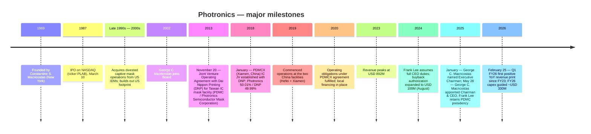
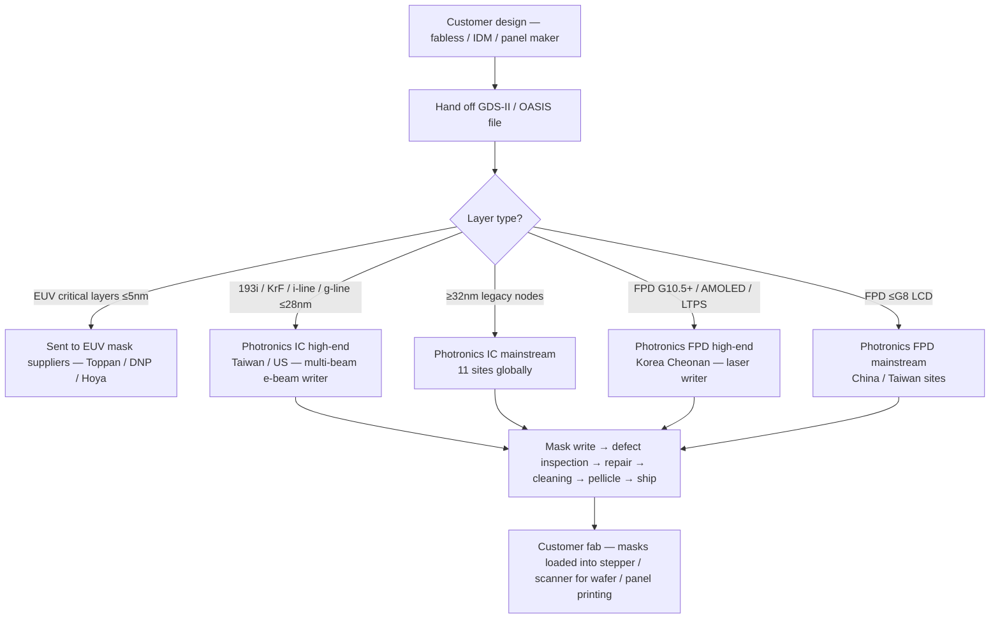

# Company Research Report: Photronics, Inc. (NASDAQ: PLAB)

**As of:** 2026-05-26
**Listing:** NASDAQ Global Select Market — ticker `PLAB` ([NASDAQ profile](https://www.nasdaq.com/market-activity/stocks/plab))
**HQ:** 15 Secor Road, Brookfield, Connecticut 06804, USA ([Photronics 10-K FY25, Item 1 Business](https://www.sec.gov/Archives/edgar/data/810136/000114036125045801/ef20057458_10k.htm))
**Founded:** 1969 by Constantine S. ("Deno") Macricostas ([Photronics 2026 DEF 14A, p. 9](https://www.sec.gov/Archives/edgar/data/810136/000153949726000750/n5545_x1-def14a.htm))
**Fiscal year-end:** Last Sunday of October (FY25 ended 2025-10-31)
**Sector context:** Anchor input — Nomura "Greater China Semi: A guide to Semi renaissance in 2026~30F", 2026-05-21 ([sector note](/Users/x/projects/financial_agent/reports/sector/半导体材料.md))

> **Update — FY26 capex stepped to ~USD 330M (disclosed 2025-12-17):** Management's FY26 capex guide of ~**USD 330M** is the largest single-year capital commitment in PLAB's modern history — roughly **+76%** vs. FY25 actual capex of $188.1M and **2.5×** the FY23/FY24 baseline of ~$131M. Stated drivers are high-end IC enablement (sub-28nm point tools), replacement of end-of-life mask-writing systems, and AMOLED FPD capacity ([PLAB 10-K FY25, Item 1A & Item 7](https://www.sec.gov/Archives/edgar/data/810136/000114036125045801/ef20057458_10k.htm)). At the same time the Board funded an incremental $25M of buyback authorization (June 2025) on top of the August 2024 $100M expansion ([PLAB 10-K FY25, Item 5](https://www.sec.gov/Archives/edgar/data/810136/000114036125045801/ef20057458_10k.htm)). The capex inflection compresses FY26 free cash flow even as the buyback continues — Section 1 and Section 9 walk through the tension.

---

## Table of Contents

1. Company Overview
2. Company History
3. Management Team
4. Products & Services
5. Customers & Go-to-Market
6. Industry Overview
7. Competitive Landscape
8. Market Opportunity (TAM)
9. Risk Assessment

References + Step 10 Verification Log

---

## 1. Company Overview

Photronics is **the largest US-headquartered merchant photomask manufacturer** and one of only three global merchant suppliers — the other two are Japan's Toppan and Dai Nippon Printing (DNP). A "photomask" (also called a *reticle*) is a high-precision quartz or glass plate carrying microscopic circuit patterns; it is the optical master that every semiconductor wafer and every flat-panel-display (FPD) substrate is printed against during photolithography ([PLAB 10-K FY25, Item 1 Business — Industry section](https://www.sec.gov/Archives/edgar/data/810136/000114036125045801/ef20057458_10k.htm)). For each new chip or display design the fab orders a *set* of photomasks — typically 30–80 layers per logic chip, 10–20 per display — so Photronics' revenue is driven not by wafer volume but by the number of *new tape-outs* (designs released to production) at its customers' fabs.

The Company "manufactur[es] photomasks, which are used as masters to transfer circuit patterns onto semiconductor wafers and FPD substrates" ([PLAB 10-K FY25, Item 1](https://www.sec.gov/Archives/edgar/data/810136/000114036125045801/ef20057458_10k.htm)) and operates **eleven manufacturing facilities across five geographies**: Taiwan (3), China (2), South Korea (1), the United States (3 — Allen TX, Brookfield CT, Boise ID), and Europe (2 — Manchester / Bridgend UK and Dresden Germany) ([PLAB 10-K FY25, Item 2 Properties](https://www.sec.gov/Archives/edgar/data/810136/000114036125045801/ef20057458_10k.htm)). The eleven-site footprint is a structural moat: photomask delivery is time-critical ("first several layers of photomasks are sometimes required to be delivered to customers within twenty-four hours from the time we receive customer design data" — [PLAB 10-K FY25, Item 1](https://www.sec.gov/Archives/edgar/data/810136/000114036125045801/ef20057458_10k.htm)), so geographic proximity to each foundry hub is itself a sales weapon. *Analyst view:* photomask is one of the few semi-supply niches where logistics, not just technology, is a moat.

**Business model.** Photronics sells photomasks "primarily to leading semiconductor and FPD designers and manufacturers… [including] integrated device manufacturers, fabless semiconductor companies, and 'pure-play' foundries", reaching roughly **636 customers in FY2025** ([PLAB 10-K FY25, Item 1 Markets](https://www.sec.gov/Archives/edgar/data/810136/000114036125045801/ef20057458_10k.htm)). Each new chip or panel design is quoted on a per-mask-set basis; pricing is negotiated against the customer's design specifications, but once a Photronics fab is qualified for a customer the relationship typically settles into "a specified percentage of that customer's photomask orders" rather than a re-bid per order ([PLAB 10-K FY25, Item 1](https://www.sec.gov/Archives/edgar/data/810136/000114036125045801/ef20057458_10k.htm)). Backlog is short — typically "one day to three weeks" for routine layers — so Photronics' revenue is a high-frequency, low-cycle-time business that resembles a specialty industrial more than a capital-equipment supplier.

**Single reporting segment, two product lines.** Under ASC 280 Photronics "operate[s] as a single reporting segment as a manufacturer of photomasks" because the chief operating decision maker — the CEO — "reviews operating results to make decisions about allocating resources… for the entire Company" ([PLAB 10-K FY25, Item 1 Segment](https://www.sec.gov/Archives/edgar/data/810136/000114036125045801/ef20057458_10k.htm)). The IC vs. FPD split therefore appears only in Item 7 MD&A revenue-disaggregation tables, not in segment-note arithmetic. The two product lines do, however, have **distinct customer bases, distinct R&D centers (IC in Boise, Idaho; FPD in Cheonan, South Korea) and largely separate manufacturing footprints** — so for analytical purposes the rest of this report treats IC and FPD as two parallel businesses, even though Photronics reports them as one.

**Scale.** FY25 revenue was **USD 849.3M** (−2.0% YoY), with net income to PLAB shareholders of **USD 136.4M** (+4.4% YoY) and **1,908 employees globally** ([PLAB 10-K FY25, Item 1 + Item 7](https://www.sec.gov/Archives/edgar/data/810136/000114036125045801/ef20057458_10k.htm); [PLAB FY25 multi-year SEC narrative](/Users/x/projects/financial_agent/reports/earnings/PLAB_20260525.md)). Five-year revenue trajectory: $664M (FY21) → $825M (FY22) → $892M (FY23) → $867M (FY24) → $849M (FY25) — Photronics rode the post-COVID design surge to a $892M peak in FY23, then absorbed two consecutive years of low-single-digit decline driven almost entirely by mainstream IC softness. Net income, by contrast, has *grown* every year over this window because the high-end IC and FPD mix is climbing — a "fewer dollars, better dollars" trajectory.

*Source: [PLAB 10-K FY25, Item 7 Results of Operations](https://www.sec.gov/Archives/edgar/data/810136/000114036125045801/ef20057458_10k.htm) — revenue, gross margin, and net income attributable to PLAB shareholders; built from disclosed annual figures.*

The chart shows the central tension: revenue compressed ~$43M over two years, gross margin slid ~240bp from 37.7% to 35.3%, **but net income continued to climb** because the high-end IC line scales at higher incremental margin than mainstream IC, and the company's tax rate stepped down (FY25 effective rate 14.2% after a one-time $16.7M valuation-allowance release in Q4) ([PLAB 10-K FY25, Item 7](https://www.sec.gov/Archives/edgar/data/810136/000114036125045801/ef20057458_10k.htm)). Q1 FY26 then printed +6.1% YoY revenue growth — the first positive YoY print since FY23 — driven by high-end IC (+19% YoY) and mainstream FPD (+51% YoY on China G8 IT-display demand), confirming the mix-shift inflection ([PLAB 10-Q Q1 FY26, Results of Operations](https://www.sec.gov/Archives/edgar/data/810136/000114036126009004/plab-20260201.htm)).

**Geographic mix.** FY25 revenue by origin: Taiwan $283.8M (33%), China $221.0M (26%), South Korea $158.5M (19%), United States $148.9M (18%), Europe $34.1M (4%), Other $2.9M ([PLAB 10-K FY25, Note 10 Revenue + Item 7](https://www.sec.gov/Archives/edgar/data/810136/000114036125045801/ef20057458_10k.htm)). **Non-US operations contributed 82% of total revenue** in FY25 (vs. 83% FY24, 86% FY23) — the gradual rise in US share reflects domestic foundry build-out (TSMC Arizona, Samsung Texas, Intel Ohio in planning) rather than absolute US growth.

**Valuation snapshot.** As of 2026-05-22 ([Stockanalysis.com data feed](https://stockanalysis.com/stocks/plab/)):

| Metric | PLAB | Photomask peers (Toppan / DNP) | Sector context |
|---|---|---|---|
| Price | USD ~51.5 | — | — |
| Market cap | USD 3.03 B | Toppan ~USD 11 B; DNP ~USD 7.5 B | — |
| TTM P/E | **22.1×** | Toppan ~12×, DNP ~14× ([WSJ market data](https://www.wsj.com/market-data/quotes/JP/XTKS/7911) / [DNP](https://www.wsj.com/market-data/quotes/JP/XTKS/7912)) | AMAT ~21×, LRCX ~28×, PHLX SOX index ~28× |
| TTM P/S | ~3.5× | Toppan ~0.4×, DNP ~0.5× | LRCX ~10× |
| TTM EPS | USD 2.33 | — | — |
| 52-wk range | USD 32.0 – 53.0 | — | — |

*Source: PLAB P/E from [Stockanalysis.com PLAB overview](https://stockanalysis.com/stocks/plab/) (price USD 51.5 / EPS USD 2.33 = 22.1×); Toppan 7911 TYO and DNP 7912 TYO P/E referenced via [WSJ market data](https://www.wsj.com/market-data/quotes/JP/XTKS/7911); AMAT and LRCX TTM P/E from [Yahoo Finance AMAT key statistics](https://finance.yahoo.com/quote/AMAT/key-statistics/) / [LRCX](https://finance.yahoo.com/quote/LRCX/key-statistics/); PHLX SOX index average from [Bloomberg SOX](https://www.bloomberg.com/quote/SOX:IND).*

**How to read the multiple.** PLAB trades at a meaningful premium to its two large Japanese peers (Toppan / DNP — each ~12–14× P/E) and at a slight premium to the photomask-pure read but **roughly in line with the broader semi-equipment median** (~22–25×). The gap to Toppan/DNP is justifiable in three ways: (1) Toppan and DNP are diversified printing conglomerates where photomask is <10% of revenue, so their P/Es reflect packaging, decorative materials, and other low-growth businesses; PLAB is the only public pure-play; (2) PLAB's gross margin (35.3% FY25) and ROIC are structurally higher than Toppan's group margin (~10%) because photomask economics dominate; (3) PLAB has a clean balance sheet (net cash position) and an active buyback ($97.4M deployed in FY25) ([PLAB 10-K FY25, Item 5 Issuer Purchases](https://www.sec.gov/Archives/edgar/data/810136/000114036125045801/ef20057458_10k.htm)). At 22× TTM with mid-single-digit revenue growth and a buyback, PLAB is **not stretched** — but it is also not screamingly cheap, and Section 9 flags valuation as one of the watchpoints if the FY26 capex pulse fails to land.

## 2. Company History

Photronics was founded in **1969** as a New York-area photomask shop by Constantine S. ("Deno") Macricostas ([Photronics 2026 DEF 14A, p. 9 Director Biographies](https://www.sec.gov/Archives/edgar/data/810136/000153949726000750/n5545_x1-def14a.htm)). The founding context was a US semiconductor industry that was just transitioning from in-house photomask shops to merchant supply; Macricostas built Photronics as a domestic alternative to captive mask operations at IBM, RCA, and Motorola. The Company went public on NASDAQ in **March 1987** ([Stockanalysis.com PLAB overview, IPO Date](https://stockanalysis.com/stocks/plab/)) and has continuously traded under the ticker `PLAB` since.

The next two decades were a steady consolidation of US merchant photomask supply (capturing assets from divested IDM captive mask shops) followed by a deliberate internationalization push. The single most consequential strategic decision in the company's modern history was the **2013 joint venture with Dai Nippon Printing Co., Ltd.** in Taiwan and the **2018 joint venture with DNP in Xiamen, China** — both structured to embed Photronics inside Asia's foundry corridor where the bulk of advanced-node logic and memory production occurs ([PLAB 10-K FY25, Exhibit Index — Joint Venture Operating Agreement dated November 20, 2013](https://www.sec.gov/Archives/edgar/data/810136/000114036125045801/ef20057458_10k.htm); [Note 6 PDMCX](https://www.sec.gov/Archives/edgar/data/810136/000114036125045801/ef20057458_10k.htm)). Those two JVs reset Photronics' geographic mix from ~50/50 US-Asia to **82% non-US revenue** by FY25 ([PLAB 10-K FY25, Item 1](https://www.sec.gov/Archives/edgar/data/810136/000114036125045801/ef20057458_10k.htm)).

*Source: composed from [PLAB 10-K FY25 Item 1 + Exhibits](https://www.sec.gov/Archives/edgar/data/810136/000114036125045801/ef20057458_10k.htm), [PLAB 2026 DEF 14A](https://www.sec.gov/Archives/edgar/data/810136/000153949726000750/n5545_x1-def14a.htm), and the [CEO-transition 8-K dated 2025-05-28](https://www.sec.gov/Archives/edgar/data/810136/000114036125020569/ef20049681_8k.htm).*

**Two strategic pivots that define the modern company.**

*Pivot 1 — From US merchant to global Asia-anchored merchant (2013–2019).* Photronics' two-step JV strategy with DNP in 2013 (Taiwan) and 2018 (China) was not a simple capacity expansion — it was a partial sell-down of economics in exchange for production-line co-location with the world's two largest concentrations of leading-edge foundry capacity. Each JV consolidates into Photronics' financials (Photronics holds majority economic and board control), but DNP receives ~50% of the JV's net income through the noncontrolling-interest line. FY25 noncontrolling-interest net income was **USD 53.8M out of consolidated net income of USD 190.2M** — meaning DNP's share of the consolidated bottom line is material (~28%) and the headline net-income-to-shareholders number understates the underlying business scale ([PLAB 10-K FY25, Item 7](https://www.sec.gov/Archives/edgar/data/810136/000114036125045801/ef20057458_10k.htm); [PLAB FY25 multi-year SEC narrative](/Users/x/projects/financial_agent/reports/earnings/PLAB_20260525.md)).

*Pivot 2 — CEO succession to the founder's family (2025).* On **May 28, 2025** Dr. Frank Lee stepped down as CEO after roughly a decade in operational leadership (most recently as CEO since 2017), and **George C. Macricostas — the founder's son** — assumed the Chairman & CEO role ([PLAB 8-K dated 2025-05-28, Item 5.02](https://www.sec.gov/Archives/edgar/data/810136/000114036125020569/ef20049681_8k.htm)). Lee continues as Chairman and President of the PDMC Taiwan subsidiary, retaining day-to-day operational oversight of the Asia footprint pending retirement "in the next year or two" ([same 8-K](https://www.sec.gov/Archives/edgar/data/810136/000114036125020569/ef20049681_8k.htm)). George Macricostas' previous PLAB role was SVP responsible for IT infrastructure — less operational than Lee's deep foundry background, but the succession was telegraphed (he became Executive Chairman on January 6, 2025 before the May CEO appointment) and the family retains ownership influence through both Constantine S. Macricostas's continuing Board role and the Macricostas Family Foundation ([Photronics 2026 DEF 14A, p. 9](https://www.sec.gov/Archives/edgar/data/810136/000153949726000750/n5545_x1-def14a.htm)).

**Recent developments (last 24 months).** (1) **CFO change**: Eric Rivera was named CFO on May 23, 2024 after serving as interim CFO since February 2024; he was elevated to President in addition on January 12, 2026 ([Photronics press release 2026-01-13](https://www.globenewswire.com/news-release/2026/01/13/3217819/0/en/Photronics-Announces-Executive-Officer-Appointments.html)). (2) **Advanced mask writer delivery (March 31, 2026)** for AMOLED FPD high-end production — confirms Photronics' Korea Cheonan facility is leaning into the AMOLED / LTPS upgrade cycle ([Photronics press release 2026-03-31](https://www.globenewswire.com/news-release/2026/03/31/3265409/0/en/Photronics-Receives-Advanced-Mask-Writer-Expanding-AMOLED-Leadership.html)). (3) **PSMC license renewal in July 2025** — the Taiwan operating company's foundational IP license was renewed without material restructuring ([PLAB FY25 multi-year SEC narrative](/Users/x/projects/financial_agent/reports/earnings/PLAB_20260525.md)). (4) **Sales leadership change**: Jeff Catlin was appointed SVP Global Sales effective January 8, 2026, "driving a unified" global sales organization ([Photronics press release 2026-01-08](https://www.globenewswire.com/news-release/2026/01/08/3215308/0/en/Photronics-Appoints-Jeff-Catlin-Senior-Vice-President-Global-Sales.html)).

## 3. Management Team

### Constantine S. ("Deno") Macricostas — Founder & Director (non-executive)

Constantine Macricostas founded Photronics in **1969** and built it from a regional US merchant-mask shop into one of three global merchant photomask suppliers ([Photronics 2026 DEF 14A, p. 9](https://www.sec.gov/Archives/edgar/data/810136/000153949726000750/n5545_x1-def14a.htm)). He served as CEO on **three separate occasions** — from 1974 until August 1997 (the founding-CEO stretch through the IPO), February 2004 to June 2005 (a transitional return), and April 2009 until May 2015 (the post-Lehman re-engagement that culminated in handing the company off in the modern shape) — a level of operational re-engagement uncommon for founders who long ago stepped back. He was Executive Chairman until January 20, 2018, then Chairman until January 6, 2025 when his son George C. Macricostas was named Executive Chairman ([Photronics 2026 DEF 14A, p. 9](https://www.sec.gov/Archives/edgar/data/810136/000153949726000750/n5545_x1-def14a.htm)).

Deno Macricostas's secondary professional credit is **director of RagingWire Data Centers, Inc.** — the mission-critical colocation business his son George founded and ran — which was 80% sold to NTT of Japan in 2014 (closing completed in 2018) ([Photronics CEO-transition 8-K dated 2025-05-28](https://www.sec.gov/Archives/edgar/data/810136/000114036125020569/ef20049681_8k.htm)). He remains on Photronics' Board, is the founder and director of **The Macricostas Family Foundation** (a 501(c)(3) formed in 2001 that funds educational and international programs), and sits on the Board's Cybersecurity Committee as well as serving as a non-voting advisor to the Compensation Committee ([Photronics 2026 DEF 14A, p. 9](https://www.sec.gov/Archives/edgar/data/810136/000153949726000750/n5545_x1-def14a.htm)). The Macricostas family's name is on the **Macricostas School of Arts and Sciences at Western Connecticut State University** — a marker of the family's long-running philanthropic capital. Deno Macricostas's continuing Board presence after handing the CEO role to his son provides institutional memory and external-relationship capital (especially in Asia, where the JV partnerships he originally negotiated still anchor the business) — but it also concentrates governance influence inside one family across three generations of leadership ([Photronics 2026 DEF 14A, p. 9-11 governance discussion](https://www.sec.gov/Archives/edgar/data/810136/000153949726000750/n5545_x1-def14a.htm)).

### George C. Macricostas — Chairman & Chief Executive Officer (since May 28, 2025)

George C. Macricostas, **age 55** as of mid-2025 ([Photronics CEO-transition 8-K dated 2025-05-28](https://www.sec.gov/Archives/edgar/data/810136/000114036125020569/ef20049681_8k.htm)), is the **son of founder Constantine S. Macricostas** and assumed the CEO role on May 28, 2025 after a five-month executive-chairman onboarding period (Executive Chairman from January 6, 2025) ([Photronics 2026 DEF 14A, p. 9](https://www.sec.gov/Archives/edgar/data/810136/000153949726000750/n5545_x1-def14a.htm)). He has been on the Photronics Board since 2002 — a continuous 23-year service before becoming CEO — including stints on the Nominating Committee, the Cybersecurity Committee, and most recently as Chairman of the Compensation Committee until that role passed to David A. Garcia on January 6, 2025 in connection with his own promotion.

George's most consequential prior operating experience was **founding, chairing, and serving as CEO of RagingWire Data Centers, Inc.**, a US provider of mission-critical wholesale colocation data-center capacity ([Photronics CEO-transition 8-K dated 2025-05-28](https://www.sec.gov/Archives/edgar/data/810136/000114036125020569/ef20049681_8k.htm)). He led RagingWire through an **80% sale to NTT of Japan in 2014** — at the time one of the largest international data-center M&A deals — and completed the residual sale in 2018, ultimately delivering a full exit to NTT. The data-center build-out experience is non-obvious preparation for running a photomask manufacturer, but two skills transfer: large-multi-site facility-capex management (NTT-RagingWire built hyperscale colocation sites across Northern Virginia, Sacramento, Dallas, and Chicago) and Japan-strategic-partner management (the NTT sale anticipates the partnership style Photronics already uses with DNP in Taiwan and Xiamen) ([Photronics CEO-transition 8-K](https://www.sec.gov/Archives/edgar/data/810136/000114036125020569/ef20049681_8k.htm)). His earlier PLAB role was **senior vice president responsible for IT infrastructure** — not a direct operations role but an exposure to the data flow of a global multi-fab manufacturer ([Photronics 2026 DEF 14A, p. 9](https://www.sec.gov/Archives/edgar/data/810136/000153949726000750/n5545_x1-def14a.htm)).

George Macricostas describes himself in filings as "an investor and entrepreneur" with "over 30 years of technical and business management experience in business operations and information technology" ([Photronics CEO-transition 8-K](https://www.sec.gov/Archives/edgar/data/810136/000114036125020569/ef20049681_8k.htm)). The intentional decision to retain **Frank Lee as Chairman and President of the PDMC Taiwan subsidiary** through retirement preserves the operational continuity at the Asia hub that drives the majority of revenue — George is therefore stepping into a structurally supported role rather than a clean takeover, which dampens execution risk during the transition. The Company indicated in the May 2025 8-K that it would "amend its existing Employment Agreement with Mr. Macricostas to reflect his role as Chief Executive Officer on terms to be agreed with the Compensation Committee" — the formal CEO comp package terms are disclosed in the 2026 DEF 14A's Compensation Discussion and Analysis section ([Photronics 2026 DEF 14A, Executive Compensation discussion](https://www.sec.gov/Archives/edgar/data/810136/000153949726000750/n5545_x1-def14a.htm)).

## 4. Products & Services

Section 4 is built on the **Photronics FY25 10-K Item 1 "Business" — Industry and Markets subsections**, which together comprise the issuer's own verbatim product narrative. Photronics does not publish a tabular product matrix in the way an LRCX or AMAT would; instead, the product range is described in narrative form, organized along two axes: **End-market (IC vs. FPD)** and **Technology tier (High-end vs. Mainstream)**. The 10-K defines these as follows:

> "'High-end' photomasks support 28 nanometer and smaller design nodes for ICs and Generation 10.5+, AMOLED, and LTPS display-based process technologies for FPDs. However, 32 nanometer and above geometries for semiconductors and Generation 8 and below (excluding AMOLED and LTPS) process technologies for displays, which we refer to as 'mainstream' photomasks, constitute the majority of designs currently being fabricated in volume." — [PLAB 10-K FY25, Item 1 Industry](https://www.sec.gov/Archives/edgar/data/810136/000114036125045801/ef20057458_10k.htm)

The four resulting product cells — each with a disclosed FY25 revenue figure from Item 7 MD&A — are the working product matrix.

### 4.1 The product matrix (analyst-constructed from 10-K narrative + Item 7 revenue table)

| End-market | Tier | Definition | FY25 revenue ($M) | FY24 revenue ($M) | FY23 revenue ($M) | YoY |
|---|---|---|---:|---:|---:|---:|
| **IC** | High-end | ≤28nm semiconductor design nodes; multi-beam e-beam writers | **$238.9M** | $228.5M | $194.9M | +4.6% |
| **IC** | Mainstream | ≥32nm semiconductor nodes (still the volume bulk of designs) | **$376.2M** | $409.7M | $456.3M | −8.2% |
| **FPD** | High-end | Generation 10.5+ TFT-LCD, AMOLED, LTPS panel-display masks | **$195.5M** | $195.4M | $200.8M | +0.1% |
| **FPD** | Mainstream | ≤Generation 8 LCD (excluding AMOLED / LTPS) | **$38.7M** | $33.4M | $40.0M | +15.7% |
| **Total** | | | **$849.3M** | $866.9M | $892.1M | −2.0% |

*Source: revenue figures from [PLAB 10-K FY25, Note 10 Revenue (Revenue by Product Type)](https://www.sec.gov/Archives/edgar/data/810136/000114036125045801/ef20057458_10k.htm); definitions verbatim from [PLAB 10-K FY25, Item 1 Industry](https://www.sec.gov/Archives/edgar/data/810136/000114036125045801/ef20057458_10k.htm).*

*Source: [PLAB 10-K FY25, Note 10 Revenue by Product Type table](https://www.sec.gov/Archives/edgar/data/810136/000114036125045801/ef20057458_10k.htm).*

The matrix makes two things visible immediately. First, **mainstream IC dropped $80M (−17.5%) over two years** while **high-end IC grew $44M (+22.5%)** — the central business mix-shift story. Second, **mainstream FPD bounced +15.7% in FY25** after a flat-to-down two years, driven by the China G8 display IT and tablet ramp (where Photronics' Xiamen and Hefei facilities have direct line of sight to BOE, China Star, and Tianma demand).

### 4.2 Synthesis — how the categories interact in a customer workflow

A semiconductor design moves through Photronics' product portfolio in a sequence: a fabless designer or IDM finalizes the chip layout, hands the GDS-II / OASIS design file to Photronics, and orders a mask set — typically **30–60 mask layers for a 5nm/3nm logic chip, 40–80+ for an HBM4 DRAM stack with TSV, 10–20 layers for a power-management or 65nm legacy controller**. The first ~5 critical layers (front-end-of-line, gate, contact, M1) typically demand high-end masks if the chip is at advanced node — those go through Photronics' multi-beam e-beam writing systems in Hsinchu (Taiwan) or Boise (Idaho R&D fab). The mid-stack interconnect layers (M2–M10) can use mainstream IC masks. Only at the very leading edge (≤5nm and EUV layers) does the design exit Photronics' addressable scope entirely — those EUV masks come from Hoya (mask blank) and either Toppan or DNP (mask write/pattern), with Intel's IMS-Vienna multi-beam writer the only writer capable of patterning them. **Photronics produces the entire mask set below EUV-required critical layers**; for an advanced-node design, that's still 90%+ of the mask layers by count and majority by ASP. The FPD workflow runs in parallel: BOE's Hefei G10.5 LCD line, Samsung Display's Asan AMOLED line, and LG Display's Paju LTPS line each release new panel designs every quarter, with Photronics Korea (Cheonan) writing the masks for AMOLED/LTPS and Photronics Taichung covering G8.6 and below. The two flows (IC + FPD) share little physical equipment but share customer-facing teams, IT systems, and corporate finance.

### 4.3 IC photomasks — high-end (≤28nm)

**10-K verbatim** ([PLAB 10-K FY25, Item 1 Markets](https://www.sec.gov/Archives/edgar/data/810136/000114036125045801/ef20057458_10k.htm)):

> "We support customers across the full spectrum of IC Production by manufacturing photomasks using electron beam or optical (laser-based) lithography systems. In addition, we have added the most advanced electron beam mask writing system for IC mask writing that employs a **multi-beam writing architecture** to deliver speed and performance improvements over existing systems."

> "Currently, research and development for IC photomasks are primarily focused on photomasks enabling **wafer geometries of 7 nanometer node and smaller, including EUV** and, for FPDs on Generation 8.6 AMOLED and photomasks for more advanced FPD display integration across all sizes. In addition, we note the role AI is playing in driving the technology roadmap for IC devices and our technology program covers multiple initiatives to deliver **AI grade photomasks in IC and advanced packaging applications**."

**Plain-language gloss.** Modern logic and memory chips are printed onto silicon wafers using a stepper or scanner — an optical machine that focuses light through a *reticle* (photomask) and exposes the underlying photoresist, layer by layer. At ≤28nm the patterns become so dense that **optical proximity correction (OPC)** and **inverse lithography technology (ILT)** add hundreds of millions of small "assist features" to the mask design, blowing up file sizes from gigabytes to terabytes per mask. To write those patterns at acceptable throughput, the mask shop uses an **electron-beam writer** — and at the leading edge, a **multi-beam electron-beam writer** (the IMS Nanofabrication / NuFlare MBM-2000 class of tool) that fires thousands of beams in parallel. The multi-beam writer Photronics calls out is what allows them to compete on high-end ≤28nm masks at acceptable cycle times. The strategic inflection is the **AI/HBM/advanced-packaging cycle**: every new TSMC N3 / N3P / N3X variant for AI accelerators (NVIDIA, AMD, Google, AWS, Meta) requires a fresh mask set; every new HBM3E / HBM4 base-die generation does the same. Mask demand at the high end is therefore tightly coupled to tape-out velocity at the top three or four IC customers, not to wafer volume. **Critical caveat — EUV exclusion.** Photronics is *not* an EUV-capable photomask supplier. EUV mask manufacture requires multi-layer reflective Ru/Mo-coated mask blanks (sourced from **Hoya** — ~80% global blank share per the [Nomura sector note, p. 18-30](/Users/x/projects/financial_agent/reports/sector/半导体材料.md)) and dedicated EUV mask writers and EUV mask inspection (the KLA Teron + Lasertec systems). Production-scale EUV masks come from **Toppan, DNP, Hoya** (the only three certified EUV mask suppliers as of 2025) and from a small set of captive operations at TSMC, Samsung Foundry, and Intel. Photronics' "high-end ≤28nm" category therefore covers the **193i ArF immersion, ArF dry, KrF, i-line, g-line** wavelengths — the full toolkit *below* EUV. That makes Photronics the mainstream-deep-UV partner of choice for the layers in an advanced-node chip that do not require EUV (still the majority of layers in a 3nm chip), and a structural non-participant in the layers that do.

*Analyst view:* in high-end IC masks Photronics is a credible partner *adjacent to* the EUV oligopoly rather than a member of it. Moat type is **scale + global proximity + multi-beam-writer ownership** — not technology leadership. Closest competitive product is **Toppan's ≤28nm DUV mask line** ([Toppan IR — Microelectronics business](https://www.toppanholdings.com/en/about/business/electronics/)) and **DNP's photomask business in Japan / China** ([DNP IR — Electronics segment](https://www.global.dnp/biz/electronics/)). Photronics' edge over Toppan/DNP at this tier is *geographic*: a Boise IDM customer (Micron) or a Hsinchu foundry customer (TSMC, UMC) gets faster cycle time from Photronics than from a Tokyo-based DNP / Toppan plant. The edge is real but is moderated by the fact that both Japanese players also operate Asia local sites.

### 4.4 IC photomasks — mainstream (≥32nm)

**10-K verbatim** ([PLAB 10-K FY25, Item 1 Industry](https://www.sec.gov/Archives/edgar/data/810136/000114036125045801/ef20057458_10k.htm)):

> "32 nanometer and above geometries for semiconductors and Generation 8 and below (excluding AMOLED and LTPS) process technologies for displays, which we refer to as 'mainstream' photomasks, **constitute the majority of designs currently being fabricated in volume**. At these geometries and at various high-end nodes, we can produce full lines of photomasks. Moreover, **there is no significant technology employed by our competitors that is not available to us**."

**Plain-language gloss.** "Mainstream IC" covers the 28nm-and-above bulk of the world's chip output — every microcontroller, power management IC, analog/mixed-signal device, CMOS image sensor, display driver IC, automotive controller, and BCD power chip is fabricated at 0.18 µm / 90nm / 65nm / 40nm / 28nm. The total wafer volume at these nodes is vastly larger than at ≤7nm, and the **number of distinct mask designs is also much higher** (a 0.18 µm power-management chip is typically a $50K mask set; a 5nm AI accelerator is a $20M+ mask set, but only one customer designs it). Mainstream IC therefore generates high *unit volume* and high *customer count* (Photronics serves ~636 customers in total — most of those are mainstream IC) but at lower ASP per mask. Mainstream IC masks are written on KrF / i-line / g-line laser writers and conventional single-beam e-beam tools — much less capital-intensive than the multi-beam writers for high-end. The strategic significance of the mainstream IC line for Photronics is that it is the **revenue base** ($376M in FY25, ~44% of total) and it is also the **mix headwind**: it shrank $80M over two years as customers extended product cycles and reduced design-release tempo. Q1 FY26 showed mainstream IC stabilizing flat YoY, which is what the bull case for PLAB needs.

*Analyst view:* in mainstream IC, Photronics is positioned as a leading non-captive supplier outside Japan — the eleven-site footprint and the JV partnerships in Taiwan and China give it cycle-time and price advantages that the smaller Chinese suppliers (Newway, Qingyi, Tekscend) cannot yet match at quality / yield, and that the Japanese players (Toppan, DNP) can match on quality but cannot easily match on the China-local logistics economics for SMIC, Hua Hong, Nexchip customers. Moat type is **scale + localization + multi-customer relationship density**. Closest competitive products are **Shenzhen Newway Photomask's mainstream-IC line** ([Newway corporate site](http://www.newwaymask.com/)) and **Hoya's mainstream IC mask line** ([Hoya IR — Electronics business](https://www.hoya.com/en/business/electronics/)) and **Toppan / DNP** as above. (Note: directional positioning here is analyst-derived, not directly disclosed in PLAB's 10-K — Section 7 walks the competitive geography in more detail and cites third-party data where available.)

### 4.5 FPD photomasks — high-end (Generation 10.5+, AMOLED, LTPS)

**10-K verbatim** ([PLAB 10-K FY25, Item 1 R&D](https://www.sec.gov/Archives/edgar/data/810136/000114036125045801/ef20057458_10k.htm)):

> "Research and development for FPD photomasks is primarily conducted at Photronics Korea, Ltd., our subsidiary in South Korea."

> "We have added the most advanced electron beam mask writing system for IC mask writing that employs a multi-beam writing architecture... For FPD, the mask fabrication utilizes **only optical writing systems to write the mask patterns**." ([same Markets section](https://www.sec.gov/Archives/edgar/data/810136/000114036125045801/ef20057458_10k.htm))

The most recent FPD product event is the March 31, 2026 announcement that Photronics had **taken delivery of "the most advanced mask writer" for AMOLED applications** at its Korea Cheonan facility ([Photronics press release 2026-03-31](https://www.globenewswire.com/news-release/2026/03/31/3265409/0/en/Photronics-Receives-Advanced-Mask-Writer-Expanding-AMOLED-Leadership.html)) — the press release explicitly positions Photronics as "expanding AMOLED leadership", a self-claimed leadership position consistent with the 10-K's R&D-center description.

**Plain-language gloss.** A flat-panel-display mask is *physically much larger* than an IC mask — a Generation 10.5 mask is approximately **1.5 m × 1.5 m**, a Generation 8.6 mask is **2.5 m × 2.2 m**, vs. a 6-inch (152mm) square IC mask. The large-area substrate is itself a specialized synthetic quartz blank (sourced from a small Japanese supplier base — primarily AGC and Asahi), and writing the pattern on a panel-scale mask requires a **laser direct-write system** (typically Heidelberg Instruments DWL or Photronics' own internally-engineered MicroMask), not an electron-beam writer. AMOLED and LTPS panels — used in iPhones, Samsung Galaxy, OLED TVs, and increasingly in iPad / MacBook / IT-display formats — need higher-density backplane patterns than legacy LCD, so the masks have tighter critical dimensions (sub-2 µm) and require multi-tone halftone patterning. Photronics' Cheonan-Korea facility is the global high-end FPD mask center; the strategic inflection is **the AMOLED IT panel ramp** (Apple's iPad Pro M4 OLED line, Samsung Display's 8th-gen AMOLED line in Asan, BOE's Mianyang B12 AMOLED line) that began in late 2024 and accelerated through 2025–26.

*Analyst view:* in high-end FPD masks, Photronics' Cheonan facility is structurally well-positioned because of geographic proximity to Samsung Display (Asan) and LG Display (Paju) — Korea is the global AMOLED hub. Moat type is **geographic + capital scale** (large-area mask writers are themselves multi-tens-of-millions-of-dollars each; the March 2026 writer delivery is one such investment). Closest competitive products are **LG Innotek's FPD mask business** ([LG Innotek IR](https://www.lginnotek.com/main.do)) and **SK-Electronics Co., Ltd.'s FPD mask line** ([SK Electronics overview](https://www.sk-electronics.co.jp/eng/)). Toppan also competes in FPD masks. The PLAB 10-K Competition section names "LG Innotek Co., Ltd." and "SK-Electronics Co., Ltd." among its competitors ([PLAB 10-K FY25 Item 1 Competition](https://www.sec.gov/Archives/edgar/data/810136/000114036125045801/ef20057458_10k.htm)).

### 4.6 FPD photomasks — mainstream (≤Generation 8 LCD)

This is the smallest of the four lines ($38.7M FY25, ~4% of total revenue) but it had the highest YoY growth (+15.7%) and the press-release-worthy story of 2025: the **China G8 LCD IT and tablet build-out**, where BOE, Tianma, China Star, and other Chinese panel makers are absorbing capacity at Generation 8 to capture the AMOLED-displaced IT-display volume in PCs and tablets ([PLAB FY25 multi-year SEC narrative](/Users/x/projects/financial_agent/reports/earnings/PLAB_20260525.md)). Photronics' Xiamen and Hefei sites have direct line-of-sight to that build. The 10-K narrative confirms FPD R&D is conducted at the Cheonan, Korea facility — but for mainstream G8 LCD output the China and Taiwan sites do the manufacturing volume ([PLAB 10-K FY25 Item 1](https://www.sec.gov/Archives/edgar/data/810136/000114036125045801/ef20057458_10k.htm)).

*Analyst view:* mainstream FPD is a tactical growth lever, not a strategic moat. Margin contribution is meaningfully lower than IC high-end. Moat type is **geographic localization** to Chinese panel customers — same logic as China-local mainstream IC. The line is unlikely to scale beyond mid-single-digit percent of total PLAB revenue, but it provides incremental capacity utilization at the China sites.

### 4.7 The cycle — Mermaid graph of the customer workflow

*Source: workflow composed from [PLAB 10-K FY25, Item 1 Industry + Markets + R&D](https://www.sec.gov/Archives/edgar/data/810136/000114036125045801/ef20057458_10k.htm); EUV supplier dynamics from [Nomura Greater China Semi note, p. 38-39](/Users/x/projects/financial_agent/reports/sector/半导体材料.md).*

### 4.8 Aftermarket / services and recurring revenue posture

Unlike a Lam Research (CSBG) or an Applied Materials (AGS — Applied Global Services), Photronics does **not** disaggregate an aftermarket / installed-base / service revenue line — there is no equivalent recurring-revenue segment to compare. The reason is the photomask business model itself: every mask is a single-use master delivered once for a given design, with no ongoing service fee per customer. The recurring nature of the business comes instead from **customer relationships** (once Photronics is qualified for a customer, "we will receive a specified percentage of that customer's photomask orders" — [PLAB 10-K FY25, Item 1](https://www.sec.gov/Archives/edgar/data/810136/000114036125045801/ef20057458_10k.htm)) and **revenue recognition** (Note 10 shows USD 818M of FY25 revenue recognized "over time" — 96% of total — vs. $31M "at a point in time", reflecting how mask sets are typically progressively delivered over the design ramp). The "over time" recognition pattern is the closest analog to a recurring-revenue moat ([PLAB 10-K FY25, Note 10 Revenue](https://www.sec.gov/Archives/edgar/data/810136/000114036125045801/ef20057458_10k.htm)).

