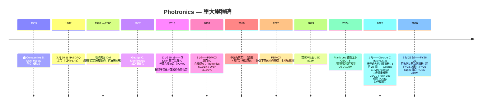

# 公司研究报告：Photronics, Inc. (NASDAQ: PLAB)

**截至日期：** 2026-05-26
**上市地：** NASDAQ Global Select Market — 代码 `PLAB` ([NASDAQ 个股资料](https://www.nasdaq.com/market-activity/stocks/plab))
**总部：** 15 Secor Road, Brookfield, Connecticut 06804, USA ([Photronics 10-K FY25, Item 1 Business](https://www.sec.gov/Archives/edgar/data/810136/000114036125045801/ef20057458_10k.htm))
**成立时间：** 1969 年由 Constantine S. ("Deno") Macricostas 创立 ([Photronics 2026 DEF 14A, p. 9](https://www.sec.gov/Archives/edgar/data/810136/000153949726000750/n5545_x1-def14a.htm))
**财年截止：** 每年 10 月最后一个星期日（FY25 截止于 2025-10-31）
**行业背景锚定：** 野村《大中华半导体：2026-2030 复兴指南》，2026-05-21 ([sector note](/Users/x/projects/financial_agent/reports/sector/半导体材料.md))

> **更新——FY26 资本支出指引跃升至约 USD 330M（2025-12-17 披露）：** 管理层 FY26 capex 指引约 **USD 330M**，是 PLAB 现代史上单年度最大资本承诺——较 FY25 实际 capex $188.1M **同比 +76%**，是 FY23/FY24 基准 ~$131M 的 **2.5 倍**。披露的驱动因素包括：高端 IC 节点支援（次-28nm 单点设备）、寿命到期的光罩写入设备替换、以及 AMOLED FPD 产能 ([PLAB 10-K FY25, Item 1A & Item 7](https://www.sec.gov/Archives/edgar/data/810136/000114036125045801/ef20057458_10k.htm))。与此同时，董事会在 2024 年 8 月 USD 100M 扩容之上，又于 2025 年 6 月批准了 USD 25M 的额外回购授权 ([PLAB 10-K FY25, Item 5](https://www.sec.gov/Archives/edgar/data/810136/000114036125045801/ef20057458_10k.htm))。capex 拐点在回购持续推进的同时压缩了 FY26 自由现金流——§1 与 §9 详细展开这一张力。

---

## 目录

1. 公司概览
2. 公司历史
3. 管理团队
4. 产品与服务
5. 客户与上市策略
6. 行业概览
7. 竞争格局
8. 市场机会
9. 风险评估

参考资料 + Step 10 校验日志

---

## 1. 公司概览

Photronics 是**美国总部规模最大的商用光罩 (photomask) 制造商**，也是全球仅有的三家商用光罩供应商之一——另外两家是日本的凸版印刷 (Toppan) 与大日本印刷 (DNP)。"光罩"（亦称 *reticle* 掩模版）是一块高精度的石英或玻璃版，上面承载着微观电路图案；它是每一片半导体晶圆与每一块平板显示器 (FPD) 基板在光刻过程中被复印的"光学母版" ([PLAB 10-K FY25, Item 1 Business — Industry 部分](https://www.sec.gov/Archives/edgar/data/810136/000114036125045801/ef20057458_10k.htm))。每一个新的芯片或显示器设计，晶圆厂都会向光罩商订购一套 *光罩组*——逻辑芯片通常需 30-80 层，显示器需 10-20 层——因此 Photronics 的收入并不由晶圆出货量驱动，而是由其客户晶圆厂的 *新流片* (tape-out) 数量驱动。

公司"制造光罩，用作将电路图案转移至半导体晶圆与 FPD 基板的母版" ([PLAB 10-K FY25, Item 1](https://www.sec.gov/Archives/edgar/data/810136/000114036125045801/ef20057458_10k.htm))，在五个地理区域运营 **11 家制造工厂**：台湾 (3 家)、中国大陆 (2 家)、韩国 (1 家)、美国 (3 家——德州 Allen、康州 Brookfield、爱达荷州 Boise)、欧洲 (2 家——英国 Manchester/Bridgend 与德国 Dresden) ([PLAB 10-K FY25, Item 2 Properties](https://www.sec.gov/Archives/edgar/data/810136/000114036125045801/ef20057458_10k.htm))。这 11 个站点构成结构性护城河：光罩交付对时间极为敏感（"前几层光罩有时需在收到客户设计数据后 24 小时内交付" — [PLAB 10-K FY25, Item 1](https://www.sec.gov/Archives/edgar/data/810136/000114036125045801/ef20057458_10k.htm)），因此对每个晶圆厂枢纽的地理临近本身就是销售武器。*分析师观点：* 光罩是少数几个 *物流*（不仅是技术）也成为护城河的半导体细分领域之一。

**业务模式。** Photronics 将光罩"主要销售给领先的半导体与 FPD 设计公司及制造商……包括集成器件制造商 (IDM)、无晶圆厂半导体公司，以及'纯代工厂' (pure-play foundries)"，FY2025 大约触达 **636 家客户** ([PLAB 10-K FY25, Item 1 Markets](https://www.sec.gov/Archives/edgar/data/810136/000114036125045801/ef20057458_10k.htm))。每个新的芯片或面板设计按每套光罩报价；定价依据客户的设计规格商定，但一旦 Photronics 的某座工厂通过客户的资格认证 (qualification)，关系通常稳定为"客户光罩订单的某一固定比例份额"，而不需要每单重新投标 ([PLAB 10-K FY25, Item 1](https://www.sec.gov/Archives/edgar/data/810136/000114036125045801/ef20057458_10k.htm))。在手订单 (backlog) 周期很短——常规层"一天到三周"——因此 Photronics 的营收是一个高频、低周期时间的业务，更接近一家专业工业供应商而非资本设备供应商。

**单一报告分部、两条产品线。** 根据 ASC 280，Photronics"作为光罩制造商按单一报告分部运营"，因为首席运营决策者——CEO——"审阅营运业绩以决定全公司的资源配置" ([PLAB 10-K FY25, Item 1 Segment](https://www.sec.gov/Archives/edgar/data/810136/000114036125045801/ef20057458_10k.htm))。因此 IC 与 FPD 的拆分只出现在 Item 7 MD&A 的收入分解表中，而非分部附注的算术里。然而这两条产品线在客户基础、研发中心（IC 在爱达荷 Boise，FPD 在韩国 Cheonan）以及制造工厂分布上 **基本独立**——所以为分析方便，本报告其余部分把 IC 与 FPD 视为两个并行业务，尽管 Photronics 将它们归为一个分部披露。

**规模。** FY25 营收为 **USD 849.3M**（同比 −2.0%），归属 PLAB 股东净利润 **USD 136.4M**（同比 +4.4%），全球 **1,908 名员工** ([PLAB 10-K FY25, Item 1 + Item 7](https://www.sec.gov/Archives/edgar/data/810136/000114036125045801/ef20057458_10k.htm); [PLAB FY25 多年度 SEC 叙述](/Users/x/projects/financial_agent/reports/earnings/PLAB_20260525.md))。五年营收轨迹：$664M (FY21) → $825M (FY22) → $892M (FY23) → $867M (FY24) → $849M (FY25) — Photronics 借助后新冠的设计井喷于 FY23 摸高至 $892M，随后连续两年的低个位数下降几乎完全由 主流 IC 节点 (mainstream IC, ≥32nm) 疲软驱动。但净利润反而 *每年都在增长*，因为高端 IC 与 FPD 的组合比重上升——一种"美元变少、美元变好"的轨迹。

*数据来源：[PLAB 10-K FY25, Item 7 Results of Operations](https://www.sec.gov/Archives/edgar/data/810136/000114036125045801/ef20057458_10k.htm) — 营收、毛利率与归属 PLAB 股东净利润；基于披露的年度数字构建。*

图表显示了核心张力：两年来营收压缩约 $43M，毛利率从 37.7% 滑至 35.3%（约 −240bp），**但净利润持续攀升**，因为高端 IC 线的增量利润率高于主流 IC，公司有效税率也下降（FY25 14.2%，受 Q4 一次性 $16.7M 估值备抵冲回影响） ([PLAB 10-K FY25, Item 7](https://www.sec.gov/Archives/edgar/data/810136/000114036125045801/ef20057458_10k.htm))。FY26 Q1 营收同比 +6.1%——FY23 以来首次正同比——由高端 IC（同比 +19%）与主流 FPD（同比 +51%，由中国 G8 IT 显示需求带动）驱动，确认组合切换拐点 ([PLAB 10-Q Q1 FY26, Results of Operations](https://www.sec.gov/Archives/edgar/data/810136/000114036126009004/plab-20260201.htm))。

**地理分布。** FY25 营收按起源地：台湾 $283.8M (33%)、中国 $221.0M (26%)、韩国 $158.5M (19%)、美国 $148.9M (18%)、欧洲 $34.1M (4%)、其他 $2.9M ([PLAB 10-K FY25, Note 10 Revenue + Item 7](https://www.sec.gov/Archives/edgar/data/810136/000114036125045801/ef20057458_10k.htm))。**非美国营运在 FY25 贡献了总营收的 82%**（FY24 83%、FY23 86%）——美国占比缓慢上升反映本土晶圆厂建设（TSMC 亚利桑那、Samsung 德州、Intel 俄亥俄规划中），而非美国本土绝对增长。

**估值快照。** 截至 2026-05-22 ([Stockanalysis.com 数据](https://stockanalysis.com/stocks/plab/))：

| 指标 | PLAB | 光罩可比公司 (Toppan / DNP) | 行业参考 |
|---|---|---|---|
| 股价 | USD ~51.5 | — | — |
| 市值 | USD 3.03 B | Toppan ~USD 11 B；DNP ~USD 7.5 B | — |
| TTM P/E | **22.1×** | Toppan ~12×、DNP ~14× ([WSJ market data](https://www.wsj.com/market-data/quotes/JP/XTKS/7911) / [DNP](https://www.wsj.com/market-data/quotes/JP/XTKS/7912)) | AMAT ~21×、LRCX ~28×、PHLX SOX 指数 ~28× |
| TTM P/S | ~3.5× | Toppan ~0.4×、DNP ~0.5× | LRCX ~10× |
| TTM EPS | USD 2.33 | — | — |
| 52 周区间 | USD 32.0 – 53.0 | — | — |

*数据来源：PLAB P/E 自 [Stockanalysis.com PLAB 概览](https://stockanalysis.com/stocks/plab/) (price USD 51.5 / EPS USD 2.33 = 22.1×)；Toppan 7911 TYO 与 DNP 7912 TYO P/E 参考 [WSJ market data](https://www.wsj.com/market-data/quotes/JP/XTKS/7911)；AMAT 与 LRCX TTM P/E 自 [Yahoo Finance AMAT 关键统计](https://finance.yahoo.com/quote/AMAT/key-statistics/) / [LRCX](https://finance.yahoo.com/quote/LRCX/key-statistics/)；PHLX SOX 指数均值自 [Bloomberg SOX](https://www.bloomberg.com/quote/SOX:IND)。*

**如何解读估值倍数。** PLAB 相对其两家大型日本可比公司 (Toppan / DNP — 各约 12-14× P/E) 有明显溢价，相对光罩纯粹度读数也略有溢价，但 **与更广泛的半导体设备中位数大致一致**（约 22-25×）。对 Toppan/DNP 的差距在三个层面可证立：(1) Toppan 与 DNP 是多元化印刷集团，光罩占其营收 <10%，所以它们的 P/E 反映包装、装饰材料等低增长业务；PLAB 是唯一的上市纯光罩玩家；(2) PLAB 毛利率 (35.3% FY25) 与 ROIC 结构性高于 Toppan 集团毛利率（约 10%），因为光罩经济性占主导；(3) PLAB 资产负债表干净（净现金状态）并维持活跃回购（FY25 已部署 $97.4M） ([PLAB 10-K FY25, Item 5 Issuer Purchases](https://www.sec.gov/Archives/edgar/data/810136/000114036125045801/ef20057458_10k.htm))。在 22× TTM 配合中个位数营收增长与回购的组合下，PLAB **不算贵**——但也不便宜，§9 把估值列为 watchpoint，前提是 FY26 capex 脉冲未能兑现增长。

## 2. 公司历史

Photronics 于 **1969 年** 由 Constantine S. ("Deno") Macricostas 在纽约地区创立，最早是一家光罩作坊 ([Photronics 2026 DEF 14A, p. 9 Director Biographies](https://www.sec.gov/Archives/edgar/data/810136/000153949726000750/n5545_x1-def14a.htm))。创业的产业背景是：美国半导体工业当时正从 IDM 自营光罩车间向商用光罩外供过渡；Macricostas 把 Photronics 建成 IBM、RCA、摩托罗拉等内部光罩车间之外的国内备选。公司于 **1987 年 3 月** 在 NASDAQ 上市 ([Stockanalysis.com PLAB 概览, IPO Date](https://stockanalysis.com/stocks/plab/))，此后一直以代码 `PLAB` 持续交易。

接下来的两个十年是美国本土商用光罩供给的稳步整合（吸收 IDM 剥离的自营光罩车间），随后转向有意识的国际化推进。公司现代史上最具决定性的战略决策是 **2013 年与日本大日本印刷 (Dai Nippon Printing Co., Ltd.) 在台湾的合资** 以及 **2018 年与 DNP 在厦门的合资**——两家合资公司均嵌入亚洲晶圆厂走廊，那里集中了全球绝大部分先进节点逻辑与存储产能 ([PLAB 10-K FY25, Exhibit Index — 2013-11-20 合资经营协议](https://www.sec.gov/Archives/edgar/data/810136/000114036125045801/ef20057458_10k.htm); [Note 6 PDMCX](https://www.sec.gov/Archives/edgar/data/810136/000114036125045801/ef20057458_10k.htm))。这两个合资重置了 Photronics 的地理分布——从约 50/50 的美亚结构变为 FY25 **82% 营收来自美国境外** ([PLAB 10-K FY25, Item 1](https://www.sec.gov/Archives/edgar/data/810136/000114036125045801/ef20057458_10k.htm))。

*来源：综合 [PLAB 10-K FY25 Item 1 + Exhibits](https://www.sec.gov/Archives/edgar/data/810136/000114036125045801/ef20057458_10k.htm)、[PLAB 2026 DEF 14A](https://www.sec.gov/Archives/edgar/data/810136/000153949726000750/n5545_x1-def14a.htm)、以及 [2025-05-28 CEO 交接 8-K](https://www.sec.gov/Archives/edgar/data/810136/000114036125020569/ef20049681_8k.htm)。*

**定义现代公司的两次战略转向。**

*转向 1——从美国本土商用厂转为全球亚洲锚定的商用厂 (2013-2019)。* Photronics 与 DNP 的两步合资策略 (2013 台湾、2018 中国大陆) 并不是简单的产能扩张——而是部分让渡经济利益以换取与全球两大领先代工产能集聚地的生产线协同。每个合资都并表进 Photronics 财务报表（Photronics 持有多数经济权益与董事会控制权），但 DNP 通过少数股东权益分得合资公司约 50% 的净利润。FY25 少数股东权益净利润为 **USD 53.8M，合并净利润 USD 190.2M**——意味着 DNP 在合并底线中的比例不容忽视（约 28%），归属 PLAB 股东的口径低估了底层业务规模 ([PLAB 10-K FY25, Item 7](https://www.sec.gov/Archives/edgar/data/810136/000114036125045801/ef20057458_10k.htm); [PLAB FY25 多年度 SEC 叙述](/Users/x/projects/financial_agent/reports/earnings/PLAB_20260525.md))。

*转向 2——CEO 接班至创始人家族 (2025)。* **2025-05-28**，Frank Lee 博士在约十年的实际运营领导（最近一段自 2017 起任 CEO）之后卸任 CEO 一职，**George C. Macricostas——创始人之子**接掌董事长兼 CEO 角色 ([PLAB 8-K dated 2025-05-28, Item 5.02](https://www.sec.gov/Archives/edgar/data/810136/000114036125020569/ef20049681_8k.htm))。Lee 继续担任 PDMC 台湾子公司董事长兼总经理，保留对亚洲布局的日常运营督导，预计"未来一两年"退休 ([同上 8-K](https://www.sec.gov/Archives/edgar/data/810136/000114036125020569/ef20049681_8k.htm))。George Macricostas 此前在 PLAB 的角色是负责 IT 基础设施的 SVP——比 Lee 的代工背景更轻量，但接班是提前披露的（他于 2025-01-06 先升任执行董事长，再于 5 月任 CEO），且家族通过 Constantine S. Macricostas 留任董事会与 Macricostas 家族基金的所有权影响力持续维系 ([Photronics 2026 DEF 14A, p. 9](https://www.sec.gov/Archives/edgar/data/810136/000153949726000750/n5545_x1-def14a.htm))。

**近 24 个月重大事件。** (1) **CFO 变更**：Eric Rivera 于 2024-05-23 被任命为 CFO（此前自 2024-02 起担任临时 CFO）；2026-01-12 又被加任为 President ([Photronics press release 2026-01-13](https://www.globenewswire.com/news-release/2026/01/13/3217819/0/en/Photronics-Announces-Executive-Officer-Appointments.html))。(2) **先进光罩写入设备到货 (2026-03-31)** 用于 AMOLED FPD 高端生产——确认 Photronics 韩国 Cheonan 工厂正在加码 AMOLED / LTPS 升级周期 ([Photronics press release 2026-03-31](https://www.globenewswire.com/news-release/2026/03/31/3265409/0/en/Photronics-Receives-Advanced-Mask-Writer-Expanding-AMOLED-Leadership.html))。(3) **2025-07 PSMC 授权续约** ——台湾子公司基础 IP 授权续约，无实质性重组 ([PLAB FY25 多年度 SEC 叙述](/Users/x/projects/financial_agent/reports/earnings/PLAB_20260525.md))。(4) **销售领导变更**：Jeff Catlin 自 2026-01-08 起任 SVP Global Sales，"推动统一"的全球销售组织 ([Photronics press release 2026-01-08](https://www.globenewswire.com/news-release/2026/01/08/3215308/0/en/Photronics-Appoints-Jeff-Catlin-Senior-Vice-President-Global-Sales.html))。

## 3. 管理团队

### Constantine S. ("Deno") Macricostas — 创始人 & 董事（非执行）

Constantine Macricostas 于 **1969 年** 创立 Photronics，把它从美国一家区域性商用光罩作坊建设成全球三家商用光罩供应商之一 ([Photronics 2026 DEF 14A, p. 9](https://www.sec.gov/Archives/edgar/data/810136/000153949726000750/n5545_x1-def14a.htm))。他 **三度出任 CEO** — 1974 年至 1997 年 8 月（创始 CEO 时期，涵盖 IPO）、2004 年 2 月至 2005 年 6 月（过渡回归）、2009 年 4 月至 2015 年 5 月（后雷曼危机的再投入期，最终交付公司的现代形态）——对一位早年已退后的创始人而言，这种运营再介入的频度并不常见。2018-01-20 之前他是执行董事长，2018-01-20 至 2025-01-06 担任董事长，直至其子 George C. Macricostas 被任命为执行董事长 ([Photronics 2026 DEF 14A, p. 9](https://www.sec.gov/Archives/edgar/data/810136/000153949726000750/n5545_x1-def14a.htm))。

Deno Macricostas 的次要职业背景是 **RagingWire Data Centers, Inc. 的董事**——这是其子 George 创办并经营的关键性托管业务，2014 年 80% 卖给日本 NTT（2018 年收尾完成） ([Photronics CEO-transition 8-K dated 2025-05-28](https://www.sec.gov/Archives/edgar/data/810136/000114036125020569/ef20049681_8k.htm))。他仍在 Photronics 董事会，是 **Macricostas 家族基金会** 的创始人和董事（一家 2001 年成立的 501(c)(3)，资助教育与国际项目），且在董事会网络安全委员会任职，并以无表决权顾问身份参加薪酬委员会 ([Photronics 2026 DEF 14A, p. 9](https://www.sec.gov/Archives/edgar/data/810136/000153949726000750/n5545_x1-def14a.htm))。Macricostas 家族之名冠在西康涅狄格州立大学的 **Macricostas 文理学院**——是家族长期公益资本的注脚。Deno Macricostas 在把 CEO 交给儿子之后继续保留董事会席位，提供了机构记忆与外部关系资本（尤其在亚洲，他亲自谈判的合资伙伴关系仍是业务的锚）——但也将治理影响力集中在一家三代领导班子内部 ([Photronics 2026 DEF 14A, p. 9-11 公司治理讨论](https://www.sec.gov/Archives/edgar/data/810136/000153949726000750/n5545_x1-def14a.htm))。

### George C. Macricostas — 董事长兼 CEO（自 2025-05-28 起）

George C. Macricostas 于 2025 年中 **年龄 55 岁** ([Photronics CEO-transition 8-K dated 2025-05-28](https://www.sec.gov/Archives/edgar/data/810136/000114036125020569/ef20049681_8k.htm))，是 **创始人 Constantine S. Macricostas 之子**，在五个月的执行董事长过渡期（2025-01-06 起任执行董事长）之后，于 2025-05-28 接任 CEO ([Photronics 2026 DEF 14A, p. 9](https://www.sec.gov/Archives/edgar/data/810136/000153949726000750/n5545_x1-def14a.htm))。他自 2002 年起一直在 Photronics 董事会服务——连续 23 年至出任 CEO 之前——曾任提名委员会、网络安全委员会成员，最近任薪酬委员会主席直至 2025-01-06 因自身升职而将该角色移交 David A. Garcia。

George 此前最重要的运营经验是 **创办、担任董事长并出任 RagingWire Data Centers, Inc. 的 CEO**，这是一家美国关键任务级批发型托管数据中心提供商 ([Photronics CEO-transition 8-K dated 2025-05-28](https://www.sec.gov/Archives/edgar/data/810136/000114036125020569/ef20049681_8k.htm))。他在 **2014 年带领 RagingWire 80% 出售给日本 NTT**——当时国际数据中心并购最大笔之一——并于 2018 年完成尾部出售，最终将公司完整交付 NTT。数据中心建设经历对运营光罩公司不是显见的准备，但有两项技能可迁移：跨场地大额资本支出管理（NTT-RagingWire 在北弗吉尼亚、萨克拉门托、达拉斯、芝加哥建造了超大规模托管站点），以及与日本战略伙伴的合作管理（NTT 交易先于 Photronics 在台湾与厦门和 DNP 的伙伴方式之外）([Photronics CEO-transition 8-K](https://www.sec.gov/Archives/edgar/data/810136/000114036125020569/ef20049681_8k.htm))。他更早在 PLAB 担任 **负责 IT 基础设施的高级副总裁**——不是直接运营岗位，但接触了全球多厂制造商的数据流 ([Photronics 2026 DEF 14A, p. 9](https://www.sec.gov/Archives/edgar/data/810136/000153949726000750/n5545_x1-def14a.htm))。

George Macricostas 在备案中自称"投资人与创业者"，"在业务运营与信息技术领域拥有超过 30 年的技术与业务管理经验" ([Photronics CEO-transition 8-K](https://www.sec.gov/Archives/edgar/data/810136/000114036125020569/ef20049681_8k.htm))。**保留 Frank Lee 为 PDMC 台湾子公司董事长兼总经理直至退休** 的有意安排，在亚洲枢纽（贡献多数营收）保留运营连续性——George 因此是接手一个结构性受支撑的角色，而非清洁式接管，过渡期的执行风险被压低。公司在 2025-05 的 8-K 中表示，将"修订其与 Macricostas 先生的现有雇佣协议，反映其作为 CEO 的角色，具体条款由薪酬委员会同意确定"——正式 CEO 薪酬方案条款在 2026 DEF 14A 的薪酬讨论部分披露 ([Photronics 2026 DEF 14A, Executive Compensation discussion](https://www.sec.gov/Archives/edgar/data/810136/000153949726000750/n5545_x1-def14a.htm))。
