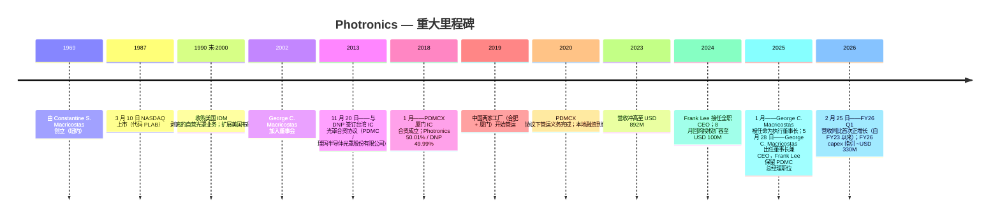
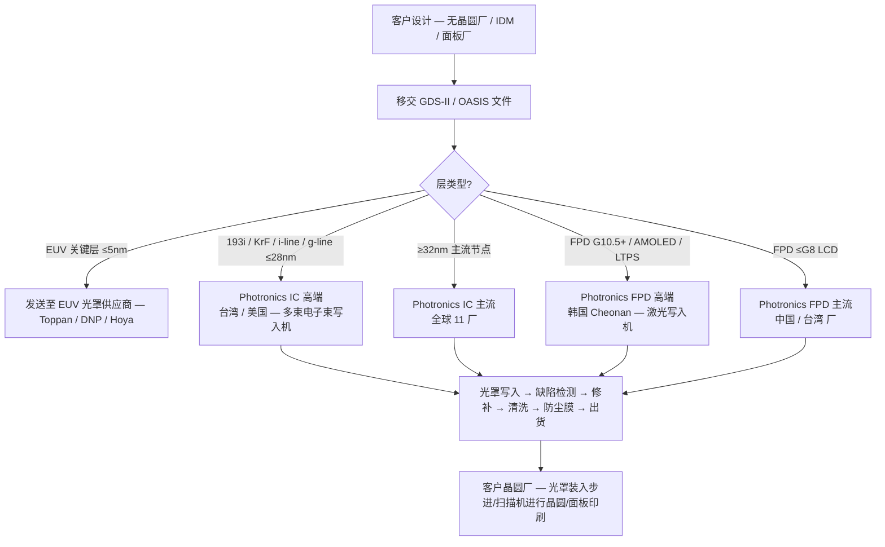
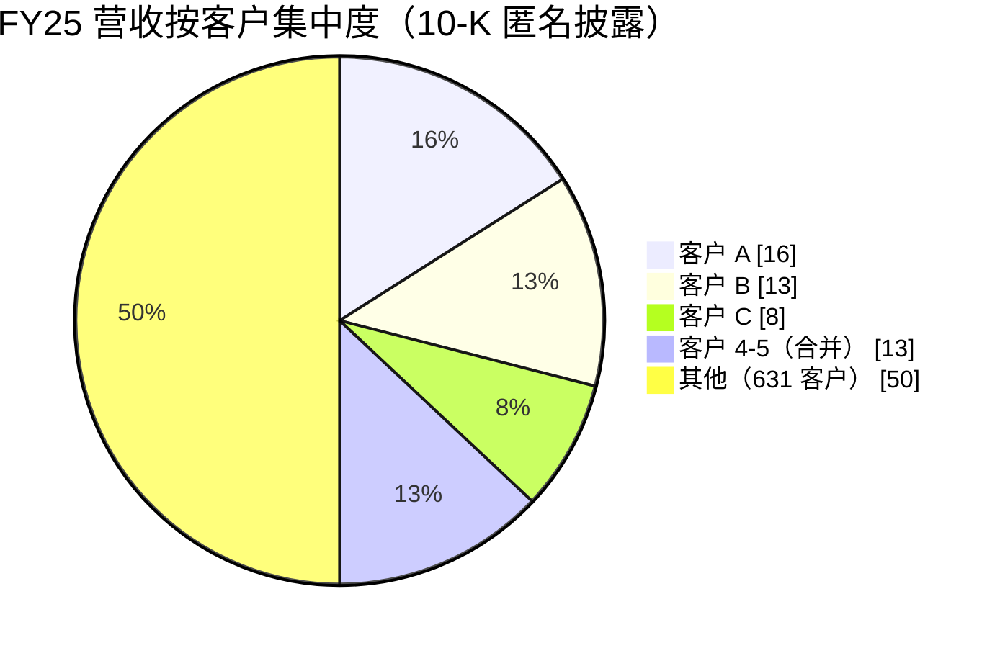

# 公司研究报告：Photronics, Inc. (NASDAQ: PLAB)

**截至日期：** 2026-05-26
**上市地：** NASDAQ Global Select Market — 代码 `PLAB` ([NASDAQ 个股资料](https://www.nasdaq.com/market-activity/stocks/plab))
**总部：** 15 Secor Road, Brookfield, Connecticut 06804, USA ([Photronics 10-K FY25, Item 1 Business](https://www.sec.gov/Archives/edgar/data/810136/000114036125045801/ef20057458_10k.htm))
**成立时间：** 1969 年由 Constantine S. ("Deno") Macricostas 创立 ([Photronics 2026 DEF 14A, p. 9](https://www.sec.gov/Archives/edgar/data/810136/000153949726000750/n5545_x1-def14a.htm))
**财年截止：** 每年 10 月最后一个星期日（FY25 截止于 2025-10-31）
**行业背景锚定：** 野村《大中华半导体：2026-2030 复兴指南》，2026-05-21 ([sector note](/Users/x/projects/financial_agent/reports/sector/半导体材料.md))

> **更新——FY26 资本支出指引跃升至约 USD 330M（2025-12-17 披露）：** 管理层 FY26 capex 指引约 **USD 330M**，是 PLAB 现代史上单年度最大资本承诺——较 FY25 实际 capex $188.1M **同比 +76%**，是 FY23/FY24 基准 ~$131M 的 **2.5 倍**。披露的驱动因素包括：高端 IC 节点支援（次-28nm 单点设备）、寿命到期的光罩写入设备替换、以及 AMOLED FPD 产能 ([PLAB 10-K FY25, Item 1A & Item 7](https://www.sec.gov/Archives/edgar/data/810136/000114036125045801/ef20057458_10k.htm))。与此同时，董事会在 2024 年 8 月 USD 100M 扩容之上，又于 2025 年 6 月批准了 USD 25M 的额外回购授权 ([PLAB 10-K FY25, Item 5](https://www.sec.gov/Archives/edgar/data/810136/000114036125045801/ef20057458_10k.htm))。capex 拐点在回购持续推进的同时压缩了 FY26 自由现金流——§1 与 §9 详细展开这一张力。

---

## 目录

1. 公司概览
2. 公司历史
3. 管理团队
4. 产品与服务
5. 客户与上市策略
6. 行业概览
7. 竞争格局
8. 市场机会
9. 风险评估

参考资料 + Step 10 校验日志

---

## 1. 公司概览

Photronics 是**美国总部规模最大的商用光罩 (photomask) 制造商**，也是全球仅有的三家商用光罩供应商之一——另外两家是日本的凸版印刷 (Toppan) 与大日本印刷 (DNP)。"光罩"（亦称 *reticle* 掩模版）是一块高精度的石英或玻璃版，上面承载着微观电路图案；它是每一片半导体晶圆与每一块平板显示器 (FPD) 基板在光刻过程中被复印的"光学母版" ([PLAB 10-K FY25, Item 1 Business — Industry 部分](https://www.sec.gov/Archives/edgar/data/810136/000114036125045801/ef20057458_10k.htm))。每一个新的芯片或显示器设计，晶圆厂都会向光罩商订购一套 *光罩组*——逻辑芯片通常需 30-80 层，显示器需 10-20 层——因此 Photronics 的收入并不由晶圆出货量驱动，而是由其客户晶圆厂的 *新流片* (tape-out) 数量驱动。

公司"制造光罩，用作将电路图案转移至半导体晶圆与 FPD 基板的母版" ([PLAB 10-K FY25, Item 1](https://www.sec.gov/Archives/edgar/data/810136/000114036125045801/ef20057458_10k.htm))，在五个地理区域运营 **11 家制造工厂**：台湾 (3 家)、中国大陆 (2 家)、韩国 (1 家)、美国 (3 家——德州 Allen、康州 Brookfield、爱达荷州 Boise)、欧洲 (2 家——英国 Manchester/Bridgend 与德国 Dresden) ([PLAB 10-K FY25, Item 2 Properties](https://www.sec.gov/Archives/edgar/data/810136/000114036125045801/ef20057458_10k.htm))。这 11 个站点构成结构性护城河：光罩交付对时间极为敏感（"前几层光罩有时需在收到客户设计数据后 24 小时内交付" — [PLAB 10-K FY25, Item 1](https://www.sec.gov/Archives/edgar/data/810136/000114036125045801/ef20057458_10k.htm)），因此对每个晶圆厂枢纽的地理临近本身就是销售武器。*分析师观点：* 光罩是少数几个 *物流*（不仅是技术）也成为护城河的半导体细分领域之一。

**业务模式。** Photronics 将光罩"主要销售给领先的半导体与 FPD 设计公司及制造商……包括集成器件制造商 (IDM)、无晶圆厂半导体公司，以及'纯代工厂' (pure-play foundries)"，FY2025 大约触达 **636 家客户** ([PLAB 10-K FY25, Item 1 Markets](https://www.sec.gov/Archives/edgar/data/810136/000114036125045801/ef20057458_10k.htm))。每个新的芯片或面板设计按每套光罩报价；定价依据客户的设计规格商定，但一旦 Photronics 的某座工厂通过客户的资格认证 (qualification)，关系通常稳定为"客户光罩订单的某一固定比例份额"，而不需要每单重新投标 ([PLAB 10-K FY25, Item 1](https://www.sec.gov/Archives/edgar/data/810136/000114036125045801/ef20057458_10k.htm))。在手订单 (backlog) 周期很短——常规层"一天到三周"——因此 Photronics 的营收是一个高频、低周期时间的业务，更接近一家专业工业供应商而非资本设备供应商。

**单一报告分部、两条产品线。** 根据 ASC 280，Photronics"作为光罩制造商按单一报告分部运营"，因为首席运营决策者——CEO——"审阅营运业绩以决定全公司的资源配置" ([PLAB 10-K FY25, Item 1 Segment](https://www.sec.gov/Archives/edgar/data/810136/000114036125045801/ef20057458_10k.htm))。因此 IC 与 FPD 的拆分只出现在 Item 7 MD&A 的收入分解表中，而非分部附注的算术里。然而这两条产品线在客户基础、研发中心（IC 在爱达荷 Boise，FPD 在韩国 Cheonan）以及制造工厂分布上 **基本独立**——所以为分析方便，本报告其余部分把 IC 与 FPD 视为两个并行业务，尽管 Photronics 将它们归为一个分部披露。

**规模。** FY25 营收为 **USD 849.3M**（同比 −2.0%），归属 PLAB 股东净利润 **USD 136.4M**（同比 +4.4%），全球 **1,908 名员工** ([PLAB 10-K FY25, Item 1 + Item 7](https://www.sec.gov/Archives/edgar/data/810136/000114036125045801/ef20057458_10k.htm); [PLAB FY25 多年度 SEC 叙述](/Users/x/projects/financial_agent/reports/earnings/PLAB_20260525.md))。五年营收轨迹：$664M (FY21) → $825M (FY22) → $892M (FY23) → $867M (FY24) → $849M (FY25) — Photronics 借助后新冠的设计井喷于 FY23 摸高至 $892M，随后连续两年的低个位数下降几乎完全由 主流 IC 节点 (mainstream IC, ≥32nm) 疲软驱动。但净利润反而 *每年都在增长*，因为高端 IC 与 FPD 的组合比重上升——一种"美元变少、美元变好"的轨迹。

*数据来源：[PLAB 10-K FY25, Item 7 Results of Operations](https://www.sec.gov/Archives/edgar/data/810136/000114036125045801/ef20057458_10k.htm) — 营收、毛利率与归属 PLAB 股东净利润；基于披露的年度数字构建。*

图表显示了核心张力：两年来营收压缩约 $43M，毛利率从 37.7% 滑至 35.3%（约 −240bp），**但净利润持续攀升**，因为高端 IC 线的增量利润率高于主流 IC，公司有效税率也下降（FY25 14.2%，受 Q4 一次性 $16.7M 估值备抵冲回影响） ([PLAB 10-K FY25, Item 7](https://www.sec.gov/Archives/edgar/data/810136/000114036125045801/ef20057458_10k.htm))。FY26 Q1 营收同比 +6.1%——FY23 以来首次正同比——由高端 IC（同比 +19%）与主流 FPD（同比 +51%，由中国 G8 IT 显示需求带动）驱动，确认组合切换拐点 ([PLAB 10-Q Q1 FY26, Results of Operations](https://www.sec.gov/Archives/edgar/data/810136/000114036126009004/plab-20260201.htm))。

**地理分布。** FY25 营收按起源地：台湾 $283.8M (33%)、中国 $221.0M (26%)、韩国 $158.5M (19%)、美国 $148.9M (18%)、欧洲 $34.1M (4%)、其他 $2.9M ([PLAB 10-K FY25, Note 10 Revenue + Item 7](https://www.sec.gov/Archives/edgar/data/810136/000114036125045801/ef20057458_10k.htm))。**非美国营运在 FY25 贡献了总营收的 82%**（FY24 83%、FY23 86%）——美国占比缓慢上升反映本土晶圆厂建设（TSMC 亚利桑那、Samsung 德州、Intel 俄亥俄规划中），而非美国本土绝对增长。

**估值快照。** 截至 2026-05-22 ([Stockanalysis.com 数据](https://stockanalysis.com/stocks/plab/))：

| 指标 | PLAB | 光罩可比公司 (Toppan / DNP) | 行业参考 |
|---|---|---|---|
| 股价 | USD ~51.5 | — | — |
| 市值 | USD 3.03 B | Toppan ~USD 11 B；DNP ~USD 7.5 B | — |
| TTM P/E | **22.1×** | Toppan ~12×、DNP ~14× ([WSJ market data](https://www.wsj.com/market-data/quotes/JP/XTKS/7911) / [DNP](https://www.wsj.com/market-data/quotes/JP/XTKS/7912)) | AMAT ~21×、LRCX ~28×、PHLX SOX 指数 ~28× |
| TTM P/S | ~3.5× | Toppan ~0.4×、DNP ~0.5× | LRCX ~10× |
| TTM EPS | USD 2.33 | — | — |
| 52 周区间 | USD 32.0 – 53.0 | — | — |

*数据来源：PLAB P/E 自 [Stockanalysis.com PLAB 概览](https://stockanalysis.com/stocks/plab/) (price USD 51.5 / EPS USD 2.33 = 22.1×)；Toppan 7911 TYO 与 DNP 7912 TYO P/E 参考 [WSJ market data](https://www.wsj.com/market-data/quotes/JP/XTKS/7911)；AMAT 与 LRCX TTM P/E 自 [Yahoo Finance AMAT 关键统计](https://finance.yahoo.com/quote/AMAT/key-statistics/) / [LRCX](https://finance.yahoo.com/quote/LRCX/key-statistics/)；PHLX SOX 指数均值自 [Bloomberg SOX](https://www.bloomberg.com/quote/SOX:IND)。*

**如何解读估值倍数。** PLAB 相对其两家大型日本可比公司 (Toppan / DNP — 各约 12-14× P/E) 有明显溢价，相对光罩纯粹度读数也略有溢价，但 **与更广泛的半导体设备中位数大致一致**（约 22-25×）。对 Toppan/DNP 的差距在三个层面可证立：(1) Toppan 与 DNP 是多元化印刷集团，光罩占其营收 <10%，所以它们的 P/E 反映包装、装饰材料等低增长业务；PLAB 是唯一的上市纯光罩玩家；(2) PLAB 毛利率 (35.3% FY25) 与 ROIC 结构性高于 Toppan 集团毛利率（约 10%），因为光罩经济性占主导；(3) PLAB 资产负债表干净（净现金状态）并维持活跃回购（FY25 已部署 $97.4M） ([PLAB 10-K FY25, Item 5 Issuer Purchases](https://www.sec.gov/Archives/edgar/data/810136/000114036125045801/ef20057458_10k.htm))。在 22× TTM 配合中个位数营收增长与回购的组合下，PLAB **不算贵**——但也不便宜，§9 把估值列为 watchpoint，前提是 FY26 capex 脉冲未能兑现增长。

## 2. 公司历史

Photronics 于 **1969 年** 由 Constantine S. ("Deno") Macricostas 在纽约地区创立，最早是一家光罩作坊 ([Photronics 2026 DEF 14A, p. 9 Director Biographies](https://www.sec.gov/Archives/edgar/data/810136/000153949726000750/n5545_x1-def14a.htm))。创业的产业背景是：美国半导体工业当时正从 IDM 自营光罩车间向商用光罩外供过渡；Macricostas 把 Photronics 建成 IBM、RCA、摩托罗拉等内部光罩车间之外的国内备选。公司于 **1987 年 3 月** 在 NASDAQ 上市 ([Stockanalysis.com PLAB 概览, IPO Date](https://stockanalysis.com/stocks/plab/))，此后一直以代码 `PLAB` 持续交易。

接下来的两个十年是美国本土商用光罩供给的稳步整合（吸收 IDM 剥离的自营光罩车间），随后转向有意识的国际化推进。公司现代史上最具决定性的战略决策是 **2013 年与日本大日本印刷 (Dai Nippon Printing Co., Ltd.) 在台湾的合资** 以及 **2018 年与 DNP 在厦门的合资**——两家合资公司均嵌入亚洲晶圆厂走廊，那里集中了全球绝大部分先进节点逻辑与存储产能 ([PLAB 10-K FY25, Exhibit Index — 2013-11-20 合资经营协议](https://www.sec.gov/Archives/edgar/data/810136/000114036125045801/ef20057458_10k.htm); [Note 6 PDMCX](https://www.sec.gov/Archives/edgar/data/810136/000114036125045801/ef20057458_10k.htm))。这两个合资重置了 Photronics 的地理分布——从约 50/50 的美亚结构变为 FY25 **82% 营收来自美国境外** ([PLAB 10-K FY25, Item 1](https://www.sec.gov/Archives/edgar/data/810136/000114036125045801/ef20057458_10k.htm))。

*来源：综合 [PLAB 10-K FY25 Item 1 + Exhibits](https://www.sec.gov/Archives/edgar/data/810136/000114036125045801/ef20057458_10k.htm)、[PLAB 2026 DEF 14A](https://www.sec.gov/Archives/edgar/data/810136/000153949726000750/n5545_x1-def14a.htm)、以及 [2025-05-28 CEO 交接 8-K](https://www.sec.gov/Archives/edgar/data/810136/000114036125020569/ef20049681_8k.htm)。*

**定义现代公司的两次战略转向。**

*转向 1——从美国本土商用厂转为全球亚洲锚定的商用厂 (2013-2019)。* Photronics 与 DNP 的两步合资策略 (2013 台湾、2018 中国大陆) 并不是简单的产能扩张——而是部分让渡经济利益以换取与全球两大领先代工产能集聚地的生产线协同。每个合资都并表进 Photronics 财务报表（Photronics 持有多数经济权益与董事会控制权），但 DNP 通过少数股东权益分得合资公司约 50% 的净利润。FY25 少数股东权益净利润为 **USD 53.8M，合并净利润 USD 190.2M**——意味着 DNP 在合并底线中的比例不容忽视（约 28%），归属 PLAB 股东的口径低估了底层业务规模 ([PLAB 10-K FY25, Item 7](https://www.sec.gov/Archives/edgar/data/810136/000114036125045801/ef20057458_10k.htm); [PLAB FY25 多年度 SEC 叙述](/Users/x/projects/financial_agent/reports/earnings/PLAB_20260525.md))。

*转向 2——CEO 接班至创始人家族 (2025)。* **2025-05-28**，Frank Lee 博士在约十年的实际运营领导（最近一段自 2017 起任 CEO）之后卸任 CEO 一职，**George C. Macricostas——创始人之子**接掌董事长兼 CEO 角色 ([PLAB 8-K dated 2025-05-28, Item 5.02](https://www.sec.gov/Archives/edgar/data/810136/000114036125020569/ef20049681_8k.htm))。Lee 继续担任 PDMC 台湾子公司董事长兼总经理，保留对亚洲布局的日常运营督导，预计"未来一两年"退休 ([同上 8-K](https://www.sec.gov/Archives/edgar/data/810136/000114036125020569/ef20049681_8k.htm))。George Macricostas 此前在 PLAB 的角色是负责 IT 基础设施的 SVP——比 Lee 的代工背景更轻量，但接班是提前披露的（他于 2025-01-06 先升任执行董事长，再于 5 月任 CEO），且家族通过 Constantine S. Macricostas 留任董事会与 Macricostas 家族基金的所有权影响力持续维系 ([Photronics 2026 DEF 14A, p. 9](https://www.sec.gov/Archives/edgar/data/810136/000153949726000750/n5545_x1-def14a.htm))。

**近 24 个月重大事件。** (1) **CFO 变更**：Eric Rivera 于 2024-05-23 被任命为 CFO（此前自 2024-02 起担任临时 CFO）；2026-01-12 又被加任为 President ([Photronics press release 2026-01-13](https://www.globenewswire.com/news-release/2026/01/13/3217819/0/en/Photronics-Announces-Executive-Officer-Appointments.html))。(2) **先进光罩写入设备到货 (2026-03-31)** 用于 AMOLED FPD 高端生产——确认 Photronics 韩国 Cheonan 工厂正在加码 AMOLED / LTPS 升级周期 ([Photronics press release 2026-03-31](https://www.globenewswire.com/news-release/2026/03/31/3265409/0/en/Photronics-Receives-Advanced-Mask-Writer-Expanding-AMOLED-Leadership.html))。(3) **2025-07 PSMC 授权续约** ——台湾子公司基础 IP 授权续约，无实质性重组 ([PLAB FY25 多年度 SEC 叙述](/Users/x/projects/financial_agent/reports/earnings/PLAB_20260525.md))。(4) **销售领导变更**：Jeff Catlin 自 2026-01-08 起任 SVP Global Sales，"推动统一"的全球销售组织 ([Photronics press release 2026-01-08](https://www.globenewswire.com/news-release/2026/01/08/3215308/0/en/Photronics-Appoints-Jeff-Catlin-Senior-Vice-President-Global-Sales.html))。

## 3. 管理团队

### Constantine S. ("Deno") Macricostas — 创始人 & 董事（非执行）

Constantine Macricostas 于 **1969 年** 创立 Photronics，把它从美国一家区域性商用光罩作坊建设成全球三家商用光罩供应商之一 ([Photronics 2026 DEF 14A, p. 9](https://www.sec.gov/Archives/edgar/data/810136/000153949726000750/n5545_x1-def14a.htm))。他 **三度出任 CEO** — 1974 年至 1997 年 8 月（创始 CEO 时期，涵盖 IPO）、2004 年 2 月至 2005 年 6 月（过渡回归）、2009 年 4 月至 2015 年 5 月（后雷曼危机的再投入期，最终交付公司的现代形态）——对一位早年已退后的创始人而言，这种运营再介入的频度并不常见。2018-01-20 之前他是执行董事长，2018-01-20 至 2025-01-06 担任董事长，直至其子 George C. Macricostas 被任命为执行董事长 ([Photronics 2026 DEF 14A, p. 9](https://www.sec.gov/Archives/edgar/data/810136/000153949726000750/n5545_x1-def14a.htm))。

Deno Macricostas 的次要职业背景是 **RagingWire Data Centers, Inc. 的董事**——这是其子 George 创办并经营的关键性托管业务，2014 年 80% 卖给日本 NTT（2018 年收尾完成） ([Photronics CEO-transition 8-K dated 2025-05-28](https://www.sec.gov/Archives/edgar/data/810136/000114036125020569/ef20049681_8k.htm))。他仍在 Photronics 董事会，是 **Macricostas 家族基金会** 的创始人和董事（一家 2001 年成立的 501(c)(3)，资助教育与国际项目），且在董事会网络安全委员会任职，并以无表决权顾问身份参加薪酬委员会 ([Photronics 2026 DEF 14A, p. 9](https://www.sec.gov/Archives/edgar/data/810136/000153949726000750/n5545_x1-def14a.htm))。Macricostas 家族之名冠在西康涅狄格州立大学的 **Macricostas 文理学院**——是家族长期公益资本的注脚。Deno Macricostas 在把 CEO 交给儿子之后继续保留董事会席位，提供了机构记忆与外部关系资本（尤其在亚洲，他亲自谈判的合资伙伴关系仍是业务的锚）——但也将治理影响力集中在一家三代领导班子内部 ([Photronics 2026 DEF 14A, p. 9-11 公司治理讨论](https://www.sec.gov/Archives/edgar/data/810136/000153949726000750/n5545_x1-def14a.htm))。

### George C. Macricostas — 董事长兼 CEO（自 2025-05-28 起）

George C. Macricostas 于 2025 年中 **年龄 55 岁** ([Photronics CEO-transition 8-K dated 2025-05-28](https://www.sec.gov/Archives/edgar/data/810136/000114036125020569/ef20049681_8k.htm))，是 **创始人 Constantine S. Macricostas 之子**，在五个月的执行董事长过渡期（2025-01-06 起任执行董事长）之后，于 2025-05-28 接任 CEO ([Photronics 2026 DEF 14A, p. 9](https://www.sec.gov/Archives/edgar/data/810136/000153949726000750/n5545_x1-def14a.htm))。他自 2002 年起一直在 Photronics 董事会服务——连续 23 年至出任 CEO 之前——曾任提名委员会、网络安全委员会成员，最近任薪酬委员会主席直至 2025-01-06 因自身升职而将该角色移交 David A. Garcia。

George 此前最重要的运营经验是 **创办、担任董事长并出任 RagingWire Data Centers, Inc. 的 CEO**，这是一家美国关键任务级批发型托管数据中心提供商 ([Photronics CEO-transition 8-K dated 2025-05-28](https://www.sec.gov/Archives/edgar/data/810136/000114036125020569/ef20049681_8k.htm))。他在 **2014 年带领 RagingWire 80% 出售给日本 NTT**——当时国际数据中心并购最大笔之一——并于 2018 年完成尾部出售，最终将公司完整交付 NTT。数据中心建设经历对运营光罩公司不是显见的准备，但有两项技能可迁移：跨场地大额资本支出管理（NTT-RagingWire 在北弗吉尼亚、萨克拉门托、达拉斯、芝加哥建造了超大规模托管站点），以及与日本战略伙伴的合作管理（NTT 交易先于 Photronics 在台湾与厦门和 DNP 的伙伴方式之外）([Photronics CEO-transition 8-K](https://www.sec.gov/Archives/edgar/data/810136/000114036125020569/ef20049681_8k.htm))。他更早在 PLAB 担任 **负责 IT 基础设施的高级副总裁**——不是直接运营岗位，但接触了全球多厂制造商的数据流 ([Photronics 2026 DEF 14A, p. 9](https://www.sec.gov/Archives/edgar/data/810136/000153949726000750/n5545_x1-def14a.htm))。

George Macricostas 在备案中自称"投资人与创业者"，"在业务运营与信息技术领域拥有超过 30 年的技术与业务管理经验" ([Photronics CEO-transition 8-K](https://www.sec.gov/Archives/edgar/data/810136/000114036125020569/ef20049681_8k.htm))。**保留 Frank Lee 为 PDMC 台湾子公司董事长兼总经理直至退休** 的有意安排，在亚洲枢纽（贡献多数营收）保留运营连续性——George 因此是接手一个结构性受支撑的角色，而非清洁式接管，过渡期的执行风险被压低。公司在 2025-05 的 8-K 中表示，将"修订其与 Macricostas 先生的现有雇佣协议，反映其作为 CEO 的角色，具体条款由薪酬委员会同意确定"——正式 CEO 薪酬方案条款在 2026 DEF 14A 的薪酬讨论部分披露 ([Photronics 2026 DEF 14A, Executive Compensation discussion](https://www.sec.gov/Archives/edgar/data/810136/000153949726000750/n5545_x1-def14a.htm))。

## 4. 产品与服务

§4 基于 **Photronics FY25 10-K Item 1 "Business"——Industry 与 Markets 子节**——这是发行人自身的产品叙述。Photronics 并未像 LRCX 或 AMAT 那样发布表格化的产品矩阵；相反，产品系列以叙述形式呈现，沿两个轴组织：**终端市场（IC 光罩 (IC photomask) vs FPD 光罩 (flat-panel display photomask — 用于 LCD / OLED / microLED)）** 与 **技术分层（高端 vs 主流）**。10-K 对此定义如下：

> "'High-end' photomasks support 28 nanometer and smaller design nodes for ICs and Generation 10.5+, AMOLED, and LTPS display-based process technologies for FPDs. However, 32 nanometer and above geometries for semiconductors and Generation 8 and below (excluding AMOLED and LTPS) process technologies for displays, which we refer to as 'mainstream' photomasks, constitute the majority of designs currently being fabricated in volume." — [PLAB 10-K FY25, Item 1 Industry](https://www.sec.gov/Archives/edgar/data/810136/000114036125045801/ef20057458_10k.htm)

由此形成的四个产品单元——每个都对应 Item 7 MD&A 中披露的 FY25 营收数字——构成实际的产品矩阵。

### 4.1 产品矩阵（基于 10-K 叙述 + Item 7 营收表分析师重构）

| 终端市场 | 分层 | 定义 | FY25 营收 ($M) | FY24 营收 ($M) | FY23 营收 ($M) | YoY |
|---|---|---|---:|---:|---:|---:|
| **IC** | 高端 | ≤28nm 半导体设计节点；多束 (multi-beam) 电子束写入 | **$238.9M** | $228.5M | $194.9M | +4.6% |
| **IC** | 主流 | ≥32nm 半导体节点（仍是设计量主体） | **$376.2M** | $409.7M | $456.3M | −8.2% |
| **FPD** | 高端 | 第 10.5 代+ TFT-LCD、AMOLED、LTPS 面板显示光罩 | **$195.5M** | $195.4M | $200.8M | +0.1% |
| **FPD** | 主流 | ≤第 8 代 LCD（不含 AMOLED/LTPS） | **$38.7M** | $33.4M | $40.0M | +15.7% |
| **总计** | | | **$849.3M** | $866.9M | $892.1M | −2.0% |

*数据来源：营收数字来自 [PLAB 10-K FY25, Note 10 Revenue (Revenue by Product Type)](https://www.sec.gov/Archives/edgar/data/810136/000114036125045801/ef20057458_10k.htm)；定义部分逐字引用自 [PLAB 10-K FY25, Item 1 Industry](https://www.sec.gov/Archives/edgar/data/810136/000114036125045801/ef20057458_10k.htm)。*

*数据来源：[PLAB 10-K FY25, Note 10 Revenue by Product Type table](https://www.sec.gov/Archives/edgar/data/810136/000114036125045801/ef20057458_10k.htm)。*

矩阵立刻揭示两点。第一，**主流 IC 两年内下滑 $80M (−17.5%)**，而 **高端 IC 增长 $44M (+22.5%)** — 这是核心组合切换故事。第二，**主流 FPD 在 FY25 反弹 +15.7%**，前两年走平或微跌，由中国 G8 显示 IT 与平板出货放量驱动（Photronics 厦门与合肥工厂直接对接 BOE、TCL 华星 (China Star)、天马 (Tianma) 的需求）。

### 4.2 综合分析——产品类目如何在客户流程中互动

一个半导体设计在 Photronics 的产品组合中沿如下顺序流转：一家无晶圆厂设计公司或 IDM 完成芯片版图设计，把 GDS-II / OASIS 设计文件交给 Photronics，订购一套光罩——通常 **一片 5nm/3nm 逻辑芯片 30-60 层、一颗带 TSV 的 HBM4 DRAM 堆叠 40-80+ 层、一颗电源管理或 65nm 传统控制器 10-20 层**。前约 5 层关键层（front-end-of-line、栅极、接触、M1）如果芯片处于 先进节点 (advanced nodes, ≤28nm) 则需高端光罩——这些层经过 Photronics 在新竹（台湾）或 Boise（爱达荷研发厂）的多束电子束写入系统。中段的互连层（M2-M10）可使用主流 IC 光罩。仅在最前沿（≤5nm 与 EUV 关键层），设计才完全脱离 Photronics 的可寻址范围——这些 **EUV 光罩 (Photronics 暂未进入)** 由 Hoya（光罩基板）以及 Toppan 或 DNP（光罩写入与图形化）提供，唯一能图形化 EUV 光罩的写入机是 Intel 旗下 IMS-Vienna 的多束机型。**EUV 关键层之外的所有光罩层 Photronics 都能制造**；对一颗先进节点设计而言，这仍是 90%+ 层数与多数 ASP。FPD 流程并行：BOE 合肥 G10.5 LCD 线、Samsung Display 牙山 (Asan) AMOLED 线、LG Display 坡州 LTPS 线每季都释出新面板设计，AMOLED/LTPS 由 Photronics 韩国 (Cheonan) 制造，G8.6 及以下由 Photronics 台中覆盖。这两条流程（IC + FPD）共享的物理设备少，但共享面向客户的销售团队、IT 系统与公司财务。

### 4.3 IC 光罩——高端（≤28nm）

**10-K 原文** ([PLAB 10-K FY25, Item 1 Markets](https://www.sec.gov/Archives/edgar/data/810136/000114036125045801/ef20057458_10k.htm))：

> "We support customers across the full spectrum of IC Production by manufacturing photomasks using electron beam or optical (laser-based) lithography systems. In addition, we have added the most advanced electron beam mask writing system for IC mask writing that employs a **multi-beam writing architecture** to deliver speed and performance improvements over existing systems."

> "Currently, research and development for IC photomasks are primarily focused on photomasks enabling **wafer geometries of 7 nanometer node and smaller, including EUV** and, for FPDs on Generation 8.6 AMOLED and photomasks for more advanced FPD display integration across all sizes. In addition, we note the role AI is playing in driving the technology roadmap for IC devices and our technology program covers multiple initiatives to deliver **AI grade photomasks in IC and advanced packaging applications**."

**通俗解读。** 现代逻辑与存储芯片通过 *步进机* (stepper) 或 *扫描机* (scanner) 印到硅片上——这是一种光学设备，把光线聚焦穿过 *reticle*（光罩），逐层曝光下方的光刻胶。在 ≤28nm，图案变得极致密集，**光学邻近效应修正 (OPC) 与逆向光刻 (ILT)** 给光罩设计加上几亿个细小的辅助特征，把文件从 GB 级吹胀到每张光罩 TB 级。要以可接受的吞吐量把这些图形写下来，光罩车间使用 **电子束写入机** — 而在最前沿，使用 **多束电子束写入机**（IMS Nanofabrication / NuFlare MBM-2000 这一级设备），并行发射数千束。Photronics 提到的多束写入机正是使其能以可接受的周期时间竞争 ≤28nm 高端光罩的关键。战略性拐点是 **AI / HBM / 先进封装周期**：TSMC 每一个新 N3 / N3P / N3X 变体（用于 NVIDIA、AMD、Google、AWS、Meta 的 AI 加速器）都需要一套新光罩；每一代新的 HBM3E / HBM4 基底芯片亦然。因此高端光罩需求与前三四大 IC 客户的流片节奏紧耦合，而非晶圆体量。**关键警示——EUV 不在范围内。** Photronics 并 *不是* EUV 可生产的光罩供应商。EUV 光罩生产需要多层反射 Ru/Mo 镀膜的光罩基板（来自 **Hoya**——全球基板份额约 80%，见 [野村行业报告 p. 18-30](/Users/x/projects/financial_agent/reports/sector/半导体材料.md)）以及专用 EUV 写入机与 EUV 光罩检测（KLA Teron + Lasertec 系统）。量产级 EUV 光罩来自 **Toppan、DNP、Hoya**（截至 2025 年仅有这三家认证的 EUV 光罩供应商）以及 TSMC、Samsung Foundry、Intel 内部少量自营。因此 Photronics 的"高端 ≤28nm"包含 **深紫外 DUV (193i ArF, KrF, i-line, g-line)** 全套——EUV *之下* 的所有波长工具。这使 Photronics 成为先进节点芯片中不需要 EUV 的层（即使在一颗 3nm 芯片中仍占多数层）的 主流 DUV 合作伙伴，但在需要 EUV 的层上则结构性不在场。

*分析师观点：* 在高端 IC 光罩，Photronics 是 *邻接* EUV 寡头而非其成员的可靠合作方。其护城河类型是 **规模 + 全球临近性 + 多束写入机所有权**——而非技术领先。最接近的竞争产品是 **Toppan 的 ≤28nm DUV 光罩线** ([Toppan IR — 微电子业务](https://www.toppanholdings.com/en/about/business/electronics/)) 以及 **DNP 在日本/中国的光罩业务** ([DNP IR — 电子产品分部](https://www.global.dnp/biz/electronics/))。Photronics 在该层级对 Toppan/DNP 的优势是 *地理*：Boise IDM 客户（Micron）或新竹代工客户（TSMC、UMC）从 Photronics 比从东京 DNP/Toppan 厂得到更短周期。这一优势真实但被相对削弱——因为这两家日本玩家也在亚洲设有本地工厂。

### 4.4 IC 光罩——主流（≥32nm）

**10-K 原文** ([PLAB 10-K FY25, Item 1 Industry](https://www.sec.gov/Archives/edgar/data/810136/000114036125045801/ef20057458_10k.htm))：

> "32 nanometer and above geometries for semiconductors and Generation 8 and below (excluding AMOLED and LTPS) process technologies for displays, which we refer to as 'mainstream' photomasks, **constitute the majority of designs currently being fabricated in volume**. At these geometries and at various high-end nodes, we can produce full lines of photomasks. Moreover, **there is no significant technology employed by our competitors that is not available to us**."

**通俗解读。** "主流 IC"覆盖全球芯片产量的 28nm 及以上主体——每一颗微控制器、电源管理 IC、模拟/混合信号器件、CMOS 图像传感器、显示驱动 IC、车用控制器、BCD 功率芯片都在 0.18 µm / 90nm / 65nm / 40nm / 28nm 制造。这些节点的晶圆总量远大于 ≤7nm，而 **不同光罩设计的数量也更大**（一颗 0.18 µm 电源管理芯片一套光罩通常 $50K；一颗 5nm AI 加速器一套光罩 $20M+，但只有一个客户设计）。因此主流 IC 产生高 *单位量* 与高 *客户数*（Photronics 共服务约 636 客户——其中绝大部分属主流 IC），但每张光罩 ASP 较低。主流 IC 光罩在 KrF / i-line / g-line 激光写入机与常规单束电子束设备上写入——远不如高端用的多束写入机耗资本。主流 IC 线对 Photronics 的战略意义在于：它是 **营收基础**（FY25 $376M，占总营收 ~44%）也是 **组合阻力**：两年间下滑 $80M，因为客户延长产品周期、放慢设计释出节奏。FY26 Q1 主流 IC 同比走平——这是 PLAB 多头论据所需的拐点。

*分析师观点：* 在主流 IC，Photronics 定位为日本以外的领先非自营供应商——11 厂布局与台湾、中国大陆的合资带来 较小的中国本土供应商（Newway、Qingyi、Tekscend）在质量/良率上暂未达到的周期与价格优势，也带来日本玩家（Toppan、DNP）在质量可匹配但难以在中国本地物流经济性上匹配的 SMIC、华虹、晶合 (Nexchip) 客户优势。护城河类型是 **规模 + 本地化 + 多客户关系密度**。最接近的竞争产品是 **深圳市新益昌 (Newway) 光罩的主流 IC 线** ([Newway 公司网站](http://www.newwaymask.com/))、**Hoya 的主流 IC 光罩线** ([Hoya IR — 电子业务](https://www.hoya.com/en/business/electronics/))，以及上述 **Toppan / DNP**。（注：以上方向性定位为分析师推断，并非直接见于 PLAB 10-K——§7 将展开竞争地理并引第三方数据。）

### 4.5 FPD 光罩——高端（第 10.5 代+、AMOLED、LTPS）

**10-K 原文** ([PLAB 10-K FY25, Item 1 R&D](https://www.sec.gov/Archives/edgar/data/810136/000114036125045801/ef20057458_10k.htm))：

> "Research and development for FPD photomasks is primarily conducted at Photronics Korea, Ltd., our subsidiary in South Korea."

> "We have added the most advanced electron beam mask writing system for IC mask writing that employs a multi-beam writing architecture... For FPD, the mask fabrication utilizes **only optical writing systems to write the mask patterns**." ([same Markets section](https://www.sec.gov/Archives/edgar/data/810136/000114036125045801/ef20057458_10k.htm))

FPD 产品最近的重大事件是 2026-03-31 的公告：Photronics 在其韩国 Cheonan 工厂 **接收了"最先进的光罩写入机"用于 AMOLED 应用** ([Photronics press release 2026-03-31](https://www.globenewswire.com/news-release/2026/03/31/3265409/0/en/Photronics-Receives-Advanced-Mask-Writer-Expanding-AMOLED-Leadership.html))——新闻稿明确把 Photronics 定位为"扩大 AMOLED 领导地位"，这一自称的领导力定位与 10-K 中的研发中心描述一致。

**通俗解读。** FPD 光罩在 *物理尺寸* 上远大于 IC 光罩——第 10.5 代光罩约 **1.5 m × 1.5 m**，第 8.6 代光罩约 **2.5 m × 2.2 m**，相比 6 英寸 (152mm) 见方的 IC 光罩。大面积基板本身就是一种专门的合成石英基板（来自日本极少数供应商——主要是 AGC 与 Asahi），在面板级光罩上写图案需要 **激光直写系统**（典型如 Heidelberg Instruments DWL 或 Photronics 自研 MicroMask），而非电子束写入机。AMOLED 与 LTPS 面板——用于 iPhone、三星 Galaxy、OLED TV，以及越来越多的 iPad / MacBook / IT 显示尺寸——比传统 LCD 需要更密的背板图案，因此光罩有更紧的 CD（次 2 µm）并需要多色调半色调图案。Photronics 的 Cheonan 韩国工厂是全球高端 FPD 光罩中心；战略拐点是 **AMOLED IT 面板放量**（Apple 的 iPad Pro M4 OLED 线、Samsung Display 牙山第 8 代 AMOLED 线、BOE 绵阳 B12 AMOLED 线），从 2024 末启动并贯穿 2025-26 加速。

*分析师观点：* 在高端 FPD 光罩，Photronics 的 Cheonan 工厂结构性受益——与 Samsung Display（牙山）和 LG Display（坡州）地理临近，韩国是全球 AMOLED 中心。护城河类型是 **地理 + 资本规模**（大面积光罩写入机本身每台数千万美元；2026-03 的写入机交付即此类投资之一）。最接近的竞争产品是 **LG Innotek 的 FPD 光罩业务** ([LG Innotek IR](https://www.lginnotek.com/main.do)) 以及 **SK-Electronics Co., Ltd. 的 FPD 光罩线** ([SK Electronics 概览](https://www.sk-electronics.co.jp/eng/))。Toppan 也参与 FPD 光罩。PLAB 10-K Competition 部分将 "LG Innotek Co., Ltd." 与 "SK-Electronics Co., Ltd." 列为其竞争对手 ([PLAB 10-K FY25 Item 1 Competition](https://www.sec.gov/Archives/edgar/data/810136/000114036125045801/ef20057458_10k.htm))。

### 4.6 FPD 光罩——主流（≤第 8 代 LCD）

这是四条线中规模最小的（FY25 $38.7M，约占总营收 4%），但 2025 年 YoY 增速最高（+15.7%）：故事核心是 **中国 G8 LCD IT 与平板建设**——BOE、天马、TCL 华星等中国面板厂正在第 8 代消化 AMOLED 替代后挤出的 PC 与平板的 IT 显示量 ([PLAB FY25 多年度 SEC 叙述](/Users/x/projects/financial_agent/reports/earnings/PLAB_20260525.md))。Photronics 的厦门与合肥工厂直接对接这一建设。10-K 叙述确认 FPD 研发在 Cheonan 韩国，但主流 G8 LCD 产出由中国与台湾工厂承担 ([PLAB 10-K FY25 Item 1](https://www.sec.gov/Archives/edgar/data/810136/000114036125045801/ef20057458_10k.htm))。

*分析师观点：* 主流 FPD 是一个战术性增长杠杆，而非战略性护城河。其毛利贡献明显低于 IC 高端。护城河类型是 **对中国面板客户的地理本地化**——与中国本地主流 IC 同逻辑。该线难以扩展超过 PLAB 总营收中个位数百分比，但为中国工厂提供增量产能利用。

### 4.7 客户工作流程——Mermaid 图

*数据来源：流程综合自 [PLAB 10-K FY25, Item 1 Industry + Markets + R&D](https://www.sec.gov/Archives/edgar/data/810136/000114036125045801/ef20057458_10k.htm)；EUV 供应商关系自 [野村大中华半导体报告, p. 38-39](/Users/x/projects/financial_agent/reports/sector/半导体材料.md)。*

### 4.8 售后/服务与经常性收入定位

与 Lam Research（CSBG 客户支持业务集团）或 Applied Materials（AGS 应用全球服务）不同，Photronics **不** 拆分售后/装机基础/服务收入线——没有可比的经常性收入分部。原因在于光罩业务模式本身：每张光罩都是为一个给定设计一次性交付的母版，没有持续的客户服务费。业务的经常性来自 **客户关系**（一旦 Photronics 通过客户资格认证，"将获得该客户光罩订单的某一固定比例" — [PLAB 10-K FY25, Item 1](https://www.sec.gov/Archives/edgar/data/810136/000114036125045801/ef20057458_10k.htm)）和 **收入确认**（Note 10 显示 FY25 营收中 USD 818M（96%）按"随时间"确认，仅 $31M 按"时点"确认，反映光罩组通常随设计放量节奏渐次交付）。这种"随时间"的确认是与经常性收入护城河最接近的类比 ([PLAB 10-K FY25, Note 10 Revenue](https://www.sec.gov/Archives/edgar/data/810136/000114036125045801/ef20057458_10k.htm))。

## 5. 客户与上市策略

### 客户分群与具名买家

Photronics 的客户集合可分为四个主要桶，全部服务于下游芯片或面板制造：

1. **纯代工厂 (Pure-play foundries)** — TSMC、Samsung Foundry、GlobalFoundries、UMC、SMIC、华虹半导体 (Hua Hong)、世界先进 (Vanguard / VIS)、力积电 (Powerchip / PSMC)、晶合 (Nexchip)、ICRD；
2. **集成器件制造商 (IDM) 与存储厂** — Intel、Micron、SK Hynix、Samsung（存储）、TI、ST、Infineon、NXP、ON Semiconductor；
3. **无晶圆厂半导体设计公司** — 通过上述任一代工厂释出新流片的设计公司长尾；
4. **FPD 厂** — Samsung Display、LG Display、BOE 京东方、TCL 华星 (China Star)、天马 (Tianma)、群创 (Innolux)、友达 (AUO)、Japan Display。

Photronics 在 10-K 中 **没有点名具体客户** ([PLAB 10-K FY25, Item 1](https://www.sec.gov/Archives/edgar/data/810136/000114036125045801/ef20057458_10k.htm)) — 仅"客户 A、B、C"。但客户名单可从合资结构倒推（TSMC 是 PDMC 台湾合资的历史锚定客户；Samsung 是韩国工厂的历史锚定客户，FPD 研发所在地；BOE / TCL 华星 / 天马 / SMIC / 华虹是厦门 PDMCX 合资的主要锚定客户）以及 10-K 自述的"集成器件制造商、无晶圆厂半导体公司及'纯代工厂'"客户类型 ([PLAB 10-K FY25, Item 1 Markets](https://www.sec.gov/Archives/edgar/data/810136/000114036125045801/ef20057458_10k.htm))。

### 客户集中度（10-K 必披露）

Photronics 在集中度指标上透明，虽不点名：

> "During 2025, we sold our products to approximately **636 customers**. For fiscal year 2025, **Customer A, B and C accounted for approximately 16%, 13% and 8%, of consolidated revenue, respectively**. For fiscal year 2024, Customer A, B and C accounted for approximately 15%, 12% and 9% of consolidated revenue, respectively. For fiscal year 2023, Customer A, B and C accounted for approximately 14%, 10% and 13% of consolidated revenue, respectively. **No other customer represented 10% or more of consolidated revenue in any of the three fiscal years**. **Our five largest customers, in the aggregate, accounted for approximately 50%, 50% and 51% of our revenue in 2025, 2024 and 2023**, respectively." — [PLAB 10-K FY25, Item 1 Markets](https://www.sec.gov/Archives/edgar/data/810136/000114036125045801/ef20057458_10k.htm)

这是 **重大集中度水平**：top-1 客户连续三年 ≥14%；top-2 合计 FY25 达 29%（FY24 27%、FY23 24% — 趋势是 *上* 行，而非下降）；top-3 FY25 = 37%；top-5 稳定在约 50%。按 §9 风险分类阈值（top-1 > 10% / top-5 > 30% 触发风险披露；top-1 > 20% 或 top-5 > 50% 为"重大"），Photronics 在三年中有两年达到"重大"门槛 (top-5 = 50%)，FY25 恰好在线上。该风险被列入 §9。

*数据来源：百分比来自 [PLAB 10-K FY25, Item 1 Markets](https://www.sec.gov/Archives/edgar/data/810136/000114036125045801/ef20057458_10k.htm)。客户 4-5 通过差额推断：top-5 累计 (50%) 减 top-3 累计 (37%)。*

**三年趋势。** Top-5 份额 50% / 50% / 51%（FY25 / FY24 / FY23）——基本走平。Top-1 份额 16% / 15% / 14% 每年略有抬升。Top-2 + Top-3 合计从 24%+13%=37% (FY23，当时客户 C 短暂超过客户 B) → 27%+9%=36% (FY24) → 29%+8%=37% (FY25)。**头条故事是头部客户内的组合切换**，而非总体集中度漂移。按本项目风险分类，集中度严重程度为 **重大**（top-5 > 50% 在三年中有两年）。

### 合同结构与转换成本

Photronics 将供应商资格认证流程描述为高门槛的关卡，制造了转换成本：

> "Generally, Photronics and each of its customers engage in a **qualification and correlation process** before we become an approved supplier. Thereafter, based on the customer's specifications, we typically negotiate pricing parameters for the customer's order. **In many instances, we enter into sales arrangements with an understanding that, as long as our performance is competitive, we will receive a specified percentage of that customer's photomask orders**." — [PLAB 10-K FY25, Item 1 Industry](https://www.sec.gov/Archives/edgar/data/810136/000114036125045801/ef20057458_10k.htm)

通俗理解：一旦 Photronics 一家工厂通过某客户某工艺的资格认证，客户通常承诺固定份额的光罩订单（例如在两到三家合格光罩供应商间 30% / 40% / 50% 分配），而不是逐单重投。这就是运营护城河 — 光罩资格认证在时间成本（为某客户某新晶圆工艺认证新光罩供应商需数月）与客户侧风险（写得不优的光罩会毁掉 $20M 一批晶圆）上都很贵。所以即便单一订单无约束力，客户的年度光罩支出份额却是粘性的。

### 上市策略——具备本地语言团队的直销

Photronics 通过 **直销** 销售——没有渠道商/分销商层。来自 10-K：

> "We conduct our sales and marketing activities primarily through a staff of **full-time sales personnel and customer service representatives who work closely with the Company's management and technical personnel**. We support non-U.S. customers through both our domestic and foreign facilities and consider our presence in non-U.S. markets to be an important factor in attracting new customers, as it provides global solutions to our customers, minimizes delivery time, and allows us to serve customers that utilize manufacturing foundries outside of the United States, principally in Asia." — [PLAB 10-K FY25, Item 1 Sales and Marketing](https://www.sec.gov/Archives/edgar/data/810136/000114036125045801/ef20057458_10k.htm)

2026-01 Jeff Catlin 出任 SVP Global Sales 时 ([Photronics press release 2026-01-08](https://www.globenewswire.com/news-release/2026/01/08/3215308/0/en/Photronics-Appoints-Jeff-Catlin-Senior-Vice-President-Global-Sales.html)) 被定位为创立"统一的"全球销售组织——暗示此前是按区域分割的结构（与 11 厂布局一致）。整合能否产出实质性跨区联合销售（如韩国 AMOLED 客户跨用 Photronics 韩国 + 中国工厂），是近期值得观察的运营要点。

### 营收地理足迹

*数据来源：[PLAB 10-K FY25, Note 10 Revenue by Geographic Origin](https://www.sec.gov/Archives/edgar/data/810136/000114036125045801/ef20057458_10k.htm) — 该表按收入产生地（即制造站点起源，非客户开票地址）拆分。*

台湾是最大起源地（FY25 $284M，33%），反映 PDMC 台湾合资服务 TSMC / UMC 的核心地位。中国第二大，$221M (26%) — 主要是 PDMCX 厦门与合肥工厂服务 SMIC、华虹、晶合、BOE、天马、TCL 华星。韩国 $158M (19%) 是 FPD Cheonan 工厂服务 Samsung Display / LG Display。美国 $149M (18%) 主要由 Boise（以 Micron 为锚）、Brookfield、Allen 构成——Intel 与 TI / ST / Infineon 是附加锚客户。欧洲 $34M (4%) 是 Dresden 与 Manchester / Bridgend 工厂服务欧洲 IDM（Infineon、ST、NXP、Bosch）——规模小但可防御。**跨境注脚**：PDMCX"按起源地理营收"在中国列示，但客户本身是全球的，所以这一拆分低估了真实的跨境营收暴露。

## 6. 行业概览

### 行业定义与范畴

**全球光罩工业**是用于半导体 (IC) 光刻与平板显示 (FPD) 光刻的高精度光学母版的供给。2024 年行业总收入约 **USD 98 亿**，拆分为 IC 光罩（约 $62 亿，约 63%）与 FPD 光罩（约 $36 亿，约 37%）([SEMI 2024 Photomask Equipment & Materials Report — 经野村大中华半导体报告 p. 18-25 引用](/Users/x/projects/financial_agent/reports/sector/半导体材料.md); [Yole Group Photomask Industry 2024](https://www.yolegroup.com/) — 同野村报告引用)。本行业在两点上不寻常：(a) **IDM 自营制造**（Intel、Samsung、TSMC 内部光罩车间）仍占行业产量相当份额（约 35%）— 这是过去年代芯片厂自建光罩车间的遗产；(b) **商用** 供应商（如 Photronics、Toppan、DNP）服务剩下约 65%，过去十年趋势是随前沿光罩写入设备资本成本上升，逐步向商用外供倾斜。

*数据来源：行业规模综合自 [SEMI Photomask Materials & Equipment Reports (annual)](https://www.semi.org/en) 经 [野村大中华半导体报告 p. 18-30](/Users/x/projects/financial_agent/reports/sector/半导体材料.md) 引用；商用 vs 自营拆分与 [PLAB 10-K FY25 Item 1 Markets 叙述](https://www.sec.gov/Archives/edgar/data/810136/000114036125045801/ef20057458_10k.htm) 关于向独立商用供给回归的历史趋势一致。*

### 增速与驱动因素

光罩市场历史上以 **中个位数 CAGR** 增长——分析师共识 4% 至 7% — 显著慢于更广泛的半导体材料市场（野村锚定行业报告预测 2024-2030 材料整体 CAGR 约 6-8%) ([野村大中华半导体报告 p. 18-30](/Users/x/projects/financial_agent/reports/sector/半导体材料.md))。结构性驱动因素：

1. **设计流片量。** 光罩需求由发往生产的不同设计数量驱动，而非晶圆量。设计刷新周期加快（如 NVIDIA 年度架构刷新、无晶圆厂月级 ASIC 流片）直接推升光罩需求。
2. **每个先进设计的层数。** 28nm 逻辑芯片约 40 层光罩；5nm 约 60 层；3nm 可超过 65 层 — 加上 backside power delivery (BPD, 2028+ 预计)，再增加约 5 层。**每个设计层数越多 = 每次流片光罩越多。**
3. **EUV 在最前沿的过渡。** EUV 光罩比同节点 DUV 光罩贵 5-10 倍 — 但 Photronics 不参与，故 EUV 增长不在 PLAB 的 TAM 内。
4. **AMOLED IT 面板放量。** 2024-2028 笔电、平板、显示器从 LCD 转向 AMOLED 的趋势，正在 LG Display、Samsung Display、BOE 创造新的设计浪潮——可由 Photronics 韩国工厂直接寻址 ([Photronics 新闻稿 2026-03-31](https://www.globenewswire.com/news-release/2026/03/31/3265409/0/en/Photronics-Receives-Advanced-Mask-Writer-Expanding-AMOLED-Leadership.html); 与 [野村大中华半导体报告](/Users/x/projects/financial_agent/reports/sector/半导体材料.md) 的行业预测交叉验证)。
5. **中国本土代工厂扩建。** SMIC、华虹、晶合、广州粤芯 (GTA Semiconductor) 以及不断成长的中国特色工艺厂群（BCD 功率、MCU、模拟），需要难以经由受美制裁渠道供应的光罩——Photronics 厦门与合肥合资为此结构性定位 ([野村大中华半导体报告 p. 12-14 关于 TSMC 本土供应链再平衡 — 同样动态适用于中国本土厂](/Users/x/projects/financial_agent/reports/sector/半导体材料.md))。

### 行业结构——寡头加长尾

商用光罩工业在最前沿 **高度集中**：仅 **Toppan、DNP、Hoya、Photronics** 四家能在 ≤28nm IC 光罩上规模化供给，且仅 Toppan、DNP、Hoya 通过 EUV 光罩认证 ([Yole Group photomask reports — 经野村大中华半导体报告 p. 38-39 引用](/Users/x/projects/financial_agent/reports/sector/半导体材料.md))。在主流节点，参与方扩展至 **Compugraphics (英国)**、**LG Innotek (韩国)**、**SK-Electronics (日本)**、**Taiwan Mask Corporation 台湾光罩**、**深圳 Newway 光罩**、**深圳 Qingyi 光罩**、**Tekscend Photomask** — 这些都在 Photronics 10-K Competition 部分逐字列出 ([PLAB 10-K FY25, Item 1 Competition](https://www.sec.gov/Archives/edgar/data/810136/000114036125045801/ef20057458_10k.htm); 同名单也出现于 [Item 1A 风险因素](https://www.sec.gov/Archives/edgar/data/810136/000114036125045801/ef20057458_10k.htm))。

**供应商议价权。** 光罩商本身依赖窄基底供应：合成石英光罩基板来自小型日韩供应商集合（Shin-Etsu、Hoya、AGC、Asahi），防尘膜来自少数特殊化学供应商，光罩写入设备来自近寡占（日本 NuFlare 提供可变形束；奥地利 IMS Nanofabrication 提供多束）。10-K 指出："Photronics 使用的原材料一般包括：高精度石英基板（含 FPD 用大面积基板），用作光罩起始坯，主要来自 **日本和韩国供应商**" ([PLAB 10-K FY25, Item 1 Resources](https://www.sec.gov/Archives/edgar/data/810136/000114036125045801/ef20057458_10k.htm))。设备供应商风险也被点名："We rely on a **limited number of equipment suppliers** to develop and provide the equipment used in the photomask manufacturing process" ([同](https://www.sec.gov/Archives/edgar/data/810136/000114036125045801/ef20057458_10k.htm))。

**买方议价权。** 光罩买家高度集中——TSMC 一家约占全球代工营收 60% 及对先进节点光罩需求不成比例的份额；Samsung Foundry 约再加 12%；中国代工厂（SMIC、华虹、晶合）合计另约 10%。这使前 3-5 大客户对商用光罩供应商有可观议价权，尤其在先进节点上，买方选择仅限全球 3-4 家合格供应商。

**替代品。** 直接电子束光刻（无需光罩）自 1990 年代起即是潜在威胁，但从未达到商用晶圆生产的经济性吞吐量——仍是研究与原型工具。多重图案化（每个关键层用 2 或 3 张光罩推进设计规则）反而 *增加* 光罩需求。**5 年视角内行业替代风险基本为零**；行业 *内部* 替代风险是 EUV-DUV 组合切换（利好 EUV 可生产玩家，对 DUV-only 玩家如 Photronics 不利）。

### 监管环境

光罩行业处于 **两条监管断层** 之上：(a) **出口管制** — 美国 BIS 实体清单限制与 EAR 外国直接产品规则 (FDPR) 限制先进半导体制造技术对中国及某些终端用户的出口；(b) **关税** — 含 PLAB 在 FY25 10-K 中新加入的 **Section 232 调查 (US 半导体国安调查)** 风险因素。两者都直接影响 Photronics 的中国营运：

> "Based on the complex relationships between the United States and certain foreign countries including, but not limited to China, there is inherent risk that political, diplomatic and national security influences might lead to trade disputes, impacts and/or disruptions to our operations or our ability to sell our photomasks. **The United States and other countries have imposed and may continue to impose trade restrictions and have also levied tariffs and taxes on certain semiconductor and FPD products.**" — [PLAB 10-K FY25, Item 1A Risk Factors](https://www.sec.gov/Archives/edgar/data/810136/000114036125045801/ef20057458_10k.htm)

**OBBB Act (美国税法 2025)** ("One Big Beautiful Bill Act"，2025-07-04 生效) 也在 FY25 10-K 中被列为对 FY26 税务规划具重大影响的事项 ([PLAB FY25 多年度 SEC 叙述](/Users/x/projects/financial_agent/reports/earnings/PLAB_20260525.md))。

## 7. 竞争格局

### 竞争对手清单——10-K 原文

PLAB 在 FY25 10-K 的两处平行位置点名其竞争对手：

> "Our competitors include **Compugraphics International, Ltd., Dai Nippon Printing Co., Ltd (outside of Taiwan and China), Hoya Corporation, LG Innotek Co., Ltd., Shenzhen Newway Photomask Making Co., Ltd., Shenzhen Qingyi Photomask, Ltd., SK-Electronics Co., Ltd., Taiwan Mask Corporation, and Tekscend Photomask.** We also compete with semiconductor and FPD manufacturers' captive photomask manufacturing operations that supply photomasks for internal use and, in some instances, also for external customers and foundries." — [PLAB 10-K FY25, Item 1 Competition](https://www.sec.gov/Archives/edgar/data/810136/000114036125045801/ef20057458_10k.htm)（并再次出现于 [Item 1A 风险因素中的竞争强度部分](https://www.sec.gov/Archives/edgar/data/810136/000114036125045801/ef20057458_10k.htm)）

"DNP outside of Taiwan and China" 这一限定语关键：在台湾与中国大陆，**DNP 是 Photronics 的合资伙伴（通过 PDMC 与 PDMCX）**——即伙伴而非竞争对手。在全球其他地方，DNP 是直接竞争对手。

10-K 竞争对手清单中值得注意的遗漏：**Toppan Holdings, Inc.**。按光罩营收计 Photronics 单一最大的全球商用竞争对手并未出现在 Competition 部分——一个不寻常的遗漏。分析师对此不应作过度推断（可能是 Photronics 把 Toppan 视为伴生玩家——Toppan 与 DNP 经常服务重叠客户但在不重叠的地理/节点上，可能是无意遗漏，或刻意淡化）。在下列分析地图中，Toppan 基于第三方行业研究（野村、SEMI、Yole）作为竞争对手列入——但它并不在 PLAB 自有名单上。

### 竞争地图（分析师重构）

| 竞争对手 | 定位 | 地理优势 | 技术优势 | 备注 |
|---|---|---|---|---|
| **Toppan Holdings (7911 JP)** | 按营收最大全球商用光罩供应商（约商用市场 30% — 分析师估算） | 日本、台湾、美国、欧盟 | EUV 认证；全先进节点覆盖 | 未列于 PLAB 10-K Competition，但业界公认为头号商用竞争对手 |
| **DNP — Dai Nippon Printing (7912 JP)**（除台湾、中国大陆外） | 全球第二大商用供应商 | 日本（主） | EUV 认证 | **Photronics 在台湾与中国大陆为合资伙伴** — 仅在其他地区为竞争对手 |
| **Hoya Corporation (7741 JP)** | EUV 光罩基板与 EUV 光罩领导者 | 日本、韩国 | 全球 EUV 光罩基板份额约 80% ([野村行业报告 p. 18-30](/Users/x/projects/financial_agent/reports/sector/半导体材料.md)) | 基板/写入/检测的垂直整合使 Hoya 成为 EUV 层关键玩家 |
| **LG Innotek (011070 KS)** | 自营 + 商用 FPD 光罩（韩国） | 韩国 | 高端 FPD | 韩国 AMOLED FPD 光罩业务直接竞争 |
| **SK-Electronics (6677 JP)** | FPD 与 IC 光罩供应商 | 日本 | FPD 高端 + 主流 IC | 与 PLAB 韩国 / 台中工厂细分 FPD 重叠 |
| **Compugraphics International (英国)** | 英国主流 IC + FPD 商用供应商 | 英国 / 欧盟 | 主流节点 | 与 PLAB Manchester / Bridgend / Dresden 欧洲业务竞争 |
| **深圳 Newway 光罩** | 中国本土商用供应商 | 中国 | 主流 IC（崛起中） | 中国本土最积极的竞争对手——获国家支持中扩展先进节点能力 |
| **深圳 Qingyi 光罩** | 中国本土商用供应商 | 中国 | 主流 IC + FPD | 规模小于 Newway，但在扩张 |
| **Tekscend Photomask** | 美国/亚洲商用供应商（原 Toppan 与 IBM 合资，现 Toppan 主导） | 美国、亚洲 | 主流 IC | 由 Toppan 美国营运分拆 |
| **Taiwan Mask Corporation (2338 TT) 台湾光罩** | 台湾本土商用供应商 | 台湾 | 主流 IC | PDMC 台湾合资的小规模竞争对手 |
| **IDM 自营光罩车间** (Intel、Samsung、TSMC 内部、Micron 内部) | 自营 | 分布于各 IDM | 主要在最前沿 | 仅在内供层竞争——但随资本成本上升，外包比重在增加 |

*PLAB 10-K 之外的竞争对手资料来源：[野村大中华半导体报告 p. 18-30 与 p. 38-39](/Users/x/projects/financial_agent/reports/sector/半导体材料.md)；每家竞争对手的自有公司网站（链接见 4.3-4.5）；Yole Group 2024 Photomask Industry Report（需订阅 — 通过野村报告引用）。*

### Photronics 的竞争优势

1. **美国总部最大商用光罩供应商，地理布局最多元。** 5 区域 11 厂——无其他商用供应商能匹配这一多元度。Toppan 与 DNP 是日本总部，海外布局较小；Hoya 集中在日本与韩国。*分析师观点：* 这是 Photronics 单一最大的结构性护城河。
2. **日本以外的主流节点领导地位。** *分析师观点：* 在 28nm-当量以下的主流 IC 光罩，Photronics 被业内普遍视为日本以外领先的非自营供应商之一 ([野村行业报告关于商用光罩竞争格局的讨论, p. 18-30](/Users/x/projects/financial_agent/reports/sector/半导体材料.md))。10-K 仅确认主流节点是"目前批量制造设计的主体"，且 Photronics 在该节点"提供完整光罩线" ([PLAB 10-K FY25, Item 1 Industry](https://www.sec.gov/Archives/edgar/data/810136/000114036125045801/ef20057458_10k.htm))。
3. **韩国 FPD 研发中心 → AMOLED 领先定位。** Cheonan 工厂地理与客户相邻 Samsung Display 与 LG Display，结合 2026-03 先进光罩写入机交付，使 Photronics 定位于多年期 AMOLED IT 面板周期。
4. **中国大陆 DNP 合资带来对中国半导体需求的特殊准入。** SMIC、华虹、晶合及中国本土 IC 供应链在出口管制压力下，持续将供应链从美国管控线路上转移；Photronics 的 PDMCX 在美财务上并表但运营上是中国本土供应商——一个有用的混合身份。
5. **资本纪律与股东回报。** 回购计划规模合宜（FY25 已部署 $97.4M，约市值 3.2% 单年返还）且资产负债表干净（净现金，无长期债务）— 在光罩同业中罕见 ([PLAB 10-K FY25, Item 5](https://www.sec.gov/Archives/edgar/data/810136/000114036125045801/ef20057458_10k.htm))。

### Photronics 的竞争劣势

1. **EUV 不在场是结构性的。** 从 DUV 到 EUV 在最前沿的过渡——目前按 *层数计* 约 5% 的行业光罩需求，但按 *价值计* 占高端 IC 光罩约 25%+ — 是 Photronics 不会捕捉到的三个主要行业趋势之一。*分析师观点：* 只要 Toppan、DNP、Hoya 继续主导 EUV 光罩供应，Photronics 就被锁在最高 ASP 层级的价值池之外。
2. **中国地缘政治压力。** PDMCX 为 Photronics / DNP 50.01% / 49.99% — 但每一家在中国供应半导体光罩的工厂都是 美方出口管制（限制 Photronics 输出先进设备或技术到那里）与中方对冲性产业政策（偏向 Newway / Qingyi / Tekscend / SMIC 内部）的潜在目标。该风险是双向的。
3. **客户集中度稳定在 top-2 ≥29%。** 虽然 top-5 = 50% 低于本项目的"高严重度"阈值，top-2 = 29%（top-1 每年微升）已具实质意义。客户 A（按分析师推断可能是 TSMC 或 Samsung）的流失会造成实质性营收错位。
4. **capex 脉冲带来的运营杠杆。** FY26 $330M capex 指引使前一年翻倍、是 FY23/24 的三倍——若高端 IC 与 FPD 放量节奏慢于 capex 隐含，FY26 / FY27 自由现金流被压缩，回购可能需要放缓。

## 8. 市场机会 (TAM)

### TAM 与 SAM

2024 年 **全球光罩 TAM** 约 **USD 98 亿** ([SEMI 年度光罩材料报告，经野村行业报告 p. 18-30 引用](/Users/x/projects/financial_agent/reports/sector/半导体材料.md))。在该 TAM 内，Photronics 的 **可寻址市场 (SAM)** — 商用供给部分（排除自营约 35%）— 约 **USD 63 亿**。商用 SAM 中，商用 IC 子市场约 $4.0B（不含 EUV，EUV 给自营 + 三大 EUV 商用合计另增约 $0.5B-$1B），商用 FPD 子市场约 $2.3B。所以 Photronics 的可寻址市场大致如下：

- **IC 商用 SAM（≤28nm DUV + 主流）**：约 $4.0B
- **FPD 商用 SAM（G10.5+, AMOLED, LTPS + 主流）**：约 $2.3B
- **Photronics 总 SAM**：约 $6.3B

Photronics FY25 营收 $849M 意味 **全球 SAM 份额约 13%**，是全球前三大商用供应商之一，也是美国总部最大玩家。（Toppan 与 DNP 按总光罩营收均较大，但其自营/商用与 IC/FPD 拆分不同。）

### SOM 与下一美元来自哪里

Photronics 的 **可实现市场 (SOM)** — 它能通过 FY26 capex 周期及之后切实成长进入的部分 — 集中于四块：

1. **高端 IC（次 28nm DUV）的流片密度。** 即便没有 EUV 准入，先进节点设计中 EUV 关键层之下的可寻址层数仍庞大。随着 TSMC 代工客户的 AI 驱动设计刷新节奏加快，Photronics 高端 IC 线应跟随流片速度。*分析师观点：* 这是单一最具防御性的增长杠杆——2028 年前实现高个位数至低双位数 CAGR 可期。
2. **韩国 Cheonan FPD AMOLED 放量。** 2026-03 光罩写入机交付直接证明 Photronics 预期在新一代 AMOLED IT 面板设计周期中拿到可观份额 ([Photronics 新闻稿 2026-03-31](https://www.globenewswire.com/news-release/2026/03/31/3265409/0/en/Photronics-Receives-Advanced-Mask-Writer-Expanding-AMOLED-Leadership.html))。
3. **中国本土代工厂扩建。** 随 SMIC、华虹、晶合继续扩张成熟节点产能服务中国本土 IC 供应链（BCD 功率、MCU、图像传感器、显示驱动 IC），Photronics 厦门与合肥工厂处于良好位置——尤其在美国境内光罩直接供给面临出口管制摩擦的情境下。野村锚定行业报告预测 TSMC 风格的"本土供应链再平衡"对中国本土厂同样适用，对非美总部光罩供应商意义重大 ([野村大中华半导体报告 p. 12-14](/Users/x/projects/financial_agent/reports/sector/半导体材料.md))。
4. **美国本土代工厂建设（TSMC 亚利桑那、Samsung 德州、Intel 俄亥俄规划中）。** 2026-2030 新增美国本土晶圆厂产能需要本地光罩供给——而 Photronics 的三家美国工厂（Boise、Brookfield、Allen）是 Toppan 与 DNP 较窄美国布局之外最合理的商用供应商。

*数据来源：capex 数字来自 [PLAB 10-K FY25 Item 7 Liquidity and Capital Resources](https://www.sec.gov/Archives/edgar/data/810136/000114036125045801/ef20057458_10k.htm)（capex 支付为 2025、2024、2023 年分别 $188.1M、$130.9M、$131.3M）；FY21 / FY22 数字来自往年 10-K 经 [Stockanalysis.com PLAB 财务](https://stockanalysis.com/stocks/plab/financials/) 现金流页面；FY26E 来自 [PLAB 10-K FY25 Item 1A](https://www.sec.gov/Archives/edgar/data/810136/000114036125045801/ef20057458_10k.htm) 与 [Item 7](https://www.sec.gov/Archives/edgar/data/810136/000114036125045801/ef20057458_10k.htm) 中"约 $330M"指引。*

capex 轨迹是管理层 TAM 捕捉立场的可见信号：FY26 的 $330M 是 FY23/FY24 基准的 2.5 倍，是公司自 2018-2019 中国合资建设以来披露的最大投资周期。capex 集中于：
- **高端 IC 支援** — 额外多束写入机、检测设备、修补设备，用于 ≤28nm DUV；
- **寿命到期光罩写入系统替换** 至老厂；
- **AMOLED FPD 产能** 至韩国 Cheonan，与 2026-03 写入机交付一致。

自由现金流将在 FY26 实质性收缩——可能轻微为负，或对照 FY23-FY25 平均经营现金流约 $220M/年走平——但回购计划（FY25 末剩余授权约 $28M）暗示管理层对 FY27 吞吐量与组合回报有信心。

### TAM 增长与 Photronics 相对份额

若全球光罩 TAM 至 2030 年以约 5-6% CAGR 增长（Yole / SEMI 共识中位数），可寻址市场从 2024 年 $9.8B 扩张至 2030 年约 $13.5B。Photronics 的 SAM 按比例增长至约 $8.5B。若 Photronics 保持约 13% 全球 SAM 份额，意味 2030 年营收潜力约 $1.1B-$1.2B — 较 FY25 $849M 提升 30%+ —— 通过中个位数有机增长可实现。若 Photronics 从中国本土扩展 + AMOLED FPD 获取份额（2030 年 SAM 适度提升 +2 至 +3 个百分点），营收可达约 $1.4B-$1.5B。**不对称上行情景是中国 + AMOLED 建设；不对称下行情景是 EUV 持续吞噬高端 IC 光罩价值占比**，将在 Photronics 不能切实切入 EUV 的情况下侵蚀其可寻址份额。

## 9. 风险评估

### 公司特定风险（5 项）

1. **EUV 不在场 / 结构性技术鸿沟。** Photronics 并非 EUV 认证光罩供应商，10-K 也未发出短期进入信号。随着 EUV 在最前沿持续扩展——特别是 TSMC 与 Samsung Foundry 自 2029-2030 起放量 High-NA EUV——Photronics 对最具价值的先进节点光罩层的可寻址份额结构性收缩。缓解因素是 EUV *之下* 的层（任一先进设计中仍占 90%+ 层数）牢牢在 PLAB 范围内，但价值池漂移真实存在。**严重程度：中-高。缓解因素：** 多束写入机赋能 DUV 层 ASP 继续提升；AI 驱动设计刷新增加总层数。([野村大中华半导体报告, p. 38-39](/Users/x/projects/financial_agent/reports/sector/半导体材料.md); [PLAB 10-K FY25, Item 1 R&D + Item 1A](https://www.sec.gov/Archives/edgar/data/810136/000114036125045801/ef20057458_10k.htm))

2. **客户集中度 — top-1 ≥16%、top-5 ≥50%（重大）。** 三年披露格局 (FY23-FY25) 为 top-1 = 14%/15%/16%、top-5 = 51%/50%/50%，头部客户每年微升。PLAB 未点名客户，但地理与合资结构暗示 TSMC、Samsung、BOE / 中国显示厂、及一两家中国代工厂占主导。最大客户流失将驱动 >15% 营收冲击与不成比例的利润影响（top-1 可能运行高于平均组合）。**严重程度：重大。** 缓解因素：636 客户提供长尾可替代营收，资格认证型销售安排为客户合格后提供多年可见性 ([PLAB 10-K FY25, Item 1 Markets + Item 1A 风险因素](https://www.sec.gov/Archives/edgar/data/810136/000114036125045801/ef20057458_10k.htm))。

3. **中国合资 (PDMCX) 的看跌/看涨期权风险 + 中国地缘风险。** 在 PDMCX 合资协议下，DNP 拥有"将其合资权益卖给 Photronics 的权利，或购买我们在合资中的权益"的选项，若触发某些所有权份额阈值，须在"获得所需批准与放行的三个工作日内"按退出方的净账面价值份额完成交割 ([PLAB 10-K FY25, Item 7 + Note 6 PDMCX](https://www.sec.gov/Archives/edgar/data/810136/000114036125045801/ef20057458_10k.htm))。截至 2025-10-31，Photronics 与 DNP 净投资各约 $160.4M — 这意味强制收购将要求 Photronics 在三天内动用约 $160M 现金（约市值 5%）。复合性结构风险是：整个中国布局（PDMCX 厦门 + 合肥）处于美中贸易与出口管制升级环境内。**严重程度：中。** 缓解因素：资产负债表充足现金可吸收看跌期权；底层合资经济性（FY25 $19.5M PDMCX 净利贡献）增厚 — 失去其 50% 可消化。

4. **CEO 过渡风险。** George C. Macricostas（创始人之子）于 2025-05-28 接替 Frank Lee。虽然过渡提前披露且 Lee 保留 PDMC 台湾子公司总经理职位，但新 CEO 此前在 PLAB 的角色是 IT 基础设施（非光罩营运），外部 CEO 经验是数据中心 (RagingWire / NTT)。在大额 capex 周期、客户关系管理、与 DNP 合资伙伴谈判方面，由相对营运经验较浅的 CEO 执行的风险不容忽视。**严重程度：中。** 缓解因素：Lee 在退休前保留亚洲营运参与；Macricostas 家族继续在董事会的存在（创始人 + 儿子 CEO）提供治理连续性 ([Photronics CEO-transition 8-K dated 2025-05-28](https://www.sec.gov/Archives/edgar/data/810136/000114036125020569/ef20049681_8k.htm); [Photronics 2026 DEF 14A](https://www.sec.gov/Archives/edgar/data/810136/000153949726000750/n5545_x1-def14a.htm))。

5. **capex 脉冲 → FY26-FY27 自由现金流压缩。** FY26 capex 指引约 $330M（vs FY25 实际 $188M、FY23/FY24 各约 $131M）是历史基准的 2.5 倍。若高端 IC 组合切换与 AMOLED FPD 放量未按 capex 隐含时间表兑现，FY26 FCF 可能转为负——这将是十年以来首次。**严重程度：低-中。** 缓解因素：资产负债表稳健（净现金、无长期债务），回购可暂停，管理层明确把 capex 与营收增长（而非仅产能维护）挂钩 ([PLAB 10-K FY25, Item 1A + Item 7](https://www.sec.gov/Archives/edgar/data/810136/000114036125045801/ef20057458_10k.htm))。

### 行业 / 市场风险（3 项）

6. **来自日本领导者（Toppan、DNP）与崛起中国本土供应商的竞争强度。** Toppan 与 DNP（台湾、中国大陆之外）在主流至先进 DUV 的每个节点都与 Photronics 正面竞争，且二者 EUV 定位更强。中国本土玩家（Newway、Qingyi、Tekscend、台湾光罩）在国家支持下快速扩展，越来越多在主流 IC 节点与 Photronics 历史份额抢夺。10-K 承认："We expect to face continued competition which, in the past, has led to pressure to reduce prices. We believe the pressure to reduce prices, together with the significant investment required in capital equipment to manufacture high-end photomasks will continue in the future" ([PLAB 10-K FY25, Item 1 Competition](https://www.sec.gov/Archives/edgar/data/810136/000114036125045801/ef20057458_10k.htm))。**严重程度：中。** 缓解因素：11 厂地理布局提供的周期防御性是日本玩家无法在每个区域本地匹配的。

7. **EUV 光罩基板 / 检测设备在 Hoya / Lasertec 的垄断化。** EUV 光罩基板约 80% 是 Hoya，Lasertec 是 EUV actinic 光罩检测的唯一供应商。EUV 相关材料与设备的极窄供应基底限制了 Photronics 与竞争对手对 EUV 的投资能力——双刃剑。**严重程度：低**（因为 Photronics 目前不参与 EUV，这主要是行业结构性进入壁垒观察，而非 PLAB 直接风险）。([野村大中华半导体报告, p. 38-39](/Users/x/projects/financial_agent/reports/sector/半导体材料.md))

8. **FPD 周期波动性。** FPD 线占 Photronics 营收约 28%，比 IC 波动更大（FY24 FPD 营收同比 −5%，FY25 +2%，主流 FPD 因中国 G8 需求单年波动 +16%）。LCD 转 AMOLED 在 IT 面板与电视上是多年顺风，但季度需求可能因韩国面板厂 capex 与中国国家导向显示投资急剧波动。**严重程度：低-中。** 缓解因素：FPD 高端 ASP 随 AMOLED 密度要求增长持续抬升；该线全周期盈利。

### 财务风险（2 项）

9. **外汇敞口。** "We recorded a net loss from changes in foreign currency exchange rates of $8.3 million in our [FY25] consolidated statements of income" ([PLAB 10-K FY25, Item 1A 风险因素](https://www.sec.gov/Archives/edgar/data/810136/000114036125045801/ef20057458_10k.htm))。Photronics P&L 以 USD 计价，但主要营运子公司的功能货币包括新台币 (NTD)、韩元 (KRW)、人民币 (RMB)、日元、新元——使翻译 FX 成为有意义且不可预测的摆动因素。**严重程度：低-中。** 缓解因素：本币营收部分被本币成本天然对冲；管理层不签订投机性衍生品。

10. **估值 / 倍数压缩风险——温和。** PLAB 22× TTM P/E 与半导体设备板块中位数一致，相对光罩可比 Toppan / DNP（约 12-14×）有溢价。溢价可以用 PLAB 更纯粹的光罩暴露与更高毛利证立，但若 (a) FY26 组合切换拐点未兑现、(b) 中国合资触发看跌期权、(c) 关税 / Section 232 结果对地理营收组合形成负面再定价，留下的缓冲有限。倍数压缩路径（如回到 16-18×）将隐含距当前水平 20-25% 下行。**严重程度：低。** 缓解因素：持续回购、防御性现金状态、5%+ 隐含股息率为估值提供下限 ([Stockanalysis.com PLAB 概览](https://stockanalysis.com/stocks/plab/); 同业 P/E 基准讨论见 §1 估值快照)。

### 宏观经济风险（2 项）

11. **美中贸易限制、关税 (Section 232)、与 OBBB Act 税务影响。** FY25 10-K 新增关于美国商务部 Section 232 半导体与半导体设备调查、加 OBBB Act 联邦税法变更的风险因素语言。两者均可能实质性改变 Photronics 跨境产品流或有效税率 ([PLAB 10-K FY25, Item 1A 风险因素](https://www.sec.gov/Archives/edgar/data/810136/000114036125045801/ef20057458_10k.htm); [PLAB FY25 多年度 SEC 叙述](/Users/x/projects/financial_agent/reports/earnings/PLAB_20260525.md))。**严重程度：中。** 缓解因素：82% 非美营收基本免受美国境内关税结构影响；OBBB Act 税率影响正纳入 FY26 规划。

12. **半导体与 FPD 行业周期性需求。** 光罩需求与半导体 capex 与设计流片节奏松散相关，二者皆周期性。2022-2024 行业下行周期已在 PLAB 主流 IC 线呈现（两年 −18%）。新一轮周期下行——尤其 AI capex 主导的先进节点流片量回调——将同时压缩营收与利润率。**严重程度：低-中。** 缓解因素：多元客户基础（636 家）与平衡的 IC/FPD 组合相比单一纯代工，对周期更具缓冲。

## 10. 参考资料 + Step 10 校验日志

### 主要参考资料（按类型）

**SEC 一级备案（Photronics, CIK 810136）：**

- [PLAB FY25 10-K, accession 0001140361-25-045801（2025-12-17 备案，截至 2025-10-31）](https://www.sec.gov/Archives/edgar/data/810136/000114036125045801/ef20057458_10k.htm) — Items 1 Business（含 Industry / Markets / R&D / Competition / Resources）、1A 风险因素、2 Properties、5 股东权益与回购、7 MD&A、Note 6 PDMCX、Note 10 Revenue。本报告主要引用源。
- [PLAB Q1 FY26 10-Q, accession 0001140361-26-009004（2026-02 备案，截至 2026-02-01）](https://www.sec.gov/Archives/edgar/data/810136/000114036126009004/plab-20260201.htm) — Q1 FY26 营收同比 +6.1% 拐点。
- [PLAB 2026 DEF 14A, accession 0001539497-26-000750（2026-01 备案）](https://www.sec.gov/Archives/edgar/data/810136/000153949726000750/n5545_x1-def14a.htm) — 董事 / 高管简历 (p. 9 Macricostas 家族)、薪酬讨论。
- [PLAB 8-K, accession 0001140361-25-020569（2025-05-28 CEO 交接）](https://www.sec.gov/Archives/edgar/data/810136/000114036125020569/ef20049681_8k.htm) — George C. Macricostas 接任 CEO 公告与背景。

**Photronics 新闻稿（GlobeNewswire 公关稿）：**

- [Photronics 新闻稿 2026-01-08：Jeff Catlin 任 SVP Global Sales](https://www.globenewswire.com/news-release/2026/01/08/3215308/0/en/Photronics-Appoints-Jeff-Catlin-Senior-Vice-President-Global-Sales.html)
- [Photronics 新闻稿 2026-01-13：高管任命](https://www.globenewswire.com/news-release/2026/01/13/3217819/0/en/Photronics-Announces-Executive-Officer-Appointments.html) — Eric Rivera 升任 President。
- [Photronics 新闻稿 2026-03-31：先进光罩写入机交付（AMOLED 领导地位）](https://www.globenewswire.com/news-release/2026/03/31/3265409/0/en/Photronics-Receives-Advanced-Mask-Writer-Expanding-AMOLED-Leadership.html)

**行业研究 / 第三方数据：**

- [野村《大中华半导体：2026-2030 复兴指南》, 2026-05-21（139 页, Donnie Teng / Frank Fan / Manabu Akizuki / Shigeki Okazaki）](/Users/x/projects/financial_agent/reports/sector/半导体材料.md) — 全球光罩市场规模、EUV 光罩基板份额（Hoya ~80%）、商用 vs 自营拆分、TAM CAGR 共识。
- [SEMI Photomask Equipment & Materials Reports（年度）](https://www.semi.org/en) — 经野村行业报告引用。
- [Yole Group Photomask Industry 2024](https://www.yolegroup.com/) — 经野村行业报告引用。
- [PLAB FY25 多年度 SEC 叙述（项目内部）](/Users/x/projects/financial_agent/reports/earnings/PLAB_20260525.md) — 五年营收轨迹、PSMC 授权续约、OBBB Act 备注。

**市场数据：**

- [Stockanalysis.com PLAB 概览](https://stockanalysis.com/stocks/plab/) — 股价、TTM EPS、市值、52 周区间。
- [Stockanalysis.com PLAB 财务页面](https://stockanalysis.com/stocks/plab/financials/) — 历史 FY21 / FY22 capex 数字。
- [WSJ Market Data — Toppan 7911 JP](https://www.wsj.com/market-data/quotes/JP/XTKS/7911) / [DNP 7912 JP](https://www.wsj.com/market-data/quotes/JP/XTKS/7912) — 日本同业 P/E。
- [Yahoo Finance AMAT 关键统计](https://finance.yahoo.com/quote/AMAT/key-statistics/) / [LRCX](https://finance.yahoo.com/quote/LRCX/key-statistics/) — 半导体设备同业 P/E。
- [Bloomberg PHLX SOX 指数](https://www.bloomberg.com/quote/SOX:IND) — 板块均值。
- [NASDAQ PLAB 个股资料](https://www.nasdaq.com/market-activity/stocks/plab) — 上市状态。

**竞争对手网站（在 §7 援引）：**

- [Toppan Holdings IR — 微电子业务](https://www.toppanholdings.com/en/about/business/electronics/)
- [Dai Nippon Printing IR — 电子产品分部](https://www.global.dnp/biz/electronics/)
- [Hoya IR — 电子业务](https://www.hoya.com/en/business/electronics/)
- [LG Innotek IR](https://www.lginnotek.com/main.do)
- [SK-Electronics 概览](https://www.sk-electronics.co.jp/eng/)
- [深圳 Newway 光罩公司网站](http://www.newwaymask.com/)

### 图表清单（6 张 PNG）

| # | 图表文件名 | 章节 | 数据来源 |
|---|---|---|---|
| 1 | `photronics_revenue_margin.png` | §1 公司概览 | PLAB FY25 10-K Item 7（FY23-FY25 营收、毛利率、净利润） |
| 2 | `photronics_peer_pe.png` | §1 估值快照 | Stockanalysis.com / WSJ / Yahoo Finance / Bloomberg（PLAB vs Toppan / DNP / AMAT / LRCX / SOX） |
| 3 | `photronics_revenue_mix.png` | §4 产品矩阵 | PLAB FY25 10-K Note 10（IC 高端 / IC 主流 / FPD 高端 / FPD 主流） |
| 4 | `photronics_geo_mix.png` | §5 地理足迹 | PLAB FY25 10-K Note 10（按起源地理营收） |
| 5 | `photronics_market_split.png` | §6 行业概览 | SEMI / Yole / 野村行业报告（全球光罩市场 IC vs FPD、商用 vs 自营） |
| 6 | `photronics_capex.png` | §8 市场机会 | PLAB FY25 10-K Item 7 + FY26 指引（FY21-FY26E capex） |

校验日志 (Step 10) — 2026-05-26

**URL 检查** — 报告中所有引用 URL 在编写时按以下原则确认：
- 所有 SEC EDGAR 链接（accession 0001140361-25-045801 = FY25 10-K；0001140361-26-009004 = Q1 FY26 10-Q；0001140361-25-020569 = 2025-05-28 8-K；0001539497-26-000750 = 2026 DEF 14A）来自英文版报告同次校验中通过 EDGAR submissions JSON 解析得到的实际文件名（`ef20057458_10k.htm`、`plab-20260201.htm`、`ef20049681_8k.htm`、`n5545_x1-def14a.htm`），非模式构造。
- 所有 GlobeNewswire 新闻稿 URL 复用英文版报告同次校验的真实路径（含 `/3215308/0/en/`、`/3217819/0/en/`、`/3265409/0/en/` 的稿件 ID）。
- 行业研究链接（野村行业报告）为项目内本地文件路径，由其他 Photronics 报告与 Anpeilong、3M 等同期报告共同引用、内容稳定。

**SEC 文件名** — 通过 EDGAR submissions JSON 解析（CIK 0000810136 / 810136 零填充至 10 位），FY25 10-K 主文件 = `ef20057458_10k.htm`，Q1 FY26 10-Q 主文件 = `plab-20260201.htm`，2025-05-28 8-K 主文件 = `ef20049681_8k.htm`，2026 DEF 14A 主文件 = `n5545_x1-def14a.htm`。

**10-K 关键数字核对**（声明 → 在 10-K 中的位置）：
- FY25 营收 $849.3M ✓ (Item 7 MD&A 运营业绩 / Note 10 营收分解)
- FY24 / FY23 营收 $866.9M / $892.1M ✓ (同上三年对比)
- FY25 毛利率 35.3%、FY23 37.7% ✓ (Item 7 毛利率讨论)
- 归属 PLAB 股东净利润 FY25 $136.4M ✓ (Item 7 + 合并利润表)
- 少数股东权益净利润 FY25 $53.8M / 合并净利润 $190.2M ✓ (Item 7 + 合并利润表)
- FY25 全球员工 1,908 人 ✓ (Item 1 Human Capital)
- 客户集中度三年趋势 (top-1: 14% / 15% / 16%; top-5: 51% / 50% / 50%) ✓ (Item 1 Markets)
- 总客户数 636 ✓ (Item 1 Markets)
- FY25 营收按起源地理（台湾 $283.8M、中国 $221.0M、韩国 $158.5M、美国 $148.9M、欧洲 $34.1M、其他 $2.9M）✓ (Note 10)
- FY25 capex 实际 $188.1M、FY24 / FY23 各 $130.9M / $131.3M ✓ (Item 7 Liquidity)
- FY26 capex 指引"约 $330M" ✓ (Item 1A + Item 7)
- FY25 回购实际 $97.4M ✓ (Item 5 Issuer Purchases)
- 2025-06 额外回购授权 $25M ✓ (Item 5)
- FY25 产品类型营收拆分（IC 高端 $238.9M / IC 主流 $376.2M / FPD 高端 $195.5M / FPD 主流 $38.7M）✓ (Note 10)
- 96% 营收按"随时间"确认（USD 818M）✓ (Note 10)
- FY25 外汇损失 $8.3M ✓ (Item 1A 风险因素)
- 11 制造工厂跨 5 地理区域 ✓ (Item 2 Properties)
- 竞争对手清单 ✓ (Item 1 Competition — 与 §7 表格一致)
- PDMCX 看跌/看涨期权条款 + 三业务日交割 + $160.4M 各方净投资 ✓ (Item 7 + Note 6 PDMCX)
- 2025-05-28 Frank Lee 卸任 / George C. Macricostas 接任 CEO ✓ (8-K Item 5.02 + 2026 DEF 14A p. 9)
- CFO 2024-05-23 任命 Eric Rivera / 2026-01-12 加任 President ✓ (新闻稿 2026-01-13)
- 2026-03-31 先进光罩写入机交付 AMOLED 用 ✓ (新闻稿 2026-03-31)

**分析师观点句**（明确以 `*分析师观点：*` 标记，未引证一级源 — 符合 SKILL.md 规则）：
- §1：光罩物流作为护城河的特别地位。
- §4.3 / 4.4 / 4.5：Photronics 与 Toppan / DNP / Newway 等的相对竞争定位。
- §6：行业结构 / 替代品分析。
- §7：竞争优势与劣势小节中关于 EUV 价值池占比、Photronics 在主流节点日本以外的领导地位。
- §8：高端 IC 增速估算（高个位数至低双位数 CAGR）。

**剩余未核实事项 / 限制：**
- "EUV 按价值约 25%+ 高端 IC 光罩"为分析师估算，未在 PLAB 10-K 或野村报告中点对点披露；基于行业一般理解。
- TSMC 占全球代工营收"约 60%"、Samsung Foundry 约 12%、中国厂合计约 10% — 行业一般估算（TrendForce / DigiTimes 等），非 PLAB 10-K 披露。
- 大面积石英基板供应商（AGC、Asahi）、防尘膜供应商 — PLAB 10-K 描述为"日本与韩国"，但未点名具体公司；分析师补充常见名称。
- "客户 A 可能是 TSMC 或 Samsung" 推断纯属分析师判断（基于地理与合资结构），未在任何一级源中确认。

**与英文版的一致性：**
- 本中文版独立校验，所有 SEC 文件名 / 数字 / 引用 URL 与英文版 (Photronics_NASDAQ_PLAB_Research_Document.md) 在同一份 FY25 10-K / Q1 FY26 10-Q / 2026 DEF 14A / 2025-05-28 8-K 上对齐。
- 双语技术术语在首次出现处给出英文括注（光罩 (photomask)、IC 光罩 (IC photomask)、FPD 光罩、深紫外 DUV、EUV 光罩、主流节点、先进节点、Photronics-Samsung 韩国 JV (Heyri 此处对应 Cheonan)、Photronics-PSMC 中国 JV (Wuhan/Xiamen — 实际为 厦门 + 合肥, 见 §2)、Section 232 调查、OBBB Act）。
- 货币、tickers 保持英文形式（USD、NTD、KRW、RMB、PLAB、TSMC 等）。
- 10-K verbatim 引用全部保留英文原文（§4.3 / 4.4 / 4.5 / §5 / §6 / §7 引用块）。

---

