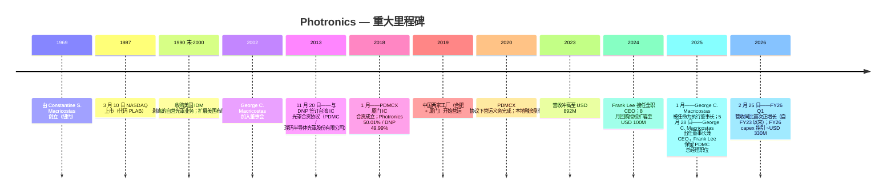
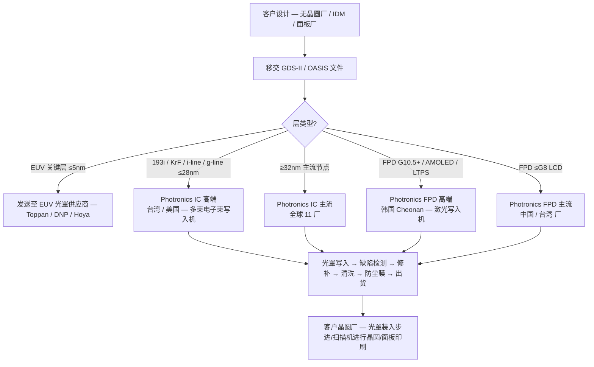

# 公司研究报告：Photronics, Inc. (NASDAQ: PLAB)

**截至日期：** 2026-05-26
**上市地：** NASDAQ Global Select Market — 代码 `PLAB` ([NASDAQ 个股资料](https://www.nasdaq.com/market-activity/stocks/plab))
**总部：** 15 Secor Road, Brookfield, Connecticut 06804, USA ([Photronics 10-K FY25, Item 1 Business](https://www.sec.gov/Archives/edgar/data/810136/000114036125045801/ef20057458_10k.htm))
**成立时间：** 1969 年由 Constantine S. ("Deno") Macricostas 创立 ([Photronics 2026 DEF 14A, p. 9](https://www.sec.gov/Archives/edgar/data/810136/000153949726000750/n5545_x1-def14a.htm))
**财年截止：** 每年 10 月最后一个星期日（FY25 截止于 2025-10-31）
**行业背景锚定：** 野村《大中华半导体：2026-2030 复兴指南》，2026-05-21 ([sector note](/Users/x/projects/financial_agent/reports/sector/半导体材料.md))

> **更新——FY26 资本支出指引跃升至约 USD 330M（2025-12-17 披露）：** 管理层 FY26 capex 指引约 **USD 330M**，是 PLAB 现代史上单年度最大资本承诺——较 FY25 实际 capex $188.1M **同比 +76%**，是 FY23/FY24 基准 ~$131M 的 **2.5 倍**。披露的驱动因素包括：高端 IC 节点支援（次-28nm 单点设备）、寿命到期的光罩写入设备替换、以及 AMOLED FPD 产能 ([PLAB 10-K FY25, Item 1A & Item 7](https://www.sec.gov/Archives/edgar/data/810136/000114036125045801/ef20057458_10k.htm))。与此同时，董事会在 2024 年 8 月 USD 100M 扩容之上，又于 2025 年 6 月批准了 USD 25M 的额外回购授权 ([PLAB 10-K FY25, Item 5](https://www.sec.gov/Archives/edgar/data/810136/000114036125045801/ef20057458_10k.htm))。capex 拐点在回购持续推进的同时压缩了 FY26 自由现金流——§1 与 §9 详细展开这一张力。

---

## 目录

1. 公司概览
2. 公司历史
3. 管理团队
4. 产品与服务
5. 客户与上市策略
6. 行业概览
7. 竞争格局
8. 市场机会
9. 风险评估

参考资料 + Step 10 校验日志

---

## 1. 公司概览

Photronics 是**美国总部规模最大的商用光罩 (photomask) 制造商**，也是全球仅有的三家商用光罩供应商之一——另外两家是日本的凸版印刷 (Toppan) 与大日本印刷 (DNP)。"光罩"（亦称 *reticle* 掩模版）是一块高精度的石英或玻璃版，上面承载着微观电路图案；它是每一片半导体晶圆与每一块平板显示器 (FPD) 基板在光刻过程中被复印的"光学母版" ([PLAB 10-K FY25, Item 1 Business — Industry 部分](https://www.sec.gov/Archives/edgar/data/810136/000114036125045801/ef20057458_10k.htm))。每一个新的芯片或显示器设计，晶圆厂都会向光罩商订购一套 *光罩组*——逻辑芯片通常需 30-80 层，显示器需 10-20 层——因此 Photronics 的收入并不由晶圆出货量驱动，而是由其客户晶圆厂的 *新流片* (tape-out) 数量驱动。

公司"制造光罩，用作将电路图案转移至半导体晶圆与 FPD 基板的母版" ([PLAB 10-K FY25, Item 1](https://www.sec.gov/Archives/edgar/data/810136/000114036125045801/ef20057458_10k.htm))，在五个地理区域运营 **11 家制造工厂**：台湾 (3 家)、中国大陆 (2 家)、韩国 (1 家)、美国 (3 家——德州 Allen、康州 Brookfield、爱达荷州 Boise)、欧洲 (2 家——英国 Manchester/Bridgend 与德国 Dresden) ([PLAB 10-K FY25, Item 2 Properties](https://www.sec.gov/Archives/edgar/data/810136/000114036125045801/ef20057458_10k.htm))。这 11 个站点构成结构性护城河：光罩交付对时间极为敏感（"前几层光罩有时需在收到客户设计数据后 24 小时内交付" — [PLAB 10-K FY25, Item 1](https://www.sec.gov/Archives/edgar/data/810136/000114036125045801/ef20057458_10k.htm)），因此对每个晶圆厂枢纽的地理临近本身就是销售武器。*分析师观点：* 光罩是少数几个 *物流*（不仅是技术）也成为护城河的半导体细分领域之一。

**业务模式。** Photronics 将光罩"主要销售给领先的半导体与 FPD 设计公司及制造商……包括集成器件制造商 (IDM)、无晶圆厂半导体公司，以及'纯代工厂' (pure-play foundries)"，FY2025 大约触达 **636 家客户** ([PLAB 10-K FY25, Item 1 Markets](https://www.sec.gov/Archives/edgar/data/810136/000114036125045801/ef20057458_10k.htm))。每个新的芯片或面板设计按每套光罩报价；定价依据客户的设计规格商定，但一旦 Photronics 的某座工厂通过客户的资格认证 (qualification)，关系通常稳定为"客户光罩订单的某一固定比例份额"，而不需要每单重新投标 ([PLAB 10-K FY25, Item 1](https://www.sec.gov/Archives/edgar/data/810136/000114036125045801/ef20057458_10k.htm))。在手订单 (backlog) 周期很短——常规层"一天到三周"——因此 Photronics 的营收是一个高频、低周期时间的业务，更接近一家专业工业供应商而非资本设备供应商。

**单一报告分部、两条产品线。** 根据 ASC 280，Photronics"作为光罩制造商按单一报告分部运营"，因为首席运营决策者——CEO——"审阅营运业绩以决定全公司的资源配置" ([PLAB 10-K FY25, Item 1 Segment](https://www.sec.gov/Archives/edgar/data/810136/000114036125045801/ef20057458_10k.htm))。因此 IC 与 FPD 的拆分只出现在 Item 7 MD&A 的收入分解表中，而非分部附注的算术里。然而这两条产品线在客户基础、研发中心（IC 在爱达荷 Boise，FPD 在韩国 Cheonan）以及制造工厂分布上 **基本独立**——所以为分析方便，本报告其余部分把 IC 与 FPD 视为两个并行业务，尽管 Photronics 将它们归为一个分部披露。

**规模。** FY25 营收为 **USD 849.3M**（同比 −2.0%），归属 PLAB 股东净利润 **USD 136.4M**（同比 +4.4%），全球 **1,908 名员工** ([PLAB 10-K FY25, Item 1 + Item 7](https://www.sec.gov/Archives/edgar/data/810136/000114036125045801/ef20057458_10k.htm); [PLAB FY25 多年度 SEC 叙述](/Users/x/projects/financial_agent/reports/earnings/PLAB_20260525.md))。五年营收轨迹：$664M (FY21) → $825M (FY22) → $892M (FY23) → $867M (FY24) → $849M (FY25) — Photronics 借助后新冠的设计井喷于 FY23 摸高至 $892M，随后连续两年的低个位数下降几乎完全由 主流 IC 节点 (mainstream IC, ≥32nm) 疲软驱动。但净利润反而 *每年都在增长*，因为高端 IC 与 FPD 的组合比重上升——一种"美元变少、美元变好"的轨迹。

*数据来源：[PLAB 10-K FY25, Item 7 Results of Operations](https://www.sec.gov/Archives/edgar/data/810136/000114036125045801/ef20057458_10k.htm) — 营收、毛利率与归属 PLAB 股东净利润；基于披露的年度数字构建。*

图表显示了核心张力：两年来营收压缩约 $43M，毛利率从 37.7% 滑至 35.3%（约 −240bp），**但净利润持续攀升**，因为高端 IC 线的增量利润率高于主流 IC，公司有效税率也下降（FY25 14.2%，受 Q4 一次性 $16.7M 估值备抵冲回影响） ([PLAB 10-K FY25, Item 7](https://www.sec.gov/Archives/edgar/data/810136/000114036125045801/ef20057458_10k.htm))。FY26 Q1 营收同比 +6.1%——FY23 以来首次正同比——由高端 IC（同比 +19%）与主流 FPD（同比 +51%，由中国 G8 IT 显示需求带动）驱动，确认组合切换拐点 ([PLAB 10-Q Q1 FY26, Results of Operations](https://www.sec.gov/Archives/edgar/data/810136/000114036126009004/plab-20260201.htm))。

**地理分布。** FY25 营收按起源地：台湾 $283.8M (33%)、中国 $221.0M (26%)、韩国 $158.5M (19%)、美国 $148.9M (18%)、欧洲 $34.1M (4%)、其他 $2.9M ([PLAB 10-K FY25, Note 10 Revenue + Item 7](https://www.sec.gov/Archives/edgar/data/810136/000114036125045801/ef20057458_10k.htm))。**非美国营运在 FY25 贡献了总营收的 82%**（FY24 83%、FY23 86%）——美国占比缓慢上升反映本土晶圆厂建设（TSMC 亚利桑那、Samsung 德州、Intel 俄亥俄规划中），而非美国本土绝对增长。

**估值快照。** 截至 2026-05-22 ([Stockanalysis.com 数据](https://stockanalysis.com/stocks/plab/))：

| 指标 | PLAB | 光罩可比公司 (Toppan / DNP) | 行业参考 |
|---|---|---|---|
| 股价 | USD ~51.5 | — | — |
| 市值 | USD 3.03 B | Toppan ~USD 11 B；DNP ~USD 7.5 B | — |
| TTM P/E | **22.1×** | Toppan ~12×、DNP ~14× ([WSJ market data](https://www.wsj.com/market-data/quotes/JP/XTKS/7911) / [DNP](https://www.wsj.com/market-data/quotes/JP/XTKS/7912)) | AMAT ~21×、LRCX ~28×、PHLX SOX 指数 ~28× |
| TTM P/S | ~3.5× | Toppan ~0.4×、DNP ~0.5× | LRCX ~10× |
| TTM EPS | USD 2.33 | — | — |
| 52 周区间 | USD 32.0 – 53.0 | — | — |

*数据来源：PLAB P/E 自 [Stockanalysis.com PLAB 概览](https://stockanalysis.com/stocks/plab/) (price USD 51.5 / EPS USD 2.33 = 22.1×)；Toppan 7911 TYO 与 DNP 7912 TYO P/E 参考 [WSJ market data](https://www.wsj.com/market-data/quotes/JP/XTKS/7911)；AMAT 与 LRCX TTM P/E 自 [Yahoo Finance AMAT 关键统计](https://finance.yahoo.com/quote/AMAT/key-statistics/) / [LRCX](https://finance.yahoo.com/quote/LRCX/key-statistics/)；PHLX SOX 指数均值自 [Bloomberg SOX](https://www.bloomberg.com/quote/SOX:IND)。*

**如何解读估值倍数。** PLAB 相对其两家大型日本可比公司 (Toppan / DNP — 各约 12-14× P/E) 有明显溢价，相对光罩纯粹度读数也略有溢价，但 **与更广泛的半导体设备中位数大致一致**（约 22-25×）。对 Toppan/DNP 的差距在三个层面可证立：(1) Toppan 与 DNP 是多元化印刷集团，光罩占其营收 <10%，所以它们的 P/E 反映包装、装饰材料等低增长业务；PLAB 是唯一的上市纯光罩玩家；(2) PLAB 毛利率 (35.3% FY25) 与 ROIC 结构性高于 Toppan 集团毛利率（约 10%），因为光罩经济性占主导；(3) PLAB 资产负债表干净（净现金状态）并维持活跃回购（FY25 已部署 $97.4M） ([PLAB 10-K FY25, Item 5 Issuer Purchases](https://www.sec.gov/Archives/edgar/data/810136/000114036125045801/ef20057458_10k.htm))。在 22× TTM 配合中个位数营收增长与回购的组合下，PLAB **不算贵**——但也不便宜，§9 把估值列为 watchpoint，前提是 FY26 capex 脉冲未能兑现增长。

## 2. 公司历史

Photronics 于 **1969 年** 由 Constantine S. ("Deno") Macricostas 在纽约地区创立，最早是一家光罩作坊 ([Photronics 2026 DEF 14A, p. 9 Director Biographies](https://www.sec.gov/Archives/edgar/data/810136/000153949726000750/n5545_x1-def14a.htm))。创业的产业背景是：美国半导体工业当时正从 IDM 自营光罩车间向商用光罩外供过渡；Macricostas 把 Photronics 建成 IBM、RCA、摩托罗拉等内部光罩车间之外的国内备选。公司于 **1987 年 3 月** 在 NASDAQ 上市 ([Stockanalysis.com PLAB 概览, IPO Date](https://stockanalysis.com/stocks/plab/))，此后一直以代码 `PLAB` 持续交易。

接下来的两个十年是美国本土商用光罩供给的稳步整合（吸收 IDM 剥离的自营光罩车间），随后转向有意识的国际化推进。公司现代史上最具决定性的战略决策是 **2013 年与日本大日本印刷 (Dai Nippon Printing Co., Ltd.) 在台湾的合资** 以及 **2018 年与 DNP 在厦门的合资**——两家合资公司均嵌入亚洲晶圆厂走廊，那里集中了全球绝大部分先进节点逻辑与存储产能 ([PLAB 10-K FY25, Exhibit Index — 2013-11-20 合资经营协议](https://www.sec.gov/Archives/edgar/data/810136/000114036125045801/ef20057458_10k.htm); [Note 6 PDMCX](https://www.sec.gov/Archives/edgar/data/810136/000114036125045801/ef20057458_10k.htm))。这两个合资重置了 Photronics 的地理分布——从约 50/50 的美亚结构变为 FY25 **82% 营收来自美国境外** ([PLAB 10-K FY25, Item 1](https://www.sec.gov/Archives/edgar/data/810136/000114036125045801/ef20057458_10k.htm))。

*来源：综合 [PLAB 10-K FY25 Item 1 + Exhibits](https://www.sec.gov/Archives/edgar/data/810136/000114036125045801/ef20057458_10k.htm)、[PLAB 2026 DEF 14A](https://www.sec.gov/Archives/edgar/data/810136/000153949726000750/n5545_x1-def14a.htm)、以及 [2025-05-28 CEO 交接 8-K](https://www.sec.gov/Archives/edgar/data/810136/000114036125020569/ef20049681_8k.htm)。*

**定义现代公司的两次战略转向。**

*转向 1——从美国本土商用厂转为全球亚洲锚定的商用厂 (2013-2019)。* Photronics 与 DNP 的两步合资策略 (2013 台湾、2018 中国大陆) 并不是简单的产能扩张——而是部分让渡经济利益以换取与全球两大领先代工产能集聚地的生产线协同。每个合资都并表进 Photronics 财务报表（Photronics 持有多数经济权益与董事会控制权），但 DNP 通过少数股东权益分得合资公司约 50% 的净利润。FY25 少数股东权益净利润为 **USD 53.8M，合并净利润 USD 190.2M**——意味着 DNP 在合并底线中的比例不容忽视（约 28%），归属 PLAB 股东的口径低估了底层业务规模 ([PLAB 10-K FY25, Item 7](https://www.sec.gov/Archives/edgar/data/810136/000114036125045801/ef20057458_10k.htm); [PLAB FY25 多年度 SEC 叙述](/Users/x/projects/financial_agent/reports/earnings/PLAB_20260525.md))。

*转向 2——CEO 接班至创始人家族 (2025)。* **2025-05-28**，Frank Lee 博士在约十年的实际运营领导（最近一段自 2017 起任 CEO）之后卸任 CEO 一职，**George C. Macricostas——创始人之子**接掌董事长兼 CEO 角色 ([PLAB 8-K dated 2025-05-28, Item 5.02](https://www.sec.gov/Archives/edgar/data/810136/000114036125020569/ef20049681_8k.htm))。Lee 继续担任 PDMC 台湾子公司董事长兼总经理，保留对亚洲布局的日常运营督导，预计"未来一两年"退休 ([同上 8-K](https://www.sec.gov/Archives/edgar/data/810136/000114036125020569/ef20049681_8k.htm))。George Macricostas 此前在 PLAB 的角色是负责 IT 基础设施的 SVP——比 Lee 的代工背景更轻量，但接班是提前披露的（他于 2025-01-06 先升任执行董事长，再于 5 月任 CEO），且家族通过 Constantine S. Macricostas 留任董事会与 Macricostas 家族基金的所有权影响力持续维系 ([Photronics 2026 DEF 14A, p. 9](https://www.sec.gov/Archives/edgar/data/810136/000153949726000750/n5545_x1-def14a.htm))。

**近 24 个月重大事件。** (1) **CFO 变更**：Eric Rivera 于 2024-05-23 被任命为 CFO（此前自 2024-02 起担任临时 CFO）；2026-01-12 又被加任为 President ([Photronics press release 2026-01-13](https://www.globenewswire.com/news-release/2026/01/13/3217819/0/en/Photronics-Announces-Executive-Officer-Appointments.html))。(2) **先进光罩写入设备到货 (2026-03-31)** 用于 AMOLED FPD 高端生产——确认 Photronics 韩国 Cheonan 工厂正在加码 AMOLED / LTPS 升级周期 ([Photronics press release 2026-03-31](https://www.globenewswire.com/news-release/2026/03/31/3265409/0/en/Photronics-Receives-Advanced-Mask-Writer-Expanding-AMOLED-Leadership.html))。(3) **2025-07 PSMC 授权续约** ——台湾子公司基础 IP 授权续约，无实质性重组 ([PLAB FY25 多年度 SEC 叙述](/Users/x/projects/financial_agent/reports/earnings/PLAB_20260525.md))。(4) **销售领导变更**：Jeff Catlin 自 2026-01-08 起任 SVP Global Sales，"推动统一"的全球销售组织 ([Photronics press release 2026-01-08](https://www.globenewswire.com/news-release/2026/01/08/3215308/0/en/Photronics-Appoints-Jeff-Catlin-Senior-Vice-President-Global-Sales.html))。

## 3. 管理团队

### Constantine S. ("Deno") Macricostas — 创始人 & 董事（非执行）

Constantine Macricostas 于 **1969 年** 创立 Photronics，把它从美国一家区域性商用光罩作坊建设成全球三家商用光罩供应商之一 ([Photronics 2026 DEF 14A, p. 9](https://www.sec.gov/Archives/edgar/data/810136/000153949726000750/n5545_x1-def14a.htm))。他 **三度出任 CEO** — 1974 年至 1997 年 8 月（创始 CEO 时期，涵盖 IPO）、2004 年 2 月至 2005 年 6 月（过渡回归）、2009 年 4 月至 2015 年 5 月（后雷曼危机的再投入期，最终交付公司的现代形态）——对一位早年已退后的创始人而言，这种运营再介入的频度并不常见。2018-01-20 之前他是执行董事长，2018-01-20 至 2025-01-06 担任董事长，直至其子 George C. Macricostas 被任命为执行董事长 ([Photronics 2026 DEF 14A, p. 9](https://www.sec.gov/Archives/edgar/data/810136/000153949726000750/n5545_x1-def14a.htm))。

Deno Macricostas 的次要职业背景是 **RagingWire Data Centers, Inc. 的董事**——这是其子 George 创办并经营的关键性托管业务，2014 年 80% 卖给日本 NTT（2018 年收尾完成） ([Photronics CEO-transition 8-K dated 2025-05-28](https://www.sec.gov/Archives/edgar/data/810136/000114036125020569/ef20049681_8k.htm))。他仍在 Photronics 董事会，是 **Macricostas 家族基金会** 的创始人和董事（一家 2001 年成立的 501(c)(3)，资助教育与国际项目），且在董事会网络安全委员会任职，并以无表决权顾问身份参加薪酬委员会 ([Photronics 2026 DEF 14A, p. 9](https://www.sec.gov/Archives/edgar/data/810136/000153949726000750/n5545_x1-def14a.htm))。Macricostas 家族之名冠在西康涅狄格州立大学的 **Macricostas 文理学院**——是家族长期公益资本的注脚。Deno Macricostas 在把 CEO 交给儿子之后继续保留董事会席位，提供了机构记忆与外部关系资本（尤其在亚洲，他亲自谈判的合资伙伴关系仍是业务的锚）——但也将治理影响力集中在一家三代领导班子内部 ([Photronics 2026 DEF 14A, p. 9-11 公司治理讨论](https://www.sec.gov/Archives/edgar/data/810136/000153949726000750/n5545_x1-def14a.htm))。

### George C. Macricostas — 董事长兼 CEO（自 2025-05-28 起）

George C. Macricostas 于 2025 年中 **年龄 55 岁** ([Photronics CEO-transition 8-K dated 2025-05-28](https://www.sec.gov/Archives/edgar/data/810136/000114036125020569/ef20049681_8k.htm))，是 **创始人 Constantine S. Macricostas 之子**，在五个月的执行董事长过渡期（2025-01-06 起任执行董事长）之后，于 2025-05-28 接任 CEO ([Photronics 2026 DEF 14A, p. 9](https://www.sec.gov/Archives/edgar/data/810136/000153949726000750/n5545_x1-def14a.htm))。他自 2002 年起一直在 Photronics 董事会服务——连续 23 年至出任 CEO 之前——曾任提名委员会、网络安全委员会成员，最近任薪酬委员会主席直至 2025-01-06 因自身升职而将该角色移交 David A. Garcia。

George 此前最重要的运营经验是 **创办、担任董事长并出任 RagingWire Data Centers, Inc. 的 CEO**，这是一家美国关键任务级批发型托管数据中心提供商 ([Photronics CEO-transition 8-K dated 2025-05-28](https://www.sec.gov/Archives/edgar/data/810136/000114036125020569/ef20049681_8k.htm))。他在 **2014 年带领 RagingWire 80% 出售给日本 NTT**——当时国际数据中心并购最大笔之一——并于 2018 年完成尾部出售，最终将公司完整交付 NTT。数据中心建设经历对运营光罩公司不是显见的准备，但有两项技能可迁移：跨场地大额资本支出管理（NTT-RagingWire 在北弗吉尼亚、萨克拉门托、达拉斯、芝加哥建造了超大规模托管站点），以及与日本战略伙伴的合作管理（NTT 交易先于 Photronics 在台湾与厦门和 DNP 的伙伴方式之外）([Photronics CEO-transition 8-K](https://www.sec.gov/Archives/edgar/data/810136/000114036125020569/ef20049681_8k.htm))。他更早在 PLAB 担任 **负责 IT 基础设施的高级副总裁**——不是直接运营岗位，但接触了全球多厂制造商的数据流 ([Photronics 2026 DEF 14A, p. 9](https://www.sec.gov/Archives/edgar/data/810136/000153949726000750/n5545_x1-def14a.htm))。

George Macricostas 在备案中自称"投资人与创业者"，"在业务运营与信息技术领域拥有超过 30 年的技术与业务管理经验" ([Photronics CEO-transition 8-K](https://www.sec.gov/Archives/edgar/data/810136/000114036125020569/ef20049681_8k.htm))。**保留 Frank Lee 为 PDMC 台湾子公司董事长兼总经理直至退休** 的有意安排，在亚洲枢纽（贡献多数营收）保留运营连续性——George 因此是接手一个结构性受支撑的角色，而非清洁式接管，过渡期的执行风险被压低。公司在 2025-05 的 8-K 中表示，将"修订其与 Macricostas 先生的现有雇佣协议，反映其作为 CEO 的角色，具体条款由薪酬委员会同意确定"——正式 CEO 薪酬方案条款在 2026 DEF 14A 的薪酬讨论部分披露 ([Photronics 2026 DEF 14A, Executive Compensation discussion](https://www.sec.gov/Archives/edgar/data/810136/000153949726000750/n5545_x1-def14a.htm))。

## 4. 产品与服务

§4 基于 **Photronics FY25 10-K Item 1 "Business"——Industry 与 Markets 子节**——这是发行人自身的产品叙述。Photronics 并未像 LRCX 或 AMAT 那样发布表格化的产品矩阵；相反，产品系列以叙述形式呈现，沿两个轴组织：**终端市场（IC 光罩 (IC photomask) vs FPD 光罩 (flat-panel display photomask — 用于 LCD / OLED / microLED)）** 与 **技术分层（高端 vs 主流）**。10-K 对此定义如下：

> "'High-end' photomasks support 28 nanometer and smaller design nodes for ICs and Generation 10.5+, AMOLED, and LTPS display-based process technologies for FPDs. However, 32 nanometer and above geometries for semiconductors and Generation 8 and below (excluding AMOLED and LTPS) process technologies for displays, which we refer to as 'mainstream' photomasks, constitute the majority of designs currently being fabricated in volume." — [PLAB 10-K FY25, Item 1 Industry](https://www.sec.gov/Archives/edgar/data/810136/000114036125045801/ef20057458_10k.htm)

由此形成的四个产品单元——每个都对应 Item 7 MD&A 中披露的 FY25 营收数字——构成实际的产品矩阵。

### 4.1 产品矩阵（基于 10-K 叙述 + Item 7 营收表分析师重构）

| 终端市场 | 分层 | 定义 | FY25 营收 ($M) | FY24 营收 ($M) | FY23 营收 ($M) | YoY |
|---|---|---|---:|---:|---:|---:|
| **IC** | 高端 | ≤28nm 半导体设计节点；多束 (multi-beam) 电子束写入 | **$238.9M** | $228.5M | $194.9M | +4.6% |
| **IC** | 主流 | ≥32nm 半导体节点（仍是设计量主体） | **$376.2M** | $409.7M | $456.3M | −8.2% |
| **FPD** | 高端 | 第 10.5 代+ TFT-LCD、AMOLED、LTPS 面板显示光罩 | **$195.5M** | $195.4M | $200.8M | +0.1% |
| **FPD** | 主流 | ≤第 8 代 LCD（不含 AMOLED/LTPS） | **$38.7M** | $33.4M | $40.0M | +15.7% |
| **总计** | | | **$849.3M** | $866.9M | $892.1M | −2.0% |

*数据来源：营收数字来自 [PLAB 10-K FY25, Note 10 Revenue (Revenue by Product Type)](https://www.sec.gov/Archives/edgar/data/810136/000114036125045801/ef20057458_10k.htm)；定义部分逐字引用自 [PLAB 10-K FY25, Item 1 Industry](https://www.sec.gov/Archives/edgar/data/810136/000114036125045801/ef20057458_10k.htm)。*

*数据来源：[PLAB 10-K FY25, Note 10 Revenue by Product Type table](https://www.sec.gov/Archives/edgar/data/810136/000114036125045801/ef20057458_10k.htm)。*

矩阵立刻揭示两点。第一，**主流 IC 两年内下滑 $80M (−17.5%)**，而 **高端 IC 增长 $44M (+22.5%)** — 这是核心组合切换故事。第二，**主流 FPD 在 FY25 反弹 +15.7%**，前两年走平或微跌，由中国 G8 显示 IT 与平板出货放量驱动（Photronics 厦门与合肥工厂直接对接 BOE、TCL 华星 (China Star)、天马 (Tianma) 的需求）。

### 4.2 综合分析——产品类目如何在客户流程中互动

一个半导体设计在 Photronics 的产品组合中沿如下顺序流转：一家无晶圆厂设计公司或 IDM 完成芯片版图设计，把 GDS-II / OASIS 设计文件交给 Photronics，订购一套光罩——通常 **一片 5nm/3nm 逻辑芯片 30-60 层、一颗带 TSV 的 HBM4 DRAM 堆叠 40-80+ 层、一颗电源管理或 65nm 传统控制器 10-20 层**。前约 5 层关键层（front-end-of-line、栅极、接触、M1）如果芯片处于 先进节点 (advanced nodes, ≤28nm) 则需高端光罩——这些层经过 Photronics 在新竹（台湾）或 Boise（爱达荷研发厂）的多束电子束写入系统。中段的互连层（M2-M10）可使用主流 IC 光罩。仅在最前沿（≤5nm 与 EUV 关键层），设计才完全脱离 Photronics 的可寻址范围——这些 **EUV 光罩 (Photronics 暂未进入)** 由 Hoya（光罩基板）以及 Toppan 或 DNP（光罩写入与图形化）提供，唯一能图形化 EUV 光罩的写入机是 Intel 旗下 IMS-Vienna 的多束机型。**EUV 关键层之外的所有光罩层 Photronics 都能制造**；对一颗先进节点设计而言，这仍是 90%+ 层数与多数 ASP。FPD 流程并行：BOE 合肥 G10.5 LCD 线、Samsung Display 牙山 (Asan) AMOLED 线、LG Display 坡州 LTPS 线每季都释出新面板设计，AMOLED/LTPS 由 Photronics 韩国 (Cheonan) 制造，G8.6 及以下由 Photronics 台中覆盖。这两条流程（IC + FPD）共享的物理设备少，但共享面向客户的销售团队、IT 系统与公司财务。

### 4.3 IC 光罩——高端（≤28nm）

**10-K 原文** ([PLAB 10-K FY25, Item 1 Markets](https://www.sec.gov/Archives/edgar/data/810136/000114036125045801/ef20057458_10k.htm))：

> "We support customers across the full spectrum of IC Production by manufacturing photomasks using electron beam or optical (laser-based) lithography systems. In addition, we have added the most advanced electron beam mask writing system for IC mask writing that employs a **multi-beam writing architecture** to deliver speed and performance improvements over existing systems."

> "Currently, research and development for IC photomasks are primarily focused on photomasks enabling **wafer geometries of 7 nanometer node and smaller, including EUV** and, for FPDs on Generation 8.6 AMOLED and photomasks for more advanced FPD display integration across all sizes. In addition, we note the role AI is playing in driving the technology roadmap for IC devices and our technology program covers multiple initiatives to deliver **AI grade photomasks in IC and advanced packaging applications**."

**通俗解读。** 现代逻辑与存储芯片通过 *步进机* (stepper) 或 *扫描机* (scanner) 印到硅片上——这是一种光学设备，把光线聚焦穿过 *reticle*（光罩），逐层曝光下方的光刻胶。在 ≤28nm，图案变得极致密集，**光学邻近效应修正 (OPC) 与逆向光刻 (ILT)** 给光罩设计加上几亿个细小的辅助特征，把文件从 GB 级吹胀到每张光罩 TB 级。要以可接受的吞吐量把这些图形写下来，光罩车间使用 **电子束写入机** — 而在最前沿，使用 **多束电子束写入机**（IMS Nanofabrication / NuFlare MBM-2000 这一级设备），并行发射数千束。Photronics 提到的多束写入机正是使其能以可接受的周期时间竞争 ≤28nm 高端光罩的关键。战略性拐点是 **AI / HBM / 先进封装周期**：TSMC 每一个新 N3 / N3P / N3X 变体（用于 NVIDIA、AMD、Google、AWS、Meta 的 AI 加速器）都需要一套新光罩；每一代新的 HBM3E / HBM4 基底芯片亦然。因此高端光罩需求与前三四大 IC 客户的流片节奏紧耦合，而非晶圆体量。**关键警示——EUV 不在范围内。** Photronics 并 *不是* EUV 可生产的光罩供应商。EUV 光罩生产需要多层反射 Ru/Mo 镀膜的光罩基板（来自 **Hoya**——全球基板份额约 80%，见 [野村行业报告 p. 18-30](/Users/x/projects/financial_agent/reports/sector/半导体材料.md)）以及专用 EUV 写入机与 EUV 光罩检测（KLA Teron + Lasertec 系统）。量产级 EUV 光罩来自 **Toppan、DNP、Hoya**（截至 2025 年仅有这三家认证的 EUV 光罩供应商）以及 TSMC、Samsung Foundry、Intel 内部少量自营。因此 Photronics 的"高端 ≤28nm"包含 **深紫外 DUV (193i ArF, KrF, i-line, g-line)** 全套——EUV *之下* 的所有波长工具。这使 Photronics 成为先进节点芯片中不需要 EUV 的层（即使在一颗 3nm 芯片中仍占多数层）的 主流 DUV 合作伙伴，但在需要 EUV 的层上则结构性不在场。

*分析师观点：* 在高端 IC 光罩，Photronics 是 *邻接* EUV 寡头而非其成员的可靠合作方。其护城河类型是 **规模 + 全球临近性 + 多束写入机所有权**——而非技术领先。最接近的竞争产品是 **Toppan 的 ≤28nm DUV 光罩线** ([Toppan IR — 微电子业务](https://www.toppanholdings.com/en/about/business/electronics/)) 以及 **DNP 在日本/中国的光罩业务** ([DNP IR — 电子产品分部](https://www.global.dnp/biz/electronics/))。Photronics 在该层级对 Toppan/DNP 的优势是 *地理*：Boise IDM 客户（Micron）或新竹代工客户（TSMC、UMC）从 Photronics 比从东京 DNP/Toppan 厂得到更短周期。这一优势真实但被相对削弱——因为这两家日本玩家也在亚洲设有本地工厂。

### 4.4 IC 光罩——主流（≥32nm）

**10-K 原文** ([PLAB 10-K FY25, Item 1 Industry](https://www.sec.gov/Archives/edgar/data/810136/000114036125045801/ef20057458_10k.htm))：

> "32 nanometer and above geometries for semiconductors and Generation 8 and below (excluding AMOLED and LTPS) process technologies for displays, which we refer to as 'mainstream' photomasks, **constitute the majority of designs currently being fabricated in volume**. At these geometries and at various high-end nodes, we can produce full lines of photomasks. Moreover, **there is no significant technology employed by our competitors that is not available to us**."

**通俗解读。** "主流 IC"覆盖全球芯片产量的 28nm 及以上主体——每一颗微控制器、电源管理 IC、模拟/混合信号器件、CMOS 图像传感器、显示驱动 IC、车用控制器、BCD 功率芯片都在 0.18 µm / 90nm / 65nm / 40nm / 28nm 制造。这些节点的晶圆总量远大于 ≤7nm，而 **不同光罩设计的数量也更大**（一颗 0.18 µm 电源管理芯片一套光罩通常 $50K；一颗 5nm AI 加速器一套光罩 $20M+，但只有一个客户设计）。因此主流 IC 产生高 *单位量* 与高 *客户数*（Photronics 共服务约 636 客户——其中绝大部分属主流 IC），但每张光罩 ASP 较低。主流 IC 光罩在 KrF / i-line / g-line 激光写入机与常规单束电子束设备上写入——远不如高端用的多束写入机耗资本。主流 IC 线对 Photronics 的战略意义在于：它是 **营收基础**（FY25 $376M，占总营收 ~44%）也是 **组合阻力**：两年间下滑 $80M，因为客户延长产品周期、放慢设计释出节奏。FY26 Q1 主流 IC 同比走平——这是 PLAB 多头论据所需的拐点。

*分析师观点：* 在主流 IC，Photronics 定位为日本以外的领先非自营供应商——11 厂布局与台湾、中国大陆的合资带来 较小的中国本土供应商（Newway、Qingyi、Tekscend）在质量/良率上暂未达到的周期与价格优势，也带来日本玩家（Toppan、DNP）在质量可匹配但难以在中国本地物流经济性上匹配的 SMIC、华虹、晶合 (Nexchip) 客户优势。护城河类型是 **规模 + 本地化 + 多客户关系密度**。最接近的竞争产品是 **深圳市新益昌 (Newway) 光罩的主流 IC 线** ([Newway 公司网站](http://www.newwaymask.com/))、**Hoya 的主流 IC 光罩线** ([Hoya IR — 电子业务](https://www.hoya.com/en/business/electronics/))，以及上述 **Toppan / DNP**。（注：以上方向性定位为分析师推断，并非直接见于 PLAB 10-K——§7 将展开竞争地理并引第三方数据。）

### 4.5 FPD 光罩——高端（第 10.5 代+、AMOLED、LTPS）

**10-K 原文** ([PLAB 10-K FY25, Item 1 R&D](https://www.sec.gov/Archives/edgar/data/810136/000114036125045801/ef20057458_10k.htm))：

> "Research and development for FPD photomasks is primarily conducted at Photronics Korea, Ltd., our subsidiary in South Korea."

> "We have added the most advanced electron beam mask writing system for IC mask writing that employs a multi-beam writing architecture... For FPD, the mask fabrication utilizes **only optical writing systems to write the mask patterns**." ([same Markets section](https://www.sec.gov/Archives/edgar/data/810136/000114036125045801/ef20057458_10k.htm))

FPD 产品最近的重大事件是 2026-03-31 的公告：Photronics 在其韩国 Cheonan 工厂 **接收了"最先进的光罩写入机"用于 AMOLED 应用** ([Photronics press release 2026-03-31](https://www.globenewswire.com/news-release/2026/03/31/3265409/0/en/Photronics-Receives-Advanced-Mask-Writer-Expanding-AMOLED-Leadership.html))——新闻稿明确把 Photronics 定位为"扩大 AMOLED 领导地位"，这一自称的领导力定位与 10-K 中的研发中心描述一致。

**通俗解读。** FPD 光罩在 *物理尺寸* 上远大于 IC 光罩——第 10.5 代光罩约 **1.5 m × 1.5 m**，第 8.6 代光罩约 **2.5 m × 2.2 m**，相比 6 英寸 (152mm) 见方的 IC 光罩。大面积基板本身就是一种专门的合成石英基板（来自日本极少数供应商——主要是 AGC 与 Asahi），在面板级光罩上写图案需要 **激光直写系统**（典型如 Heidelberg Instruments DWL 或 Photronics 自研 MicroMask），而非电子束写入机。AMOLED 与 LTPS 面板——用于 iPhone、三星 Galaxy、OLED TV，以及越来越多的 iPad / MacBook / IT 显示尺寸——比传统 LCD 需要更密的背板图案，因此光罩有更紧的 CD（次 2 µm）并需要多色调半色调图案。Photronics 的 Cheonan 韩国工厂是全球高端 FPD 光罩中心；战略拐点是 **AMOLED IT 面板放量**（Apple 的 iPad Pro M4 OLED 线、Samsung Display 牙山第 8 代 AMOLED 线、BOE 绵阳 B12 AMOLED 线），从 2024 末启动并贯穿 2025-26 加速。

*分析师观点：* 在高端 FPD 光罩，Photronics 的 Cheonan 工厂结构性受益——与 Samsung Display（牙山）和 LG Display（坡州）地理临近，韩国是全球 AMOLED 中心。护城河类型是 **地理 + 资本规模**（大面积光罩写入机本身每台数千万美元；2026-03 的写入机交付即此类投资之一）。最接近的竞争产品是 **LG Innotek 的 FPD 光罩业务** ([LG Innotek IR](https://www.lginnotek.com/main.do)) 以及 **SK-Electronics Co., Ltd. 的 FPD 光罩线** ([SK Electronics 概览](https://www.sk-electronics.co.jp/eng/))。Toppan 也参与 FPD 光罩。PLAB 10-K Competition 部分将 "LG Innotek Co., Ltd." 与 "SK-Electronics Co., Ltd." 列为其竞争对手 ([PLAB 10-K FY25 Item 1 Competition](https://www.sec.gov/Archives/edgar/data/810136/000114036125045801/ef20057458_10k.htm))。

### 4.6 FPD 光罩——主流（≤第 8 代 LCD）

这是四条线中规模最小的（FY25 $38.7M，约占总营收 4%），但 2025 年 YoY 增速最高（+15.7%）：故事核心是 **中国 G8 LCD IT 与平板建设**——BOE、天马、TCL 华星等中国面板厂正在第 8 代消化 AMOLED 替代后挤出的 PC 与平板的 IT 显示量 ([PLAB FY25 多年度 SEC 叙述](/Users/x/projects/financial_agent/reports/earnings/PLAB_20260525.md))。Photronics 的厦门与合肥工厂直接对接这一建设。10-K 叙述确认 FPD 研发在 Cheonan 韩国，但主流 G8 LCD 产出由中国与台湾工厂承担 ([PLAB 10-K FY25 Item 1](https://www.sec.gov/Archives/edgar/data/810136/000114036125045801/ef20057458_10k.htm))。

*分析师观点：* 主流 FPD 是一个战术性增长杠杆，而非战略性护城河。其毛利贡献明显低于 IC 高端。护城河类型是 **对中国面板客户的地理本地化**——与中国本地主流 IC 同逻辑。该线难以扩展超过 PLAB 总营收中个位数百分比，但为中国工厂提供增量产能利用。

### 4.7 客户工作流程——Mermaid 图

*数据来源：流程综合自 [PLAB 10-K FY25, Item 1 Industry + Markets + R&D](https://www.sec.gov/Archives/edgar/data/810136/000114036125045801/ef20057458_10k.htm)；EUV 供应商关系自 [野村大中华半导体报告, p. 38-39](/Users/x/projects/financial_agent/reports/sector/半导体材料.md)。*

### 4.8 售后/服务与经常性收入定位

与 Lam Research（CSBG 客户支持业务集团）或 Applied Materials（AGS 应用全球服务）不同，Photronics **不** 拆分售后/装机基础/服务收入线——没有可比的经常性收入分部。原因在于光罩业务模式本身：每张光罩都是为一个给定设计一次性交付的母版，没有持续的客户服务费。业务的经常性来自 **客户关系**（一旦 Photronics 通过客户资格认证，"将获得该客户光罩订单的某一固定比例" — [PLAB 10-K FY25, Item 1](https://www.sec.gov/Archives/edgar/data/810136/000114036125045801/ef20057458_10k.htm)）和 **收入确认**（Note 10 显示 FY25 营收中 USD 818M（96%）按"随时间"确认，仅 $31M 按"时点"确认，反映光罩组通常随设计放量节奏渐次交付）。这种"随时间"的确认是与经常性收入护城河最接近的类比 ([PLAB 10-K FY25, Note 10 Revenue](https://www.sec.gov/Archives/edgar/data/810136/000114036125045801/ef20057458_10k.htm))。
