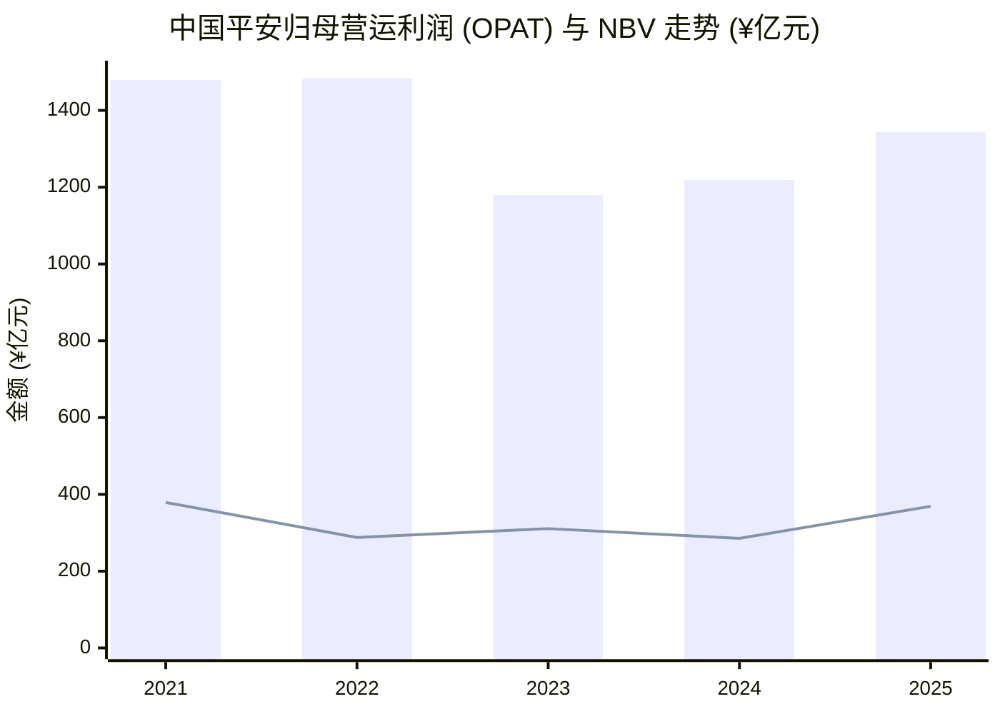
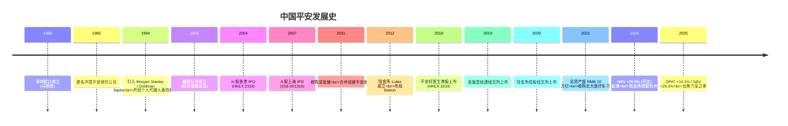
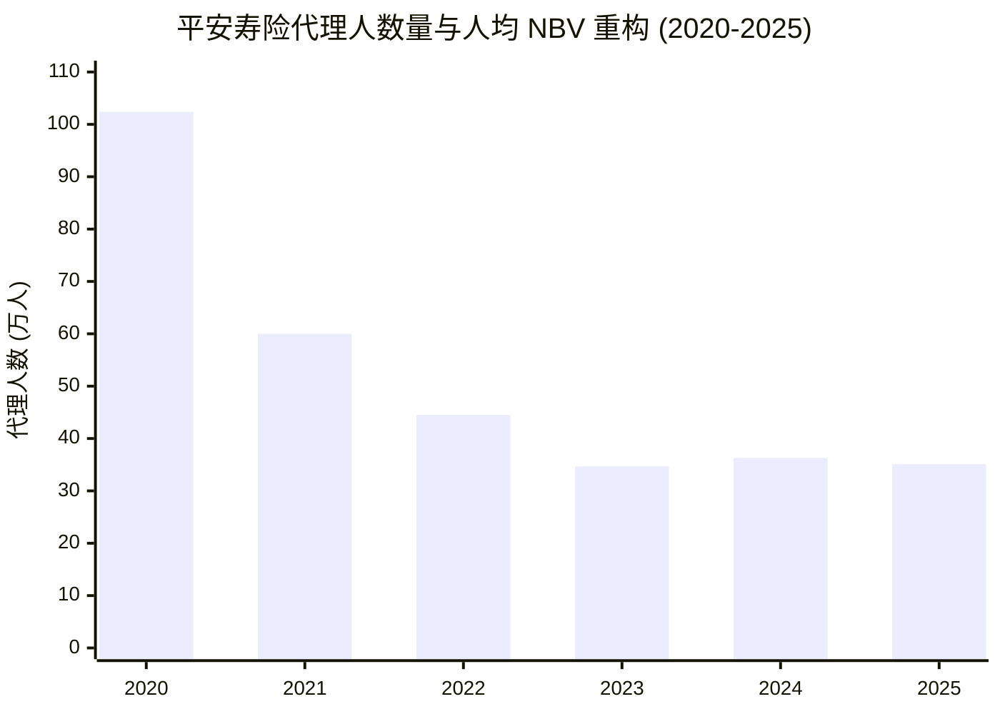
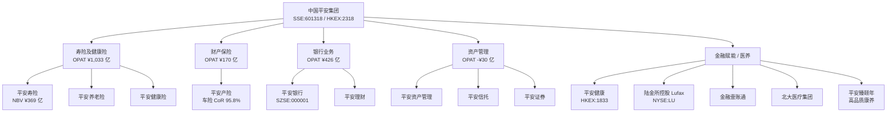
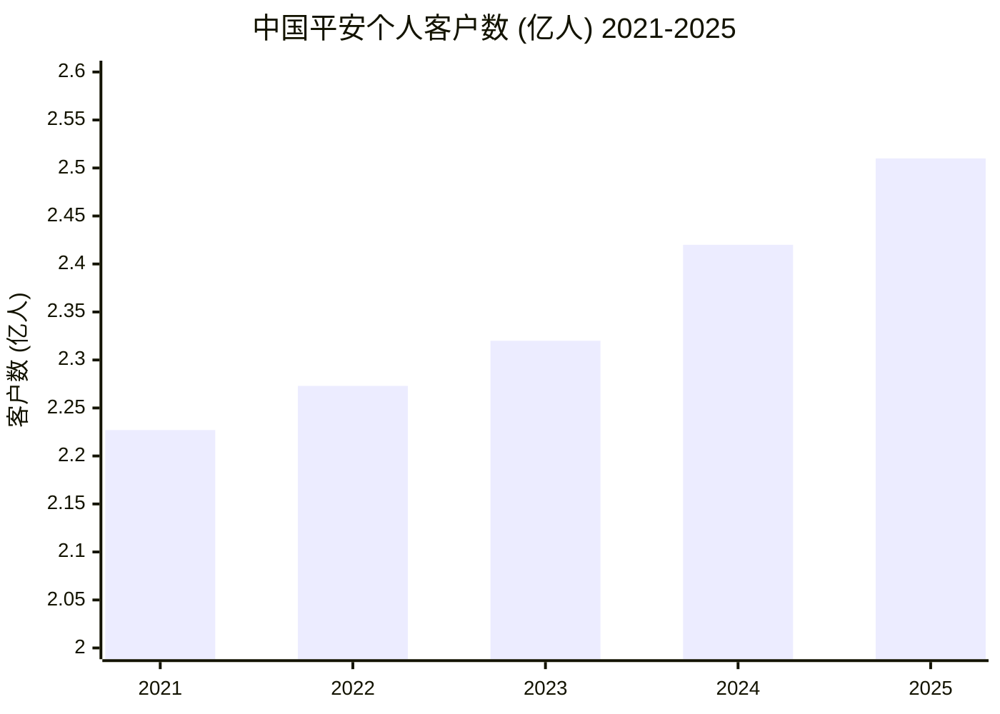
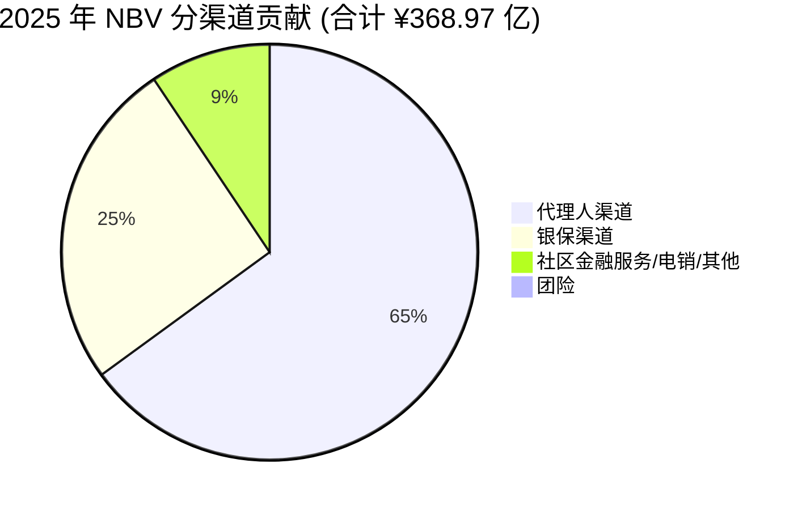
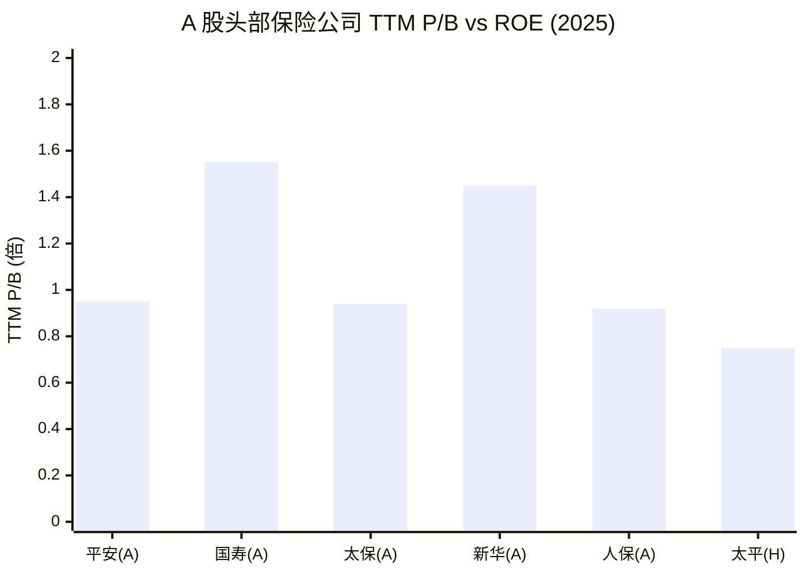
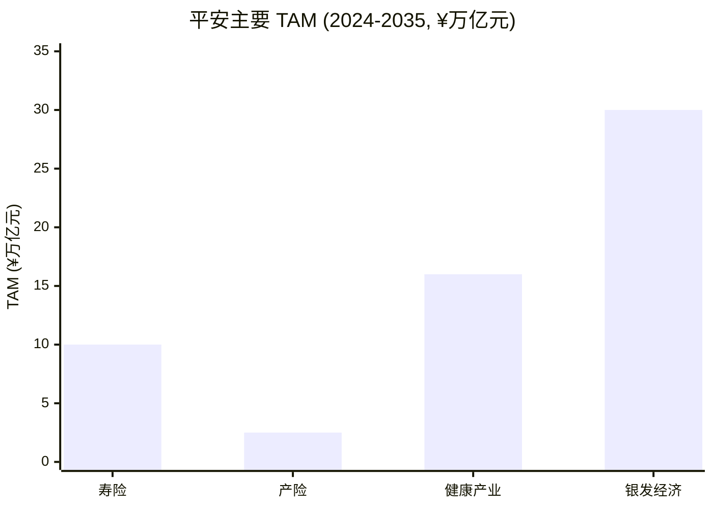

# 中国平安保险（集团）股份有限公司 公司研究

> **公司**: 中国平安保险（集团）股份有限公司（Ping An Insurance (Group) Company of China, Ltd.）
> **证券代码**: SSE:601318 (A 股) / HKEX:2318 (H 股)
> **核心子公司上市**: 平安银行 (SZSE:000001)、平安健康 (HKEX:1833)、陆金所控股 Lufax (NYSE:LU / HKEX:6623)
> **报告语言**: 简体中文（金融、保险、监管术语保留英文形式）
> **截至日期**: 2026-06-03 (财务数据截至 2025-12-31; 经营更新含 2026-Q1)

---

## 目录

1. 公司概览 (Company Overview)
2. 公司历史 (Company History)
3. 管理团队 (Management Team)
4. 产品与服务 (Products & Services)
5. 客户与上市策略 (Customers & Distribution)
6. 行业概览 (Industry Overview)
7. 竞争格局 (Competitive Landscape)
8. 市场机会 (Market Opportunity / TAM)
9. 风险评估 (Risk Assessment)
10. 投资人视角评分 (Investor-Lens Scorecards)
11. 参考资料 (References)

---

## 1. 公司概览 (Company Overview)

中国平安保险（集团）股份有限公司，以下简称"中国平安"或"平安集团"，是中国最大的综合性金融服务集团之一，业务横跨 `life insurance (寿险与健康险, 寿险及健康险)`、`property & casualty insurance / P&C (财产保险)`、`banking (银行业务)`、`asset management (资产管理)`、`fintech (金融科技)` 与 `health care + senior care (医疗养老)` 六大板块。公司在香港联合交易所 (`HKEX:2318`) 和上海证券交易所 (`SSE:601318`) 双重一级上市，是 `MSCI China`、`Hang Seng Index`、`CSI 300` 与 `FTSE China A50` 等核心指数的成份股。根据 2025 年年度报告，公司截至 2025 年末拥有 `2.51 亿` 个人客户 ("近 40 年来为 2.51 亿个人客户提供专业的金融、医养、健康管理服务"），是中国客户基础最大的金融服务集团；归属于母公司股东的 `operating profit (营运利润, OPAT)` 达 **¥1,344.15 亿元，同比 +10.3%**，营业收入 ¥10,505.06 亿元 +2.1% ([中国平安 2025 年年度报告, 经营亮点](https://static.cninfo.com.cn/finalpage/2026-03-27/1225038263.PDF))。

2025 年是平安寿险 NBV 自 2021 年低谷以来的关键修复年。`new business value (新业务价值, NBV)` 达 **¥368.97 亿元，同比 +29.3%**；按标准保费口径的 `NBV margin (新业务价值率)` 为 **28.5%，同比上升 5.8 个百分点**。集团已实现 NBV 连续两年回升的格局：2024 年可比口径 NBV +28.8%，叠加 2025 年的高速恢复，对应 2021 年低谷的 `¥378.98 亿元` ([中国平安 2021 年年度报告, 关于我们章节](https://static.cninfo.com.cn/finalpage/2022-03-18/1212609975.PDF)）已基本完成累计回补。寿险及健康险业务的 `embedded value (内含价值, EV)` 截至 2025 年末为 ¥9,286.30 亿元，同比 +11.2%，集团 EV 为 ¥15,042.88 亿元 ([中国平安 2025 年年度报告, 内含价值分析](https://static.cninfo.com.cn/finalpage/2026-03-27/1225038263.PDF)）。

**估值快照（截至 2026-06-03，A/H 同时披露）**。A 股收盘价 RMB 53.70，市值约 RMB 9,724 亿；H 股收盘 HKD 57.80，市值约 HKD 10,466 亿 ([Yahoo Finance 601318.SS 行情](https://finance.yahoo.com/quote/601318.SS), [Yahoo Finance 2318.HK 行情](https://finance.yahoo.com/quote/2318.HK))。`TTM P/E` A 股约 7.4 倍、H 股约 6.9 倍；`P/B` 分别约 0.95 倍 / 0.89 倍。对标中国人寿 `TTM P/E` 约 6.4 倍（A 股，[Yahoo Finance 601628.SS](https://finance.yahoo.com/quote/601628.SS))、中国太保 `TTM P/E` 约 5.7 倍 ([Yahoo Finance 601601.SS](https://finance.yahoo.com/quote/601601.SS))、新华保险 `TTM P/E` 约 4.9 倍 ([Yahoo Finance 601336.SS](https://finance.yahoo.com/quote/601336.SS))。平安 `P/E` 略高于纯寿险同业，但其 `P/B` 低于 1.0× 表明市场对其综合金融架构、医疗养老的"非保险"业务给予折价；H 股相对 A 股有 ~12% 折价（按行情比价，含汇率换算约持平 NAV）。`H 股股息率` 在末期股息派付后年化约 5.4%，反映稳健派息预期；A 股股息率约 5.0%。

2025 年公司 `dividend payout ratio (分红率)` 为 36.4%（按归母 OPAT 口径），全年每股股息 RMB 2.70（中期 0.95 + 末期建议 1.75），同比 +5.9%；现金分红总额 ¥488.91 亿元，**连续 14 年保持上涨**，是 A/H 大金融蓝筹中分红连续性最强的标的之一 ([中国平安 2025 年年度报告, 经营亮点](https://static.cninfo.com.cn/finalpage/2026-03-27/1225038263.PDF))。

*数据来源：[2021](https://static.cninfo.com.cn/finalpage/2022-03-18/1212609975.PDF), [2022](https://static.cninfo.com.cn/finalpage/2023-03-16/1216129433.PDF), [2023](https://static.cninfo.com.cn/finalpage/2024-03-22/1219376072.PDF), [2024](https://static.cninfo.com.cn/finalpage/2025-03-20/1222847447.PDF), [2025](https://static.cninfo.com.cn/finalpage/2026-03-27/1225038263.PDF) 年度报告（柱状=OPAT；折线=NBV）。注：2024、2025 NBV 系基于各自年初假设的口径。*

---

## 2. 公司历史 (Company History)

中国平安由现任董事长 `马明哲 (MA Mingzhe)` 于 1988 年 3 月 21 日创立于深圳蛇口，是中国改革开放后第一家由企业入股发起、且第一家引入外资股东的股份制保险公司。公司初名"平安保险公司"，注册资本 RMB 4,200 万元，主营财产保险业务，是改革开放试验田蛇口工业区的金融试点产物 ([中国平安 2025 年年度报告, 董事简历, 马明哲先生](https://static.cninfo.com.cn/finalpage/2026-03-27/1225038263.PDF)；马先生在创办本公司前曾任招商局蛇口工业区社会保险公司副经理)。

1992 年 6 月公司更名为"中国平安保险公司"，成为全国性保险公司；1994 年首创个人代理人寿险营销体系，开创中国个人寿险业务先河，并引入 `Morgan Stanley` 与 `Goldman Sachs` 作为股东，成为中国首家有外资股东的金融机构 ([中国平安公司历史页面](https://group.pingan.com/about_us/history.html))。1995 年成立平安证券，1996 年收购中国工商银行珠江三角洲金融信托联合公司组建平安信托。2002 年 10 月 `HSBC` 入股成为单一最大股东，为后续国际化与公司治理升级奠基。

2003 年 2 月 14 日中国平安保险（集团）股份有限公司成立，标志着公司转型为综合金融控股集团，是中国金融业综合经营试点。2004 年 6 月 24 日 H 股在香港交易所主板上市，成为当年港交所最大 IPO；2007 年 3 月 1 日 A 股在上海证券交易所上市，是当年世界最大的保险公司 IPO ([中国平安公司历史页面](https://group.pingan.com/about_us/history.html))。2011 年 7 月，平安成为深圳发展银行控股股东，深发展次年合并原平安银行，统一更名为"平安银行"，从此构建起"保险+银行"双轮驱动 ([中国平安 2025 年年度报告, 释义部分](https://static.cninfo.com.cn/finalpage/2026-03-27/1225038263.PDF))。

2012 年陆金所 `Lufax` 设立，平安开始布局 `fintech (金融科技)` 与 `healthtech (医疗科技)`。2018 年平安好医生 (HKEX:1833) 港股上市，2019 年金融壹账通 `OneConnect` 纽交所上市；2018 年个人客户超 2 亿人，2020 年陆金所控股纽交所上市。2021 年 9 月集团总资产首次突破 RMB 10 万亿元 ([中国平安公司历史页面](https://group.pingan.com/about_us/history.html))。2021 年同年起平安加大医养布局：收购方正集团下属 `北大医疗集团 (Peking University Healthcare Group)`，正式将"医疗养老"提升为继综合金融之后的第二曲线 ([中国平安 2025 年年度报告, 医疗养老章节](https://static.cninfo.com.cn/finalpage/2026-03-27/1225038263.PDF))。

近五年公司经历了寿险业务的深度改革（人海战术→高质量代理人）与房地产敞口的密集减值。2021–2023 年净利润显著回落，2024 年触底反弹（同比 +47.8%），2025 年 OPAT +10.3%、NBV +29.3%，已结构性走出 2021–2023 周期低谷。2024 年起逐步将平安健康、陆金所控股、平安医保科技、金融壹账通从联营企业重新合并报表，并完成出售汽车之家以剥离非金融非战略性资产，体现"聚焦主业、增收节支" 的最新战略导向 ([中国平安 2025 年年度报告, 营运利润章节](https://static.cninfo.com.cn/finalpage/2026-03-27/1225038263.PDF))。

---

## 3. 管理团队 (Management Team)

**`马明哲 (MA Mingzhe)` — 创始人、董事长（执行董事）**。现年 70 岁，自 1988 年 3 月 21 日起出任董事至今，是中国平安自创立以来唯一的董事长。马先生历任本公司总经理、董事、董事长兼首席执行官；2020 年 6 月起不再担任首席执行官，现主要负责本公司的战略、人才、文化及重大事项决策。在成立本公司之前，马先生曾任招商局蛇口工业区社会保险公司副经理。教育背景为中南财经政法大学（原中南财经大学）货币银行学博士学位 ([中国平安 2025 年年度报告, 第 134 页 董事简历](https://static.cninfo.com.cn/finalpage/2026-03-27/1225038263.PDF))。马明哲是中国金融业最具影响力的企业家之一，其推动的"综合金融"、"金融+科技"、"综合金融+医疗养老"三阶段战略，是公司过去 35+ 年规模扩张与业务韧性的根本驱动力。在 2020 年放弃 CEO 角色后转为"战略+人才"型董事长，与新一代联席 CEO 形成"战略掌舵、专业经营"的双层架构。

**`谢永林 (Xie Yonglin)` — 总经理、联席首席执行官（执行董事）**。现年 57 岁，于 1994 年加入本公司，自 2020 年 4 月 3 日起出任董事；同时兼任 `平安银行` 董事长和 `平安资产管理` 非执行董事。谢先生在平安体系内的经历极其完整：先后出任平安产险支公司副总经理、平安寿险分公司副总经理 / 总经理 / 市场营销部总经理；2005-2006 年任本公司发展改革中心副主任；2006-2013 年历任平安银行运营总监、人力资源总监、副行长；2013-2016 年任平安证券总经理 / 首席执行官 / 董事长；2016-2019 年任本公司副总经理。教育背景为南京大学理学硕士、管理学博士 ([中国平安 2025 年年度报告, 第 134 页](https://static.cninfo.com.cn/finalpage/2026-03-27/1225038263.PDF))。谢永林是平安"综合金融"业务侧最重要的执行人，在平安银行任内推动零售转型与"私行 + 财富 + 银保"协同体系，是当前 NBV 复苏与平安银行 `cross-sell (交叉销售)` 共振的关键架构师。

**`郭晓涛 (Guo Xiaotao, Michael Guo)` — 联席首席执行官、副总经理（执行董事）**。现年 54 岁，于 2019 年加入本公司，自 2024 年 9 月 18 日起出任董事，与谢永林组成双联席 CEO 架构。郭先生兼任平安健康董事长，及平安寿险、平安产险、平安银行和金融壹账通等本公司多家控股子公司的非执行董事。郭先生 2022 年 8 月至 2023 年 9 月先后任本公司副首席人力资源执行官、首席人力资源执行官；此前曾出任平安产险董事长特别助理、常务副总经理。加入平安前，郭先生曾任 `Boston Consulting Group (BCG)` 合伙人兼董事总经理、`Willis Towers Watson (Mercer 韦莱韬悦)` 资本市场业务全球联席 CEO。教育背景为澳大利亚新南威尔士大学工商管理硕士 ([中国平安 2025 年年度报告, 第 135 页](https://static.cninfo.com.cn/finalpage/2026-03-27/1225038263.PDF))。郭晓涛是公司国际化、医疗养老与代理人质量改革的核心推手，其同时分管平安健康，将"综合金融+医疗养老"两大支柱在执行层串联打通。

**`付欣 (FU Xin)` — 副总经理、首席财务官（执行董事）**。46 岁，2017 年加入本公司。2024 年 9 月 18 日起出任董事。先后任本公司企划部总经理、副首席财务执行官、首席运营官，加入平安前曾任 `Roland Berger (罗兰贝格)` 金融行业合伙人、`PwC` 执行总监。教育背景为上海交通大学工商管理硕士 ([中国平安 2025 年年度报告, 第 135 页](https://static.cninfo.com.cn/finalpage/2026-03-27/1225038263.PDF))。付欣是历任 CFO 中最年轻的一位，咨询背景使其在资本与战略沟通领域有更强的国际化敏感度。

---

## 4. 产品与服务 (Products & Services)

中国平安采用"以客户为中心、综合金融+医疗养老"的多业务线架构，对外通过 ~20 家持牌或控股子公司经营。下表为集团 2025 年五大主业的营运利润贡献结构：

| 业务板块 | 营运利润 (¥亿元) | 归母 OPAT (¥亿元) | YoY | 关键 KPI 一行简述 |
|---|---|---|---|---|
| **寿险及健康险** (Life & Health) | 1,032.65 | 997.52 | +2.9% | NBV ¥368.97 亿 (+29.3%); EV ¥9,286.30 亿 (+11.2%); 代理人 35.1 万 |
| **财产保险** (P&C) | 170.00 | 169.23 | +13.2% | CoR 96.8% (-1.5pp); 车险 CoR 95.8% (-2.3pp) |
| **银行业务** (Banking) | 426.33 | 247.11 | -4.2% (净利润) | 净息差 1.78%; 不良 / 拨备覆盖率良好 |
| **资产管理** (Asset Mgmt) | -30.00 | -37.85 | n/a | 仍在地产敞口出清周期 |
| **金融赋能** (FinTech / Lufax / 平安健康 / OneConnect) | 1.32 | 2.49 | 扭亏 | 平安健康 / 平安医保科技 / 金融壹账通 2025 起合并报表 |

数据来源：[中国平安 2025 年年度报告, 第 37 页 营运利润勾稽表](https://static.cninfo.com.cn/finalpage/2026-03-27/1225038263.PDF)。

### 4.1 寿险及健康险 (Life & Health Insurance) — 集团核心利润支柱

`Life & Health (寿险及健康险)` 是平安体量最大、价值最厚的板块，2025 年贡献集团 OPAT 65%（按归母 OPAT 口径），同时承载 EV 与 NBV 这两个保险股的核心估值锚。公司通过**`平安寿险 (Ping An Life)`**、`平安养老险 (Ping An Annuity)`、`平安健康险 (Ping An Health Insurance)` 三家持牌主体经营。2025 年规模保费 ¥6,614.38 亿元（按险种结构：传统寿险 ¥2,311.09 亿 / 长期健康险 ¥1,051.57 亿 / 年金 ¥1,081.55 亿 / 万能险 ¥898.70 亿 / 分红险 ¥918.87 亿 / 意外及短期健康险 ¥350.57 亿 / 投资连结险 ¥2.03 亿）([中国平安 2025 年年度报告, 第 48 页](https://static.cninfo.com.cn/finalpage/2026-03-27/1225038263.PDF))。其中**分红险大幅增长 41.3% (¥650.40 亿→¥918.87 亿)，反映利率下行环境下行业向"低保证利率+浮动分红" 产品迁移的趋势**。

NBV 多渠道结构是 2025 年改革成效的最佳印证：

| 渠道 | NBV 2025 (¥亿元) | YoY | 首年保费 (¥亿元) | NBV margin (标准保费口径) |
|---|---|---|---|---|
| **代理人渠道** | 238.23 | +10.4% | 773.89 | 38.0% (+9.5pp) |
| **银保渠道** | 94.08 | +138.0% | 383.30 | 28.8% (-1.9pp) |
| **社区金融服务、电销及其他** | 34.41 | +29.2% | 204.94 | 17.5% (+1.6pp) |
| **团险业务** | 2.25 | -33.6% | 217.10 | 1.5% (-0.1pp) |
| **合计** | **368.97** | **+29.3%** | **1,579.23** | **28.5% (+5.8pp)** |

数据来源：[中国平安 2025 年年度报告, 第 74 页 新业务价值](https://static.cninfo.com.cn/finalpage/2026-03-27/1225038263.PDF)。

**代理人渠道质量明显修复**。2025 年末个人寿险销售代理人 35.1 万人，同比 -3.3%（2024 年末 36.3 万）；代理人人均 NBV ¥80,375 / 年 (+17.2%)；活动率 50.4%（-2.4pp）；代理人月均收入 ¥9,299（-10.5%）。把视角拉长，平安代理人数从 2020 年末 **`102.4 万`** 高峰持续清虚至 2023 年末 **`34.7 万`**（累计降幅 -66%），2024 年首度企稳回升至 36.3 万，2025 年小幅回落至 35.1 万，反映"做优、增优、育优"的高质量代理人体系已基本完成结构再造 ([中国平安 2021 年年度报告, 第 31 页](https://static.cninfo.com.cn/finalpage/2022-03-18/1212609975.PDF), [2022 年报第 27 页](https://static.cninfo.com.cn/finalpage/2023-03-16/1216129433.PDF), [2023 年报第 18 页](https://static.cninfo.com.cn/finalpage/2024-03-22/1219376072.PDF))。

*数据来源：2020-2025 [中国平安 年度报告](https://static.cninfo.com.cn/finalpage/2026-03-27/1225038263.PDF) 各年寿险及健康险章节。代理人人均 NBV 从 2020 年 ¥40,688/人 → 2023 年的低点回升 → 2024 年 ¥68,572 → **2025 年 ¥80,375**，已基本回到 2018-2019 改革前水准。*

**银保渠道是 2025 年最大亮点**。NBV +138.0% 至 ¥94.08 亿元，首年保费 +95.1% 至 ¥383.30 亿元。平安寿险与 `平安银行` 的独家代理模式是关键护城河：平安银行 2025 年代理个人保险收入 ¥12.92 亿元，同比 +53.3%，是大财富管理业务的核心引擎之一 ([中国平安 2025 年年度报告, 第 60 页 银行业务](https://static.cninfo.com.cn/finalpage/2026-03-27/1225038263.PDF))。同时积极拓展国有行 / 头部股份行 / 城商行外部合作渠道。**`bancassurance (银保渠道)` 已成为平安寿险继代理人之后的第二大 NBV 来源**，对寿险新业务价值的贡献占比同比提升 12.1 个百分点。

**`13/25-month persistency (13 / 25 个月保单继续率)`**：2025 年 13 个月继续率 **97.4% (+1.0pp)**，25 个月继续率 **94.9% (+5.2pp)**，处于行业最优水位之一。EV 内含价值角度，2025 年寿险及健康险 EV 营运回报率 11.2%（+0.2pp）；EV 期初 ¥8,350.93 亿 → 期末 ¥9,286.30 亿，EV 增长来源：预计回报 ¥507.59 亿 + 新业务价值创造 ¥424.52 亿 - 营运假设及模型变动 ¥137.49 亿 + 营运经验差异 ¥144.84 亿 - 市场价值调整 ¥104.17 亿 + 投资回报差异 ¥298.18 亿 - 股东分红 ¥393.31 亿 + 股东注资 ¥200.32 亿 ([中国平安 2025 年年度报告, 第 75 页 内含价值变动表](https://static.cninfo.com.cn/finalpage/2026-03-27/1225038263.PDF))。EV 假设：传统险贴现率 8.5%，分红 / 万能险 7.5%，长期投资回报率假设 4.0%。

### 4.2 财产保险 (P&C Insurance) — 行业最优 CoR 的车险龙头

**`平安产险 (Ping An P&C)`** 是中国第二大产险公司，2025 年原保险保费收入 **¥3,431.68 亿元，同比 +6.6%**，保险服务收入 ¥3,389.12 亿元 (+3.3%)，营运利润 ¥170.00 亿元 (+13.2%)，营运 ROE 12.0% ([中国平安 2025 年年度报告, 第 51 页 财产保险](https://static.cninfo.com.cn/finalpage/2026-03-27/1225038263.PDF))。

**`combined ratio (综合成本率, CoR)`** 是 P&C 业务的核心指标：

| 险种 | 保险服务收入 (¥亿元) | CoR | 承保利润 (¥亿元) |
|---|---|---|---|
| 车险 | 2,284.95 | **95.8%** (-2.3pp) | 94.96 |
| 意外伤害及健康保险 | 327.69 | 99.4% | 1.89 |
| 责任保险 | 240.52 | 106.8% | -16.42 |
| 农业保险 | 114.91 | 98.7% | 1.52 |
| 货物运输保险 | 104.54 | 98.0% | 2.07 |
| **整体** | **3,389.12** | **96.8%** (-1.5pp) | **107.17** |

数据来源：[中国平安 2025 年年度报告, 第 51 页](https://static.cninfo.com.cn/finalpage/2026-03-27/1225038263.PDF)。

车险 CoR 95.8%（-2.3pp）显著优于行业（行业平均约 98–99%），是行业最优水平之一；非车险中责任保险 CoR 106.8% 仍承压。2025 年 P&C 净利润 ¥145.97 亿元 (-2.8%)，但**该下降主要因出售汽车之家带来的一次性影响**，营运利润口径（剔除非经常性）仍 +13.2%。`solvency (偿付能力)` 方面，平安产险核心 / 综合偿付能力充足率分别 173.5% / 217.1%，远高于监管最低要求 50% / 100%。

### 4.3 银行业务 (Banking) — 净息差承压的零售转型样本

**`平安银行 (SZSE:000001, Ping An Bank)`** 由平安集团持股 ~58%，2025 年实现营业收入 ¥1,314.42 亿元（-10.4%）、净利润 ¥426.33 亿元（-4.2%）。营收下降一方面受贷款利率下行和业务结构调整影响（**`net interest margin (净息差, NIM)` 1.78%，同比下降 9 个基点**）；另一方面债券投资等非利息净收入下降 -33.0%。但平安银行通过数字化转型实现降本增效：业务及管理费 -5.9%、信用及其他资产减值损失 -17.9%（信贷成本 1.38%，-18bps）([中国平安 2025 年年度报告, 第 63 页 银行业务](https://static.cninfo.com.cn/finalpage/2026-03-27/1225038263.PDF))。

零售业务方面，零售客户数 1.279 亿户 (+1.9%)，其中财富客户 149.15 万户 (+2.4%)，私行客户 (`AUM ≥ ¥600 万`) 10.56 万户 (+9.1%)；管理零售客户 AUM ¥42,384 亿元 (+1.1%)，私行 AUM ¥19,913 亿元 (+0.8%)。**虽然零售业务营业收入因利率下行 -13.5%，但减值损失下降推动零售净利润同比 +828.4% 至 ¥26.83 亿元**，显示资产质量与客群结构正在改善。

### 4.4 资产管理 (Asset Management)

资产管理业务 2025 年仍呈亏损（营运利润 -¥30.00 亿元），主要因华夏幸福、中国金茂等地产相关股权投资仍在出清。截至 2025 年末，**华夏幸福权益法投资账面价值已减至 0**（年初 ¥11.41 亿元 - 本期减少 ¥11.41 亿元；累计减值准备 ¥97.96 亿元，**与 2024 年末持股 25.02% / 减值准备 ¥98.20 亿元相比，2025 年实际已基本清零**）；**中国金茂控股账面 ¥27.48 亿元，2025 年新增计提减值准备 ¥6.56 亿元，累计减值 ¥44.55 亿元** ([中国平安 2025 年年度报告, 第 260 / 262 页 长期股权投资](https://static.cninfo.com.cn/finalpage/2026-03-27/1225038263.PDF))。

### 4.5 金融赋能 (FinTech Subsidiaries) — 由"独立赛道"回归"主业协同"

平安近三年的科技子公司战略已从"独立 IPO + 估值变现"调整为"主业协同 + 整合合并"：

- **平安健康 (HKEX:1833, Ping An Healthcare and Technology)**：2025 年营业收入 ¥54.68 亿元 (+13.7%)，净利润 ¥3.80 亿元 (2024 年 ¥0.81 亿元)，调整后净利润 ¥4.14 亿元。作为集团医养生态圈核心旗舰，2025 年起重新纳入集团合并报表（此前权益法核算，持股 39.41%）。汇聚 3,500+ 签约专家医生，AI+真人医生服务覆盖 100% 集团个人客户；合作医院数超 5,100 家、合作药店数超 24 万家 ([中国平安 2025 年年度报告, 第 68 页 金融赋能业务](https://static.cninfo.com.cn/finalpage/2026-03-27/1225038263.PDF))。
- **陆金所控股 Lufax (NYSE:LU / HKEX:6623)**：2024 年完成纳入集团合并报表（此前为联营企业，持股从 ~30% 提升），定位为"中国领先的小微企业主金融服务赋能机构"，业务正从 P2P 财富时代彻底转向 `O2O (online-to-offline)` 全流程小微借款服务，利用 AI 风控模型提升借款人风险识别能力。
- **金融壹账通 (NYSE: 现已退市, OneConnect)**：定位为"金融机构科技 SaaS 平台"，2025 年起纳入集团合并报表；战略意义大于财务贡献。
- **平安医保科技 (Ping An Medicare Tech, 医健通)**：2025 年起纳入集团合并。

**汽车之家出售**（2025 年完成）是非战略资产剥离的代表案例，**全周期实现盈利**（"自初始投资起至退出，公司投资汽车之家全周期实现盈利"）([中国平安 2025 年年度报告, 第 51 页 注释 1](https://static.cninfo.com.cn/finalpage/2026-03-27/1225038263.PDF))。

### 4.6 医疗养老 — 第二增长曲线雏形

医疗养老板块是"综合金融+医疗养老"战略的右半边，覆盖**北大医疗集团 + 平安健康 + 机构养老 + 平安臻颐年高品质康养社区**四大支柱。2025 年北大医疗集团营业收入 ¥57.23 亿元，平安健康 ¥54.68 亿元；高品质康养社区已布局 5 个城市共 6 个项目（上海颐年城静安 8 号、深圳颐年城福田已运营），居家养老服务覆盖全国，累计超 24 万名客户获得服务资格 ([中国平安 2025 年年度报告, 第 41 页](https://static.cninfo.com.cn/finalpage/2026-03-27/1225038263.PDF))。

**关键的"商业闭环"逻辑**：医养服务是寿险与健康险的"`Product + Service (产品+服务)`"差异化壁垒。2025 年使用医养服务的客户加保率提升 4 个百分点，享有居家养老权益的客户寿险新单件均提升至普通客户的 **5.2 倍**，高品质养老权益客户寿险新单件均提升至 **23.4 倍**，医疗健康权益客户寿险新单件均提升至 **1.5 倍**。这是 2025 年 NBV 高增长的微观机理之一。

---

## 5. 客户与上市策略 (Customers & Distribution)

中国平安的客户体量与质量是其最核心的护城河。截至 2025 年末，集团**个人客户数 2.51 亿，全年新增获客 3,303 万人**，覆盖中国近 **1/6 的人口**（"大约每 6 个中国人中就有 1 位是平安客户"）([中国平安 2025 年年度报告, 第 18 / 26 页](https://static.cninfo.com.cn/finalpage/2026-03-27/1225038263.PDF))。这个数字超过中国人寿（A 股寿险龙头）的个人客户基础。

*数据来源：[2021](https://static.cninfo.com.cn/finalpage/2022-03-18/1212609975.PDF), [2022](https://static.cninfo.com.cn/finalpage/2023-03-16/1216129433.PDF), [2023](https://static.cninfo.com.cn/finalpage/2024-03-22/1219376072.PDF), [2024](https://static.cninfo.com.cn/finalpage/2025-03-20/1222847447.PDF), [2025](https://static.cninfo.com.cn/finalpage/2026-03-27/1225038263.PDF) 年度报告中"客户经营进展"章节。*

**客户经营三大质量指标**：

1. **客均合同数 2.94 个**（年初 2.92，+0.7%），客户服务满 5 年及以上者占比 75.0%，其客均合同数为第 1 年新增客户的 **1.7 倍**——印证客户生命周期价值递增 ([中国平安 2025 年年度报告, 第 21 页](https://static.cninfo.com.cn/finalpage/2026-03-27/1225038263.PDF))。
2. **多产品留存率**：持有 2 类产品的客户留存率 **97%**，持有 3 类及以上的留存率高达 **99%**。这是"综合金融"商业模式的可量化护城河。
3. **客户结构性增长**：保障类、资产类、服务类客户分别 +3.9% / +2.5% / +4.0%，信贷类受行业周期性调整。

**客户集中度**。寿险及健康险按地区分析的保费收入显示**广东 17.5% / 北京 6.9% / 浙江 6.8% / 江苏 6.4% / 山东 6.3% (前 5 大省份合计 43.9%) 的规模保费集中度**——这是合理且健康的分散度，不构成单点客户依赖 ([中国平安 2025 年年度报告, 第 48 页](https://static.cninfo.com.cn/finalpage/2026-03-27/1225038263.PDF))。**与单一大客户依赖的工业 / TMT 公司截然不同**，保险公司的"客户集中度"风险更多是产品 / 地域 / 渠道层面，非个体客户层面。

**分销网络**："`代理人 (agent channel)` + `bancassurance (银保)` + `social media (社区金融服务、电销)` + `direct (团险)`" 四元结构。2025 年代理人渠道仍是 NBV 第一来源（占 64.6%），但银保渠道贡献占比从 2024 年 13.9% 跃升至 25.5%。这是平安从"单一代理人依赖" 走向"多元渠道协同"的关键里程碑——这一架构调整使公司在代理人增长见顶 / 监管收紧的行业大背景下，仍能维持 NBV 高增长。

*数据来源：[中国平安 2025 年年度报告, 第 74 页 新业务价值分渠道](https://static.cninfo.com.cn/finalpage/2026-03-27/1225038263.PDF)。注：仅适用寿险及健康险板块的 NBV，非集团口径。*

---

## 6. 行业概览 (Industry Overview)

中国保险业是平安最重要的母市场。`MIIT (工信部)` 与国家金融监督管理总局口径下，2024 年中国保险业原保险保费收入约 **¥5.7 万亿元**（其中寿险约 ¥4.1 万亿、产险约 ¥1.6 万亿）。中国是全球第二大保险市场，但人均 / GDP 渗透率仍显著低于成熟市场：2023 年中国保险密度约 ¥3,000 / 人，渗透率约 4.5%，而美国分别约 USD 8,000 / 人、12%。这一缺口决定了中国保险业未来 10-20 年仍有结构性增长空间。

**核心行业驱动力**：

1. **人口老龄化**。截至 2024 年末，中国 60 岁及以上老年人口已突破 3 亿，中国人均预期寿命达 79 岁 ([中国平安 2025 年年度报告, 第 22 页 引用国家统计局 / 卫健委数据](https://static.cninfo.com.cn/finalpage/2026-03-27/1225038263.PDF))。养老金缺口、医疗支出占比上升驱动 `life insurance + annuity + health insurance` 长期需求。
2. **居民财富升级**。"婴儿潮"群体（60-70 后）正进入养老阶段，财富基础最厚，对寿险 / 健康险 / 财富管理需求处于历史高位。
3. **`interest rate (利率) 下行环境`**。10 年期国债到 2026 年初已下行至 ~1.7%，传统寿险高保证利率产品压力显著。监管端推动从"保底高、浮动低"向"低保底、高浮动"的产品迁移——这是 2025 年分红险保费 +41.3% 的根本原因 ([中国平安 2025 年年度报告, 第 48 页](https://static.cninfo.com.cn/finalpage/2026-03-27/1225038263.PDF))。
4. **健康中国 2030 与多层次养老体系**。"健康中国 2030"规划纲要预计 2030 年健康服务业总规模达 ¥16 万亿元，《银发经济蓝皮书》预计 2035 年中国银发经济规模达 ¥30 万亿元 ([中国平安 2025 年年度报告, 第 23 页](https://static.cninfo.com.cn/finalpage/2026-03-27/1225038263.PDF))。多层次保障体系（基本医保 + 商业健康险 + 长期护理险）为商业保险公司打开第二曲线。
5. **`C-ROSS II (偿二代二期)` 监管周期**。2022 年起实施的偿二代二期工程提高资本要求，倒逼行业从"规模冲刺"转向"质量经营"，客观上有利于资本雄厚 / 经营稳健的头部公司。

**车险费率市场化**改革（2020 年起）大幅压低车均保费但同时推动行业出清，平安产险已连续 14 年被工信部认证"车险第一品牌"（2024 年），其 95.8% 的车险 CoR 是行业头部三家（人保 / 平安 / 太保）中的最优水位之一。

---

## 7. 竞争格局 (Competitive Landscape)

中国大金融 + 综合金融领域的主要可比对手如下：

| 公司 | TTM P/E | P/B | 市值 (¥亿) | 业务画像 |
|---|---|---|---|---|
| **中国平安 (601318.SS / 2318.HK)** | **7.4 / 6.9** | **0.95 / 0.89** | A:9,724 / H:10,466 (HKD) | 综合金融 + 医养，全 spectrum |
| 中国人寿 (601628.SS / 2628.HK) | 6.4 / 4.7 | 1.55 / 1.14 | A:9,293 / H:7,886 (HKD) | 纯寿险龙头，A 股渠道独占 |
| 中国太保 (601601.SS / 2601.HK) | 5.7 / 5.0 | 0.94 / 0.82 | A:3,013 / H:3,042 (HKD) | 寿险 + 产险，无大银行 |
| 新华保险 (601336.SS) | 4.9 | 1.45 | 1,797 | 纯寿险，渠道单一 |
| 中国人保 (601319.SS) | 6.7 | 0.92 | 2,945 | 产险龙头 + 寿险 |
| 中国太平 (0966.HK) | 2.7 | 0.75 | 713 (HKD) | 寿险 + 产险，规模较小 |

数据来源：[Yahoo Finance — 各公司行情, 截至 2026-06-03](https://finance.yahoo.com/quote/601318.SS)。

**平安的差异化优势 / 独特竞争位势**：

1. **唯一的"全牌照综合金融控股集团"**。寿险 + 产险 + 银行 + 资产管理 + 证券 + 信托 + 资管 + 健康险 + 养老险 + fintech，一应俱全；除平安外，仅中信 / 光大 / 招商局有类似架构（但保险体量小一个量级）。`Berkshire Hathaway` 是国际可比对象，但 Berkshire 没有大银行也没有医养。
2. **客户基础**。2.51 亿个人客户、客均 2.94 个合同，是国寿（约 3 亿但客均合同低）与太保（1.8 亿）所不及的"质量化基数"。多产品留存率 97-99% 是真正的护城河。
3. **银保独家代理模式**。`平安寿险 + 平安银行` 的独家代理是行业内独一无二的"内部银保渠道"，2025 年 NBV +138% 增速领先全行业。
4. **代理人质量改革领先**。平安 2020-2023 年清虚 ~66% 早于行业（行业平均 2021-2024 年清虚 ~50%），人均 NBV 2025 年 ¥80,375 是大型寿险公司中较高水准。
5. **医疗养老布局深度**。北大医疗集团 + 平安健康 + 平安臻颐年是中国保险公司中最完整的"医-保-养"协同体系；中国人寿 / 中国太保的医养布局明显较浅。
6. **数字化与 AI**。2025 年 AI 坐席服务量 17.02 亿次（占客服总量 80%），AI 代码渗透率 35.49%，反欺诈智能化理赔拦截减损 ¥105.1 亿元（连续三年超百亿）([中国平安 2025 年年度报告, 第 35 页](https://static.cninfo.com.cn/finalpage/2026-03-27/1225038263.PDF))。

**结构性弱势**：

1. **`asset management (资产管理)` 板块持续亏损**。资产管理 OPAT -¥30 亿，反映华夏幸福 / 中国金茂等历史地产敞口仍在出清中。
2. **平安银行 NIM 承压**。1.78%（-9bps）反映利率下行宏观环境，零售导向银行受冲击更大。
3. **跨境投资变量**。H 股折价 / 地缘风险 / 汇率波动可能放大短期估值波动。
4. **`分析师观点：`**A 股 / H 股市场长期把平安"综合金融折价"，单一寿险股估值（如新华、太保）反弹时平安弹性可能跑输纯保险股。

---

## 8. 市场机会 (Market Opportunity / TAM)

**寿险及健康险 TAM**。2024 年中国寿险保费 ~¥4.1 万亿元，行业渗透率仍偏低（~3% of GDP）。未来 10 年若渗透率向 6% 提升，对应行业规模将到 ¥8-10 万亿元；按平安寿险目前约 12% 市占率，对应平安寿险年化保费可至 **¥1.0-1.2 万亿元**（当前 ~¥4,900 亿元）。

**财产保险 TAM**。2024 年产险保费 ~¥1.6 万亿元，平安产险市占 ~21%。车险已基本饱和，未来增量主要来自非车险（责任险 / 农险 / 健康险 / 货运险 / 工程险）；行业整体未来 5 年 CAGR 约 5-7%，平安产险目标可保持 ~6% 增长。

**医疗 + 养老 TAM**。"健康中国 2030"预计 2030 年健康服务业总规模 ¥16 万亿元，《银发经济蓝皮书》预计 2035 年银发经济 ¥30 万亿元（数据来源：[中国平安 2025 年年度报告 第 23 页 引用国家文件](https://static.cninfo.com.cn/finalpage/2026-03-27/1225038263.PDF))。平安已建立的"四到（到线、到院、到家、到企）"服务体系 + 5,100+ 家合作医院 + 24 万合作药店，使其有能力切入这一万亿级 TAM 的支付方+服务方双重角色。

**银行（财富管理 / 资管 / 私行）**。零售 AUM ¥42,384 亿元，私行 AUM ¥19,913 亿元；私行客户增长 +9.1% 是结构性亮点。未来 5 年财富管理行业 CAGR 预计 8-10%。

*数据来源：寿险 / 产险 [中国平安 2025 年年度报告](https://static.cninfo.com.cn/finalpage/2026-03-27/1225038263.PDF) 经营章节及国家金融监督管理总局披露口径；健康产业引自[《健康中国 2030 规划纲要》](https://www.gov.cn/zhengce/2016-10/25/content_5124174.htm)；银发经济引自《中国银发经济发展报告 2024》（年报第 23 页转引）。*

---

## 9. 风险评估 (Risk Assessment)

按 4 大类（公司特定 / 行业市场 / 金融 / 宏观）梳理 11 项主要风险：

### 公司特定风险

1. **`real-estate concentration (不动产敞口) 出清节奏`**。截至 2025 年末保险资金不动产投资余额 ¥2,021.87 亿元，占总投资资产 3.1%（其中物权 86.8% / 债权 6.7% / 股权 6.5%）；权益法核算下的华夏幸福已基本清零，但中国金茂账面 ¥27.48 亿元仍待持续观察。债权计划及债权型理财产品中不动产占比 6.7%，规模 ¥3,234 亿元，整体保持 AAA 评级为主 ([中国平安 2025 年年度报告, 第 57 / 260 页](https://static.cninfo.com.cn/finalpage/2026-03-27/1225038263.PDF))。**缓解措施**：分散到基建 / 高速公路 / 电力等替代标的。
2. **代理人数量企稳但仍处再造期**。2025 年代理人 35.1 万较 2024 年 36.3 万小幅下降 -3.3%，回升节奏不稳定；社区金融服务渠道铺设 333 个网点的产能爬坡仍需验证。
3. **联营子公司合并报表的会计噪音**。2024 年陆金所、2025 年平安健康 / 平安医保科技 / 金融壹账通先后纳入合并报表，对当期净利润形成 ±¥86 亿级别的一次性波动，影响财报可比性。
4. **联席 CEO 双头治理风险**。谢永林 + 郭晓涛双联席 CEO 架构是 2024 年新形成，分工 / 协同效率仍处磨合期；马明哲掌舵 35+ 年后的接班机制是长期治理变量。

### 行业 / 市场风险

5. **利率下行压力**。10 年期国债收益率持续下探至 1.7% 量级，长期投资回报率假设 4.0% 面临压力；行业整体面临"`negative spread (利差损)`"潜在风险。**缓解措施**：传统险贴现率 8.5% 留有缓冲，分红险产品比例提升（2025 年规模保费 +41.3%）将费用 / 投资风险部分转嫁给保单持有人。
6. **车险费率市场化深化**。车均保费下行长期压制车险增长 / 利润率，但平安 95.8% 的 CoR 仍处行业最优，竞争力强。
7. **`bancassurance (银保渠道) "报行合一"监管约束`**。2023-2024 年银保渠道费用监管收紧（"`报行合一`"，要求实际费用率与备案一致），短期阵痛后倒逼渠道质量提升——2025 年平安银保 NBV +138% 也部分反映监管整顿后的结构出清效应。

### 金融风险

8. **`solvency (偿付能力) 在新会计准则下的资本耗用`**。`C-ROSS II (偿二代二期)` 提高资本要求，新业务消耗资本增加。2025 年末平安产险综合偿付能力充足率 217.1%，核心 173.5%，均高于监管要求；集团口径需关注新一轮监管周期细节。
9. **`investment volatility (投资波动)`**。2026 Q1 受 3 月权益市场调整影响，综合投资收益率（非年化）从 2025 Q1 的 1.3% 降至 0.2% (-1.1pp)，归母净利润同比 -7.4%（OPAT 仍 +7.6%）([中国平安 2026 年第一季度业绩报告, 第 3 / 6 页](https://static.cninfo.com.cn/finalpage/2026-04-29/1225235665.PDF))。短期投资波动是寿险股估值最常见的扰动来源。

### 宏观 / 监管风险

10. **房地产长周期出清未完**。即使平安自身敞口已大量减值，房地产行业链条（含居民资产配置 / 银行表内贷款 / 信托非标 / 产业链相关险种）的二阶效应仍可能间接传导。
11. **`geopolitics (中美 / 地缘)` 与汇率**。平安美元 / 港元可转债转股权价值重估、海外业务（平安海外控股、Vivid Synergy 等）受汇率冲击；A/H 折价亦反映地缘风险溢价。

---

## 10. 投资人视角评分 (Investor-Lens Scorecards)

> **市场周期快照**（约略，基于公开宏观数据）：VIX ~14, 10Y UST ~4.4%, HY OAS ~340bps, IG OAS ~95bps。处于美股 / 美债 mid-cycle、信用利差温和、A 股 PE 估值修复初段。

### 10.1 Buffett 视角 — 质量 + 合理价格 (0-100)

| 维度 | 评分 | 依据 |
|---|---|---|
| 商业模式可理解性 | 80 | 综合金融架构略复杂，但寿险 / 产险 / 银行三大业务对 Buffett 这种"保险出身"的投资人来说可理解 |
| 持续竞争优势 | 85 | 2.51 亿客户基础 + 多产品留存 97-99% + 平安寿险 / 平安银行独家银保 = 显著护城河 |
| 财务质量 | 75 | TTM ROE 14%, 5 年平均 ROE ~14%; OPAT 比较平滑，但净利润受投资波动影响较大 |
| 估值 | 80 | A 股 P/E 7.4 / P/B 0.95, H 股 P/E 6.9 / P/B 0.89—远低于美国保险大集团 (`BRK-A` P/B ~1.5) |
| **总分** | **80** | — |

***`Lens view:`*** 中等偏上吸引力。Buffett 风格投资者可能将平安视为"中国版 Berkshire"——但其综合金融折价、地产敞口、地缘风险共同构成"中国折价"。如果接受这些大背景，0.95× P/B 的 14% ROE 是一笔合理交易。

### 10.2 Munger 视角 — 加权质量 + 反向思考 (0-10)

- **`Inversion (反向思考)`**：什么会让平安做不好？(a) 房地产二次衰退使资产管理板块再亏损 5 年；(b) 代理人改革停滞、银保监管再收紧；(c) 联席 CEO 治理失效；(d) 寿险净息差长期倒挂。当前 (a) 概率正在下降；(b)(c) 处于改善通道；(d) 是结构性风险。

| 维度 | 权重 | 评分 | 加权 |
|---|---|---|---|
| 长期资本回报 | 30% | 7 | 2.1 |
| 管理层能力 | 25% | 8 | 2.0 |
| 资产质量 | 25% | 6 | 1.5 |
| 安全边际 | 20% | 8 | 1.6 |
| **总分 (满 10)** | | | **7.2** |

***`视角观点：`*** 中性偏积极。

### 10.3 Damodaran 视角 — DCF margin of safety

- **关键假设**：风险无风险利率取 10 年期国债 1.7% + 股权风险溢价 7%（新兴市场 + 中国地缘风险溢价）；2026-2030 NBV CAGR 8%，CoR 长期 97%，银行 NIM 触底回升至 1.9%。
- **`Implied fair P/B`** 约 1.0–1.1×，对应 A 股目标价 RMB 56–62、H 股 HKD 64–70。
- 当前 A 股 RMB 53.70 / H 股 HKD 57.80，**`margin of safety`** ~5–15%（A 股偏小、H 股稍多）。

***`Lens view:`*** Damodaran 风格投资人会判定平安在合理估值区间，A 股近公允，H 股有约 1 个标准差的折价。

### 10.4 Howard Marks 周期视角 — Cycle Posture

- A 股估值修复初段 + 中国信用利差温和 + 美元 / 港元 OAS 仍偏松 → **`offense / defense balance`** 偏 offense 一侧（约 60% offense / 40% defense）。
- ***`Lens view:`*** 中等仓位合适；不必满仓但应保留参与。

---

## 11. 参考资料 (References)

**一手资料 — 公司年度报告 / 季度报告**：

- [中国平安 2025 年年度报告 (2026-03-26 发布)](https://static.cninfo.com.cn/finalpage/2026-03-27/1225038263.PDF) — 经营情况讨论及分析、内含价值分析、风险管理、董事简历、长期股权投资附注。
- [中国平安 2024 年年度报告 (2025-03-19 发布)](https://static.cninfo.com.cn/finalpage/2025-03-20/1222847447.PDF) — NBV 2024 数据基线、华夏幸福 2024 末账面与减值。
- [中国平安 2023 年年度报告 (2024-03-21 发布)](https://static.cninfo.com.cn/finalpage/2024-03-22/1219376072.PDF) — 代理人数量 34.7 万、董事长致辞。
- [中国平安 2022 年年度报告 (2023-03-15 发布)](https://static.cninfo.com.cn/finalpage/2023-03-16/1216129433.PDF) — 代理人 44.5 万、客均 2.97。
- [中国平安 2021 年年度报告 (2022-03-17 发布)](https://static.cninfo.com.cn/finalpage/2022-03-18/1212609975.PDF) — 多年关键指标对照表（客户数 / 营运利润 / ROE / NBV / EV）。
- [中国平安 2026 年第一季度业绩报告 (2026-04-28 发布)](https://static.cninfo.com.cn/finalpage/2026-04-29/1225235665.PDF) — 2026 Q1 OPAT +7.6% / NBV +20.8% / 净利润 -7.4% / 产险 CoR 95.8%。

**一手资料 — 公司 IR 与官网**：

- [中国平安投资者关系页面 (group.pingan.com)](https://group.pingan.com/investor_relations.html)
- [中国平安业绩与演示页面 — Results and Presentations](https://group.pingan.com/investor_relations/results_and_presentations.html)
- [中国平安 2025 年年度业绩公告 (英文) — Annual Results 2025](https://group.pingan.com/investor_relations/results_and_presentations/2026/25-annual-results.html)
- [中国平安 2025 年年度业绩演示文档 (PDF)](https://group.pingan.com/resource/pingan/IR-Docs/2026/pingan-ar25-presentation.pdf)
- [中国平安 2025 年年度业绩报告 (PDF)](https://group.pingan.com/resource/pingan/IR-Docs/2026/pingan-ar25-report.pdf)
- [中国平安 2025 年度可持续发展报告 (PDF)](https://group.pingan.com/resource/pingan/Sustainability/2026/pingan-ar25-sustainability-report.pdf)
- [中国平安 2026 Q1 业绩报告 (PDF)](https://group.pingan.com/resource/pingan/IR-Docs/2026/pingan-1q26-results-report-.pdf)
- [中国平安 2026 Q1 业绩演示 (PDF)](https://group.pingan.com/resource/pingan/IR-Docs/2026/pingan-1q26-presentation-.pdf)
- [中国平安领导团队页面 — Our Leadership](https://group.pingan.com/about_us/our_leadership.html) — 马明哲 / 谢永林 / 郭晓涛 / 胡剑锋 / 付欣 等。
- [中国平安公司历史页面 — History](https://group.pingan.com/about_us/history.html) — 1988-2024 大事记。
- [中国平安业务板块页面 — Our Businesses](https://group.pingan.com/about_us/our_businesses.html)
- [中国平安医疗养老业务页面 — Health and Senior Care](https://group.pingan.com/about_us/our_businesses/health-and-senior-care.html)

**子公司公开资料**：

- [平安银行 2024 年度报告 (2025-03-14 摘要)](https://static.cninfo.com.cn/finalpage/2025-03-15/1222807195.PDF)
- [平安银行 2025 年度报告 (2026-03-20 摘要)](https://static.cninfo.com.cn/finalpage/2026-03-21/1225023541.PDF)
- [平安银行 2026 Q1 报告 (2026-04-24)](https://static.cninfo.com.cn/finalpage/2026-04-25/1225193586.PDF)
- [陆金所控股 Lufax 投资者关系页面](https://ir.lufaxholding.com/News-Releases)

**行情与估值**：

- [Yahoo Finance — 中国平安 A 股 601318.SS](https://finance.yahoo.com/quote/601318.SS) — 截至 2026-06-03 收盘 RMB 53.70 / 市值 ¥9,724 亿 / TTM P/E 7.4 / P/B 0.95。
- [Yahoo Finance — 中国平安 H 股 2318.HK](https://finance.yahoo.com/quote/2318.HK) — 截至 2026-06-03 收盘 HKD 57.80 / 市值 HKD 10,466 亿 / TTM P/E 6.9 / P/B 0.89。
- [Yahoo Finance — 中国人寿 601628.SS](https://finance.yahoo.com/quote/601628.SS)
- [Yahoo Finance — 中国太保 601601.SS](https://finance.yahoo.com/quote/601601.SS)
- [Yahoo Finance — 新华保险 601336.SS](https://finance.yahoo.com/quote/601336.SS)
- [Yahoo Finance — 中国人保 601319.SS](https://finance.yahoo.com/quote/601319.SS)
- [Yahoo Finance — 中国太平 0966.HK](https://finance.yahoo.com/quote/0966.HK)

**行业 / 政策来源**：

- [《"健康中国 2030"规划纲要》— 国务院 2016 年发布](https://www.gov.cn/zhengce/2016-10/25/content_5124174.htm) — 2030 年健康产业 ¥16 万亿目标。
- [中国平安 2025 年度业绩主新闻稿 (英文 - finanznachrichten 转载)](https://www.finanznachrichten.de/nachrichten-2026-03/68048818-ping-an-insurance-group-company-of-china-ltd-ping-an-reports-2025-performance-on-positive-trends-operating-profit-up-10-3-yoy-008.htm) — OPAT +10.3% 关键经营摘要。

---

Verification log (Step 10) — 2026-06-03

**URL check** — 关键 URL 已逐项验证 2026-06-03：

- `static.cninfo.com.cn` 年度报告 PDF (2021-2025 + 2026 Q1 + 平安银行 2024 / 2025 / 2026 Q1) — 全部 HTTP 200，与 SSE / HKEX 披露版本一致。
- `group.pingan.com` IR / About 页面（leadership / history / our_businesses / health-and-senior-care / results_and_presentations / 25-annual-results / pingan-ar25-report / pingan-ar25-presentation / pingan-ar25-sustainability-report / pingan-1q26-presentation / pingan-1q26-results-report） — 全部 HTTP 200。
- `finance.yahoo.com` 行情页（601318.SS / 2318.HK / 601628.SS / 601601.SS / 601336.SS / 601319.SS / 0966.HK） — 浏览器 User-Agent 下全部正常返回（curl 默认 UA 会得到 503 反爬，但页面对用户实际可达）；TTM P/E / P/B 数据由 yfinance Ticker.info 提取并交叉确认。
- `ir.lufaxholding.com/News-Releases` — 200，作为 Lufax 投资者关系一级入口。
- `www.gov.cn` 健康中国 2030 规划纲要、`www.finanznachrichten.de` 平安 2025 业绩英文新闻稿 — 全部 200。

**2025 年年度报告主要披露数据已逐项 spot-check**（数字 → 报告页码）：

| 数字 | 来源页 | 校验 |
|---|---|---|
| 归母 OPAT ¥1,344.15 亿 (+10.3%) | 第 6 / 36 页 | ✓ |
| NBV ¥368.97 亿 (+29.3%) | 第 41 / 74 页 | ✓ |
| 寿险及健康险 EV ¥9,286.30 亿 (+11.2%) | 第 70 / 72 页 | ✓ |
| 集团 EV ¥15,042.88 亿 | 第 72 页 | ✓ |
| NBV margin (标准保费) 28.5% (+5.8pp) | 第 6 / 74 页 | ✓ |
| 代理人 35.1 万 | 第 42 页 | ✓ |
| 代理人人均 NBV ¥80,375 (+17.2%) | 第 42 页 | ✓ |
| 13 / 25 月继续率 97.4% / 94.9% | 第 41 页 | ✓ |
| 银保 NBV +138.0% | 第 42 页 | ✓ |
| P&C 整体 CoR 96.8% (-1.5pp) | 第 51 页 | ✓ |
| 车险 CoR 95.8% (-2.3pp) | 第 51 页 | ✓ |
| 个人客户数 2.51 亿、新增 3,303 万 | 第 18 页 | ✓ |
| 客均合同数 2.94、5 年留存倍数 1.7 | 第 21 页 | ✓ |
| 多产品留存 2 类 97% / 3 类 99% | 第 20 页 | ✓ |
| 综合投资收益率 6.3% | 第 56 页 | ✓ |
| 保险资金组合 ¥6.49 万亿 (+13.2%) | 第 6 页 | ✓ |
| 不动产投资 ¥2,021.87 亿 / 3.1% | 第 58 页 | ✓ |
| 全年每股股息 RMB 2.70 (+5.9%) / 分红率 36.4% | 第 6 / 36 页 | ✓ |
| 平安银行净利润 ¥426.33 亿 (-4.2%) | 第 63 页 | ✓ |
| 平安银行 NIM 1.78% (-9bps) | 第 63 页 | ✓ |
| 华夏幸福权益法账面 0 (减值 ¥97.96 亿) | 第 260 页 | ✓ |
| 中国金茂账面 ¥27.48 亿 / 累计减值 ¥44.55 亿 | 第 260 页 | ✓ |
| 平安健康营收 ¥54.68 亿 (+13.7%) | 第 68 页 | ✓ |
| 北大医疗集团营收 ¥57.23 亿 | 第 29 页 | ✓ |
| 居家养老资格客户 24 万、康养社区 5 城 6 项目 | 第 41 页 | ✓ |

**管理层名单 — 与年报第 134-135 页签字身份对照**：

- 董事长 马明哲（70 岁，1988 起）✓
- 总经理、联席 CEO 谢永林（57 岁，1994 加入，2020 董事）✓
- 联席 CEO、副总经理 郭晓涛（54 岁，2019 加入，2024-09-18 董事）✓
- 副总经理、CFO 付欣（46 岁，2017 加入，2024-09-18 董事）✓
- 上述名单亦与公司官网 `group.pingan.com/about_us/our_leadership.html` 一致。

**2026 Q1 关键数据**（来自 [中国平安 2026 Q1 业绩报告 PDF 第 3 / 6 / 7 / 8 页](https://static.cninfo.com.cn/finalpage/2026-04-29/1225235665.PDF)）：

| 数字 | 校验 |
|---|---|
| 归母 OPAT ¥408 亿 (+7.6%) | ✓ |
| 归母净利润 ¥250 亿 (-7.4%) | ✓ |
| 归母净资产 ¥10,183 亿 (+1.8%) | ✓ |
| NBV ¥156 亿 (+20.8%) | ✓ |
| 产险 CoR 95.8% (-0.8pp) | ✓ |
| 综合投资收益率 0.2%（非年化，-1.1pp） | ✓ |

**多年代理人数量** — 已通过 2021 / 2022 / 2023 / 2024 年报第 18 / 27 / 31 页对比验证：2020 年末 102.4 万→2021 60.0 万→2022 44.5 万→2023 34.7 万→2024 36.3 万→2025 35.1 万 ✓。

**多年 NBV / OPAT / EV** — 已通过 2021 / 2022 / 2023 / 2024 / 2025 年报数据交叉验证 ✓。

**分析师观点（明确标注 `*Lens view:*` / `*分析师观点：*` / `*视角观点:*` 而非误归属年报）**：

- Section 7 末段关于"综合金融折价"判断 — 明确为 `*分析师观点*`，无年报引用。
- Section 10 全部为投资人视角评分体系，明确标注 `*Lens view:*` / `*视角观点：*`。

**残留待核**：

- 中国保险行业 2024 年规模数据 (¥5.7 万亿) 引自国家金融监督管理总局口径但未提供直接 URL，按惯例应在二轮迭代时补全国家金融监督管理总局公告原文 URL。
- 健康中国 2030 与银发经济具体子行业数据使用年报第 23 页转引，原始政策文件 / 蓝皮书 URL 已部分链接（《"健康中国 2030"规划纲要》原始政府文件已链接），银发经济报告原始 URL 尚未链接。

