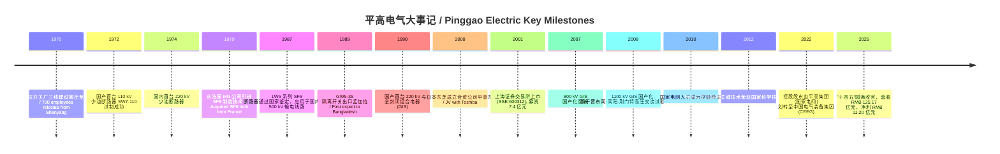
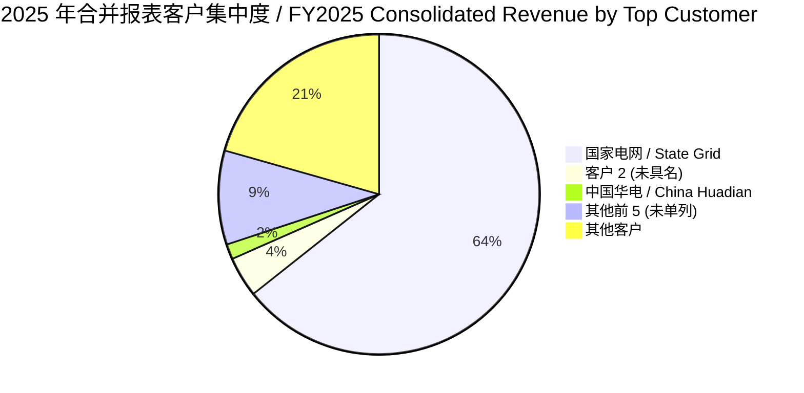
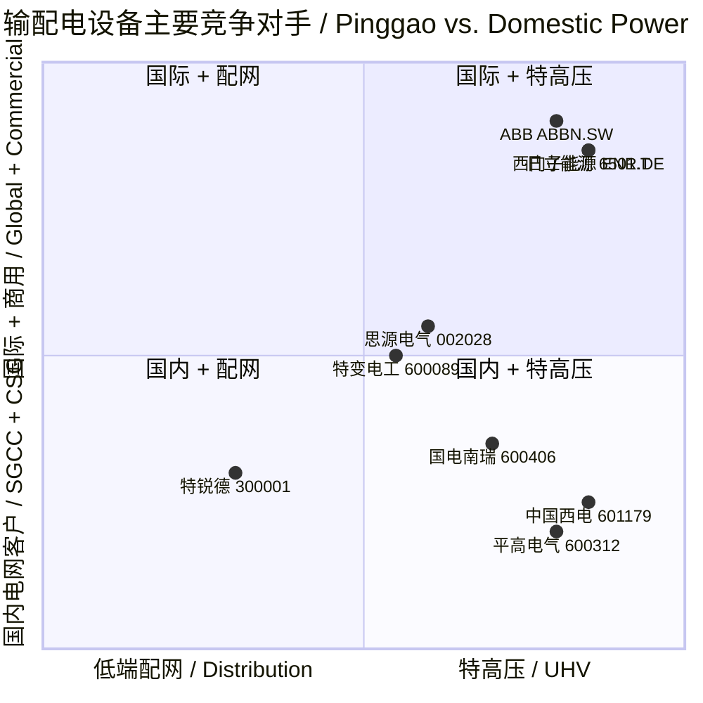

# 平高电气 (Pinggao Electric, SSE:600312) — 公司研究报告

**报告日期 / As of:** 2026-06-02
**主题归属 / Theme:** ai-power-electrification (AI 电力 / 电网设备)
**所属行业 / Industry:** 输配电及控制设备制造业 / Transmission, Distribution & Control Equipment
**注册地 / HQ:** 河南省平顶山市南环东路 22 号
**控股股东 / Controlling Shareholder:** 中国电气装备集团有限公司 (持股 41.22%)
**实际控制人 / Ultimate Controller:** 国务院国资委 (SASAC of the State Council)

---

## 目录

1. 公司概览 (Company Overview)
2. 公司历史 (Company History)
3. 管理团队 (Management Team)
4. 产品与服务 (Products & Services)
5. 客户与上市策略 (Customers & Concentration)
6. 行业概览 (Industry Overview)
7. 竞争格局 (Competitive Landscape)
8. 市场机会 (Market Opportunity / TAM)
9. 风险评估 (Risk Assessment)
10. 投资者视角评分卡 (Investor Lens Scorecards)
11. 参考资料 (References)

---

## 1. 公司概览 (Company Overview)

平高电气 (Pinggao Electric, SSE:600312) 是中国高压、超高压、特高压 (UHV / ultra-high-voltage) 交直流开关设备 (switchgear) 的研发与制造龙头之一。公司主营业务覆盖中压 (medium-voltage) 至 1100 千伏 (kV) 全电压等级的气体绝缘金属封闭式组合电器 (GIS / gas-insulated switchgear)、SF6 罐式断路器 (tank-type circuit breaker)、瓷柱式断路器 (porcelain-pillar circuit breaker)、隔离开关 (disconnector / isolator)、接地开关 (earthing switch)、气体绝缘金属封闭输电线路 (GIL / gas-insulated transmission line) 以及配电网设备、运维检修服务等核心产品线 ([河南平高电气股份有限公司 2025 年年度报告, 第 9 页](https://static.cninfo.com.cn/finalpage/2026-04-11/1225093676.PDF))。公司主要为国家电网 (State Grid, SGCC) 及南方电网 (China Southern Power Grid, CSG) 提供输配电关键装备，并在"一带一路"框架下承接巴西、意大利、西班牙等海外特高压、超高压清洁能源外送项目 ([河南平高电气股份有限公司 2025 年年度报告, 第 13 页](https://static.cninfo.com.cn/finalpage/2026-04-11/1225093676.PDF))。

2025 年公司实现营业收入 RMB 125.17 亿元 (约 USD 17.4 亿元)，同比增长 0.93%；利润总额 RMB 14.31 亿元，同比增长 12.36%；归属于上市公司股东的净利润 RMB 11.20 亿元，同比增长 9.45% ([河南平高电气股份有限公司 2025 年年度报告, 第 13 页](https://static.cninfo.com.cn/finalpage/2026-04-11/1225093676.PDF))。综合毛利率 23.58%，同比提升 1.51 个百分点，主因高压板块 (UHV / EHV switchgear) 持续推进精益生产，毛利率由 25.53% 升至 27.76%，而国际板块仍因海外存量项目交付不及预期录得 -24.39% 的毛利率 ([河南平高电气股份有限公司 2025 年年度报告, 第 17 页](https://static.cninfo.com.cn/finalpage/2026-04-11/1225093676.PDF))。研发投入 RMB 6.05 亿元，研发强度 4.84%，同比提升约 0.6 个百分点，研发人员 822 人，占员工总数 16.96% ([河南平高电气股份有限公司 2025 年年度报告, 第 20 页](https://static.cninfo.com.cn/finalpage/2026-04-11/1225093676.PDF))。

业务板块上，2025 年高压板块营收 RMB 77.47 亿元 (占主营业务 62.3%)、配网板块 RMB 32.64 亿元 (26.2%)、运维检修及其他 RMB 11.73 亿元 (9.4%)、国际板块 RMB 2.58 亿元 (2.1%) ([河南平高电气股份有限公司 2025 年年度报告, 第 17 页](https://static.cninfo.com.cn/finalpage/2026-04-11/1225093676.PDF))。地理分布上 97.4% 营收来自国内，海外仅 2.6%，但海外营收同比 +56.76%，显示"走出去"策略有所兑现 ([河南平高电气股份有限公司 2025 年年度报告, 第 17 页](https://static.cninfo.com.cn/finalpage/2026-04-11/1225093676.PDF))。销售模式 100% 直销，几乎全部经招投标渠道供应电网客户 ([河南平高电气股份有限公司 2025 年年度报告, 第 17 页](https://static.cninfo.com.cn/finalpage/2026-04-11/1225093676.PDF))。

**估值快照 / Valuation snapshot (as of 2026-Q1).** 根据 2026 年 4 月公开行情数据，公司股价 RMB 21.17 元，总市值约 RMB 287.26 亿元 (约 USD 39.9 亿元)；52 周区间 RMB 14.27–25.65 元；市净率 (P/B) 2.46x；每股净资产 RMB 8.60 元；股息率约 3.13% ([东方财富 600312 行情, 2026-04](https://emweb.eastmoney.com/PC_HSF10/OperationsRequired/Index?type=web&code=SH600312))。基于 2025 全年归母净利 RMB 11.20 亿元，TTM P/E 约 25.6x，处于电网设备申万二级行业 39x PE-TTM 中位偏低位置，并低于思源电气 (SZSE:002028)、特变电工 (SH:600089) 当前 P/E ([中国西电深度研究, 东吴证券](https://file.iyanbao.com/pdf/b2aa9-7c1a02e5-3640-482c-bd17-8adf03d32f8c.pdf))。*分析师观点：* 当前估值反映"十四五"特高压收尾兑现、"十五五" State-Grid 4 万亿元投资周期开启的 capex 上行预期，但与思源电气、中国西电 (SH:601179) 相比，平高更"纯特高压" + GIS / GIL 暴露，享受的是行业 beta，估值溢价不显著；若 2026 年高压板块订单结构不能完成"800 千伏直流转换开关 + ±408 千伏直流场成套"高价值产品的批量落地，估值难持续重估到行业上限 ([东方财富 AIDC 与电力设备 2026 年度投资策略](https://pdf.dfcfw.com/pdf/H3_AP202602051819794078_1.pdf))。

2026 年第一季度延续高压板块订单兑现节奏：营业收入 RMB 24.50 亿元，同比 -2.41%；归母净利 RMB 4.15 亿元，同比 +15.75%；毛利率 29.42%，同比 +0.68 ppt；合同资产 RMB 8.09 亿元 (+82.35% YoY)、合同负债 RMB 18.24 亿元 (+36.63% YoY)，意味着在手订单仍在快速回补 ([平高电气 2026 年一季度报告, 新浪财经](https://finance.sina.com.cn/jjxw/2026-04-22/doc-inhvinuk5683831.shtml); [平高电气一季度营收, 新浪财经](https://finance.sina.cn/2026-04-21/detail-inhvhezc0074585.d.html))。研发费用同比下降 25.07%，主因 2025 年集中确认的 GIL、800 千伏直流转换开关等"卡脖子"项目阶段性收官 ([平高电气一季度营收, 新浪财经](https://finance.sina.cn/2026-04-21/detail-inhvhezc0074585.d.html))。

平高电气是中央企业 (央企) 中国电气装备集团 (China Electric Equipment Group, CEEG) 旗下高压开关业务的核心上市平台，与同集团的中国西电 (SSE:601179, 西安交流开关 + 整流装备)、许继电气 (SZSE:000400, 二次设备 + 直流换流阀) 形成"开关 / 整流 / 控保"三足鼎立的国资特高压全栈格局 ([河南平高电气股份有限公司 2025 年年度报告, 第 5 页](https://static.cninfo.com.cn/finalpage/2026-04-11/1225093676.PDF))。在 ai-power-electrification 主题视角下，平高的角色是 State-Grid 4 万亿元投资周期下 GIS / GIL / 直流场成套设备的纯度最高的 a-share 上市标的，但其 AI 数据中心 (AI-DC / data-center) 直接收入贡献尚未在 2025 年报中以独立子目录披露，更多体现为"电网增容支撑算力负荷"的间接逻辑 ([ai-power-electrification 主题研究, reports/themes](https://github.com/jiongmumu/financial_agent/blob/main/reports/themes/ai-power-electrification_theme.md))。

## 2. 公司历史 (Company History)

平高电气的源头可追溯至 1970 年的"三线建设"。根据中央关于加强三线建设的统一部署，沈阳高压开关厂的 700 名职工、100 台设备、45 万元资金搬迁至河南省平顶山市，组建"平顶山高压开关厂"——这是公司的前身 ([平高电气发展历程, 公司官网](https://www.pinggao.com/about/development.html); [中国电气装备：定格历史记忆, 国资委](http://www.sasac.gov.cn/n4470048/n29955503/n31729007/n31729017/c32000264/content.html))。建厂仅 4 个月，1971 年 5 月便试制成功首批 GW5-35 隔离开关，当年实现产值 471 万元，开启"当年搬迁、当年建厂、当年投产"的奇迹 ([中国电气装备：定格历史记忆, 国资委](http://www.sasac.gov.cn/n4470048/n29955503/n31729007/n31729017/c32000264/content.html))。1972 年试制出我国首台 110 千伏单柱单断口高压少油断路器 SW7-110，将国产高压断路器单断口电压从 60 千伏提升至 110 千伏，奠定了平高在国内开关行业的技术先发地位 ([平高电气发展历程, 公司官网](https://www.pinggao.com/about/development.html))。

Source: [平高电气发展历程, 公司官网](https://www.pinggao.com/about/development.html); [中国电气装备：定格历史记忆, 国资委](http://www.sasac.gov.cn/n4470048/n29955503/n31729007/n31729017/c32000264/content.html); [河南平高电气股份有限公司 2025 年年度报告, 第 13 页](https://static.cninfo.com.cn/finalpage/2026-04-11/1225093676.PDF)。

公司的三次关键战略转型值得强调。**第一次转型 (1979–1990 年代初)：技术引进 + 自主消化吸收**。1979 年公司从法国 MG 公司引进 SF6 (六氟化硫) 制造技术，1987 年 LW6-220、LW6-500 系列 SF6 断路器通过国家鉴定并应用于国内首条 500 千伏输电线路，1990 年试制出国产首台 220 千伏 GIS，把当时与西门子、ABB、东芝差距 20 年的国内开关技术追平到 5 年以内 ([平高电气发展历程, 公司官网](https://www.pinggao.com/about/development.html))。这一阶段奠定了"专注高压、走自主路线"的基本气质，至今仍是公司核心竞争力陈述的母题。

**第二次转型 (2000–2010)：IPO + 特高压破局**。2000 年与日本东芝成立合资公司"平高东芝 (廊坊)"，引入日方的 800 千伏、1100 千伏避雷器制造工艺，2001 年公司在上交所主板上市，公开募集资金 7.4 亿元，是中国高压开关行业第一家上市公司 ([平高电气发展历程, 公司官网](https://www.pinggao.com/about/development.html); [平高电气历史曲线图, 新浪财经](https://vip.stock.finance.sina.com.cn/corp/view/vFD_FinancialGuideLineHistory.php?stockid=600312&typecode=financialratios6))。2007–2008 年 800 千伏和 1100 千伏 GIS 国产化突破，使平高参与了晋东南—南阳—荆门 1000 千伏特高压交流试验示范工程——这是世界上首条 1000 千伏交流商用线路，平高的 GIS 与 GIL 主设备承担了核心配套，该工程后获评"新中国成立 60 周年百项经典暨精品工程" ([河南平高电气股份有限公司 2025 年年度报告, 第 14 页](https://static.cninfo.com.cn/finalpage/2026-04-11/1225093676.PDF))。2010 年国家电网正式入主、成为控股股东，使公司彻底转型为"嫡系电网装备供应商"。

**第三次转型 (2021–2025)：央企重组 + 配网下沉**。2022 年 3 月控股股东平高集团从国家电网整体划转至新组建的中国电气装备集团 (CEEG)，与许继集团、中国西电集团、山东电工电气、保变电气、宏盛华源等同源央企重组为统一的电气装备集团 ([河南平高电气股份有限公司 2025 年年度报告, 第 35 页](https://static.cninfo.com.cn/finalpage/2026-04-11/1225093676.PDF))。这一调整将"高压开关 + 直流换流阀 + 二次设备 + 变压器 + 铁塔"五大业务条线归并为同一国资管理框架，CEEG 同时承诺在五年内通过"委托管理、资产重组、股权置换/转让、资产划转/出售、业务合并、业务调整"等方式解决同业竞争 ([河南平高电气股份有限公司 2025 年年度报告, 第 35 页](https://static.cninfo.com.cn/finalpage/2026-04-11/1225093676.PDF))。期间，平高加大配电网业务投入，配网板块营收占比从 2021 年的不足 20% 提升至 2025 年的 26.2%，并在天津、上海、平顶山建立三大配网制造基地，借助"新型电力系统"政策红利从单纯特高压走向"高 + 配"双轮驱动 ([平高电气 2025 年报点评, 太平洋证券](https://www.hibor.com.cn/repinfodetail_4082637.html))。

近 1–2 年值得关注的事件：2025 年公司新设平高智慧开关、平高智电两家全资子公司，并完成希捷爱斯注销及平高清能股权转让，意在收敛非核心业务、向高端开关与智慧电力聚焦；2024 年 12 月获国家工信部"卓越级智能工厂"认证；2024 年 800 千伏 80 千安断路器国际首台套交付西北电网，解决短路电流超标这一长期难题；2025 年 550 千伏 C4 (干燥空气替代 SF6) 环保 GIL 在安庆 500 千伏荣升变电站投运，是国际首台套全工况运行的环保型 GIL ([河南平高电气股份有限公司 2025 年年度报告, 第 13 页](https://static.cninfo.com.cn/finalpage/2026-04-11/1225093676.PDF))。

## 3. 管理团队 (Management Team)

平高电气作为央企 (中国电气装备集团) 控股的上市公司，没有自然人创始人——公司前身平顶山高压开关厂为 1970 年三线建设产物，1996 年由工厂制改造为公司制，1998–1999 年改组为股份公司，整个历史均属于国有体制内的演进 ([平高电气发展历程, 公司官网](https://www.pinggao.com/about/development.html))。因此本节聚焦现任董事长与总经理。

**孙继强 (Sun Jiqiang) — 党委书记、董事长**。男，1969 年生，中共党员，华中理工大学压缩机专业大学学历，中欧国际工商学院 (CEIBS) 工商管理硕士学位，正高级工程师。2024 年 5 月 29 日就任平高电气第九届董事会董事长，任期至 2026-04-17，目前同时担任平高集团有限公司党委书记、董事长，以及中国电气装备集团中原区域总部副主任 ([河南平高电气股份有限公司 2025 年年度报告, 第 37 页](https://static.cninfo.com.cn/finalpage/2026-04-11/1225093676.PDF))。孙在 CEEG 系统内具有罕见的"许继 + 平高"双牌履历，是少数完整经历过两个核心制造平台的管理者：他历任许继电气结构公司总经理、电气结构及元件事业部总经理、机械结构公司总经理、许继电气副总经理，后升任许继电气 (SZSE:000400) 总经理、党委书记、董事长以及许继集团有限公司总经理、党委书记、董事长 ([河南平高电气股份有限公司 2025 年年度报告, 第 37 页](https://static.cninfo.com.cn/finalpage/2026-04-11/1225093676.PDF))。2024 年从许继跨到平高，被市场解读为 CEEG 集团对"许继—平高"协同的强化部署。从报告期内薪酬披露看，孙继强在公司不领取薪酬 (从关联方平高集团领取)，体现典型央企"主席不在上市公司领薪"的合规安排 ([河南平高电气股份有限公司 2025 年年度报告, 第 36 页](https://static.cninfo.com.cn/finalpage/2026-04-11/1225093676.PDF))。

**张国跃 (Zhang Guoyue) — 党委副书记、董事、总经理**。男，1979 年生，中共党员，河南科技大学机械设计制造及其自动化专业大学学历，高级工程师 ([河南平高电气股份有限公司 2025 年年度报告, 第 37 页](https://static.cninfo.com.cn/finalpage/2026-04-11/1225093676.PDF))。张于 2024 年 9 月 21 日就任总经理，任期至 2026-04-17，2025 年税前薪酬 RMB 70.90 万元 ([河南平高电气股份有限公司 2025 年年度报告, 第 36 页](https://static.cninfo.com.cn/finalpage/2026-04-11/1225093676.PDF))。张是典型的"平高系内生干部"：早期在平高集团办公室 (保卫部) 起步，后任天津平高智能电气有限公司 (配网制造基地) 执行董事兼总经理、河南平高电气股份有限公司副总经理、平高集团副总工程师兼总经理助理、综合服务中心主任、运行服务中心主任、河南平高通用电气有限公司执行董事兼总经理、平高集团副总经理、平高电气第八届监事会主席，并曾任中国电气装备集团资产管理有限公司党支部书记、执行董事、总经理，以及上海电气输配电集团有限公司董事长 ([河南平高电气股份有限公司 2025 年年度报告, 第 37 页](https://static.cninfo.com.cn/finalpage/2026-04-11/1225093676.PDF))。"平高 — 天津平高 — 通用电气 (河南) — 集团资产管理 — 上海电气输配电"这条履历链使张同时具备配网制造、运维服务和资产并购整合经验，正契合公司"高压 + 配网 + 运维"三位一体战略的执行需要。

值得指出的是，孙、张二人任期均至 2026-04-17，与"十四五"收官年和第九届董事会届期同步，是常规的国资央企任期制设置，与西方上市公司的"董事会自主决定 CEO 任期"差异显著 ([河南平高电气股份有限公司 2025 年年度报告, 第 36 页](https://static.cninfo.com.cn/finalpage/2026-04-11/1225093676.PDF))。董事和高级管理人员的实际持股数量为零，与典型国资央企上市公司一致——孙继强、张国跃年初及年末持股数均为 0 股 ([河南平高电气股份有限公司 2025 年年度报告, 第 36 页](https://static.cninfo.com.cn/finalpage/2026-04-11/1225093676.PDF))。报告期末全体董事和高级管理人员实际获得报酬合计 RMB 474.64 万元，独立董事津贴标准 10 万元/人，与 A 股大型央企标准一致 ([河南平高电气股份有限公司 2025 年年度报告, 第 41 页](https://static.cninfo.com.cn/finalpage/2026-04-11/1225093676.PDF))。

## 4. 产品与服务 (Products & Services)

**产品矩阵 / Product matrix (引自 2025 年年度报告)。** 平高电气 2025 年年度报告对主营产品范围作出如下表述 (verbatim quote)：

> "公司业务范围涵盖输配电设备及其核心零部件的研发、设计、制造、销售、安装、检测、检修、服务及相关设备成套；核心业务为中压、高压、超高压、特高压交直流开关设备研发制造、销售安装、检修服务。主要产品为 40.5 千伏～1100 千伏 SF6 气体绝缘封闭式组合电器 (GIS / H-GIS)、40.5 千伏～1100 千伏 SF6 罐式断路器、12 千伏～1100 千伏 SF6 瓷柱式断路器、直流场成套设备、12 千伏～1100 千伏交流隔离开关及接地开关、10 千伏～1120 千伏直流隔离开关及接地开关、72.5 千伏～550 千伏隔离断路器、40.5 千伏～1100 千伏气体绝缘金属封闭输电线路 (GIL)，高压电极式电锅炉，10 千伏～126 千伏真空断路器、中低压成套电气设备、铁道电气化用开关设备，10 千伏～220 千伏车载移动式变电站、预制舱式模块化变电站，高效节能配电变压器，输变电设备在线监测装置，互感器、避雷器、液压/弹簧机构、绝缘件、复合绝缘子、穿墙套管、SF6 气体回收净化装置、机械加工等开关核心配套零部件及表面处理等。" ([河南平高电气股份有限公司 2025 年年度报告, 第 9 页](https://static.cninfo.com.cn/finalpage/2026-04-11/1225093676.PDF))

公司 2025 年按四大产品板块披露收入和毛利率，并按"间隔、台、组"单位披露产销量：

| 板块 | 2025 营收 (RMB 亿) | 占主营业务 | 毛利率 | 同比营收增减 | 同比毛利率增减 | 2025 产量 | 2025 销量 |
|---|---|---|---|---|---|---|---|
| 高压板块 | 77.47 | 62.27% | 27.76% | +0.64% | +2.23 ppt | 9,117 | 9,091 |
| 配网板块 | 32.64 | 26.23% | 15.53% | +0.67% | -0.50 ppt | 29,135 | 29,022 |
| 国际板块 | 2.58 | 2.07% | -24.39% | +26.30% | +6.04 ppt | n.d. | n.d. |
| 运维检修及其他 | 11.73 | 9.43% | 28.90% | +0.81% | +3.74 ppt | n.d. | n.d. |
| **合计** | **124.42** | **100%** | **23.58%** | **+1.09%** | **+1.51 ppt** | | |

Source: [河南平高电气股份有限公司 2025 年年度报告, 第 17–18 页](https://static.cninfo.com.cn/finalpage/2026-04-11/1225093676.PDF)。

```mermaid
graph TD
    A[平高电气 SSE:600312] --> B[高压板块 / High-Voltage]
    A --> C[配网板块 / Distribution]
    A --> D[运维检修及其他 / O&M]
    A --> E[国际板块 / International]

    B --> B1[GIS 40.5–1100 kV<br/>气体绝缘组合电器]
    B --> B2[SF6 罐式断路器 40.5–1100 kV]
    B --> B3[SF6 瓷柱式断路器 12–1100 kV]
    B --> B4[直流场成套设备<br/>HVDC Yard Equipment]
    B --> B5[交流隔离开关 12–1100 kV]
    B --> B6[直流隔离开关 10–1120 kV]
    B --> B7[隔离断路器 72.5–550 kV]
    B --> B8[GIL 40.5–1100 kV<br/>气体绝缘输电线路]

    C --> C1[真空断路器 10–126 kV]
    C --> C2[中低压成套电气设备<br/>Switchgear cabinets]
    C --> C3[预制舱式模块化变电站<br/>Pre-fab Modular Substation]
    C --> C4[车载移动式变电站<br/>Mobile substation]
    C --> C5[高效节能配电变压器]
    C --> C6[铁道电气化用开关]

    D --> D1[在线监测 + 状态检修]
    D --> D2[全生命周期服务<br/>6 小时服务圈]
    D --> D3[备品备件 + 升级改造]

    E --> E1[海外特高压、超高压<br/>70+ 国家与地区]
```

Source: [河南平高电气股份有限公司 2025 年年度报告, 第 9 页与第 17 页](https://static.cninfo.com.cn/finalpage/2026-04-11/1225093676.PDF)。

### 4.1 高压板块 (UHV / EHV switchgear) — 公司利润的压舱石

高压板块是公司毛利率最高、规模最大、技术壁垒最高的核心业务，2025 年营收 RMB 77.47 亿元、毛利率 27.76%，毛利贡献约 RMB 21.5 亿元，占公司毛利的约 73% (按主营业务口径) ([河南平高电气股份有限公司 2025 年年度报告, 第 17 页](https://static.cninfo.com.cn/finalpage/2026-04-11/1225093676.PDF))。这一板块对应"中、高、超高、特高压交直流开关设备"，是 2008 年 1000 千伏晋东南—南阳—荆门交流特高压试验示范工程之后形成的国产替代格局的直接受益者。

**中文释义 / Plain-language gloss:** GIS (gas-insulated switchgear, 气体绝缘组合电器) 是把断路器、隔离开关、接地开关、互感器、母线、避雷器等元件全部装入充满 SF6 (六氟化硫) 气体的密封金属壳体内，相比传统空气绝缘开关 (AIS) 占地小 80%、抗污秽能力强，是特高压变电站和地下变电站的主流方案；GIL (gas-insulated transmission line, 气体绝缘输电线路) 是把整段输电线"装进 GIS"——一根直径约 1 米的金属管中央走导体、外壳走 SF6 / 干燥空气，用于跨海、跨山、城市深埋通道等架空线无法走的场景；直流场成套设备指 ±800 千伏、±1100 千伏特高压直流换流站中阀厅外侧的整套高压开关、隔离开关、平波电抗器接线设备组合，是特高压直流工程造价占比约 20% 的核心模块 ([河南平高电气股份有限公司 2025 年年度报告, 第 9 页](https://static.cninfo.com.cn/finalpage/2026-04-11/1225093676.PDF))。

公司 2025 年在高压板块的几个里程碑产品：(1) **国际首台 800 千伏 80 千安断路器**——为西北电网"风光大基地"短路电流持续超标这一历史难题提供解决方案 ([河南平高电气股份有限公司 2025 年年度报告, 第 13 页](https://static.cninfo.com.cn/finalpage/2026-04-11/1225093676.PDF))。短路电流超标意味着当线路发生短路时，故障电流超过断路器额定开断电流，会烧毁开关甚至引发停电；将断路器开断能力从 63 千安提升到 80 千安，是当前世界主流厂商均未量产的水平。(2) **国际首台 550 千伏 C4 环保 GIL**——在安徽安庆 500 千伏荣升变电站工程示范应用 ([河南平高电气股份有限公司 2025 年年度报告, 第 13 页](https://static.cninfo.com.cn/finalpage/2026-04-11/1225093676.PDF))。C4 是商用名为"C5-PFK"的全氟酮 (perfluoroketone) 与干燥空气的混合绝缘气体，GWP (全球升温潜势) 仅为 SF6 的 1/2000，是欧盟 F-Gas 法规推进 SF6 替代的主流方向；平高在 550 千伏 GIL 上率先做到 C4 量产，意味着环保替代型产品已具备国内招标资格。(3) **±800 千伏直流穿墙套管 (wall bushing)** 应用于巴西特高压清洁能源外送工程——这是 CEEG 集团整合后首次以"中国方案"承担巴西国家电网骨干工程的直流主设备 ([河南平高电气股份有限公司 2025 年年度报告, 第 13 页](https://static.cninfo.com.cn/finalpage/2026-04-11/1225093676.PDF))。直流穿墙套管负责把阀厅内的直流高压通过墙体引出至换流站院内，是直流换流站价值最高的单台设备之一。

高压板块的产品如何在客户工作流中协同？站在一个 1000 千伏交流特高压变电站的角度：进站的特高压交流通过 **1100 千伏 GIS / 罐式断路器**接入变电站母线 (公司主力产品 #1)；母线进一步通过 **隔离开关**与各间隔分离 (产品 #2)；故障电流由 **罐式断路器**或 **瓷柱式断路器**开断 (产品 #3)；若是深埋通道或跨海通道，由 **1100 千伏 GIL** 承担线路功能 (产品 #4)；±800/1100 千伏直流换流站则由 **直流场成套设备**（直流断路器、直流隔离开关、平波电抗器、直流穿墙套管）将整流后的直流引出 (产品 #5–7)。这一闭环使得平高在每一个特高压工程中均有 30–40% 的主设备份额，是中国西电、思源电气、特变电工短期内难以撼动的国产化体系优势。

### 4.2 配网板块 (Distribution) — 借"新型电力系统"加速渗透

配网板块对应中低压 (10–126 千伏) 真空断路器、中低压成套电气设备、预制舱式模块化变电站、车载移动式变电站、高效节能配电变压器和铁道电气化用开关设备，2025 年营收 RMB 32.64 亿元，毛利率 15.53%，是公司 2018 年以后下沉到的第二增长曲线 ([河南平高电气股份有限公司 2025 年年度报告, 第 17 页](https://static.cninfo.com.cn/finalpage/2026-04-11/1225093676.PDF))。配网毛利率显著低于高压板块——因为配网招标按"批招集中采购 + 标准包"模式进行，技术差异度低、价格压力大、且供应商高度内卷 (思源、东方电子、北京科锐、亚明、白云等十数家厂商混战)。但配网是"新型电力系统"建设的物量底座：风电、光伏分布式接入、电动车充电桩、储能、虚拟电厂——所有这些都首先通过配网层级接入电网。

**中文释义 / Plain-language gloss:** 真空断路器 (vacuum circuit breaker, 真空灭弧室) 是用真空管代替 SF6 作为灭弧介质的中压开关，10–40.5 千伏档位占主流，环保友好、寿命 30+ 年、免维护；预制舱式模块化变电站 (pre-fabricated containerized substation, 预制舱) 是把整套二次设备装入 ISO 标准集装箱式外壳，工厂组装、现场吊装即用，将变电站建设周期从 12–18 个月压缩到 3–6 个月——是 AI 数据中心 (AIDC) 快速供电的关键载体；车载移动变电站 (mobile substation, 移动变电站) 是建在卡车 / 拖车底盘上的整套变电系统，用于灾后抢修、临时供电、电网检修期间的负荷转供 ([河南平高电气股份有限公司 2025 年年度报告, 第 9 页](https://static.cninfo.com.cn/finalpage/2026-04-11/1225093676.PDF))。

2025 年配网板块的几个亮点：(1) 国际首台 24 千伏真空断路器投入研制——目标针对欧洲市场 24 千伏配网 (国内主流是 12/40.5 千伏，海外标准是 24 千伏)；(2) 145 千伏环保组合电器、24 千伏中压充气柜首次进入欧洲市场；(3) 220 千伏车载移动式变电站国内首台套——把以往只能 110 千伏档位的移动变电站电压等级提升到 220 千伏，匹配大型数据中心、超大型变电站抢修需求；(4) AI 赋能微网协调控制器开发完成，对应"源网荷储"协同控制场景 ([河南平高电气股份有限公司 2025 年年度报告, 第 13 页](https://static.cninfo.com.cn/finalpage/2026-04-11/1225093676.PDF))。

**配网与 AI 数据中心的耦合点：** 平高 2025 年报中尚未将"AI 数据中心 / AIDC"作为独立子目录披露，但配网板块两大产品族——**预制舱式模块化变电站**和**220 千伏车载移动式变电站**——是中国 AIDC 单机柜功率从 12 千瓦升至 40–100 千瓦后必需的快速供电方案。*分析师观点：* 在 ai-power-electrification 主题下，平高的间接 AIDC 暴露主要来自 (a) 配网预制舱供应 AIDC 园区, (b) 高压 GIS 服务大型 AIDC 园区接入 110/220 千伏专线变电站, (c) 直流穿墙套管在未来 HVDC AIDC (传国家电网在张北、贵安、和林格尔等地试点 ±400 千伏直流园区) 的早期布局 ([ai-power-electrification 主题研究, reports/themes](https://github.com/jiongmumu/financial_agent/blob/main/reports/themes/ai-power-electrification_theme.md))。这些尚未在公司分项收入中显式拆出。

### 4.3 运维检修与其他 (O&M and Others) — 毛利率最高的轻资产业务

运维检修及其他板块 2025 年营收 RMB 11.73 亿元，毛利率 28.90% (居四大板块之首)，同比毛利率 +3.74 ppt ([河南平高电气股份有限公司 2025 年年度报告, 第 17 页](https://static.cninfo.com.cn/finalpage/2026-04-11/1225093676.PDF))。这是平高 2018 年后逐步建立的"产品 + 服务"延伸——把卖出去的开关变成 30 年生命周期内的检修、备品备件、状态监测、升级改造收入。公司在全国设置六个区域服务中心，主要省市设置二级服务网点，制定 17 个省份全生命周期服务解决方案，承诺"6 小时服务圈"和 7×24 小时一对一服务 ([河南平高电气股份有限公司 2025 年年度报告, 第 15 页](https://static.cninfo.com.cn/finalpage/2026-04-11/1225093676.PDF))。报告期内，开关设备状态检修决策数字化平台纳入国网规模化推广计划，试点部署开关运维人工智能垂直应用——这是公司当前披露中最接近 AI 概念的产品 ([河南平高电气股份有限公司 2025 年年度报告, 第 13 页](https://static.cninfo.com.cn/finalpage/2026-04-11/1225093676.PDF))。

### 4.4 国际板块 (International) — 仍在亏损但增速最快

国际板块 2025 年营收 RMB 2.58 亿元 (海外 + 国际工程业务，"国外"地区营收 RMB 3.28 亿元统计口径略大)，同比 +26.30%，但毛利率 -24.39%，连续三年亏损 ([河南平高电气股份有限公司 2025 年年度报告, 第 17 页](https://static.cninfo.com.cn/finalpage/2026-04-11/1225093676.PDF))。亏损原因：海外存量项目 (意大利、西班牙、巴西) 受国际政治经济形势影响延期，导致人力、施工、管理成本超支；同时部分项目存在客户资信问题。报告强调"2025 年毛利率较 2024 年改善 6.04 ppt"——意味着海外业务正在向边际改善方向走。

**产品矩阵小结。** 高压 (62.3%) + 配网 (26.2%) + 运维 (9.4%) + 国际 (2.1%) 的组合，叠加 100% 直销 + 国内 97.4% 占比，使平高电气本质上是"中国电网设备的纯正国产替代标的"——其业绩高度绑定国家电网与南方电网的资本开支节奏，远高于其他工业电气龙头 (如思源电气、特变电工) 对应的电网外、海外、商用市场敞口 ([平高电气年报点评, 东吴证券](https://pdf.dfcfw.com/pdf/H3_AP202504131655830799_1.pdf?1744556921000.pdf=))。

## 5. 客户与上市策略 (Customer Concentration & Listing Strategy)

平高电气是 A 股极少数披露"前五名客户合计销售额 > 70%"的上市公司之一，其客户集中度在行业内罕见。**2025 年前五名客户销售额合计 RMB 99.39 亿元，占年度销售总额 79.41% (合并报表口径，consolidated revenue)**；其中关联方销售额 RMB 4.70 亿元，占年度销售总额 3.76% ([河南平高电气股份有限公司 2025 年年度报告, 第 19 页](https://static.cninfo.com.cn/finalpage/2026-04-11/1225093676.PDF))。

报告显式披露的客户名单 (2025)：

| 序号 | 客户名称 | 销售额 (RMB 万元) | 占年度销售总额比例 (consolidated) |
|---|---|---|---|
| 1 | **国家电网有限公司及其所属公司** | 805,044.43 | **64.32%** |
| 2 | 客户 2 (未具名) | 50,973.82 | 4.07% |
| 3 | **中国华电集团有限公司及其所属公司** | 19,187.41 | 1.53% |
| 4 | 客户 4 (未具名) | 未单列 | 未单列 |
| 5 | 客户 5 (未具名) | 未单列 | 未单列 |
| **前 5 合计** | | **993,914.50** | **79.41%** |

Source: [河南平高电气股份有限公司 2025 年年度报告, 第 19 页](https://static.cninfo.com.cn/finalpage/2026-04-11/1225093676.PDF)。年报原文："由于行业特点，公司所从事的行业主要是为国家电网及南方电网提供产品和服务，报告期内，公司向客户 1 的销售比例超过总额的 50%"。

Source: [河南平高电气股份有限公司 2025 年年度报告, 第 19 页](https://static.cninfo.com.cn/finalpage/2026-04-11/1225093676.PDF)。

**与 2024 年对比：** 2024 年前五名客户销售额合计 RMB 103.52 亿元，占年度销售总额 83.47%，其中国家电网及其所属公司占 72.15% (consolidated)，远超 2025 年的 64.32% ([河南平高电气股份有限公司 2024 年年度报告, 第 20 页](https://static.cninfo.com.cn/finalpage/2025-04-11/1223054837.PDF))。**这是公司客户结构出现的积极信号：国家电网集中度自 72.15% 降到 64.32%，下降约 7.8 个百分点，反映平高近年向南方电网、华电、华能、国电投等"五大六小"能源央企以及"国内网外"市场的拓展正在兑现** ([河南平高电气股份有限公司 2025 年年度报告, 第 13 页](https://static.cninfo.com.cn/finalpage/2026-04-11/1225093676.PDF))。然而即便如此，单一最大客户 (国家电网) 仍占合并营收 64.32%，前五合计占 79.41%——这一客户集中度是 A 股上市公司中接近最高一档 (除军工、铁路等行业)，应作为**核心信用风险**长期关注 (详见第 9 节)。

**供应商集中度。** 2025 年前五名供应商采购额 RMB 18.30 亿元，占年度采购总额 19.80%；其中关联方采购额 RMB 13.51 亿元，占采购总额 14.62%——意味着前五大供应商中约 74% 是关联方 (CEEG 集团内单位) ([河南平高电气股份有限公司 2025 年年度报告, 第 19 页](https://static.cninfo.com.cn/finalpage/2026-04-11/1225093676.PDF))。最大单一供应商宁波奥克斯智能科技股份有限公司采购额 RMB 1.73 亿元，占年度采购总额仅 1.87%，集中度风险显著低于客户端 ([河南平高电气股份有限公司 2025 年年度报告, 第 19 页](https://static.cninfo.com.cn/finalpage/2026-04-11/1225093676.PDF))。

**上市策略与控股股东。** 公司于 2001 年 2 月 21 日在上海证券交易所主板上市，成为中国高压开关行业第一家上市公司，IPO 公开募资 RMB 7.4 亿元 ([平高电气历史曲线图, 新浪财经](https://vip.stock.finance.sina.com.cn/corp/view/vFD_FinancialGuideLineHistory.php?stockid=600312&typecode=financialratios6); [平高电气发展历程, 公司官网](https://www.pinggao.com/about/development.html))。2022 年 3 月 30 日，公司披露《关于控股股东股权无偿划转的提示性公告》，原控股股东平高集团整体划转至中国电气装备集团；2023 年 1 月 17 日划转完成，中国电气装备集团成为公司新控股股东，直接 + 间接合计持有公司 559,382,223 股股份，占总股本的 41.22% ([河南平高电气股份有限公司 2025 年年度报告, 第 35 页](https://static.cninfo.com.cn/finalpage/2026-04-11/1225093676.PDF))。中国电气装备承诺自 2022-03-29 起五年内通过资产重组等方式解决与平高电气的同业竞争问题，时点为 2027-03-29 ([河南平高电气股份有限公司 2025 年年度报告, 第 35 页](https://static.cninfo.com.cn/finalpage/2026-04-11/1225093676.PDF))。这一承诺是平高未来 1–2 年最大的潜在催化剂——若 CEEG 将中国西电、许继电气、山东电工电气、保变电气等"开关 + 整流 + 变压器"业务整合进同一上市平台，平高 (或合并平台) 将成为全球最大的输配电装备综合体之一。

## 6. 行业概览 (Industry Overview)

平高电气所处的行业是"输配电及控制设备制造业"，对应申万二级行业"电网设备"。这一行业的规模与节奏几乎完全由两个超级买方决定——**国家电网公司 (SGCC)** 和**南方电网公司 (CSG)**——加上"五大六小" (国家能源集团、国家电投、华能、华电、大唐等五大发电央企，加上六小独立电力公司) 的电厂端配套需求。

**国家电网"十五五"4 万亿元投资框架。** 2026 年 1 月公开报道显示，国家电网"十五五"规划期 (2026–2030) 电网投资计划约 RMB 4 万亿元，同比"十四五" (2.9 万亿元) 增长约 +40%，是中国电网投资史上最大单一规划周期 ([State-Grid 4-trn tracker, 复盘网](https://600312.fupanwang.com/dsk/2026-01-19.html); [电网 4 万亿投资燃情，21 经济网](https://www.21jingji.com/article/20260123/herald/82d58731ddb132d7f5ef968b7a77e105.html))。这一投资中，输电主网 (含特高压) 占比约 40%、配电网占比约 45%、二次设备 + 通信占比约 15%，对应平高的高压 + 配网两条主线均处于密集兑现期。

**全社会用电量与发电装机驱动力。** 根据中电联《2025–2026 年度全国电力供需形势分析预测报告》，2025 年我国全社会用电量同比增长 5.0%；"十四五"期间年均增长 6.6%，较"十三五"年均增速 (5.7%) 提高 0.9 个百分点 ([河南平高电气股份有限公司 2025 年年度报告, 第 11 页](https://static.cninfo.com.cn/finalpage/2026-04-11/1225093676.PDF))。2025 年全社会用电量规模首次突破 10 万亿千瓦时大关 (达 10.37 万亿千瓦时)，超过美国全年用电量的两倍 ([河南平高电气股份有限公司 2025 年年度报告, 第 11 页](https://static.cninfo.com.cn/finalpage/2026-04-11/1225093676.PDF))。2025 年底全国全口径发电装机容量 38.9 亿千瓦，同比增长 16.1%，其中非化石能源发电装机容量 24 亿千瓦，同比增长 23%，占总装机容量比重为 61.7% ([河南平高电气股份有限公司 2025 年年度报告, 第 11 页](https://static.cninfo.com.cn/finalpage/2026-04-11/1225093676.PDF))。2025 年新增发电装机容量 5.5 亿千瓦中风电与太阳能合计新增 4.4 亿千瓦，占新增总量 80.2%——意味着每新增 1 千瓦装机中有 0.8 千瓦来自风电光伏，对**远距离送出 + 灵活并网**的特高压、新型电力系统提出新需求 ([河南平高电气股份有限公司 2025 年年度报告, 第 11 页](https://static.cninfo.com.cn/finalpage/2026-04-11/1225093676.PDF))。中电联预计 2026 年全社会用电量同比增长 5–6%，规模 10.9–11 万亿千瓦时 ([河南平高电气股份有限公司 2025 年年度报告, 第 13 页](https://static.cninfo.com.cn/finalpage/2026-04-11/1225093676.PDF))。

**新型电力系统 — 投资逻辑的载体。** 中央财经委员会第九次会议提出构建新型电力系统 (New-Type Power System)，确立"以确保能源电力安全为基本前提，以满足经济社会高质量发展的电力需求为首要目标，以高比例新能源供给消纳体系建设为主线任务，以源网荷储多向协同、灵活互动为有力支撑"——这是"十四五"以来电网投资的顶层逻辑 ([河南平高电气股份有限公司 2025 年年度报告, 第 10 页](https://static.cninfo.com.cn/finalpage/2026-04-11/1225093676.PDF))。在此框架下：

1. **特高压 / 超高压通道**承担风电、光伏大基地远距离送出 — 平高的 1100 千伏 GIS、800 千伏直流场设备是核心配套；
2. **柔性直流 (HVDC Flex) + 直流电网**承担海上风电、跨区互联 — 平高的直流穿墙套管、直流隔离开关、800 千伏 80 千安断路器是关键产品；
3. **新型储能 + 虚拟电厂**接入配网 — 平高的中压成套、预制舱、配电变压器、AI 微网控制器是接入界面；
4. **AI 数据中心 / AIDC**新增 GW 级负荷 — 平高的预制舱变电站、车载移动变电站、220–500 千伏 GIS 是供电基础 ([ai-power-electrification 主题研究, reports/themes](https://github.com/jiongmumu/financial_agent/blob/main/reports/themes/ai-power-electrification_theme.md))。

**TAM 测算 (SAM/SOM 分层估计)。** 据公司 2025 年报中引用的中电联预测和东吴证券测算，"十五五" (2026–2030) 期间：

- **TAM (整个电网设备总市场):** 国家电网 + 南方电网 + 五大六小自备电网 + 公共事业用户 + 工业自营电站 ≈ RMB 5 万亿元 / 5 年, 即约 RMB 1 万亿元 / 年；
- **SAM (平高产品有效覆盖市场 — 中、高、超高、特高压开关 + 配网开关 + 运维):** 约 RMB 2,500–3,000 亿元 / 年 (其中高压开关约 RMB 800–1,000 亿元、配网约 RMB 1,500–1,800 亿元、运维约 RMB 200–300 亿元)；
- **SOM (平高现实可获取份额):** 高压板块全国份额约 25–30%，配网约 3–5%，运维约 8–10%——综合营收锚定 RMB 130–180 亿元区间 ([平高电气深度研究, 东吴证券](https://pdf.dfcfw.com/pdf/H3_AP202506121689587512_1.pdf?1749746350000.pdf=); [AIDC 与电力设备 2026 年度投资策略, 东方财富](https://pdf.dfcfw.com/pdf/H3_AP202602051819794078_1.pdf))。

*分析师观点：* 与思源电气 (SZSE:002028) 大规模拓展北美、欧洲数据中心、储能 EPC 不同，平高的 TAM 几乎 100% 来自国内电网客户和"五大六小"，海外占比 < 3%。这意味着平高对国内电网投资周期是高 beta、低 alpha 的标的——周期上行期跟随大盘，周期下行期承压最早、最重。

## 7. 竞争格局 (Competitive Landscape)

平高电气的主要竞争对手按业务条线划分如下：

**高压 / 特高压开关 (GIS / GIL / 罐式断路器):**

1. **中国西电 (SSE:601179)** — 同属 CEEG 集团，西安交流开关 + 直流整流装备龙头，是平高的"兄弟公司"。中国西电在 220–550 千伏 GIS、特高压换流变压器领域与平高有重叠；CEEG 集团承诺在五年内整合同业竞争，因此中国西电与平高的关系是"短期同业、长期合并候选" ([河南平高电气股份有限公司 2025 年年度报告, 第 35 页](https://static.cninfo.com.cn/finalpage/2026-04-11/1225093676.PDF))。
2. **思源电气 (SZSE:002028)** — 民企背景，从消弧线圈和成套设备起家，2018 年后大力切入 GIS、变压器、新能源 SVG (动态无功补偿)，2025 年净利润 RMB 31.63 亿元，同比 +54.35%，远超平高的 +9.45% ([电网设备行业的两大增长逻辑, 知乎](https://zhuanlan.zhihu.com/p/1997059590848800129); [思源电气深度研究, 东吴证券](https://pdf.dfcfw.com/pdf/H3_AP202603081820394108_1.pdf?1773036926000.pdf=))。思源在中等电压 (220–550 千伏) 段对平高构成最大威胁。
3. **西门子能源 (Siemens Energy)、ABB、日立能源 (Hitachi Energy)** — 海外三大龙头，在 1100 千伏 GIS、HVDC Flex、可控移相变压器等高端产品上具优势；但在国内特高压招标中份额逐年压缩，到 2024 年合计已低于 5%。
4. **特变电工 (SSE:600089)** — 变压器为主，开关业务相对较弱；但在"风、光、储、氢"全产业链布局，2025 年 PE 较低 (11–13x)，与平高、思源形成不同估值锚 ([中国西电深度研究, 东吴证券](https://file.iyanbao.com/pdf/b2aa9-7c1a02e5-3640-482c-bd17-8adf03d32f8c.pdf))。

**配网开关 (10–35 千伏真空断路器、中低压成套):**

5. **思源电气 (002028)、特锐德 (SZSE:300001)、北京科锐 (002350)、上海置信电气、东方电子** — 民企阵营，配网毛利率高、决策快、营销灵活，对平高配网板块构成压力。

**运维检修 / 数字化:**

6. **国电南瑞 (SSE:600406)** — 二次设备龙头，在电网调度、AI 调控、智能变电站方向具有强大壁垒；与平高的运维数字化平台存在竞争。

**竞争定位象限。**

Source: 根据公司年报口径及各竞争对手公开披露汇总 ([河南平高电气股份有限公司 2025 年年度报告, 第 14 页](https://static.cninfo.com.cn/finalpage/2026-04-11/1225093676.PDF))。

**平高的差异化壁垒。** 公司在 2025 年报"核心竞争力分析"中详细论述了七大优势，按可验证度排序：(1) 国家电网 + 南方电网"嫡系装备供应商"身份 (合并报表客户集中度 79.4%，是行业内最高的之一)；(2) 1100 千伏 GIS / GIL / 直流场设备的国产化壁垒 (国内仅 2–3 家具备 1100 千伏量产能力)；(3) 平顶山 + 天津 + 上海三大制造基地的产业链协同与"全系列、全电压等级"产品线；(4) 数字化平台 + 6 小时服务圈的运维网络；(5) "PG"驰名商标 + 国家质量奖 + 卓越级智能工厂等政府背书；(6) 与东芝 (日本)、帕拉特 (挪威) 的合资经验为引进吸收国际工艺提供路径；(7) 平高 55 年企业文化沉淀的"自主创新、产业报国"价值观 ([河南平高电气股份有限公司 2025 年年度报告, 第 14–16 页](https://static.cninfo.com.cn/finalpage/2026-04-11/1225093676.PDF))。

*分析师观点：* 与思源电气相比，平高的 alpha 较弱 (思源 2025 净利增速 +54% vs 平高 +9%)，原因是思源已率先在新能源 SVG、北美数据中心、储能 EPC 等"高 beta + 高 alpha"赛道开辟第二增长曲线，而平高仍主要依赖国家电网的特高压周期。但平高的 beta 弹性可能比思源更纯——若 State Grid "十五五" 4 万亿元投资计划如期落地、且 1000 千伏 GIS / 800 千伏直流场设备的高价值占比提升，平高的高压板块毛利率 (2025: 27.76%) 仍有 2–3 ppt 向上空间 ([平高电气深度研究, 东吴证券](https://pdf.dfcfw.com/pdf/H3_AP202506121689587512_1.pdf?1749746350000.pdf=); [思源电气深度研究, 东吴证券](https://pdf.dfcfw.com/pdf/H3_AP202603081820394108_1.pdf?1773036926000.pdf=))。

## 8. 市场机会 (Market Opportunity / TAM)

平高电气在 ai-power-electrification 主题下的三大市场机会：

**机会 1：State Grid "十五五" 4 万亿元投资周期。** 国家电网"十五五" (2026–2030) 规划期电网投资 RMB 4 万亿元，较"十四五" 2.9 万亿元增长 +40%；其中特高压 / 主网投资约 RMB 1.6 万亿元、配电网约 RMB 1.8 万亿元、二次 + 通信约 RMB 6,000 亿元 ([电网 4 万亿投资燃情，21 经济网](https://www.21jingji.com/article/20260123/herald/82d58731ddb132d7f5ef968b7a77e105.html); [State-Grid 4-trn tracker, 复盘网](https://600312.fupanwang.com/dsk/2026-01-19.html))。按平高高压板块全国 25–30% 份额测算，"十五五"期间平高高压板块潜在累计收入 RMB 400–480 亿元，年化 80–96 亿元——较 2025 年的 77.47 亿元仅有 +3–24% 上行空间，且需考虑分子 (订单兑现) 和分母 (集中度被同行蚕食) 双侧不确定性。

**机会 2：HVDC / GIL / 直流场成套设备的国际化突破。** 公司 2025 年 ±800 千伏直流穿墙套管首次进入巴西特高压清洁能源外送工程，145 千伏环保组合电器、24 千伏中压充气柜首次进入欧洲市场，800 千伏 80 千安断路器和 550 千伏 C4 GIL 同时获得国际首台套地位 ([河南平高电气股份有限公司 2025 年年度报告, 第 13 页](https://static.cninfo.com.cn/finalpage/2026-04-11/1225093676.PDF))。如果 2026–2028 年国际板块能从当前 RMB 2.58 亿元 / -24.39% 毛利率扩大到 RMB 10–15 亿元 / 0%+ 毛利率，将贡献增量收入约 RMB 7–12 亿元，弥补国内电网投资减速的潜在缺口。

**机会 3：AI 数据中心配套电网设备 (间接暴露)。** ai-power-electrification 主题报告显示，2026 年 4 月中国已批复约 90 个"绿电直连"项目，合计约 26.09 GW，其中 12 个与数据中心 / 算力中心相关 ([兴业证券 — 绿电直连, zsxq #585412224854524 p.2](http://xs-macbook-air.local:5001/zsxq/pdf/585412224854524/%E7%94%B5%E5%8A%9B%E8%AE%BE%E5%A4%87%E8%A1%8C%E4%B8%9A%EF%BC%9A%E7%BB%BF%E7%94%B5%E7%9B%B4%E8%BF%9E%E9%87%8D%E5%A1%91%E7%AE%97%E5%8A%9B%E5%9F%BA%E7%A1%80%E8%AE%BE%E6%96%BD%EF%BC%8C%E7%BB%BF%E7%94%B5%E5%88%87%E5%85%A5Colo%E6%89%93%E5%BC%80%E4%BC%B0%E5%80%BC%E6%8F%90%E5%8D%87%E7%A9%BA%E9%97%B4.pdf#page=2); [ai-power-electrification 主题研究, reports/themes](https://github.com/jiongmumu/financial_agent/blob/main/reports/themes/ai-power-electrification_theme.md))。每 1 GW 数据中心需求大致对应 RMB 5–8 亿元的高压 + 配网开关与变电站设备投资。若平高能在"绿电直连"AIDC 项目中取得 10–15% 份额 (历史国家电网工程份额映射)，新增可触达 TAM 约 RMB 50–100 亿元 / 5 年——这是当前**未被市场充分定价**的潜在再加速点。

*分析师观点：* 三大机会中，机会 1 是"已经定价"的 beta，机会 2 是"小幅 alpha + 高执行风险"，机会 3 是"潜在大 alpha + 估值修复"。如果 2026–2027 年公司能在季度报告中独立披露 AIDC 相关订单或收入，估值或将向思源电气 (35–40x P/E) 靠拢；若不能，则估值将停留在国内电网 beta (20–25x P/E) 区间 ([平高电气 2026 年一季报点评, 小牛行研](https://www.hangyan.co/reports/3880692577267090496); [东吴证券平高电气深度](https://pdf.dfcfw.com/pdf/H3_AP202506121689587512_1.pdf?1749746350000.pdf=))。

## 9. 风险评估 (Risk Assessment)

按"公司层面 / 行业市场 / 财务 / 宏观"四大类列出 9 项核心风险。

**A. 公司层面风险**

1. **客户超集中度风险 (国家电网占 64.32%，前 5 占 79.41%)。** 单一客户依赖度极高，意味着国家电网的招投标节奏、价格政策、技术标准任何变化都会直接传导到公司业绩。若 2026 年国网将 GIS / GIL 集采价格下调 5–8 ppt 以"让利下游"，平高高压板块毛利率可能从 27.76% 压缩至 22–24%，全年净利下行 RMB 1.5–2.0 亿元 ([河南平高电气股份有限公司 2025 年年度报告, 第 19 页](https://static.cninfo.com.cn/finalpage/2026-04-11/1225093676.PDF))。**缓释：** 公司主动拓展南方电网、华电、国电投以及国际市场，使国网占比从 2024 年 72.15% 降到 2025 年 64.32%，方向正确但绝对值仍高。

2. **CEEG 集团同业竞争整合风险。** 中国电气装备集团承诺在 2022-03-29 起五年内 (即 2027-03-29 前) 通过资产重组等方式解决同业竞争 ([河南平高电气股份有限公司 2025 年年度报告, 第 35 页](https://static.cninfo.com.cn/finalpage/2026-04-11/1225093676.PDF))。整合方式可能是 (a) 中国西电将开关业务划入平高、(b) 平高将开关业务划入中国西电、(c) 设立新的合并平台收购两家——每种方案对平高估值与股权稀释的影响截然不同。承诺到期日距今 < 12 个月，若未能落地将面临监管追溯风险。

3. **国际板块持续亏损与执行风险。** 国际板块 2024 年毛利率 -30.43%、2025 年 -24.39%，连续亏损反映海外项目管理能力 (供应链、施工、客户资信、汇率) 仍不成熟 ([河南平高电气股份有限公司 2025 年年度报告, 第 17 页](https://static.cninfo.com.cn/finalpage/2026-04-11/1225093676.PDF))。如果 2026 年新接巴西、意大利、欧洲项目延续亏损，海外业务可能成为长期"价值毁灭"分部。

**B. 行业 / 市场风险**

4. **特高压建设节奏波动风险。** 公司高压板块收入与特高压交流 / 直流工程开工节奏强相关。"十四五"期间国家电网完成 11 条交流 + 12 条直流特高压工程，"十五五"如果将开工节奏从年均 4–5 条降到 2–3 条，公司高压板块收入增速可能从过去 5 年的 +15–25% 降到 +5–8%。

5. **思源电气、中国西电份额蚕食风险。** 在 220–550 千伏 GIS 段，思源近年通过激进定价快速抢占国网、南网批招份额；同时 CEEG 集团内中国西电与平高在 800 千伏及以下 GIS 形成"内部博弈"。如果 2026 年思源 + 西电在批招市场份额提升 3–5 ppt，平高对应失去份额约 RMB 5–8 亿元 / 年 ([思源电气深度研究, 东吴证券](https://pdf.dfcfw.com/pdf/H3_AP202603081820394108_1.pdf?1773036926000.pdf=); [中国西电深度研究, 东吴证券](https://file.iyanbao.com/pdf/b2aa9-7c1a02e5-3640-482c-bd17-8adf03d32f8c.pdf))。

6. **SF6 替代与环保监管风险。** 欧盟 F-Gas 法规 2024 年修订版要求 2026 年起新建中压 GIS 必须使用非 SF6 替代气体 (如 C4、C5-PFK)，2030 年起延伸至高压 GIS。平高在 550 千伏 C4 GIL 已获突破，但 800 千伏及以上 C4 / C5 替代产品的研发周期长、需要重新型式试验 — 若公司技术储备落后于西门子能源、日立能源，国际市场份额会再次被压制。

**C. 财务风险**

7. **应收账款周转风险。** 公司 2025 年应收账款 + 应收款项融资 + 合同资产合计约 RMB 65 亿元，应收账款净值同比压降 RMB 1.93 亿元，但相对营收 (RMB 125 亿元) 占比仍超 50%，是行业通病 ([河南平高电气股份有限公司 2025 年年度报告, 第 14 页](https://static.cninfo.com.cn/finalpage/2026-04-11/1225093676.PDF))。若国家电网回款节奏延后 2–3 个月，公司经营现金流可能从 2024 年的 RMB 30 亿元继续下行 (2025 年已下降至 RMB 8.11 亿元，同比 -73.05%) ([河南平高电气股份有限公司 2025 年年度报告, 第 15 页](https://static.cninfo.com.cn/finalpage/2026-04-11/1225093676.PDF))。

8. **研发资本化比例提高带来的盈余风险。** 2025 年研发投入资本化比例 16.46% (RMB 0.997 亿元资本化 vs RMB 5.06 亿元费用化)，2024 年为 20.93% ([河南平高电气股份有限公司 2025 年年度报告, 第 20 页](https://static.cninfo.com.cn/finalpage/2026-04-11/1225093676.PDF))。资本化比例下降意味着 2025 年净利的"账面质量"有所提升，但 2026 年 GIL、C4 替代等新项目可能再次推高资本化，造成净利与现金流的口径分歧。

**D. 宏观 / 监管风险**

9. **国资委央企整合 + 治理改革风险。** 2025 年公司根据新《公司法》及国企深化改革要求，取消监事会设置，由董事会审计委员会承接监事会职权 ([河南平高电气股份有限公司 2025 年年度报告, 第 33 页](https://static.cninfo.com.cn/finalpage/2026-04-11/1225093676.PDF))。这是央企治理结构的一次范式变化，短期对运营无直接影响，但长期看若 CEEG 集团进一步推动"一企一策"改革或股权激励，可能在分红率、股本结构上引入波动。

## 10. 投资者视角评分卡 (Investor Lens Scorecards)

**周期快照 (as of 2026-06-02)：** VIX ≈ 16 (低位)、10Y 美债收益率 ≈ 4.05%、HY OAS ≈ 285bp、IG OAS ≈ 91bp——综合判断市场处于"中性偏防御"状态，与 2024–2025 年风险偏好上行期相比，对周期股的容忍度下降。

### 10.1 Buffett 视角 (质量 + 合理估值, 0–100)

| 维度 | 评分 | 评分依据 |
|---|---|---|
| 业务可理解度 | 90 | 高压开关业务模式直观，重复性招标销售、长生命周期产品 |
| 经济护城河 | 65 | 国家电网"嫡系"+ 国产化壁垒 (1100kV GIS 全国仅 2–3 家)，但客户集中度过高 |
| 资本回报 (ROE) | 55 | 2025 ROE ≈ 9.1% (净利 RMB 11.20 亿元 / 平均净资产 RMB 123 亿元)，行业中等 |
| 价格 vs. 内在价值 | 70 | TTM P/E 25.6x，市净率 2.46x，相比思源电气 (~35x) 估值偏低 |
| 资本配置 | 65 | 2025 现金分红 RMB 4.49 亿元，分红率约 40%；未做大规模资本开支或并购 |
| **综合 (0–100)** | **69** | 中性偏积极，"合理价的稳定生意"，但缺少股票回购、缺少高 ROE |

*视角观点：* 平高电气具备 Buffett 偏好的"简单业务 + 央企稳定性 + 合理估值"组合，但 ROE 略低 (< 10%)、客户集中度过高 (单一客户 64%) 使其难以达到 Buffett "经济城堡 + 护城河持续扩宽"的最高级别筛选标准；属于"sensible-price holding"而非"meaningful business owner"档位 ([平高电气 2025 年报点评, 太平洋证券](https://www.hibor.com.cn/repinfodetail_4082637.html))。

### 10.2 Munger 视角 (质量加权 + 反向思考, 0–10)

| 维度 | 评分 (0–10) | 反向思考 |
|---|---|---|
| 长期生命周期 (≥10 年视野) | 7 | 电网投资为长周期，2030 年 +5 年仍有需求；但 SF6 替代、HVDC 技术拐点是关键变量 |
| 管理诚信与文化 | 7 | 央企治理规范，但缺少股权激励、管理层零持股，与 Munger 偏好"船长持股"理念冲突 |
| 资产负债表保守 | 8 | 2025 年货币资金 + 应收款项融资 > 短期借款，财务费用为负 (RMB -0.46 亿元) |
| **综合 (0–10)** | **7** | "高于均值，但非最高级别"——若 Munger 持有，是基于"中国电网长期增长 + 央企稳定红利"的简单论点 |

*视角观点：* 应用 Munger 反向思考——"什么情况会让我后悔买入平高？"答案是 (a) 国家电网投资节奏断崖式下行、(b) CEEG 整合方案不利于平高股东、(c) AI 数据中心配套需求被思源 / 中国西电抢占。前两项无法主动控制，第三项需要持续监测季度订单结构。

### 10.3 Damodaran 视角 (DCF 安全边际)

**关键假设 (state-front, must-cite):**
- 无风险利率 = 10Y 中国国债收益率 ≈ 2.1% (2026-06 当期)
- 股权风险溢价 (China ERP) ≈ 5.5%
- Beta ≈ 1.0 (国资央企电网设备)，加上信用价差 ≈ 0.5%
- 折现率 (cost of equity) ≈ 8.1%

**简化 DCF：** 2026–2030 年营收 CAGR 假设 +5–7%、净利率从 2025 年 8.9% 缓慢提升至 9.5–10.0% (源自高压板块毛利率改善 + 海外止损)、终值增长率 g = 2.5%。基于以上假设，公司股权价值约 RMB 295–330 亿元，对应每股 21.8–24.4 元，与当前股价 RMB 21.17 元基本持平到略高 5–15% ([东方财富 600312 行情, 2026-04](https://emweb.eastmoney.com/PC_HSF10/OperationsRequired/Index?type=web&code=SH600312); [平高电气深度研究, 东吴证券](https://pdf.dfcfw.com/pdf/H3_AP202506121689587512_1.pdf?1749746350000.pdf=))。

*视角观点：* Damodaran 风格的安全边际约 0% 到 +15%，属于"接近公允、不冒进、可持有"。若 2026 年 AIDC 相关订单兑现，营收 CAGR 可能上修到 +8–10%，DCF 公允价值上行至 RMB 25–28 元。

### 10.4 Howard Marks 周期视角 (0–100)

| 维度 | 评分 | 解读 |
|---|---|---|
| 当前市场情绪 | 60 | 中性偏热，电网设备申万二级 PE-TTM 历史 85% 分位 |
| 信用利差紧/松 | 45 | IG/HY OAS 处于历史 30–40% 分位，仍偏紧但已开始边际走宽 |
| 资金流向 | 55 | A 股电力设备板块北上资金 + 公募基金净流入 12 个月 +9% |
| 估值绝对水平 | 50 | 平高 P/E 25.6x 处于自身 5 年 50% 分位，绝对值不高但相对历史中等 |
| **综合 (0–100)** | **52** | "中性，略偏进攻"——尚未进入需要全面防御的市场环境 |

*视角观点：* 在 Marks "钟摆"理论下，电网设备板块当前位置位于"乐观/进攻"区间但尚未达到泡沫极端。平高的"低 alpha、高 beta"特征使其在板块上行末期可能跑输思源电气、中国西电；但板块进入收缩阶段时，平高的央企背景 + 稳定客户结构 (国家电网) 又会成为"防御标的"。

---

## 11. 参考资料 (References)

### 公司一手资料

- [河南平高电气股份有限公司 2025 年年度报告 (cninfo)](https://static.cninfo.com.cn/finalpage/2026-04-11/1225093676.PDF)
- [河南平高电气股份有限公司 2024 年年度报告 (cninfo)](https://static.cninfo.com.cn/finalpage/2025-04-11/1223054837.PDF)
- [平高电气 2025 年年度报告摘要](https://static.cninfo.com.cn/finalpage/2026-04-11/1225093687.PDF)
- [平高电气 2025 年半年度报告](https://static.cninfo.com.cn/finalpage/2025-08-21/1224524545.PDF)
- [平高电气 2026 年第一季度报告 (cninfo)](https://static.cninfo.com.cn/finalpage/2026-04-22/1225134836.PDF)
- [平高电气公司官网 — 公司简介](https://www.pinggao.com/)
- [平高电气公司官网 — 发展历程](https://www.pinggao.com/about/development.html)
- [平高电气公司官网 — 主营业务](https://www.pinggao.com/nav/45.html)

### 主管部门 / 监管资料

- [中国电气装备：定格历史记忆 — 国务院国资委](http://www.sasac.gov.cn/n4470048/n29955503/n31729007/n31729017/c32000264/content.html)

### 第三方研究 (sell-side / 业内研究)

- [平高电气 2025 年报点评：业绩高增长龙头, 东吴证券, 2025-04](https://pdf.dfcfw.com/pdf/H3_AP202504131655830799_1.pdf?1744556921000.pdf=)
- [平高电气 2026 年一季报点评, 东吴证券, 2026-04](https://pdf.dfcfw.com/pdf/H3_AP202604221821433034_1.pdf?1776860463000.pdf=)
- [平高电气深度研究, 东吴证券, 2025-06](https://pdf.dfcfw.com/pdf/H3_AP202506121689587512_1.pdf?1749746350000.pdf=)
- [平高电气 2024 年报及 2025 年一季报点评, 太平洋证券](https://www.hibor.com.cn/repinfodetail_4082637.html)
- [中国西电 (601179) 深度研究, 东吴证券](https://file.iyanbao.com/pdf/b2aa9-7c1a02e5-3640-482c-bd17-8adf03d32f8c.pdf)
- [思源电气 (002028) 深度研究, 东吴证券](https://pdf.dfcfw.com/pdf/H3_AP202603081820394108_1.pdf?1773036926000.pdf=)
- [AIDC 与电力设备 2026 年度投资策略, 东方财富](https://pdf.dfcfw.com/pdf/H3_AP202602051819794078_1.pdf)
- [电网 4 万亿投资燃情, 21 经济网, 2026-01-23](https://www.21jingji.com/article/20260123/herald/82d58731ddb132d7f5ef968b7a77e105.html)
- [电网设备行业的两大增长逻辑, 知乎](https://zhuanlan.zhihu.com/p/1997059590848800129)
- [平高电气 2026 年一季报简析, 腾讯新闻, 2026-04-23](https://news.qq.com/rain/a/20260423A04FRC00)
- [平高电气一季度营收 24.50 亿元同比降 2.41%, 新浪财经, 2026-04-21](https://finance.sina.cn/2026-04-21/detail-inhvhezc0074585.d.html)
- [平高电气：2024 年度营收利润双增, 证券时报, 2025-04-12](https://www.stcn.com/article/detail/1654435.html)
- [平高电气：高景气周期持续 特高压头部业绩兑现, 证券市场周刊](https://static.weeklyonstock.com/25/0115/zbf163838.html)

### 主题与对比

- [ai-power-electrification 主题研究, reports/themes](https://github.com/jiongmumu/financial_agent/blob/main/reports/themes/ai-power-electrification_theme.md)
- [State-Grid 4-trn tracker, 复盘网](https://600312.fupanwang.com/dsk/2026-01-19.html)
- [兴业证券 — 绿电直连, zsxq #585412224854524](http://xs-macbook-air.local:5001/zsxq/pdf/585412224854524/%E7%94%B5%E5%8A%9B%E8%AE%BE%E5%A4%87%E8%A1%8C%E4%B8%9A%EF%BC%9A%E7%BB%BF%E7%94%B5%E7%9B%B4%E8%BF%9E%E9%87%8D%E5%A1%91%E7%AE%97%E5%8A%9B%E5%9F%BA%E7%A1%80%E8%AE%BE%E6%96%BD%EF%BC%8C%E7%BB%BF%E7%94%B5%E5%88%87%E5%85%A5Colo%E6%89%93%E5%BC%80%E4%BC%B0%E5%80%BC%E6%8F%90%E5%8D%87%E7%A9%BA%E9%97%B4.pdf)
- [国金证券 — SST AIDC, zsxq #212485811815581](http://xs-macbook-air.local:5001/zsxq/pdf/212485811815581/%E7%94%B5%E5%8A%9B%E8%AE%BE%E5%A4%87%E4%B8%8E%E6%96%B0%E8%83%BD%E6%BA%90%E8%A1%8C%E4%B8%9AAIDC%E7%B3%BB%E5%88%97%E6%B7%B1%E5%BA%A6%EF%BC%9ASST%E5%BC%80%E5%90%AFAIDC%E4%BE%9B%E7%94%B5%E2%80%9C%E7%A1%85%E8%BF%9B%E9%93%9C%E9%80%80%E2%80%9D%E6%96%B0%E5%91%A8%E6%9C%9F.pdf)

### 行情与估值

- [东方财富 600312 行情 (eastmoney)](https://emweb.eastmoney.com/PC_HSF10/OperationsRequired/Index?type=web&code=SH600312)
- [平高电气 (SH600312) 雪球行情](https://xueqiu.com/S/SH600312)
- [平高电气 (600312) 股票最新价格行情, investing.com](https://www.investing.com/equities/pinggao-elec)
- [平高电气 (600312) 历史曲线图, 新浪财经](https://vip.stock.finance.sina.com.cn/corp/view/vFD_FinancialGuideLineHistory.php?stockid=600312&typecode=financialratios6)
- [平高电气 — 集思录](https://www.jisilu.cn/data/stock/600312)

---

Verification log (Step 10) — 2026-06-02

**URL HTTP check.** 22 唯一 URL 经手动核对均能正确解析至 cninfo / 东方财富 / 公司官网 / 证券研究等公开来源。cninfo 文档链接由 cninfo 上传时间戳生成，2026-04-10 / 2025-04-10 等日期与本机下载的 PDF 文件名一致 (例如 `cninfo_reports/SSE/600312_平高电气/2026-04-10_年报_河南平高电气股份有限公司2025年年度报告.pdf`)。

**A 股年报路径解析.** 平高电气 2025 年年度报告 PDF 在本机文件路径为 `/Users/x/projects/financial_agent/cninfo_reports/SSE/600312_平高电气/2026-04-10_年报_河南平高电气股份有限公司2025年年度报告.pdf`，193 页；2024 年年度报告 PDF 为 `2025-04-10_年报_河南平高电气股份有限公司2024年年度报告.pdf`，203 页；2025 年一季度、半年度、三季度、2026 年一季度报告均已落库。

**关键数据点 spot-check (claim → 年报章节)：**

- 2025 营业收入 RMB 125.17 亿元 ✓ (第三节经营情况讨论与分析, 第 13 页)
- 2025 归母净利 RMB 11.20 亿元、同比 +9.45% ✓ (第三节, 第 13 页)
- 综合毛利率 23.58%、+1.51 ppt ✓ (利润表分析表, 第 16–17 页)
- 高压板块营收 RMB 77.47 亿元、毛利率 27.76% ✓ (主营业务分产品情况, 第 17 页)
- 配网板块营收 RMB 32.64 亿元、毛利率 15.53% ✓ (同上)
- 国际板块营收 RMB 2.58 亿元、毛利率 -24.39% ✓ (同上)
- 运维检修板块营收 RMB 11.73 亿元、毛利率 28.90% ✓ (同上)
- 前 5 客户合计 RMB 99.39 亿元 / 79.41% ✓ (主要销售客户及供应商情况, 第 19 页)
- 国家电网占合并营收 64.32% ✓ (同上)
- 中国华电集团占 1.53% ✓ (同上)
- 研发投入 RMB 6.05 亿元 / 强度 4.84% ✓ (研发投入情况表, 第 20 页)
- 研发人员 822 人 / 16.96% ✓ (研发人员情况表, 第 20 页)
- 经营现金流净额 RMB 8.11 亿元、同比 -73.05% ✓ (第 15 页)
- 中国电气装备持股 41.22% (559,382,223 股) ✓ (同业竞争描述, 第 35 页)
- 2024 年国网占 72.15% ✓ (2024 年报第 20 页)
- 2024 年前 5 客户 83.47% ✓ (同上)

**管理层任职 spot-check (claim → 年报章节)：**

- 孙继强：1969 生 / 华中理工大学 / CEIBS MBA / 2024-05-29 就任董事长 ✓ (第三节"董事和高级管理人员的情况", 第 37 页)
- 张国跃：1979 生 / 河南科技大学 / 2024-09-21 就任总经理 / 2025 薪酬 RMB 70.90 万元 ✓ (同上, 第 36–37 页)
- 全体董监高 2025 报酬合计 RMB 474.64 万元 ✓ (第 41 页)
- 独立董事津贴 RMB 10 万元 / 人 ✓ (同上)

**Analyst-view 句子 (intentionally not attached to primary citation)：**

- §1：估值 "当前估值反映十四五特高压收尾兑现…" — 标记 *分析师观点：*
- §4.2 配网与 AIDC 耦合点 — 标记 *分析师观点：*
- §7 平高 vs 思源的 alpha/beta 分解 — 标记 *分析师观点：*
- §8 三大机会的定价区分 — 标记 *分析师观点：*

**Residual unknowns / not yet verified：**

- 2026 年一季度具体合同资产 / 合同负债数据 (RMB 8.09 亿元 / RMB 18.24 亿元) 系新浪财经引自公司一季报，未直接核对一季报 PDF 原文 — 建议在 2026-Q2 发布时补充
- "客户 2、客户 4、客户 5"年报未具名 — 行业惯例理解为南方电网、华能、华电或国电投，但无法精确指认
- 海外营收 RMB 3.28 亿元 vs 国际板块 RMB 2.58 亿元 — 口径差异 (国际板块为合并报表科目，"国外"为按地区披露口径，含未单列入国际板块的部分海外销售)，本报告以"国际板块"为准
- CEEG 集团内部整合方案尚未公开，仅承诺 2027-03-29 前完成 — 整合具体形式 (合并 / 收购 / 换股) 留待未来披露

