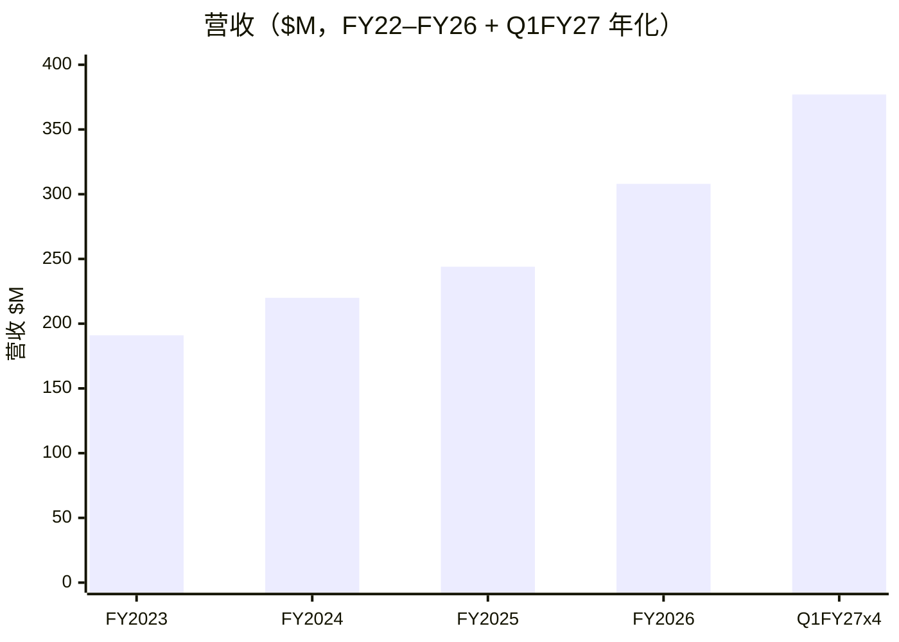
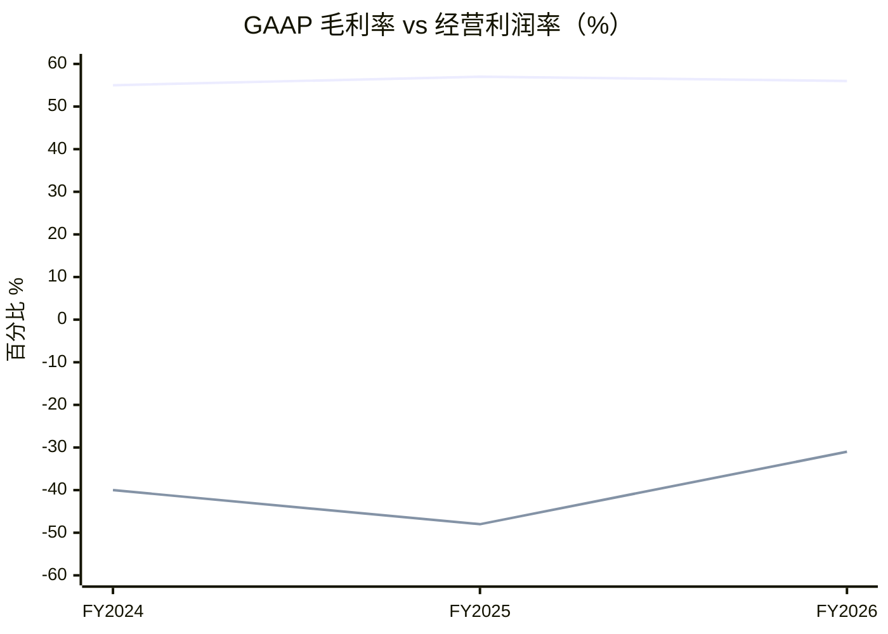
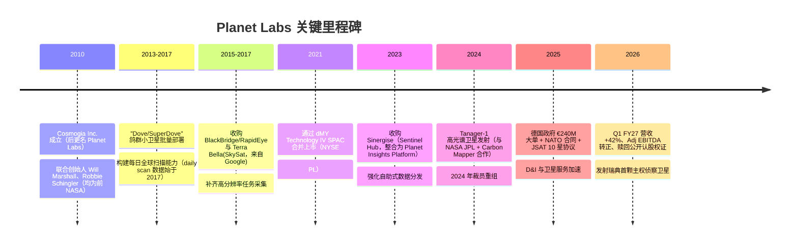
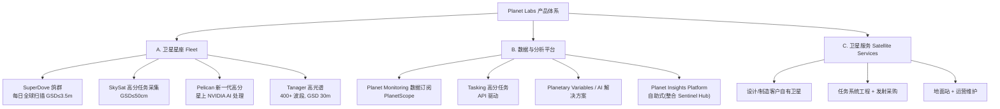
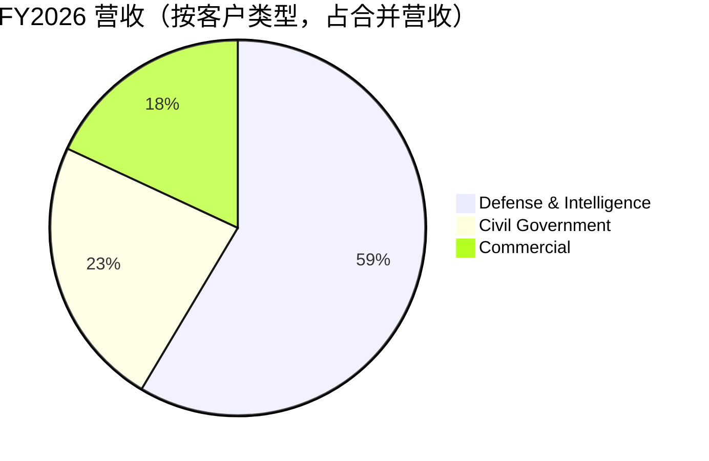
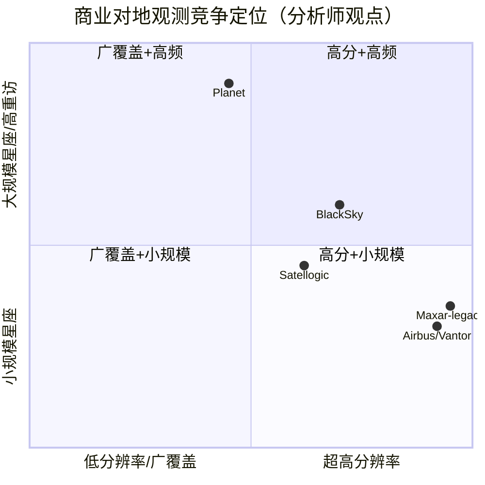

# Planet Labs PBC（NYSE: PL）公司研究报告

> **报告日期 / As of：2026-07-28** ｜ 货币单位：美元（USD）｜ 财年：截至每年 1 月 31 日（本报告中 "FY2026" = 截至 2026-01-31 的财政年度）
> 数据来源以公司 SEC 备案（10-K / 10-Q / 8-K / DEF 14A）、官网与投资者关系材料为主，卖方观点单独标注 `*分析师观点：*`。本报告为研究分析，非投资建议。

---

> **业绩快报（近期指引与关键变化）：** FY2026（截至 2026-01-31）营收 **$307.7M**，同比 **+26%**；进入 FY2027 后增速**加速**——Q1 FY2027（截至 2026-04-30）营收创纪录 **$94.2M，同比 +42%**，backlog（订单储备）同比 **+72% 至逾 $906M**，remaining performance obligations（RPO，剩余履约义务）同比 **+81% 至 $816M**（[Planet Q1 FY2027 业绩 8-K，2026-06-04](https://www.sec.gov/Archives/edgar/data/1836833/000119312526257401/pl-ex99_1.htm)）。同期公司**完成公开认股权证（public warrants）赎回**，回笼约 **$108M** 现金，并消除了此前拖累净利润的认股权证公允价值波动（[Planet 认股权证赎回 8-K，2026-05-04](https://www.sec.gov/Archives/edgar/data/1836833/000119312526204366/pl-ex99_1.htm)）。

## 投资摘要（Investment Summary）

*分析师观点（`*Analyst view:*` — 以下评级、目标价、预测均为本报告的前瞻判断，非公司披露、不附着于任何备案引用）：*

| 项目 | 数值 |
|---|---|
| **评级 / Rating** | **Hold（中性 / Neutral）** |
| **12 个月目标价 / Price Target（基准情形）** | **$24**（较现价约 **+18%**） |
| 现价 / Current Price | $20.36（2026-07-28，[Yahoo Finance](https://finance.yahoo.com/quote/PL/)） |
| 情景区间 / Bull–Bear | Bull **$38**（+87%）／Bear **$12**（−41%） |
| 估值方法 | EV/Sales（企业价值/营收）——基准 ~15× FY2028E 营收 |
| 市值 / Market Cap | ~$7.25B（[Yahoo Finance](https://finance.yahoo.com/quote/PL/key-statistics/)） |
| 52 周区间 | $5.87 – $51.76 |
| 股本结构 | 332.9M A 股 + 23.5M B 股（双层投票权） |

**论点支柱（Thesis pillars）：**
1. **防务与情报（Defense & Intelligence, D&I）是引擎**：FY26 D&I 营收 $180.2M（占 59%），几乎贡献了**全部**营收增量；欧洲重整军备（德国 €240M）、日本 JSAT、乌克兰战争、NATO 是结构性、多年期的需求源。
2. **商业模式正在跑通经济性**：Adjusted EBITDA 于 FY26 **首次转正**（$15.5M），经营性现金流转正（+$134.4M），backlog $900M+ 提供了罕见的收入可见度。
3. **"敏捷航天"+ 独家历史影像档案 + 星上 AI** 构成差异化护城河，但**一对多数据业务**与**卫星服务（satellite services）**两条腿的毛利结构截然不同，混合毛利率承压。
4. **估值已充分反映乐观预期**：P/S ~21.6×、1 年 +220%，任何 D&I 大单的"块状（lumpy）"确认节奏或毛利不及预期都可能引发回撤——这是给"Hold"而非"Buy"的核心理由。

---

## 目录

1. [公司概览](#1-公司概览)
2. [估值与目标价](#1a-估值与目标价)｜[GF Score 基本面评分](#1b-gf-score-基本面评分)
3. [公司历史](#2-公司历史)
4. [管理团队](#3-管理团队)
5. [产品与服务](#4-产品与服务)
6. [客户与上市策略](#5-客户与上市策略)
7. [行业概览](#6-行业概览)
8. [竞争格局](#7-竞争格局)
9. [市场机会](#8-市场机会)
10. [风险评估](#9-风险评估)｜[关键分歧与催化剂](#95-关键分歧与催化剂)
11. [投资者视角评分](#10-投资者视角评分)
12. [参考资料](#参考资料--data-used)

---

## 1. 公司概览

**本报告观点（BLUF）：** Planet Labs 是全球领先的**每日对地观测（daily Earth observation, EO）**数据公司，用数百颗低成本小卫星"每天扫描整个地球"，把影像做成订阅制数据与 AI 分析卖给政府与企业。**买点/看点在于**：地缘政治驱动的防务情报预算把它从一家"慢速增长的商业遥感公司"变成了"加速增长、现金流转正的主权情报供应商"——FY26 营收 +26%、Q1 FY27 加速到 +42%，Adjusted EBITDA 首次转正。**但估值已经跑在前面**（P/S 21.6×、一年三倍），且 D&I 大单确认节奏与卫星服务的低毛利会带来波动，故给予 **Hold**。

Planet 在 10-K 中自述其使命："Planet's mission is to use space to help life on Earth, by imaging the world every day and making global change visible, accessible, and actionable."（用太空帮助地球上的生命，每天为世界成像，让全球变化可见、可及、可行动。）公司"designed, built, launched, and operated hundreds of satellites"，积累了"a powerful and growing data set of over 3,000 images on average for every point on Earth's landmass"——一个**无法回溯重建**的历史影像档案（[Planet FY2026 10-K, Item 1 Business — Overview](https://www.sec.gov/Archives/edgar/data/1836833/000119312526119957/pl-20260131.htm)）。

Planet 是一家 **Delaware 公众利益公司（Public Benefit Corporation, PBC）**，2021 年 12 月通过与 SPAC（dMY Technology Group IV）合并在纽交所上市。作为 PBC，其章程写明公共利益目的——"to accelerate humanity toward a more sustainable, secure and prosperous world"，与商业目标并列（[Planet FY2026 10-K, Item 1 — Our Public Benefit](https://www.sec.gov/Archives/edgar/data/1836833/000119312526119957/pl-20260131.htm)）。

FY2026 财务快照：营收 **$307.7M**（+26% YoY），GAAP 毛利率 **56.0%**（gross profit $172.5M），经营亏损收窄至 **$(95.1)M**（FY25 为 $(116.1)M）。GAAP 净亏损扩大至 **$(246.9)M**，但这**并非经营恶化**——其中 **$(161.4)M 为非现金的认股权证公允价值变动**（股价一年内上涨约 3 倍，导致以负债计量的认股权证公允价值大增），该项目已随 2026 年 4 月认股权证赎回而消除（[Planet FY2026 10-K, Item 7 MD&A — Results of Operations](https://www.sec.gov/Archives/edgar/data/1836833/000119312526119957/pl-20260131.htm)）。

<svg xmlns="http://www.w3.org/2000/svg" viewBox="0 0 1000 560" width="1000" height="560" role="img" aria-label="income statement Sankey"><rect x="0" y="0" width="1000" height="560" fill="#ffffff"/>
<text x="20.00" y="30.00" text-anchor="start" font-family="Helvetica,Arial,sans-serif" font-size="15" font-weight="700" fill="#1f2933">损益表 Sankey — FY2026（$M）</text>
<path d="M 204.00,71.00 C 258.00,71.00 258.00,85.00 312.00,85.00 L 312.00,323.94 C 258.00,323.94 258.00,309.94 204.00,309.94 Z" fill="#93c5fd" fill-opacity="0.55"/>
<path d="M 452.00,78.00 C 506.00,78.00 506.00,89.43 560.00,89.43 L 560.00,91.43 C 506.00,91.43 506.00,80.00 452.00,80.00 Z" fill="#86efac" fill-opacity="0.55"/>
<path d="M 452.00,80.00 C 506.00,80.00 506.00,105.43 560.00,105.43 L 560.00,460.12 C 506.00,460.12 506.00,434.70 452.00,434.70 Z" fill="#fca5a5" fill-opacity="0.55"/>
<path d="M 328.00,85.00 C 382.00,85.00 382.00,78.00 436.00,78.00 L 436.00,306.73 C 382.00,306.73 382.00,313.73 328.00,313.73 Z" fill="#86efac" fill-opacity="0.55"/>
<path d="M 328.00,313.73 C 382.00,313.73 382.00,320.73 436.00,320.73 L 436.00,500.00 C 382.00,500.00 382.00,493.00 328.00,493.00 Z" fill="#fca5a5" fill-opacity="0.55"/>
<path d="M 576.00,89.43 C 630.00,89.43 630.00,89.65 684.00,89.65 L 684.00,91.65 C 630.00,91.65 630.00,91.43 576.00,91.43 Z" fill="#86efac" fill-opacity="0.55"/>
<path d="M 700.00,89.65 C 754.00,89.65 754.00,277.88 808.00,277.88 L 808.00,279.88 C 754.00,279.88 754.00,91.65 700.00,91.65 Z" fill="#86efac" fill-opacity="0.55"/>
<path d="M 700.00,91.65 C 754.00,91.65 754.00,293.88 808.00,293.88 L 808.00,300.12 C 754.00,300.12 754.00,97.88 700.00,97.88 Z" fill="#fca5a5" fill-opacity="0.55"/>
<path d="M 576.00,105.43 C 630.00,105.43 630.00,105.65 684.00,105.65 L 684.00,202.05 C 630.00,202.05 630.00,201.82 576.00,201.82 Z" fill="#fca5a5" fill-opacity="0.55"/>
<path d="M 576.00,201.82 C 630.00,201.82 630.00,216.05 684.00,216.05 L 684.00,357.53 C 630.00,357.53 630.00,343.30 576.00,343.30 Z" fill="#fca5a5" fill-opacity="0.55"/>
<path d="M 576.00,343.30 C 630.00,343.30 630.00,371.53 684.00,371.53 L 684.00,488.35 C 630.00,488.35 630.00,460.12 576.00,460.12 Z" fill="#fca5a5" fill-opacity="0.55"/>
<path d="M 204.00,323.94 C 258.00,323.94 258.00,323.94 312.00,323.94 L 312.00,419.28 C 258.00,419.28 258.00,419.28 204.00,419.28 Z" fill="#93c5fd" fill-opacity="0.55"/>
<path d="M 204.00,433.28 C 258.00,433.28 258.00,419.28 312.00,419.28 L 312.00,493.00 C 258.00,493.00 258.00,507.00 204.00,507.00 Z" fill="#93c5fd" fill-opacity="0.55"/>
<path d="M 576.00,474.12 C 630.00,474.12 630.00,91.65 684.00,91.65 L 684.00,106.10 C 630.00,106.10 630.00,488.57 576.00,488.57 Z" fill="#93c5fd" fill-opacity="0.55"/>
<rect x="188.00" y="71.00" width="16" height="238.94" rx="1.5" fill="#2563eb"/>
<rect x="188.00" y="323.94" width="16" height="95.34" rx="1.5" fill="#2563eb"/>
<rect x="188.00" y="433.28" width="16" height="73.72" rx="1.5" fill="#2563eb"/>
<rect x="312.00" y="85.00" width="16" height="408.00" rx="1.5" fill="#1e3a8a"/>
<rect x="436.00" y="78.00" width="16" height="228.73" rx="1.5" fill="#15803d"/>
<rect x="436.00" y="320.73" width="16" height="179.27" rx="1.5" fill="#dc2626"/>
<rect x="560.00" y="89.43" width="16" height="2.00" rx="1.5" fill="#15803d"/>
<rect x="560.00" y="105.43" width="16" height="354.70" rx="1.5" fill="#dc2626"/>
<rect x="560.00" y="474.12" width="16" height="14.45" rx="1.5" fill="#2563eb"/>
<rect x="684.00" y="89.65" width="16" height="2.00" rx="1.5" fill="#15803d"/>
<rect x="684.00" y="105.65" width="16" height="96.40" rx="1.5" fill="#dc2626"/>
<rect x="684.00" y="216.05" width="16" height="141.48" rx="1.5" fill="#dc2626"/>
<rect x="684.00" y="371.53" width="16" height="116.82" rx="1.5" fill="#dc2626"/>
<rect x="808.00" y="277.88" width="16" height="2.00" rx="1.5" fill="#15803d"/>
<rect x="808.00" y="293.88" width="16" height="6.23" rx="1.5" fill="#dc2626"/>
<text x="179.00" y="187.47" text-anchor="end" font-family="Helvetica,Arial,sans-serif" font-size="11.5" font-weight="700" fill="#1f2933">Defense &amp; Intelligence</text>
<text x="179.00" y="200.47" text-anchor="end" font-family="Helvetica,Arial,sans-serif" font-size="10" font-weight="400" fill="#52606d">$180.2M  (58.6%)</text>
<text x="179.00" y="368.61" text-anchor="end" font-family="Helvetica,Arial,sans-serif" font-size="11.5" font-weight="700" fill="#1f2933">Civil Government</text>
<text x="179.00" y="381.61" text-anchor="end" font-family="Helvetica,Arial,sans-serif" font-size="10" font-weight="400" fill="#52606d">$71.9M  (23.4%)</text>
<text x="179.00" y="467.14" text-anchor="end" font-family="Helvetica,Arial,sans-serif" font-size="11.5" font-weight="700" fill="#1f2933">Commercial</text>
<text x="179.00" y="480.14" text-anchor="end" font-family="Helvetica,Arial,sans-serif" font-size="10" font-weight="400" fill="#52606d">$55.6M  (18.1%)</text>
<rect x="331.00" y="67.00" width="113.10" height="26" rx="2" fill="#ffffff" fill-opacity="0.72"/>
<text x="334.00" y="79.00" text-anchor="start" font-family="Helvetica,Arial,sans-serif" font-size="11.5" font-weight="700" fill="#1f2933">Revenue</text>
<text x="334.00" y="92.00" text-anchor="start" font-family="Helvetica,Arial,sans-serif" font-size="10" font-weight="400" fill="#52606d">$307.7M  (100.0%)</text>
<rect x="455.00" y="60.00" width="106.80" height="26" rx="2" fill="#ffffff" fill-opacity="0.72"/>
<text x="458.00" y="72.00" text-anchor="start" font-family="Helvetica,Arial,sans-serif" font-size="11.5" font-weight="700" fill="#1f2933">Gross Profit</text>
<text x="458.00" y="85.00" text-anchor="start" font-family="Helvetica,Arial,sans-serif" font-size="10" font-weight="400" fill="#52606d">$172.5M  (56.1%)</text>
<rect x="455.00" y="302.73" width="144.60" height="26" rx="2" fill="#ffffff" fill-opacity="0.72"/>
<text x="458.00" y="314.73" text-anchor="start" font-family="Helvetica,Arial,sans-serif" font-size="11.5" font-weight="700" fill="#1f2933">Cost of Revenue (COGS)</text>
<text x="458.00" y="327.73" text-anchor="start" font-family="Helvetica,Arial,sans-serif" font-size="10" font-weight="400" fill="#52606d">$135.2M  (43.9%)</text>
<rect x="579.00" y="71.43" width="113.10" height="26" rx="2" fill="#ffffff" fill-opacity="0.72"/>
<text x="582.00" y="83.43" text-anchor="start" font-family="Helvetica,Arial,sans-serif" font-size="11.5" font-weight="700" fill="#1f2933">Operating Income</text>
<text x="582.00" y="96.43" text-anchor="start" font-family="Helvetica,Arial,sans-serif" font-size="10" font-weight="400" fill="#52606d">-$95.1M  (-30.9%)</text>
<rect x="579.00" y="96.43" width="150.90" height="26" rx="2" fill="#ffffff" fill-opacity="0.72"/>
<text x="582.00" y="108.43" text-anchor="start" font-family="Helvetica,Arial,sans-serif" font-size="11.5" font-weight="700" fill="#1f2933">Total Operating Expense</text>
<text x="582.00" y="121.43" text-anchor="start" font-family="Helvetica,Arial,sans-serif" font-size="10" font-weight="400" fill="#52606d">$267.5M  (86.9%)</text>
<text x="551.00" y="478.35" text-anchor="end" font-family="Helvetica,Arial,sans-serif" font-size="11.5" font-weight="700" fill="#1f2933">Net Interest / Other Income</text>
<text x="551.00" y="491.35" text-anchor="end" font-family="Helvetica,Arial,sans-serif" font-size="10" font-weight="400" fill="#52606d">$10.9M  (3.5%)</text>
<rect x="703.00" y="71.65" width="119.40" height="26" rx="2" fill="#ffffff" fill-opacity="0.72"/>
<text x="706.00" y="83.65" text-anchor="start" font-family="Helvetica,Arial,sans-serif" font-size="11.5" font-weight="700" fill="#1f2933">Pretax Income</text>
<text x="706.00" y="96.65" text-anchor="start" font-family="Helvetica,Arial,sans-serif" font-size="10" font-weight="400" fill="#52606d">-$242.2M  (-78.7%)</text>
<rect x="703.00" y="96.65" width="100.50" height="26" rx="2" fill="#ffffff" fill-opacity="0.72"/>
<text x="706.00" y="108.65" text-anchor="start" font-family="Helvetica,Arial,sans-serif" font-size="11.5" font-weight="700" fill="#1f2933">SG&amp;A</text>
<text x="706.00" y="121.65" text-anchor="start" font-family="Helvetica,Arial,sans-serif" font-size="10" font-weight="400" fill="#52606d">$72.7M  (23.6%)</text>
<rect x="703.00" y="198.05" width="106.80" height="26" rx="2" fill="#ffffff" fill-opacity="0.72"/>
<text x="706.00" y="210.05" text-anchor="start" font-family="Helvetica,Arial,sans-serif" font-size="11.5" font-weight="700" fill="#1f2933">R&amp;D</text>
<text x="706.00" y="223.05" text-anchor="start" font-family="Helvetica,Arial,sans-serif" font-size="10" font-weight="400" fill="#52606d">$106.7M  (34.7%)</text>
<rect x="703.00" y="353.53" width="100.50" height="26" rx="2" fill="#ffffff" fill-opacity="0.72"/>
<text x="706.00" y="365.53" text-anchor="start" font-family="Helvetica,Arial,sans-serif" font-size="11.5" font-weight="700" fill="#1f2933">Other OpEx</text>
<text x="706.00" y="378.53" text-anchor="start" font-family="Helvetica,Arial,sans-serif" font-size="10" font-weight="400" fill="#52606d">$88.1M  (28.6%)</text>
<text x="833.00" y="275.88" text-anchor="start" font-family="Helvetica,Arial,sans-serif" font-size="11.5" font-weight="700" fill="#1f2933">Net Income</text>
<text x="833.00" y="288.88" text-anchor="start" font-family="Helvetica,Arial,sans-serif" font-size="10" font-weight="400" fill="#52606d">-$246.9M  (-80.2%)</text>
<text x="833.00" y="300.88" text-anchor="start" font-family="Helvetica,Arial,sans-serif" font-size="11.5" font-weight="700" fill="#1f2933">Income Tax</text>
<text x="833.00" y="313.88" text-anchor="start" font-family="Helvetica,Arial,sans-serif" font-size="10" font-weight="400" fill="#52606d">$4.7M  (1.5%)</text>
<text x="500.00" y="544.00" text-anchor="middle" font-family="Helvetica,Arial,sans-serif" font-size="10" font-weight="400" fill="#52606d">Source: Planet Labs FY2026 10-K (period ended Jan 31 2026), SEC EDGAR, Statements of Operations</text>
</svg>

Source: [Planet FY2026 10-K, Consolidated Statements of Operations](https://www.sec.gov/Archives/edgar/data/1836833/000119312526119957/pl-20260131.htm)

FY2026 营收由三类客户构成：**Defense & Intelligence $180.2M、Civil Government $71.9M、Commercial $55.6M**（[Planet FY2026 10-K, Note — Disaggregated Revenue](https://www.sec.gov/Archives/edgar/data/1836833/000119312526119957/pl-20260131.htm)）。D&I 一年内从 $116.3M 增至 $180.2M（+55%），是营收增长的绝对主力——10-K 明确指出营收 +$63.4M "was primarily driven by a $64.0 million increase in the defense and intelligence vertical"（[Planet FY2026 10-K, Item 7 MD&A — Revenue](https://www.sec.gov/Archives/edgar/data/1836833/000119312526119957/pl-20260131.htm)）。

<svg xmlns="http://www.w3.org/2000/svg" viewBox="0 0 720 460" width="720" height="460" role="img" aria-label="revenue donut"><rect x="0" y="0" width="720" height="460" fill="#ffffff"/>
<text x="20.00" y="30.00" text-anchor="start" font-family="Helvetica,Arial,sans-serif" font-size="15" font-weight="700" fill="#1f2933">FY2026 营收结构（按客户类型 by customer type）</text>
<path d="M 288.00,107.20 A 132 132 0 1 1 220.35,352.55 L 248.03,306.18 A 78 78 0 1 0 288.00,161.20 Z" fill="#2563eb"/>
<path d="M 220.35,352.55 A 132 132 0 0 1 168.32,183.52 L 217.28,206.30 A 78 78 0 0 0 248.03,306.18 Z" fill="#15803d"/>
<path d="M 168.32,183.52 A 132 132 0 0 1 288.00,107.20 L 288.00,161.20 A 78 78 0 0 0 217.28,206.30 Z" fill="#d97706"/>
<text x="288.00" y="235.20" text-anchor="middle" font-family="Helvetica,Arial,sans-serif" font-size="18" font-weight="800" fill="#1f2933">FY26营收 $307.7M</text>
<text x="288.00" y="255.20" text-anchor="middle" font-family="Helvetica,Arial,sans-serif" font-size="13" font-weight="600" fill="#52606d">$307.7M</text>
<text x="288.00" y="271.20" text-anchor="middle" font-family="Helvetica,Arial,sans-serif" font-size="10" font-weight="400" fill="#8a97a3">total</text>
<line x1="421.04" y1="275.88" x2="437.04" y2="275.88" stroke="#2563eb" stroke-width="1.4"/>
<text x="441.04" y="273.88" text-anchor="start" font-family="Helvetica,Arial,sans-serif" font-size="11" font-weight="700" fill="#1f2933">Defense &amp; Intelligence</text>
<text x="441.04" y="287.88" text-anchor="start" font-family="Helvetica,Arial,sans-serif" font-size="10" font-weight="400" fill="#52606d">$180.2M  (58.6%)</text>
<line x1="156.11" y1="279.80" x2="140.11" y2="279.80" stroke="#15803d" stroke-width="1.4"/>
<text x="136.11" y="277.80" text-anchor="end" font-family="Helvetica,Arial,sans-serif" font-size="11" font-weight="700" fill="#1f2933">Civil Government</text>
<text x="136.11" y="291.80" text-anchor="end" font-family="Helvetica,Arial,sans-serif" font-size="10" font-weight="400" fill="#52606d">$71.9M  (23.4%)</text>
<line x1="213.80" y1="122.84" x2="197.80" y2="122.84" stroke="#d97706" stroke-width="1.4"/>
<text x="193.80" y="120.84" text-anchor="end" font-family="Helvetica,Arial,sans-serif" font-size="11" font-weight="700" fill="#1f2933">Commercial</text>
<text x="193.80" y="134.84" text-anchor="end" font-family="Helvetica,Arial,sans-serif" font-size="10" font-weight="400" fill="#52606d">$55.6M  (18.1%)</text>
<text x="360.00" y="444.00" text-anchor="middle" font-family="Helvetica,Arial,sans-serif" font-size="10" font-weight="400" fill="#52606d">Source: Planet Labs FY2026 10-K (period ended Jan 31 2026), SEC EDGAR, Disaggregated Revenue</text>
</svg>

<svg xmlns="http://www.w3.org/2000/svg" viewBox="0 0 860 470" width="860" height="470" role="img" aria-label="historical revenue bars"><rect x="0" y="0" width="860" height="470" fill="#ffffff"/>
<text x="20.00" y="30.00" text-anchor="start" font-family="Helvetica,Arial,sans-serif" font-size="15" font-weight="700" fill="#1f2933">营收增长（按客户类型 $M）</text>
<rect x="20.00" y="44" width="11" height="11" rx="2" fill="#2563eb"/>
<text x="36.00" y="53.00" text-anchor="start" font-family="Helvetica,Arial,sans-serif" font-size="10.5" font-weight="400" fill="#1f2933">Defense &amp; Intelligence</text>
<rect x="195.20" y="44" width="11" height="11" rx="2" fill="#15803d"/>
<text x="211.20" y="53.00" text-anchor="start" font-family="Helvetica,Arial,sans-serif" font-size="10.5" font-weight="400" fill="#1f2933">Civil Government</text>
<rect x="330.80" y="44" width="11" height="11" rx="2" fill="#d97706"/>
<text x="346.80" y="53.00" text-anchor="start" font-family="Helvetica,Arial,sans-serif" font-size="10.5" font-weight="400" fill="#1f2933">Commercial</text>
<line x1="70" y1="412.00" x2="834" y2="412.00" stroke="#eceff2" stroke-width="1"/>
<text x="64.00" y="415.00" text-anchor="end" font-family="Helvetica,Arial,sans-serif" font-size="9.5" font-weight="400" fill="#52606d">$0</text>
<line x1="70" y1="345.20" x2="834" y2="345.20" stroke="#eceff2" stroke-width="1"/>
<text x="64.00" y="348.20" text-anchor="end" font-family="Helvetica,Arial,sans-serif" font-size="9.5" font-weight="400" fill="#52606d">$66.5M</text>
<line x1="70" y1="278.40" x2="834" y2="278.40" stroke="#eceff2" stroke-width="1"/>
<text x="64.00" y="281.40" text-anchor="end" font-family="Helvetica,Arial,sans-serif" font-size="9.5" font-weight="400" fill="#52606d">$132.9M</text>
<line x1="70" y1="211.60" x2="834" y2="211.60" stroke="#eceff2" stroke-width="1"/>
<text x="64.00" y="214.60" text-anchor="end" font-family="Helvetica,Arial,sans-serif" font-size="9.5" font-weight="400" fill="#52606d">$199.4M</text>
<line x1="70" y1="144.80" x2="834" y2="144.80" stroke="#eceff2" stroke-width="1"/>
<text x="64.00" y="147.80" text-anchor="end" font-family="Helvetica,Arial,sans-serif" font-size="9.5" font-weight="400" fill="#52606d">$265.9M</text>
<line x1="70" y1="78.00" x2="834" y2="78.00" stroke="#eceff2" stroke-width="1"/>
<text x="64.00" y="81.00" text-anchor="end" font-family="Helvetica,Arial,sans-serif" font-size="9.5" font-weight="400" fill="#52606d">$332.3M</text>
<rect x="123.48" y="316.92" width="147.71" height="95.08" fill="#2563eb"/>
<rect x="123.48" y="256.01" width="147.71" height="60.91" fill="#15803d"/>
<rect x="123.48" y="190.18" width="147.71" height="65.83" fill="#d97706"/>
<text x="197.33" y="428.00" text-anchor="middle" font-family="Helvetica,Arial,sans-serif" font-size="10" font-weight="400" fill="#52606d">FY2024</text>
<rect x="378.15" y="295.11" width="147.71" height="116.89" fill="#2563eb"/>
<rect x="378.15" y="222.85" width="147.71" height="72.26" fill="#15803d"/>
<rect x="378.15" y="166.36" width="147.71" height="56.48" fill="#d97706"/>
<text x="452.00" y="428.00" text-anchor="middle" font-family="Helvetica,Arial,sans-serif" font-size="10" font-weight="400" fill="#52606d">FY2025</text>
<rect x="632.81" y="230.89" width="147.71" height="181.11" fill="#2563eb"/>
<rect x="632.81" y="158.62" width="147.71" height="72.26" fill="#15803d"/>
<rect x="632.81" y="102.74" width="147.71" height="55.88" fill="#d97706"/>
<text x="706.67" y="428.00" text-anchor="middle" font-family="Helvetica,Arial,sans-serif" font-size="10" font-weight="400" fill="#52606d">FY2026</text>
<text x="430.00" y="454.00" text-anchor="middle" font-family="Helvetica,Arial,sans-serif" font-size="10" font-weight="400" fill="#52606d">Source: Planet Labs FY2026 10-K (period ended Jan 31 2026), SEC EDGAR + FY2025 10-K, Disaggregated Revenue</text>
</svg>

Source: [Planet FY2026 10-K + FY2025 10-K, Disaggregated Revenue](https://www.sec.gov/Archives/edgar/data/1836833/000119312526119957/pl-20260131.htm)

Planet 的商业模式带有明显的 **SaaS/数据订阅**特征：**Percent of Recurring ACV（经常性年度合同价值占比）98%**（FY26），**Net Dollar Retention Rate（净收入留存率，NDR）116%**（FY26，FY25 为 106%），"primarily due to large defense and intelligence contract expansions"（[Planet FY2026 10-K, Item 7 — Key Operational and Business Metrics](https://www.sec.gov/Archives/edgar/data/1836833/000119312526119957/pl-20260131.htm)）。与传统卫星影像公司的"一对一任务采集"不同，Planet 强调 **one-to-many（一对多）**：同一份影像可卖给多个客户，边际成本极低，这是其毛利率随规模扩张的基础（[Planet FY2026 10-K, Item 1 — Scalable Business Model](https://www.sec.gov/Archives/edgar/data/1836833/000119312526119957/pl-20260131.htm)）。

### 收入与利润趋势（xychart-beta，两图分列）

上图数据：营收 FY23–FY26 分别为 $191M / $220.7M / $244.4M / $307.7M（[Planet FY2026 10-K MD&A](https://www.sec.gov/Archives/edgar/data/1836833/000119312526119957/pl-20260131.htm)）；毛利率线为 GAAP gross margin，经营利润率线为 loss from operations / revenue（同一来源）。注意两图分开——毛利率与经营利润率均为百分比，共用一个 % 轴。

---

## 1A. 估值与目标价

### 估值快照（Valuation Snapshot）

| 指标 | Planet (PL) | 说明 |
|---|---|---|
| 现价 | $20.36 | 2026-07-28 |
| 市值 | ~$7.25B | [Yahoo Finance](https://finance.yahoo.com/quote/PL/key-statistics/) |
| **P/S（TTM）** | **~21.6×** | 高——反映高增长 + 防务主题溢价 |
| P/E（TTM） | N/A（GAAP 亏损） | 主要受非现金认股权证费用拖累 |
| P/B | ~16× | 轻资产、股本因累计亏损较薄 |
| EV | ~$7.24B | 净现金约 $240M（现金+短投 $731M − 可转债 $460M 本金） |
| 1 年股价回报 | **+220%** | 52 周 $5.87 → $20.36 |
| Beta | ~2.07 | 高波动 |

**如何解读 21.6× 的 P/S：** 这是典型的**高增长 + 主题溢价**组合。驱动因素有三：(a) 营收增速从 26% 加速到 42%，市场在为未来数年的复利定价；(b) 欧洲/亚洲防务重整军备使 Planet 被当作"主权对地观测"的稀缺标的（sector proxy）；(c) Adjusted EBITDA 转正 + backlog $900M+ 降低了"烧钱到死"的尾部风险。但 21.6× 的 P/S 对一家 GAAP 仍亏损、毛利率 56% 的公司而言并不便宜——若增速回落或 D&I 大单确认延后，多重压缩（multiple compression）风险显著，这也是本报告将其列入 Section 9 风险的原因（[Yahoo Finance key statistics](https://finance.yahoo.com/quote/PL/key-statistics/)）。

### 前瞻财务模型（Forward Estimates，`*分析师观点：*`）

*以下每一格均为本报告前瞻预测，不附着于任何备案；驱动假设的外部依据在下方逐条引用。*

| 财年（截至 1/31） | 营收 $M | YoY | GAAP 毛利率 | Adj. EBITDA $M | 经营利润率 |
|---|---|---|---|---|---|
| FY2026A | 307.7 | +26% | 56.0% | 15.5 | −30.9% |
| FY2027E | ~437 | +42% | ~55% | ~40 | ~−15% |
| FY2028E | ~560 | +28% | ~57% | ~90 | ~−4% |
| FY2029E | ~680 | +21% | ~58% | ~140 | ~+3% |

- FY2027E 营收 $437M 与 (a) Q1 FY27 实际 +42%、(b) 市场一致预期 $436M 基本吻合（[stockanalysis.com — PL forecast](https://stockanalysis.com/stocks/pl/forecast/)），(c) backlog $900M+ 中约 37% 在未来 12 个月确认，提供了强可见度（[Planet FY2026 10-K — Backlog](https://www.sec.gov/Archives/edgar/data/1836833/000119312526119957/pl-20260131.htm)）。
- 毛利率横盘于 55–58%：数据订阅高毛利（一对多）与卫星服务低毛利（代建代运营、含发射采购与分包）的**结构性混合**限制了短期毛利扩张——FY26 COGS 增加主要来自 "+$14.5M 分包/方案伙伴成本" 与 "+$11.8M 履行卫星服务合同的人工"（[Planet FY2026 10-K — Cost of Revenue](https://www.sec.gov/Archives/edgar/data/1836833/000119312526119957/pl-20260131.htm)）。
- Adj. EBITDA 沿 FY26 转正的路径爬升，得益于运营杠杆与一对多数据的经济性。

### 目标价推导与情景（`*分析师观点：*`）

采用 **EV/Sales**（对亏损期高增长数据公司最常用）。基准情形：**~15× FY2028E 营收 $560M = EV $8.4B**，加净现金约 $0.24B = 股权价值约 $8.6B，除以约 360M 股 ≈ **$24**。

| 情景 | EV/Sales（FY28E） | 隐含目标价 | 相对现价 | 关键摆动假设 |
|---|---|---|---|---|
| **Bull** | ~22× | **$38** | +87% | D&I 大单持续放量 + 卫星服务规模化 + 星上 AI 溢价重估 |
| **Base** | ~15× | **$24** | +18% | 营收按预测复利、毛利率横盘、无重大合同滑点 |
| **Bear** | ~9× | **$12** | −41% | D&I 确认"块状化"/欧洲预算节奏放缓 + 混合毛利承压 → 多重压缩 |

**与市场一致预期的对比：** 卖方更乐观。摩根士丹利维持 **Equal Weight**、目标价 **$35**（从 $26 上调），理由是 ~$900M 的 backlog 提供增长可见度，但"投资驱动的利润率压力"使其选择持有而非上调评级（[*分析师观点：* MarketBeat — Morgan Stanley PL PT $35, 2026-03-25](https://www.marketbeat.com/instant-alerts/planet-labs-pbc-nysepl-given-new-3500-price-target-at-morgan-stanley-2026-03-25/)）。整体一致目标价约 **$40**（11 位分析师，区间 $25–$53，6 Strong Buy / 1 Buy / 3 Hold / 1 Strong Sell）（[*分析师观点：* stockanalysis.com — PL analyst forecast](https://stockanalysis.com/stocks/pl/forecast/)）。**本报告基准 $24 明显低于一致预期**——分歧点在于我们对 21.6× P/S 的估值容忍度更低，认为当前价格已隐含较高的完美执行预期。

**最该盯紧的变量（swing variables）：** ①D&I 大单（尤其德国 €240M 与 JSAT 10 星）的**收入确认节奏**；②数据订阅在混合营收中的占比——决定长期毛利率能否向 60%+ 迈进。

---

## 1B. GF Score 基本面评分

<svg xmlns="http://www.w3.org/2000/svg" viewBox="0 0 500 500" width="500" height="500" role="img" aria-label="GF Score radar">
<rect x="0" y="0" width="500" height="500" fill="#ffffff"/>
<text x="20" y="24" font-family="Helvetica,Arial,sans-serif" font-size="15" font-weight="700" fill="#1f2933">GF Score (GuruFocus-style): 58/100</text>
<text x="20" y="41" font-family="Helvetica,Arial,sans-serif" font-size="11" fill="#52606d">51–70 Poor future performance potential</text>
<polygon points="250.0,88.0 392.7,191.6 338.2,359.4 161.8,359.4 107.3,191.6" fill="#e9f5ec" stroke="none"/>
<polygon points="250.0,208.0 278.5,228.7 267.6,262.3 232.4,262.3 221.5,228.7" fill="none" stroke="#c5d3cb" stroke-width="1"/>
<polygon points="250.0,178.0 307.1,219.5 285.3,286.5 214.7,286.5 192.9,219.5" fill="none" stroke="#c5d3cb" stroke-width="1"/>
<polygon points="250.0,148.0 335.6,210.2 302.9,310.8 197.1,310.8 164.4,210.2" fill="none" stroke="#c5d3cb" stroke-width="1"/>
<polygon points="250.0,118.0 364.1,200.9 320.5,335.1 179.5,335.1 135.9,200.9" fill="none" stroke="#c5d3cb" stroke-width="1"/>
<polygon points="250.0,88.0 392.7,191.6 338.2,359.4 161.8,359.4 107.3,191.6" fill="none" stroke="#c5d3cb" stroke-width="1.3"/>
<line x1="250" y1="238" x2="161.8" y2="359.4" stroke="#cfdad3" stroke-width="1"/>
<text x="146.5" y="392.4" text-anchor="end" font-family="Helvetica,Arial,sans-serif" font-size="11.5" font-weight="600" fill="#1f2933">财务实力</text>
<text x="188.3" y="316.9" text-anchor="middle" font-family="Helvetica,Arial,sans-serif" font-size="10.5" font-weight="700" fill="#1f2933">7</text>
<line x1="250" y1="238" x2="250.0" y2="88.0" stroke="#cfdad3" stroke-width="1"/>
<text x="250.0" y="58.0" text-anchor="middle" font-family="Helvetica,Arial,sans-serif" font-size="11.5" font-weight="600" fill="#1f2933">盈利能力</text>
<text x="250.0" y="187.0" text-anchor="middle" font-family="Helvetica,Arial,sans-serif" font-size="10.5" font-weight="700" fill="#1f2933">3</text>
<line x1="250" y1="238" x2="107.3" y2="191.6" stroke="#cfdad3" stroke-width="1"/>
<text x="82.6" y="183.6" text-anchor="end" font-family="Helvetica,Arial,sans-serif" font-size="11.5" font-weight="600" fill="#1f2933">成长性</text>
<text x="135.9" y="194.9" text-anchor="middle" font-family="Helvetica,Arial,sans-serif" font-size="10.5" font-weight="700" fill="#1f2933">8</text>
<line x1="250" y1="238" x2="392.7" y2="191.6" stroke="#cfdad3" stroke-width="1"/>
<text x="417.4" y="183.6" text-anchor="start" font-family="Helvetica,Arial,sans-serif" font-size="11.5" font-weight="600" fill="#1f2933">估值</text>
<text x="278.5" y="222.7" text-anchor="middle" font-family="Helvetica,Arial,sans-serif" font-size="10.5" font-weight="700" fill="#1f2933">2</text>
<line x1="250" y1="238" x2="338.2" y2="359.4" stroke="#cfdad3" stroke-width="1"/>
<text x="353.5" y="392.4" text-anchor="start" font-family="Helvetica,Arial,sans-serif" font-size="11.5" font-weight="600" fill="#1f2933">动量</text>
<text x="329.4" y="341.2" text-anchor="middle" font-family="Helvetica,Arial,sans-serif" font-size="10.5" font-weight="700" fill="#1f2933">9</text>
<polygon points="250.0,193.0 278.5,228.7 329.4,347.2 188.3,322.9 135.9,200.9" fill="#2e8b57" fill-opacity="0.34" stroke="#2e8b57" stroke-width="2"/>
<circle cx="188.3" cy="322.9" r="2.6" fill="#2e8b57"/>
<circle cx="250.0" cy="193.0" r="2.6" fill="#2e8b57"/>
<circle cx="135.9" cy="200.9" r="2.6" fill="#2e8b57"/>
<circle cx="278.5" cy="228.7" r="2.6" fill="#2e8b57"/>
<circle cx="329.4" cy="347.2" r="2.6" fill="#2e8b57"/>
<text x="250" y="470" text-anchor="middle" font-family="Helvetica,Arial,sans-serif" font-size="9.5" fill="#52606d">Source: Planet Labs FY26 10-K · Q1 FY27 8-K · Yahoo Finance · as of 2026-07-28</text>
<text x="250" y="485" text-anchor="middle" font-family="Helvetica,Arial,sans-serif" font-size="9" fill="#52606d">GF Score = independent analyst rubric (*Analyst view:*) — not GuruFocus™ official number</text>
</svg>

**GF Score（GuruFocus 式，本报告自建评分，`*分析师观点：*`；各维度不附着备案引用，综合分不归属于 GuruFocus）：58 / 100。** 一个"高成长、强动量，但盈利与估值拖后腿"的画像。

- **Financial Strength（财务实力）7/10：** 现金+短投 **$731M**、净现金约 $240M，唯一有息负债是 **$460M、0.50% 的 2030 年可转债**（利率极低、2030 年到期），经营现金流转正（[Planet Q1 FY2027 8-K](https://www.sec.gov/Archives/edgar/data/1836833/000119312526257401/pl-ex99_1.htm)；[FY2026 10-K — Liquidity](https://www.sec.gov/Archives/edgar/data/1836833/000119312526119957/pl-20260131.htm)）。扣分项：CapEx/营收升至 26%，资本强度仍高。
- **Profitability（盈利能力）3/10：** GAAP 经营利润率 −31%、净亏损，ROIC 为负；但 Adj. EBITDA 转正、GAAP 毛利率 56%、非 GAAP 毛利率约 60% 指向可改善的底层经济性（[FY2026 10-K — Non-GAAP](https://www.sec.gov/Archives/edgar/data/1836833/000119312526119957/pl-20260131.htm)）。
- **Growth（成长性）8/10：** 营收 +26%（FY26）→ +42%（Q1FY27），backlog +79%、RPO +81%、NDR 116%——增长质量高（[Planet Q1 FY2027 8-K](https://www.sec.gov/Archives/edgar/data/1836833/000119312526257401/pl-ex99_1.htm)）。
- **GF Value（估值，越高越便宜）2/10：** P/S 21.6×、无正 P/E，估值处于历史与同业高位。
- **Momentum（动量）9/10：** 1 年 +220%、远在 200 日均线上方（[Yahoo Finance](https://finance.yahoo.com/quote/PL/key-statistics/)）。

---

## 2. 公司历史

Planet 由两位前 NASA 科学家 **Will Marshall** 与 **Robbie Schingler** 于 2010 年以 Cosmogia Inc. 之名创立，核心理念是"agile aerospace（敏捷航天）"——像敏捷软件一样快速迭代、批量发射低成本小卫星（[Planet FY2026 10-K — Our Technology](https://www.sec.gov/Archives/edgar/data/1836833/000119312526119957/pl-20260131.htm)；[Planet 2026 DEF 14A — Director bios](https://www.sec.gov/Archives/edgar/data/1836833/000119312526241945/pl-20260527.htm)）。公司通过一系列收购补齐能力：SkySat（源自 Google 的 Terra Bella，高分辨率任务采集）、RapidEye、以及 2023 年 8 月收购 Sinergise 的 Sentinel Hub（现整合为自助式 **Planet Insights Platform**）（[Planet FY2026 10-K — Our Offerings](https://www.sec.gov/Archives/edgar/data/1836833/000119312526119957/pl-20260131.htm)）。

2021 年经 SPAC 上市后，Planet 经历了从"广撒网的商业遥感"向"聚焦大客户、尤其是防务情报"的战略收敛——10-K 明确指出 EoP Customer Count 从 976 降至 897，"primarily attributable to an increased focus on larger customers"，并宣布自 FY2027 起**不再披露该指标**，因为大量长尾客户转向自助平台（[Planet FY2026 10-K — EoP Customer Count](https://www.sec.gov/Archives/edgar/data/1836833/000119312526119957/pl-20260131.htm)）。**本期新变化：** 2025–2026 年，德国 €240M、JSAT 10 星、NATO 等主权级合同标志着 Planet 从"卖数据订阅"扩展到"代客户建卫星（satellite services）"的新阶段。

---

## 3. 管理团队

**Will Marshall（联合创始人、董事长兼 CEO）。** Marshall 自 2010 年联合创立公司、2011 年起任 CEO，期间还担任过 Chief Scientist（[Planet 2026 DEF 14A](https://www.sec.gov/Archives/edgar/data/1836833/000119312526241945/pl-20260527.htm)）。创业前，他是 **NASA Ames 研究中心**的科学家，参与 LADEE、LCROSS 等月球任务，并推动"用商业现货元器件造小卫星"的理念——这正是 Planet"敏捷航天"方法论的思想源头。他持有牛津大学物理学博士学位。作为联合创始人兼董事长，Marshall 与 Schingler 是董事会中仅有的两位非独立董事（董事会 78% 为独立董事，[Planet 2026 DEF 14A — Governance](https://www.sec.gov/Archives/edgar/data/1836833/000119312526241945/pl-20260527.htm)）。其 FY2025 Summary Compensation Table 总薪酬约 **$4.6M**（同源），主要为股权激励，与股东利益绑定较强。

**Robbie Schingler（联合创始人、Chief Strategy Officer）。** Schingler 同为前 NASA 人士，曾在 NASA 参与开放创新与战略项目，负责 Planet 的战略、政府关系与国际拓展——在当前 D&I/主权客户驱动的增长阶段，这一角色的重要性显著上升（[Planet 2026 DEF 14A — Director bios](https://www.sec.gov/Archives/edgar/data/1836833/000119312526241945/pl-20260527.htm)）。

**Ashley Johnson（President 兼 CFO）** 与由前美国太空军司令 **General John W. Raymond**、前 Autodesk CEO **Carl Bass**、Ciena CEO **Gary Smith** 等组成的董事会，为公司提供了兼具航天、软件与国防的治理深度（[Planet 2026 DEF 14A — Board of Directors](https://www.sec.gov/Archives/edgar/data/1836833/000119312526241945/pl-20260527.htm)）。

---

## 4. 产品与服务

Planet 的产品可拆成三层：**(A) 卫星星座（数据来源）→ (B) 数据与分析平台（Offerings）→ (C) 卫星服务（Satellite Services，代客户建/运营卫星）**。这是全报告最核心的一节。

### A. 卫星星座 —— 三种"看地球"的方式

**SuperDove（监测层 / Monitoring）。** 10-K 原文："Our SuperDove satellites work together to create an always-online scanner for the planet with the goal to image the Earth every day at a resolution (Ground Sampling Distance, 'GSD') of up to 3.5 meters."（数十颗鸽群卫星协同，像一台永远在线的"地球扫描仪"，每天以最高 3.5 米分辨率给全球成像。）这是**一对多商业模式的骨干**：一次扫描、多客户复用（[Planet FY2026 10-K — Our Fleet: Monitoring](https://www.sec.gov/Archives/edgar/data/1836833/000119312526119957/pl-20260131.htm)）。

**中文释义 / Plain-language gloss：** GSD（Ground Sampling Distance，地面采样距离）= 一个像素对应地面多大范围。3.5 米 GSD 适合"看趋势、看变化"（一块农田、一片森林、一个港口的整体动态），但看不清单辆车。

**SkySat + Pelican（高分任务层 / High-Resolution Tasking）。** "With high-resolution SkySat and Pelican satellites in orbit and our rapid revisit capability, we can capture a specified location several times per day to achieve a resolution (GSD) of up to 50 centimeters after processing."（可对指定地点每天多次拍摄，处理后达 50 厘米分辨率，支持点、长条带、立体、视频等多种成像模式，全部由 API 驱动。）**Pelican 是新一代高分卫星，最大的差异化是"星上搭载 NVIDIA 处理器做边缘 AI 推理"**——把部分分析从地面前移到卫星上，降低下传与时延（[Planet FY2026 10-K — High-Resolution Tasking](https://www.sec.gov/Archives/edgar/data/1836833/000119312526119957/pl-20260131.htm)；星上 NVIDIA 处理器见 [Breaking Defense, 2025-06](https://breakingdefense.com/2025/06/planet-labs-inks-seven-figure-deal-with-nato-for-ai-enhanced-surveillance-capabilities/)）。与 SuperDove 的区别：SuperDove 负责"广度"（每天扫全球、找变化），SkySat/Pelican 负责"精度"（对着变化点放大看细节）——二者互补，构成"发现→确认"的工作流。

**Tanager（高光谱层 / Hyperspectral）。** "Our hyperspectral imaging satellite, Tanager, is designed to deliver full-spectrum imagery across the visible and shortwave infrared regions, capturing over 400 spectral bands at a resolution (GSD) of 30 meters."（400+ 光谱波段，可探测甲烷、CO₂ 超级排放源。）与 NASA JPL 合作、由 Carbon Mapper 资助，Tanager-1 于 2024 年 8 月发射（[Planet FY2026 10-K — Hyperspectral](https://www.sec.gov/Archives/edgar/data/1836833/000119312526119957/pl-20260131.htm)）。**战略意义：** 高光谱是"看成分"（不止形状），打开碳监测/环境合规这一新的 TAM。

**独家历史档案 —— 无法复制的护城河。** 影像自 2009 年起、每日扫描数据自 2017 年起累积，10-K 称"Because this immense historical archive is impossible to go back in time to re-collect, we believe it represents a significant competitive advantage."（无法回到过去重新采集，因此构成显著竞争优势），并用于训练其 AI 模型（[Planet FY2026 10-K — Proprietary Big Data](https://www.sec.gov/Archives/edgar/data/1836833/000119312526119957/pl-20260131.htm)）。

### B. 数据与分析平台（Offerings）

Planet 的云原生对地观测平台让客户"discover relevant data layers, task high resolution satellites…, extract useful information, and deliver insights"，通过 API 与浏览器应用交付；核心增值是 **Planetary Variables + AI/计算机视觉**，用于检测变化、测量地表关键现象。公司还与专注 **GenAI / LLM** 的伙伴合作，从影像中提取可行动的洞察（[Planet FY2026 10-K — Our Offerings](https://www.sec.gov/Archives/edgar/data/1836833/000119312526119957/pl-20260131.htm)）。**Planet Insights Platform**（整合原 Sentinel Hub）主打自助式购买，降低采用门槛——这正是长尾客户从"直销名单"转向"自助平台"的载体。

### C. 卫星服务（Satellite Services）—— 新的第二增长曲线

这是 Planet 近两年最重要的模式扩展：用自研的敏捷航天架构，**为大型政府/企业客户设计、制造并运营"客户自有"的卫星**，并提供任务系统工程、发射采购、地面站、运营维护等全套服务（fixed-price、多年期合同）（[Planet FY2026 10-K — Our Offerings / Revenue](https://www.sec.gov/Archives/edgar/data/1836833/000119312526119957/pl-20260131.htm)）。代表性合同：**日本 SKY Perfect JSAT 的 10 颗 Pelican 卫星**、**德国政府 €240M** 中的专用容量与直接下传、以及 **Q1 FY27 为瑞典发射的首颗主权侦察卫星（签约到发射仅 4 个月）**（[Planet Q1 FY2027 8-K](https://www.sec.gov/Archives/edgar/data/1836833/000119312526257401/pl-ex99_1.htm)）。**取舍：** 卫星服务带来大额、可见的 backlog，但毛利结构远低于一对多数据订阅（含发射采购、原材料、分包），是压制混合毛利率的主因。

### 供应链资金流（Money-flow）

下图用"需求视角"追踪资金：**谁付钱给 Planet → Planet 的产品线 → Planet 把钱花到哪**。关键卡口（chokepoint）是**发射服务（SpaceX/Rocket Lab 的 rideshare 拼车）**与**星上 AI 算力（NVIDIA）**；实线=直接支付，虚线=嵌入在成品件中的间接支出。图中 $ 数值均可追溯至下方引用来源；此为相对规模示意，非流量守恒。

<svg xmlns="http://www.w3.org/2000/svg" viewBox="0 0 1180 1062" width="1180" height="1062" role="img" aria-label="钱怎么流：谁付钱给 Planet → Planet 的产品线 → Planet 的供应商" font-family="'Space Grotesk',system-ui,-apple-system,'Segoe UI',sans-serif">
<defs><linearGradient id="mfgold" gradientUnits="userSpaceOnUse" x1="0" y1="0" x2="1180" y2="0"><stop offset="0" stop-color="#f6dc97"/><stop offset="0.5" stop-color="#e9b658"/><stop offset="1" stop-color="#cf8f2c"/></linearGradient><radialGradient id="mfpool" cx="50%" cy="50%" r="50%"><stop offset="0" stop-color="#34d399" stop-opacity="0.16"/><stop offset="1" stop-color="#34d399" stop-opacity="0"/></radialGradient></defs>
<rect x="0" y="0" width="1180" height="1062" rx="16" fill="#0b0f1a"/>
<text x="42.00" y="56.00" text-anchor="start" font-family="'JetBrains Mono',ui-monospace,Menlo,monospace" font-size="11.5" font-weight="600" fill="#e9b658" letter-spacing="3">EARTH-OBSERVATION MONEY FLOW · FY2026</text>
<text x="42.00" y="100.00" text-anchor="start" font-family="'Space Grotesk',system-ui,-apple-system,'Segoe UI',sans-serif" font-size="32" font-weight="700" fill="#e8ecf5">钱怎么流：谁付钱给 Planet → Planet 的产品线 → Planet 的供应商</text>
<text x="42.00" y="142.00" text-anchor="start" font-family="'Space Grotesk',system-ui,-apple-system,'Segoe UI',sans-serif" font-size="15" font-weight="400" fill="#8a93a8">政府防务与情报预算（欧洲重整军备、乌克兰、日本 JSAT）是主要资金来源，占 FY26 营收 59%；Planet 把这些收入投向发射、星上 AI 算力与云基础设施，其中发射与 NVIDIA 星上处理器是关键卡口。</text>
<ellipse cx="1031.00" cy="429.00" rx="190" ry="150" fill="url(#mfpool)"/>
<line x1="369.50" y1="188.00" x2="369.50" y2="666.00" stroke="#222a3a" stroke-dasharray="2 8"/>
<line x1="810.50" y1="188.00" x2="810.50" y2="666.00" stroke="#222a3a" stroke-dasharray="2 8"/>
<text x="42.00" y="172.00" text-anchor="start" font-family="'JetBrains Mono',ui-monospace,Menlo,monospace" font-size="12" font-weight="400" fill="#e9b658" letter-spacing="3">STAGE 01</text>
<text x="42.00" y="188.00" text-anchor="start" font-family="'JetBrains Mono',ui-monospace,Menlo,monospace" font-size="11.5" font-weight="400" fill="#646d82">谁付钱 (需求)</text>
<text x="483.00" y="172.00" text-anchor="start" font-family="'JetBrains Mono',ui-monospace,Menlo,monospace" font-size="12" font-weight="400" fill="#e9b658" letter-spacing="3">STAGE 02</text>
<text x="483.00" y="188.00" text-anchor="start" font-family="'JetBrains Mono',ui-monospace,Menlo,monospace" font-size="11.5" font-weight="400" fill="#646d82">Planet 产品线</text>
<text x="924.00" y="172.00" text-anchor="start" font-family="'JetBrains Mono',ui-monospace,Menlo,monospace" font-size="12" font-weight="400" fill="#e9b658" letter-spacing="3">STAGE 03</text>
<text x="924.00" y="188.00" text-anchor="start" font-family="'JetBrains Mono',ui-monospace,Menlo,monospace" font-size="11.5" font-weight="400" fill="#646d82">Planet 的供应商 (钱流向哪)</text>
<path d="M 256.00 247.00 C 369.50 247.00, 369.50 437.50, 483.00 437.50" fill="none" stroke="url(#mfgold)" stroke-width="24.00" stroke-linecap="round" opacity="0.9"/>
<path d="M 256.00 231.00 C 369.50 231.00, 369.50 312.00, 483.00 312.00" fill="none" stroke="url(#mfgold)" stroke-width="8.00" stroke-linecap="round" opacity="0.9"/>
<path d="M 256.00 342.50 C 369.50 342.50, 369.50 457.50, 483.00 457.50" fill="none" stroke="url(#mfgold)" stroke-width="16.00" stroke-linecap="round" opacity="0.9"/>
<path d="M 256.00 431.50 C 369.50 431.50, 369.50 326.00, 483.00 326.00" fill="none" stroke="url(#mfgold)" stroke-width="20.00" stroke-linecap="round" opacity="0.9"/>
<path d="M 256.00 445.50 C 369.50 445.50, 369.50 538.50, 483.00 538.50" fill="none" stroke="url(#mfgold)" stroke-width="8.00" stroke-linecap="round" opacity="0.9"/>
<path d="M 256.00 528.50 C 369.50 528.50, 369.50 341.00, 483.00 341.00" fill="none" stroke="url(#mfgold)" stroke-width="10.00" stroke-linecap="round" opacity="0.9"/>
<path d="M 256.00 621.50 C 369.50 621.50, 369.50 355.00, 483.00 355.00" fill="none" stroke="url(#mfgold)" stroke-width="18.00" stroke-linecap="round" opacity="0.9"/>
<path d="M 697.00 441.50 C 810.50 441.50, 810.50 276.50, 924.00 276.50" fill="none" stroke="url(#mfgold)" stroke-width="16.00" stroke-linecap="round" opacity="0.9"/>
<path d="M 697.00 335.00 C 810.50 335.00, 810.50 489.50, 924.00 489.50" fill="none" stroke="url(#mfgold)" stroke-width="14.00" stroke-linecap="round" opacity="0.9"/>
<path d="M 697.00 538.50 C 810.50 538.50, 810.50 499.50, 924.00 499.50" fill="none" stroke="url(#mfgold)" stroke-width="6.00" stroke-linecap="round" opacity="0.9"/>
<path d="M 697.00 324.00 C 810.50 324.00, 810.50 264.50, 924.00 264.50" fill="none" stroke="url(#mfgold)" stroke-width="8.00" stroke-linecap="round" opacity="0.9"/>
<path d="M 697.00 347.00 C 810.50 347.00, 810.50 594.00, 924.00 594.00" fill="none" stroke="url(#mfgold)" stroke-width="10.00" stroke-linecap="round" opacity="0.9"/>
<path d="M 697.00 453.50 C 810.50 453.50, 810.50 382.50, 924.00 382.50" fill="none" stroke="url(#mfgold)" stroke-width="8.00" stroke-linecap="round" opacity="0.78" stroke-dasharray="0.1 11"/>
<text x="369.50" y="336.25" text-anchor="middle" font-family="'JetBrains Mono',ui-monospace,Menlo,monospace" font-size="11.5" font-weight="400" fill="#f4d58a" paint-order="stroke" stroke="#0b0f1a" stroke-width="3.2" stroke-linejoin="round">€240M</text>
<text x="369.50" y="394.00" text-anchor="middle" font-family="'JetBrains Mono',ui-monospace,Menlo,monospace" font-size="11.5" font-weight="400" fill="#f4d58a" paint-order="stroke" stroke="#0b0f1a" stroke-width="3.2" stroke-linejoin="round">10× Pelican</text>
<text x="369.50" y="428.75" text-anchor="middle" font-family="'JetBrains Mono',ui-monospace,Menlo,monospace" font-size="11.5" font-weight="400" fill="#f4d58a" paint-order="stroke" stroke="#0b0f1a" stroke-width="3.2" stroke-linejoin="round">$35.9M</text>
<text x="369.50" y="482.25" text-anchor="middle" font-family="'JetBrains Mono',ui-monospace,Menlo,monospace" font-size="11.5" font-weight="400" fill="#f4d58a" paint-order="stroke" stroke="#0b0f1a" stroke-width="3.2" stroke-linejoin="round">$127.5M</text>
<text x="810.50" y="353.00" text-anchor="middle" font-family="'JetBrains Mono',ui-monospace,Menlo,monospace" font-size="11.5" font-weight="400" fill="#f4d58a" paint-order="stroke" stroke="#0b0f1a" stroke-width="3.2" stroke-linejoin="round">发射采购</text>
<text x="810.50" y="412.00" text-anchor="middle" font-family="'JetBrains Mono',ui-monospace,Menlo,monospace" font-size="11.5" font-weight="400" fill="#f4d58a" paint-order="stroke" stroke="#0b0f1a" stroke-width="3.2" stroke-linejoin="round">星上算力</text>
<rect x="42.00" y="198.00" width="214" height="90.00" rx="12" fill="#15101a" stroke="#f2655f" stroke-opacity="0.5"/>
<rect x="42.00" y="198.00" width="3" height="90.00" rx="2" fill="#f2655f"/>
<text x="60.00" y="231.00" text-anchor="start" font-family="'Space Grotesk',system-ui,-apple-system,'Segoe UI',sans-serif" font-size="17" font-weight="700" fill="#ffffff">德国政府/NATO</text>
<text x="60.00" y="252.00" text-anchor="start" font-family="'JetBrains Mono',ui-monospace,Menlo,monospace" font-size="11" font-weight="400" fill="#c98c87">€240M 多年合同</text>
<text x="60.00" y="269.00" text-anchor="start" font-family="'JetBrains Mono',ui-monospace,Menlo,monospace" font-size="11" font-weight="400" fill="#c98c87">专用 Pelican 容量</text>
<rect x="42.00" y="304.00" width="214" height="77.00" rx="12" fill="#15101a" stroke="#f2655f" stroke-opacity="0.5"/>
<rect x="42.00" y="304.00" width="3" height="77.00" rx="2" fill="#f2655f"/>
<text x="60.00" y="337.00" text-anchor="start" font-family="'Space Grotesk',system-ui,-apple-system,'Segoe UI',sans-serif" font-size="14" font-weight="700" fill="#ffffff">SKY Perfect JSAT (日本)</text>
<text x="60.00" y="358.00" text-anchor="start" font-family="'JetBrains Mono',ui-monospace,Menlo,monospace" font-size="11" font-weight="400" fill="#c98c87">10 颗 Pelican 卫星服务</text>
<rect x="42.00" y="397.00" width="214" height="77.00" rx="12" fill="#15101a" stroke="#f2655f" stroke-opacity="0.5"/>
<rect x="42.00" y="397.00" width="3" height="77.00" rx="2" fill="#f2655f"/>
<text x="60.00" y="430.00" text-anchor="start" font-family="'Space Grotesk',system-ui,-apple-system,'Segoe UI',sans-serif" font-size="17" font-weight="700" fill="#ffffff">美国 NRO/NGA + 情报</text>
<text x="60.00" y="451.00" text-anchor="start" font-family="'JetBrains Mono',ui-monospace,Menlo,monospace" font-size="11" font-weight="400" fill="#c98c87">D&amp;I 订阅与任务</text>
<rect x="42.00" y="490.00" width="214" height="77.00" rx="12" fill="#15101a" stroke="#f2655f" stroke-opacity="0.5"/>
<rect x="42.00" y="490.00" width="3" height="77.00" rx="2" fill="#f2655f"/>
<text x="60.00" y="523.00" text-anchor="start" font-family="'Space Grotesk',system-ui,-apple-system,'Segoe UI',sans-serif" font-size="17" font-weight="700" fill="#ffffff">乌克兰 / EMEA 防务</text>
<text x="60.00" y="544.00" text-anchor="start" font-family="'JetBrains Mono',ui-monospace,Menlo,monospace" font-size="11" font-weight="400" fill="#c98c87">FY26 乌克兰 $35.9M</text>
<rect x="42.00" y="583.00" width="214" height="77.00" rx="12" fill="#15101a" stroke="#f2655f" stroke-opacity="0.5"/>
<rect x="42.00" y="583.00" width="3" height="77.00" rx="2" fill="#f2655f"/>
<text x="60.00" y="616.00" text-anchor="start" font-family="'Space Grotesk',system-ui,-apple-system,'Segoe UI',sans-serif" font-size="17" font-weight="700" fill="#ffffff">民用政府 + 商业</text>
<text x="60.00" y="637.00" text-anchor="start" font-family="'JetBrains Mono',ui-monospace,Menlo,monospace" font-size="11" font-weight="400" fill="#c98c87">农业/保险/林业 $127.5M</text>
<rect x="483.00" y="281.00" width="214" height="110.00" rx="12" fill="#141a2a" stroke="#e9b658" stroke-opacity="0.5"/>
<rect x="483.00" y="281.00" width="3" height="110.00" rx="2" fill="#e9b658"/>
<text x="501.00" y="314.00" text-anchor="start" font-family="'Space Grotesk',system-ui,-apple-system,'Segoe UI',sans-serif" font-size="14" font-weight="700" fill="#ffffff">数据订阅 (PlanetScope/SkySat)</text>
<text x="501.00" y="335.00" text-anchor="start" font-family="'JetBrains Mono',ui-monospace,Menlo,monospace" font-size="11" font-weight="400" fill="#8a93a8">一对多，98% 经常性 ACV</text>
<rect x="483.00" y="407.00" width="214" height="77.00" rx="12" fill="#141a2a" stroke="#e9b658" stroke-opacity="0.5"/>
<rect x="483.00" y="407.00" width="3" height="77.00" rx="2" fill="#e9b658"/>
<text x="501.00" y="440.00" text-anchor="start" font-family="'Space Grotesk',system-ui,-apple-system,'Segoe UI',sans-serif" font-size="14" font-weight="700" fill="#ffffff">卫星服务 (Satellite Services)</text>
<text x="501.00" y="461.00" text-anchor="start" font-family="'JetBrains Mono',ui-monospace,Menlo,monospace" font-size="11" font-weight="400" fill="#8a93a8">代建代运营客户卫星</text>
<rect x="483.00" y="500.00" width="214" height="77.00" rx="12" fill="#141a2a" stroke="#e9b658" stroke-opacity="0.5"/>
<rect x="483.00" y="500.00" width="3" height="77.00" rx="2" fill="#e9b658"/>
<text x="501.00" y="533.00" text-anchor="start" font-family="'Space Grotesk',system-ui,-apple-system,'Segoe UI',sans-serif" font-size="14" font-weight="700" fill="#ffffff">AI 解决方案 / Planet Insights</text>
<text x="501.00" y="554.00" text-anchor="start" font-family="'JetBrains Mono',ui-monospace,Menlo,monospace" font-size="11" font-weight="400" fill="#8a93a8">星上+云端 AI 分析</text>
<rect x="924.00" y="225.50" width="214" height="94.00" rx="12" fill="#141a2a" stroke="#e9b658" stroke-opacity="0.5"/>
<rect x="924.00" y="225.50" width="3" height="94.00" rx="2" fill="#e9b658"/>
<text x="942.00" y="258.50" text-anchor="start" font-family="'Space Grotesk',system-ui,-apple-system,'Segoe UI',sans-serif" font-size="21" font-weight="700" fill="#ffffff">发射服务</text>
<text x="942.00" y="279.50" text-anchor="start" font-family="'JetBrains Mono',ui-monospace,Menlo,monospace" font-size="11" font-weight="400" fill="#8a93a8">SpaceX / Rocket Lab</text>
<text x="942.00" y="296.50" text-anchor="start" font-family="'JetBrains Mono',ui-monospace,Menlo,monospace" font-size="11" font-weight="400" fill="#8a93a8">rideshare 拼车</text>
<rect x="924.00" y="335.50" width="214" height="94.00" rx="12" fill="#141a2a" stroke="#56c6e6" stroke-opacity="0.5"/>
<rect x="924.00" y="335.50" width="3" height="94.00" rx="2" fill="#56c6e6"/>
<text x="942.00" y="368.50" text-anchor="start" font-family="'Space Grotesk',system-ui,-apple-system,'Segoe UI',sans-serif" font-size="21" font-weight="700" fill="#ffffff">NVIDIA</text>
<text x="942.00" y="389.50" text-anchor="start" font-family="'JetBrains Mono',ui-monospace,Menlo,monospace" font-size="11" font-weight="400" fill="#8a93a8">Pelican 星上处理器</text>
<text x="942.00" y="406.50" text-anchor="start" font-family="'JetBrains Mono',ui-monospace,Menlo,monospace" font-size="11" font-weight="400" fill="#8a93a8">边缘 AI 推理</text>
<rect x="924.00" y="445.50" width="214" height="94.00" rx="12" fill="#101d1a" stroke="#34d399" stroke-opacity="0.5"/>
<rect x="924.00" y="445.50" width="3" height="94.00" rx="2" fill="#34d399"/>
<text x="942.00" y="478.50" text-anchor="start" font-family="'Space Grotesk',system-ui,-apple-system,'Segoe UI',sans-serif" font-size="17" font-weight="700" fill="#ffffff">云 (Google / AWS)</text>
<text x="942.00" y="499.50" text-anchor="start" font-family="'JetBrains Mono',ui-monospace,Menlo,monospace" font-size="11" font-weight="400" fill="#7fd9bf">存储/处理 PB 级影像</text>
<text x="942.00" y="516.50" text-anchor="start" font-family="'JetBrains Mono',ui-monospace,Menlo,monospace" font-size="11" font-weight="400" fill="#7fd9bf">Google R&amp;D 合作</text>
<rect x="924.00" y="555.50" width="214" height="77.00" rx="12" fill="#15101a" stroke="#f2655f" stroke-opacity="0.5"/>
<rect x="924.00" y="555.50" width="3" height="77.00" rx="2" fill="#f2655f"/>
<text x="942.00" y="588.50" text-anchor="start" font-family="'Space Grotesk',system-ui,-apple-system,'Segoe UI',sans-serif" font-size="17" font-weight="700" fill="#ffffff">方案伙伴 / 分包商</text>
<text x="942.00" y="609.50" text-anchor="start" font-family="'JetBrains Mono',ui-monospace,Menlo,monospace" font-size="11" font-weight="400" fill="#c98c87">FY26 分包成本 +$14.5M</text>
<rect x="42.00" y="686.00" width="26" height="4" rx="2" fill="#e9b658"/>
<text x="78.00" y="690.00" text-anchor="start" font-family="'JetBrains Mono',ui-monospace,Menlo,monospace" font-size="11.5" font-weight="400" fill="#8a93a8">money paid directly</text>
<circle cx="242.80" cy="688.00" r="2" fill="#e9b658"/>
<circle cx="249.80" cy="688.00" r="2" fill="#e9b658"/>
<circle cx="256.80" cy="688.00" r="2" fill="#e9b658"/>
<circle cx="263.80" cy="688.00" r="2" fill="#e9b658"/>
<text x="276.80" y="690.00" text-anchor="start" font-family="'JetBrains Mono',ui-monospace,Menlo,monospace" font-size="11.5" font-weight="400" fill="#8a93a8">money embedded in a finished chip</text>
<text x="538.40" y="690.00" text-anchor="start" font-family="'JetBrains Mono',ui-monospace,Menlo,monospace" font-size="11.5" font-weight="400" fill="#8a93a8">thickness ≈ rough scale</text>
<rect x="728.00" y="681.00" width="11" height="11" rx="3" fill="#e9b658"/>
<text x="747.00" y="690.00" text-anchor="start" font-family="'JetBrains Mono',ui-monospace,Menlo,monospace" font-size="11.5" font-weight="400" fill="#8a93a8">supplier</text>
<rect x="828.60" y="681.00" width="11" height="11" rx="3" fill="#e9b658"/>
<text x="847.60" y="690.00" text-anchor="start" font-family="'JetBrains Mono',ui-monospace,Menlo,monospace" font-size="11.5" font-weight="400" fill="#8a93a8">supplier</text>
<rect x="929.20" y="681.00" width="11" height="11" rx="3" fill="#56c6e6"/>
<text x="948.20" y="690.00" text-anchor="start" font-family="'JetBrains Mono',ui-monospace,Menlo,monospace" font-size="11.5" font-weight="400" fill="#8a93a8">compute</text>
<rect x="42.00" y="701.00" width="11" height="11" rx="3" fill="#34d399"/>
<text x="61.00" y="710.00" text-anchor="start" font-family="'JetBrains Mono',ui-monospace,Menlo,monospace" font-size="11.5" font-weight="400" fill="#8a93a8">foundry</text>
<rect x="135.40" y="701.00" width="11" height="11" rx="3" fill="#f2655f"/>
<text x="154.40" y="710.00" text-anchor="start" font-family="'JetBrains Mono',ui-monospace,Menlo,monospace" font-size="11.5" font-weight="400" fill="#8a93a8">buyer</text>
<line x1="42" y1="726.00" x2="1138" y2="726.00" stroke="#222a3a"/>
<text x="42.00" y="742.00" text-anchor="start" font-family="'JetBrains Mono',ui-monospace,Menlo,monospace" font-size="12" font-weight="500" fill="#8a93a8" letter-spacing="3">FOLLOW THE MONEY — 关键卡口</text>
<rect x="42.00" y="762.00" width="356.00" height="116.00" rx="13" fill="#0e1320" stroke="#f2655f" stroke-opacity="0.28"/>
<rect x="42.00" y="762.00" width="3" height="116.00" rx="2" fill="#f2655f"/>
<text x="58.00" y="786.00" text-anchor="start" font-family="'JetBrains Mono',ui-monospace,Menlo,monospace" font-size="10" font-weight="600" fill="#f2655f" letter-spacing="1">需求 · 防务重整</text>
<text x="58.00" y="804.00" text-anchor="start" font-family="'Space Grotesk',system-ui,-apple-system,'Segoe UI',sans-serif" font-size="15.5" font-weight="700" fill="#ffffff">欧洲/亚洲主权预算</text>
<text x="58.00" y="828.00" font-family="'Space Grotesk',system-ui,-apple-system,'Segoe UI',sans-serif" font-size="12" xml:space="preserve"><tspan fill="#9aa3b8" font-weight="400">FY26</tspan><tspan fill="#9aa3b8" font-weight="400"> D&amp;I</tspan><tspan fill="#9aa3b8" font-weight="400"> 营收</tspan><tspan fill="#f4d58a" font-weight="700"> $180.2M</tspan><tspan fill="#9aa3b8" font-weight="400"> （占</tspan><tspan fill="#f4d58a" font-weight="700"> 59%</tspan><tspan fill="#9aa3b8" font-weight="400"> ），几乎贡献全部增量（+$64M）；德国</tspan><tspan fill="#f4d58a" font-weight="700"> €240M</tspan></text>
<text x="58.00" y="844.00" font-family="'Space Grotesk',system-ui,-apple-system,'Segoe UI',sans-serif" font-size="12" xml:space="preserve"><tspan fill="#9aa3b8" font-weight="400">、日本</tspan><tspan fill="#9aa3b8" font-weight="400"> JSAT</tspan><tspan fill="#f4d58a" font-weight="700"> 10</tspan><tspan fill="#f4d58a" font-weight="700"> 颗</tspan><tspan fill="#f4d58a" font-weight="700"> Pelican</tspan><tspan fill="#9aa3b8" font-weight="400"> 、乌克兰</tspan><tspan fill="#f4d58a" font-weight="700"> $35.9M</tspan><tspan fill="#9aa3b8" font-weight="400"> 是核心大单。</tspan></text>
<rect x="412.00" y="762.00" width="356.00" height="116.00" rx="13" fill="#0e1320" stroke="#e9b658" stroke-opacity="0.28"/>
<rect x="412.00" y="762.00" width="3" height="116.00" rx="2" fill="#e9b658"/>
<text x="428.00" y="786.00" text-anchor="start" font-family="'JetBrains Mono',ui-monospace,Menlo,monospace" font-size="10" font-weight="600" fill="#e9b658" letter-spacing="1">支出 · 卡口</text>
<text x="428.00" y="804.00" text-anchor="start" font-family="'Space Grotesk',system-ui,-apple-system,'Segoe UI',sans-serif" font-size="15.5" font-weight="700" fill="#ffffff">发射服务</text>
<text x="428.00" y="828.00" font-family="'Space Grotesk',system-ui,-apple-system,'Segoe UI',sans-serif" font-size="12" xml:space="preserve"><tspan fill="#9aa3b8" font-weight="400">敏捷航天靠小卫星高频发射；</tspan><tspan fill="#f4d58a" font-weight="700"> SpaceX</tspan><tspan fill="#f4d58a" font-weight="700"> /</tspan><tspan fill="#f4d58a" font-weight="700"> Rocket</tspan><tspan fill="#f4d58a" font-weight="700"> Lab</tspan><tspan fill="#9aa3b8" font-weight="400"> 的</tspan><tspan fill="#9aa3b8" font-weight="400"> rideshare</tspan><tspan fill="#9aa3b8" font-weight="400"> 是</tspan><tspan fill="#9aa3b8" font-weight="400"> CapEx</tspan></text>
<text x="428.00" y="844.00" font-family="'Space Grotesk',system-ui,-apple-system,'Segoe UI',sans-serif" font-size="12" xml:space="preserve"><tspan fill="#9aa3b8" font-weight="400">的主要去向，FY26</tspan><tspan fill="#9aa3b8" font-weight="400"> CapEx/营收升至</tspan><tspan fill="#f4d58a" font-weight="700"> 26%</tspan><tspan fill="#9aa3b8" font-weight="400"> 。</tspan></text>
<rect x="782.00" y="762.00" width="356.00" height="116.00" rx="13" fill="#0e1320" stroke="#56c6e6" stroke-opacity="0.28"/>
<rect x="782.00" y="762.00" width="3" height="116.00" rx="2" fill="#56c6e6"/>
<text x="798.00" y="786.00" text-anchor="start" font-family="'JetBrains Mono',ui-monospace,Menlo,monospace" font-size="10" font-weight="600" fill="#56c6e6" letter-spacing="1">支出 · AI 卡口</text>
<text x="798.00" y="804.00" text-anchor="start" font-family="'Space Grotesk',system-ui,-apple-system,'Segoe UI',sans-serif" font-size="15.5" font-weight="700" fill="#ffffff">NVIDIA 星上处理器</text>
<text x="798.00" y="828.00" font-family="'Space Grotesk',system-ui,-apple-system,'Segoe UI',sans-serif" font-size="12" xml:space="preserve"><tspan fill="#9aa3b8" font-weight="400">新一代</tspan><tspan fill="#f4d58a" font-weight="700"> Pelican</tspan><tspan fill="#9aa3b8" font-weight="400"> 卫星搭载</tspan><tspan fill="#9aa3b8" font-weight="400"> NVIDIA</tspan><tspan fill="#9aa3b8" font-weight="400"> 处理器做星上</tspan><tspan fill="#9aa3b8" font-weight="400"> AI</tspan><tspan fill="#9aa3b8" font-weight="400"> 推理，是差异化与算力成本的关键节点。</tspan></text>
<rect x="42.00" y="892.00" width="356.00" height="116.00" rx="13" fill="#0e1320" stroke="#e9b658" stroke-opacity="0.28"/>
<rect x="42.00" y="892.00" width="3" height="116.00" rx="2" fill="#e9b658"/>
<text x="58.00" y="916.00" text-anchor="start" font-family="'JetBrains Mono',ui-monospace,Menlo,monospace" font-size="10" font-weight="600" fill="#e9b658" letter-spacing="1">模式 · 一对多</text>
<text x="58.00" y="934.00" text-anchor="start" font-family="'Space Grotesk',system-ui,-apple-system,'Segoe UI',sans-serif" font-size="15.5" font-weight="700" fill="#ffffff">数据订阅的高毛利</text>
<text x="58.00" y="958.00" font-family="'Space Grotesk',system-ui,-apple-system,'Segoe UI',sans-serif" font-size="12" xml:space="preserve"><tspan fill="#9aa3b8" font-weight="400">影像一次采集、多客户售卖，边际成本极低；</tspan><tspan fill="#f4d58a" font-weight="700"> 98%</tspan><tspan fill="#9aa3b8" font-weight="400"> 经常性</tspan><tspan fill="#9aa3b8" font-weight="400"> ACV、NDR</tspan><tspan fill="#f4d58a" font-weight="700"> 116%</tspan></text>
<text x="58.00" y="974.00" font-family="'Space Grotesk',system-ui,-apple-system,'Segoe UI',sans-serif" font-size="12" xml:space="preserve"><tspan fill="#9aa3b8" font-weight="400">，是长期毛利扩张的来源。</tspan></text>
<text x="590.00" y="1044.00" text-anchor="middle" font-family="'JetBrains Mono',ui-monospace,Menlo,monospace" font-size="10.5" font-weight="400" fill="#646d82">Source: Planet FY2026 10-K (Disaggregated Revenue; MD&amp;A) · Planet €240M German award (BusinessWire, 2025-07-01) · SKY Perfect JSAT Pelican agreement</text>
</svg>

**Follow the money（要点，附引用）：** FY26 D&I 营收 $180.2M（占 59%）几乎贡献全部增量（[Planet FY2026 10-K — Disaggregated Revenue](https://www.sec.gov/Archives/edgar/data/1836833/000119312526119957/pl-20260131.htm)）；德国 €240M 多年合同的收入确认自 2026 年起（[Planet €240M German award, BusinessWire, 2025-07-01](https://www.businesswire.com/news/home/20250701149801/en/Planet-Awarded-%E2%82%AC240-Million-Satellite-Services-Deal)）；乌克兰 FY26 贡献 $35.9M、日本 $38.0M（[Planet FY2026 10-K — geographic revenue notes](https://www.sec.gov/Archives/edgar/data/1836833/000119312526119957/pl-20260131.htm)）。

**延伸观看 / Further viewing：**
- [Planet 官方："How Planet's satellites image the whole Earth every day" — 直观理解每日扫描与鸽群星座](https://www.youtube.com/@planetlabs)（Planet 官方频道，讲解一对多监测模式）
- [Pelican 与星上 AI 处理概览 — 理解高分+边缘计算差异化](https://www.planet.com/products/pelican/)（公司产品页，含卫星规格）

---

## 5. 客户与上市策略

Planet 的客户覆盖"agriculture, mapping, energy, forestry, finance and insurance companies, and government agencies"，行业机会横跨农业、民用政府、防务与情报、能源公用、金融保险、林业、可持续供应链等（[Planet FY2026 10-K — Our Customers](https://www.sec.gov/Archives/edgar/data/1836833/000119312526119957/pl-20260131.htm)）。

**按客户类型（占合并总营收 / % of consolidated revenue）：** FY26 Defense & Intelligence **$180.2M（58.6%）**、Civil Government **$71.9M（23.4%）**、Commercial **$55.6M（18.1%）**（[Planet FY2026 10-K — Disaggregated Revenue](https://www.sec.gov/Archives/edgar/data/1836833/000119312526119957/pl-20260131.htm)）。**客户结构正在向政府（尤其防务）显著倾斜**：D&I + Civil 合计已占 82%，Commercial 绝对额三年持平甚至微降（FY24 $65.5M → FY26 $55.6M），反映公司主动收缩长尾商业客户、聚焦大单的策略。

**按地区（占合并总营收）：** North America $132.0M、EMEA $103.7M、APJ $59.8M、LATAM $12.2M；其中美国 $123.9M、日本 $38.0M、乌克兰（计入 EMEA）$35.9M——"No other single country accounted for more than 10% of revenue"（[Planet FY2026 10-K — Disaggregated Revenue by geography](https://www.sec.gov/Archives/edgar/data/1836833/000119312526119957/pl-20260131.htm)）。EMEA 一年内从 $70.1M 增至 $103.7M（+48%），是欧洲防务重整军备的直接体现。

<svg xmlns="http://www.w3.org/2000/svg" viewBox="0 0 720 460" width="720" height="460" role="img" aria-label="revenue donut"><rect x="0" y="0" width="720" height="460" fill="#ffffff"/>
<text x="20.00" y="30.00" text-anchor="start" font-family="Helvetica,Arial,sans-serif" font-size="15" font-weight="700" fill="#1f2933">FY2026 营收结构（按地区 by region）</text>
<path d="M 288.00,107.20 A 132 132 0 0 1 344.96,358.28 L 321.66,309.56 A 78 78 0 0 0 288.00,161.20 Z" fill="#2563eb"/>
<path d="M 344.96,358.28 A 132 132 0 0 1 156.67,225.95 L 210.39,231.37 A 78 78 0 0 0 321.66,309.56 Z" fill="#15803d"/>
<path d="M 156.67,225.95 A 132 132 0 0 1 255.45,111.27 L 268.77,163.61 A 78 78 0 0 0 210.39,231.37 Z" fill="#d97706"/>
<path d="M 255.45,111.27 A 132 132 0 0 1 288.00,107.20 L 288.00,161.20 A 78 78 0 0 0 268.77,163.61 Z" fill="#7c3aed"/>
<text x="288.00" y="235.20" text-anchor="middle" font-family="Helvetica,Arial,sans-serif" font-size="18" font-weight="800" fill="#1f2933">FY26营收 地区</text>
<text x="288.00" y="255.20" text-anchor="middle" font-family="Helvetica,Arial,sans-serif" font-size="13" font-weight="600" fill="#52606d">$307.7M</text>
<text x="288.00" y="271.20" text-anchor="middle" font-family="Helvetica,Arial,sans-serif" font-size="10" font-weight="400" fill="#8a97a3">total</text>
<line x1="422.58" y1="208.67" x2="438.58" y2="208.67" stroke="#2563eb" stroke-width="1.4"/>
<text x="442.58" y="206.67" text-anchor="start" font-family="Helvetica,Arial,sans-serif" font-size="11" font-weight="700" fill="#1f2933">North America</text>
<text x="442.58" y="220.67" text-anchor="start" font-family="Helvetica,Arial,sans-serif" font-size="10" font-weight="400" fill="#52606d">$132.0M  (42.9%)</text>
<line x1="208.65" y1="352.11" x2="192.65" y2="352.11" stroke="#15803d" stroke-width="1.4"/>
<text x="188.65" y="350.11" text-anchor="end" font-family="Helvetica,Arial,sans-serif" font-size="11" font-weight="700" fill="#1f2933">EMEA</text>
<text x="188.65" y="364.11" text-anchor="end" font-family="Helvetica,Arial,sans-serif" font-size="10" font-weight="400" fill="#52606d">$103.7M  (33.7%)</text>
<line x1="183.45" y1="149.13" x2="167.45" y2="149.13" stroke="#d97706" stroke-width="1.4"/>
<text x="163.45" y="147.13" text-anchor="end" font-family="Helvetica,Arial,sans-serif" font-size="11" font-weight="700" fill="#1f2933">APJ</text>
<text x="163.45" y="161.13" text-anchor="end" font-family="Helvetica,Arial,sans-serif" font-size="10" font-weight="400" fill="#52606d">$59.8M  (19.4%)</text>
<line x1="270.85" y1="102.27" x2="254.85" y2="102.27" stroke="#7c3aed" stroke-width="1.4"/>
<text x="250.85" y="100.27" text-anchor="end" font-family="Helvetica,Arial,sans-serif" font-size="11" font-weight="700" fill="#1f2933">LATAM</text>
<text x="250.85" y="114.27" text-anchor="end" font-family="Helvetica,Arial,sans-serif" font-size="10" font-weight="400" fill="#52606d">$12.2M  (4.0%)</text>
<text x="360.00" y="444.00" text-anchor="middle" font-family="Helvetica,Arial,sans-serif" font-size="10" font-weight="400" fill="#52606d">Source: Planet Labs FY2026 10-K (period ended Jan 31 2026), SEC EDGAR, Disaggregated Revenue by geography</text>
</svg>

Source: [Planet FY2026 10-K — Disaggregated Revenue by geography](https://www.sec.gov/Archives/edgar/data/1836833/000119312526119957/pl-20260131.htm)

**客户集中度：** 10-K 的财务附注披露"no single customer accounted for more than 10% of the Company's total reported revenue"（无单一客户超过合并营收 10%）——即便在 D&I 高度集中的表象下，客户层面尚未出现单点依赖（[Planet FY2026 10-K — Concentrations of credit risk](https://www.sec.gov/Archives/edgar/data/1836833/000119312526119957/pl-20260131.htm)）。但需注意：**"无单一客户 >10%" 与 "D&I 板块占 59%" 是两个不同维度**——前者是客户层面，后者是行业垂直层面；真正的集中风险在于**对政府防务预算周期的整体敞口**，而非某一个客户。

**上市/留存策略指标：** NDR 116%（含赢回 118%）、经常性 ACV 98%、backlog $900.4M（FY25 $503.7M，+79%）——这套"高留存 + 高可见度"的组合是 Planet 从"项目型"向"订阅型"演进的证据（[Planet FY2026 10-K — Key Metrics / Backlog](https://www.sec.gov/Archives/edgar/data/1836833/000119312526119957/pl-20260131.htm)）。

---

## 6. 行业概览

Planet 处于**商业对地观测 / 地理空间情报（Earth Observation / Geospatial Intelligence）**行业，属更广义"太空经济（space economy）"中的**下游数据与服务**环节。10-K 将需求驱动归为三大结构性转型：**Peace & Security（和平与安全）、Digital Transformation（数字化）、Sustainability（可持续）**（[Planet FY2026 10-K — Industry Trends](https://www.sec.gov/Archives/edgar/data/1836833/000119312526119957/pl-20260131.htm)）。

**AI/太空基础设施叙事（详细展开）：** 当前行业最强的驱动力是 **AI + 主权情报**的叠加。一方面，生成式 AI/LLM 需要"AI-ready"的结构化地理数据作为训练与推理输入，Planet 的每日影像 + 独家档案正好是稀缺的高质量数据源；另一方面，Pelican 卫星把 **NVIDIA 处理器搬上天**做星上推理，顺应"轨道数据中心/在轨 AI 处理"的产业演进方向。摩根士丹利在其"太空 60（Space 60）"产业链图谱中，将 Planet 归入"卫星运营与服务"环节，与 BlackSky、Spire、Satellogic、鹰眼360 等下一代玩家并列，并指出美国太空军 FY2027 预算申请达 $71B、同比 +77%，2020–2025 年全球在轨物体年复合增长约 20%（[*分析师观点：* Morgan Stanley — "Space 60" US Space Value Chain Mapping, 2026-07-13, p.1](http://xs-macbook-air.local:5001/zsxq/pdf/181218884828852/Morgan%20Stanley-Space%EF%BC%9AAdding%20SpaceX%20to%20the%20Space%2060%EF%BC%9A%20US%20Space%20Value%20Chain%20Mapping-260713.pdf)）。

**地缘政治是需求的主变量。** 俄乌战争、欧洲重整军备、印太紧张，使各国政府愿意为"独立、可共享、非机密的商业对地观测"付费——这是一种传统军用卫星难以低成本满足的能力。Planet 的 EMEA 营收 +48%、乌克兰单一国家贡献 $35.9M、德国 €240M 大单，都是这一宏观趋势的直接映射（[Planet FY2026 10-K — geographic revenue](https://www.sec.gov/Archives/edgar/data/1836833/000119312526119957/pl-20260131.htm)；[Planet €240M German award, 2025-07-01](https://www.businesswire.com/news/home/20250701149801/en/Planet-Awarded-%E2%82%AC240-Million-Satellite-Services-Deal)）。

**行业结构：** 上游是发射（SpaceX、Rocket Lab）与元器件（NVIDIA、抗辐射半导体、光通信）；中游是卫星制造与运营（Planet、Airbus、Maxar/Vantor、BlackSky、Satellogic）；下游是数据分析与行业应用（Planet 自身 + Palantir 等分析平台 + 大量方案伙伴）。壁垒来自**星座规模 + 历史数据 + 发射频率**——Planet 的"敏捷航天"让它以更低单星成本维持更高重访频率。

---

## 7. 竞争格局

10-K 把竞争分为两类。**卫星影像与卫星服务**方面，原文列出："incumbents, such as Airbus Defense and Space, Vantor Holdings, Inc. and Intuitive Machines Inc., and next generation players, such as BlackSky Technology, Inc., Satellogic Inc., and CG Satellite."（[Planet FY2026 10-K — Our Competition](https://www.sec.gov/Archives/edgar/data/1836833/000119312526119957/pl-20260131.htm)）。传统巨头（如 Airbus、原 Maxar 现 Vantor）走"少量、超高分辨率、一对一任务"路线，主要服务国家政府；下一代玩家（BlackSky、Satellogic）走"低成本、小型化、扩大在轨规模"路线。**数据分析**方面，Planet 既与一些地理空间分析/AI 平台竞争，也与它们合作供数（[Planet FY2026 10-K — Competition in Data Analytics](https://www.sec.gov/Archives/edgar/data/1836833/000119312526119957/pl-20260131.htm)）。

*分析师观点：* 就"每日全球扫描 + 一对多"这一细分而言，Planet 的鸽群星座规模与历史档案深度使其难以被直接复制；BlackSky 更偏"高频重访 + 快速任务"，Satellogic 主打"垂直整合 + 低价高分"，Airbus/Vantor 则在超高分与国防深度关系上占优。以下二维定位为本报告分析师判断，非 10-K 语言。

**竞争优劣：** Planet 的优势是星座规模、历史数据、一对多经济性与"敏捷航天"降本；劣势/脆弱点是**单星分辨率不及超高分玩家**、**卫星服务毛利偏低**、以及**对政府预算周期的高敞口**。Section 1 与本节的判断一致：Planet 在"广度+高频"象限领先，但不在"超高分"象限称王。

---

## 8. 市场机会

**可见度即机会。** Planet 最有说服力的"市场机会"证据不是抽象 TAM，而是**已签约但未确认的收入**：backlog **$900.4M**（FY25 $503.7M，+79%），RPO $816M（Q1FY27，+81% YoY），其中约 37% 将在未来 12 个月确认（[Planet FY2026 10-K — Backlog / RPO](https://www.sec.gov/Archives/edgar/data/1836833/000119312526119957/pl-20260131.htm)）。相对 FY26 $307.7M 的营收，$900M+ 的 backlog 约等于近三年营收，可见度在同类高增长公司中罕见。

**结构性 TAM 驱动：** ①**主权对地观测**——欧洲/亚洲/中东各国建立"独立商业遥感"能力的意愿（德国、瑞典、日本已落地）；②**AI-ready 地理数据**——生成式 AI 对高质量结构化地理数据的需求；③**卫星服务**——把"敏捷航天"能力对外输出，代客户建星，打开制造/运营的增量收入池；④**可持续/碳监测**——Tanager 高光谱打开的环境合规市场。

**资产负债表支撑扩张。** Jan 31 2026 总资产 $1,145.7M，现金+短投约 $646M（Q1FY27 末达 $731M），2030 年 0.50% 可转债本金 $460M，股东权益 $188.4M。经营现金流 FY26 转正 +$134.4M（受 +$151.1M 递延收入拉动，反映大额预收的卫星服务/D&I 合同）（[Planet FY2026 10-K — Balance Sheet / Cash Flows](https://www.sec.gov/Archives/edgar/data/1836833/000119312526119957/pl-20260131.htm)）。

<svg xmlns="http://www.w3.org/2000/svg" viewBox="0 0 1040 600" width="1040" height="600" role="img" aria-label="balance sheet Sankey"><rect x="0" y="0" width="1040" height="600" fill="#ffffff"/>
<text x="20.00" y="30.00" text-anchor="start" font-family="Helvetica,Arial,sans-serif" font-size="15" font-weight="700" fill="#1f2933">资产负债表 Sankey — Jan 31 2026（$M）</text>
<path d="M 204.00,64.00 C 262.00,64.00 262.00,92.00 320.00,92.00 L 320.00,328.86 C 262.00,328.86 262.00,300.86 204.00,300.86 Z" fill="#93c5fd" fill-opacity="0.55"/>
<path d="M 732.00,85.02 C 790.00,85.02 790.00,71.02 848.00,71.02 L 848.00,155.35 C 790.00,155.35 790.00,169.35 732.00,169.35 Z" fill="#fca5a5" fill-opacity="0.55"/>
<path d="M 732.00,169.35 C 790.00,169.35 790.00,427.97 848.00,427.97 L 848.00,463.90 C 790.00,463.90 790.00,205.28 732.00,205.28 Z" fill="#fca5a5" fill-opacity="0.55"/>
<path d="M 336.00,92.00 C 394.00,92.00 394.00,99.00 452.00,99.00 L 452.00,388.47 C 394.00,388.47 394.00,381.47 336.00,381.47 Z" fill="#86efac" fill-opacity="0.55"/>
<path d="M 600.00,92.02 C 658.00,92.02 658.00,85.02 716.00,85.02 L 716.00,205.28 C 658.00,205.28 658.00,212.28 600.00,212.28 Z" fill="#fca5a5" fill-opacity="0.55"/>
<path d="M 600.00,212.28 C 658.00,212.28 658.00,219.28 716.00,219.28 L 716.00,449.90 C 658.00,449.90 658.00,442.90 600.00,442.90 Z" fill="#fca5a5" fill-opacity="0.55"/>
<path d="M 468.00,99.00 C 526.00,99.00 526.00,92.02 584.00,92.02 L 584.00,442.90 C 526.00,442.90 526.00,449.89 468.00,449.89 Z" fill="#fca5a5" fill-opacity="0.55"/>
<path d="M 468.00,449.89 C 526.00,449.89 526.00,456.90 584.00,456.90 L 584.00,525.98 C 526.00,525.98 526.00,518.96 468.00,518.96 Z" fill="#86efac" fill-opacity="0.55"/>
<path d="M 732.00,219.28 C 790.00,219.28 790.00,169.35 848.00,169.35 L 848.00,333.98 C 790.00,333.98 790.00,383.91 732.00,383.91 Z" fill="#fca5a5" fill-opacity="0.55"/>
<path d="M 732.00,383.91 C 790.00,383.91 790.00,347.98 848.00,347.98 L 848.00,413.97 C 790.00,413.97 790.00,449.90 732.00,449.90 Z" fill="#fca5a5" fill-opacity="0.55"/>
<path d="M 204.00,314.86 C 262.00,314.86 262.00,328.86 320.00,328.86 L 320.00,359.47 C 262.00,359.47 262.00,345.47 204.00,345.47 Z" fill="#93c5fd" fill-opacity="0.55"/>
<path d="M 204.00,359.47 C 262.00,359.47 262.00,359.47 320.00,359.47 L 320.00,381.47 C 262.00,381.47 262.00,381.47 204.00,381.47 Z" fill="#93c5fd" fill-opacity="0.55"/>
<path d="M 336.00,395.47 C 394.00,395.47 394.00,388.47 452.00,388.47 L 452.00,519.00 C 394.00,519.00 394.00,526.00 336.00,526.00 Z" fill="#86efac" fill-opacity="0.55"/>
<path d="M 204.00,395.47 C 262.00,395.47 262.00,395.47 320.00,395.47 L 320.00,439.47 C 262.00,439.47 262.00,439.47 204.00,439.47 Z" fill="#93c5fd" fill-opacity="0.55"/>
<path d="M 204.00,453.47 C 262.00,453.47 262.00,439.47 320.00,439.47 L 320.00,479.80 C 262.00,479.80 262.00,493.80 204.00,493.80 Z" fill="#93c5fd" fill-opacity="0.55"/>
<path d="M 600.00,456.90 C 658.00,456.90 658.00,463.90 716.00,463.90 L 716.00,532.98 C 658.00,532.98 658.00,525.98 600.00,525.98 Z" fill="#86efac" fill-opacity="0.55"/>
<path d="M 732.00,463.90 C 790.00,463.90 790.00,477.90 848.00,477.90 L 848.00,546.98 C 790.00,546.98 790.00,532.98 732.00,532.98 Z" fill="#86efac" fill-opacity="0.55"/>
<path d="M 204.00,507.80 C 262.00,507.80 262.00,479.80 320.00,479.80 L 320.00,526.00 C 262.00,526.00 262.00,554.00 204.00,554.00 Z" fill="#93c5fd" fill-opacity="0.55"/>
<rect x="188.00" y="64.00" width="16" height="236.86" rx="1.5" fill="#2563eb"/>
<rect x="188.00" y="314.86" width="16" height="30.62" rx="1.5" fill="#2563eb"/>
<rect x="188.00" y="359.47" width="16" height="22.00" rx="1.5" fill="#2563eb"/>
<rect x="188.00" y="395.47" width="16" height="44.00" rx="1.5" fill="#2563eb"/>
<rect x="188.00" y="453.47" width="16" height="40.33" rx="1.5" fill="#2563eb"/>
<rect x="188.00" y="507.80" width="16" height="46.20" rx="1.5" fill="#2563eb"/>
<rect x="320.00" y="92.00" width="16" height="289.47" rx="1.5" fill="#15803d"/>
<rect x="320.00" y="395.47" width="16" height="130.53" rx="1.5" fill="#15803d"/>
<rect x="452.00" y="99.00" width="16" height="420.00" rx="1.5" fill="#1e3a8a"/>
<rect x="584.00" y="92.02" width="16" height="350.89" rx="1.5" fill="#dc2626"/>
<rect x="584.00" y="456.90" width="16" height="69.08" rx="1.5" fill="#15803d"/>
<rect x="716.00" y="85.02" width="16" height="120.26" rx="1.5" fill="#dc2626"/>
<rect x="716.00" y="219.28" width="16" height="230.62" rx="1.5" fill="#dc2626"/>
<rect x="716.00" y="463.90" width="16" height="69.08" rx="1.5" fill="#15803d"/>
<rect x="848.00" y="71.02" width="16" height="84.33" rx="1.5" fill="#dc2626"/>
<rect x="848.00" y="169.35" width="16" height="164.63" rx="1.5" fill="#dc2626"/>
<rect x="848.00" y="347.98" width="16" height="66.00" rx="1.5" fill="#dc2626"/>
<rect x="848.00" y="427.97" width="16" height="35.93" rx="1.5" fill="#dc2626"/>
<rect x="848.00" y="477.90" width="16" height="69.08" rx="1.5" fill="#15803d"/>
<text x="179.00" y="179.43" text-anchor="end" font-family="Helvetica,Arial,sans-serif" font-size="11.5" font-weight="700" fill="#1f2933">Cash &amp; ST investments</text>
<text x="179.00" y="192.43" text-anchor="end" font-family="Helvetica,Arial,sans-serif" font-size="10" font-weight="400" fill="#52606d">$646.0M  (56.4%)</text>
<text x="179.00" y="327.16" text-anchor="end" font-family="Helvetica,Arial,sans-serif" font-size="11.5" font-weight="700" fill="#1f2933">Accounts receivable</text>
<text x="179.00" y="340.16" text-anchor="end" font-family="Helvetica,Arial,sans-serif" font-size="10" font-weight="400" fill="#52606d">$83.5M  (7.3%)</text>
<text x="179.00" y="367.47" text-anchor="end" font-family="Helvetica,Arial,sans-serif" font-size="11.5" font-weight="700" fill="#1f2933">Other current</text>
<text x="179.00" y="380.47" text-anchor="end" font-family="Helvetica,Arial,sans-serif" font-size="10" font-weight="400" fill="#52606d">$60.0M  (5.2%)</text>
<text x="179.00" y="414.47" text-anchor="end" font-family="Helvetica,Arial,sans-serif" font-size="11.5" font-weight="700" fill="#1f2933">PP&amp;E + satellites</text>
<text x="179.00" y="427.47" text-anchor="end" font-family="Helvetica,Arial,sans-serif" font-size="10" font-weight="400" fill="#52606d">$120.0M  (10.5%)</text>
<text x="179.00" y="470.64" text-anchor="end" font-family="Helvetica,Arial,sans-serif" font-size="11.5" font-weight="700" fill="#1f2933">Goodwill &amp; intangibles</text>
<text x="179.00" y="483.64" text-anchor="end" font-family="Helvetica,Arial,sans-serif" font-size="10" font-weight="400" fill="#52606d">$110.0M  (9.6%)</text>
<text x="179.00" y="527.90" text-anchor="end" font-family="Helvetica,Arial,sans-serif" font-size="11.5" font-weight="700" fill="#1f2933">Other LT</text>
<text x="179.00" y="540.90" text-anchor="end" font-family="Helvetica,Arial,sans-serif" font-size="10" font-weight="400" fill="#52606d">$126.0M  (11.0%)</text>
<rect x="339.00" y="74.00" width="132.00" height="26" rx="2" fill="#ffffff" fill-opacity="0.72"/>
<text x="342.00" y="86.00" text-anchor="start" font-family="Helvetica,Arial,sans-serif" font-size="11.5" font-weight="700" fill="#1f2933">Total Current Assets</text>
<text x="342.00" y="99.00" text-anchor="start" font-family="Helvetica,Arial,sans-serif" font-size="10" font-weight="400" fill="#52606d">$789.5M  (68.9%)</text>
<rect x="339.00" y="377.47" width="157.20" height="26" rx="2" fill="#ffffff" fill-opacity="0.72"/>
<text x="342.00" y="389.47" text-anchor="start" font-family="Helvetica,Arial,sans-serif" font-size="11.5" font-weight="700" fill="#1f2933">Total Non-Current Assets</text>
<text x="342.00" y="402.47" text-anchor="start" font-family="Helvetica,Arial,sans-serif" font-size="10" font-weight="400" fill="#52606d">$356.0M  (31.1%)</text>
<rect x="471.00" y="81.00" width="100.50" height="26" rx="2" fill="#ffffff" fill-opacity="0.72"/>
<text x="474.00" y="93.00" text-anchor="start" font-family="Helvetica,Arial,sans-serif" font-size="11.5" font-weight="700" fill="#1f2933">Total Assets</text>
<text x="474.00" y="106.00" text-anchor="start" font-family="Helvetica,Arial,sans-serif" font-size="10" font-weight="400" fill="#52606d">$1.1B  (100.0%)</text>
<rect x="603.00" y="74.02" width="113.10" height="26" rx="2" fill="#ffffff" fill-opacity="0.72"/>
<text x="606.00" y="86.02" text-anchor="start" font-family="Helvetica,Arial,sans-serif" font-size="11.5" font-weight="700" fill="#1f2933">Total Liabilities</text>
<text x="606.00" y="99.02" text-anchor="start" font-family="Helvetica,Arial,sans-serif" font-size="10" font-weight="400" fill="#52606d">$957.0M  (83.5%)</text>
<rect x="603.00" y="438.90" width="106.80" height="26" rx="2" fill="#ffffff" fill-opacity="0.72"/>
<text x="606.00" y="450.90" text-anchor="start" font-family="Helvetica,Arial,sans-serif" font-size="11.5" font-weight="700" fill="#1f2933">Total Equity</text>
<text x="606.00" y="463.90" text-anchor="start" font-family="Helvetica,Arial,sans-serif" font-size="10" font-weight="400" fill="#52606d">$188.4M  (16.4%)</text>
<rect x="735.00" y="67.02" width="125.70" height="26" rx="2" fill="#ffffff" fill-opacity="0.72"/>
<text x="738.00" y="79.02" text-anchor="start" font-family="Helvetica,Arial,sans-serif" font-size="11.5" font-weight="700" fill="#1f2933">Current Liabilities</text>
<text x="738.00" y="92.02" text-anchor="start" font-family="Helvetica,Arial,sans-serif" font-size="10" font-weight="400" fill="#52606d">$328.0M  (28.6%)</text>
<rect x="735.00" y="201.28" width="150.90" height="26" rx="2" fill="#ffffff" fill-opacity="0.72"/>
<text x="738.00" y="213.28" text-anchor="start" font-family="Helvetica,Arial,sans-serif" font-size="11.5" font-weight="700" fill="#1f2933">Non-Current Liabilities</text>
<text x="738.00" y="226.28" text-anchor="start" font-family="Helvetica,Arial,sans-serif" font-size="10" font-weight="400" fill="#52606d">$629.0M  (54.9%)</text>
<rect x="735.00" y="445.90" width="132.00" height="26" rx="2" fill="#ffffff" fill-opacity="0.72"/>
<text x="738.00" y="457.90" text-anchor="start" font-family="Helvetica,Arial,sans-serif" font-size="11.5" font-weight="700" fill="#1f2933">Shareholders' Equity</text>
<text x="738.00" y="470.90" text-anchor="start" font-family="Helvetica,Arial,sans-serif" font-size="10" font-weight="400" fill="#52606d">$188.4M  (16.4%)</text>
<text x="873.00" y="110.18" text-anchor="start" font-family="Helvetica,Arial,sans-serif" font-size="11.5" font-weight="700" fill="#1f2933">Deferred revenue</text>
<text x="873.00" y="123.18" text-anchor="start" font-family="Helvetica,Arial,sans-serif" font-size="10" font-weight="400" fill="#52606d">$230.0M  (20.1%)</text>
<text x="873.00" y="248.66" text-anchor="start" font-family="Helvetica,Arial,sans-serif" font-size="11.5" font-weight="700" fill="#1f2933">2030 Convertible Notes</text>
<text x="873.00" y="261.66" text-anchor="start" font-family="Helvetica,Arial,sans-serif" font-size="10" font-weight="400" fill="#52606d">$449.0M  (39.2%)</text>
<text x="873.00" y="377.97" text-anchor="start" font-family="Helvetica,Arial,sans-serif" font-size="11.5" font-weight="700" fill="#1f2933">Warrant &amp; other</text>
<text x="873.00" y="390.97" text-anchor="start" font-family="Helvetica,Arial,sans-serif" font-size="10" font-weight="400" fill="#52606d">$180.0M  (15.7%)</text>
<text x="873.00" y="442.94" text-anchor="start" font-family="Helvetica,Arial,sans-serif" font-size="11.5" font-weight="700" fill="#1f2933">Other liabilities</text>
<text x="873.00" y="455.94" text-anchor="start" font-family="Helvetica,Arial,sans-serif" font-size="10" font-weight="400" fill="#52606d">$98.0M  (8.6%)</text>
<text x="873.00" y="509.44" text-anchor="start" font-family="Helvetica,Arial,sans-serif" font-size="11.5" font-weight="700" fill="#1f2933">Stockholders equity</text>
<text x="873.00" y="522.44" text-anchor="start" font-family="Helvetica,Arial,sans-serif" font-size="10" font-weight="400" fill="#52606d">$188.4M  (16.4%)</text>
<text x="520.00" y="584.00" text-anchor="middle" font-family="Helvetica,Arial,sans-serif" font-size="10" font-weight="400" fill="#52606d">Source: Planet Labs FY2026 10-K (period ended Jan 31 2026), SEC EDGAR, Consolidated Balance Sheets</text>
</svg>

Source: [Planet FY2026 10-K — Consolidated Balance Sheets](https://www.sec.gov/Archives/edgar/data/1836833/000119312526119957/pl-20260131.htm)

<svg xmlns="http://www.w3.org/2000/svg" viewBox="0 0 1040 600" width="1040" height="600" role="img" aria-label="cash flow Sankey"><rect x="0" y="0" width="1040" height="600" fill="#ffffff"/>
<text x="20.00" y="30.00" text-anchor="start" font-family="Helvetica,Arial,sans-serif" font-size="15" font-weight="700" fill="#1f2933">现金流量表 Sankey — FY2026（$M）</text>
<path d="M 204.00,64.00 C 361.00,64.00 361.00,78.00 518.00,78.00 L 518.00,174.64 C 361.00,174.64 361.00,160.64 204.00,160.64 Z" fill="#93c5fd" fill-opacity="0.55"/>
<path d="M 534.00,78.00 C 691.00,78.00 691.00,71.00 848.00,71.00 L 848.00,303.75 C 691.00,303.75 691.00,310.75 534.00,310.75 Z" fill="#fca5a5" fill-opacity="0.55"/>
<path d="M 534.00,310.75 C 691.00,310.75 691.00,317.75 848.00,317.75 L 848.00,547.00 C 691.00,547.00 691.00,540.00 534.00,540.00 Z" fill="#86efac" fill-opacity="0.55"/>
<path d="M 204.00,174.64 C 361.00,174.64 361.00,174.64 518.00,174.64 L 518.00,274.55 C 361.00,274.55 361.00,274.55 204.00,274.55 Z" fill="#93c5fd" fill-opacity="0.55"/>
<path d="M 204.00,288.55 C 361.00,288.55 361.00,274.55 518.00,274.55 L 518.00,540.00 C 361.00,540.00 361.00,554.00 204.00,554.00 Z" fill="#93c5fd" fill-opacity="0.55"/>
<rect x="188.00" y="64.00" width="16" height="96.64" rx="1.5" fill="#2563eb"/>
<rect x="188.00" y="174.64" width="16" height="99.91" rx="1.5" fill="#2563eb"/>
<rect x="188.00" y="288.55" width="16" height="265.45" rx="1.5" fill="#2563eb"/>
<rect x="518.00" y="78.00" width="16" height="462.00" rx="1.5" fill="#1e3a8a"/>
<rect x="848.00" y="71.00" width="16" height="232.75" rx="1.5" fill="#dc2626"/>
<rect x="848.00" y="317.75" width="16" height="229.25" rx="1.5" fill="#15803d"/>
<text x="179.00" y="109.32" text-anchor="end" font-family="Helvetica,Arial,sans-serif" font-size="11.5" font-weight="700" fill="#1f2933">Beginning Cash</text>
<text x="179.00" y="122.32" text-anchor="end" font-family="Helvetica,Arial,sans-serif" font-size="10" font-weight="400" fill="#52606d">$130.0M  (20.9%)</text>
<rect x="207.00" y="156.64" width="106.80" height="26" rx="2" fill="#ffffff" fill-opacity="0.72"/>
<text x="210.00" y="168.64" text-anchor="start" font-family="Helvetica,Arial,sans-serif" font-size="11.5" font-weight="700" fill="#1f2933">Operating (CFO)</text>
<text x="210.00" y="181.64" text-anchor="start" font-family="Helvetica,Arial,sans-serif" font-size="10" font-weight="400" fill="#52606d">$134.4M  (21.6%)</text>
<rect x="207.00" y="270.55" width="106.80" height="26" rx="2" fill="#ffffff" fill-opacity="0.72"/>
<text x="210.00" y="282.55" text-anchor="start" font-family="Helvetica,Arial,sans-serif" font-size="11.5" font-weight="700" fill="#1f2933">Financing (CFF)</text>
<text x="210.00" y="295.55" text-anchor="start" font-family="Helvetica,Arial,sans-serif" font-size="10" font-weight="400" fill="#52606d">$357.1M  (57.5%)</text>
<rect x="537.00" y="60.00" width="132.00" height="26" rx="2" fill="#ffffff" fill-opacity="0.72"/>
<text x="540.00" y="72.00" text-anchor="start" font-family="Helvetica,Arial,sans-serif" font-size="11.5" font-weight="700" fill="#1f2933">Total Cash Mobilized</text>
<text x="540.00" y="85.00" text-anchor="start" font-family="Helvetica,Arial,sans-serif" font-size="10" font-weight="400" fill="#52606d">$621.5M  (100.0%)</text>
<rect x="867.00" y="53.00" width="106.80" height="26" rx="2" fill="#ffffff" fill-opacity="0.72"/>
<text x="870.00" y="65.00" text-anchor="start" font-family="Helvetica,Arial,sans-serif" font-size="11.5" font-weight="700" fill="#1f2933">Investing (CFI)</text>
<text x="870.00" y="78.00" text-anchor="start" font-family="Helvetica,Arial,sans-serif" font-size="10" font-weight="400" fill="#52606d">$313.1M  (50.4%)</text>
<text x="873.00" y="429.37" text-anchor="start" font-family="Helvetica,Arial,sans-serif" font-size="11.5" font-weight="700" fill="#1f2933">Ending Cash</text>
<text x="873.00" y="442.37" text-anchor="start" font-family="Helvetica,Arial,sans-serif" font-size="10" font-weight="400" fill="#52606d">$308.4M  (49.6%)</text>
<text x="520.00" y="570.00" text-anchor="middle" font-family="Helvetica,Arial,sans-serif" font-size="10" font-weight="400" font-style="italic" fill="#8a97a3">Free Cash Flow = CFO − CapEx = $54.4M</text>
<text x="520.00" y="584.00" text-anchor="middle" font-family="Helvetica,Arial,sans-serif" font-size="10" font-weight="400" fill="#52606d">Source: Planet Labs FY2026 10-K (period ended Jan 31 2026), SEC EDGAR, Statements of Cash Flows</text>
</svg>

Source: [Planet FY2026 10-K — Consolidated Statements of Cash Flows](https://www.sec.gov/Archives/edgar/data/1836833/000119312526119957/pl-20260131.htm)

```mermaid
xychart-beta
    title "订单可见度：Backlog vs 营收（$M）"
    x-axis [FY2025, FY2026]
    y-axis "$M" 0 --> 1000
    bar [503.7, 900.4]
    bar [244.4, 307.7]
```

上图：高柱为 backlog，低柱为当年营收（[Planet FY2026 10-K — Backlog & MD&A](https://www.sec.gov/Archives/edgar/data/1836833/000119312526119957/pl-20260131.htm)）。

---

## 9. 风险评估

**① 政府/防务预算敞口（公司特定 + 宏观）。** D&I 占营收 59%，且合同常含"termination for convenience（政府可便利终止）"条款——10-K 专门以此解释为何用 backlog 而非纯 RPO 来衡量可见度（[Planet FY2026 10-K — Backlog definition](https://www.sec.gov/Archives/edgar/data/1836833/000119312526119957/pl-20260131.htm)）。欧洲重整军备一旦节奏放缓或政治风向变化，增长引擎将失速。

**② 收入确认"块状化"（财务）。** 大额卫星服务/D&I 合同按履约进度确认，单季营收可能大幅波动；德国 €240M 的确认节奏是关键不确定性。

**③ 混合毛利率承压（财务）。** 卫星服务的低毛利（含发射采购、原材料、分包）稀释一对多数据的高毛利，FY26 COGS +29% 快于营收 +26%，Q1FY27 GAAP 毛利率降至 54%（vs 55%）（[Planet Q1 FY2027 8-K](https://www.sec.gov/Archives/edgar/data/1836833/000119312526257401/pl-ex99_1.htm)）。

**④ 估值/多重压缩（财务）。** P/S 21.6×、一年 +220%，任何增长或利润率不及预期都可能触发剧烈回撤；GAAP 仍亏损，无 P/E 支撑。

**⑤ 资本强度与技术迭代（公司特定）。** CapEx/营收升至 26%，Pelican 与新一代中分卫星需持续投入；卫星在轨寿命、机动寿命、发射失败/在轨故障均为运营风险（10-K 曾计入实验卫星损坏的 $5.5M 保险赔付）（[Planet FY2026 10-K — MD&A / Other income](https://www.sec.gov/Archives/edgar/data/1836833/000119312526119957/pl-20260131.htm)）。

**⑥ 竞争加剧（行业）。** BlackSky、Satellogic 及新兴玩家扩大星座；超高分辨率巨头（Airbus/Vantor）在国防深度关系上占优。价格战或第二供应源可能侵蚀 Planet 份额。

**⑦ 诉讼与合规（公司特定）。** FY26 G&A +$11.0M，主因"+$9.0M 法律费用（litigation contingency）"（[Planet FY2026 10-K — G&A](https://www.sec.gov/Archives/edgar/data/1836833/000119312526119957/pl-20260131.htm)）；作为出口管制敏感的遥感数据公司，还面临美国 NOAA 商业遥感许可与外国政府监管。

**⑧ 双层股权与创始人控制（治理）。** B 类股赋予创始人超额投票权，普通股东影响力受限；PBC 结构在公共利益与股东回报间存在潜在张力（[Planet 2026 DEF 14A — Governance](https://www.sec.gov/Archives/edgar/data/1836833/000119312526241945/pl-20260527.htm)）。

**⑨ 汇率与地缘（宏观）。** 营收 43% 来自美国以外（EMEA/APJ/LATAM），美元波动与贸易/关税紧张（10-K 前瞻声明专门点名"trade tensions and tariffs"）构成外部扰动（[Planet FY2026 10-K — Forward-looking statements](https://www.sec.gov/Archives/edgar/data/1836833/000119312526119957/pl-20260131.htm)）。

---

## 9.5 关键分歧与催化剂

**市场核心分歧（bull vs bear）：**

| 分歧点 | 多头论据 | 空头论据 | 什么证据能证明谁对 |
|---|---|---|---|
| 增长可持续性 | backlog +79%、RPO +81%、Q1 +42% 加速 | D&I 大单一次性/块状，难有机化复制 | 未来 2–3 个季度有机营收增速是否维持 30%+ |
| 毛利率路径 | 一对多数据占比上升→毛利向 60%+ | 卫星服务拖累，混合毛利横盘甚至下滑 | 数据订阅 vs 卫星服务的营收结构披露趋势 |
| 估值 | 主权 EO 稀缺资产，值溢价 | 21.6× P/S 对亏损公司过高 | Adj EBITDA 与 FCF 转正的斜率 |

**未来 12 个月催化剂：**
- **各季度业绩** —— 尤其 D&I 有机增速与毛利率（下一份为 Q2 FY27，截至 2026-07-31，预计 9 月初）。
- **德国 €240M / JSAT 10 星的收入确认起量**（自 2026 年起）。
- **新主权大单**（继瑞典、德国后的其他 NATO/亚太国家）。
- **星上 AI（Pelican + NVIDIA）的商业化里程碑** 与 Tanager 高光谱/碳监测商用进展。
- **Adjusted EBITDA / 自由现金流持续转正的验证**（认股权证赎回后，净利润表将更"干净"，非现金噪音消除）。

（持续跟踪建议配合 catalyst-calendar 技能。）

---

## 10. 投资者视角评分

*以下为把既有事实套入不同投资框架的"第二意见"，标注 `*视角观点:*`，非人物扮演、非背书。宏观周期快照来源：indicators.db 本地快照（FRED BAMLH0A0HYM2 / ^TNX + yfinance），as of 2026-07-28。*

**10.1 Buffett（以合理价买优质，0–100）：约 35/100。** *视角观点:* 生意有护城河（历史档案、一对多经济性、高留存），但**尚未盈利、资本强度高、估值昂贵**，且业务复杂度高、可预测性受政府预算左右——不符合"合理价买优质"的核心要求。留存与递延收入是加分项。

**10.2 Munger（质量 + 反演，0–10）：约 4/10。** *视角观点:* 反演思考"什么会让它失败"——答案清晰：政府预算逆转、毛利被卫星服务稀释、估值多重压缩。护城河真实但脆弱点也明确；能力圈内属"看得懂但不够确定"。

**10.3 Damodaran（故事+数字 DCF，安全边际 ±%）：约 −10% ～ −25%（现价偏贵）。** *视角观点:* 关键假设——营收 3 年 ~30% CAGR、毛利率横盘 55–58%、FY28–29 迈向经营盈亏平衡、WACC 采用 10Y ≈ 4.3%（[FRED ^TNX 快照](https://fred.stlouisfed.org/series/DGS10)）+ 较高股权风险溢价（beta 2.07）。在这些假设下，$20 现价隐含的增长/利润率已相当乐观，安全边际为负。若给 bull 假设则可转正。

**10.4 Howard Marks 周期（进攻↔防守，0–100）：约 60/100，偏"晚周期偏热"。** *视角观点:* 信用利差偏紧、风险偏好高、太空/AI 主题拥挤（HY OAS 低位，来源：indicators.db 本地快照 FRED BAMLH0A0HYM2，as of 2026-07-28）。对一只 beta 2.07、一年三倍的高动量股，周期姿态提示"防守优先"——这与 10.1/10.3 的谨慎结论一致，共同支撑 Hold。

---

## 参考资料 / Data Used

**一手来源（公司备案 / IR）：**
- [Planet Labs FY2026 10-K（截至 2026-01-31，2026-03-23 备案）](https://www.sec.gov/Archives/edgar/data/1836833/000119312526119957/pl-20260131.htm) —— 业务、产品、客户、竞争、分部/地区营收、财报、风险、关键指标、backlog。
- [Planet Labs Q1 FY2027 10-Q（截至 2026-04-30）](https://www.sec.gov/Archives/edgar/data/1836833/000119312526258304/pl-20260430.htm)
- [Planet Q1 FY2027 业绩 8-K（Ex-99.1，2026-06-04）](https://www.sec.gov/Archives/edgar/data/1836833/000119312526257401/pl-ex99_1.htm) —— 营收 $94.2M/+42%、backlog $906M、RPO $816M、现金 $731M。
- [Planet 认股权证赎回 8-K（Ex-99.1，2026-05-04）](https://www.sec.gov/Archives/edgar/data/1836833/000119312526204366/pl-ex99_1.htm)
- [Planet 2026 DEF 14A 委托书（2026-05-27）](https://www.sec.gov/Archives/edgar/data/1836833/000119312526241945/pl-20260527.htm) —— 创始人/董事会/薪酬/治理。
- [Planet Labs FY2025 10-K（截至 2025-01-31）](https://www.sec.gov/Archives/edgar/data/1836833/000183683325000050/pl-20250131.htm) —— 历史对比。
- [Planet 官网 — Pelican 产品页](https://www.planet.com/products/pelican/)

**一手/权威新闻（12 个月内）：**
- [Planet Awarded €240 Million Satellite Services Deal（BusinessWire，2025-07-01）](https://www.businesswire.com/news/home/20250701149801/en/Planet-Awarded-%E2%82%AC240-Million-Satellite-Services-Deal)
- [Planet inks seven-figure deal with NATO（Breaking Defense，2025-06）](https://breakingdefense.com/2025/06/planet-labs-inks-seven-figure-deal-with-nato-for-ai-enhanced-surveillance-capabilities/)

**市场数据 / 卖方（`*分析师观点：*`）：**
- [Yahoo Finance — PL Key Statistics](https://finance.yahoo.com/quote/PL/key-statistics/)
- [stockanalysis.com — PL 分析师预测与一致目标价](https://stockanalysis.com/stocks/pl/forecast/)
- [MarketBeat — Morgan Stanley PL PT $35（2026-03-25）](https://www.marketbeat.com/instant-alerts/planet-labs-pbc-nysepl-given-new-3500-price-target-at-morgan-stanley-2026-03-25/)
- [*分析师观点：* Morgan Stanley — "Space 60" US Space Value Chain Mapping（2026-07-13, p.1）](http://xs-macbook-air.local:5001/zsxq/pdf/181218884828852/Morgan%20Stanley-Space%EF%BC%9AAdding%20SpaceX%20to%20the%20Space%2060%EF%BC%9A%20US%20Space%20Value%20Chain%20Mapping-260713.pdf)（本地 zsxq 库；仅列 Planet 于"卫星运营与服务"环节，PT/评级为该报告对 SpaceX 等其它标的的观点，非对 PL）

Verification log (Step 10) — 2026-07-28

- **Step 0.5 sec-report-summary** — skipped（reason：单一分析师会话内 16GB 内存约束下，直接精读 FY2026 与 FY2025 两份 10-K 构建历史演进线程，未另跑多年 sec-report-summary 子代理；FY24/FY25/FY26 三年分部与地区营收已逐年对比引用）。
- **Step 0.7 institute library** — zsxq 库中无 PL 单名覆盖；仅命中 1 份相关行业图谱（Morgan Stanley "Space 60"，file_id 181218884828852，local_exists=true），已作 *分析师观点：* 引用并标注其 PT 非针对 PL。未额外下载。
- **URL checks** — SEC EDGAR 文件名均取自 submissions JSON（CIK 0001836833）：FY26 10-K acc 0001193125-26-119957 / doc pl-20260131.htm；Q1FY27 10-Q 0001193125-26-258304；8-K earnings 0001193125-26-257401；8-K warrants 0001193125-26-204366；DEF 14A 0001193125-26-241945；FY25 10-K 0001836833-25-000050。BusinessWire/Breaking Defense/Yahoo/stockanalysis/MarketBeat 均为公开可达页面。
- **10-K 数值抽查（string-matched against pl-20260131.htm 文本）：** 营收 307,727 / 244,352 ✓；D&I 180,232 ✓;Civil 71,910 ✓;Commercial 55,585 ✓;毛利 172,485 ✓;经营亏损 (95,073) ✓;认股权证公允价值变动 (161,400) ✓;净亏损 (246,860) ✓;NDR 116%/106% ✓;EoP 客户 897/976 ✓;backlog 900,427/503,749 ✓;OCF 134,362 ✓;Japan 38.0M/Ukraine 35.9M ✓;地区 NAM 132,010/EMEA 103,674 ✓。Q1FY27（8-K）营收 $94.2M/+42%、RPO $816M、backlog $906M ✓。
- **分析师观点标注** — 评级/目标价/前瞻模型/情景/GF Score/投资者视角均标 `*分析师观点：*`/`*视角观点:*`，未附着任何备案 URL。MS $35 与一致预期 $40 均标注为卖方观点。
- **财务图表数字 string-match（vs 10-K）：** income/donut/revbars/cashflow/balance 各节数字均取自上列已核对行项；moneyflow 各 $ 值（180.2/35.9/38.0/26%/98%/116%）均可追溯至 10-K 或署名新闻；节点均为真实对手方（SpaceX/Rocket Lab/NVIDIA/Google/AWS/JSAT/德国政府）。
- **Chart render-check (10.7)** — lint_report_charts.py exit 0（8 inline SVG / N mermaid）；:5002 截图待人工核验（见下方执行）。
- **残留未知：** Planet 未披露"数据订阅 vs 卫星服务"的营收拆分与各自毛利率（本报告据此将混合毛利承压列为分歧点，未编造拆分数字）；FY27+ 前瞻为分析师估计。

