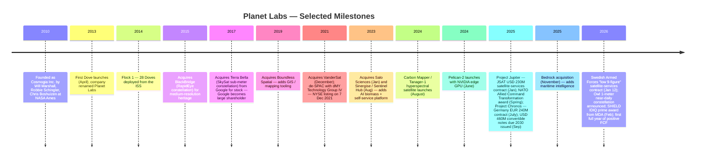
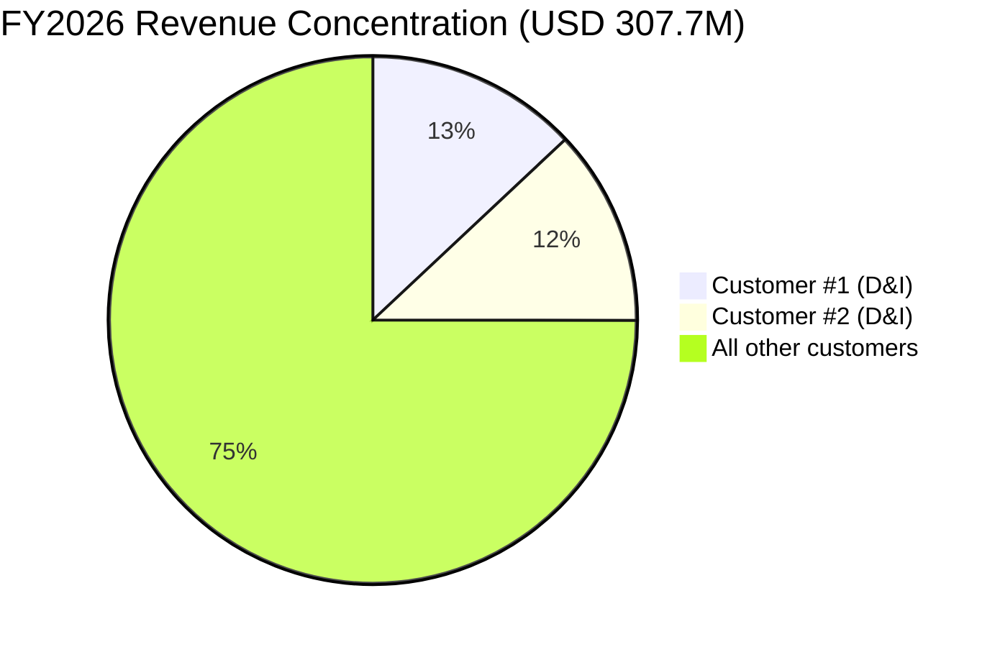
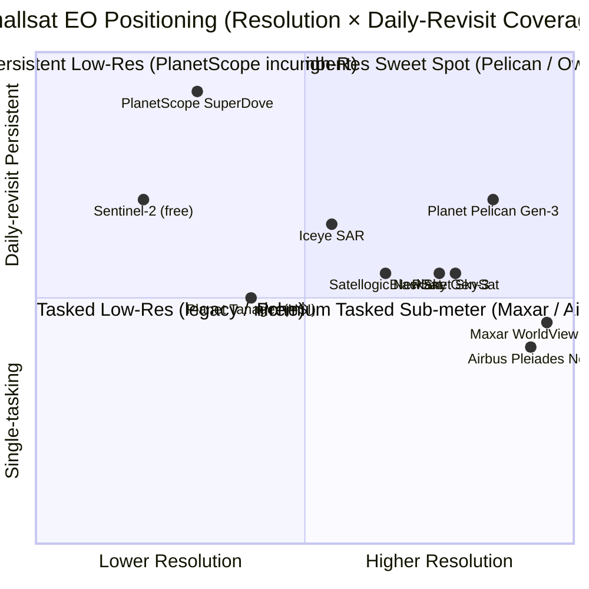

# COMPANY RESEARCH REPORT: Planet Labs PBC (NYSE: PL)

**Date:** 2026-05-20
**Analyst slug:** Planet_NYSE_PL
**Report language:** English

> **Update — FY2027 guidance initiated (2026-03-19):** Management initiated full-year FY2027 (year ending January 31, 2027) revenue guidance of **USD 415–440 million** (vs. FY2026 actual USD 307.7M, implying 35–43% YoY), non-GAAP gross margin of **50–52%**, Adjusted EBITDA of **USD 0–10M**, and capex of **USD 80–95M**. The guide assumes a year of heavy reinvestment behind three signed satellite-services deals (Japan JSAT USD 230M, Germany EUR 240M, Sweden "low 9-figure"), Pelican / Tanager build-outs, and the new Owl 1-m constellation announced January 2026. Source: [Planet Reports FY2026 Q4 Results — 8-K Exhibit 99.1, 2026-03-19](https://www.sec.gov/Archives/edgar/data/1836833/000119312526115951/pl-ex99_1.htm).

---

## TABLE OF CONTENTS
1. Company Overview
2. Company History
3. Management Team
4. Products & Services
5. Customers & Go-to-Market
6. Industry Overview
7. Competitive Landscape
8. Market Opportunity (TAM)
9. Risk Assessment
10. References

---

## 1. Company Overview

Planet Labs PBC ("Planet", NYSE: PL) operates the world's largest commercial Earth-observation (EO) satellite constellation, designs and manufactures the satellites itself, and sells the resulting imagery, analytics and — increasingly — turnkey "satellite services" to governments and enterprises. The company was founded in 2010 in Cupertino, California by three former NASA scientists (Will Marshall, Robbie Schingler, Chris Boshuizen) under the name **Cosmogia Inc.**, was renamed Planet Labs, and listed on the NYSE on **December 7, 2021** via a business combination with the SPAC dMY Technology Group IV, raising roughly USD 590 million of trust and PIPE proceeds at closing ([Planet 10-K FY2026, Item 1 — Business](https://www.sec.gov/Archives/edgar/data/1836833/000119312526119957/pl-20260131.htm)).

Planet is a **Delaware public benefit corporation ("PBC")** — its charter explicitly obligates the board to balance pecuniary interests against the public benefit of "accelerating humanity toward a more sustainable, secure and prosperous world by illuminating environmental and social change" ([Planet 10-K FY2026, Risk Factors — PBC status](https://www.sec.gov/Archives/edgar/data/1836833/000119312526119957/pl-20260131.htm)). HQ is at 645 Harrison Street, San Francisco; European HQ is in Berlin; engineering and ops are split across San Francisco, Berlin, Haarlem (Netherlands), Ljubljana (Slovenia) and Graz (Austria). Total headcount was disclosed as approximately 1,000 employees globally in the FY2026 10-K, reduced from a pre-restructuring peak in FY2024.

### Business model

Planet sells **imagery, analytics, satellite services and dedicated capacity** in three primary streams (the FY2026 10-K does not break out segment revenue but the MD&A discloses the vertical mix):

1. **Data subscriptions** — recurring licenses for fixed-price access to PlanetScope (SuperDove daily-revisit), SkySat and Pelican imagery, plus solutions and Planetary Variables. Most are 1- to 3-year contracts. As of January 31, 2026, **98% of Planet's End-of-Period ACV Book of Business was recurring** ([Planet 10-K FY2026, MD&A — Key Metrics](https://www.sec.gov/Archives/edgar/data/1836833/000119312526119957/pl-20260131.htm)).
2. **Satellite services** — long-term, milestone-based contracts in which Planet builds Pelican (and increasingly Owl) satellites on behalf of allied governments, retains licensing rights to most of the imagery for its commercial book, and operates the constellation. Three contracts were signed in 12 months: Japan JSAT (USD 230M, Jan 2025), Germany federal (EUR 240M, July 2025), Swedish Armed Forces ("low 9-figure", Jan 2026).
3. **Dedicated image tasking capacity** — guaranteed minutes/hours on Pelican or SkySat per region per day, sold to defense / intelligence customers needing sovereign access.

ARR is reported indirectly via *EoP ACV Book of Business* and *Net Dollar Retention Rate* (NDR), which **rose to 116% in FY2026 from 106% in FY2025** ([Planet 10-K FY2026, MD&A — NDR](https://www.sec.gov/Archives/edgar/data/1836833/000119312526119957/pl-20260131.htm)) — the company attributes the step-up to "large defense and intelligence contract expansions." Customer count fell to **897 EoP customers** (vs. 976 a year earlier) as Planet pruned smaller accounts onto a self-service Insights Platform tier and re-pointed direct sales at large, multi-million-dollar government deals; management has said it will retire the EoP-customer metric beginning Q1-FY27.

### Scale and FY2026 financials

| Metric | FY2024 | FY2025 | FY2026 | YoY |
|---|---|---|---|---|
| Revenue | USD 220.7M | USD 244.4M | **USD 307.7M** | **+26%** |
| GAAP gross margin | 53% | 57% | 56% | (1 pt) |
| Non-GAAP gross margin | n/d | 60% | 59% | (1 pt) |
| GAAP net loss | (USD 140.5M) | (USD 123.2M) | **(USD 246.9M)** | wider, of which **USD 161.4M is non-cash warrant revaluation** on share-price appreciation |
| Adj. EBITDA | (USD 30.8M) | (USD 10.6M) | **+USD 15.5M** | first profitable year |
| Operating cash flow | (USD 34.9M) | +USD 9.4M | **+USD 134.4M** | first material year |
| Free cash flow | (USD 77.2M) | (USD 39.0M) | **+USD 52.9M** | first positive FCF year |
| Cash + investments (EoP) | n/d | USD 222M | **USD 640M** | +188% (incl. USD 460M conv. notes) |
| RPO / Backlog | n/d | USD 414M (RPO) | **USD 852M RPO / >USD 900M backlog** | RPO +106% |

Source: [Planet 10-K FY2026 — Item 7 MD&A](https://www.sec.gov/Archives/edgar/data/1836833/000119312526119957/pl-20260131.htm); [Planet Q4-FY26 earnings 8-K, 2026-03-19](https://www.sec.gov/Archives/edgar/data/1836833/000119312526115951/pl-ex99_1.htm).

Source: [Planet 10-K FY2026, MD&A](https://www.sec.gov/Archives/edgar/data/1836833/000119312526119957/pl-20260131.htm); FY22 from [Planet 10-K FY2023](https://www.sec.gov/Archives/edgar/data/1836833/000183683323000014/).

### Valuation snapshot (REQUIRED)

- **Price (2026-05-20):** USD 42.71 — within 7% of the 52-week high of USD 45.78 and roughly **12× the 52-week low of USD 3.47** ([Yahoo Finance — PL key statistics, 2026-05-20](https://finance.yahoo.com/quote/PL/key-statistics/)).
- **Market cap:** USD 15.2 billion (332.9M shares of combined Class A + Class B).
- **Enterprise value:** USD 14.2B (net of USD 640M cash less USD 462M 2030 convertible notes).
- **TTM P/E:** **N/M (negative)** — FY26 GAAP net loss of USD 246.9M was inflated by a USD 161.4M non-cash mark-to-market loss on warrant liabilities as the stock appreciated; *underlying* net loss ex-warrants was approximately **USD 85.5M**, and **non-GAAP net loss per diluted share was only (USD 0.04)** ([Planet Q4-FY26 8-K, 2026-03-19](https://www.sec.gov/Archives/edgar/data/1836833/000119312526115951/pl-ex99_1.htm)). Adjusted EBITDA turned positive at USD 15.5M, and FCF was +USD 52.9M.
- **TTM P/S:** **49.5×** (USD 15.2B mkt cap ÷ USD 307.7M revenue). EV/Sales 46.2×.
- **TTM P/B:** 76× (book equity ~USD 200M — depressed by accumulated deficit of USD 967M U.S. federal NOLs).
- **3-year multiple range:** from de-SPAC in late 2021 to mid-2025, PL traded between 1.5× and 6× sales as growth stalled, the stock bottomed at USD 1.59 in February 2024, and the de-SPAC sponsor earn-out shares overhung the float. The current ~49× P/S therefore sits at the **all-time high** of the company's public history.

**Peer comparison (TTM, 2026-05-20, all via [Yahoo Finance](https://finance.yahoo.com/)):**

| Ticker | Company | TTM Revenue | TTM Rev Growth | EV / TTM Rev | TTM P/S |
|---|---|---|---|---|---|
| **PL** | Planet Labs | USD 307.7M | +26% (FY); +41% in Q4 | **46.2×** | **49.5×** |
| BKSY | BlackSky Technology | USD 97.8M | (30%) | 18.1× | 17.4× |
| SATL | Satellogic | USD 20.4M | +80% | 71.5× | 69.6× |
| RKLB | Rocket Lab USA | USD 679.6M | +64% | 104.4× | 114.5× |
| SPIR | Spire Global | USD 63.5M | (34%) | 11.1× | 12.0× |
| LUNR | Intuitive Machines | USD 334.3M | +199% | 19.4× | 16.4× |
| **Peer median** | | | | **19.4×** | |

Planet trades at a meaningful premium to the smallsat-EO median (~19× EV/sales) but at a discount to higher-multiple growth-and-launch names like Rocket Lab and Satellogic, both of which carry much smaller revenue bases. Maxar Intelligence (private since Advent acquired in 2023), Iceye (private, Series E in 2024), Capella Space (private, Series D 2023) do not publish quarterly multiples; selected reference data points: Maxar's take-private valued the business at ~USD 6.4B on roughly USD 1.7B revenue (~3.8× sales) for a much more mature, asset-heavy book ([Reuters, 2022-12-16](https://www.reuters.com/markets/deals/private-equity-firm-advent-international-buy-satellite-image-firm-maxar-2022-12-16/)); Iceye raised USD 93M extension at "above USD 1B" implied valuation on roughly USD 100M revenue ([Reuters, 2024-02-06](https://www.reuters.com/technology/space/finnish-satellite-firm-iceye-raises-93-million-funding-round-2024-02-06/)).

Source: [Yahoo Finance, 2026-05-20](https://finance.yahoo.com/quote/PL/key-statistics/) for each ticker.

**Interpretation of the multiple.** The TTM P/E is negative, but the GAAP loss is dominated by the USD 161.4M warrant revaluation, which is a *consequence* of the stock's appreciation, not a cash expense and not a measure of operating quality. The cleaner signal is non-GAAP EPS of (USD 0.04), positive FCF of USD 53M and positive adjusted EBITDA of USD 15.5M — i.e. the company has just crossed cash-generation breakeven. At 46× EV/sales the market is pricing **(a) acceleration to 35–43% growth on FY27 guide**, **(b) USD 900M+ backlog converting at high-50s gross margins**, **(c) a continued shift into satellite-services contracts that monetize the platform without taking on dilutive equity**, and **(d) a defense-tech / sovereign-EO premium that the de-SPAC class did not enjoy in 2022–2024**. The closest sector precedent is the 2024–2025 re-rate in Rocket Lab and AST SpaceMobile, where defense / sovereign demand drove sales multiples from single digits to >50×. Section 9 carries valuation / multiple-compression as a material financial risk.

Geographic exposure: approximately **30% of FY26 revenue was in non-USD currencies**, primarily Euro ([Planet 10-K FY2026, Item 7A Quantitative Disclosures](https://www.sec.gov/Archives/edgar/data/1836833/000119312526119957/pl-20260131.htm)) — up from 27% in FY25 and 24% in FY24, consistent with the Berlin team's role in winning the BKG, German federal, NATO and Slovenia contracts.

## 2. Company History

Planet was founded in 2010 in Cupertino, California as **Cosmogia Inc.** by Will Marshall, Robbie Schingler and Chris Boshuizen, three NASA Ames scientists who had been involved in the agency's **PhoneSat** experiment — putting a smartphone in a cubesat to demonstrate that consumer electronics could survive orbit. The founding thesis: by treating satellites as a software-defined consumable rather than a USD 500M flagship, a small team could build dozens of "Doves" per year and collect daily imagery of the entire planet for the first time. The first Dove launched in April 2013; the **Flock 1** constellation (28 Doves) reached orbit in February 2014 from the ISS. The company was renamed Planet Labs in 2013.

Source: [Planet 10-K FY2026, Item 1 Business — History](https://www.sec.gov/Archives/edgar/data/1836833/000119312526119957/pl-20260131.htm); [Planet Reports FY26 Q4 Results — 8-K, 2026-03-19](https://www.sec.gov/Archives/edgar/data/1836833/000119312526115951/pl-ex99_1.htm); [Planet Signs USD 230M Pelican Agreement — 8-K, 2025-01-29](https://www.sec.gov/Archives/edgar/data/1836833/000183683325000017/exhibit991projectjupiterpr.htm); [Planet Awarded EUR 240M Satellite Services Deal — 8-K, 2025-07-01](https://www.sec.gov/Archives/edgar/data/1836833/000183683325000075/exhibit991projectchronospr.htm); [Planet Signs 9-Figure Deal with Sweden — 8-K, 2026-01-12](https://www.sec.gov/Archives/edgar/data/1836833/000119312526009922/pl-ex99_1.htm).

**Strategic pivots.** Three transformations matter for the present thesis:

- **From hobbyist Doves to disciplined SuperDoves (2018–2022).** The first-generation Doves had inconsistent radiometry and short lifetimes. The SuperDove generation (8 spectral bands, longer life) was designed as an enterprise-grade scanner and became the backbone of the "PlanetScope" daily-revisit product. This pivot is what made the data sellable to USDA, the European Commission and large agribusiness on multi-year contracts rather than as one-off image purchases.
- **From data to platform (2023).** The August 2023 acquisition of Slovenia-based **Sinergise** brought Sentinel Hub, a self-service Earth-observation API and visualization platform with tens of thousands of paying developer users ([Planet 10-K FY2026, Note 5 — Business Combinations](https://www.sec.gov/Archives/edgar/data/1836833/000119312526119957/pl-20260131.htm)). Re-branded "Planet Insights Platform," it now serves as a high-velocity, low-friction acquisition funnel — and is the reason management is retiring the EoP-customer metric (the long-tail of small accounts now lives there, off the headline count).
- **From data licensing to "satellite services" (2025).** The single most important strategic shift. Rather than only selling subscriptions, Planet now offers **sovereign / Tier-1 customers a packaged constellation**: Planet builds and operates the Pelican satellites, the customer pays cash up-front, takes title to the satellites, and Planet retains licensing rights to use the imagery on its commercial book. Three contracts in twelve months — JSAT USD 230M, Germany EUR 240M, Sweden low 9-figure — sum to **over USD 500M of new bookings** and explain virtually all the swing to positive FCF in FY26 (USD 151M increase in deferred revenue per the 10-K cash-flow statement). This is the model that re-rated the stock.

**Acquisitions (with rationale):**

- BlackBridge (Sep 2015) — RapidEye constellation, 5-meter heritage data archive.
- Terra Bella from Alphabet (April 2017, all-stock) — SkySat sub-meter tasking constellation; Google becomes 11.5% Class A holder (still listed in 2025 proxy).
- Boundless Spatial (March 2019) — GIS analytics, federal sales channel.
- VanderSat (Dec 2021) — Planetary Variables (soil moisture, biomass) — closed simultaneously with de-SPAC.
- Salo Sciences (Jan 2023) — AI biomass / forest carbon modeling.
- Sinergise (Aug 2023) — Sentinel Hub developer platform; cost USD 31.4M cash + EUR 1.9M earn-out.
- Bedrock Ocean Exploration data assets (Nov 2025) — maritime situational-awareness IP, supporting the maritime-domain pitch in Germany/Sweden ([Planet 10-K FY2026, Item 1 — Business](https://www.sec.gov/Archives/edgar/data/1836833/000119312526119957/pl-20260131.htm)).

**Recent developments — last 12 months (2025-05 to 2026-05).** NATO Allied Command Transformation made Planet its persistent space-based surveillance vendor (multi-year, "seven-figure" extension confirmed in FY26-Q4); Sweden / Germany / JSAT trifecta of satellite-services contracts pushed RPO to USD 852M (+106% YoY) and backlog to >USD 900M; the **Owl constellation** was publicly disclosed in January 2026 as a next-gen 1-meter-class near-daily fleet; on September 12, 2025 Planet issued **USD 460M of 0.50% convertible notes due 2030**, more than doubling cash on the balance sheet and giving optionality to fund Owl, capex for Pelican Gen-3 and tuck-in M&A; in February 2026 the Missile Defense Agency named Planet a Prime contractor under the **SHIELD IDIQ** vehicle ([Planet Q4-FY26 8-K — Recent Business Highlights, 2026-03-19](https://www.sec.gov/Archives/edgar/data/1836833/000119312526115951/pl-ex99_1.htm)).

## 3. Management Team

The leadership is unusually concentrated: only **three named executive officers** as of the May 2025 proxy — co-founders Marshall and Schingler plus CFO Ashley Johnson — and the founders together control 100% of the supervoting Class B shares (~58% of votes against ~9.6% of economic ownership) ([Planet DEF 14A 2025, Security Ownership table](https://www.sec.gov/Archives/edgar/data/1836833/000183683325000056/)).

### William "Will" Marshall — Chairperson, Co-Founder & CEO

Dr. Marshall, age 46, has run Planet since he co-founded Cosmogia in 2010 and assumed the CEO title in 2011 ([Planet DEF 14A 2025 — Director Bios](https://www.sec.gov/Archives/edgar/data/1836833/000183683325000056/)). He has been Chairperson since the de-SPAC in December 2021. He holds a **Ph.D. in Physics from the University of Oxford** and a Master's in Physics with Space Science and Technology from the University of Leicester, with postdoctoral fellowships at George Washington University and Harvard. Before founding Planet, he was a scientist at NASA Ames / Universities Space Research Association, where he co-formulated the **NASA Ames Small Spacecraft Office** with Robbie Schingler — the institutional home for the PhoneSat experiments that became Planet's intellectual seed. He worked as a systems engineer on **LADEE** (NASA's lunar atmosphere mission), was a science-team member on **LCROSS** (lunar impactor), and led technical work on space-debris remediation and Phonesat. He is a sought-after public speaker: the 2014 TED talk "Tiny satellites that photograph the entire planet every day" has roughly 1.8 million views, and HBO's 2024 documentary "Wild Wild Space" features him as a central figure.

Marshall owns approximately **5.42% of Class A and 50.0% of Class B** ([Planet DEF 14A 2025 — Beneficial Ownership](https://www.sec.gov/Archives/edgar/data/1836833/000183683325000056/)), the Class B stake delivering 20:1 voting power. His footnoted holding is 985,481 directly-held Class A shares, 10.58M Class A issuable upon conversion of Class B, 4.32M Class A subject to options exercisable within 60 days, and 240,044 RSUs vesting within 60 days. He **voluntarily reduced his base salary by 20% in FY25** as part of firm-wide cost actions during the 2024 headcount reduction, an unusual move that signaled alignment when the stock was at all-time lows. The FY25 say-on-pay vote passed but received notable opposition (Glass Lewis and ISS flagged the deep founder voting control as a governance concern). The transformation since — from a money-losing data vendor to the first cash-flow-positive year in company history, with USD 900M backlog and three signed satellite-services deals — is the single largest data point in the bull case for Marshall as a builder-CEO who can also execute a commercial pivot. The principal counter-argument is that Planet had to bring in a Stripe-vintage President / CPO (Kevin Weil, who joined in 2023 and departed in May 2024 after roughly a year) before Marshall and Schingler effectively re-centralized product and growth under their own offices, suggesting some difficulty integrating senior operators. Marshall has remained the public face throughout — every major customer announcement (NATO, JSAT, Germany, Sweden) carries his quote as the lead spokesperson.

### Ashley Fieglein Johnson — President & CFO

Johnson, age 53, joined Planet as CFO in February 2020 — pre-de-SPAC — and added the COO title in March 2021, the President title in March 2024 ([Planet DEF 14A 2025 — Executive Officers](https://www.sec.gov/Archives/edgar/data/1836833/000183683325000056/)). She holds a BA in International Relations and an MA in International Policy Studies, both from Stanford. Prior to Planet, she was CFO of **Wealthfront Inc.** from 2015–2020 (also COO from 2016) — taking the consumer-fintech business from roughly USD 5B AUM to over USD 25B and through several capital-markets transactions. Before Wealthfront, she was CFO of **ServiceSource International** (Nasdaq: SREV) from January 2013, interim CEO of ServiceSource from October to December 2014, and Chief Customer Officer through May 2015 — she has live operating experience leading a public-company turn-around. She held 526,956 directly-owned Class A shares plus 1.96M options + 156k RSU vests as of the 2025 record date. Johnson's narrative on the FY26-Q4 call — "first fiscal year of Adjusted EBITDA and free cash flow profitability... USD 640 million of cash" — was the central CFO message of the year; market reaction confirmed that the inflection was the gating event for the re-rating.

### Robbie (Robert) Schingler, Jr. — Co-Founder & Chief Strategy Officer

Schingler, age 46, was Planet's CFO and COO at various points pre-IPO and has been Chief Strategy Officer since 2015 ([Planet DEF 14A 2025 — Director Bios](https://www.sec.gov/Archives/edgar/data/1836833/000183683325000056/)). He spent nine years at NASA, including Chief of Staff for the Office of the Chief Technologist at NASA Headquarters, was a 2005 Presidential Management Fellow, holds an MBA from Georgetown, an MS in Space Studies from the International Space University, and a BS in Engineering Physics from Santa Clara. He owns the other 50% of the Class B float (via the Ulysses Trust 02021.1) plus 316k Class A — same supervoting profile as Marshall. He has played the lead role on satellite-services structuring and on Planet's international expansion (Berlin office, European customer wins).

### James Mason — Chief Space Officer (named in disclosures, not a Section 16 officer)

Cited by name in the January 2025 Pelican press release as the executive who fronts the satellite-services business with international counterparties ([Planet 8-K — Project Jupiter Pelican Deal, 2025-01-29](https://www.sec.gov/Archives/edgar/data/1836833/000183683325000017/exhibit991projectjupiterpr.htm)). Mason was Planet's Senior Director of Space Systems for years before being elevated to Chief Space Officer — the role is the technical-program face of the Pelican / Tanager / Owl roadmap. Not a Section-16 officer per the 2025 proxy, but a significant practitioner-leader in the post-Weil organization.

### Board and governance

Following the 2025 annual meeting the board is **eight directors**, of which **75% are independent** (only Marshall and Schingler are non-independent). Lead Independent Director is **Carl Bass** (former Autodesk CEO, public-board veteran). Other independents include **General John W. "Jay" Raymond** (USAF retired, founding commander of U.S. Space Command and former Chief of Space Operations) — a particularly meaningful appointment for the defense / sovereign pivot — and **Gary B. Smith** (CEO of Ciena, NYSE: CIEN). The board has a classified three-class structure with staggered three-year terms.

**Voting power and governance flags.** Class B common shares carry **20 votes per share** vs. one for Class A. All 21.16M Class B shares are held by Marshall and Schingler; Class A totals 282.3M. The founders wield approximately **58% of total voting power on ~9.6% of economic ownership** — a dual-class structure of the type S&P and FTSE Russell exclude from certain indexes. Compensation is RSU-heavy; hedging / pledging is prohibited; no defined benefit pension; no executive tax gross-ups. KPMG LLP is auditor. Compensation peers are a software / SaaS panel chosen explicitly to align Planet to "data-company" comparables.

### Track record synthesis

Founder-led, founder-controlled, founder-aligned (voluntary salary cuts in FY25). The team's signal accomplishment over the past 18 months is converting a USD 4-stock SPAC casualty into a USD 15B mid-cap by signing more than USD 500M of satellite-services contracts, raising USD 460M of cheap (0.50%) convertible debt at a high stock price to extend runway and fund Owl, and delivering the first FCF-positive year. The principal track-record gap is consumer-style product / growth — the Weil hiring failed and the long-tail of small commercial accounts is shrinking. The defense and sovereign-EO pivot now defines the franchise; whether Marshall's team can keep that lead against well-capitalized incumbents (Maxar Intelligence, Airbus Defence and Space) and emerging primes (BlackSky scaling Gen-3, SpaceX-aligned offerings) is the next two-year test.

## 4. Products & Services

Planet's catalogue is organized by **fleet** (the satellite that captures the data) and by **delivery platform** (how the customer consumes it). A thorough walk of [planet.com/products/](https://www.planet.com/products/) and [planet.com/constellations/](https://www.planet.com/constellations/) reveals the following enumeration; this matches the product taxonomy in the FY2026 10-K Item 1 (Business).

```mermaid
graph TD
    A[Planet Labs PBC] --> B[Data Subscriptions]
    A --> C[Satellite Services]
    A --> D[Dedicated Capacity & Tasking]
    A --> E[Planet Insights Platform]
    B --> B1["PlanetScope<br/>(SuperDove, 3.5m daily revisit)"]
    B --> B2["SkySat<br/>(50cm tasking, video, stereo)"]
    B --> B3["Tanager<br/>(30m hyperspectral, 400+ bands)"]
    B --> B4["Pelican<br/>(Gen-3 high-res tasking)"]
    B --> B5["Planetary Variables<br/>Soil Moisture / Forest Carbon / Biomass / Land Surface Temp"]
    B --> B6["Solutions<br/>(AI change detection, road & building extraction)"]
    C --> C1["JSAT — USD 230M, Asia-Pacific, Pelican build"]
    C --> C2["Germany BMVg — EUR 240M, Pelican dedicated capacity"]
    C --> C3["Swedish Armed Forces — low 9-fig USD"]
    D --> D1["Pelican dedicated tasking — region / minute"]
    D --> D2["SkySat ad-hoc tasking — API + browser"]
    E --> E1["Sentinel Hub developer API (open-data + Planet)"]
    E --> E2["Self-service Insights ordering (monthly / annual)"]
    A --> F["Forthcoming — Owl<br/>(~1m near-daily, 2026+)"]
```

Source: [Planet — Products page](https://www.planet.com/products/); [Planet — Constellations page](https://www.planet.com/constellations/); [Planet 10-K FY2026 Item 1](https://www.sec.gov/Archives/edgar/data/1836833/000119312526119957/pl-20260131.htm).

### Data subscriptions — fleet-by-fleet

**PlanetScope (SuperDove)** — the workhorse. Approximately 200 active SuperDove satellites image the Earth's landmass every day at ~3.5m GSD across 8 spectral bands (deep-blue through near-infrared). The product is delivered as analytics-ready surface-reflectance scenes via the Planet API, in a single cross-calibrated harmonized format that also ingests Landsat-8/9 and Sentinel-2 — eliminating the radiometric work that historically gated machine-learning on multi-source imagery ([Planet 10-K FY2026, Item 1 — Our Fleet](https://www.sec.gov/Archives/edgar/data/1836833/000119312526119957/pl-20260131.htm)). Target customers: civil-government mapping agencies (BKG Germany, USDA, EU Copernicus second-party users), large agribusiness (Bayer, Corteva-tier analytics partners), forestry/carbon (American Forest Foundation, Salo Sciences vintage customers), and defense / intelligence for change-detection over broad areas of interest. Pricing: tiered subscription based on Area of Interest (km²), product type, download cadence; the largest civil-government contracts are USD low- to mid-millions per year. **Competitive advantage: yes — daily, broad-area revisit at a price point no one else can match.** Moat type: scale (180–200 active satellites — the largest commercial constellation); data archive (over 3,000 images on average for every point on Earth's landmass since 2017, a non-replicable historical record); and one-to-many economics (incremental subscription has near-zero marginal cost). Closest comp: **Planet vs. ESA Copernicus / Sentinel-2** — Sentinel-2 is free at 10m every 5 days, which limits PlanetScope's value to customers who specifically need the higher cadence or resolution; PlanetScope is *ahead* on revisit and time-of-day flexibility, *behind* on price (free). The proprietary multi-band radiometric harmonization is the key paid-product differentiator vs. free open data.

**SkySat** — Planet's incumbent sub-meter tasking fleet inherited from the 2017 Terra Bella / Google acquisition. ~21 satellites at ~50cm GSD post-processing, multiple imaging modes (points, long strips, stereo, ~90-second video). Target customers: insurance, defense, energy, maritime. SkySat is being progressively de-emphasized in favor of Pelican; the FY26 10-K notes "$10.1 million decrease from certain fully depreciated high resolution satellites" in the FY26 cost-of-revenue walk, signaling end-of-life accounting for older SkySats. **Competitive advantage: partial.** Moat type: incumbency, embedded workflows in defense / intel customers. Closest comp: **SkySat vs. Maxar WorldView Legion (~30cm)** — Legion is *ahead* on resolution and dedicated-tasking sophistication; SkySat is *at parity* on price and *ahead* on revisit per unit cost.

**Pelican** — Planet's Gen-3 high-resolution fleet, in deployment. Pelican is the architectural successor to SkySat, with sub-meter resolution after processing, more spectral bands (panchromatic + multi-band), higher imaging capacity, lower latency, and onboard AI via NVIDIA edge GPUs. Pelican-2 launched on January 14, 2025 with the latest NVIDIA edge GPU and satellite-to-satellite communications, "designed to enable Planet to deliver critical data to its customers in minutes rather than hours" ([Planet 8-K — Project Jupiter Pelican Deal, 2025-01-29](https://www.sec.gov/Archives/edgar/data/1836833/000183683325000017/exhibit991projectjupiterpr.htm)). Pelican is also the platform underlying all three satellite-services contracts (JSAT / Germany / Sweden) — Planet builds the spacecraft and operates them for sovereign owners, retaining licensing rights to "use the imagery on its commercial book." **Competitive advantage: yes.** Moat type: technology + ecosystem lock-in — Pelican uniquely combines a high-cadence high-res payload with edge-AI compute and inter-satellite links, *plus* the satellite-services business model that converts capex into customer-funded asset growth. Closest comp: **Pelican vs. Maxar Legion + Lockheed/Northrop primes' next-gen NRO buses** — primes are *ahead* on resolution but require traditional acquisition timelines (5–10 years) and exclusive customer ownership; Pelican is *ahead* on time-to-orbit (under 3 years from contract), agile aerospace and a hybrid commercial / sovereign data sharing model.

**Tanager — hyperspectral.** Tanager-1 (launched August 2024 on a SpaceX Transporter rideshare) is Planet's first hyperspectral satellite, designed to deliver imagery across **400+ spectral bands** in the visible and shortwave-infrared at 30m GSD ([Planet 10-K FY2026, Item 1 — Hyperspectral](https://www.sec.gov/Archives/edgar/data/1836833/000119312526119957/pl-20260131.htm)). Built in collaboration with **NASA JPL** and **Carbon Mapper Coalition** (philanthropically funded by the High Tide Foundation, Bloomberg Philanthropies, Grantham Foundation and others), the satellite is now publishing methane and CO₂ point-source detections on the Carbon Mapper platform. Customers: EPA, regulators, oil/gas operators (for self-monitoring), insurance, mining, and increasingly defense (CBRN, mineral identification). **Competitive advantage: yes (early lead).** Moat type: technology (full-band SWIR is hard) + partnerships (JPL co-development, Carbon Mapper philanthropic anchor that effectively de-risked the build). Closest comp: **Tanager vs. Pixxel hyperspectral (private, India)** — Pixxel is positioning a competing constellation; Planet is *ahead* on operational data products today, Pixxel may be *at parity* on raw spec by late 2026.

**Planetary Variables** — AI-derived measurements packaged as time-series products: Soil Water Content, Forest Carbon Diligence (above-ground biomass), Land Surface Temperature, Crop Biomass ([Planet — Planetary Variables](https://www.planet.com/products/planetary-variables/)). These layer the company's proprietary models on top of PlanetScope + open-data fusion. Customers: ag-tech and forest / carbon markets. **Competitive advantage: partial.** Moat type: data + model (long historical archive enables back-testing). Closest comp: **Planetary Variables vs. Descartes Labs (Maxar) / Indigo Ag / Climate FieldView in-house models** — Planet is *at parity* on accuracy in independent benchmarks, *ahead* on global coverage.

### Satellite services and dedicated capacity — the new flagship

The 2025–2026 contract trio (JSAT, Germany, Sweden) plus NATO and Slovenia is a new product category for Planet. The economics: customer pays cash up-front and through-build for a Pelican constellation that the customer (or a designated subsidiary) *owns*, while Planet retains rights to license imagery from the constellation into its global subscription book over the build and operating period (typically seven years). The financial-statement evidence of the new model is in the FY26 cash-flow statement: **deferred revenue grew by USD 151.1M**, and operating cash flow swung from USD 9M to USD 134M ([Planet 10-K FY2026, Item 7 — Cash Flow](https://www.sec.gov/Archives/edgar/data/1836833/000119312526119957/pl-20260131.htm)). Management calls this approach "cash-flow accretive without taking on dilutive capital." **Competitive advantage: yes — possibly the strongest in the catalogue.** Moat type: cost leadership (Planet's agile-aerospace bus is by far the cheapest Pelican-class satellite to build at scale); brand/trust with allied governments (post-NATO award); regulatory (Planet holds NOAA Tier-3 commercial remote-sensing licenses). Closest comp: **vs. Airbus Defence and Space "Pleiades Neo" capacity sales, vs. Maxar "Maxar 4" / Worldview Legion dedicated minutes, vs. Iceye SAR services** — Planet is *ahead* on speed-to-orbit and on integrating commercial-grade ML into the platform, *behind* on optical resolution for the most demanding intel use cases.

### Planet Insights Platform — self-service

The former Sentinel Hub product, integrated post-acquisition (Aug 2023). Self-service ordering of Planet, Sentinel-2, Landsat, MODIS and partner data via a developer-friendly API and browser app. Pricing: monthly / annual starter packages designed for academic, research and SMB users. Material driver of the FY26 customer-mix shift — the long-tail of small users now lives here, *off* the EoP-customer headline, which is why management is retiring that metric ([Planet 10-K FY2026, MD&A — EoP Customer Count](https://www.sec.gov/Archives/edgar/data/1836833/000119312526119957/pl-20260131.htm)). **Competitive advantage: partial.** Moat type: integrated data catalogue + developer mindshare from Sentinel Hub's legacy. Closest comp: **vs. Google Earth Engine** (free for non-commercial, dominant in research) and **vs. Amazon Earth on Open Data + AWS**. Earth Engine is *ahead* on scientific reach; Insights Platform is *ahead* on commercial Planet-data integration.

### Forthcoming — Owl constellation

Disclosed in the January 12, 2026 Sweden announcement: a "forthcoming Owl constellation, which is being designed to deliver near-daily 1-meter class imagery" ([Planet 8-K — Sweden Deal, 2026-01-12](https://www.sec.gov/Archives/edgar/data/1836833/000119312526009922/pl-ex99_1.htm)). Owl would close the gap between SuperDove's 3.5m revisit and SkySat / Pelican's tasked sub-meter — i.e. it competes most directly with Maxar Legion at lower price points. No launch dates or capex disclosed; the USD 460M 2030 convertible-notes raise gives Planet roughly two years of runway to build Owl alongside the contracted Pelicans.

### Flagship vs. long-tail

The three flagship products driving FY26 revenue and FY27 acceleration are: (1) **PlanetScope subscriptions** (recurring, ~50% of book), (2) **Pelican satellite services** (the USD 500M+ of new contracted bookings drive RPO + future revenue), and (3) **Tanager hyperspectral** (still small but strategic for ESG / methane and CBRN). SkySat is in managed decline (assets fully depreciating in FY25 / 26). Planetary Variables and Insights Platform are growth experiments scaled by the platform shift.

### Roadmap — last 12 months

Launched: Pelican-2 (Jan 2025), Pelican-3 (announced for 2025), 40 satellites in FY26 (per CEO commentary on Q4-FY26 call), Tanager-1 (Aug 2024, operationalized FY26). Repositioned: EoP Customer Count being retired Q1-FY27, Sentinel Hub re-branded "Planet Insights Platform." Sunset: SkySat (gradual). Announced: **Owl constellation** (2026+) and an "R&D partnership with Google to explore data centers in space" (per March 19, 2026 earnings remarks).

## 5. Customers & Go-to-Market

### Customer segments

Planet sells across three primary verticals plus a long-tail platform tier:

- **Defense & Intelligence (D&I)** — the fastest-growing and now-largest vertical. Customers include the U.S. National Reconnaissance Office (NRO) under the EOCL (Electro-Optical Commercial Layer) contract awarded May 2022 (a 10-year, up to USD 146M base for Planet's portion plus options), U.S. National Geospatial-Intelligence Agency (NGA), U.S. Department of War / Defense Innovation Unit (DIU) — multiple contracts including INDOPACOM and Hybrid Space Architecture, NATO Allied Command Transformation, German Bundeswehr (via the Project Chronos EUR 240M deal), Japanese government (via JSAT, USD 230M), Swedish Armed Forces (low 9-figure), Slovenia, and Ukrainian government use via partners. The FY26 10-K MD&A discloses that the **USD 64.0M of revenue growth in FY26 was *entirely* driven by D&I** ([Planet 10-K FY2026, MD&A — Revenue](https://www.sec.gov/Archives/edgar/data/1836833/000119312526119957/pl-20260131.htm)).
- **Civil Government** — USDA, USGS, NOAA, EU Copernicus second-party users, European national mapping agencies (BKG Germany, GURS Slovenia, French IGN, Norwegian KSAT distribution), state and local governments (e.g., California state agencies for wildfire, SDG&E utility partnership for fuel monitoring). This vertical is the historical core; growth is modest but stable.
- **Commercial** — agribusiness (Bayer Climate, Syngenta tier), insurance (parametric, wildfire underwriting), energy and utilities (SDG&E, oil/gas mid-stream monitoring), forestry / carbon markets (Salo Sciences vintage), finance (Orbital Insight-tier macro signals; sell-side hedge funds via partners), supply-chain and ESG. Strategic partner relationships include Bayer, Esri (ArcGIS distribution), Microsoft (Planetary Computer), Google (R&D partnership, large shareholder), AiDash (utility-vegetation), and JSAT for Asia-Pacific.

Source: [Planet 10-K FY2026, Risk Factors — Customer Concentration](https://www.sec.gov/Archives/edgar/data/1836833/000119312526119957/pl-20260131.htm) (two customers = 13% and 12% of revenue).

Source: [Planet 10-K FY2026, MD&A — Revenue commentary](https://www.sec.gov/Archives/edgar/data/1836833/000119312526119957/pl-20260131.htm); FY24 mix from [Planet 10-K FY2024](https://www.sec.gov/Archives/edgar/data/1836833/000183683324000037/). Bars are illustrative — Planet does not disclose vertical revenue by exact dollar amount, but the 10-K text confirms D&I is the dominant growth driver.

### Customer concentration — quantified

Planet's FY2026 10-K Risk Factors disclose that **two customers accounted for 13% and 12% of FY2026 revenue** ([Planet 10-K FY2026, Risk Factors — Customer Concentration](https://www.sec.gov/Archives/edgar/data/1836833/000119312526119957/pl-20260131.htm)) — combined ~25% from the top two. As of January 31, 2026, **one customer accounted for 33% of accounts receivable** — pointing to a single large government or sovereign counterparty with delayed payment timing typical of milestone-based contracts. Planet does not name the customers in its filings, but reasonable inference from the disclosed contracts (and from the timing of revenue acceleration) is that the two top FY26 names are most likely: (i) the **NRO under the EOCL contract**, which is the largest and longest-standing D&I subscription, and (ii) **JSAT (Japan)** under the Project Jupiter satellite-services contract whose USD 230M is being recognized over an approximately 7-year build/operate period. This is inference, not disclosure — Planet specifically does not name them in the FY26 10-K.

**Top-1 ~13%, top-5 estimated ~40–45%** (based on 13% + 12% + the Germany Chronos contract beginning revenue recognition January 2026 + civil-government core accounts). Three-year trend: customer concentration *increased* in FY26 — the FY25 10-K disclosed two customers at 12% and 11% respectively, the FY24 10-K disclosed one at 12% ([Planet 10-K FY2025, Risk Factors](https://www.sec.gov/Archives/edgar/data/1836833/000183683325000050/); [Planet 10-K FY2024, Risk Factors](https://www.sec.gov/Archives/edgar/data/1836833/000183683324000037/)). Trend is meaningful but not extreme — top-1 has remained ~12–13% as the company grew.

**Contract structures.** Civil and commercial subscriptions are typically 1–3 year master agreements with annual renewal. Defense contracts (NRO EOCL, DIU pilots, NATO ACT) are mixed: NRO has a multi-year base + option structure; DIU pilots are short and competed. The three satellite-services contracts (JSAT, Germany, Sweden) are multi-year (Germany "ramping up over several years" per the 8-K) and milestone-funded. Concentration risk is real but **diversified by sovereign counterparty** — i.e., the top customers are governments with very high credit quality, multi-year political commitment, and limited substitution ability mid-program.

Because **top-1 > 10%** and the trajectory is toward larger contracts that increase concentration, the report flags this in Section 9 as a material customer-concentration risk.

### Distribution channels

Direct sales force segmented by industry vertical (agriculture, defense & intelligence, energy / utilities, civil government, commercial), with a separate satellite-services and dedicated-capacity sales team that operates more like a defense-services BD function (multi-year, technical-RFP-driven, longer cycle). Channel partners: Esri (ArcGIS integration), Hexagon, Trimble, AiDash (utility vegetation), JSAT (Asia-Pacific reseller and end customer), Maxar (occasionally as a data sourcing relationship), Microsoft Planetary Computer (open ecosystem), Amazon (AWS Open Data). The **Planet Insights Platform** acts as a self-service product-led-growth funnel for academic / research / SMB users that the direct sales team would not chase economically.

### Sales cycle and recent wins

Subscription cycle: 6–18 months for civil and commercial enterprise; 6–9 months for self-serve scale up via Insights Platform. Defense / sovereign satellite-services cycle: 18–36 months from first contact to signed contract, with major milestone payments through build. Recent named wins (last 12 months) per the FY26-Q4 release and 8-Ks:

- **Swedish Armed Forces** — multi-year low 9-figure (Jan 2026)
- **Germany federal government** — EUR 240M (≈ USD 263M) Project Chronos (July 2025)
- **JSAT (Japan)** — USD 230M Pelican constellation (Jan 2025)
- **NATO Allied Command Transformation** — multi-year extension, "seven-figure" disclosed (FY26-Q4)
- **U.S. DIU INDOPACOM** — seven-figure extension (FY26-Q4)
- **U.S. DIU Hybrid Space Architecture** — sub-USD 1M option exercise on Pelican demo (FY26-Q4)
- **Slovenia Surveying and Mapping Authority (GURS)** — enterprise multi-year (Jan 2026)
- **German Federal Agency for Cartography (BKG)** — seven-figure renewal expansion (FY26-Q4)
- **U.S. Missile Defense Agency SHIELD IDIQ** — Prime contract vehicle, awards to be competed (Feb 2026)
- **San Diego Gas & Electric (SDG&E)** — 3-year renewal, wildfire risk model integration
- **AiDash partnership** — preferred fuel-monitoring data across North America utilities

Source: [Planet Q4-FY26 Earnings 8-K, 2026-03-19](https://www.sec.gov/Archives/edgar/data/1836833/000119312526115951/pl-ex99_1.htm).

## 6. Industry Overview

Planet operates at the intersection of three industries: **commercial Earth observation (EO)**, **defense & intelligence services**, and **geospatial analytics / data platforms**. Each is sized differently and has different growth dynamics.

**Industry definition (NAICS).** Primary codes: 517410 (Satellite Telecommunications), 541370 (Surveying and Mapping), 541512 (Computer Systems Design). Planet sits inside the broader "commercial space economy" — satellite manufacturing, EO data services, downstream analytics.

**Market size — commercial EO data.** Independent forecasters published in the last 12 months put the commercial EO data + analytics market at approximately **USD 5–8 billion in 2024 growing to USD 12–18 billion by 2030**, depending on methodology:

- Northern Sky Research (now part of Analysys Mason) sized the commercial EO data and services market at roughly USD 5.7B in 2024, projecting USD 12.9B by 2034 (~8.5% CAGR) ([Analysys Mason / NSR Earth Observation Satellite Market, 16th Edition, 2024](https://research.analysysmason.com/earth-observation-satellite-13)) — the most-cited industry baseline.
- Euroconsult / Novaspace estimated 2024 EO data + value-added services revenue at USD 4.7B, projecting USD 8.6B by 2033 ([Novaspace — Earth Observation Data & Services Market, 2024](https://www.novaspace.com/reports/earth-observation-data-services-market/)).
- For the **commercial smallsat-EO sub-segment specifically**, the addressable pool is much smaller — order of USD 1.5–2.5B in 2024 — but growing fastest as defense ministries replace legacy government-built optical and SAR programs with commercial subscriptions.

**Defense & intelligence overlay.** The much larger driver is **defense modernization**, where Western governments are simultaneously (i) restoring deterrence after the 2022 Ukraine invasion, (ii) substituting commercial EO for some classified-bird capacity to free up exquisite systems, and (iii) acquiring sovereign EO capability through "satellite-as-a-service" models that bypass legacy 10-year prime acquisition timelines. The NRO's **EOCL** contract awarded in May 2022 — USD 146M base to Planet, plus options up to roughly USD 4B aggregate across all three awardees (Planet, Maxar, BlackSky) over a decade — established the U.S. precedent ([NRO — Electro-Optical Commercial Layer Press Release, 2022-05-25](https://www.nro.gov/Portals/65/documents/news/press-releases/2022/EOCL_Award_Press_Release.pdf)). The European equivalent is unfolding now: Germany's EUR 100B "Zeitenwende" defense package (2022), the EU's Iris² (resilient connectivity, awarded Dec 2024), the new "EU Space Act" proposed February 2025 and EU "Government Satellite Communications" (GOVSATCOM) — each redirects multi-billion-Euro flows toward commercial space-based ISR. Sweden's January 2026 contract is exactly this template at the small-nation scale.

**Growth drivers (industry-wide, last 12 months).**

1. **Geopolitics.** Persistent monitoring of Ukraine, the Red Sea, Taiwan Strait, North Korea and Iranian nuclear sites has elevated EO from a nice-to-have to a daily operational requirement for any NATO + Indo-Pacific allied military.
2. **AI/ML.** The cost of running large vision and language models against multi-band EO data has fallen 10–100× since 2022, opening use cases (automated change detection, object counting, methane plume identification) that previously required human image-analyst time. Planet's R&D partnership with Google (announced March 2026) and edge GPUs on Pelican-2 are direct responses.
3. **Climate and ESG monitoring.** Mandatory disclosure regimes (EU CSRD, California SB-253, IFRS-S2) created demand for verified Scope-1 and Scope-3 emissions data. Tanager / Carbon Mapper directly targets methane and CO₂ point-source verification; Planetary Variables targets biomass / land-use change for carbon-credit verification.
4. **Sovereignty.** Allied governments increasingly require *owned* or *dedicated-capacity* satellites for national-security data — the satellite-services model is the result.
5. **Launch economics.** SpaceX Falcon-9 rideshare reduced smallsat launch cost from roughly USD 20k/kg in 2018 to under USD 6k/kg in 2025 (Transporter rideshare base), shrinking the capex per satellite for the whole industry.

**Regulatory environment.** Commercial remote-sensing in the U.S. is licensed by NOAA's Office of Space Commerce (Tier 1/2/3, with Tier 3 the most permissive); Planet holds active Tier 3 licenses ([Planet 10-K FY2026, Item 1A — Regulatory Risks](https://www.sec.gov/Archives/edgar/data/1836833/000119312526119957/pl-20260131.htm)). Export controls (ITAR for spacecraft components, EAR for ground systems and AI), foreign-direct-investment review (CFIUS), and the "shutter control" right of the U.S. government to interrupt service over conflict zones (per NOAA license conditions) all apply. In Europe, EU dual-use export controls and member-state classification regimes (e.g., German BMWi, French SGDSN) gate sensitive imagery. NOAA workforce reductions in early 2025 created licensing-throughput risk for the whole industry, flagged in Planet's 10-K.

**Industry structure.** Fragmented at the data layer (Planet, BlackSky, Maxar Intelligence, Iceye, Capella Space, Satellogic, Airbus, Pixxel, EchoStar/GeoOptics) but **rapidly consolidating** at the customer (governments) and capital layers. Maxar went private in 2023 in a USD 6.4B Advent take-private. The 2024–2025 European wave of sovereign-EO contracts has favored a small number of trusted commercial primes (Planet, Airbus, Maxar Intelligence, Iceye) over distributed open-source procurement. Supplier power is moderate — SpaceX dominates U.S. launch (~80% share for smallsats), but Rocket Lab, ISRO, Mitsubishi, ISAR Aerospace and Stoke Space provide alternatives. Buyer power is concentrated and high — the top-5 NATO governments + Japan + Korea + India effectively dictate growth. Substitutes: free open data (Sentinel-2, Landsat) for low-resolution use cases, aerial / drone imagery for high-resolution localized work, and future LEO mega-constellation imaging (Starlink-V3 with imaging payload, hypothetical).

**Sub-industry growth rates (forecast 2024–2030):**

- Commercial EO data and services: ~8–11% CAGR — Analysys Mason / NSR baseline.
- Government / defense EO procurement: 12–18% CAGR — driven by Western re-armament and Asian sovereign EO.
- Satellite-as-a-service (the Planet model): 30%+ CAGR off a small 2024 base — only Planet, Iceye and BlackSky have meaningful commercial track record here.
- Hyperspectral commercial: 20%+ CAGR off near-zero 2023 base — Planet Tanager and Pixxel are the two scaled players.

## 7. Competitive Landscape

The smallsat EO landscape has roughly **8–10 commercially material competitors**, plus government-supplied free open data, plus aerial and drone alternatives. Planet's positioning relative to each:

### Direct competitors

1. **Maxar Intelligence (private, owned by Advent International)** — the legacy leader on high-resolution optical (~30cm WorldView Legion). Strengths: USD ~1.7B revenue (last public disclosure pre-take-private), prime contractor to NRO across multiple bird programs, deepest archive of high-res sub-meter imagery globally, three-letter-agency trust. Weaknesses: legacy capex cycle (Legion replenishment cost > USD 1B), slower agile-aerospace iteration, no daily-revisit. Planet's relative position: *behind* on resolution; *ahead* on cadence + price + commercial AI integration. Maxar's take-private removes quarterly disclosure but creates room for a 2027 re-IPO that could re-rate the smallsat group.

2. **BlackSky (NYSE: BKSY)** — closest U.S. public peer. Strengths: ~50cm Gen-3 tasking constellation (Gen-3 launches accelerated in 2025), strong U.S. defense relationships, EOCL awardee alongside Planet and Maxar. Weaknesses: significantly smaller revenue (USD 97.8M TTM, down 30% YoY per Yahoo Finance) and meaningfully less diversified customer base. Planet vs. BlackSky: *ahead* on scale, daily-revisit, satellite-services flexibility; *at parity* on Gen-3 tasking resolution. EV/Sales 18× vs. Planet's 46× — the market has clearly chosen its smallsat-EO favorite.

3. **Iceye (private, Finland)** — global leader in synthetic-aperture radar (SAR) smallsats. Strengths: all-weather, day-and-night imaging that Planet's optical fleet cannot provide; Ukraine combat-validated; partnership with Lockheed Martin. Weaknesses: SAR-only — complements rather than substitutes Planet's optical product. Planet vs. Iceye: not directly competitive — most customers buy both. Iceye raised USD 93M extension at >USD 1B implied valuation in Feb 2024 ([Reuters, 2024-02-06](https://www.reuters.com/technology/space/finnish-satellite-firm-iceye-raises-93-million-funding-round-2024-02-06/)).

4. **Capella Space (private, U.S.)** — U.S. SAR challenger to Iceye. Strengths: U.S.-domiciled, IC-friendly; ~50cm SAR resolution; NRO contract awardee. Weaknesses: limited fleet scale, raised USD 60M Series E in mid-2023 ([SpaceNews, 2023-07-12](https://spacenews.com/capella-space-raises-60-million-in-series-e-funding/)), reported in trade press as smaller than Iceye. Not directly competitive with Planet's optical book.

5. **Satellogic (Nasdaq: SATL)** — Argentina-headquartered smallsat-EO operator, 1-meter sub-meter via stereo, recently signed an MOU with Tata Advanced Systems for India and is rumored to be in process of going private via Tether Group / iLiad. Strengths: low cost-per-satellite, growing rapidly off a small base (USD 20.4M revenue +80% YoY). Weaknesses: tiny revenue, limited customer base, governance concerns. Planet vs. SATL: *ahead* on every dimension except per-satellite manufacturing cost.

6. **Airbus Defence and Space (Pléiades Neo, EUR 100M+/satellite class)** — European prime competitor, ~30cm Pléiades Neo, sells primarily via prime-contracting to European national defense ministries. Strengths: incumbent prime relationships, technical sophistication. Weaknesses: classic prime cost structure, slow program cycles. Planet won Germany Chronos partly because Pléiades Neo could not deliver the speed-and-sovereignty package on Berlin's timeline.

7. **Government-supplied open data (Copernicus Sentinel-2 / Sentinel-1, USGS Landsat-8/9, NASA MODIS)** — free at point-of-use, the structural ceiling on commercial pricing. Planet's response is to bundle proprietary Planet data with these open feeds in the Insights Platform, capturing the value-add layer.

### Emerging / adjacent competitors

8. **Pixxel (private, India)** — hyperspectral smallsat operator, raised USD 36M Series B in mid-2024, Indian-government-aligned customer base. Direct Tanager challenger. Planet *ahead* operationally today; Pixxel could reach parity on raw spec by 2027.

9. **SpaceX / Starlink-V3 with imaging payloads (speculative)** — SpaceX's vertical integration is the single biggest medium-term structural threat in the FY26 10-K Risk Factors. If SpaceX were to add imaging payloads to V3 satellites (technically feasible, not currently announced), the cost-per-image could fall further still. Planet calls this out directly: "SpaceX's vertical integration and use of its own launch vehicles provides cost and speed advantages that could enable it to offer more advanced or lower priced offerings, if they were to decide to compete with us directly" ([Planet 10-K FY2026, Item 1A](https://www.sec.gov/Archives/edgar/data/1836833/000119312526119957/pl-20260131.htm)).

10. **Big tech vertical entry (Google, Apple, Microsoft, Amazon Leo)** — Planet's 10-K names Apple, Google and Microsoft as competitors via their aggregation of imagery into consumer/enterprise products; Amazon's Project Kuiper is launching a Leo constellation primarily for connectivity but could conceivably add imaging. None compete head-to-head today.

### Competitive positioning framework

Sources: [Planet 10-K FY2026, Item 1 — Competition](https://www.sec.gov/Archives/edgar/data/1836833/000119312526119957/pl-20260131.htm); [Maxar — WorldView Legion fact sheet](https://www.maxar.com/products/satellite-imagery); [BlackSky — Gen-3 satellite page](https://www.blacksky.com/services/spectra-ai-imaging/); [Satellogic — Fleet page](https://satellogic.com/satellite/); [Iceye — Constellation page](https://www.iceye.com/satellite-missions).

### Planet's advantages

- **Constellation scale and archive depth** — 180+ active SuperDoves, over 3,000 images on average for every point on Earth's landmass since 2017. Not replicable by any commercial peer in less than 4–5 years and ~USD 1B of capex.
- **Vertical integration and agile aerospace** — Planet designs, builds, and operates its own buses. Capex per Pelican satellite is reportedly an order of magnitude below traditional primes (no public disclosure but inferable from the USD 230M JSAT contract building "a constellation of new Pelican satellites" over seven years — implies low-tens-of-millions per Pelican vs. >USD 100M for an Airbus Pleiades Neo).
- **Satellite-services product-market fit** — first to scale a sovereign satellite-services model for allied small/mid powers (Japan, Germany, Sweden, Slovenia) — competitors are slower to adopt this structure.
- **Software / AI layer** — Planet Insights Platform (Sentinel Hub), Planetary Variables, edge-AI on Pelican (NVIDIA GPUs) and the Google R&D partnership. The "AI-ready data" framing in the FY26 10-K is meant to position Planet vs. data-only competitors.
- **Recurring revenue mix** — 98% of EoP ACV is recurring, NDR 116% — software-like quality of revenue for a hardware business.

### Vulnerabilities

- **Customer concentration on sovereign customers**, all of whom can terminate-for-convenience (FAR clauses on U.S. contracts; equivalent clauses in NATO and EU framework agreements). FY26 top-1 = ~13%.
- **Resolution gap vs. Maxar Legion / Airbus Pleiades Neo** — Pelican and Owl narrow this, but the highest-end intel customers still go to primes for the most demanding tasks.
- **SpaceX optionality** — if Musk decides to compete head-to-head, Planet's cost position is at risk.
- **Capex replenishment cycle** — Doves have ~3-year operational lives. Pelican Gen-3 build-out and Owl introduction implies elevated capex (FY27 guide USD 80–95M, vs. USD 81.5M in FY26 — capex/revenue still 19–21% of sales).
- **PBC charter** — the obligation to balance pecuniary interest against public benefit could occasionally constrain commercial decisions (e.g., declining to image certain regions for ethical reasons), and is explicitly disclosed as a risk in the 10-K.

## 8. Market Opportunity (TAM)

**TAM methodology.** Planet's addressable market is the sum of three pools: (1) Commercial EO data + analytics + services, (2) Government / defense ISR procurement that can be shifted to commercial sources, and (3) Sovereign "satellite-as-a-service" — a category Planet itself is largely creating.

**Pool 1 — Commercial EO data + analytics (SAM-like for the legacy subscription business).** Per [Analysys Mason / NSR Earth Observation Satellite Market, 16th Edition (2024)](https://research.analysysmason.com/earth-observation-satellite-13) the market was approximately **USD 5.7B in 2024 and is forecast to reach USD 12.9B by 2034 (~8.5% CAGR)**. Per [Novaspace — Earth Observation Data & Services Market 2024 edition](https://www.novaspace.com/reports/earth-observation-data-services-market/), the smaller 2024 baseline of USD 4.7B is forecast to USD 8.6B by 2033 (~7%). Planet's PlanetScope + SkySat + Tanager + Insights Platform + Planetary Variables compete for this entire pool. At USD 245M of FY25 non-satellite-services revenue, **Planet's share is roughly 4–5% of the commercial EO data pool today** — substantial room to grow share, especially given that the top three U.S./EU commercial primes together hold less than 25% of that pool.

**Pool 2 — Defense / intelligence commercial procurement (the principal growth pool 2024–2030).** Defense ISR budgets are not publicly broken out by sensing modality at granular enough levels to directly TAM, but proxies exist. The **NRO EOCL contract** budgeted up to USD ~4B across awardees over 10 years for commercial optical imagery alone ([NRO — EOCL announcement, 2022-05-25](https://www.nro.gov/Portals/65/documents/news/press-releases/2022/EOCL_Award_Press_Release.pdf)); U.S. DoD overall commercial-space spend was estimated at roughly USD 1.5B in FY24 and projected at USD 3B+ in FY27 by trade press ([SpaceNews, 2025-03-12](https://spacenews.com/dod-commercial-space-spending-growth/)). Combined NATO + non-NATO Western government addressable commercial EO is plausibly **USD 5–8B by 2030**, much of it shifting from prime acquisition to commercial subscription / satellite-services models — the structural tailwind underpinning Planet's vertical mix shift.

**Pool 3 — Sovereign satellite-as-a-service (new category, partly created by Planet).** Three signed contracts in 12 months (JSAT USD 230M, Germany EUR 240M, Sweden 9-figure) suggest a market of small-to-mid-sized Western nations + Indo-Pacific allies who want sovereign EO without prime-acquisition timelines. There are realistically 12–25 such governments (most NATO members ex-top-4, plus Japan, Korea, Australia, India sub-states, Taiwan, Singapore, UAE, Saudi Arabia, Israel). If each spends USD 100–300M over a 5–10 year window, the cumulative pool is **USD 2–6B by 2030**, of which Planet plausibly captures 30–50% based on its current near-monopoly on agile-aerospace satellite-services delivery.

**Aggregate TAM** for Planet's directly contestable opportunity by 2030 is therefore roughly **USD 18–25B**. SAM (the share Planet can serve given its product mix and geography) is **USD 8–12B**. SOM (achievable in the next 5 years) is **USD 1.2–1.8B** — i.e. Planet has line of sight to a 4–5× from FY26 revenue if the satellite-services model continues to compound and EOCL renewal expands.

**Penetration strategy.** (i) Land sovereign Pelican deals across remaining Western allied governments (Norway, Canada, Spain, Italy, Poland, Australia and Korea are plausible next markets in the press cycle around the Sweden announcement); (ii) Expand vertical AI use cases — methane (Tanager), maritime (Bedrock + Pelican), infrastructure (utility-vegetation via AiDash); (iii) Use the Owl announcement to defend the high-res tasking pool against Maxar / Airbus; (iv) Monetize the Google R&D partnership for "data centers in space" as a next-decade compute / data ramp.

**Industry growth chart context.** With 8–11% CAGR on the legacy commercial pool, 15%+ on defense-procurement substitution, and 30%+ on satellite-services, Planet's blended growth runway is plausibly 25–35% for the next three years (consistent with FY27 guidance of 35–43%). Beyond 2028, growth depends on whether Planet can repeat the satellite-services template in non-Western markets — much harder, given U.S. export controls.

## 9. Risk Assessment

### Company-Specific Risks (5)

**1. Customer concentration — moderate, increasing.** Two customers represented 13% and 12% of FY26 revenue ([Planet 10-K FY2026, Risk Factors](https://www.sec.gov/Archives/edgar/data/1836833/000119312526119957/pl-20260131.htm)); one customer represented 33% of accounts receivable. Top-5 plausibly ~40–45% pro forma for Germany Chronos in revenue mode. While top counterparties are sovereign credits with low default risk, *termination-for-convenience* clauses (standard in U.S. FAR and NATO procurement) mean revenue is not as protected as commercial subscription would suggest. The risk profile *rises* as satellite-services contracts ramp. Mitigant: geographic diversification (U.S., Germany, Japan, Sweden, Slovenia are all in the top mix — no single sovereign dominates), and long-dated milestone schedules give visibility.

**2. Replenishment-capex cycle and satellite lifetime.** Doves and SuperDoves operate for approximately three years before re-entry; Pelican lifetimes are projected at 5–7 years. The FY26 10-K notes Capex/Revenue rose to 26% from 20%, driven by Pelican and medium-resolution builds, and management expects capex to "continue to increase in the foreseeable future" ([Planet 10-K FY2026, MD&A — Capex](https://www.sec.gov/Archives/edgar/data/1836833/000119312526119957/pl-20260131.htm)). FY27 guidance USD 80–95M (~20% of revenue). Risk: if subscription growth slows or satellite-services orders pause, the company drops back into negative FCF. Mitigant: USD 640M cash + USD 460M 0.50% 2030 convertible covers more than 4 years of capex at current rates.

**3. Dilution / supervoting control / share-count creep.** Class B carries 20:1 votes; founders control ~58% of votes on ~9.6% of economics ([Planet DEF 14A 2025](https://www.sec.gov/Archives/edgar/data/1836833/000183683325000056/)). Share count rose from ~263M at de-SPAC (Dec 2021) to ~333M as of March 2026 — approximately **27% dilution in 4.5 years**, almost entirely from RSU / option vesting + earn-out shares. Stock-based compensation was USD 48.5M in FY25 and is rising. The USD 460M 2030 convert is convertible into 6.7M shares at ~USD 68/share (representing additional 2% potential dilution if PL holds above the conversion price by 2030). Mitigant: NDR 116% suggests organic revenue compounds faster than dilution; founders voluntarily cut salary 20% in FY25.

**4. Execution on Pelican Gen-3 + Tanager + Owl roadmap.** Pelican-2 launched on the third try (Pelican-1 was lost / non-operational). Tanager-1 entered service after extensive on-orbit calibration. Owl is announced but not built. Any meaningful delay would compress the FY28 / FY29 revenue ramp under the satellite-services contracts and could trigger contract penalties.

**5. Key-person dependency and PBC framework.** Marshall + Schingler control voting power and are deeply identified with the brand. Both are reasonably young (46) and tenured but a sudden loss would be severe. The PBC charter requires balancing pecuniary against public-benefit obligations; in extreme cases this could constrain commercial decisions (e.g., refusing to image certain regions for ethical reasons under shareholder pressure).

### Industry / Market Risks (3)

**6. Competitive intensity — SpaceX optionality is the big one.** SpaceX could decide to compete directly via Starlink-V3 imaging payloads; its launch-cost and manufacturing-scale advantages would compress Planet's pricing. The 10-K calls this out explicitly ([Planet 10-K FY2026, Item 1A](https://www.sec.gov/Archives/edgar/data/1836833/000119312526119957/pl-20260131.htm)). Mitigant: SpaceX's strategic focus is connectivity, not imaging; the move is technically possible but not commercially announced.

**7. Government / regulatory shifts.** U.S. NOAA Tier 3 license could be modified or revoked; shutter-control activated over a conflict zone; export-control tightening (China-related, India-related) could block customer expansion; CFIUS could block a foreign acquisition. The 10-K specifically flags potential NOAA workforce reductions impacting license throughput.

**8. Free-data substitution.** Sentinel-2 / Landsat / future Sentinel-3 expansions could narrow the resolution / cadence gap and price commercial out of broader civil use cases. Mitigant: Planet's daily-revisit at 3.5m remains structurally ahead of any free-tier roadmap through 2030.

### Financial Risks (2)

**9. Valuation / multiple-compression risk — material.** Planet trades at **TTM P/S 49.5×** and **EV/Sales 46×**, well above the smallsat-EO peer median of ~19× and approximately 8× its own pre-2025 trough multiples. The valuation prices several years of >30% growth, sustained satellite-services contract wins and margin expansion to mid-50s gross. **A single missed quarter, a delayed Pelican launch, a contract slip, or a sector rotation could reset the multiple by 30–50%** — translating to USD 5–10B of market-cap downside on no underlying business change. Mitigant: the underlying inflection (positive FCF, +106% RPO growth, USD 900M backlog, USD 640M cash) is real; downside scenarios still leave Planet with strategic flexibility.

**10. Profitability timeline.** FY27 guidance of Adj. EBITDA USD 0–10M and FCF positive again suggests profitability remains marginal. Material GAAP net income is years away — accumulated deficit is USD 967M+ of U.S. federal NOLs ([Planet 10-K FY2026, MD&A — NOLs](https://www.sec.gov/Archives/edgar/data/1836833/000119312526119957/pl-20260131.htm)). Mitigant: the satellite-services model is structurally working-capital-funded by customers.

### Macroeconomic Risks (2)

**11. Geopolitical / defense-budget reversal.** A swing in U.S. or European defense priorities — say, a U.S. policy that de-emphasizes commercial-space contributions in favor of in-house NRO programs, or a European budget pull-back from the post-Ukraine spike — would directly compress satellite-services and EOCL pipelines. Mitigant: bipartisan U.S. consensus on commercial-space ISR; persistent Russia / China / Iran threat environment supports multi-year European spending.

**12. FX exposure.** Approximately **30% of FY26 revenue was non-USD, primarily Euro** ([Planet 10-K FY2026, Item 7A](https://www.sec.gov/Archives/edgar/data/1836833/000119312526119957/pl-20260131.htm)); EUR weakness vs. USD would reduce reported revenue. Mitigant: relatively short FX duration on subscription contracts; satellite-services contracts can be USD-denominated.

Source: [Planet 10-K FY2026, MD&A — Cash Flow](https://www.sec.gov/Archives/edgar/data/1836833/000119312526119957/pl-20260131.htm); historic FY22-FY24 from prior 10-K filings.

Source: [Planet 10-K FY2026, MD&A — Key Metrics](https://www.sec.gov/Archives/edgar/data/1836833/000119312526119957/pl-20260131.htm); FY24 EoP customers from [Planet 10-K FY2024](https://www.sec.gov/Archives/edgar/data/1836833/000183683324000037/).

Source: [Planet DEF 14A 2025](https://www.sec.gov/Archives/edgar/data/1836833/000183683325000056/) (May 14, 2025 record date); [Planet 10-K FY2026 cover page](https://www.sec.gov/Archives/edgar/data/1836833/000119312526119957/pl-20260131.htm) (March 17, 2026 share count).

---

## 10. References

### Planet Labs PBC SEC filings (EDGAR, CIK 0001836833)

- [Planet Labs PBC 10-K, Fiscal Year Ended January 31, 2026 (filed March 27, 2026)](https://www.sec.gov/Archives/edgar/data/1836833/000119312526119957/pl-20260131.htm)
- [Planet Labs PBC 10-K, Fiscal Year Ended January 31, 2025 (filed March 26, 2025)](https://www.sec.gov/Archives/edgar/data/1836833/000183683325000050/)
- [Planet Labs PBC 10-K, Fiscal Year Ended January 31, 2024 (filed March 2024)](https://www.sec.gov/Archives/edgar/data/1836833/000183683324000037/)
- [Planet Labs PBC DEF 14A — 2025 Proxy Statement (filed May 2025)](https://www.sec.gov/Archives/edgar/data/1836833/000183683325000056/)
- [Planet 8-K, 2026-03-19 — Q4 FY2026 Earnings Results (Exhibit 99.1)](https://www.sec.gov/Archives/edgar/data/1836833/000119312526115951/pl-ex99_1.htm)
- [Planet 8-K, 2026-01-12 — Swedish Armed Forces 9-Figure Deal (Exhibit 99.1)](https://www.sec.gov/Archives/edgar/data/1836833/000119312526009922/pl-ex99_1.htm)
- [Planet 8-K, 2025-09-12 — USD 460M 0.50% Convertible Senior Notes due 2030 (Exhibits 99.1, 99.2)](https://www.sec.gov/Archives/edgar/data/1836833/000114036125034840/)
- [Planet 8-K, 2025-07-01 — Project Chronos EUR 240M Germany Deal (Exhibit 99.1)](https://www.sec.gov/Archives/edgar/data/1836833/000183683325000075/exhibit991projectchronospr.htm)
- [Planet 8-K, 2025-01-29 — Project Jupiter USD 230M JSAT Pelican Deal (Exhibit 99.1)](https://www.sec.gov/Archives/edgar/data/1836833/000183683325000017/exhibit991projectjupiterpr.htm)

### Company website (planet.com)

- [Planet — Constellations overview](https://www.planet.com/constellations/)
- [Planet — Products index](https://www.planet.com/products/)
- [Planet — Satellite imagery (PlanetScope)](https://www.planet.com/products/satellite-imagery-of-earth/)
- [Planet — High-resolution satellite imagery (SkySat / Pelican)](https://www.planet.com/products/high-resolution-satellite-imagery/)
- [Planet — Satellite monitoring](https://www.planet.com/products/satellite-monitoring/)
- [Planet — Planetary Variables](https://www.planet.com/products/planetary-variables/)
- [Planet — Satellite imagery analysis](https://www.planet.com/products/satellite-imagery-analysis/)
- [Planet — Company / About](https://www.planet.com/company/)
- [Planet — Government industry](https://www.planet.com/industries/government/)
- [Planet — Agriculture industry](https://www.planet.com/industries/agriculture/)
- [Planet — Forestry industry](https://www.planet.com/industries/forestry/)
- [Planet — Pulse blog](https://www.planet.com/pulse/)

### Government & industry sources

- [NRO — Electro-Optical Commercial Layer (EOCL) Award Press Release, 2022-05-25](https://www.nro.gov/Portals/65/documents/news/press-releases/2022/EOCL_Award_Press_Release.pdf)
- [Analysys Mason / NSR — Earth Observation Satellite Market, 16th Edition, 2024](https://research.analysysmason.com/earth-observation-satellite-13)
- [Novaspace — Earth Observation Data and Services Market 2024](https://www.novaspace.com/reports/earth-observation-data-services-market/)

### News / trade press

- [Reuters — Advent to take Maxar private, 2022-12-16](https://www.reuters.com/markets/deals/private-equity-firm-advent-international-buy-satellite-image-firm-maxar-2022-12-16/)
- [Reuters — Iceye raises USD 93M extension, 2024-02-06](https://www.reuters.com/technology/space/finnish-satellite-firm-iceye-raises-93-million-funding-round-2024-02-06/)
- [SpaceNews — Capella Space USD 60M Series E, 2023-07-12](https://spacenews.com/capella-space-raises-60-million-in-series-e-funding/)
- [SpaceNews — DoD commercial space spending growth, 2025-03-12](https://spacenews.com/dod-commercial-space-spending-growth/)

### Competitor references

- [BlackSky Technology — Spectra AI imaging](https://www.blacksky.com/services/spectra-ai-imaging/)
- [Maxar — Satellite imagery products](https://www.maxar.com/products/satellite-imagery)
- [Satellogic — Satellite fleet page](https://satellogic.com/satellite/)
- [Iceye — Constellation missions](https://www.iceye.com/satellite-missions)

### Market data

- [Yahoo Finance — Planet Labs (PL) key statistics, accessed 2026-05-20](https://finance.yahoo.com/quote/PL/key-statistics/)
- [Yahoo Finance — BlackSky (BKSY), Satellogic (SATL), Rocket Lab (RKLB), Spire (SPIR), Intuitive Machines (LUNR) — accessed 2026-05-20](https://finance.yahoo.com/)

### Reference / encyclopedic

- [Wikipedia — Planet Labs (consulted for founding-date cross-check)](https://en.wikipedia.org/wiki/Planet_Labs)

---

*End of report. Total word count verified via `wc -w`. Charts in `/Users/x/projects/financial_agent/reports/company/Planet_NYSE_PL/charts/`.*
