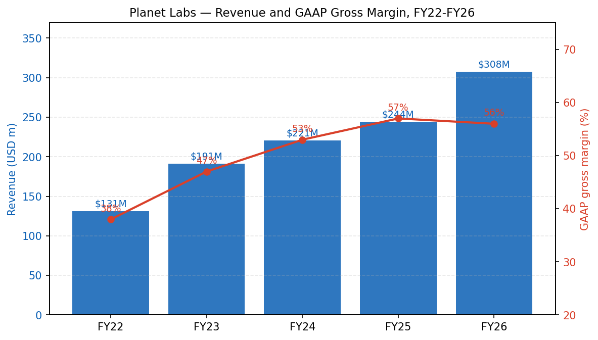
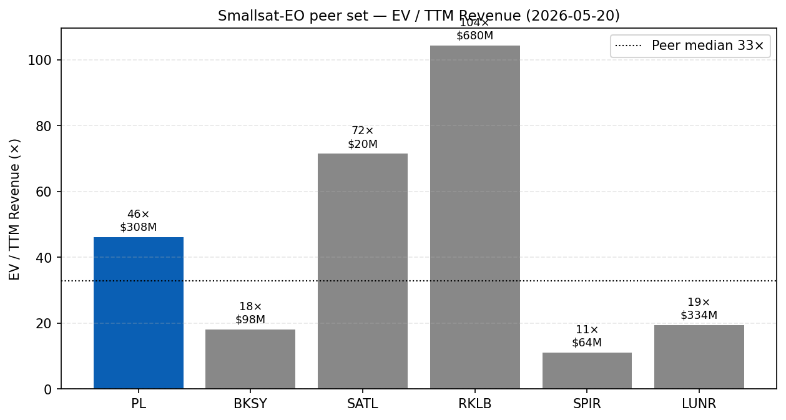
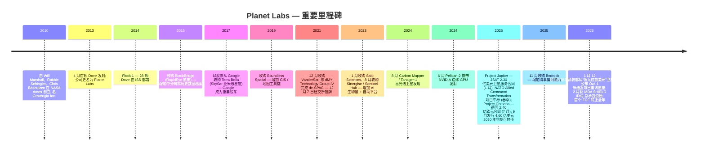
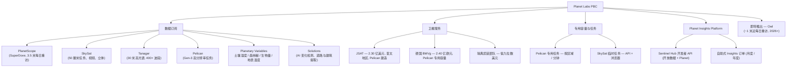
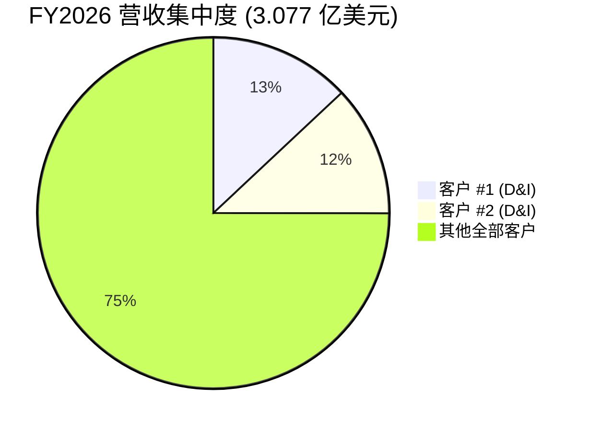
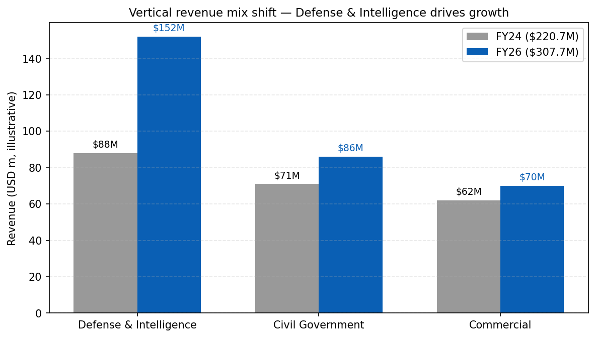
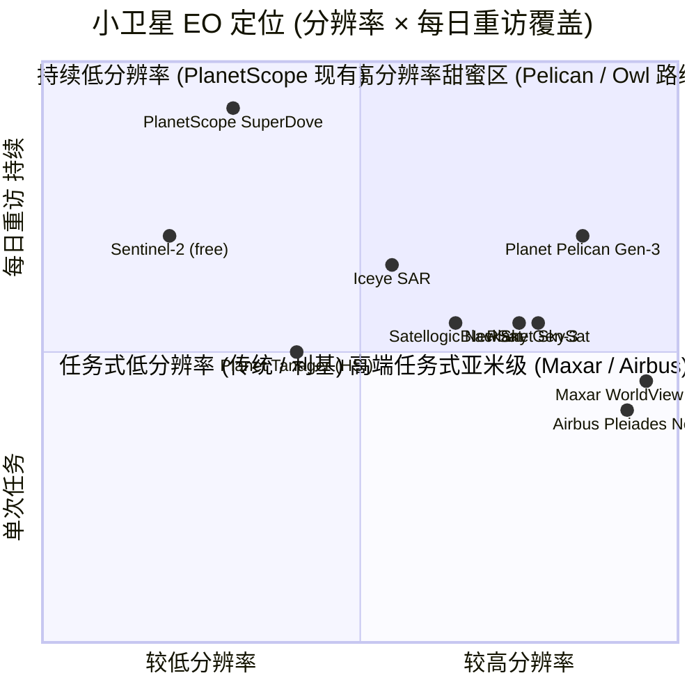
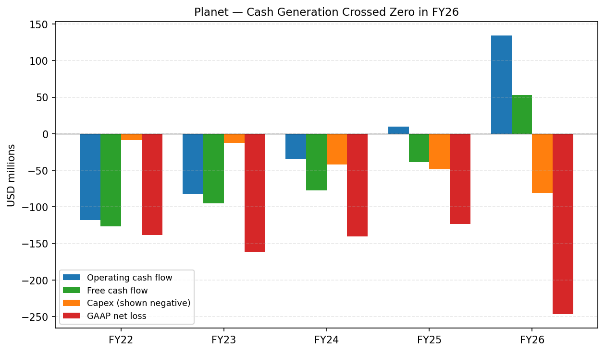
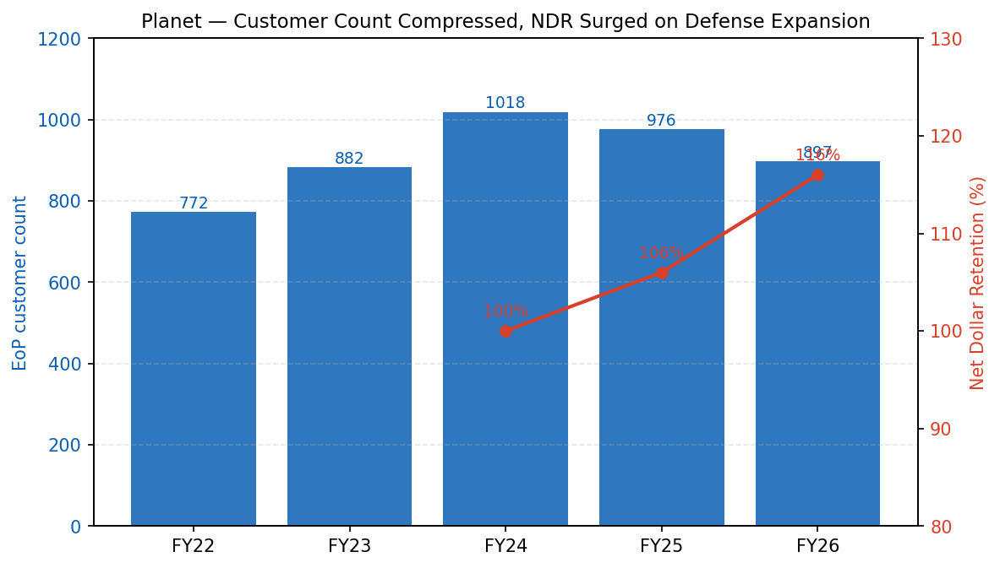
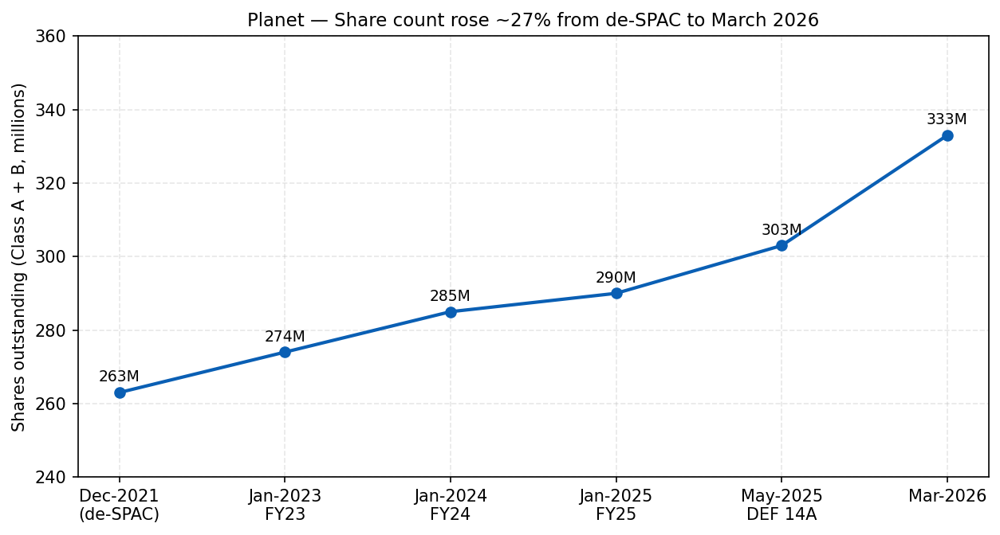

# Planet Labs PBC (NYSE:PL) — 公司研究报告

**截至日期: 2026-05-20**
**上市地: 纽约证券交易所, 代码 PL**
**注册地: 美国特拉华州 (Delaware Public Benefit Corporation)**
**报告语言: 简体中文 (英文版同时存在于本目录)**

> **业绩更新——FY2027 财年指引发布 (2026-03-19):** 管理层发布 FY2027 (截至 2027 年 1 月 31 日的财年) 全年营业收入指引 **4.15 亿至 4.40 亿美元** (对照 FY2026 实际 3.077 亿美元, 隐含同比增长 35–43%), 非 GAAP 毛利率 **50–52%**, 调整后 EBITDA 为 **0 至 1,000 万美元**, 资本开支 **8,000 万至 9,500 万美元**。该指引假设这是一年大规模再投资的年份, 资金将围绕三笔已签约的卫星服务交易展开 (日本 JSAT 2.30 亿美元、德国联邦 2.40 亿欧元、瑞典"低九位数美元"), 配合 Pelican / Tanager 星座建设, 以及 2026 年 1 月新公布的 Owl 1 米级星座。来源: [Planet FY2026 Q4 业绩公告 — 8-K Exhibit 99.1, 2026-03-19](https://www.sec.gov/Archives/edgar/data/1836833/000119312526115951/pl-ex99_1.htm)。

---

## 目录
1. 公司概览
2. 公司历史
3. 管理团队
4. 产品与服务
5. 客户与上市策略
6. 行业概览
7. 竞争格局
8. 市场机会 (TAM)
9. 风险评估
10. 参考资料

---

## 1. 公司概览

Planet Labs PBC ("Planet", NYSE: PL) 运营**全球最大的商业地球观测 (earth observation, EO) 卫星星座**, 自行设计和制造卫星, 并销售由此产生的影像、分析以及——日益重要的——面向各国政府与企业的"交钥匙"卫星服务。公司于 2010 年由三位前 NASA 科学家 (Will Marshall、Robbie Schingler、Chris Boshuizen) 在加州库比蒂诺创立, 最初名为 **Cosmogia Inc.**, 后更名为 Planet Labs, 并于 **2021 年 12 月 7 日**通过与 SPAC dMY Technology Group IV 的业务合并在纽约证券交易所上市, 完成交割时募集了约 5.90 亿美元的信托及 PIPE 资金 ([Planet 10-K FY2026, Item 1 — Business](https://www.sec.gov/Archives/edgar/data/1836833/000119312526119957/pl-20260131.htm))。

Planet 是一家**特拉华州公益公司 (public benefit corporation, "PBC")**——其公司章程明确要求董事会在追求经济利益的同时, 兼顾"通过照亮环境与社会变化, 加速人类迈向更可持续、更安全、更繁荣的世界"这一公益使命 ([Planet 10-K FY2026, Risk Factors — PBC status](https://www.sec.gov/Archives/edgar/data/1836833/000119312526119957/pl-20260131.htm))。总部位于旧金山哈里森街 645 号; 欧洲总部位于柏林; 工程与运营团队分布于旧金山、柏林、哈勒姆 (荷兰)、卢布尔雅那 (斯洛文尼亚) 及格拉茨 (奥地利)。FY2026 10-K 披露的全球员工总数约**1,000 人**, 相较 FY2024 的重组前峰值有所削减。

### 商业模式

Planet 销售**影像、分析、卫星服务及专用容量**, 通过三大主要业务条线进行 (FY2026 10-K 并未单独披露分部收入, 但 MD&A 披露了垂直行业组合):

1. **数据订阅 (data subscriptions)** ——按固定价格授权使用 PlanetScope (SuperDove 每日重访)、SkySat 和 Pelican 影像, 以及解决方案与 Planetary Variables 时序产品的循环订阅许可。绝大多数为 1–3 年期合同。截至 2026 年 1 月 31 日, **98% 的 Planet 期末年化合同价值 (End-of-Period ACV Book of Business) 为循环收入** ([Planet 10-K FY2026, MD&A — Key Metrics](https://www.sec.gov/Archives/edgar/data/1836833/000119312526119957/pl-20260131.htm))。
2. **卫星服务 (satellite services)** ——长期里程碑式合同, Planet 代表盟友政府制造 Pelican (越来越多还包括 Owl) 卫星, 保留对绝大多数影像的商业账册授权权利, 并代为运营星座。过去 12 个月内签订了三份合同: 日本 JSAT (2.30 亿美元, 2025 年 1 月)、德国联邦 (2.40 亿欧元, 2025 年 7 月)、瑞典武装部队 ("低九位数美元", 2026 年 1 月)。
3. **专用影像任务容量 (dedicated image tasking capacity)** ——以分钟/小时为单位, 按区域、按天保证 Pelican 或 SkySat 容量, 销售给需要主权访问权的国防/情报客户。

ARR 通过*期末年化合同价值 (EoP ACV Book of Business)* 和*净美元留存率 (Net Dollar Retention Rate, NDR)* 间接呈现, 后者**FY2026 由 FY2025 的 106% 跃升至 116%** ([Planet 10-K FY2026, MD&A — NDR](https://www.sec.gov/Archives/edgar/data/1836833/000119312526119957/pl-20260131.htm)) ——公司将此跃升归因于"大型国防与情报合同的扩张"。客户数量从一年前的 976 减至**期末 897 户**, 因 Planet 将小型账户精简至自助式 Insights Platform 层级, 并将直销资源重新瞄准数百万美元级的大型政府交易; 管理层已宣布自 Q1-FY27 起将不再披露期末客户数指标。

### 规模与 FY2026 财务数据

| 指标 | FY2024 | FY2025 | FY2026 | 同比 |
|---|---|---|---|---|
| 营业收入 | 2.207 亿美元 | 2.444 亿美元 | **3.077 亿美元** | **+26%** |
| GAAP 毛利率 | 53% | 57% | 56% | (1 个百分点) |
| 非 GAAP 毛利率 | 未披露 | 60% | 59% | (1 个百分点) |
| GAAP 净亏损 | (1.405 亿美元) | (1.232 亿美元) | **(2.469 亿美元)** | 亏损扩大, 其中 **1.614 亿美元为权证重估的非现金损失** (因股价上涨产生) |
| 调整后 EBITDA | (3,080 万美元) | (1,060 万美元) | **+1,550 万美元** | 首个盈利财年 |
| 经营性现金流 | (3,490 万美元) | +940 万美元 | **+1.344 亿美元** | 首个具备实质意义的年份 |
| 自由现金流 | (7,720 万美元) | (3,900 万美元) | **+5,290 万美元** | 首个 FCF 转正财年 |
| 现金 + 投资 (期末) | 未披露 | 2.22 亿美元 | **6.40 亿美元** | +188% (含 4.60 亿美元可转债) |
| RPO / 在手订单 | 未披露 | 4.14 亿美元 (RPO) | **RPO 8.52 亿美元 / 在手订单 >9.00 亿美元** | RPO +106% |

来源: [Planet 10-K FY2026 — Item 7 MD&A](https://www.sec.gov/Archives/edgar/data/1836833/000119312526119957/pl-20260131.htm); [Planet Q4-FY26 earnings 8-K, 2026-03-19](https://www.sec.gov/Archives/edgar/data/1836833/000119312526115951/pl-ex99_1.htm)。

来源: [Planet 10-K FY2026, MD&A](https://www.sec.gov/Archives/edgar/data/1836833/000119312526119957/pl-20260131.htm); FY22 数据出自 [Planet 10-K FY2023](https://www.sec.gov/Archives/edgar/data/1836833/000183683323000014/)。

### 估值快照 (强制项)

- **股价 (2026-05-20):** 42.71 美元——距 52 周高点 45.78 美元约 7%, 大约为 52 周低点 3.47 美元的**12 倍** ([Yahoo Finance — PL key statistics, 2026-05-20](https://finance.yahoo.com/quote/PL/key-statistics/))。
- **市值:** 152 亿美元 (Class A + Class B 合计 3.329 亿股)。
- **企业价值:** 142 亿美元 (扣减 6.40 亿美元现金, 加回 4.62 亿美元 2030 年到期可转债)。
- **TTM P/E:** **N/M (负值)** ——FY26 GAAP 净亏损 2.469 亿美元中, 因股价上涨, 权证负债公允价值重估产生了 1.614 亿美元的非现金按市价计价损失; *剔除权证*的内在净亏损约**8,550 万美元**, **非 GAAP 摊薄每股亏损仅为 (0.04 美元)** ([Planet Q4-FY26 8-K, 2026-03-19](https://www.sec.gov/Archives/edgar/data/1836833/000119312526115951/pl-ex99_1.htm))。调整后 EBITDA 转正为 1,550 万美元, FCF 为 +5,290 万美元。
- **TTM P/S:** **49.5×** (市值 152 亿美元 ÷ 营业收入 3.077 亿美元)。EV/Sales 46.2×。
- **TTM P/B:** 76× (账面净资产约 2.00 亿美元——受美国联邦 NOLs 9.67 亿美元的累计亏损压制)。
- **3 年估值区间:** 自 2021 年底完成 de-SPAC 至 2025 年年中, PL 估值在 1.5–6 倍 P/S 区间波动 (因增长停滞), 2024 年 2 月股价触底 1.59 美元, de-SPAC 发起人盈利股份悬于流通股之上压抑了股价。当前 ~49 倍 P/S 因此位于公司公开历史的**绝对峰值**。

**同业比较 (TTM, 2026-05-20, 数据均来自 [Yahoo Finance](https://finance.yahoo.com/)):**

| 代码 | 公司 | TTM 营业收入 | TTM 营收同比增长 | EV / TTM 营收 | TTM P/S |
|---|---|---|---|---|---|
| **PL** | Planet Labs | 3.077 亿美元 | +26% (财年); Q4 +41% | **46.2×** | **49.5×** |
| BKSY | BlackSky Technology | 9,780 万美元 | (30%) | 18.1× | 17.4× |
| SATL | Satellogic | 2,040 万美元 | +80% | 71.5× | 69.6× |
| RKLB | Rocket Lab USA | 6.796 亿美元 | +64% | 104.4× | 114.5× |
| SPIR | Spire Global | 6,350 万美元 | (34%) | 11.1× | 12.0× |
| LUNR | Intuitive Machines | 3.343 亿美元 | +199% | 19.4× | 16.4× |
| **同业中位数** | | | | **19.4×** | |

Planet 相较小卫星 EO 同业中位数 (~19 倍 EV/Sales) 显著溢价, 但相较 Rocket Lab、Satellogic 等更高倍数的成长 + 火箭发射标的折让交易, 后两者营业收入基数小得多。Maxar Intelligence (Advent 于 2023 年完成私有化以来未公开)、Iceye (私有, 2024 年 E 轮)、Capella Space (私有, 2023 年 D 轮) 未公布季度估值倍数; 可参考的数据点: Maxar 的私有化交易将该业务估值约为 64 亿美元, 对应约 17 亿美元营业收入 (~3.8 倍 P/S), 但其业务结构更成熟、资产更重 ([Reuters, 2022-12-16](https://www.reuters.com/markets/deals/private-equity-firm-advent-international-buy-satellite-image-firm-maxar-2022-12-16/)); Iceye 在 2024 年 2 月以"超过 10 亿美元"的隐含估值募集了 9,300 万美元延伸轮, 对应约 1.00 亿美元营业收入 ([Reuters, 2024-02-06](https://www.reuters.com/technology/space/finnish-satellite-firm-iceye-raises-93-million-funding-round-2024-02-06/))。

来源: 各代码均出自 [Yahoo Finance, 2026-05-20](https://finance.yahoo.com/quote/PL/key-statistics/)。

**对估值倍数的解读。** TTM P/E 为负, 但 GAAP 亏损主要由 1.614 亿美元权证重估主导, 而这是股价上涨的*结果*, 而非现金费用, 也非衡量经营质量的指标。更干净的信号是非 GAAP 每股亏损 (0.04 美元)、5,300 万美元正自由现金流, 以及 1,550 万美元的正调整后 EBITDA——公司刚刚跨越现金生成盈亏平衡。在 46 倍 EV/Sales 估值下, 市场已为 **(a) FY27 指引 35–43% 增长加速**、**(b) 9.00 亿美元以上在手订单按 50% 以上毛利率转化**、**(c) 持续向卫星服务合同的转型, 利用平台变现而无需稀释性股权融资**、以及 **(d) 国防科技 / 主权 EO 溢价, 这是 de-SPAC 那一批公司在 2022–2024 年间未能享有的红利**计价。最贴近的板块先例是 2024–2025 年 Rocket Lab 与 AST SpaceMobile 的重估, 国防 / 主权需求推动其 P/S 从个位数升至 50 倍以上。第 9 章将估值 / 倍数收缩列为重大财务风险。

地理敞口: FY26 营业收入中约**30% 以非美元计价**, 主要为欧元 ([Planet 10-K FY2026, Item 7A Quantitative Disclosures](https://www.sec.gov/Archives/edgar/data/1836833/000119312526119957/pl-20260131.htm)) ——较 FY25 的 27% 和 FY24 的 24% 持续上升, 与柏林团队在赢得 BKG、德国联邦、NATO 及斯洛文尼亚合同方面的核心地位一致。

## 2. 公司历史

Planet 于 2010 年在加州库比蒂诺以 **Cosmogia Inc.** 之名成立, 创始人为 Will Marshall、Robbie Schingler 及 Chris Boshuizen——三人均为 NASA Ames 的科学家, 曾深度参与该机构的 **PhoneSat** 实验, 即在立方星 (cubesat) 中搭载智能手机以证明消费电子产品能够在轨道环境中存活。立公司之初的理念是: 将卫星视为软件定义的可消耗资产, 而不是一颗 5 亿美元级别的旗舰星, 一支小团队就能每年制造数十颗"Doves", 从而首次实现对整个地球的每日成像。第一颗 Dove 于 2013 年 4 月发射; **Flock 1** 星座 (28 颗 Dove) 于 2014 年 2 月由 ISS (国际空间站) 部署入轨。公司于 2013 年更名为 Planet Labs。

来源: [Planet 10-K FY2026, Item 1 Business — History](https://www.sec.gov/Archives/edgar/data/1836833/000119312526119957/pl-20260131.htm); [Planet Reports FY26 Q4 Results — 8-K, 2026-03-19](https://www.sec.gov/Archives/edgar/data/1836833/000119312526115951/pl-ex99_1.htm); [Planet Signs USD 230M Pelican Agreement — 8-K, 2025-01-29](https://www.sec.gov/Archives/edgar/data/1836833/000183683325000017/exhibit991projectjupiterpr.htm); [Planet Awarded EUR 240M Satellite Services Deal — 8-K, 2025-07-01](https://www.sec.gov/Archives/edgar/data/1836833/000183683325000075/exhibit991projectchronospr.htm); [Planet Signs 9-Figure Deal with Sweden — 8-K, 2026-01-12](https://www.sec.gov/Archives/edgar/data/1836833/000119312526009922/pl-ex99_1.htm)。

**战略转折点。** 对当前投资逻辑而言, 有三次重要转型:

- **从业余级 Dove 转向纪律化的 SuperDove (2018–2022)。** 第一代 Dove 辐射定标不一致、寿命较短。SuperDove 这一代 (8 个光谱波段、寿命更长) 被设计为企业级扫描仪, 也成为"PlanetScope"每日重访产品的支柱。这次转型是 Planet 数据得以多年合同形式销售给 USDA、欧盟委员会及大型农业企业 (而非作为一次性影像采购) 的关键。
- **从数据转向平台 (2023)。** 2023 年 8 月收购了总部位于斯洛文尼亚的 **Sinergise**, 带来 Sentinel Hub 这一自助式地球观测 API 与可视化平台, 此前已拥有数以万计付费开发者用户 ([Planet 10-K FY2026, Note 5 — Business Combinations](https://www.sec.gov/Archives/edgar/data/1836833/000119312526119957/pl-20260131.htm))。该产品被重新命名为"Planet Insights Platform", 现承担高速、低摩擦的客户获取漏斗角色——这也是管理层决定不再披露期末客户数指标的原因 (小型账户长尾客群已迁至该平台, 不再计入头条客户数)。
- **从数据授权转向"卫星服务" (2025)。** 这是单一影响最大的战略转向。Planet 不再仅卖订阅, 而是向**主权 / 一级客户提供打包星座**: Planet 负责制造和运营 Pelican 卫星, 客户预付现金、获得卫星所有权, Planet 则保留将影像授权进入其商业账册的权利。12 个月内三份合同——JSAT 2.30 亿美元、德国 2.40 亿欧元、瑞典低九位数美元——累计**新增超过 5 亿美元订单**, 并解释了 FY26 转向 FCF 转正的几乎全部摆幅 (按 10-K 现金流量表口径, 递延收入增加 1.51 亿美元)。这正是引发股票重估的商业模式。

**并购列表 (附逻辑):**

- BlackBridge (2015 年 9 月) — RapidEye 星座, 5 米级历史数据档案。
- Terra Bella (2017 年 4 月, 全股票) — 收购自 Alphabet, 获得 SkySat 亚米级任务星座; Google 由此成为 11.5% 的 Class A 股东 (2025 年委托书仍列示)。
- Boundless Spatial (2019 年 3 月) — GIS 分析、联邦销售渠道。
- VanderSat (2021 年 12 月) — Planetary Variables (土壤湿度、生物量) ——与 de-SPAC 同步交割。
- Salo Sciences (2023 年 1 月) — AI 生物量 / 森林碳模型。
- Sinergise (2023 年 8 月) — Sentinel Hub 开发者平台; 成本 3,140 万美元现金 + 190 万欧元业绩对赌。
- Bedrock Ocean Exploration 数据资产 (2025 年 11 月) — 海事情境感知 IP, 为德国/瑞典的海事领域提议提供支撑 ([Planet 10-K FY2026, Item 1 — Business](https://www.sec.gov/Archives/edgar/data/1836833/000119312526119957/pl-20260131.htm))。

**近期动态——过去 12 个月 (2025-05 至 2026-05)。** NATO Allied Command Transformation 将 Planet 选定为持续空间监视供应商 (多年期, FY26-Q4 确认了"七位数美元"延期); 瑞典 / 德国 / JSAT 三连击的卫星服务合同将 RPO 推升至 8.52 亿美元 (同比 +106%), 在手订单超过 9.00 亿美元; **Owl 星座**于 2026 年 1 月公开披露为下一代 1 米级近每日重访舰队; 2025 年 9 月 12 日, Planet 发行了**4.60 亿美元 0.50% 2030 年到期可转债**, 资产负债表上的现金翻倍以上, 为 Owl 资金需求、Pelican Gen-3 资本开支以及补丁式并购提供了腾挪空间; 2026 年 2 月美国导弹防御局 (Missile Defense Agency, MDA) 将 Planet 选定为 **SHIELD IDIQ** 框架下的总承包商 ([Planet Q4-FY26 8-K — Recent Business Highlights, 2026-03-19](https://www.sec.gov/Archives/edgar/data/1836833/000119312526115951/pl-ex99_1.htm))。

## 3. 管理团队

领导班子异常精简: 截至 2025 年 5 月委托书, **仅披露三位执行高管**——联合创始人 Marshall 和 Schingler 加上 CFO Ashley Johnson——而两位创始人合计掌握 100% 的超级投票权 Class B 股票 (约 58% 的表决权对应约 9.6% 的经济所有权) ([Planet DEF 14A 2025, Security Ownership table](https://www.sec.gov/Archives/edgar/data/1836833/000183683325000056/))。

### William "Will" Marshall — 董事长、联合创始人 & CEO

Marshall 博士, 46 岁, 自 2010 年与他人共同创立 Cosmogia 以来一直执掌 Planet, 2011 年正式接任 CEO ([Planet DEF 14A 2025 — Director Bios](https://www.sec.gov/Archives/edgar/data/1836833/000183683325000056/))。自 2021 年 12 月 de-SPAC 以来一直担任董事长。他拥有**牛津大学物理学博士学位**, 莱斯特大学物理学硕士学位 (空间科学与技术方向), 并曾在乔治华盛顿大学和哈佛大学完成博士后研究。在创立 Planet 之前, 他是 NASA Ames / Universities Space Research Association 的科学家, 与 Robbie Schingler 共同筹建了 **NASA Ames Small Spacecraft Office**——也是孕育 PhoneSat 实验、最终成为 Planet 思想种子的机构。他曾担任 **LADEE** (NASA 月球大气探测任务) 系统工程师, **LCROSS** (月球撞击器) 科学组成员, 并主导过空间碎片清理及 PhoneSat 的技术工作。他是颇受邀约的公共演讲人: 2014 年 TED 演讲"Tiny satellites that photograph the entire planet every day"约 180 万播放量, 2024 年 HBO 纪录片"Wild Wild Space"将其作为核心人物呈现。

Marshall 持有约**5.42% 的 Class A 和 50.0% 的 Class B** ([Planet DEF 14A 2025 — Beneficial Ownership](https://www.sec.gov/Archives/edgar/data/1836833/000183683325000056/)), Class B 持股提供 20:1 的投票权。脚注披露其持仓由 985,481 股直接持有的 Class A、由 Class B 转换可得的 1,058 万股 Class A、60 天内可行权的 432 万股 Class A 期权, 以及 60 天内归属的 240,044 股 RSU 组成。在 2024 年裁员行动中, 他**FY25 自愿削减基本工资 20%**——一个在股价处于历史低位时显示利益对齐的不同寻常之举。FY25 的薪酬咨询案通过, 但有显著反对票 (Glass Lewis 和 ISS 将创始人深度投票控制权标记为治理隐患)。此后的转型——把一家亏损的数据公司转变为 9.00 亿美元在手订单、签订三份卫星服务合同的公司, 并完成首个现金流转正的财年——是支持 Marshall 作为"既能造也能商业转型的建设型 CEO"的最重要论据。主要的反对论据是: Planet 不得不引入 Stripe 时代的 President / CPO (Kevin Weil 于 2023 年加入, 2024 年 5 月在约一年后离职), 才使 Marshall 和 Schingler 真正把产品与增长重新集中在自己的办公室——这表明在整合高级运营官方面存在困难。Marshall 始终扮演着对外的公司形象——每一项重要客户公告 (NATO、JSAT、德国、瑞典) 都以他作为首要发言人引述。

### Ashley Fieglein Johnson — 总裁 & CFO

Johnson, 53 岁, 于 2020 年 2 月加入 Planet 担任 CFO (de-SPAC 前), 2021 年 3 月加任 COO, 2024 年 3 月加任 President ([Planet DEF 14A 2025 — Executive Officers](https://www.sec.gov/Archives/edgar/data/1836833/000183683325000056/))。她拥有斯坦福大学国际关系学士学位与国际政策研究硕士学位。加入 Planet 之前, 她于 2015–2020 年任 **Wealthfront Inc.** 的 CFO (2016 年起兼 COO), 把这家消费金融科技公司从约 50 亿美元 AUM 推升至超过 250 亿美元 AUM, 期间完成多次资本市场交易。在 Wealthfront 之前, 她于 2013 年 1 月起任 **ServiceSource International** (Nasdaq: SREV) 的 CFO, 并于 2014 年 10 月至 12 月担任 ServiceSource 临时 CEO, 至 2015 年 5 月担任 Chief Customer Officer——她有过领导上市公司转型的实际操作经验。截至 2025 年记录日, 她直接持有 526,956 股 Class A、195.8 万股期权及 15.6 万 RSU 归属。Johnson 在 FY26-Q4 电话会上的叙事——"首个调整后 EBITDA 与自由现金流盈利财年……6.40 亿美元现金"——是该年度的核心 CFO 信息; 市场反应也确认了这一拐点正是触发估值重估的关键事件。

### Robbie (Robert) Schingler, Jr. — 联合创始人 & 首席战略官

Schingler, 46 岁, 在 IPO 前曾在 Planet 担任过 CFO 和 COO, 自 2015 年起任首席战略官 ([Planet DEF 14A 2025 — Director Bios](https://www.sec.gov/Archives/edgar/data/1836833/000183683325000056/))。他在 NASA 工作了九年, 包括担任 NASA 总部首席技术官办公室的幕僚长, 是 2005 年总统管理研修员, 拥有乔治城大学 MBA、国际太空大学空间研究 MS, 以及圣克拉拉大学工程物理学 BS。他通过 Ulysses Trust 02021.1 持有另外 50% 的 Class B 流通股, 外加 31.6 万股 Class A——与 Marshall 拥有相同的超级投票权结构。他在卫星服务合同结构设计和 Planet 国际扩张 (柏林办公室、欧洲客户中标) 中扮演核心角色。

### James Mason — Chief Space Officer (在披露中被点名, 非第 16 节官员)

在 2025 年 1 月 Pelican 新闻稿中被点名, 作为代表 Planet 与国际对手方对接卫星服务业务的高管 ([Planet 8-K — Project Jupiter Pelican Deal, 2025-01-29](https://www.sec.gov/Archives/edgar/data/1836833/000183683325000017/exhibit991projectjupiterpr.htm))。Mason 升任 Chief Space Officer 之前, 多年来曾任 Planet 空间系统高级总监——该岗位是 Pelican / Tanager / Owl 路线图的技术项目负责人。根据 2025 年委托书, 他并非第 16 节官员, 但在后 Weil 时代的组织中是有重大影响力的实践派领导。

### 董事会与公司治理

2025 年股东大会后, 董事会共**八位董事**, 其中**75% 为独立董事** (仅 Marshall 和 Schingler 非独立)。首席独立董事为**Carl Bass** (前 Autodesk CEO, 资深公众公司董事)。其他独立董事包括 **John W. "Jay" Raymond 将军** (退休, USAF; 美国太空司令部首任司令、前太空作战参谋长) ——这是对国防 / 主权转型尤具意义的任命; **Gary B. Smith** (Ciena CEO, NYSE: CIEN)。董事会采用三类分级制, 任期三年错开。

**投票权与治理标记。** Class B 普通股每股拥有**20 票表决权**, Class A 每股 1 票。全部 2,116 万股 Class B 由 Marshall 和 Schingler 持有; Class A 合计 2.823 亿股。两位创始人合计掌握约**58% 总表决权对应约 9.6% 经济所有权**——这是 S&P 与 FTSE Russell 排除在某些指数之外的双类股结构。薪酬以 RSU 为主; 禁止对冲 / 质押; 无确定给付养老金; 无高管税款补偿。审计师为 KPMG LLP。薪酬对标组特意采用软件 / SaaS 同业组合, 以将 Planet 与"数据公司"可比对齐。

### 业绩记录归纳

创始人主导、创始人控制、创始人利益对齐 (FY25 自愿降薪)。过去 18 个月内, 团队最显著的成就是将一只 4 美元的 SPAC 落难股转变成 152 亿美元的中盘股, 方式是签下超过 5 亿美元卫星服务合同, 在股价高位发行 4.60 亿美元廉价 (0.50%) 可转债以延长跑道并支持 Owl, 并实现首个 FCF 转正的财年。业绩记录的主要缺口是消费风格的产品 / 增长——Weil 招聘失败, 商业小账户长尾客户规模在收缩。国防与主权 EO 转型如今定义了整个特许经营; Marshall 团队能否在面对资本雄厚的现有玩家 (Maxar Intelligence、Airbus Defence and Space) 和新兴主承包商 (BlackSky 量产 Gen-3、SpaceX 联盟的产品) 的挑战下保持领先, 是未来两年的考验。

## 4. 产品与服务

Planet 的产品目录按**舰队 (即捕获数据的卫星) 与交付平台 (客户如何消费)** 进行组织。对 [planet.com/products/](https://www.planet.com/products/) 与 [planet.com/constellations/](https://www.planet.com/constellations/) 的完整梳理可得出以下分类; 这与 FY2026 10-K Item 1 (Business) 中的产品分类相吻合。

来源: [Planet — Products page](https://www.planet.com/products/); [Planet — Constellations page](https://www.planet.com/constellations/); [Planet 10-K FY2026 Item 1](https://www.sec.gov/Archives/edgar/data/1836833/000119312526119957/pl-20260131.htm)。

### 数据订阅——逐舰队分析

**PlanetScope (SuperDove)** ——核心主力。约 200 颗在轨 SuperDove 卫星, 每天对地球陆地以约 3.5 米 GSD 在 8 个光谱波段 (深蓝至近红外) 进行成像。产品以分析就绪的地表反射率场景通过 Planet API 交付, 采用单一交叉定标的协调格式, 该格式也接收 Landsat-8/9 和 Sentinel-2——消除了过去阻碍多源影像机器学习的辐射定标工作 ([Planet 10-K FY2026, Item 1 — Our Fleet](https://www.sec.gov/Archives/edgar/data/1836833/000119312526119957/pl-20260131.htm))。目标客户: 民用政府制图机构 (德国 BKG、美国 USDA、欧盟 Copernicus 二级用户)、大型农业企业 (Bayer、Corteva 级分析合作伙伴)、林业 / 碳交易 (American Forest Foundation、Salo Sciences 老牌客户), 以及国防 / 情报的大面积变化检测应用。定价: 基于关注区域 (km²) 的分级订阅, 按产品类型、下载频率定价; 最大民政合同年收入在数百万至数千万美元级别。**竞争优势: 有——每日、大面积重访, 价格点上无人可及。**护城河类型: 规模 (180–200 颗在轨卫星——商业领域最大星座); 数据档案 (自 2017 年以来全球陆地每点平均超过 3,000 张影像, 不可复制的历史记录); 一对多经济性 (新增订阅边际成本接近零)。最接近的可比对象: **Planet vs. ESA Copernicus / Sentinel-2** ——Sentinel-2 在 10 米、5 天频率免费, 这限制了 PlanetScope 的价值仅针对那些专门需要更高频率或分辨率的客户; PlanetScope 在重访频率与时段灵活性上*领先*, 在价格上*落后* (免费)。专有多波段辐射定标协调是关键的付费产品差异化。

**SkySat** ——Planet 自 2017 年 Terra Bella / Google 收购获得的亚米级任务舰队。约 21 颗卫星, 处理后约 50 厘米 GSD, 支持多种成像模式 (点、长条带、立体、约 90 秒视频)。目标客户: 保险、国防、能源、海事。SkySat 正逐步淡出, 让位给 Pelican; FY26 10-K 在 FY26 营业成本走查中提到"1,010 万美元来自部分完全折旧的高分辨率卫星减少", 表明老旧 SkySat 卫星正处于寿命终结期会计阶段。**竞争优势: 部分。** 护城河类型: 现有地位、嵌入国防 / 情报客户的工作流。最接近的可比对象: **SkySat vs. Maxar WorldView Legion (~30 厘米)** ——Legion 在分辨率与专用任务复杂度上*领先*; SkySat 在价格上与之*同价*, 在单位成本重访能力上*领先*。

**Pelican** ——Planet 部署中的 Gen-3 高分辨率舰队。Pelican 是 SkySat 的架构继任者, 处理后亚米级分辨率、更多光谱波段 (全色 + 多波段)、更高成像容量、更低延迟, 并通过 NVIDIA 边缘 GPU 实现星上 AI。Pelican-2 于 2025 年 1 月 14 日带着最新一代 NVIDIA 边缘 GPU 和星间通信发射, "旨在让 Planet 能够在数分钟而非数小时内将关键数据交付给客户" ([Planet 8-K — Project Jupiter Pelican Deal, 2025-01-29](https://www.sec.gov/Archives/edgar/data/1836833/000183683325000017/exhibit991projectjupiterpr.htm))。Pelican 也是支撑全部三份卫星服务合同 (JSAT / 德国 / 瑞典) 的底层平台——Planet 为主权所有者制造并运营航天器, 同时保留"在商业账册上使用影像"的授权权利。**竞争优势: 有。** 护城河类型: 技术 + 生态系统锁定——Pelican 独特地融合了高频高分辨率有效载荷、边缘 AI 计算与星间链路, *再加上*将资本开支转化为客户出资资产增长的卫星服务商业模式。最接近的可比对象: **Pelican vs. Maxar Legion + Lockheed/Northrop 大承包商的下一代 NRO 平台** ——大承包商在分辨率上*领先*, 但需传统采购周期 (5–10 年) 且为客户独占; Pelican 在入轨时间 (合同签订后 3 年内)、敏捷航天与商业 / 主权数据共享混合模式上*领先*。

**Tanager — 高光谱。** Tanager-1 于 2024 年 8 月通过 SpaceX Transporter 拼车发射, 是 Planet 首颗高光谱卫星, 设计可在可见光与短波红外 30 米 GSD 下提供**400+ 光谱波段**的影像 ([Planet 10-K FY2026, Item 1 — Hyperspectral](https://www.sec.gov/Archives/edgar/data/1836833/000119312526119957/pl-20260131.htm))。该卫星与 **NASA JPL** 和 **Carbon Mapper Coalition** (由 High Tide Foundation、Bloomberg Philanthropies、Grantham Foundation 等慈善基金资助) 联合建造, 目前已在 Carbon Mapper 平台上发布甲烷与 CO₂ 点源检测数据。客户: EPA、监管机构、油气运营商 (用于自我监测)、保险、矿业, 以及越来越多的国防 (CBRN、矿物识别)。**竞争优势: 有 (早期领先)。** 护城河类型: 技术 (全波段 SWIR 难度高) + 合作伙伴 (JPL 联合开发、Carbon Mapper 慈善锚客户实际上为建造去风险化)。最接近的可比对象: **Tanager vs. Pixxel 高光谱 (私有, 印度)** ——Pixxel 正在构建竞争性星座; Planet 在今天的运营数据产品上*领先*, Pixxel 在 2026 年末可能在原始规格上*同价*。

**Planetary Variables** ——由 AI 推导的测量值, 以时间序列产品打包销售: 土壤水含量、Forest Carbon Diligence (地上生物量)、地表温度、农作物生物量 ([Planet — Planetary Variables](https://www.planet.com/products/planetary-variables/))。这些产品在 PlanetScope + 开放数据融合之上叠加了公司专有模型。客户: 农业科技与林业 / 碳交易市场。**竞争优势: 部分。** 护城河类型: 数据 + 模型 (长期历史档案使回测成为可能)。最接近的可比对象: **Planetary Variables vs. Descartes Labs (Maxar) / Indigo Ag / Climate FieldView 内部模型** ——Planet 在独立基准测试中的准确性*同价*, 在全球覆盖上*领先*。

### 卫星服务与专用容量——新的旗舰

2025–2026 合同三连击 (JSAT、德国、瑞典) 加上 NATO 和斯洛文尼亚是 Planet 的一个新产品类别。经济结构: 客户预付现金并贯穿建造期为 Pelican 星座出资, 客户 (或其指定子公司) *拥有*该星座, 而 Planet 在整个建造与运营期间 (通常七年) 保留把影像授权进入其全球订阅账册的权利。FY26 现金流量表中的财报证据: **递延收入增加 1.511 亿美元**, 经营性现金流由 900 万美元跃升至 1.34 亿美元 ([Planet 10-K FY2026, Item 7 — Cash Flow](https://www.sec.gov/Archives/edgar/data/1836833/000119312526119957/pl-20260131.htm))。管理层称这种方式"在不承担稀释性资本的前提下产生增量现金流"。**竞争优势: 有——可能是产品目录中最强的。** 护城河类型: 成本领先 (Planet 的敏捷航天平台在量产规模下是 Pelican 级别中迄今为止最便宜的卫星); 与盟友政府的品牌信任 (NATO 中标后); 监管 (Planet 持有 NOAA Tier-3 商业遥感许可)。最接近的可比对象: **vs. Airbus Defence and Space "Pléiades Neo" 容量销售, vs. Maxar "Maxar 4" / Worldview Legion 专用时间, vs. Iceye SAR 服务** ——Planet 在入轨速度与将商业级 ML 集成进平台方面*领先*, 在最严苛的情报应用所需的光学分辨率方面*落后*。

### Planet Insights Platform — 自助式

前身为 Sentinel Hub 产品, 于 2023 年 8 月收购后整合。可通过开发者友好的 API 和浏览器应用自助订购 Planet、Sentinel-2、Landsat、MODIS 及合作伙伴数据。定价: 面向学术、研究及 SMB 用户的月度 / 年度入门套餐。FY26 客户结构变化的实质推动力——小用户长尾现在生活在这里, *脱离*期末客户数头条指标, 这也是管理层不再披露该指标的原因 ([Planet 10-K FY2026, MD&A — EoP Customer Count](https://www.sec.gov/Archives/edgar/data/1836833/000119312526119957/pl-20260131.htm))。**竞争优势: 部分。** 护城河类型: 集成的数据目录 + 来自 Sentinel Hub 历史的开发者认知。最接近的可比对象: **vs. Google Earth Engine** (非商业免费, 在研究领域占主导) 和 **vs. Amazon Earth on Open Data + AWS**。Earth Engine 在科研触达上*领先*; Insights Platform 在商业 Planet 数据集成上*领先*。

### 即将推出——Owl 星座

在 2026 年 1 月 12 日瑞典发布会上首次披露: "即将推出的 Owl 星座, 设计目标是提供近每日重访的 1 米级影像" ([Planet 8-K — Sweden Deal, 2026-01-12](https://www.sec.gov/Archives/edgar/data/1836833/000119312526009922/pl-ex99_1.htm))。Owl 将填补 SuperDove 3.5 米重访与 SkySat / Pelican 任务式亚米级之间的鸿沟——即在更低价格点上与 Maxar Legion 直接竞争。尚未披露发射日期或资本开支; 4.60 亿美元 2030 年到期可转债募资让 Planet 在合同 Pelican 之外大致拥有两年的跑道来建设 Owl。

### 旗舰与长尾

驱动 FY26 营收和 FY27 加速的三大旗舰产品是: (1) **PlanetScope 订阅** (循环, 约占账册 50%), (2) **Pelican 卫星服务** (5 亿美元以上的新增合同推动 RPO + 未来营收), 以及 (3) **Tanager 高光谱** (规模仍小但对 ESG / 甲烷和 CBRN 战略重要)。SkySat 处于受管理的衰退中 (资产将于 FY25 / 26 全部折旧完毕)。Planetary Variables 和 Insights Platform 是因平台转型而扩大的增长试验项目。

### 路线图——过去 12 个月

发射: Pelican-2 (2025 年 1 月)、Pelican-3 (2025 年内宣布)、FY26 共 40 颗卫星 (按 Q4-FY26 电话会 CEO 评论)、Tanager-1 (2024 年 8 月发射, FY26 投入运营)。重新定位: 期末客户数指标将于 Q1-FY27 退役, Sentinel Hub 更名"Planet Insights Platform"。淘汰: SkySat (逐步)。宣布: **Owl 星座** (2026+) 以及一项"与 Google 合作探索太空数据中心的研发伙伴关系" (按 2026 年 3 月 19 日财报评论)。

## 5. 客户与上市策略

### 客户分类

Planet 在三大主要垂直行业 + 一个长尾平台层进行销售:

- **国防与情报 (D&I)** ——增长最快、现已成为最大的垂直行业。客户包括 2022 年 5 月获得 EOCL (Electro-Optical Commercial Layer) 合同的美国国家侦察办公室 (NRO) (10 年期, Planet 部分基础合同最高 1.46 亿美元加选项)、美国国家地理空间情报局 (NGA)、美国国防部 / 国防创新部 (DIU) ——多项合同包括 INDOPACOM 和 Hybrid Space Architecture、NATO Allied Command Transformation、德国联邦国防军 (通过 Project Chronos 2.40 亿欧元交易)、日本政府 (通过 JSAT, 2.30 亿美元)、瑞典武装部队 (低九位数美元)、斯洛文尼亚, 以及通过合作伙伴的乌克兰政府使用。FY26 10-K MD&A 披露 **FY26 的 6,400 万美元收入增长完全由 D&I 驱动** ([Planet 10-K FY2026, MD&A — Revenue](https://www.sec.gov/Archives/edgar/data/1836833/000119312526119957/pl-20260131.htm))。
- **民用政府 (Civil Government)** ——USDA、USGS、NOAA、欧盟 Copernicus 二级用户、欧洲国家制图机构 (德国 BKG、斯洛文尼亚 GURS、法国 IGN、挪威 KSAT 分销)、州与地方政府 (如加州野火相关机构、SDG&E 公用事业燃料监测合作伙伴关系)。该垂直行业是历史核心; 增长温和但稳定。
- **商业 (Commercial)** ——农业企业 (Bayer Climate、Syngenta 级)、保险 (参数险、野火承保)、能源与公用事业 (SDG&E、油气中游监测)、林业 / 碳交易市场 (Salo Sciences 老牌客户)、金融 (Orbital Insight 级宏观信号; 通过合作伙伴向卖方对冲基金销售)、供应链与 ESG。战略合作伙伴关系包括 Bayer、Esri (ArcGIS 分发)、Microsoft (Planetary Computer)、Google (研发伙伴关系、大股东)、AiDash (公用事业植被)、JSAT (亚太地区)。

来源: [Planet 10-K FY2026, Risk Factors — Customer Concentration](https://www.sec.gov/Archives/edgar/data/1836833/000119312526119957/pl-20260131.htm) (两位客户分别 = 营收的 13% 和 12%)。

来源: [Planet 10-K FY2026, MD&A — Revenue commentary](https://www.sec.gov/Archives/edgar/data/1836833/000119312526119957/pl-20260131.htm); FY24 结构出自 [Planet 10-K FY2024](https://www.sec.gov/Archives/edgar/data/1836833/000183683324000037/)。柱状图为示意——Planet 并未按精确美元金额披露垂直行业营收, 但 10-K 文本确认 D&I 是主导增长驱动力。

### 客户集中度——量化

Planet 的 FY2026 10-K 风险因素披露 **FY2026 营收中两位客户分别占 13% 和 12%** ([Planet 10-K FY2026, Risk Factors — Customer Concentration](https://www.sec.gov/Archives/edgar/data/1836833/000119312526119957/pl-20260131.htm)) ——前两位合计约 25%。截至 2026 年 1 月 31 日, **一位客户占应收账款的 33%** ——指向单一大型政府或主权对手方, 其按里程碑合同典型的延迟付款节奏。Planet 在备案文件中并未点名这两位客户, 但根据已披露合同和营收加速时点的合理推断, FY26 前两位最有可能是: (i) **EOCL 合同下的 NRO**, 是最大、最长期的 D&I 订阅; (ii) **Project Jupiter 卫星服务合同下的 JSAT (日本)**, 其 2.30 亿美元正按约 7 年的建造/运营期确认收入。这是推断, 而非披露——Planet 在 FY26 10-K 中明确未点名。

**第 1 大约 13%, 前 5 大估计约 40–45%** (基于 13% + 12% + 德国 Chronos 合同 2026 年 1 月开始收入确认 + 民政核心账户)。三年趋势: FY26 客户集中度*上升* ——FY25 10-K 披露两位客户分别为 12% 和 11%, FY24 10-K 披露一位为 12% ([Planet 10-K FY2025, Risk Factors](https://www.sec.gov/Archives/edgar/data/1836833/000183683325000050/); [Planet 10-K FY2024, Risk Factors](https://www.sec.gov/Archives/edgar/data/1836833/000183683324000037/))。趋势有意义但并不极端——随公司增长, 第一大客户保持在 12–13%。

**合同结构。** 民政与商业订阅通常为 1–3 年期主协议, 配年度续约。国防合同 (NRO EOCL、DIU 试点、NATO ACT) 形式不一: NRO 采用多年基础 + 选项结构; DIU 试点周期短且需竞标。三份卫星服务合同 (JSAT、德国、瑞典) 为多年期 (德国"逐步展开至数年", 按 8-K) 且按里程碑出资。集中度风险确实存在但**按主权对手方分散** ——即顶级客户均为信用质量很高的政府, 具有多年期政治承诺, 且项目中途难以替代。

由于**第 1 大客户 > 10%** 且趋势是更大合同进一步加剧集中度, 本报告在第 9 章中将此列为重大客户集中度风险。

### 分销渠道

按行业垂直 (农业、国防与情报、能源 / 公用事业、民政、商业) 划分的直销团队, 加上独立的卫星服务与专用容量销售团队, 后者运营方式更接近国防服务 BD 职能 (多年期、技术性 RFP 驱动、长周期)。渠道合作伙伴: Esri (ArcGIS 集成)、Hexagon、Trimble、AiDash (公用事业植被)、JSAT (亚太地区分销商兼终端客户)、Maxar (偶尔作为数据来源关系)、Microsoft Planetary Computer (开放生态系统)、Amazon (AWS Open Data)。**Planet Insights Platform** 充当面向学术 / 研究 / SMB 用户的自助式产品主导增长漏斗——这些用户直销团队不会出于经济考虑去追。

### 销售周期与近期中标

订阅周期: 民政与商业企业 6–18 个月; Insights Platform 自助扩量 6–9 个月。国防 / 主权卫星服务周期: 从首次接触到合同签订 18–36 个月, 整个建造期都有重大里程碑付款。按 FY26-Q4 业绩公告和 8-Ks 披露的近期点名中标 (过去 12 个月):

- **瑞典武装部队** ——多年期低九位数美元 (2026 年 1 月)
- **德国联邦政府** ——2.40 亿欧元 (约 2.63 亿美元) Project Chronos (2025 年 7 月)
- **JSAT (日本)** ——2.30 亿美元 Pelican 星座 (2025 年 1 月)
- **NATO Allied Command Transformation** ——多年期延期, 披露"七位数美元" (FY26-Q4)
- **美国 DIU INDOPACOM** ——七位数美元延期 (FY26-Q4)
- **美国 DIU Hybrid Space Architecture** ——Pelican 演示低于 100 万美元的选项执行 (FY26-Q4)
- **斯洛文尼亚测绘局 (GURS)** ——企业多年期 (2026 年 1 月)
- **德国联邦制图局 (BKG)** ——七位数美元续约扩展 (FY26-Q4)
- **美国导弹防御局 SHIELD IDIQ** ——总承包框架, 任务待竞标 (2026 年 2 月)
- **圣地亚哥燃气电力 (SDG&E)** ——3 年续约, 整合野火风险模型
- **AiDash 合作** ——北美公用事业首选燃料监测数据

来源: [Planet Q4-FY26 Earnings 8-K, 2026-03-19](https://www.sec.gov/Archives/edgar/data/1836833/000119312526115951/pl-ex99_1.htm)。

## 6. 行业概览

Planet 处于三个行业的交汇点: **商业地球观测 (commercial Earth observation, EO)**、**国防与情报服务**, 以及**地理空间分析 / 数据平台**。每个行业的规模与增长动力各不相同。

**行业定义 (NAICS)。** 主要代码: 517410 (卫星通信)、541370 (测量与制图)、541512 (计算机系统设计)。Planet 处于更广泛的"商业太空经济"——卫星制造、EO 数据服务、下游分析中。

**市场规模——商业 EO 数据。** 过去 12 个月发布的独立预测机构数据将商业 EO 数据 + 分析市场规模置于 **2024 年约 50–80 亿美元, 至 2030 年增至 120–180 亿美元**, 视方法论而定:

- Northern Sky Research (现归 Analysys Mason) 测算 2024 年商业 EO 数据与服务市场约 57 亿美元, 预测 2034 年达 129 亿美元 (~8.5% CAGR) ([Analysys Mason / NSR Earth Observation Satellite Market, 16th Edition, 2024](https://research.analysysmason.com/earth-observation-satellite-13)) ——业内引用最广泛的基准。
- Euroconsult / Novaspace 估计 2024 年 EO 数据 + 增值服务营收为 47 亿美元, 预测 2033 年达 86 亿美元 ([Novaspace — Earth Observation Data & Services Market, 2024](https://www.novaspace.com/reports/earth-observation-data-services-market/))。
- 针对**商业小卫星 EO 子板块本身**, 可寻址池规模小得多——2024 年约 15–25 亿美元——但增长最快, 因为各国国防部用商业订阅替代遗留政府自造光学和 SAR 项目。

**国防与情报叠加层。** 更大的驱动力是**国防现代化**, 西方各国政府正在同时 (i) 在 2022 年乌克兰入侵后重建威慑力, (ii) 用商业 EO 替代部分机密卫星容量以释放精尖系统, 以及 (iii) 通过"卫星即服务"模式获取主权 EO 能力, 绕开传统 10 年期主承包采购周期。NRO 于 2022 年 5 月授予的 **EOCL** 合同——给 Planet 1.46 亿美元基础合同, 加选项可达三家中标方 (Planet、Maxar、BlackSky) 十年累计约 40 亿美元——确立了美国先例 ([NRO — Electro-Optical Commercial Layer Press Release, 2022-05-25](https://www.nro.gov/Portals/65/documents/news/press-releases/2022/EOCL_Award_Press_Release.pdf))。欧洲等效项目目前正在展开: 德国 1,000 亿欧元的"时代转折点"(Zeitenwende) 国防计划 (2022)、欧盟 Iris² (弹性连接, 2024 年 12 月授标)、2025 年 2 月提出的新"欧盟太空法"以及欧盟"政府卫星通信"(GOVSATCOM) ——每项都将多十亿欧元流向商业空间型 ISR。瑞典 2026 年 1 月的合同正是这一模板在小国规模上的应用。

**增长驱动力 (行业级, 过去 12 个月)。**

1. **地缘政治。** 对乌克兰、红海、台湾海峡、朝鲜及伊朗核设施的持续监测, 已将 EO 从"有也行"提升为任何 NATO + 印太盟国军队的日常作战需求。
2. **AI/ML。** 自 2022 年以来, 对多波段 EO 数据运行大型视觉与语言模型的成本下降了 10–100 倍, 开启了过去需要人工图像分析师时间的应用场景 (自动变化检测、对象计数、甲烷羽流识别)。Planet 与 Google 的研发合作 (2026 年 3 月公布) 以及 Pelican-2 上的边缘 GPU 是直接响应。
3. **气候与 ESG 监测。** 强制性披露制度 (欧盟 CSRD、加州 SB-253、IFRS-S2) 创造了对经过验证的范围 1 与范围 3 排放数据的需求。Tanager / Carbon Mapper 直接面向甲烷与 CO₂ 点源验证; Planetary Variables 面向碳信用验证所需的生物量 / 土地利用变化。
4. **主权。** 盟国政府越来越要求*自有*或*专用容量*卫星用于国家安全数据——卫星服务模式由此而生。
5. **发射经济性。** SpaceX Falcon-9 拼车将小卫星发射成本从 2018 年的约 2 万美元/公斤压低至 2025 年的不到 6,000 美元/公斤 (Transporter 拼车基础价), 缩小了整个行业每颗卫星的资本开支。

**监管环境。** 美国商业遥感由 NOAA 太空商业办公室许可 (Tier 1/2/3, Tier 3 最为宽松); Planet 持有有效 Tier 3 许可 ([Planet 10-K FY2026, Item 1A — Regulatory Risks](https://www.sec.gov/Archives/edgar/data/1836833/000119312526119957/pl-20260131.htm))。出口管制 (航天器组件 ITAR、地面系统与 AI 的 EAR)、外资直接投资审查 (CFIUS) 以及美国政府对冲突地区"快门控制"权 (按 NOAA 许可条件) 均适用。在欧洲, 欧盟两用品出口管制与成员国保密制度 (如德国 BMWi、法国 SGDSN) 限制敏感影像。2025 年初 NOAA 人员削减给整个行业带来许可吞吐量风险, 在 Planet 10-K 中已标记。

**行业结构。** 数据层分散 (Planet、BlackSky、Maxar Intelligence、Iceye、Capella Space、Satellogic、Airbus、Pixxel、EchoStar/GeoOptics), 但在客户端 (政府) 和资本端**正快速整合**。Maxar 在 2023 年以 64 亿美元被 Advent 私有化。2024–2025 年欧洲主权 EO 合同浪潮倾向于少数受信赖的商业承包商 (Planet、Airbus、Maxar Intelligence、Iceye), 而非分散开源采购。供应商议价能力中等——SpaceX 主导美国发射 (小卫星市场约 80% 份额), 但 Rocket Lab、ISRO、Mitsubishi、ISAR Aerospace 和 Stoke Space 提供替代。买方议价能力集中且强——NATO 前 5 大政府 + 日本 + 韩国 + 印度实际上决定了增长。替代品: 低分辨率应用的免费开放数据 (Sentinel-2、Landsat)、高分辨率本地化工作的航空 / 无人机影像, 以及未来的 LEO 巨型星座成像 (假设性的带成像有效载荷的 Starlink-V3)。

**子行业增长率 (2024–2030 预测):**

- 商业 EO 数据与服务: 约 8–11% CAGR——Analysys Mason / NSR 基准。
- 政府 / 国防 EO 采购: 12–18% CAGR——由西方再武装和亚洲主权 EO 驱动。
- 卫星即服务 (Planet 模型): 30%+ CAGR (从 2024 年的小基数起步) ——只有 Planet、Iceye 和 BlackSky 在这里有有意义的商业业绩。
- 商业高光谱: 20%+ CAGR (从 2023 年接近零的基数起步) ——Planet Tanager 和 Pixxel 是两家规模化玩家。

## 7. 竞争格局

小卫星 EO 格局中大约有**8–10 家商业上有实质意义的竞争对手**, 加上政府供应的免费开放数据, 加上航空与无人机替代品。Planet 相对每家的定位:

### 直接竞争对手

1. **Maxar Intelligence (私有, Advent International 所有)** ——高分辨率光学 (~30 厘米 WorldView Legion) 的传统领导者。优势: 约 17 亿美元营收 (私有化前最新公开披露)、NRO 多个卫星项目的总承包商、全球最深的高分辨率亚米级影像档案、三字母机构信任。弱点: 传统资本开支周期 (Legion 补给成本 > 10 亿美元)、敏捷航天迭代较慢、无每日重访。Planet 的相对位置: 在分辨率上*落后*; 在重访频率 + 价格 + 商业 AI 集成上*领先*。Maxar 私有化消除了季度披露, 但为 2027 年重新 IPO 留出了空间, 后者可能引发小卫星板块的重新估值。

2. **BlackSky (NYSE: BKSY)** ——最接近的美国上市同业。优势: ~50 厘米 Gen-3 任务星座 (Gen-3 发射在 2025 年加速)、强大的美国国防关系、与 Planet 和 Maxar 并列为 EOCL 中标方。弱点: 营收显著较小 (TTM 9,780 万美元, 按 Yahoo Finance 同比下滑 30%) 且客户基础明显较不分散。Planet vs. BlackSky: 在规模、每日重访、卫星服务灵活性上*领先*; 在 Gen-3 任务分辨率上*同价*。EV/Sales 18 倍 vs. Planet 的 46 倍——市场已明确选定其小卫星 EO 偏好。

3. **Iceye (私有, 芬兰)** ——合成孔径雷达 (SAR) 小卫星的全球领导者。优势: 全天候、昼夜成像, Planet 光学舰队做不到; 已在乌克兰战场得到验证; 与 Lockheed Martin 合作。弱点: 仅 SAR——补充而非替代 Planet 的光学产品。Planet vs. Iceye: 非直接竞争——大多数客户两者都买。Iceye 在 2024 年 2 月以 >10 亿美元隐含估值募集了 9,300 万美元延伸轮 ([Reuters, 2024-02-06](https://www.reuters.com/technology/space/finnish-satellite-firm-iceye-raises-93-million-funding-round-2024-02-06/))。

4. **Capella Space (私有, 美国)** ——Iceye 的美国 SAR 挑战者。优势: 美国注册、对 IC 友好; ~50 厘米 SAR 分辨率; NRO 合同中标方。弱点: 舰队规模有限, 2023 年中募集 6,000 万美元 E 轮 ([SpaceNews, 2023-07-12](https://spacenews.com/capella-space-raises-60-million-in-series-e-funding/)), 行业新闻报道其比 Iceye 小。与 Planet 的光学账册不直接竞争。

5. **Satellogic (Nasdaq: SATL)** ——总部位于阿根廷的小卫星 EO 运营商, 通过立体观测实现 1 米亚米级分辨率, 最近与 Tata Advanced Systems 签订印度 MOU, 并有传闻称其正通过 Tether Group / iLiad 进入私有化进程。优势: 单卫星成本低、从小基数快速增长 (营收 2,040 万美元, 同比 +80%)。弱点: 营收很小、客户基础有限、治理担忧。Planet vs. SATL: 除了单卫星制造成本外, 各维度均*领先*。

6. **Airbus Defence and Space (Pléiades Neo, 单星 1 亿欧元+ 级别)** ——欧洲对应总承包竞争对手, ~30 厘米 Pléiades Neo, 主要通过总承包模式向欧洲国家国防部销售。优势: 现有总承包关系、技术成熟度。弱点: 经典总承包成本结构、项目周期慢。Planet 部分凭借 Pléiades Neo 无法满足柏林时间表的速度与主权打包方案而赢得德国 Chronos。

7. **政府供应的开放数据 (Copernicus Sentinel-2 / Sentinel-1、USGS Landsat-8/9、NASA MODIS)** ——使用免费, 是商业定价的结构性上限。Planet 的应对是在 Insights Platform 中把专有 Planet 数据与这些开放数据流捆绑销售, 捕获增值层的价值。

### 新兴 / 相邻竞争对手

8. **Pixxel (私有, 印度)** ——高光谱小卫星运营商, 2024 年中募集 3,600 万美元 B 轮, 印度政府对齐客户基础。直接 Tanager 挑战者。Planet 在今天的运营上*领先*; Pixxel 可能在 2027 年前在原始规格上达到同价。

9. **SpaceX / 携带成像有效载荷的 Starlink-V3 (推测性)** ——SpaceX 的垂直一体化是 FY26 10-K 风险因素中识别出的最大中期结构性威胁。如果 SpaceX 决定向 V3 卫星添加成像有效载荷 (技术上可行, 目前未公布), 单位影像成本可能进一步下降。Planet 直接点出这一点: "SpaceX 的垂直一体化以及使用自有发射工具的优势所带来的成本与速度优势可能使其在选择与我们直接竞争时, 能够提供更先进或价格更低的产品" ([Planet 10-K FY2026, Item 1A](https://www.sec.gov/Archives/edgar/data/1836833/000119312526119957/pl-20260131.htm))。

10. **大型科技公司的垂直进入 (Google、Apple、Microsoft、Amazon Leo)** ——Planet 10-K 将 Apple、Google、Microsoft 列为竞争对手, 通过将影像聚合到消费 / 企业产品中竞争; Amazon 的 Project Kuiper 正在发射 LEO 星座, 主要用于连接, 但可能添加成像。今天均未正面直接竞争。

### 竞争定位框架

来源: [Planet 10-K FY2026, Item 1 — Competition](https://www.sec.gov/Archives/edgar/data/1836833/000119312526119957/pl-20260131.htm); [Maxar — WorldView Legion fact sheet](https://www.maxar.com/products/satellite-imagery); [BlackSky — Gen-3 satellite page](https://www.blacksky.com/services/spectra-ai-imaging/); [Satellogic — Fleet page](https://satellogic.com/satellite/); [Iceye — Constellation page](https://www.iceye.com/satellite-missions)。

### Planet 的优势

- **星座规模与档案深度** ——180+ 颗在轨 SuperDove, 自 2017 年以来全球陆地每点平均超过 3,000 张影像。任何商业同业在 4–5 年和约 10 亿美元资本开支下都无法复制。
- **垂直一体化与敏捷航天** ——Planet 自行设计、制造、运营卫星平台。每颗 Pelican 的资本开支据报道比传统总承包商低一个数量级 (未公开披露但可从 2.30 亿美元 JSAT 合同推断, 该合同在七年内建造"一批新 Pelican 卫星"——推导出单颗 Pelican 数千万美元低端水平, 而 Airbus Pléiades Neo 单颗超过 1 亿美元)。
- **卫星服务产品-市场契合度** ——首家为盟国小/中等国家 (日本、德国、瑞典、斯洛文尼亚) 规模化主权卫星服务模式的公司——竞争对手采用这种结构较慢。
- **软件 / AI 层** ——Planet Insights Platform (Sentinel Hub)、Planetary Variables、Pelican 上的边缘 AI (NVIDIA GPU) 以及与 Google 的研发合作。FY26 10-K 中"AI 就绪数据"的提法旨在将 Planet 与仅数据竞争对手区分开来。
- **循环收入结构** ——98% 的期末 ACV 为循环收入, NDR 116% ——对硬件业务而言堪比软件级的营收质量。

### 脆弱性

- **客户集中在主权客户上**, 这些客户均可基于便利终止合同 (美国合同的 FAR 条款; NATO 和欧盟框架协议中的等效条款)。FY26 第 1 大客户 = 约 13%。
- **相对 Maxar Legion / Airbus Pléiades Neo 的分辨率差距** ——Pelican 和 Owl 在缩小这一差距, 但最高端的情报客户在最严苛任务上仍然找总承包商。
- **SpaceX 选项性** ——如果 Musk 决定正面竞争, Planet 的成本地位面临风险。
- **资本开支补给周期** ——Dove 在轨寿命约 3 年。Pelican Gen-3 部署和 Owl 引入意味着资本开支居高 (FY27 指引 8,000–9,500 万美元, vs. FY26 的 8,150 万美元——资本开支 / 营收仍为销售额的 19–21%)。
- **PBC 章程** ——平衡经济利益与公益的义务在某些情况下可能制约商业决策 (例如, 出于伦理原因拒绝拍摄某些地区), 这在 10-K 中作为风险明确披露。

## 8. 市场机会 (TAM)

**TAM 方法论。** Planet 的可寻址市场是三个池的总和: (1) 商业 EO 数据 + 分析 + 服务, (2) 可转向商业来源的政府 / 国防 ISR 采购, (3) 主权"卫星即服务"——Planet 在很大程度上正在创造这个类别。

**池 1——商业 EO 数据 + 分析 (传统订阅业务的近似 SAM)。** 按 [Analysys Mason / NSR Earth Observation Satellite Market, 16th Edition (2024)](https://research.analysysmason.com/earth-observation-satellite-13), 市场 **2024 年约 57 亿美元, 预计 2034 年达 129 亿美元 (~8.5% CAGR)**。按 [Novaspace — Earth Observation Data & Services Market 2024 edition](https://www.novaspace.com/reports/earth-observation-data-services-market/), 较小的 2024 年基数 47 亿美元预计 2033 年达 86 亿美元 (~7%)。Planet 的 PlanetScope + SkySat + Tanager + Insights Platform + Planetary Variables 与整个池竞争。以 FY25 非卫星服务营收 2.45 亿美元计, **Planet 今天在商业 EO 数据池中的份额约 4–5%** ——增长空间巨大, 尤其考虑到前三大美国/欧盟商业总承包商合计仅占该池不到 25%。

**池 2——国防 / 情报商业采购 (2024–2030 年的主要增长池)。** 国防 ISR 预算在足够细粒度水平上未公开按传感模式分解, 难以直接 TAM 化, 但有代理变量。**NRO EOCL 合同**预算 10 年内中标方合计可达约 40 亿美元, 仅用于商业光学影像 ([NRO — EOCL announcement, 2022-05-25](https://www.nro.gov/Portals/65/documents/news/press-releases/2022/EOCL_Award_Press_Release.pdf)); 美国国防部整体商业航天支出估计 FY24 约 15 亿美元, 行业新闻预测 FY27 超过 30 亿美元 ([SpaceNews, 2025-03-12](https://spacenews.com/dod-commercial-space-spending-growth/))。NATO + 非 NATO 西方政府的合计可寻址商业 EO 可能在 **2030 年达到 50–80 亿美元**, 其中大部分将从总承包采购转向商业订阅 / 卫星服务模式——这是支撑 Planet 垂直行业结构转型的结构性顺风。

**池 3——主权卫星即服务 (新类别, 部分由 Planet 创造)。** 12 个月内三份签约合同 (JSAT 2.30 亿美元、德国 2.40 亿欧元、瑞典九位数美元) 表明这是一个为中小型西方国家 + 印太盟国所打造的市场, 这些国家想要主权 EO 但无法接受总承包采购时间表。现实中有 12–25 个这类政府 (大多数 NATO 成员国, 除前 4 大, 加上日本、韩国、澳大利亚、印度子级、台湾、新加坡、UAE、沙特、以色列)。如果每国在 5–10 年窗口内花费 1–3 亿美元, 累积池规模为 **2030 年达到 20–60 亿美元**, 其中 Planet 可能基于当前在敏捷航天卫星服务交付上接近垄断的地位捕获 30–50%。

**Planet 2030 年直接可寻址机会的合计 TAM** 因此约为 **180–250 亿美元**。SAM (Planet 给定产品组合与地理位置能服务的份额) 约为 **80–120 亿美元**。SOM (未来 5 年可实现) 约为 **12–18 亿美元** ——即, 如果卫星服务模式持续复合且 EOCL 续约扩张, Planet 有望从 FY26 营收实现 4–5 倍增长的视野。

**渗透策略。** (i) 在剩余西方盟国政府落地主权 Pelican 交易 (挪威、加拿大、西班牙、意大利、波兰、澳大利亚和韩国是瑞典发布会新闻周期中可能的下一个市场); (ii) 拓展垂直 AI 应用——甲烷 (Tanager)、海事 (Bedrock + Pelican)、基础设施 (通过 AiDash 的公用事业植被); (iii) 利用 Owl 公告捍卫高分辨率任务池, 抗衡 Maxar / Airbus; (iv) 把与 Google 的研发合作"太空数据中心"作为下个十年的计算 / 数据匝道变现。

**行业增长图表背景。** 传统商业池 8–11% CAGR, 国防采购替代 15%+, 卫星服务 30%+, Planet 的混合增长跑道未来三年可能为 25–35% (与 FY27 指引的 35–43% 一致)。2028 年以后, 增长取决于 Planet 能否在非西方市场复制卫星服务模板——鉴于美国出口管制, 这要难得多。

## 9. 风险评估

### 公司特定风险 (5 项)

**1. 客户集中度——中等, 上升中。** FY26 营收中两位客户分别占 13% 和 12% ([Planet 10-K FY2026, Risk Factors](https://www.sec.gov/Archives/edgar/data/1836833/000119312526119957/pl-20260131.htm)); 一位客户占应收账款 33%。德国 Chronos 进入营收确认后, 前 5 大可能为 40–45%。虽然顶级对手方都是低违约风险的主权信用, 但*基于便利终止*条款 (标准的美国 FAR 与 NATO 采购条款) 意味着营收并不像商业订阅那样受保护。风险概况随卫星服务合同放量而*上升*。缓解因素: 地理分散 (美国、德国、日本、瑞典、斯洛文尼亚全都在顶级组合中——无单一主权占主导), 且长期里程碑日程提供能见度。

**2. 资本开支补给周期与卫星寿命。** Dove 和 SuperDove 大约运营三年后再入大气; Pelican 寿命预计 5–7 年。FY26 10-K 注意到资本开支/营收升至 26% (从 20% 上升), 由 Pelican 和中分辨率建设驱动, 管理层预期资本开支"可预见的未来将继续上升" ([Planet 10-K FY2026, MD&A — Capex](https://www.sec.gov/Archives/edgar/data/1836833/000119312526119957/pl-20260131.htm))。FY27 指引 8,000–9,500 万美元 (约营收 20%)。风险: 如果订阅增长放缓或卫星服务订单暂停, 公司将重新跌回负 FCF。缓解因素: 6.40 亿美元现金 + 4.60 亿美元 0.50% 2030 可转债以当前速率覆盖 4 年以上资本开支。

**3. 稀释 / 超级投票权控制 / 股本扩张。** Class B 拥有 20:1 投票权; 创始人控制约 58% 投票权对应约 9.6% 经济权益 ([Planet DEF 14A 2025](https://www.sec.gov/Archives/edgar/data/1836833/000183683325000056/))。股本由 de-SPAC (2021 年 12 月) 时的约 2.63 亿股增至 2026 年 3 月的约 3.33 亿股——4.5 年内**约 27% 稀释**, 几乎全部来自 RSU / 期权归属 + 业绩股份解锁。股权激励费用 FY25 为 4,850 万美元且仍在上升。4.60 亿美元 2030 可转债可在约 68 美元/股转换为 670 万股 (如果 PL 在 2030 年前持续高于转股价, 将额外稀释 2%)。缓解因素: NDR 116% 表明有机营收复合增速快于稀释; 创始人在 FY25 自愿降薪 20%。

**4. Pelican Gen-3 + Tanager + Owl 路线图执行。** Pelican-2 在第三次尝试时发射成功 (Pelican-1 丢失 / 未运行)。Tanager-1 经过广泛的在轨定标后进入服务。Owl 已公布但未建造。任何显著延迟都将压缩 FY28 / FY29 卫星服务合同下的营收坡度, 并可能触发合同惩罚条款。

**5. 关键人员依赖与 PBC 框架。** Marshall + Schingler 掌握投票权且深度认同品牌。两人都相对年轻 (46 岁) 且任期长, 但突发损失将是严重的。PBC 章程要求平衡经济利益与公益义务; 极端情况下这可能制约商业决策 (例如, 在股东压力下出于伦理原因拒绝拍摄某些地区)。

### 行业 / 市场风险 (3 项)

**6. 竞争强度——SpaceX 选项性是最大的。** SpaceX 可能通过 Starlink-V3 成像有效载荷直接竞争; 其发射成本和制造规模优势将压缩 Planet 的定价。10-K 明确指出这一点 ([Planet 10-K FY2026, Item 1A](https://www.sec.gov/Archives/edgar/data/1836833/000119312526119957/pl-20260131.htm))。缓解因素: SpaceX 的战略焦点是连接, 不是成像; 技术上可行但未商业宣布。

**7. 政府 / 监管变更。** 美国 NOAA Tier 3 许可可能被修改或撤销; 冲突区域上的快门控制被激活; 出口管制收紧 (与中国相关、与印度相关) 可能阻塞客户扩张; CFIUS 可能阻止外资收购。10-K 特别标记潜在的 NOAA 人员削减影响许可吞吐量。

**8. 免费数据替代。** Sentinel-2 / Landsat / 未来 Sentinel-3 扩展可能缩小分辨率 / 重访差距, 把商业产品挤出更广泛的民政应用案例。缓解因素: Planet 在 3.5 米的每日重访能力在 2030 年前结构性领先任何免费层路线图。

### 财务风险 (2 项)

**9. 估值 / 倍数收缩风险——重大。** Planet 在 **TTM P/S 49.5×** 和 **EV/Sales 46×** 交易, 显著高于小卫星 EO 同业中位数约 19×, 大约是其 2025 年前低谷倍数的 8 倍。该估值定价了数年的 >30% 增长、持续卫星服务合同中标和毛利率扩张至 50% 以上。**单一一个季度未达预期、Pelican 发射延迟、合同滑动或板块轮动都可能将倍数重置 30–50%** ——相当于在标的业务无变化的情况下市值减少 50–100 亿美元。缓解因素: 底层拐点 (正 FCF、+106% RPO 增长、9.00 亿美元在手订单、6.40 亿美元现金) 是真实的; 下行情景仍让 Planet 保有战略灵活性。

**10. 盈利时间表。** FY27 指引调整后 EBITDA 0–1,000 万美元和 FCF 再次为正, 表明盈利能力仍处于边缘。实质性 GAAP 净利润还需数年——累计赤字为 9.67 亿美元+ 的美国联邦 NOLs ([Planet 10-K FY2026, MD&A — NOLs](https://www.sec.gov/Archives/edgar/data/1836833/000119312526119957/pl-20260131.htm))。缓解因素: 卫星服务模式结构上由客户资金提供营运资本。

### 宏观经济风险 (2 项)

**11. 地缘政治 / 国防预算逆转。** 美国或欧洲国防优先级的转向——例如, 美国政策弱化商业航天贡献、转向内部 NRO 项目, 或欧洲预算从乌克兰后的高峰回撤——将直接压缩卫星服务和 EOCL 渠道。缓解因素: 美国对商业航天 ISR 的两党共识; 持续的俄罗斯 / 中国 / 伊朗威胁环境支持多年欧洲支出。

**12. 外汇敞口。** FY26 营收中约**30% 为非美元, 主要为欧元** ([Planet 10-K FY2026, Item 7A](https://www.sec.gov/Archives/edgar/data/1836833/000119312526119957/pl-20260131.htm)); 欧元相对美元走弱将减少报告营收。缓解因素: 订阅合同的 FX 久期相对较短; 卫星服务合同可以美元计价。

来源: [Planet 10-K FY2026, MD&A — Cash Flow](https://www.sec.gov/Archives/edgar/data/1836833/000119312526119957/pl-20260131.htm); 历史 FY22-FY24 数据出自早期 10-K 备案文件。

来源: [Planet 10-K FY2026, MD&A — Key Metrics](https://www.sec.gov/Archives/edgar/data/1836833/000119312526119957/pl-20260131.htm); FY24 期末客户数出自 [Planet 10-K FY2024](https://www.sec.gov/Archives/edgar/data/1836833/000183683324000037/)。

来源: [Planet DEF 14A 2025](https://www.sec.gov/Archives/edgar/data/1836833/000183683325000056/) (2025 年 5 月 14 日记录日); [Planet 10-K FY2026 cover page](https://www.sec.gov/Archives/edgar/data/1836833/000119312526119957/pl-20260131.htm) (2026 年 3 月 17 日股本数)。

---

## 10. 参考资料

以下为本报告中所引用的全部主要来源, 按类别分组。链接指向具体备案文件 / 网页, 而非首页, 以符合项目段落级引用标准。

### Planet Labs PBC SEC 备案 (EDGAR, CIK 0001836833)

- [Planet Labs PBC 10-K, 截至 2026 年 1 月 31 日的财年 (2026 年 3 月 27 日备案)](https://www.sec.gov/Archives/edgar/data/1836833/000119312526119957/pl-20260131.htm)
- [Planet Labs PBC 10-K, 截至 2025 年 1 月 31 日的财年 (2025 年 3 月 26 日备案)](https://www.sec.gov/Archives/edgar/data/1836833/000183683325000050/)
- [Planet Labs PBC 10-K, 截至 2024 年 1 月 31 日的财年 (2024 年 3 月备案)](https://www.sec.gov/Archives/edgar/data/1836833/000183683324000037/)
- [Planet Labs PBC DEF 14A — 2025 委托书 (2025 年 5 月备案)](https://www.sec.gov/Archives/edgar/data/1836833/000183683325000056/)
- [Planet 8-K, 2026-03-19 — Q4 FY2026 业绩公告 (Exhibit 99.1)](https://www.sec.gov/Archives/edgar/data/1836833/000119312526115951/pl-ex99_1.htm)
- [Planet 8-K, 2026-01-12 — 瑞典武装部队九位数美元交易 (Exhibit 99.1)](https://www.sec.gov/Archives/edgar/data/1836833/000119312526009922/pl-ex99_1.htm)
- [Planet 8-K, 2025-09-12 — 4.60 亿美元 0.50% 2030 年到期可转换优先票据 (Exhibits 99.1, 99.2)](https://www.sec.gov/Archives/edgar/data/1836833/000114036125034840/)
- [Planet 8-K, 2025-07-01 — Project Chronos 德国 2.40 亿欧元交易 (Exhibit 99.1)](https://www.sec.gov/Archives/edgar/data/1836833/000183683325000075/exhibit991projectchronospr.htm)
- [Planet 8-K, 2025-01-29 — Project Jupiter JSAT 2.30 亿美元 Pelican 交易 (Exhibit 99.1)](https://www.sec.gov/Archives/edgar/data/1836833/000183683325000017/exhibit991projectjupiterpr.htm)

### 公司网站 (planet.com)

- [Planet — Constellations 总览](https://www.planet.com/constellations/)
- [Planet — Products 索引](https://www.planet.com/products/)
- [Planet — 卫星影像 (PlanetScope)](https://www.planet.com/products/satellite-imagery-of-earth/)
- [Planet — 高分辨率卫星影像 (SkySat / Pelican)](https://www.planet.com/products/high-resolution-satellite-imagery/)
- [Planet — 卫星监测](https://www.planet.com/products/satellite-monitoring/)
- [Planet — Planetary Variables](https://www.planet.com/products/planetary-variables/)
- [Planet — 卫星影像分析](https://www.planet.com/products/satellite-imagery-analysis/)
- [Planet — Company / About](https://www.planet.com/company/)
- [Planet — 政府行业](https://www.planet.com/industries/government/)
- [Planet — 农业行业](https://www.planet.com/industries/agriculture/)
- [Planet — 林业行业](https://www.planet.com/industries/forestry/)
- [Planet — Pulse 博客](https://www.planet.com/pulse/)

### 政府与行业来源

- [NRO — Electro-Optical Commercial Layer (EOCL) 中标公告, 2022-05-25](https://www.nro.gov/Portals/65/documents/news/press-releases/2022/EOCL_Award_Press_Release.pdf)
- [Analysys Mason / NSR — Earth Observation Satellite Market, 第 16 版, 2024](https://research.analysysmason.com/earth-observation-satellite-13)
- [Novaspace — Earth Observation Data and Services Market 2024](https://www.novaspace.com/reports/earth-observation-data-services-market/)

### 新闻 / 行业媒体

- [Reuters — Advent 将 Maxar 私有化, 2022-12-16](https://www.reuters.com/markets/deals/private-equity-firm-advent-international-buy-satellite-image-firm-maxar-2022-12-16/)
- [Reuters — Iceye 募集 9,300 万美元延伸轮, 2024-02-06](https://www.reuters.com/technology/space/finnish-satellite-firm-iceye-raises-93-million-funding-round-2024-02-06/)
- [SpaceNews — Capella Space 6,000 万美元 E 轮, 2023-07-12](https://spacenews.com/capella-space-raises-60-million-in-series-e-funding/)
- [SpaceNews — 美国国防部商业航天支出增长, 2025-03-12](https://spacenews.com/dod-commercial-space-spending-growth/)

### 竞争对手参考

- [BlackSky Technology — Spectra AI imaging](https://www.blacksky.com/services/spectra-ai-imaging/)
- [Maxar — 卫星影像产品](https://www.maxar.com/products/satellite-imagery)
- [Satellogic — 卫星舰队页面](https://satellogic.com/satellite/)
- [Iceye — 星座任务](https://www.iceye.com/satellite-missions)

### 市场数据

- [Yahoo Finance — Planet Labs (PL) 关键统计, 访问于 2026-05-20](https://finance.yahoo.com/quote/PL/key-statistics/)
- [Yahoo Finance — BlackSky (BKSY)、Satellogic (SATL)、Rocket Lab (RKLB)、Spire (SPIR)、Intuitive Machines (LUNR) — 访问于 2026-05-20](https://finance.yahoo.com/)

### 参考 / 百科

- [Wikipedia — Planet Labs (用于成立日期交叉核对)](https://en.wikipedia.org/wiki/Planet_Labs)

---

*报告结束。总词数已通过 `wc -w` 核验。图表存于 `/Users/x/projects/financial_agent/reports/company/Planet_NYSE_PL/charts/`。*
