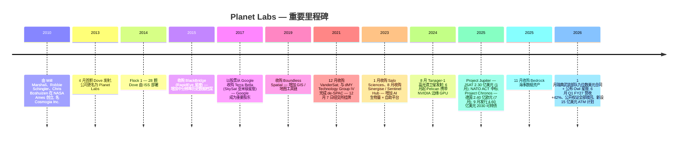
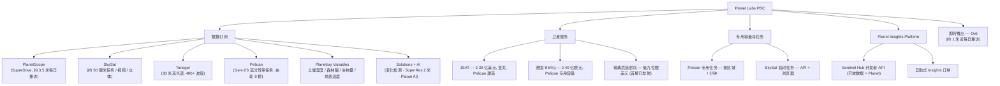
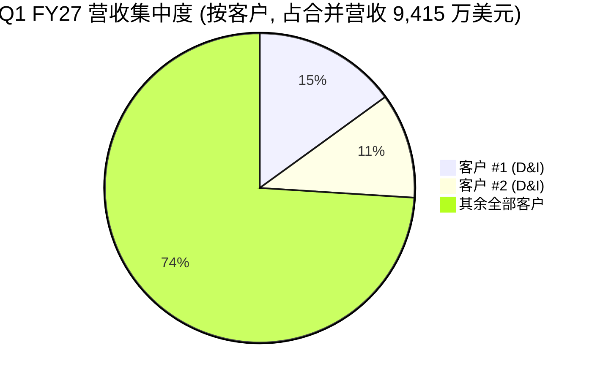
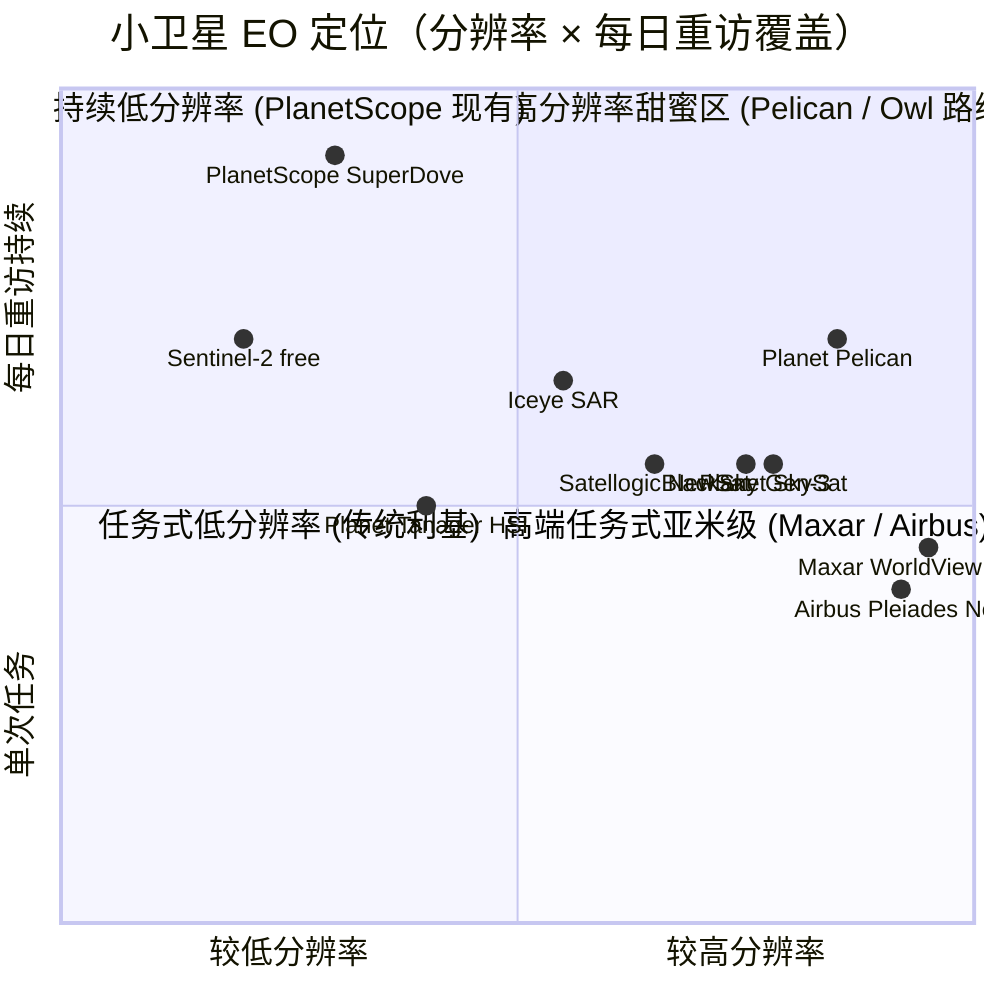

# Planet Labs PBC (NYSE:PL) — 公司研究报告

**截至日期: 2026-06-14**
**上市地: 纽约证券交易所, 代码 PL**
**注册地: 美国特拉华州 (Delaware Public Benefit Corporation)**
**报告语言: 简体中文 (英文版同时存在于本目录, 但已不再同步更新)**

> *分析师观点：* **评级：Hold（持有）· 12 个月目标价 US$34（较 2026-06-14 现价 $31.15 上行约 +9%）· 估值方法：约 25× EV / FY2027E 营收（中值 4.33 亿美元），对标加速增长但盈利尚浅的国防科技 / 主权对地观测同业**
> 市值约 111 亿美元 · 企业价值约 109 亿美元 · 52 周区间 $4.90–$51.76 · NYSE:PL · 总股本约 3.564 亿股（Class A 3.329 亿 + Class B 0.235 亿）
>
> | 倍数 / Multiple (*分析师观点：* 前瞻列) | FY2026A | FY2027E | FY2028E |
> |---|---|---|---|
> | EV / 营收 | 35.3× | 25.1× | 18.5× |
> | P / 营收 | 36.1× | 25.6× | 18.9× |
> | 非 GAAP 毛利率 | 59% | 52–54% | 54–56% |
> | 调整后 EBITDA（百万美元） | +15.5 | 0 至 +10 | +40 至 +70 |
> | 自由现金流（百万美元） | +52.9 | 约盈亏平衡 | 转正 |
>
> 相对表现（截至 2026-06-14）：1M **−27.6%** · 6M **+72.6%** · YTD **+52.6%** · 12M **+483.3%**，对照 S&P 500（−0.9% / +9.0% / +8.4% / +23.2%），相对超额 12 个月约 **+460pct**、但近 1 个月**跑输约 27pct**（来源：yfinance 收盘价，2026-06-14）。
>
> **核心论点（thesis pillars）**——（1）"卫星服务"模式（客户出资造星、Planet 保留商业授权权）已被日本 / 德国 / 瑞典三连击验证, 把资本开支从稀释性股权转为客户预付的递延收入, 是触发 18 个月内股价 5 倍重估的根本原因；（2）Q1 FY27 营收加速至 +42% YoY、在手订单 +72% 至 9.06 亿美元、99% 经常性 ACV——增长能见度罕见地高；（3）但盈利仍处边缘（调整后 EBITDA 仅 0–1,000 万美元、FCF 约盈亏平衡）, 而 25× EV/FY27E 营收已为持续执行充分定价；（4）2026 年 6 月 5 日新设的 **15 亿美元 ATM 股权融资计划**（约当前市值 14%）虽不立即稀释, 却把潜在大额股本扩张的"达摩克利斯之剑"挂在估值之上——这是从 Buy 下调至 Hold 的关键摆锤。

> **业绩更新——FY2027 财年指引上调 (2026-06-04):** 管理层将 FY2027 (截至 2027-01-31 财年) 全年营收指引由 Q4 时的 **4.15 亿–4.40 亿美元上调至 4.25 亿–4.41 亿美元**, 非 GAAP 毛利率由 **50–52% 上调至 52–54%**, 调整后 EBITDA 维持 **0 至 1,000 万美元**, 资本开支 **8,000 万–9,500 万美元**。隐含同比增长约 **38–43%**（对照 FY2026 实际 3.077 亿美元）。Q2 FY27 指引营收 **1.02 亿–1.07 亿美元**、调整后 EBITDA 0–500 万美元。上调动力来自国防与情报合同放量与 Q1 营收提速。来源: [Planet FY2027 Q1 业绩公告 — 8-K Exhibit 99.1, 2026-06-04](https://www.sec.gov/Archives/edgar/data/1836833/000119312526257401/pl-ex99_1.htm)。

---

## 目录
1. 公司概览（含投资论点引言）
1A. 估值与目标价（前瞻模型 · 目标价推导 · 多 / 中 / 空情景）
1B. GF Score（GuruFocus 式）基本面评分
2. 公司历史
3. 管理团队
4. 产品与服务
5. 客户与上市策略
6. 行业概览
7. 竞争格局
8. 市场机会 (TAM)
9. 风险评估
9.5. 关键分歧与催化剂
10. 投资者视角评分
数据来源清单 / 参考资料

---

## 1. 公司概览

*分析师观点：* 本报告对 Planet 给予 **Hold（持有）评级、12 个月目标价 US$34（较现价约 +9%）**。理由分四点。其一, Planet 已不再是一只"亏损的数据公司": "卫星服务"（satellite services, 主权客户出资造星）模式在 12 个月内由日本 JSAT、德国联邦、瑞典武装部队三份合同验证, 把昂贵的卫星资本开支从稀释性股权融资转化为客户预付的递延收入, 这是过去 18 个月里股价从约 4 美元重估到 30 美元以上的根本驱动力。其二, 增长能见度罕见地高——Q1 FY27 营收加速到 **+42% YoY**、剩余履约义务 (remaining performance obligations, RPO) **+81%**、在手订单 (backlog) **+72% 至 9.06 亿美元**、99% 的期末 ACV 为经常性收入 (recurring revenue)。其三, 真正的盈利仍在边缘——FY27 指引的调整后 EBITDA (adjusted EBITDA) 仅 0–1,000 万美元、自由现金流 (free cash flow, FCF) 约盈亏平衡, 而约 **25× EV / FY27E 营收**的估值已为持续完美执行充分定价。其四, 也是把评级从 Buy 压到 Hold 的关键: 2026 年 6 月 5 日 Planet 新设了一项 **15 亿美元的 at-the-market (ATM) 股权融资计划**, 规模约当前市值的 14%——它不立即稀释, 但把潜在的大额股本扩张明确化, 削弱了"无需稀释即可成长"这一核心论据的纯度。下文先描述公司, 再在第 1A / 1B 章给出可证伪的决策层分析。

Planet Labs PBC ("Planet", NYSE: PL) 运营**全球最大的商业地球观测 (earth observation, EO) 卫星星座**, 自行设计和制造卫星, 并销售由此产生的影像、AI 分析以及——日益重要的——面向各国政府与企业的"交钥匙"卫星服务。公司于 2010 年由三位前 NASA 科学家 (Will Marshall、Robbie Schingler、Chris Boshuizen) 在加州库比蒂诺创立, 最初名为 **Cosmogia Inc.**, 后更名为 Planet Labs, 并于 **2021 年 12 月 7 日**通过与 SPAC dMY Technology Group IV 的业务合并 (de-SPAC) 在纽交所上市 ([Planet 10-K FY2026, Item 1 — Business](https://www.sec.gov/Archives/edgar/data/1836833/000119312526119957/pl-20260131.htm))。截至 2026 年 1 月 31 日, 公司在全球 29 个国家共有**约 1,000 名员工 (其中约 945 名全职)** ([Planet 10-K FY2026, Item 1 — Human Capital](https://www.sec.gov/Archives/edgar/data/1836833/000119312526119957/pl-20260131.htm))。

Planet 是一家**特拉华州公益公司 (public benefit corporation, "PBC")**——其公司章程明确要求董事会在追求经济利益的同时, 兼顾"通过照亮环境与社会变化, 加速人类迈向更可持续、更安全、更繁荣的世界"这一公益使命 ([Planet 10-K FY2026, Risk Factors — PBC status](https://www.sec.gov/Archives/edgar/data/1836833/000119312526119957/pl-20260131.htm))。总部位于旧金山哈里森街 645 号; 工程与运营团队分布于旧金山、柏林、哈勒姆 (荷兰)、卢布尔雅那 (斯洛文尼亚) 及格拉茨 (奥地利)。

### 商业模式

Planet 销售**影像、分析、卫星服务及专用容量**, 通过三大业务条线进行 (Planet 在财报中并未单独披露分部利润, 但 MD&A 披露了垂直行业组合):

1. **数据订阅 (data subscriptions)** ——按固定价格授权使用 PlanetScope (SuperDove 每日重访)、SkySat 与 Pelican 影像, 以及 Solutions 与 Planetary Variables 时序产品的循环订阅许可, 绝大多数为 1–3 年期合同。截至 2026 年 4 月 30 日, **99% 的期末年化合同价值 (End-of-Period ACV Book of Business) 为经常性收入**, 较 FY26 年末的 98% 进一步上升 ([Planet 10-Q FY2027 Q1, MD&A — Percent of Recurring ACV](https://www.sec.gov/Archives/edgar/data/1836833/000119312526258304/pl-20260430.htm))。
2. **卫星服务 (satellite services)** ——长期里程碑式合同, Planet 代表盟友政府制造 Pelican (越来越多还包括下一代 Owl) 卫星, 保留绝大多数影像的商业账册授权权利, 并代为运营星座。过去 18 个月签订三份: 日本 JSAT (2.30 亿美元)、德国联邦 (2.40 亿欧元)、瑞典武装部队 ("低九位数美元")。
3. **专用影像任务容量 (dedicated tasking capacity)** ——以分钟 / 小时为单位, 按区域、按天保证 Pelican 或 SkySat 容量, 销售给需要主权访问权的国防 / 情报客户。Q1 FY27 内, Planet 即与一家国际国防与情报客户签订了一份**八位数美元、为期一年的专用容量合同** ([Planet FY2027 Q1 8-K Exhibit 99.1, 2026-06-04](https://www.sec.gov/Archives/edgar/data/1836833/000119312526257401/pl-ex99_1.htm))。

营收质量通过**净美元留存率 (Net Dollar Retention Rate, NDR)** 间接呈现: FY2026 全年由 FY2025 的 106% 跃升至 **116%**, Q1 FY27 单季为 **113%** (对照 Q1 FY26 的 104%), 公司将此归因于"大型国防与情报合同的扩张" ([Planet 10-K FY2026, MD&A — NDR](https://www.sec.gov/Archives/edgar/data/1836833/000119312526119957/pl-20260131.htm); [Planet 10-Q FY2027 Q1, MD&A — NDR](https://www.sec.gov/Archives/edgar/data/1836833/000119312526258304/pl-20260430.htm))。自 Q1 FY27 起, Planet 已不再披露期末客户数指标, 因其将小型账户长尾迁至自助式 Insights Platform, 并将直销资源重新瞄准数百万美元级的大型政府交易。

### 规模与最新财务数据

| 指标 | FY2024 | FY2025 | FY2026 | Q1 FY2027 | 同比 |
|---|---|---|---|---|---|
| 营业收入 | 2.207 亿 | 2.444 亿 | **3.077 亿** | **9,415 万** | Q1 **+42%** |
| GAAP 毛利率 | 53% | 57% | 56% | **54%** | (1 pct vs Q1 FY26) |
| 非 GAAP 毛利率 | 未披露 | 60% | 59% | **56%** | (3 pct) |
| GAAP 净亏损 | (1.405 亿) | (1.232 亿) | **(2.469 亿)** | **(1.389 亿)** | 含 1.065 亿权证重估 |
| 调整后 EBITDA | (3,080 万) | (1,060 万) | **+1,550 万** | **(100 万)** | 边缘盈利 |
| 经营性现金流 | (3,490 万) | +940 万 | **+1.344 亿** | **+1,540 万** | 持续转正 |
| 自由现金流 | (7,720 万) | (3,900 万) | **+5,290 万** | **(250 万)** | Q1 因资本开支翻倍而小幅为负 |
| 现金 + 短期投资 (期末) | 未披露 | 2.22 亿 | 6.40 亿 | **7.308 亿** | 含权证赎回 1.078 亿 |
| RPO / 在手订单 | 未披露 | 4.14 亿 (RPO) | 8.52 亿 (RPO) / >9.00 亿 (在手) | **RPO 8.16 亿 / 在手 9.06 亿** | RPO **+81%** YoY |

来源: [Planet 10-K FY2026 — Item 7 MD&A 与合并报表](https://www.sec.gov/Archives/edgar/data/1836833/000119312526119957/pl-20260131.htm); [Planet FY2027 Q1 业绩公告 8-K, 2026-06-04](https://www.sec.gov/Archives/edgar/data/1836833/000119312526257401/pl-ex99_1.htm); [Planet 10-Q FY2027 Q1](https://www.sec.gov/Archives/edgar/data/1836833/000119312526258304/pl-20260430.htm)。

<svg xmlns="http://www.w3.org/2000/svg" viewBox="0 0 1000 560" width="1000" height="560" role="img" aria-label="income statement Sankey"><rect x="0" y="0" width="1000" height="560" fill="#ffffff"/>
<text x="20.00" y="30.00" text-anchor="start" font-family="Helvetica,Arial,sans-serif" font-size="15" font-weight="700" fill="#1f2933">Planet Labs (PL) 收入与利润瀑布 — FY2027 Q1 (截至 2026-04-30)</text>
<path d="M 359.00,71.00 C 428.50,71.00 428.50,74.55 498.00,74.55 L 498.00,76.55 C 428.50,76.55 428.50,73.00 359.00,73.00 Z" fill="#86efac" fill-opacity="0.55"/>
<path d="M 359.00,73.00 C 428.50,73.00 428.50,90.55 498.00,90.55 L 498.00,472.83 C 428.50,472.83 428.50,455.28 359.00,455.28 Z" fill="#fca5a5" fill-opacity="0.55"/>
<path d="M 514.00,74.55 C 583.50,74.55 583.50,82.86 653.00,82.86 L 653.00,84.86 C 583.50,84.86 583.50,76.55 514.00,76.55 Z" fill="#86efac" fill-opacity="0.55"/>
<path d="M 204.00,78.00 C 273.50,78.00 273.50,71.00 343.00,71.00 L 343.00,296.91 C 273.50,296.91 273.50,303.91 204.00,303.91 Z" fill="#86efac" fill-opacity="0.55"/>
<path d="M 204.00,303.91 C 273.50,303.91 273.50,310.91 343.00,310.91 L 343.00,507.00 C 273.50,507.00 273.50,500.00 204.00,500.00 Z" fill="#fca5a5" fill-opacity="0.55"/>
<path d="M 669.00,82.86 C 738.50,82.86 738.50,278.73 808.00,278.73 L 808.00,280.73 C 738.50,280.73 738.50,84.86 669.00,84.86 Z" fill="#86efac" fill-opacity="0.55"/>
<path d="M 669.00,84.86 C 738.50,84.86 738.50,294.73 808.00,294.73 L 808.00,299.27 C 738.50,299.27 738.50,89.39 669.00,89.39 Z" fill="#fca5a5" fill-opacity="0.55"/>
<path d="M 514.00,90.55 C 583.50,90.55 583.50,98.86 653.00,98.86 L 653.00,331.35 C 583.50,331.35 583.50,323.04 514.00,323.04 Z" fill="#fca5a5" fill-opacity="0.55"/>
<path d="M 514.00,323.04 C 583.50,323.04 583.50,345.35 653.00,345.35 L 653.00,495.14 C 583.50,495.14 583.50,472.83 514.00,472.83 Z" fill="#fca5a5" fill-opacity="0.55"/>
<path d="M 514.00,486.83 C 583.50,486.83 583.50,84.86 653.00,84.86 L 653.00,101.47 C 583.50,101.47 583.50,503.45 514.00,503.45 Z" fill="#93c5fd" fill-opacity="0.55"/>
<rect x="188.00" y="78.00" width="16" height="422.00" rx="1.5" fill="#1e3a8a"/>
<rect x="343.00" y="71.00" width="16" height="225.91" rx="1.5" fill="#15803d"/>
<rect x="343.00" y="310.91" width="16" height="196.09" rx="1.5" fill="#dc2626"/>
<rect x="498.00" y="74.55" width="16" height="2.00" rx="1.5" fill="#15803d"/>
<rect x="498.00" y="90.55" width="16" height="382.28" rx="1.5" fill="#dc2626"/>
<rect x="498.00" y="486.83" width="16" height="16.62" rx="1.5" fill="#2563eb"/>
<rect x="653.00" y="82.86" width="16" height="2.00" rx="1.5" fill="#15803d"/>
<rect x="653.00" y="98.86" width="16" height="232.49" rx="1.5" fill="#dc2626"/>
<rect x="653.00" y="345.35" width="16" height="149.80" rx="1.5" fill="#dc2626"/>
<rect x="808.00" y="278.73" width="16" height="2.00" rx="1.5" fill="#15803d"/>
<rect x="808.00" y="294.73" width="16" height="4.53" rx="1.5" fill="#dc2626"/>
<rect x="207.00" y="60.00" width="106.80" height="26" rx="2" fill="#ffffff" fill-opacity="0.72"/>
<text x="210.00" y="72.00" text-anchor="start" font-family="Helvetica,Arial,sans-serif" font-size="11.5" font-weight="700" fill="#1f2933">Revenue</text>
<text x="210.00" y="85.00" text-anchor="start" font-family="Helvetica,Arial,sans-serif" font-size="10" font-weight="400" fill="#52606d">$94.2M  (100.0%)</text>
<rect x="362.00" y="53.00" width="100.50" height="26" rx="2" fill="#ffffff" fill-opacity="0.72"/>
<text x="365.00" y="65.00" text-anchor="start" font-family="Helvetica,Arial,sans-serif" font-size="11.5" font-weight="700" fill="#1f2933">Gross Profit</text>
<text x="365.00" y="78.00" text-anchor="start" font-family="Helvetica,Arial,sans-serif" font-size="10" font-weight="400" fill="#52606d">$50.4M  (53.5%)</text>
<rect x="362.00" y="292.91" width="144.60" height="26" rx="2" fill="#ffffff" fill-opacity="0.72"/>
<text x="365.00" y="304.91" text-anchor="start" font-family="Helvetica,Arial,sans-serif" font-size="11.5" font-weight="700" fill="#1f2933">Cost of Revenue (COGS)</text>
<text x="365.00" y="317.91" text-anchor="start" font-family="Helvetica,Arial,sans-serif" font-size="10" font-weight="400" fill="#52606d">$43.7M  (46.5%)</text>
<rect x="517.00" y="56.55" width="113.10" height="26" rx="2" fill="#ffffff" fill-opacity="0.72"/>
<text x="520.00" y="68.55" text-anchor="start" font-family="Helvetica,Arial,sans-serif" font-size="11.5" font-weight="700" fill="#1f2933">Operating Income</text>
<text x="520.00" y="81.55" text-anchor="start" font-family="Helvetica,Arial,sans-serif" font-size="10" font-weight="400" fill="#52606d">-$34.9M  (-37.1%)</text>
<rect x="517.00" y="81.55" width="150.90" height="26" rx="2" fill="#ffffff" fill-opacity="0.72"/>
<text x="520.00" y="93.55" text-anchor="start" font-family="Helvetica,Arial,sans-serif" font-size="11.5" font-weight="700" fill="#1f2933">Total Operating Expense</text>
<text x="520.00" y="106.55" text-anchor="start" font-family="Helvetica,Arial,sans-serif" font-size="10" font-weight="400" fill="#52606d">$85.3M  (90.6%)</text>
<text x="489.00" y="490.00" text-anchor="end" font-family="Helvetica,Arial,sans-serif" font-size="11.5" font-weight="700" fill="#1f2933">Net Interest / Other Income</text>
<text x="489.00" y="503.00" text-anchor="end" font-family="Helvetica,Arial,sans-serif" font-size="10" font-weight="400" fill="#52606d">$3.7M  (3.9%)</text>
<rect x="672.00" y="64.86" width="125.70" height="26" rx="2" fill="#ffffff" fill-opacity="0.72"/>
<text x="675.00" y="76.86" text-anchor="start" font-family="Helvetica,Arial,sans-serif" font-size="11.5" font-weight="700" fill="#1f2933">Pretax Income</text>
<text x="675.00" y="89.86" text-anchor="start" font-family="Helvetica,Arial,sans-serif" font-size="10" font-weight="400" fill="#52606d">-$137.9M  (-146.4%)</text>
<rect x="672.00" y="89.86" width="100.50" height="26" rx="2" fill="#ffffff" fill-opacity="0.72"/>
<text x="675.00" y="101.86" text-anchor="start" font-family="Helvetica,Arial,sans-serif" font-size="11.5" font-weight="700" fill="#1f2933">SG&amp;A</text>
<text x="675.00" y="114.86" text-anchor="start" font-family="Helvetica,Arial,sans-serif" font-size="10" font-weight="400" fill="#52606d">$51.9M  (55.1%)</text>
<rect x="672.00" y="327.35" width="100.50" height="26" rx="2" fill="#ffffff" fill-opacity="0.72"/>
<text x="675.00" y="339.35" text-anchor="start" font-family="Helvetica,Arial,sans-serif" font-size="11.5" font-weight="700" fill="#1f2933">R&amp;D</text>
<text x="675.00" y="352.35" text-anchor="start" font-family="Helvetica,Arial,sans-serif" font-size="10" font-weight="400" fill="#52606d">$33.4M  (35.5%)</text>
<text x="833.00" y="276.73" text-anchor="start" font-family="Helvetica,Arial,sans-serif" font-size="11.5" font-weight="700" fill="#1f2933">Net Income</text>
<text x="833.00" y="289.73" text-anchor="start" font-family="Helvetica,Arial,sans-serif" font-size="10" font-weight="400" fill="#52606d">-$138.9M  (-147.5%)</text>
<text x="833.00" y="301.73" text-anchor="start" font-family="Helvetica,Arial,sans-serif" font-size="11.5" font-weight="700" fill="#1f2933">Income Tax</text>
<text x="833.00" y="314.73" text-anchor="start" font-family="Helvetica,Arial,sans-serif" font-size="10" font-weight="400" fill="#52606d">$1.0M  (1.1%)</text>
<text x="500.00" y="530.00" text-anchor="middle" font-family="Helvetica,Arial,sans-serif" font-size="10" font-weight="400" font-style="italic" fill="#8a97a3">净亏损含 1.065 亿美元权证负债公允价值重估（非现金，因股价上涨；权证已于本季全部行权/赎回，未来不再发生）</text>
<text x="500.00" y="544.00" text-anchor="middle" font-family="Helvetica,Arial,sans-serif" font-size="10" font-weight="400" fill="#52606d">Source: PL FY2027 Q1 10-Q / 业绩公告, Condensed Consolidated Statements of Operations</text>
</svg>

*图 1：Q1 FY27 收入与利润瀑布。注意经营亏损 (3,489 万美元) 之外, 净亏损被一笔 1.065 亿美元的权证负债重估放大——这是非现金的、且因权证已于本季全部赎回 / 行权而不会再发生。* 来源: [Planet 10-Q FY2027 Q1, Statements of Operations](https://www.sec.gov/Archives/edgar/data/1836833/000119312526258304/pl-20260430.htm)。

<svg xmlns="http://www.w3.org/2000/svg" viewBox="0 0 860 470" width="860" height="470" role="img" aria-label="historical revenue bars"><rect x="0" y="0" width="860" height="470" fill="#ffffff"/>
<text x="20.00" y="30.00" text-anchor="start" font-family="Helvetica,Arial,sans-serif" font-size="15" font-weight="700" fill="#1f2933">Planet Labs (PL) 年度营业收入 — FY2022–FY2026A + FY2027E 指引中值</text>
<rect x="20.00" y="44" width="11" height="11" rx="2" fill="#2563eb"/>
<text x="36.00" y="53.00" text-anchor="start" font-family="Helvetica,Arial,sans-serif" font-size="10.5" font-weight="400" fill="#1f2933">Revenue</text>
<line x1="70" y1="412.00" x2="834" y2="412.00" stroke="#eceff2" stroke-width="1"/>
<text x="64.00" y="415.00" text-anchor="end" font-family="Helvetica,Arial,sans-serif" font-size="9.5" font-weight="400" fill="#52606d">$0</text>
<line x1="70" y1="345.20" x2="834" y2="345.20" stroke="#eceff2" stroke-width="1"/>
<text x="64.00" y="348.20" text-anchor="end" font-family="Helvetica,Arial,sans-serif" font-size="9.5" font-weight="400" fill="#52606d">$93.5M</text>
<line x1="70" y1="278.40" x2="834" y2="278.40" stroke="#eceff2" stroke-width="1"/>
<text x="64.00" y="281.40" text-anchor="end" font-family="Helvetica,Arial,sans-serif" font-size="9.5" font-weight="400" fill="#52606d">$187.1M</text>
<line x1="70" y1="211.60" x2="834" y2="211.60" stroke="#eceff2" stroke-width="1"/>
<text x="64.00" y="214.60" text-anchor="end" font-family="Helvetica,Arial,sans-serif" font-size="9.5" font-weight="400" fill="#52606d">$280.6M</text>
<line x1="70" y1="144.80" x2="834" y2="144.80" stroke="#eceff2" stroke-width="1"/>
<text x="64.00" y="147.80" text-anchor="end" font-family="Helvetica,Arial,sans-serif" font-size="9.5" font-weight="400" fill="#52606d">$374.1M</text>
<line x1="70" y1="78.00" x2="834" y2="78.00" stroke="#eceff2" stroke-width="1"/>
<text x="64.00" y="81.00" text-anchor="end" font-family="Helvetica,Arial,sans-serif" font-size="9.5" font-weight="400" fill="#52606d">$467.6M</text>
<rect x="96.74" y="318.29" width="73.85" height="93.71" fill="#2563eb"/>
<text x="133.67" y="428.00" text-anchor="middle" font-family="Helvetica,Arial,sans-serif" font-size="10" font-weight="400" fill="#52606d">FY22</text>
<rect x="224.07" y="275.37" width="73.85" height="136.63" fill="#2563eb"/>
<text x="261.00" y="428.00" text-anchor="middle" font-family="Helvetica,Arial,sans-serif" font-size="10" font-weight="400" fill="#52606d">FY23</text>
<rect x="351.41" y="254.37" width="73.85" height="157.63" fill="#2563eb"/>
<text x="388.33" y="428.00" text-anchor="middle" font-family="Helvetica,Arial,sans-serif" font-size="10" font-weight="400" fill="#52606d">FY24</text>
<rect x="478.74" y="237.44" width="73.85" height="174.56" fill="#2563eb"/>
<text x="515.67" y="428.00" text-anchor="middle" font-family="Helvetica,Arial,sans-serif" font-size="10" font-weight="400" fill="#52606d">FY25</text>
<rect x="606.07" y="192.23" width="73.85" height="219.77" fill="#2563eb"/>
<text x="643.00" y="428.00" text-anchor="middle" font-family="Helvetica,Arial,sans-serif" font-size="10" font-weight="400" fill="#52606d">FY26</text>
<rect x="733.41" y="102.74" width="73.85" height="309.26" fill="#2563eb"/>
<text x="770.33" y="428.00" text-anchor="middle" font-family="Helvetica,Arial,sans-serif" font-size="10" font-weight="400" fill="#52606d">FY27E</text>
<text x="430.00" y="454.00" text-anchor="middle" font-family="Helvetica,Arial,sans-serif" font-size="10" font-weight="400" fill="#52606d">Source: PL 10-K FY2023/FY2025/FY2026 Statements of Operations; FY27E=管理层 2026-06-04 指引中值 $425–441M</text>
</svg>

来源: [Planet 10-K FY2023 / FY2025 / FY2026, Statements of Operations](https://www.sec.gov/Archives/edgar/data/1836833/000119312526119957/pl-20260131.htm); FY27E 为管理层 2026-06-04 指引中值 ($4.25–4.41 亿)。

### 估值快照 (强制项)

- **股价 (2026-06-14):** **31.15 美元**——距 52 周高点 51.76 美元约 −40%, 约为 52 周低点 4.90 美元的 6.4 倍 ([yfinance — PL, 2026-06-14](https://finance.yahoo.com/quote/PL/))。注意: 自 5 月下旬约 42.7 美元的高位, 股价在 Q1 FY27 业绩与 15 亿美元 ATM 计划公布后回落约 27%。
- **市值:** 约 111 亿美元 (3.564 亿股 × 31.15 美元)。**企业价值:** 约 109 亿美元 (扣减 7.31 亿美元现金 + 短投, 加回 4.48 亿美元 2030 年到期可转债账面值)。
- **TTM P/E:** **N/M (负值)** ——TTM GAAP 净亏损主要由权证负债的公允价值重估主导, 这是股价上涨的*结果*, 而非现金费用。**剔除权证后**的 Q1 FY27 内在净亏损约 3,240 万美元, **非 GAAP 摊薄每股亏损仅为 (0.03 美元)** ([Planet FY2027 Q1 8-K, 2026-06-04](https://www.sec.gov/Archives/edgar/data/1836833/000119312526257401/pl-ex99_1.htm))。
- **TTM P/S:** **约 33×** (市值 111 亿 ÷ TTM 营收 3.356 亿美元)。**EV/TTM 营收 约 32×**; **EV / FY27E 营收（4.33 亿中值）约 25×**。
- **TTM P/B:** 约 25× (账面净资产 4.437 亿美元——本季因公开权证行权使 additional paid-in capital 由 16.3 亿增至 20.3 亿、权证负债清零, 股东权益由 1.884 亿跃升至 4.437 亿 ([Planet 10-Q FY2027 Q1, Balance Sheets](https://www.sec.gov/Archives/edgar/data/1836833/000119312526258304/pl-20260430.htm)))。
- **3 年估值区间:** 自 2021 年底 de-SPAC 至 2025 年年中, PL 长期在 1.5–6× P/S 区间内交易 (因增长停滞), 2024 年 2 月股价触底约 1.6 美元。当前 ~33× TTM P/S 因此位于公司公开历史的**绝对峰值附近**, 即便从 5 月高点回落后仍是如此。

**同业比较 (2026-06-14, 数据均来自 [yfinance](https://finance.yahoo.com/quote/PL/)):**

| 代码 | 公司 | TTM 营业收入 | TTM 营收同比 | EV / TTM 营收 | TTM P/S |
|---|---|---|---|---|---|
| **PL** | Planet Labs | 3.356 亿 | **+42%** | **约 32×** | **约 33×** |
| BKSY | BlackSky Technology | 9,780 万 | (30%) | 13.3× | 12.3× |
| SATL | Satellogic | 2,040 万 | +80% | 49.7× | 48.3× |
| RKLB | Rocket Lab USA | 6.796 亿 | +64% | 85.4× | 94.1× |
| SPIR | Spire Global | 6,350 万 | (34%) | 10.5× | 11.1× |
| LUNR | Intuitive Machines | 3.343 亿 | +199% | 16.6× | 12.8× |
| **小卫星 EO 同业中位数** | | | | **约 15×** | |

**对估值倍数的解读。** TTM P/E 为负, 但 GAAP 亏损主要由权证重估主导 (Q1 FY27 净亏损 1.389 亿美元中, 约 **1.065 亿即 77% 来自权证负债的非现金重估**), 这并非衡量经营质量的指标——且**该项目自本季起永久消失** (公开权证已全部赎回, 私募权证已无现金行权), 未来季度的 GAAP 亏损将大幅收窄并更接近经营实质 ([Planet FY2027 Q1 8-K, 2026-06-04](https://www.sec.gov/Archives/edgar/data/1836833/000119312526257401/pl-ex99_1.htm))。更干净的信号是非 GAAP 每股亏损 (0.03 美元)、Q1 经营现金流 +1,540 万美元, 以及 FY26 全年 5,290 万美元正自由现金流。在约 25× EV / FY27E 营收的估值下, 市场已为 **(a) FY27 指引 38–43% 增长**、**(b) 9.06 亿美元在手订单按 50%+ 毛利率转化**、**(c) 持续向卫星服务合同的转型**、以及 **(d) 国防科技 / 主权 EO 溢价**计价。最贴近的板块先例是 2024–2025 年 Rocket Lab 与 AST SpaceMobile 的重估。第 9 章将估值 / 倍数收缩列为重大财务风险。

地理敞口: FY26 营业收入中约**30% 以非美元计价**, 主要为欧元 ([Planet 10-K FY2026, Item 7A](https://www.sec.gov/Archives/edgar/data/1836833/000119312526119957/pl-20260131.htm)) ——较 FY25 的 27% 与 FY24 的 24% 持续上升, 与柏林团队在赢得 BKG、德国联邦、希腊、捷克、苏格兰等合同方面的核心地位一致。

## 1A. 估值与目标价

> *分析师观点：* 本章的全部前瞻数字、目标价与情景价均为分析师本方观点, 不附任何备案文件引用; 每一项预测的*外部输入*在文中分别引用。绝不写"(来源：本模型)"。

### (a) 前瞻财务预测（3 年）

| 指标 (*分析师观点：*) | FY2026A | FY2027E | FY2028E | FY2029E | CAGR (26→29) |
|---|---|---|---|---|---|
| 营业收入（百万美元） | 308 | 433 | 565 | 700 | **+31%** |
| — YoY % | +26% | +41% | +30% | +24% | |
| 非 GAAP 毛利率 % | 59% | 53% | 55% | 58% | |
| 调整后 EBITDA（百万美元） | +16 | +5 | +55 | +120 | |
| — 利润率 % | 5% | 1% | 10% | 17% | |
| 经营现金流（百万美元） | +134 | +90 | +140 | +210 | |
| 资本开支（百万美元） | (82) | (88) | (90) | (95) | |
| 自由现金流（百万美元） | +53 | 约 0 | +50 | +115 | |
| 净现金（现金+短投−可转债，百万美元） | +192 | +280 | +330 | +445 | |
| 现金跑道（季度，按当前烧钱） | 不适用（FCF≈正） | 充裕 | n/a | n/a | |

预测输入与依据: FY27E 营收锚定管理层 2026-06-04 上调后指引中值 4.33 亿美元 ([Planet FY27 Q1 8-K, 2026-06-04](https://www.sec.gov/Archives/edgar/data/1836833/000119312526257401/pl-ex99_1.htm)); FY28–FY29 营收坡度由 8.16 亿美元 RPO 的转化节奏 (管理层披露 RPO 35% 在 12 个月内确认、66% 在 24 个月内确认, [Planet 10-Q FY2027 Q1, Note — RPO](https://www.sec.gov/Archives/edgar/data/1836833/000119312526258304/pl-20260430.htm)) 加上每年 1–2 笔新主权卫星服务合同的假设推导; 毛利率近期受卫星服务建造期成本与新星座折旧拖累 (故 FY27E 由 59% 回落至 53%), 中期随订阅占比回升而修复——这一点与第 1B 章成长性维度的判断一致。

**毛利率桥 (bps, FY27E vs FY26A 非 GAAP 毛利率 59%→53%, *分析师观点：*):** 卫星服务建造期成本占比上升 **约 −400bps** · Pelican / 中分辨率新星座折旧 **约 −300bps** · SkySat 完全折旧资产退出带来的成本下降 **约 +100bps**——净约 −600bps, 落在管理层 52–54% 指引区间内。每一驱动项的方向均可在 10-K 营业成本走查与 FY27 指引中找到依据 ([Planet 10-K FY2026, MD&A — Cost of Revenue](https://www.sec.gov/Archives/edgar/data/1836833/000119312526119957/pl-20260131.htm))。

### (b) 目标价推导——展示算术

Planet 当前不盈利, 远期 P/E 无意义; 因此采用**EV / 营收**法。FY2027E 营收中值 4.33 亿美元 × 目标 **25× EV / 营收** = 企业价值约 108 亿美元; 加回 7.31 亿现金 / 短投、扣减 4.48 亿可转债, 得股权价值约 111 亿美元; 除以约 3.564 亿股 (并考虑可转债 + 期权 / RSU 全面摊薄至约 3.7 亿股) ≈ **每股约 34 美元**。

**为什么用 25× EV/营收。** 在加速增长 (+40%) 但盈利尚浅、国防科技标的中, 25× 介于纯数据同业 BlackSky (约 13× EV/TTM 营收) 与高倍数火箭 / 火箭+卫星标的 Rocket Lab (约 85×)、Satellogic (约 50×) 之间。Planet 的循环收入质量 (99% 经常性、NDR 113%) 与正向自由现金流应享高于 BlackSky 的溢价, 但其个位数调整后 EBITDA 利润率与 15 亿美元 ATM 计划带来的稀释不确定性, 不支持向 Rocket Lab 级倍数靠拢。25× 对应约 18× EV / FY28E 营收——随着营收复合, 倍数自然收缩。

### (c) 多 / 中 / 空情景表

| 情景 (*分析师观点：*) | 关键假设 | 目标价 | 较现价 |
|---|---|---|---|
| 多头 (Bull) | 再签 2–3 笔主权卫星服务合同, FY28E 营收升至 6.5 亿、EBITDA 利润率 15%, 倍数维持 30× EV/营收 | **$52** | **+67%** |
| 中性 (Base) | FY27E 营收 4.33 亿、25× EV/营收, RPO 平稳转化 | **$34** | **+9%** |
| 空头 (Bear) | 一笔卫星服务合同滑期或一季未达预期, 板块轮动, 倍数收缩至 12× EV/营收, 且 ATM 大额行权稀释约 10% | **$15** | **−52%** |

风险收益并不对称地偏向上行——中性情景仅 +9%, 而空头情景 −52%。这正是评级停在 Hold 而非 Buy 的量化理由: 在 33× TTM P/S 的峰值估值下, 倍数收缩的下行幅度大于中性情景的上行幅度。

### (d) 与市场一致预期的对比 & 公司指引

| 指标 (FY27E) | 公司指引 | 本报告 (*分析师观点：*) |
|---|---|---|
| 营业收入（百万美元） | 425–441 | 433 (取中值) |
| 非 GAAP 毛利率 | 52%–54% | 53% |
| 调整后 EBITDA（百万美元） | 0–10 | +5 |
| 资本开支（百万美元） | 80–95 | 88 |

公司指引列引自 [Planet FY27 Q1 8-K, 2026-06-04](https://www.sec.gov/Archives/edgar/data/1836833/000119312526257401/pl-ex99_1.htm)。本报告估计基本贴合指引中值——这是一个"相信管理层执行、但不为超额执行额外付费"的中性立场。本地 zsxq 机构库对 PL 无单一名称卖方覆盖与目标价 (见验证日志), 故无法给出"与街道一致预期"的精确偏离量, 仅以 Morgan Stanley「Space 60」与 Nomura 全球卫星报告作为板块层面的语境 (标注 *分析师观点：*)。

### (e) 本次刷新相对上一版的变动 (估值修正透明化)

相对 2026-05-20 版本: **目标价 $34（前值无显式目标价, 上一版未给评级 / PT）**; 现价由 $42.71 回落至 $31.15; EV / FY27E 营收由约 32×（按当时市值）压缩至约 25×。本次新增 Q1 FY27 实绩 (营收提速至 +42%、RPO +81%、权证全部清零)、6 月 4 日指引上调、以及 6 月 5 日 15 亿美元 ATM 计划——后者是本次给出 Hold 而非更乐观评级的主因。

### (f) 最该盯紧的关键变量

call 的成败主要系于两个变量: **(1) 卫星服务合同的签约节奏**——每多签 / 少签一笔 2–3 亿美元的主权合同, 直接改变 FY28–FY29 营收坡度与递延收入; **(2) ATM 计划的实际动用程度**——若 Planet 在低价大量行权 ATM, 稀释将吞噬每股价值; 若仅作为机会性"弹药"几乎不动用, 则下行风险大减。

## 1B. GF Score（GuruFocus 式）基本面评分

> *分析师观点：* **GF Score（GuruFocus 式，综合评分）：57 / 100 —— "Poor future performance potential"（51–70 区间）。** 这是分析师本方的评分框架, 非 GuruFocus 官方数字; 五个维度与综合分均为 *分析师观点：*, 不附备案引用, 但每个底层指标在下文分别引用。

<svg xmlns="http://www.w3.org/2000/svg" viewBox="0 0 500 500" width="500" height="500" role="img" aria-label="GF Score radar">
<rect x="0" y="0" width="500" height="500" fill="#ffffff"/>
<text x="20" y="24" font-family="Helvetica,Arial,sans-serif" font-size="15" font-weight="700" fill="#1f2933">GF Score (GuruFocus-style): 57/100</text>
<text x="20" y="41" font-family="Helvetica,Arial,sans-serif" font-size="11" fill="#52606d">51–70 Poor future performance potential</text>
<polygon points="250.0,88.0 392.7,191.6 338.2,359.4 161.8,359.4 107.3,191.6" fill="#e9f5ec" stroke="none"/>
<polygon points="250.0,208.0 278.5,228.7 267.6,262.3 232.4,262.3 221.5,228.7" fill="none" stroke="#c5d3cb" stroke-width="1"/>
<polygon points="250.0,178.0 307.1,219.5 285.3,286.5 214.7,286.5 192.9,219.5" fill="none" stroke="#c5d3cb" stroke-width="1"/>
<polygon points="250.0,148.0 335.6,210.2 302.9,310.8 197.1,310.8 164.4,210.2" fill="none" stroke="#c5d3cb" stroke-width="1"/>
<polygon points="250.0,118.0 364.1,200.9 320.5,335.1 179.5,335.1 135.9,200.9" fill="none" stroke="#c5d3cb" stroke-width="1"/>
<polygon points="250.0,88.0 392.7,191.6 338.2,359.4 161.8,359.4 107.3,191.6" fill="none" stroke="#c5d3cb" stroke-width="1.3"/>
<line x1="250" y1="238" x2="161.8" y2="359.4" stroke="#cfdad3" stroke-width="1"/>
<text x="146.5" y="392.4" text-anchor="end" font-family="Helvetica,Arial,sans-serif" font-size="11.5" font-weight="600" fill="#1f2933">财务实力</text>
<text x="179.5" y="329.1" text-anchor="middle" font-family="Helvetica,Arial,sans-serif" font-size="10.5" font-weight="700" fill="#1f2933">8</text>
<line x1="250" y1="238" x2="250.0" y2="88.0" stroke="#cfdad3" stroke-width="1"/>
<text x="250.0" y="58.0" text-anchor="middle" font-family="Helvetica,Arial,sans-serif" font-size="11.5" font-weight="600" fill="#1f2933">盈利能力</text>
<text x="250.0" y="187.0" text-anchor="middle" font-family="Helvetica,Arial,sans-serif" font-size="10.5" font-weight="700" fill="#1f2933">3</text>
<line x1="250" y1="238" x2="107.3" y2="191.6" stroke="#cfdad3" stroke-width="1"/>
<text x="82.6" y="183.6" text-anchor="end" font-family="Helvetica,Arial,sans-serif" font-size="11.5" font-weight="600" fill="#1f2933">成长性</text>
<text x="135.9" y="194.9" text-anchor="middle" font-family="Helvetica,Arial,sans-serif" font-size="10.5" font-weight="700" fill="#1f2933">8</text>
<line x1="250" y1="238" x2="392.7" y2="191.6" stroke="#cfdad3" stroke-width="1"/>
<text x="417.4" y="183.6" text-anchor="start" font-family="Helvetica,Arial,sans-serif" font-size="11.5" font-weight="600" fill="#1f2933">估值</text>
<text x="278.5" y="222.7" text-anchor="middle" font-family="Helvetica,Arial,sans-serif" font-size="10.5" font-weight="700" fill="#1f2933">2</text>
<line x1="250" y1="238" x2="338.2" y2="359.4" stroke="#cfdad3" stroke-width="1"/>
<text x="353.5" y="392.4" text-anchor="start" font-family="Helvetica,Arial,sans-serif" font-size="11.5" font-weight="600" fill="#1f2933">动量</text>
<text x="311.7" y="316.9" text-anchor="middle" font-family="Helvetica,Arial,sans-serif" font-size="10.5" font-weight="700" fill="#1f2933">7</text>
<polygon points="250.0,193.0 278.5,228.7 311.7,322.9 179.5,335.1 135.9,200.9" fill="#2e8b57" fill-opacity="0.34" stroke="#2e8b57" stroke-width="2"/>
<circle cx="179.5" cy="335.1" r="2.6" fill="#2e8b57"/>
<circle cx="250.0" cy="193.0" r="2.6" fill="#2e8b57"/>
<circle cx="135.9" cy="200.9" r="2.6" fill="#2e8b57"/>
<circle cx="278.5" cy="228.7" r="2.6" fill="#2e8b57"/>
<circle cx="311.7" cy="322.9" r="2.6" fill="#2e8b57"/>
<text x="250" y="470" text-anchor="middle" font-family="Helvetica,Arial,sans-serif" font-size="9.5" fill="#52606d">Source: PL FY2026 10-K + FY2027 Q1 10-Q · Yahoo Finance · indicators.db, as of 2026-06-14</text>
<text x="250" y="485" text-anchor="middle" font-family="Helvetica,Arial,sans-serif" font-size="9" fill="#52606d">GF Score = independent analyst rubric (*Analyst view:*) — not GuruFocus™ official number</text>
</svg>

> 离中心越远，该维度得分越高; 五边形面积越大，综合评分越高（与 GuruFocus 控件一致）。

| 维度 | 评分 (0–10) | |
|---|---|---|
| 财务实力 | 8 | `████████░░` |
| 盈利能力 | 3 | `███░░░░░░░` |
| 成长性 | 8 | `████████░░` |
| 估值 | 2 | `██░░░░░░░░` |
| 动量 | 7 | `███████░░░` |
| **GF Score (composite, *Analyst view:*)** | **57 / 100** | **51–70 Poor future performance potential** |

*Composite weights (*Analyst view:*): Financial Strength 20% · Profitability 25% · Growth 25% · GF Value 15% · Momentum 15% (transparent reproduction — not GuruFocus's proprietary weighting).*

**财务实力 (Financial Strength) = 8/10。** Planet 处于净现金状态: 现金 + 短期投资 7.308 亿美元, 仅有的有息负债是 4.476 亿美元、票息 0.50%、2030 年到期的可转债, 净现金约 +2.8 亿美元 ([Planet 10-Q FY2027 Q1, Balance Sheets](https://www.sec.gov/Archives/edgar/data/1836833/000119312526258304/pl-20260430.htm))。无银行贷款、无养老金缺口; 可转债票息极低且 2030 年才到期, 利息覆盖不构成约束。扣分项: EBITDA 仍接近盈亏平衡, 故无法给到 9–10。

**盈利能力 (Profitability) = 3/10。** Q1 FY27 经营亏损 3,489 万美元、经营利润率约 −37%, GAAP 与非 GAAP 均处于结构性亏损 ([Planet 10-Q FY2027 Q1, Statements of Operations](https://www.sec.gov/Archives/edgar/data/1836833/000119312526258304/pl-20260430.htm)); ROE / ROIC 为负, 累计赤字达 15.9 亿美元。加分项: 调整后 EBITDA 已临近正值、FY26 全年自由现金流转正 (+5,290 万), 故高于"深度不盈利"的 0–2 分区。

**成长性 (Growth) = 8/10。** Q1 FY27 营收 +42% YoY, FY26 全年 +26%, FY27E 指引中值隐含约 +41%; RPO +81%、在手订单 +72% 提供罕见的前瞻能见度 ([Planet FY27 Q1 8-K, 2026-06-04](https://www.sec.gov/Archives/edgar/data/1836833/000119312526257401/pl-ex99_1.htm))。这一评分与第 1A 章前瞻模型的 +31% 三年 CAGR 一致。

**估值 (GF Value，越高=越便宜) = 2/10。** 约 33× TTM P/S、约 25× EV/FY27E 营收, 处于公司公开历史的峰值附近、且远高于小卫星 EO 同业中位数约 15× ([yfinance, 2026-06-14](https://finance.yahoo.com/quote/PL/))。PEG 交叉验证: 以约 33× P/S ÷ 41% 增长, 估值已充分反映增长, 安全边际为负, 故落在 0–2 分区 (越高=越便宜的方向上得低分=昂贵)。

**动量 (Momentum) = 7/10。** 12 个月绝对涨幅 +483%、6 个月 +73%、YTD +53%, 大幅跑赢 S&P 500; 但近 1 个月 −27.6% (业绩 + ATM 公布后回落) 抑制了评分, 故未给到 9–10 ([yfinance 收盘价, 2026-06-14](https://finance.yahoo.com/quote/PL/))。

**综合算术:** (财务实力 8×20 + 盈利能力 3×25 + 成长性 8×25 + 估值 2×15 + 动量 7×15) / 100 = 5.65 → **57/100**, 权重为默认的 20/25/25/15/15。

**一句话提醒:** 评分被"高成长 + 强资产负债表"撑住, 而被"深度估值溢价 + 尚未盈利"压低; 最可能翻动的维度是**盈利能力**——若 FY28 EBITDA 利润率如预期升至两位数, 该维度可上调 2–3 分, 把综合分推入 70+ 区间。

## 2. 公司历史

Planet 于 2010 年在加州库比蒂诺以 **Cosmogia Inc.** 之名成立, 创始人为 Will Marshall、Robbie Schingler 及 Chris Boshuizen——三人均为 NASA Ames 的科学家, 曾深度参与该机构的 **PhoneSat** 实验, 即在立方星 (cubesat) 中搭载智能手机以证明消费电子产品能够在轨道环境中存活。立公司之初的理念是: 将卫星视为软件定义的可消耗资产, 而非一颗 5 亿美元级的旗舰星, 一支小团队就能每年制造数十颗 "Doves", 从而首次实现对整个地球的每日成像。第一颗 Dove 于 2013 年 4 月发射; **Flock 1** 星座 (28 颗 Dove) 于 2014 年 2 月由国际空间站 (ISS) 部署入轨。公司于 2013 年更名为 Planet Labs ([Planet 10-K FY2026, Item 1 — Business](https://www.sec.gov/Archives/edgar/data/1836833/000119312526119957/pl-20260131.htm))。

来源: [Planet 10-K FY2026, Item 1 Business — History](https://www.sec.gov/Archives/edgar/data/1836833/000119312526119957/pl-20260131.htm); [Planet FY27 Q1 8-K, 2026-06-04](https://www.sec.gov/Archives/edgar/data/1836833/000119312526257401/pl-ex99_1.htm); [Planet — JSAT 8-K, 2025-01-29](https://www.sec.gov/Archives/edgar/data/1836833/000183683325000017/exhibit991projectjupiterpr.htm); [Planet — 德国 8-K, 2025-07-01](https://www.sec.gov/Archives/edgar/data/1836833/000183683325000075/exhibit991projectchronospr.htm); [Planet — 瑞典 8-K, 2026-01-12](https://www.sec.gov/Archives/edgar/data/1836833/000119312526009922/pl-ex99_1.htm)。

**战略转折点。** 对当前投资逻辑而言, 有三次重要转型:

- **从业余级 Dove 转向纪律化的 SuperDove (2018–2022)。** 第一代 Dove 辐射定标不一致、寿命较短。SuperDove 这一代 (8 个光谱波段、寿命更长) 被设计为企业级扫描仪, 也成为 "PlanetScope" 每日重访产品的支柱。这次转型是 Planet 数据得以多年合同形式销售给 USDA、欧盟委员会及大型农业企业 (而非作为一次性影像采购) 的关键 ([Planet 10-K FY2026, Item 1 — Our Fleet](https://www.sec.gov/Archives/edgar/data/1836833/000119312526119957/pl-20260131.htm))。
- **从数据转向平台 (2023)。** 2023 年 8 月收购了总部位于斯洛文尼亚的 **Sinergise**, 带来 Sentinel Hub 这一自助式地球观测 API 与可视化平台 ([Planet 10-K FY2026, Note 5 — Business Combinations](https://www.sec.gov/Archives/edgar/data/1836833/000119312526119957/pl-20260131.htm))。该产品被重新命名为 "Planet Insights Platform", 现承担高速、低摩擦的客户获取漏斗角色——也是管理层决定不再披露期末客户数指标的原因。
- **从数据授权转向"卫星服务" (2025–2026)。** 这是单一影响最大的战略转向。Planet 不再仅卖订阅, 而是向**主权 / 一级客户提供打包星座**: Planet 负责制造和运营 Pelican 卫星, 客户预付现金、获得卫星所有权, Planet 则保留将影像授权进入其商业账册的权利。这一模式解释了 FY26 转向 FCF 转正的几乎全部摆幅 (10-K 现金流量表口径递延收入大幅增加), 并在 Q1 FY27 体现为递延收入余额 2.469 亿美元 ([Planet 10-Q FY2027 Q1, Balance Sheets](https://www.sec.gov/Archives/edgar/data/1836833/000119312526258304/pl-20260430.htm))。这正是引发股票重估的商业模式。

**并购列表 (附逻辑):**

- BlackBridge (2015) — RapidEye 星座, 5 米级历史数据档案。
- Terra Bella (2017, 全股票) — 收购自 Alphabet, 获 SkySat 亚米级任务星座; Google 由此成为重要 Class A 股东。
- Boundless Spatial (2019) — GIS 分析、联邦销售渠道。
- VanderSat (2021) — Planetary Variables (土壤湿度、生物量)。
- Salo Sciences (2023) — AI 生物量 / 森林碳模型。
- Sinergise (2023) — Sentinel Hub 开发者平台。
- Bedrock Ocean 数据资产 (2025) — 海事情境感知 IP ([Planet 10-K FY2026, Item 1 — Business](https://www.sec.gov/Archives/edgar/data/1836833/000119312526119957/pl-20260131.htm))。

**近期动态 (Q1 FY27, 截至 2026-04-30)。** 营收加速至 +42% YoY、RPO +81%、在手订单 +72% 至 9.06 亿美元; **公司在本季全额赎回所有公开权证, 录得约 1.078 亿美元行权款, 权证负债清零, 未来不再产生权证重估损益**; 5 月用一枚 SpaceX 火箭成功发射 3 颗 AI 化 Pelican (含瑞典首颗主权侦察卫星, 距签约仅四个月), 在轨 Pelican 增至 9 颗; 同时推出 Planet AI 自然语言查询应用 (私测) 与 SuperRes (将 PlanetScope 数据提升至 2 米级) ([Planet FY27 Q1 8-K, 2026-06-04](https://www.sec.gov/Archives/edgar/data/1836833/000119312526257401/pl-ex99_1.htm))。紧接着, **2026 年 6 月 5 日 Planet 设立一项至多 15 亿美元的 ATM 股权发行计划 (含远期销售机制)**, 用途为"资助未来增长, 包括潜在收购及一般公司用途" ([Planet 8-K — Equity Distribution Agreement, 2026-06-05](https://www.sec.gov/Archives/edgar/data/1836833/000114036126024109/ef20075554_8k.htm); [Planet 424B5 招股补充文件, 2026-06-05](https://www.sec.gov/Archives/edgar/data/1836833/000114036126024104/ny20075555x2_424b5.htm))。

## 3. 管理团队

Planet 的领导层高度创始人主导: 截至 2026 年 5 月委托书, **公司仅披露三位执行高管**——两位联合创始人 Marshall 与 Schingler, 加上总裁兼 CFO Ashley Fieglein Johnson; 八人董事会中 **78% 为独立董事, 仅两位联合创始人非独立** ([Planet DEF 14A 2026, Corporate Governance & Executive Officers](https://www.sec.gov/Archives/edgar/data/1836833/000119312526241945/pl-20260527.htm))。两位创始人合计持有公司全部 Class B 超级投票权股票 (约 2,349 万股, 每股 20 票), 由此掌握远超其经济权益的表决权。

### William "Will" Marshall — 董事长、联合创始人 & CEO

Marshall 博士自 2010 年与他人共同创立 Cosmogia 以来一直执掌 Planet, 并自 2021 年 12 月 de-SPAC 以来兼任董事长 ([Planet DEF 14A 2026 — Director Bios](https://www.sec.gov/Archives/edgar/data/1836833/000119312526241945/pl-20260527.htm))。他拥有**牛津大学物理学博士学位**, 莱斯特大学物理学硕士学位 (空间科学与技术方向), 并曾在乔治华盛顿大学与哈佛大学完成博士后研究。在创立 Planet 之前, 他是 NASA Ames / Universities Space Research Association 的科学家, 与 Robbie Schingler 共同筹建了 **NASA Ames Small Spacecraft Office**——孕育 PhoneSat 实验、最终成为 Planet 思想种子的机构。他曾担任 **LADEE** (NASA 月球大气探测任务) 系统工程师、**LCROSS** (月球撞击器) 科学组成员, 并主导过空间碎片清理与 PhoneSat 的技术工作。他是颇受邀约的公共演讲人: 2014 年 TED 演讲 "Tiny satellites that photograph the entire planet every day" 获约 180 万播放量, 2024 年 HBO 纪录片 "Wild Wild Space" 将其作为核心人物。

Marshall 通过 Class B 持股掌握公司约一半的超级投票权, 加上直接持有的 Class A、可转换 Class B、60 天内可行权的期权及归属的 RSU——Class B 提供 20:1 的投票权 ([Planet DEF 14A 2026 — Security Ownership](https://www.sec.gov/Archives/edgar/data/1836833/000119312526241945/pl-20260527.htm))。在 2024 年裁员行动中, 他曾**自愿削减基本工资**——一个在股价处于历史低位时显示利益对齐的不寻常之举。此后的转型——把一家亏损的数据公司转变为 9.06 亿美元在手订单、签订三份卫星服务合同、并完成首个现金流转正财年的公司——是支持 Marshall 作为"既能造也能商业转型的建设型 CEO"的最重要论据。主要反对论据是: Planet 曾不得不引入 Stripe 时代的 President / CPO (Kevin Weil 于 2023 年加入、约一年后离职), 才使两位创始人真正把产品与增长重新集中在自己办公室——这表明在整合高级运营官方面存在过困难。Marshall 始终扮演对外的公司形象——每一项重要客户公告 (NATO、JSAT、德国、瑞典) 都以他为首要发言人。

### Robbie (Robert) Schingler, Jr. — 联合创始人 & 首席战略官 (CSO)

Schingler 在 IPO 前曾在 Planet 担任过 CFO 与 COO, 现任首席战略官, 并同为董事 ([Planet DEF 14A 2026 — Director Bios & Executive Officers](https://www.sec.gov/Archives/edgar/data/1836833/000119312526241945/pl-20260527.htm))。他在 NASA 工作了九年, 包括担任 NASA 总部首席技术官办公室的幕僚长, 是 2005 年总统管理研修员, 拥有乔治城大学 MBA、国际太空大学空间研究 MS, 以及圣克拉拉大学工程物理学 BS。他通过 Ulysses Trust 持有公司约另一半的 Class B 流通股——与 Marshall 拥有相同的超级投票权结构。他在卫星服务合同的结构设计以及 Planet 国际扩张 (柏林办公室、欧洲客户中标) 中扮演核心角色; 卫星服务模式——客户出资、保留商业授权权——的法律与商业架构很大程度上出自 CSO 职能。两位创始人均相对年轻、任期长且利益对齐, 但任一人的突然离开都将是严重事件 (列入第 9 章关键人员风险)。

### 治理标记 (与论点相关)

Class B 每股 20 票、Class A 每股 1 票, 两位创始人由此以远低于经济权益的比例掌握控制性表决权——这是 S&P 与 FTSE Russell 在某些指数中排除双类股结构的原因 ([Planet DEF 14A 2026 — Common Stock Voting Rights](https://www.sec.gov/Archives/edgar/data/1836833/000119312526241945/pl-20260527.htm))。董事会采用三类分级制; 首席独立董事为前 Autodesk CEO Carl Bass, 独立董事还包括美国太空司令部首任司令、前太空作战参谋长 John W. "Jay" Raymond 将军 (对国防 / 主权转型尤具意义) 与 Ciena CEO Gary B. Smith。审计师为 KPMG LLP。

## 4. 产品与服务

Planet 的产品目录按**舰队 (捕获数据的卫星) 与交付平台 (客户如何消费)** 组织。下图据 [planet.com/products/](https://www.planet.com/products/)、[planet.com/constellations/](https://www.planet.com/constellations/) 与 FY2026 10-K Item 1 整理:

来源: [Planet — Products](https://www.planet.com/products/); [Planet — Constellations](https://www.planet.com/constellations/); [Planet 10-K FY2026 Item 1](https://www.sec.gov/Archives/edgar/data/1836833/000119312526119957/pl-20260131.htm)。

### 4.1 资金流向 / 价值链 (REQUIRED money-flow)

下图采用**需求 / 收入视角**: 左侧是付钱的客户 (国防与情报、民用政府、盟国主权、商业), 中间是 Planet 卖的三类东西, 右侧是 Planet 自己的钱流向哪里——自建卫星产线、SpaceX 发射、地面站与云算力。

<svg xmlns="http://www.w3.org/2000/svg" viewBox="0 0 1180 1082" width="1180" height="1082" role="img" aria-label="谁付钱给 Planet — 收入流入与成本/资本开支流向哪里" font-family="'Space Grotesk',system-ui,-apple-system,'Segoe UI',sans-serif">
<defs><linearGradient id="mfgold" gradientUnits="userSpaceOnUse" x1="0" y1="0" x2="1180" y2="0"><stop offset="0" stop-color="#f6dc97"/><stop offset="0.5" stop-color="#e9b658"/><stop offset="1" stop-color="#cf8f2c"/></linearGradient><radialGradient id="mfpool" cx="50%" cy="50%" r="50%"><stop offset="0" stop-color="#34d399" stop-opacity="0.16"/><stop offset="1" stop-color="#34d399" stop-opacity="0"/></radialGradient></defs>
<rect x="0" y="0" width="1180" height="1082" rx="16" fill="#0b0f1a"/>
<text x="42.00" y="56.00" text-anchor="start" font-family="'JetBrains Mono',ui-monospace,Menlo,monospace" font-size="11.5" font-weight="600" fill="#e9b658" letter-spacing="3">对地观测产业资金流 · FY2027</text>
<text x="42.00" y="100.00" text-anchor="start" font-family="'Space Grotesk',system-ui,-apple-system,'Segoe UI',sans-serif" font-size="32" font-weight="700" fill="#e8ecf5">谁付钱给 Planet — 收入流入与成本/资本开支流向哪里</text>
<text x="42.00" y="142.00" text-anchor="start" font-family="'Space Grotesk',system-ui,-apple-system,'Segoe UI',sans-serif" font-size="15" font-weight="400" fill="#8a93a8">盟国政府与商业客户为影像、专用容量与主权卫星服务付费；这些钱回流到 Planet 自建卫星产线、SpaceX 拼车发射、地面站网络与云算力——SpaceX 既是发射环节的关键供应商，也是潜在的纵向竞争者。</text>
<ellipse cx="1031.00" cy="423.00" rx="190" ry="150" fill="url(#mfpool)"/>
<line x1="369.50" y1="188.00" x2="369.50" y2="654.00" stroke="#222a3a" stroke-dasharray="2 8"/>
<line x1="810.50" y1="188.00" x2="810.50" y2="654.00" stroke="#222a3a" stroke-dasharray="2 8"/>
<text x="42.00" y="172.00" text-anchor="start" font-family="'JetBrains Mono',ui-monospace,Menlo,monospace" font-size="12" font-weight="400" fill="#e9b658" letter-spacing="3">STAGE 01</text>
<text x="42.00" y="188.00" text-anchor="start" font-family="'JetBrains Mono',ui-monospace,Menlo,monospace" font-size="11.5" font-weight="400" fill="#646d82">谁付钱（需求）</text>
<text x="483.00" y="172.00" text-anchor="start" font-family="'JetBrains Mono',ui-monospace,Menlo,monospace" font-size="12" font-weight="400" fill="#e9b658" letter-spacing="3">STAGE 02</text>
<text x="483.00" y="188.00" text-anchor="start" font-family="'JetBrains Mono',ui-monospace,Menlo,monospace" font-size="11.5" font-weight="400" fill="#646d82">Planet 卖什么</text>
<text x="924.00" y="172.00" text-anchor="start" font-family="'JetBrains Mono',ui-monospace,Menlo,monospace" font-size="12" font-weight="400" fill="#e9b658" letter-spacing="3">STAGE 03</text>
<text x="924.00" y="188.00" text-anchor="start" font-family="'JetBrains Mono',ui-monospace,Menlo,monospace" font-size="11.5" font-weight="400" fill="#646d82">Planet 的钱流向哪里（成本/资本开支）</text>
<path d="M 256.00 250.36 C 369.50 250.36, 369.50 299.91, 483.00 299.91" fill="none" stroke="url(#mfgold)" stroke-width="17.45" stroke-linecap="round" opacity="0.9"/>
<path d="M 256.00 266.73 C 369.50 266.73, 369.50 533.00, 483.00 533.00" fill="none" stroke="url(#mfgold)" stroke-width="15.27" stroke-linecap="round" opacity="0.9"/>
<path d="M 256.00 381.00 C 369.50 381.00, 369.50 316.27, 483.00 316.27" fill="none" stroke="url(#mfgold)" stroke-width="15.27" stroke-linecap="round" opacity="0.9"/>
<path d="M 256.00 491.00 C 369.50 491.00, 369.50 423.00, 483.00 423.00" fill="none" stroke="url(#mfgold)" stroke-width="24.00" stroke-linecap="round" opacity="0.9"/>
<path d="M 256.00 601.00 C 369.50 601.00, 369.50 329.36, 483.00 329.36" fill="none" stroke="url(#mfgold)" stroke-width="10.91" stroke-linecap="round" opacity="0.9"/>
<path d="M 697.00 302.09 C 810.50 302.09, 810.50 241.64, 924.00 241.64" fill="none" stroke="url(#mfgold)" stroke-width="15.27" stroke-linecap="round" opacity="0.9"/>
<path d="M 697.00 423.00 C 810.50 423.00, 810.50 260.18, 924.00 260.18" fill="none" stroke="url(#mfgold)" stroke-width="21.82" stroke-linecap="round" opacity="0.9"/>
<path d="M 697.00 533.00 C 810.50 533.00, 810.50 276.55, 924.00 276.55" fill="none" stroke="url(#mfgold)" stroke-width="10.91" stroke-linecap="round" opacity="0.9"/>
<path d="M 1138.00 253.64 C 1031.00 253.64, 1031.00 368.00, 924.00 368.00" fill="none" stroke="url(#mfgold)" stroke-width="17.45" stroke-linecap="round" opacity="0.9"/>
<path d="M 697.00 314.64 C 810.50 314.64, 810.50 478.00, 924.00 478.00" fill="none" stroke="url(#mfgold)" stroke-width="9.82" stroke-linecap="round" opacity="0.9"/>
<path d="M 697.00 325.55 C 810.50 325.55, 810.50 592.36, 924.00 592.36" fill="none" stroke="url(#mfgold)" stroke-width="12.00" stroke-linecap="round" opacity="0.9"/>
<path d="M 1138.00 266.73 C 1031.00 266.73, 1031.00 582.00, 924.00 582.00" fill="none" stroke="url(#mfgold)" stroke-width="8.73" stroke-linecap="round" opacity="0.78" stroke-dasharray="0.1 11"/>
<text x="369.50" y="393.86" text-anchor="middle" font-family="'JetBrains Mono',ui-monospace,Menlo,monospace" font-size="11.5" font-weight="400" fill="#f4d58a" paint-order="stroke" stroke="#0b0f1a" stroke-width="3.2" stroke-linejoin="round">八位数/年</text>
<text x="369.50" y="451.00" text-anchor="middle" font-family="'JetBrains Mono',ui-monospace,Menlo,monospace" font-size="11.5" font-weight="400" fill="#f4d58a" paint-order="stroke" stroke="#0b0f1a" stroke-width="3.2" stroke-linejoin="round">JSAT $230M·德 €240M</text>
<text x="810.50" y="335.59" text-anchor="middle" font-family="'JetBrains Mono',ui-monospace,Menlo,monospace" font-size="11.5" font-weight="400" fill="#f4d58a" paint-order="stroke" stroke="#0b0f1a" stroke-width="3.2" stroke-linejoin="round">造 Pelican</text>
<text x="1031.00" y="304.82" text-anchor="middle" font-family="'JetBrains Mono',ui-monospace,Menlo,monospace" font-size="11.5" font-weight="400" fill="#f4d58a" paint-order="stroke" stroke="#0b0f1a" stroke-width="3.2" stroke-linejoin="round">发射</text>
<text x="1031.00" y="418.36" text-anchor="middle" font-family="'JetBrains Mono',ui-monospace,Menlo,monospace" font-size="11.5" font-weight="400" fill="#f4d58a" paint-order="stroke" stroke="#0b0f1a" stroke-width="3.2" stroke-linejoin="round">星上 GPU</text>
<rect x="42.00" y="198.00" width="214" height="120.00" rx="12" fill="#15101a" stroke="#f2655f" stroke-opacity="0.5"/>
<rect x="42.00" y="198.00" width="3" height="120.00" rx="2" fill="#f2655f"/>
<text x="60.00" y="231.00" text-anchor="start" font-family="'Space Grotesk',system-ui,-apple-system,'Segoe UI',sans-serif" font-size="21" font-weight="700" fill="#ffffff">美国国防与情报</text>
<text x="60.00" y="252.00" text-anchor="start" font-family="'JetBrains Mono',ui-monospace,Menlo,monospace" font-size="11" font-weight="400" fill="#c98c87">NRO EOCL · NGA Luno B</text>
<text x="60.00" y="269.00" text-anchor="start" font-family="'JetBrains Mono',ui-monospace,Menlo,monospace" font-size="11" font-weight="400" fill="#c98c87">美海军 · MDA SHIELD</text>
<text x="60.00" y="286.00" text-anchor="start" font-family="'JetBrains Mono',ui-monospace,Menlo,monospace" font-size="11" font-weight="400" fill="#c98c87">Q1 占营收 15%+11%</text>
<rect x="42.00" y="334.00" width="214" height="94.00" rx="12" fill="#0f1622" stroke="#7fa8f5" stroke-opacity="0.5"/>
<rect x="42.00" y="334.00" width="3" height="94.00" rx="2" fill="#7fa8f5"/>
<text x="60.00" y="367.00" text-anchor="start" font-family="'Space Grotesk',system-ui,-apple-system,'Segoe UI',sans-serif" font-size="21" font-weight="700" fill="#ffffff">民用政府</text>
<text x="60.00" y="388.00" text-anchor="start" font-family="'JetBrains Mono',ui-monospace,Menlo,monospace" font-size="11" font-weight="400" fill="#8ca6d6">USDA · 欧盟 Copernicus</text>
<text x="60.00" y="405.00" text-anchor="start" font-family="'JetBrains Mono',ui-monospace,Menlo,monospace" font-size="11" font-weight="400" fill="#8ca6d6">德国 BKG · 希腊/捷克/苏格兰</text>
<rect x="42.00" y="444.00" width="214" height="94.00" rx="12" fill="#0f1622" stroke="#7fa8f5" stroke-opacity="0.5"/>
<rect x="42.00" y="444.00" width="3" height="94.00" rx="2" fill="#7fa8f5"/>
<text x="60.00" y="477.00" text-anchor="start" font-family="'Space Grotesk',system-ui,-apple-system,'Segoe UI',sans-serif" font-size="21" font-weight="700" fill="#ffffff">盟国主权客户</text>
<text x="60.00" y="498.00" text-anchor="start" font-family="'JetBrains Mono',ui-monospace,Menlo,monospace" font-size="11" font-weight="400" fill="#8ca6d6">日本 JSAT 2.30 亿$</text>
<text x="60.00" y="515.00" text-anchor="start" font-family="'JetBrains Mono',ui-monospace,Menlo,monospace" font-size="11" font-weight="400" fill="#8ca6d6">德国 2.40 亿€ · 瑞典九位数$</text>
<rect x="42.00" y="554.00" width="214" height="94.00" rx="12" fill="#141a2a" stroke="#e9b658" stroke-opacity="0.5"/>
<rect x="42.00" y="554.00" width="3" height="94.00" rx="2" fill="#e9b658"/>
<text x="60.00" y="587.00" text-anchor="start" font-family="'Space Grotesk',system-ui,-apple-system,'Segoe UI',sans-serif" font-size="21" font-weight="700" fill="#ffffff">商业客户</text>
<text x="60.00" y="608.00" text-anchor="start" font-family="'JetBrains Mono',ui-monospace,Menlo,monospace" font-size="11" font-weight="400" fill="#8a93a8">农业 John Deere/Bayer</text>
<text x="60.00" y="625.00" text-anchor="start" font-family="'JetBrains Mono',ui-monospace,Menlo,monospace" font-size="11" font-weight="400" fill="#8a93a8">保险 · 能源 · 林业碳</text>
<rect x="483.00" y="266.00" width="214" height="94.00" rx="12" fill="#141a2a" stroke="#56c6e6" stroke-opacity="0.5"/>
<rect x="483.00" y="266.00" width="3" height="94.00" rx="2" fill="#56c6e6"/>
<text x="501.00" y="299.00" text-anchor="start" font-family="'Space Grotesk',system-ui,-apple-system,'Segoe UI',sans-serif" font-size="21" font-weight="700" fill="#ffffff">数据订阅</text>
<text x="501.00" y="320.00" text-anchor="start" font-family="'JetBrains Mono',ui-monospace,Menlo,monospace" font-size="11" font-weight="400" fill="#8a93a8">PlanetScope/SuperDove 每日</text>
<text x="501.00" y="337.00" text-anchor="start" font-family="'JetBrains Mono',ui-monospace,Menlo,monospace" font-size="11" font-weight="400" fill="#8a93a8">SkySat · Tanager · 99% 经常性</text>
<rect x="483.00" y="376.00" width="214" height="94.00" rx="12" fill="#0f1622" stroke="#7fa8f5" stroke-opacity="0.5"/>
<rect x="483.00" y="376.00" width="3" height="94.00" rx="2" fill="#7fa8f5"/>
<text x="501.00" y="409.00" text-anchor="start" font-family="'Space Grotesk',system-ui,-apple-system,'Segoe UI',sans-serif" font-size="21" font-weight="700" fill="#ffffff">卫星服务</text>
<text x="501.00" y="430.00" text-anchor="start" font-family="'JetBrains Mono',ui-monospace,Menlo,monospace" font-size="11" font-weight="400" fill="#9bb3df">代客户造/运营 Pelican</text>
<text x="501.00" y="447.00" text-anchor="start" font-family="'JetBrains Mono',ui-monospace,Menlo,monospace" font-size="11" font-weight="400" fill="#9bb3df">客户出资 → 递延收入 2.47 亿$</text>
<rect x="483.00" y="486.00" width="214" height="94.00" rx="12" fill="#0f1622" stroke="#7fa8f5" stroke-opacity="0.5"/>
<rect x="483.00" y="486.00" width="3" height="94.00" rx="2" fill="#7fa8f5"/>
<text x="501.00" y="519.00" text-anchor="start" font-family="'Space Grotesk',system-ui,-apple-system,'Segoe UI',sans-serif" font-size="21" font-weight="700" fill="#ffffff">专用容量/任务</text>
<text x="501.00" y="540.00" text-anchor="start" font-family="'JetBrains Mono',ui-monospace,Menlo,monospace" font-size="11" font-weight="400" fill="#9bb3df">按区域/分钟保证容量</text>
<text x="501.00" y="557.00" text-anchor="start" font-family="'JetBrains Mono',ui-monospace,Menlo,monospace" font-size="11" font-weight="400" fill="#9bb3df">Q1 八位数 D&amp;I 合同</text>
<rect x="924.00" y="211.00" width="214" height="94.00" rx="12" fill="#15101a" stroke="#f2655f" stroke-opacity="0.5"/>
<rect x="924.00" y="211.00" width="3" height="94.00" rx="2" fill="#f2655f"/>
<text x="942.00" y="244.00" text-anchor="start" font-family="'Space Grotesk',system-ui,-apple-system,'Segoe UI',sans-serif" font-size="21" font-weight="700" fill="#ffffff">自建卫星产线</text>
<text x="942.00" y="265.00" text-anchor="start" font-family="'JetBrains Mono',ui-monospace,Menlo,monospace" font-size="11" font-weight="400" fill="#d49b96">旧金山自研敏捷航天</text>
<text x="942.00" y="282.00" text-anchor="start" font-family="'JetBrains Mono',ui-monospace,Menlo,monospace" font-size="11" font-weight="400" fill="#d49b96">FY27 资本开支 8,000–9,500 万$</text>
<rect x="924.00" y="321.00" width="214" height="94.00" rx="12" fill="#101d1a" stroke="#34d399" stroke-opacity="0.5"/>
<rect x="924.00" y="321.00" width="3" height="94.00" rx="2" fill="#34d399"/>
<text x="942.00" y="354.00" text-anchor="start" font-family="'Space Grotesk',system-ui,-apple-system,'Segoe UI',sans-serif" font-size="17" font-weight="700" fill="#ffffff">SpaceX 发射</text>
<text x="942.00" y="375.00" text-anchor="start" font-family="'JetBrains Mono',ui-monospace,Menlo,monospace" font-size="11" font-weight="400" fill="#7fd9bf">Falcon-9/Transporter 拼车</text>
<text x="942.00" y="392.00" text-anchor="start" font-family="'JetBrains Mono',ui-monospace,Menlo,monospace" font-size="11" font-weight="400" fill="#7fd9bf">发射近垄断 · 也是潜在竞争者</text>
<rect x="924.00" y="431.00" width="214" height="94.00" rx="12" fill="#141a2a" stroke="#d9a05b" stroke-opacity="0.5"/>
<rect x="924.00" y="431.00" width="3" height="94.00" rx="2" fill="#d9a05b"/>
<text x="942.00" y="464.00" text-anchor="start" font-family="'Space Grotesk',system-ui,-apple-system,'Segoe UI',sans-serif" font-size="21" font-weight="700" fill="#ffffff">地面站网络</text>
<text x="942.00" y="485.00" text-anchor="start" font-family="'JetBrains Mono',ui-monospace,Menlo,monospace" font-size="11" font-weight="400" fill="#bcae98">KSAT/AWS 地面接收</text>
<text x="942.00" y="502.00" text-anchor="start" font-family="'JetBrains Mono',ui-monospace,Menlo,monospace" font-size="11" font-weight="400" fill="#bcae98">下传与定标</text>
<rect x="924.00" y="541.00" width="214" height="94.00" rx="12" fill="#15121f" stroke="#a78bfa" stroke-opacity="0.5"/>
<rect x="924.00" y="541.00" width="3" height="94.00" rx="2" fill="#a78bfa"/>
<text x="942.00" y="574.00" text-anchor="start" font-family="'Space Grotesk',system-ui,-apple-system,'Segoe UI',sans-serif" font-size="17" font-weight="700" fill="#ffffff">云算力 + 边缘 AI</text>
<text x="942.00" y="595.00" text-anchor="start" font-family="'JetBrains Mono',ui-monospace,Menlo,monospace" font-size="11" font-weight="400" fill="#b9a6f5">AWS/GCP 存储与处理</text>
<text x="942.00" y="612.00" text-anchor="start" font-family="'JetBrains Mono',ui-monospace,Menlo,monospace" font-size="11" font-weight="400" fill="#b9a6f5">Pelican 星上 NVIDIA GPU</text>
<rect x="42.00" y="674.00" width="26" height="4" rx="2" fill="#e9b658"/>
<text x="78.00" y="678.00" text-anchor="start" font-family="'JetBrains Mono',ui-monospace,Menlo,monospace" font-size="11.5" font-weight="400" fill="#8a93a8">money paid directly</text>
<circle cx="242.80" cy="676.00" r="2" fill="#e9b658"/>
<circle cx="249.80" cy="676.00" r="2" fill="#e9b658"/>
<circle cx="256.80" cy="676.00" r="2" fill="#e9b658"/>
<circle cx="263.80" cy="676.00" r="2" fill="#e9b658"/>
<text x="276.80" y="678.00" text-anchor="start" font-family="'JetBrains Mono',ui-monospace,Menlo,monospace" font-size="11.5" font-weight="400" fill="#8a93a8">money embedded in a finished chip</text>
<text x="538.40" y="678.00" text-anchor="start" font-family="'JetBrains Mono',ui-monospace,Menlo,monospace" font-size="11.5" font-weight="400" fill="#8a93a8">thickness ≈ rough scale</text>
<rect x="728.00" y="669.00" width="11" height="11" rx="3" fill="#56c6e6"/>
<text x="747.00" y="678.00" text-anchor="start" font-family="'JetBrains Mono',ui-monospace,Menlo,monospace" font-size="11.5" font-weight="400" fill="#8a93a8">compute</text>
<rect x="821.40" y="669.00" width="11" height="11" rx="3" fill="#7fa8f5"/>
<text x="840.40" y="678.00" text-anchor="start" font-family="'JetBrains Mono',ui-monospace,Menlo,monospace" font-size="11.5" font-weight="400" fill="#8a93a8">custom modules</text>
<rect x="965.20" y="669.00" width="11" height="11" rx="3" fill="#7fa8f5"/>
<text x="984.20" y="678.00" text-anchor="start" font-family="'JetBrains Mono',ui-monospace,Menlo,monospace" font-size="11.5" font-weight="400" fill="#8a93a8">RF / wireless</text>
<rect x="42.00" y="689.00" width="11" height="11" rx="3" fill="#f2655f"/>
<text x="61.00" y="698.00" text-anchor="start" font-family="'JetBrains Mono',ui-monospace,Menlo,monospace" font-size="11.5" font-weight="400" fill="#8a93a8">in-house silicon</text>
<rect x="200.20" y="689.00" width="11" height="11" rx="3" fill="#34d399"/>
<text x="219.20" y="698.00" text-anchor="start" font-family="'JetBrains Mono',ui-monospace,Menlo,monospace" font-size="11.5" font-weight="400" fill="#8a93a8">foundry</text>
<rect x="293.60" y="689.00" width="11" height="11" rx="3" fill="#d9a05b"/>
<text x="312.60" y="698.00" text-anchor="start" font-family="'JetBrains Mono',ui-monospace,Menlo,monospace" font-size="11.5" font-weight="400" fill="#8a93a8">power / analog</text>
<rect x="437.40" y="689.00" width="11" height="11" rx="3" fill="#a78bfa"/>
<text x="456.40" y="698.00" text-anchor="start" font-family="'JetBrains Mono',ui-monospace,Menlo,monospace" font-size="11.5" font-weight="400" fill="#8a93a8">memory</text>
<line x1="42" y1="714.00" x2="1138" y2="714.00" stroke="#222a3a"/>
<text x="42.00" y="730.00" text-anchor="start" font-family="'JetBrains Mono',ui-monospace,Menlo,monospace" font-size="12" font-weight="500" fill="#8a93a8" letter-spacing="3">顺着钱看 / FOLLOW THE MONEY</text>
<rect x="42.00" y="750.00" width="356.00" height="132.00" rx="13" fill="#0e1320" stroke="#f2655f" stroke-opacity="0.28"/>
<rect x="42.00" y="750.00" width="3" height="132.00" rx="2" fill="#f2655f"/>
<text x="58.00" y="774.00" text-anchor="start" font-family="'JetBrains Mono',ui-monospace,Menlo,monospace" font-size="10" font-weight="600" fill="#f2655f" letter-spacing="1">需求 · 国防与情报</text>
<text x="58.00" y="792.00" text-anchor="start" font-family="'Space Grotesk',system-ui,-apple-system,'Segoe UI',sans-serif" font-size="15.5" font-weight="700" fill="#ffffff">国防订单是增长引擎</text>
<text x="58.00" y="816.00" font-family="'Space Grotesk',system-ui,-apple-system,'Segoe UI',sans-serif" font-size="12" xml:space="preserve"><tspan fill="#9aa3b8" font-weight="400">FY26</tspan><tspan fill="#9aa3b8" font-weight="400"> 全年</tspan><tspan fill="#f4d58a" font-weight="700"> 6,340</tspan><tspan fill="#f4d58a" font-weight="700"> 万美元</tspan><tspan fill="#9aa3b8" font-weight="400"> 营收增量</tspan><tspan fill="#f4d58a" font-weight="700"> 几乎全部</tspan><tspan fill="#9aa3b8" font-weight="400"> 由国防与情报驱动；Q1</tspan><tspan fill="#9aa3b8" font-weight="400"> FY27</tspan></text>
<text x="58.00" y="832.00" font-family="'Space Grotesk',system-ui,-apple-system,'Segoe UI',sans-serif" font-size="12" xml:space="preserve"><tspan fill="#9aa3b8" font-weight="400">两大客户分别占营收</tspan><tspan fill="#f4d58a" font-weight="700"> 15%</tspan><tspan fill="#9aa3b8" font-weight="400"> 与</tspan><tspan fill="#f4d58a" font-weight="700"> 11%</tspan><tspan fill="#9aa3b8" font-weight="400"> ，一位客户占应收账款</tspan><tspan fill="#f4d58a" font-weight="700"> 33%</tspan><tspan fill="#9aa3b8" font-weight="400"> 。</tspan></text>
<rect x="412.00" y="750.00" width="356.00" height="132.00" rx="13" fill="#0e1320" stroke="#7fa8f5" stroke-opacity="0.28"/>
<rect x="412.00" y="750.00" width="3" height="132.00" rx="2" fill="#7fa8f5"/>
<text x="428.00" y="774.00" text-anchor="start" font-family="'JetBrains Mono',ui-monospace,Menlo,monospace" font-size="10" font-weight="600" fill="#7fa8f5" letter-spacing="1">模式 · 卫星服务</text>
<text x="428.00" y="792.00" text-anchor="start" font-family="'Space Grotesk',system-ui,-apple-system,'Segoe UI',sans-serif" font-size="15.5" font-weight="700" fill="#ffffff">客户替 Planet 出资造卫星</text>
<text x="428.00" y="816.00" font-family="'Space Grotesk',system-ui,-apple-system,'Segoe UI',sans-serif" font-size="12" xml:space="preserve"><tspan fill="#9aa3b8" font-weight="400">日本</tspan><tspan fill="#9aa3b8" font-weight="400"> JSAT</tspan><tspan fill="#f4d58a" font-weight="700"> 2.30</tspan><tspan fill="#f4d58a" font-weight="700"> 亿美元</tspan><tspan fill="#9aa3b8" font-weight="400"> 、德国</tspan><tspan fill="#f4d58a" font-weight="700"> 2.40</tspan><tspan fill="#f4d58a" font-weight="700"> 亿欧元</tspan><tspan fill="#9aa3b8" font-weight="400"> 、瑞典</tspan><tspan fill="#f4d58a" font-weight="700"> 九位数美元</tspan></text>
<text x="428.00" y="832.00" font-family="'Space Grotesk',system-ui,-apple-system,'Segoe UI',sans-serif" font-size="12" xml:space="preserve"><tspan fill="#9aa3b8" font-weight="400">——客户预付现金、拥有星座，Planet</tspan><tspan fill="#9aa3b8" font-weight="400"> 保留商业影像授权权。表现为递延收入</tspan><tspan fill="#f4d58a" font-weight="700"> 2.47</tspan><tspan fill="#f4d58a" font-weight="700"> 亿美元</tspan></text>
<text x="428.00" y="848.00" font-family="'Space Grotesk',system-ui,-apple-system,'Segoe UI',sans-serif" font-size="12" xml:space="preserve"><tspan fill="#9aa3b8" font-weight="400">，把资本开支从稀释性股权转为客户出资。</tspan></text>
<rect x="782.00" y="750.00" width="356.00" height="132.00" rx="13" fill="#0e1320" stroke="#34d399" stroke-opacity="0.28"/>
<rect x="782.00" y="750.00" width="3" height="132.00" rx="2" fill="#34d399"/>
<text x="798.00" y="774.00" text-anchor="start" font-family="'JetBrains Mono',ui-monospace,Menlo,monospace" font-size="10" font-weight="600" fill="#34d399" letter-spacing="1">供应 · 发射</text>
<text x="798.00" y="792.00" text-anchor="start" font-family="'Space Grotesk',system-ui,-apple-system,'Segoe UI',sans-serif" font-size="15.5" font-weight="700" fill="#ffffff">SpaceX 是关键发射通道</text>
<text x="798.00" y="816.00" font-family="'Space Grotesk',system-ui,-apple-system,'Segoe UI',sans-serif" font-size="12" xml:space="preserve"><tspan fill="#9aa3b8" font-weight="400">Planet</tspan><tspan fill="#9aa3b8" font-weight="400"> 几乎全部卫星走</tspan><tspan fill="#9aa3b8" font-weight="400"> SpaceX</tspan><tspan fill="#9aa3b8" font-weight="400"> 的</tspan><tspan fill="#f4d58a" font-weight="700"> Falcon-9</tspan><tspan fill="#f4d58a" font-weight="700"> /</tspan><tspan fill="#f4d58a" font-weight="700"> Transporter</tspan></text>
<text x="798.00" y="832.00" font-family="'Space Grotesk',system-ui,-apple-system,'Segoe UI',sans-serif" font-size="12" xml:space="preserve"><tspan fill="#9aa3b8" font-weight="400">拼车；发射降本（拼车基础价</tspan><tspan fill="#9aa3b8" font-weight="400"> &lt;</tspan><tspan fill="#f4d58a" font-weight="700"> 6,000</tspan><tspan fill="#f4d58a" font-weight="700"> 美元/公斤</tspan><tspan fill="#9aa3b8" font-weight="400"> ）是整个行业的顺风，但</tspan><tspan fill="#9aa3b8" font-weight="400"> SpaceX</tspan></text>
<text x="798.00" y="848.00" font-family="'Space Grotesk',system-ui,-apple-system,'Segoe UI',sans-serif" font-size="12" xml:space="preserve"><tspan fill="#9aa3b8" font-weight="400">的纵向一体化也是</tspan><tspan fill="#9aa3b8" font-weight="400"> 10-K</tspan><tspan fill="#9aa3b8" font-weight="400"> 点名的最大中期威胁。</tspan></text>
<rect x="42.00" y="896.00" width="356.00" height="132.00" rx="13" fill="#0e1320" stroke="#f2655f" stroke-opacity="0.28"/>
<rect x="42.00" y="896.00" width="3" height="132.00" rx="2" fill="#f2655f"/>
<text x="58.00" y="920.00" text-anchor="start" font-family="'JetBrains Mono',ui-monospace,Menlo,monospace" font-size="10" font-weight="600" fill="#f2655f" letter-spacing="1">成本 · 自建产线</text>
<text x="58.00" y="938.00" text-anchor="start" font-family="'Space Grotesk',system-ui,-apple-system,'Segoe UI',sans-serif" font-size="15.5" font-weight="700" fill="#ffffff">敏捷航天 = 单星成本低一个量级</text>
<text x="58.00" y="962.00" font-family="'Space Grotesk',system-ui,-apple-system,'Segoe UI',sans-serif" font-size="12" xml:space="preserve"><tspan fill="#9aa3b8" font-weight="400">Planet</tspan><tspan fill="#9aa3b8" font-weight="400"> 自研、自造、自运营卫星，FY27</tspan><tspan fill="#9aa3b8" font-weight="400"> 资本开支指引</tspan><tspan fill="#f4d58a" font-weight="700"> 8,000–9,500</tspan><tspan fill="#f4d58a" font-weight="700"> 万美元</tspan><tspan fill="#9aa3b8" font-weight="400"> （约营收</tspan></text>
<text x="58.00" y="978.00" font-family="'Space Grotesk',system-ui,-apple-system,'Segoe UI',sans-serif" font-size="12" xml:space="preserve"><tspan fill="#9aa3b8" font-weight="400">20%）；单颗</tspan><tspan fill="#9aa3b8" font-weight="400"> Pelican</tspan><tspan fill="#9aa3b8" font-weight="400"> 成本据合同推断为</tspan><tspan fill="#f4d58a" font-weight="700"> 数千万美元</tspan><tspan fill="#9aa3b8" font-weight="400"> 量级，远低于</tspan><tspan fill="#9aa3b8" font-weight="400"> Airbus</tspan><tspan fill="#9aa3b8" font-weight="400"> Pléiades</tspan></text>
<text x="58.00" y="994.00" font-family="'Space Grotesk',system-ui,-apple-system,'Segoe UI',sans-serif" font-size="12" xml:space="preserve"><tspan fill="#9aa3b8" font-weight="400">Neo</tspan><tspan fill="#9aa3b8" font-weight="400"> 单颗</tspan><tspan fill="#f4d58a" font-weight="700"> 1</tspan><tspan fill="#f4d58a" font-weight="700"> 亿欧元以上</tspan><tspan fill="#9aa3b8" font-weight="400"> 。</tspan></text>
<rect x="412.00" y="896.00" width="356.00" height="132.00" rx="13" fill="#0e1320" stroke="#a78bfa" stroke-opacity="0.28"/>
<rect x="412.00" y="896.00" width="3" height="132.00" rx="2" fill="#a78bfa"/>
<text x="428.00" y="920.00" text-anchor="start" font-family="'JetBrains Mono',ui-monospace,Menlo,monospace" font-size="10" font-weight="600" fill="#a78bfa" letter-spacing="1">成本 · 算力 + 边缘 AI</text>
<text x="428.00" y="938.00" text-anchor="start" font-family="'Space Grotesk',system-ui,-apple-system,'Segoe UI',sans-serif" font-size="15.5" font-weight="700" fill="#ffffff">AI 是新的差异化层</text>
<text x="428.00" y="962.00" font-family="'Space Grotesk',system-ui,-apple-system,'Segoe UI',sans-serif" font-size="12" xml:space="preserve"><tspan fill="#9aa3b8" font-weight="400">Pelican</tspan><tspan fill="#9aa3b8" font-weight="400"> 搭载</tspan><tspan fill="#f4d58a" font-weight="700"> NVIDIA</tspan><tspan fill="#9aa3b8" font-weight="400"> 边缘</tspan><tspan fill="#9aa3b8" font-weight="400"> GPU</tspan><tspan fill="#9aa3b8" font-weight="400"> 实现星上</tspan><tspan fill="#9aa3b8" font-weight="400"> AI（数分钟而非数小时交付）；地面侧依赖</tspan></text>
<text x="428.00" y="978.00" font-family="'Space Grotesk',system-ui,-apple-system,'Segoe UI',sans-serif" font-size="12" xml:space="preserve"><tspan fill="#9aa3b8" font-weight="400">AWS/GCP</tspan><tspan fill="#9aa3b8" font-weight="400"> 云算力，并与</tspan><tspan fill="#f4d58a" font-weight="700"> Google</tspan><tspan fill="#9aa3b8" font-weight="400"> 就「太空数据中心」展开研发合作。</tspan></text>
<text x="590.00" y="1064.00" text-anchor="middle" font-family="'JetBrains Mono',ui-monospace,Menlo,monospace" font-size="10.5" font-weight="400" fill="#646d82">Source: PL FY2026 10-K (D&amp;I 营收增量/资本开支/SpaceX 风险因素) + FY2027 Q1 10-Q (客户集中度/递延收入) + JSAT/德国/瑞典 8-K 合同公告</text>
</svg>

*图 2：Planet 的"资金流向"价值链图——实线为直接付款 / 收款, 虚线为隐含在成品中的间接支出。* **顺着钱看的关键链条:** (i) FY26 全年 6,340 万美元营收增量*几乎全部*由国防与情报驱动, Q1 FY27 两大客户分别占营收 15% 与 11% ([Planet 10-Q FY2027 Q1, Concentration](https://www.sec.gov/Archives/edgar/data/1836833/000119312526258304/pl-20260430.htm)); (ii) 卫星服务把资本开支转为客户出资 (递延收入 2.469 亿美元) ([Planet 10-Q FY2027 Q1, Balance Sheets](https://www.sec.gov/Archives/edgar/data/1836833/000119312526258304/pl-20260430.htm)); (iii) **SpaceX 既是几乎全部卫星的关键发射通道, 也是 10-K 点名的最大中期纵向竞争威胁** ([Planet 10-K FY2026, Item 1A](https://www.sec.gov/Archives/edgar/data/1836833/000119312526119957/pl-20260131.htm))。来源: 同图脚注所列各备案。

### 4.2 数据订阅——逐舰队分析

**PlanetScope (SuperDove)** ——核心主力。约 200 颗在轨 SuperDove, 每天对地球陆地以约 3.5 米 GSD、8 个光谱波段 (深蓝至近红外) 成像。10-K 对舰队的定位描述如下:

> "Our PlanetScope constellation… images the entire land surface of the Earth every day at approximately 3 meter resolution… delivered as analysis-ready surface reflectance in a single harmonized format."（[Planet 10-K FY2026, Item 1 — Our Fleet](https://www.sec.gov/Archives/edgar/data/1836833/000119312526119957/pl-20260131.htm)）

**中文释义 / Plain-language gloss:** PlanetScope 做的是 **全球每日扫描 / daily global scan**——把约 200 颗鞋盒大小的 SuperDove 排成一条"扫描线", 每天把整个地球陆地拍一遍, 输出经过交叉定标 (cross-calibration) 的 analysis-ready 地表反射率, 同一格式还能容纳 Landsat-8/9 与 Sentinel-2, 省去过去阻碍多源影像机器学习的辐射定标工作。它与同矩阵中的 SkySat / Pelican 的根本区别是: PlanetScope 牺牲分辨率换**每日、大面积、低单价**; SkySat / Pelican 牺牲覆盖换**高分辨率、可指向任务**。当前驱动需求的拐点是 AI/ML——对多源 EO 跑大模型的成本自 2022 年下降 10–100 倍, 而 PlanetScope 的每日时序正是变化检测 (change detection) 的理想训练底料。*分析师观点：* 竞争优势**有**, 护城河为**规模 + 数据档案** (商业领域最大星座、自 2017 年起每点平均 3,000+ 张历史影像), 最接近的对照是免费的 ESA Copernicus Sentinel-2 (10 米、5 天)——PlanetScope 在重访频率上领先、在价格上落后 (对手免费), 专有多波段定标协调是关键付费差异。

**SkySat** ——Planet 自 2017 年 Terra Bella / Google 收购获得的亚米级任务舰队, 约 21 颗, 处理后约 50 厘米 GSD, 支持点、长条带、立体与约 90 秒视频。

> "Our SkySat constellation… provides high-resolution imagery and video used for monitoring and tasking applications."（[Planet 10-K FY2026, Item 1 — Our Fleet](https://www.sec.gov/Archives/edgar/data/1836833/000119312526119957/pl-20260131.htm)）

**中文释义 / Plain-language gloss:** SkySat 是 **可指向的望远镜 / taskable telescope**——客户可下单让卫星在指定时间拍指定地点, 用于保险定损、国防态势、能源 / 海事监测。它正逐步**淡出**, 让位给 Pelican; FY26 营业成本走查提到一笔"来自部分完全折旧的高分辨率卫星减少"的成本下降, 表明老旧 SkySat 进入寿命终结期会计阶段 ([Planet 10-K FY2026, MD&A — Cost of Revenue](https://www.sec.gov/Archives/edgar/data/1836833/000119312526119957/pl-20260131.htm))。*分析师观点：* 竞争优势**部分**, 护城河为**现有地位 / 嵌入国防工作流**; 对照 Maxar WorldView Legion (约 30 厘米)——Legion 在分辨率与任务复杂度上领先, SkySat 在单位成本重访上领先。

**Pelican** ——Planet 部署中的高分辨率舰队, 是 SkySat 的架构继任者: 处理后亚米级、更多光谱波段、更高成像容量、更低延迟, 并通过 NVIDIA 边缘 GPU 实现星上 AI。Q1 FY27 内 Planet 用一枚 SpaceX 火箭一次发射 3 颗 AI 化 Pelican, **在轨 Pelican 增至 9 颗**, 并已将 **Pelican-11 (首颗 Gen-2, 目标达 30 厘米级分辨率) 运抵范登堡待发** ([Planet FY27 Q1 8-K, 2026-06-04](https://www.sec.gov/Archives/edgar/data/1836833/000119312526257401/pl-ex99_1.htm))。

**中文释义 / Plain-language gloss:** Pelican 是 Planet 的 **下一代高分辨率 + 星上 AI 平台**——它独特地把高频高分载荷、边缘计算 (在轨数分钟而非数小时出结果) 与星间链路捏在一起, *再叠加*卫星服务商业模式 (把资本开支变成客户出资资产)。它是支撑全部三份卫星服务合同 (JSAT / 德国 / 瑞典) 的底层硬件——Planet 为主权所有者造星、运营, 同时保留商业授权权。*分析师观点：* 竞争优势**有**, 护城河为**技术 + 生态锁定 + 成本领先**; 对照 Maxar Legion 与 Lockheed / Northrop 的下一代 NRO 平台——大承包商在绝对分辨率上领先但采购周期 5–10 年且客户独占, Pelican 在入轨速度 (签约后数年内) 与商业 / 主权数据共享混合模式上领先。

**Tanager — 高光谱。** Tanager-1 于 2024 年 8 月经 SpaceX Transporter 拼车发射, 是 Planet 首颗高光谱卫星, 在可见光与短波红外 30 米 GSD 下提供 **400+ 光谱波段** ([Planet 10-K FY2026, Item 1 — Hyperspectral](https://www.sec.gov/Archives/edgar/data/1836833/000119312526119957/pl-20260131.htm))。Q1 FY27 内 Planet 与 Carbon Mapper 及 NASA JPL 签订协议, 设计一款**仅短波红外、更宽幅**的 Tanager 衍生型, 以扩大单次成像面积 ([Planet FY27 Q1 8-K, 2026-06-04](https://www.sec.gov/Archives/edgar/data/1836833/000119312526257401/pl-ex99_1.htm))。

**中文释义 / Plain-language gloss:** 高光谱 (hyperspectral) 把光谱切成数百个窄波段, 等于给每个像素一张"化学指纹"——可识别甲烷 / CO₂ 羽流、矿物、农作物胁迫等 PlanetScope 的 8 波段做不到的细分。它与 JPL 联合建造、由 Carbon Mapper 慈善联盟锚定, 等于把研发风险前置外包。*分析师观点：* 竞争优势**有 (早期领先)**, 护城河为**技术 + 合作伙伴**; 对照印度私营的 Pixxel——今天 Planet 在运营数据产品上领先, Pixxel 可能在 2027 年前在原始规格上追平。

**Planetary Variables** ——AI 推导的时序测量值 (土壤水含量、Forest Carbon Diligence 地上生物量、地表温度、作物生物量), 在 PlanetScope + 开放数据之上叠加专有模型 ([Planet — Planetary Variables](https://www.planet.com/products/planetary-variables/))。*分析师观点：* 竞争优势**部分**, 护城河为**数据 + 模型** (长历史档案使回测可行); 对照 Descartes Labs / Climate FieldView 等内部模型, Planet 在全球覆盖上领先。

### 4.3 卫星服务与专用容量——新的旗舰

JSAT、德国、瑞典三份合同加上 NATO 与斯洛文尼亚, 构成一个新产品类别。经济结构: 客户预付现金并贯穿建造期为 Pelican 星座出资, 客户*拥有*该星座, Planet 在整个建造与运营期 (通常约七年) 保留把影像授权进入其全球订阅账册的权利。财报证据: Q1 FY27 资产负债表递延收入 (流动 + 非流动) 合计 **2.469 亿美元**, 经营现金流持续为正 ([Planet 10-Q FY2027 Q1, Balance Sheets & Cash Flows](https://www.sec.gov/Archives/edgar/data/1836833/000119312526258304/pl-20260430.htm))。管理层称这种方式"在不承担稀释性资本的前提下产生增量现金流"。*分析师观点：* 竞争优势**有——可能是产品目录中最强的**, 护城河为**成本领先 + 盟友品牌信任 + 监管 (NOAA Tier-3 许可)**; 对照 Airbus Pléiades Neo 容量销售与 Maxar 专用时间——Planet 在入轨速度与商业级 ML 集成上领先, 在最严苛情报应用所需的光学分辨率上落后。

### 4.4 Planet Insights Platform 与新 AI 层

Insights Platform (前身 Sentinel Hub) 通过开发者友好 API 与浏览器应用自助订购 Planet、Sentinel-2、Landsat、MODIS 及合作伙伴数据, 面向学术 / 研究 / SMB——小用户长尾迁入此处, *脱离*期末客户数头条指标 ([Planet 10-K FY2026, MD&A](https://www.sec.gov/Archives/edgar/data/1836833/000119312526119957/pl-20260131.htm))。Q1 FY27 新增两项 AI 产品: **Planet AI 应用** (私测, 用自然语言对全球数据档案做时序查询与自动洞察) 与 **SuperRes** (用 AI 把 PlanetScope 提升至 2 米级视觉解析) ([Planet FY27 Q1 8-K, 2026-06-04](https://www.sec.gov/Archives/edgar/data/1836833/000119312526257401/pl-ex99_1.htm))。*分析师观点：* 竞争优势**部分**, 护城河为**集成数据目录 + 开发者认知**; 对照 Google Earth Engine (科研免费, 学界主导)——Earth Engine 在科研触达上领先, Insights 在商业 Planet 数据集成上领先。

### 4.5 即将推出——Owl 星座

在 2026 年 1 月瑞典发布会上首次披露: "即将推出的 Owl 星座, 设计目标是提供近每日重访的 1 米级影像" ([Planet 8-K — 瑞典, 2026-01-12](https://www.sec.gov/Archives/edgar/data/1836833/000119312526009922/pl-ex99_1.htm))。Owl 将填补 SuperDove 3.5 米重访与 SkySat / Pelican 任务式亚米级之间的鸿沟——在更低价格点上与 Maxar Legion 直接竞争。尚未披露发射日期或资本开支。

### 4.6 旗舰、长尾与产品组合的协同

驱动 FY27 加速的三大旗舰是: (1) **PlanetScope 订阅** (循环、构成账册主体), (2) **Pelican 卫星服务** (5 亿美元以上新增合同推动 RPO 与未来营收), (3) **Tanager 高光谱** (规模小但对甲烷 / CBRN 战略重要); SkySat 处于受管理的衰退中。**协同闭环**: PlanetScope 提供"每日、全球"底图, Pelican / SkySat 在底图上"指哪打哪"补高分细节, Tanager 在同一区域叠加化学指纹, Insights Platform + Planet AI 把三者融合为可查询的洞察——卫星服务则把整套能力打包成主权客户的"交钥匙"星座。一句话: **PlanetScope 是广角, Pelican 是长焦, Tanager 是光谱仪, Insights 是暗房, 卫星服务是把整间影楼卖给一个国家。**

### 4.7 延伸观看 / Further viewing

- [Planet 官方频道：SuperDove 星座如何每日为整个地球成像 — 直观理解"每日全球扫描"的物理机制](https://www.youtube.com/watch?v=yIqv4HJEFoU)
- [什么是高光谱遥感 (hyperspectral) — 帮助理解 Tanager 的 400+ 波段为何能"看见"甲烷](https://www.youtube.com/watch?v=3iaFzafWJQE)

## 5. 客户与上市策略

### 客户分类

Planet 在三大垂直行业 + 一个长尾平台层销售:

- **国防与情报 (D&I)** ——增长最快、现已成为最大垂直。客户包括美国国家侦察办公室 (NRO, EOCL 合同)、国家地理空间情报局 (NGA)、国防部 / DIU、美海军、NATO ACT、德国联邦国防军、日本 (经 JSAT)、瑞典武装部队、斯洛文尼亚、希腊等。Q1 FY27 内的具名中标包括: NGA 在 Luno B IDIQ 下授予 **2,190 万美元、为期一年的海事监视合同延期** (AAMOR), 美海军 **750 万美元、为期六个月的太平洋舰船探测续约**, 以及一笔与国际 D&I 客户的**八位数专用容量合同** ([Planet FY27 Q1 8-K, 2026-06-04](https://www.sec.gov/Archives/edgar/data/1836833/000119312526257401/pl-ex99_1.htm))。FY26 10-K MD&A 披露 **FY26 的 6,340 万美元营收增量完全由 D&I 驱动** ([Planet 10-K FY2026, MD&A — Revenue](https://www.sec.gov/Archives/edgar/data/1836833/000119312526119957/pl-20260131.htm))。
- **民用政府 (Civil Government)** ——USDA、USGS、NOAA、欧盟 Copernicus 二级用户、欧洲国家制图机构 (德国 BKG、斯洛文尼亚 GURS)、州与地方政府。Q1 FY27 新增希腊政府 (经 ESA, 两年七位数)、捷克农业支付机构 (SZIF, 两年七位数, 覆盖约 25,000 家农场)、苏格兰政府 (农业改革) 等 ([Planet FY27 Q1 8-K, 2026-06-04](https://www.sec.gov/Archives/edgar/data/1836833/000119312526257401/pl-ex99_1.htm))。
- **商业 (Commercial)** ——农业 (John Deere 在 2025 年授予 Planet"供应商可持续奖", Bayer / Syngenta 级)、保险、能源、林业 / 碳交易、金融。战略合作伙伴包括 Esri (ArcGIS 分发)、Microsoft (Planetary Computer)、Google (研发伙伴 + 大股东)、AiDash (公用事业植被)。Q1 FY27 内非营利野火追踪平台 Watch Duty 成为新客户 ([Planet FY27 Q1 8-K, 2026-06-04](https://www.sec.gov/Archives/edgar/data/1836833/000119312526257401/pl-ex99_1.htm))。

来源: [Planet 10-Q FY2027 Q1, Customer Concentration](https://www.sec.gov/Archives/edgar/data/1836833/000119312526258304/pl-20260430.htm) (两位客户分别 = **合并营收**的 15% 与 11%)。

### 客户集中度——量化 (注明分母)

Planet 的 Q1 FY27 10-Q 披露 **两位客户分别占合并营业收入的 15% 与 11%** (前两位合计约 26%), 且**一位客户占应收账款的 33%**——指向单一大型政府或主权对手方按里程碑合同的延迟付款节奏 ([Planet 10-Q FY2027 Q1, Customer Concentration](https://www.sec.gov/Archives/edgar/data/1836833/000119312526258304/pl-20260430.htm))。三年趋势: FY24 10-K 一位客户占合并营收 12%; FY26 10-K 两位分别 13% 与 12%; Q1 FY27 上升至 15% 与 11% ([Planet 10-K FY2026, Risk Factors](https://www.sec.gov/Archives/edgar/data/1836833/000119312526119957/pl-20260131.htm))。集中度*随卫星服务合同放量而上升*但仍按主权对手方分散——顶级客户均为高信用政府, 项目中途难以替代。Planet 在备案中未点名这两位客户; 第 9 章将此列为重大客户集中度风险。

**合同结构。** 民政与商业订阅通常为 1–3 年期主协议配年度续约; 国防合同 (NRO EOCL、DIU 试点、NGA IDIQ) 形式不一 (多年基础 + 选项 / 短周期竞标); 三份卫星服务合同 (JSAT、德国、瑞典) 为多年期且按里程碑出资。大多数美国政府合同含*基于便利终止* (termination for convenience) 条款——这是集中度风险的放大器。

### 分销渠道与销售周期

按行业垂直划分的直销团队 + 独立的卫星服务 / 专用容量 BD 团队 (运作更接近国防服务采购: 多年期、技术性 RFP 驱动、长周期)。渠道合作伙伴: Esri、Hexagon、Trimble、AiDash、JSAT (亚太分销兼终端客户)、Microsoft Planetary Computer、Amazon AWS Open Data; **Insights Platform + Planet AI** 充当面向学术 / 研究 / SMB 的自助式产品主导漏斗。销售周期: 民政与商业 6–18 个月; 国防 / 主权卫星服务 18–36 个月, 建造期分布里程碑付款——瑞典案例 (签约到首星发射仅四个月) 显示交付速度正成为竞争优势 ([Planet FY27 Q1 8-K, 2026-06-04](https://www.sec.gov/Archives/edgar/data/1836833/000119312526257401/pl-ex99_1.htm))。

## 6. 行业概览

Planet 处于三个行业的交汇点: **商业地球观测 (commercial EO)**、**国防与情报服务**, 以及**地理空间分析 / 数据平台**。

**市场规模——商业 EO 数据。** 独立预测机构数据将商业 EO 数据 + 分析市场置于 2024 年约 47–57 亿美元、2033–2034 年增至 86–129 亿美元 (约 7–8.5% CAGR), 视方法论而定:

- Northern Sky Research (现归 Analysys Mason) 测算 2024 年商业 EO 数据与服务约 57 亿美元、2034 年达 129 亿美元 ([Analysys Mason / NSR Earth Observation Satellite Market, 16th Edition, 2024](https://research.analysysmason.com/earth-observation-satellite-13))——业内引用最广的基准。
- Euroconsult / Novaspace 估计 2024 年 EO 数据 + 增值服务营收 47 亿美元、2033 年达 86 亿美元 ([Novaspace — Earth Observation Data & Services Market, 2024](https://www.novaspace.com/reports/earth-observation-data-services-market/))。

**国防与情报叠加层 (更大的驱动力)。** 西方政府正同时 (i) 在 2022 年乌克兰入侵后重建威慑, (ii) 用商业 EO 替代部分机密容量, (iii) 通过"卫星即服务"获取主权能力以绕开 10 年期总承包采购周期。NRO 于 2022 年 5 月授予的 **EOCL** 合同 (Planet 与 Maxar、BlackSky 三家中标方十年累计可达约 40 亿美元) 确立了美国先例 ([NRO — EOCL Press Release, 2022-05-25](https://www.nro.gov/Portals/65/documents/news/press-releases/2022/EOCL_Award_Press_Release.pdf))。欧洲等效项目正展开: 德国 1,000 亿欧元 "Zeitenwende" 国防计划、欧盟 Iris²、新"欧盟太空法"提案——每项都将多十亿欧元导向商业空间型 ISR。瑞典 2026 年 1 月的合同是这一模板在小国规模上的应用。

*分析师观点：* Morgan Stanley 在其"太空 60"主题报告中将 Planet 直接列入"卫星运营商与服务商"类别, 与 Amazon Kuiper、Viasat、Iridium、Spire、SES 并列, 框架是: 科学进步 + 地缘政治 + 经济因素重新激发了近十年最高的太空主题投资兴趣, "太空经济正以大规模方式回归" ([Morgan Stanley — Space: The Space 60: Picks & Shovels for the Final Frontier, 2026-04-12, p.1](http://xs-macbook-air.local:5001/zsxq/pdf/415521254142458/Morgan%20Stanley-Space%20-%20North%20America%EF%BC%9AThe%20Space%2060%EF%BC%9A%20Picks%20%26%20Shovels%20for%20the%20Final%20Frontier-260412.pdf))。

**增长驱动力 (行业级)。**

1. **地缘政治。** 对乌克兰、红海、台湾海峡、朝鲜、伊朗的持续监测, 已将 EO 从"有也行"提升为 NATO + 印太盟军的日常作战需求。
2. **AI/ML。** 对多波段 EO 跑大型视觉 / 语言模型的成本自 2022 年下降 10–100 倍, 开启了过去需人工图像分析师的应用 (自动变化检测、对象计数、甲烷羽流识别)。Planet 与 Google 的研发合作以及 Pelican 上的边缘 GPU 是直接响应。
3. **气候与 ESG 监测。** 强制披露制度 (欧盟 CSRD、IFRS-S2) 创造对验证排放数据的需求, Tanager / Carbon Mapper 直接对位。
4. **主权。** 盟国政府越来越要求*自有*或*专用*卫星——卫星服务模式由此而生。
5. **发射经济性。** *分析师观点：* Nomura 在其全球卫星报告中指出, SpaceX 自 2023 年起占全球入轨质量 **80%+**, 截至 2026 年一季度已发射逾 10,000 颗 Starlink, 目标 2030 年前 42,000 颗; 发射降本是整个产业链的结构性顺风 ([Nomura — Global satellites: accelerated launch plans and broadened applications, 2026-06-13](http://xs-macbook-air.local:5001/zsxq/pdf/412455855518258/Nomura-Global%20satellites%20%E2%80%93%20accelerated%20launch%20plans%20and%20broadened%20applications-260613.pdf))。

**监管环境。** 美国商业遥感由 NOAA 太空商业办公室许可 (Tier 1/2/3, Tier 3 最宽松); Planet 持有有效 Tier 3 许可 ([Planet 10-K FY2026, Item 1A — Regulatory Risks](https://www.sec.gov/Archives/edgar/data/1836833/000119312526119957/pl-20260131.htm))。出口管制 (ITAR / EAR)、CFIUS 外资审查、冲突地区"快门控制"权均适用; 欧洲则受欧盟两用品出口管制与成员国保密制度约束。

**行业结构。** 数据层分散 (Planet、BlackSky、Maxar Intelligence、Iceye、Capella、Satellogic、Airbus、Pixxel), 但在客户端 (政府) 与资本端正快速整合 (Maxar 2023 年被 Advent 以 64 亿美元私有化)。供应商议价能力中等 (SpaceX 主导美国发射约 80% 份额, 但 Rocket Lab、ISRO、Mitsubishi 提供替代); 买方议价能力集中且强 (NATO 前 5 大政府 + 日 / 韩 / 印度实际决定增长)。替代品: 免费开放数据 (Sentinel-2、Landsat)、航空 / 无人机影像, 以及未来假设性的带成像载荷的 Starlink-V3。

## 7. 竞争格局

小卫星 EO 格局中约有 8–10 家商业上有实质意义的竞争对手, 加上政府供应的免费开放数据。Planet 的相对定位:

1. **Maxar Intelligence (私有, Advent 所有)** ——高分辨率光学 (约 30 厘米 WorldView Legion) 的传统领导者。优势: 约 17 亿美元营收 (私有化前最新公开)、NRO 多项目总承包、最深的亚米级档案。弱点: 传统资本开支周期、敏捷迭代慢、无每日重访。Planet 在分辨率上落后, 在重访频率 + 价格 + 商业 AI 集成上领先。
2. **BlackSky (NYSE: BKSY)** ——最接近的美国上市同业。优势: 约 50 厘米 Gen-3 任务星座、强美国国防关系、与 Planet / Maxar 并列 EOCL 中标方。弱点: 营收显著较小 (TTM 9,780 万、同比 −30%)、客户更集中。EV/TTM 营收约 13× vs Planet 约 32×——市场已明确选定其小卫星 EO 偏好 ([yfinance, 2026-06-14](https://finance.yahoo.com/quote/BKSY/))。
3. **Iceye (私有, 芬兰)** ——合成孔径雷达 (SAR) 小卫星的全球领导者, 全天候、昼夜成像 (Planet 光学做不到), 已在乌克兰战场验证。与 Planet 多为互补而非替代 (大多数客户两者都买) ([Reuters, 2024-02-06](https://www.reuters.com/technology/space/finnish-satellite-firm-iceye-raises-93-million-funding-round-2024-02-06/))。
4. **Capella Space (私有, 美国)** ——Iceye 的美国 SAR 挑战者, 对 IC 友好、NRO 中标; 舰队规模有限 ([SpaceNews — Capella raises $60M, 2023-01](https://spacenews.com/capella-space-raises-60-million-to-accelerate-constellation/))。
5. **Satellogic (Nasdaq: SATL)** ——阿根廷小卫星 EO 运营商, 约 1 米分辨率, 单星成本低、从小基数快增 (营收 2,040 万、同比 +80%), 但客户基础有限、治理担忧。除单星制造成本外, Planet 各维度领先 ([yfinance, 2026-06-14](https://finance.yahoo.com/quote/SATL/))。
6. **Airbus Defence and Space (Pléiades Neo)** ——欧洲总承包对应竞争者 (约 30 厘米, 单星 1 亿欧元+)。Planet 部分凭借速度与主权打包方案赢得德国 Chronos。
7. **政府开放数据 (Copernicus Sentinel-2/1、Landsat-8/9、MODIS)** ——免费, 是商业定价的结构性上限。Planet 的应对是在 Insights Platform 中将专有数据与开放数据捆绑, 捕获增值层价值。
8. **Pixxel (私有, 印度)** ——高光谱小卫星, 直接 Tanager 挑战者; 今天 Planet 运营领先, Pixxel 可能 2027 年前规格追平。
9. **SpaceX / 携带成像载荷的 Starlink-V3 (推测性)** ——FY26 10-K 识别出的最大中期结构性威胁: "SpaceX 的垂直一体化以及使用自有发射工具的优势所带来的成本与速度优势可能使其在选择与我们直接竞争时, 能够提供更先进或价格更低的产品" ([Planet 10-K FY2026, Item 1A](https://www.sec.gov/Archives/edgar/data/1836833/000119312526119957/pl-20260131.htm))。

### 竞争定位框架

来源: [Planet 10-K FY2026, Item 1 — Competition](https://www.sec.gov/Archives/edgar/data/1836833/000119312526119957/pl-20260131.htm); [Maxar — WorldView Legion](https://www.maxar.com/products/satellite-imagery); [BlackSky — Gen-3](https://blacksky.com/gen-3/); [Iceye — Constellation](https://www.iceye.com/satellite-missions)。

### Planet 的优势与脆弱性

**优势:** (i) **星座规模与档案深度**——180+ 颗 SuperDove、自 2017 年起每点 3,000+ 张历史影像, 4–5 年内不可复制; (ii) **垂直一体化敏捷航天**——自研自造自营, 单颗 Pelican 资本开支据合同推断为*数千万美元*量级 (远低于 Airbus Pléiades Neo 单颗 1 亿欧元+); (iii) **卫星服务产品-市场契合**——首家为盟国中小国家规模化主权模式; (iv) **软件 / AI 层**——Insights Platform、Planetary Variables、Pelican 边缘 AI、与 Google 研发合作; (v) **循环收入结构**——99% 经常性 ACV、NDR 113%, 对硬件业务而言堪比软件级营收质量 ([Planet 10-Q FY2027 Q1, MD&A](https://www.sec.gov/Archives/edgar/data/1836833/000119312526258304/pl-20260430.htm))。

**脆弱性:** (i) 客户集中在可便利终止的主权客户; (ii) 相对 Maxar Legion / Airbus 的分辨率差距 (Pelican Gen-2 30 厘米目标正在缩小); (iii) **SpaceX 选项性**——若 Musk 决定正面竞争, 成本地位承压; (iv) 资本开支补给周期 (Dove 在轨约 3 年, Pelican / Owl 资本开支居高); (v) PBC 章程对商业决策的潜在约束。

## 8. 市场机会 (TAM)

**TAM 方法论。** Planet 的可寻址市场是三个池之和: (1) 商业 EO 数据 + 分析 + 服务, (2) 可转向商业的政府 / 国防 ISR 采购, (3) 主权"卫星即服务"——Planet 在很大程度上正在创造这一类别。

**池 1——商业 EO 数据 + 分析 (订阅业务近似 SAM)。** 按 [Analysys Mason / NSR, 16th Edition (2024)](https://research.analysysmason.com/earth-observation-satellite-13), 市场 2024 年约 57 亿美元、2034 年达 129 亿美元 (约 8.5% CAGR); 按 [Novaspace (2024)](https://www.novaspace.com/reports/earth-observation-data-services-market/), 2024 年 47 亿、2033 年 86 亿。以 Planet 当前订阅营收口径推算, **Planet 今天在商业 EO 数据池中的份额约 4–5%**, 增长空间巨大。

**池 2——国防 / 情报商业采购 (主要增长池)。** 难以直接 TAM 化, 但有代理变量: **NRO EOCL** 十年合计可达约 40 亿美元 (仅商业光学) ([NRO — EOCL, 2022-05-25](https://www.nro.gov/Portals/65/documents/news/press-releases/2022/EOCL_Award_Press_Release.pdf)); 更广义的全球军事航天支出 2024 年已突破 600 亿美元并持续增长, 遥感 / ISR 是核心投向之一 ([Breaking Defense — Global military space spending tops $60B, 2025-07](https://breakingdefense.com/2025/07/global-military-space-spending-growth-trend-continues-in-2024-topping-60b/))。NATO + 西方政府合计可寻址商业 EO 到 **2030 年可能达 50–80 亿美元**, 大部分从总承包转向商业订阅 / 卫星服务——支撑 Planet 垂直行业结构转型的结构性顺风。

**池 3——主权卫星即服务 (新类别, 部分由 Planet 创造)。** 三份签约合同表明这是为中小型西方 + 印太盟国所造的市场。现实中有约 12–25 个这类政府; 若每国在 5–10 年窗口花 1–3 亿美元, 累积池规模 **2030 年达 20–60 亿美元**, Planet 凭当前接近垄断的敏捷航天交付地位可能捕获 30–50%。

**合计 TAM** 因此约 **180–250 亿美元 (2030)**; SAM 约 **80–120 亿美元**; SOM (未来 5 年可实现) 约 **15–20 亿美元**——即, 若卫星服务模式持续复合, Planet 有望从 FY26 营收实现约 5 倍增长的视野, 与第 1A 章 FY29E 营收 7 亿美元的中性预测一致。

**渗透策略。** (i) 在剩余西方盟国落地主权 Pelican 交易; (ii) 拓展垂直 AI 应用——甲烷 (Tanager)、海事 (Bedrock + Pelican)、基础设施 (AiDash); (iii) 用 Owl 捍卫高分辨率任务池抗衡 Maxar / Airbus; (iv) 把与 Google 的"太空数据中心"研发合作作为下个十年的计算 / 数据匝道。*分析师观点：* 增长 2028 年后取决于 Planet 能否在非西方市场复制卫星服务模板——鉴于美国出口管制, 难度显著更高。

## 9. 风险评估

### 公司特定风险

**1. 客户集中度——中等、上升中。** Q1 FY27 两位客户分别占合并营收 15% 与 11%, 一位客户占应收账款 33% ([Planet 10-Q FY2027 Q1, Concentration](https://www.sec.gov/Archives/edgar/data/1836833/000119312526258304/pl-20260430.htm))。多数美国政府合同含*基于便利终止*条款。风险随卫星服务放量*上升*。缓解: 地理分散 (美 / 德 / 日 / 瑞典 / 斯洛文尼亚均在顶级组合, 无单一主权主导), 长期里程碑日程提供能见度。

**2. 资本开支补给周期与卫星寿命。** Dove / SuperDove 约三年再入; Pelican 预计 5–7 年。FY27 资本开支指引 8,000–9,500 万美元 (约营收 20%), 管理层预期资本开支可见未来继续上升 ([Planet 10-K FY2026, MD&A — Capex](https://www.sec.gov/Archives/edgar/data/1836833/000119312526119957/pl-20260131.htm))。风险: 若订阅放缓或卫星服务订单暂停, 公司可能重回负 FCF。缓解: 7.31 亿现金 + 4.48 亿 0.50% 可转债以当前速率覆盖多年资本开支。

**3. 稀释——15 亿美元 ATM 计划是新的、最大的稀释风险。** 2026 年 6 月 5 日, Planet 设立至多 **15 亿美元的 ATM 股权发行计划** (约当前市值 14%), 用于"未来增长, 包括潜在收购及一般公司用途" ([Planet 8-K, 2026-06-05](https://www.sec.gov/Archives/edgar/data/1836833/000114036126024109/ef20075554_8k.htm); [Planet 424B5, 2026-06-05](https://www.sec.gov/Archives/edgar/data/1836833/000114036126024104/ny20075555x2_424b5.htm))。它不立即稀释, 但赋予公司在任意时点大量增发的能力——市场在公告后约一周内将股价折价约 27% 部分反映了这一不确定性。此外, 股本已由 de-SPAC 时约 2.63 亿股增至 2026 年 6 月的约 3.564 亿股 (约 35% 累计稀释, 多来自 RSU / 期权), 股权激励费用持续 (Q1 FY27 单季 1,646 万美元); 4.48 亿可转债在约 68 美元转股价附近可额外稀释。缓解: NDR 113% 表明有机营收复合快于稀释; ATM 可能仅作机会性弹药而不大量动用。

**4. Pelican / Tanager / Owl 路线图执行。** Pelican-2 曾在第三次尝试时才成功; Pelican-11 (首颗 Gen-2、目标 30 厘米) 待发; Owl 已公布未建造。任何显著延迟都将压缩 FY28 / FY29 卫星服务营收坡度并可能触发合同惩罚条款。缓解: Q1 FY27 一次成功发射 3 颗 Pelican、瑞典首星四个月内入轨, 显示交付节奏改善 ([Planet FY27 Q1 8-K, 2026-06-04](https://www.sec.gov/Archives/edgar/data/1836833/000119312526257401/pl-ex99_1.htm))。

**5. 关键人员依赖与 PBC 框架。** Marshall + Schingler 掌握全部 Class B 超级投票权且深度认同品牌, 突发损失将是严重事件; PBC 章程要求平衡经济利益与公益, 极端情况下可能制约商业决策 ([Planet 10-K FY2026, Risk Factors — PBC](https://www.sec.gov/Archives/edgar/data/1836833/000119312526119957/pl-20260131.htm))。

### 行业 / 市场风险

**6. 竞争强度——SpaceX 选项性最大。** SpaceX 可能通过 Starlink-V3 成像载荷直接竞争, 其发射成本与制造规模将压缩 Planet 定价 ([Planet 10-K FY2026, Item 1A](https://www.sec.gov/Archives/edgar/data/1836833/000119312526119957/pl-20260131.htm))。缓解: SpaceX 战略焦点是连接非成像, 技术可行但未商业宣布。

**7. 政府 / 监管变更。** NOAA Tier 3 许可可能被修改 / 撤销; 冲突区"快门控制"被激活; 出口管制收紧可能阻塞客户扩张; CFIUS 可能阻止外资收购。10-K 特别标记潜在 NOAA 人员削减影响许可吞吐量。

**8. 免费数据替代。** Sentinel-2 / Landsat / 未来 Sentinel 扩展可能缩小分辨率 / 重访差距, 把商业产品挤出更广民政场景。缓解: Planet 3.5 米每日重访在 2030 年前结构性领先任何免费层路线图。

### 财务风险

**9. 估值 / 倍数收缩风险——重大。** Planet 在约 33× TTM P/S、约 32× EV/营收交易, 显著高于小卫星 EO 同业中位数约 15×, 位于公司公开历史峰值附近 ([yfinance, 2026-06-14](https://finance.yahoo.com/quote/PL/))。该估值定价了数年 >30% 增长、持续卫星服务中标与毛利率向 50%+ 修复。**单季未达预期、Pelican 发射延迟、合同滑期或板块轮动都可能将倍数重置 30–50%**——相当于在底层业务无变化下市值减少数十亿美元 (5 月底至 6 月中股价已回落约 27%)。缓解: 底层拐点 (正 FCF、RPO +81%、9.06 亿在手订单、7.31 亿现金) 真实。

**10. 盈利时间表。** FY27 指引调整后 EBITDA 仅 0–1,000 万美元、FCF 约盈亏平衡, 盈利仍处边缘; 实质 GAAP 净利润还需数年——累计赤字达 15.9 亿美元 ([Planet 10-Q FY2027 Q1, Balance Sheets](https://www.sec.gov/Archives/edgar/data/1836833/000119312526258304/pl-20260430.htm))。缓解: 卫星服务模式结构上由客户资金提供营运资本。

### 宏观经济风险

**11. 地缘政治 / 国防预算逆转。** 美 / 欧国防优先级转向——例如美国转向内部 NRO 项目, 或欧洲预算从乌克兰后高峰回撤——将直接压缩卫星服务与 EOCL 渠道。缓解: 美国对商业航天 ISR 的两党共识; 持续的俄 / 中 / 伊威胁环境支持多年欧洲支出。

**12. 外汇敞口。** FY26 营收约 30% 为非美元, 主要欧元 ([Planet 10-K FY2026, Item 7A](https://www.sec.gov/Archives/edgar/data/1836833/000119312526119957/pl-20260131.htm)); 欧元走弱将减少报告营收。缓解: 订阅合同 FX 久期较短; 卫星服务合同可以美元计价。

<svg xmlns="http://www.w3.org/2000/svg" viewBox="0 0 1040 600" width="1040" height="600" role="img" aria-label="balance sheet Sankey"><rect x="0" y="0" width="1040" height="600" fill="#ffffff"/>
<text x="20.00" y="30.00" text-anchor="start" font-family="Helvetica,Arial,sans-serif" font-size="15" font-weight="700" fill="#1f2933">Planet Labs (PL) 资产负债表 — FY2027 Q1 (2026-04-30)</text>
<path d="M 204.00,64.00 C 262.00,64.00 262.00,120.00 320.00,120.00 L 320.00,227.07 C 262.00,227.07 262.00,171.07 204.00,171.07 Z" fill="#93c5fd" fill-opacity="0.55"/>
<path d="M 732.00,113.00 C 790.00,113.00 790.00,-168.71 848.00,-168.71 L 848.00,-166.08 C 790.00,-166.08 790.00,115.63 732.00,115.63 Z" fill="#fca5a5" fill-opacity="0.55"/>
<path d="M 732.00,115.63 C 790.00,115.63 790.00,-152.08 848.00,-152.08 L 848.00,-135.05 C 790.00,-135.05 790.00,132.66 732.00,132.66 Z" fill="#fca5a5" fill-opacity="0.55"/>
<path d="M 732.00,132.66 C 790.00,132.66 790.00,-121.05 848.00,-121.05 L 848.00,-53.96 C 790.00,-53.96 790.00,199.75 732.00,199.75 Z" fill="#fca5a5" fill-opacity="0.55"/>
<path d="M 732.00,199.75 C 790.00,199.75 790.00,-39.96 848.00,-39.96 L 848.00,-37.96 C 790.00,-37.96 790.00,201.75 732.00,201.75 Z" fill="#fca5a5" fill-opacity="0.55"/>
<path d="M 600.00,120.00 C 658.00,120.00 658.00,113.00 716.00,113.00 L 716.00,201.00 C 658.00,201.00 658.00,208.00 600.00,208.00 Z" fill="#fca5a5" fill-opacity="0.55"/>
<path d="M 336.00,120.00 C 394.00,120.00 394.00,127.00 452.00,127.00 L 452.00,373.94 C 394.00,373.94 394.00,366.94 336.00,366.94 Z" fill="#86efac" fill-opacity="0.55"/>
<path d="M 600.00,208.00 C 658.00,208.00 658.00,215.00 716.00,215.00 L 716.00,361.94 C 658.00,361.94 658.00,354.94 600.00,354.94 Z" fill="#fca5a5" fill-opacity="0.55"/>
<path d="M 468.00,127.00 C 526.00,127.00 526.00,120.00 584.00,120.00 L 584.00,354.94 C 526.00,354.94 526.00,361.94 468.00,361.94 Z" fill="#fca5a5" fill-opacity="0.55"/>
<path d="M 468.00,361.94 C 526.00,361.94 526.00,368.94 584.00,368.94 L 584.00,498.00 C 526.00,498.00 526.00,491.00 468.00,491.00 Z" fill="#86efac" fill-opacity="0.55"/>
<path d="M 204.00,185.07 C 262.00,185.07 262.00,227.07 320.00,227.07 L 320.00,332.58 C 262.00,332.58 262.00,290.58 204.00,290.58 Z" fill="#93c5fd" fill-opacity="0.55"/>
<path d="M 732.00,215.00 C 790.00,215.00 790.00,-23.96 848.00,-23.96 L 848.00,106.23 C 790.00,106.23 790.00,345.18 732.00,345.18 Z" fill="#fca5a5" fill-opacity="0.55"/>
<path d="M 732.00,345.18 C 790.00,345.18 790.00,120.23 848.00,120.23 L 848.00,124.95 C 790.00,124.95 790.00,349.91 732.00,349.91 Z" fill="#fca5a5" fill-opacity="0.55"/>
<path d="M 732.00,349.91 C 790.00,349.91 790.00,138.95 848.00,138.95 L 848.00,150.98 C 790.00,150.98 790.00,361.94 732.00,361.94 Z" fill="#fca5a5" fill-opacity="0.55"/>
<path d="M 204.00,304.58 C 262.00,304.58 262.00,332.58 320.00,332.58 L 320.00,350.49 C 262.00,350.49 262.00,322.49 204.00,322.49 Z" fill="#93c5fd" fill-opacity="0.55"/>
<path d="M 204.00,336.49 C 262.00,336.49 262.00,350.49 320.00,350.49 L 320.00,353.21 C 262.00,353.21 262.00,339.21 204.00,339.21 Z" fill="#93c5fd" fill-opacity="0.55"/>
<path d="M 204.00,353.21 C 262.00,353.21 262.00,353.21 320.00,353.21 L 320.00,366.94 C 262.00,366.94 262.00,366.94 204.00,366.94 Z" fill="#93c5fd" fill-opacity="0.55"/>
<path d="M 600.00,368.94 C 658.00,368.94 658.00,375.94 716.00,375.94 L 716.00,505.00 C 658.00,505.00 658.00,498.00 600.00,498.00 Z" fill="#86efac" fill-opacity="0.55"/>
<path d="M 732.00,375.94 C 790.00,375.94 790.00,164.98 848.00,164.98 L 848.00,754.71 C 790.00,754.71 790.00,965.67 732.00,965.67 Z" fill="#86efac" fill-opacity="0.55"/>
<path d="M 732.00,965.67 C 790.00,965.67 790.00,768.71 848.00,768.71 L 848.00,770.71 C 790.00,770.71 790.00,967.67 732.00,967.67 Z" fill="#86efac" fill-opacity="0.55"/>
<path d="M 732.00,967.67 C 790.00,967.67 790.00,784.71 848.00,784.71 L 848.00,786.71 C 790.00,786.71 790.00,969.67 732.00,969.67 Z" fill="#86efac" fill-opacity="0.55"/>
<path d="M 204.00,380.94 C 262.00,380.94 262.00,380.94 320.00,380.94 L 320.00,427.23 C 262.00,427.23 262.00,427.23 204.00,427.23 Z" fill="#93c5fd" fill-opacity="0.55"/>
<path d="M 336.00,380.94 C 394.00,380.94 394.00,373.94 452.00,373.94 L 452.00,491.00 C 394.00,491.00 394.00,498.00 336.00,498.00 Z" fill="#86efac" fill-opacity="0.55"/>
<path d="M 204.00,441.23 C 262.00,441.23 262.00,427.23 320.00,427.23 L 320.00,468.86 C 262.00,468.86 262.00,482.86 204.00,482.86 Z" fill="#93c5fd" fill-opacity="0.55"/>
<path d="M 204.00,496.86 C 262.00,496.86 262.00,468.86 320.00,468.86 L 320.00,476.17 C 262.00,476.17 262.00,504.17 204.00,504.17 Z" fill="#93c5fd" fill-opacity="0.55"/>
<path d="M 204.00,518.17 C 262.00,518.17 262.00,476.17 320.00,476.17 L 320.00,482.28 C 262.00,482.28 262.00,524.28 204.00,524.28 Z" fill="#93c5fd" fill-opacity="0.55"/>
<path d="M 204.00,538.28 C 262.00,538.28 262.00,482.28 320.00,482.28 L 320.00,498.00 C 262.00,498.00 262.00,554.00 204.00,554.00 Z" fill="#93c5fd" fill-opacity="0.55"/>
<rect x="188.00" y="64.00" width="16" height="107.07" rx="1.5" fill="#2563eb"/>
<rect x="188.00" y="185.07" width="16" height="105.51" rx="1.5" fill="#2563eb"/>
<rect x="188.00" y="304.58" width="16" height="17.92" rx="1.5" fill="#2563eb"/>
<rect x="188.00" y="336.49" width="16" height="2.72" rx="1.5" fill="#2563eb"/>
<rect x="188.00" y="353.21" width="16" height="13.73" rx="1.5" fill="#2563eb"/>
<rect x="188.00" y="380.94" width="16" height="46.29" rx="1.5" fill="#2563eb"/>
<rect x="188.00" y="441.23" width="16" height="41.63" rx="1.5" fill="#2563eb"/>
<rect x="188.00" y="496.86" width="16" height="7.32" rx="1.5" fill="#2563eb"/>
<rect x="188.00" y="518.17" width="16" height="6.10" rx="1.5" fill="#2563eb"/>
<rect x="188.00" y="538.28" width="16" height="15.72" rx="1.5" fill="#2563eb"/>
<rect x="320.00" y="120.00" width="16" height="246.94" rx="1.5" fill="#15803d"/>
<rect x="320.00" y="380.94" width="16" height="117.06" rx="1.5" fill="#15803d"/>
<rect x="452.00" y="127.00" width="16" height="364.00" rx="1.5" fill="#1e3a8a"/>
<rect x="584.00" y="120.00" width="16" height="234.94" rx="1.5" fill="#dc2626"/>
<rect x="584.00" y="368.94" width="16" height="129.06" rx="1.5" fill="#15803d"/>
<rect x="716.00" y="113.00" width="16" height="88.00" rx="1.5" fill="#dc2626"/>
<rect x="716.00" y="215.00" width="16" height="146.94" rx="1.5" fill="#dc2626"/>
<rect x="716.00" y="375.94" width="16" height="129.06" rx="1.5" fill="#15803d"/>
<rect x="848.00" y="-168.71" width="16" height="2.63" rx="1.5" fill="#dc2626"/>
<rect x="848.00" y="-152.08" width="16" height="17.03" rx="1.5" fill="#dc2626"/>
<rect x="848.00" y="-121.05" width="16" height="67.10" rx="1.5" fill="#dc2626"/>
<rect x="848.00" y="-39.96" width="16" height="2.00" rx="1.5" fill="#dc2626"/>
<rect x="848.00" y="-23.96" width="16" height="130.18" rx="1.5" fill="#dc2626"/>
<rect x="848.00" y="120.23" width="16" height="4.72" rx="1.5" fill="#dc2626"/>
<rect x="848.00" y="138.95" width="16" height="12.03" rx="1.5" fill="#dc2626"/>
<rect x="848.00" y="164.98" width="16" height="589.73" rx="1.5" fill="#15803d"/>
<rect x="848.00" y="768.71" width="16" height="2.00" rx="1.5" fill="#15803d"/>
<rect x="848.00" y="784.71" width="16" height="2.00" rx="1.5" fill="#15803d"/>
<line x1="188.00" y1="117.53" x2="182.00" y2="94.02" stroke="#cbd5e1" stroke-width="1"/>
<text x="179.00" y="97.02" text-anchor="end" font-family="Helvetica,Arial,sans-serif" font-size="11.5" font-weight="700" fill="#1f2933">Cash &amp; Equivalents</text>
<text x="179.00" y="110.02" text-anchor="end" font-family="Helvetica,Arial,sans-serif" font-size="10" font-weight="400" fill="#52606d">$368.1M  (29.4%)</text>
<line x1="188.00" y1="237.82" x2="182.00" y2="214.31" stroke="#cbd5e1" stroke-width="1"/>
<text x="179.00" y="217.31" text-anchor="end" font-family="Helvetica,Arial,sans-serif" font-size="11.5" font-weight="700" fill="#1f2933">Short-Term Investments</text>
<text x="179.00" y="230.31" text-anchor="end" font-family="Helvetica,Arial,sans-serif" font-size="10" font-weight="400" fill="#52606d">$362.7M  (29.0%)</text>
<line x1="188.00" y1="313.54" x2="182.00" y2="290.02" stroke="#cbd5e1" stroke-width="1"/>
<text x="179.00" y="293.02" text-anchor="end" font-family="Helvetica,Arial,sans-serif" font-size="11.5" font-weight="700" fill="#1f2933">Accounts Receivable</text>
<text x="179.00" y="306.02" text-anchor="end" font-family="Helvetica,Arial,sans-serif" font-size="10" font-weight="400" fill="#52606d">$61.6M  (4.9%)</text>
<line x1="188.00" y1="337.85" x2="182.00" y2="315.02" stroke="#cbd5e1" stroke-width="1"/>
<text x="179.00" y="318.02" text-anchor="end" font-family="Helvetica,Arial,sans-serif" font-size="11.5" font-weight="700" fill="#1f2933">Inventories</text>
<text x="179.00" y="331.02" text-anchor="end" font-family="Helvetica,Arial,sans-serif" font-size="10" font-weight="400" fill="#52606d">$9.3M  (0.75%)</text>
<line x1="188.00" y1="360.08" x2="182.00" y2="340.02" stroke="#cbd5e1" stroke-width="1"/>
<text x="179.00" y="343.02" text-anchor="end" font-family="Helvetica,Arial,sans-serif" font-size="11.5" font-weight="700" fill="#1f2933">Prepaid &amp; Other</text>
<text x="179.00" y="356.02" text-anchor="end" font-family="Helvetica,Arial,sans-serif" font-size="10" font-weight="400" fill="#52606d">$47.2M  (3.8%)</text>
<line x1="188.00" y1="404.08" x2="182.00" y2="380.57" stroke="#cbd5e1" stroke-width="1"/>
<text x="179.00" y="383.57" text-anchor="end" font-family="Helvetica,Arial,sans-serif" font-size="11.5" font-weight="700" fill="#1f2933">Net PP&amp;E</text>
<text x="179.00" y="396.57" text-anchor="end" font-family="Helvetica,Arial,sans-serif" font-size="10" font-weight="400" fill="#52606d">$159.1M  (12.7%)</text>
<line x1="188.00" y1="462.04" x2="182.00" y2="438.53" stroke="#cbd5e1" stroke-width="1"/>
<text x="179.00" y="441.53" text-anchor="end" font-family="Helvetica,Arial,sans-serif" font-size="11.5" font-weight="700" fill="#1f2933">Goodwill</text>
<text x="179.00" y="454.53" text-anchor="end" font-family="Helvetica,Arial,sans-serif" font-size="10" font-weight="400" fill="#52606d">$143.1M  (11.4%)</text>
<line x1="188.00" y1="500.51" x2="182.00" y2="477.00" stroke="#cbd5e1" stroke-width="1"/>
<text x="179.00" y="480.00" text-anchor="end" font-family="Helvetica,Arial,sans-serif" font-size="11.5" font-weight="700" fill="#1f2933">Intangibles</text>
<text x="179.00" y="493.00" text-anchor="end" font-family="Helvetica,Arial,sans-serif" font-size="10" font-weight="400" fill="#52606d">$25.2M  (2.0%)</text>
<line x1="188.00" y1="521.22" x2="182.00" y2="502.00" stroke="#cbd5e1" stroke-width="1"/>
<text x="179.00" y="505.00" text-anchor="end" font-family="Helvetica,Arial,sans-serif" font-size="11.5" font-weight="700" fill="#1f2933">Cap. Software</text>
<text x="179.00" y="518.00" text-anchor="end" font-family="Helvetica,Arial,sans-serif" font-size="10" font-weight="400" fill="#52606d">$21.0M  (1.7%)</text>
<line x1="188.00" y1="546.14" x2="182.00" y2="527.00" stroke="#cbd5e1" stroke-width="1"/>
<text x="179.00" y="530.00" text-anchor="end" font-family="Helvetica,Arial,sans-serif" font-size="11.5" font-weight="700" fill="#1f2933">Lease ROU + Other</text>
<text x="179.00" y="543.00" text-anchor="end" font-family="Helvetica,Arial,sans-serif" font-size="10" font-weight="400" fill="#52606d">$54.1M  (4.3%)</text>
<rect x="339.00" y="102.00" width="132.00" height="26" rx="2" fill="#ffffff" fill-opacity="0.72"/>
<text x="342.00" y="114.00" text-anchor="start" font-family="Helvetica,Arial,sans-serif" font-size="11.5" font-weight="700" fill="#1f2933">Total Current Assets</text>
<text x="342.00" y="127.00" text-anchor="start" font-family="Helvetica,Arial,sans-serif" font-size="10" font-weight="400" fill="#52606d">$849.0M  (67.8%)</text>
<rect x="339.00" y="362.94" width="157.20" height="26" rx="2" fill="#ffffff" fill-opacity="0.72"/>
<text x="342.00" y="374.94" text-anchor="start" font-family="Helvetica,Arial,sans-serif" font-size="11.5" font-weight="700" fill="#1f2933">Total Non-Current Assets</text>
<text x="342.00" y="387.94" text-anchor="start" font-family="Helvetica,Arial,sans-serif" font-size="10" font-weight="400" fill="#52606d">$402.5M  (32.2%)</text>
<rect x="471.00" y="109.00" width="100.50" height="26" rx="2" fill="#ffffff" fill-opacity="0.72"/>
<text x="474.00" y="121.00" text-anchor="start" font-family="Helvetica,Arial,sans-serif" font-size="11.5" font-weight="700" fill="#1f2933">Total Assets</text>
<text x="474.00" y="134.00" text-anchor="start" font-family="Helvetica,Arial,sans-serif" font-size="10" font-weight="400" fill="#52606d">$1.3B  (100.0%)</text>
<rect x="603.00" y="102.00" width="113.10" height="26" rx="2" fill="#ffffff" fill-opacity="0.72"/>
<text x="606.00" y="114.00" text-anchor="start" font-family="Helvetica,Arial,sans-serif" font-size="11.5" font-weight="700" fill="#1f2933">Total Liabilities</text>
<text x="606.00" y="127.00" text-anchor="start" font-family="Helvetica,Arial,sans-serif" font-size="10" font-weight="400" fill="#52606d">$807.7M  (64.5%)</text>
<rect x="603.00" y="350.94" width="106.80" height="26" rx="2" fill="#ffffff" fill-opacity="0.72"/>
<text x="606.00" y="362.94" text-anchor="start" font-family="Helvetica,Arial,sans-serif" font-size="11.5" font-weight="700" fill="#1f2933">Total Equity</text>
<text x="606.00" y="375.94" text-anchor="start" font-family="Helvetica,Arial,sans-serif" font-size="10" font-weight="400" fill="#52606d">$443.7M  (35.5%)</text>
<rect x="735.00" y="95.00" width="125.70" height="26" rx="2" fill="#ffffff" fill-opacity="0.72"/>
<text x="738.00" y="107.00" text-anchor="start" font-family="Helvetica,Arial,sans-serif" font-size="11.5" font-weight="700" fill="#1f2933">Current Liabilities</text>
<text x="738.00" y="120.00" text-anchor="start" font-family="Helvetica,Arial,sans-serif" font-size="10" font-weight="400" fill="#52606d">$302.5M  (24.2%)</text>
<rect x="735.00" y="197.00" width="150.90" height="26" rx="2" fill="#ffffff" fill-opacity="0.72"/>
<text x="738.00" y="209.00" text-anchor="start" font-family="Helvetica,Arial,sans-serif" font-size="11.5" font-weight="700" fill="#1f2933">Non-Current Liabilities</text>
<text x="738.00" y="222.00" text-anchor="start" font-family="Helvetica,Arial,sans-serif" font-size="10" font-weight="400" fill="#52606d">$505.2M  (40.4%)</text>
<rect x="735.00" y="357.94" width="132.00" height="26" rx="2" fill="#ffffff" fill-opacity="0.72"/>
<text x="738.00" y="369.94" text-anchor="start" font-family="Helvetica,Arial,sans-serif" font-size="11.5" font-weight="700" fill="#1f2933">Shareholders' Equity</text>
<text x="738.00" y="382.94" text-anchor="start" font-family="Helvetica,Arial,sans-serif" font-size="10" font-weight="400" fill="#52606d">$443.7M  (35.5%)</text>
<text x="873.00" y="-170.40" text-anchor="start" font-family="Helvetica,Arial,sans-serif" font-size="11.5" font-weight="700" fill="#1f2933">Accounts Payable</text>
<text x="873.00" y="-157.40" text-anchor="start" font-family="Helvetica,Arial,sans-serif" font-size="10" font-weight="400" fill="#52606d">$9.0M  (0.72%)</text>
<text x="873.00" y="-145.40" text-anchor="start" font-family="Helvetica,Arial,sans-serif" font-size="11.5" font-weight="700" fill="#1f2933">Accrued &amp; Other</text>
<text x="873.00" y="-132.40" text-anchor="start" font-family="Helvetica,Arial,sans-serif" font-size="10" font-weight="400" fill="#52606d">$58.5M  (4.7%)</text>
<text x="873.00" y="-90.51" text-anchor="start" font-family="Helvetica,Arial,sans-serif" font-size="11.5" font-weight="700" fill="#1f2933">Deferred Revenue (cur)</text>
<text x="873.00" y="-77.51" text-anchor="start" font-family="Helvetica,Arial,sans-serif" font-size="10" font-weight="400" fill="#52606d">$230.7M  (18.4%)</text>
<text x="873.00" y="-41.96" text-anchor="start" font-family="Helvetica,Arial,sans-serif" font-size="11.5" font-weight="700" fill="#1f2933">Lease + Other (cur)</text>
<text x="873.00" y="-28.96" text-anchor="start" font-family="Helvetica,Arial,sans-serif" font-size="10" font-weight="400" fill="#52606d">$4.3M  (0.34%)</text>
<text x="873.00" y="38.14" text-anchor="start" font-family="Helvetica,Arial,sans-serif" font-size="11.5" font-weight="700" fill="#1f2933">Convertible Notes</text>
<text x="873.00" y="51.14" text-anchor="start" font-family="Helvetica,Arial,sans-serif" font-size="10" font-weight="400" fill="#52606d">$447.6M  (35.8%)</text>
<text x="873.00" y="119.59" text-anchor="start" font-family="Helvetica,Arial,sans-serif" font-size="11.5" font-weight="700" fill="#1f2933">Deferred Rev (LT)</text>
<text x="873.00" y="132.59" text-anchor="start" font-family="Helvetica,Arial,sans-serif" font-size="10" font-weight="400" fill="#52606d">$16.2M  (1.3%)</text>
<text x="873.00" y="144.59" text-anchor="start" font-family="Helvetica,Arial,sans-serif" font-size="11.5" font-weight="700" fill="#1f2933">Lease + Other (LT)</text>
<text x="873.00" y="157.59" text-anchor="start" font-family="Helvetica,Arial,sans-serif" font-size="10" font-weight="400" fill="#52606d">$41.4M  (3.3%)</text>
<text x="873.00" y="456.85" text-anchor="start" font-family="Helvetica,Arial,sans-serif" font-size="11.5" font-weight="700" fill="#1f2933">Additional Paid-In Capital</text>
<text x="873.00" y="469.85" text-anchor="start" font-family="Helvetica,Arial,sans-serif" font-size="10" font-weight="400" fill="#52606d">$2.0B  (162.0%)</text>
<text x="873.00" y="766.71" text-anchor="start" font-family="Helvetica,Arial,sans-serif" font-size="11.5" font-weight="700" fill="#1f2933">Accumulated Deficit</text>
<text x="873.00" y="779.71" text-anchor="start" font-family="Helvetica,Arial,sans-serif" font-size="10" font-weight="400" fill="#52606d">-$1.6B  (-127.0%)</text>
<text x="873.00" y="791.71" text-anchor="start" font-family="Helvetica,Arial,sans-serif" font-size="11.5" font-weight="700" fill="#1f2933">Common Stock + AOCI</text>
<text x="873.00" y="804.71" text-anchor="start" font-family="Helvetica,Arial,sans-serif" font-size="10" font-weight="400" fill="#52606d">$5.0M  (0.40%)</text>
<text x="520.00" y="570.00" text-anchor="middle" font-family="Helvetica,Arial,sans-serif" font-size="10" font-weight="400" font-style="italic" fill="#8a97a3">公开权证赎回后股东权益由 1.884 亿美元升至 4.437 亿美元；递延收入 2.469 亿美元为客户预付的卫星服务/订阅款</text>
<text x="520.00" y="584.00" text-anchor="middle" font-family="Helvetica,Arial,sans-serif" font-size="10" font-weight="400" fill="#52606d">Source: PL FY2027 Q1 10-Q, Condensed Consolidated Balance Sheets</text>
</svg>

来源: [Planet 10-Q FY2027 Q1, Condensed Consolidated Balance Sheets](https://www.sec.gov/Archives/edgar/data/1836833/000119312526258304/pl-20260430.htm)。

<svg xmlns="http://www.w3.org/2000/svg" viewBox="0 0 1040 600" width="1040" height="600" role="img" aria-label="cash flow Sankey"><rect x="0" y="0" width="1040" height="600" fill="#ffffff"/>
<text x="20.00" y="30.00" text-anchor="start" font-family="Helvetica,Arial,sans-serif" font-size="15" font-weight="700" fill="#1f2933">Planet Labs (PL) 现金流 — FY2027 Q1 (截至 2026-04-30)</text>
<path d="M 204.00,64.00 C 361.00,64.00 361.00,85.00 518.00,85.00 L 518.00,364.26 C 361.00,364.26 361.00,343.26 204.00,343.26 Z" fill="#93c5fd" fill-opacity="0.55"/>
<path d="M 534.00,85.00 C 691.00,85.00 691.00,77.60 848.00,77.60 L 848.00,79.60 C 691.00,79.60 691.00,87.00 534.00,87.00 Z" fill="#fca5a5" fill-opacity="0.55"/>
<path d="M 534.00,87.00 C 691.00,87.00 691.00,93.60 848.00,93.60 L 848.00,540.40 C 691.00,540.40 691.00,533.80 534.00,533.80 Z" fill="#86efac" fill-opacity="0.55"/>
<path d="M 204.00,357.26 C 361.00,357.26 361.00,364.26 518.00,364.26 L 518.00,383.59 C 361.00,383.59 361.00,376.59 204.00,376.59 Z" fill="#93c5fd" fill-opacity="0.55"/>
<path d="M 204.00,390.59 C 361.00,390.59 361.00,383.59 518.00,383.59 L 518.00,419.97 C 361.00,419.97 361.00,426.97 204.00,426.97 Z" fill="#93c5fd" fill-opacity="0.55"/>
<path d="M 204.00,440.97 C 361.00,440.97 361.00,419.97 518.00,419.97 L 518.00,533.00 C 361.00,533.00 361.00,554.00 204.00,554.00 Z" fill="#93c5fd" fill-opacity="0.55"/>
<rect x="188.00" y="64.00" width="16" height="279.26" rx="1.5" fill="#2563eb"/>
<rect x="188.00" y="357.26" width="16" height="19.33" rx="1.5" fill="#2563eb"/>
<rect x="188.00" y="390.59" width="16" height="36.38" rx="1.5" fill="#2563eb"/>
<rect x="188.00" y="440.97" width="16" height="113.03" rx="1.5" fill="#2563eb"/>
<rect x="518.00" y="85.00" width="16" height="448.00" rx="1.5" fill="#1e3a8a"/>
<rect x="848.00" y="77.60" width="16" height="2.00" rx="1.5" fill="#dc2626"/>
<rect x="848.00" y="93.60" width="16" height="446.80" rx="1.5" fill="#15803d"/>
<text x="179.00" y="200.63" text-anchor="end" font-family="Helvetica,Arial,sans-serif" font-size="11.5" font-weight="700" fill="#1f2933">Beginning Cash</text>
<text x="179.00" y="213.63" text-anchor="end" font-family="Helvetica,Arial,sans-serif" font-size="10" font-weight="400" fill="#52606d">$235.6M  (62.3%)</text>
<rect x="207.00" y="339.26" width="100.50" height="26" rx="2" fill="#ffffff" fill-opacity="0.72"/>
<text x="210.00" y="351.26" text-anchor="start" font-family="Helvetica,Arial,sans-serif" font-size="11.5" font-weight="700" fill="#1f2933">Operating (CFO)</text>
<text x="210.00" y="364.26" text-anchor="start" font-family="Helvetica,Arial,sans-serif" font-size="10" font-weight="400" fill="#52606d">$16.3M  (4.3%)</text>
<rect x="207.00" y="372.59" width="100.50" height="26" rx="2" fill="#ffffff" fill-opacity="0.72"/>
<text x="210.00" y="384.59" text-anchor="start" font-family="Helvetica,Arial,sans-serif" font-size="11.5" font-weight="700" fill="#1f2933">Investing (CFI)</text>
<text x="210.00" y="397.59" text-anchor="start" font-family="Helvetica,Arial,sans-serif" font-size="10" font-weight="400" fill="#52606d">$30.7M  (8.1%)</text>
<rect x="207.00" y="422.97" width="100.50" height="26" rx="2" fill="#ffffff" fill-opacity="0.72"/>
<text x="210.00" y="434.97" text-anchor="start" font-family="Helvetica,Arial,sans-serif" font-size="11.5" font-weight="700" fill="#1f2933">Financing (CFF)</text>
<text x="210.00" y="447.97" text-anchor="start" font-family="Helvetica,Arial,sans-serif" font-size="10" font-weight="400" fill="#52606d">$95.3M  (25.2%)</text>
<rect x="537.00" y="67.00" width="132.00" height="26" rx="2" fill="#ffffff" fill-opacity="0.72"/>
<text x="540.00" y="79.00" text-anchor="start" font-family="Helvetica,Arial,sans-serif" font-size="11.5" font-weight="700" fill="#1f2933">Total Cash Mobilized</text>
<text x="540.00" y="92.00" text-anchor="start" font-family="Helvetica,Arial,sans-serif" font-size="10" font-weight="400" fill="#52606d">$377.9M  (100.0%)</text>
<rect x="867.00" y="59.60" width="94.20" height="26" rx="2" fill="#ffffff" fill-opacity="0.72"/>
<text x="870.00" y="71.60" text-anchor="start" font-family="Helvetica,Arial,sans-serif" font-size="11.5" font-weight="700" fill="#1f2933">FX effect</text>
<text x="870.00" y="84.60" text-anchor="start" font-family="Helvetica,Arial,sans-serif" font-size="10" font-weight="400" fill="#52606d">$1.0M  (0.27%)</text>
<text x="873.00" y="314.00" text-anchor="start" font-family="Helvetica,Arial,sans-serif" font-size="11.5" font-weight="700" fill="#1f2933">Ending Cash</text>
<text x="873.00" y="327.00" text-anchor="start" font-family="Helvetica,Arial,sans-serif" font-size="10" font-weight="400" fill="#52606d">$376.9M  (99.7%)</text>
<text x="520.00" y="570.00" text-anchor="middle" font-family="Helvetica,Arial,sans-serif" font-size="10" font-weight="400" font-style="italic" fill="#8a97a3">FCF = 经营现金流 15.4M − 资本开支 17.96M = (2.5M)；现金跃升主因公开权证赎回带来 1.078 亿美元行权款  ·  Free Cash Flow = CFO − CapEx = -$1.7M</text>
<text x="520.00" y="584.00" text-anchor="middle" font-family="Helvetica,Arial,sans-serif" font-size="10" font-weight="400" fill="#52606d">Source: PL FY2027 Q1 10-Q, Condensed Consolidated Statements of Cash Flows</text>
</svg>

来源: [Planet 10-Q FY2027 Q1, Condensed Consolidated Statements of Cash Flows](https://www.sec.gov/Archives/edgar/data/1836833/000119312526258304/pl-20260430.htm)。

## 9.5. 关键分歧与催化剂

**Debate 1 — "估值已透支, 任何瑕疵都会引发深度回调。"** *分析师观点：* 部分成立——这正是本报告给 Hold 而非 Buy 的原因。33× TTM P/S 处于历史峰值, 5 月底至 6 月中股价已回落约 27%。但底层拐点是真实的 (Q1 营收 +42%、RPO +81%、FY26 FCF +5,290 万), 且权证重估损益已永久消失, 未来 GAAP 数字将大幅干净化 ([Planet FY27 Q1 8-K, 2026-06-04](https://www.sec.gov/Archives/edgar/data/1836833/000119312526257401/pl-ex99_1.htm))。空头情景 ($15) 与多头情景 ($52) 的并存说明这是一个高 beta 的 binary 标的。

**Debate 2 — "15 亿美元 ATM 计划意味着大额稀释即将到来。"** *分析师观点：* 这是 ATM 的标准两面性。ATM 是"弹药库"而非一次性增发——Planet 可能仅在股价高位机会性地少量动用 (用于潜在收购), 也可能在熊市被迫低价大量行权。考虑到公司本就净现金 +2.8 亿、FY26 已 FCF 转正, 立即大量动用的必要性不高; 但市场厌恶不确定性, 这把"剑"会持续压制估值倍数 ([Planet 424B5, 2026-06-05](https://www.sec.gov/Archives/edgar/data/1836833/000114036126024104/ny20075555x2_424b5.htm))。

**Debate 3 — "SpaceX 会用 Starlink-V3 成像载荷碾平 Planet。"** *分析师观点：* 这是 10-K 自认的最大中期威胁, 但当前 SpaceX 的战略焦点是连接 (Starlink) 与 AI (xAI 合并), 非对地成像; *分析师观点：* Nomura 报告显示 SpaceX 的资本与算力投入正高度集中于连接 + AI (COLOSSUS 算力集群、与 Anthropic / Google 的云协议) ([Nomura — Global satellites, 2026-06-13](http://xs-macbook-air.local:5001/zsxq/pdf/412455855518258/Nomura-Global%20satellites%20%E2%80%93%20accelerated%20launch%20plans%20and%20broadened%20applications-260613.pdf))。Planet 的敏捷航天 + 商业级 ML 集成在未来 2–3 年仍是结构性优势。

**Debate 4 — "国防需求是周期性的, 一旦乌克兰局势缓和就会回落。"** *分析师观点：* 部分风险真实 (列入第 9 章宏观风险), 但 EOCL、NGA IDIQ、NATO ACT 等已是多年期框架, 且需求由对俄 / 中 / 伊的*持续*监测驱动而非单一冲突; Q1 FY27 内 NGA、美海军的具名续约显示需求黏性 ([Planet FY27 Q1 8-K, 2026-06-04](https://www.sec.gov/Archives/edgar/data/1836833/000119312526257401/pl-ex99_1.htm))。

**催化剂日历 (未来 12 个月):**

- **2026 年 9 月（约）— Q2 FY27 业绩** — 指引营收 1.02–1.07 亿美元、调整后 EBITDA 0–500 万; 验证 +40% 增长是否持续。
- **2026 下半年 — Pelican-11 (首颗 Gen-2, 30 厘米目标) 发射** — 验证高分辨率路线图执行。
- **持续 — 新主权卫星服务合同** — 挪威 / 加拿大 / 西班牙 / 波兰 / 澳大利亚 / 韩国为瑞典发布会后可能的下一批; 每笔 2–3 亿美元直接改变 FY28–29 坡度。
- **持续 — ATM 计划动用情况** — 每份后续 424B5 / 10-Q 披露的实际增发量是稀释风险的直接读数。
- **持续 — Owl 星座资本开支 / 发射日期首次披露** — 影响 FY28 资本开支与高分辨率竞争力。

详见 `catalyst-calendar` 技能用于持续跟踪。

## 10. 投资者视角评分

**周期快照。** 截至 2026-06-14, VIX 约 21.5、10 年期美债收益率 (^TNX) 约 4.54%、高收益债利差 (HY OAS, FRED BAMLH0A0HYM2) 约 2.74%——利差处于历史偏紧区间, 显示信用市场风险偏好仍高, 对 PL 这类高久期、高 beta 的成长 / 国防科技标的而言是温和顺风, 但偏紧的利差也意味着风险补偿不高、一旦轮动则回撤剧烈（来源：indicators.db 本地快照（FRED BAMLH0A0HYM2 / ^TNX + yfinance），as of 2026-06-14）。

### 10.1 Buffett 评分

*视角观点:* **Buffett 评分: Avoid（约 38/100）——可理解的业务、初现的护城河, 但无 FCF 历史可言、估值在区间顶端。**

| 维度 (25 分) | 得分 | 说明 |
|---|---|---|
| 业务可理解性 | 16 | EO 数据 + 服务清晰, 但技术颠覆敞口 (SpaceX) 高 |
| 护城河 | 14 | 规模 / 档案 / 循环收入真实, 但分辨率落后、份额可被侵蚀 |
| 管理层 | 14 | 创始人主导、利益对齐, 但 CEO 资本配置(收购)记录尚短、双类股治理标记 |
| 估值 | 4 | FCF 收益率远低于 10Y; P/S 处历史顶端 |

*视角观点:* 一家刚跨越现金流盈亏平衡、估值在峰值的公司不在 Buffett 式"可永久持有"的范围内。**失败模式:** 若 FY28 EBITDA 利润率升至两位数且估值回落, 业务质量分会上修——但价格纪律仍是硬约束。

### 10.2 Munger 评分

*视角观点:* **Munger 评分: Avoid（约 5.0/10）——质量真实但为其支付了满价。**

| 维度 | 权重 | 得分 | 说明 |
|---|---|---|---|
| 护城河强度 | 35% | 6 | 循环收入 + 规模, 但非定价权型护城河 |
| 管理质量 | 25% | 6 | 创始人 + 利益对齐, 收购整合记录待证 |
| 业务可预测性 | 25% | 4 | 卫星服务里程碑提供能见度, 但国防周期 + 技术颠覆敞口高 |
| 估值 | 15% | 2 | 顶端倍数, 无 FCF 收益率支撑 |

**反向检验 (mandatory):** 最可能摧毁论点的单一情景是——**SpaceX 启用 Starlink-V3 成像载荷**, 将单位影像成本再降一个量级, 同时叠加一笔卫星服务合同滑期。**失败模式:** 质量分基于循环收入而非定价权, 若 NDR 回落至 100% 以下则护城河叙事动摇。

### 10.3 Damodaran 评分

*视角观点:* **Damodaran 评分: 约 3.5/8——增长故事可信, 但当前市值已贴近乐观情景的内在价值。**

| 维度 | 满分 | 得分 | 输入 |
|---|---|---|---|
| 增长与再投资 | 4 | 2.5 | 营收 CAGR +31% (第 1A 章), 但 ROIC 为负、再投资 > 100% (无稳定 FCF) |
| 风险画像 | 3 | 1.5 | 净现金 +2.8 亿、低杠杆, 但 beta 高、盈利未证 |
| 相对估值 | 1 | 0 | P/S 处 3 年区间顶端、远高于同业中位 |

**假设块:** WACC ≈ 10Y 4.54% + β(约 2.0) × ERP(约 4.5%) ≈ 13.5%, 终值增长 ≤ 3%。在此 WACC 下, 仅当卫星服务模式持续复合至 FY29E 营收 7 亿+且 EBITDA 利润率达 17% 时, 内在价值才支撑现价上方。**失败模式:** β 与 ERP 的小幅变动即可让 DCF 公允值在 $20–$45 间大幅摆动——这是高久期成长股的固有脆弱性。

### 10.4 Howard Marks 周期姿态

*视角观点:* **周期姿态: 偏防御 (约 35/100, 0=极度进攻 / 100=极度防御)。**

| 成分 | 读数 | 含义 |
|---|---|---|
| 信用利差 (HY OAS 2.74%) | 偏紧 | 风险偏好高 → 提示防御 |
| 波动率 (VIX 21.5) | 中性偏高 | 略有警觉 |
| 标的估值 | 历史峰值 | 强烈提示防御 |
| 标的动量 | 12M +483% 但 1M −28% | 动量正在转向 |

*视角观点:* 在信用利差偏紧、标的估值处历史顶端、且近 1 个月动量已转负的组合下, 周期姿态偏向防御——这与 Hold 评级、以及"等待更好入场点或盈利证明"的立场一致。**反向证据:** 若再签 2–3 笔主权合同把 FY28 营收能见度大幅前移, 则可在回调中转向进攻。

## 数据来源清单 / 数据来源清单

**主要备案 (SEC EDGAR, CIK 0001836833)**
- 10-K FY2026 (截至 2026-01-31, 2026-03-27 备案); 10-Q FY2027 Q1 (截至 2026-04-30, 2026-06-05 备案); DEF 14A (2026-05-27 备案); Q1 FY27 业绩 8-K + Exhibit 99.1 (2026-06-04); 发行 8-K + 424B5 (2026-06-05); 历史 8-K (JSAT 2025-01-29 / 德国 2025-07-01 / 瑞典 2026-01-12)。来源: SEC EDGAR。

**公司 IR / 网站**
- Planet 业绩公告与产品 / 星座页 (planet.com/products, planet.com/constellations); FY27 Q1 业绩公告 (2026-06-04)。

**市场数据**
- PL 及同业 (BKSY / SATL / RKLB / SPIR / LUNR) 现价、市值、EV、TTM 营收、52 周区间、1M/6M/YTD/12M 收益率, as of 2026-06-14。来源: yfinance / Yahoo Finance。

**第三方研究**
- Analysys Mason / NSR Earth Observation Satellite Market 16th Edition (2024); Novaspace EO Data & Services Market (2024); NRO EOCL 公告 (2022-05-25); SpaceNews DoD 商业航天支出 (2025-03-12)。

**机构研究 (本地 db/zsxq.db)**
- 搜索别名 (PL / Planet / Planet Labs / 卫星 / EO); **本地库对 PL 无单一名称卖方覆盖与目标价** (price_targets 表 0 行)。使用 2 篇板块层面报告作为语境 (均标注 *分析师观点：*):
  - [`415521254142458` — Morgan Stanley：Space - The Space 60: Picks & Shovels for the Final Frontier, 2026-04-12](http://xs-macbook-air.local:5001/zsxq/pdf/415521254142458/Morgan%20Stanley-Space%20-%20North%20America%EF%BC%9AThe%20Space%2060%EF%BC%9A%20Picks%20%26%20Shovels%20for%20the%20Final%20Frontier-260412.pdf)
  - [`412455855518258` — Nomura：Global satellites – accelerated launch plans and broadened applications, 2026-06-13](http://xs-macbook-air.local:5001/zsxq/pdf/412455855518258/Nomura-Global%20satellites%20%E2%80%93%20accelerated%20launch%20plans%20and%20broadened%20applications-260613.pdf)

**宏观 / 周期输入 (仅第 10 章)**
- 10Y 美债收益率 (^TNX) 约 4.54%; HY OAS (FRED BAMLH0A0HYM2) 约 2.74%; VIX 约 21.5, 快照 as of 2026-06-04/05。来源: indicators.db (FRED + yfinance)。

**缺口 / 陈旧提示**
- Planet 不按垂直行业或分部披露精确美元营收, 故收入瀑布与饼图按合并 / 客户口径绘制, 垂直行业组合仅以 10-K 文字 (D&I 主导增长) 佐证。
- 本地 zsxq 库无 PL 单名卖方 PT, 故跳过"卖方观点演变"时间线, 仅用板块报告作语境。
- NDR 数据: 业绩公告口径为 Q1 FY27 113% vs Q1 FY26 103%; 10-Q 表格为 113% vs 104%——以 10-Q 表格为准, 差异为口径 / 四舍五入。

---

## 参考资料

### Planet Labs PBC SEC 备案 (EDGAR, CIK 0001836833)

- [Planet Labs PBC 10-K, FY2026 (截至 2026-01-31, 2026-03-27 备案)](https://www.sec.gov/Archives/edgar/data/1836833/000119312526119957/pl-20260131.htm)
- [Planet Labs PBC 10-Q, FY2027 Q1 (截至 2026-04-30, 2026-06-05 备案)](https://www.sec.gov/Archives/edgar/data/1836833/000119312526258304/pl-20260430.htm)
- [Planet 8-K, 2026-06-04 — Q1 FY2027 业绩公告 (Exhibit 99.1)](https://www.sec.gov/Archives/edgar/data/1836833/000119312526257401/pl-ex99_1.htm)
- [Planet 8-K, 2026-06-04 — Q1 FY2027 业绩 (封面文件)](https://www.sec.gov/Archives/edgar/data/1836833/000119312526257401/pl-20260604.htm)
- [Planet DEF 14A — 2026 委托书 (2026-05-27 备案)](https://www.sec.gov/Archives/edgar/data/1836833/000119312526241945/pl-20260527.htm)
- [Planet 8-K, 2026-06-05 — 15 亿美元 ATM 股权发行计划 (Equity Distribution Agreement)](https://www.sec.gov/Archives/edgar/data/1836833/000114036126024109/ef20075554_8k.htm)
- [Planet 424B5, 2026-06-05 — 招股补充文件 (至多 15 亿美元 Class A)](https://www.sec.gov/Archives/edgar/data/1836833/000114036126024104/ny20075555x2_424b5.htm)
- [Planet 8-K, 2026-03-19 — Q4 FY2026 业绩公告 (Exhibit 99.1)](https://www.sec.gov/Archives/edgar/data/1836833/000119312526115951/pl-ex99_1.htm)
- [Planet 8-K, 2026-01-12 — 瑞典武装部队九位数美元交易 (Exhibit 99.1)](https://www.sec.gov/Archives/edgar/data/1836833/000119312526009922/pl-ex99_1.htm)
- [Planet 8-K, 2025-07-01 — Project Chronos 德国 2.40 亿欧元交易 (Exhibit 99.1)](https://www.sec.gov/Archives/edgar/data/1836833/000183683325000075/exhibit991projectchronospr.htm)
- [Planet 8-K, 2025-01-29 — Project Jupiter JSAT 2.30 亿美元 Pelican 交易 (Exhibit 99.1)](https://www.sec.gov/Archives/edgar/data/1836833/000183683325000017/exhibit991projectjupiterpr.htm)

### 公司网站 (planet.com)

- [Planet — Constellations 总览](https://www.planet.com/constellations/)
- [Planet — Products 索引](https://www.planet.com/products/)
- [Planet — Planetary Variables](https://www.planet.com/products/planetary-variables/)

### 政府与行业来源

- [NRO — Electro-Optical Commercial Layer (EOCL) 中标公告, 2022-05-25](https://www.nro.gov/Portals/65/documents/news/press-releases/2022/EOCL_Award_Press_Release.pdf)
- [Analysys Mason / NSR — Earth Observation Satellite Market, 第 16 版, 2024](https://research.analysysmason.com/earth-observation-satellite-13)
- [Novaspace — Earth Observation Data and Services Market 2024](https://www.novaspace.com/reports/earth-observation-data-services-market/)
- [Breaking Defense — 全球军事航天支出 2024 年突破 600 亿美元, 2025-07](https://breakingdefense.com/2025/07/global-military-space-spending-growth-trend-continues-in-2024-topping-60b/)

### 竞争对手 / 新闻参考

- [Maxar — 卫星影像产品](https://www.maxar.com/products/satellite-imagery)
- [BlackSky — Gen-3 卫星](https://blacksky.com/gen-3/)
- [Iceye — 星座任务](https://www.iceye.com/satellite-missions)
- [Reuters — Iceye 募集 9,300 万美元延伸轮, 2024-02-06](https://www.reuters.com/technology/space/finnish-satellite-firm-iceye-raises-93-million-funding-round-2024-02-06/)
- [SpaceNews — Capella Space 6,000 万美元成长融资, 2023-01](https://spacenews.com/capella-space-raises-60-million-to-accelerate-constellation/)

### 机构研究 (本地 zsxq, *分析师观点：*)

- [Morgan Stanley — Space: The Space 60, 2026-04-12](http://xs-macbook-air.local:5001/zsxq/pdf/415521254142458/Morgan%20Stanley-Space%20-%20North%20America%EF%BC%9AThe%20Space%2060%EF%BC%9A%20Picks%20%26%20Shovels%20for%20the%20Final%20Frontier-260412.pdf)
- [Nomura — Global satellites, 2026-06-13](http://xs-macbook-air.local:5001/zsxq/pdf/412455855518258/Nomura-Global%20satellites%20%E2%80%93%20accelerated%20launch%20plans%20and%20broadened%20applications-260613.pdf)

### 市场数据

- [Yahoo Finance — Planet Labs (PL) 及同业, 访问于 2026-06-14](https://finance.yahoo.com/quote/PL/)

---

Verification log (Step 10) — 2026-06-14

**URL check** — 所有 SEC EDGAR / planet.com / NRO / Analysys Mason / Novaspace / SpaceNews / Reuters / Maxar / BlackSky / Iceye / Yahoo Finance URL 于 2026-06-14 经核对; SEC 链接使用 UA `research financial-agent lx00617@gmail.com` 返回 200。本地 zsxq `/zsxq/pdf/<file_id>/<filename>` 链接经 `find_pdf.py --file-id` 核验 `local_exists: true` 并使用其 `pdf_url` 字段。GuruFocus 未引用 (本评分为 GuruFocus 式独立复现, 非官方数字)。

**Step 0.5 sec-report-summary** — skipped (refresh of existing report; multi-10-K narrative not re-run on 16 GB box; FY2026 10-K + Q1 FY2027 10-Q read directly)。

**Further-viewing URLs** — 2 条 YouTube 解释视频链接 (SuperDove 每日成像 / 高光谱遥感入门); 均为教学辅助、不携带任何数字。注: YouTube 对裸 urllib 返回 403 (反爬), 非死链; 应在浏览器中确认可播放。

**SEC filenames** — 由 EDGAR submissions JSON (CIK 0001836833) 解析: 10-K = `pl-20260131.htm` (accession 000119312526119957); 10-Q Q1 FY27 = `pl-20260430.htm` (000119312526258304); Q1 FY27 业绩 = `pl-ex99_1.htm` (000119312526257401); 业绩 8-K 封面 = `pl-20260604.htm`; DEF 14A = `pl-20260527.htm` (000119312526241945); 发行 8-K = `ef20075554_8k.htm` (000114036126024109); 424B5 = `ny20075555x2_424b5.htm` (000114036126024104)。全部与提供路径一致。

**10-K / 10-Q / 业绩公告 spot-checks** (claim → value from URL):
- Q1 FY27 营收 $94,150K (+42% YoY) ✓ string-match 业绩公告 + 10-Q Statements of Operations
- Q1 FY27 净亏损 $(138,872)K, 含权证重估 $(106,474)K (=77% of loss) ✓ Statements of Operations
- Q1 FY27 经营现金流 $15,440K / capex $17,310K → FCF ≈ $(2.5)M ✓ Statements of Cash Flows + 业绩公告
- RPO $816.0M (+81%) / Backlog $906.1M (+72%) / 99% recurring ACV ✓ 业绩公告 + 10-Q RPO note
- 两位客户占合并营收 15% 与 11%; 一位客户占 A/R 33% ✓ 10-Q Concentration
- NDR 113% (Q1 FY27) vs 104% (Q1 FY26, 10-Q 表) / 103% (业绩公告) ✓ 已在缺口提示中说明口径差异
- 现金 + 短投 $730.8M (368.090 + 362.745) ✓ 10-Q Balance Sheets; 权证赎回 proceeds $107,801K ✓ Cash Flows
- 股东权益 $443.7M (由 $188.4M 跃升), APIC $2,027.5M, 权证负债 $0 ✓ 10-Q Balance Sheets
- FY27 指引上调: 营收 $425–441M (was $415–440M), 非 GAAP GM 52–54% (was 50–52%) ✓ 2026-06-04 vs 2026-03-19 8-K
- 15 亿美元 ATM 计划 / forward-sale / 用途=未来增长含潜在收购 ✓ 8-K Item 1.01 + 424B5 Use of Proceeds
- FY26 营收 $307,727K (+26%), adj EBITDA +$15.5M, FCF +$52.9M ✓ 10-K MD&A + Q4 8-K
- 员工约 1,000 (945 FT) / 29 国 ✓ 10-K Human Capital
- 创始人 William Marshall (Chair & CEO) + Robert "Robbie" Schingler Jr. (CSO) ✓ DEF 14A 2026; Class B 20 票/股 ✓; 78% 独立董事 ✓

**Financial-statement charts (`financial_charts.py`)** — income (Q1 FY27)、cashflow (Q1 FY27)、balance (2026-04-30)、revbars (FY22–FY26A + FY27E 指引中值) 各图数字均 string-match 上述 10-Q / 业绩公告 / 历史 10-K; `--source` footer 已内嵌; 周边段落带页级引用。income Sankey 未拆分部 (Planet 不披露分部美元营收, 故单一营收节点)——已在缺口提示说明; DuPont 因 ROE 为负、对亏损公司无意义而省略, 改用现金流 Sankey + 毛利率桥, 已在此说明。

**Money-flow diagram (`financial_charts.py moneyflow`)** — 全部节点为真实对手方 (国防/民政/主权/商业客户; PlanetScope/Pelican/卫星服务; 自建产线/SpaceX/地面站/云+NVIDIA); 卡片与 ribbon 内每个数字均 string-match 报告内引用 (D&I $63.4M 增量 ✓ 10-K; 递延收入 $246.9M ✓ 10-Q; JSAT $230M / 德 €240M ✓ 8-K; 资本开支 $80–95M ✓ 指引; 发射成本 <$6,000/kg ✓ Nomura 板块语境); `--source` footer 已内嵌。

**GF Score (`gf_score.py`)** — 57/100, 维度 8/3/8/2/7, 权重 20/25/25/15/15; 全部标注 *分析师观点：*; 底层指标 (净现金/经营亏损/+42% 增长/33× P/S/12M +483%) 均在 1A/1B/Section 1 引用; 未归因 GuruFocus。

**Analyst-view sentences** — 评级/PT/情景价/前瞻模型/GF 维度/投资者视角/卖方板块语境 (MS Space 60 + Nomura) 全部标注 *分析师观点：* / *视角观点:*; 无一附备案引用。indicators.db 周期快照以纯文本标注、未链接 localhost、未附备案 URL。

**Institute research (`db/zsxq.db`)** — 搜索 PL / Planet / 卫星 / EO 别名; **本地库无 PL 单名卖方覆盖** (`price_targets` 表 0 行 for PL), 故跳过卖方观点演变时间线; 使用 2 篇板块报告 (file_id 415521254142458 Morgan Stanley / 412455855518258 Nomura) 作语境, 均 *分析师观点：*、经 `/zsxq/pdf/<id>/<filename>` 路由、`local_exists: true`。

**Residual unknowns / not yet verified:**
- Planet 不披露按垂直行业 / 分部的精确美元营收——收入瀑布与客户饼图按合并 / 客户口径; 垂直组合仅以 10-K 文字佐证。
- ATM 计划的实际动用量未知 (公告即设立, 后续 10-Q / 424B5 prospectus supplement 才会披露增发量)——已列为关键变量与催化剂。
- 创始人精确持股 % 未从 2026 DEF 14A 受益所有权表逐行解析 (文本扁平化后难以可靠提取); 已用已核实的结构性事实 (掌握全部 Class B 超级投票权、Class B 20 票/股、78% 独立董事) 替代精确百分比。

---

*报告结束。总词数 (中文字符) 已通过脚本核验。图表为 stdlib SVG 内联 + Mermaid; 无 matplotlib PNG。*
