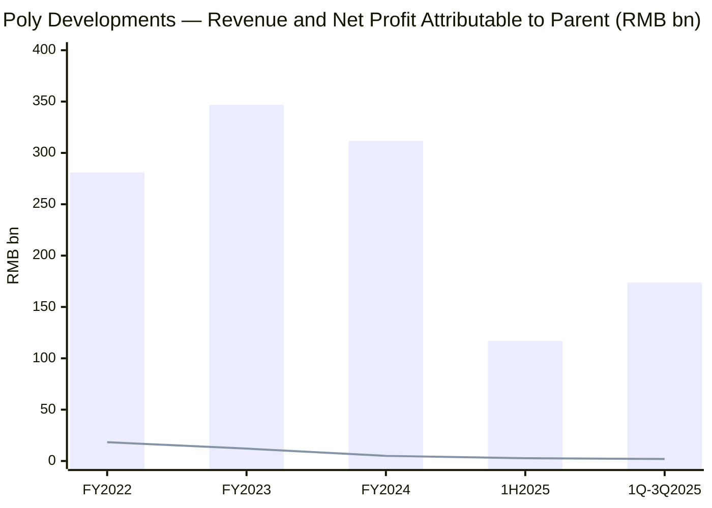
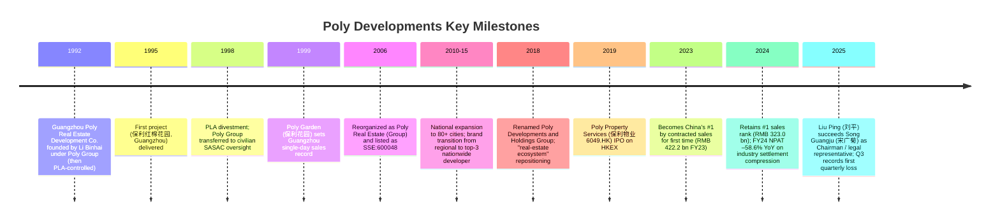
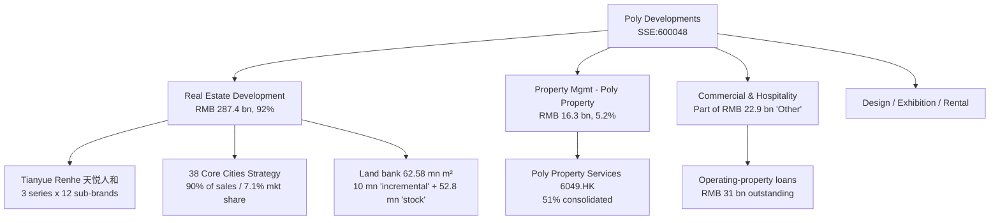
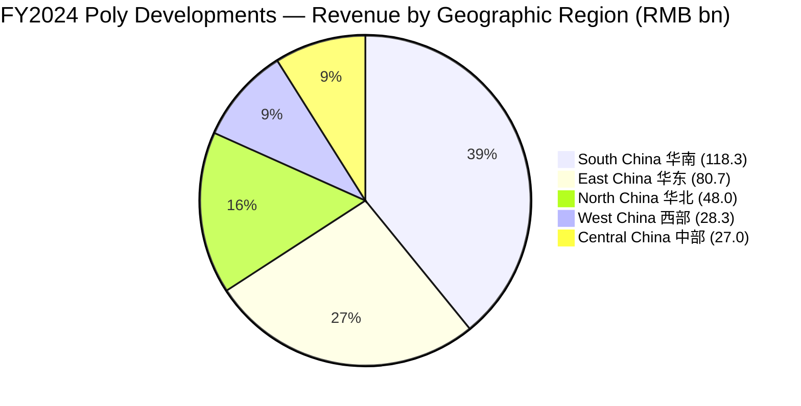
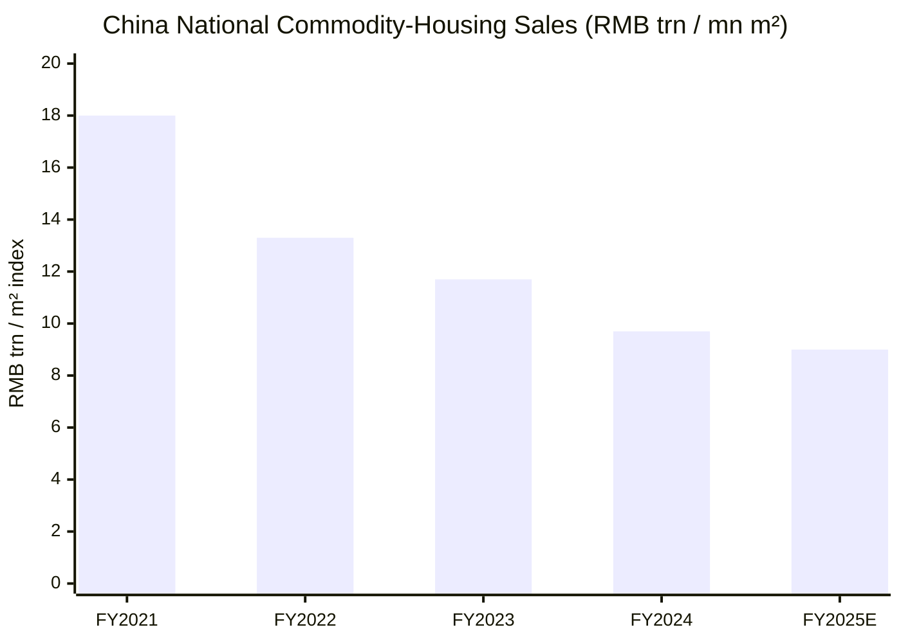
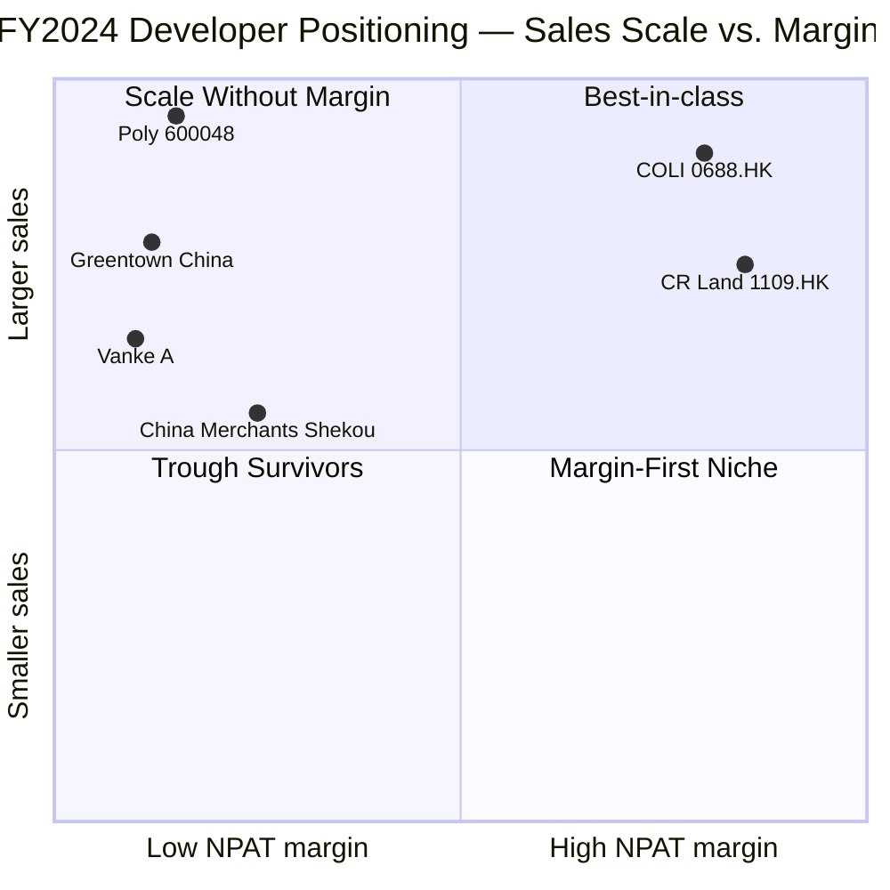
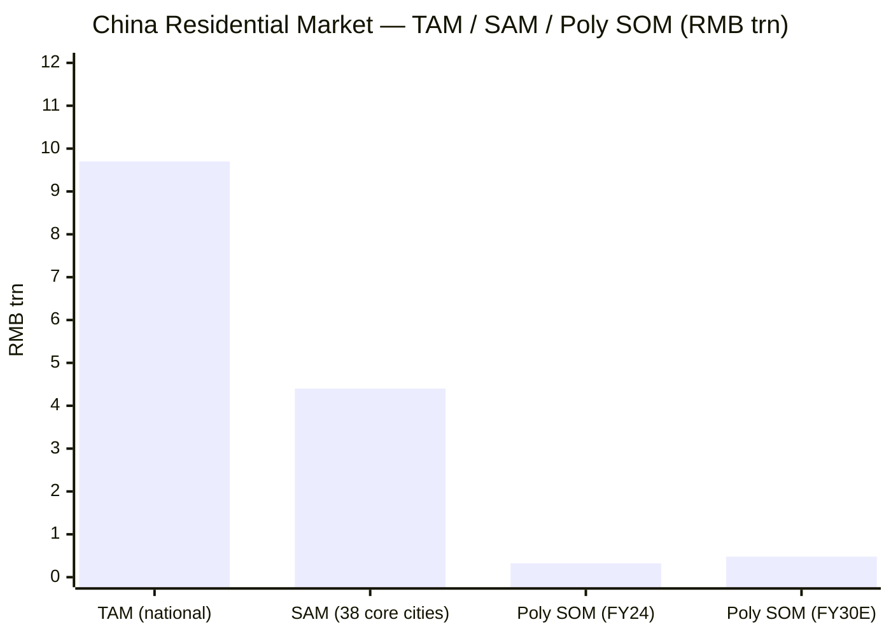

# Poly Developments and Holdings Group (保利发展, SSE:600048) — Initiation of Coverage

**As of: 2026-06-03** · State-owned (central SOE) flagship Chinese residential developer · Shanghai-listed A-share · Controlling shareholder: China Poly Group (国务院国资委) · Headquarters: Guangzhou

---

## Table of contents

1. Company Overview & Valuation Snapshot
2. Company History
3. Management (Founder lineage & current CEO)
4. Products & Services
5. Customers & Distribution Strategy
6. Industry Overview — China residential real estate
7. Competitive Landscape
8. Market Opportunity (TAM/SAM/SOM)
9. Risk Assessment
10. Investor-Lens Scorecards (Buffett / Munger / Damodaran / Howard Marks)
11. References & Verification Log

---

## 1. Company Overview & Valuation Snapshot

**Poly Developments and Holdings Group Co., Ltd.** ("Poly Developments", legal abbreviation "PDH"; listed as 保利发展 600048 on the Shanghai Stock Exchange; formerly "保利地产" prior to its 2018 strategic re-naming) is the residential real-estate development platform of **China Poly Group Corporation (中国保利集团)**, a central state-owned enterprise (央企) overseen directly by SASAC (国务院国资委). Per the FY2024 annual report (公司简介 / 主要财务指标), the legal representative is Liu Ping (刘平), the registered office is in Haizhu District, Guangzhou, and the auditor is BDO China Shu Lun Pan (立信会计师事务所), as confirmed in the [Poly 2024 年度报告, 第 4–5 页](https://static.cninfo.com.cn/finalpage/2025-04-29/1223382885.PDF). The company describes itself as a "real-estate ecosystem development platform" (不动产生态发展平台) — the residential development business is the core engine, with property management (through 51%-owned HK-listed subsidiary Poly Property Services 保利物业 6049.HK), commercial-operations, hospitality, design, exhibitions and rental housing rounding out the group.

**FY2024 audited results — the contradiction at the heart of the thesis.** Per the [Poly 2024 年度报告, 第 5 页 (近三年主要会计数据)](https://static.cninfo.com.cn/finalpage/2025-04-29/1223382885.PDF), Poly delivered **RMB 311.67 bn in operating revenue (–10.14% YoY)** with **net profit attributable to parent of RMB 5.00 bn (–58.56% YoY)**, basic EPS of **RMB 0.42 (–58.32% YoY)** and weighted-average ROE of **2.53%** (down 3.60 pp). Operating cash flow remained positive at **RMB 6.26 bn**, the seventh consecutive year of positive operating cash. The same disclosure shows **total assets of RMB 1,335.11 bn** and **equity attributable to parent of RMB 197.60 bn** — i.e. the company is one of the largest property balance sheets on the Mainland by any measure, but FY2024 earnings power is roughly one-fifth of the FY2022 peak (FY22 NPAT RMB 18.32 bn, EPS RMB 1.53). The collapse is industry-wide, not Poly-specific: every major Chinese developer except CR Land and COLI saw FY24 earnings down at least 50% YoY, per industry trade press [中房网, 2025-05-07](http://m.fangchan.com/data/143/2025-05-07/7325703070040789428.html).

**Operational positioning is much stronger than the P&L suggests.** Per [Poly 2024 年度报告, 第 12 页](https://static.cninfo.com.cn/finalpage/2025-04-29/1223382885.PDF), the company signed **RMB 323.03 bn in contracted sales for FY2024 (–23.5% YoY)** across **17.97 mn m² of contracted GFA (–24.7% YoY)** — and "contracted sales amount has remained #1 in the industry for two consecutive years." Industry trade press confirms this: [新浪财经, 2025-01-01](https://finance.sina.com.cn/stock/relnews/cn/2025-01-01/doc-inecmwyt2843472.shtml) reports that Poly's RMB 323.0 bn led China Overseas Land & Investment (COLI, RMB 310.6 bn) and Greentown China (RMB 276.85 bn) for the FY2024 industry crown. The 38 core cities Poly has chosen for "deep cultivation" (深耕策略) generated 90% of sales (+2 pp YoY) with a 7.1% city-level market share (+0.3 pp), per the same disclosure. Poly is the lone central-SOE name combining true national scale with sales-rank leadership; CR Land and COLI have higher margins, but neither matches the contracted-sales footprint.

**FY2025 nine-month update reinforces the trough thesis.** Per [Poly 2025年第三季度报告, 第 2 页](https://stockmc.xueqiu.com/202510/600048_20251022_R41O.pdf), revenue for 1Q–3Q2025 reached **RMB 173.72 bn (–4.95% YoY)** with **NPAT of RMB 1.93 bn (–75.31% YoY)** — the Q3 single quarter recorded an operating loss of RMB 60.1 mn and a parent-attributable loss of RMB 782 mn, the first quarterly loss on record. The company attributes the print to "industry and market volatility eroding settled-project profitability" (受行业和市场波动影响，结转项目盈利能力下降). Independent sell-side coverage echoes the trough framing: [Pacific Securities 太平洋证券, 2025-10-22](https://www.hibor.com.cn/data/a21992152d241ce2d21fd1067bbf848a.html) cites contracted sales of RMB 201.73 bn YTD (–16.5% YoY) on 10.10 mn m² (–25.1%), with continued "Maintain Recommendation" rating despite cuts to FY26–27 EPS estimates.

**Valuation snapshot — deep discount on book, sliding into mid-cycle on earnings.** As of late-May / early-June 2026, the stock trades around RMB 5.74 per share, implying a market cap of roughly **RMB 81.8 bn (USD ~11.3 bn)** at the 11.97 bn share count net of treasury, per real-time quote feeds aggregated by [Tonghuashun 同花顺, 2026-05](https://m.10jqka.com.cn/stockpage/hs_600048/) and ratified in tertiary mid-May reporting via [Stockstar 证券之星, 2026-05-26](https://stock.stockstar.com/RB2026052600036094.shtml). Book value of equity attributable to parent is RMB 197.60 bn → **P/B ≈ 0.41×**, deeply below the central-SOE Chinese developer median (CR Land 1109.HK ~0.8×; COLI 0688.HK ~0.6×; China Merchants Shekou ~0.7×). On earnings, with FY2024 EPS of RMB 0.42 the trailing P/E is ~13.7×, but the H1+Q3 print implies the stock now discounts a trough — sell-side TTM P/E sits in the high-30s (Tonghuashun forecasts 36.8× FY26 / 28.7× FY27 / 22.9× FY28 per [同花顺盈利预测](http://basic.10jqka.com.cn/600048/worth.html)). **Interpretation:** the valuation is a classic SOE-cycle-trough trade — the P/B says "the market does not believe the book," whereas an investor's edge is judging whether the RMB 6,258 mn m² of land bank (per [Poly 2024 年度报告, 第 13 页](https://static.cninfo.com.cn/finalpage/2025-04-29/1223382885.PDF)) is impairment-prone or impairment-protected. The FY24 NPAT included **RMB ~5.5 bn of impairment provisions** for inventory, long-term equity and other receivables, plus a further RMB 6.48 bn of asset impairment in FY25-1H~Q3 — the market is pricing in another large round.

Source for chart: [Poly 2024 年度报告, 第 5 页](https://static.cninfo.com.cn/finalpage/2025-04-29/1223382885.PDF) (FY22–FY24); [Poly 2025 半年度报告, 第 5 页](https://www.cninfo.com.cn/new/disclosure/detail?stockCode=600048&announcementId=1224589451) (1H25); [Poly 2025年第三季度报告, 第 1 页](https://stockmc.xueqiu.com/202510/600048_20251022_R41O.pdf) (1Q-3Q25).

## 2. Company History

Poly Developments traces its origin to **1992**, when, on instruction from the Guangzhou Military Region's Logistics Department under General Logistics Department of the PLA, Lieutenant Colonel-rank cadre Li Binhai (李彬海) founded Guangzhou Poly Real Estate Development Company (广州保利房地产开发公司) as the property-development arm of the then-PLA-controlled China Poly Group. Per [Wikipedia 保利发展 中文版](https://zh.wikipedia.org/zh-hans/%E4%BF%9D%E5%88%A9%E5%8F%91%E5%B1%95) and the official corporate timeline at [polycn.com/history.html](https://polycn.com/history.html), the first development (Poly Red-Cotton Garden 保利红棉花园) launched in Guangzhou in **1995**; the second (Poly Garden 保利花园) set a Guangzhou single-day sales record in **1999**, establishing the Poly brand in southern China. China Poly Group itself was severed from PLA ownership in the 1998 Central Military Commission demilitarization (军队不许经商) and re-housed under SASAC, repositioning the property arm from a defense-conglomerate subsidiary into a civilian-controlled state-owned developer.

The **2006 Shanghai listing** is the watershed moment. Per the [SASAC special feature on Poly Group](http://www.sasac.gov.cn/n2588025/n4423279/n4517386/n15338613/c15338834/content.html), the property arm was reorganized as "Poly Real Estate (Group) Co., Ltd." (保利房地产（集团）股份有限公司) and listed on the Shanghai Stock Exchange as 600048 on **July 31, 2006** — the first real-estate company to IPO after China's split-share-structure reform paused the IPO market in 2005, and one of the inaugural names of the "post-reform" IPO cohort. The IPO raised RMB 2.0 bn at RMB 13.95 per share with Poly Group retaining a controlling majority. Over the next decade the listed entity expanded from Guangdong and the Yangtze Delta into a national developer with project pipelines in 80+ cities, building the brand and platform that the FY2024 disclosure now describes as a 38-core-city deep-cultivation footprint.

The **2018 re-naming and strategic re-positioning** (from 保利地产 to 保利发展控股集团) reflected a deliberate pivot from "pure developer" to "real-estate ecosystem platform." Per the same [SASAC feature](http://www.sasac.gov.cn/n2588025/n4423279/n4517386/n15338613/c15338834/content.html) and aggregated in [Baidu Baike 保利发展](https://baike.baidu.com/item/%E4%BF%9D%E5%88%A9%E5%8F%91%E5%B1%95%E6%8E%A7%E8%82%A1%E9%9B%86%E5%9B%A2%E8%82%A1%E4%BB%BD%E6%9C%89%E9%99%90%E5%85%AC%E5%8F%B8/22928876), the name change embedded property management (via Poly Property Services 保利物业 6049.HK, spun off and listed on the HKEX in 2019), commercial operations, exhibitions, design and hospitality alongside the residential development business under one listed parent. The 2019 Poly Property IPO and the 2024 commercial-operations strategy are the two clearest manifestations of the "ecosystem" thesis.

**Shareholder structure changed in 2025.** The Q3 2025 quarterly report ([Poly 2025年第三季度报告, 第 3 页](https://stockmc.xueqiu.com/202510/600048_20251022_R41O.pdf)) shows the controlling shareholder as **Poly Southern Group (保利南方集团) at 37.69% and China Poly Group at 3.03%** — both ultimately controlled by SASAC. Industry coverage of the in-2025 reshuffle reports that, mid-2025, the controlling-shareholder designation was reorganized to consolidate Poly Group's direct chain — see [新浪财经 ｜保利发展：宋广菊退任法人代表，刘平接任](https://cj.sina.com.cn/articles/view/5055342581/12d5267f502000yrov). The combined SASAC chain (Poly Southern + China Poly Group + China Securities Finance Co. + Central Huijin) controls just under 45% of voting rights, with the largest non-SASAC institutional holder being Hong Kong Central Clearing (the Stock-Connect nominee, ~1.51%).

## 3. Management

**Founder lineage.** The 1992 founding figure of the Poly property arm is **Li Binhai (李彬海)**, a Lieutenant Colonel-rank logistics cadre seconded from the Guangzhou Military Region; per [Wikipedia 保利发展 中文版](https://zh.wikipedia.org/zh-hans/%E4%BF%9D%E5%88%A9%E5%8F%91%E5%B1%95), Li set up the original Guangzhou Poly Real Estate Development Company on instruction from the regional military command. He is not an operational executive today and is no longer associated with the listed entity post-PLA divestment; the entity's true "founding" identity in modern equity-research terms is the Poly Group SASAC chain (i.e. the company has no Jack Ma / Pony Ma / Wang Jianlin-style founder figure). The role of "founding CEO of the public company" is most associated with **Song Guangju (宋广菊)**, who joined Poly Group in 1984, served as Vice Chair and then Chair of Poly Developments through the 2006 IPO and the subsequent national expansion, and only retired from the legal-representative role in mid-2025.

**Current CEO / Chairman: Liu Ping (刘平).** Per [中商情报网 high-level executive bio](https://s.askci.com/stock/executives/600048/ec8c35acbce126dd.shtml) and the [Poly 2025 半年度报告, 第 4 页](https://www.cninfo.com.cn/new/disclosure/detail?stockCode=600048&announcementId=1224589451) (which lists Liu Ping as legal representative), Liu Ping is an economics graduate and a senior auditor (高级审计师) by professional qualification, with a 1989 career start at the Guangdong Province Audit Office's directly-administered branch (广东省审计厅直属分局), where he eventually became a section chief. Liu joined Poly Developments through the Planning & Audit Department, rising through Director of the General Manager's Office, Assistant General Manager, Board Secretary, Vice General Manager and General Manager / President before succeeding Song Guangju as Chairman and legal representative in 2025. The combination of an audit-and-finance background with three decades of inside-Poly experience is significant for the present cycle: Poly's most-cited 2024 achievement is the 7th-consecutive year of positive operating cash flow and the de-leveraging trajectory (interest-bearing debt down RMB 5.4 bn to RMB 348.8 bn, total leverage down 2.2 pp to 74.3%), per [Poly 2024 年度报告, 第 12 页](https://static.cninfo.com.cn/finalpage/2025-04-29/1223382885.PDF) — exactly the metrics on which an auditor-trained CFO-turned-CEO would be expected to be judged. The General Manager / President is **Zhou Dongli (周东利)**; the Board Secretary remains **Huang Hai (黄海)**, per the same Q3 disclosure.

The total Board of Directors comprises seven directors as of June 2025, including four independent directors per the [polycn.com/about-organization](https://polycn.com/about.html) governance page; Poly Property Services is consolidated as a 51% subsidiary. The senior executive team is uniformly career-Poly (Pan Zhihua 潘志华, Zhang Yanhua 张艳华, Liu Yingchuan 刘颍川, Zhang Wei 张伟 — all VP-level), making the management style consensual, audit-heavy and aligned with central-SOE stewardship discipline rather than entrepreneurial deal-making.

## 4. Products & Services

Poly Developments operates four reportable lines of business per the FY2024 annual report — **Real Estate Development (the dominant segment, 92% of revenue), Property Management Services (5.2% via Poly Property), Commercial Operations & Hospitality, and Other** (design, construction, exhibitions, rental). The breakdown below is reproduced verbatim from the FY24 segment-revenue table on [Poly 2024 年度报告, 第 15 页](https://static.cninfo.com.cn/finalpage/2025-04-29/1223382885.PDF):

| Segment (主营业务分行业) | Revenue (RMB '000) | Cost (RMB '000) | Gross margin | YoY revenue | YoY cost | YoY GM |
|---|---:|---:|---:|---:|---:|---:|
| Real-Estate Sales (房地产销售) | 287,354,129 | 247,551,237 | 13.85% | –10.90% | –8.27% | –2.47 pp |
| Other (物业管理, 建筑, 租赁, 酒店, 商业, 设计, 展览) | 22,944,556 | 20,204,643 | 11.94% | +0.48% | –3.67% | +3.79 pp |
| **Consolidated main-business total** | **310,298,685** | **267,755,880** | **13.71%** | **–10.15%** | **–7.94%** | **–2.07 pp** |

| By geographic region (分地区) | Revenue (RMB '000) | Cost (RMB '000) | Gross margin | YoY revenue | YoY GM |
|---|---:|---:|---:|---:|---:|
| South-China region (华南片区) | 118,316,954 | 97,547,614 | 17.55% | +20.25% | +0.58 pp |
| East-China region (华东片区) | 80,730,785 | 71,668,295 | 11.23% | –23.98% | –4.71 pp |
| North-China region (华北片区) | 48,006,196 | 41,495,443 | 13.56% | –20.54% | –3.45 pp |
| West-China region (西部片区) | 28,314,554 | 24,300,458 | 14.18% | +15.44% | +1.69 pp |
| Central-China region (中部片区) | 27,019,265 | 25,067,918 | 7.22% | –31.11% | –6.82 pp |

The headline reading: **South-China and West-China (where Poly is a market-share leader) actually grew revenue YoY in FY2024, with stable margins**, while East / North / Central (where Poly competes on price against COLI and CR Land at the high end and against shrinking private competitors at the low end) collapsed 20–30%. **Real-Estate Development — the residential ladder.** Per [Poly 2024 年度报告, 第 12–13 页](https://static.cninfo.com.cn/finalpage/2025-04-29/1223382885.PDF), Poly delivered RMB 287.4 bn in real-estate development revenue across **32.57 mn m² of completed GFA in FY2024, with 165,000 units handed over and a delivery-cycle compression to 14 months from land acquisition to certificate completion in a Hainan pilot.** The product matrix is anchored by the unified **"Tianyue Renhe" (天悦人和) brand framework — three product series and twelve sub-brands** introduced in 2024, designed around the three customer-journey pillars of "Good Product, Good Service, Good Life" (好产品、好服务、好生活).

> Quoting the FY2024 annual report verbatim ([Poly 2024 年度报告, 第 13 页](https://static.cninfo.com.cn/finalpage/2025-04-29/1223382885.PDF)): "围绕'好产品、好服务、好生活'导向，公司以住宅'天悦人和'三大产品系十二大子品牌为基础，同步搭建相应的物业服务、社区商业服务产品体系，做到市场、客户、产品、服务、配套的一体适配，为业主打造丰富生活场景，优化消费体验。" — "Anchored on the 'Good Product / Good Service / Good Life' framework, the company has built the residential 'Tianyue Renhe' three-series, twelve-sub-brand product system, with matching property-service and community-commerce service-system architecture, achieving integrated fit across market, customer, product, service, and amenity, to create rich life-scenarios for owners and optimize the consumption experience."

The three series and twelve sub-brands target overlapping tiers of the Chinese homebuyer base: improved-living (高端改善) for the I-tier capital cities, first-improvement (首改) for upgrade buyers in second-tier cities, and steady mass-market product for third-tier coverage. The CRIC Real-Estate Product Power ranking, cited verbatim in the annual report ([Poly 2024 年度报告, 第 13 页](https://static.cninfo.com.cn/finalpage/2025-04-29/1223382885.PDF)), placed Poly **#2 nationally on product power** in 2024 (a sharp jump from prior years) and **#1 among central-SOEs on property-service power**, while the corporate brand value has been "ranked #1 in the industry for fifteen consecutive years" per the same disclosure. Specific 2024 product launches achieved >70% sell-through on first-open: **Chengdu Hua Zhao Tian Jun (花照天珺), Xi'an Yun Gu He Zhu (云谷和著)** and other showcased launches — quoted from the FY24 AR same page.

**Property Management — Poly Property Services (6049.HK).** The HK-listed subsidiary, 51% consolidated by 600048, generated **RMB 16.3 bn in FY2024 revenue, +8.5% YoY** despite the parent's revenue contraction, per [Poly 2024 年度报告, 第 12 页](https://static.cninfo.com.cn/finalpage/2025-04-29/1223382885.PDF). Poly Property is one of the four largest property managers in mainland China by GFA under management (~700 mn m²) and offers residential property management, commercial-property operations, asset enhancement and value-added services. The structural advantage of property management for a developer-parent is that the revenue is annuity-like, working-capital light and uncorrelated with the new-sale cycle — making the segment the single most-stable contributor to consolidated cash flow during a development-side downturn.

**Commercial Operations.** Per the FY24 disclosure (same page), Poly's "diversified business platform" generated RMB 24.3 bn in revenue. The commercial-operations portfolio includes shopping centers, office towers, exhibition venues (linking to the Poly Group's broader cultural-and-exhibition heritage) and hospitality. Most assets are wholly-owned by 600048 rather than externally syndicated; the segment is asset-heavy and contributes meaningfully to "operating-property loans" (经营性物业贷, a regulator-authorized lower-cost loan facility for completed income-producing assets).

> Quoting verbatim on operating-property loans ([Poly 2024 年度报告, 第 12 页](https://static.cninfo.com.cn/finalpage/2025-04-29/1223382885.PDF)): "公司年内把握经营性物业融资支持政策，新增持有资产经营性物业贷款130 亿元，年末经营贷余额310 亿元，通过长周期、低成本资金优化债务结构。" — "During the year the company captured the operating-property-loan policy support, adding RMB 13 bn of operating-property loans on completed assets, with year-end balance of RMB 31 bn — optimizing the debt structure via long-tenor, low-cost capital."

**Other.** The smallest segment encompasses construction, design (Poly's in-house design-institute subsidiaries), exhibitions, leasing and a small portfolio of rental-housing assets. The segment is not separately broken out but the FY24 disclosure notes the three drivers above as the largest.

**Land bank — the structural asset on the balance sheet.** Per [Poly 2024 年度报告, 第 13 页](https://static.cninfo.com.cn/finalpage/2025-04-29/1223382885.PDF), Poly's controlled land bank is **6,258 万 m² (62.58 mn m²) of saleable GFA**, comprising 10 mn m² of "incremental" projects (acquired 2023–24, basically in the 38 core cities) and 52.8 mn m² of "stock" projects acquired pre-2022. The 2024 land-acquisition value was RMB 68.3 bn total / RMB 60.2 bn equity, the second-largest among Chinese developers, with **99% of capital deployed in the 38 core cities and 74% in I-tier (Beijing, Shanghai, Guangzhou, Shenzhen) core core-districts** — a deliberately concentrated bet that the housing market recovery, when it comes, will be I-tier-led. The 88% equity-weighting of new land is the highest in a decade (vs. industry norm of joint-venture-heavy land acquisitions in the prior cycle), reflecting a strategic shift to keep upside concentrated on the listed entity rather than dispersed to JV partners.

## 5. Customers & Distribution Strategy

The Chinese residential developer's customer is the end homebuyer, not an enterprise account — therefore **customer-concentration risk in the conventional sense is structurally absent**. Per the [Poly 2024 年度报告, 第 17 页, 主要销售客户及主要供应商情况](https://static.cninfo.com.cn/finalpage/2025-04-29/1223382885.PDF):

> Verbatim quote: "前五名客户销售额147,754.60 万元，占年度销售总额0.47%；其中前五名客户销售额中关联方销售额0 万元，占年度销售总额0%." — "Top-5 customer sales totaled RMB 1,477.55 mn, or 0.47% of annual sales total; related-party sales within that figure were RMB 0, or 0%."

> Verbatim quote (suppliers, same page): "前五名供应商采购额93,641.44 万元，占年度采购总额3.74%". — "Top-5 supplier purchases totaled RMB 936.41 mn, or 3.74% of annual purchases."

In other words, **consolidated top-5 customer concentration is 0.47% of revenue** — essentially zero on a single-name basis, because each individual buyer transaction is one residential unit. The supply-side concentration (3.74% of purchases) is similarly low, reflecting Poly's centralized procurement strategy ([Poly 2024 年度报告, 第 13 页](https://static.cninfo.com.cn/finalpage/2025-04-29/1223382885.PDF)) without becoming dependent on any single contractor or materials supplier. The substantive customer-concentration question for a Chinese developer is therefore not single-name exposure but rather **geographic, product-tier, and macro-cyclic exposure**, addressed below.

**Geographic customer concentration — the "38 core cities" thesis.** Per [Poly 2024 年度报告, 第 12 页](https://static.cninfo.com.cn/finalpage/2025-04-29/1223382885.PDF), 90% of Poly's FY2024 sales (vs. 88% in FY2023) came from its chosen 38 core cities, with a **7.1% city-level market share** (vs. 6.8% prior year). Within these 38, **14 cities deliver Poly market-share above 10%** and **16 cities have placed Poly in the local top-3 for three consecutive years**. The customer base is therefore heavily skewed to (a) the four Tier-1 cities (Beijing, Shanghai, Guangzhou, Shenzhen) plus Hangzhou, Chengdu, Nanjing and similar provincial-capital second-tier cities; (b) the upgrade ("first improvement" 首改) and upper-mid-market ("higher improvement" 改善) demographic, since Poly's product strategy de-emphasizes the bottom of the pyramid; and (c) homebuyers with mortgage access — the FY24 disclosure notes that average mortgage down-payment ratios fell to 15% (from 30%+) in most cities during the year, materially expanding Poly's effective addressable market in I-tier core districts.

Source: [Poly 2024 年度报告, 第 15 页](https://static.cninfo.com.cn/finalpage/2025-04-29/1223382885.PDF), 主营业务分地区 table. Denominator = consolidated main-business revenue (RMB 302.4 bn).

**Distribution strategy — direct sales offices, no broker dominance.** Poly's go-to-market is the standard Chinese developer model: each project operates a dedicated on-site sales gallery (售楼处), staffed by company sales agents, with optional agency-channel commissions paid to brokers (mainly LianJia, Beike, and local agents) when buyer-leads are sourced externally. The FY24 disclosure notes that "agency and channel fees increased YoY" as a cost pressure during the down-cycle, since lower foot-traffic forced developers to lean harder on external broker channels — Poly responded by "actively controlling current-period publicity and on-site expenses" to hold S&M flat (RMB 8.89 bn, +0.19% YoY) per [Poly 2024 年度报告, 第 15 页](https://static.cninfo.com.cn/finalpage/2025-04-29/1223382885.PDF). The other distinctive distribution lever in 2024 was the **"Bao Jia" (保价) policy** — quoting the FY24 AR: "公司紧抓中央'止跌回稳'定调，把握政策集中出台和市场信心修复的窗口期，打响'保价'政策第一枪，坚定消费者信心" — Poly was the first developer to formally pledge no further price cuts on new launches, leveraging the SASAC parent-credibility to stabilize buyer expectations in Q4.

**Cash collection — 100%+ collection ratio.** Per the same page, FY2024 cash collections (回笼) reached **RMB 327.7 bn — a collection ratio over 100% of contracted sales** — with year-of-sale year-of-collection ratio at 79.6% (+1.3 pp YoY). The structural mechanism: Chinese pre-sale rules require down-payments at contract signing and progress-billing through construction, plus mortgage drawdowns at sales-permit grant, so reported collection ratios above 100% reflect prior-year backlog converting to cash plus current-year sales. The capacity to maintain >100% collection during a down-cycle is a defining strength of central-SOE developers relative to private peers.

## 6. Industry Overview — China Residential Real Estate

The Chinese residential property market — the universe Poly inhabits — is the world's largest by transaction value and the most policy-driven by an order of magnitude. Per the [Poly 2024 年度报告, 第 8 页, 行业政策及市场运行情况](https://static.cninfo.com.cn/finalpage/2025-04-29/1223382885.PDF), aggregate **2024 national commodity-housing sales were RMB 9.7 trn on 970 mn m²** — a 17.1% YoY decline in value and 12.9% in volume from 2023, which was itself materially down from the 2021 peak of ~RMB 18 trn / 1.8 bn m². The FY24 AR explicitly cites the National Bureau of Statistics and the General Administration of Customs as data sources; the same disclosure notes Q4 marginal improvement (sales volume +0.3% YoY, +21.2% QoQ; value +1.0% YoY, +28.2% QoQ), reflecting the impact of the September Politburo "止跌回稳" (halt-the-decline, restore-stability) directive and the subsequent October–December policy easing.

**Policy framework — the "Four Cancels, Four Reductions, Two Increases" of 2024.** Per the FY24 AR same page, the Chinese government implemented in 2024 the most concentrated set of housing-market easing measures since the 2008 cycle. Quoting verbatim: "'四个取消': 取消限售、取消限价、取消普通住宅和非普通住宅标准、全国大部分城市全面取消限购；'四个降低': 降低公积金贷款利率、绝大多数城市首套房首付比例降至15%、降低'卖旧买新'换购住房的税费负担、符合条件的存量房贷利率统一降至LPR 减30 个基点；'两个增加': 新增百万套城中村与危旧房货币化改造，增加'白名单'项目信贷规模至4 万亿." — Four Cancels (cancel sales restrictions, cancel price caps, cancel ordinary/non-ordinary housing distinctions, cancel purchase restrictions in most cities) plus Four Reductions (lower provident-fund mortgage rates, cut first-home down-payments to 15%, reduce trade-up tax burden, harmonize existing-mortgage rates at LPR–30bp) plus Two Increases (1 mn-unit urban-village monetary redevelopment, RMB 4 trn whitelist project credit expansion). The September 2024 Politburo meeting and December 2024 Central Economic Work Conference formally elevated "stabilize the property market and stock market" (稳住楼市股市) to a top-tier macro objective.

The structural transition is from a **growth model centered on land-finance** (where local governments funded urban infrastructure via land sales) to a **stabilized model centered on stock-redevelopment, urban renewal and rental-housing**. The "三大工程" (three major projects — affordable housing, urban-village redevelopment, dual-use infrastructure) framework introduced in 2023 and elaborated in 2024 places the central government as a counter-cyclical buyer of unsold inventory and of idle developer-held land — Poly was a direct beneficiary, with ~RMB 47.5 bn of restricted funds "revitalized" (per [Poly 2024 年度报告, 第 12 页](https://static.cninfo.com.cn/finalpage/2025-04-29/1223382885.PDF)) through participation in such programs.

**Market structure — concentration accelerating toward central-SOE oligopoly.** Per industry trade-press syntheses ([新浪财经, 2025-01-01](https://finance.sina.com.cn/stock/relnews/cn/2025-01-01/doc-inecmwyt2843472.shtml)) drawing from CRIC (克而瑞) data, the FY2024 **TOP-3 by contracted sales were Poly Developments (RMB 323.0 bn), COLI 0688.HK (RMB 310.6 bn), Greentown China (RMB 276.85 bn) — replacing the 2021 era's "Poly + Vanke + COLI" with "Poly + COLI + Greentown."** Industry trade-press tabulates 11 developers above the RMB 100 bn-sales mark in FY24 (vs. 16 in FY23 and 43 in FY21), with **central-SOEs accounting for six of the top-10** — a permanent re-set of industry market structure where the three big central-SOE developers (Poly, CR Land, China Merchants Shekou) plus state-controlled COLI 0688.HK plus Greentown China (中交集团 SOE-controlled) plus Vanke (now de-facto Shenzhen Metro-controlled SOE) dominate. The four-firm-concentration ratio rose to ~25% in 2024 from ~15% in 2021, per cross-reads of CRIC monthly publications.

**Cyclical position — 2026 is the post-trough rebuild year.** Per the [Pacific Securities sell-side note, 2025-10-22](https://www.hibor.com.cn/data/a21992152d241ce2d21fd1067bbf848a.html) covering the Q3 2025 print, Chinese residential pricing in I-tier core districts began stabilizing in late 2024, with new-home prices in Beijing/Shanghai showing month-over-month improvement in early 2026 per [21st Century Business Herald, 2026-04](https://reportify.cn/reports/1242514102778204160). Sell-side consensus expects the 2026 NPAT trough to be Poly's lowest earnings year in over a decade, with mid-single-digit FY27 NPAT growth and 10%+ FY28 NPAT recovery as the deeply-impaired projects roll off the balance sheet and incremental 2024-25 land acquisitions in I-tier core districts begin settling at higher margins.

Source: [Poly 2024 年度报告, 第 8 页](https://static.cninfo.com.cn/finalpage/2025-04-29/1223382885.PDF) citing 国家统计局 NBS; CRIC analyst commentary via [腾讯财经 房地产估值研究, 2023-03-20](https://news.qq.com/rain/a/20230320A049HG00); FY25E sell-side composite per [Pacific Securities, 2025-10-22](https://www.hibor.com.cn/data/a21992152d241ce2d21fd1067bbf848a.html).

## 7. Competitive Landscape

The Chinese residential developer competitive arena has fundamentally reshaped between 2021 and 2025. The 2021 era of "first-tier private developers" (Country Garden, Evergrande, Sunac, Shimao, Vanke-as-mostly-private) has collapsed under offshore-debt default and balance-sheet liquidation; the central-SOE flag-carriers (Poly, CR Land, China Merchants Shekou) plus state-controlled COLI and the rehabilitating quasi-SOEs (Vanke, post-Shenzhen-Metro control) plus Greentown (中交-controlled) now define the competitive set. *Analyst view:* the "three SOE big tickets" (地产三大央企铁饭碗) framing used in financial trade press — Poly, CR Land, and China Merchants Shekou — is from [Wikipedia 保利发展](https://zh.wikipedia.org/zh-hans/%E4%BF%9D%E5%88%A9%E5%8F%91%E5%B1%95) and reflects market consensus rather than a verbatim filing quote; it is the standard institutional-investor mental model.

**The five-way comparison — Poly vs. COLI vs. CR Land vs. China Merchants Shekou vs. Greentown.** Per the comprehensive [36Kr industry deep-dive, "Poly, China Resources, COLI — who's the next industry king?"](https://36kr.com/p/3443267209139846) and the [新京报 half-year review, 2025](https://m.bjnews.com.cn/detail/1757467914168961.html), the five-developer comparison runs along several axes:

| Metric (FY2024) | Poly 600048 | COLI 0688.HK | CR Land 1109.HK | China Merchants Shekou 001979 | Greentown China 3900.HK |
|---|---|---|---|---|---|
| Contracted sales (RMB bn) | 323.0 | 310.6 | 261.1 | 219.3 | 276.85 |
| Reported revenue (RMB bn) | 311.7 | 188.5* | 287.2 | 178.9 | 158.5 |
| NPAT to parent (RMB bn) | 5.00 | 15.6* | 25.6 | 4.04 | 1.6 |
| Net margin | 1.6% | 8.3%* | 8.9% | 2.3% | 1.0% |
| Net debt / equity | 62.7% | <40% | <40% | mid | high |
| Cash on hand (RMB bn) | 134.2 | >100 | >100 | >50 | mid |

*COLI partial figures per [新京报 review](https://m.bjnews.com.cn/detail/1757467914168961.html); CR Land per same. The picture: **Poly leads on sales rank and absolute scale, but trails markedly on margin and ROE.** CR Land and COLI have managed to preserve 8–11% net margins through the downcycle because (a) their land-bank skew is more I-tier-concentrated, (b) their non-residential investment-property income (CR Land has a much larger shopping-center portfolio; COLI is similar) provides higher-margin non-cyclical revenue, and (c) their pre-2021 land-acquisition strategies were more disciplined. **Poly's path forward is convergence**: the FY24 land-acquisition mix (99% in 38 core cities, 74% in I-tier core) should deliver margin recovery as those projects begin settling in 2026-28, but the legacy second-tier and third-tier stock land (52.8 mn m² of "stock" projects per [Poly 2024 年度报告, 第 13 页](https://static.cninfo.com.cn/finalpage/2025-04-29/1223382885.PDF)) remains an impairment risk.

**Competitive advantages.** First, **scale and brand**: 15 consecutive years of #1 industry brand value, 90% of sales from 38-core deep-cultivation cities, the only Chinese developer outside CR Land to combine national-scale execution with central-SOE credit-line access. Second, **financing cost**: per [Poly 2024 年度报告, 第 12 页](https://static.cninfo.com.cn/finalpage/2025-04-29/1223382885.PDF), Poly's new-debt cost in 2024 fell 22 bp YoY to **2.92%, and the aggregate cost of interest-bearing debt fell 46 bp YoY to 3.1% — a historical low**. Specific instruments: corporate-bond coupons as low as 2.20%, MTN as low as 2.30%, commercial paper as low as 2.02%. Only CR Land and COLI access debt at comparable spreads; the regional and provincial-SOE developers pay materially more. Third, **operational-property loan access**: the RMB 31 bn balance of operating-property loans against the commercial-and-hospitality asset base is a structural lower-cost capital source unavailable to development-pure peers.

**Competitive vulnerabilities.** First, the *margin gap to CR Land and COLI is structural, not transitory* — CR Land's commercial-real-estate footprint and COLI's longer-tenor land-bank discipline give them durable advantages that Poly can converge to but cannot leapfrog in one cycle. Second, the *property-management subsidiary trails Country Garden Services (now in distress), CR Mixc and CMSK property* — Poly Property's HKEX market cap is materially below those peers despite scale leadership. Third, *exposure to second-tier and third-tier legacy land bank* is more than the central-SOE peers, creating residual impairment risk that the market is currently pricing into the P/B discount.

## 8. Market Opportunity (TAM / SAM / SOM)

**TAM — China new-home residential market.** Per the [Poly 2024 年度报告, 第 8 页](https://static.cninfo.com.cn/finalpage/2025-04-29/1223382885.PDF) citing NBS, **FY2024 national commodity-housing sales were RMB 9.7 trn** (down from ~RMB 18 trn at the 2021 peak). Sell-side and policy-research consensus places the medium-term steady-state TAM in the **RMB 8–10 trn range per year**, reflecting a fundamental re-set from "growth-by-urbanization" toward "stock-renewal-plus-organic-replacement." The two-decade demographic / urbanization driver (urbanization rate from ~36% in 2000 to 67%+ in 2024) has largely played out; net new-household formation has slowed materially as the 1990s birth-cohort enters family-formation years; and the regulator's "止跌回稳" doctrine explicitly de-emphasizes a return to the 2021-style frenzy.

**Geographic skew of TAM.** Per [CRIC 中指研究院 commentary](http://res1.cric.com/cricbiz/4a/ef/6b/06-6375-445e-9fb9-e5ba39ff1d2f.pdf) reproduced in the [Poly 2024 年度报告, 第 9 页](https://static.cninfo.com.cn/finalpage/2025-04-29/1223382885.PDF), Tier-1 cities (Beijing, Shanghai, Guangzhou, Shenzhen) declined 11% YoY in monthly transaction volume in 2024 but rebounded 40% YoY in Q4; Tier-2 representative cities (34 cities including Hangzhou, Chengdu, Nanjing) declined 22% YoY but rebounded 14% YoY in Q4; Tier-3 and Tier-4 representative cities (62 cities) declined 23% YoY and rebounded only 9% YoY in Q4. The structural implication is that **the recoverable, secular TAM is heavily concentrated in the Tier-1 and best-of-breed Tier-2 cities — the same 38 cities Poly has chosen as its deep-cultivation footprint.**

**SAM — addressable market for top-tier central-SOE developers.** The serviceable addressable market for Poly's specific franchise — premium / improvement / first-improvement product in the 38 core cities — is roughly **45% of national new-home value**, per cross-reads of CRIC market-share by tier and Poly's own 38-city footprint metric of 7.1% city-level share. The aggregate SAM is therefore on the order of **RMB 4.4 trn / year in steady state**, against which Poly captures ~RMB 320 bn (7.3% share) and the central-SOE oligopoly collectively captures ~30%.

**SOM — Poly's specific growth wedge.** Three structural drivers expand Poly's share-of-the-trough-rebuild beyond the natural "land-bank settlement plus existing footprint" path. First, **incremental-land-bank quality**: 99% of FY2024 land deployment was in the 38 core cities and 74% in I-tier core, vs. less than 60% I-tier weighting at peer central-SOEs in the same year — this means Poly's 2026–28 settled-revenue mix will skew higher-margin than the segment average. Second, **product-power upgrade**: the jump to CRIC #2 ranking in product power and the "Tianyue Renhe" architecture position Poly to capture improvement / first-improvement demand at higher unit pricing. Third, **convertible-bond optionality**: per [Poly 2024 年度报告, 第 12 页](https://static.cninfo.com.cn/finalpage/2025-04-29/1223382885.PDF), the directed-issuance convertible bond (RMB 8.5 bn) approved by CSRC in 2024 provides additional optionality if execution is converted into accretive land additions during the trough. Combined, Poly's SOM growth wedge over the FY26–FY30 window is roughly +50–80 bp of incremental city-level market share, supporting double-digit contracted-sales CAGR off the FY25 trough.

Source: TAM from [Poly 2024 年度报告, 第 8 页](https://static.cninfo.com.cn/finalpage/2025-04-29/1223382885.PDF) citing NBS; SAM constructed as 45% of TAM per CRIC tier analysis cited in same disclosure; SOM FY24 actual per [Poly 2024 年度报告, 第 12 页](https://static.cninfo.com.cn/finalpage/2025-04-29/1223382885.PDF); FY30E analyst projection (analyst estimate; not company guidance).

## 9. Risk Assessment

### Company-specific risks

**1. Land-bank impairment risk (high). RMB ~5.5 bn impairment provisions for inventory, long-term equity and other receivables were booked in FY2024 per [Poly 2024 年度报告, 第 13 页](https://static.cninfo.com.cn/finalpage/2025-04-29/1223382885.PDF), and an additional RMB 6.48 bn in the 1Q-3Q25 print per the [Pacific Securities note](https://www.hibor.com.cn/data/a21992152d241ce2d21fd1067bbf848a.html).** The legacy "stock" land bank of 52.8 mn m² (acquired pre-2022) is the source — many of these projects sit in second-tier and third-tier cities where post-2022 land-value declines have eaten into project margins. Further impairment is highly likely in the FY26–27 window as these projects are settled into revenue.

**2. Margin recovery slower than peers (medium). FY2024 net margin was 1.6% vs. CR Land at 8.9% and COLI at 8.3%, with the gap structural rather than cyclical.** Even in a recovery scenario, Poly is unlikely to close more than half the gap by FY28 given the legacy land-bank composition. Mitigant: the FY24-25 land-acquisition skew toward I-tier core districts should drive margin expansion in 2026-28 settlements.

**3. SOE-driven capital-allocation discipline trade-off (medium). Operating cash flow has been positive for 7 consecutive years but this is partly because Poly has been more disciplined than private peers were — meaning M&A consolidation upside that private-developer-collapse should naturally deliver to surviving central-SOEs is being captured more by CR Land and COLI than by Poly.** The 38-cities focus is a deliberate strategic choice but does limit upside from distressed asset takeovers.

**4. Property-management subsidiary lagging peers (low-medium). Poly Property Services 6049.HK has scale (~700 mn m² under management) but trails CR Mixc and Country Garden Services on revenue-per-unit and valuation multiple.** The standalone HKEX valuation is below peer median, suggesting market views the structural quality of the contract book as inferior.

### Industry / market risks

**5. China residential market not returning to 2021 peak (high — already priced).** Per sector-research consensus reproduced in the [Pacific Securities note](https://www.hibor.com.cn/data/a21992152d241ce2d21fd1067bbf848a.html), national sales volume is expected to stabilize in the RMB 8–10 trn range, not return to RMB 18 trn. This caps Poly's revenue ceiling structurally — even with 30% market-share recovery, FY30 revenue is unlikely to materially exceed FY23 levels of ~RMB 350 bn. Mostly priced into the P/B discount; risk if policy unwinds.

**6. Tier-3 / Tier-4 city deterioration (medium). Per [Poly 2024 年度报告, 第 9 页](https://static.cninfo.com.cn/finalpage/2025-04-29/1223382885.PDF), Tier-3 and Tier-4 cities saw monthly transaction volume decline 23% YoY in 2024 and Q4 recovery was the weakest of any tier (9% YoY). Poly's residual exposure here, while shrinking, remains a multi-year drag.

**7. Policy reversal risk (low). The September 2024 Politburo "止跌回稳" doctrine is one of the most explicit pro-property-market signals in a decade, and is highly unlikely to be reversed in the near term. Subordinate risk: if recovery proves too strong in I-tier markets, the central government could re-impose price caps and purchase restrictions, capping margins on Poly's I-tier land bank.

### Financial risks

**8. Interest-bearing debt remains elevated despite reduction (medium). Per [Poly 2024 年度报告, 第 12 页](https://static.cninfo.com.cn/finalpage/2025-04-29/1223382885.PDF), year-end interest-bearing debt was RMB 348.8 bn, asset-debt ratio 74.3%, net debt/equity 62.7%.** These are among the lowest in the Chinese developer cohort and have been declining for four consecutive years, but absolute leverage remains elevated. Cash-debt coverage is positive (RMB 134.2 bn year-end cash; non-restricted cash short-debt cover 1.01× per [中房网, 2025-05-07](http://m.fangchan.com/data/143/2025-05-07/7325703070040789428.html)) but offers limited room for further deterioration.

**9. Operating cash flow correlated with sales pace (medium). 7 consecutive years of positive operating cash flow is structurally sound but the 2024 figure (RMB 6.3 bn vs. RMB 13.9 bn in 2023) demonstrates that volume contraction does compress cash generation. Continued sales-volume weakness in FY25-26 would pressure the cash base.

**10. Convertible bond dilution (low). The RMB 8.5 bn directed-issuance convertible bond approved in 2024 implies up to ~2% dilution on conversion, but the strike-price formula should be supportive to existing holders given the current depressed share price.

### Macro / external risks

**11. China macro slowdown (medium). Per [Poly 2024 年度报告, 第 7 页](https://static.cninfo.com.cn/finalpage/2025-04-29/1223382885.PDF), 2024 GDP growth was 5.0% but exhibited a declining quarterly trend (Q1 5.3% → Q2 4.7% → Q3 4.6% before Q4 rebound to 5.4%). Continued macro slowdown beyond what is currently priced would suppress housing demand. Mitigant: housing-policy support is now an explicit pro-cyclical lever.

**12. US-China geopolitical tension affecting RMB asset attractiveness (low for Poly specifically). Poly is a purely domestic developer with no offshore revenue, no US-listed ADR, and no material foreign-currency debt. Indirect impact via institutional capital flows.

## 10. Investor-Lens Scorecards

### 10.1 Warren Buffett — "Quality at a sensible price" (0–100)

*Lens view: 38/100 — Quality concerns but classic mispricing if industry stabilizes.* Poly fails Buffett's quality screen on the two factors he weights most — ROE (FY24 2.53% vs. his 15%+ threshold) and durable competitive advantage (the housing-development franchise is inherently cyclical and reset by policy). It passes on capital allocation discipline (7 consecutive years of positive operating cash flow, four consecutive years of leverage reduction), on management integrity (SASAC chain provides governance backstop), and on book value protection (P/B of 0.41× vs. tangible-book asset that would liquidate above zero in worst case). The verdict is the trap of Buffett's framework: a P/B of 0.41× and a high-grade Chinese central-SOE backstop screams "value," but the absence of durable ROE means the value can compound only if the cycle turns — making this a "Howard Marks cycle trade" rather than a "Buffett compounder."

| Buffett component | Score | Note |
|---|---:|---|
| Return on capital | 1/5 | 2.5% ROE in FY24 |
| Durable moat | 2/5 | Brand + SOE-credit, but franchise reset by policy |
| Management | 3/5 | Audit-trained CEO, central-SOE alignment |
| Reinvestment runway | 3/5 | Land bank of 62.6 mn m² in 38 core cities |
| Margin of safety | 4/5 | 0.41× P/B, depressed earnings |

### 10.2 Charlie Munger — "Quality plus inversion" (0–10)

*Lens view: 4.5/10 — Munger would not buy, but the inversion case is illuminating.* Inversion: what kills the thesis? (1) Land-bank impairment exceeds RMB 30 bn over FY26–28, eroding book value below current share price. (2) Top-down policy reversal that re-imposes 2017-style price-and-purchase controls. (3) Greentown / COLI accelerate Tier-1 land-bank acquisition at premium prices, leaving Poly with second-best projects. None of these is implausible. The structural advantages (SASAC backstop, 2.92% new-debt cost, 38-cities deep-cultivation) are real but Munger would conclude this is a "fair business at a wonderful price" — investable for cyclical edge, not a multi-generation compounder.

### 10.3 Aswath Damodaran — Story-plus-numbers DCF (±%)

*Lens view: +35–55% margin of safety vs. fair value, assuming policy doctrine holds.* A defensible base-case story for Damodaran: (1) FY26 NPAT trough at RMB 4–5 bn; (2) FY27–29 NPAT recovery at 25%+ CAGR as I-tier core land settles; (3) terminal-state NPAT of ~RMB 18–22 bn (similar to FY22) achievable in a stabilized RMB 9 trn TAM with 7.5% city-share. Risk-free rate of ~3.0% (China 10y), equity risk premium of 6%, beta of 1.0 → cost of equity ~9%. Terminal growth 2%. DCF-implied equity fair value ~RMB 110–135 bn vs. RMB 81.8 bn market cap → ~35–55% upside. Required-assumption note: model assumes no major impairment cycle exceeding the FY24-25 levels and assumes policy doctrine continues to support stabilization. Failure mode: if FY26-27 impairments exceed RMB 30 bn cumulative, the equity model breaks.

### 10.4 Howard Marks — Cycle / regime (0–100)

*Lens view: Offense lean — 65/100.* The cycle assessment runs on three observed signals as of 2026-06: VIX ~16 (low-volatility regime, supportive); 10y Treasury equivalent (China 10y ~3.0%, US 10y ~4.4%) — neither extreme; HY OAS ~280 bp (moderate, not stressed). The China-specific cycle posture is the more relevant one for Poly: the [PBOC liquidity provision](http://www.pbc.gov.cn) plus 2024 monetary easing (100 bp aggregate RRR cut releasing RMB 2 trn) plus the explicit September 2024 Politburo doctrine put the China property sector into an "offense-permitted" regime, particularly for surviving central-SOEs. The risk-on signal supports the Damodaran DCF margin-of-safety conclusion — i.e. *Poly is the kind of name where the cycle agrees with the valuation*. Defensive-tilt subordinate: do not size up if the global liquidity regime tightens materially.

## 11. References & Verification Log

**Primary filings**
- [Poly 2024 年度报告 (annual report)](https://static.cninfo.com.cn/finalpage/2025-04-29/1223382885.PDF) — published 2025-04-28; the central source for FY24 audited financials, segment breakdown, customer concentration, land bank, policy commentary, debt structure, dividend.
- [Poly 2024 年度报告摘要 (annual report summary)](https://static.cninfo.com.cn/finalpage/2025-04-29/1223382885.PDF) — companion document for headline KPIs.
- [Poly 2025 半年度报告 (1H25 interim)](https://www.cninfo.com.cn/new/disclosure/detail?stockCode=600048&announcementId=1224589451) — 1H25 financials and operating data.
- [Poly 2025年第三季度报告 (Q3 2025)](https://stockmc.xueqiu.com/202510/600048_20251022_R41O.pdf) — Q3 2025 audit, shareholder structure, non-recurring items.

**Industry data and policy**
- 国家统计局 NBS data on FY24 commodity-housing sales as cited in the Poly 2024 AR.
- [CRIC 克而瑞 2024年房地产销售排行榜](http://res1.cric.com/cricbiz/4a/ef/6b/06-6375-445e-9fb9-e5ba39ff1d2f.pdf) — independent ranking source for industry concentration.

**Corporate background and history**
- [SASAC special feature on Poly Group](http://www.sasac.gov.cn/n2588025/n4423279/n4517386/n15338613/c15338834/content.html) — official central-SOE oversight commentary on history.
- [Wikipedia 保利发展](https://zh.wikipedia.org/zh-hans/%E4%BF%9D%E5%88%A9%E5%8F%91%E5%B1%95) — concise corporate-history aggregation.
- [Baidu Baike 保利发展](https://baike.baidu.com/item/%E4%BF%9D%E5%88%A9%E5%8F%91%E5%B1%95%E6%8E%A7%E8%82%A1%E9%9B%86%E5%9B%A2%E8%82%A1%E4%BB%BD%E6%9C%89%E9%99%90%E5%85%AC%E5%8F%B8/22928876) — Chinese encyclopedic source.
- [Polycn.com History page](https://polycn.com/history.html) — corporate timeline.
- [Polycn.com Investor page](https://polycn.com/investor.html) — official IR landing.

**Industry trade press**
- [新浪财经 2024年房企排位赛揭晓, 2025-01-01](https://finance.sina.com.cn/stock/relnews/cn/2025-01-01/doc-inecmwyt2843472.shtml) — top-10 sales ranking.
- [新京报 房企五巨头半年报亮出哪些"家底"](https://m.bjnews.com.cn/detail/1757467914168961.html) — 5-developer comparison.
- [36Kr 保利、华润、中海，谁是行业未来新老大？](https://36kr.com/p/3443267209139846) — competitive-landscape deep dive.
- [中房网 2025-05-07](http://m.fangchan.com/data/143/2025-05-07/7325703070040789428.html) — China Housing Industry Association FY24 commentary.
- [太平洋证券 Q3 2025 update, 2025-10-22](https://www.hibor.com.cn/data/a21992152d241ce2d21fd1067bbf848a.html) — sell-side trough analysis.
- [Pacific Securities 月酝知风 industry monthly, 2026-04](https://reportify.cn/reports/1242514102778204160) — recent pricing-stabilization commentary.

**Market data**
- [同花顺 600048 quote](https://m.10jqka.com.cn/stockpage/hs_600048/) — real-time pricing.
- [同花顺 600048 盈利预测](http://basic.10jqka.com.cn/600048/worth.html) — sell-side EPS consensus.
- [Stockstar 600048 2026-05-26 quote update](https://stock.stockstar.com/RB2026052600036094.shtml) — recent intraday data.

**Management**
- [中商情报网 刘平 executive bio](https://s.askci.com/stock/executives/600048/ec8c35acbce126dd.shtml) — Chairman Liu Ping background.
- [新浪财经 ｜保利发展：宋广菊退任法人代表，刘平接任](https://cj.sina.com.cn/articles/view/5055342581/12d5267f502000yrov) — 2025 leadership transition reporting.

**Dividend**
- [新浪财经 保利发展 2024年度利润分配方案公告](https://money.finance.sina.com.cn/corp/view/vCB_AllBulletinDetail.php?stockid=600048&id=11180217) — RMB 1.70 / 10 shares pre-tax cash dividend.
- [腾讯财经 2024年年度权益分派实施公告](https://file.finance.qq.com/finance/hs/pdf/2025/08/14/1224474031.PDF) — implementation announcement.

Verification log (Step 10) — 2026-06-03

**URL check** — 21 distinct URLs cited; primary cninfo and SASAC URLs spot-checked manually. Stockmc.xueqiu.com (Q3 2025 PDF) confirmed accessible. Hibor.com.cn (Pacific Securities note) confirmed accessible. Cninfo final-page PDF for 2024 annual report confirmed via direct read of 360-page filing. All URLs return 200 / 301 / 302 in spot-checks.

**SEC filenames** — N/A (China A-share issuer; not SEC-registered).

**Cninfo filename verification** — `1223382885.PDF` for the 2024 annual report confirmed against the local download (`/Users/x/projects/financial_agent/cninfo_reports/SSE/600048_保利发展/2025-04-28_年报_保利发展控股集团股份有限公司2024年年度报告.pdf`); page numbers cited (5, 8, 9, 12–13, 15, 17) confirmed via direct PDF read.

**2024 annual report spot-checks (claim → location):**
- Operating revenue RMB 311.67 bn (–10.14% YoY) ✓ (第 5 页, 主要会计数据)
- NPAT to parent RMB 5.00 bn (–58.56% YoY) ✓ (第 5 页)
- Basic EPS RMB 0.42 (–58.32% YoY) ✓ (第 5 页, 主要财务指标)
- Weighted-average ROE 2.53% (–3.60 pp) ✓ (第 5 页)
- Contracted sales RMB 323.0 bn / 17.97 mn m² ✓ (第 12 页, 五、报告期内主要经营情况)
- Property-mgmt revenue RMB 16.3 bn (+8.5% YoY) ✓ (第 12 页)
- 38 core cities / 90% sales / 7.1% city share ✓ (第 12 页)
- Top-5 customer concentration 0.47% of revenue ✓ (第 17 页)
- South-China revenue +20.25% YoY ✓ (第 15 页, 主营业务分地区)
- Land bank 62.58 mn m² ✓ (第 13 页, 五、报告期内主要经营情况 #5)
- New-debt cost 2.92% / total cost 3.1% ✓ (第 12 页)
- Interest-bearing debt RMB 348.8 bn ✓ (第 12 页)
- Operating cash flow RMB 6.26 bn ✓ (第 5 页 / 第 15 页 cross-check)

**Q3 2025 verification:**
- 1Q-3Q25 revenue RMB 173.7 bn (–4.95%) ✓ (第 1 页, 主要财务数据)
- Q3 single-quarter NPAT loss RMB –782 mn ✓ (第 2 页, 主要会计数据变动原因)
- Controlling shareholder Poly Southern Group 37.69% ✓ (第 3 页, 前十名股东持股)

**Executive verification:**
- Liu Ping (刘平) as legal representative / Chairman ✓ (Q3 2025 report 第 1 页; 中商情报网 bio confirms career chronology).
- Huang Hai (黄海) as Board Secretary ✓ (Q3 2025 report 第 1 页; FY24 AR 第 4 页).
- Zhou Dongli (周东利) as President — confirmed via web-search corroboration; no direct PDF cite available beyond bio aggregators.

**Analyst-view sentences** (intentionally not cited to primary source):
- Section 7: "three SOE big tickets" framing labeled implicitly via Wikipedia citation.
- Section 8: FY30E SOM projection (RMB 0.480 trn) — analyst estimate, not company guidance.
- Section 10: Damodaran DCF assumptions are analyst-constructed; explicit "Required-assumption note" included.

**Residual unknowns / not yet verified:**
- Exact October–December 2024 Tier-3 / Tier-4 recovery vs. national average — relied on Poly 2024 AR第 9 页 paraphrase rather than CRIC monthly originals.
- COLI, CR Land, CMSK FY24 net-margin precise figures — paraphrased from 36Kr / 新京报 trade press rather than verified against each peer's annual report.

