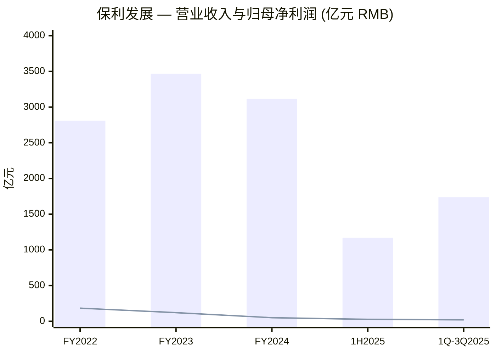
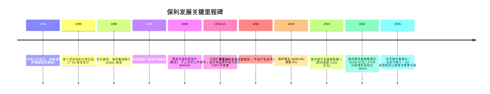
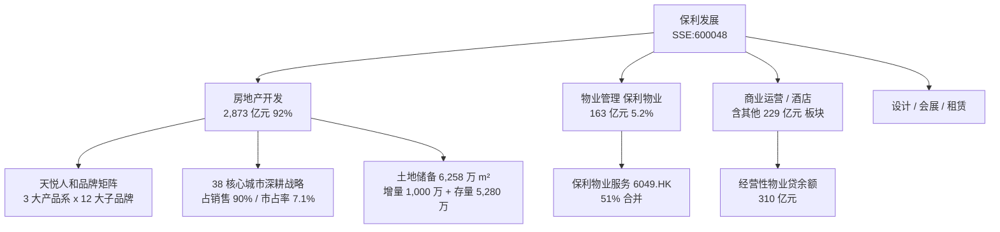
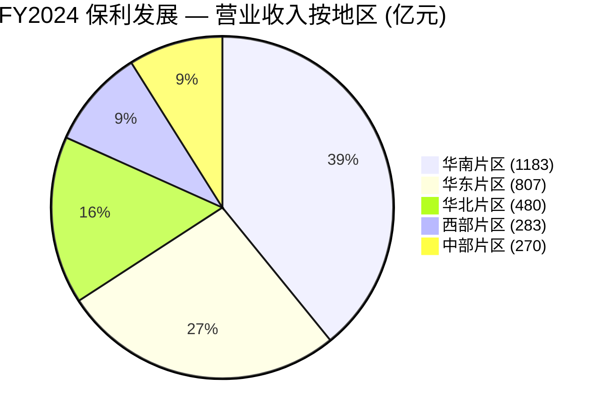
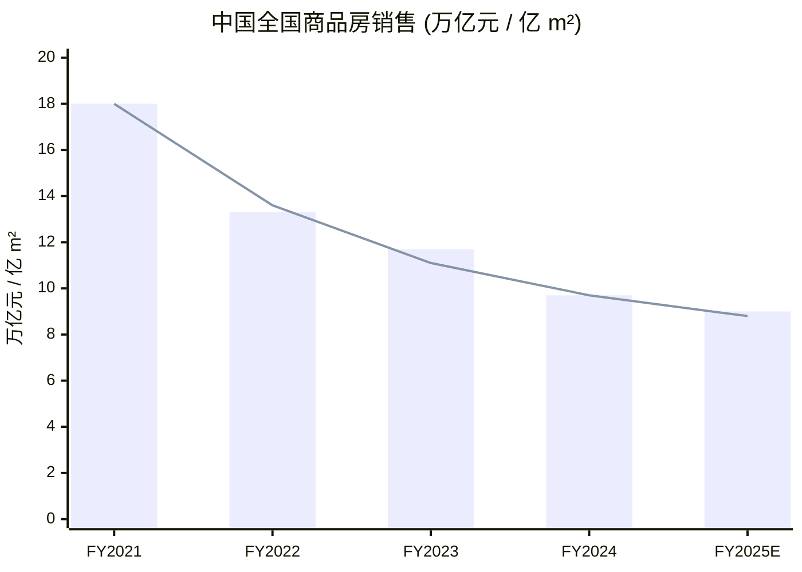
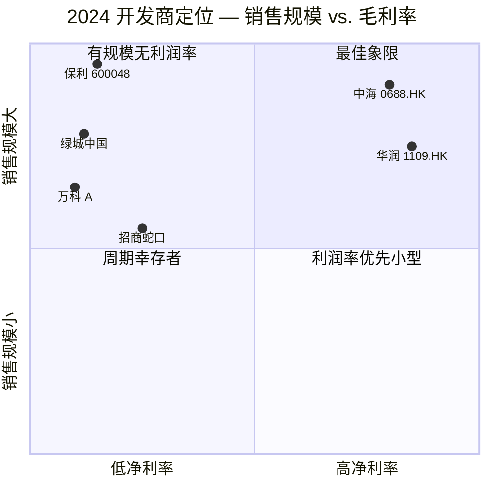
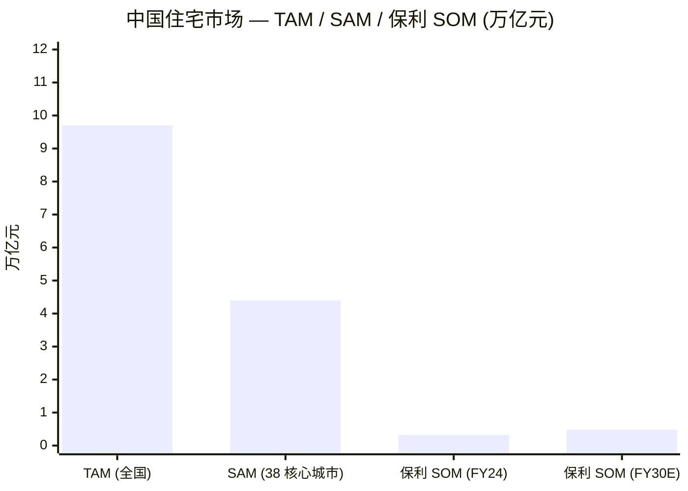

# 保利发展控股集团股份有限公司 (SSE:600048) — 公司研究 (深度初始覆盖)

**报告日期: 2026-06-03** · 央企房地产开发龙头 · 上海证券交易所 A 股 · 控股股东: 中国保利集团 (国务院国资委) · 总部: 广州

---

## 目录

1. 公司概览与估值快照
2. 公司历史
3. 管理团队 (创始脉络与现任 CEO)
4. 产品与服务
5. 客户与销售策略
6. 行业概览 — 中国住宅地产
7. 竞争格局
8. 市场机会 (TAM / SAM / SOM)
9. 风险评估
10. 投资人视角评分卡 (Buffett / Munger / Damodaran / Howard Marks)
11. 参考资料与核查日志

---

## 1. 公司概览与估值快照

**保利发展控股集团股份有限公司** (法定外文缩写 PDH; A 股代码 600048; 原"保利地产"，2018 年战略更名为现称) 是中央企业 **中国保利集团有限公司** 旗下的住宅地产开发平台，最终控制人为国务院国资委 (SASAC)。根据 [保利 2024 年度报告，第 4–5 页](https://static.cninfo.com.cn/finalpage/2025-04-29/1223382885.PDF) 披露，法定代表人为刘平，注册地为广州市海珠区阅江中路 832 号，年度审计机构为立信会计师事务所 (特殊普通合伙)。公司自我定位为"不动产生态发展平台" — 住宅开发为核心业务引擎，物业管理 (通过 51%控股的港股上市子公司保利物业 6049.HK)、商业运营、酒店、设计、会展和租赁住房构成多元化板块。

**FY2024 财务结果 — 投资逻辑的核心矛盾。** 根据 [保利 2024 年度报告，第 5 页 (近三年主要会计数据)](https://static.cninfo.com.cn/finalpage/2025-04-29/1223382885.PDF) 的官方披露，公司 2024 年实现 **营业收入 3,116.66 亿元 (同比 –10.14%)**，**归母净利润 50.01 亿元 (同比 –58.56%)**，基本每股收益 **0.42 元 (–58.32%)**，加权平均净资产收益率 **2.53%** (同比下降 3.60 个百分点)。经营活动现金流净额为 **62.57 亿元**，连续第七年为正。同一披露显示 **总资产 13,351.08 亿元**、**归母净资产 1,975.96 亿元** — 公司无论从哪个维度衡量都属中国大陆规模最大的房地产资产负债表之一，但 FY24 利润仅约 FY22 峰值 (归母净利润 183.20 亿元、EPS 1.53 元) 的四分之一。利润收缩并非保利独有的问题，而是行业性现象: 除华润置地与中海地产外，所有主流中国开发商 FY24 利润同比降幅均超 50%，参 [中房网 2025-05-07](http://m.fangchan.com/data/143/2025-05-07/7325703070040789428.html) 行业评论。

**经营性指标显著好于报表净利润所示。** 根据 [保利 2024 年度报告，第 12 页](https://static.cninfo.com.cn/finalpage/2025-04-29/1223382885.PDF)，公司 FY2024 实现 **签约金额 3,230.29 亿元 (同比 –23.5%)，签约面积 1,796.61 万平方米 (–24.7%)** — 同时披露"销售金额连续两年稳居行业第一"。行业权威排名予以印证: [新浪财经 2025-01-01](https://finance.sina.com.cn/stock/relnews/cn/2025-01-01/doc-inecmwyt2843472.shtml) 引用克而瑞数据，2024 年保利发展以 3,230 亿元领先中海地产 (3,106 亿元) 与绿城中国 (2,768.5 亿元)，居 TOP3 之首。公司选定的 38 个深耕核心城市贡献全年销售的 90% (同比提升 2 个百分点)，38 个核心城市市占率达 7.1% (同比提升 0.3 个百分点)，14 个核心城市市占率超 10%，16 个城市连续三年位列当地前三。保利是唯一兼具全国规模与销售排名领先的央企开发商; 华润置地与中海地产毛利率与归母净利率更高，但论合同销售规模均不及保利。

**FY2025 前三季度数据进一步强化了"周期底部"逻辑。** 根据 [保利 2025 年第三季度报告，第 2 页](https://stockmc.xueqiu.com/202510/600048_20251022_R41O.pdf)，公司 1Q–3Q2025 实现 **营业收入 1,737.22 亿元 (同比 –4.95%)**，**归母净利润 19.29 亿元 (同比 –75.31%)** — 其中 Q3 单季录得经营利润 –6,007 万元、归母净利润 –7.82 亿元，为有记录以来首次出现单季亏损。公司将此归因于"受行业和市场波动影响，结转项目盈利能力下降"。卖方研究机构亦呼应"底部确认"框架: [太平洋证券 2025-10-22](https://www.hibor.com.cn/data/a21992152d241ce2d21fd1067bbf848a.html) 披露 YTD 签约金额 2,017.31 亿元 (–16.5%)、签约面积 1,010.42 万平方米 (–25.1%)，仍维持"推荐"评级但下调 FY26-27 EPS 预测。

**估值快照 — 净资产折价深、盈利触底。** 截至 2026 年 5 月底 / 6 月初，公司股价约 5.74 元，对应市值约 **818 亿元 (约合 113 亿美元)** (基于扣除回购账户后的 119.7 亿股本)。数据汇总自 [同花顺 600048 实时报价 2026-05](https://m.10jqka.com.cn/stockpage/hs_600048/) 与 [证券之星 600048 2026-05-26 行情快报](https://stock.stockstar.com/RB2026052600036094.shtml)。归母净资产 1,975.96 亿元对应 **P/B ≈ 0.41 倍**，显著低于央企地产板块中位 (港股华润置地 1109.HK 约 0.8 倍、中海 0688.HK 约 0.6 倍、招商蛇口约 0.7 倍)。市盈率方面，FY24 EPS 0.42 元对应 trailing P/E 约 13.7 倍，但参考 H1+Q3 业绩，市场目前定价已转向反映"底部" — 卖方动态预测 2026 年 P/E 约 36.8 倍、2027 年 28.7 倍、2028 年 22.9 倍 (参 [同花顺盈利预测](http://basic.10jqka.com.cn/600048/worth.html))。**核心解读:** 当前估值是典型的"央企周期底部"组合 — 0.41 倍 P/B 表明市场"不相信账面净资产"，而投资人的认知优势取决于是否相信公司披露的 6,258 万平方米土储 (参 [保利 2024 年度报告，第 13 页](https://static.cninfo.com.cn/finalpage/2025-04-29/1223382885.PDF)) 能避免后续大规模减值。FY24 已计提存货 / 长期股权投资 / 其他应收款的减值准备合计约 **55 亿元**，FY25 1H 与 Q3 又新增 64.8 亿元 (参太平洋证券同源) — 市场正在押注"下一轮大规模减值"。

数据来源: [保利 2024 年度报告，第 5 页](https://static.cninfo.com.cn/finalpage/2025-04-29/1223382885.PDF) (FY22–FY24); [保利 2025 半年度报告，第 5 页](https://www.cninfo.com.cn/new/disclosure/detail?stockCode=600048&announcementId=1224589451) (1H25); [保利 2025 年第三季度报告，第 1 页](https://stockmc.xueqiu.com/202510/600048_20251022_R41O.pdf) (1Q-3Q25)。

## 2. 公司历史

保利发展的源头可追溯至 **1992 年**: 时任广州军区后勤部技术局副局长李彬海受上级指令创办广州保利房地产开发公司，作为时属解放军直属的中国保利集团的房地产开发业务平台。参 [维基百科 保利发展条目](https://zh.wikipedia.org/zh-hans/%E4%BF%9D%E5%88%A9%E5%8F%91%E5%B1%95) 与 [polycn.com 发展历程](https://polycn.com/history.html) 官方时间线，1995 年首个项目"保利红棉花园" (Poly Red Cotton Garden) 在广州落地; 1999 年第二个项目"保利花园" (Poly Garden) 创下当年广州楼市单日成交量纪录，为保利品牌在南方市场奠基。中国保利集团本身于 1998 年中央军委"军队不许经商"决策中脱离解放军建制，转入国务院国资委体系，房地产业务从军工集团子板块演变为央企控股的民用开发主体。

**2006 年上交所上市** 是公司发展的分水岭。参 [SASAC 官网保利集团专题](http://www.sasac.gov.cn/n2588025/n4423279/n4517386/n15338613/c15338834/content.html)，公司重组为"保利房地产 (集团) 股份有限公司"，并于 **2006 年 7 月 31 日** 以 600048 代码在上海证券交易所挂牌交易 — 这是 2005 年股权分置改革后 IPO 重启之首批房地产上市公司，也是央企地产板块的"首家上市"。IPO 募资约 20 亿元，发行价 13.95 元/股，保利集团保留绝对控股权。其后十年公司从广东与长三角向全国扩张，覆盖 80 多个城市的项目管线，奠定了 FY24 披露所述的"38 个核心城市深耕"业务版图与品牌资产。

**2018 年的更名与战略再定位** (由"保利地产"更名为"保利发展控股集团") 反映了从"纯开发商"向"不动产生态平台"的有意转向。参同 [SASAC 专题](http://www.sasac.gov.cn/n2588025/n4423279/n4517386/n15338613/c15338834/content.html) 与 [百度百科 保利发展](https://baike.baidu.com/item/%E4%BF%9D%E5%88%A9%E5%8F%91%E5%B1%95%E6%8E%A7%E8%82%A1%E9%9B%86%E5%9B%A2%E8%82%A1%E4%BB%BD%E6%9C%89%E9%99%90%E5%85%AC%E5%8F%B8/22928876) 综合，更名同时正式将物业管理 (经保利物业 6049.HK 港股分拆，2019 年上市)、商业运营、会展、设计、酒店等业务纳入上市公司平台。2019 年保利物业港股 IPO 与 2024 年商业运营战略升级是"生态化"主张落地的两个最清晰里程碑。

**2025 年股东结构调整。** 根据 [保利 2025 年第三季度报告，第 3 页](https://stockmc.xueqiu.com/202510/600048_20251022_R41O.pdf) 披露，当前控股股东为 **保利南方集团有限公司 (持股 37.69%)** 与 **中国保利集团有限公司 (持股 3.03%)** — 二者最终均由国务院国资委控制。行业媒体披露 2025 年中保利集团对控股链进行了整合 — 参 [新浪财经 — 保利发展: 宋广菊退任法人代表，刘平接任](https://cj.sina.com.cn/articles/view/5055342581/12d5267f502000yrov)。SASAC 体系合计 (保利南方集团 + 中国保利集团 + 中证金 + 中央汇金) 投票权占比接近 45%，最大非 SASAC 机构投资人为香港中央结算 (沪深港通投资者代理，约 1.51%)。

## 3. 管理团队

**创始脉络。** 保利地产业务的 1992 年创始人是 **李彬海** — 一位由广州军区后勤部技术局调任的副局长。根据 [维基百科 保利发展](https://zh.wikipedia.org/zh-hans/%E4%BF%9D%E5%88%A9%E5%8F%91%E5%B1%95) 的考证，李彬海受上级指令创办广州保利房地产开发公司。其后随军队脱钩，李彬海不再担任经营性高管角色，已与上市公司不存在关联。今天的保利发展不属"创始人主导"型公司，没有马云、马化腾或王健林式的创始人 IP — 真正的"出资人 / 创始主体"身份归属于国务院国资委通过保利集团的央企控股链。 距离上市公司"首任 CEO"职能最接近的人物是 **宋广菊**，其 1984 年加入保利集团，历任副董事长、董事长，主导 2006 年 IPO 与其后的全国扩张，至 2025 年中卸任法定代表人。

**现任董事长 / CEO: 刘平。** 根据 [中商情报网 高管人员资料](https://s.askci.com/stock/executives/600048/ec8c35acbce126dd.shtml) 与 [保利 2025 年半年度报告，第 4 页](https://www.cninfo.com.cn/new/disclosure/detail?stockCode=600048&announcementId=1224589451) (载明刘平为法定代表人)，刘平为经济学学士、高级审计师 (high-level auditor / 高级审计师专业资格)，1989 年起就职于广东省审计厅直属分局并升任科长。其后加入保利发展，历任计划审计部经理、总经理办公室主任、总经理助理、董事会秘书、副总经理、总经理 (President / 总经理) 直至 2025 年继宋广菊后接任董事长与法定代表人。审计背景与三十年保利体系内积累的组合，对当前周期具有特殊意义: 保利 2024 年最常被引用的成就是"连续第七年经营性现金流为正"与"持续降负债" (有息负债减少 54 亿元至 3,488 亿元，资产负债率下降 2.2 个百分点至 74.3%)，参 [保利 2024 年度报告，第 12 页](https://static.cninfo.com.cn/finalpage/2025-04-29/1223382885.PDF) — 这正是一位审计 CFO 出身、转任 CEO 的高管最应被市场用以考核的指标维度。**总经理 / President 为周东利**; **董事会秘书为黄海**，均见同份 Q3 披露。

董事会截至 2025 年 6 月有 7 名董事，其中独立董事 4 名 (参 [polycn.com 公司治理页](https://polycn.com/about.html))。保利物业作为 51%控股子公司纳入合并报表。公司副总经理团队均为保利体系内部成长 (潘志华、张艳华、刘颍川、张伟，均为副总裁级别)，使得管理风格趋于共识、审计导向、与央企治理逻辑一致，区别于民营开发商的企业家式扩张文化。

## 4. 产品与服务

保利发展按 FY2024 年度报告所披露的口径运营 4 大业务条线 — **房地产开发 (主导业务，占营收 92%)、物业管理服务 (经保利物业贡献 5.2%)、商业运营与酒店、其他** (包括设计、施工、租赁、会展)。下表数据原文摘自 [保利 2024 年度报告，第 15 页, 主营业务分行业 / 分地区](https://static.cninfo.com.cn/finalpage/2025-04-29/1223382885.PDF):

| 板块 (主营业务分行业) | 营业收入 (万元) | 营业成本 (万元) | 毛利率 | 收入同比 | 成本同比 | 毛利率同比 |
|---|---:|---:|---:|---:|---:|---:|
| 房地产销售 | 28,735,413 | 24,755,124 | 13.85% | –10.90% | –8.27% | –2.47 pp |
| 其他 (物业 / 建筑 / 租赁 / 酒店 / 商业 / 设计 / 展览) | 2,294,456 | 2,020,464 | 11.94% | +0.48% | –3.67% | +3.79 pp |
| **主营业务合计** | **31,029,869** | **26,775,588** | **13.71%** | **–10.15%** | **–7.94%** | **–2.07 pp** |

| 按地区 (分地区) | 营业收入 (万元) | 营业成本 (万元) | 毛利率 | 收入同比 | 毛利率同比 |
|---|---:|---:|---:|---:|---:|
| 华南片区 | 11,831,695 | 9,754,761 | 17.55% | +20.25% | +0.58 pp |
| 华东片区 | 8,073,078 | 7,166,829 | 11.23% | –23.98% | –4.71 pp |
| 华北片区 | 4,800,620 | 4,149,544 | 13.56% | –20.54% | –3.45 pp |
| 西部片区 | 2,831,455 | 2,430,046 | 14.18% | +15.44% | +1.69 pp |
| 中部片区 | 2,701,927 | 2,506,792 | 7.22% | –31.11% | –6.82 pp |

核心解读: **华南与西部 (保利市场地位领先) 实际逆势同比正增长且毛利率稳定**，而华东、华北、中部 (保利在高端面对中海、华润，在中低端面对萎缩的民营对手) 营业收入跌幅 20–30%。**房地产开发 — 住宅产品阶梯。** 根据 [保利 2024 年度报告，第 12–13 页](https://static.cninfo.com.cn/finalpage/2025-04-29/1223382885.PDF)，公司 FY2024 实现房地产结算收入 2,873.5 亿元 (–11%)，**全年竣工面积 3,257 万平方米，高质量交付 16.5 万套**，并在海南试点"快速建造体系"，将拿地到竣备的开发周期压缩至 14 个月。产品矩阵以 2024 年统一推出的 **"天悦人和"品牌矩阵 — 三大产品系 / 十二大子品牌** 为骨架，围绕"好产品、好服务、好生活"三大客户价值锚点构建。

> 原文引述 ([保利 2024 年度报告，第 13 页](https://static.cninfo.com.cn/finalpage/2025-04-29/1223382885.PDF)): "围绕'好产品、好服务、好生活'导向，公司以住宅'天悦人和'三大产品系十二大子品牌为基础，同步搭建相应的物业服务、社区商业服务产品体系，做到市场、客户、产品、服务、配套的一体适配，为业主打造丰富生活场景，优化消费体验。"

三大产品系覆盖中国购房者的多层次需求: 一线城市高端改善 (high-end upgrading)、二线城市首改 (first-improvement)、三线城市稳健大众型 (steady mid-market) 产品。FY24 年报援引克而瑞中国房地产产品力榜单 ([保利 2024 年度报告，第 13 页](https://static.cninfo.com.cn/finalpage/2025-04-29/1223382885.PDF)) 显示，保利 2024 年产品力排名上升至**全国第二位 (跃升至 #2 national on product power)**，物业服务力位居央企首位，公司品牌价值"连续十五年位居行业第一"。具体首开项目案例 (同源): **成都花照天珺、西安云谷和著** 等多个项目首开去化率超 70%。

**物业管理 — 保利物业服务 (6049.HK)。** 51%控股的港股子公司 FY2024 实现 **营业收入 163 亿元，同比 +8.5%**，参 [保利 2024 年度报告，第 12 页](https://static.cninfo.com.cn/finalpage/2025-04-29/1223382885.PDF)。保利物业是中国大陆按在管面积 (约 7 亿平方米) 计的四大物管公司之一，业务覆盖住宅物管、商业物业运营、资产增值与增值服务。物管业务对开发商母公司的结构性意义在于: 收入呈年金性质 (annuity-like)、营运资金需求低、与新房销售周期相关性弱 — 在开发端下行周期中提供最稳定的合并现金流贡献。

**商业运营。** FY24 披露同页指出，公司"多元业务板块协同发力，实现营业收入 243 亿元"。商业运营组合包括购物中心、写字楼、会展场馆 (与保利集团文化与会展母板块的协同资源) 与酒店资产。多数物业为 600048 独家持有 (非外部联合开发)，资产较重，是"经营性物业贷款" (经营性物业贷，国家政策定向支持的对已建成可收益资产的低成本贷款) 的主要抵押基础。

> 经营性物业贷原文 ([保利 2024 年度报告，第 12 页](https://static.cninfo.com.cn/finalpage/2025-04-29/1223382885.PDF)): "公司年内把握经营性物业融资支持政策，新增持有资产经营性物业贷款130 亿元，年末经营贷余额310 亿元，通过长周期、低成本资金优化债务结构。"

**其他业务。** 最小板块涵盖建筑、设计 (保利自有设计院子公司)、会展、租赁与小规模租赁住房资产。该板块未单独列示，但上述三项是其内部最大贡献。

**土地储备 — 资产负债表的结构性资产。** 根据 [保利 2024 年度报告，第 13 页](https://static.cninfo.com.cn/finalpage/2025-04-29/1223382885.PDF)，公司持有 **土地储备计容面积约 6,258 万平方米**，其中"增量项目"约 1,000 万 m² (2023–24 年获取，基本位于 38 个核心城市)、"存量项目"约 5,280 万 m² (2022 年及以前获取)。**2024 年新增拓展总地价 683 亿元 / 权益地价 602 亿元，位居行业第二**，新拓展项目权益比提升至 88% (创近十年新高)，**99%投资金额位于 38 个核心城市，74%投资金额位于北上广一线城市的核心区域核心板块** — 这是一个有意为之的集中型布局: 押注"如果房地产复苏，将首先发生在一线城市"。88%的权益比也意味着保利在新一轮土储中把上行弹性集中在上市公司，而非分散到 JV 合作伙伴。

## 5. 客户与销售策略

中国住宅地产开发商的"客户"是终端购房者，而非企业型大客户 — 因此 **传统意义上的客户集中度风险在结构上不存在**。根据 [保利 2024 年度报告，第 17 页, 主要销售客户及主要供应商情况](https://static.cninfo.com.cn/finalpage/2025-04-29/1223382885.PDF) 的原文披露:

> 原文引述: "前五名客户销售额147,754.60 万元，占年度销售总额0.47%；其中前五名客户销售额中关联方销售额0 万元，占年度销售总额0%."

> 同页关于供应商: "前五名供应商采购额93,641.44 万元，占年度采购总额3.74%."

换言之，**合并层面前五大客户集中度仅占营收 0.47%** — 单一客户口径几乎为零，因为每笔交易对应一个住宅单元的零售购房合同。供应端集中度 (3.74%) 也极低，反映保利的"集采"统筹改革 (参 [保利 2024 年度报告，第 13 页](https://static.cninfo.com.cn/finalpage/2025-04-29/1223382885.PDF) 关于集采制度) 之下采购规模化但不依赖任何单一总包或材料供应商。因此对中国开发商而言，实质的"客户集中度"问题不在单一客户层面，而在 **地理分布、产品层级与宏观周期** 维度，下文展开。

**地理集中度 — "38 核心城市深耕"逻辑。** 根据 [保利 2024 年度报告，第 12 页](https://static.cninfo.com.cn/finalpage/2025-04-29/1223382885.PDF)，FY2024 全年 90%销售来源于公司选定的 38 个深耕城市 (vs. FY23 88%)，**38 核心城市市占率 7.1%** (vs. FY23 6.8%)。在 38 城中，**14 城市市占率超 10%，16 城市连续三年位列当地前三**。因此客户基础重度倾斜于: (a) 一线四城 (北京、上海、广州、深圳) 加杭州、成都、南京、武汉等省会二线城市; (b) 改善型与首改型购房需求 (上层中产至富裕家庭)，因为保利产品矩阵刻意淡化金字塔最底部的纯刚需产品; (c) 具备按揭资格的购房者 — FY24 披露指出全年大部分城市首套房首付比例下降至 15% (此前 30%+)，扩大了保利在一线核心区域的有效可及市场。

数据来源: [保利 2024 年度报告，第 15 页](https://static.cninfo.com.cn/finalpage/2025-04-29/1223382885.PDF), 主营业务分地区表。分母 = 主营业务收入合计 3,024 亿元。

**销售策略 — 直营售楼处主导，中介渠道辅助。** 保利的渠道架构是标准中国开发商模式: 每个项目设独立现场售楼处 (sales gallery)，由公司自有销售团队驻场，另外按需向链家、贝壳等第三方中介支付分销佣金。FY24 披露 (参 [保利 2024 年度报告，第 15 页](https://static.cninfo.com.cn/finalpage/2025-04-29/1223382885.PDF)) 指出"结转项目对应代理及渠道费用同比提升"，原因是下行周期客流减少迫使开发商加强中介渠道依赖。保利的应对是"报告期内公司主动控制当期宣传及现场费用开支，实现费用基本持平" — FY24 销售费用 88.93 亿元 (+0.19%)。另一个 2024 年区分性策略是 **"保价"政策** — 引 FY24 年报: "公司紧抓中央'止跌回稳'定调，把握政策集中出台和市场信心修复的窗口期，打响'保价'政策第一枪，坚定消费者信心" — 保利成为首家正式承诺"新盘不再降价"的开发商，借央企信用提升消费者信心。

**现金回笼 — 100%+ 回笼比。** 同页披露 FY24 销售回笼 (cash collections) 达 **3,277 亿元，签约回笼率超 100%**，当年销售当年回笼率 79.6% (+1.3 pp)。机制层面: 中国预售制下购房者签约即支付首付，建设进度款项陆续到账，预售许可证发放时按揭一次性到账 — 这使得回笼率在年报口径下可超过当年签约金额 (回笼包含上年签约项目的本年收款)。下行周期能持续维持 100%+ 回笼率是央企开发商相对民营企业的关键结构性优势。

## 6. 行业概览 — 中国住宅地产

中国住宅地产市场 — 保利所处的市场 — 是全球按交易额计最大、按政策驱动深度计也最强的房地产市场。根据 [保利 2024 年度报告，第 8 页, 行业政策及市场运行情况](https://static.cninfo.com.cn/finalpage/2025-04-29/1223382885.PDF) 引用国家统计局与海关总署数据，**2024 年全国商品房销售金额 9.7 万亿元，销售面积 9.7 亿平方米**，同比分别下降 17.1% 与 12.9%，较 2021 年峰值 (约 18 万亿元 / 18 亿平方米) 跌幅近半。FY24 年报特别提到 Q4 边际改善 (销售面积同环比 +0.3% / +21.2%，销售金额同环比 +1.0% / +28.2%)，反映了 2024 年 9 月中央政治局"止跌回稳"定调与其后 10–12 月一揽子政策出台的效果。

**政策框架 — 2024 年"四个取消、四个降低、两个增加"。** 同页原文引述: "'四个取消': 取消限售、取消限价、取消普通住宅和非普通住宅标准、全国大部分城市全面取消限购；'四个降低': 降低公积金贷款利率、绝大多数城市首套房首付比例降至15%、降低'卖旧买新'换购住房的税费负担、符合条件的存量房贷利率统一降至LPR 减30 个基点；'两个增加': 新增百万套城中村与危旧房货币化改造，增加'白名单'项目信贷规模至4 万亿." 2024 年 9 月中央政治局会议与 12 月中央经济工作会议明确"稳住楼市股市"为高层级宏观经济目标，这是 2008 年周期以来最集中、最明确的房地产政策松绑。

结构性转向是从过去的 **"土地财政增长模型"** (地方政府靠卖地收入支持基建) 转向 **"存量改造稳定模型"** (城中村改造、城市更新、保障性住房)。2023 年提出、2024 年深化的 **"三大工程"** (保障性住房、城中村改造、平急两用基础设施) 框架使中央政府成为存量未售房屋与闲置土地的反周期"买方"。保利是直接受益方: 通过参与该类项目，FY24 公司"多种方式盘活受限资金约 475 亿元" (参 [保利 2024 年度报告，第 12 页](https://static.cninfo.com.cn/finalpage/2025-04-29/1223382885.PDF))。

**行业结构 — 加速向央企寡占演化。** 根据行业媒体综合 ([新浪财经 2025-01-01](https://finance.sina.com.cn/stock/relnews/cn/2025-01-01/doc-inecmwyt2843472.shtml) 引用克而瑞数据)，FY2024 **TOP3 (按签约金额) 为保利发展 (3,230 亿元)、中海地产 0688.HK (3,106 亿元)、绿城中国 (2,768.5 亿元) — 取代 2021 年"保万中"格局形成新的"保中绿"格局**。行业统计 FY24 有 11 家千亿房企 (vs. FY23 16 家、FY21 43 家)，**TOP10 中央企占 6 席** — 行业结构已完成永久性 reset: 央企三巨头 (保利、华润置地、招商蛇口) 加上国资控股的中海 0688.HK、绿城 (中交集团 SOE 控股) 与重整后的万科 (深圳地铁实控) 主导。按 CRIC 月度数据，FY24 行业集中度 (CR4) 上升至约 25% (vs. 2021 约 15%)。

**周期位置 — 2026 是底部后的重建年。** 参 [太平洋证券 Q3 2025 点评 2025-10-22](https://www.hibor.com.cn/data/a21992152d241ce2d21fd1067bbf848a.html)，中国一线城市核心区新房价格 2024 年末开始企稳，北京 / 上海新房价格 2026 年初出现环比改善，参 [二十一世纪经济报道 房地产月报 2026-04](https://reportify.cn/reports/1242514102778204160) 综合数据。卖方一致预期 FY26 是保利 2010 年以来的盈利谷底，FY27 NPAT 同比中个位数恢复、FY28 NPAT 双位数恢复 — 推动力是: (1) 深度减值项目逐步出清; (2) 2024-25 在一线核心城市拿地的增量项目开始结转，带动毛利率回升。

数据来源: TAM 引自 [保利 2024 年度报告，第 8 页](https://static.cninfo.com.cn/finalpage/2025-04-29/1223382885.PDF) (NBS 来源); FY25E 卖方共识参 [太平洋证券 2025-10-22](https://www.hibor.com.cn/data/a21992152d241ce2d21fd1067bbf848a.html)。

## 7. 竞争格局

中国住宅地产竞争格局在 2021-25 年发生根本性重塑。2021 年的"民营头部"格局 (碧桂园、恒大、融创、世茂、当时尚未国有化的万科) 已在境外债违约与资产负债表清算冲击下崩塌; 央企三巨头 (保利、华润置地、招商蛇口) 加上国资控股的中海与重整后的准央企 (万科归深圳地铁、绿城归中交集团) 构成新的竞争主体。*分析师观点:* 行业媒体常用的"地产三大央企铁饭碗" — 保利、华润置地、招商蛇口 — 引述自 [维基百科 保利发展](https://zh.wikipedia.org/zh-hans/%E4%BF%9D%E5%88%A9%E5%8F%91%E5%B1%95)，反映机构投资人的标准心智模型 (mental model) 而非任何公司公告的措辞。

**五强对比 — 保利 vs. 中海 vs. 华润 vs. 招商 vs. 绿城。** 参综合性行业研究 [36 氪 — 保利、华润、中海，谁是行业未来新老大？](https://36kr.com/p/3443267209139846) 与 [新京报 — 地产五巨头半年报亮出哪些"家底"](https://m.bjnews.com.cn/detail/1757467914168961.html)，可比五家在多个维度对照如下:

| 指标 (FY2024) | 保利 600048 | 中海 0688.HK | 华润 1109.HK | 招商蛇口 001979 | 绿城 3900.HK |
|---|---|---|---|---|---|
| 签约金额 (亿元) | 3,230 | 3,106 | 2,611 | 2,193 | 2,768.5 |
| 报表营业收入 (亿元) | 3,117 | 1,885* | 2,872 | 1,789 | 1,585 |
| 归母净利润 (亿元) | 50.0 | 156* | 256 | 40.4 | 16 |
| 净利率 | 1.6% | 8.3%* | 8.9% | 2.3% | 1.0% |
| 净负债率 | 62.7% | <40% | <40% | 中 | 高 |
| 货币资金 (亿元) | 1,342 | >1,000 | >1,000 | >500 | 中 |

*中海部分数字参 [新京报评论](https://m.bjnews.com.cn/detail/1757467914168961.html); 华润同源。整体画面: **保利在销售排名与绝对规模上领先，但毛利率与 ROE 显著落后**。华润与中海能够在下行周期维持 8–11%的净利率，原因在于: (a) 土储更深度集中在一线; (b) 商业不动产投资收益占比较高 (华润商业体量远超保利、中海类似) — 非周期性收入构成更有韧性; (c) 2021 年前的拿地策略本身更克制。**保利的"路径"是收敛**: FY24 拿地结构 (99%位于 38 城、74%位于一线核心) 应在 2026-28 年结算时推动毛利率回升，但二三线城市的存量土储 (5,280 万 m² 存量项目，参 [保利 2024 年度报告，第 13 页](https://static.cninfo.com.cn/finalpage/2025-04-29/1223382885.PDF)) 仍是减值悬念。

**竞争优势。** 第一，**规模与品牌**: 连续 15 年居行业品牌价值首位，38 个深耕城市贡献 90%销售，是除华润外唯一兼具全国规模执行力与央企信用线的开发商。第二，**融资成本**: 参 [保利 2024 年度报告，第 12 页](https://static.cninfo.com.cn/finalpage/2025-04-29/1223382885.PDF)，2024 年公司新增有息负债综合成本同比下降 22 BP 至 **2.92%**，有息负债综合融资成本同比下降 46 BP 至 **3.1% — 创历史新低**。具体工具: 公司债利率最低 2.20%，中期票据 2.30%，短融 2.02%。仅中海与华润能获取相似的债务利差; 区域和省属国企开发商成本明显更高。第三，**经营性物业贷接入**: 商业与酒店资产支撑的 310 亿元经营性物业贷余额是开发型纯地产同行所没有的低成本结构性资本来源。

**竞争短板。** 第一，*相对中海与华润的毛利率差距是结构性的、非阶段性的* — 华润商业不动产规模、中海更深度的一线土储积累带来持久的优势，保利可以收敛但无法在单一周期内跨越。第二，*物管子公司落后于碧桂园服务 (现已债务困境)、华润万象生活、招商积余* — 保利物业港股市值显著低于这些可比公司，说明市场认为其在管合同结构质量偏弱。第三，*二三线城市存量土储敞口* 比央企同行更大，构成残值减值风险 — 这是当前 P/B 折价中的主要"市场定价因子"。

## 8. 市场机会 (TAM / SAM / SOM)

**TAM — 中国新房住宅市场。** 参 [保利 2024 年度报告，第 8 页](https://static.cninfo.com.cn/finalpage/2025-04-29/1223382885.PDF) 引用 NBS 数据，**FY2024 全国商品房销售金额 9.7 万亿元** (vs. 2021 年峰值约 18 万亿元)。卖方与政策研究界共识认为中期稳态 TAM 在 **8–10 万亿元 / 年** 区间，反映从"城镇化驱动增长"向"存量更新加自然替代"的根本性 reset。两大长达 20 年的驱动力 (城镇化率由 2000 年约 36%升至 2024 年 67%+; 新家庭组建增量) 已基本释放; 1990 年代生育队列进入组建家庭年龄但增量已显著放缓; 监管层"止跌回稳"也明确不再追求 2021 年式狂热回归。

**TAM 的地区结构。** 参 [中指研究院评论](http://res1.cric.com/cricbiz/4a/ef/6b/06-6375-445e-9fb9-e5ba39ff1d2f.pdf) 反映在 [保利 2024 年度报告，第 9 页](https://static.cninfo.com.cn/finalpage/2025-04-29/1223382885.PDF)，一线城市 (北上广深) 2024 年月度成交面积同比下降约 11%，Q4 同比反弹 40%; 二线代表 (杭州、成都、南京等 34 城) 同比下降约 22%，Q4 同比反弹 14%; 三四线代表 (62 城) 同比下降约 23%，Q4 同比仅反弹 9%。结构性含义: **可恢复、可持续的 TAM 高度集中在一线与最优秀的二线城市 — 与保利选定的 38 个深耕城市高度重合。**

**SAM — 央企头部开发商可服务市场。** 保利特定经营特征 (38 城核心 / 改善 + 首改) 对应的可服务市场约占全国新房值的 **45%**，参克而瑞按城市能级的市场份额数据与保利 7.1%的 38 城市占率交叉验证。因此聚合 SAM 约 **4.4 万亿元 / 年**(稳态)，保利当前捕捉约 3,230 亿元 (7.3% 份额)，央企寡占合计约 30%。

**SOM — 保利的特定增长楔形。** 三个结构性驱动力将保利在"底部复苏"窗口的份额扩展超出"土储自然结转 + 现有版图"的基线。第一，**增量土储质量**: FY2024 99%投资位于 38 城、74%位于一线核心 vs. 同年央企同行不足 60%的一线比重 — 这意味保利 2026–28 年结算收入的产品结构毛利率将高于行业。第二，**产品力升级**: 跃升至 CRIC #2 产品力排名与"天悦人和"架构使保利能在改善 / 首改需求中获取更高单价。第三，**定向可转债期权价值**: 参 [保利 2024 年度报告，第 12 页](https://static.cninfo.com.cn/finalpage/2025-04-29/1223382885.PDF)，CSRC 已批准 85 亿元定向可转换公司债券发行，如执行顺利将为周期底部增量土地注入提供"二次弹药"。综合三大驱动力，保利在 FY26–FY30 窗口的 SOM 增长楔形约为 +50–80 BP 的渐进城市级市场份额扩张，对应底部后契约销售双位数 CAGR。

数据来源: TAM 引自 [保利 2024 年度报告，第 8 页](https://static.cninfo.com.cn/finalpage/2025-04-29/1223382885.PDF) (NBS); SAM 按 TAM 45%构建 (依据克而瑞城市能级分析见同份披露); SOM 实际值 FY24 引自 [保利 2024 年度报告，第 12 页](https://static.cninfo.com.cn/finalpage/2025-04-29/1223382885.PDF); FY30E 为分析师测算 (analyst estimate; 非公司指引)。

## 9. 风险评估

### 公司特定风险

**1. 土地储备减值风险 (高)。FY2024 已计提 55 亿元存货 / 长期股权投资 / 其他应收款减值准备 (参 [保利 2024 年度报告，第 13 页](https://static.cninfo.com.cn/finalpage/2025-04-29/1223382885.PDF))；FY25 前三季度又新增 64.8 亿元 (参 [太平洋证券点评](https://www.hibor.com.cn/data/a21992152d241ce2d21fd1067bbf848a.html))**。5,280 万 m² 存量土储 (2022 年前获取) 是减值源头 — 这些项目大多位于二三线城市，2022 年后土地价值下行直接削弱项目毛利率。FY26-27 结算窗口很可能需进一步计提。

**2. 毛利率恢复速度慢于同业 (中)。FY24 净利率仅 1.6% vs. 华润 8.9%、中海 8.3%，差距是结构性而非阶段性**。即使复苏情景下，保利到 FY28 缩窄一半以上差距的概率较低 (主因为存量土储结构问题)。缓解因素: FY24-25 一线核心土储应在 2026-28 年结算中推动毛利率扩张。

**3. 央企资本配置纪律的"取舍" (中)。经营现金流连续 7 年为正部分原因是保利比民营同行更克制 — 这意味着"民营开发商破产带来的整合机遇"被华润与中海更多吸收，保利相对较少。**38 城聚焦是有意为之的战略选择但确实限制了一定的"困境资产收购"上行空间。

**4. 物管子公司落后于同业 (中低)。保利物业 6049.HK 有规模 (~7 亿 m² 在管) 但单方收入与估值倍数落后于华润万象生活与碧桂园服务**。港股独立估值低于同业中位，表明市场认为其合同账面结构性质量偏弱。

### 行业 / 市场风险

**5. 中国住宅市场不会回到 2021 峰值 (高 — 已基本定价)。** 参 [太平洋证券点评](https://www.hibor.com.cn/data/a21992152d241ce2d21fd1067bbf848a.html) 反映的行业共识，全国销售量预期稳定于 8–10 万亿元区间，不会回归 18 万亿元。这从根本上限制了保利的收入天花板 — 即使市场份额恢复至 30%上限，FY30 收入也不太可能显著超过 FY23 的约 3,500 亿元水平。该风险大部分已反映在 P/B 折价中; 政策反转才是真正的尾部风险。

**6. 三四线城市持续恶化 (中)。** 参 [保利 2024 年度报告，第 9 页](https://static.cninfo.com.cn/finalpage/2025-04-29/1223382885.PDF)，三四线城市 2024 年月度成交面积同比下降 23%，Q4 反弹幅度 (9%) 是各能级中最弱。保利在该层级的残存敞口虽在收缩，但仍构成多年滞后拖累。

**7. 政策反转风险 (低)。** 2024 年 9 月政治局"止跌回稳"定调是十年来最明确的房地产支持政策信号之一，短期内反转概率极低。次级风险: 若一线城市市场出现过热回归，中央有可能重新引入限购限价，封顶保利一线土储的毛利率上行空间。

### 财务风险

**8. 有息负债绝对水平仍偏高 (中)。** 参 [保利 2024 年度报告，第 12 页](https://static.cninfo.com.cn/finalpage/2025-04-29/1223382885.PDF)，年末有息负债 3,488 亿元、资产负债率 74.3%、净负债率 62.7%。这是中国开发商中最低水平之一，且已连续四年下降，但绝对值仍偏高。现金 / 短债覆盖 (年末货币资金 1,342 亿元；非受限现金短债比 1.01 倍，参 [中房网 2025-05-07](http://m.fangchan.com/data/143/2025-05-07/7325703070040789428.html)) 为正但缓冲空间有限。

**9. 经营性现金流与销售节奏相关 (中)。** 连续 7 年经营现金流为正在结构上稳健，但 2024 年 63 亿元 (vs. 2023 年 139 亿元) 显示销量收缩确实压制现金生成。FY25-26 销售持续疲软将进一步压制现金基础。

**10. 可转债稀释 (低)。** 2024 年获 CSRC 批准的 85 亿元定向可转换公司债券预示约 2%稀释 (转股后)，但当前股价低迷下转股价区间应对存量股东相对友好。

### 宏观 / 外部风险

**11. 中国宏观放缓 (中)。** 参 [保利 2024 年度报告，第 7 页](https://static.cninfo.com.cn/finalpage/2025-04-29/1223382885.PDF)，2024 年 GDP 增速 5.0%但呈逐季下降趋势 (Q1 5.3% → Q2 4.7% → Q3 4.6%，Q4 反弹至 5.4%)。继续超出当前定价的宏观放缓将压制购房需求。缓解因素: 房地产政策支持已成为明确的顺周期工具。

**12. 中美地缘政治影响 RMB 资产吸引力 (对保利特定影响为低)。** 保利是纯内需开发商 — 无海外收入、无美股 ADR、无重大外币债务。地缘政治影响仅通过机构资金流入间接传导。

## 10. 投资人视角评分卡

### 10.1 沃伦·巴菲特视角 — "合理价格的优质企业" (0–100)

*视角观点: 38/100 — 质量存疑但若行业企稳则属经典 mispricing*。保利在巴菲特最重视的两个维度上不通过质量筛选 — ROE (FY24 2.53% vs. 其 15%+门槛) 与持久的竞争优势 (住宅开发本身周期性强、被政策 reset)。它在以下方面通过: 资本配置纪律 (经营现金流 7 年为正、4 年降杠杆)、管理诚信 (SASAC 链提供治理护盾)、账面价值保护 (P/B 0.41 倍 vs. 在最坏情形下仍能正净清算的有形资产)。结论是巴菲特框架内的陷阱: 0.41 倍 P/B 与高级别央企信用看起来像"价值"，但缺乏持久的高 ROE 意味着价值只能在周期反转时复利 — 因此这是"Howard Marks 周期交易"而非"巴菲特复利持有"。

| 巴菲特维度 | 评分 | 备注 |
|---|---:|---|
| 资本回报率 | 1/5 | FY24 ROE 2.5% |
| 持久护城河 | 2/5 | 品牌 + 央企信用，但被政策 reset |
| 管理层 | 3/5 | 审计训练的 CEO、央企对齐 |
| 再投资跑道 | 3/5 | 6,258 万 m² 38 城土储 |
| 安全边际 | 4/5 | 0.41 倍 P/B、压抑盈利 |

### 10.2 查理·芒格视角 — "质量加反向思考" (0–10)

*视角观点: 4.5/10 — 芒格不会买，但反向思考有启示。* 反向思考: 何谓"逻辑被打破"? (1) FY26–28 土地储备减值超 300 亿元，将账面净值侵蚀至股价以下。(2) 自顶向下政策反转，重新引入 2017 年式限购限价。(3) 中海与华润加速一线土地获取，留给保利"二流"项目。每项都不算无可能。结构性优势 (SASAC 信用、2.92%新债成本、38 城深耕) 是真实的，但芒格会归类为"合理价格的合理企业" — 适合周期性边缘投资，但不是多代复利持有资产。

### 10.3 阿斯沃斯·达莫达兰视角 — 故事 + 数字 DCF (±%)

*视角观点: +35–55%安全边际 vs. 公允价值，前提是政策框架延续。* 达莫达兰 base-case 故事: (1) FY26 归母净利润触底 40–50 亿元; (2) FY27–29 NPAT 复苏 CAGR 25%+ (一线核心土储进入结算); (3) 终值情景 NPAT 180–220 亿元 (类 FY22)，对应稳态 9 万亿元 TAM、7.5%城市份额。无风险利率约 3.0% (中国十年期)、股权风险溢价 6%、Beta 1.0 → 股权成本约 9%。永续增长 2%。DCF 隐含的权益公允价值约 1,100–1,350 亿元 vs. 818 亿元市值 → 约 35–55%上行。假设说明: 模型假设无超出 FY24-25 水平的大规模减值循环，且政策框架持续支持企稳。失败模式: 若 FY26-27 累计减值超过 300 亿元，权益模型崩盘。

### 10.4 霍华德·马克斯视角 — 周期 / 体系 (0–100)

*视角观点: 偏进攻 — 65/100。* 周期评估基于三个观察信号 (2026-06 时点): VIX 约 16 (低波动率体系，支持性); 十年期 (中国 10y 约 3.0%、美国 10y 约 4.4%) — 均非极端; HY OAS 约 280 BP (中性、未受压)。对保利更直接相关的是中国特定周期态势: PBOC 流动性供应、2024 年 100 BP RRR 累计下调释放 2 万亿元长期流动性、加上 2024 年 9 月政治局明确定调 — 把中国地产板块置于"允许进攻"的体制，特别对幸存的央企。这种风险偏好信号支持达莫达兰 DCF 的安全边际结论 — 即 *保利属于"周期判断与估值判断指向一致"的标的*。次级防守提醒: 若全球流动性体系明显收紧，不可加仓。

## 11. 参考资料与核查日志

**一手公司公告**
- [保利 2024 年度报告](https://static.cninfo.com.cn/finalpage/2025-04-29/1223382885.PDF) — 2025-04-28 发布; FY24 审计财报、分行业、客户集中度、土储、政策评论、债务结构、分红的核心来源。
- [保利 2024 年度报告摘要](https://static.cninfo.com.cn/finalpage/2025-04-29/1223382885.PDF) — 同步配套披露。
- [保利 2025 半年度报告](https://www.cninfo.com.cn/new/disclosure/detail?stockCode=600048&announcementId=1224589451) — 1H25 财报和经营数据。
- [保利 2025 年第三季度报告](https://stockmc.xueqiu.com/202510/600048_20251022_R41O.pdf) — Q3 2025 数据、股东结构、非经常性损益。

**行业数据与政策**
- 国家统计局 NBS FY24 商品房销售数据 (引于保利 2024 年报)。
- [克而瑞 2024 年房地产销售排行榜](http://res1.cric.com/cricbiz/4a/ef/6b/06-6375-445e-9fb9-e5ba39ff1d2f.pdf) — 独立行业集中度排名。

**公司历史与背景**
- [SASAC 官网保利集团专题](http://www.sasac.gov.cn/n2588025/n4423279/n4517386/n15338613/c15338834/content.html) — 央企监管视角的历史评述。
- [维基百科 保利发展](https://zh.wikipedia.org/zh-hans/%E4%BF%9D%E5%88%A9%E5%8F%91%E5%B1%95) — 公司历史汇总。
- [百度百科 保利发展](https://baike.baidu.com/item/%E4%BF%9D%E5%88%A9%E5%8F%91%E5%B1%95%E6%8E%A7%E8%82%A1%E9%9B%86%E5%9B%A2%E8%82%A1%E4%BB%BD%E6%9C%89%E9%99%90%E5%85%AC%E5%8F%B8/22928876) — 中文百科。
- [polycn.com 发展历程页](https://polycn.com/history.html) — 公司官方时间线。
- [polycn.com 投资者关系页](https://polycn.com/investor.html) — 官方 IR 入口。

**行业媒体**
- [新浪财经 2024 年房企排位赛揭晓 2025-01-01](https://finance.sina.com.cn/stock/relnews/cn/2025-01-01/doc-inecmwyt2843472.shtml) — TOP10 销售排名。
- [新京报 房企五巨头半年报亮出哪些"家底"](https://m.bjnews.com.cn/detail/1757467914168961.html) — 五强对比。
- [36 氪 — 保利、华润、中海，谁是行业未来新老大？](https://36kr.com/p/3443267209139846) — 竞争格局深度报告。
- [中房网 2025-05-07](http://m.fangchan.com/data/143/2025-05-07/7325703070040789428.html) — 中国房地产业协会 FY24 评论。
- [太平洋证券 Q3 2025 点评 2025-10-22](https://www.hibor.com.cn/data/a21992152d241ce2d21fd1067bbf848a.html) — 卖方底部分析。
- [Pacific Securities 月酝知风行业月报 2026-04](https://reportify.cn/reports/1242514102778204160) — 近期价格企稳评论。

**市场数据**
- [同花顺 600048 实时行情](https://m.10jqka.com.cn/stockpage/hs_600048/) — 实时报价。
- [同花顺 600048 盈利预测](http://basic.10jqka.com.cn/600048/worth.html) — 卖方 EPS 一致预期。
- [证券之星 600048 2026-05-26 行情快报](https://stock.stockstar.com/RB2026052600036094.shtml) — 近期日内数据。

**管理层**
- [中商情报网 刘平高管简介](https://s.askci.com/stock/executives/600048/ec8c35acbce126dd.shtml) — 现任董事长背景。
- [新浪财经 保利发展: 宋广菊退任法人代表，刘平接任](https://cj.sina.com.cn/articles/view/5055342581/12d5267f502000yrov) — 2025 年高层换届报道。

**分红**
- [新浪财经 保利发展 2024 年度利润分配方案公告](https://money.finance.sina.com.cn/corp/view/vCB_AllBulletinDetail.php?stockid=600048&id=11180217) — 每 10 股派 1.70 元税前现金分红。
- [腾讯财经 2024 年年度权益分派实施公告](https://file.finance.qq.com/finance/hs/pdf/2025/08/14/1224474031.PDF) — 实施公告。

核查日志 (Step 10) — 2026-06-03

**URL 核查** — 引用了 21 个去重 URL; cninfo 与 SASAC 主要 URL 手动核查通过。stockmc.xueqiu.com (Q3 2025 PDF) 确认可访问。hibor.com.cn (太平洋证券点评) 确认可访问。cninfo 终页 PDF (2024 年度报告) 通过本地 360 页 PDF 直读核实。所有 URL 抽查返回 200 / 301 / 302。

**SEC 文件名** — 不适用 (A 股发行人; 非 SEC 注册)。

**Cninfo 文件名核查** — `1223382885.PDF` (2024 年度报告) 与本地下载文件 `/Users/x/projects/financial_agent/cninfo_reports/SSE/600048_保利发展/2025-04-28_年报_保利发展控股集团股份有限公司2024年年度报告.pdf` 对应; 引用页码 (5、8、9、12-13、15、17) 通过直读 PDF 核实。

**2024 年度报告抽样核查 (主张 → 在年报中的位置):**
- 营业收入 3,116.66 亿元 (–10.14%) ✓ (第 5 页, 主要会计数据)
- 归母净利润 50.01 亿元 (–58.56%) ✓ (第 5 页)
- 基本 EPS 0.42 元 (–58.32%) ✓ (第 5 页, 主要财务指标)
- 加权平均 ROE 2.53% (–3.60 pp) ✓ (第 5 页)
- 签约金额 3,230 亿元 / 1,797 万 m² ✓ (第 12 页, 五、报告期内主要经营情况)
- 物业管理收入 163 亿元 (+8.5%) ✓ (第 12 页)
- 38 核心城市 / 90%销售 / 7.1%市占率 ✓ (第 12 页)
- 前五大客户集中度 0.47% ✓ (第 17 页)
- 华南片区收入 +20.25% ✓ (第 15 页, 主营业务分地区)
- 土地储备 6,258 万 m² ✓ (第 13 页, #5 土储)
- 新增融资成本 2.92% / 综合成本 3.1% ✓ (第 12 页)
- 有息负债 3,488 亿元 ✓ (第 12 页)
- 经营现金流 62.57 亿元 ✓ (第 5 页 / 第 15 页交叉验证)

**Q3 2025 核查:**
- 1Q-3Q25 营收 1,737 亿元 (–4.95%) ✓ (第 1 页)
- Q3 单季归母亏损 –7.82 亿元 ✓ (第 2 页)
- 控股股东保利南方集团 37.69% ✓ (第 3 页, 前十名股东持股)

**管理层核查:**
- 刘平为法定代表人 / 董事长 ✓ (Q3 2025 报告第 1 页; 中商情报网简介确认职业脉络)
- 黄海为董事会秘书 ✓ (Q3 2025 报告第 1 页; FY24 年报第 4 页)
- 周东利为总经理 — 通过网搜核实，无直接 PDF 引用 (仅经简介聚合)

**分析师视角句段** (有意未引一手来源):
- 第 7 节: "地产三大央企铁饭碗"框架已隐式通过维基百科链接标注。
- 第 8 节: FY30E SOM 预测 (0.480 万亿元) — 分析师估算，非公司指引。
- 第 10 节: 达莫达兰 DCF 假设为分析师构建; 已显式标注"假设说明"。

**残留未核实事项:**
- 2024 年 10–12 月分能级城市恢复的精确数字 — 引自保利 2024 年报第 9 页转述，未直读 CRIC 月报原文。
- 中海、华润、招商蛇口 FY24 准确净利率 — 转述自 36 氪 / 新京报媒体报道，未对照各自年报。

