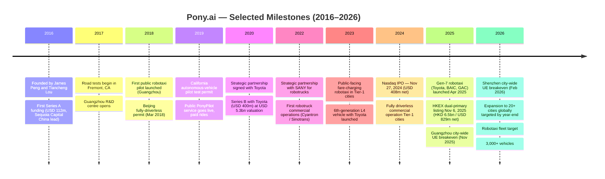
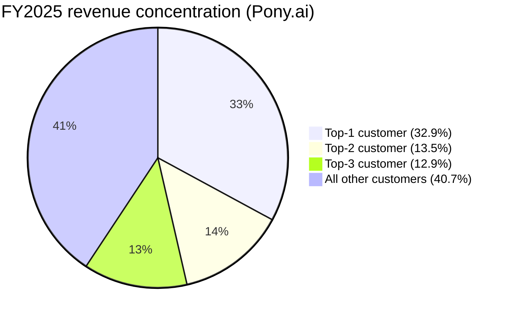
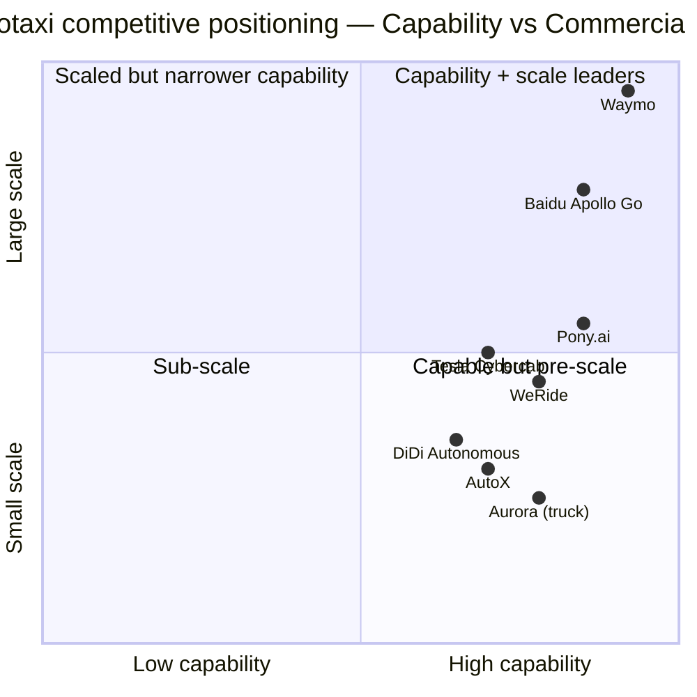
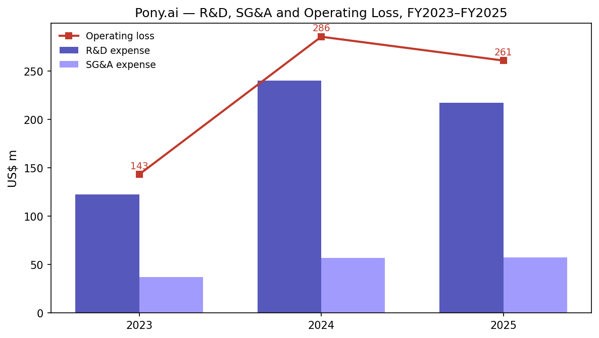

# COMPANY RESEARCH REPORT: Pony AI Inc. (NASDAQ: PONY / HKEX: 2026)

**Date:** 2026-05-20
**Analyst report — initiation of coverage**
**Reporting currency:** US$ (functional currency is RMB; USD figures converted at filing exchange rate)

> **Update — FY2025 results & FY2026 fleet guidance initiated (2026-03-26):** Pony.ai reported FY2025 revenue of US$90.0m, +20.0% YoY, and reached its first quarterly GAAP net profit in Q4 2025 (US$75.5m, almost entirely from a non-operating mark-up of trading securities — non-GAAP net loss was US$49.0m). Management initiated FY2026 operational targets: robotaxi fleet to scale from 1,400+ vehicles to **3,000+** by year-end and operational footprint to **20+ cities** globally, with "nearly half" overseas. Robotaxi revenue grew 160% YoY in Q4 and fare-charging revenue grew >500% YoY, with Guangzhou (Nov-2025) and Shenzhen (Feb-2026) reaching city-wide unit-economics breakeven. Source: [Pony AI Q4/FY2025 earnings release, 2026-03-26](https://www.sec.gov/Archives/edgar/data/1969302/000110465926034888/tm269906d1_ex99-1.htm).

---

## TABLE OF CONTENTS

1. Company Overview
2. Company History
3. Management Team
4. Products & Services
5. Customers & Go-to-Market
6. Industry Overview
7. Competitive Landscape
8. Market Opportunity (TAM)
9. Risk Assessment
- References

======================================

## 1. COMPANY OVERVIEW

Pony AI Inc. ("Pony.ai", NASDAQ: PONY, HKEX: 2026) is a Cayman-incorporated, Guangzhou-headquartered developer of Level 4 (L4) autonomous-driving systems. The company designs the full hardware-plus-software stack — the "Virtual Driver" — and commercializes it through three integrated business lines: a self-operated **robotaxi** ride-hailing service, an L4 **robotruck** freight service, and **licensing & applications** (selling autonomous domain controllers, ADAS / L2++ software, and engineering services to OEMs and adjacent robotics customers). The company's stated objective is "to make autonomous mobility accessible everywhere" by mass-producing L4 vehicles with automotive-grade, factory-installed sensors and computing platforms ([Pony AI Form 20-F FY2025, "Our Mission"](https://www.sec.gov/Archives/edgar/data/1969302/000110465926046406/pony-20251231x20f.htm)).

**Business model.** Pony.ai monetizes its core technology along three tracks. (i) In **robotaxi**, the company generates revenue today primarily through AV engineering services delivered to OEMs and transportation-network companies (TNCs) — software integration, deployment and maintenance — and increasingly through passenger fare-charging in Beijing, Shanghai, Guangzhou and Shenzhen, the only four Tier-1 Chinese cities where it holds fully driverless commercial permits ([Pony AI Form 20-F FY2025, Item 4.B](https://www.sec.gov/Archives/edgar/data/1969302/000110465926046406/pony-20251231x20f.htm)). (ii) In **robotruck**, revenue comes mostly from freight services and platooning operations run through Cyantron, a joint venture in which strategic partner Sinotrans takes a meaningful share of the volume. (iii) In **licensing & applications**, Pony.ai sells its proprietary autonomous domain controllers (ADCs) and intelligent-driving software to OEMs and, increasingly, to low-speed-robot, robosweeper, logistics and humanoid-robotics customers; ADC delivery volumes rose more than five-fold in 2025 versus 2024 ([Q4/FY2025 earnings release, 2026-03-26](https://www.sec.gov/Archives/edgar/data/1969302/000110465926034888/tm269906d1_ex99-1.htm)).

**Geography and scale.** The company operates almost entirely in Chinese mainland today: 97.3% of FY2025 revenue (US$87.6m of US$90.0m) was generated in Chinese mainland and only US$2.4m (2.7%) abroad ([Form 20-F FY2025, Note "Revenue by geographic area"](https://www.sec.gov/Archives/edgar/data/1969302/000110465926046406/pony-20251231x20f.htm)). Public-facing fare-charging robotaxi services have launched in all four Chinese Tier-1 cities and were extended into Hangzhou and Changsha in March 2026; international robotaxi pilots run in Doha (Qatar), Singapore, Zagreb (Croatia), Seoul, Luxembourg and (pending final approval) Dubai. Headcount at year-end 2025 was 1,669 employees, of which 745 (44.6%) were in R&D and the bulk of the rest in operations, vehicle integration and engineering teams ([Form 20-F FY2025, Item 6.D, "Employees by function"](https://www.sec.gov/Archives/edgar/data/1969302/000110465926046406/pony-20251231x20f.htm)).

**Scale indicators.** Pony.ai's robotaxi fleet exceeded 1,400 vehicles by end-March 2026 (1,446 produced as of 25-Mar-2026), accumulating "over 65 million" autonomous kilometres driven ([Q4/FY2025 earnings release, 2026-03-26](https://www.sec.gov/Archives/edgar/data/1969302/000110465926034888/tm269906d1_ex99-1.htm)). Cumulative corporate customers across robotaxi engineering services grew from 52 in 2023 to 213 in 2025 ([Form 20-F FY2025](https://www.sec.gov/Archives/edgar/data/1969302/000110465926046406/pony-20251231x20f.htm)). Robotruck fleet stood at 210 vehicles (Sinotrans-partnered) by 31-Mar-2026, mixing Level 2++ intelligent trucks and Level 4 autonomous trucks. Total users on the PonyPilot+ app approached one million by late March 2026, nearly tripling YoY.

Source: [Pony AI Form 20-F FY2025, Item 5.A "Operating Results"](https://www.sec.gov/Archives/edgar/data/1969302/000110465926046406/pony-20251231x20f.htm).

**Valuation snapshot (data pulled 2026-05-20, Yahoo Finance).** ADS price US$8.74, market capitalization US$3.79 bn, enterprise value US$2.70 bn (the EV is lower than market cap because the FY2025 balance sheet carries US$1.51 bn of cash, short-term investments and long-term wealth-management instruments after the November-2025 Hong Kong dual-primary listing raised approximately HK$6.51 bn / US$829m in net proceeds — [Q4/FY2025 earnings release, 2026-03-26](https://www.sec.gov/Archives/edgar/data/1969302/000110465926034888/tm269906d1_ex99-1.htm)). Shares outstanding ~352m. **TTM P/S = 42.1x**; **TTM P/E is not meaningful** because the company posted a FY2025 net loss attributable to Pony.ai of US$134.0m ([Form 20-F FY2025, Item 5.A](https://www.sec.gov/Archives/edgar/data/1969302/000110465926046406/pony-20251231x20f.htm)). The forward P/E implied by consensus is also negative (~-14x), consistent with continued GAAP losses through FY2026.

**Negative P/E — why.** Pony.ai is unprofitable on a TTM basis because (i) R&D spending of US$217.4m in FY2025 (241.6% of revenue) and SG&A of US$57.6m (64.0% of revenue) dwarf gross profit of US$14.2m at a 15.7% gross margin, producing an operating loss of US$260.9m, and (ii) FY2024 included a one-off US$127.0m share-based-compensation charge tied to the November-2024 Nasdaq IPO that re-set the share-award liability. The non-GAAP operating loss (excluding SBC) was US$229.1m in FY2025 versus US$169.9m in FY2024, indicating that even ex-SBC the business is in heavy reinvestment ([Q4/FY2025 earnings release, 2026-03-26](https://www.sec.gov/Archives/edgar/data/1969302/000110465926034888/tm269906d1_ex99-1.htm)). The single Q4-2025 GAAP net profit of US$75.5m was almost entirely the mark-up of trading securities — non-recurring.

**Why a 42x P/S.** The multiple is well above any sensible "scaled robotaxi" terminal value, but PONY trades on three forward-looking narratives, not TTM mechanics: (i) the global robotaxi TAM is generally modelled at US$60–150 bn by 2030 by McKinsey ([McKinsey, Jan 2023](https://www.mckinsey.com/industries/automotive-and-assembly/our-insights/autonomous-drivings-future-convenient-and-connected)) and US$1 trn+ by 2035 by Goldman ([Goldman Sachs Research, 2024](https://www.goldmansachs.com/insights/articles/the-robotaxi-business-could-be-worth-7-trillion-by-2050)); (ii) Pony.ai is one of only two pure-play L4 robotaxi listed companies (with WeRide, NASDAQ: WRD) plus Baidu Apollo Go embedded inside Baidu, giving the stock scarcity value as a sector proxy; and (iii) FY2026 robotaxi fleet guidance — from ~1,400 to 3,000+ units — implies that robotaxi revenue could approximately double in 2026 versus 2025 even before geographic expansion, supporting a "near-inflection" thesis. The 42x P/S is roughly **2.8x the sector median** (calculated below) and roughly **12x WeRide's 3.5x TTM P/S** (Yahoo Finance, 2026-05-20).

**Peer comp.** Restricting to a defensible L4/AV peer set: WeRide (WRD) at TTM P/S 3.5x, Mobileye (MBLY) at 4.1x, Tesla (TSLA) — as the only listed name attempting a US-scale robotaxi product — at 16.0x, Alphabet (GOOGL, owner of Waymo) at 11.2x, and Aurora Innovation (AUR) at >3,000x P/S (essentially a pre-revenue startup multiple, not a meaningful comparable) (all Yahoo Finance, 2026-05-20). Excluding AUR's distorted figure, the mean of the peer set is 8.7x P/S; PONY's 42.1x is **4.8x that mean**, the highest re-rating premium of any pure-play AV name. PONY's 52-week range is US$7.99 — US$24.92 (Yahoo Finance), meaning the stock is trading near the lower bound of its post-IPO range after the November-2024 Nasdaq float at US$13 / ADS (raising US$408m in net proceeds — [Form 20-F FY2025](https://www.sec.gov/Archives/edgar/data/1969302/000110465926046406/pony-20251231x20f.htm)). For investors, the valuation premium implies the market is pricing **execution risk** more than **opportunity risk** — i.e. fleet scale, unit-economics validation, and ride-hailing penetration must all compound for several years to justify entry at today's multiple.

## 2. COMPANY HISTORY

Pony.ai was co-founded in late 2016 in Fremont, California and Beijing by **Dr. James Peng (Peng Jun)**, then Chief Architect of Baidu's autonomous-driving unit, and **Dr. Tiancheng Lou**, the youngest principal engineer at Baidu and a former Google self-driving engineer ([Form 20-F FY2025, Item 6.A "Directors and Senior Management"](https://www.sec.gov/Archives/edgar/data/1969302/000110465926046406/pony-20251231x20f.htm)). The founders met at Baidu's Sunnyvale autonomous-driving team in 2016 and quickly concluded that the most defensible bet in the space would be a vertically integrated L4 startup focused on China — large addressable market, friendly regulator, and access to OEM partners willing to co-develop integrated vehicles. The company started road testing in February 2017 in Fremont, opened its Guangzhou headquarters by mid-2018, and launched its first public-facing robotaxi pilot — "PonyPilot" — in Guangzhou's Nansha district in February 2019, making it among the first companies globally to offer paid robotaxi rides to the public.

**Strategic pivots.** Three strategic decisions shaped what Pony.ai is today. **First**, the 2018 decision to anchor in China rather than the United States. While testing miles and revenues from California continued through the COVID period, the company recognized that the regulatory pathway in Tier-1 Chinese cities — clearer licensing, faster permit issuance, and explicit policy support for "smart and connected vehicle" zones — would let it scale operations years before US peers ([Form 20-F FY2025, "Regulatory environment in China"](https://www.sec.gov/Archives/edgar/data/1969302/000110465926046406/pony-20251231x20f.htm)). That call has paid out: by 2025 Pony.ai held fully driverless commercial permits in all four Tier-1 cities, an outcome Waymo and Cruise have not achieved at comparable density. **Second**, the 2020 alliance with **Toyota** — both an equity investor and a co-development partner — converted Pony.ai from a "software company looking for a vehicle" into a vertically integrated platform: Toyota now supplies bZ4X EVs purpose-built with redundant L4-compatible architectures, and a 50/50 joint venture between Guangzhou (HX) Pony and Toyota/GTMC operates the resulting fleet ([Form 20-F FY2025, "Joint venture with Toyota and GTMC"](https://www.sec.gov/Archives/edgar/data/1969302/000110465926046406/pony-20251231x20f.htm)). **Third**, the May-2022 decision to extend the L4 stack into trucking through a SANY partnership and the formation of Cyantron with Sinotrans diversified revenue from a single-vertical robotaxi narrative to a two-product (taxi + truck) platform, with 80% of the underlying autonomous-driving tech stack shared between the two ([Q4/FY2025 earnings release, 2026-03-26](https://www.sec.gov/Archives/edgar/data/1969302/000110465926034888/tm269906d1_ex99-1.htm)).

**Capital history (selected).** Pony.ai raised roughly US$1.4 bn in private capital between 2016 and 2024 across nine rounds with Sequoia Capital China, IDG Capital, Toyota, ClearVue Partners, Saudi Aramco's Prosperity7 Ventures, FAW, Ontario Teachers' and others, peaking at a private-market valuation of about US$8.5 bn after a 2022 round ([Reuters, "Pony AI cuts staff, restructures U.S. operations", 2022](https://www.reuters.com/technology/exclusive-self-driving-firm-pony-ai-cuts-staff-restructures-us-operations-2022-04-23/)). It listed on Nasdaq on 27 November 2024 at US$13/ADS, raising US$408m net, and dual-primary listed on HKEX on 6 November 2025 at HK$139 / share, raising approximately HK$6.5 bn / US$829m net ([Form 20-F FY2025](https://www.sec.gov/Archives/edgar/data/1969302/000110465926046406/pony-20251231x20f.htm)).

**Recent developments (last 12 months).** April 2025: launch of the 7th-generation robotaxi platform on three vehicle models (Toyota bZ4X, BAIC Alpha-T5, GAC AION V), with mass production and "1,000 bZ4X vehicles secured" for 2026 deployment. November 2025: HKEX dual-primary listing; Guangzhou city-wide unit-economics breakeven achieved. February 2026: Shenzhen city-wide unit-economics breakeven achieved. March 2026: extended into Hangzhou and Changsha; international operations live in Doha, Singapore and Zagreb; Gen-4 robotruck unveiled with a claimed 70% reduction in ADK BOM cost vs. Gen-3 and "mass production targeted late 2026" ([Q4/FY2025 earnings release, 2026-03-26](https://www.sec.gov/Archives/edgar/data/1969302/000110465926034888/tm269906d1_ex99-1.htm)). The cadence of public milestones over the trailing 12 months is the highest in the company's history and is what underpins the FY2026 "20+ cities, 3,000+ vehicles" guidance.

## 3. MANAGEMENT TEAM

The Pony.ai senior team is unusually engineering-deep and unusually long-tenured: the two co-founders and the CFO have all been at the company since 2016, and four of seven executive officers (Peng, Lou, Wang, Ning Zhang) have prior tenure at Baidu and/or Alphabet. Founder voting concentration is high — CEO James Peng controls "more than 50%" of total voting power via super-voting Class B shares ([Form 20-F FY2025, Item 6.E](https://www.sec.gov/Archives/edgar/data/1969302/000110465926046406/pony-20251231x20f.htm)).

**Dr. James Peng (Peng Jun) — Co-founder, Chairman, CEO (age 51).** Peng is the public face of the company and its de-facto controlling shareholder. He holds a bachelor's degree from Tsinghua University and a Ph.D. from Stanford University. From 2005 to 2011 Peng was a software engineer at Alphabet (formerly Google), specializing in back-end and front-end advertising systems; he received the "Google Founder's Award," the company's highest internal recognition, while working in Mountain View. From 2011 to 2016 he served as **Chief Architect of Baidu**, where he led the R&D of Baidu's autonomous-driving unit — the predecessor of what is now Apollo Go ([Form 20-F FY2025, Item 6.A](https://www.sec.gov/Archives/edgar/data/1969302/000110465926046406/pony-20251231x20f.htm)). The Baidu role is critical: Peng built the playbook that he now runs against his former employer as the principal direct competitor in Chinese robotaxi. He co-founded Pony.ai with Tiancheng Lou in late 2016 and has served as Chairman and CEO continuously since incorporation. Through Class B super-voting shares, Peng holds >50% of voting power ([Form 20-F FY2025, Item 6.E "Share Ownership"](https://www.sec.gov/Archives/edgar/data/1969302/000110465926046406/pony-20251231x20f.htm)). External communications — interviews, conference keynotes, the FY2025 letter to shareholders — show a CEO who balances technical depth with commercial messaging; in the March-2026 earnings call he framed the year as "accelerating growth" and committed publicly to the 3,000-vehicle / 20-city target. Peng's personal credibility — Stanford PhD, Alphabet veteran, Baidu Chief Architect — has been a meaningful asset in securing partnerships (Toyota in 2020, SANY in 2022, BAIC and GAC in 2024) and in raising capital ahead of profitability.

**Dr. Tiancheng Lou — Co-founder, Director, CTO (age 40).** Lou is the technical conscience of the company. He holds a bachelor's and Ph.D. in computer science from Tsinghua University. He is "well-known as a top computer programmer" — a 16-year medalist of the TopCoder global programming competitions and two-time Google Code Jam world champion ([Form 20-F FY2025, Item 6.A](https://www.sec.gov/Archives/edgar/data/1969302/000110465926046406/pony-20251231x20f.htm)). Before Pony.ai he worked at Quora, was the youngest Principal Engineer in Baidu's history, and spent his final year at Alphabet inside the self-driving unit. Lou owns the AI architecture roadmap — the "PonyWorld" foundation model, the Virtual Driver stack, and the Gen-7 redundant compute platform — and is the public spokesperson on technical differentiation (March 2026 earnings call: "Robotaxi is the first true application of physical AI"). The CEO-CTO division of labour at Pony.ai mirrors the Google co-founder pattern and is one reason the company has produced more peer-reviewed AV papers per engineer than its closest peers.

**Dr. Haojun ("Leo") Wang — Chief Financial Officer (age 49).** Wang joined Pony.ai in 2016 — i.e. from incorporation. He holds a bachelor's degree from Shanghai Jiao Tong University and a computer-science Ph.D. from the University of Southern California. He was a software engineer at Shanghai Online (1998-2001), an advisory software engineer at IBM (2009-2014), and a senior software architect at Baidu (2014-2016) before becoming CFO ([Form 20-F FY2025, Item 6.A](https://www.sec.gov/Archives/edgar/data/1969302/000110465926046406/pony-20251231x20f.htm)). He also heads the human-resources function. Unusually for a US-listed company's CFO, Wang's background is engineering rather than investment banking — but the November-2024 Nasdaq IPO (US$408m net proceeds) and the November-2025 HKEX dual-primary listing (HK$6.5 bn / US$829m net) were both executed on his watch, leaving the company with US$1.51 bn in cash, short-term investments and long-term wealth-management instruments at end-2025 ([Q4/FY2025 earnings release, 2026-03-26](https://www.sec.gov/Archives/edgar/data/1969302/000110465926034888/tm269906d1_ex99-1.htm)). Wang is the named filer-of-record on all of the 2025 6-Ks; he uses "Leo" in external press materials and "Haojun" in SEC filings.

**Mr. Ning Zhang — Vice President & GM, Beijing R&D Centre (age 40).** Member of the first "Yao Class" of Tsinghua University under Academician Yao Qizhi (China's only Turing Award winner). Joined Pony.ai in 2017 from a 2014-2017 engineering tenure at Alphabet. He runs the Beijing R&D Centre — the team responsible for the autonomous-driving system architecture — and the Beijing fully driverless commercial operation. ([Form 20-F FY2025, Item 6.A](https://www.sec.gov/Archives/edgar/data/1969302/000110465926046406/pony-20251231x20f.htm))

**Dr. Luyi Mo — Vice President, Robotaxi Operations (age 37).** Joined Pony.ai in 2018. PhD from the University of Hong Kong; world champion of the 35th ACM International Collegiate Programming Contest in 2011 — the first female world champion from China since 1977. Previously a senior software engineer at NetEase. Oversees Pony.ai's Guangzhou and Shenzhen offices and the robotaxi service / operations function — the city-level operational P&L. ([Form 20-F FY2025, Item 6.A](https://www.sec.gov/Archives/edgar/data/1969302/000110465926046406/pony-20251231x20f.htm))

**Governance.** The board has seven directors: two co-founders (Peng, Lou), one venture investor (Fei Zhang, a partner at 5Y Capital), one strategic partner representative (Takeo Hamada, EVP of Toyota Motor (China) Investment), and three independent directors — Jackson Tai (former DBS Group CEO; current non-executive director of WuXi Biologics), Mark Qiu (founding managing partner of China Renaissance Capital Investment, former CFO of CNOOC) and Asmau Ahmed (former managing director at Alphabet). The audit committee is chaired by Tai. The three independents are credible — Tai's banking track record, Qiu's combination of CFO experience at a state-owned oil major and PE leadership, and Ahmed's Alphabet operating experience — but the board is small for a Nasdaq + HKEX dual listed company at this scale, and there is no separate Lead Independent Director designation. **Voting concentration is the dominant governance fact:** Peng holds >50% of total voting power via Class B super-voting shares, and the founders and management together control significantly more — which gives Peng effective veto over any change of control, M&A or capital action. Related-party transactions are non-trivial: Toyota is both a strategic investor (with a board seat) and a customer (engineering services for the bZ4X integration), and Sinotrans is both a JV partner and a top-3 customer in robotruck. The 20-F discloses both relationships in detail in Item 7.B ([Form 20-F FY2025](https://www.sec.gov/Archives/edgar/data/1969302/000110465926046406/pony-20251231x20f.htm)). Compensation skews equity-heavy: the November-2024 Nasdaq IPO triggered US$120m of share-based compensation in Q4 2024 alone as previously contingent RSUs vested.

**Management track record.** The senior team has executed two major capital-markets transactions in 13 months (Nasdaq Nov-24, HKEX Nov-25), expanded a robotaxi fleet from ~250 to 1,446 vehicles, achieved commercial fully driverless permits in all four Tier-1 Chinese cities, hit city-wide unit-economics breakeven in two of those four cities, and grown robotaxi revenue 128% YoY in 2025 — a delivery record that compares favourably with WeRide and Apollo Go on a per-dollar-spent basis. The two unresolved questions are (a) whether the team can move from project-driven licensing revenue to durable consumer fare-charging revenue, and (b) whether overseas expansion — Doha, Singapore, Zagreb, Dubai, Luxembourg — can be operationalized at unit economics consistent with China.

## 4. PRODUCTS & SERVICES

Pony.ai's product organisation maps to its three reported revenue segments. The product tree below reflects every distinct offering disclosed on the company website (pony.ai) and in the FY2025 20-F.

```mermaid
graph TD
  P[Pony.ai Virtual Driver platform] --> RT[Robotaxi services]
  P --> RTK[Robotruck services]
  P --> LA[Licensing and applications]
  RT --> RTa[Self-operated L4 robotaxi fleet — Beijing, Shanghai, Guangzhou, Shenzhen]
  RT --> RTb[Gen-7 robotaxi — Toyota bZ4X / BAIC Alpha-T5 / GAC AION V]
  RT --> RTc[PonyPilot+ consumer app]
  RT --> RTd[International pilots — Doha, Singapore, Zagreb, Seoul, Luxembourg, Dubai]
  RT --> RTe[Joint Deployment — Toyota / GTMC JV; OnTime; ATBB]
  RT --> RTf[AV engineering services to OEMs / TNCs / fleet companies]
  RTK --> RTKa[Cyantron L4 freight platform with Sinotrans]
  RTK --> RTKb[Gen-4 robotruck — late 2026 mass production]
  RTK --> RTKc[1+N driverless platooning system]
  RTK --> RTKd[Jiangmen Port driverless robotruck operation]
  LA --> LAa[Autonomous domain controllers ADC — robotics, logistics customers]
  LA --> LAb[L2++ intelligent driving software for OEMs]
  LA --> LAc[Data analytics and simulation tools]
  LA --> LAd[Custom AV engineering — humanoid robotics, robosweepers]
```

**4.1 Robotaxi services (FY2025 revenue US$16.6m, 18.5% of total, +128.6% YoY)** — the *flagship* of the platform and the segment driving the equity narrative. Pony.ai operates an end-to-end L4 ride-hailing service in Beijing, Shanghai, Guangzhou and Shenzhen via the consumer-facing PonyPilot+ app, and reaches additional users through integration with Tencent's WeChat "Mobility Services" platform in Shenzhen and Guangzhou ([Q4/FY2025 earnings release, 2026-03-26](https://www.sec.gov/Archives/edgar/data/1969302/000110465926034888/tm269906d1_ex99-1.htm)). The current production vehicle is the **7th-generation robotaxi**, launched April 2025, available in three OEM-co-developed variants (Toyota bZ4X, BAIC Alpha-T5, GAC AION V). The Gen-7 platform has redundant sensors, computing and braking; its autonomous-driving-kit BOM cost was cut sharply versus Gen-6 (the Gen-4 robotruck launched in March 2026 quotes a 70% ADK BOM cost reduction as the directionally comparable benchmark — [Q4/FY2025 earnings release, 2026-03-26](https://www.sec.gov/Archives/edgar/data/1969302/000110465926034888/tm269906d1_ex99-1.htm)). Pricing is "balanced" against Didi and ride-hail incumbents: management cites a 22-March 2026 daily peak of **RMB 394 net revenue per vehicle / 25 orders per vehicle** in Shenzhen as the all-time-high operational data point, and uses these per-vehicle metrics as proxies for the unit-economics walk to breakeven. **Competitive advantage: yes — partial moat.** The moat is a combination of (a) **regulatory licences** — Pony.ai is "the only company that has obtained robotaxi permits in all four Tier-1 cities" per Frost & Sullivan, with permits being slow, capped, and politically scarce ([Form 20-F FY2025](https://www.sec.gov/Archives/edgar/data/1969302/000110465926046406/pony-20251231x20f.htm)); (b) **OEM co-development depth** — the Toyota partnership, four years in, gives Pony.ai access to bZ4X chassis with factory-installed redundant systems that WeRide and Apollo Go cannot match in the same model year (Apollo's RT6 is BYD-supplied, WeRide's HPT-AX is on Nissan Ariya); and (c) **operational data** — 65m+ autonomous km in real-world Chinese Tier-1 traffic creates a training-data advantage that is not easily replicable. The moat is *partial*, not deep: regulatory licences can be expanded to peers (Apollo Go just opened in Wuhan and Chongqing at higher density), Toyota is a partner and not an exclusive supplier, and the training-data gap is closing as Apollo Go logs more miles. **Closest competing product:** Baidu Apollo Go RT6 robotaxi (deployed in Wuhan, Chongqing, Beijing) — broadly *at parity* on technical capability but *ahead* on city density (Apollo Go reported ~200k+ rides per quarter in 2025 vs. Pony.ai's reported 32k corporate customers all-year) and *behind* on OEM diversity (Apollo Go is single-vehicle on BYD).

**4.2 Robotruck services (FY2025 revenue US$40.6m, 45.1% of total, +0.6% YoY)** — the largest segment by revenue but the slowest-growing in 2025. Pony.ai operates an L4 freight platform mostly through **Cyantron**, the joint venture with Sinotrans (China's largest logistics state-owned enterprise) and **SANY** (heavy-truck OEM partner). The end-March-2026 fleet of 210 trucks mixes Level 2++ intelligent trucks (driver-assist) and Level 4 autonomous trucks (still with safety drivers) running freight in the Beijing-Tianjin-Hebei corridor, the Pearl River Delta, and at Jiangmen Port ([Q4/FY2025 earnings release, 2026-03-26](https://www.sec.gov/Archives/edgar/data/1969302/000110465926034888/tm269906d1_ex99-1.htm)). The **Gen-4 robotruck** unveiled in early 2026 — featuring a 70% reduction in ADK BOM cost — targets mass production and "initial driverless deployments" by late 2026. Robotruck shares ~80% of its software stack with the robotaxi product, which is the key R&D-efficiency claim ([Q4/FY2025 earnings release, 2026-03-26](https://www.sec.gov/Archives/edgar/data/1969302/000110465926034888/tm269906d1_ex99-1.htm)). **Pricing model:** Cyantron is paid per freight order at near-market rates, with Sinotrans guaranteeing route volume — this is closer to a B2B transportation service than to a software licence. **Gross margin** in robotruck "had a relatively low gross margin at its current early stage of commercialization" ([Form 20-F FY2025](https://www.sec.gov/Archives/edgar/data/1969302/000110465926046406/pony-20251231x20f.htm)). **Competitive advantage: partial.** The Sinotrans relationship is structurally hard to replicate (Sinotrans is the largest SOE-affiliated freight forwarder in China and an equity holder in Cyantron), and SANY gives Pony.ai an integrated OEM relationship that few competitors have. But TuSimple (delisted), Inceptio (Chinese trucking AV startup), Plus.ai and Embark have all targeted the same corridor, and the truck product is much earlier stage in driverless commercialization than the robotaxi product. **Closest competing product:** Inceptio Xuanyuan platform — *behind* Pony.ai on driverless miles but *ahead* on OEM penetration (Inceptio sells to Sinotruk, FAW, Dongfeng).

**4.3 Licensing & applications (FY2025 revenue US$32.8m, 36.4% of total, +19.7% YoY)** — comprises three sub-products: (i) **autonomous domain controllers (ADCs)** — proprietary compute modules sold to low-speed-robot delivery firms, robosweeper makers, logistics specialists and humanoid-robotics companies, where ADC delivery volume grew >5x in 2025 ([Q4/FY2025 earnings release, 2026-03-26](https://www.sec.gov/Archives/edgar/data/1969302/000110465926034888/tm269906d1_ex99-1.htm)); (ii) **POV intelligent solutions** — L2++ intelligent-driving software solutions delivered to OEMs (e.g. SAIC) on a project-revenue basis; and (iii) **vehicle in-the-loop / data analytics tools** — Virtual Driver-derived simulation and analytics offered to industry participants ([Form 20-F FY2025, "Licensing and applications"](https://www.sec.gov/Archives/edgar/data/1969302/000110465926046406/pony-20251231x20f.htm)). This segment is **highest-margin** today on a product basis but the most volatile — Q4 2025 licensing revenue dropped 53.2% YoY because of one-off project-based revenue in Q4 2024 that did not repeat. **Competitive advantage: partial — moat sits in IP rather than scale.** The ADC product line is genuinely differentiated for the humanoid-robotics and robosweeper niche because it ports the Virtual Driver stack into adjacent applications without re-engineering; the bigger OEM L2++ software business is more crowded and competes against Mobileye, Horizon Robotics, NIO Aquila, BYD DiPilot, Huawei ADS and Momenta. **Closest competing product:** Horizon Robotics (HKEX: 9660) ADC platform — *at parity* technically but *ahead* in OEM design wins (Horizon claims 25+ OEM customers vs Pony.ai's smaller specialized customer base).

**Flagship vs. long-tail.** The 1–3 flagship products driving the business are: (a) the **Gen-7 robotaxi** — the centre of investor attention even though it is the smallest reported revenue line — because it determines the equity terminal value; (b) the **Cyantron robotruck operation** — the largest revenue line; and (c) the **ADC product family** — the highest-margin segment, growing >5x in delivery volume. Pony.ai's strategic challenge is that the largest revenue line (robotruck) is the slowest-growing and the smallest revenue line (robotaxi) is what the market is pricing.

**Launches and sunsets, last 12 months.** Launches: Gen-7 robotaxi (April 2025), Gen-4 robotruck (March 2026), expansion into Hangzhou and Changsha (March 2026), Doha / Singapore / Zagreb international robotaxi pilots, and the Toyota / GTMC 50/50 Joint Deployment JV. Sunsets: none publicly announced.

## 5. CUSTOMERS & GO-TO-MARKET

Pony.ai's customer base is more concentrated than the corporate-customer count suggests. The company reports 213 corporate customers across the robotaxi engineering-services line as of end-2025 (up from 52 in 2023 — [Form 20-F FY2025](https://www.sec.gov/Archives/edgar/data/1969302/000110465926046406/pony-20251231x20f.htm)), but the **top three customers accounted for 32.9%, 13.5% and 12.9% of consolidated revenue in FY2025 — a combined 59.3%**, with the largest single customer representing roughly one-third of total revenue ([Form 20-F FY2025, Note "Concentration of customers and suppliers"](https://www.sec.gov/Archives/edgar/data/1969302/000110465926046406/pony-20251231x20f.htm)). In FY2024 one customer represented 29.8% of revenue. In FY2023 two customers represented 31.3% and 25.0%. So three years of disclosure show a **persistent top-1 share of 25–33% and persistent top-2 / top-3 share well above the 50% materiality threshold** — this is a meaningfully concentrated revenue base for a US-listed name. Pony.ai does not name the customers in the concentration footnote, but cross-reading the related-party transactions section indicates **Sinotrans Limited** and **Toyota Motor Corporation** as two of the named related-party customers (Toyota's direct revenue contribution is small — 0.1% of FY2025 revenue per Item 7.B — implying the large Sinotrans relationship is the structural driver of robotruck concentration, while the 32.9% top-1 customer in 2025 is most likely a non-related-party OEM project in the licensing line).

Source: [Pony AI Form 20-F FY2025, F-pages, "Concentration of customers and suppliers"](https://www.sec.gov/Archives/edgar/data/1969302/000110465926046406/pony-20251231x20f.htm).

**Customer segments.** Pony.ai sells into five logical buyer pools: (i) **OEMs and Tier-1 vehicle integrators** — Toyota, BAIC, GAC, SAIC, Hongqi for co-developed L4 vehicles; (ii) **TNCs / mobility platforms** — Tencent WeChat Mobility Services, OnTime Mobility (in which Pony.ai cooperates on robotaxi joint deployment in Guangzhou and Beijing), ATBB Travel & Express Service (joint deployment partner in Beijing); (iii) **freight / logistics operators** — Sinotrans is the anchor B2B customer for robotruck; (iv) **adjacent robotics customers** — humanoid robotics, robosweeper, low-speed-delivery and logistics-automation firms buying ADCs; and (v) **consumer ride-hailers** — the public-facing PonyPilot+ ride passengers, today the smallest revenue line but the highest-growth in Q4 2025 (fare-charging revenue +500% YoY).

**Customer concentration risk verdict.** Top-3 share of 59.3% in FY2025 is **above the 50% materiality threshold** that the citations skill flags for risk inclusion. Carried forward to Section 9 as Company-Specific Risk #2.

**Contract structure.** The 20-F does not disclose master-agreement vs. PO-by-PO terms by customer, but the recurring presence of Sinotrans and Toyota across three reporting years and the formation of formal joint ventures (Cyantron with Sinotrans, the Guangzhou (HX) Pony / Toyota / GTMC JV) suggest that the two largest strategic customer relationships are **multi-year, equity-anchored contracts** rather than annual POs. The third-largest customer slot is more rotational — in FY2024 only one customer crossed the 10% threshold (29.8%), in FY2025 three did, and the FY2025 top-1 (32.9%) does not match either Sinotrans or Toyota by name in the related-party disclosures, implying a discrete licensing / engineering project ([Form 20-F FY2025, Item 7.B](https://www.sec.gov/Archives/edgar/data/1969302/000110465926046406/pony-20251231x20f.htm)).

**Go-to-market — three channels.** (1) **Self-operated robotaxi fleet** — the core consumer-facing channel; the company owns the vehicles, operates the depots, manages the remote-assistance team, and books fare revenue. (2) **Joint Deployment model** — debuted late 2025 with Toyota / GTMC; Pony.ai supplies the Virtual Driver and operational know-how, the partner supplies the vehicles and a portion of operating capital; revenue and economics are shared. This model is the cornerstone of the 2026 scaling plan because it allows fleet growth without one-for-one Pony.ai capital outlay; the company has secured 1,000 bZ4X vehicles from Toyota for this purpose. (3) **Engineering / licensing channel** — multi-year OEM engagements (Toyota, BAIC, GAC, SAIC) and one-off project licensing to other OEMs; the highest-margin channel but with bumpy revenue recognition.

**Sales cycle.** Robotaxi engineering services have an 18–36-month sales cycle from initial OEM engagement to first deliverable; robotruck contracts run on tender-based logistics procurement; consumer ride-hailing onboarding is instant via the PonyPilot+ app. Customer acquisition costs in the consumer channel are not separately disclosed.

**Named wins / customer case studies.** Disclosed in FY2025: Toyota Motor (Gen-7 bZ4X co-development), BAIC (Alpha-T5), GAC (AION V), SAIC Motor (L4 platform partnership), Sinotrans (Cyantron freight JV), SANY (truck OEM partner), Tencent (WeChat Mobility Services integration), Mowasalat Karwa (Doha robotaxi launch partner), and OnTime Mobility & ATBB (joint-deployment partners) ([Form 20-F FY2025, Item 4.B](https://www.sec.gov/Archives/edgar/data/1969302/000110465926046406/pony-20251231x20f.htm); [Q4/FY2025 earnings release, 2026-03-26](https://www.sec.gov/Archives/edgar/data/1969302/000110465926034888/tm269906d1_ex99-1.htm)).

## 6. INDUSTRY OVERVIEW

Pony.ai operates at the intersection of three industries: (i) autonomous-driving software & systems (NAICS 511210 / 541512), (ii) ride-hailing & passenger transportation (NAICS 485310), and (iii) freight trucking (NAICS 484121). For investment purposes, the relevant industry framing is the **L4 autonomous mobility** category — vehicles capable of fully driverless operation within a defined Operational Design Domain (ODD).

**Industry definition.** SAE International defines five levels of driving automation. L2+ and L2++ ("eyes off, hands off in defined conditions") is the current state of mass-produced consumer ADAS (Tesla FSD, Xpeng XNGP, Huawei ADS); L3 ("conditional automation, human re-engagement required") has launched only on a handful of European / Japanese luxury vehicles (Mercedes Drive Pilot, Honda Sensing Elite); **L4** ("high automation, no human required within an ODD") is the level at which robotaxi and robotruck services operate. As of 2026, only a handful of companies operate fully driverless commercial L4 services at any meaningful scale: in the US, Waymo (Phoenix, San Francisco, Los Angeles, Austin, Atlanta, Miami); in China, Pony.ai, Baidu Apollo Go, WeRide, AutoX, DiDi Autonomous and (in pilot) SAIC Mobility / Hongqi; in the Middle East, Pony.ai (Doha) and WeRide (Abu Dhabi).

**Market size.** Estimating the L4 robotaxi industry depends heavily on assumed deployment timeline. **McKinsey ("Autonomous driving's future: Convenient and connected", January 2023)** projects passenger autonomous mobility revenue of US$300–400 bn by 2035, of which the robotaxi sub-segment could be the dominant slice in cities where TNCs and L4 fleets converge ([McKinsey, Jan 2023](https://www.mckinsey.com/industries/automotive-and-assembly/our-insights/autonomous-drivings-future-convenient-and-connected)). **Goldman Sachs Research ("The robotaxi business could be worth US$7 trillion by 2050", May 2024)** is more bullish: it forecasts a global robotaxi market of US$25 bn in 2030, US$300 bn in 2035 and "potentially US$7 tn by 2050" — wide error bars, but a signal that mainstream sell-side has aligned around a multi-hundred-billion-dollar 2035 number ([Goldman Sachs Research, 2024](https://www.goldmansachs.com/insights/articles/the-robotaxi-business-could-be-worth-7-trillion-by-2050)). **Frost & Sullivan** — cited in Pony.ai's 20-F as the company's principal third-party industry source — estimates that L4 ride-hailing revenue in China alone could reach RMB 2.4 trn (US$330 bn) by 2030 in a high-penetration scenario ([Form 20-F FY2025, Item 4.B "Industry Overview"](https://www.sec.gov/Archives/edgar/data/1969302/000110465926046406/pony-20251231x20f.htm)). The **autonomous trucking** market is roughly 60% the size of robotaxi in 2030 forecasts, growing from a much smaller base of pilot deployments.

Source: range derived from [McKinsey, Jan 2023](https://www.mckinsey.com/industries/automotive-and-assembly/our-insights/autonomous-drivings-future-convenient-and-connected) and [Goldman Sachs Research, 2024](https://www.goldmansachs.com/insights/articles/the-robotaxi-business-could-be-worth-7-trillion-by-2050).

**Growth drivers.** Five tailwinds underpin the bull case: (i) **vehicle cost compression** — Pony.ai's Gen-4 robotruck claims 70% reduction in ADK BOM versus Gen-3, mirroring similar quotes from Apollo Go and Waymo (every fall in BOM extends the revenue per ride above unit-economics breakeven sooner); (ii) **urbanization + congestion** — Chinese megacities have higher ride-hail penetration than US/EU peers and an existing TNC infrastructure (Didi) ready to absorb robotaxi supply; (iii) **regulatory acceleration** — Beijing has designated more than a dozen "Intelligent Connected Vehicle" demonstration zones, and Guangzhou's November-2024 work plan permits broader commercial operations ([Form 20-F FY2025, "Regulatory environment in China"](https://www.sec.gov/Archives/edgar/data/1969302/000110465926046406/pony-20251231x20f.htm)); (iv) **AI breakthroughs** — large-model approaches to driving (e.g. Pony.ai's "PonyWorld" foundation model) reduce the long tail of edge-case engineering effort that previously slowed every L4 deployment; (v) **driver-cost inflation** — labour costs in Tier-1 Chinese cities have compounded ~6% per year over the past five years, shrinking the cost-per-km gap between human-driven taxis and amortized robotaxi capex.

**Headwinds.** Three structural pressures matter: (i) **regulatory back-pedal** following any high-profile accident (the 2023 Cruise pedestrian incident in San Francisco caused a permit freeze that arguably set US L4 robotaxi back two years); (ii) **substitution by mass-market L2++** — if Tesla FSD or Xpeng XNGP reaches a "good enough" point in city driving for consumers, the marginal value of a dedicated L4 fleet shrinks; (iii) **capital intensity** — Pony.ai burned US$229m of non-GAAP operating loss in FY2025, and rolling out 1,600 additional vehicles in 2026 plus expanding to 20 cities will require continued cash outflow even if fleet capex is partly absorbed by Joint Deployment partners.

**Regulatory environment.** In China, autonomous-driving licenses are city-by-city. The State Council's "Intelligent Connected Vehicle Roadmap 2.0" set targets for L4 commercial deployment in 2025–2030 windows. Beijing's August-2023 measures explicitly allow fare-charging fully driverless services in defined zones; Shanghai (July-2025) issued the same for Pudong New Area; Guangzhou (November-2024) and Shenzhen (March-2024) followed. For the US listing, the SEC requires Pony.ai to disclose risks around **cybersecurity review by the China Cybersecurity Review Office (CSRC)**, **PCAOB inspection of the auditor**, the **Holding Foreign Companies Accountable Act (HFCAA)**, and **CSRC overseas-listing filing requirements** that finally cleared on 22 April 2024 and were re-published on 14 October 2025 ([Form 20-F FY2025, Item 3.D "Risk factors related to doing business in China"](https://www.sec.gov/Archives/edgar/data/1969302/000110465926046406/pony-20251231x20f.htm)).

**Industry structure.** The L4 industry has *high* barriers to entry (regulatory licensing, OEM partnerships, capital intensity, data scale), *medium* supplier power (LiDAR, compute, sensors are commoditizing — Hesai, RoboSense, Innoviz, Nvidia Orin / Thor, Horizon Robotics), and *low* buyer power for individual rides (consumers cannot negotiate fares) but *high* buyer power at the fleet level (OEMs and TNCs can switch L4 vendors). Substitutes are mass-market L2++ vehicles and conventional ride-hailing. The industry is structurally **oligopolistic**: in China, four to six L4 operators capture ~95% of certified ride volume; in the US, Waymo is effectively a monopoly post-Cruise wind-down.

## 7. COMPETITIVE LANDSCAPE

The L4 robotaxi landscape has consolidated to a short list of credible operators, divided into three regional camps. **In China**, Pony.ai competes principally against **Baidu Apollo Go** (the L4 division of Baidu), **WeRide** (NASDAQ: WRD), **AutoX** (Alibaba-backed), **DiDi Autonomous** (subsidiary of DiDi Global), **SAIC Mobility**, and **Hongqi** (FAW). **In the US**, the dominant competitor is **Alphabet's Waymo** (deployed in Phoenix, SF, LA, Austin, Atlanta, Miami) and the speculative L4 ambitions of **Tesla** (NASDAQ: TSLA, "Cybercab" / FSD-based robotaxi launch 2025) and **Aurora Innovation** (NASDAQ: AUR, focused on robotruck on the Dallas-Houston corridor). **In Europe**, the competitive set is sparser — **Mobileye** (NASDAQ: MBLY) is the main scaled name with announced L4 partnerships, but commercial deployment is limited.

**Direct China competitors (pure-play L4):**

1. **Baidu Apollo Go (private division of Baidu).** Apollo Go is Pony.ai's most direct head-to-head: identical Tier-1 city footprint, similar Virtual Driver stack, BYD-supplied RT6 vehicles. Apollo Go reported about 1.4 million rides in Q4 2024 (vs Pony.ai's reported peak of ~25 orders per vehicle in a single Shenzhen day in March 2026), giving Baidu a clear lead in **ride volume**. Apollo Go is *ahead* on city density (Wuhan, Chongqing operations are larger than any Pony.ai city) and *at parity* on technical capability; Pony.ai is *ahead* on OEM partnership breadth (Apollo Go is single-OEM on BYD).

2. **WeRide (NASDAQ: WRD).** WeRide listed on Nasdaq in October 2024, just ahead of Pony.ai. Similar regulatory portfolio in China (Guangzhou, Beijing licences) and broader Middle East footprint (Abu Dhabi commercial operation). WeRide's TTM revenue (~US$50–60m) is meaningfully smaller than Pony.ai's US$90m, but its product portfolio is broader — robotaxi (RoboTaxi), robobus (Robobus), robosweeper (Robosweeper S6), robovan (Robovan W5). At Yahoo Finance's 2026-05-20 P/S of 3.5x versus Pony.ai's 42.1x, the market is paying a structural premium for Pony.ai's robotaxi narrative — partly because of Pony.ai's Tier-1-city completeness and partly because the float dynamics differ post-HKEX listing.

3. **AutoX.** Alibaba-backed L4 startup with a robotaxi operation in Shenzhen; less commercially scaled than Apollo Go / Pony.ai but holds Shenzhen permits. Last private valuation ~US$1 bn (2022).

4. **DiDi Autonomous.** Operates inside DiDi Global; benefits from the largest ride-hailing data set in China but has been slower to deploy fully driverless commercial. Partnership with GAC announced in 2023 for L4 vehicle manufacturing.

5. **SAIC Mobility.** L4 robotaxi pilot in Shanghai's Lingang area; also a co-development partner of Pony.ai — both a competitor (operating its own pilot) and a customer (consuming Pony.ai engineering services).

**Direct US competitors:**

6. **Waymo (Alphabet, NASDAQ: GOOGL).** The dominant L4 robotaxi operator in the United States; ~200k+ paid rides per week by mid-2024 across Phoenix, SF, LA. Waymo is *not a direct revenue competitor* in China (no Chinese permits), but its technical capability sets the global benchmark for L4 quality.

7. **Tesla (NASDAQ: TSLA).** Announced "Cybercab" robotaxi service launching in Austin in 2025, with an integrated own-fleet model. Different technology approach (vision-only, no LiDAR, no HD maps); whether Tesla's "general autonomy" thesis scales is the open AV question of 2026. *Behind* Waymo on cumulative driverless miles, *ahead* on consumer brand and fleet-scale potential.

8. **Aurora Innovation (NASDAQ: AUR).** Robotruck-focused; commercial driverless launch on the Dallas-Houston corridor in April 2024. At a 3,490x P/S the equity is essentially pricing a pre-revenue startup at scaling-startup multiples (Yahoo Finance, 2026-05-20).

**Indirect / adjacent competitors:**

9. **Mobileye (NASDAQ: MBLY).** ADAS specialist now layering L4 SuperVision / Chauffeur products; competes against Pony.ai's licensing & applications segment on OEM design wins.

10. **Horizon Robotics (HKEX: 9660).** Chinese ADAS / autonomous-driving compute platform with 25+ OEM design wins; competes against Pony.ai's ADC product line.

Note: positioning is an analyst synthesis combining (a) third-party miles-per-disengagement and ride-volume disclosures and (b) public-facing commercial deployment scope. Not from a single source.

**Pony.ai's competitive advantages.** (i) **Tier-1 city regulatory completeness** — only operator with fully driverless commercial permits in all four Chinese Tier-1 cities ([Form 20-F FY2025](https://www.sec.gov/Archives/edgar/data/1969302/000110465926046406/pony-20251231x20f.htm)). (ii) **OEM partnership depth** — Toyota equity investment, Gen-7 platform across three OEMs (Toyota, BAIC, GAC), strategic partnership with SAIC. Apollo Go and WeRide have narrower OEM portfolios. (iii) **Operational data scale** — 65m+ autonomous km, primarily in dense Chinese urban traffic, which is structurally harder than US suburban driving (the principal Waymo testing ground). (iv) **Unit-economics validation** — two Tier-1 cities at UE breakeven by Feb-2026 puts Pony.ai ahead of WeRide on the commercial walk-to-profit, though slightly behind Apollo Go on raw ride volume. (v) **R&D efficiency** — robotaxi and robotruck share ~80% of the underlying stack, giving Pony.ai a structurally lower R&D bill per product line than single-product peers.

**Vulnerabilities.** (i) **Customer concentration** — top-3 customers = 59.3% of FY2025 revenue is the highest of the listed L4 names. (ii) **Geographic concentration** — 97.3% of revenue from Chinese mainland, exposing the equity to single-jurisdiction regulatory shocks. (iii) **Capital intensity** — Pony.ai burned US$229m non-GAAP operating loss in 2025 and is targeting 3,000-vehicle fleet by end-2026, suggesting another US$200m+ of operating cash outflow before robotaxi can self-fund. (iv) **Adjacency competition** — Horizon Robotics, Mobileye and BYD's DiPilot are putting strong ADAS / L2++ products on the road, which over time could compress the L4 premium. (v) **Founder voting concentration** with >50% in CEO James Peng leaves equity holders with minimal change-of-control optionality.

Source: Yahoo Finance / yfinance snapshot, 2026-05-20 (peer set: WRD, MBLY, TSLA, GOOGL).

**Market share.** Pony.ai does not publish a market-share figure; the company quotes Frost & Sullivan as ranking it "the world's first to develop L4 autonomous vehicles with automotive-grade, factory-installed sensors and hardware integrated" ([Form 20-F FY2025, Item 4.B](https://www.sec.gov/Archives/edgar/data/1969302/000110465926046406/pony-20251231x20f.htm)). On a ride-volume basis, Apollo Go is the share leader in China robotaxi; Pony.ai is in second-place territory alongside WeRide.

## 8. MARKET OPPORTUNITY (TAM)

**Top-down TAM.** Combining the McKinsey and Goldman ranges, the global addressable robotaxi revenue pool is approximately **US$0.5–1.5 bn in 2025, US$5–15 bn in 2027, US$60–150 bn in 2030, and US$250–500 bn in 2035** ([McKinsey, Jan 2023](https://www.mckinsey.com/industries/automotive-and-assembly/our-insights/autonomous-drivings-future-convenient-and-connected); [Goldman Sachs Research, 2024](https://www.goldmansachs.com/insights/articles/the-robotaxi-business-could-be-worth-7-trillion-by-2050)). Adding autonomous trucking — Frost & Sullivan estimates a global autonomous-trucking market of approximately US$60 bn by 2030 — the combined L4 mobility-and-freight TAM by 2030 falls in the US$120–210 bn range. China alone could be 30–40% of this, given the country's higher ride-hail penetration and faster regulatory cycle.

**SAM (serviceable addressable market for Pony.ai).** Pony.ai's serviceable market is constrained by (i) the cities where it holds operating licences — currently four Tier-1 + two new Tier-1 (Hangzhou, Changsha) + a handful of overseas pilots (Doha, Singapore, Zagreb, Seoul, Luxembourg, planned Dubai); (ii) the OEM partners that supply integrated L4 vehicles — Toyota, BAIC, GAC, SAIC for robotaxi, SANY for robotruck; (iii) the segment focus — premium L4 ride-hailing rather than mass-market L2++ ADAS. Within China robotaxi alone, Frost & Sullivan estimates a 2030 revenue pool of approximately RMB 2.4 trn (~US$330 bn) in a high-penetration scenario ([Form 20-F FY2025, Item 4.B "Industry Overview"](https://www.sec.gov/Archives/edgar/data/1969302/000110465926046406/pony-20251231x20f.htm)); restricting to the four Tier-1 cities where Pony.ai is licensed and applying the company's stated 20-city / 3,000-vehicle 2026 target, the SAM is on the order of **US$30–60 bn by 2030**.

**SOM (Pony.ai's realistic share).** With 1,400 vehicles today and a 3,000-vehicle target by end-2026, Pony.ai is broadly a top-three robotaxi operator in China by fleet size; Apollo Go is materially larger by ride volume (it has been reported at ~1.4m rides in a single quarter), WeRide is comparable on fleet but smaller on Tier-1 footprint. A reasonable SOM assumption: Pony.ai captures **10–20%** of China robotaxi revenue by 2030 in a "base case", more in a "bull case" where joint-deployment partnerships materially extend its fleet beyond the company's own balance sheet. Applying 15% of US$30–60 bn = **US$4.5–9 bn of FY2030 revenue**. The robotruck and licensing & applications segments add a roughly 20–30% incremental opportunity on top, depending on Cyantron / Sinotrans deployment and ADC unit growth.

**Penetration strategy.** The strategy disclosed in the FY2025 letter to shareholders has four legs: (1) **city-level UE proof-points** — extend the Guangzhou (Nov-2025) and Shenzhen (Feb-2026) UE-breakeven moments to Beijing and Shanghai in 2026; (2) **Joint Deployment** — leverage Toyota, GTMC, OnTime and ATBB partnerships to expand fleet without one-for-one balance-sheet capex; (3) **international expansion** — Doha, Singapore, Zagreb, Seoul, Luxembourg, Dubai pilots are the first phase of a "nearly half of 20 cities are overseas by end-2026" plan; (4) **adjacent monetisation** — ADCs and Virtual Driver licensing into humanoid robotics, robosweepers, low-speed delivery (already growing 5x+ in 2025). Goldman Sachs Research estimates "Chinese robotaxi operators can achieve operating breakeven once fleet exceeds 5,000 vehicles in a single market with 70%+ utilization" ([Goldman Sachs Research, 2024](https://www.goldmansachs.com/insights/articles/the-robotaxi-business-could-be-worth-7-trillion-by-2050)) — Pony.ai's stated 3,000-vehicle 2026 target is therefore the next-but-one milestone toward a sustainable EBITDA-positive year (likely 2027–2028 by these metrics).

Source: [Pony AI Form 20-F FY2025, Item 5.A](https://www.sec.gov/Archives/edgar/data/1969302/000110465926046406/pony-20251231x20f.htm).

The path-to-breakeven analysis suggests **EBITDA breakeven** is feasible in 2027–2028 if (a) robotaxi revenue compounds at 100%+ through 2026 and 70%+ through 2027, (b) gross margins recover toward the 25–30% level seen in 2023 as the higher-margin robotaxi services mix gradually displaces the lower-margin robotruck mix, and (c) R&D growth slows from its current 50%+ run rate to a more measured 10–15% as Gen-7 / Gen-4 platforms mature. The risk is that none of those conditions hold simultaneously — see Section 9 for the formal risk catalog.

## 9. RISK ASSESSMENT

### Company-Specific Risks

**1. Going-concern / cash-burn timeline.** Pony.ai posted a US$260.9m operating loss in FY2025 and a US$229m non-GAAP operating loss. With US$1.51 bn of cash, short-term investments and long-term wealth-management instruments at end-2025 ([Q4/FY2025 earnings release, 2026-03-26](https://www.sec.gov/Archives/edgar/data/1969302/000110465926034888/tm269906d1_ex99-1.htm)), the company has approximately five years of runway at current burn — comfortable but not unlimited. If the 3,000-vehicle / 20-city scale-up takes longer or costs more than guidance implies, an additional capital raise becomes likely, pressuring the share count and the equity story. Mitigants: large cash buffer after HKEX listing; Joint Deployment model offloads vehicle capex to OEM partners; possibility of strategic investment.

**2. Customer concentration.** Top-3 customers represented 59.3% of FY2025 revenue (top-1 = 32.9%) ([Form 20-F FY2025, "Concentration of customers and suppliers"](https://www.sec.gov/Archives/edgar/data/1969302/000110465926046406/pony-20251231x20f.htm)). Loss or non-renewal of any one would meaningfully impact revenue. Mitigants: cumulative corporate-customer count rose from 52 (2023) to 213 (2025); fare-charging revenue is rising as a direct consumer channel.

**3. Founder voting dominance.** CEO James Peng controls >50% of total voting power via Class B super-voting shares ([Form 20-F FY2025, Item 6.E](https://www.sec.gov/Archives/edgar/data/1969302/000110465926046406/pony-20251231x20f.htm)). Equity holders have no practical mechanism to influence strategy, M&A or change of control. Mitigants: Peng's incentives are aligned with equity-value creation (his stake is large); independent directors include credible audit chair (Jackson Tai) and PE veteran (Mark Qiu).

**4. Robotruck stagnation.** Robotruck revenue grew only 0.6% in FY2025 (US$40.4m → US$40.6m), despite being the single largest segment. If Sinotrans procurement remains flat, the segment becomes a low-growth drag against the high-growth robotaxi narrative. Mitigants: Gen-4 robotruck launched March 2026 with 70% BOM-cost reduction; mass production targeted late 2026 should re-accelerate.

**5. International execution.** Pilots in Doha, Singapore, Zagreb, Seoul, Luxembourg are city-by-city, regulator-by-regulator, partner-by-partner. Each requires re-validation of the Virtual Driver in unique road conditions, weather and legal frameworks. The probability of one or more pilots stalling or failing is meaningful. Mitigants: Pony.ai has elected to partner with local mobility incumbents (Mowasalat Karwa in Doha) rather than go alone.

**6. Valuation / multiple compression.** At 42.1x TTM P/S and ~4.8x the AV peer-set mean (ex AUR), PONY's equity already prices significant fleet-scaling success. Any slip in the 3,000-vehicle / 20-city milestones could compress the multiple toward WeRide's 3.5x or Mobileye's 4.1x, implying material downside. Mitigants: scarcity value as one of only two pure-play robotaxi listed names; HKEX dual-primary listing widens the investor base.

### Industry / Market Risks

**7. Mass-market L2++ substitution.** If consumer ADAS reaches "good enough" full-city driving (Tesla FSD v14+, Xpeng XNGP, Huawei ADS), the marginal value of a dedicated L4 fleet narrows. Consumers might choose to own L2++ vehicles rather than hail L4 rides. Mitigants: ride-hail vs. ownership decision is dominated by total cost of ownership; L4 robotaxi can still beat owned-vehicle TCO in dense urban cores.

**8. Regulatory back-pedal in China after a high-profile incident.** Cruise's October-2023 San Francisco accident shows that a single severe incident can freeze a city's L4 permit regime for years. Beijing or Shanghai pulling Pony.ai's permits for any safety event would be material. Mitigants: 65m+ km of autonomous operation with no publicly-disclosed serious incident; remote-assistance design with strong supervisory layer.

**9. US-China geopolitical tensions.** Pony.ai is a Chinese-domiciled company with US-listed shares, subject to HFCAA, CSRC overseas-listing rules, and potential restrictions on Chinese-data transfer offshore. Increased US-China decoupling could constrain US capital access. Mitigants: HKEX dual-primary listing is an explicit hedge; the 2024 CSRC approval and 2025 republication clear current regulatory hurdles ([Form 20-F FY2025, Item 3.D](https://www.sec.gov/Archives/edgar/data/1969302/000110465926046406/pony-20251231x20f.htm)).

**10. Competitive intensity in China.** Apollo Go is currently ahead on ride volume in China and well-capitalized inside Baidu. If Apollo Go and Pony.ai compete on price to capture early-market share, fare-charging revenue could grow more slowly than the volume growth implies.

### Financial Risks

**11. Negative free cash flow.** Pony.ai's free cash flow is materially negative; the company is reliant on equity issuance (Nasdaq 2024, HKEX 2025) and cannot self-fund growth. Future fundraising rounds at lower prices would dilute existing equity holders.

**12. Quality of earnings — Q4 2025 GAAP "profit".** Pony.ai's first quarterly GAAP net profit (Q4 2025, US$75.5m) was almost entirely driven by mark-up of trading securities, not by core operations ([Q4/FY2025 earnings release, 2026-03-26](https://www.sec.gov/Archives/edgar/data/1969302/000110465926034888/tm269906d1_ex99-1.htm)). The risk is that reported earnings volatility — driven by equity-market mark-to-market on portfolio holdings — masks underlying operating losses. Mitigants: management discloses Non-GAAP figures stripping these items; the underlying portfolio is described as low-risk and liquid.

### Macroeconomic Risks

**13. China consumer-spending slowdown.** Robotaxi fare-charging revenue depends on Chinese urban consumer spending; a continued cyclical downturn in Tier-1 city ride-hailing demand would lengthen the unit-economics scaling path. Mitigants: ride-hail demand has historically been counter-cyclical (during downturns commuters trade owned vehicles for ride-hail).

**14. RMB depreciation.** Although Pony.ai reports in USD, all operating expenses are RMB-denominated; further RMB weakness vs USD would *expand* USD-reported gross margins but *contract* USD-reported revenue absent compensating price action.

---

## REFERENCES

### Primary regulatory filings (SEC EDGAR)
- [Pony AI Inc. Form 20-F for fiscal year ended December 31, 2025 (filed 2026-04-22)](https://www.sec.gov/Archives/edgar/data/1969302/000110465926046406/pony-20251231x20f.htm) — SEC accession 0001104659-26-046406. Source for revenue / segment breakdown, customer concentration, employees, management bios, governance, listing history, regulatory framework.
- [Pony AI Inc. Form 20-F for fiscal year ended December 31, 2024 (filed 2025-04-23)](https://www.sec.gov/Archives/edgar/data/1969302/000141057825000895/) — SEC accession 0001410578-25-000895. Source for FY2023 / FY2024 reconciliation and historical balance sheet.
- [Pony AI Inc. Q4 / FY2025 unaudited earnings release on Form 6-K (filed 2026-03-26)](https://www.sec.gov/Archives/edgar/data/1969302/000110465926034888/tm269906d1_ex99-1.htm) — SEC accession 0001104659-26-034888. Source for Q4 2025 results, FY2026 fleet & city guidance, unit-economics commentary, HKEX-listing cash impact.

### Industry / Sell-side research
- [McKinsey & Company, "Autonomous driving's future: Convenient and connected", January 2023](https://www.mckinsey.com/industries/automotive-and-assembly/our-insights/autonomous-drivings-future-convenient-and-connected) — robotaxi and passenger-AV TAM framework.
- [Goldman Sachs Research, "The robotaxi business could be worth USD 7 trillion by 2050", 2024](https://www.goldmansachs.com/insights/articles/the-robotaxi-business-could-be-worth-7-trillion-by-2050) — long-term robotaxi revenue projections.
- Frost & Sullivan industry data (incorporated by reference into Pony.ai Form 20-F FY2025) — China L4 ride-hailing TAM, Pony.ai's "world's first automotive-grade L4" ranking.

### Market data
- Yahoo Finance / yfinance snapshot, 2026-05-20 — PONY current price, market cap, TTM P/S, peer P/S (WRD, MBLY, TSLA, GOOGL, AUR), 52-week range.

### Press / general
- [Reuters, "Self-driving firm Pony AI cuts staff, restructures U.S. operations", 2022-04-23](https://www.reuters.com/technology/exclusive-self-driving-firm-pony-ai-cuts-staff-restructures-us-operations-2022-04-23/) — funding history context.
- Pony.ai company website ([pony.ai](https://pony.ai/)) — product taxonomy, leadership page, news room.
