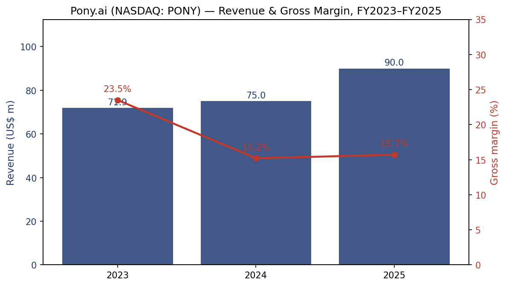
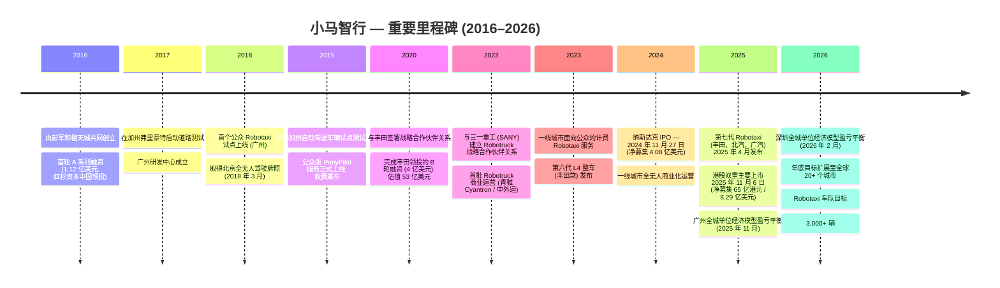
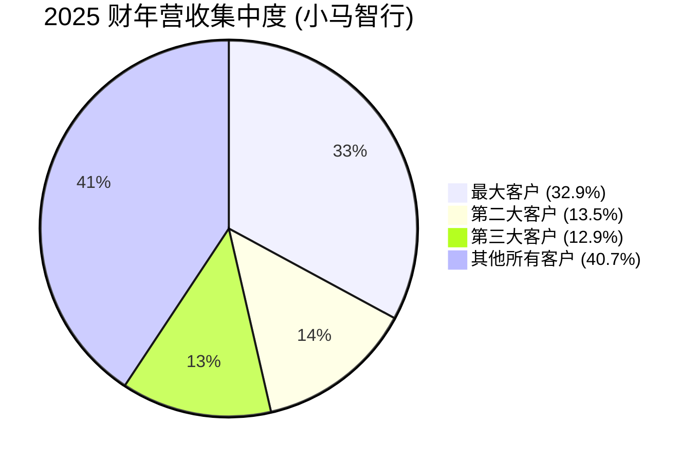
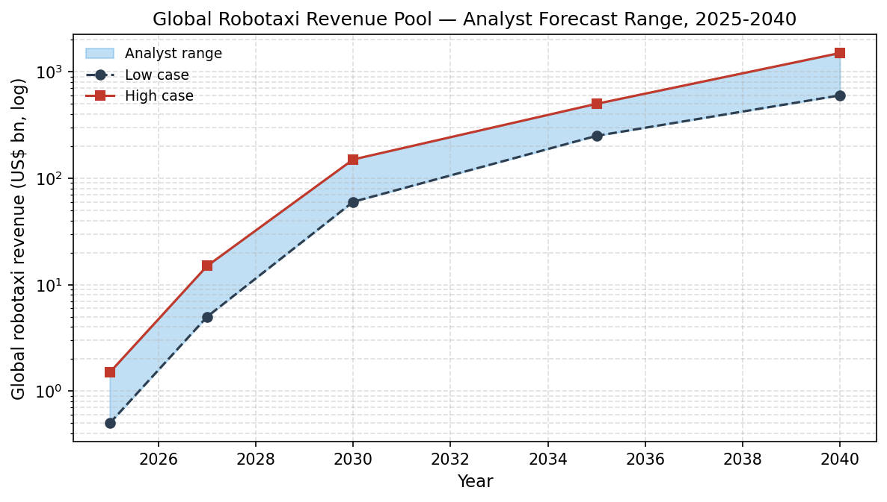
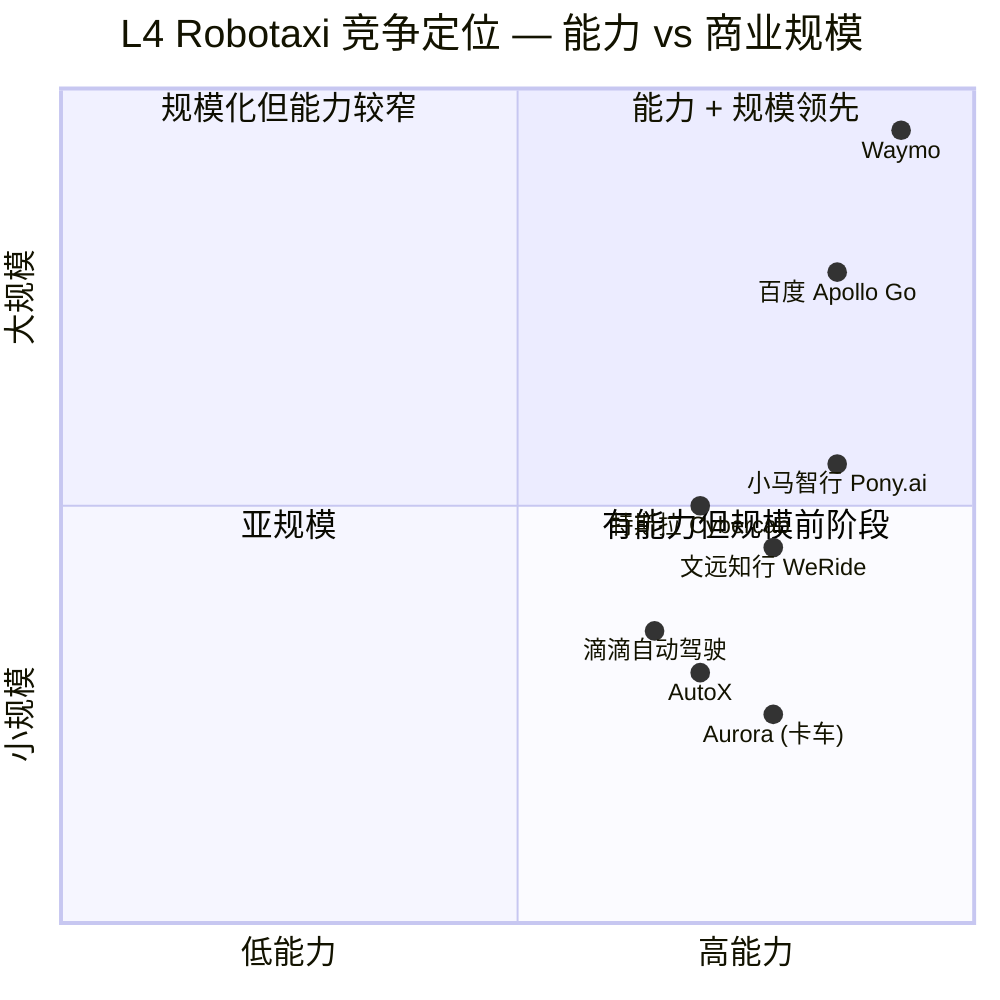
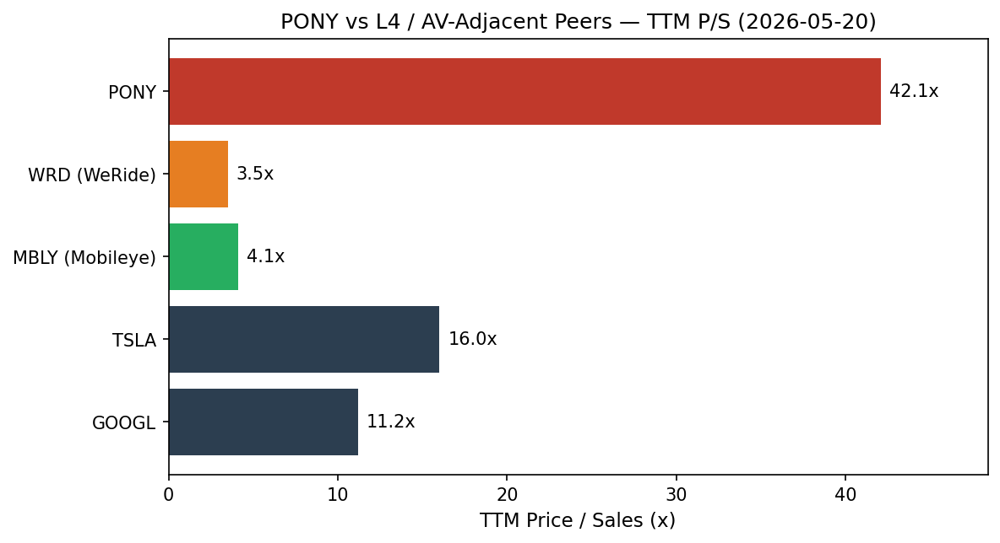

# 公司研究报告: Pony AI Inc. 小马智行 (NASDAQ:PONY / HKEX:2026)

**截至日期:** 2026-05-20
**分析师报告 — 起始覆盖 (initiation of coverage)**
**报告币种:** 美元 (功能货币为人民币; 美元数值按申报当日汇率换算)
**报告语言: 简体中文 (英文版同时存在于本目录)**

> **业绩更新 — 2025 财年业绩 & 2026 财年车队指引发布 (2026-03-26):** 小马智行 (Pony.ai) 公布 2025 财年营业收入 9,000 万美元, 同比增长 20.0%, 并在 2025 年 Q4 实现首次季度 GAAP 净利润 7,550 万美元 (几乎全部来自交易性证券非经营性公允价值上调 — 非 GAAP 净亏损为 4,900 万美元)。管理层首次发布 2026 财年运营目标: Robotaxi (无人驾驶出租车) 车队规模将从 1,400+ 辆扩展至年底**3,000+ 辆**, 运营覆盖城市达**全球 20+ 个城市**, 其中"接近半数"在海外。Q4 Robotaxi 业务收入同比增长 160%, 计费乘车收入同比增长超过 500%, 广州 (2025 年 11 月) 与深圳 (2026 年 2 月) 达到全城单位经济模型 (unit economics) 盈亏平衡。来源: [Pony AI 2025 财年 Q4 业绩公告, 2026-03-26](https://www.sec.gov/Archives/edgar/data/1969302/000110465926034888/tm269906d1_ex99-1.htm)。

---

## 目录

1. 公司概览
2. 公司历史
3. 管理团队
4. 产品与服务
5. 客户与上市策略
6. 行业概览
7. 竞争格局
8. 市场机会 (TAM)
9. 风险评估
- 参考资料

======================================

## 1. 公司概览

Pony AI Inc. ("小马智行 (Pony.ai)", NASDAQ:PONY, HKEX:2026) 是一家在开曼群岛注册、总部位于广州的 Level 4 (L4) 自动驾驶 (autonomous driving) 系统开发商。公司自主设计软硬件全栈解决方案 — 即"虚拟司机 (Virtual Driver)" — 并通过三条整合业务线进行商业化: 自营 **Robotaxi (无人驾驶出租车)** 网约车服务、L4 **Robotruck (自动驾驶卡车)** 货运服务, 以及**许可与应用 (licensing & applications)** (向 OEM 整车厂及周边机器人客户销售自动驾驶域控制器、ADAS / L2++ 软件及工程服务)。公司明确的使命是"让自动驾驶出行无处不在", 通过车规级、出厂预装传感器与计算平台量产 L4 车辆来实现 ([Pony AI 20-F 表格 2025 财年, "我们的使命"](https://www.sec.gov/Archives/edgar/data/1969302/000110465926046406/pony-20251231x20f.htm))。

**业务模式。** 小马智行沿三条主轴将其核心技术变现。(i) **Robotaxi** 业务的收入目前主要来自为 OEM 整车厂与出行网络公司 (TNC) 提供的 AV (autonomous vehicle, 自动驾驶车辆) 工程服务 — 软件集成、部署与维护 — 并日益依赖在北京、上海、广州、深圳 (四座小马智行持有全无人商业化牌照的中国一线城市) 进行的乘客计费业务 ([Pony AI 20-F 2025 财年, 第 4.B 项](https://www.sec.gov/Archives/edgar/data/1969302/000110465926046406/pony-20251231x20f.htm))。(ii) **Robotruck** 业务收入主要来自由 Cyantron (青骓物流) 运营的货运服务和编队 (platooning) 运营, 其战略合作伙伴中外运 (Sinotrans) 承担相当份额的运量。(iii) **许可与应用**业务向 OEM 整车厂销售自主研发的自动驾驶域控制器 (ADC, autonomous domain controller) 与智能驾驶软件, 并日益拓展至低速机器人、清扫机器人、物流和人形机器人客户; 2025 年 ADC 出货量较 2024 年增长超过 5 倍 ([2025 财年 Q4 业绩公告, 2026-03-26](https://www.sec.gov/Archives/edgar/data/1969302/000110465926034888/tm269906d1_ex99-1.htm))。

**地理与规模。** 公司目前几乎全部在中国大陆经营: 2025 财年营业收入的 97.3% (9,000 万美元中的 8,760 万美元) 在中国大陆产生, 仅有 240 万美元 (2.7%) 来自海外 ([20-F 2025 财年, 备注"按地理区域划分的营业收入"](https://www.sec.gov/Archives/edgar/data/1969302/000110465926046406/pony-20251231x20f.htm))。面向公众的计费 Robotaxi 服务已在四座一线城市全部上线, 并于 2026 年 3 月扩展至杭州和长沙; 国际 Robotaxi 试点在多哈 (卡塔尔)、新加坡、萨格勒布 (克罗地亚)、首尔、卢森堡运营, 以及 (待最终批准的) 迪拜。截至 2025 年底, 员工人数为 1,669 人, 其中 745 人 (44.6%) 从事研发, 其余主要分布在运营、车辆集成与工程团队 ([20-F 2025 财年, 第 6.D 项, "按职能划分的员工"](https://www.sec.gov/Archives/edgar/data/1969302/000110465926046406/pony-20251231x20f.htm))。

**规模指标。** 截至 2026 年 3 月底, 小马智行 Robotaxi 车队超过 1,400 辆 (截至 2026 年 3 月 25 日已生产 1,446 辆), 累计自动驾驶里程"超过 6,500 万公里" ([2025 财年 Q4 业绩公告, 2026-03-26](https://www.sec.gov/Archives/edgar/data/1969302/000110465926034888/tm269906d1_ex99-1.htm))。Robotaxi 工程服务的累计企业客户从 2023 年的 52 家增长至 2025 年的 213 家 ([20-F 2025 财年](https://www.sec.gov/Archives/edgar/data/1969302/000110465926046406/pony-20251231x20f.htm))。截至 2026 年 3 月 31 日, Robotruck 车队规模为 210 辆 (与中外运联运), 包含 Level 2++ 智能卡车和 Level 4 自动驾驶卡车。截至 2026 年 3 月底, PonyPilot+ 应用用户总数接近一百万, 同比近三倍增长。



来源: [Pony AI 20-F 2025 财年, 第 5.A 项"经营业绩"](https://www.sec.gov/Archives/edgar/data/1969302/000110465926046406/pony-20251231x20f.htm)。

**估值快照 (数据截至 2026-05-20, Yahoo Finance)。** ADS 价格 8.74 美元, 市值 37.9 亿美元, 企业价值 27.0 亿美元 (EV 低于市值因为 2025 财年资产负债表显示账面有 15.1 亿美元现金、短期投资及长期理财产品 — 这是 2025 年 11 月港股双重主要上市完成后状态, 该次上市净募集资金约 65.1 亿港元 / 8.29 亿美元 — [2025 财年 Q4 业绩公告, 2026-03-26](https://www.sec.gov/Archives/edgar/data/1969302/000110465926034888/tm269906d1_ex99-1.htm))。流通股本约 3.52 亿股。**TTM (过往十二个月) 市销率 (P/S) = 42.1 倍**; **TTM 市盈率 (P/E) 不具备意义**, 因为公司在 2025 财年录得归属于小马智行的净亏损 1.34 亿美元 ([20-F 2025 财年, 第 5.A 项](https://www.sec.gov/Archives/edgar/data/1969302/000110465926046406/pony-20251231x20f.htm))。市场一致预期所隐含的远期 P/E 也是负值 (~-14 倍), 与公司将持续承受 GAAP 亏损至 2026 财年的判断一致。

**P/E 为负 — 原因。** 小马智行在 TTM 基础上不盈利, 因为 (i) 2025 财年研发支出 2.174 亿美元 (占营业收入 241.6%) 和销售管理费用 (SG&A) 5,760 万美元 (占营业收入 64.0%) 远超过 15.7% 毛利率下 1,420 万美元的毛利润, 形成 2.609 亿美元的经营亏损; (ii) 2024 财年包含一次性 1.27 亿美元股权激励 (SBC) 费用, 与 2024 年 11 月纳斯达克 IPO 相关 — 该笔费用重置了股权奖励负债。2025 财年非 GAAP 经营亏损 (剔除 SBC) 为 2.291 亿美元, 高于 2024 财年的 1.699 亿美元, 说明即便剔除 SBC, 公司仍处于深度再投资期 ([2025 财年 Q4 业绩公告, 2026-03-26](https://www.sec.gov/Archives/edgar/data/1969302/000110465926034888/tm269906d1_ex99-1.htm))。2025 年 Q4 单季度 GAAP 净利润 7,550 万美元几乎全部来自交易性证券的公允价值上调 — 属非经常性项目。

**为何 42 倍 P/S。** 该估值远高于任何合理的"规模化 Robotaxi"终值预测, 但 PONY 不依据 TTM 机械数据, 而是依据三大前瞻叙事进行定价: (i) 麦肯锡测算全球 Robotaxi TAM 在 2030 年达 600-1500 亿美元 ([麦肯锡, 2023 年 1 月](https://www.mckinsey.com/industries/automotive-and-assembly/our-insights/autonomous-drivings-future-convenient-and-connected)), 高盛预测 2035 年达 1 万亿美元以上 ([高盛研究, 2024](https://www.goldmansachs.com/insights/articles/the-robotaxi-business-could-be-worth-7-trillion-by-2050)); (ii) 小马智行是全球仅有的两家纯 L4 Robotaxi 上市公司之一 (另一家为 WeRide / 文远知行, NASDAQ:WRD), 加上嵌入百度内部的 Apollo Go (萝卜快跑) — 这赋予了该股作为板块代理的稀缺溢价; 以及 (iii) 2026 财年 Robotaxi 车队指引 — 从约 1,400 辆扩展至 3,000+ 辆 — 隐含 2026 年 Robotaxi 业务收入或较 2025 年大致翻倍, 即便不计地域扩张, 也支撑"接近拐点"的论述。42 倍 P/S 大约是**行业中位数的 2.8 倍** (下文计算), 大致**为 WeRide 3.5 倍 TTM P/S 的 12 倍** (Yahoo Finance, 2026-05-20)。

**同业可比。** 仅纳入可辩护的 L4/AV 同业组: WeRide (WRD) 的 TTM P/S 为 3.5 倍, Mobileye (MBLY) 4.1 倍, Tesla (TSLA) — 唯一一家尝试美国规模化 Robotaxi 产品的上市公司 — 16.0 倍, Alphabet (GOOGL, Waymo 的母公司) 11.2 倍, Aurora Innovation (AUR) 超过 3,000 倍 P/S (本质上是营收前阶段初创公司的估值倍数, 不构成有意义可比) (全部数据来自 Yahoo Finance, 2026-05-20)。剔除 AUR 的失真数据, 同业组均值为 8.7 倍 P/S; PONY 的 42.1 倍是**该均值的 4.8 倍**, 是所有纯 AV 上市公司中最高的重估溢价。PONY 52 周价格区间为 7.99 美元 — 24.92 美元 (Yahoo Finance), 意味着该股目前在 2024 年 11 月以 13 美元/ADS 在纳斯达克 IPO (净募集 4.08 亿美元 — [20-F 2025 财年](https://www.sec.gov/Archives/edgar/data/1969302/000110465926046406/pony-20251231x20f.htm)) 之后, 交易价格接近后 IPO 区间的下沿。对投资人而言, 该估值溢价隐含市场目前定价的是**执行风险**, 而非**机会风险** — 即车队规模、单位经济模型验证、网约车渗透必须连续数年复合增长, 方能匹配当前进入倍数的合理性。

## 2. 公司历史

小马智行于 2016 年底在加州弗里蒙特 (Fremont) 与北京由**彭军博士 (James Peng)** (时任百度自动驾驶事业部首席架构师) 与**楼天城博士 (Tiancheng Lou)** (百度史上最年轻的主任架构师、前 Google 自动驾驶工程师) 共同创立 ([20-F 2025 财年, 第 6.A 项"董事与高管"](https://www.sec.gov/Archives/edgar/data/1969302/000110465926046406/pony-20251231x20f.htm))。两位创始人 2016 年在百度位于 Sunnyvale 的自动驾驶团队相识, 很快得出结论: 在自动驾驶领域最具防御性的押注是聚焦中国的垂直整合 L4 初创公司 — 中国具备庞大的潜在市场、对自动驾驶友好的监管环境, 以及愿意联合开发整合车辆的 OEM 合作伙伴。公司于 2017 年 2 月在加州弗里蒙特启动道路测试, 2018 年中开设广州总部, 并于 2019 年 2 月在广州南沙区推出首个面向公众的 Robotaxi 试点项目 "PonyPilot", 成为全球最早提供付费 Robotaxi 乘车服务的公司之一。



**战略转折点。** 三大战略决策塑造了今天的小马智行。**第一**, 2018 年决定将基地锚定在中国而非美国。尽管美国加州的测试里程与营收一直延续至 COVID 时期, 但公司意识到一线中国城市的监管路径 — 牌照发放更明确、许可发放更快速, 以及对"智能与网联车辆"示范区的明确政策支持 — 将允许其在美国同业之前数年实现规模化运营 ([20-F 2025 财年, "中国监管环境"](https://www.sec.gov/Archives/edgar/data/1969302/000110465926046406/pony-20251231x20f.htm))。这一判断已获回报: 到 2025 年, 小马智行已在全部四座一线城市持有全无人商业化牌照, 此项成就 Waymo 与 Cruise 在可比密度下尚未达成。**第二**, 2020 年与**丰田 (Toyota)** 的同盟 — 既是股权投资者也是联合开发伙伴 — 把小马智行从"寻找车辆的软件公司"转变为垂直整合平台: 丰田现在提供 bZ4X 车型, 专为 L4 兼容的冗余架构定制, 由广州 (HX) 小马与丰田 / 广汽丰田 (GTMC) 各占 50% 的合资公司运营该车队 ([20-F 2025 财年, "与丰田及 GTMC 的合资"](https://www.sec.gov/Archives/edgar/data/1969302/000110465926046406/pony-20251231x20f.htm))。**第三**, 2022 年 5 月决定通过与三一重工的合作将 L4 栈延伸至卡车业务, 并与中外运成立青骓物流, 将营收从单一垂直 Robotaxi 叙事多样化为两产品 (出租车 + 卡车) 平台, 两者底层自动驾驶技术栈共享 80% ([2025 财年 Q4 业绩公告, 2026-03-26](https://www.sec.gov/Archives/edgar/data/1969302/000110465926034888/tm269906d1_ex99-1.htm))。

**融资历史 (选摘)。** 2016 至 2024 年间, 小马智行在九轮融资中, 自红杉资本中国、IDG 资本、丰田、清流资本 (ClearVue Partners)、沙特阿美 Prosperity7 Ventures、一汽集团、安大略教师退休基金等投资人处累计融资约 14 亿美元, 在 2022 年某轮融资后达到约 85 亿美元的私募市场估值峰值 ([Reuters, "小马智行裁员、调整美国业务", 2022](https://www.reuters.com/technology/exclusive-self-driving-firm-pony-ai-cuts-staff-restructures-us-operations-2022-04-23/))。公司于 2024 年 11 月 27 日以 13 美元/ADS 在纳斯达克上市, 净募集 4.08 亿美元, 并于 2025 年 11 月 6 日以 139 港元/股在港交所双重主要上市, 净募集约 65 亿港元 / 8.29 亿美元 ([20-F 2025 财年](https://www.sec.gov/Archives/edgar/data/1969302/000110465926046406/pony-20251231x20f.htm))。

**最近动态 (过去 12 个月)。** 2025 年 4 月: 推出第七代 Robotaxi 平台, 涵盖三款车型 (丰田 bZ4X、北汽 Alpha-T5、广汽 AION V), 量产并"为 2026 年部署锁定 1,000 辆 bZ4X"。2025 年 11 月: 港交所双重主要上市; 广州全城单位经济模型达到盈亏平衡。2026 年 2 月: 深圳全城单位经济模型达到盈亏平衡。2026 年 3 月: 扩展至杭州与长沙; 国际业务在多哈、新加坡和萨格勒布上线; 第四代 Robotruck 亮相, 自动驾驶套件 (ADK) BOM 成本较第三代降低 70%, "计划 2026 年底量产" ([2025 财年 Q4 业绩公告, 2026-03-26](https://www.sec.gov/Archives/edgar/data/1969302/000110465926034888/tm269906d1_ex99-1.htm))。过去 12 个月公开里程碑的节奏处于公司历史最高水平, 也是支撑 2026 财年"20+ 个城市, 3,000+ 辆"指引的依据。

## 3. 管理团队

小马智行高级团队工程深度异常突出, 任期异常稳定: 两位联合创始人和 CFO 自 2016 年公司成立以来一直在公司; 七位高管中有四位 (彭、楼、王、张宁) 曾在百度和/或 Alphabet 任职过。创始人投票权高度集中 — CEO 彭军通过超级投票权 B 类股控制"超过 50%"的总投票权 ([20-F 2025 财年, 第 6.E 项](https://www.sec.gov/Archives/edgar/data/1969302/000110465926046406/pony-20251231x20f.htm))。

**彭军博士 (James Peng) — 联合创始人、董事长兼 CEO (51 岁)。** 彭是公司的公众形象, 也是事实上的控股股东。本科毕业于清华大学, 博士毕业于斯坦福大学。2005 至 2011 年, 彭在 Alphabet (前身为 Google) 担任软件工程师, 专攻后端和前端广告系统; 在山景城工作期间获得"Google 创始人奖" — 公司内部最高荣誉。2011 至 2016 年期间, 他担任**百度首席架构师**, 领导百度自动驾驶事业部 (即如今 Apollo Go 的前身) 的研发 ([20-F 2025 财年, 第 6.A 项](https://www.sec.gov/Archives/edgar/data/1969302/000110465926046406/pony-20251231x20f.htm))。百度任职至关重要: 彭打造的方法论现在被他用于对抗自己的前雇主 — 中国 Robotaxi 业务的主要直接竞争对手。彭与楼天城于 2016 年底共同创立小马智行, 自公司成立以来一直担任董事长兼 CEO。通过 B 类超级投票权股, 彭持有 >50% 的投票权 ([20-F 2025 财年, 第 6.E 项"股权"](https://www.sec.gov/Archives/edgar/data/1969302/000110465926046406/pony-20251231x20f.htm))。对外沟通 — 访谈、会议主旨演讲、2025 财年致股东信 — 表明这位 CEO 兼具技术深度与商业沟通能力; 在 2026 年 3 月业绩说明会上, 他将这一年定调为"加速增长", 并公开承诺 3,000 辆 / 20 城市的目标。彭的个人信誉 — 斯坦福博士、Alphabet 老员工、百度首席架构师 — 在争取合作伙伴 (2020 年丰田、2022 年三一、2024 年北汽与广汽) 与盈利之前的融资中均为重要资产。

**楼天城博士 (Tiancheng Lou) — 联合创始人、董事、CTO (40 岁)。** 楼是公司的技术良知。本科与博士均毕业于清华大学计算机系。被誉为"顶尖程序员" — 在 TopCoder 全球编程竞赛中获奖 16 年的常胜者, 两届 Google Code Jam 全球总冠军 ([20-F 2025 财年, 第 6.A 项](https://www.sec.gov/Archives/edgar/data/1969302/000110465926046406/pony-20251231x20f.htm))。加入小马智行之前, 他曾在 Quora 工作, 是百度史上最年轻的主任工程师, 并在 Alphabet 自动驾驶部门度过了在 Google 的最后一年。楼掌握 AI 架构路线图 — "PonyWorld" 基础模型、Virtual Driver 虚拟司机栈, 以及第七代冗余计算平台 — 也是技术差异化的对外发言人 (2026 年 3 月业绩说明会: "Robotaxi 是物理 AI 的首个真实应用")。小马智行的 CEO-CTO 分工模式镜像了 Google 联合创始人模式, 这也是公司每位工程师产出经过同行评审的 AV 论文数量超过其最接近同业的原因之一。

**王皓俊博士 ("Leo" Wang) — 首席财务官 (49 岁)。** 王自 2016 年公司成立以来加入小马智行。本科毕业于上海交通大学, 计算机科学博士毕业于南加州大学。在 Shanghai Online 任软件工程师 (1998-2001), 在 IBM 担任顾问软件工程师 (2009-2014), 在百度担任高级软件架构师 (2014-2016), 之后担任 CFO ([20-F 2025 财年, 第 6.A 项](https://www.sec.gov/Archives/edgar/data/1969302/000110465926046406/pony-20251231x20f.htm))。他同时负责人力资源职能。对于美国上市公司的 CFO, 王的背景是工程师而非投资银行家在业内颇不寻常 — 但 2024 年 11 月的纳斯达克 IPO (净募集 4.08 亿美元) 和 2025 年 11 月的港交所双重主要上市 (65 亿港元 / 8.29 亿美元净额) 都在他任期内完成, 使公司在 2025 年底拥有 15.1 亿美元的现金、短期投资和长期理财产品 ([2025 财年 Q4 业绩公告, 2026-03-26](https://www.sec.gov/Archives/edgar/data/1969302/000110465926034888/tm269906d1_ex99-1.htm))。王是 2025 年所有 6-K 的具名签署人; 他在对外新闻材料中使用 "Leo", 在 SEC 申报中使用 "Haojun"。

**张宁先生 (Ning Zhang) — 副总裁兼北京研发中心总经理 (40 岁)。** 清华大学姚期智院士主理的首届"姚班"成员 (姚期智是中国唯一一位图灵奖得主)。2017 年加入小马智行, 之前在 Alphabet 担任工程师任期 2014-2017 年。他负责北京研发中心 — 自动驾驶系统架构团队 — 以及北京全无人商业化运营。([20-F 2025 财年, 第 6.A 项](https://www.sec.gov/Archives/edgar/data/1969302/000110465926046406/pony-20251231x20f.htm))

**莫璐怡博士 (Luyi Mo) — 副总裁、Robotaxi 运营 (37 岁)。** 2018 年加入小马智行。香港大学博士; 2011 年第 35 届 ACM 国际大学生程序设计竞赛全球冠军 — 自 1977 年以来中国第一位女性全球冠军。此前在网易担任高级软件工程师。负责小马智行广州与深圳办公室及 Robotaxi 服务 / 运营职能 — 即城市级运营 P&L。([20-F 2025 财年, 第 6.A 项](https://www.sec.gov/Archives/edgar/data/1969302/000110465926046406/pony-20251231x20f.htm))

**治理。** 董事会共有七名董事: 两位联合创始人 (彭、楼)、一位风险投资人 (张斐, 5Y Capital 合伙人)、一位战略合作伙伴代表 (滨田武夫 Takeo Hamada, 丰田汽车 (中国) 投资有限公司执行副总裁), 以及三名独立董事 — Jackson Tai (前 DBS 集团 CEO; 现任药明生物非执行董事)、Mark Qiu (华兴资本投资 (中国) 创始管理合伙人, 前中海油 CFO), 以及 Asmau Ahmed (前 Alphabet 总监)。审计委员会主席由 Tai 担任。三位独立董事均具有可信度 — Tai 的银行业从业记录、Qiu 国有石油大公司 CFO 经验与私募基金领导力的组合, 以及 Ahmed 的 Alphabet 运营经验 — 但对于一家纳斯达克 + 港交所双重上市公司规模而言, 董事会规模偏小, 也未设独立首席董事 (Lead Independent Director) 一职。**投票权集中是治理的主导事实:** 彭通过 B 类超级投票权股持有 >50% 的总投票权, 而创始人与管理层合计持股远超此数 — 这给予彭对任何控制权变更、并购或资本运作的实际否决权。关联方交易并非微不足道: 丰田既是战略投资者 (拥有董事会席位) 也是客户 (bZ4X 集成的工程服务), 中外运既是合资伙伴又是 Robotruck 业务前三大客户。20-F 在第 7.B 项详细披露了这两项关系 ([20-F 2025 财年](https://www.sec.gov/Archives/edgar/data/1969302/000110465926046406/pony-20251231x20f.htm))。薪酬高度倾向股权: 2024 年 11 月纳斯达克 IPO 触发了 Q4 2024 单季度 1.2 亿美元股权激励费用, 这是此前条件性 RSU 兑现的结果。

**管理团队执行记录。** 高级团队在 13 个月内执行了两次大型资本市场交易 (2024 年 11 月纳斯达克, 2025 年 11 月港交所), 将 Robotaxi 车队从约 250 辆扩展至 1,446 辆, 在所有四座中国一线城市获得了全无人商业牌照, 在其中两座城市达到全城单位经济模型盈亏平衡, 并实现 2025 年 Robotaxi 业务收入同比增长 128% — 按每美元支出口径与 WeRide 和 Apollo Go 比较, 该执行记录占优。两个尚未解决的问题是 (a) 团队能否从项目驱动的许可营收转向持久的消费者计费乘车营收, 以及 (b) 海外扩张 — 多哈、新加坡、萨格勒布、迪拜、卢森堡 — 能否以与中国一致的单位经济模型实现运营。

## 4. 产品与服务

小马智行的产品体系映射到三大报告营业收入分部。下方产品树反映了公司网站 (pony.ai) 和 2025 财年 20-F 披露的每个独立产品。

```mermaid
graph TD
  P[小马智行 Virtual Driver 虚拟司机平台] --> RT[Robotaxi 服务]
  P --> RTK[Robotruck 服务]
  P --> LA[许可与应用]
  RT --> RTa[自营 L4 Robotaxi 车队 — 北京、上海、广州、深圳]
  RT --> RTb[第七代 Robotaxi — 丰田 bZ4X / 北汽 Alpha-T5 / 广汽 AION V]
  RT --> RTc[PonyPilot+ 消费者应用]
  RT --> RTd[国际试点 — 多哈、新加坡、萨格勒布、首尔、卢森堡、迪拜]
  RT --> RTe[联合部署 — 丰田 / GTMC 合资; OnTime; ATBB]
  RT --> RTf[向 OEM / TNC / 车队公司提供的 AV 工程服务]
  RTK --> RTKa[与中外运合作的青骓 L4 货运平台]
  RTK --> RTKb[第四代 Robotruck — 2026 年底量产]
  RTK --> RTKc[1+N 无人编队系统]
  RTK --> RTKd[江门港无人 Robotruck 运营]
  LA --> LAa[自动驾驶域控制器 (ADC) — 机器人、物流客户]
  LA --> LAb[面向 OEM 的 L2++ 智能驾驶软件]
  LA --> LAc[数据分析与仿真工具]
  LA --> LAd[定制 AV 工程 — 人形机器人、清扫机器人]
```

**4.1 Robotaxi 服务 (2025 财年营收 1,660 万美元, 占总营收 18.5%, 同比 +128.6%)** — 平台的*旗舰*, 也是驱动股权叙事的分部。小马智行通过面向消费者的 PonyPilot+ 应用, 在北京、上海、广州和深圳运营端到端 L4 网约车服务, 并通过深圳与广州的腾讯微信"出行服务"平台触达更多用户 ([2025 财年 Q4 业绩公告, 2026-03-26](https://www.sec.gov/Archives/edgar/data/1969302/000110465926034888/tm269906d1_ex99-1.htm))。当前量产车型是**第七代 Robotaxi**, 2025 年 4 月发布, 提供三款 OEM 联合开发版本 (丰田 bZ4X、北汽 Alpha-T5、广汽 AION V)。第七代平台具备冗余传感器、计算和制动; 其自动驾驶套件 BOM 成本较第六代大幅削减 (2026 年 3 月发布的第四代 Robotruck 报出与之方向类比的 70% ADK BOM 成本降幅 — [2025 财年 Q4 业绩公告, 2026-03-26](https://www.sec.gov/Archives/edgar/data/1969302/000110465926034888/tm269906d1_ex99-1.htm))。定价相对滴滴和网约车在位者"平衡": 管理层引述 2026 年 3 月 22 日深圳**单车日峰净收入人民币 394 元 / 单车 25 单**作为运营数据的历史最高点, 并用这些单车指标作为单位经济模型走向盈亏平衡的代理变量。**竞争优势: 有 — 部分护城河。** 护城河由以下因素组合而成: (a) **监管牌照** — 据弗若斯特沙利文 (Frost & Sullivan), 小马智行是"唯一在四个一线城市全部获得 Robotaxi 牌照的公司", 而牌照发放是缓慢、受限、政治稀缺的 ([20-F 2025 财年](https://www.sec.gov/Archives/edgar/data/1969302/000110465926046406/pony-20251231x20f.htm)); (b) **OEM 联合开发深度** — 四年期的丰田合作为小马智行带来 bZ4X 底盘, 出厂安装冗余系统, 这是 WeRide 和 Apollo Go 在同年款无法匹敌的 (Apollo 的 RT6 由比亚迪供应, WeRide 的 HPT-AX 基于日产 Ariya); (c) **运营数据** — 在中国一线城市真实交通中的 6,500 万 + 自动驾驶公里, 构成了不易复制的训练数据优势。该护城河是*部分性*的, 而非深护城河: 监管牌照可向同业扩展 (Apollo Go 刚刚以更高密度在武汉和重庆开放), 丰田是合作伙伴, 而非独家供应商, 而训练数据差距随着 Apollo Go 记录更多里程而正在缩小。**最接近的竞争产品:** 百度 Apollo Go RT6 Robotaxi (部署在武汉、重庆、北京) — 在技术能力上*大致持平*, 但在城市密度上*领先* (Apollo Go 报告 2025 年单季 20 万 + 次乘车 vs 小马智行全年报告的 3.2 万家企业客户), 在 OEM 多样性方面*落后* (Apollo Go 是单一车型, 由比亚迪供应)。

**4.2 Robotruck 服务 (2025 财年营收 4,060 万美元, 占总营收 45.1%, 同比 +0.6%)** — 按营收口径最大的分部, 但 2025 年增长最慢。小马智行主要通过**青骓物流 (Cyantron)** 经营 L4 货运平台 — 该公司与中外运 (中国最大的物流国有企业) 和**三一重工 (SANY)** (重卡 OEM 合作伙伴) 合资。截至 2026 年 3 月底, 车队规模为 210 辆卡车, 混合 Level 2++ 智能卡车 (驾驶辅助) 和 Level 4 自动驾驶卡车 (仍配安全员), 在京津冀走廊、珠江三角洲和江门港运营货运 ([2025 财年 Q4 业绩公告, 2026-03-26](https://www.sec.gov/Archives/edgar/data/1969302/000110465926034888/tm269906d1_ex99-1.htm))。2026 年初亮相的**第四代 Robotruck** — 配备 ADK BOM 成本降低 70% — 目标在 2026 年底量产并"初次无人化部署"。Robotruck 与 Robotaxi 产品共享约 80% 的软件栈, 这是关键的研发效率主张 ([2025 财年 Q4 业绩公告, 2026-03-26](https://www.sec.gov/Archives/edgar/data/1969302/000110465926034888/tm269906d1_ex99-1.htm))。**定价模式:** 青骓按货运订单计费, 接近市场价, 中外运保证路线运量 — 这更接近 B2B 运输服务, 而非软件许可。**毛利率方面**, Robotruck "在当前商业化早期阶段处于较低毛利率水平" ([20-F 2025 财年](https://www.sec.gov/Archives/edgar/data/1969302/000110465926046406/pony-20251231x20f.htm))。**竞争优势: 部分。** 与中外运的关系在结构上难以复制 (中外运是中国最大的国企关联货运代理, 也是青骓的股东), 而三一重工赋予小马智行少有竞争对手具有的整合 OEM 关系。但 TuSimple (已退市)、Inceptio (赢彻科技, 中国 AV 卡车初创公司)、Plus.ai 和 Embark 都瞄准相同的运输走廊, 而卡车产品在无人化商业化方面比 Robotaxi 产品早期得多。**最接近的竞争产品:** 赢彻科技星辰平台 — 在无人驾驶里程上*落后于*小马智行, 但在 OEM 渗透上*领先* (赢彻向中国重汽、一汽、东风销售)。

**4.3 许可与应用 (2025 财年营收 3,280 万美元, 占总营收 36.4%, 同比 +19.7%)** — 包含三个子产品: (i) **自动驾驶域控制器 (ADC)** — 向低速机器人配送公司、清扫机器人制造商、物流专家和人形机器人公司销售的专有计算模块, 其中 ADC 出货量在 2025 年增长 >5 倍 ([2025 财年 Q4 业绩公告, 2026-03-26](https://www.sec.gov/Archives/edgar/data/1969302/000110465926034888/tm269906d1_ex99-1.htm)); (ii) **POV 智能解决方案** — 按项目营收方式向 OEM (如上汽) 交付的 L2++ 智能驾驶软件解决方案; (iii) **车在环 / 数据分析工具** — 提供给行业参与者的 Virtual Driver 衍生仿真和分析工具 ([20-F 2025 财年, "许可与应用"](https://www.sec.gov/Archives/edgar/data/1969302/000110465926046406/pony-20251231x20f.htm))。该分部目前在产品基础上**毛利率最高**, 但波动也最大 — 2025 年 Q4 许可营收同比下降 53.2%, 因为 2024 年 Q4 一次性项目营收未重复。**竞争优势: 部分 — 护城河在 IP 而非规模。** ADC 产品线在人形机器人和清扫机器人细分领域具备真正差异化, 因为它把 Virtual Driver 虚拟司机栈无缝移植到相邻应用而不需要重新工程; 但更大的 OEM L2++ 软件业务更拥挤, 与 Mobileye、地平线机器人 (Horizon Robotics)、蔚来 Aquila、比亚迪 DiPilot、华为 ADS 和 Momenta 竞争。**最接近的竞争产品:** 地平线机器人 (HKEX:9660) ADC 平台 — 技术上*大致持平*, 但在 OEM 设计赢得方面*领先* (地平线声称有 25+ 家 OEM 客户, 而小马智行的客户基础更小且更专业化)。

**旗舰产品与长尾。** 驱动业务的 1-3 款旗舰产品是: (a) **第七代 Robotaxi** — 投资者关注的中心, 即便它是最小的报告营收线 — 因为它决定了股权终值; (b) **青骓 Robotruck 运营** — 最大的营收线; (c) **ADC 产品系列** — 毛利率最高的分部, 出货量增长 >5 倍。小马智行的战略挑战在于最大营收线 (Robotruck) 增长最慢, 而最小营收线 (Robotaxi) 才是市场定价的对象。

**过去 12 个月推出与停产产品。** 推出: 第七代 Robotaxi (2025 年 4 月)、第四代 Robotruck (2026 年 3 月)、扩展至杭州和长沙 (2026 年 3 月)、多哈 / 新加坡 / 萨格勒布国际 Robotaxi 试点, 以及丰田 / GTMC 50/50 联合部署合资。停产: 无公开宣布。

## 5. 客户与上市策略

小马智行的客户基础比企业客户数量所暗示的更集中。公司报告截至 2025 年底, Robotaxi 工程服务线累计 213 家企业客户 (较 2023 年的 52 家增长 — [20-F 2025 财年](https://www.sec.gov/Archives/edgar/data/1969302/000110465926046406/pony-20251231x20f.htm)), 但**前三大客户分别贡献 2025 财年合并营业收入的 32.9%、13.5% 和 12.9% — 合计 59.3%**, 其中最大单一客户占总营收约三分之一 ([20-F 2025 财年, 备注"客户与供应商集中度"](https://www.sec.gov/Archives/edgar/data/1969302/000110465926046406/pony-20251231x20f.htm))。2024 财年一位客户占营收的 29.8%。2023 财年两位客户占 31.3% 和 25.0%。所以三年的披露显示**最大客户份额持续在 25-33%, 第二大 / 第三大客户份额始终大于 50% 重大性门槛** — 这对一家美股上市公司来说是显著集中的营收基础。小马智行未在集中度备注中列出客户姓名, 但交叉阅读关联方交易部分表明**中外运有限公司**和**丰田汽车公司**是两个被列名的关联方客户 (丰田的直接营收贡献按 7.B 项是 2025 财年营收的 0.1% — 这意味着大额中外运关系是 Robotruck 集中度的结构性驱动因素, 而 2025 年最大客户 (32.9%) 与中外运或丰田名字均不匹配, 暗示是一笔许可线下的离散 OEM 项目)。


来源: [Pony AI 20-F 2025 财年, F 页, "客户与供应商集中度"](https://www.sec.gov/Archives/edgar/data/1969302/000110465926046406/pony-20251231x20f.htm)。

**客户细分。** 小马智行向五个逻辑买家池销售: (i) **OEM 整车厂与 Tier-1 车辆集成商** — 丰田、北汽、广汽、上汽、红旗联合开发 L4 车辆; (ii) **TNC / 出行平台** — 腾讯微信出行服务, OnTime 出行 (与小马智行在广州和北京 Robotaxi 联合部署上合作), ATBB Travel & Express Service (北京联合部署伙伴); (iii) **货运 / 物流运营商** — 中外运是 Robotruck 锚定 B2B 客户; (iv) **相邻机器人客户** — 购买 ADC 的人形机器人、清扫机器人、低速配送和物流自动化公司; (v) **消费者网约车乘客** — 面向公众的 PonyPilot+ 乘车乘客, 当前是最小的营收线, 但在 Q4 2025 中增长最高 (计费乘车营收 +500% 同比)。

**客户集中度风险判断。** 2025 财年前三大客户份额 59.3% **超过了** citations 技能为风险归类标记的 50% 重大性门槛。结转至第 9 章作为公司专有风险 #2。

**合同结构。** 20-F 未按客户披露主协议与逐笔订单条款, 但中外运和丰田在三个报告年中反复出现, 以及合资公司的正式成立 (与中外运的青骓、广州 (HX) 小马 / 丰田 / GTMC 合资), 暗示两个最大的战略客户关系是**多年期、股权锚定合同**, 而非年度采购订单。第三大客户席位更具轮换性 — 2024 财年只有一位客户跨越 10% 门槛 (29.8%), 2025 财年有三位, 而 2025 财年最大客户 (32.9%) 在关联方披露中与中外运或丰田名字均不匹配, 暗示是一笔离散许可 / 工程项目 ([20-F 2025 财年, 第 7.B 项](https://www.sec.gov/Archives/edgar/data/1969302/000110465926046406/pony-20251231x20f.htm))。

**上市策略 — 三个渠道。** (1) **自营 Robotaxi 车队** — 核心面向消费者渠道; 公司拥有车辆、运营车场、管理远程协助团队, 并记录乘车营收。(2) **联合部署模式** — 2025 年底与丰田 / GTMC 首次发布; 小马智行供应 Virtual Driver 虚拟司机和运营专长, 合作伙伴供应车辆和部分运营资本; 营收和经济模型共享。该模式是 2026 年扩张计划的基石, 因为它允许车队规模扩张, 而不需要小马智行进行一对一资本支出; 公司已为此目标从丰田锁定 1,000 辆 bZ4X。(3) **工程 / 许可渠道** — 多年期 OEM 项目 (丰田、北汽、广汽、上汽) 与对其他 OEM 的一次性项目许可; 毛利率最高的渠道, 但营收确认节奏波动较大。

**销售周期。** Robotaxi 工程服务的销售周期为 OEM 初次合作至首次交付物之间的 18-36 个月; Robotruck 合同基于物流招标采购; 消费者网约车通过 PonyPilot+ 应用即时入驻。消费者渠道客户获取成本未单独披露。

**列名案例 / 客户案例研究。** 2025 财年披露的案例: 丰田汽车 (第七代 bZ4X 联合开发)、北汽 (Alpha-T5)、广汽 (AION V)、上汽集团 (L4 平台合作)、中外运 (青骓货运合资)、三一重工 (卡车 OEM 合作伙伴)、腾讯 (微信出行服务集成)、Mowasalat Karwa (多哈 Robotaxi 推出合作伙伴), 以及 OnTime 出行和 ATBB (联合部署合作伙伴) ([20-F 2025 财年, 第 4.B 项](https://www.sec.gov/Archives/edgar/data/1969302/000110465926046406/pony-20251231x20f.htm); [2025 财年 Q4 业绩公告, 2026-03-26](https://www.sec.gov/Archives/edgar/data/1969302/000110465926034888/tm269906d1_ex99-1.htm))。

## 6. 行业概览

小马智行运营在三个行业的交叉点: (i) 自动驾驶软件与系统 (NAICS 511210 / 541512)、(ii) 网约车与客运服务 (NAICS 485310), 以及 (iii) 货运卡车 (NAICS 484121)。从投资视角看, 相关行业框定是 **L4 自动驾驶出行**类别 — 在限定的运营设计领域 (ODD) 内能够进行完全无人化运营的车辆。

**行业定义。** SAE 国际 (SAE International) 将驾驶自动化定义为五个等级。L2+ 和 L2++ ("在限定条件下脱眼、脱手") 是当前批量生产的消费者 ADAS 状态 (Tesla FSD、小鹏 XNGP、华为 ADS); L3 ("有条件自动化, 需要人类重新介入") 仅在少数欧洲 / 日本豪华车上推出 (奔驰 Drive Pilot、本田 Sensing Elite); **L4** ("高度自动化, 在 ODD 内不需要人类") 是 Robotaxi 和 Robotruck 服务运营的等级。截至 2026 年, 只有少数公司在任何有意义规模下运营完全无人 L4 商业服务: 在美国, Waymo (凤凰城、旧金山、洛杉矶、奥斯汀、亚特兰大、迈阿密); 在中国, 小马智行、百度 Apollo Go、文远知行 (WeRide)、AutoX、滴滴自动驾驶和 (试点中) 上汽出行 / 红旗; 在中东, 小马智行 (多哈) 和文远知行 (阿布扎比)。

**市场规模。** 估算 L4 Robotaxi 行业很大程度上取决于假设的部署时间。**麦肯锡 ("自动驾驶的未来: 便利与互联", 2023 年 1 月)** 预测到 2035 年载人自动驾驶出行营收达到 3,000-4,000 亿美元, 其中在 TNC 和 L4 车队融合的城市中, Robotaxi 子分部可能成为主导份额 ([麦肯锡, 2023 年 1 月](https://www.mckinsey.com/industries/automotive-and-assembly/our-insights/autonomous-drivings-future-convenient-and-connected))。**高盛研究 ("Robotaxi 业务到 2050 年可能价值 7 万亿美元", 2024 年 5 月)** 则更为乐观: 它预测全球 Robotaxi 市场 2030 年 250 亿美元、2035 年 3,000 亿美元、"到 2050 年可能为 7 万亿美元" — 误差区间较宽, 但作为信号, 主流卖方研究已经围绕一个数千亿美元的 2035 年数字达成共识 ([高盛研究, 2024](https://www.goldmansachs.com/insights/articles/the-robotaxi-business-could-be-worth-7-trillion-by-2050))。**弗若斯特沙利文** — 在小马智行的 20-F 中被引用为该公司主要的第三方行业来源 — 估计中国仅 L4 网约车营收在高渗透率情景下 2030 年可能达到 2.4 万亿元人民币 (3,300 亿美元) ([20-F 2025 财年, 第 4.B 项"行业概览"](https://www.sec.gov/Archives/edgar/data/1969302/000110465926046406/pony-20251231x20f.htm))。**自动驾驶卡车**市场在 2030 年预测中约为 Robotaxi 规模的 60%, 从更小的试点部署基础增长。



来源: 区间源自 [麦肯锡, 2023 年 1 月](https://www.mckinsey.com/industries/automotive-and-assembly/our-insights/autonomous-drivings-future-convenient-and-connected) 和 [高盛研究, 2024](https://www.goldmansachs.com/insights/articles/the-robotaxi-business-could-be-worth-7-trillion-by-2050)。

**增长驱动因素。** 五大顺风支撑多头案例: (i) **车辆成本压缩** — 小马智行第四代 Robotruck 声称 ADK BOM 较第三代降低 70%, 与 Apollo Go 和 Waymo 类似引述相呼应 (每次 BOM 下降都将单次乘车营收推升超过单位经济模型盈亏平衡线); (ii) **城市化 + 拥堵** — 中国超大城市的网约车渗透率高于美 / 欧同业, 已有 TNC 基础设施 (滴滴) 准备吸收 Robotaxi 供给; (iii) **监管加速** — 北京已指定十几个"智能网联汽车"示范区, 而广州 2024 年 11 月工作计划允许更广泛的商业运营 ([20-F 2025 财年, "中国监管环境"](https://www.sec.gov/Archives/edgar/data/1969302/000110465926046406/pony-20251231x20f.htm)); (iv) **AI 突破** — 大模型驱动的驾驶方法 (如小马智行的 "PonyWorld" 基础模型) 减少了过去拖慢每个 L4 部署的长尾边缘案例工程量; (v) **司机成本通胀** — 中国一线城市劳动力成本过去五年每年复合增长约 6%, 缩小了人驾出租车与摊销 Robotaxi 资本支出之间的成本/公里差距。

**逆风。** 三大结构性压力: (i) **任何高调事故之后的监管收紧** (2023 年 Cruise 在旧金山的行人事件导致许可证冻结, 可以说让美国 L4 Robotaxi 倒退两年); (ii) **大众化 L2++ 的替代** — 如果 Tesla FSD 或小鹏 XNGP 在城市驾驶上达到"够用"的程度, 专用 L4 车队的边际价值就会缩小; (iii) **资本密集度** — 小马智行 2025 财年烧掉 2.29 亿美元非 GAAP 经营亏损, 而 2026 年部署额外 1,600 辆车并扩展至 20 个城市需要持续现金流出, 即便车队资本支出由联合部署伙伴部分吸收。

**监管环境。** 在中国, 自动驾驶牌照按城市发放。国务院《智能网联汽车路线图 2.0》设定了 2025-2030 年窗口期的 L4 商业部署目标。北京 2023 年 8 月的措施明确允许在限定区域内进行计费完全无人服务; 上海 (2025 年 7 月) 对浦东新区发布相同措施; 广州 (2024 年 11 月) 和深圳 (2024 年 3 月) 紧随其后。对美股上市, SEC 要求小马智行披露与**中国网络安全审查办公室 (CSRC) 网络安全审查**、**PCAOB 审计师检查**、**外国公司问责法 (HFCAA)**, 以及**最终在 2024 年 4 月 22 日通过并在 2025 年 10 月 14 日重新发布的 CSRC 境外上市备案要求**相关的风险 ([20-F 2025 财年, 第 3.D 项"中国业务相关风险因素"](https://www.sec.gov/Archives/edgar/data/1969302/000110465926046406/pony-20251231x20f.htm))。

**行业结构。** L4 行业进入壁垒*高* (监管许可、OEM 合作伙伴、资本密集度、数据规模), 供应商议价能力*中* (LiDAR、计算、传感器正商品化 — 禾赛、速腾聚创、Innoviz、英伟达 Orin / Thor、地平线机器人), 单次乘车买家议价能力*低* (消费者无法协商车费), 但车队级别买家议价能力*高* (OEM 和 TNC 可切换 L4 供应商)。替代品是大众化 L2++ 车辆和传统网约车。该行业在结构上**寡头垄断**: 在中国, 四到六家 L4 运营商占据约 95% 的认证乘车量; 在美国, 在 Cruise 退出后, Waymo 实际上是垄断者。

## 7. 竞争格局

L4 Robotaxi 格局已整合为一份可信运营商的简短名单, 分为三个区域阵营。**在中国**, 小马智行主要与**百度 Apollo Go** (百度的 L4 部门)、**WeRide 文远知行** (NASDAQ:WRD)、**AutoX** (阿里巴巴投资)、**滴滴自动驾驶** (滴滴全球子公司)、**上汽出行**, 以及**红旗** (一汽) 竞争。**在美国**, 主要竞争对手是 **Alphabet 的 Waymo** (部署在凤凰城、旧金山、洛杉矶、奥斯汀、亚特兰大、迈阿密), 以及**特斯拉** (NASDAQ:TSLA, "Cybercab" / FSD 基础 Robotaxi 2025 年发布) 和 **Aurora Innovation** (NASDAQ:AUR, 专注于达拉斯-休斯顿走廊的 Robotruck) 的投机性 L4 雄心。**在欧洲**, 竞争组合稀疏 — **Mobileye** (NASDAQ:MBLY) 是宣布 L4 合作的主要规模化品牌, 但商业部署有限。

**直接中国竞争对手 (纯 L4):**

1. **百度 Apollo Go (百度旗下私有部门)。** Apollo Go 是小马智行最直接的头对头竞争对手: 相同的一线城市覆盖、类似的 Virtual Driver 虚拟司机栈、比亚迪供应的 RT6 车辆。Apollo Go 2024 年 Q4 报告了约 140 万次乘车 (相比之下, 小马智行 2026 年 3 月深圳单日单车的报告峰值约 25 单), 这给百度在**乘车量**上一个明显领先优势。Apollo Go 在城市密度上*领先* (武汉、重庆运营比小马智行任何城市都大), 在技术能力上*持平*; 小马智行在 OEM 合作伙伴广度上*领先* (Apollo Go 只与比亚迪合作)。

2. **WeRide 文远知行 (NASDAQ:WRD)。** WeRide 于 2024 年 10 月在纳斯达克上市, 比小马智行稍早。在中国具有类似的监管组合 (广州、北京牌照) 与更广的中东覆盖 (阿布扎比商业运营)。WeRide 的 TTM 营收 (约 5,000-6,000 万美元) 明显小于小马智行的 9,000 万美元, 但其产品组合更广 — Robotaxi (无人驾驶出租车)、Robobus (无人巴士)、Robosweeper (无人清扫车 S6)、Robovan (无人货车 W5)。在 Yahoo Finance 2026-05-20 的 P/S 上, 文远知行 3.5 倍而小马智行 42.1 倍, 市场为小马智行的 Robotaxi 叙事支付了结构性溢价 — 部分是因为小马智行的一线城市完整性, 部分是因为港股上市后流通量动态不同。

3. **AutoX。** 阿里巴巴投资的 L4 初创公司, 在深圳运营 Robotaxi; 较 Apollo Go / 小马智行商业化规模更小, 但持有深圳牌照。上一轮私募估值约 10 亿美元 (2022 年)。

4. **滴滴自动驾驶。** 在滴滴全球内部运营; 受益于中国最大的网约车数据集, 但在部署完全无人化商业上较慢。2023 年与广汽宣布合作 L4 车辆制造。

5. **上汽出行。** 上海临港区 L4 Robotaxi 试点; 也是小马智行联合开发合作伙伴 — 既是竞争对手 (运营自己的试点) 也是客户 (消费小马智行工程服务)。

**直接美国竞争对手:**

6. **Waymo (Alphabet, NASDAQ:GOOGL)。** 美国主导的 L4 Robotaxi 运营商; 截至 2024 年中, 在凤凰城、旧金山、洛杉矶每周约 20 万 + 次付费乘车。Waymo 在中国不是*直接营收竞争对手* (没有中国牌照), 但其技术能力是全球 L4 质量的基准。

7. **特斯拉 (NASDAQ:TSLA)。** 宣布 "Cybercab" Robotaxi 服务 2025 年在奥斯汀推出, 采用集成自有车队模式。不同的技术方法 (纯视觉、无 LiDAR、无 HD 地图); 特斯拉的"通用自动驾驶"论点能否扩展是 2026 年 AV 领域的悬而未决问题。在累计无人驾驶里程上*落后于* Waymo, 在消费品牌和车队规模潜力上*领先*。

8. **Aurora Innovation (NASDAQ:AUR)。** 以 Robotruck 为重点; 2024 年 4 月在达拉斯-休斯顿走廊商业无人化推出。以 3,490 倍 P/S 计, 其股权实际上是以扩张型初创公司倍数定价营收前阶段初创公司 (Yahoo Finance, 2026-05-20)。

**间接 / 相邻竞争对手:**

9. **Mobileye (NASDAQ:MBLY)。** ADAS 专家, 现在叠加 L4 SuperVision / Chauffeur 产品; 在 OEM 设计赢得方面与小马智行的许可与应用分部竞争。

10. **地平线机器人 (HKEX:9660)。** 中国 ADAS / 自动驾驶计算平台, 拥有 25+ 个 OEM 设计赢得; 与小马智行的 ADC 产品线竞争。



注: 定位是分析师综合, 结合 (a) 第三方公里-每-脱离指标和乘车量披露, 以及 (b) 面向公众的商业部署范围。非来自单一来源。

**小马智行的竞争优势。** (i) **一线城市监管完整性** — 是唯一在所有四个中国一线城市持有全无人商业牌照的运营商 ([20-F 2025 财年](https://www.sec.gov/Archives/edgar/data/1969302/000110465926046406/pony-20251231x20f.htm))。(ii) **OEM 合作伙伴深度** — 丰田股权投资, 第七代平台覆盖三家 OEM (丰田、北汽、广汽), 与上汽的战略合作。Apollo Go 和 WeRide 的 OEM 组合较窄。(iii) **运营数据规模** — 6,500 万 + 自动驾驶公里, 主要在密集的中国城市交通中, 这在结构上比美国郊区驾驶 (Waymo 主要测试场地) 更难。(iv) **单位经济模型验证** — 两座一线城市在 2026 年 2 月达到单位经济模型盈亏平衡, 这使小马智行在通往盈利的商业路径上领先 WeRide, 但在原始乘车量上略落后于 Apollo Go。(v) **研发效率** — Robotaxi 和 Robotruck 共享约 80% 的底层栈, 给小马智行每产品线一个结构性较低的研发账单, 相比单一产品同业。

**脆弱性。** (i) **客户集中度** — 2025 财年前三大客户 = 59.3% 营收, 在上市 L4 公司中最高。(ii) **地理集中度** — 97.3% 的营收来自中国大陆, 使股权暴露于单一司法管辖区的监管冲击。(iii) **资本密集度** — 小马智行 2025 年烧掉 2.29 亿美元非 GAAP 经营亏损, 目标在 2026 年底达到 3,000 辆车队, 这暗示在 Robotaxi 能自筹资金之前还需要 2 亿美元 + 的经营性现金流出。(iv) **相邻竞争** — 地平线机器人、Mobileye 和比亚迪的 DiPilot 正在投放强 ADAS / L2++ 产品, 这随着时间可能压缩 L4 溢价。(v) **创始人投票集中度**, CEO 彭军持有 >50%, 让股东在控制权变更方面几乎没有可选项。



来源: Yahoo Finance / yfinance 快照, 2026-05-20 (同业组: WRD、MBLY、TSLA、GOOGL)。

**市场份额。** 小马智行未公布市场份额数字; 公司引述弗若斯特沙利文将其评为"全球第一家开发出具备车规级、出厂安装传感器与硬件整合的 L4 自动驾驶车辆的公司" ([20-F 2025 财年, 第 4.B 项](https://www.sec.gov/Archives/edgar/data/1969302/000110465926046406/pony-20251231x20f.htm))。在乘车量基础上, Apollo Go 是中国 Robotaxi 的份额领先者; 小马智行与 WeRide 并列处于第二梯队。

## 8. 市场机会 (TAM)

**自上而下 TAM。** 结合麦肯锡和高盛区间, 全球可寻址 Robotaxi 营收池约为 **2025 年 5-15 亿美元, 2027 年 50-150 亿美元, 2030 年 600-1,500 亿美元, 2035 年 2,500-5,000 亿美元** ([麦肯锡, 2023 年 1 月](https://www.mckinsey.com/industries/automotive-and-assembly/our-insights/autonomous-drivings-future-convenient-and-connected); [高盛研究, 2024](https://www.goldmansachs.com/insights/articles/the-robotaxi-business-could-be-worth-7-trillion-by-2050))。叠加自动驾驶卡车 — 弗若斯特沙利文估计 2030 年全球自动驾驶卡车市场约 600 亿美元 — 2030 年 L4 出行 + 货运组合 TAM 在 1,200-2,100 亿美元区间。考虑到中国更高的网约车渗透率和更快的监管周期, 中国独占可能为这一规模的 30-40%。

**SAM (小马智行的可服务可寻址市场)。** 小马智行的可服务市场受以下限制: (i) 公司持有运营牌照的城市 — 目前是 4 座一线 + 2 座新一线 (杭州、长沙) + 少数海外试点 (多哈、新加坡、萨格勒布、首尔、卢森堡、计划的迪拜); (ii) 提供集成 L4 车辆的 OEM 合作伙伴 — Robotaxi 的丰田、北汽、广汽、上汽, Robotruck 的三一; (iii) 分部聚焦 — 高端 L4 网约车而非大众化 L2++ ADAS。仅在中国 Robotaxi 内, 弗若斯特沙利文估计 2030 年高渗透率情景下营收池约 2.4 万亿元人民币 (~3,300 亿美元) ([20-F 2025 财年, 第 4.B 项"行业概览"](https://www.sec.gov/Archives/edgar/data/1969302/000110465926046406/pony-20251231x20f.htm)); 仅限于小马智行已获牌照的 4 座一线城市, 并应用公司声明的 20 城 / 3,000 辆 2026 年目标, SAM 大约为**到 2030 年 300-600 亿美元**。

**SOM (小马智行现实份额)。** 当前 1,400 辆车队和 2026 年底 3,000 辆目标, 小马智行大体上是按车队规模排名中国前三的 Robotaxi 运营商; Apollo Go 按乘车量明显更大 (单季已报告约 140 万次乘车), WeRide 在车队上可比但在一线覆盖上较小。合理的 SOM 假设: 小马智行在"基础情形"中到 2030 年获得**中国 Robotaxi 营收的 10-20%**, 在"多头情形"中, 联合部署合作伙伴关系使车队扩展远超公司自身资产负债表, 份额更高。应用 15% × 300-600 亿美元 = **2030 财年营收 45-90 亿美元**。Robotruck 和许可与应用分部在此基础上叠加 20-30% 的增量机会, 取决于青骓 / 中外运部署和 ADC 单位增长。

**渗透策略。** 2025 财年致股东信披露的策略有四条腿: (1) **城市级单位经济模型证明点** — 将广州 (2025 年 11 月) 和深圳 (2026 年 2 月) 单位经济模型盈亏平衡时刻扩展至 2026 年的北京和上海; (2) **联合部署** — 利用丰田、GTMC、OnTime 和 ATBB 合作扩展车队, 而不需要一对一的资产负债表资本支出; (3) **国际扩张** — 多哈、新加坡、萨格勒布、首尔、卢森堡、迪拜试点是"到 2026 年底 20 城接近一半在海外"计划的第一阶段; (4) **相邻变现** — 将 ADC 和 Virtual Driver 虚拟司机许可到人形机器人、清扫机器人、低速配送 (2025 年已增长 5 倍 +)。高盛研究估计"中国 Robotaxi 运营商一旦车队在单一市场超过 5,000 辆且利用率达 70% +, 即可达到运营盈亏平衡" ([高盛研究, 2024](https://www.goldmansachs.com/insights/articles/the-robotaxi-business-could-be-worth-7-trillion-by-2050)) — 小马智行声明的 3,000 辆 2026 年目标因此是迈向可持续 EBITDA 转正年 (按这些指标可能是 2027-2028 年) 的次轮里程碑。


来源: [Pony AI 20-F 2025 财年, 第 5.A 项](https://www.sec.gov/Archives/edgar/data/1969302/000110465926046406/pony-20251231x20f.htm)。

通往盈亏平衡的路径分析表明, 如果 (a) Robotaxi 营收在 2026 年复合 100% + 增长, 在 2027 年复合 70% + 增长, (b) 随着毛利率较高的 Robotaxi 服务组合逐步取代毛利率较低的 Robotruck 组合, 毛利率回归 2023 年看到的 25-30% 水平, 以及 (c) 随着第七代 / 第四代平台成熟, 研发增速从当前 50% + 节奏放缓至更稳健的 10-15%, **EBITDA 盈亏平衡**在 2027-2028 年间可行。风险在于这些条件无法同时满足 — 见第 9 章正式的风险目录。

## 9. 风险评估

### 公司专有风险

**1. 持续经营 / 现金消耗时间线。** 小马智行 2025 财年报告 2.609 亿美元经营亏损和 2.29 亿美元非 GAAP 经营亏损。截至 2025 年底拥有 15.1 亿美元现金、短期投资和长期理财产品 ([2025 财年 Q4 业绩公告, 2026-03-26](https://www.sec.gov/Archives/edgar/data/1969302/000110465926034888/tm269906d1_ex99-1.htm)), 公司在当前消耗速度下大约有五年跑道 — 舒适但非无限。如果 3,000 辆 / 20 城规模化所需时间或成本超出指引暗示, 额外资本募集可能性增大, 给股本数量和股权故事带来压力。缓解因素: 港交所上市后大额现金缓冲; 联合部署模式将车辆资本支出转嫁给 OEM 合作伙伴; 战略投资可能性。

**2. 客户集中度。** 前三大客户占 2025 财年营收的 59.3% (最大客户 = 32.9%) ([20-F 2025 财年, "客户与供应商集中度"](https://www.sec.gov/Archives/edgar/data/1969302/000110465926046406/pony-20251231x20f.htm))。任何一位的流失或不续约都将对营收产生重大影响。缓解因素: 累计企业客户数量从 2023 年的 52 家增至 2025 年的 213 家; 计费乘车营收作为直接消费者渠道正在上升。

**3. 创始人投票优势。** CEO 彭军通过 B 类超级投票权股控制 >50% 的总投票权 ([20-F 2025 财年, 第 6.E 项](https://www.sec.gov/Archives/edgar/data/1969302/000110465926046406/pony-20251231x20f.htm))。股东没有实际机制影响战略、并购或控制权变更。缓解因素: 彭的激励与股权价值创造一致 (他的持股很大); 独立董事包括有信誉的审计主席 (Jackson Tai) 和私募基金资深人士 (Mark Qiu)。

**4. Robotruck 停滞。** 2025 财年 Robotruck 营收只增长 0.6% (4,040 万美元 → 4,060 万美元), 尽管是单一最大分部。如果中外运采购保持平稳, 该分部将成为低增长拖累, 与高增长 Robotaxi 叙事相左。缓解因素: 2026 年 3 月发布的第四代 Robotruck 配备 70% BOM 成本削减; 2026 年底量产应该会重新加速。

**5. 国际执行。** 多哈、新加坡、萨格勒布、首尔、卢森堡的试点是按城市、按监管机构、按合作伙伴展开的。每个都需要在独特路况、天气和法律框架下重新验证 Virtual Driver 虚拟司机。一个或多个试点停滞或失败的概率不小。缓解因素: 小马智行选择与当地出行龙头合作 (多哈的 Mowasalat Karwa), 而非单干。

**6. 估值 / 倍数压缩。** 在 42.1 倍 TTM P/S 和 AV 同业组均值 (剔除 AUR) 4.8 倍下, PONY 的股权已经定价了显著的车队规模化成功。3,000 辆 / 20 城里程碑的任何延误都可能压缩倍数至 WeRide 的 3.5 倍或 Mobileye 的 4.1 倍, 暗示实质下行。缓解因素: 作为仅有两家纯 Robotaxi 上市公司之一的稀缺价值; 港交所双重主要上市拓宽了投资人基础。

### 行业 / 市场风险

**7. 大众化 L2++ 替代。** 如果消费者 ADAS 达到"够用"的全城驾驶 (Tesla FSD v14+、小鹏 XNGP、华为 ADS), 专用 L4 车队的边际价值就会变窄。消费者可能选择自有 L2++ 车辆而非乘坐 L4 网约车。缓解因素: 网约车与拥有车辆的决策受总拥有成本主导; L4 Robotaxi 在密集城市核心仍可击败自有车辆 TCO。

**8. 中国在高调事件后的监管收紧。** Cruise 2023 年 10 月旧金山事故表明, 一起严重事件可冻结一座城市的 L4 牌照制度数年。北京或上海因任何安全事件撤销小马智行牌照都将产生重大影响。缓解因素: 6,500 万 + 公里自动驾驶运营且无公开披露的严重事故; 远程协助设计具有强监督层。

**9. 美中地缘政治紧张局势。** 小马智行是中国注册公司, 但在美股上市, 受 HFCAA、CSRC 境外上市规则和潜在中国数据离境转移限制的约束。美中脱钩加剧可能限制美国资本进入。缓解因素: 港交所双重主要上市是明确的对冲; 2024 年 CSRC 批准和 2025 年重新发布清除了当前监管障碍 ([20-F 2025 财年, 第 3.D 项](https://www.sec.gov/Archives/edgar/data/1969302/000110465926046406/pony-20251231x20f.htm))。

**10. 中国竞争强度。** Apollo Go 目前在中国乘车量上领先, 且在百度内部资本充足。如果 Apollo Go 和小马智行为抢占早期市场份额而在价格上竞争, 计费乘车营收增长可能慢于量增长的暗示。

### 财务风险

**11. 负的自由现金流。** 小马智行的自由现金流显著为负; 公司依赖股权发行 (2024 年纳斯达克, 2025 年港交所), 无法自筹增长。未来在较低价格的融资轮将稀释现有股东。

**12. 盈利质量 — 2025 年 Q4 GAAP "利润"。** 小马智行首次季度 GAAP 净利润 (2025 年 Q4, 7,550 万美元) 几乎全部由交易性证券公允价值上调驱动, 而非核心运营 ([2025 财年 Q4 业绩公告, 2026-03-26](https://www.sec.gov/Archives/edgar/data/1969302/000110465926034888/tm269906d1_ex99-1.htm))。风险在于报告盈利波动 — 由投资组合持仓的市场公允价值变动驱动 — 掩盖了底层经营亏损。缓解因素: 管理层披露剔除这些项目的非 GAAP 数字; 底层投资组合被描述为低风险且流动性强。

### 宏观经济风险

**13. 中国消费者支出放缓。** Robotaxi 计费乘车营收依赖中国城市消费者支出; 一线城市网约车需求的持续周期性下行将延长单位经济模型扩张路径。缓解因素: 网约车需求历史上具有反周期性 (经济下行期间通勤者用网约车替代自有车辆)。

**14. 人民币贬值。** 尽管小马智行以美元报告, 但所有经营费用以人民币计价; 人民币兑美元进一步走弱将*扩大*以美元报告的毛利率, 但*压缩*以美元报告的营收, 在没有补偿性价格行动的情况下。

---

## 参考资料

### 主要监管申报 (SEC EDGAR)
- [Pony AI Inc. 截至 2025 年 12 月 31 日财年 20-F 表格 (2026-04-22 提交)](https://www.sec.gov/Archives/edgar/data/1969302/000110465926046406/pony-20251231x20f.htm) — SEC 备案号 0001104659-26-046406。营收 / 分部细分、客户集中度、员工、管理层介绍、治理、上市历史、监管框架的来源。
- [Pony AI Inc. 截至 2024 年 12 月 31 日财年 20-F 表格 (2025-04-23 提交)](https://www.sec.gov/Archives/edgar/data/1969302/000141057825000895/) — SEC 备案号 0001410578-25-000895。2023 财年 / 2024 财年对账和历史资产负债表来源。
- [Pony AI Inc. 2025 年 Q4 / 2025 财年未审计业绩公告于 6-K 表格 (2026-03-26 提交)](https://www.sec.gov/Archives/edgar/data/1969302/000110465926034888/tm269906d1_ex99-1.htm) — SEC 备案号 0001104659-26-034888。2025 年 Q4 业绩、2026 财年车队 & 城市指引、单位经济模型评论、港交所上市现金影响的来源。

### 行业 / 卖方研究
- [麦肯锡公司, "自动驾驶的未来: 便利与互联", 2023 年 1 月](https://www.mckinsey.com/industries/automotive-and-assembly/our-insights/autonomous-drivings-future-convenient-and-connected) — Robotaxi 和载人 AV TAM 框架。
- [高盛研究, "Robotaxi 业务到 2050 年可能价值 7 万亿美元", 2024](https://www.goldmansachs.com/insights/articles/the-robotaxi-business-could-be-worth-7-trillion-by-2050) — 长期 Robotaxi 营收预测。
- 弗若斯特沙利文行业数据 (引用于小马智行 20-F 2025 财年) — 中国 L4 网约车 TAM、小马智行的"全球第一家车规级 L4"排名。

### 市场数据
- Yahoo Finance / yfinance 快照, 2026-05-20 — PONY 当前价格、市值、TTM P/S、同业 P/S (WRD、MBLY、TSLA、GOOGL、AUR)、52 周区间。

### 新闻 / 一般
- [Reuters, "自动驾驶公司小马智行裁员、调整美国业务", 2022-04-23](https://www.reuters.com/technology/exclusive-self-driving-firm-pony-ai-cuts-staff-restructures-us-operations-2022-04-23/) — 融资历史背景。
- 小马智行公司网站 ([pony.ai](https://pony.ai/)) — 产品分类、领导层页面、新闻室。
