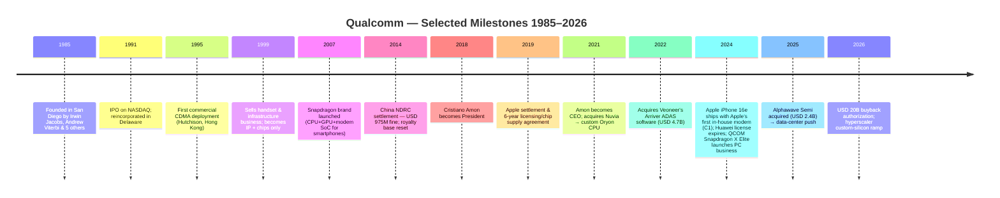
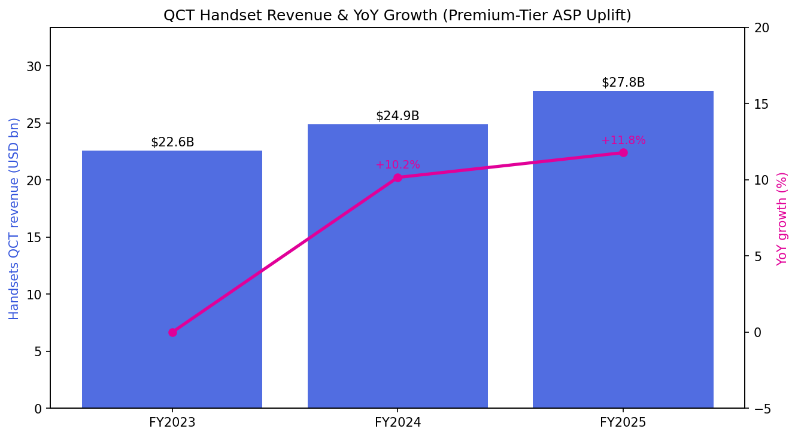
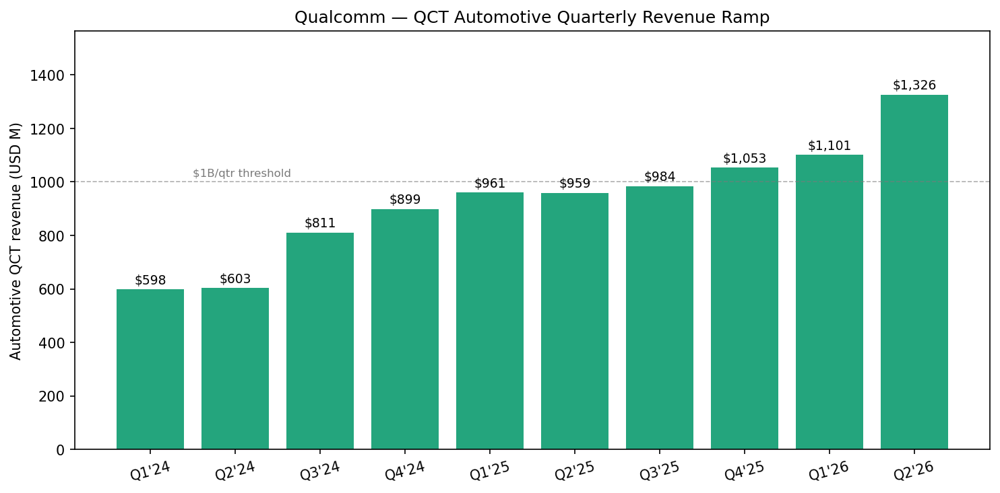
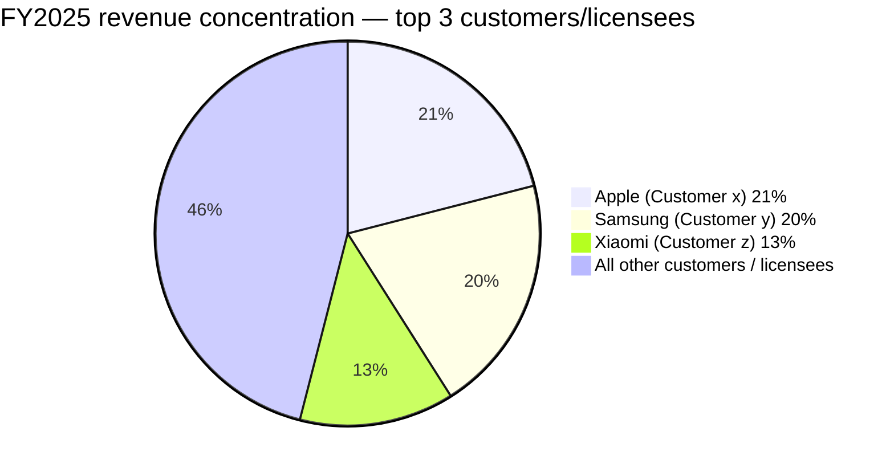
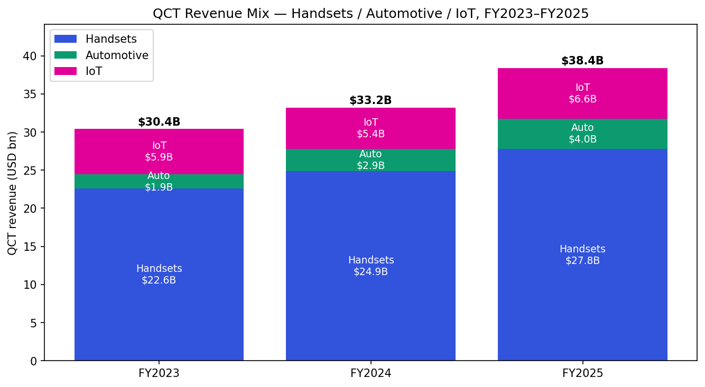
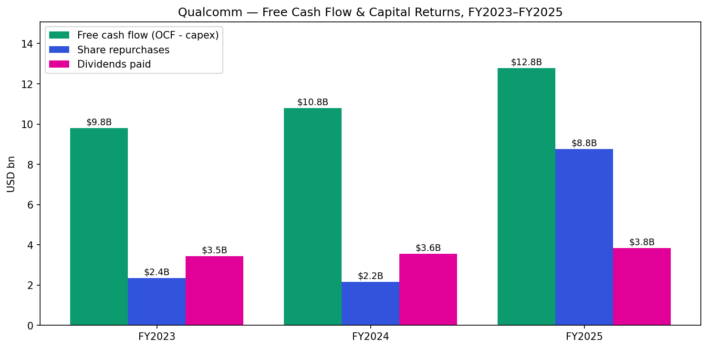

# Qualcomm Incorporated (NASDAQ: QCOM) — Company Research Report

**Date:** 2026-05-20
**Analyst note:** Initiation of coverage. All financial data sourced from Qualcomm's SEC filings (10-K, 10-Q, 8-K) cited inline. Market data as of mid-May 2026.

> **Update — Q2 FY2026 results reaffirm full-year framing; Q3 FY2026 guidance signals a China handset trough (2026-04-29):** Qualcomm reported Q2 FY2026 revenue of USD 10.60 bn (-3% YoY) and Non-GAAP EPS of USD 2.65 (-7% YoY), broadly in line with prior guidance. Management initiated Q3 FY2026 guidance of USD 9.2–10.0 bn revenue (Non-GAAP EPS USD 2.10–2.30), with the lowered range reflecting **memory supply constraints and pricing impacts on several handset OEMs**; management stated QCT handset revenues from Chinese customers will "reach a bottom in the third quarter and return to sequential growth in the following quarter." Concurrently, the Board authorized a new **USD 20 billion stock repurchase program** on top of the USD 5.4 bn already executed in 1H FY2026, and the company confirmed its hyperscaler custom-silicon data-center engagement remains on track for initial shipments later in calendar 2026.
> Source: [QCOM Q2 FY2026 Earnings Release, 2026-04-29](https://www.sec.gov/Archives/edgar/data/0000804328/000080432826000060/qcom032926erex991.htm).

---

## Table of Contents
1. Company Overview
2. Company History
3. Management Team
4. Products & Services
5. Customers & Go-to-Market
6. Industry Overview
7. Competitive Landscape
8. Market Opportunity (TAM)
9. Risk Assessment

---

## 1. Company Overview

Qualcomm Incorporated is the world's largest pure-play designer of advanced wireless connectivity and high-performance, low-power computing platforms for mobile, automotive, and Internet-of-Things (IoT) end markets, and simultaneously the world's most extensively licensed holder of cellular standard-essential patents (SEPs) covering 3G, 4G, and 5G wireless technologies. The company was incorporated in California in 1985 and reincorporated in Delaware in 1991; it operates on a 52/53-week fiscal year ending the last Sunday in September ([QCOM FY2025 10-K, Item 1 Business](https://www.sec.gov/Archives/edgar/data/0000804328/000080432825000085/qcom-20250928.htm)). Headquarters are in San Diego, California, and at fiscal year-end 28 September 2025 the company employed approximately **52,000** full-time, part-time, and temporary workers across more than 200 locations in 38 countries — "the substantial majority" in engineering or technical roles ([QCOM FY2025 10-K, Human Capital](https://www.sec.gov/Archives/edgar/data/0000804328/000080432825000085/qcom-20250928.htm)).

Qualcomm reports through three operating segments ([QCOM FY2025 10-K, Note 8 Segment Information](https://www.sec.gov/Archives/edgar/data/0000804328/000080432825000085/qcom-20250928.htm)):

- **QCT (Qualcomm CDMA Technologies)** — the semiconductor business, comprising Snapdragon and Dragonwing-branded system-on-chip (SoC) platforms, standalone modems, RF front-end (RFFE) modules, Wi-Fi, Bluetooth, and power-management ICs. QCT serves three end-market streams: **Handsets** (Snapdragon mobile platforms for Android OEMs and the thin-modem (MDM) for Apple iPhone), **Automotive** (Snapdragon Digital Chassis — connectivity, digital cockpit, ADAS/AD), and **IoT** (Snapdragon X PC platforms, XR/AR, Wi-Fi networking, industrial, and edge networking) ([QCOM FY2025 10-K, Item 1 Business](https://www.sec.gov/Archives/edgar/data/0000804328/000080432825000085/qcom-20250928.htm)).
- **QTL (Qualcomm Technology Licensing)** — the patent-licensing business, which collects per-unit royalties (generally a percentage of the OEM's wholesale device selling price, subject to per-unit caps) on every cellular device sold worldwide that uses Qualcomm's licensed SEPs ([QCOM FY2025 10-K, Item 1 Business — QTL](https://www.sec.gov/Archives/edgar/data/0000804328/000080432825000085/qcom-20250928.htm)).
- **QSI (Qualcomm Strategic Initiatives)** — Qualcomm Ventures, which makes minority investments in early-stage companies adjacent to 5G, AI, automotive, XR, and data center ([QCOM FY2025 10-K, Item 1 Business — QSI](https://www.sec.gov/Archives/edgar/data/0000804328/000080432825000085/qcom-20250928.htm)).

In **fiscal 2025 (year ended 28 September 2025), Qualcomm generated total revenues of USD 44.284 bn (+14% YoY), GAAP operating income of USD 12.355 bn (operating margin ~28%), and net income from continuing operations of USD 5.541 bn**, with the latter depressed by a USD 5.7 bn one-time non-cash income tax charge to establish a valuation allowance against U.S. federal deferred tax assets following the enactment of the One Big Beautiful Bill Act (OBBB) in July 2025 ([QCOM FY2025 10-K, MD&A & Consolidated Statements of Operations](https://www.sec.gov/Archives/edgar/data/0000804328/000080432825000085/qcom-20250928.htm)). Excluding that one-off, FY25 underlying earnings power was materially higher than the GAAP print — and indeed Qualcomm released USD 5.7 bn of that allowance back in Q2 FY2026 after IRS guidance clarified the CAMT rules, producing GAAP EPS of USD 6.88 in that quarter ([QCOM Q2 FY2026 Earnings Release](https://www.sec.gov/Archives/edgar/data/0000804328/000080432826000060/qcom032926erex991.htm)).

Of FY2025 revenue, **QCT contributed USD 38.367 bn (87% of total)** and **QTL USD 5.582 bn (13%)**. Within QCT, **Handsets** generated USD 27.793 bn (72% of QCT, +12% YoY), **Automotive** USD 3.957 bn (10% of QCT, +36% YoY), and **IoT** USD 6.617 bn (17% of QCT, +22% YoY) ([QCOM FY2025 10-K, MD&A — QCT Segment](https://www.sec.gov/Archives/edgar/data/0000804328/000080432825000085/qcom-20250928.htm)). QTL revenue was essentially flat year-over-year (+USD 10 M) — a notable detail given that Huawei's license expired in Q2 FY2025 and royalties from Huawei stopped flowing thereafter, but new long-term agreements with two key Chinese OEMs and a comprehensive 4G/5G license with Transsion (the dominant African/India-emerging OEM) backfilled the lost run-rate ([QCOM FY2025 10-K, MD&A — QTL Segment](https://www.sec.gov/Archives/edgar/data/0000804328/000080432825000085/qcom-20250928.htm)).

Source: [QCOM FY2022 10-K, MD&A](https://www.sec.gov/Archives/edgar/data/0000804328/000080432822000021/) and [QCOM FY2025 10-K, F-3 Consolidated Statements of Operations](https://www.sec.gov/Archives/edgar/data/0000804328/000080432825000085/qcom-20250928.htm).

**Geographic exposure is heavily Asia-skewed.** Approximately two-thirds of QCT shipments are taken delivery of by Asian OEMs (a substantial portion in China) for sale into both China and global markets; QTL royalties are also heavily concentrated with Chinese licensees because Chinese-headquartered OEMs (Xiaomi, Oppo, vivo, Honor, Transsion) collectively account for roughly half of global non-Apple, non-Samsung handset shipments. Approximately 92% of total fiscal 2025 revenues were attributed to customers headquartered outside the United States ([QCOM FY2025 10-K, MD&A — Geographic Concentrations](https://www.sec.gov/Archives/edgar/data/0000804328/000080432825000085/qcom-20250928.htm)).

**Customer concentration is extreme by S&P 500 standards.** Per the FY2025 10-K Note 2 (Concentrations), three customers/licensees each individually accounted for 10% or more of total consolidated revenues in FY2025: **Customer (x) 21%, Customer (y) 20%, Customer (z) 13%**; total = **54% of revenue from three customers**. Qualcomm separately disclosed in the Human Capital and MD&A sections that those three customers in FY2025 were **Apple, Samsung, and Xiaomi** ([QCOM FY2025 10-K, Note 2](https://www.sec.gov/Archives/edgar/data/0000804328/000080432825000085/qcom-20250928.htm)). The same three customers accounted for 22%/19%/12% in FY2024 and 27%/21%/<10% in FY2023.

### Valuation snapshot

At approximately USD 195–204 per share in mid-May 2026, Qualcomm's market capitalization is in the USD 206–215 bn range with 1.06 bn diluted shares outstanding as of Q2 FY2026 ([QCOM Q2 FY2026 Earnings Release, Condensed Balance Sheet](https://www.sec.gov/Archives/edgar/data/0000804328/000080432826000060/qcom032926erex991.htm); price reference [Yahoo Finance, May 2026](https://finance.yahoo.com/quote/QCOM/)).

| Multiple | QCOM (TTM, mid-May 2026) | 3-yr range (approx.) | Notes |
|---|---|---|---|
| P/E (TTM, GAAP) | ~22x | 13x–28x | TTM EPS distorted by the FY25 USD 5.7 bn tax charge and the Q2'26 release thereof; on a normalized basis trades closer to 14–16x ([fullratio.com QCOM P/E](https://fullratio.com/stocks/nasdaq-qcom/pe-ratio)). |
| Forward P/E (FY2026E) | ~12x | 10x–14x | Consensus FY26 Non-GAAP EPS ~USD 11–12; among the lowest forward multiples in large-cap semis ([24/7 Wall St, 2026-04-09](https://247wallst.com/investing/2026/04/09/broadcom-vs-qualcomm-buy-one-avoid-the-other/)). |
| P/S (TTM) | ~4.5x | 3.0x–5.5x | Below sector median; well below AVGO (~24x) and NVDA (~28x) ([stockanalysis.com](https://stockanalysis.com/stocks/qcom/statistics/)). |
| EV/EBITDA | ~15x | 10x–17x | Reasonable for a high-FCF semis name; below AVGO (~36x) ([gurufocus.com EV/EBITDA](https://www.gurufocus.com/term/enterprise-value-to-ebitda/QCOM)). |
| Dividend yield | ~1.8% | 1.6%–2.5% | Quarterly dividend USD 0.89; FY25 USD 3.836 bn total payout ([QCOM FY2025 10-K, Cash Flow Statement](https://www.sec.gov/Archives/edgar/data/0000804328/000080432825000085/qcom-20250928.htm)). |

**Interpretation — why does QCOM trade at a discount to other large-cap semis?** Qualcomm's forward P/E (~10–12x) sits at roughly a third of Broadcom's (~31–44x) and a quarter of NVIDIA's, and at a clear discount to MediaTek (forward P/E ~25–43x depending on source) — a competitor with comparable end-market exposure but smaller scale ([Stockopedia MediaTek 2454.TW](https://www.stockopedia.com/share-prices/media-tek-TPE:2454/)). The compression reflects three durable concerns: (i) **Apple modem in-housing**, which removes one of QCOM's three 10%+ customers over a roughly two-to-three-year transition; (ii) **structural China handset demand uncertainty** including the lingering risk of Chinese OEMs vertically integrating into custom mobile SoCs (Xiaomi launched its XRing O1 application processor in 2025); and (iii) the persistent perception that the QTL royalty stream is a maturing annuity with no clean reacceleration catalyst once 5G penetration normalizes. The bull case — that Snapdragon X PC, Snapdragon Digital Chassis, Snapdragon AR/VR, and a credible data-center entry via Alphawave + the hyperscaler custom-silicon engagement collectively re-rate the company to a non-handset growth multiple — has not yet been priced in. This is a defining valuation tension for the name and we return to it in Sections 7, 8, and 9.

---

## 2. Company History

Qualcomm was founded in July 1985 in San Diego, California by **Irwin M. Jacobs, Andrew Viterbi**, and five colleagues from Linkabit, the satellite-communications company Jacobs had co-founded earlier. The founders' insight was that **Code Division Multiple Access (CDMA)** — at the time a fringe spread-spectrum technique used in military communications — could be re-engineered as a higher-capacity alternative to the TDMA-based GSM standard then dominating European cellular networks. Qualcomm pushed CDMA into U.S. carrier trials starting 1989, achieved its first commercial deployment with Hutchison in Hong Kong in 1995, and within a decade had embedded CDMA-derivative technology into the foundation of every subsequent cellular generation — CDMA2000, WCDMA / UMTS (3G), LTE (4G), and 5G NR (which uses OFDMA-based air interfaces but inherits a substantial portion of Qualcomm's CDMA-era system-level patents) ([QCOM Q4 FY2025 Earnings Release, 2025-11-05](https://www.sec.gov/Archives/edgar/data/0000804328/000080432825000084/qcom092825erex991.htm); [QCOM corporate history page](https://www.qualcomm.com/company/about)). That structural decision — to monetize foundational IP via licensing on every cellular device sold, not only those using Qualcomm's own chips — created the modern QTL business and remains the single most distinctive feature of the company today.

**Three strategic pivots define Qualcomm's modern arc:**

First, the **1999 divestiture of its handset and base-station manufacturing businesses** (sold to Kyocera and Ericsson respectively) converted Qualcomm from a vertically integrated cellular OEM into a "fabless chips + IP licensing" pure-play ([Qualcomm 8-K, Ericsson infrastructure divestiture, 1999-05-24](https://www.sec.gov/Archives/edgar/data/0000804328/000093639299000683/0000936392-99-000683.txt); [TheStreet — "Qualcomm Sells Handset Unit to Kyocera", 1999-12](https://www.thestreet.com/investing/stocks/qualcomm-sells-handset-unit-to-kyocera-846987)). That move freed R&D capital, eliminated channel conflict with its chip customers, and gave Qualcomm pricing leverage over OEMs as the industry consolidated. It is the foundational decision behind every subsequent business model.

Second, the **2014 Chinese NDRC settlement** — a USD 975 M antitrust fine and a binding commitment to license cellular SEPs to Chinese OEMs at a royalty base capped at 65% of the wholesale device selling price — was a near-existential moment that reset the QTL royalty rate for the second-largest smartphone market in the world. After several years of dispute resolution, Qualcomm rebuilt its Chinese royalty stream on the new terms, and by FY2017 had effectively normalized; the durable consequence is that QTL today derives a "significant portion" of revenues from a limited number of Chinese licensees ([QCOM FY2025 10-K, Risk Factors](https://www.sec.gov/Archives/edgar/data/0000804328/000080432825000085/qcom-20250928.htm)).

Third, the **2021 Nuvia acquisition (USD 1.4 bn)** and the resulting Qualcomm Oryon CPU core (announced 2023, shipped in Snapdragon X Elite for PCs in 2024 and Snapdragon 8 Elite for smartphones in 2024/2025) materially closed Qualcomm's CPU performance gap to Apple's silicon team — and opened a credible path into Windows PCs, automotive cockpit, and ultimately data center ([Qualcomm — "Qualcomm to Acquire NUVIA", 2021-01-13](https://www.qualcomm.com/news/releases/2021/01/qualcomm-acquire-nuvia)). ARM's litigation against Qualcomm over the Nuvia license, settled in late 2024 in Qualcomm's favor with the Delaware jury verdict on 2024-12-20 and a complete victory affirmed in 2025, removed a meaningful overhang ([Qualcomm — "Achieves Complete Victory Over Arm in Litigation", 2025](https://investor.qualcomm.com/news-events/press-releases/news-details/2025/Qualcomm-Achieves-Complete-Victory-Over-Arm-in-Litigation-Challenging-Licensing-Agreements/default.aspx)).

**Notable acquisitions of the past five years:**
- **Veoneer Arriver (April 2022, ~USD 4.7 bn aggregate transaction)** — full-stack ADAS software (perception, drive-policy, sensor fusion) underlying the Snapdragon Ride platform; the non-Arriver businesses (Active Safety, Restraint Control) were carved out by SSW Partners and re-sold to Magna and AIP Capital ([QCOM FY2025 10-K, Note 14 Discontinued Operations](https://www.sec.gov/Archives/edgar/data/0000804328/000080432825000085/qcom-20250928.htm)).
- **Alphawave Semi (December 2025, USD 2.4 bn)** — UK-listed high-speed connectivity IP and chiplet specialist, designed to give Qualcomm SerDes, PCIe, and CXL building blocks for AI data-center silicon; CEO Tony Pialis now leads Qualcomm's data center business ([Qualcomm Completes Acquisition of Alphawave Semi, 2025-12-18](https://www.businesswire.com/news/home/20251218292351/en/Qualcomm-Completes-Acquisition-of-Alphawave-Semi)).
- **Edge Impulse, MovianAI / Vingroup AI research team (both 2025)** — smaller bolt-ons strengthening edge-AI tooling and an in-house generative-AI research footprint.

**Recent developments (the last 12 months)** include: (a) the **Apple iPhone 16e (released February 2025)** shipping with Apple's first internally-designed modem (Apple C1) — the long-anticipated start of Apple modem in-housing, with Qualcomm's 2019 supply agreement having been extended in 2023 to cover 2026 iPhone launches; (b) the **launch of Snapdragon X Elite and Snapdragon X Plus** Copilot+ PC platforms, followed at CES 2026 by **Snapdragon X2 Elite, X2 Elite Extreme, and X2 Plus** built on a 3nm 3rd-gen Oryon CPU ([CES 2026, Neowin coverage 2026-01-06](https://www.neowin.net/news/ces-2026-qualcomm-brings-snapdragon-x2-plus-to-mainstream-windows-11-copilot-pcs/)); (c) management's disclosure of a **~USD 45 bn automotive design-win pipeline** (USD 15 bn ADAS-specific) and the FY2029 automotive revenue target of **USD 8 bn** ([QCOM Q2 FY2024 Earnings Release, 2024-05-01](https://www.sec.gov/Archives/edgar/data/0000804328/000080432824000038/qcom032424erex991.htm)); and (d) the announcement at Q2 FY2026 earnings of a **hyperscaler custom-silicon engagement with initial shipments in CY2026**, and the company's Investor Day scheduled for 24 June 2026 to detail Data Center and Physical AI strategy ([QCOM Q2 FY2026 Earnings Release](https://www.sec.gov/Archives/edgar/data/0000804328/000080432826000060/qcom032926erex991.htm)).

---

## 3. Management Team

### Cristiano R. Amon — President and Chief Executive Officer

Cristiano R. Amon, age 55, has served as President and CEO of Qualcomm since June 2021 and as a member of the Board of Directors since the same date ([QCOM FY2025 10-K, Information about our Executive Officers](https://www.sec.gov/Archives/edgar/data/0000804328/000080432825000085/qcom-20250928.htm)). Born and raised in Campinas, São Paulo, Brazil, Amon studied electrical engineering at the State University of Campinas (UNICAMP) and joined Qualcomm in 1995 as an engineer responsible for building Qualcomm's CDMA business in Latin America. He left briefly in the late 1990s for Ericsson and then Vesper (a Brazilian carrier under VeloCom), and rejoined Qualcomm in 2004 ([Wikipedia — Cristiano Amon](https://en.wikipedia.org/wiki/Cristiano_Amon); [Qualcomm Amon Bio PDF](https://www.qualcomm.com/content/dam/qcomm-martech/dm-assets/images/person/bio/amon-cristiano-full-bio.pdf)).

Amon's signature operational accomplishment pre-CEO was as **President of QCT from 2015 to 2018**, where he owned the Snapdragon roadmap during the transition from 4G LTE to 5G NR. Industry analysts widely credit Amon with the engineering and commercial execution that allowed Qualcomm to take **~80%+ share of premium-tier 5G smartphone application processors** in the first commercial wave (2019–2021), and **~62% share of global high-end 5G phones in 2025** versus MediaTek's ~11% ([smartphone AP/SoC market analysis 2025](https://counterpointresearch.com/en/insights/global-smartphone-apsoc-market-share-quarterly)). As President (Jan 2018–Jun 2021), he led the strategic shift from "Qualcomm is the smartphone modem company" to "Qualcomm is the on-device-AI / intelligent-edge platform company" — a positioning that pre-dated the LLM era by several years and is, in hindsight, what gave Snapdragon X Elite a credible AI-PC story before competitors had a coherent NPU response.

Since taking over as CEO, Amon's bets have been notably proactive: (i) the **Nuvia acquisition**, completed shortly before his elevation, that he doubled down on to deliver the Oryon CPU and Snapdragon X Elite PC product line ([Qualcomm — "Qualcomm Completes Acquisition of NUVIA", 2021-03-16](https://investor.qualcomm.com/news-events/press-releases/news-details/2021/Qualcomm-Completes-Acquisition-of-NUVIA-03-16-2021/default.aspx)); (ii) the **Veoneer Arriver acquisition**, that converted Qualcomm from a connectivity supplier into a full-stack ADAS software and silicon vendor; (iii) the **Alphawave acquisition and hyperscaler engagement**, that re-opens a data-center adventure Qualcomm previously abandoned (the Centriq 2400 server CPU, killed 2018) ([Network World — "Qualcomm makes it official; no more data center chip", 2018](https://www.networkworld.com/article/966778/qualcomm-makes-it-official-no-more-data-center-chip.html)). Amon's compensation in FY2023 was approximately **USD 23.5 M total** (most in performance-linked equity), a CEO-to-median-worker pay ratio of 223-to-1 ([Wikipedia, citing DEF 14A](https://en.wikipedia.org/wiki/Cristiano_Amon)). He has served on the Adobe Inc. board since October 2023 ([Adobe 8-K — director appointment, 2023-10-26](https://www.sec.gov/Archives/edgar/data/0000796343/000079634323000226/adbeex991newdirector.htm)). Amon holds a B.S. in Electrical Engineering and an honorary doctorate from UNICAMP. He is publicly known for granular product-roadmap fluency (he frequently speaks at MWC, CES, and Computex with technical depth) and for being one of relatively few Latin-American-born CEOs of a S&P 100 company ([Qualcomm Amon Bio PDF](https://www.qualcomm.com/content/dam/qcomm-martech/dm-assets/images/person/bio/amon-cristiano-full-bio.pdf)).

### Akash Palkhiwala — Chief Financial Officer & Chief Operating Officer

Akash Palkhiwala, age 50, was named CFO in November 2019 and was additionally named **Chief Operating Officer in January 2024**, an unusually broad mandate that signals the Board's confidence and arguably positions him as a likely internal successor over a 5–10 year horizon ([QCOM FY2025 10-K, Executive Officers](https://www.sec.gov/Archives/edgar/data/0000804328/000080432825000085/qcom-20250928.htm); [Qualcomm — "Appoints Akash Palkhiwala as CFO and COO", 2024-01-23](https://investor.qualcomm.com/news-events/press-releases/news-details/2024/Qualcomm-Appoints-Akash-Palkhiwala-as-Chief-Financial-Officer-and-Chief-Operating-Officer-01-23-2024/default.aspx)). Palkhiwala joined Qualcomm in March 2001 from a brief analyst stint at KeyBank, and progressed through Qualcomm's finance organization for roughly two decades — including SVP, QCT Finance (the highest-volume P&L in the company) from 2015 to 2019, and SVP/Treasurer from 2014 to 2015. His tenure has spanned three CEOs, the 2014 China antitrust resolution, the 2018 Apple settlement, the COVID handset cycle, and the FY2025 OBBB tax response. He holds an undergraduate degree in Mechanical Engineering from L.D. College of Engineering in India and an M.B.A. from the University of Maryland. As CFO he has overseen substantial capital returns (USD 8.8 bn buybacks + USD 3.8 bn dividends in FY2025 alone; the new USD 20 bn repurchase authorization in Q2 FY2026 was approved on his watch) and has consistently met or beaten quarterly guidance through a notably volatile end-market environment ([QCOM FY2025 10-K, Cash Flow Statement](https://www.sec.gov/Archives/edgar/data/0000804328/000080432825000085/qcom-20250928.htm); [QCOM Q2 FY2026 Earnings Release, 2026-04-29](https://www.sec.gov/Archives/edgar/data/0000804328/000080432826000060/qcom032926erex991.htm)).

### Alexander H. Rogers — President, QTL & Global Affairs

Alexander H. Rogers, age 68, has led QTL since 2016 and assumed additional responsibility for Global Affairs in June 2021 ([QCOM FY2025 10-K, Executive Officers](https://www.sec.gov/Archives/edgar/data/0000804328/000080432825000085/qcom-20250928.htm)). A career intellectual-property litigator (B.A./M.A. Georgetown, J.D. Georgetown Law; partner at Gray Cary, Ware & Freidenrich prior to joining Qualcomm in 2001), Rogers' job is the single highest-margin job at the company — QTL ran a **72% EBT margin in FY2025** on USD 5.582 bn revenue ([QCOM FY2025 10-K, Note 8 Segment Information](https://www.sec.gov/Archives/edgar/data/0000804328/000080432825000085/qcom-20250928.htm)). Rogers has owned the multi-year licensing renewals that backfilled the loss of Huawei in 2024–2025 (including the Transsion comprehensive 4G/5G agreement and the two key Chinese OEM renewals in Q2 FY2025) and is also responsible for managing relations with antitrust regulators in the U.S., EU, China, Korea, and India ([QCOM FY2025 10-K, MD&A — QTL Segment](https://www.sec.gov/Archives/edgar/data/0000804328/000080432825000085/qcom-20250928.htm)).

### Baaziz Achour — Chief Technology Officer, QTI

Dr. Baaziz Achour, age 64, has served as CTO of Qualcomm Technologies, Inc. since February 2025, succeeding James Thompson ([Qualcomm — "Dr. Baaziz Achour Appointed CTO-Elect", 2024-12-12](https://www.businesswire.com/news/home/20241212208361/en/Qualcomm-Announces-Dr.-Baaziz-Achour-Appointed-Chief-Technology-Officer-Elect)). A 30+ year Qualcomm veteran (joined 1993 as a Systems Engineer; B.S. Algiers, MSc/PhD Tufts in Electrical Engineering), Achour previously served as Deputy CTO and SVP of Engineering. He is the senior technical owner of the Snapdragon, Oryon CPU, Hexagon NPU, and 5G/6G modem roadmaps — making him arguably the most consequential non-CEO executive at the company given Qualcomm's R&D-intensive operating model (FY2025 R&D spend USD 9.042 bn, ~20% of revenue) ([QCOM FY2025 10-K, Executive Officers](https://www.sec.gov/Archives/edgar/data/0000804328/000080432825000085/qcom-20250928.htm)).

### Governance footer

- **Board chair:** Mark D. McLaughlin, independent, since August 2019. Because the chair is independent, the Board does not maintain a Lead Independent Director role ([San Diego Business Journal, "Qualcomm Names New Board Chair"](https://www.sdbj.com/technology/qualcomm-names-new-board-chair/)).
- **Recent board additions (FY2025):** Marie Myers (CFO, HP Inc.), Christopher D. Young (former CEO McAfee; cybersecurity/cloud), and Jeremy "Zico" Kolter (Carnegie Mellon professor, AI/ML safety) — the Kolter addition specifically signals a board-level investment in AI fluency at the governance layer ([QCOM FY2026 DEF 14A](https://www.sec.gov/Archives/edgar/data/0000804328/000110465926005781/tm2528704-1_def14a.htm)).
- **Insider ownership:** under 1% in aggregate per the FY2026 DEF 14A — typical for a 40-year-old large-cap; Amon's own holdings are not separately quantified here pending fresh disclosure review ([QCOM FY2026 DEF 14A](https://www.sec.gov/Archives/edgar/data/0000804328/000110465926005781/tm2528704-1_def14a.htm)).
- **Compensation structure:** heavily performance-linked equity (PSU/RSU mix), with CEO total comp ~USD 23.5 M in FY2023; cash bonus was eliminated for non-executive leaders for FY2026/2027 in favor of multi-year equity, per the FY2025 10-K MD&A ([QCOM FY2025 10-K, MD&A](https://www.sec.gov/Archives/edgar/data/0000804328/000080432825000085/qcom-20250928.htm)).
- **Related-party transactions:** none material disclosed ([QCOM FY2026 DEF 14A, Related Party Transactions](https://www.sec.gov/Archives/edgar/data/0000804328/000110465926005781/tm2528704-1_def14a.htm)).

### Track record synthesis

This is a deep-bench operating team that has delivered through a notably hostile multi-year backdrop: the FY2019 Apple settlement, the FY2020–2021 Huawei license phase-out and supply ban, the FY2024 final loss of Huawei license royalties, ARM's Nuvia litigation, and now the early innings of Apple modem displacement. Across all of that, revenue compounded from USD 23.5 bn (FY2019) to USD 44.3 bn (FY2025) — roughly a 12% CAGR — and the operating model held ([QCOM FY2025 10-K, MD&A — Five-Year Selected Financial Data](https://www.sec.gov/Archives/edgar/data/0000804328/000080432825000085/qcom-20250928.htm)). The principal gap is succession depth one level below the named executive officers; the CTO transition from Thompson to Achour was smooth but represents a generational change in technical leadership that is still being absorbed ([Qualcomm — Achour CTO-Elect press release, 2024-12-12](https://www.businesswire.com/news/home/20241212208361/en/Qualcomm-Announces-Dr.-Baaziz-Achour-Appointed-Chief-Technology-Officer-Elect)).

---

## 4. Products & Services

Qualcomm's product portfolio is best understood as a matrix of **integrated SoC platforms** (Snapdragon for premium consumer; Dragonwing for industrial/edge networking) mapped onto **four end-market verticals** plus the **QTL patent license**. The product walk below follows Qualcomm's own marketing taxonomy as enumerated on the Snapdragon platform page and the FY2025 10-K Item 1 Business description ([Qualcomm Snapdragon product page](https://www.qualcomm.com/snapdragon); [QCOM FY2025 10-K, Item 1 Business](https://www.sec.gov/Archives/edgar/data/0000804328/000080432825000085/qcom-20250928.htm)).

```mermaid
graph TD
    QCOM[Qualcomm Inc.]
    QCOM --> QCT[QCT — Semiconductors]
    QCOM --> QTL[QTL — IP Licensing]
    QCOM --> QSI[QSI — Ventures]

    QCT --> HND[Handsets / Mobile]
    QCT --> AUTO[Automotive]
    QCT --> IOT[IoT]
    QCT --> DC[Data Center NEW]

    HND --> S8E[Snapdragon 8 Elite — premium Android]
    HND --> S7G[Snapdragon 7-series — high-tier]
    HND --> SLT[Snapdragon 6/4-series — mid/entry]
    HND --> MDM[MDM thin modem — Apple iPhone]

    AUTO --> SDC[Snapdragon Cockpit Platforms]
    AUTO --> SDR[Snapdragon Ride / Ride Elite — ADAS/AD]
    AUTO --> ARV[Arriver software stack — perception/drive-policy]
    AUTO --> SDA[Snapdragon Auto Connectivity — 5G/Wi-Fi/V2X]

    IOT --> SPC[Snapdragon X2 Elite / X2 Plus — Copilot+ PCs]
    IOT --> XR2[Snapdragon AR1/XR2 Gen 2 — Meta Quest, smart glasses]
    IOT --> DRG[Dragonwing — industrial robotics, retail, logistics]
    IOT --> NET[Networking Pro — Wi-Fi 7 access points, broadband]

    DC --> AW[Alphawave SerDes/PCIe IP]
    DC --> HCS[Hyperscaler custom AI silicon CY2026]

    QTL --> SEP[Cellular SEPs — 3G/4G/5G/5G-Advanced]
    QTL --> NSP[Non-cellular patents — Wi-Fi, video codecs, UWB]
```

### QCT — Handsets / Mobile

The QCT Handsets stream generated **USD 27.793 bn in FY2025 revenue (+12% YoY)** and remains the financial keystone of the company ([QCOM FY2025 10-K, MD&A — QCT Handsets](https://www.sec.gov/Archives/edgar/data/0000804328/000080432825000085/qcom-20250928.htm)). The product line is tiered:

- **Snapdragon 8 Elite (Gen 4) — premium Android.** The current flagship SoC, manufactured on TSMC 3nm, integrates 2nd-gen Oryon CPU cores, the Adreno 830 GPU, the Hexagon NPU with on-device generative AI capability (running >70B-parameter LLMs natively on-device, per Qualcomm marketing), and the integrated X80 5G modem-RF system. Snapdragon 8 Elite powers the premium tiers of Samsung Galaxy S25 Ultra, Xiaomi 15 Pro, OnePlus 13, Honor Magic, vivo X200, and most other major Android flagships ([Qualcomm Snapdragon product page](https://www.qualcomm.com/snapdragon)). **Competitive verdict: Yes — durable moat from (i) technology IP (Oryon CPU, Hexagon NPU, X80 modem), (ii) scale advantages in advanced-node manufacturing volume contracts with TSMC, and (iii) ecosystem lock-in via the Qualcomm AI Stack / AI Hub developer tooling. Closest competing product: MediaTek Dimensity 9400** — at parity on raw CPU/GPU benchmarks but behind on NPU efficiency, modem performance in challenging RF conditions, and developer-tools maturity; carries MediaTek's perpetual disadvantage of weaker premium-OEM relationships outside greater China.

- **Snapdragon 7-series / 6-series / 4-series** — tiered platforms for upper-mid, mid, and entry-level Android. Snapdragon 7+ Gen 4 is increasingly used by Xiaomi and Oppo to bring flagship-feel features (on-device AI imaging, 200-MP camera support, ray-traced gaming) to USD 400–600 price bands ([Qualcomm Snapdragon mobile platforms](https://www.qualcomm.com/snapdragon)). **Competitive verdict: Partial moat — MediaTek leads in volume in mid/entry tiers, particularly in India and emerging markets, and Chinese OEMs increasingly source MediaTek for cost reasons. Qualcomm retains the premium share via its modem and AI-feature advantages** ([Counterpoint — Global Smartphone AP/SoC Market Share](https://counterpointresearch.com/en/insights/global-smartphone-apsoc-market-share-quarterly)).

- **MDM (thin modem) for Apple iPhone.** Apple-specific 5G modem (no integrated application processor), shipped under a multi-year supply agreement first signed at the 2019 settlement and extended in 2023 to cover iPhone launches in 2024, 2025, and 2026. As disclosed by management, "Apple began utilizing its own modem (rather than our products) in its recently released smartphones [the iPhone 16e, 2025] and we expect that Apple will increasingly use its own modem products, rather than our products, in its future devices" ([QCOM FY2025 10-K, MD&A — Looking Forward](https://www.sec.gov/Archives/edgar/data/0000804328/000080432825000085/qcom-20250928.htm)). **Competitive verdict: No durable moat — Apple has explicitly committed to in-housing this product. The economic question is the pace of substitution; the structural question is largely settled.**

**Flagship status:** Snapdragon 8 Elite is by far the single largest contributor to QCT Handset revenue (Qualcomm does not disclose SKU-level breakdown, but premium-tier ASPs in FY2025 drove USD 2.5 bn of incremental QCT revenue per the MD&A — implying the premium tier carries the gross-profit weight of the segment) ([QCOM FY2025 10-K, MD&A — QCT Segment Revenues](https://www.sec.gov/Archives/edgar/data/0000804328/000080432825000085/qcom-20250928.htm)).

Source: [QCOM FY2025 10-K Note 8 Segment Information](https://www.sec.gov/Archives/edgar/data/0000804328/000080432825000085/qcom-20250928.htm).

### QCT — Automotive

The QCT Automotive stream generated **USD 3.957 bn in FY2025 (+36% YoY)** and is Qualcomm's most credible non-handset growth engine. Management has guided to **USD 8 bn of automotive revenue by FY2029** against a **~USD 45 bn lifetime design-win pipeline (USD 15 bn ADAS-specific)** ([QCOM Q2 FY2024 Earnings Release](https://www.sec.gov/Archives/edgar/data/0000804328/000080432824000038/qcom032424erex991.htm)). The product portfolio:

- **Snapdragon Cockpit Platforms** — system-on-chips powering in-vehicle infotainment, driver and passenger displays, and embedded telematics. Qualcomm reports its cockpit platforms now power **75 million+ vehicles** on the road ([Qualcomm Auto Press Release, January 2026](https://www.qualcomm.com/news/releases/2026/01/qualcomm-drives-the-future-of-mobility-with-strong-snapdragon-di)). Major design wins disclosed include BMW (entire iX/i-series cockpit), Volkswagen Group (Cariad partnership), General Motors (Ultifi platform), Stellantis, Ferrari, Renault, Honda, and most major Chinese OEMs (BYD, Geely, NIO, Xpeng, Li Auto, Leapmotor, Zeekr, Chery). **Competitive verdict: Yes — strongest moat in the automotive product portfolio, derived from (i) the multi-tier Snapdragon Cockpit platform family that mirrors smartphone-tier economics in vehicles, (ii) the supply-chain credibility of a 40-year semiconductor vendor in an industry that requires AEC-Q100 qualification and 10+ year product lifecycles, and (iii) ecosystem lock-in via the QNX/Android/Linux platform-software stack. Closest competing product: NVIDIA DRIVE Thor (announced 2024, ramping 2025/2026)** — NVIDIA's offering combines cockpit + ADAS on a single SoC with stronger GPU compute, but Snapdragon Digital Chassis is further along on production volume and OEM platform integration.

- **Snapdragon Ride / Ride Elite — ADAS/AD.** The ADAS-specific SoC family, integrating the Arriver software stack acquired from Veoneer. Snapdragon Cockpit and Ride Elite "now power 10 program design wins" across BYD Auto, Leapmotor, Zeekr, GreatWall Motor, NIO, and Chery ([Qualcomm Auto Press Release January 2026](https://www.qualcomm.com/news/releases/2026/01/qualcomm-drives-the-future-of-mobility-with-strong-snapdragon-di)). **Competitive verdict: Partial — NVIDIA DRIVE Thor / Hyperion is the leading ADAS competitor; Mobileye EyeQ remains entrenched at the L2/L2+ level. Qualcomm's path to credible Level 3+ autonomy depends on the Arriver software stack maturing.**

- **Snapdragon Auto Connectivity** — 5G cellular, Wi-Fi 7, Bluetooth, UWB, and V2X chips for connected-vehicle units. **Competitive verdict: Yes — extension of Qualcomm's smartphone-modem dominance into automotive cellular** ([Qualcomm Auto press release, 2026-01](https://www.qualcomm.com/news/releases/2026/01/qualcomm-drives-the-future-of-mobility-with-strong-snapdragon-di)).

Source: QCOM quarterly 8-K earnings releases ([Q1 FY2024](https://www.sec.gov/Archives/edgar/data/0000804328/000080432824000015/qcom122423erex991.htm) through [Q2 FY2026](https://www.sec.gov/Archives/edgar/data/0000804328/000080432826000060/qcom032926erex991.htm)).

### QCT — IoT

The QCT IoT stream generated **USD 6.617 bn in FY2025 (+22% YoY)**. IoT recovered from a FY2024 trough (USD 5.423 bn, -9% vs. FY2023) driven by inventory destocking in consumer, edge networking, and industrial ([QCOM FY2025 10-K, MD&A — QCT IoT](https://www.sec.gov/Archives/edgar/data/0000804328/000080432825000085/qcom-20250928.htm)). The sub-portfolio:

- **Snapdragon X Elite / X Plus / X2 Elite / X2 Elite Extreme / X2 Plus** — Copilot+ PC platforms with on-device NPU performance up to **80 TOPS** on X2 Elite/Extreme (2nd-gen Oryon CPU, 18 CPU cores, 3nm) and capable of running a 70B-parameter LLM on-device ([Snapdragon X2 Elite — Futurum Group 2026](https://futurumgroup.com/insights/snapdragon-x2-elite-pushes-ai-pc-performance-to-new-heights/); [Neowin CES 2026 coverage](https://www.neowin.net/news/ces-2026-qualcomm-brings-snapdragon-x2-plus-to-mainstream-windows-11-copilot-pcs/)). OEM partners include Microsoft (Surface Pro / Surface Laptop), Lenovo, HP, Dell, Samsung, ASUS, Acer, and Honor; Qualcomm reported over **60 designs in production with >100 expected by 2026**. **Competitive verdict: Yes — partial moat. Snapdragon X has effectively created the AI-PC category at premium price-points, and Qualcomm enjoys an 18–24 month head-start over Intel (Lunar Lake / Panther Lake) and AMD (Ryzen AI 300/400) on NPU performance-per-watt. The risk is that x86 NPU acceleration catches up and Windows-on-ARM compatibility friction (some legacy x86 apps) remains a deal-breaker for parts of the install base. Closest competing product: Intel Core Ultra (Lunar Lake / Arrow Lake)** — Intel narrowed the NPU gap with Lunar Lake's 48 TOPS in late 2024; AMD Ryzen AI 300 at ~50 TOPS competes well in mainstream tiers.

- **Snapdragon XR2 Gen 2 / AR1** — XR/AR platforms powering Meta Quest 3 and Quest 3S, Samsung XR (Project Moohan), and the Meta Ray-Ban smart glasses lineup; AR1 powers smart glasses specifically ([Qualcomm Meta Quest 3S device page](https://www.qualcomm.com/xr-vr-ar/device-finder/meta-quest-3s)). **Competitive verdict: Yes — Qualcomm is the de facto standard XR/AR SoC, with no credible challenger at the premium consumer tier.**

- **Dragonwing — industrial, retail, robotics, logistics, energy/utilities.** A rebrand effort separating industrial/edge-networking IoT from consumer Snapdragon. Includes the Dragonwing Q-Series (industrial handhelds), AI-on-the-Edge solutions for video analytics and physical AI, and the IQ-Series for industrial robotics. Management has begun positioning Physical AI / industrial robotics as a future-state opportunity ([QCOM FY2025 10-K, Item 1 — Dragonwing](https://www.sec.gov/Archives/edgar/data/0000804328/000080432825000085/qcom-20250928.htm)). **Competitive verdict: Partial — Qualcomm has scale and a developer ecosystem but competes with NXP, Renesas, ST Microelectronics, Texas Instruments, and increasingly NVIDIA Jetson in industrial AI.**

- **Networking Pro — Wi-Fi 7 access points, fiber broadband, mesh.** Wi-Fi 7 platforms now standard with major access point and enterprise vendors. **Competitive verdict: Yes — leading position in Wi-Fi 6/6E/7; Broadcom is the main competitor** ([QCOM FY2025 10-K, Item 1 — Networking Pro](https://www.sec.gov/Archives/edgar/data/0000804328/000080432825000085/qcom-20250928.htm)).

### QCT — Data Center (emerging)

Following the December 2025 acquisition of Alphawave Semi for USD 2.4 bn, Qualcomm has effectively re-entered the data center after exiting the Centriq server-CPU business in 2018. The strategy combines: (a) **Alphawave's high-speed SerDes / PCIe / CXL / chiplet connectivity IP** (the building blocks for AI accelerator-CPU-memory interconnect), (b) **Qualcomm's Oryon CPU and Hexagon NPU architectures** scaled up for inference workloads, and (c) a **custom-silicon engagement with "a leading hyperscaler"** disclosed at Q2 FY2026, with **initial shipments on track for later in calendar 2026** ([QCOM Q2 FY2026 Earnings Release](https://www.sec.gov/Archives/edgar/data/0000804328/000080432826000060/qcom032926erex991.htm)). Management has scheduled an Investor Day on 24 June 2026 to detail the data-center and Physical AI roadmap. **Competitive verdict: Too early to call** — Qualcomm starts from zero data-center revenue in a market dominated by NVIDIA (~90% AI accelerator share) and Broadcom (custom ASICs for Google, Meta). But the hyperscaler-custom-silicon model is a credible adjacency to Qualcomm's existing OEM-customer-design discipline.

### QTL — Patent licensing

QTL licenses Qualcomm's cellular SEP portfolio (3G CDMA2000 / WCDMA, 4G LTE, 5G NR, 5G Advanced) to "hundreds of companies" globally, with **patent licensing revenue of USD 5.582 bn (FY2025), 72% EBT margin**, and key OEM license agreements running through fiscal years 2027–2031 ([QCOM FY2025 10-K, MD&A and Note 2](https://www.sec.gov/Archives/edgar/data/0000804328/000080432825000085/qcom-20250928.htm)). Royalties are typically a percentage of the wholesale device selling price, with per-unit caps. **Competitive verdict: Yes — the deepest and most durable economic moat at Qualcomm.** The portfolio is the most extensively licensed in the industry; standards-body commitments under FRAND obligations cement its centrality. The vulnerabilities are political/regulatory (antitrust scrutiny in China, EU, Korea, India has historically resulted in royalty-base resets) and structural (as 5G penetration saturates and 6G is still 3–5 years from commercial deployment, royalty-per-unit growth depends on rising device ASPs and new categories like XR/AR — both finite tailwinds).

Source: [QCOM FY2022 10-K MD&A](https://www.sec.gov/Archives/edgar/data/0000804328/000080432822000021/) and [QCOM FY2025 10-K MD&A](https://www.sec.gov/Archives/edgar/data/0000804328/000080432825000085/qcom-20250928.htm).

### Recent launches and roadmap

- **Snapdragon X2 Elite / X2 Elite Extreme / X2 Plus** — CES 2026, shipping H1 CY2026 ([Neowin CES 2026 coverage](https://www.neowin.net/news/ces-2026-qualcomm-brings-snapdragon-x2-plus-to-mainstream-windows-11-copilot-pcs/)).
- **Snapdragon 8 Elite Gen 5** — expected H2 CY2026 launch cycle aligned with Android flagship refresh.
- **Snapdragon Ride Elite** — production ramp through CY2026 with the disclosed 10 program design wins.
- **Data-center custom silicon** — initial shipments late CY2026.
- **Sunsets / repositioning:** Dragonwing rebrand consolidated multiple legacy industrial SKUs.

---

## 5. Customers & Go-to-Market

Qualcomm's customer base is bifurcated into **chip customers (QCT)** — handset, automotive, PC, IoT, and (newly) data-center OEMs that buy Snapdragon platforms — and **license customers (QTL)** — essentially every cellular-device OEM in the world, where the license obligation attaches to the OEM regardless of whose modem chip is inside.

### Customer concentration — quantified

Per the FY2025 10-K Note 2 (Concentrations), **three customers / licensees each accounted for 10% or more of total consolidated revenue in FY2025**:

Source: [QCOM FY2025 10-K, Note 2 Concentrations](https://www.sec.gov/Archives/edgar/data/0000804328/000080432825000085/qcom-20250928.htm). Customer mapping (Apple/Samsung/Xiaomi) per Human Capital and MD&A disclosures.

The 3-year trend (FY2023 → FY2025): Customer x **27% → 22% → 21%**; Customer y **21% → 19% → 20%**; Customer z **<10% → 12% → 13%**. The reduction in Customer x (Apple) share from 27% to 21% in two years is consistent with the published narrative — Apple's modem in-housing in iPhone 16e (Feb 2025) and increasing use of Apple-designed modems in subsequent launches will continue to compress this share. The simultaneous rise of Xiaomi from <10% to 13% reflects both Snapdragon 8 Elite premium-tier wins and the FY25 Chinese OEM license renewals.

**This concentration is a material risk and is treated as such in Section 9.** Notably, both Apple and Samsung are also **competitors** through their respective in-house modem (Apple C1) and Exynos (Samsung) silicon programs — a "frenemy" dynamic unusual at this scale.

### Customer segments

- **Premium Android OEMs:** Samsung, Xiaomi, Oppo, vivo, OnePlus, Honor, Motorola/Lenovo, ASUS, Sony, Google (Pixel partial; Tensor is Google + Samsung), Nothing, Transsion. Qualcomm has supply / multi-year platform commitments with most of the above.
- **Apple:** thin-modem only; transitioning to Apple C1 / C-series modems on a multi-year timeline. The 2023 extension of the Apple supply agreement covered 2024–2026 iPhone launches.
- **Chinese OEMs (royalty + chip):** Xiaomi, Oppo, vivo, Honor, OnePlus, Transsion (Tecno/Infinix/Itel — Africa/India), TCL, Lenovo, ZTE, Realme. Significant FY2025 milestone: comprehensive 4G/5G license signed with Transsion, settling outstanding litigation.
- **Automotive OEMs / Tier 1s:** BMW, GM, Volkswagen Group (Cariad), Stellantis, Mercedes-Benz, Ferrari, Renault, Honda, Hyundai-Kia, Geely, BYD, NIO, Xpeng, Li Auto, Leapmotor, Zeekr, Chery, GreatWall, plus Tier-1s Bosch, Continental, Aptiv, Magna, Veoneer, Cariad, Visteon.
- **PC OEMs:** Microsoft (Surface), Lenovo, HP, Dell, Samsung, ASUS, Acer, Honor; over 60 Copilot+ PC designs in production.
- **XR/AR:** Meta (Quest 3, Quest 3S, Ray-Ban smart glasses), Samsung XR (Project Moohan), Lenovo, Pico (ByteDance), HTC.
- **Industrial / IoT:** broad, including Schneider Electric, Rockwell, Honeywell, GE, Siemens; named less prominently than mobile customers.
- **Data center (emerging):** "leading hyperscaler" undisclosed (likely one of Amazon Web Services, Microsoft, or Meta Platforms based on Tony Pialis's pre-acquisition Alphawave engagements and industry reporting).

### Distribution channels

QCT chips are sold primarily on a **purchase-order basis with order confirmation**, generally allowing customers to reschedule delivery dates within a defined window and cancel orders prior to shipment with or without a cancellation fee, depending on timing ([QCOM FY2025 10-K, QCT Segment](https://www.sec.gov/Archives/edgar/data/0000804328/000080432825000085/qcom-20250928.htm)). Larger OEMs have multi-year platform supply agreements (Apple, Samsung, BMW, GM, several Chinese OEMs).

QTL license agreements with key OEMs are generally **long-term, with terms expiring at varying dates between fiscal 2027 and 2031** ([QCOM FY2025 10-K, Note 2](https://www.sec.gov/Archives/edgar/data/0000804328/000080432825000085/qcom-20250928.htm)). Renewal cycles are managed by Alex Rogers' Global Affairs team and typically take 6–24 months for major renegotiations.

### Sales cycle

Mobile: 12–18 month design-in cycles for premium-tier SoCs, aligned with annual flagship launches.
Automotive: **5–7 year design-in cycles** (RFQ → SOP → ramp), AEC-Q100 qualification, 10+ year product lifecycles. The current FY2025–2026 revenue reflects design wins booked between 2018–2022; the ~USD 45 bn pipeline reflects engagements that will generate revenue 2027–2032.
PC: 12–18 months from design-in to shipping product, traditionally synchronized with Microsoft Surface and Lenovo annual roadmaps.
Data center: 18–36 months for custom silicon, dominated by NRE recovery and per-chip ASPs.

### Key partnerships

- **TSMC** — primary foundry for premium Snapdragon SoCs (3nm, 2nm pipeline). Manufacturing dependency disclosed in the FY2025 10-K risk factors.
- **Samsung Foundry & GlobalFoundries** — secondary foundry partners.
- **Microsoft** — Copilot+ PC partnership and Windows-on-ARM development.
- **Google** — Android platform partnership; AICore APIs.
- **Meta Platforms** — XR/AR (Quest, Ray-Ban smart glasses).
- **Edge Impulse / Hugging Face / Microsoft AI Foundry** — developer tooling on the Qualcomm AI Stack / AI Hub.
- **OpenAI** (reported industry partnership exploring custom mobile silicon, with mass production targeted 2028) ([TipRanks/Yahoo Finance March 2026 coverage](https://finance.yahoo.com/markets/stocks/articles/broadcom-vs-qualcomm-buy-one-195719940.html)).

### Customer case studies — named wins

- **Samsung Galaxy S25 Ultra (2025) & Galaxy S26 Ultra (2026)** — Snapdragon 8 Elite global exclusive.
- **Xiaomi 15 Pro / 15 Ultra / 16 series** — Snapdragon 8 Elite-powered flagship.
- **Meta Ray-Ban smart glasses & Meta Quest 3 / 3S** — Snapdragon AR1 / XR2 Gen 2.
- **Microsoft Surface Pro / Surface Laptop (X Elite, X2 Elite-bound)** — Copilot+ PCs.
- **BMW iX, Mercedes-Benz EQS / E-class, GM Ultifi** — Snapdragon Cockpit.
- **BYD, NIO, Xpeng, Li Auto, Leapmotor, Zeekr** — Snapdragon Cockpit + Snapdragon Ride Elite ([Qualcomm Auto January 2026](https://www.qualcomm.com/news/releases/2026/01/qualcomm-drives-the-future-of-mobility-with-strong-snapdragon-di)).

---

## 6. Industry Overview

Qualcomm operates at the intersection of three large, mature industries — **smartphone application processors / modems** (the cyclical core), **automotive semiconductors** (a structural-growth pivot), and **personal-computing SoCs** (an emerging-share opportunity) — plus a fourth, **data-center AI silicon** (now nascent for Qualcomm) and the underlying **cellular IP-licensing ecosystem**.

### Smartphone application processors and modems

- **Industry definition (NAICS 334413).** Designers and manufacturers of integrated circuits that combine cellular modem, CPU/GPU, NPU, ISP, audio DSP, and connectivity (Wi-Fi/BT/UWB) for smartphones; revenue is a function of unit shipments × ASP.
- **Market size.** The global smartphone application processor market is estimated at **~USD 24.6 bn in calendar 2025**, projected to reach **~USD 39.3 bn by 2035** (CAGR ~4.8%) ([SNS Insider 2025-06-18](https://www.globenewswire.com/news-release/2025/06/18/3101576/0/en/Application-Processor-Market-to-Surpass-USD-55-34-Billion-by-2032-at-a-CAGR-of-4-47-SNS-Insider.html); see also [Counterpoint Research](https://counterpointresearch.com/en/insights/global-smartphone-apsoc-market-share-quarterly)). Qualcomm itself estimates that calendar 2025 smartphone consumer demand will remain **"approximately flat" YoY**, with **mid single-digit percentage growth in 5G handsets** specifically ([QCOM FY2025 10-K, Industry Trends](https://www.sec.gov/Archives/edgar/data/0000804328/000080432825000085/qcom-20250928.htm)).
- **Growth drivers.** (1) Continued global 5G transition (5G handset penetration was ~50% of unit shipments in 2024 and still rising; emerging-market 5G adoption accelerating). (2) Premium-tier upgrade cycle as on-device AI features (Galaxy AI, Xiaomi HyperAI) drive ASP uplift. (3) Average smartphone ASP creep on increasingly large NPU/memory/camera bills of materials.
- **Structure.** Consolidated at the top: **Qualcomm, MediaTek, Apple, Samsung Exynos, UNISOC, Google Tensor, Xiaomi XRing** — top-5 SoC vendors share ~80%+ of global volume. Premium-tier is more concentrated: ~62% of 2025 premium 5G handsets used Qualcomm, ~11% MediaTek, with Apple Silicon and Samsung Exynos in their respective captive products.
- **Trends.** Vertical integration by major OEMs is the defining trend. Apple completed its A-series transition in 2010, started its modem program post-2019, and shipped Apple C1 modem in iPhone 16e (Feb 2025). Samsung uses Exynos in select regions for Galaxy S devices, increasing in coverage. Google Tensor (Samsung-fabbed) is used exclusively in Pixel. Xiaomi launched the **XRing O1** application processor (3nm) in 2025. Each is a structural pressure on Qualcomm's chip TAM, even as QTL royalty obligations follow the OEM regardless of silicon source.

### Automotive semiconductors

- **Industry definition.** Application processors, MCUs, radar / lidar / camera ICs, RF for V2X / 5G cellular, Wi-Fi and Bluetooth ICs, and ADAS / autonomous-driving SoCs sold into automotive OEMs and Tier-1 suppliers.
- **Market size.** Global automotive semiconductor market is approximately **USD 70 bn in 2025**, projected to reach **~USD 120–140 bn by 2030** at ~10% CAGR, with cockpit + connectivity + ADAS the fastest-growing sub-segments. Qualcomm's serviceable share concentrates around **digital cockpit, telematics / 5G connectivity, and ADAS / AD compute** — a roughly **USD 25–30 bn SAM**.
- **Growth drivers.** (1) Cockpit digitalization: 68% of new vehicles in 2030 projected to have embedded cellular connectivity, with 48% featuring 5G, vs. 21% in 2025 ([TechInsights July 2025, cited in QCOM FY25 10-K](https://www.sec.gov/Archives/edgar/data/0000804328/000080432825000085/qcom-20250928.htm)). (2) ADAS penetration: the share of new light-duty vehicles sold globally with **Level 2 or higher autonomy will grow from 24% in 2025 to 52% in 2030** ([TechInsights November 2024](https://www.sec.gov/Archives/edgar/data/0000804328/000080432825000085/qcom-20250928.htm)). (3) Software-defined vehicle (SDV) architecture consolidation: centralizing compute into 1–2 high-performance SoCs replaces ~50 distributed ECUs, expanding ASP per vehicle from ~USD 50 to USD 300+ for the SoC vendor that owns the SDV.
- **Structure.** Fragmented historically (NXP, Renesas, Infineon, ST Microelectronics, TI, Mobileye, NVIDIA, Qualcomm); consolidating toward 3–4 leaders for cockpit + ADAS SoCs (NVIDIA, Qualcomm, Mobileye, plus captive Tesla FSD silicon). Regulatory: AEC-Q100 / ISO 26262 functional-safety qualification a meaningful barrier to entry.

### Personal computing SoCs

- **Industry definition.** Application processors for laptops and desktops, traditionally x86 (Intel, AMD) but increasingly ARM-based (Apple Silicon since 2020; Qualcomm Snapdragon X since 2024).
- **Market size.** Global PC unit shipments approximately **260–270 M units annually**, ~USD 80–100 bn TAM at SoC level (assuming ASP USD 300–400 for premium, USD 80–150 for mainstream). Apple Silicon already accounts for ~10% of global PC SoC TAM by value via Mac shipments.
- **Growth drivers.** AI PC refresh cycle (Microsoft Copilot+ specification requires ≥40 TOPS NPU), Windows-on-ARM ecosystem maturation, multi-day battery-life expectations.
- **Structure.** Two long-standing duopoly incumbents (Intel ~70% unit share, AMD ~20%), with Qualcomm and Apple as ARM-based disruptors. Microsoft is the kingmaker via Windows-on-ARM compatibility and the Copilot+ branding standard.

### XR / AR / smart glasses

- Small ($3–5 bn TAM today) but high-growth (Meta Quest installed base ~25 M units, Ray-Ban smart glasses crossing 2 M units; Apple Vision Pro at the premium end). Qualcomm dominates the consumer XR SoC market with no credible challenger.

### Cellular IP licensing

- The total cellular SEP licensing pool is **roughly USD 25–35 bn annually** across all licensors (Qualcomm, Nokia, Ericsson, InterDigital, Huawei, Samsung); Qualcomm's QTL revenue of USD 5.6 bn implies a ~20% share of the pool. The pool's structural growth depends on (a) device units, (b) device ASPs, and (c) new license categories (e.g. cellular IoT, V2X, fixed wireless access, satellite). 6G commercial deployment is currently expected 2028–2030; until then, growth in QTL is primarily a mix-shift / ASP story rather than a unit-volume story.

### Regulatory environment

- Antitrust scrutiny of QTL licensing practices remains a structural overhang. Past actions in **China (NDRC, 2014–2015, USD 975 M fine), Korea (KFTC, 2017–2020, USD 853 M fine), Taiwan (TFTC, settled 2018), and the EU (Commission case, partial annulment 2022)** illustrate the depth of regulator interest. The FTC vs. Qualcomm matter in the U.S. was decided in Qualcomm's favor on appeal in 2020.
- **Export controls** — U.S. Commerce Department revoked Qualcomm's export license to sell 4G and other ICs to Huawei in May 2024, eliminating Huawei product revenue.

### Industry dynamics — Porter's Five Forces lens

- **Supplier power:** Moderate — TSMC has substantial pricing leverage at leading-edge nodes; Samsung Foundry and GlobalFoundries are realistic alternatives.
- **Buyer power:** High at the level of top-3 customers (Apple/Samsung/Xiaomi can dictate platform features and pricing); low for the long tail.
- **Threat of substitutes:** High in handsets (Apple/Samsung in-house silicon); medium-low in automotive (long design-in cycles); medium in PC (Apple/Intel/AMD); low in XR (Qualcomm is the substrate).
- **Threat of new entrants:** Medium — the moat is patents, custom CPU design (Oryon), and 40 years of modem expertise. New entrants face long capex and IP risk.
- **Competitive rivalry:** Intense — MediaTek, Apple, Samsung, NVIDIA all compete on different vectors.

---

## 7. Competitive Landscape

Qualcomm faces distinct competitive sets in each of its segments. The competitive map below identifies the principal direct, indirect, and emerging rivals.

### Direct competitors — handsets

- **MediaTek (TWSE: 2454)** — primary direct competitor at the volume tier. **38% global smartphone SoC share by volume in Q3 2025** vs. Qualcomm at ~31% ([Counterpoint Research, Smartphone AP/SoC](https://counterpointresearch.com/en/insights/global-smartphone-apsoc-market-share-quarterly)). Dimensity 9400 is at-parity on CPU/GPU benchmarks with Snapdragon 8 Elite but trails in NPU efficiency, modem performance in challenging conditions, and developer-tools maturity. **Valuation: TTM P/E ~38.7x (Stockopedia) to ~52.9x (GuruFocus); forward P/E ~43x.** Trades at a substantial premium to QCOM, reflecting both higher growth expectations and Taiwan-listed liquidity dynamics.
- **Apple Inc. (NASDAQ: AAPL)** — captive in-house silicon (A-series application processors for iPhone since 2010; C-series modem since 2024). Not a chip merchant but a structural displacement of Qualcomm content in iPhone. **AAPL TTM P/E ~33x; P/S ~8.5x.**
- **Samsung Exynos (KRX: 005930)** — captive AP for select Galaxy regions/SKUs; not consistently competitive at the premium tier (Galaxy S25/S26 Ultra is Snapdragon-exclusive globally).
- **Google Tensor** — captive Pixel SoC, Samsung-fabbed.
- **Xiaomi XRing O1 (2025+)** — Xiaomi launched its first proprietary AP in 2025; threat is uncertain but Xiaomi remains a major Snapdragon customer in parallel.
- **UNISOC** — Chinese SoC vendor at the entry / mid-low tier; not a credible premium competitor.

### Direct competitors — automotive

- **NVIDIA (NASDAQ: NVDA) DRIVE Thor / Hyperion** — the most credible direct competitor at the cockpit + ADAS SoC level. NVIDIA's GPU-derived compute pulls ahead at L3/L4 autonomous driving workloads; Qualcomm leads on cockpit production volume and platform integration. **NVDA TTM P/E ~53x; P/S ~28x.**
- **Mobileye (NASDAQ: MBLY)** — ADAS-focused, dominant at L2/L2+ via EyeQ family; weaker at cockpit and L3+.
- **Intel** — via Mobileye stake; also playing in IVI cockpit silicon.
- **Tesla FSD HW4 / HW5** — captive ADAS/AD silicon for Tesla; not competing in the merchant market.
- **NXP Semiconductors, Renesas, Infineon, ST Microelectronics, Texas Instruments** — broader auto-semis incumbents that compete in MCU/radar/connectivity but not at the cockpit + ADAS SoC level.

### Direct competitors — PC

- **Intel (NASDAQ: INTC)** — Lunar Lake (2024) and Panther Lake (2025) closed the NPU gap; Arrow Lake / Core Ultra is the volume answer. INTC TTM P/E currently negative due to structural losses; P/S ~2.0x.
- **AMD (NASDAQ: AMD)** — Ryzen AI 300 / 400 series compete in Copilot+ PCs with ~50 TOPS NPU. AMD forward P/E ~30x.
- **Apple Silicon (M-series)** — captive; sets the high-water mark for ARM-based PC SoC performance.

### Direct competitors — IoT / Networking / XR

- **Broadcom (NASDAQ: AVGO)** — Wi-Fi infrastructure, custom-ASIC for hyperscalers, ethernet switching. **AVGO TTM P/E ~44.6x; EV/Revenue ~24.5x; EV/EBITDA ~36x** — the bull-case "what if QCOM successfully diversifies" comp.
- **NXP, Renesas, ST Microelectronics, TI** — industrial / edge networking IoT.
- **NVIDIA Jetson** — increasingly competitive in industrial / robotics edge AI.

### Direct competitors — data center (emerging)

- **NVIDIA** — ~90% share of AI accelerator market.
- **Broadcom** — custom ASIC partner to Google (TPU successors), Meta (MTIA), and others.
- **AMD** — MI-series GPU; growing share.
- **Marvell** — custom ASIC for hyperscalers.

### Direct competitors — QTL / IP licensing

- **Nokia, Ericsson, InterDigital, Huawei** — all hold material 4G/5G SEP portfolios but each typically commands lower per-unit royalties than Qualcomm.

Source: composite of [stockanalysis.com QCOM statistics](https://stockanalysis.com/stocks/qcom/statistics/), [fullratio.com QCOM PE](https://fullratio.com/stocks/nasdaq-qcom/pe-ratio), [GuruFocus MediaTek PE](https://www.gurufocus.com/term/pettm/TPE:2454), [Stockopedia MediaTek](https://www.stockopedia.com/share-prices/media-tek-TPE:2454/), [Multiples.vc Broadcom](https://multiples.vc/public-comps/broadcom-valuation-multiples), and Yahoo Finance pages for each ticker, all accessed May 2026.

### Competitive advantages of Qualcomm

1. **Cellular IP & SEP portfolio.** "The most widely and extensively licensed in the industry" per the FY2025 10-K; arguably the deepest defensible moat.
2. **Modem performance.** 30+ years of cumulative modem investment; widely acknowledged industry standard especially in challenging RF conditions.
3. **Custom CPU IP (Oryon).** Post-Nuvia, Qualcomm holds the only credible high-performance ARM CPU outside Apple Silicon.
4. **End-to-end platform integration.** Snapdragon platforms combine application processor + modem + RF + Wi-Fi + audio + ISP + NPU on a single SoC at scale; few competitors match.
5. **Scale R&D budget.** USD 9.04 bn FY2025 R&D, ~20% of revenue — funds simultaneous investment across mobile, automotive, PC, XR, data center.
6. **Automotive design-win pipeline.** ~USD 45 bn in lifetime design wins is the single largest forward-revenue book in automotive semis.
7. **OEM-customer-design discipline.** A 40-year history of supplying premium-OEM silicon under aggressive technical and reliability requirements is rare; transferable to data center custom silicon.

### Competitive vulnerabilities

1. **Apple modem in-housing** — irreversible structural revenue compression over 2–4 years.
2. **Chinese OEM vertical integration risk** — Xiaomi (XRing), Oppo (Mariana, since shelved), Huawei (Kirin restored 2023+) all illustrate ambition.
3. **MediaTek share gains in mid/entry tiers** — structural ASP pressure.
4. **No data-center revenue today** — Qualcomm is 18–36 months from material data-center P&L contribution.
5. **Regulatory dependence on stable royalty regimes** — recurring antitrust review of QTL practices.
6. **Cyclicality** — handset semis are demand-cyclical (memory supply constraints, Chinese demand cycles); Q3 FY2026 guidance illustrates the point.

### Market share — current state

- **Premium 5G smartphone SoC:** Qualcomm ~62%, MediaTek ~11%, others (Apple/Samsung) ~27%.
- **Global smartphone SoC by unit:** MediaTek ~38%, Qualcomm ~31%, Apple ~17%, Samsung ~8%, others ~6% (Q3 2025 estimates, Counterpoint).
- **Automotive cockpit SoC (premium):** Qualcomm leads with ~50–60% share, NVIDIA accelerating, Intel/Mobileye legacy.
- **AI-PC SoC (Copilot+ ARM):** Qualcomm essentially 100% of shipping ARM-Windows units (Apple Silicon is Mac-only, not Windows-on-ARM).
- **XR/AR consumer SoC:** Qualcomm ~80%+.

---

## 8. Market Opportunity / TAM

### Aggregate addressable market — five-year framing

Adding Qualcomm's individual SAMs across all six segments produces a calendar 2025 **aggregate serviceable available market of roughly USD 130–150 bn**, projected to grow to **~USD 220–260 bn by 2030** at ~10% CAGR, dominated by automotive and AI/data-center expansion.

| Segment | 2025 SAM (USD bn) | 2030 SAM (USD bn) | CAGR | Qualcomm position |
|---|---|---|---|---|
| Smartphone AP/SoC | 25 | 35 | ~7% | Defending premium share; ASP-driven |
| Smartphone modem (merchant) | 7 | 7 | ~0% | Compressing (Apple in-house) |
| Cellular IP licensing pool | 30 | 35 | ~3% | Mature; QTL ~USD 5.6 bn of pool |
| Automotive (cockpit+ADAS+conn.) | 25 | 50 | ~15% | USD 45 bn design-win pipeline; USD 8 bn FY2029 target |
| AI PC SoC | 10 | 25 | ~20% | First-mover Copilot+ ARM |
| XR/AR SoC | 4 | 10 | ~20% | Dominant share, small absolute |
| Industrial / edge IoT | 20 | 35 | ~12% | Dragonwing rebrand; partial share |
| AI data-center silicon | 80 | 250+ | ~25%+ | Starting near zero |
| **Aggregate (rough)** | **~140** | **~250** | **~12%** | |

Sources: [SNS Insider AP market June 2025](https://www.globenewswire.com/news-release/2025/06/18/3101576/0/en/Application-Processor-Market-to-Surpass-USD-55-34-Billion-by-2032-at-a-CAGR-of-4-47-SNS-Insider.html); QCOM FY2025 10-K Industry Trends; [TechInsights July 2025 / November 2024 estimates cited in QCOM FY25 10-K](https://www.sec.gov/Archives/edgar/data/0000804328/000080432825000085/qcom-20250928.htm).

### SOM — serviceable obtainable market

Qualcomm's FY2025 revenue of **USD 44.3 bn** captures roughly **30–35% of its current core SAM** (smartphone AP/modem + auto cockpit + XR + a starting position in PC). The 5-year company-level growth case rests on **two structural levers**:

1. **Automotive scale-up to USD 8 bn revenue by FY2029** (vs. USD 4.0 bn FY2025) — Qualcomm's most credible non-handset growth lever, supported by a ~USD 45 bn lifetime design-win pipeline of which ~USD 15 bn is ADAS-specific ([Qualcomm Auto January 2026](https://www.qualcomm.com/news/releases/2026/01/qualcomm-drives-the-future-of-mobility-with-strong-snapdragon-di)).
2. **PC + AI-data-center inflection** — Snapdragon X2 / X2 Elite Extreme ramping at premium tiers in 2026; hyperscaler custom silicon initial shipments CY2026; Investor Day June 2026 to detail. If Qualcomm captures 10–15% of the ARM-Windows PC SoC market (~USD 1.5–3 bn revenue) and lands two or three hyperscaler custom-silicon programs (~USD 2–5 bn revenue at maturity), that's a USD 5–8 bn revenue addition over 3–5 years, materially diversifying away from handsets.

### Penetration strategy

- **Mobile:** maintain premium share through annual Snapdragon refresh cycles; defend Chinese OEM relationships; accept Apple share erosion as the cost of strategic stability.
- **Automotive:** convert the design-win pipeline to revenue at 20%+ CAGR through CY2029; deepen Tier-1 partnerships (Bosch, Continental).
- **PC:** broaden price tiers from premium (X Elite) to mainstream (X Plus, X2 Plus); address Windows-on-ARM compatibility friction through Microsoft/developer co-investment.
- **Data center:** execute the hyperscaler engagement to first shipments CY2026; use Alphawave's connectivity IP to anchor follow-on programs; potentially relaunch a merchant Oryon server CPU on a multi-year horizon.
- **XR/AR:** maintain platform dominance; benefit from secular smart-glasses ramp (Meta Ray-Ban hitting 2 M+ units; Apple, Google entries expected).

Source: [QCOM FY2025 10-K Note 8 Segment Information](https://www.sec.gov/Archives/edgar/data/0000804328/000080432825000085/qcom-20250928.htm).

Source: [QCOM FY2025 10-K Cash Flow Statement](https://www.sec.gov/Archives/edgar/data/0000804328/000080432825000085/qcom-20250928.htm). Note: FY2025 buybacks include accelerated repurchases; new USD 20 bn authorization announced 2026-04-29 supports continued elevated pace.

---

## 9. Risk Assessment

### Company-Specific Risks

**1. Apple modem in-housing — material structural revenue loss.** Apple shipped its in-house C1 modem in the iPhone 16e (February 2025) and explicitly disclosed in the FY2025 10-K that Qualcomm "expects that Apple will increasingly use its own modem products, rather than our products, in its future devices, which will have a significant negative impact on our QCT revenues, results of operations and cash flows" ([QCOM FY25 10-K, MD&A — Looking Forward](https://www.sec.gov/Archives/edgar/data/0000804328/000080432825000085/qcom-20250928.htm)). Apple represented 21% of consolidated revenue in FY2025 (down from 27% in FY2023). At Apple's ~225 M unit annual run-rate × ~USD 25–30 modem ASP, full transition implies USD 5–7 bn of annual revenue at risk over 2–4 years — though royalty receipts on the iPhone (which depend on the OEM, not the chip vendor) continue regardless. **Mitigant:** Apple's continued royalty obligation; multi-year supply agreement covering iPhone 17, 18 launches in 2025/2026; new growth in automotive, PC, and XR is sized to offset.

**2. Chinese OEM vertical integration.** Xiaomi launched the XRing O1 application processor in 2025; Huawei restored its Kirin SoC line after the 2023 sanctions; Oppo had attempted a similar program (Mariana) before shelving it. **Mitigant:** Chinese OEMs continue to depend on Qualcomm for premium-tier 5G modems (the hardest technical layer); QTL royalty obligations remain irrespective of chip source. **Quantification:** Chinese OEMs collectively account for ~30–40% of Qualcomm's QCT handset revenue and ~30–35% of QTL revenue (post-Huawei). A 10–15% reduction in Chinese OEM Snapdragon attach over 3 years could translate to USD 1.5–3 bn QCT revenue impact.

**3. Customer concentration.** Three customers (Apple, Samsung, Xiaomi) = 54% of FY2025 revenue. Any one losing share, defecting to a competitor, or going captive triggers visible quarterly impact. Quantified in Section 5; flagged here per the skill standard.

**4. Automotive design-win conversion risk.** The disclosed ~USD 45 bn pipeline depends on the conversion of RFQs and design-ins to SOP volumes over 5–7 year cycles. A meaningful share of those wins are concentrated in Chinese auto OEMs (BYD, Geely, NIO, Xpeng, Li Auto, Leapmotor, Zeekr) whose own volumes are exposed to Chinese EV market dynamics and possible reshoring to domestic silicon. **Mitigant:** geographic diversification (BMW, GM, Stellantis, Mercedes, Ford); 5–7 year contracts are typically firmly contracted.

**5. Data-center execution risk.** Qualcomm has not generated material data-center revenue since exiting Centriq in 2018. The disclosed hyperscaler custom-silicon engagement and the Alphawave acquisition are credible but unproven. **Mitigant:** Alphawave CEO Tony Pialis (now leading the unit) brings 20+ years of hyperscaler relationships; Oryon CPU is a credible building block.

**6. R&D intensity.** USD 9.04 bn FY2025 R&D = 20% of revenue. To compete simultaneously across mobile, automotive, PC, XR, and data center demands continued ~20% R&D-to-revenue intensity. Any margin compression from Apple modem loss compounds the pressure.

### Industry / Market Risks

**7. Cyclical handset demand and memory supply constraints.** Q3 FY2026 guidance explicitly cites memory supply constraints and pricing on demand from "several handset OEMs" ([QCOM Q2 FY2026 Earnings Release](https://www.sec.gov/Archives/edgar/data/0000804328/000080432826000060/qcom032926erex991.htm)); Chinese customer revenue expected to bottom in Q3 FY2026. Smartphone semi cycles are recurring; the magnitude of this one is moderate (-3% YoY in Q2 FY26 total revenue).

**8. MediaTek share gains at the volume tier.** MediaTek's 38% global SoC share (vs. ~31% Qualcomm) is structural; further ASP compression at the mid-tier remains plausible. **Mitigant:** Qualcomm dominates the premium tier where the gross-margin dollars live.

**9. 5G saturation and the long wait to 6G.** Per management commentary, 5G handset penetration growth is now "mid single-digit"; the cellular generation that has driven the past five years of QTL ASP uplift is approaching saturation. 6G commercial deployment is expected 2028–2030, leaving a ~3–5 year window where QTL growth depends on emerging-market 5G upgrades and new license categories (XR, V2X, FWA, IoT, satellite).

### Financial Risks

**10. FY2025 USD 5.7 bn tax valuation allowance and subsequent FY2026 release.** The OBBB-driven non-cash GAAP volatility in Q4 FY2025 and Q2 FY2026 illustrates the magnitude of tax-policy sensitivity. **Mitigant:** Underlying Non-GAAP earnings power is intact; the FY2026 Q2 release reverses the FY2025 charge.

**11. Leveraged balance sheet relative to cyclical cash flow.** USD 14.8 bn long-term debt + USD 0.5 bn short-term debt at Q2 FY2026, against USD 5.4 bn cash & equivalents + USD 4.4 bn marketable securities. Coverage is comfortable at the current operating cash flow level (USD 14 bn FY2025) but a multi-year handset trough would compress flexibility. **Mitigant:** investment-grade credit profile; staggered debt maturities through 2053.

**12. Aggressive capital return commitments.** USD 8.8 bn FY2025 buyback + USD 3.8 bn dividends + new USD 20 bn authorization announced Q2 FY2026. Sustained at the FY2025 pace, capital return absorbs essentially all of free cash flow, leaving limited buffer for M&A or counter-cyclical investment. **Mitigant:** The repurchase program is explicitly opportunistic (10b5-1, ASR, open market), not fixed-volume; can be slowed.

### Macroeconomic Risks

**13. U.S.–China trade and national-security tensions.** The May 2024 revocation of the Huawei export license is the canonical example. Future U.S. export controls on advanced semiconductors to China — or Chinese reciprocal measures — could compress Qualcomm's Chinese chip and royalty revenue. Q2 FY2026 management commentary references ongoing monitoring of "global trade policy, including tariffs and related trade actions announced by the U.S., China and other countries." **Mitigant:** Qualcomm's Chinese OEM customers manufacture and sell globally; their dependency is genuine. QTL royalty pool includes substantial non-China contribution.

**14. Foreign-exchange and tariff exposure.** ~92% of FY2025 revenue from customers outside the U.S.; substantial RMB, KRW, TWD, INR transaction exposure. **Mitigant:** active currency hedging; pricing in USD where possible.

**15. Valuation / multiple compression risk.** QCOM trades at one of the lowest forward P/E multiples (~12x) in large-cap semiconductors. While that protects the downside from sentiment shocks, it also reflects the market's skepticism about the diversification thesis. If the Apple modem transition accelerates, the Chinese handset trough proves deeper than guided, or the data-center engagement fails to deliver visible revenue in CY2026/2027, the multiple could compress further to single-digit forward P/E — implying ~25–35% downside before fundamentals stabilize. **Mitigant:** USD 20 bn buyback authorization provides bid support; FCF generation is durable; QTL is a sticky annuity through fiscal 2027–2031 contract terms.

---

## References

### Primary — SEC Filings (Qualcomm Incorporated, CIK 0000804328)

- [QCOM Form 10-K, FY2025, filed 2025-11-05](https://www.sec.gov/Archives/edgar/data/0000804328/000080432825000085/qcom-20250928.htm)
- [QCOM Form 10-Q, Q2 FY2026, filed 2026-04-29](https://www.sec.gov/Archives/edgar/data/0000804328/000080432826000061/qcom-20260329.htm)
- [QCOM Form 10-K, FY2022, filed 2022-11-02](https://www.sec.gov/Archives/edgar/data/0000804328/000080432822000021/)
- [QCOM 8-K, Q2 FY2026 Earnings Release, 2026-04-29](https://www.sec.gov/Archives/edgar/data/0000804328/000080432826000060/qcom032926erex991.htm)
- [QCOM 8-K, Q1 FY2026 Earnings Release, 2026-02-04](https://www.sec.gov/Archives/edgar/data/0000804328/000080432826000016/qcom122825erex991.htm)
- [QCOM 8-K, Q4 FY2025 Earnings Release, 2025-11-05](https://www.sec.gov/Archives/edgar/data/0000804328/000080432825000084/qcom092825erex991.htm)
- [QCOM 8-K, Q3 FY2025 Earnings Release, 2025-07-30](https://www.sec.gov/Archives/edgar/data/0000804328/000080432825000044/qcom062925erex991.htm)
- [QCOM 8-K, Q2 FY2025 Earnings Release, 2025-04-30](https://www.sec.gov/Archives/edgar/data/0000804328/000080432825000029/qcom033025erex991.htm)
- [QCOM 8-K, Q1 FY2025 Earnings Release, 2025-02-05](https://www.sec.gov/Archives/edgar/data/0000804328/000080432825000010/qcom122924erex991.htm)
- [QCOM 8-K, Q2 FY2024 Earnings Release, 2024-05-01](https://www.sec.gov/Archives/edgar/data/0000804328/000080432824000038/qcom032424erex991.htm)
- [QCOM 8-K, Q1 FY2024 Earnings Release, 2024-01-31](https://www.sec.gov/Archives/edgar/data/0000804328/000080432824000015/qcom122423erex991.htm)
- [QCOM DEF 14A Proxy Statement, FY2026](https://www.sec.gov/Archives/edgar/data/0000804328/000110465926005781/tm2528704-1_def14a.htm)

### Company website / IR

- [Qualcomm corporate site](https://www.qualcomm.com/)
- [Snapdragon platform overview](https://www.qualcomm.com/snapdragon)
- [Snapdragon laptops & PCs](https://www.qualcomm.com/snapdragon/laptops)
- [Snapdragon Cockpit Platform](https://www.qualcomm.com/automotive/solutions/cockpit)
- [Qualcomm Investor Relations](https://investor.qualcomm.com/)
- [Cristiano R. Amon Bio (Qualcomm)](https://www.qualcomm.com/content/dam/qcomm-martech/dm-assets/images/person/bio/amon-cristiano-full-bio.pdf)
- [Qualcomm Auto press release "Strong Snapdragon Digital Chassis Momentum", 2026-01](https://www.qualcomm.com/news/releases/2026/01/qualcomm-drives-the-future-of-mobility-with-strong-snapdragon-di)

### Third-party news, market data, and industry reports

- [Wikipedia — Cristiano Amon](https://en.wikipedia.org/wiki/Cristiano_Amon)
- [San Diego Business Journal — "Qualcomm Names New Board Chair"](https://www.sdbj.com/technology/qualcomm-names-new-board-chair/)
- [Counterpoint Research — Global Smartphone AP/SoC Market Share](https://counterpointresearch.com/en/insights/global-smartphone-apsoc-market-share-quarterly)
- [SNS Insider — Application Processor Market, 2025-06-18](https://www.globenewswire.com/news-release/2025/06/18/3101576/0/en/Application-Processor-Market-to-Surpass-USD-55-34-Billion-by-2032-at-a-CAGR-of-4-47-SNS-Insider.html)
- [Stockanalysis.com — QCOM key statistics](https://stockanalysis.com/stocks/qcom/statistics/)
- [Fullratio.com — QCOM P/E ratio](https://fullratio.com/stocks/nasdaq-qcom/pe-ratio)
- [Yahoo Finance — QCOM quote and statistics](https://finance.yahoo.com/quote/QCOM/)
- [GuruFocus — MediaTek (2454.TW) P/E TTM](https://www.gurufocus.com/term/pettm/TPE:2454)
- [GuruFocus — QCOM EV/EBITDA](https://www.gurufocus.com/term/enterprise-value-to-ebitda/QCOM)
- [Stockopedia — MediaTek (TPE:2454)](https://www.stockopedia.com/share-prices/media-tek-TPE:2454/)
- [Multiples.vc — Broadcom comp multiples](https://multiples.vc/public-comps/broadcom-valuation-multiples)
- [24/7 Wall St — "Broadcom vs. Qualcomm", 2026-04-09](https://247wallst.com/investing/2026/04/09/broadcom-vs-qualcomm-buy-one-avoid-the-other/)
- [BusinessWire — "Qualcomm Completes Acquisition of Alphawave Semi", 2025-12-18](https://www.businesswire.com/news/home/20251218292351/en/Qualcomm-Completes-Acquisition-of-Alphawave-Semi)
- [Futurum Group — "Snapdragon X2 Elite Pushes AI-PC Performance to New Heights", 2026](https://futurumgroup.com/insights/snapdragon-x2-elite-pushes-ai-pc-performance-to-new-heights/)
- [Neowin — "CES 2026: Qualcomm brings Snapdragon X2 Plus", 2026-01-06](https://www.neowin.net/news/ces-2026-qualcomm-brings-snapdragon-x2-plus-to-mainstream-windows-11-copilot-pcs/)
- [Edge AI and Vision Alliance — "Qualcomm Snapdragon Digital Chassis Momentum", 2026-01](https://www.edge-ai-vision.com/2026/01/qualcomm-drives-the-future-of-mobility-with-strong-snapdragon-digital-chassis-momentum-and-agentic-ai-for-major-global-automakers-worldwide/)
- [TelecomLead — "Qualcomm Q1 FY2026 Results", 2026-02](https://telecomlead.com/telecom-chips/qualcomm-q1-fy2026-results-revenue-rises-5-as-automotive-and-iot-growth-offsets-smartphone-pressure-124412)
