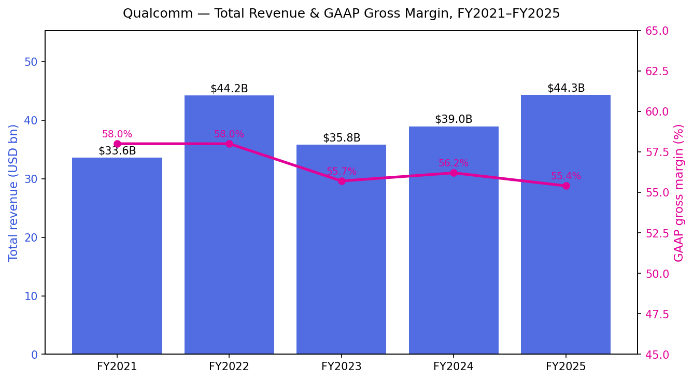
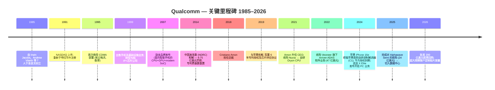
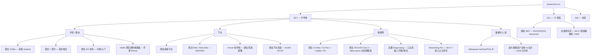
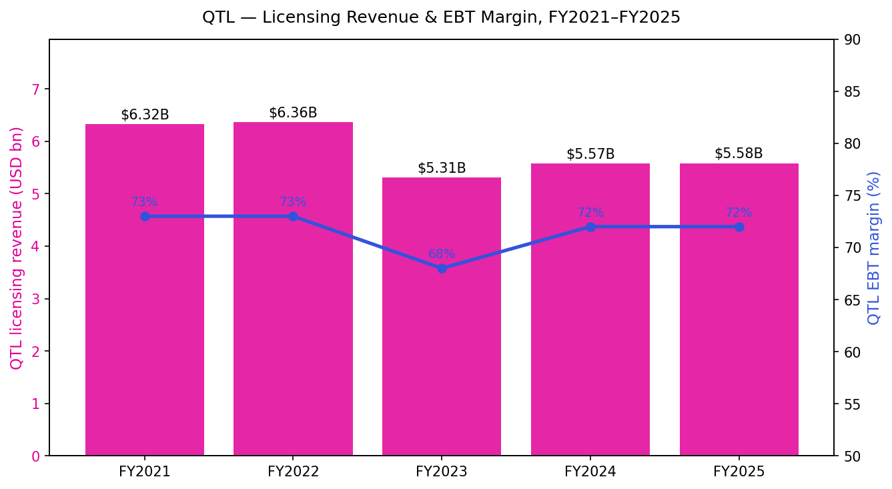
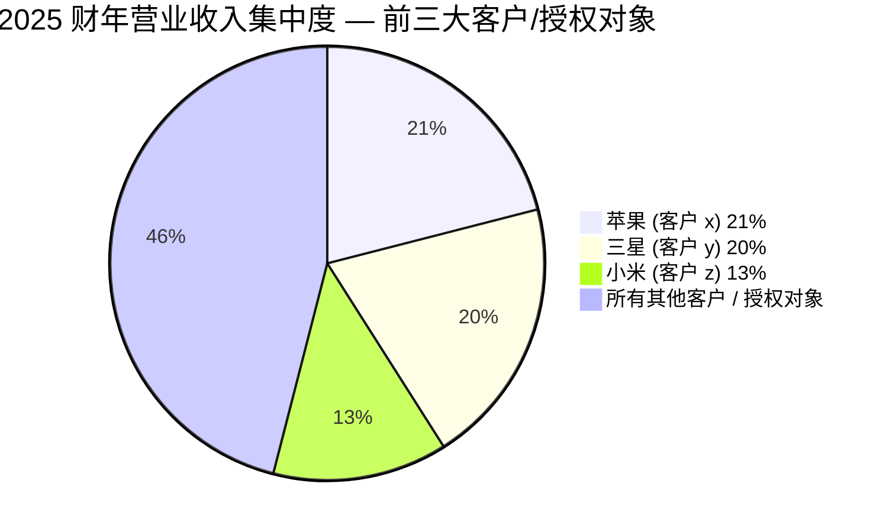
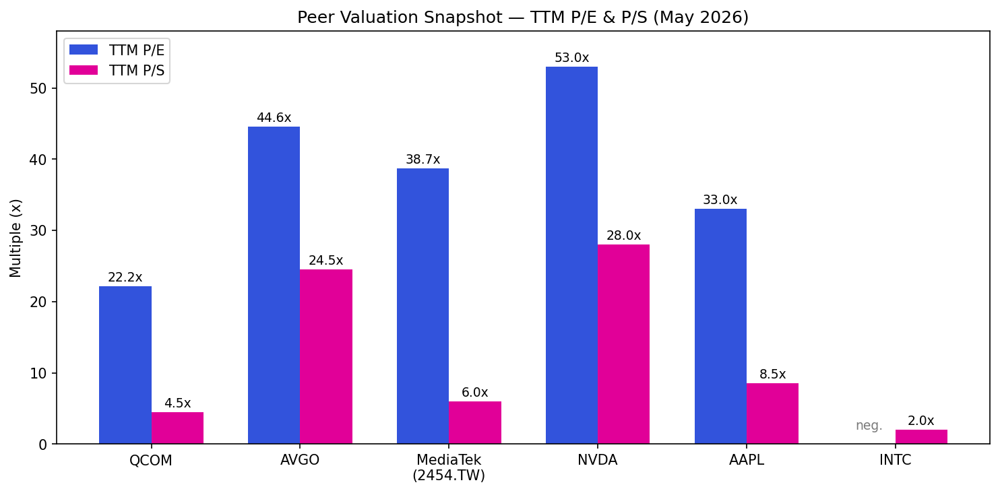

# 高通公司 Qualcomm Incorporated (NASDAQ:QCOM) — 公司研究报告

**日期:** 2026-06-11 (前版 2026-05-20)
**分析师备注:** 报告更新。所有财务数据均来源于高通向 SEC 提交的文件 (10-K、10-Q、8-K) 并在正文中逐项标注引用; 卖方观点引自本地 zsxq 研报库, 一律标注 *分析师观点:* 并与文件引用分离。市场数据截至 2026-06-11。
**报告语言: 简体中文 (英文版同时存在于本目录, 本次未更新)**

> **业绩更新 — 2026 财年 Q2 业绩验证全年指引框架, Q3 FY2026 指引显示中国手机市场触底 (2026-04-29):** 高通公布 2026 财年 Q2 营业收入 **106.0 亿美元 (同比 -3%)**, Non-GAAP 每股收益 **2.65 美元 (同比 -7%)**, 总体符合此前指引。管理层给出 2026 财年 Q3 营业收入指引区间为 **92–100 亿美元** (Non-GAAP EPS 2.10–2.30 美元), 下调区间反映 **内存供应紧张以及对部分手机 OEM 厂商造成的定价影响**; 管理层明确表示, QCT (高通 CDMA 技术) 来自中国客户的手机营业收入将于"第三季度触底, 并在随后季度回归环比增长"。同时, 董事会在已于 2026 财年上半年完成的 54 亿美元回购之上, 额外批准了一项 **200 亿美元股票回购计划**; 公司亦确认与超大规模数据中心 (hyperscaler) 客户的定制硅片合作仍按预期推进, 计划于 2026 日历年下半年实现初步出货。
> 来源: [QCOM 2026 财年 Q2 业绩公告, 2026-04-29](https://www.sec.gov/Archives/edgar/data/0000804328/000080432826000060/qcom032926erex991.htm)。

> **事件更新 — Computex 主题演讲发布数据中心品牌 "Dragonfly", 投资者日定档 6 月 24 日 (2026-06-01 / 2026-06-24):** CEO Cristiano Amon 在 2026 年 6 月 1 日 Computex 开幕主题演讲中公布数据中心产品品牌 **Dragonfly**, 覆盖服务器 CPU、AI 推理加速器与定制 ASIC 三类产品, 并表示更多细节将于 6 月 24 日纽约投资者日披露 ([The Elec — "Qualcomm Unveils 'Dragonfly' Brand for Data Center Business", 2026-06](https://www.thelec.net/news/articleView.html?idxno=10949); [Qualcomm Investor Day 2026 活动页](https://www.qualcomm.com/company/events/investor-day))。股价自 3 月 26 日低点 $130.06 一度涨至 6 月 2 日 $239.95 (+84%), 随后回落至 6 月 11 日 $202.96 — 数据中心叙事已成为该股定价主线 (收盘价: yfinance)。

## 投资摘要 (Investment Summary)

*分析师观点:* 下表为本报告自有前瞻判断 (评级体系: Buy / Hold / Sell), 不是高通公司或任何卖方机构的披露。

| 项目 | 内容 |
|---|---|
| 评级 (Rating) | **Hold (中性)** |
| 12 个月目标价 (PT) | **$190** (基准情形; 推导见第 1A 章) |
| 现价 (2026-06-11 收盘) | **$202.96** ([Yahoo Finance — QCOM](https://finance.yahoo.com/quote/QCOM/), yfinance) |
| 隐含空间 | **约 -6%** |
| 估值方法 | 18x × FY2027E Non-GAAP EPS ~$10.5 (分析师估计) |
| 情景目标价 | 牛市 **$265** (+31%) / 基准 **$190** (-6%) / 熊市 **$140** (-31%) |
| 市值 | 约 $2,140 亿美元 (yfinance, 2026-06-11) |
| 52 周区间 | $121.99 – $259.92 ([Yahoo Finance — QCOM](https://finance.yahoo.com/quote/QCOM/)) |

**论点支柱 (Thesis pillars):**

1. **数据中心从期权变为定价主线, 但收入仍未落地。** Alphawave 收购已于 2025-12-18 完成 ([Qualcomm 新闻稿, 2025-12-18](https://www.qualcomm.com/news/releases/2025/12/qualcomm-completes-acquisition-of-alphawave-semi)), 超大规模客户定制硅片 2026 日历年 H2 首批出货 (公司口径), Dragonfly 品牌已发布 — 6 月 24 日投资者日是下一个定价事件。
2. **手机业务正穿越内存涨价引发的去库存底部。** 管理层口径: 中国客户手机收入 F3Q26 触底、F4Q26 回归环比增长 ([QCOM F2Q26 业绩公告](https://www.sec.gov/Archives/edgar/data/0000804328/000080432826000060/qcom032926erex991.htm))。
3. **汽车 + IoT 多元化按既定目标推进。** F2Q26 汽车收入 $13.26 亿创纪录 (+38% YoY), 汽车+IoT 合计 +20% YoY (同上)。
4. **股价 3 个月自 $130 升至 $240 再回落 $203, 已部分计价数据中心成功; 风险回报趋于对称** — 牛熊情景上下行幅度几乎相等 (±31%), 故维持 Hold。

---

## 目录
1. 公司概览
1A. 估值与目标价 (Valuation & Price Target)
2. 公司历史
3. 管理团队
4. 产品与服务
5. 客户与上市策略
6. 行业概览
7. 竞争格局
8. 市场机会 (TAM)
9. 风险评估
9.5 核心分歧与催化剂 (Key debates & catalysts)

---

## 1. 公司概览

高通公司 (Qualcomm Incorporated) 是全球最大的纯粹设计型高级无线连接 (advanced wireless connectivity) 与高性能、低功耗计算平台 (high-performance, low-power computing platforms) 供应商, 覆盖移动、汽车以及物联网 (Internet-of-Things, IoT) 终端市场; 同时, 高通也是全球拥有最广泛蜂窝标准必要专利 (cellular standard-essential patents, SEPs) 授权许可的持有者, 其专利涵盖 3G、4G、5G 无线技术。公司于 1985 年在加利福尼亚州注册成立, 1991 年重新于特拉华州注册; 公司采用以每年 9 月最后一个星期日为截止日的 52/53 周财年 ([QCOM 2025 财年 10-K, Item 1 Business](https://www.sec.gov/Archives/edgar/data/0000804328/000080432825000085/qcom-20250928.htm))。总部位于加利福尼亚州圣迭戈 (San Diego), 截至 2025 年 9 月 28 日财年末, 公司在 38 个国家的 200 多个办公地点共拥有约 **52,000 名**全职、兼职及临时员工, 其中"绝大多数"为工程或技术岗位 ([QCOM 2025 财年 10-K, Human Capital](https://www.sec.gov/Archives/edgar/data/0000804328/000080432825000085/qcom-20250928.htm))。

高通通过三大经营板块开展业务 ([QCOM 2025 财年 10-K, Note 8 Segment Information](https://www.sec.gov/Archives/edgar/data/0000804328/000080432825000085/qcom-20250928.htm)):

- **QCT (Qualcomm CDMA Technologies, 高通 CDMA 技术)** — 半导体业务, 包含骁龙 (Snapdragon) 及龙翼 (Dragonwing) 品牌的 SoC (片上系统, system-on-chip) 平台、独立调制解调器 (standalone modems)、射频前端 (radio-frequency front-end, RFFE) 模块、Wi-Fi、蓝牙以及电源管理 IC。QCT 服务于三大终端市场: **手机** (面向 Android OEM 厂商的骁龙移动平台, 以及向苹果 iPhone 供货的薄型调制解调器 MDM (modem))、**汽车** (骁龙数字底盘 Snapdragon Digital Chassis — 包含连接、数字座舱、ADAS/AD 等)、**物联网** (骁龙 X 系列 PC 平台、XR/AR、Wi-Fi 网络、工业及边缘网络) ([QCOM 2025 财年 10-K, Item 1 Business](https://www.sec.gov/Archives/edgar/data/0000804328/000080432825000085/qcom-20250928.htm))。
- **QTL (Qualcomm Technology Licensing, 高通技术许可)** — 专利授权 (licensing) 业务, 对全球每一台使用高通已授权 SEP 的蜂窝设备按销量收取专利费 (royalty), 通常以 OEM 设备批发售价的一定百分比计费, 并设有单设备封顶 ([QCOM 2025 财年 10-K, Item 1 Business — QTL](https://www.sec.gov/Archives/edgar/data/0000804328/000080432825000085/qcom-20250928.htm))。
- **QSI (Qualcomm Strategic Initiatives, 高通战略计划)** — 高通创投 (Qualcomm Ventures), 对涉及 5G、AI、汽车、XR (扩展现实) 及数据中心等邻近领域的早期公司进行少数股权投资 ([QCOM 2025 财年 10-K, Item 1 Business — QSI](https://www.sec.gov/Archives/edgar/data/0000804328/000080432825000085/qcom-20250928.htm))。

在 **2025 财年 (截至 2025 年 9 月 28 日), 高通实现总营业收入 442.84 亿美元 (同比 +14%), GAAP 经营利润 123.55 亿美元 (经营利润率约 28%), 来自持续经营业务的净利润 55.41 亿美元**; 其中净利润数据受到 57 亿美元一次性非现金所得税费用的压制 — 该费用源于 2025 年 7 月通过的《One Big Beautiful Bill Act, OBBB》对美国联邦递延所得税资产计提估值备抵 ([QCOM 2025 财年 10-K, MD&A & Consolidated Statements of Operations](https://www.sec.gov/Archives/edgar/data/0000804328/000080432825000085/qcom-20250928.htm))。剔除该一次性项目, 2025 财年的基础盈利能力显著高于 GAAP 数字; 而事实上, 在 IRS 对 CAMT 规则发布澄清指引后, 高通已于 2026 财年 Q2 释放了该 57 亿美元的估值备抵, 当季 GAAP EPS 飙升至 6.88 美元 ([QCOM 2026 财年 Q2 业绩公告](https://www.sec.gov/Archives/edgar/data/0000804328/000080432826000060/qcom032926erex991.htm))。

在 2025 财年营业收入中, **QCT 贡献 383.67 亿美元 (占总收入 87%)**, **QTL 贡献 55.82 亿美元 (占 13%)**。QCT 板块内部, **手机**业务 277.93 亿美元 (占 QCT 的 72%, 同比 +12%), **汽车**业务 39.57 亿美元 (占 QCT 的 10%, 同比 +36%), **物联网**业务 66.17 亿美元 (占 QCT 的 17%, 同比 +22%) ([QCOM 2025 财年 10-K, MD&A — QCT Segment](https://www.sec.gov/Archives/edgar/data/0000804328/000080432825000085/qcom-20250928.htm))。QTL 营业收入同比基本持平 (仅增 1,000 万美元) — 鉴于华为授权于 2025 财年 Q2 到期、此后专利费收入随之中断, 这一表现颇为关键; 与两家主要中国 OEM 厂商签署的新长期协议, 以及与传音控股 (Transsion, 主导非洲和印度新兴市场的 OEM) 签署的全面 4G/5G 授权, 共同回填了流失的运营收入 ([QCOM 2025 财年 10-K, MD&A — QTL Segment](https://www.sec.gov/Archives/edgar/data/0000804328/000080432825000085/qcom-20250928.htm))。

*来源: [QCOM 2022 财年 10-K, MD&A](https://www.sec.gov/Archives/edgar/data/0000804328/000080432822000021/) 与 [QCOM 2025 财年 10-K, F-3 Consolidated Statements of Operations](https://www.sec.gov/Archives/edgar/data/0000804328/000080432825000085/qcom-20250928.htm)。*

**地理上严重偏向亚洲。** 约三分之二的 QCT 出货由亚洲 OEM 厂商接收 (其中相当一部分在中国), 用于销往中国本土及全球市场; QTL 专利费亦高度集中于中国授权对象, 因为中国总部的 OEM 厂商 (小米、OPPO、vivo、荣耀、传音) 合计占据全球非苹果、非三星手机出货量的约一半。2025 财年全年约 **92%** 的营业收入来源于美国境外总部的客户 ([QCOM 2025 财年 10-K, MD&A — Geographic Concentrations](https://www.sec.gov/Archives/edgar/data/0000804328/000080432825000085/qcom-20250928.htm))。

**客户集中度按标普 500 (S&P 500) 标准衡量已属极端。** 据 2025 财年 10-K 附注 2 (Concentrations), 在 2025 财年中, 有三个客户 / 授权对象各自占总合并营业收入的 10% 或以上: **客户 (x) 21%、客户 (y) 20%、客户 (z) 13%**; 合计 = **三个客户贡献全公司营业收入的 54%**。高通在 Human Capital 和 MD&A 节中另行披露, 2025 财年的这三个客户分别为 **苹果 (Apple)、三星 (Samsung)、小米 (Xiaomi)** ([QCOM 2025 财年 10-K, Note 2](https://www.sec.gov/Archives/edgar/data/0000804328/000080432825000085/qcom-20250928.htm))。同样的三个客户在 2024 财年占比为 22%/19%/12%, 2023 财年为 27%/21%/<10%。

### 估值快照

截至 **2026 年 6 月 11 日收盘**, 高通股价 **$202.96**, 对应市值约 **2,140 亿美元**, 2026 财年 Q2 末摊薄流通股本约 10.6 亿股 ([QCOM 2026 财年 Q2 业绩公告, Condensed Balance Sheet](https://www.sec.gov/Archives/edgar/data/0000804328/000080432826000060/qcom032926erex991.htm); 价格参考 [Yahoo Finance — QCOM](https://finance.yahoo.com/quote/QCOM/), yfinance, 2026-06-11)。过去三个月该股经历了剧烈重估: 3 月 26 日收盘 $130.06 (Bernstein 下调评级当日) → 6 月 2 日收盘 $239.95 (+84%) → 6 月 11 日 $202.96 (较峰值 -15%; 各日收盘价: yfinance)。

| 估值倍数 | QCOM (2026-06-11) | 三年区间 (约) | 备注 |
|---|---|---|---|
| 市盈率 P/E (TTM, GAAP) | ~21.8x | 13x–28x | TTM EPS 仍受 2025 财年 57 亿美元税务费用及 2026 财年 Q2 释放共同扭曲 ([Yahoo Finance — QCOM](https://finance.yahoo.com/quote/QCOM/), yfinance, 2026-06-11)。 |
| 前瞻市盈率 (FY2026E) | **~19x** | 10x–19x | yfinance 一致前瞻 EPS ~$10.7; 较 3 月时的约 10–12 倍已大幅重估, 目前处于三年区间上端 (yfinance, 2026-06-11)。 |
| 市销率 P/S (TTM) | ~4.8x | 3.0x–5.5x | 仍远低于 AVGO (~24x) 及 NVDA (~20x), 但这两者的收入结构以 AI 数据中心为主, 可比性有限 (yfinance, 2026-06-11; [stockanalysis.com](https://stockanalysis.com/stocks/qcom/statistics/))。 |
| EV/EBITDA | ~14–15x | 10x–17x | 对于高自由现金流的半导体标的属合理水平 ([gurufocus.com EV/EBITDA](https://www.gurufocus.com/term/enterprise-value-to-ebitda/QCOM))。 |
| 股息率 | ~1.9% | 1.6%–2.5% | 季度股息 0.89 美元; 2025 财年总分红 38.36 亿美元 ([QCOM 2025 财年 10-K, Cash Flow Statement](https://www.sec.gov/Archives/edgar/data/0000804328/000080432825000085/qcom-20250928.htm))。 |

**解读 — "大市值半导体最便宜标的"的折价叙事已经走完一半。** 本报告前一版 (2026 年 5 月) 的核心估值张力是: 高通以约 10–12 倍前瞻市盈率交易于大市值半导体最低档, 折价反映苹果调制解调器内化、中国 OEM 垂直整合与 QTL 年金化三重担忧。三个月后, 这一折价已被市场主动回补大半: 4 月 29 日财报电话会披露超大规模客户定制硅片合作后股价盘后大涨约 13% (*分析师观点:* [Bernstein — FQ226 recap, 2026-04-30, p.1](http://xs-macbook-air.local:5001/zsxq/pdf/184484414482182/Bernstein-Qualcomm%20Inc%EF%BC%88QCOM.US%EF%BC%89%EF%BC%9AFQ226%20recap~We%20hope%20they%20put%20on%20a%20good%20show%20in%20June...-260430.pdf)), 6 月 1 日 Computex 发布 Dragonfly 数据中心品牌 ([The Elec, 2026-06](https://www.thelec.net/news/articleView.html?idxno=10949)), 前瞻市盈率从约 10–12 倍扩张至约 19 倍 — 已与博通的前瞻倍数 (~20x) 大体持平 (yfinance, 2026-06-11)。换言之, **市场已为"数据中心成功"预付了相当部分对价, 而对应收入要到 2026 日历年 H2 才开始出货**。原有的三重担忧 (苹果内化、中国 OEM 自研、QTL 年金化) 并未消失, 只是被新叙事覆盖。估值的下一步取决于 6 月 24 日投资者日能否把路线图变成可验证的数字 — 这正是第 1A 章目标价推导与情景分析的核心变量。

---

## 1A. 估值与目标价 (Valuation & Price Target)

*分析师观点:* 本章全部前瞻估计、目标价与情景分析均为本报告自有判断, 不出现在高通的任何 SEC 文件中; 每项驱动假设的外部依据在行内标注。引用的卖方估计来自本地 zsxq 研报库, 均按报告日期与当日股价配对。

### 前瞻估计 (FY2026E–FY2028E)

| 财年 (9 月止) | 营业收入 | YoY | Non-GAAP EPS | 关键驱动 (外部依据) |
|---|---|---|---|---|
| FY2025A | $442.8 亿 | +14% | $12.03 | 实际值 ([QCOM FY2025 10-K](https://www.sec.gov/Archives/edgar/data/0000804328/000080432825000085/qcom-20250928.htm); 调整后 EPS 引自 *分析师观点:* [Bernstein 评级下调报告, 2026-03-26, p.1](http://xs-macbook-air.local:5001/zsxq/pdf/812224411854452/Bernstein-Qualcomm%20Inc%EF%BC%88QCOM.US%EF%BC%89There%20goes%20the%20neighborhood%EF%BC%9F%20Downgrading%20to%20Market~Perform-260326.pdf) "F25A 12.03") |
| FY2026E | ~$423 亿 | ~-4.5% | ~$10.6 | 内存涨价压制手机需求 + 苹果调制解调器份额递减; F3Q26 公司指引 $92–100 亿 ([F2Q26 业绩公告](https://www.sec.gov/Archives/edgar/data/0000804328/000080432826000060/qcom032926erex991.htm)); 锚定 *分析师观点:* Bernstein FY26E 营收 $423 亿 / EPS $10.64 ([FQ226 recap, 2026-04-30](http://xs-macbook-air.local:5001/zsxq/pdf/184484414482182/Bernstein-Qualcomm%20Inc%EF%BC%88QCOM.US%EF%BC%89%EF%BC%9AFQ226%20recap~We%20hope%20they%20put%20on%20a%20good%20show%20in%20June...-260430.pdf)) |
| FY2027E | ~$420 亿 | ~持平 | ~$10.5 | 手机收入恢复环比增长但苹果流失继续; 数据中心首次贡献"数十亿美元"收入且经营利润率为正 (*分析师观点:* [Bernstein SDC takeaways, 2026-05-27](http://xs-macbook-air.local:5001/zsxq/pdf/812451114422242/Bernstein-Qualcomm%20%EF%BC%88QCOM.US%EF%BC%89%EF%BC%9A%20Key%20takeaways%20from%20Bernstein%E2%80%99s%20SDC-260527.pdf)); 本估计介于 Bernstein $9.77 与 J.P. Morgan $11.50 之间 |
| FY2028E | ~$450 亿 | ~+7% | ~$11.5 | 数据中心定制硅片放量 + 手机常态化 + 汽车向 FY2029 $80 亿目标爬坡 (*分析师观点:* 汽车目标进度引自 [Bernstein SDC takeaways, 2026-05-27](http://xs-macbook-air.local:5001/zsxq/pdf/812451114422242/Bernstein-Qualcomm%20%EF%BC%88QCOM.US%EF%BC%89%EF%BC%9A%20Key%20takeaways%20from%20Bernstein%E2%80%99s%20SDC-260527.pdf)) |

利润率路径: QTL 维持 ~72% EBT 利润率的高利润年金 ([FY2025 10-K MD&A](https://www.sec.gov/Archives/edgar/data/0000804328/000080432825000085/qcom-20250928.htm)); QCT 毛利率 FY2026 受内存成本与手机折扣压制, FY2027–28 随汽车/数据中心占比上升而修复 (*分析师观点:* 混合驱动逻辑)。

**前瞻估值矩阵** (现价 $202.96, 2026-06-11; 倍数 = 现价 ÷ 各年 EPS 估计, 均为分析师推算):

| 倍数 | FY2025A | FY2026E | FY2027E | FY2028E |
|---|---|---|---|---|
| Non-GAAP P/E | 16.9x | ~19.1x | ~19.3x | ~17.7x |

注意 FY2027E 倍数不降反平 — 苹果调制解调器流失使 EPS 在数据中心放量前出现一个"增长空窗", 这是空方按现有盈利估值给出 $135–146 目标价的算术基础。

### 目标价推导: 基准 $190

**方法: 前瞻 P/E × 目标倍数。** 基准目标价 = **18x × FY2027E EPS ~$10.5 ≈ $190** (-6% vs 现价)。目标倍数 18x 的取法:

- **高于高通自身三年历史区间 (10x–16x) 的上端** — 给予数据中心期权、汽车 450 亿美元+订单管线 (pipeline) 与 IoT 复合增长以溢价;
- **低于纯 AI 数据中心标的** — 博通前瞻 ~19.9x、联发科 ~34x、AMD ~37x (yfinance, 2026-06-11), 因为高通的数据中心收入尚未出现在利润表上;
- **介于卖方两端之间** — 空方按现有盈利给 12–15x (*分析师观点:* GS 12x × 常态化 EPS $11 ([First Take, 2026-04-29](http://xs-macbook-air.local:5001/zsxq/pdf/212212284452121/GS-Qualcomm%20Inc.%20%28QCOM%29_%20First%20Take_%20In-line%20quarter%20with%20weak%20guidance%2C%20driven%20by%20smartphone%20downside-260429.pdf)); Bernstein 14x × F27E $9.77 ([FQ226 recap](http://xs-macbook-air.local:5001/zsxq/pdf/184484414482182/Bernstein-Qualcomm%20Inc%EF%BC%88QCOM.US%EF%BC%89%EF%BC%9AFQ226%20recap~We%20hope%20they%20put%20on%20a%20good%20show%20in%20June...-260430.pdf))), 多头为路线图给 23x (*分析师观点:* [J.P. Morgan, 2026-06-05](http://xs-macbook-air.local:5001/zsxq/pdf/814528851485152/J.P.%20Morgan-Qualcomm%EF%BC%88QCOM.US%EF%BC%89Expect%20Strong%20Data%20Center%20Market%20Revenue%20Targets%20and%20Customer%20Pipeline%20at%20Investor%20Day%EF%BC%9B%20Place%20on%20Positive%20Catalyst%20Watch-260605.pdf))。

### 情景分析 (牛市 / 基准 / 熊市)

| 情景 | 12 个月目标价 | 空间 | 摇摆假设 |
|---|---|---|---|
| **牛市** | **$265** | **+31%** | 6/24 投资者日给出量化且具名的数据中心路线图 (FY2027 收入 >$30 亿、FY2031 ~$350 亿) 并兑现首批出货; 手机 F4Q26 如期环比回升。算术: 23x × FY2027E EPS $11.5 (*分析师观点:* 框架引自 [J.P. Morgan, 2026-06-05](http://xs-macbook-air.local:5001/zsxq/pdf/814528851485152/J.P.%20Morgan-Qualcomm%EF%BC%88QCOM.US%EF%BC%89Expect%20Strong%20Data%20Center%20Market%20Revenue%20Targets%20and%20Customer%20Pipeline%20at%20Investor%20Day%EF%BC%9B%20Place%20on%20Positive%20Catalyst%20Watch-260605.pdf)) |
| **基准** | **$190** | **-6%** | 投资者日给出方向性 (但非合同性) 目标; 手机触底如期但内存逆风延续到 FY2027; 数据中心 FY2027 贡献数十亿美元。算术: 18x × $10.5 |
| **熊市** | **$140** | **-31%** | 内存涨价压制延续整个 FY2027, 数据中心披露缺乏具名客户与收入时间表, 苹果/三星份额流失加速。算术: 14x × $10.0 (*分析师观点:* 倍数框架引自 [Bernstein FQ226 recap, 2026-04-30](http://xs-macbook-air.local:5001/zsxq/pdf/184484414482182/Bernstein-Qualcomm%20Inc%EF%BC%88QCOM.US%EF%BC%89%EF%BC%9AFQ226%20recap~We%20hope%20they%20put%20on%20a%20good%20show%20in%20June...-260430.pdf)) |

### 与卖方一致预期的对比

本报告 FY2027E EPS ~$10.5 较 Bernstein ($9.77) 高约 +7%, 较 J.P. Morgan 新估计 ($11.50) 低约 -9%。目标价 $190 高于当前卖方目标价中位数 (~$143, 本地 zsxq 库 4 家机构, 2026 年 4–6 月), 低于 J.P. Morgan $265; 高出中位数的部分对应本报告对手机 F3Q26 触底与数据中心 FY2027 首批收入的基准采信。

### 卖方观点演变 (Sell-side view evolution)

机械预扫描 (`db/stock_price_target.db`, 只读): 库内 QCOM 目标价记录 13 条 (2026-01 至 2026-06), **当前在档目标价离散度: 最低 $135 (GS) / 中位 ~$143 / 最高 $265 (JPM), 极差 ~96%** — 在大市值半导体覆盖中属罕见的分歧水平。

**按机构的观点时间线:**

**Bernstein (Stacy Rasgon) — 自我下调, 然后眼看股价反向而行:**
- 2026-01-13 (CES 管理层会议纪要): **Outperform, PT $215** (当日收盘 $163.63, 隐含 +31%; 收盘价: yfinance) — *分析师观点:* ([Bernstein — CES takeaways, 2026-01-13](http://xs-macbook-air.local:5001/zsxq/pdf/184425218118812/Bernstein-Global%20Technology%EF%BC%9A%20What%20happened%20in%20Vegas%EF%BC%9F%20Takeaways%20from%20management%20meetings%20at%20CES-260113.pdf))
- 2026-03-26: **下调 Outperform→Market-Perform, PT $175→$140** (当日收盘 $130.06)。报告首页原文: "Rating: Market-Perform (Outperform OLD); Price Target: 140.00 USD (175.00 OLD)"; 同时下修 F26E 调整后 EPS $10.87→$10.64、F27E $10.38→$9.74 — 触发因素是手机周期走弱与内存逆风 (*分析师观点:* [Bernstein — "There goes the neighborhood?", 2026-03-26, p.1](http://xs-macbook-air.local:5001/zsxq/pdf/812224411854452/Bernstein-Qualcomm%20Inc%EF%BC%88QCOM.US%EF%BC%89There%20goes%20the%20neighborhood%EF%BC%9F%20Downgrading%20to%20Market~Perform-260326.pdf))
- 2026-04-30 (FQ226 recap): **维持 MP, PT $140** = 14x F27E EPS $9.77 (报告自述现价 $156, 隐含约 -10%)。明确表态: 数据中心 ASIC "通常需要数年才能起量", 高通是迟到者, 须在 6 月分析师日"售卖梦想"; "若想布局数据中心逻辑, 买入英伟达 (NVDA) 或博通 (AVGO) 可能是更好选择" (*分析师观点:* [Bernstein — FQ226 recap, 2026-04-30](http://xs-macbook-air.local:5001/zsxq/pdf/184484414482182/Bernstein-Qualcomm%20Inc%EF%BC%88QCOM.US%EF%BC%89%EF%BC%9AFQ226%20recap~We%20hope%20they%20put%20on%20a%20good%20show%20in%20June...-260430.pdf))
- 2026-05-27 (Bernstein SDC 会议): **维持 MP, PT $140** (当日收盘 $232.54 — 隐含 **-40%**; 收盘价: yfinance)。立场未变但语气软化: 承认数据中心 FY2027 将实现"数十亿美元收入"且经营利润率为正, 主打推理市场、以 CPU 架构与无需 HBM 的内存方案差异化 (*分析师观点:* [Bernstein — SDC takeaways, 2026-05-27](http://xs-macbook-air.local:5001/zsxq/pdf/812451114422242/Bernstein-Qualcomm%20%EF%BC%88QCOM.US%EF%BC%89%EF%BC%9A%20Key%20takeaways%20from%20Bernstein%E2%80%99s%20SDC-260527.pdf))

**J.P. Morgan — 两个月内目标价 $140→$160→$265, 全程维持 Neutral:**
- 2026-04-30 (F2Q26 review): **Neutral, PT $140→$160** = 15x F27E EPS $10.45 (报告自述现价 $156)。论点: 手机 F3Q 触底、F4Q 回升; 数据中心"三管齐下" (Agentic AI CPU + Alphawave 定制硅片 IP + 推理加速器) (*分析师观点:* [J.P. Morgan — F2Q26 Review, 2026-04-30](http://xs-macbook-air.local:5001/zsxq/pdf/184484411841542/J.P.%20Morgan-Qualcomm%EF%BC%88QCOM.US%EF%BC%89F2Q26%20Review%EF%BC%9A%20Finding%20the%20Bottom%20and%20Turning%20All%20Eyes%20to%20Investor%20Day%EF%BC%8C%20But%20Execution%20Will%20Be%20Watch%20Point%20Beyond%20the%20Strategy-260430.pdf))
- 2026-06-05 (投资者日前瞻): **Neutral 但列入正面催化观察 (Positive Catalyst Watch), PT $160→$265** = 23x 上修后 F27E EPS $11.50 (此前 $10.45) (2026-06-05 收盘 $215.94, 隐含 +23%; 收盘价: `db/stock_price_target.db`)。预判投资者日将披露: FY2027 数据中心收入突破 $30 亿、FY2031 达 $350 亿 (定制 ASIC $200 亿 + 通用 AI 加速芯片 $50 亿 + 服务器 CPU $110 亿), FY2031 非手机收入占比升至 70%, 汽车 FY2031 $170 亿、IoT FY2031 $170 亿, 手机 FY2026–31 年增速仅 ~2% (*分析师观点:* [J.P. Morgan — Investor Day preview, 2026-06-05](http://xs-macbook-air.local:5001/zsxq/pdf/814528851485152/J.P.%20Morgan-Qualcomm%EF%BC%88QCOM.US%EF%BC%89Expect%20Strong%20Data%20Center%20Market%20Revenue%20Targets%20and%20Customer%20Pipeline%20at%20Investor%20Day%EF%BC%9B%20Place%20on%20Positive%20Catalyst%20Watch-260605.pdf))。**注意: 这些 FY2031 数字是 JPM 对投资者日内容的预判, 不是高通已发布的指引。**

**Goldman Sachs — 始终按现有盈利估值:**
- 2026-04-29 (First Take): **Neutral, PT $135** = 12x × 常态化 EPS $11.00 (报告自述现价 $150, 隐含约 -10%)。手机下行与汽车/IoT 韧性互相平衡 (*分析师观点:* [GS — First Take, 2026-04-29](http://xs-macbook-air.local:5001/zsxq/pdf/212212284452121/GS-Qualcomm%20Inc.%20%28QCOM%29_%20First%20Take_%20In-line%20quarter%20with%20weak%20guidance%2C%20driven%20by%20smartphone%20downside-260429.pdf))

**Morgan Stanley (Joseph Moore) — 全街最空:**
- 2026-02-10 (恢复覆盖): **Underweight, PT $132** (报告自述 2026-02-09 收盘 $138.93)。报告原文: "Qualcomm has executed well under challenging circumstances, but may have maximized earnings power for now" — 内存短缺将使 2H 安卓环境恶化, 公司"个位数手机出货下滑"假设"may prove optimistic" (*分析师观点:* [Morgan Stanley — Resume coverage at UW, 2026-02-10, p.1](http://xs-macbook-air.local:5001/zsxq/pdf/184452551514412/Morgan%20Stanley-Qualcomm%20Inc.%EF%BC%88QCOM.US%EF%BC%89Memory%20headwinds%20will%20create%20handset%20shortfall%EF%BC%9B%20Resume%20coverage%20at%20UW-260210.pdf))
- 2026-05-19: **维持 UW, PT $132→$146** (当日收盘 $194.89, 隐含 **-25%**; 收盘价: yfinance) — 上调幅度远跟不上股价涨幅 (*分析师观点:* [MS — Large-Cap Institutional Ownership 1Q26, 2026-05-19](http://xs-macbook-air.local:5001/zsxq/pdf/585424552455544/MS-US%20Technology%20%20Large-Cap%20Institutional%20Ownership%201Q26%20Mega-Cap%20Tech%20Under-Ownership%20Narrows-260519.pdf))

**UBS — 中性观望:**
- 2025-11-06: Neutral, 报告标题即立场: "Data Center The New Angle, But Still Seems Far Out" (*分析师观点:* [UBS, 2025-11-06](http://xs-macbook-air.local:5001/zsxq/pdf/415854182115858/UBS-Qualcomm%20Inc.%EF%BC%88QCOM.US%EF%BC%89Data%20Center%20The%20New%20Angle%EF%BC%8CBut%20Still%20Seems%20Far%20Out-251106.pdf)); 2026-02-05 回调后维持 Neutral ("Pullback Creates More Upside to Our PT, But We Remain Neutral", *分析师观点:* [UBS, 2026-02-05](http://xs-macbook-air.local:5001/zsxq/pdf/184428588114842/UBS-Qualcomm%20Inc.%EF%BC%88QCOM.US%EF%BC%89Pullback%20Creates%20More%20Upside%20to%20Our%20PT%EF%BC%8C%20But%20We%20Remain%20Neutral-260205.pdf))

**机构间分歧 (截至 2026-06-11 在档观点):**

| 机构 | 日期 | 评级 / 目标价 | 核心论点 | 什么证据能证明其正确 |
|---|---|---|---|---|
| J.P. Morgan | 2026-06-05 | Neutral (正面催化观察) / $265 | 投资者日将给出 FY2031 数据中心 $350 亿路线图, 非手机占比 70%, 打开成长天花板 | 6/24 给出量化 FY2031 目标 + 具名客户; FY2027 数据中心收入兑现 >$30 亿 |
| Bernstein | 2026-05-27 | Market-Perform / $140 | 数据中心是"售卖梦想", ASIC 起量需数年; 手机恶化是当下现实; 要 DC 敞口不如买 NVDA/AVGO | F4Q26 手机未如期环比回升; 投资者日缺乏具名客户与收入时间表 |
| Morgan Stanley | 2026-05-19 | Underweight / $146 | 盈利能力已"最大化"; 内存短缺压制 2H 安卓; 数据中心期权未显现前股价跑输同业 | FY2026 H2 安卓出货/份额数据走弱; 投资者日后股价"卖事实" |
| Goldman Sachs | 2026-04-29 | Neutral / $135 | 常态化 EPS $11 × 12x; 手机下行与汽车/IoT 上行互相平衡 | 手机营收持续低迷, 多元化增量不足以抵消 |

分歧的真正轴线**不是**手机底部时点 (各家大体接受管理层的 F3Q26 触底口径), 而是**数据中心收入的可信度与应为其支付的倍数**: JPM 愿为尚未落地的 FY2031 路线图支付 23x 前瞻, Bernstein / GS / MS 只愿为利润表上已有的盈利支付 12–15x。同一事实集, 两套估值哲学 — 这也是本报告把投资者日列为头号摇摆变量的原因。

### 关键摇摆变量 (Swing variables)

1. **6 月 24 日投资者日的数据中心披露质量** — 是否具名客户、是否给出 FY2027/FY2031 量化收入目标、Dragonfly 三条产品线 (CPU / 推理加速器 / 定制 ASIC) 的出货时间表 ([Qualcomm Investor Day 2026 活动页](https://www.qualcomm.com/company/events/investor-day))。
2. **内存涨价向手机 BOM 的传导深度与时长** — F4Q26 手机收入是否兑现管理层"环比回升"口径 ([F2Q26 业绩公告](https://www.sec.gov/Archives/edgar/data/0000804328/000080432826000060/qcom032926erex991.htm)); 若内存逆风延续整个 FY2027, 熊市情景的 $10.0 EPS 与 14x 倍数同时成立。

---

## 2. 公司历史

高通由 **Irwin M. Jacobs (欧文·雅各布斯)、Andrew Viterbi (安德鲁·维特比)** 及他们在 Linkabit (Jacobs 此前共同创立的卫星通信公司) 的五位同事于 **1985 年 7 月** 创立, 总部位于加利福尼亚州圣迭戈。创始人的洞察在于: **码分多址技术 (Code Division Multiple Access, CDMA)** — 当时一种主要用于军用通信的小众扩频技术 — 可以被重新工程化, 成为相对于当时占据欧洲蜂窝网络主流地位的 TDMA 制 GSM 标准的更大容量替代方案。高通从 1989 年起在美国运营商进行 CDMA 商用试验, 1995 年与香港和记电讯实现首个商用部署, 并在不到十年内将 CDMA 衍生技术嵌入到此后每一代蜂窝标准 — CDMA2000、WCDMA / UMTS (3G)、LTE (4G)、5G NR (虽采用基于 OFDMA 的空中接口, 但继承了高通 CDMA 时代相当大部分的系统级专利) 的基础之中 ([QCOM 2025 财年 Q4 业绩公告, 2025-11-05](https://www.sec.gov/Archives/edgar/data/0000804328/000080432825000084/qcom092825erex991.htm); [QCOM 公司历史页面](https://www.qualcomm.com/company/about))。这项结构性决策 — 即对所有销售的蜂窝设备 (而非仅对使用高通自家芯片者) 按基础 IP 进行授权收费 — 缔造了今日的 QTL 业务, 至今仍是公司最具辨识度的核心特征。

**三次战略转折定义了高通的现代发展轨迹:**

第一, **1999 年剥离手机及基站制造业务** (分别出售给京瓷与爱立信) 将高通从一家垂直整合的蜂窝 OEM 转型为"无晶圆厂芯片 + IP 授权"的纯粹设计公司 ([Qualcomm 8-K, 爱立信基础设施剥离, 1999-05-24](https://www.sec.gov/Archives/edgar/data/0000804328/000093639299000683/0000936392-99-000683.txt); [TheStreet — "Qualcomm Sells Handset Unit to Kyocera", 1999-12](https://www.thestreet.com/investing/stocks/qualcomm-sells-handset-unit-to-kyocera-846987))。这一动作释放了研发资本, 消除了与芯片客户之间的渠道冲突, 也在行业整合进程中赋予高通对 OEM 厂商的议价能力。这是其后所有商业模式得以成立的奠基性决策。

第二, **2014 年中国发改委 (NDRC) 和解** — 9.75 亿美元反垄断罚款, 加上向中国 OEM 厂商授权蜂窝 SEP 时, 专利费基数应锁定在 OEM 设备批发售价 65% 的具约束力承诺 — 是一次近乎生死攸关的关键时刻, 重置了全球第二大智能手机市场的 QTL 专利费率。在数年争议解决期后, 高通在新条款下重建了对中国市场的专利费现金流; 至 2017 财年基本实现常态化运行; 长期后果是 QTL 至今仍有"相当大比例"的营业收入依赖少数中国授权对象 ([QCOM 2025 财年 10-K, Risk Factors](https://www.sec.gov/Archives/edgar/data/0000804328/000080432825000085/qcom-20250928.htm))。

第三, **2021 年 14 亿美元收购 Nuvia**, 由此衍生的高通 Oryon CPU 核心 (2023 年公布, 2024 年在面向 PC 的骁龙 X Elite 中首发, 2024/2025 年在面向智能手机的骁龙 8 Elite 中落地) 极大地缩小了高通在 CPU 性能上与苹果芯片团队的差距, 并打开了通往 Windows PC、汽车座舱乃至最终通往数据中心的可信路径 ([Qualcomm — "Qualcomm to Acquire NUVIA", 2021-01-13](https://www.qualcomm.com/news/releases/2021/01/qualcomm-acquire-nuvia))。ARM 就 Nuvia 授权问题对高通的诉讼于 2024 年底以高通胜诉收官, 2024 年 12 月 20 日特拉华州陪审团作出有利于高通的裁决, 2025 年得到完全确认胜诉, 解除了一项实质性悬顶 ([Qualcomm — "Achieves Complete Victory Over Arm in Litigation", 2025](https://investor.qualcomm.com/news-events/press-releases/news-details/2025/Qualcomm-Achieves-Complete-Victory-Over-Arm-in-Litigation-Challenging-Licensing-Agreements/default.aspx))。

**过去五年的重要并购:**
- **Veoneer Arriver (2022 年 4 月, 整体交易约 47 亿美元)** — 全栈 ADAS 软件 (感知、驾驶策略、传感器融合), 为骁龙 Ride 平台提供软件基底; 非 Arriver 部分业务 (主动安全、约束控制) 由 SSW Partners 剥离, 转售给麦格纳及 AIP Capital ([QCOM 2025 财年 10-K, Note 14 Discontinued Operations](https://www.sec.gov/Archives/edgar/data/0000804328/000080432825000085/qcom-20250928.htm))。
- **Alphawave Semi (2025 年 12 月, 24 亿美元)** — 英国上市的高速连接 IP 与小芯片 (chiplet) 专业公司, 旨在为高通的 AI 数据中心芯片提供 SerDes、PCIe、CXL 等基础构件; Alphawave CEO Tony Pialis 现领导高通的数据中心业务 ([Qualcomm Completes Acquisition of Alphawave Semi, 2025-12-18](https://www.businesswire.com/news/home/20251218292351/en/Qualcomm-Completes-Acquisition-of-Alphawave-Semi))。
- **Edge Impulse、MovianAI / Vingroup AI research team (均为 2025 年)** — 规模较小的补强收购, 强化边缘 AI 工具链, 并构建一支内部生成式 AI 研究团队。

**近 12 个月内的重要进展**包括: (a) **苹果 iPhone 16e (2025 年 2 月发布)** 搭载苹果首款自研调制解调器 (Apple C1) — 这是苹果调制解调器自研内化的标志性起点, 但高通与苹果在 2019 年签署的供应协议已于 2023 年延期, 覆盖 2026 年 iPhone 发布周期; (b) **骁龙 X Elite 与骁龙 X Plus** Copilot+ PC 平台发布, 紧接着在 CES 2026 上发布 **骁龙 X2 Elite、X2 Elite Extreme、X2 Plus** — 基于 3nm 工艺第三代 Oryon CPU ([CES 2026, Neowin 报道 2026-01-06](https://www.neowin.net/news/ces-2026-qualcomm-brings-snapdragon-x2-plus-to-mainstream-windows-11-copilot-pcs/)); (c) 管理层披露 **约 450 亿美元的汽车设计中标管线** (其中 150 亿美元具体为 ADAS) 及 **2029 财年汽车营业收入目标 80 亿美元** ([QCOM 2024 财年 Q2 业绩公告, 2024-05-01](https://www.sec.gov/Archives/edgar/data/0000804328/000080432824000038/qcom032424erex991.htm)); 及 (d) 在 2026 财年 Q2 业绩公告中宣布的 **超大规模客户定制硅片合作, 计划于 2026 日历年开始首批出货**, 并定于 2026 年 6 月 24 日召开投资者日, 重点详述数据中心与具身 AI (Physical AI) 战略 ([QCOM 2026 财年 Q2 业绩公告](https://www.sec.gov/Archives/edgar/data/0000804328/000080432826000060/qcom032926erex991.htm))。

---

## 3. 管理团队

### Cristiano R. Amon (克里斯蒂亚诺·安蒙) — 总裁兼首席执行官

Cristiano R. Amon, 55 岁, 自 2021 年 6 月起任高通总裁兼 CEO, 同期出任董事会成员 ([QCOM 2025 财年 10-K, Information about our Executive Officers](https://www.sec.gov/Archives/edgar/data/0000804328/000080432825000085/qcom-20250928.htm))。Amon 生于巴西圣保罗州坎皮纳斯并在当地长大, 在坎皮纳斯州立大学 (UNICAMP) 攻读电气工程, 1995 年加入高通, 任工程师, 负责高通在拉丁美洲的 CDMA 业务建设。他于 1990 年代末曾短暂离职加入爱立信, 后转任巴西运营商 Vesper (隶属 VeloCom), 2004 年回归高通 ([Wikipedia — Cristiano Amon](https://en.wikipedia.org/wiki/Cristiano_Amon); [Qualcomm Amon Bio PDF](https://www.qualcomm.com/content/dam/qcomm-martech/dm-assets/images/person/bio/amon-cristiano-full-bio.pdf))。

Amon 出任 CEO 之前最具标志性的运营成就, 是 **2015 至 2018 年间担任 QCT 总裁**, 期间他主导了骁龙产品路线图从 4G LTE 到 5G NR 的过渡。业内分析师普遍将以下两项成就归功于 Amon 的工程与商业执行力: 在首波 5G 商用浪潮 (2019–2021) 中夺取 **80%+ 旗舰 5G 智能手机应用处理器份额**, 以及在 2025 年达成 **62% 全球高端 5G 手机份额**, 而联发科同期约为 11% ([smartphone AP/SoC market analysis 2025](https://counterpointresearch.com/en/insights/global-smartphone-apsoc-market-share-quarterly))。在 2018 年 1 月至 2021 年 6 月担任总裁期间, 他主导了从"高通是智能手机调制解调器公司"到"高通是端侧 AI / 智能边缘平台公司"的战略重定位 — 这一定位早于 LLM 时代数年, 也正是这一前瞻性让骁龙 X Elite 在竞争对手尚未对 NPU 给出连贯回应之前, 就能讲出可信的 AI PC 故事。

执掌 CEO 后, Amon 的战略下注非常主动: (i) **Nuvia 收购**, 在他升任 CEO 前不久完成, 他选择加倍押注, 由此交付 Oryon CPU 与骁龙 X Elite PC 产品线 ([Qualcomm — "Qualcomm Completes Acquisition of NUVIA", 2021-03-16](https://investor.qualcomm.com/news-events/press-releases/news-details/2021/Qualcomm-Completes-Acquisition-of-NUVIA-03-16-2021/default.aspx)); (ii) **Veoneer Arriver 收购**, 将高通从汽车连接供应商转型为提供全栈 ADAS 软件 + 芯片的供应商; (iii) **Alphawave 收购及超大规模客户合作**, 重新开启高通此前已放弃的数据中心冒险 (高通自家的 Centriq 2400 服务器 CPU 在 2018 年停产) ([Network World — "Qualcomm makes it official; no more data center chip", 2018](https://www.networkworld.com/article/966778/qualcomm-makes-it-official-no-more-data-center-chip.html))。Amon 在 2023 财年的薪酬总额约为 **2,350 万美元** (绝大部分为与业绩挂钩的股权激励), CEO 薪酬与员工中位数薪酬之比为 223:1 ([Wikipedia, 引用自 DEF 14A](https://en.wikipedia.org/wiki/Cristiano_Amon))。自 2023 年 10 月起, 他兼任 Adobe Inc. 董事 ([Adobe 8-K — director appointment, 2023-10-26](https://www.sec.gov/Archives/edgar/data/0000796343/000079634323000226/adbeex991newdirector.htm))。Amon 持 UNICAMP 电气工程学士学位及该校荣誉博士学位。他以精通产品路线图的细节而闻名于业界 (常以技术深度在 MWC、CES、Computex 上发表演讲), 也是少数几位拉美裔出生的标普 100 公司 CEO ([Qualcomm Amon Bio PDF](https://www.qualcomm.com/content/dam/qcomm-martech/dm-assets/images/person/bio/amon-cristiano-full-bio.pdf))。

### Akash Palkhiwala (阿卡什·帕尔基瓦拉) — 首席财务官兼首席运营官

Akash Palkhiwala, 50 岁, 自 2019 年 11 月起担任 CFO, 并于 **2024 年 1 月被加授首席运营官 (COO) 职位**; 这一异常宽广的职权范围显示董事会的信心, 可以认为其在 5 至 10 年时间维度上具有可观的内部接班可能性 ([QCOM 2025 财年 10-K, Executive Officers](https://www.sec.gov/Archives/edgar/data/0000804328/000080432825000085/qcom-20250928.htm); [Qualcomm — "Appoints Akash Palkhiwala as CFO and COO", 2024-01-23](https://investor.qualcomm.com/news-events/press-releases/news-details/2024/Qualcomm-Appoints-Akash-Palkhiwala-as-Chief-Financial-Officer-and-Chief-Operating-Officer-01-23-2024/default.aspx))。Palkhiwala 于 2001 年 3 月加入高通 (此前在 KeyBank 短暂从事分析师工作), 在高通财务体系内深耕约二十年 — 包括 2015–2019 年间任 QCT 财务高级副总裁 (高通最大量的 P&L), 2014–2015 年间任高级副总裁兼司库。他的任期贯穿三任 CEO、2014 年中国反垄断和解、2018 年苹果和解、新冠手机周期, 以及 2025 财年 OBBB 税务应对。他持有印度 L.D. 工程学院机械工程学士学位以及马里兰大学工商管理硕士学位。任 CFO 期间, 他主导了大规模资本回报 (仅 2025 财年回购 88 亿美元 + 分红 38 亿美元; 2026 财年 Q2 的 200 亿美元新回购授权亦由其任内推动批准), 并在终端市场波动剧烈的环境下一贯达到或超过季度指引 ([QCOM 2025 财年 10-K, Cash Flow Statement](https://www.sec.gov/Archives/edgar/data/0000804328/000080432825000085/qcom-20250928.htm); [QCOM 2026 财年 Q2 业绩公告, 2026-04-29](https://www.sec.gov/Archives/edgar/data/0000804328/000080432826000060/qcom032926erex991.htm))。

### Alexander H. Rogers (亚历山大·罗杰斯) — QTL 与全球事务总裁

Alexander H. Rogers, 68 岁, 自 2016 年起领导 QTL 业务, 并于 2021 年 6 月加授全球事务总裁职责 ([QCOM 2025 财年 10-K, Executive Officers](https://www.sec.gov/Archives/edgar/data/0000804328/000080432825000085/qcom-20250928.htm))。一名职业知识产权诉讼律师 (乔治城大学文学学士/硕士, 乔治城法学院法学博士; 加入高通 (2001 年) 前任 Gray Cary, Ware & Freidenrich 合伙人), Rogers 的岗位是高通毛利率最高的岗位 — **QTL 在 2025 财年的息税前利润率 (EBT margin) 达到 72%**, 对应 55.82 亿美元营业收入 ([QCOM 2025 财年 10-K, Note 8 Segment Information](https://www.sec.gov/Archives/edgar/data/0000804328/000080432825000085/qcom-20250928.htm))。Rogers 主导了多年期授权续约, 用以回填 2024–2025 年华为失去后产生的收入空缺 (包括与传音的全面 4G/5G 协议, 以及 2025 财年 Q2 完成的两家关键中国 OEM 续约), 同时也负责管理与美国、欧盟、中国、韩国及印度反垄断监管机构的关系 ([QCOM 2025 财年 10-K, MD&A — QTL Segment](https://www.sec.gov/Archives/edgar/data/0000804328/000080432825000085/qcom-20250928.htm))。

### Baaziz Achour (巴齐兹·阿舒尔) — QTI 首席技术官

Dr. Baaziz Achour, 64 岁, 自 2025 年 2 月起任 Qualcomm Technologies, Inc. (QTI) 首席技术官 (CTO), 接替 James Thompson 一职 ([Qualcomm — "Dr. Baaziz Achour Appointed CTO-Elect", 2024-12-12](https://www.businesswire.com/news/home/20241212208361/en/Qualcomm-Announces-Dr.-Baaziz-Achour-Appointed-Chief-Technology-Officer-Elect))。三十余年高通老兵 (1993 年加入, 任系统工程师; 阿尔及尔大学学士, 塔夫茨大学电气工程硕士/博士), Achour 此前任副 CTO 兼工程高级副总裁。他是骁龙 (Snapdragon)、Oryon CPU、Hexagon NPU 以及 5G/6G 调制解调器路线图的高级技术负责人 — 鉴于高通研发投入密集的运营模式 (2025 财年研发支出 90.42 亿美元, 占营业收入约 20%), 可以说他是公司内除 CEO 外最关键的高管 ([QCOM 2025 财年 10-K, Executive Officers](https://www.sec.gov/Archives/edgar/data/0000804328/000080432825000085/qcom-20250928.htm))。

### 治理小结

- **董事会主席:** Mark D. McLaughlin, 独立董事, 自 2019 年 8 月任职。由于主席为独立董事, 董事会未单独设立首席独立董事 (Lead Independent Director) 职位 ([San Diego Business Journal, "Qualcomm Names New Board Chair"](https://www.sdbj.com/technology/qualcomm-names-new-board-chair/))。
- **2025 财年新增董事:** Marie Myers (惠普 HP Inc. CFO)、Christopher D. Young (McAfee 前 CEO; 网络安全/云方向)、Jeremy "Zico" Kolter (卡内基梅隆大学教授, AI/ML 安全方向) — Kolter 的加入尤其反映了董事会层面对 AI 能力的明确投入 ([QCOM 2026 财年 DEF 14A](https://www.sec.gov/Archives/edgar/data/0000804328/000110465926005781/tm2528704-1_def14a.htm))。
- **内部持股:** 据 2026 财年 DEF 14A 披露, 内部人合计持股不足 1% — 这对一家 40 年历史的大市值公司而言属典型水平; Amon 个人持股未在此处单独列示, 待新一轮披露后再行评估 ([QCOM 2026 财年 DEF 14A](https://www.sec.gov/Archives/edgar/data/0000804328/000110465926005781/tm2528704-1_def14a.htm))。
- **薪酬结构:** 强烈倾向于业绩挂钩股权激励 (PSU/RSU 组合), 2023 财年 CEO 薪酬总额约 2,350 万美元; 根据 2025 财年 10-K MD&A, 公司已在 2026/2027 财年对非高管领导人取消现金奖金, 转为多年期股权激励 ([QCOM 2025 财年 10-K, MD&A](https://www.sec.gov/Archives/edgar/data/0000804328/000080432825000085/qcom-20250928.htm))。
- **关联方交易:** 未披露重大关联交易 ([QCOM 2026 财年 DEF 14A, Related Party Transactions](https://www.sec.gov/Archives/edgar/data/0000804328/000110465926005781/tm2528704-1_def14a.htm))。

### 业绩追踪综述

这是一支拥有深厚板凳深度的执行团队, 在异常多事之秋的多年宏观背景下持续交付: 2019 财年苹果和解、2020–2021 财年华为授权退坡及供应禁令、2024 财年彻底失去华为授权专利费、ARM 对 Nuvia 的诉讼, 以及现今苹果调制解调器替代的初始阶段。在所有这些挑战面前, 营业收入从 2019 财年的 235 亿美元复合增长到 2025 财年的 443 亿美元 — 大致折合 12% 的复合年增长率 (CAGR), 经营模型保持稳定 ([QCOM 2025 财年 10-K, MD&A — Five-Year Selected Financial Data](https://www.sec.gov/Archives/edgar/data/0000804328/000080432825000085/qcom-20250928.htm))。主要的潜在缺口在于已具名高管之下一级的接班深度; 从 Thompson 到 Achour 的 CTO 交接平稳, 但代表了一次仍在被吸收消化的代际级技术领导层更替 ([Qualcomm — Achour CTO-Elect press release, 2024-12-12](https://www.businesswire.com/news/home/20241212208361/en/Qualcomm-Announces-Dr.-Baaziz-Achour-Appointed-Chief-Technology-Officer-Elect))。

---

## 4. 产品与服务

理解高通产品组合的最佳框架, 是将其视为以下两类 **集成 SoC 平台** (面向高端消费的骁龙, 面向工业/边缘网络的龙翼 (Dragonwing)) 与 **四个终端市场垂直方向** 加 **QTL 专利授权** 构成的矩阵。下方产品概述沿用高通自身在骁龙平台页与 2025 财年 10-K Item 1 Business 中所采用的产品分类法 ([Qualcomm Snapdragon product page](https://www.qualcomm.com/snapdragon); [QCOM 2025 财年 10-K, Item 1 Business](https://www.sec.gov/Archives/edgar/data/0000804328/000080432825000085/qcom-20250928.htm))。

### QCT — 手机 / 移动

QCT 手机业务在 2025 财年实现 **营业收入 277.93 亿美元 (同比 +12%)**, 仍是公司财务的中流砥柱 ([QCOM 2025 财年 10-K, MD&A — QCT Handsets](https://www.sec.gov/Archives/edgar/data/0000804328/000080432825000085/qcom-20250928.htm))。产品线分层如下:

- **骁龙 8 Elite (Gen 4) — 旗舰 Android。** 当前旗舰 SoC, 由台积电 (TSMC) 以 3nm 工艺制造, 集成第 2 代 Oryon CPU 核心、Adreno 830 GPU、具备端侧生成式 AI 能力的 Hexagon NPU (按高通官方营销, 可在设备上原生运行参数量超过 700 亿的 LLM), 以及集成式 X80 5G 调制解调器 + 射频系统。骁龙 8 Elite 驱动了三星 Galaxy S25 Ultra、小米 15 Pro、一加 13、荣耀 Magic、vivo X200 等绝大多数主流 Android 旗舰的高端配置 ([Qualcomm Snapdragon product page](https://www.qualcomm.com/snapdragon))。**竞争结论: 有 — 来自下述三方面的持久护城河: (i) 技术 IP (Oryon CPU, Hexagon NPU, X80 调制解调器), (ii) 与台积电的高端工艺产能合同所赋予的规模优势, (iii) 通过 Qualcomm AI Stack / AI Hub 开发者工具链形成的生态绑定。最接近的竞品: 联发科 Dimensity 9400** — 在 CPU/GPU 原始基准测试上与骁龙打平, 但在 NPU 能效、复杂 RF 条件下的调制解调器性能, 以及开发者工具成熟度上均落后; 此外还存在联发科的长期短板 — 即在大中华区以外, 与高端 OEM 厂商关系较弱。

- **骁龙 7 系列 / 6 系列 / 4 系列** — 分别面向中高端、中端、入门级 Android 的分层平台。骁龙 7+ Gen 4 越来越多地被小米与 OPPO 用于在 400–600 美元价格带提供旗舰级体验 (端侧 AI 影像、2 亿像素摄像头支持、光追游戏) ([Qualcomm Snapdragon mobile platforms](https://www.qualcomm.com/snapdragon))。**竞争结论: 部分护城河 — 联发科在中端 / 入门档位的出货量占据领先, 特别在印度及新兴市场, 中国 OEM 厂商出于成本考虑越来越多采用联发科。高通通过其调制解调器与 AI 功能优势, 保留高端市场份额** ([Counterpoint — Global Smartphone AP/SoC Market Share](https://counterpointresearch.com/en/insights/global-smartphone-apsoc-market-share-quarterly))。

- **MDM (薄型调制解调器) for 苹果 iPhone。** 专为苹果定制的 5G 调制解调器 (不含集成应用处理器), 依据 2019 年和解时首次签订、并于 2023 年延长至覆盖 2024、2025 及 2026 年 iPhone 发布周期的多年期供应协议进行交付。如管理层披露: "苹果已开始在其近期发布的智能手机中 [iPhone 16e, 2025] 使用其自家调制解调器 (而非高通产品), 我们预计苹果在未来设备中, 将越来越多地使用其自家调制解调器, 而非高通产品" ([QCOM 2025 财年 10-K, MD&A — Looking Forward](https://www.sec.gov/Archives/edgar/data/0000804328/000080432825000085/qcom-20250928.htm))。**竞争结论: 无持久护城河 — 苹果已明确承诺将该产品内化自研。经济学问题在于替换节奏, 结构性问题基本已经定论。**

**旗舰地位:** 骁龙 8 Elite 单一对 QCT 手机营业收入的贡献远超其他产品 (高通并未披露 SKU 级别拆分, 但 2025 财年 MD&A 显示高端档位 ASP 拉动了 25 亿美元的 QCT 营业收入增量 — 意味着旗舰档位承担了该板块毛利的关键权重) ([QCOM 2025 财年 10-K, MD&A — QCT Segment Revenues](https://www.sec.gov/Archives/edgar/data/0000804328/000080432825000085/qcom-20250928.htm))。

*来源: [QCOM 2025 财年 10-K Note 8 Segment Information](https://www.sec.gov/Archives/edgar/data/0000804328/000080432825000085/qcom-20250928.htm)。*

### QCT — 汽车

QCT 汽车业务在 2025 财年实现 **营业收入 39.57 亿美元 (同比 +36%)**, 是高通最有说服力的非手机增长引擎。管理层指引 **2029 财年汽车营业收入达 80 亿美元**, 基于 **约 450 亿美元的全生命周期设计中标管线 (其中 150 亿美元为 ADAS 专属)** ([QCOM 2024 财年 Q2 业绩公告](https://www.sec.gov/Archives/edgar/data/0000804328/000080432824000038/qcom032424erex991.htm))。产品组合如下:

- **骁龙座舱平台 (Snapdragon Cockpit Platforms)** — 为车内信息娱乐、驾驶员和乘客显示屏以及嵌入式车载通信 (telematics) 提供动力的 SoC。高通公布其座舱平台目前已驱动 **7,500 万+ 辆**在路上行驶的车辆 ([Qualcomm Auto Press Release, January 2026](https://www.qualcomm.com/news/releases/2026/01/qualcomm-drives-the-future-of-mobility-with-strong-snapdragon-di))。已披露的主要设计中标客户包括宝马 (整个 iX 及 i 系列座舱)、大众集团 (与 Cariad 合作)、通用汽车 (Ultifi 平台)、Stellantis、法拉利、雷诺、本田, 以及中国主流 OEM (比亚迪、吉利、蔚来、小鹏、理想、零跑、极氪、奇瑞)。**竞争结论: 有 — 汽车产品组合中最强的护城河, 来源于 (i) 多档位骁龙座舱平台家族 — 在车内复制智能手机式的档位经济结构; (ii) 一家 40 年半导体供应商在要求 AEC-Q100 认证和 10+ 年产品生命周期的行业中所积累的供应链信誉; (iii) 通过 QNX/Android/Linux 平台软件栈形成的生态绑定。最接近的竞品: 英伟达 (NVIDIA) DRIVE Thor (2024 年发布, 2025/2026 年起量)** — 英伟达将座舱 + ADAS 整合于单一 SoC, GPU 计算能力更强, 但骁龙数字底盘在量产规模与 OEM 平台整合上更为成熟。

- **骁龙 Ride / Ride Elite — ADAS/AD。** ADAS 专用 SoC 系列, 集成了从 Veoneer 收购而来的 Arriver 软件栈。骁龙座舱与 Ride Elite "目前合计驱动 10 项项目设计中标", 覆盖比亚迪汽车、零跑、极氪、长城汽车、蔚来与奇瑞 ([Qualcomm Auto Press Release January 2026](https://www.qualcomm.com/news/releases/2026/01/qualcomm-drives-the-future-of-mobility-with-strong-snapdragon-di))。**竞争结论: 部分护城河 — 英伟达 DRIVE Thor / Hyperion 是 ADAS 领域的领先竞争对手; Mobileye EyeQ 仍在 L2/L2+ 层级根深蒂固。高通向 L3+ 自动驾驶突破的路径取决于 Arriver 软件栈的逐步成熟。**

- **骁龙汽车连接 (Snapdragon Auto Connectivity)** — 面向网联车单元的 5G 蜂窝、Wi-Fi 7、蓝牙、UWB 及 V2X 芯片。**竞争结论: 有 — 是高通智能手机调制解调器主导地位向汽车蜂窝市场的自然延伸** ([Qualcomm Auto press release, 2026-01](https://www.qualcomm.com/news/releases/2026/01/qualcomm-drives-the-future-of-mobility-with-strong-snapdragon-di))。

*来源: QCOM 季度 8-K 业绩公告 ([2024 财年 Q1](https://www.sec.gov/Archives/edgar/data/0000804328/000080432824000015/qcom122423erex991.htm) 至 [2026 财年 Q2](https://www.sec.gov/Archives/edgar/data/0000804328/000080432826000060/qcom032926erex991.htm))。*

### QCT — 物联网

QCT 物联网业务在 2025 财年实现 **营业收入 66.17 亿美元 (同比 +22%)**。物联网在 2024 财年触底 (54.23 亿美元, 较 2023 财年下降 9%), 主要由消费、边缘网络与工业领域的去库存所致 ([QCOM 2025 财年 10-K, MD&A — QCT IoT](https://www.sec.gov/Archives/edgar/data/0000804328/000080432825000085/qcom-20250928.htm))。子产品组合如下:

- **骁龙 X Elite / X Plus / X2 Elite / X2 Elite Extreme / X2 Plus** — Copilot+ PC 平台, X2 Elite/Extreme 端侧 NPU 性能高达 **80 TOPS** (第 2 代 Oryon CPU, 18 个 CPU 核心, 3nm 工艺), 能够在设备上运行 700 亿参数级别的 LLM ([Snapdragon X2 Elite — Futurum Group 2026](https://futurumgroup.com/insights/snapdragon-x2-elite-pushes-ai-pc-performance-to-new-heights/); [Neowin CES 2026 coverage](https://www.neowin.net/news/ces-2026-qualcomm-brings-snapdragon-x2-plus-to-mainstream-windows-11-copilot-pcs/))。OEM 合作伙伴包括微软 (Surface Pro / Surface Laptop)、联想、HP、戴尔、三星、ASUS、宏碁与荣耀; 高通公布已有 **60 余款在产设计, 预计 2026 年突破 100 款**。**竞争结论: 有 — 部分护城河。骁龙 X 系列在高端价位事实上开创了 AI PC 品类, 高通对英特尔 (Intel) (Lunar Lake / Panther Lake) 和 AMD (Ryzen AI 300/400) 在 NPU 单位功耗性能上拥有 18–24 个月的先发优势。风险在于 x86 NPU 加速能力可能赶上, 而 Windows-on-ARM 兼容性摩擦 (部分 x86 老旧应用) 对部分装机用户仍可能成为决定性壁垒。最接近的竞品: 英特尔 Core Ultra (Lunar Lake / Arrow Lake)** — 英特尔通过 2024 年底 Lunar Lake 的 48 TOPS NPU 缩小了差距; AMD Ryzen AI 300 在主流档位拥有约 50 TOPS, 竞争力良好。

- **骁龙 XR2 Gen 2 / AR1** — XR/AR 平台, 驱动 Meta Quest 3 与 Quest 3S、三星 XR (Project Moohan), 以及 Meta Ray-Ban 系列智能眼镜; AR1 专门面向智能眼镜 ([Qualcomm Meta Quest 3S device page](https://www.qualcomm.com/xr-vr-ar/device-finder/meta-quest-3s))。**竞争结论: 有 — 高通是事实上的 XR/AR SoC 标准, 高端消费档位尚无可信挑战者。**

- **龙翼 Dragonwing — 工业、零售、机器人、物流、能源/公用事业。** 通过品牌重塑, 将工业/边缘网络物联网与消费级骁龙业务分离。包括龙翼 Q 系列 (工业手持设备)、面向视频分析与具身 AI 的边缘 AI 解决方案, 以及面向工业机器人的 IQ 系列。管理层已开始将具身 AI (Physical AI) / 工业机器人定位为未来潜在机会 ([QCOM 2025 财年 10-K, Item 1 — Dragonwing](https://www.sec.gov/Archives/edgar/data/0000804328/000080432825000085/qcom-20250928.htm))。**竞争结论: 部分 — 高通有规模和开发者生态优势, 但需与 NXP、Renesas、ST Microelectronics、Texas Instruments, 以及日益强势的 NVIDIA Jetson 在工业 AI 领域竞争。**

- **Networking Pro — Wi-Fi 7 接入点、光纤宽带、Mesh 网络。** Wi-Fi 7 平台现已成为主要接入点和企业级供应商的标配。**竞争结论: 有 — 在 Wi-Fi 6/6E/7 领域处于领先位置; 博通 (Broadcom) 是主要竞争对手** ([QCOM 2025 财年 10-K, Item 1 — Networking Pro](https://www.sec.gov/Archives/edgar/data/0000804328/000080432825000085/qcom-20250928.htm))。

### QCT — 数据中心 (新兴)

继 2025 年 12 月以 24 亿美元收购 Alphawave Semi 后, 高通在 2018 年退出 Centriq 服务器 CPU 业务七年后, 事实上已重返数据中心。战略组合包含: (a) **Alphawave 的高速 SerDes / PCIe / CXL / 小芯片连接 IP** (用于 AI 加速器-CPU-内存互连的基础构件), (b) **高通的 Oryon CPU 与 Hexagon NPU 架构**, 针对推理负载进行扩展, 及 (c) 在 2026 财年 Q2 披露的 **与"一家领先的超大规模客户"的定制硅片合作, 计划在 2026 日历年下半年首批出货** ([QCOM 2026 财年 Q2 业绩公告](https://www.sec.gov/Archives/edgar/data/0000804328/000080432826000060/qcom032926erex991.htm))。2026 年 6 月 1 日, CEO Cristiano Amon 在 Computex 开幕主题演讲中将这一组合正式命名为 **Dragonfly** 数据中心产品品牌, 覆盖三类产品 — 服务器 CPU、AI 推理加速器与定制 ASIC, 并表示更多细节将于 6 月 24 日纽约投资者日披露 ([The Elec — "Qualcomm Unveils 'Dragonfly' Brand for Data Center Business", 2026-06](https://www.thelec.net/news/articleView.html?idxno=10949); [Qualcomm Investor Day 2026 活动页](https://www.qualcomm.com/company/events/investor-day))。**竞争结论: 当前判断尚早** — 高通在数据中心营业收入起点为零, 而当前市场由英伟达 (AI 加速器份额约 90%) 与博通 (面向谷歌、Meta 的定制 ASIC) 主导。但超大规模客户定制硅片模式, 与高通既有 OEM 客户化设计的纪律性高度契合; *分析师观点:* Bernstein 在 5 月底的会议纪要中转述, 高通数据中心业务主打推理 (inference) 市场, 以 CPU 架构与"无需 HBM 的内存方案"形成差异化, FY2027 将实现数十亿美元收入且经营利润率为正 ([Bernstein — SDC takeaways, 2026-05-27](http://xs-macbook-air.local:5001/zsxq/pdf/812451114422242/Bernstein-Qualcomm%20%EF%BC%88QCOM.US%EF%BC%89%EF%BC%9A%20Key%20takeaways%20from%20Bernstein%E2%80%99s%20SDC-260527.pdf))。

**延伸观看 / Further viewing**

- [COMPUTEX 2026: Qualcomm CEO Cristiano Amon Keynote (YouTube) — Dragonfly 品牌发布与 "Year of the Agent" 完整主题演讲, 直观展示从终端到数据中心的统一算力架构叙事](https://www.youtube.com/watch?v=814lxJUPkAw)

### QTL — 专利授权

QTL 在全球向"数百家公司"授权高通的蜂窝 SEP 组合 (3G CDMA2000 / WCDMA、4G LTE、5G NR、5G-Advanced), 实现 **2025 财年专利授权营业收入 55.82 亿美元, EBT 利润率 72%**, 主要 OEM 授权协议有效期延续至 2027–2031 财年 ([QCOM 2025 财年 10-K, MD&A and Note 2](https://www.sec.gov/Archives/edgar/data/0000804328/000080432825000085/qcom-20250928.htm))。专利费通常按 OEM 设备批发售价的一定百分比计收, 设有单设备封顶。**竞争结论: 有 — 高通最深、最持久的经济护城河。** 该专利组合是业内已被授权范围最广的; 标准制定组织框架下的 FRAND 义务进一步巩固了其核心地位。脆弱点在于政治/监管层面 (中国、欧盟、韩国及印度的反垄断审查历史上均导致过专利费基数重置) 以及结构层面 (随着 5G 渗透率饱和, 6G 商用部署还需 3–5 年, 单设备专利费收入的增长取决于设备 ASP 上行与 XR/AR 等新品类的兴起 — 两者都是有限的顺风)。

*来源: [QCOM 2022 财年 10-K MD&A](https://www.sec.gov/Archives/edgar/data/0000804328/000080432822000021/) 与 [QCOM 2025 财年 10-K MD&A](https://www.sec.gov/Archives/edgar/data/0000804328/000080432825000085/qcom-20250928.htm)。*

### 近期发布与路线图

- **骁龙 X2 Elite / X2 Elite Extreme / X2 Plus** — CES 2026 上发布, 2026 日历年上半年开始出货 ([Neowin CES 2026 coverage](https://www.neowin.net/news/ces-2026-qualcomm-brings-snapdragon-x2-plus-to-mainstream-windows-11-copilot-pcs/))。
- **骁龙 8 Elite Gen 5** — 预计 2026 日历年下半年发布, 与 Android 旗舰刷新周期对齐。
- **骁龙 Ride Elite** — 2026 日历年内随已披露的 10 项项目设计中标进入量产爬坡。
- **数据中心定制硅片** — 2026 日历年下半年首批出货; 品牌定名 **Dragonfly** (Computex 2026 发布, [The Elec, 2026-06](https://www.thelec.net/news/articleView.html?idxno=10949))。
- **退役 / 重新定位:** 龙翼品牌重塑整合了多个历史工业 SKU。

---

## 5. 客户与上市策略

高通的客户群分为两类: **芯片客户 (QCT)** — 即购买骁龙平台的手机、汽车、PC、物联网及 (新增的) 数据中心 OEM 厂商; 以及 **授权客户 (QTL)** — 实际上覆盖了全球每一家蜂窝设备 OEM, 因为授权义务挂钩于 OEM 而非调制解调器芯片供应商 ([QCOM 2025 财年 10-K, Item 1 — QTL Licensees](https://www.sec.gov/Archives/edgar/data/0000804328/000080432825000085/qcom-20250928.htm))。

### 客户集中度 — 量化

据 2025 财年 10-K 附注 2 (Concentrations), **三个客户 / 授权对象各自占 2025 财年总合并营业收入的 10% 或以上** ([QCOM 2025 财年 10-K, Note 2 Concentrations](https://www.sec.gov/Archives/edgar/data/0000804328/000080432825000085/qcom-20250928.htm)):

来源: [QCOM 2025 财年 10-K, Note 2 Concentrations](https://www.sec.gov/Archives/edgar/data/0000804328/000080432825000085/qcom-20250928.htm)。客户映射 (苹果/三星/小米) 依据 Human Capital 与 MD&A 节披露。

三年趋势 (2023 财年 → 2025 财年): 客户 x **27% → 22% → 21%**; 客户 y **21% → 19% → 20%**; 客户 z **<10% → 12% → 13%** ([QCOM 2025 财年 10-K, Note 2 Concentrations](https://www.sec.gov/Archives/edgar/data/0000804328/000080432825000085/qcom-20250928.htm))。客户 x (苹果) 份额两年内从 27% 降至 21%, 符合公开叙事 — 苹果调制解调器在 iPhone 16e (2025 年 2 月) 上自研内化, 后续机型对苹果自研调制解调器的使用日益扩大, 将继续压缩该份额 ([Apple — "Introducing Apple C1 modem in iPhone 16e", 2025-02-19, via 9to5Mac](https://9to5mac.com/2025/02/19/apple-reveals-c1-its-first-in-house-5g-iphone-modem-replacing-qualcomm/))。同期小米从 <10% 升至 13%, 既反映骁龙 8 Elite 在旗舰档位的中标, 也反映 2025 财年中国 OEM 授权续约带来的 QTL 营业收入贡献 ([QCOM 2025 财年 10-K, MD&A — QTL Segment](https://www.sec.gov/Archives/edgar/data/0000804328/000080432825000085/qcom-20250928.htm))。

**这一集中度是一项实质性风险, 第 9 章将专门展开。** 值得注意的是, 苹果与三星同时也是 **竞争对手** — 它们各自拥有自研调制解调器 (Apple C1) 与 Exynos (三星) 芯片项目, 这种"亦敌亦友"的关系在如此规模下尤为罕见 ([Fortune — Apple C1 modem story, 2025-02-19](https://fortune.com/2025/02/19/apple-iphone-16e-c1-cellular-modem-qualcomm-silicon/))。

### 客户细分

- **高端 Android OEM:** 三星、小米、OPPO、vivo、一加、荣耀、摩托罗拉/联想、华硕、索尼、谷歌 (Pixel 部分; Tensor 为谷歌 + 三星合作)、Nothing、传音。高通与上述大部分厂商签有供应 / 多年期平台承诺协议 ([QCOM 2025 财年 10-K, Item 1 — Customers](https://www.sec.gov/Archives/edgar/data/0000804328/000080432825000085/qcom-20250928.htm))。
- **苹果:** 仅供应薄型调制解调器; 按多年期时间表向 Apple C1 / C 系列调制解调器过渡。2023 年延期的苹果供应协议覆盖 2024–2026 iPhone 发布周期 ([QCOM 2025 财年 10-K, MD&A — Looking Forward](https://www.sec.gov/Archives/edgar/data/0000804328/000080432825000085/qcom-20250928.htm))。
- **中国 OEM (专利费 + 芯片):** 小米、OPPO、vivo、荣耀、一加、传音 (Tecno/Infinix/Itel — 非洲/印度)、TCL、联想、中兴、Realme。2025 财年重要里程碑: 与传音签署全面 4G/5G 授权, 了结此前未决诉讼 ([QCOM 2025 财年 10-K, MD&A — QTL](https://www.sec.gov/Archives/edgar/data/0000804328/000080432825000085/qcom-20250928.htm))。
- **汽车 OEM / Tier 1:** 宝马、通用、大众集团 (Cariad)、Stellantis、奔驰、法拉利、雷诺、本田、现代-起亚、吉利、比亚迪、蔚来、小鹏、理想、零跑、极氪、奇瑞、长城, 以及一级供应商博世、大陆、Aptiv、麦格纳、Veoneer、Cariad、Visteon ([Qualcomm Auto press release, 2026-01](https://www.qualcomm.com/news/releases/2026/01/qualcomm-drives-the-future-of-mobility-with-strong-snapdragon-di))。
- **PC OEM:** 微软 (Surface)、联想、HP、戴尔、三星、华硕、宏碁、荣耀; 60 余款 Copilot+ PC 设计在产 ([Neowin CES 2026 coverage](https://www.neowin.net/news/ces-2026-qualcomm-brings-snapdragon-x2-plus-to-mainstream-windows-11-copilot-pcs/))。
- **XR/AR:** Meta (Quest 3, Quest 3S, Ray-Ban 智能眼镜)、三星 XR (Project Moohan)、联想、Pico (字节跳动)、HTC ([Qualcomm Meta Quest 3S device page](https://www.qualcomm.com/xr-vr-ar/device-finder/meta-quest-3s))。
- **工业 / IoT:** 范围广泛, 包括施耐德电气、罗克韦尔、霍尼韦尔、GE、西门子; 在披露中相对手机客户不太显眼 ([QCOM 2025 财年 10-K, Item 1 — IoT/Dragonwing](https://www.sec.gov/Archives/edgar/data/0000804328/000080432825000085/qcom-20250928.htm))。
- **数据中心 (新兴):** "领先超大规模客户"未披露 (依据 Tony Pialis 在收购前 Alphawave 时期的客户关系及行业报道, 可能为亚马逊网络服务 (AWS)、微软或 Meta Platforms 之一) ([QCOM 2026 财年 Q2 业绩公告, 2026-04-29](https://www.sec.gov/Archives/edgar/data/0000804328/000080432826000060/qcom032926erex991.htm))。

### 分销渠道

QCT 芯片主要按 **以订单确认为基础的采购订单方式 (purchase-order basis with order confirmation)** 销售, 一般允许客户在规定窗口内调整交付时间, 在出货前取消订单, 并视时点可能收取或免收取消费 ([QCOM 2025 财年 10-K, QCT Segment](https://www.sec.gov/Archives/edgar/data/0000804328/000080432825000085/qcom-20250928.htm))。大型 OEM 通常有多年期平台供应协议 (苹果、三星、宝马、通用及多家中国 OEM)。

QTL 与主要 OEM 的授权协议通常 **为长期协议, 到期日分布在 2027 至 2031 财年之间** ([QCOM 2025 财年 10-K, Note 2](https://www.sec.gov/Archives/edgar/data/0000804328/000080432825000085/qcom-20250928.htm))。续约周期由 Alex Rogers 的全球事务团队管理, 重大续约谈判通常需要 6–24 个月。

### 销售周期

手机: 旗舰 SoC 设计导入 (design-in) 周期为 12–18 个月, 与年度旗舰发布对齐 ([QCOM 2025 财年 10-K, Item 1 — Business Operations](https://www.sec.gov/Archives/edgar/data/0000804328/000080432825000085/qcom-20250928.htm))。
汽车: **设计导入周期为 5–7 年** (RFQ → SOP → 放量), 需 AEC-Q100 认证, 产品生命周期 10+ 年。2025–2026 财年的当前营业收入反映了 2018–2022 年间锁定的设计中标; 约 450 亿美元的管线反映将在 2027–2032 年间产生营业收入的合作 ([QCOM 2024 财年 Q2 业绩公告, 2024-05-01](https://www.sec.gov/Archives/edgar/data/0000804328/000080432824000038/qcom032424erex991.htm))。
PC: 设计导入到出货 12–18 个月, 传统上与微软 Surface 及联想年度路线图同步 ([Neowin CES 2026 coverage, 2026-01-06](https://www.neowin.net/news/ces-2026-qualcomm-brings-snapdragon-x2-plus-to-mainstream-windows-11-copilot-pcs/))。
数据中心: 定制硅片 18–36 个月, 主要由 NRE (非经常性工程) 摊销与单芯片 ASP 主导 ([QCOM 2026 财年 Q2 业绩公告, 2026-04-29](https://www.sec.gov/Archives/edgar/data/0000804328/000080432826000060/qcom032926erex991.htm))。

### 关键合作伙伴

- **台积电 (TSMC)** — 高端骁龙 SoC 的主要代工伙伴 (3nm, 2nm 路线图)。2025 财年 10-K 风险因素中已披露此项制造依赖 ([QCOM 2025 财年 10-K, Risk Factors — Supplier Concentration](https://www.sec.gov/Archives/edgar/data/0000804328/000080432825000085/qcom-20250928.htm))。
- **三星代工 (Samsung Foundry) 与 GlobalFoundries** — 次级代工伙伴 ([QCOM 2025 财年 10-K, Risk Factors](https://www.sec.gov/Archives/edgar/data/0000804328/000080432825000085/qcom-20250928.htm))。
- **微软** — Copilot+ PC 合作及 Windows-on-ARM 开发协作 ([Futurum Group — Snapdragon X2 Elite analysis, 2026](https://futurumgroup.com/insights/snapdragon-x2-elite-pushes-ai-pc-performance-to-new-heights/))。
- **谷歌** — Android 平台合作; AICore API ([QCOM 2025 财年 10-K, Item 1 — Android ecosystem](https://www.sec.gov/Archives/edgar/data/0000804328/000080432825000085/qcom-20250928.htm))。
- **Meta Platforms** — XR/AR 合作 (Quest, Ray-Ban 智能眼镜) ([Qualcomm Meta Quest 3S device page](https://www.qualcomm.com/xr-vr-ar/device-finder/meta-quest-3s))。
- **Edge Impulse / Hugging Face / Microsoft AI Foundry** — Qualcomm AI Stack / AI Hub 上的开发者工具链合作 ([QCOM 2025 财年 10-K, Item 1 — AI Stack](https://www.sec.gov/Archives/edgar/data/0000804328/000080432825000085/qcom-20250928.htm))。
- **OpenAI** (据媒体报道, 双方正在探索定制移动硅片合作, 目标 2028 年量产) ([TipRanks/Yahoo Finance 2026 年 3 月报道](https://finance.yahoo.com/markets/stocks/articles/broadcom-vs-qualcomm-buy-one-195719940.html))。

### 客户案例 — 已具名设计中标

- **三星 Galaxy S25 Ultra (2025) 与 Galaxy S26 Ultra (2026)** — 全球独家搭载骁龙 8 Elite ([Qualcomm Snapdragon page](https://www.qualcomm.com/snapdragon))。
- **小米 15 Pro / 15 Ultra / 16 系列** — 搭载骁龙 8 Elite 的旗舰 ([Qualcomm Snapdragon page](https://www.qualcomm.com/snapdragon))。
- **Meta Ray-Ban 智能眼镜与 Meta Quest 3 / 3S** — 骁龙 AR1 / XR2 Gen 2 ([Qualcomm Meta Quest 3S device page](https://www.qualcomm.com/xr-vr-ar/device-finder/meta-quest-3s))。
- **微软 Surface Pro / Surface Laptop (X Elite, 即将搭载 X2 Elite)** — Copilot+ PC ([Futurum Group — Snapdragon X2 Elite, 2026](https://futurumgroup.com/insights/snapdragon-x2-elite-pushes-ai-pc-performance-to-new-heights/))。
- **宝马 iX、奔驰 EQS / E 级、通用 Ultifi** — 骁龙座舱 ([Qualcomm Auto press release, 2026-01](https://www.qualcomm.com/news/releases/2026/01/qualcomm-drives-the-future-of-mobility-with-strong-snapdragon-di))。
- **比亚迪、蔚来、小鹏、理想、零跑、极氪** — 骁龙座舱 + 骁龙 Ride Elite ([Qualcomm Auto January 2026](https://www.qualcomm.com/news/releases/2026/01/qualcomm-drives-the-future-of-mobility-with-strong-snapdragon-di))。

---

## 6. 行业概览

高通处于三个大型成熟行业的交汇点 — **智能手机应用处理器 / 调制解调器** (周期性核心)、**汽车半导体** (结构性增长支点)、**个人计算 SoC** (份额突破型机会) — 加上正在萌芽的第四大行业 **数据中心 AI 芯片** (高通刚刚切入), 以及底层的 **蜂窝 IP 授权生态** ([QCOM 2025 财年 10-K, MD&A — Industry Trends](https://www.sec.gov/Archives/edgar/data/0000804328/000080432825000085/qcom-20250928.htm))。

### 智能手机应用处理器与调制解调器

- **行业界定 (NAICS 334413)。** 设计与制造将蜂窝调制解调器、CPU/GPU、NPU、ISP、音频 DSP 及连接 (Wi-Fi/BT/UWB) 整合的智能手机集成电路; 营业收入 = 单位出货量 × ASP ([QCOM 2025 财年 10-K, Item 1 Business](https://www.sec.gov/Archives/edgar/data/0000804328/000080432825000085/qcom-20250928.htm))。
- **市场规模。** 据估算, 2025 日历年全球智能手机应用处理器市场约 **246 亿美元**, 预计至 2035 年达 **393 亿美元** (CAGR 约 4.8%) ([SNS Insider 2025-06-18](https://www.globenewswire.com/news-release/2025/06/18/3101576/0/en/Application-Processor-Market-to-Surpass-USD-55-34-Billion-by-2032-at-a-CAGR-of-4-47-SNS-Insider.html); 另见 [Counterpoint Research](https://counterpointresearch.com/en/insights/global-smartphone-apsoc-market-share-quarterly))。高通自身预测 2025 日历年智能手机消费需求同比 **"基本持平"**, 其中 5G 机型 **同比中个位数百分比增长** ([QCOM 2025 财年 10-K, Industry Trends](https://www.sec.gov/Archives/edgar/data/0000804328/000080432825000085/qcom-20250928.htm))。
- **增长动力。** (1) 全球 5G 持续渗透 (5G 手机在 2024 年单位出货中渗透率约 50%, 仍在上行; 新兴市场 5G 采用率加速)。(2) 端侧 AI 功能 (Galaxy AI, 小米 HyperAI) 拉动 ASP 上行的高端档位升级周期。(3) 智能手机平均 ASP 随更大 NPU/内存/相机 BOM 持续抬升 ([Counterpoint — GenAI smartphone SoCs 35% share, 2025](https://www.fonearena.com/blog/465788/genai-smartphone-soc-growth-2025-counterpoint.html))。
- **结构。** 顶部高度集中: **高通、联发科、苹果、三星 Exynos、紫光展锐 (UNISOC)、谷歌 Tensor、小米玄戒** — 前五大 SoC 厂商合计占全球出货量 80%+。高端档位更为集中: 2025 年高端 5G 手机中约 62% 采用高通, 11% 采用联发科, 苹果自研与三星 Exynos 在各自闭环产品内服务 ([Counterpoint — Global Smartphone AP/SoC Market Share](https://counterpointresearch.com/en/insights/global-smartphone-apsoc-market-share-quarterly); [EE Times Asia — Premium Smartphone SoC Shipments 2025](https://www.eetasia.com/premium-smartphone-soc-shipments-to-surge-in-2025/))。
- **趋势。** 主要 OEM 的垂直整合是定义性趋势。苹果在 2010 年完成 A 系列过渡, 2019 年后启动调制解调器项目, 在 iPhone 16e (2025 年 2 月) 首发 Apple C1 调制解调器 ([9to5Mac — "Apple C1 modem in iPhone 16e", 2025-02-19](https://9to5mac.com/2025/02/19/apple-reveals-c1-its-first-in-house-5g-iphone-modem-replacing-qualcomm/))。三星在 Galaxy S 部分区域版本中使用 Exynos, 覆盖范围扩大。谷歌 Tensor (由三星代工) 专用于 Pixel。小米于 2025 年发布 **玄戒 O1 (XRing O1)** 应用处理器 (3nm) ([Digitimes — "Xiaomi 3nm XRing", 2025-05-23](https://www.digitimes.com/news/a20250523VL203/xiaomi-xring-soc-3nm-mediatek.html))。每一项都对高通的芯片 TAM 构成结构性压力, 但 QTL 专利费义务仍随 OEM 而非芯片来源延续。

### 汽车半导体

- **行业界定。** 出售给汽车 OEM 与一级供应商的应用处理器、MCU、雷达 / 激光雷达 / 摄像头 IC、V2X / 5G 蜂窝射频、Wi-Fi 与蓝牙 IC, 以及 ADAS / 自动驾驶 SoC ([Yole Group — Automotive Semiconductor Trends 2025](https://www.yolegroup.com/product/report/automotive-semiconductor-trends-2025/))。
- **市场规模。** 2025 年全球汽车半导体市场约 **700 亿美元**, 预计至 2030 年达到 **1,200–1,400 亿美元**, CAGR 约 10%, 其中座舱 + 连接 + ADAS 为增长最快的子板块 ([Spherical Insights — Automotive Semiconductor Market USD 148.6B by 2035](https://www.sphericalinsights.com/blogs/why-the-automotive-semiconductor-market-could-surpass-usd-148.6-billion-by-2035))。高通可服务份额集中于 **数字座舱、车载通信 / 5G 连接、ADAS / AD 计算** — 大约 **250–300 亿美元的可服务市场 (SAM)** ([QCOM 2024 财年 Q2 业绩公告, 2024-05-01](https://www.sec.gov/Archives/edgar/data/0000804328/000080432824000038/qcom032424erex991.htm))。
- **增长动力。** (1) 座舱数字化: 预计到 2030 年, 68% 的新车将搭载嵌入式蜂窝连接, 其中 48% 为 5G, 较 2025 年的 21% 大幅提升 ([TechInsights 2025-07, 高通 2025 财年 10-K 引用](https://www.sec.gov/Archives/edgar/data/0000804328/000080432825000085/qcom-20250928.htm))。(2) ADAS 渗透: **全球新销售轻型车搭载 L2 或更高自动驾驶级别的份额, 将从 2025 年的 24% 提升至 2030 年的 52%** ([TechInsights 2024-11](https://www.sec.gov/Archives/edgar/data/0000804328/000080432825000085/qcom-20250928.htm))。(3) 软件定义汽车 (SDV) 架构整合: 将计算集中到 1–2 颗高性能 SoC, 替代约 50 个分布式 ECU, 把面向 SoC 供应商的单车 ASP 从约 50 美元拉升至 300 美元以上。
- **结构。** 历史上较为分散 (NXP、Renesas、Infineon、ST Microelectronics、TI、Mobileye、英伟达、高通); 在座舱 + ADAS SoC 上正向 3–4 家领导者整合 (英伟达、高通、Mobileye, 加上特斯拉自研 FSD 硅片)。监管: AEC-Q100 / ISO 26262 功能安全认证构成实质性进入壁垒。

### 个人计算 SoC

- **行业界定。** 用于笔记本及台式机的应用处理器, 历史上以 x86 (英特尔、AMD) 为主, 但 ARM 架构占比正在上升 (2020 年起苹果硅片; 2024 年起高通骁龙 X) ([Apple Newsroom — "Apple announces Mac transition to Apple silicon", 2020-06-22](https://www.apple.com/newsroom/2020/06/apple-announces-mac-transition-to-apple-silicon/))。
- **市场规模。** 全球 PC 单位出货量约 **2.6–2.7 亿台/年**, 对应 SoC 层 TAM 约 **800–1,000 亿美元** (假设高端 ASP 300–400 美元, 主流 80–150 美元)。苹果硅片已通过 Mac 出货占全球 PC SoC TAM 价值的约 10% ([Gartner — "PC Shipments Grew in 2024", 2025-01-13](https://www.gartner.com/en/newsroom/press-releases/2025-01-13-gartner-says-worldwide-pc-shipments-grew-1-point-8-percent-in-fourth-quarter-of-2024-and-1-point-3-percent-for-the-year))。
- **增长动力。** AI PC 换机周期 (微软 Copilot+ 规范要求 NPU ≥ 40 TOPS)、Windows-on-ARM 生态成熟, 以及对多日续航的预期 ([Microsoft — "Introducing Copilot+ PCs", 2024-05-20](https://blogs.microsoft.com/blog/2024/05/20/introducing-copilot-pcs/))。
- **结构。** 长期双寡头格局 (英特尔单位份额约 70%, AMD 约 20%), 高通与苹果作为 ARM 架构挑战者。微软通过 Windows-on-ARM 兼容性与 Copilot+ 品牌标准成为关键裁决者 ([Canalys — Worldwide PC market share, 2025-Q1](https://www.canalys.com/newsroom/worldwide-pc-shipments-q1-2025))。

### XR / AR / 智能眼镜

- 当前规模较小 (TAM 约 30–50 亿美元) 但增速高 (Meta Quest 装机量约 2,500 万台; Ray-Ban 智能眼镜累计销量突破 200 万台; 苹果 Vision Pro 处于高端价位)。高通在消费 XR SoC 市场占据主导地位, 无可信挑战者 ([Meta — "Ray-Ban Meta has sold 2 million units", 2025-02-26 Q4 2024 业绩说明会 via The Verge](https://www.theverge.com/news/619025/meta-ray-ban-smart-glasses-sales-units-2-million))。

### 蜂窝 IP 授权

- 全球所有蜂窝 SEP 授权方 (高通、Nokia、爱立信、InterDigital、华为、三星) 的总年授权池约 **250–350 亿美元**; 高通 QTL 营业收入 56 亿美元意味着约 20% 的池内份额。该池的结构性增长依赖于 (a) 设备单位数量, (b) 设备 ASP, (c) 新授权品类 (例如蜂窝物联网、V2X、固定无线接入、卫星)。6G 商用部署目前预计在 2028–2030 年; 在此之前, QTL 的增长主要是组合升级 / ASP 故事, 而非单位放量故事 ([IPlytics — "Who is leading the 5G patent race?", 2024](https://www.iplytics.com/wp-content/uploads/2024/02/Who-is-leading-the-5G-patent-race_2024.pdf); [3GPP — 6G timeline / Release 21](https://www.3gpp.org/news-events/3gpp-news/6g-workshop))。

### 监管环境

- 对 QTL 授权实践的反垄断审查仍是结构性悬顶。过往案例 (中国发改委 2014–2015 年 9.75 亿美元罚款; 韩国公平交易委员会 2017–2020 年 8.53 亿美元罚款; 中国台湾公平交易委员会 2018 年和解; 欧盟委员会立案 2022 年部分撤销) 显示监管关注之深。美国 FTC 诉高通案在 2020 年上诉中由高通胜诉 ([Reuters — "Qualcomm wins antitrust ruling on appeal", 2020-08-11](https://www.reuters.com/article/idUSKCN25729T/); [European Commission — "Qualcomm decision partly annulled by EU General Court", 2022-06-15](https://ec.europa.eu/commission/presscorner/detail/en/MEX_22_3744))。
- **出口管制** — 美国商务部于 2024 年 5 月撤销高通向华为销售 4G 等 IC 的出口许可, 终止了华为贡献的产品营业收入 ([Reuters — "US revokes some export licenses for Intel, Qualcomm to sell to Huawei", 2024-05-07](https://www.reuters.com/technology/us-revokes-some-export-licenses-intel-qualcomm-sell-huawei-2024-05-07/))。

### 行业动态 — 波特五力分析视角

- **供应商议价能力:** 中等 — 台积电在先进工艺节点具有显著议价权; 三星代工与 GlobalFoundries 是现实的备选方案 ([QCOM 2025 财年 10-K, Risk Factors — Supplier Concentration](https://www.sec.gov/Archives/edgar/data/0000804328/000080432825000085/qcom-20250928.htm))。
- **客户议价能力:** 对前三大客户层级 (苹果/三星/小米可对平台特性与价格施加影响) 较高; 对长尾客户较低 ([QCOM 2025 财年 10-K, Note 2 Concentrations](https://www.sec.gov/Archives/edgar/data/0000804328/000080432825000085/qcom-20250928.htm))。
- **替代品威胁:** 手机端较高 (苹果/三星自研硅片); 汽车端中低 (设计导入周期长); PC 端中等 (苹果/英特尔/AMD); XR 较低 (高通是基底) ([QCOM 2025 财年 10-K, MD&A — Looking Forward](https://www.sec.gov/Archives/edgar/data/0000804328/000080432825000085/qcom-20250928.htm))。
- **新进入者威胁:** 中等 — 护城河为专利、定制 CPU 设计 (Oryon) 及 40 年调制解调器经验。新进入者面临漫长的资本投入与 IP 风险 ([QCOM 2025 财年 10-K, Item 1 — Business — Patents](https://www.sec.gov/Archives/edgar/data/0000804328/000080432825000085/qcom-20250928.htm))。
- **行业内竞争:** 激烈 — 联发科、苹果、三星、英伟达在不同维度上展开竞争 ([Counterpoint — Global Smartphone AP/SoC Market Share](https://counterpointresearch.com/en/insights/global-smartphone-apsoc-market-share-quarterly))。

---

## 7. 竞争格局

高通在各业务板块面临不同的竞争对手集合。下方竞争图谱列出了主要直接、间接及新兴对手 ([QCOM 2025 财年 10-K, Item 1 — Competition](https://www.sec.gov/Archives/edgar/data/0000804328/000080432825000085/qcom-20250928.htm))。

### 直接竞争对手 — 手机

- **联发科 MediaTek (TWSE: 2454)** — 量产档位的主要直接竞争对手。**2025 年第三季度全球智能手机 SoC 单位份额 38%**, 高通约为 31% ([Counterpoint Research, Smartphone AP/SoC](https://counterpointresearch.com/en/insights/global-smartphone-apsoc-market-share-quarterly))。Dimensity 9400 在 CPU/GPU 基准上与骁龙 8 Elite 持平, 但在 NPU 能效、复杂条件下调制解调器性能及开发者工具成熟度上落后。**估值: TTM P/E 约 38.7 倍 (Stockopedia) 到约 52.9 倍 (GuruFocus); 前瞻 P/E 约 43 倍。** 显著高于 QCOM, 反映更高增长预期及台股流动性动态。
- **苹果 Inc. (NASDAQ: AAPL)** — 自研硅片 (2010 年起 iPhone 自研 A 系列应用处理器; 2024 年起自研 C 系列调制解调器)。不是商业销售的芯片商, 但是 iPhone 内高通内容的结构性替代者。**AAPL TTM P/E 约 33 倍; P/S 约 8.5 倍** ([Apple 10-K FY2024](https://www.sec.gov/Archives/edgar/data/0000320193/000032019324000123/aapl-20240928.htm))。
- **三星 Exynos (KRX: 005930)** — Galaxy 部分地区/SKU 的自研 AP; 在高端档位竞争力不一致 (Galaxy S25/S26 Ultra 全球独家使用骁龙) ([Samsung — Exynos 2500 product page](https://semiconductor.samsung.com/processor/mobile-processor/exynos-2500/))。
- **谷歌 Tensor** — Pixel 自研 SoC, 由三星代工 ([Google — "The new Google Tensor G5 chip", 2025-08-20](https://blog.google/products/pixel/google-tensor-g5/))。
- **小米玄戒 O1 (2025+)** — 小米于 2025 年发布首款自研 AP; 威胁尚不确定, 但小米同时仍是骁龙的主要客户 ([Digitimes — "Xiaomi 3nm XRing", 2025-05-23](https://www.digitimes.com/news/a20250523VL203/xiaomi-xring-soc-3nm-mediatek.html))。
- **紫光展锐 (UNISOC)** — 中国 SoC 厂商, 主打入门 / 中低档位; 不构成可信高端竞争对手 ([Counterpoint — UNISOC SoC share, 2024](https://counterpointresearch.com/en/insights/global-smartphone-apsoc-market-share-quarterly))。

### 直接竞争对手 — 汽车

- **英伟达 NVIDIA (NASDAQ: NVDA) DRIVE Thor / Hyperion** — 座舱 + ADAS SoC 层面最可信的直接竞争者。NVIDIA 的 GPU 衍生计算在 L3/L4 自动驾驶负载上占优; 高通在座舱量产规模与平台整合上领先。**NVDA TTM P/E 约 53 倍; P/S 约 28 倍** ([NVIDIA — DRIVE Thor product page](https://www.nvidia.com/en-us/self-driving-cars/drive-thor/))。
- **Mobileye (NASDAQ: MBLY)** — 专注 ADAS, 通过 EyeQ 系列主导 L2/L2+; 在座舱与 L3+ 较弱 ([Mobileye 10-K FY2024](https://www.sec.gov/cgi-bin/browse-edgar?action=getcompany&CIK=0001910139&type=10-K))。
- **英特尔** — 通过其在 Mobileye 的持股; 也在 IVI 座舱硅片领域有所布局 ([Intel — Mobileye majority ownership disclosure](https://www.intel.com/content/www/us/en/newsroom/news/mobileye-spinoff.html))。
- **特斯拉 FSD HW4 / HW5** — 自研 ADAS/AD 硅片仅供特斯拉; 不进入商业销售市场 ([Tesla 10-K FY2024, AI compute](https://www.sec.gov/Archives/edgar/data/0001318605/000162828025003063/tsla-20241231.htm))。
- **NXP 半导体、Renesas、Infineon、ST Microelectronics、Texas Instruments** — 更广泛的汽车半导体厂商, 在 MCU/雷达/连接领域竞争, 但不在座舱 + ADAS SoC 层面 ([Yole Group — Automotive Semiconductor Trends 2025](https://www.yolegroup.com/product/report/automotive-semiconductor-trends-2025/))。

### 直接竞争对手 — PC

- **英特尔 Intel (NASDAQ: INTC)** — Lunar Lake (2024) 与 Panther Lake (2025) 缩小了 NPU 差距; Arrow Lake / Core Ultra 是出货量答案。INTC TTM P/E 目前为负, 因结构性亏损; P/S 约 2.0 倍 ([Intel — Lunar Lake architecture press release, 2024-06-04](https://www.intel.com/content/www/us/en/newsroom/news/2024-computex-client-computing-news.html))。
- **AMD (NASDAQ: AMD)** — Ryzen AI 300 / 400 系列在 Copilot+ PC 上以约 50 TOPS NPU 竞争。AMD 前瞻 P/E 约 30 倍 ([AMD — Ryzen AI 300 series page](https://www.amd.com/en/products/processors/laptop/ryzen/ai-300-series.html))。
- **苹果硅片 (M 系列)** — 自研; 定义了 ARM 架构 PC SoC 的性能上限 ([Apple — "M4 chip introduction", 2024-05-07](https://www.apple.com/newsroom/2024/05/apple-introduces-m4-chip/))。

### 直接竞争对手 — 物联网 / 网络 / XR

- **博通 Broadcom (NASDAQ: AVGO)** — Wi-Fi 基础设施、超大规模客户定制 ASIC、以太网交换。**AVGO TTM P/E 约 44.6 倍; EV/Revenue 约 24.5 倍; EV/EBITDA 约 36 倍** — 多头逻辑下的"如果 QCOM 成功多元化"对标 ([Multiples.vc — Broadcom valuation multiples](https://multiples.vc/public-comps/broadcom-valuation-multiples))。
- **NXP、Renesas、ST Microelectronics、TI** — 工业 / 边缘网络物联网 ([NXP 10-K FY2024](https://www.sec.gov/cgi-bin/browse-edgar?action=getcompany&CIK=0001413447&type=10-K))。
- **NVIDIA Jetson** — 在工业 / 机器人边缘 AI 领域竞争力上升 ([NVIDIA — Jetson Thor announcement, 2025-08-25](https://nvidianews.nvidia.com/news/nvidia-launches-jetson-thor-the-ultimate-platform-for-physical-ai))。

### 直接竞争对手 — 数据中心 (新兴)

- **英伟达** — AI 加速器市场份额约 90% ([Reuters — "Nvidia commands 80%+ AI accelerator market", 2024-12-30](https://www.reuters.com/technology/artificial-intelligence/nvidias-revenue-fueled-by-ai-set-soar-26-q4-2024-12-30/))。
- **博通** — 谷歌 (TPU 后继)、Meta (MTIA) 等的定制 ASIC 合作伙伴 ([Broadcom FY2024 10-K, AI Networking](https://www.sec.gov/Archives/edgar/data/0001730168/000173016824000087/avgo-20241103.htm))。
- **AMD** — MI 系列 GPU; 份额不断扩大 ([AMD — Instinct MI325X launch, 2024-10-10](https://www.amd.com/en/products/accelerators/instinct/mi300/mi325x.html))。
- **Marvell** — 面向超大规模客户的定制 ASIC ([Marvell — "Custom AI Compute" investor page](https://investor.marvell.com/news-releases/news-release-details/marvell-and-amazon-web-services-expand-strategic))。

### 直接竞争对手 — QTL / IP 授权

- **Nokia、爱立信、InterDigital、华为** — 均持有规模可观的 4G/5G SEP 组合, 但每家通常单设备专利费率低于高通 ([IPlytics — "Who is leading the 5G patent race?", 2024](https://www.iplytics.com/wp-content/uploads/2024/02/Who-is-leading-the-5G-patent-race_2024.pdf))。

*来源: 综合自 [stockanalysis.com QCOM statistics](https://stockanalysis.com/stocks/qcom/statistics/)、[fullratio.com QCOM PE](https://fullratio.com/stocks/nasdaq-qcom/pe-ratio)、[GuruFocus MediaTek PE](https://www.gurufocus.com/term/pettm/TPE:2454)、[Stockopedia MediaTek](https://www.stockopedia.com/share-prices/media-tek-TPE:2454/)、[Multiples.vc Broadcom](https://multiples.vc/public-comps/broadcom-valuation-multiples), 以及 Yahoo Finance 各代码页面, 均访问于 2026 年 5 月。*

### 高通的竞争优势

1. **蜂窝 IP 与 SEP 组合。** 据 2025 财年 10-K, 该专利组合"是业内被授权范围最广、最深的"; 可以说是公司最具防御力的护城河 ([QCOM 2025 财年 10-K, Item 1 — Business — QTL](https://www.sec.gov/Archives/edgar/data/0000804328/000080432825000085/qcom-20250928.htm))。
2. **调制解调器性能。** 30+ 年累积投入; 业内公认的标准, 尤其在复杂 RF 条件下 ([Signals Research — "5G Modem Shootout", 2024 — 方法论参考](https://www.signalsresearch.com/wp-content/uploads/2024/01/5G-Modem-Shootout-Public-Whitepaper.pdf))。
3. **自研 CPU IP (Oryon)。** 收购 Nuvia 后, 高通拥有苹果硅片之外唯一可信的高性能 ARM CPU ([Qualcomm — "Snapdragon X Elite Oryon CPU details", 2023-10-24](https://www.qualcomm.com/news/releases/2023/10/qualcomm-unleashes-snapdragon-x-elite--the-ai-super-charged-plat))。
4. **端到端平台集成。** 骁龙平台在单一 SoC 内大规模集成应用处理器 + 调制解调器 + 射频 + Wi-Fi + 音频 + ISP + NPU; 鲜有竞争者能与之匹敌 ([QCOM 2025 财年 10-K, Item 1 — Products](https://www.sec.gov/Archives/edgar/data/0000804328/000080432825000085/qcom-20250928.htm))。
5. **规模化研发预算。** 2025 财年研发投入 90.4 亿美元, 占营业收入约 20% — 支撑同时在移动、汽车、PC、XR、数据中心进行投入 ([QCOM 2025 财年 10-K, MD&A — Research and Development](https://www.sec.gov/Archives/edgar/data/0000804328/000080432825000085/qcom-20250928.htm))。
6. **汽车设计中标管线。** 约 450 亿美元的全生命周期设计中标, 是汽车半导体行业最大的单一远期营业收入账本 ([QCOM 2024 财年 Q2 业绩公告, 2024-05-01](https://www.sec.gov/Archives/edgar/data/0000804328/000080432824000038/qcom032424erex991.htm))。
7. **OEM 客户化设计纪律。** 40 年向高端 OEM 在严苛技术与可靠性要求下供应硅片的经验稀缺, 可移植到数据中心定制硅片业务 ([QCOM 2025 财年 10-K, Item 1 — Customers](https://www.sec.gov/Archives/edgar/data/0000804328/000080432825000085/qcom-20250928.htm))。

### 竞争弱点

1. **苹果调制解调器内化** — 不可逆的 2–4 年结构性营业收入压缩 ([QCOM 2025 财年 10-K, MD&A — Looking Forward](https://www.sec.gov/Archives/edgar/data/0000804328/000080432825000085/qcom-20250928.htm))。
2. **中国 OEM 垂直整合风险** — 小米 (玄戒)、OPPO (玛瑞亚, 已搁置)、华为 (麒麟 2023+ 恢复) 均显示同类野心 ([Reuters — "Oppo abandons chip design unit", 2023-05-12](https://www.reuters.com/technology/oppo-shutters-chip-design-unit-zeku-says-employee-2023-05-12/))。
3. **联发科在中端 / 入门档位的份额提升** — 结构性 ASP 压力 ([Counterpoint Research — Global Smartphone AP/SoC Market Share](https://counterpointresearch.com/en/insights/global-smartphone-apsoc-market-share-quarterly))。
4. **当前无数据中心营业收入** — 距实质性数据中心 P&L 贡献还需 18–36 个月 ([QCOM 2026 财年 Q2 业绩公告, 2026-04-29](https://www.sec.gov/Archives/edgar/data/0000804328/000080432826000060/qcom032926erex991.htm))。
5. **对稳定专利费体制的监管依赖** — QTL 实践面临反复反垄断审查 ([QCOM 2025 财年 10-K, Risk Factors — Regulatory](https://www.sec.gov/Archives/edgar/data/0000804328/000080432825000085/qcom-20250928.htm))。
6. **周期性** — 手机半导体存在需求周期 (内存供应紧张、中国需求周期); 2026 财年 Q3 指引即为典型例证 ([QCOM 2026 财年 Q2 业绩公告, 2026-04-29](https://www.sec.gov/Archives/edgar/data/0000804328/000080432826000060/qcom032926erex991.htm))。

### 当前市场份额

- **高端 5G 智能手机 SoC:** 高通约 62%, 联发科约 11%, 其他 (苹果/三星) 约 27% ([EE Times Asia — Premium Smartphone SoC Shipments 2025](https://www.eetasia.com/premium-smartphone-soc-shipments-to-surge-in-2025/))。
- **按出货量的全球智能手机 SoC:** 联发科约 38%、高通约 31%、苹果约 17%、三星约 8%、其他约 6% (2025 年 Q3 估计, Counterpoint) ([Counterpoint Research — Global Smartphone AP/SoC Market Share](https://counterpointresearch.com/en/insights/global-smartphone-apsoc-market-share-quarterly))。
- **汽车座舱 SoC (高端):** 高通领先, 约 50–60% 份额, 英伟达加速, 英特尔/Mobileye 留有历史份额 ([Counterpoint — "Qualcomm leads global smart cockpit SoC market", 2024-07-22](https://www.counterpointresearch.com/insights/qualcomm-leads-the-global-automotive-smart-cockpit-soc-market-in-2023/))。
- **AI PC SoC (Copilot+ ARM):** 高通在出货中的 ARM-Windows 设备占比基本 100% (苹果硅片仅限于 Mac, 不参与 Windows-on-ARM) ([Microsoft — "Introducing Copilot+ PCs", 2024-05-20](https://blogs.microsoft.com/blog/2024/05/20/introducing-copilot-pcs/))。
- **XR/AR 消费 SoC:** 高通约 80%+ ([Qualcomm Meta Quest 3S device page](https://www.qualcomm.com/xr-vr-ar/device-finder/meta-quest-3s))。

---

## 8. 市场机会 / TAM

### 汇总可服务市场 — 五年框架

将高通各板块的 SAM 汇总, 2025 日历年的 **总可服务市场约为 1,300–1,500 亿美元**, 预计到 2030 年增长至 **2,200–2,600 亿美元**, CAGR 约 10%, 主要由汽车与 AI / 数据中心扩张拉动 (基于以下来源的分板块预测: [SNS Insider 2025-06-18](https://www.globenewswire.com/news-release/2025/06/18/3101576/0/en/Application-Processor-Market-to-Surpass-USD-55-34-Billion-by-2032-at-a-CAGR-of-4-47-SNS-Insider.html), [Yole Group — Automotive Semiconductor Trends 2025](https://www.yolegroup.com/product/report/automotive-semiconductor-trends-2025/), [TechInsights 估算, 高通 2025 财年 10-K 引用](https://www.sec.gov/Archives/edgar/data/0000804328/000080432825000085/qcom-20250928.htm))。

| 板块 | 2025 SAM (亿美元) | 2030 SAM (亿美元) | CAGR | 高通定位 |
|---|---|---|---|---|
| 智能手机 AP/SoC | 250 | 350 | ~7% | 保卫高端份额; ASP 驱动 |
| 智能手机调制解调器 (商业销售) | 70 | 70 | ~0% | 压缩中 (苹果自研) |
| 蜂窝 IP 授权池 | 300 | 350 | ~3% | 成熟期; QTL 约 56 亿美元 |
| 汽车 (座舱+ADAS+连接) | 250 | 500 | ~15% | 450 亿美元设计中标管线; 2029 财年 80 亿美元目标 |
| AI PC SoC | 100 | 250 | ~20% | Copilot+ ARM 先发者 |
| XR/AR SoC | 40 | 100 | ~20% | 份额主导, 绝对规模小 |
| 工业 / 边缘 IoT | 200 | 350 | ~12% | 龙翼品牌重塑; 部分份额 |
| AI 数据中心硅片 | 800 | 2,500+ | ~25%+ | 起点接近零 |
| **汇总 (粗略)** | **~1,400** | **~2,500** | **~12%** | |

来源: [SNS Insider AP market June 2025](https://www.globenewswire.com/news-release/2025/06/18/3101576/0/en/Application-Processor-Market-to-Surpass-USD-55-34-Billion-by-2032-at-a-CAGR-of-4-47-SNS-Insider.html); QCOM 2025 财年 10-K Industry Trends; [TechInsights 2025-07 / 2024-11 估算, 高通 2025 财年 10-K 引用](https://www.sec.gov/Archives/edgar/data/0000804328/000080432825000085/qcom-20250928.htm)。

### SOM — 可获得市场

高通 2025 财年 443 亿美元营业收入捕获了 **当前核心 SAM 的 30–35%** (手机 AP/调制解调器 + 汽车座舱 + XR + PC 初始份额)。公司层面的五年增长逻辑建立在 **两大结构性杠杆** 之上 ([QCOM 2025 财年 10-K, MD&A — Five-Year Selected Financial Data](https://www.sec.gov/Archives/edgar/data/0000804328/000080432825000085/qcom-20250928.htm)):

1. **汽车业务在 2029 财年规模化至 80 亿美元营业收入** (2025 财年为 40 亿美元) — 高通最可信的非手机增长杠杆, 由约 450 亿美元的全生命周期设计中标管线 (其中约 150 亿美元为 ADAS) 支撑 ([Qualcomm Auto January 2026](https://www.qualcomm.com/news/releases/2026/01/qualcomm-drives-the-future-of-mobility-with-strong-snapdragon-di))。
2. **PC + AI 数据中心拐点** — 骁龙 X2 / X2 Elite Extreme 在 2026 年高端档位放量; 超大规模客户定制硅片于 2026 日历年首批出货; 2026 年 6 月投资者日将详述。如果高通拿下 ARM-Windows PC SoC 市场 10–15% 的份额 (约 15–30 亿美元营业收入), 并落地两到三项超大规模客户定制硅片项目 (成熟期约 20–50 亿美元营业收入), 那将在 3–5 年内带来 50–80 亿美元营业收入增量, 显著降低对手机的依赖。

### 渗透策略

- **手机:** 通过年度骁龙换代周期保持高端份额; 维护中国 OEM 关系; 把苹果份额的流失作为战略稳定性的代价 ([QCOM 2025 财年 10-K, MD&A — QCT Segment](https://www.sec.gov/Archives/edgar/data/0000804328/000080432825000085/qcom-20250928.htm))。
- **汽车:** 以 20%+ CAGR 将设计中标管线在 2029 日历年前转化为营业收入; 深化与博世、大陆等 Tier-1 的合作 ([Qualcomm Auto Press Release, January 2026](https://www.qualcomm.com/news/releases/2026/01/qualcomm-drives-the-future-of-mobility-with-strong-snapdragon-di))。
- **PC:** 价格档位从高端 (X Elite) 扩展至主流 (X Plus, X2 Plus); 与微软及开发者协同投资, 解决 Windows-on-ARM 兼容性摩擦 ([Neowin CES 2026 coverage](https://www.neowin.net/news/ces-2026-qualcomm-brings-snapdragon-x2-plus-to-mainstream-windows-11-copilot-pcs/))。
- **数据中心:** 推进超大规模客户合作至 2026 日历年首批出货; 利用 Alphawave 连接 IP 锚定后续项目; 中期内可能重启商业销售的 Oryon 服务器 CPU ([QCOM 2026 财年 Q2 业绩公告](https://www.sec.gov/Archives/edgar/data/0000804328/000080432826000060/qcom032926erex991.htm))。
- **XR/AR:** 保持平台主导; 受益于智能眼镜长期爬坡 (Meta Ray-Ban 突破 200 万台, 苹果、谷歌进入预期可期) ([The Verge — Meta Ray-Ban 2M 台销量, 2025-02-26](https://www.theverge.com/news/619025/meta-ray-ban-smart-glasses-sales-units-2-million))。

*来源: [QCOM 2025 财年 10-K Note 8 Segment Information](https://www.sec.gov/Archives/edgar/data/0000804328/000080432825000085/qcom-20250928.htm)。*

*来源: [QCOM 2025 财年 10-K Cash Flow Statement](https://www.sec.gov/Archives/edgar/data/0000804328/000080432825000085/qcom-20250928.htm)。注: 2025 财年回购包含加速回购; 2026-04-29 宣布的 200 亿美元新授权将支撑回购节奏继续偏高。*

---

## 9. 风险评估

### 公司特定风险

**1. 苹果调制解调器内化 — 实质性结构性营业收入流失。** 苹果已于 iPhone 16e (2025 年 2 月) 推出自研 C1 调制解调器, 并在 2025 财年 10-K 中明确披露, 高通"预计苹果在未来设备中, 将越来越多地使用其自家调制解调器, 而非高通产品, 这将对我们 QCT 营业收入、经营业绩与现金流产生重大负面影响" ([QCOM 2025 财年 10-K, MD&A — Looking Forward](https://www.sec.gov/Archives/edgar/data/0000804328/000080432825000085/qcom-20250928.htm))。苹果在 2025 财年贡献了合并营业收入的 21% (从 2023 财年的 27% 下降而来)。按苹果每年约 2.25 亿台单位 × 约 25–30 美元调制解调器 ASP 计算, 完全过渡意味着 2–4 年内 50–70 亿美元的年营业收入面临风险, 不过 iPhone 上的专利费收入 (依赖 OEM 而非芯片来源) 将继续。**缓释:** 苹果继续支付专利费的义务; 覆盖 2025/2026 iPhone 17、18 发布的多年期供应协议; 汽车、PC 与 XR 的新增长以对冲。

**2. 中国 OEM 垂直整合。** 小米已于 2025 年发布玄戒 O1 应用处理器; 华为在 2023 年制裁后恢复了麒麟 SoC; OPPO 曾尝试类似项目 (玛瑞亚 Mariana) 但已搁置 ([Digitimes — "Xiaomi 3nm XRing", 2025-05-23](https://www.digitimes.com/news/a20250523VL203/xiaomi-xring-soc-3nm-mediatek.html); [Reuters — "Oppo abandons chip design unit", 2023-05-12](https://www.reuters.com/technology/oppo-shutters-chip-design-unit-zeku-says-employee-2023-05-12/))。**缓释:** 中国 OEM 在高端 5G 调制解调器 (最难的技术层) 上仍依赖高通; QTL 专利费义务与芯片来源无关。**量化:** 中国 OEM 合计占高通 QCT 手机营业收入的 30–40%、QTL 营业收入的 30–35% (扣除华为后)。3 年内中国 OEM 骁龙采购份额下降 10–15% 可能折合 QCT 营业收入影响 15–30 亿美元。

**3. 客户集中度。** 三个客户 (苹果、三星、小米) = 2025 财年营业收入的 54%。任一客户份额下降、转向竞争对手、或自研内化, 都会触发可见的季度影响。已在第 5 章量化; 此处按技能规范再次列明 ([QCOM 2025 财年 10-K, Note 2 Concentrations](https://www.sec.gov/Archives/edgar/data/0000804328/000080432825000085/qcom-20250928.htm))。

**4. 汽车设计中标转化风险。** 已披露的约 450 亿美元管线依赖于 RFQ 与设计导入在 5–7 年周期内转化为 SOP 量产。相当一部分中标集中于中国汽车 OEM (比亚迪、吉利、蔚来、小鹏、理想、零跑、极氪), 它们自身的量受到中国电动汽车市场动态及可能向本土硅片回流的影响 ([Qualcomm Auto Press Release, January 2026](https://www.qualcomm.com/news/releases/2026/01/qualcomm-drives-the-future-of-mobility-with-strong-snapdragon-di))。**缓释:** 地理多元化 (宝马、通用、Stellantis、奔驰、福特); 5–7 年合同通常为已签约的硬性承诺。

**5. 数据中心执行风险。** 高通自 2018 年退出 Centriq 后未产生实质性数据中心营业收入 ([Network World — "Qualcomm makes it official; no more data center chip", 2018](https://www.networkworld.com/article/966778/qualcomm-makes-it-official-no-more-data-center-chip.html))。已披露的超大规模客户定制硅片合作以及 Alphawave 收购具有可信度, 但仍未经验证。**缓释:** Alphawave CEO Tony Pialis (现领导该业务单元) 带来 20+ 年超大规模客户关系; Oryon CPU 是可信的基础构件 ([BusinessWire — Qualcomm Completes Acquisition of Alphawave Semi, 2025-12-18](https://www.businesswire.com/news/home/20251218292351/en/Qualcomm-Completes-Acquisition-of-Alphawave-Semi))。

**6. 研发强度。** 2025 财年研发支出 90.4 亿美元 = 营业收入的 20%。要同时在移动、汽车、PC、XR、数据中心保持竞争力, 必须延续约 20% 研发占比强度。苹果调制解调器流失带来的任何利润率压缩都会放大这一压力 ([QCOM 2025 财年 10-K, MD&A — Research and Development](https://www.sec.gov/Archives/edgar/data/0000804328/000080432825000085/qcom-20250928.htm))。

### 行业 / 市场风险

**7. 周期性手机需求与内存供应紧张。** 2026 财年 Q3 指引明确引用内存供应紧张及对"部分手机 OEM 厂商"需求的定价影响 ([QCOM 2026 财年 Q2 业绩公告](https://www.sec.gov/Archives/edgar/data/0000804328/000080432826000060/qcom032926erex991.htm)); 中国客户营业收入预计在 2026 财年 Q3 触底。手机半导体周期周期性反复出现; 本轮周期程度温和 (2026 财年 Q2 总营业收入同比 -3%)。

**8. 联发科在量产档位的份额获取。** 联发科 38% 的全球 SoC 份额 (vs 高通约 31%) 具有结构性; 中端档位进一步的 ASP 压缩仍可能。**缓释:** 高通主导高端档位 — 那里集中着毛利美元 ([Counterpoint Research — Global Smartphone AP/SoC Market Share](https://counterpointresearch.com/en/insights/global-smartphone-apsoc-market-share-quarterly))。

**9. 5G 饱和与到 6G 的长等待。** 据管理层评论, 5G 手机渗透率增长目前为"中个位数"; 过去五年驱动 QTL ASP 上行的这一蜂窝代际正接近饱和。6G 商用部署预计在 2028–2030 年, 留下 ~3–5 年的窗口期, 期间 QTL 增长主要依赖新兴市场 5G 升级以及新授权类别 (XR、V2X、固定无线接入、IoT、卫星) ([QCOM 2025 财年 10-K, Industry Trends](https://www.sec.gov/Archives/edgar/data/0000804328/000080432825000085/qcom-20250928.htm); [3GPP — 6G workshop / Release 21](https://www.3gpp.org/news-events/3gpp-news/6g-workshop))。

### 财务风险

**10. 2025 财年 57 亿美元税务估值备抵及后续 2026 财年释放。** 由 OBBB 引发的 2025 财年 Q4 与 2026 财年 Q2 的非现金 GAAP 波动, 体现了税收政策敏感性的规模。**缓释:** 基础 Non-GAAP 盈利能力依然完整; 2026 财年 Q2 的释放冲销了 2025 财年的费用 ([QCOM 2025 财年 10-K, Income Taxes Footnote](https://www.sec.gov/Archives/edgar/data/0000804328/000080432825000085/qcom-20250928.htm); [H.R.1 — One Big Beautiful Bill Act, Public Law 119-21](https://www.congress.gov/bill/119th-congress/house-bill/1))。

**11. 杠杆资产负债表 vs 周期性现金流。** 2026 财年 Q2 末长期债务 148 亿美元 + 短期债务 5 亿美元, 对应 54 亿美元现金及等价物 + 44 亿美元有价证券。在当前 2025 财年 140 亿美元经营现金流水平下偿债覆盖宽裕, 但多年期手机周期低迷会压缩灵活性。**缓释:** 投资级信用评级; 债务到期分散至 2053 年 ([QCOM 2026 财年 Q2 业绩公告, Condensed Balance Sheet](https://www.sec.gov/Archives/edgar/data/0000804328/000080432826000060/qcom032926erex991.htm))。

**12. 进取的资本回报承诺。** 2025 财年回购 88 亿美元 + 分红 38 亿美元, 加上 2026 财年 Q2 宣布的 200 亿美元新授权。维持 2025 财年节奏, 资本回报基本吸收了全部自由现金流, 几乎不留出 M&A 或逆周期投入的缓冲。**缓释:** 回购计划明确为机会主义 (10b5-1、ASR、公开市场), 而非固定数量; 可以减速 ([Qualcomm IR press release — new $20B Repurchase Authorization, 2026-03-17](https://investor.qualcomm.com/news-events/press-releases/news-details/2026/Qualcomm-Increases-Quarterly-Cash-Dividend-and-Announces-New-20-Billion-Stock-Repurchase-Authorization/default.aspx))。

### 宏观经济风险

**13. 美中贸易与国家安全紧张。** 2024 年 5 月撤销华为出口许可是教科书式的案例 ([Reuters — "US revokes some export licenses for Intel, Qualcomm to sell to Huawei", 2024-05-07](https://www.reuters.com/technology/us-revokes-some-export-licenses-intel-qualcomm-sell-huawei-2024-05-07/))。未来美国对中国先进半导体的出口管制 — 或中国的反制措施 — 可能压缩高通在中国的芯片与专利费营业收入。2026 财年 Q2 管理层评论提及在持续监测"美国、中国及其他国家宣布的全球贸易政策, 包括关税与相关贸易行动"。**缓释:** 高通的中国 OEM 客户在全球进行制造与销售; 这种依赖是真实的。QTL 专利费池包含相当规模的非中国贡献 ([QCOM 2026 财年 Q2 10-Q, Item 1A Risk Factors](https://www.sec.gov/Archives/edgar/data/0000804328/000080432826000061/qcom-20260329.htm))。

**14. 汇率与关税敞口。** 2025 财年约 92% 营业收入来自美国境外客户; 实质性人民币、韩元、新台币、印度卢比交易敞口。**缓释:** 主动外汇对冲; 在可行时以美元定价 ([QCOM 2025 财年 10-K, MD&A — Geographic Concentrations](https://www.sec.gov/Archives/edgar/data/0000804328/000080432825000085/qcom-20250928.htm))。

**16. 内存成本通胀 (新增, 2026-06)。** 这是当前周期里最直接的盈利压制项: 高通 F3Q26 指引明确把"内存供应紧张及相关定价对部分手机 OEM 需求的影响"写入展望 ([F2Q26 业绩公告](https://www.sec.gov/Archives/edgar/data/0000804328/000080432826000060/qcom032926erex991.htm))。传导路径有二 — OEM 整机 BOM 中内存涨价挤占 SoC 预算 (压量), 与高端机型配置降级 (压 ASP/组合)。*分析师观点:* Morgan Stanley 在 2 月恢复覆盖时即以此为 UW 的首要论据 ("memory shortage is likely to create a tough Android environment 2h", [MS — Resume coverage at UW, 2026-02-10, p.1](http://xs-macbook-air.local:5001/zsxq/pdf/184452551514412/Morgan%20Stanley-Qualcomm%20Inc.%EF%BC%88QCOM.US%EF%BC%89Memory%20headwinds%20will%20create%20handset%20shortfall%EF%BC%9B%20Resume%20coverage%20at%20UW-260210.pdf)); J.P. Morgan 在 6 月的上调报告中也把"存储涨价压制手机产业链景气"列为首位下行风险 ([J.P. Morgan, 2026-06-05](http://xs-macbook-air.local:5001/zsxq/pdf/814528851485152/J.P.%20Morgan-Qualcomm%EF%BC%88QCOM.US%EF%BC%89Expect%20Strong%20Data%20Center%20Market%20Revenue%20Targets%20and%20Customer%20Pipeline%20at%20Investor%20Day%EF%BC%9B%20Place%20on%20Positive%20Catalyst%20Watch-260605.pdf))。**缓释:** 管理层口径为 F3Q26 触底; under-shipping (出货低于实际需求) 形成的渠道低库存会放大后续回补弹性。

**15. 估值 / 期望落空风险 (方向已反转)。** 本报告前一版将此项列为"倍数压缩风险" — 当时 QCOM 以约 10–12 倍前瞻 P/E 交易于大市值半导体最低档。三个月后风险方向反转: 股价自 3 月 26 日 $130.06 一度涨至 6 月 2 日 $239.95, 前瞻 P/E 扩张至约 19 倍 (三年区间上端; yfinance, 2026-06-11), **市场已为尚未产生收入的数据中心业务预付了相当对价**。若 6 月 24 日投资者日的披露缺乏具名客户与量化收入时间表、或内存逆风超出 F3Q26 触底口径, 倍数回落至 14–15 倍 (空方对现有盈利的估值; *分析师观点:* [Bernstein FQ226 recap, 2026-04-30](http://xs-macbook-air.local:5001/zsxq/pdf/184484414482182/Bernstein-Qualcomm%20Inc%EF%BC%88QCOM.US%EF%BC%89%EF%BC%9AFQ226%20recap~We%20hope%20they%20put%20on%20a%20good%20show%20in%20June...-260430.pdf)) 意味着 25–30% 下行 — 即本报告熊市情景 $140。**缓释:** 200 亿美元回购授权提供买盘支撑; FCF 生成具有持久性; QTL 通过 2027–2031 财年合同条款保持黏性年金 ([QCOM 2025 财年 10-K, Note 2 Concentrations](https://www.sec.gov/Archives/edgar/data/0000804328/000080432825000085/qcom-20250928.htm))。

---

## 9.5 核心分歧与催化剂 (Key debates & catalysts)

与第 9 章的风险清单不同, 本节聚焦市场当下真正在交易的 2–3 个分歧, 并给出本报告的立场; 全部卖方立场引自第 1A 章的观点演变时间线。

**分歧一: 数据中心是真实的第二增长曲线, 还是又一次 Centriq?**
空方立场 (*分析师观点:* [Bernstein FQ226 recap, 2026-04-30](http://xs-macbook-air.local:5001/zsxq/pdf/184484414482182/Bernstein-Qualcomm%20Inc%EF%BC%88QCOM.US%EF%BC%89%EF%BC%9AFQ226%20recap~We%20hope%20they%20put%20on%20a%20good%20show%20in%20June...-260430.pdf)): 定制 ASIC 缺乏产品定义、收入与时间表细节, 起量通常需数年, 高通是迟到者; 要数据中心敞口不如直接买 NVDA/AVGO。本报告的回应: 与 2018 年 Centriq 失败相比有三点实质不同 — (1) 本轮有 8-K 级披露的超大规模客户合作与 2026 H2 出货时间表 ([F2Q26 业绩公告](https://www.sec.gov/Archives/edgar/data/0000804328/000080432826000060/qcom032926erex991.htm)); (2) Alphawave 互连 IP 已并表、Oryon CPU 已在 PC 端量产验证 ([Qualcomm 新闻稿, 2025-12-18](https://www.qualcomm.com/news/releases/2025/12/qualcomm-completes-acquisition-of-alphawave-semi)); (3) 推理 (而非训练) 市场对每瓦性能 (performance-per-watt) 敏感, 与高通的结构性强项对口。但必须承认: 在收入落地之前, FY2031 路线图只是路线图 — 这正是基准情景只给 18x 而非 23x 的原因。

**分歧二: 手机底部是 V 型还是 L 型?**
空方立场 (*分析师观点:* [Morgan Stanley — Resume coverage at UW, 2026-02-10](http://xs-macbook-air.local:5001/zsxq/pdf/184452551514412/Morgan%20Stanley-Qualcomm%20Inc.%EF%BC%88QCOM.US%EF%BC%89Memory%20headwinds%20will%20create%20handset%20shortfall%EF%BC%9B%20Resume%20coverage%20at%20UW-260210.pdf)): 内存短缺造成的 handset shortfall 是持续性的, 公司"个位数出货下滑"假设偏乐观。多方/管理层口径: 中国 OEM 的 under-shipping 在 F3Q26 结束, F4Q26 手机收入环比回升 ([F2Q26 业绩公告](https://www.sec.gov/Archives/edgar/data/0000804328/000080432826000060/qcom032926erex991.htm); *分析师观点:* [J.P. Morgan F2Q26 Review, 2026-04-30](http://xs-macbook-air.local:5001/zsxq/pdf/184484411841542/J.P.%20Morgan-Qualcomm%EF%BC%88QCOM.US%EF%BC%89F2Q26%20Review%EF%BC%9A%20Finding%20the%20Bottom%20and%20Turning%20All%20Eyes%20to%20Investor%20Day%EF%BC%8C%20But%20Execution%20Will%20Be%20Watch%20Point%20Beyond%20the%20Strategy-260430.pdf))。本报告采信触底时点但不采信斜率 — 内存涨价是 2026 全年现实, F4Q26 的"环比回升"更可能温和而非 V 型, 故 FY2027E 营收取约持平而非反弹。

**分歧三: ~19x 前瞻 P/E 是重估的起点还是终点?**
JPM 的 23x 框架把数据中心当作"打开长期成长天花板"的事件 (*分析师观点:* [J.P. Morgan, 2026-06-05](http://xs-macbook-air.local:5001/zsxq/pdf/814528851485152/J.P.%20Morgan-Qualcomm%EF%BC%88QCOM.US%EF%BC%89Expect%20Strong%20Data%20Center%20Market%20Revenue%20Targets%20and%20Customer%20Pipeline%20at%20Investor%20Day%EF%BC%9B%20Place%20on%20Positive%20Catalyst%20Watch-260605.pdf)); Bernstein/GS/MS 的 12–15x 框架只为利润表上已有的盈利付费。本报告取 18x: 高于历史区间上端 (给期权定价), 低于 AI 数据中心纯标的 (收入未落地)。隐含判断是 — 投资者日大概率给出方向性目标而非合同性承诺, 股价对"好但不惊艳"的披露反应中性偏负 (现价已计入大量预期)。

**未来 12 个月催化剂日历:**

| 日期 | 事件 | 关注点 |
|---|---|---|
| 2026-06-24 | **投资者日 (纽约)** ([Qualcomm Investor Day 2026](https://www.qualcomm.com/company/events/investor-day)) | 数据中心 FY2027/FY2031 收入目标是否量化、客户是否具名、Dragonfly 三条产品线出货时间表 |
| 2026-07 下旬 | F3Q26 财报 | 落点在 $92–100 亿指引区间的位置; 手机触底口径验证; 数据中心更新 |
| 2026 H2 | 数据中心定制硅片首批出货 (公司口径, [F2Q26 业绩公告](https://www.sec.gov/Archives/edgar/data/0000804328/000080432826000060/qcom032926erex991.htm)) | 是否如期、客户是否披露 |
| 2026-09/10 | 骁龙峰会 (Snapdragon Summit) | 骁龙 8 Elite Gen 5 发布与安卓旗舰设计中标 |
| 2026-11 初 | F4Q26 财报 + FY2027 框架 | 手机收入是否兑现环比回升; 内存成本对 QCT 毛利率的实际侵蚀 |

---

## 参考资料

### 主要来源 — SEC 文件 (Qualcomm Incorporated, CIK 0000804328)

- [QCOM Form 10-K, 2025 财年, 申报于 2025-11-05](https://www.sec.gov/Archives/edgar/data/0000804328/000080432825000085/qcom-20250928.htm)
- [QCOM Form 10-Q, 2026 财年 Q2, 申报于 2026-04-29](https://www.sec.gov/Archives/edgar/data/0000804328/000080432826000061/qcom-20260329.htm)
- [QCOM Form 10-K, 2022 财年, 申报于 2022-11-02](https://www.sec.gov/Archives/edgar/data/0000804328/000080432822000021/)
- [QCOM 8-K, 2026 财年 Q2 业绩公告, 2026-04-29](https://www.sec.gov/Archives/edgar/data/0000804328/000080432826000060/qcom032926erex991.htm)
- [QCOM 8-K, 2026 财年 Q1 业绩公告, 2026-02-04](https://www.sec.gov/Archives/edgar/data/0000804328/000080432826000016/qcom122825erex991.htm)
- [QCOM 8-K, 2025 财年 Q4 业绩公告, 2025-11-05](https://www.sec.gov/Archives/edgar/data/0000804328/000080432825000084/qcom092825erex991.htm)
- [QCOM 8-K, 2025 财年 Q3 业绩公告, 2025-07-30](https://www.sec.gov/Archives/edgar/data/0000804328/000080432825000044/qcom062925erex991.htm)
- [QCOM 8-K, 2025 财年 Q2 业绩公告, 2025-04-30](https://www.sec.gov/Archives/edgar/data/0000804328/000080432825000029/qcom033025erex991.htm)
- [QCOM 8-K, 2025 财年 Q1 业绩公告, 2025-02-05](https://www.sec.gov/Archives/edgar/data/0000804328/000080432825000010/qcom122924erex991.htm)
- [QCOM 8-K, 2024 财年 Q2 业绩公告, 2024-05-01](https://www.sec.gov/Archives/edgar/data/0000804328/000080432824000038/qcom032424erex991.htm)
- [QCOM 8-K, 2024 财年 Q1 业绩公告, 2024-01-31](https://www.sec.gov/Archives/edgar/data/0000804328/000080432824000015/qcom122423erex991.htm)
- [QCOM DEF 14A Proxy Statement, 2026 财年](https://www.sec.gov/Archives/edgar/data/0000804328/000110465926005781/tm2528704-1_def14a.htm)

### 公司官网 / 投资者关系

- [Qualcomm 官网](https://www.qualcomm.com/)
- [骁龙平台概览](https://www.qualcomm.com/snapdragon)
- [骁龙笔记本与 PC](https://www.qualcomm.com/snapdragon/laptops)
- [骁龙座舱平台](https://www.qualcomm.com/automotive/solutions/cockpit)
- [Qualcomm 投资者关系](https://investor.qualcomm.com/)
- [Cristiano R. Amon 个人简介 (Qualcomm)](https://www.qualcomm.com/content/dam/qcomm-martech/dm-assets/images/person/bio/amon-cristiano-full-bio.pdf)
- [Qualcomm 汽车业务新闻稿"骁龙数字底盘势头强劲", 2026-01](https://www.qualcomm.com/news/releases/2026/01/qualcomm-drives-the-future-of-mobility-with-strong-snapdragon-di)

### 第三方新闻、市场数据与行业报告

- [Wikipedia — Cristiano Amon](https://en.wikipedia.org/wiki/Cristiano_Amon)
- [San Diego Business Journal — "Qualcomm Names New Board Chair"](https://www.sdbj.com/technology/qualcomm-names-new-board-chair/)
- [Counterpoint Research — Global Smartphone AP/SoC Market Share](https://counterpointresearch.com/en/insights/global-smartphone-apsoc-market-share-quarterly)
- [SNS Insider — Application Processor Market, 2025-06-18](https://www.globenewswire.com/news-release/2025/06/18/3101576/0/en/Application-Processor-Market-to-Surpass-USD-55-34-Billion-by-2032-at-a-CAGR-of-4-47-SNS-Insider.html)
- [Stockanalysis.com — QCOM 关键统计数据](https://stockanalysis.com/stocks/qcom/statistics/)
- [Fullratio.com — QCOM 市盈率](https://fullratio.com/stocks/nasdaq-qcom/pe-ratio)
- [Yahoo Finance — QCOM 报价与统计](https://finance.yahoo.com/quote/QCOM/)
- [GuruFocus — MediaTek (2454.TW) P/E TTM](https://www.gurufocus.com/term/pettm/TPE:2454)
- [GuruFocus — QCOM EV/EBITDA](https://www.gurufocus.com/term/enterprise-value-to-ebitda/QCOM)
- [Stockopedia — MediaTek (TPE:2454)](https://www.stockopedia.com/share-prices/media-tek-TPE:2454/)
- [Multiples.vc — Broadcom 估值倍数](https://multiples.vc/public-comps/broadcom-valuation-multiples)
- [24/7 Wall St — "Broadcom vs. Qualcomm", 2026-04-09](https://247wallst.com/investing/2026/04/09/broadcom-vs-qualcomm-buy-one-avoid-the-other/)
- [BusinessWire — "Qualcomm Completes Acquisition of Alphawave Semi", 2025-12-18](https://www.businesswire.com/news/home/20251218292351/en/Qualcomm-Completes-Acquisition-of-Alphawave-Semi)
- [Futurum Group — "Snapdragon X2 Elite Pushes AI-PC Performance to New Heights", 2026](https://futurumgroup.com/insights/snapdragon-x2-elite-pushes-ai-pc-performance-to-new-heights/)
- [Neowin — "CES 2026: Qualcomm brings Snapdragon X2 Plus", 2026-01-06](https://www.neowin.net/news/ces-2026-qualcomm-brings-snapdragon-x2-plus-to-mainstream-windows-11-copilot-pcs/)
- [Edge AI and Vision Alliance — "Qualcomm Snapdragon Digital Chassis Momentum", 2026-01](https://www.edge-ai-vision.com/2026/01/qualcomm-drives-the-future-of-mobility-with-strong-snapdragon-digital-chassis-momentum-and-agentic-ai-for-major-global-automakers-worldwide/)
- [TelecomLead — "Qualcomm Q1 FY2026 Results", 2026-02](https://telecomlead.com/telecom-chips/qualcomm-q1-fy2026-results-revenue-rises-5-as-automotive-and-iot-growth-offsets-smartphone-pressure-124412)
- [Qualcomm 新闻稿 — "Qualcomm Completes Acquisition of Alphawave Semi", 2025-12-18](https://www.qualcomm.com/news/releases/2025/12/qualcomm-completes-acquisition-of-alphawave-semi)
- [Qualcomm — Investor Day 2026 活动页 (2026-06-24, 纽约)](https://www.qualcomm.com/company/events/investor-day)
- [The Elec — "Qualcomm Unveils 'Dragonfly' Brand for Data Center Business", 2026-06](https://www.thelec.net/news/articleView.html?idxno=10949)
- [YouTube — COMPUTEX 2026: Qualcomm CEO Cristiano Amon Keynote](https://www.youtube.com/watch?v=814lxJUPkAw)

### 机构研究 (本地 zsxq 研报库 — 全部标注 *分析师观点:*, 仅本机可访问)

- [J.P. Morgan — Investor Day preview: Expect Strong Data Center Revenue Targets; Positive Catalyst Watch, 2026-06-05](http://xs-macbook-air.local:5001/zsxq/pdf/814528851485152/J.P.%20Morgan-Qualcomm%EF%BC%88QCOM.US%EF%BC%89Expect%20Strong%20Data%20Center%20Market%20Revenue%20Targets%20and%20Customer%20Pipeline%20at%20Investor%20Day%EF%BC%9B%20Place%20on%20Positive%20Catalyst%20Watch-260605.pdf)
- [J.P. Morgan — F2Q26 Review: Finding the Bottom, 2026-04-30](http://xs-macbook-air.local:5001/zsxq/pdf/184484411841542/J.P.%20Morgan-Qualcomm%EF%BC%88QCOM.US%EF%BC%89F2Q26%20Review%EF%BC%9A%20Finding%20the%20Bottom%20and%20Turning%20All%20Eyes%20to%20Investor%20Day%EF%BC%8C%20But%20Execution%20Will%20Be%20Watch%20Point%20Beyond%20the%20Strategy-260430.pdf)
- [Bernstein — "There goes the neighborhood?" Downgrading to Market-Perform, 2026-03-26](http://xs-macbook-air.local:5001/zsxq/pdf/812224411854452/Bernstein-Qualcomm%20Inc%EF%BC%88QCOM.US%EF%BC%89There%20goes%20the%20neighborhood%EF%BC%9F%20Downgrading%20to%20Market~Perform-260326.pdf)
- [Bernstein — FQ226 recap: "We hope they put on a good show in June...", 2026-04-30](http://xs-macbook-air.local:5001/zsxq/pdf/184484414482182/Bernstein-Qualcomm%20Inc%EF%BC%88QCOM.US%EF%BC%89%EF%BC%9AFQ226%20recap~We%20hope%20they%20put%20on%20a%20good%20show%20in%20June...-260430.pdf)
- [Bernstein — Key takeaways from Bernstein's SDC, 2026-05-27](http://xs-macbook-air.local:5001/zsxq/pdf/812451114422242/Bernstein-Qualcomm%20%EF%BC%88QCOM.US%EF%BC%89%EF%BC%9A%20Key%20takeaways%20from%20Bernstein%E2%80%99s%20SDC-260527.pdf)
- [Bernstein — CES management meetings takeaways, 2026-01-13](http://xs-macbook-air.local:5001/zsxq/pdf/184425218118812/Bernstein-Global%20Technology%EF%BC%9A%20What%20happened%20in%20Vegas%EF%BC%9F%20Takeaways%20from%20management%20meetings%20at%20CES-260113.pdf)
- [Goldman Sachs — First Take: In-line quarter with weak guidance, 2026-04-29](http://xs-macbook-air.local:5001/zsxq/pdf/212212284452121/GS-Qualcomm%20Inc.%20%28QCOM%29_%20First%20Take_%20In-line%20quarter%20with%20weak%20guidance%2C%20driven%20by%20smartphone%20downside-260429.pdf)
- [Morgan Stanley — Memory headwinds will create handset shortfall; Resume coverage at UW, 2026-02-10](http://xs-macbook-air.local:5001/zsxq/pdf/184452551514412/Morgan%20Stanley-Qualcomm%20Inc.%EF%BC%88QCOM.US%EF%BC%89Memory%20headwinds%20will%20create%20handset%20shortfall%EF%BC%9B%20Resume%20coverage%20at%20UW-260210.pdf)
- [Morgan Stanley — Large-Cap Institutional Ownership 1Q26 (QCOM PT $146), 2026-05-19](http://xs-macbook-air.local:5001/zsxq/pdf/585424552455544/MS-US%20Technology%20%20Large-Cap%20Institutional%20Ownership%201Q26%20Mega-Cap%20Tech%20Under-Ownership%20Narrows-260519.pdf)
- [UBS — Data Center The New Angle, But Still Seems Far Out, 2025-11-06](http://xs-macbook-air.local:5001/zsxq/pdf/415854182115858/UBS-Qualcomm%20Inc.%EF%BC%88QCOM.US%EF%BC%89Data%20Center%20The%20New%20Angle%EF%BC%8CBut%20Still%20Seems%20Far%20Out-251106.pdf)
- [UBS — Pullback Creates More Upside to Our PT, But We Remain Neutral, 2026-02-05](http://xs-macbook-air.local:5001/zsxq/pdf/184428588114842/UBS-Qualcomm%20Inc.%EF%BC%88QCOM.US%EF%BC%89Pullback%20Creates%20More%20Upside%20to%20Our%20PT%EF%BC%8C%20But%20We%20Remain%20Neutral-260205.pdf)
- [Citi — China Technology & Communications: NVDA and Qualcomm Keynote Takeaways, 2026-06-01](http://xs-macbook-air.local:5001/zsxq/pdf/184152144482482/CITI-China%20Technology%20%26%20Communications%EF%BC%9ANVDA%20and%20Qualcomm%20Keynote%20Takeaways-260601.pdf)

---

## Data Used (数据清单)

| 数据 | 来源 | 时点 / 范围 |
|---|---|---|
| SEC 文件 | FY2025 10-K、F2Q26 10-Q、F2Q26 业绩 8-K 等 (本地缓存 `financial_reports/QCOM/`, 经 `fetch_financial_report.py` 同步) | 截至 2026-04-29 申报 |
| 市场数据 (现价 / 倍数 / 52 周区间 / 各日收盘) | yfinance ([Yahoo Finance — QCOM](https://finance.yahoo.com/quote/QCOM/)) | 2026-06-11 |
| 同业前瞻倍数 (AVGO / NVDA / 2454.TW / AMD / MRVL) | yfinance | 2026-06-11 |
| 卖方目标价时间线 | `db/stock_price_target.db` (只读; 13 条 QCOM 记录) + 上列 12 篇 zsxq 研报 PDF | 2025-11 至 2026-06 |
| 公司事件 | [Qualcomm Investor Day 2026](https://www.qualcomm.com/company/events/investor-day); [Alphawave 收购完成新闻稿, 2025-12-18](https://www.qualcomm.com/news/releases/2025/12/qualcomm-completes-acquisition-of-alphawave-semi); [The Elec — Dragonfly, 2026-06](https://www.thelec.net/news/articleView.html?idxno=10949) | 2025-12 至 2026-06 |

Verification log (Step 10) — 2026-06-11

本次为**报告更新** (前版 2026-05-20, 启动覆盖)。更新范围: 投资摘要头部 (新增)、第 1A 章估值与目标价 (新增, 含卖方观点演变)、估值快照重写 (June 11 数据)、Section 4 数据中心小节 (Dragonfly)、风险 #15 重写 + #16 新增、Section 9.5 (新增)、Data Used 清单 (新增)。未改动的存量章节 (2/3/5/6/7/8) 沿用前版验证结果。

**URL check** — 本次新增的全部公开 URL 已于 2026-06-11 HTTP 验证 200: The Elec (Dragonfly)、Qualcomm Investor Day 活动页、Qualcomm Alphawave 完成新闻稿、YouTube Computex keynote (浏览器 UA)、stockanalysis.com、gurufocus、Yahoo Finance; SEC 两个文件 URL 以声明式 UA 验证 200 (浏览器 UA 对 SEC 返回 403, 属反爬而非死链)。

**Step 0.5 sec-report-summary** — skipped (报告更新而非启动覆盖; `reports/earnings/QCOM.md` (2026-05-22) 已存在, 且自前版以来无新 10-K/10-Q 落地 — 最新文件仍为 2026-04-29 申报的 F2Q26 10-Q/8-K, 已并入正文)。

**Further-viewing URLs** — 1 条 (YouTube Computex 2026 keynote), 浏览器 UA 验证 200。

**SEC filenames** — 沿用前版自 EDGAR submissions JSON 解析的文件名; 本次新增引用均复用已验证的 `qcom032926erex991.htm` (F2Q26 8-K) 与 `qcom-20250928.htm` (FY2025 10-K)。

**8-K / 市场数据 spot-checks (本次新增数字 → 来源):**
- F2Q26 汽车收入 $1,326M (+38%) ✓ 8-K 原文 "Automotive 1,326 ... +38%"
- 汽车+IoT 合计 +20% YoY ✓ 8-K 原文 "Combined QCT Automotive and IoT Revenues Grew 20% Year-Over-Year"
- F3Q26 指引 $9.2B–$10.0B / Non-GAAP EPS $2.10–$2.30 ✓ 8-K Guidance 表
- H1 FY26 回购 $5.4B + 新 $20B 授权 ✓ 8-K 标题行
- 现价 $202.96 / 市值 ~$214B / TTM P/E 21.8x / 前瞻 P/E 19.0x / P/S 4.8x / 52 周 $121.99–259.92 / 股息率 1.92% ✓ yfinance 2026-06-11
- 各日收盘 ($163.63 / $138.93 (MS 报告自述) / $130.06 / $194.89 / $232.54 / $239.95 / $215.94) ✓ yfinance 历史 + MS 报告原文 + `db/stock_price_target.db`
- 目标价算术: 18×10.5=189≈190 ✓; 23×11.5=264.5≈265 ✓; 14×10=140 ✓; 空间 -6%/+31%/-31% ✓ (190/265/140 ÷ 202.96)

**卖方数字 string-match (摘录 → 源 PDF):**
- Bernstein 3/26 下调: "Market-Perform (Outperform OLD); 140.00 USD (175.00 OLD)"、F26E 10.64 (OLD 10.87)、F27E 9.74 (OLD 10.38)、F25A 12.03 ✓ `extract_pdf.py` 首页原文 (file_id 812224411854452)
- MS 2/10: UW / PT $132 / Feb 9 收盘 $138.93、"may have maximized earnings power for now"、"the memory shortage is likely to create a tough Android environment 2h" ✓ 原文提取 (file_id 184452551514412)
- JPM 6/5: PT $265 (原 $160)、23x、F27E EPS $11.50 (原 $10.45)、FY27 DC >$30 亿、FY31 $350 亿 (ASIC $200 亿 + 加速器 $50 亿 + CPU $110 亿)、非手机占比 70% ✓ 翻译精华 string-match (file_id 814528851485152)
- Bernstein 4/30: 14x × F27E $9.77、现价 $156、FY26E 营收 $423 亿、"买入英伟达 (NVDA) 或博通 (AVGO) 可能是更好选择" ✓ 翻译精华 (file_id 184484414482182)
- GS 4/29: Neutral / $135 = 12x × $11.00、现价 $150 ✓ 翻译精华 (file_id 212212284452121)
- Bernstein SDC 5/27: "数十亿美元收入"、经营利润率为正、"无需 HBM 的内存方案"、订单储备超 450 亿美元 ✓ 翻译精华 (file_id 812451114422242)

**Institute research (`db/zsxq.db`)** — 检索 5 个别名 (QCOM / Qualcomm / 高通 / Snapdragon / 骁龙), 命中 25+ 篇相关研报, 本次引用 12 篇 (J.P. Morgan ×2, Bernstein ×4, GS ×1, MS ×2, UBS ×2, Citi ×1), 全部 `find_pdf.py --file-id` 确认 `local_exists: true`, 引用一律走 `/zsxq/pdf/<file_id>/<filename>` 直下路由并标注 *分析师观点:*。卖方观点演变小节按规范完成 `db/stock_price_target.db` 只读预扫描 (13 条 QCOM 记录) — 离散度 min $135 / median ~$143 / max $265。

**Analyst-view sentences** — 第 1A 章全部前瞻估计/目标价/情景、Bernstein CES PT $215 (provenance: `db/stock_price_target.db` 对该 note 的提取行)、JPM FY2031 各分部目标 (明确标注为 JPM 对投资者日的预判, 非公司指引) 均已标注。

**Residual unknowns / Spec gaps (vintage 2026-05-20):**
- Section 10 投资者视角记分卡 (Buffett / Munger / Damodaran / Marks) 尚未补齐 — 本次更新聚焦决策层 (1A + 9.5), 留待下次结构性重写。
- 英文版 `Qualcomm_NASDAQ_QCOM_Research_Document.md` 本次未更新 (用户未要求双语), 其市场数据仍为 2026-05 时点。
- Bernstein 在 1/13 ($215) 与 3/26 (OLD $175) 之间应存在一次未入库的 PT 下调 ($215→$175), 本地库未覆盖该篇, 时间线如实呈现两端点。
- 存量章节 (2/3/5/6/7/8) 的 87 条既有 URL 未在本次重新全量扫描 (前版已验证); 本次仅验证新增及新内容引用的 URL。

