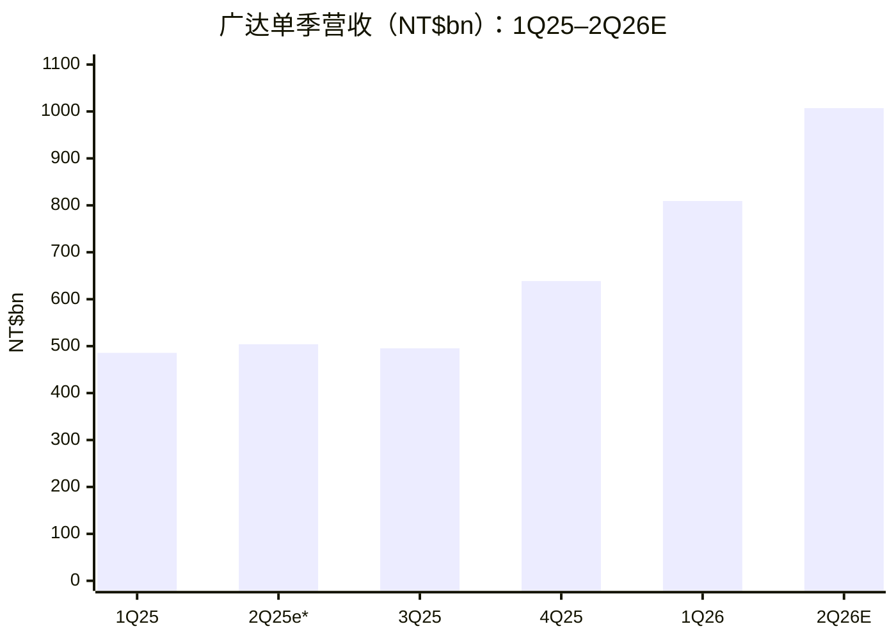
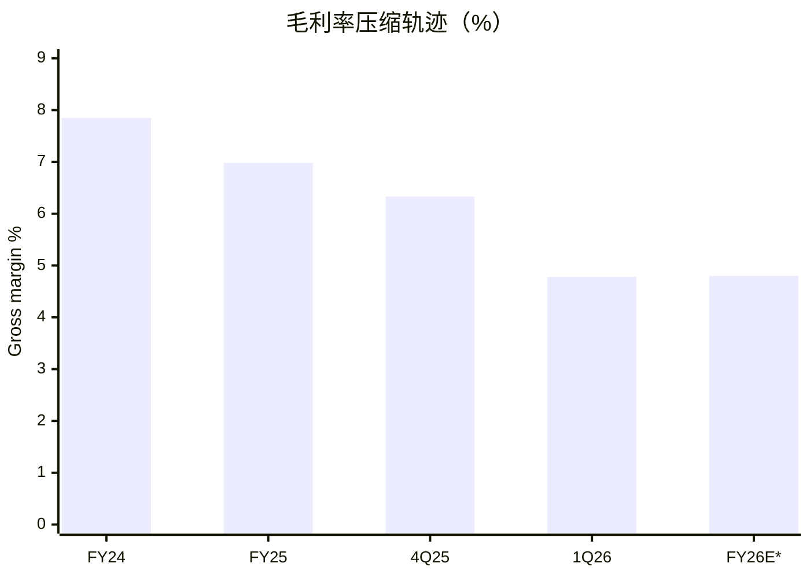
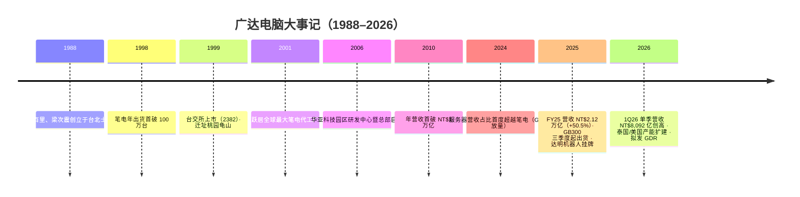
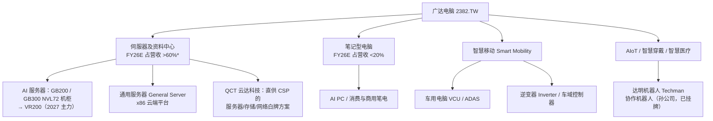
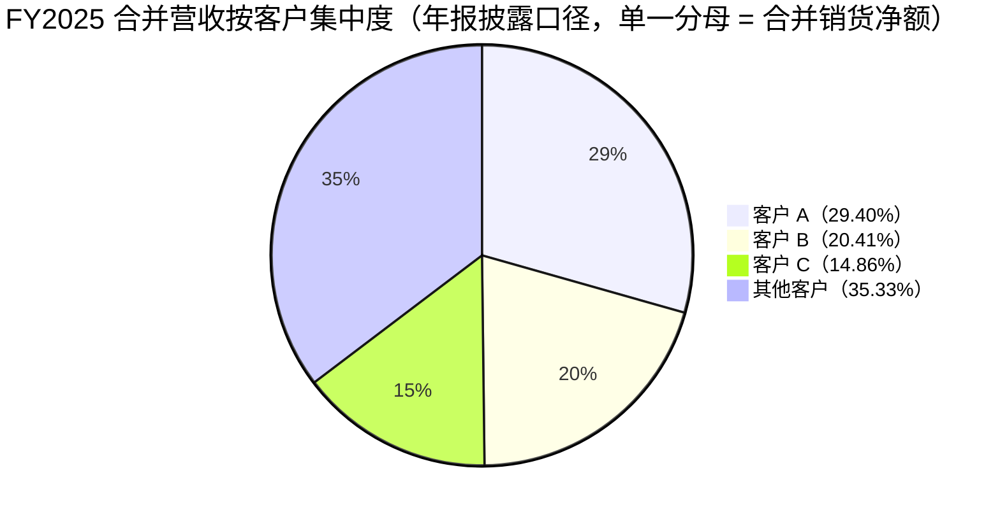
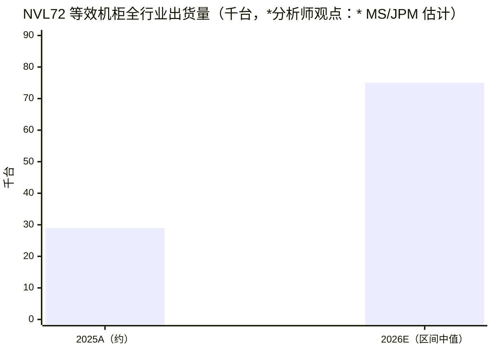
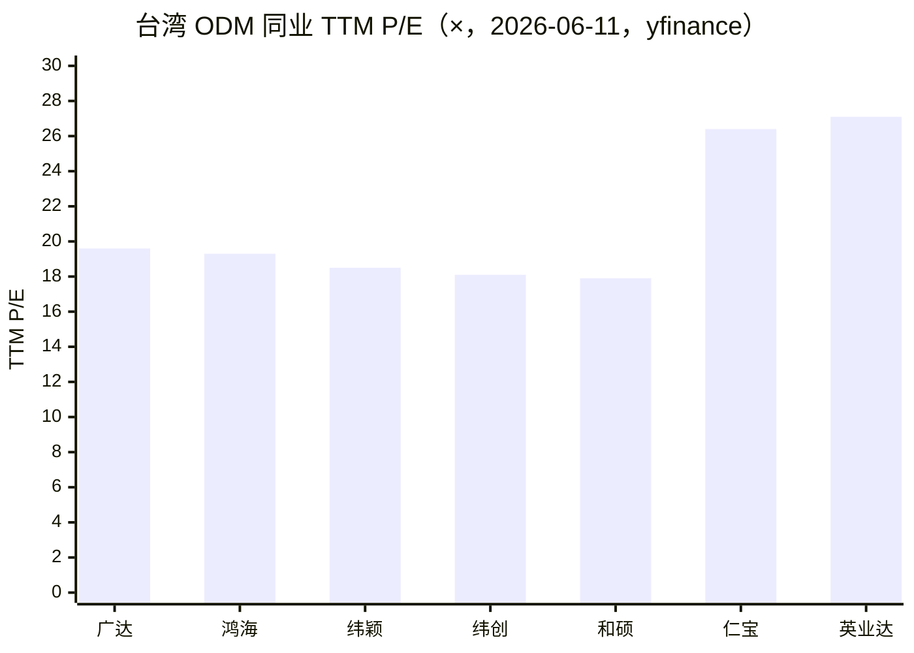
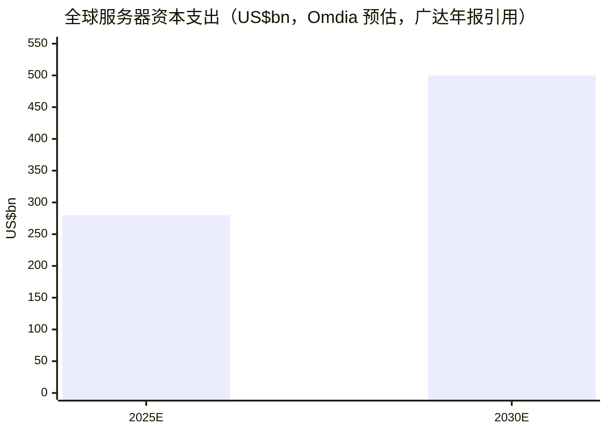

# 公司研究报告：广达电脑 Quanta Computer Inc.（TWSE:2382）

**日期（as of）：2026-06-11** · 报告语言：简体中文 · 分析师内部研究，非投资建议

> *分析师观点：* **评级：Hold（持有，Buy/Hold/Sell 三档制）· 12 个月目标价 NT$355（较现价 NT$370 下行约 -4%）· 估值方法：2027E EPS NT$25.4 × 14× P/E**
> 市值 NT$1.43 万亿（约 US$45.5bn）· 52 周区间 NT$252.5–438.0 · TWSE:2382 · TTM 股息率 3.4%（[Yahoo Finance 2382.TW，2026-06-11](https://tw.stock.yahoo.com/quote/2382.TW)）
>
> | 倍数 / Multiple（*分析师观点：* 预测列） | FY25A | FY26E | FY27E |
> |---|---|---|---|
> | P/E（@NT$370） | 19.0× | ~16.4× | ~14.6× |
> | P/S（@市值 NT$1.43 万亿） | 0.67× | ~0.41× | ~0.36× |
> | 现金股息率（FY25 股息 NT$15.6） | 4.2% | — | — |
>
> 相对表现（截至 2026-06-11，yfinance）：**1M +8.7% / 6M +31.2% / YTD +33.6% / 12M +44.1%**；同期台湾加权指数（TWII）**+3.0% / +56.6% / +47.0% / +102.0%**——相对收益 **+5.7pp / -25.4pp / -13.4pp / -57.9pp**，过去 12 个月大幅跑输大盘（[Yahoo Finance 2382.TW](https://tw.stock.yahoo.com/quote/2382.TW)）。
>
> **核心论点（thesis pillars）**——（1）广达是 AI 算力建设中真实放量的"军火搬运工"：NVL72 机柜第二大组装供应商（*分析师观点：* J.P. Morgan 估其份额约 25–30%），FY2026 AI server（AI 服务器）营收指引同比三位数增长、产能年底前翻倍，订单能见度延伸至 2027 年；（2）但其经济学是"营收暴增、毛利率减半"：gross margin（毛利率）从 FY2024 的 7.85% 一路压缩到 1Q26 的 4.78%，EPS 增速（FY26E 约 +16%）远低于营收增速（约 +65%）；（3）buy-sell（买断）模式下营运资金是黑洞，FY2026 自由现金流（FCF）大概率为负，寄售（consignment）模式转换是 2027 年现金流拐点的关键变量；（4）现价 19.6× TTM P/E / 约 14.6× FY27E P/E 处于卖方激烈分歧区间（Bernstein 11× 空头 vs Morgan Stanley PT NT$385 多头）的中段，风险收益趋于平衡。

> **Update——FY2026 全年指引部分上调（2026-05-14 法说会）：** 管理层在 1Q26 法说会上将 general server（通用服务器）全年指引由先前展望**上调至同比双位数增长**（出货量亦同比增长），并**维持 AI server 全年同比三位数增长**的指引不变；笔电（NB）全年维持高个位数至双位数下滑的保守展望；2026 年 capex（资本开支）指引 NT$300 亿，其中 80–85% 投向美国与泰国扩产。来源：[2026/05/14 广达法说会纪要（vocus，2026-05-14）](https://vocus.cc/article/6a066f7efd8978000190dcfb)、[Morgan Stanley — Quanta Asia AI Summit 2026 Takeaways, 2026-05-28, p.1](http://xs-macbook-air.local:5001/zsxq/pdf/415284424524518/Morgan%20Stanley-Quanta%20Computer%20Inc.%EF%BC%882382.TW%EF%BC%89Asia%20AI%20Summit%202026%20Takeaways-260528.pdf)。

## 目录

1. 公司概览（含投资论点）
1A. 估值与目标价（含卖方观点演变）
2. 公司历史
3. 管理团队
4. 产品与服务
5. 客户与上市策略
6. 行业概览
7. 竞争格局
8. 市场机会（TAM）
9. 风险评估
9.5 关键分歧与催化剂
10. 投资人视角记分卡
数据来源清单 · 参考资料 · 验证日志

---

## 1. 公司概览

*分析师观点：* 本报告以 **Hold（持有）** 评级、12 个月目标价 **NT$355**（2027E EPS NT$25.4 × 14× P/E，较现价 NT$370 约 -4%）启动对广达电脑的覆盖。为什么是现在、为什么不是 Buy：广达正处在公司 38 年历史上最猛烈的一轮营收扩张中——FY2025 营收 +50.5%、1Q26 再 +66.6%、5M26 累计 +82.6%——但这轮扩张的单位经济（unit economics）正在同步恶化：毛利率从 FY2024 的 7.85% 压缩至 1Q26 的 4.78%，几乎腰斩。多头（Morgan Stanley，PT NT$385）看的是绝对利润额与机柜放量；空头（Bernstein，PT NT$250）看的是 buy-sell 模式下内存涨价的转嫁脆弱性与 4.7% 的 2026 年毛利率预测。我们认为两边都对了一半：放量是真实的、利润率压缩也是真实的，现价已大致定价两者的均衡，剩余的不对称性不足以支撑 Buy，亦不足以支撑 Sell。

**公司是做什么的。** 广达电脑成立于 1988 年 5 月，是全球最大的笔记本电脑 ODM（original design manufacturer，原始设计制造商）之一，也是 AI 服务器与云端数据中心硬件的核心组装厂。公司年报的自我描述："为《财星杂志（Fortune）》评选的『全球500大企业』之一，也是全球笔记型电脑、人工智慧伺服器等先进运算设备与云端基础建设相关产品的专业研发设计制造领导厂商。业务涵盖云端运算解决方案、行动运算设备、智慧家庭、智慧移动、智慧制造、智慧医疗、人工智慧物联网（AIoT）、智慧穿戴等市场"（[广达 2025 年度年报（114年度），第 80 页](https://doc.twse.com.tw/server-java/t57sb01?step=9&kind=F&co_id=2382&filename=2025_2382_20260529F04.pdf)）。

**怎么赚钱。** 广达的商业模式是 ODM 代工：客户（PC 品牌厂与 hyperscaler 云厂商）下单，广达负责设计、采购物料、制造、组装与交付，赚取的是"营收规模大、毛利率个位数"的制造价差。FY2025 合并营收 NT$2,123,689,447 千元（NT$2.12 万亿，+50.54% YoY），营业毛利 NT$148,332,464 千元（毛利率 6.98%），营业利益 NT$87,396,109 千元（营业利益率 4.12%），本期净利 NT$75,786,311 千元，EPS NT$19.45（[广达 2025 年度年报，第 100 页](https://doc.twse.com.tw/server-java/t57sb01?step=9&kind=F&co_id=2382&filename=2025_2382_20260529F04.pdf)）。归属母公司净利 NT$749.8 亿（+25.5% YoY），董事会决议每股配发现金股利 NT$15.6，配发率 80%（[钜亨网，2026-02-26](https://news.cnyes.com/news/id/6354906)）。

**业务重心已经从笔电切换到服务器。** 年报明确写道："自113年（2024）起，伺服器相关产品销售比重已超越笔记型电脑，显示公司营收来源已转向以高效能运算及资料中心相关需求为主"（[广达 2025 年度年报，第 100 页](https://doc.twse.com.tw/server-java/t57sb01?step=9&kind=F&co_id=2382&filename=2025_2382_20260529F04.pdf)）。到 2026 年，公司指引 AI 服务器占服务器营收逾 80%、占集团总营收逾 60%；笔电占营收比重 1Q26 已低于 15%、全年低于 20%（[钜亨网，2026-06-08](https://news.cnyes.com/news/id/6489595)；[Morgan Stanley — Quanta Asia AI Summit 2026 Takeaways, 2026-05-28, p.1](http://xs-macbook-air.local:5001/zsxq/pdf/415284424524518/Morgan%20Stanley-Quanta%20Computer%20Inc.%EF%BC%882382.TW%EF%BC%89Asia%20AI%20Summit%202026%20Takeaways-260528.pdf)）。

**规模指标。** 截至 FY2025 年底员工 81,502 人（直接员工 54,723、间接员工 26,779），较 FY2024 的 65,926 人扩张 23.6%（[广达 2025 年度年报，第 94 页](https://doc.twse.com.tw/server-java/t57sb01?step=9&kind=F&co_id=2382&filename=2025_2382_20260529F04.pdf)）。销售地区高度集中于美国：FY2025 美国占 72.68%（FY2024 为 65.14%），中国 4.27%、日本 3.03%、荷兰 2.37%、其他 17.65%（[广达 2025 年度年报，第 88 页](https://doc.twse.com.tw/server-java/t57sb01?step=9&kind=F&co_id=2382&filename=2025_2382_20260529F04.pdf)）。生产据点覆盖台湾、美国（加州与田纳西州）、墨西哥、欧洲及亚洲多地（泰国为 AI 服务器扩产重心）（同上，第 88 页）。

**最近五个季度的营收与毛利轨迹**（2Q25 为推算值 = FY25 全年 2,123.7 − 1Q25 485.7 − 3Q25 495.3 − 4Q25 638.6 ≈ NT$504.1bn，各分项分别来自年报与法说会纪要）：

来源：1Q25/1Q26 见 [广达 2025 年度年报，第 100 页](https://doc.twse.com.tw/server-java/t57sb01?step=9&kind=F&co_id=2382&filename=2025_2382_20260529F04.pdf)；3Q25 见 [富果·广达 2025-11-12 法说会备忘录](https://blog.fugle.tw/post/earnings-call-2382-2025-11-12)；4Q25 见 [钜亨网，2026-02-26](https://news.cnyes.com/news/id/6354906)；2Q26E 为 *分析师观点：* Bernstein 按历史季节性推算的均值（约 NT$1,007bn，环比 +24%、高于市场共识约 6%）（[Bernstein — Monthly sales: Quanta tracking above, 2026-06-08, p.1](http://xs-macbook-air.local:5001/zsxq/pdf/214528222851451/Bernstein-Asia%20Tech%20Hardware%EF%BC%9AMonthly%20sales~Unimicron%202Q26%20revenue%20tracking%20in%20line%20while%20Quanta%20tracking%20above-260608.pdf)）；2Q25* 为上述已引用分项的差额推算。

来源：FY24/FY25 由 [广达 2025 年度年报第 100 页](https://doc.twse.com.tw/server-java/t57sb01?step=9&kind=F&co_id=2382&filename=2025_2382_20260529F04.pdf) 毛利 ÷ 营收计算；4Q25 见 [钜亨网，2026-02-26](https://news.cnyes.com/news/id/6354906)；1Q26 见 [vocus 法说会纪要，2026-05-14](https://vocus.cc/article/6a066f7efd8978000190dcfb)；FY26E* 为 *分析师观点：* 本报告估计（约 4.8%，介于 Bernstein 的 4.7% 与 1Q26 实际值之间）。

**估值快照（TTM，2026-06-11）。** 现价 NT$370，市值 NT$1.43 万亿；TTM P/E 19.6×、P/S 0.58×、P/B 6.87×、EV/EBITDA 17.6×、ROE 36.8%、TTM 股息率 3.4%（[Yahoo Finance 2382.TW](https://tw.stock.yahoo.com/quote/2382.TW)）。可比同业 TTM P/E（同日，yfinance）：鸿海（2317.TW）19.3×、纬创（3231.TW）18.1×、纬颖（6669.TW）18.5×、和硕（4938.TW）17.9×、仁宝（2324.TW）26.4×、英业达（2356.TW）27.1×——六家同业中位数约 18.9×，广达 19.6× 基本贴着同业中位数交易，并无明显溢价或折价。19.6× 的绝对水平不算极端，但要注意两点：其一，这是建立在 FY25 创纪录 EPS 之上的倍数，而 FY26 的 EPS 增长（我们估约 +16%）主要靠营收规模而非利润率；其二，*分析师观点：* Morgan Stanley 指出台湾硬件 ODM 板块年初至今跑输大盘约 30 个百分点、板块估值已回落至约 11× P/E（接近 20 年历史均值）（[Morgan Stanley — Hardware ODMs 1Q Earnings Preview, 2026-04-16, p.1](http://xs-macbook-air.local:5001/zsxq/pdf/585582145215124/Morgan%20Stanley-Greater%20China%20Technology%20Hardware%EF%BC%9AHardware%20ODMs%201Q%20Earnings%20Preview%20~%20Key%20Picks-260416.pdf)），广达相对板块均值存在结构性溢价，溢价的合理性取决于 AI 机柜份额能否守住。

## 1A. 估值与目标价

本章全部前瞻数字为 *分析师观点：*，预测不附带任何申报文件引用；每项驱动假设的外部依据以行内引用标注。

### (a) 前瞻财务预估表

| 指标（*分析师观点：* FY26E–FY28E 为本报告预测） | FY24A | FY25A | FY26E | FY27E | FY28E | CAGR 25A–28E |
|---|---|---|---|---|---|---|
| 营收（NT$bn） | 1,410.8 | 2,123.7 | ≈3,500 | ≈3,920 | ≈4,300 | ≈+26% |
| — YoY | — | +50.5% | ≈+65% | ≈+12% | ≈+10% | |
| Gross margin（毛利率） | 7.85% | 6.98% | ≈4.8% | ≈4.6% | ≈4.7% | |
| Operating margin（营业利益率） | 4.37% | 4.12% | ≈2.8% | ≈2.7% | ≈2.8% | |
| 本期净利（NT$bn） | 60.3 | 75.8 | ≈88 | ≈99 | ≈110 | ≈+13% |
| EPS（NT$） | 15.49 | 19.45 | ≈22.5 | ≈25.4 | ≈28.0 | ≈+13% |
| ROE | — | ~36%（TTM） | ~31% | ~31% | ~30% | |
| FCF 方向 | — | 负 | 负 | 转正 | 正 | |
| 净现金/(净负债)（NT$bn） | — | ≈(223)（TTM） | 恶化 | 改善 | 改善 | |

基础数据来源：FY24/FY25 营收、毛利、营业利益、净利、EPS 全部取自 [广达 2025 年度年报，第 100 页](https://doc.twse.com.tw/server-java/t57sb01?step=9&kind=F&co_id=2382&filename=2025_2382_20260529F04.pdf)；ROE（TTM 36.8%）与净负债（总债务 NT$492.0bn − 现金 NT$268.6bn ≈ NT$223bn）取自 [Yahoo Finance 2382.TW，2026-06-11](https://tw.stock.yahoo.com/quote/2382.TW)。FY26E 营收的锚：5M26 累计营收 NT$1.46 万亿（+82.6% YoY）（[钜亨网，2026-06-08](https://news.cnyes.com/news/id/6489595)）+ 公司 AI 服务器三位数增长/通用服务器双位数增长/笔电高个位数至双位数下滑的分项指引（[vocus 法说会纪要，2026-05-14](https://vocus.cc/article/6a066f7efd8978000190dcfb)）；*分析师观点：* Morgan Stanley 模型 FY26e 营收 NT$3,582.6bn、Bernstein 隐含口径更低，本报告取 ≈NT$3,500bn。FY26E 毛利率 ≈4.8% 的依据：1Q26 实际 4.78%（[vocus，2026-05-14](https://vocus.cc/article/6a066f7efd8978000190dcfb)）；*分析师观点：* Bernstein 预测 2026 毛利率 4.7%（自 2025 年 7% 下行）（[Bernstein — Monthly sales, 2026-06-08, p.1](http://xs-macbook-air.local:5001/zsxq/pdf/214528222851451/Bernstein-Asia%20Tech%20Hardware%EF%BC%9AMonthly%20sales~Unimicron%202Q26%20revenue%20tracking%20in%20line%20while%20Quanta%20tracking%20above-260608.pdf)）。FCF 方向的依据：*分析师观点：* Morgan Stanley 模型 FCF yield FY25 −2.4%、FY26e −7.4%、FY27e +5.9%、FY28e +6.8%，杠杆率（EOP）31.3% → 67.4% → 48.5% → 33.4%（[Morgan Stanley — Quanta Asia AI Summit 2026 Takeaways, 2026-05-28, p.1](http://xs-macbook-air.local:5001/zsxq/pdf/415284424524518/Morgan%20Stanley-Quanta%20Computer%20Inc.%EF%BC%882382.TW%EF%BC%89Asia%20AI%20Summit%202026%20Takeaways-260528.pdf)）。

**毛利率桥（1Q26 同比 −314bps 的去向）。** 公司未披露分项 bps 拆解，已披露的方向性驱动为：(i) AI 服务器占比上升的结构性稀释——AI 服务器占服务器营收已逾 75%、单季环比 +30%，单柜价值 300 万美元以上的机型出货翻倍但 pass-through（物料转嫁）含量极高；(ii) 内存等关键零组件涨价进入成本端；(iii) 部分被营业费用率 1.94%（历史新低）的经营杠杆抵消，营业利益率同比 −222bps、降幅小于毛利率（[vocus 法说会纪要，2026-05-14](https://vocus.cc/article/6a066f7efd8978000190dcfb)）。*分析师观点：* Morgan Stanley 对下一代平台的测算给出同样方向：Rubin 机柜中内存占 BOM 比例由 Blackwell 时代的 5–10% 升至 25–30%，ODM 毛利率由 GB300 的约 2.7% 降至 Rubin 的约 1.9%（若客户直采内存可回升至 2.2%），但 ODM 单柜美元附加值反而提升 35–40%（[MS — Rubin rack BOM, component content, and ODM value-added, 2026-05-20, p.1](http://xs-macbook-air.local:5001/zsxq/pdf/212454185154151/MS-Greater%20China%20Technology%20Hardware%20-%20Asia%20Pacific%20Analysis%20of%20Rubin%20rack%20BOM%2C%20component%20content%2C%20and%20ODM%20value-added-260520.pdf)）——"毛利率下台阶、利润额上台阶"正是本报告 FY27E 净利仍增 ≈13% 的结构基础。

### (b) 目标价推导（展示算术）

**方法：forward P/E（前瞻市盈率）× 目标倍数。** 本报告 2027E EPS ≈NT$25.4 × **14×** = NT$356 ≈ **目标价 NT$355**。

目标倍数 14× 的同业对标（*分析师观点：*）：(1) Bernstein 对广达的估值是 11× × 2027E EPS NT$23.1 = NT$250，其 11× 反映的是"买断模式毛利率长期承压"的空头折价（[Bernstein — Monthly sales, 2026-06-08, Valuation Methodology](http://xs-macbook-air.local:5001/zsxq/pdf/214528222851451/Bernstein-Asia%20Tech%20Hardware%EF%BC%9AMonthly%20sales~Unimicron%202Q26%20revenue%20tracking%20in%20line%20while%20Quanta%20tracking%20above-260608.pdf)）；(2) Morgan Stanley 的 PT NT$385 来自剩余收益模型（residual income，COE 9.0% = beta 1.2 × ERP 6.0% + Rf 1.5%，中期增长 8.5%、终值增长 3%），按其 FY27e EPS NT$28.80 折算隐含约 13.4× 2027E P/E（[Morgan Stanley — Quanta Asia AI Summit 2026 Takeaways, 2026-05-28, p.2](http://xs-macbook-air.local:5001/zsxq/pdf/415284424524518/Morgan%20Stanley-Quanta%20Computer%20Inc.%EF%BC%882382.TW%EF%BC%89Asia%20AI%20Summit%202026%20Takeaways-260528.pdf)）；(3) 台湾 ODM 板块整体约 11× P/E、接近 20 年均值（[Morgan Stanley — Hardware ODMs 1Q Earnings Preview, 2026-04-16, p.1](http://xs-macbook-air.local:5001/zsxq/pdf/585582145215124/Morgan%20Stanley-Greater%20China%20Technology%20Hardware%EF%BC%9AHardware%20ODMs%201Q%20Earnings%20Preview%20~%20Key%20Picks-260416.pdf)）；(4) TTM 口径下鸿海 19.3×、纬颖 18.5×、纬创 18.1×（[Yahoo Finance，2026-06-11](https://tw.stock.yahoo.com/quote/2382.TW)）。本报告取 14×——较板块均值 11× 给约三成溢价（理由：NVL72 第二大份额、产能翻倍中的确定性放量、寄售模式带来的 2027 现金流拐点期权、80% 派息率支撑），但低于 TTM 同业中位 18.9×（理由：前瞻毛利率仍在下行通道，且 FY26 FCF 为负）。

### (c) 牛市 / 基准 / 熊市情景

| 情景（*分析师观点：*） | 关键摆动假设 | 2027E EPS | 倍数 | PT | vs NT$370 |
|---|---|---|---|---|---|
| Bull（牛市） | GB300→VR200 切换顺畅、寄售模式普及（毛利率企稳 5%+、FCF 提前转正）、机柜份额守住 25–30% | ≈28.8 | 16× | ≈NT$460 | +24% |
| Base（基准） | 营收 +65%/+12%、毛利率 4.8%/4.6%、寄售 2027 年起改善现金流 | ≈25.4 | 14× | NT$355 | -4% |
| Bear（熊市） | Bernstein 情形：内存涨价无法完全转嫁、买断模式贯穿 2026、PC 双位数下滑 | ≈23.1 | 11× | ≈NT$254 | -31% |

牛市 EPS 锚为 Morgan Stanley FY27e NT$28.80、熊市 EPS 锚为 Bernstein 2027E NT$23.08（出处同上，均为 *分析师观点：*）。

### (d) 共识对标

*分析师观点：* 按 Morgan Stanley 报告页披露的 Refinitiv 共识：FY26e 共识 EPS NT$23.57、FY27e NT$28.61（[Morgan Stanley — Quanta Asia AI Summit 2026 Takeaways, 2026-05-28, p.1](http://xs-macbook-air.local:5001/zsxq/pdf/415284424524518/Morgan%20Stanley-Quanta%20Computer%20Inc.%EF%BC%882382.TW%EF%BC%89Asia%20AI%20Summit%202026%20Takeaways-260528.pdf)）。本报告 FY26E ≈22.5（低于共识约 4.5%）、FY27E ≈25.4（低于共识约 11%）——低于 Street 的原因集中在毛利率假设（我们更接近 Bernstein 的 4.7–4.8% 而非共识隐含的 5%+），营收假设则与 Street 接近。

### (e) 摆动变量

1. **FY26–27 毛利率轨迹**：FY26E 营收 ≈NT$3.5 万亿的体量下，毛利率每 ±50bps 对应毛利 ±NT$175 亿，约相当于税后净利 ±18% 的弹性（按本报告 FY26E 净利 ≈NT$880 亿推算）——这是整个 call 最敏感的单一变量。驱动项：内存价格（NAND 自 2023 年 4 月低点至 2026 年 5 月累计上涨 11.3 倍，*分析师观点：* [Bernstein — AI Value Chain: Vera Rubin GW cost, 2026-06-08, p.4](http://xs-macbook-air.local:5001/zsxq/pdf/814528815844812/Bernstein-AI%20Value%20Chain%EF%BC%9AHow%20much%20does%20a%20GW%20of%20Vera%20Rubin%20data%20center%20capacity%20actually%20cost%EF%BC%9F-260608.pdf)）的转嫁能力、AI 占比继续上升的结构稀释、寄售模式渗透速度。
2. **VR200 平台切换的时点与份额**：4Q26 是 GB300→VR200 的过渡期，VR200 在 2026 年仅少量送样（3Q26 起）、主力出货在 2027 年（[Morgan Stanley — Quanta Asia AI Summit 2026 Takeaways, 2026-05-28, p.1](http://xs-macbook-air.local:5001/zsxq/pdf/415284424524518/Morgan%20Stanley-Quanta%20Computer%20Inc.%EF%BC%882382.TW%EF%BC%89Asia%20AI%20Summit%202026%20Takeaways-260528.pdf)）——切换期的空窗深度与新平台份额分配，决定 4Q26–1Q27 的业绩斜率。

### 卖方观点演变（Sell-side view evolution）

机械预检：`db/stock_price_target.db`（只读）共录得广达（2382.TW）7 条卖方观点记录，PT 离散度——最低 NT$250（Bernstein）、最高 NT$385（Morgan Stanley），价差 54%；Goldman Sachs 为 Neutral 未给 PT。两大覆盖机构的观点在过去 12 个月均高度自洽（无翻多/翻空），分歧是结构性的。

**按机构的观点时间线（*分析师观点：*，每条 PT 均配报告日收盘价）：**

| 机构 | 日期 | 评级 / 目标价 | 报告日股价（隐含空间） | 核心论点 / 自我修订 |
|---|---|---|---|---|
| Bernstein | 2024-07-09 | 启动覆盖 Underperform / NT$250 | — | 启动即看空（评级历史图）（[Bernstein — Monthly sales, 2026-06-08, 评级历史页](http://xs-macbook-air.local:5001/zsxq/pdf/214528222851451/Bernstein-Asia%20Tech%20Hardware%EF%BC%9AMonthly%20sales~Unimicron%202Q26%20revenue%20tracking%20in%20line%20while%20Quanta%20tracking%20above-260608.pdf)） |
| Bernstein | 2024-08-19 → 2025-12-08 | UP / PT 250→240→250 | — | 期间两次小幅调整 PT，评级始终 Underperform（同上） |
| Bernstein | 2026-03-09 | UP / NT$250 | NT$282（-11%） | 1Q26 营收将超共识 8%，但"买断模式主导 + GB300 占比上升 + Rubin 4Q 出货"挤压毛利，模型预测年底毛利率降至 5.6%（[Bernstein — Monthly sales: Delta in line, Quanta above, 2026-03-09, p.1](http://xs-macbook-air.local:5001/zsxq/pdf/184445554555242/Bernstein-Asia%20Tech%20Hardware%EF%BC%9AMonthly%20sales~Delta%201Q26%20revenue%20tracking%20in%20line%20while%20Quanta%20tracking%20above-260309.pdf)） |
| Bernstein | 2026-06-08 | UP / NT$250 | NT$390.5（2026-06-05 收盘，-36%） | 2Q26 营收超共识 6% 亦不改看空：内存涨价 + AI 占比上升压制毛利率，2026 毛利率预测从 2025 的 7% 降至 4.7%；买断模式 2026 全年仍主导（[Bernstein — Monthly sales, 2026-06-08, p.1](http://xs-macbook-air.local:5001/zsxq/pdf/214528222851451/Bernstein-Asia%20Tech%20Hardware%EF%BC%9AMonthly%20sales~Unimicron%202Q26%20revenue%20tracking%20in%20line%20while%20Quanta%20tracking%20above-260608.pdf)） |
| Morgan Stanley | 2026-03-02 / 03-09 | Overweight（AI 硬件首选之一） | NT$301 / NT$282 | 2026 年 CSP capex 强劲为 AI 前景正面指标；GB200/300 机柜月度追踪框架（[MS — GB200/300 NVL72 Racks in Feb 2026, 2026-03-09](http://xs-macbook-air.local:5001/zsxq/pdf/584251482281444/Morgan%20Stanley-Greater%20China%20Technology%20Hardware%EF%BC%9AGB200%20and%20GB300%20NVL72%20Racks%20in%20May%202026-260608.pdf)） |
| Morgan Stanley | 2026-05-28 | OW / NT$385 | NT$308.5（+25%） | AI 峰会纪要：FY26 AI 服务器三位数增长、产能年底翻倍、寄售模式被部分客户接受；残值模型 COE 9.0%（[MS — Quanta Asia AI Summit 2026 Takeaways, 2026-05-28, p.1–2](http://xs-macbook-air.local:5001/zsxq/pdf/415284424524518/Morgan%20Stanley-Quanta%20Computer%20Inc.%EF%BC%882382.TW%EF%BC%89Asia%20AI%20Summit%202026%20Takeaways-260528.pdf)） |
| Morgan Stanley | 2026-06-08 | OW（ODM 偏好序：纬创＞鸿海＞广达） | NT$376.5（2026-06-08 收盘） | 5 月广达机柜出货 1.8–1.9K（4 月约 2.1K），Q2 约 6.7K（+40% QoQ），全年预估 18.7K 不变（[MS — GB200 and GB300 NVL72 Racks in May 2026, 2026-06-08, p.1](http://xs-macbook-air.local:5001/zsxq/pdf/584251482281444/Morgan%20Stanley-Greater%20China%20Technology%20Hardware%EF%BC%9AGB200%20and%20GB300%20NVL72%20Racks%20in%20May%202026-260608.pdf)） |
| Goldman Sachs | 2026-05-01 | Neutral（无 PT） | NT$312.5 | 受惠 AI 服务器、上调 2026 营收预期，但"估值合理"维持中性（[GS — Taiwan ODM Brands 3-month preview, 2026-05-01, p.1](http://xs-macbook-air.local:5001/zsxq/pdf/184484484555852/Goldman%20Sachs-Taiwan%20ODM%20Brands%EF%BC%9A%203~month%20preview%EF%BC%9A%20Apr%20Rev%20MoM%20decline%20on%20avg.%EF%BC%9B%20Slow%20seasonality%20while%20AI%20%20Cooling%20maintained%20solid%20YoY%20growth-260501.pdf)） |
| J.P. Morgan | 2026-04-13 | 服务器 ODM 偏好序：纬颖＞广达＞鸿海＞纬创 | NT$319 | 1Q26 全行业 NVL72 出货约 1.8 万台超预期，广达列服务器 ODM 第二顺位（[J.P. Morgan — Taiwan ODMs 1Q26 revenue wrap, 2026-04-13, p.1](http://xs-macbook-air.local:5001/zsxq/pdf/184418824228152/J.P.%20Morgan-Taiwan%20ODMs%EF%BC%9A1Q26%20revenue%20wrap%EF%BC%9A%20Revenue%20beats%20on%20server%20strength%20and%20early%20NB%20build-260413.pdf)） |

**机构间分歧（不做假共识）：**

| 机构 | 日期 | 评级 / PT | 核心论点 | 什么证据能证明其正确 |
|---|---|---|---|---|
| Bernstein | 2026-06-08 | Underperform / NT$250（-36% vs 2026-06-05 收盘 390.5） | 买断模式下内存涨价吞噬毛利，2026 GM 4.7%；EPS 增长跟不上股价隐含预期 | 2Q–4Q26 毛利率连续低于 4.7%、寄售转换不及预期、4Q26 VR 切换出现空窗 |
| Morgan Stanley | 2026-05-28 | Overweight / NT$385（+25% vs 报告日 308.5） | 看利润额不看毛利率：Rubin 时代 ODM 单柜美元附加值 +35–40%，AI 三位数增长 + 产能翻倍 | 机柜出货兑现 18.7K/全年、寄售模式落地令 FY27 FCF yield 转正至 +5.9% |
| Goldman Sachs | 2026-05-01 | Neutral / 无 PT | 基本面受惠 AI 但估值已合理 | 股价区间震荡、相对大盘无超额收益 |

注：报告日收盘价取自 `db/stock_price_target.db`（`report_date_price` 字段）及 yfinance 对应日收盘；Bernstein 2026-06-08 报告内 Ticker Table 以 2026-06-05 收盘 NT$390.50 为基准（其报告原文：`2382.TT (Quanta) U TWD 390.50 250.00`）。

## 2. 公司历史

广达电脑由林百里（Barry Lam）与梁次震（C.C. Leung）于 1988 年 5 月创立于台北市士林区，初期以笔记本电脑代工为业（[维基百科·广达电脑，访问于 2026-06-11](https://zh.wikipedia.org/zh-tw/%E5%BB%A3%E9%81%94%E9%9B%BB%E8%85%A6)；[广达 2025 年度年报，第 80 页](https://doc.twse.com.tw/server-java/t57sb01?step=9&kind=F&co_id=2382&filename=2025_2382_20260529F04.pdf)——年报记载公司"成立于民国77年5月"）。1998 年笔电出货量首度突破百万台，1999 年 1 月 8 日在台湾证券交易所挂牌（代码 2382）并迁址桃园龟山，2001 年跃居全球最大笔电制造厂（[今周刊，2023-07-13](https://www.businesstoday.com.tw/article/category/183008/post/202307130028/)；[维基百科·广达电脑，访问于 2026-06-11](https://zh.wikipedia.org/zh-tw/%E5%BB%A3%E9%81%94%E9%9B%BB%E8%85%A6)）。

来源：[维基百科·广达电脑，访问于 2026-06-11](https://zh.wikipedia.org/zh-tw/%E5%BB%A3%E9%81%94%E9%9B%BB%E8%85%A6)（1988/1999/2006/2010）；[今周刊，2023-07-13](https://www.businesstoday.com.tw/article/category/183008/post/202307130028/)（1998/2001）；[广达 2025 年度年报，第 100 页](https://doc.twse.com.tw/server-java/t57sb01?step=9&kind=F&co_id=2382&filename=2025_2382_20260529F04.pdf)（2024 服务器占比反超、1Q26 营收）；[钜亨网，2026-02-26](https://news.cnyes.com/news/id/6354906)（FY25 业绩）；[TechNice，2025-08-27](https://www.technice.com.tw/technology/robot/189611/)（达明挂牌进程）；[富果法说会备忘录，2025-11-12](https://blog.fugle.tw/post/earnings-call-2382-2025-11-12)（GB300 出货时点）。

**三次关键战略转折。** 第一次是 2000 年前后将笔电产线大规模西迁中国大陆（上海等地），以成本优势奠定 2001 年全球第一的地位（[维基百科·广达电脑，访问于 2026-06-11](https://zh.wikipedia.org/zh-tw/%E5%BB%A3%E9%81%94%E9%9B%BB%E8%85%A6)）。第二次是 2010 年代向云端数据中心直供（hyperscaler direct）转型——旗下云达科技（QCT，Quanta Cloud Technology）绕过品牌服务器厂直接服务云厂商，年报关系企业图显示 QCT 体系已覆盖美国（Quanta Cloud Technology USA）、日本、韩国、德国等地（[广达 2025 年度年报，第 107–108 页](https://doc.twse.com.tw/server-java/t57sb01?step=9&kind=F&co_id=2382&filename=2025_2382_20260529F04.pdf)）。第三次是 2023–2026 年的 AI 服务器豪赌：2024 年服务器营收占比反超笔电，2025 年完成 GB200→GB300 跨代切换、订单能见度延伸至 2027 年（[富果法说会备忘录，2025-11-12](https://blog.fugle.tw/post/earnings-call-2382-2025-11-12)），并将制造重心向美国（加州、田纳西）与泰国迁移以贴近客户和规避关税（[广达 2025 年度年报，第 88 页](https://doc.twse.com.tw/server-java/t57sb01?step=9&kind=F&co_id=2382&filename=2025_2382_20260529F04.pdf)）。

**近期发展（12 个月内）。** FY25 营收 NT$2.12 万亿（+50.5%）、EPS NT$19.45 创历史新高，配息 NT$15.6（配发率 80%）（[钜亨网，2026-02-26](https://news.cnyes.com/news/id/6354906)）；董事会同步决议办理现金增资发行普通股参与发行海外存托凭证（GDR），上限 2.45 亿股，为海外扩产储备弹药（[经济日报，2026-02-27](https://money.udn.com/money/story/5710/9347206)）；2026 年 5 月营收 NT$3,114.8 亿（-8.4% MoM、+94.4% YoY）创同期新高，公司表示年底前美国加州将再扩建三座厂，泰国聚焦 SMT（surface-mount technology，表面贴装）产线扩充（[三立 iNEWS，2026-06-08](https://inews.setn.com/news/1852242)；[联合新闻网，2026-06-08](https://udn.com/news/story/7253/9553068)）。集团孙公司达明机器人（Techman Robot）于 2025 年 8 月底举行上市前业绩发表会、随后挂牌，是台湾协作机器人（cobot）第一品牌（[TechNice，2025-08-27](https://www.technice.com.tw/technology/robot/189611/)）。

## 3. 管理团队

**创办人暨董事长：林百里（Barry Lam）。** 1949 年生于上海、在香港长大，后赴台就读台湾大学电机系并取得台大电机研究所硕士，另获清华大学、台北医学大学、交通大学、香港城市大学、香港理工大学、亚洲大学名誉博士及台大"杰出校友"（[广达 2025 年度年报，第 4 页](https://doc.twse.com.tw/server-java/t57sb01?step=9&kind=F&co_id=2382&filename=2025_2382_20260529F04.pdf)；成长背景见 [维基百科·林百里，访问于 2026-06-11](https://zh.wikipedia.org/zh-tw/%E6%9E%97%E7%99%BE%E9%87%8C)——创办人历史事实）。创业前在金宝电子任职、以计算器产品起家，1988 年 5 月偕梁次震创立广达，自创立日（1988-05-05）起任董事至今、2025 年 6 月 13 日续任，现任董事长并直接持股 415,738,138 股（占 10.76%），另透过持股 14.82% 的最大股东千宇投资间接控制（[广达 2025 年度年报，第 3、71 页](https://doc.twse.com.tw/server-java/t57sb01?step=9&kind=F&co_id=2382&filename=2025_2382_20260529F04.pdf)）。年报对其的官方描述："具备前瞻性视野、独到眼光及领导能力，为兼具科技与管理专长的卓越领导者"（同上，第 9 页）。2023 年 AI 行情中身家一度跃居台湾新首富（[今周刊，2023-07-13](https://www.businesstoday.com.tw/article/category/183008/post/202307130028/)）；其经营哲学被《哈佛商业评论》繁中版概括为"乌龟哲学"——低调慢爬、看准技术拐点后重注（[HBR Taiwan，2023](https://www.hbrtaiwan.com/article/23222/quanta-computer)）。在 AI 服务器这一局，林百里 2019–2020 年即开始布局云端 AI 算力制造，使广达在 2023 年生成式 AI 爆发时已是 NVIDIA 机柜级系统的核心代工方之一（同上）。

**共同创办人暨副董事长兼总经理：梁次震（C.C. Leung）。** 与林百里同为金宝电子时期的搭档、1988 年共同创立广达，现任副董事长兼总经理（President），为公司日常经营的实际操盘者。年报官方描述："拥有技术背景，统筹企业策略、组织与营运管理"（[广达 2025 年度年报，第 9、61 页](https://doc.twse.com.tw/server-java/t57sb01?step=9&kind=F&co_id=2382&filename=2025_2382_20260529F04.pdf)）。董事会 7 席中独立董事 3 席（占 43%），林、梁之外的内部董事为执行副总黄健堂（供应链运筹与工厂管理）与资深副总暨财务长杨俊烈（同上，第 9 页）。创办人双人组合计执掌公司 38 年且仍在一线，是治理上"创办人长期主义"与"接班人不确定性"并存的典型样本（两人均逾 70 岁，年报披露董事年龄分布 70 岁以上 3 位；同上，第 9 页）。

## 4. 产品与服务

### 4.1 发行人自己的产品矩阵

年报"主要产品之重要用途"（4.2.2.1）按四大产品线陈述，以下为忠实重排的矩阵（[广达 2025 年度年报，第 91 页](https://doc.twse.com.tw/server-java/t57sb01?step=9&kind=F&co_id=2382&filename=2025_2382_20260529F04.pdf)；营业比重：电子产品占 99.79%，同上第 80 页）：

| 产品线 | 年报所列用途（摘引） | 主要客户类型 |
|---|---|---|
| 伺服器及资料中心相关产品 | "主要应用于资料中心建置……持续导入AI伺服器与通用型运算平台，并结合机器学习、深度学习与大数据分析技术" | 大型云端服务提供商（CSP） |
| 笔记型电脑 | "具备高度便携性与运算效能……逐步发展为AI终端装置，具备智慧辅助功能" | 国际 PC 品牌厂 |
| 智慧移动（Smart Mobility）相关产品 | "车用电脑（VCU）用于先进驾驶辅助系统（ADAS）和自动驾驶技术；车用资讯娱乐系统……车域控制器（Zone Controller）整合电动控制单元（ECU）的多项功能；逆变器（Inverter）可处理高功率转换" | 车厂 / Tier-1 |
| 智慧物联网装置与控制设备 | "透过感测技术、网路传输及资料分析，将各类装置连结至云端平台……涵盖智慧家庭、智慧制造、智慧医疗及商业应用" | 消费电子品牌 / 企业 |

图注（*为公司指引口径）：AI 服务器占集团营收 2026 年预计逾 60%、笔电低于 20%（[钜亨网，2026-06-08](https://news.cnyes.com/news/id/6489595)；[Morgan Stanley — Quanta Asia AI Summit 2026 Takeaways, 2026-05-28, p.1](http://xs-macbook-air.local:5001/zsxq/pdf/415284424524518/Morgan%20Stanley-Quanta%20Computer%20Inc.%EF%BC%882382.TW%EF%BC%89Asia%20AI%20Summit%202026%20Takeaways-260528.pdf)）；产品树其余节点出自 [广达 2025 年度年报，第 91、107–109 页](https://doc.twse.com.tw/server-java/t57sb01?step=9&kind=F&co_id=2382&filename=2025_2382_20260529F04.pdf)。

### 4.2 综合：四条产品线如何咬合成一个客户工作流

广达的四条产品线共享同一套底层能力：高密度电子系统的设计（design）→ 全球采购（procurement）→ SMT 贴片与系统组装（L6–L11）→ 测试与全球交付。笔电业务是这套能力的"原型机"——38 年来训练出的大规模精密组装与供应链管理；服务器业务把同一能力拉高一个数量级（单台笔电 ASP 数百美元 → 单台 NVL72 机柜数百万美元）；智慧移动与 AIoT 则是把它横向复制到车规与医疗法规场景。客户视角的闭环是：同一个 hyperscaler 既向广达买 AI 训练机柜（QCT/直供），又通过 PC 品牌间接买广达造的笔电，未来还可能在边缘侧（edge）部署广达的 5G/边缘运算盒子——年报将此概括为以 AI 技术深耕 "SMART X"：Smart Medicine、Smart Manufacturing、Smart Mobility 三大应用领域（[广达 2025 年度年报，第 80 页](https://doc.twse.com.tw/server-java/t57sb01?step=9&kind=F&co_id=2382&filename=2025_2382_20260529F04.pdf)）。

### 4.3 AI 服务器与数据中心（旗舰业务）

年报原文（[广达 2025 年度年报，第 91 页](https://doc.twse.com.tw/server-java/t57sb01?step=9&kind=F&co_id=2382&filename=2025_2382_20260529F04.pdf)）：

> "伺服器及相关产品主要应用于资料中心建置。随着全球云端巨头及企业对AI应用需求的快速成长，资料中心持续导入AI伺服器与通用型运算平台，并结合机器学习、深度学习与大数据分析技术，以支援多元应用场景。"

**中文释义 / Plain-language gloss：** 广达卖给云厂商的不是"一台服务器"，而是整机柜（rack-scale）的算力系统。以 NVIDIA GB200/GB300 NVL72 为例：一柜内集成 72 颗 GPU + 36 颗 Grace CPU，通过 NVLink 背板互连成"一台巨型加速器"，液冷（liquid cooling）散热、功耗 130–220kW/柜。ODM 的工作横跨 L6（板卡级组装）→ L10（整机/计算托盘 compute tray）→ L11（整机柜集成 + 系统测试）：把 GPU 模组、内存、NVLink 交换机、电源架（power shelf）、冷板（cold plate）、线缆背板装成一柜，再到客户数据中心现场完成机柜级验证。与笔电组装的根本差异在于：单柜物料成本数百万美元（其中 GPU 约占一半），ODM 自己先垫钱买料（buy-sell 买断模式），毛利率因此被巨大的 pass-through 分母稀释——这正是"营收暴增、毛利率减半"现象的会计根源。*分析师观点：* Bernstein 测算下一代 Vera Rubin NVL72 单柜成本约 910 万美元：GPU（除 HBM）约 396 万（72 颗 × 约 5.5 万美元）、内存与存储约 320 万（占比约 35%，HBM4 现价约 $16.6/GB、2027 年放量时或达 $53/GB）、网络约 120 万、散热约 16 万、供电约 15 万（[Bernstein — AI Value Chain: How much does a GW of Vera Rubin data center capacity actually cost?, 2026-06-08, p.1、3–4](http://xs-macbook-air.local:5001/zsxq/pdf/814528815844812/Bernstein-AI%20Value%20Chain%EF%BC%9AHow%20much%20does%20a%20GW%20of%20Vera%20Rubin%20data%20center%20capacity%20actually%20cost%EF%BC%9F-260608.pdf)）。

**当前放量状态与新品节奏。** 2025 年 AI 服务器销售同比翻倍、3Q25 起 GB300 顺利出货并完成 GB200→GB300 跨代切换；2026 年指引再增三位数，1Q26 AI 服务器已占服务器营收逾 75%（单季环比 +30%），单柜价值超 300 万美元的机型出货量翻倍（[富果法说会备忘录，2025-11-12](https://blog.fugle.tw/post/earnings-call-2382-2025-11-12)；[vocus 法说会纪要，2026-05-14](https://vocus.cc/article/6a066f7efd8978000190dcfb)）。下一代 VR200（Vera Rubin）机柜 3Q26 起少量送样、4Q26 进入平台过渡期、2027 年主力出货（[Morgan Stanley — Quanta Asia AI Summit 2026 Takeaways, 2026-05-28, p.1](http://xs-macbook-air.local:5001/zsxq/pdf/415284424524518/Morgan%20Stanley-Quanta%20Computer%20Inc.%EF%BC%882382.TW%EF%BC%89Asia%20AI%20Summit%202026%20Takeaways-260528.pdf)）。月度跟踪口径下，2026 年 5 月广达 GB200/GB300 机柜出货约 1,800–1,900 台、2Q26 约 6,700 台（环比 +40%）、全年预估约 18,700 台（*分析师观点：* [MS — GB200 and GB300 NVL72 Racks in May 2026, 2026-06-08, p.1](http://xs-macbook-air.local:5001/zsxq/pdf/584251482281444/Morgan%20Stanley-Greater%20China%20Technology%20Hardware%EF%BC%9AGB200%20and%20GB300%20NVL72%20Racks%20in%20May%202026-260608.pdf)）。

*分析师观点：* 竞争优势判定：**部分护城河（partial moat）**——护城河类型是工程规模 + NPI（new product introduction，新品导入）执行力 + 客户切换成本：J.P. Morgan 认为"复杂设计能力与高频产品迭代使竞争格局集中于头部厂商"，鸿海与广达是 NVL72 供应链首选（份额分别约 40–45% / 25–30%），且"CSP 与 ODM 的长期 NPI 合作关系及平台代际迭代特性使 ODM 切换风险低"（[J.P. Morgan — AI Server ODMs: Key Market Dynamics and Competitive Highlights, 2026-04-22, p.1](http://xs-macbook-air.local:5001/zsxq/pdf/585581181584524/J.P.%20Morgan-AI%20Server%20ODMs%EF%BC%9AKey%20Market%20Dynamics%20and%20Competitive%20Highlights-260422.pdf)）。但护城河不完整：NVIDIA 正寻求标准化 Rubin 计算托盘，若强推，ODM 的设计附加值会被压缩（广达自己对客户是否接受亦"不确定"）（[Morgan Stanley — Quanta Asia AI Summit 2026 Takeaways, 2026-05-28, p.1](http://xs-macbook-air.local:5001/zsxq/pdf/415284424524518/Morgan%20Stanley-Quanta%20Computer%20Inc.%EF%BC%882382.TW%EF%BC%89Asia%20AI%20Summit%202026%20Takeaways-260528.pdf)）。

**商业模式的关键变化：buy-sell → consignment。** 现行买断（buy-sell）模式下 ODM 垫资采购全部物料（含暴涨的内存），营收与存货同步膨胀；寄售（consignment，客户供料）模式下客户直接持有关键物料、ODM 只赚组装服务费——营收账面变小但毛利率与营运资金大幅改善。管理层确认"部分客户愿意接受寄售模式，以减轻 ODM 资本开支扩张及营运资金的双重压力"，1Q26 法说会确认下半年部分 GPU 项目转向该模式（[vocus 法说会纪要，2026-05-14](https://vocus.cc/article/6a066f7efd8978000190dcfb)；[Morgan Stanley — Quanta Asia AI Summit 2026 Takeaways, 2026-05-28, p.1](http://xs-macbook-air.local:5001/zsxq/pdf/415284424524518/Morgan%20Stanley-Quanta%20Computer%20Inc.%EF%BC%882382.TW%EF%BC%89Asia%20AI%20Summit%202026%20Takeaways-260528.pdf)）。*分析师观点：* Bernstein 提醒买断模式 2026 全年预计仍占主导，寄售红利更多是 2027 年的故事（[Bernstein — Monthly sales, 2026-06-08, p.1](http://xs-macbook-air.local:5001/zsxq/pdf/214528222851451/Bernstein-Asia%20Tech%20Hardware%EF%BC%9AMonthly%20sales~Unimicron%202Q26%20revenue%20tracking%20in%20line%20while%20Quanta%20tracking%20above-260608.pdf)）。

### 4.4 通用服务器（General Server）

与 AI 机柜并行的 x86 云端平台业务。2026 年指引为营收同比双位数增长、出货量亦同比提升（1Q26 法说会上调后的口径），驱动力是 CSP 推理（inferencing）负载回流通用算力与内存涨价的 ASP 效应（[vocus 法说会纪要，2026-05-14](https://vocus.cc/article/6a066f7efd8978000190dcfb)）。*分析师观点：* J.P. Morgan 的供应链反馈显示 2Q26 通用服务器出货环比双位数增长、全年 CSP 服务器出货同比高双位数，但增长受内存与 CPU 供应制约（[J.P. Morgan — Taiwan ODMs: 1Q26 revenue wrap, 2026-04-13, p.1](http://xs-macbook-air.local:5001/zsxq/pdf/184418824228152/J.P.%20Morgan-Taiwan%20ODMs%EF%BC%9A1Q26%20revenue%20wrap%EF%BC%9A%20Revenue%20beats%20on%20server%20strength%20and%20early%20NB%20build-260413.pdf)）。与 AI 机柜的差异：单价低一个数量级、但毛利率结构更健康（pass-through 占比低）。

### 4.5 笔记本电脑（现金牛、结构性衰退中）

年报原文："笔记型电脑具备高度便携性与运算效能……随着生成式AI技术导入，笔记型电脑逐步发展为AI终端装置"（[广达 2025 年度年报，第 91 页](https://doc.twse.com.tw/server-java/t57sb01?step=9&kind=F&co_id=2382&filename=2025_2382_20260529F04.pdf)）。**中文释义 / Plain-language gloss：** 这是广达的祖业——为国际品牌厂（*分析师观点：* MoneyDJ 列示 HP、Apple、Dell、Acer、华硕等，[MoneyDJ 公司档案，访问于 2026-06-11](https://www.moneydj.com/kmdj/wiki/wikiviewer.aspx?keyid=89280494-a193-49c6-962d-8b3c17c53c7e)）做整机设计与组装。当前节奏：5 月笔电出货 350 万台（环比持平、同比 -7.9%），全年展望高个位数至双位数下滑；占集团营收已低于 15%（1Q26）（[钜亨网，2026-06-08](https://news.cnyes.com/news/id/6489595)；[Morgan Stanley — Quanta Asia AI Summit 2026 Takeaways, 2026-05-28, p.1](http://xs-macbook-air.local:5001/zsxq/pdf/415284424524518/Morgan%20Stanley-Quanta%20Computer%20Inc.%EF%BC%882382.TW%EF%BC%89Asia%20AI%20Summit%202026%20Takeaways-260528.pdf)）。行业背景：2025 年全球笔电出货约 1.83 亿台（+4.9%，Windows 10 停止支援的换机潮），IDC 预估 2026 年下滑 5–9%（[广达 2025 年度年报，第 81 页，引用 IDC/TrendForce](https://doc.twse.com.tw/server-java/t57sb01?step=9&kind=F&co_id=2382&filename=2025_2382_20260529F04.pdf)）。*分析师观点：* 竞争优势判定：**有（规模 + 客户关系），但战略上已是利润率较高的"现金牛"而非增长引擎**；内存涨价正侵蚀 PC 需求，构成 2026 年的额外拖累（[Bernstein — Monthly sales, 2026-03-09, p.1](http://xs-macbook-air.local:5001/zsxq/pdf/184445554555242/Bernstein-Asia%20Tech%20Hardware%EF%BC%9AMonthly%20sales~Delta%201Q26%20revenue%20tracking%20in%20line%20while%20Quanta%20tracking%20above-260309.pdf)）。

### 4.6 智慧移动 / AIoT / 医疗（期权性业务）

车用产品线（VCU 车用电脑、infotainment 车载娱乐、Zone Controller 车域控制器、Inverter 逆变器）面向 ADAS 与电动化（CASE）趋势，年报称"已切入车用电子与车载运算供应链，并具备系统开发与量产能力"（[广达 2025 年度年报，第 89、91 页](https://doc.twse.com.tw/server-java/t57sb01?step=9&kind=F&co_id=2382&filename=2025_2382_20260529F04.pdf)；*分析师观点：* MoneyDJ 档案列示车用客户含 Tesla、GM，[MoneyDJ，访问于 2026-06-11](https://www.moneydj.com/kmdj/wiki/wikiviewer.aspx?keyid=89280494-a193-49c6-962d-8b3c17c53c7e)）。AR/VR 方面年报点名 Meta Ray-Ban 智能眼镜累计销售突破千万套带动的产业链机会，公司表示"持续关注……评估与策略夥伴合作机会"（措辞保守，尚非确认的业务支柱）（[广达 2025 年度年报，第 83 页](https://doc.twse.com.tw/server-java/t57sb01?step=9&kind=F&co_id=2382&filename=2025_2382_20260529F04.pdf)）。协作机器人由孙公司达明机器人独立承载并已挂牌（[TechNice，2025-08-27](https://www.technice.com.tw/technology/robot/189611/)）。*分析师观点：* Morgan Stanley 在风险清单中将 Apple Watch 需求列为广达的上/下行风险项，显示穿戴代工仍在营收组合内（[Morgan Stanley — Quanta Asia AI Summit 2026 Takeaways, 2026-05-28, p.2](http://xs-macbook-air.local:5001/zsxq/pdf/415284424524518/Morgan%20Stanley-Quanta%20Computer%20Inc.%EF%BC%882382.TW%EF%BC%89Asia%20AI%20Summit%202026%20Takeaways-260528.pdf)）。这些业务合计占比小（电子产品以外占营业比重仅 0.21%；智慧移动/医疗归入电子产品但未单列），属于"AI 能力外溢"的长尾期权。

**延伸观看 / Further viewing**

- [Wiwynn GB200 NVL72 机柜与 MGX 服务器实机短片 — 直观看到一台 NVL72 机柜的物理形态（竞品同规格，StorageReview 拍摄）](https://www.youtube.com/shorts/IMItfIFOW3Q)
- [NVIDIA B200 vs GB200 架构讲解（Crusoe AI）— 理解"为什么 72 颗 GPU 要装进一柜"以及 NVLink 机柜级互连的意义](https://www.youtube.com/watch?v=UpW6iDyc0C8)

（视频仅为教学辅助，不作为任何数字的引用来源。）

## 5. 客户与上市策略

**客户集中度（必须量化）。** FY2025 合并口径下，占销货总额 10% 以上的客户共三家（依契约约定以代号披露）：**客户 A 占 29.40%**（NT$624,303,178 千元）、**客户 B 占 20.41%**（NT$433,387,160 千元）、**客户 C 占 14.86%**（NT$315,599,564 千元），前三大合计 **64.67% of 合并营收**；FY2024 对应为 A 31.27%、B 20.70%、C 14.95%（合计 66.92%），年报注明"近二年度主要销货客户变动不大"（[广达 2025 年度年报，第 93 页](https://doc.twse.com.tw/server-java/t57sb01?step=9&kind=F&co_id=2382&filename=2025_2382_20260529F04.pdf)）。**前三大占比 >60%、单一最大客户接近 30%，已大幅超过本报告"top-5 > 50% 即列重大风险"的门槛，该风险同步计入第 9 节。** 年报未披露 A/B/C 的真实身份；*分析师观点：* 按 MoneyDJ 公司档案，服务器端主要客户为 Meta、Google、Microsoft、Amazon，笔电端为 HP、Apple、Dell、Acer、华硕等（[MoneyDJ，访问于 2026-06-11](https://www.moneydj.com/kmdj/wiki/wikiviewer.aspx?keyid=89280494-a193-49c6-962d-8b3c17c53c7e)）——但代号与真实客户的对应关系属推测，本报告不做指认。

来源：[广达 2025 年度年报，第 93 页](https://doc.twse.com.tw/server-java/t57sb01?step=9&kind=F&co_id=2382&filename=2025_2382_20260529F04.pdf)。

**地域结构同样高度集中。** FY2025 美国占销售 72.68%（FY2024：65.14%）、中国 4.27%、日本 3.03%、荷兰 2.37%、其他 17.65%——年报直言"美国市场占比持续提升，显示高效能运算与AI伺服器需求已成为主要成长动能"（[广达 2025 年度年报，第 88 页](https://doc.twse.com.tw/server-java/t57sb01?step=9&kind=F&co_id=2382&filename=2025_2382_20260529F04.pdf)）。客户集中 + 地域集中是同一枚硬币的两面：少数美国 hyperscaler 的 capex 决策直接决定广达的收入曲线。

**上市策略（go-to-market）。** 直销为主：服务器端通过 QCT 与集团直供体系与 CSP 签订长期框架合作并逐代滚动 NPI；笔电端与品牌厂按机种立项、PO 滚动下单。年报对供需关系的描述："本公司主要客户为国际PC品牌厂商及大型云端服务提供商，多具备一定程度之自主采购能力。本公司除配合客户供料机制外，亦凭借规模与采购优势，持续强化关键零组件之供应管理"（[广达 2025 年度年报，第 93 页](https://doc.twse.com.tw/server-java/t57sb01?step=9&kind=F&co_id=2382&filename=2025_2382_20260529F04.pdf)）——"配合客户供料机制"即寄售模式的年报表述。为贴近客户，公司在台湾、美国（加州与田纳西州）、墨西哥、欧洲及亚洲多地布建"在地制造、就近服务"体系（同上，第 88 页），2026 年底前美国加州再扩三厂、泰国扩 SMT 产线（[三立 iNEWS，2026-06-08](https://inews.setn.com/news/1852242)）。

**供应商侧的镜像集中。** 占进货总额 10% 以上的供应商 FY2025 有两家：供应商 A 占 14.52%（NT$256,339,923 千元）、供应商 B 占 11.87%（NT$209,608,884 千元）；关键原料供应来源年报点名：处理器（CPU/GPU）——NVIDIA、Intel、AMD、Qualcomm、联发科；内存——Samsung、Micron、SK hynix（[广达 2025 年度年报，第 93–94 页](https://doc.twse.com.tw/server-java/t57sb01?step=9&kind=F&co_id=2382&filename=2025_2382_20260529F04.pdf)）。在 AI 机柜 BOM 中 GPU 占约一半的结构下（*分析师观点：* [Bernstein — AI Value Chain, 2026-06-08, p.3](http://xs-macbook-air.local:5001/zsxq/pdf/814528815844812/Bernstein-AI%20Value%20Chain%EF%BC%9AHow%20much%20does%20a%20GW%20of%20Vera%20Rubin%20data%20center%20capacity%20actually%20cost%EF%BC%9F-260608.pdf)），广达对上游 NVIDIA、对下游少数 CSP 双向依赖，自身是"哑铃中间最细的那一段"。

## 6. 行业概览

**行业定义与规模。** 广达所处的是"高效能运算硬件制造 + 云端基础设施供应链"行业，由三层需求驱动：(1) hyperscaler 的 AI 训练/推理 capex；(2) 企业与消费端的终端设备（PC）换机周期；(3) 边缘与垂直场景（车、医疗、制造）的智能化渗透。规模锚点：年报引用 Omdia 预估"2025年全球伺服器资本支出将达约2,800亿美元，并可望于2030年进一步成长至约5,000亿美元"（[广达 2025 年度年报，第 89 页，引用 Omdia](https://doc.twse.com.tw/server-java/t57sb01?step=9&kind=F&co_id=2382&filename=2025_2382_20260529F04.pdf)）；公有云基础设施支出 2026 年预计同比 +21.3%、2029 年市场规模约 1.48 万亿美元（同上，第 81 页，引用 Gartner）。第三方最新口径：TrendForce 预估 2026 年全球 AI 服务器出货量同比增长逾 28%、AI 服务器产值增长逾 30%、占整体服务器市场产值的 74%；整体服务器出货 +12.8%；北美前五大 CSP（Google、AWS、Meta、Microsoft、Oracle）合计 capex 2026 年同比 +40%（[TrendForce 新闻稿，2026-01-20](https://www.trendforce.com/presscenter/news/20260120-12887.html)）。

**台湾厂商的行业地位。** 年报引用 Omdia："随着美国主要云端服务供应商（CSP）对AI伺服器需求快速提升，台湾制造商于全球伺服器出货量市占率超过80%，在AI伺服器领域更达90%以上，显示产业进入门槛高且供应链集中度高"（[广达 2025 年度年报，第 88 页，引用 Omdia](https://doc.twse.com.tw/server-java/t57sb01?step=9&kind=F&co_id=2382&filename=2025_2382_20260529F04.pdf)）。换言之，这是一个台湾双寡头（鸿海/广达）+ 第二梯队（纬创/纬颖/英业达等）的高集中度代工市场。

**需求侧的核心数据点（*分析师观点：* 卖方渠道核查层）。** J.P. Morgan：Top-4 CSP capex 指引隐含 2026 年投入超 6,500 亿美元（2025 年约 4,150 亿美元），增量约 2,450 亿美元主要用于 GPU 与存储；NVL72 机柜出货量或从 2025 年的 2.5–2.7 万台增至 2026 年的 6.5–7 万台（[J.P. Morgan — AI Server ODMs, 2026-04-22, p.1](http://xs-macbook-air.local:5001/zsxq/pdf/585581181584524/J.P.%20Morgan-AI%20Server%20ODMs%EF%BC%9AKey%20Market%20Dynamics%20and%20Competitive%20Highlights-260422.pdf)）；Morgan Stanley 维持 2026 年全行业 AI 机柜出货 7–8 万台（2025 年约 2.9 万台，同比翻倍以上）（[MS — GB200 and GB300 NVL72 Racks in May 2026, 2026-06-08, p.1](http://xs-macbook-air.local:5001/zsxq/pdf/584251482281444/Morgan%20Stanley-Greater%20China%20Technology%20Hardware%EF%BC%9AGB200%20and%20GB300%20NVL72%20Racks%20in%20May%202026-260608.pdf)）。

来源（*分析师观点：*）：2025 约 2.9 万台、2026E 7–8 万台取中值 7.5 万（[MS — GB200 and GB300 NVL72 Racks in May 2026, 2026-06-08, p.1](http://xs-macbook-air.local:5001/zsxq/pdf/584251482281444/Morgan%20Stanley-Greater%20China%20Technology%20Hardware%EF%BC%9AGB200%20and%20GB300%20NVL72%20Racks%20in%20May%202026-260608.pdf)）；J.P. Morgan 同口径 6.5–7 万台（[JPM — AI Server ODMs, 2026-04-22, p.1](http://xs-macbook-air.local:5001/zsxq/pdf/585581181584524/J.P.%20Morgan-AI%20Server%20ODMs%EF%BC%9AKey%20Market%20Dynamics%20and%20Competitive%20Highlights-260422.pdf)）。

**行业结构与买卖双方议价力。** 上游是近乎垄断的芯片供应方（NVIDIA + 内存三巨头），下游是 4–6 家超级买家（hyperscaler），中间的 ODM 层利润率天然被两头挤压；行业的进入壁垒不在资本而在 NPI 执行力与机柜级系统工程 know-how（*分析师观点：* J.P. Morgan："新AI架构（如LPU、CPX、Vera CPU rack）抬高创新与执行门槛"，[JPM — AI Server ODMs, 2026-04-22, p.1](http://xs-macbook-air.local:5001/zsxq/pdf/585581181584524/J.P.%20Morgan-AI%20Server%20ODMs%EF%BC%9AKey%20Market%20Dynamics%20and%20Competitive%20Highlights-260422.pdf)）。监管与地缘维度：美国关税与在地化要求正在重塑产能地图（广达加州/田纳西/泰国/墨西哥布局即为响应），年报将"中美贸易摩擦、地缘政治风险及关税政策"列为供应链重组的直接动因（[广达 2025 年度年报，第 89 页](https://doc.twse.com.tw/server-java/t57sb01?step=9&kind=F&co_id=2382&filename=2025_2382_20260529F04.pdf)）。

**成本侧的现实：内存超级周期。** *分析师观点：* Bernstein 测算 NAND 价格自 2023 年 4 月低点至 2026 年 5 月累计上涨 11.3 倍（115% CAGR）；HBM4 价格预计从约 $16.6/GB 升至 2027 年放量时约 $53/GB（含 NVIDIA 约 10% 加价转嫁），VR 机柜内存+存储成本约 320 万美元、远高于按历史价格推算的 200 万美元（[Bernstein — AI Value Chain, 2026-06-08, p.1、3–4](http://xs-macbook-air.local:5001/zsxq/pdf/814528815844812/Bernstein-AI%20Value%20Chain%EF%BC%9AHow%20much%20does%20a%20GW%20of%20Vera%20Rubin%20data%20center%20capacity%20actually%20cost%EF%BC%9F-260608.pdf)）。对买断模式的 ODM 而言，内存既是营收的放大器（pass-through 抬高账面收入）也是毛利率的腐蚀剂。

## 7. 竞争格局

**直接竞争对手（AI/通用服务器 ODM）：** 鸿海（2317.TW）、纬创（3231.TW）、纬颖（6669.TW）、英业达（2356.TW）、Celestica、富士康工业富联（601138.SS）；**笔电 ODM：** 仁宝（2324.TW）、纬创、英业达、和硕（4938.TW）；**品牌系统厂（间接竞争）：** Dell、Supermicro、联想。年报未逐一点名竞争对手，仅描述"市场竞争由大型云端服务供应商及系统厂主导，竞争焦点由价格转向整体解决方案能力、算力效能及能源效率"（[广达 2025 年度年报，第 82 页](https://doc.twse.com.tw/server-java/t57sb01?step=9&kind=F&co_id=2382&filename=2025_2382_20260529F04.pdf)）；以下份额与排序全部为 *分析师观点：*。

**NVL72 机柜份额格局。** J.P. Morgan：鸿海与广达是主要 CSP 的 NVL72 机柜核心供应商，份额分别约 40–45% 与 25–30%；纬创深度绑定 Dell（Dell 拟引入仁宝作增量供应商）；纬颖正与 Oracle、Meta 洽谈成为 VR200 第二供应商；GPU 模组方面 NVIDIA 主要与鸿海、纬创双源合作（[J.P. Morgan — AI Server ODMs, 2026-04-22, p.1](http://xs-macbook-air.local:5001/zsxq/pdf/585581181584524/J.P.%20Morgan-AI%20Server%20ODMs%EF%BC%9AKey%20Market%20Dynamics%20and%20Competitive%20Highlights-260422.pdf)）。月度出货对比（2026 年 5 月，MS 估计）：鸿海约 3,300 台、广达 1,800–1,900 台、纬创 1,300–1,400 台（[MS — GB200 and GB300 NVL72 Racks in May 2026, 2026-06-08, p.1](http://xs-macbook-air.local:5001/zsxq/pdf/584251482281444/Morgan%20Stanley-Greater%20China%20Technology%20Hardware%EF%BC%9AGB200%20and%20GB300%20NVL72%20Racks%20in%20May%202026-260608.pdf)）。ASIC（定制芯片）服务器阵营则由 Celestica 与纬颖领先——这是广达版图的相对空白：TrendForce 预计 2026 年 ASIC 服务器占 AI 服务器比重升至 27.8%（[TrendForce，2026-01-20](https://www.trendforce.com/presscenter/news/20260120-12887.html)），广达的 GPU 机柜偏科使其对"GPU→ASIC 迁移"情景的暴露高于纬颖。

**卖方对 ODM 板块内部的排序（顺位即相对偏好，*分析师观点：*）：** Morgan Stanley（2026-05-20）：纬颖 > 纬创 > 广达 > 鸿海；其机柜月报（2026-06-08）口径：纬创 > 鸿海 > 广达（[MS — Rubin rack BOM, 2026-05-20, p.1](http://xs-macbook-air.local:5001/zsxq/pdf/212454185154151/MS-Greater%20China%20Technology%20Hardware%20-%20Asia%20Pacific%20Analysis%20of%20Rubin%20rack%20BOM%2C%20component%20content%2C%20and%20ODM%20value-added-260520.pdf)；[MS — Racks in May 2026, 2026-06-08, p.1](http://xs-macbook-air.local:5001/zsxq/pdf/584251482281444/Morgan%20Stanley-Greater%20China%20Technology%20Hardware%EF%BC%9AGB200%20and%20GB300%20NVL72%20Racks%20in%20May%202026-260608.pdf)）；J.P. Morgan（2026-04-13）：纬颖 > 广达 > 鸿海 > 纬创（[JPM — Taiwan ODMs 1Q26 wrap, 2026-04-13, p.1](http://xs-macbook-air.local:5001/zsxq/pdf/184418824228152/J.P.%20Morgan-Taiwan%20ODMs%EF%BC%9A1Q26%20revenue%20wrap%EF%BC%9A%20Revenue%20beats%20on%20server%20strength%20and%20early%20NB%20build-260413.pdf)）；Goldman Sachs（2026-05-01）：Buy 给鸿海/纬颖/纬创/奇鋐，广达仅 Neutral（[GS — Taiwan ODM Brands, 2026-05-01, p.1](http://xs-macbook-air.local:5001/zsxq/pdf/184484484555852/Goldman%20Sachs-Taiwan%20ODM%20Brands%EF%BC%9A%203~month%20preview%EF%BC%9A%20Apr%20Rev%20MoM%20decline%20on%20avg.%EF%BC%9B%20Slow%20seasonality%20while%20AI%20%20Cooling%20maintained%20solid%20YoY%20growth-260501.pdf)）。三家机构没有一家把广达列为板块首选——广达是"核心持仓池的一员，但不是头牌"。

来源：[Yahoo Finance（2382/2317/6669/3231/4938/2324/2356.TW），2026-06-11](https://tw.stock.yahoo.com/quote/2382.TW)。

**广达的竞争优势与脆弱点。** 优势：(1) 年报自陈的全链条能力——"在AI伺服器与高效能运算领域占据关键供应链地位；具备从设计、制造到系统整合之完整能力；建立全球化生产与服务网路"（[广达 2025 年度年报，第 89 页](https://doc.twse.com.tw/server-java/t57sb01?step=9&kind=F&co_id=2382&filename=2025_2382_20260529F04.pdf)）；(2) 产能扩张速度——AI 服务器产能 2026 年底较 2025 年底翻倍（泰国 + 美国），capex NT$300 亿支撑（[Morgan Stanley — Quanta Asia AI Summit 2026 Takeaways, 2026-05-28, p.1](http://xs-macbook-air.local:5001/zsxq/pdf/415284424524518/Morgan%20Stanley-Quanta%20Computer%20Inc.%EF%BC%882382.TW%EF%BC%89Asia%20AI%20Summit%202026%20Takeaways-260528.pdf)）；(3) 在美在地产能先发（加州三厂扩建 + 田纳西）契合关税环境（[三立 iNEWS，2026-06-08](https://inews.setn.com/news/1852242)）。脆弱点：(1) 机柜份额次于鸿海且 *分析师观点：* MS 月度口径显示 5 月广达出货环比下滑、偏好序中排名下移；(2) ASIC 阵营缺位；(3) NVIDIA 托盘标准化若落地将压缩 ODM 设计附加值（详见 9.5 分歧一）。

## 8. 市场机会（TAM）

**TAM（总可及市场）三层拆解。** 第一层（最宽）：全球服务器资本支出——2025 年约 2,800 亿美元 → 2030 年约 5,000 亿美元（CAGR 约 12%），出自年报引用的 Omdia 预估（[广达 2025 年度年报，第 89 页，引用 Omdia](https://doc.twse.com.tw/server-java/t57sb01?step=9&kind=F&co_id=2382&filename=2025_2382_20260529F04.pdf)——管理层在申报文件中背书的 TAM 口径，链式引用 Omdia）。第二层（SAM，可服务市场）：AI 服务器与通用服务器的 ODM 直供部分——TrendForce 口径 2026 年 AI 服务器占整体服务器产值 74%、产值增速 30%+（[TrendForce，2026-01-20](https://www.trendforce.com/presscenter/news/20260120-12887.html)），而台湾制造商在全球服务器出货中市占超 80%、AI 服务器超 90%（[广达 2025 年度年报，第 88 页，引用 Omdia](https://doc.twse.com.tw/server-java/t57sb01?step=9&kind=F&co_id=2382&filename=2025_2382_20260529F04.pdf)）——即 SAM 的绝大部分流经台系供应链。第三层（SOM，可获得市场）：广达在 NVL72 机柜的 25–30% 份额（*分析师观点：* [JPM — AI Server ODMs, 2026-04-22, p.1](http://xs-macbook-air.local:5001/zsxq/pdf/585581181584524/J.P.%20Morgan-AI%20Server%20ODMs%EF%BC%9AKey%20Market%20Dynamics%20and%20Competitive%20Highlights-260422.pdf)）按全年 18.7K 柜 × 柜均价数百万美元量级推算，与公司"AI 服务器占集团营收 >60%"的指引互洽（[钜亨网，2026-06-08](https://news.cnyes.com/news/id/6489595)）。

来源：[广达 2025 年度年报，第 89 页，引用 Omdia](https://doc.twse.com.tw/server-java/t57sb01?step=9&kind=F&co_id=2382&filename=2025_2382_20260529F04.pdf)。

**单 GW 经济学给 TAM 提供了另一种验证。** *分析师观点：* Bernstein 测算 Vera Rubin 世代单 GW AI 数据中心全口径 capex 约 470 亿美元（机柜硬件约 320 亿 + 土建机电约 150 亿；单柜 910 万美元、220kW/柜、约 3,557 柜/GW），且单 GW 成本在 Rubin 周期还在 +9%——若 hyperscaler 在 2026–2027 年新增装机以 GW 计，机柜硬件层的年市场规模即达数千亿美元（[Bernstein — AI Value Chain: Vera Rubin GW cost, 2026-06-08, p.1、4–5](http://xs-macbook-air.local:5001/zsxq/pdf/814528815844812/Bernstein-AI%20Value%20Chain%EF%BC%9AHow%20much%20does%20a%20GW%20of%20Vera%20Rubin%20data%20center%20capacity%20actually%20cost%EF%BC%9F-260608.pdf)）。注意：这块"TAM"里约九成是 pass-through 物料（GPU/内存），ODM 真正可赚的是组装与系统集成的价值增量——MS 测算 Rubin 世代 ODM 单柜美元附加值提升 35–40%，即便毛利率从 2.7% 摊薄到 1.9%（*分析师观点：* [MS — Rubin rack BOM, 2026-05-20, p.1](http://xs-macbook-air.local:5001/zsxq/pdf/212454185154151/MS-Greater%20China%20Technology%20Hardware%20-%20Asia%20Pacific%20Analysis%20of%20Rubin%20rack%20BOM%2C%20component%20content%2C%20and%20ODM%20value-added-260520.pdf)）。

**渗透策略。** 公司的路径是"产能先行 + 客户绑定 + 模式优化"：产能上 2026 年底 AI 产能翻倍（泰国/美国为主，capex NT$300 亿的 80–85% 投向两地）；客户上以寄售模式分担营运资金、换取项目绑定；长尾上以 SMART X（医疗/制造/移动）寻找下一个十年曲线（[vocus 法说会纪要，2026-05-14](https://vocus.cc/article/6a066f7efd8978000190dcfb)；[广达 2025 年度年报，第 80 页](https://doc.twse.com.tw/server-java/t57sb01?step=9&kind=F&co_id=2382&filename=2025_2382_20260529F04.pdf)）。

## 9. 风险评估

**公司特有风险**

1. **客户集中（最重大）。** 前三大客户占 FY25 合并营收 64.67%、单一最大客户 29.40%（[广达 2025 年度年报，第 93 页](https://doc.twse.com.tw/server-java/t57sb01?step=9&kind=F&co_id=2382&filename=2025_2382_20260529F04.pdf)）。任一 hyperscaler 调整 capex 节奏、切换第二供应商或自建组装，对收入的冲击都是两位数百分比级。缓解：多客户机柜项目并行、订单能见度至 2027（[富果法说会备忘录，2025-11-12](https://blog.fugle.tw/post/earnings-call-2382-2025-11-12)）。
2. **毛利率结构性下台阶。** GM 由 FY24 7.85% → FY25 6.98% → 1Q26 4.78%（[年报第 100 页](https://doc.twse.com.tw/server-java/t57sb01?step=9&kind=F&co_id=2382&filename=2025_2382_20260529F04.pdf)；[vocus，2026-05-14](https://vocus.cc/article/6a066f7efd8978000190dcfb)）；*分析师观点：* Bernstein 预测 2026 全年 4.7%（[Bernstein — Monthly sales, 2026-06-08, p.1](http://xs-macbook-air.local:5001/zsxq/pdf/214528222851451/Bernstein-Asia%20Tech%20Hardware%EF%BC%9AMonthly%20sales~Unimicron%202Q26%20revenue%20tracking%20in%20line%20while%20Quanta%20tracking%20above-260608.pdf)）。缓解：营业费用率历史新低（1.94%）的经营杠杆 + 寄售模式转换。
3. **营运资金 / 杠杆风险。** 买断模式 + 内存涨价令存货与应付/借款同步膨胀：TTM 净负债约 NT$2,234 亿（总债务 NT$4,920 亿 − 现金 NT$2,686 亿）（[Yahoo Finance，2026-06-11](https://tw.stock.yahoo.com/quote/2382.TW)）；*分析师观点：* MS 模型 FY26e FCF yield −7.4%、杠杆率升至 67.4%（[MS — Quanta Summit Takeaways, 2026-05-28, p.1](http://xs-macbook-air.local:5001/zsxq/pdf/415284424524518/Morgan%20Stanley-Quanta%20Computer%20Inc.%EF%BC%882382.TW%EF%BC%89Asia%20AI%20Summit%202026%20Takeaways-260528.pdf)）。缓解：GDR 增发（上限 2.45 亿股）补充资本（[经济日报，2026-02-27](https://money.udn.com/money/story/5710/9347206)）——但这本身构成约 6% 的摊薄风险。
4. **平台切换执行风险。** 4Q26 GB300→VR200 过渡期出货存在空窗可能；VR200 主力出货在 2027（[MS — Quanta Summit Takeaways, 2026-05-28, p.1](http://xs-macbook-air.local:5001/zsxq/pdf/415284424524518/Morgan%20Stanley-Quanta%20Computer%20Inc.%EF%BC%882382.TW%EF%BC%89Asia%20AI%20Summit%202026%20Takeaways-260528.pdf)）。历史缓解证据：GB200→GB300 切换在 3Q25 平稳完成（[富果，2025-11-12](https://blog.fugle.tw/post/earnings-call-2382-2025-11-12)）。
5. **NVIDIA 计算托盘标准化。** 若 NVIDIA 强推 Rubin 托盘标准化，ODM 设计差异化空间收窄（广达对客户接受度"不确定"）（[MS — Quanta Summit Takeaways, 2026-05-28, p.1](http://xs-macbook-air.local:5001/zsxq/pdf/415284424524518/Morgan%20Stanley-Quanta%20Computer%20Inc.%EF%BC%882382.TW%EF%BC%89Asia%20AI%20Summit%202026%20Takeaways-260528.pdf)）。

**行业 / 市场风险**

6. **CSP capex 周期性回摆。** 2026 年 Top-4/5 CSP capex 增速 +40–57% 的高基数后，*分析师观点：* 共识已预期 2027 年增速回落至约 10%（[Bernstein — AI Value Chain, 2026-06-08, p.5](http://xs-macbook-air.local:5001/zsxq/pdf/814528815844812/Bernstein-AI%20Value%20Chain%EF%BC%9AHow%20much%20does%20a%20GW%20of%20Vera%20Rubin%20data%20center%20capacity%20actually%20cost%EF%BC%9F-260608.pdf)）；MS 亦把"云厂商资本开支放缓"列为下行首要风险（[MS — Racks in May 2026, 2026-06-08, p.1](http://xs-macbook-air.local:5001/zsxq/pdf/584251482281444/Morgan%20Stanley-Greater%20China%20Technology%20Hardware%EF%BC%9AGB200%20and%20GB300%20NVL72%20Racks%20in%20May%202026-260608.pdf)）。
7. **GPU→ASIC 结构迁移。** ASIC 服务器份额 2026 年或达 27.8%（[TrendForce，2026-01-20](https://www.trendforce.com/presscenter/news/20260120-12887.html)），该阵营由 Celestica/纬颖领先（*分析师观点：* [JPM — AI Server ODMs, 2026-04-22, p.1](http://xs-macbook-air.local:5001/zsxq/pdf/585581181584524/J.P.%20Morgan-AI%20Server%20ODMs%EF%BC%9AKey%20Market%20Dynamics%20and%20Competitive%20Highlights-260422.pdf)）；广达的 GPU 机柜偏科放大此暴露。
8. **笔电结构性衰退。** IDC 预估 2026 年全球笔电出货下滑 5–9%（[年报第 81 页引用 IDC](https://doc.twse.com.tw/server-java/t57sb01?step=9&kind=F&co_id=2382&filename=2025_2382_20260529F04.pdf)），叠加内存涨价对终端需求的二次抑制（*分析师观点：* [JPM — Taiwan ODMs, 2026-04-13, p.1](http://xs-macbook-air.local:5001/zsxq/pdf/184418824228152/J.P.%20Morgan-Taiwan%20ODMs%EF%BC%9A1Q26%20revenue%20wrap%EF%BC%9A%20Revenue%20beats%20on%20server%20strength%20and%20early%20NB%20build-260413.pdf)）。

**财务风险**

9. **关键零组件成本通胀。** NAND 三年涨 11.3 倍、HBM4 看 $53/GB、LPDDR5X 供应短缺（*分析师观点：* [Bernstein — AI Value Chain, 2026-06-08, p.3–4](http://xs-macbook-air.local:5001/zsxq/pdf/814528815844812/Bernstein-AI%20Value%20Chain%EF%BC%9AHow%20much%20does%20a%20GW%20of%20Vera%20Rubin%20data%20center%20capacity%20actually%20cost%EF%BC%9F-260608.pdf)）；买断模式下转嫁存在时滞与不完全性。
10. **汇率风险。** 产品以外销为主、美国占 72.68%，新台币兑美元波动直接冲击毛利；年报将"汇率波动与财务风险"列为不利因素并以避险工具应对（[年报第 88、90 页](https://doc.twse.com.tw/server-java/t57sb01?step=9&kind=F&co_id=2382&filename=2025_2382_20260529F04.pdf)）。

**宏观风险**

11. **地缘政治与关税。** 美国在地制造要求推升成本（加州/田纳西扩产的人力与折旧），台海风险对台湾本岛产能集中度构成尾部威胁；年报以"在地制造、就近服务"全球布局应对（[年报第 88–90 页](https://doc.twse.com.tw/server-java/t57sb01?step=9&kind=F&co_id=2382&filename=2025_2382_20260529F04.pdf)）。
12. **利率与流动性环境。** 高利率环境抬高买断模式的存货融资成本（10Y 美债 4.54%；来源：indicators.db 本地快照（FRED ^TNX + yfinance），as of 2026-06-05）；若 AI 板块风险偏好逆转，高 beta 的 ODM 板块估值首当其冲。

## 9.5 关键分歧与催化剂

**分歧一：毛利率腰斩之下，该看百分比还是看美元？** 空头（Bernstein）：2026 毛利率 4.7%（2025：7%），内存涨价 + AI 占比上升的稀释是结构性的，买断模式 2026 全年主导，PT NT$250（[Bernstein — Monthly sales, 2026-06-08, p.1](http://xs-macbook-air.local:5001/zsxq/pdf/214528222851451/Bernstein-Asia%20Tech%20Hardware%EF%BC%9AMonthly%20sales~Unimicron%202Q26%20revenue%20tracking%20in%20line%20while%20Quanta%20tracking%20above-260608.pdf)）。*分析师观点（本报告回应）：* 方向认同、幅度存疑——毛利率确实回不去 7%，但 MS 的 BOM 拆解显示 Rubin 世代 ODM 单柜美元附加值 +35–40%（[MS — Rubin rack BOM, 2026-05-20, p.1](http://xs-macbook-air.local:5001/zsxq/pdf/212454185154151/MS-Greater%20China%20Technology%20Hardware%20-%20Asia%20Pacific%20Analysis%20of%20Rubin%20rack%20BOM%2C%20component%20content%2C%20and%20ODM%20value-added-260520.pdf)），1Q26 实绩也验证了净利绝对额仍同比 +8.7% 创同期新高（[vocus，2026-05-14](https://vocus.cc/article/6a066f7efd8978000190dcfb)）。EPS 仍在双位数增长的公司不值得 11× 的清算式倍数，但 4.7% 毛利率也撑不起 TTM 19.6× 的"成长股"叙事——这正是 Hold 的逻辑。

**分歧二：寄售（consignment）模式是拐点还是画饼？** 空头视角：2026 全年买断仍主导，寄售贡献"远水"（Bernstein，同上）。多头视角：MS 认为寄售可解 ODM"capex 扩张 + 营运资金"双重压力、避免供应瓶颈，且 Hon Hai 4Q25 已先行、广达 1Q26 确认 2H26 部分项目转换（[MS — Rubin rack BOM, 2026-05-20, p.1](http://xs-macbook-air.local:5001/zsxq/pdf/212454185154151/MS-Greater%20China%20Technology%20Hardware%20-%20Asia%20Pacific%20Analysis%20of%20Rubin%20rack%20BOM%2C%20component%20content%2C%20and%20ODM%20value-added-260520.pdf)）。*分析师观点（本报告）：* 把它当作 2027 年期权而非 2026 年盈利驱动来定价；验证信号是季度报表上的存货周转与 MS 模型 FY27e FCF yield +5.9% 是否兑现。

**分歧三：广达在 ODM 中的相对位次正在下滑吗？** MS 月报已把偏好序调成纬创＞鸿海＞广达，且 5 月广达机柜出货环比微降（[MS — Racks in May 2026, 2026-06-08, p.1](http://xs-macbook-air.local:5001/zsxq/pdf/584251482281444/Morgan%20Stanley-Greater%20China%20Technology%20Hardware%EF%BC%9AGB200%20and%20GB300%20NVL72%20Racks%20in%20May%202026-260608.pdf)）；JPM 仍把广达排在服务器 ODM 第二（[JPM — Taiwan ODMs, 2026-04-13, p.1](http://xs-macbook-air.local:5001/zsxq/pdf/184418824228152/J.P.%20Morgan-Taiwan%20ODMs%EF%BC%9A1Q26%20revenue%20wrap%EF%BC%9A%20Revenue%20beats%20on%20server%20strength%20and%20early%20NB%20build-260413.pdf)）。*分析师观点（本报告）：* 月度机柜数据噪音大（Q2 整体广达 +40% QoQ），全年 18.7K 柜的预估未被下修；真正要盯的是 VR200 项目分配——若纬颖拿下 Oracle/Meta 第二供应商资格（JPM 提示的洽谈中事项），广达份额的边际故事将转弱。

**催化剂日历（未来 12 个月）：**

| 时点（约） | 事件 | 为什么影响论点 |
|---|---|---|
| 每月 10 日前 | 月营收公告（MOPS） | 机柜出货与营收动能的最高频验证（5 月 +94.4% YoY 即由此击破 GS 的 +67% 预测） |
| 2026-07/08 | 2Q26 财报 + 法说会 | 验证 Bernstein"营收超共识 6% 但 GM 续降"的剧本；寄售转换进度首次可见 |
| 2026-Q3 | VR200 送样启动 | 平台切换执行力的首个硬信号（[MS Summit 纪要](http://xs-macbook-air.local:5001/zsxq/pdf/415284424524518/Morgan%20Stanley-Quanta%20Computer%20Inc.%EF%BC%882382.TW%EF%BC%89Asia%20AI%20Summit%202026%20Takeaways-260528.pdf)） |
| 2026-Q4 | GB300→VR200 过渡期 | 出货空窗深度决定 4Q26–1Q27 业绩斜率 |
| 2026-10/11 | 美国 CSP 2027 capex 指引季 | 决定 2027 行业机柜总量假设（7–8 万台之后是多少） |
| 2026 年内 | GDR 发行定价（上限 2.45 亿股） | 摊薄幅度与海外扩产资金到位（[经济日报，2026-02-27](https://money.udn.com/money/story/5710/9347206)） |
| 2027-H1 | VR200 主力放量 + 寄售模式占比 | FY27 FCF 转正叙事的成败 |

（持续跟踪建议交由 `catalyst-calendar` 技能。）

## 10. 投资人视角记分卡

**周期快照**：VIX 21.51、10Y 美债 4.536%、HY OAS 274bps、IG OAS 74bps（来源：indicators.db 本地快照（FRED [BAMLH0A0HYM2](https://fred.stlouisfed.org/series/BAMLH0A0HYM2) / ^TNX + yfinance），as of 2026-06-05）。

### 10.4 Howard Marks 周期姿态（先算，约束其余视角）

**判定：中性偏防守（钟摆位置约 60/100，偏贪婪侧但未到亢奋）。** *视角观点:*

| 分量 | 读数 | 解读 |
|---|---|---|
| 信用利差 | HY OAS 274bps | 历史偏紧，风险被低估的迹象 |
| 波动率 | VIX 21.5 | 中位略上，非自满区 |
| 利率 | 10Y 4.54% | 高利率对买断模式 ODM 是实际成本 |
| 行业情绪 | AI capex +40% YoY | 繁荣中段到后段的争论本身就是信号 |

含义：周期位置不支持给广达这类两位数 beta 暴露的代工股以历史区间上限倍数——这压制了 10.1–10.3 的乐观度，也是本报告 14× 而非 16× 目标倍数的宏观理由。

### 10.1 Buffett 记分卡

**判定：观察名单（55/100）——好生意的体格、平庸生意的利润率。** *视角观点:*

| 维度 | 评分 | 依据（均已在正文引用） |
|---|---|---|
| 护城河 | 部分 | NVL72 双寡头之一、NPI 切换成本高；但上下游双向挤压 |
| 盈利质量 | 弱-中 | ROE 36.8% 亮眼，但靠杠杆与周转，毛利率 4.78% 无定价权 |
| 资本配置 | 中-好 | 80% 派息纪律 + 扩产克制（NT$300 亿 capex）；GDR 摊薄是减分项 |
| 可预测性 | 弱 | 收入取决于 3 个客户 + 1 个芯片供应商的决策 |

失败模式：把"营收 2 万亿"误读为定价权——巴菲特框架下这是一家优秀的"收费搬运工"，不是收费桥。

### 10.2 Munger 记分卡

**判定：6/10。** *视角观点:* 质量加权：管理层（创办人双人组 38 年一线、"乌龟哲学"长期主义）9 分；生意结构（双向挤压的中间层）4 分；估值合理性 6 分。**反演（inversion）——最可能摧毁论点的单一情景：NVIDIA 完成计算托盘标准化 + 头部 CSP 同步导入第二/第三供应商，ODM 从"工程伙伴"降格为"产能拍卖参与者"，毛利率向 1.5% 以下漂移且失去份额防御**——此情景下 Bernstein 的 11× 都嫌贵。监测哨：VR200 托盘标准化进展、纬颖的 VR200 第二供应商谈判。

### 10.3 Damodaran 记分卡

**判定：现价略高于内在价值中枢，安全边际为负个位数。** *视角观点:* 故事是"量增价缩的基建代工商"：营收 5 年 CAGR 由 +26%（FY25–28E）衰减至终值 +4%；终值营业利益率 2.8%（结构性低于历史 4%+，因 AI pass-through 永久抬高分母）；COE 采用 MS 同口径 9.0%（beta 1.2 × ERP 6.0% + 台湾 Rf 1.5%；美元视角下 10Y 4.54% as of 2026-06-05，indicators.db 快照）；终值增长 2.5% ≤ Rf。该组假设下内在价值区间约 NT$320–390/股，中枢约 NT$350——与本报告 PT NT$355 互洽，现价 NT$370 处于区间上半部，安全边际约 -4%。失败模式：终值利润率假设对寄售模式渗透率高度敏感，±50bps OPM 即 ±20% 估值摆动。

## 数据来源清单 / Data Used

**主要申报文件（Primary filings）**
- 广达电脑 2025 年度年报（114年度股东会年报，2026-05-29 AGM 版，116 页），含业务内容、主要客户/供应商、地区别销售、员工、财务绩效。来源：[MOPS 电子书（doc.twse.com.tw）](https://doc.twse.com.tw/server-java/t57sb01?step=9&kind=F&co_id=2382&filename=2025_2382_20260529F04.pdf)。

**投资人关系材料 / 法说会（IR）**
- 2026-05-14 1Q26 法说会：经由 [vocus 法说会纪要（2026-05-14）](https://vocus.cc/article/6a066f7efd8978000190dcfb) 与 [Yahoo 股市报道](https://tw.stock.yahoo.com/news/%E5%BB%A3%E9%81%94%E6%B3%95%E8%AA%AA%E3%80%8B%E9%A6%96%E5%AD%A3%E6%AF%8F%E8%82%A1%E7%9B%88%E9%A4%9855%E5%85%83%E5%AF%AB%E6%9C%80%E5%BC%B7%E9%A6%96%E5%AD%A3%EF%BC%81ai%E8%A8%82%E5%96%AE%E6%97%BA%E5%88%B02027%E5%B9%B4%E5%BE%8C-081933145.html) 间接获取（公司官网 quantatw.com 受 Radware 反爬墙阻挡，法说会简报 PDF 无法直接抓取——已在验证日志记录该缺口）。
- 2025-11-12 3Q25 法说会：[富果·法说会重点备忘录（2025-11-12）](https://blog.fugle.tw/post/earnings-call-2382-2025-11-12)。

**市场数据（均取于 2026-06-11）**
- 2382.TW 及同业（2317/3231/2324/2356/4938/6669.TW）价格、TTM 倍数、市值、Beta、52 周区间、相对表现：[Yahoo Finance](https://tw.stock.yahoo.com/quote/2382.TW)（yfinance 接口）。
- 月营收：[财报狗·广达每月营收](https://statementdog.com/analysis/2382/monthly-revenue)。

**第三方行业研究**
- [TrendForce 新闻稿，2026-01-20 — 2026 全球 AI 服务器出货 +28%、ASIC 占比 27.8%](https://www.trendforce.com/presscenter/news/20260120-12887.html)。
- Omdia 服务器资本支出与台系市占（经由广达年报链式引用，见上）；Gartner / IDC / Grand View（同，链式引用）。

**本地机构研究（db/zsxq.db，全部标注 *分析师观点：*）**
- [`814528815844812` — Bernstein：AI Value Chain — Vera Rubin 单 GW 成本拆解，2026-06-08](http://xs-macbook-air.local:5001/zsxq/pdf/814528815844812/Bernstein-AI%20Value%20Chain%EF%BC%9AHow%20much%20does%20a%20GW%20of%20Vera%20Rubin%20data%20center%20capacity%20actually%20cost%EF%BC%9F-260608.pdf)
- [`214528222851451` — Bernstein：月度营收追踪（广达超预期），2026-06-08](http://xs-macbook-air.local:5001/zsxq/pdf/214528222851451/Bernstein-Asia%20Tech%20Hardware%EF%BC%9AMonthly%20sales~Unimicron%202Q26%20revenue%20tracking%20in%20line%20while%20Quanta%20tracking%20above-260608.pdf)
- [`584251482281444` — Morgan Stanley：GB200/GB300 NVL72 机柜 5 月追踪，2026-06-08](http://xs-macbook-air.local:5001/zsxq/pdf/584251482281444/Morgan%20Stanley-Greater%20China%20Technology%20Hardware%EF%BC%9AGB200%20and%20GB300%20NVL72%20Racks%20in%20May%202026-260608.pdf)
- [`415284424524518` — Morgan Stanley：广达 Asia AI Summit 2026 纪要（OW，PT NT$385），2026-05-28](http://xs-macbook-air.local:5001/zsxq/pdf/415284424524518/Morgan%20Stanley-Quanta%20Computer%20Inc.%EF%BC%882382.TW%EF%BC%89Asia%20AI%20Summit%202026%20Takeaways-260528.pdf)
- [`212454185154151` — Morgan Stanley：Rubin 机柜 BOM 与 ODM 附加值分析，2026-05-20](http://xs-macbook-air.local:5001/zsxq/pdf/212454185154151/MS-Greater%20China%20Technology%20Hardware%20-%20Asia%20Pacific%20Analysis%20of%20Rubin%20rack%20BOM%2C%20component%20content%2C%20and%20ODM%20value-added-260520.pdf)
- [`184484484555852` — Goldman Sachs：台湾 ODM 三个月前瞻（广达 Neutral），2026-05-01](http://xs-macbook-air.local:5001/zsxq/pdf/184484484555852/Goldman%20Sachs-Taiwan%20ODM%20Brands%EF%BC%9A%203~month%20preview%EF%BC%9A%20Apr%20Rev%20MoM%20decline%20on%20avg.%EF%BC%9B%20Slow%20seasonality%20while%20AI%20%20Cooling%20maintained%20solid%20YoY%20growth-260501.pdf)
- [`585581181584524` — J.P. Morgan：AI Server ODMs 关键市场动态，2026-04-22](http://xs-macbook-air.local:5001/zsxq/pdf/585581181584524/J.P.%20Morgan-AI%20Server%20ODMs%EF%BC%9AKey%20Market%20Dynamics%20and%20Competitive%20Highlights-260422.pdf)
- [`585582145215124` — Morgan Stanley：硬件 ODM 1Q 业绩前瞻，2026-04-16](http://xs-macbook-air.local:5001/zsxq/pdf/585582145215124/Morgan%20Stanley-Greater%20China%20Technology%20Hardware%EF%BC%9AHardware%20ODMs%201Q%20Earnings%20Preview%20~%20Key%20Picks-260416.pdf)
- [`184418824228152` — J.P. Morgan：台湾 ODM 1Q26 营收汇总，2026-04-13](http://xs-macbook-air.local:5001/zsxq/pdf/184418824228152/J.P.%20Morgan-Taiwan%20ODMs%EF%BC%9A1Q26%20revenue%20wrap%EF%BC%9A%20Revenue%20beats%20on%20server%20strength%20and%20early%20NB%20build-260413.pdf)
- [`184445554555242` — Bernstein：月度营收追踪（广达高于预期），2026-03-09](http://xs-macbook-air.local:5001/zsxq/pdf/184445554555242/Bernstein-Asia%20Tech%20Hardware%EF%BC%9AMonthly%20sales~Delta%201Q26%20revenue%20tracking%20in%20line%20while%20Quanta%20tracking%20above-260309.pdf)
- 检索口径：4 组别名（2382 / Quanta / 广达 / 廣達）+ 2 主题词（AI server / ODM），共唯一命中 119 笔，采用 10 笔（2026-03 至 2026-06）；`db/stock_price_target.db` 只读预检 7 条 2382.TW 记录。

**宏观 / 周期输入（仅第 10 节）**
- VIX 21.51、10Y（^TNX）4.536%、HY OAS（FRED BAMLH0A0HYM2）2.74%、IG OAS 0.74%，as of 2026-06-05。来源：indicators.db 本地快照（FRED + yfinance）。

**陈旧提示 / 覆盖缺口（Stale notices / coverage gaps）**
- 公司官网（quantatw.com）与其 IR 页（年报库、法说会简报、月营收报告页）被 Radware Bot Manager 反爬墙拦截，无法直接抓取法说会简报 PDF 原件——法说会内容经由两家第三方纪要（vocus、富果）与新闻交叉引用，未能做到逐页 slide 级引用。
- 年报对前三大客户以代号（A/B/C）披露，无法确认真实客户身份；MoneyDJ 客户名单为分析师档案而非申报口径。
- 林百里个人背景的 2023 年人物特写（今周刊/HBR Taiwan，>12 个月）属创办人历史事实豁免；原拟引用的联合新闻网 2023 人物特写已 404，改引维基百科·林百里（访问于 2026-06-11）。
- 2Q25 单季营收为差额推算值（已在图注标注）；FY23 及更早年度财务未纳入（年报仅披露两年比较）。

## 参考资料

**公司官方 / 申报文件**
- [广达电脑 2025 年度年报（114年度，2026-05-29 股东会版）— MOPS 电子书](https://doc.twse.com.tw/server-java/t57sb01?step=9&kind=F&co_id=2382&filename=2025_2382_20260529F04.pdf)

**本地机构研究（zsxq，按发布日期倒序）**
- 2026-06-08 · [Bernstein — AI Value Chain：Vera Rubin 单 GW 成本拆解（Quanta UP，PT NT$250）](http://xs-macbook-air.local:5001/zsxq/pdf/814528815844812/Bernstein-AI%20Value%20Chain%EF%BC%9AHow%20much%20does%20a%20GW%20of%20Vera%20Rubin%20data%20center%20capacity%20actually%20cost%EF%BC%9F-260608.pdf)
- 2026-06-08 · [Bernstein — Monthly sales：广达 2Q26 超预期](http://xs-macbook-air.local:5001/zsxq/pdf/214528222851451/Bernstein-Asia%20Tech%20Hardware%EF%BC%9AMonthly%20sales~Unimicron%202Q26%20revenue%20tracking%20in%20line%20while%20Quanta%20tracking%20above-260608.pdf)
- 2026-06-08 · [Morgan Stanley — GB200/GB300 NVL72 机柜 2026 年 5 月追踪](http://xs-macbook-air.local:5001/zsxq/pdf/584251482281444/Morgan%20Stanley-Greater%20China%20Technology%20Hardware%EF%BC%9AGB200%20and%20GB300%20NVL72%20Racks%20in%20May%202026-260608.pdf)
- 2026-05-28 · [Morgan Stanley — Quanta Asia AI Summit 2026 Takeaways（OW，PT NT$385）](http://xs-macbook-air.local:5001/zsxq/pdf/415284424524518/Morgan%20Stanley-Quanta%20Computer%20Inc.%EF%BC%882382.TW%EF%BC%89Asia%20AI%20Summit%202026%20Takeaways-260528.pdf)
- 2026-05-20 · [Morgan Stanley — Rubin 机柜 BOM、零部件含量与 ODM 附加值](http://xs-macbook-air.local:5001/zsxq/pdf/212454185154151/MS-Greater%20China%20Technology%20Hardware%20-%20Asia%20Pacific%20Analysis%20of%20Rubin%20rack%20BOM%2C%20component%20content%2C%20and%20ODM%20value-added-260520.pdf)
- 2026-05-01 · [Goldman Sachs — Taiwan ODM Brands 三个月前瞻（Quanta Neutral）](http://xs-macbook-air.local:5001/zsxq/pdf/184484484555852/Goldman%20Sachs-Taiwan%20ODM%20Brands%EF%BC%9A%203~month%20preview%EF%BC%9A%20Apr%20Rev%20MoM%20decline%20on%20avg.%EF%BC%9B%20Slow%20seasonality%20while%20AI%20%20Cooling%20maintained%20solid%20YoY%20growth-260501.pdf)
- 2026-04-22 · [J.P. Morgan — AI Server ODMs：关键市场动态与竞争亮点](http://xs-macbook-air.local:5001/zsxq/pdf/585581181584524/J.P.%20Morgan-AI%20Server%20ODMs%EF%BC%9AKey%20Market%20Dynamics%20and%20Competitive%20Highlights-260422.pdf)
- 2026-04-16 · [Morgan Stanley — 硬件 ODM 一季度业绩前瞻与核心推荐](http://xs-macbook-air.local:5001/zsxq/pdf/585582145215124/Morgan%20Stanley-Greater%20China%20Technology%20Hardware%EF%BC%9AHardware%20ODMs%201Q%20Earnings%20Preview%20~%20Key%20Picks-260416.pdf)
- 2026-04-13 · [J.P. Morgan — 台湾 ODM 1Q26 营收汇总](http://xs-macbook-air.local:5001/zsxq/pdf/184418824228152/J.P.%20Morgan-Taiwan%20ODMs%EF%BC%9A1Q26%20revenue%20wrap%EF%BC%9A%20Revenue%20beats%20on%20server%20strength%20and%20early%20NB%20build-260413.pdf)
- 2026-03-09 · [Bernstein — Monthly sales：广达 1Q26 高于预期](http://xs-macbook-air.local:5001/zsxq/pdf/184445554555242/Bernstein-Asia%20Tech%20Hardware%EF%BC%9AMonthly%20sales~Delta%201Q26%20revenue%20tracking%20in%20line%20while%20Quanta%20tracking%20above-260309.pdf)

**市场数据（均访问于 2026-06-11）**
- [Yahoo Finance — 2382.TW 报价与统计](https://tw.stock.yahoo.com/quote/2382.TW)
- [财报狗 — 广达每月营收](https://statementdog.com/analysis/2382/monthly-revenue)

**行业研究**
- 2026-01-20 · [TrendForce — 2026 全球 AI 服务器出货同比 +28%、ASIC 占比挑战 30%](https://www.trendforce.com/presscenter/news/20260120-12887.html)

**新闻（按发布日期倒序）**
- 2026-06-08 · [钜亨网 — 广达 5 月营收创同期高，全年 AI 伺服器占伺服器营收估逾 8 成](https://news.cnyes.com/news/id/6489595)
- 2026-06-08 · [联合新闻网 — 广达 5 月营收 3114 亿元、年增 94% 创历史同期新高](https://udn.com/news/story/7253/9553068)
- 2026-06-08 · [三立 iNEWS — 广达 5 月营收近乎翻倍，年底前美国再盖 3 座厂](https://inews.setn.com/news/1852242)
- 2026-05-14 · [vocus — 广达 1Q26 法说会：获利创历史新高，AI 伺服器全年三位数成长](https://vocus.cc/article/6a066f7efd8978000190dcfb)
- 2026-05-14 · [Yahoo 股市 — 广达法说：首季 EPS 5.5 元写最强首季，AI 订单旺到 2027 年后](https://tw.stock.yahoo.com/news/%E5%BB%A3%E9%81%94%E6%B3%95%E8%AA%AA%E3%80%8B%E9%A6%96%E5%AD%A3%E6%AF%8F%E8%82%A1%E7%9B%88%E9%A4%9855%E5%85%83%E5%AF%AB%E6%9C%80%E5%BC%B7%E9%A6%96%E5%AD%A3%EF%BC%81ai%E8%A8%82%E5%96%AE%E6%97%BA%E5%88%B02027%E5%B9%B4%E5%BE%8C-081933145.html)
- 2026-02-27 · [经济日报 — 广达 2025 年 EPS 19.45 元，拟发现金股利 15.6 元，规划现增发行 GDR](https://money.udn.com/money/story/5710/9347206)
- 2026-02-26 · [钜亨网 — 广达 2025 年 EPS 19.45 元创高，每股配发 15.6 元现金股利配发率 8 成](https://news.cnyes.com/news/id/6354906)
- 2025-11-12 · [富果 — 广达法说会重点内容备忘录（3Q25）](https://blog.fugle.tw/post/earnings-call-2382-2025-11-12)
- 2025-08-27 · [TechNice — 达明机器人正式挂牌前夕：林百里"我做不到的梦想，达明帮我完成了"](https://www.technice.com.tw/technology/robot/189611/)
- 2023-07-13 · [今周刊 — 广达 2 个半月股价飙 151%，林百里身家跃台湾新首富](https://www.businesstoday.com.tw/article/category/183008/post/202307130028/)（历史里程碑，豁免）
- 2023 · [哈佛商业评论繁中版 — 广达林百里乌龟哲学发威，稳步打下 AI 伺服器霸业](https://www.hbrtaiwan.com/article/23222/quanta-computer)（经营哲学背景，豁免）

**百科 / 档案（均访问于 2026-06-11）**
- [维基百科 — 广达电脑](https://zh.wikipedia.org/zh-tw/%E5%BB%A3%E9%81%94%E9%9B%BB%E8%85%A6)
- [维基百科 — 林百里](https://zh.wikipedia.org/zh-tw/%E6%9E%97%E7%99%BE%E9%87%8C)
- [MoneyDJ 理财网 — 广达电脑公司档案](https://www.moneydj.com/kmdj/wiki/wikiviewer.aspx?keyid=89280494-a193-49c6-962d-8b3c17c53c7e)

**延伸观看（均验证 200 OK，2026-06-11）**
- [Wiwynn GB200 NVL72 机柜实机短片（StorageReview）](https://www.youtube.com/shorts/IMItfIFOW3Q)
- [NVIDIA B200 vs GB200 架构讲解（Crusoe AI）](https://www.youtube.com/watch?v=UpW6iDyc0C8)

---

Verification log (Step 10) — 2026-06-11

**URL check** — 报告内全部外部 URL 已于 2026-06-11 逐一 HTTP 检查（curl，真实浏览器 UA）：21 个唯一外部 URL 中 19 个直接返回 200；2 个问题链接已按链接验证规则处置——(1) `finance.yahoo.com/quote/2382.TW` 对 curl 返回 404（Yahoo 反爬），已全文替换为 `tw.stock.yahoo.com/quote/2382.TW`（验证 200；数据本身取自 yfinance API）；(2) 联合新闻网 2023 年林百里人物特写确认 404（重试仍 404），已删除并改引维基百科·林百里（200）。FRED `series/BAMLH0A0HYM2` 链接自本网络超时（无 4xx/5xx 响应）——按超时≠死链规则保留（FRED 官方 canonical 系列页）。年报 MOPS GET 链接 200（返回含 PDF 下载链接的电子书页）；YouTube ×2 经 oEmbed 验证 200。

**Step 0.5 sec-report-summary** — n/a（非美股发行人，台湾 TWSE:2382；历史演进线索改由 MOPS 年报直接构建）。

**Further-viewing URLs** — 2 条，均经 YouTube oEmbed 200 验证（标题与作者已核对），不承载任何数字。

**SEC filenames** — n/a（非 SEC 发行人）。年报文件名 `2025_2382_20260529F04.pdf` 由 MOPS t57sb01 step=1 官方查询接口返回（非构造）。

**年报（一手文件）数字抽查（claim → 年报位置，全部 string-match 本地 PDF 提取文本）：**
- FY25 营收 NT$2,123,689,447 千元、+50.54% ✓（第 100 页 财务绩效表）
- FY25 毛利 148,332,464 千元（GM 6.98% 计算值）、营业利益 87,396,109（OPM 4.12%）、净利 75,786,311、EPS 19.45 ✓（第 100 页）
- 客户 A/B/C = 29.40% / 20.41% / 14.86%（FY24：31.27%/20.70%/14.95%）✓（第 93 页 主要销货客户名单）
- 美国占销售 72.68%（FY24 65.14%）✓（第 88 页 销售地区表）
- 员工 81,502 人（FY24 65,926）✓（第 94 页）
- 供应商 A 14.52% / B 11.87% ✓（第 93–94 页 主要进货厂商）
- Omdia：台系全球伺服器出货市占 >80%、AI 伺服器 >90%；2025 伺服器 capex ~2,800 亿美元 → 2030 ~5,000 亿美元 ✓（第 88–89 页）
- 1Q26 营收 8,092 亿 vs 1Q25 4,857 亿（+66.62%）✓（第 100 页）
- 林百里持股 415,738,138 股 / 10.76%；千宇投资 14.82% ✓（第 3、71 页）；梁次震"副董事长兼总经理" ✓（第 61 页）

**zsxq 数字抽查（每个数字 string-match 提取/OCR 原文）：**
- "Quanta (UP, NT$250.00)"、"2382.TT (Quanta) U TWD 390.50 250.00"、"$9.1M per rack"、"$53 / GB in 2027"、"~$4M"（GPU ex-HBM）、"$47B per GW"、"NAND prices increasing 11.3x" ✓（file 814528815844812 提取文本）
- "We forecast gross margin declining to 4.7% in 2026 from 7% in 2025"、"NT$952-1068B (18% to 32% QoQ), averaging NT$1007B (+24% QoQ), 6% above consensus"、"NT$250 price target using a P/E multiple of 11X against our 2027 EPS estimate of NT$23.1" ✓（file 214528222851451 提取文本）
- MS：PT NT$385、收盘 308.5（2026-05-28）、FY26e/27e EPS 24.66/28.80、Refinitiv 共识 23.57/28.61、FCF yld −2.4/−7.4/+5.9/+6.8、COE 9.0%（beta 1.2、ERP 6.0%、Rf 1.5%）、"Al server sales doubled y/y in CY25...triple digits y/y again in CY26"、capex NT$30bn ✓（file 415284424524518 OCR 文本）
- MS 机柜：5 月行业 ~7,700 台、广达 1.8–1.9K、Q2 ~6.7K（+40%）、全年 ~18.7K、行业 7–8 万台（2025 ~2.9 万）✓（file 584251482281444 summary 与正文）
- JPM：鸿海/广达 NVL72 份额 ~40–45% / ~25–30%、Top-4 CSP capex >6,500 亿（2025 ~4,150 亿）、NVL72 2.5–2.7 万 → 6.5–7 万台 ✓（file 585581181584524 summary）
- MS Rubin BOM：内存占比 5–10% → 25–30%、GPU 65% → 51%、ODM 附加值 +35–40%、GM 2.7% → 1.9%（直采内存 2.2%）✓（file 212454185154151 summary）

**借入卖方 PT 的报告日价格配对** — MS PT385：报告日（2026-05-28）收盘 NT$308.5、上行 +24.8%（stock_price_target.db `report_date_price`/`upside_pct` ✓，与 yfinance 当日收盘一致）；Bernstein PT250：2026-06-08 报告以 2026-06-05 收盘 NT$390.50 为基准（报告 Ticker Table 原文）→ 下行 −36%；2026-03-09 报告日收盘 NT$282 → −11.3%（PT db ✓）。

**分析师观点标注审计** — 全部 zsxq 引用（10 个 file_id）均带 *分析师观点：* 标签并经 `/zsxq/pdf/<file_id>/<filename>` 直下路由引用（无 `/zsxq-pdf/` 旧路由、无 `/zsxq/pdf-viewer/`）；评级/PT/前瞻预估全部 *分析师观点：* 标注、未挂任何申报文件链接；份额/排序类论断（NVL72 份额、ODM 偏好序、QCT 地位）均归卖方或档案来源，未冒充年报内容。投资摘要头与 1A 章无申报文件引用 ✓。

**内部一致性** — 第 1 节竞争表述（NVL72 第二大供应商）与第 7 节（鸿海 40–45% > 广达 25–30%）一致；第 2 节时间线与第 1 节叙述一致；毛利率数字在头部、1A、第 9 节三处出现且同值（7.85/6.98/4.78/4.7E）；客户集中度在第 5、9 节同值（64.67%）。

**机构研究检索记录** — find_pdf.py 检索 6 个查询词（2382/Quanta/广达/廣達/AI server/ODM），唯一命中 119 笔，采用 10 笔（全部 ≤12 个月）；未触发 downloader 补抓（本地覆盖充足）；db/stock_price_target.db 只读预检 7 条 2382.TW 记录（含 Bernstein 2024-07 启动覆盖以来的评级历史）。

**残余未知 / 未验证项：**
- 公司官网/IR 简报受 Radware 反爬墙阻挡，法说会数字经第三方纪要（vocus/富果）交叉引用而非简报原件——若需 slide 级引用需人工浏览器下载。
- 年报客户 A/B/C 真实身份未披露；MoneyDJ 客户名单（Meta/Google/Microsoft/Amazon/HP/Apple/Dell 等）为档案推断，不可与代号一一对应。
- GDR 上限 2.45 亿股出自经济日报报道；发行时点与定价未定，摊薄估算（~6%）为本报告推算。
- 2Q25 营收 504.1bn 为差额推算（图注已标）；Bernstein 2025A EPS 18.91 与公司口径 19.45 存在基期/口径差异，正文统一采用公司申报口径 19.45，Bernstein 估值引述仅用其 2026E/2027E。
- TWII 12 个月 +102% 为 yfinance 原始数据（2026 窗口的极端行情，见项目数据备忘），相对表现解读以 6M/YTD 为主。

