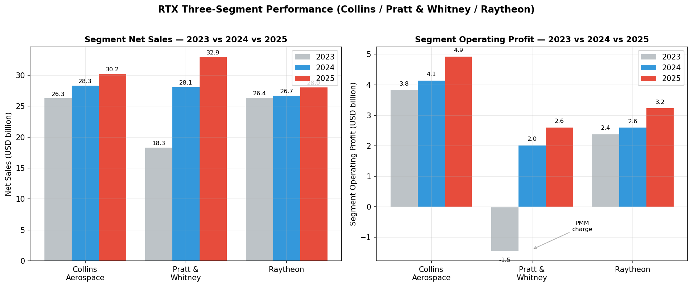
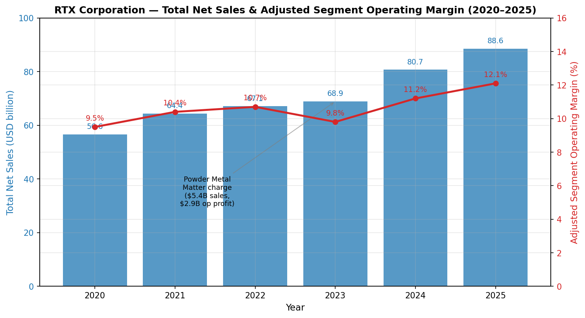
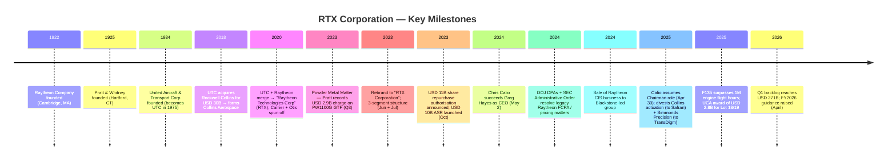
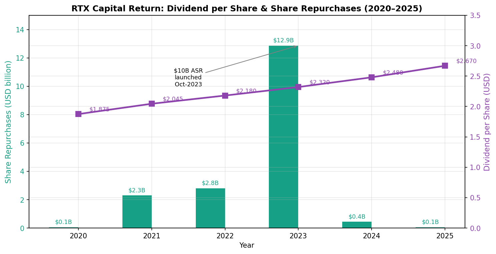
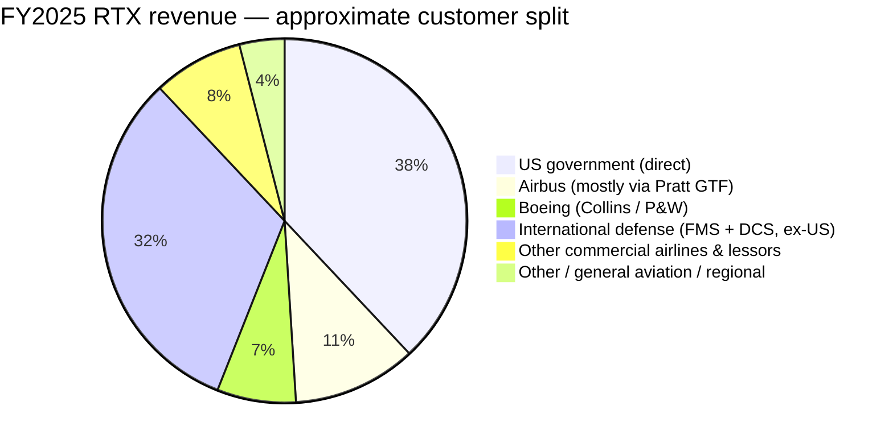
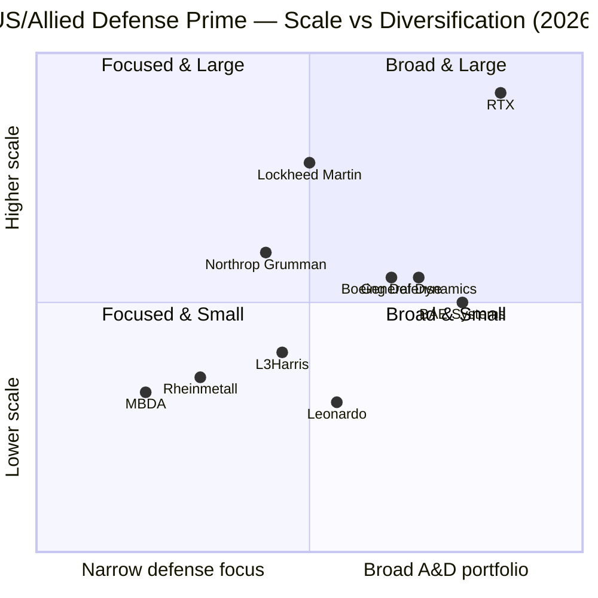
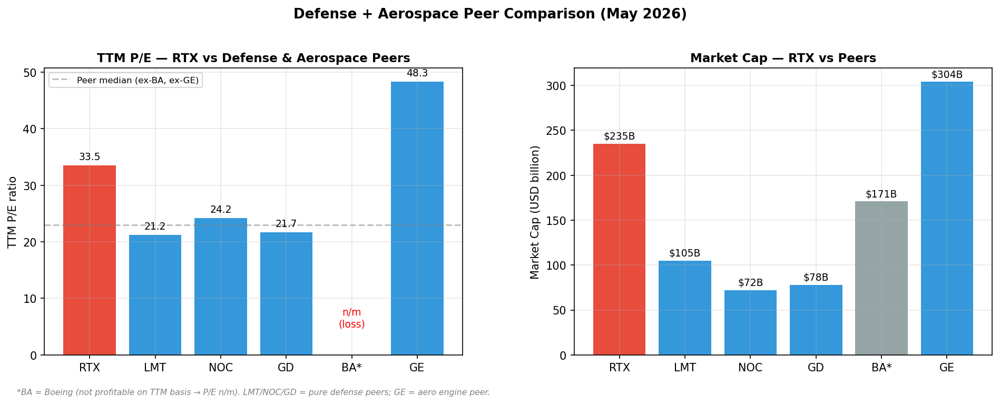
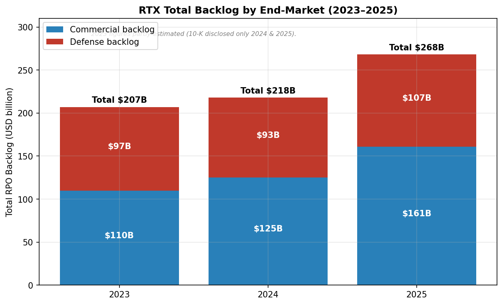

# COMPANY RESEARCH REPORT: RTX Corporation (NYSE: RTX)

**Date:** 2026-05-20

> **Update — FY2026 guidance raised (2026-04-21):** Management raised full-year adjusted sales guidance to **USD 92.5–93.5 billion** (from USD 92.0–93.0 billion announced 2026-01-27) and adjusted EPS to **USD 6.70–6.90** (from USD 6.60–6.80), while reaffirming free cash flow of USD 8.25–8.75 billion. The raise follows Q1 2026 organic sales growth of 10% and adjusted EPS growth of 21%, with management citing continued execution and strength across the defense backlog as drivers.
> Source: [RTX Q1 2026 earnings release, 2026-04-21](https://www.sec.gov/Archives/edgar/data/101829/000010182926000009/a2026-04x218xkerexhibit99.htm).

## Table of Contents

1. Company Overview
2. Company History
3. Management Team
4. Products & Services
5. Customers & Go-to-Market
6. Industry Overview
7. Competitive Landscape
8. Market Opportunity (TAM)
9. Risk Assessment
10. References

---

## 1. Company Overview

RTX Corporation (NYSE: RTX) is the world's largest publicly listed pure-play aerospace and defense (A&D) company by revenue, with FY2025 net sales of **USD 88.6 billion** ([RTX 2025 Form 10-K, p. 41](https://www.sec.gov/Archives/edgar/data/101829/000010182926000006/0000101829-26-000006-index.htm)). Headquartered in Arlington, Virginia, RTX operates more than 180,000 employees globally and supplies essentially every commercial and military aircraft platform in the Western world — either as the engine maker, the avionics/systems supplier, or both — and is the sole or near-sole US-based source for several keystone air-defence systems (Patriot, NASAMS, SM-3, AMRAAM, Tomahawk, SPY-6, LTAMDS).

**Business model.** RTX organises itself into three reporting segments: **Collins Aerospace** (avionics, interiors, electrical systems, landing gear), **Pratt & Whitney** (large and small jet engines, the F135 fighter engine, and the GTF family of narrowbody engines), and **Raytheon** (air defense, missiles, radars, naval systems, command-and-control). FY2025 segment net sales were USD 30.2 bn (Collins, 33% of segment sales), USD 32.9 bn (Pratt & Whitney, 36%), and USD 28.0 bn (Raytheon, 31%) ([RTX 2025 Form 10-K, pp. 44–47](https://www.sec.gov/Archives/edgar/data/101829/000010182926000006/0000101829-26-000006-index.htm)). Roughly **38% of FY2025 sales were direct to the US government** (excluding foreign military sales), down from 46% in FY2023; the remaining 62% is commercial OE/aftermarket plus international (USG-routed FMS and direct foreign sales) which totaled **USD 41.3 billion (47% of net sales)** in FY2025 — the highest international share in the company's history and a structural consequence of European, Indo-Pacific and Middle Eastern defense buying ([RTX 2025 Form 10-K, p. 5](https://www.sec.gov/Archives/edgar/data/101829/000010182926000006/0000101829-26-000006-index.htm)).

Within each segment the underlying economics differ. Collins generates cash from a balanced commercial-OE-plus-aftermarket razor/razorblade model (15-year platform contracts, then 30+ year spares and MRO). Pratt & Whitney runs an even more extreme version — commercial engines are usually sold near cost, with the entire program economics monetised through 20–30 years of aftermarket maintenance (this is also why a powder-metal recall on the PW1100G hits Pratt so hard: it lands directly on long-dated aftermarket-contract estimates-at-completion). Raytheon is a US-DoD prime / sole-source supplier on a series of weapons that the Pentagon, NATO allies, Israel, Ukraine, Taiwan, Japan, South Korea, and Australia all want, often via long-cycle Foreign Military Sales (FMS) contracts that flow through the US government as the contracting authority.

**Scale and growth.** FY2025 net sales grew **10% reported (11% organic)** versus FY2024, with all three segments contributing — Collins +7%, Pratt & Whitney +17%, Raytheon +5% ([RTX 2025 Form 10-K, p. 41](https://www.sec.gov/Archives/edgar/data/101829/000010182926000006/0000101829-26-000006-index.htm)). Pratt's outsized growth is partly a normalisation effect (FY2023 sales were depressed by the USD 5.4 billion top-line reduction associated with the Powder Metal Matter), but FY2024–FY2025 underlying growth is unambiguously strong. Total **backlog reached USD 268 billion at year-end 2025** (up from USD 218 bn at end-2024), comprising USD 161 bn commercial backlog and USD 107 bn defense backlog, with management disclosing that approximately 25% will convert to revenue over the next 12 months ([RTX 2025 Form 10-K, p. 6](https://www.sec.gov/Archives/edgar/data/101829/000010182926000006/0000101829-26-000006-index.htm)). The book-to-bill in FY2025 was 1.56, a record. By Q1 2026 the backlog had grown further to **USD 271 billion** (USD 162 bn commercial + USD 109 bn defense) ([RTX Q1 2026 earnings release, 2026-04-21](https://www.sec.gov/Archives/edgar/data/101829/000010182926000009/a2026-04x218xkerexhibit99.htm)).

**FY2025 financials (USD billions):** net sales 88.6; segment operating profit 10.7; GAAP net income attributable to common shareowners 6.73; GAAP diluted EPS USD 4.96, adjusted EPS USD 6.29 (+10% YoY); free cash flow 7.9 (+USD 3.4B vs FY2024) ([RTX Q4 2025 earnings release, 2026-01-27](https://www.sec.gov/Archives/edgar/data/101829/000010182926000003/a2026-01x278xkerexhibit99.htm)).

Source: [RTX 2025 Form 10-K, pp. 44–48](https://www.sec.gov/Archives/edgar/data/101829/000010182926000006/0000101829-26-000006-index.htm).

Source: [RTX 2025 Form 10-K, p. 41](https://www.sec.gov/Archives/edgar/data/101829/000010182926000006/0000101829-26-000006-index.htm); historical 2020–2022 figures from prior 10-Ks via [Macrotrends — RTX revenue history](https://www.macrotrends.net/stocks/charts/RTX/rtx/revenue).

**Valuation snapshot (as of mid-May 2026).** RTX trades at a market capitalisation of **~USD 235 billion** on a share price of approximately **USD 178** ([CompaniesMarketCap — RTX, 2026-05](https://companiesmarketcap.com/raytheon-technologies/marketcap/)). On TTM measures: **P/E ~33.5×** ([GuruFocus — RTX P/E (TTM), 2026-05-11](https://www.gurufocus.com/term/pettm/RTX)), **P/S ~2.6×** (235/90.4 TTM revenue), **EV/EBITDA ~17.4×** ([GuruFocus — RTX EV/EBITDA, 2026-05](https://www.gurufocus.com/term/enterprise-value-to-ebitda/RTX)), **dividend yield ~1.53%** on a USD 2.72 annualised dividend (board declared USD 0.68/share quarterly in February 2026, payable March 19, 2026 — a 7.9% increase year-over-year) ([RTX 2025 Form 10-K, p. 53](https://www.sec.gov/Archives/edgar/data/101829/000010182926000006/0000101829-26-000006-index.htm)).

Versus the defense peer group, RTX trades at a meaningful premium: **Lockheed Martin (LMT) at ~21.2× TTM P/E, General Dynamics (GD) at ~21.7×, Northrop Grumman (NOC) at ~24.2× forward, Boeing (BA) at n/m (TTM net loss), GE Aerospace (GE) at ~48.3× TTM** ([Macrotrends — LMT P/E](https://www.macrotrends.net/stocks/charts/LMT/lockheed-martin/pe-ratio); [Macrotrends — GE P/E, 2026-05-07](https://www.macrotrends.net/stocks/charts/GE/ge-aerospace/pe-ratio)). The defense-pure-play median (LMT/NOC/GD) is ~22×; RTX trades ~50% above it. **The premium is identifiable rather than inexplicable** — it reflects (a) RTX's larger commercial-aerospace exposure (Collins + Pratt aftermarket alone exceeded USD 30 billion of FY2025 commercial revenue, structurally higher growth than pure defense), (b) the GTF normalisation tailwind that resumes once the powder-metal accrual unwinds, and (c) the partial proxy effect to GE Aerospace, which trades at 48× and acts as the comparable for the engine-aftermarket part of the franchise. **It is not a sustainable level if GTF recovery stalls or if defense growth normalises** — see Section 9 on valuation/multiple-compression risk.

**P/B is not particularly informative** for RTX (industrials with heavy intangibles from the Rockwell Collins and Raytheon mergers), and the EV/EBITDA of 17.4× sits between LMT (~15×) and GE Aerospace (~28×), again consistent with the "defense-plus-engine-OEM" mix.

---

## 2. Company History

**The modern RTX traces back to a 2020 merger and a 2023 rebranding.** Its constituent businesses are older: Pratt & Whitney was founded in 1925 in Hartford, Connecticut, by Frederick Rentschler, and Raytheon Company in 1922 in Cambridge, Massachusetts, by Vannevar Bush and Laurence Marshall, pivoting from vacuum tubes to WWII-era radar and microwave technology.

The **Raytheon Technologies merger closed 3 April 2020**, combining UTC's aerospace businesses (Pratt & Whitney + Collins Aerospace, the latter formed from UTC's 2018 USD 30 billion Rockwell Collins acquisition combined with the legacy Goodrich systems) with Raytheon Company's missiles and electronics. The all-stock deal left legacy UTC holders with 57% and legacy Raytheon with 43% of the combined entity. Simultaneously, UTC spun off **Carrier (CARR)** and **Otis (OTIS)** tax-free to shareholders. In **June 2023 the company rebranded to "RTX Corporation"** and realigned to three segments — Collins Aerospace, Pratt & Whitney, and the renamed Raytheon (combining the prior Raytheon Intelligence & Space and Raytheon Missiles & Defense).

**The Powder Metal Matter, July 2023, has been the defining recent event in RTX's history.** Pratt & Whitney determined that a rare powder-metal raw-material defect required accelerated inspections on the PW1100G-JM Geared Turbofan engine that powers Airbus A320neo-family aircraft. In the third quarter of 2023, RTX took a pre-tax charge of **USD 2.9 billion** (USD 2.2 billion net of partner share and tax, USD 1.55 EPS impact) representing customer compensation and incremental shop visit costs; this charge was preceded by a USD 5.4 billion reduction in net sales reflecting the contract-accounting impact ([RTX 2025 Form 10-K, p. 56](https://www.sec.gov/Archives/edgar/data/101829/000010182926000006/0000101829-26-000006-index.htm)). RTX disclosed that PW1100 aircraft-on-ground (AOG) levels are expected to remain elevated through 2026. Cumulatively, RTX utilised **USD 1.0 billion of accrual in each of FY2024 and FY2025** for customer credits and cash payments, with **a further estimated USD 0.7 billion cash outflow expected in FY2026** ([RTX 2025 Form 10-K, p. 53](https://www.sec.gov/Archives/edgar/data/101829/000010182926000006/0000101829-26-000006-index.htm)). At end-2025 the other-accrued-liabilities balance for the matter was USD 0.7 billion (down from USD 1.7 billion at end-2024, USD 2.8 billion at end-2023).

Source: [RTX 2025 Form 10-K, pp. 5–7, 50–60](https://www.sec.gov/Archives/edgar/data/101829/000010182926000006/0000101829-26-000006-index.htm); [RTX 2026 Proxy Statement, pp. 38–39](https://www.sec.gov/Archives/edgar/data/101829/000130817926000036/0001308179-26-000036-index.htm).

**Strategic transformations.** Three matter: (1) the 2018 Rockwell Collins / Goodrich combination consolidated UTC's fragmented aerospace-systems portfolio into a single OEM counterparty; (2) the 2020 UTC/Raytheon merger added the missile/radar franchise and broadened RTX's defense exposure from primarily aerospace OE (engines, avionics) to the full defense stack; (3) the 2023–2025 portfolio sharpening — divestitures of Raytheon Cybersecurity Intelligence & Services (Q1 2024), Goodrich Hoist & Winch (Q4 2024), Collins Actuation & Flight Control (Q3 2025, to Safran), and Simmonds Precision Products (Q4 2025, USD 765 million to TransDigm) — cut roughly USD 1.2 billion of annual revenue from Collins but expanded margins, with proceeds redirected to debt reduction and the GTF recovery ([Flight Global, 2025-06-30 — Simmonds sale](https://www.flightglobal.com/systems-and-interiors/rtx-to-sell-collins-sensing-and-controls-business-to-transdigm/163615.article); [Safran press release, 2025-07-21](https://www.safran-group.com/pressroom/safran-announces-acquisition-flight-control-and-actuation-activities-collins-aerospace-2025-07-21)).

**Recent capital structure.** The October 2023 USD 11 billion share repurchase authorisation funded a USD 10 billion accelerated share repurchase (ASR) that completed in September 2024 at an average price of USD 94.28/share, retiring roughly 106 million shares ([RTX 2025 Form 10-K, p. 53](https://www.sec.gov/Archives/edgar/data/101829/000010182926000006/0000101829-26-000006-index.htm)). Net debt was carried into 2024 (USD 36 billion long-term debt at end-2025), funded with investment-grade issuance. The remaining repurchase authorisation at year-end 2025 was only **USD 0.6 billion** — meaningful repurchase resumption in 2026–2027 would require a fresh board authorisation.

Source: [RTX 2025 Form 10-K, pp. 49, 53, 69](https://www.sec.gov/Archives/edgar/data/101829/000010182926000006/0000101829-26-000006-index.htm); FY2020–FY2022 dividend history per [Macrotrends — RTX dividend history](https://www.macrotrends.net/stocks/charts/RTX/rtx/dividend-yield-history).

---

## 3. Management Team

### Christopher T. Calio — Chairman, President & Chief Executive Officer

Chris Calio, 52, became CEO of RTX on **May 2, 2024**, succeeding Greg Hayes, and added the Chairman role on **April 30, 2025**, completing what the proxy describes as "several years of deliberate succession planning by the Board" ([RTX 2026 Proxy Statement, pp. 22, 38–39](https://www.sec.gov/Archives/edgar/data/101829/000130817926000036/0001308179-26-000036-index.htm)). Calio is an RTX-internal candidate — he has been at UTC / RTX since 2005, joining as in-house counsel — and his trajectory is unusual in modern defense in that he climbed through legal, then ran Pratt & Whitney's commercial engines unit, then the entirety of Pratt, then was COO of RTX during the Powder Metal Matter, and only then became CEO. The pattern is intentional: the board appointed the executive who personally managed the most difficult operating challenge in the company's recent history.

Calio's career path inside the organisation:
- **Chief of Staff** to the UTC Chairman & CEO (Greg Hayes), Feb 2015–Jan 2017 — line-of-sight to every major UTC/RTX decision of that era including the Rockwell Collins acquisition and the Carrier/Otis spin plan.
- **President, Commercial Engines, Pratt & Whitney**, Feb 2017–Dec 2019 — when the GTF was ramping production for the A320neo and PW1100G shop visits were rising.
- **President, Pratt & Whitney**, Jan 2020–Feb 2022 — through the pandemic collapse in commercial flight hours and the first quiet signs of the powder-metal defect.
- **COO, Raytheon Technologies / RTX**, Mar 2022–Mar 2023 — F135 production ramp, Raytheon segment realignment, early powder-metal disclosure.
- **President & COO**, Mar 2023–May 2024 — led the Q3 2023 USD 2.9 billion powder-metal charge disclosure.
- **CEO**, May 2024–present; **Chairman**, April 2025–present.

His 2025 compensation was USD 24.85 million (USD 1.55 million base salary, USD ~6.4 million annual incentive at 164% of target, USD 21 million 2026 LTI award), with a CEO-to-median-employee pay ratio of 207:1 ([RTX 2026 Proxy Statement, pp. 53, 89](https://www.sec.gov/Archives/edgar/data/101829/000130817926000036/0001308179-26-000036-index.htm)). Calio holds no founder-level stake; LTI is heavily skewed to PSUs vesting on relative TSR and free-cash-flow targets. The 2025 say-on-pay vote received ~96% support.

**Assessment.** Calio's CEO tenure is two years at writing, but his trajectory inside the company spans nearly every issue that matters to the thesis. Three observable accomplishments: (1) FY2025 organic sales grew 11%, adjusted EPS grew 10%, and FCF grew ~75% (USD 7.9B vs USD 4.5B) — execution beat the original 2025 plan despite "unplanned tariff headwinds" called out in the proxy; (2) GTF AOG cohort dropped 15% in Q1 2026 versus the prior quarter under the maintenance ramp Calio personally architected as Pratt's commercial-engine head ([FlightGlobal, 2026-04](https://www.flightglobal.com/engines/2026/04/rtx-says-gtf-groundings-are-coming-down-thanks-to-maintenance-ramp/)); (3) the Collins divestiture program (~USD 2.5 billion of disposal proceeds across 2024–2025) executed without operational disruption. Open questions: he has not yet faced a defense-budget pullback, large-scale M&A integration, or a US–China sanctions inflection.

### Neil G. Mitchill, Jr. — Executive Vice President & Chief Financial Officer

Neil Mitchill, 50, has been RTX's CFO since the 2020 merger close (initially as Acting CFO then permanent CFO from August 2021), with 11 years of total RTX/UTC tenure. He joined UTC in 2014 and previously held senior corporate finance and controller roles. Mitchill's defining qualification is that he ran the post-merger integration of legacy UTC and legacy Raytheon finance functions — among the largest A&D consolidations ever — including converting both legacy SAP and Oracle financial systems and integrating disparate revenue-recognition methodologies. He has been the IR face on every quarterly call since 2020 and has personally guided the Street through the powder-metal charge, the USD 10 billion ASR, and the USD 12.9 billion of long-term debt issued in 2023. His 2025 compensation was USD 11.13 million (USD 1.1 million base, USD 2.525 million annual incentive at 164% of target Corporate factor, USD 7.5 million 2026 LTI) ([RTX 2026 Proxy Statement, pp. 78, 86](https://www.sec.gov/Archives/edgar/data/101829/000130817926000036/0001308179-26-000036-index.htm)). The 2025 LTI mix uses 75% PSUs versus 25% RSUs, with PSU metrics being 3-year free-cash-flow, ROIC, and relative TSR — capital-discipline metrics that match the post-ASR financial posture.

### Philip J. Jasper — President, Raytheon

Phil Jasper has run the Raytheon segment since its 2023 realignment. He came in via the 2018 Rockwell Collins acquisition (where he had been Executive VP of Government Systems) and previously held senior posts at Collins Aerospace's Mission Systems business. Jasper's segment is the largest beneficiary of the post-Ukraine / Indo-Pacific defense surge: Raytheon recorded **USD 40.0 billion of defense bookings in FY2025** — a book-to-bill of 1.43 — including USD 2.5 billion for Patriot GEM-T launchers, USD 2.1 billion for AMRAAM, USD 1.5 billion for LTAMDS low-rate production, USD 1.2 billion for Iron Dome Tamir, USD 1.2 billion for Patriot systems to Spain, USD 1.1 billion for AIM-9X Sidewinder, USD 901 million for SM-3 to the Missile Defense Agency, and a further USD 5.9 billion of classified bookings ([RTX 2025 Form 10-K, p. 48](https://www.sec.gov/Archives/edgar/data/101829/000010182926000006/0000101829-26-000006-index.htm)). His 2025 compensation totalled USD ~6 million.

### Shane G. Eddy — President, Pratt & Whitney

Shane Eddy took the Pratt presidency in March 2023, replacing Calio. Eddy is a 30-year P&W operations veteran and previously ran the F135 production line and the GTF aftermarket network. He is the line owner of the powder-metal recovery, the F135 Engine Core Upgrade (ECU), and the XA103 NGAP (Next Generation Adaptive Propulsion) development for the US Air Force. Pratt's FY2025 operating margin recovered to 7.9% (from 7.2% in FY2024, negative 8.0% in FY2023), and the GTF aftermarket network expanded to 21 facilities worldwide with shop-visit output up ~26% YoY in FY2025 ([RTX 2025 Form 10-K, p. 5](https://www.sec.gov/Archives/edgar/data/101829/000010182926000006/0000101829-26-000006-index.htm)). Eddy's KPIs through 2026–2027 are tightly bound: GTF AOG reduction, GTF Advantage entry-into-service ramp, and F135 ECU certification.

### Troy D. Brunk — President, Collins Aerospace

Troy Brunk has led Collins since 2024 after running Collins's Mission Systems business and (before that) Rockwell Collins Avionics. Collins delivered FY2025 operating margins of 16.3% (up 170bps YoY) on USD 30.2 billion of sales, the segment's best margin since the 2018 merger. Brunk's portfolio reshaping is the most active inside RTX — divesting actuation/flight control to Safran and Simmonds Precision to TransDigm in 2025, and consolidating into integrated avionics, interiors, electrical power, and defense communications.

### Governance footer

The RTX board has 12 directors as of the 2026 proxy, 11 of whom are independent ([RTX 2026 Proxy Statement, p. 16](https://www.sec.gov/Archives/edgar/data/101829/000130817926000036/0001308179-26-000036-index.htm)). Independent Lead Director is **Tracy A. Atkinson** (per the 2026 proxy update), with prior LD Reynolds re-elected as a director — the proxy notes Mr. Reynolds's continued service was discussed in the context of Calio assuming the chairman role. Insider ownership is small in percentage terms (a fraction of 1%) but high in absolute dollar terms given the USD 235 billion market cap. Compensation structure for NEOs is roughly 90% variable, with PSUs measured on 3-year ROIC, free cash flow, and relative TSR. The 2024 deferred prosecution agreements (DPAs) with DOJ and the SEC Administrative Order resolved legacy Raytheon FCPA matters and defective-pricing claims that pre-date the 2020 merger; an independent compliance monitor was expected to be in place by Q1 2026 with a three-year term ([RTX 2025 Form 10-K, pp. 57–58](https://www.sec.gov/Archives/edgar/data/101829/000010182926000006/0000101829-26-000006-index.htm)). The Consent Agreement with the US Department of State (ITAR violations, three-year term) is layered on top. These are real governance constraints — the January 7, 2026 Executive Order also empowered the Secretary of War to limit dividends or buybacks of defense contractors deemed to be underperforming, a new and unusual overlay on capital return planning.

**Track-record synthesis.** The management slate is internal, deep, and tested — Calio, Eddy, Brunk, and Jasper all came up through legacy UTC / Pratt / Rockwell Collins / Raytheon operations. The team has executed the post-2020-merger integration, absorbed the powder-metal disclosure without breaking the dividend or the investment-grade rating, completed a USD 10 billion ASR at an average price well below the current market, and grown FY2025 free cash flow ~75% YoY. The gap they have not yet been tested on is large-scale M&A in the current cycle and a defense-budget down-cycle — both possible if a US administration shift in the late-2020s reorders priorities.

---

## 4. Products & Services

RTX's product portfolio is enormous — by some counts the company sells more than 1,000 distinct SKU families across three segments. The list below covers every product family disclosed on rtx.com and in the 10-K's Item 1 (Business). Where a single segment offers many overlapping SKUs, we group them.

### Collins Aerospace (FY2025 net sales USD 30.2 billion; operating margin 16.3%)

```mermaid
graph TD
    RTX[RTX Corporation]
    RTX --> COL[Collins Aerospace]
    RTX --> PW[Pratt & Whitney]
    RTX --> RAY[Raytheon]

    COL --> COL_AV[Avionics & Mission Systems]
    COL --> COL_INT[Aircraft Interiors]
    COL --> COL_EP[Electric Power & Distribution]
    COL --> COL_AS[Aerostructures]
    COL --> COL_LG[Landing Systems]
    COL --> COL_MS[Military Mission Systems & SATCOM]

    COL_AV --> Pro_Line[Pro Line Fusion flight deck]
    COL_AV --> Head_Up[Head-Up Guidance HGS]
    COL_AV --> SAT[SATCOM ARINC GLOBALink]
    COL_AV --> STARS[STARS air-traffic mgmt]

    COL_INT --> Seats[BE Aerospace seats]
    COL_INT --> Galley[Galleys & lavatories]
    COL_INT --> Oxygen[Oxygen / EVAC systems]

    COL_EP --> APU_aux[APU starters / generators]
    COL_EP --> ECS[Environmental Control Systems]

    COL_AS --> Nacelles[Engine nacelles / thrust reversers]
    COL_AS --> Wing[Wing leading edges]

    COL_LG --> Wheels[Goodrich wheels & brakes]
    COL_LG --> Gear[Landing gear]

    PW --> PW_COM[Commercial Engines]
    PW --> PW_MIL[Military Engines]
    PW --> PW_AUX[APUs & small engines]

    PW_COM --> GTF[PW1000G GTF family]
    PW_COM --> V2500[V2500 IAE JV]
    PW_COM --> PW4000[PW4000 widebody]
    PW_COM --> PW800[PW800 business jets]
    PW_COM --> PWC[Pratt & Whitney Canada PT6 / PW100]

    PW_MIL --> F135[F135 for F-35 - sole source]
    PW_MIL --> F119[F119 for F-22 - sustainment]
    PW_MIL --> F100[F100 for F-15 / F-16 - sustainment]
    PW_MIL --> B21[Classified engines incl. B-21]
    PW_MIL --> NGAP[XA103 NGAP development]

    RAY --> R_LAD[Land & Air Defense Systems]
    RAY --> R_NPS[Naval Power & Surface Systems]
    RAY --> R_ASD[Air & Space Defense]
    RAY --> R_AT[Advanced Technology / Classified]

    R_LAD --> Patriot[Patriot system + GEM-T]
    R_LAD --> NASAMS[NASAMS air-defense]
    R_LAD --> LTAMDS[LTAMDS sensor]
    R_LAD --> Stinger[FIM-92 Stinger]
    R_LAD --> Iron_Dome[Iron Dome Tamir - JV with Rafael]
    R_LAD --> Coyote[Coyote counter-UAS]

    R_NPS --> ESSM[Evolved Sea Sparrow ESSM]
    R_NPS --> SM3[Standard Missile-3 / SM-6]
    R_NPS --> SPY6[SPY-6 radar - DDG-51 / DDG-1000]
    R_NPS --> Tomahawk[Tomahawk cruise missile]

    R_ASD --> AMRAAM[AIM-120 AMRAAM]
    R_ASD --> AIM9X[AIM-9X Sidewinder Block II]
    R_ASD --> NGJ[Next-Gen Jammer NGJ-MB]
    R_ASD --> StormBreaker[StormBreaker / GBU-53]
```

Source: [rtx.com — Collins Aerospace solutions](https://www.collinsaerospace.com/), [rtx.com — Pratt & Whitney products](https://www.prattwhitney.com/en/products), [rtx.com — Raytheon capabilities](https://www.rtx.com/raytheon/what-we-do); [RTX 2025 Form 10-K, pp. 4–7](https://www.sec.gov/Archives/edgar/data/101829/000010182926000006/0000101829-26-000006-index.htm).

**Collins flagship products and competitive position:**

- **Pro Line Fusion integrated flight deck** — fitted on the Embraer E2 family, KC-46 tanker, Boeing 777X freighter platforms, plus business jets. Competitive advantage: **yes** (technology + switching costs). Once an OEM line-fits Pro Line, regulatory recertification of an alternate avionics suite costs hundreds of millions of dollars and takes years. Closest competitor: **Honeywell Primus / Epic 2** and **Garmin G5000** in business jets; Collins is at parity in features, **ahead in installed base** on transport-category aircraft.
- **Head-Up Guidance System (HGS)** — runway-vision-enabling head-up displays now installed across most major airlines. Advantage: **yes** (regulatory certification, decades of HGS-credit operations data); closest competitor: **Thales TopMax**, behind on certification footprint.
- **Goodrich wheels and carbon brakes** — installed on 90%+ of large commercial aircraft worldwide. Advantage: **yes** (scale + specialty carbon technology); peers: **Safran Landing Systems**, **Honeywell Brakes** — at parity in certain narrowbody fits but Collins dominates widebody and military.
- **Engine nacelle systems (incl. thrust reversers)** — Collins supplies nacelles for many GTF, V2500, and PW4000 powered aircraft; advantage **partial** — competing with Spirit AeroSystems' aerostructures business and Safran Nacelles.
- **B/E Aerospace seats, galleys and interiors** — acquired by Rockwell Collins in 2017. Advantage: **partial** — interiors is a relatively fragmented market with Safran Seats, Recaro Aircraft Seating, Jamco, Adient Aerospace, etc.; Collins has scale but pricing power is limited.
- **STARS air-traffic-management system** (Standard Terminal Automation Replacement System) — in 2025 Collins received a follow-on award from the FAA and was named to the FAA's new Brand New Air Traffic Control System Radar System Replacement program. Advantage: **yes** (incumbency, classified-program clearances).
- **Connected aviation services / ARINC** — global VHF/SATCOM aeronautical communication network. Advantage: **yes** (network effect, every commercial flight uses it). Closest competitor: **Honeywell GoDirect**, **SITA**.
- **Defense communications (very-low-frequency, Advanced EHF, mission C3)** — won a 2025 US Navy subcontract for engineering, design and manufacturing of VLF and Advanced EHF subsystems and a multi-band satellite communications contract — both add to the classified-programs growth pillar.

**Last-12-month launches and exits at Collins:** Divested the actuation & flight-control business to Safran (Aug 2025) and Simmonds Precision Products (USD 765 million, Q4 2025, to TransDigm). Won a >USD 4 billion combined long-term agreement to provide MRO and spare parts to several airlines. Selected by the European Union's Clean Aviation Joint Undertaking for the PHARES hybrid-electric regional engine programme together with Pratt & Whitney Canada.

### Pratt & Whitney (FY2025 net sales USD 32.9 billion; operating margin 7.9%)

**The PW1000G Geared Turbofan (GTF) family** — flagship commercial engine, powers the **Airbus A320neo (PW1100G-JM)**, the **Airbus A220 (PW1500G)**, and the **Embraer E2 (PW1900G)**. The GTF family powers more than 2,600 aircraft for over 90 operators across three platforms. Advantage: **yes, structurally** — the GTF is the **only narrowbody engine** competing with the CFM LEAP (the GE/Safran JV) on the A320neo platform, giving Pratt 40–50% of A320neo installed base depending on cohort year. Moat type: **technology + 20–30-year aftermarket lock-in** (once an airline picks PW1100G, the engine's overhaul comes back to Pratt or its authorized network for ~30 years). FY2025 milestone: **GTF Advantage received FAA and EASA certification for the A320neo** — 4–8% takeoff thrust improvement, up to 1% additional fuel burn reduction ([RTX 2025 Form 10-K, p. 5](https://www.sec.gov/Archives/edgar/data/101829/000010182926000006/0000101829-26-000006-index.htm)). Closest competitor: **CFM LEAP-1A** (GE/Safran), at parity in fuel burn but ahead in cumulative engine-hours-without-issue on the A320neo (LEAP has had its own durability issues, but materially less severe than the GTF powder-metal recall).

**The F135 engine** — sole-source engine for the entire **F-35 Lightning II** programme (A, B, and C variants), produced for the US government's F-35 Joint Program Office and for all foreign F-35 buyers (UK, Italy, Norway, Netherlands, Denmark, Australia, Israel, Japan, South Korea, Turkey-suspended, plus the Switzerland and Finland sales since 2022). In 2025 the F135 surpassed **one million engine flight hours** and Pratt received a USD 2.8 billion undefinitized contract action (UCA) for Lot 18 and Lot 19 production plus long-lead. The **F135 Engine Core Upgrade (ECU)** is in design maturation and aircraft-integration — this is the multi-decade thrust/efficiency upgrade path Pratt won when the US Air Force chose ECU over the all-new adaptive cycle engine programs in 2023. Advantage: **yes, monopoly-grade** — sole source, F-35 is in production for the next 30+ years, every engine overhaul comes back to Pratt. Closest competitor: none on F-35 itself; **GE's F110 / XA100** is the conceptual peer in the bilateral US fighter engine market but lost the F-35 propulsion decision. In FY2025 Pratt booked **USD 9 billion in defense bookings** including USD 2.9 billion for F135 production and USD 2.4 billion for F135 sustainment.

**Other military engines** — F119 (F-22, sustainment), F100 (F-15 / F-16, sustainment-only legacy), classified engine work including the B-21 Raider's engines (Pratt is the engine supplier per the 10-K wording "the B-21 Raider, which is powered by Pratt & Whitney engines"), and the XA103 ground demonstrator under the US Air Force's Next Generation Adaptive Propulsion (NGAP) program. Advantage: **yes** (incumbent monopoly on every legacy US Air Force fighter engine plus sole engine supplier on B-21, with cradle-to-grave sustainment).

**Pratt & Whitney Canada** — turboprop (PW100, PW150, PT6) and small turbofan engines (PW800) for regional, business and general aviation. Advantage: **yes** (market share leader in regional turboprops and business-jet turbofans). Closest competitor: GE Aerospace Catalyst, Honeywell HTF7000.

**Auxiliary Power Units (APUs)** — Pratt + Hamilton Sundstrand (legacy Collins) supply APUs for military and commercial aircraft. Closest competitor: Honeywell APU.

**Largest commercial customer for Pratt:** **Airbus represented 29% of Pratt segment sales in FY2025** (down from 31% FY2024, 48% FY2023 — the 2023 figure was inflated by the way the PMM charge was allocated). This is disclosed in the 10-K and is a customer concentration we discuss in Section 5.

**Last-12-month Pratt highlights:** GTF Advantage entry-into-service certification (2025); F135 1M-flight-hour milestone (2025); GTF aftermarket capacity grew to 21 MRO facilities globally with 26% YoY shop-visit-output increase ([RTX 2025 Form 10-K, p. 5](https://www.sec.gov/Archives/edgar/data/101829/000010182926000006/0000101829-26-000006-index.htm)); GTF AOG levels declined 15% in Q1 2026 ([FlightGlobal, 2026-04](https://www.flightglobal.com/engines/2026/04/rtx-says-gtf-groundings-are-coming-down-thanks-to-maintenance-ramp/)); XA103 NGAP completed Detailed Design Review.

### Raytheon (FY2025 net sales USD 28.0 billion; operating margin 11.5%)

Raytheon's product set is organised into **Land & Air Defense Systems**, **Naval Power**, **Air & Space Defense Systems**, and **Advanced Technology (classified)**.

**Patriot air-defense system** — the GEM-T (Guidance Enhanced Missile, PAC-2 lineage) and PAC-3 (Lockheed-built missile, Raytheon-built launchers/radars) integrated air-and-missile-defense system. Advantage: **yes, monopoly** — Patriot is the de facto Western air-defense standard, deployed by 19+ allied nations including Spain, Netherlands (USD 529 million 2025 booking), Poland, Germany, Ukraine, Israel, Saudi Arabia, Japan, Korea, Taiwan. Raytheon is **the sole manufacturer of Patriot launchers and the GEM-T interceptor**; in April 2026 Raytheon was awarded a USD 3.7 billion direct commercial sale for GEM-T interceptors to Ukraine ([RTX news release, 2026-04-14](https://www.rtx.com/news/news-center/2026/04/14/rtxs-raytheon-to-deliver-patriot-interceptors-to-ukraine)). The new GEM-T production facility in Schrobenhausen, Germany is being stood up to supplement US output. Closest competitor: **SAMP/T** (Eurosam — MBDA + Thales), but Patriot remains the de facto US/NATO standard.

**NASAMS** (National Advanced Surface-to-Air Missile System) — joint program with Norway's Kongsberg. Deployed to defend Washington, D.C. and exported to >12 nations including Ukraine. Advantage: **yes** (only mid-range Western AAM system in production at scale). Multiple international bookings in FY2025 (USD 556 million single contract).

**LTAMDS** (Lower Tier Air and Missile Defense Sensor) — the new 360-degree radar replacing the legacy Patriot radar; sole-source to Raytheon. USD 1.5 billion LRIP booking in 2025 for the US Army and Poland.

**AMRAAM / AIM-9X Sidewinder** — air-to-air missiles for F-15, F-16, F-18, F-22, F-35, Typhoon, Gripen, Rafale customers. Sole or near-sole-source. FY2025 bookings: USD 2.1 billion (AMRAAM) and USD 1.1 billion (AIM-9X). Closest competitor: **MBDA Meteor** in Europe (longer range, more advanced kinematics), but the US/NATO production base remains AMRAAM.

**Tomahawk cruise missile** — the keystone US Navy long-range strike weapon. Sole-source to Raytheon. FY2025 booking USD 513 million. Production targeted to ramp to >1,000/year per Pentagon plans.

**SPY-6 radar family** — next-generation S-band radar for the US Navy DDG-51 Flight III and DDG-1000 destroyers. FY2025 booking USD 647 million (Hardware Production and Sustainment). Sole-source.

**SM-3 / SM-6 Standard Missile** — exo-atmospheric missile defense (SM-3) and dual-role air defense / anti-ship (SM-6). FY2025 SM-3 booking USD 901 million. Sole-source.

**Iron Dome Tamir interceptor** — Raytheon JV (R2S) with Israel's Rafael, manufacturing in Camden, Arkansas. FY2025 USD 1.2 billion booking for an international customer. The R2S facility separately received a USD 1.25 billion contract for Tamir manufacturing.

**Stinger / FIM-92** — short-range man-portable air-defense (MANPADS) system, restarted production after Ukraine demand. FY2025 booking USD 517 million.

**Next-Generation Jammer Mid-Band (NGJ-MB)** — electronic warfare for US Navy EA-18G Growler and Royal Australian Air Force. USD 581 million FY2025 booking.

**Advanced Technology (Classified)** — Raytheon disclosed USD 5.9 billion of classified bookings in FY2025; these include space sensing and intelligence systems, hypersonic-vehicle work, and DARPA prototype programs.

**Per-product moat synthesis for Raytheon:** Raytheon's products are overwhelmingly **sole-source or near-sole-source** US monopolies for the relevant capability, protected by ITAR, security clearances, decades of platform-integration knowledge, and an installed base of legacy missile-and-launcher inventories. Where there is competition (NASAMS vs IRIS-T, Patriot vs SAMP/T, Tomahawk vs the not-yet-fielded Anglo-Italian-Japanese GCAP weapons), the competitor is either NATO-internal (and US allies still buy both) or aspirational and far behind on production readiness. Closest cross-cutting competitor as a US prime: **Lockheed Martin Missiles & Fire Control (THAAD, PAC-3, JASSM, LRASM, HIMARS) and Northrop Grumman Missile Systems** (Tomahawk subsystems via Aerojet Rocketdyne acquisition, AARGM-ER). Raytheon has unique strength in air defense (Patriot, SPY-6, LTAMDS) and ship-launched munitions (Tomahawk, SM-3/6, ESSM), while Lockheed dominates strike (JASSM, LRASM) and hypersonics.

---

## 5. Customers & Go-to-Market

**Customer concentration — quantified.** RTX discloses customer concentration along two main axes. **First, the US government as a single customer.** Sales to the US government (excluding FMS routed via the USG) were **USD 33.3 billion in FY2025, representing 38% of total net sales** (down from 40% in FY2024, 46% in FY2023) ([RTX 2025 Form 10-K, p. 5](https://www.sec.gov/Archives/edgar/data/101829/000010182926000006/0000101829-26-000006-index.htm)). This is the **single largest customer** in any reasonable accounting view, and the 10-K explicitly states "The U.S. government is our largest customer, representing a substantial majority of our total defense sales." When FMS is added, US-government-related sales rise further; the 10-K does not disclose the FMS-inclusive percentage but it is likely north of 50% of total revenue.

**Second, individual airframer concentration inside Pratt & Whitney.** Pratt explicitly discloses that **Airbus represented 29% of Pratt segment sales in FY2025** (31% in FY2024, 48% in FY2023). At the RTX consolidated level Airbus is therefore roughly 11% of total net sales — material but not a single-customer-bet given that the Airbus exposure is largely through the GTF aftermarket, which is locked in via long-term service agreements rather than year-by-year purchase orders. **Boeing** is also a top-5 customer (via Collins avionics, Goodrich landing systems, F135 nacelles in some Joint Strike Fighter sub-contracting arrangements) but RTX does not disclose the precise percentage.

**Top customer concentration estimate:**

Source: estimated from [RTX 2025 Form 10-K, pp. 4–7](https://www.sec.gov/Archives/edgar/data/101829/000010182926000006/0000101829-26-000006-index.htm) and segment-customer disclosures; Boeing and international defense splits are author estimates because the 10-K does not break Boeing out separately and the international-defense pie includes both FMS and direct commercial sales of Patriot, Tomahawk, NASAMS, etc.

The takeaway is that the **single biggest concentration risk is the US-government relationship**, not any single airframer. Mitigants are well-developed: the US government almost never terminates a contractor for convenience at the scale this would imply, and even when DPAs/Consent Agreements were imposed (2024) they did not interrupt billings.

**Aftermarket and long-term service contracts.** A material share of Collins and Pratt revenue is from long-term aftermarket service agreements with airlines and OEMs — these are typically priced on fly-hour ("power-by-the-hour" / FleetCare) bases, with multi-year commitments. In FY2025 Collins won "over USD 4 billion in combined long-term agreements" for MRO and spare parts ([RTX 2025 Form 10-K, p. 4](https://www.sec.gov/Archives/edgar/data/101829/000010182926000006/0000101829-26-000006-index.htm)). The economics of these agreements is the reason the powder-metal recall has lingered so long — the GTF aftermarket contracts have to absorb a multi-billion-dollar Estimate-at-Completion adjustment when the parts-and-labor mix shifts.

**Geographic mix.** **International sales were USD 41.3 billion in FY2025 (47% of total net sales)**, up from USD 34.7 billion (43%) in FY2024 and USD 29.4 billion (43%) in FY2023 ([RTX 2025 Form 10-K, p. 5](https://www.sec.gov/Archives/edgar/data/101829/000010182926000006/0000101829-26-000006-index.htm)). The trajectory reflects Europe rearmament (Patriot to Spain, Netherlands, Germany, Poland; NASAMS broadly), Middle East deliveries (Saudi, UAE, Israel), and Indo-Pacific growth (Japan, South Korea, Taiwan, Australia). RTX is also exposed to a "Buy European" policy risk if EU defense protectionism intensifies (see Section 9).

**Distribution channels.** Collins and Pratt sell direct to airframers (Boeing, Airbus, Embraer, COMAC) on OE, and to airlines / lessors on aftermarket. Raytheon sells almost entirely through the US government as the contracting party for FMS, or directly to allied governments under direct-commercial-sale (DCS) terms.

**Sales cycle and partnership structure.** Defense bookings are heavily concentrated in a small number of long-cycle awards. The 2025 defense-bookings disclosure (Section 4 of this report) shows that 11 single contracts each contributed more than USD 500 million in bookings, plus USD 5.9 billion of classified. **Defense bookings were USD 61 billion in both FY2025 and FY2024**, up from USD 51 billion in FY2023 — a 20% step-up that has held into 2026.

**Key partnerships.** RTX operates as the lead in **R2S Raytheon-Rafael** (Iron Dome Tamir, Camden Arkansas), **IAE V2500** (Pratt + MTU + JAEC + Pratt & Whitney) for the A320ceo legacy engine, **CFM JV adjacency** through some sub-tier supply, **Kongsberg NASAMS JV**, multiple classified joint programs, and broad NATO Foreign Military Sales relationships. The defense partnership matrix is intentionally complex to align with allied governments' offset-and-industrial-cooperation requirements.

---

## 6. Industry Overview

### Industry definition and scope

RTX competes in two overlapping macro-industries:

**Commercial aerospace** — the supply of airframes, engines, avionics, interiors, landing gear, and aftermarket services to commercial passenger and cargo airlines, lessors, and original equipment manufacturers (Boeing, Airbus, Embraer, COMAC, Bombardier). NAICS 336411 (Aircraft Manufacturing) and 336412 (Aircraft Engine and Engine Parts Manufacturing). The market is a duopoly at the airframe level (Boeing + Airbus for >95% of the large-aircraft fleet) and effectively a duopoly at the narrowbody engine level (CFM LEAP + Pratt GTF on A320neo; CFM LEAP-1B as sole engine on 737 MAX).

**Defense (US and allied)** — air-and-missile defense systems, fighter jet propulsion, naval munitions, radars, and electronic warfare. NAICS 336414, 336415, 334511. The market is dominated by a small number of US primes (Lockheed Martin, RTX, Northrop Grumman, Boeing Defense, General Dynamics, Huntington Ingalls, L3Harris) supplemented by European primes (BAE Systems, MBDA, Airbus Defence and Space, Leonardo, Thales, Rheinmetall, Saab).

### Market size and structure

- **Global aerospace & defense market** is estimated at **USD 1.0–1.1 trillion in FY2025**, of which roughly USD 700 billion is defense expenditure across all NATO + Indo-Pacific allies, plus China and Russia ([SIPRI Military Expenditure Database, 2025](https://www.sipri.org/databases/milex)). RTX's USD 88.6 billion of FY2025 revenue is approximately 8% of the combined global A&D pie.
- **Global commercial aerospace** is estimated at USD 300–330 billion in FY2025 across OE, aftermarket, and avionics. Boeing and Airbus together delivered roughly 1,300 commercial aircraft in 2025; the GTF/CFM LEAP narrowbody backlog runs to >10,000 engines combined.
- **The US defense budget for FY2026 is approximately USD 895–920 billion**, the largest in history, with **Pacific Deterrence Initiative and the Indo-Pacific theatre** being explicit priorities ([US Department of Defense FY2026 Budget Request, 2025-03](https://comptroller.defense.gov/Budget-Materials/Budget2026/)). NATO members are also stepping up: most have moved past the 2% of GDP target, with Poland and the Baltics exceeding 4%. Total European defense spending grew approximately 17% in 2025 in real terms.

### Growth rates (historical and projected)

- **Defense spending** is on its third consecutive year of double-digit growth in nominal terms in most NATO countries, with consensus forecasts placing 2026–2030 CAGRs at 5–8% for the global defense market and 8–12% for missile/air-defense and electronic-warfare sub-segments ([Janes / IISS Military Balance 2026](https://www.iiss.org/publications/the-military-balance/military-balance-2026)).
- **Commercial aerospace** is in a multi-year up-cycle as global RPMs (revenue passenger miles) finally exceeded the 2019 pre-pandemic peak in 2024 and continue to grow at ~4% annually. Boeing and Airbus combined backlogs exceed 14,000 aircraft, the highest on record — implying 9–10 years of build-out at current production rates.
- **The aftermarket** for both engines and avionics is structurally growing at ~7% annually because of (a) a fleet in service that exceeds 27,000 aircraft globally, with maintenance demand driven by airframe age; (b) the post-COVID return-to-service of stored aircraft; and (c) the unusual shape of the GTF cohort, which is driving multi-cycle shop visits earlier than expected.

### Key trends and drivers

**Defense:**
- **Russia–Ukraine war** has unwound 30 years of European post–Cold War assumptions. US, Germany, UK, Poland, Netherlands, Denmark, Norway, Sweden, Finland, and the Baltics are all rearming. NATO members have committed to a 5% of GDP defense target by 2035 ([NATO Hague Summit Declaration, June 2025](https://www.nato.int/cps/en/natohq/official_texts_237522.htm)). Air-defense (Patriot, NASAMS, IRIS-T) and 155mm artillery have been the most acute shortages.
- **Israel conflict (October 2023 onward)** has driven Iron Dome interceptor demand, David's Sling and Arrow exports, and US replenishment of munitions inventories.
- **Indo-Pacific deterrence** drives demand for SM-3/6, Tomahawk, AMRAAM, AIM-9X, and air-defense radars. Japan ordered Tomahawk in 2023–2024 and is fielding the system through 2027; Taiwan continues to buy Patriot, Stinger, and HAWK upgrades.
- **Munitions production constraints** — Pentagon plans to **quadruple PAC-3 MSE production from 600 to 2,000 per year** and **Tomahawk production to >1,000 per year**, requiring a multi-year capacity buildout ([Military Machine — Pentagon Missile Production Surge, 2026](https://militarymachine.com/pentagon-missile-production-surge-2026)).
- **Hypersonics and next-gen propulsion** — XA103 NGAP, F135 ECU, the LRHW Dark Eagle deployment, and broader DoD investment in hypersonic offensive and defensive systems.

**Commercial aerospace:**
- **GTF AOG normalisation** — the 1,723 GTF-powered aircraft in service at end-October 2025 plus 835 stored is a population that should normalise back to a single-digit-percent storage rate by late 2026 to early 2027 as MRO throughput catches up.
- **Boeing 737 MAX and 787 production ramp** — Collins benefits broadly as aerostructures and avionics supplier; Pratt does not benefit on MAX (CFM is sole engine) but does benefit on widebody (787, 777X via licensed work).
- **Sustainable Aviation Fuel (SAF) and hybrid-electric propulsion** — long horizon (post-2035) for material impact; PHARES regional hybrid-electric program with EU Clean Aviation is the leading edge of Pratt's effort.

### Regulatory environment

- **US**: Federal Acquisition Regulation (FAR), Defense Federal Acquisition Regulation Supplement (DFARS), International Traffic in Arms Regulations (ITAR), Export Administration Regulations (EAR), False Claims Act, FAA airworthiness directives, OFAC sanctions. The 2024 DPAs and the Department of State Consent Agreement create incremental compliance overlay on RTX through ~2027.
- **EU**: ASN.1 / EU export control regulations, "Buy European" preferences embedded in the European Defence Fund and EDIRPA / EDIP frameworks. Risk: longer-term displacement of US suppliers from EU defense bids.
- **Chinese sanctions** on Raytheon (Missile & Defense) and Collins JVs in response to Taiwan arms sales (announced Feb 2023, expanded since). The 10-K specifically discloses fines and restrictions but no material operational impact to date.
- **January 7, 2026 Executive Order** — empowers the US Secretary of War to limit corporate distributions, share repurchases, and executive comp at defense contractors deemed to be underperforming, lacking prioritisation, investment, or production speed. The first-of-its-kind US executive intervention into contractor capital structure ([RTX 2025 Form 10-K, p. 51](https://www.sec.gov/Archives/edgar/data/101829/000010182926000006/0000101829-26-000006-index.htm)).

### Industry structure

The US prime A&D industry is highly **consolidated** — 6 primes own >75% of US defense procurement spend. Supplier-power is also concentrated: titanium (Russia, Ukraine, US ATI / TIMET, Howmet), single-crystal turbine airfoils (Howmet + Berkshire's PCC), advanced semiconductors (TSMC, Intel, Samsung), composite structures (Spirit AeroSystems pre-Boeing acquisition, Hexcel, Toray). Buyer power is split — the US government has overwhelming buyer power in defense but is itself constrained by Congressional appropriation cycles; commercial airlines have moderate buyer power but limited choice given the Boeing/Airbus duopoly.

---

## 7. Competitive Landscape

Source: author's framework; revenue figures from each issuer's FY2025 10-K / annual report.

### Direct competitors

**Lockheed Martin Corporation (NYSE: LMT)** — FY2025 net sales of approximately USD 74.9 billion; the US's largest defense prime by defense-only revenue ([Lockheed Martin 2025 Form 10-K](https://www.sec.gov/Archives/edgar/data/0000936468/000162828026004195/lmt-20251231.htm)). LMT competes with RTX on: PAC-3 MSE (LMT's interceptor inside Patriot launchers — the lone product where LMT is *inside* a Raytheon system); THAAD (vs SM-3 high-altitude defense); JASSM-ER / LRASM (vs Tomahawk); F-22 / F-35 (LMT integrator vs Pratt engine on F-35); LRHW hypersonic. LMT does not compete in commercial aerospace, engines, or avionics. **Position vs RTX:** LMT trades cheaper (~21× P/E vs RTX's 33×), is more pure-play defense (95%+ defense revenue), and has less aftermarket leverage. The trade-off depends on whether you want defense purity (LMT) or a defense + commercial recovery option (RTX).

**Northrop Grumman Corporation (NYSE: NOC)** — FY2025 revenue ~USD 41 billion. Competes with RTX on: B-21 Raider (NOC is integrator, Pratt makes engine — partnership rather than competition); space systems (NOC vs Raytheon Space & Airborne Systems classified work); ICBMs (NOC's Sentinel ICBM has no RTX equivalent); AARGM-ER missile (vs AMRAAM in some kinematics envelopes); MQ-4C Triton; advanced radars. **Position vs RTX:** NOC is the strategic systems / classified-space leader; RTX is the air-defense / munitions / commercial-engine leader. Forward P/E ~24×.

**General Dynamics Corporation (NYSE: GD)** — FY2025 revenue ~USD 49 billion. Competes with RTX on: combat systems (vehicles, ammunition — limited RTX overlap); naval ships (Electric Boat builds submarines — Raytheon supplies their combat systems); Gulfstream business jets (which use Pratt & Whitney Canada PW800 engines — *customer*, not competitor at Pratt). **Position vs RTX:** Limited overlap; GD is mostly ground combat + shipbuilding + business jets. P/E ~22×.

**The Boeing Company (NYSE: BA)** — FY2025 net sales ~USD 78 billion. Competes with RTX on: Boeing Defense, Space & Security (KC-46 tanker, F-15EX, P-8 Poseidon, MH-139, classified) — overlap modest; on commercial aerospace, Boeing is a major *customer* of Collins (nacelles, avionics, interiors) and a non-customer of Pratt (CFM engine on 737 MAX, GE on 787 / 777X). **Position vs RTX:** Boeing is the largest single counterparty in the commercial-aerospace OE business but loses money on each MAX delivery at present; TTM P/E n/m (net loss). Market cap USD ~171 billion.

**GE Aerospace (NYSE: GE)** — FY2025 revenue ~USD 39 billion. Direct head-to-head with Pratt & Whitney on commercial engines. **CFM LEAP-1A** (the GE/Safran 50/50 JV) is the Pratt GTF's direct competitor on Airbus A320neo (where the two split the engine choice ~60/40 in favor of CFM) and **CFM LEAP-1B** is the sole engine on Boeing 737 MAX. GE's **GEnx** competes with PW4000 on 787 (GE dominates); the **GE9X** is sole engine on Boeing 777X. GE's **F110** engine is the alternate to Pratt's F100 on F-15/F-16. Pratt and GE have approximately equal Western military fighter-engine presence (Pratt sole on F-35/F-22; GE shared on F-15/F-16/F-18). **Position vs RTX:** GE Aerospace is pure-play engine OEM; the GE 48× P/E reflects investor pricing of a re-rate trajectory comparable to what Pratt would deliver if powder-metal goes away. GE has no defense systems franchise.

**MBDA, Thales, Leonardo, Rheinmetall, BAE Systems (Europe)** — competitors to Raytheon on European air defense (SAMP/T, IRIS-T, Aster, Meteor), radars, naval munitions. Have been the primary beneficiaries of "Buy European" defense industrial policy under EDIRPA / European Defence Fund. **Position vs RTX:** Pose a structural medium-term risk to RTX's European Patriot market share; in the near term the production capacity is not there.

### Indirect competitors and emerging players

**Anduril Industries** (private, valued ~USD 14 billion in 2024) — autonomous defense systems, counter-UAS, and most recently the Roadrunner-M air-defense interceptor as a potential lower-cost alternative to Stinger / Patriot terminal defense. Long-term displacement risk for Raytheon's MANPADS franchise.

**SpaceX** — competes with Raytheon's classified space business indirectly via Starshield (DoD-classified Starlink variant) and broader launch / sensor displacement.

**Honeywell Aerospace (NASDAQ: HON, aerospace segment ~USD 14 billion)** — primary competitor to Collins on avionics (Primus / Epic 2 vs Pro Line Fusion), APUs, environmental control. Honeywell is announced to spin off its aerospace business into a separate publicly traded company in 2026, which will create a more focused competitor for Collins.

**Safran (Euronext: SAF)** — Pratt's JV partner in the CFM LEAP through GE, and an independent competitor to Collins via Safran Electrical & Power, Safran Landing Systems, and Safran Seats. Acquired Collins Actuation in 2025.

Source: [GuruFocus — RTX P/E (TTM), 2026-05-11](https://www.gurufocus.com/term/pettm/RTX); [Macrotrends — LMT P/E](https://www.macrotrends.net/stocks/charts/LMT/lockheed-martin/pe-ratio); [Macrotrends — GE P/E, 2026-05-07](https://www.macrotrends.net/stocks/charts/GE/ge-aerospace/pe-ratio); [Macrotrends — Boeing market cap](https://www.macrotrends.net/stocks/charts/BA/boeing/market-cap); [CompaniesMarketCap — RTX](https://companiesmarketcap.com/raytheon-technologies/marketcap/).

### RTX competitive advantages

1. **Sole-source positions across the air-defense stack** — Patriot launchers/GEM-T, NASAMS, LTAMDS, AMRAAM, AIM-9X, Tomahawk, SM-3/6, SPY-6 — collectively the deepest US air defense / munitions portfolio outside of Lockheed Martin Missiles & Fire Control.
2. **F-35 engine monopoly** — the F135 plus its ECU upgrade path is a 30+-year monopoly cash stream.
3. **GTF aftermarket** — once powder-metal works through, an installed base of 2,600+ aircraft and 90+ operators generating multi-decade aftermarket revenue. Pratt has been investing in 21 MRO facilities globally to capture this; GE Aerospace's CFM LEAP aftermarket is the only directly comparable Western asset.
4. **Collins integrated avionics + aerostructures** — bundles 30+ components per aircraft sale, raising switching costs and integrated-program economics.
5. **Defense-bookings book-to-bill of 1.4–1.5×** sustained for two-plus years — strongest demand signal in the post-Cold-War era.

### RTX competitive vulnerabilities

1. **Pratt PMM legacy** — the GTF powder-metal recall has impaired Pratt's reputation versus GE Aerospace among airlines; some lessors and airlines (Wizz Air, Hawaiian, LATAM) have made public statements about future engine-choice considerations on A320neo orders. Even if AOG normalises, the next 10 years of fleet decisions may tilt toward CFM where airlines have dual-engine choice.
2. **Less levered to space than NOC, less levered to ground combat than GD** — RTX missed the modern space-and-counter-space buildout (no Starshield-equivalent, no large satellite franchise) and isn't a ground-combat platform OEM.
3. **Commercial-aerospace cyclicality** — about 35% of RTX revenue is commercial (Collins commercial + Pratt commercial), exposing the equity story to airline-cycle and OEM-build-rate volatility that pure-play defense peers do not carry.
4. **Customer concentration on US government plus Airbus** — 38% USG and ~11% Airbus = ~49% in two counterparties.
5. **Tariffs and supply-chain** — both Q1 2026 and FY2025 management commentary explicitly called out **unplanned tariff headwinds** as a margin drag. RTX absorbed these tariffs primarily inside Collins (titanium) and Pratt (selected components).

---

## 8. Market Opportunity / TAM

### Defense TAM

The serviceable defense TAM for RTX consists of (a) US Department of Defense procurement and RDT&E spending in the categories RTX competes (air defense, missiles, radar, electronic warfare, fighter propulsion); (b) NATO + non-NATO ally direct purchases and FMS for the same categories; and (c) classified intelligence-community work.

- US DoD FY2026 budget: **USD 895–920 billion** ([US DoD FY2026 Budget Request](https://comptroller.defense.gov/Budget-Materials/Budget2026/)). Of this, the procurement + RDT&E categories where RTX competes — air-defense and missile-defense (Patriot, THAAD, NGI, Iron Dome contributions), naval munitions (Tomahawk, SM-3, ESSM), air-to-air (AMRAAM, AIM-9X), fighter propulsion (F135), space sensing, advanced technology — total approximately USD 120–140 billion of *addressable* DoD spend. RTX's share of this addressable pie is approximately 18–22% (USD 25–30 billion of DoD direct revenue plus another USD 5+ billion of classified).
- NATO defense spending: ~USD 1.5 trillion annually (NATO 5%-of-GDP-by-2035 trajectory). Addressable: ~USD 120 billion in RTX's product categories (air defense, missile defense, propulsion). RTX's international defense business already runs ~USD 30+ billion annualised, suggesting ~25% effective share of allied addressable.
- Indo-Pacific allies (Japan, South Korea, Australia, Taiwan, Philippines, India): ~USD 250 billion annual defense spending growing 6–9% CAGR. Addressable to RTX: ~USD 30 billion of which RTX has perhaps 15–20% share via Patriot, Tomahawk, AMRAAM, SM-3/6, ESSM.

**Total defense SAM for RTX: ~USD 250–300 billion globally.** RTX's defense revenue is approximately USD 53 billion (Raytheon's USD 28B + the defense parts of Pratt USD ~12B and Collins USD ~13B), implying RTX has **~20% share of its defense SAM**.

### Commercial aerospace TAM

The serviceable commercial aerospace TAM for RTX:

- Global commercial OE engine market (single + dual-aisle): roughly USD 50–55 billion annually, of which Pratt addresses approximately half (the narrowbody half) via GTF on A320neo and A220 plus Pratt & Whitney Canada PT6 / PW100 on regional; CFM (GE+Safran) covers the other half.
- Global commercial aircraft systems (avionics, nacelles, landing gear, interiors): roughly USD 75–85 billion annually addressable for Collins.
- Aftermarket (engines + systems): roughly USD 120–150 billion annually, of which Collins + Pratt addresses ~USD 70 billion.

**Commercial aerospace SAM: ~USD 200 billion.** RTX commercial revenue is ~USD 35 billion (commercial parts of Collins ~USD 17B + commercial parts of Pratt ~USD 18B), implying **~18% share of commercial SAM**.

### Combined SAM and growth

**Combined SAM ~USD 450–500 billion.** RTX FY2025 revenue of USD 88.6 billion = ~18% share. The combined SAM is growing at approximately 6–8% CAGR (defense +7–9%, commercial +5–6%), with the air-and-missile-defense subsegment growing fastest at low-to-mid teens.

Source: [RTX 2025 Form 10-K, p. 47](https://www.sec.gov/Archives/edgar/data/101829/000010182926000006/0000101829-26-000006-index.htm); 2023 figures are author estimates from prior-period filings since the 10-K only explicitly disclosed end-2024 and end-2025.

### Penetration strategy

- **Defense:** capacity expansion (Patriot, Tomahawk, LTAMDS production lines, GEM-T Schrobenhausen plant); deeper international footprint via Foreign Military Sales and direct commercial sales; expansion of classified-program participation.
- **Commercial:** Pratt aftermarket capture from the GTF installed base via 21 MRO facilities; GTF Advantage EIS to capture next-generation A320neo orders; F135 ECU lifetime monetisation; Collins commercial-OE share on Boeing 737 MAX 10, 787, 777X production ramps.

---

## 9. Risk Assessment

### Company-specific risks

**1. Powder Metal Matter / GTF aftermarket execution (severity: high, declining).** RTX's USD 2.9 billion pre-tax charge in Q3 2023 reflected its 51% share of the PW1100G powder-metal accelerated-inspection program; the cumulative cash impact to date is approximately USD 2.0 billion (USD 1.0B FY2024 + USD 1.0B FY2025) with an estimated additional USD 0.7 billion in FY2026 ([RTX 2025 Form 10-K, pp. 52–53](https://www.sec.gov/Archives/edgar/data/101829/000010182926000006/0000101829-26-000006-index.htm)). At end-October 2025, **835 GTF-powered aircraft were in storage worldwide** (33% fleet storage rate) ([FlightGlobal, end-October 2025](https://www.flightglobal.com/engines/number-of-stored-jets-with-pratt-geared-turbofans-climbed-after-mid-year/165792.article)). Q1 2026 brought a ~15% reduction in AOG, validating the recovery thesis ([FlightGlobal, 2026-04](https://www.flightglobal.com/engines/2026/04/rtx-says-gtf-groundings-are-coming-down-thanks-to-maintenance-ramp/)), but the recall is also a **structural reputation risk** that could shift A320neo engine selection toward CFM LEAP in future orders. The 10-K also notes that "other engine models within Pratt & Whitney's fleet contain parts manufactured with affected powder metal" — a tail risk that has not yet materialised but is non-zero. Mitigant: aftermarket capacity ramp; in-flight engine reliability data has improved.

**2. US government as primary customer (38% of FY2025 revenue, ~50%+ inclusive of FMS).** Beyond the obvious appropriation-cycle risk, the **January 7, 2026 Executive Order** is a new and unusual overlay that gives the Secretary of War authority to limit distributions, share buybacks, and exec comp at underperforming defense contractors. Combined with the still-active 2024 DOJ DPAs (3-year cooperation term) and the Department of State Consent Agreement (ITAR, 3-year term), RTX is operating under multiple overlapping compliance regimes through ~2027. Mitigant: USG dependency is widely shared across defense primes and the contracts are largely sole-source.

**3. Acquisition accounting headwind structural to RTX.** The 2020 Raytheon merger and 2018 Rockwell Collins acquisition left **~USD 1.6 billion/year of acquisition accounting adjustments** (predominantly purchased-intangibles amortisation) — a USD 1.15 EPS drag in 2025 and 2024 alike ([RTX 2025 Form 10-K, p. 42](https://www.sec.gov/Archives/edgar/data/101829/000010182926000006/0000101829-26-000006-index.htm)). The drag will not fully unwind until the intangibles fully amortise into the 2030s. This is a known and disclosed reduction in GAAP earnings power that has investors using adjusted figures.

**4. Customer concentration on Airbus inside Pratt (29% of Pratt FY2025 sales = ~11% of consolidated).** Airbus's choice between CFM LEAP and Pratt GTF on each A320neo airframe order is a non-binding selection; while existing fleet aftermarket is locked, future order share is contestable. The reputational damage from PMM could matter for 2026–2028 order share.

**5. Supplier concentration on titanium and high-temp alloys.** RTX took USD 200 million of charges at Collins in 2024 from initiating "alternative titanium sources" after Russian-titanium sanctions ([RTX 2025 Form 10-K, p. 43](https://www.sec.gov/Archives/edgar/data/101829/000010182926000006/0000101829-26-000006-index.htm)). Single-crystal turbine airfoil supply concentrates on Howmet Aerospace and Berkshire Hathaway's Precision Castparts; both supply RTX heavily (RTX is ~11% of Howmet's revenue per Howmet's 2025 10-K). A single-vendor disruption is a real tail risk.

**6. Execution on F-35 sustainment and F135 ECU.** Pratt's F135 sustainment is a multi-decade revenue stream that depends on consistent ECU certification and on the F-35 Joint Program Office's continued funding. ECU is in design maturation — any slip versus the planned 2028+ EIS timeline would compress the sustainment revenue trajectory.

### Industry / market risks

**7. Defense budget cycle reversal.** US defense spending has grown for several consecutive years; a future administration prioritising deficit reduction or a Ukraine settlement could compress procurement. Mitigant: NATO allies are now self-funding to 3–5% of GDP, partially decoupling RTX from US-only spend.

**8. European "Buy European" defense protectionism.** The EDIRPA, EDIP, and European Defence Fund frameworks all prefer European-prime suppliers. Patriot's competition with MBDA SAMP/T and Diehl/Saab IRIS-T could see RTX lose share in EU bids over time — although the US's installed-base advantage remains strong.

**9. Commercial-aerospace cyclicality.** Roughly 35% of RTX's revenue is commercial. A demand shock (recession, pandemic re-occurrence, oil spike) compresses RPMs and OEM build rates, hitting Pratt aftermarket and Collins OE simultaneously.

**10. Anduril and next-generation autonomous-systems disruption.** Lower-cost autonomous interceptors and counter-UAS systems threaten the lower-end ($50K–$500K interceptor) part of RTX's portfolio. The bulk of RTX's portfolio (Patriot, SM-3, Tomahawk) is structurally protected by physics and inventory scale, but Anduril-style platforms are eroding the bottom segment of the air-defense stack.

### Financial risks

**11. Valuation / multiple-compression risk.** RTX trades at **TTM P/E ~33×, ~50% above the LMT/NOC/GD median of ~22×** and is on TTM P/S 2.6× versus a defense-peer median of ~1.7× ([GuruFocus — RTX P/E, 2026-05-11](https://www.gurufocus.com/term/pettm/RTX); [Macrotrends — LMT P/E](https://www.macrotrends.net/stocks/charts/LMT/lockheed-martin/pe-ratio)). The premium is identifiable (commercial-aero recovery + GTF normalisation = adjusted EPS growth path to USD 7+ in 2026 and USD 8+ by 2027), but if GTF AOG reduction stalls in 2H 2026, if defense bookings normalise below 1.0× book-to-bill, or if the Pacific Deterrence Initiative loses appropriation, the equity could de-rate toward the defense peer median — a 20–35% multiple compression. Mitigant: the recent guidance raise and the GTF AOG decline are consistent with the bullish case.

**12. Debt service overhead.** RTX has ~USD 36 billion of long-term debt as of end-2025, with notes spread across multiple maturities through 2052. Net interest expense in FY2025 was approximately USD 1.6 billion. A 100bp shift in refinancing rates would impact fair value of fixed-rate debt by ~USD 3 billion ([RTX 2025 Form 10-K, p. 59](https://www.sec.gov/Archives/edgar/data/101829/000010182926000006/0000101829-26-000006-index.htm)) but is manageable given USD 7.9B annual free cash flow.

### Macroeconomic risks

**13. Geopolitical de-escalation risk (paradoxically bearish).** A meaningful Russia–Ukraine settlement, a Gaza ceasefire, or a US–China detente would compress the international defense-bookings book-to-bill that has driven the recent re-rating.

**14. US–China sanctions escalation.** Chinese sanctions on Raytheon (announced Feb 2023 and expanded since) have not had material operational impact, but escalation that targets RTX's broader China supply chain (rare earths, certain electronics) could create disruption. Collins's commercial aerospace business has minor China exposure via airline customers and a non-controlling JV interest.

**15. Foreign exchange.** RTX hedges aggressively (USD 26 billion notional outstanding FX hedges at end-2025) but a sustained USD strength reduces translated international revenue and the Canadian-dollar denominated Pratt Canada cost base.

---

## 10. References

### Primary filings — SEC EDGAR

- [RTX Corporation 2025 Form 10-K, filed 2026-02-11](https://www.sec.gov/Archives/edgar/data/101829/000010182926000006/0000101829-26-000006-index.htm) — segment financials, GTF Powder Metal Matter disclosures, backlog, US government sales, international sales.
- [RTX Corporation 2026 DEF 14A Proxy Statement, filed 2026-03-09](https://www.sec.gov/Archives/edgar/data/101829/000130817926000036/0001308179-26-000036-index.htm) — executive bios, comp, board structure, related-party transactions.
- [RTX Q1 2026 Earnings Release (8-K), 2026-04-21](https://www.sec.gov/Archives/edgar/data/101829/000010182926000009/a2026-04x218xkerexhibit99.htm) — Q1 results, FY2026 guidance raise.
- [RTX Q4 2025 Earnings Release (8-K), 2026-01-27](https://www.sec.gov/Archives/edgar/data/101829/000010182926000003/a2026-01x278xkerexhibit99.htm) — full-year 2025 results, FY2026 guidance initiation.
- [RTX 2026 Q1 10-Q, filed 2026-04-21](https://www.sec.gov/Archives/edgar/data/101829/000010182926000011/0000101829-26-000011-index.htm) — segment quarterly data, PMM accrual rolloff.

### Government, industry and regulatory sources

- [US Department of Defense FY2026 Budget Request, 2025-03](https://comptroller.defense.gov/Budget-Materials/Budget2026/)
- [SIPRI Military Expenditure Database, 2025](https://www.sipri.org/databases/milex)
- [NATO Hague Summit Declaration, June 2025](https://www.nato.int/cps/en/natohq/official_texts_237522.htm)
- [International Institute for Strategic Studies — Military Balance 2026](https://www.iiss.org/publications/the-military-balance/military-balance-2026)

### Company websites

- [RTX Corporation — corporate home](https://www.rtx.com/)
- [Collins Aerospace — solutions overview](https://www.collinsaerospace.com/)
- [Pratt & Whitney — products](https://www.prattwhitney.com/en/products)
- [Raytheon — what we do](https://www.rtx.com/raytheon/what-we-do)
- [RTX investor relations](https://investors.rtx.com/)
- [RTX press release on Patriot to Ukraine, 2026-04-14](https://www.rtx.com/news/news-center/2026/04/14/rtxs-raytheon-to-deliver-patriot-interceptors-to-ukraine)
- [RTX 2025 results press release, 2026-01-27](https://www.rtx.com/news/news-center/2026/01/27/rtx-reports-2025-results-and-announces-2026-outlook-)

### Third-party valuation and market data

- [GuruFocus — RTX TTM P/E, 2026-05-11](https://www.gurufocus.com/term/pettm/RTX)
- [GuruFocus — RTX EV/EBITDA, 2026-05](https://www.gurufocus.com/term/enterprise-value-to-ebitda/RTX)
- [CompaniesMarketCap — RTX market cap](https://companiesmarketcap.com/raytheon-technologies/marketcap/)
- [Macrotrends — RTX revenue history](https://www.macrotrends.net/stocks/charts/RTX/rtx/revenue)
- [Macrotrends — LMT P/E history](https://www.macrotrends.net/stocks/charts/LMT/lockheed-martin/pe-ratio)
- [Macrotrends — GE P/E, 2026-05-07](https://www.macrotrends.net/stocks/charts/GE/ge-aerospace/pe-ratio)

### News / industry press (last 12 months)

- [FlightGlobal — RTX says GTF groundings are coming down thanks to maintenance ramp, 2026-04](https://www.flightglobal.com/engines/2026/04/rtx-says-gtf-groundings-are-coming-down-thanks-to-maintenance-ramp/)
- [FlightGlobal — Pratt & Whitney GTF groundings reach 835 aircraft amid engine recall, end-October 2025](https://www.flightglobal.com/engines/number-of-stored-jets-with-pratt-geared-turbofans-climbed-after-mid-year/165792.article)
- [FlightGlobal — RTX to sell Collins' sensing and controls business to TransDigm, 2025-06](https://www.flightglobal.com/systems-and-interiors/rtx-to-sell-collins-sensing-and-controls-business-to-transdigm/163615.article)
- [Safran — Safran announces the acquisition of flight control and actuation activities from Collins Aerospace, 2025-07-21](https://www.safran-group.com/pressroom/safran-announces-acquisition-flight-control-and-actuation-activities-collins-aerospace-2025-07-21)
- [Leeham News — RTX 2025 Earnings: Commercial Aerospace Leads Growth as Pratt Advances GTF Recovery, 2026-01-27](https://leehamnews.com/2026/01/27/rtx-2025-earnings-commercial-aerospace-leads-growth-as-pratt-advances-gtf-recovery/)
- [Army Technology — RTX to sell Simmonds Precision Products to TransDigm for $765m, 2025-07](https://www.army-technology.com/news/rtx-transdigm-simmonds-acquisition/)
- [Military Machine — Pentagon Missile Production Surge 2026](https://militarymachine.com/pentagon-missile-production-surge-2026)

### Cross-references

- [Howmet Aerospace research note — RTX/P&W = ~11% of HWM revenue, FY2025](../Howmet_NYSE_HWM/Howmet_NYSE_HWM_Research_Document_2026-05-20.md)
