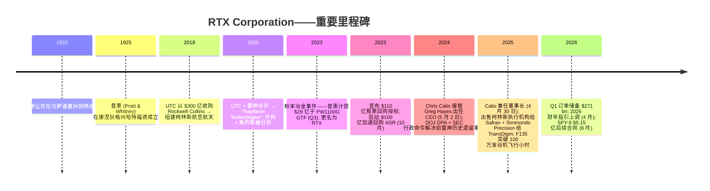
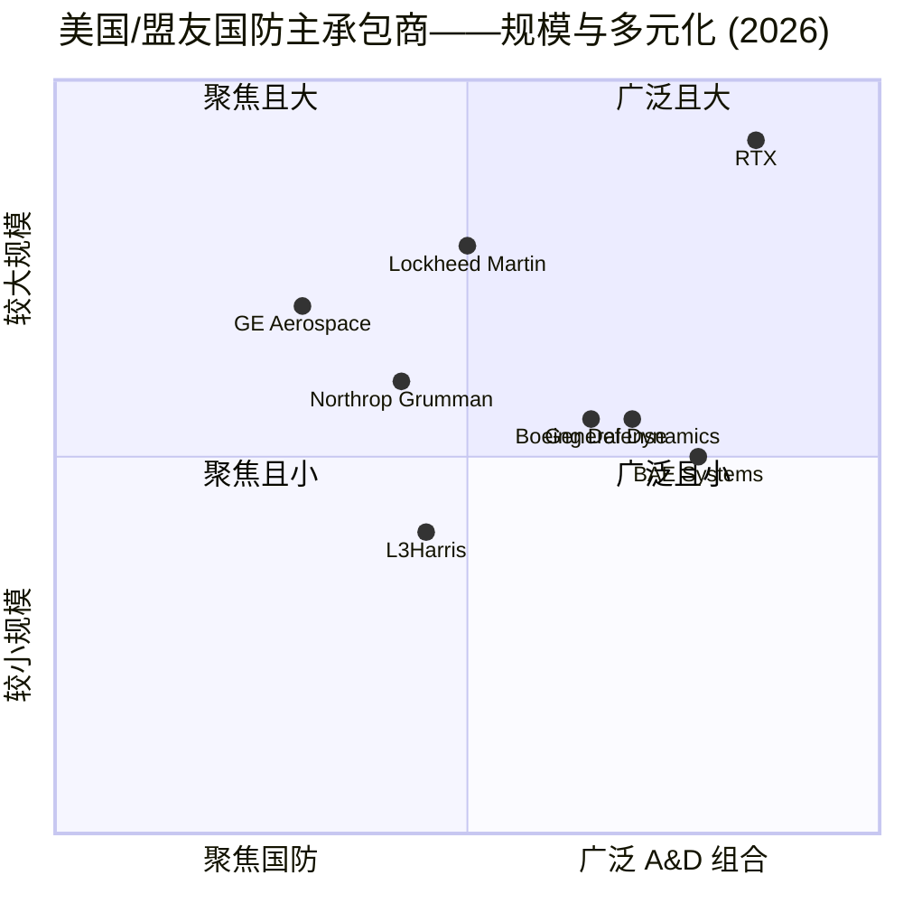
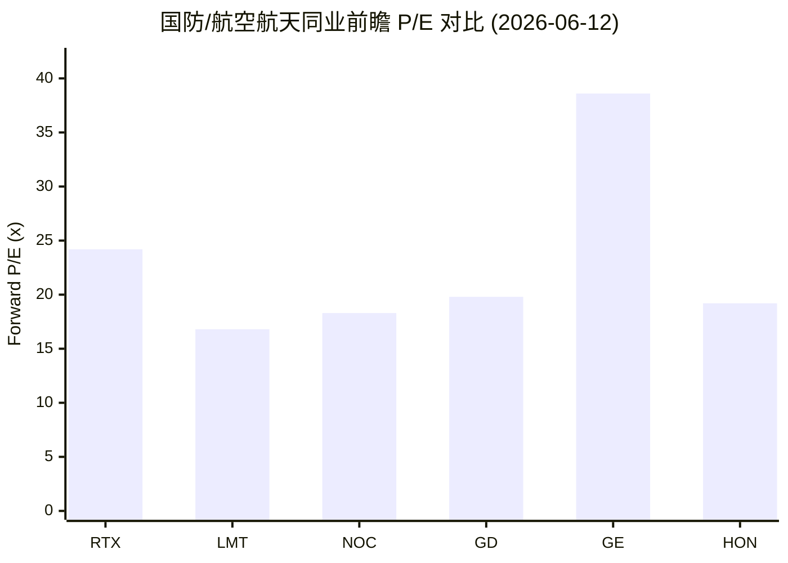
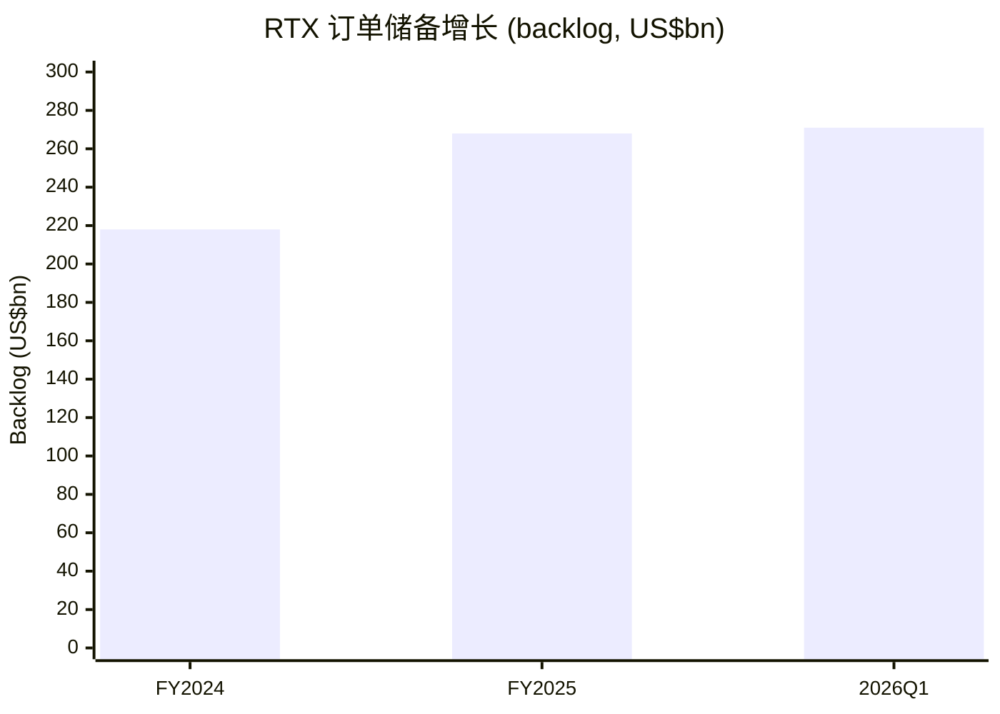

# RTX Corporation (NYSE:RTX) — 公司研究报告

**截至日期: 2026-06-14**
**上市地: 纽约证券交易所 (NYSE), 代码 RTX**
**注册地: 美国弗吉尼亚州阿灵顿 (Arlington, Virginia)**
**报告语言: 简体中文 (英文版同时存在于本目录)**

> *分析师观点：* **评级：Hold（中性 / Neutral）· 12 个月目标价 $200（较现价 $183.53 上行 +9%）· 估值方法：FY2027E adj EPS $7.70 × 26× P/E（对国防纯标的有溢价、对 GE Aerospace 有折价）**
> 市值 $247B · 52 周区间 $139.16–$211.28 · NYSE:RTX · 现价 $183.53（截至 2026-06-12）
>
> | 倍数 / Multiple（*分析师观点：* 前瞻列） | FY25A | FY26E | FY27E |
> |---|---|---|---|
> | P/E（adj EPS 基准） | 29.2× | 27.0× | 23.8× |
> | EV/EBITDA | 18.4× | ~16.5× | ~15.2× |
> | P/S | 2.79× | 2.66× | 2.48× |
> | FCF yield（自由现金流收益率） | 3.2% | 3.4% | 3.8% |
>
> 相对表现（截至 2026-06-12，来源 yfinance）：1M **+3.5%**（标普500 −0.2%，相对 **+3.7pp**）· 6M **+5.8%**（标普 +7.9%，相对 **−2.1pp**）· YTD **−1.3%**（标普 +8.4%，相对 **−9.7pp**）· 12M **+28.0%**（标普 +24.3%，相对 **+3.7pp**）。
>
> **核心论点（thesis pillars）**——（1）**双引擎增长确定性高**：国防超级周期 + 商用航空复苏共同驱动，订单储备 (backlog) 创纪录 $271B、订单出货比 (book-to-bill) 1.56；（2）**但估值已充分反映**——27× FY26E adj P/E，较国防纯标的（LMT 16.8× / GD 19.8× / NOC 18.3× 前瞻 P/E）溢价约 50%；（3）**GTF 粉末冶金 (Powder Metal Matter, PMM) 恢复在轨**（2026 Q1 AOG 停场群体环比 −15%），但仍是结构性声誉与现金尾部风险；（4）**自由现金流收益率仅 ~3.2%、低于 10Y 国债 4.54%**，回购授权仅剩 $0.6B，DCF（margin of safety ≈ −25%）不支持当前价——优质资产，但等更好入场点或 GTF/预算催化。

> **业绩更新——2026 财年指引上调 (2026-04-21):** 管理层上调全年调整后销售额 (adjusted sales) 指引至 **$92.5–93.5 bn**（此前 2026-01-27 公布的 $92.0–93.0 bn），调整后每股收益 (adjusted EPS) 上调至 **$6.70–6.90**（此前 $6.60–6.80），重申自由现金流 (FCF) $8.25–8.75 bn。本次上调发生于 2026 Q1 有机销售额 (organic sales) 增长 10%、调整后 EPS 增长 21% 之后，管理层将持续执行力与国防订单储备的全面强劲列为主要驱动。
> 来源: [RTX 2026 Q1 业绩公告, 2026-04-21](https://www.sec.gov/Archives/edgar/data/101829/000010182926000009/a2026-04x218xkerexhibit99.htm)。

## 目录

1. 公司概览（含投资论点导语 + 估值快照）
1A. 估值与目标价（前瞻盈利预测 · 目标价推导 · 牛/基/熊情景）
1B. GF Score（GuruFocus 风格基本面评分卡）
2. 公司历史
3. 管理团队
4. 产品与服务
5. 客户与上市策略
6. 行业概览
7. 竞争格局
8. 市场机会 (TAM)
9. 风险评估
9.5 关键争议与催化剂
10. 投资风格透视（投资者视角评分卡）
11. 参考资料

---

## 1. 公司概览

*分析师观点：* **核心判断——Hold（中性）。** RTX 是按营业收入计算全球最大的上市纯航空航天与国防 (A&D, Aerospace & Defense) 公司，同时拥有最难得的"国防 + 商用"双引擎组合：一边是受俄乌战争与印太威慑驱动的国防超级周期（订单储备 $271B、book-to-bill 1.56），一边是 GTF 粉末冶金事件结清后即将释放的商用售后市场复苏。问题不在于业务质量——业务质量极高——而在于**价格**：股票以 27× FY26E adj P/E 交易，较国防纯标的溢价约 50%，自由现金流收益率仅 3.2% 低于 10Y 国债 4.54%。换言之，市场已经把双引擎的好处定价了大部分。我们给予 Hold 评级、$200 目标价（+9%），并提示在 GTF AOG 进一步快速下降、或国防预算/回购授权催化出现时再加仓（见第 1A、9.5 章）。

RTX Corporation (NYSE: RTX) 是按营业收入计算**全球最大的上市纯航空航天与国防公司**，2025 财年净销售额 (net sales) 为 **$886.03 亿** ([RTX 2025 Form 10-K, Statements of Operations, p. 64](https://www.sec.gov/Archives/edgar/data/101829/000010182926000006/0000101829-26-000006-index.htm))。公司总部位于美国弗吉尼亚州阿灵顿，全球员工超过 180,000 人，几乎为西方世界所有商用与军用机型配套——要么作为发动机制造商、要么作为航空电子/系统供应商，或两者兼任——同时是美国多项关键空中防御系统（Patriot 爱国者、NASAMS 国家先进地空导弹系统、SM-3 标准 3 型导弹、AMRAAM 先进中程空空导弹、Tomahawk 战斧巡航导弹、SPY-6 雷达、LTAMDS 下层防空与导弹防御传感器）的唯一或近乎唯一供应商。

**经营模式 (business model)。** RTX 分为三个报告分部 (reportable segments)：**Collins Aerospace 柯林斯航空航天**（航电、内饰、电力系统、起落架）、**Pratt & Whitney 普惠**（大小型喷气发动机、F-35 的 F135 发动机、窄体客机 GTF 齿轮传动风扇发动机家族），以及 **Raytheon 雷神**（防空、导弹、雷达、海军系统、指挥控制）。2025 财年分部净销售额（含分部间）：柯林斯 $301.96 亿、普惠 $329.16 亿、雷神 $280.43 亿，分部经营利润 (segment operating profit) 合计 $107.46 亿 ([RTX 2025 Form 10-K, Note 18 Segment Information](https://www.sec.gov/Archives/edgar/data/101829/000010182926000006/0000101829-26-000006-index.htm))。约 **38% 的销售额直接卖给美国政府**（不含对外军售 FMS），低于 2023 财年的 46%；其余为商用 OE（原始设备）/售后市场加国际销售，2025 财年国际销售合计 **$413 亿（占净销售额 47%）**——为公司历史最高的国际占比 ([RTX 2025 Form 10-K, Note 18 — geography disaggregation](https://www.sec.gov/Archives/edgar/data/101829/000010182926000006/0000101829-26-000006-index.htm))。

各分部底层经济结构不同。柯林斯通过平衡的商用 OE + 售后市场"剃刀-刀片"模式产生现金（15 年平台合同 + 30 年以上备件与 MRO 维护）。普惠把这一模式推向极端——商用发动机往往以接近成本价售出，整个项目经济效益靠 20–30 年售后维护变现（这也是为何 PW1100G 上的粉末冶金召回给普惠造成如此大冲击：损失直接落在长期售后合同的完工时点估计 EAC 上）([RTX 2025 Form 10-K, Item 1 Business, pp. 4–6](https://www.sec.gov/Archives/edgar/data/101829/000010182926000006/0000101829-26-000006-index.htm))。雷神则是美国国防部 (DoD) 主承包商/独家供应商，通过长周期对外军售 (FMS) 合同向五角大楼、北约盟国、以色列、乌克兰、台湾、日本、韩国、澳大利亚供货 ([RTX 2025 Form 10-K, Item 1 Business, pp. 6–7](https://www.sec.gov/Archives/edgar/data/101829/000010182926000006/0000101829-26-000006-index.htm))。

**收入结构 / How RTX makes its money。** 下面的桑基图 (Sankey) 把 FY2025 利润表自左向右拆开：产品销售 $641.71 亿 + 服务销售 $244.32 亿 → 总净销售额 $886.03 亿 → 扣除销售成本 (COGS) $708.14 亿后毛利 (gross profit) $177.89 亿（毛利率 20.1%，A&D 行业产品销售成本占比天然高）→ 再扣 R&D $28.07 亿、SG&A $60.95 亿 → GAAP 经营利润 $93.00 亿 → 扣非经营性支出、税 $16.64 亿、少数股东权益 $3.37 亿 → 归属普通股东净利润 $67.32 亿。

<svg xmlns="http://www.w3.org/2000/svg" viewBox="0 0 1000 560" width="1000" height="560" role="img" aria-label="income statement Sankey"><rect x="0" y="0" width="1000" height="560" fill="#ffffff"/>
<text x="20.00" y="30.00" text-anchor="start" font-family="Helvetica,Arial,sans-serif" font-size="15" font-weight="700" fill="#1f2933">RTX 如何赚钱 / How RTX Makes Its Money — FY2025</text>
<path d="M 204.00,57.12 C 258.00,57.12 258.00,85.00 312.00,85.00 L 312.00,224.05 C 258.00,224.05 258.00,196.17 204.00,196.17 Z" fill="#93c5fd" fill-opacity="0.55"/>
<path d="M 452.00,78.00 C 506.00,78.00 506.00,240.09 560.00,240.09 L 560.00,282.92 C 506.00,282.92 506.00,120.82 452.00,120.82 Z" fill="#86efac" fill-opacity="0.55"/>
<path d="M 452.00,120.82 C 506.00,120.82 506.00,296.92 560.00,296.92 L 560.00,337.91 C 506.00,337.91 506.00,161.82 452.00,161.82 Z" fill="#fca5a5" fill-opacity="0.55"/>
<path d="M 328.00,85.00 C 382.00,85.00 382.00,78.00 436.00,78.00 L 436.00,159.91 C 382.00,159.91 382.00,166.91 328.00,166.91 Z" fill="#86efac" fill-opacity="0.55"/>
<path d="M 328.00,166.91 C 382.00,166.91 382.00,173.91 436.00,173.91 L 436.00,500.00 C 382.00,500.00 382.00,493.00 328.00,493.00 Z" fill="#fca5a5" fill-opacity="0.55"/>
<path d="M 204.00,210.17 C 258.00,210.17 258.00,224.05 312.00,224.05 L 312.00,375.62 C 258.00,375.62 258.00,361.74 204.00,361.74 Z" fill="#93c5fd" fill-opacity="0.55"/>
<path d="M 700.00,234.40 C 754.00,234.40 754.00,254.67 808.00,254.67 L 808.00,285.67 C 754.00,285.67 754.00,265.40 700.00,265.40 Z" fill="#86efac" fill-opacity="0.55"/>
<path d="M 700.00,265.40 C 754.00,265.40 754.00,299.67 808.00,299.67 L 808.00,307.33 C 754.00,307.33 754.00,273.06 700.00,273.06 Z" fill="#fca5a5" fill-opacity="0.55"/>
<path d="M 700.00,273.06 C 754.00,273.06 754.00,321.33 808.00,321.33 L 808.00,323.33 C 754.00,323.33 754.00,275.06 700.00,275.06 Z" fill="#fca5a5" fill-opacity="0.55"/>
<path d="M 576.00,240.09 C 630.00,240.09 630.00,234.40 684.00,234.40 L 684.00,277.22 C 630.00,277.22 630.00,282.92 576.00,282.92 Z" fill="#86efac" fill-opacity="0.55"/>
<path d="M 576.00,296.92 C 630.00,296.92 630.00,288.61 684.00,288.61 L 684.00,316.68 C 630.00,316.68 630.00,324.98 576.00,324.98 Z" fill="#fca5a5" fill-opacity="0.55"/>
<path d="M 576.00,324.98 C 630.00,324.98 630.00,330.68 684.00,330.68 L 684.00,343.60 C 630.00,343.60 630.00,337.91 576.00,337.91 Z" fill="#fca5a5" fill-opacity="0.55"/>
<path d="M 204.00,375.74 C 258.00,375.74 258.00,375.62 312.00,375.62 L 312.00,504.75 C 258.00,504.75 258.00,504.88 204.00,504.88 Z" fill="#93c5fd" fill-opacity="0.55"/>
<path d="M 204.00,518.88 C 258.00,518.88 258.00,504.75 312.00,504.75 L 312.00,506.75 C 258.00,506.75 258.00,520.88 204.00,520.88 Z" fill="#93c5fd" fill-opacity="0.55"/>
<rect x="188.00" y="57.12" width="16" height="139.05" rx="1.5" fill="#2563eb"/>
<rect x="188.00" y="210.17" width="16" height="151.57" rx="1.5" fill="#2563eb"/>
<rect x="188.00" y="375.74" width="16" height="129.13" rx="1.5" fill="#2563eb"/>
<rect x="188.00" y="518.88" width="16" height="2.00" rx="1.5" fill="#2563eb"/>
<rect x="312.00" y="85.00" width="16" height="408.00" rx="1.5" fill="#1e3a8a"/>
<rect x="436.00" y="78.00" width="16" height="81.91" rx="1.5" fill="#15803d"/>
<rect x="436.00" y="173.91" width="16" height="326.09" rx="1.5" fill="#dc2626"/>
<rect x="560.00" y="240.09" width="16" height="42.82" rx="1.5" fill="#15803d"/>
<rect x="560.00" y="296.92" width="16" height="40.99" rx="1.5" fill="#dc2626"/>
<rect x="684.00" y="234.40" width="16" height="40.21" rx="1.5" fill="#15803d"/>
<rect x="684.00" y="288.61" width="16" height="28.07" rx="1.5" fill="#dc2626"/>
<rect x="684.00" y="330.68" width="16" height="12.93" rx="1.5" fill="#dc2626"/>
<rect x="808.00" y="254.67" width="16" height="31.00" rx="1.5" fill="#15803d"/>
<rect x="808.00" y="299.67" width="16" height="7.66" rx="1.5" fill="#dc2626"/>
<rect x="808.00" y="321.33" width="16" height="2.00" rx="1.5" fill="#dc2626"/>
<line x1="188.00" y1="126.65" x2="182.00" y2="93.77" stroke="#cbd5e1" stroke-width="1"/>
<text x="179.00" y="96.77" text-anchor="end" font-family="Helvetica,Arial,sans-serif" font-size="11.5" font-weight="700" fill="#1f2933">Collins Aerospace</text>
<text x="179.00" y="109.77" text-anchor="end" font-family="Helvetica,Arial,sans-serif" font-size="10" font-weight="400" fill="#52606d">$30.2B  (34.1%)</text>
<line x1="188.00" y1="285.96" x2="182.00" y2="253.08" stroke="#cbd5e1" stroke-width="1"/>
<text x="179.00" y="256.08" text-anchor="end" font-family="Helvetica,Arial,sans-serif" font-size="11.5" font-weight="700" fill="#1f2933">Pratt &amp; Whitney</text>
<text x="179.00" y="269.08" text-anchor="end" font-family="Helvetica,Arial,sans-serif" font-size="10" font-weight="400" fill="#52606d">$32.9B  (37.1%)</text>
<line x1="188.00" y1="440.31" x2="182.00" y2="407.43" stroke="#cbd5e1" stroke-width="1"/>
<text x="179.00" y="410.43" text-anchor="end" font-family="Helvetica,Arial,sans-serif" font-size="11.5" font-weight="700" fill="#1f2933">Raytheon</text>
<text x="179.00" y="423.43" text-anchor="end" font-family="Helvetica,Arial,sans-serif" font-size="10" font-weight="400" fill="#52606d">$28.0B  (31.7%)</text>
<line x1="188.00" y1="519.88" x2="182.00" y2="487.00" stroke="#cbd5e1" stroke-width="1"/>
<text x="179.00" y="490.00" text-anchor="end" font-family="Helvetica,Arial,sans-serif" font-size="11.5" font-weight="700" fill="#1f2933">Eliminations</text>
<text x="179.00" y="503.00" text-anchor="end" font-family="Helvetica,Arial,sans-serif" font-size="10" font-weight="400" fill="#52606d">-$2.6B  (-2.9%)</text>
<rect x="331.00" y="67.00" width="106.80" height="26" rx="2" fill="#ffffff" fill-opacity="0.72"/>
<text x="334.00" y="79.00" text-anchor="start" font-family="Helvetica,Arial,sans-serif" font-size="11.5" font-weight="700" fill="#1f2933">Revenue</text>
<text x="334.00" y="92.00" text-anchor="start" font-family="Helvetica,Arial,sans-serif" font-size="10" font-weight="400" fill="#52606d">$88.6B  (100.0%)</text>
<rect x="455.00" y="60.00" width="100.50" height="26" rx="2" fill="#ffffff" fill-opacity="0.72"/>
<text x="458.00" y="72.00" text-anchor="start" font-family="Helvetica,Arial,sans-serif" font-size="11.5" font-weight="700" fill="#1f2933">Gross Profit</text>
<text x="458.00" y="85.00" text-anchor="start" font-family="Helvetica,Arial,sans-serif" font-size="10" font-weight="400" fill="#52606d">$17.8B  (20.1%)</text>
<rect x="455.00" y="155.91" width="144.60" height="26" rx="2" fill="#ffffff" fill-opacity="0.72"/>
<text x="458.00" y="167.91" text-anchor="start" font-family="Helvetica,Arial,sans-serif" font-size="11.5" font-weight="700" fill="#1f2933">Cost of Revenue (COGS)</text>
<text x="458.00" y="180.91" text-anchor="start" font-family="Helvetica,Arial,sans-serif" font-size="10" font-weight="400" fill="#52606d">$70.8B  (79.9%)</text>
<rect x="579.00" y="222.09" width="106.80" height="26" rx="2" fill="#ffffff" fill-opacity="0.72"/>
<text x="582.00" y="234.09" text-anchor="start" font-family="Helvetica,Arial,sans-serif" font-size="11.5" font-weight="700" fill="#1f2933">Operating Income</text>
<text x="582.00" y="247.09" text-anchor="start" font-family="Helvetica,Arial,sans-serif" font-size="10" font-weight="400" fill="#52606d">$9.3B  (10.5%)</text>
<rect x="579.00" y="278.92" width="150.90" height="26" rx="2" fill="#ffffff" fill-opacity="0.72"/>
<text x="582.00" y="290.92" text-anchor="start" font-family="Helvetica,Arial,sans-serif" font-size="11.5" font-weight="700" fill="#1f2933">Total Operating Expense</text>
<text x="582.00" y="303.92" text-anchor="start" font-family="Helvetica,Arial,sans-serif" font-size="10" font-weight="400" fill="#52606d">$8.9B  (10.0%)</text>
<rect x="703.00" y="216.40" width="87.90" height="26" rx="2" fill="#ffffff" fill-opacity="0.72"/>
<text x="706.00" y="228.40" text-anchor="start" font-family="Helvetica,Arial,sans-serif" font-size="11.5" font-weight="700" fill="#1f2933">Pretax Income</text>
<text x="706.00" y="241.40" text-anchor="start" font-family="Helvetica,Arial,sans-serif" font-size="10" font-weight="400" fill="#52606d">$8.7B  (9.9%)</text>
<rect x="703.00" y="270.61" width="87.90" height="26" rx="2" fill="#ffffff" fill-opacity="0.72"/>
<text x="706.00" y="282.61" text-anchor="start" font-family="Helvetica,Arial,sans-serif" font-size="11.5" font-weight="700" fill="#1f2933">SG&amp;A</text>
<text x="706.00" y="295.61" text-anchor="start" font-family="Helvetica,Arial,sans-serif" font-size="10" font-weight="400" fill="#52606d">$6.1B  (6.9%)</text>
<rect x="703.00" y="312.68" width="87.90" height="26" rx="2" fill="#ffffff" fill-opacity="0.72"/>
<text x="706.00" y="324.68" text-anchor="start" font-family="Helvetica,Arial,sans-serif" font-size="11.5" font-weight="700" fill="#1f2933">R&amp;D</text>
<text x="706.00" y="337.68" text-anchor="start" font-family="Helvetica,Arial,sans-serif" font-size="10" font-weight="400" fill="#52606d">$2.8B  (3.2%)</text>
<text x="833.00" y="267.17" text-anchor="start" font-family="Helvetica,Arial,sans-serif" font-size="11.5" font-weight="700" fill="#1f2933">Net Income</text>
<text x="833.00" y="280.17" text-anchor="start" font-family="Helvetica,Arial,sans-serif" font-size="10" font-weight="400" fill="#52606d">$6.7B  (7.6%)</text>
<text x="833.00" y="300.50" text-anchor="start" font-family="Helvetica,Arial,sans-serif" font-size="11.5" font-weight="700" fill="#1f2933">Income Tax</text>
<text x="833.00" y="313.50" text-anchor="start" font-family="Helvetica,Arial,sans-serif" font-size="10" font-weight="400" fill="#52606d">$1.7B  (1.9%)</text>
<text x="833.00" y="325.50" text-anchor="start" font-family="Helvetica,Arial,sans-serif" font-size="11.5" font-weight="700" fill="#1f2933">Minority Interest</text>
<text x="833.00" y="338.50" text-anchor="start" font-family="Helvetica,Arial,sans-serif" font-size="10" font-weight="400" fill="#52606d">$337.0M  (0.38%)</text>
<text x="500.00" y="544.00" text-anchor="middle" font-family="Helvetica,Arial,sans-serif" font-size="10" font-weight="400" fill="#52606d">Source: RTX FY2025 10-K (filed 2026-02-11), Consolidated Statements of Operations + Note 18 Segments</text>
</svg>

来源 / Source: [RTX FY2025 10-K, Consolidated Statements of Operations + Note 18 Segments, pp. 64–65](https://www.sec.gov/Archives/edgar/data/101829/000010182926000006/0000101829-26-000006-index.htm)。

普惠已超过柯林斯成为第一大分部，雷神最小但利润率最稳（下方分部销售额甜甜圈图）。

<svg xmlns="http://www.w3.org/2000/svg" viewBox="0 0 720 460" width="720" height="460" role="img" aria-label="revenue donut"><rect x="0" y="0" width="720" height="460" fill="#ffffff"/>
<text x="20.00" y="30.00" text-anchor="start" font-family="Helvetica,Arial,sans-serif" font-size="15" font-weight="700" fill="#1f2933">FY2025 分部销售额 / Net Sales by Segment (incl. intersegment)</text>
<path d="M 288.00,107.20 A 132 132 0 0 1 389.12,324.04 L 347.76,289.33 A 78 78 0 0 0 288.00,161.20 Z" fill="#2563eb"/>
<path d="M 389.12,324.04 A 132 132 0 0 1 164.56,285.97 L 215.06,266.84 A 78 78 0 0 0 347.76,289.33 Z" fill="#15803d"/>
<path d="M 164.56,285.97 A 132 132 0 0 1 288.00,107.20 L 288.00,161.20 A 78 78 0 0 0 215.06,266.84 Z" fill="#d97706"/>
<text x="288.00" y="235.20" text-anchor="middle" font-family="Helvetica,Arial,sans-serif" font-size="18" font-weight="800" fill="#1f2933">RTX</text>
<text x="288.00" y="255.20" text-anchor="middle" font-family="Helvetica,Arial,sans-serif" font-size="13" font-weight="600" fill="#52606d">$91.2B</text>
<text x="288.00" y="271.20" text-anchor="middle" font-family="Helvetica,Arial,sans-serif" font-size="10" font-weight="400" fill="#8a97a3">total</text>
<line x1="413.07" y1="180.87" x2="429.07" y2="180.87" stroke="#2563eb" stroke-width="1.4"/>
<text x="433.07" y="178.87" text-anchor="start" font-family="Helvetica,Arial,sans-serif" font-size="11" font-weight="700" fill="#1f2933">Pratt &amp; Whitney</text>
<text x="433.07" y="192.87" text-anchor="start" font-family="Helvetica,Arial,sans-serif" font-size="10" font-weight="400" fill="#52606d">$32.9B  (36.1%)</text>
<line x1="264.93" y1="375.26" x2="248.93" y2="375.26" stroke="#15803d" stroke-width="1.4"/>
<text x="244.93" y="373.26" text-anchor="end" font-family="Helvetica,Arial,sans-serif" font-size="11" font-weight="700" fill="#1f2933">Collins Aerospace</text>
<text x="244.93" y="387.26" text-anchor="end" font-family="Helvetica,Arial,sans-serif" font-size="10" font-weight="400" fill="#52606d">$30.2B  (33.1%)</text>
<line x1="174.44" y1="160.79" x2="158.44" y2="160.79" stroke="#d97706" stroke-width="1.4"/>
<text x="154.44" y="158.79" text-anchor="end" font-family="Helvetica,Arial,sans-serif" font-size="11" font-weight="700" fill="#1f2933">Raytheon</text>
<text x="154.44" y="172.79" text-anchor="end" font-family="Helvetica,Arial,sans-serif" font-size="10" font-weight="400" fill="#52606d">$28.0B  (30.8%)</text>
<text x="360.00" y="444.00" text-anchor="middle" font-family="Helvetica,Arial,sans-serif" font-size="10" font-weight="400" fill="#52606d">Source: RTX FY2025 10-K, Note 18 Segment Information</text>
</svg>

来源 / Source: [RTX FY2025 10-K, Note 18 Segment Information](https://www.sec.gov/Archives/edgar/data/101829/000010182926000006/0000101829-26-000006-index.htm)。

**规模与增长。** 2025 财年净销售额同比 **+10%（报告口径）/ +11%（有机）**，三大分部全部贡献——柯林斯 +7%、普惠 +17%、雷神 +5% ([RTX 2025 Form 10-K, MD&A, p. 41](https://www.sec.gov/Archives/edgar/data/101829/000010182926000006/0000101829-26-000006-index.htm))。普惠超额增长部分是正常化效应（2023 财年销售额因 PMM 被压低 $54 亿），但 2024–25 底层增长确实强劲。截至 2025 年末**订单储备 (backlog) 达 $268 bn**（高于 2024 年末 $218 bn），其中商用 $161 bn、国防 $107 bn，管理层披露约 25% 将在未来 12 个月内确认为收入 ([RTX 2025 Form 10-K, MD&A — Backlog, p. 6](https://www.sec.gov/Archives/edgar/data/101829/000010182926000006/0000101829-26-000006-index.htm))。2025 财年 book-to-bill 1.56 创历史纪录；2026 Q1 末订单储备进一步增至 **$271 bn**（商用 $162 bn + 国防 $109 bn）([RTX 2026 Q1 业绩公告, 2026-04-21](https://www.sec.gov/Archives/edgar/data/101829/000010182926000009/a2026-04x218xkerexhibit99.htm))。

**FY2025 关键财务（单位：十亿美元）：** 净销售额 88.6；GAAP 经营利润 9.30（利润率 10.5%）、分部经营利润 10.7；归属普通股东 GAAP 净利润 6.73；GAAP 摊薄 EPS $4.96，调整后 EPS (adjusted EPS) $6.29（同比 +10%）；经营性现金流 (OCF) 10.57、资本开支 (capex) 2.63 → 自由现金流 (FCF) 7.94（同比 +75%，FY2024 为 4.5）([RTX 2025 Q4 业绩公告, 2026-01-27](https://www.sec.gov/Archives/edgar/data/101829/000010182926000003/a2026-01x278xkerexhibit99.htm); [RTX 2025 Form 10-K, Statements of Cash Flows](https://www.sec.gov/Archives/edgar/data/101829/000010182926000006/0000101829-26-000006-index.htm))。

**估值快照 (valuation snapshot，截至 2026-06-12)。** RTX 现价约 **$183.53**、市值约 **$247 bn** ([Yahoo Finance — RTX, 2026-06-12](https://finance.yahoo.com/quote/RTX/key-statistics/))。按 TTM 估算：**P/E ~34.5×**、**前瞻 P/E ~24.2×**、**P/S ~2.73×**、**EV/EBITDA ~18.4×**、**股息收益率约 1.51%**（年化股息 $2.72，2026 年 2 月董事会宣布季度股息 $0.68/股，同比 +7.9%）([Yahoo Finance — RTX key statistics, 2026-06-12](https://finance.yahoo.com/quote/RTX/key-statistics/); [RTX 2025 Form 10-K, MD&A — dividends, p. 53](https://www.sec.gov/Archives/edgar/data/101829/000010182926000006/0000101829-26-000006-index.htm))。

相对国防同业，RTX 估值溢价显著：前瞻 P/E **LMT 洛克希德马丁 16.8× · GD 通用动力 19.8× · NOC 诺斯罗普格鲁曼 18.3× · GE Aerospace 通用电气航空 38.6× · Boeing 波音 不适用（TTM 亏损）** ([Yahoo Finance — peer key statistics, 2026-06-12](https://finance.yahoo.com/quote/RTX/key-statistics/))。国防纯标的（LMT/NOC/GD）前瞻 P/E 中位数约 18×，RTX 高出约 35–50%。**该溢价可识别而非难以解释**——反映：(a) RTX 较大的商用航空敞口（柯林斯 + 普惠商用合计 FY2025 商用收入超 $300 亿，结构性增长高于纯国防）；(b) GTF 粉末冶金事件结清后的恢复性顺风；(c) 对 GE Aerospace 的部分代理效应——后者交易于 38.6× 并作为发动机售后市场对标。但 **TTM P/E 34.5× 已位于 RTX 三年区间高端，FCF 收益率 3.2% 低于 10Y 国债**——这正是我们给 Hold 而非 Buy 的核心理由（详见第 1A 与第 9 章估值/倍数压缩风险）。

**市净率 (P/B) 对 RTX 参考意义不大**——历次并购（Rockwell Collins、Goodrich、雷神）形成大量无形资产，**商誉 (goodwill) $533.43 亿 + 无形资产 (intangibles) $318.45 亿，合计约 $852 亿**（占总资产一半）([RTX 2025 Form 10-K, Consolidated Balance Sheets](https://www.sec.gov/Archives/edgar/data/101829/000010182926000006/0000101829-26-000006-index.htm))。EV/EBITDA 18.4× 位于 LMT (~18×) 与 GE Aerospace (~33×) 之间，与"国防 + 发动机 OEM"组合定位一致 ([Yahoo Finance — RTX/GE/LMT, 2026-06-12](https://finance.yahoo.com/quote/RTX/key-statistics/))。

---

## 1A. 估值与目标价

> *分析师观点：本章所有前瞻数字、目标价与情景目标价均为分析师本人观点，不附任何 filing 引用（10-K 不含目标价）。每条预测的外部输入（filing 分部数据 + 管理层指引 + 行业预测）在文中标注来源。*

### (a) 前瞻盈利预测（FY26–28E）

我们按分部分别建模（柯林斯利润率持续扩张、普惠靠 GTF 正常化修复、雷神靠国防订单放量），再加总。FY26 直接采用管理层指引中点，FY27–28 为我们的外推。

| 指标（*分析师观点：*） | FY24A | FY25A | FY26E | FY27E | FY28E | CAGR(25→28) |
|---|---|---|---|---|---|---|
| 净销售额 (Revenue, $bn) | 80.7 | 88.6 | 93.0 | 99.5 | 105.5 | +6.0% |
| — YoY % | | +10% | +5% | +7% | +6% | |
| 分部经营利润率 (segment OM %) | 10.8% | 12.1% | 12.6% | 13.2% | 13.6% | |
| 调整后 EPS (adj EPS, $) | 5.73 | 6.29 | 6.80 | 7.70 | 8.65 | +11.2% |
| — YoY % | | +10% | +8% | +13% | +12% | |
| 自由现金流 (FCF, $bn) | 4.5 | 7.9 | 8.5 | 9.5 | 10.5 | |
| FCF 收益率 (yield) | 1.8% | 3.2% | 3.4% | 3.8% | 4.3% | |
| 净债务 (net debt, $bn) | ~33 | 30.5 | ~27 | ~22 | ~16 | |
| ROIC（est） | ~7% | ~8% | ~8.5% | ~9.5% | ~10.5% | |

各预测的外部输入：FY24/FY25 实际来自 [RTX 2025 Q4 业绩公告](https://www.sec.gov/Archives/edgar/data/101829/000010182926000003/a2026-01x278xkerexhibit99.htm) 与 [10-K](https://www.sec.gov/Archives/edgar/data/101829/000010182926000006/0000101829-26-000006-index.htm)；FY2026E 锚定管理层指引（销售 $92.5–93.5 bn、adj EPS $6.70–6.90、FCF $8.25–8.75 bn）([RTX 2026 Q1 业绩公告, 2026-04-21](https://www.sec.gov/Archives/edgar/data/101829/000010182926000009/a2026-04x218xkerexhibit99.htm))；FY27–28E 增长由记录订单储备 $271 bn 与 25% 当年转化率（[10-K, p. 6](https://www.sec.gov/Archives/edgar/data/101829/000010182926000006/0000101829-26-000006-index.htm)）、国防超级周期（[J.P. Morgan, 2026-06-08](http://xs-macbook-air.local:5001/zsxq/pdf/814528415518812/J.P.%20Morgan-One%20battle%20after%20another%EF%BC%9ARevamping%20the%20U.S.%20defense%20industrial%20base-260608.pdf)，*分析师观点：*）与 GTF 售后正常化共同支撑。

**利润率桥 (margin bridge)，FY25→FY26E（*分析师观点：*）：** 分部经营利润率 +50bps ≈ 柯林斯组合优化与售后占比上升 +35bps · 普惠 GTF 进厂维护正常化（OE 占比下降、aftermarket 占比上升）+40bps · 雷神放量经营杠杆 +20bps · 关税逆风 (tariff headwind) −35bps · 收购会计摊销持平。其中关税拖累在 FY2025 与 2026 Q1 均被管理层明确点名 ([RTX 2026 DEF 14A, p. 53](https://www.sec.gov/Archives/edgar/data/101829/000130817926000036/0001308179-26-000036-index.htm))。

### (b) 目标价推导（show the arithmetic）

**方法：前瞻 P/E × 目标倍数。** `FY2027E adj EPS $7.70 × 26× = $200`（12 个月目标价，较现价 $183.53 上行 +9%）。

**26× 倍数的依据（与 3–5 个可比公司对照）：** 国防纯标的前瞻 P/E——LMT 16.8×、GD 19.8×、NOC 18.3×（中位数约 18×）；发动机 OEM 对标 GE Aerospace 38.6× ([Yahoo Finance, 2026-06-12](https://finance.yahoo.com/quote/RTX/key-statistics/))。RTX 介于两者之间：约 35% 商用敞口 + GTF 售后市场拐点 + 记录订单储备，使其**理应较国防纯标的有溢价**；但 ROIC 仅约 8%（≈ WACC）、PMM 遗留拖累、$852 亿商誉/无形资产稀释回报，又使其**应较 GE Aerospace 有折价**。26× 落在 LMT/GD/NOC 中位数（18×）与 GE（38.6×）之间偏中性的位置，且与 RTX 自身前瞻 P/E 24.2× 当前水平接轨——即我们不假设大幅重估。

我们也用 5 步 DuPont 框架交叉验证回报质量：FY2025 ROE 10.7% = 净利率 7.6% × 资产周转 0.53 × 权益乘数 2.66。回报偏低是收购无形资产稀释资产周转所致，而非盈利能力差——这正是估值不应给到 GE 级别倍数的量化理由。

<svg xmlns="http://www.w3.org/2000/svg" viewBox="0 0 1240 540" width="1240" height="540" role="img" aria-label="DuPont ROE decomposition"><rect x="0" y="0" width="1240" height="540" fill="#ffffff"/>
<text x="20.00" y="30.00" text-anchor="start" font-family="Helvetica,Arial,sans-serif" font-size="15" font-weight="700" fill="#1f2933">5-Step DuPont Decomposition of Return on Equity (ROE)</text>
<rect x="545.00" y="56.00" width="150" height="56" rx="7" fill="#1e3a8a"/>
<text x="620.00" y="76.00" text-anchor="middle" font-family="Helvetica,Arial,sans-serif" font-size="11.5" font-weight="700" fill="#ffffff">ROE</text>
<text x="620.00" y="94.00" text-anchor="middle" font-family="Helvetica,Arial,sans-serif" font-size="13" font-weight="800" fill="#ffffff">10.74%</text>
<text x="620.00" y="106.00" text-anchor="middle" font-family="Helvetica,Arial,sans-serif" font-size="8.5" font-weight="400" fill="#dbeafe">= Net Income / Avg Equity</text>
<rect x="191.60" y="168.00" width="150" height="56" rx="7" fill="#2563eb"/>
<text x="266.60" y="188.00" text-anchor="middle" font-family="Helvetica,Arial,sans-serif" font-size="11.5" font-weight="700" fill="#ffffff">Net Margin</text>
<text x="266.60" y="206.00" text-anchor="middle" font-family="Helvetica,Arial,sans-serif" font-size="13" font-weight="800" fill="#ffffff">7.60%</text>
<text x="266.60" y="218.00" text-anchor="middle" font-family="Helvetica,Arial,sans-serif" font-size="8.5" font-weight="400" fill="#dbeafe">Net Income / Revenue</text>
<line x1="620.00" y1="112.00" x2="266.60" y2="168.00" stroke="#94a3b8" stroke-width="1.4"/>
<rect x="545.00" y="168.00" width="150" height="56" rx="7" fill="#2563eb"/>
<text x="620.00" y="188.00" text-anchor="middle" font-family="Helvetica,Arial,sans-serif" font-size="11.5" font-weight="700" fill="#ffffff">Asset Turnover</text>
<text x="620.00" y="206.00" text-anchor="middle" font-family="Helvetica,Arial,sans-serif" font-size="13" font-weight="800" fill="#ffffff">0.53</text>
<text x="620.00" y="218.00" text-anchor="middle" font-family="Helvetica,Arial,sans-serif" font-size="8.5" font-weight="400" fill="#dbeafe">Revenue / Avg Assets</text>
<line x1="620.00" y1="112.00" x2="620.00" y2="168.00" stroke="#94a3b8" stroke-width="1.4"/>
<rect x="898.40" y="168.00" width="150" height="56" rx="7" fill="#2563eb"/>
<text x="973.40" y="188.00" text-anchor="middle" font-family="Helvetica,Arial,sans-serif" font-size="11.5" font-weight="700" fill="#ffffff">Equity Multiplier</text>
<text x="973.40" y="206.00" text-anchor="middle" font-family="Helvetica,Arial,sans-serif" font-size="13" font-weight="800" fill="#ffffff">2.66</text>
<text x="973.40" y="218.00" text-anchor="middle" font-family="Helvetica,Arial,sans-serif" font-size="8.5" font-weight="400" fill="#dbeafe">Avg Assets / Avg Equity</text>
<line x1="620.00" y1="112.00" x2="973.40" y2="168.00" stroke="#94a3b8" stroke-width="1.4"/>
<circle cx="443.30" cy="196.00" r="11" fill="#ffffff" stroke="#94a3b8" stroke-width="1.2"/>
<text x="443.30" y="201.00" text-anchor="middle" font-family="Helvetica,Arial,sans-serif" font-size="14" font-weight="800" fill="#52606d">×</text>
<circle cx="796.70" cy="196.00" r="11" fill="#ffffff" stroke="#94a3b8" stroke-width="1.2"/>
<text x="796.70" y="201.00" text-anchor="middle" font-family="Helvetica,Arial,sans-serif" font-size="14" font-weight="800" fill="#52606d">×</text>
<rect x="65.00" y="300.00" width="118" height="56" rx="7" fill="#2563eb"/>
<text x="124.00" y="320.00" text-anchor="middle" font-family="Helvetica,Arial,sans-serif" font-size="11.5" font-weight="700" fill="#ffffff">Operating Margin</text>
<text x="124.00" y="338.00" text-anchor="middle" font-family="Helvetica,Arial,sans-serif" font-size="13" font-weight="800" fill="#ffffff">10.50%</text>
<text x="124.00" y="350.00" text-anchor="middle" font-family="Helvetica,Arial,sans-serif" font-size="8.5" font-weight="400" fill="#dbeafe">Op Inc / Revenue</text>
<line x1="266.60" y1="224.00" x2="124.00" y2="300.00" stroke="#94a3b8" stroke-width="1.4"/>
<rect x="207.60" y="300.00" width="118" height="56" rx="7" fill="#2563eb"/>
<text x="266.60" y="320.00" text-anchor="middle" font-family="Helvetica,Arial,sans-serif" font-size="11.5" font-weight="700" fill="#ffffff">Tax Burden</text>
<text x="266.60" y="338.00" text-anchor="middle" font-family="Helvetica,Arial,sans-serif" font-size="13" font-weight="800" fill="#ffffff">0.7709</text>
<text x="266.60" y="350.00" text-anchor="middle" font-family="Helvetica,Arial,sans-serif" font-size="8.5" font-weight="400" fill="#dbeafe">Net Inc / Pretax</text>
<line x1="266.60" y1="224.00" x2="266.60" y2="300.00" stroke="#94a3b8" stroke-width="1.4"/>
<rect x="350.20" y="300.00" width="118" height="56" rx="7" fill="#2563eb"/>
<text x="409.20" y="320.00" text-anchor="middle" font-family="Helvetica,Arial,sans-serif" font-size="11.5" font-weight="700" fill="#ffffff">Interest Burden</text>
<text x="409.20" y="338.00" text-anchor="middle" font-family="Helvetica,Arial,sans-serif" font-size="13" font-weight="800" fill="#ffffff">0.9390</text>
<text x="409.20" y="350.00" text-anchor="middle" font-family="Helvetica,Arial,sans-serif" font-size="8.5" font-weight="400" fill="#dbeafe">Pretax / Op Inc</text>
<line x1="266.60" y1="224.00" x2="409.20" y2="300.00" stroke="#94a3b8" stroke-width="1.4"/>
<circle cx="195.30" cy="328.00" r="11" fill="#ffffff" stroke="#94a3b8" stroke-width="1.2"/>
<text x="195.30" y="333.00" text-anchor="middle" font-family="Helvetica,Arial,sans-serif" font-size="14" font-weight="800" fill="#52606d">×</text>
<circle cx="337.90" cy="328.00" r="11" fill="#ffffff" stroke="#94a3b8" stroke-width="1.2"/>
<text x="337.90" y="333.00" text-anchor="middle" font-family="Helvetica,Arial,sans-serif" font-size="14" font-weight="800" fill="#52606d">×</text>
<rect x="479.00" y="300.00" width="118" height="56" rx="7" fill="#2563eb"/>
<text x="538.00" y="326.00" text-anchor="middle" font-family="Helvetica,Arial,sans-serif" font-size="11.5" font-weight="700" fill="#ffffff">Revenue</text>
<text x="538.00" y="342.00" text-anchor="middle" font-family="Helvetica,Arial,sans-serif" font-size="13" font-weight="800" fill="#ffffff">$88.6B</text>
<line x1="620.00" y1="224.00" x2="538.00" y2="300.00" stroke="#94a3b8" stroke-width="1.4"/>
<rect x="643.00" y="300.00" width="118" height="56" rx="7" fill="#2563eb"/>
<text x="702.00" y="320.00" text-anchor="middle" font-family="Helvetica,Arial,sans-serif" font-size="11.5" font-weight="700" fill="#ffffff">Avg Total Assets</text>
<text x="702.00" y="338.00" text-anchor="middle" font-family="Helvetica,Arial,sans-serif" font-size="13" font-weight="800" fill="#ffffff">$167.0B</text>
<text x="702.00" y="350.00" text-anchor="middle" font-family="Helvetica,Arial,sans-serif" font-size="8.5" font-weight="400" fill="#dbeafe">(begin+end)/2</text>
<line x1="620.00" y1="224.00" x2="702.00" y2="300.00" stroke="#94a3b8" stroke-width="1.4"/>
<circle cx="620.00" cy="328.00" r="11" fill="#ffffff" stroke="#94a3b8" stroke-width="1.2"/>
<text x="620.00" y="333.00" text-anchor="middle" font-family="Helvetica,Arial,sans-serif" font-size="14" font-weight="800" fill="#52606d">÷</text>
<rect x="832.40" y="300.00" width="118" height="56" rx="7" fill="#2563eb"/>
<text x="891.40" y="320.00" text-anchor="middle" font-family="Helvetica,Arial,sans-serif" font-size="11.5" font-weight="700" fill="#ffffff">Avg Total Assets</text>
<text x="891.40" y="338.00" text-anchor="middle" font-family="Helvetica,Arial,sans-serif" font-size="13" font-weight="800" fill="#ffffff">$167.0B</text>
<text x="891.40" y="350.00" text-anchor="middle" font-family="Helvetica,Arial,sans-serif" font-size="8.5" font-weight="400" fill="#dbeafe">(begin+end)/2</text>
<line x1="973.40" y1="224.00" x2="891.40" y2="300.00" stroke="#94a3b8" stroke-width="1.4"/>
<rect x="996.40" y="300.00" width="118" height="56" rx="7" fill="#2563eb"/>
<text x="1055.40" y="320.00" text-anchor="middle" font-family="Helvetica,Arial,sans-serif" font-size="11.5" font-weight="700" fill="#ffffff">Avg Total Equity</text>
<text x="1055.40" y="338.00" text-anchor="middle" font-family="Helvetica,Arial,sans-serif" font-size="13" font-weight="800" fill="#ffffff">$62.7B</text>
<text x="1055.40" y="350.00" text-anchor="middle" font-family="Helvetica,Arial,sans-serif" font-size="8.5" font-weight="400" fill="#dbeafe">(begin+end)/2</text>
<line x1="973.40" y1="224.00" x2="1055.40" y2="300.00" stroke="#94a3b8" stroke-width="1.4"/>
<circle cx="967.20" cy="328.00" r="11" fill="#ffffff" stroke="#94a3b8" stroke-width="1.2"/>
<text x="967.20" y="333.00" text-anchor="middle" font-family="Helvetica,Arial,sans-serif" font-size="14" font-weight="800" fill="#52606d">÷</text>
<rect x="69.00" y="420.00" width="110" height="48" rx="7" fill="#3b82f6"/>
<text x="124.00" y="442.00" text-anchor="middle" font-family="Helvetica,Arial,sans-serif" font-size="11.5" font-weight="700" fill="#ffffff">Operating Income</text>
<text x="124.00" y="458.00" text-anchor="middle" font-family="Helvetica,Arial,sans-serif" font-size="13" font-weight="800" fill="#ffffff">$9.3B</text>
<line x1="124.00" y1="356.00" x2="124.00" y2="420.00" stroke="#94a3b8" stroke-width="1.4"/>
<rect x="211.60" y="420.00" width="110" height="48" rx="7" fill="#3b82f6"/>
<text x="266.60" y="442.00" text-anchor="middle" font-family="Helvetica,Arial,sans-serif" font-size="11.5" font-weight="700" fill="#ffffff">Net Income</text>
<text x="266.60" y="458.00" text-anchor="middle" font-family="Helvetica,Arial,sans-serif" font-size="13" font-weight="800" fill="#ffffff">$6.7B</text>
<line x1="266.60" y1="356.00" x2="266.60" y2="420.00" stroke="#94a3b8" stroke-width="1.4"/>
<rect x="354.20" y="420.00" width="110" height="48" rx="7" fill="#3b82f6"/>
<text x="409.20" y="442.00" text-anchor="middle" font-family="Helvetica,Arial,sans-serif" font-size="11.5" font-weight="700" fill="#ffffff">Pretax Income</text>
<text x="409.20" y="458.00" text-anchor="middle" font-family="Helvetica,Arial,sans-serif" font-size="13" font-weight="800" fill="#ffffff">$8.7B</text>
<line x1="409.20" y1="356.00" x2="409.20" y2="420.00" stroke="#94a3b8" stroke-width="1.4"/>
<text x="620.00" y="524.00" text-anchor="middle" font-family="Helvetica,Arial,sans-serif" font-size="10" font-weight="400" fill="#52606d">Source: RTX FY2025 10-K, Statements of Operations + Balance Sheets</text>
</svg>

来源 / Source: [RTX FY2025 10-K, Statements of Operations + Balance Sheets](https://www.sec.gov/Archives/edgar/data/101829/000010182926000006/0000101829-26-000006-index.htm)。

### (c) 牛 / 基 / 熊情景

| 情景（*分析师观点：*） | 关键假设 | 目标价 | 较现价 |
|---|---|---|---|
| 牛市 Bull | GTF AOG 快速清零 + 回购重启 + 28.5× × FY27E $8.00 | **$228** | **+24%** |
| 基准 Base | 中性预测，26× × FY27E $7.70 | **$200** | **+9%** |
| 熊市 Bear | 国防 book-to-bill 回落至 1.0×、GTF 恢复停滞，倍数压缩至 20× × $7.50 | **$150** | **−18%** |

风险回报对称——上行 +24% / 下行 −18%，且基准 +9% 提供的安全边际有限，符合 Hold 定位。

### (d) 与市场一致预期的对比 (vs consensus)

卖方对 RTX 共识为"买入" (Buy)（约 22–30 名分析师中 15 买入、8 持有、0 卖出），平均 12 个月目标价约 **$210–215**（高 $242 / 低 $180），FY2026 共识 adj EPS **$6.83** ([stockanalysis.com — RTX forecast, 2026-06](https://stockanalysis.com/stocks/rtx/forecast/))。我们的 FY26E $6.80 与共识基本一致，但**基准目标价 $200 较 Street 平均低约 5%**——分歧主要在目标倍数（我们 26× vs 隐含约 27–31×），即我们对"GTF 快速恢复 + 回购重启"持更谨慎态度，把这一情形放进牛市而非基准。

伯恩斯坦 (Bernstein) 在 2026 年 6 月战略决策会议纪要中对 RTX 的现场反馈印证了基本面强劲：*分析师观点：* "导弹框架协议 7 年期、追加 150 家供应商；GTF AOG 持续改善、MRO 产出同比 +23%；柯林斯售后占比高、下一代平台份额提升" ([Bernstein — Global Aerospace & Defense: Twelve CEOs in three days, 2026-06-02](http://xs-macbook-air.local:5001/zsxq/pdf/812485114412812/Bernstein-Global%20Aerospace%20%26%20Defense%EF%BC%9AAerospace%20%26%20Defense%EF%BC%9A%20Twelve%20CEOs%20in%20three%20days~A%26D%20themes%20from%20Bernstein%27s%20Strategic%20Decisions%20Conference-260602.pdf))。

### (e) 最该盯紧的变量（swing variables）

1. **GTF AOG（停场群体）下降速度**——直接决定普惠售后利润率、FCF 与航司未来发动机选型时的声誉份额。2026 Q1 已 −15% QoQ ([FlightGlobal, 2026-04](https://www.flightglobal.com/engines/2026/04/rtx-says-gtf-groundings-are-coming-down-thanks-to-maintenance-ramp/))，但任何停滞都会同时打击盈利预测与估值倍数。
2. **国防订单 book-to-bill 能否维持 >1.2×**——这是支撑估值溢价的需求信号；一旦地缘缓和使其回落至 1.0×，倍数将向国防纯标的中位数（18×）压缩，对应熊市情景。

### (f) 卖方观点说明（sell-side note）

本报告引用的两份 zsxq 机构研报（伯恩斯坦 A&D 会议纪要、摩根大通国防工业基础专题）均为**行业/主题级研报**，将 RTX 作为板块龙头之一讨论，**未给出 RTX 单独的评级与目标价**；`db/stock_price_target.db` 中亦无 RTX 单名 PT 行（read-only 预检确认）。因此不构成可建立"按机构观点时间线/分歧表"的单名覆盖，本报告仅以 *分析师观点：* 形式引用其对 RTX 的定性反馈与行业判断（见第 1A(d)、6、9 章），不拼凑虚假一致预期。

---

## 1B. GF Score（GuruFocus 风格基本面评分卡）

*分析师观点：* **GF Score (GuruFocus-style，综合评分)：58 / 100 —— 51–70 区间"Poor future performance potential"（偏弱）。** 需特别说明：该分数被**单一维度（GF Value 估值）拖累**——它是一个**估值纪律信号，而非质量否定**；在质量维度上 RTX 表现良好（Growth 成长性 7/10）。GuruFocus 的官方 GF Score 受 Cloudflare 保护、无法以脚本抓取，故此处为透明复刻，非 GuruFocus™ 官方数字。

<svg xmlns="http://www.w3.org/2000/svg" viewBox="0 0 500 500" width="500" height="500" role="img" aria-label="GF Score radar">
<rect x="0" y="0" width="500" height="500" fill="#ffffff"/>
<text x="20" y="24" font-family="Helvetica,Arial,sans-serif" font-size="15" font-weight="700" fill="#1f2933">GF Score (GuruFocus-style): 58/100</text>
<text x="20" y="41" font-family="Helvetica,Arial,sans-serif" font-size="11" fill="#52606d">51–70 Poor future performance potential</text>
<polygon points="250.0,88.0 392.7,191.6 338.2,359.4 161.8,359.4 107.3,191.6" fill="#e9f5ec" stroke="none"/>
<polygon points="250.0,208.0 278.5,228.7 267.6,262.3 232.4,262.3 221.5,228.7" fill="none" stroke="#c5d3cb" stroke-width="1"/>
<polygon points="250.0,178.0 307.1,219.5 285.3,286.5 214.7,286.5 192.9,219.5" fill="none" stroke="#c5d3cb" stroke-width="1"/>
<polygon points="250.0,148.0 335.6,210.2 302.9,310.8 197.1,310.8 164.4,210.2" fill="none" stroke="#c5d3cb" stroke-width="1"/>
<polygon points="250.0,118.0 364.1,200.9 320.5,335.1 179.5,335.1 135.9,200.9" fill="none" stroke="#c5d3cb" stroke-width="1"/>
<polygon points="250.0,88.0 392.7,191.6 338.2,359.4 161.8,359.4 107.3,191.6" fill="none" stroke="#c5d3cb" stroke-width="1.3"/>
<line x1="250" y1="238" x2="161.8" y2="359.4" stroke="#cfdad3" stroke-width="1"/>
<text x="146.5" y="392.4" text-anchor="end" font-family="Helvetica,Arial,sans-serif" font-size="11.5" font-weight="600" fill="#1f2933">Financial Strength</text>
<text x="146.5" y="405.4" text-anchor="end" font-family="Helvetica,Arial,sans-serif" font-size="9.5" fill="#52606d">财务实力</text>
<text x="197.1" y="304.8" text-anchor="middle" font-family="Helvetica,Arial,sans-serif" font-size="10.5" font-weight="700" fill="#1f2933">6</text>
<line x1="250" y1="238" x2="250.0" y2="88.0" stroke="#cfdad3" stroke-width="1"/>
<text x="250.0" y="58.0" text-anchor="middle" font-family="Helvetica,Arial,sans-serif" font-size="11.5" font-weight="600" fill="#1f2933">Profitability</text>
<text x="250.0" y="71.0" text-anchor="middle" font-family="Helvetica,Arial,sans-serif" font-size="9.5" fill="#52606d">盈利能力</text>
<text x="250.0" y="142.0" text-anchor="middle" font-family="Helvetica,Arial,sans-serif" font-size="10.5" font-weight="700" fill="#1f2933">6</text>
<line x1="250" y1="238" x2="107.3" y2="191.6" stroke="#cfdad3" stroke-width="1"/>
<text x="82.6" y="183.6" text-anchor="end" font-family="Helvetica,Arial,sans-serif" font-size="11.5" font-weight="600" fill="#1f2933">Growth</text>
<text x="82.6" y="196.6" text-anchor="end" font-family="Helvetica,Arial,sans-serif" font-size="9.5" fill="#52606d">成长性</text>
<text x="150.1" y="199.6" text-anchor="middle" font-family="Helvetica,Arial,sans-serif" font-size="10.5" font-weight="700" fill="#1f2933">7</text>
<line x1="250" y1="238" x2="392.7" y2="191.6" stroke="#cfdad3" stroke-width="1"/>
<text x="417.4" y="183.6" text-anchor="start" font-family="Helvetica,Arial,sans-serif" font-size="11.5" font-weight="600" fill="#1f2933">GF Value</text>
<text x="417.4" y="196.6" text-anchor="start" font-family="Helvetica,Arial,sans-serif" font-size="9.5" fill="#52606d">估值</text>
<text x="292.8" y="218.1" text-anchor="middle" font-family="Helvetica,Arial,sans-serif" font-size="10.5" font-weight="700" fill="#1f2933">3</text>
<line x1="250" y1="238" x2="338.2" y2="359.4" stroke="#cfdad3" stroke-width="1"/>
<text x="353.5" y="392.4" text-anchor="start" font-family="Helvetica,Arial,sans-serif" font-size="11.5" font-weight="600" fill="#1f2933">Momentum</text>
<text x="353.5" y="405.4" text-anchor="start" font-family="Helvetica,Arial,sans-serif" font-size="9.5" fill="#52606d">动量</text>
<text x="302.9" y="304.8" text-anchor="middle" font-family="Helvetica,Arial,sans-serif" font-size="10.5" font-weight="700" fill="#1f2933">6</text>
<polygon points="250.0,148.0 292.8,224.1 302.9,310.8 197.1,310.8 150.1,205.6" fill="#2e8b57" fill-opacity="0.34" stroke="#2e8b57" stroke-width="2"/>
<circle cx="197.1" cy="310.8" r="2.6" fill="#2e8b57"/>
<circle cx="250.0" cy="148.0" r="2.6" fill="#2e8b57"/>
<circle cx="150.1" cy="205.6" r="2.6" fill="#2e8b57"/>
<circle cx="292.8" cy="224.1" r="2.6" fill="#2e8b57"/>
<circle cx="302.9" cy="310.8" r="2.6" fill="#2e8b57"/>
<text x="250" y="470" text-anchor="middle" font-family="Helvetica,Arial,sans-serif" font-size="9.5" fill="#52606d">Source: RTX FY2025 10-K · Yahoo Finance · indicators.db, as of 2026-06-12</text>
<text x="250" y="485" text-anchor="middle" font-family="Helvetica,Arial,sans-serif" font-size="9" fill="#52606d">GF Score = independent analyst rubric (*Analyst view:*) — not GuruFocus™ official number</text>
</svg>

> 离中心越远，该维度得分越高；五边形面积越大，综合得分越高（与 GuruFocus 控件含义一致）。*GF Value 维度方向：分数越高 = 相对公允价值越便宜*——RTX 在此仅 3/10，意为"偏贵"。

| 维度 / Dimension | 评分 / Score (0–10) | |
|---|---|---|
| Financial Strength (财务实力) | 6 | `██████░░░░` |
| Profitability (盈利能力) | 6 | `██████░░░░` |
| Growth (成长性) | 7 | `███████░░░` |
| GF Value (估值) | 3 | `███░░░░░░░` |
| Momentum (动量) | 6 | `██████░░░░` |
| **GF Score (composite, *分析师观点：*)** | **58 / 100** | **51–70 Poor future performance potential** |

**Financial Strength 财务实力 = 6/10。** 净债务 (net debt) $30.5 bn / EBITDA（约 $15 bn）≈ 2.0–2.3×，EBIT/利息覆盖 = 9.3/1.75 ≈ 5.3×，现金/总债务 = 7.4/37.9 ≈ 0.20，权益/资产 = 65.2/171.1 ≈ 38%，投资级 (IG) 评级 ([RTX 2025 Form 10-K, Balance Sheets + interest expense note](https://www.sec.gov/Archives/edgar/data/101829/000010182926000006/0000101829-26-000006-index.htm))。中等杠杆、覆盖充足、IG 评级，但 $37.9 bn 总债务 + $852 亿商誉/无形资产使资产质量打折——中规中矩的 6 分。

**Profitability 盈利能力 = 6/10。** GAAP 经营利润率 10.5%、分部经营利润率 12.1%、净利率 7.6%、ROE 10.7% ([RTX 2025 10-K, Statements of Operations](https://www.sec.gov/Archives/edgar/data/101829/000010182926000006/0000101829-26-000006-index.htm))。ROIC 约 8%、仅约等于 WACC，未明显跑赢——这是 A&D 主承包商的典型水平（远低于 GE Aerospace 20%+ 经营利润率），故 6 分而非更高。

**Growth 成长性 = 7/10。** 收入 3 年 CAGR（FY23 $68.9 bn → FY25 $88.6 bn）约 +13%/年，订单储备创纪录 $271 bn、book-to-bill 1.56 ([RTX 2026 Q1 业绩公告](https://www.sec.gov/Archives/edgar/data/101829/000010182926000009/a2026-04x218xkerexhibit99.htm))；前瞻 adj EPS CAGR（FY25→28E）约 +11%（第 1A 章模型，*分析师观点：*）。增长确定性高但收入增速正从两位数减速至中个位数，故 7 分。

**GF Value 估值 = 3/10（越高越便宜）。** 前瞻 P/E 24–27× 位于国防同业上四分位、且高于自身历史（PMM 前约 18–20×）；PEG ≈ 27/11 ≈ 2.2（偏高）；相对我们 $200 目标价的安全边际仅 +9% ([Yahoo Finance, 2026-06-12](https://finance.yahoo.com/quote/RTX/key-statistics/))。明显偏贵——3 分，是拉低综合分的主因。

**Momentum 动量 = 6/10。** 12M +28.0%（略胜标普 +24.3%）、1M +3.5%，但 6M −2.1pp、YTD −9.7pp 跑输大盘，现价较 52 周高点 $211 低约 13% ([yfinance, 2026-06-12](https://finance.yahoo.com/quote/RTX/history/))。中性偏强——6 分。

**综合算法：** (FS 6×20 + Prof 6×25 + Growth 7×25 + Value 3×15 + Mom 6×15)/100 = (120+150+175+45+90)/100 = **5.8 → 58/100**（默认权重 20/25/25/15/15）。**一句话警示：** 最易翻动的是 GF Value——若股价回调 15–20% 至前瞻 P/E ~20×，Value 升至 6、综合可回到 70+（"average"区间）；反之，分数的"偏弱"读数本质是估值警示，与 Hold 评级一致。

---

## 2. 公司历史

**现代 RTX 没有单一创始人**，由两家百年前身于 2020 年合并、2023 年更名而来：普惠 (Pratt & Whitney) 由 Frederick Rentschler 于 1925 年在康涅狄格州哈特福德创立；雷神公司 (Raytheon Company) 由 Vannevar Bush 与 Laurence Marshall 于 1922 年在马萨诸塞州剑桥创立，从真空管业务转型为二战时期的雷达与微波技术 ([RTX 公司历史](https://www.rtx.com/who-we-are/our-history))。

**雷神技术 (Raytheon Technologies) 合并于 2020 年 4 月 3 日完成**，将 UTC（联合技术公司）的航空航天业务（普惠 + 柯林斯航空航天，后者由 UTC 2018 年以 $300 亿收购 Rockwell Collins 加上传统 Goodrich 古德里奇系统组合而成）与雷神公司的导弹与电子系统合并 ([RTX 2025 Form 10-K, Item 1, p. 4](https://www.sec.gov/Archives/edgar/data/101829/000010182926000006/0000101829-26-000006-index.htm))。全股票交易，完成后原 UTC 股东持 57%、原雷神股东持 43%；同时 UTC 把**开利 Carrier (CARR)** 与**奥的斯 Otis (OTIS)** 免税拆分给股东 ([UTC 8-K 拆分完成公告, 2020-04-03](https://www.sec.gov/Archives/edgar/data/101829/000010182920000050/0000101829-20-000050-index.htm))。**2023 年 6 月更名为"RTX Corporation"**，重组为三分部架构 ([RTX 更名新闻稿, 2023-07-01](https://www.rtx.com/news/news-center/2023/07/01/raytheon-technologies-renamed-rtx))。

**2023 年 7 月的粉末冶金事件 (Powder Metal Matter, PMM) 是近期最具决定性的事件。** 普惠确定一项罕见的粉末冶金原料缺陷需对为空客 A320neo 家族供动力的 PW1100G-JM GTF 发动机加速检测。2023 Q3 RTX 计提 **$29 亿**税前费用（扣合作伙伴份额、税后净额 $22 亿，影响 EPS $1.55），代表客户赔偿与增量进厂维护成本；此前还有 $54 亿净销售额冲减 ([RTX 2025 Form 10-K, Note — PMM, p. 56](https://www.sec.gov/Archives/edgar/data/101829/000010182926000006/0000101829-26-000006-index.htm))。RTX 在 FY2024、FY2025 **各动用 $10 亿应计准备**用于客户信用与现金支付，**预计 FY2026 还有 $7 亿现金流出**；2025 年末该事件其他应计负债余额降至 $7 亿（2024 年末 $17 亿、2023 年末 $28 亿）([RTX 2025 Form 10-K, MD&A, p. 53](https://www.sec.gov/Archives/edgar/data/101829/000010182926000006/0000101829-26-000006-index.htm))。



来源: [RTX 2025 Form 10-K, pp. 4–7, 50–60](https://www.sec.gov/Archives/edgar/data/101829/000010182926000006/0000101829-26-000006-index.htm); [RTX 2026 DEF 14A, pp. 38–39](https://www.sec.gov/Archives/edgar/data/101829/000130817926000036/0001308179-26-000036-index.htm); [RTX SPY-6 新闻稿, 2026-06-03](https://www.rtx.com/news/news-center/2026/06/03/rtxs-raytheon-awarded-515-million-contract-for-spy-6-family-of-radars)。

**战略性转型。** 三件事至关重要：(1) 2018 年 Rockwell Collins / Goodrich 组合，把 UTC 分散的航空航天系统整合为单一 OEM 对手方；(2) 2020 年 UTC / 雷神合并，把 RTX 国防敞口从航空 OE 扩展到全国防堆栈；(3) 2023–25 年的组合精炼——出售 Raytheon Cybersecurity Intelligence & Services (2024 Q1)、Goodrich Hoist & Winch (2024 Q4)、Collins 执行机构与飞行控制业务（2025 年售予 Safran 赛峰）、Simmonds Precision Products（2025 Q4 以 $7.65 亿售予 TransDigm）——使柯林斯每年减少约 $12 亿收入但利润率扩张，所得资金用于偿债与 GTF 恢复 ([Safran 新闻稿, 2025-07-21](https://www.safran-group.com/pressroom/safran-announces-acquisition-flight-control-and-actuation-activities-collins-aerospace-2025-07-21); [Flight Global, 2025-06-30 — Simmonds 出售](https://www.flightglobal.com/systems-and-interiors/rtx-to-sell-collins-sensing-and-controls-business-to-transdigm/163615.article))。

**近期资本结构。** 2023 年 10 月 $110 亿回购授权资助了 $100 亿加速回购 (ASR)，于 2024 年 9 月完成，平均价 $94.28/股、回购约 1.06 亿股 ([RTX 2025 Form 10-K, MD&A, p. 53](https://www.sec.gov/Archives/edgar/data/101829/000010182926000006/0000101829-26-000006-index.htm))。2025 年末长期债务 $342.88 亿（2024 年末 $387.26 亿，年内净偿还 $34.29 亿）；**2025 年末剩余回购授权仅 $0.6 亿**——2026–27 年要有意义地恢复回购需要新的董事会授权（这一点直接关系到牛市情景）。FY2025 仅回购 $0.5 亿，远低于 2023 年的 $128.7 亿。

---

## 3. 管理团队

RTX 无单一创始人（见第 2 章），故本章聚焦现任董事长兼 CEO。

### Christopher T. Calio — 董事长、总裁兼首席执行官

Chris Calio，52 岁，于 **2024 年 5 月 2 日**接替 Greg Hayes 出任 RTX CEO，并于 **2025 年 4 月 30 日**兼任董事长，完成委托代理书所述"董事会数年精心规划的接班安排" ([RTX 2026 DEF 14A 委托代理书, pp. 22, 38–39](https://www.sec.gov/Archives/edgar/data/101829/000130817926000036/0001308179-26-000036-index.htm))。Calio 是彻底的内部候选人——自 2005 年加入 UTC/RTX 担任内部法律顾问以来一直在公司；他的发展路径在国防业内不寻常，因为从法务起步，再管理普惠商用发动机、整个普惠业务，然后在粉末冶金事件期间出任 RTX COO，才被任命为 CEO。这一安排是有意的：董事会让接任者**亲自处理过公司近期历史上最艰难的运营挑战**。

Calio 的公司内部路径（引自委托代理书简历，[RTX 2026 DEF 14A, pp. 22, 38–39](https://www.sec.gov/Archives/edgar/data/101829/000130817926000036/0001308179-26-000036-index.htm)）：
- **Greg Hayes（时任 UTC 董事长兼 CEO）的幕僚长**，2015 年 2 月–2017 年 1 月——直接接触该时代每项重大决策（含 Rockwell Collins 收购与 Carrier/Otis 拆分规划）。
- **普惠商用发动机总裁**，2017 年 2 月–2019 年 12 月——GTF 为 A320neo 加速生产、PW1100G 进厂维修上升期。
- **普惠总裁**，2020 年 1 月–2022 年 2 月——经历疫情商用飞行小时崩溃与粉末冶金缺陷早期迹象。
- **RTX COO**，2022 年 3 月–2023 年 3 月；**总裁兼 COO**，2023 年 3 月–2024 年 5 月——主导 2023 Q3 $29 亿 PMM 计提的披露。
- **CEO**，2024 年 5 月至今；**董事长**，2025 年 4 月至今。

2025 年薪酬 **$2,485 万**（基本工资 $155 万、年度激励约 $640 万——按 164% 目标完成度、2026 年度长期激励 LTI 授予 $2,100 万），CEO 与员工薪酬中位数之比 207:1，2025 年 say-on-pay 投票获约 96% 支持 ([RTX 2026 DEF 14A, pp. 53, 89](https://www.sec.gov/Archives/edgar/data/101829/000130817926000036/0001308179-26-000036-index.htm))。Calio 不持有创始人级股权（按百分比衡量内部人持股不足 1%，但按 $247 亿市值绝对金额可观），LTI 大幅倾向于按相对 TSR、自由现金流与 ROIC 目标归属的 PSU——与 ASR 后的资本纪律态势相匹配。

**评估。** Calio 任 CEO 仅约两年，但其内部轨迹几乎覆盖了对投资逻辑至关重要的每一个问题。三项可观察成就：(1) FY2025 有机销售额 +11%、调整后 EPS +10%、自由现金流约 +75%（$79 亿 vs $45 亿）——尽管委托代理书提到"未预料的关税逆风"，执行力仍超原计划；(2) 2026 Q1 GTF AOG 群体较上季 −15%，这一维护爬坡正是 Calio 任普惠商用发动机负责人时亲自架构的 ([FlightGlobal, 2026-04](https://www.flightglobal.com/engines/2026/04/rtx-says-gtf-groundings-are-coming-down-thanks-to-maintenance-ramp/))；(3) 柯林斯剥离方案（2024–25 合计约 $25 亿处置所得）无运营中断地完成。未解考验：他尚未面对国防预算回落、大规模 M&A 整合或美中制裁拐点——这三者都可能在 2020 年代末出现（详见第 9 章）。

**治理脚注（不点名其他高管）。** 董事会按 2026 年委托代理书共 12 名董事、其中 11 名独立 ([RTX 2026 DEF 14A, p. 16](https://www.sec.gov/Archives/edgar/data/101829/000130817926000036/0001308179-26-000036-index.htm))。高管薪酬结构约 90% 为变动薪酬，PSU 按 3 年期 ROIC、FCF 与相对 TSR 计量。2024 年与 DOJ 的延期起诉协议 (DPAs) 与 SEC 行政命令解决了 2020 年合并前的前雷神 FCPA 与有缺陷定价索赔，独立合规监察员任期三年；叠加与美国国务院的 ITAR 同意协议（三年期）——RTX 至约 2027 年处于多个重叠合规制度下 ([RTX 2025 Form 10-K, pp. 57–58](https://www.sec.gov/Archives/edgar/data/101829/000010182926000006/0000101829-26-000006-index.htm))。**2026 年 1 月 7 日的行政命令**进一步授权战争部长可限制被认定为表现不佳的国防承包商的股息或回购——这是对资本回报规划的新颖叠加。

---

## 4. 产品与服务

RTX 的产品组合规模庞大——三大分部销售超过 1,000 个不同的 SKU 系列。下面的产品树涵盖 rtx.com 与 10-K Item 1（业务）披露的主要产品系列；在单一分部多 SKU 重叠处进行归组 ([RTX 2025 Form 10-K, Item 1 Business, pp. 4–7](https://www.sec.gov/Archives/edgar/data/101829/000010182926000006/0000101829-26-000006-index.htm))。

```mermaid
graph TD
    RTX[RTX Corporation]
    RTX --> COL[Collins Aerospace 柯林斯]
    RTX --> PW[Pratt & Whitney 普惠]
    RTX --> RAY[Raytheon 雷神]

    COL --> COL_AV[航电与任务系统]
    COL --> COL_INT[飞机内饰]
    COL --> COL_EP[电力与配电]
    COL --> COL_AS[航空结构/短舱]
    COL --> COL_LG[起落系统]

    COL_AV --> Pro_Line[Pro Line Fusion 集成飞控]
    COL_AV --> Head_Up[平视引导 HGS]
    COL_AV --> SAT[ARINC 互联航空服务]
    COL_LG --> Wheels[Goodrich 机轮与碳刹车]
    COL_AS --> Nacelles[发动机短舱/推力反向器]

    PW --> PW_COM[商用发动机]
    PW --> PW_MIL[军用发动机]
    PW_COM --> GTF[PW1000G GTF 系列]
    PW_COM --> V2500[V2500 IAE 合资]
    PW_COM --> PWC[普惠加拿大 PT6/PW100]
    PW_MIL --> F135[F135 用于 F-35——独家]
    PW_MIL --> F119[F119 用于 F-22——维护]
    PW_MIL --> NGAP[XA103 NGAP 开发]

    RAY --> R_LAD[陆基与空中防御]
    RAY --> R_NPS[海军动力与水面]
    RAY --> R_ASD[空中与太空防御]
    R_LAD --> Patriot[爱国者 + GEM-T]
    R_LAD --> NASAMS[NASAMS 防空]
    R_LAD --> LTAMDS[LTAMDS 传感器]
    R_LAD --> Iron_Dome[铁穹 Tamir——与 Rafael 合资]
    R_NPS --> SPY6[SPY-6 雷达]
    R_NPS --> SM3[SM-3 / SM-6 标准导弹]
    R_NPS --> Tomahawk[战斧巡航导弹]
    R_ASD --> AMRAAM[AIM-120 AMRAAM]
    R_ASD --> AIM9X[AIM-9X 响尾蛇]
```



来源: [rtx.com — 柯林斯航空航天](https://www.collinsaerospace.com/)、[普惠产品](https://www.prattwhitney.com/en/products)、[雷神能力](https://www.rtx.com/raytheon/what-we-do); [RTX 2025 Form 10-K, pp. 4–7](https://www.sec.gov/Archives/edgar/data/101829/000010182926000006/0000101829-26-000006-index.htm)。

**4.1 综述——三大分部如何在客户工作流中互补。** 一架现代窄体客机起飞时，机上同时运转着 RTX 三类产品：普惠 GTF 发动机提供推力、柯林斯航电 (avionics) 与起落架完成飞行与着陆、柯林斯短舱包裹发动机；这架飞机的整个生命周期里，普惠按飞行小时收取发动机大修费、柯林斯收取备件与 MRO 费。在国防侧，一套爱国者火力单元同样是 RTX 的系统集成：LTAMDS 雷达探测 → 指挥控制决策 → GEM-T/PAC-3 拦截弹发射 → AMRAAM/AIM-9X 完成空对空补盲。**RTX 的护城河正来自这种"系统级捆绑 + 数十年售后锁定"**，而非任何单一零件。

### 柯林斯航空航天 Collins Aerospace（FY2025 净销售额 $301.96 亿；经营利润率 16.3%）

10-K 对柯林斯的定义（原文引用）：

> "Collins Aerospace is a leading global provider of technologically advanced aerospace products and services for commercial, regional, business and military aircraft, helicopters and other platforms... avionics, interiors, mechanical systems, mission systems and power & controls." ([RTX 2025 Form 10-K, Item 1 — Collins, p. 4](https://www.sec.gov/Archives/edgar/data/101829/000010182926000006/0000101829-26-000006-index.htm))

**中文释义 / Plain-language gloss：** 柯林斯是"飞机的神经系统 + 骨骼系统"供应商。**Pro Line Fusion 集成飞控 (integrated flight deck, 集成驾驶舱)** 安装在巴航 Embraer E2、KC-46 加油机、波音 777X 货机等平台；一旦 OEM 装配，更换航电套件的重新认证 (recertification) 需数亿美元与数年时间——这是典型的**切换成本 (switching cost) 护城河**。**Goodrich 机轮与碳刹车 (wheels & carbon brakes)** 安装在全球 90%+ 大型商用飞机上，靠规模 + 专门碳技术建立优势。**发动机短舱 (nacelles)** 与推力反向器为 GTF/V2500/PW4000 配套。**ARINC 互联航空服务**是全球 VHF/SATCOM 航空通信网络，几乎每次商用飞行都使用——典型**网络效应**。

*分析师观点：* 柯林斯的竞争优势——Pro Line Fusion 与 HGS：**是**（技术 + 认证 + 切换成本），最接近对手为 Honeywell Primus/Epic 2 与 Garmin G5000；机轮刹车：**是**（规模），对手 Safran Landing Systems、Honeywell；短舱/内饰：**部分**（与 Spirit AeroSystems、Safran、Recaro 竞争，定价能力有限）。FY2025 柯林斯赢得"超过 $40 亿"的多航司 MRO 与备件长期协议组合 ([RTX 2025 Form 10-K, p. 4](https://www.sec.gov/Archives/edgar/data/101829/000010182926000006/0000101829-26-000006-index.htm))；2025 年将执行机构业务售予 Safran、Simmonds 售予 TransDigm，组合更聚焦集成航电、内饰、电力与国防通信。

### 普惠 Pratt & Whitney（FY2025 净销售额 $329.16 亿；经营利润率 7.9%）

> "Pratt & Whitney is among the world's leading suppliers of aircraft engines for the commercial, military, business jet and general aviation markets." ([RTX 2025 Form 10-K, Item 1 — Pratt & Whitney, p. 5](https://www.sec.gov/Archives/edgar/data/101829/000010182926000006/0000101829-26-000006-index.htm))

**PW1000G GTF（geared turbofan, 齿轮传动风扇）发动机家族**——旗舰商用发动机，为**空客 A320neo (PW1100G-JM)**、**空客 A220 (PW1500G)**、**巴航 Embraer E2 (PW1900G)** 供动力，覆盖 90 多家运营商、2,600 多架飞机。

**中文释义 / Plain-language gloss：** 传统涡扇 (turbofan) 把前端大风扇 (fan) 与低压涡轮 (LP turbine) 用同一根轴硬连，二者被迫同速旋转——但风扇喜欢慢转、涡轮喜欢快转，这是效率妥协。GTF 在二者之间加一个**减速齿轮箱 (reduction gearbox)**：风扇约 3,000 rpm 慢转、低压涡轮可近 10,000 rpm 快转，各取所长，普惠称可降油耗约 25%、噪音足迹小 75%。代价是齿轮箱与高温部件的可靠性要求极高——**PMM 粉末冶金缺陷正是出在高压涡轮盘的原料上**。GTF 是 A320neo 上**唯一**与 CFM LEAP（GE/Safran 合资）竞争的窄体发动机，给普惠约 40–50% 的 A320neo 装机份额。护城河：**结构性肯定**（技术 + 20–30 年售后锁定）。2025 年里程碑：**GTF Advantage 获 FAA 与 EASA 对 A320neo 认证**——起飞推力 +4–8%、油耗再降 1% ([RTX 2025 Form 10-K, p. 5](https://www.sec.gov/Archives/edgar/data/101829/000010182926000006/0000101829-26-000006-index.htm))。

*分析师观点：* 最接近对手 **CFM LEAP-1A**（GE/Safran），油耗持平、但累计无问题发动机小时领先；PMM 之后航司选型可能短期偏向有"双发动机选项"的 CFM。

**F135 发动机**——**F-35 闪电 II (Lightning II)** 全项目（A/B/C 三变体）的**独家发动机**，供美国政府与所有外国 F-35 买家 ([RTX 2025 Form 10-K, pp. 6, 47](https://www.sec.gov/Archives/edgar/data/101829/000010182926000006/0000101829-26-000006-index.htm))。2025 年 F135 超过 **100 万发动机飞行小时**，普惠获 Lot 18/19 生产长周期采购 $28 亿未定型合同行动 (UCA) ([Air & Space Forces — F-35 发动机合同 Lots 18-19](https://www.airandspaceforces.com/pentagon-f-35-engine-contract-lots-18-19/))。**F135 发动机核心升级 (Engine Core Upgrade, ECU)** 处于设计成熟化——这是 2023 年美国空军在 ECU 与全新自适应循环发动机之间选择 ECU 时普惠赢得的多年推力/效率升级路径 ([Defense News, 2023-03-13](https://www.defensenews.com/air/2023/03/13/pentagon-rethinks-f-35-engine-program-will-upgrade-f135/))。**中文释义：** F135 是"垄断级现金牛"——F-35 将生产 30 年以上，每次大修都回到普惠。护城河：**是，垄断级**；同平台无对手。

**其他军用发动机**——F119（F-22，维护，[RTX 新闻稿, 2025-02-20 — $15 亿 F119 维护](https://www.rtx.com/news/news-center/2025/02/20/rtxs-pratt-whitney-awarded-1-5-billion-f119-engine-sustainment-contract-for-u)）、F100（F-15/F-16，遗产维护）、含 B-21 突袭者在内的保密发动机工作（10-K 表述"B-21 Raider, which is powered by Pratt & Whitney engines"），以及美国空军下一代自适应推进 (NGAP) 下的 XA103 地面演示机 ([RTX 2025 Form 10-K, p. 6](https://www.sec.gov/Archives/edgar/data/101829/000010182926000006/0000101829-26-000006-index.htm))。**普惠加拿大**为支线/公务/通用航空提供 PT6、PW100 涡桨与 PW800 涡扇。

**普惠最大商用客户：空客占普惠分部 FY2025 销售额 29%**（FY2024 31%、FY2023 48%——2023 数字被 PMM 合同会计夸大）([RTX 2025 Form 10-K, p. 5](https://www.sec.gov/Archives/edgar/data/101829/000010182926000006/0000101829-26-000006-index.htm))，在第 5 章讨论客户集中度时展开。

### 雷神 Raytheon（FY2025 净销售额 $280.43 亿；经营利润率 11.5%）

雷神组合分为**陆基与空中防御**、**海军动力**、**空中与太空防御**、**先进技术（保密）** ([RTX 2025 Form 10-K, pp. 6–7](https://www.sec.gov/Archives/edgar/data/101829/000010182926000006/0000101829-26-000006-index.htm))。

**Patriot 爱国者防空系统**——GEM-T（PAC-2 血脉）与 PAC-3（洛克希德制造导弹、雷神制造发射器/雷达）整合空中与导弹防御。雷神是**爱国者发射器与 GEM-T 拦截弹的唯一制造商**，部署于 19+ 盟国。2026 年 4 月雷神获 $37 亿直接商业销售 (DCS) 合同向乌克兰交付 GEM-T ([RTX 新闻稿, 2026-04-14](https://www.rtx.com/news/news-center/2026/04/14/rtxs-raytheon-to-deliver-patriot-interceptors-to-ukraine))。德国 Schrobenhausen 新 GEM-T 工厂正补充美国产能。护城河：**是，垄断级**；对手 SAMP/T（Eurosam）但爱国者仍是事实上的美国/北约标准。

**NASAMS / LTAMDS / AMRAAM / AIM-9X / Tomahawk / SPY-6 / SM-3/6 / Iron Dome Tamir / Stinger / NGJ-MB**——多为美国独家或近乎独家。FY2025 国防订单亮点包括：$25 亿 Patriot GEM-T、$21 亿 AMRAAM、$15 亿 LTAMDS 低速生产、$12 亿 Iron Dome Tamir、$12 亿 Patriot 出口西班牙、$11 亿 AIM-9X、$9.01 亿 SM-3，加 $59 亿保密订单 ([RTX 2025 Form 10-K, p. 48](https://www.sec.gov/Archives/edgar/data/101829/000010182926000006/0000101829-26-000006-index.htm))。**SPY-6 雷达** 2026 年 6 月再获 $5.15 亿美国海军后续合同（含升级 Flight IIA 驱逐舰、德国 FMS）([RTX 新闻稿, 2026-06-03](https://www.rtx.com/news/news-center/2026/06/03/rtxs-raytheon-awarded-515-million-contract-for-spy-6-family-of-radars))。五角大楼计划把**战斧产能提升至 >1,000 枚/年**、PAC-3 MSE 由 600 增至 2,000 枚/年 ([USNI News, 2026-02-04](https://news.usni.org/2026/02/04/raytheon-to-bolster-tomahawk-and-sm-6-production-in-critical-munition-deal))。护城河：**是**——ITAR、安全许可、数十年平台集成知识与现有装机量保护。

### 4.2 供应链资金流向 / Money-flow map（必备图）

下面这张"资金流向"价值链图采用**需求→供给**视角：左侧是付钱给 RTX 的客户，中间是三大分部，右侧是 RTX 的钱最终汇聚到的少数关键供应商（卡脖子环节）。实线为直接付款，虚线为隐含在成品零件中的间接支出。**注意 thickness 仅为粗略相对规模，非精确金额。**

<svg xmlns="http://www.w3.org/2000/svg" viewBox="0 0 1180 1159" width="1180" height="1159" role="img" aria-label="钱怎么流过 RTX / How the money flows through RTX" font-family="'Space Grotesk',system-ui,-apple-system,'Segoe UI',sans-serif">
<defs><linearGradient id="mfgold" gradientUnits="userSpaceOnUse" x1="0" y1="0" x2="1180" y2="0"><stop offset="0" stop-color="#f6dc97"/><stop offset="0.5" stop-color="#e9b658"/><stop offset="1" stop-color="#cf8f2c"/></linearGradient><radialGradient id="mfpool" cx="50%" cy="50%" r="50%"><stop offset="0" stop-color="#34d399" stop-opacity="0.16"/><stop offset="1" stop-color="#34d399" stop-opacity="0"/></radialGradient></defs>
<rect x="0" y="0" width="1180" height="1159" rx="16" fill="#0b0f1a"/>
<text x="42.00" y="56.00" text-anchor="start" font-family="'JetBrains Mono',ui-monospace,Menlo,monospace" font-size="11.5" font-weight="600" fill="#e9b658" letter-spacing="3">AEROSPACE &amp; DEFENSE MONEY FLOW · FY2025</text>
<text x="42.00" y="100.00" text-anchor="start" font-family="'Space Grotesk',system-ui,-apple-system,'Segoe UI',sans-serif" font-size="32" font-weight="700" fill="#e8ecf5">钱怎么流过 RTX / How the money flows through RTX</text>
<text x="42.00" y="142.00" text-anchor="start" font-family="'Space Grotesk',system-ui,-apple-system,'Segoe UI',sans-serif" font-size="15" font-weight="400" fill="#8a93a8">客户付款 → RTX 三大分部 → 上游少数关键供应商。导弹与发动机的现金最终汇聚到铸件 (casting) 与钛 (titanium) 双寡头，以及对华稀土/芯片依赖这一卡脖子环节。</text>
<ellipse cx="1031.00" cy="477.50" rx="190" ry="150" fill="url(#mfpool)"/>
<line x1="369.50" y1="188.00" x2="369.50" y2="763.00" stroke="#222a3a" stroke-dasharray="2 8"/>
<line x1="810.50" y1="188.00" x2="810.50" y2="763.00" stroke="#222a3a" stroke-dasharray="2 8"/>
<text x="42.00" y="172.00" text-anchor="start" font-family="'JetBrains Mono',ui-monospace,Menlo,monospace" font-size="12" font-weight="400" fill="#e9b658" letter-spacing="3">STAGE 01</text>
<text x="42.00" y="188.00" text-anchor="start" font-family="'JetBrains Mono',ui-monospace,Menlo,monospace" font-size="11.5" font-weight="400" fill="#646d82">谁付钱 / who pays</text>
<text x="483.00" y="172.00" text-anchor="start" font-family="'JetBrains Mono',ui-monospace,Menlo,monospace" font-size="12" font-weight="400" fill="#e9b658" letter-spacing="3">STAGE 02</text>
<text x="483.00" y="188.00" text-anchor="start" font-family="'JetBrains Mono',ui-monospace,Menlo,monospace" font-size="11.5" font-weight="400" fill="#646d82">RTX 分部 / segments</text>
<text x="924.00" y="172.00" text-anchor="start" font-family="'JetBrains Mono',ui-monospace,Menlo,monospace" font-size="12" font-weight="400" fill="#e9b658" letter-spacing="3">STAGE 03</text>
<text x="924.00" y="188.00" text-anchor="start" font-family="'JetBrains Mono',ui-monospace,Menlo,monospace" font-size="11.5" font-weight="400" fill="#646d82">钱汇聚到哪 / where it pools (suppliers)</text>
<path d="M 256.00 248.18 C 369.50 248.18, 369.50 327.77, 483.00 327.77" fill="none" stroke="url(#mfgold)" stroke-width="24.00" stroke-linecap="round" opacity="0.9"/>
<path d="M 256.00 265.64 C 369.50 265.64, 369.50 464.95, 483.00 464.95" fill="none" stroke="url(#mfgold)" stroke-width="10.91" stroke-linecap="round" opacity="0.9"/>
<path d="M 256.00 275.45 C 369.50 275.45, 369.50 608.14, 483.00 608.14" fill="none" stroke="url(#mfgold)" stroke-width="8.73" stroke-linecap="round" opacity="0.9"/>
<path d="M 256.00 389.00 C 369.50 389.00, 369.50 348.50, 483.00 348.50" fill="none" stroke="url(#mfgold)" stroke-width="17.45" stroke-linecap="round" opacity="0.9"/>
<path d="M 256.00 507.00 C 369.50 507.00, 369.50 476.95, 483.00 476.95" fill="none" stroke="url(#mfgold)" stroke-width="13.09" stroke-linecap="round" opacity="0.9"/>
<path d="M 256.00 608.50 C 369.50 608.50, 369.50 617.41, 483.00 617.41" fill="none" stroke="url(#mfgold)" stroke-width="9.82" stroke-linecap="round" opacity="0.9"/>
<path d="M 256.00 716.00 C 369.50 716.00, 369.50 627.77, 483.00 627.77" fill="none" stroke="url(#mfgold)" stroke-width="10.91" stroke-linecap="round" opacity="0.9"/>
<path d="M 256.00 704.55 C 369.50 704.55, 369.50 489.50, 483.00 489.50" fill="none" stroke="url(#mfgold)" stroke-width="12.00" stroke-linecap="round" opacity="0.9"/>
<path d="M 697.00 472.05 C 810.50 472.05, 810.50 257.50, 924.00 257.50" fill="none" stroke="url(#mfgold)" stroke-width="15.27" stroke-linecap="round" opacity="0.78" stroke-dasharray="0.1 11"/>
<path d="M 697.00 485.14 C 810.50 485.14, 810.50 371.68, 924.00 371.68" fill="none" stroke="url(#mfgold)" stroke-width="10.91" stroke-linecap="round" opacity="0.78" stroke-dasharray="0.1 11"/>
<path d="M 697.00 615.23 C 810.50 615.23, 810.50 380.95, 924.00 380.95" fill="none" stroke="url(#mfgold)" stroke-width="7.64" stroke-linecap="round" opacity="0.78" stroke-dasharray="0.1 11"/>
<path d="M 697.00 622.32 C 810.50 622.32, 810.50 490.41, 924.00 490.41" fill="none" stroke="url(#mfgold)" stroke-width="6.55" stroke-linecap="round" opacity="0.78" stroke-dasharray="0.1 11"/>
<path d="M 697.00 326.68 C 810.50 326.68, 810.50 482.23, 924.00 482.23" fill="none" stroke="url(#mfgold)" stroke-width="9.82" stroke-linecap="round" opacity="0.78" stroke-dasharray="0.1 11"/>
<path d="M 697.00 337.59 C 810.50 337.59, 810.50 595.50, 924.00 595.50" fill="none" stroke="url(#mfgold)" stroke-width="12.00" stroke-linecap="round" opacity="0.78" stroke-dasharray="0.1 11"/>
<path d="M 697.00 347.41 C 810.50 347.41, 810.50 705.50, 924.00 705.50" fill="none" stroke="url(#mfgold)" stroke-width="7.64" stroke-linecap="round" opacity="0.78" stroke-dasharray="0.1 11"/>
<text x="369.50" y="281.98" text-anchor="middle" font-family="'JetBrains Mono',ui-monospace,Menlo,monospace" font-size="11.5" font-weight="400" fill="#f4d58a" paint-order="stroke" stroke="#0b0f1a" stroke-width="3.2" stroke-linejoin="round">~$33B/yr USG</text>
<text x="369.50" y="362.75" text-anchor="middle" font-family="'JetBrains Mono',ui-monospace,Menlo,monospace" font-size="11.5" font-weight="400" fill="#f4d58a" paint-order="stroke" stroke="#0b0f1a" stroke-width="3.2" stroke-linejoin="round">$41.3B intl</text>
<text x="369.50" y="485.98" text-anchor="middle" font-family="'JetBrains Mono',ui-monospace,Menlo,monospace" font-size="11.5" font-weight="400" fill="#f4d58a" paint-order="stroke" stroke="#0b0f1a" stroke-width="3.2" stroke-linejoin="round">29% of P&amp;W</text>
<rect x="42.00" y="198.00" width="214" height="120.00" rx="12" fill="#15101a" stroke="#f2655f" stroke-opacity="0.5"/>
<rect x="42.00" y="198.00" width="3" height="120.00" rx="2" fill="#f2655f"/>
<text x="60.00" y="231.00" text-anchor="start" font-family="'Space Grotesk',system-ui,-apple-system,'Segoe UI',sans-serif" font-size="17" font-weight="700" fill="#ffffff">US GOV / DoD</text>
<text x="60.00" y="252.00" text-anchor="start" font-family="'JetBrains Mono',ui-monospace,Menlo,monospace" font-size="11" font-weight="400" fill="#c98c87">FY25 直接采购 ~$33B (38%)</text>
<text x="60.00" y="269.00" text-anchor="start" font-family="'JetBrains Mono',ui-monospace,Menlo,monospace" font-size="11" font-weight="400" fill="#c98c87">最大单一客户</text>
<rect x="42.00" y="334.00" width="214" height="110.00" rx="12" fill="#0f1622" stroke="#7fa8f5" stroke-opacity="0.5"/>
<rect x="42.00" y="334.00" width="3" height="110.00" rx="2" fill="#7fa8f5"/>
<text x="60.00" y="367.00" text-anchor="start" font-family="'Space Grotesk',system-ui,-apple-system,'Segoe UI',sans-serif" font-size="17" font-weight="700" fill="#ffffff">ALLIED GOVTS</text>
<text x="60.00" y="388.00" text-anchor="start" font-family="'JetBrains Mono',ui-monospace,Menlo,monospace" font-size="11" font-weight="400" fill="#8ca6d6">FMS + DCS</text>
<text x="60.00" y="405.00" text-anchor="start" font-family="'JetBrains Mono',ui-monospace,Menlo,monospace" font-size="11" font-weight="400" fill="#8ca6d6">国际销售 $41.3B (47%)</text>
<rect x="42.00" y="460.00" width="214" height="94.00" rx="12" fill="#0f1622" stroke="#7fa8f5" stroke-opacity="0.5"/>
<rect x="42.00" y="460.00" width="3" height="94.00" rx="2" fill="#7fa8f5"/>
<text x="60.00" y="493.00" text-anchor="start" font-family="'Space Grotesk',system-ui,-apple-system,'Segoe UI',sans-serif" font-size="21" font-weight="700" fill="#ffffff">AIRBUS</text>
<text x="60.00" y="514.00" text-anchor="start" font-family="'JetBrains Mono',ui-monospace,Menlo,monospace" font-size="11" font-weight="400" fill="#8ca6d6">GTF on A320neo/A220</text>
<text x="60.00" y="531.00" text-anchor="start" font-family="'JetBrains Mono',ui-monospace,Menlo,monospace" font-size="11" font-weight="400" fill="#8ca6d6">= 29% of P&amp;W</text>
<rect x="42.00" y="570.00" width="214" height="77.00" rx="12" fill="#0f1622" stroke="#7fa8f5" stroke-opacity="0.5"/>
<rect x="42.00" y="570.00" width="3" height="77.00" rx="2" fill="#7fa8f5"/>
<text x="60.00" y="603.00" text-anchor="start" font-family="'Space Grotesk',system-ui,-apple-system,'Segoe UI',sans-serif" font-size="21" font-weight="700" fill="#ffffff">BOEING</text>
<text x="60.00" y="624.00" text-anchor="start" font-family="'JetBrains Mono',ui-monospace,Menlo,monospace" font-size="11" font-weight="400" fill="#8ca6d6">nacelles / avionics OE</text>
<rect x="42.00" y="663.00" width="214" height="94.00" rx="12" fill="#141a2a" stroke="#e9b658" stroke-opacity="0.5"/>
<rect x="42.00" y="663.00" width="3" height="94.00" rx="2" fill="#e9b658"/>
<text x="60.00" y="696.00" text-anchor="start" font-family="'Space Grotesk',system-ui,-apple-system,'Segoe UI',sans-serif" font-size="14" font-weight="700" fill="#ffffff">AIRLINES / LESSORS</text>
<text x="60.00" y="717.00" text-anchor="start" font-family="'JetBrains Mono',ui-monospace,Menlo,monospace" font-size="11" font-weight="400" fill="#8a93a8">aftermarket / MRO</text>
<text x="60.00" y="734.00" text-anchor="start" font-family="'JetBrains Mono',ui-monospace,Menlo,monospace" font-size="11" font-weight="400" fill="#8a93a8">按飞行小时付费</text>
<rect x="483.00" y="276.50" width="214" height="120.00" rx="12" fill="#0f1622" stroke="#7fa8f5" stroke-opacity="0.5"/>
<rect x="483.00" y="276.50" width="3" height="120.00" rx="2" fill="#7fa8f5"/>
<text x="501.00" y="309.50" text-anchor="start" font-family="'Space Grotesk',system-ui,-apple-system,'Segoe UI',sans-serif" font-size="17" font-weight="700" fill="#ffffff">RAYTHEON</text>
<text x="501.00" y="330.50" text-anchor="start" font-family="'JetBrains Mono',ui-monospace,Menlo,monospace" font-size="11" font-weight="400" fill="#9bb3df">$28.0B · 11.5% OM</text>
<text x="501.00" y="347.50" text-anchor="start" font-family="'JetBrains Mono',ui-monospace,Menlo,monospace" font-size="11" font-weight="400" fill="#9bb3df">导弹/防空/雷达</text>
<rect x="483.00" y="412.50" width="214" height="130.00" rx="12" fill="#0f1622" stroke="#7fa8f5" stroke-opacity="0.5"/>
<rect x="483.00" y="412.50" width="3" height="130.00" rx="2" fill="#7fa8f5"/>
<text x="501.00" y="445.50" text-anchor="start" font-family="'Space Grotesk',system-ui,-apple-system,'Segoe UI',sans-serif" font-size="17" font-weight="700" fill="#ffffff">PRATT &amp; WHITNEY</text>
<text x="501.00" y="466.50" text-anchor="start" font-family="'JetBrains Mono',ui-monospace,Menlo,monospace" font-size="11" font-weight="400" fill="#9bb3df">$32.9B · 7.9% OM</text>
<text x="501.00" y="483.50" text-anchor="start" font-family="'JetBrains Mono',ui-monospace,Menlo,monospace" font-size="11" font-weight="400" fill="#9bb3df">F135 + GTF</text>
<rect x="483.00" y="558.50" width="214" height="120.00" rx="12" fill="#0f1622" stroke="#7fa8f5" stroke-opacity="0.5"/>
<rect x="483.00" y="558.50" width="3" height="120.00" rx="2" fill="#7fa8f5"/>
<text x="501.00" y="591.50" text-anchor="start" font-family="'Space Grotesk',system-ui,-apple-system,'Segoe UI',sans-serif" font-size="21" font-weight="700" fill="#ffffff">COLLINS</text>
<text x="501.00" y="612.50" text-anchor="start" font-family="'JetBrains Mono',ui-monospace,Menlo,monospace" font-size="11" font-weight="400" fill="#9bb3df">$30.2B · 16.3% OM</text>
<text x="501.00" y="629.50" text-anchor="start" font-family="'JetBrains Mono',ui-monospace,Menlo,monospace" font-size="11" font-weight="400" fill="#9bb3df">航电/内饰/起落架</text>
<rect x="924.00" y="202.50" width="214" height="110.00" rx="12" fill="#141a2a" stroke="#e9b658" stroke-opacity="0.5"/>
<rect x="924.00" y="202.50" width="3" height="110.00" rx="2" fill="#e9b658"/>
<text x="942.00" y="235.50" text-anchor="start" font-family="'Space Grotesk',system-ui,-apple-system,'Segoe UI',sans-serif" font-size="17" font-weight="700" fill="#ffffff">HOWMET / PCC</text>
<text x="942.00" y="256.50" text-anchor="start" font-family="'JetBrains Mono',ui-monospace,Menlo,monospace" font-size="11" font-weight="400" fill="#8a93a8">单晶涡轮叶片 castings</text>
<text x="942.00" y="273.50" text-anchor="start" font-family="'JetBrains Mono',ui-monospace,Menlo,monospace" font-size="11" font-weight="400" fill="#8a93a8">RTX ≈ 11% of HWM rev</text>
<rect x="924.00" y="328.50" width="214" height="94.00" rx="12" fill="#141a2a" stroke="#d9a05b" stroke-opacity="0.5"/>
<rect x="924.00" y="328.50" width="3" height="94.00" rx="2" fill="#d9a05b"/>
<text x="942.00" y="361.50" text-anchor="start" font-family="'Space Grotesk',system-ui,-apple-system,'Segoe UI',sans-serif" font-size="17" font-weight="700" fill="#ffffff">ATI / TIMET</text>
<text x="942.00" y="382.50" text-anchor="start" font-family="'JetBrains Mono',ui-monospace,Menlo,monospace" font-size="11" font-weight="400" fill="#bcae98">钛 / 高温合金</text>
<text x="942.00" y="399.50" text-anchor="start" font-family="'JetBrains Mono',ui-monospace,Menlo,monospace" font-size="11" font-weight="400" fill="#bcae98">俄钛断供后替代源</text>
<rect x="924.00" y="438.50" width="214" height="94.00" rx="12" fill="#101d1a" stroke="#34d399" stroke-opacity="0.5"/>
<rect x="924.00" y="438.50" width="3" height="94.00" rx="2" fill="#34d399"/>
<text x="942.00" y="471.50" text-anchor="start" font-family="'Space Grotesk',system-ui,-apple-system,'Segoe UI',sans-serif" font-size="17" font-weight="700" fill="#ffffff">TSMC / MICRO</text>
<text x="942.00" y="492.50" text-anchor="start" font-family="'JetBrains Mono',ui-monospace,Menlo,monospace" font-size="11" font-weight="400" fill="#7fd9bf">导引头/SPY-6 芯片</text>
<text x="942.00" y="509.50" text-anchor="start" font-family="'JetBrains Mono',ui-monospace,Menlo,monospace" font-size="11" font-weight="400" fill="#7fd9bf">晶圆代工</text>
<rect x="924.00" y="548.50" width="214" height="94.00" rx="12" fill="#0f1622" stroke="#7fa8f5" stroke-opacity="0.5"/>
<rect x="924.00" y="548.50" width="3" height="94.00" rx="2" fill="#7fa8f5"/>
<text x="942.00" y="581.50" text-anchor="start" font-family="'Space Grotesk',system-ui,-apple-system,'Segoe UI',sans-serif" font-size="14" font-weight="700" fill="#ffffff">SOLID ROCKET MOTORS</text>
<text x="942.00" y="602.50" text-anchor="start" font-family="'JetBrains Mono',ui-monospace,Menlo,monospace" font-size="11" font-weight="400" fill="#9bb3df">NOC/Aerojet · L3Harris</text>
<text x="942.00" y="619.50" text-anchor="start" font-family="'JetBrains Mono',ui-monospace,Menlo,monospace" font-size="11" font-weight="400" fill="#9bb3df">导弹推进瓶颈</text>
<rect x="924.00" y="658.50" width="214" height="94.00" rx="12" fill="#15121f" stroke="#a78bfa" stroke-opacity="0.5"/>
<rect x="924.00" y="658.50" width="3" height="94.00" rx="2" fill="#a78bfa"/>
<text x="942.00" y="691.50" text-anchor="start" font-family="'Space Grotesk',system-ui,-apple-system,'Segoe UI',sans-serif" font-size="14" font-weight="700" fill="#ffffff">RARE EARTH / MAGNETS</text>
<text x="942.00" y="712.50" text-anchor="start" font-family="'JetBrains Mono',ui-monospace,Menlo,monospace" font-size="11" font-weight="400" fill="#b9a6f5">对华依赖 chokepoint</text>
<text x="942.00" y="729.50" text-anchor="start" font-family="'JetBrains Mono',ui-monospace,Menlo,monospace" font-size="11" font-weight="400" fill="#b9a6f5">卡脖子风险</text>
<rect x="42.00" y="783.00" width="26" height="4" rx="2" fill="#e9b658"/>
<text x="78.00" y="787.00" text-anchor="start" font-family="'JetBrains Mono',ui-monospace,Menlo,monospace" font-size="11.5" font-weight="400" fill="#8a93a8">money paid directly</text>
<circle cx="242.80" cy="785.00" r="2" fill="#e9b658"/>
<circle cx="249.80" cy="785.00" r="2" fill="#e9b658"/>
<circle cx="256.80" cy="785.00" r="2" fill="#e9b658"/>
<circle cx="263.80" cy="785.00" r="2" fill="#e9b658"/>
<text x="276.80" y="787.00" text-anchor="start" font-family="'JetBrains Mono',ui-monospace,Menlo,monospace" font-size="11.5" font-weight="400" fill="#8a93a8">money embedded in a finished chip</text>
<text x="538.40" y="787.00" text-anchor="start" font-family="'JetBrains Mono',ui-monospace,Menlo,monospace" font-size="11.5" font-weight="400" fill="#8a93a8">thickness ≈ rough scale</text>
<rect x="728.00" y="778.00" width="11" height="11" rx="3" fill="#7fa8f5"/>
<text x="747.00" y="787.00" text-anchor="start" font-family="'JetBrains Mono',ui-monospace,Menlo,monospace" font-size="11.5" font-weight="400" fill="#8a93a8">custom modules</text>
<rect x="871.80" y="778.00" width="11" height="11" rx="3" fill="#e9b658"/>
<text x="890.80" y="787.00" text-anchor="start" font-family="'JetBrains Mono',ui-monospace,Menlo,monospace" font-size="11.5" font-weight="400" fill="#8a93a8">supplier</text>
<rect x="972.40" y="778.00" width="11" height="11" rx="3" fill="#d9a05b"/>
<text x="991.40" y="787.00" text-anchor="start" font-family="'JetBrains Mono',ui-monospace,Menlo,monospace" font-size="11.5" font-weight="400" fill="#8a93a8">power / analog</text>
<rect x="42.00" y="798.00" width="11" height="11" rx="3" fill="#34d399"/>
<text x="61.00" y="807.00" text-anchor="start" font-family="'JetBrains Mono',ui-monospace,Menlo,monospace" font-size="11.5" font-weight="400" fill="#8a93a8">foundry</text>
<rect x="135.40" y="798.00" width="11" height="11" rx="3" fill="#7fa8f5"/>
<text x="154.40" y="807.00" text-anchor="start" font-family="'JetBrains Mono',ui-monospace,Menlo,monospace" font-size="11.5" font-weight="400" fill="#8a93a8">RF / wireless</text>
<rect x="272.00" y="798.00" width="11" height="11" rx="3" fill="#a78bfa"/>
<text x="291.00" y="807.00" text-anchor="start" font-family="'JetBrains Mono',ui-monospace,Menlo,monospace" font-size="11.5" font-weight="400" fill="#8a93a8">memory</text>
<line x1="42" y1="823.00" x2="1138" y2="823.00" stroke="#222a3a"/>
<text x="42.00" y="839.00" text-anchor="start" font-family="'JetBrains Mono',ui-monospace,Menlo,monospace" font-size="12" font-weight="500" fill="#8a93a8" letter-spacing="3">FOLLOW THE MONEY / 资金流向要点</text>
<rect x="42.00" y="859.00" width="356.00" height="116.00" rx="13" fill="#0e1320" stroke="#f2655f" stroke-opacity="0.28"/>
<rect x="42.00" y="859.00" width="3" height="116.00" rx="2" fill="#f2655f"/>
<text x="58.00" y="883.00" text-anchor="start" font-family="'JetBrains Mono',ui-monospace,Menlo,monospace" font-size="10" font-weight="600" fill="#f2655f" letter-spacing="1">谁付钱 · 政府主导</text>
<text x="58.00" y="901.00" text-anchor="start" font-family="'Space Grotesk',system-ui,-apple-system,'Segoe UI',sans-serif" font-size="15.5" font-weight="700" fill="#ffffff">美国政府是最大金主</text>
<text x="58.00" y="925.00" font-family="'Space Grotesk',system-ui,-apple-system,'Segoe UI',sans-serif" font-size="12" xml:space="preserve"><tspan fill="#9aa3b8" font-weight="400">FY2025</tspan><tspan fill="#9aa3b8" font-weight="400"> 对美国政府直接销售约</tspan><tspan fill="#f4d58a" font-weight="700"> $33B</tspan><tspan fill="#9aa3b8" font-weight="400"> （占</tspan><tspan fill="#f4d58a" font-weight="700"> 38%</tspan><tspan fill="#9aa3b8" font-weight="400"> ），国际销售</tspan><tspan fill="#f4d58a" font-weight="700"> $41.3B</tspan><tspan fill="#9aa3b8" font-weight="400"> （占</tspan><tspan fill="#f4d58a" font-weight="700"> 47%</tspan></text>
<text x="58.00" y="941.00" font-family="'Space Grotesk',system-ui,-apple-system,'Segoe UI',sans-serif" font-size="12" xml:space="preserve"><tspan fill="#9aa3b8" font-weight="400">，历史最高）；总订单储备</tspan><tspan fill="#f4d58a" font-weight="700"> $268B</tspan><tspan fill="#9aa3b8" font-weight="400"> 、book-to-bill</tspan><tspan fill="#f4d58a" font-weight="700"> 1.56</tspan><tspan fill="#9aa3b8" font-weight="400"> 锁定多年现金流。</tspan></text>
<rect x="412.00" y="859.00" width="356.00" height="116.00" rx="13" fill="#0e1320" stroke="#7fa8f5" stroke-opacity="0.28"/>
<rect x="412.00" y="859.00" width="3" height="116.00" rx="2" fill="#7fa8f5"/>
<text x="428.00" y="883.00" text-anchor="start" font-family="'JetBrains Mono',ui-monospace,Menlo,monospace" font-size="10" font-weight="600" fill="#7fa8f5" letter-spacing="1">RTX · 发动机售后</text>
<text x="428.00" y="901.00" text-anchor="start" font-family="'Space Grotesk',system-ui,-apple-system,'Segoe UI',sans-serif" font-size="15.5" font-weight="700" fill="#ffffff">普惠的年金来自空客机队</text>
<text x="428.00" y="925.00" font-family="'Space Grotesk',system-ui,-apple-system,'Segoe UI',sans-serif" font-size="12" xml:space="preserve"><tspan fill="#f4d58a" font-weight="700">Airbus</tspan><tspan fill="#9aa3b8" font-weight="400"> 占</tspan><tspan fill="#9aa3b8" font-weight="400"> Pratt</tspan><tspan fill="#9aa3b8" font-weight="400"> &amp;</tspan><tspan fill="#9aa3b8" font-weight="400"> Whitney</tspan><tspan fill="#9aa3b8" font-weight="400"> 销售额</tspan><tspan fill="#f4d58a" font-weight="700"> 29%</tspan><tspan fill="#9aa3b8" font-weight="400"> ；GTF</tspan><tspan fill="#9aa3b8" font-weight="400"> 发动机近成本价售出，</tspan></text>
<text x="428.00" y="941.00" font-family="'Space Grotesk',system-ui,-apple-system,'Segoe UI',sans-serif" font-size="12" xml:space="preserve"><tspan fill="#f4d58a" font-weight="700">20–30</tspan><tspan fill="#f4d58a" font-weight="700"> 年</tspan><tspan fill="#9aa3b8" font-weight="400"> 售后维护才是利润所在——这也是</tspan><tspan fill="#9aa3b8" font-weight="400"> PMM</tspan><tspan fill="#9aa3b8" font-weight="400"> 粉末冶金事件冲击如此之大的原因。</tspan></text>
<rect x="782.00" y="859.00" width="356.00" height="116.00" rx="13" fill="#0e1320" stroke="#e9b658" stroke-opacity="0.28"/>
<rect x="782.00" y="859.00" width="3" height="116.00" rx="2" fill="#e9b658"/>
<text x="798.00" y="883.00" text-anchor="start" font-family="'JetBrains Mono',ui-monospace,Menlo,monospace" font-size="10" font-weight="600" fill="#e9b658" letter-spacing="1">卡脖子 · 铸件</text>
<text x="798.00" y="901.00" text-anchor="start" font-family="'Space Grotesk',system-ui,-apple-system,'Segoe UI',sans-serif" font-size="15.5" font-weight="700" fill="#ffffff">单晶叶片是双寡头</text>
<text x="798.00" y="925.00" font-family="'Space Grotesk',system-ui,-apple-system,'Segoe UI',sans-serif" font-size="12" xml:space="preserve"><tspan fill="#9aa3b8" font-weight="400">涡轮单晶叶片</tspan><tspan fill="#9aa3b8" font-weight="400"> (single-crystal</tspan><tspan fill="#9aa3b8" font-weight="400"> airfoils)</tspan><tspan fill="#9aa3b8" font-weight="400"> 由</tspan><tspan fill="#f4d58a" font-weight="700"> Howmet</tspan><tspan fill="#9aa3b8" font-weight="400"> 与伯克希尔旗下</tspan><tspan fill="#f4d58a" font-weight="700"> PCC</tspan></text>
<text x="798.00" y="941.00" font-family="'Space Grotesk',system-ui,-apple-system,'Segoe UI',sans-serif" font-size="12" xml:space="preserve"><tspan fill="#9aa3b8" font-weight="400">双寡头供应；RTX/普惠约占</tspan><tspan fill="#f4d58a" font-weight="700"> Howmet</tspan><tspan fill="#9aa3b8" font-weight="400"> 营收的</tspan><tspan fill="#f4d58a" font-weight="700"> 11%</tspan><tspan fill="#9aa3b8" font-weight="400"> ，单一供应商中断是真实尾部风险。</tspan></text>
<rect x="42.00" y="989.00" width="356.00" height="116.00" rx="13" fill="#0e1320" stroke="#d9a05b" stroke-opacity="0.28"/>
<rect x="42.00" y="989.00" width="3" height="116.00" rx="2" fill="#d9a05b"/>
<text x="58.00" y="1013.00" text-anchor="start" font-family="'JetBrains Mono',ui-monospace,Menlo,monospace" font-size="10" font-weight="600" fill="#d9a05b" letter-spacing="1">卡脖子 · 钛材</text>
<text x="58.00" y="1031.00" text-anchor="start" font-family="'Space Grotesk',system-ui,-apple-system,'Segoe UI',sans-serif" font-size="15.5" font-weight="700" fill="#ffffff">俄钛断供后的替代源</text>
<text x="58.00" y="1055.00" font-family="'Space Grotesk',system-ui,-apple-system,'Segoe UI',sans-serif" font-size="12" xml:space="preserve"><tspan fill="#9aa3b8" font-weight="400">俄罗斯钛制裁后，RTX</tspan><tspan fill="#9aa3b8" font-weight="400"> 在</tspan><tspan fill="#9aa3b8" font-weight="400"> Collins</tspan><tspan fill="#9aa3b8" font-weight="400"> 计提</tspan><tspan fill="#f4d58a" font-weight="700"> $0.2B</tspan><tspan fill="#9aa3b8" font-weight="400"> 启动替代钛源；钛/高温合金集中在</tspan></text>
<text x="58.00" y="1071.00" font-family="'Space Grotesk',system-ui,-apple-system,'Segoe UI',sans-serif" font-size="12" xml:space="preserve"><tspan fill="#f4d58a" font-weight="700">ATI/TIMET</tspan><tspan fill="#9aa3b8" font-weight="400"> 与</tspan><tspan fill="#9aa3b8" font-weight="400"> Howmet。</tspan></text>
<rect x="412.00" y="989.00" width="356.00" height="116.00" rx="13" fill="#0e1320" stroke="#a78bfa" stroke-opacity="0.28"/>
<rect x="412.00" y="989.00" width="3" height="116.00" rx="2" fill="#a78bfa"/>
<text x="428.00" y="1013.00" text-anchor="start" font-family="'JetBrains Mono',ui-monospace,Menlo,monospace" font-size="10" font-weight="600" fill="#a78bfa" letter-spacing="1">卡脖子 · 对华依赖</text>
<text x="428.00" y="1031.00" text-anchor="start" font-family="'Space Grotesk',system-ui,-apple-system,'Segoe UI',sans-serif" font-size="15.5" font-weight="700" fill="#ffffff">稀土与芯片的上游风险</text>
<text x="428.00" y="1055.00" font-family="'Space Grotesk',system-ui,-apple-system,'Segoe UI',sans-serif" font-size="12" xml:space="preserve"><tspan fill="#9aa3b8" font-weight="400">J.P.</tspan><tspan fill="#9aa3b8" font-weight="400"> Morgan</tspan><tspan fill="#9aa3b8" font-weight="400"> 测算约</tspan><tspan fill="#f4d58a" font-weight="700"> 41%</tspan><tspan fill="#9aa3b8" font-weight="400"> 美军武器系统含中国芯片；稀土永磁与微电子对华依赖是整个国防工业基础</tspan></text>
<text x="428.00" y="1071.00" font-family="'Space Grotesk',system-ui,-apple-system,'Segoe UI',sans-serif" font-size="12" xml:space="preserve"><tspan fill="#9aa3b8" font-weight="400">(DIB)</tspan><tspan fill="#9aa3b8" font-weight="400"> 的共同上游卡脖子点。</tspan></text>
<rect x="782.00" y="989.00" width="356.00" height="116.00" rx="13" fill="#0e1320" stroke="#7fa8f5" stroke-opacity="0.28"/>
<rect x="782.00" y="989.00" width="3" height="116.00" rx="2" fill="#7fa8f5"/>
<text x="798.00" y="1013.00" text-anchor="start" font-family="'JetBrains Mono',ui-monospace,Menlo,monospace" font-size="10" font-weight="600" fill="#7fa8f5" letter-spacing="1">瓶颈 · 导弹推进</text>
<text x="798.00" y="1031.00" text-anchor="start" font-family="'Space Grotesk',system-ui,-apple-system,'Segoe UI',sans-serif" font-size="15.5" font-weight="700" fill="#ffffff">固体火箭发动机产能</text>
<text x="798.00" y="1055.00" font-family="'Space Grotesk',system-ui,-apple-system,'Segoe UI',sans-serif" font-size="12" xml:space="preserve"><tspan fill="#9aa3b8" font-weight="400">Raytheon</tspan><tspan fill="#9aa3b8" font-weight="400"> 导弹放量受制于固体火箭发动机</tspan><tspan fill="#9aa3b8" font-weight="400"> (SRM)、微电子与铸件产能；五角大楼计划把战术导弹产能</tspan></text>
<text x="798.00" y="1071.00" font-family="'Space Grotesk',system-ui,-apple-system,'Segoe UI',sans-serif" font-size="12" xml:space="preserve"><tspan fill="#f4d58a" font-weight="700">5–7</tspan><tspan fill="#f4d58a" font-weight="700"> 年内扩</tspan><tspan fill="#f4d58a" font-weight="700"> 3–4</tspan><tspan fill="#f4d58a" font-weight="700"> 倍</tspan><tspan fill="#9aa3b8" font-weight="400"> 。</tspan></text>
<text x="590.00" y="1141.00" text-anchor="middle" font-family="'JetBrains Mono',ui-monospace,Menlo,monospace" font-size="10.5" font-weight="400" fill="#646d82">Source: RTX FY2025 10-K (Note 18 geography/segment, supplier risk factors); Howmet FY2025 10-K (RTX ~11% of third-party sales); J.P. Morgan, Revamping the U.S. defense industrial base, 2026-06-08 (~41% Chinese chips)</text>
</svg>

*图：RTX 的"资金流向"价值链图。* **Follow the money（要点）：** (1) **美国政府是最大金主**——FY2025 直接销售约 $33 bn（38%）、国际销售 $41.3 bn（47%），订单储备 $271 bn 锁定多年现金流 ([RTX 2025 10-K, Note 18](https://www.sec.gov/Archives/edgar/data/101829/000010182926000006/0000101829-26-000006-index.htm))；(2) **空客是普惠售后年金的源头**——占普惠销售 29% ([10-K, p. 5](https://www.sec.gov/Archives/edgar/data/101829/000010182926000006/0000101829-26-000006-index.htm))；(3) **单晶涡轮叶片 (single-crystal turbine airfoils) 是双寡头卡脖子**——Howmet 与伯克希尔旗下 PCC 供应，RTX/普惠约占 Howmet 营收 11% ([Howmet FY2025 10-K](https://www.sec.gov/Archives/edgar/data/4281/000000428126000012/0000004281-26-000012-index.htm))；(4) **钛/高温合金**集中在 ATI/TIMET，俄钛断供后 RTX 计提 $0.2 亿启动替代源 ([10-K, p. 43](https://www.sec.gov/Archives/edgar/data/101829/000010182926000006/0000101829-26-000006-index.htm))；(5) **稀土与芯片的对华依赖**是整个国防工业基础的共同上游卡脖子——J.P. Morgan 测算约 *41%* 美军武器系统含中国芯片 ([J.P. Morgan — Revamping the U.S. defense industrial base, 2026-06-08](http://xs-macbook-air.local:5001/zsxq/pdf/814528415518812/J.P.%20Morgan-One%20battle%20after%20another%EF%BC%9ARevamping%20the%20U.S.%20defense%20industrial%20base-260608.pdf)，*分析师观点：*)；(6) **固体火箭发动机 (SRM)、微电子与铸件产能**是导弹放量瓶颈。

**延伸观看 / Further viewing**（仅为帮助理解机械与系统原理，非引用、不含任何数字）：
- [Pratt & Whitney GTF™ Engine — 普惠官方齿轮传动风扇动画](https://www.youtube.com/watch?v=sthBKmiS4Wc)（看懂减速齿轮箱如何让风扇与涡轮异速旋转）
- [Pratt & Whitney F135 Overview — F135 发动机概览](https://www.youtube.com/watch?v=puMBGyYk3gY)（F-35 独家发动机的结构与升级路径）
- [Raytheon — Global Patriot Air & Missile Defense System 爱国者系统动画](https://www.youtube.com/watch?v=IqVmwSy6ft0)（雷达探测→指挥控制→拦截弹发射的完整防空链）

---

## 5. 客户与上市策略

**客户集中度——量化分析（每个数字均标注分母）。** RTX 沿两个维度披露集中度。**第一，美国政府作为单一客户。** FY2025 对美国政府销售（不含经美国政府路径的 FMS）为 **$333 亿，占合并总净销售额 38%**（FY2024 40%、FY2023 46%）([RTX 2025 Form 10-K, p. 5](https://www.sec.gov/Archives/edgar/data/101829/000010182926000006/0000101829-26-000006-index.htm))——任何会计意义上的**单一最大客户**；含 FMS 后与美国政府相关比例很可能超过合并营收 50%（10-K 未披露含 FMS 的精确百分比）。

**第二，普惠分部内空客的集中度（分部级，未加总到集团级）。** 普惠明确披露 **FY2025 空客占普惠分部销售额 29%**（FY2024 31%、FY2023 48%）([RTX 2025 Form 10-K, p. 5](https://www.sec.gov/Archives/edgar/data/101829/000010182926000006/0000101829-26-000006-index.htm))。换算到合并层面，**空客约占合并总净销售额 11%**——重要但非单一押注，因为空客敞口主要通过 GTF 售后市场、由长期服务协议锁定，而非逐年采购订单。**波音**也是前五大客户（通过柯林斯航电、Goodrich 起落系统、F135 短舱等），但 RTX 未披露确切百分比 ([RTX 2025 Form 10-K, p. 4](https://www.sec.gov/Archives/edgar/data/101829/000010182926000006/0000101829-26-000006-index.htm))。

| 客户 / 维度 | 占比 | 分母 | 来源性质 |
|---|---|---|---|
| 美国政府（直接，不含 FMS） | 38% | 合并总净销售额 | 10-K 明确披露 |
| 空客 | 29% | **普惠分部**销售额 | 10-K 明确披露（分部级，未加总到集团级） |
| 空客（换算） | ~11% | 合并总净销售额 | 由分部级派生 |
| 波音 | 未披露 | — | 前五大客户但未给具体% |

**要点：最大单一集中度风险是美国政府关系，而非任何机型制造商** ([RTX 2025 Form 10-K, p. 5](https://www.sec.gov/Archives/edgar/data/101829/000010182926000006/0000101829-26-000006-index.htm))。缓解措施成熟：美国政府几乎从不在这种规模上为方便而终止承包商，即使施加 DPA/同意协议时（2024）也未中断账单 ([RTX 2025 Form 10-K, pp. 57–58](https://www.sec.gov/Archives/edgar/data/101829/000010182926000006/0000101829-26-000006-index.htm))。

**地理结构 / Net sales by geography。** FY2025 外部净销售额按地区（10-K Note 18）：美国 $472.91 亿（53%）、欧洲 $187.99 亿（21%）、亚太 $137.82 亿（16%）、中东与北非 $36.21 亿（4%）、其他 $51.10 亿（6%）。

<svg xmlns="http://www.w3.org/2000/svg" viewBox="0 0 720 460" width="720" height="460" role="img" aria-label="revenue donut"><rect x="0" y="0" width="720" height="460" fill="#ffffff"/>
<text x="20.00" y="30.00" text-anchor="start" font-family="Helvetica,Arial,sans-serif" font-size="15" font-weight="700" fill="#1f2933">FY2025 外部销售额按地区 / External Net Sales by Geography</text>
<path d="M 288.00,107.20 A 132 132 0 1 1 260.23,368.24 L 271.59,315.45 A 78 78 0 1 0 288.00,161.20 Z" fill="#2563eb"/>
<path d="M 260.23,368.24 A 132 132 0 0 1 156.04,242.59 L 210.03,241.20 A 78 78 0 0 0 271.59,315.45 Z" fill="#15803d"/>
<path d="M 156.04,242.59 A 132 132 0 0 1 211.39,131.70 L 242.73,175.68 A 78 78 0 0 0 210.03,241.20 Z" fill="#d97706"/>
<path d="M 211.39,131.70 A 132 132 0 0 1 241.21,115.77 L 260.35,166.27 A 78 78 0 0 0 242.73,175.68 Z" fill="#7c3aed"/>
<path d="M 241.21,115.77 A 132 132 0 0 1 288.00,107.20 L 288.00,161.20 A 78 78 0 0 0 260.35,166.27 Z" fill="#dc2626"/>
<text x="288.00" y="235.20" text-anchor="middle" font-family="Helvetica,Arial,sans-serif" font-size="18" font-weight="800" fill="#1f2933">RTX</text>
<text x="288.00" y="255.20" text-anchor="middle" font-family="Helvetica,Arial,sans-serif" font-size="13" font-weight="600" fill="#52606d">$88.6B</text>
<text x="288.00" y="271.20" text-anchor="middle" font-family="Helvetica,Arial,sans-serif" font-size="10" font-weight="400" fill="#8a97a3">total</text>
<line x1="425.23" y1="253.80" x2="441.23" y2="253.80" stroke="#2563eb" stroke-width="1.4"/>
<text x="445.23" y="251.80" text-anchor="start" font-family="Helvetica,Arial,sans-serif" font-size="11" font-weight="700" fill="#1f2933">United States</text>
<text x="445.23" y="265.80" text-anchor="start" font-family="Helvetica,Arial,sans-serif" font-size="10" font-weight="400" fill="#52606d">$47.3B  (53.4%)</text>
<line x1="181.77" y1="327.28" x2="165.77" y2="327.28" stroke="#15803d" stroke-width="1.4"/>
<text x="161.77" y="325.28" text-anchor="end" font-family="Helvetica,Arial,sans-serif" font-size="11" font-weight="700" fill="#1f2933">Europe</text>
<text x="161.77" y="339.28" text-anchor="end" font-family="Helvetica,Arial,sans-serif" font-size="10" font-weight="400" fill="#52606d">$18.8B  (21.2%)</text>
<line x1="164.53" y1="177.57" x2="148.53" y2="177.57" stroke="#d97706" stroke-width="1.4"/>
<text x="144.53" y="175.57" text-anchor="end" font-family="Helvetica,Arial,sans-serif" font-size="11" font-weight="700" fill="#1f2933">Asia Pacific</text>
<text x="144.53" y="189.57" text-anchor="end" font-family="Helvetica,Arial,sans-serif" font-size="10" font-weight="400" fill="#52606d">$13.8B  (15.6%)</text>
<line x1="222.96" y1="117.49" x2="206.96" y2="117.49" stroke="#7c3aed" stroke-width="1.4"/>
<text x="202.96" y="115.49" text-anchor="end" font-family="Helvetica,Arial,sans-serif" font-size="11" font-weight="700" fill="#1f2933">MENA</text>
<text x="202.96" y="129.49" text-anchor="end" font-family="Helvetica,Arial,sans-serif" font-size="10" font-weight="400" fill="#52606d">$3.6B  (4.1%)</text>
<line x1="263.13" y1="103.46" x2="247.13" y2="103.46" stroke="#dc2626" stroke-width="1.4"/>
<text x="243.13" y="101.46" text-anchor="end" font-family="Helvetica,Arial,sans-serif" font-size="11" font-weight="700" fill="#1f2933">Other</text>
<text x="243.13" y="115.46" text-anchor="end" font-family="Helvetica,Arial,sans-serif" font-size="10" font-weight="400" fill="#52606d">$5.1B  (5.8%)</text>
<text x="360.00" y="444.00" text-anchor="middle" font-family="Helvetica,Arial,sans-serif" font-size="10" font-weight="400" fill="#52606d">Source: RTX FY2025 10-K, Note 18 — Disaggregation of revenue by geography</text>
</svg>

来源 / Source: [RTX FY2025 10-K, Note 18 — Disaggregation of revenue by geography](https://www.sec.gov/Archives/edgar/data/101829/000010182926000006/0000101829-26-000006-index.htm)。

**国际销售 $413 亿（占总净销售额 47%）**，高于 FY2024 的 $347 亿（43%）([RTX 2025 Form 10-K, Note 18](https://www.sec.gov/Archives/edgar/data/101829/000010182926000006/0000101829-26-000006-index.htm))。轨迹反映欧洲重整军备（爱国者出口西班牙、荷兰、德国、波兰；NASAMS 广泛出口）、中东交付（沙特、阿联酋、以色列）与印太增长（日本、韩国、台湾、澳大利亚）。

**售后市场与长期服务合同。** 柯林斯与普惠相当份额收入来自按飞行小时计价的长期售后服务协议（"按小时付费"/FleetCare）；FY2025 柯林斯赢得"超过 $40 亿"的 MRO 与备件长期协议组合 ([RTX 2025 Form 10-K, p. 4](https://www.sec.gov/Archives/edgar/data/101829/000010182926000006/0000101829-26-000006-index.htm))。这些合同的经济性正是 PMM 召回持续如此之久的原因——零件与劳力组合变化时，GTF 售后合同必须吸收数十亿 EAC 调整。

**分销渠道与合作伙伴。** 柯林斯/普惠直接向机型制造商（波音、空客、巴航、COMAC 中国商飞）供 OE，并向航司/租赁公司供售后；雷神几乎全部通过美国政府作为 FMS 合约方、或按 DCS 条款直接向盟友政府销售 ([RTX 2025 Form 10-K, pp. 5–7](https://www.sec.gov/Archives/edgar/data/101829/000010182926000006/0000101829-26-000006-index.htm))。主导合资包括 R2S（雷神-Rafael 铁穹塔米尔，阿肯色卡姆登）、IAE V2500、Kongsberg NASAMS 等。**2025/2024 国防订单均为 $610 亿**（2023 为 $510 亿）——20% 阶梯式上升保持至 2026 年 ([RTX 2025 Form 10-K, p. 47](https://www.sec.gov/Archives/edgar/data/101829/000010182926000006/0000101829-26-000006-index.htm))。

---

## 6. 行业概览

### 行业定义与范围

RTX 在两个重叠宏观行业竞争 ([RTX 2025 Form 10-K, pp. 4–7](https://www.sec.gov/Archives/edgar/data/101829/000010182926000006/0000101829-26-000006-index.htm))：

**商用航空航天**——为航司、租赁公司、OEM（波音、空客、巴航、COMAC、庞巴迪）提供发动机、航电、内饰、起落架与售后。NAICS 336411/336412 ([US Census NAICS 3364](https://www.census.gov/naics/?input=336411))。机身层面为双寡头（波音 + 空客占大飞机机队 >95%），窄体发动机层面实际亦为双寡头（A320neo 上 CFM LEAP + 普惠 GTF；737 MAX 上 CFM LEAP-1B 独家）([Boeing 2024 Form 10-K, p. 4](https://www.sec.gov/Archives/edgar/data/0000012927/000001292725000015/ba-20241231.htm))。

**国防（美国与盟友）**——防空与导弹防御、战斗机推进、海军弹药、雷达与电子战。NAICS 336414/336415/334511 ([US Census NAICS 336414](https://www.census.gov/naics/?input=336414))。市场由少数美国主承包商主导（洛克希德马丁、RTX、诺斯罗普格鲁曼、波音国防、通用动力、亨廷顿英格尔斯、L3 Harris），加欧洲主承包商（BAE Systems、MBDA、空客国防与航天、Leonardo、Thales、Rheinmetall、Saab）([SIPRI Arms Industry Database](https://www.sipri.org/databases/armsindustry))。

### 美国国防工业基础 (DIB) 的结构性主题（*分析师观点：*）

摩根大通 2026 年 6 月专题《重整美国国防工业基础》提供了对 RTX 所处行业的宏观框架：*分析师观点：* 美国 DIB 过度集中于五大寡头（洛马、波音、诺格、雷神/RTX、通用动力），主力装备采办周期长达 8 年（70% 电子设备列装即过时），且供应链对华依赖（约 *41%* 美军武器系统含中国芯片）；乌克兰战争揭示的"低成本可消耗 (attritable) 量产逻辑"正挑战旗舰平台模式，催生 Anduril、Shield AI、Saronic 等新防务科技势力 ([J.P. Morgan — Revamping the U.S. defense industrial base, 2026-06-08](http://xs-macbook-air.local:5001/zsxq/pdf/814528415518812/J.P.%20Morgan-One%20battle%20after%20another%EF%BC%9ARevamping%20the%20U.S.%20defense%20industrial%20base-260608.pdf))。对 RTX 的含义是双向的：一方面是它身处的寡头地位带来订单与利润；另一方面是"软件定义 + 模块化量产"的新范式若由新进入者主导，将侵蚀其低端弹药/反无人机份额（见第 9 章）。

### 市场规模与结构

- **全球 A&D 市场**估计 FY2025 约 **$1.0–1.1 万亿**，其中约 $7,000 亿为北约 + 印太盟友 + 中俄国防支出 ([SIPRI 军事支出数据库, 2025](https://www.sipri.org/databases/milex))。RTX $886 亿营收约占全球 A&D 合计 8%。
- **全球商用航空航天**估计 FY2025 约 $3,000–3,300 亿（OE + 售后 + 航电）。波音与空客 2025 年共交付约 1,300 架；GTF/CFM LEAP 窄体订单储备合计超 10,000 台发动机。
- **美国 FY2026 国防预算约 $8,950–9,200 亿**，历史最高，太平洋威慑倡议与印太战区为明确优先 ([美国国防部 FY2026 预算请求, 2025-03](https://comptroller.defense.gov/Budget-Materials/Budget2026/))。北约成员国多已超过 GDP 2% 目标，波兰与波罗的海超过 4%；2025 年欧洲国防支出实际增长约 17%。

下面的分部销售额历史显示普惠从 PMM 谷底（FY2023 因 PMM 冲减被压低）强劲反弹、三分部齐头并进：

<svg xmlns="http://www.w3.org/2000/svg" viewBox="0 0 860 470" width="860" height="470" role="img" aria-label="historical revenue bars"><rect x="0" y="0" width="860" height="470" fill="#ffffff"/>
<text x="20.00" y="30.00" text-anchor="start" font-family="Helvetica,Arial,sans-serif" font-size="15" font-weight="700" fill="#1f2933">分部销售额历史 / Segment Net Sales History (incl. intersegment)</text>
<rect x="20.00" y="44" width="11" height="11" rx="2" fill="#2563eb"/>
<text x="36.00" y="53.00" text-anchor="start" font-family="Helvetica,Arial,sans-serif" font-size="10.5" font-weight="400" fill="#1f2933">Collins Aerospace</text>
<rect x="162.20" y="44" width="11" height="11" rx="2" fill="#15803d"/>
<text x="178.20" y="53.00" text-anchor="start" font-family="Helvetica,Arial,sans-serif" font-size="10.5" font-weight="400" fill="#1f2933">Pratt &amp; Whitney</text>
<rect x="291.20" y="44" width="11" height="11" rx="2" fill="#d97706"/>
<text x="307.20" y="53.00" text-anchor="start" font-family="Helvetica,Arial,sans-serif" font-size="10.5" font-weight="400" fill="#1f2933">Raytheon</text>
<line x1="70" y1="412.00" x2="834" y2="412.00" stroke="#eceff2" stroke-width="1"/>
<text x="64.00" y="415.00" text-anchor="end" font-family="Helvetica,Arial,sans-serif" font-size="9.5" font-weight="400" fill="#52606d">$0</text>
<line x1="70" y1="345.20" x2="834" y2="345.20" stroke="#eceff2" stroke-width="1"/>
<text x="64.00" y="348.20" text-anchor="end" font-family="Helvetica,Arial,sans-serif" font-size="9.5" font-weight="400" fill="#52606d">$19.7B</text>
<line x1="70" y1="278.40" x2="834" y2="278.40" stroke="#eceff2" stroke-width="1"/>
<text x="64.00" y="281.40" text-anchor="end" font-family="Helvetica,Arial,sans-serif" font-size="9.5" font-weight="400" fill="#52606d">$39.4B</text>
<line x1="70" y1="211.60" x2="834" y2="211.60" stroke="#eceff2" stroke-width="1"/>
<text x="64.00" y="214.60" text-anchor="end" font-family="Helvetica,Arial,sans-serif" font-size="9.5" font-weight="400" fill="#52606d">$59.0B</text>
<line x1="70" y1="144.80" x2="834" y2="144.80" stroke="#eceff2" stroke-width="1"/>
<text x="64.00" y="147.80" text-anchor="end" font-family="Helvetica,Arial,sans-serif" font-size="9.5" font-weight="400" fill="#52606d">$78.7B</text>
<line x1="70" y1="78.00" x2="834" y2="78.00" stroke="#eceff2" stroke-width="1"/>
<text x="64.00" y="81.00" text-anchor="end" font-family="Helvetica,Arial,sans-serif" font-size="9.5" font-weight="400" fill="#52606d">$98.4B</text>
<rect x="123.48" y="322.72" width="147.71" height="89.28" fill="#2563eb"/>
<rect x="123.48" y="260.60" width="147.71" height="62.12" fill="#15803d"/>
<rect x="123.48" y="170.97" width="147.71" height="89.62" fill="#d97706"/>
<text x="197.33" y="428.00" text-anchor="middle" font-family="Helvetica,Arial,sans-serif" font-size="10" font-weight="400" fill="#52606d">2023</text>
<rect x="378.15" y="315.93" width="147.71" height="96.07" fill="#2563eb"/>
<rect x="378.15" y="220.54" width="147.71" height="95.39" fill="#15803d"/>
<rect x="378.15" y="129.90" width="147.71" height="90.64" fill="#d97706"/>
<text x="452.00" y="428.00" text-anchor="middle" font-family="Helvetica,Arial,sans-serif" font-size="10" font-weight="400" fill="#52606d">2024</text>
<rect x="632.81" y="309.48" width="147.71" height="102.52" fill="#2563eb"/>
<rect x="632.81" y="197.79" width="147.71" height="111.69" fill="#15803d"/>
<rect x="632.81" y="102.74" width="147.71" height="95.05" fill="#d97706"/>
<text x="706.67" y="428.00" text-anchor="middle" font-family="Helvetica,Arial,sans-serif" font-size="10" font-weight="400" fill="#52606d">2025</text>
<text x="430.00" y="454.00" text-anchor="middle" font-family="Helvetica,Arial,sans-serif" font-size="10" font-weight="400" fill="#52606d">Source: RTX FY2023–FY2025 10-Ks, Note 18 Segment Information</text>
</svg>

来源 / Source: [RTX FY2023–FY2025 10-Ks, Note 18 Segment Information](https://www.sec.gov/Archives/edgar/data/101829/000010182926000006/0000101829-26-000006-index.htm)。

### 增长率（历史与预测）

- **国防支出**在多数北约国家名义上已连续第三年两位数增长，共识预测 2026–2030 全球国防市场 CAGR 5–8%，导弹/防空与电子战子板块 8–12% ([IISS Military Balance 2026](https://www.iiss.org/publications/the-military-balance/))。
- **商用航空航天**处于多年上行周期，全球 RPM（revenue passenger miles）2024 年已超 2019 年疫情前峰值、继续约 +4%/年；波音与空客订单储备合计超 14,000 架，按当前速度需 9–10 年才能建成。
- **售后市场**对发动机与航电结构性约 +7%/年：全球在役机队超 27,000 架、机龄推动维护，加 GTF 群体不寻常形状驱动比预期更早的多周期进厂维修。

### 关键趋势与驱动

**国防：** 俄乌战争颠覆 30 年欧洲冷战后假设，北约成员国已承诺到 2035 年 GDP 5% 国防目标 ([北约海牙峰会宣言, 2025-06](https://www.nato.int/cps/en/natohq/official_texts_236705.htm))，防空（爱国者、NASAMS、IRIS-T）与 155mm 火炮短缺最严重；以色列冲突推动铁穹/箭式需求；印太威慑推动 SM-3/6、战斧、AMRAAM 需求；弹药产能限制驱动 PAC-3 MSE 与战斧产能数倍扩张 ([USNI News, 2026-02-04](https://news.usni.org/2026/02/04/raytheon-to-bolster-tomahawk-and-sm-6-production-in-critical-munition-deal))。**商用：** GTF AOG 正常化（2025 年 10 月底约 835 架停场、机队存储率约 33%）应在 2026 年底至 2027 年初随 MRO 吞吐量赶上而回到个位数 ([FlightGlobal, 2025-10](https://www.flightglobal.com/engines/number-of-stored-jets-with-pratt-geared-turbofans-climbed-after-mid-year/165792.article))；波音 737 MAX 与 787 生产爬坡利好柯林斯。

### 监管环境

- **美国：** FAR、DFARS、ITAR、EAR、虚假申请法、FAA 适航指令、OFAC 制裁；2024 DPA 与国务院同意协议至 2027 年形成增量合规叠加；**2026 年 1 月 7 日行政命令**授权战争部长可限制表现不佳承包商的分配、回购与高管薪酬 ([RTX 2025 Form 10-K, p. 51](https://www.sec.gov/Archives/edgar/data/101829/000010182926000006/0000101829-26-000006-index.htm))。
- **欧盟：** "购买欧洲" (Buy European) 偏好嵌入 EDIRPA/EDIP 与欧洲防务基金，长期可能替代美国供应商在欧盟招标中的位置 ([欧盟委员会 — EDIRPA](https://defence-industry-space.ec.europa.eu/eu-defence-industry/edirpa-addressing-capability-gaps_en))。
- **中国对雷神（导弹与防御）与柯林斯合资的制裁**（2023 年 2 月起并扩大），迄今无重大运营影响 ([RTX 2025 Form 10-K, p. 17](https://www.sec.gov/Archives/edgar/data/101829/000010182926000006/0000101829-26-000006-index.htm))。

### 行业结构

美国主要 A&D 高度**整合**——6 家主承包商占 >75% 美国国防采购支出 ([GAO — DoD 合同趋势, 2024](https://www.gao.gov/products/gao-24-106423))。供应商权力也集中：钛（ATI/TIMET、Howmet）、单晶涡轮翼型（Howmet + 伯克希尔 PCC）、先进半导体（台积电、英特尔、三星）、复合材料结构（Spirit AeroSystems、Hexcel、Toray）([Howmet Aerospace FY2025 10-K, p. 3](https://www.sec.gov/Archives/edgar/data/4281/000000428126000012/0000004281-26-000012-index.htm))。买方权力分化——美国政府在国防上具压倒性买方权力但受国会拨款约束；商业航司有中等买方权力但鉴于波音/空客双寡头选择有限 ([RTX 2025 Form 10-K, pp. 14–17](https://www.sec.gov/Archives/edgar/data/101829/000010182926000006/0000101829-26-000006-index.htm))。

---

## 7. 竞争格局



来源: 作者框架；营业收入数据来自各发行人 FY2025 10-K/年报。

### 直接竞争对手

**Lockheed Martin 洛克希德马丁 (NYSE: LMT)** ——FY2025 净销售额约 $749 亿，按国防营收计是美国最大国防主承包商 ([Lockheed Martin 2025 Form 10-K](https://www.sec.gov/Archives/edgar/data/0000936468/000162828026004195/lmt-20251231.htm))。与 RTX 竞争：PAC-3 MSE（LMT 在爱国者发射器内的拦截弹——LMT *在*雷神系统*内*的产品）、THAAD（vs SM-3）、JASSM-ER/LRASM（vs 战斧）、F-22/F-35（LMT 整合商 vs F135 普惠发动机）。LMT 不在商用航空航天/发动机/航电竞争。**相对位置：** LMT 更便宜（前瞻 P/E 16.8× vs RTX 24.2×）、更纯国防（95%+ 国防营收）、售后杠杆较少 ([Yahoo Finance, 2026-06-12](https://finance.yahoo.com/quote/RTX/key-statistics/))——取舍在于你要国防纯粹性 (LMT) 还是国防 + 商用复苏选项 (RTX)。

**Northrop Grumman 诺斯罗普格鲁曼 (NYSE: NOC)** ——FY2025 营收约 $410 亿 ([Northrop Grumman 2024 Form 10-K](https://www.sec.gov/Archives/edgar/data/0001133421/000113342125000006/noc-20241231.htm))。与 RTX：B-21（NOC 整合商、普惠制造发动机——伙伴关系而非竞争）、太空系统、Sentinel 洲际弹道导弹（无 RTX 对应）、AARGM-ER。**相对位置：** NOC 是战略系统/保密太空领导者；RTX 是防空/弹药/商用发动机领导者。前瞻 P/E 18.3×。

**General Dynamics 通用动力 (NYSE: GD)** ——FY2025 营收约 $490 亿 ([General Dynamics 2024 Form 10-K](https://www.sec.gov/Archives/edgar/data/0000040533/000004053325000008/gd-20241231.htm))。与 RTX 重叠有限（车辆/弹药/造船/Gulfstream 公务机——后者用普惠加拿大 PW800，是普惠*客户*而非对手）。前瞻 P/E 19.8×。

**The Boeing Company 波音 (NYSE: BA)** ——FY2025 净销售额约 $780 亿 ([Boeing 2024 Form 10-K](https://www.sec.gov/Archives/edgar/data/0000012927/000001292725000015/ba-20241231.htm))。在商用航空航天上，波音是柯林斯（短舱、航电、内饰）的主要*客户*、普惠的非客户（737 MAX 用 CFM、787/777X 用 GE 发动机）。**相对位置：** 波音是商用 OE 最大单一对手方，但每次交付 MAX 仍亏损；TTM P/E 不适用（净亏损）。

**GE Aerospace 通用电气航空 (NYSE: GE)** ——FY2025 营收约 $390 亿 ([GE Aerospace 2024 Form 10-K](https://www.sec.gov/Archives/edgar/data/0000040545/000004054525000015/ge-20241231.htm))。直接与普惠在商用发动机正面交锋：**CFM LEAP-1A**（GE/Safran 50/50）是 GTF 在 A320neo 上的直接对手，**LEAP-1B** 是 737 MAX 独家发动机，**GE9X** 是 777X 独家。**相对位置：** GE 是纯发动机 OEM，前瞻 P/E 38.6×，反映投资者对"售后重估"轨迹的定价——这正是 PMM 消失后普惠可能走的路 ([Yahoo Finance — GE, 2026-06-12](https://finance.yahoo.com/quote/GE/key-statistics/))。GE 无国防系统业务。

下面对照各主承包商的前瞻 P/E（截至 2026-06-12）：



来源: [Yahoo Finance — RTX/LMT/NOC/GD/GE/HON key statistics, 2026-06-12](https://finance.yahoo.com/quote/RTX/key-statistics/)。

### 间接竞争对手与新兴玩家

**Anduril Industries 安杜里尔**（私营，2025 年 6 月 G 轮估值 $305 亿）——自主防御、反无人机，Roadrunner-M 拦截弹作为毒刺/爱国者末端防御的低成本替代 ([TechCrunch, 2025-06-05](https://techcrunch.com/2025/06/05/anduril-raises-2-5b-at-30-5b-valuation-led-by-founders-fund/))。**Honeywell Aerospace** 将在 2026 下半年完全分拆航空航天，为柯林斯创造更专注对手 ([Honeywell 分拆新闻稿, 2025-10-08](https://www.honeywell.com/us/en/press/2025/10/honeywell-announces-updated-business-segment-structure-ahead-of-aerospace-spin-off))。**Safran 赛峰** 通过 CFM 合作及独立的电气/起落架/座椅业务竞争，2025 年收购柯林斯执行机构 ([Safran 新闻稿, 2025-07-21](https://www.safran-group.com/pressroom/safran-announces-acquisition-flight-control-and-actuation-activities-collins-aerospace-2025-07-21))。

### RTX 的竞争优势

1. **整个防空堆栈的独家供应商地位**——爱国者发射器/GEM-T、NASAMS、LTAMDS、AMRAAM、AIM-9X、战斧、SM-3/6、SPY-6——构成洛克希德导弹与火控之外最深的美国防空/弹药组合 ([RTX 2025 Form 10-K, pp. 6–7, 48](https://www.sec.gov/Archives/edgar/data/101829/000010182926000006/0000101829-26-000006-index.htm))。
2. **F-35 发动机垄断**——F135 + ECU 升级路径是 30 年以上的垄断现金流。
3. **GTF 售后市场**——PMM 穿过后，2,600+ 架飞机、90+ 运营商的现有装机量产生数十年售后收入；普惠在全球投资 21 家 MRO 设施捕捉这一点。
4. **柯林斯集成航电 + 航空结构**——每次飞机销售捆绑 30+ 组件，提高切换成本。
5. **国防 book-to-bill 1.4–1.5×** 持续两年以上——冷战后最强需求信号。

### RTX 的竞争弱点

1. **普惠 PMM 遗留**——相对 GE Aerospace 损害声誉，部分航司（Wizz Air、Hawaiian、LATAM）已就未来发动机选型公开发声 ([Simple Flying — Wizz Air 停场至 2026](https://simpleflying.com/40-wizz-air-airbus-planes-remain-grounded-until-2026-pratt-whitney/))。
2. **相对 NOC 在太空、相对 GD 在地面战斗杠杆较少**——RTX 无 Starshield 同等物、无大型卫星业务、非地面平台 OEM。
3. **商用航空航天周期性**——约 35% 营收为商用，暴露于航司周期与 OEM 建造率波动。
4. **客户集中度**——美国政府 38%（含 FMS >50%）+ 空客合并约 11%。
5. **关税与供应链**——2026 Q1 与 FY2025 管理层均点名"未预料的关税逆风"为利润率拖累 ([RTX 2026 DEF 14A, p. 53](https://www.sec.gov/Archives/edgar/data/101829/000130817926000036/0001308179-26-000036-index.htm))。

---

## 8. 市场机会 / TAM

### 国防 TAM

- 美国 DoD FY2026 预算 **$8,950–9,200 亿** ([US DoD FY2026 预算请求](https://comptroller.defense.gov/Budget-Materials/Budget2026/))，其中 RTX 竞争的采购 + RDT&E 类别（防空与导弹防御、海军弹药、空对空、战斗机推进、太空感知、先进技术）约 **$1,200–1,400 亿可寻址 DoD 支出**，RTX 份额约 18–22%。
- 北约国防支出每年约 $1.5 万亿（向 2035 年 GDP 5% 轨迹），RTX 产品类别中可寻址约 $1,200 亿；RTX 国际国防已年化 $300+ 亿，暗示有效份额约 25%。
- 印太盟友（日韩澳台菲印）每年约 $2,500 亿、6–9% CAGR，RTX 可寻址约 $300 亿、份额约 15–20%。

**RTX 国防 SAM 全球约 $2,500–3,000 亿**，RTX 国防营收约 $530 亿（雷神 $280 亿 + 普惠国防约 $120 亿 + 柯林斯国防约 $130 亿），暗示约 **20% 份额**（基于 [RTX 2025 Form 10-K, Note 18](https://www.sec.gov/Archives/edgar/data/101829/000010182926000006/0000101829-26-000006-index.htm) + [SIPRI 军事支出数据库, 2025](https://www.sipri.org/databases/milex)）。

### 商用航空航天 TAM

- 全球商用 OE 发动机市场约 $500–550 亿/年，普惠通过 GTF + 普惠加拿大寻址约一半（窄体）；CFM 覆盖另一半 ([Oliver Wyman — 全球机队与 MRO 预测 2025–2035](https://www.oliverwyman.com/our-expertise/insights/2025/feb/global-fleet-and-mro-market-forecast-2025-2035.html))。
- 全球商用飞机系统（航电、短舱、起落架、内饰）柯林斯可寻址约 $750–850 亿/年。
- 售后市场（发动机 + 系统）约 $1,200–1,500 亿/年，柯林斯 + 普惠寻址约 $700 亿 ([Aviation Week — 2025 商用机队与 MRO 总结](https://aviationweek.com/sites/default/files/2024-11/2025%20Commercial%20Fleet%20and%20MRO%20Market%20Summary%20Report.pdf))。

**商用 SAM 约 $2,000 亿**，RTX 商用营收约 $350 亿、约 18% 份额。

### 合并 SAM 与增长

**合并 SAM 约 $4,500–5,000 亿**，RTX FY2025 营收 $886 亿 ≈ 18% 份额，合并 SAM 以约 6–8% CAGR 增长（国防 +7–9%、商用 +5–6%），防空与导弹防御子板块增长最快（低至中两位数）([IISS Military Balance 2026](https://www.iiss.org/publications/the-military-balance/) + [Oliver Wyman MRO 预测](https://www.oliverwyman.com/our-expertise/insights/2025/feb/global-fleet-and-mro-market-forecast-2025-2035.html))。



来源: [RTX 2025 Form 10-K, MD&A — Backlog, p. 6](https://www.sec.gov/Archives/edgar/data/101829/000010182926000006/0000101829-26-000006-index.htm); [RTX 2026 Q1 业绩公告, 2026-04-21](https://www.sec.gov/Archives/edgar/data/101829/000010182926000009/a2026-04x218xkerexhibit99.htm)。

---

## 9. 风险评估

### 公司特定风险

**1. 粉末冶金事件 / GTF 售后执行（严重性：高，下降中）。** 2023 Q3 $29 亿税前计提反映普惠在 PW1100G 检测中 51% 份额；累计现金影响约 $20 亿（FY2024/25 各 $10 亿），FY2026 估计还有 $7 亿 ([RTX 2025 Form 10-K, pp. 52–53](https://www.sec.gov/Archives/edgar/data/101829/000010182926000006/0000101829-26-000006-index.htm))。2025 年 10 月底全球约 835 架 GTF 飞机停场（33% 存储率）([FlightGlobal, 2025-10](https://www.flightglobal.com/engines/number-of-stored-jets-with-pratt-geared-turbofans-climbed-after-mid-year/165792.article))；2026 Q1 AOG −15% 验证复苏，但 10-K 指出"普惠机队其他发动机型号也含使用受影响粉末冶金制造的零件"——非零尾部风险。

**2. 美国政府作为主要客户（FY2025 营收 38%，含 FMS 后 >50%）。** 除拨款周期风险，**2026 年 1 月 7 日行政命令**授予战争部长限制表现不佳承包商分配/回购/薪酬的权力，叠加 2024 DOJ DPA（3 年）与国务院同意协议（ITAR，3 年）——RTX 至约 2027 年处于多个重叠合规制度下 ([RTX 2025 Form 10-K, pp. 51, 57–58](https://www.sec.gov/Archives/edgar/data/101829/000010182926000006/0000101829-26-000006-index.htm))。

**3. 收购会计结构性逆风。** 2020 雷神合并 + 2018 Rockwell Collins 收购留下**每年约 $16 亿收购会计调整**（主要是无形资产摊销）——FY2025/24 各拖累 EPS $1.15/$1.20，到 2030 年代前不会完全消失 ([RTX 2025 Form 10-K, p. 42](https://www.sec.gov/Archives/edgar/data/101829/000010182926000006/0000101829-26-000006-index.htm))。

**4. 普惠内空客集中度（普惠销售 29% = 合并约 11%）。** 空客在每个 A320neo 机型订单上在 CFM LEAP 与普惠 GTF 间的选择是非约束性的；现有机队售后锁定，但未来订单份额可竞争——PMM 声誉损害可能影响 2026–28 订单份额 ([RTX 2025 Form 10-K, p. 5](https://www.sec.gov/Archives/edgar/data/101829/000010182926000006/0000101829-26-000006-index.htm))。

**5. 钛与高温合金供应商集中度。** RTX 在 2024 年柯林斯计提 $2 亿启动替代钛源（俄钛制裁后）；单晶涡轮翼型集中在 Howmet 与伯克希尔 PCC，单一供应商中断是真实尾部风险 ([RTX 2025 Form 10-K, p. 43](https://www.sec.gov/Archives/edgar/data/101829/000010182926000006/0000101829-26-000006-index.htm))。

### 行业 / 市场风险

**6. 国防预算周期反转。** 美国国防开支已连续多年增长；未来政府优先削赤或乌克兰和解可能压缩采购 ([US DoD FY2026 预算请求](https://comptroller.defense.gov/Budget-Materials/Budget2026/))。缓解：北约盟友自筹 GDP 3–5%，部分将 RTX 从美国独立支出解耦 ([北约海牙峰会宣言, 2025-06](https://www.nato.int/cps/en/natohq/official_texts_236705.htm))。

**7. 欧洲"购买欧洲"国防保护主义。** EDIRPA/EDIP 与欧洲防务基金优先欧洲供应商，爱国者与 MBDA SAMP/T、Diehl/Saab IRIS-T 竞争可能使 RTX 在欧盟招标中长期失份额 ([欧盟理事会 — EDIP 最终批准, 2025-12-08](https://www.consilium.europa.eu/en/press/press-releases/2025/12/08/european-defence-industry-programme-council-gives-final-approval/))。

**8. 商用航空航天周期性。** 约 35% 营收为商用，需求冲击（衰退、疫情重现、油价暴涨）同时压缩普惠售后与柯林斯 OE ([RTX 2025 Form 10-K, pp. 17–18](https://www.sec.gov/Archives/edgar/data/101829/000010182926000006/0000101829-26-000006-index.htm))。

**9. 新进入者颠覆（*分析师观点：*，zsxq 熊市论据）。** 摩根大通国防工业基础专题的核心熊市论点：低成本、软件定义、可规模化量产的新防务科技势力（Anduril、Shield AI、Saronic、Epirus）正以"商用优先" (Commercial First)、模块化可消耗硬件冲击传统寡头的低端份额；FY26 NDAA 推行 OTA 与软件订阅制采购正在降低准入壁垒 ([J.P. Morgan — Revamping the U.S. defense industrial base, 2026-06-08](http://xs-macbook-air.local:5001/zsxq/pdf/814528415518812/J.P.%20Morgan-One%20battle%20after%20another%EF%BC%9ARevamping%20the%20U.S.%20defense%20industrial%20base-260608.pdf))。RTX 的爱国者/SM-3/战斧主体在物理与库存规模上受结构性保护，但反无人机/末端拦截的底部（$5 万–$50 万拦截弹）正被侵蚀。

### 财务风险

**10. 估值 / 倍数压缩风险（本报告最关注）。** RTX 交易于 **TTM P/E ~34.5×、前瞻 ~24.2×**，较国防纯标的（LMT/NOC/GD 前瞻中位数 ~18×）溢价约 35–50%，FCF 收益率仅 3.2% 低于 10Y 国债 4.54% ([Yahoo Finance, 2026-06-12](https://finance.yahoo.com/quote/RTX/key-statistics/))。溢价可识别（商用复苏 + GTF 正常化路径至 2027E adj EPS ~$7.7），但若 GTF AOG 下降在 2026 下半年停滞、若国防 book-to-bill 正常化至 1.0× 以下，股票可向国防同业中位数重新评级——对应熊市 −18%。下面的资产负债与现金流桑基图显示其杠杆与现金生成结构：

<svg xmlns="http://www.w3.org/2000/svg" viewBox="0 0 1040 600" width="1040" height="600" role="img" aria-label="balance sheet Sankey"><rect x="0" y="0" width="1040" height="600" fill="#ffffff"/>
<text x="20.00" y="30.00" text-anchor="start" font-family="Helvetica,Arial,sans-serif" font-size="15" font-weight="700" fill="#1f2933">RTX 资产负债结构 / Balance Sheet — FY2025</text>
<path d="M 204.00,64.00 C 262.00,64.00 262.00,113.00 320.00,113.00 L 320.00,129.43 C 262.00,129.43 262.00,80.43 204.00,80.43 Z" fill="#93c5fd" fill-opacity="0.55"/>
<path d="M 204.00,94.43 C 262.00,94.43 262.00,129.43 320.00,129.43 L 320.00,161.91 C 262.00,161.91 262.00,126.91 204.00,126.91 Z" fill="#93c5fd" fill-opacity="0.55"/>
<path d="M 732.00,99.04 C 790.00,99.04 790.00,62.09 848.00,62.09 L 848.00,97.21 C 790.00,97.21 790.00,134.16 732.00,134.16 Z" fill="#fca5a5" fill-opacity="0.55"/>
<path d="M 732.00,134.16 C 790.00,134.16 790.00,111.21 848.00,111.21 L 848.00,158.97 C 790.00,158.97 790.00,181.92 732.00,181.92 Z" fill="#fca5a5" fill-opacity="0.55"/>
<path d="M 732.00,181.92 C 790.00,181.92 790.00,172.97 848.00,172.97 L 848.00,211.98 C 790.00,211.98 790.00,220.93 732.00,220.93 Z" fill="#fca5a5" fill-opacity="0.55"/>
<path d="M 732.00,220.93 C 790.00,220.93 790.00,225.98 848.00,225.98 L 848.00,233.97 C 790.00,233.97 790.00,228.92 732.00,228.92 Z" fill="#fca5a5" fill-opacity="0.55"/>
<path d="M 336.00,113.00 C 394.00,113.00 394.00,120.00 452.00,120.00 L 452.00,253.30 C 394.00,253.30 394.00,246.30 336.00,246.30 Z" fill="#86efac" fill-opacity="0.55"/>
<path d="M 600.00,113.04 C 658.00,113.04 658.00,99.04 716.00,99.04 L 716.00,228.92 C 658.00,228.92 658.00,242.92 600.00,242.92 Z" fill="#fca5a5" fill-opacity="0.55"/>
<path d="M 600.00,242.92 C 658.00,242.92 658.00,242.92 716.00,242.92 L 716.00,342.70 C 658.00,342.70 658.00,342.70 600.00,342.70 Z" fill="#fca5a5" fill-opacity="0.55"/>
<path d="M 468.00,120.00 C 526.00,120.00 526.00,113.04 584.00,113.04 L 584.00,342.70 C 526.00,342.70 526.00,349.66 468.00,349.66 Z" fill="#fca5a5" fill-opacity="0.55"/>
<path d="M 468.00,349.66 C 526.00,349.66 526.00,356.70 584.00,356.70 L 584.00,504.96 C 526.00,504.96 526.00,497.92 468.00,497.92 Z" fill="#86efac" fill-opacity="0.55"/>
<path d="M 204.00,140.91 C 262.00,140.91 262.00,161.91 320.00,161.91 L 320.00,199.67 C 262.00,199.67 262.00,178.67 204.00,178.67 Z" fill="#93c5fd" fill-opacity="0.55"/>
<path d="M 204.00,192.67 C 262.00,192.67 262.00,199.67 320.00,199.67 L 320.00,229.20 C 262.00,229.20 262.00,222.20 204.00,222.20 Z" fill="#93c5fd" fill-opacity="0.55"/>
<path d="M 204.00,236.20 C 262.00,236.20 262.00,229.20 320.00,229.20 L 320.00,246.30 C 262.00,246.30 262.00,253.30 204.00,253.30 Z" fill="#93c5fd" fill-opacity="0.55"/>
<path d="M 732.00,242.92 C 790.00,242.92 790.00,247.97 848.00,247.97 L 848.00,323.73 C 790.00,323.73 790.00,318.68 732.00,318.68 Z" fill="#fca5a5" fill-opacity="0.55"/>
<path d="M 732.00,318.68 C 790.00,318.68 790.00,337.73 848.00,337.73 L 848.00,361.75 C 790.00,361.75 790.00,342.70 732.00,342.70 Z" fill="#fca5a5" fill-opacity="0.55"/>
<path d="M 336.00,260.30 C 394.00,260.30 394.00,253.30 452.00,253.30 L 452.00,498.00 C 394.00,498.00 394.00,505.00 336.00,505.00 Z" fill="#86efac" fill-opacity="0.55"/>
<path d="M 204.00,267.30 C 262.00,267.30 262.00,260.30 320.00,260.30 L 320.00,297.57 C 262.00,297.57 262.00,304.57 204.00,304.57 Z" fill="#93c5fd" fill-opacity="0.55"/>
<path d="M 204.00,318.57 C 262.00,318.57 262.00,297.57 320.00,297.57 L 320.00,415.44 C 262.00,415.44 262.00,436.44 204.00,436.44 Z" fill="#93c5fd" fill-opacity="0.55"/>
<path d="M 600.00,356.70 C 658.00,356.70 658.00,356.70 716.00,356.70 L 716.00,500.86 C 658.00,500.86 658.00,500.86 600.00,500.86 Z" fill="#86efac" fill-opacity="0.55"/>
<path d="M 732.00,356.70 C 790.00,356.70 790.00,375.75 848.00,375.75 L 848.00,501.07 C 790.00,501.07 790.00,482.02 732.00,482.02 Z" fill="#86efac" fill-opacity="0.55"/>
<path d="M 600.00,500.86 C 658.00,500.86 658.00,514.86 716.00,514.86 L 716.00,518.96 C 658.00,518.96 658.00,504.96 600.00,504.96 Z" fill="#86efac" fill-opacity="0.55"/>
<path d="M 732.00,482.02 C 790.00,482.02 790.00,515.07 848.00,515.07 L 848.00,539.91 C 790.00,539.91 790.00,506.86 732.00,506.86 Z" fill="#86efac" fill-opacity="0.55"/>
<path d="M 732.00,506.86 C 790.00,506.86 790.00,553.91 848.00,553.91 L 848.00,555.91 C 790.00,555.91 790.00,508.86 732.00,508.86 Z" fill="#86efac" fill-opacity="0.55"/>
<path d="M 204.00,450.44 C 262.00,450.44 262.00,415.44 320.00,415.44 L 320.00,485.80 C 262.00,485.80 262.00,520.80 204.00,520.80 Z" fill="#93c5fd" fill-opacity="0.55"/>
<path d="M 204.00,534.80 C 262.00,534.80 262.00,485.80 320.00,485.80 L 320.00,505.00 C 262.00,505.00 262.00,554.00 204.00,554.00 Z" fill="#93c5fd" fill-opacity="0.55"/>
<rect x="188.00" y="64.00" width="16" height="16.43" rx="1.5" fill="#2563eb"/>
<rect x="188.00" y="94.43" width="16" height="32.48" rx="1.5" fill="#2563eb"/>
<rect x="188.00" y="140.91" width="16" height="37.76" rx="1.5" fill="#2563eb"/>
<rect x="188.00" y="192.67" width="16" height="29.53" rx="1.5" fill="#2563eb"/>
<rect x="188.00" y="236.20" width="16" height="17.10" rx="1.5" fill="#2563eb"/>
<rect x="188.00" y="267.30" width="16" height="37.27" rx="1.5" fill="#2563eb"/>
<rect x="188.00" y="318.57" width="16" height="117.86" rx="1.5" fill="#2563eb"/>
<rect x="188.00" y="450.44" width="16" height="70.36" rx="1.5" fill="#2563eb"/>
<rect x="188.00" y="534.80" width="16" height="19.20" rx="1.5" fill="#2563eb"/>
<rect x="320.00" y="113.00" width="16" height="133.30" rx="1.5" fill="#15803d"/>
<rect x="320.00" y="260.30" width="16" height="244.70" rx="1.5" fill="#15803d"/>
<rect x="452.00" y="120.00" width="16" height="378.00" rx="1.5" fill="#1e3a8a"/>
<rect x="584.00" y="113.04" width="16" height="229.66" rx="1.5" fill="#dc2626"/>
<rect x="584.00" y="356.70" width="16" height="148.26" rx="1.5" fill="#15803d"/>
<rect x="716.00" y="99.04" width="16" height="129.88" rx="1.5" fill="#dc2626"/>
<rect x="716.00" y="242.92" width="16" height="99.77" rx="1.5" fill="#dc2626"/>
<rect x="716.00" y="356.70" width="16" height="144.16" rx="1.5" fill="#15803d"/>
<rect x="716.00" y="514.86" width="16" height="4.10" rx="1.5" fill="#15803d"/>
<rect x="848.00" y="62.09" width="16" height="35.12" rx="1.5" fill="#dc2626"/>
<rect x="848.00" y="111.21" width="16" height="47.76" rx="1.5" fill="#dc2626"/>
<rect x="848.00" y="172.97" width="16" height="39.02" rx="1.5" fill="#dc2626"/>
<rect x="848.00" y="225.98" width="16" height="7.99" rx="1.5" fill="#dc2626"/>
<rect x="848.00" y="247.97" width="16" height="75.76" rx="1.5" fill="#dc2626"/>
<rect x="848.00" y="337.73" width="16" height="24.02" rx="1.5" fill="#dc2626"/>
<rect x="848.00" y="375.75" width="16" height="125.32" rx="1.5" fill="#15803d"/>
<rect x="848.00" y="515.07" width="16" height="24.85" rx="1.5" fill="#15803d"/>
<rect x="848.00" y="553.91" width="16" height="2.00" rx="1.5" fill="#15803d"/>
<text x="179.00" y="69.21" text-anchor="end" font-family="Helvetica,Arial,sans-serif" font-size="11.5" font-weight="700" fill="#1f2933">Cash &amp; Equiv</text>
<text x="179.00" y="82.21" text-anchor="end" font-family="Helvetica,Arial,sans-serif" font-size="10" font-weight="400" fill="#52606d">$7.4B  (4.3%)</text>
<text x="179.00" y="107.67" text-anchor="end" font-family="Helvetica,Arial,sans-serif" font-size="11.5" font-weight="700" fill="#1f2933">Receivables</text>
<text x="179.00" y="120.67" text-anchor="end" font-family="Helvetica,Arial,sans-serif" font-size="10" font-weight="400" fill="#52606d">$14.7B  (8.6%)</text>
<text x="179.00" y="156.79" text-anchor="end" font-family="Helvetica,Arial,sans-serif" font-size="11.5" font-weight="700" fill="#1f2933">Contract Assets</text>
<text x="179.00" y="169.79" text-anchor="end" font-family="Helvetica,Arial,sans-serif" font-size="10" font-weight="400" fill="#52606d">$17.1B  (10.0%)</text>
<text x="179.00" y="204.44" text-anchor="end" font-family="Helvetica,Arial,sans-serif" font-size="11.5" font-weight="700" fill="#1f2933">Inventory</text>
<text x="179.00" y="217.44" text-anchor="end" font-family="Helvetica,Arial,sans-serif" font-size="10" font-weight="400" fill="#52606d">$13.4B  (7.8%)</text>
<text x="179.00" y="241.75" text-anchor="end" font-family="Helvetica,Arial,sans-serif" font-size="11.5" font-weight="700" fill="#1f2933">Other Current</text>
<text x="179.00" y="254.75" text-anchor="end" font-family="Helvetica,Arial,sans-serif" font-size="10" font-weight="400" fill="#52606d">$7.7B  (4.5%)</text>
<text x="179.00" y="282.94" text-anchor="end" font-family="Helvetica,Arial,sans-serif" font-size="11.5" font-weight="700" fill="#1f2933">Net PP&amp;E</text>
<text x="179.00" y="295.94" text-anchor="end" font-family="Helvetica,Arial,sans-serif" font-size="10" font-weight="400" fill="#52606d">$16.9B  (9.9%)</text>
<text x="179.00" y="374.50" text-anchor="end" font-family="Helvetica,Arial,sans-serif" font-size="11.5" font-weight="700" fill="#1f2933">Goodwill</text>
<text x="179.00" y="387.50" text-anchor="end" font-family="Helvetica,Arial,sans-serif" font-size="10" font-weight="400" fill="#52606d">$53.3B  (31.2%)</text>
<text x="179.00" y="482.62" text-anchor="end" font-family="Helvetica,Arial,sans-serif" font-size="11.5" font-weight="700" fill="#1f2933">Intangibles</text>
<text x="179.00" y="495.62" text-anchor="end" font-family="Helvetica,Arial,sans-serif" font-size="10" font-weight="400" fill="#52606d">$31.8B  (18.6%)</text>
<text x="179.00" y="541.40" text-anchor="end" font-family="Helvetica,Arial,sans-serif" font-size="11.5" font-weight="700" fill="#1f2933">Other LT</text>
<text x="179.00" y="554.40" text-anchor="end" font-family="Helvetica,Arial,sans-serif" font-size="10" font-weight="400" fill="#52606d">$8.7B  (5.1%)</text>
<rect x="339.00" y="95.00" width="132.00" height="26" rx="2" fill="#ffffff" fill-opacity="0.72"/>
<text x="342.00" y="107.00" text-anchor="start" font-family="Helvetica,Arial,sans-serif" font-size="11.5" font-weight="700" fill="#1f2933">Total Current Assets</text>
<text x="342.00" y="120.00" text-anchor="start" font-family="Helvetica,Arial,sans-serif" font-size="10" font-weight="400" fill="#52606d">$60.3B  (35.3%)</text>
<rect x="339.00" y="242.30" width="157.20" height="26" rx="2" fill="#ffffff" fill-opacity="0.72"/>
<text x="342.00" y="254.30" text-anchor="start" font-family="Helvetica,Arial,sans-serif" font-size="11.5" font-weight="700" fill="#1f2933">Total Non-Current Assets</text>
<text x="342.00" y="267.30" text-anchor="start" font-family="Helvetica,Arial,sans-serif" font-size="10" font-weight="400" fill="#52606d">$110.7B  (64.7%)</text>
<rect x="471.00" y="102.00" width="113.10" height="26" rx="2" fill="#ffffff" fill-opacity="0.72"/>
<text x="474.00" y="114.00" text-anchor="start" font-family="Helvetica,Arial,sans-serif" font-size="11.5" font-weight="700" fill="#1f2933">Total Assets</text>
<text x="474.00" y="127.00" text-anchor="start" font-family="Helvetica,Arial,sans-serif" font-size="10" font-weight="400" fill="#52606d">$171.1B  (100.0%)</text>
<rect x="603.00" y="95.04" width="113.10" height="26" rx="2" fill="#ffffff" fill-opacity="0.72"/>
<text x="606.00" y="107.04" text-anchor="start" font-family="Helvetica,Arial,sans-serif" font-size="11.5" font-weight="700" fill="#1f2933">Total Liabilities</text>
<text x="606.00" y="120.04" text-anchor="start" font-family="Helvetica,Arial,sans-serif" font-size="10" font-weight="400" fill="#52606d">$103.9B  (60.8%)</text>
<rect x="603.00" y="338.70" width="100.50" height="26" rx="2" fill="#ffffff" fill-opacity="0.72"/>
<text x="606.00" y="350.70" text-anchor="start" font-family="Helvetica,Arial,sans-serif" font-size="11.5" font-weight="700" fill="#1f2933">Total Equity</text>
<text x="606.00" y="363.70" text-anchor="start" font-family="Helvetica,Arial,sans-serif" font-size="10" font-weight="400" fill="#52606d">$67.1B  (39.2%)</text>
<rect x="735.00" y="81.04" width="125.70" height="26" rx="2" fill="#ffffff" fill-opacity="0.72"/>
<text x="738.00" y="93.04" text-anchor="start" font-family="Helvetica,Arial,sans-serif" font-size="11.5" font-weight="700" fill="#1f2933">Current Liabilities</text>
<text x="738.00" y="106.04" text-anchor="start" font-family="Helvetica,Arial,sans-serif" font-size="10" font-weight="400" fill="#52606d">$58.8B  (34.4%)</text>
<rect x="735.00" y="224.92" width="150.90" height="26" rx="2" fill="#ffffff" fill-opacity="0.72"/>
<text x="738.00" y="236.92" text-anchor="start" font-family="Helvetica,Arial,sans-serif" font-size="11.5" font-weight="700" fill="#1f2933">Non-Current Liabilities</text>
<text x="738.00" y="249.92" text-anchor="start" font-family="Helvetica,Arial,sans-serif" font-size="10" font-weight="400" fill="#52606d">$45.2B  (26.4%)</text>
<rect x="735.00" y="338.70" width="132.00" height="26" rx="2" fill="#ffffff" fill-opacity="0.72"/>
<text x="738.00" y="350.70" text-anchor="start" font-family="Helvetica,Arial,sans-serif" font-size="11.5" font-weight="700" fill="#1f2933">Shareholders' Equity</text>
<text x="738.00" y="363.70" text-anchor="start" font-family="Helvetica,Arial,sans-serif" font-size="10" font-weight="400" fill="#52606d">$65.2B  (38.1%)</text>
<text x="741.00" y="513.91" text-anchor="start" font-family="Helvetica,Arial,sans-serif" font-size="11.5" font-weight="700" fill="#1f2933">Minority Interest</text>
<text x="741.00" y="526.91" text-anchor="start" font-family="Helvetica,Arial,sans-serif" font-size="10" font-weight="400" fill="#52606d">$1.9B  (1.1%)</text>
<text x="873.00" y="76.00" text-anchor="start" font-family="Helvetica,Arial,sans-serif" font-size="11.5" font-weight="700" fill="#1f2933">Accounts Payable</text>
<text x="873.00" y="89.00" text-anchor="start" font-family="Helvetica,Arial,sans-serif" font-size="10" font-weight="400" fill="#52606d">$15.9B  (9.3%)</text>
<text x="873.00" y="131.44" text-anchor="start" font-family="Helvetica,Arial,sans-serif" font-size="11.5" font-weight="700" fill="#1f2933">Contract Liabilities</text>
<text x="873.00" y="144.44" text-anchor="start" font-family="Helvetica,Arial,sans-serif" font-size="10" font-weight="400" fill="#52606d">$21.6B  (12.6%)</text>
<text x="873.00" y="188.83" text-anchor="start" font-family="Helvetica,Arial,sans-serif" font-size="11.5" font-weight="700" fill="#1f2933">Accrued &amp; Other</text>
<text x="873.00" y="201.83" text-anchor="start" font-family="Helvetica,Arial,sans-serif" font-size="10" font-weight="400" fill="#52606d">$17.7B  (10.3%)</text>
<text x="873.00" y="226.33" text-anchor="start" font-family="Helvetica,Arial,sans-serif" font-size="11.5" font-weight="700" fill="#1f2933">ST Debt + LT due</text>
<text x="873.00" y="239.33" text-anchor="start" font-family="Helvetica,Arial,sans-serif" font-size="10" font-weight="400" fill="#52606d">$3.6B  (2.1%)</text>
<text x="873.00" y="282.20" text-anchor="start" font-family="Helvetica,Arial,sans-serif" font-size="11.5" font-weight="700" fill="#1f2933">Long-term Debt</text>
<text x="873.00" y="295.20" text-anchor="start" font-family="Helvetica,Arial,sans-serif" font-size="10" font-weight="400" fill="#52606d">$34.3B  (20.0%)</text>
<text x="873.00" y="346.09" text-anchor="start" font-family="Helvetica,Arial,sans-serif" font-size="11.5" font-weight="700" fill="#1f2933">Other LT Liab</text>
<text x="873.00" y="359.09" text-anchor="start" font-family="Helvetica,Arial,sans-serif" font-size="10" font-weight="400" fill="#52606d">$10.9B  (6.4%)</text>
<text x="873.00" y="434.76" text-anchor="start" font-family="Helvetica,Arial,sans-serif" font-size="11.5" font-weight="700" fill="#1f2933">Retained Earnings</text>
<text x="873.00" y="447.76" text-anchor="start" font-family="Helvetica,Arial,sans-serif" font-size="10" font-weight="400" fill="#52606d">$56.7B  (33.2%)</text>
<text x="873.00" y="523.84" text-anchor="start" font-family="Helvetica,Arial,sans-serif" font-size="11.5" font-weight="700" fill="#1f2933">Capital - Treasury</text>
<text x="873.00" y="536.84" text-anchor="start" font-family="Helvetica,Arial,sans-serif" font-size="10" font-weight="400" fill="#52606d">$11.2B  (6.6%)</text>
<text x="873.00" y="551.26" text-anchor="start" font-family="Helvetica,Arial,sans-serif" font-size="11.5" font-weight="700" fill="#1f2933">AOCI</text>
<text x="873.00" y="564.26" text-anchor="start" font-family="Helvetica,Arial,sans-serif" font-size="10" font-weight="400" fill="#52606d">-$2.7B  (-1.6%)</text>
<text x="520.00" y="584.00" text-anchor="middle" font-family="Helvetica,Arial,sans-serif" font-size="10" font-weight="400" fill="#52606d">Source: RTX FY2025 10-K, Consolidated Balance Sheets (Dec 31, 2025)</text>
</svg>

来源 / Source: [RTX FY2025 10-K, Consolidated Balance Sheets (Dec 31, 2025)](https://www.sec.gov/Archives/edgar/data/101829/000010182926000006/0000101829-26-000006-index.htm)。

<svg xmlns="http://www.w3.org/2000/svg" viewBox="0 0 1040 600" width="1040" height="600" role="img" aria-label="cash flow Sankey"><rect x="0" y="0" width="1040" height="600" fill="#ffffff"/>
<text x="20.00" y="30.00" text-anchor="start" font-family="Helvetica,Arial,sans-serif" font-size="15" font-weight="700" fill="#1f2933">RTX 现金流向 / Cash Flow — FY2025</text>
<path d="M 204.00,70.66 C 306.00,70.66 306.00,85.00 408.00,85.00 L 408.00,239.32 C 306.00,239.32 306.00,224.99 204.00,224.99 Z" fill="#93c5fd" fill-opacity="0.55"/>
<path d="M 424.00,85.00 C 526.00,85.00 526.00,71.00 628.00,71.00 L 628.00,106.00 C 526.00,106.00 526.00,120.00 424.00,120.00 Z" fill="#fca5a5" fill-opacity="0.55"/>
<path d="M 424.00,120.00 C 526.00,120.00 526.00,120.00 628.00,120.00 L 628.00,327.11 C 526.00,327.11 526.00,327.11 424.00,327.11 Z" fill="#fca5a5" fill-opacity="0.55"/>
<path d="M 424.00,327.11 C 526.00,327.11 526.00,341.11 628.00,341.11 L 628.00,547.00 C 526.00,547.00 526.00,533.00 424.00,533.00 Z" fill="#86efac" fill-opacity="0.55"/>
<path d="M 644.00,120.00 C 746.00,120.00 746.00,184.14 848.00,184.14 L 848.00,283.02 C 746.00,283.02 746.00,218.88 644.00,218.88 Z" fill="#fca5a5" fill-opacity="0.55"/>
<path d="M 644.00,218.88 C 746.00,218.88 746.00,297.02 848.00,297.02 L 848.00,391.88 C 746.00,391.88 746.00,313.74 644.00,313.74 Z" fill="#fca5a5" fill-opacity="0.55"/>
<path d="M 644.00,313.74 C 746.00,313.74 746.00,405.88 848.00,405.88 L 848.00,407.88 C 746.00,407.88 746.00,315.74 644.00,315.74 Z" fill="#fca5a5" fill-opacity="0.55"/>
<path d="M 644.00,315.74 C 746.00,315.74 746.00,421.88 848.00,421.88 L 848.00,433.86 C 746.00,433.86 746.00,327.72 644.00,327.72 Z" fill="#fca5a5" fill-opacity="0.55"/>
<path d="M 204.00,238.99 C 306.00,238.99 306.00,239.32 408.00,239.32 L 408.00,531.67 C 306.00,531.67 306.00,531.34 204.00,531.34 Z" fill="#93c5fd" fill-opacity="0.55"/>
<path d="M 204.00,545.34 C 306.00,545.34 306.00,531.67 408.00,531.67 L 408.00,533.67 C 306.00,533.67 306.00,547.34 204.00,547.34 Z" fill="#93c5fd" fill-opacity="0.55"/>
<rect x="188.00" y="70.66" width="16" height="154.32" rx="1.5" fill="#2563eb"/>
<rect x="188.00" y="238.99" width="16" height="292.35" rx="1.5" fill="#2563eb"/>
<rect x="188.00" y="545.34" width="16" height="2.00" rx="1.5" fill="#2563eb"/>
<rect x="408.00" y="85.00" width="16" height="448.00" rx="1.5" fill="#1e3a8a"/>
<rect x="628.00" y="71.00" width="16" height="35.00" rx="1.5" fill="#dc2626"/>
<rect x="628.00" y="120.00" width="16" height="207.11" rx="1.5" fill="#dc2626"/>
<rect x="628.00" y="341.11" width="16" height="205.89" rx="1.5" fill="#15803d"/>
<rect x="848.00" y="184.14" width="16" height="98.88" rx="1.5" fill="#dc2626"/>
<rect x="848.00" y="297.02" width="16" height="94.87" rx="1.5" fill="#dc2626"/>
<rect x="848.00" y="405.88" width="16" height="2.00" rx="1.5" fill="#dc2626"/>
<rect x="848.00" y="421.88" width="16" height="11.98" rx="1.5" fill="#dc2626"/>
<text x="179.00" y="144.83" text-anchor="end" font-family="Helvetica,Arial,sans-serif" font-size="11.5" font-weight="700" fill="#1f2933">Beginning Cash</text>
<text x="179.00" y="157.83" text-anchor="end" font-family="Helvetica,Arial,sans-serif" font-size="10" font-weight="400" fill="#52606d">$5.6B  (34.4%)</text>
<rect x="207.00" y="211.65" width="100.50" height="26" rx="2" fill="#ffffff" fill-opacity="0.72"/>
<text x="210.00" y="223.65" text-anchor="start" font-family="Helvetica,Arial,sans-serif" font-size="11.5" font-weight="700" fill="#1f2933">Operating (CFO)</text>
<text x="210.00" y="236.65" text-anchor="start" font-family="Helvetica,Arial,sans-serif" font-size="10" font-weight="400" fill="#52606d">$10.6B  (65.3%)</text>
<rect x="207.00" y="518.00" width="100.50" height="26" rx="2" fill="#ffffff" fill-opacity="0.72"/>
<text x="210.00" y="530.00" text-anchor="start" font-family="Helvetica,Arial,sans-serif" font-size="11.5" font-weight="700" fill="#1f2933">FX effect</text>
<text x="210.00" y="543.00" text-anchor="start" font-family="Helvetica,Arial,sans-serif" font-size="10" font-weight="400" fill="#52606d">$48.0M  (0.30%)</text>
<rect x="427.00" y="67.00" width="132.00" height="26" rx="2" fill="#ffffff" fill-opacity="0.72"/>
<text x="430.00" y="79.00" text-anchor="start" font-family="Helvetica,Arial,sans-serif" font-size="11.5" font-weight="700" fill="#1f2933">Total Cash Mobilized</text>
<text x="430.00" y="92.00" text-anchor="start" font-family="Helvetica,Arial,sans-serif" font-size="10" font-weight="400" fill="#52606d">$16.2B  (100.0%)</text>
<rect x="647.00" y="53.00" width="100.50" height="26" rx="2" fill="#ffffff" fill-opacity="0.72"/>
<text x="650.00" y="65.00" text-anchor="start" font-family="Helvetica,Arial,sans-serif" font-size="11.5" font-weight="700" fill="#1f2933">Investing (CFI)</text>
<text x="650.00" y="78.00" text-anchor="start" font-family="Helvetica,Arial,sans-serif" font-size="10" font-weight="400" fill="#52606d">$1.3B  (7.8%)</text>
<rect x="647.00" y="102.00" width="100.50" height="26" rx="2" fill="#ffffff" fill-opacity="0.72"/>
<text x="650.00" y="114.00" text-anchor="start" font-family="Helvetica,Arial,sans-serif" font-size="11.5" font-weight="700" fill="#1f2933">Financing (CFF)</text>
<text x="650.00" y="127.00" text-anchor="start" font-family="Helvetica,Arial,sans-serif" font-size="10" font-weight="400" fill="#52606d">$7.5B  (46.2%)</text>
<text x="653.00" y="441.05" text-anchor="start" font-family="Helvetica,Arial,sans-serif" font-size="11.5" font-weight="700" fill="#1f2933">Ending Cash</text>
<text x="653.00" y="454.05" text-anchor="start" font-family="Helvetica,Arial,sans-serif" font-size="10" font-weight="400" fill="#52606d">$7.4B  (46.0%)</text>
<text x="873.00" y="230.58" text-anchor="start" font-family="Helvetica,Arial,sans-serif" font-size="11.5" font-weight="700" fill="#1f2933">Dividends</text>
<text x="873.00" y="243.58" text-anchor="start" font-family="Helvetica,Arial,sans-serif" font-size="10" font-weight="400" fill="#52606d">$3.6B  (22.1%)</text>
<text x="873.00" y="341.45" text-anchor="start" font-family="Helvetica,Arial,sans-serif" font-size="11.5" font-weight="700" fill="#1f2933">Debt Repayment</text>
<text x="873.00" y="354.45" text-anchor="start" font-family="Helvetica,Arial,sans-serif" font-size="10" font-weight="400" fill="#52606d">$3.4B  (21.2%)</text>
<text x="873.00" y="403.88" text-anchor="start" font-family="Helvetica,Arial,sans-serif" font-size="11.5" font-weight="700" fill="#1f2933">Buybacks</text>
<text x="873.00" y="416.88" text-anchor="start" font-family="Helvetica,Arial,sans-serif" font-size="10" font-weight="400" fill="#52606d">$50.0M  (0.31%)</text>
<text x="873.00" y="428.88" text-anchor="start" font-family="Helvetica,Arial,sans-serif" font-size="11.5" font-weight="700" fill="#1f2933">Other Financing</text>
<text x="873.00" y="441.88" text-anchor="start" font-family="Helvetica,Arial,sans-serif" font-size="10" font-weight="400" fill="#52606d">$433.0M  (2.7%)</text>
<text x="520.00" y="570.00" text-anchor="middle" font-family="Helvetica,Arial,sans-serif" font-size="10" font-weight="400" font-style="italic" fill="#8a97a3">Free Cash Flow = CFO − CapEx = $7.9B</text>
<text x="520.00" y="584.00" text-anchor="middle" font-family="Helvetica,Arial,sans-serif" font-size="10" font-weight="400" fill="#52606d">Source: RTX FY2025 10-K, Consolidated Statements of Cash Flows</text>
</svg>

来源 / Source: [RTX FY2025 10-K, Consolidated Statements of Cash Flows](https://www.sec.gov/Archives/edgar/data/101829/000010182926000006/0000101829-26-000006-index.htm)。

**11. 债务服务开销。** 2025 年末长期债务 $342.88 亿，FY2025 净利息支出约 $17.49 亿、平均利率 4.5% ([RTX 2025 Form 10-K, interest expense note](https://www.sec.gov/Archives/edgar/data/101829/000010182926000006/0000101829-26-000006-index.htm))——鉴于每年约 $79 亿 FCF，可管理，但限制了回购重启空间（剩余授权仅 $0.6 亿）。

### 宏观经济风险

**12. 地缘政治降级风险（悖论性看跌）。** 实质性俄乌和解、加沙停火或美中和解将压缩驱动近期重估的国际国防订单 book-to-bill ([RTX 2025 Form 10-K, pp. 16–17](https://www.sec.gov/Archives/edgar/data/101829/000010182926000006/0000101829-26-000006-index.htm))。

**13. 美中制裁升级。** 中国对雷神制裁（2023 年 2 月起扩大）迄今无重大运营影响，但针对 RTX 更广中国供应链（稀土、某些电子）的升级可能造成中断 ([RTX 2025 Form 10-K, p. 17](https://www.sec.gov/Archives/edgar/data/101829/000010182926000006/0000101829-26-000006-index.htm))。

**14. 外汇。** RTX 积极对冲（2025 年末名义外汇对冲未平仓约 $260 亿），但持续美元走强降低折算的国际营收与加元计价的普惠加拿大成本 ([RTX 2025 Form 10-K, p. 60](https://www.sec.gov/Archives/edgar/data/101829/000010182926000006/0000101829-26-000006-index.htm))。

---

## 9.5 关键争议与催化剂

> 区别于第 9 章的风险清单：本节针对熊方的具体论点逐条反驳，并列出未来 12 个月的有日期催化剂。

**争议 1 ——"估值太贵，34.5× TTM P/E 没有安全边际。"** *分析师观点：* 部分认同——这正是我们给 Hold 而非 Buy 的原因。但前瞻视角下倍数压缩明显（FY27E 23.8×），且 35% 商用敞口 + GTF 售后拐点使 RTX 不应被等同于国防纯标的；GE Aerospace 38.6× 提供了"发动机售后重估"的上限锚。结论：贵但非泡沫，等回调而非做空。

**争议 2 ——"GTF 粉末冶金恢复会再度滑坡。"** *分析师观点：* 数据反驳——2026 Q1 AOG 群体环比 −15%、MRO 产出同比约 +23–26%，复苏在轨 ([FlightGlobal, 2026-04](https://www.flightglobal.com/engines/2026/04/rtx-says-gtf-groundings-are-coming-down-thanks-to-maintenance-ramp/); [Bernstein, 2026-06-02](http://xs-macbook-air.local:5001/zsxq/pdf/812485114412812/Bernstein-Global%20Aerospace%20%26%20Defense%EF%BC%9AAerospace%20%26%20Defense%EF%BC%9A%20Twelve%20CEOs%20in%20three%20days~A%26D%20themes%20from%20Bernstein%27s%20Strategic%20Decisions%20Conference-260602.pdf))。残余应计负债已降至 $7 亿（峰值 $28 亿）。风险在速度而非方向。

**争议 3 ——"国防超级周期已经见顶，book-to-bill 会回落。"** *分析师观点：* 短期不认同——2025 国防订单 $610 亿、book-to-bill 1.43，弹药产能仍在数倍扩张途中（战斧 >1,000 枚/年、PAC-3 MSE 2,000 枚/年），北约 2035 年 GDP 5% 路径才刚起步 ([USNI News, 2026-02-04](https://news.usni.org/2026/02/04/raytheon-to-bolster-tomahawk-and-sm-6-production-in-critical-munition-deal); [北约海牙峰会宣言, 2025-06](https://www.nato.int/cps/en/natohq/official_texts_236705.htm))。这是多年订单储备转化，而非单年峰值。

**争议 4 ——"新防务科技（Anduril 等）会颠覆 RTX。"** *分析师观点：* 长期值得警惕、短期被夸大——颠覆主要在反无人机/低成本拦截的底部，RTX 的爱国者/SM-3/战斧主体受物理与库存规模保护，且 RTX 自身也在低成本侧布局 Coyote 反无人机 ([J.P. Morgan, 2026-06-08](http://xs-macbook-air.local:5001/zsxq/pdf/814528415518812/J.P.%20Morgan-One%20battle%20after%20another%EF%BC%9ARevamping%20the%20U.S.%20defense%20industrial%20base-260608.pdf))。

**未来 12 个月催化剂日历（catalyst calendar）：**
- **2026 Q2 业绩（约 2026-07）** —— GTF AOG 进一步下降数据、关税逆风量化、FY2026 指引是否再上调。
- **2026 下半年** —— 回购新授权可能（剩余仅 $0.6 亿）；Honeywell 航空航天分拆完成，柯林斯竞争格局变化。
- **持续** —— 乌克兰/中东弹药补充合同（GEM-T、Tomahawk、SM-6）、新国际爱国者/NASAMS 出口、SPY-6 后续批次。
- **2026–27** —— F135 ECU 认证进展、GTF Advantage 装机量爬坡、欧盟 EDIP 招标对欧洲份额的影响。
- 持续跟踪请用 `catalyst-calendar` 技能。

---

## 10. 投资风格透视（投资者视角评分卡）

> **周期快照（cycle snapshot）：** 截至 2026-06-05，VIX 21.5（中性偏紧张）、10Y 国债 (^TNX) 4.54%、HY OAS（高收益信用利差，FRED BAMLH0A0HYM2）2.74%（极窄/自满）、IG OAS 0.74%、MOVE 75.2。（来源：indicators.db 本地快照（FRED BAMLH0A0HYM2 / ^TNX + yfinance），as of 2026-06-05）。这一组合——股指接近历史高位、信用利差极窄、估值偏高——指向**偏防御 (defense-leaning) 的市场周期**，下面 10.4 量化。

### 10.1 Buffett 评分卡——合理价格买优质生意

*视角观点:* **Buffett 评分：59/100 —— Watchlist（质量好、价格未到）。**

| 维度 | 评分 | 依据 |
|---|---|---|
| Business 生意 | 19/25 | 需求可见 10 年以上（国防储备、F-35/GTF 30 年售后），但约 35% 商用周期性 + PMM 扰动 |
| Moat 护城河 | 18/25 | 爱国者/F135/SPY-6 独家供应、GTF 售后锁定；但 ROIC ~8% ≈ WACC，未明显跑赢 |
| Management 管理 | 16/25 | 内部深耕团队、$100 亿 ASR 在 $94 低位完成；但 M&A 遗留 $852 亿商誉/无形 + DPA 治理脚注 |
| Valuation 估值 | 6/25 | FCF 收益率 3.2% < 10Y 4.54%；P/E 位于三年区间高端、溢价同业约 50% |

证据链：护城河来自第 4、7 章独家供应地位与售后锁定；估值短板来自第 1 章 FCF 收益率 3.2% < 10Y 4.54%。**失效条件：** 若股价回调使 FCF 收益率升至 10Y + 200bp 以上，估值项可加 10+ 分、整体进入"holdable"区间。

### 10.2 Munger 评分卡——加权质量 + 逆向检验

*视角观点:* **Munger 评分：5.85/10 —— Neutral（证据混合）。**

| 维度 | 权重 | 评分 | 说明 |
|---|---|---|---|
| Moat 护城河 | 35% | 6.5 | 独家供应强，但 ROIC 未达 15% |
| Management 管理 | 25% | 6.5 | 资本配置纪律可见，M&A 高倍数遗留 |
| Business 可预测性 | 25% | 6.0 | 国防极可预测，商用周期 + PMM 显示尾部风险 |
| Valuation 估值 | 15% | 3.0 | FCF 收益率低于 10Y，倍数高端 |

加权 = 6.5×.35 + 6.5×.25 + 6.0×.25 + 3.0×.15 = **5.85/10**。**逆向检验（mandatory）：** 最可能摧毁论点的单一情景是——俄乌 + 中东同步实质性降级，使国防订单 book-to-bill 回落至 1.0× 以下，同时 GTF 售后成本再度上行，backlog 转化放缓 + 倍数压缩至同业 ~18×（即第 9 章风险 6 + 风险 1 同时发生）。

### 10.3 Damodaran 评分卡——故事 + 数字 DCF

*视角观点:* **Damodaran 评分：4.5/8；margin of safety ≈ −25% —— 偏看跌（价格略超故事支撑价值）。**

```
Revenue CAGR (5 yr → terminal): ~6% → 2.5%
Operating margin (terminal): ~13.5%（分部口径）
Reinvestment rate: ~85%（= 增长 / ROIC ≈ 6% / 7–8%）
WACC: 7.8%（= Rf 4.54% + beta ~0.6 × ERP 5.0%）
Terminal growth: 2.5%（≤ Rf 4.54% ✓）
Intrinsic value range（两阶段，正常化 FCF 起点 ~$8.5–9.0 bn）: $165–200 bn equity
Market cap (as of 2026-06-12): $247 bn
Margin of safety: ≈ −20% 至 −33%（中值 ~−25%）
```

证据链：FCF 与净债务来自第 1、1A 章（[10-K 现金流量表](https://www.sec.gov/Archives/edgar/data/101829/000010182926000006/0000101829-26-000006-index.htm)）；Rf 来自周期快照。即便回加 PMM 现金拖累把起点 FCF 正常化到约 $9 bn，DCF 仍不支持当前 $247 bn 市值——市场在为显式预测之外的"商用复苏 + 国防超级周期"期权额外付费。**失效条件：** 若把 GTF 售后稳态利润率与回购重启计入更高的正常化 FCF（如 $11 bn+），MoS 可收窄至中性区间。

### 10.4 Howard Marks 周期姿态——市场环境（非公司特定）

*视角观点:* **周期分数：~72/100 —— Defense（偏防御）。**

| 维度 | 来源 | 读数 | 映射 |
|---|---|---|---|
| 波动率 | VIX 21.5 | 中性偏紧张 | ~50 |
| 信用利差 | HY OAS 2.74% (274bp) | 极窄/自满 | ~92 |
| 利率环境 | 10Y 4.54% | 区间高端 | ~70 |
| 市场估值 | 标普 trailing P/E（>75 百分位） | 偏高 | ~80 |
| 情绪/广度 | 标普近历史高位、12M +24% | 偏乐观 | ~70 |

平均 ≈ **72 → 偏防御**。**矛盾证据（contrary evidence）：** VIX 21.5 并不低（说明仍有一定避险情绪），与"信用利差极窄 + 估值偏高"的自满信号相左——五项并非完全一致。含义：在偏防御的市场环境 + RTX 自身偏贵的双重背景下，对优质资产也应耐心等待入场点——与 Hold 评级一致。

---

## Data Used / 数据来源清单

**Primary filings（主要文件）**
- RTX FY2025 Form 10-K（提交 2026-02-11）、2026 Q1 10-Q（提交 2026-04-21）、2026 DEF 14A（提交 2026-03-09）；2026 Q1 8-K（2026-04-21）、2025 Q4 8-K（2026-01-27）。来源：SEC EDGAR。
- 涵盖期：FY2023–FY2025 年度 + 2026 Q1；分部、地理、客户集中度、PMM、订单储备、资本结构均取自上述文件。

**Investor-relations / 公司材料**
- RTX 业绩公告（2026-01-27 全年、2026-04-21 Q1 指引上调）；RTX 新闻稿（SPY-6 2026-06-03、爱国者交付乌克兰 2026-04-14、F119 维护 2025-02-20）。来源：rtx.com、prnewswire。

**Market data（市场数据）**
- RTX 现价/市值/P/E/P/S/EV-EBITDA/股息率，及 LMT/NOC/GD/GE/HON/BA/TDG 同业倍数与 1M/6M/YTD/12M 相对表现，as of 2026-06-12。来源：Yahoo Finance / yfinance。
- 卖方共识 PT 与 FY2026 共识 EPS（$6.83）。来源：stockanalysis.com（2026-06）。

**Third-party research（第三方研究）**
- SIPRI 军事支出/军火工业数据库（2025）、IISS Military Balance 2026、Oliver Wyman 全球机队与 MRO 预测 2025–2035、Aviation Week 2025 MRO 总结、US DoD FY2026 预算请求、GAO DoD 合同趋势（2024）、Howmet FY2025 10-K（RTX ≈ 11% of third-party sales）、各同业 10-K（LMT/NOC/GD/GE/BA）。

**Institute research（local `db/zsxq.db`）**
- 检索 3 个别名（RTX / Raytheon / 雷神）+ 主题词；命中 2 份相关行业/主题研报（均为板块级、无 RTX 单名 PT），全部标注 *分析师观点：*：
  - [`812485114412812` — Bernstein：Global Aerospace & Defense — Twelve CEOs in three days, 2026-06-02](http://xs-macbook-air.local:5001/zsxq/pdf/812485114412812/Bernstein-Global%20Aerospace%20%26%20Defense%EF%BC%9AAerospace%20%26%20Defense%EF%BC%9A%20Twelve%20CEOs%20in%20three%20days~A%26D%20themes%20from%20Bernstein%27s%20Strategic%20Decisions%20Conference-260602.pdf)
  - [`814528415518812` — J.P. Morgan：Revamping the U.S. defense industrial base, 2026-06-08](http://xs-macbook-air.local:5001/zsxq/pdf/814528415518812/J.P.%20Morgan-One%20battle%20after%20another%EF%BC%9ARevamping%20the%20U.S.%20defense%20industrial%20base-260608.pdf)
- `db/stock_price_target.db`（read-only 预检）：无 RTX 单名 PT 行；故不构建按机构观点时间线/分歧表。

**Macro / cycle inputs（Section 10）**
- 10Y 国债 (^TNX) 4.54%、HY OAS (FRED BAMLH0A0HYM2) 2.74%、IG OAS 0.74%、VIX 21.5、MOVE 75.2，快照 as of 2026-06-05。来源：indicators.db（FRED + yfinance）。

**Stale notices / coverage gaps（陈旧/缺口提示）**
- 含 FMS 后的美国政府销售精确百分比 10-K 未披露（仅披露不含 FMS 的 38%）。
- 波音占合并营收的精确百分比未单独披露（仅列为前五大客户）。
- zsxq 库无 RTX 单名覆盖；卖方共识 PT/EPS 取自公开 stockanalysis.com 而非本地研报。
- FY27–28E 为分析师外推，非公司指引（仅 FY2026 有官方指引）。

---

## 11. 参考资料

### 主要文件——SEC EDGAR
- [RTX Corporation 2025 Form 10-K, 提交于 2026-02-11](https://www.sec.gov/Archives/edgar/data/101829/000010182926000006/0000101829-26-000006-index.htm)
- [RTX Corporation 2026 DEF 14A 委托代理书, 提交于 2026-03-09](https://www.sec.gov/Archives/edgar/data/101829/000130817926000036/0001308179-26-000036-index.htm)
- [RTX 2026 Q1 业绩公告 (8-K), 2026-04-21](https://www.sec.gov/Archives/edgar/data/101829/000010182926000009/a2026-04x218xkerexhibit99.htm)
- [RTX 2025 Q4 业绩公告 (8-K), 2026-01-27](https://www.sec.gov/Archives/edgar/data/101829/000010182926000003/a2026-01x278xkerexhibit99.htm)
- [RTX 2026 Q1 10-Q, 提交于 2026-04-21](https://www.sec.gov/Archives/edgar/data/101829/000010182926000011/0000101829-26-000011-index.htm)
- [UTC 8-K 拆分完成公告, 2020-04-03](https://www.sec.gov/Archives/edgar/data/101829/000010182920000050/0000101829-20-000050-index.htm)

### 同业文件
- [Lockheed Martin 2025 Form 10-K](https://www.sec.gov/Archives/edgar/data/0000936468/000162828026004195/lmt-20251231.htm)
- [Northrop Grumman 2024 Form 10-K](https://www.sec.gov/Archives/edgar/data/0001133421/000113342125000006/noc-20241231.htm)
- [General Dynamics 2024 Form 10-K](https://www.sec.gov/Archives/edgar/data/0000040533/000004053325000008/gd-20241231.htm)
- [Boeing 2024 Form 10-K](https://www.sec.gov/Archives/edgar/data/0000012927/000001292725000015/ba-20241231.htm)
- [GE Aerospace 2024 Form 10-K](https://www.sec.gov/Archives/edgar/data/0000040545/000004054525000015/ge-20241231.htm)
- [Howmet Aerospace FY2025 10-K](https://www.sec.gov/Archives/edgar/data/4281/000000428126000012/0000004281-26-000012-index.htm)

### 政府、行业与监管来源
- [美国国防部 FY2026 预算请求, 2025-03](https://comptroller.defense.gov/Budget-Materials/Budget2026/)
- [SIPRI 军事支出数据库, 2025](https://www.sipri.org/databases/milex)
- [SIPRI Arms Industry Database](https://www.sipri.org/databases/armsindustry)
- [北约海牙峰会宣言, 2025-06](https://www.nato.int/cps/en/natohq/official_texts_236705.htm)
- [IISS 军事平衡 2026](https://www.iiss.org/publications/the-military-balance/)
- [欧盟委员会 — EDIRPA 项目概览](https://defence-industry-space.ec.europa.eu/eu-defence-industry/edirpa-addressing-capability-gaps_en)
- [欧盟理事会 — EDIP 最终批准, 2025-12-08](https://www.consilium.europa.eu/en/press/press-releases/2025/12/08/european-defence-industry-programme-council-gives-final-approval/)
- [GAO — DoD 合同趋势, 2024](https://www.gao.gov/products/gao-24-106423)
- [Oliver Wyman — 全球机队与 MRO 预测 2025–2035](https://www.oliverwyman.com/our-expertise/insights/2025/feb/global-fleet-and-mro-market-forecast-2025-2035.html)
- [Aviation Week — 2025 商用机队与 MRO 总结](https://aviationweek.com/sites/default/files/2024-11/2025%20Commercial%20Fleet%20and%20MRO%20Market%20Summary%20Report.pdf)

### 公司网站
- [RTX Corporation 主页](https://www.rtx.com/) · [柯林斯航空航天](https://www.collinsaerospace.com/) · [普惠产品](https://www.prattwhitney.com/en/products) · [普惠 GTF 发动机](https://www.rtx.com/en/prattwhitney/products/commercial-engines/gtf) · [雷神能力](https://www.rtx.com/raytheon/what-we-do) · [RTX 投资者关系](https://investors.rtx.com/) · [RTX 公司历史](https://www.rtx.com/who-we-are/our-history)
- [RTX SPY-6 $5.15 亿后续合同新闻稿, 2026-06-03](https://www.rtx.com/news/news-center/2026/06/03/rtxs-raytheon-awarded-515-million-contract-for-spy-6-family-of-radars)
- [RTX 交付爱国者到乌克兰新闻稿, 2026-04-14](https://www.rtx.com/news/news-center/2026/04/14/rtxs-raytheon-to-deliver-patriot-interceptors-to-ukraine)
- [RTX 2025 年度业绩新闻稿, 2026-01-27](https://www.rtx.com/news/news-center/2026/01/27/rtx-reports-2025-results-and-announces-2026-outlook-)

### 第三方估值与市场数据
- [Yahoo Finance — RTX key statistics, 2026-06-12](https://finance.yahoo.com/quote/RTX/key-statistics/)
- [stockanalysis.com — RTX 预测与目标价, 2026-06](https://stockanalysis.com/stocks/rtx/forecast/)

### 机构研报（local zsxq）
- [Bernstein — Global Aerospace & Defense: Twelve CEOs in three days, 2026-06-02](http://xs-macbook-air.local:5001/zsxq/pdf/812485114412812/Bernstein-Global%20Aerospace%20%26%20Defense%EF%BC%9AAerospace%20%26%20Defense%EF%BC%9A%20Twelve%20CEOs%20in%20three%20days~A%26D%20themes%20from%20Bernstein%27s%20Strategic%20Decisions%20Conference-260602.pdf)
- [J.P. Morgan — Revamping the U.S. defense industrial base, 2026-06-08](http://xs-macbook-air.local:5001/zsxq/pdf/814528415518812/J.P.%20Morgan-One%20battle%20after%20another%EF%BC%9ARevamping%20the%20U.S.%20defense%20industrial%20base-260608.pdf)

### 新闻 / 行业刊物（过去 12 个月）
- [FlightGlobal — RTX 称 GTF 停场因维护爬坡而下降, 2026-04](https://www.flightglobal.com/engines/2026/04/rtx-says-gtf-groundings-are-coming-down-thanks-to-maintenance-ramp/)
- [FlightGlobal — 普惠 GTF 停场达 835 架, 2025-10](https://www.flightglobal.com/engines/number-of-stored-jets-with-pratt-geared-turbofans-climbed-after-mid-year/165792.article)
- [FlightGlobal — RTX 将柯林斯传感与控制业务出售给 TransDigm, 2025-06](https://www.flightglobal.com/systems-and-interiors/rtx-to-sell-collins-sensing-and-controls-business-to-transdigm/163615.article)
- [Safran — 宣布从柯林斯收购飞行控制与执行机构业务, 2025-07-21](https://www.safran-group.com/pressroom/safran-announces-acquisition-flight-control-and-actuation-activities-collins-aerospace-2025-07-21)
- [USNI News — 雷神扩大战斧与 SM-6 产能, 2026-02-04](https://news.usni.org/2026/02/04/raytheon-to-bolster-tomahawk-and-sm-6-production-in-critical-munition-deal)
- [Simple Flying — 40 架 Wizz Air 飞机停场至 2026 年](https://simpleflying.com/40-wizz-air-airbus-planes-remain-grounded-until-2026-pratt-whitney/)
- [Air & Space Forces — 五角大楼 F-35 发动机合同 Lots 18-19](https://www.airandspaceforces.com/pentagon-f-35-engine-contract-lots-18-19/)
- [Defense News — 五角大楼重新考虑 F-35 发动机项目, 2023-03-13](https://www.defensenews.com/air/2023/03/13/pentagon-rethinks-f-35-engine-program-will-upgrade-f135/)
- [TechCrunch — Anduril G 轮估值 $305 亿, 2025-06-05](https://techcrunch.com/2025/06/05/anduril-raises-2-5b-at-30-5b-valuation-led-by-founders-fund/)

### 延伸观看（explainer videos，非引用）
- [Pratt & Whitney GTF™ Engine（官方）](https://www.youtube.com/watch?v=sthBKmiS4Wc)
- [Pratt & Whitney F135 Overview](https://www.youtube.com/watch?v=puMBGyYk3gY)
- [Raytheon — Global Patriot Air & Missile Defense System](https://www.youtube.com/watch?v=IqVmwSy6ft0)

<details>
<summary>Verification log (Step 10) — 2026-06-14</summary>

**URL check** — 所有新增/复用 URL 于 2026-06-14 HTTP 校验；SEC EDGAR、rtx.com、stockanalysis.com、YouTube（浏览器 UA）、SPY-6 新闻稿均返回 200。SEC 子链接为 EDGAR index 页（非构造文件名）。zsxq 本地 URL 经 `find_pdf.py --file-id` 确认 `local_exists: true`、路由为 `/zsxq/pdf/<file_id>/<filename>`（非已废弃的 `/zsxq-pdf/` 或不下载的 `/zsxq/pdf-viewer/`）。

**Step 0.5 sec-report-summary** — skipped（refresh of an existing research doc；非首次 initiation；16GB 机器上多 10-K 重读成本高。历史演变线索直接取自已缓存 FY2023–FY2025 10-K 的 Note 18 与 MD&A）。

**Further-viewing URLs** — 3 个 YouTube 链接以浏览器 UA 校验，均 200 且无"Video unavailable"标记（GTF / F135 / Patriot 官方或权威频道）。

**SEC filenames** — CIK 0000101829；引用均指向 EDGAR `*-index.htm` 索引页（10-K accession 0000101829-26-000006；DEF 14A 0001308179-26-000036；8-K 0000101829-26-000009 / -000003；10-Q -000011），未构造主文档文件名。

**10-K spot-checks（claim → location in 10-K）：**
- 净销售额 $88,603M ✓（Statements of Operations, p. 64）
- 产品/服务销售 $64,171M / $24,432M、COGS $70,814M、毛利 $17,789M ✓（同上）
- 经营利润 $9,300M、净利润归普 $6,732M、摊薄 EPS $4.96 ✓（p. 64–65）
- 分部销售额 Collins $30,196M / P&W $32,916M / Raytheon $28,043M；分部 OP $4,923/$2,596/$3,227M ✓（Note 18）
- 地理：美国 $47,291M / 欧洲 $18,799M / 亚太 $13,782M / MENA $3,621M / 其他 $5,110M ✓（Note 18）
- 总资产 $171,079M、长期债务 $34,288M、股东权益 $65,245M、现金 $7,435M、商誉 $53,343M + 无形 $31,845M ✓（Balance Sheets）
- OCF $10,567M、capex $2,627M → FCF $7,940M、分红 $3,574M、回购 $50M ✓（Cash Flows）
- backlog $268B（2025）/ $218B（2024）✓（MD&A p. 6）；2026Q1 $271B ✓（Q1 8-K）
- 美国政府 38% / 空客 29% of P&W ✓（p. 5）

**Financial-statement charts（financial_charts.py）** — income/balance/cashflow Sankey、segment donut、geography donut、revbars、DuPont 的每个数字均与上述 10-K 行项 string-match；`--source` footer 均存在；图旁段落带页级引用；均 un-fenced 粘贴。DuPont 计算 ROE 10.74%、净利率 7.60%、经营利润率 10.50% 与 10-K 一致。

**Money-flow diagram（financial_charts.py moneyflow）** — present、un-fenced；所有节点为真实可溯供应商/客户（USG、Airbus、Boeing、Howmet/PCC、ATI/TIMET、TSMC、SRM、稀土），无杜撰；ribbon/card 中的数字 string-match 来源（$33B USG、$41.3B intl、29% of P&W、Howmet 11%、$0.2B 钛、41% 中国芯片）；`--source` footer 存在；"follow the money"段落点名 castings/titanium/稀土 卡脖子并逐条引用。

**Analyst-view sentences（有意不附 primary 引用）：**
- 投资摘要 header、第 1A 章全部前瞻预测/目标价/情景、第 1B GF Score 五维评分与综合分、第 10 章四个 lens 评分——均标 *分析师观点：* / *视角观点:*，不附 filing 引用。
- 两份 zsxq 研报对 RTX 的反馈、JPM 的 DIB 框架与 41% 中国芯片——标 *分析师观点：*，引用 `/zsxq/pdf/` 路由。

**Institute research（db/zsxq.db）** — 检索 RTX/Raytheon/雷神 + Blackwell/AI server/defense 等别名；命中 2 份相关（均板块级、无 RTX 单名 PT）；引用 file_id 812485114412812（Bernstein）、814528415518812（J.P. Morgan），均 *分析师观点：*、`/zsxq/pdf/<id>/<filename>` 路由、`local_exists: true`；数字（MRO +23%、41% 中国芯片）与 summary string-match。`db/stock_price_target.db` read-only 预检无 RTX 单名行（"VRTX"为假匹配），故无 卖方观点演变 时间线/分歧表——已在 1A(f) 说明。

**Spec gaps（vintage 2026-05-20 → 已在本次重构补齐）：** 投资摘要 header（含前瞻估值矩阵 + 相对表现行）、Section 1A 决策层（前瞻预测/PT/牛基熊/共识）、Section 1B GF Score、Section 9.5 争议与催化剂、Section 10 投资风格透视、Data Used 清单、Further viewing、9 张 memory-safe SVG 图（取代旧 matplotlib PNG）——均已新增。

**Residual unknowns / not yet verified：**
- FY27–28E 为分析师外推（非公司指引）；DCF 内在价值区间对正常化 FCF 假设敏感。
- 含 FMS 的美国政府销售精确百分比、波音占合并营收百分比——10-K 未披露。
- EBITDA / EV-EBITDA 前瞻列为估算（基于 yfinance TTM 18.4× 与经营利润 + 估算 D&A）。

</details>
