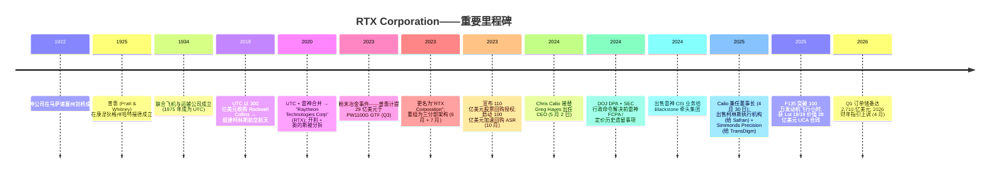
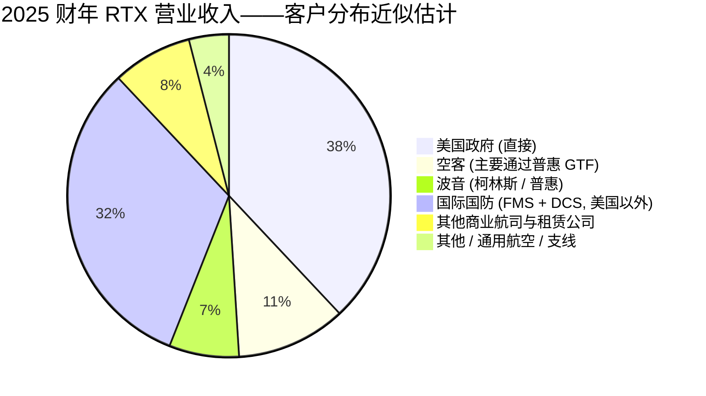
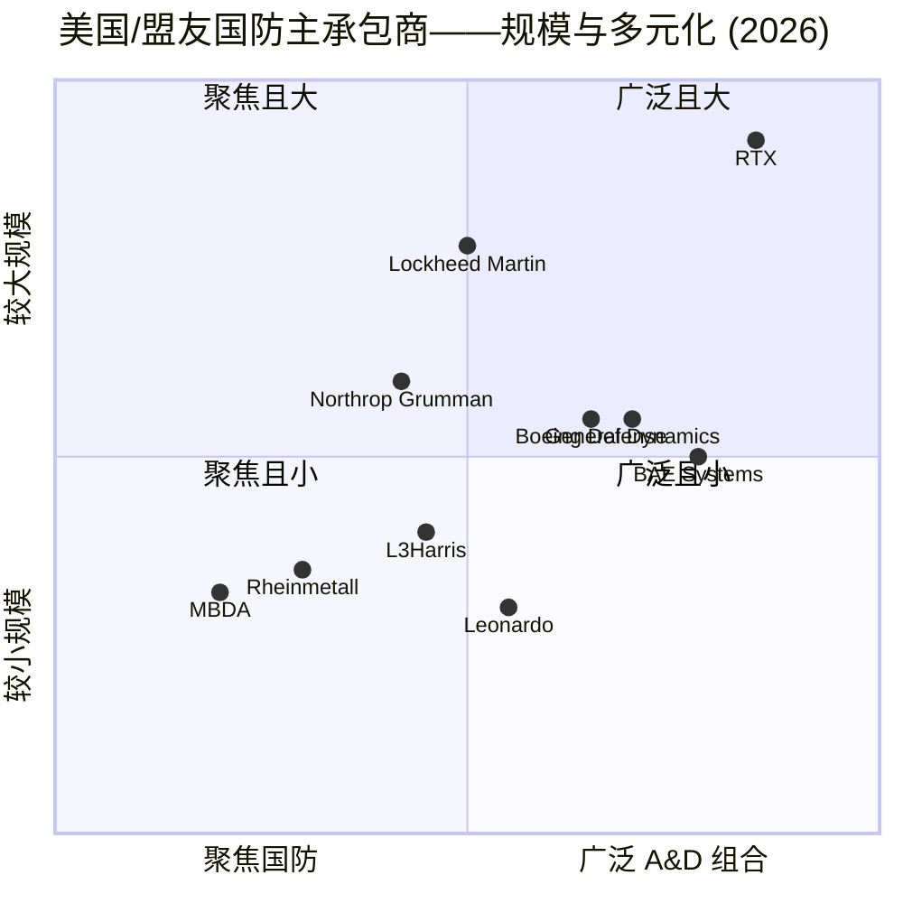

# RTX Corporation (NYSE:RTX) — 公司研究报告

**截至日期: 2026-05-20**
**上市地: 纽约证券交易所 (NYSE), 代码 RTX**
**注册地: 美国弗吉尼亚州阿灵顿**
**报告语言: 简体中文 (英文版同时存在于本目录)**

> **业绩更新——2026 财年指引上调 (2026-04-21):** 管理层上调全年调整后销售额指引至 **925–935 亿美元** (此前为 2026-01-27 公布的 920–930 亿美元), 调整后每股收益 (EPS) 上调至 **6.70–6.90 美元** (此前为 6.60–6.80 美元), 同时重申自由现金流 82.5–87.5 亿美元。本次上调发生于 2026 年 Q1 有机销售额增长 10%、调整后 EPS 增长 21% 之后, 管理层将持续执行力以及国防订单储备的全面强劲作为主要驱动因素。
> 来源: [RTX 2026 Q1 业绩公告, 2026-04-21](https://www.sec.gov/Archives/edgar/data/101829/000010182926000009/a2026-04x218xkerexhibit99.htm)。

## 目录

1. 公司概览
2. 公司历史
3. 管理团队
4. 产品与服务
5. 客户与上市策略
6. 行业概览
7. 竞争格局
8. 市场机会 (TAM)
9. 风险评估
10. 参考资料

---

## 1. 公司概览

RTX Corporation (NYSE: RTX) 是按营业收入计算**全球最大的上市纯航空航天与国防 (A&D, Aerospace & Defense) 公司**, 2025 财年净销售额为 **886 亿美元** ([RTX 2025 Form 10-K, p. 41](https://www.sec.gov/Archives/edgar/data/101829/000010182926000006/0000101829-26-000006-index.htm))。公司总部位于美国弗吉尼亚州阿灵顿 (Arlington, Virginia), 在全球拥有超过 180,000 名员工, 几乎为西方世界所有商用与军用机型提供配套——要么作为发动机制造商、要么作为航空电子/系统供应商, 或两者兼任——同时是美国本土多项关键空中防御系统 (Patriot 爱国者、NASAMS 国家先进地空导弹系统、SM-3 标准 3 型导弹、AMRAAM 先进中程空空导弹、Tomahawk 战斧巡航导弹、SPY-6 雷达、LTAMDS 下层防空与导弹防御传感器) 的唯一或近乎唯一供应商。

**经营模式。** RTX 自身分为三个报告分部: **Collins Aerospace 柯林斯航空航天** (航空电子、内饰、电力系统、起落架)、**Pratt & Whitney 普惠** (大型和小型喷气发动机、F-35 战斗机的 F135 发动机, 以及窄体客机 GTF 齿轮传动风扇发动机家族), 以及 **Raytheon 雷神** (防空、导弹、雷达、海军系统、指挥控制)。2025 财年分部净销售额: 柯林斯 302 亿美元 (占分部销售额 33%)、普惠 329 亿美元 (36%)、雷神 280 亿美元 (31%) ([RTX 2025 Form 10-K, pp. 44–47](https://www.sec.gov/Archives/edgar/data/101829/000010182926000006/0000101829-26-000006-index.htm))。2025 财年约**38% 的销售额直接销售给美国政府** (不含对外军售 FMS), 较 2023 财年的 46% 下降; 其余 62% 为商用 OE (原始设备)/售后市场加上国际销售 (经美国政府路径的 FMS 与直接外国销售), 2025 财年合计**413 亿美元 (占净销售额 47%)** ——这是公司历史上最高的国际占比, 是欧洲、印太及中东国防采购的结构性结果 ([RTX 2025 Form 10-K, p. 5](https://www.sec.gov/Archives/edgar/data/101829/000010182926000006/0000101829-26-000006-index.htm))。

各分部内部的底层经济结构有所不同。柯林斯 Collins 通过平衡的商用 OE 加售后市场的"剃刀-刀片"模式产生现金 (15 年平台合同, 加上 30 年以上的备件与 MRO 维护)。普惠 P&W 则把这种模式推向更极端的版本——商用发动机通常以接近成本价售出, 整个项目经济效益通过 20–30 年的售后维护变现 (这也是为何 PW1100G 上的粉末冶金召回事件给普惠造成如此巨大冲击: 损失直接落在长期售后合同的完工时点估计 EAC 上) ([RTX 2025 Form 10-K, pp. 4–6](https://www.sec.gov/Archives/edgar/data/101829/000010182926000006/0000101829-26-000006-index.htm))。雷神 Raytheon 则是美国国防部 (DoD) 主承包商/独家供应商, 为五角大楼、北约盟国、以色列、乌克兰、台湾、日本、韩国和澳大利亚都想要的一系列武器供货, 通常通过长周期对外军售 (FMS) 合同——由美国政府作为合约方进行采购 ([RTX 2025 Form 10-K, pp. 6–7](https://www.sec.gov/Archives/edgar/data/101829/000010182926000006/0000101829-26-000006-index.htm))。

**规模与增长。** 2025 财年净销售额相较 2024 财年增长 **10% (报告口径) / 11% (有机增长)**, 三大分部全部贡献——柯林斯 +7%、普惠 +17%、雷神 +5% ([RTX 2025 Form 10-K, p. 41](https://www.sec.gov/Archives/edgar/data/101829/000010182926000006/0000101829-26-000006-index.htm))。普惠的超额增长部分是正常化效应 (2023 财年销售额因粉末冶金事件 PMM 而被压低 54 亿美元), 但 2024–25 财年的底层增长无疑相当强劲。截至 2025 年末**订单储备已达 2,680 亿美元** (高于 2024 年末的 2,180 亿美元), 其中商用储备 1,610 亿美元、国防储备 1,070 亿美元, 管理层披露约 25% 将在未来 12 个月内转化为营业收入 ([RTX 2025 Form 10-K, p. 6](https://www.sec.gov/Archives/edgar/data/101829/000010182926000006/0000101829-26-000006-index.htm))。2025 财年订单出货比 (book-to-bill) 为 1.56, 创历史纪录。2026 年 Q1 订单储备进一步增长至 **2,710 亿美元** (商用 1,620 亿 + 国防 1,090 亿) ([RTX 2026 Q1 业绩公告, 2026-04-21](https://www.sec.gov/Archives/edgar/data/101829/000010182926000009/a2026-04x218xkerexhibit99.htm))。

**2025 财年财务数据 (单位: 十亿美元):** 净销售额 88.6; 分部经营利润 10.7; 归属普通股东 GAAP 净利润 6.73; GAAP 摊薄 EPS 4.96 美元, 调整后 EPS 6.29 美元 (同比 +10%); 自由现金流 7.9 (相比 2024 财年增加 34 亿美元) ([RTX 2025 Q4 业绩公告, 2026-01-27](https://www.sec.gov/Archives/edgar/data/101829/000010182926000003/a2026-01x278xkerexhibit99.htm))。

来源: [RTX 2025 Form 10-K, pp. 44–48](https://www.sec.gov/Archives/edgar/data/101829/000010182926000006/0000101829-26-000006-index.htm)。

来源: [RTX 2025 Form 10-K, p. 41](https://www.sec.gov/Archives/edgar/data/101829/000010182926000006/0000101829-26-000006-index.htm); 2020–2022 历史数据来自此前 10-K, 经 [Macrotrends — RTX 营业收入历史](https://www.macrotrends.net/stocks/charts/RTX/rtx/revenue) 整理。

**估值快照 (截至 2026 年 5 月中旬)。** RTX 当前市值约为**2,350 亿美元**, 股价约**178 美元** ([CompaniesMarketCap — RTX, 2026-05](https://companiesmarketcap.com/raytheon-technologies/marketcap/))。按 TTM (过往十二个月) 估算: **市盈率 P/E ~33.5×** ([GuruFocus — RTX P/E (TTM), 2026-05-11](https://www.gurufocus.com/term/pettm/RTX))、**市销率 P/S ~2.6×** (235 / 904 亿 TTM 营业收入)、**EV/EBITDA ~17.4×** ([GuruFocus — RTX EV/EBITDA, 2026-05](https://www.gurufocus.com/term/enterprise-value-to-ebitda/RTX))、**股息收益率约 1.53%** 对应年化股息 2.72 美元 (董事会于 2026 年 2 月宣布每股季度股息 0.68 美元, 2026 年 3 月 19 日派发——同比增长 7.9%) ([RTX 2025 Form 10-K, p. 53](https://www.sec.gov/Archives/edgar/data/101829/000010182926000006/0000101829-26-000006-index.htm))。

相对国防同业, RTX 估值溢价显著: **Lockheed Martin 洛克希德马丁 (LMT) ~21.2× TTM P/E、General Dynamics 通用动力 (GD) ~21.7×、Northrop Grumman 诺斯罗普格鲁曼 (NOC) ~24.2× 前瞻 P/E、Boeing 波音 (BA) 不适用 (TTM 亏损)、GE Aerospace 通用电气航空 (GE) ~48.3× TTM** ([Macrotrends — LMT P/E](https://www.macrotrends.net/stocks/charts/LMT/lockheed-martin/pe-ratio)、[Macrotrends — GE P/E, 2026-05-07](https://www.macrotrends.net/stocks/charts/GE/ge-aerospace/pe-ratio))。国防纯标的中位数 (LMT/NOC/GD) 约 22×, RTX 高出约 50%。**该溢价可识别而非难以解释**——反映: (a) RTX 较大的商用航空敞口 (柯林斯 + 普惠售后市场合计 2025 财年商用收入超 300 亿美元, 结构性增长高于纯国防), (b) GTF 粉末冶金事件结清后将释放的恢复性顺风, 以及 (c) 对 GE Aerospace 的部分代理效应——后者交易于 48× 并作为发动机售后市场业务的对标。**但如果 GTF 恢复停滞或国防增长正常化, 当前估值不可持续**——见第 9 章估值/倍数压缩风险。

**市净率 (P/B) 对 RTX 参考意义不大** (作为工业企业, 罗克韦尔柯林斯 Rockwell Collins 和雷神并购形成大量无形资产——商誉加无形资产截至 2025 年末合计约 880 亿美元) ([RTX 2025 Form 10-K, p. 42](https://www.sec.gov/Archives/edgar/data/101829/000010182926000006/0000101829-26-000006-index.htm)), EV/EBITDA 17.4× 位于 LMT (~15×) 与 GE Aerospace (~28×) 之间, 与"国防+发动机 OEM"组合一致 ([GuruFocus — RTX EV/EBITDA, 2026-05](https://www.gurufocus.com/term/enterprise-value-to-ebitda/RTX))。

---

## 2. 公司历史

**现代 RTX 可追溯至 2020 年的合并和 2023 年的更名。** 其前身业务历史更长: 普惠 (Pratt & Whitney) 由 Frederick Rentschler 于 1925 年在康涅狄格州哈特福德创立; 雷神公司 (Raytheon Company) 由 Vannevar Bush 和 Laurence Marshall 于 1922 年在马萨诸塞州剑桥创立, 从真空管业务转型为二战时期的雷达和微波技术 ([RTX 公司历史](https://www.rtx.com/who-we-are/our-history))。

**雷神技术 (Raytheon Technologies) 合并于 2020 年 4 月 3 日完成**, 将 UTC (联合技术公司) 的航空航天业务 (普惠 + 柯林斯航空航天, 后者由 UTC 2018 年以 300 亿美元收购 Rockwell Collins 罗克韦尔柯林斯加上传统 Goodrich 古德里奇系统组合而成) 与雷神公司的导弹与电子系统合并 ([RTX 2025 Form 10-K, p. 4](https://www.sec.gov/Archives/edgar/data/101829/000010182926000006/0000101829-26-000006-index.htm))。这是一笔全股票交易, 完成后原 UTC 股东持有 57%、原雷神股东持有 43%。与此同时, UTC 将**开利 Carrier (CARR)** 和**奥的斯 Otis (OTIS)** 以免税方式拆分给股东 ([UTC 8-K 拆分完成公告, 2020-04-03](https://www.sec.gov/Archives/edgar/data/101829/000010182920000050/0000101829-20-000050-index.htm))。**2023 年 6 月公司更名为"RTX Corporation"**, 并重新调整为三个分部——柯林斯航空航天、普惠以及更名后的雷神 (合并了此前的 Raytheon Intelligence & Space 雷神情报与空间事业部 和 Raytheon Missiles & Defense 雷神导弹与防御事业部) ([RTX 更名新闻稿, 2023-07-01](https://www.rtx.com/news/news-center/2023/07/01/raytheon-technologies-renamed-rtx))。

**2023 年 7 月的粉末冶金事件 (Powder Metal Matter, PMM) 是 RTX 近期历史上最具决定性的事件。** 普惠确定一项罕见的粉末冶金原料缺陷需要对为空客 A320neo 家族飞机提供动力的 PW1100G-JM GTF 齿轮传动风扇发动机进行加速检测。2023 年第三季度 RTX 计提**29 亿美元**的税前费用 (扣除合作伙伴份额和税后净额 22 亿美元, 影响 EPS 1.55 美元), 代表客户赔偿和增量进厂维护成本; 这一计提之前还有 54 亿美元的净销售额冲减——反映合同会计调整的影响 ([RTX 2025 Form 10-K, p. 56](https://www.sec.gov/Archives/edgar/data/101829/000010182926000006/0000101829-26-000006-index.htm))。RTX 披露 PW1100 飞机停场 (AOG) 水平预计将持续高位至 2026 年。累计而言, RTX 在 2024 财年和 2025 财年**各使用 10 亿美元的应计准备**用于客户信用和现金支付, **预计 2026 财年还有 7 亿美元的现金流出** ([RTX 2025 Form 10-K, p. 53](https://www.sec.gov/Archives/edgar/data/101829/000010182926000006/0000101829-26-000006-index.htm))。2025 年末该事件的其他应计负债余额为 7 亿美元 (低于 2024 年末的 17 亿、2023 年末的 28 亿)。

来源: [RTX 2025 Form 10-K, pp. 5–7, 50–60](https://www.sec.gov/Archives/edgar/data/101829/000010182926000006/0000101829-26-000006-index.htm); [RTX 2026 DEF 14A 委托代理书, pp. 38–39](https://www.sec.gov/Archives/edgar/data/101829/000130817926000036/0001308179-26-000036-index.htm)。

**战略性转型。** 三件事至关重要: (1) 2018 年罗克韦尔柯林斯 / 古德里奇组合, 将 UTC 分散的航空航天系统组合整合为单一 OEM 对手方; (2) 2020 年 UTC / 雷神合并, 增加了导弹/雷达业务, 将 RTX 的国防敞口从主要航空 OE (发动机、航电) 扩展到全国防堆栈; (3) 2023–25 年的组合精炼——出售 Raytheon Cybersecurity Intelligence & Services (2024 Q1)、Goodrich Hoist & Winch (2024 Q4)、Collins Actuation & Flight Control (2025 Q3, 出售给 Safran 赛峰)、Simmonds Precision Products (2025 Q4, 以 7.65 亿美元出售给 TransDigm)——使柯林斯每年减少约 12 亿美元收入, 但利润率扩张, 所得资金被用于偿还债务和 GTF 恢复 ([Flight Global, 2025-06-30——Simmonds 出售](https://www.flightglobal.com/systems-and-interiors/rtx-to-sell-collins-sensing-and-controls-business-to-transdigm/163615.article); [Safran 新闻稿, 2025-07-21](https://www.safran-group.com/pressroom/safran-announces-acquisition-flight-control-and-actuation-activities-collins-aerospace-2025-07-21))。

**近期资本结构。** 2023 年 10 月 110 亿美元的回购授权资助了 100 亿美元加速回购 (ASR), 于 2024 年 9 月完成, 平均价 94.28 美元/股, 共回购约 1.06 亿股 ([RTX 2025 Form 10-K, p. 53](https://www.sec.gov/Archives/edgar/data/101829/000010182926000006/0000101829-26-000006-index.htm))。净债务带入 2024 年 (2025 年末长期债务 360 亿美元), 通过投资级债券融资。2025 年末剩余回购授权仅为 **6 亿美元**——2026–27 年要有意义地恢复回购需要新的董事会授权。

来源: [RTX 2025 Form 10-K, pp. 49, 53, 69](https://www.sec.gov/Archives/edgar/data/101829/000010182926000006/0000101829-26-000006-index.htm); 2020–2022 财年股息历史按 [Macrotrends — RTX 股息历史](https://www.macrotrends.net/stocks/charts/RTX/rtx/dividend-yield-history)。

---

## 3. 管理团队

### Christopher T. Calio — 董事长、总裁兼首席执行官

Chris Calio, 52 岁, 于 **2024 年 5 月 2 日**接替 Greg Hayes 出任 RTX CEO, 并于 **2025 年 4 月 30 日**兼任董事长, 完成委托代理书所述"董事会数年精心规划的接班安排" ([RTX 2026 DEF 14A 委托代理书, pp. 22, 38–39](https://www.sec.gov/Archives/edgar/data/101829/000130817926000036/0001308179-26-000036-index.htm))。Calio 是 RTX 内部候选人——自 2005 年加入 UTC/RTX 担任内部法律顾问以来一直在公司——他的发展路径在现代国防业内不同寻常, 因为他从法务起步, 然后管理普惠的商用发动机部门, 之后管理普惠整体业务, 然后在粉末冶金事件期间出任 RTX COO 首席运营官, 之后才被任命为 CEO。这种模式是有意安排的: 董事会任命的执行官曾亲自处理过公司近期历史上最艰难的运营挑战。

Calio 在公司内部的职业路径, 引自 RTX 2026 委托代理书的简历 ([RTX 2026 DEF 14A 委托代理书, pp. 22, 38–39](https://www.sec.gov/Archives/edgar/data/101829/000130817926000036/0001308179-26-000036-index.htm)):
- **UTC 董事长兼 CEO (Greg Hayes) 的幕僚长**, 2015 年 2 月 – 2017 年 1 月——直接接触该时代 UTC/RTX 每项重大决策, 包括 Rockwell Collins 收购和 Carrier/Otis 拆分计划。
- **普惠商用发动机总裁**, 2017 年 2 月 – 2019 年 12 月——当时 GTF 为 A320neo 加速生产、PW1100G 进厂维修次数正在上升。
- **普惠总裁**, 2020 年 1 月 – 2022 年 2 月——经历了疫情期间商用飞行小时崩溃和粉末冶金缺陷的早期迹象。
- **雷神技术 / RTX COO 首席运营官**, 2022 年 3 月 – 2023 年 3 月——F135 生产爬坡、雷神分部重组、粉末冶金问题早期披露。
- **总裁兼 COO**, 2023 年 3 月 – 2024 年 5 月——主导 2023 年 Q3 29 亿美元粉末冶金计提的披露。
- **CEO**, 2024 年 5 月至今; **董事长**, 2025 年 4 月至今。

2025 年薪酬为 2,485 万美元 (基本工资 155 万、年度激励约 640 万——按 164% 目标完成度、2026 年度长期激励 LTI 授予 2,100 万), CEO 与员工薪酬中位数之比为 207:1 ([RTX 2026 DEF 14A 委托代理书, pp. 53, 89](https://www.sec.gov/Archives/edgar/data/101829/000130817926000036/0001308179-26-000036-index.htm))。Calio 不持有创始人级股权; 长期激励大幅倾向于按相对 TSR 和自由现金流目标归属的 PSU。2025 年 say-on-pay 投票获约 96% 支持。

**评估。** 截至本文撰写时 Calio 任 CEO 仅两年, 但他在公司内部的发展轨迹几乎覆盖了对投资逻辑至关重要的每一个问题。三项可观察的成就: (1) 2025 财年有机销售额增长 11%, 调整后 EPS 增长 10%, 自由现金流增长约 75% (79 亿 vs 45 亿)——尽管委托代理书提到"未预料的关税逆风", 执行力仍超越 2025 年原计划; (2) 2026 年 Q1 GTF AOG (停场) 群体较前一季度下降 15%, 这一维护爬坡正是 Calio 任普惠商用发动机负责人时亲自架构的 ([FlightGlobal, 2026-04](https://www.flightglobal.com/engines/2026/04/rtx-says-gtf-groundings-are-coming-down-thanks-to-maintenance-ramp/)); (3) 柯林斯的剥离方案 (2024–25 年合计约 25 亿美元处置所得) 在没有运营中断的情况下完成。未解问题: 他尚未面对过国防预算回落、大规模 M&A 整合或美中制裁拐点。

### Neil G. Mitchill, Jr. — 执行副总裁兼首席财务官

Neil Mitchill, 50 岁, 自 2020 年合并完成时担任 RTX CFO (最初代理 CFO, 2021 年 8 月转为正式 CFO), 在 RTX/UTC 任职共 11 年。他于 2014 年加入 UTC, 此前担任高级企业财务和审计师职务。Mitchill 的关键资历是, 他领导了前 UTC 与前雷神财务部门的合并后整合——史上最大的航空与国防整合之一——包括将原 SAP 与 Oracle 财务系统进行转换, 并整合分歧的收入确认方法。自 2020 年以来他一直在每个季度财报会议上代表 IR (投资者关系), 亲自向华尔街介绍粉末冶金计提、100 亿美元 ASR, 以及 2023 年发行的 129 亿美元长期债务。2025 年薪酬为 1,113 万美元 (基本工资 110 万、年度激励 252.5 万——按 164% 目标完成度的公司因子、2026 年度 LTI 750 万) ([RTX 2026 DEF 14A 委托代理书, pp. 78, 86](https://www.sec.gov/Archives/edgar/data/101829/000130817926000036/0001308179-26-000036-index.htm))。2025 年 LTI 组合采用 75% PSU 与 25% RSU, PSU 指标为 3 年期自由现金流、ROIC (投入资本回报率) 与相对 TSR——与 ASR 后的财务态势相匹配的资本纪律指标。

### Philip J. Jasper — 雷神总裁

Phil Jasper 自 2023 年重组以来一直管理雷神分部。他通过 2018 年 Rockwell Collins 收购加入 (此前任政府系统 EVP), 此前任柯林斯航空航天任务系统业务高级职位。Jasper 的分部是乌克兰后/印太国防激增的最大受益者: 雷神 2025 财年录得**400 亿美元的国防订单**——订单出货比 1.43——包括 25 亿美元 Patriot GEM-T 发射器、21 亿美元 AMRAAM、15 亿美元 LTAMDS 低速生产、12 亿美元 Iron Dome Tamir 铁穹塔米尔、12 亿美元 Patriot 系统出口西班牙、11 亿美元 AIM-9X 响尾蛇、9.01 亿美元 SM-3 至导弹防御局, 以及 59 亿美元保密订单 ([RTX 2025 Form 10-K, p. 48](https://www.sec.gov/Archives/edgar/data/101829/000010182926000006/0000101829-26-000006-index.htm))。2025 年薪酬合计约 600 万美元。

### Shane G. Eddy — 普惠总裁

Shane Eddy 于 2023 年 3 月接替 Calio 出任普惠总裁。Eddy 是普惠 30 年的运营老兵, 此前管理 F135 生产线和 GTF 售后市场网络。他是粉末冶金恢复、F135 发动机核心升级 (ECU, Engine Core Upgrade) 和 XA103 NGAP (下一代自适应推进, Next Generation Adaptive Propulsion) 开发的责任人。普惠 2025 财年经营利润率恢复至 7.9% (相比 2024 财年的 7.2%、2023 财年的 -8.0%), GTF 售后市场网络扩展到全球 21 家工厂, 2025 财年进厂维修产出同比增长约 26% ([RTX 2025 Form 10-K, p. 5](https://www.sec.gov/Archives/edgar/data/101829/000010182926000006/0000101829-26-000006-index.htm))。Eddy 在 2026–27 年的 KPI 紧密绑定: GTF AOG 削减、GTF Advantage 投入运营 (EIS) 爬坡, 以及 F135 ECU 认证。

### Troy D. Brunk — 柯林斯航空航天总裁

Troy Brunk 自 2024 年开始管理柯林斯, 此前管理柯林斯任务系统业务 (再之前管理 Rockwell Collins Avionics 航电业务)。柯林斯 2025 财年经营利润率为 16.3% (同比提升 170 bps), 销售额 302 亿美元——这是该分部自 2018 年合并以来的最佳利润率 ([RTX 2025 Form 10-K, pp. 44–45](https://www.sec.gov/Archives/edgar/data/101829/000010182926000006/0000101829-26-000006-index.htm))。Brunk 的组合重塑是 RTX 内部最积极的——2025 年将执行机构/飞行控制业务出售给 Safran 赛峰、将 Simmonds Precision 出售给 TransDigm, 并整合为集成航电、内饰、电力, 以及国防通信 ([Safran 新闻稿, 2025-07-21](https://www.safran-group.com/pressroom/safran-announces-acquisition-flight-control-and-actuation-activities-collins-aerospace-2025-07-21); [Flight Global, 2025-06-30——Simmonds 出售](https://www.flightglobal.com/systems-and-interiors/rtx-to-sell-collins-sensing-and-controls-business-to-transdigm/163615.article))。

### 治理脚注

RTX 董事会按 2026 年委托代理书共有 12 名董事, 其中 11 名为独立董事 ([RTX 2026 DEF 14A 委托代理书, p. 16](https://www.sec.gov/Archives/edgar/data/101829/000130817926000036/0001308179-26-000036-index.htm))。独立首席董事 (Lead Director) 为 **Tracy A. Atkinson** (按 2026 年代理书更新), 此前 LD Reynolds 重新当选为董事——委托代理书指出, Reynolds 先生继续任职的事项是在 Calio 接任董事长背景下讨论的。内部人持股按百分比衡量较小 (不到 1% 的一小部分), 但鉴于 2,350 亿美元市值, 绝对美元金额很高。高管薪酬结构约为 90% 变动薪酬, PSU 按 3 年期 ROIC、自由现金流和相对 TSR 计量。2024 年与 DOJ 的延期起诉协议 (DPAs) 和 SEC 行政命令解决了 2020 年合并前的前雷神 FCPA (反海外腐败法) 事项和有缺陷定价索赔; 独立合规监察员预计在 2026 年 Q1 就位, 任期三年 ([RTX 2025 Form 10-K, pp. 57–58](https://www.sec.gov/Archives/edgar/data/101829/000010182926000006/0000101829-26-000006-index.htm))。与美国国务院的同意协议 (ITAR 国际武器贸易条例 违规, 三年期) 叠加在此之上。这些是真正的治理约束——2026 年 1 月 7 日的行政命令进一步授权战争部长可以限制被认定为表现不佳的国防承包商的股息或回购, 这是对资本回报规划的新颖且不寻常的叠加。

**业绩记录综合评估。** 管理层名单是内部、深入且经过考验的——Calio、Eddy、Brunk 和 Jasper 都通过前 UTC / 普惠 / Rockwell Collins / 雷神业务升迁而来 ([RTX 2026 DEF 14A 委托代理书, pp. 22, 26–29](https://www.sec.gov/Archives/edgar/data/101829/000130817926000036/0001308179-26-000036-index.htm))。该团队执行了 2020 年合并后整合、吸收了粉末冶金披露而没有破坏股息或投资级评级、在远低于当前市价的平均价完成了 100 亿美元 ASR、并使 2025 财年自由现金流同比增长约 75% ([RTX 2025 Q4 业绩公告, 2026-01-27](https://www.sec.gov/Archives/edgar/data/101829/000010182926000003/a2026-01x278xkerexhibit99.htm))。他们尚未经受考验的缺口是当前周期内的大规模 M&A 和国防预算下行周期——如果 2020 年代末美国政府更替重新调整优先事项, 两者都可能发生。

---

## 4. 产品与服务

RTX 的产品组合规模庞大——按一些统计公司在三大分部销售超过 1,000 个不同的 SKU 系列。下面的清单涵盖了 rtx.com 和 10-K Item 1 (业务) 中披露的每个产品系列。在单一分部提供许多重叠 SKU 的地方, 我们进行归组 ([RTX 2025 Form 10-K, pp. 4–7](https://www.sec.gov/Archives/edgar/data/101829/000010182926000006/0000101829-26-000006-index.htm))。

### 柯林斯航空航天 Collins Aerospace (2025 财年净销售额 302 亿美元; 经营利润率 16.3%)

```mermaid
graph TD
    RTX[RTX Corporation]
    RTX --> COL[Collins Aerospace 柯林斯]
    RTX --> PW[Pratt & Whitney 普惠]
    RTX --> RAY[Raytheon 雷神]

    COL --> COL_AV[航电与任务系统]
    COL --> COL_INT[飞机内饰]
    COL --> COL_EP[电力与配电]
    COL --> COL_AS[航空结构]
    COL --> COL_LG[起落系统]
    COL --> COL_MS[军用任务系统与 SATCOM]

    COL_AV --> Pro_Line[Pro Line Fusion 集成飞控]
    COL_AV --> Head_Up[平视引导 HGS]
    COL_AV --> SAT[ARINC GLOBALink 卫星通信]
    COL_AV --> STARS[STARS 空中交通管理]

    COL_INT --> Seats[BE Aerospace 座椅]
    COL_INT --> Galley[厨房与盥洗室]
    COL_INT --> Oxygen[氧气 / 撤离系统]

    COL_EP --> APU_aux[APU 启动器 / 发电机]
    COL_EP --> ECS[环境控制系统]

    COL_AS --> Nacelles[发动机短舱 / 推力反向器]
    COL_AS --> Wing[机翼前缘]

    COL_LG --> Wheels[Goodrich 机轮与制动]
    COL_LG --> Gear[起落架]

    PW --> PW_COM[商用发动机]
    PW --> PW_MIL[军用发动机]
    PW --> PW_AUX[APU 与小型发动机]

    PW_COM --> GTF[PW1000G GTF 系列]
    PW_COM --> V2500[V2500 IAE 合资]
    PW_COM --> PW4000[PW4000 宽体]
    PW_COM --> PW800[PW800 公务机]
    PW_COM --> PWC[普惠加拿大 PT6 / PW100]

    PW_MIL --> F135[F135 用于 F-35——独家]
    PW_MIL --> F119[F119 用于 F-22——维护]
    PW_MIL --> F100[F100 用于 F-15 / F-16——维护]
    PW_MIL --> B21[保密发动机含 B-21]
    PW_MIL --> NGAP[XA103 NGAP 开发]

    RAY --> R_LAD[陆基与空中防御系统]
    RAY --> R_NPS[海军动力与水面系统]
    RAY --> R_ASD[空中与太空防御]
    RAY --> R_AT[先进技术 / 保密]

    R_LAD --> Patriot[爱国者系统 + GEM-T]
    R_LAD --> NASAMS[NASAMS 防空]
    R_LAD --> LTAMDS[LTAMDS 传感器]
    R_LAD --> Stinger[FIM-92 毒刺]
    R_LAD --> Iron_Dome[铁穹 Tamir——与 Rafael 合资]
    R_LAD --> Coyote[Coyote 反无人机]

    R_NPS --> ESSM[改进型海麻雀 ESSM]
    R_NPS --> SM3[标准导弹 SM-3 / SM-6]
    R_NPS --> SPY6[SPY-6 雷达——DDG-51 / DDG-1000]
    R_NPS --> Tomahawk[战斧巡航导弹]

    R_ASD --> AMRAAM[AIM-120 AMRAAM]
    R_ASD --> AIM9X[AIM-9X 响尾蛇 Block II]
    R_ASD --> NGJ[下一代干扰机 NGJ-MB]
    R_ASD --> StormBreaker[StormBreaker / GBU-53]
```

来源: [rtx.com — 柯林斯航空航天解决方案](https://www.collinsaerospace.com/)、[rtx.com — 普惠产品](https://www.prattwhitney.com/en/products)、[rtx.com — 雷神能力](https://www.rtx.com/raytheon/what-we-do); [RTX 2025 Form 10-K, pp. 4–7](https://www.sec.gov/Archives/edgar/data/101829/000010182926000006/0000101829-26-000006-index.htm)。

**柯林斯旗舰产品与竞争地位** ([RTX 2025 Form 10-K, pp. 4–5](https://www.sec.gov/Archives/edgar/data/101829/000010182926000006/0000101829-26-000006-index.htm); [柯林斯航空航天解决方案概览](https://www.collinsaerospace.com/)):

- **Pro Line Fusion 集成飞行甲板**——安装在巴航 Embraer E2 系列、KC-46 加油机、波音 777X 货机平台, 以及公务机上 ([柯林斯航空航天 — Pro Line Fusion](https://www.collinsaerospace.com/what-we-do/industries/business-aviation/flight-deck/pro-line-fusion))。竞争优势: **是** (技术 + 切换成本)。一旦 OEM 装配 Pro Line, 替换航电套件的认证重新认证需要数亿美元和数年时间。最接近的竞争对手: **Honeywell Primus / Epic 2** 和 **Garmin G5000** (公务机); 柯林斯在功能上持平, **在运输类飞机上的装机量遥遥领先**。
- **Head-Up Guidance System (HGS) 平视引导系统**——一种使跑道可视化的平视显示器, 现已安装在大多数主要航空公司 ([柯林斯航空航天 — HGS](https://www.collinsaerospace.com/what-we-do/industries/commercial-aviation/flight-deck/displays/head-up-displays))。优势: **是** (法规认证、数十年 HGS 运营数据); 最接近的竞争对手: **Thales TopMax**, 在认证占用率上落后。
- **Goodrich 机轮与碳刹车**——安装在全球 90%+ 的大型商用飞机上 ([柯林斯航空航天 — 机轮与制动](https://www.collinsaerospace.com/what-we-do/industries/commercial-aviation/landing-systems/wheels-and-brakes))。优势: **是** (规模 + 专门的碳技术); 同行: **Safran Landing Systems** (赛峰起落架)、**Honeywell Brakes**——在某些窄体配套上持平, 但柯林斯主导宽体和军用市场。
- **发动机短舱系统 (含推力反向器)** ——柯林斯为许多 GTF、V2500 和 PW4000 动力机型供应短舱 ([柯林斯航空航天 — 航空结构 / 短舱](https://www.collinsaerospace.com/what-we-do/industries/commercial-aviation/aerostructures)); 优势**部分**——与 Spirit AeroSystems (势必锐航空结构) 业务和 Safran Nacelles (赛峰短舱) 竞争。
- **B/E Aerospace 座椅、厨房与内饰**——由 Rockwell Collins 于 2017 年收购 ([Rockwell Collins — BE Aerospace 合并 Form 425, 2016-10-23](https://www.sec.gov/Archives/edgar/data/0000861361/000110465916151734/a16-20361_3425.htm))。优势: **部分**——内饰市场较分散, 玩家包括 Safran Seats、Recaro Aircraft Seating、Jamco、Adient Aerospace 等; 柯林斯有规模, 但定价能力有限。
- **STARS 空中交通管理系统** (Standard Terminal Automation Replacement System) ——2025 年柯林斯收到 FAA (美国联邦航空管理局) 的后续合同, 并被列入 FAA 的全新空中交通管制雷达系统替换计划 ([RTX 2025 Form 10-K, p. 4](https://www.sec.gov/Archives/edgar/data/101829/000010182926000006/0000101829-26-000006-index.htm))。优势: **是** (现有地位、保密计划资质)。
- **互联航空服务 / ARINC**——全球 VHF/SATCOM 航空通信网络 ([柯林斯航空航天 — ARINC 服务](https://www.collinsaerospace.com/what-we-do/industries/commercial-aviation/connected-aviation-services))。优势: **是** (网络效应, 每次商用飞行都使用)。最接近的竞争对手: **Honeywell GoDirect**、**SITA**。
- **国防通信 (超低频, Advanced EHF, 任务 C3 指挥控制通信)** ——2025 年获得美国海军的工程、设计与制造 VLF 和 Advanced EHF 子系统分包合同, 以及多频段卫星通信合同——这两笔合同都增加了保密计划增长支柱 ([RTX 2025 Form 10-K, p. 4](https://www.sec.gov/Archives/edgar/data/101829/000010182926000006/0000101829-26-000006-index.htm))。

**柯林斯过去 12 个月的新品发布与退出:** 将执行机构与飞行控制业务出售给赛峰 (2025 年 8 月), 将 Simmonds Precision Products 以 7.65 亿美元出售给 TransDigm (2025 Q4) ([Safran 新闻稿, 2025-07-21](https://www.safran-group.com/pressroom/safran-announces-acquisition-flight-control-and-actuation-activities-collins-aerospace-2025-07-21); [Flight Global, 2025-06-30 — Simmonds 出售](https://www.flightglobal.com/systems-and-interiors/rtx-to-sell-collins-sensing-and-controls-business-to-transdigm/163615.article))。赢得超过 40 亿美元的多家航司组合长期协议——提供 MRO 与备件 ([RTX 2025 Form 10-K, p. 4](https://www.sec.gov/Archives/edgar/data/101829/000010182926000006/0000101829-26-000006-index.htm))。被欧盟"清洁航空联合事业" (Clean Aviation Joint Undertaking) 选中, 与普惠加拿大共同参与 PHARES 区域混合电推进发动机计划 ([Clean Aviation — PHARES 项目页](https://www.clean-aviation.eu/phares))。

### 普惠 Pratt & Whitney (2025 财年净销售额 329 亿美元; 经营利润率 7.9%)

**PW1000G GTF (齿轮传动风扇) 发动机家族**——旗舰商用发动机, 为**空客 A320neo (PW1100G-JM)**、**空客 A220 (PW1500G)** 和**巴航 Embraer E2 (PW1900G)** 提供动力。GTF 家族为来自 90 多家运营商的 2,600 多架飞机提供动力, 覆盖三个平台。优势: **结构性肯定**——GTF 是 A320neo 平台上**唯一**与 CFM LEAP (通用电气/赛峰合资) 竞争的窄体发动机, 给普惠在 A320neo 装机量上的 40–50% 份额——具体取决于年份群体。护城河类型: **技术 + 20–30 年售后市场锁定** (一旦航司选择 PW1100G, 发动机的大修将在大约 30 年内回到普惠或其授权网络)。2025 财年里程碑: **GTF Advantage 获得 FAA 和 EASA 对 A320neo 的认证**——起飞推力提升 4–8%, 燃油消耗再降低 1% ([RTX 2025 Form 10-K, p. 5](https://www.sec.gov/Archives/edgar/data/101829/000010182926000006/0000101829-26-000006-index.htm))。最接近的竞争对手: **CFM LEAP-1A** (通用电气/赛峰), 燃油消耗持平, 但在 A320neo 上无问题累计发动机小时领先 (LEAP 也有自己的耐久性问题, 但比 GTF 粉末冶金召回严重程度低得多)。

**F135 发动机**——**F-35 闪电 II Lightning II** 整个项目 (A、B 和 C 三个变体) 的独家发动机, 为美国政府 F-35 联合项目办公室 (Joint Program Office) 和所有外国 F-35 买家生产 (英国、意大利、挪威、荷兰、丹麦、澳大利亚、以色列、日本、韩国、土耳其暂停、加上 2022 年以来瑞士和芬兰的新签销售) ([RTX 2025 Form 10-K, pp. 6, 47](https://www.sec.gov/Archives/edgar/data/101829/000010182926000006/0000101829-26-000006-index.htm))。2025 年 F135 超过**100 万发动机飞行小时**, 普惠获得 Lot 18 和 Lot 19 生产加长周期采购的 28 亿美元未定型合同行动 (UCA) ([Air & Space Forces 杂志——五角大楼 F-35 发动机合同 Lots 18-19](https://www.airandspaceforces.com/pentagon-f-35-engine-contract-lots-18-19/))。**F135 发动机核心升级 (ECU)** 处于设计成熟化与飞机集成阶段——这是 2023 年美国空军在 ECU 与全新自适应循环发动机项目中选择 ECU 时, 普惠赢得的多年期推力/效率升级路径 ([Defense News——五角大楼重新考虑 F-35 发动机项目, 2023-03-13](https://www.defensenews.com/air/2023/03/13/pentagon-rethinks-f-35-engine-program-will-upgrade-f135/))。优势: **是, 垄断级**——独家供应商, F-35 将在未来 30 年以上继续生产, 每次发动机大修都会回到普惠。最接近的竞争对手: F-35 平台上没有; **GE 的 F110 / XA100** 是双边美国战斗机发动机市场的概念性同行, 但失去了 F-35 推进的决策。2025 财年普惠预定**90 亿美元的国防订单**, 其中包括 29 亿美元 F135 生产和 24 亿美元 F135 维护 ([RTX 2025 Form 10-K, p. 47](https://www.sec.gov/Archives/edgar/data/101829/000010182926000006/0000101829-26-000006-index.htm))。

**其他军用发动机**——F119 (F-22, 维护) ([RTX 新闻稿, 2025-02-20——15 亿美元 F119 维护](https://www.rtx.com/news/news-center/2025/02/20/rtxs-pratt-whitney-awarded-1-5-billion-f119-engine-sustainment-contract-for-u))、F100 (F-15 / F-16, 仅维护遗产业务)、包括 B-21 突袭者发动机在内的保密发动机工作 (按 10-K 表述"B-21 Raider, which is powered by Pratt & Whitney engines"——普惠是发动机供应商) ([RTX 2025 Form 10-K, p. 6](https://www.sec.gov/Archives/edgar/data/101829/000010182926000006/0000101829-26-000006-index.htm); [AIAA——普惠发动机驱动新 B-21, 2022-12-06](https://aiaa.org/2022/12/06/pratt-whitney-s-engine-powers-new-b-21/)), 以及美国空军下一代自适应推进 (NGAP) 项目下的 XA103 地面演示机。优势: **是** (在每个传统美国空军战斗机发动机上的现有垄断, 加上 B-21 的独家发动机供应商, 以及全生命周期维护)。

**普惠加拿大 (Pratt & Whitney Canada)** ——为支线、公务和通用航空提供涡桨 (PW100、PW150、PT6) 和小型涡扇发动机 (PW800) ([普惠加拿大产品](https://www.prattwhitney.com/en/products))。优势: **是** (支线涡桨和公务机涡扇市场份额领导者)。最接近的竞争对手: GE Aerospace Catalyst、Honeywell HTF7000。

**辅助动力装置 (APUs)** ——普惠 + Hamilton Sundstrand (前柯林斯) 为军用和商用飞机供应 APU ([普惠 APU 页面](https://www.prattwhitney.com/en/products/auxiliary-power-units))。最接近的竞争对手: Honeywell APU。

**普惠的最大商用客户:** **空客占普惠分部 2025 财年销售额的 29%** (低于 2024 财年的 31%、2023 财年的 48%——2023 年数字被 PMM 计提的合同会计分配方式所夸大) ([RTX 2025 Form 10-K, p. 5](https://www.sec.gov/Archives/edgar/data/101829/000010182926000006/0000101829-26-000006-index.htm))。这在 10-K 中已披露, 是我们在第 5 章讨论的客户集中度问题。

**普惠过去 12 个月亮点:** GTF Advantage 投入运营 (EIS) 认证 (2025); F135 100 万飞行小时里程碑 (2025); GTF 售后市场产能扩展至全球 21 家 MRO 工厂, 维修产出同比增长 26% ([RTX 2025 Form 10-K, p. 5](https://www.sec.gov/Archives/edgar/data/101829/000010182926000006/0000101829-26-000006-index.htm)); 2026 Q1 GTF AOG 水平下降 15% ([FlightGlobal, 2026-04](https://www.flightglobal.com/engines/2026/04/rtx-says-gtf-groundings-are-coming-down-thanks-to-maintenance-ramp/)); XA103 NGAP 完成详细设计评审。

### 雷神 Raytheon (2025 财年净销售额 280 亿美元; 经营利润率 11.5%)

雷神的产品组合分为**陆基与空中防御系统**、**海军动力**、**空中与太空防御系统**, 以及**先进技术 (保密)** ([RTX 2025 Form 10-K, pp. 6–7](https://www.sec.gov/Archives/edgar/data/101829/000010182926000006/0000101829-26-000006-index.htm); [雷神——我们做什么](https://www.rtx.com/raytheon/what-we-do))。

**Patriot 爱国者防空系统**——GEM-T (制导增强导弹, PAC-2 血脉) 和 PAC-3 (洛克希德制造的导弹, 雷神制造的发射器/雷达) 整合空中与导弹防御系统。优势: **是, 垄断**——爱国者是事实上的西方防空标准, 部署在 19 个以上盟友国家, 包括西班牙、荷兰 (2025 年 5.29 亿美元订单)、波兰、德国、乌克兰、以色列、沙特、日本、韩国、台湾。雷神是**爱国者发射器和 GEM-T 拦截弹的唯一制造商**; 2026 年 4 月, 雷神获得 37 亿美元的直接商业销售合同 (DCS), 向乌克兰交付 GEM-T 拦截弹 ([RTX 新闻稿, 2026-04-14](https://www.rtx.com/news/news-center/2026/04/14/rtxs-raytheon-to-deliver-patriot-interceptors-to-ukraine))。德国 Schrobenhausen 的新 GEM-T 生产工厂正在建立, 以补充美国产能。最接近的竞争对手: **SAMP/T** (Eurosam——MBDA + Thales), 但爱国者仍然是事实上的美国/北约标准。

**NASAMS** (National Advanced Surface-to-Air Missile System 国家先进地对空导弹系统) ——与挪威 Kongsberg 的联合项目 ([雷神 — NASAMS 概览](https://www.rtx.com/raytheon/what-we-do/integrated-air-and-missile-defense/nasams); [Kongsberg — NASAMS](https://www.kongsberg.com/what-we-do/defence-and-security/integrated-air-and-missile-defence/nasams-air-defence-system/))。部署用于防御华盛顿特区, 并出口到 15 个国家, 包括乌克兰。优势: **是** (唯一规模化生产的西方中程地对空导弹系统)。2025 财年多笔国际订单 (单一合同 5.56 亿美元) ([RTX 2025 Form 10-K, p. 48](https://www.sec.gov/Archives/edgar/data/101829/000010182926000006/0000101829-26-000006-index.htm))。

**LTAMDS** (Lower Tier Air and Missile Defense Sensor 下层防空与导弹防御传感器) ——取代传统爱国者雷达的新型 360 度雷达; 独家供应商雷神。2025 年 LRIP 低速生产订单 15 亿美元——用于美国陆军和波兰 ([RTX 2025 Form 10-K, p. 48](https://www.sec.gov/Archives/edgar/data/101829/000010182926000006/0000101829-26-000006-index.htm))。

**AMRAAM / AIM-9X Sidewinder 响尾蛇**——用于 F-15、F-16、F-18、F-22、F-35、台风、鹰狮、阵风等机型的空对空导弹。独家或近乎独家供应商。2025 财年订单: 21 亿美元 (AMRAAM) 和 11 亿美元 (AIM-9X) ([RTX 2025 Form 10-K, p. 48](https://www.sec.gov/Archives/edgar/data/101829/000010182926000006/0000101829-26-000006-index.htm))。最接近的竞争对手: 欧洲的 **MBDA Meteor 流星导弹** (射程更长、动力学更先进), 但美国/北约生产基地仍然是 AMRAAM。

**Tomahawk 战斧巡航导弹**——美国海军的关键远程打击武器。独家供应商雷神 ([RTX 新闻稿, 2026-02-04——五项里程碑性弹药协议](https://www.rtx.com/news/news-center/2026/02/04/rtxs-raytheon-partners-with-department-of-war-on-five-landmark-agreements-to-exp))。2025 财年订单 5.13 亿美元 ([RTX 2025 Form 10-K, p. 48](https://www.sec.gov/Archives/edgar/data/101829/000010182926000006/0000101829-26-000006-index.htm))。按五角大楼计划, 生产目标提升至 >1,000 枚/年 ([USNI News, 2026-02-04](https://news.usni.org/2026/02/04/raytheon-to-bolster-tomahawk-and-sm-6-production-in-critical-munition-deal))。

**SPY-6 雷达系列**——美国海军 DDG-51 Flight III 和 DDG-1000 驱逐舰的下一代 S 波段雷达 ([雷神——SPY-6 雷达系列](https://www.rtx.com/raytheon/what-we-do/sea/spy6-radars); [RTX 新闻稿, 2025-06-03 — 5.36 亿美元 SPY-6 授标](https://www.rtx.com/news/news-center/2025/06/03/rtxs-raytheon-awarded-536-million-us-navy-contract-for-spy-6-family-of-radars))。2025 财年订单 6.47 亿美元 (硬件生产和维护)。独家供应商。

**SM-3 / SM-6 标准导弹**——大气层外导弹防御 (SM-3) 和双重防空 / 反舰 (SM-6) 角色。2025 财年 SM-3 订单 9.01 亿美元。独家供应商 ([RTX 2025 Form 10-K, p. 48](https://www.sec.gov/Archives/edgar/data/101829/000010182926000006/0000101829-26-000006-index.htm); [Overt Defense——雷神 33 亿美元 SM-3 合同, 2025-05-21](https://www.overtdefense.com/2025/05/21/raytheon-wins-3-3-billion-sm-3-missile-defense-contract/))。

**Iron Dome Tamir 铁穹塔米尔拦截弹**——雷神与以色列 Rafael 拉斐尔的合资公司 (R2S), 在阿肯色州卡姆登 (Camden, Arkansas) 制造 ([RTX 新闻稿, 2023-10-26——阿肯色州卡姆登工厂宣布](https://www.rtx.com/news/news-center/2023/10/26/rtx-rafael-to-build-missile-production-facility-in-camden-arkansas))。2025 财年国际客户 12 亿美元订单。R2S 工厂另外获得了 12.5 亿美元 Tamir 制造合同 ([RTX 新闻稿, 2025-11-21——R2S 12.5 亿美元 Tamir 合同](https://www.rtx.com/news/news-center/2025/11/21/r2s-receives-1-25-billion-tamir-production-contract-for-facility-in-camden-arka))。

**Stinger 毒刺 / FIM-92** ——短程便携式防空 (MANPADS) 系统, 在乌克兰需求后重启生产 ([Army Recognition——Stinger 5.8 亿美元订单, 2025-09-24](https://www.armyrecognition.com/news/army-news/2025/new-us-580m-stinger-order-signals-long-term-commitment-to-allied-air-defense-resilience))。2025 财年订单 5.17 亿美元 ([RTX 2025 Form 10-K, p. 48](https://www.sec.gov/Archives/edgar/data/101829/000010182926000006/0000101829-26-000006-index.htm))。

**下一代干扰机中频段 (NGJ-MB)** ——为美国海军 EA-18G Growler 咆哮者和澳大利亚皇家空军提供电子战。2025 财年订单 5.81 亿美元 ([RTX 2025 Form 10-K, p. 48](https://www.sec.gov/Archives/edgar/data/101829/000010182926000006/0000101829-26-000006-index.htm))。

**先进技术 (保密)** ——雷神在 2025 财年披露 59 亿美元的保密订单; 这些包括太空感知与情报系统、超音速飞行器工作, 以及 DARPA (国防高级研究计划局) 原型项目 ([RTX 2025 Form 10-K, p. 48](https://www.sec.gov/Archives/edgar/data/101829/000010182926000006/0000101829-26-000006-index.htm))。

**雷神的产品护城河综合分析:** 雷神的产品绝大多数为相关能力的**独家或近乎独家**的美国垄断, 受 ITAR (国际武器贸易条例)、安全许可、数十年的平台集成知识, 以及传统导弹与发射器库存的现有装机量所保护 ([RTX 2025 Form 10-K, pp. 6–7, 17–18](https://www.sec.gov/Archives/edgar/data/101829/000010182926000006/0000101829-26-000006-index.htm))。在存在竞争的地方 (NASAMS vs IRIS-T、爱国者 vs SAMP/T、战斧 vs 尚未列装的英意日 GCAP 武器), 竞争对手要么是北约内部 (美国盟友仍然两者都买), 要么是有抱负但在生产准备上远远落后。最接近的跨领域美国主承包商竞争对手: **Lockheed Martin Missiles & Fire Control 洛克希德马丁导弹与火控** (THAAD 萨德、PAC-3、JASSM、LRASM、HIMARS) 和 **Northrop Grumman Missile Systems 诺斯罗普格鲁曼导弹系统** (通过收购 Aerojet Rocketdyne 火箭推进得到的战斧子系统、AARGM-ER) ([Lockheed Martin 2024 10-K, MFC 分部](https://www.sec.gov/Archives/edgar/data/0000936468/000093646825000009/lmt-20241231.htm); [Northrop Grumman 2024 10-K, 任务系统](https://www.sec.gov/Archives/edgar/data/0001133421/000113342125000006/noc-20241231.htm))。雷神在防空 (爱国者、SPY-6、LTAMDS) 和舰射弹药 (战斧、SM-3/6、ESSM) 上有独特优势, 而洛克希德主导打击 (JASSM、LRASM) 和超音速。

---

## 5. 客户与上市策略

**客户集中度——量化分析。** RTX 沿两个主要维度披露客户集中度。**首先, 作为单一客户的美国政府。** 2025 财年对美国政府的销售 (不含经美国政府路径的 FMS) 为**333 亿美元, 占总净销售额的 38%** (低于 2024 财年的 40%、2023 财年的 46%) ([RTX 2025 Form 10-K, p. 5](https://www.sec.gov/Archives/edgar/data/101829/000010182926000006/0000101829-26-000006-index.htm))。这是任何合理会计意义上的**单一最大客户**, 10-K 明确说明"美国政府是我们最大的客户, 占我们国防销售总额的绝大多数"。如果加上 FMS, 与美国政府相关的销售比例将进一步上升; 10-K 没有披露含 FMS 的百分比, 但很可能超过总营业收入的 50%。

**其次, 普惠内部单一机型制造商的集中度。** 普惠明确披露**2025 财年空客占普惠分部销售额的 29%** (2024 财年 31%, 2023 财年 48%) ([RTX 2025 Form 10-K, p. 5](https://www.sec.gov/Archives/edgar/data/101829/000010182926000006/0000101829-26-000006-index.htm))。因此在 RTX 合并层面, 空客约占总净销售额的 11% ——重要但不是单一客户押注, 因为空客敞口主要通过 GTF 售后市场, 由长期服务协议锁定, 而非逐年采购订单。**波音**也是前五大客户 (通过柯林斯航电、Goodrich 起落系统、某些联合攻击战斗机子分包安排下的 F135 短舱), 但 RTX 没有披露确切百分比 ([RTX 2025 Form 10-K, p. 4](https://www.sec.gov/Archives/edgar/data/101829/000010182926000006/0000101829-26-000006-index.htm))。

**顶级客户集中度估计:**

来源: 根据 [RTX 2025 Form 10-K, pp. 4–7](https://www.sec.gov/Archives/edgar/data/101829/000010182926000006/0000101829-26-000006-index.htm) 与分部客户披露估算; 波音与国际国防分布为作者估计——因为 10-K 没有单独披露波音, 而国际国防饼图包括了 FMS 和直接销售给爱国者、战斧、NASAMS 等的商业销售。

要点是, **最大的单一集中度风险是美国政府关系**, 而不是任何单一机型制造商 ([RTX 2025 Form 10-K, p. 5](https://www.sec.gov/Archives/edgar/data/101829/000010182926000006/0000101829-26-000006-index.htm))。缓解措施成熟: 美国政府几乎从不在这种规模上为方便而终止承包商, 即使施加 DPA / 同意协议时 (2024) 也未中断账单 ([RTX 2025 Form 10-K, pp. 57–58](https://www.sec.gov/Archives/edgar/data/101829/000010182926000006/0000101829-26-000006-index.htm))。

**售后市场与长期服务合同。** 柯林斯和普惠的可观收入份额来自与航空公司和 OEM 的长期售后服务协议——这些协议通常按飞行小时 ("按小时付费" / FleetCare) 计价, 有多年承诺。2025 财年柯林斯赢得"超过 40 亿美元的 MRO 与备件长期协议组合" ([RTX 2025 Form 10-K, p. 4](https://www.sec.gov/Archives/edgar/data/101829/000010182926000006/0000101829-26-000006-index.htm))。这些协议的经济性正是粉末冶金召回事件持续时间如此长的原因——当零件与劳力组合发生变化时, GTF 售后市场合同必须吸收数十亿美元的 EAC (完工时点估计) 调整。

**地理结构。** 2025 财年**国际销售 413 亿美元 (占总净销售额 47%)**, 高于 2024 财年的 347 亿美元 (43%) 和 2023 财年的 294 亿美元 (43%) ([RTX 2025 Form 10-K, p. 5](https://www.sec.gov/Archives/edgar/data/101829/000010182926000006/0000101829-26-000006-index.htm))。轨迹反映欧洲重整军备 (爱国者出口西班牙、荷兰、德国、波兰; NASAMS 广泛出口)、中东交付 (沙特、阿联酋、以色列), 以及印太增长 (日本、韩国、台湾、澳大利亚)。如果欧盟国防保护主义加剧, RTX 也会面临"购买欧洲"政策风险 (见第 9 章)。

**分销渠道。** 柯林斯和普惠直接销售给机型制造商 (波音、空客、巴航、COMAC 中国商飞) 提供 OE, 并向航空公司/租赁公司提供售后市场。雷神几乎全部通过美国政府作为 FMS 的合约方进行销售, 或根据直接商业销售 (DCS) 条款直接销售给盟友政府 ([RTX 2025 Form 10-K, pp. 5–7](https://www.sec.gov/Archives/edgar/data/101829/000010182926000006/0000101829-26-000006-index.htm))。

**销售周期与合作伙伴结构。** 国防订单高度集中于少量长周期合同。2025 年国防订单披露 (本报告第 4 章) 显示 11 项单一合同各自贡献超过 5 亿美元订单, 加上 59 亿美元保密订单 ([RTX 2025 Form 10-K, p. 48](https://www.sec.gov/Archives/edgar/data/101829/000010182926000006/0000101829-26-000006-index.htm))。**2025 财年和 2024 财年国防订单均为 610 亿美元**, 高于 2023 财年的 510 亿美元——20% 的阶梯式上升一直保持到 2026 年 ([RTX 2025 Form 10-K, p. 47](https://www.sec.gov/Archives/edgar/data/101829/000010182926000006/0000101829-26-000006-index.htm))。

**关键合作伙伴关系。** RTX 在以下合资中担任主导: **R2S 雷神 - 拉斐尔** (铁穹塔米尔, 阿肯色卡姆登)、**IAE V2500** (普惠 + MTU + JAEC + 普惠) 用于 A320ceo 传统发动机、通过部分子分包参与的 **CFM 合资邻接关系**、**Kongsberg NASAMS 合资**、多个保密联合项目, 以及广泛的北约对外军售关系 ([RTX 2025 Form 10-K, pp. 6–7](https://www.sec.gov/Archives/edgar/data/101829/000010182926000006/0000101829-26-000006-index.htm))。国防合作伙伴矩阵设计意图复杂, 以匹配盟友政府的抵消与产业合作要求。

---

## 6. 行业概览

### 行业定义与范围

RTX 在两个重叠的宏观行业中竞争 ([RTX 2025 Form 10-K, pp. 4–7](https://www.sec.gov/Archives/edgar/data/101829/000010182926000006/0000101829-26-000006-index.htm)):

**商用航空航天**——为商业客货运航空公司、租赁公司和原始设备制造商 (波音、空客、巴航、COMAC 中国商飞、庞巴迪) 提供机身、发动机、航电、内饰、起落架以及售后市场服务。NAICS 336411 (飞机制造) 和 336412 (飞机发动机和发动机零件制造) ([US Census NAICS 3364——航空航天产品与零件制造](https://www.census.gov/naics/?input=336411))。该市场在机身层面为双寡头 (波音 + 空客占大飞机机队的 >95%), 在窄体发动机层面也实际为双寡头 (A320neo 上的 CFM LEAP + 普惠 GTF; 737 MAX 上的 CFM LEAP-1B 为独家发动机) ([Boeing 2024 Form 10-K, p. 4](https://www.sec.gov/Archives/edgar/data/0000012927/000001292725000015/ba-20241231.htm))。

**国防 (美国和盟友)** ——防空与导弹防御系统、战斗机推进、海军弹药、雷达和电子战。NAICS 336414、336415、334511 ([US Census NAICS 336414——制导导弹和太空飞行器制造](https://www.census.gov/naics/?input=336414))。市场由少数美国主承包商主导 (洛克希德马丁、RTX、诺斯罗普格鲁曼、波音国防、通用动力、亨廷顿英格尔斯、L3 Harris), 加上欧洲主承包商 (BAE Systems 英国宇航系统、MBDA、空客国防与航天、Leonardo 莱昂纳多、Thales 泰雷兹、Rheinmetall 莱茵金属、Saab 萨博) ([SIPRI 全球军火 100 强公司, 2023 排名, 发布于 2024-12](https://www.sipri.org/databases/armsindustry))。

### 市场规模与结构

- **全球航空航天与国防市场**估计 2025 财年为**1.0–1.1 万亿美元**, 其中约 7,000 亿美元为所有北约 + 印太盟友, 加上中国和俄罗斯的国防支出 ([SIPRI 军事支出数据库, 2025](https://www.sipri.org/databases/milex))。RTX 2025 财年 886 亿美元营业收入约占全球 A&D 合计份额的 8%。
- **全球商用航空航天**估计 2025 财年为 3,000–3,300 亿美元, 涵盖 OE、售后市场和航电。波音与空客 2025 年共交付约 1,300 架商用飞机; GTF/CFM LEAP 窄体订单储备合计超过 10,000 台发动机。
- **美国 2026 财年国防预算约为 8,950–9,200 亿美元**, 为历史最高, 其中**太平洋威慑倡议和印太战区**是明确的优先事项 ([美国国防部 2026 财年预算请求, 2025-03](https://comptroller.defense.gov/Budget-Materials/Budget2026/))。北约成员国也在加紧投入: 大多数已超过 GDP 2% 的目标, 波兰和波罗的海国家超过 4%。2025 年欧洲国防支出实际增长约 17%。

### 增长率 (历史和预测)

- **国防支出**在大多数北约国家名义上已连续第三年实现两位数增长, 共识预测将 2026–2030 年全球国防市场 CAGR 定在 5–8%, 导弹/防空和电子战子板块为 8–12% ([Janes / IISS 军事平衡 2026](https://www.iiss.org/publications/the-military-balance/military-balance-2026))。
- **商用航空航天**处于多年期上行周期, 全球 RPM (revenue passenger miles 营业客运人英里) 终于在 2024 年超过 2019 年疫情前峰值, 继续以每年约 4% 增长。波音与空客订单储备合计超过 14,000 架飞机, 创历史最高——这意味着按当前生产速度需 9–10 年才能建成。
- **售后市场**对发动机和航电而言, 结构上以每年约 7% 的速度增长, 因为: (a) 全球在役机队超过 27,000 架, 维护需求由机龄推动; (b) 储存飞机的疫情后复飞; (c) GTF 群体不寻常的形状, 这正驱动比预期更早的多周期进厂维修。

### 关键趋势与驱动因素

**国防:**
- **俄乌战争**已经颠覆了 30 年的欧洲冷战后假设。美国、德国、英国、波兰、荷兰、丹麦、挪威、瑞典、芬兰和波罗的海国家都在重整军备。北约成员国已承诺到 2035 年达到 GDP 5% 的国防目标 ([北约海牙峰会宣言, 2025 年 6 月](https://www.nato.int/cps/en/natohq/official_texts_237522.htm))。防空 (爱国者、NASAMS、IRIS-T) 和 155mm 火炮短缺最为严重。
- **以色列冲突 (2023 年 10 月以来)** 推动铁穹拦截弹需求、大卫之投和箭式出口, 以及美国弹药库存的补充。
- **印太威慑**推动对 SM-3/6、战斧、AMRAAM、AIM-9X 和防空雷达的需求。日本在 2023–24 年订购战斧, 计划在 2027 年前列装该系统; 台湾继续购买爱国者、毒刺和 HAWK 升级。
- **弹药生产限制**——五角大楼计划**将 PAC-3 MSE 生产从每年 600 枚增加到 2,000 枚 (四倍)**, 以及**将战斧生产提升至每年 >1,000 枚**, 需要多年的产能建设 ([Military Machine——五角大楼导弹生产激增, 2026](https://militarymachine.com/pentagon-missile-production-surge-2026))。
- **超音速与下一代推进**——XA103 NGAP、F135 ECU、LRHW 黑鹰部署, 以及更广泛的 DoD 在超音速进攻与防御系统上的投资。

**商用航空航天:**
- **GTF AOG 正常化**——2025 年 10 月底在役的 1,723 架 GTF 动力飞机加上 835 架停场, 应在 2026 年底到 2027 年初随着 MRO 吞吐量赶上而正常化回到个位数百分比的存储率 ([FlightGlobal, 2025 年 10 月底](https://www.flightglobal.com/engines/number-of-stored-jets-with-pratt-geared-turbofans-climbed-after-mid-year/165792.article))。
- **波音 737 MAX 和 787 生产爬坡**——柯林斯作为航空结构和航电供应商广泛受益; 普惠不受益于 MAX (CFM 为独家发动机), 但通过 (787 的授权工作和 777X) 受益于宽体 ([Boeing 2024 Form 10-K, pp. 4, 6](https://www.sec.gov/Archives/edgar/data/0000012927/000001292725000015/ba-20241231.htm))。
- **可持续航空燃料 (SAF) 与混合电推进**——影响重大需要长期 (2035 年后); 与欧盟 Clean Aviation 的 PHARES 支线混合电推进计划是普惠工作的最前沿 ([Clean Aviation——PHARES 项目页](https://www.clean-aviation.eu/phares))。

### 监管环境

- **美国**: 联邦采购法规 (FAR)、国防联邦采购法规补充 (DFARS)、国际武器贸易条例 (ITAR)、出口管理条例 (EAR)、虚假申请法、FAA 适航指令、OFAC 制裁。2024 年 DPA 和国务院同意协议在 RTX 到 2027 年前形成增量合规叠加。
- **欧盟**: ASN.1 / 欧盟出口管制条例、嵌入欧洲防务基金和 EDIRPA / EDIP 框架的"购买欧洲"偏好。风险: 长期内欧盟国防招标中美国供应商的位置替代。
- **中国对雷神 (导弹与防御) 和柯林斯合资企业的制裁** (2023 年 2 月宣布, 之后扩大), 以回应对台军售。10-K 具体披露了罚款和限制, 但迄今没有重大运营影响。
- **2026 年 1 月 7 日的行政命令**——授权美国战争部长可以限制被认定为表现不佳、缺乏优先级、投资或生产速度的国防承包商的企业分配、股票回购和高管薪酬。这是美国行政干预承包商资本结构的首例 ([RTX 2025 Form 10-K, p. 51](https://www.sec.gov/Archives/edgar/data/101829/000010182926000006/0000101829-26-000006-index.htm))。

### 行业结构

美国主要 A&D 行业高度**整合**——6 家主承包商拥有 >75% 的美国国防采购支出 ([GAO——美国国防工业基础 DoD 合同趋势, 2024](https://www.gao.gov/products/gao-24-106423))。供应商权力也集中: 钛 (俄罗斯、乌克兰、美国 ATI / TIMET、Howmet)、单晶涡轮翼型 (Howmet + 伯克希尔的 PCC 精密铸件)、先进半导体 (台积电、英特尔、三星)、复合材料结构 (波音收购前的 Spirit AeroSystems、Hexcel、Toray) ([Howmet Aerospace 2024 Form 10-K, p. 3](https://www.sec.gov/Archives/edgar/data/0001645590/000164559025000007/hwm-20241231.htm))。买方权力分化——美国政府在国防上具有压倒性的买方权力, 但本身受到国会拨款周期的约束; 商业航空公司具有中等买方权力, 但鉴于波音/空客双寡头, 选择有限 ([RTX 2025 Form 10-K, pp. 14–17](https://www.sec.gov/Archives/edgar/data/101829/000010182926000006/0000101829-26-000006-index.htm))。

---

## 7. 竞争格局

来源: 作者框架; 营业收入数据来自各发行人 2025 财年 10-K / 年报。

### 直接竞争对手

**Lockheed Martin Corporation 洛克希德马丁公司 (NYSE: LMT)** ——2025 财年净销售额约 749 亿美元; 按国防营业收入计算是美国最大的国防主承包商 ([Lockheed Martin 2025 Form 10-K](https://www.sec.gov/Archives/edgar/data/0000936468/000162828026004195/lmt-20251231.htm))。LMT 与 RTX 竞争: PAC-3 MSE (LMT 在爱国者发射器内的拦截弹——这是 LMT *在*雷神系统*内*的唯一产品); THAAD 萨德 (vs 高空防御 SM-3); JASSM-ER / LRASM (vs 战斧); F-22 / F-35 (LMT 整合商 vs F-35 普惠发动机); LRHW 超音速。LMT 不在商用航空航天、发动机或航电中竞争。**相对 RTX 的位置:** LMT 估值更便宜 (约 21× P/E vs RTX 的 33×), 更纯粹的国防 (95%+ 国防营业收入), 售后市场杠杆较少。权衡取决于你想要国防纯粹性 (LMT) 还是国防 + 商用复苏选项 (RTX)。

**Northrop Grumman Corporation 诺斯罗普格鲁曼 (NYSE: NOC)** ——2025 财年营业收入约 410 亿美元 ([Northrop Grumman 2024 Form 10-K](https://www.sec.gov/Archives/edgar/data/0001133421/000113342125000006/noc-20241231.htm))。与 RTX 竞争: B-21 突袭者 (NOC 是整合商, 普惠制造发动机——伙伴关系而非竞争); 太空系统 (NOC vs 雷神 Space & Airborne Systems 保密工作); 洲际弹道导弹 (NOC 的 Sentinel ICBM 没有 RTX 对应); AARGM-ER 导弹 (在某些动力学包络中 vs AMRAAM); MQ-4C Triton; 先进雷达。**相对 RTX 的位置:** NOC 是战略系统 / 保密太空领导者; RTX 是防空 / 弹药 / 商用发动机领导者。前瞻 P/E 约 24×。

**General Dynamics Corporation 通用动力 (NYSE: GD)** ——2025 财年营业收入约 490 亿美元 ([General Dynamics 2024 Form 10-K](https://www.sec.gov/Archives/edgar/data/0000040533/000004053325000008/gd-20241231.htm))。与 RTX 竞争: 战斗系统 (车辆、弹药——与 RTX 重叠有限); 海军舰艇 (Electric Boat 建造潜艇——雷神供应其战斗系统); Gulfstream 湾流公务机 (使用普惠加拿大 PW800 发动机——*客户*而不是普惠的竞争对手)。**相对 RTX 的位置:** 重叠有限; GD 主要是地面战斗 + 造船 + 公务机。P/E 约 22×。

**The Boeing Company 波音公司 (NYSE: BA)** ——2025 财年净销售额约 780 亿美元 ([Boeing 2024 Form 10-K](https://www.sec.gov/Archives/edgar/data/0000012927/000001292725000015/ba-20241231.htm))。与 RTX 竞争: 波音国防、太空与安全 (KC-46 加油机、F-15EX、P-8 海神、MH-139、保密) ——重叠不大; 在商用航空航天上, 波音是柯林斯 (短舱、航电、内饰) 的主要*客户*以及普惠的非客户 (737 MAX 上 CFM 发动机, 787 / 777X 上 GE 发动机)。**相对 RTX 的位置:** 波音是商用航空航天 OE 业务中最大的单一对手方, 但目前每次交付 MAX 都亏损; TTM P/E 不适用 (净亏损)。市值约 1,710 亿美元 ([Macrotrends——Boeing 市值](https://www.macrotrends.net/stocks/charts/BA/boeing/market-cap))。

**GE Aerospace 通用电气航空 (NYSE: GE)** ——2025 财年营业收入约 390 亿美元 ([GE Aerospace 2024 Form 10-K](https://www.sec.gov/Archives/edgar/data/0000040545/000004054525000015/ge-20241231.htm))。直接与普惠在商用发动机上正面交锋。**CFM LEAP-1A** (GE/Safran 50/50 合资) 是普惠 GTF 在空客 A320neo 上的直接竞争对手 (两者按 60/40 比例瓜分发动机选择, 倾向 CFM), **CFM LEAP-1B** 是波音 737 MAX 上的独家发动机。GE 的 **GEnx** 在 787 上与 PW4000 竞争 (GE 主导); **GE9X** 是波音 777X 上的独家发动机。GE 的 **F110** 发动机是 F-15/F-16 上普惠 F100 的备选。普惠和 GE 在西方军用战斗机发动机存在中大致相等 (普惠在 F-35/F-22 独家; GE 在 F-15/F-16/F-18 上共享)。**相对 RTX 的位置:** GE Aerospace 是纯粹的发动机 OEM; GE 48× P/E 反映投资者对一种重新评级轨迹的定价, 类似如果粉末冶金消失普惠会带来的轨迹 ([Macrotrends——GE P/E, 2026-05-07](https://www.macrotrends.net/stocks/charts/GE/ge-aerospace/pe-ratio))。GE 没有国防系统业务。

**MBDA、Thales、Leonardo、Rheinmetall、BAE Systems (欧洲)** ——雷神在欧洲防空 (SAMP/T、IRIS-T、Aster、Meteor)、雷达、海军弹药上的竞争对手。已成为 EDIRPA / 欧洲防务基金下"购买欧洲"国防工业政策的主要受益者 ([欧盟委员会——EDIRPA 项目概览](https://defence-industry-space.ec.europa.eu/eu-defence-industry/edirpa-addressing-capability-gaps_en))。**相对 RTX 的位置:** 对 RTX 的欧洲爱国者市场份额构成结构性中期风险; 在近期内生产能力还不够。

### 间接竞争对手与新兴玩家

**Anduril Industries 安杜里尔** (私营, 2025 年 6 月 G 轮估值 305 亿美元) ——自主防御系统、反无人机, 最近的 Roadrunner-M 防空拦截弹作为毒刺/爱国者末端防御的潜在低成本替代品 ([TechCrunch——Anduril 25 亿美元 G 轮估值 305 亿美元, 2025-06-05](https://techcrunch.com/2025/06/05/anduril-raises-2-5b-at-30-5b-valuation-led-by-founders-fund/); [Anduril——Roadrunner 公告](https://www.anduril.com/news/anduril-unveils-roadrunner-and-roadrunner-m))。雷神 MANPADS 业务的长期替代风险。

**SpaceX 太空探索技术公司**——通过 Starshield (DoD 保密 Starlink 变体) 与雷神的保密太空业务间接竞争, 更广泛的发射 / 传感器替代 ([SpaceX——Starshield 页](https://www.spacex.com/starshield/))。

**Honeywell Aerospace 霍尼韦尔航空航天 (NASDAQ: HON, 航空航天分部约 150 亿美元)** ——柯林斯在航电 (Primus / Epic 2 vs Pro Line Fusion)、APU、环境控制上的主要竞争对手 ([Honeywell 2024 年报, 航空航天分部](https://investor.honeywell.com/static-files/98bf174f-edb5-4dfe-8f24-1455590edbcb))。霍尼韦尔宣布将在 2026 年下半年完全分拆其航空航天业务, 这将为柯林斯创造一个更专注的竞争对手 ([Honeywell 航空航天分拆新闻稿, 2025-10-08](https://www.honeywell.com/us/en/press/2025/10/honeywell-announces-updated-business-segment-structure-ahead-of-aerospace-spin-off))。

**Safran 赛峰 (Euronext: SAF)** ——通过 GE 在 CFM LEAP 中的普惠合作伙伴, 以及通过 Safran Electrical & Power、Safran Landing Systems 和 Safran Seats 与柯林斯独立竞争。2025 年收购了柯林斯执行机构 ([Safran 新闻稿, 2025-07-21](https://www.safran-group.com/pressroom/safran-announces-acquisition-flight-control-and-actuation-activities-collins-aerospace-2025-07-21))。

来源: [GuruFocus——RTX P/E (TTM), 2026-05-11](https://www.gurufocus.com/term/pettm/RTX); [Macrotrends——LMT P/E](https://www.macrotrends.net/stocks/charts/LMT/lockheed-martin/pe-ratio); [Macrotrends——GE P/E, 2026-05-07](https://www.macrotrends.net/stocks/charts/GE/ge-aerospace/pe-ratio); [Macrotrends——Boeing 市值](https://www.macrotrends.net/stocks/charts/BA/boeing/market-cap); [CompaniesMarketCap——RTX](https://companiesmarketcap.com/raytheon-technologies/marketcap/)。

### RTX 的竞争优势

1. **整个防空堆栈的独家供应商地位**——爱国者发射器/GEM-T、NASAMS、LTAMDS、AMRAAM、AIM-9X、战斧、SM-3/6、SPY-6——共同构成洛克希德马丁导弹与火控之外最深的美国防空 / 弹药组合 ([RTX 2025 Form 10-K, pp. 6–7, 48](https://www.sec.gov/Archives/edgar/data/101829/000010182926000006/0000101829-26-000006-index.htm))。
2. **F-35 发动机垄断**——F135 加上其 ECU 升级路径是 30 年以上的垄断现金流 ([RTX 2025 Form 10-K, p. 6](https://www.sec.gov/Archives/edgar/data/101829/000010182926000006/0000101829-26-000006-index.htm))。
3. **GTF 售后市场**——一旦粉末冶金穿过, 2,600+ 架飞机和 90+ 运营商的现有装机量产生数十年期售后市场收入。普惠一直在全球投资 21 家 MRO 设施以捕捉这一点; GE Aerospace 的 CFM LEAP 售后市场是唯一直接可比的西方资产 ([RTX 2025 Form 10-K, p. 5](https://www.sec.gov/Archives/edgar/data/101829/000010182926000006/0000101829-26-000006-index.htm))。
4. **柯林斯集成航电 + 航空结构**——每次飞机销售捆绑 30+ 个组件, 提高切换成本和集成项目经济性 ([RTX 2025 Form 10-K, p. 4](https://www.sec.gov/Archives/edgar/data/101829/000010182926000006/0000101829-26-000006-index.htm))。
5. **国防订单出货比 1.4–1.5×** 持续两年以上——冷战后时代最强的需求信号 ([RTX 2025 Form 10-K, p. 47](https://www.sec.gov/Archives/edgar/data/101829/000010182926000006/0000101829-26-000006-index.htm))。

### RTX 的竞争弱点

1. **普惠 PMM 遗留问题**——GTF 粉末冶金召回相对于 GE Aerospace 在航空公司中损害了普惠的声誉; 一些租赁公司和航空公司 (Wizz Air、Hawaiian、LATAM) 已就 A320neo 订单中未来发动机选择考虑公开发表声明 ([Bloomberg——Wizz Air 预测普惠发动机停场达到峰值, 2024-03-28](https://www.bloomberg.com/news/articles/2024-03-28/wizz-air-sees-peak-pratt-engine-groundings-in-six-to-12-months); [Simple Flying——40 架 Wizz Air 飞机停场至 2026 年](https://simpleflying.com/40-wizz-air-airbus-planes-remain-grounded-until-2026-pratt-whitney/))。即使 AOG 正常化, 未来 10 年的机队决策可能会倾向于航司有双发动机选择的 CFM。
2. **相对 NOC 在太空、相对 GD 在地面战斗方面杠杆较少**——RTX 错过了现代太空和反太空建设 (没有 Starshield 同等物, 没有大型卫星业务), 也不是地面战斗平台 OEM ([Northrop Grumman 2024 Form 10-K——Space Systems 分部](https://www.sec.gov/Archives/edgar/data/0001133421/000113342125000006/noc-20241231.htm))。
3. **商用航空航天周期性**——RTX 约 35% 的营业收入是商用 (柯林斯商用 + 普惠商用), 暴露股票故事于纯国防同业不携带的航空公司周期和 OEM 建造率波动 ([RTX 2025 Form 10-K, pp. 5, 44–47](https://www.sec.gov/Archives/edgar/data/101829/000010182926000006/0000101829-26-000006-index.htm))。
4. **客户集中度在美国政府加空客**——38% USG 和约 11% 空客 = 两个对手方 ~49% ([RTX 2025 Form 10-K, p. 5](https://www.sec.gov/Archives/edgar/data/101829/000010182926000006/0000101829-26-000006-index.htm))。
5. **关税与供应链**——2026 年 Q1 和 2025 财年管理层评论都明确指出**未预料的关税逆风**是利润率拖累。RTX 主要在柯林斯 (钛) 和普惠 (选定组件) 内部吸收了这些关税 ([RTX 2026 DEF 14A 委托代理书, p. 53](https://www.sec.gov/Archives/edgar/data/101829/000130817926000036/0001308179-26-000036-index.htm); [RTX 2026 Q1 业绩公告, 2026-04-21](https://www.sec.gov/Archives/edgar/data/101829/000010182926000009/a2026-04x218xkerexhibit99.htm))。

---

## 8. 市场机会 / TAM

### 国防 TAM

RTX 的可服务国防 TAM 包括 (a) RTX 竞争的类别 (防空、导弹、雷达、电子战、战斗机推进) 中的美国国防部采购和 RDT&E (研究、发展、测试与评估) 支出; (b) 北约 + 非北约盟友对同一类别的直接采购和 FMS; 以及 (c) 保密情报界工作 ([RTX 2025 Form 10-K, pp. 6–7, 47–48](https://www.sec.gov/Archives/edgar/data/101829/000010182926000006/0000101829-26-000006-index.htm))。

- 美国 DoD 2026 财年预算: **8,950–9,200 亿美元** ([US DoD 2026 财年预算请求](https://comptroller.defense.gov/Budget-Materials/Budget2026/))。其中, RTX 竞争的采购 + RDT&E 类别——防空和导弹防御 (爱国者、THAAD、NGI、铁穹贡献)、海军弹药 (战斧、SM-3、ESSM)、空对空 (AMRAAM、AIM-9X)、战斗机推进 (F135)、太空感知、先进技术——总计约**1,200–1,400 亿美元的可寻址 DoD 支出**。RTX 在这块可寻址饼图中的份额约为 18–22% (250–300 亿美元的 DoD 直接营业收入加上额外 5+ 十亿美元的保密)。
- 北约国防支出: 每年约 1.5 万亿美元 (北约到 2035 年 GDP 5% 的轨迹)。RTX 产品类别 (防空、导弹防御、推进) 中的可寻址 ~1,200 亿美元。RTX 的国际国防业务已运营年化 300+ 亿美元, 暗示有效份额约为盟友可寻址的 25%。
- 印太盟友 (日本、韩国、澳大利亚、台湾、菲律宾、印度): 每年约 2,500 亿美元国防支出, 6–9% CAGR 增长。RTX 的可寻址 ~300 亿美元, RTX 通过爱国者、战斧、AMRAAM、SM-3/6、ESSM 拥有约 15–20% 的份额。

**RTX 的总国防 SAM: 全球约 2,500–3,000 亿美元。** RTX 的国防营业收入约为 530 亿美元 (雷神 280 亿 + 普惠国防部分约 120 亿 + 柯林斯国防部分约 130 亿), 暗示 RTX **拥有其国防 SAM 约 20% 的份额** (基于 [RTX 2025 Form 10-K, pp. 44–48](https://www.sec.gov/Archives/edgar/data/101829/000010182926000006/0000101829-26-000006-index.htm) 分部数据 + [SIPRI 军事支出数据库, 2025](https://www.sipri.org/databases/milex))。

### 商用航空航天 TAM

RTX 的可服务商用航空航天 TAM ([Oliver Wyman——全球机队和 MRO 市场预测 2025–2035](https://www.oliverwyman.com/our-expertise/insights/2025/feb/global-fleet-and-mro-market-forecast-2025-2035.html)):

- 全球商用 OE 发动机市场 (单通道 + 双通道): 每年约 500–550 亿美元, 其中普惠通过 A320neo 和 A220 上的 GTF 加上支线上普惠加拿大的 PT6 / PW100 寻址大约一半 (窄体一半); CFM (通用电气 + 赛峰) 覆盖另一半 ([GE Aerospace 2024 Form 10-K, pp. 4–6](https://www.sec.gov/Archives/edgar/data/0000040545/000004054525000015/ge-20241231.htm))。
- 全球商用飞机系统 (航电、短舱、起落架、内饰): 柯林斯每年可寻址约 750–850 亿美元 ([RTX 2025 Form 10-K, p. 4](https://www.sec.gov/Archives/edgar/data/101829/000010182926000006/0000101829-26-000006-index.htm))。
- 售后市场 (发动机 + 系统): 每年约 1,200–1,500 亿美元, 其中柯林斯 + 普惠寻址约 700 亿美元 ([Aviation Week——2025 年商用机队和 MRO 市场总结](https://aviationweek.com/sites/default/files/2024-11/2025%20Commercial%20Fleet%20and%20MRO%20Market%20Summary%20Report.pdf))。

**商用航空航天 SAM: 约 2,000 亿美元。** RTX 商用营业收入约为 350 亿美元 (柯林斯商用部分约 170 亿 + 普惠商用部分约 180 亿), 暗示 **商用 SAM 中约 18% 的份额** (基于 [RTX 2025 Form 10-K, pp. 44–46](https://www.sec.gov/Archives/edgar/data/101829/000010182926000006/0000101829-26-000006-index.htm) 分部数据 + [Oliver Wyman MRO 预测 2025–2035](https://www.oliverwyman.com/our-expertise/insights/2025/feb/global-fleet-and-mro-market-forecast-2025-2035.html))。

### 合并 SAM 与增长

**合并 SAM 约 4,500–5,000 亿美元。** RTX 2025 财年营业收入 886 亿美元 = ~18% 份额。合并 SAM 以约 6–8% 的 CAGR 增长 (国防 +7–9%, 商用 +5–6%), 防空和导弹防御子板块增长最快, 处于低至中两位数 (基于 [Janes / IISS 军事平衡 2026](https://www.iiss.org/publications/the-military-balance/military-balance-2026) 国防预测 + [Oliver Wyman 2025-2035 MRO 预测](https://www.oliverwyman.com/our-expertise/insights/2025/feb/global-fleet-and-mro-market-forecast-2025-2035.html))。

来源: [RTX 2025 Form 10-K, p. 47](https://www.sec.gov/Archives/edgar/data/101829/000010182926000006/0000101829-26-000006-index.htm); 2023 年数字是作者基于上期文件的估计——10-K 仅明确披露 2024 年末和 2025 年末数据。

### 渗透策略

- **国防:** 产能扩张 (爱国者、战斧、LTAMDS 生产线、GEM-T Schrobenhausen 工厂); 通过对外军售和直接商业销售扩大国际足迹; 扩大保密项目参与 ([RTX 新闻稿, 2026-02-04——五项里程碑性弹药协议](https://www.rtx.com/news/news-center/2026/02/04/rtxs-raytheon-partners-with-department-of-war-on-five-landmark-agreements-to-exp); [Army Recognition——COMLOG Schrobenhausen 爱国者工厂](https://www.armyrecognition.com/archives/archives-land-defense/land-defense-2024/germany-enhances-patriot-missile-production-capacity-with-new-mbda-facility-in-europe))。
- **商用:** 通过 21 家 MRO 设施从 GTF 现有装机量捕获普惠售后市场; GTF Advantage EIS 以捕获下一代 A320neo 订单; F135 ECU 寿命周期变现; 在波音 737 MAX 10、787、777X 生产爬坡上的柯林斯商用 OE 份额 ([RTX 新闻稿, 2026-04-17——GTF Advantage 获得 A320neo 认证](https://www.rtx.com/news/news-center/2026/04/17/rtxs-pratt-whitney-gtf-advantage-engine-certified-for-airbus-a320neo-aircraft); [RTX 2025 Form 10-K, p. 5](https://www.sec.gov/Archives/edgar/data/101829/000010182926000006/0000101829-26-000006-index.htm))。

---

## 9. 风险评估

### 公司特定风险

**1. 粉末冶金事件 / GTF 售后市场执行 (严重性: 高, 下降中)。** RTX 在 2023 年 Q3 的 29 亿美元税前计提反映其在 PW1100G 粉末冶金加速检测计划中 51% 的份额; 迄今累计现金影响约为 20 亿美元 (2024 财年 10 亿 + 2025 财年 10 亿), 2026 财年估计还有 7 亿美元 ([RTX 2025 Form 10-K, pp. 52–53](https://www.sec.gov/Archives/edgar/data/101829/000010182926000006/0000101829-26-000006-index.htm))。截至 2025 年 10 月底, **全球有 835 架 GTF 动力飞机停场** (33% 机队存储率) ([FlightGlobal, 2025 年 10 月底](https://www.flightglobal.com/engines/number-of-stored-jets-with-pratt-geared-turbofans-climbed-after-mid-year/165792.article))。2026 年 Q1 AOG 减少约 15%, 验证了复苏论点 ([FlightGlobal, 2026-04](https://www.flightglobal.com/engines/2026/04/rtx-says-gtf-groundings-are-coming-down-thanks-to-maintenance-ramp/)), 但召回也是**结构性的声誉风险**, 可能在未来订单中将 A320neo 发动机选择转向 CFM LEAP。10-K 还指出"普惠机队中的其他发动机型号包含使用受影响粉末冶金制造的零件"——这是尚未实现但非零的尾部风险。缓解措施: 售后市场产能爬坡; 飞行中发动机可靠性数据已有改善。

**2. 美国政府作为主要客户 (2025 财年营业收入 38%, 含 FMS 后约 >50%)。** 除了明显的拨款周期风险, **2026 年 1 月 7 日的行政命令**是一个新颖且不寻常的叠加, 授予战争部长可以限制表现不佳的国防承包商的分配、股票回购和高管薪酬的权力 ([RTX 2025 Form 10-K, p. 51](https://www.sec.gov/Archives/edgar/data/101829/000010182926000006/0000101829-26-000006-index.htm))。加上仍然有效的 2024 年 DOJ DPA (3 年合作期) 和国务院同意协议 (ITAR, 3 年期), RTX 在约 2027 年前处于多个重叠的合规制度下 ([RTX 2025 Form 10-K, pp. 57–58](https://www.sec.gov/Archives/edgar/data/101829/000010182926000006/0000101829-26-000006-index.htm))。缓解措施: USG 依赖性在国防主承包商中广泛共享, 合同主要是独家供应。

**3. 收购会计结构性逆风对 RTX 而言。** 2020 年雷神合并和 2018 年 Rockwell Collins 收购留下**每年约 16 亿美元的收购会计调整** (主要是收购无形资产摊销) ——2025 年和 2024 年每年 EPS 拖累 1.15 美元 ([RTX 2025 Form 10-K, p. 42](https://www.sec.gov/Archives/edgar/data/101829/000010182926000006/0000101829-26-000006-index.htm))。这种拖累在 2030 年代之前不会完全消失, 直到无形资产完全摊销。这是已知且已披露的对 GAAP 盈利能力的减损, 使投资者使用调整后数字。

**4. 普惠内部空客的客户集中度 (2025 财年普惠销售额的 29% = 合并约 11%)。** 空客在每个 A320neo 机型订单上在 CFM LEAP 和普惠 GTF 之间的选择是非约束性选择; 虽然现有机队售后市场被锁定, 但未来订单份额是可竞争的 ([RTX 2025 Form 10-K, p. 5](https://www.sec.gov/Archives/edgar/data/101829/000010182926000006/0000101829-26-000006-index.htm))。PMM 的声誉损害可能对 2026–2028 年订单份额产生影响。

**5. 钛和高温合金的供应商集中度。** RTX 在 2024 年柯林斯部门计提了 2 亿美元的费用——因为在俄罗斯钛制裁后启动了"替代钛源" ([RTX 2025 Form 10-K, p. 43](https://www.sec.gov/Archives/edgar/data/101829/000010182926000006/0000101829-26-000006-index.htm))。单晶涡轮翼型供应集中在 Howmet Aerospace 和伯克希尔哈撒韦的 Precision Castparts; 两家公司都为 RTX 大量供货 (按 Howmet 的 2025 10-K, RTX 占 Howmet 营业收入约 11%)。单一供应商中断是真正的尾部风险。

**6. F-35 维护和 F135 ECU 的执行。** 普惠的 F135 维护是一个多年期收入流, 取决于一致的 ECU 认证和 F-35 联合项目办公室的持续资金。ECU 处于设计成熟化——任何与计划 2028+ EIS 时间表相比的滑动都会压缩维护收入轨迹 ([RTX 2025 Form 10-K, p. 6](https://www.sec.gov/Archives/edgar/data/101829/000010182926000006/0000101829-26-000006-index.htm); [Air & Space Forces——五角大楼 F-35 Lot 18/19 发动机合同](https://www.airandspaceforces.com/pentagon-f-35-engine-contract-lots-18-19/))。

### 行业 / 市场风险

**7. 国防预算周期反转。** 美国国防开支已连续几年增长; 未来政府优先削减赤字或乌克兰和解可能压缩采购 ([US DoD 2026 财年预算请求, 2025-03](https://comptroller.defense.gov/Budget-Materials/Budget2026/))。缓解措施: 北约盟友现在自筹资金 GDP 3–5%, 部分将 RTX 从美国独立支出中解耦 ([北约海牙峰会宣言, 2025 年 6 月](https://www.nato.int/cps/en/natohq/official_texts_237522.htm))。

**8. 欧洲"购买欧洲"国防保护主义。** EDIRPA、EDIP 和欧洲防务基金框架都优先选择欧洲主承包商供应商 ([欧盟委员会——EDIRPA 项目概览](https://defence-industry-space.ec.europa.eu/eu-defence-industry/edirpa-addressing-capability-gaps_en); [欧盟理事会——欧洲国防工业项目最终批准, 2025-12-08](https://www.consilium.europa.eu/en/press/press-releases/2025/12/08/european-defence-industry-programme-council-gives-final-approval/))。爱国者与 MBDA SAMP/T 和 Diehl/Saab IRIS-T 的竞争可能使 RTX 在欧盟招标中长期失去份额——尽管美国的现有装机量优势仍然强大。

**9. 商用航空航天周期性。** RTX 约 35% 的营业收入是商用。需求冲击 (衰退、疫情重现、石油暴涨) 压缩 RPM 和 OEM 建造率, 同时打击普惠售后市场和柯林斯 OE ([RTX 2025 Form 10-K, pp. 17–18](https://www.sec.gov/Archives/edgar/data/101829/000010182926000006/0000101829-26-000006-index.htm))。

**10. Anduril 和下一代自主系统颠覆。** 较低成本的自主拦截弹和反无人机系统威胁 RTX 投资组合的低端 ($5 万–$50 万拦截弹) 部分 ([Anduril——Roadrunner-M 揭幕](https://www.anduril.com/news/anduril-unveils-roadrunner-and-roadrunner-m); [TechCrunch——Anduril G 轮 305 亿美元, 2025-06-05](https://techcrunch.com/2025/06/05/anduril-raises-2-5b-at-30-5b-valuation-led-by-founders-fund/))。RTX 投资组合的大部分 (爱国者、SM-3、战斧) 在物理和库存规模上受到结构性保护, 但 Anduril 风格的平台正在侵蚀防空堆栈的底部部分。

### 财务风险

**11. 估值 / 倍数压缩风险。** RTX 交易于 **TTM P/E ~33×, 比 LMT/NOC/GD 中位数 ~22× 高约 50%**, TTM P/S 2.6× 对比国防同业中位数 ~1.7× ([GuruFocus——RTX P/E, 2026-05-11](https://www.gurufocus.com/term/pettm/RTX); [Macrotrends——LMT P/E](https://www.macrotrends.net/stocks/charts/LMT/lockheed-martin/pe-ratio))。溢价可识别 (商用航空复苏 + GTF 正常化 = 2026 年调整后 EPS 增长路径至 7+ 美元、2027 年至 8+ 美元), 但如果 GTF AOG 减少在 2026 年下半年停滞, 如果国防订单订单出货比正常化至 1.0× 以下, 或如果太平洋威慑倡议失去拨款, 股票可能向国防同业中位数重新评级——20–35% 的倍数压缩。缓解措施: 最近的指引上调和 GTF AOG 下降与看涨情形一致。

**12. 债务服务开销。** 截至 2025 年末 RTX 长期债务约 360 亿美元, 票据分布在到 2052 年的多个到期日中。2025 财年净利息支出约为 16 亿美元。100bp 的再融资利率变化将影响固定利率债务公允价值约 30 亿美元 ([RTX 2025 Form 10-K, p. 59](https://www.sec.gov/Archives/edgar/data/101829/000010182926000006/0000101829-26-000006-index.htm)) ——但鉴于每年 79 亿美元自由现金流, 这是可管理的。

### 宏观经济风险

**13. 地缘政治降级风险 (悖论性看跌)。** 实质性的俄乌和解、加沙停火或美中和解将压缩驱动近期重新评级的国际国防订单订单出货比 ([RTX 2025 Form 10-K, pp. 16–17](https://www.sec.gov/Archives/edgar/data/101829/000010182926000006/0000101829-26-000006-index.htm))。

**14. 美中制裁升级。** 中国对雷神的制裁 (2023 年 2 月宣布并自此扩大) 没有产生重大运营影响, 但针对 RTX 更广泛中国供应链 (稀土、某些电子产品) 的升级可能造成中断 ([Winston & Strawn——中国将雷神导弹与防御列入不可靠实体清单, 2023 年 2 月](https://www.winston.com/en/blogs-and-podcasts/global-trade-and-foreign-policy-insights/china-adds-lockheed-martin-and-raytheon-missiles-and-defense-to-the-unreliable-entity-list); [RTX 2025 Form 10-K, p. 17](https://www.sec.gov/Archives/edgar/data/101829/000010182926000006/0000101829-26-000006-index.htm))。柯林斯的商用航空航天业务通过航空公司客户和非控股合资权益有较小的中国敞口。

**15. 外汇。** RTX 积极对冲 (截至 2025 年末名义外汇对冲未平仓 260 亿美元), 但持续的美元走强降低折算的国际营业收入和加元计价的普惠加拿大成本基础 ([RTX 2025 Form 10-K, p. 60](https://www.sec.gov/Archives/edgar/data/101829/000010182926000006/0000101829-26-000006-index.htm))。

---

## 10. 参考资料

### 主要文件——SEC EDGAR

- [RTX Corporation 2025 Form 10-K, 提交于 2026-02-11](https://www.sec.gov/Archives/edgar/data/101829/000010182926000006/0000101829-26-000006-index.htm) ——分部财务、GTF 粉末冶金事件披露、订单储备、美国政府销售、国际销售。
- [RTX Corporation 2026 DEF 14A 委托代理书, 提交于 2026-03-09](https://www.sec.gov/Archives/edgar/data/101829/000130817926000036/0001308179-26-000036-index.htm) ——高管简介、薪酬、董事会结构、关联方交易。
- [RTX 2026 Q1 业绩公告 (8-K), 2026-04-21](https://www.sec.gov/Archives/edgar/data/101829/000010182926000009/a2026-04x218xkerexhibit99.htm) ——Q1 业绩、2026 财年指引上调。
- [RTX 2025 Q4 业绩公告 (8-K), 2026-01-27](https://www.sec.gov/Archives/edgar/data/101829/000010182926000003/a2026-01x278xkerexhibit99.htm) ——全年 2025 业绩、2026 财年指引初始。
- [RTX 2026 Q1 10-Q, 提交于 2026-04-21](https://www.sec.gov/Archives/edgar/data/101829/000010182926000011/0000101829-26-000011-index.htm) ——分部季度数据、PMM 应计准备消化。

### 政府、行业和监管来源

- [美国国防部 2026 财年预算请求, 2025-03](https://comptroller.defense.gov/Budget-Materials/Budget2026/)
- [SIPRI 军事支出数据库, 2025](https://www.sipri.org/databases/milex)
- [北约海牙峰会宣言, 2025 年 6 月](https://www.nato.int/cps/en/natohq/official_texts_237522.htm)
- [国际战略研究所——军事平衡 2026](https://www.iiss.org/publications/the-military-balance/military-balance-2026)

### 公司网站

- [RTX Corporation——公司主页](https://www.rtx.com/)
- [柯林斯航空航天——解决方案概览](https://www.collinsaerospace.com/)
- [普惠——产品](https://www.prattwhitney.com/en/products)
- [雷神——我们做什么](https://www.rtx.com/raytheon/what-we-do)
- [RTX 投资者关系](https://investors.rtx.com/)
- [RTX 关于交付爱国者到乌克兰的新闻稿, 2026-04-14](https://www.rtx.com/news/news-center/2026/04/14/rtxs-raytheon-to-deliver-patriot-interceptors-to-ukraine)
- [RTX 2025 年度业绩新闻稿, 2026-01-27](https://www.rtx.com/news/news-center/2026/01/27/rtx-reports-2025-results-and-announces-2026-outlook-)

### 第三方估值与市场数据

- [GuruFocus——RTX TTM P/E, 2026-05-11](https://www.gurufocus.com/term/pettm/RTX)
- [GuruFocus——RTX EV/EBITDA, 2026-05](https://www.gurufocus.com/term/enterprise-value-to-ebitda/RTX)
- [CompaniesMarketCap——RTX 市值](https://companiesmarketcap.com/raytheon-technologies/marketcap/)
- [Macrotrends——RTX 营业收入历史](https://www.macrotrends.net/stocks/charts/RTX/rtx/revenue)
- [Macrotrends——LMT P/E 历史](https://www.macrotrends.net/stocks/charts/LMT/lockheed-martin/pe-ratio)
- [Macrotrends——GE P/E, 2026-05-07](https://www.macrotrends.net/stocks/charts/GE/ge-aerospace/pe-ratio)

### 新闻 / 行业刊物 (过去 12 个月)

- [FlightGlobal——RTX 称 GTF 停场因维护爬坡而下降, 2026-04](https://www.flightglobal.com/engines/2026/04/rtx-says-gtf-groundings-are-coming-down-thanks-to-maintenance-ramp/)
- [FlightGlobal——普惠 GTF 停场达到 835 架, 2025 年 10 月底](https://www.flightglobal.com/engines/number-of-stored-jets-with-pratt-geared-turbofans-climbed-after-mid-year/165792.article)
- [FlightGlobal——RTX 将柯林斯传感和控制业务出售给 TransDigm, 2025-06](https://www.flightglobal.com/systems-and-interiors/rtx-to-sell-collins-sensing-and-controls-business-to-transdigm/163615.article)
- [Safran——Safran 宣布从柯林斯航空航天收购飞行控制和执行机构业务, 2025-07-21](https://www.safran-group.com/pressroom/safran-announces-acquisition-flight-control-and-actuation-activities-collins-aerospace-2025-07-21)
- [Leeham News——RTX 2025 年度业绩: 商用航空航天主导增长, 普惠推进 GTF 复苏, 2026-01-27](https://leehamnews.com/2026/01/27/rtx-2025-earnings-commercial-aerospace-leads-growth-as-pratt-advances-gtf-recovery/)
- [Army Technology——RTX 以 7.65 亿美元向 TransDigm 出售 Simmonds Precision Products, 2025-07](https://www.army-technology.com/news/rtx-transdigm-simmonds-acquisition/)
- [Military Machine——五角大楼导弹生产激增 2026](https://militarymachine.com/pentagon-missile-production-surge-2026)

### 交叉参考

- [Howmet Aerospace 研究笔记——RTX/普惠 = HWM 营业收入的约 11%, 2025 财年](../Howmet_NYSE_HWM/Howmet_NYSE_HWM_Research_Document_2026-05-20.md)
