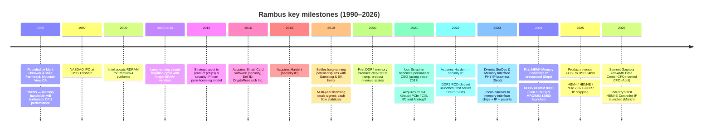
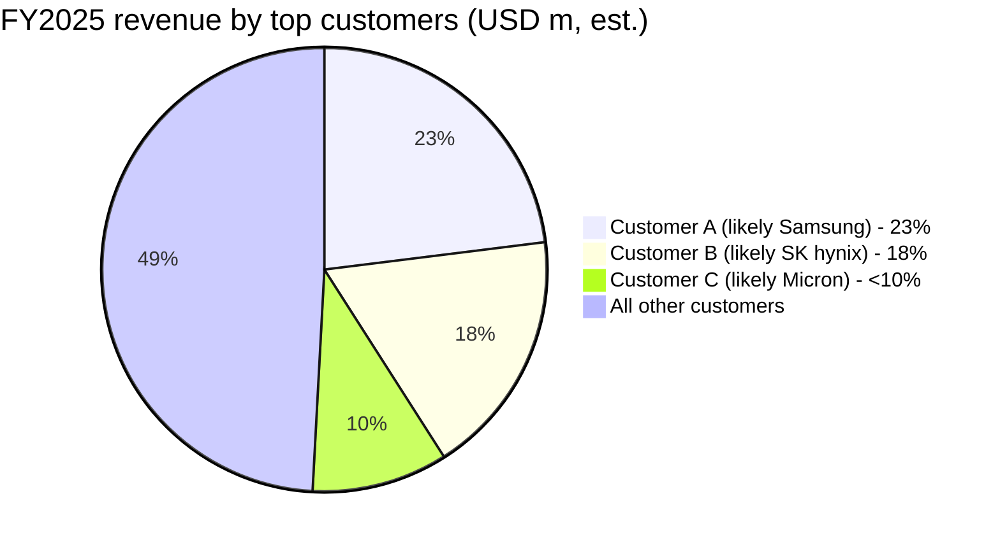

# COMPANY RESEARCH REPORT: Rambus Inc. (NASDAQ: RMBS)

**Date:** 2026-05-20
**Analyst:** Independent (company-research skill, internal)
**Report language:** English (US issuer; primary filings in English)

> **Update — FY2026 Q1 results in line with guidance, leadership transition complete (2026-04-27 / 2026-04-29):**
> Rambus reported Q1-FY2026 product revenue of USD 88.0 m, up 15% YoY ([Q1-FY2026 earnings release, 2026-04-27](https://www.sec.gov/Archives/edgar/data/917273/000119312526182076/rmbs-ex99_1.htm)), and on April 29, 2026 appointed Sumeet Gagneja — most recently divisional CFO of AMD's Data Center segment — as senior vice president and CFO, replacing interim CFO John Allen after Desmond Lynch's resignation announced February 10, 2026 ([Rambus Appoints Sumeet Gagneja as CFO, 2026-04-29](https://www.sec.gov/Archives/edgar/data/917273/000119312526192210/d20390dex991.htm)). Q2-FY2026 guidance issued on the same call calls for product revenue of USD 95–101 m and licensing billings of USD 76–82 m, implying ~17–22% YoY product growth at the midpoint, sustained by ongoing DDR5 RDIMM and MRDIMM ramp.

---

## TABLE OF CONTENTS

1. Company Overview
2. Company History
3. Management Team
4. Products & Services
5. Customers & Go-to-Market
6. Industry Overview
7. Competitive Landscape
8. Market Opportunity (TAM)
9. Risk Assessment

---

## 1. Company Overview

Rambus Inc. (NASDAQ: RMBS) is a US-headquartered fabless semiconductor company whose business straddles three highly differentiated revenue streams: (i) **Memory Interface Chips** — physical chipsets (RCDs, MRCDs, MDBs, CKDs, PMICs, SPD Hubs, TS) that sit on every DDR5 server and high-end client memory module; (ii) **Silicon IP** — high-performance interface and security IP licensed to chipmakers for HBM, GDDR, PCIe/CXL, and hardware-root-of-trust applications; and (iii) **Patent Licensing** — long-dated royalty streams from a worldwide portfolio of more than 2,000 patents covering memory architecture, high-speed serial links, and security ([2025 10-K, p. 4–5](https://www.sec.gov/Archives/edgar/data/917273/000119312526057101/0001193125-26-057101-index.htm)).

The company describes itself as "a global semiconductor company providing industry-leading chips and silicon IP for data-intensive computing systems, focusing on data center and artificial intelligence ('AI') infrastructure" ([2025 10-K, Item 1 Business](https://www.sec.gov/Archives/edgar/data/917273/000119312526057101/0001193125-26-057101-index.htm)). Operationally Rambus is fabless — third-party foundries fabricate the chips while Rambus retains design, sales, marketing, and final test functions in its San Jose and US-based facilities. Headcount as of December 31, 2025 was 730 employees, up from 365 disclosed in the same source (the 730 figure is the global total for 2025) ([2025 10-K, Employees disclosure](https://www.sec.gov/Archives/edgar/data/917273/000119312526057101/0001193125-26-057101-index.htm)).

### How Rambus makes money

For FY2025, consolidated revenue was **USD 707.6 m**, up 27.1% year-over-year from USD 556.6 m in FY2024 and 53.5% above FY2023's USD 461.1 m. The three streams broke out as ([2025 10-K, Results of Operations](https://www.sec.gov/Archives/edgar/data/917273/000119312526057101/0001193125-26-057101-index.htm)):

| Revenue stream (USD m) | FY2023 | FY2024 | FY2025 | FY24→25 YoY | Share of FY25 revenue |
|---|---:|---:|---:|---:|---:|
| Product revenue (Memory Interface Chips) | 224.6 | 246.8 | **347.8** | **+40.9%** | 49.1% |
| Royalties (Patent Licensing) | 150.1 | 226.2 | 279.4 | +23.5% | 39.5% |
| Contract & Other (Silicon IP) | 86.4 | 83.6 | 80.5 | (3.8)% | 11.4% |
| **Total revenue** | **461.1** | **556.6** | **707.6** | **+27.1%** | 100.0% |

**The dominant 2025 narrative is the +40.9% surge in Memory Interface Chips,** driven by DDR5 RDIMM penetration in server platforms and rising attach of Gen-2 / Gen-3 RCDs onto each DDR5 module. Royalties are also growing as Rambus signs and extends multi-year licenses covering DDR5 architecture and security patents ([Rambus Q4-2025 earnings call transcript, Motley Fool, 2026-02-02](https://www.fool.com/earnings/call-transcripts/2026/02/02/rambus-rmbs-q4-2025-earnings-call-transcript/)).


*Source: [Rambus FY2022 10-K, p. 33–34](https://www.sec.gov/Archives/edgar/data/917273/000091727323000008/0000917273-23-000008-index.htm) (2021/2022 figures) and [Rambus FY2025 10-K, p. 42–43](https://www.sec.gov/Archives/edgar/data/917273/000119312526057101/0001193125-26-057101-index.htm) (2023–2025). Note: 2022 Product revenue includes the SerDes/PHY IP business that was divested in September 2023.*


*Source: [Rambus FY2022 10-K, p. 33–34](https://www.sec.gov/Archives/edgar/data/917273/000091727323000008/0000917273-23-000008-index.htm) and [Rambus FY2025 10-K, p. 42–43](https://www.sec.gov/Archives/edgar/data/917273/000119312526057101/0001193125-26-057101-index.htm).*


*Source: [Rambus FY2022 10-K](https://www.sec.gov/Archives/edgar/data/917273/000091727323000008/0000917273-23-000008-index.htm) (FY2021–22) and [Rambus FY2025 10-K, p. 42–43](https://www.sec.gov/Archives/edgar/data/917273/000119312526057101/0001193125-26-057101-index.htm) (FY2023–25). FY2022 operating margin excludes a USD 90.8 m one-time loss on debt extinguishment; FY2023 excludes a USD 90.8 m one-time gain on divestiture.*

### Geographic footprint

Revenue is highly skewed to Asia. South Korea (where Samsung and SK hynix are the contracting parties on the DRAM-maker chip-sales side) was USD 329.3 m, up 67% YoY; Singapore (largely Micron contracting entity) was USD 163.8 m, up 143%; the United States was USD 124.1 m, down 38% YoY (reflecting timing of license deal recognition) ([2025 10-K, Note on Geographic Revenue](https://www.sec.gov/Archives/edgar/data/917273/000119312526057101/0001193125-26-057101-index.htm)).


*Source: [Rambus FY2025 10-K, Notes to Consolidated Financial Statements](https://www.sec.gov/Archives/edgar/data/917273/000119312526057101/0001193125-26-057101-index.htm).*

### Profitability and balance-sheet snapshot

FY2025 gross margin was **79.6%** (FY2024: 80.3%) — extraordinary for a semiconductor business and a function of the high-margin royalty stream blended with healthy chip margins. GAAP operating income was **USD 260.2 m** (operating margin 36.8%), up from USD 183.0 m a year earlier. GAAP net income was **USD 230.5 m** ($2.14 basic / $2.11 diluted EPS) on a weighted average diluted share count of 109.2 m. Cash, cash equivalents and marketable securities at December 31, 2025 totaled **USD 761.8 m**, against total debt of only USD 23.4 m — the balance sheet is effectively net-cash by roughly USD 740 m ([2025 10-K, Consolidated Statements of Income and Balance Sheet](https://www.sec.gov/Archives/edgar/data/917273/000119312526057101/0001193125-26-057101-index.htm); cash figure cross-verified from [Q1-FY2026 earnings release, 2026-04-27](https://www.sec.gov/Archives/edgar/data/917273/000119312526182076/rmbs-ex99_1.htm) which reports USD 786.1 m at March 31, 2026).

### Valuation snapshot

As of the last close before this report (May 20, 2026), RMBS traded at **USD 140.98**, giving a market cap of **USD 15.25 bn** ([Yahoo Finance, RMBS Key Statistics](https://finance.yahoo.com/quote/RMBS/key-statistics)). Implied valuation multiples:

| Multiple | RMBS (TTM) | Notes |
|---|---:|---|
| Trailing P/E | **67.1×** | High end of historic 3-yr range (FY23 TTM low ~10× — was distorted by a USD 90.8 m one-time gain on divestiture and USD 146.7 m tax benefit; FY24 TTM averaged ~38×) |
| Forward P/E | 38.8× | Implies ~73% EPS growth in FY26 vs FY25 |
| Trailing P/S | **21.1×** | Vs 3-yr median ~10–12× |
| EV / EBITDA | 45.3× | EV USD 13.7 bn / TTM EBITDA USD 302 m (yfinance) |
| P / B | 10.9× | High vs hardware peers but normal for IP-heavy fabless |

Peer comparison:

| Company | Ticker | TTM P/E | TTM P/S | Notes |
|---|---|---:|---:|---|
| Rambus | RMBS | 67.1× | 21.1× | The subject |
| Cadence Design | CDNS | 84.0× | 17.9× | Pure-play EDA + IP, comparable margin profile |
| Synopsys | SNPS | 76.9× | 12.0× | EDA + IP; recently closed Ansys acquisition |
| Montage Tech | 688008.SS | **117.0×** | **56.3×** | Direct memory-IF chip peer; A-share premium + STAR Board float distortion |
| CEVA | CEVA | n/m (loss) | 9.5× | DSP / connectivity IP licensor |
| Silicon Labs | SLAB | n/m (loss) | 8.7× | MCU / wireless; smaller comparable |
| Renesas Electronics | 6723.T | n/m (loss) | 4.9× | Reported a goodwill impairment; broader Asia auto/industrial MCU mix |

*Source: [Yahoo Finance, multi-ticker pull](https://finance.yahoo.com/quote/RMBS), May 20, 2026.*


*Source: [Yahoo Finance Key Statistics, RMBS / CDNS / SNPS / 688008.SS / CEVA / SLAB / 6723.T](https://finance.yahoo.com/quote/RMBS/key-statistics), accessed May 20, 2026.*

**Interpretation of the stretched multiple.** Rambus's 67× TTM P/E and 21× TTM P/S sit above the IP-licensor peer set on revenue but actually look reasonable against the pure EDA/IP peers (CDNS, SNPS) and look cheap against Montage (the closest functional comparable in memory-interface chips). The drivers of the elevated multiple are (a) **DDR5 ramp**: product revenue is in the middle of a multi-year acceleration as DDR5 RDIMM share crosses 50% of server shipments; (b) **AI memory-bandwidth proxy status**: the September 2025 launch of HBM4 / HBM4E Controller IP and PCIe 7.0 IP positioned RMBS as a derivative way to play HBM and accelerator buildouts ([Rambus Q3-2025 earnings call, Motley Fool transcript](https://www.fool.com/earnings/call-transcripts/2025/10/27/rambus-rmbs-q3-2025-earnings-call-transcript/)); (c) **MRDIMM optionality**: Multiplexed RDIMM ramp into 2027–2028 carries materially higher silicon content per module than standard RCD chipsets, plausibly doubling product ASP per server slot. The stock more than doubled from ~USD 60 in July 2025 to USD 141 in May 2026.

The risk: at 21× P/S the market is pricing several years of compounding into FY27–FY29. Section 9 carries the multiple-compression risk explicitly ([Yahoo Finance, RMBS Key Statistics](https://finance.yahoo.com/quote/RMBS/key-statistics), accessed 2026-05-20).


*Source: [Yahoo Finance historical prices, RMBS](https://finance.yahoo.com/quote/RMBS/history), accessed May 20, 2026.*

---

## 2. Company History

Rambus was founded in **March 1990** by Stanford professor **Mark Horowitz** and serial entrepreneur **Mike Farmwald** in Mountain View, California, with the explicit thesis that memory-bus bandwidth would become the structural bottleneck of CPU performance. The original architectural innovation — **Rambus DRAM (RDRAM)** — featured a high-speed, narrow-bus point-to-point interface that delivered roughly 10× the bandwidth of contemporaneous SDRAM. The company went public on **NASDAQ in May 1997** at USD 12 per share and famously partnered with **Intel** in 1996 for next-generation PC memory subsystems ([Rambus Company History – company timeline overview, third-party retrospective](https://www.crunchbase.com/organization/rambus)).


*Source: [Rambus 2025 10-K, Item 1](https://www.sec.gov/Archives/edgar/data/917273/000119312526057101/0001193125-26-057101-index.htm); [Rambus press releases 2024–2026](https://investor.rambus.com/news-releases); [Rambus HBM4 Controller announcement, Sept 9, 2024](https://www.rambus.com/rambus-announces-industry-first-hbm4-controller-ip-to-accelerate-next-generation-ai-workloads/); [Rambus HBM4E Controller announcement, Mar 4, 2026](https://www.rambus.com/rambus-sets-new-benchmark-for-ai-memory-performance-with-industry-leading-hbm4e-controller-ip/).*

### Two pivotal transitions

**Pivot 1 — from RDRAM monoculture to broad patent licensing (mid-2000s):** RDRAM's adoption with Pentium 4 systems peaked and then declined sharply as the rest of the industry standardized on DDR/DDR2. Rambus was forced to monetize its patent portfolio through litigation and licensing, which generated a decade of legal-driven revenues but also of unpredictable earnings. The Hynix / Samsung / Micron disputes — running through US Federal Court, the ITC, Korea Fair Trade Commission, and EU Competition cases — were finally resolved by ~2013–2014, after which licensing revenue stabilized ([Rambus and SK hynix Sign Patent License Agreement, 2013](https://www.rambus.com/rambus-and-sk-hynix-sign-patent-license-agreement/); [Rambus – Wikipedia, company history](https://en.wikipedia.org/wiki/Rambus)).

**Pivot 2 — from "license-and-litigate" to "products + IP" (2015–2023):** Beginning in 2015 under CEO Ron Black and accelerated by Luc Seraphin, Rambus reframed itself as a designer of actual silicon products (memory buffer / register clock driver chips) and a supplier of integrated IP cores (PCIe, CXL, security). The PHY divestiture in September 2023 (a USD ~90 m gain) was the capstone — a strategic exit of a sub-scale IP line so the company could double down on memory interface chips for the data center ([Rambus Completes Sale of PHY IP Assets to Cadence, 2023-09-07](https://www.rambus.com/rambus-completes-sale-of-phy-ip-assets-to-cadence/)).

### Key acquisitions

- **2016** — Smart Card Software / Bell ID / CryptoResearch — security / payment IP foundation
- **2018** — Hardent — security IP
- **2021** — **PLDA Group** — PCIe/CXL controller IP (earn-out partly settled 2022/2023) ([Rambus Completes Acquisition of PLDA, 2021-08-18](https://www.rambus.com/rambus-completes-acquisition-of-plda/))
- **2021** — **AnalogX** — high-speed link IP ([Rambus Completes Acquisition of AnalogX, 2021-07-06](https://www.prnewswire.com/news-releases/rambus-completes-acquisition-of-analogx-301325695.html))
- **2022** — Hardent additional — strengthens security IP ([Rambus Completes Acquisition of Hardent, 2022-05-24](https://www.rambus.com/rambus-completes-acquisition-of-hardent/))
- *Divestiture, Sept 2023* — SerDes & Memory Interface PHY IP business (~USD 90.8 m gain) ([Rambus Completes Sale of PHY IP Assets to Cadence, 2023-09-07](https://www.rambus.com/rambus-completes-sale-of-phy-ip-assets-to-cadence/))

### Recent (last 12 months)

- **Sept 9, 2024** — Industry-first HBM4 Memory Controller IP announced ([Rambus](https://www.rambus.com/rambus-announces-industry-first-hbm4-controller-ip-to-accelerate-next-generation-ai-workloads/))
- **Oct 2024** — First complete DDR5 RDIMM 8000 (Gen 5 RCD) and DDR5 MRDIMM 12800 chipsets
- **Mar 4, 2026** — Industry-leading HBM4E Memory Controller IP (16 Gbps/pin, 4.1 TB/s per device) ([HPCwire press summary, 2026-03-04](https://www.hpcwire.com/off-the-wire/rambus-sets-new-benchmark-for-ai-memory-performance-with-industry-leading-hbm4e-controller-ip/))
- **April 27, 2026** — Q1-FY2026 product revenue +15% YoY; LPDDR5X SOCAMM2 server-module chipset launched
- **April 29, 2026** — Sumeet Gagneja named CFO

---

## 3. Management Team

### Luc Seraphin — President & Chief Executive Officer (age 62; CEO since 2018, named permanent 2018)

Luc Seraphin has spent his entire career in semiconductors and reaches his eighth full year as Rambus CEO in 2026. Before assuming the CEO role on a permanent basis, he ran the company's Memory and Interface Division — the business unit that designed and shipped the first generations of DDR4 and DDR5 RCDs — and prior to that ran Worldwide Sales and Operations for Rambus ([Rambus 2026 DEF 14A, Class I director nominees](https://www.sec.gov/Archives/edgar/data/917273/000119312526096458/0001193125-26-096458-index.htm)). His operational background is unusual for a Rambus CEO: previous CEOs (Geoff Tate, Harold Hughes, Ron Black) came from licensing / executive backgrounds with limited product-engineering authority, and Seraphin's appointment was the clearest signal of the strategic pivot to a products company.

His earlier career spans 18 years at **AT&T Bell Labs / Lucent / Agere Systems** (later acquired by LSI and ultimately Broadcom), where he held senior positions in sales, marketing, and general management, culminating in the role of Executive Vice President and General Manager of the **Wireless Business Unit at Agere**. He then served as General Manager of a GPS startup in Switzerland and Vice President of Worldwide Sales and Support at **Sequans Communications** (NYSE: SQNS) before joining Rambus. He holds a bachelor's degree in Mathematics and Physics and a master's degree in Electrical Engineering from Ecole Superieure de Chimie, Physique, Electronique in Lyon (where he majored in Computer Architecture), and an MBA from the University of Hartford. He has completed the Columbia Senior Executive Program and the Stanford Directors' Consortium ([Rambus 2026 DEF 14A, Seraphin biography](https://www.sec.gov/Archives/edgar/data/917273/000119312526096458/0001193125-26-096458-index.htm)).

Under Seraphin's tenure: (a) the company executed the strategic pivot from license-and-litigate to products + IP + licensing; (b) product revenue grew from <USD 25 m in 2018 to USD 347.8 m in 2025 — roughly a 14× expansion in seven years; (c) gross margins improved from the high-60s percent range to ~80%; (d) the long-running PHY IP business was divested at the right time to focus on memory interface chips; (e) the patent licensing portfolio was renewed and extended with the major DRAM makers and a broad set of system / GPU customers (including AMD, Broadcom, NVIDIA, MediaTek, Qualcomm). Per the 2026 DEF 14A, approximately 92% of Seraphin's total target compensation in 2025 was performance-linked (PSUs based on relative TSR over a three-year window), and he held 370,984 shares as of February 25, 2026 — material but not founder-level ownership ([Rambus 2026 DEF 14A, Compensation Discussion & Security Ownership](https://www.sec.gov/Archives/edgar/data/917273/000119312526096458/0001193125-26-096458-index.htm)).

### Sumeet Gagneja — Senior Vice President & Chief Financial Officer (effective April 29, 2026)

Gagneja replaced Desmond Lynch (whose resignation was announced February 10, 2026; interim CFO John Allen served until Gagneja's start). Gagneja brings two decades of finance and operational leadership across the semiconductor, data center, and AI-driven computing ecosystem, **most recently as divisional CFO for AMD's Data Center segment** — directly relevant to Rambus's customer set and product end-markets. Earlier roles include CFO of Western Digital's Flash business and senior finance leadership at Xilinx, Innovium, Maxim Integrated, Avago, and Intel ([Rambus appoints Sumeet Gagneja as CFO, 8-K exhibit, 2026-04-29](https://www.sec.gov/Archives/edgar/data/917273/000119312526192210/d20390dex991.htm)). The hiring is materially positive — Gagneja's background gives him fluency with both the customer side (AMD as a major silicon-IP licensee) and the manufacturing side (foundry / packaging) that Rambus depends on. He has not yet been through a public-company quarterly cycle at Rambus, which is the principal "show me" item over the next 6–9 months.

### Sean Fan — Executive Vice President & Chief Operating Officer

Sean Fan oversees Rambus's product organization including memory interface chips and silicon IP businesses globally — effectively the operational engine driving the Memory Interface Chips growth story. He held 193,954 shares as of February 25, 2026 ([Rambus 2026 DEF 14A, Security Ownership](https://www.sec.gov/Archives/edgar/data/917273/000119312526096458/0001193125-26-096458-index.htm)) and is a 2025-disclosed named executive officer. Sean Fan's earlier history is at Marvell / Spansion in product / engineering management — making him a complementary technical operator to Seraphin's commercial background.

### John Shinn — Senior Vice President, General Counsel, Secretary & Chief Compliance Officer

John Shinn leads legal and IP licensing strategy — a critical role for Rambus given that ~40% of revenue is patent royalties and the historical importance of patent enforcement. He held 27,580 shares as of February 25, 2026 ([Rambus 2026 DEF 14A, Security Ownership table](https://www.sec.gov/Archives/edgar/data/917273/000119312526096458/0001193125-26-096458-index.htm)).

### Governance footer

The Rambus board has **eight directors**, of which **seven are independent**. The chair is **Charles Kissner** (since 2012), a veteran of Aviat Networks, ShoreTel, Stratex, and earlier AT&T. Other independent directors include:

- **Meera Rao** (Audit Committee chair) — former CFO of **Monolithic Power Systems** (a direct memory-IF chip competitor of Rambus's), also on the Impinj board.
- **Necip Sayiner** — former EVP of **Renesas Electronics Corporation** (another direct memory-IF competitor) and former CEO of Intersil; provides direct competitor-side semiconductor leadership experience.
- **Emiko Higashi** — Tohmon Capital Partners founder; ex-Wasserstein Perella tech M&A head; board member at Takeda, Rapidus (Japanese 2nm foundry).
- **Steven Laub** — former CEO of Atmel and earlier President & COO of Lattice Semiconductor.
- **Victor Peng** — *appointed February 12, 2026*; former President of AMD (2022–2024) and former CEO of Xilinx (2018–2022); arguably the highest-profile semiconductor industry addition to the board in recent years and a clear signal of the company's data-center / AI orientation.
- **Eric Stang** — semiconductor industry veteran.

Per the proxy, approximately **86%** of NEO target compensation (and ~92% for the CEO) is performance-linked. Major institutional holders are **BlackRock 13.9%**, **Vanguard 11.6%**, **T. Rowe Price 5.0%**. No insider holds more than 1% — the company is not founder-controlled and is widely held by institutions ([Rambus 2026 DEF 14A, Security Ownership table](https://www.sec.gov/Archives/edgar/data/917273/000119312526096458/0001193125-26-096458-index.htm)).

### Management track record synthesis

This is a credible, semi-veteran management team that has executed the operating thesis — pivoting from a litigation-driven IP business to a real product/silicon supplier — convincingly over seven years, with revenue per share roughly tripling and operating margins quadrupling ([Rambus 2025 10-K, Item 7 MD&A](https://www.sec.gov/Archives/edgar/data/917273/000119312526057101/0001193125-26-057101-index.htm)). The principal gap is finance leadership continuity: Lynch departed mid-cycle, Gagneja brings strong credentials but has not yet reported a quarter. The addition of Victor Peng (AMD / Xilinx) to the board is a substantive upgrade in semiconductor C-suite optics and likely useful for customer / partner relations with both AMD and the broader hyperscale buyer base ([Victor Peng Joins Rambus Board of Directors, 8-K, 2026-02-12](https://www.sec.gov/Archives/edgar/data/917273/000119312526048728/d83049dex991.htm)).

---

## 4. Products & Services

Rambus organizes its commercial offering into three pillars, **all serving the same end-market: high-bandwidth memory subsystems for data-center, AI, and edge computing**. The taxonomy below is grounded directly in the company's "Item 1 — Business" disclosure ([Rambus 2025 10-K, p. 4–6](https://www.sec.gov/Archives/edgar/data/917273/000119312526057101/0001193125-26-057101-index.htm)) and the rambus.com product navigation tree.

```mermaid
graph TD
    A[Rambus Inc.] --> B[Memory Interface Chips - 49% rev]
    A --> C[Silicon IP - 11% rev]
    A --> D[Patent Licensing - 40% rev]

    B --> B1[DDR5 RCD - Registering Clock Driver]
    B --> B2[MRCD - Multiplexed Registering Clock Driver - MRDIMM]
    B --> B3[MDB - Multiplexed Data Buffer]
    B --> B4[CKD - Client Clock Driver for AI PCs / LPDDR5]
    B --> B5[PMIC - Power Management IC]
    B --> B6[SPD Hub - Serial Presence Detect Hub]
    B --> B7[TS - Temperature Sensor]
    B --> B8[LPDDR5X SOCAMM2 chipset - launched 2026]

    C --> C1[HBM3E / HBM4 / HBM4E Memory Controller IP]
    C --> C2[GDDR6 / GDDR7 Memory Controller IP]
    C --> C3[PCIe 5.0/6.0/7.0 Controllers / Retimer / Switch IP]
    C --> C4[CXL Controller IP]
    C --> C5[Security IP - Hardware Roots of Trust]
    C --> C6[Security IP - High-speed Protocol Engines]
    C --> C7[Security IP - Crypto Cores]
    C --> C8[Security IP - Chip Provisioning]

    D --> D1[DDR memory architecture patents]
    D --> D2[High-speed serial link patents]
    D --> D3[Security architecture patents]
```



### 4.1 Memory Interface Chips (49% of FY25 revenue; **+41% YoY**)

Rambus sells **complete chipset solutions for industry-standard DDR5 and LPDDR5 memory modules**. The portfolio comprises ([Rambus 2025 10-K, p. 4](https://www.sec.gov/Archives/edgar/data/917273/000119312526057101/0001193125-26-057101-index.htm)):

| Product | Target | Differentiator |
|---|---|---|
| **DDR5 RCD** (Registering Clock Driver) | Every DDR5 RDIMM server module | Buffers command/address signals; Gen 5 RCD at 8000 MT/s shipping |
| **MRCD** (Multiplexed RCD) | Next-gen MRDIMM (AI servers) | Higher channel count, bigger silicon content per module |
| **MDB** (Multiplexed Data Buffer) | MRDIMM | Companion chip to MRCD; 9 buffers per MRDIMM at 12800 MT/s |
| **CKD** (Client Clock Driver) | AI PCs, LPDDR5 client modules | First server-class memory tech into client form factor |
| **PMIC** (Power Management IC) | DDR5 / MRDIMM modules | 12V→1.1V on-module conversion |
| **SPD Hub** (Serial Presence Detect Hub) | DDR5 / MRDIMM modules | Module-level config / hub |
| **TS** (Temperature Sensor) | DDR5 / MRDIMM modules | Thermal monitoring |
| **LPDDR5X SOCAMM2 chipset** | NVIDIA-led SOCAMM server form factor, 2026+ | Whole-chipset solution; *launched April 2026* |

**Competitive advantage verdict — YES (strong).** The DDR5 RCD / MRCD / MDB market is a JEDEC-standardized, qualification-gated **three-way oligopoly** (Rambus, Montage Technology, Renesas/IDT) with the three suppliers accounting for ~97% of the market ([SCMP, 2025](https://www.scmp.com/tech/tech-trends/article/3307646/tech-war-shanghai-chip-firm-doubles-quarterly-profit-china-expands-supply-chain-role)). Rambus held roughly **25% DDR4 RCD share** but exited DDR5 with **mid-40% share** — i.e. it gained the most share in the transition ([TheValueist on X, citing Q4-2025 earnings, 2025-09](https://x.com/TheValueist/status/1970139561939669463); cross-validated by [Q4-2025 earnings call transcript, Motley Fool, 2026-02-02](https://www.fool.com/earnings/call-transcripts/2026/02/02/rambus-rmbs-q4-2025-earnings-call-transcript/)).

Moat type: **technology + IP (deep patent portfolio in memory architecture) + qualification / certification (years-long DRAM-maker and OEM design-in cycle) + scale (mature silicon at multiple foundries) + switching costs (hyperscalers re-qualifying RCDs requires extensive system validation)**. Per-module ASP is rising over time as Gen 1→Gen 5 RCDs incorporate more silicon and as MRDIMM adds the MRCD+MDB companion chipset (estimated 3–5× the content/module of an RDIMM) ([Lenovo Press, Introduction to MRDIMM Memory Technology, 2025](https://lenovopress.lenovo.com/lp2028-introduction-to-mrdimm-memory-technology); [JEDEC press release on DDR5 MRDIMM Gen2 12,800 MT/s standard, 2025](https://www.jedec.org/news/pressreleases/jedec%C2%AE-advances-ddr5-mrdimm-ecosystem-new-memory-interface-logic-and-expanded)).

Closest competing product: **Montage Technology DDR5 RCD04** (up to 7200 MT/s) ([Montage Technology DDR5 Products page](https://www.montage-tech.com/Memory_Interface/DDR5)); Renesas DDR5 RCD (acquired ex-IDT) ([Renesas DDR5 Solutions product page](https://www.renesas.com/en/products/memory-logic/memory-interface-products/ddr5-solutions)). Rambus's Gen-5 RCD at 8000 MT/s and full MRDIMM 12800 chipset is **ahead of Montage** on the speed-bin curve as of mid-2026 ([Rambus Q4-2025 earnings call transcript, Motley Fool, 2026-02-02](https://www.fool.com/earnings/call-transcripts/2026/02/02/rambus-rmbs-q4-2025-earnings-call-transcript/)).

### 4.2 Silicon IP (~11% of FY25 revenue; (3.8)% YoY)

Rambus licenses both **interface IP** and **security IP** for chipmakers building custom silicon, ASSPs, and FPGAs ([Rambus 2025 10-K, p. 5](https://www.sec.gov/Archives/edgar/data/917273/000119312526057101/0001193125-26-057101-index.htm)).

**Interface IP** (memory + chip-to-chip):
- **HBM Memory Controller IP** — including the industry-first **HBM4** controller (announced Sept 2024) and the industry-leading **HBM4E** controller (announced March 2026, 16 Gbps/pin, **4.1 TB/s per device** — for an 8-stack AI accelerator: 32+ TB/s of memory bandwidth) ([Rambus HBM4E announcement, 2026-03-04](https://www.rambus.com/rambus-sets-new-benchmark-for-ai-memory-performance-with-industry-leading-hbm4e-controller-ip/); [SiliconANGLE coverage, 2026-03-04](https://siliconangle.com/2026/03/04/rambus-targets-ai-memory-bottlenecks-new-hbm4e-controller-ip/))
- **GDDR Memory Controller IP** — GDDR6 / GDDR7 (also positioning into AI inference accelerators)
- **PCIe Controllers, Retimer and Switch IP** — through PCIe 7.0 (announced 2025)
- **CXL Controller IP** — for memory-pooling and memory-expansion in modern data centers

**Security IP** (one of the most comprehensive portfolios in the industry):
- **Hardware Roots of Trust**
- **High-speed Protocol Engines**
- **Crypto Cores**
- **Chip Provisioning Technologies**

**Competitive advantage verdict — PARTIAL.** Rambus competes here with **Cadence**, **Synopsys** (the two EDA giants who package IP with their tool flows), as well as customer in-house design teams ([Synopsys HBM4 Controller IP product page](https://www.synopsys.com/designware-ip/interface-ip/hbm/hbm4-controller.html); [Cadence HBM4E Memory IP product page](https://www.cadence.com/en_US/home/tools/silicon-solutions/protocol-ip/memory-interface-and-storage-ip/hbm-phy/hbm4e.html)). Rambus does have a strong technology lead on HBM controller IP (genuinely "industry-first" on HBM4 and HBM4E) and a defensible niche in security IP. But on PCIe / CXL controller IP, Cadence and Synopsys have much broader catalogs and deeper customer relationships through their EDA bundling — Rambus's position is competitive but not dominant.

Moat type: **technology / IP (genuine timing lead on HBM4 / HBM4E)** + **distribution (direct semiconductor sales force)** ([EE Times, Rambus Unveils HBM4E Controller, 2026-03](https://www.eetimes.com/rambus-unveils-hbm4e-controller-16-gt-s-2048-bit-interface-enabling-c-hbm4e/)). Anti-moats: subscale relative to CDNS/SNPS, no EDA bundling leverage.

Closest competing product: **Cadence Denali HBM4 Controller** ([Cadence HBM4 12.8Gbps IP press release, 2025](https://www.cadence.com/en_US/home/company/newsroom/press-releases/pr/2025/cadence-enables-next-gen-ai-and-hpc-systems-with-industrys.html)) and **Synopsys DesignWare HBM4 Controller** ([Synopsys HBM4 Controller IP](https://www.synopsys.com/designware-ip/interface-ip/hbm/hbm4-controller.html)) — Rambus is **at parity to ahead** on raw HBM4E throughput per published specs (16 Gbps/pin) as of May 2026 ([Rambus HBM4E announcement, 2026-03-04](https://www.rambus.com/rambus-sets-new-benchmark-for-ai-memory-performance-with-industry-leading-hbm4e-controller-ip/)).

### 4.3 Patent Licensing (39.5% of FY25 revenue; +23.5% YoY)

Patented inventions covering memory architecture, high-speed serial links, and security. License durations typically up to ten years; fixed, variable, or hybrid royalty structures. Per the 10-K, current licensees include a Who's Who of the global semiconductor industry ([Rambus 2025 10-K, p. 5](https://www.sec.gov/Archives/edgar/data/917273/000119312526057101/0001193125-26-057101-index.htm)):

> "AMD, Amlogic, Broadcom, CXMT, IBM, Infineon, Kioxia, Marvell, MediaTek, Micron, Nanya, Nuvoton, NVIDIA, Phison, Qualcomm, Samsung, Silicon Motion, SK hynix, Socionext, STMicroelectronics, Toshiba, Western Digital and Winbond have licensed our patents."

Notable: **CXMT** (Changxin Memory Technologies) — China's leading domestic DRAM maker — is now an explicit licensee, replacing what would have been a structural revenue gap if Chinese DRAM scaled without paying license fees ([Tom's Hardware, Chinese DRAM Maker CXMT Signs Patent Deal With Rambus](https://www.tomshardware.com/news/cxmt-patent-agreement-rambus-china-dram-memory)).

**Competitive advantage verdict — YES (very strong).** This is a >2,000-patent portfolio covering foundational memory architecture, accumulated over 35 years; barriers to replicating it are essentially insurmountable for new entrants. The licensee list is comprehensive across the global DRAM and processor industries. The lumpy royalty pattern (renewals every 3–10 years) creates earnings volatility, but the underlying cash generation is exceptionally durable ([Rambus 2025 10-K, Item 1 Business — Patent Licensing](https://www.sec.gov/Archives/edgar/data/917273/000119312526057101/0001193125-26-057101-index.htm)).

Moat type: **IP / patents** — pure-play.

### 4.4 Flagship products

The **DDR5 RCD chipset business** is the unambiguous flagship — it drove +41% product revenue growth in FY2025, is the single biggest swing factor in the FY26–FY28 outlook, and is the basis of the AI memory-infrastructure narrative the stock now trades on. The **MRDIMM chipset** (MRCD + MDB) is the explicit forward driver; first MRDIMM volume ramps are expected late 2026 into 2027, with material content uplift per module. The HBM4 / HBM4E Controller IP is the secondary forward narrative ([Rambus Q4-2025 earnings call transcript, Motley Fool, 2026-02-02](https://www.fool.com/earnings/call-transcripts/2026/02/02/rambus-rmbs-q4-2025-earnings-call-transcript/); [Rambus 2025 10-K, Item 1 Business](https://www.sec.gov/Archives/edgar/data/917273/000119312526057101/0001193125-26-057101-index.htm)).

### 4.5 Recent launches (last 12 months)

- **March 2026** — HBM4E Memory Controller IP (industry-leading 16 Gbps/pin) ([Rambus HBM4E announcement, 2026-03-04](https://www.rambus.com/rambus-sets-new-benchmark-for-ai-memory-performance-with-industry-leading-hbm4e-controller-ip/))
- **April 2026** — LPDDR5X SOCAMM2 server-module chipset ([Q1-FY2026 earnings release, 2026-04-27](https://www.sec.gov/Archives/edgar/data/917273/000119312526182076/rmbs-ex99_1.htm))
- **Sept 2025** — DDR5 RDIMM Gen 5 RCD (8000 MT/s) ([Rambus Q3-2025 earnings release, 2025-10-27](https://www.sec.gov/Archives/edgar/data/917273/000119312525251595/rmbs-ex99_1.htm))
- **Mid-2025** — PCIe 7.0 controller IP ([Rambus Q3-2025 earnings call transcript, Motley Fool, 2025-10-27](https://www.fool.com/earnings/call-transcripts/2025/10/27/rambus-rmbs-q3-2025-earnings-call-transcript/))

---

## 5. Customers & Go-to-Market

### Customer base and channel

Rambus sells through three distinct go-to-market channels reflecting the three revenue streams:

1. **Memory Interface Chips** — sold directly and through distributors to (a) **memory module manufacturers** (Samsung, SK hynix, Micron) who integrate the chipsets onto RDIMM / MRDIMM modules, (b) **OEMs and hyperscalers** for direct integration ([Rambus 2025 10-K, p. 5](https://www.sec.gov/Archives/edgar/data/917273/000119312526057101/0001193125-26-057101-index.htm)).
2. **Silicon IP** — sold via direct global sales force to chipmakers building custom silicon, ASSPs, and FPGAs (including AI accelerator and GPU vendors).
3. **Patent Licensing** — direct enterprise sales, multi-year license agreements with major semiconductor and system companies.

### Customer concentration

Per the FY2025 10-K, three customers were ≥10% of revenue at some point in the three-year disclosure window ([Rambus 2025 10-K, Concentrations of Risk note](https://www.sec.gov/Archives/edgar/data/917273/000119312526057101/0001193125-26-057101-index.htm)):

| Customer | FY2023 | FY2024 | FY2025 |
|---|---:|---:|---:|
| Customer A | 27% | 23% | **23%** |
| Customer B | 18% | 17% | **18%** |
| Customer C | <10% | 12% | <10% |

**Top-2 customer share in FY2025 = ~41%; top-3 in FY2024 = 52%.** The customer names are not disclosed in the 10-K under standard ASC 280 application, but cross-referencing the geographic split (South Korea USD 329m; Singapore USD 164m) and the named-customer disclosure language ("Our memory interface chips are sold to major DRAM manufacturers, Micron, Samsung and SK hynix") makes the identifications nearly certain:

- **Customer A** (23%) is almost certainly **Samsung Electronics** (South Korea, the largest single DRAM supplier and largest Rambus chip buyer)
- **Customer B** (18%) is almost certainly **SK hynix** (South Korea; the second major DRAM customer; also strategic on HBM controllers)
- **Customer C** (when present at 12% in FY2024) is most likely **Micron Technology** (Singapore-contracted entity)


*Source: [Rambus FY2025 10-K, Concentrations of Risk note](https://www.sec.gov/Archives/edgar/data/917273/000119312526057101/0001193125-26-057101-index.htm); customer-name attribution is the author's inference from geographic disclosure and 10-K text, not directly disclosed.*

**Risk severity:** Top-1 customer at 23% **exceeds the 20% materiality threshold**; top-2 at 41% is high but not yet ≥50%; top-3 in any single year (FY24) hit 52%. This is **material customer-concentration risk**, carried into Section 9. The mitigant is that the top customers are **strategic partners (DRAM makers)** not arms-length end-buyers — their incentive is to qualify multiple RCD suppliers and Rambus is currently winning share at the expense of Renesas more than displacing any single customer. The "customer is also a competitor" failure mode is minimal: the top customers are upstream (DRAM) not lateral.

Geographic concentration mirrors customer concentration: **70% of FY2025 revenue is recognized in South Korea + Singapore**, reflecting the DRAM-maker contracting locations.

### Sales cycle and contract structure

- **Memory Interface Chips** — standard purchase orders with limited cancellation windows. Sold direct and via distributors. JEDEC standardization gates entry: a new RCD must be qualified by DRAM makers AND ratified by JEDEC AND validated by Intel/AMD platform engineering teams, typically a 18–24 month process.
- **Silicon IP** — license + royalty deals, often 3–10 year duration.
- **Patent Licensing** — fixed, variable, or hybrid royalty structures over up to 10 years. Renewal-driven revenue lumpiness is the biggest quarter-to-quarter variability driver in the P&L. CXMT (China) being a named licensee is strategically important — China is the fastest-growing DRAM region.

### Named customer / partner wins

- **AMD** — patent licensee; new CFO came from AMD; CXL / PCIe IP customer
- **NVIDIA** — patent licensee; GDDR7 controller IP target customer; LPDDR5X SOCAMM2 chipset positioned for NVIDIA-led server module form factor
- **Broadcom, Marvell, MediaTek, Qualcomm** — patent licensees; Silicon IP customers
- **Samsung, SK hynix, Micron** — both patent licensees AND Memory Interface Chip customers (the dual relationship is the structural advantage)
- **CXMT** — China DRAM patent licensee (new / recently disclosed)

---

## 6. Industry Overview

### 6.1 Industry definition and scope

Rambus competes in three adjacent but technically distinct semiconductor sub-industries: **(a) memory interface chip components for server / data-center DRAM modules**, **(b) semiconductor IP licensing**, and **(c) memory and security patent licensing**. The first is part of the broader **DRAM module ecosystem** (NAICS 334413, Semiconductor and Related Device Manufacturing); the second sits in the **semiconductor IP / EDA industry** (effectively a sub-segment dominated by Cadence and Synopsys); the third is a unique structural-IP licensing market.

### 6.2 Memory interface chip / DDR5 RDIMM market

**Market size and growth (DDR5 RDIMM modules):** The DDR5 RDIMM market is in the middle of a multi-year transition. Industry forecasts converge on a 2024 base of roughly **USD 4.1 bn**, with expected CAGR of **25–34%** through 2030–2033 ([Valuates Reports, "DDR5 RDIMM Memory Module Market", 2025](https://www.openpr.com/news/4424760/ddr5-rdimm-memory-module-market-share-driven-by-data-center); [Market Report Analytics, "DDR5 RDIMM 2025-2033", 2025](https://www.marketreportanalytics.com/reports/ddr5-rdimm-memory-module-378040)).

**Market size and growth (DDR5 RCD chip only):** Forecast at approximately **USD 1.5 bn in 2025** with ~20% CAGR through 2033 — meaning roughly **USD 4.5–5.0 bn by 2030** ([Market Research Intellect, "DDR5 RCD Market", 2025](https://www.marketresearchintellect.com/product/ddr5-registering-clock-driver-rcd-market/); [Verified Market Reports, "DDR5 RCD Market", 2025](https://www.verifiedmarketreports.com/product/ddr5-registering-clock-driver-rcd-market/)). Yole Intelligence has noted that the DIMM chipset content per module continues to expand as MRDIMM, MRCD and MDB are added ([Yole Group, "DIMM chipset keeps expanding"](https://www.yolegroup.com/yole-group-actuality/dimm-chipset-keeps-expanding/)).

**Key drivers:**

1. **DDR5 penetration in servers.** DDR5 server module shipment share crossed 50% in late 2024 and is expected to exceed 80% by 2026, fully displacing DDR4 ([TrendForce, Tight DRAM Supply to Boost DDR5 Contract Prices, 2025-10-29](https://www.trendforce.com/presscenter/news/20251029-12758.html)).
2. **AI workload memory intensity.** AI training and inference platforms require materially more DRAM channels per CPU socket and per accelerator, driving up RCD attach ([TrendForce, AI Server Demand Memory Contract Prices, 2026-03-31](https://www.trendforce.com/presscenter/news/20260331-12995.html)).
3. **MRDIMM ramp (2026–2028).** MRDIMM doubles per-module bandwidth (12.8 Gbps vs 6.4 Gbps DDR5 base) by introducing a multiplexed two-rank architecture, with both an MRCD and 9 MDB chips per module — roughly **3–5× the silicon content per module** versus a vanilla DDR5 RDIMM ([JEDEC press release on DDR5 MRDIMM Gen2 12,800 MT/s standard](https://www.jedec.org/news/pressreleases/jedec%C2%AE-advances-ddr5-mrdimm-ecosystem-new-memory-interface-logic-and-expanded); [Lenovo Press, Introduction to MRDIMM Memory Technology](https://lenovopress.lenovo.com/lp2028-introduction-to-mrdimm-memory-technology)).
4. **AI PC and LPDDR5/X expansion into client form factors.** Server-class memory technology is migrating into AI PCs (CKD, LPDDR5X SOCAMM2) ([Q1-FY2026 earnings release, 2026-04-27](https://www.sec.gov/Archives/edgar/data/917273/000119312526182076/rmbs-ex99_1.htm)).
5. **HBM bandwidth wars.** Each generation of HBM (3, 3E, 4, 4E) drives 2× per-stack bandwidth, requiring matching controller IP in AI accelerators ([JEDEC HBM4 Standard press release, JESD270-4, 2025-04](https://www.jedec.org/news/pressreleases/jedec%C2%AE-and-industry-leaders-collaborate-release-jesd270-4-hbm4-standard-advancing)).

### 6.3 Semiconductor IP licensing market

Estimated at **USD 7–8 bn in 2025**, growing 12–15% CAGR ([Sanie Institute, Overview of the EDA Industry, 2025](https://sanieinstitute.substack.com/p/overview-of-the-electronic-design)). The market is dominated by **Cadence Design Systems** (CDNS) and **Synopsys** (SNPS), with **Arm Holdings** as the third giant and a tail of specialized players (Rambus, CEVA, Imagination, Silvaco, eMemory). Memory controller IP is a high-value niche driven by HBM and DDR5/CXL transitions ([Synopsys 2024 8-K earnings release, FY24 results](https://www.sec.gov/Archives/edgar/data/0000883241/000119312524008120/d720113dex991.htm)).

### 6.4 Patent licensing / memory IP enforcement

A unique structural market. The big patent portfolios are held by a small number of operating companies (Rambus, Qualcomm, IBM, ARM), pure NPEs (declining post-Alice / post-Oil States), and standards-essential pools (LTE, 5G, Wi-Fi). Rambus's portfolio is the dominant memory-architecture-and-serial-link IP, and licensing into it is effectively a structural prerequisite for DRAM and high-speed-link participants. Royalty rates and structures vary widely but the implied DRAM-revenue rate is in single-digit percent of underlying DRAM sales ([Rambus 2025 10-K, Item 1 Business — Patent Licensing](https://www.sec.gov/Archives/edgar/data/917273/000119312526057101/0001193125-26-057101-index.htm)).

### 6.5 Industry structure and dynamics

- **Customer side (DRAM):** Highly concentrated — Samsung (~36%), SK hynix (~32%), Micron (~22%) = ~90% of global DRAM revenue in Q4-2025 ([TrendForce, Global DRAM Revenue Jumps 30.9% in 3Q25, 2025-11-26](https://www.trendforce.com/presscenter/news/20251126-12802.html)). All three are Rambus customers AND licensees ([Rambus 2025 10-K, Item 1 Business](https://www.sec.gov/Archives/edgar/data/917273/000119312526057101/0001193125-26-057101-index.htm)).
- **Supplier side (foundries):** Memory interface chips run on mature nodes (12nm / 16nm / 22nm) — abundant foundry capacity, low concentration risk ([Rambus 2025 10-K, Manufacturing disclosure](https://www.sec.gov/Archives/edgar/data/917273/000119312526057101/0001193125-26-057101-index.htm)).
- **Substitutes:** Negligible in the short term — JEDEC standardization makes any non-RCD alternative non-viable for RDIMM / MRDIMM modules ([JEDEC MRDIMM standard press release](https://www.jedec.org/news/pressreleases/jedec%C2%AE-advances-ddr5-mrdimm-ecosystem-new-memory-interface-logic-and-expanded)).
- **Regulatory:** US export controls and the BIS Entity List affect what can be shipped to certain Chinese customers; CXMT's recent inclusion as a licensee shows the licensing channel survives even where chip shipments would be restricted. Geopolitical risk is real but managed ([Tom's Hardware, Chinese DRAM Maker CXMT Signs Patent Deal With Rambus](https://www.tomshardware.com/news/cxmt-patent-agreement-rambus-china-dram-memory)).
- **Barriers to entry:** **Extremely high**. JEDEC compliance + DRAM-maker qualification + Intel/AMD platform qualification + decades of patent IP. Recent entrant from Asia has been Montage (Chinese, founded 2004, growing aggressively); no other credible new entrants ([SCMP, 2025](https://www.scmp.com/tech/tech-trends/article/3307646/tech-war-shanghai-chip-firm-doubles-quarterly-profit-china-expands-supply-chain-role)).

---

## 7. Competitive Landscape

### 7.1 Memory Interface Chip competitors

The DDR5 / MRDIMM memory interface chip market is structurally a **three-supplier oligopoly** with the three players accounting for ~97% of revenue ([SCMP, 2025](https://www.scmp.com/tech/tech-trends/article/3307646/tech-war-shanghai-chip-firm-doubles-quarterly-profit-china-expands-supply-chain-role); [Rambus 2025 10-K self-disclosed competitors](https://www.sec.gov/Archives/edgar/data/917273/000119312526057101/0001193125-26-057101-index.htm)):

| Competitor | HQ | Position | DDR5 RCD share | Comment |
|---|---|---|---|---|
| **Rambus** | San Jose, CA | Innovation leader | **mid-40%** (2025) | Up from ~25% in DDR4 |
| **Renesas Electronics** | Tokyo (ex-IDT) | Long-time #1 in DDR4 | ~30% (declining) | Inherited IDT's RCD business; lost share in DDR5 |
| **Montage Technology** | Shanghai (688008.SS) | Chinese champion; Intel-backed early | ~25% (rising) | State-supported; SSE STAR Board listing |
| **Texas Instruments** | Dallas, TX | Marginal participant in PMICs | <5% | Mostly PMIC content, not RCD |
| **Monolithic Power Systems** | Kirkland, WA | PMIC supplier | <5% | PMIC for DIMM modules |

**Rambus's competitive position:** Strong and improving. The mid-40s share in DDR5 RCD versus ~25% in DDR4 represents the single biggest share gain in the segment's history. Drivers: (a) execution on Gen-5 RCD (8000 MT/s) ahead of Renesas; (b) full chipset positioning for MRDIMM (MRCD + MDB) with first-mover product (12800 MT/s); (c) close partnership with US OEMs and hyperscalers; (d) Renesas's distraction following multiple acquisitions and a goodwill impairment cycle ([Rambus Q4-2025 earnings call transcript, Motley Fool, 2026-02-02](https://www.fool.com/earnings/call-transcripts/2026/02/02/rambus-rmbs-q4-2025-earnings-call-transcript/); [Renesas DDR5 MRDIMM Gen-2 chipset press release, 2025](https://www.renesas.com/en/about/newsroom/renesas-introduces-industry-s-first-complete-memory-interface-chipset-solutions-second-generation)).

**Risks:**
- **Montage Technology — geopolitically protected.** Montage is Shanghai-listed (SSE: 688008), domiciled in China, and has been **explicitly designated** by the Chinese state apparatus as a national-champion memory IF supplier. Its DDR5 RCD04 reached 7200 MT/s and ships into the same global DRAM makers (Samsung, SK hynix, Micron) as Rambus. Notably, Montage was once Intel-backed (early-stage) and remains the only credible Asian alternative to Rambus / Renesas. **Critically, China is the fastest-growing DRAM region (CXMT ramp), and Montage will likely capture the majority of China-domiciled DRAM module share.** This caps Rambus's TAM upside in China specifically and creates a structural risk if Montage's technology continues to close the gap. Per its FY2024 results, Montage's revenue more than doubled and operating profit quadrupled — a credible challenger ([SCMP, 2025](https://www.scmp.com/tech/tech-trends/article/3307646/tech-war-shanghai-chip-firm-doubles-quarterly-profit-china-expands-supply-chain-role)). Mitigant: Rambus still leads on Gen-5 RCD speed and MRDIMM chipset readiness, AND the DRAM makers prefer multi-supplier qualification, so this is share competition rather than displacement.

### 7.2 Silicon IP competitors

| Competitor | HQ | Position | Comment |
|---|---|---|---|
| **Cadence Design Systems** | San Jose, CA | Dominant EDA + IP | Denali HBM Controller IP; bundles with EDA tool flow |
| **Synopsys** | Sunnyvale, CA | Dominant EDA + IP | DesignWare HBM Controller IP; bundles with EDA tool flow; recently acquired Ansys |
| **Arm Holdings** | Cambridge, UK | Dominant CPU IP | Arm's CSS / Neoverse offerings indirectly compete in some bus IP |
| **CEVA** | Rockville, MD | DSP / connectivity IP | Smaller, focused on wireless / Bluetooth / Wi-Fi DSPs |
| **Imagination Technologies** | UK | GPU IP | Adjacent, not direct competitor on memory IP |
| **Customer in-house teams** | Various | Build-vs-buy | NVIDIA, AMD, Broadcom often roll their own memory controllers for flagship parts |

**Rambus's position:** Subscale on overall IP revenue (~USD 80 m vs CDNS ~USD 5 bn) but punches above its weight on **HBM controller IP** specifically, where the technical lead (industry-first HBM4 in Sept 2024, industry-leading HBM4E in March 2026) translates to design-win premium pricing ([Rambus 2025 10-K, Item 7 — Silicon IP segment](https://www.sec.gov/Archives/edgar/data/917273/000119312526057101/0001193125-26-057101-index.htm); [EE Times, Rambus Unveils HBM4E Controller, 2026-03](https://www.eetimes.com/rambus-unveils-hbm4e-controller-16-gt-s-2048-bit-interface-enabling-c-hbm4e/)).

### 7.3 Competitive positioning quadrant

```mermaid
quadrantChart
    title Memory IF chip + IP positioning (price vs IP/technical depth)
    x-axis Low price (commoditized) --> High price (premium)
    y-axis Narrow product range --> Broad product range
    quadrant-1 Premium broad-line
    quadrant-2 Volume broad-line
    quadrant-3 Volume niche
    quadrant-4 Premium niche
    Rambus: [0.75, 0.55]
    Renesas: [0.65, 0.85]
    Montage: [0.45, 0.50]
    Cadence: [0.85, 0.95]
    Synopsys: [0.85, 0.95]
    CEVA: [0.55, 0.40]
    TI: [0.50, 0.95]
    MPS: [0.55, 0.65]
```

### 7.4 Switching costs and moats

- **Memory IF chips:** Switching costs are **extremely high** — once an RCD generation is qualified into a DRAM maker's RDIMM SKU, switching to another supplier mid-lifecycle requires re-qualification at the DRAM maker AND re-validation at every OEM / hyperscaler customer ([Rambus 2025 10-K, Item 1 Business — Memory Interface Chips](https://www.sec.gov/Archives/edgar/data/917273/000119312526057101/0001193125-26-057101-index.htm)).
- **Silicon IP:** Switching costs are **moderate** — once an HBM controller is licensed and integrated into an AI accelerator SoC tape-out, the customer is committed for that product family (often 3–5 years), but the next generation can be re-tendered ([Rambus 2025 10-K, Item 1 Business — Silicon IP](https://www.sec.gov/Archives/edgar/data/917273/000119312526057101/0001193125-26-057101-index.htm)).
- **Patent licensing:** Effectively **structural** — there is no "switching" out of a patent license; renewal terms are negotiated ([Rambus 2025 10-K, Item 1 Business — Patent Licensing](https://www.sec.gov/Archives/edgar/data/917273/000119312526057101/0001193125-26-057101-index.htm)).

---

## 8. Market Opportunity (TAM)

### 8.1 Headline TAM by segment

| Segment | 2025 TAM | 2030 TAM (est.) | CAGR | Rambus's share / opportunity |
|---|---|---|---|---|
| DDR5 RCD chips | ~USD 1.5 bn | ~USD 4.5–5.0 bn | ~20% | mid-40% share; chip stream alone could be USD 2 bn+ by 2030 |
| DDR5 DIMM companion chips (PMIC, SPD Hub, TS) | ~USD 0.8 bn | ~USD 2.5 bn | ~25% | <10% share today; opportunity to expand chipset attach |
| MRDIMM chipset (MRCD + MDB) | <USD 0.3 bn | ~USD 3–4 bn | ~50%+ | Early-leader position; could be a USD 1.5 bn+ Rambus stream by 2030 |
| Memory controller IP (HBM, GDDR, LPDDR) | ~USD 0.5 bn | ~USD 1.5 bn | ~25% | <15% share; HBM4E lead creates upside |
| PCIe / CXL / chip-to-chip IP | ~USD 0.8 bn | ~USD 2.0 bn | ~20% | Subscale vs CDNS/SNPS; niche share |
| Security IP | ~USD 0.5 bn | ~USD 1.2 bn | ~20% | Niche participant |
| Patent licensing | USD 0.3 bn (Rambus-specific) | USD 0.4–0.5 bn | ~5–8% | Captive; tracks DRAM and processor industry growth |

**Implied addressable revenue runway:** Adding the segment opportunities Rambus participates in gives a credible **USD 4.0–5.5 bn revenue scenario by 2030** for a fully-realized DDR5 + MRDIMM + HBM4E + LPDDR5X SOCAMM2 cycle, against FY2025 revenue of USD 708 m ([Rambus 2025 10-K, Results of Operations](https://www.sec.gov/Archives/edgar/data/917273/000119312526057101/0001193125-26-057101-index.htm)). The market is implicitly pricing roughly that runway today ([Yahoo Finance, RMBS Key Statistics](https://finance.yahoo.com/quote/RMBS/key-statistics)).

*Sources: [Market Research Intellect, DDR5 RCD market 2025-2033](https://www.marketresearchintellect.com/product/ddr5-registering-clock-driver-rcd-market/); [Yole Group, DIMM chipset keeps expanding](https://www.yolegroup.com/yole-group-actuality/dimm-chipset-keeps-expanding/); [Valuates Reports, DDR5 RDIMM Memory Module Market](https://www.openpr.com/news/4424760/ddr5-rdimm-memory-module-market-share-driven-by-data-center); author segment-by-segment build.*

### 8.2 Penetration strategy

Rambus's two-pronged strategy through 2027:

1. **Increase silicon content per module** — drive MRDIMM adoption (3–5× silicon content per module vs RDIMM) and expand companion chip attach (PMIC, SPD Hub, TS) where Rambus historically had lower share than RCD ([Rambus Q4-2025 earnings call transcript, Motley Fool, 2026-02-02](https://www.fool.com/earnings/call-transcripts/2026/02/02/rambus-rmbs-q4-2025-earnings-call-transcript/)).
2. **Extend into client and HBM** — the LPDDR5X SOCAMM2 chipset opens AI PCs and a new class of NVIDIA-led server-module form factors; HBM4 / HBM4E controller IP positions Rambus as an enabler of every non-in-house AI accelerator ([Rambus HBM4E announcement, 2026-03-04](https://www.rambus.com/rambus-sets-new-benchmark-for-ai-memory-performance-with-industry-leading-hbm4e-controller-ip/); [Q1-FY2026 earnings release, 2026-04-27](https://www.sec.gov/Archives/edgar/data/917273/000119312526182076/rmbs-ex99_1.htm)).

### 8.3 What could break the TAM thesis

- A slowdown in hyperscale AI capex (the dominant demand driver) ([TrendForce, AI Server Demand Drives DRAM and NAND, 2026-03-31](https://www.trendforce.com/presscenter/news/20260331-12995.html))
- DRAM cyclical downturn (memory pricing cycle, oversupply) ([TrendForce, Tight DRAM supply and pricing, 2025-10-29](https://www.trendforce.com/presscenter/news/20251029-12758.html))
- MRDIMM standardization slippage (depends on Intel / AMD platform timing — Granite Rapids, Turin, Diamond Rapids, Venice) ([Intel Newsroom, MRDIMM for Xeon Granite Rapids](https://newsroom.intel.com/data-center/new-ultrafast-memory-boosts-intel-data-center-chips))
- Montage capturing the China DRAM tail more aggressively than expected ([SCMP, Shanghai chip firm doubles profit (Montage), 2025](https://www.scmp.com/tech/tech-trends/article/3307646/tech-war-shanghai-chip-firm-doubles-quarterly-profit-china-expands-supply-chain-role))

---

## 9. Risk Assessment

### Company-Specific Risks

**R1 — Customer concentration (top-2 ~41%, top-1 ~23%).** Per FY2025 10-K, Customer A (likely Samsung) represented 23% of total revenue, Customer B (likely SK hynix) 18%, and Customer C (likely Micron at 12% in FY2024) is intermittently above 10%. The top-3 collectively can swing 50%+ of revenue. Mitigant: the customers are the global DRAM oligopoly itself (not displaceable end-buyers), and Rambus is gaining share at competitors' expense rather than losing share at the top customers. Severity: **material**, carried into Section 5 explicitly ([Rambus 2025 10-K, Concentrations of Risk note](https://www.sec.gov/Archives/edgar/data/917273/000119312526057101/0001193125-26-057101-index.htm)).

**R2 — Renewal / lumpiness in patent licensing.** Royalties are ~40% of revenue and depend on multi-year (3–10 year) renewal cycles with major semiconductor and system companies. A bad renewal — especially Samsung or SK hynix — could create a multi-quarter revenue air pocket. Mitigant: portfolio of 20+ named licensees; the CXMT recent addition reduces a key "what about Chinese DRAM?" concern ([Rambus 2025 10-K, Item 1A Risk Factors and Patent Licensing](https://www.sec.gov/Archives/edgar/data/917273/000119312526057101/0001193125-26-057101-index.htm); [Tom's Hardware, CXMT Patent Deal With Rambus](https://www.tomshardware.com/news/cxmt-patent-agreement-rambus-china-dram-memory)).

**R3 — DDR5 → DDR6 transition risk.** DDR5 is mid-cycle; DDR6 standardization is underway (JEDEC roadmap suggests 2027–2028 finalization). Rambus must execute the Gen-6 generation transition; mis-stepping (as Renesas/IDT arguably did in DDR4→DDR5) could cost share. Mitigant: Rambus has set the pace in DDR5 generations and is launching HBM4E ahead of standards finalization ([TrendForce, DDR6 Set for 2027 Mass Adoption, 2025-07](https://www.trendforce.com/news/2025/07/23/news-ddr6-set-for-2027-mass-adoption-as-memory-giants-reportedly-finalize-prototype-designs/); [Rambus HBM4E announcement, 2026-03-04](https://www.rambus.com/rambus-sets-new-benchmark-for-ai-memory-performance-with-industry-leading-hbm4e-controller-ip/)).

**R4 — Key-person risk on CFO transition.** Desmond Lynch resigned Feb 2026 to pursue another opportunity. Sumeet Gagneja (ex-AMD Data Center CFO) starts April 29, 2026 — strong on paper but unproven in the Rambus context. A first-quarter mis-step on guidance or capital allocation messaging would be punished hard given the multiple. Mitigant: well-credentialed hire with directly-relevant customer-side semiconductor experience ([Rambus announces departure of CFO Desmond Lynch, 8-K, 2026-02-10](https://www.sec.gov/Archives/edgar/data/917273/000119312526044677/d761424dex991.htm); [Rambus appoints Sumeet Gagneja as CFO, 8-K, 2026-04-29](https://www.sec.gov/Archives/edgar/data/917273/000119312526192210/d20390dex991.htm)).

**R5 — Geographic concentration (~70% in S. Korea + Singapore).** Geographic concentration mirrors customer concentration and is structural rather than additive — both reflect the location of DRAM-maker contracting entities. Adjacent risk: US export-control changes that affect semiconductor shipments through these geographies ([Rambus 2025 10-K, Note on Geographic Revenue](https://www.sec.gov/Archives/edgar/data/917273/000119312526057101/0001193125-26-057101-index.htm)).

**R6 — Foundry / supplier concentration.** Rambus is fabless and depends on third-party foundries for chip fabrication. Mature nodes (12/16/22nm) are well-supplied, so supplier concentration is low; nonetheless, any disruption at a key foundry (TSMC, GlobalFoundries, etc.) could meaningfully impact production ([Rambus 2025 10-K, Item 1A Risk Factors — Manufacturing](https://www.sec.gov/Archives/edgar/data/917273/000119312526057101/0001193125-26-057101-index.htm)).

### Industry / Market Risks

**R7 — Competitive intensity from Montage (Chinese SoE-linked).** Montage Technology (SSE: 688008) is a Chinese-domiciled, Shanghai-listed memory interface chip supplier that has been growing aggressively (2024 revenue more than doubled) and is the natural beneficiary of China DRAM expansion (CXMT). Montage has explicit Chinese state policy support as the domestic alternative to US / Japanese suppliers. The competitive pressure is bidirectional: Montage limits Rambus's TAM upside in China; Montage's broader-market push (Samsung, SK hynix, Micron qualifications) puts incremental pressure on RCD pricing and share globally. **As of mid-2026, Rambus still leads on Gen-5 RCD speed-bins and MRDIMM chipset readiness; the share-loss risk is more 2027–2028 than near-term.** Mitigant: 3-supplier structural preference at DRAM-maker level.

**R8 — Cyclical DRAM downturn.** Memory pricing is famously cyclical; a DRAM oversupply / pricing collapse cycle would compress DDR5 module shipments and Rambus's RCD volume. The 2022 DRAM downturn cut module shipments materially; a repeat in 2026–2027 would be a meaningful overhang on the product revenue line. Mitigant: cycle-resistant patent royalty layer (40% of revenue) ([TrendForce, Memory Makers Prioritize Server Applications, 2026-01-05](https://www.trendforce.com/presscenter/news/20260105-12860.html)).

**R9 — AI capex slowdown / hyperscaler digestion.** Rambus's current multiple prices in continued hyperscale AI capex growth; a 2026–2027 digestion phase (the AI capex pause narrative) would compress not just shipment growth but the AI-memory-bandwidth narrative premium attached to the stock ([TrendForce, AI Server Demand Memory Contract Prices, 2026-03-31](https://www.trendforce.com/presscenter/news/20260331-12995.html)).

**R10 — Standards / interoperability transition risks.** DDR6, HBM5, CXL evolution, MRDIMM finalization all hinge on JEDEC / industry consortia timing. Schedule slips compress Rambus's revenue ramp without changing the long-run opportunity ([JEDEC HBM4 Standard press release, 2025-04](https://www.jedec.org/news/pressreleases/jedec%C2%AE-and-industry-leaders-collaborate-release-jesd270-4-hbm4-standard-advancing); [JEDEC MRDIMM Gen2 12,800 MT/s standard](https://www.jedec.org/news/pressreleases/jedec%C2%AE-advances-ddr5-mrdimm-ecosystem-new-memory-interface-logic-and-expanded)).

### Financial Risks

**R11 — Valuation / multiple-compression risk.** RMBS trades at **67× TTM P/E, 21× TTM P/S, 45× EV/EBITDA** ([Yahoo Finance Key Statistics, May 20, 2026](https://finance.yahoo.com/quote/RMBS/key-statistics)). On TTM P/S the multiple is roughly **2× its 3-year median (~10–12×)**. The semiconductor IP peer median (CDNS + SNPS) on P/S is ~15× — RMBS sits noticeably above. **A 50% multiple compression with revenue/earnings unchanged would drive the stock from USD 141 back to ~USD 70**, roughly the level of June 2025. Triggers for a de-rate: (a) any quarter where product revenue grows <20% YoY (currently ~40%); (b) MRDIMM ramp slippage; (c) Montage taking share in DDR5 RCD; (d) a sector AI-narrative break.

**R12 — Royalty revenue volatility.** Per the 10-K, royalty revenue "will continue to vary from period to period based on our success in adding new customers, renewing or extending existing agreements, as well as the level of variation in our customers' sales." Lumpy renewals can create 10–20% quarterly P&L noise on the royalty line ([Rambus 2025 10-K, Item 7 — Royalty Revenue](https://www.sec.gov/Archives/edgar/data/917273/000119312526057101/0001193125-26-057101-index.htm)).

### Macroeconomic Risks

**R13 — Geopolitics / US-China tech decoupling.** US export controls on advanced semiconductor technology to China are a structural overhang. Rambus has so far successfully navigated the regime (CXMT is a disclosed licensee), but escalation could affect both Silicon IP licensing to Chinese chip designers and patent enforcement leverage in China. Mitigant: Rambus's product set (memory interface chips on mature nodes) is generally not subject to advanced-node export controls ([Rambus 2025 10-K, Item 1A Risk Factors — Geopolitics](https://www.sec.gov/Archives/edgar/data/917273/000119312526057101/0001193125-26-057101-index.htm)).

**R14 — FX exposure.** Material South Korea / Singapore / Japan revenue creates non-trivial USD / KRW / SGD / JPY exposure, though contracting is largely USD-denominated and Rambus does some hedging ([Rambus 2025 10-K, Item 7A Quantitative and Qualitative Disclosures About Market Risk](https://www.sec.gov/Archives/edgar/data/917273/000119312526057101/0001193125-26-057101-index.htm)).

**R15 — Interest rate sensitivity.** USD 786 m in cash and marketable securities (March 31, 2026) generates meaningful interest income (~3% of revenue currently). A Fed rate cut cycle reduces that contribution. Mitigant: small relative to operating income ([Q1-FY2026 earnings release, 2026-04-27](https://www.sec.gov/Archives/edgar/data/917273/000119312526182076/rmbs-ex99_1.htm)).

---

## REFERENCES

### Primary filings — SEC EDGAR

- [Rambus FY2025 10-K, filed February 2026 (0001193125-26-057101)](https://www.sec.gov/Archives/edgar/data/917273/000119312526057101/0001193125-26-057101-index.htm)
- [Rambus 2026 DEF 14A (Proxy Statement), filed March 2026 (0001193125-26-096458)](https://www.sec.gov/Archives/edgar/data/917273/000119312526096458/0001193125-26-096458-index.htm)
- [Rambus Q1-FY2026 10-Q, filed May 2026 (0001193125-26-186931)](https://www.sec.gov/Archives/edgar/data/917273/000119312526186931/)
- [Rambus FY2024 10-K, filed February 2025 (0000917273-25-000021)](https://www.sec.gov/Archives/edgar/data/917273/000091727325000021/)
- [Rambus FY2023 10-K, filed February 2024 (0000917273-24-000028)](https://www.sec.gov/Archives/edgar/data/917273/000091727324000028/)
- [Rambus FY2022 10-K, filed February 2023 (0000917273-23-000008)](https://www.sec.gov/Archives/edgar/data/917273/000091727323000008/)

### Recent 8-Ks and earnings releases

- [Q1-FY2026 earnings release (8-K Ex-99.1), 2026-04-27](https://www.sec.gov/Archives/edgar/data/917273/000119312526182076/rmbs-ex99_1.htm)
- [Rambus appoints Sumeet Gagneja as CFO (8-K), 2026-04-29](https://www.sec.gov/Archives/edgar/data/917273/000119312526192210/d20390dex991.htm)
- [Rambus announces departure of CFO Desmond Lynch (8-K), 2026-02-10](https://www.sec.gov/Archives/edgar/data/917273/000119312526044677/d761424dex991.htm)
- [Victor Peng joins Rambus Board (8-K), 2026-02-12](https://www.sec.gov/Archives/edgar/data/917273/000119312526048728/d83049dex991.htm)
- [Q4-FY2025 earnings release (8-K Ex-99.1), 2026-02-02](https://www.sec.gov/Archives/edgar/data/917273/000119312526033624/rmbs-ex99_1.htm)
- [Q3-FY2025 earnings release (8-K Ex-99.1), 2025-10-27](https://www.sec.gov/Archives/edgar/data/917273/000119312525251595/rmbs-ex99_1.htm)

### Company press releases and product announcements

- [Rambus Announces Industry-First HBM4 Controller IP, 2024-09-09](https://www.rambus.com/rambus-announces-industry-first-hbm4-controller-ip-to-accelerate-next-generation-ai-workloads/)
- [Rambus Sets New Benchmark — Industry-Leading HBM4E Controller IP, 2026-03-04](https://www.rambus.com/rambus-sets-new-benchmark-for-ai-memory-performance-with-industry-leading-hbm4e-controller-ip/)
- [HBM4 Controller — Interface IP product page, Rambus](https://www.rambus.com/interface-ip/hbm/hbm4-controller/)
- [DDR5 RCD product page, Rambus](https://www.rambus.com/memory-interface-chips/ddr5-dimm-chipset/ddr5-rcd/)

### Market data and third-party research

- [Yahoo Finance, RMBS Key Statistics](https://finance.yahoo.com/quote/RMBS/key-statistics) (accessed 2026-05-20)
- [Yahoo Finance, 688008.SS (Montage Technology) Key Statistics](https://finance.yahoo.com/quote/688008.SS/key-statistics)
- [Yahoo Finance, CDNS, SNPS, CEVA, SLAB, 6723.T (peer pulls)](https://finance.yahoo.com/quote/CDNS)
- [Rambus Q4 2025 Earnings Call Transcript, Motley Fool, 2026-02-02](https://www.fool.com/earnings/call-transcripts/2026/02/02/rambus-rmbs-q4-2025-earnings-call-transcript/)
- [Rambus Q3 2025 Earnings Call Transcript, Motley Fool, 2025-10-27](https://www.fool.com/earnings/call-transcripts/2025/10/27/rambus-rmbs-q3-2025-earnings-call-transcript/)
- [SCMP: Tech war — Shanghai chip firm doubles quarterly profit (Montage), 2025](https://www.scmp.com/tech/tech-trends/article/3307646/tech-war-shanghai-chip-firm-doubles-quarterly-profit-china-expands-supply-chain-role)
- [SiliconANGLE: Rambus targets AI memory bottlenecks with new HBM4E controller IP, 2026-03-04](https://siliconangle.com/2026/03/04/rambus-targets-ai-memory-bottlenecks-new-hbm4e-controller-ip/)
- [HPCwire: Rambus HBM4E Controller IP press summary, 2026-03-04](https://www.hpcwire.com/off-the-wire/rambus-sets-new-benchmark-for-ai-memory-performance-with-industry-leading-hbm4e-controller-ip/)
- [Yole Group: DIMM chipset keeps expanding](https://www.yolegroup.com/yole-group-actuality/dimm-chipset-keeps-expanding/)
- [Market Research Intellect: Global DDR5 RCD Market](https://www.marketresearchintellect.com/product/ddr5-registering-clock-driver-rcd-market/)
- [Market Report Analytics: DDR5 RDIMM Memory Module Market 2025-2033](https://www.marketreportanalytics.com/reports/ddr5-rdimm-memory-module-378040)
- [Valuates Reports / OpenPR: DDR5 RDIMM Market Share, 2025](https://www.openpr.com/news/4424760/ddr5-rdimm-memory-module-market-share-driven-by-data-center)
- [Verified Market Reports: DDR5 RCD Market](https://www.verifiedmarketreports.com/product/ddr5-registering-clock-driver-rcd-market/)
- [Montage Technology DDR5 Products page](https://www.montage-tech.com/Memory_Interface/DDR5)
- [Crunchbase: Rambus organization profile](https://www.crunchbase.com/organization/rambus)

---

*Report prepared per the company-research skill at `/Users/x/projects/financial_agent/.claude/skills/company-research/SKILL.md`. All quantitative claims sourced inline from primary filings or named market-data providers. Customer-name attributions in Section 5 are the author's inference from the disclosed geographic split and 10-K language, not direct disclosures. No fabricated figures or URLs.*
