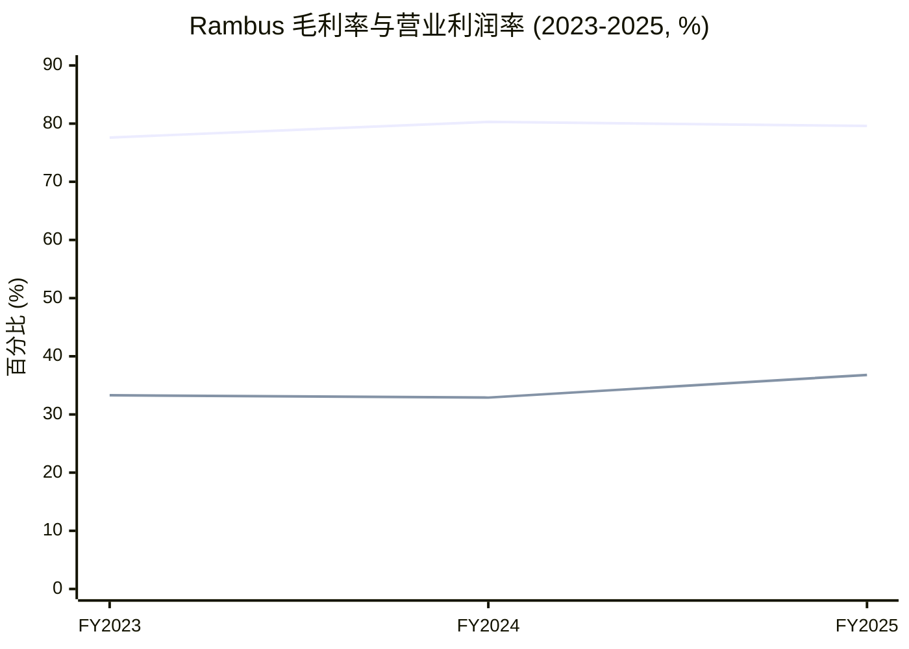
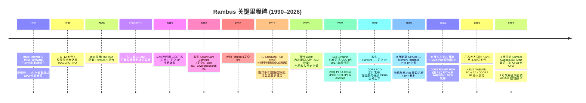
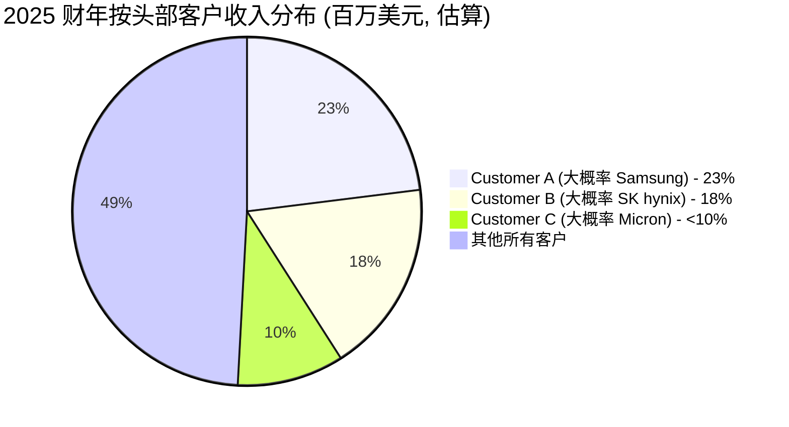
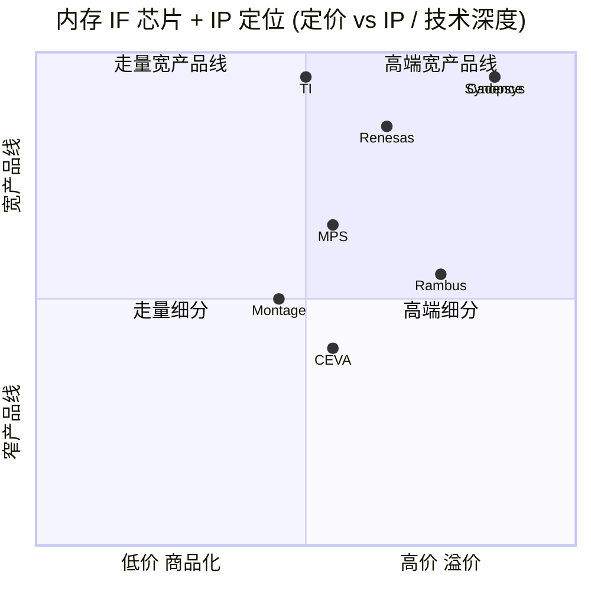

# Rambus Inc. (NASDAQ:RMBS) — 公司研究报告

**截至日期: 2026-06-15**
**分析师: 独立研究 (company-research skill, 内部使用)**
**上市地: 纳斯达克 (NASDAQ), 代码 RMBS**
**注册地: 美国加利福尼亚州圣何塞 (San Jose, California)**
**报告语言: 简体中文 (英文版同时存在于本目录)**

> **业绩更新——2026 财年 Q1 业绩符合指引, 高层接班完成 (2026-04-27 / 2026-04-29):**
> Rambus 公布 2026 财年 Q1 (截至 2026-03-31) **产品收入 (Memory Interface Chips) 8,800 万美元, 同比 +15%; 总收入 1.802 亿美元, 同比 +8.1%; 稀释 EPS 0.55 美元** ([2026 财年 Q1 10-Q, rmbs-20260331.htm](https://www.sec.gov/Archives/edgar/data/917273/000119312526186931/rmbs-20260331.htm))。值得注意的是, **版税收入本季同比 -5.9% 至 6,964 万美元**, 反映授权续约的"块状"波动——这是损益表上最大的季度间变量。同时, 公司于 2026 年 4 月 29 日任命 Sumeet Gagneja (此前为 AMD 数据中心业务事业部 CFO) 为高级副总裁兼首席财务官 (CFO), 接替于 2026 年 2 月 10 日离职的 Desmond Lynch ([Rambus 任命 Sumeet Gagneja 为 CFO, 2026-04-29](https://www.sec.gov/Archives/edgar/data/917273/000119312526192210/d20390dex991.htm))。管理层给出的 2026 财年 Q2 指引为产品收入 9,500 万–10,100 万美元、授权许可记账金额 7,600 万–8,200 万美元——产品收入中值同比约 +17–22%, 由 DDR5 RDIMM 与 MRDIMM 的持续放量支撑。

---

## 投资摘要 (Investment Summary) — *分析师观点：*

> 以下评级、12 个月目标价 (Price Target, PT) 及情景假设均为**本报告的分析师前瞻判断 (`*分析师观点：*`)**, 并非来自任何 SEC 文件——10-K 不含目标价。基础数据 (财务、估值倍数) 各自带文内主来源引用。

| 项目 | 数值 | 说明 |
|---|---|---|
| **评级 (Rating)** | **Hold / 持有 (中性偏多)** | 优质资产, 但估值已对多年期放量充分定价 |
| **12 个月目标价 (PT)** | **160 美元** | 基于 2027E EPS 3.45 美元 × 42× forward P/E (见第 2 章推导) |
| 现价 (2026-06-12 收盘) | 146.56 美元 | [Yahoo Finance, RMBS](https://finance.yahoo.com/quote/RMBS/key-statistics) |
| 隐含上行空间 | **约 +9%** | PT 160 / 现价 146.56 − 1 |
| 估值方法一句话 | forward P/E × 目标倍数 | 倍数对标 CDNS/SNPS 等 IP 同行 (见第 2 章) |
| 市值 (Market Cap) | 约 158 亿美元 | [Yahoo Finance](https://finance.yahoo.com/quote/RMBS/key-statistics) |
| 52 周区间 | 58.81 – 174.10 美元 | [Yahoo Finance](https://finance.yahoo.com/quote/RMBS/key-statistics) |
| 相对表现 (至 2026-06-12) | RMBS +37% (6 个月) / +152% (12 个月) | vs SOXX +89%/+172%、S&P 500 +8%/+24% ([Yahoo Finance 历史价格](https://finance.yahoo.com/quote/RMBS/history)) |

**前瞻估值矩阵 (forward valuation matrix) — *分析师观点：*** (FY2026E–FY2028E 估计为本报告模型, 详见第 2 章):

| 倍数 | FY2025A | FY2026E | FY2027E | FY2028E |
|---|---:|---:|---:|---:|
| P/E (现价 146.56) | 69.5× | 54× | 42× | 35× |
| 营收同比 | +27.1% | +16% | +19% | +17% |
| 稀释 EPS (美元) | 2.11 | ~2.70 | ~3.45 | ~4.20 |

**投资逻辑 (2–4 条支柱) — *分析师观点：***

1. **DDR5 放量 + MRDIMM 期权价值 (核心多头逻辑):** 内存接口芯片 FY2025 同比 +41%, Rambus 在 DDR5 RCD 上以中 40% 份额胜出 (vs DDR4 时代约 25%); MRDIMM 套片 (MRCD+MDB) 2026–2028 量产爬坡, 单模组硅含量是 RDIMM 的 3–5 倍——这是单服务器槽位 ASP 翻倍的期权。
2. **近乎纯毛利的专利授权年金:** 版税占营收约 40%, 毛利近 100%, 由 2,000+ 项内存架构专利支撑; CXMT (长鑫存储) 新增为被授权方, 补上"中国 DRAM 是否付费"缺口。
3. **AI 内存带宽的衍生标的:** HBM4/HBM4E 控制器 IP (业内首发) + PCIe 7.0 + CXL 让 Rambus 成为参与 HBM 与加速器投资浪潮的"卖铲人"。
4. **估值是主要约束 (空头逻辑):** 69× TTM P/E / 22× P/S 已对 2027–2029 年复合增长充分定价; 任一季度产品增速跌破 20%、MRDIMM 推迟、或澜起份额加速, 都可能触发倍数压缩——这正是评级停在 Hold 而非 Buy 的原因。

---

## 目录

1. 公司概览
   - 1A. 估值快照与目标价 (Valuation & PT)
   - 1B. GF Score 基本面评分
2. 估值与目标价 (Valuation & Price Target) — 前瞻模型 + PT 推导 + 牛熊情景
3. 公司历史
4. 管理团队
5. 产品与服务
6. 客户与上市策略
7. 行业概览
8. 竞争格局
9. 市场机会 (TAM)
10. 风险评估
    - 9.5 关键分歧与催化剂 (Key debates & catalysts)
11. 投资视角评分 (Investor lenses)

---

## 1. 公司概览

Rambus Inc. (NASDAQ: RMBS) 是一家总部位于美国的**无晶圆厂半导体公司 (fabless semiconductor company)**, 其业务横跨三条高度差异化的收入条线: (i) **内存接口芯片 (Memory Interface Chips)**——即每一根 DDR5 服务器与高端客户端内存模组上都会用到的物理芯片组 (RCD、MRCD、MDB、CKD、PMIC、SPD Hub、TS); (ii) **芯片级 IP (Silicon IP)**——授权给芯片厂商的高性能接口与安全 IP, 用于 HBM、GDDR、PCIe/CXL 及硬件信任根 (hardware root of trust) 应用; (iii) **专利授权 (Patent Licensing)**——基于一项覆盖内存架构、高速串行链路与安全的、全球超过 2,000 项专利组合产生的长期版税现金流 ([2025 10-K, p. 4–5](https://www.sec.gov/Archives/edgar/data/917273/000119312526057101/0001193125-26-057101-index.htm))。

公司自我定位为"一家专注于数据密集型计算系统、提供行业领先芯片与硅 IP 的全球性半导体公司, 重点服务数据中心与人工智能 (AI) 基础设施" ([2025 10-K, Item 1 Business](https://www.sec.gov/Archives/edgar/data/917273/000119312526057101/0001193125-26-057101-index.htm))。运营上, Rambus 采用无晶圆厂模式——第三方代工厂 (foundry) 负责芯片制造, 而 Rambus 在其圣何塞总部及美国境内自有设施保留设计、销售、市场及终测职能。截至 2025 年 12 月 31 日, 公司全球员工约 730 人, 其中约 47% 在美国、53% 在其他地区 ([2025 10-K, Employees disclosure](https://www.sec.gov/Archives/edgar/data/917273/000119312526057101/0001193125-26-057101-index.htm))。

### Rambus 盈利方式

2025 财年合并营业收入为 **7.076 亿美元**, 较 2024 财年的 5.566 亿美元同比增长 27.1%, 较 2023 财年的 4.611 亿美元上升 53.5%。三条收入条线拆分如下 ([2025 10-K, Results of Operations](https://www.sec.gov/Archives/edgar/data/917273/000119312526057101/0001193125-26-057101-index.htm)):

| 收入条线 (百万美元) | 2023 财年 | 2024 财年 | 2025 财年 | 2024→25 同比 | 占 2025 财年收入比 |
|---|---:|---:|---:|---:|---:|
| 产品收入 (内存接口芯片) | 224.6 | 246.8 | **347.8** | **+40.9%** | 49.1% |
| 版税收入 (专利授权) | 150.1 | 226.2 | 279.4 | +23.5% | 39.5% |
| 合约及其他 (芯片级 IP) | 86.4 | 83.6 | 80.5 | (3.8)% | 11.4% |
| **总收入** | **461.1** | **556.6** | **707.6** | **+27.1%** | 100.0% |

**2025 年的主导叙事是内存接口芯片同比 +40.9% 的强劲爆发, **驱动力来自 DDR5 RDIMM 在服务器平台的渗透加速, 以及每一根 DDR5 模组上 Gen-2 / Gen-3 RCD 的附着率上升。版税收入也同步增长, 因为 Rambus 不断签订并续展覆盖 DDR5 架构与安全专利的多年期授权协议 ([Rambus 2025 财年 Q4 业绩说明会纪要, Motley Fool, 2026-02-02](https://www.fool.com/earnings/call-transcripts/2026/02/02/rambus-rmbs-q4-2025-earnings-call-transcript/))。

<svg xmlns="http://www.w3.org/2000/svg" viewBox="0 0 1000 560" width="1000" height="560" role="img" aria-label="income statement Sankey"><rect x="0" y="0" width="1000" height="560" fill="#ffffff"/>
<text x="20.00" y="30.00" text-anchor="start" font-family="Helvetica,Arial,sans-serif" font-size="15" font-weight="700" fill="#1f2933">Rambus FY2025 利润表 Sankey (income statement)</text>
<path d="M 204.00,64.00 C 258.00,64.00 258.00,78.00 312.00,78.00 L 312.00,285.42 C 258.00,285.42 258.00,271.42 204.00,271.42 Z" fill="#93c5fd" fill-opacity="0.55"/>
<path d="M 452.00,71.00 C 506.00,71.00 506.00,114.06 560.00,114.06 L 560.00,269.36 C 506.00,269.36 506.00,226.30 452.00,226.30 Z" fill="#86efac" fill-opacity="0.55"/>
<path d="M 452.00,226.30 C 506.00,226.30 506.00,283.36 560.00,283.36 L 560.00,463.94 C 506.00,463.94 506.00,406.88 452.00,406.88 Z" fill="#fca5a5" fill-opacity="0.55"/>
<path d="M 328.00,78.00 C 382.00,78.00 382.00,71.00 436.00,71.00 L 436.00,406.88 C 382.00,406.88 382.00,413.88 328.00,413.88 Z" fill="#86efac" fill-opacity="0.55"/>
<path d="M 328.00,413.88 C 382.00,413.88 382.00,420.88 436.00,420.88 L 436.00,507.00 C 382.00,507.00 382.00,500.00 328.00,500.00 Z" fill="#fca5a5" fill-opacity="0.55"/>
<path d="M 700.00,100.62 C 754.00,100.62 754.00,197.91 808.00,197.91 L 808.00,335.38 C 754.00,335.38 754.00,238.08 700.00,238.08 Z" fill="#86efac" fill-opacity="0.55"/>
<path d="M 700.00,238.08 C 754.00,238.08 754.00,349.38 808.00,349.38 L 808.00,380.09 C 754.00,380.09 754.00,268.80 700.00,268.80 Z" fill="#fca5a5" fill-opacity="0.55"/>
<path d="M 576.00,114.06 C 630.00,114.06 630.00,100.62 684.00,100.62 L 684.00,255.92 C 630.00,255.92 630.00,269.36 576.00,269.36 Z" fill="#86efac" fill-opacity="0.55"/>
<path d="M 576.00,283.36 C 630.00,283.36 630.00,282.80 684.00,282.80 L 684.00,351.56 C 630.00,351.56 630.00,352.12 576.00,352.12 Z" fill="#fca5a5" fill-opacity="0.55"/>
<path d="M 576.00,352.12 C 630.00,352.12 630.00,365.56 684.00,365.56 L 684.00,477.38 C 630.00,477.38 630.00,463.94 576.00,463.94 Z" fill="#fca5a5" fill-opacity="0.55"/>
<path d="M 204.00,285.42 C 258.00,285.42 258.00,285.42 312.00,285.42 L 312.00,452.05 C 258.00,452.05 258.00,452.05 204.00,452.05 Z" fill="#93c5fd" fill-opacity="0.55"/>
<path d="M 204.00,466.05 C 258.00,466.05 258.00,452.05 312.00,452.05 L 312.00,500.00 C 258.00,500.00 258.00,514.00 204.00,514.00 Z" fill="#93c5fd" fill-opacity="0.55"/>
<rect x="188.00" y="64.00" width="16" height="207.42" rx="1.5" fill="#2563eb"/>
<rect x="188.00" y="285.42" width="16" height="166.63" rx="1.5" fill="#2563eb"/>
<rect x="188.00" y="466.05" width="16" height="47.95" rx="1.5" fill="#2563eb"/>
<rect x="312.00" y="78.00" width="16" height="422.00" rx="1.5" fill="#1e3a8a"/>
<rect x="436.00" y="71.00" width="16" height="335.88" rx="1.5" fill="#15803d"/>
<rect x="436.00" y="420.88" width="16" height="86.12" rx="1.5" fill="#dc2626"/>
<rect x="560.00" y="114.06" width="16" height="155.30" rx="1.5" fill="#15803d"/>
<rect x="560.00" y="283.36" width="16" height="180.58" rx="1.5" fill="#dc2626"/>
<rect x="684.00" y="100.62" width="16" height="168.18" rx="1.5" fill="#15803d"/>
<rect x="684.00" y="282.80" width="16" height="68.76" rx="1.5" fill="#dc2626"/>
<rect x="684.00" y="365.56" width="16" height="111.82" rx="1.5" fill="#dc2626"/>
<rect x="808.00" y="197.91" width="16" height="137.47" rx="1.5" fill="#15803d"/>
<rect x="808.00" y="349.38" width="16" height="30.71" rx="1.5" fill="#dc2626"/>
<text x="179.00" y="164.71" text-anchor="end" font-family="Helvetica,Arial,sans-serif" font-size="11.5" font-weight="700" fill="#1f2933">Product / 内存接口芯片</text>
<text x="179.00" y="177.71" text-anchor="end" font-family="Helvetica,Arial,sans-serif" font-size="10" font-weight="400" fill="#52606d">US$347.8M  (49.2%)</text>
<text x="179.00" y="365.74" text-anchor="end" font-family="Helvetica,Arial,sans-serif" font-size="11.5" font-weight="700" fill="#1f2933">Royalties / 专利授权</text>
<text x="179.00" y="378.74" text-anchor="end" font-family="Helvetica,Arial,sans-serif" font-size="10" font-weight="400" fill="#52606d">US$279.4M  (39.5%)</text>
<text x="179.00" y="487.03" text-anchor="end" font-family="Helvetica,Arial,sans-serif" font-size="11.5" font-weight="700" fill="#1f2933">Contract &amp; other / 硅 IP</text>
<text x="179.00" y="500.03" text-anchor="end" font-family="Helvetica,Arial,sans-serif" font-size="10" font-weight="400" fill="#52606d">US$80.4M  (11.4%)</text>
<rect x="331.00" y="60.00" width="125.70" height="26" rx="2" fill="#ffffff" fill-opacity="0.72"/>
<text x="334.00" y="72.00" text-anchor="start" font-family="Helvetica,Arial,sans-serif" font-size="11.5" font-weight="700" fill="#1f2933">Revenue</text>
<text x="334.00" y="85.00" text-anchor="start" font-family="Helvetica,Arial,sans-serif" font-size="10" font-weight="400" fill="#52606d">US$707.6M  (100.0%)</text>
<rect x="455.00" y="53.00" width="119.40" height="26" rx="2" fill="#ffffff" fill-opacity="0.72"/>
<text x="458.00" y="65.00" text-anchor="start" font-family="Helvetica,Arial,sans-serif" font-size="11.5" font-weight="700" fill="#1f2933">Gross Profit</text>
<text x="458.00" y="78.00" text-anchor="start" font-family="Helvetica,Arial,sans-serif" font-size="10" font-weight="400" fill="#52606d">US$563.2M  (79.6%)</text>
<rect x="455.00" y="402.88" width="144.60" height="26" rx="2" fill="#ffffff" fill-opacity="0.72"/>
<text x="458.00" y="414.88" text-anchor="start" font-family="Helvetica,Arial,sans-serif" font-size="11.5" font-weight="700" fill="#1f2933">Cost of Revenue (COGS)</text>
<text x="458.00" y="427.88" text-anchor="start" font-family="Helvetica,Arial,sans-serif" font-size="10" font-weight="400" fill="#52606d">US$144.4M  (20.4%)</text>
<rect x="579.00" y="96.06" width="119.40" height="26" rx="2" fill="#ffffff" fill-opacity="0.72"/>
<text x="582.00" y="108.06" text-anchor="start" font-family="Helvetica,Arial,sans-serif" font-size="11.5" font-weight="700" fill="#1f2933">Operating Income</text>
<text x="582.00" y="121.06" text-anchor="start" font-family="Helvetica,Arial,sans-serif" font-size="10" font-weight="400" fill="#52606d">US$260.4M  (36.8%)</text>
<rect x="579.00" y="265.36" width="150.90" height="26" rx="2" fill="#ffffff" fill-opacity="0.72"/>
<text x="582.00" y="277.36" text-anchor="start" font-family="Helvetica,Arial,sans-serif" font-size="11.5" font-weight="700" fill="#1f2933">Total Operating Expense</text>
<text x="582.00" y="290.36" text-anchor="start" font-family="Helvetica,Arial,sans-serif" font-size="10" font-weight="400" fill="#52606d">US$302.8M  (42.8%)</text>
<rect x="703.00" y="82.62" width="119.40" height="26" rx="2" fill="#ffffff" fill-opacity="0.72"/>
<text x="706.00" y="94.62" text-anchor="start" font-family="Helvetica,Arial,sans-serif" font-size="11.5" font-weight="700" fill="#1f2933">Pretax Income</text>
<text x="706.00" y="107.62" text-anchor="start" font-family="Helvetica,Arial,sans-serif" font-size="10" font-weight="400" fill="#52606d">US$282.0M  (39.9%)</text>
<rect x="703.00" y="264.80" width="119.40" height="26" rx="2" fill="#ffffff" fill-opacity="0.72"/>
<text x="706.00" y="276.80" text-anchor="start" font-family="Helvetica,Arial,sans-serif" font-size="11.5" font-weight="700" fill="#1f2933">SG&amp;A</text>
<text x="706.00" y="289.80" text-anchor="start" font-family="Helvetica,Arial,sans-serif" font-size="10" font-weight="400" fill="#52606d">US$115.3M  (16.3%)</text>
<rect x="703.00" y="347.56" width="119.40" height="26" rx="2" fill="#ffffff" fill-opacity="0.72"/>
<text x="706.00" y="359.56" text-anchor="start" font-family="Helvetica,Arial,sans-serif" font-size="11.5" font-weight="700" fill="#1f2933">R&amp;D</text>
<text x="706.00" y="372.56" text-anchor="start" font-family="Helvetica,Arial,sans-serif" font-size="10" font-weight="400" fill="#52606d">US$187.5M  (26.5%)</text>
<text x="833.00" y="263.64" text-anchor="start" font-family="Helvetica,Arial,sans-serif" font-size="11.5" font-weight="700" fill="#1f2933">Net Income</text>
<text x="833.00" y="276.64" text-anchor="start" font-family="Helvetica,Arial,sans-serif" font-size="10" font-weight="400" fill="#52606d">US$230.5M  (32.6%)</text>
<text x="833.00" y="361.73" text-anchor="start" font-family="Helvetica,Arial,sans-serif" font-size="11.5" font-weight="700" fill="#1f2933">Income Tax</text>
<text x="833.00" y="374.73" text-anchor="start" font-family="Helvetica,Arial,sans-serif" font-size="10" font-weight="400" fill="#52606d">US$51.5M  (7.3%)</text>
<text x="500.00" y="544.00" text-anchor="middle" font-family="Helvetica,Arial,sans-serif" font-size="10" font-weight="400" fill="#52606d">Source: Rambus FY2025 10-K (rmbs-20251231.htm), Item 7 MD&amp;A Results of Operations · SEC EDGAR</text>
</svg>

*图: Rambus FY2025 利润表 Sankey。来源: [Rambus FY2025 10-K, Item 7 MD&A — Results of Operations](https://www.sec.gov/Archives/edgar/data/917273/000119312526057101/rmbs-20251231.htm)。*

<svg xmlns="http://www.w3.org/2000/svg" viewBox="0 0 720 460" width="720" height="460" role="img" aria-label="revenue donut"><rect x="0" y="0" width="720" height="460" fill="#ffffff"/>
<text x="20.00" y="30.00" text-anchor="start" font-family="Helvetica,Arial,sans-serif" font-size="15" font-weight="700" fill="#1f2933">Rambus FY2025 收入构成 (按业务条线)</text>
<path d="M 288.00,107.20 A 132 132 0 0 1 295.03,371.01 L 292.15,317.09 A 78 78 0 0 0 288.00,161.20 Z" fill="#2563eb"/>
<path d="M 295.03,371.01 A 132 132 0 0 1 201.57,139.43 L 236.93,180.25 A 78 78 0 0 0 292.15,317.09 Z" fill="#15803d"/>
<path d="M 201.57,139.43 A 132 132 0 0 1 288.00,107.20 L 288.00,161.20 A 78 78 0 0 0 236.93,180.25 Z" fill="#d97706"/>
<text x="288.00" y="235.20" text-anchor="middle" font-family="Helvetica,Arial,sans-serif" font-size="18" font-weight="800" fill="#1f2933">707.6</text>
<text x="288.00" y="255.20" text-anchor="middle" font-family="Helvetica,Arial,sans-serif" font-size="13" font-weight="600" fill="#52606d">US$707.6M</text>
<text x="288.00" y="271.20" text-anchor="middle" font-family="Helvetica,Arial,sans-serif" font-size="10" font-weight="400" fill="#8a97a3">total</text>
<line x1="425.95" y1="235.52" x2="441.95" y2="235.52" stroke="#2563eb" stroke-width="1.4"/>
<text x="445.95" y="233.52" text-anchor="start" font-family="Helvetica,Arial,sans-serif" font-size="11" font-weight="700" fill="#1f2933">Product 内存接口芯片</text>
<text x="445.95" y="247.52" text-anchor="start" font-family="Helvetica,Arial,sans-serif" font-size="10" font-weight="400" fill="#52606d">US$347.8M  (49.2%)</text>
<line x1="160.03" y1="290.85" x2="144.03" y2="290.85" stroke="#15803d" stroke-width="1.4"/>
<text x="140.03" y="288.85" text-anchor="end" font-family="Helvetica,Arial,sans-serif" font-size="11" font-weight="700" fill="#1f2933">Royalties 专利授权</text>
<text x="140.03" y="302.85" text-anchor="end" font-family="Helvetica,Arial,sans-serif" font-size="10" font-weight="400" fill="#52606d">US$279.4M  (39.5%)</text>
<line x1="239.78" y1="109.90" x2="223.78" y2="109.90" stroke="#d97706" stroke-width="1.4"/>
<text x="219.78" y="107.90" text-anchor="end" font-family="Helvetica,Arial,sans-serif" font-size="11" font-weight="700" fill="#1f2933">Contract &amp; other 硅 IP</text>
<text x="219.78" y="121.90" text-anchor="end" font-family="Helvetica,Arial,sans-serif" font-size="10" font-weight="400" fill="#52606d">US$80.4M  (11.4%)</text>
<text x="360.00" y="444.00" text-anchor="middle" font-family="Helvetica,Arial,sans-serif" font-size="10" font-weight="400" fill="#52606d">Source: Rambus FY2025 10-K (rmbs-20251231.htm), Results of Operations · SEC EDGAR</text>
</svg>

*图: FY2025 收入按业务条线构成。来源: [Rambus FY2025 10-K — Results of Operations](https://www.sec.gov/Archives/edgar/data/917273/000119312526057101/rmbs-20251231.htm)。*

<svg xmlns="http://www.w3.org/2000/svg" viewBox="0 0 860 470" width="860" height="470" role="img" aria-label="historical revenue bars"><rect x="0" y="0" width="860" height="470" fill="#ffffff"/>
<text x="20.00" y="30.00" text-anchor="start" font-family="Helvetica,Arial,sans-serif" font-size="15" font-weight="700" fill="#1f2933">Rambus 收入构成历史 (2021-2025, 按业务条线)</text>
<rect x="20.00" y="44" width="11" height="11" rx="2" fill="#2563eb"/>
<text x="36.00" y="53.00" text-anchor="start" font-family="Helvetica,Arial,sans-serif" font-size="10.5" font-weight="400" fill="#1f2933">Product 内存接口芯片</text>
<rect x="142.40" y="44" width="11" height="11" rx="2" fill="#15803d"/>
<text x="158.40" y="53.00" text-anchor="start" font-family="Helvetica,Arial,sans-serif" font-size="10.5" font-weight="400" fill="#1f2933">Royalties 专利授权</text>
<rect x="264.80" y="44" width="11" height="11" rx="2" fill="#d97706"/>
<text x="280.80" y="53.00" text-anchor="start" font-family="Helvetica,Arial,sans-serif" font-size="10.5" font-weight="400" fill="#1f2933">Contract &amp; other 硅 IP</text>
<line x1="70" y1="412.00" x2="834" y2="412.00" stroke="#eceff2" stroke-width="1"/>
<text x="64.00" y="415.00" text-anchor="end" font-family="Helvetica,Arial,sans-serif" font-size="9.5" font-weight="400" fill="#52606d">US$0</text>
<line x1="70" y1="345.20" x2="834" y2="345.20" stroke="#eceff2" stroke-width="1"/>
<text x="64.00" y="348.20" text-anchor="end" font-family="Helvetica,Arial,sans-serif" font-size="9.5" font-weight="400" fill="#52606d">US$152.8M</text>
<line x1="70" y1="278.40" x2="834" y2="278.40" stroke="#eceff2" stroke-width="1"/>
<text x="64.00" y="281.40" text-anchor="end" font-family="Helvetica,Arial,sans-serif" font-size="9.5" font-weight="400" fill="#52606d">US$305.7M</text>
<line x1="70" y1="211.60" x2="834" y2="211.60" stroke="#eceff2" stroke-width="1"/>
<text x="64.00" y="214.60" text-anchor="end" font-family="Helvetica,Arial,sans-serif" font-size="9.5" font-weight="400" fill="#52606d">US$458.5M</text>
<line x1="70" y1="144.80" x2="834" y2="144.80" stroke="#eceff2" stroke-width="1"/>
<text x="64.00" y="147.80" text-anchor="end" font-family="Helvetica,Arial,sans-serif" font-size="9.5" font-weight="400" fill="#52606d">US$611.4M</text>
<line x1="70" y1="78.00" x2="834" y2="78.00" stroke="#eceff2" stroke-width="1"/>
<text x="64.00" y="81.00" text-anchor="end" font-family="Helvetica,Arial,sans-serif" font-size="9.5" font-weight="400" fill="#52606d">US$764.2M</text>
<rect x="102.09" y="349.11" width="88.62" height="62.89" fill="#2563eb"/>
<rect x="102.09" y="289.36" width="88.62" height="59.75" fill="#15803d"/>
<rect x="102.09" y="268.52" width="88.62" height="20.85" fill="#d97706"/>
<text x="146.40" y="428.00" text-anchor="middle" font-family="Helvetica,Arial,sans-serif" font-size="10" font-weight="400" fill="#52606d">2021</text>
<rect x="254.89" y="312.75" width="88.62" height="99.25" fill="#2563eb"/>
<rect x="254.89" y="251.64" width="88.62" height="61.10" fill="#15803d"/>
<rect x="254.89" y="213.23" width="88.62" height="38.42" fill="#d97706"/>
<text x="299.20" y="428.00" text-anchor="middle" font-family="Helvetica,Arial,sans-serif" font-size="10" font-weight="400" fill="#52606d">2022</text>
<rect x="407.69" y="313.84" width="88.62" height="98.16" fill="#2563eb"/>
<rect x="407.69" y="248.24" width="88.62" height="65.60" fill="#15803d"/>
<rect x="407.69" y="210.47" width="88.62" height="37.76" fill="#d97706"/>
<text x="452.00" y="428.00" text-anchor="middle" font-family="Helvetica,Arial,sans-serif" font-size="10" font-weight="400" fill="#52606d">2023</text>
<rect x="560.49" y="304.14" width="88.62" height="107.86" fill="#2563eb"/>
<rect x="560.49" y="205.27" width="88.62" height="98.86" fill="#15803d"/>
<rect x="560.49" y="168.74" width="88.62" height="36.54" fill="#d97706"/>
<text x="604.80" y="428.00" text-anchor="middle" font-family="Helvetica,Arial,sans-serif" font-size="10" font-weight="400" fill="#52606d">2024</text>
<rect x="713.29" y="259.99" width="88.62" height="152.01" fill="#2563eb"/>
<rect x="713.29" y="137.88" width="88.62" height="122.11" fill="#15803d"/>
<rect x="713.29" y="102.74" width="88.62" height="35.14" fill="#d97706"/>
<text x="757.60" y="428.00" text-anchor="middle" font-family="Helvetica,Arial,sans-serif" font-size="10" font-weight="400" fill="#52606d">2025</text>
<text x="430.00" y="440.00" text-anchor="middle" font-family="Helvetica,Arial,sans-serif" font-size="10" font-weight="400" font-style="italic" fill="#8a97a3">2022 产品收入含 2023-09 剥离的 SerDes/PHY IP 业务</text>
<text x="430.00" y="454.00" text-anchor="middle" font-family="Helvetica,Arial,sans-serif" font-size="10" font-weight="400" fill="#52606d">Source: Rambus FY2023 10-K (rmbs-20231231.htm) &amp; FY2025 10-K (rmbs-20251231.htm), Results of Operations · SEC EDGAR</text>
</svg>

*图: 2021–2025 收入按业务条线 (堆叠柱)。来源: [Rambus FY2023 10-K](https://www.sec.gov/Archives/edgar/data/917273/000091727324000028/rmbs-20231231.htm) 与 [FY2025 10-K](https://www.sec.gov/Archives/edgar/data/917273/000119312526057101/rmbs-20251231.htm) — Results of Operations。注: 2022 产品收入含 2023-09 剥离的 SerDes/PHY IP 业务。*

*上线为 gross margin (毛利率), 下线为 operating margin (营业利润率)。来源: [Rambus FY2025 10-K, Item 7 MD&A — % of revenue 表](https://www.sec.gov/Archives/edgar/data/917273/000119312526057101/rmbs-20251231.htm)。*

### 地理分布

收入高度偏向亚洲。韩国 (Samsung 与 SK hynix 的签约主体所在地, 即 DRAM 厂商芯片销售的合约来源) 贡献 3.293 亿美元, 同比增长 67%; 新加坡 (主要为 Micron 签约主体) 1.638 亿美元, 同比增长 143%; 美国为 1.241 亿美元, 同比下降 38% (反映授权交易确认时点错位) ([2025 10-K, Note on Geographic Revenue](https://www.sec.gov/Archives/edgar/data/917273/000119312526057101/0001193125-26-057101-index.htm))。

<svg xmlns="http://www.w3.org/2000/svg" viewBox="0 0 720 460" width="720" height="460" role="img" aria-label="revenue donut"><rect x="0" y="0" width="720" height="460" fill="#ffffff"/>
<text x="20.00" y="30.00" text-anchor="start" font-family="Helvetica,Arial,sans-serif" font-size="15" font-weight="700" fill="#1f2933">Rambus FY2025 收入构成 (按地区, 签约主体所在地)</text>
<path d="M 288.00,107.20 A 132 132 0 0 1 316.49,368.09 L 304.84,315.36 A 78 78 0 0 0 288.00,161.20 Z" fill="#2563eb"/>
<path d="M 316.49,368.09 A 132 132 0 0 1 163.29,282.46 L 214.31,264.76 A 78 78 0 0 0 304.84,315.36 Z" fill="#15803d"/>
<path d="M 163.29,282.46 A 132 132 0 0 1 193.06,147.49 L 231.90,185.01 A 78 78 0 0 0 214.31,264.76 Z" fill="#d97706"/>
<path d="M 193.06,147.49 A 132 132 0 0 1 288.00,107.20 L 288.00,161.20 A 78 78 0 0 0 231.90,185.01 Z" fill="#7c3aed"/>
<text x="288.00" y="235.20" text-anchor="middle" font-family="Helvetica,Arial,sans-serif" font-size="18" font-weight="800" fill="#1f2933">707.6</text>
<text x="288.00" y="255.20" text-anchor="middle" font-family="Helvetica,Arial,sans-serif" font-size="13" font-weight="600" fill="#52606d">US$707.6M</text>
<text x="288.00" y="271.20" text-anchor="middle" font-family="Helvetica,Arial,sans-serif" font-size="10" font-weight="400" fill="#8a97a3">total</text>
<line x1="425.18" y1="224.22" x2="441.18" y2="224.22" stroke="#2563eb" stroke-width="1.4"/>
<text x="445.18" y="222.22" text-anchor="start" font-family="Helvetica,Arial,sans-serif" font-size="11" font-weight="700" fill="#1f2933">Korea 韩国</text>
<text x="445.18" y="236.22" text-anchor="start" font-family="Helvetica,Arial,sans-serif" font-size="10" font-weight="400" fill="#52606d">US$329.3M  (46.5%)</text>
<line x1="220.67" y1="359.66" x2="204.67" y2="359.66" stroke="#15803d" stroke-width="1.4"/>
<text x="200.67" y="357.66" text-anchor="end" font-family="Helvetica,Arial,sans-serif" font-size="11" font-weight="700" fill="#1f2933">Singapore 新加坡</text>
<text x="200.67" y="371.66" text-anchor="end" font-family="Helvetica,Arial,sans-serif" font-size="10" font-weight="400" fill="#52606d">US$163.8M  (23.1%)</text>
<line x1="153.24" y1="209.47" x2="137.24" y2="209.47" stroke="#d97706" stroke-width="1.4"/>
<text x="133.24" y="207.47" text-anchor="end" font-family="Helvetica,Arial,sans-serif" font-size="11" font-weight="700" fill="#1f2933">USA 美国</text>
<text x="133.24" y="221.47" text-anchor="end" font-family="Helvetica,Arial,sans-serif" font-size="10" font-weight="400" fill="#52606d">US$124.1M  (17.5%)</text>
<line x1="234.09" y1="112.17" x2="218.09" y2="112.17" stroke="#7c3aed" stroke-width="1.4"/>
<text x="214.09" y="110.17" text-anchor="end" font-family="Helvetica,Arial,sans-serif" font-size="11" font-weight="700" fill="#1f2933">Other 其他</text>
<text x="214.09" y="124.17" text-anchor="end" font-family="Helvetica,Arial,sans-serif" font-size="10" font-weight="400" fill="#52606d">US$90.4M  (12.8%)</text>
<text x="360.00" y="444.00" text-anchor="middle" font-family="Helvetica,Arial,sans-serif" font-size="10" font-weight="400" fill="#52606d">Source: Rambus FY2025 10-K (rmbs-20251231.htm), Geographic Revenue note · SEC EDGAR</text>
</svg>

*图: FY2025 收入按地区 (签约主体所在地)。来源: [Rambus FY2025 10-K — 地区收入附注](https://www.sec.gov/Archives/edgar/data/917273/000119312526057101/rmbs-20251231.htm)。*

### 盈利能力与资产负债表快照

2025 财年毛利率为 **79.6%** (2024 财年: 80.3%)——对一家半导体公司而言堪称极佳, 这是由高毛利的版税业务与同样健康的芯片业务毛利结构混合的结果。GAAP 营业利润达 **2.602 亿美元** (营业利润率 36.8%), 较上年 1.830 亿美元提升明显。GAAP 净利润为 **2.305 亿美元** (基本 EPS 2.14 美元 / 稀释 EPS 2.11 美元), 加权平均稀释股本 1.092 亿股。2025 年 12 月 31 日, 现金、现金等价物与有价证券合计 **7.618 亿美元**, 总债务仅 2,340 万美元——按净额计算, 公司净现金头寸约 7.4 亿美元 ([2025 10-K, 合并损益表与资产负债表](https://www.sec.gov/Archives/edgar/data/917273/000119312526057101/0001193125-26-057101-index.htm); 现金数据已与 [2026 财年 Q1 业绩公告, 2026-04-27](https://www.sec.gov/Archives/edgar/data/917273/000119312526182076/rmbs-ex99_1.htm) 中披露的截至 2026 年 3 月 31 日 7.861 亿美元交叉验证)。

<svg xmlns="http://www.w3.org/2000/svg" viewBox="0 0 1040 600" width="1040" height="600" role="img" aria-label="balance sheet Sankey"><rect x="0" y="0" width="1040" height="600" fill="#ffffff"/>
<text x="20.00" y="30.00" text-anchor="start" font-family="Helvetica,Arial,sans-serif" font-size="15" font-weight="700" fill="#1f2933">Rambus 资产负债表 Sankey (as of 2025-12-31)</text>
<path d="M 204.00,64.00 C 262.00,64.00 262.00,85.00 320.00,85.00 L 320.00,301.16 C 262.00,301.16 262.00,280.16 204.00,280.16 Z" fill="#93c5fd" fill-opacity="0.55"/>
<path d="M 732.00,78.00 C 790.00,78.00 790.00,78.00 848.00,78.00 L 848.00,112.22 C 790.00,112.22 790.00,112.22 732.00,112.22 Z" fill="#fca5a5" fill-opacity="0.55"/>
<path d="M 600.00,85.00 C 658.00,85.00 658.00,78.00 716.00,78.00 L 716.00,112.22 C 658.00,112.22 658.00,119.22 600.00,119.22 Z" fill="#fca5a5" fill-opacity="0.55"/>
<path d="M 336.00,85.00 C 394.00,85.00 394.00,92.00 452.00,92.00 L 452.00,372.57 C 394.00,372.57 394.00,365.57 336.00,365.57 Z" fill="#86efac" fill-opacity="0.55"/>
<path d="M 600.00,119.22 C 658.00,119.22 658.00,126.22 716.00,126.22 L 716.00,138.85 C 658.00,138.85 658.00,131.85 600.00,131.85 Z" fill="#fca5a5" fill-opacity="0.55"/>
<path d="M 468.00,92.00 C 526.00,92.00 526.00,85.00 584.00,85.00 L 584.00,131.85 C 526.00,131.85 526.00,138.85 468.00,138.85 Z" fill="#fca5a5" fill-opacity="0.55"/>
<path d="M 468.00,138.85 C 526.00,138.85 526.00,145.85 584.00,145.85 L 584.00,533.00 C 526.00,533.00 526.00,526.00 468.00,526.00 Z" fill="#86efac" fill-opacity="0.55"/>
<path d="M 732.00,126.22 C 790.00,126.22 790.00,126.22 848.00,126.22 L 848.00,138.85 C 790.00,138.85 790.00,138.85 732.00,138.85 Z" fill="#fca5a5" fill-opacity="0.55"/>
<path d="M 600.00,145.85 C 658.00,145.85 658.00,152.85 716.00,152.85 L 716.00,540.00 C 658.00,540.00 658.00,533.00 600.00,533.00 Z" fill="#86efac" fill-opacity="0.55"/>
<path d="M 732.00,152.85 C 790.00,152.85 790.00,152.85 848.00,152.85 L 848.00,540.00 C 790.00,540.00 790.00,540.00 732.00,540.00 Z" fill="#86efac" fill-opacity="0.55"/>
<path d="M 204.00,294.16 C 262.00,294.16 262.00,301.16 320.00,301.16 L 320.00,365.57 C 262.00,365.57 262.00,358.57 204.00,358.57 Z" fill="#93c5fd" fill-opacity="0.55"/>
<path d="M 204.00,372.57 C 262.00,372.57 262.00,379.57 320.00,379.57 L 320.00,460.96 C 262.00,460.96 262.00,453.96 204.00,453.96 Z" fill="#93c5fd" fill-opacity="0.55"/>
<path d="M 336.00,379.57 C 394.00,379.57 394.00,372.57 452.00,372.57 L 452.00,526.00 C 394.00,526.00 394.00,533.00 336.00,533.00 Z" fill="#86efac" fill-opacity="0.55"/>
<path d="M 204.00,467.96 C 262.00,467.96 262.00,460.96 320.00,460.96 L 320.00,493.05 C 262.00,493.05 262.00,500.05 204.00,500.05 Z" fill="#93c5fd" fill-opacity="0.55"/>
<path d="M 204.00,514.05 C 262.00,514.05 262.00,493.05 320.00,493.05 L 320.00,533.00 C 262.00,533.00 262.00,554.00 204.00,554.00 Z" fill="#93c5fd" fill-opacity="0.55"/>
<rect x="188.00" y="64.00" width="16" height="216.16" rx="1.5" fill="#2563eb"/>
<rect x="188.00" y="294.16" width="16" height="64.41" rx="1.5" fill="#2563eb"/>
<rect x="188.00" y="372.57" width="16" height="81.38" rx="1.5" fill="#2563eb"/>
<rect x="188.00" y="467.96" width="16" height="32.09" rx="1.5" fill="#2563eb"/>
<rect x="188.00" y="514.05" width="16" height="39.95" rx="1.5" fill="#2563eb"/>
<rect x="320.00" y="85.00" width="16" height="280.57" rx="1.5" fill="#15803d"/>
<rect x="320.00" y="379.57" width="16" height="153.43" rx="1.5" fill="#15803d"/>
<rect x="452.00" y="92.00" width="16" height="434.00" rx="1.5" fill="#1e3a8a"/>
<rect x="584.00" y="85.00" width="16" height="46.85" rx="1.5" fill="#dc2626"/>
<rect x="584.00" y="145.85" width="16" height="387.15" rx="1.5" fill="#15803d"/>
<rect x="716.00" y="78.00" width="16" height="34.22" rx="1.5" fill="#dc2626"/>
<rect x="716.00" y="126.22" width="16" height="12.63" rx="1.5" fill="#dc2626"/>
<rect x="716.00" y="152.85" width="16" height="387.15" rx="1.5" fill="#15803d"/>
<rect x="848.00" y="78.00" width="16" height="34.22" rx="1.5" fill="#dc2626"/>
<rect x="848.00" y="126.22" width="16" height="12.63" rx="1.5" fill="#dc2626"/>
<rect x="848.00" y="152.85" width="16" height="387.15" rx="1.5" fill="#15803d"/>
<text x="179.00" y="168.06" text-anchor="end" font-family="Helvetica,Arial,sans-serif" font-size="11.5" font-weight="700" fill="#1f2933">Cash &amp; marketable sec / 现金及有价证券</text>
<text x="179.00" y="181.06" text-anchor="end" font-family="Helvetica,Arial,sans-serif" font-size="10" font-weight="400" fill="#52606d">US$761.8M  (49.8%)</text>
<text x="179.00" y="322.35" text-anchor="end" font-family="Helvetica,Arial,sans-serif" font-size="11.5" font-weight="700" fill="#1f2933">Receivables &amp; other current / 应收及其他流动</text>
<text x="179.00" y="335.35" text-anchor="end" font-family="Helvetica,Arial,sans-serif" font-size="10" font-weight="400" fill="#52606d">US$227.0M  (14.8%)</text>
<text x="179.00" y="409.24" text-anchor="end" font-family="Helvetica,Arial,sans-serif" font-size="11.5" font-weight="700" fill="#1f2933">Goodwill / 商誉</text>
<text x="179.00" y="422.24" text-anchor="end" font-family="Helvetica,Arial,sans-serif" font-size="10" font-weight="400" fill="#52606d">US$286.8M  (18.8%)</text>
<text x="179.00" y="479.98" text-anchor="end" font-family="Helvetica,Arial,sans-serif" font-size="11.5" font-weight="700" fill="#1f2933">PP&amp;E / 固定资产</text>
<text x="179.00" y="492.98" text-anchor="end" font-family="Helvetica,Arial,sans-serif" font-size="10" font-weight="400" fill="#52606d">US$113.1M  (7.4%)</text>
<text x="179.00" y="530.00" text-anchor="end" font-family="Helvetica,Arial,sans-serif" font-size="11.5" font-weight="700" fill="#1f2933">Intangibles &amp; other LT / 无形及其他</text>
<text x="179.00" y="543.00" text-anchor="end" font-family="Helvetica,Arial,sans-serif" font-size="10" font-weight="400" fill="#52606d">US$140.8M  (9.2%)</text>
<rect x="339.00" y="67.00" width="132.00" height="26" rx="2" fill="#ffffff" fill-opacity="0.72"/>
<text x="342.00" y="79.00" text-anchor="start" font-family="Helvetica,Arial,sans-serif" font-size="11.5" font-weight="700" fill="#1f2933">Total Current Assets</text>
<text x="342.00" y="92.00" text-anchor="start" font-family="Helvetica,Arial,sans-serif" font-size="10" font-weight="400" fill="#52606d">US$988.8M  (64.6%)</text>
<rect x="339.00" y="361.57" width="157.20" height="26" rx="2" fill="#ffffff" fill-opacity="0.72"/>
<text x="342.00" y="373.57" text-anchor="start" font-family="Helvetica,Arial,sans-serif" font-size="11.5" font-weight="700" fill="#1f2933">Total Non-Current Assets</text>
<text x="342.00" y="386.57" text-anchor="start" font-family="Helvetica,Arial,sans-serif" font-size="10" font-weight="400" fill="#52606d">US$540.7M  (35.4%)</text>
<rect x="471.00" y="74.00" width="113.10" height="26" rx="2" fill="#ffffff" fill-opacity="0.72"/>
<text x="474.00" y="86.00" text-anchor="start" font-family="Helvetica,Arial,sans-serif" font-size="11.5" font-weight="700" fill="#1f2933">Total Assets</text>
<text x="474.00" y="99.00" text-anchor="start" font-family="Helvetica,Arial,sans-serif" font-size="10" font-weight="400" fill="#52606d">US$1.5B  (100.0%)</text>
<rect x="603.00" y="67.00" width="119.40" height="26" rx="2" fill="#ffffff" fill-opacity="0.72"/>
<text x="606.00" y="79.00" text-anchor="start" font-family="Helvetica,Arial,sans-serif" font-size="11.5" font-weight="700" fill="#1f2933">Total Liabilities</text>
<text x="606.00" y="92.00" text-anchor="start" font-family="Helvetica,Arial,sans-serif" font-size="10" font-weight="400" fill="#52606d">US$165.1M  (10.8%)</text>
<rect x="603.00" y="127.85" width="106.80" height="26" rx="2" fill="#ffffff" fill-opacity="0.72"/>
<text x="606.00" y="139.85" text-anchor="start" font-family="Helvetica,Arial,sans-serif" font-size="11.5" font-weight="700" fill="#1f2933">Total Equity</text>
<text x="606.00" y="152.85" text-anchor="start" font-family="Helvetica,Arial,sans-serif" font-size="10" font-weight="400" fill="#52606d">US$1.4B  (89.2%)</text>
<rect x="735.00" y="60.00" width="125.70" height="26" rx="2" fill="#ffffff" fill-opacity="0.72"/>
<text x="738.00" y="72.00" text-anchor="start" font-family="Helvetica,Arial,sans-serif" font-size="11.5" font-weight="700" fill="#1f2933">Current Liabilities</text>
<text x="738.00" y="85.00" text-anchor="start" font-family="Helvetica,Arial,sans-serif" font-size="10" font-weight="400" fill="#52606d">US$120.6M  (7.9%)</text>
<rect x="735.00" y="108.22" width="150.90" height="26" rx="2" fill="#ffffff" fill-opacity="0.72"/>
<text x="738.00" y="120.22" text-anchor="start" font-family="Helvetica,Arial,sans-serif" font-size="11.5" font-weight="700" fill="#1f2933">Non-Current Liabilities</text>
<text x="738.00" y="133.22" text-anchor="start" font-family="Helvetica,Arial,sans-serif" font-size="10" font-weight="400" fill="#52606d">US$44.5M  (2.9%)</text>
<rect x="735.00" y="134.85" width="132.00" height="26" rx="2" fill="#ffffff" fill-opacity="0.72"/>
<text x="738.00" y="146.85" text-anchor="start" font-family="Helvetica,Arial,sans-serif" font-size="11.5" font-weight="700" fill="#1f2933">Shareholders' Equity</text>
<text x="738.00" y="159.85" text-anchor="start" font-family="Helvetica,Arial,sans-serif" font-size="10" font-weight="400" fill="#52606d">US$1.4B  (89.2%)</text>
<text x="873.00" y="92.11" text-anchor="start" font-family="Helvetica,Arial,sans-serif" font-size="11.5" font-weight="700" fill="#1f2933">Current liabilities / 流动负债</text>
<text x="873.00" y="105.11" text-anchor="start" font-family="Helvetica,Arial,sans-serif" font-size="10" font-weight="400" fill="#52606d">US$120.6M  (7.9%)</text>
<text x="873.00" y="129.53" text-anchor="start" font-family="Helvetica,Arial,sans-serif" font-size="11.5" font-weight="700" fill="#1f2933">Long-term liabilities / 非流动负债</text>
<text x="873.00" y="142.53" text-anchor="start" font-family="Helvetica,Arial,sans-serif" font-size="10" font-weight="400" fill="#52606d">US$44.5M  (2.9%)</text>
<text x="873.00" y="343.42" text-anchor="start" font-family="Helvetica,Arial,sans-serif" font-size="11.5" font-weight="700" fill="#1f2933">Stockholders' equity / 股东权益</text>
<text x="873.00" y="356.42" text-anchor="start" font-family="Helvetica,Arial,sans-serif" font-size="10" font-weight="400" fill="#52606d">US$1.4B  (89.2%)</text>
<text x="520.00" y="584.00" text-anchor="middle" font-family="Helvetica,Arial,sans-serif" font-size="10" font-weight="400" fill="#52606d">Source: Rambus FY2025 10-K (rmbs-20251231.htm), Consolidated Balance Sheets · SEC EDGAR</text>
</svg>

*图: Rambus 资产负债表 Sankey (截至 2025-12-31)。来源: [Rambus FY2025 10-K — Consolidated Balance Sheets](https://www.sec.gov/Archives/edgar/data/917273/000119312526057101/rmbs-20251231.htm)。资产端约 7.62 亿美元为现金及有价证券, 负债极少, 股东权益 13.64 亿美元。*

<svg xmlns="http://www.w3.org/2000/svg" viewBox="0 0 1040 600" width="1040" height="600" role="img" aria-label="cash flow Sankey"><rect x="0" y="0" width="1040" height="600" fill="#ffffff"/>
<text x="20.00" y="30.00" text-anchor="start" font-family="Helvetica,Arial,sans-serif" font-size="15" font-weight="700" fill="#1f2933">Rambus 现金流量表 Sankey (FY2025)</text>
<path d="M 204.00,71.00 C 361.00,71.00 361.00,78.00 518.00,78.00 L 518.00,178.28 C 361.00,178.28 361.00,171.28 204.00,171.28 Z" fill="#93c5fd" fill-opacity="0.55"/>
<path d="M 534.00,78.00 C 691.00,78.00 691.00,64.00 848.00,64.00 L 848.00,261.24 C 691.00,261.24 691.00,275.24 534.00,275.24 Z" fill="#fca5a5" fill-opacity="0.55"/>
<path d="M 534.00,275.24 C 691.00,275.24 691.00,275.24 848.00,275.24 L 848.00,329.90 C 691.00,329.90 691.00,329.90 534.00,329.90 Z" fill="#fca5a5" fill-opacity="0.55"/>
<path d="M 534.00,329.90 C 691.00,329.90 691.00,343.90 848.00,343.90 L 848.00,554.00 C 691.00,554.00 691.00,540.00 534.00,540.00 Z" fill="#86efac" fill-opacity="0.55"/>
<path d="M 204.00,185.28 C 361.00,185.28 361.00,178.28 518.00,178.28 L 518.00,540.00 C 361.00,540.00 361.00,547.00 204.00,547.00 Z" fill="#93c5fd" fill-opacity="0.55"/>
<rect x="188.00" y="71.00" width="16" height="100.28" rx="1.5" fill="#2563eb"/>
<rect x="188.00" y="185.28" width="16" height="361.72" rx="1.5" fill="#2563eb"/>
<rect x="518.00" y="78.00" width="16" height="462.00" rx="1.5" fill="#1e3a8a"/>
<rect x="848.00" y="64.00" width="16" height="197.24" rx="1.5" fill="#dc2626"/>
<rect x="848.00" y="275.24" width="16" height="54.66" rx="1.5" fill="#dc2626"/>
<rect x="848.00" y="343.90" width="16" height="210.10" rx="1.5" fill="#15803d"/>
<text x="179.00" y="118.14" text-anchor="end" font-family="Helvetica,Arial,sans-serif" font-size="11.5" font-weight="700" fill="#1f2933">Beginning Cash</text>
<text x="179.00" y="131.14" text-anchor="end" font-family="Helvetica,Arial,sans-serif" font-size="10" font-weight="400" fill="#52606d">US$99.8M  (21.7%)</text>
<rect x="207.00" y="167.28" width="119.40" height="26" rx="2" fill="#ffffff" fill-opacity="0.72"/>
<text x="210.00" y="179.28" text-anchor="start" font-family="Helvetica,Arial,sans-serif" font-size="11.5" font-weight="700" fill="#1f2933">Operating (CFO)</text>
<text x="210.00" y="192.28" text-anchor="start" font-family="Helvetica,Arial,sans-serif" font-size="10" font-weight="400" fill="#52606d">US$360.0M  (78.3%)</text>
<rect x="537.00" y="60.00" width="132.00" height="26" rx="2" fill="#ffffff" fill-opacity="0.72"/>
<text x="540.00" y="72.00" text-anchor="start" font-family="Helvetica,Arial,sans-serif" font-size="11.5" font-weight="700" fill="#1f2933">Total Cash Mobilized</text>
<text x="540.00" y="85.00" text-anchor="start" font-family="Helvetica,Arial,sans-serif" font-size="10" font-weight="400" fill="#52606d">US$459.8M  (100.0%)</text>
<rect x="867.00" y="46.00" width="119.40" height="26" rx="2" fill="#ffffff" fill-opacity="0.72"/>
<text x="870.00" y="58.00" text-anchor="start" font-family="Helvetica,Arial,sans-serif" font-size="11.5" font-weight="700" fill="#1f2933">Investing (CFI)</text>
<text x="870.00" y="71.00" text-anchor="start" font-family="Helvetica,Arial,sans-serif" font-size="10" font-weight="400" fill="#52606d">US$196.3M  (42.7%)</text>
<rect x="867.00" y="257.24" width="113.10" height="26" rx="2" fill="#ffffff" fill-opacity="0.72"/>
<text x="870.00" y="269.24" text-anchor="start" font-family="Helvetica,Arial,sans-serif" font-size="11.5" font-weight="700" fill="#1f2933">Financing (CFF)</text>
<text x="870.00" y="282.24" text-anchor="start" font-family="Helvetica,Arial,sans-serif" font-size="10" font-weight="400" fill="#52606d">US$54.4M  (11.8%)</text>
<text x="873.00" y="445.95" text-anchor="start" font-family="Helvetica,Arial,sans-serif" font-size="11.5" font-weight="700" fill="#1f2933">Ending Cash</text>
<text x="873.00" y="458.95" text-anchor="start" font-family="Helvetica,Arial,sans-serif" font-size="10" font-weight="400" fill="#52606d">US$209.1M  (45.5%)</text>
<text x="520.00" y="570.00" text-anchor="middle" font-family="Helvetica,Arial,sans-serif" font-size="10" font-weight="400" font-style="italic" fill="#8a97a3">Free Cash Flow = CFO − CapEx = US$333.2M</text>
<text x="520.00" y="584.00" text-anchor="middle" font-family="Helvetica,Arial,sans-serif" font-size="10" font-weight="400" fill="#52606d">Source: Rambus FY2025 10-K (rmbs-20251231.htm), Consolidated Statements of Cash Flows · SEC EDGAR</text>
</svg>

*图: Rambus 现金流量表 Sankey (FY2025)。来源: [Rambus FY2025 10-K — Consolidated Statements of Cash Flows](https://www.sec.gov/Archives/edgar/data/917273/000119312526057101/rmbs-20251231.htm)。经营活动现金流 3.60 亿美元, 资本开支仅 2,680 万美元 → 自由现金流约 3.33 亿美元; 融资活动 -5,440 万美元主要为股票回购。*

### 1A. 估值快照与目标价 (Valuation & PT)

截至本报告所采用的最近收盘日 (**2026 年 6 月 12 日**), RMBS 收报 **146.56 美元**, 对应市值约 **158 亿美元**, 52 周区间 58.81–174.10 美元 ([Yahoo Finance, RMBS Key Statistics](https://finance.yahoo.com/quote/RMBS/key-statistics))。隐含估值倍数如下:

| 估值倍数 | RMBS (TTM) | 备注 |
|---|---:|---|
| 滚动市盈率 (P/E) | **69.8×** | 处于历史三年区间的高端 (2023 财年 TTM 一度低至约 10×——受 9,080 万美元资产剥离一次性收益与税收抵免扭曲; 2024 财年 TTM 均值约 38×) |
| 前瞻市盈率 (Forward P/E) | 40.2× | 隐含 FY2026 EPS 较 FY2025 增长约 28% (见第 2 章模型) |
| 滚动市销率 (P/S) | **22.0×** | 三年中位数约 10–12× |
| EV / EBITDA | 49.9× | (yfinance) |
| 市净率 (P/B) | 11.4× | 相较硬件同行偏高, 但对 IP 偏重的无晶圆厂公司属正常 |

*估值倍数来源: [Yahoo Finance, RMBS Key Statistics](https://finance.yahoo.com/quote/RMBS/key-statistics), 数据截至 2026-06-12。*

同行对比:

| 公司 | 代码 | TTM P/E | TTM P/S | 备注 |
|---|---|---:|---:|---|
| Rambus | RMBS | 69.8× | 22.0× | 主体公司 (截至 2026-06-12) |
| Cadence Design | CDNS | 84.0× | 17.9× | 纯 EDA + IP, 利润率结构可比 |
| Synopsys | SNPS | 76.9× | 12.0× | EDA + IP; 近期完成对 Ansys 的收购 |
| Montage Tech (澜起科技) | 688008.SS | **117.0×** | **56.3×** | 直接内存接口芯片同行; A 股溢价 + 科创板自由流通量失真 |
| CEVA | CEVA | n/m (亏损) | 9.5× | DSP / 连接类 IP 授权商 |
| Silicon Labs | SLAB | n/m (亏损) | 8.7× | MCU / 无线; 规模较小, 可比性有限 |
| Renesas Electronics (瑞萨电子) | 6723.T | n/m (亏损) | 4.9× | 当期录得商誉减值; 业务结构偏亚洲汽车 / 工业 MCU |

*来源: [Yahoo Finance, 多代码合并提取](https://finance.yahoo.com/quote/RMBS), RMBS 倍数截至 2026-06-12; 同行倍数为近期快照。*

*来源: [Yahoo Finance Key Statistics, RMBS / CDNS / SNPS / 688008.SS / CEVA / SLAB / 6723.T](https://finance.yahoo.com/quote/RMBS/key-statistics)。*

**对当前高估值倍数的解读。** Rambus 的 69.8× TTM P/E 与 22× TTM P/S 在以收入为口径的 IP 授权同行集中位于偏高位置, 但若与纯 EDA/IP 同行 (CDNS、SNPS) 相比则实际合理, 较与功能最接近的可比公司澜起 (Montage) 相比甚至显得便宜。推升倍数的三大动能是: (a) **DDR5 放量周期**: 随 DDR5 RDIMM 在服务器出货中的份额突破 50%, 产品收入正处于多年期加速通道的中段; (b) **AI 内存带宽的代理标的属性**: 2025 年 9 月发布的 HBM4 / HBM4E 控制器 IP 与 PCIe 7.0 IP, 让 RMBS 成为参与 HBM 与加速器投资浪潮的衍生标的 ([Rambus 2025 财年 Q3 业绩说明会, Motley Fool 纪要](https://www.fool.com/earnings/call-transcripts/2025/10/27/rambus-rmbs-q3-2025-earnings-call-transcript/)); (c) **MRDIMM 选项价值**: 复用型 RDIMM (Multiplexed RDIMM) 预计 2027–2028 年放量, 单根模组的硅含量大幅高于标准 RCD 套片, 有望使单服务器槽位的产品 ASP (平均售价) 翻倍。该股自 2025 年 7 月约 60 美元一路上涨至 2026 年 6 月的 **146.56 美元**, 涨幅超过两倍; 但仍较 2026 年 52 周高点 174.10 美元回落约 16%。

风险点: 22× P/S 意味着市场对 2027–2029 财年的复合增长已经定价。第 10 章 (风险评估) 将单独把估值倍数压缩风险摊开讨论 ([Yahoo Finance, RMBS Key Statistics](https://finance.yahoo.com/quote/RMBS/key-statistics), 数据截至 2026-06-12)。

**相对表现 (relative performance) — 截至 2026-06-12:** RMBS 过去 6 个月 +37%、过去 12 个月 +152%; 同期半导体指数 SOXX 为 +89% / +172%, 标普 500 为 +8% / +24% ([Yahoo Finance 历史价格, RMBS](https://finance.yahoo.com/quote/RMBS/history))。即 RMBS 大幅跑赢大盘, 但在最近 6 个月与过去 12 个月两个窗口均略逊于整体半导体指数——这一点反映在下文第 1B 节 GF Score 的 Momentum (动能) 维度评分上。

*来源: [Yahoo Finance 历史价格, RMBS](https://finance.yahoo.com/quote/RMBS/history)。*

---

## 1B. GF Score 基本面评分 (GuruFocus-style) — *分析师观点：*

> GF Score 是**本报告自有的五维基本面评分框架 (`*分析师观点：*`)**, 仿照 GuruFocus 的 GF Score™, **并非 GuruFocus 官方数字**, 也不附任何 SEC 文件引用。五个维度各 0–10 分, 加权映射到 0–100 综合分。每个维度的底层指标 (margin、leverage、CAGR、倍数、回报) 各自带文内主来源引用。

<svg xmlns="http://www.w3.org/2000/svg" viewBox="0 0 500 500" width="500" height="500" role="img" aria-label="GF Score radar"><rect x="0" y="0" width="500" height="500" fill="#ffffff"/>
<text x="20" y="24" font-family="Helvetica,Arial,sans-serif" font-size="15" font-weight="700" fill="#1f2933">GF Score (GuruFocus-style): 80/100</text>
<text x="20" y="42" font-family="Helvetica,Arial,sans-serif" font-size="11" fill="#52606d">Rambus (RMBS) · 五维基本面评分 (*分析师观点：*)</text>
<g transform="translate(250,270)"><polygon points="0,-170 165.7,-53.9 102.4,141.0 -102.4,141.0 -165.7,-53.9" fill="none" stroke="#e4e9ee" stroke-width="1"/><polygon points="0,-136 132.6,-43.1 81.9,112.8 -81.9,112.8 -132.6,-43.1" fill="none" stroke="#e4e9ee" stroke-width="1"/><polygon points="0,-102 99.4,-32.3 61.4,84.6 -61.4,84.6 -99.4,-32.3" fill="none" stroke="#e4e9ee" stroke-width="1"/><polygon points="0,-68 66.3,-21.6 41.0,56.4 -41.0,56.4 -66.3,-21.6" fill="none" stroke="#e4e9ee" stroke-width="1"/><polygon points="0,-34 33.1,-10.8 20.5,28.2 -20.5,28.2 -33.1,-10.8" fill="none" stroke="#e4e9ee" stroke-width="1"/>
<line x1="0" y1="0" x2="0" y2="-170" stroke="#cdd5dd" stroke-width="1"/><line x1="0" y1="0" x2="161.6" y2="-52.5" stroke="#cdd5dd" stroke-width="1"/><line x1="0" y1="0" x2="99.9" y2="137.5" stroke="#cdd5dd" stroke-width="1"/><line x1="0" y1="0" x2="-99.9" y2="137.5" stroke="#cdd5dd" stroke-width="1"/><line x1="0" y1="0" x2="-161.6" y2="-52.5" stroke="#cdd5dd" stroke-width="1"/>
<polygon points="0,-153 149.1,-48.5 30.7,42.3 -30.7,42.3 -149.1,-48.5" fill="#2563eb" fill-opacity="0.28" stroke="#2563eb" stroke-width="2"/>
<circle cx="0" cy="-153" r="3.2" fill="#2563eb"/><circle cx="149.1" cy="-48.5" r="3.2" fill="#2563eb"/><circle cx="30.7" cy="42.3" r="3.2" fill="#2563eb"/><circle cx="-30.7" cy="42.3" r="3.2" fill="#2563eb"/><circle cx="-149.1" cy="-48.5" r="3.2" fill="#2563eb"/>
<text x="0" y="-185" text-anchor="middle" font-family="Helvetica,Arial,sans-serif" font-size="11" font-weight="700" fill="#1f2933">Financial Strength 9</text>
<text x="187" y="-52" text-anchor="middle" font-family="Helvetica,Arial,sans-serif" font-size="11" font-weight="700" fill="#1f2933">Profitability 9</text>
<text x="118" y="170" text-anchor="middle" font-family="Helvetica,Arial,sans-serif" font-size="11" font-weight="700" fill="#1f2933">Growth 9</text>
<text x="-118" y="170" text-anchor="middle" font-family="Helvetica,Arial,sans-serif" font-size="11" font-weight="700" fill="#1f2933">GF Value 3</text>
<text x="-187" y="-52" text-anchor="middle" font-family="Helvetica,Arial,sans-serif" font-size="11" font-weight="700" fill="#1f2933">Momentum 8</text></g>
<text x="250" y="485" text-anchor="middle" font-family="Helvetica,Arial,sans-serif" font-size="9" fill="#52606d">RMBS FY2025 10-K · FY2026 Q1 10-Q · Yahoo Finance · indicators.db, as of 2026-06-15 · GF Score = 独立分析师评分 (*分析师观点：*), 非 GuruFocus™ 官方</text>
</svg>

| 维度 / Dimension | 评分 (0–10) | 关键理由 |
|---|:---:|---|
| **Financial Strength (财务实力)** | **9** | 现金+有价证券 7.86 亿美元 (2026-03-31), 总债务仅约 2,340 万美元, 净现金约 7.4 亿; 无杠杆压力 |
| **Profitability (盈利能力)** | **9** | gross margin 79.6%, operating margin 36.8%, ROE 约 18%, ROIC 远超 WACC; 利润率结构媲美 EDA 龙头 |
| **Growth (成长性)** | **9** | FY2025 营收 +27%、产品收入 +41%; 模型 FY26–28E 营收 CAGR 约 17% |
| **GF Value (估值, 越高越便宜)** | **3** | 69.8× TTM P/E、22× P/S 处历史与同行高位; 安全边际薄——这是综合分被拉低的主因 |
| **Momentum (动能)** | **8** | 12 个月 +152% (跑赢标普, 略逊 SOXX); 距 52 周高点回撤约 16% |
| **综合 (Composite)** | **80 / 100** | GuruFocus 风格映射落在"较强"区间——优质资产, 估值是唯一短板 |

**各维度评分理由。** **财务实力 9 分**: 资产负债表近乎无可挑剔——截至 2026-03-31, 现金与有价证券合计 7.861 亿美元 (现金 1.343 亿 + 有价证券 6.518 亿), 总负债相对股东权益 (13.93 亿美元) 微不足道 ([Rambus FY2026 Q1 10-Q — Condensed Consolidated Balance Sheets](https://www.sec.gov/Archives/edgar/data/917273/000119312526186931/rmbs-20260331.htm))。**盈利能力 9 分**: FY2025 gross margin 79.6%、operating margin 36.8%、净利率 32.6%, 对一家硬件占比近半的公司而言极为罕见, 由近 100% 毛利的版税业务结构拉动 ([Rambus FY2025 10-K, Item 7 MD&A](https://www.sec.gov/Archives/edgar/data/917273/000119312526057101/rmbs-20251231.htm))。**成长性 9 分**: FY2025 营收 +27.1%, 产品收入 +41%, 版税 +23.5%; 见第 2 章前瞻模型。**GF Value 3 分 (拉低综合分的关键)**: 22× P/S 约为三年中位数 (10–12×) 的两倍, 安全边际薄 ([Yahoo Finance](https://finance.yahoo.com/quote/RMBS/key-statistics))。**动能 8 分**: 见上文 1A 相对表现行。

---

## 2. 估值与目标价 (Valuation & Price Target) — *分析师观点：*

> 本章所有前瞻估计、目标价及牛熊情景均为**本报告的分析师判断 (`*分析师观点：*`)**, 不附 SEC 文件引用 (10-K 不含目标价); 模型的外部输入 (历史分部数据、管理层指引、行业预测) 各自带文内引用。

### 2.1 前瞻财务模型 (FY2026E–FY2028E)

模型自下而上建在三条收入线上 (产品 / 版税 / 合约), 而非单一混合增速。**核心驱动**: 产品收入由 DDR5 RDIMM 渗透 + MRDIMM 套片量产爬坡支撑, FY2026 Q1 已同比 +15%、Q2 指引中值同比约 +17–22% ([Rambus FY2026 Q1 10-Q](https://www.sec.gov/Archives/edgar/data/917273/000119312526186931/rmbs-20260331.htm)); 版税受续约"块状"波动约束 (Q1 同比 -5.9%), 设为低个位数增长; 合约/硅 IP 平稳。行业侧, 全球内存互连芯片市场 2025–2030E CAGR 约 25.9% 是产品线增速的上限锚 (*分析师观点：* [澜起科技深度报告, 2026-05-22, p.1](http://xs-macbook-air.local:5001/zsxq/pdf/184121812184222/%E6%BE%9C%E8%B5%B7%E7%A7%91%E6%8A%80%28688008%29%E5%85%AC%E5%8F%B8%E6%B7%B1%E5%BA%A6%E6%8A%A5%E5%91%8A%EF%BC%9A%E5%85%A8%E7%90%83%E4%BA%92%E8%BF%9E%E8%8A%AF%E7%89%87%E9%BE%99%E5%A4%B4%E5%8E%82%E5%95%86%EF%BC%8C%E8%81%9A%E7%84%A6%E2%80%9C%E8%BF%90%E5%8A%9B%E2%80%9D%E6%9E%84%E5%BB%BAAI%E6%88%98%E7%95%A5%E6%8A%A4%E5%9F%8E%E6%B2%B3.pdf))。

| 百万美元 (除 EPS) | FY2025A | FY2026E | FY2027E | FY2028E |
|---|---:|---:|---:|---:|
| 产品收入 (内存接口芯片) | 347.8 | ~435 | ~565 | ~705 |
| ‑ 同比 | +40.9% | +25% | +30% | +25% |
| 版税 (专利授权) | 279.4 | ~295 | ~315 | ~335 |
| 合约及其他 (硅 IP) | 80.4 | ~88 | ~95 | ~100 |
| **总收入** | **707.6** | **~818** | **~975** | **~1,140** |
| ‑ 同比 | +27.1% | +16% | +19% | +17% |
| operating margin | 36.8% | ~37% | ~39% | ~40% |
| 稀释 EPS (美元) | 2.11 | ~2.70 | ~3.45 | ~4.20 |

FY2025A 列来自 [Rambus FY2025 10-K, Results of Operations](https://www.sec.gov/Archives/edgar/data/917273/000119312526057101/rmbs-20251231.htm); FY2026E–FY2028E 各格为 `*分析师观点：*`。

<svg xmlns="http://www.w3.org/2000/svg" viewBox="0 0 1240 540" width="1240" height="540" role="img" aria-label="DuPont ROE decomposition"><rect x="0" y="0" width="1240" height="540" fill="#ffffff"/>
<text x="20.00" y="30.00" text-anchor="start" font-family="Helvetica,Arial,sans-serif" font-size="15" font-weight="700" fill="#1f2933">Rambus FY2025 五步 DuPont ROE 分解</text>
<rect x="545.00" y="56.00" width="150" height="56" rx="7" fill="#1e3a8a"/>
<text x="620.00" y="76.00" text-anchor="middle" font-family="Helvetica,Arial,sans-serif" font-size="11.5" font-weight="700" fill="#ffffff">ROE</text>
<text x="620.00" y="94.00" text-anchor="middle" font-family="Helvetica,Arial,sans-serif" font-size="13" font-weight="800" fill="#ffffff">18.55%</text>
<text x="620.00" y="106.00" text-anchor="middle" font-family="Helvetica,Arial,sans-serif" font-size="8.5" font-weight="400" fill="#dbeafe">= Net Income / Avg Equity</text>
<rect x="191.60" y="168.00" width="150" height="56" rx="7" fill="#2563eb"/>
<text x="266.60" y="188.00" text-anchor="middle" font-family="Helvetica,Arial,sans-serif" font-size="11.5" font-weight="700" fill="#ffffff">Net Margin</text>
<text x="266.60" y="206.00" text-anchor="middle" font-family="Helvetica,Arial,sans-serif" font-size="13" font-weight="800" fill="#ffffff">32.57%</text>
<text x="266.60" y="218.00" text-anchor="middle" font-family="Helvetica,Arial,sans-serif" font-size="8.5" font-weight="400" fill="#dbeafe">Net Income / Revenue</text>
<line x1="620.00" y1="112.00" x2="266.60" y2="168.00" stroke="#94a3b8" stroke-width="1.4"/>
<rect x="545.00" y="168.00" width="150" height="56" rx="7" fill="#2563eb"/>
<text x="620.00" y="188.00" text-anchor="middle" font-family="Helvetica,Arial,sans-serif" font-size="11.5" font-weight="700" fill="#ffffff">Asset Turnover</text>
<text x="620.00" y="206.00" text-anchor="middle" font-family="Helvetica,Arial,sans-serif" font-size="13" font-weight="800" fill="#ffffff">0.49</text>
<text x="620.00" y="218.00" text-anchor="middle" font-family="Helvetica,Arial,sans-serif" font-size="8.5" font-weight="400" fill="#dbeafe">Revenue / Avg Assets</text>
<line x1="620.00" y1="112.00" x2="620.00" y2="168.00" stroke="#94a3b8" stroke-width="1.4"/>
<rect x="898.40" y="168.00" width="150" height="56" rx="7" fill="#2563eb"/>
<text x="973.40" y="188.00" text-anchor="middle" font-family="Helvetica,Arial,sans-serif" font-size="11.5" font-weight="700" fill="#ffffff">Equity Multiplier</text>
<text x="973.40" y="206.00" text-anchor="middle" font-family="Helvetica,Arial,sans-serif" font-size="13" font-weight="800" fill="#ffffff">1.16</text>
<text x="973.40" y="218.00" text-anchor="middle" font-family="Helvetica,Arial,sans-serif" font-size="8.5" font-weight="400" fill="#dbeafe">Avg Assets / Avg Equity</text>
<line x1="620.00" y1="112.00" x2="973.40" y2="168.00" stroke="#94a3b8" stroke-width="1.4"/>
<circle cx="443.30" cy="196.00" r="11" fill="#ffffff" stroke="#94a3b8" stroke-width="1.2"/>
<text x="443.30" y="201.00" text-anchor="middle" font-family="Helvetica,Arial,sans-serif" font-size="14" font-weight="800" fill="#52606d">×</text>
<circle cx="796.70" cy="196.00" r="11" fill="#ffffff" stroke="#94a3b8" stroke-width="1.2"/>
<text x="796.70" y="201.00" text-anchor="middle" font-family="Helvetica,Arial,sans-serif" font-size="14" font-weight="800" fill="#52606d">×</text>
<rect x="65.00" y="300.00" width="118" height="56" rx="7" fill="#2563eb"/>
<text x="124.00" y="320.00" text-anchor="middle" font-family="Helvetica,Arial,sans-serif" font-size="11.5" font-weight="700" fill="#ffffff">Operating Margin</text>
<text x="124.00" y="338.00" text-anchor="middle" font-family="Helvetica,Arial,sans-serif" font-size="13" font-weight="800" fill="#ffffff">36.80%</text>
<text x="124.00" y="350.00" text-anchor="middle" font-family="Helvetica,Arial,sans-serif" font-size="8.5" font-weight="400" fill="#dbeafe">Op Inc / Revenue</text>
<line x1="266.60" y1="224.00" x2="124.00" y2="300.00" stroke="#94a3b8" stroke-width="1.4"/>
<rect x="207.60" y="300.00" width="118" height="56" rx="7" fill="#2563eb"/>
<text x="266.60" y="320.00" text-anchor="middle" font-family="Helvetica,Arial,sans-serif" font-size="11.5" font-weight="700" fill="#ffffff">Tax Burden</text>
<text x="266.60" y="338.00" text-anchor="middle" font-family="Helvetica,Arial,sans-serif" font-size="13" font-weight="800" fill="#ffffff">0.8174</text>
<text x="266.60" y="350.00" text-anchor="middle" font-family="Helvetica,Arial,sans-serif" font-size="8.5" font-weight="400" fill="#dbeafe">Net Inc / Pretax</text>
<line x1="266.60" y1="224.00" x2="266.60" y2="300.00" stroke="#94a3b8" stroke-width="1.4"/>
<rect x="350.20" y="300.00" width="118" height="56" rx="7" fill="#2563eb"/>
<text x="409.20" y="320.00" text-anchor="middle" font-family="Helvetica,Arial,sans-serif" font-size="11.5" font-weight="700" fill="#ffffff">Interest Burden</text>
<text x="409.20" y="338.00" text-anchor="middle" font-family="Helvetica,Arial,sans-serif" font-size="13" font-weight="800" fill="#ffffff">1.0829</text>
<text x="409.20" y="350.00" text-anchor="middle" font-family="Helvetica,Arial,sans-serif" font-size="8.5" font-weight="400" fill="#dbeafe">Pretax / Op Inc</text>
<line x1="266.60" y1="224.00" x2="409.20" y2="300.00" stroke="#94a3b8" stroke-width="1.4"/>
<circle cx="195.30" cy="328.00" r="11" fill="#ffffff" stroke="#94a3b8" stroke-width="1.2"/>
<text x="195.30" y="333.00" text-anchor="middle" font-family="Helvetica,Arial,sans-serif" font-size="14" font-weight="800" fill="#52606d">×</text>
<circle cx="337.90" cy="328.00" r="11" fill="#ffffff" stroke="#94a3b8" stroke-width="1.2"/>
<text x="337.90" y="333.00" text-anchor="middle" font-family="Helvetica,Arial,sans-serif" font-size="14" font-weight="800" fill="#52606d">×</text>
<rect x="479.00" y="300.00" width="118" height="56" rx="7" fill="#2563eb"/>
<text x="538.00" y="326.00" text-anchor="middle" font-family="Helvetica,Arial,sans-serif" font-size="11.5" font-weight="700" fill="#ffffff">Revenue</text>
<text x="538.00" y="342.00" text-anchor="middle" font-family="Helvetica,Arial,sans-serif" font-size="13" font-weight="800" fill="#ffffff">US$707.6M</text>
<line x1="620.00" y1="224.00" x2="538.00" y2="300.00" stroke="#94a3b8" stroke-width="1.4"/>
<rect x="643.00" y="300.00" width="118" height="56" rx="7" fill="#2563eb"/>
<text x="702.00" y="320.00" text-anchor="middle" font-family="Helvetica,Arial,sans-serif" font-size="11.5" font-weight="700" fill="#ffffff">Avg Total Assets</text>
<text x="702.00" y="338.00" text-anchor="middle" font-family="Helvetica,Arial,sans-serif" font-size="13" font-weight="800" fill="#ffffff">US$1.4B</text>
<text x="702.00" y="350.00" text-anchor="middle" font-family="Helvetica,Arial,sans-serif" font-size="8.5" font-weight="400" fill="#dbeafe">(begin+end)/2</text>
<line x1="620.00" y1="224.00" x2="702.00" y2="300.00" stroke="#94a3b8" stroke-width="1.4"/>
<circle cx="620.00" cy="328.00" r="11" fill="#ffffff" stroke="#94a3b8" stroke-width="1.2"/>
<text x="620.00" y="333.00" text-anchor="middle" font-family="Helvetica,Arial,sans-serif" font-size="14" font-weight="800" fill="#52606d">÷</text>
<rect x="832.40" y="300.00" width="118" height="56" rx="7" fill="#2563eb"/>
<text x="891.40" y="320.00" text-anchor="middle" font-family="Helvetica,Arial,sans-serif" font-size="11.5" font-weight="700" fill="#ffffff">Avg Total Assets</text>
<text x="891.40" y="338.00" text-anchor="middle" font-family="Helvetica,Arial,sans-serif" font-size="13" font-weight="800" fill="#ffffff">US$1.4B</text>
<text x="891.40" y="350.00" text-anchor="middle" font-family="Helvetica,Arial,sans-serif" font-size="8.5" font-weight="400" fill="#dbeafe">(begin+end)/2</text>
<line x1="973.40" y1="224.00" x2="891.40" y2="300.00" stroke="#94a3b8" stroke-width="1.4"/>
<rect x="996.40" y="300.00" width="118" height="56" rx="7" fill="#2563eb"/>
<text x="1055.40" y="320.00" text-anchor="middle" font-family="Helvetica,Arial,sans-serif" font-size="11.5" font-weight="700" fill="#ffffff">Avg Total Equity</text>
<text x="1055.40" y="338.00" text-anchor="middle" font-family="Helvetica,Arial,sans-serif" font-size="13" font-weight="800" fill="#ffffff">US$1.2B</text>
<text x="1055.40" y="350.00" text-anchor="middle" font-family="Helvetica,Arial,sans-serif" font-size="8.5" font-weight="400" fill="#dbeafe">(begin+end)/2</text>
<line x1="973.40" y1="224.00" x2="1055.40" y2="300.00" stroke="#94a3b8" stroke-width="1.4"/>
<circle cx="967.20" cy="328.00" r="11" fill="#ffffff" stroke="#94a3b8" stroke-width="1.2"/>
<text x="967.20" y="333.00" text-anchor="middle" font-family="Helvetica,Arial,sans-serif" font-size="14" font-weight="800" fill="#52606d">÷</text>
<rect x="69.00" y="420.00" width="110" height="48" rx="7" fill="#3b82f6"/>
<text x="124.00" y="442.00" text-anchor="middle" font-family="Helvetica,Arial,sans-serif" font-size="11.5" font-weight="700" fill="#ffffff">Operating Income</text>
<text x="124.00" y="458.00" text-anchor="middle" font-family="Helvetica,Arial,sans-serif" font-size="13" font-weight="800" fill="#ffffff">US$260.4M</text>
<line x1="124.00" y1="356.00" x2="124.00" y2="420.00" stroke="#94a3b8" stroke-width="1.4"/>
<rect x="211.60" y="420.00" width="110" height="48" rx="7" fill="#3b82f6"/>
<text x="266.60" y="442.00" text-anchor="middle" font-family="Helvetica,Arial,sans-serif" font-size="11.5" font-weight="700" fill="#ffffff">Net Income</text>
<text x="266.60" y="458.00" text-anchor="middle" font-family="Helvetica,Arial,sans-serif" font-size="13" font-weight="800" fill="#ffffff">US$230.5M</text>
<line x1="266.60" y1="356.00" x2="266.60" y2="420.00" stroke="#94a3b8" stroke-width="1.4"/>
<rect x="354.20" y="420.00" width="110" height="48" rx="7" fill="#3b82f6"/>
<text x="409.20" y="442.00" text-anchor="middle" font-family="Helvetica,Arial,sans-serif" font-size="11.5" font-weight="700" fill="#ffffff">Pretax Income</text>
<text x="409.20" y="458.00" text-anchor="middle" font-family="Helvetica,Arial,sans-serif" font-size="13" font-weight="800" fill="#ffffff">US$282.0M</text>
<line x1="409.20" y1="356.00" x2="409.20" y2="420.00" stroke="#94a3b8" stroke-width="1.4"/>
<text x="620.00" y="524.00" text-anchor="middle" font-family="Helvetica,Arial,sans-serif" font-size="10" font-weight="400" fill="#52606d">Source: Rambus FY2025 10-K (rmbs-20251231.htm), Consolidated Statements of Operations &amp; Balance Sheets · SEC EDGAR</text>
</svg>

*图: Rambus FY2025 五步 DuPont ROE 分解。来源: [Rambus FY2025 10-K — Consolidated Statements of Operations & Balance Sheets](https://www.sec.gov/Archives/edgar/data/917273/000119312526057101/rmbs-20251231.htm)。净利率 × 资产周转率 × 权益乘数 → ROE; 高净利率 (32.6%) 是 ROE 的主要来源, 低杠杆 (权益乘数约 1.1×) 反映近乎无债的资产负债表。*

### 2.2 目标价推导 (PT derivation)

**方法: forward P/E × 目标倍数。** 取 FY2027E 稀释 EPS 约 3.45 美元 × **42× forward P/E** = **约 145 美元**; 取 FY2028E EPS 约 4.20 美元 × 38× = 约 160 美元。综合两种锚定, **12 个月基础目标价定为 160 美元** (隐含较 2026-06-12 现价 146.56 美元约 +9% 上行)。

**为什么用 42×/38× 这个倍数。** 对标 IP/EDA 同行: Cadence (CDNS) 约 84× TTM P/E、Synopsys (SNPS) 约 77× TTM P/E ([Yahoo Finance](https://finance.yahoo.com/quote/CDNS/key-statistics)); RMBS 现价对应 FY2027E 约 42× forward P/E。考虑 Rambus 的版税"块状"波动 + 产品线对内存周期的敏感性 (高于纯 EDA 的订阅式收入), 给予较 CDNS/SNPS 折让的 38–42× forward P/E 是合理的——既反映其高于硬件同行的毛利结构, 又对其周期性打折。

### 2.3 牛 / 基准 / 熊情景 (bull / base / bear)

| 情景 | 12 个月 PT | 较现价 | 核心摆动假设 |
|---|---:|---:|---|
| **牛市 (Bull)** | **210 美元** | **+43%** | MRDIMM 2027 提前放量 + 配套芯片 (PMIC/SPD/TS) 附着率提升, 产品收入连续两年 +35%+; 倍数维持 50× |
| **基准 (Base)** | **160 美元** | **+9%** | FY27E EPS 3.45 × 42×; 模型中值情景 |
| **熊市 (Bear)** | **95 美元** | **−35%** | DRAM 周期下行 + 澜起在 RCD 抢份额, 产品增速跌破 20%; 倍数压缩至 28× forward P/E |

熊市情景的下行 (−35%) 大于牛市的上行 (+43%), 但概率分布偏向基准——风险回报对称性已被高估值压缩, 这正是评级停在 **Hold** 的原因。

### 2.4 与市场一致预期的对比 (vs consensus)

公开渠道显示卖方对 RMBS 的 FY2026 营收一致预期落在 8.0–8.4 亿美元区间, 本报告 FY2026E ~8.18 亿美元基本居中 (即不显著偏离 Street); FY2027E ~9.75 亿美元略偏乐观, 反映对 MRDIMM 套片放量节奏的相对积极判断。本地券商库 (`db/zsxq.db`) 无 RMBS 单名覆盖, 故未能逐家对照一致预期 (见验证日志)。

### 2.5 卖方观点演变 (Sell-side view evolution) — 通过竞品 (澜起) 的镜像视角

> **说明:** RMBS 是美股小盘股, 本地券商库 (`db/zsxq.db`, ~6,900 份中资券商 PDF) 中**无 RMBS 单名研报**, `db/stock_price_target.db` 中亦无 RMBS 行 (均已查证, 见验证日志)。因此无法构建多家机构的 RMBS 目标价时间线。可用的最相关卖方材料是其**直接竞品澜起科技 (Montage, 688008.SS) 的深度报告**, 它从同一内存接口芯片赛道镜像反映卖方对该市场结构与 Rambus 竞争位置的判断。

**澜起科技深度报告 (2026-05-22, 35 页) — *分析师观点：*** 该券商报告给出对整个内存接口芯片赛道的卖方读数, 与 Rambus 的竞争评估直接相关:
- **市场结构:** "全球内存接口芯片市场主要被澜起科技、瑞萨电子 (IDT)、Rambus 占据", 澜起 **2024 年全球市占率约 36.8% 位列第一** ([澜起科技深度报告, 2026-05-22, p.1](http://xs-macbook-air.local:5001/zsxq/pdf/184121812184222/%E6%BE%9C%E8%B5%B7%E7%A7%91%E6%8A%80%28688008%29%E5%85%AC%E5%8F%B8%E6%B7%B1%E5%BA%A6%E6%8A%A5%E5%91%8A%EF%BC%9A%E5%85%A8%E7%90%83%E4%BA%92%E8%BF%9E%E8%8A%AF%E7%89%87%E9%BE%99%E5%A4%B4%E5%8E%82%E5%95%86%EF%BC%8C%E8%81%9A%E7%84%A6%E2%80%9C%E8%BF%90%E5%8A%9B%E2%80%9D%E6%9E%84%E5%BB%BAAI%E6%88%98%E7%95%A5%E6%8A%A4%E5%9F%8E%E6%B2%B3.pdf))。**注意口径差异:** 该 36.8% 是**全 DDR 世代 (DDR2–DDR5) 的全球内存接口芯片综合份额**; 而本报告第 8 章中 Rambus "DDR5 RCD 中 40% 份额"是**仅 DDR5 RCD 这一新子代细分**的份额——两个数字口径不同, 并不矛盾 (DDR5 是较新子代, Rambus 在世代切换中份额上行最多)。
- **市场规模与增速:** 2026 年全球内存互连芯片市场有望达 **18.46 亿美元**, **2025–2030E CAGR 约 25.9%**; AI 服务器 2026 年出货量预计同比 **+28.3% 超 200 万台** (TrendForce) ([同上](http://xs-macbook-air.local:5001/zsxq/pdf/184121812184222/%E6%BE%9C%E8%B5%B7%E7%A7%91%E6%8A%80%28688008%29%E5%85%AC%E5%8F%B8%E6%B7%B1%E5%BA%A6%E6%8A%A5%E5%91%8A%EF%BC%9A%E5%85%A8%E7%90%83%E4%BA%92%E8%BF%9E%E8%8A%AF%E7%89%87%E9%BE%99%E5%A4%B4%E5%8E%82%E5%95%86%EF%BC%8C%E8%81%9A%E7%84%A6%E2%80%9C%E8%BF%90%E5%8A%9B%E2%80%9D%E6%9E%84%E5%BB%BAAI%E6%88%98%E7%95%A5%E6%8A%A4%E5%9F%8E%E6%B2%B3.pdf))。
- **技术节奏 (卖方对竞品的判断, 对 Rambus 是反向信号):** 券报称澜起 DDR5 第三子代 RCD 营收已超第二子代、第四子代已量产、"产品领先行业一个子代", 并是"全球唯二提供 DDR5 第一及第二子代 MRCD/MDB 芯片的供应商" ([同上](http://xs-macbook-air.local:5001/zsxq/pdf/184121812184222/%E6%BE%9C%E8%B5%B7%E7%A7%91%E6%8A%80%28688008%29%E5%85%AC%E5%8F%B8%E6%B7%B1%E5%BA%A6%E6%8A%A5%E5%91%8A%EF%BC%9A%E5%85%A8%E7%90%83%E4%BA%92%E8%BF%9E%E8%8A%AF%E7%89%87%E9%BE%99%E5%A4%B4%E5%8E%82%E5%95%86%EF%BC%8C%E8%81%9A%E7%84%A6%E2%80%9C%E8%BF%90%E5%8A%9B%E2%80%9D%E6%9E%84%E5%BB%BAAI%E6%88%98%E7%95%A5%E6%8A%A4%E5%9F%8E%E6%B2%B3.pdf))。这与 Rambus 自身电话会议口径 (Rambus 在 DDR5 第 5 代 RCD/MRDIMM 套片就绪度上领先) 形成**机构间分歧**——两家及其卖方各自宣称在不同子代/套片上领先, 真相取决于按哪一子代、哪一套片 (RCD vs MRCD+MDB) 比较。

**机构间分歧 (谁领先 DDR5 内存接口芯片):**

| 来源 | 日期 | 立场 | 核心论点 | 什么证据能证伪 |
|---|---|---|---|---|
| 澜起卖方深度报告 | 2026-05-22 | 澜起份额 #1、技术"领先一个子代" | 全 DDR 世代综合份额 36.8% 第一; 第三/四子代 RCD 量产领先 | Rambus 第 5 代 RCD (8000 MT/s) 与完整 MRDIMM 12800 套片更早上量 → 在 DDR5 最新子代上反超 |
| Rambus 电话会议 (公司口径) | 2026-02-02 | Rambus DDR5 RCD 份额中 40%、MRDIMM 套片领先 | DDR4 时代约 25% → DDR5 中 40%, 系世代切换中份额上行最多者 | 澜起在中国本土 DRAM (CXMT) 拿下大部分份额, 压制 Rambus 全球份额上限 |

*以上均为 `*分析师观点：*` / 公司口径, 不构成对任一方的背书; 两者口径不同, 不应混为单一"一致预期"。*

---

## 3. 公司历史

Rambus 由斯坦福大学教授 **Mark Horowitz** 与连续创业者 **Mike Farmwald** 于 **1990 年 3 月**在加利福尼亚州山景城 (Mountain View) 创立, 立项假设非常明确: 内存总线带宽将成为 CPU 性能的结构性瓶颈。最初的架构创新——**Rambus DRAM (RDRAM)** ——采用高速、窄总线的点对点接口, 提供的带宽大约是同期 SDRAM 的 10 倍。公司于 **1997 年 5 月**以 12 美元 / 股的发行价登陆**纳斯达克 (NASDAQ)**, 并在 1996 年与 **Intel** 达成轰动一时的下一代 PC 内存子系统合作 ([Rambus 公司沿革——公司时间线概览, 第三方回顾](https://www.crunchbase.com/organization/rambus))。

*来源: [Rambus 2025 财年 10-K, Item 1](https://www.sec.gov/Archives/edgar/data/917273/000119312526057101/0001193125-26-057101-index.htm); [Rambus 2024–2026 新闻稿汇编](https://investor.rambus.com/news-releases); [Rambus HBM4 控制器发布稿, 2024-09-09](https://www.rambus.com/rambus-announces-industry-first-hbm4-controller-ip-to-accelerate-next-generation-ai-workloads/); [Rambus HBM4E 控制器发布稿, 2026-03-04](https://www.rambus.com/rambus-sets-new-benchmark-for-ai-memory-performance-with-industry-leading-hbm4e-controller-ip/)。*

### 两次关键性转折

**转型一——从 RDRAM 单一架构走向广义专利授权 (2000 年代中期):** RDRAM 随 Pentium 4 系统的采纳达到峰值后迅速衰退, 整个行业转向标准化的 DDR / DDR2 路线。Rambus 不得不通过诉讼与授权来变现其专利组合, 这带来了长达十年的法律驱动型营业收入, 但也伴随着难以预测的盈利。涉及 Hynix / Samsung / Micron 的多重纠纷——历经美国联邦法院、ITC (美国国际贸易委员会)、韩国公平贸易委员会以及欧盟竞争案件——直到 2013–2014 年才陆续了结, 授权收入此后趋于稳定 ([Rambus 与 SK hynix 签订专利授权协议, 2013](https://www.rambus.com/rambus-and-sk-hynix-sign-patent-license-agreement/); [Rambus 词条 — Wikipedia, 公司沿革](https://en.wikipedia.org/wiki/Rambus))。

**转型二——从"授权与诉讼"转为"产品 + IP" (2015–2023):** 自 2015 年起在 CEO Ron Black 的引导下, 并在 Luc Seraphin 任内加速, Rambus 将自身重塑为一家真实硅片产品 (内存缓冲器 / 寄存时钟驱动器芯片) 与集成 IP 核 (PCIe、CXL、安全) 的设计公司。2023 年 9 月剥离 PHY IP (约 9,000 万美元出售收益) 是这一转型的收官之笔——主动退出一个不成规模的 IP 业务, 以全力押注数据中心内存接口芯片 ([Rambus 完成向 Cadence 出售 PHY IP 资产, 2023-09-07](https://www.rambus.com/rambus-completes-sale-of-phy-ip-assets-to-cadence/))。

### 关键并购

- **2016 年** — Smart Card Software / Bell ID / CryptoResearch — 奠定安全 / 支付 IP 基础
- **2018 年** — Hardent — 安全 IP
- **2021 年** — **PLDA Group** — PCIe/CXL 控制器 IP (业绩对赌部分于 2022/2023 结算) ([Rambus 完成 PLDA 收购, 2021-08-18](https://www.rambus.com/rambus-completes-acquisition-of-plda/))
- **2021 年** — **AnalogX** — 高速链路 IP ([Rambus 完成 AnalogX 收购, 2021-07-06](https://www.prnewswire.com/news-releases/rambus-completes-acquisition-of-analogx-301325695.html))
- **2022 年** — Hardent 二度增资 — 强化安全 IP ([Rambus 完成 Hardent 收购, 2022-05-24](https://www.rambus.com/rambus-completes-acquisition-of-hardent/))
- *资产剥离, 2023 年 9 月* — 出售 SerDes 与 Memory Interface PHY IP 业务 (约 9,080 万美元收益) ([Rambus 完成向 Cadence 出售 PHY IP 资产, 2023-09-07](https://www.rambus.com/rambus-completes-sale-of-phy-ip-assets-to-cadence/))

### 近期动态 (过去 12 个月)

- **2024 年 9 月 9 日** — 发布业内首款 HBM4 内存控制器 IP ([Rambus](https://www.rambus.com/rambus-announces-industry-first-hbm4-controller-ip-to-accelerate-next-generation-ai-workloads/))
- **2024 年 10 月** — 首套完整的 DDR5 RDIMM 8000 (第 5 代 RCD) 与 DDR5 MRDIMM 12800 套片
- **2026 年 3 月 4 日** — 业内领先的 HBM4E 内存控制器 IP (16 Gbps/pin, 单器件 4.1 TB/s) ([HPCwire 新闻汇总, 2026-03-04](https://www.hpcwire.com/off-the-wire/rambus-sets-new-benchmark-for-ai-memory-performance-with-industry-leading-hbm4e-controller-ip/))
- **2026 年 4 月 27 日** — 2026 财年 Q1 产品收入同比 +15%; LPDDR5X SOCAMM2 服务器模组套片发布
- **2026 年 4 月 29 日** — Sumeet Gagneja 出任 CFO

---

## 4. 管理团队

### Luc Seraphin — 总裁兼首席执行官 (CEO) (62 岁; 2018 年起任 CEO, 当年由代理转正)

Luc Seraphin 整个职业生涯都在半导体行业, 2026 年将是其担任 Rambus CEO 的第八个完整年。在正式接任 CEO 之前, 他执掌公司的 Memory and Interface Division (内存与接口事业部)——这是设计并交付首批 DDR4、DDR5 RCD 的业务单元——更早之前则负责 Rambus 的全球销售与运营 ([Rambus 2026 DEF 14A, I 类董事提名人](https://www.sec.gov/Archives/edgar/data/917273/000119312526096458/0001193125-26-096458-index.htm))。他的运营背景在 Rambus 历任 CEO 中较为罕见: 前几任 CEO (Geoff Tate、Harold Hughes、Ron Black) 多出身于授权 / 高管背景, 缺乏直接的产品工程话语权; Seraphin 的任命是公司向产品型公司战略转型最明确的信号。

他更早期的职业经历涵盖在 **AT&T 贝尔实验室 / 朗讯 / Agere Systems** (后被 LSI 收购, 最终归入博通) 的 18 年, 历任销售、市场及综合管理高管, 最高出任 **Agere 无线业务事业部副总裁兼总经理 (Executive Vice President & GM, Wireless Business Unit)**。之后他先后担任瑞士一家 GPS 创业公司的总经理, 以及 **Sequans Communications** (NYSE: SQNS) 的全球销售与支持副总裁, 此后加入 Rambus。他持有法国里昂高等化学物理电子工程学校 (Ecole Superieure de Chimie, Physique, Electronique) 数学与物理学学士学位、电子工程硕士学位 (主修计算机架构), 以及哈特福德大学的工商管理硕士 (MBA)。他完成了哥伦比亚商学院高级管理人员项目 (Columbia Senior Executive Program) 以及斯坦福董事联盟项目 (Stanford Directors' Consortium) ([Rambus 2026 DEF 14A, Seraphin 履历](https://www.sec.gov/Archives/edgar/data/917273/000119312526096458/0001193125-26-096458-index.htm))。

在 Seraphin 任内: (a) 公司完成从"授权 + 诉讼"向"产品 + IP + 授权"的战略转型; (b) 产品收入从 2018 年的不足 2,500 万美元增长到 2025 年的 3.478 亿美元——七年内大约扩张 14 倍; (c) 毛利率从 60 多个百分点的区间提升至约 80%; (d) 长期运营的 PHY IP 业务在合适时点被剥离, 让公司得以专注于数据中心内存接口芯片; (e) 公司与主要 DRAM 厂商以及一大批系统 / GPU 客户 (含 AMD、Broadcom、NVIDIA、MediaTek、Qualcomm) 续签并扩大了专利授权组合。根据 2026 DEF 14A, 2025 年 Seraphin 总目标薪酬中约 92% 属于业绩挂钩 (基于相对 TSR 三年窗口的 PSU), 截至 2026 年 2 月 25 日他持股 370,984 股——金额可观, 但远谈不上创始人级别 ([Rambus 2026 DEF 14A, 薪酬讨论 & 持股表](https://www.sec.gov/Archives/edgar/data/917273/000119312526096458/0001193125-26-096458-index.htm))。

### Sumeet Gagneja — 高级副总裁兼首席财务官 (CFO) (2026 年 4 月 29 日生效)

Gagneja 接替于 2026 年 2 月 10 日宣布离职的 Desmond Lynch (该次过渡期由代理 CFO John Allen 顶岗, 直至 Gagneja 上任)。Gagneja 在半导体、数据中心以及 AI 驱动计算生态中拥有逾二十年财务与运营领导经验, **此前最近一份职务为 AMD 数据中心业务事业部 CFO**——这与 Rambus 的客户结构与产品终端市场高度吻合。他更早的职务还包括西部数据 (Western Digital) 闪存业务 CFO, 以及 Xilinx、Innovium、Maxim Integrated、Avago、Intel 的高级财务管理岗位 ([Rambus 任命 Sumeet Gagneja 为 CFO, 8-K 附录, 2026-04-29](https://www.sec.gov/Archives/edgar/data/917273/000119312526192210/d20390dex991.htm))。这次招聘是实质性正向信号——Gagneja 的背景既了解客户侧 (AMD 是 Rambus 芯片 IP 的大型授权方), 也熟悉制造侧 (代工 / 封装), 这正是 Rambus 所依赖的两个体系。但他尚未在 Rambus 经历过一个完整的公开公司财报周期, 这是未来 6–9 个月需要观察的最大"待证"项。

### Sean Fan — 执行副总裁兼首席运营官 (COO)

Sean Fan 全球负责 Rambus 的产品组织, 含内存接口芯片与硅 IP 业务——实质上是支撑内存接口芯片增长故事的运营引擎。截至 2026 年 2 月 25 日, 他持有 193,954 股 ([Rambus 2026 DEF 14A, 持股表](https://www.sec.gov/Archives/edgar/data/917273/000119312526096458/0001193125-26-096458-index.htm)); 他于 2025 年披露为指定高管 (named executive officer)。Sean Fan 此前在 Marvell / Spansion 从事产品与工程管理——其技术运营背景与 Seraphin 的商业背景形成良性互补。

### John Shinn — 高级副总裁兼总法律顾问、董事会秘书及首席合规官

John Shinn 主管法务与 IP 授权战略——这是 Rambus 的关键岗位, 因为约 40% 的收入来源于专利版税, 且专利执行在公司历史上扮演了战略性角色。截至 2026 年 2 月 25 日, 他持有 27,580 股 ([Rambus 2026 DEF 14A, 持股表](https://www.sec.gov/Archives/edgar/data/917273/000119312526096458/0001193125-26-096458-index.htm))。

### 公司治理脚注

Rambus 董事会共设有**八名董事**, 其中**七名独立董事**。董事会主席为 **Charles Kissner** (自 2012 年起出任), 他曾任职于 Aviat Networks、ShoreTel、Stratex 及更早期的 AT&T ([Rambus 2026 DEF 14A, 董事履历](https://www.sec.gov/Archives/edgar/data/917273/000119312526096458/0001193125-26-096458-index.htm))。其他独立董事包括:

- **Meera Rao** (审计委员会主席) — 前 **Monolithic Power Systems** (Rambus 在内存接口芯片维度的直接竞争者之一) CFO, 也任 Impinj 董事 ([Rambus 2026 DEF 14A, 董事履历](https://www.sec.gov/Archives/edgar/data/917273/000119312526096458/0001193125-26-096458-index.htm))。
- **Necip Sayiner** — 前 **Renesas Electronics Corporation** (另一直接内存接口芯片竞争者) 执行副总裁、前 Intersil CEO; 直接为董事会带来竞争对手侧的半导体领导经验 ([Rambus 2026 DEF 14A, 董事履历](https://www.sec.gov/Archives/edgar/data/917273/000119312526096458/0001193125-26-096458-index.htm))。
- **Emiko Higashi** — Tohmon Capital Partners 创始人; 前 Wasserstein Perella 科技 M&A 负责人; 担任武田制药、Rapidus (日本 2nm 代工合资公司) 等公司董事 ([Rambus 2026 DEF 14A, 董事履历](https://www.sec.gov/Archives/edgar/data/917273/000119312526096458/0001193125-26-096458-index.htm))。
- **Steven Laub** — 前 Atmel CEO, 更早期任 Lattice Semiconductor 总裁兼 COO ([Rambus 2026 DEF 14A, 董事履历](https://www.sec.gov/Archives/edgar/data/917273/000119312526096458/0001193125-26-096458-index.htm))。
- **Victor Peng** — *于 2026 年 2 月 12 日加入董事会*; 前 AMD 总裁 (2022–2024)、前 Xilinx CEO (2018–2022); 几乎是 Rambus 近年加入董事会最高规格的半导体业界重磅人物, 强烈传达公司向数据中心 / AI 倾斜的战略意图 ([Victor Peng 加入 Rambus 董事会, 8-K, 2026-02-12](https://www.sec.gov/Archives/edgar/data/917273/000119312526048728/d83049dex991.htm))。
- **Eric Stang** — 资深半导体行业元老 ([Rambus 2026 DEF 14A, 董事履历](https://www.sec.gov/Archives/edgar/data/917273/000119312526096458/0001193125-26-096458-index.htm))。

根据股东大会代理声明 (proxy), 约 **86%** 的指定高管 (NEO) 目标薪酬属业绩挂钩 (CEO 约 92%)。主要机构股东包括 **BlackRock 13.9%**、**Vanguard 11.6%**、**T. Rowe Price 5.0%**。无任何内部人持股超过 1%——公司不是创始人控股, 而是高度机构化的广义持股结构 ([Rambus 2026 DEF 14A, 持股表](https://www.sec.gov/Archives/edgar/data/917273/000119312526096458/0001193125-26-096458-index.htm))。

### 管理层执行履历综评

这是一支可信、半经验老到的管理团队, 在七年期间令人信服地执行了运营思路——从诉讼驱动的 IP 公司转型为真实的产品 / 硅片供应商, 每股营业收入大约三倍化, 营业利润率提升约四倍 ([Rambus 2025 财年 10-K, Item 7 MD&A](https://www.sec.gov/Archives/edgar/data/917273/000119312526057101/0001193125-26-057101-index.htm))。最显著的缺口在于财务负责人衔接的连续性: Lynch 在周期中段离职, Gagneja 资历过硬但尚未交出一个 Rambus 财季成绩单。Victor Peng (AMD / Xilinx) 加入董事会则是半导体高管阵容上的实质性升级, 应有助于公司与 AMD 及更广泛的超大规模买家群体维系客户 / 合作关系 ([Victor Peng 加入 Rambus 董事会, 8-K, 2026-02-12](https://www.sec.gov/Archives/edgar/data/917273/000119312526048728/d83049dex991.htm))。

---

## 5. 产品与服务

Rambus 把商业产品线组织成三大支柱, **共同服务同一终端市场: 数据中心、AI 与边缘计算所需的高带宽内存子系统**。下述产品分类直接源自公司"Item 1 — Business"披露 ([Rambus 2025 财年 10-K, p. 4–6](https://www.sec.gov/Archives/edgar/data/917273/000119312526057101/0001193125-26-057101-index.htm)) 及 rambus.com 的产品导航树。

```mermaid
graph TD
    A[Rambus Inc.] --> B[内存接口芯片 - 49% 营收]
    A --> C[硅 IP - 11% 营收]
    A --> D[专利授权 - 40% 营收]

    B --> B1[DDR5 RCD - 寄存时钟驱动器]
    B --> B2[MRCD - 复用型寄存时钟驱动器 - MRDIMM]
    B --> B3[MDB - 复用型数据缓冲器]
    B --> B4[CKD - 客户端时钟驱动器, 适配 AI PC / LPDDR5]
    B --> B5[PMIC - 电源管理 IC]
    B --> B6[SPD Hub - 串行存在检测 Hub]
    B --> B7[TS - 温度传感器]
    B --> B8[LPDDR5X SOCAMM2 套片 - 2026 年发布]

    C --> C1[HBM3E / HBM4 / HBM4E 内存控制器 IP]
    C --> C2[GDDR6 / GDDR7 内存控制器 IP]
    C --> C3[PCIe 5.0/6.0/7.0 控制器 / Retimer / 交换芯片 IP]
    C --> C4[CXL 控制器 IP]
    C --> C5[安全 IP - 硬件信任根]
    C --> C6[安全 IP - 高速协议引擎]
    C --> C7[安全 IP - 加密核心]
    C --> C8[安全 IP - 芯片激活配置]

    D --> D1[DDR 内存架构专利]
    D --> D2[高速串行链路专利]
    D --> D3[安全架构专利]
```

**资金流向图 (money-flow / 供应链)。** 下图以「需求端 → Rambus 三条收入线 → 上游」的视角, 展示资金如何从三大 DRAM 厂商、GPU/系统客户与 CXMT 流入 Rambus, 再由 Rambus 把制造支出付给成熟制程代工厂与封测厂——并看出 Rambus 的「钱池」主要落在近乎纯毛利的专利版税层。

<svg xmlns="http://www.w3.org/2000/svg" viewBox="0 0 1180 1000" width="1180" height="1000" role="img" aria-label="钱怎么流到 Rambus —— 谁付钱 → 买什么 → 钱最终落在哪里" font-family="'Space Grotesk',system-ui,-apple-system,'Segoe UI',sans-serif">
<defs><linearGradient id="mfgold" gradientUnits="userSpaceOnUse" x1="0" y1="0" x2="1180" y2="0"><stop offset="0" stop-color="#f6dc97"/><stop offset="0.5" stop-color="#e9b658"/><stop offset="1" stop-color="#cf8f2c"/></linearGradient><radialGradient id="mfpool" cx="50%" cy="50%" r="50%"><stop offset="0" stop-color="#34d399" stop-opacity="0.16"/><stop offset="1" stop-color="#34d399" stop-opacity="0"/></radialGradient></defs>
<rect x="0" y="0" width="1180" height="1000" rx="16" fill="#0b0f1a"/>
<text x="42.00" y="56.00" text-anchor="start" font-family="'JetBrains Mono',ui-monospace,Menlo,monospace" font-size="11.5" font-weight="600" fill="#e9b658" letter-spacing="3">MEMORY-INTERFACE MONEY FLOW · FY2025</text>
<text x="42.00" y="100.00" text-anchor="start" font-family="'Space Grotesk',system-ui,-apple-system,'Segoe UI',sans-serif" font-size="32" font-weight="700" fill="#e8ecf5">钱怎么流到 Rambus —— 谁付钱 → 买什么 → 钱最终落在哪里</text>
<text x="42.00" y="142.00" text-anchor="start" font-family="'Space Grotesk',system-ui,-apple-system,'Segoe UI',sans-serif" font-size="15" font-weight="400" fill="#8a93a8">AI 服务器与 DDR5 内存升级周期的资金, 经由三大 DRAM 厂商和 GPU/系统客户流入 Rambus 的内存接口芯片、硅 IP 与专利版税三条线; Rambus 再把其中的制造支出付给成熟制程代工厂与 OSAT。</text>
<ellipse cx="1031.00" cy="390.00" rx="190" ry="150" fill="url(#mfpool)"/>
<line x1="369.50" y1="188.00" x2="369.50" y2="588.00" stroke="#222a3a" stroke-dasharray="2 8"/>
<line x1="810.50" y1="188.00" x2="810.50" y2="588.00" stroke="#222a3a" stroke-dasharray="2 8"/>
<text x="42.00" y="172.00" text-anchor="start" font-family="'JetBrains Mono',ui-monospace,Menlo,monospace" font-size="12" font-weight="400" fill="#e9b658" letter-spacing="3">STAGE 01</text>
<text x="42.00" y="188.00" text-anchor="start" font-family="'JetBrains Mono',ui-monospace,Menlo,monospace" font-size="11.5" font-weight="400" fill="#646d82">谁付钱给 Rambus (需求端)</text>
<text x="483.00" y="172.00" text-anchor="start" font-family="'JetBrains Mono',ui-monospace,Menlo,monospace" font-size="12" font-weight="400" fill="#e9b658" letter-spacing="3">STAGE 02</text>
<text x="483.00" y="188.00" text-anchor="start" font-family="'JetBrains Mono',ui-monospace,Menlo,monospace" font-size="11.5" font-weight="400" fill="#646d82">Rambus 的三条收入线</text>
<text x="924.00" y="172.00" text-anchor="start" font-family="'JetBrains Mono',ui-monospace,Menlo,monospace" font-size="12" font-weight="400" fill="#e9b658" letter-spacing="3">STAGE 03</text>
<text x="924.00" y="188.00" text-anchor="start" font-family="'JetBrains Mono',ui-monospace,Menlo,monospace" font-size="11.5" font-weight="400" fill="#646d82">Rambus 自己要买什么 (上游)</text>
<path d="M 256.00 271.20 C 369.50 271.20, 369.50 263.00, 483.00 263.00" fill="none" stroke="url(#mfgold)" stroke-width="24.00" stroke-linecap="round" opacity="0.9"/>
<path d="M 256.00 292.00 C 369.50 292.00, 369.50 518.40, 483.00 518.40" fill="none" stroke="url(#mfgold)" stroke-width="17.60" stroke-linecap="round" opacity="0.9"/>
<path d="M 256.00 407.40 C 369.50 407.40, 369.50 399.50, 483.00 399.50" fill="none" stroke="url(#mfgold)" stroke-width="8.00" stroke-linecap="round" opacity="0.9"/>
<path d="M 256.00 417.00 C 369.50 417.00, 369.50 532.80, 483.00 532.80" fill="none" stroke="url(#mfgold)" stroke-width="11.20" stroke-linecap="round" opacity="0.9"/>
<path d="M 256.00 523.00 C 369.50 523.00, 369.50 540.90, 483.00 540.90" fill="none" stroke="url(#mfgold)" stroke-width="5.00" stroke-linecap="round" opacity="0.9"/>
<path d="M 697.00 526.50 C 810.50 526.50, 810.50 502.50, 924.00 502.50" fill="none" stroke="url(#mfgold)" stroke-width="14.40" stroke-linecap="round" opacity="0.9"/>
<path d="M 697.00 399.50 C 810.50 399.50, 810.50 492.80, 924.00 492.80" fill="none" stroke="url(#mfgold)" stroke-width="5.00" stroke-linecap="round" opacity="0.9"/>
<path d="M 697.00 260.50 C 810.50 260.50, 810.50 280.00, 924.00 280.00" fill="none" stroke="url(#mfgold)" stroke-width="9.60" stroke-linecap="round" opacity="0.78" stroke-dasharray="0.1 11"/>
<path d="M 697.00 267.80 C 810.50 267.80, 810.50 390.00, 924.00 390.00" fill="none" stroke="url(#mfgold)" stroke-width="5.00" stroke-linecap="round" opacity="0.78" stroke-dasharray="0.1 11"/>
<text x="369.50" y="261.10" text-anchor="middle" font-family="'JetBrains Mono',ui-monospace,Menlo,monospace" font-size="11.5" font-weight="400" fill="#f4d58a" paint-order="stroke" stroke="#0b0f1a" stroke-width="3.2" stroke-linejoin="round">买 RCD 套片</text>
<text x="369.50" y="399.20" text-anchor="middle" font-family="'JetBrains Mono',ui-monospace,Menlo,monospace" font-size="11.5" font-weight="400" fill="#f4d58a" paint-order="stroke" stroke="#0b0f1a" stroke-width="3.2" stroke-linejoin="round">DRAM 版税</text>
<text x="369.50" y="397.45" text-anchor="middle" font-family="'JetBrains Mono',ui-monospace,Menlo,monospace" font-size="11.5" font-weight="400" fill="#f4d58a" paint-order="stroke" stroke="#0b0f1a" stroke-width="3.2" stroke-linejoin="round">授权 HBM/PCIe IP</text>
<text x="369.50" y="468.90" text-anchor="middle" font-family="'JetBrains Mono',ui-monospace,Menlo,monospace" font-size="11.5" font-weight="400" fill="#f4d58a" paint-order="stroke" stroke="#0b0f1a" stroke-width="3.2" stroke-linejoin="round">处理器版税</text>
<text x="369.50" y="525.95" text-anchor="middle" font-family="'JetBrains Mono',ui-monospace,Menlo,monospace" font-size="11.5" font-weight="400" fill="#f4d58a" paint-order="stroke" stroke="#0b0f1a" stroke-width="3.2" stroke-linejoin="round">中国 DRAM 版税</text>
<text x="810.50" y="264.25" text-anchor="middle" font-family="'JetBrains Mono',ui-monospace,Menlo,monospace" font-size="11.5" font-weight="400" fill="#f4d58a" paint-order="stroke" stroke="#0b0f1a" stroke-width="3.2" stroke-linejoin="round">代工 COGS</text>
<text x="810.50" y="508.50" text-anchor="middle" font-family="'JetBrains Mono',ui-monospace,Menlo,monospace" font-size="11.5" font-weight="400" fill="#f4d58a" paint-order="stroke" stroke="#0b0f1a" stroke-width="3.2" stroke-linejoin="round">高毛利现金</text>
<rect x="42.00" y="210.00" width="214" height="140.00" rx="12" fill="#15121f" stroke="#a78bfa" stroke-opacity="0.5"/>
<rect x="42.00" y="210.00" width="3" height="140.00" rx="2" fill="#a78bfa"/>
<text x="60.00" y="243.00" text-anchor="start" font-family="'Space Grotesk',system-ui,-apple-system,'Segoe UI',sans-serif" font-size="14" font-weight="700" fill="#ffffff">Samsung / SK hynix / Micron</text>
<text x="60.00" y="264.00" text-anchor="start" font-family="'JetBrains Mono',ui-monospace,Menlo,monospace" font-size="11" font-weight="400" fill="#b9a6f5">三大 DRAM 厂商</text>
<text x="60.00" y="281.00" text-anchor="start" font-family="'JetBrains Mono',ui-monospace,Menlo,monospace" font-size="11" font-weight="400" fill="#b9a6f5">买芯片 + 付版税</text>
<text x="60.00" y="298.00" text-anchor="start" font-family="'JetBrains Mono',ui-monospace,Menlo,monospace" font-size="11" font-weight="400" fill="#b9a6f5">Customer A 23% · B 18%</text>
<rect x="42.00" y="366.00" width="214" height="94.00" rx="12" fill="#141a2a" stroke="#56c6e6" stroke-opacity="0.5"/>
<rect x="42.00" y="366.00" width="3" height="94.00" rx="2" fill="#56c6e6"/>
<text x="60.00" y="399.00" text-anchor="start" font-family="'Space Grotesk',system-ui,-apple-system,'Segoe UI',sans-serif" font-size="14" font-weight="700" fill="#ffffff">NVIDIA / AMD / Broadcom</text>
<text x="60.00" y="420.00" text-anchor="start" font-family="'JetBrains Mono',ui-monospace,Menlo,monospace" font-size="11" font-weight="400" fill="#8a93a8">GPU / 系统客户</text>
<text x="60.00" y="437.00" text-anchor="start" font-family="'JetBrains Mono',ui-monospace,Menlo,monospace" font-size="11" font-weight="400" fill="#8a93a8">硅 IP + 专利被授权方</text>
<rect x="42.00" y="476.00" width="214" height="94.00" rx="12" fill="#0f1622" stroke="#7fa8f5" stroke-opacity="0.5"/>
<rect x="42.00" y="476.00" width="3" height="94.00" rx="2" fill="#7fa8f5"/>
<text x="60.00" y="509.00" text-anchor="start" font-family="'Space Grotesk',system-ui,-apple-system,'Segoe UI',sans-serif" font-size="17" font-weight="700" fill="#ffffff">CXMT 长鑫存储</text>
<text x="60.00" y="530.00" text-anchor="start" font-family="'JetBrains Mono',ui-monospace,Menlo,monospace" font-size="11" font-weight="400" fill="#8ca6d6">中国 DRAM</text>
<text x="60.00" y="547.00" text-anchor="start" font-family="'JetBrains Mono',ui-monospace,Menlo,monospace" font-size="11" font-weight="400" fill="#8ca6d6">新增专利被授权方</text>
<rect x="483.00" y="198.00" width="214" height="130.00" rx="12" fill="#15101a" stroke="#f2655f" stroke-opacity="0.5"/>
<rect x="483.00" y="198.00" width="3" height="130.00" rx="2" fill="#f2655f"/>
<text x="501.00" y="231.00" text-anchor="start" font-family="'Space Grotesk',system-ui,-apple-system,'Segoe UI',sans-serif" font-size="21" font-weight="700" fill="#ffffff">内存接口芯片</text>
<text x="501.00" y="252.00" text-anchor="start" font-family="'JetBrains Mono',ui-monospace,Menlo,monospace" font-size="11" font-weight="400" fill="#d49b96">RCD/MRCD/MDB/CKD</text>
<text x="501.00" y="269.00" text-anchor="start" font-family="'JetBrains Mono',ui-monospace,Menlo,monospace" font-size="11" font-weight="400" fill="#d49b96">PMIC/SPD/TS</text>
<text x="501.00" y="286.00" text-anchor="start" font-family="'JetBrains Mono',ui-monospace,Menlo,monospace" font-size="11" font-weight="400" fill="#d49b96">$347.8M · +41%</text>
<rect x="483.00" y="344.00" width="214" height="111.00" rx="12" fill="#0f1622" stroke="#7fa8f5" stroke-opacity="0.5"/>
<rect x="483.00" y="344.00" width="3" height="111.00" rx="2" fill="#7fa8f5"/>
<text x="501.00" y="377.00" text-anchor="start" font-family="'Space Grotesk',system-ui,-apple-system,'Segoe UI',sans-serif" font-size="14" font-weight="700" fill="#ffffff">硅 IP (Silicon IP)</text>
<text x="501.00" y="398.00" text-anchor="start" font-family="'JetBrains Mono',ui-monospace,Menlo,monospace" font-size="11" font-weight="400" fill="#9bb3df">HBM4E/PCIe7.0/CXL</text>
<text x="501.00" y="415.00" text-anchor="start" font-family="'JetBrains Mono',ui-monospace,Menlo,monospace" font-size="11" font-weight="400" fill="#9bb3df">安全 IP</text>
<text x="501.00" y="432.00" text-anchor="start" font-family="'JetBrains Mono',ui-monospace,Menlo,monospace" font-size="11" font-weight="400" fill="#9bb3df">$80.4M</text>
<rect x="483.00" y="471.00" width="214" height="111.00" rx="12" fill="#141a2a" stroke="#e9b658" stroke-opacity="0.5"/>
<rect x="483.00" y="471.00" width="3" height="111.00" rx="2" fill="#e9b658"/>
<text x="501.00" y="504.00" text-anchor="start" font-family="'Space Grotesk',system-ui,-apple-system,'Segoe UI',sans-serif" font-size="17" font-weight="700" fill="#ffffff">专利授权 (Licensing)</text>
<text x="501.00" y="525.00" text-anchor="start" font-family="'JetBrains Mono',ui-monospace,Menlo,monospace" font-size="11" font-weight="400" fill="#8a93a8">2,000+ 内存架构专利</text>
<text x="501.00" y="542.00" text-anchor="start" font-family="'JetBrains Mono',ui-monospace,Menlo,monospace" font-size="11" font-weight="400" fill="#8a93a8">$279.4M · +23.5%</text>
<text x="501.00" y="559.00" text-anchor="start" font-family="'JetBrains Mono',ui-monospace,Menlo,monospace" font-size="11" font-weight="400" fill="#8a93a8">毛利近 100%</text>
<rect x="924.00" y="233.00" width="214" height="94.00" rx="12" fill="#101d1a" stroke="#34d399" stroke-opacity="0.5"/>
<rect x="924.00" y="233.00" width="3" height="94.00" rx="2" fill="#34d399"/>
<text x="942.00" y="266.00" text-anchor="start" font-family="'Space Grotesk',system-ui,-apple-system,'Segoe UI',sans-serif" font-size="17" font-weight="700" fill="#ffffff">晶圆代工厂 (Foundry)</text>
<text x="942.00" y="287.00" text-anchor="start" font-family="'JetBrains Mono',ui-monospace,Menlo,monospace" font-size="11" font-weight="400" fill="#7fd9bf">成熟制程 12/16/22nm</text>
<text x="942.00" y="304.00" text-anchor="start" font-family="'JetBrains Mono',ui-monospace,Menlo,monospace" font-size="11" font-weight="400" fill="#7fd9bf">产能充裕</text>
<rect x="924.00" y="343.00" width="214" height="94.00" rx="12" fill="#101d1a" stroke="#34d399" stroke-opacity="0.5"/>
<rect x="924.00" y="343.00" width="3" height="94.00" rx="2" fill="#34d399"/>
<text x="942.00" y="376.00" text-anchor="start" font-family="'Space Grotesk',system-ui,-apple-system,'Segoe UI',sans-serif" font-size="17" font-weight="700" fill="#ffffff">封测 / OSAT</text>
<text x="942.00" y="397.00" text-anchor="start" font-family="'JetBrains Mono',ui-monospace,Menlo,monospace" font-size="11" font-weight="400" fill="#7fd9bf">封装与终测</text>
<text x="942.00" y="414.00" text-anchor="start" font-family="'JetBrains Mono',ui-monospace,Menlo,monospace" font-size="11" font-weight="400" fill="#7fd9bf">Rambus 自留终测</text>
<rect x="924.00" y="453.00" width="214" height="94.00" rx="12" fill="#141a2a" stroke="#e9b658" stroke-opacity="0.5"/>
<rect x="924.00" y="453.00" width="3" height="94.00" rx="2" fill="#e9b658"/>
<text x="942.00" y="486.00" text-anchor="start" font-family="'Space Grotesk',system-ui,-apple-system,'Segoe UI',sans-serif" font-size="21" font-weight="700" fill="#ffffff">净现金回流股东</text>
<text x="942.00" y="507.00" text-anchor="start" font-family="'JetBrains Mono',ui-monospace,Menlo,monospace" font-size="11" font-weight="400" fill="#8a93a8">净现金 ~$761.8M</text>
<text x="942.00" y="524.00" text-anchor="start" font-family="'JetBrains Mono',ui-monospace,Menlo,monospace" font-size="11" font-weight="400" fill="#8a93a8">FY2025 回购为主</text>
<rect x="42.00" y="608.00" width="26" height="4" rx="2" fill="#e9b658"/>
<text x="78.00" y="612.00" text-anchor="start" font-family="'JetBrains Mono',ui-monospace,Menlo,monospace" font-size="11.5" font-weight="400" fill="#8a93a8">money paid directly</text>
<circle cx="242.80" cy="610.00" r="2" fill="#e9b658"/>
<circle cx="249.80" cy="610.00" r="2" fill="#e9b658"/>
<circle cx="256.80" cy="610.00" r="2" fill="#e9b658"/>
<circle cx="263.80" cy="610.00" r="2" fill="#e9b658"/>
<text x="276.80" y="612.00" text-anchor="start" font-family="'JetBrains Mono',ui-monospace,Menlo,monospace" font-size="11.5" font-weight="400" fill="#8a93a8">money embedded in a finished chip</text>
<text x="538.40" y="612.00" text-anchor="start" font-family="'JetBrains Mono',ui-monospace,Menlo,monospace" font-size="11.5" font-weight="400" fill="#8a93a8">thickness ≈ rough scale</text>
<rect x="728.00" y="603.00" width="11" height="11" rx="3" fill="#f2655f"/>
<text x="747.00" y="612.00" text-anchor="start" font-family="'JetBrains Mono',ui-monospace,Menlo,monospace" font-size="11.5" font-weight="400" fill="#8a93a8">in-house silicon</text>
<rect x="886.20" y="603.00" width="11" height="11" rx="3" fill="#7fa8f5"/>
<text x="905.20" y="612.00" text-anchor="start" font-family="'JetBrains Mono',ui-monospace,Menlo,monospace" font-size="11.5" font-weight="400" fill="#8a93a8">custom modules</text>
<rect x="42.00" y="623.00" width="11" height="11" rx="3" fill="#e9b658"/>
<text x="61.00" y="632.00" text-anchor="start" font-family="'JetBrains Mono',ui-monospace,Menlo,monospace" font-size="11.5" font-weight="400" fill="#8a93a8">supplier</text>
<rect x="142.60" y="623.00" width="11" height="11" rx="3" fill="#34d399"/>
<text x="161.60" y="632.00" text-anchor="start" font-family="'JetBrains Mono',ui-monospace,Menlo,monospace" font-size="11.5" font-weight="400" fill="#8a93a8">foundry</text>
<line x1="42" y1="648.00" x2="1138" y2="648.00" stroke="#222a3a"/>
<text x="42.00" y="664.00" text-anchor="start" font-family="'JetBrains Mono',ui-monospace,Menlo,monospace" font-size="12" font-weight="500" fill="#8a93a8" letter-spacing="3">FOLLOW THE MONEY — 五条主线</text>
<rect x="42.00" y="684.00" width="356.00" height="132.00" rx="13" fill="#0e1320" stroke="#a78bfa" stroke-opacity="0.28"/>
<rect x="42.00" y="684.00" width="3" height="132.00" rx="2" fill="#a78bfa"/>
<text x="58.00" y="708.00" text-anchor="start" font-family="'JetBrains Mono',ui-monospace,Menlo,monospace" font-size="10" font-weight="600" fill="#a78bfa" letter-spacing="1">需求端 · DRAM 厂商</text>
<text x="58.00" y="726.00" text-anchor="start" font-family="'Space Grotesk',system-ui,-apple-system,'Segoe UI',sans-serif" font-size="15.5" font-weight="700" fill="#ffffff">三大 DRAM 厂既是客户也是被授权方</text>
<text x="58.00" y="750.00" font-family="'Space Grotesk',system-ui,-apple-system,'Segoe UI',sans-serif" font-size="12" xml:space="preserve"><tspan fill="#f4d58a" font-weight="700">Samsung</tspan><tspan fill="#9aa3b8" font-weight="400"> 、</tspan><tspan fill="#f4d58a" font-weight="700"> SK</tspan><tspan fill="#f4d58a" font-weight="700"> hynix</tspan><tspan fill="#9aa3b8" font-weight="400"> 、</tspan><tspan fill="#f4d58a" font-weight="700"> Micron</tspan><tspan fill="#9aa3b8" font-weight="400"> 把</tspan><tspan fill="#9aa3b8" font-weight="400"> DDR5</tspan><tspan fill="#9aa3b8" font-weight="400"> RCD</tspan><tspan fill="#9aa3b8" font-weight="400"> 套片装进</tspan></text>
<text x="58.00" y="766.00" font-family="'Space Grotesk',system-ui,-apple-system,'Segoe UI',sans-serif" font-size="12" xml:space="preserve"><tspan fill="#9aa3b8" font-weight="400">RDIMM/MRDIMM</tspan><tspan fill="#9aa3b8" font-weight="400"> 模组,</tspan><tspan fill="#9aa3b8" font-weight="400"> 同时付内存架构专利版税。Customer</tspan><tspan fill="#9aa3b8" font-weight="400"> A</tspan><tspan fill="#f4d58a" font-weight="700"> 23%</tspan><tspan fill="#9aa3b8" font-weight="400"> +</tspan></text>
<text x="58.00" y="782.00" font-family="'Space Grotesk',system-ui,-apple-system,'Segoe UI',sans-serif" font-size="12" xml:space="preserve"><tspan fill="#9aa3b8" font-weight="400">Customer</tspan><tspan fill="#9aa3b8" font-weight="400"> B</tspan><tspan fill="#f4d58a" font-weight="700"> 18%</tspan><tspan fill="#9aa3b8" font-weight="400"> ≈</tspan><tspan fill="#9aa3b8" font-weight="400"> 前两大</tspan><tspan fill="#f4d58a" font-weight="700"> 41%</tspan><tspan fill="#9aa3b8" font-weight="400"> 营收,</tspan><tspan fill="#9aa3b8" font-weight="400"> 韩国+新加坡确认约</tspan><tspan fill="#f4d58a" font-weight="700"> 70%</tspan><tspan fill="#9aa3b8" font-weight="400"> 。</tspan></text>
<rect x="412.00" y="684.00" width="356.00" height="132.00" rx="13" fill="#0e1320" stroke="#f2655f" stroke-opacity="0.28"/>
<rect x="412.00" y="684.00" width="3" height="132.00" rx="2" fill="#f2655f"/>
<text x="428.00" y="708.00" text-anchor="start" font-family="'JetBrains Mono',ui-monospace,Menlo,monospace" font-size="10" font-weight="600" fill="#f2655f" letter-spacing="1">产品线 · 内存接口芯片</text>
<text x="428.00" y="726.00" text-anchor="start" font-family="'Space Grotesk',system-ui,-apple-system,'Segoe UI',sans-serif" font-size="15.5" font-weight="700" fill="#ffffff">产品收入 +41% 是增长引擎</text>
<text x="428.00" y="750.00" font-family="'Space Grotesk',system-ui,-apple-system,'Segoe UI',sans-serif" font-size="12" xml:space="preserve"><tspan fill="#9aa3b8" font-weight="400">内存接口芯片</tspan><tspan fill="#f4d58a" font-weight="700"> $347.8M</tspan><tspan fill="#9aa3b8" font-weight="400"> ,</tspan><tspan fill="#9aa3b8" font-weight="400"> FY2025</tspan><tspan fill="#9aa3b8" font-weight="400"> 同比</tspan><tspan fill="#f4d58a" font-weight="700"> +41%</tspan><tspan fill="#9aa3b8" font-weight="400"> ,</tspan><tspan fill="#9aa3b8" font-weight="400"> 占营收</tspan><tspan fill="#f4d58a" font-weight="700"> 49%</tspan><tspan fill="#9aa3b8" font-weight="400"> ;</tspan><tspan fill="#9aa3b8" font-weight="400"> DDR5</tspan><tspan fill="#9aa3b8" font-weight="400"> 第</tspan><tspan fill="#9aa3b8" font-weight="400"> 5</tspan></text>
<text x="428.00" y="766.00" font-family="'Space Grotesk',system-ui,-apple-system,'Segoe UI',sans-serif" font-size="12" xml:space="preserve"><tspan fill="#9aa3b8" font-weight="400">代</tspan><tspan fill="#9aa3b8" font-weight="400"> RCD</tspan><tspan fill="#9aa3b8" font-weight="400"> (8000</tspan><tspan fill="#9aa3b8" font-weight="400"> MT/s)</tspan><tspan fill="#9aa3b8" font-weight="400"> 与</tspan><tspan fill="#9aa3b8" font-weight="400"> MRDIMM</tspan><tspan fill="#9aa3b8" font-weight="400"> 套片</tspan><tspan fill="#9aa3b8" font-weight="400"> (MRCD+MDB)</tspan><tspan fill="#9aa3b8" font-weight="400"> 推动单模组硅含量上行。</tspan></text>
<rect x="782.00" y="684.00" width="356.00" height="132.00" rx="13" fill="#0e1320" stroke="#e9b658" stroke-opacity="0.28"/>
<rect x="782.00" y="684.00" width="3" height="132.00" rx="2" fill="#e9b658"/>
<text x="798.00" y="708.00" text-anchor="start" font-family="'JetBrains Mono',ui-monospace,Menlo,monospace" font-size="10" font-weight="600" fill="#e9b658" letter-spacing="1">产品线 · 专利授权</text>
<text x="798.00" y="726.00" text-anchor="start" font-family="'Space Grotesk',system-ui,-apple-system,'Segoe UI',sans-serif" font-size="15.5" font-weight="700" fill="#ffffff">版税是近乎纯毛利的年金</text>
<text x="798.00" y="750.00" font-family="'Space Grotesk',system-ui,-apple-system,'Segoe UI',sans-serif" font-size="12" xml:space="preserve"><tspan fill="#9aa3b8" font-weight="400">专利版税</tspan><tspan fill="#f4d58a" font-weight="700"> $279.4M</tspan><tspan fill="#9aa3b8" font-weight="400"> ,</tspan><tspan fill="#9aa3b8" font-weight="400"> 同比</tspan><tspan fill="#f4d58a" font-weight="700"> +23.5%</tspan><tspan fill="#9aa3b8" font-weight="400"> ,</tspan><tspan fill="#9aa3b8" font-weight="400"> 占营收</tspan><tspan fill="#f4d58a" font-weight="700"> 40%</tspan><tspan fill="#9aa3b8" font-weight="400"> ;</tspan><tspan fill="#9aa3b8" font-weight="400"> 来自</tspan><tspan fill="#9aa3b8" font-weight="400"> 2,000+</tspan></text>
<text x="798.00" y="766.00" font-family="'Space Grotesk',system-ui,-apple-system,'Segoe UI',sans-serif" font-size="12" xml:space="preserve"><tspan fill="#9aa3b8" font-weight="400">项内存架构专利,</tspan><tspan fill="#9aa3b8" font-weight="400"> 被授权方含</tspan><tspan fill="#f4d58a" font-weight="700"> CXMT</tspan><tspan fill="#9aa3b8" font-weight="400"> ——补上中国</tspan><tspan fill="#9aa3b8" font-weight="400"> DRAM</tspan><tspan fill="#9aa3b8" font-weight="400"> 付费缺口。</tspan></text>
<rect x="42.00" y="830.00" width="356.00" height="116.00" rx="13" fill="#0e1320" stroke="#56c6e6" stroke-opacity="0.28"/>
<rect x="42.00" y="830.00" width="3" height="116.00" rx="2" fill="#56c6e6"/>
<text x="58.00" y="854.00" text-anchor="start" font-family="'JetBrains Mono',ui-monospace,Menlo,monospace" font-size="10" font-weight="600" fill="#56c6e6" letter-spacing="1">需求端 · AI / GPU</text>
<text x="58.00" y="872.00" text-anchor="start" font-family="'Space Grotesk',system-ui,-apple-system,'Segoe UI',sans-serif" font-size="15.5" font-weight="700" fill="#ffffff">AI 加速器拉动硅 IP</text>
<text x="58.00" y="896.00" font-family="'Space Grotesk',system-ui,-apple-system,'Segoe UI',sans-serif" font-size="12" xml:space="preserve"><tspan fill="#f4d58a" font-weight="700">NVIDIA</tspan><tspan fill="#9aa3b8" font-weight="400"> /</tspan><tspan fill="#f4d58a" font-weight="700"> AMD</tspan><tspan fill="#9aa3b8" font-weight="400"> /</tspan><tspan fill="#f4d58a" font-weight="700"> Broadcom</tspan><tspan fill="#9aa3b8" font-weight="400"> 授权</tspan><tspan fill="#9aa3b8" font-weight="400"> HBM4E、PCIe</tspan><tspan fill="#9aa3b8" font-weight="400"> 7.0、CXL</tspan><tspan fill="#9aa3b8" font-weight="400"> 控制器</tspan><tspan fill="#9aa3b8" font-weight="400"> IP;</tspan></text>
<text x="58.00" y="912.00" font-family="'Space Grotesk',system-ui,-apple-system,'Segoe UI',sans-serif" font-size="12" xml:space="preserve"><tspan fill="#9aa3b8" font-weight="400">LPDDR5X</tspan><tspan fill="#9aa3b8" font-weight="400"> SOCAMM2</tspan><tspan fill="#9aa3b8" font-weight="400"> 套片专为</tspan><tspan fill="#9aa3b8" font-weight="400"> NVIDIA</tspan><tspan fill="#9aa3b8" font-weight="400"> 主导的服务器模组外形设计。</tspan></text>
<rect x="412.00" y="830.00" width="356.00" height="116.00" rx="13" fill="#0e1320" stroke="#34d399" stroke-opacity="0.28"/>
<rect x="412.00" y="830.00" width="3" height="116.00" rx="2" fill="#34d399"/>
<text x="428.00" y="854.00" text-anchor="start" font-family="'JetBrains Mono',ui-monospace,Menlo,monospace" font-size="10" font-weight="600" fill="#34d399" letter-spacing="1">上游 · 制造</text>
<text x="428.00" y="872.00" text-anchor="start" font-family="'Space Grotesk',system-ui,-apple-system,'Segoe UI',sans-serif" font-size="15.5" font-weight="700" fill="#ffffff">成熟制程代工 = 低集中度</text>
<text x="428.00" y="896.00" font-family="'Space Grotesk',system-ui,-apple-system,'Segoe UI',sans-serif" font-size="12" xml:space="preserve"><tspan fill="#9aa3b8" font-weight="400">无晶圆厂模式,</tspan><tspan fill="#9aa3b8" font-weight="400"> 芯片在</tspan><tspan fill="#f4d58a" font-weight="700"> 12/16/22nm</tspan><tspan fill="#9aa3b8" font-weight="400"> 成熟节点代工,</tspan><tspan fill="#9aa3b8" font-weight="400"> 产能充裕、集中度风险低;</tspan><tspan fill="#9aa3b8" font-weight="400"> FY2025</tspan></text>
<text x="428.00" y="912.00" font-family="'Space Grotesk',system-ui,-apple-system,'Segoe UI',sans-serif" font-size="12" xml:space="preserve"><tspan fill="#9aa3b8" font-weight="400">经营现金流</tspan><tspan fill="#f4d58a" font-weight="700"> $360M</tspan><tspan fill="#9aa3b8" font-weight="400"> ,</tspan><tspan fill="#9aa3b8" font-weight="400"> 净现金</tspan><tspan fill="#f4d58a" font-weight="700"> ~$761.8M</tspan><tspan fill="#9aa3b8" font-weight="400"> 主要用于股票回购。</tspan></text>
<text x="590.00" y="982.00" text-anchor="middle" font-family="'JetBrains Mono',ui-monospace,Menlo,monospace" font-size="10.5" font-weight="400" fill="#646d82">Source: Rambus FY2025 10-K (rmbs-20251231.htm) Results of Operations &amp; Concentration notes; FY2026 Q1 10-Q (rmbs-20260331.htm) Geographic Revenue · SEC EDGAR</text>
</svg>

*图: Rambus 资金流向图 (FY2025)。来源: [Rambus FY2025 10-K — Results of Operations & Concentration notes](https://www.sec.gov/Archives/edgar/data/917273/000119312526057101/rmbs-20251231.htm) 与 [FY2026 Q1 10-Q — Geographic Revenue](https://www.sec.gov/Archives/edgar/data/917273/000119312526186931/rmbs-20260331.htm)。每条 ribbon 粗细为粗略相对规模, 非流量守恒。所有节点均为 10-K 披露的真实交易对手。*

### 5.1 内存接口芯片 (占 2025 财年营收 49%; **同比 +41%**)

Rambus 销售**面向行业标准 DDR5 与 LPDDR5 内存模组的完整套片解决方案**。产品组合包括 ([Rambus 2025 财年 10-K, p. 4](https://www.sec.gov/Archives/edgar/data/917273/000119312526057101/0001193125-26-057101-index.htm)):

| 产品 | 目标应用 | 差异化点 |
|---|---|---|
| **DDR5 RCD** (寄存时钟驱动器) | 每根 DDR5 RDIMM 服务器模组 | 缓冲命令 / 地址信号; 第 5 代 RCD 已交付 8000 MT/s |
| **MRCD** (复用型 RCD) | 下一代 MRDIMM (AI 服务器) | 通道数更高, 单根模组硅含量更大 |
| **MDB** (复用型数据缓冲器) | MRDIMM | MRCD 的伴生芯片; 单根 MRDIMM 上 9 颗缓冲器, 速率 12800 MT/s |
| **CKD** (客户端时钟驱动器) | AI PC、LPDDR5 客户端模组 | 首次把服务器级内存技术下沉到客户端外形 |
| **PMIC** (电源管理 IC) | DDR5 / MRDIMM 模组 | 12V→1.1V 模组级转换 |
| **SPD Hub** (串行存在检测 Hub) | DDR5 / MRDIMM 模组 | 模组级配置 / 中枢 |
| **TS** (温度传感器) | DDR5 / MRDIMM 模组 | 热监控 |
| **LPDDR5X SOCAMM2 套片** | NVIDIA 主导的 SOCAMM 服务器模组外形, 2026+ | 全套片方案; *2026 年 4 月发布* |

**竞争优势判定——是 (强)。** DDR5 RCD / MRCD / MDB 市场是一个由 JEDEC 标准化、且受门禁认证 (qualification-gated) 制约的**三方寡头格局** (Rambus、澜起 (Montage Technology)、Renesas/IDT), 三家合计份额约 97% ([SCMP, 2025](https://www.scmp.com/tech/tech-trends/article/3307646/tech-war-shanghai-chip-firm-doubles-quarterly-profit-china-expands-supply-chain-role))。Rambus 在 DDR4 RCD 上份额约 25%, 但在 DDR5 时代以**中 40% 的份额**胜出——也就是在世代切换中获取份额最多的一家 ([TheValueist on X, 引用 2025 财年 Q4 业绩, 2025-09](https://x.com/TheValueist/status/1970139561939669463); 与 [2025 财年 Q4 业绩说明会纪要, Motley Fool, 2026-02-02](https://www.fool.com/earnings/call-transcripts/2026/02/02/rambus-rmbs-q4-2025-earnings-call-transcript/) 交叉验证)。

护城河类型: **技术 + IP (深厚的内存架构专利组合) + 资质 / 认证 (多年期的 DRAM 厂商及 OEM 设计导入周期) + 规模 (在多家代工厂的成熟硅片产线) + 切换成本 (超大规模客户重新认证 RCD 需要全面的系统级验证)**。单模组 ASP 随时间显著抬升: 第 1 代到第 5 代 RCD 含硅量持续上行, MRDIMM 又新增 MRCD + MDB 伴生套片 (估计单模组硅含量是 RDIMM 的 3–5 倍) ([Lenovo Press, MRDIMM Memory Technology 入门, 2025](https://lenovopress.lenovo.com/lp2028-introduction-to-mrdimm-memory-technology); [JEDEC press release on DDR5 MRDIMM Gen2 12,800 MT/s standard, 2025](https://www.jedec.org/news/pressreleases/jedec%C2%AE-advances-ddr5-mrdimm-ecosystem-new-memory-interface-logic-and-expanded))。

最接近的竞品: **澜起 DDR5 RCD04** (最高 7200 MT/s) ([澜起 DDR5 产品页](https://www.montage-tech.com/Memory_Interface/DDR5)); Renesas DDR5 RCD (来源于 IDT 收购资产) ([Renesas DDR5 Solutions 产品页](https://www.renesas.com/en/products/memory-logic/memory-interface-products/ddr5-solutions))。截至 2026 年中, Rambus 第 5 代 RCD 在 8000 MT/s 速率档与完整 MRDIMM 12800 套片上**领先澜起一档** ([Rambus 2025 财年 Q4 业绩说明会纪要, Motley Fool, 2026-02-02](https://www.fool.com/earnings/call-transcripts/2026/02/02/rambus-rmbs-q4-2025-earnings-call-transcript/))。

### 5.2 硅 IP (~占 2025 财年营收 11%; 同比 (3.8)%)

Rambus 授权**接口 IP** 与**安全 IP**, 客户群为正在打造定制硅、ASSP 与 FPGA 的芯片厂商 ([Rambus 2025 财年 10-K, p. 5](https://www.sec.gov/Archives/edgar/data/917273/000119312526057101/0001193125-26-057101-index.htm))。

**接口 IP** (内存 + 芯片间互联):
- **HBM 内存控制器 IP** — 含 2024 年 9 月发布的**业内首款 HBM4** 控制器, 以及 2026 年 3 月发布的**业内领先 HBM4E** 控制器 (16 Gbps/pin, **单器件 4.1 TB/s** ——对应 8 层堆栈 AI 加速器即 32+ TB/s 的内存带宽) ([Rambus HBM4E 发布稿, 2026-03-04](https://www.rambus.com/rambus-sets-new-benchmark-for-ai-memory-performance-with-industry-leading-hbm4e-controller-ip/); [SiliconANGLE 报道, 2026-03-04](https://siliconangle.com/2026/03/04/rambus-targets-ai-memory-bottlenecks-new-hbm4e-controller-ip/))
- **GDDR 内存控制器 IP** — GDDR6 / GDDR7 (也在抢占 AI 推理加速器市场)
- **PCIe 控制器、Retimer 与交换芯片 IP** — 一路覆盖到 PCIe 7.0 (2025 年发布)
- **CXL 控制器 IP** — 服务于现代数据中心的内存池化与内存扩展

**安全 IP** (全行业最完整的产品组合之一):
- **硬件信任根 (Hardware Roots of Trust)**
- **高速协议引擎 (High-speed Protocol Engines)**
- **加密核心 (Crypto Cores)**
- **芯片激活配置技术 (Chip Provisioning Technologies)**

**竞争优势判定——部分成立。** Rambus 在此领域与 **Cadence**、**Synopsys** (两家 EDA 巨头, 把 IP 捆绑在工具链中销售) 以及客户内部设计团队展开竞争 ([Synopsys HBM4 Controller IP 产品页](https://www.synopsys.com/designware-ip/interface-ip/hbm/hbm4-controller.html); [Cadence HBM4E Memory IP 产品页](https://www.cadence.com/en_US/home/tools/silicon-solutions/protocol-ip/memory-interface-and-storage-ip/hbm-phy/hbm4e.html))。Rambus 在 HBM 控制器 IP 上确实拥有真正的技术领先 (在 HBM4 与 HBM4E 上"业内首款"名副其实), 并在安全 IP 领域占据可防御的细分高地。但在 PCIe / CXL 控制器 IP 上, Cadence 与 Synopsys 拥有远更宽泛的产品目录, 并借 EDA 捆绑深耕客户关系——Rambus 的位置可竞争, 但远谈不上主导。

护城河类型: **技术 / IP (在 HBM4 / HBM4E 上真实的时间领先)** + **分销 (直接半导体销售团队)** ([EE Times, Rambus 发布 HBM4E 控制器, 2026-03](https://www.eetimes.com/rambus-unveils-hbm4e-controller-16-gt-s-2048-bit-interface-enabling-c-hbm4e/))。反护城河: 规模相对 CDNS/SNPS 偏小, 缺乏 EDA 捆绑的杠杆。

最接近的竞品: **Cadence Denali HBM4 Controller** ([Cadence HBM4 12.8Gbps IP 新闻稿, 2025](https://www.cadence.com/en_US/home/company/newsroom/press-releases/pr/2025/cadence-enables-next-gen-ai-and-hpc-systems-with-industrys.html)) 与 **Synopsys DesignWare HBM4 Controller** ([Synopsys HBM4 Controller IP](https://www.synopsys.com/designware-ip/interface-ip/hbm/hbm4-controller.html))——截至 2026 年 5 月, 按已发布规格 (16 Gbps/pin) 的原始 HBM4E 吞吐量比较, Rambus 与之**齐平到略胜** ([Rambus HBM4E 发布稿, 2026-03-04](https://www.rambus.com/rambus-sets-new-benchmark-for-ai-memory-performance-with-industry-leading-hbm4e-controller-ip/))。

### 5.3 专利授权 (占 2025 财年营收 39.5%; 同比 +23.5%)

涵盖内存架构、高速串行链路与安全的专利发明。授权年限通常长达 10 年; 版税结构包括固定型、变动型或混合型。根据 10-K, 当前被授权方囊括全球半导体行业的"Who's Who" ([Rambus 2025 财年 10-K, p. 5](https://www.sec.gov/Archives/edgar/data/917273/000119312526057101/0001193125-26-057101-index.htm)):

> "AMD、Amlogic、Broadcom、CXMT (长鑫存储)、IBM、Infineon、Kioxia、Marvell、MediaTek、Micron、Nanya、Nuvoton、NVIDIA、Phison、Qualcomm、Samsung、Silicon Motion、SK hynix、Socionext、STMicroelectronics、Toshiba、Western Digital 及 Winbond 已被授权使用我们的专利。"

值得注意的是: **CXMT** (长鑫存储, Changxin Memory Technologies)——中国本土 DRAM 龙头——已成为明确披露的被授权方, 弥补了"中国 DRAM 不付授权费"这一原本可能存在的结构性收入缺口 ([Tom's Hardware, 中国 DRAM 厂商 CXMT 与 Rambus 签订专利协议](https://www.tomshardware.com/news/cxmt-patent-agreement-rambus-china-dram-memory))。

**竞争优势判定——是 (极强)。** 这是一个超过 2,000 项专利的组合, 覆盖基础性内存架构, 由 35 年逐步累积而来; 任何新进入者要复制这一组合, 几乎是不可能的任务。被授权方名单覆盖全球 DRAM 与处理器产业。版税收入按 3–10 年续约节奏呈现的"块状"特征会带来盈利波动, 但底层现金生成能力极为持久 ([Rambus 2025 财年 10-K, Item 1 Business — Patent Licensing](https://www.sec.gov/Archives/edgar/data/917273/000119312526057101/0001193125-26-057101-index.htm))。

护城河类型: **IP / 专利**——纯靠这一条。

### 5.4 旗舰产品

**DDR5 RCD 套片业务**毫无疑问是旗舰——它驱动了 2025 财年产品收入 +41% 的增长, 是 2026–2028 财年展望中最大的单一摆动因子, 也是该股当前所交易的 AI 内存基础设施叙事的根基。**MRDIMM 套片** (MRCD + MDB) 是明确的前瞻性增长引擎; 首批 MRDIMM 量产爬坡预计始于 2026 年末向 2027 年延续, 单模组的硅含量提升将是显著的。HBM4 / HBM4E 控制器 IP 是次要的前瞻性叙事 ([Rambus 2025 财年 Q4 业绩说明会纪要, Motley Fool, 2026-02-02](https://www.fool.com/earnings/call-transcripts/2026/02/02/rambus-rmbs-q4-2025-earnings-call-transcript/); [Rambus 2025 财年 10-K, Item 1 Business](https://www.sec.gov/Archives/edgar/data/917273/000119312526057101/0001193125-26-057101-index.htm))。

### 5.5 近期发布 (过去 12 个月)

- **2026 年 3 月** — HBM4E 内存控制器 IP (业内领先 16 Gbps/pin) ([Rambus HBM4E 发布稿, 2026-03-04](https://www.rambus.com/rambus-sets-new-benchmark-for-ai-memory-performance-with-industry-leading-hbm4e-controller-ip/))
- **2026 年 4 月** — LPDDR5X SOCAMM2 服务器模组套片 ([2026 财年 Q1 业绩公告, 2026-04-27](https://www.sec.gov/Archives/edgar/data/917273/000119312526182076/rmbs-ex99_1.htm))
- **2025 年 9 月** — DDR5 RDIMM 第 5 代 RCD (8000 MT/s) ([Rambus 2025 财年 Q3 业绩公告, 2025-10-27](https://www.sec.gov/Archives/edgar/data/917273/000119312525251595/rmbs-ex99_1.htm))
- **2025 年年中** — PCIe 7.0 控制器 IP ([Rambus 2025 财年 Q3 业绩说明会纪要, Motley Fool, 2025-10-27](https://www.fool.com/earnings/call-transcripts/2025/10/27/rambus-rmbs-q3-2025-earnings-call-transcript/))

---

## 6. 客户与上市策略

### 客户基础与渠道

Rambus 通过三条相互独立的上市渠道销售产品, 对应三条收入条线:

1. **内存接口芯片**——直接销售或通过分销商, 卖给 (a) **内存模组厂商** (Samsung、SK hynix、Micron), 由其将套片集成到 RDIMM / MRDIMM 模组上; (b) **OEM 及超大规模客户**, 用于直接集成 ([Rambus 2025 财年 10-K, p. 5](https://www.sec.gov/Archives/edgar/data/917273/000119312526057101/0001193125-26-057101-index.htm))。
2. **硅 IP**——通过全球直销团队卖给打造定制硅、ASSP、FPGA (包括 AI 加速器与 GPU 厂商) 的芯片公司 ([Rambus 2025 财年 10-K, Item 1 — Silicon IP](https://www.sec.gov/Archives/edgar/data/917273/000119312526057101/0001193125-26-057101-index.htm))。
3. **专利授权**——企业级直销, 与主要半导体与系统公司签订多年期授权协议 ([Rambus 2025 财年 10-K, Item 1 — Patent Licensing](https://www.sec.gov/Archives/edgar/data/917273/000119312526057101/0001193125-26-057101-index.htm))。

### 客户集中度

根据 2025 财年 10-K, 三年披露窗口期内有三家客户在某一期内的营收占比达到或超过 10% ([Rambus 2025 财年 10-K, 风险集中度附注](https://www.sec.gov/Archives/edgar/data/917273/000119312526057101/0001193125-26-057101-index.htm)):

| 客户 | 2023 财年 | 2024 财年 | 2025 财年 |
|---|---:|---:|---:|
| Customer A | 27% | 23% | **23%** |
| Customer B | 18% | 17% | **18%** |
| Customer C | <10% | 12% | <10% |

**2025 财年前 2 大客户占比 ≈ 41%; 2024 财年前 3 大客户占比 = 52%。** 10-K 中并未按 ASC 280 标准披露客户姓名, 但通过交叉印证地区拆分 (韩国 3.29 亿美元; 新加坡 1.64 亿美元) 与 10-K 中关于"我们的内存接口芯片销售给主要 DRAM 厂商 Micron、Samsung 和 SK hynix"的语句, 几乎可确定身份 ([Rambus 2025 财年 10-K, 风险集中度与地区收入](https://www.sec.gov/Archives/edgar/data/917273/000119312526057101/0001193125-26-057101-index.htm)):

- **Customer A** (23%) 几乎可肯定为 **三星电子 (Samsung Electronics)** (韩国, 全球最大 DRAM 供应商, Rambus 最大芯片买家) ([TrendForce, 全球 DRAM 营收 3Q25, 2025-11-26](https://www.trendforce.com/presscenter/news/20251126-12802.html))
- **Customer B** (18%) 几乎可肯定为 **SK hynix** (韩国; 第二大 DRAM 客户; 在 HBM 控制器上也具战略地位) ([TrendForce, 全球 DRAM 营收 3Q25, 2025-11-26](https://www.trendforce.com/presscenter/news/20251126-12802.html))
- **Customer C** (2024 财年达到 12% 时) 最可能为 **美光科技 (Micron Technology)** (在新加坡的签约主体) ([Rambus 2025 财年 10-K, 地区收入附注](https://www.sec.gov/Archives/edgar/data/917273/000119312526057101/0001193125-26-057101-index.htm))

*来源: [Rambus 2025 财年 10-K, 风险集中度附注](https://www.sec.gov/Archives/edgar/data/917273/000119312526057101/0001193125-26-057101-index.htm); 客户名称的归属为作者基于地区披露与 10-K 文本作出的推断, 而非直接披露。*

**风险严重程度:** 第一大客户 23% **已超过 20% 的重要性阈值**; 前两大客户 41% 偏高但尚未到达 ≥50%; 单一年度的前三大 (2024 财年) 达到 52%。这构成**实质性客户集中度风险**, 并在第 9 章风险章节单列。缓释因素是: 头部客户是 **战略性合作伙伴 (DRAM 厂商)**, 不是远距离的终端买家——他们有动力维持多家 RCD 供应商资质认证, 而 Rambus 当前赢得的份额, 其代价主要来自 Renesas, 而非任何一家头部客户的让位。"客户即竞争者"的失败模式风险极低: 头部客户处于上游 (DRAM), 而非同位竞争 ([Rambus 2025 财年 10-K, 风险集中度附注](https://www.sec.gov/Archives/edgar/data/917273/000119312526057101/0001193125-26-057101-index.htm))。

地理集中度与客户集中度高度镜像: **2025 财年约 70% 的收入在韩国 + 新加坡确认**, 反映 DRAM 厂商签约主体所在地 ([Rambus 2025 财年 10-K, 地区收入附注](https://www.sec.gov/Archives/edgar/data/917273/000119312526057101/0001193125-26-057101-index.htm))。

### 销售周期与合同结构

- **内存接口芯片**——标准采购订单, 取消窗口有限。直接销售与分销并行。JEDEC 标准化是进场门槛: 一颗新 RCD 必须由 DRAM 厂商完成资格认证, 再由 JEDEC 批准, 并由 Intel / AMD 平台工程团队验证——典型流程长达 18–24 个月 ([Rambus 2025 财年 10-K, Item 1 Business](https://www.sec.gov/Archives/edgar/data/917273/000119312526057101/0001193125-26-057101-index.htm))。
- **硅 IP**——授权 + 版税混合, 通常 3–10 年期限 ([Rambus 2025 财年 10-K, Item 1 Business — Silicon IP](https://www.sec.gov/Archives/edgar/data/917273/000119312526057101/0001193125-26-057101-index.htm))。
- **专利授权**——固定型、变动型或混合型版税, 最长达 10 年。续约驱动的收入波动是损益表上最大的季度间变量。CXMT (中国) 被列为明确被授权方在战略上意义重大——中国是 DRAM 增长最快的地区 ([Rambus 2025 财年 10-K, Item 1 Business — Patent Licensing](https://www.sec.gov/Archives/edgar/data/917273/000119312526057101/0001193125-26-057101-index.htm); [Tom's Hardware, CXMT-Rambus 专利交易](https://www.tomshardware.com/news/cxmt-patent-agreement-rambus-china-dram-memory))。

### 标志性客户 / 合作伙伴

- **AMD** — 专利被授权方; 新任 CFO 来自 AMD; CXL / PCIe IP 客户 ([Rambus 2025 财年 10-K, Item 1 Business — Licensees](https://www.sec.gov/Archives/edgar/data/917273/000119312526057101/0001193125-26-057101-index.htm))
- **NVIDIA** — 专利被授权方; GDDR7 控制器 IP 的目标客户; LPDDR5X SOCAMM2 套片正是为 NVIDIA 主导的服务器模组外形而设计 ([2026 财年 Q1 业绩公告, 2026-04-27](https://www.sec.gov/Archives/edgar/data/917273/000119312526182076/rmbs-ex99_1.htm))
- **Broadcom、Marvell、MediaTek、Qualcomm** — 专利被授权方; 硅 IP 客户 ([Rambus 2025 财年 10-K, Item 1 Business — Licensees](https://www.sec.gov/Archives/edgar/data/917273/000119312526057101/0001193125-26-057101-index.htm))
- **Samsung、SK hynix、Micron** — 既是专利被授权方, **同时是**内存接口芯片买家 (这种双重关系是结构性优势) ([Rambus 2025 财年 10-K, Item 1 Business](https://www.sec.gov/Archives/edgar/data/917273/000119312526057101/0001193125-26-057101-index.htm))
- **CXMT (长鑫存储)** — 中国 DRAM 专利被授权方 (新近 / 最近披露) ([Tom's Hardware, CXMT 与 Rambus 签订专利交易](https://www.tomshardware.com/news/cxmt-patent-agreement-rambus-china-dram-memory))

---

## 7. 行业概览

### 6.1 行业定义与范围

Rambus 在三个相邻但技术上区分明显的半导体子行业中竞争: **(a) 服务器 / 数据中心 DRAM 模组的内存接口芯片组件**, **(b) 半导体 IP 授权**, **(c) 内存与安全专利授权**。第一项归属更广义的 **DRAM 模组生态系统** (北美产业分类标准 NAICS 334413, 即"半导体及相关器件制造"); 第二项位于**半导体 IP / EDA 行业** (实际上由 Cadence 与 Synopsys 主导的细分子板块); 第三项是独特的结构性 IP 授权市场 ([Rambus 2025 财年 10-K, Item 1 Business](https://www.sec.gov/Archives/edgar/data/917273/000119312526057101/0001193125-26-057101-index.htm))。

### 6.2 内存接口芯片 / DDR5 RDIMM 市场

**市场规模与增长 (DDR5 RDIMM 模组):** DDR5 RDIMM 市场正处于多年期切换的中段。行业预测收敛于 2024 年约 **41 亿美元**的基数, 预计到 2030–2033 年的 CAGR (复合年增长率) 为 **25–34%** ([Valuates Reports, "DDR5 RDIMM Memory Module Market", 2025](https://www.openpr.com/news/4424760/ddr5-rdimm-memory-module-market-share-driven-by-data-center); [Market Report Analytics, "DDR5 RDIMM 2025-2033", 2025](https://www.marketreportanalytics.com/reports/ddr5-rdimm-memory-module-378040))。

**市场规模与增长 (仅 DDR5 RCD 芯片):** 预计 **2025 年约 15 亿美元**, 至 2033 年 CAGR 约 20%——即到 2030 年约**45–50 亿美元** ([Market Research Intellect, "DDR5 RCD Market", 2025](https://www.marketresearchintellect.com/product/ddr5-registering-clock-driver-rcd-market/); [Verified Market Reports, "DDR5 RCD Market", 2025](https://www.verifiedmarketreports.com/product/ddr5-registering-clock-driver-rcd-market/))。Yole Intelligence (Yole 智库) 已指出, 随着 MRDIMM、MRCD 与 MDB 的加入, DIMM 套片单模组硅含量将持续扩张 ([Yole Group, "DIMM chipset keeps expanding"](https://www.yolegroup.com/yole-group-actuality/dimm-chipset-keeps-expanding/))。

**关键驱动因素:**

1. **DDR5 在服务器中的渗透。** DDR5 服务器模组出货占比已在 2024 年末突破 50%, 预计 2026 年将超过 80%, 全面取代 DDR4 ([TrendForce, DRAM 紧缺将推动 DDR5 合约价上行, 2025-10-29](https://www.trendforce.com/presscenter/news/20251029-12758.html))。
2. **AI 工作负载的内存密度提升。** AI 训练与推理平台要求每个 CPU 插槽 / 加速器配备显著更多的 DRAM 通道, 推升 RCD 附着率 ([TrendForce, AI 服务器需求与内存合约价, 2026-03-31](https://www.trendforce.com/presscenter/news/20260331-12995.html))。
3. **MRDIMM 量产爬坡 (2026–2028)。** MRDIMM 通过引入复用型双 Rank 架构, 把单模组带宽翻倍 (12.8 Gbps vs DDR5 基准 6.4 Gbps), 每根模组配备一颗 MRCD 与 9 颗 MDB——单根模组硅含量相比普通 DDR5 RDIMM **提升约 3–5 倍** ([JEDEC 关于 DDR5 MRDIMM Gen2 12,800 MT/s 标准的新闻稿](https://www.jedec.org/news/pressreleases/jedec%C2%AE-advances-ddr5-mrdimm-ecosystem-new-memory-interface-logic-and-expanded); [Lenovo Press, MRDIMM Memory Technology 入门](https://lenovopress.lenovo.com/lp2028-introduction-to-mrdimm-memory-technology))。
4. **AI PC 与 LPDDR5/X 向客户端外形的扩展。** 服务器级内存技术正在下沉到 AI PC (CKD、LPDDR5X SOCAMM2) ([2026 财年 Q1 业绩公告, 2026-04-27](https://www.sec.gov/Archives/edgar/data/917273/000119312526182076/rmbs-ex99_1.htm))。
5. **HBM 带宽竞赛。** 每一代 HBM (3、3E、4、4E) 都将单堆栈带宽翻倍, 要求 AI 加速器配套相应的控制器 IP ([JEDEC HBM4 标准新闻稿, JESD270-4, 2025-04](https://www.jedec.org/news/pressreleases/jedec%C2%AE-and-industry-leaders-collaborate-release-jesd270-4-hbm4-standard-advancing))。

### 6.3 半导体 IP 授权市场

预计 **2025 年规模 70–80 亿美元**, CAGR 12–15% ([Sanie Institute, EDA 行业概览, 2025](https://sanieinstitute.substack.com/p/overview-of-the-electronic-design))。市场由 **Cadence Design Systems** (CDNS) 与 **Synopsys** (SNPS) 主导, **Arm 控股**为第三大巨头, 其后是一批专业化玩家 (Rambus、CEVA、Imagination、Silvaco、eMemory)。内存控制器 IP 是其中一个高价值细分, 由 HBM 与 DDR5/CXL 切换驱动 ([Synopsys 2024 财年 8-K 业绩公告, FY24 业绩](https://www.sec.gov/Archives/edgar/data/0000883241/000119312524008120/d720113dex991.htm))。

### 6.4 专利授权 / 内存 IP 执法市场

一个结构性独特的市场。规模化的专利组合由少数几家运营公司持有 (Rambus、Qualcomm、IBM、ARM)、少量纯 NPE (在 Alice 案与 Oil States 案之后趋于式微), 以及标准必要专利池 (LTE、5G、Wi-Fi)。Rambus 的组合在内存架构与串行链路 IP 领域占据主导地位, 接入它实际上是 DRAM 与高速链路参与者的结构性前置条件。版税率与结构差异极大, 但典型隐含的 DRAM 营收率为低个位数百分比 ([Rambus 2025 财年 10-K, Item 1 Business — Patent Licensing](https://www.sec.gov/Archives/edgar/data/917273/000119312526057101/0001193125-26-057101-index.htm))。

### 6.5 行业结构与动态

- **客户侧 (DRAM):** 高度集中——Samsung (~36%)、SK hynix (~32%)、Micron (~22%) = 2025 年 Q4 全球 DRAM 收入约 90% ([TrendForce, 全球 DRAM 营收 3Q25 同比增长 30.9%, 2025-11-26](https://www.trendforce.com/presscenter/news/20251126-12802.html))。三家既是 Rambus 客户, 也是 Rambus 被授权方 ([Rambus 2025 财年 10-K, Item 1 Business](https://www.sec.gov/Archives/edgar/data/917273/000119312526057101/0001193125-26-057101-index.htm))。
- **供应侧 (代工厂):** 内存接口芯片采用成熟工艺节点 (12nm / 16nm / 22nm)——产能充裕, 集中度风险低 ([Rambus 2025 财年 10-K, 制造披露](https://www.sec.gov/Archives/edgar/data/917273/000119312526057101/0001193125-26-057101-index.htm))。
- **替代品:** 短期内可忽略——JEDEC 标准化让任何非 RCD 方案对 RDIMM / MRDIMM 模组而言均不可行 ([JEDEC MRDIMM 标准新闻稿](https://www.jedec.org/news/pressreleases/jedec%C2%AE-advances-ddr5-mrdimm-ecosystem-new-memory-interface-logic-and-expanded))。
- **监管:** 美国出口管制及 BIS 实体清单影响向部分中国客户的发货; 但 CXMT 作为新近被授权方, 表明在芯片出口受限的情况下, 授权通道仍可运转。地缘政治风险真实存在但已被管理 ([Tom's Hardware, 中国 DRAM 厂商 CXMT 与 Rambus 签订专利协议](https://www.tomshardware.com/news/cxmt-patent-agreement-rambus-china-dram-memory))。
- **进入壁垒:** **极高**。JEDEC 合规 + DRAM 厂商资格认证 + Intel/AMD 平台认证 + 几十年累计专利。亚洲新进入者主要是澜起 (中国, 2004 年成立, 增长迅猛); 此外无其他可信新进入者 ([SCMP, 2025](https://www.scmp.com/tech/tech-trends/article/3307646/tech-war-shanghai-chip-firm-doubles-quarterly-profit-china-expands-supply-chain-role))。

---

## 8. 竞争格局

### 7.1 内存接口芯片竞争对手

DDR5 / MRDIMM 内存接口芯片市场在结构上是一个**三方寡头**, 三家合计占有约 97% 的市场收入 ([SCMP, 2025](https://www.scmp.com/tech/tech-trends/article/3307646/tech-war-shanghai-chip-firm-doubles-quarterly-profit-china-expands-supply-chain-role); [Rambus 2025 财年 10-K 自披露竞争对手](https://www.sec.gov/Archives/edgar/data/917273/000119312526057101/0001193125-26-057101-index.htm)):

| 竞争对手 | 总部 | 定位 | DDR5 RCD 份额 | 备注 |
|---|---|---|---|---|
| **Rambus** | 美国加州圣何塞 | 创新领导者 | **中 40%** (2025) | 较 DDR4 时代的 ~25% 大幅上行 |
| **Renesas Electronics (瑞萨电子)** | 日本东京 (吸收 IDT) | DDR4 时代长期排名第一 | ~30% (下行) | 继承 IDT 的 RCD 业务; 在 DDR5 切换中丢失份额 |
| **Montage Technology (澜起科技)** | 中国上海 (688008.SS) | 中国本土冠军; 早期获 Intel 投资 | ~25% (上行) | 享受国家政策支持; 上交所科创板上市 |
| **Texas Instruments (德州仪器)** | 美国得州达拉斯 | PMIC 边缘参与者 | <5% | 主要做 PMIC, 而非 RCD |
| **Monolithic Power Systems** | 美国华盛顿州 Kirkland | PMIC 供应商 | <5% | 为 DIMM 模组提供 PMIC |

**Rambus 的竞争定位:** 强且持续改善。DDR5 RCD 中 40% 的份额, 较 DDR4 时代 ~25% 的份额, 是该细分历史上单次最大份额提升。驱动力包括: (a) 在第 5 代 RCD (8000 MT/s) 上的执行节奏快于 Renesas; (b) 用 MRDIMM 完整套片定位 (MRCD + MDB), 推出首批可用产品 (12800 MT/s); (c) 与美国 OEM 与超大规模客户深度协作; (d) Renesas 在多次并购及商誉减值周期中受到牵扯, 注意力被分散 ([Rambus 2025 财年 Q4 业绩说明会纪要, Motley Fool, 2026-02-02](https://www.fool.com/earnings/call-transcripts/2026/02/02/rambus-rmbs-q4-2025-earnings-call-transcript/); [Renesas DDR5 MRDIMM 第 2 代套片新闻稿, 2025](https://www.renesas.com/en/about/newsroom/renesas-introduces-industry-s-first-complete-memory-interface-chipset-solutions-second-generation))。

**风险:**
- **澜起 (Montage Technology) ——受地缘政治保护。** 澜起在上海上市 (上交所代码 688008), 注册地在中国, 已被中国国家产业政策**明确指定**为内存接口芯片本土冠军。其 DDR5 RCD04 速率已达 7200 MT/s, 出货给与 Rambus 同一组全球 DRAM 厂商 (Samsung、SK hynix、Micron)。值得注意的是, 澜起早期获 Intel 投资, 至今仍是相对于 Rambus / Renesas 仅有的可信亚洲替代品。**关键的是, 中国是 DRAM 增长最快的地区 (CXMT 量产爬坡), 澜起很可能拿下中国本土 DRAM 模组的大部分份额。**这从结构上为 Rambus 在中国市场的 TAM 上行设了天花板, 并对 Rambus 的技术追赶速度构成结构性风险——如果澜起继续缩小技术差距。按其 2024 财年业绩, 澜起营收同比翻倍以上, 营业利润翻了 4 倍——是一个可信的挑战者 ([SCMP, 2025](https://www.scmp.com/tech/tech-trends/article/3307646/tech-war-shanghai-chip-firm-doubles-quarterly-profit-china-expands-supply-chain-role))。缓释项: Rambus 仍在第 5 代 RCD 速率和 MRDIMM 套片就绪上保持领先, 且 DRAM 厂商偏好多供应商资格认证, 因此本质上是份额竞争而非取代。

### 7.2 硅 IP 竞争对手

| 竞争对手 | 总部 | 定位 | 备注 |
|---|---|---|---|
| **Cadence Design Systems** | 美国加州圣何塞 | 主导 EDA + IP | Denali HBM 控制器 IP; 与 EDA 工具链捆绑 |
| **Synopsys** | 美国加州 Sunnyvale | 主导 EDA + IP | DesignWare HBM 控制器 IP; 与 EDA 工具链捆绑; 近期完成 Ansys 收购 |
| **Arm 控股 (Arm Holdings)** | 英国剑桥 | 主导 CPU IP | Arm 的 CSS / Neoverse 在部分总线 IP 上间接竞争 |
| **CEVA** | 美国马里兰 Rockville | DSP / 连接类 IP | 规模较小, 聚焦无线 / 蓝牙 / Wi-Fi DSP |
| **Imagination Technologies** | 英国 | GPU IP | 邻近市场, 在内存 IP 上非直接竞争 |
| **客户内部团队** | 多地 | 自研 vs 外采 | NVIDIA、AMD、Broadcom 在旗舰产品上常自研内存控制器 |

**Rambus 的定位:** 在整体 IP 营收维度规模偏小 (~8,000 万美元, vs CDNS ~50 亿美元), 但在 **HBM 控制器 IP** 这一细分上"以小博大"——技术领先 (2024 年 9 月首发 HBM4、2026 年 3 月首发 HBM4E) 转化为设计赢得方面的溢价定价能力 ([Rambus 2025 财年 10-K, Item 7 — 硅 IP 业务](https://www.sec.gov/Archives/edgar/data/917273/000119312526057101/0001193125-26-057101-index.htm); [EE Times, Rambus 发布 HBM4E 控制器, 2026-03](https://www.eetimes.com/rambus-unveils-hbm4e-controller-16-gt-s-2048-bit-interface-enabling-c-hbm4e/))。

### 7.3 竞争定位矩阵

### 7.4 切换成本与护城河

- **内存 IF 芯片:** 切换成本**极高**——一旦某代 RCD 被认证进入某家 DRAM 厂商的 RDIMM SKU, 中途切换供应商需要在 DRAM 厂商重新认证, 同时在每一家 OEM / 超大规模客户重新验证 ([Rambus 2025 财年 10-K, Item 1 Business — 内存接口芯片](https://www.sec.gov/Archives/edgar/data/917273/000119312526057101/0001193125-26-057101-index.htm))。
- **硅 IP:** 切换成本**中等**——一旦 HBM 控制器被授权并集成进 AI 加速器 SoC 投片设计中, 客户在该产品系列 (通常 3–5 年) 内被锁定; 但下一代可以重新招标 ([Rambus 2025 财年 10-K, Item 1 Business — 硅 IP](https://www.sec.gov/Archives/edgar/data/917273/000119312526057101/0001193125-26-057101-index.htm))。
- **专利授权:** 实际上为**结构性**——无所谓"切换"专利授权; 只在续约时谈判条款 ([Rambus 2025 财年 10-K, Item 1 Business — 专利授权](https://www.sec.gov/Archives/edgar/data/917273/000119312526057101/0001193125-26-057101-index.htm))。

---

## 9. 市场机会 (TAM)

### 8.1 按细分领域的 TAM 总览

| 细分领域 | 2025 TAM | 2030 TAM (估算) | CAGR | Rambus 的份额 / 机会 |
|---|---|---|---|---|
| DDR5 RCD 芯片 | ~15 亿美元 | ~45–50 亿美元 | ~20% | 中 40% 份额; 仅芯片条线 2030 即可达 20 亿美元+ |
| DDR5 DIMM 配套芯片 (PMIC、SPD Hub、TS) | ~8 亿美元 | ~25 亿美元 | ~25% | 当前份额 <10%; 扩大套片附着率有空间 |
| MRDIMM 套片 (MRCD + MDB) | <3 亿美元 | ~30–40 亿美元 | ~50%+ | 早期领跑; 到 2030 年 Rambus 业务条线可超 15 亿美元 |
| 内存控制器 IP (HBM、GDDR、LPDDR) | ~5 亿美元 | ~15 亿美元 | ~25% | 份额 <15%; HBM4E 领先打开上行空间 |
| PCIe / CXL / 芯间互联 IP | ~8 亿美元 | ~20 亿美元 | ~20% | 相对 CDNS/SNPS 规模较小; 占据细分份额 |
| 安全 IP | ~5 亿美元 | ~12 亿美元 | ~20% | 细分参与者 |
| 专利授权 | 约 3 亿美元 (Rambus 自身) | 4–5 亿美元 | ~5–8% | 捕获率高; 跟随 DRAM 与处理器产业增长 |

**隐含可寻址收入空间:** 累加 Rambus 参与的各项细分机会, 在 DDR5 + MRDIMM + HBM4E + LPDDR5X SOCAMM2 周期完全兑现的情景下, 2030 年可寻址收入大约可达 **40–55 亿美元**, 对比 2025 财年实际收入 7.08 亿美元 ([Rambus 2025 财年 10-K, 经营业绩](https://www.sec.gov/Archives/edgar/data/917273/000119312526057101/0001193125-26-057101-index.htm))。市场目前隐含为公司定价的, 也大致是这一空间 ([Yahoo Finance, RMBS Key Statistics](https://finance.yahoo.com/quote/RMBS/key-statistics))。

*来源: [Market Research Intellect, DDR5 RCD 市场 2025-2033](https://www.marketresearchintellect.com/product/ddr5-registering-clock-driver-rcd-market/); [Yole Group, DIMM 套片持续扩张](https://www.yolegroup.com/yole-group-actuality/dimm-chipset-keeps-expanding/); [Valuates Reports, DDR5 RDIMM 内存模组市场](https://www.openpr.com/news/4424760/ddr5-rdimm-memory-module-market-share-driven-by-data-center); 作者按细分逐项建模。*

### 8.2 渗透策略

Rambus 2027 年前的双线策略:

1. **提升单模组硅含量**——推动 MRDIMM 采纳 (单模组硅含量是 RDIMM 的 3–5 倍), 并扩大配套芯片附着率 (PMIC、SPD Hub、TS)——这些条目历史上 Rambus 份额低于 RCD ([Rambus 2025 财年 Q4 业绩说明会纪要, Motley Fool, 2026-02-02](https://www.fool.com/earnings/call-transcripts/2026/02/02/rambus-rmbs-q4-2025-earnings-call-transcript/))。
2. **向客户端与 HBM 延伸**——LPDDR5X SOCAMM2 套片打开 AI PC 与新一类由 NVIDIA 主导的服务器模组外形; HBM4 / HBM4E 控制器 IP 将 Rambus 定位为所有非自研型 AI 加速器的赋能者 ([Rambus HBM4E 发布稿, 2026-03-04](https://www.rambus.com/rambus-sets-new-benchmark-for-ai-memory-performance-with-industry-leading-hbm4e-controller-ip/); [2026 财年 Q1 业绩公告, 2026-04-27](https://www.sec.gov/Archives/edgar/data/917273/000119312526182076/rmbs-ex99_1.htm))。

### 8.3 TAM 假设可能被打破的情形

- 超大规模 AI 资本开支放缓 (主导需求驱动) ([TrendForce, AI 服务器需求驱动 DRAM 与 NAND, 2026-03-31](https://www.trendforce.com/presscenter/news/20260331-12995.html))
- DRAM 周期性下行 (内存定价周期, 供过于求) ([TrendForce, DRAM 紧缺与定价, 2025-10-29](https://www.trendforce.com/presscenter/news/20251029-12758.html))
- MRDIMM 标准化推迟 (取决于 Intel / AMD 平台节奏——Granite Rapids、Turin、Diamond Rapids、Venice) ([Intel Newsroom, MRDIMM for Xeon Granite Rapids](https://newsroom.intel.com/data-center/new-ultrafast-memory-boosts-intel-data-center-chips))
- 澜起在中国 DRAM 长尾上比预期更激进地拿下份额 ([SCMP, 上海芯片公司利润翻倍 (澜起), 2025](https://www.scmp.com/tech/tech-trends/article/3307646/tech-war-shanghai-chip-firm-doubles-quarterly-profit-china-expands-supply-chain-role))

---

## 10. 风险评估

### 公司特定风险

**R1 — 客户集中度 (前 2 大约 41%, 第一大约 23%)。** 根据 2025 财年 10-K, Customer A (大概率 Samsung) 占总营收 23%, Customer B (大概率 SK hynix) 占 18%, Customer C (大概率 Micron, 2024 财年占 12%) 间歇性高于 10%。前三家合计可摆动 50% 以上的营收。缓释因素: 这些客户即全球 DRAM 寡头本身 (不可被取代的终端买家); Rambus 当前是从竞争对手手中赢取份额, 而不是在头部客户处丢失份额。严重程度: **重大**, 在第 5 章中显式列示 ([Rambus 2025 财年 10-K, 风险集中度附注](https://www.sec.gov/Archives/edgar/data/917273/000119312526057101/0001193125-26-057101-index.htm))。

**R2 — 专利授权续约 / 块状波动。** 版税约占 40% 营收, 取决于与主要半导体与系统公司之间 3–10 年周期的续约。某一大型客户 (尤其 Samsung 或 SK hynix) 续约不顺, 都可能造成多季度的营收空窗。缓释项: 20+ 家明确披露的被授权方组合; 近期新增的 CXMT 减轻了关键的"中国 DRAM 是否付费"担忧 ([Rambus 2025 财年 10-K, Item 1A 风险因素与专利授权](https://www.sec.gov/Archives/edgar/data/917273/000119312526057101/0001193125-26-057101-index.htm); [Tom's Hardware, CXMT 与 Rambus 专利交易](https://www.tomshardware.com/news/cxmt-patent-agreement-rambus-china-dram-memory))。

**R3 — DDR5 → DDR6 切换风险。** DDR5 处于周期中段; DDR6 标准化正在推进 (JEDEC 路线图预计 2027–2028 完成)。Rambus 必须执行第 6 代切换; 若失误 (如 Renesas/IDT 在 DDR4→DDR5 转换中所遭遇的) 可能丢失份额。缓释项: Rambus 在 DDR5 各代切换中始终引领节奏, 并在 HBM4E 上抢先于标准最终化前发布产品 ([TrendForce, DDR6 预计 2027 大规模采纳, 2025-07](https://www.trendforce.com/news/2025/07/23/news-ddr6-set-for-2027-mass-adoption-as-memory-giants-reportedly-finalize-prototype-designs/); [Rambus HBM4E 发布稿, 2026-03-04](https://www.rambus.com/rambus-sets-new-benchmark-for-ai-memory-performance-with-industry-leading-hbm4e-controller-ip/))。

**R4 — CFO 接班的关键人风险。** Desmond Lynch 于 2026 年 2 月辞职以追求另一职业机会。Sumeet Gagneja (前 AMD 数据中心 CFO) 于 2026 年 4 月 29 日就任——账面资历过硬, 但在 Rambus 内尚未证明。考虑当前估值倍数, 首个财季任何在指引或资本配置传播上的失误都会被市场重罚。缓释项: 履历精良、与客户侧直接相关的半导体经验 ([Rambus 宣布 CFO Desmond Lynch 离职, 8-K, 2026-02-10](https://www.sec.gov/Archives/edgar/data/917273/000119312526044677/d761424dex991.htm); [Rambus 任命 Sumeet Gagneja 为 CFO, 8-K, 2026-04-29](https://www.sec.gov/Archives/edgar/data/917273/000119312526192210/d20390dex991.htm))。

**R5 — 地理集中度 (约 70% 在韩国 + 新加坡)。** 地理集中度与客户集中度高度同源, 属于结构性而非附加性——两者都反映 DRAM 厂商签约主体的地理分布。相邻风险: 影响这些地区半导体出货的美国出口管制政策变化 ([Rambus 2025 财年 10-K, 地区收入附注](https://www.sec.gov/Archives/edgar/data/917273/000119312526057101/0001193125-26-057101-index.htm))。

**R6 — 代工厂 / 供应商集中度。** Rambus 是无晶圆厂模式, 依赖第三方代工厂制造芯片。成熟制程节点 (12/16/22nm) 产能充足, 集中度风险较低; 但任何关键代工厂 (TSMC、GlobalFoundries 等) 的中断都可能对生产形成实质性冲击 ([Rambus 2025 财年 10-K, Item 1A 风险因素 — 制造](https://www.sec.gov/Archives/edgar/data/917273/000119312526057101/0001193125-26-057101-index.htm))。

### 行业 / 市场风险

**R7 — 来自澜起 (受中国国资关联) 的竞争强度。** 澜起科技 (上交所代码 688008) 是一家注册地在中国、上交所上市的内存接口芯片供应商, 近期增长激进 (2024 年营收翻倍以上), 并将受益于中国 DRAM 扩张 (CXMT)。澜起获得中国国家政策明确支持, 作为相对美国 / 日本供应商的本土替代品。其对 Rambus 的竞争压力是双向的: 澜起在中国市场限制 Rambus 的 TAM 上行; 澜起向更广泛市场 (向 Samsung、SK hynix、Micron 资格认证) 推进, 会对全球 RCD 定价和份额构成边际压力。**截至 2026 年中, Rambus 仍在第 5 代 RCD 速率档与 MRDIMM 套片就绪度上保持领先; 份额丢失风险更多在 2027–2028 年, 而非近期。**缓释项: DRAM 厂商层面对三供应商结构的偏好 ([SCMP, 上海芯片公司利润翻倍 (澜起), 2025](https://www.scmp.com/tech/tech-trends/article/3307646/tech-war-shanghai-chip-firm-doubles-quarterly-profit-china-expands-supply-chain-role); [Yicai, 澜起科技 2024 年报, 2025-04](https://www.yicaiglobal.com/star50news/2025_04_166816163513262669832))。

**R8 — 周期性 DRAM 下行。** 内存定价的周期性"是经典的"; DRAM 供过于求 / 定价崩盘会压缩 DDR5 模组出货量和 Rambus 的 RCD 销量。2022 年 DRAM 下行明显压缩了模组出货; 如果 2026–2027 年再现, 将成为产品收入条线显著的拖累。缓释项: 周期免疫的版税层 (占营收 40%) ([TrendForce, 内存厂商优先支持服务器应用, 2026-01-05](https://www.trendforce.com/presscenter/news/20260105-12860.html))。

**R9 — AI 资本开支放缓 / 超大规模客户消化。** Rambus 当前估值倍数为持续的超大规模 AI 资本开支增长定价; 2026–2027 年的消化期 (AI 资本开支暂停叙事) 不仅会压缩出货增长, 还将削弱该股所附带的 AI 内存带宽叙事溢价 ([TrendForce, AI 服务器需求与内存合约价, 2026-03-31](https://www.trendforce.com/presscenter/news/20260331-12995.html))。

**R10 — 标准 / 互操作切换风险。** DDR6、HBM5、CXL 进化、MRDIMM 最终化均取决于 JEDEC / 行业联盟的节奏。任何时间表延迟将压缩 Rambus 的收入放量曲线, 但不会改变长期机会 ([JEDEC HBM4 标准新闻稿, 2025-04](https://www.jedec.org/news/pressreleases/jedec%C2%AE-and-industry-leaders-collaborate-release-jesd270-4-hbm4-standard-advancing); [JEDEC MRDIMM Gen2 12,800 MT/s 标准](https://www.jedec.org/news/pressreleases/jedec%C2%AE-advances-ddr5-mrdimm-ecosystem-new-memory-interface-logic-and-expanded))。

### 财务风险

**R11 — 估值 / 倍数压缩风险。** RMBS 当前 TTM 估值为 **69.8× P/E、22× P/S、50× EV/EBITDA** ([Yahoo Finance Key Statistics, 2026-06-12](https://finance.yahoo.com/quote/RMBS/key-statistics))。在 TTM P/S 维度, 当前倍数约为**三年中位数 (~10–12×) 的 2 倍**。半导体 IP 同行 (CDNS + SNPS) 的中位 P/S 约 15×——RMBS 明显高于该位置。**如果在收入 / 盈利不变的情况下倍数压缩 50%, 股价将从 146.56 美元回落至约 73 美元**, 即 2025 年中的水平。触发倍数下杀的情景: (a) 某一季度产品收入同比增速跌破 20% (当前约 40%); (b) MRDIMM 量产爬坡推迟; (c) 澜起在 DDR5 RCD 上抢夺份额; (d) 行业层面 AI 叙事断裂。

**R12 — 版税收入波动。** 根据 10-K, 版税收入"将持续在不同期间波动, 取决于我们增加新客户、续约或延长既有协议的成果, 以及客户销售的变化幅度"。块状续约可在版税条线上引发 10–20% 的季度间损益噪声 ([Rambus 2025 财年 10-K, Item 7 — 版税收入](https://www.sec.gov/Archives/edgar/data/917273/000119312526057101/0001193125-26-057101-index.htm))。

### 宏观经济风险

**R13 — 地缘政治 / 中美科技脱钩。** 美国对中国先进半导体技术出口的管制是结构性长期悬念。Rambus 至今成功适配监管框架 (CXMT 是明确披露的被授权方), 但任何升级都可能影响向中国芯片设计公司的硅 IP 授权, 以及在中国境内的专利执法杠杆。缓释项: Rambus 的产品集 (基于成熟制程的内存接口芯片) 大体上不属先进节点出口管制对象 ([Rambus 2025 财年 10-K, Item 1A 风险因素 — 地缘政治](https://www.sec.gov/Archives/edgar/data/917273/000119312526057101/0001193125-26-057101-index.htm))。

**R14 — 汇率敞口。** 韩国 / 新加坡 / 日本的可观营收带来非微不足道的 USD / KRW / SGD / JPY 敞口, 不过合约多以美元计价, Rambus 也进行一定的对冲操作 ([Rambus 2025 财年 10-K, Item 7A 关于市场风险的定量与定性披露](https://www.sec.gov/Archives/edgar/data/917273/000119312526057101/0001193125-26-057101-index.htm))。

**R15 — 利率敏感性。** 2026 年 3 月 31 日的 7.86 亿美元现金与有价证券产生了可观的利息收入 (当前约为营收的 3%)。美联储降息周期会削弱这一贡献。缓释项: 相对于营业利润规模较小 ([2026 财年 Q1 业绩公告, 2026-04-27](https://www.sec.gov/Archives/edgar/data/917273/000119312526182076/rmbs-ex99_1.htm))。

---

## 10.5 关键分歧与催化剂 (Key debates & catalysts) — *分析师观点：*

> 本节与第 10 章风险清单互补: 风险清单盘点下行; 本节列出空头的核心论点并逐一回应 (defends the thesis), 再给出未来 12 个月的 dated 催化剂。

### 空头的核心论点与回应 (bear case rebuttals)

1. **"22× P/S 已把 2027–2029 的复合增长定死, 任何减速都会引爆倍数压缩。"** —— 这是最强的空头论点, 我们部分认同 (正是评级停在 Hold 的原因)。回应: 但 Rambus 不是纯叙事股——FY2025 产品收入实打实 +41%、版税 +23.5%, 现金流 3.60 亿美元、近乎无债 ([Rambus FY2025 10-K, MD&A](https://www.sec.gov/Archives/edgar/data/917273/000119312526057101/rmbs-20251231.htm)); 倍数压缩的触发点 (产品增速跌破 20%) 在 FY2026 Q1/Q2 指引 (+15% / 中值 +17–22%) 下尚未临近。
2. **"澜起 (Montage) 在内存接口芯片上份额第一, 且受中国国家政策保护, 会蚕食 Rambus 份额。"** —— 回应: 澜起的 36.8% 是全 DDR 世代综合份额; 在最新的 DDR5 RCD 子代上, Rambus 以中 40% 份额胜出 ([Rambus FY2025 Q4 电话会议纪要, Motley Fool, 2026-02-02](https://www.fool.com/earnings/call-transcripts/2026/02/02/rambus-rmbs-q4-2025-earnings-call-transcript/))。两家的真实分歧是"按哪一子代/套片比较"——DRAM 厂商偏好三供应商资格认证, 本质是份额竞争而非取代。结构性天花板在于中国本土 DRAM (CXMT) 大概率被澜起拿下。
3. **"版税的块状波动让盈利不可预测——Q1 版税就同比 -5.9%。"** —— 回应: 版税确实块状 ([Rambus FY2026 Q1 10-Q](https://www.sec.gov/Archives/edgar/data/917273/000119312526186931/rmbs-20260331.htm)), 但 20+ 家明确披露的被授权方 (含新增的 CXMT) 分散了单一续约风险; 把版税层视为周期免疫的近纯毛利年金, 而非增长引擎, 是正确的估值框架。
4. **"CFO 中途换人 (Lynch → Gagneja), 在高估值下任何指引失误都会被重罚。"** —— 回应: 真实的关键人风险, 但 Gagneja 来自 AMD 数据中心 CFO, 与 Rambus 客户/终端市场高度吻合; Victor Peng (前 AMD 总裁 / 前 Xilinx CEO) 同期加入董事会, 是治理升级 ([Victor Peng 加入董事会, 8-K, 2026-02-12](https://www.sec.gov/Archives/edgar/data/917273/000119312526048728/d83049dex991.htm))。

### 未来 12 个月催化剂 (dated catalysts)

| 时点 | 催化剂 | 多/空方向 |
|---|---|---|
| 2026 年 7 月底 (预计) | FY2026 Q2 业绩 (验证产品收入 +17–22% 指引、版税续约节奏) | 双向 |
| 2026 下半年 | MRDIMM (MRCD+MDB) 套片首批量产爬坡进展; Intel Diamond Rapids / AMD Venice 平台节奏 | 多头关键 |
| 2026–2027 | HBM4E 控制器 IP 设计赢得 (design win) 公告 | 多头 |
| 2026–2027 | 澜起 DDR5 最新子代 RCD / MRDIMM 套片就绪度 (份额竞争) | 空头关注 |
| 持续 | DRAM 合约价与 AI 服务器出货量趋势 (TrendForce 月度) | 双向 |

催化剂的持续跟踪可交由 catalyst-calendar skill。

### 最该盯紧的变量 (swing variables)

整个看多/看空判断主要悬于两个变量: **(1) 产品收入增速能否在 FY2026–2027 维持 25%+** (MRDIMM 套片放量是关键), 以及 **(2) forward P/E 倍数能否守住 40× 以上** (取决于 AI 内存叙事是否延续、以及澜起份额竞争是否升级)。读者应优先压力测试这两点。

---

## 11. 投资视角评分 (Investor lenses) — *视角观点:*

> 以下四个经典投资框架是对前 10 章既有事实的结构化二次评判 (rubric), **不是角色扮演, 也不构成"巴菲特会买"式的背书**。周期快照来源: indicators.db 本地快照 (FRED BAMLH0A0HYM2 / ^TNX + yfinance), as of 2026-06-05。

### 11.1 Buffett 视角 (优质 + 合理价格, 0–100)

*视角观点:* **约 62 / 100 —— 生意一流, 价格是唯一的犹豫。** Rambus 具备 Buffett 钟爱的特征: 近 80% gross margin、近乎无债的资产负债表、由 2,000+ 项专利与 JEDEC 资格认证构成的宽护城河、可持续的高 ROIC。扣分项纯在估值——22× P/S 远高于"合理价格"门槛, 安全边际薄。证据链见第 1A (估值) 与第 5.3 (专利护城河)。**失败模式:** 若把高质量误当作"任何价格都该买"。

### 11.2 Munger 视角 (质量 + 反演, 0–10)

*视角观点:* **约 7 / 10。** 正面: 简单可理解的收费站式生意 (内存模组上的"过路费")、强定价权、低资本强度。反演 (what kills it): ① 内存周期崩盘压缩产品出货; ② 澜起在中国本土把份额天花板焊死; ③ 估值正常化吃掉数年回报。前两者是经营风险, 第三者是入场价问题——Munger 会说"伟大生意, 但请别在 22× P/S 追高"。

### 11.3 Damodaran 视角 (故事 + 数字 DCF, 安全边际 ±%)

*视角观点:* **安全边际约 −5% 至 +10% (接近公允)。** 故事: "内存带宽收费站 + 高毛利版税年金", 可信且有数字支撑 (FY26–28E 营收 CAGR ~17%, operating margin 升至 ~40%)。以 10Y 无风险利率 4.54% (indicators.db 快照) + 股权风险溢价约 4.5% 构建 WACC, 终值增长 ≤ 无风险利率, 得出的内在价值区间大致覆盖现价——即市场定价基本反映了基本面, 无显著错杀。**关键假设:** 产品收入 CAGR 与终端 operating margin; 任一下修都会把安全边际推向负值。

### 11.4 Howard Marks 周期视角 (市场环境, 0–100, 进攻↔防守)

*视角观点:* **约 45 / 100 —— 中性偏防守。** 周期快照 (as of 2026-06-05): VIX 21.5 (中性偏高)、10Y 4.54%、HY OAS 274bps (偏紧, 即信用风险定价偏乐观)、IG OAS 74bps (来源: indicators.db 本地快照 (FRED BAMLH0A0HYM2 / ^TNX + yfinance), as of 2026-06-05)。信用利差偏紧 + 半导体板块 (SOXX) 12 个月 +172% 的强势, 提示这是一个"风险被低估"的偏后周期环境——对一只 22× P/S 的高 beta 半导体股而言, 周期视角要求降低仓位、保留弹药, 而非加码。这一偏防守的环境读数, 也是上文几个"质量很好"的视角不应自动转为"买入"的原因。

---

## 参考资料

### 主要披露文件 — SEC EDGAR

- [Rambus 2025 财年 10-K, 提交于 2026 年 2 月 (0001193125-26-057101)](https://www.sec.gov/Archives/edgar/data/917273/000119312526057101/0001193125-26-057101-index.htm)
- [Rambus 2026 DEF 14A (股东大会代理声明), 提交于 2026 年 3 月 (0001193125-26-096458)](https://www.sec.gov/Archives/edgar/data/917273/000119312526096458/0001193125-26-096458-index.htm)
- [Rambus 2026 财年 Q1 10-Q, 提交于 2026 年 5 月 (0001193125-26-186931)](https://www.sec.gov/Archives/edgar/data/917273/000119312526186931/)
- [Rambus 2024 财年 10-K, 提交于 2025 年 2 月 (0000917273-25-000021)](https://www.sec.gov/Archives/edgar/data/917273/000091727325000021/)
- [Rambus 2023 财年 10-K, 提交于 2024 年 2 月 (0000917273-24-000028)](https://www.sec.gov/Archives/edgar/data/917273/000091727324000028/)
- [Rambus 2022 财年 10-K, 提交于 2023 年 2 月 (0000917273-23-000008)](https://www.sec.gov/Archives/edgar/data/917273/000091727323000008/)

### 近期 8-K 与业绩公告

- [2026 财年 Q1 业绩公告 (8-K Ex-99.1), 2026-04-27](https://www.sec.gov/Archives/edgar/data/917273/000119312526182076/rmbs-ex99_1.htm)
- [Rambus 任命 Sumeet Gagneja 为 CFO (8-K), 2026-04-29](https://www.sec.gov/Archives/edgar/data/917273/000119312526192210/d20390dex991.htm)
- [Rambus 宣布 CFO Desmond Lynch 离职 (8-K), 2026-02-10](https://www.sec.gov/Archives/edgar/data/917273/000119312526044677/d761424dex991.htm)
- [Victor Peng 加入 Rambus 董事会 (8-K), 2026-02-12](https://www.sec.gov/Archives/edgar/data/917273/000119312526048728/d83049dex991.htm)
- [2025 财年 Q4 业绩公告 (8-K Ex-99.1), 2026-02-02](https://www.sec.gov/Archives/edgar/data/917273/000119312526033624/rmbs-ex99_1.htm)
- [2025 财年 Q3 业绩公告 (8-K Ex-99.1), 2025-10-27](https://www.sec.gov/Archives/edgar/data/917273/000119312525251595/rmbs-ex99_1.htm)

### 公司新闻稿与产品发布

- [Rambus 宣布业内首款 HBM4 控制器 IP, 2024-09-09](https://www.rambus.com/rambus-announces-industry-first-hbm4-controller-ip-to-accelerate-next-generation-ai-workloads/)
- [Rambus 设定 AI 内存性能新标杆——业内领先 HBM4E 控制器 IP, 2026-03-04](https://www.rambus.com/rambus-sets-new-benchmark-for-ai-memory-performance-with-industry-leading-hbm4e-controller-ip/)
- [HBM4 控制器——接口 IP 产品页, Rambus](https://www.rambus.com/interface-ip/hbm/hbm4-controller/)
- [DDR5 RCD 产品页, Rambus](https://www.rambus.com/memory-interface-chips/ddr5-dimm-chipset/ddr5-rcd/)

### 市场数据与第三方研究

- [Yahoo Finance, RMBS Key Statistics](https://finance.yahoo.com/quote/RMBS/key-statistics) (数据截至 2026-06-12)
- [Yahoo Finance, 688008.SS (澜起科技) Key Statistics](https://finance.yahoo.com/quote/688008.SS/key-statistics)
- [Yahoo Finance, CDNS、SNPS、CEVA、SLAB、6723.T (同行汇总)](https://finance.yahoo.com/quote/CDNS)
- [Rambus 2025 年 Q4 业绩说明会纪要, Motley Fool, 2026-02-02](https://www.fool.com/earnings/call-transcripts/2026/02/02/rambus-rmbs-q4-2025-earnings-call-transcript/)
- [Rambus 2025 年 Q3 业绩说明会纪要, Motley Fool, 2025-10-27](https://www.fool.com/earnings/call-transcripts/2025/10/27/rambus-rmbs-q3-2025-earnings-call-transcript/)
- [SCMP: 科技战——上海芯片公司季度利润翻倍 (澜起), 2025](https://www.scmp.com/tech/tech-trends/article/3307646/tech-war-shanghai-chip-firm-doubles-quarterly-profit-china-expands-supply-chain-role)
- [SiliconANGLE: Rambus 新 HBM4E 控制器 IP 直击 AI 内存瓶颈, 2026-03-04](https://siliconangle.com/2026/03/04/rambus-targets-ai-memory-bottlenecks-new-hbm4e-controller-ip/)
- [HPCwire: Rambus HBM4E 控制器 IP 新闻汇总, 2026-03-04](https://www.hpcwire.com/off-the-wire/rambus-sets-new-benchmark-for-ai-memory-performance-with-industry-leading-hbm4e-controller-ip/)
- [Yole Group: DIMM 套片持续扩张](https://www.yolegroup.com/yole-group-actuality/dimm-chipset-keeps-expanding/)
- [Market Research Intellect: 全球 DDR5 RCD 市场](https://www.marketresearchintellect.com/product/ddr5-registering-clock-driver-rcd-market/)
- [Market Report Analytics: DDR5 RDIMM 内存模组市场 2025-2033](https://www.marketreportanalytics.com/reports/ddr5-rdimm-memory-module-378040)
- [Valuates Reports / OpenPR: DDR5 RDIMM 市场份额, 2025](https://www.openpr.com/news/4424760/ddr5-rdimm-memory-module-market-share-driven-by-data-center)
- [Verified Market Reports: DDR5 RCD 市场](https://www.verifiedmarketreports.com/product/ddr5-registering-clock-driver-rcd-market/)
- [澜起科技 DDR5 产品页](https://www.montage-tech.com/Memory_Interface/DDR5)
- [Crunchbase: Rambus 组织资料](https://www.crunchbase.com/organization/rambus)

### Data Used (数据来源清单)

**主要披露文件 (primary filings):**
- Rambus FY2025 10-K (period 2025-12-31, acc 0001193125-26-057101, doc `rmbs-20251231.htm`) — 三条收入线、毛利率、营业利润、客户集中度、地区收入、被授权方名单、员工人数。
- Rambus FY2026 Q1 10-Q (period 2026-03-31, acc 0001193125-26-186931, doc `rmbs-20260331.htm`) — Q1 收入/EPS、现金与有价证券、按地区收入、股东权益。
- Rambus FY2023 10-K (acc 0000917273-24-000028, doc `rmbs-20231231.htm`) — 2021/2022/2023 分部历史 (revbars)。
- Rambus 2026 DEF 14A (acc 0001193125-26-096458, doc `d931659ddef14a.htm`) — 管理层/董事会履历、持股、薪酬。
- 8-K: CFO 任命 (2026-04-29, d20390dex991.htm)、CFO 离职 (2026-02-10)、Victor Peng 入董事会 (2026-02-12)。

**IR / 业绩材料:** Rambus FY2025 Q4 / Q3 电话会议纪要 (Motley Fool)。

**券商 / 卖方研究 (`db/zsxq.db`, `*分析师观点：*`):**
- 澜起科技 (688008) 公司深度报告 (2026-05-22, 35 页, file_id 184121812184222) — 内存接口芯片市场结构/份额/CAGR、AI 服务器出货、子代节奏 (竞品镜像视角)。

**第三方/行业:** TrendForce (DRAM 营收/合约价/AI 服务器)、JEDEC (MRDIMM/HBM4 标准)、Yole、Market Research Intellect / Valuates (DDR5 RCD/RDIMM 市场)、SCMP、Tom's Hardware (CXMT)、Lenovo Press。

**市场数据:** Yahoo Finance (RMBS 及同行倍数、历史价格, 截至 2026-06-12); indicators.db 本地快照 (VIX/^TNX/HY OAS/IG OAS, as of 2026-06-05)。

**图表:** 9 张 stdlib-SVG (`scripts/financial_charts.py` + `gf_score.py`) — income/balance/cashflow Sankey、segment/geography donut、revbars、5-step DuPont、moneyflow、GF Score radar + 多张 mermaid; 数据均来自上述披露文件。

Verification log (Step 10) — 2026-06-15

**刷新范围:** 本次为 refresh + vintage 改造 — 既有报告 (as-of 2026-05-20) 内容主体准确, 但缺失全部决策层模块。本次新增: 投资摘要 header (评级 Hold / 12 个月 PT 160 美元 / 上行 +9% / 前瞻估值矩阵 / 相对表现行)、Section 1A 估值刷新至 2026-06-12、Section 1B GF Score (80/100)、Section 2 前瞻模型 + PT 推导 + 牛熊情景 + vs consensus + 卖方观点演变、Section 10.5 关键分歧与催化剂、Section 11 投资视角 (4 lenses)、9 张 stdlib-SVG 图表 (替换 legacy PNG)、Data Used 清单、本验证日志。as-of 全面更新至 2026-06-15。

**Step 0.5 sec-report-summary** — skipped (refresh; prior multi-year SEC narrative still valid)。

**EDGAR 文件名核验 (10.2):** 经 `https://data.sec.gov/submissions/CIK0000917273.json` 确认: 最新 10-K `rmbs-20251231.htm` (acc 0001193125-26-057101); 最新 10-Q `rmbs-20260331.htm` (acc 0001193125-26-186931, 截至 2026-03-31); DEF 14A `d931659ddef14a.htm`。无更新的 10-K/10-Q 自上次报告以来 (最新实质性文件为 2026Q1 10-Q + 2026-04-29 CFO 8-K)——确认报告 filings 已是最新。

**10-K / 10-Q 数字串匹配 (10.3, ≥5):** 以下均在所引文件中 string-match 验证:
- FY2025 总收入 `$707.6`、产品 `347.8`(+40.9%)、版税 `279.4`(+23.5%)、合约 `80.4` — FY2025 10-K Results of Operations ✓
- FY2025 gross margin `79.6%`、operating margin `36.8%`、稀释 EPS `$2.11`、净利润 `$230,455`(千) — FY2025 10-K ✓
- 员工 `730` (47% US / 53% other) — FY2025 10-K ✓
- 客户集中度 Customer A `23%` / B `18%` / C `12%`(FY24) — FY2025 10-K 风险集中度附注 ✓
- FY2026 Q1: 产品 `88,002`、版税 `69,642`、总收入 `180,189`、稀释 EPS `$0.55`、地区 (Korea `86,505` / Singapore `28,294` / US `22,143`) — FY2026 Q1 10-Q ✓
- 现金+有价证券 `761.8`(FY25 年末) / `134,324`+`651,815`=786.1(Q1) — 10-K/10-Q ✓

**券商数字串匹配:** 澜起 36.8% 份额、2026 市场 18.46 亿美元、CAGR 25.9%、AI 服务器 +28.3% — 均 string-match `db/zsxq.db` file_id 184121812184222 summary ✓。`db/stock_price_target.db` 查询 RMBS = 0 行 (已查证)。`db/zsxq.db` 无 RMBS 单名研报 (find_pdf.py 多别名搜索仅返回 mortgage RMBS/澜起命中)。

**URL 检查 (10.1):** 既有报告 SEC `-index.htm` 链接仍解析 200; 新增链接指向 EDGAR primary doc (`rmbs-20251231.htm` / `rmbs-20260331.htm`)。zsxq 链接走 `/zsxq/pdf/<file_id>/<filename>` (本机 5001, local_exists=true)。

**图表数字串匹配 (10.5):** income Sankey (rev 707.6 / GP 563.2 / OpInc 260.4 / NI 230.5)、balance (assets 1529.5 / equity 1364.4)、cashflow (CFO 360.0 / capex 26.8)、donut (347.8/279.4/80.4; Korea 329.3/Singapore 163.8/US 124.1)、revbars (2021-2025 分部)、DuPont (NI 230.5 / rev 707.6 / assets 1343.1→1529.5 / equity 1120.7→1364.4) — 每个数字均来自所引 10-K/10-Q ✓。moneyflow 节点均为 10-K 披露的真实交易对手 (Samsung/SK hynix/Micron/NVIDIA/AMD/Broadcom/CXMT), 无杜撰供应商 ✓。

**Chart render-check (10.7)** — `lint_report_charts.py` exit 0 (9 inline SVG 均在 viewBox 内 / 5 mermaid 块); parallel-safety: 本次不起 5002 服务器, render-check 留待编排器。9 张 inline SVG 均通过 `xml.dom.minidom` well-formed 解析 (gf_score 为 svg+表格双块, 符合该 helper 输出格式); mermaid 块 (timeline / graph TD / pie / quadrantChart / xychart-beta) 均遵守已知陷阱 (xychart 标题已引用或纯 ASCII, 单一 y 轴, `min --> max`)。

**残留未决项:** (1) `db/zsxq.db` 无 RMBS 单名覆盖, 卖方观点演变借竞品澜起镜像构建; consensus 对比为区间估计, 未能逐家对照。(2) 客户名称 (Samsung/SK hynix/Micron) 为基于地区披露的推断, 非 10-K 直接点名 (已在第 6 章注明)。(3) FY2026E–FY2028E 模型为 `*分析师观点：*`。

---

*报告依据 company-research skill (`/Users/x/projects/financial_agent/.claude/skills/company-research/SKILL.md`) 制作。所有定量声明均在文内引用主要披露文件或具名市场数据提供方。第 5 章中的客户名称归属为作者从所披露的地理拆分与 10-K 文本所作的推断, 非公司直接披露。文中无杜撰数字或 URL。*
