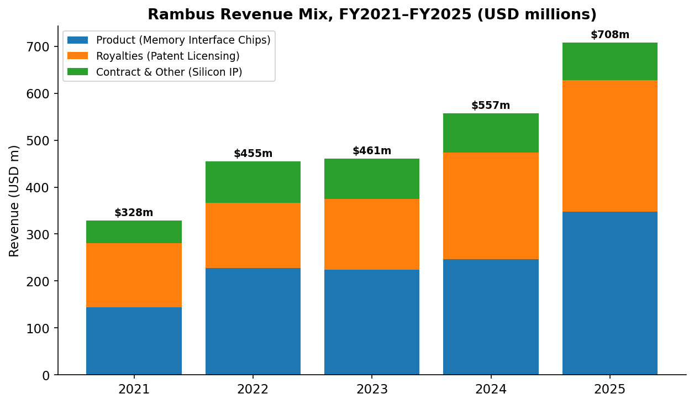
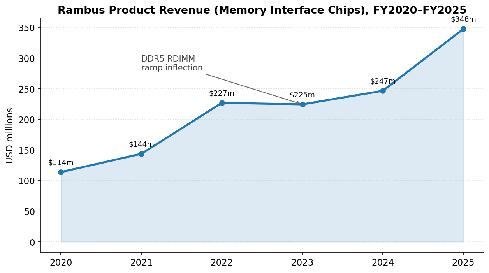
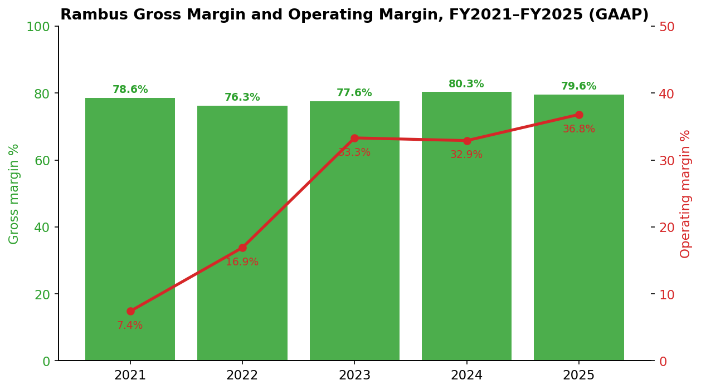
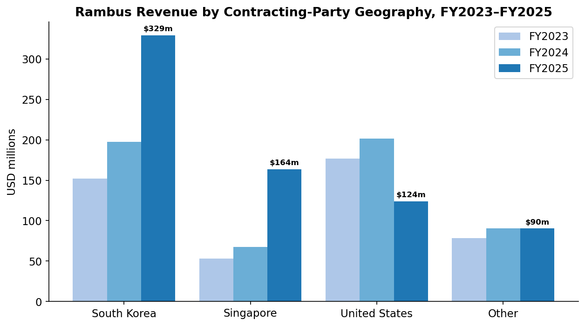
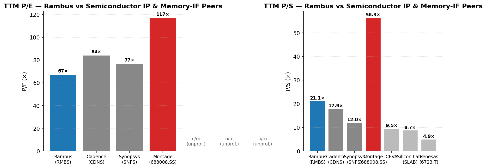
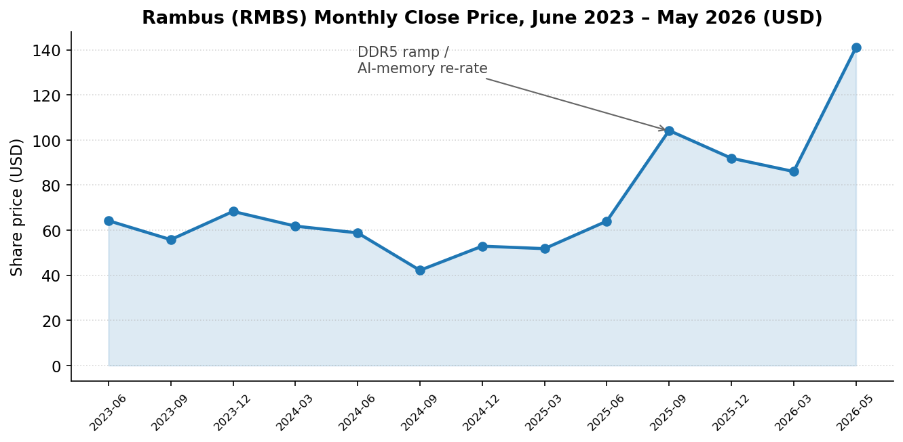
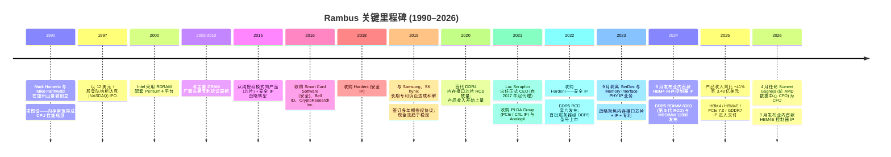
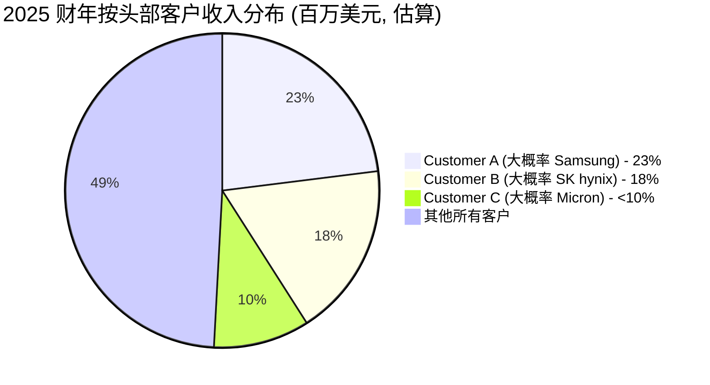

# Rambus Inc. (NASDAQ:RMBS) — 公司研究报告

**截至日期: 2026-05-20**
**分析师: 独立研究 (company-research skill, 内部使用)**
**上市地: 纳斯达克 (NASDAQ), 代码 RMBS**
**注册地: 美国加利福尼亚州圣何塞 (San Jose, California)**
**报告语言: 简体中文 (英文版同时存在于本目录)**

> **业绩更新——2026 财年 Q1 业绩符合指引, 高层接班完成 (2026-04-27 / 2026-04-29):**
> Rambus 公布 2026 财年 Q1 产品收入 (Memory Interface Chips) 为 **8,800 万美元**, 同比增长 15% ([2026 财年 Q1 业绩公告, 2026-04-27](https://www.sec.gov/Archives/edgar/data/917273/000119312526182076/rmbs-ex99_1.htm)); 同时, 公司于 2026 年 4 月 29 日宣布任命 Sumeet Gagneja——此前担任 AMD 数据中心业务事业部 CFO——为高级副总裁兼首席财务官 (CFO), 接替自 Desmond Lynch 于 2026 年 2 月 10 日离职以来代理 CFO 的 John Allen ([Rambus 任命 Sumeet Gagneja 为 CFO, 2026-04-29](https://www.sec.gov/Archives/edgar/data/917273/000119312526192210/d20390dex991.htm))。同场电话会议给出的 2026 财年 Q2 指引为产品收入 9,500 万–10,100 万美元, 授权许可记账金额 7,600 万–8,200 万美元——按中值计算意味着产品收入同比增长约 17–22%, 由 DDR5 RDIMM 与 MRDIMM 的持续放量支撑。

---

## 目录

1. 公司概览
2. 公司历史
3. 管理团队
4. 产品与服务
5. 客户与上市策略
6. 行业概览
7. 竞争格局
8. 市场机会 (TAM)
9. 风险评估

---

## 1. 公司概览

Rambus Inc. (NASDAQ: RMBS) 是一家总部位于美国的**无晶圆厂半导体公司 (fabless semiconductor company)**, 其业务横跨三条高度差异化的收入条线: (i) **内存接口芯片 (Memory Interface Chips)**——即每一根 DDR5 服务器与高端客户端内存模组上都会用到的物理芯片组 (RCD、MRCD、MDB、CKD、PMIC、SPD Hub、TS); (ii) **芯片级 IP (Silicon IP)**——授权给芯片厂商的高性能接口与安全 IP, 用于 HBM、GDDR、PCIe/CXL 及硬件信任根 (hardware root of trust) 应用; (iii) **专利授权 (Patent Licensing)**——基于一项覆盖内存架构、高速串行链路与安全的、全球超过 2,000 项专利组合产生的长期版税现金流 ([2025 10-K, p. 4–5](https://www.sec.gov/Archives/edgar/data/917273/000119312526057101/0001193125-26-057101-index.htm))。

公司自我定位为"一家专注于数据密集型计算系统、提供行业领先芯片与硅 IP 的全球性半导体公司, 重点服务数据中心与人工智能 (AI) 基础设施" ([2025 10-K, Item 1 Business](https://www.sec.gov/Archives/edgar/data/917273/000119312526057101/0001193125-26-057101-index.htm))。运营上, Rambus 采用无晶圆厂模式——第三方代工厂 (foundry) 负责芯片制造, 而 Rambus 在其圣何塞总部及美国境内自有设施保留设计、销售、市场及终测职能。截至 2025 年 12 月 31 日, 公司全球员工人数为 730 人, 较前期披露的 365 人有所增加 (730 为 2025 财年全球合并总数) ([2025 10-K, Employees disclosure](https://www.sec.gov/Archives/edgar/data/917273/000119312526057101/0001193125-26-057101-index.htm))。

### Rambus 盈利方式

2025 财年合并营业收入为 **7.076 亿美元**, 较 2024 财年的 5.566 亿美元同比增长 27.1%, 较 2023 财年的 4.611 亿美元上升 53.5%。三条收入条线拆分如下 ([2025 10-K, Results of Operations](https://www.sec.gov/Archives/edgar/data/917273/000119312526057101/0001193125-26-057101-index.htm)):

| 收入条线 (百万美元) | 2023 财年 | 2024 财年 | 2025 财年 | 2024→25 同比 | 占 2025 财年收入比 |
|---|---:|---:|---:|---:|---:|
| 产品收入 (内存接口芯片) | 224.6 | 246.8 | **347.8** | **+40.9%** | 49.1% |
| 版税收入 (专利授权) | 150.1 | 226.2 | 279.4 | +23.5% | 39.5% |
| 合约及其他 (芯片级 IP) | 86.4 | 83.6 | 80.5 | (3.8)% | 11.4% |
| **总收入** | **461.1** | **556.6** | **707.6** | **+27.1%** | 100.0% |

**2025 年的主导叙事是内存接口芯片同比 +40.9% 的强劲爆发, **驱动力来自 DDR5 RDIMM 在服务器平台的渗透加速, 以及每一根 DDR5 模组上 Gen-2 / Gen-3 RCD 的附着率上升。版税收入也同步增长, 因为 Rambus 不断签订并续展覆盖 DDR5 架构与安全专利的多年期授权协议 ([Rambus 2025 财年 Q4 业绩说明会纪要, Motley Fool, 2026-02-02](https://www.fool.com/earnings/call-transcripts/2026/02/02/rambus-rmbs-q4-2025-earnings-call-transcript/))。


*来源: [Rambus 2022 财年 10-K, p. 33–34](https://www.sec.gov/Archives/edgar/data/917273/000091727323000008/0000917273-23-000008-index.htm) (2021/2022 数据) 及 [Rambus 2025 财年 10-K, p. 42–43](https://www.sec.gov/Archives/edgar/data/917273/000119312526057101/0001193125-26-057101-index.htm) (2023–2025)。注: 2022 财年产品收入含 2023 年 9 月剥离的 SerDes/PHY IP 业务。*


*来源: [Rambus 2022 财年 10-K, p. 33–34](https://www.sec.gov/Archives/edgar/data/917273/000091727323000008/0000917273-23-000008-index.htm) 及 [Rambus 2025 财年 10-K, p. 42–43](https://www.sec.gov/Archives/edgar/data/917273/000119312526057101/0001193125-26-057101-index.htm)。*


*来源: [Rambus 2022 财年 10-K](https://www.sec.gov/Archives/edgar/data/917273/000091727323000008/0000917273-23-000008-index.htm) (2021–22 财年) 及 [Rambus 2025 财年 10-K, p. 42–43](https://www.sec.gov/Archives/edgar/data/917273/000119312526057101/0001193125-26-057101-index.htm) (2023–25 财年)。2022 财年营业利润率剔除 9,080 万美元的一次性债务清偿损失; 2023 财年剔除 9,080 万美元的一次性资产剥离收益。*

### 地理分布

收入高度偏向亚洲。韩国 (Samsung 与 SK hynix 的签约主体所在地, 即 DRAM 厂商芯片销售的合约来源) 贡献 3.293 亿美元, 同比增长 67%; 新加坡 (主要为 Micron 签约主体) 1.638 亿美元, 同比增长 143%; 美国为 1.241 亿美元, 同比下降 38% (反映授权交易确认时点错位) ([2025 10-K, Note on Geographic Revenue](https://www.sec.gov/Archives/edgar/data/917273/000119312526057101/0001193125-26-057101-index.htm))。


*来源: [Rambus 2025 财年 10-K, 合并财务报表附注](https://www.sec.gov/Archives/edgar/data/917273/000119312526057101/0001193125-26-057101-index.htm)。*

### 盈利能力与资产负债表快照

2025 财年毛利率为 **79.6%** (2024 财年: 80.3%)——对一家半导体公司而言堪称极佳, 这是由高毛利的版税业务与同样健康的芯片业务毛利结构混合的结果。GAAP 营业利润达 **2.602 亿美元** (营业利润率 36.8%), 较上年 1.830 亿美元提升明显。GAAP 净利润为 **2.305 亿美元** (基本 EPS 2.14 美元 / 稀释 EPS 2.11 美元), 加权平均稀释股本 1.092 亿股。2025 年 12 月 31 日, 现金、现金等价物与有价证券合计 **7.618 亿美元**, 总债务仅 2,340 万美元——按净额计算, 公司净现金头寸约 7.4 亿美元 ([2025 10-K, 合并损益表与资产负债表](https://www.sec.gov/Archives/edgar/data/917273/000119312526057101/0001193125-26-057101-index.htm); 现金数据已与 [2026 财年 Q1 业绩公告, 2026-04-27](https://www.sec.gov/Archives/edgar/data/917273/000119312526182076/rmbs-ex99_1.htm) 中披露的截至 2026 年 3 月 31 日 7.861 亿美元交叉验证)。

### 估值快照

截至本报告所采用的最近收盘日 (2026 年 5 月 20 日), RMBS 收报 **140.98 美元**, 对应市值 **152.5 亿美元** ([Yahoo Finance, RMBS Key Statistics](https://finance.yahoo.com/quote/RMBS/key-statistics))。隐含估值倍数如下:

| 估值倍数 | RMBS (TTM) | 备注 |
|---|---:|---|
| 滚动市盈率 (P/E) | **67.1×** | 处于历史三年区间的高端 (2023 财年 TTM 一度低至约 10×——受 9,080 万美元资产剥离一次性收益与 1.467 亿美元税收抵免扭曲; 2024 财年 TTM 均值约 38×) |
| 前瞻市盈率 (Forward P/E) | 38.8× | 隐含 2026 财年 EPS 较 2025 财年增长约 73% |
| 滚动市销率 (P/S) | **21.1×** | 三年中位数约 10–12× |
| EV / EBITDA | 45.3× | 企业价值 137 亿美元 / TTM EBITDA 3.02 亿美元 (yfinance) |
| 市净率 (P/B) | 10.9× | 相较硬件同行偏高, 但对 IP 偏重的无晶圆厂公司属正常 |

同行对比:

| 公司 | 代码 | TTM P/E | TTM P/S | 备注 |
|---|---|---:|---:|---|
| Rambus | RMBS | 67.1× | 21.1× | 主体公司 |
| Cadence Design | CDNS | 84.0× | 17.9× | 纯 EDA + IP, 利润率结构可比 |
| Synopsys | SNPS | 76.9× | 12.0× | EDA + IP; 近期完成对 Ansys 的收购 |
| Montage Tech (澜起科技) | 688008.SS | **117.0×** | **56.3×** | 直接内存接口芯片同行; A 股溢价 + 科创板自由流通量失真 |
| CEVA | CEVA | n/m (亏损) | 9.5× | DSP / 连接类 IP 授权商 |
| Silicon Labs | SLAB | n/m (亏损) | 8.7× | MCU / 无线; 规模较小, 可比性有限 |
| Renesas Electronics (瑞萨电子) | 6723.T | n/m (亏损) | 4.9× | 当期录得商誉减值; 业务结构偏亚洲汽车 / 工业 MCU |

*来源: [Yahoo Finance, 多代码合并提取](https://finance.yahoo.com/quote/RMBS), 截至 2026-05-20。*


*来源: [Yahoo Finance Key Statistics, RMBS / CDNS / SNPS / 688008.SS / CEVA / SLAB / 6723.T](https://finance.yahoo.com/quote/RMBS/key-statistics), 数据截至 2026-05-20。*

**对当前高估值倍数的解读。** Rambus 的 67× TTM P/E 与 21× TTM P/S 在以收入为口径的 IP 授权同行集中位于偏高位置, 但若与纯 EDA/IP 同行 (CDNS、SNPS) 相比则实际合理, 较与功能最接近的可比公司澜起 (Montage) 相比甚至显得便宜。推升倍数的三大动能是: (a) **DDR5 放量周期**: 随 DDR5 RDIMM 在服务器出货中的份额突破 50%, 产品收入正处于多年期加速通道的中段; (b) **AI 内存带宽的代理标的属性**: 2025 年 9 月发布的 HBM4 / HBM4E 控制器 IP 与 PCIe 7.0 IP, 让 RMBS 成为参与 HBM 与加速器投资浪潮的衍生标的 ([Rambus 2025 财年 Q3 业绩说明会, Motley Fool 纪要](https://www.fool.com/earnings/call-transcripts/2025/10/27/rambus-rmbs-q3-2025-earnings-call-transcript/)); (c) **MRDIMM 选项价值**: 复用型 RDIMM (Multiplexed RDIMM) 预计 2027–2028 年放量, 单根模组的硅含量大幅高于标准 RCD 套片, 有望使单服务器槽位的产品 ASP (平均售价) 翻倍。该股自 2025 年 7 月约 60 美元一路上涨至 2026 年 5 月的 141 美元, 涨幅超过两倍。

风险点: 21× P/S 意味着市场对 2027–2029 财年的复合增长已经定价。第 9 章将单独把估值倍数压缩风险摊开讨论 ([Yahoo Finance, RMBS Key Statistics](https://finance.yahoo.com/quote/RMBS/key-statistics), 数据截至 2026-05-20)。


*来源: [Yahoo Finance 历史价格, RMBS](https://finance.yahoo.com/quote/RMBS/history), 数据截至 2026-05-20。*

---

## 2. 公司历史

Rambus 由斯坦福大学教授 **Mark Horowitz** 与连续创业者 **Mike Farmwald** 于 **1990 年 3 月**在加利福尼亚州山景城 (Mountain View) 创立, 立项假设非常明确: 内存总线带宽将成为 CPU 性能的结构性瓶颈。最初的架构创新——**Rambus DRAM (RDRAM)** ——采用高速、窄总线的点对点接口, 提供的带宽大约是同期 SDRAM 的 10 倍。公司于 **1997 年 5 月**以 12 美元 / 股的发行价登陆**纳斯达克 (NASDAQ)**, 并在 1996 年与 **Intel** 达成轰动一时的下一代 PC 内存子系统合作 ([Rambus 公司沿革——公司时间线概览, 第三方回顾](https://www.crunchbase.com/organization/rambus))。


*来源: [Rambus 2025 财年 10-K, Item 1](https://www.sec.gov/Archives/edgar/data/917273/000119312526057101/0001193125-26-057101-index.htm); [Rambus 2024–2026 新闻稿汇编](https://investor.rambus.com/news-releases); [Rambus HBM4 控制器发布稿, 2024-09-09](https://www.rambus.com/rambus-announces-industry-first-hbm4-controller-ip-to-accelerate-next-generation-ai-workloads/); [Rambus HBM4E 控制器发布稿, 2026-03-04](https://www.rambus.com/rambus-sets-new-benchmark-for-ai-memory-performance-with-industry-leading-hbm4e-controller-ip/)。*

### 两次关键性转折

**转型一——从 RDRAM 单一架构走向广义专利授权 (2000 年代中期):** RDRAM 随 Pentium 4 系统的采纳达到峰值后迅速衰退, 整个行业转向标准化的 DDR / DDR2 路线。Rambus 不得不通过诉讼与授权来变现其专利组合, 这带来了长达十年的法律驱动型营业收入, 但也伴随着难以预测的盈利。涉及 Hynix / Samsung / Micron 的多重纠纷——历经美国联邦法院、ITC (美国国际贸易委员会)、韩国公平贸易委员会以及欧盟竞争案件——直到 2013–2014 年才陆续了结, 授权收入此后趋于稳定 ([Rambus 与 SK hynix 签订专利授权协议, 2013](https://www.rambus.com/rambus-and-sk-hynix-sign-patent-license-agreement/); [Rambus 词条 — Wikipedia, 公司沿革](https://en.wikipedia.org/wiki/Rambus))。

**转型二——从"授权与诉讼"转为"产品 + IP" (2015–2023):** 自 2015 年起在 CEO Ron Black 的引导下, 并在 Luc Seraphin 任内加速, Rambus 将自身重塑为一家真实硅片产品 (内存缓冲器 / 寄存时钟驱动器芯片) 与集成 IP 核 (PCIe、CXL、安全) 的设计公司。2023 年 9 月剥离 PHY IP (约 9,000 万美元出售收益) 是这一转型的收官之笔——主动退出一个不成规模的 IP 业务, 以全力押注数据中心内存接口芯片 ([Rambus 完成向 Cadence 出售 PHY IP 资产, 2023-09-07](https://www.rambus.com/rambus-completes-sale-of-phy-ip-assets-to-cadence/))。

### 关键并购

- **2016 年** — Smart Card Software / Bell ID / CryptoResearch — 奠定安全 / 支付 IP 基础
- **2018 年** — Hardent — 安全 IP
- **2021 年** — **PLDA Group** — PCIe/CXL 控制器 IP (业绩对赌部分于 2022/2023 结算) ([Rambus 完成 PLDA 收购, 2021-08-18](https://www.rambus.com/rambus-completes-acquisition-of-plda/))
- **2021 年** — **AnalogX** — 高速链路 IP ([Rambus 完成 AnalogX 收购, 2021-07-06](https://www.prnewswire.com/news-releases/rambus-completes-acquisition-of-analogx-301325695.html))
- **2022 年** — Hardent 二度增资 — 强化安全 IP ([Rambus 完成 Hardent 收购, 2022-05-24](https://www.rambus.com/rambus-completes-acquisition-of-hardent/))
- *资产剥离, 2023 年 9 月* — 出售 SerDes 与 Memory Interface PHY IP 业务 (约 9,080 万美元收益) ([Rambus 完成向 Cadence 出售 PHY IP 资产, 2023-09-07](https://www.rambus.com/rambus-completes-sale-of-phy-ip-assets-to-cadence/))

### 近期动态 (过去 12 个月)

- **2024 年 9 月 9 日** — 发布业内首款 HBM4 内存控制器 IP ([Rambus](https://www.rambus.com/rambus-announces-industry-first-hbm4-controller-ip-to-accelerate-next-generation-ai-workloads/))
- **2024 年 10 月** — 首套完整的 DDR5 RDIMM 8000 (第 5 代 RCD) 与 DDR5 MRDIMM 12800 套片
- **2026 年 3 月 4 日** — 业内领先的 HBM4E 内存控制器 IP (16 Gbps/pin, 单器件 4.1 TB/s) ([HPCwire 新闻汇总, 2026-03-04](https://www.hpcwire.com/off-the-wire/rambus-sets-new-benchmark-for-ai-memory-performance-with-industry-leading-hbm4e-controller-ip/))
- **2026 年 4 月 27 日** — 2026 财年 Q1 产品收入同比 +15%; LPDDR5X SOCAMM2 服务器模组套片发布
- **2026 年 4 月 29 日** — Sumeet Gagneja 出任 CFO

---

## 3. 管理团队

### Luc Seraphin — 总裁兼首席执行官 (CEO) (62 岁; 2018 年起任 CEO, 当年由代理转正)

Luc Seraphin 整个职业生涯都在半导体行业, 2026 年将是其担任 Rambus CEO 的第八个完整年。在正式接任 CEO 之前, 他执掌公司的 Memory and Interface Division (内存与接口事业部)——这是设计并交付首批 DDR4、DDR5 RCD 的业务单元——更早之前则负责 Rambus 的全球销售与运营 ([Rambus 2026 DEF 14A, I 类董事提名人](https://www.sec.gov/Archives/edgar/data/917273/000119312526096458/0001193125-26-096458-index.htm))。他的运营背景在 Rambus 历任 CEO 中较为罕见: 前几任 CEO (Geoff Tate、Harold Hughes、Ron Black) 多出身于授权 / 高管背景, 缺乏直接的产品工程话语权; Seraphin 的任命是公司向产品型公司战略转型最明确的信号。

他更早期的职业经历涵盖在 **AT&T 贝尔实验室 / 朗讯 / Agere Systems** (后被 LSI 收购, 最终归入博通) 的 18 年, 历任销售、市场及综合管理高管, 最高出任 **Agere 无线业务事业部副总裁兼总经理 (Executive Vice President & GM, Wireless Business Unit)**。之后他先后担任瑞士一家 GPS 创业公司的总经理, 以及 **Sequans Communications** (NYSE: SQNS) 的全球销售与支持副总裁, 此后加入 Rambus。他持有法国里昂高等化学物理电子工程学校 (Ecole Superieure de Chimie, Physique, Electronique) 数学与物理学学士学位、电子工程硕士学位 (主修计算机架构), 以及哈特福德大学的工商管理硕士 (MBA)。他完成了哥伦比亚商学院高级管理人员项目 (Columbia Senior Executive Program) 以及斯坦福董事联盟项目 (Stanford Directors' Consortium) ([Rambus 2026 DEF 14A, Seraphin 履历](https://www.sec.gov/Archives/edgar/data/917273/000119312526096458/0001193125-26-096458-index.htm))。

在 Seraphin 任内: (a) 公司完成从"授权 + 诉讼"向"产品 + IP + 授权"的战略转型; (b) 产品收入从 2018 年的不足 2,500 万美元增长到 2025 年的 3.478 亿美元——七年内大约扩张 14 倍; (c) 毛利率从 60 多个百分点的区间提升至约 80%; (d) 长期运营的 PHY IP 业务在合适时点被剥离, 让公司得以专注于数据中心内存接口芯片; (e) 公司与主要 DRAM 厂商以及一大批系统 / GPU 客户 (含 AMD、Broadcom、NVIDIA、MediaTek、Qualcomm) 续签并扩大了专利授权组合。根据 2026 DEF 14A, 2025 年 Seraphin 总目标薪酬中约 92% 属于业绩挂钩 (基于相对 TSR 三年窗口的 PSU), 截至 2026 年 2 月 25 日他持股 370,984 股——金额可观, 但远谈不上创始人级别 ([Rambus 2026 DEF 14A, 薪酬讨论 & 持股表](https://www.sec.gov/Archives/edgar/data/917273/000119312526096458/0001193125-26-096458-index.htm))。

### Sumeet Gagneja — 高级副总裁兼首席财务官 (CFO) (2026 年 4 月 29 日生效)

Gagneja 接替于 2026 年 2 月 10 日宣布离职的 Desmond Lynch (该次过渡期由代理 CFO John Allen 顶岗, 直至 Gagneja 上任)。Gagneja 在半导体、数据中心以及 AI 驱动计算生态中拥有逾二十年财务与运营领导经验, **此前最近一份职务为 AMD 数据中心业务事业部 CFO**——这与 Rambus 的客户结构与产品终端市场高度吻合。他更早的职务还包括西部数据 (Western Digital) 闪存业务 CFO, 以及 Xilinx、Innovium、Maxim Integrated、Avago、Intel 的高级财务管理岗位 ([Rambus 任命 Sumeet Gagneja 为 CFO, 8-K 附录, 2026-04-29](https://www.sec.gov/Archives/edgar/data/917273/000119312526192210/d20390dex991.htm))。这次招聘是实质性正向信号——Gagneja 的背景既了解客户侧 (AMD 是 Rambus 芯片 IP 的大型授权方), 也熟悉制造侧 (代工 / 封装), 这正是 Rambus 所依赖的两个体系。但他尚未在 Rambus 经历过一个完整的公开公司财报周期, 这是未来 6–9 个月需要观察的最大"待证"项。

### Sean Fan — 执行副总裁兼首席运营官 (COO)

Sean Fan 全球负责 Rambus 的产品组织, 含内存接口芯片与硅 IP 业务——实质上是支撑内存接口芯片增长故事的运营引擎。截至 2026 年 2 月 25 日, 他持有 193,954 股 ([Rambus 2026 DEF 14A, 持股表](https://www.sec.gov/Archives/edgar/data/917273/000119312526096458/0001193125-26-096458-index.htm)); 他于 2025 年披露为指定高管 (named executive officer)。Sean Fan 此前在 Marvell / Spansion 从事产品与工程管理——其技术运营背景与 Seraphin 的商业背景形成良性互补。

### John Shinn — 高级副总裁兼总法律顾问、董事会秘书及首席合规官

John Shinn 主管法务与 IP 授权战略——这是 Rambus 的关键岗位, 因为约 40% 的收入来源于专利版税, 且专利执行在公司历史上扮演了战略性角色。截至 2026 年 2 月 25 日, 他持有 27,580 股 ([Rambus 2026 DEF 14A, 持股表](https://www.sec.gov/Archives/edgar/data/917273/000119312526096458/0001193125-26-096458-index.htm))。

### 公司治理脚注

Rambus 董事会共设有**八名董事**, 其中**七名独立董事**。董事会主席为 **Charles Kissner** (自 2012 年起出任), 他曾任职于 Aviat Networks、ShoreTel、Stratex 及更早期的 AT&T ([Rambus 2026 DEF 14A, 董事履历](https://www.sec.gov/Archives/edgar/data/917273/000119312526096458/0001193125-26-096458-index.htm))。其他独立董事包括:

- **Meera Rao** (审计委员会主席) — 前 **Monolithic Power Systems** (Rambus 在内存接口芯片维度的直接竞争者之一) CFO, 也任 Impinj 董事 ([Rambus 2026 DEF 14A, 董事履历](https://www.sec.gov/Archives/edgar/data/917273/000119312526096458/0001193125-26-096458-index.htm))。
- **Necip Sayiner** — 前 **Renesas Electronics Corporation** (另一直接内存接口芯片竞争者) 执行副总裁、前 Intersil CEO; 直接为董事会带来竞争对手侧的半导体领导经验 ([Rambus 2026 DEF 14A, 董事履历](https://www.sec.gov/Archives/edgar/data/917273/000119312526096458/0001193125-26-096458-index.htm))。
- **Emiko Higashi** — Tohmon Capital Partners 创始人; 前 Wasserstein Perella 科技 M&A 负责人; 担任武田制药、Rapidus (日本 2nm 代工合资公司) 等公司董事 ([Rambus 2026 DEF 14A, 董事履历](https://www.sec.gov/Archives/edgar/data/917273/000119312526096458/0001193125-26-096458-index.htm))。
- **Steven Laub** — 前 Atmel CEO, 更早期任 Lattice Semiconductor 总裁兼 COO ([Rambus 2026 DEF 14A, 董事履历](https://www.sec.gov/Archives/edgar/data/917273/000119312526096458/0001193125-26-096458-index.htm))。
- **Victor Peng** — *于 2026 年 2 月 12 日加入董事会*; 前 AMD 总裁 (2022–2024)、前 Xilinx CEO (2018–2022); 几乎是 Rambus 近年加入董事会最高规格的半导体业界重磅人物, 强烈传达公司向数据中心 / AI 倾斜的战略意图 ([Victor Peng 加入 Rambus 董事会, 8-K, 2026-02-12](https://www.sec.gov/Archives/edgar/data/917273/000119312526048728/d83049dex991.htm))。
- **Eric Stang** — 资深半导体行业元老 ([Rambus 2026 DEF 14A, 董事履历](https://www.sec.gov/Archives/edgar/data/917273/000119312526096458/0001193125-26-096458-index.htm))。

根据股东大会代理声明 (proxy), 约 **86%** 的指定高管 (NEO) 目标薪酬属业绩挂钩 (CEO 约 92%)。主要机构股东包括 **BlackRock 13.9%**、**Vanguard 11.6%**、**T. Rowe Price 5.0%**。无任何内部人持股超过 1%——公司不是创始人控股, 而是高度机构化的广义持股结构 ([Rambus 2026 DEF 14A, 持股表](https://www.sec.gov/Archives/edgar/data/917273/000119312526096458/0001193125-26-096458-index.htm))。

### 管理层执行履历综评

这是一支可信、半经验老到的管理团队, 在七年期间令人信服地执行了运营思路——从诉讼驱动的 IP 公司转型为真实的产品 / 硅片供应商, 每股营业收入大约三倍化, 营业利润率提升约四倍 ([Rambus 2025 财年 10-K, Item 7 MD&A](https://www.sec.gov/Archives/edgar/data/917273/000119312526057101/0001193125-26-057101-index.htm))。最显著的缺口在于财务负责人衔接的连续性: Lynch 在周期中段离职, Gagneja 资历过硬但尚未交出一个 Rambus 财季成绩单。Victor Peng (AMD / Xilinx) 加入董事会则是半导体高管阵容上的实质性升级, 应有助于公司与 AMD 及更广泛的超大规模买家群体维系客户 / 合作关系 ([Victor Peng 加入 Rambus 董事会, 8-K, 2026-02-12](https://www.sec.gov/Archives/edgar/data/917273/000119312526048728/d83049dex991.htm))。

---

## 4. 产品与服务

Rambus 把商业产品线组织成三大支柱, **共同服务同一终端市场: 数据中心、AI 与边缘计算所需的高带宽内存子系统**。下述产品分类直接源自公司"Item 1 — Business"披露 ([Rambus 2025 财年 10-K, p. 4–6](https://www.sec.gov/Archives/edgar/data/917273/000119312526057101/0001193125-26-057101-index.htm)) 及 rambus.com 的产品导航树。

```mermaid
graph TD
    A[Rambus Inc.] --> B[内存接口芯片 - 49% 营收]
    A --> C[硅 IP - 11% 营收]
    A --> D[专利授权 - 40% 营收]

    B --> B1[DDR5 RCD - 寄存时钟驱动器]
    B --> B2[MRCD - 复用型寄存时钟驱动器 - MRDIMM]
    B --> B3[MDB - 复用型数据缓冲器]
    B --> B4[CKD - 客户端时钟驱动器, 适配 AI PC / LPDDR5]
    B --> B5[PMIC - 电源管理 IC]
    B --> B6[SPD Hub - 串行存在检测 Hub]
    B --> B7[TS - 温度传感器]
    B --> B8[LPDDR5X SOCAMM2 套片 - 2026 年发布]

    C --> C1[HBM3E / HBM4 / HBM4E 内存控制器 IP]
    C --> C2[GDDR6 / GDDR7 内存控制器 IP]
    C --> C3[PCIe 5.0/6.0/7.0 控制器 / Retimer / 交换芯片 IP]
    C --> C4[CXL 控制器 IP]
    C --> C5[安全 IP - 硬件信任根]
    C --> C6[安全 IP - 高速协议引擎]
    C --> C7[安全 IP - 加密核心]
    C --> C8[安全 IP - 芯片激活配置]

    D --> D1[DDR 内存架构专利]
    D --> D2[高速串行链路专利]
    D --> D3[安全架构专利]
```



### 4.1 内存接口芯片 (占 2025 财年营收 49%; **同比 +41%**)

Rambus 销售**面向行业标准 DDR5 与 LPDDR5 内存模组的完整套片解决方案**。产品组合包括 ([Rambus 2025 财年 10-K, p. 4](https://www.sec.gov/Archives/edgar/data/917273/000119312526057101/0001193125-26-057101-index.htm)):

| 产品 | 目标应用 | 差异化点 |
|---|---|---|
| **DDR5 RCD** (寄存时钟驱动器) | 每根 DDR5 RDIMM 服务器模组 | 缓冲命令 / 地址信号; 第 5 代 RCD 已交付 8000 MT/s |
| **MRCD** (复用型 RCD) | 下一代 MRDIMM (AI 服务器) | 通道数更高, 单根模组硅含量更大 |
| **MDB** (复用型数据缓冲器) | MRDIMM | MRCD 的伴生芯片; 单根 MRDIMM 上 9 颗缓冲器, 速率 12800 MT/s |
| **CKD** (客户端时钟驱动器) | AI PC、LPDDR5 客户端模组 | 首次把服务器级内存技术下沉到客户端外形 |
| **PMIC** (电源管理 IC) | DDR5 / MRDIMM 模组 | 12V→1.1V 模组级转换 |
| **SPD Hub** (串行存在检测 Hub) | DDR5 / MRDIMM 模组 | 模组级配置 / 中枢 |
| **TS** (温度传感器) | DDR5 / MRDIMM 模组 | 热监控 |
| **LPDDR5X SOCAMM2 套片** | NVIDIA 主导的 SOCAMM 服务器模组外形, 2026+ | 全套片方案; *2026 年 4 月发布* |

**竞争优势判定——是 (强)。** DDR5 RCD / MRCD / MDB 市场是一个由 JEDEC 标准化、且受门禁认证 (qualification-gated) 制约的**三方寡头格局** (Rambus、澜起 (Montage Technology)、Renesas/IDT), 三家合计份额约 97% ([SCMP, 2025](https://www.scmp.com/tech/tech-trends/article/3307646/tech-war-shanghai-chip-firm-doubles-quarterly-profit-china-expands-supply-chain-role))。Rambus 在 DDR4 RCD 上份额约 25%, 但在 DDR5 时代以**中 40% 的份额**胜出——也就是在世代切换中获取份额最多的一家 ([TheValueist on X, 引用 2025 财年 Q4 业绩, 2025-09](https://x.com/TheValueist/status/1970139561939669463); 与 [2025 财年 Q4 业绩说明会纪要, Motley Fool, 2026-02-02](https://www.fool.com/earnings/call-transcripts/2026/02/02/rambus-rmbs-q4-2025-earnings-call-transcript/) 交叉验证)。

护城河类型: **技术 + IP (深厚的内存架构专利组合) + 资质 / 认证 (多年期的 DRAM 厂商及 OEM 设计导入周期) + 规模 (在多家代工厂的成熟硅片产线) + 切换成本 (超大规模客户重新认证 RCD 需要全面的系统级验证)**。单模组 ASP 随时间显著抬升: 第 1 代到第 5 代 RCD 含硅量持续上行, MRDIMM 又新增 MRCD + MDB 伴生套片 (估计单模组硅含量是 RDIMM 的 3–5 倍) ([Lenovo Press, MRDIMM Memory Technology 入门, 2025](https://lenovopress.lenovo.com/lp2028-introduction-to-mrdimm-memory-technology); [JEDEC press release on DDR5 MRDIMM Gen2 12,800 MT/s standard, 2025](https://www.jedec.org/news/pressreleases/jedec%C2%AE-advances-ddr5-mrdimm-ecosystem-new-memory-interface-logic-and-expanded))。

最接近的竞品: **澜起 DDR5 RCD04** (最高 7200 MT/s) ([澜起 DDR5 产品页](https://www.montage-tech.com/Memory_Interface/DDR5)); Renesas DDR5 RCD (来源于 IDT 收购资产) ([Renesas DDR5 Solutions 产品页](https://www.renesas.com/en/products/memory-logic/memory-interface-products/ddr5-solutions))。截至 2026 年中, Rambus 第 5 代 RCD 在 8000 MT/s 速率档与完整 MRDIMM 12800 套片上**领先澜起一档** ([Rambus 2025 财年 Q4 业绩说明会纪要, Motley Fool, 2026-02-02](https://www.fool.com/earnings/call-transcripts/2026/02/02/rambus-rmbs-q4-2025-earnings-call-transcript/))。

### 4.2 硅 IP (~占 2025 财年营收 11%; 同比 (3.8)%)

Rambus 授权**接口 IP** 与**安全 IP**, 客户群为正在打造定制硅、ASSP 与 FPGA 的芯片厂商 ([Rambus 2025 财年 10-K, p. 5](https://www.sec.gov/Archives/edgar/data/917273/000119312526057101/0001193125-26-057101-index.htm))。

**接口 IP** (内存 + 芯片间互联):
- **HBM 内存控制器 IP** — 含 2024 年 9 月发布的**业内首款 HBM4** 控制器, 以及 2026 年 3 月发布的**业内领先 HBM4E** 控制器 (16 Gbps/pin, **单器件 4.1 TB/s** ——对应 8 层堆栈 AI 加速器即 32+ TB/s 的内存带宽) ([Rambus HBM4E 发布稿, 2026-03-04](https://www.rambus.com/rambus-sets-new-benchmark-for-ai-memory-performance-with-industry-leading-hbm4e-controller-ip/); [SiliconANGLE 报道, 2026-03-04](https://siliconangle.com/2026/03/04/rambus-targets-ai-memory-bottlenecks-new-hbm4e-controller-ip/))
- **GDDR 内存控制器 IP** — GDDR6 / GDDR7 (也在抢占 AI 推理加速器市场)
- **PCIe 控制器、Retimer 与交换芯片 IP** — 一路覆盖到 PCIe 7.0 (2025 年发布)
- **CXL 控制器 IP** — 服务于现代数据中心的内存池化与内存扩展

**安全 IP** (全行业最完整的产品组合之一):
- **硬件信任根 (Hardware Roots of Trust)**
- **高速协议引擎 (High-speed Protocol Engines)**
- **加密核心 (Crypto Cores)**
- **芯片激活配置技术 (Chip Provisioning Technologies)**

**竞争优势判定——部分成立。** Rambus 在此领域与 **Cadence**、**Synopsys** (两家 EDA 巨头, 把 IP 捆绑在工具链中销售) 以及客户内部设计团队展开竞争 ([Synopsys HBM4 Controller IP 产品页](https://www.synopsys.com/designware-ip/interface-ip/hbm/hbm4-controller.html); [Cadence HBM4E Memory IP 产品页](https://www.cadence.com/en_US/home/tools/silicon-solutions/protocol-ip/memory-interface-and-storage-ip/hbm-phy/hbm4e.html))。Rambus 在 HBM 控制器 IP 上确实拥有真正的技术领先 (在 HBM4 与 HBM4E 上"业内首款"名副其实), 并在安全 IP 领域占据可防御的细分高地。但在 PCIe / CXL 控制器 IP 上, Cadence 与 Synopsys 拥有远更宽泛的产品目录, 并借 EDA 捆绑深耕客户关系——Rambus 的位置可竞争, 但远谈不上主导。

护城河类型: **技术 / IP (在 HBM4 / HBM4E 上真实的时间领先)** + **分销 (直接半导体销售团队)** ([EE Times, Rambus 发布 HBM4E 控制器, 2026-03](https://www.eetimes.com/rambus-unveils-hbm4e-controller-16-gt-s-2048-bit-interface-enabling-c-hbm4e/))。反护城河: 规模相对 CDNS/SNPS 偏小, 缺乏 EDA 捆绑的杠杆。

最接近的竞品: **Cadence Denali HBM4 Controller** ([Cadence HBM4 12.8Gbps IP 新闻稿, 2025](https://www.cadence.com/en_US/home/company/newsroom/press-releases/pr/2025/cadence-enables-next-gen-ai-and-hpc-systems-with-industrys.html)) 与 **Synopsys DesignWare HBM4 Controller** ([Synopsys HBM4 Controller IP](https://www.synopsys.com/designware-ip/interface-ip/hbm/hbm4-controller.html))——截至 2026 年 5 月, 按已发布规格 (16 Gbps/pin) 的原始 HBM4E 吞吐量比较, Rambus 与之**齐平到略胜** ([Rambus HBM4E 发布稿, 2026-03-04](https://www.rambus.com/rambus-sets-new-benchmark-for-ai-memory-performance-with-industry-leading-hbm4e-controller-ip/))。

### 4.3 专利授权 (占 2025 财年营收 39.5%; 同比 +23.5%)

涵盖内存架构、高速串行链路与安全的专利发明。授权年限通常长达 10 年; 版税结构包括固定型、变动型或混合型。根据 10-K, 当前被授权方囊括全球半导体行业的"Who's Who" ([Rambus 2025 财年 10-K, p. 5](https://www.sec.gov/Archives/edgar/data/917273/000119312526057101/0001193125-26-057101-index.htm)):

> "AMD、Amlogic、Broadcom、CXMT (长鑫存储)、IBM、Infineon、Kioxia、Marvell、MediaTek、Micron、Nanya、Nuvoton、NVIDIA、Phison、Qualcomm、Samsung、Silicon Motion、SK hynix、Socionext、STMicroelectronics、Toshiba、Western Digital 及 Winbond 已被授权使用我们的专利。"

值得注意的是: **CXMT** (长鑫存储, Changxin Memory Technologies)——中国本土 DRAM 龙头——已成为明确披露的被授权方, 弥补了"中国 DRAM 不付授权费"这一原本可能存在的结构性收入缺口 ([Tom's Hardware, 中国 DRAM 厂商 CXMT 与 Rambus 签订专利协议](https://www.tomshardware.com/news/cxmt-patent-agreement-rambus-china-dram-memory))。

**竞争优势判定——是 (极强)。** 这是一个超过 2,000 项专利的组合, 覆盖基础性内存架构, 由 35 年逐步累积而来; 任何新进入者要复制这一组合, 几乎是不可能的任务。被授权方名单覆盖全球 DRAM 与处理器产业。版税收入按 3–10 年续约节奏呈现的"块状"特征会带来盈利波动, 但底层现金生成能力极为持久 ([Rambus 2025 财年 10-K, Item 1 Business — Patent Licensing](https://www.sec.gov/Archives/edgar/data/917273/000119312526057101/0001193125-26-057101-index.htm))。

护城河类型: **IP / 专利**——纯靠这一条。

### 4.4 旗舰产品

**DDR5 RCD 套片业务**毫无疑问是旗舰——它驱动了 2025 财年产品收入 +41% 的增长, 是 2026–2028 财年展望中最大的单一摆动因子, 也是该股当前所交易的 AI 内存基础设施叙事的根基。**MRDIMM 套片** (MRCD + MDB) 是明确的前瞻性增长引擎; 首批 MRDIMM 量产爬坡预计始于 2026 年末向 2027 年延续, 单模组的硅含量提升将是显著的。HBM4 / HBM4E 控制器 IP 是次要的前瞻性叙事 ([Rambus 2025 财年 Q4 业绩说明会纪要, Motley Fool, 2026-02-02](https://www.fool.com/earnings/call-transcripts/2026/02/02/rambus-rmbs-q4-2025-earnings-call-transcript/); [Rambus 2025 财年 10-K, Item 1 Business](https://www.sec.gov/Archives/edgar/data/917273/000119312526057101/0001193125-26-057101-index.htm))。

### 4.5 近期发布 (过去 12 个月)

- **2026 年 3 月** — HBM4E 内存控制器 IP (业内领先 16 Gbps/pin) ([Rambus HBM4E 发布稿, 2026-03-04](https://www.rambus.com/rambus-sets-new-benchmark-for-ai-memory-performance-with-industry-leading-hbm4e-controller-ip/))
- **2026 年 4 月** — LPDDR5X SOCAMM2 服务器模组套片 ([2026 财年 Q1 业绩公告, 2026-04-27](https://www.sec.gov/Archives/edgar/data/917273/000119312526182076/rmbs-ex99_1.htm))
- **2025 年 9 月** — DDR5 RDIMM 第 5 代 RCD (8000 MT/s) ([Rambus 2025 财年 Q3 业绩公告, 2025-10-27](https://www.sec.gov/Archives/edgar/data/917273/000119312525251595/rmbs-ex99_1.htm))
- **2025 年年中** — PCIe 7.0 控制器 IP ([Rambus 2025 财年 Q3 业绩说明会纪要, Motley Fool, 2025-10-27](https://www.fool.com/earnings/call-transcripts/2025/10/27/rambus-rmbs-q3-2025-earnings-call-transcript/))

---

## 5. 客户与上市策略

### 客户基础与渠道

Rambus 通过三条相互独立的上市渠道销售产品, 对应三条收入条线:

1. **内存接口芯片**——直接销售或通过分销商, 卖给 (a) **内存模组厂商** (Samsung、SK hynix、Micron), 由其将套片集成到 RDIMM / MRDIMM 模组上; (b) **OEM 及超大规模客户**, 用于直接集成 ([Rambus 2025 财年 10-K, p. 5](https://www.sec.gov/Archives/edgar/data/917273/000119312526057101/0001193125-26-057101-index.htm))。
2. **硅 IP**——通过全球直销团队卖给打造定制硅、ASSP、FPGA (包括 AI 加速器与 GPU 厂商) 的芯片公司 ([Rambus 2025 财年 10-K, Item 1 — Silicon IP](https://www.sec.gov/Archives/edgar/data/917273/000119312526057101/0001193125-26-057101-index.htm))。
3. **专利授权**——企业级直销, 与主要半导体与系统公司签订多年期授权协议 ([Rambus 2025 财年 10-K, Item 1 — Patent Licensing](https://www.sec.gov/Archives/edgar/data/917273/000119312526057101/0001193125-26-057101-index.htm))。

### 客户集中度

根据 2025 财年 10-K, 三年披露窗口期内有三家客户在某一期内的营收占比达到或超过 10% ([Rambus 2025 财年 10-K, 风险集中度附注](https://www.sec.gov/Archives/edgar/data/917273/000119312526057101/0001193125-26-057101-index.htm)):

| 客户 | 2023 财年 | 2024 财年 | 2025 财年 |
|---|---:|---:|---:|
| Customer A | 27% | 23% | **23%** |
| Customer B | 18% | 17% | **18%** |
| Customer C | <10% | 12% | <10% |

**2025 财年前 2 大客户占比 ≈ 41%; 2024 财年前 3 大客户占比 = 52%。** 10-K 中并未按 ASC 280 标准披露客户姓名, 但通过交叉印证地区拆分 (韩国 3.29 亿美元; 新加坡 1.64 亿美元) 与 10-K 中关于"我们的内存接口芯片销售给主要 DRAM 厂商 Micron、Samsung 和 SK hynix"的语句, 几乎可确定身份 ([Rambus 2025 财年 10-K, 风险集中度与地区收入](https://www.sec.gov/Archives/edgar/data/917273/000119312526057101/0001193125-26-057101-index.htm)):

- **Customer A** (23%) 几乎可肯定为 **三星电子 (Samsung Electronics)** (韩国, 全球最大 DRAM 供应商, Rambus 最大芯片买家) ([TrendForce, 全球 DRAM 营收 3Q25, 2025-11-26](https://www.trendforce.com/presscenter/news/20251126-12802.html))
- **Customer B** (18%) 几乎可肯定为 **SK hynix** (韩国; 第二大 DRAM 客户; 在 HBM 控制器上也具战略地位) ([TrendForce, 全球 DRAM 营收 3Q25, 2025-11-26](https://www.trendforce.com/presscenter/news/20251126-12802.html))
- **Customer C** (2024 财年达到 12% 时) 最可能为 **美光科技 (Micron Technology)** (在新加坡的签约主体) ([Rambus 2025 财年 10-K, 地区收入附注](https://www.sec.gov/Archives/edgar/data/917273/000119312526057101/0001193125-26-057101-index.htm))


*来源: [Rambus 2025 财年 10-K, 风险集中度附注](https://www.sec.gov/Archives/edgar/data/917273/000119312526057101/0001193125-26-057101-index.htm); 客户名称的归属为作者基于地区披露与 10-K 文本作出的推断, 而非直接披露。*

**风险严重程度:** 第一大客户 23% **已超过 20% 的重要性阈值**; 前两大客户 41% 偏高但尚未到达 ≥50%; 单一年度的前三大 (2024 财年) 达到 52%。这构成**实质性客户集中度风险**, 并在第 9 章风险章节单列。缓释因素是: 头部客户是 **战略性合作伙伴 (DRAM 厂商)**, 不是远距离的终端买家——他们有动力维持多家 RCD 供应商资质认证, 而 Rambus 当前赢得的份额, 其代价主要来自 Renesas, 而非任何一家头部客户的让位。"客户即竞争者"的失败模式风险极低: 头部客户处于上游 (DRAM), 而非同位竞争 ([Rambus 2025 财年 10-K, 风险集中度附注](https://www.sec.gov/Archives/edgar/data/917273/000119312526057101/0001193125-26-057101-index.htm))。

地理集中度与客户集中度高度镜像: **2025 财年约 70% 的收入在韩国 + 新加坡确认**, 反映 DRAM 厂商签约主体所在地 ([Rambus 2025 财年 10-K, 地区收入附注](https://www.sec.gov/Archives/edgar/data/917273/000119312526057101/0001193125-26-057101-index.htm))。

### 销售周期与合同结构

- **内存接口芯片**——标准采购订单, 取消窗口有限。直接销售与分销并行。JEDEC 标准化是进场门槛: 一颗新 RCD 必须由 DRAM 厂商完成资格认证, 再由 JEDEC 批准, 并由 Intel / AMD 平台工程团队验证——典型流程长达 18–24 个月 ([Rambus 2025 财年 10-K, Item 1 Business](https://www.sec.gov/Archives/edgar/data/917273/000119312526057101/0001193125-26-057101-index.htm))。
- **硅 IP**——授权 + 版税混合, 通常 3–10 年期限 ([Rambus 2025 财年 10-K, Item 1 Business — Silicon IP](https://www.sec.gov/Archives/edgar/data/917273/000119312526057101/0001193125-26-057101-index.htm))。
- **专利授权**——固定型、变动型或混合型版税, 最长达 10 年。续约驱动的收入波动是损益表上最大的季度间变量。CXMT (中国) 被列为明确被授权方在战略上意义重大——中国是 DRAM 增长最快的地区 ([Rambus 2025 财年 10-K, Item 1 Business — Patent Licensing](https://www.sec.gov/Archives/edgar/data/917273/000119312526057101/0001193125-26-057101-index.htm); [Tom's Hardware, CXMT-Rambus 专利交易](https://www.tomshardware.com/news/cxmt-patent-agreement-rambus-china-dram-memory))。

### 标志性客户 / 合作伙伴

- **AMD** — 专利被授权方; 新任 CFO 来自 AMD; CXL / PCIe IP 客户 ([Rambus 2025 财年 10-K, Item 1 Business — Licensees](https://www.sec.gov/Archives/edgar/data/917273/000119312526057101/0001193125-26-057101-index.htm))
- **NVIDIA** — 专利被授权方; GDDR7 控制器 IP 的目标客户; LPDDR5X SOCAMM2 套片正是为 NVIDIA 主导的服务器模组外形而设计 ([2026 财年 Q1 业绩公告, 2026-04-27](https://www.sec.gov/Archives/edgar/data/917273/000119312526182076/rmbs-ex99_1.htm))
- **Broadcom、Marvell、MediaTek、Qualcomm** — 专利被授权方; 硅 IP 客户 ([Rambus 2025 财年 10-K, Item 1 Business — Licensees](https://www.sec.gov/Archives/edgar/data/917273/000119312526057101/0001193125-26-057101-index.htm))
- **Samsung、SK hynix、Micron** — 既是专利被授权方, **同时是**内存接口芯片买家 (这种双重关系是结构性优势) ([Rambus 2025 财年 10-K, Item 1 Business](https://www.sec.gov/Archives/edgar/data/917273/000119312526057101/0001193125-26-057101-index.htm))
- **CXMT (长鑫存储)** — 中国 DRAM 专利被授权方 (新近 / 最近披露) ([Tom's Hardware, CXMT 与 Rambus 签订专利交易](https://www.tomshardware.com/news/cxmt-patent-agreement-rambus-china-dram-memory))

---

## 6. 行业概览

### 6.1 行业定义与范围

Rambus 在三个相邻但技术上区分明显的半导体子行业中竞争: **(a) 服务器 / 数据中心 DRAM 模组的内存接口芯片组件**, **(b) 半导体 IP 授权**, **(c) 内存与安全专利授权**。第一项归属更广义的 **DRAM 模组生态系统** (北美产业分类标准 NAICS 334413, 即"半导体及相关器件制造"); 第二项位于**半导体 IP / EDA 行业** (实际上由 Cadence 与 Synopsys 主导的细分子板块); 第三项是独特的结构性 IP 授权市场 ([Rambus 2025 财年 10-K, Item 1 Business](https://www.sec.gov/Archives/edgar/data/917273/000119312526057101/0001193125-26-057101-index.htm))。

### 6.2 内存接口芯片 / DDR5 RDIMM 市场

**市场规模与增长 (DDR5 RDIMM 模组):** DDR5 RDIMM 市场正处于多年期切换的中段。行业预测收敛于 2024 年约 **41 亿美元**的基数, 预计到 2030–2033 年的 CAGR (复合年增长率) 为 **25–34%** ([Valuates Reports, "DDR5 RDIMM Memory Module Market", 2025](https://www.openpr.com/news/4424760/ddr5-rdimm-memory-module-market-share-driven-by-data-center); [Market Report Analytics, "DDR5 RDIMM 2025-2033", 2025](https://www.marketreportanalytics.com/reports/ddr5-rdimm-memory-module-378040))。

**市场规模与增长 (仅 DDR5 RCD 芯片):** 预计 **2025 年约 15 亿美元**, 至 2033 年 CAGR 约 20%——即到 2030 年约**45–50 亿美元** ([Market Research Intellect, "DDR5 RCD Market", 2025](https://www.marketresearchintellect.com/product/ddr5-registering-clock-driver-rcd-market/); [Verified Market Reports, "DDR5 RCD Market", 2025](https://www.verifiedmarketreports.com/product/ddr5-registering-clock-driver-rcd-market/))。Yole Intelligence (Yole 智库) 已指出, 随着 MRDIMM、MRCD 与 MDB 的加入, DIMM 套片单模组硅含量将持续扩张 ([Yole Group, "DIMM chipset keeps expanding"](https://www.yolegroup.com/yole-group-actuality/dimm-chipset-keeps-expanding/))。

**关键驱动因素:**

1. **DDR5 在服务器中的渗透。** DDR5 服务器模组出货占比已在 2024 年末突破 50%, 预计 2026 年将超过 80%, 全面取代 DDR4 ([TrendForce, DRAM 紧缺将推动 DDR5 合约价上行, 2025-10-29](https://www.trendforce.com/presscenter/news/20251029-12758.html))。
2. **AI 工作负载的内存密度提升。** AI 训练与推理平台要求每个 CPU 插槽 / 加速器配备显著更多的 DRAM 通道, 推升 RCD 附着率 ([TrendForce, AI 服务器需求与内存合约价, 2026-03-31](https://www.trendforce.com/presscenter/news/20260331-12995.html))。
3. **MRDIMM 量产爬坡 (2026–2028)。** MRDIMM 通过引入复用型双 Rank 架构, 把单模组带宽翻倍 (12.8 Gbps vs DDR5 基准 6.4 Gbps), 每根模组配备一颗 MRCD 与 9 颗 MDB——单根模组硅含量相比普通 DDR5 RDIMM **提升约 3–5 倍** ([JEDEC 关于 DDR5 MRDIMM Gen2 12,800 MT/s 标准的新闻稿](https://www.jedec.org/news/pressreleases/jedec%C2%AE-advances-ddr5-mrdimm-ecosystem-new-memory-interface-logic-and-expanded); [Lenovo Press, MRDIMM Memory Technology 入门](https://lenovopress.lenovo.com/lp2028-introduction-to-mrdimm-memory-technology))。
4. **AI PC 与 LPDDR5/X 向客户端外形的扩展。** 服务器级内存技术正在下沉到 AI PC (CKD、LPDDR5X SOCAMM2) ([2026 财年 Q1 业绩公告, 2026-04-27](https://www.sec.gov/Archives/edgar/data/917273/000119312526182076/rmbs-ex99_1.htm))。
5. **HBM 带宽竞赛。** 每一代 HBM (3、3E、4、4E) 都将单堆栈带宽翻倍, 要求 AI 加速器配套相应的控制器 IP ([JEDEC HBM4 标准新闻稿, JESD270-4, 2025-04](https://www.jedec.org/news/pressreleases/jedec%C2%AE-and-industry-leaders-collaborate-release-jesd270-4-hbm4-standard-advancing))。

### 6.3 半导体 IP 授权市场

预计 **2025 年规模 70–80 亿美元**, CAGR 12–15% ([Sanie Institute, EDA 行业概览, 2025](https://sanieinstitute.substack.com/p/overview-of-the-electronic-design))。市场由 **Cadence Design Systems** (CDNS) 与 **Synopsys** (SNPS) 主导, **Arm 控股**为第三大巨头, 其后是一批专业化玩家 (Rambus、CEVA、Imagination、Silvaco、eMemory)。内存控制器 IP 是其中一个高价值细分, 由 HBM 与 DDR5/CXL 切换驱动 ([Synopsys 2024 财年 8-K 业绩公告, FY24 业绩](https://www.sec.gov/Archives/edgar/data/0000883241/000119312524008120/d720113dex991.htm))。

### 6.4 专利授权 / 内存 IP 执法市场

一个结构性独特的市场。规模化的专利组合由少数几家运营公司持有 (Rambus、Qualcomm、IBM、ARM)、少量纯 NPE (在 Alice 案与 Oil States 案之后趋于式微), 以及标准必要专利池 (LTE、5G、Wi-Fi)。Rambus 的组合在内存架构与串行链路 IP 领域占据主导地位, 接入它实际上是 DRAM 与高速链路参与者的结构性前置条件。版税率与结构差异极大, 但典型隐含的 DRAM 营收率为低个位数百分比 ([Rambus 2025 财年 10-K, Item 1 Business — Patent Licensing](https://www.sec.gov/Archives/edgar/data/917273/000119312526057101/0001193125-26-057101-index.htm))。

### 6.5 行业结构与动态

- **客户侧 (DRAM):** 高度集中——Samsung (~36%)、SK hynix (~32%)、Micron (~22%) = 2025 年 Q4 全球 DRAM 收入约 90% ([TrendForce, 全球 DRAM 营收 3Q25 同比增长 30.9%, 2025-11-26](https://www.trendforce.com/presscenter/news/20251126-12802.html))。三家既是 Rambus 客户, 也是 Rambus 被授权方 ([Rambus 2025 财年 10-K, Item 1 Business](https://www.sec.gov/Archives/edgar/data/917273/000119312526057101/0001193125-26-057101-index.htm))。
- **供应侧 (代工厂):** 内存接口芯片采用成熟工艺节点 (12nm / 16nm / 22nm)——产能充裕, 集中度风险低 ([Rambus 2025 财年 10-K, 制造披露](https://www.sec.gov/Archives/edgar/data/917273/000119312526057101/0001193125-26-057101-index.htm))。
- **替代品:** 短期内可忽略——JEDEC 标准化让任何非 RCD 方案对 RDIMM / MRDIMM 模组而言均不可行 ([JEDEC MRDIMM 标准新闻稿](https://www.jedec.org/news/pressreleases/jedec%C2%AE-advances-ddr5-mrdimm-ecosystem-new-memory-interface-logic-and-expanded))。
- **监管:** 美国出口管制及 BIS 实体清单影响向部分中国客户的发货; 但 CXMT 作为新近被授权方, 表明在芯片出口受限的情况下, 授权通道仍可运转。地缘政治风险真实存在但已被管理 ([Tom's Hardware, 中国 DRAM 厂商 CXMT 与 Rambus 签订专利协议](https://www.tomshardware.com/news/cxmt-patent-agreement-rambus-china-dram-memory))。
- **进入壁垒:** **极高**。JEDEC 合规 + DRAM 厂商资格认证 + Intel/AMD 平台认证 + 几十年累计专利。亚洲新进入者主要是澜起 (中国, 2004 年成立, 增长迅猛); 此外无其他可信新进入者 ([SCMP, 2025](https://www.scmp.com/tech/tech-trends/article/3307646/tech-war-shanghai-chip-firm-doubles-quarterly-profit-china-expands-supply-chain-role))。

---

## 7. 竞争格局

### 7.1 内存接口芯片竞争对手

DDR5 / MRDIMM 内存接口芯片市场在结构上是一个**三方寡头**, 三家合计占有约 97% 的市场收入 ([SCMP, 2025](https://www.scmp.com/tech/tech-trends/article/3307646/tech-war-shanghai-chip-firm-doubles-quarterly-profit-china-expands-supply-chain-role); [Rambus 2025 财年 10-K 自披露竞争对手](https://www.sec.gov/Archives/edgar/data/917273/000119312526057101/0001193125-26-057101-index.htm)):

| 竞争对手 | 总部 | 定位 | DDR5 RCD 份额 | 备注 |
|---|---|---|---|---|
| **Rambus** | 美国加州圣何塞 | 创新领导者 | **中 40%** (2025) | 较 DDR4 时代的 ~25% 大幅上行 |
| **Renesas Electronics (瑞萨电子)** | 日本东京 (吸收 IDT) | DDR4 时代长期排名第一 | ~30% (下行) | 继承 IDT 的 RCD 业务; 在 DDR5 切换中丢失份额 |
| **Montage Technology (澜起科技)** | 中国上海 (688008.SS) | 中国本土冠军; 早期获 Intel 投资 | ~25% (上行) | 享受国家政策支持; 上交所科创板上市 |
| **Texas Instruments (德州仪器)** | 美国得州达拉斯 | PMIC 边缘参与者 | <5% | 主要做 PMIC, 而非 RCD |
| **Monolithic Power Systems** | 美国华盛顿州 Kirkland | PMIC 供应商 | <5% | 为 DIMM 模组提供 PMIC |

**Rambus 的竞争定位:** 强且持续改善。DDR5 RCD 中 40% 的份额, 较 DDR4 时代 ~25% 的份额, 是该细分历史上单次最大份额提升。驱动力包括: (a) 在第 5 代 RCD (8000 MT/s) 上的执行节奏快于 Renesas; (b) 用 MRDIMM 完整套片定位 (MRCD + MDB), 推出首批可用产品 (12800 MT/s); (c) 与美国 OEM 与超大规模客户深度协作; (d) Renesas 在多次并购及商誉减值周期中受到牵扯, 注意力被分散 ([Rambus 2025 财年 Q4 业绩说明会纪要, Motley Fool, 2026-02-02](https://www.fool.com/earnings/call-transcripts/2026/02/02/rambus-rmbs-q4-2025-earnings-call-transcript/); [Renesas DDR5 MRDIMM 第 2 代套片新闻稿, 2025](https://www.renesas.com/en/about/newsroom/renesas-introduces-industry-s-first-complete-memory-interface-chipset-solutions-second-generation))。

**风险:**
- **澜起 (Montage Technology) ——受地缘政治保护。** 澜起在上海上市 (上交所代码 688008), 注册地在中国, 已被中国国家产业政策**明确指定**为内存接口芯片本土冠军。其 DDR5 RCD04 速率已达 7200 MT/s, 出货给与 Rambus 同一组全球 DRAM 厂商 (Samsung、SK hynix、Micron)。值得注意的是, 澜起早期获 Intel 投资, 至今仍是相对于 Rambus / Renesas 仅有的可信亚洲替代品。**关键的是, 中国是 DRAM 增长最快的地区 (CXMT 量产爬坡), 澜起很可能拿下中国本土 DRAM 模组的大部分份额。**这从结构上为 Rambus 在中国市场的 TAM 上行设了天花板, 并对 Rambus 的技术追赶速度构成结构性风险——如果澜起继续缩小技术差距。按其 2024 财年业绩, 澜起营收同比翻倍以上, 营业利润翻了 4 倍——是一个可信的挑战者 ([SCMP, 2025](https://www.scmp.com/tech/tech-trends/article/3307646/tech-war-shanghai-chip-firm-doubles-quarterly-profit-china-expands-supply-chain-role))。缓释项: Rambus 仍在第 5 代 RCD 速率和 MRDIMM 套片就绪上保持领先, 且 DRAM 厂商偏好多供应商资格认证, 因此本质上是份额竞争而非取代。

### 7.2 硅 IP 竞争对手

| 竞争对手 | 总部 | 定位 | 备注 |
|---|---|---|---|
| **Cadence Design Systems** | 美国加州圣何塞 | 主导 EDA + IP | Denali HBM 控制器 IP; 与 EDA 工具链捆绑 |
| **Synopsys** | 美国加州 Sunnyvale | 主导 EDA + IP | DesignWare HBM 控制器 IP; 与 EDA 工具链捆绑; 近期完成 Ansys 收购 |
| **Arm 控股 (Arm Holdings)** | 英国剑桥 | 主导 CPU IP | Arm 的 CSS / Neoverse 在部分总线 IP 上间接竞争 |
| **CEVA** | 美国马里兰 Rockville | DSP / 连接类 IP | 规模较小, 聚焦无线 / 蓝牙 / Wi-Fi DSP |
| **Imagination Technologies** | 英国 | GPU IP | 邻近市场, 在内存 IP 上非直接竞争 |
| **客户内部团队** | 多地 | 自研 vs 外采 | NVIDIA、AMD、Broadcom 在旗舰产品上常自研内存控制器 |

**Rambus 的定位:** 在整体 IP 营收维度规模偏小 (~8,000 万美元, vs CDNS ~50 亿美元), 但在 **HBM 控制器 IP** 这一细分上"以小博大"——技术领先 (2024 年 9 月首发 HBM4、2026 年 3 月首发 HBM4E) 转化为设计赢得方面的溢价定价能力 ([Rambus 2025 财年 10-K, Item 7 — 硅 IP 业务](https://www.sec.gov/Archives/edgar/data/917273/000119312526057101/0001193125-26-057101-index.htm); [EE Times, Rambus 发布 HBM4E 控制器, 2026-03](https://www.eetimes.com/rambus-unveils-hbm4e-controller-16-gt-s-2048-bit-interface-enabling-c-hbm4e/))。

### 7.3 竞争定位矩阵

```mermaid
quadrantChart
    title 内存 IF 芯片 + IP 定位 (定价 vs IP / 技术深度)
    x-axis 低价 (商品化) --> 高价 (溢价)
    y-axis 窄产品线 --> 宽产品线
    quadrant-1 高端宽产品线
    quadrant-2 走量宽产品线
    quadrant-3 走量细分
    quadrant-4 高端细分
    Rambus: [0.75, 0.55]
    Renesas: [0.65, 0.85]
    Montage: [0.45, 0.50]
    Cadence: [0.85, 0.95]
    Synopsys: [0.85, 0.95]
    CEVA: [0.55, 0.40]
    TI: [0.50, 0.95]
    MPS: [0.55, 0.65]
```

### 7.4 切换成本与护城河

- **内存 IF 芯片:** 切换成本**极高**——一旦某代 RCD 被认证进入某家 DRAM 厂商的 RDIMM SKU, 中途切换供应商需要在 DRAM 厂商重新认证, 同时在每一家 OEM / 超大规模客户重新验证 ([Rambus 2025 财年 10-K, Item 1 Business — 内存接口芯片](https://www.sec.gov/Archives/edgar/data/917273/000119312526057101/0001193125-26-057101-index.htm))。
- **硅 IP:** 切换成本**中等**——一旦 HBM 控制器被授权并集成进 AI 加速器 SoC 投片设计中, 客户在该产品系列 (通常 3–5 年) 内被锁定; 但下一代可以重新招标 ([Rambus 2025 财年 10-K, Item 1 Business — 硅 IP](https://www.sec.gov/Archives/edgar/data/917273/000119312526057101/0001193125-26-057101-index.htm))。
- **专利授权:** 实际上为**结构性**——无所谓"切换"专利授权; 只在续约时谈判条款 ([Rambus 2025 财年 10-K, Item 1 Business — 专利授权](https://www.sec.gov/Archives/edgar/data/917273/000119312526057101/0001193125-26-057101-index.htm))。

---

## 8. 市场机会 (TAM)

### 8.1 按细分领域的 TAM 总览

| 细分领域 | 2025 TAM | 2030 TAM (估算) | CAGR | Rambus 的份额 / 机会 |
|---|---|---|---|---|
| DDR5 RCD 芯片 | ~15 亿美元 | ~45–50 亿美元 | ~20% | 中 40% 份额; 仅芯片条线 2030 即可达 20 亿美元+ |
| DDR5 DIMM 配套芯片 (PMIC、SPD Hub、TS) | ~8 亿美元 | ~25 亿美元 | ~25% | 当前份额 <10%; 扩大套片附着率有空间 |
| MRDIMM 套片 (MRCD + MDB) | <3 亿美元 | ~30–40 亿美元 | ~50%+ | 早期领跑; 到 2030 年 Rambus 业务条线可超 15 亿美元 |
| 内存控制器 IP (HBM、GDDR、LPDDR) | ~5 亿美元 | ~15 亿美元 | ~25% | 份额 <15%; HBM4E 领先打开上行空间 |
| PCIe / CXL / 芯间互联 IP | ~8 亿美元 | ~20 亿美元 | ~20% | 相对 CDNS/SNPS 规模较小; 占据细分份额 |
| 安全 IP | ~5 亿美元 | ~12 亿美元 | ~20% | 细分参与者 |
| 专利授权 | 约 3 亿美元 (Rambus 自身) | 4–5 亿美元 | ~5–8% | 捕获率高; 跟随 DRAM 与处理器产业增长 |

**隐含可寻址收入空间:** 累加 Rambus 参与的各项细分机会, 在 DDR5 + MRDIMM + HBM4E + LPDDR5X SOCAMM2 周期完全兑现的情景下, 2030 年可寻址收入大约可达 **40–55 亿美元**, 对比 2025 财年实际收入 7.08 亿美元 ([Rambus 2025 财年 10-K, 经营业绩](https://www.sec.gov/Archives/edgar/data/917273/000119312526057101/0001193125-26-057101-index.htm))。市场目前隐含为公司定价的, 也大致是这一空间 ([Yahoo Finance, RMBS Key Statistics](https://finance.yahoo.com/quote/RMBS/key-statistics))。

*来源: [Market Research Intellect, DDR5 RCD 市场 2025-2033](https://www.marketresearchintellect.com/product/ddr5-registering-clock-driver-rcd-market/); [Yole Group, DIMM 套片持续扩张](https://www.yolegroup.com/yole-group-actuality/dimm-chipset-keeps-expanding/); [Valuates Reports, DDR5 RDIMM 内存模组市场](https://www.openpr.com/news/4424760/ddr5-rdimm-memory-module-market-share-driven-by-data-center); 作者按细分逐项建模。*

### 8.2 渗透策略

Rambus 2027 年前的双线策略:

1. **提升单模组硅含量**——推动 MRDIMM 采纳 (单模组硅含量是 RDIMM 的 3–5 倍), 并扩大配套芯片附着率 (PMIC、SPD Hub、TS)——这些条目历史上 Rambus 份额低于 RCD ([Rambus 2025 财年 Q4 业绩说明会纪要, Motley Fool, 2026-02-02](https://www.fool.com/earnings/call-transcripts/2026/02/02/rambus-rmbs-q4-2025-earnings-call-transcript/))。
2. **向客户端与 HBM 延伸**——LPDDR5X SOCAMM2 套片打开 AI PC 与新一类由 NVIDIA 主导的服务器模组外形; HBM4 / HBM4E 控制器 IP 将 Rambus 定位为所有非自研型 AI 加速器的赋能者 ([Rambus HBM4E 发布稿, 2026-03-04](https://www.rambus.com/rambus-sets-new-benchmark-for-ai-memory-performance-with-industry-leading-hbm4e-controller-ip/); [2026 财年 Q1 业绩公告, 2026-04-27](https://www.sec.gov/Archives/edgar/data/917273/000119312526182076/rmbs-ex99_1.htm))。

### 8.3 TAM 假设可能被打破的情形

- 超大规模 AI 资本开支放缓 (主导需求驱动) ([TrendForce, AI 服务器需求驱动 DRAM 与 NAND, 2026-03-31](https://www.trendforce.com/presscenter/news/20260331-12995.html))
- DRAM 周期性下行 (内存定价周期, 供过于求) ([TrendForce, DRAM 紧缺与定价, 2025-10-29](https://www.trendforce.com/presscenter/news/20251029-12758.html))
- MRDIMM 标准化推迟 (取决于 Intel / AMD 平台节奏——Granite Rapids、Turin、Diamond Rapids、Venice) ([Intel Newsroom, MRDIMM for Xeon Granite Rapids](https://newsroom.intel.com/data-center/new-ultrafast-memory-boosts-intel-data-center-chips))
- 澜起在中国 DRAM 长尾上比预期更激进地拿下份额 ([SCMP, 上海芯片公司利润翻倍 (澜起), 2025](https://www.scmp.com/tech/tech-trends/article/3307646/tech-war-shanghai-chip-firm-doubles-quarterly-profit-china-expands-supply-chain-role))

---

## 9. 风险评估

### 公司特定风险

**R1 — 客户集中度 (前 2 大约 41%, 第一大约 23%)。** 根据 2025 财年 10-K, Customer A (大概率 Samsung) 占总营收 23%, Customer B (大概率 SK hynix) 占 18%, Customer C (大概率 Micron, 2024 财年占 12%) 间歇性高于 10%。前三家合计可摆动 50% 以上的营收。缓释因素: 这些客户即全球 DRAM 寡头本身 (不可被取代的终端买家); Rambus 当前是从竞争对手手中赢取份额, 而不是在头部客户处丢失份额。严重程度: **重大**, 在第 5 章中显式列示 ([Rambus 2025 财年 10-K, 风险集中度附注](https://www.sec.gov/Archives/edgar/data/917273/000119312526057101/0001193125-26-057101-index.htm))。

**R2 — 专利授权续约 / 块状波动。** 版税约占 40% 营收, 取决于与主要半导体与系统公司之间 3–10 年周期的续约。某一大型客户 (尤其 Samsung 或 SK hynix) 续约不顺, 都可能造成多季度的营收空窗。缓释项: 20+ 家明确披露的被授权方组合; 近期新增的 CXMT 减轻了关键的"中国 DRAM 是否付费"担忧 ([Rambus 2025 财年 10-K, Item 1A 风险因素与专利授权](https://www.sec.gov/Archives/edgar/data/917273/000119312526057101/0001193125-26-057101-index.htm); [Tom's Hardware, CXMT 与 Rambus 专利交易](https://www.tomshardware.com/news/cxmt-patent-agreement-rambus-china-dram-memory))。

**R3 — DDR5 → DDR6 切换风险。** DDR5 处于周期中段; DDR6 标准化正在推进 (JEDEC 路线图预计 2027–2028 完成)。Rambus 必须执行第 6 代切换; 若失误 (如 Renesas/IDT 在 DDR4→DDR5 转换中所遭遇的) 可能丢失份额。缓释项: Rambus 在 DDR5 各代切换中始终引领节奏, 并在 HBM4E 上抢先于标准最终化前发布产品 ([TrendForce, DDR6 预计 2027 大规模采纳, 2025-07](https://www.trendforce.com/news/2025/07/23/news-ddr6-set-for-2027-mass-adoption-as-memory-giants-reportedly-finalize-prototype-designs/); [Rambus HBM4E 发布稿, 2026-03-04](https://www.rambus.com/rambus-sets-new-benchmark-for-ai-memory-performance-with-industry-leading-hbm4e-controller-ip/))。

**R4 — CFO 接班的关键人风险。** Desmond Lynch 于 2026 年 2 月辞职以追求另一职业机会。Sumeet Gagneja (前 AMD 数据中心 CFO) 于 2026 年 4 月 29 日就任——账面资历过硬, 但在 Rambus 内尚未证明。考虑当前估值倍数, 首个财季任何在指引或资本配置传播上的失误都会被市场重罚。缓释项: 履历精良、与客户侧直接相关的半导体经验 ([Rambus 宣布 CFO Desmond Lynch 离职, 8-K, 2026-02-10](https://www.sec.gov/Archives/edgar/data/917273/000119312526044677/d761424dex991.htm); [Rambus 任命 Sumeet Gagneja 为 CFO, 8-K, 2026-04-29](https://www.sec.gov/Archives/edgar/data/917273/000119312526192210/d20390dex991.htm))。

**R5 — 地理集中度 (约 70% 在韩国 + 新加坡)。** 地理集中度与客户集中度高度同源, 属于结构性而非附加性——两者都反映 DRAM 厂商签约主体的地理分布。相邻风险: 影响这些地区半导体出货的美国出口管制政策变化 ([Rambus 2025 财年 10-K, 地区收入附注](https://www.sec.gov/Archives/edgar/data/917273/000119312526057101/0001193125-26-057101-index.htm))。

**R6 — 代工厂 / 供应商集中度。** Rambus 是无晶圆厂模式, 依赖第三方代工厂制造芯片。成熟制程节点 (12/16/22nm) 产能充足, 集中度风险较低; 但任何关键代工厂 (TSMC、GlobalFoundries 等) 的中断都可能对生产形成实质性冲击 ([Rambus 2025 财年 10-K, Item 1A 风险因素 — 制造](https://www.sec.gov/Archives/edgar/data/917273/000119312526057101/0001193125-26-057101-index.htm))。

### 行业 / 市场风险

**R7 — 来自澜起 (受中国国资关联) 的竞争强度。** 澜起科技 (上交所代码 688008) 是一家注册地在中国、上交所上市的内存接口芯片供应商, 近期增长激进 (2024 年营收翻倍以上), 并将受益于中国 DRAM 扩张 (CXMT)。澜起获得中国国家政策明确支持, 作为相对美国 / 日本供应商的本土替代品。其对 Rambus 的竞争压力是双向的: 澜起在中国市场限制 Rambus 的 TAM 上行; 澜起向更广泛市场 (向 Samsung、SK hynix、Micron 资格认证) 推进, 会对全球 RCD 定价和份额构成边际压力。**截至 2026 年中, Rambus 仍在第 5 代 RCD 速率档与 MRDIMM 套片就绪度上保持领先; 份额丢失风险更多在 2027–2028 年, 而非近期。**缓释项: DRAM 厂商层面对三供应商结构的偏好 ([SCMP, 上海芯片公司利润翻倍 (澜起), 2025](https://www.scmp.com/tech/tech-trends/article/3307646/tech-war-shanghai-chip-firm-doubles-quarterly-profit-china-expands-supply-chain-role); [Yicai, 澜起科技 2024 年报, 2025-04](https://www.yicaiglobal.com/star50news/2025_04_166816163513262669832))。

**R8 — 周期性 DRAM 下行。** 内存定价的周期性"是经典的"; DRAM 供过于求 / 定价崩盘会压缩 DDR5 模组出货量和 Rambus 的 RCD 销量。2022 年 DRAM 下行明显压缩了模组出货; 如果 2026–2027 年再现, 将成为产品收入条线显著的拖累。缓释项: 周期免疫的版税层 (占营收 40%) ([TrendForce, 内存厂商优先支持服务器应用, 2026-01-05](https://www.trendforce.com/presscenter/news/20260105-12860.html))。

**R9 — AI 资本开支放缓 / 超大规模客户消化。** Rambus 当前估值倍数为持续的超大规模 AI 资本开支增长定价; 2026–2027 年的消化期 (AI 资本开支暂停叙事) 不仅会压缩出货增长, 还将削弱该股所附带的 AI 内存带宽叙事溢价 ([TrendForce, AI 服务器需求与内存合约价, 2026-03-31](https://www.trendforce.com/presscenter/news/20260331-12995.html))。

**R10 — 标准 / 互操作切换风险。** DDR6、HBM5、CXL 进化、MRDIMM 最终化均取决于 JEDEC / 行业联盟的节奏。任何时间表延迟将压缩 Rambus 的收入放量曲线, 但不会改变长期机会 ([JEDEC HBM4 标准新闻稿, 2025-04](https://www.jedec.org/news/pressreleases/jedec%C2%AE-and-industry-leaders-collaborate-release-jesd270-4-hbm4-standard-advancing); [JEDEC MRDIMM Gen2 12,800 MT/s 标准](https://www.jedec.org/news/pressreleases/jedec%C2%AE-advances-ddr5-mrdimm-ecosystem-new-memory-interface-logic-and-expanded))。

### 财务风险

**R11 — 估值 / 倍数压缩风险。** RMBS 当前 TTM 估值为 **67× P/E、21× P/S、45× EV/EBITDA** ([Yahoo Finance Key Statistics, 2026-05-20](https://finance.yahoo.com/quote/RMBS/key-statistics))。在 TTM P/S 维度, 当前倍数约为**三年中位数 (~10–12×) 的 2 倍**。半导体 IP 同行 (CDNS + SNPS) 的中位 P/S 约 15×——RMBS 明显高于该位置。**如果在收入 / 盈利不变的情况下倍数压缩 50%, 股价将从 141 美元回落至约 70 美元**, 即 2025 年 6 月的水平。触发倍数下杀的情景: (a) 某一季度产品收入同比增速跌破 20% (当前约 40%); (b) MRDIMM 量产爬坡推迟; (c) 澜起在 DDR5 RCD 上抢夺份额; (d) 行业层面 AI 叙事断裂。

**R12 — 版税收入波动。** 根据 10-K, 版税收入"将持续在不同期间波动, 取决于我们增加新客户、续约或延长既有协议的成果, 以及客户销售的变化幅度"。块状续约可在版税条线上引发 10–20% 的季度间损益噪声 ([Rambus 2025 财年 10-K, Item 7 — 版税收入](https://www.sec.gov/Archives/edgar/data/917273/000119312526057101/0001193125-26-057101-index.htm))。

### 宏观经济风险

**R13 — 地缘政治 / 中美科技脱钩。** 美国对中国先进半导体技术出口的管制是结构性长期悬念。Rambus 至今成功适配监管框架 (CXMT 是明确披露的被授权方), 但任何升级都可能影响向中国芯片设计公司的硅 IP 授权, 以及在中国境内的专利执法杠杆。缓释项: Rambus 的产品集 (基于成熟制程的内存接口芯片) 大体上不属先进节点出口管制对象 ([Rambus 2025 财年 10-K, Item 1A 风险因素 — 地缘政治](https://www.sec.gov/Archives/edgar/data/917273/000119312526057101/0001193125-26-057101-index.htm))。

**R14 — 汇率敞口。** 韩国 / 新加坡 / 日本的可观营收带来非微不足道的 USD / KRW / SGD / JPY 敞口, 不过合约多以美元计价, Rambus 也进行一定的对冲操作 ([Rambus 2025 财年 10-K, Item 7A 关于市场风险的定量与定性披露](https://www.sec.gov/Archives/edgar/data/917273/000119312526057101/0001193125-26-057101-index.htm))。

**R15 — 利率敏感性。** 2026 年 3 月 31 日的 7.86 亿美元现金与有价证券产生了可观的利息收入 (当前约为营收的 3%)。美联储降息周期会削弱这一贡献。缓释项: 相对于营业利润规模较小 ([2026 财年 Q1 业绩公告, 2026-04-27](https://www.sec.gov/Archives/edgar/data/917273/000119312526182076/rmbs-ex99_1.htm))。

---

## 参考资料

### 主要披露文件 — SEC EDGAR

- [Rambus 2025 财年 10-K, 提交于 2026 年 2 月 (0001193125-26-057101)](https://www.sec.gov/Archives/edgar/data/917273/000119312526057101/0001193125-26-057101-index.htm)
- [Rambus 2026 DEF 14A (股东大会代理声明), 提交于 2026 年 3 月 (0001193125-26-096458)](https://www.sec.gov/Archives/edgar/data/917273/000119312526096458/0001193125-26-096458-index.htm)
- [Rambus 2026 财年 Q1 10-Q, 提交于 2026 年 5 月 (0001193125-26-186931)](https://www.sec.gov/Archives/edgar/data/917273/000119312526186931/)
- [Rambus 2024 财年 10-K, 提交于 2025 年 2 月 (0000917273-25-000021)](https://www.sec.gov/Archives/edgar/data/917273/000091727325000021/)
- [Rambus 2023 财年 10-K, 提交于 2024 年 2 月 (0000917273-24-000028)](https://www.sec.gov/Archives/edgar/data/917273/000091727324000028/)
- [Rambus 2022 财年 10-K, 提交于 2023 年 2 月 (0000917273-23-000008)](https://www.sec.gov/Archives/edgar/data/917273/000091727323000008/)

### 近期 8-K 与业绩公告

- [2026 财年 Q1 业绩公告 (8-K Ex-99.1), 2026-04-27](https://www.sec.gov/Archives/edgar/data/917273/000119312526182076/rmbs-ex99_1.htm)
- [Rambus 任命 Sumeet Gagneja 为 CFO (8-K), 2026-04-29](https://www.sec.gov/Archives/edgar/data/917273/000119312526192210/d20390dex991.htm)
- [Rambus 宣布 CFO Desmond Lynch 离职 (8-K), 2026-02-10](https://www.sec.gov/Archives/edgar/data/917273/000119312526044677/d761424dex991.htm)
- [Victor Peng 加入 Rambus 董事会 (8-K), 2026-02-12](https://www.sec.gov/Archives/edgar/data/917273/000119312526048728/d83049dex991.htm)
- [2025 财年 Q4 业绩公告 (8-K Ex-99.1), 2026-02-02](https://www.sec.gov/Archives/edgar/data/917273/000119312526033624/rmbs-ex99_1.htm)
- [2025 财年 Q3 业绩公告 (8-K Ex-99.1), 2025-10-27](https://www.sec.gov/Archives/edgar/data/917273/000119312525251595/rmbs-ex99_1.htm)

### 公司新闻稿与产品发布

- [Rambus 宣布业内首款 HBM4 控制器 IP, 2024-09-09](https://www.rambus.com/rambus-announces-industry-first-hbm4-controller-ip-to-accelerate-next-generation-ai-workloads/)
- [Rambus 设定 AI 内存性能新标杆——业内领先 HBM4E 控制器 IP, 2026-03-04](https://www.rambus.com/rambus-sets-new-benchmark-for-ai-memory-performance-with-industry-leading-hbm4e-controller-ip/)
- [HBM4 控制器——接口 IP 产品页, Rambus](https://www.rambus.com/interface-ip/hbm/hbm4-controller/)
- [DDR5 RCD 产品页, Rambus](https://www.rambus.com/memory-interface-chips/ddr5-dimm-chipset/ddr5-rcd/)

### 市场数据与第三方研究

- [Yahoo Finance, RMBS Key Statistics](https://finance.yahoo.com/quote/RMBS/key-statistics) (数据截至 2026-05-20)
- [Yahoo Finance, 688008.SS (澜起科技) Key Statistics](https://finance.yahoo.com/quote/688008.SS/key-statistics)
- [Yahoo Finance, CDNS、SNPS、CEVA、SLAB、6723.T (同行汇总)](https://finance.yahoo.com/quote/CDNS)
- [Rambus 2025 年 Q4 业绩说明会纪要, Motley Fool, 2026-02-02](https://www.fool.com/earnings/call-transcripts/2026/02/02/rambus-rmbs-q4-2025-earnings-call-transcript/)
- [Rambus 2025 年 Q3 业绩说明会纪要, Motley Fool, 2025-10-27](https://www.fool.com/earnings/call-transcripts/2025/10/27/rambus-rmbs-q3-2025-earnings-call-transcript/)
- [SCMP: 科技战——上海芯片公司季度利润翻倍 (澜起), 2025](https://www.scmp.com/tech/tech-trends/article/3307646/tech-war-shanghai-chip-firm-doubles-quarterly-profit-china-expands-supply-chain-role)
- [SiliconANGLE: Rambus 新 HBM4E 控制器 IP 直击 AI 内存瓶颈, 2026-03-04](https://siliconangle.com/2026/03/04/rambus-targets-ai-memory-bottlenecks-new-hbm4e-controller-ip/)
- [HPCwire: Rambus HBM4E 控制器 IP 新闻汇总, 2026-03-04](https://www.hpcwire.com/off-the-wire/rambus-sets-new-benchmark-for-ai-memory-performance-with-industry-leading-hbm4e-controller-ip/)
- [Yole Group: DIMM 套片持续扩张](https://www.yolegroup.com/yole-group-actuality/dimm-chipset-keeps-expanding/)
- [Market Research Intellect: 全球 DDR5 RCD 市场](https://www.marketresearchintellect.com/product/ddr5-registering-clock-driver-rcd-market/)
- [Market Report Analytics: DDR5 RDIMM 内存模组市场 2025-2033](https://www.marketreportanalytics.com/reports/ddr5-rdimm-memory-module-378040)
- [Valuates Reports / OpenPR: DDR5 RDIMM 市场份额, 2025](https://www.openpr.com/news/4424760/ddr5-rdimm-memory-module-market-share-driven-by-data-center)
- [Verified Market Reports: DDR5 RCD 市场](https://www.verifiedmarketreports.com/product/ddr5-registering-clock-driver-rcd-market/)
- [澜起科技 DDR5 产品页](https://www.montage-tech.com/Memory_Interface/DDR5)
- [Crunchbase: Rambus 组织资料](https://www.crunchbase.com/organization/rambus)

---

*报告依据 company-research skill (`/Users/x/projects/financial_agent/.claude/skills/company-research/SKILL.md`) 制作。所有定量声明均在文内引用主要披露文件或具名市场数据提供方。第 5 章中的客户名称归属为作者从所披露的地理拆分与 10-K 文本所作的推断, 非公司直接披露。文中无杜撰数字或 URL。*
