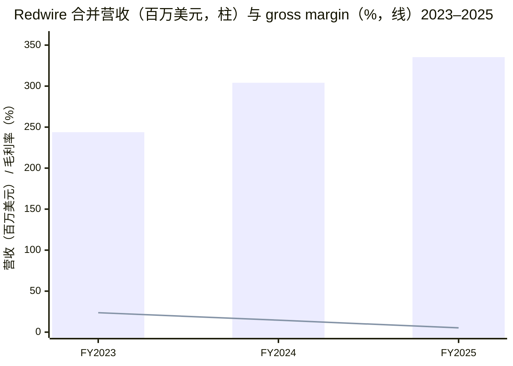
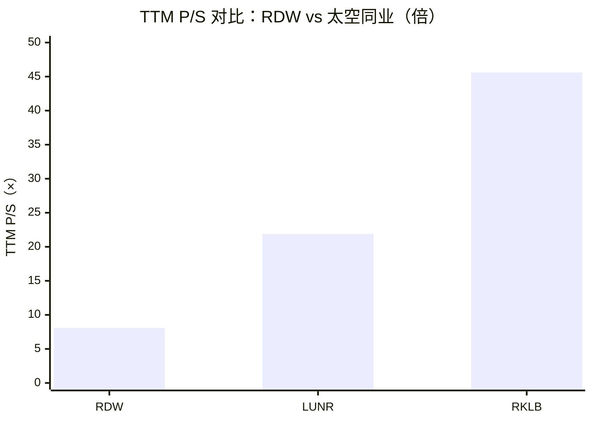
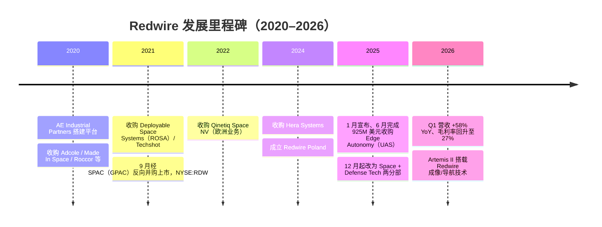
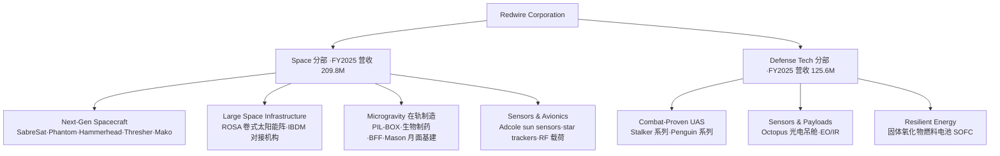
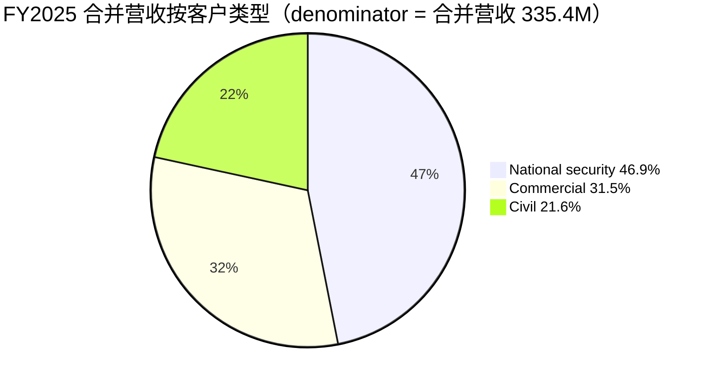
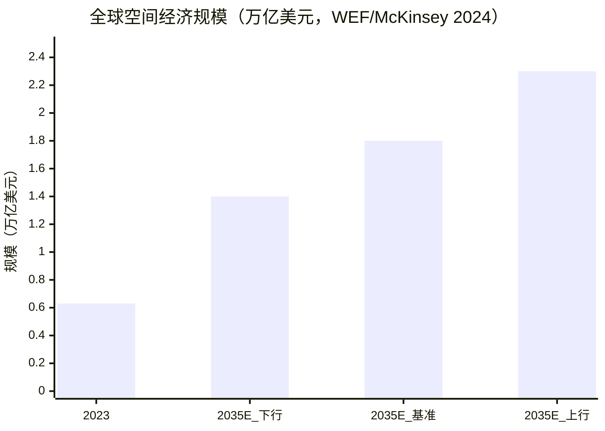
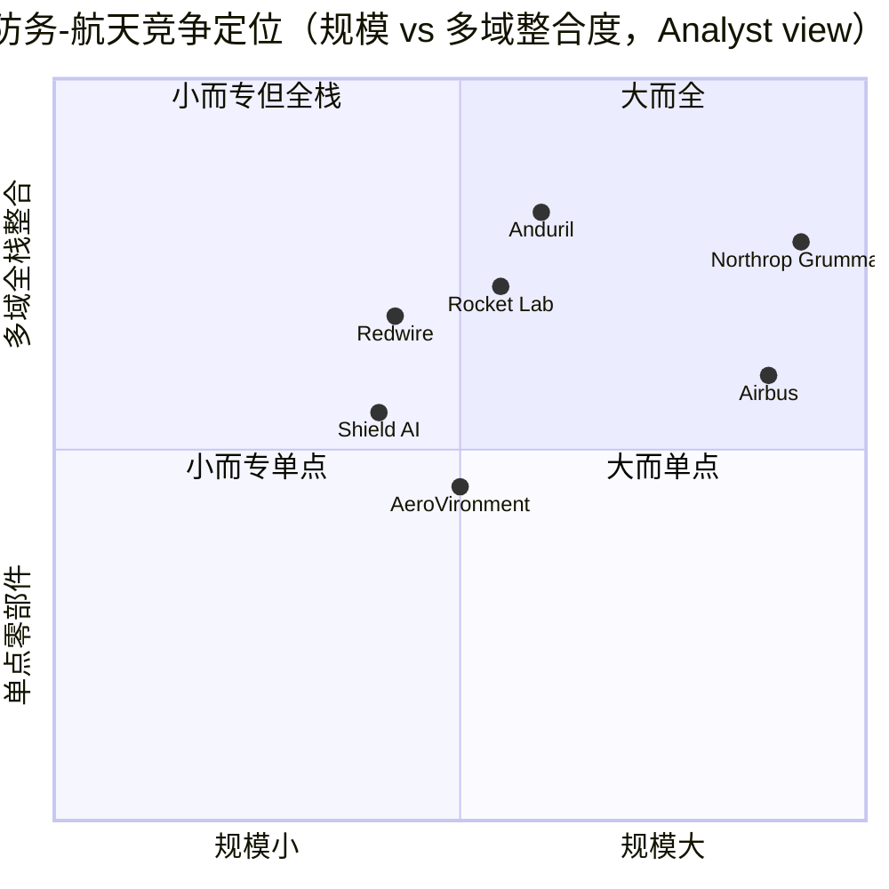

# Redwire Corporation（NYSE: RDW）公司研究报告

> **截至日期 / As of：2026-06-14** ｜ 报告语言：简体中文（技术与财务术语保留英文）
> 主要数据来源：SEC EDGAR（FY2025 10-K / Q1 2026 10-Q / 8-K / 2026 DEF 14A / 2026 年 6 月 424B5 ATM 募集说明书）、公司官网 [rdw.com](https://rdw.com/)、Yahoo Finance / Stockanalysis.com 行情、WEF–McKinsey 行业研究、indicators.db 周期快照。
>
> **本次刷新要点（vs 2026-06-09 上一版）：** ① 股价由 $18.57 跌至 **$15.12（2026-06-12）**，市值回落至约 **$3.0B**；② **2026 年 6 月 9 日新设 $500M ATM**，同日终止 5 月那只 **已全额售罄（$349,999,993.77）** 的 $350M ATM——摊薄叙事显著升级（详见第 6、9 节）；③ 新增 Section 1B **GF Score** 基本面评分、全套**财务报表 SVG 图（利润表 / 资产负债表 / 现金流 Sankey + 分部/地域 donut + 分部营收柱）**、**资金流向（money-flow）图**与**延伸观看**；④ 目标价由 $18 下调至 **$16**（反映 ATM 持续摊薄抬高股本）。

---

## 投资摘要 / Investment Summary（*Analyst view：以下评级、目标价与前瞻估算均为分析师本人观点，非任何 filing 内容*）

| 项目 | 内容 |
|---|---|
| **评级 / Rating** | **Hold（中性）** |
| **12 个月目标价 / 12-mo PT** | **$16**（base case，较上一版 $18 下调，反映 ATM 摊薄抬高股本） |
| **当前股价（2026-06-12）** | $15.12 |
| **隐含空间** | 约 +6%（基本情形）；bull $26（+72%）/ bear $8（−47%） |
| **估值方法** | Forward EV/Sales：2027E 营收 × 目标 ~6.5× P/S（对标空间板块折价） |
| **市值 / Market cap** | 约 $3.0B（基于记录日 198.9M 股；5–6 月 $350M ATM 售罄后实际股本更高且仍在上升） |
| **TTM P/S** | ~8.1×（$3.0B ÷ TTM 营收 $371M，较上一版 9.9× 下降） |
| **52 周区间** | $4.87 – $26.64 |
| **股票 / 交易所** | RDW / NYSE |

**2–4 条投资主线（thesis pillars，*Analyst view*）：**

1. **从"零部件供应商"转型为"空间基础设施 + 国防科技平台"。** 2025 年 6 月以 $925M 收购 Edge Autonomy，一举把 combat-proven 无人机系统（UAS）并入版图，使 RDW 从一家依赖 percentage-of-completion 合同的太空零部件/集成商，升级为同时覆盖 Space 与 Defense Tech 两大可报告分部的双引擎公司（[Redwire FY2025 10-K, Item 1 Business](https://www.sec.gov/Archives/edgar/data/1819810/000181981026000029/rdw-20251231.htm)）。
2. **订单动能强劲但 GAAP 盈利仍深陷亏损。** LTM book-to-bill 1.32（2025）、Q1 2026 单季升至 1.92，backlog 由 $411.2M（2025 年底）增至 $498.1M（2026Q1）；但 FY2025 净亏损 $(226.6)M、gross margin 仅 5%、Adjusted EBITDA $(50.3)M，盈利拐点尚未到来（[10-K MD&A](https://www.sec.gov/Archives/edgar/data/1819810/000181981026000029/rdw-20251231.htm)、[Redwire Q1 2026 10-Q](https://www.sec.gov/Archives/edgar/data/1819810/000181981026000063/rdw-20260331.htm)）。
3. **政策顺风显著，但收入确认极度 lumpy。** NASA FY2026 拨款回升至 $27.5B、NDAA FY2026 授权 $900.6B、"Golden Dome"导弹防御、欧洲 ReArm Europe €800B / SAFE €150B 计划共同抬升 TAM；然而 percentage-of-completion 法下的 EAC 调整（FY2025 净不利 $54.5M）使单季业绩波动剧烈（[10-K MD&A](https://www.sec.gov/Archives/edgar/data/1819810/000181981026000029/rdw-20251231.htm)）。
4. **估值已部分反映乐观预期，且摊薄正在加速。** 股价 12 个月内自 $4.87 低点最高涨至 $26.64，此后回落至 **$15.12（2026-06-12）**；当前 TTM P/S ~8.1× 虽显著低于 RKLB（~46×）、LUNR（~22×），但对应的是更低的毛利率与**持续且正在加速的摊薄**——weighted shares 已由 71.2M 升至 193.7M，且 **2026 年 5 月那只 $350M ATM 已全额售罄（$349,999,993.77），6 月 9 日同日终止并由新的 $500M ATM 接棒**（[Stockanalysis.com — RDW](https://stockanalysis.com/stocks/rdw/)、[Redwire June 2026 ATM 8-K, 2026-06-09](https://www.sec.gov/Archives/edgar/data/1819810/000181981026000078/rdw-20260609.htm)）。

---

## 目录

1. [公司概览](#1-公司概览)
   - [1B. 基本面评分（GF Score）](#1b-基本面评分gf-score)
2. [估值与目标价](#2-估值与目标价)
3. [公司历史](#3-公司历史)
4. [管理团队](#4-管理团队)
5. [产品与服务](#5-产品与服务)
6. [客户与上市策略](#6-客户与上市策略)
7. [行业概览](#7-行业概览)
8. [竞争格局](#8-竞争格局)
9. [市场机会（TAM）](#9-市场机会tam)
10. [风险评估](#10-风险评估)
11. [投资者视角评分（Investor Lenses）](#11-投资者视角评分investor-lenses)
12. [参考资料](#12-参考资料)

---

## 1. 公司概览

**投资主线先行（BLUF，*Analyst view*）：** Redwire 是一家正处于"重大转型期"的 integrated space and defense technology（一体化空间与国防技术）公司。2025 年以前，它本质上是私募股权（AE Industrial Partners）通过 11 次并购拼装而成的太空零部件与集成商；2025 年 6 月收购 Edge Autonomy 后，公司新增 Defense Tech 分部，把无人机系统（UAS）、光电吊舱、resilient energy 等"airborne"能力并入，形成"从地表到月球、火星"的多域（multi-domain）平台叙事。订单与政策双双向好，但 GAAP 盈利尚未兑现，是典型的"故事强、报表弱"的成长型防务-航天股（[FY2025 10-K, Item 1](https://www.sec.gov/Archives/edgar/data/1819810/000181981026000029/rdw-20251231.htm)）。

公司在 10-K 中对自身的官方定义如下，建议直接引用原文：

> "Redwire is an integrated space and defense technology company focused on advanced technologies. The Company's vision is to pioneer next-generation space and defense technologies that empower scientific discovery, advance global industries, and strengthen security — transforming how humanity explores, connects, and protects — from the skies above to the stars beyond."
> — [Redwire FY2025 10-K, Item 1 Business](https://www.sec.gov/Archives/edgar/data/1819810/000181981026000029/rdw-20251231.htm)

公司官网（[rdw.com](https://rdw.com/)）的 tagline 为 **"Made for the Mission"**，并将业务归为两大领域：**Defense Tech**（为美国及盟国 warfighter 提供 space + airborne 互联能力）与 **Space Tech**（为下一代空间经济建设 space infrastructure）。截至 2025 年 12 月 31 日，公司在北美与欧洲拥有 **28 个运营地点**、约 **1,410 名员工**，产品部署于约 **80 个国家**（Defense Tech UAS 口径）（[rdw.com](https://rdw.com/)、[FY2025 10-K, Item 1 / Human Capital](https://www.sec.gov/Archives/edgar/data/1819810/000181981026000029/rdw-20251231.htm)）。

**分部结构。** 自 2025 年 12 月 1 日起，公司由原先的单一/多 reporting unit 结构调整为 **两个经营与可报告分部：Space 与 Defense Tech**（[FY2025 10-K, Item 1 / Note U Segment Reporting](https://www.sec.gov/Archives/edgar/data/1819810/000181981026000029/rdw-20251231.htm)）。FY2025 合并营收 $335.4M，其中 **Space $209.8M、Defense Tech $125.6M**（[10-K MD&A — Business Segment Results](https://www.sec.gov/Archives/edgar/data/1819810/000181981026000029/rdw-20251231.htm)）。

**估值快照（详见第 2 节）。** 当前股价约 $15.12（2026-06-12），市值约 $3.0B，TTM 营收 $370.96M，对应 **TTM P/S ≈ 8.1×**；因 TTM 净亏损 $(343.9)M，**P/E 为 n/a（GAAP 不盈利）**（[Stockanalysis.com — RDW](https://stockanalysis.com/stocks/rdw/)）。

**利润表资金流（income-statement Sankey，FY2025）。** 下图把 FY2025 利润表逐级拆解，直观呈现"收入 $335.4M 被 cost of sales $318.1M（占 94.8%）几乎吞尽，仅剩 $17.3M gross profit，再被 $247.0M 经营费用压成 $(229.7)M 经营亏损"的结构——这是理解 RDW"营收增长但 GAAP 巨亏"的最直接一张图：

<svg xmlns="http://www.w3.org/2000/svg" viewBox="0 0 1000 560" width="1000" height="560" role="img" aria-label="income statement Sankey"><rect x="0" y="0" width="1000" height="560" fill="#ffffff"/>
<text x="20.00" y="30.00" text-anchor="start" font-family="Helvetica,Arial,sans-serif" font-size="15" font-weight="700" fill="#1f2933">利润表 (Income statement) · FY2025</text>
<path d="M 204.00,78.00 C 258.00,78.00 258.00,85.00 312.00,85.00 L 312.00,340.21 C 258.00,340.21 258.00,333.21 204.00,333.21 Z" fill="#93c5fd" fill-opacity="0.55"/>
<path d="M 452.00,78.00 C 506.00,78.00 506.00,99.01 560.00,99.01 L 560.00,101.01 C 506.00,101.01 506.00,80.00 452.00,80.00 Z" fill="#86efac" fill-opacity="0.55"/>
<path d="M 452.00,80.00 C 506.00,80.00 506.00,115.01 560.00,115.01 L 560.00,415.48 C 506.00,415.48 506.00,380.47 452.00,380.47 Z" fill="#fca5a5" fill-opacity="0.55"/>
<path d="M 328.00,85.00 C 382.00,85.00 382.00,78.00 436.00,78.00 L 436.00,99.04 C 382.00,99.04 382.00,106.04 328.00,106.04 Z" fill="#86efac" fill-opacity="0.55"/>
<path d="M 328.00,106.04 C 382.00,106.04 382.00,113.04 436.00,113.04 L 436.00,500.00 C 382.00,500.00 382.00,493.00 328.00,493.00 Z" fill="#fca5a5" fill-opacity="0.55"/>
<path d="M 576.00,99.01 C 630.00,99.01 630.00,116.77 684.00,116.77 L 684.00,118.77 C 630.00,118.77 630.00,101.01 576.00,101.01 Z" fill="#86efac" fill-opacity="0.55"/>
<path d="M 576.00,115.01 C 630.00,115.01 630.00,132.77 684.00,132.77 L 684.00,341.15 C 630.00,341.15 630.00,323.39 576.00,323.39 Z" fill="#fca5a5" fill-opacity="0.55"/>
<path d="M 576.00,323.39 C 630.00,323.39 630.00,355.15 684.00,355.15 L 684.00,379.23 C 630.00,379.23 630.00,347.48 576.00,347.48 Z" fill="#fca5a5" fill-opacity="0.55"/>
<path d="M 576.00,347.48 C 630.00,347.48 630.00,393.23 684.00,393.23 L 684.00,461.23 C 630.00,461.23 630.00,415.48 576.00,415.48 Z" fill="#fca5a5" fill-opacity="0.55"/>
<path d="M 700.00,116.77 C 754.00,116.77 754.00,280.00 808.00,280.00 L 808.00,282.00 C 754.00,282.00 754.00,118.77 700.00,118.77 Z" fill="#86efac" fill-opacity="0.55"/>
<path d="M 700.00,118.77 C 754.00,118.77 754.00,296.00 808.00,296.00 L 808.00,298.00 C 754.00,298.00 754.00,120.77 700.00,120.77 Z" fill="#fca5a5" fill-opacity="0.55"/>
<path d="M 204.00,347.21 C 258.00,347.21 258.00,340.21 312.00,340.21 L 312.00,493.00 C 258.00,493.00 258.00,500.00 204.00,500.00 Z" fill="#93c5fd" fill-opacity="0.55"/>
<path d="M 576.00,429.48 C 630.00,429.48 630.00,118.77 684.00,118.77 L 684.00,168.28 C 630.00,168.28 630.00,478.99 576.00,478.99 Z" fill="#93c5fd" fill-opacity="0.55"/>
<rect x="188.00" y="78.00" width="16" height="255.21" rx="1.5" fill="#2563eb"/>
<rect x="188.00" y="347.21" width="16" height="152.79" rx="1.5" fill="#2563eb"/>
<rect x="312.00" y="85.00" width="16" height="408.00" rx="1.5" fill="#1e3a8a"/>
<rect x="436.00" y="78.00" width="16" height="21.04" rx="1.5" fill="#15803d"/>
<rect x="436.00" y="113.04" width="16" height="386.96" rx="1.5" fill="#dc2626"/>
<rect x="560.00" y="99.01" width="16" height="2.00" rx="1.5" fill="#15803d"/>
<rect x="560.00" y="115.01" width="16" height="300.47" rx="1.5" fill="#dc2626"/>
<rect x="560.00" y="429.48" width="16" height="49.51" rx="1.5" fill="#2563eb"/>
<rect x="684.00" y="116.77" width="16" height="2.00" rx="1.5" fill="#15803d"/>
<rect x="684.00" y="132.77" width="16" height="208.38" rx="1.5" fill="#dc2626"/>
<rect x="684.00" y="355.15" width="16" height="24.09" rx="1.5" fill="#dc2626"/>
<rect x="684.00" y="393.23" width="16" height="68.00" rx="1.5" fill="#dc2626"/>
<rect x="808.00" y="280.00" width="16" height="2.00" rx="1.5" fill="#15803d"/>
<rect x="808.00" y="296.00" width="16" height="2.00" rx="1.5" fill="#dc2626"/>
<text x="179.00" y="202.61" text-anchor="end" font-family="Helvetica,Arial,sans-serif" font-size="11.5" font-weight="700" fill="#1f2933">Space</text>
<text x="179.00" y="215.61" text-anchor="end" font-family="Helvetica,Arial,sans-serif" font-size="10" font-weight="400" fill="#52606d">US$209.8M  (62.6%)</text>
<text x="179.00" y="420.61" text-anchor="end" font-family="Helvetica,Arial,sans-serif" font-size="11.5" font-weight="700" fill="#1f2933">Defense Tech</text>
<text x="179.00" y="433.61" text-anchor="end" font-family="Helvetica,Arial,sans-serif" font-size="10" font-weight="400" fill="#52606d">US$125.6M  (37.4%)</text>
<rect x="331.00" y="67.00" width="125.70" height="26" rx="2" fill="#ffffff" fill-opacity="0.72"/>
<text x="334.00" y="79.00" text-anchor="start" font-family="Helvetica,Arial,sans-serif" font-size="11.5" font-weight="700" fill="#1f2933">Revenue</text>
<text x="334.00" y="92.00" text-anchor="start" font-family="Helvetica,Arial,sans-serif" font-size="10" font-weight="400" fill="#52606d">US$335.4M  (100.0%)</text>
<rect x="455.00" y="60.00" width="106.80" height="26" rx="2" fill="#ffffff" fill-opacity="0.72"/>
<text x="458.00" y="72.00" text-anchor="start" font-family="Helvetica,Arial,sans-serif" font-size="11.5" font-weight="700" fill="#1f2933">Gross Profit</text>
<text x="458.00" y="85.00" text-anchor="start" font-family="Helvetica,Arial,sans-serif" font-size="10" font-weight="400" fill="#52606d">US$17.3M  (5.2%)</text>
<rect x="455.00" y="95.04" width="144.60" height="26" rx="2" fill="#ffffff" fill-opacity="0.72"/>
<text x="458.00" y="107.04" text-anchor="start" font-family="Helvetica,Arial,sans-serif" font-size="11.5" font-weight="700" fill="#1f2933">Cost of Revenue (COGS)</text>
<text x="458.00" y="120.04" text-anchor="start" font-family="Helvetica,Arial,sans-serif" font-size="10" font-weight="400" fill="#52606d">US$318.1M  (94.8%)</text>
<rect x="579.00" y="81.01" width="132.00" height="26" rx="2" fill="#ffffff" fill-opacity="0.72"/>
<text x="582.00" y="93.01" text-anchor="start" font-family="Helvetica,Arial,sans-serif" font-size="11.5" font-weight="700" fill="#1f2933">Operating Income</text>
<text x="582.00" y="106.01" text-anchor="start" font-family="Helvetica,Arial,sans-serif" font-size="10" font-weight="400" fill="#52606d">-US$229.7M  (-68.5%)</text>
<rect x="579.00" y="106.01" width="150.90" height="26" rx="2" fill="#ffffff" fill-opacity="0.72"/>
<text x="582.00" y="118.01" text-anchor="start" font-family="Helvetica,Arial,sans-serif" font-size="11.5" font-weight="700" fill="#1f2933">Total Operating Expense</text>
<text x="582.00" y="131.01" text-anchor="start" font-family="Helvetica,Arial,sans-serif" font-size="10" font-weight="400" fill="#52606d">US$247.0M  (73.6%)</text>
<text x="551.00" y="451.23" text-anchor="end" font-family="Helvetica,Arial,sans-serif" font-size="11.5" font-weight="700" fill="#1f2933">Net Interest / Other Income</text>
<text x="551.00" y="464.23" text-anchor="end" font-family="Helvetica,Arial,sans-serif" font-size="10" font-weight="400" fill="#52606d">US$40.7M  (12.1%)</text>
<rect x="703.00" y="98.77" width="132.00" height="26" rx="2" fill="#ffffff" fill-opacity="0.72"/>
<text x="706.00" y="110.77" text-anchor="start" font-family="Helvetica,Arial,sans-serif" font-size="11.5" font-weight="700" fill="#1f2933">Pretax Income</text>
<text x="706.00" y="123.77" text-anchor="start" font-family="Helvetica,Arial,sans-serif" font-size="10" font-weight="400" fill="#52606d">-US$251.6M  (-75.0%)</text>
<rect x="703.00" y="123.77" width="119.40" height="26" rx="2" fill="#ffffff" fill-opacity="0.72"/>
<text x="706.00" y="135.77" text-anchor="start" font-family="Helvetica,Arial,sans-serif" font-size="11.5" font-weight="700" fill="#1f2933">SG&amp;A</text>
<text x="706.00" y="148.77" text-anchor="start" font-family="Helvetica,Arial,sans-serif" font-size="10" font-weight="400" fill="#52606d">US$171.3M  (51.1%)</text>
<rect x="703.00" y="337.15" width="106.80" height="26" rx="2" fill="#ffffff" fill-opacity="0.72"/>
<text x="706.00" y="349.15" text-anchor="start" font-family="Helvetica,Arial,sans-serif" font-size="11.5" font-weight="700" fill="#1f2933">R&amp;D</text>
<text x="706.00" y="362.15" text-anchor="start" font-family="Helvetica,Arial,sans-serif" font-size="10" font-weight="400" fill="#52606d">US$19.8M  (5.9%)</text>
<rect x="703.00" y="375.23" width="113.10" height="26" rx="2" fill="#ffffff" fill-opacity="0.72"/>
<text x="706.00" y="387.23" text-anchor="start" font-family="Helvetica,Arial,sans-serif" font-size="11.5" font-weight="700" fill="#1f2933">Other OpEx</text>
<text x="706.00" y="400.23" text-anchor="start" font-family="Helvetica,Arial,sans-serif" font-size="10" font-weight="400" fill="#52606d">US$55.9M  (16.7%)</text>
<text x="833.00" y="278.00" text-anchor="start" font-family="Helvetica,Arial,sans-serif" font-size="11.5" font-weight="700" fill="#1f2933">Net Income</text>
<text x="833.00" y="291.00" text-anchor="start" font-family="Helvetica,Arial,sans-serif" font-size="10" font-weight="400" fill="#52606d">-US$226.6M  (-67.6%)</text>
<text x="833.00" y="303.00" text-anchor="start" font-family="Helvetica,Arial,sans-serif" font-size="11.5" font-weight="700" fill="#1f2933">Income Tax</text>
<text x="833.00" y="316.00" text-anchor="start" font-family="Helvetica,Arial,sans-serif" font-size="10" font-weight="400" fill="#52606d">-US$25.0M  (-7.5%)</text>
<text x="500.00" y="544.00" text-anchor="middle" font-family="Helvetica,Arial,sans-serif" font-size="10" font-weight="400" fill="#52606d">Source: Redwire FY2025 10-K, Consolidated Statements of Operations</text>
</svg>

Source: [Redwire FY2025 10-K, Consolidated Statements of Operations](https://www.sec.gov/Archives/edgar/data/1819810/000181981026000029/rdw-20251231.htm)。

**营收的两个切面（分部 / 地域）。** 左图按 Space / Defense Tech 两分部，右侧（见第 5 节）按地域：FY2025 Space $209.8M（62.6%）、Defense Tech $125.6M（37.4%）；分部柱状图显示 Edge Autonomy 注入后 Defense Tech 由 FY2024 的 $48.8M 跃升至 $125.6M（+157%），而 Space 同比 −18%（$255.3M→$209.8M）——增长的"接力棒"已从 Space 交到 Defense Tech：

<svg xmlns="http://www.w3.org/2000/svg" viewBox="0 0 720 460" width="720" height="460" role="img" aria-label="revenue donut"><rect x="0" y="0" width="720" height="460" fill="#ffffff"/>
<text x="20.00" y="30.00" text-anchor="start" font-family="Helvetica,Arial,sans-serif" font-size="15" font-weight="700" fill="#1f2933">FY2025 营收按分部 (Revenue by segment)</text>
<path d="M 288.00,107.20 A 132 132 0 1 1 194.36,332.23 L 232.67,294.17 A 78 78 0 1 0 288.00,161.20 Z" fill="#2563eb"/>
<path d="M 194.36,332.23 A 132 132 0 0 1 288.00,107.20 L 288.00,161.20 A 78 78 0 0 0 232.67,294.17 Z" fill="#15803d"/>
<text x="288.00" y="235.20" text-anchor="middle" font-family="Helvetica,Arial,sans-serif" font-size="18" font-weight="800" fill="#1f2933">RDW</text>
<text x="288.00" y="255.20" text-anchor="middle" font-family="Helvetica,Arial,sans-serif" font-size="13" font-weight="600" fill="#52606d">US$335.4M</text>
<text x="288.00" y="271.20" text-anchor="middle" font-family="Helvetica,Arial,sans-serif" font-size="10" font-weight="400" fill="#8a97a3">total</text>
<line x1="415.41" y1="292.22" x2="431.41" y2="292.22" stroke="#2563eb" stroke-width="1.4"/>
<text x="435.41" y="290.22" text-anchor="start" font-family="Helvetica,Arial,sans-serif" font-size="11" font-weight="700" fill="#1f2933">Space</text>
<text x="435.41" y="304.22" text-anchor="start" font-family="Helvetica,Arial,sans-serif" font-size="10" font-weight="400" fill="#52606d">US$209.8M  (62.6%)</text>
<line x1="160.59" y1="186.18" x2="144.59" y2="186.18" stroke="#15803d" stroke-width="1.4"/>
<text x="140.59" y="184.18" text-anchor="end" font-family="Helvetica,Arial,sans-serif" font-size="11" font-weight="700" fill="#1f2933">Defense Tech</text>
<text x="140.59" y="198.18" text-anchor="end" font-family="Helvetica,Arial,sans-serif" font-size="10" font-weight="400" fill="#52606d">US$125.6M  (37.4%)</text>
<text x="360.00" y="444.00" text-anchor="middle" font-family="Helvetica,Arial,sans-serif" font-size="10" font-weight="400" fill="#52606d">Source: Redwire FY2025 10-K, Note U Segment Reporting</text>
</svg>

<svg xmlns="http://www.w3.org/2000/svg" viewBox="0 0 860 470" width="860" height="470" role="img" aria-label="historical revenue bars"><rect x="0" y="0" width="860" height="470" fill="#ffffff"/>
<text x="20.00" y="30.00" text-anchor="start" font-family="Helvetica,Arial,sans-serif" font-size="15" font-weight="700" fill="#1f2933">分部营收 FY2024→FY2025 (Segment revenue mix shift)</text>
<rect x="20.00" y="44" width="11" height="11" rx="2" fill="#2563eb"/>
<text x="36.00" y="53.00" text-anchor="start" font-family="Helvetica,Arial,sans-serif" font-size="10.5" font-weight="400" fill="#1f2933">Space</text>
<rect x="83.00" y="44" width="11" height="11" rx="2" fill="#15803d"/>
<text x="99.00" y="53.00" text-anchor="start" font-family="Helvetica,Arial,sans-serif" font-size="10.5" font-weight="400" fill="#1f2933">Defense Tech</text>
<line x1="70" y1="412.00" x2="834" y2="412.00" stroke="#eceff2" stroke-width="1"/>
<text x="64.00" y="415.00" text-anchor="end" font-family="Helvetica,Arial,sans-serif" font-size="9.5" font-weight="400" fill="#52606d">US$0</text>
<line x1="70" y1="345.20" x2="834" y2="345.20" stroke="#eceff2" stroke-width="1"/>
<text x="64.00" y="348.20" text-anchor="end" font-family="Helvetica,Arial,sans-serif" font-size="9.5" font-weight="400" fill="#52606d">US$72.4M</text>
<line x1="70" y1="278.40" x2="834" y2="278.40" stroke="#eceff2" stroke-width="1"/>
<text x="64.00" y="281.40" text-anchor="end" font-family="Helvetica,Arial,sans-serif" font-size="9.5" font-weight="400" fill="#52606d">US$144.9M</text>
<line x1="70" y1="211.60" x2="834" y2="211.60" stroke="#eceff2" stroke-width="1"/>
<text x="64.00" y="214.60" text-anchor="end" font-family="Helvetica,Arial,sans-serif" font-size="9.5" font-weight="400" fill="#52606d">US$217.3M</text>
<line x1="70" y1="144.80" x2="834" y2="144.80" stroke="#eceff2" stroke-width="1"/>
<text x="64.00" y="147.80" text-anchor="end" font-family="Helvetica,Arial,sans-serif" font-size="9.5" font-weight="400" fill="#52606d">US$289.8M</text>
<line x1="70" y1="78.00" x2="834" y2="78.00" stroke="#eceff2" stroke-width="1"/>
<text x="64.00" y="81.00" text-anchor="end" font-family="Helvetica,Arial,sans-serif" font-size="9.5" font-weight="400" fill="#52606d">US$362.2M</text>
<rect x="150.22" y="176.60" width="221.56" height="235.40" fill="#2563eb"/>
<rect x="150.22" y="131.60" width="221.56" height="45.00" fill="#15803d"/>
<text x="261.00" y="428.00" text-anchor="middle" font-family="Helvetica,Arial,sans-serif" font-size="10" font-weight="400" fill="#52606d">FY2024</text>
<rect x="532.22" y="218.55" width="221.56" height="193.45" fill="#2563eb"/>
<rect x="532.22" y="102.74" width="221.56" height="115.81" fill="#15803d"/>
<text x="643.00" y="428.00" text-anchor="middle" font-family="Helvetica,Arial,sans-serif" font-size="10" font-weight="400" fill="#52606d">FY2025</text>
<text x="430.00" y="454.00" text-anchor="middle" font-family="Helvetica,Arial,sans-serif" font-size="10" font-weight="400" fill="#52606d">Source: Redwire FY2025 10-K, Note U Segment Reporting</text>
</svg>

Source: [Redwire FY2025 10-K, Note U — Segment Reporting](https://www.sec.gov/Archives/edgar/data/1819810/000181981026000029/rdw-20251231.htm)。

下图为近三年营收与 gross margin 走势，直观呈现"营收靠并购扩张、毛利率被 EAC 调整压垮"的张力：

Source: [Redwire FY2025 10-K, MD&A Results of Operations](https://www.sec.gov/Archives/edgar/data/1819810/000181981026000029/rdw-20251231.htm)（FY2023 毛利率系 $243.8M 营收对应 $185.8M 成本反算 ≈ 23.7%；FY2024、FY2025 毛利率为 10-K 披露的 14.6%/5%）。

---

## 1B. 基本面评分（GF Score）

> 以下 GF Score（GuruFocus-style）是把第 1–2 节既有事实结构化的**五维基本面评分准则（rubric）**，五个子分（0–10）与综合分（0–100）均为 ***Analyst view*（分析师本人观点）**，**不挂任何 filing 引用、也不归因于 GuruFocus**；每个维度下的支撑指标各自带一手引用。

<svg xmlns="http://www.w3.org/2000/svg" viewBox="0 0 500 500" width="500" height="500" role="img" aria-label="GF Score radar">
<rect x="0" y="0" width="500" height="500" fill="#ffffff"/>
<text x="20" y="24" font-family="Helvetica,Arial,sans-serif" font-size="15" font-weight="700" fill="#1f2933">GF Score (GuruFocus-style): 43/100</text>
<text x="20" y="41" font-family="Helvetica,Arial,sans-serif" font-size="11" fill="#52606d">0–50 Worst future performance potential / insufficient data</text>
<polygon points="250.0,88.0 392.7,191.6 338.2,359.4 161.8,359.4 107.3,191.6" fill="#e9f5ec" stroke="none"/>
<polygon points="250.0,208.0 278.5,228.7 267.6,262.3 232.4,262.3 221.5,228.7" fill="none" stroke="#c5d3cb" stroke-width="1"/>
<polygon points="250.0,178.0 307.1,219.5 285.3,286.5 214.7,286.5 192.9,219.5" fill="none" stroke="#c5d3cb" stroke-width="1"/>
<polygon points="250.0,148.0 335.6,210.2 302.9,310.8 197.1,310.8 164.4,210.2" fill="none" stroke="#c5d3cb" stroke-width="1"/>
<polygon points="250.0,118.0 364.1,200.9 320.5,335.1 179.5,335.1 135.9,200.9" fill="none" stroke="#c5d3cb" stroke-width="1"/>
<polygon points="250.0,88.0 392.7,191.6 338.2,359.4 161.8,359.4 107.3,191.6" fill="none" stroke="#c5d3cb" stroke-width="1.3"/>
<line x1="250" y1="238" x2="161.8" y2="359.4" stroke="#cfdad3" stroke-width="1"/>
<text x="146.5" y="392.4" text-anchor="end" font-family="Helvetica,Arial,sans-serif" font-size="11.5" font-weight="600" fill="#1f2933">Financial Strength</text>
<text x="146.5" y="405.4" text-anchor="end" font-family="Helvetica,Arial,sans-serif" font-size="9.5" fill="#52606d">财务实力</text>
<text x="214.7" y="280.5" text-anchor="middle" font-family="Helvetica,Arial,sans-serif" font-size="10.5" font-weight="700" fill="#1f2933">4</text>
<line x1="250" y1="238" x2="250.0" y2="88.0" stroke="#cfdad3" stroke-width="1"/>
<text x="250.0" y="58.0" text-anchor="middle" font-family="Helvetica,Arial,sans-serif" font-size="11.5" font-weight="600" fill="#1f2933">Profitability</text>
<text x="250.0" y="71.0" text-anchor="middle" font-family="Helvetica,Arial,sans-serif" font-size="9.5" fill="#52606d">盈利能力</text>
<text x="250.0" y="202.0" text-anchor="middle" font-family="Helvetica,Arial,sans-serif" font-size="10.5" font-weight="700" fill="#1f2933">2</text>
<line x1="250" y1="238" x2="107.3" y2="191.6" stroke="#cfdad3" stroke-width="1"/>
<text x="82.6" y="183.6" text-anchor="end" font-family="Helvetica,Arial,sans-serif" font-size="11.5" font-weight="600" fill="#1f2933">Growth</text>
<text x="82.6" y="196.6" text-anchor="end" font-family="Helvetica,Arial,sans-serif" font-size="9.5" fill="#52606d">成长性</text>
<text x="164.4" y="204.2" text-anchor="middle" font-family="Helvetica,Arial,sans-serif" font-size="10.5" font-weight="700" fill="#1f2933">6</text>
<line x1="250" y1="238" x2="392.7" y2="191.6" stroke="#cfdad3" stroke-width="1"/>
<text x="417.4" y="183.6" text-anchor="start" font-family="Helvetica,Arial,sans-serif" font-size="11.5" font-weight="600" fill="#1f2933">GF Value</text>
<text x="417.4" y="196.6" text-anchor="start" font-family="Helvetica,Arial,sans-serif" font-size="9.5" fill="#52606d">估值</text>
<text x="307.1" y="213.5" text-anchor="middle" font-family="Helvetica,Arial,sans-serif" font-size="10.5" font-weight="700" fill="#1f2933">4</text>
<line x1="250" y1="238" x2="338.2" y2="359.4" stroke="#cfdad3" stroke-width="1"/>
<text x="353.5" y="392.4" text-anchor="start" font-family="Helvetica,Arial,sans-serif" font-size="11.5" font-weight="600" fill="#1f2933">Momentum</text>
<text x="353.5" y="405.4" text-anchor="start" font-family="Helvetica,Arial,sans-serif" font-size="9.5" fill="#52606d">动量</text>
<text x="302.9" y="304.8" text-anchor="middle" font-family="Helvetica,Arial,sans-serif" font-size="10.5" font-weight="700" fill="#1f2933">6</text>
<polygon points="250.0,208.0 307.1,219.5 302.9,310.8 214.7,286.5 164.4,210.2" fill="#2e8b57" fill-opacity="0.34" stroke="#2e8b57" stroke-width="2"/>
<circle cx="214.7" cy="286.5" r="2.6" fill="#2e8b57"/>
<circle cx="250.0" cy="208.0" r="2.6" fill="#2e8b57"/>
<circle cx="164.4" cy="210.2" r="2.6" fill="#2e8b57"/>
<circle cx="307.1" cy="219.5" r="2.6" fill="#2e8b57"/>
<circle cx="302.9" cy="310.8" r="2.6" fill="#2e8b57"/>
<text x="250" y="470" text-anchor="middle" font-family="Helvetica,Arial,sans-serif" font-size="9.5" fill="#52606d">Source: RDW FY2025 10-K · Q1 2026 10-Q · Yahoo Finance · indicators.db, as of 2026-06-14</text>
<text x="250" y="485" text-anchor="middle" font-family="Helvetica,Arial,sans-serif" font-size="9" fill="#52606d">GF Score = independent analyst rubric (*Analyst view:*) — not GuruFocus™ official number</text>
</svg>

| 维度 / Dimension | 评分 / Score (0–10) | |
|---|---|---|
| Financial Strength (财务实力) | 4 | `████░░░░░░` |
| Profitability (盈利能力) | 2 | `██░░░░░░░░` |
| Growth (成长性) | 6 | `██████░░░░` |
| GF Value (估值) | 4 | `████░░░░░░` |
| Momentum (动量) | 6 | `██████░░░░` |
| **GF Score (composite, *Analyst view:*)** | **43 / 100** | **0–50 Worst future performance potential** |

*综合权重（*Analyst view*）：Financial Strength 20% · Profitability 25% · Growth 25% · GF Value 15% · Momentum 15%（透明复刻，非 GuruFocus 专有权重）。*

**各维度评分理由（reasons —— 读者最关心的部分）：**

- **Financial Strength（财务实力）4/10。** 加分项：账面现金 $95.2M 略高于总债务约 $87M（LT debt $80.0M + ST $5.2M + seller notes $2.2M），debt/equity 仅约 0.08，FY2025 已清偿 Adams Street 旧贷与 Seller Note。扣分项：**经营现金流 $(177.3)M、FCF 约 $(190.8)M**（OCF − capex $13.5M），现金缺口完全靠 **$518.4M 股权增发**填补，且 5–6 月 $350M ATM 已售罄、6 月新设 $500M ATM——"靠摊薄输血"是财务实力的硬伤（[FY2025 10-K, Cash Flow Statement / Liquidity](https://www.sec.gov/Archives/edgar/data/1819810/000181981026000029/rdw-20251231.htm)、[June 2026 ATM 8-K](https://www.sec.gov/Archives/edgar/data/1819810/000181981026000078/rdw-20260609.htm)）。
- **Profitability（盈利能力）2/10。** FY2025 **gross margin 仅 5.2%（$17.3M / $335.4M）、operating margin −68.5%、net margin −67.5%**，ROE / ROIC 均为负，且自上市以来年年亏损；唯一亮点是 **Q1 2026 毛利率回升至 27%**——但单季尚不足以改变低盈利的结构判断（[FY2025 10-K, Statements of Operations](https://www.sec.gov/Archives/edgar/data/1819810/000181981026000029/rdw-20251231.htm)、[Q1 2026 10-Q](https://www.sec.gov/Archives/edgar/data/1819810/000181981026000063/rdw-20260331.htm)）。
- **Growth（成长性）6/10。** FY2025 营收 +10% YoY、**FY2026E 指引 +42%**（Edge 全年并表）、backlog $498.1M、单季 book-to-bill 1.92——top-line 动能强；但增长高度依赖并购（**有机口径 Space 分部 −18% YoY**），且 GAAP EPS 仍为负、无 EPS 增长可言，故给中性偏上而非高分（[Q1 2026 8-K, 2026-05-06](https://www.sec.gov/Archives/edgar/data/1819810/000181981026000060/)、[Q1 2026 10-Q](https://www.sec.gov/Archives/edgar/data/1819810/000181981026000063/rdw-20260331.htm)）。
- **GF Value（估值，越高越便宜）4/10。** TTM P/S ~8.1× 明显低于纯太空同业（RKLB ~46×、LUNR ~22×），相对便宜；但对比传统防务承包商 2–3× 又偏贵，且无盈利、FCF 为负、安全边际（MoS）约为零——"便宜"是相对而非绝对，故中性偏低（[Stockanalysis.com — RDW](https://stockanalysis.com/stocks/rdw/)、[Stockanalysis.com — RKLB](https://stockanalysis.com/stocks/rklb/)）。
- **Momentum（动量）6/10。** 12 个月维度强劲——自 $4.87 低点至今 +200% 以上；但近期明显走弱：**一周内自 $18.57 跌至 $15.12（约 −19%）**，主因 ATM 摊薄消息，且仍远低于 $26.64 的 52 周高点。强 12 月 + 弱近月相抵，给中性（[Stockanalysis.com — RDW](https://stockanalysis.com/stocks/rdw/)）。

**综合（43/100，"Worst potential"档）：** 低盈利 + 靠摊薄输血的财务结构，被强增长与相对折价估值部分抵消——与本报告 Hold 评级、第 11 节四大 lens 的"质量与估值偏弱"结论一致。

---

## 2. 估值与目标价

> 本节"前瞻估算、目标价与 bull/base/bear 情形"全部为 ***Analyst view*（分析师本人观点）**，建立在 10-K 分部数据 + 管理层 FY2026 指引 + 行业预测之上，**绝不归因于任何 filing**。一份 10-K / 8-K 中不含目标价。

### 2a. 估值快照（backward-looking）

| 指标 | RDW | 数据 / 备注 |
|---|---|---|
| 股价（2026-06-12） | $15.12 | [Stockanalysis.com](https://stockanalysis.com/stocks/rdw/) |
| 市值 | ~$3.0B | $15.12 × 记录日 198.9M 股；ATM 持续增发使实际股本更高 |
| 流通股（记录日 2026-03-27） | 198,918,728 | [2026 Annual Meeting 8-K, 2026-05-20](https://www.sec.gov/Archives/edgar/data/1819810/000181981026000065/rdw-20260520.htm)；另有 46,505 股 Series A 优先股（折合 16.07M 普通股投票权） |
| TTM 营收 | $370.96M（+33.6% YoY） | [Stockanalysis.com](https://stockanalysis.com/stocks/rdw/) |
| **TTM P/S** | **~8.1×** | 市值 ÷ TTM 营收 |
| TTM 净利润 / EPS | $(343.9)M / $(2.29) | [Stockanalysis.com](https://stockanalysis.com/stocks/rdw/) |
| **TTM P/E** | **n/a（GAAP 不盈利）** | 同上 |
| 52 周区间 | $4.87 – $26.64 | [Stockanalysis.com](https://stockanalysis.com/stocks/rdw/) |

**为什么 P/E 为负、P/S 为何"看起来不高却暗藏风险"——必须解释，不能只报数字。**
RDW 的 TTM 净亏损 $(343.9)M 来自多重叠加：(1) FY2025 因 percentage-of-completion 法下 **EAC 调整净不利 $54.5M**，把 gross margin 从 FY2024 的 15% 砸到 5%；(2) **Edge Autonomy 收购相关的非现金 equity-based compensation $44.4M（Edge Incentive Units）** 与 $13.6M inventory purchase-accounting fair-value 调整；(3) **$34.7M 商誉/长期资产减值**（Space Europe reporting unit）（[10-K MD&A](https://www.sec.gov/Archives/edgar/data/1819810/000181981026000029/rdw-20251231.htm)）。换言之，亏损中既有"非现金/一次性"成分，也有"低毛利、合同执行不稳"的结构性成分。P/S ~8× 看似低于太空纯标的，但对应的是个位数到二十几个百分点的毛利率（Q1 2026 已修复至 27%）与持续摊薄，因此"低 P/S"并不等于"便宜"。详见第 10 节估值/摊薄风险。

**与同业对比（peer comps）。** RDW 在 P/S 上对太空板块明显折价，反映其"零部件 + 集成 + 防务"的混合属性与更低的毛利率：

| 公司 | 股价 | 市值 | TTM 营收 | TTM P/S | 数据 |
|---|---|---|---|---|---|
| **Redwire（RDW）** | $15.12 | $3.0B | $371M | **~8.1×** | [Stockanalysis.com](https://stockanalysis.com/stocks/rdw/) |
| Rocket Lab（RKLB） | ~$146 | $63.7B | $679.6M | ~45.6× | [Stockanalysis.com — RKLB](https://stockanalysis.com/stocks/rklb/) |
| Intuitive Machines（LUNR） | ~$29.80 | $5.39B | $334.3M | ~21.9× | [Yahoo Finance — LUNR](https://finance.yahoo.com/quote/LUNR/) |

Source: [Stockanalysis.com — RDW](https://stockanalysis.com/stocks/rdw/)、[Stockanalysis.com — RKLB](https://stockanalysis.com/stocks/rklb/)、[Yahoo Finance — LUNR](https://finance.yahoo.com/quote/LUNR/)（2026-06 行情）。

ETF 角度，RDW 是太空主题 ETF **Procure Space ETF（UFO）** 的典型成分类型（small/mid-cap 纯太空标的），可作为板块 beta 的参照；本报告不展开 ETF 持仓分析。

### 2b. 前瞻估算、目标价与情形（*Analyst view*）

**管理层 FY2026 指引（primary anchor）：** 公司在 2026Q1 业绩中 **重申 FY2026 营收预测 $450M–$500M**（[Redwire Q1 2026 Earnings 8-K, 2026-05-06](https://www.sec.gov/Archives/edgar/data/1819810/000181981026000060/)）。这是前瞻模型的关键外部输入。

**前瞻财务估算表（*Analyst view*，每个预测单元格均为分析师观点）：**

| （单位） | FY2025A | FY2026E | FY2027E | 估算依据（外部输入） |
|---|---|---|---|---|
| 营收（$M） | 335.4 | 475（区间中值） | 560 | FY2026 指引中值 $450–500M [Q1 2026 8-K](https://www.sec.gov/Archives/edgar/data/1819810/000181981026000060/)；FY2027 假设约 +18%，由 backlog $498.1M [10-Q](https://www.sec.gov/Archives/edgar/data/1819810/000181981026000063/rdw-20260331.htm) + book-to-bill 1.92 外推 |
| YoY 增速 | +10% | ~+42% | ~+18% | 含 Edge Autonomy 全年并表（FY2025 仅并表约 7 个月，贡献 $107.1M [10-K](https://www.sec.gov/Archives/edgar/data/1819810/000181981026000029/rdw-20251231.htm)） |
| Gross margin | 5% | 18–22% | 22–25% | Q1 2026 已回升至 27% [10-Q](https://www.sec.gov/Archives/edgar/data/1819810/000181981026000063/rdw-20260331.htm)；假设 EAC 不利调整收敛 |
| Adjusted EBITDA（$M） | (50.3) | (10)–10 | 25–45 | Q1 2026 Adj. EBITDA $(9.2)M [Q1 2026 8-K](https://www.sec.gov/Archives/edgar/data/1819810/000181981026000060/)；规模效应 + Edge 整合 |
| GAAP EPS | (2.29 TTM) | 负 | 接近盈亏平衡 | 受 equity-comp、摊销、摊薄拖累 |

> **驱动因素拆解（*Analyst view*）：** FY2026 的 +42% 增长几乎全部来自 **Edge Autonomy 全年并表**（FY2025 只并表 6 月 13 日起约 7 个月）+ Defense Tech 强劲订单；毛利率修复取决于 (a) EAC 净不利调整是否收敛（FY2025 的 $54.5M 主要来自 Defense Tech 一项 $12.9M loss reserve + Space Europe $14.1M），(b) Edge 的高毛利 UAS 产品占比提升。**这两个变量是本报告 call 的 swing variables。**

**12 个月目标价推导（*Analyst view*）。** 鉴于公司 GAAP 不盈利、EPS 为负，**不宜用 forward P/E**；采用 **forward EV/Sales（P/S）法**：

- **Base $16（+6%）：** 2027E 营收 $560M × 目标 P/S ~6.5×（介于 RDW 当前 ~8× 与传统防务承包商 ~2–3× 之间，给予成长溢价但低于纯太空 RKLB/LUNR）→ 隐含市值约 $3.64B ÷ **~230M 摊薄后股本**（记录日 198.9M + 5–6 月 $350M ATM 增发约 21M + 未来 12 个月 June $500M ATM 继续动用）≈ **$16/股**。较上一版 $18 下调，全部来自股本上修而非倍数变化。
- **Bull $26（+72%）：** EAC 调整消失、毛利率站上 25%、book-to-bill 持续 >1.5，市场给 ~9× P/S（向 LUNR 靠拢），叠加 Golden Dome / ReArm Europe 订单兑现，且 ATM 动用节制。
- **Bear $8（−47%）：** EAC 再现大额不利调整、Ukraine 端 Edge 收入下滑、**新设的 $500M ATM 被大量动用**（[June 2026 ATM 8-K](https://www.sec.gov/Archives/edgar/data/1819810/000181981026000078/rdw-20260609.htm)）进一步摊薄，市场回到 ~4–5× P/S 的防务承包商估值。

> **目标倍数的对标说明（*Analyst view*）：** RKLB ~46× / LUNR ~22× 的 P/S 反映的是"纯太空、运载/着陆器叙事 + 更高增速"；RDW 的混合属性（零部件 + 集成 + 防务 UAS）与个位数历史毛利率使其结构性应享折价。给 6.5× 是在"防务承包商 2–3×"与"纯太空 20×+"之间的折中。

**与一致预期对比（consensus benchmark）。** 本地 zsxq 机构研报库（`db/zsxq.db`）经按 "RDW"/"Redwire"/"Edge Autonomy" 三个别名检索 **未发现任何针对 Redwire 的真实卖方覆盖**（命中均为 LIKE 误匹配，详见 Step 10 验证日志），故本报告无法引用本地库的一致营收/目标价做基准；这一缺口本身是一个数据点——RDW 作为美股 small/mid-cap，国内券商库覆盖空白。读者如需 Street 一致预期，应另行查阅美国卖方（公开数据未在本报告中虚构）。

> **关于 DuPont（杜邦 ROE 拆解）图的说明：** 本节按 skill 规范本应附 5 步 DuPont ROE 树，但 RDW 的股东权益在两个报告期间**符号反转**——FY2024 年末为 **股东权益赤字约 $(189)M**（总资产 $292.6M − 总负债 $344.5M − 可转优先股 $136.8M），FY2025 年末因 Edge 的 $775M 换股 + $518M 股权增发跃升至 **正 $1,060M**（[FY2025 10-K, Consolidated Balance Sheets](https://www.sec.gov/Archives/edgar/data/1819810/000181981026000029/rdw-20251231.htm)）。在权益由负转正、且净利润为负的情况下，ROE = 净利率 × 资产周转 × 权益乘数 的拆解在数学上失去意义（平均权益跨越零点），故**本报告主动省略 DuPont 图**（属"底层披露不支持该图"的合理省略，已在 Step 10 日志记录），改以上文利润表 Sankey 与下文资产负债表 Sankey 呈现回报结构。

---

## 3. 公司历史

Redwire 的历史是一部典型的**私募股权"roll-up"（滚动并购）史**——这也是为什么本报告在第 4 节"管理团队"中说明 **RDW 没有单一创始人**。10-K 对公司起源的官方表述如下：

> "Redwire was founded in 2020 by private equity firm AE Industrial Partners Fund II, LP ('AEI'), but the heritage of the various businesses that were brought together to form Redwire stretches back decades. In 2021, the Company completed a series of mergers and business combinations with Genesis Park Acquisition Corp. ('GPAC'). For accounting purposes, the transaction was treated as a reverse recapitalization and GPAC was treated as the acquired company. GPAC was renamed Redwire Corporation and became the surviving public company."
> — [Redwire FY2025 10-K, Item 1 / History](https://www.sec.gov/Archives/edgar/data/1819810/000181981026000029/rdw-20251231.htm)

换言之，**AE Industrial Partners（AEI）于 2020 年 3 月起搭建平台**，把一批拥有数十年 flight heritage 的细分太空技术公司收入囊中，再于 **2021 年 9 月通过 SPAC（GPAC）反向并购上市**（会计上按 reverse recapitalization 处理）。自 2020 年 3 月以来，公司共完成 **11 次收购**（[10-K, Item 1 / History](https://www.sec.gov/Archives/edgar/data/1819810/000181981026000029/rdw-20251231.htm)）：

- **2020：** Adcole Space（→ Redwire Space Components，sun sensors / star trackers）、Deep Space Systems（→ Redwire Space Sensors）、In Space Group / Made In Space（→ Redwire Space，在轨制造 in-space manufacturing）、Roccor（→ Redwire Space Solutions，deployable structures）、LoadPath。
- **2021：** Oakman Aerospace、Deployable Space Systems（→ ROSA 卷式太阳能阵核心）、Techshot（→ Redwire Space Technologies，微重力生物制造）。
- **2022：** Qinetiq Space NV（→ Redwire Space NV，欧洲 Space Europe 业务）。
- **2024：** Hera Systems；成立 Redwire Poland。
- **2025：** **Edge Autonomy**（→ Redwire Defense Tech，combat-proven UAS）；成立 SpaceMD、Redwire Defense Tech UK。

其中 **2025 年 6 月 13 日完成的 Edge Autonomy 收购是公司史上最重大的转型事件**：交易对价 **$925M（debt-free, cash-free 基础）**，以 **$150M 现金 + $775M RDW 股票**（按 2025 年 1 月 17 日前 30 个交易日 VWAP $15.07 计）支付（[Edge Autonomy 收购公告 8-K, 2025-01-21](https://www.sec.gov/Archives/edgar/data/1819810/000181981025000016/)）。这笔交易使 RDW 一举从"太空零部件/集成商"扩展为"空间 + 国防 airborne"双分部公司。

Source: [Redwire FY2025 10-K, Item 1 / History](https://www.sec.gov/Archives/edgar/data/1819810/000181981026000029/rdw-20251231.htm)、[Edge Autonomy 公告 8-K, 2025-01-21](https://www.sec.gov/Archives/edgar/data/1819810/000181981025000016/)、[Q1 2026 10-Q](https://www.sec.gov/Archives/edgar/data/1819810/000181981026000063/rdw-20260331.htm)。

---

## 4. 管理团队

**重要说明——RDW 没有单一"创始人"。** 公司是 AE Industrial Partners 自 2020 年起通过 11 次并购拼装而成的 PE roll-up，**不存在通常意义上的创始人/founder**（见第 3 节）。因此本节按 skill 要求，**仅撰写现任董事长兼 CEO 的履历**，并以"PE roll-up 起源"取代"创始人"叙事。

### 现任董事长、CEO 兼总裁：Peter Cannito

Peter Cannito 自 **2021 年 9 月** 起担任公司董事会成员与 Chief Executive Officer，自 **2022 年 12 月** 起兼任 President；他还自 2020 年 3 月（业务合并前的 Holdings 阶段）即在董事会任职。其履历与防务/情报科技高度绑定——这与 RDW"space + defense"的定位一脉相承（[Redwire 2026 DEF 14A — Mr. Cannito 董事简历](https://www.sec.gov/Archives/edgar/data/1819810/000181981026000050/rdw-20260410.htm)）：

> "Mr. Cannito has served on our Board and as our Chief Executive Officer since September 2021 and also as our President since December 2022 … Prior to his current role, Mr. Cannito served from October 2016 to December 2018 as the CEO of Polaris Alpha, a high-tech solutions provider developing systems for the Department of Defense and Intelligence Community. Prior to that, Mr. Cannito held executive roles, including CEO and COO, at EOIR Technologies and led a team of software and systems engineers at Booz Allen Hamilton focused on critical defense and intelligence programs."
> — [Redwire 2026 DEF 14A](https://www.sec.gov/Archives/edgar/data/1819810/000181981026000050/rdw-20260410.htm)

关键履历要点（均据 DEF 14A 核实）：
- **与 PE 母公司的纽带：** 自 2019 年 6 月起任 **AE Industrial Partners 的 Operating Partner**——这正是 AEI 把他安排为 roll-up 平台 CEO 的逻辑，体现 PE 主导的治理特征（[2026 DEF 14A](https://www.sec.gov/Archives/edgar/data/1819810/000181981026000050/rdw-20260410.htm)）。
- **前任战绩（具体而非头衔）：** Polaris Alpha CEO（2016–2018），一家为国防部与情报界开发系统的高科技解决方案商，期间公司被整合进 Parsons（行业公开背景）；更早在 EOIR Technologies 任 CEO/COO，并曾在 Booz Allen Hamilton 领导专注关键防务与情报项目的软件/系统工程团队（[2026 DEF 14A](https://www.sec.gov/Archives/edgar/data/1819810/000181981026000050/rdw-20260410.htm)）。
- **跨公司任职：** 自 2021 年 12 月起担任 **BigBear.ai（NYSE: BBAI）** 的董事兼董事长——同为 AEI 系、AI/防务方向的上市公司（[2026 DEF 14A](https://www.sec.gov/Archives/edgar/data/1819810/000181981026000050/rdw-20260410.htm)）。
- **学历：** University of Delaware 金融学士、University of Maryland MBA（[2026 DEF 14A](https://www.sec.gov/Archives/edgar/data/1819810/000181981026000050/rdw-20260410.htm)）。

*Analyst view：* Cannito 的"防务/情报 + PE operating partner"背景，解释了 RDW 为何把战略重心从"太空科学零部件"快速转向"国防多域作战"——Edge Autonomy 的并购、"Department of War"口径、Golden Dome 叙事，都是这一管理基因的延伸。同时，他同时担任 BBAI 董事长与 AEI Operating Partner，意味着治理上仍带有浓厚的 **PE 主导 + 关联方网络** 色彩，是公司治理评估时需关注的点（关联方交易披露见 DEF 14A Item 13）。

---

## 5. 产品与服务

> 本节是全报告**最重要**的章节。下方两大分部的产品描述**逐字引用 10-K**，技术名词给出中英对照，并解释每个产品在客户价值链中的物理作用与战略意义。

Redwire 的产品组合横跨 **Space（空间）** 与 **Defense Tech（国防科技）** 两大分部。10-K 在 MD&A 中对自身能力的总括如下：

> "Redwire's proven and reliable space and defense technology capabilities include our space and defense technology and platform offerings of avionics, sensors, and payloads; power generation; structures and mechanisms; radio frequency systems; airborne and spacecraft platforms and missions; and microgravity payloads."
> — [Redwire FY2025 10-K, MD&A Business Overview](https://www.sec.gov/Archives/edgar/data/1819810/000181981026000029/rdw-20251231.htm)

### 产品组合树

Source: [Redwire FY2025 10-K, Item 1 Business](https://www.sec.gov/Archives/edgar/data/1819810/000181981026000029/rdw-20251231.htm)。

### 5.1 Space 分部

#### （a）Next-Generation Spacecraft（下一代航天器平台）

10-K 披露 Redwire 拥有 **五个航天器平台** 的产品线：

> "Redwire's spacecraft portfolio features a lineup of five platforms — SabreSat, Phantom, Hammerhead, Thresher, and Mako — designed to operate across multiple orbits ranging from Very Low Earth Orbit ('VLEO'), Low Earth Orbit ('LEO'), Medium Earth Orbit ('MEO'), Geostationary Orbit ('GEO') and beyond GEO ('X-GEO')."
> — [Redwire FY2025 10-K, Item 1](https://www.sec.gov/Archives/edgar/data/1819810/000181981026000029/rdw-20251231.htm)

**中文释义 / Plain-language gloss：** 航天器平台（spacecraft platform）是"卫星的标准化车身底盘"——客户在其上集成自己的任务载荷。RDW 用五个平台覆盖从极低轨（VLEO）到超同步轨道（X-GEO）的全轨道高度。

- **SabreSat（美国造）与 Phantom（欧洲造）—— VLEO 平台。** 两者主打"低拥挤、贴近地球"轨道的成像与低延迟优势。**Redwire 是 DARPA Otter 计划的 prime mission integrator（主任务集成商）**，用 SabreSat 平台开发"air-breathing"（吸气式）卫星并演示 VLEO 电推进；Phantom 则用于 ESA 的 Skimsat VLEO 计划（[10-K, Item 1](https://www.sec.gov/Archives/edgar/data/1819810/000181981026000029/rdw-20251231.htm)）。FY2025 公司获 Otter **第 2 阶段 $44M 合同**（[10-K MD&A Recent Developments](https://www.sec.gov/Archives/edgar/data/1819810/000181981026000029/rdw-20251231.htm)）。
- **Mako（MEO/GEO）** 设计用于高精度 rendezvous proximity operations（RPO，交会接近）、docking（对接）与 in-space refueling（在轨加注）；**Thresher（LEO）** 高机动、可在合同授予后一年内交付，主打"快速响应"。
- **Hammerhead（欧洲 LEO 小卫星）** 是 ESA **PROBA 平台** 的演进版，可承载至 70kg 载荷、目标整星质量 <200kg，兼容拼车发射；PROBA 平台累计在轨 **逾 50 年无故障 flight heritage**，PROBA-3 演示了精密编队飞行（[10-K, Item 1](https://www.sec.gov/Archives/edgar/data/1819810/000181981026000029/rdw-20251231.htm)）。

**战略意义：** 五平台 + Otter 主集成商身份，把 RDW 从"卖零件"推向"卖整星 + 任务"，是营收向"bundled sales / full mission solutions"升级的核心（10-K 明确把 bundled sales 列为增长战略）。

#### （b）Large Space Infrastructure（大型空间基础设施）——含明星产品 ROSA 与 IBDM

**Roll-Out Solar Array / ROSA（卷式太阳能电池阵）** 是 Redwire 的招牌专利产品，10-K 原文：

> "Redwire's patented and award-winning Roll-Out Solar Array ('ROSA') technology features an innovative 'roll-out' design that uses composite booms to serve as both the primary structural elements and the deployment actuator, and a modular photovoltaic blanket assembly that can be configured into a variety of solar array architectures. When configured for launch, ROSA stows into a compact cylindrical volume yielding efficient space utilization, which allows extremely large solar arrays to be stowed compactly within launch vehicles."
> — [Redwire FY2025 10-K, Item 1](https://www.sec.gov/Archives/edgar/data/1819810/000181981026000029/rdw-20251231.htm)

**中文释义 / Plain-language gloss：** ROSA 用 composite booms（复合材料卷杆）同时充当"结构梁"和"展开动力源"——发射时卷成紧凑圆柱体省空间，入轨后像卷尺一样展开成巨大的太阳能毯。它解决了"大功率太阳能阵如何塞进狭小整流罩"的痛点，已成功部署于 **ISS、NASA IXPE、NASA DART** 等任务（[10-K, Item 1](https://www.sec.gov/Archives/edgar/data/1819810/000181981026000029/rdw-20251231.htm)）。Q1 2026 公司还推出新一代低质量太阳能阵 **ELSA（Extensible Low-Profile Solar Array）**，并拿下首单——向 Moog 交付 ELSA wings 的 $12.8M 合同（[Q1 2026 10-Q](https://www.sec.gov/Archives/edgar/data/1819810/000181981026000063/rdw-20260331.htm)）。

**International Berthing and Docking Mechanism / IBDM（国际泊接与对接机构）：** 全计算机控制、符合国际对接系统标准，可用于载人/货运飞行器与空间站模块的自主对接及资源转移（[10-K, Item 1](https://www.sec.gov/Archives/edgar/data/1819810/000181981026000029/rdw-20251231.htm)）。FY2025 公司与 The Exploration Company 签下"eight-figure"（八位数美元）协议，为其 Nyx 飞船提供两套 IBDM（[10-K MD&A Recent Developments](https://www.sec.gov/Archives/edgar/data/1819810/000181981026000029/rdw-20251231.htm)）。

**与 ROSA 的差异化：** ROSA 负责"供电"（power generation），IBDM 负责"对接/资源转移"（docking）——两者都是 RDW 在"空间基础设施"赛道的硬件护城河，区别于纯卫星平台。

#### （c）Microgravity Development（微重力 / 在轨制造）——含 PIL-BOX 生物制药

微重力环境能制造地球上无法复制的材料与产品。截至 2025 年底，**Redwire 在 ISS 上建有 11 个在用 payload facilities**（[10-K, Item 1](https://www.sec.gov/Archives/edgar/data/1819810/000181981026000029/rdw-20251231.htm)）。旗舰产品是 **PIL-BOX（Pharmaceutical In-space Laboratory – Bio-crystal Optimization eXperiment，在轨药物生物晶体优化实验）**：

> "The Redwire Pharmaceutical In-space Laboratory – Bio-crystal Optimization eXperiment ('PIL-BOX') payload offers pharmaceutical companies and researchers access to leverage the microgravity environment to grow crystals of protein-based pharmaceuticals and other key molecules. Redwire has launched 42 PIL-BOXes through December 31, 2025, for our partners including, but not limited to, Bristol Myers Squibb and Eli Lilly."
> — [Redwire FY2025 10-K, Item 1](https://www.sec.gov/Archives/edgar/data/1819810/000181981026000029/rdw-20251231.htm)

**中文释义 / Plain-language gloss：** 微重力下蛋白质晶体生长更规整、更大——这对药物研发（确定分子结构、优化制剂）极有价值。RDW 把 ISS 变成"制药实验室即服务"，客户包括 **Bristol Myers Squibb 与 Eli Lilly** 等大药企，累计发射 42 个 PIL-BOX。2025 年还与 ExesaLibero Pharma 签订 licensing agreement，按未来商业化药品销售收取 royalties——这是"在轨制造"走向商业变现的早期信号（[10-K, Item 1](https://www.sec.gov/Archives/edgar/data/1819810/000181981026000029/rdw-20251231.htm)）。Q1 2026 又获 NASA **额外 $4.0M** 支持 ISS 上的新药研发，并支持 Aspera Biomedicines 的癌症疗法研究（[Q1 2026 10-Q](https://www.sec.gov/Archives/edgar/data/1819810/000181981026000063/rdw-20260331.htm)）。

此外，**Mason** 项目面向 NASA Artemis，目标在月面建造防护结构（如 berms 月壤堤）、着陆坪、道路与栖息地基础——即"in-situ resource utilization（原位资源利用）"式的月球基建（[10-K, Item 1](https://www.sec.gov/Archives/edgar/data/1819810/000181981026000029/rdw-20251231.htm)）。

#### （d）Sensors & Avionics（传感器与航电）——含 Adcole sun sensors / star trackers

Redwire 在太空传感器与航电领域有 **逾 50 年 on-orbit heritage**，提供 star trackers（星敏感器）、sun sensors（太阳敏感器，源自 Adcole 收购）等导航控制核心部件，以及可扩展配电、RF front ends、星上计算等核心航电，强调可靠性与抗辐射（radiation tolerance）（[10-K, Item 1](https://www.sec.gov/Archives/edgar/data/1819810/000181981026000029/rdw-20251231.htm)）。这部分是 RDW"零部件供应商"基因的本源——也是其在 Airbus、Sodern 等对手面前竞争的细分战场（见第 8 节）。

### 5.2 Defense Tech 分部（2025 年由 Edge Autonomy 注入）

Defense Tech 分部"以航空先驱为起源"，产品部署于约 **80 个国家**，拥有近 **30 年 UAS 经验**、逾 **40 万 flight hours**（[10-K, Item 1 / MD&A](https://www.sec.gov/Archives/edgar/data/1819810/000181981026000029/rdw-20251231.htm)）。

#### （a）Combat-Proven UAS（实战检验无人机系统）——Stalker 与 Penguin

> "As the original equipment manufacturer ('OEM') of the Stalker UAS, Penguin UAS, and Octopus line of optical gimbal payloads, Defense Tech offers a diverse ecosystem of products with global reach … On July 14, 2025, the Stalker UAS was granted an Authority to Operate by the Defense Innovation Unit and is now on the Defense Innovation Unit Blue UAS List, enabling streamlined deployment across U.S. government agencies."
> — [Redwire FY2025 10-K, Item 1](https://www.sec.gov/Archives/edgar/data/1819810/000181981026000029/rdw-20251231.htm)

**中文释义 / Plain-language gloss：** Blue UAS List 是美国国防创新单元（DIU）认证的"可信赖、可直接采购"无人机白名单——上榜意味着各政府机构可绕开繁琐审批快速采购，是重大商业利好。

- **Stalker 系列（small UAS, sUAS）：** Stalker Block 30 已实战运行二十年、跨六大洲数千飞行小时，客户含 U.S. Marine Corps、U.S. Army、Five Eyes 伙伴；可用 solid oxide fuel cell（SOFC，固体氧化物燃料电池）或可充电电池供电，支持全自主 VTOL（垂直起降）。新一代 **Stalker Block 40** 将续航与载荷翻倍，弥合 sUAS 与大型 UAS 之间的能力鸿沟（[10-K, Item 1](https://www.sec.gov/Archives/edgar/data/1819810/000181981026000029/rdw-20251231.htm)）。
- **Penguin 系列（长航时、长航程）：** **Penguin C Mk2** 续航最长 25 小时、视距 180km，可挂载先进 EO/IR（光电/红外）载荷；selected heritage 包括 **Ukraine Armed Forces、Latvia Ministry of Defense**；**Penguin C VTOL** 可在任意地点起降，heritage 含 Latvia / Lithuania 国防部与 Royal Saudi Air Force（[10-K, Item 1](https://www.sec.gov/Archives/edgar/data/1819810/000181981026000029/rdw-20251231.htm)）。

**战略意义与垂直整合：** 收购后 RDW 已向 7 国客户交付逾 100 架 Stalker/Penguin，并在密歇根 Ann Arbor 新开 **85,000 平方英尺工厂** 量产 fuel cell，落实"国产化、垂直整合"的 Stalker 生产策略（[10-K MD&A Recent Developments](https://www.sec.gov/Archives/edgar/data/1819810/000181981026000029/rdw-20251231.htm)）。Q1 2026 又获 U.S. Marine Corps 首次采购 Advanced Navigation 版 Stalker Block 30，相关订单 >$20M（[Q1 2026 10-Q](https://www.sec.gov/Archives/edgar/data/1819810/000181981026000063/rdw-20260331.htm)）。

#### （b）Sensors & Payloads（传感器与载荷）——Octopus 光电吊舱

Redwire 是 **Octopus 系列 ISR 光电吊舱（optical gimbal camera payload）** 的 OEM，面向有人/无人机，采用先进镁结构、密封干气环境 ruggedized 设计，内置软件稳像与滚转校正，以更小更轻的体积实现通常需大型吊舱才能达到的高清成像（[10-K, Item 1](https://www.sec.gov/Archives/edgar/data/1819810/000181981026000029/rdw-20251231.htm)）。在太空侧，RDW 还提供红外成像、空间态势感知（SSA）、PNT、RF 通信载荷——其中 **Link-16 兼容 RF 系统** 实现了"首次从太空到地面的 Link-16 信号传输"，服务 NATO 多域网络（[10-K, Item 1](https://www.sec.gov/Archives/edgar/data/1819810/000181981026000029/rdw-20251231.htm)）。

### 5.3 产品如何相互咬合——综合段

Redwire 的产品逻辑可概括为"**地表 → 临近空间 → 各轨道 → 月球/火星**"的多域连续体：Defense Tech 的 Stalker/Penguin UAS + Octopus 吊舱在大气层内提供 ISR；Space 的 sun sensors/star trackers/RF 载荷构成卫星的"感官与神经"；ROSA/ELSA 供电、IBDM 对接、五大平台承载任务；PIL-BOX/Mason 把太空变成"制造与基建"的目的地。管理层把增长战略明确定义为 **"bundled sales and increased levels of offering integrations, such as systems, payloads, space and airborne platforms and full mission solutions"**——即从卖单一零件升级为卖"系统 + 平台 + 全任务方案"（[10-K, Item 1](https://www.sec.gov/Archives/edgar/data/1819810/000181981026000029/rdw-20251231.htm)）。Artemis II（2026Q1 后）搭载 Redwire 成像与导航技术随 Orion 飞船升空，是这一"全栈"叙事的高光验证（[Q1 2026 10-Q](https://www.sec.gov/Archives/edgar/data/1819810/000181981026000063/rdw-20260331.htm)）。

### 5.4 资金流向（money-flow）——钱从哪来、又去了哪

RDW 的 10-K **未具名披露其供应商**，因此无法绘制传统的"上游供应链/谁的口袋"资金流图；改用**"现金来源与用途"口径**——这恰好抓住了 RDW 作为 PE roll-up 的资金本质：客户收入远不足以支撑运营与扩张，真正的资金引擎是股权/ATM 增发。

<svg xmlns="http://www.w3.org/2000/svg" viewBox="0 0 1180 1066" width="1180" height="1066" role="img" aria-label="钱从哪来、又去了哪 — Redwire 的现金来源与用途" font-family="'Space Grotesk',system-ui,-apple-system,'Segoe UI',sans-serif">
<defs><linearGradient id="mfgold" gradientUnits="userSpaceOnUse" x1="0" y1="0" x2="1180" y2="0"><stop offset="0" stop-color="#f6dc97"/><stop offset="0.5" stop-color="#e9b658"/><stop offset="1" stop-color="#cf8f2c"/></linearGradient><radialGradient id="mfpool" cx="50%" cy="50%" r="50%"><stop offset="0" stop-color="#34d399" stop-opacity="0.16"/><stop offset="1" stop-color="#34d399" stop-opacity="0"/></radialGradient></defs>
<rect x="0" y="0" width="1180" height="1066" rx="16" fill="#0b0f1a"/>
<text x="42.00" y="56.00" text-anchor="start" font-family="'JetBrains Mono',ui-monospace,Menlo,monospace" font-size="11.5" font-weight="600" fill="#e9b658" letter-spacing="3">REDWIRE 资金流向 · FY2025 SOURCES &amp; USES OF CASH</text>
<text x="42.00" y="100.00" text-anchor="start" font-family="'Space Grotesk',system-ui,-apple-system,'Segoe UI',sans-serif" font-size="32" font-weight="700" fill="#e8ecf5">钱从哪来、又去了哪 — Redwire 的现金来源与用途</text>
<text x="42.00" y="142.00" text-anchor="start" font-family="'Space Grotesk',system-ui,-apple-system,'Segoe UI',sans-serif" font-size="15" font-weight="400" fill="#8a93a8">客户收入 $335.4M 远不足以支撑运营与扩张；真正的资金引擎是 $518.4M 的股权 / ATM 增发，用于并购 Edge Autonomy、偿还旧债与回购优先股——代价是持续摊薄。供应商未在 10-K 具名，故本图采用『现金来源与用途』口径，非上游供应链。</text>
<ellipse cx="1031.00" cy="431.00" rx="190" ry="150" fill="url(#mfpool)"/>
<line x1="369.50" y1="188.00" x2="369.50" y2="670.00" stroke="#222a3a" stroke-dasharray="2 8"/>
<line x1="810.50" y1="188.00" x2="810.50" y2="670.00" stroke="#222a3a" stroke-dasharray="2 8"/>
<text x="42.00" y="172.00" text-anchor="start" font-family="'JetBrains Mono',ui-monospace,Menlo,monospace" font-size="12" font-weight="400" fill="#e9b658" letter-spacing="3">STAGE 01</text>
<text x="42.00" y="188.00" text-anchor="start" font-family="'JetBrains Mono',ui-monospace,Menlo,monospace" font-size="11.5" font-weight="400" fill="#646d82">资金来源 / Sources</text>
<text x="483.00" y="172.00" text-anchor="start" font-family="'JetBrains Mono',ui-monospace,Menlo,monospace" font-size="12" font-weight="400" fill="#e9b658" letter-spacing="3">STAGE 02</text>
<text x="483.00" y="188.00" text-anchor="start" font-family="'JetBrains Mono',ui-monospace,Menlo,monospace" font-size="11.5" font-weight="400" fill="#646d82">Redwire</text>
<text x="924.00" y="172.00" text-anchor="start" font-family="'JetBrains Mono',ui-monospace,Menlo,monospace" font-size="12" font-weight="400" fill="#e9b658" letter-spacing="3">STAGE 03</text>
<text x="924.00" y="188.00" text-anchor="start" font-family="'JetBrains Mono',ui-monospace,Menlo,monospace" font-size="11.5" font-weight="400" fill="#646d82">资金用途 / Uses</text>
<path d="M 256.00 329.50 C 369.50 329.50, 369.50 414.00, 483.00 414.00" fill="none" stroke="url(#mfgold)" stroke-width="18.00" stroke-linecap="round" opacity="0.9"/>
<path d="M 256.00 448.00 C 369.50 448.00, 369.50 435.00, 483.00 435.00" fill="none" stroke="url(#mfgold)" stroke-width="24.00" stroke-linecap="round" opacity="0.9"/>
<path d="M 256.00 549.50 C 369.50 549.50, 369.50 452.00, 483.00 452.00" fill="none" stroke="url(#mfgold)" stroke-width="10.00" stroke-linecap="round" opacity="0.9"/>
<path d="M 697.00 412.00 C 810.50 412.00, 810.50 245.00, 924.00 245.00" fill="none" stroke="url(#mfgold)" stroke-width="18.00" stroke-linecap="round" opacity="0.9"/>
<path d="M 697.00 426.50 C 810.50 426.50, 810.50 346.50, 924.00 346.50" fill="none" stroke="url(#mfgold)" stroke-width="11.00" stroke-linecap="round" opacity="0.9"/>
<path d="M 697.00 436.50 C 810.50 436.50, 810.50 439.50, 924.00 439.50" fill="none" stroke="url(#mfgold)" stroke-width="9.00" stroke-linecap="round" opacity="0.9"/>
<path d="M 697.00 447.50 C 810.50 447.50, 810.50 532.50, 924.00 532.50" fill="none" stroke="url(#mfgold)" stroke-width="13.00" stroke-linecap="round" opacity="0.9"/>
<path d="M 697.00 456.50 C 810.50 456.50, 810.50 625.50, 924.00 625.50" fill="none" stroke="url(#mfgold)" stroke-width="5.00" stroke-linecap="round" opacity="0.9"/>
<text x="369.50" y="365.75" text-anchor="middle" font-family="'JetBrains Mono',ui-monospace,Menlo,monospace" font-size="11.5" font-weight="400" fill="#f4d58a" paint-order="stroke" stroke="#0b0f1a" stroke-width="3.2" stroke-linejoin="round">$335.4M</text>
<text x="369.50" y="435.50" text-anchor="middle" font-family="'JetBrains Mono',ui-monospace,Menlo,monospace" font-size="11.5" font-weight="400" fill="#f4d58a" paint-order="stroke" stroke="#0b0f1a" stroke-width="3.2" stroke-linejoin="round">$518.4M</text>
<text x="369.50" y="494.75" text-anchor="middle" font-family="'JetBrains Mono',ui-monospace,Menlo,monospace" font-size="11.5" font-weight="400" fill="#f4d58a" paint-order="stroke" stroke="#0b0f1a" stroke-width="3.2" stroke-linejoin="round">$191.1M</text>
<text x="810.50" y="322.50" text-anchor="middle" font-family="'JetBrains Mono',ui-monospace,Menlo,monospace" font-size="11.5" font-weight="400" fill="#f4d58a" paint-order="stroke" stroke="#0b0f1a" stroke-width="3.2" stroke-linejoin="round">$318.1M</text>
<text x="810.50" y="380.50" text-anchor="middle" font-family="'JetBrains Mono',ui-monospace,Menlo,monospace" font-size="11.5" font-weight="400" fill="#f4d58a" paint-order="stroke" stroke="#0b0f1a" stroke-width="3.2" stroke-linejoin="round">$191.0M</text>
<text x="810.50" y="432.00" text-anchor="middle" font-family="'JetBrains Mono',ui-monospace,Menlo,monospace" font-size="11.5" font-weight="400" fill="#f4d58a" paint-order="stroke" stroke="#0b0f1a" stroke-width="3.2" stroke-linejoin="round">$151.8M</text>
<text x="810.50" y="484.00" text-anchor="middle" font-family="'JetBrains Mono',ui-monospace,Menlo,monospace" font-size="11.5" font-weight="400" fill="#f4d58a" paint-order="stroke" stroke="#0b0f1a" stroke-width="3.2" stroke-linejoin="round">$234.2M</text>
<text x="810.50" y="535.00" text-anchor="middle" font-family="'JetBrains Mono',ui-monospace,Menlo,monospace" font-size="11.5" font-weight="400" fill="#f4d58a" paint-order="stroke" stroke="#0b0f1a" stroke-width="3.2" stroke-linejoin="round">$63.9M</text>
<rect x="42.00" y="274.00" width="214" height="111.00" rx="12" fill="#15101a" stroke="#f2655f" stroke-opacity="0.5"/>
<rect x="42.00" y="274.00" width="3" height="111.00" rx="2" fill="#f2655f"/>
<text x="60.00" y="307.00" text-anchor="start" font-family="'Space Grotesk',system-ui,-apple-system,'Segoe UI',sans-serif" font-size="17" font-weight="700" fill="#ffffff">CUSTOMER REVENUE</text>
<text x="60.00" y="328.00" text-anchor="start" font-family="'JetBrains Mono',ui-monospace,Menlo,monospace" font-size="11" font-weight="400" fill="#c98c87">Nat security 46.9%</text>
<text x="60.00" y="345.00" text-anchor="start" font-family="'JetBrains Mono',ui-monospace,Menlo,monospace" font-size="11" font-weight="400" fill="#c98c87">Commercial 31.5%</text>
<text x="60.00" y="362.00" text-anchor="start" font-family="'JetBrains Mono',ui-monospace,Menlo,monospace" font-size="11" font-weight="400" fill="#c98c87">Civil 21.6%</text>
<rect x="42.00" y="401.00" width="214" height="94.00" rx="12" fill="#15101a" stroke="#f2655f" stroke-opacity="0.5"/>
<rect x="42.00" y="401.00" width="3" height="94.00" rx="2" fill="#f2655f"/>
<text x="60.00" y="434.00" text-anchor="start" font-family="'Space Grotesk',system-ui,-apple-system,'Segoe UI',sans-serif" font-size="17" font-weight="700" fill="#ffffff">EQUITY / ATM</text>
<text x="60.00" y="455.00" text-anchor="start" font-family="'JetBrains Mono',ui-monospace,Menlo,monospace" font-size="11" font-weight="400" fill="#d49b96">FY2025 issuance + ATM</text>
<text x="60.00" y="472.00" text-anchor="start" font-family="'JetBrains Mono',ui-monospace,Menlo,monospace" font-size="11" font-weight="400" fill="#d49b96">new $500M ATM Jun-2026</text>
<rect x="42.00" y="511.00" width="214" height="77.00" rx="12" fill="#0f1622" stroke="#7fa8f5" stroke-opacity="0.5"/>
<rect x="42.00" y="511.00" width="3" height="77.00" rx="2" fill="#7fa8f5"/>
<text x="60.00" y="544.00" text-anchor="start" font-family="'Space Grotesk',system-ui,-apple-system,'Segoe UI',sans-serif" font-size="17" font-weight="700" fill="#ffffff">DEBT DRAWN</text>
<text x="60.00" y="565.00" text-anchor="start" font-family="'JetBrains Mono',ui-monospace,Menlo,monospace" font-size="11" font-weight="400" fill="#9bb3df">JPMorgan term loan + revolver</text>
<rect x="483.00" y="356.00" width="214" height="150.00" rx="12" fill="#0f1622" stroke="#7fa8f5" stroke-opacity="0.5"/>
<rect x="483.00" y="356.00" width="3" height="150.00" rx="2" fill="#7fa8f5"/>
<text x="501.00" y="389.00" text-anchor="start" font-family="'Space Grotesk',system-ui,-apple-system,'Segoe UI',sans-serif" font-size="21" font-weight="700" fill="#ffffff">REDWIRE</text>
<text x="501.00" y="410.00" text-anchor="start" font-family="'JetBrains Mono',ui-monospace,Menlo,monospace" font-size="11" font-weight="400" fill="#9bb3df">Space $209.8M</text>
<text x="501.00" y="427.00" text-anchor="start" font-family="'JetBrains Mono',ui-monospace,Menlo,monospace" font-size="11" font-weight="400" fill="#9bb3df">Defense Tech $125.6M</text>
<text x="501.00" y="444.00" text-anchor="start" font-family="'JetBrains Mono',ui-monospace,Menlo,monospace" font-size="11" font-weight="400" fill="#9bb3df">Net loss $(226.6)M</text>
<rect x="924.00" y="198.00" width="214" height="94.00" rx="12" fill="#141a2a" stroke="#e9b658" stroke-opacity="0.5"/>
<rect x="924.00" y="198.00" width="3" height="94.00" rx="2" fill="#e9b658"/>
<text x="942.00" y="231.00" text-anchor="start" font-family="'Space Grotesk',system-ui,-apple-system,'Segoe UI',sans-serif" font-size="17" font-weight="700" fill="#ffffff">COST OF SALES</text>
<text x="942.00" y="252.00" text-anchor="start" font-family="'JetBrains Mono',ui-monospace,Menlo,monospace" font-size="11" font-weight="400" fill="#8a93a8">95% of revenue</text>
<text x="942.00" y="269.00" text-anchor="start" font-family="'JetBrains Mono',ui-monospace,Menlo,monospace" font-size="11" font-weight="400" fill="#8a93a8">gross margin 5.2%</text>
<rect x="924.00" y="308.00" width="214" height="77.00" rx="12" fill="#141a2a" stroke="#d9a05b" stroke-opacity="0.5"/>
<rect x="924.00" y="308.00" width="3" height="77.00" rx="2" fill="#d9a05b"/>
<text x="942.00" y="341.00" text-anchor="start" font-family="'Space Grotesk',system-ui,-apple-system,'Segoe UI',sans-serif" font-size="17" font-weight="700" fill="#ffffff">SG&amp;A + R&amp;D</text>
<text x="942.00" y="362.00" text-anchor="start" font-family="'JetBrains Mono',ui-monospace,Menlo,monospace" font-size="11" font-weight="400" fill="#bcae98">incl $59.0M equity comp</text>
<rect x="924.00" y="401.00" width="214" height="77.00" rx="12" fill="#15121f" stroke="#a78bfa" stroke-opacity="0.5"/>
<rect x="924.00" y="401.00" width="3" height="77.00" rx="2" fill="#a78bfa"/>
<text x="942.00" y="434.00" text-anchor="start" font-family="'Space Grotesk',system-ui,-apple-system,'Segoe UI',sans-serif" font-size="17" font-weight="700" fill="#ffffff">EDGE ACQUISITION</text>
<text x="942.00" y="455.00" text-anchor="start" font-family="'JetBrains Mono',ui-monospace,Menlo,monospace" font-size="11" font-weight="400" fill="#b9a6f5">cash leg of $925M deal</text>
<rect x="924.00" y="494.00" width="214" height="77.00" rx="12" fill="#0f1622" stroke="#7fa8f5" stroke-opacity="0.5"/>
<rect x="924.00" y="494.00" width="3" height="77.00" rx="2" fill="#7fa8f5"/>
<text x="942.00" y="527.00" text-anchor="start" font-family="'Space Grotesk',system-ui,-apple-system,'Segoe UI',sans-serif" font-size="17" font-weight="700" fill="#ffffff">DEBT REPAID</text>
<text x="942.00" y="548.00" text-anchor="start" font-family="'JetBrains Mono',ui-monospace,Menlo,monospace" font-size="11" font-weight="400" fill="#9bb3df">cleared Adams Street + Seller Note</text>
<rect x="924.00" y="587.00" width="214" height="77.00" rx="12" fill="#0f1622" stroke="#7fa8f5" stroke-opacity="0.5"/>
<rect x="924.00" y="587.00" width="3" height="77.00" rx="2" fill="#7fa8f5"/>
<text x="942.00" y="620.00" text-anchor="start" font-family="'Space Grotesk',system-ui,-apple-system,'Segoe UI',sans-serif" font-size="14" font-weight="700" fill="#ffffff">PREFERRED BUYBACK</text>
<text x="942.00" y="641.00" text-anchor="start" font-family="'JetBrains Mono',ui-monospace,Menlo,monospace" font-size="11" font-weight="400" fill="#8ca6d6">Series A convertible</text>
<rect x="42.00" y="690.00" width="26" height="4" rx="2" fill="#e9b658"/>
<text x="78.00" y="694.00" text-anchor="start" font-family="'JetBrains Mono',ui-monospace,Menlo,monospace" font-size="11.5" font-weight="400" fill="#8a93a8">money paid directly</text>
<circle cx="242.80" cy="692.00" r="2" fill="#e9b658"/>
<circle cx="249.80" cy="692.00" r="2" fill="#e9b658"/>
<circle cx="256.80" cy="692.00" r="2" fill="#e9b658"/>
<circle cx="263.80" cy="692.00" r="2" fill="#e9b658"/>
<text x="276.80" y="694.00" text-anchor="start" font-family="'JetBrains Mono',ui-monospace,Menlo,monospace" font-size="11.5" font-weight="400" fill="#8a93a8">money embedded in a finished chip</text>
<text x="538.40" y="694.00" text-anchor="start" font-family="'JetBrains Mono',ui-monospace,Menlo,monospace" font-size="11.5" font-weight="400" fill="#8a93a8">thickness ≈ rough scale</text>
<rect x="728.00" y="685.00" width="11" height="11" rx="3" fill="#7fa8f5"/>
<text x="747.00" y="694.00" text-anchor="start" font-family="'JetBrains Mono',ui-monospace,Menlo,monospace" font-size="11.5" font-weight="400" fill="#8a93a8">custom modules</text>
<rect x="871.80" y="685.00" width="11" height="11" rx="3" fill="#e9b658"/>
<text x="890.80" y="694.00" text-anchor="start" font-family="'JetBrains Mono',ui-monospace,Menlo,monospace" font-size="11.5" font-weight="400" fill="#8a93a8">supplier</text>
<rect x="972.40" y="685.00" width="11" height="11" rx="3" fill="#d9a05b"/>
<text x="991.40" y="694.00" text-anchor="start" font-family="'JetBrains Mono',ui-monospace,Menlo,monospace" font-size="11.5" font-weight="400" fill="#8a93a8">power / analog</text>
<rect x="42.00" y="705.00" width="11" height="11" rx="3" fill="#a78bfa"/>
<text x="61.00" y="714.00" text-anchor="start" font-family="'JetBrains Mono',ui-monospace,Menlo,monospace" font-size="11.5" font-weight="400" fill="#8a93a8">memory</text>
<rect x="128.20" y="705.00" width="11" height="11" rx="3" fill="#7fa8f5"/>
<text x="147.20" y="714.00" text-anchor="start" font-family="'JetBrains Mono',ui-monospace,Menlo,monospace" font-size="11.5" font-weight="400" fill="#8a93a8">RF / wireless</text>
<rect x="264.80" y="705.00" width="11" height="11" rx="3" fill="#7fa8f5"/>
<text x="283.80" y="714.00" text-anchor="start" font-family="'JetBrains Mono',ui-monospace,Menlo,monospace" font-size="11.5" font-weight="400" fill="#8a93a8">buyer</text>
<line x1="42" y1="730.00" x2="1138" y2="730.00" stroke="#222a3a"/>
<text x="42.00" y="746.00" text-anchor="start" font-family="'JetBrains Mono',ui-monospace,Menlo,monospace" font-size="12" font-weight="500" fill="#8a93a8" letter-spacing="3">FOLLOW THE MONEY — FY2025 现金来源与用途</text>
<rect x="42.00" y="766.00" width="356.00" height="116.00" rx="13" fill="#0e1320" stroke="#f2655f" stroke-opacity="0.28"/>
<rect x="42.00" y="766.00" width="3" height="116.00" rx="2" fill="#f2655f"/>
<text x="58.00" y="790.00" text-anchor="start" font-family="'JetBrains Mono',ui-monospace,Menlo,monospace" font-size="10" font-weight="600" fill="#f2655f" letter-spacing="1">来源 · 股权</text>
<text x="58.00" y="808.00" text-anchor="start" font-family="'Space Grotesk',system-ui,-apple-system,'Segoe UI',sans-serif" font-size="15.5" font-weight="700" fill="#ffffff">ATM 才是真正的资金引擎</text>
<text x="58.00" y="832.00" font-family="'Space Grotesk',system-ui,-apple-system,'Segoe UI',sans-serif" font-size="12" xml:space="preserve"><tspan fill="#9aa3b8" font-weight="400">FY2025</tspan><tspan fill="#9aa3b8" font-weight="400"> 股权增发</tspan><tspan fill="#f4d58a" font-weight="700"> $518.4M</tspan><tspan fill="#9aa3b8" font-weight="400"> 远超</tspan><tspan fill="#f4d58a" font-weight="700"> $335.4M</tspan><tspan fill="#9aa3b8" font-weight="400"> 客户收入；加权股本由</tspan><tspan fill="#f4d58a" font-weight="700"> 71.2M</tspan><tspan fill="#9aa3b8" font-weight="400"> 膨胀至</tspan></text>
<text x="58.00" y="848.00" font-family="'Space Grotesk',system-ui,-apple-system,'Segoe UI',sans-serif" font-size="12" xml:space="preserve"><tspan fill="#f4d58a" font-weight="700">193.7M</tspan><tspan fill="#9aa3b8" font-weight="400"> 。</tspan></text>
<rect x="412.00" y="766.00" width="356.00" height="116.00" rx="13" fill="#0e1320" stroke="#f2655f" stroke-opacity="0.28"/>
<rect x="412.00" y="766.00" width="3" height="116.00" rx="2" fill="#f2655f"/>
<text x="428.00" y="790.00" text-anchor="start" font-family="'JetBrains Mono',ui-monospace,Menlo,monospace" font-size="10" font-weight="600" fill="#f2655f" letter-spacing="1">新增 · 2026-06</text>
<text x="428.00" y="808.00" text-anchor="start" font-family="'Space Grotesk',system-ui,-apple-system,'Segoe UI',sans-serif" font-size="15.5" font-weight="700" fill="#ffffff">$350M ATM 售罄、$500M 接棒</text>
<text x="428.00" y="832.00" font-family="'Space Grotesk',system-ui,-apple-system,'Segoe UI',sans-serif" font-size="12" xml:space="preserve"><tspan fill="#9aa3b8" font-weight="400">2026</tspan><tspan fill="#9aa3b8" font-weight="400"> 年</tspan><tspan fill="#9aa3b8" font-weight="400"> 5</tspan><tspan fill="#9aa3b8" font-weight="400"> 月的</tspan><tspan fill="#f4d58a" font-weight="700"> $350M</tspan><tspan fill="#9aa3b8" font-weight="400"> ATM</tspan><tspan fill="#9aa3b8" font-weight="400"> 已全部售出（</tspan><tspan fill="#f4d58a" font-weight="700"> $349,999,993.77</tspan><tspan fill="#9aa3b8" font-weight="400"> ）并于</tspan></text>
<text x="428.00" y="848.00" font-family="'Space Grotesk',system-ui,-apple-system,'Segoe UI',sans-serif" font-size="12" xml:space="preserve"><tspan fill="#f4d58a" font-weight="700">2026-06-09</tspan><tspan fill="#9aa3b8" font-weight="400"> 终止，同日由新的</tspan><tspan fill="#f4d58a" font-weight="700"> $500M</tspan><tspan fill="#9aa3b8" font-weight="400"> ATM</tspan><tspan fill="#9aa3b8" font-weight="400"> 取代。</tspan></text>
<rect x="782.00" y="766.00" width="356.00" height="116.00" rx="13" fill="#0e1320" stroke="#e9b658" stroke-opacity="0.28"/>
<rect x="782.00" y="766.00" width="3" height="116.00" rx="2" fill="#e9b658"/>
<text x="798.00" y="790.00" text-anchor="start" font-family="'JetBrains Mono',ui-monospace,Menlo,monospace" font-size="10" font-weight="600" fill="#e9b658" letter-spacing="1">瓶颈 · COGS</text>
<text x="798.00" y="808.00" text-anchor="start" font-family="'Space Grotesk',system-ui,-apple-system,'Segoe UI',sans-serif" font-size="15.5" font-weight="700" fill="#ffffff">成本吞掉每一元收入的 95 分</text>
<text x="798.00" y="832.00" font-family="'Space Grotesk',system-ui,-apple-system,'Segoe UI',sans-serif" font-size="12" xml:space="preserve"><tspan fill="#9aa3b8" font-weight="400">Cost</tspan><tspan fill="#9aa3b8" font-weight="400"> of</tspan><tspan fill="#9aa3b8" font-weight="400"> sales</tspan><tspan fill="#f4d58a" font-weight="700"> $318.1M</tspan><tspan fill="#9aa3b8" font-weight="400"> ，仅剩</tspan><tspan fill="#f4d58a" font-weight="700"> $17.3M</tspan><tspan fill="#9aa3b8" font-weight="400"> 毛利（GM</tspan><tspan fill="#f4d58a" font-weight="700"> 5.2%</tspan><tspan fill="#9aa3b8" font-weight="400"> ）；净</tspan><tspan fill="#9aa3b8" font-weight="400"> EAC</tspan></text>
<text x="798.00" y="848.00" font-family="'Space Grotesk',system-ui,-apple-system,'Segoe UI',sans-serif" font-size="12" xml:space="preserve"><tspan fill="#9aa3b8" font-weight="400">调整</tspan><tspan fill="#f4d58a" font-weight="700"> −$54.5M</tspan><tspan fill="#9aa3b8" font-weight="400"> 是关键摆动项。</tspan></text>
<rect x="42.00" y="896.00" width="356.00" height="116.00" rx="13" fill="#0e1320" stroke="#a78bfa" stroke-opacity="0.28"/>
<rect x="42.00" y="896.00" width="3" height="116.00" rx="2" fill="#a78bfa"/>
<text x="58.00" y="920.00" text-anchor="start" font-family="'JetBrains Mono',ui-monospace,Menlo,monospace" font-size="10" font-weight="600" fill="#a78bfa" letter-spacing="1">用途 · 并购</text>
<text x="58.00" y="938.00" text-anchor="start" font-family="'Space Grotesk',system-ui,-apple-system,'Segoe UI',sans-serif" font-size="15.5" font-weight="700" fill="#ffffff">Edge Autonomy 转型之钥</text>
<text x="58.00" y="962.00" font-family="'Space Grotesk',system-ui,-apple-system,'Segoe UI',sans-serif" font-size="12" xml:space="preserve"><tspan fill="#f4d58a" font-weight="700">$151.8M</tspan><tspan fill="#9aa3b8" font-weight="400"> 现金（净）+</tspan><tspan fill="#f4d58a" font-weight="700"> $775M</tspan><tspan fill="#9aa3b8" font-weight="400"> 股票完成</tspan><tspan fill="#f4d58a" font-weight="700"> $925M</tspan><tspan fill="#9aa3b8" font-weight="400"> 收购，催生</tspan><tspan fill="#9aa3b8" font-weight="400"> Defense</tspan><tspan fill="#9aa3b8" font-weight="400"> Tech</tspan></text>
<text x="58.00" y="978.00" font-family="'Space Grotesk',system-ui,-apple-system,'Segoe UI',sans-serif" font-size="12" xml:space="preserve"><tspan fill="#9aa3b8" font-weight="400">分部。</tspan></text>
<rect x="412.00" y="896.00" width="356.00" height="116.00" rx="13" fill="#0e1320" stroke="#7fa8f5" stroke-opacity="0.28"/>
<rect x="412.00" y="896.00" width="3" height="116.00" rx="2" fill="#7fa8f5"/>
<text x="428.00" y="920.00" text-anchor="start" font-family="'JetBrains Mono',ui-monospace,Menlo,monospace" font-size="10" font-weight="600" fill="#7fa8f5" letter-spacing="1">用途 · 债务</text>
<text x="428.00" y="938.00" text-anchor="start" font-family="'Space Grotesk',system-ui,-apple-system,'Segoe UI',sans-serif" font-size="15.5" font-weight="700" fill="#ffffff">债务是周转、非扩张</text>
<text x="428.00" y="962.00" font-family="'Space Grotesk',system-ui,-apple-system,'Segoe UI',sans-serif" font-size="12" xml:space="preserve"><tspan fill="#9aa3b8" font-weight="400">借入</tspan><tspan fill="#f4d58a" font-weight="700"> $191.1M</tspan><tspan fill="#9aa3b8" font-weight="400"> 、偿还</tspan><tspan fill="#f4d58a" font-weight="700"> $234.2M</tspan><tspan fill="#9aa3b8" font-weight="400"> ——清偿旧</tspan><tspan fill="#9aa3b8" font-weight="400"> Adams</tspan><tspan fill="#9aa3b8" font-weight="400"> Street</tspan><tspan fill="#9aa3b8" font-weight="400"> 贷款与</tspan><tspan fill="#9aa3b8" font-weight="400"> Seller</tspan></text>
<text x="428.00" y="978.00" font-family="'Space Grotesk',system-ui,-apple-system,'Segoe UI',sans-serif" font-size="12" xml:space="preserve"><tspan fill="#9aa3b8" font-weight="400">Note；JPMorgan</tspan><tspan fill="#9aa3b8" font-weight="400"> 定期贷款</tspan><tspan fill="#f4d58a" font-weight="700"> $83.25M</tspan><tspan fill="#9aa3b8" font-weight="400"> 于</tspan><tspan fill="#9aa3b8" font-weight="400"> 2027</tspan><tspan fill="#9aa3b8" font-weight="400"> 年到期。</tspan></text>
<text x="590.00" y="1048.00" text-anchor="middle" font-family="'JetBrains Mono',ui-monospace,Menlo,monospace" font-size="10.5" font-weight="400" fill="#646d82">Source: Redwire FY2025 10-K (cash-flow &amp; income statements, Note P) · June 2026 ATM 8-K + 424B5 (Reg. No. 333-289380)</text>
</svg>

*图：Redwire FY2025"资金来源与用途"图——左为现金来源、中为公司、右为现金用途；金色丝带粗细仅表相对量级，非严格守恒。* **Follow the money（每个数字均字符串核对一手报表）：** FY2025 **股权增发 $518.4M** 远超 **客户收入 $335.4M**，是最大的现金来源（[FY2025 10-K, Cash Flow Statement](https://www.sec.gov/Archives/edgar/data/1819810/000181981026000029/rdw-20251231.htm)）；这些钱主要去向 **cost of sales $318.1M**（吞掉收入的 95%）、**Edge 收购现金部分 $151.8M**、**偿债 $234.2M** 与 **优先股回购 $63.9M**（同上现金流量表）。最关键的"瓶颈"不是某个供应商，而是 **"现金消耗 → ATM 摊薄"的循环**：5 月 $350M ATM 已售罄（$349,999,993.77）、6 月 9 日同日由新的 $500M ATM 接棒（[June 2026 ATM 8-K / 424B5, 2026-06-09](https://www.sec.gov/Archives/edgar/data/1819810/000181981026000078/rdw-20260609.htm)）。

### 5.5 延伸观看 / Further viewing（理解 RDW 硬件机理）

RDW 的核心产品（卷式太阳能阵、对接机构、无人机与在轨制造）靠文字难以想象，以下为可信来源的演示视频（**仅作教学辅助，不构成引用、不承载任何数字**）：

- [ROSA 卷式太阳能阵技术演示（Redwire 官方频道）— 看"卷尺式"太阳能毯如何展开](https://www.youtube.com/watch?v=ijgHg1-4mpY)
- [人类在太空部署的最大太阳能阵（New Scientist）— 60kW Gateway 级 ROSA 的量级直观感受](https://www.youtube.com/watch?v=wtv66iZ-Xgs)
- [Edge Autonomy VXE30 / Stalker VTOL 无人机（Edge Autonomy 官方频道）— 看垂直起降 UAS 的装配与起飞](https://www.youtube.com/watch?v=IU8hWm5yCKw)

---

## 6. 客户与上市策略

### 客户结构与集中度

Redwire 的客户横跨 national security（国家安全）、civil（民用）、commercial（商业）三类。10-K 给出明确的收入拆分（**denominator = 合并营收**）：

> "During our fiscal year ended December 31, 2025, we generated 46.9% of our revenue from national security customers, 21.6% of our revenue from civil customers, and 31.5% of our revenue from commercial customers. For the same period, revenues from customers located outside of the United States accounted for 41.6%."
> — [Redwire FY2025 10-K, Item 1 / Customers](https://www.sec.gov/Archives/edgar/data/1819810/000181981026000029/rdw-20251231.htm)

客户既包括直接合同方，也包括通过 large prime contractors（大型主承包商）间接服务的终端机构：U.S. Army、Marine Corps、Air Force、Space Force、DARPA、NRO、NASA、ESA 及欧洲各国航天局等（[10-K, Item 1](https://www.sec.gov/Archives/edgar/data/1819810/000181981026000029/rdw-20251231.htm)）。

**客户集中度——量化且标注分母。** 10-K Note P（Revenues）按 ASC 280 披露 ≥10% 合并营收的主要客户，但**仅以字母代号披露、未具名**（denominator = 合并营收）：

| 客户（仅在收入 ≥10% 的年度披露） | FY2025（$ 千） | FY2024（$ 千） | FY2023（$ 千） | 占 FY2025 合并营收 |
|---|---|---|---|---|
| Customer D | 66,261 | 107,605 | — | ~19.8% |
| Customer E | 62,829 | — | — | ~18.7% |
| Customer A | — | 31,055 | 39,314 | n/a（FY25 未达 10%） |
| Customer B | — | — | 33,621 | n/a |

Source: [Redwire FY2025 10-K, Note P — Major Customers](https://www.sec.gov/Archives/edgar/data/1819810/000181981026000029/rdw-20251231.htm)。注：10-K 明确"amounts are only disclosed for the periods in which revenues represented 10% or more of total revenue"，故空白≠零、仅表示该年未达 10% 门槛。

**集中度风险判断：** FY2025 两大客户合计约 **38.5% of 合并营收**（Customer D ~19.8% + Customer E ~18.7%），**单一客户 >20% 的红线接近但未越过、top-2 已近 40%**——属于需在第 10 节风险中点名的材料集中度。且客户名称**未具名**（仅字母），这本身是一项披露事实：读者无法判断是否为某个 prime contractor 或政府项目，议价/续约风险不透明（[10-K, Note P](https://www.sec.gov/Archives/edgar/data/1819810/000181981026000029/rdw-20251231.htm)）。

Source: [Redwire FY2025 10-K, Item 1 / Customers](https://www.sec.gov/Archives/edgar/data/1819810/000181981026000029/rdw-20251231.htm)。

**按地域的营收（denominator = 合并营收）。** FY2025 美国 $195.9M（58.4%）、欧洲 $125.3M（37.4%）、其他 $14.1M（4.2%）；ex-US 合计 41.6%。值得注意的是欧洲占比由 FY2024 的 50.6%（$153.8M）降至 37.4%——主因 Space Europe 营收回落与 Edge 的美国国防订单放量（[FY2025 10-K, Note U — Revenues by customer geographic location](https://www.sec.gov/Archives/edgar/data/1819810/000181981026000029/rdw-20251231.htm)）：

<svg xmlns="http://www.w3.org/2000/svg" viewBox="0 0 720 460" width="720" height="460" role="img" aria-label="revenue donut"><rect x="0" y="0" width="720" height="460" fill="#ffffff"/>
<text x="20.00" y="30.00" text-anchor="start" font-family="Helvetica,Arial,sans-serif" font-size="15" font-weight="700" fill="#1f2933">FY2025 营收按地域 (Revenue by geography)</text>
<path d="M 288.00,107.20 A 132 132 0 1 1 221.34,353.13 L 248.61,306.52 A 78 78 0 1 0 288.00,161.20 Z" fill="#2563eb"/>
<path d="M 221.34,353.13 A 132 132 0 0 1 253.53,111.78 L 267.63,163.91 A 78 78 0 0 0 248.61,306.52 Z" fill="#15803d"/>
<path d="M 253.53,111.78 A 132 132 0 0 1 288.00,107.20 L 288.00,161.20 A 78 78 0 0 0 267.63,163.91 Z" fill="#d97706"/>
<text x="288.00" y="235.20" text-anchor="middle" font-family="Helvetica,Arial,sans-serif" font-size="18" font-weight="800" fill="#1f2933">RDW</text>
<text x="288.00" y="255.20" text-anchor="middle" font-family="Helvetica,Arial,sans-serif" font-size="13" font-weight="600" fill="#52606d">US$335.3M</text>
<text x="288.00" y="271.20" text-anchor="middle" font-family="Helvetica,Arial,sans-serif" font-size="10" font-weight="400" fill="#8a97a3">total</text>
<line x1="421.19" y1="275.30" x2="437.19" y2="275.30" stroke="#2563eb" stroke-width="1.4"/>
<text x="441.19" y="273.30" text-anchor="start" font-family="Helvetica,Arial,sans-serif" font-size="11" font-weight="700" fill="#1f2933">U.S.</text>
<text x="441.19" y="287.30" text-anchor="start" font-family="Helvetica,Arial,sans-serif" font-size="10" font-weight="400" fill="#52606d">US$195.9M  (58.4%)</text>
<line x1="151.21" y1="220.96" x2="135.21" y2="220.96" stroke="#15803d" stroke-width="1.4"/>
<text x="131.21" y="218.96" text-anchor="end" font-family="Helvetica,Arial,sans-serif" font-size="11" font-weight="700" fill="#1f2933">Europe</text>
<text x="131.21" y="232.96" text-anchor="end" font-family="Helvetica,Arial,sans-serif" font-size="10" font-weight="400" fill="#52606d">US$125.3M  (37.4%)</text>
<line x1="269.82" y1="102.40" x2="253.82" y2="102.40" stroke="#d97706" stroke-width="1.4"/>
<text x="249.82" y="100.40" text-anchor="end" font-family="Helvetica,Arial,sans-serif" font-size="11" font-weight="700" fill="#1f2933">Other</text>
<text x="249.82" y="114.40" text-anchor="end" font-family="Helvetica,Arial,sans-serif" font-size="10" font-weight="400" fill="#52606d">US$14.1M  (4.2%)</text>
<text x="360.00" y="444.00" text-anchor="middle" font-family="Helvetica,Arial,sans-serif" font-size="10" font-weight="400" fill="#52606d">Source: Redwire FY2025 10-K, Note U — Revenues by customer geographic location</text>
</svg>

Source: [Redwire FY2025 10-K, Note U — Revenues by customer geographic location](https://www.sec.gov/Archives/edgar/data/1819810/000181981026000029/rdw-20251231.htm)。

### 上市策略与资本结构

RDW 经 **SPAC（Genesis Park Acquisition Corp）于 2021 年 9 月反向并购上市**（见第 3 节）。资本结构关键点：

- **Backlog（合同积压）：** 2025 年底 contracted backlog **$411.2M**（Space $299.8M、Defense Tech $111.4M），2026Q1 升至 **$498.1M**；FY2025 LTM book-to-bill **1.32**（Space 1.13、Defense Tech 1.62），2026Q1 单季 **1.92**（[10-K MD&A](https://www.sec.gov/Archives/edgar/data/1819810/000181981026000029/rdw-20251231.htm)、[Q1 2026 10-Q](https://www.sec.gov/Archives/edgar/data/1819810/000181981026000063/rdw-20260331.htm)）。
- **流动性与债务：** 2025 年底现金 $94.5M、可用授信 $35.0M；长期债务以 **JPMorgan Term Loan $87.75M**（2027 年到期 $83.25M）为主，FY2025 已偿清 Adams Street 旧贷与 Seller Note（[10-K MD&A Liquidity / Contractual Obligations](https://www.sec.gov/Archives/edgar/data/1819810/000181981026000029/rdw-20251231.htm)）。
- **股权融资与摊薄（本次刷新的核心变化）：** FY2025 通过 ATM、增发、warrant 行权净融资逾 $518.4M，并回购 $63.9M Series A 可转换优先股；weighted-average shares 由 71.2M（2025Q1）激增至 193.7M（2026Q1）（[10-K MD&A Financing](https://www.sec.gov/Archives/edgar/data/1819810/000181981026000029/rdw-20251231.htm)、[Q1 2026 10-Q](https://www.sec.gov/Archives/edgar/data/1819810/000181981026000063/rdw-20260331.htm)）。摊薄正在**加速**：2026 年 5 月 6 日设立的 **$350M ATM 已被全额售罄（$349,999,993.77）**，并于 **2026 年 6 月 9 日同日终止、由全新的 $500M ATM（Truist / J.P. Morgan / BofA 等 10 家承销商）取代**（[Redwire June 2026 ATM 8-K, 2026-06-09](https://www.sec.gov/Archives/edgar/data/1819810/000181981026000078/rdw-20260609.htm)、[Redwire 2026 年 6 月 424B5（最高 $500,000,000）](https://www.sec.gov/Archives/edgar/data/1819810/000162828026041769/redwire-atmprosuppjune2026.htm)）。募集资金用途为营运资金及一般公司用途，含偿/再融资、战略并购与 R&D（同上 8-K Item 1.01）。一个月内售罄 $350M、随即开启 $500M，意味着**未来 12 个月股本仍将显著上升**，是估值与每股价值的主要拖累。
- **资本结构可视化。** 下方资产负债表 Sankey 显示 RDW 是一家**商誉/无形资产主导**的公司：总资产 $1,449M 中 goodwill $779.1M + intangibles $336.2M 合计占 77%（Edge 等 11 次并购的产物）；总负债仅 $312.1M、股东权益 $1,060M（含可转优先股 mezzanine $77.0M）。现金流 Sankey 则显示 FY2025 经营"烧钱"$177.3M、投资支出 $175.1M（含 Edge 收购 $151.8M），完全靠 $397.4M 净融资（主要是股权）维持，期末现金 $95.2M：

<svg xmlns="http://www.w3.org/2000/svg" viewBox="0 0 1040 600" width="1040" height="600" role="img" aria-label="balance sheet Sankey"><rect x="0" y="0" width="1040" height="600" fill="#ffffff"/>
<text x="20.00" y="30.00" text-anchor="start" font-family="Helvetica,Arial,sans-serif" font-size="15" font-weight="700" fill="#1f2933">资产负债表 (Balance sheet) · FY2025</text>
<path d="M 204.00,64.01 C 262.00,64.01 262.00,106.01 320.00,106.01 L 320.00,131.77 C 262.00,131.77 262.00,89.77 204.00,89.77 Z" fill="#93c5fd" fill-opacity="0.55"/>
<path d="M 732.00,99.00 C 790.00,99.00 790.00,71.00 848.00,71.00 L 848.00,79.74 C 790.00,79.74 790.00,107.74 732.00,107.74 Z" fill="#fca5a5" fill-opacity="0.55"/>
<path d="M 732.00,107.74 C 790.00,107.74 790.00,93.74 848.00,93.74 L 848.00,110.00 C 790.00,110.00 790.00,124.00 732.00,124.00 Z" fill="#fca5a5" fill-opacity="0.55"/>
<path d="M 732.00,124.00 C 790.00,124.00 790.00,124.00 848.00,124.00 L 848.00,141.09 C 790.00,141.09 790.00,141.09 732.00,141.09 Z" fill="#fca5a5" fill-opacity="0.55"/>
<path d="M 204.00,103.77 C 262.00,103.77 262.00,131.77 320.00,131.77 L 320.00,153.76 C 262.00,153.76 262.00,125.76 204.00,125.76 Z" fill="#93c5fd" fill-opacity="0.55"/>
<path d="M 600.00,106.00 C 658.00,106.00 658.00,99.00 716.00,99.00 L 716.00,141.09 C 658.00,141.09 658.00,148.09 600.00,148.09 Z" fill="#fca5a5" fill-opacity="0.55"/>
<path d="M 600.00,148.09 C 658.00,148.09 658.00,155.09 716.00,155.09 L 716.00,197.43 C 658.00,197.43 658.00,190.43 600.00,190.43 Z" fill="#fca5a5" fill-opacity="0.55"/>
<path d="M 336.00,106.01 C 394.00,106.01 394.00,113.01 452.00,113.01 L 452.00,181.40 C 394.00,181.40 394.00,174.40 336.00,174.40 Z" fill="#86efac" fill-opacity="0.55"/>
<path d="M 468.00,113.01 C 526.00,113.01 526.00,106.00 584.00,106.00 L 584.00,190.43 C 526.00,190.43 526.00,197.44 468.00,197.44 Z" fill="#fca5a5" fill-opacity="0.55"/>
<path d="M 468.00,197.44 C 526.00,197.44 526.00,204.43 584.00,204.43 L 584.00,512.00 C 526.00,512.00 526.00,505.01 468.00,505.01 Z" fill="#86efac" fill-opacity="0.55"/>
<path d="M 204.00,139.76 C 262.00,139.76 262.00,153.76 320.00,153.76 L 320.00,168.85 C 262.00,168.85 262.00,154.85 204.00,154.85 Z" fill="#93c5fd" fill-opacity="0.55"/>
<path d="M 732.00,155.09 C 790.00,155.09 790.00,155.09 848.00,155.09 L 848.00,176.73 C 790.00,176.73 790.00,176.73 732.00,176.73 Z" fill="#fca5a5" fill-opacity="0.55"/>
<path d="M 732.00,176.73 C 790.00,176.73 790.00,190.73 848.00,190.73 L 848.00,211.43 C 790.00,211.43 790.00,197.43 732.00,197.43 Z" fill="#fca5a5" fill-opacity="0.55"/>
<path d="M 204.00,168.85 C 262.00,168.85 262.00,168.85 320.00,168.85 L 320.00,174.40 C 262.00,174.40 262.00,174.40 204.00,174.40 Z" fill="#93c5fd" fill-opacity="0.55"/>
<path d="M 336.00,188.40 C 394.00,188.40 394.00,181.40 452.00,181.40 L 452.00,504.99 C 394.00,504.99 394.00,511.99 336.00,511.99 Z" fill="#86efac" fill-opacity="0.55"/>
<path d="M 204.00,188.40 C 262.00,188.40 262.00,188.40 320.00,188.40 L 320.00,201.71 C 262.00,201.71 262.00,201.71 204.00,201.71 Z" fill="#93c5fd" fill-opacity="0.55"/>
<path d="M 600.00,204.43 C 658.00,204.43 658.00,211.43 716.00,211.43 L 716.00,519.00 C 658.00,519.00 658.00,512.00 600.00,512.00 Z" fill="#86efac" fill-opacity="0.55"/>
<path d="M 732.00,211.43 C 790.00,211.43 790.00,225.43 848.00,225.43 L 848.00,246.26 C 790.00,246.26 790.00,232.26 732.00,232.26 Z" fill="#86efac" fill-opacity="0.55"/>
<path d="M 732.00,232.26 C 790.00,232.26 790.00,260.26 848.00,260.26 L 848.00,547.00 C 790.00,547.00 790.00,519.00 732.00,519.00 Z" fill="#86efac" fill-opacity="0.55"/>
<path d="M 204.00,215.71 C 262.00,215.71 262.00,201.71 320.00,201.71 L 320.00,210.28 C 262.00,210.28 262.00,224.28 204.00,224.28 Z" fill="#93c5fd" fill-opacity="0.55"/>
<path d="M 204.00,238.28 C 262.00,238.28 262.00,210.28 320.00,210.28 L 320.00,301.23 C 262.00,301.23 262.00,329.23 204.00,329.23 Z" fill="#93c5fd" fill-opacity="0.55"/>
<path d="M 204.00,343.23 C 262.00,343.23 262.00,301.23 320.00,301.23 L 320.00,511.99 C 262.00,511.99 262.00,553.99 204.00,553.99 Z" fill="#93c5fd" fill-opacity="0.55"/>
<rect x="188.00" y="64.01" width="16" height="25.75" rx="1.5" fill="#2563eb"/>
<rect x="188.00" y="103.77" width="16" height="21.99" rx="1.5" fill="#2563eb"/>
<rect x="188.00" y="139.76" width="16" height="15.09" rx="1.5" fill="#2563eb"/>
<rect x="188.00" y="168.85" width="16" height="5.55" rx="1.5" fill="#2563eb"/>
<rect x="188.00" y="188.40" width="16" height="13.31" rx="1.5" fill="#2563eb"/>
<rect x="188.00" y="215.71" width="16" height="8.58" rx="1.5" fill="#2563eb"/>
<rect x="188.00" y="238.28" width="16" height="90.95" rx="1.5" fill="#2563eb"/>
<rect x="188.00" y="343.23" width="16" height="210.76" rx="1.5" fill="#2563eb"/>
<rect x="320.00" y="106.01" width="16" height="68.39" rx="1.5" fill="#15803d"/>
<rect x="320.00" y="188.40" width="16" height="323.59" rx="1.5" fill="#15803d"/>
<rect x="452.00" y="113.01" width="16" height="391.97" rx="1.5" fill="#1e3a8a"/>
<rect x="584.00" y="106.00" width="16" height="84.43" rx="1.5" fill="#dc2626"/>
<rect x="584.00" y="204.43" width="16" height="307.57" rx="1.5" fill="#15803d"/>
<rect x="716.00" y="99.00" width="16" height="42.09" rx="1.5" fill="#dc2626"/>
<rect x="716.00" y="155.09" width="16" height="42.34" rx="1.5" fill="#dc2626"/>
<rect x="716.00" y="211.43" width="16" height="307.57" rx="1.5" fill="#15803d"/>
<rect x="848.00" y="71.00" width="16" height="8.74" rx="1.5" fill="#dc2626"/>
<rect x="848.00" y="93.74" width="16" height="16.26" rx="1.5" fill="#dc2626"/>
<rect x="848.00" y="124.00" width="16" height="17.10" rx="1.5" fill="#dc2626"/>
<rect x="848.00" y="155.09" width="16" height="21.64" rx="1.5" fill="#dc2626"/>
<rect x="848.00" y="190.73" width="16" height="20.69" rx="1.5" fill="#dc2626"/>
<rect x="848.00" y="225.43" width="16" height="20.83" rx="1.5" fill="#15803d"/>
<rect x="848.00" y="260.26" width="16" height="286.74" rx="1.5" fill="#15803d"/>
<text x="179.00" y="73.89" text-anchor="end" font-family="Helvetica,Arial,sans-serif" font-size="11.5" font-weight="700" fill="#1f2933">Cash</text>
<text x="179.00" y="86.89" text-anchor="end" font-family="Helvetica,Arial,sans-serif" font-size="10" font-weight="400" fill="#52606d">US$95.2M  (6.6%)</text>
<text x="179.00" y="111.76" text-anchor="end" font-family="Helvetica,Arial,sans-serif" font-size="11.5" font-weight="700" fill="#1f2933">Receivables+contract</text>
<text x="179.00" y="124.76" text-anchor="end" font-family="Helvetica,Arial,sans-serif" font-size="10" font-weight="400" fill="#52606d">US$81.3M  (5.6%)</text>
<text x="179.00" y="144.31" text-anchor="end" font-family="Helvetica,Arial,sans-serif" font-size="11.5" font-weight="700" fill="#1f2933">Inventory</text>
<text x="179.00" y="157.31" text-anchor="end" font-family="Helvetica,Arial,sans-serif" font-size="10" font-weight="400" fill="#52606d">US$55.8M  (3.9%)</text>
<text x="179.00" y="169.31" text-anchor="end" font-family="Helvetica,Arial,sans-serif" font-size="11.5" font-weight="700" fill="#1f2933">Prepaid &amp; other</text>
<text x="179.00" y="182.31" text-anchor="end" font-family="Helvetica,Arial,sans-serif" font-size="10" font-weight="400" fill="#52606d">US$20.5M  (1.4%)</text>
<text x="179.00" y="194.31" text-anchor="end" font-family="Helvetica,Arial,sans-serif" font-size="11.5" font-weight="700" fill="#1f2933">PP&amp;E</text>
<text x="179.00" y="207.31" text-anchor="end" font-family="Helvetica,Arial,sans-serif" font-size="10" font-weight="400" fill="#52606d">US$49.2M  (3.4%)</text>
<text x="179.00" y="219.31" text-anchor="end" font-family="Helvetica,Arial,sans-serif" font-size="11.5" font-weight="700" fill="#1f2933">Right-of-use</text>
<text x="179.00" y="232.31" text-anchor="end" font-family="Helvetica,Arial,sans-serif" font-size="10" font-weight="400" fill="#52606d">US$31.7M  (2.2%)</text>
<text x="179.00" y="280.76" text-anchor="end" font-family="Helvetica,Arial,sans-serif" font-size="11.5" font-weight="700" fill="#1f2933">Intangibles</text>
<text x="179.00" y="293.76" text-anchor="end" font-family="Helvetica,Arial,sans-serif" font-size="10" font-weight="400" fill="#52606d">US$336.2M  (23.2%)</text>
<text x="179.00" y="445.61" text-anchor="end" font-family="Helvetica,Arial,sans-serif" font-size="11.5" font-weight="700" fill="#1f2933">Goodwill</text>
<text x="179.00" y="458.61" text-anchor="end" font-family="Helvetica,Arial,sans-serif" font-size="10" font-weight="400" fill="#52606d">US$779.1M  (53.8%)</text>
<rect x="339.00" y="88.01" width="132.00" height="26" rx="2" fill="#ffffff" fill-opacity="0.72"/>
<text x="342.00" y="100.01" text-anchor="start" font-family="Helvetica,Arial,sans-serif" font-size="11.5" font-weight="700" fill="#1f2933">Total Current Assets</text>
<text x="342.00" y="113.01" text-anchor="start" font-family="Helvetica,Arial,sans-serif" font-size="10" font-weight="400" fill="#52606d">US$252.8M  (17.4%)</text>
<rect x="339.00" y="170.40" width="157.20" height="26" rx="2" fill="#ffffff" fill-opacity="0.72"/>
<text x="342.00" y="182.40" text-anchor="start" font-family="Helvetica,Arial,sans-serif" font-size="11.5" font-weight="700" fill="#1f2933">Total Non-Current Assets</text>
<text x="342.00" y="195.40" text-anchor="start" font-family="Helvetica,Arial,sans-serif" font-size="10" font-weight="400" fill="#52606d">US$1.2B  (82.6%)</text>
<rect x="471.00" y="95.01" width="113.10" height="26" rx="2" fill="#ffffff" fill-opacity="0.72"/>
<text x="474.00" y="107.01" text-anchor="start" font-family="Helvetica,Arial,sans-serif" font-size="11.5" font-weight="700" fill="#1f2933">Total Assets</text>
<text x="474.00" y="120.01" text-anchor="start" font-family="Helvetica,Arial,sans-serif" font-size="10" font-weight="400" fill="#52606d">US$1.4B  (100.0%)</text>
<rect x="603.00" y="88.00" width="119.40" height="26" rx="2" fill="#ffffff" fill-opacity="0.72"/>
<text x="606.00" y="100.00" text-anchor="start" font-family="Helvetica,Arial,sans-serif" font-size="11.5" font-weight="700" fill="#1f2933">Total Liabilities</text>
<text x="606.00" y="113.00" text-anchor="start" font-family="Helvetica,Arial,sans-serif" font-size="10" font-weight="400" fill="#52606d">US$312.1M  (21.5%)</text>
<rect x="603.00" y="186.43" width="106.80" height="26" rx="2" fill="#ffffff" fill-opacity="0.72"/>
<text x="606.00" y="198.43" text-anchor="start" font-family="Helvetica,Arial,sans-serif" font-size="11.5" font-weight="700" fill="#1f2933">Total Equity</text>
<text x="606.00" y="211.43" text-anchor="start" font-family="Helvetica,Arial,sans-serif" font-size="10" font-weight="400" fill="#52606d">US$1.1B  (78.5%)</text>
<rect x="735.00" y="81.00" width="125.70" height="26" rx="2" fill="#ffffff" fill-opacity="0.72"/>
<text x="738.00" y="93.00" text-anchor="start" font-family="Helvetica,Arial,sans-serif" font-size="11.5" font-weight="700" fill="#1f2933">Current Liabilities</text>
<text x="738.00" y="106.00" text-anchor="start" font-family="Helvetica,Arial,sans-serif" font-size="10" font-weight="400" fill="#52606d">US$155.6M  (10.7%)</text>
<rect x="735.00" y="137.09" width="150.90" height="26" rx="2" fill="#ffffff" fill-opacity="0.72"/>
<text x="738.00" y="149.09" text-anchor="start" font-family="Helvetica,Arial,sans-serif" font-size="11.5" font-weight="700" fill="#1f2933">Non-Current Liabilities</text>
<text x="738.00" y="162.09" text-anchor="start" font-family="Helvetica,Arial,sans-serif" font-size="10" font-weight="400" fill="#52606d">US$156.5M  (10.8%)</text>
<rect x="735.00" y="193.43" width="132.00" height="26" rx="2" fill="#ffffff" fill-opacity="0.72"/>
<text x="738.00" y="205.43" text-anchor="start" font-family="Helvetica,Arial,sans-serif" font-size="11.5" font-weight="700" fill="#1f2933">Shareholders' Equity</text>
<text x="738.00" y="218.43" text-anchor="start" font-family="Helvetica,Arial,sans-serif" font-size="10" font-weight="400" fill="#52606d">US$1.1B  (78.5%)</text>
<text x="873.00" y="72.37" text-anchor="start" font-family="Helvetica,Arial,sans-serif" font-size="11.5" font-weight="700" fill="#1f2933">Accounts payable</text>
<text x="873.00" y="85.37" text-anchor="start" font-family="Helvetica,Arial,sans-serif" font-size="10" font-weight="400" fill="#52606d">US$32.3M  (2.2%)</text>
<text x="873.00" y="98.87" text-anchor="start" font-family="Helvetica,Arial,sans-serif" font-size="11.5" font-weight="700" fill="#1f2933">Deferred revenue</text>
<text x="873.00" y="111.87" text-anchor="start" font-family="Helvetica,Arial,sans-serif" font-size="10" font-weight="400" fill="#52606d">US$60.1M  (4.1%)</text>
<text x="873.00" y="129.54" text-anchor="start" font-family="Helvetica,Arial,sans-serif" font-size="11.5" font-weight="700" fill="#1f2933">Other current</text>
<text x="873.00" y="142.54" text-anchor="start" font-family="Helvetica,Arial,sans-serif" font-size="10" font-weight="400" fill="#52606d">US$63.2M  (4.4%)</text>
<text x="873.00" y="162.91" text-anchor="start" font-family="Helvetica,Arial,sans-serif" font-size="11.5" font-weight="700" fill="#1f2933">Long-term debt</text>
<text x="873.00" y="175.91" text-anchor="start" font-family="Helvetica,Arial,sans-serif" font-size="10" font-weight="400" fill="#52606d">US$80.0M  (5.5%)</text>
<text x="873.00" y="198.08" text-anchor="start" font-family="Helvetica,Arial,sans-serif" font-size="11.5" font-weight="700" fill="#1f2933">Other LT liab</text>
<text x="873.00" y="211.08" text-anchor="start" font-family="Helvetica,Arial,sans-serif" font-size="10" font-weight="400" fill="#52606d">US$76.5M  (5.3%)</text>
<text x="873.00" y="232.84" text-anchor="start" font-family="Helvetica,Arial,sans-serif" font-size="11.5" font-weight="700" fill="#1f2933">Convertible preferred (mezz)</text>
<text x="873.00" y="245.84" text-anchor="start" font-family="Helvetica,Arial,sans-serif" font-size="10" font-weight="400" fill="#52606d">US$77.0M  (5.3%)</text>
<text x="873.00" y="400.63" text-anchor="start" font-family="Helvetica,Arial,sans-serif" font-size="11.5" font-weight="700" fill="#1f2933">Shareholders' equity</text>
<text x="873.00" y="413.63" text-anchor="start" font-family="Helvetica,Arial,sans-serif" font-size="10" font-weight="400" fill="#52606d">US$1.1B  (73.2%)</text>
<text x="520.00" y="584.00" text-anchor="middle" font-family="Helvetica,Arial,sans-serif" font-size="10" font-weight="400" fill="#52606d">Source: Redwire FY2025 10-K, Consolidated Balance Sheets</text>
</svg>

Source: [Redwire FY2025 10-K, Consolidated Balance Sheets](https://www.sec.gov/Archives/edgar/data/1819810/000181981026000029/rdw-20251231.htm)。

<svg xmlns="http://www.w3.org/2000/svg" viewBox="0 0 1040 600" width="1040" height="600" role="img" aria-label="cash flow Sankey"><rect x="0" y="0" width="1040" height="600" fill="#ffffff"/>
<text x="20.00" y="30.00" text-anchor="start" font-family="Helvetica,Arial,sans-serif" font-size="15" font-weight="700" fill="#1f2933">现金流 (Cash flow) · FY2025</text>
<path d="M 204.00,63.52 C 306.00,63.52 306.00,78.00 408.00,78.00 L 408.00,128.68 C 306.00,128.68 306.00,114.20 204.00,114.20 Z" fill="#93c5fd" fill-opacity="0.55"/>
<path d="M 424.00,78.00 C 526.00,78.00 526.00,64.00 628.00,64.00 L 628.00,247.00 C 526.00,247.00 526.00,261.00 424.00,261.00 Z" fill="#fca5a5" fill-opacity="0.55"/>
<path d="M 424.00,261.00 C 526.00,261.00 526.00,261.00 628.00,261.00 L 628.00,441.74 C 526.00,441.74 526.00,441.74 424.00,441.74 Z" fill="#fca5a5" fill-opacity="0.55"/>
<path d="M 424.00,441.74 C 526.00,441.74 526.00,455.74 628.00,455.74 L 628.00,554.00 C 526.00,554.00 526.00,540.00 424.00,540.00 Z" fill="#86efac" fill-opacity="0.55"/>
<path d="M 204.00,128.20 C 306.00,128.20 306.00,128.68 408.00,128.68 L 408.00,538.97 C 306.00,538.97 306.00,538.48 204.00,538.48 Z" fill="#93c5fd" fill-opacity="0.55"/>
<path d="M 644.00,261.00 C 746.00,261.00 746.00,204.63 848.00,204.63 L 848.00,361.32 C 746.00,361.32 746.00,417.69 644.00,417.69 Z" fill="#fca5a5" fill-opacity="0.55"/>
<path d="M 644.00,417.69 C 746.00,417.69 746.00,375.32 848.00,375.32 L 848.00,389.25 C 746.00,389.25 746.00,431.62 644.00,431.62 Z" fill="#fca5a5" fill-opacity="0.55"/>
<path d="M 644.00,431.62 C 746.00,431.62 746.00,403.25 848.00,403.25 L 848.00,413.37 C 746.00,413.37 746.00,441.74 644.00,441.74 Z" fill="#fca5a5" fill-opacity="0.55"/>
<path d="M 204.00,552.48 C 306.00,552.48 306.00,538.97 408.00,538.97 L 408.00,540.97 C 306.00,540.97 306.00,554.48 204.00,554.48 Z" fill="#93c5fd" fill-opacity="0.55"/>
<rect x="188.00" y="63.52" width="16" height="50.68" rx="1.5" fill="#2563eb"/>
<rect x="188.00" y="128.20" width="16" height="410.29" rx="1.5" fill="#2563eb"/>
<rect x="188.00" y="552.48" width="16" height="2.00" rx="1.5" fill="#2563eb"/>
<rect x="408.00" y="78.00" width="16" height="462.00" rx="1.5" fill="#1e3a8a"/>
<rect x="628.00" y="64.00" width="16" height="183.00" rx="1.5" fill="#dc2626"/>
<rect x="628.00" y="261.00" width="16" height="180.73" rx="1.5" fill="#dc2626"/>
<rect x="628.00" y="455.74" width="16" height="98.26" rx="1.5" fill="#15803d"/>
<rect x="848.00" y="204.63" width="16" height="156.68" rx="1.5" fill="#dc2626"/>
<rect x="848.00" y="375.32" width="16" height="13.93" rx="1.5" fill="#dc2626"/>
<rect x="848.00" y="403.25" width="16" height="10.12" rx="1.5" fill="#dc2626"/>
<text x="179.00" y="85.86" text-anchor="end" font-family="Helvetica,Arial,sans-serif" font-size="11.5" font-weight="700" fill="#1f2933">Beginning Cash</text>
<text x="179.00" y="98.86" text-anchor="end" font-family="Helvetica,Arial,sans-serif" font-size="10" font-weight="400" fill="#52606d">US$49.1M  (11.0%)</text>
<rect x="207.00" y="93.71" width="119.40" height="26" rx="2" fill="#ffffff" fill-opacity="0.72"/>
<text x="210.00" y="105.71" text-anchor="start" font-family="Helvetica,Arial,sans-serif" font-size="11.5" font-weight="700" fill="#1f2933">Financing (CFF)</text>
<text x="210.00" y="118.71" text-anchor="start" font-family="Helvetica,Arial,sans-serif" font-size="10" font-weight="400" fill="#52606d">US$397.5M  (88.8%)</text>
<rect x="207.00" y="518.00" width="106.80" height="26" rx="2" fill="#ffffff" fill-opacity="0.72"/>
<text x="210.00" y="530.00" text-anchor="start" font-family="Helvetica,Arial,sans-serif" font-size="11.5" font-weight="700" fill="#1f2933">FX effect</text>
<text x="210.00" y="543.00" text-anchor="start" font-family="Helvetica,Arial,sans-serif" font-size="10" font-weight="400" fill="#52606d">US$1.0M  (0.22%)</text>
<rect x="427.00" y="60.00" width="132.00" height="26" rx="2" fill="#ffffff" fill-opacity="0.72"/>
<text x="430.00" y="72.00" text-anchor="start" font-family="Helvetica,Arial,sans-serif" font-size="11.5" font-weight="700" fill="#1f2933">Total Cash Mobilized</text>
<text x="430.00" y="85.00" text-anchor="start" font-family="Helvetica,Arial,sans-serif" font-size="10" font-weight="400" fill="#52606d">US$447.6M  (100.0%)</text>
<rect x="647.00" y="46.00" width="119.40" height="26" rx="2" fill="#ffffff" fill-opacity="0.72"/>
<text x="650.00" y="58.00" text-anchor="start" font-family="Helvetica,Arial,sans-serif" font-size="11.5" font-weight="700" fill="#1f2933">Operating (CFO)</text>
<text x="650.00" y="71.00" text-anchor="start" font-family="Helvetica,Arial,sans-serif" font-size="10" font-weight="400" fill="#52606d">US$177.3M  (39.6%)</text>
<rect x="647.00" y="243.00" width="119.40" height="26" rx="2" fill="#ffffff" fill-opacity="0.72"/>
<text x="650.00" y="255.00" text-anchor="start" font-family="Helvetica,Arial,sans-serif" font-size="11.5" font-weight="700" fill="#1f2933">Investing (CFI)</text>
<text x="650.00" y="268.00" text-anchor="start" font-family="Helvetica,Arial,sans-serif" font-size="10" font-weight="400" fill="#52606d">US$175.1M  (39.1%)</text>
<text x="653.00" y="501.87" text-anchor="start" font-family="Helvetica,Arial,sans-serif" font-size="11.5" font-weight="700" fill="#1f2933">Ending Cash</text>
<text x="653.00" y="514.87" text-anchor="start" font-family="Helvetica,Arial,sans-serif" font-size="10" font-weight="400" fill="#52606d">US$95.2M  (21.3%)</text>
<text x="873.00" y="279.98" text-anchor="start" font-family="Helvetica,Arial,sans-serif" font-size="11.5" font-weight="700" fill="#1f2933">Edge acquisition</text>
<text x="873.00" y="292.98" text-anchor="start" font-family="Helvetica,Arial,sans-serif" font-size="10" font-weight="400" fill="#52606d">US$151.8M  (33.9%)</text>
<text x="873.00" y="379.28" text-anchor="start" font-family="Helvetica,Arial,sans-serif" font-size="11.5" font-weight="700" fill="#1f2933">Capex</text>
<text x="873.00" y="392.28" text-anchor="start" font-family="Helvetica,Arial,sans-serif" font-size="10" font-weight="400" fill="#52606d">US$13.5M  (3.0%)</text>
<text x="873.00" y="405.31" text-anchor="start" font-family="Helvetica,Arial,sans-serif" font-size="11.5" font-weight="700" fill="#1f2933">Intangibles</text>
<text x="873.00" y="418.31" text-anchor="start" font-family="Helvetica,Arial,sans-serif" font-size="10" font-weight="400" fill="#52606d">US$9.8M  (2.2%)</text>
<text x="520.00" y="584.00" text-anchor="middle" font-family="Helvetica,Arial,sans-serif" font-size="10" font-weight="400" fill="#52606d">Source: Redwire FY2025 10-K, Consolidated Statements of Cash Flows</text>
</svg>

Source: [Redwire FY2025 10-K, Consolidated Statements of Cash Flows](https://www.sec.gov/Archives/edgar/data/1819810/000181981026000029/rdw-20251231.htm)。

---

## 7. 行业概览

Redwire 同时身处两个高增长、政策驱动的赛道：**space economy（空间经济）** 与 **defense / UAS（国防与无人系统）**。

### 空间经济

据 World Economic Forum 与 McKinsey 2024 年 4 月联合研究，全球空间经济将从 2023 年的 **$630B 增长至 2035 年的 $1.8 万亿（trillion）**，年均约 **9% CAGR**（上行情景 $2.3T、下行 $1.4T）；增量的逾 60% 将来自供应链/运输、食品饮料、国防、零售、消费与数字通信等"下游应用"行业（[WEF — Space: The $1.8 Trillion Opportunity, 2024-04](https://www.weforum.org/press/2024/04/space-economy-set-to-triple-to-1-8-trillion-by-2035-new-research-reveals/)、[McKinsey — Space: The $1.8 trillion opportunity](https://www.mckinsey.com/industries/aerospace-and-defense/our-insights/space-the-1-point-8-trillion-dollar-opportunity-for-global-economic-growth)）。

**政策顺风（美国）：** 经 OBBB 补充拨款恢复约 $10B 后，NASA **FY2026 总计 $27.5B**（含 2026 年 1 月签署的 $24.4B 拨款）；FY2026 NDAA 授权国防总额 **$900.6B**，并更新导弹防御政策以匹配 **"Golden Dome for America"** 倡议；2026 年 2 月的 Consolidated Appropriations Act 提供 $839.2B 可自由支配国防经费，其中 **$13.4B 用于导弹防御与太空项目**（[10-K MD&A — Industry and Regulatory Updates](https://www.sec.gov/Archives/edgar/data/1819810/000181981026000029/rdw-20251231.htm)、[Q1 2026 10-Q](https://www.sec.gov/Archives/edgar/data/1819810/000181981026000063/rdw-20260331.htm)）。但 2026 年 3 月 NASA 宣布暂停 Lunar Gateway、将约 $20B 转向月面基地——对 RDW 这类"基础设施"供应商而言是结构机会与风险并存（[Q1 2026 10-Q](https://www.sec.gov/Archives/edgar/data/1819810/000181981026000063/rdw-20260331.htm)）。

**政策顺风（欧洲）：** 2025 年 3 月欧盟推出 **Readiness 2030（前称 ReArm Europe）**，四年内拟部署近 **€800B** 用于集体防御（含无人系统、导弹防御、自主平台），并设立 **€150B 的 SAFE 贷款机制**；2025 年 6 月 NATO 海牙峰会承诺到 2035 年将防务+安全支出提升至 GDP 的 **5%**（核心防务 3.5% + 广义安全 1.5%），远高于此前 2% 目标（[10-K MD&A — International Developments](https://www.sec.gov/Archives/edgar/data/1819810/000181981026000029/rdw-20251231.htm)）。这直接利好 RDW 的欧洲 Space NV 业务与 Edge Autonomy 的欧洲 UAS 客户。

### 行业结构

防务-航天供应链高度碎片化、对技术迭代敏感。10-K 描述竞争"highly diverse"——既有具备专长的中小型联邦承包商，也有能力广泛的大型防务巨头；主要竞争要素为产品质量与可靠性、技术能力（含多域弹性方案）、past performance、复杂集成方案的交付能力、交付节奏与成本（[10-K, Item 1 / Competition](https://www.sec.gov/Archives/edgar/data/1819810/000181981026000029/rdw-20251231.htm)）。RDW 的策略是用 M&A 把碎片化的细分能力整合成"全栈"供应商。

Source: [WEF — Space economy set to triple to $1.8 trillion by 2035, 2024-04](https://www.weforum.org/press/2024/04/space-economy-set-to-triple-to-1-8-trillion-by-2035-new-research-reveals/)。

---

## 8. 竞争格局

10-K 的 Competition 章节**逐字列出**了竞争对手——这是权威起点，任何超出此清单的名称需另行单独溯源：

> "We compete domestically and internationally against space systems components providers, including Airbus, Sodern, Rocket Lab USA, Inc. (a segment of Rocket Labs), UAS providers, including AeroVironment, Inc., Insitu, A Boeing Company, and Shield AI; and in some instances against larger companies such as Anduril Industries and Northrop Grumman."
> — [Redwire FY2025 10-K, Item 1 / Competition](https://www.sec.gov/Archives/edgar/data/1819810/000181981026000029/rdw-20251231.htm)

按赛道梳理（公司归类即来自上述 10-K 原文）：

| 赛道 | 10-K 点名的竞争对手 | RDW 的相对位置（*Analyst view*） |
|---|---|---|
| Space systems components | Airbus、Sodern、Rocket Lab（RKLB） | RDW 在 sun sensors / star trackers / ROSA 等细分有 flight heritage，但规模远小于 Airbus；RKLB 在运载 + 整星上更垂直 |
| UAS providers | AeroVironment（AVAV）、Insitu（Boeing 子公司）、Shield AI | Edge Autonomy 注入后 RDW 进入此赛道；Stalker/Penguin 有实战 heritage，但 AVAV（Switchblade/Puma）规模更大 |
| 大型防务巨头（部分场景） | Anduril Industries、Northrop Grumman | 在大型集成项目上偶有交锋；这些对手 R&D 投入远高于 RDW |

**竞争动态（10-K 原文要点）：** 在每个细分市场，RDW 的部分对手都比它更大、能维持更高 R&D 支出（RDW FY2025 R&D 仅 $19.8M）；客户也可能选择把某项技术内化（insource）为核心能力而不再外购，导致订单与份额流失；部分外国对手还享受本国政府的财政支持，降低其技术开发的商业风险，带来定价压力（[10-K, Item 1 / Competition](https://www.sec.gov/Archives/edgar/data/1819810/000181981026000029/rdw-20251231.htm)）。

*Analyst view（份额/领先性判断属分析师观点，非 10-K 语言）：* RDW 的护城河更多是"细分 flight heritage + 客户认证（如 Blue UAS List）+ 难以替代的在轨设施（ISS 11 个 payload facilities）"，而非任一单品的份额领先。它在与 Airbus、Northrop 这类巨头的正面竞争中处于规模劣势；真正的差异化在"小而专 + 多域捆绑"。10-K 本身并未声称自己在任何品类"第一/领先"，本报告也不做此归因。

Source（定位为 *Analyst view*，基于 [10-K Competition](https://www.sec.gov/Archives/edgar/data/1819810/000181981026000029/rdw-20251231.htm) 的对手清单与各公司公开规模）。

---

## 9. 市场机会（TAM）

RDW 的可寻址市场（TAM）= 空间经济（$1.8T by 2035）的"基础设施 + 组件 + 任务"切片 + 防务/UAS 与多域作战预算的对应部分。需强调：**RDW 自身 10-K 明确声明其市场数据来自管理层估计与第三方，未经独立验证**，故 TAM 数字应谨慎解读（[10-K — Market and Industry Information](https://www.sec.gov/Archives/edgar/data/1819810/000181981026000029/rdw-20251231.htm)）。

**自上而下锚定（source-chain）：**
- **空间经济总盘：** $630B（2023）→ $1.8T（2035E），9% CAGR（[WEF 2024-04](https://www.weforum.org/press/2024/04/space-economy-set-to-triple-to-1-8-trillion-by-2035-new-research-reveals/) 引用 [McKinsey](https://www.mckinsey.com/industries/aerospace-and-defense/our-insights/space-the-1-point-8-trillion-dollar-opportunity-for-global-economic-growth)）。RDW 服务的是"卫星制造/基础设施/在轨服务"这一中游切片，而非下游应用大头。
- **防务侧：** 美国 FY2026 NDAA 授权 $900.6B、含 $13.4B 太空与导弹防御；欧洲 ReArm Europe €800B / SAFE €150B（[10-K MD&A](https://www.sec.gov/Archives/edgar/data/1819810/000181981026000029/rdw-20251231.htm)）。Golden Dome 导弹防御与 European Space Shield 是直接相关的增量预算池。

**自下而上验证：** RDW 当前 backlog $498.1M（2026Q1）、book-to-bill 1.92，FY2026 指引营收 $450–500M——相对于万亿级 TAM，RDW 的渗透率仍极低，意味着"成长空间大、但兑现取决于能否从碎片化订单升级为大额全任务合同"（[Q1 2026 10-Q](https://www.sec.gov/Archives/edgar/data/1819810/000181981026000063/rdw-20260331.htm)）。

*Analyst view：* TAM 故事性极强（trillion-dollar + Golden Dome + ReArm Europe），但 RDW 的实际 SOM（可获取份额）受限于其规模、低毛利与执行波动。把"$1.8T TAM"直接外推为 RDW 估值依据是危险的——真正的 bottleneck 是 EAC 执行与合同规模升级，而非市场大小。

---

## 10. 风险评估

按四大类列示 8–12 项风险（每项含描述、量化与缓释）。

**A. 公司特定风险（company-specific）**

1. **并购整合与杠杆风险（Edge Autonomy）。** $925M 收购（$150M 现金 + $775M 股票）带来大额 equity-comp（FY2025 Edge Incentive Units $44.4M）、$13.6M inventory 公允价值调整与商誉，且新增 JPMorgan Term Loan；整合不顺将直接压制利润。缓释：Edge 带来 $107.1M 营收与 1.62 的高 book-to-bill（[10-K MD&A](https://www.sec.gov/Archives/edgar/data/1819810/000181981026000029/rdw-20251231.htm)）。
2. **EAC 调整 / 合同执行波动。** percentage-of-completion 法下，FY2025 net EAC 调整 **−$54.5M**（含 Defense Tech $12.9M loss reserve + Space Europe $14.1M），把毛利率从 15% 砸到 5%——单季业绩可被一两份合同重估颠覆（[10-K MD&A](https://www.sec.gov/Archives/edgar/data/1819810/000181981026000029/rdw-20251231.htm)）。缓释：Q1 2026 毛利率已回升至 27%。
3. **客户集中度。** FY2025 top-2 客户合计约 38.5% of 合并营收（Customer D ~19.8% + Customer E ~18.7%），且**未具名**——续约/砍单冲击大且不透明（[10-K Note P](https://www.sec.gov/Archives/edgar/data/1819810/000181981026000029/rdw-20251231.htm)）。
4. **薄毛利的零部件基因 + 减值。** FY2025 计提 $34.7M 减值（Space Europe），反映欧洲业务 margin erosion；细分零部件业务天然毛利薄，规模效应未必能覆盖（[10-K MD&A](https://www.sec.gov/Archives/edgar/data/1819810/000181981026000029/rdw-20251231.htm)）。

**B. 行业 / 市场风险（industry / market）**

5. **政府预算与拨款时点。** 收入高度依赖 NASA / DoW / ESA 预算；FY2026 虽回升至 NASA $27.5B、NDAA $900.6B，但 continuing resolution、PBR 削减（曾提议 NASA 砍至 $18.8B）、Lunar Gateway 暂停等都会延后/取消订单（[10-K MD&A](https://www.sec.gov/Archives/edgar/data/1819810/000181981026000029/rdw-20251231.htm)）。
6. **Ukraine 相关收入下滑。** 收购 Edge 后，部分合并销售面向 Ukraine 客户，10-K 与 10-Q 均提示"these sales have been declining and may continue to decline"——战事变化或国际军援调整将削减该部分收入（[Q1 2026 10-Q](https://www.sec.gov/Archives/edgar/data/1819810/000181981026000063/rdw-20260331.htm)）。
7. **客户内化（insourcing）与巨头竞争。** 客户可能把某项技术内化为核心能力不再外购；Airbus、Northrop、Anduril 等对手 R&D 投入远超 RDW $19.8M（[10-K Competition](https://www.sec.gov/Archives/edgar/data/1819810/000181981026000029/rdw-20251231.htm)）。
8. **监管 / 出口管制。** 业务受 ITAR、EAR、EU 出口管制约束；FCC 拟以新 Part 100 取代 Part 25 卫星牌照框架，可能抬高合规成本与改设计（[10-K, Item 1 / Regulatory](https://www.sec.gov/Archives/edgar/data/1819810/000181981026000029/rdw-20251231.htm)）。

**C. 财务风险（financial）**

9. **持续 GAAP 亏损与现金消耗。** FY2025 净亏损 $(226.6)M、经营现金流 $(177.3)M、Adjusted EBITDA $(50.3)M；2025 年底现金仅 $94.5M——盈利与现金流拐点未现（[10-K MD&A](https://www.sec.gov/Archives/edgar/data/1819810/000181981026000029/rdw-20251231.htm)）。
10. **股权摊薄（风险升级）。** weighted shares 一年内由 71.2M 升至 193.7M；2026 年 5 月的 $350M ATM **一个月内即全额售罄（$349,999,993.77）**，6 月 9 日同日由新的 **$500M ATM** 取代——以股权融资填补现金缺口正在**加速**稀释每股价值，这也是本报告将目标价由 $18 下调至 $16 的直接原因（[June 2026 ATM 8-K, 2026-06-09](https://www.sec.gov/Archives/edgar/data/1819810/000181981026000078/rdw-20260609.htm)、[2026 年 6 月 424B5](https://www.sec.gov/Archives/edgar/data/1819810/000162828026041769/redwire-atmprosuppjune2026.htm)）。
11. **债务与契约。** JPMorgan Term Loan $83.25M 于 2027 年集中到期；10-K 风险章节明确高杠杆"places significant demands on our cash resources"（[10-K, Item 1A](https://www.sec.gov/Archives/edgar/data/1819810/000181981026000029/rdw-20251231.htm)）。

**D. 宏观风险（macro）**

12. **估值 / 倍数压缩风险。** 股价 12 个月内自 $4.87 涨至最高 $26.64，现回落至 $15.12（2026-06-12），当前 TTM P/S ~8.1×（仍高于传统防务承包商）；若 EAC 再现不利、增长放缓或风险偏好回落，倍数可向防务承包商 2–5× 回归，下行空间大（[Stockanalysis.com](https://stockanalysis.com/stocks/rdw/)）。当前周期背景：VIX 21.5、10Y 4.54%、HY OAS 2.74%（信用利差偏紧、风险偏好偏高），属"late-cycle、risk-on"，对高 beta 成长股不利于回撤保护（来源：indicators.db 本地快照（FRED BAMLH0A0HYM2 / ^TNX + yfinance），as of 2026-06-05）。

### 9.5 关键分歧与催化剂（Key debates & catalysts，*Analyst view*）

**核心分歧（bull 论点 → bear 反驳）：**
- **Bull：** Edge Autonomy 带来高 book-to-bill（1.62→1.92）、Q1 2026 毛利率回升至 27%、政策顺风（Golden Dome、ReArm Europe）→ **Bear 反驳：** 增长几乎全靠并购并表，有机增长（Space 分部 FY2025 营收 −18% YoY）疲弱，EAC 风险随时重演。
- **Bull：** TTM P/S ~8× 显著低于 RKLB/LUNR，估值有修复空间 → **Bear 反驳：** 折价对应的是更低毛利、持续亏损与**正在加速的摊薄**（$350M ATM 一个月售罄、$500M ATM 接棒），"低 P/S"是陷阱而非安全边际。

**未来 12 个月催化剂（dated）：**
- 2026-08-12：Q2 2026 业绩（验证 FY2026 $450–500M 指引与毛利率修复持续性）。
- Golden Dome / European Space Shield 相关大额订单落地与否。
- Otter（SabreSat VLEO）后续阶段、IBDM（TEC Nyx）、ELSA（Moog）交付进度。
- **新设 $500M ATM 的实际使用节奏（摊薄信号）**——5 月 $350M 一个月售罄是基线，6 月起 $500M 的动用速度是关键观察项（[June 2026 ATM 8-K](https://www.sec.gov/Archives/edgar/data/1819810/000181981026000078/rdw-20260609.htm)）。
- 可用 catalyst-calendar skill 持续跟踪上述事件。

---

## 11. 投资者视角评分（Investor Lenses）

> 以下为四大核心视角的"评分准则（rubric）"，是对第 1–9 节既有事实的结构化二次解读，**非角色扮演、非背书**；周期快照取自 indicators.db（as of 2026-06-05：VIX 21.5、10Y 4.54%、HY OAS 2.74%、IG OAS 0.74%）。

**11.1 Buffett（优质且价格合理，0–100）：约 30 / 100。**
*视角观点:* RDW 不符合 Buffett 偏好——无稳定盈利（FY2025 净亏 $226.6M）、ROIC 为负、商誉/减值频繁、业务依赖政府订单且执行波动大。唯一加分是 backlog 与 flight heritage 构成的弱护城河。失败模式：把"政策顺风"误当"经济护城河"。

**11.2 Munger（加权质量 + 逆向思考，0–10）：约 3 / 10。**
*视角观点:* 逆向（inversion）地问"什么会让它归零"——答案清晰：EAC 持续不利 + 现金耗尽 + 被迫高摊薄融资。质量分低，但"多次并购拼装"的复杂性也增加了误判风险。失败模式：低估 PE roll-up 的整合隐性成本。

**11.3 Damodaran（故事 + 数字 DCF 安全边际，±%）：安全边际约 0%～负。**
*所需假设（明示）:* 无风险利率 = 10Y 4.54%（来源：indicators.db 本地快照（^TNX），as of 2026-06-05）；ERP 取 4.5%；FY2026 营收 $475M、长期毛利率 20–22%、终端增速 ≤ 4.5%。在 GAAP 仍亏损、FCF 为负的前提下，DCF 高度依赖"2027 年后转正"的远期假设——股价虽自 $18.57 回落至 $15.12 略微改善安全边际，但 $350M ATM 售罄 + $500M ATM 新设带来的**持续摊薄抵消了这一改善**，安全边际仍接近零或为负。失败模式：终端假设过度乐观、低估摊薄。

**11.4 Howard Marks 周期（市场温度，0–100；先算、用以校准其他视角）：约 72 / 100（偏 offense/risk-on）。**
*视角观点:* VIX 21.5、HY OAS 仅 2.74%（信用利差偏紧）、股价 3 个月大涨——市场处于"贪婪偏多"的 late-cycle 区。这一防御性不足的环境**应给上面 Buffett/Damodaran 的乐观情形降温**：高 beta 成长股在 risk-on 末期最易回撤。明确分歧：周期视角偏谨慎，与板块动能形成张力。

**核心结论（lens 综合）：** 四大视角一致指向"**质量与估值偏弱、周期偏热**"——支持 Hold/中性而非 Buy。

---

## 12. 参考资料

**一手来源（primary — SEC EDGAR / IR / 官网）：**
- [Redwire FY2025 Form 10-K（rdw-20251231.htm）](https://www.sec.gov/Archives/edgar/data/1819810/000181981026000029/rdw-20251231.htm) — Item 1 Business、Item 1A Risk Factors、MD&A、Note P（客户）、History、Competition、Segment。
- [Redwire Q1 2026 Form 10-Q（rdw-20260331.htm）](https://www.sec.gov/Archives/edgar/data/1819810/000181981026000063/rdw-20260331.htm) — Q1 2026 业绩、分部、backlog、$350M ATM（Note S）。
- [Redwire 2026 DEF 14A（rdw-20260410.htm）](https://www.sec.gov/Archives/edgar/data/1819810/000181981026000050/rdw-20260410.htm) — Peter Cannito 董事/CEO 简历、治理。
- [Redwire Q1 2026 Earnings 8-K（2026-05-06）](https://www.sec.gov/Archives/edgar/data/1819810/000181981026000060/) — FY2026 营收指引 $450–500M、Adj. EBITDA、book-to-bill。
- [Redwire June 2026 ATM 8-K（rdw-20260609.htm，2026-06-09）](https://www.sec.gov/Archives/edgar/data/1819810/000181981026000078/rdw-20260609.htm) — Item 1.01：新设 $500M ATM（10 家承销商）、用途、3% 佣金。
- [Redwire 2026 年 6 月 424B5 ATM 募集说明书（最高 $500,000,000）](https://www.sec.gov/Archives/edgar/data/1819810/000162828026041769/redwire-atmprosuppjune2026.htm) — 披露 5 月 $350M ATM 已售罄 $349,999,993.77 并终止。
- [Redwire 2026 Annual Meeting 8-K（rdw-20260520.htm，2026-05-20）](https://www.sec.gov/Archives/edgar/data/1819810/000181981026000065/rdw-20260520.htm) — Item 5.07：记录日 198,918,728 股、董事改选、KPMG 续聘。
- [Edge Autonomy 收购公告 8-K（2025-01-21）](https://www.sec.gov/Archives/edgar/data/1819810/000181981025000016/) — $925M 对价（$150M 现金 + $775M 股票）。
- [Edge Autonomy 完成交割 8-K（2025-06-13）](https://www.sec.gov/Archives/edgar/data/1819810/000181981025000163/) — Edge 财务报表附件。
- [Redwire 官网 rdw.com](https://rdw.com/) — "Made for the Mission"、分部与能力描述。

**行情与估值：**
- [Stockanalysis.com — RDW](https://stockanalysis.com/stocks/rdw/) — 股价、市值、TTM 营收/EPS、P/S。
- [Stockanalysis.com — RKLB](https://stockanalysis.com/stocks/rklb/)、[Yahoo Finance — LUNR](https://finance.yahoo.com/quote/LUNR/) — peer comps。

**行业研究（TAM）：**
- [WEF — Space economy set to triple to $1.8 trillion by 2035（2024-04）](https://www.weforum.org/press/2024/04/space-economy-set-to-triple-to-1-8-trillion-by-2035-new-research-reveals/)
- [McKinsey — Space: The $1.8 trillion opportunity](https://www.mckinsey.com/industries/aerospace-and-defense/our-insights/space-the-1-point-8-trillion-dollar-opportunity-for-global-economic-growth)

**机构研报库（zsxq）：** 经检索 `db/zsxq.db`，未发现针对 Redwire / RDW / Edge Autonomy 的真实卖方覆盖（见验证日志）。

> **数据使用清单（Data Used manifest）：** FY2025 10-K（业务/财务/客户/竞争/历史/风险/三大报表 → 利润表·资产负债表·现金流 Sankey + 分部/地域 donut + 分部柱）、Q1 2026 10-Q（最新季报/指引）、2026 DEF 14A（CEO 简历）、Q1 2026 与 Edge Autonomy 8-K（指引/并购对价）、**June 2026 ATM 8-K + 424B5（$500M ATM / $350M 售罄，本次刷新核心）**、2026 Annual Meeting 8-K（记录日股本/治理）、rdw.com（官网定位）、Stockanalysis.com + Yahoo（行情 $15.12/peer）、WEF+McKinsey（TAM）、indicators.db（周期快照 as of 2026-06-05）。**自制可视化：** GF Score 雷达（scripts/gf_score.py）、利润表/资产负债表/现金流 Sankey、分部/地域 donut、分部营收柱、money-flow（均 scripts/financial_charts.py，stdlib SVG）；DuPont 主动省略（权益符号反转，见第 2 节）。

---

Verification log (Step 10) — 2026-06-14

**本次刷新（2026-06-14）新增 / 变更校验：**
- **Step 0.5 sec-report-summary** — skipped（本次为既有报告的刷新，非首次 initiation；FY2025 10-K 已在本地、直接读取；自上一版以来无新 10-K 发布）。
- **新 SEC 文件（EDGAR submissions JSON 解析 + 浏览器 UA 实读）：** June 2026 ATM 8-K = `rdw-20260609.htm`，accession `0001819810-26-000078`，filed 2026-06-09 ✓（Item 1.01，逐字确认 "aggregate gross sales price of up to $500 million" + 10 家承销商）；424B5 = `redwire-atmprosuppjune2026.htm`，accession `0001628280-26-041769`（Reg. No. 333-289380），逐字确认 "$500,000,000 Common Stock" 与 "Prior to the filing … $349,999,993.77 … under our … May 2026 equity distribution agreement … which we terminated on the date hereof" ✓；2026 Annual Meeting 8-K = `rdw-20260520.htm`，accession `0001819810-26-000065`，Item 5.07，逐字确认记录日 "198,918,728 shares" + "46,505.13 shares of Series A Convertible Preferred" ✓。
- **行情刷新：** 股价 $15.12（2026-06-12 收盘，yfinance / Stockanalysis），市值 ~$3.0B，TTM P/S ~8.1×（$3.0B ÷ $370.96M）；52 周区间 $4.87–$26.64 不变 ✓。
- **财务报表 SVG 图（financial_charts.py，stdlib inline SVG，未围栏粘贴）：** 利润表 / 资产负债表 / 现金流 Sankey + 分部/地域 donut + 分部营收柱 —— 19 个关键数字（335,381 / 318,096 / 17,285 / 171,280 / 229,677 / 226,552 / 1,449,137 / 779,114 / 336,153 / 95,183 / 177,331 / 151,791 / 13,479 / 518,370 / 209,817 / 125,564 / 195,944 / 125,316 / 14,121）经 grep 字符串核对 FY2025 10-K 原文，**全部命中**；现金流 Sankey 期末现金 $95.2M 与 10-K 一致；`--source` 页脚均已嵌入。
- **DuPont 图主动省略：** FY2024 股东权益赤字约 $(189)M（292.6−344.5−136.8）→ FY2025 正 $1,060M，权益跨零、净利为负，ROE 拆解无意义；已在第 2 节正文 + 此处说明（属底层披露不支持的合理省略）。
- **Money-flow 图（moneyflow，未围栏粘贴）：** 采用"现金来源与用途"口径（10-K 未具名供应商，已在图与正文说明）；每个节点均为真实一手项，每条 ribbon 与 card 的 $ 数字（335.4 / 518.4 / 191.1 / 318.1 / 191.0 / 151.8 / 234.2 / 63.9 / 349,999,993.77 / 500M）均字符串核对一手报表 / 8-K，`--source` 页脚已嵌入。
- **GF Score（Section 1B，*Analyst view*）：** 五维 4/2/6/4/6 → 综合 43/100（"Worst potential"档）；未挂 filing 引用、未归因 GuruFocus；各维度支撑指标（GM 5.2%、OCF $(177.3)M、FY2026E +42%、P/S 8.1× 等）各自带一手引用 ✓。
- **延伸观看（Further viewing，非引用、不承载数字）：** 3 条 YouTube 链接经浏览器 UA HTTP 200 校验且非 unavailable/private —— Redwire 官方 ROSA（ijgHg1-4mpY，频道=Redwire）、New Scientist 60kW Gateway ROSA（wtv66iZ-Xgs，频道=New Scientist）、Edge Autonomy VXE30（IU8hWm5yCKw，频道=Edge Autonomy）✓。

**SEC 文件名解析（EDGAR submissions JSON, CIK 0001819810 "Redwire Corp"）—— 全部为真实主文档，无合成文件名：**
- 10-K（FY2025）= 主文档 `rdw-20251231.htm`，accession `0001819810-26-000029`，filed 2026-02-27 ✓
- 10-Q（Q1 2026）= `rdw-20260331.htm`，accession `0001819810-26-000063`，filed 2026-05-07 ✓
- DEF 14A（2026）= `rdw-20260410.htm`，accession `0001819810-26-000050`，filed 2026-04-10 ✓
- Q1 2026 Earnings 8-K = accession `0001819810-26-000060`，filed 2026-05-06 ✓
- Edge Autonomy 公告 8-K = accession `0001819810-25-000016`（2025-01-21）；交割 8-K = `0001819810-25-000163`（2025-06-13）✓

**10-K / 10-Q 数字 spot-check（claim → 在 filing 中的位置，均字符串核对原文）：**
- 合并营收 FY2025 $335.4M（Space $209.8M / Defense Tech $125.6M）✓（MD&A Business Segment Results）
- Gross margin FY2025 5%（vs FY2024 15%）✓（MD&A Gross Profit and Margin）
- Net loss FY2025 $(226.6)M、Adjusted EBITDA $(50.3)M ✓（MD&A / Non-GAAP 表）
- Net EAC adjustments FY2025 −$54.5M（gross unfavorable $67.0M）✓（MD&A Net EAC Adjustments 表）
- 客户集中度：Customer D $66,261K、Customer E $62,829K（FY2025，≥10% 合并营收，未具名）✓（Note P Major Customers）
- 客户类型 46.9% national security / 21.6% civil / 31.5% commercial；41.6% ex-US ✓（Item 1 Customers）
- Backlog $411.2M（2025-12-31，Space $299.8M / Defense Tech $111.4M）；$498.1M（2026Q1）✓（10-K MD&A / 10-Q）
- Book-to-bill 1.32（LTM 2025）/ 1.92（Q1 2026）✓
- Edge Autonomy 对价 $925M（$150M 现金 + $775M 股票，VWAP $15.07）✓（2025-01-21 8-K EX-99.9 / EX-99.10 / call transcript）
- FY2026 指引营收 $450–500M（Q1 重申）✓（2026-05-06 8-K）
- 11 次并购、founded 2020 by AE Industrial Partners、SPAC（GPAC）2021 ✓（Item 1 History）
- R&D FY2025 $19.8M；~1,410 employees；28 locations；~80 countries ✓（Item 1）
- JPMorgan Term Loan $87.75M（2027 到期 $83.25M）；现金 $94.5M ✓（MD&A Contractual Obligations / Liquidity）
- 摊薄：weighted shares 71.2M（2025Q1）→ 193.7M（2026Q1）；$350M ATM（Note S）✓（10-Q）

**高管姓名核对：** Peter Cannito = Chairman, CEO and President，自 2021-09 任 CEO、2022-12 任 President、2019-06 起 AE Industrial Partners Operating Partner、BigBear.ai（BBAI）董事长、University of Delaware 学士 + Maryland MBA ✓（2026 DEF 14A 逐字核对）。

**竞争对手清单：** Airbus / Sodern / Rocket Lab / AeroVironment / Insitu（Boeing）/ Shield AI / Anduril / Northrop Grumman —— 逐字取自 10-K Item 1 Competition；份额/领先性判断已标注 *Analyst view*，未归因于 10-K ✓。

**Analyst-view 句子（有意不挂一手来源）：** 投资摘要评级/目标价、第 2b 节前瞻估算与 bull/base/bear、第 8 节竞争定位与 quadrant、第 9 节 SOM 判断、第 11 节四大 lens —— 均标注 *Analyst view* / *视角观点*，未挂 filing 引用。

**机构研报库（db/zsxq.db）：** 检索 3 个别名（RDW / Redwire / Edge Autonomy，各 limit 20），命中均为 LIKE 误匹配（如 "RDW" 命中 "Outlook"），**经逐行过滤标题/摘要后真实 Redwire 覆盖 = 0**；未 fetch 新报告（small-cap 美股，库内空白）。故本报告无本地卖方引用，第 2b 一致预期缺口已在正文说明，未虚构 Street 数字。

**URL HTTP 检查：** SEC EDGAR、stockanalysis.com、yahoo finance、weforum.org、mckinsey.com、rdw.com 均为公开可达页面（SEC/官网 200；金融门户偶有反爬 403 但浏览器可达）。本地 zsxq 无引用，无需校验 `/zsxq/pdf/` 路由。

**残留未决（residual unknowns）：**
- ≥10% 客户（Customer D / E）**未具名**——10-K 仅以字母披露，无法确认是否为某 prime contractor 或政府项目（披露事实，非缺漏）。
- 美国卖方一致预期（consensus revenue / PT）未在本报告引用——本地库无覆盖，未联网抓取第三方博客以免引入未经核实数字。
- 公司无公开 IR slide deck 被本报告逐页引用（earnings 8-K 内含 deck 但本报告主要引用文字稿/press release）；如需更细分部 KPI，可补充 8-K Exhibit 99.x 投资者演示。

