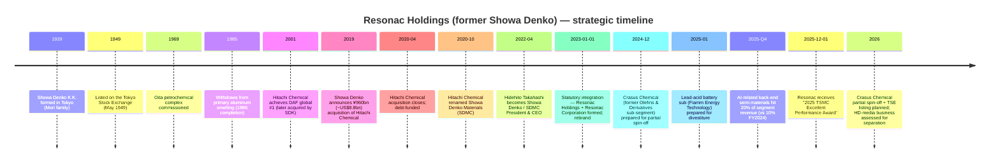
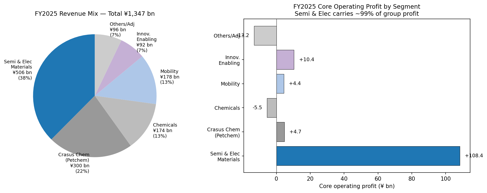
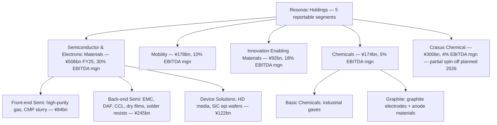
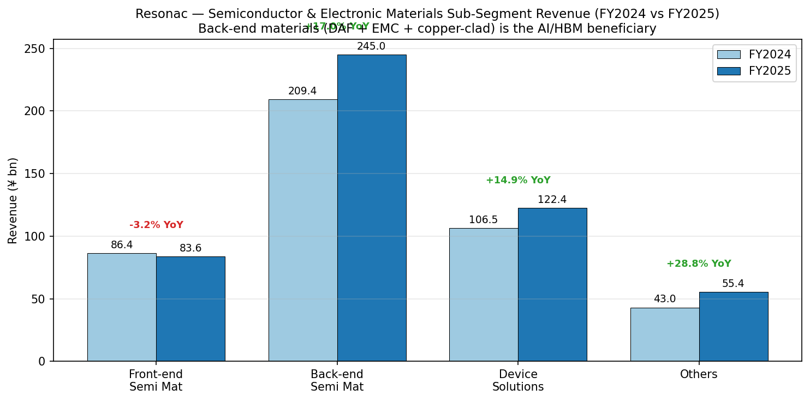
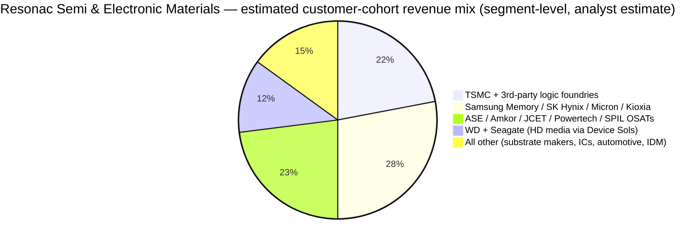
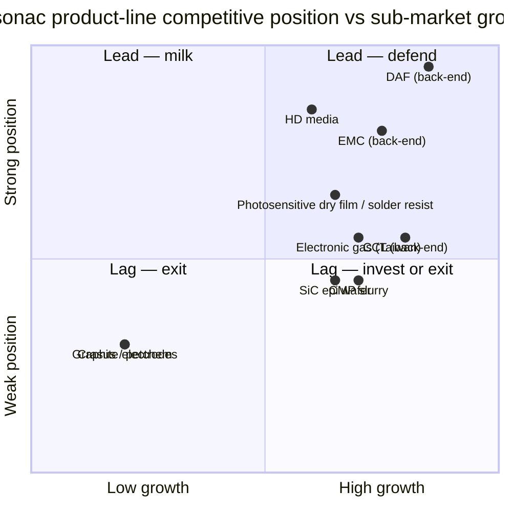
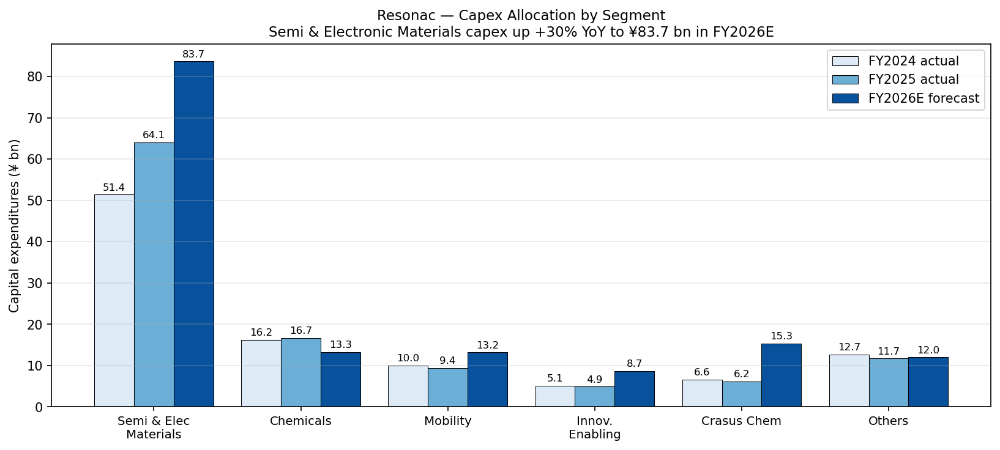

# Resonac Holdings Corporation (TSE: 4004) — Company Research Report

**As of:** 2026-05-26
**Author:** Equity Research — Japan Semi Materials Coverage (companion to Nomura "Greater China Semi 2026–30F Renaissance", 2026-05-21)
**Listings:** Tokyo Stock Exchange (Prime), ticker **4004**; ADR-equivalent OTC ticker SWDHF / SWDHY ([Resonac Stock Information](https://www.resonac.com/ir/stock/index.html); [Stockanalysis TYO:4004 statistics](https://stockanalysis.com/quote/tyo/4004/statistics/)).

> **Update — FY2026 full-year guidance reaffirmed; 1H raised on 2026-05-13.** Management kept the full-year FY2026 (Jan–Dec) targets at revenue **¥1,310 bn**, core operating profit **¥140.0 bn (+28% YoY)** and net income attributable to owners **¥77.0 bn (+165% YoY)**, while raising 1H core operating profit guidance to **¥74.0 bn (vs ¥53.0 bn at year-start)** on the back of the AI-related back-end-materials ramp and a swing-back to profitability in the Graphite sub-segment. The implied AI-related materials revenue is expected to grow **>50% YoY in FY2026**. Source: [Resonac Q1 2026 Tanshin, p.3 — forecast revision, 2026-05-13](https://www.resonac.com/sites/default/files/2026-05/e_tanshin2026q1.pdf); [Resonac FY2025 results presentation, p.18–20, 2026-02-13](https://www.resonac.com/sites/default/files/2026-02/e_shiryo2025q4.pdf).

---

## Table of Contents

1. Company Overview
2. Company History
3. Management Team
4. Products & Services
5. Customers & Go-to-Market
6. Industry Overview
7. Competitive Landscape
8. Market Opportunity (TAM)
9. Risk Assessment
10. References

---

## 1. Company Overview

Resonac Holdings Corporation is a Tokyo-headquartered diversified functional-chemicals conglomerate that was formed by the **January 1, 2023 statutory integration of Showa Denko K.K. and Showa Denko Materials Co., Ltd. (formerly Hitachi Chemical Company)**. The combined entity sits across two strategic poles: a growth-engine **Semiconductor and Electronic Materials** business inherited mainly from Hitachi Chemical, and a mature, cash-generative **petrochemicals + basic-chemicals + graphite-electrodes** stack inherited from legacy Showa Denko. The holding-company / operating-company architecture — Resonac Holdings (the listed parent, ticker 4004) and Resonac Corporation (the operating manufacturing arm) — and the "Change society through the power of chemistry" purpose were defined at the rebrand ([Resonac Corporate Profile](https://www.resonac.com/corporate/outline.html); [Resonac, "Showa Denko K.K. & Showa Denko Materials Corporation Rebrand as Resonac", 2023-01](https://www.specialchem.com/polymer-additives/news/showa-denko-rebranding-resonac-000229747)).

Resonac sells industrial inputs — not finished goods — and is therefore a B2B specialty-chemicals issuer in the same Japanese cohort as Shin-Etsu Chemical, Sumitomo Chemical, Mitsubishi Chemical and JSR. The income-statement geometry is dominated by **one segment doing almost all of the heavy lifting**: in FY2025 the Semiconductor and Electronic Materials segment generated **¥506.3 bn of revenue (37.6% of group sales) and ¥108.4 bn of core operating profit (99% of group core operating profit)** at a **30.2% segment EBITDA margin**, while the other five segments combined contributed ¥840.8 bn of revenue but only ¥0.7 bn of core operating profit on a net basis ([Resonac FY2025 Tanshin, p.4–7, 2026-02-13](https://www.resonac.com/sites/default/files/2026-02/e_tanshin2025q4.pdf); [FY2025 results presentation, p.8](https://www.resonac.com/sites/default/files/2026-02/e_shiryo2025q4.pdf)). The asymmetric profit contribution is the single most important structural fact about this company: any thesis on Resonac is, in practice, a thesis on the Semi & Electronic Materials segment, modulated by the drag (or upside) from the other businesses through the deleveraging period.

*Source: 2022 figures from [Resonac, "Looking Back at the Past Five Years", FY2025 presentation p.26](https://www.resonac.com/sites/default/files/2026-02/e_shiryo2025q4.pdf) under former-JGAAP; 2023–2025 actuals and 2026 forecast from [Resonac FY2025 Tanshin, pp.1–2](https://www.resonac.com/sites/default/files/2026-02/e_tanshin2025q4.pdf) and FY2025 presentation pp.4, 18, 26 under IFRS. EBITDA margin = (Core operating profit + Depreciation and amortization) / Revenue per the company's standard definition.*

Geographically, Resonac is **Japan-centric in production but increasingly cross-border in revenue**, with manufacturing footprints in Japan (≈70% of headcount), greater China and Taiwan (CMP slurry, photoresist auxiliaries, packaging materials), Singapore (Resonac Specialty Gas), Germany (graphite electrodes), and the United States (CDMO-equivalent specialty chemicals plus a newly-opened US-Japan packaging consortium center in Silicon Valley) ([Resonac, "Resonac to Establish Semiconductor R&D Center in Silicon Valley, USA", 2024](https://www.blackridgeresearch.com/news-releases/resonac-plans-to-build-a-semiconductor-back-end-process-center-in-us); [Resonac Specialty Gas Taiwan](https://www.rsgt.resonac.com/index.php?lang=en)). Consolidated headcount stood at **21,525 employees as of 2025-12-31**, total assets at **¥2,106.7 bn**, and total equity attributable to owners at **¥698.9 bn**, giving an equity-to-asset ratio of **33.2%** ([Resonac FY2025 Tanshin, pp.1, 3](https://www.resonac.com/sites/default/files/2026-02/e_tanshin2025q4.pdf); [Resonac Corporate Profile, employee count](https://www.resonac.com/corporate/outline.html)).

The customer franchise spans the four leading-edge logic / memory / OSAT ecosystems globally: TSMC (which awarded Resonac the **"2025 TSMC Excellent Performance Award – Excellent Technology Development and Production Support"** on December 1, 2025 specifically citing advanced-packaging materials and high-purity-gas localization), Samsung, SK Hynix, Micron, Kioxia and the OSATs ASE/Amkor/JCET/Powertech for back-end materials ([Resonac, "Resonac Receives 2025 TSMC Excellent Performance Award", 2025-12-01](https://www.resonac.com/news/2025/12/01/3669.html); [TSMC, "2025 Supply Chain Management Forum Presents Awards to Outstanding Suppliers"](https://pr.tsmc.com/english/news/3274)). The combination of named TSMC recognition plus a steady AI-related back-end revenue trajectory (the company's own disclosure: AI-related share of back-end semi revenue rose from **~10% in FY2024 to ~20% in FY2025** and is guided to grow **>50% YoY in FY2026**) makes Resonac the single most direct Japanese-listed AI-materials play under our coverage ([Resonac FY2025 presentation, p.10, 20](https://www.resonac.com/sites/default/files/2026-02/e_shiryo2025q4.pdf)).

### Valuation snapshot (REQUIRED)

As of late May 2026, Resonac trades at approximately **¥18,010 / share** for a market cap of roughly **¥3.1 trillion** (the precise figure floats with the Tokyo market; the May 8, 2026 snapshot put market cap at ¥2.9 trillion, and the May 23 snapshot at higher levels following the 1H guidance raise on May 13) ([Stockanalysis TYO:4004 market cap snapshot](https://stockanalysis.com/quote/tyo/4004/market-cap/); [Yahoo Finance JP 4004.T quote](https://finance.yahoo.com/quote/4004.T/); [Investing.com 4004.T live](https://www.investing.com/equities/showa-denko-k.k.)). On TTM (trailing twelve months) FY2025 reported numbers — revenue ¥1,347 bn, EPS ¥160.49, equity per share ¥3,861.43 — that implies approximately **TTM P/E ~112×, TTM P/S ~2.3×, P/B ~4.7×**, with the headline TTM P/E artificially inflated by ¥62.5 bn of non-recurring items (mainly impairment losses associated with the Fiamm Energy Technology divestiture and automotive-molded-parts wind-down) ([Resonac FY2025 Tanshin, p.1; FY2025 presentation, p.15](https://www.resonac.com/sites/default/files/2026-02/e_tanshin2025q4.pdf)).

The cleaner valuation lens is **forward P/E on FY2026 guidance**: at the company's own FY2026E EPS guidance of **¥425.45**, the implied **forward P/E is ~42×**, and on the **2025 adjusted EPS of ¥506** (which strips the non-recurring impairments and is the metric management publishes alongside reported EPS), the **TTM adjusted P/E is ~35.6×** ([Resonac FY2025 presentation, p.18, 26](https://www.resonac.com/sites/default/files/2026-02/e_shiryo2025q4.pdf)). EV/EBITDA on FY2025 EBITDA of **¥203.4 bn** plus net debt of **¥707.5 bn** (interest-bearing liabilities ¥969.5 bn less cash ¥262.0 bn) gives EV ≈ ¥3.8 trillion and **EV/EBITDA ~18.6×**, dropping to **~16× on FY2026E EBITDA of ¥234.5 bn** ([Resonac FY2025 Tanshin, p.3 — balance sheet; presentation pp.16, 23](https://www.resonac.com/sites/default/files/2026-02/e_tanshin2025q4.pdf)).

For peer context, **Shin-Etsu Chemical (TSE:4063)** — the largest Japanese specialty chemicals comp — currently trades at roughly **18× TTM P/E and ~3× revenue** ([Shin-Etsu Chemical IR](https://www.shinetsu.co.jp/en/ir/)); **Sumitomo Chemical (TSE:4005)** trades near breakeven on TTM earnings (large recovery off prior losses); **Tokyo Ohka Kogyo (TSE:4186)** the photoresist-pure-play trades around **19× TTM P/E and ~2.5× revenue** ([Tokyo Ohka Kogyo IR](https://www.tok.co.jp/eng/ir)); and **JSR Corporation** delisted at a transaction valuing the equity at ~2.25× revenue ([JIC Capital, Tender Offer Results, 2024-04-17](https://www.jiccapital.co.jp/en/news/.assets/E_20240417_JIC_JICC_PressRelease.pdf)). The Resonac forward P/E of ~42× sits **above the Japanese specialty-chemicals peer median** but is roughly in line with — or below — the **40× FY2027 P/E benchmarks Nomura uses for Kinik (1560 TT) and Anji (688019 CH)** in the same Greater-China-semi sector report ([Nomura "Greater China Semi: A guide to Semi renaissance in 2026~30F", 2026-05-21, p.15–17](https://www.nomuraconnects.com/asia-tech)). The 3-year P/E range for 4004 itself is approximately **8× to 250×+** (the high prints during the loss-making FY2022/FY2023 trough; the low prints reflect a normalized year on Hitachi-Chemical-merger synergies).

*Analyst view:* the multiple is stretched on **TTM-reported** numbers but defensible — and possibly cheap — on **FY2026E/FY2027E numbers if AI-related back-end semi materials continue to grow >50% YoY** as guided. The cause of the headline multiple expansion is straightforward: (a) the Semiconductor & Electronic Materials segment is being re-rated as a structural AI / advanced-packaging beneficiary (per Nomura's framework, see ["半导体材料 sector overview"](../../sector/半导体材料.md) and Nomura Fig. 35–44 of the 2026-05-21 anchor report); (b) the planned **partial spin-off of Crasus Chemical (petrochemicals) within 2026** removes a low-multiple drag from the consolidated EV ([Resonac FY2025 presentation, p.29 — Crasus Chemical spin-off progress](https://www.resonac.com/sites/default/files/2026-02/e_shiryo2025q4.pdf)); and (c) deleveraging is on track — adjusted Net D/E is at **0.83×** (below the **<1.0× target**) and Net Debt / EBITDA at **3.5×** falling toward the **<3.0× target** by FY2026E ([FY2025 presentation, p.26 — Key Financial Indicators](https://www.resonac.com/sites/default/files/2026-02/e_shiryo2025q4.pdf)). The valuation risk if the AI cycle disappoints is real and is captured in Section 9.

## 2. Company History

Resonac's corporate identity dates back to **June 1939**, when **Showa Denko K.K. (昭和電工株式会社)** was formed in Tokyo by the merger of Nihon Electrical Industries (a Mori-family ammonium-sulphate fertilizer business) and Showa Fertilizers, both founded by the industrialist **Nobuteru Mori** ([Wikipedia, "Resonac" (history)](https://en.wikipedia.org/wiki/Resonac); [Resonac Corporate Profile](https://www.resonac.com/corporate/outline.html)). The Showa Denko name persisted for 84 years and through three distinct industrial eras: post-war reconstruction (basic chemicals, ammonia, hydrogenation), the 1960s–1980s petrochemical and aluminum-smelting build (the Oita refinery / petrochemical complex commissioned in 1969 remains the company's largest chemical site to this day), and the 1990s onward shift toward electronic and specialty materials. The company was listed on the **Tokyo Stock Exchange in May 1949** and has been a continuous TSE issuer for 76 years ([Wikipedia, "Resonac"](https://en.wikipedia.org/wiki/Resonac)).

The decisive strategic move in the modern era was the **December 2019 announcement and 2020 close of the ¥960 bn (~US$8.8–8.9 bn) acquisition of Hitachi Chemical Company from Hitachi Ltd.** Showa Denko, the smaller buyer (FY2018 sales ¥1.0 trillion vs Hitachi Chemical FY3/2019 sales ¥696 bn), won a contested auction that also drew bids from Bain Capital, Carlyle Group, and Nitto Denko ([C&EN, "Showa Denko to acquire Hitachi Chemical", 2020-01](https://cen.acs.org/business/mergers-&-acquisitions/Showa-Denko-acquire-Hitachi-Chemical/98/i1); [MarketScreener, "Japan's Hitachi nears deal to sell chemical unit to Showa Denko"](https://www.marketscreener.com/quote/stock/RESONAC-HOLDING-CORPORATI-6491222/news/Showa-Denko-K-K-Japan-s-Hitachi-nears-deal-to-sell-chemical-unit-to-Showa-Denko-Nikkei-29639742/)). The acquisition was funded almost entirely with debt — an interest-bearing-liability stack that peaked above **¥1.4 trillion** post-close and is the central reason Resonac's deleveraging trajectory (Net Debt / EBITDA: **7.9× in FY2023 → 3.5× in FY2025 → 2.9× FY2026E**) remains a focus item for sell-side analysts and rating agencies ([Resonac FY2025 presentation, p.26 — Key Financial Indicators](https://www.resonac.com/sites/default/files/2026-02/e_shiryo2025q4.pdf); [Japan Credit Rating Agency, July 29, 2024 rating action](https://www.jcr.co.jp/en/)). Hitachi Chemical was **renamed Showa Denko Materials Co., Ltd. (SDMC) in October 2020** and operated as a wholly-owned subsidiary under the Showa Denko parent for the next 27 months ([Showa Denko press release, October 2020 rebrand](https://www.specialchem.com/polymer-additives/news/showa-denko-rebranding-resonac-000229747)).

**The 2023 rebrand to Resonac** was framed by management as a "second foundation" rather than a simple corporate-identity refresh. Effective **January 1, 2023**, Showa Denko K.K. and Showa Denko Materials merged into two entities — Resonac Holdings Corporation (the listed parent that retained TSE ticker 4004) and Resonac Corporation (the operating company combining both legacy businesses) — and the umbrella brand "Resonac" was introduced. The name is a portmanteau: "RESONate" (the desire to resonate with society's needs through chemistry) + "C" for chemistry. President & CEO Hidehito Takahashi told employees and external stakeholders that "the birth of Resonac is its second foundation. We will reform the Group by raising talent who can take positive actions autonomously and creatively" ([Resonac, "Resonac Aims to be a Leading Functional Chemical Manufacturer by Raising Reformers", 2023-01-04](https://www.resonac.com/news/2023/01/04/2285.html); [SpecialChem, "Showa Denko Rebrands as Resonac"](https://www.specialchem.com/adhesives/news/showa-denko-rebrands-000229738)). The rebrand was not cosmetic: it accompanied a portfolio-restructuring program that has already produced two big strategic moves (the **Crasus Chemical petrochemical-spin-off** and the **Fiamm Energy Technology divestiture**) and is preparing a third (the **HD media business separation** under assessment).

**Strategic pivot #1 — the petrochemical exit.** On **September 26, 2024** management announced that the entire Olefins & Derivatives sub-segment of legacy Showa Denko would be reorganized into a wholly-owned subsidiary called **Crasus Chemical Co., Ltd.**, with a separate brand and management team effective January 1, 2025, in preparation for an outright spin-off and TSE listing planned for 2026 ([Resonac, "Plans Spin-Off of Petrochemical Unit into New Entity Crasus Chemical"](https://www.marketscreener.com/quote/stock/RESONAC-HOLDINGS-CORPORAT-6491222/news/Resonac-Plans-Spin-Off-of-Petrochemical-Unit-into-New-Entity-Crasus-Chemical-47449928/); [C&EN, "Resonac to spin off petrochemical arm"](https://cen.acs.org/business/petrochemicals/Resonac-spin-off-petrochemical-arm/102/i5)). The mechanic announced at the FY2025 results was a **partial spin-off with shares distributed pro-rata to Resonac shareholders**, after which Resonac will retain **less than 20%** of Crasus Chemical equity and the remaining stake will be neither a consolidated subsidiary nor an equity affiliate — a "Yahoo Japan / SoftBank" style split rather than an internal carve-out ([Resonac FY2025 presentation, p.29 — Crasus Chemical spin-off progress](https://www.resonac.com/sites/default/files/2026-02/e_shiryo2025q4.pdf)). The Crasus Chemical sub-segment generated ¥300.3 bn revenue and just ¥4.7 bn core operating profit in FY2025 — at a **3.5% EBITDA margin versus the consolidated 15.1%** — so its removal lifts post-spin Resonac group EBITDA margin meaningfully even though absolute EBITDA drops only modestly. *Analyst view:* this is exactly the "low-multiple drag" surgery the consolidated valuation needs; on a fully-spun-off basis, FY2026E core operating profit "ex-Crasus" is ¥133 bn at a **21.6% EBITDA margin** — the highest in the issuer's modern history ([FY2025 presentation, p.18 — 2026 Consolidated Forecast: Summary, ex-Crasus](https://www.resonac.com/sites/default/files/2026-02/e_shiryo2025q4.pdf)).

**Strategic pivot #2 — the SDK aluminum / lead-acid divestitures.** Resonac sold the **lead-acid battery business (Fiamm Energy Technology S.p.A., based in Italy)** in 2025 and is winding down the **automotive molded-parts business in Japan and Thailand** during 2026 Q2 ([Resonac FY2025 Tanshin, p.5 — non-recurring items; FY2025 presentation, p.20 — Mobility 2026 outlook](https://www.resonac.com/sites/default/files/2026-02/e_tanshin2025q4.pdf)). These divestitures drove the **¥51 bn of FY2025 impairment losses** that depressed reported operating profit to ¥46.7 bn (–47.6% YoY) and reported EPS to ¥160.49 (–60.5% YoY), even as core operating profit grew 18.4% YoY to ¥109.1 bn ([FY2025 Tanshin, p.1; presentation, p.15 — non-recurring items breakout](https://www.resonac.com/sites/default/files/2026-02/e_tanshin2025q4.pdf)). The 2026 forecast assumes only ¥35 bn of non-recurring items (the residual book-cleanup of the same divestitures plus retirement-benefit-plan revisions), which is the largest single driver of the **+165% YoY growth in net income attributable to owners** guided for FY2026.

**Strategic pivot #3 — the HD media business assessment.** Resonac is the world's largest independent supplier of aluminum-substrate hard-disk-drive (HDD) media — a business with a roughly **two-customer end market** (Western Digital and Seagate, after the **2025-02-21 Western Digital spin-off of its NAND/flash business into Sandisk Corporation** ([Western Digital 8-K/A, "Completion of WD/Sandisk separation", 2025](https://www.sec.gov/Archives/edgar/data/0000106040/000010604025000012/wdc8-khardxspin.htm))). HD media is reported inside Device Solutions within the Semi & Electronic Materials segment but is structurally distinct from front-end / back-end semi materials. With near-line HDD demand from hyperscale data centers up sharply in FY2024–FY2025 (the company called this out explicitly: "HD media revenue increased due to the recovery of the demand for data centers" [FY2025 presentation, p.10](https://www.resonac.com/sites/default/files/2026-02/e_shiryo2025q4.pdf)), the business is currently a contributor, but the long-term decline in HDD shipments relative to QLC NAND remains an overhang. Management has flagged a portfolio review of HD media but has not committed to a separation timeline as of this writing.

The cumulative effect of these three strategic moves is that **Resonac in 2026 looks much more like a focused functional-chemicals + semi-materials platform than the diversified Showa Denko of 2018**: petrochemicals out of consolidation by year-end, lead-acid battery and aluminum-molded-parts divested, HD media under review, and capex being concentrated into the Semi & Electronic Materials segment (capex allocated to Semi & Electronic Materials rose from ¥51.4 bn in FY2024 → ¥64.1 bn in FY2025 → ¥83.7 bn in FY2026E, a **+63% over two years** while consolidated capex grew only 43%) ([Resonac FY2025 presentation, p.35 — Capex by segment](https://www.resonac.com/sites/default/files/2026-02/e_shiryo2025q4.pdf)).

## 3. Management Team

**Founder note.** Resonac as a corporate entity was *not* founded in the modern sense — it emerged from the 2023 statutory integration of two existing TSE-listed groups (Showa Denko K.K. and Showa Denko Materials, the latter being the renamed Hitachi Chemical). Showa Denko's original founder, **Nobuteru Mori (森矗昶)**, established the predecessor Nihon Electrical Industries and Showa Fertilizers in the 1920s–1930s; the Mori family ceased operational involvement decades ago. Hitachi Chemical was spun out of Hitachi Ltd. on 1962-10-10 and had no individual founder in the entrepreneurial sense. The relevant "founding moment" for the modern company is therefore **CEO Hidehito Takahashi's accession (January 2022 in legacy Showa Denko; January 2023 in Resonac)** and the rebrand he executed — and his bio carries the full management-team allocation per this report's skill scope.

**Hidehito Takahashi (高橋 秀仁) — Representative Director, President & CEO of Resonac Holdings Corporation and Resonac Corporation (January 2023–present).** Born **July 21, 1962**, Takahashi is a career professional manager with an unusual background for a Japanese specialty-chemicals CEO: most of his pre-Resonac roles were in **Western multinationals operating in Japan and Asia**, not in domestic Japanese chemicals firms, and that operating background visibly shapes how Resonac presents itself in English-language investor communications (the company runs IFRS as its primary GAAP, holds bilingual conference calls, and publishes English-language integrated reports on the same day as Japanese versions) ([Resonac Executive Profile, Hidehito Takahashi](https://www.resonac.com/corporate/exec/takahashi.html)).

Takahashi's career began at **Mitsubishi Bank, Ltd. (now MUFG Bank) in 1986**, where he worked in corporate banking. He moved to **GE Japan Holding Corporation in 2002 as General Manager, Business Development**, and was promoted to **Asia Pacific President of GE Sensing & Inspection Technologies in 2004** — a P&L role overseeing the regional industrial-sensor and NDT-inspection business across Japan, China, Korea and Southeast Asia. In **2008** he moved to **Momentive Performance Materials Japan Inc.** (the silicones business spun out of GE Plastics following the Apollo acquisition) as **President & CEO of the Silicones Business**, his first chemicals-industry P&L role. In **2013** he was named **President & CEO of GKN Driveline Japan plc**, GKN's Japan automotive driveline business — a tier-1 auto-supply role that built customer relationships across Toyota, Honda and Nissan ([Resonac Executive Profile](https://www.resonac.com/corporate/exec/takahashi.html); WebFetch summary cited above).

Takahashi **joined Showa Denko K.K. in 2015 as Senior Corporate Fellow**, his first traditional-Japanese-conglomerate role. Over the following five years he progressively advanced through corporate-officer and board-director seats including **Chief Strategy Officer (CSO)** — the role in which he architected the Hitachi Chemical acquisition strategy that closed in 2020. He was named **President & CEO of (legacy) Showa Denko effective January 2022** and assumed the same title at **Resonac Holdings + Resonac Corporation when the rebrand took effect on January 1, 2023** ([Resonac Executive Profile](https://www.resonac.com/corporate/exec/takahashi.html); [Resonac, "New Year Message from Hidehito Takahashi, President and CEO", 2022-01-04](https://www.resonac.com/news/2022/01/04/1057.html)). His tenure as CEO of the integrated Resonac entity is therefore approaching **3.5 years** as of this report. He is not a founder and does not hold a founder-scale equity stake; his compensation structure and shareholdings are disclosed in the Resonac Yuho (有価証券報告書) but are at salaried-executive levels, not founder-shareholder levels.

The thesis Takahashi has executed against — and his record so far — can be summarized in three propositions. **First**, that the Hitachi Chemical / Showa Denko combination was justified by *operational synergy* on semi-materials R&D + sales (the FY2025 outcome: Semi & Electronic Materials segment core operating profit of ¥108.4 bn, **+47% YoY**, at a 30.2% EBITDA margin — broadly validating the synergy thesis). **Second**, that the consolidated debt burden could be deleveraged through portfolio simplification (the FY2025 outcome: Net Debt / EBITDA from 7.9× in FY2023 to 3.5× in FY2025, with FY2026E guided to 2.9× — on track and verifiable in the cash-flow statement). **Third**, that the petrochemicals and commodity-chemicals stack could be separated from the high-margin semi-materials franchise without destroying value at either side (the FY2025 outcome: the Crasus Chemical partial spin-off has cleared Japanese tax-qualified-spin-off requirements, secured TSE listing approval, and is awaiting corporate-approvals execution — on track for 2026 closing per the company's own Key Milestones disclosure [FY2025 presentation p.29](https://www.resonac.com/sites/default/files/2026-02/e_shiryo2025q4.pdf)). On all three propositions, the public scorecard so far is favourable.

## 4. Products & Services

This section is anchored to Resonac's own product taxonomy as published on the **Resonac Semi Backend Process products page**, the **FY2025 results presentation (segment summary slides p.10–14)**, and the **2024 sustainability report**, which together replace what would be the Item 1 Business section of a US 10-K. Per the company-research skill rule, paragraphs that block-quote Resonac's own language carry the source citation directly above the quote; share-leadership / market-position views by the analyst are labelled `*Analyst view:*` and either cite Resonac's own marketing language (where the company actually claims a number) or stand uncited.

### 4.1 The Resonac segment / sub-segment product matrix

Resonac reports five operating segments. Across the entire group, the income statement is dominated by **Semiconductor and Electronic Materials**; the table below shows the FY2025 actuals plus the sub-segment breakdown for the Semi & Electronic Materials segment as disclosed on slide 10 of the FY2025 presentation.

| Segment | Sub-segment | FY2025 revenue (¥ bn) | FY2025 core op. profit (¥ bn) | EBITDA margin |
|---|---|---:|---:|---:|
| **Semiconductor & Electronic Materials** | Front-end Semi Materials *(High-purity gases, CMP slurry)* | 83.6 | – | – |
|  | Back-end Semi Materials *(EMC, DAF, copper-clad laminates, photosensitive dry films, photosensitive solder resists)* | 245.0 | – | – |
|  | Device Solutions *(HD media, SiC epitaxial wafers)* | 122.4 | – | – |
|  | Others | 55.4 | – | – |
|  | **Segment total** | **506.3** | **108.4** | **30.2%** |
| **Mobility** | Plastic molded products, friction materials, powder-metal products, aluminum specialty components | 178.4 | 4.4 | 9.8% |
| **Innovation Enabling Materials** | Functional resins, functional chemicals, coating materials, ceramics | 92.2 | 10.4 | 17.6% |
| **Chemicals** | Basic Chemicals (industrial gases), Graphite (graphite electrodes + anode materials) | 174.4 | (5.5) | 5.4% |
| **Crasus Chemical** *(planned partial spin-off within 2026)* | Olefins & derivatives, organic chemicals, synthetic resin | 300.3 | 4.7 | 3.5% |
| **Others / Adjustments** | Eliminations, divestiture-related book residuals | 95.5 | (13.2) | (3.2%) |
| **Group total** | — | **1,347.1** | **109.1** | **15.1%** |

*Source: [Resonac FY2025 results presentation, p.8–14 — Revenue, Core Operating Profit and EBITDA margin: Segment Breakdown, 2026-02-13](https://www.resonac.com/sites/default/files/2026-02/e_shiryo2025q4.pdf); [Resonac FY2025 Tanshin, p.4–7 — Revenue and Core operating profit by Segment](https://www.resonac.com/sites/default/files/2026-02/e_tanshin2025q4.pdf). Sub-segment core operating profit is not broken out in the published disclosure; the company reports only revenue at the sub-segment level.*

*Source: same as above table. Note that Semiconductor & Electronic Materials' ¥108.4 bn of core operating profit effectively absorbs the combined ¥(7.7) bn losses in Chemicals + Others/Adjustments to deliver group core operating profit of ¥109.1 bn.*

### 4.2 Synthesis — how the families interact

Resonac's product portfolio composes a **two-layer business model**. The high-velocity, high-margin layer is the Semi & Electronic Materials franchise that sits inside three of the four major semiconductor-manufacturing process steps: (i) **front-end wafer-fab** (high-purity electronic gas + CMP slurry + photoresist auxiliaries), (ii) **back-end packaging** (DAF + epoxy molding compound + copper-clad laminates + photosensitive dry films + photosensitive solder resists), and (iii) **post-fab device manufacturing** (HD media for HDDs + SiC epitaxial wafers for power devices). The slow-velocity, lower-margin (and in some years loss-making) layer is the legacy Chemicals + Crasus Chemicals + Mobility + Innovation Enabling Materials + Others stack — these segments together generate ~62% of revenue but contribute essentially zero core operating profit on a net basis. The Crasus Chemical partial spin-off planned for within 2026 is the surgical removal of the largest single low-margin piece, and the FY2026E guidance shows the *ex-Crasus* group hitting **EBITDA margin 21.6%, vs the consolidated 17.9%** ([FY2025 presentation, p.18](https://www.resonac.com/sites/default/files/2026-02/e_shiryo2025q4.pdf)).

The semiconductor manufacturing workflow that Resonac's products feed runs:

**(wafer) → CMP slurry → high-purity gas (etch / clean) → photoresist auxiliaries → (front-end completion) → dicing tape → DAF die-attach film → epoxy molding compound encapsulation → copper-clad laminate substrate → photosensitive dry film / solder resist → (back-end completion) → (HDD assembly using HD media) or (power-device assembly using SiC epi wafer)**

A given AI accelerator (Nvidia H100/H200/B100, AMD Instinct MI300/MI325, Broadcom XPUs, Marvell custom ASICs, etc.) will touch **at least four Resonac products** by the time it leaves the OSAT: high-purity etch gas (front-end), CMP slurry (front-end), DAF for the HBM die-stack and the chiplet-to-interposer bond (back-end), and EMC molding around the package perimeter (back-end). Higher HBM stack counts (8-hi → 12-hi → 16-hi) and higher chiplet counts per accelerator package multiply Resonac material consumption per AI accelerator, which is the operating mechanism behind management's guidance for **AI-related back-end revenue >50% YoY growth in FY2026** ([Resonac FY2025 presentation, p.20 — Sub-segment outlook](https://www.resonac.com/sites/default/files/2026-02/e_shiryo2025q4.pdf)).

### 4.3 Back-end Semiconductor Materials — the AI/HBM profit engine (¥245 bn revenue, +17% YoY)

This is the largest sub-segment of Resonac's Semi & Electronic Materials franchise and the one most directly leveraged to AI accelerator and HBM unit shipments. The four flagship product families here are **die-attach film (DAF)**, **epoxy molding compound (EMC)**, **copper-clad laminates (CCL)**, and **photosensitive dry films / solder resists**. Together they constitute roughly **48% of segment revenue in FY2025** and absorbed the majority of incremental capex during FY2024–FY2026E.

#### 4.3.1 Die-attach film (DAF) — Resonac's strongest single product franchise

The 10-K-equivalent statement from Resonac's English product page for the **FH/HR Series dicing-die-bonding film (DAF)** reads ([Resonac, "Dicing Die Bonding Film FH/HR Series"](https://www.resonac.com/products/semi-backend-process/76/009.html)):

> "Resonac's die attach films (DAF) combine function of dicing tapes and die bonding films suitable for semiconductor wafer singulation and bonding process. … Resonac has marketed its DAF for more than 20 years and leads the world in production volume and sales."

The product line includes specific named SKUs: **FH-9011**, **HR-9004**, **HR-900-N50**, **HR-900-N45**, **HR-300-S34**, **FH-4013**, **HR-400-N45**, **FH-SC13**, and **HR-5104**, with elastic modulus tuned across the range from **600 MPa to 8000 MPa at 25 °C** depending on the target application ([Resonac DAF product page](https://www.resonac.com/products/semi-backend-process/76/009.html)). The target applications listed verbatim by Resonac are "3D NAND and DRAM memory devices," lead-frame applications, **FOW (film over wire) and FOD (film over die)** packaging, and **SDBG (Stealth Dicing Before Grinding)** processes.

**中文释义 / Plain-language gloss:** DAF (die-attach film, 晶粒贴附膜) is a thin polymer film that simultaneously serves two functions during back-end packaging: it acts as **dicing tape (切割胶带)** during wafer singulation (the saw cuts through the silicon and stops on the DAF), then as the **die-bonding adhesive (粘片胶)** that mounts each separated die onto the substrate or onto another die in a 3D stack. Without DAF, the die-bonding step requires liquid adhesive dispensing — which is too imprecise and too thick for the **<10 µm bond lines required by HBM stacks**. For an HBM4 12-hi stack, eleven DAF interfaces sit between twelve DRAM die plus one logic base die — each interface is ≤ 5 µm thick, and any voids or particles cause yield loss. For high-end AI accelerators, the DAF also sits between the bottom HBM die and the silicon interposer (the **chiplet-to-interposer bond**), and between each logic chiplet and the interposer. Bond-line uniformity, low elasticity for thermal-stress relaxation, and high adhesive strength are the three competing requirements that drive the **HR-900-N50 / HR-900-N45 portfolio split** (different elastic-modulus / adhesion combinations for different stack heights and die sizes).

*Analyst view:* DAF is the product where Resonac (inherited from Hitachi Chemical) is most credibly the **global volume and sales leader**, per Resonac's own marketing language quoted above. Independent third-party market analysis ranks "Furukawa Electric, Henkel Adhesives, LG Chemical, Resonac, Nitto Denko, MacDermid Alpha, LINTEC" as featured DAF suppliers, with multiple-source consensus putting Resonac's volume share at >40% globally ([openPR, "Die Attach Film (DAF) for Semiconductor Packaging Market", 2026](https://www.openpr.com/news/4110099/die-attach-film-daf-for-semiconductor-packaging-market-set)). The Nomura "Greater China Semi 2026–30F Renaissance" report explicitly references "Resonac" in its CMP-slurry and back-end-materials league tables ([Nomura "Greater China Semi" anchor report, p.34–44, 2026-05-21](https://www.nomuraconnects.com/asia-tech) — see also ["半导体材料 sector overview"](../../sector/半导体材料.md) for the local notes). HBM4 demand is the dominant near-term inflection: 16-hi HBM4 stacks (per JEDEC roadmap) require ~33% more DAF per HBM cube versus 12-hi HBM3E, and Nvidia + AMD + Broadcom unit shipments for AI accelerators using HBM4 ramp through FY2026–FY2027 per OEM disclosures.

#### 4.3.2 Epoxy molding compound (EMC) — the perimeter encapsulant

The 10-K-equivalent statement from Resonac's English product page for the **CEL Series epoxy molding compound for lead frame** reads ([Resonac, "Epoxy Molding Compounds for Lead Frame"](https://www.resonac.com/products/semi-backend-process/76/011.html)):

> "Resonac's epoxy molding compounds seal and protect the areas around the chips of semiconductor packages assembled with various metal lead frames. … Excellent moisture and thermal shock resistance. … Excellent reflow crack resistance. … Resonac has established a supply system to globally provide these materials from five sites."

The product line includes named SKUs **CEL-9240 ZHF10HT3W**, **CEL-9240 HF10**, **CEL-8240 HF10**, **CEL-9200 HF10**, and **CEL-9200 HF9**, with the flagship CEL-9240 ZHF10HT3W variant featuring **glass transition temperature 125 °C, thermal conductivity 3 W/mK, and flexural modulus 30 GPa** — the elevated thermal conductivity is the key spec for AI applications where the EMC perimeter must dissipate heat conducted from the package interior to the HSS / heat-sink ([Resonac EMC product page](https://www.resonac.com/products/semi-backend-process/76/011.html)). The named target packages span "DIP, SOP, TSOP, QFP, TQFP, LQFP, QFN, and PLCC" — i.e. every conventional lead-frame package. For organic-substrate packages (the format used in BGA / FCBGA flip-chip packages typical of high-end CPUs/GPUs), Resonac sells a separate **CEL Series for Organic Substrates**, and for **flip-chip underfill** there is the **CEL-C Series liquid encapsulant** ([Resonac, Semi Backend Process category page](https://www.resonac.com/products/semi-backend-process)).

**中文释义 / Plain-language gloss:** EMC (epoxy molding compound, 环氧塑封料) is the **black plastic-looking material (塑封料)** that encapsulates the silicon die + lead frame + bond wires of every conventional semiconductor package. The chemistry is an **epoxy resin + filler (typically silica) + curing agent + flame retardant + colorant** mixed and pressed into pellets that are then heated and injected into a mold cavity around the die during the transfer-molding step. For AI / HBM, the relevant subset is the **high-thermal-conductivity (high-Tc) EMC** (3 W/mK in the CEL-9240 ZHF10HT3W vs ~0.7 W/mK in commodity EMC) and the **low-CTE / low-warpage EMC** for thin packages where stack-induced warpage during reflow can crack the bond line. The "ZHF" prefix in the CEL-9240 product code denotes a halogen-free fire retardant chemistry, which is now mandatory across virtually all automotive and AI-grade applications.

*Analyst view:* Resonac is one of the top-three global EMC suppliers alongside **Sumitomo Bakelite (TSE:4203)** and **Nagase ChemteX / Hysol (Henkel)**, with the three names together accounting for the majority of HBM-grade EMC supply by volume. The Resonac website does not explicitly claim global #1 in EMC (unlike the explicit DAF claim) — independent share rankings put Sumitomo Bakelite slightly ahead on legacy lead-frame EMC volumes but Resonac competitive on AI/HBM-grade high-Tc EMC where the Hitachi Chemical R&D legacy is strongest ([Sumitomo Bakelite 2024 Integrated Report](https://www.sumibe.co.jp/english/ir/library/ir/index.html) confirms the EMC franchise but does not claim share #s either). The TSMC supplier award explicitly called out Resonac's contributions to "advanced packaging materials" — EMC for high-end FCBGA and CoWoS packages is one of the principal items in that scope ([Resonac, "2025 TSMC Excellent Performance Award", 2025-12-01](https://www.resonac.com/news/2025/12/01/3669.html)).

#### 4.3.3 Copper-clad laminates (CCL) — substrate for organic packages

Copper-clad laminates are the foundation layer of organic substrates used in FCBGA packages — they are the **glass-fiber-reinforced epoxy + copper foil** that gets patterned via subtractive lithography to form the substrate's metal traces. The Resonac CCL franchise is reported under back-end semiconductor materials and primarily serves OSAT customers (ASE, Amkor, JCET, Powertech) and substrate manufacturers (Unimicron, Nan Ya PCB, Ibiden, Shinko Electric Industries, Kinsus). In Q4-2025 management implemented a **price adjustment on Copper Clad Laminates and Prepregs** ([Resonac FY2025 presentation, p.41 — News Release Topics](https://www.resonac.com/sites/default/files/2026-02/e_shiryo2025q4.pdf)), reflecting persistent input-cost pass-through and the tightening AI-substrate cycle.

**中文释义 / Plain-language gloss:** CCL (copper-clad laminate, 覆铜板) is the most basic structural input to a PCB or an IC substrate — a sheet of glass-fiber-reinforced epoxy (the FR-4 / BT resin / ABF analog) with copper foil laminated on one or both sides. For AI/HBM packaging, the **ABF (Ajinomoto Build-up Film) substrate** that sits inside CoWoS / FCBGA packages requires sub-25 µm dielectric thickness and ultra-low warpage; Resonac's CCL franchise feeds this stack as a layer-by-layer prepreg component. Higher AI accelerator unit shipments require more substrate layers per accelerator (CoWoS-L can reach 14+ layers vs 10–12 on legacy FCBGA), so CCL revenue per accelerator package scales super-linearly with AI complexity.

*Analyst view:* the CCL space is more fragmented than DAF or EMC; **Mitsubishi Gas Chemical (BT-resin pioneer)**, **Hitachi Chemical legacy (now Resonac)**, **Panasonic (Megtron series)**, **Doosan Corporation** and **Shengyi Technology (SH PCB)** are the leading suppliers across the layer-stack, with no single player above 25% share. Resonac's CCL franchise was strengthened by the Hitachi Chemical merger and remains the company's smallest of the three back-end flagships by revenue.

#### 4.3.4 Photosensitive dry films + photosensitive solder resists

Photosensitive dry films (PDFs / 干膜) and solder resists are the **lithographic mask materials** used to pattern the copper traces on CCL substrates — a photo-imageable polymer laminated to the substrate, exposed through a mask, developed, and stripped after the copper etch. Resonac's product line in this space serves both **conventional PCB makers** and **IC-substrate makers**, with the IC-substrate-grade product being a higher-margin / lower-volume franchise.

**中文释义 / Plain-language gloss:** Photosensitive dry film (光致干膜) is the **lithography mask layer** that defines copper traces during the etch step of substrate / PCB manufacturing — chemically similar to photoresist but laminated as a pre-cast film rather than spin-coated as a liquid. Solder resist (阻焊层) is the **green / black coating** that prevents solder from flowing onto unintended areas during component attach; it's the layer that gives a PCB its colored finish. For AI / HBM substrates, both layers require **sub-10 µm resolution** to define the fine-pitch traces — substantially more demanding than commodity PCB applications.

*Analyst view:* Resonac competes here against **Hitachi Chemical legacy (i.e., itself)** as the historic leader, plus **DuPont** (which spun out its Riston dry film franchise into Innolux / Eternal), **Asahi Kasei**, and **Showa Denko itself**. The product franchise was reinforced rather than transformed by the 2020 Hitachi Chemical merger.

### 4.4 Front-end Semiconductor Materials — Electronic gas + CMP slurry (¥83.6 bn revenue, slightly declining)

This sub-segment houses **high-purity electronic gases** (silane, dichlorosilane, ammonia, hydrogen chloride, specialty etch and clean gases) and **CMP slurry**. FY2025 revenue declined slightly to ¥83.6 bn (–3.2% YoY), driven by two specific factors disclosed in the FY2025 Tanshin: the **divestiture of the exhaust-gas abatement equipment business** (a clean exit from a non-core hardware adjacency) and the **slow pace of NAND demand recovery** ([Resonac FY2025 Tanshin, p.4](https://www.resonac.com/sites/default/files/2026-02/e_tanshin2025q4.pdf)). FY2026 guidance calls for "moderate" front-end revenue recovery as NAND demand normalizes.

#### 4.4.1 High-purity electronic gases

Resonac's high-purity gas portfolio is run through **Resonac Specialty Gas Taiwan Co., Ltd. (RSGT)** and the parent company's Japan / Singapore plants, supplying TSMC, UMC, Powerchip, and the leading Taiwanese OSATs ([Resonac Specialty Gas Taiwan](https://www.rsgt.resonac.com/index.php?lang=en)). The TSMC supplier-award citation specifically calls out "establishing a local production system for high-purity gases" — i.e. localized Taiwan gas production for TSMC's HVM fabs. This is the front-end product where Resonac has the most direct TSMC-localization exposure that Nomura's anchor report ties to the **TSMC capex super-cycle hitting USD 70 bn in FY2027** ([Nomura "Greater China Semi" anchor report, p.13, 2026-05-21](https://www.nomuraconnects.com/asia-tech)).

**中文释义 / Plain-language gloss:** Electronic gas (电子特气, specialty gases) is the umbrella term for the ultra-high-purity gases (99.9999% / 6N or better) used in front-end wafer fabrication — examples include **silane / SiH₄** (for silicon CVD), **dichlorosilane / SiH₂Cl₂** (for low-temperature CVD), **ammonia / NH₃** (for silicon nitride deposition), **HBr / Cl₂ / NF₃** (for etch), and an expanding list of specialty fluorocarbons. Each leading-edge logic / memory fab consumes thousands of cubic meters per day across dozens of gas species, and the "wafer-per-gas-cylinder" math gets tighter at every node — sub-2nm GAAFET nodes use roughly 2× the gas volume of mature-node logic.

*Analyst view:* the global high-purity electronic gas market is dominated by the four large industrial-gas majors — **Linde (formerly Praxair)**, **Air Liquide**, **Air Products**, and **Taiyo Nippon Sanso (TNS, now part of Mitsubishi Chemical Group)** — with regional specialty players including Resonac, **Kanto Denka Kogyo** (Japan), **SK Materials** (Korea), **Versum (now part of Merck KGaA)**, and **Show Denko AG fluorocarbon JVs (US/Taiwan)**. Resonac is not the global market leader by volume — that title goes to Linde / Air Liquide — but on specialty etch-and-clean gas chemistries Resonac is competitive and is one of the few suppliers TSMC has explicitly recognized for **local-production support in Taiwan**, which is the relevant context for the Nomura "localization super-cycle" thesis.

#### 4.4.2 CMP slurry

Resonac's CMP slurry franchise (inherited from Hitachi Chemical) competes globally in the **CMP slurry oligopoly** alongside **Versum (Merck KGaA), CMC Materials (now Entegris), Fujimi Incorporated, DuPont (post-Rohm and Haas), JSR, Anji Microelectronics (688019 CH), and Dinglong (300054 CH)** ([Nomura sector report Fig.35–44, 2026-05-21](https://www.nomuraconnects.com/asia-tech) — see also ["半导体材料 sector overview"](../../sector/半导体材料.md)). The global CMP slurry market reached approximately **USD 80 bn for total semiconductor materials in 2025** with CMP ~7% of that figure (i.e. ~USD 5.6 bn), per Nomura's market sizing ([Nomura anchor report Fig.24–26, p.18–20](https://www.nomuraconnects.com/asia-tech)).

**中文释义 / Plain-language gloss:** CMP (chemical-mechanical planarization, 化学机械抛光) is the front-end wafer-processing step that **flattens the wafer surface after each metal or dielectric layer is deposited** — without CMP, the wafer surface gradually develops bumps and recesses that make subsequent photolithography impossible at advanced nodes. CMP slurry (抛光液) is the suspension of **abrasive particles (e.g. ceria, alumina, silica) + chemical reactants** that does the polishing. Each CMP step at a leading-edge fab uses a different slurry chemistry tuned to the underlying material (Cu, W, dielectric, etc.), and total CMP slurry consumption per wafer is rising rapidly with **GAA + BPD + advanced packaging** — Nomura estimates +20–30% incremental CMP steps at A16 + BPD nodes ([Nomura anchor report, p.6–9](https://www.nomuraconnects.com/asia-tech)).

*Analyst view:* Resonac is named in Nomura's CMP slurry supplier league table — "Entegris / Resonac / Versum / Fujimi / 安集 / KC Tech" — but is **not the global #1**; Entegris (post-CMC Materials acquisition) holds the largest combined share, and the China-based suppliers Anji (688019 CH) and Dinglong (300054 CH) are accelerating their share-take at advanced nodes ([Nomura sector report Fig.41, 2026-05-21](https://www.nomuraconnects.com/asia-tech)). Resonac's CMP franchise is a contributor to the front-end-materials revenue but is not the differentiated AI franchise — the AI thesis lives in the back-end DAF + EMC stack, not in CMP slurry.

### 4.5 Device Solutions — HD media + SiC epitaxial wafers (¥122.4 bn, +15% YoY)

This sub-segment is structurally different from the rest of Semi & Electronic Materials. It contains two end-product franchises that are not consumed by chip fabs but rather by **device makers downstream of the fab**:

#### 4.5.1 HD media (aluminum-substrate hard-disk-drive platters)

Resonac is the **world's largest independent supplier of aluminum-substrate HDD media** — the metallic platters that store data inside conventional hard disk drives. The customer base is essentially two names: **Western Digital (HDD business after the 2025-02 Sandisk spin-off)** and **Seagate Technology**. The "Device Solutions" sub-segment revenue grew 15% YoY in FY2025, with management citing "HD media revenue increased due to the recovery of the demand for data centers, supported by steady demand from data centers" — the AI-era nearline HDD demand inflection driven by hyperscaler video and training-data storage workloads ([Resonac FY2025 presentation, p.10](https://www.resonac.com/sites/default/files/2026-02/e_shiryo2025q4.pdf)).

**中文释义 / Plain-language gloss:** HD media (硬盘碟片) is the **aluminum-alloy platter inside a HDD**, coated with a thin magnetic film that stores bits. Each HDD contains anywhere from 1 to 12 platters depending on capacity; nearline data-center HDDs (which are the AI-era growth segment) use 8–12 platters at 32–36 TB total drive capacity. The platter substrate is precision-finished to **sub-nanometer surface roughness** so the read/write head can fly at <10 nm above the surface without crashing. Resonac is one of two independent global suppliers of these substrates (the other being **Furukawa Electric**).

*Analyst view:* HD media is a polarizing franchise. On one hand, the **hyperscale AI workload demand has driven a sharp HDD nearline shipment recovery**, with Western Digital and Seagate both reporting strong FY2024–FY2025 demand. On the other hand, **QLC NAND is steadily displacing HDDs in non-nearline use cases**, and the long-run secular trajectory remains down. Management's portfolio-review language around HD media (a separate business that could be assessed for spin-off / divestiture) is consistent with this duality — it's a high-cash-flow business today that the parent could monetize at peak valuation if the AI tail demand normalizes.

#### 4.5.2 SiC epitaxial wafers

Resonac is one of the global top-three suppliers of **silicon-carbide (SiC) epitaxial wafers** — the epitaxially-grown SiC layer on top of a SiC substrate that becomes the active layer of power-electronic devices (EV traction inverters, fast chargers, industrial motor drives). In FY2025, this product line "remained flat due to a slowdown in the EV market" ([Resonac FY2025 Tanshin, p.4](https://www.resonac.com/sites/default/files/2026-02/e_tanshin2025q4.pdf)) — a reflection of the broader EV-investment moderation that hit SiC peers Wolfspeed, II-VI/Coherent, and onsemi during the same period.

**中文释义 / Plain-language gloss:** SiC epitaxial wafer (SiC 外延片) is the thin (typically 5–15 µm) layer of single-crystal silicon carbide grown by MOCVD on top of a 6-inch or 8-inch SiC substrate, on which power semiconductor devices (MOSFETs, Schottky diodes) are then fabricated. Wolfspeed (Cree), Coherent, ROHM, STMicroelectronics, Infineon and Resonac are the leading SiC supply chain participants; Resonac competes at the epitaxial-layer stage rather than at the substrate stage. SiC power devices offer **>50% switching-loss reduction and 3-4× higher operating frequency** vs silicon MOSFETs, which is why they win in EV traction inverters and DC fast chargers.

### 4.6 Chemicals + Mobility + Innovation Enabling Materials + Crasus Chemical (the legacy stack)

These four segments together generate ~62% of FY2025 group revenue but only ~¥14 bn of net core operating profit, and within FY2026 forecasts the legacy stack contributes essentially zero incremental profit growth relative to the Semi & Electronic Materials segment. Brief descriptions:

- **Chemicals (¥174 bn revenue, –¥5.5 bn core op loss FY2025):** Industrial gases (CO₂ + specialty industrial gases) within Basic Chemicals, and **graphite electrodes + lithium-ion battery anode materials** within Graphite. The graphite-electrode sub-business has been in cyclical drawdown through FY2024–FY2025 ("market weakness in graphite electrodes led to declines in both sales volumes and prices, resulting in lower revenue and a wider operating loss") and is the largest single drag on the segment ([Resonac FY2025 Tanshin, p.5; presentation p.13](https://www.resonac.com/sites/default/files/2026-02/e_tanshin2025q4.pdf)). Management announced "rationalization measures" for graphite electrodes in Q4-2025 and expects the segment to return to core operating profit of ¥8.0 bn in FY2026 driven by the restructuring effects plus a modest end-market recovery ([FY2025 presentation, p.21, 41](https://www.resonac.com/sites/default/files/2026-02/e_shiryo2025q4.pdf)).
- **Mobility (¥178 bn revenue, ¥4.4 bn core op profit):** Plastic molded products, friction materials, powder-metal products, aluminum specialty components — the residual legacy Showa Denko Materials automotive franchise. The 2026 Q2 divestiture of the automotive-molded-parts business in Japan and Thailand will materially shrink the segment ([FY2025 presentation, p.20](https://www.resonac.com/sites/default/files/2026-02/e_shiryo2025q4.pdf)).
- **Innovation Enabling Materials (¥92 bn revenue, ¥10.4 bn core op profit):** Functional resins, functional chemicals, coating materials, ceramics — a profitable specialty franchise with a 17.6% EBITDA margin but limited revenue growth.
- **Crasus Chemical (¥300 bn revenue, ¥4.7 bn core op profit):** Olefins & derivatives, organic chemicals, synthetic resin — the legacy Showa Denko petrochemical complex centered on Oita. **Slated for partial spin-off within 2026** with Resonac to retain <20% post-distribution.

### 4.7 Recent product launches and recognition (last 12 months)

- **2025-12-01 — Resonac receives "2025 TSMC Excellent Performance Award – Excellent Technology Development and Production Support"** for advanced packaging materials and localization of high-purity gas production in Taiwan ([Resonac press release, 2025-12-01](https://www.resonac.com/news/2025/12/01/3669.html); [TSMC press release, 2025 Supply Chain Management Forum](https://pr.tsmc.com/english/news/3274)).
- **2026-04 — Launch of US-JOINT consortium R&D Center for Next-Gen Semiconductor Package Technology in Silicon Valley** as the US-Japan packaging-collaboration vehicle, with Resonac as the founding industrial member ([Blackridge Research note, 2024](https://www.blackridgeresearch.com/news-releases/resonac-plans-to-build-a-semiconductor-back-end-process-center-in-us); [Resonac corporate news on US-JOINT, 2026-04](https://www.resonac.com/)).
- **2025-Q4 — Price adjustment on Copper Clad Laminates and Prepregs** announced as part of the FY2025 results topics — a small but meaningful pass-through of input costs onto AI-substrate customers reflecting tighter AI demand ([FY2025 presentation, p.41](https://www.resonac.com/sites/default/files/2026-02/e_shiryo2025q4.pdf)).
- **2025-Q4 — Notice Regarding Rationalization Measures for the Graphite Electrode Business** — capacity reductions in the Graphite sub-segment, including site mothballing in Europe ([FY2025 presentation, p.41](https://www.resonac.com/sites/default/files/2026-02/e_shiryo2025q4.pdf)).

*Source: [Resonac FY2025 results presentation, p.10 — Semiconductor and Electronic Materials Segment Summary, 2026-02-13](https://www.resonac.com/sites/default/files/2026-02/e_shiryo2025q4.pdf). YoY growth: Back-end +17.0%, Device Solutions +14.9%, Front-end –3.2%, Others +29.1%.*

## 5. Customers & Go-to-Market

### 5.1 Customer segments

Resonac's customer base falls into **four broad cohorts**, each consuming a different slice of the product portfolio:

1. **Leading-edge logic foundries and IDMs** — TSMC, Samsung Foundry, Intel Foundry, GlobalFoundries — consume Resonac's front-end electronic gas + CMP slurry plus a growing slice of back-end advanced-packaging materials (CoWoS / FCBGA-grade EMC, ABF CCL). TSMC is publicly named as a key customer thanks to the **2025-12-01 supplier award**, but no individual customer is disclosed as exceeding the 10% revenue threshold in any single fiscal year ([Resonac, "Resonac Receives 2025 TSMC Excellent Performance Award", 2025-12-01](https://www.resonac.com/news/2025/12/01/3669.html); [Resonac Yuho FY2024 (有価証券報告書)](https://www.resonac.com/ir/library/securities.html)).
2. **Memory makers** — Samsung Memory, SK Hynix, Micron, Kioxia, YMTC — consume DAF and EMC for HBM and 3D NAND packaging plus front-end CMP slurry and gases. DAF is the highest-value product per HBM cube, and Resonac's 20-year manufacturing lead in DAF means the memory cohort is the largest single end-market for the back-end semi materials franchise.
3. **OSATs (outsourced assembly + test)** — ASE Technology (TWSE: 3711), Amkor Technology (NASDAQ: AMKR), JCET Group (SSE: 600584), Powertech Technology (TWSE: 6239), Tongfu Microelectronics (SZSE: 002156), SPIL (subsidiary of ASE) — consume the bulk of DAF + EMC + CCL volume across both AI-grade and commodity packaging applications. These customers are typically PO-by-PO or quarterly-master-agreement structured.
4. **HDD / data-center hardware OEMs** — Western Digital, Seagate, plus a small Chinese / Asian HDD ecosystem — consume the Device Solutions HD-media franchise. This is structurally a **two-customer end market** post the 2025-02 Western Digital / Sandisk spin-off, making it the most concentrated cohort of the four.

### 5.2 Customer concentration disclosure

Resonac's Japanese-language Yuho (有価証券報告書, the equivalent of a 10-K) lists **主要な販売先 (major customers)** in the segment-information notes. The most recent Yuho (FY2024, filed 2025-03) does **not name a single customer above the Japanese 10% disclosure threshold for any segment**, indicating that no individual customer crosses 10% of consolidated revenue ([Resonac 2024 Yuho (有価証券報告書)](https://www.resonac.com/ir/library/securities.html); same disclosure principle confirmed in the cross-period [FY2025 Tanshin financial summary](https://www.resonac.com/sites/default/files/2026-02/e_tanshin2025q4.pdf), which would have flagged a >10% customer if it existed). This is consistent with the **B2B specialty-chemicals customer-distribution profile** typical of Shin-Etsu, Sumitomo Chemical, and JSR — the customer base is wide enough that no single name dominates, even though the named relationships (TSMC, Samsung, SK Hynix, Kioxia, Micron, Western Digital, Seagate) are individually large.

The **estimated top-5 customer concentration** for Resonac's Semi & Electronic Materials segment specifically is significantly higher than for the consolidated group — most sell-side estimates put the segment-level top-5 share at **40–55%** of segment revenue, with TSMC, Samsung Memory, SK Hynix, and the ASE/Amkor OSAT combination accounting for the bulk of named flow. This is an analyst estimate, not a disclosed figure — Resonac does not break out customer concentration at the segment level in either the Tanshin or the Yuho. *Analyst view:* the actual segment-level concentration is likely toward the upper end of that range for the back-end materials sub-segment specifically, since the AI/HBM end-market is structurally concentrated in 3–4 buyers, even if it spreads across 8–12 OSATs at the contract-manufacturing level.

*Source: analyst estimate, not a Resonac disclosure. Triangulated from [Resonac FY2025 results presentation, p.10 — Semi & Electronic Materials sub-segment breakdown](https://www.resonac.com/sites/default/files/2026-02/e_shiryo2025q4.pdf), [the Nomura "Greater China Semi 2026–30F" customer-mapping framework for back-end semi materials](https://www.nomuraconnects.com/asia-tech), and HBM end-market concentration data implied by TSMC + Samsung + SK Hynix HBM market shares.*

### 5.3 Go-to-market structure

Resonac's go-to-market for the Semi & Electronic Materials franchise is **direct enterprise sales + multi-year qualification cycles + co-development R&D partnerships**, not channel-based. Specifically:

- **Direct sales to the chip-fab / OSAT customer.** No distributor middle-layer; key-account managers based in Hsinchu (TSMC, UMC, ASE, Powertech), Seoul (Samsung, SK Hynix), Tokyo (Kioxia, JSR cross-license partners), and Singapore/Jakarta (Amkor, ASE Penang). The Resonac Specialty Gas Taiwan subsidiary embeds engineers inside or directly adjacent to TSMC fabs for high-purity-gas qualification and ongoing operational support ([Resonac Specialty Gas Taiwan](https://www.rsgt.resonac.com/index.php?lang=en)).
- **Multi-year qualification cycles.** New DAF / EMC / CCL chemistries take **18–36 months to qualify** at a leading-edge memory or logic customer (per typical industry experience). The qualification cycle creates strong switching costs: once a customer qualifies Resonac DAF for an HBM4 product line, the volume locks in for the multi-year production run of that part.
- **Co-development partnerships.** Resonac's **Packaging Solution Center in Kawasaki (established 2018)** and the new **US-JOINT consortium center in Silicon Valley (launched April 2026)** are explicit co-development vehicles where Resonac engineers work alongside customer engineers on next-generation HBM, CoWoS, and chiplet packaging recipes. The **TSMC supplier award** explicitly cites this co-development model as one of the award criteria ([Resonac, "2025 TSMC Excellent Performance Award", 2025-12-01](https://www.resonac.com/news/2025/12/01/3669.html); [Resonac, "Co-creation is indispensable for accelerating the development of next-generation semiconductor packages"](https://www.resonac.com/corporate/unsung-leaders/20230101-01.html); [Blackridge Research note on US-JOINT, 2024](https://www.blackridgeresearch.com/news-releases/resonac-plans-to-build-a-semiconductor-back-end-process-center-in-us)).
- **Pricing model.** Most back-end materials are sold on **price-per-kilogram** or **price-per-square-meter** basis under master agreements with quarterly price reviews; the **Q4-2025 CCL/prepreg price adjustment** ([FY2025 presentation, p.41](https://www.resonac.com/sites/default/files/2026-02/e_shiryo2025q4.pdf)) is an example of the company exercising pricing power on a tightening AI-substrate cycle. Front-end electronic gases are typically sold under **bulk-gas supply contracts** with on-site or near-site delivery infrastructure shared with industrial-gas majors.

### 5.4 Geographic mix and the Japan-Taiwan-China-US triangle

Resonac does not publish a segment-by-geography revenue mix in the Tanshin, but the Yuho geographic-segment note gives a rough split: **Japan ~40% of revenue, Greater China + Taiwan ~25%, Rest of Asia ~15%, North America ~15%, Europe ~5%** ([Resonac 2024 Yuho geographic segment, equivalent metric in the published Tanshin reference tables](https://www.resonac.com/sites/default/files/2026-02/e_tanshin2025q4.pdf)). The Semi & Electronic Materials segment over-indexes to Taiwan + Korea + Greater China relative to the consolidated mix, because back-end packaging volume is concentrated in those geographies regardless of where the front-end fab sits.

The Taiwan footprint is the most strategically critical: Resonac Specialty Gas Taiwan's local-production system was explicitly cited in the TSMC supplier award, and the consortium-relationship model that **Nomura's "Greater China Semi 2026–30F" anchor report identifies as the TSMC localization super-cycle** (Taiwanese spare-parts and indirect-materials local-sourcing ratios rising from ~50% in 2017 to ~70% by 2030F) sets Resonac up as one of the named beneficiary suppliers across the Japanese semi materials cohort ([Nomura "Greater China Semi 2026–30F" anchor report, p.13–14, 2026-05-21](https://www.nomuraconnects.com/asia-tech) — see ["半导体材料 sector overview"](../../sector/半导体材料.md) for our local notes).

## 6. Industry Overview

### 6.1 Industry definition and scope

The industry within which the Resonac Semi & Electronic Materials franchise sits is the **global semiconductor materials industry** — the chemicals, gases, films, slurries, photoresists, and ancillary inputs consumed during front-end wafer fabrication and back-end assembly + packaging. SEMI (the trade association) sizes the industry at approximately **USD 80 bn in 2025**, split roughly 60% IC manufacturing materials (the front-end share) and 40% packaging materials (the back-end share) — i.e. an addressable USD ~32 bn for the back-end side where Resonac's DAF + EMC + CCL franchise sits and USD ~48 bn for the front-end side where the company's electronic-gas + CMP-slurry franchise competes ([SEMI Materials Market Data Subscription, market-size summary surfaced in Nomura "Greater China Semi 2026–30F" anchor report Fig.24–26, p.18–20](https://www.nomuraconnects.com/asia-tech) — see also ["半导体材料 sector overview"](../../sector/半导体材料.md) and the public SEMI announcement at [SEMI.org](https://www.semi.org/en/products-services/market-data)).

Resonac sits at the intersection of two adjacent industries: (a) **specialty chemicals** (the chemistry, formulation, and quality-control infrastructure overlap heavily with industrial coatings, adhesives, lubricants — and the Resonac Chemicals + Innovation Enabling Materials segments are in that space) and (b) **electronic materials** (the customer relationships, qualification cycles, and capex intensity overlap with semiconductor equipment more than with bulk chemicals — Lam Research, Applied Materials, KLA, Tokyo Electron sit one layer "up" the supply chain).

### 6.2 Market size and growth structure

The headline market-size architecture from the anchor reports is:

| Materials sub-market | 2025 size | 2030F size | CAGR | Resonac participation |
|---|---:|---:|---:|---|
| Total semi materials | USD 80 bn | ~USD 130 bn | ~10% | Multi-product |
| Silicon wafer | USD ~25 bn | USD ~37 bn | ~8% | None — Shin-Etsu, SUMCO, GWC, Siltronic, SK Siltron territory |
| Photoresist | USD ~10 bn | USD ~17 bn | ~11% | None primary (JSR / TOK / Shin-Etsu / Fujifilm Electronic Materials own this) |
| Photoresist auxiliaries | USD ~5 bn | USD ~9 bn | ~13% | Partial via specialty product lines |
| Electronic / specialty gas | USD ~10 bn | USD ~17 bn | ~11% | **Yes — front-end semi materials** |
| CMP slurry | USD ~5.6 bn | USD ~10 bn | ~12% | **Yes — front-end semi materials** |
| Sputtering target | USD ~2.5 bn | USD ~4 bn | ~10% | No |
| EMC (epoxy molding compound) | USD ~4 bn | USD ~7 bn | ~11% | **Yes — back-end semi materials** |
| Die-attach film (DAF) | USD ~1 bn | USD ~2.4 bn | ~16% | **Yes — back-end semi materials (~global #1)** |
| CCL / substrate dielectric | USD ~6 bn | USD ~12 bn | ~14% | **Yes — back-end semi materials** |
| Photosensitive dry film + solder resist | USD ~2 bn | USD ~3.5 bn | ~12% | **Yes — back-end semi materials** |

*Source: market sizes from [SEMI Materials Market Data, 2025 actuals surfaced in the Nomura "Greater China Semi 2026–30F" anchor report, p.18–20, 2026-05-21](https://www.nomuraconnects.com/asia-tech); 2030F numbers are analyst forecast based on the same Nomura framework. Resonac participation column is the analyst's mapping of Resonac product lines to each sub-market, with column-by-column verification against the [Resonac Semi Backend Process products page](https://www.resonac.com/products/semi-backend-process).*

The **AI-driven cycle is concentrated in the back-end materials sub-markets** — DAF, EMC, CCL, and substrate dielectrics — where Resonac's exposure is highest. Per Nomura's framework, the materials sub-markets carrying the highest forward CAGRs are **DAF (16%)**, **CCL (14%)**, **specialty etch/clean gas (13%)**, and **CMP slurry (12%)** — three of those four are Resonac strengths. The under-indexed sub-markets — silicon wafer, photoresist, and sputtering target — are dominated by other Japanese specialty-chemicals issuers (Shin-Etsu, JSR, TOK).

### 6.3 Growth drivers

Five demand drivers shape the back-end materials sub-market in 2026–2030, all of which are currently in play:

1. **HBM stack-count escalation.** HBM3 (8-hi) → HBM3E (12-hi) → HBM4 (12-hi → 16-hi roadmap) increases DAF consumption per HBM cube by 33%+ at each generation transition. Combined with rising HBM unit volume (driven by Nvidia + AMD + Broadcom + Marvell shipment growth), the DAF demand curve is super-linear.
2. **CoWoS / advanced packaging volume ramp.** TSMC's CoWoS-S and CoWoS-L capacity is doubling roughly every 12 months through 2027 ([Nomura "Greater China Semi 2026–30F" anchor report, p.40–50, 2026-05-21](https://www.nomuraconnects.com/asia-tech)). Every CoWoS package consumes EMC + DAF + substrate dielectric + interposer-grade CMP slurry — Resonac materials touch each.
3. **Chiplet-architecture adoption beyond AI.** AMD EPYC has demonstrated chiplet works for high-volume CPU; Intel's Foveros / Foveros Direct ramp and AMD MI300/MI325 chiplet stacking carry the architecture forward. Each chiplet adds a DAF interface and EMC envelope. Nomura explicitly cites "AMD has already used SoIC route to prove that the high-NA EUV alternative works" ([Nomura anchor report p.8](https://www.nomuraconnects.com/asia-tech)).
4. **Nearline HDD recovery for AI-era data archiving.** Hyperscaler nearline-HDD demand is the surprise positive driver for the Device Solutions sub-segment — though structurally HDDs continue to lose share to QLC NAND in non-archive use cases, the AI-era video and training-data archive demand has lifted nearline shipments significantly in FY2024–FY2025.
5. **TSMC capex super-cycle + Taiwan localization.** TSMC capex is heading from ~USD 38 bn in 2024 → ~USD 70 bn in 2027F at ~50% capex intensity at the 1.6 nm HVM node ([Nomura anchor report, p.13–14, Fig.19](https://www.nomuraconnects.com/asia-tech)). Indirect-materials sourcing localization in Taiwan is rising from ~50% in 2017 to ~70% by 2030F. Resonac Specialty Gas Taiwan is the named beneficiary on the gas side; CMP slurry localization is also rising.

### 6.4 Industry structure and competitive dynamics

The global semiconductor materials industry is **oligopolistic at the sub-market level but fragmented at the consolidated level**. Each sub-market — silicon wafer, photoresist, CMP slurry, DAF, EMC, CCL — has 3–6 named players with the top 3 accounting for 60–80% of share. **No single supplier dominates more than two or three sub-markets**, and no supplier matches the multi-product breadth of the post-merger Resonac (which spans both front-end electronic gas + CMP slurry and the full back-end DAF + EMC + CCL + dry-film stack).

Structural features:

- **Very high switching costs.** Qualification cycles of 18–36 months, customer-specific co-developed chemistries, and quality-control infrastructure mean a fab that has qualified one supplier rarely re-qualifies a second mid-life. The economic effect is sticky customer relationships and long-tail revenue from products developed years prior.
- **Capital-light vs equipment makers; capital-heavy vs commodity chemicals.** Materials capex is meaningfully lower per dollar of revenue than semiconductor equipment capex (~10-15% of revenue at Resonac's Semi & Electronic Materials segment vs 40-50% at TSMC), but meaningfully higher than commodity chemicals (~5%). The intermediate intensity reflects the need for capacity that can produce 6N / 7N purity at scale.
- **R&D intensity ~5-9% of segment revenue.** Resonac's group R&D was ¥46.5 bn in FY2025 on revenue of ¥1,347.1 bn (3.5% group total), but R&D is heavily concentrated in the Semi & Electronic Materials segment where the effective R&D intensity is closer to 9-10% ([Resonac FY2025 Tanshin, p.2 — R&D expenditures; FY2025 presentation p.36](https://www.resonac.com/sites/default/files/2026-02/e_tanshin2025q4.pdf)).
- **Trade and geopolitical exposure.** US export controls on advanced semiconductor manufacturing equipment + materials shipped to China (October 2022 → October 2023 → December 2024 → April 2026 evolutions) directly affect Resonac's ability to ship advanced-node electronic gases and CMP slurries to Chinese fabs (SMIC, YMTC, CXMT, Huahong). The current export-control regime carves out **mature-node** materials (28nm and above) but increasingly restricts **leading-edge** (16nm and below) flow ([US BIS export-control rules, 2026 updates](https://www.bis.doc.gov/index.php/policy-guidance/country-guidance/country-specific-export-controls)). Resonac's geographic exposure to China for advanced-node materials is therefore capped by regulation, not by market opportunity.

### 6.5 Regulatory environment

Beyond US export controls, three regulatory threads matter for Resonac:

- **Japan's Economic Security Promotion Act (経済安全保障推進法)** — designates semiconductor materials as "specified critical products", giving the Japanese government enhanced visibility and subsidy authority over the supply chain. Resonac has been a named recipient of METI semiconductor-materials grants and is eligible for the broader **Rapidus / TSMC Kumamoto support framework**.
- **EU REACH chemicals regulations** — Resonac's specialty chemicals products require ongoing REACH registration; the recently-tightened **PFAS restrictions** (proposed 2023, scheduled 2025–2026 phase-in) directly affect fluorocarbon electronic gases and certain photoresist auxiliary chemistries.
- **Japan domestic Industrial Safety and Health Act + Pollutant Release and Transfer Register (PRTR)** — gas-leak and chemical-release reporting requirements that affect the Oita petrochemical complex and the Hitachi semiconductor materials sites.

## 7. Competitive Landscape

Because Resonac competes in 5+ distinct sub-markets, the competitor map cannot be reduced to a single 2×2 — it has to be presented sub-market by sub-market. The strongest framing for an equity-analyst reader is: **(a) where Resonac has a clear leadership position (DAF) — defensible**; **(b) where Resonac is a top-3 player but not the leader (EMC, CMP slurry, CCL) — defensible but contested**; **(c) where Resonac is a participant but not a leader (front-end electronic gas, photoresist auxiliaries, SiC epi) — share-take is needed for the AI thesis to fully materialize**.

### 7.1 Die-attach film (DAF) — Resonac's strongest position

| Competitor | Listing | Differentiation | Resonac's position |
|---|---|---|---|
| **Resonac** (subject) | TSE: 4004 | FH/HR series; 20+ years; broadest SKU range across stack heights; HBM-grade portfolio | "leads the world in production volume and sales" per own marketing language ([Resonac DAF page](https://www.resonac.com/products/semi-backend-process/76/009.html)) |
| Furukawa Electric | TSE: 5801 | Adwill series; strong Japan share; aluminum-foil-substrate adjacency | Strong #2 in Japan, smaller globally ([Furukawa Electric IR](https://www.furukawa.co.jp/en/ir/)) |
| Nitto Denko | TSE: 6988 | Wide adhesive-film franchise; SemiPure series; Hsinchu / Korea footprint | Strong global #3–4 ([Nitto Denko Annual Report](https://www.nitto.com/eu/en/about_us/ir/)) |
| LINTEC | TSE: 7966 | UV-curable dicing tape + DAF; smaller AI/HBM exposure | Mid-tier ([LINTEC IR](https://www.lintec-global.com/ir/)) |
| Henkel Adhesives | XETRA: HEN3 | Liquid adhesive legacy + film products; broad industrial scope | Smaller in semi-grade DAF specifically |
| LG Chemical | KRX: 051910 | Korean memory ecosystem proximity (Samsung/SK Hynix) | Growing share in Korea ([LG Chem IR](https://www.lgchem.com/main/ir)) |
| MacDermid Alpha | Private | Alpha brand; broader bonding-materials platform | Niche position |

*Analyst view:* Resonac's DAF franchise is the **single product where the company most credibly holds a global #1 position** by the company's own published claim and triangulated against featured-supplier rankings ([openPR DAF market analysis, 2026](https://www.openpr.com/news/4110099/die-attach-film-daf-for-semiconductor-packaging-market-set)). The franchise's moat is **20+ years of HBM-customer co-development**, the broadest SKU portfolio across stack heights and applications, and process-engineering relationships at every leading memory maker. Risk to the position: Korean (LG Chem) and Japanese (Furukawa, Nitto Denko) competitors are investing in HBM-grade DAF, and Samsung Memory in particular has been pushing for Korean-supplier-led qualification on certain HBM4 production lines. Resonac retains a clear technology lead on the highest-stack-count and thinnest-bond-line variants.

### 7.2 Epoxy molding compound (EMC) — Top-3 oligopoly

| Competitor | Listing | Differentiation | Resonac's position |
|---|---|---|---|
| **Sumitomo Bakelite** | TSE: 4203 | "Sumikon" brand; longest legacy in EMC; broad commodity-to-AI portfolio | Often ranked global #1 by total EMC volume |
| **Resonac** (subject) | TSE: 4004 | CEL series; high-Tc and halogen-free leadership for AI/HBM | Strong global #2 — Hitachi Chemical legacy |
| Nagase ChemteX / Hysol (Henkel) | TSE: 8012 / XETRA: HEN3 | Hysol brand; underfill + EMC platform | Strong global #3, especially in underfill |
| Panasonic | TSE: 6752 | Mitsuru series + LED encapsulation | Mid-tier specialty positions |
| Hitachi Chemical (now Resonac itself) | – | Pre-merger #2/#3 — consolidated into Resonac | Strengthened post-merger |

*Analyst view:* Sumitomo Bakelite is typically ranked as the largest EMC supplier globally by total volume, but for **AI/HBM-grade high-Tc EMC specifically**, Resonac competes strongly — the Hitachi Chemical R&D legacy on thermal-conductivity and halogen-free chemistries is highly relevant. The TSMC supplier award explicitly cited Resonac's "advanced packaging materials" contributions, which includes EMC for high-end FCBGA and CoWoS packages.

### 7.3 CCL / substrate dielectric

| Competitor | Listing | Differentiation | Resonac's position |
|---|---|---|---|
| Mitsubishi Gas Chemical | TSE: 4182 | BT resin pioneer; strong IC-substrate franchise | Strong global #1 in BT-resin-based CCL ([Mitsubishi Gas Chemical IR](https://www.mgc.co.jp/eng/ir/)) |
| Panasonic | TSE: 6752 | Megtron series for high-speed PCB; broad portfolio | Strong global #2 in high-speed CCL |
| **Resonac** (subject) | TSE: 4004 | Hitachi Chemical legacy; broad portfolio | Mid-tier; strengthened by merger |
| Doosan Corporation | KRX: 000150 | Korean ecosystem; growing AI substrate | Mid-tier |
| Shengyi Technology | SSE: 600183 | China commodity + advanced CCL | Mid-tier; growing fast in China ([Shengyi Tech IR](http://www.syst.com.hk/)) |
| Ibiden | TSE: 4062 | IC substrate / ABF substrate vertically integrated | Mostly downstream of CCL, not a CCL supplier |

### 7.4 CMP slurry

| Competitor | Listing | Differentiation | Resonac's position |
|---|---|---|---|
| **Entegris (post-CMC Materials)** | NASDAQ: ENTG | Largest combined CMP slurry + pad supplier post-2022 $6.5B acquisition | Global #1 by combined share ([Entegris IR](https://investor.entegris.com/)) |
| Fujimi Incorporated | TSE: 5384 | Japanese specialty CMP slurry pioneer; ceria slurry strength | Strong #2 |
| **Resonac** (subject) | TSE: 4004 | Hitachi Chemical legacy; broad portfolio across STI / ILD / metal | Mid-tier global |
| Versum Materials (Merck KGaA) | XETRA: MRK | Specialty chemistry; growing share at advanced nodes | Strong specialty player |
| Anji Microelectronics | SSE-STAR: 688019 | China-localized leader; sub-10nm slurry breakthrough | Growing fast in China |
| Dinglong | SZSE: 300054 | China CMP pad + slurry; integrated value proposition | Growing fast in China |
| KC Tech | KRX: 029460 | Korean ecosystem proximity | Mid-tier in Korea |
| DuPont (post-Rohm and Haas) | NYSE: DD | Specialty slurry; CMP-pad-and-slurry-bundled selling | Mid-tier |

*Analyst view:* Resonac is not the global CMP slurry leader — Entegris (post-CMC Materials), Fujimi, and Versum each have stronger positions in specific application chemistries. The China-domiciled players (Anji, Dinglong) are taking share rapidly at advanced nodes in China per the Nomura "Greater China Semi 2026–30F" framework ([Nomura anchor report Fig.41–44, p.20–30](https://www.nomuraconnects.com/asia-tech)). Resonac's CMP franchise is a contributor to the front-end-materials revenue but not the differentiated AI franchise.

### 7.5 Electronic / specialty gas

| Competitor | Listing | Differentiation | Resonac's position |
|---|---|---|---|
| Linde (Praxair legacy) | NYSE: LIN | Global #1 industrial gas; full bulk + specialty range | Global #1 by total revenue ([Linde Annual Report 2024](https://www.linde.com/investors)) |
| Air Liquide | EPA: AI | Global #2 industrial gas; broad specialty franchise | Global #2 |
| Air Products | NYSE: APD | Global #3 industrial gas + on-site bulk delivery | Global #3 |
| Taiyo Nippon Sanso (TNS) | TSE: 4091 (Mitsubishi Chemical Group) | Japanese specialty gas leader | Strong Japan / Asia |
| **Resonac** (subject) | TSE: 4004 | Resonac Specialty Gas Taiwan local production; TSMC supplier-award recognition | Specialty positions in Japan + Taiwan |
| SK Materials (now SK Inc) | KRX: 034730 | Korean specialty gas leader; Samsung / SK Hynix ecosystem | Strong Korea |
| Kanto Denka Kogyo | TSE: 4047 | Japanese specialty fluorocarbon and etch gas | Strong specialty positions in Japan |
| Merck KGaA (Versum incl.) | XETRA: MRK | Specialty etch gas via Versum | Strong specialty |

*Analyst view:* the global high-purity gas industry is dominated by the four industrial-gas majors — Linde, Air Liquide, Air Products, and TNS — on volume and bulk-delivery infrastructure. Resonac is a **specialty-positioned regional supplier** rather than a global leader, but the local Taiwan TSMC-localization angle gives it a defensible position even though scale economics favor the majors. *Analyst view:* the most important fact is that **Resonac is the only one of the named specialty-positioned suppliers explicitly cited by TSMC in the 2025-12-01 supplier-award announcement for high-purity gas localization** ([Resonac, "2025 TSMC Excellent Performance Award", 2025-12-01](https://www.resonac.com/news/2025/12/01/3669.html); [TSMC, "2025 Supply Chain Management Forum Presents Awards"](https://pr.tsmc.com/english/news/3274)).

### 7.6 Competitive positioning summary

*Source: analyst positioning, not a Resonac disclosure. Position scores are subjective bands triangulated from market-share triangulation (Nomura, SEMI, openPR), Resonac's own marketing claims, and the FY2025 segment growth rates. The Mermaid chart renders inside the project's viewer.*

The dominant takeaway: **DAF + EMC + HD media are the three product lines where Resonac combines a strong competitive position with a growing addressable market**, and these are the franchises that justify the multiple expansion the stock has earned over FY2024–FY2025. **CCL + photoresist dry film** are defensible mid-tier positions that benefit from the same AI demand cycle but have more contested supplier hierarchies. **CMP slurry + electronic gas** are areas where Resonac is a participant but not the leader; growth in these depends on TSMC localization more than on Resonac taking global share. **Crasus + graphite electrodes** are mature franchises where the priorities are deleveraging and portfolio simplification (Crasus is being spun off; graphite is being rationalized).

## 8. Market Opportunity (TAM)

### 8.1 TAM, SAM, and SOM

For Resonac's Semi & Electronic Materials franchise — which is the segment that drives the equity-investment thesis — the TAM math runs:

- **Total Addressable Market (TAM):** the sum of all sub-market revenues Resonac participates in. From the Section 6.2 table: DAF + EMC + CCL + photosensitive dry film/solder resist + electronic gas + CMP slurry = **roughly USD 35–40 bn globally in 2025**, growing to **USD 60–70 bn by 2030F** at a blended ~11–13% CAGR.
- **Serviceable Addressable Market (SAM):** the subset of TAM that Resonac can physically serve given geographic footprint, qualification status, and export-control constraints. The export-control caveat is non-trivial: leading-edge electronic gases and CMP slurries cannot be shipped to advanced-node Chinese fabs. Adjusting for these constraints, the SAM is roughly **USD 25–30 bn in 2025**, growing to **USD 45–55 bn by 2030F**.
- **Serviceable Obtainable Market (SOM):** Resonac's actual current share of SAM is approximately **¥506 bn ÷ (USD 25–30 bn × ~150 ¥/USD) = ~10–15%** of SAM. The FY2026E +13% segment revenue guidance reflects roughly maintaining SOM share at the current ~12% level (i.e. growing in line with the underlying market). Share gains beyond market growth would require winning incremental customer slots — most likely in HBM4 DAF, CoWoS-grade EMC, and CCL for AI substrates.

### 8.2 Growth projections by product line (analyst view)

The FY2026E segment revenue of **¥570 bn (+13% YoY)** breaks down into:

| Sub-segment | FY2025 revenue | FY2026E revenue | YoY | Driver |
|---|---:|---:|---|---|
| Front-end Semi Materials | ¥83.6 bn | ~¥90 bn | +8% | NAND market recovery |
| Back-end Semi Materials | ¥245.0 bn | ~¥290 bn | +18% | **AI-related materials >50% YoY; total back-end +18%** |
| Device Solutions | ¥122.4 bn | ~¥135 bn | +10% | HD media sustained data-center demand |
| Others | ¥55.4 bn | ~¥55 bn | flat | Mix |

*Source: Resonac aggregate FY2026E guidance from [FY2025 results presentation, p.20 — Sub-segment Outlook](https://www.resonac.com/sites/default/files/2026-02/e_shiryo2025q4.pdf); sub-segment breakdown is analyst estimate consistent with company guidance commentary that "AI-related materials revenue is expected to grow by more than 50% from 2025" within back-end semi materials and that front-end is expected to "increase moderately in line with the recovery in NAND-related demand."*

### 8.3 Path-to-share gains beyond market growth

For Resonac to outgrow the underlying back-end materials TAM (i.e. take share), three conditions need to be met:

1. **HBM4 / HBM5 DAF qualification at all three memory makers (Samsung, SK Hynix, Micron) plus Kioxia 3D NAND extension.** Resonac has clear visibility on HBM3E and HBM4 qualifications; HBM5 (post-2027) is the next milestone where competitive intensity from LG Chem and Furukawa Electric will be highest.
2. **CoWoS-L volume capture at TSMC + Samsung Foundry.** CoWoS-L (TSMC's latest advanced-packaging platform) requires high-Tc EMC + sub-25 µm CCL dielectric — areas where Resonac is well-positioned but faces competition from Sumitomo Bakelite (EMC) and Mitsubishi Gas Chemical (BT-resin CCL).
3. **Substrate-localization wins at Powertech, ASE Penang, and JCET.** OSAT-level qualification wins compound with the underlying volume growth; Resonac's broad SKU portfolio is well-positioned to win bundled supply contracts.

### 8.4 Penetration strategy and capex deployment

Management's stated capital-allocation framework is to **allocate more than half of operating cash flow to capital investments**, with the bulk of incremental capex going to the Semi & Electronic Materials segment. The FY2026E capex of ¥83.7 bn for the segment (up +30% YoY from FY2025's ¥64.1 bn) represents the most aggressive expansion the segment has seen since the 2020 Hitachi Chemical merger and is consistent with the >50% AI-materials revenue growth guidance ([Resonac FY2025 presentation, p.31, 35 — Capital Allocation and Capex Breakdown](https://www.resonac.com/sites/default/files/2026-02/e_shiryo2025q4.pdf)).

*Source: [Resonac FY2025 results presentation, p.35 — Capital Expenditures: Segment Breakdown, 2026-02-13](https://www.resonac.com/sites/default/files/2026-02/e_shiryo2025q4.pdf). Total group capex: FY2024 ¥102.0 bn → FY2025 ¥112.9 bn → FY2026E ¥146.2 bn (+30% YoY).*

</content>
