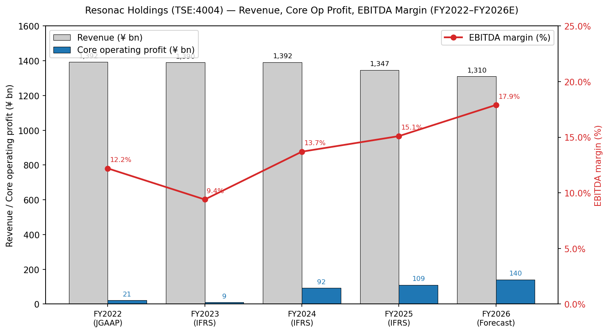

# 力森诺科控股株式会社 (Resonac Holdings Corporation, TSE: 4004) — 公司研究报告

**截止日期:** 2026-05-26
**作者:** 股票研究 — 日本半导体材料覆盖 (野村「Greater China Semi 2026–30F Renaissance」, 2026-05-21 配套报告)
**上市信息:** 东京证券交易所 (Prime Market) 主板,代码 **4004**;美国 OTC ADR 等价代码 SWDHF / SWDHY ([Resonac Stock Information](https://www.resonac.com/ir/stock/index.html); [Stockanalysis TYO:4004 statistics](https://stockanalysis.com/quote/tyo/4004/statistics/))。

> **业绩更新 — FY2026 全年指引维持,1H 上调于 2026-05-13。** 管理层维持 FY2026 (1–12 月) 全年目标:营业收入 **¥1,310 亿日元**、核心营业利润 **¥140.0 亿日元 (同比 +28%)**、归母净利润 **¥77.0 亿日元 (同比 +165%)**;同时将 1H 核心营业利润指引由年初的 ¥53.0 亿日元上调至 **¥74.0 亿日元**,主因 AI 相关后道材料 (back-end materials) 加速放量,以及石墨子板块由亏转盈。隐含的 AI 相关材料营收 FY2026 预计 **同比增长 >50%**。来源: [Resonac Q1 2026 Tanshin, p.3 — 业绩预测修正, 2026-05-13](https://www.resonac.com/sites/default/files/2026-05/e_tanshin2026q1.pdf); [Resonac FY2025 决算说明会资料, p.18–20, 2026-02-13](https://www.resonac.com/sites/default/files/2026-02/e_shiryo2025q4.pdf)。

---

## 目录

1. 公司概览
2. 公司历史
3. 管理团队
4. 产品与服务
5. 客户与上市策略
6. 行业概览
7. 竞争格局
8. 市场机会
9. 风险评估
10. 参考资料

---

## 1. 公司概览

力森诺科控股 (Resonac Holdings Corporation) 是一家总部位于东京的多元化功能性化学品 (functional chemicals) 综合企业,由 **2023 年 1 月 1 日昭和电工株式会社 (Showa Denko K.K.) 与昭和电工材料株式会社 (Showa Denko Materials,即原日立化成 Hitachi Chemical) 的法定合并**而诞生。合并后实体跨越两个战略支柱:一是主要继承自日立化成的成长引擎——**半导体与电子材料业务**;二是继承自昭和电工的成熟、现金牛型的**石化 + 基础化学品 + 石墨电极**业务组合。控股公司 / 经营公司架构——Resonac Holdings (上市母公司,代码 4004) 与 Resonac Corporation (经营性制造子公司)——以及「以化学之力改变社会」("Change society through the power of chemistry") 的企业宗旨均在更名时确立 ([Resonac Corporate Profile](https://www.resonac.com/corporate/outline.html); [Resonac, "Showa Denko K.K. & Showa Denko Materials Corporation Rebrand as Resonac", 2023-01](https://www.specialchem.com/polymer-additives/news/showa-denko-rebranding-resonac-000229747))。

力森诺科销售的是工业输入品而非成品,因此属于与信越化学 (Shin-Etsu Chemical)、住友化学 (Sumitomo Chemical)、三菱化学 (Mitsubishi Chemical) 和 JSR 同一阵营的日本 B2B 特种化学品 (B2B specialty chemicals) 发行人。其损益表的几何结构由**一个分部承担几乎全部利润贡献**这一事实主导:FY2025 半导体与电子材料分部贡献 **¥506.3 亿日元营业收入 (集团销售额 37.6%) 与 ¥108.4 亿日元核心营业利润 (集团核心营业利润的 99%)**,分部 EBITDA 利润率达 **30.2%**;而其他五个分部合计贡献 ¥840.8 亿日元营业收入,净核心营业利润仅 ¥0.7 亿日元 ([Resonac FY2025 Tanshin, p.4–7, 2026-02-13](https://www.resonac.com/sites/default/files/2026-02/e_tanshin2025q4.pdf); [FY2025 决算说明会资料, p.8](https://www.resonac.com/sites/default/files/2026-02/e_shiryo2025q4.pdf))。这种利润贡献的不对称性是关于本公司最重要的结构性事实:任何关于力森诺科的投资逻辑,实质上都是关于半导体与电子材料分部的投资逻辑,叠加去杠杆期间其他业务的拖累 (或上行空间)。

*来源: 2022 年数据来自旧 JGAAP 准则下的 [Resonac, "Looking Back at the Past Five Years", FY2025 决算说明会资料 p.26](https://www.resonac.com/sites/default/files/2026-02/e_shiryo2025q4.pdf);2023–2025 年实际值及 2026 年预测来自 IFRS 准则下的 [Resonac FY2025 Tanshin, pp.1–2](https://www.resonac.com/sites/default/files/2026-02/e_tanshin2025q4.pdf) 及 FY2025 决算说明会资料 pp.4、18、26。EBITDA 利润率 = (核心营业利润 + 折旧摊销) / 营业收入,按公司标准口径定义。*

从地理分布看,力森诺科**生产以日本为重心,但营收日益跨境**:制造布局覆盖日本 (约占员工总数 70%)、大中华区与中国台湾 (CMP 抛光液、光刻胶辅料、封装材料)、新加坡 (Resonac Specialty Gas)、德国 (石墨电极),以及美国 (CDMO 等价的特种化学品,加上位于硅谷新设立的美日封装联盟中心) ([Resonac, "Resonac to Establish Semiconductor R&D Center in Silicon Valley, USA", 2024](https://www.blackridgeresearch.com/news-releases/resonac-plans-to-build-a-semiconductor-back-end-process-center-in-us); [Resonac Specialty Gas Taiwan](https://www.rsgt.resonac.com/index.php?lang=en))。截至 **2025-12-31**,合并员工数为 **21,525 人**,总资产 **¥2,106.7 亿日元**,归母权益 **¥698.9 亿日元**,权益资产比 **33.2%** ([Resonac FY2025 Tanshin, pp.1, 3](https://www.resonac.com/sites/default/files/2026-02/e_tanshin2025q4.pdf); [Resonac Corporate Profile, employee count](https://www.resonac.com/corporate/outline.html))。

客户特许经营覆盖全球四大领先逻辑 / 存储 / OSAT 生态:台积电 (TSMC) 于 **2025 年 12 月 1 日授予力森诺科「2025 TSMC 优秀业绩奖——卓越技术开发与生产支持」("2025 TSMC Excellent Performance Award – Excellent Technology Development and Production Support")**,明确表彰其在先进封装 (advanced packaging) 材料与高纯气体本地化生产方面的贡献;此外客户还包括三星、SK 海力士、美光、铠侠以及 ASE/Amkor/JCET/Powertech 等后道封测厂 ([Resonac, "Resonac Receives 2025 TSMC Excellent Performance Award", 2025-12-01](https://www.resonac.com/news/2025/12/01/3669.html); [TSMC, "2025 Supply Chain Management Forum Presents Awards to Outstanding Suppliers"](https://pr.tsmc.com/english/news/3274))。台积电点名加上稳定的 AI 相关后道营收轨迹 (公司自身披露:AI 相关在后道半导体营收中的占比由 FY2024 的 ~10% 升至 FY2025 的 ~20%,FY2026 指引为同比增长 >50%),使力森诺科成为本团队覆盖范围内**最直接、最纯粹的日股 AI 材料标的** ([Resonac FY2025 决算说明会资料, p.10, 20](https://www.resonac.com/sites/default/files/2026-02/e_shiryo2025q4.pdf))。

### 估值快照 (必备)

截至 2026 年 5 月下旬,力森诺科股价约 **¥18,010 / 股**,对应市值约 **¥3.1 万亿日元** (精确数字随东京市场波动:2026-05-08 时点市值为 ¥2.9 万亿日元,而 5 月 13 日 1H 指引上调后,5 月 23 日时点已显著上行) ([Stockanalysis TYO:4004 市值快照](https://stockanalysis.com/quote/tyo/4004/market-cap/); [Yahoo Finance JP 4004.T 行情](https://finance.yahoo.com/quote/4004.T/); [Investing.com 4004.T 行情](https://www.investing.com/equities/showa-denko-k.k.))。基于 TTM (滚动十二个月) FY2025 报告数字——营业收入 ¥1,347 亿日元、EPS ¥160.49、每股权益 ¥3,861.43——隐含 **TTM P/E ~112×、TTM P/S ~2.3×、P/B ~4.7×**;表观 TTM P/E 被 ¥62.5 亿日元的非经常性损益所人为推高 (主因 Fiamm Energy Technology 出售与汽车塑料件业务退出相关的减值损失) ([Resonac FY2025 Tanshin, p.1; FY2025 决算说明会资料, p.15](https://www.resonac.com/sites/default/files/2026-02/e_tanshin2025q4.pdf))。

更清晰的估值视角是 **FY2026 指引基础上的前瞻市盈率**:按公司自身 FY2026E EPS 指引 **¥425.45**,隐含**前瞻 P/E 约 42×**;按 **2025 调整后 EPS ¥506** (该指标剥离非经常性减值,公司在公布报告 EPS 时一并发布) 计算,**TTM 调整后 P/E 约 35.6×** ([Resonac FY2025 决算说明会资料, p.18, 26](https://www.resonac.com/sites/default/files/2026-02/e_shiryo2025q4.pdf))。EV/EBITDA 基于 FY2025 EBITDA **¥203.4 亿日元** 加净负债 **¥707.5 亿日元** (有息负债 ¥969.5 亿日元 减 现金 ¥262.0 亿日元),企业价值 EV ≈ ¥3.8 万亿日元,**EV/EBITDA 约 18.6×**;若按 FY2026E EBITDA **¥234.5 亿日元** 计算则降至 **约 16×** ([Resonac FY2025 Tanshin, p.3 — 资产负债表; 决算说明会资料 pp.16, 23](https://www.resonac.com/sites/default/files/2026-02/e_tanshin2025q4.pdf))。

横向对比看,**信越化学 (TSE:4063)** 作为日本最大的特种化学品标的,当前约 **18× TTM P/E、约 3× 营收** ([Shin-Etsu Chemical IR](https://www.shinetsu.co.jp/en/ir/));**住友化学 (TSE:4005)** 滚动盈利接近盈亏平衡 (前期大幅亏损后的恢复期);**东京应化工业 (TSE:4186)** 作为光刻胶 (photoresist) 纯标的约 **19× TTM P/E、约 2.5× 营收** ([Tokyo Ohka Kogyo IR](https://www.tok.co.jp/eng/ir));**JSR Corporation** 退市时交易价对应约 2.25× 营收 ([JIC Capital, Tender Offer Results, 2024-04-17](https://www.jiccapital.co.jp/en/news/.assets/E_20240417_JIC_JICC_PressRelease.pdf))。力森诺科的前瞻 P/E ~42× **高于日本特种化学品同业中位数**,但大体与——甚至略低于——野村在同一份大中华半导体行业报告中对中砂 (1560 TT) 与安集 (688019 CH) 所用的 **40× FY2027 P/E 基准**相当 ([Nomura "Greater China Semi: A guide to Semi renaissance in 2026~30F", 2026-05-21, p.15–17](https://www.nomuraconnects.com/asia-tech))。4004 自身近三年 P/E 区间约 **8× 至 250×+** (高位印记在 FY2022/FY2023 亏损低谷期,低位则反映日立化成并购协同效应充分释放的正常年份)。

*分析师观点:* 在 **TTM 报告**数字下估值偏高,但若 AI 相关后道半导体材料继续按指引同比增长 >50%,则在 **FY2026E/FY2027E 数字基础上**显得合理——甚至可能便宜。表观估值扩张的成因不复杂:(a) 半导体与电子材料分部正被重新定价为 AI / 先进封装的结构性受益者 (参见野村框架与 ["半导体材料 sector overview"](../../sector/半导体材料.md) 以及 2026-05-21 锚定报告 Fig. 35–44);(b) 计划于 **2026 年内完成的 Crasus Chemical (石化) 部分分拆**将从合并 EV 中剔除低估值拖累 ([Resonac FY2025 决算说明会资料, p.29 — Crasus Chemical 分拆进展](https://www.resonac.com/sites/default/files/2026-02/e_shiryo2025q4.pdf));(c) 去杠杆按节奏推进——调整后净负债 / 权益比 (Net D/E) 为 **0.83×** (已低于 **<1.0× 目标**),净负债 / EBITDA 为 **3.5×**,到 FY2026E 将降向 **<3.0× 目标** ([FY2025 决算说明会资料, p.26 — 主要财务指标](https://www.resonac.com/sites/default/files/2026-02/e_shiryo2025q4.pdf))。若 AI 周期不及预期,估值风险确实存在,详见第 9 章。
