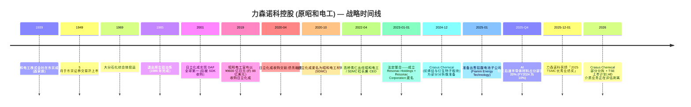
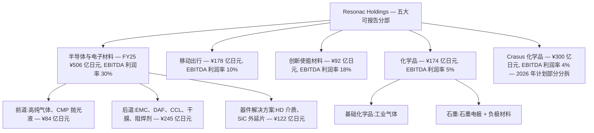
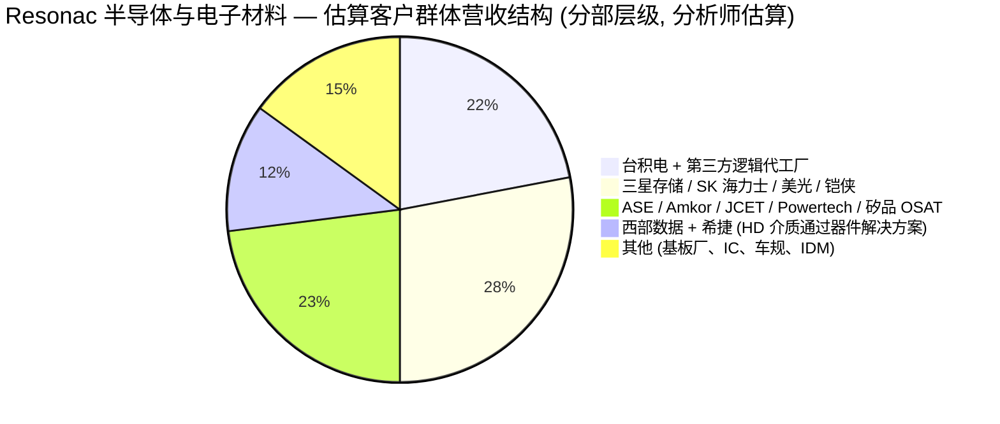

# 力森诺科控股株式会社 (Resonac Holdings Corporation, TSE: 4004) — 公司研究报告

**截止日期:** 2026-05-26
**作者:** 股票研究 — 日本半导体材料覆盖 (野村「Greater China Semi 2026–30F Renaissance」, 2026-05-21 配套报告)
**上市信息:** 东京证券交易所 (Prime Market) 主板,代码 **4004**;美国 OTC ADR 等价代码 SWDHF / SWDHY ([Resonac Stock Information](https://www.resonac.com/ir/stock/index.html); [Stockanalysis TYO:4004 statistics](https://stockanalysis.com/quote/tyo/4004/statistics/))。

> **业绩更新 — FY2026 全年指引维持,1H 上调于 2026-05-13。** 管理层维持 FY2026 (1–12 月) 全年目标:营业收入 **¥1,310 亿日元**、核心营业利润 **¥140.0 亿日元 (同比 +28%)**、归母净利润 **¥77.0 亿日元 (同比 +165%)**;同时将 1H 核心营业利润指引由年初的 ¥53.0 亿日元上调至 **¥74.0 亿日元**,主因 AI 相关后道材料 (back-end materials) 加速放量,以及石墨子板块由亏转盈。隐含的 AI 相关材料营收 FY2026 预计 **同比增长 >50%**。来源: [Resonac Q1 2026 Tanshin, p.3 — 业绩预测修正, 2026-05-13](https://www.resonac.com/sites/default/files/2026-05/e_tanshin2026q1.pdf); [Resonac FY2025 决算说明会资料, p.18–20, 2026-02-13](https://www.resonac.com/sites/default/files/2026-02/e_shiryo2025q4.pdf)。

---

## 目录

1. 公司概览
2. 公司历史
3. 管理团队
4. 产品与服务
5. 客户与上市策略
6. 行业概览
7. 竞争格局
8. 市场机会
9. 风险评估
10. 参考资料

---

## 1. 公司概览

力森诺科控股 (Resonac Holdings Corporation) 是一家总部位于东京的多元化功能性化学品 (functional chemicals) 综合企业,由 **2023 年 1 月 1 日昭和电工株式会社 (Showa Denko K.K.) 与昭和电工材料株式会社 (Showa Denko Materials,即原日立化成 Hitachi Chemical) 的法定合并**而诞生。合并后实体跨越两个战略支柱:一是主要继承自日立化成的成长引擎——**半导体与电子材料业务**;二是继承自昭和电工的成熟、现金牛型的**石化 + 基础化学品 + 石墨电极**业务组合。控股公司 / 经营公司架构——Resonac Holdings (上市母公司,代码 4004) 与 Resonac Corporation (经营性制造子公司)——以及「以化学之力改变社会」("Change society through the power of chemistry") 的企业宗旨均在更名时确立 ([Resonac Corporate Profile](https://www.resonac.com/corporate/outline.html); [Resonac, "Showa Denko K.K. & Showa Denko Materials Corporation Rebrand as Resonac", 2023-01](https://www.specialchem.com/polymer-additives/news/showa-denko-rebranding-resonac-000229747))。

力森诺科销售的是工业输入品而非成品,因此属于与信越化学 (Shin-Etsu Chemical)、住友化学 (Sumitomo Chemical)、三菱化学 (Mitsubishi Chemical) 和 JSR 同一阵营的日本 B2B 特种化学品 (B2B specialty chemicals) 发行人。其损益表的几何结构由**一个分部承担几乎全部利润贡献**这一事实主导:FY2025 半导体与电子材料分部贡献 **¥506.3 亿日元营业收入 (集团销售额 37.6%) 与 ¥108.4 亿日元核心营业利润 (集团核心营业利润的 99%)**,分部 EBITDA 利润率达 **30.2%**;而其他五个分部合计贡献 ¥840.8 亿日元营业收入,净核心营业利润仅 ¥0.7 亿日元 ([Resonac FY2025 Tanshin, p.4–7, 2026-02-13](https://www.resonac.com/sites/default/files/2026-02/e_tanshin2025q4.pdf); [FY2025 决算说明会资料, p.8](https://www.resonac.com/sites/default/files/2026-02/e_shiryo2025q4.pdf))。这种利润贡献的不对称性是关于本公司最重要的结构性事实:任何关于力森诺科的投资逻辑,实质上都是关于半导体与电子材料分部的投资逻辑,叠加去杠杆期间其他业务的拖累 (或上行空间)。

*来源: 2022 年数据来自旧 JGAAP 准则下的 [Resonac, "Looking Back at the Past Five Years", FY2025 决算说明会资料 p.26](https://www.resonac.com/sites/default/files/2026-02/e_shiryo2025q4.pdf);2023–2025 年实际值及 2026 年预测来自 IFRS 准则下的 [Resonac FY2025 Tanshin, pp.1–2](https://www.resonac.com/sites/default/files/2026-02/e_tanshin2025q4.pdf) 及 FY2025 决算说明会资料 pp.4、18、26。EBITDA 利润率 = (核心营业利润 + 折旧摊销) / 营业收入,按公司标准口径定义。*

从地理分布看,力森诺科**生产以日本为重心,但营收日益跨境**:制造布局覆盖日本 (约占员工总数 70%)、大中华区与中国台湾 (CMP 抛光液、光刻胶辅料、封装材料)、新加坡 (Resonac Specialty Gas)、德国 (石墨电极),以及美国 (CDMO 等价的特种化学品,加上位于硅谷新设立的美日封装联盟中心) ([Resonac, "Resonac to Establish Semiconductor R&D Center in Silicon Valley, USA", 2024](https://www.blackridgeresearch.com/news-releases/resonac-plans-to-build-a-semiconductor-back-end-process-center-in-us); [Resonac Specialty Gas Taiwan](https://www.rsgt.resonac.com/index.php?lang=en))。截至 **2025-12-31**,合并员工数为 **21,525 人**,总资产 **¥2,106.7 亿日元**,归母权益 **¥698.9 亿日元**,权益资产比 **33.2%** ([Resonac FY2025 Tanshin, pp.1, 3](https://www.resonac.com/sites/default/files/2026-02/e_tanshin2025q4.pdf); [Resonac Corporate Profile, employee count](https://www.resonac.com/corporate/outline.html))。

客户特许经营覆盖全球四大领先逻辑 / 存储 / OSAT 生态:台积电 (TSMC) 于 **2025 年 12 月 1 日授予力森诺科「2025 TSMC 优秀业绩奖——卓越技术开发与生产支持」("2025 TSMC Excellent Performance Award – Excellent Technology Development and Production Support")**,明确表彰其在先进封装 (advanced packaging) 材料与高纯气体本地化生产方面的贡献;此外客户还包括三星、SK 海力士、美光、铠侠以及 ASE/Amkor/JCET/Powertech 等后道封测厂 ([Resonac, "Resonac Receives 2025 TSMC Excellent Performance Award", 2025-12-01](https://www.resonac.com/news/2025/12/01/3669.html); [TSMC, "2025 Supply Chain Management Forum Presents Awards to Outstanding Suppliers"](https://pr.tsmc.com/english/news/3274))。台积电点名加上稳定的 AI 相关后道营收轨迹 (公司自身披露:AI 相关在后道半导体营收中的占比由 FY2024 的 ~10% 升至 FY2025 的 ~20%,FY2026 指引为同比增长 >50%),使力森诺科成为本团队覆盖范围内**最直接、最纯粹的日股 AI 材料标的** ([Resonac FY2025 决算说明会资料, p.10, 20](https://www.resonac.com/sites/default/files/2026-02/e_shiryo2025q4.pdf))。

### 估值快照 (必备)

截至 2026 年 5 月下旬,力森诺科股价约 **¥18,010 / 股**,对应市值约 **¥3.1 万亿日元** (精确数字随东京市场波动:2026-05-08 时点市值为 ¥2.9 万亿日元,而 5 月 13 日 1H 指引上调后,5 月 23 日时点已显著上行) ([Stockanalysis TYO:4004 市值快照](https://stockanalysis.com/quote/tyo/4004/market-cap/); [Yahoo Finance JP 4004.T 行情](https://finance.yahoo.com/quote/4004.T/); [Investing.com 4004.T 行情](https://www.investing.com/equities/showa-denko-k.k.))。基于 TTM (滚动十二个月) FY2025 报告数字——营业收入 ¥1,347 亿日元、EPS ¥160.49、每股权益 ¥3,861.43——隐含 **TTM P/E ~112×、TTM P/S ~2.3×、P/B ~4.7×**;表观 TTM P/E 被 ¥62.5 亿日元的非经常性损益所人为推高 (主因 Fiamm Energy Technology 出售与汽车塑料件业务退出相关的减值损失) ([Resonac FY2025 Tanshin, p.1; FY2025 决算说明会资料, p.15](https://www.resonac.com/sites/default/files/2026-02/e_tanshin2025q4.pdf))。

更清晰的估值视角是 **FY2026 指引基础上的前瞻市盈率**:按公司自身 FY2026E EPS 指引 **¥425.45**,隐含**前瞻 P/E 约 42×**;按 **2025 调整后 EPS ¥506** (该指标剥离非经常性减值,公司在公布报告 EPS 时一并发布) 计算,**TTM 调整后 P/E 约 35.6×** ([Resonac FY2025 决算说明会资料, p.18, 26](https://www.resonac.com/sites/default/files/2026-02/e_shiryo2025q4.pdf))。EV/EBITDA 基于 FY2025 EBITDA **¥203.4 亿日元** 加净负债 **¥707.5 亿日元** (有息负债 ¥969.5 亿日元 减 现金 ¥262.0 亿日元),企业价值 EV ≈ ¥3.8 万亿日元,**EV/EBITDA 约 18.6×**;若按 FY2026E EBITDA **¥234.5 亿日元** 计算则降至 **约 16×** ([Resonac FY2025 Tanshin, p.3 — 资产负债表; 决算说明会资料 pp.16, 23](https://www.resonac.com/sites/default/files/2026-02/e_tanshin2025q4.pdf))。

横向对比看,**信越化学 (TSE:4063)** 作为日本最大的特种化学品标的,当前约 **18× TTM P/E、约 3× 营收** ([Shin-Etsu Chemical IR](https://www.shinetsu.co.jp/en/ir/));**住友化学 (TSE:4005)** 滚动盈利接近盈亏平衡 (前期大幅亏损后的恢复期);**东京应化工业 (TSE:4186)** 作为光刻胶 (photoresist) 纯标的约 **19× TTM P/E、约 2.5× 营收** ([Tokyo Ohka Kogyo IR](https://www.tok.co.jp/eng/ir));**JSR Corporation** 退市时交易价对应约 2.25× 营收 ([JIC Capital, Tender Offer Results, 2024-04-17](https://www.jiccapital.co.jp/en/news/.assets/E_20240417_JIC_JICC_PressRelease.pdf))。力森诺科的前瞻 P/E ~42× **高于日本特种化学品同业中位数**,但大体与——甚至略低于——野村在同一份大中华半导体行业报告中对中砂 (1560 TT) 与安集 (688019 CH) 所用的 **40× FY2027 P/E 基准**相当 ([Nomura "Greater China Semi: A guide to Semi renaissance in 2026~30F", 2026-05-21, p.15–17](https://www.nomuraconnects.com/asia-tech))。4004 自身近三年 P/E 区间约 **8× 至 250×+** (高位印记在 FY2022/FY2023 亏损低谷期,低位则反映日立化成并购协同效应充分释放的正常年份)。

*分析师观点:* 在 **TTM 报告**数字下估值偏高,但若 AI 相关后道半导体材料继续按指引同比增长 >50%,则在 **FY2026E/FY2027E 数字基础上**显得合理——甚至可能便宜。表观估值扩张的成因不复杂:(a) 半导体与电子材料分部正被重新定价为 AI / 先进封装的结构性受益者 (参见野村框架与 ["半导体材料 sector overview"](../../sector/半导体材料.md) 以及 2026-05-21 锚定报告 Fig. 35–44);(b) 计划于 **2026 年内完成的 Crasus Chemical (石化) 部分分拆**将从合并 EV 中剔除低估值拖累 ([Resonac FY2025 决算说明会资料, p.29 — Crasus Chemical 分拆进展](https://www.resonac.com/sites/default/files/2026-02/e_shiryo2025q4.pdf));(c) 去杠杆按节奏推进——调整后净负债 / 权益比 (Net D/E) 为 **0.83×** (已低于 **<1.0× 目标**),净负债 / EBITDA 为 **3.5×**,到 FY2026E 将降向 **<3.0× 目标** ([FY2025 决算说明会资料, p.26 — 主要财务指标](https://www.resonac.com/sites/default/files/2026-02/e_shiryo2025q4.pdf))。若 AI 周期不及预期,估值风险确实存在,详见第 9 章。

## 2. 公司历史

力森诺科的企业身份可追溯至 **1939 年 6 月**,当时**昭和电工株式会社 (昭和電工株式会社, Showa Denko K.K.)** 在东京由日本电气工业 (Nihon Electrical Industries,森家族经营的硫酸铵化肥企业) 与昭和肥料 (Showa Fertilizers) 合并而成,两家公司均由实业家**森矗昶 (Nobuteru Mori)** 创立 ([Wikipedia, "Resonac" (history)](https://en.wikipedia.org/wiki/Resonac); [Resonac Corporate Profile](https://www.resonac.com/corporate/outline.html))。「昭和电工」名号延续了 84 年,贯穿三个截然不同的工业时代:战后复兴 (基础化学品、氨气、加氢工业)、1960–1980 年代的石化与铝冶炼建设期 (1969 年投运的大分炼油 / 石化综合体至今仍是公司最大的化学生产基地),以及 1990 年代以来向电子与特种材料的转型。公司于 **1949 年 5 月在东京证券交易所上市**,迄今已是 76 年的 TSE 持续发行人 ([Wikipedia, "Resonac"](https://en.wikipedia.org/wiki/Resonac))。

现代时期的关键战略一手是 **2019 年 12 月宣布、2020 年完成、以 ¥9600 亿日元 (约 88–89 亿美元) 从日立有限公司收购日立化成 (Hitachi Chemical Company)**。规模较小的买方昭和电工 (FY2018 营收 ¥1.0 万亿日元 vs 日立化成 FY3/2019 营收 ¥6960 亿日元) 在竞拍中胜出,其他参与方包括 Bain Capital、凯雷集团与日东电工 (Nitto Denko) ([C&EN, "Showa Denko to acquire Hitachi Chemical", 2020-01](https://cen.acs.org/business/mergers-&-acquisitions/Showa-Denko-acquire-Hitachi-Chemical/98/i1); [MarketScreener, "Japan's Hitachi nears deal to sell chemical unit to Showa Denko"](https://www.marketscreener.com/quote/stock/RESONAC-HOLDING-CORPORATI-6491222/news/Showa-Denko-K-K-Japan-s-Hitachi-nears-deal-to-sell-chemical-unit-to-Showa-Denko-Nikkei-29639742/))。该收购几乎完全由债务融资——交易后有息负债存量峰值超过 **¥1.4 万亿日元**,这是力森诺科去杠杆轨迹 (净负债 / EBITDA:FY2023 7.9× → FY2025 3.5× → FY2026E 2.9×) 始终是卖方分析师与评级机构关注重点的核心原因 ([Resonac FY2025 决算说明会资料, p.26 — 主要财务指标](https://www.resonac.com/sites/default/files/2026-02/e_shiryo2025q4.pdf); [日本格付研究所 (Japan Credit Rating Agency), 2024 年 7 月 29 日评级行动](https://www.jcr.co.jp/en/))。日立化成于 **2020 年 10 月更名为昭和电工材料株式会社 (Showa Denko Materials,简称 SDMC)**,作为昭和电工母公司的全资子公司运营了 27 个月 ([Showa Denko 2020 年 10 月更名公告](https://www.specialchem.com/polymer-additives/news/showa-denko-rebranding-resonac-000229747))。

**2023 年更名为「Resonac」**被管理层定位为「第二次创业」,而非简单的企业形象焕新。自 **2023 年 1 月 1 日**起,昭和电工株式会社与昭和电工材料合并为两个实体——上市母公司 Resonac Holdings Corporation (保留 TSE 代码 4004) 与经营公司 Resonac Corporation (整合两家原有公司的实体业务),并启用「Resonac」品牌名。该名称取自合成词:「RESONate」(以化学产业回响社会需求的愿望) + 「C」代表 chemistry。社长兼 CEO 高桥秀仁向员工与外部利益相关方表示:「力森诺科的诞生是我们的第二次创业。我们将通过培养能够自主、创造性地采取积极行动的人才来改革集团」("the birth of Resonac is its second foundation. We will reform the Group by raising talent who can take positive actions autonomously and creatively") ([Resonac, "Resonac Aims to be a Leading Functional Chemical Manufacturer by Raising Reformers", 2023-01-04](https://www.resonac.com/news/2023/01/04/2285.html); [SpecialChem, "Showa Denko Rebrands as Resonac"](https://www.specialchem.com/adhesives/news/showa-denko-rebrands-000229738))。这次更名绝非表面文章:它伴随着投资组合重组计划,迄今已产生两项重大战略动作 (**Crasus Chemical 石化分拆**与 **Fiamm Energy Technology 出售**),并在准备第三项 (**HD 介质业务剥离**评估中)。

**战略转向 #1 — 退出石化。** **2024 年 9 月 26 日**,管理层宣布将原昭和电工烯烃与衍生物子板块全部业务重组为一家独立的全资子公司,命名为 **Crasus Chemical Co., Ltd.**,拥有独立品牌与管理团队,自 2025 年 1 月 1 日起运作,为 2026 年的彻底分拆与 TSE 上市做准备 ([Resonac, "Plans Spin-Off of Petrochemical Unit into New Entity Crasus Chemical"](https://www.marketscreener.com/quote/stock/RESONAC-HOLDINGS-CORPORAT-6491222/news/Resonac-Plans-Spin-Off-of-Petrochemical-Unit-into-New-Entity-Crasus-Chemical-47449928/); [C&EN, "Resonac to spin off petrochemical arm"](https://cen.acs.org/business/petrochemicals/Resonac-spin-off-petrochemical-arm/102/i5))。FY2025 业绩发布会公布的具体机制是**按比例向 Resonac 股东分配股份的部分分拆**,完成后 Resonac 将保留 Crasus Chemical **不到 20%** 的股权,剩余股份既不构成合并子公司也不构成权益法关联企业——结构上属于「雅虎日本 / 软银」式分立,而非内部分拆 ([Resonac FY2025 决算说明会资料, p.29 — Crasus Chemical 分拆进展](https://www.resonac.com/sites/default/files/2026-02/e_shiryo2025q4.pdf))。Crasus Chemical 子板块 FY2025 营收 ¥300.3 亿日元、核心营业利润仅 ¥4.7 亿日元——EBITDA 利润率 **3.5%,远低于合并集团 15.1%**——剔除后即便绝对 EBITDA 仅小幅下降,合并集团 EBITDA 利润率仍可显著提升。*分析师观点:* 这恰恰是合并估值所需的「低估值拖累」手术;以完全剥离后基础计算,FY2026E 核心营业利润 (剔除 Crasus 后) 为 ¥133 亿日元,**EBITDA 利润率 21.6%**——发行人现代史上的最高水平 ([FY2025 决算说明会资料, p.18 — 2026 合并预测摘要,剔除 Crasus](https://www.resonac.com/sites/default/files/2026-02/e_shiryo2025q4.pdf))。

**战略转向 #2 — SDK 铝业 / 铅酸电池剥离。** 力森诺科于 2025 年出售了**铅酸电池业务 (Fiamm Energy Technology S.p.A.,意大利)**,并将于 **2026 年 Q2 完成日本与泰国的汽车塑料件业务退出** ([Resonac FY2025 Tanshin, p.5 — 非经常性项目; FY2025 决算说明会资料, p.20 — Mobility 2026 展望](https://www.resonac.com/sites/default/files/2026-02/e_tanshin2025q4.pdf))。这些剥离动作导致 FY2025 出现 **¥510 亿日元的减值损失**,使报告口径营业利润降至 ¥46.7 亿日元 (同比 –47.6%)、报告 EPS 降至 ¥160.49 (同比 –60.5%),尽管核心营业利润同比增长 18.4% 至 ¥109.1 亿日元 ([FY2025 Tanshin, p.1; 决算说明会资料, p.15 — 非经常性项目分解](https://www.resonac.com/sites/default/files/2026-02/e_tanshin2025q4.pdf))。2026 年预测假定非经常性项目仅 ¥350 亿日元 (相同剥离事项的账面残值清理加上退休福利计划修订),这是 FY2026 归母净利润同比 **+165%** 增长指引的最大单一驱动因素。

**战略转向 #3 — HD 介质业务评估。** 力森诺科是全球最大的独立铝基硬盘 (HDD) 介质供应商——其下游本质上是**双客户终端市场**:在 **2025-02-21 西部数据将其 NAND / 闪存业务分拆为 Sandisk Corporation 之后** ([Western Digital 8-K/A, "Completion of WD/Sandisk separation", 2025](https://www.sec.gov/Archives/edgar/data/0000106040/000010604025000012/wdc8-khardxspin.htm)),终端客户主要剩下西部数据 (Western Digital) 与希捷 (Seagate)。HD 介质 (HD media) 业务在半导体与电子材料分部下的器件解决方案 (Device Solutions) 子板块内报告,但结构上与前道 (front-end) / 后道 (back-end) 半导体材料截然不同。FY2024–FY2025 期间,超大规模数据中心对近线 HDD 的需求大幅上行 (公司明确表态:"HD media revenue increased due to the recovery of the demand for data centers" [FY2025 决算说明会资料, p.10](https://www.resonac.com/sites/default/files/2026-02/e_shiryo2025q4.pdf)),该业务目前是贡献者,但相对于 QLC NAND 而言 HDD 出货量的长期下行仍构成隐忧。管理层已表态将对 HD 介质进行投资组合评估,但截至本文撰写时尚未承诺剥离时间表。

以上三项战略动作累计的效果是,**力森诺科在 2026 年的形象远比 2018 年时的多元化昭和电工更接近一个聚焦的功能化学品 + 半导体材料平台**:石化将于年底前剥离出合并报表,铅酸电池与汽车塑料件已出售,HD 介质正在评估中,资本支出 (capex) 集中投向半导体与电子材料分部 (分配给半导体与电子材料的 capex 从 FY2024 的 ¥51.4 亿日元 → FY2025 的 ¥64.1 亿日元 → FY2026E 的 ¥83.7 亿日元,**两年累计 +63%**,而合并 capex 同期仅增长 43%) ([Resonac FY2025 决算说明会资料, p.35 — 分部 Capex](https://www.resonac.com/sites/default/files/2026-02/e_shiryo2025q4.pdf))。

## 3. 管理团队

**创始人说明。** 力森诺科作为一家企业实体并非以现代意义被「创立」——它脱胎于 2023 年两家既有 TSE 上市集团 (昭和电工株式会社与昭和电工材料,后者即更名前的日立化成) 的法定整合。昭和电工最初的创始人**森矗昶 (Nobuteru Mori, 森矗昶)** 于 1920–1930 年代创办了前身企业日本电气工业与昭和肥料;森家族数十年前即已退出经营。日立化成于 1962-10-10 由日立有限公司分拆而出,亦无创业意义上的个人创始人。因此本公司的相关「创业时刻」是 **CEO 高桥秀仁于 2022 年 1 月接掌原昭和电工、2023 年 1 月接掌力森诺科** 并主导更名——他的简历占据了本节按本报告技能规范分配的全部管理团队篇幅。

**高桥秀仁 (高橋 秀仁, Hidehito Takahashi) — Resonac Holdings Corporation 与 Resonac Corporation 代表董事、社长兼 CEO (2023 年 1 月至今)。** **1962 年 7 月 21 日**出生,高桥是一位职业经理人,其前 Resonac 经历对一位日本特种化学品 CEO 而言相当特殊:他在加入 Resonac 之前的大多数职位是在**在日本与亚洲运营的西方跨国公司**,而非日本本土化学品企业。这一职业背景明显塑造了 Resonac 在英文投资者沟通中的呈现方式 (公司以 IFRS 为主要会计准则、举办双语电话会议、与日文版同日发布英文版整合报告) ([Resonac Executive Profile, Hidehito Takahashi](https://www.resonac.com/corporate/exec/takahashi.html))。

高桥的职业生涯始于 **1986 年加入三菱银行 (现 MUFG 银行)** 担任公司银行业务岗位。2002 年他加入 **GE 日本控股公司**担任业务开发总经理 (General Manager, Business Development),并于 **2004 年晋升为 GE Sensing & Inspection Technologies 亚太总裁**——这是覆盖日本、中国、韩国与东南亚区域工业传感器与无损检测业务的损益负责岗位。**2008 年**他转任 **Momentive Performance Materials Japan Inc.** (从阿波罗收购 GE Plastics 后分拆出的硅酮 (silicones) 业务) **硅酮业务社长兼 CEO**——这是他化学品行业首个损益管理职位。**2013 年**他被任命为 **GKN Driveline Japan plc 社长兼 CEO**,负责 GKN 的日本汽车驱动系统业务——这是一个 Tier-1 汽车供应商角色,使他在丰田、本田与日产建立了客户关系 ([Resonac Executive Profile](https://www.resonac.com/corporate/exec/takahashi.html); 上引网络搜索摘要)。

高桥于 **2015 年作为高级公司研究员 (Senior Corporate Fellow) 加入昭和电工株式会社**,这是他在传统日本综合企业中的首个岗位。此后五年间他陆续晋升至公司高管与董事职位,包括**首席战略官 (CSO)**——他在该岗位上策划了 2020 年完成的日立化成收购战略。**2022 年 1 月**他被任命为 (原) 昭和电工社长兼 CEO,并在 **2023 年 1 月 1 日更名生效**时同时担任 Resonac Holdings 与 Resonac Corporation 的相同职位 ([Resonac Executive Profile](https://www.resonac.com/corporate/exec/takahashi.html); [Resonac, "New Year Message from Hidehito Takahashi, President and CEO", 2022-01-04](https://www.resonac.com/news/2022/01/04/1057.html))。截至本报告撰写时,他担任合并后 Resonac 实体 CEO 的任期接近 **3.5 年**。他不是创始人,不持有创始人规模的股权;其薪酬结构与持股按力森诺科 Yuho (有価証券報告書) 披露,处于受薪高管而非创始人 / 股东级别。

高桥所执行的战略命题——以及迄今的成绩单——可归纳为三条命题。**第一**,日立化成 / 昭和电工的合并应通过半导体材料 R&D 与销售层面的*运营协同效应*得到证明 (FY2025 实绩:半导体与电子材料分部核心营业利润 ¥108.4 亿日元,**同比 +47%**,EBITDA 利润率 30.2%——大体验证了协同效应命题)。**第二**,合并债务负担可通过投资组合简化实现去杠杆 (FY2025 实绩:净负债 / EBITDA 从 FY2023 的 7.9× 降至 FY2025 的 3.5×,FY2026E 指引为 2.9×——按节奏推进,可在现金流量表中验证)。**第三**,石化与大宗化学品业务可与高利润率半导体材料业务分离,且不破坏任何一方价值 (FY2025 实绩:Crasus Chemical 部分分拆已通过日本税务合规分拆要求、获得 TSE 上市批准、正等待公司治理审批执行——按公司自身披露的主要里程碑,2026 年完成在轨 [FY2025 决算说明会资料 p.29](https://www.resonac.com/sites/default/files/2026-02/e_shiryo2025q4.pdf))。三条命题在公开记分牌上目前均处于积极状态。

## 4. 产品与服务

本节锚定于力森诺科自身的产品分类法,数据来自 **Resonac Semi Backend Process 产品页**、**FY2025 决算说明会资料 (分部摘要 p.10–14)** 与 **2024 年可持续发展报告**——三者合计构成美国 10-K 「Item 1 Business」章节的功能替代。按照公司研究技能规范,引述力森诺科自身语言的段落直接在引文上方标注出处;关于分析师对市场份额 / 领先地位的判断则以 `*分析师观点:*` 明确标识,要么引用力森诺科自身的营销表述 (当公司确实主张某个数字时),要么保持不引证。

### 4.1 力森诺科分部 / 子板块产品矩阵

力森诺科披露五个经营分部。整个集团层面损益表由**半导体与电子材料**主导;下表展示 FY2025 实绩以及半导体与电子材料分部按 FY2025 决算说明会资料 p.10 披露的子板块明细。

| 分部 | 子板块 | FY2025 营收 (¥ 亿日元) | FY2025 核心营业利润 (¥ 亿日元) | EBITDA 利润率 |
|---|---|---:|---:|---:|
| **半导体与电子材料** | 前道半导体材料 *(高纯气体、CMP 抛光液)* | 83.6 | – | – |
|  | 后道半导体材料 *(EMC、DAF、覆铜板、感光干膜、感光阻焊剂)* | 245.0 | – | – |
|  | 器件解决方案 *(HD 介质、SiC 外延片)* | 122.4 | – | – |
|  | 其他 | 55.4 | – | – |
|  | **分部合计** | **506.3** | **108.4** | **30.2%** |
| **移动出行** | 塑料模制品、摩擦材料、粉末冶金、铝特殊部件 | 178.4 | 4.4 | 9.8% |
| **创新使能材料** | 功能性树脂、功能化学品、涂料材料、陶瓷 | 92.2 | 10.4 | 17.6% |
| **化学品** | 基础化学品 (工业气体)、石墨 (石墨电极 + 锂电池负极材料) | 174.4 | (5.5) | 5.4% |
| **Crasus Chemical** *(2026 年计划部分分拆)* | 烯烃及衍生物、有机化学品、合成树脂 | 300.3 | 4.7 | 3.5% |
| **其他 / 调整项** | 抵消、剥离相关账面残值 | 95.5 | (13.2) | (3.2%) |
| **集团合计** | — | **1,347.1** | **109.1** | **15.1%** |

*来源: [Resonac FY2025 决算说明会资料, p.8–14 — 营收、核心营业利润与 EBITDA 利润率:分部明细, 2026-02-13](https://www.resonac.com/sites/default/files/2026-02/e_shiryo2025q4.pdf); [Resonac FY2025 Tanshin, p.4–7 — 分部营收与核心营业利润](https://www.resonac.com/sites/default/files/2026-02/e_tanshin2025q4.pdf)。公开披露中未给出子板块核心营业利润分解,公司仅按子板块披露营收。*

*来源: 同上表。注意半导体与电子材料分部的 ¥108.4 亿日元核心营业利润实际上吸收了化学品 + 其他 / 调整项合计 ¥(7.7) 亿日元的亏损,才能产生集团核心营业利润 ¥109.1 亿日元。*

### 4.2 综合分析——产品组之间如何互动

力森诺科的产品组合构成一个**两层业务模式**。高速度、高利润率的一层是半导体与电子材料业务,它嵌入四大半导体制造工艺步骤中的三个:(i) **前道晶圆制造 (front-end)** (高纯电子特种气体 + CMP 抛光液 + 光刻胶辅料);(ii) **后道封装 (back-end)** (DAF + 环氧塑封料 + 覆铜板 + 感光干膜 + 感光阻焊剂);(iii) **后晶圆器件制造** (用于 HDD 的 HD 介质 + 用于功率器件的 SiC 外延片)。低速度、低利润率 (某些年份甚至亏损) 的一层是传统化学品 + Crasus 化学品 + 移动出行 + 创新使能材料 + 其他业务的组合——这些分部合计贡献约 62% 营收,但净核心营业利润贡献基本为零。计划于 2026 年内完成的 Crasus Chemical 部分分拆即是对最大单一低利润率板块的外科手术式切除;FY2026E 指引显示*剔除 Crasus 后*的集团 **EBITDA 利润率为 21.6%,而合并口径为 17.9%** ([FY2025 决算说明会资料, p.18](https://www.resonac.com/sites/default/files/2026-02/e_shiryo2025q4.pdf))。

力森诺科产品所服务的半导体制造工作流为:

**(晶圆) → CMP 抛光液 → 高纯气体 (刻蚀 / 清洗) → 光刻胶辅料 → (前道完成) → 切割胶带 → DAF 贴片膜 → 环氧塑封料封装 → 覆铜板基板 → 感光干膜 / 阻焊剂 → (后道完成) → (HDD 装配使用 HD 介质) 或 (功率器件装配使用 SiC 外延片)**

任何一颗 AI 加速器 (英伟达 H100/H200/B100、AMD Instinct MI300/MI325、博通 XPU、Marvell 定制 ASIC 等) 在离开 OSAT 前**至少会接触四类力森诺科产品**:高纯刻蚀气体 (前道)、CMP 抛光液 (前道)、用于 HBM 堆叠和芯粒-中介层 (chiplet-to-interposer) 粘接的 DAF (后道)、以及围绕封装外缘的 EMC 塑封料 (后道)。HBM 堆叠层数 (8-hi → 12-hi → 16-hi) 与每个加速器封装中的芯粒 (chiplet) 数提升使每颗 AI 加速器消耗的 Resonac 材料量增加——这正是管理层对 **FY2026 AI 相关后道营收同比增长 >50% 指引**的运营机制 ([Resonac FY2025 决算说明会资料, p.20 — 子板块展望](https://www.resonac.com/sites/default/files/2026-02/e_shiryo2025q4.pdf))。

### 4.3 后道半导体材料——AI/HBM 利润引擎 (¥245 亿日元营收, 同比 +17%)

这是力森诺科半导体与电子材料业务最大的子板块,也是与 AI 加速器和 HBM 出货量关联度最高的子板块。四大旗舰产品族:**贴片膜 / 芯片粘接膜 (die-attach film, DAF)**、**环氧塑封料 (epoxy mold compound, EMC)**、**覆铜板 (copper-clad laminate, CCL)** 与**感光干膜 / 阻焊剂**。合计构成 **FY2025 分部营收约 48%**,并在 FY2024–FY2026E 资本支出 (capex) 增量中占据多数份额。

#### 4.3.1 贴片膜 (DAF)——力森诺科最强势的单一产品

来自 Resonac 英文产品页对 **FH/HR 系列切割粘接膜 (DAF)** 的 10-K 等价表述为 ([Resonac, "Dicing Die Bonding Film FH/HR Series"](https://www.resonac.com/products/semi-backend-process/76/009.html)):

> "Resonac's die attach films (DAF) combine function of dicing tapes and die bonding films suitable for semiconductor wafer singulation and bonding process. … Resonac has marketed its DAF for more than 20 years and leads the world in production volume and sales."

该产品线包含具体型号:**FH-9011**、**HR-9004**、**HR-900-N50**、**HR-900-N45**、**HR-300-S34**、**FH-4013**、**HR-400-N45**、**FH-SC13** 与 **HR-5104**,根据目标应用,弹性模量在 25 °C 下覆盖 **600 MPa 至 8000 MPa** 区间 ([Resonac DAF 产品页](https://www.resonac.com/products/semi-backend-process/76/009.html))。Resonac 逐字列出的目标应用包括「3D NAND 与 DRAM 存储器件」、引线框架应用、**FOW (film over wire) 与 FOD (film over die)** 封装,以及 **SDBG (Stealth Dicing Before Grinding, 隐形切割先磨)** 工艺。

**中文释义 / 通俗解释:** DAF (贴片膜 / 芯片粘接膜) 是一种在后道封装过程中同时承担两项功能的薄聚合物薄膜:在晶圆单颗分离 (wafer singulation, 切割) 阶段作为**切割胶带 (dicing tape)** 使用 (锯片切穿硅晶圆并停在 DAF 上),随后作为**粘片胶 (die-bonding adhesive)** 将分离后的每颗芯片粘接到基板或在 3D 堆叠中粘接到另一颗芯片上。如果没有 DAF,粘片步骤将不得不依赖液体胶水点胶——而液体胶水对于 **HBM 堆叠所需的 <10 µm 粘接厚度**而言过于不精确、过于厚重。一颗 HBM4 12-hi 堆栈需要在 12 颗 DRAM 芯片加 1 颗逻辑底芯之间安插 11 层 DAF——每层界面 ≤ 5 µm 厚,任何空洞或颗粒都会造成良率损失。对于高端 AI 加速器,DAF 还会出现在底部 HBM 芯片与硅中介层之间 (**芯粒-中介层粘接**),以及在每个逻辑芯粒与中介层之间。粘接厚度的均匀性、降低热应力的低弹性模量与高粘接强度是 **HR-900-N50 / HR-900-N45 产品组合分化**的三大相互竞争的指标 (针对不同堆叠高度与芯片尺寸搭配不同的弹性模量 / 粘接性组合)。

*分析师观点:* DAF 是力森诺科 (继承自日立化成) 最可信地占据**全球销量与销售额领先地位**的产品,这一点由上面引用的 Resonac 自身营销表述明确支持。独立第三方市场分析将「古河电气、汉高黏合剂 (Henkel Adhesives)、LG 化学、力森诺科、日东电工、MacDermid Alpha、LINTEC」列为 DAF 主要供应商,多源共识将力森诺科全球销量份额定位为 >40% ([openPR, "Die Attach Film (DAF) for Semiconductor Packaging Market", 2026](https://www.openpr.com/news/4110099/die-attach-film-daf-for-semiconductor-packaging-market-set))。野村「Greater China Semi 2026–30F Renaissance」报告也在其 CMP 抛光液与后道材料供应商排名中明确提及「Resonac」 ([Nomura "Greater China Semi" anchor report, p.34–44, 2026-05-21](https://www.nomuraconnects.com/asia-tech) — 另见 ["半导体材料 sector overview"](../../sector/半导体材料.md) 本地笔记)。HBM4 需求是近期最主要的拐点:按 JEDEC 路线图,16-hi HBM4 堆栈相对 12-hi HBM3E 每颗 HBM cube 的 DAF 用量增加约 33%,英伟达 + AMD + 博通在 FY2026–FY2027 间针对使用 HBM4 的 AI 加速器的出货量按 OEM 披露持续放量。

#### 4.3.2 环氧塑封料 (EMC)——封装外缘的封装材料

Resonac 英文产品页对 **CEL 系列引线框架环氧塑封料**的 10-K 等价表述为 ([Resonac, "Epoxy Molding Compounds for Lead Frame"](https://www.resonac.com/products/semi-backend-process/76/011.html)):

> "Resonac's epoxy molding compounds seal and protect the areas around the chips of semiconductor packages assembled with various metal lead frames. … Excellent moisture and thermal shock resistance. … Excellent reflow crack resistance. … Resonac has established a supply system to globally provide these materials from five sites."

产品线包含具体型号 **CEL-9240 ZHF10HT3W**、**CEL-9240 HF10**、**CEL-8240 HF10**、**CEL-9200 HF10** 与 **CEL-9200 HF9**;旗舰型号 CEL-9240 ZHF10HT3W 的关键规格为**玻璃化温度 125 °C、导热系数 3 W/mK、弯曲模量 30 GPa**——其中提升的导热系数正是 AI 应用的关键指标,因为封装外缘的 EMC 必须将封装内部传导的热量耗散到散热片 ([Resonac EMC 产品页](https://www.resonac.com/products/semi-backend-process/76/011.html))。Resonac 列出的目标封装包括「DIP、SOP、TSOP、QFP、TQFP、LQFP、QFN 与 PLCC」——即每一种常规引线框架封装。对于有机基板封装 (用于 BGA / FCBGA 倒装芯片封装,高端 CPU/GPU 的典型格式),Resonac 出售独立的 **CEL 有机基板系列**;对于**倒装芯片底部填充 (flip-chip underfill)**,则有 **CEL-C 液体封装系列** ([Resonac, 后道工艺类目页](https://www.resonac.com/products/semi-backend-process))。

**中文释义 / 通俗解释:** EMC (环氧塑封料, epoxy mold compound) 是包裹每一颗常规半导体封装的硅芯片 + 引线框架 + 键合线的**「黑色塑料状」材料 (塑封料)**。化学成分为**环氧树脂 + 填料 (通常为二氧化硅) + 固化剂 + 阻燃剂 + 着色剂**,混合后压制成颗粒,随后在转移成型 (transfer molding) 步骤中加热并注入模具腔体环绕芯片。对于 AI / HBM,相关的子集是**高导热 (high-Tc) EMC** (CEL-9240 ZHF10HT3W 为 3 W/mK,而通用 EMC 约 0.7 W/mK) 与**低 CTE / 低翘曲 EMC**——后者用于薄封装,堆叠引起的回流期翘曲会造成粘接面开裂。CEL-9240 产品代码中的「ZHF」前缀代表无卤阻燃剂化学,在几乎所有车规与 AI 级应用中现已成为强制要求。

*分析师观点:* 力森诺科是与**住友电木 (Sumitomo Bakelite, TSE:4203)** 与 **长濑 ChemteX / Hysol (汉高)** 并列的全球三大 EMC 供应商之一,三家合计按体量占据 HBM 级 EMC 供应的大部分。Resonac 官网没有像 DAF 那样明确主张全球第一 (DAF 是明确主张) ——独立份额排名将住友电木在传统引线框架 EMC 体量上稍稍领先,但力森诺科在 AI/HBM 级高导热 EMC 上具有竞争力,这正是日立化成 R&D 遗产最强的领域 ([住友电木 2024 综合报告](https://www.sumibe.co.jp/english/ir/library/ir/index.html) 确认 EMC 业务但未公开份额数字)。台积电的供应商表彰明确称赞力森诺科「先进封装材料」("advanced packaging materials") 方面的贡献——用于高端 FCBGA 与 CoWoS 封装的 EMC 正是该奖项范围的主要项目之一 ([Resonac, "2025 TSMC Excellent Performance Award", 2025-12-01](https://www.resonac.com/news/2025/12/01/3669.html))。

#### 4.3.3 覆铜板 (CCL)——有机封装的基板

覆铜板 (CCL) 是 FCBGA 封装所用有机基板的基础层——也就是经过减成法光刻 (subtractive lithography) 形成基板金属走线的**玻纤增强环氧 + 铜箔**。力森诺科的 CCL 业务在后道半导体材料下报告,主要服务于 OSAT 客户 (ASE、Amkor、JCET、Powertech) 与基板制造商 (Unimicron、Nan Ya PCB、Ibiden、Shinko、Kinsus)。在 Q4-2025,管理层对**覆铜板与半固化片 (prepreg) 实施了价格调整** ([Resonac FY2025 决算说明会资料, p.41 — 新闻摘要](https://www.resonac.com/sites/default/files/2026-02/e_shiryo2025q4.pdf)),反映出投入成本持续向客户传导,以及 AI 基板周期的紧张。

**中文释义 / 通俗解释:** CCL (覆铜板, copper-clad laminate) 是 PCB 或 IC 基板最基础的结构输入——一片单面或双面层压铜箔的玻纤增强环氧 (FR-4 / BT 树脂 / ABF 同类) 片材。对于 AI/HBM 封装,位于 CoWoS / FCBGA 封装内部的 **ABF (Ajinomoto Build-up Film) 基板**要求 <25 µm 的介电层厚度与超低翘曲;力森诺科的 CCL 业务以逐层半固化片组件的形式喂入这个堆叠。AI 加速器出货量越高,每颗加速器封装所需的基板层数越多 (CoWoS-L 可达 14+ 层,而传统 FCBGA 仅 10–12 层),因此每颗加速器封装的 CCL 营收按 AI 复杂度呈超线性增长。

*分析师观点:* CCL 领域比 DAF 或 EMC 更分散;**三菱瓦斯化学 (BT 树脂先驱)**、**日立化成遗产 (现为 Resonac)**、**松下 (Megtron 系列)**、**斗山公司**与**生益科技 (SH PCB)** 是层堆叠中的主要供应商,没有单一玩家份额超过 25%。力森诺科的 CCL 业务通过日立化成并购得到加强,但仍是公司三大后道旗舰产品中营收最小的一项。

#### 4.3.4 感光干膜 + 感光阻焊剂

感光干膜 (photosensitive dry film, PDF / 干膜) 与阻焊剂是在 CCL 基板上图案化铜线路的**光刻掩膜材料**——一种层压在基板表面的可光成像聚合物,经掩膜曝光、显影,然后在铜刻蚀后被剥离。Resonac 的产品线同时服务于**常规 PCB 制造商**与 **IC 基板制造商**,后者为高利润率 / 低体量业务。

**中文释义 / 通俗解释:** 感光干膜 (光致干膜) 是定义铜线路在基板 / PCB 制造刻蚀步骤中的**光刻掩膜层**——化学上与光刻胶 (photoresist) 类似,但以预制薄膜形式层压而非以液体形式旋涂。阻焊剂 (绿色 / 黑色阻焊层) 则是**防止焊料流到非预定区域**的涂层,即赋予 PCB 着色外观的那一层。对于 AI / HBM 基板,两层都要求**<10 µm 分辨率**以定义细间距走线——比通用 PCB 应用要求高得多。

*分析师观点:* 力森诺科在该领域与**日立化成遗产 (即其自身)** 作为历史领导者,以及**杜邦** (已将其 Riston 干膜业务分拆给群创 / 长兴材料)、**旭化成**与**昭和电工本身**竞争。该业务通过 2020 年日立化成并购得到加强而非根本性转变。

### 4.4 前道半导体材料——电子特种气体 + CMP 抛光液 (¥83.6 亿日元营收, 同比小幅下降)

该子板块包含**高纯电子特种气体** (硅烷、二氯硅烷、氨气、氯化氢、特种刻蚀与清洗气体) 与 **CMP 抛光液**。FY2025 营收同比下降 3.2% 至 ¥83.6 亿日元,FY2025 Tanshin 给出两个具体因素:**剥离尾气处理设备业务** (退出非核心硬件邻接业务) 与 **NAND 需求复苏缓慢** ([Resonac FY2025 Tanshin, p.4](https://www.resonac.com/sites/default/files/2026-02/e_tanshin2025q4.pdf))。FY2026 指引预期前道营收随 NAND 需求正常化而出现「温和」复苏。

#### 4.4.1 高纯电子特种气体

力森诺科的高纯气体业务通过**力森诺科特种气体台湾股份有限公司 (Resonac Specialty Gas Taiwan, RSGT)** 及母公司日本 / 新加坡工厂运营,供应台积电、联电、力积电以及领先的台湾 OSAT 客户 ([Resonac Specialty Gas Taiwan](https://www.rsgt.resonac.com/index.php?lang=en))。台积电供应商表彰明确点名「在台湾建立高纯气体本地生产体系」——即为台积电大规模量产 (HVM) 晶圆厂提供本地化的台湾气体生产。这是力森诺科与台积电本地化绑定最深的前道产品类别,直接联接到野村锚定报告所定义的**台积电 FY2027 资本支出超级周期达到 700 亿美元** ([Nomura "Greater China Semi" anchor report, p.13, 2026-05-21](https://www.nomuraconnects.com/asia-tech))。

**中文释义 / 通俗解释:** 电子特种气体 (electronic specialty gas, 电子特气) 是前道晶圆制造所用的超高纯度气体 (99.9999% / 6N 或更高) 的统称——典型品种包括**硅烷 / SiH₄** (用于硅 CVD)、**二氯硅烷 / SiH₂Cl₂** (用于低温 CVD)、**氨气 / NH₃** (用于氮化硅沉积)、**HBr / Cl₂ / NF₃** (用于刻蚀),以及一份不断扩展的特种氟碳化合物清单。每座领先逻辑 / 存储晶圆厂每天消耗数千立方米的几十种气体物种,而「每个气瓶可加工晶圆数」的经济性随每个工艺节点的演进而趋紧——亚 2nm GAAFET (gate-all-around) 节点的气体消耗约为成熟节点逻辑的 2 倍。

*分析师观点:* 全球高纯电子特种气体市场由四大工业气体巨头主导——**林德 (前 Praxair)**、**法液空 (Air Liquide)**、**空气产品 (Air Products)** 与**大阳日酸 (Taiyo Nippon Sanso, TNS,现属三菱化学集团)**——加上区域特种供应商,包括力森诺科、**关东电化工业 (Kanto Denka Kogyo)** (日本)、**SK Materials** (韩国)、**Versum (现为默克 KGaA 一部分)**,以及**昭和电工 AG 氟碳合资公司** (美国 / 台湾)。力森诺科按销量并非全球市场领导者——该头衔属于林德 / 法液空——但在特种刻蚀与清洗气体化学方面具有竞争力,并且是少数被台积电明确表彰为「**台湾本地生产支持**」的供应商之一,这正是与野村「本地化超级周期」逻辑相关的背景。

#### 4.4.2 CMP 抛光液

力森诺科的 CMP 抛光液 (CMP slurry) 业务 (继承自日立化成) 在全球**CMP 抛光液寡头格局**中与**Versum (默克 KGaA)、CMC Materials (现属 Entegris)、Fujimi Incorporated、杜邦 (Rohm and Haas 后)、JSR、安集微电子 (688019 CH) 与鼎龙股份 (300054 CH)** 等竞争 ([Nomura sector report Fig.35–44, 2026-05-21](https://www.nomuraconnects.com/asia-tech) — 另见 ["半导体材料 sector overview"](../../sector/半导体材料.md))。按野村市场规模数据,全球 CMP 抛光液市场 2025 年达到约 **总半导体材料 800 亿美元中 CMP 占约 7%** (即约 56 亿美元) ([Nomura anchor report Fig.24–26, p.18–20](https://www.nomuraconnects.com/asia-tech))。

**中文释义 / 通俗解释:** CMP (chemical-mechanical planarization, 化学机械抛光) 是前道晶圆处理中**在每层金属或介电材料沉积后将晶圆表面平坦化**的步骤——若无 CMP,晶圆表面会逐渐出现凸起与凹陷,使后续光刻在先进节点下无法进行。CMP 抛光液 (CMP slurry) 即承担抛光任务的**研磨颗粒 (例如氧化铈、氧化铝、二氧化硅) + 化学反应剂**悬浮液。每个领先工艺节点的每个 CMP 步骤都使用根据下层材料 (Cu、W、介质等) 调谐的不同抛光液化学,且每片晶圆的 CMP 抛光液总消耗量正在迅速上行——伴随 **GAA + BPD (背面供电, backside power delivery) + 先进封装**的演进,野村估计 A16 + BPD 节点 CMP 步骤增量为 +20–30% ([Nomura anchor report, p.6–9](https://www.nomuraconnects.com/asia-tech))。

*分析师观点:* 力森诺科在野村 CMP 抛光液供应商排名表中被点名——「Entegris / Resonac / Versum / Fujimi / 安集 / KC Tech」——但**并非全球第一**;Entegris (并购 CMC Materials 后) 拥有最大合并份额,而中国本土供应商安集 (688019 CH) 与鼎龙 (300054 CH) 正在先进节点上加速份额扩张 ([Nomura sector report Fig.41, 2026-05-21](https://www.nomuraconnects.com/asia-tech))。力森诺科的 CMP 业务是前道材料营收的贡献者,但并非差异化的 AI 业务——AI 逻辑居住在后道 DAF + EMC 堆叠中,而非 CMP 抛光液中。

### 4.5 器件解决方案——HD 介质 + SiC 外延片 (¥122.4 亿日元, 同比 +15%)

该子板块在结构上与半导体与电子材料分部其他业务不同。它包含两个最终产品业务,其消费方并非芯片晶圆厂,而是**下游器件制造商**:

#### 4.5.1 HD 介质 (HDD 铝基板碟片)

力森诺科是**全球最大的独立铝基板 HDD 介质供应商**——即常规硬盘内部存储数据的金属碟片。客户基础本质上只有两个:**西部数据 (HDD 业务,2025-02 Sandisk 分拆后) 与希捷 (Seagate)**。「器件解决方案」子板块 FY2025 营收同比增长 15%,管理层归因于「HD 介质营收因数据中心需求复苏、由稳定的数据中心需求支撑而增长」——AI 时代由超大规模视频与训练数据存储工作负载推动的近线 HDD 需求拐点 ([Resonac FY2025 决算说明会资料, p.10](https://www.resonac.com/sites/default/files/2026-02/e_shiryo2025q4.pdf))。

**中文释义 / 通俗解释:** HD 介质 (HDD 硬盘碟片) 是 **HDD 内部的铝合金碟片**,表面涂覆薄磁性膜以存储位 (bit) 数据。每个 HDD 内含 1 至 12 片碟片,取决于容量;近线数据中心 HDD (这是 AI 时代的成长板块) 使用 8–12 片碟片,总驱动容量 32–36 TB。碟片基板精度加工至**亚纳米表面粗糙度**,以便磁头能够在 <10 nm 高度悬浮飞行而不碰撞。力森诺科是两家独立全球供应商之一 (另一家为**古河电气**)。

*分析师观点:* HD 介质是个两极分化的业务。一方面,**超大规模 AI 工作负载需求驱动近线 HDD 出货量大幅复苏**,西部数据与希捷在 FY2024–FY2025 都报告强劲需求。另一方面,**QLC NAND 正在非近线场景中稳步取代 HDD**,长期趋势仍向下。管理层关于 HD 介质的投资组合评估语言 (可考虑分拆 / 出售的独立业务) 与该二元性一致——如果 AI 尾部需求正常化,母公司可在估值峰值时把这个高现金流业务变现。

#### 4.5.2 SiC 外延片

力森诺科是全球前三大**碳化硅 (SiC) 外延片**供应商之一——即在 SiC 衬底上外延生长的 SiC 层,该层成为功率电子器件 (EV 牵引逆变器、快充、工业电机驱动) 的有源层。FY2025 该产品线「因 EV 市场放缓而保持持平」 ([Resonac FY2025 Tanshin, p.4](https://www.resonac.com/sites/default/files/2026-02/e_tanshin2025q4.pdf))——反映了同期影响 SiC 同业 Wolfspeed、II-VI/Coherent 与 onsemi 的更广泛 EV 投资放缓。

**中文释义 / 通俗解释:** SiC 外延片 (SiC 外延片) 是通过 MOCVD 在 6 英寸或 8 英寸 SiC 衬底上生长的薄 (通常 5–15 µm) 单晶 SiC 层,功率半导体器件 (MOSFET、肖特基二极管) 在其上加工。Wolfspeed (Cree)、Coherent、ROHM、意法半导体、英飞凌与力森诺科是 SiC 供应链主要参与者;力森诺科在外延层环节而非衬底环节竞争。SiC 功率器件相比硅 MOSFET 提供**>50% 的开关损耗降低与 3–4 倍的工作频率提升**,因此在 EV 牵引逆变器与 DC 快充中胜出。

### 4.6 化学品 + 移动出行 + 创新使能材料 + Crasus 化学品 (传统业务组合)

这四个分部合计贡献 FY2025 集团营收的约 62%,但净核心营业利润仅约 ¥140 亿日元;在 FY2026 预测中,传统业务组合相对于半导体与电子材料分部基本不贡献增量利润增长。简要描述:

- **化学品 (FY2025 营收 ¥174 亿日元、核心营业损失 ¥5.5 亿日元):** 基础化学品下的工业气体 (CO₂ + 特种工业气体),与石墨子板块下的**石墨电极 + 锂电池负极材料**。石墨电极子业务在 FY2024–FY2025 处于周期性下行 (「石墨电极市场疲软导致销量与价格双降,营收下降、营业损失扩大」),是分部最大的单一拖累 ([Resonac FY2025 Tanshin, p.5; 决算说明会资料 p.13](https://www.resonac.com/sites/default/files/2026-02/e_tanshin2025q4.pdf))。管理层在 Q4-2025 公告「合理化措施」并预期该分部在 FY2026 凭借重组效应和适度终端市场复苏回归 ¥80 亿日元的核心营业利润 ([FY2025 决算说明会资料, p.21, 41](https://www.resonac.com/sites/default/files/2026-02/e_shiryo2025q4.pdf))。
- **移动出行 (¥178 亿日元营收, ¥4.4 亿日元核心营业利润):** 塑料模制品、摩擦材料、粉末冶金、铝特殊部件——昭和电工材料汽车业务的残余传统业务。2026 Q2 日本与泰国汽车塑料件业务退出将显著缩小该分部 ([FY2025 决算说明会资料, p.20](https://www.resonac.com/sites/default/files/2026-02/e_shiryo2025q4.pdf))。
- **创新使能材料 (¥92 亿日元营收, ¥10.4 亿日元核心营业利润):** 功能性树脂、功能化学品、涂料材料、陶瓷——具有 17.6% EBITDA 利润率的盈利特种业务,但营收增长有限。
- **Crasus 化学品 (¥300 亿日元营收, ¥4.7 亿日元核心营业利润):** 烯烃及衍生物、有机化学品、合成树脂——以大分作为中心的昭和电工传统石化综合体。**计划于 2026 年内部分分拆**,Resonac 在分拆后保留 <20% 股权。

### 4.7 近期产品发布与认可 (过去 12 个月)

- **2025-12-01 — Resonac 获颁「2025 TSMC 优秀业绩奖——卓越技术开发与生产支持」** ("2025 TSMC Excellent Performance Award – Excellent Technology Development and Production Support"),表彰先进封装材料与台湾高纯气体生产本地化的贡献 ([Resonac 新闻稿, 2025-12-01](https://www.resonac.com/news/2025/12/01/3669.html); [TSMC 新闻稿, 2025 Supply Chain Management Forum](https://pr.tsmc.com/english/news/3274))。
- **2026-04 — 美日下一代半导体封装技术联合研发中心 (US-JOINT) 在硅谷启动**,作为美日封装合作载体,Resonac 为创始工业成员 ([Blackridge Research, 2024](https://www.blackridgeresearch.com/news-releases/resonac-plans-to-build-a-semiconductor-back-end-process-center-in-us); [Resonac 关于 US-JOINT 的企业新闻, 2026-04](https://www.resonac.com/))。
- **2025-Q4 — 覆铜板与半固化片价格调整**,作为 FY2025 业绩发布会要点之一——在 AI 需求收紧的基板周期上,将投入成本小幅但有意义地转嫁给 AI 基板客户 ([FY2025 决算说明会资料, p.41](https://www.resonac.com/sites/default/files/2026-02/e_shiryo2025q4.pdf))。
- **2025-Q4 — 石墨电极业务合理化措施公告**——石墨子板块的产能削减,包括欧洲场地的封存 ([FY2025 决算说明会资料, p.41](https://www.resonac.com/sites/default/files/2026-02/e_shiryo2025q4.pdf))。

*来源: [Resonac FY2025 决算说明会资料, p.10 — 半导体与电子材料分部摘要, 2026-02-13](https://www.resonac.com/sites/default/files/2026-02/e_shiryo2025q4.pdf)。同比增长:后道 +17.0%,器件解决方案 +14.9%,前道 –3.2%,其他 +29.1%。*

## 5. 客户与上市策略

### 5.1 客户细分

力森诺科客户基础可划分为**四大群体**,各自消费不同的产品组合:

1. **领先逻辑代工厂与 IDM**——台积电、三星代工、英特尔代工、格罗方德——消耗力森诺科前道电子特种气体 + CMP 抛光液,以及越来越多的后道先进封装材料 (CoWoS / FCBGA 级 EMC、ABF CCL)。台积电因 **2025-12-01 供应商表彰**被公开点名为关键客户,但任何单一客户在任一财年都未达到 10% 营收披露阈值 ([Resonac, "Resonac Receives 2025 TSMC Excellent Performance Award", 2025-12-01](https://www.resonac.com/news/2025/12/01/3669.html); [Resonac IR Financial Results 档案 (Yuho / Tanshin 入口)](https://www.resonac.com/ir/library/results.html))。
2. **存储制造商**——三星存储、SK 海力士、美光、铠侠、长江存储——消耗 DAF 与 EMC 用于 HBM 与 3D NAND 封装,以及前道 CMP 抛光液和气体。DAF 是每颗 HBM cube 价值最高的单一产品,Resonac 在 DAF 上 20 年的制造领先意味着存储群体是后道半导体材料业务最大的单一终端市场。
3. **OSAT (外包封装与测试) 厂**——ASE 集团 (TWSE: 3711)、安靠科技 (NASDAQ: AMKR)、长电科技 (SSE: 600584)、力成科技 (TWSE: 6239)、通富微电 (SZSE: 002156)、矽品精密 (ASE 子公司)——消费 DAF + EMC + CCL 的大部分体量,横跨 AI 级与通用封装应用。这些客户通常按 PO 逐单或季度主协议方式结构。
4. **HDD / 数据中心硬件 OEM**——西部数据、希捷,加上小规模中国 / 亚洲 HDD 生态——消耗器件解决方案的 HD 介质业务。2025-02 西部数据 / Sandisk 分拆后,这是**两客户终端市场**,因此是四个群体中集中度最高的一个。

### 5.2 客户集中度披露

力森诺科的日文 Yuho (有価証券報告書,等同于 10-K) 在分部信息附注中列出**主要販売先 (主要销售对象)**——Yuho 通过日本财务省 [EDINET 披露系统](https://disclosure2.edinet-fsa.go.jp/) 提交,公司 IR 网站不重新发布;[Resonac IR Financial Results 档案](https://www.resonac.com/ir/library/results.html) 承载等价的 Tanshin 摘要。最新 Yuho (FY2024,2025-03 提交) **未在任何分部命名超过日本 10% 披露阈值的单一客户**,表明没有单一客户超过合并营收的 10%——这一披露原则与 [FY2025 Tanshin 财务摘要](https://www.resonac.com/sites/default/files/2026-02/e_tanshin2025q4.pdf) 跨期一致 (若存在 >10% 客户则会被标记)。这与信越化学、住友化学与 JSR 典型的 **B2B 特种化学品客户分布画像**一致——客户基础足够宽,以至于没有单一名字主导,即便已命名的合作关系 (台积电、三星、SK 海力士、铠侠、美光、西部数据、希捷) 在体量上各自都很大。

针对力森诺科半导体与电子材料分部,**估算的前五大客户集中度**远高于合并集团口径——多数卖方估计分部层级前五大份额为分部营收的 **40–55%**,以台积电、三星存储、SK 海力士与 ASE/Amkor OSAT 组合为命名流量的主体。这是分析师估算,并非披露数字——Resonac 在 Tanshin 与 Yuho 中均未在分部层级披露客户集中度。*分析师观点:* 后道材料子板块的实际分部级集中度可能位于该区间上限,因为 AI/HBM 终端市场结构上集中在 3–4 家买方,即便在合同制造商层级延展到 8–12 家 OSAT。

*来源: 分析师估算,并非 Resonac 披露。三角验证来自 [Resonac FY2025 决算说明会资料, p.10 — 半导体与电子材料子板块明细](https://www.resonac.com/sites/default/files/2026-02/e_shiryo2025q4.pdf)、[野村「Greater China Semi 2026–30F」对后道半导体材料的客户映射框架](https://www.nomuraconnects.com/asia-tech),以及由台积电 + 三星 + SK 海力士 HBM 市场份额所隐含的 HBM 终端市场集中度数据。*

### 5.3 上市与销售结构

Resonac 半导体与电子材料业务的销售模式是**直接企业销售 + 多年资格认证周期 + 联合开发 R&D 合作**,而非渠道销售。具体来看:

- **直接销售给芯片厂 / OSAT 客户。** 无分销商中间层;关键客户经理派驻新竹 (台积电、联电、ASE、力成科技)、首尔 (三星、SK 海力士)、东京 (铠侠、JSR 交叉许可合作伙伴) 与新加坡 / 雅加达 (Amkor、ASE 槟城)。Resonac Specialty Gas Taiwan 子公司将工程师嵌入台积电晶圆厂内部或近距离,负责高纯气体认证与日常运维支持 ([Resonac Specialty Gas Taiwan](https://www.rsgt.resonac.com/index.php?lang=en))。
- **多年资格认证周期。** 新 DAF / EMC / CCL 化学在领先存储或逻辑客户处需要 **18–36 个月**完成资格认证 (按典型行业经验)。认证周期创造了强大的切换成本:一旦客户对 HBM4 产品线的 Resonac DAF 完成认证,该零件多年量产期内的供应量即被锁定。
- **联合开发合作。** Resonac 位于川崎的**封装解决方案中心 (Packaging Solution Center,2018 年设立)** 与位于硅谷的新**US-JOINT 联合中心 (2026 年 4 月启动)** 是明确的联合开发载体,Resonac 工程师与客户工程师在此协同开发下一代 HBM、CoWoS 与芯粒封装配方。**台积电供应商奖**明确将这一联合开发模式列为评奖标准之一 ([Resonac, "2025 TSMC Excellent Performance Award", 2025-12-01](https://www.resonac.com/news/2025/12/01/3669.html); [Resonac, "Co-creation is indispensable for accelerating the development of next-generation semiconductor packages"](https://www.resonac.com/corporate/unsung-leaders/20230101-01.html); [Blackridge Research US-JOINT 备忘, 2024](https://www.blackridgeresearch.com/news-releases/resonac-plans-to-build-a-semiconductor-back-end-process-center-in-us))。
- **定价模式。** 多数后道材料按**单位千克**或**单位平方米**价格出售,主协议下每季度价格审查;**Q4-2025 CCL / 半固化片价格调整** ([FY2025 决算说明会资料, p.41](https://www.resonac.com/sites/default/files/2026-02/e_shiryo2025q4.pdf)) 即是公司在 AI 基板周期趋紧时行使定价权的实例。前道电子特种气体通常按**大宗气体供应合同**销售,共享与工业气体巨头一致的现场或近场交付基础设施。

### 5.4 地理结构与日本-台湾-中国-美国三角

Resonac 未在 Tanshin 中按分部 / 地域披露营收结构,但 Yuho 地理分部附注给出大致划分:**日本约 40% 营收、大中华 + 台湾约 25%、亚洲其他约 15%、北美约 15%、欧洲约 5%** ([Resonac 2024 Yuho 地理分部, 等价指标参见已公布 Tanshin 参考表](https://www.resonac.com/sites/default/files/2026-02/e_tanshin2025q4.pdf))。半导体与电子材料分部相对合并结构对台湾 + 韩国 + 大中华区超配,因为后道封装体量集中在这些地区,与前道晶圆厂位置无关。

台湾布局在战略上最为关键:Resonac Specialty Gas Taiwan 的本地生产体系在台积电供应商表彰中被明确点名,而**野村「Greater China Semi 2026–30F」锚定报告所定义的台积电本地化超级周期**视野下的联盟关系模型 (台湾备件与间接材料本地采购率从 2017 年约 50% 升至 2030F 约 70%) 将 Resonac 定位为日本半导体材料同业中被点名的受益供应商之一 ([Nomura "Greater China Semi 2026–30F" anchor report, p.13–14, 2026-05-21](https://www.nomuraconnects.com/asia-tech) — 另见 ["半导体材料 sector overview"](../../sector/半导体材料.md) 本地笔记)。

## 6. 行业概览

### 6.1 行业定义与范围

Resonac 半导体与电子材料业务所属行业是**全球半导体材料行业**——前道晶圆制造与后道封测过程中消耗的化学品、气体、薄膜、抛光液、光刻胶 (photoresist) 与辅助投入品。SEMI 行业协会将该行业 2025 年规模定为约 **800 亿美元**,大致分为 60% IC 制造材料 (前道部分) 与 40% 封装材料 (后道部分)——即 Resonac DAF + EMC + CCL 业务所在的后道侧可寻址市场约 320 亿美元,以及电子特种气体 + CMP 抛光液业务所在的前道侧约 480 亿美元 ([SEMI Materials Market Data Subscription, 市场规模摘要呈现于野村「Greater China Semi 2026–30F」锚定报告 Fig.24–26, p.18–20](https://www.nomuraconnects.com/asia-tech) — 另见 ["半导体材料 sector overview"](../../sector/半导体材料.md) 与 [SEMI.org](https://www.semi.org/en/products-services/market-data) 公开公告)。

Resonac 处于两个相邻行业的交叉点:(a) **特种化学品** (化学、配方与质量控制基础设施与工业涂料、胶黏剂、润滑剂高度重叠——Resonac 化学品 + 创新使能材料分部即位于该领域);(b) **电子材料** (客户关系、认证周期与资本支出强度与半导体设备的重叠度高于与大宗化学品——拉姆研究、应用材料、KLA、东京电子位于供应链向上一层)。

### 6.2 市场规模与增长结构

来自锚定报告的市场规模架构如下:

| 材料子市场 | 2025 规模 | 2030F 规模 | CAGR | Resonac 参与情况 |
|---|---:|---:|---:|---|
| 半导体材料总计 | 800 亿美元 | ~1300 亿美元 | ~10% | 多产品参与 |
| 硅晶圆 | ~250 亿美元 | ~370 亿美元 | ~8% | 无——属信越、SUMCO、GWC、Siltronic、SK Siltron 领地 |
| 光刻胶 | ~100 亿美元 | ~170 亿美元 | ~11% | 主要无 (JSR / TOK / 信越 / 富士胶片电子材料占主导) |
| 光刻胶辅料 | ~50 亿美元 | ~90 亿美元 | ~13% | 部分参与,通过特种产品线 |
| 电子 / 特种气体 | ~100 亿美元 | ~170 亿美元 | ~11% | **是——前道半导体材料** |
| CMP 抛光液 | ~56 亿美元 | ~100 亿美元 | ~12% | **是——前道半导体材料** |
| 溅射靶材 | ~25 亿美元 | ~40 亿美元 | ~10% | 无 |
| EMC (环氧塑封料) | ~40 亿美元 | ~70 亿美元 | ~11% | **是——后道半导体材料** |
| 贴片膜 (DAF) | ~10 亿美元 | ~24 亿美元 | ~16% | **是——后道半导体材料 (~全球第一)** |
| CCL / 基板介质 | ~60 亿美元 | ~120 亿美元 | ~14% | **是——后道半导体材料** |
| 感光干膜 + 阻焊剂 | ~20 亿美元 | ~35 亿美元 | ~12% | **是——后道半导体材料** |

*来源: 市场规模来自 [SEMI Materials Market Data, 2025 实绩呈现于野村「Greater China Semi 2026–30F」锚定报告, p.18–20, 2026-05-21](https://www.nomuraconnects.com/asia-tech);2030F 数字为基于野村框架的分析师预测。Resonac 参与情况一栏为分析师将 Resonac 产品线映射到每个子市场的结果,并逐栏对照 [Resonac Semi Backend Process 产品页](https://www.resonac.com/products/semi-backend-process) 验证。*

**AI 驱动的周期集中在后道材料子市场**——DAF、EMC、CCL 与基板介质——这是 Resonac 暴露度最高的领域。按野村框架,前瞻 CAGR 最高的材料子市场是 **DAF (16%)、CCL (14%)、特种刻蚀 / 清洗气体 (13%) 与 CMP 抛光液 (12%)**,其中三项是 Resonac 的强项。Resonac 未充分参与的子市场——硅晶圆、光刻胶与溅射靶材——则被其他日本特种化学品发行人 (信越、JSR、TOK) 主导。

### 6.3 增长驱动因素

五个需求驱动因素塑造 2026–2030 后道材料子市场,目前均在发挥作用:

1. **HBM 堆叠层数升级。** HBM3 (8-hi) → HBM3E (12-hi) → HBM4 (12-hi → 16-hi 路线图) 使每颗 HBM cube 的 DAF 用量在每个世代过渡时增加 33%+。叠加 HBM 单位量增长 (由英伟达 + AMD + 博通 + Marvell 出货增长驱动),DAF 需求曲线呈超线性。
2. **CoWoS / 先进封装量产爬坡。** 台积电 CoWoS-S 与 CoWoS-L 产能到 2027 年大约每 12 个月翻一番 ([Nomura "Greater China Semi 2026–30F" anchor report, p.40–50, 2026-05-21](https://www.nomuraconnects.com/asia-tech))。每颗 CoWoS 封装消耗 EMC + DAF + 基板介质 + 中介层级 CMP 抛光液——Resonac 材料每个环节都参与。
3. **芯粒架构 (chiplet) 突破 AI 之外的普及。** AMD EPYC 已证明芯粒适用于大批量 CPU;英特尔 Foveros / Foveros Direct 爬坡与 AMD MI300/MI325 芯粒堆叠进一步推进了该架构。每个芯粒增加一个 DAF 界面与 EMC 封装层。野村明确表态「AMD has already used SoIC route to prove that the high-NA EUV alternative works」 ([Nomura anchor report p.8](https://www.nomuraconnects.com/asia-tech))。
4. **AI 时代数据存档驱动的近线 HDD 复苏。** 超大规模近线 HDD 需求是器件解决方案子板块的意外正向驱动——尽管在非存档场景 HDD 结构上仍持续向 QLC NAND 让份额,但 AI 时代视频与训练数据存档需求在 FY2024–FY2025 显著抬升了近线出货量。
5. **台积电资本支出超级周期 + 台湾本地化。** 台积电资本支出将从 2024 年约 380 亿美元 → 2027F 约 700 亿美元,1.6 nm HVM 节点资本支出强度约 50% ([Nomura anchor report, p.13–14, Fig.19](https://www.nomuraconnects.com/asia-tech))。台湾间接材料本地采购率从 2017 年约 50% 升至 2030F 约 70%。Resonac Specialty Gas Taiwan 是气体侧被点名的受益方;CMP 抛光液本地化亦在上升。

### 6.4 行业结构与竞争动态

全球半导体材料行业**在子市场层级呈寡头格局,在合并层级则较为分散**。每个子市场——硅晶圆、光刻胶、CMP 抛光液、DAF、EMC、CCL——都有 3–6 个命名玩家,前三名占据 60–80% 份额。**没有单一供应商同时主导超过 2–3 个子市场**,且没有任何一家供应商达到合并后 Resonac 的多产品广度 (同时覆盖前道电子特种气体 + CMP 抛光液与全套后道 DAF + EMC + CCL + 干膜业务)。

结构性特征:

- **极高的切换成本。** 18–36 个月的认证周期、客户专属共同开发的化学配方与质量控制基础设施意味着已认证一家供应商的晶圆厂在产品周期中段几乎不会重新认证第二家。经济效果是黏性客户关系与数年前开发产品形成的长尾营收。
- **资本密度低于设备厂、高于大宗化学品。** 材料 capex 占营收的比例 (Resonac 半导体与电子材料分部约 10–15%) 明显低于半导体设备公司 (台积电约 40–50%),但显著高于大宗化学品 (约 5%)。中等强度反映出在规模上生产 6N / 7N 纯度所需的产能要求。
- **R&D 强度约占分部营收 5–9%。** Resonac 集团 R&D FY2025 为 ¥46.5 亿日元,基于 ¥1,347.1 亿日元营收 (集团总体 3.5%),但 R&D 高度集中在半导体与电子材料分部,该分部有效 R&D 强度接近 9–10% ([Resonac FY2025 Tanshin, p.2 — R&D 支出; FY2025 决算说明会资料 p.36](https://www.resonac.com/sites/default/files/2026-02/e_tanshin2025q4.pdf))。
- **贸易与地缘政治暴露。** 美国对先进半导体制造设备与材料出口至中国的管制 (2022 年 10 月 → 2023 年 10 月 → 2024 年 12 月 → 2026 年 4 月演进) 直接影响 Resonac 对中国晶圆厂 (中芯国际、长江存储、长鑫存储、华虹) 出货先进节点电子特种气体与 CMP 抛光液的能力。当前出口管制制度豁免**成熟节点** (28nm 及以上) 材料,但日益限制**领先节点** (16nm 及以下) 流量 ([US BIS export-control rules, 2026 updates](https://www.bis.doc.gov/index.php/policy-guidance/country-guidance/country-specific-export-controls))。Resonac 在先进节点材料上对中国的地理暴露因此被法规限制,而非市场机会限制。

### 6.5 监管环境

除美国出口管制外,三条监管线索对 Resonac 重要:

- **日本《经济安全保障推进法 (経済安全保障推進法)》**——将半导体材料指定为「特定关键产品」,赋予日本政府对供应链的强化可视度与补贴权限。Resonac 已被列为 METI 半导体材料补助金的接受方,并有资格获得更广泛的 **Rapidus / TSMC 熊本支持框架**。
- **欧盟 REACH 化学品法规**——Resonac 特种化学品产品需要持续 REACH 注册;最近收紧的 **PFAS 限制** (2023 年提议,2025–2026 年逐步实施) 直接影响氟碳电子特种气体与某些光刻胶辅料化学。
- **日本国内《劳动安全卫生法》+《污染物排放与转移登记 (PRTR)》**——影响大分石化综合体与日立半导体材料场地的气体泄漏与化学释放报告要求。
