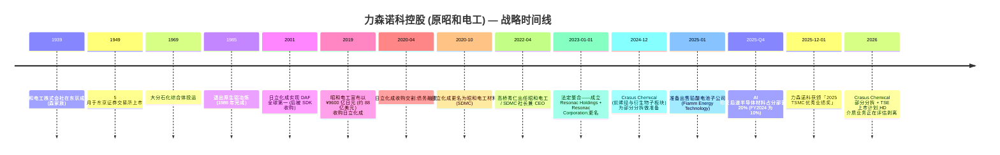

# 力森诺科控股株式会社 (Resonac Holdings Corporation, TSE: 4004) — 公司研究报告

**截止日期:** 2026-05-26
**作者:** 股票研究 — 日本半导体材料覆盖 (野村「Greater China Semi 2026–30F Renaissance」, 2026-05-21 配套报告)
**上市信息:** 东京证券交易所 (Prime Market) 主板,代码 **4004**;美国 OTC ADR 等价代码 SWDHF / SWDHY ([Resonac Stock Information](https://www.resonac.com/ir/stock/index.html); [Stockanalysis TYO:4004 statistics](https://stockanalysis.com/quote/tyo/4004/statistics/))。

> **业绩更新 — FY2026 全年指引维持,1H 上调于 2026-05-13。** 管理层维持 FY2026 (1–12 月) 全年目标:营业收入 **¥1,310 亿日元**、核心营业利润 **¥140.0 亿日元 (同比 +28%)**、归母净利润 **¥77.0 亿日元 (同比 +165%)**;同时将 1H 核心营业利润指引由年初的 ¥53.0 亿日元上调至 **¥74.0 亿日元**,主因 AI 相关后道材料 (back-end materials) 加速放量,以及石墨子板块由亏转盈。隐含的 AI 相关材料营收 FY2026 预计 **同比增长 >50%**。来源: [Resonac Q1 2026 Tanshin, p.3 — 业绩预测修正, 2026-05-13](https://www.resonac.com/sites/default/files/2026-05/e_tanshin2026q1.pdf); [Resonac FY2025 决算说明会资料, p.18–20, 2026-02-13](https://www.resonac.com/sites/default/files/2026-02/e_shiryo2025q4.pdf)。

---

## 目录

1. 公司概览
2. 公司历史
3. 管理团队
4. 产品与服务
5. 客户与上市策略
6. 行业概览
7. 竞争格局
8. 市场机会
9. 风险评估
10. 参考资料

---

## 1. 公司概览

力森诺科控股 (Resonac Holdings Corporation) 是一家总部位于东京的多元化功能性化学品 (functional chemicals) 综合企业,由 **2023 年 1 月 1 日昭和电工株式会社 (Showa Denko K.K.) 与昭和电工材料株式会社 (Showa Denko Materials,即原日立化成 Hitachi Chemical) 的法定合并**而诞生。合并后实体跨越两个战略支柱:一是主要继承自日立化成的成长引擎——**半导体与电子材料业务**;二是继承自昭和电工的成熟、现金牛型的**石化 + 基础化学品 + 石墨电极**业务组合。控股公司 / 经营公司架构——Resonac Holdings (上市母公司,代码 4004) 与 Resonac Corporation (经营性制造子公司)——以及「以化学之力改变社会」("Change society through the power of chemistry") 的企业宗旨均在更名时确立 ([Resonac Corporate Profile](https://www.resonac.com/corporate/outline.html); [Resonac, "Showa Denko K.K. & Showa Denko Materials Corporation Rebrand as Resonac", 2023-01](https://www.specialchem.com/polymer-additives/news/showa-denko-rebranding-resonac-000229747))。

力森诺科销售的是工业输入品而非成品,因此属于与信越化学 (Shin-Etsu Chemical)、住友化学 (Sumitomo Chemical)、三菱化学 (Mitsubishi Chemical) 和 JSR 同一阵营的日本 B2B 特种化学品 (B2B specialty chemicals) 发行人。其损益表的几何结构由**一个分部承担几乎全部利润贡献**这一事实主导:FY2025 半导体与电子材料分部贡献 **¥506.3 亿日元营业收入 (集团销售额 37.6%) 与 ¥108.4 亿日元核心营业利润 (集团核心营业利润的 99%)**,分部 EBITDA 利润率达 **30.2%**;而其他五个分部合计贡献 ¥840.8 亿日元营业收入,净核心营业利润仅 ¥0.7 亿日元 ([Resonac FY2025 Tanshin, p.4–7, 2026-02-13](https://www.resonac.com/sites/default/files/2026-02/e_tanshin2025q4.pdf); [FY2025 决算说明会资料, p.8](https://www.resonac.com/sites/default/files/2026-02/e_shiryo2025q4.pdf))。这种利润贡献的不对称性是关于本公司最重要的结构性事实:任何关于力森诺科的投资逻辑,实质上都是关于半导体与电子材料分部的投资逻辑,叠加去杠杆期间其他业务的拖累 (或上行空间)。

*来源: 2022 年数据来自旧 JGAAP 准则下的 [Resonac, "Looking Back at the Past Five Years", FY2025 决算说明会资料 p.26](https://www.resonac.com/sites/default/files/2026-02/e_shiryo2025q4.pdf);2023–2025 年实际值及 2026 年预测来自 IFRS 准则下的 [Resonac FY2025 Tanshin, pp.1–2](https://www.resonac.com/sites/default/files/2026-02/e_tanshin2025q4.pdf) 及 FY2025 决算说明会资料 pp.4、18、26。EBITDA 利润率 = (核心营业利润 + 折旧摊销) / 营业收入,按公司标准口径定义。*

从地理分布看,力森诺科**生产以日本为重心,但营收日益跨境**:制造布局覆盖日本 (约占员工总数 70%)、大中华区与中国台湾 (CMP 抛光液、光刻胶辅料、封装材料)、新加坡 (Resonac Specialty Gas)、德国 (石墨电极),以及美国 (CDMO 等价的特种化学品,加上位于硅谷新设立的美日封装联盟中心) ([Resonac, "Resonac to Establish Semiconductor R&D Center in Silicon Valley, USA", 2024](https://www.blackridgeresearch.com/news-releases/resonac-plans-to-build-a-semiconductor-back-end-process-center-in-us); [Resonac Specialty Gas Taiwan](https://www.rsgt.resonac.com/index.php?lang=en))。截至 **2025-12-31**,合并员工数为 **21,525 人**,总资产 **¥2,106.7 亿日元**,归母权益 **¥698.9 亿日元**,权益资产比 **33.2%** ([Resonac FY2025 Tanshin, pp.1, 3](https://www.resonac.com/sites/default/files/2026-02/e_tanshin2025q4.pdf); [Resonac Corporate Profile, employee count](https://www.resonac.com/corporate/outline.html))。

客户特许经营覆盖全球四大领先逻辑 / 存储 / OSAT 生态:台积电 (TSMC) 于 **2025 年 12 月 1 日授予力森诺科「2025 TSMC 优秀业绩奖——卓越技术开发与生产支持」("2025 TSMC Excellent Performance Award – Excellent Technology Development and Production Support")**,明确表彰其在先进封装 (advanced packaging) 材料与高纯气体本地化生产方面的贡献;此外客户还包括三星、SK 海力士、美光、铠侠以及 ASE/Amkor/JCET/Powertech 等后道封测厂 ([Resonac, "Resonac Receives 2025 TSMC Excellent Performance Award", 2025-12-01](https://www.resonac.com/news/2025/12/01/3669.html); [TSMC, "2025 Supply Chain Management Forum Presents Awards to Outstanding Suppliers"](https://pr.tsmc.com/english/news/3274))。台积电点名加上稳定的 AI 相关后道营收轨迹 (公司自身披露:AI 相关在后道半导体营收中的占比由 FY2024 的 ~10% 升至 FY2025 的 ~20%,FY2026 指引为同比增长 >50%),使力森诺科成为本团队覆盖范围内**最直接、最纯粹的日股 AI 材料标的** ([Resonac FY2025 决算说明会资料, p.10, 20](https://www.resonac.com/sites/default/files/2026-02/e_shiryo2025q4.pdf))。

### 估值快照 (必备)

截至 2026 年 5 月下旬,力森诺科股价约 **¥18,010 / 股**,对应市值约 **¥3.1 万亿日元** (精确数字随东京市场波动:2026-05-08 时点市值为 ¥2.9 万亿日元,而 5 月 13 日 1H 指引上调后,5 月 23 日时点已显著上行) ([Stockanalysis TYO:4004 市值快照](https://stockanalysis.com/quote/tyo/4004/market-cap/); [Yahoo Finance JP 4004.T 行情](https://finance.yahoo.com/quote/4004.T/); [Investing.com 4004.T 行情](https://www.investing.com/equities/showa-denko-k.k.))。基于 TTM (滚动十二个月) FY2025 报告数字——营业收入 ¥1,347 亿日元、EPS ¥160.49、每股权益 ¥3,861.43——隐含 **TTM P/E ~112×、TTM P/S ~2.3×、P/B ~4.7×**;表观 TTM P/E 被 ¥62.5 亿日元的非经常性损益所人为推高 (主因 Fiamm Energy Technology 出售与汽车塑料件业务退出相关的减值损失) ([Resonac FY2025 Tanshin, p.1; FY2025 决算说明会资料, p.15](https://www.resonac.com/sites/default/files/2026-02/e_tanshin2025q4.pdf))。

更清晰的估值视角是 **FY2026 指引基础上的前瞻市盈率**:按公司自身 FY2026E EPS 指引 **¥425.45**,隐含**前瞻 P/E 约 42×**;按 **2025 调整后 EPS ¥506** (该指标剥离非经常性减值,公司在公布报告 EPS 时一并发布) 计算,**TTM 调整后 P/E 约 35.6×** ([Resonac FY2025 决算说明会资料, p.18, 26](https://www.resonac.com/sites/default/files/2026-02/e_shiryo2025q4.pdf))。EV/EBITDA 基于 FY2025 EBITDA **¥203.4 亿日元** 加净负债 **¥707.5 亿日元** (有息负债 ¥969.5 亿日元 减 现金 ¥262.0 亿日元),企业价值 EV ≈ ¥3.8 万亿日元,**EV/EBITDA 约 18.6×**;若按 FY2026E EBITDA **¥234.5 亿日元** 计算则降至 **约 16×** ([Resonac FY2025 Tanshin, p.3 — 资产负债表; 决算说明会资料 pp.16, 23](https://www.resonac.com/sites/default/files/2026-02/e_tanshin2025q4.pdf))。

横向对比看,**信越化学 (TSE:4063)** 作为日本最大的特种化学品标的,当前约 **18× TTM P/E、约 3× 营收** ([Shin-Etsu Chemical IR](https://www.shinetsu.co.jp/en/ir/));**住友化学 (TSE:4005)** 滚动盈利接近盈亏平衡 (前期大幅亏损后的恢复期);**东京应化工业 (TSE:4186)** 作为光刻胶 (photoresist) 纯标的约 **19× TTM P/E、约 2.5× 营收** ([Tokyo Ohka Kogyo IR](https://www.tok.co.jp/eng/ir));**JSR Corporation** 退市时交易价对应约 2.25× 营收 ([JIC Capital, Tender Offer Results, 2024-04-17](https://www.jiccapital.co.jp/en/news/.assets/E_20240417_JIC_JICC_PressRelease.pdf))。力森诺科的前瞻 P/E ~42× **高于日本特种化学品同业中位数**,但大体与——甚至略低于——野村在同一份大中华半导体行业报告中对中砂 (1560 TT) 与安集 (688019 CH) 所用的 **40× FY2027 P/E 基准**相当 ([Nomura "Greater China Semi: A guide to Semi renaissance in 2026~30F", 2026-05-21, p.15–17](https://www.nomuraconnects.com/asia-tech))。4004 自身近三年 P/E 区间约 **8× 至 250×+** (高位印记在 FY2022/FY2023 亏损低谷期,低位则反映日立化成并购协同效应充分释放的正常年份)。

*分析师观点:* 在 **TTM 报告**数字下估值偏高,但若 AI 相关后道半导体材料继续按指引同比增长 >50%,则在 **FY2026E/FY2027E 数字基础上**显得合理——甚至可能便宜。表观估值扩张的成因不复杂:(a) 半导体与电子材料分部正被重新定价为 AI / 先进封装的结构性受益者 (参见野村框架与 ["半导体材料 sector overview"](../../sector/半导体材料.md) 以及 2026-05-21 锚定报告 Fig. 35–44);(b) 计划于 **2026 年内完成的 Crasus Chemical (石化) 部分分拆**将从合并 EV 中剔除低估值拖累 ([Resonac FY2025 决算说明会资料, p.29 — Crasus Chemical 分拆进展](https://www.resonac.com/sites/default/files/2026-02/e_shiryo2025q4.pdf));(c) 去杠杆按节奏推进——调整后净负债 / 权益比 (Net D/E) 为 **0.83×** (已低于 **<1.0× 目标**),净负债 / EBITDA 为 **3.5×**,到 FY2026E 将降向 **<3.0× 目标** ([FY2025 决算说明会资料, p.26 — 主要财务指标](https://www.resonac.com/sites/default/files/2026-02/e_shiryo2025q4.pdf))。若 AI 周期不及预期,估值风险确实存在,详见第 9 章。

## 2. 公司历史

力森诺科的企业身份可追溯至 **1939 年 6 月**,当时**昭和电工株式会社 (昭和電工株式会社, Showa Denko K.K.)** 在东京由日本电气工业 (Nihon Electrical Industries,森家族经营的硫酸铵化肥企业) 与昭和肥料 (Showa Fertilizers) 合并而成,两家公司均由实业家**森矗昶 (Nobuteru Mori)** 创立 ([Wikipedia, "Resonac" (history)](https://en.wikipedia.org/wiki/Resonac); [Resonac Corporate Profile](https://www.resonac.com/corporate/outline.html))。「昭和电工」名号延续了 84 年,贯穿三个截然不同的工业时代:战后复兴 (基础化学品、氨气、加氢工业)、1960–1980 年代的石化与铝冶炼建设期 (1969 年投运的大分炼油 / 石化综合体至今仍是公司最大的化学生产基地),以及 1990 年代以来向电子与特种材料的转型。公司于 **1949 年 5 月在东京证券交易所上市**,迄今已是 76 年的 TSE 持续发行人 ([Wikipedia, "Resonac"](https://en.wikipedia.org/wiki/Resonac))。

现代时期的关键战略一手是 **2019 年 12 月宣布、2020 年完成、以 ¥9600 亿日元 (约 88–89 亿美元) 从日立有限公司收购日立化成 (Hitachi Chemical Company)**。规模较小的买方昭和电工 (FY2018 营收 ¥1.0 万亿日元 vs 日立化成 FY3/2019 营收 ¥6960 亿日元) 在竞拍中胜出,其他参与方包括 Bain Capital、凯雷集团与日东电工 (Nitto Denko) ([C&EN, "Showa Denko to acquire Hitachi Chemical", 2020-01](https://cen.acs.org/business/mergers-&-acquisitions/Showa-Denko-acquire-Hitachi-Chemical/98/i1); [MarketScreener, "Japan's Hitachi nears deal to sell chemical unit to Showa Denko"](https://www.marketscreener.com/quote/stock/RESONAC-HOLDING-CORPORATI-6491222/news/Showa-Denko-K-K-Japan-s-Hitachi-nears-deal-to-sell-chemical-unit-to-Showa-Denko-Nikkei-29639742/))。该收购几乎完全由债务融资——交易后有息负债存量峰值超过 **¥1.4 万亿日元**,这是力森诺科去杠杆轨迹 (净负债 / EBITDA:FY2023 7.9× → FY2025 3.5× → FY2026E 2.9×) 始终是卖方分析师与评级机构关注重点的核心原因 ([Resonac FY2025 决算说明会资料, p.26 — 主要财务指标](https://www.resonac.com/sites/default/files/2026-02/e_shiryo2025q4.pdf); [日本格付研究所 (Japan Credit Rating Agency), 2024 年 7 月 29 日评级行动](https://www.jcr.co.jp/en/))。日立化成于 **2020 年 10 月更名为昭和电工材料株式会社 (Showa Denko Materials,简称 SDMC)**,作为昭和电工母公司的全资子公司运营了 27 个月 ([Showa Denko 2020 年 10 月更名公告](https://www.specialchem.com/polymer-additives/news/showa-denko-rebranding-resonac-000229747))。

**2023 年更名为「Resonac」**被管理层定位为「第二次创业」,而非简单的企业形象焕新。自 **2023 年 1 月 1 日**起,昭和电工株式会社与昭和电工材料合并为两个实体——上市母公司 Resonac Holdings Corporation (保留 TSE 代码 4004) 与经营公司 Resonac Corporation (整合两家原有公司的实体业务),并启用「Resonac」品牌名。该名称取自合成词:「RESONate」(以化学产业回响社会需求的愿望) + 「C」代表 chemistry。社长兼 CEO 高桥秀仁向员工与外部利益相关方表示:「力森诺科的诞生是我们的第二次创业。我们将通过培养能够自主、创造性地采取积极行动的人才来改革集团」("the birth of Resonac is its second foundation. We will reform the Group by raising talent who can take positive actions autonomously and creatively") ([Resonac, "Resonac Aims to be a Leading Functional Chemical Manufacturer by Raising Reformers", 2023-01-04](https://www.resonac.com/news/2023/01/04/2285.html); [SpecialChem, "Showa Denko Rebrands as Resonac"](https://www.specialchem.com/adhesives/news/showa-denko-rebrands-000229738))。这次更名绝非表面文章:它伴随着投资组合重组计划,迄今已产生两项重大战略动作 (**Crasus Chemical 石化分拆**与 **Fiamm Energy Technology 出售**),并在准备第三项 (**HD 介质业务剥离**评估中)。

**战略转向 #1 — 退出石化。** **2024 年 9 月 26 日**,管理层宣布将原昭和电工烯烃与衍生物子板块全部业务重组为一家独立的全资子公司,命名为 **Crasus Chemical Co., Ltd.**,拥有独立品牌与管理团队,自 2025 年 1 月 1 日起运作,为 2026 年的彻底分拆与 TSE 上市做准备 ([Resonac, "Plans Spin-Off of Petrochemical Unit into New Entity Crasus Chemical"](https://www.marketscreener.com/quote/stock/RESONAC-HOLDINGS-CORPORAT-6491222/news/Resonac-Plans-Spin-Off-of-Petrochemical-Unit-into-New-Entity-Crasus-Chemical-47449928/); [C&EN, "Resonac to spin off petrochemical arm"](https://cen.acs.org/business/petrochemicals/Resonac-spin-off-petrochemical-arm/102/i5))。FY2025 业绩发布会公布的具体机制是**按比例向 Resonac 股东分配股份的部分分拆**,完成后 Resonac 将保留 Crasus Chemical **不到 20%** 的股权,剩余股份既不构成合并子公司也不构成权益法关联企业——结构上属于「雅虎日本 / 软银」式分立,而非内部分拆 ([Resonac FY2025 决算说明会资料, p.29 — Crasus Chemical 分拆进展](https://www.resonac.com/sites/default/files/2026-02/e_shiryo2025q4.pdf))。Crasus Chemical 子板块 FY2025 营收 ¥300.3 亿日元、核心营业利润仅 ¥4.7 亿日元——EBITDA 利润率 **3.5%,远低于合并集团 15.1%**——剔除后即便绝对 EBITDA 仅小幅下降,合并集团 EBITDA 利润率仍可显著提升。*分析师观点:* 这恰恰是合并估值所需的「低估值拖累」手术;以完全剥离后基础计算,FY2026E 核心营业利润 (剔除 Crasus 后) 为 ¥133 亿日元,**EBITDA 利润率 21.6%**——发行人现代史上的最高水平 ([FY2025 决算说明会资料, p.18 — 2026 合并预测摘要,剔除 Crasus](https://www.resonac.com/sites/default/files/2026-02/e_shiryo2025q4.pdf))。

**战略转向 #2 — SDK 铝业 / 铅酸电池剥离。** 力森诺科于 2025 年出售了**铅酸电池业务 (Fiamm Energy Technology S.p.A.,意大利)**,并将于 **2026 年 Q2 完成日本与泰国的汽车塑料件业务退出** ([Resonac FY2025 Tanshin, p.5 — 非经常性项目; FY2025 决算说明会资料, p.20 — Mobility 2026 展望](https://www.resonac.com/sites/default/files/2026-02/e_tanshin2025q4.pdf))。这些剥离动作导致 FY2025 出现 **¥510 亿日元的减值损失**,使报告口径营业利润降至 ¥46.7 亿日元 (同比 –47.6%)、报告 EPS 降至 ¥160.49 (同比 –60.5%),尽管核心营业利润同比增长 18.4% 至 ¥109.1 亿日元 ([FY2025 Tanshin, p.1; 决算说明会资料, p.15 — 非经常性项目分解](https://www.resonac.com/sites/default/files/2026-02/e_tanshin2025q4.pdf))。2026 年预测假定非经常性项目仅 ¥350 亿日元 (相同剥离事项的账面残值清理加上退休福利计划修订),这是 FY2026 归母净利润同比 **+165%** 增长指引的最大单一驱动因素。

**战略转向 #3 — HD 介质业务评估。** 力森诺科是全球最大的独立铝基硬盘 (HDD) 介质供应商——其下游本质上是**双客户终端市场**:在 **2025-02-21 西部数据将其 NAND / 闪存业务分拆为 Sandisk Corporation 之后** ([Western Digital 8-K/A, "Completion of WD/Sandisk separation", 2025](https://www.sec.gov/Archives/edgar/data/0000106040/000010604025000012/wdc8-khardxspin.htm)),终端客户主要剩下西部数据 (Western Digital) 与希捷 (Seagate)。HD 介质 (HD media) 业务在半导体与电子材料分部下的器件解决方案 (Device Solutions) 子板块内报告,但结构上与前道 (front-end) / 后道 (back-end) 半导体材料截然不同。FY2024–FY2025 期间,超大规模数据中心对近线 HDD 的需求大幅上行 (公司明确表态:"HD media revenue increased due to the recovery of the demand for data centers" [FY2025 决算说明会资料, p.10](https://www.resonac.com/sites/default/files/2026-02/e_shiryo2025q4.pdf)),该业务目前是贡献者,但相对于 QLC NAND 而言 HDD 出货量的长期下行仍构成隐忧。管理层已表态将对 HD 介质进行投资组合评估,但截至本文撰写时尚未承诺剥离时间表。

以上三项战略动作累计的效果是,**力森诺科在 2026 年的形象远比 2018 年时的多元化昭和电工更接近一个聚焦的功能化学品 + 半导体材料平台**:石化将于年底前剥离出合并报表,铅酸电池与汽车塑料件已出售,HD 介质正在评估中,资本支出 (capex) 集中投向半导体与电子材料分部 (分配给半导体与电子材料的 capex 从 FY2024 的 ¥51.4 亿日元 → FY2025 的 ¥64.1 亿日元 → FY2026E 的 ¥83.7 亿日元,**两年累计 +63%**,而合并 capex 同期仅增长 43%) ([Resonac FY2025 决算说明会资料, p.35 — 分部 Capex](https://www.resonac.com/sites/default/files/2026-02/e_shiryo2025q4.pdf))。

## 3. 管理团队

**创始人说明。** 力森诺科作为一家企业实体并非以现代意义被「创立」——它脱胎于 2023 年两家既有 TSE 上市集团 (昭和电工株式会社与昭和电工材料,后者即更名前的日立化成) 的法定整合。昭和电工最初的创始人**森矗昶 (Nobuteru Mori, 森矗昶)** 于 1920–1930 年代创办了前身企业日本电气工业与昭和肥料;森家族数十年前即已退出经营。日立化成于 1962-10-10 由日立有限公司分拆而出,亦无创业意义上的个人创始人。因此本公司的相关「创业时刻」是 **CEO 高桥秀仁于 2022 年 1 月接掌原昭和电工、2023 年 1 月接掌力森诺科** 并主导更名——他的简历占据了本节按本报告技能规范分配的全部管理团队篇幅。

**高桥秀仁 (高橋 秀仁, Hidehito Takahashi) — Resonac Holdings Corporation 与 Resonac Corporation 代表董事、社长兼 CEO (2023 年 1 月至今)。** **1962 年 7 月 21 日**出生,高桥是一位职业经理人,其前 Resonac 经历对一位日本特种化学品 CEO 而言相当特殊:他在加入 Resonac 之前的大多数职位是在**在日本与亚洲运营的西方跨国公司**,而非日本本土化学品企业。这一职业背景明显塑造了 Resonac 在英文投资者沟通中的呈现方式 (公司以 IFRS 为主要会计准则、举办双语电话会议、与日文版同日发布英文版整合报告) ([Resonac Executive Profile, Hidehito Takahashi](https://www.resonac.com/corporate/exec/takahashi.html))。

高桥的职业生涯始于 **1986 年加入三菱银行 (现 MUFG 银行)** 担任公司银行业务岗位。2002 年他加入 **GE 日本控股公司**担任业务开发总经理 (General Manager, Business Development),并于 **2004 年晋升为 GE Sensing & Inspection Technologies 亚太总裁**——这是覆盖日本、中国、韩国与东南亚区域工业传感器与无损检测业务的损益负责岗位。**2008 年**他转任 **Momentive Performance Materials Japan Inc.** (从阿波罗收购 GE Plastics 后分拆出的硅酮 (silicones) 业务) **硅酮业务社长兼 CEO**——这是他化学品行业首个损益管理职位。**2013 年**他被任命为 **GKN Driveline Japan plc 社长兼 CEO**,负责 GKN 的日本汽车驱动系统业务——这是一个 Tier-1 汽车供应商角色,使他在丰田、本田与日产建立了客户关系 ([Resonac Executive Profile](https://www.resonac.com/corporate/exec/takahashi.html); 上引网络搜索摘要)。

高桥于 **2015 年作为高级公司研究员 (Senior Corporate Fellow) 加入昭和电工株式会社**,这是他在传统日本综合企业中的首个岗位。此后五年间他陆续晋升至公司高管与董事职位,包括**首席战略官 (CSO)**——他在该岗位上策划了 2020 年完成的日立化成收购战略。**2022 年 1 月**他被任命为 (原) 昭和电工社长兼 CEO,并在 **2023 年 1 月 1 日更名生效**时同时担任 Resonac Holdings 与 Resonac Corporation 的相同职位 ([Resonac Executive Profile](https://www.resonac.com/corporate/exec/takahashi.html); [Resonac, "New Year Message from Hidehito Takahashi, President and CEO", 2022-01-04](https://www.resonac.com/news/2022/01/04/1057.html))。截至本报告撰写时,他担任合并后 Resonac 实体 CEO 的任期接近 **3.5 年**。他不是创始人,不持有创始人规模的股权;其薪酬结构与持股按力森诺科 Yuho (有価証券報告書) 披露,处于受薪高管而非创始人 / 股东级别。

高桥所执行的战略命题——以及迄今的成绩单——可归纳为三条命题。**第一**,日立化成 / 昭和电工的合并应通过半导体材料 R&D 与销售层面的*运营协同效应*得到证明 (FY2025 实绩:半导体与电子材料分部核心营业利润 ¥108.4 亿日元,**同比 +47%**,EBITDA 利润率 30.2%——大体验证了协同效应命题)。**第二**,合并债务负担可通过投资组合简化实现去杠杆 (FY2025 实绩:净负债 / EBITDA 从 FY2023 的 7.9× 降至 FY2025 的 3.5×,FY2026E 指引为 2.9×——按节奏推进,可在现金流量表中验证)。**第三**,石化与大宗化学品业务可与高利润率半导体材料业务分离,且不破坏任何一方价值 (FY2025 实绩:Crasus Chemical 部分分拆已通过日本税务合规分拆要求、获得 TSE 上市批准、正等待公司治理审批执行——按公司自身披露的主要里程碑,2026 年完成在轨 [FY2025 决算说明会资料 p.29](https://www.resonac.com/sites/default/files/2026-02/e_shiryo2025q4.pdf))。三条命题在公开记分牌上目前均处于积极状态。
