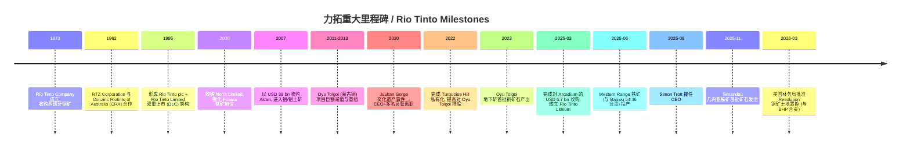
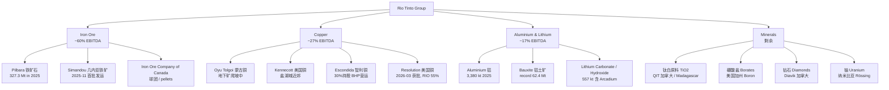
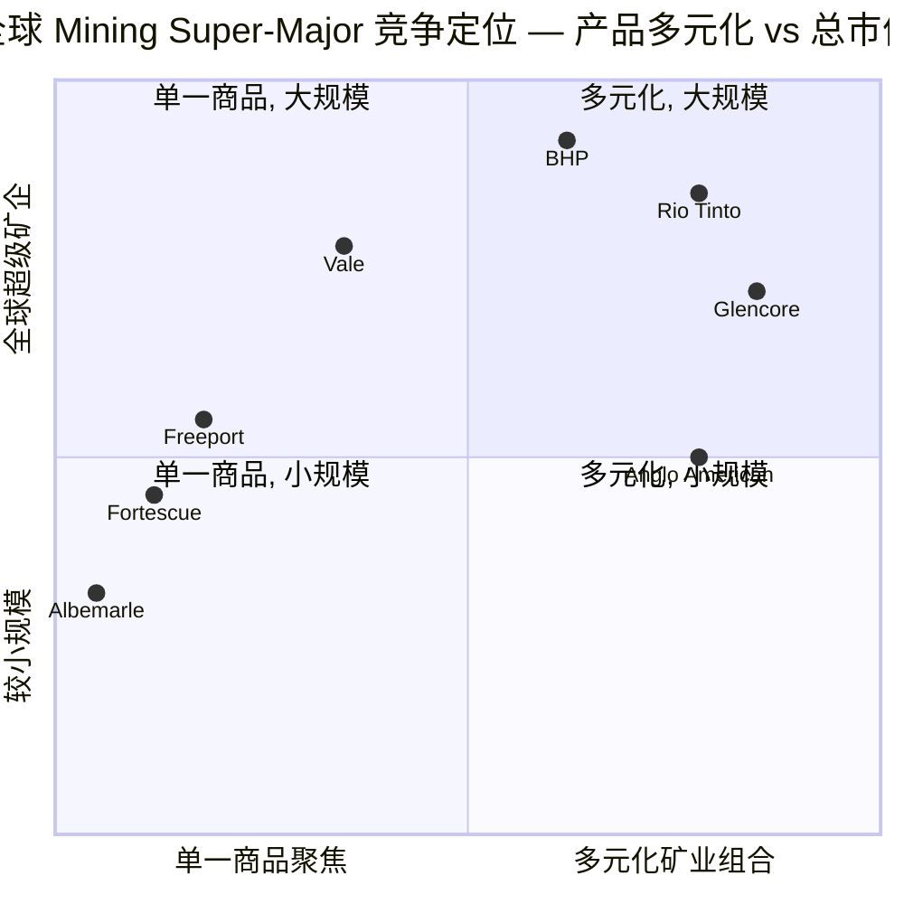

# 力拓 Rio Tinto (NYSE:RIO) 公司研究

*报告日期 / As of: 2026-06-14 ｜ 主题归属 / Theme: 战略矿产与稀土 (rare-earth-strategic-minerals)*

> 本报告以中文为主，并按项目方法学在首次出现技术或行业术语时给出 "中文 / English" 双语形式，便于跨语境读者复核 (e.g., 铁矿石 / iron ore、铝土矿 / bauxite、电池级氢氧化锂 / battery-grade lithium hydroxide、Underlying EBITDA、自由现金流 / free cash flow)。

---

## 投资摘要 / Investment Summary (header block)

> *分析师观点 / Analyst view:* 以下为本报告作者的房观点结构化框架——评级、目标价、估值方法、论点支柱均为分析师前瞻判断，**不归因于任何一手披露 (20-F / 6-K 中不含目标价)**。

| 字段 | 取值 (as of 2026-06-14) |
|---|---|
| **评级 / Rating** | **Hold / Neutral** (中性持有) |
| **12 个月目标价 / 12-mo PT** | **USD 108** (ADR 口径) |
| 当前价 / Current price | **USD 105.35** (2026-06-12 收盘) |
| 隐含上行 / Implied upside | **+2.5%** (现金股息收益率另计 ~3.8%) |
| 估值方法 / Method | 50% NPV + 50% EV/EBITDA (~6.5×) 混合法；与 2027E 周期中枢锚定 |
| 市值 / Market cap | **~USD 171 bn** (16.26 亿 ADR 等值股) |
| 52 周区间 / 52-wk range | USD 55.64 – 112.58 |
| 代码 / 交易所 | NYSE:RIO (ADR) · LSE:RIO · ASX:RIO.AX (DLC 双重上市) |

**论点支柱 / Thesis pillars (4):**
1. **铁矿石现金奶牛 + 铜/锂第二增长极的"双轨复利"。** 铁矿石贡献 ~60% Underlying EBITDA、FY2025 USD 15.2 bn；Copper EBITDA 一年翻倍 (USD 3.4→7.4 bn)，Oyu Tolgoi 地下矿与 Simandou 是未来 5 年最确定的增量。
2. **估值已基本计入正向情景。** 过去 12 个月 ADR 上涨 +91%，TTM P/E 17.3× 高于自身历史中枢，与卖方 Neutral 共识 (UBS A$160、GS A$179.9、MS Equal-weight) 一致——上行需等待新一轮大宗商品或 macro 回撤。
3. **资产负债表在 Arcadium 后明显加杠杆。** 为收购发行 USD 9 bn 债券，net debt 从 USD 5.5 bn 跳升至 **USD 14.4 bn (+162%)**，FCF 从 USD 5.6 bn 降至 **USD 4.0 bn (−28%)**——capex 高峰期叠加 60% FCF 派息，财务弹性收窄是核心约束。
4. **执行复杂度处于历史高位。** Simandou + Oyu Tolgoi + Hope Downs 2 + Western Range + Brockman Syncline 1 + Rincon + Nemaska 七大项目同时爬坡，是 Trott 新任 CEO 的首要考验。

---

## 目录 / Table of Contents

1. 公司概览 (Company Overview)
   - 1A 估值与价格目标 (Valuation & Price Target)
   - 1B GF Score 基本面评分卡
2. 估值与价格目标详解 + 卖方观点演变 (Valuation, PT & Sell-side View Evolution)
3. 公司历史 (Company History)
4. 管理团队 (Management Team)
5. 产品与服务 (Products & Services)
6. 客户与上市策略 (Customers & Go-to-Market)
7. 行业概览 (Industry Overview)
8. 竞争格局 (Competitive Landscape)
9. 市场机会 (Market Opportunity)
10. 风险评估 (Risk Assessment)
    - 10.5 关键分歧与催化剂 (Key Debates & Catalysts)
11. 投资人视角评分卡 (Investor-Lens Scorecards)
12. 数据来源清单 (Data Used)
13. 参考资料 (References)

---

## 1. 公司概览 / Company Overview

**本方观点 (BLUF)。** 力拓是全球第二大多元矿业集团，本报告给予 **Hold / 中性** 评级、12 个月目标价 USD 108。核心逻辑是：铁矿石压舱石的现金回报极其稳健，铜与锂提供未来 5 年最清晰的增量，但 (a) 估值在 +91% 的 12 个月涨幅后已基本计入这条增长路径，(b) Arcadium 收购后资产负债表加杠杆、FCF 收窄，(c) 七大项目同时爬坡的执行风险处于历史高位——三者叠加令风险回报趋于对称，更适合"低波动期持有、高波动期减仓"。

力拓 Rio Tinto 采用 Rio Tinto plc (英国，伦交所一级上市) 与 Rio Tinto Limited (澳大利亚，ASX 一级上市) 的 dual-listed company (DLC) 双重上市结构经营，并通过美国存托凭证 ADR 在纽交所交易，代码即为 **NYSE:RIO**。公司在 35 个国家经营，业务覆盖铁矿石 / iron ore、铝 / aluminium、铜 / copper、锂 / lithium、硼酸盐、钛白原料 (TiO₂ feedstock)、钻石、铀等矿产，按 SEC 行业分类 SIC 1000 (Metal Mining) 归类 ([Rio Tinto plc Form 20-F FY2025 cover page](https://www.sec.gov/Archives/edgar/data/0000863064/000162828026009531/rio-20251231.htm))。

**2025 财年规模与盈利节奏。** FY2025 (历年制) 公司合并销售收入 (consolidated sales revenue) **USD 57,638 m (USD 57.6 bn)**，同比上升 +7% (FY2024: USD 53,658 m)；Underlying EBITDA 达 **USD 25,363 m (USD 25.4 bn)**，同比 +9% (FY2024: USD 23,314 m)；经营现金流 (net cash from operating activities) **USD 16,832 m (USD 16.8 bn)**，同比 +8%；Underlying earnings (扣除税费与政府特许权使用费 USD 10.4 bn 后) **USD 10,868 m**，与上年基本持平 (FY2024: USD 10,867 m)；归属股东净利 (net earnings) **USD 9,966 m**，同比 −14% (FY2024: USD 11,552 m)。增量主要由 Oyu Tolgoi 地下铜矿持续爬坡 (使集团铜当量 / copper-equivalent 产量同比 +8%) 与 Pilbara 自 4 月起的 record iron ore production 共同驱动 ([Rio Tinto FY2025 Press Release Form 6-K (Exhibit 99.1), 2026-02-19](https://www.sec.gov/Archives/edgar/data/0000863064/000162828026009503/ye25-pressreleasex19feb.htm))。

**业务组合 / business mix.** 按 Underlying EBITDA 计 FY2025 可报告分部 (reportable segments) 结构：Iron Ore USD 15.2 bn (~60% 集团 EBITDA，同比 −11%)，Copper USD 7.4 bn (同比 **+114%**，是最大盈利增量)，Aluminium & Lithium USD 4.6 bn (同比 +29%)，可报告分部合计 USD 27.1 bn；经 Simandou (−0.1)、其他业务与中央项目调整后回到集团口径 USD 25.4 bn ([Rio Tinto FY2025 Press Release Form 6-K (Exhibit 99.1), 2026-02-19](https://www.sec.gov/Archives/edgar/data/0000863064/000162828026009503/ye25-pressreleasex19feb.htm))。铁矿石仍是利润压舱石，铜与锂是结构性增长侧。

下面是 FY2025 利润表的 Sankey 视图——左侧为产品组营收来源 (方向性拆分)，右侧逐级流向 net operating costs、operating profit、税费与归属股东净利。

<svg xmlns="http://www.w3.org/2000/svg" viewBox="0 0 1000 560" width="1000" height="560" role="img" aria-label="income statement Sankey"><rect x="0" y="0" width="1000" height="560" fill="#ffffff"/>
<text x="20.00" y="30.00" text-anchor="start" font-family="Helvetica,Arial,sans-serif" font-size="15" font-weight="700" fill="#1f2933">力拓 FY2025 利润表 Sankey (US$m)</text>
<path d="M 204.00,64.00 C 258.00,64.00 258.00,85.00 312.00,85.00 L 312.00,304.44 C 258.00,304.44 258.00,283.44 204.00,283.44 Z" fill="#93c5fd" fill-opacity="0.55"/>
<path d="M 452.00,78.00 C 506.00,78.00 506.00,209.37 560.00,209.37 L 560.00,325.56 C 506.00,325.56 506.00,194.19 452.00,194.19 Z" fill="#86efac" fill-opacity="0.55"/>
<path d="M 452.00,194.19 C 506.00,194.19 506.00,339.56 560.00,339.56 L 560.00,341.56 C 506.00,341.56 506.00,196.19 452.00,196.19 Z" fill="#fca5a5" fill-opacity="0.55"/>
<path d="M 328.00,85.00 C 382.00,85.00 382.00,78.00 436.00,78.00 L 436.00,190.23 C 382.00,190.23 382.00,197.23 328.00,197.23 Z" fill="#86efac" fill-opacity="0.55"/>
<path d="M 328.00,197.23 C 382.00,197.23 382.00,204.23 436.00,204.23 L 436.00,500.00 C 382.00,500.00 382.00,493.00 328.00,493.00 Z" fill="#fca5a5" fill-opacity="0.55"/>
<path d="M 576.00,209.37 C 630.00,209.37 630.00,237.44 684.00,237.44 L 684.00,353.63 C 630.00,353.63 630.00,325.56 576.00,325.56 Z" fill="#86efac" fill-opacity="0.55"/>
<path d="M 700.00,237.44 C 754.00,237.44 754.00,223.44 808.00,223.44 L 808.00,293.98 C 754.00,293.98 754.00,307.98 700.00,307.98 Z" fill="#86efac" fill-opacity="0.55"/>
<path d="M 700.00,307.98 C 754.00,307.98 754.00,307.98 808.00,307.98 L 808.00,338.56 C 754.00,338.56 754.00,338.56 700.00,338.56 Z" fill="#fca5a5" fill-opacity="0.55"/>
<path d="M 700.00,338.56 C 754.00,338.56 754.00,352.56 808.00,352.56 L 808.00,354.56 C 754.00,354.56 754.00,340.56 700.00,340.56 Z" fill="#fca5a5" fill-opacity="0.55"/>
<path d="M 204.00,297.44 C 258.00,297.44 258.00,304.44 312.00,304.44 L 312.00,410.62 C 258.00,410.62 258.00,403.62 204.00,403.62 Z" fill="#93c5fd" fill-opacity="0.55"/>
<path d="M 576.00,355.56 C 630.00,355.56 630.00,353.63 684.00,353.63 L 684.00,366.70 C 630.00,366.70 630.00,368.63 576.00,368.63 Z" fill="#93c5fd" fill-opacity="0.55"/>
<path d="M 204.00,417.62 C 258.00,417.62 258.00,410.62 312.00,410.62 L 312.00,474.33 C 258.00,474.33 258.00,481.33 204.00,481.33 Z" fill="#93c5fd" fill-opacity="0.55"/>
<path d="M 204.00,495.33 C 258.00,495.33 258.00,474.33 312.00,474.33 L 312.00,493.00 C 258.00,493.00 258.00,514.00 204.00,514.00 Z" fill="#93c5fd" fill-opacity="0.55"/>
<rect x="188.00" y="64.00" width="16" height="219.44" rx="1.5" fill="#2563eb"/>
<rect x="188.00" y="297.44" width="16" height="106.18" rx="1.5" fill="#2563eb"/>
<rect x="188.00" y="417.62" width="16" height="63.71" rx="1.5" fill="#2563eb"/>
<rect x="188.00" y="495.33" width="16" height="18.67" rx="1.5" fill="#2563eb"/>
<rect x="312.00" y="85.00" width="16" height="408.00" rx="1.5" fill="#1e3a8a"/>
<rect x="436.00" y="78.00" width="16" height="112.23" rx="1.5" fill="#15803d"/>
<rect x="436.00" y="204.23" width="16" height="295.77" rx="1.5" fill="#dc2626"/>
<rect x="560.00" y="209.37" width="16" height="116.19" rx="1.5" fill="#15803d"/>
<rect x="560.00" y="339.56" width="16" height="2.00" rx="1.5" fill="#dc2626"/>
<rect x="560.00" y="355.56" width="16" height="13.07" rx="1.5" fill="#2563eb"/>
<rect x="684.00" y="237.44" width="16" height="103.12" rx="1.5" fill="#15803d"/>
<rect x="808.00" y="223.44" width="16" height="70.55" rx="1.5" fill="#15803d"/>
<rect x="808.00" y="307.98" width="16" height="30.57" rx="1.5" fill="#dc2626"/>
<rect x="808.00" y="352.56" width="16" height="2.00" rx="1.5" fill="#dc2626"/>
<line x1="188.00" y1="173.72" x2="182.00" y2="156.06" stroke="#cbd5e1" stroke-width="1"/>
<text x="179.00" y="159.06" text-anchor="end" font-family="Helvetica,Arial,sans-serif" font-size="11.5" font-weight="700" fill="#1f2933">Iron Ore</text>
<text x="179.00" y="172.06" text-anchor="end" font-family="Helvetica,Arial,sans-serif" font-size="10" font-weight="400" fill="#52606d">US$31.0B  (53.8%)</text>
<line x1="188.00" y1="350.53" x2="182.00" y2="332.87" stroke="#cbd5e1" stroke-width="1"/>
<text x="179.00" y="335.87" text-anchor="end" font-family="Helvetica,Arial,sans-serif" font-size="11.5" font-weight="700" fill="#1f2933">Aluminium &amp; Lithium</text>
<text x="179.00" y="348.87" text-anchor="end" font-family="Helvetica,Arial,sans-serif" font-size="10" font-weight="400" fill="#52606d">US$15.0B  (26.0%)</text>
<line x1="188.00" y1="449.47" x2="182.00" y2="431.81" stroke="#cbd5e1" stroke-width="1"/>
<text x="179.00" y="434.81" text-anchor="end" font-family="Helvetica,Arial,sans-serif" font-size="11.5" font-weight="700" fill="#1f2933">Copper</text>
<text x="179.00" y="447.81" text-anchor="end" font-family="Helvetica,Arial,sans-serif" font-size="10" font-weight="400" fill="#52606d">US$9.0B  (15.6%)</text>
<line x1="188.00" y1="504.66" x2="182.00" y2="487.00" stroke="#cbd5e1" stroke-width="1"/>
<text x="179.00" y="490.00" text-anchor="end" font-family="Helvetica,Arial,sans-serif" font-size="11.5" font-weight="700" fill="#1f2933">Minerals &amp; Other</text>
<text x="179.00" y="503.00" text-anchor="end" font-family="Helvetica,Arial,sans-serif" font-size="10" font-weight="400" fill="#52606d">US$2.6B  (4.6%)</text>
<rect x="331.00" y="67.00" width="119.40" height="26" rx="2" fill="#ffffff" fill-opacity="0.72"/>
<text x="334.00" y="79.00" text-anchor="start" font-family="Helvetica,Arial,sans-serif" font-size="11.5" font-weight="700" fill="#1f2933">Revenue</text>
<text x="334.00" y="92.00" text-anchor="start" font-family="Helvetica,Arial,sans-serif" font-size="10" font-weight="400" fill="#52606d">US$57.6B  (100.0%)</text>
<rect x="455.00" y="60.00" width="113.10" height="26" rx="2" fill="#ffffff" fill-opacity="0.72"/>
<text x="458.00" y="72.00" text-anchor="start" font-family="Helvetica,Arial,sans-serif" font-size="11.5" font-weight="700" fill="#1f2933">Gross Profit</text>
<text x="458.00" y="85.00" text-anchor="start" font-family="Helvetica,Arial,sans-serif" font-size="10" font-weight="400" fill="#52606d">US$15.9B  (27.5%)</text>
<rect x="455.00" y="186.23" width="144.60" height="26" rx="2" fill="#ffffff" fill-opacity="0.72"/>
<text x="458.00" y="198.23" text-anchor="start" font-family="Helvetica,Arial,sans-serif" font-size="11.5" font-weight="700" fill="#1f2933">Cost of Revenue (COGS)</text>
<text x="458.00" y="211.23" text-anchor="start" font-family="Helvetica,Arial,sans-serif" font-size="10" font-weight="400" fill="#52606d">US$41.8B  (72.5%)</text>
<rect x="579.00" y="191.37" width="113.10" height="26" rx="2" fill="#ffffff" fill-opacity="0.72"/>
<text x="582.00" y="203.37" text-anchor="start" font-family="Helvetica,Arial,sans-serif" font-size="11.5" font-weight="700" fill="#1f2933">Operating Income</text>
<text x="582.00" y="216.37" text-anchor="start" font-family="Helvetica,Arial,sans-serif" font-size="10" font-weight="400" fill="#52606d">US$16.4B  (28.5%)</text>
<rect x="579.00" y="321.56" width="150.90" height="26" rx="2" fill="#ffffff" fill-opacity="0.72"/>
<text x="582.00" y="333.56" text-anchor="start" font-family="Helvetica,Arial,sans-serif" font-size="11.5" font-weight="700" fill="#1f2933">Total Operating Expense</text>
<text x="582.00" y="346.56" text-anchor="start" font-family="Helvetica,Arial,sans-serif" font-size="10" font-weight="400" fill="#52606d">US$0  (0.00%)</text>
<text x="551.00" y="359.09" text-anchor="end" font-family="Helvetica,Arial,sans-serif" font-size="11.5" font-weight="700" fill="#1f2933">Net Interest / Other Income</text>
<text x="551.00" y="372.09" text-anchor="end" font-family="Helvetica,Arial,sans-serif" font-size="10" font-weight="400" fill="#52606d">US$1.8B  (3.2%)</text>
<rect x="703.00" y="219.44" width="113.10" height="26" rx="2" fill="#ffffff" fill-opacity="0.72"/>
<text x="706.00" y="231.44" text-anchor="start" font-family="Helvetica,Arial,sans-serif" font-size="11.5" font-weight="700" fill="#1f2933">Pretax Income</text>
<text x="706.00" y="244.44" text-anchor="start" font-family="Helvetica,Arial,sans-serif" font-size="10" font-weight="400" fill="#52606d">US$14.6B  (25.3%)</text>
<text x="833.00" y="255.71" text-anchor="start" font-family="Helvetica,Arial,sans-serif" font-size="11.5" font-weight="700" fill="#1f2933">Net Income</text>
<text x="833.00" y="268.71" text-anchor="start" font-family="Helvetica,Arial,sans-serif" font-size="10" font-weight="400" fill="#52606d">US$10.0B  (17.3%)</text>
<text x="833.00" y="320.27" text-anchor="start" font-family="Helvetica,Arial,sans-serif" font-size="11.5" font-weight="700" fill="#1f2933">Income Tax</text>
<text x="833.00" y="333.27" text-anchor="start" font-family="Helvetica,Arial,sans-serif" font-size="10" font-weight="400" fill="#52606d">US$4.3B  (7.5%)</text>
<text x="833.00" y="350.56" text-anchor="start" font-family="Helvetica,Arial,sans-serif" font-size="11.5" font-weight="700" fill="#1f2933">Minority Interest</text>
<text x="833.00" y="363.56" text-anchor="start" font-family="Helvetica,Arial,sans-serif" font-size="10" font-weight="400" fill="#52606d">US$283.0M  (0.49%)</text>
<text x="500.00" y="530.00" text-anchor="middle" font-family="Helvetica,Arial,sans-serif" font-size="10" font-weight="400" font-style="italic" fill="#8a97a3">营收来源为产品组方向性拆分；net operating costs 作为综合成本口径</text>
<text x="500.00" y="544.00" text-anchor="middle" font-family="Helvetica,Arial,sans-serif" font-size="10" font-weight="400" fill="#52606d">Source: Rio Tinto FY2025 Annual Results Press Release Form 6-K (Exhibit 99.1), 2026-02-19</text>
</svg>

*Source: [Rio Tinto FY2025 Press Release Form 6-K (Exhibit 99.1), 2026-02-19](https://www.sec.gov/Archives/edgar/data/0000863064/000162828026009503/ye25-pressreleasex19feb.htm).*

分部 Underlying EBITDA 结构 (可报告分部合计 27.1bn) 如下，直观显示铁矿石仍占主导但铜的比重正快速上升：

<svg xmlns="http://www.w3.org/2000/svg" viewBox="0 0 720 460" width="720" height="460" role="img" aria-label="revenue donut"><rect x="0" y="0" width="720" height="460" fill="#ffffff"/>
<text x="20.00" y="30.00" text-anchor="start" font-family="Helvetica,Arial,sans-serif" font-size="15" font-weight="700" fill="#1f2933">FY2025 分部 Underlying EBITDA 结构 (US$bn)</text>
<path d="M 288.00,107.20 A 132 132 0 1 1 240.32,362.29 L 259.82,311.93 A 78 78 0 1 0 288.00,161.20 Z" fill="#2563eb"/>
<path d="M 240.32,362.29 A 132 132 0 0 1 172.68,174.97 L 219.86,201.24 A 78 78 0 0 0 259.82,311.93 Z" fill="#15803d"/>
<path d="M 172.68,174.97 A 132 132 0 0 1 288.00,107.20 L 288.00,161.20 A 78 78 0 0 0 219.86,201.24 Z" fill="#d97706"/>
<text x="288.00" y="235.20" text-anchor="middle" font-family="Helvetica,Arial,sans-serif" font-size="18" font-weight="800" fill="#1f2933">EBITDA 27.1bn</text>
<text x="288.00" y="255.20" text-anchor="middle" font-family="Helvetica,Arial,sans-serif" font-size="13" font-weight="600" fill="#52606d">US$27.2B</text>
<text x="288.00" y="271.20" text-anchor="middle" font-family="Helvetica,Arial,sans-serif" font-size="10" font-weight="400" fill="#8a97a3">total</text>
<line x1="423.65" y1="264.56" x2="439.65" y2="264.56" stroke="#2563eb" stroke-width="1.4"/>
<text x="443.65" y="262.56" text-anchor="start" font-family="Helvetica,Arial,sans-serif" font-size="11" font-weight="700" fill="#1f2933">Iron Ore</text>
<text x="443.65" y="276.56" text-anchor="start" font-family="Helvetica,Arial,sans-serif" font-size="10" font-weight="400" fill="#52606d">US$15.2B  (55.9%)</text>
<line x1="158.20" y1="286.07" x2="142.20" y2="286.07" stroke="#15803d" stroke-width="1.4"/>
<text x="138.20" y="284.07" text-anchor="end" font-family="Helvetica,Arial,sans-serif" font-size="11" font-weight="700" fill="#1f2933">Copper</text>
<text x="138.20" y="298.07" text-anchor="end" font-family="Helvetica,Arial,sans-serif" font-size="10" font-weight="400" fill="#52606d">US$7.4B  (27.2%)</text>
<line x1="218.08" y1="120.22" x2="202.08" y2="120.22" stroke="#d97706" stroke-width="1.4"/>
<text x="198.08" y="118.22" text-anchor="end" font-family="Helvetica,Arial,sans-serif" font-size="11" font-weight="700" fill="#1f2933">Aluminium &amp; Lithium</text>
<text x="198.08" y="132.22" text-anchor="end" font-family="Helvetica,Arial,sans-serif" font-size="10" font-weight="400" fill="#52606d">US$4.6B  (16.9%)</text>
<text x="360.00" y="430.00" text-anchor="middle" font-family="Helvetica,Arial,sans-serif" font-size="10" font-weight="400" font-style="italic" fill="#8a97a3">可报告分部合计 27.1；集团口径 25.4 (经 Simandou −0.1 与中央项目调整)</text>
<text x="360.00" y="444.00" text-anchor="middle" font-family="Helvetica,Arial,sans-serif" font-size="10" font-weight="400" fill="#52606d">Source: Rio Tinto FY2025 Annual Results Press Release Form 6-K (Exhibit 99.1), 2026-02-19</text>
</svg>

*Source: [Rio Tinto FY2025 Press Release Form 6-K — Underlying EBITDA by product group, 2026-02-19](https://www.sec.gov/Archives/edgar/data/0000863064/000162828026009503/ye25-pressreleasex19feb.htm).*

合并销售收入 FY2022–2025 的历史走势 (审计口径：2022 USD 55.6 bn / 2023 USD 54.0 bn / 2024 USD 53.7 bn / 2025 USD 57.6 bn；产品组拆分为方向性) 显示营收在铁矿石价格回落的背景下仍由铜与锂的增量托住：

<svg xmlns="http://www.w3.org/2000/svg" viewBox="0 0 860 470" width="860" height="470" role="img" aria-label="historical revenue bars"><rect x="0" y="0" width="860" height="470" fill="#ffffff"/>
<text x="20.00" y="30.00" text-anchor="start" font-family="Helvetica,Arial,sans-serif" font-size="15" font-weight="700" fill="#1f2933">力拓 合并销售收入历史 (US$bn, by product group, 方向性)</text>
<rect x="20.00" y="44" width="11" height="11" rx="2" fill="#2563eb"/>
<text x="36.00" y="53.00" text-anchor="start" font-family="Helvetica,Arial,sans-serif" font-size="10.5" font-weight="400" fill="#1f2933">Iron Ore</text>
<rect x="102.80" y="44" width="11" height="11" rx="2" fill="#15803d"/>
<text x="118.80" y="53.00" text-anchor="start" font-family="Helvetica,Arial,sans-serif" font-size="10.5" font-weight="400" fill="#1f2933">Aluminium &amp; Lithium</text>
<rect x="258.20" y="44" width="11" height="11" rx="2" fill="#d97706"/>
<text x="274.20" y="53.00" text-anchor="start" font-family="Helvetica,Arial,sans-serif" font-size="10.5" font-weight="400" fill="#1f2933">Copper</text>
<rect x="327.80" y="44" width="11" height="11" rx="2" fill="#7c3aed"/>
<text x="343.80" y="53.00" text-anchor="start" font-family="Helvetica,Arial,sans-serif" font-size="10.5" font-weight="400" fill="#1f2933">Minerals &amp; Other</text>
<line x1="70" y1="412.00" x2="834" y2="412.00" stroke="#eceff2" stroke-width="1"/>
<text x="64.00" y="415.00" text-anchor="end" font-family="Helvetica,Arial,sans-serif" font-size="9.5" font-weight="400" fill="#52606d">US$0</text>
<line x1="70" y1="345.20" x2="834" y2="345.20" stroke="#eceff2" stroke-width="1"/>
<text x="64.00" y="348.20" text-anchor="end" font-family="Helvetica,Arial,sans-serif" font-size="9.5" font-weight="400" fill="#52606d">US$12.4B</text>
<line x1="70" y1="278.40" x2="834" y2="278.40" stroke="#eceff2" stroke-width="1"/>
<text x="64.00" y="281.40" text-anchor="end" font-family="Helvetica,Arial,sans-serif" font-size="9.5" font-weight="400" fill="#52606d">US$24.9B</text>
<line x1="70" y1="211.60" x2="834" y2="211.60" stroke="#eceff2" stroke-width="1"/>
<text x="64.00" y="214.60" text-anchor="end" font-family="Helvetica,Arial,sans-serif" font-size="9.5" font-weight="400" fill="#52606d">US$37.3B</text>
<line x1="70" y1="144.80" x2="834" y2="144.80" stroke="#eceff2" stroke-width="1"/>
<text x="64.00" y="147.80" text-anchor="end" font-family="Helvetica,Arial,sans-serif" font-size="9.5" font-weight="400" fill="#52606d">US$49.8B</text>
<line x1="70" y1="78.00" x2="834" y2="78.00" stroke="#eceff2" stroke-width="1"/>
<text x="64.00" y="81.00" text-anchor="end" font-family="Helvetica,Arial,sans-serif" font-size="9.5" font-weight="400" fill="#52606d">US$62.2B</text>
<rect x="110.11" y="234.82" width="110.78" height="177.18" fill="#2563eb"/>
<rect x="110.11" y="162.34" width="110.78" height="72.48" fill="#15803d"/>
<rect x="110.11" y="127.44" width="110.78" height="34.90" fill="#d97706"/>
<rect x="110.11" y="113.48" width="110.78" height="13.96" fill="#7c3aed"/>
<text x="165.50" y="428.00" text-anchor="middle" font-family="Helvetica,Arial,sans-serif" font-size="10" font-weight="400" fill="#52606d">2022</text>
<rect x="301.11" y="240.19" width="110.78" height="171.81" fill="#2563eb"/>
<rect x="301.11" y="170.39" width="110.78" height="69.80" fill="#15803d"/>
<rect x="301.11" y="132.81" width="110.78" height="37.58" fill="#d97706"/>
<rect x="301.11" y="122.07" width="110.78" height="10.74" fill="#7c3aed"/>
<text x="356.50" y="428.00" text-anchor="middle" font-family="Helvetica,Arial,sans-serif" font-size="10" font-weight="400" fill="#52606d">2023</text>
<rect x="492.11" y="248.24" width="110.78" height="163.76" fill="#2563eb"/>
<rect x="492.11" y="177.37" width="110.78" height="70.87" fill="#15803d"/>
<rect x="492.11" y="134.42" width="110.78" height="42.95" fill="#d97706"/>
<rect x="492.11" y="123.68" width="110.78" height="10.74" fill="#7c3aed"/>
<text x="547.50" y="428.00" text-anchor="middle" font-family="Helvetica,Arial,sans-serif" font-size="10" font-weight="400" fill="#52606d">2024</text>
<rect x="683.11" y="245.56" width="110.78" height="166.44" fill="#2563eb"/>
<rect x="683.11" y="165.02" width="110.78" height="80.54" fill="#15803d"/>
<rect x="683.11" y="116.70" width="110.78" height="48.32" fill="#d97706"/>
<rect x="683.11" y="102.74" width="110.78" height="13.96" fill="#7c3aed"/>
<text x="738.50" y="428.00" text-anchor="middle" font-family="Helvetica,Arial,sans-serif" font-size="10" font-weight="400" fill="#52606d">2025</text>
<text x="430.00" y="440.00" text-anchor="middle" font-family="Helvetica,Arial,sans-serif" font-size="10" font-weight="400" font-style="italic" fill="#8a97a3">集团合计 2022 55.6 / 2023 54.0 / 2024 53.7 / 2025 57.6 (审计口径)；产品组拆分为方向性</text>
<text x="430.00" y="454.00" text-anchor="middle" font-family="Helvetica,Arial,sans-serif" font-size="10" font-weight="400" fill="#52606d">Source: Rio Tinto FY2025 Annual Results Press Release Form 6-K (Exhibit 99.1), 2026-02-19</text>
</svg>

*Source: [Rio Tinto FY2025 Press Release Form 6-K (Exhibit 99.1), 2026-02-19](https://www.sec.gov/Archives/edgar/data/0000863064/000162828026009503/ye25-pressreleasex19feb.htm).*

### 1A 估值与价格目标 / Valuation & Price Target

**估值快照 / valuation snapshot (as of 2026-06-14).** 力拓 NYSE:RIO 股价 **USD 105.35** (2026-06-12 收盘)，市值约 **USD 171 bn**；**TTM P/E 17.3×**、**forward P/E ~11.9×** (2026E EPS USD 8.84 口径)；**TTM P/S ~2.97×**、**P/B ~2.75×**；企业价值 EV ~USD 190 bn，对应 EV/EBITDA (TTM 25.4 bn) ~**7.5×**。TTM 现金股息约 **USD 4.02/ADR**、股息收益率约 **3.8%** (FY2025 全年 ordinary dividend 402 US cents，60% 派息率，连续第十年位于派息区间上沿)；过去 12 个月 ADR 上涨约 **+91%** (2025-06-13 USD 55.09 → 2026-06-12 USD 105.35)，52 周区间 USD 55.64–112.58 ([Yahoo Finance — Rio Tinto Group (RIO)](https://finance.yahoo.com/quote/RIO/); [MarketBeat — Rio Tinto Dividend Yield 2026](https://www.marketbeat.com/stocks/NYSE/RIO/dividend/); [Rio Tinto FY2025 Press Release 6-K — dividend & payout, 2026-02-19](https://www.sec.gov/Archives/edgar/data/0000863064/000162828026009503/ye25-pressreleasex19feb.htm))。

**与同业比较 (口径已更新至 2026-06-14)。** *分析师观点 / Analyst view:* 在主要海运铁矿/多元矿业同业里，力拓 TTM P/E 17.3× 介于 BHP (TTM P/E ~22.6×、forward ~16.5×) 与 Vale (forward P/E ~7.8×) 之间；铜纯股 Freeport-McMoRan (TTM P/E ~36×) 与 Southern Copper (~32×) 估值更高。力拓相对 BHP 的折价，主要反映其铁矿石单一商品 EBITDA 占比更高、能源转型金属 (铜/锂) 占比低于 BHP 全力推铜的组合；相对 Vale 的溢价则源于澳系资产的地缘与 ESG 折价更小 ([Yahoo Finance — BHP](https://finance.yahoo.com/quote/BHP/); [Yahoo Finance — Vale](https://finance.yahoo.com/quote/VALE/); [Yahoo Finance — Freeport-McMoRan](https://finance.yahoo.com/quote/FCX/))。**注意：本段所有同业倍数为公开报价的方向性比较，不归因于 10-K / 20-F。**

**TTM P/E 17.3× 偏高的解读。** *分析师观点 / Analyst view:* 力拓 TTM P/E 高于自身历史中枢 (周期股在盈利高位通常 P/E 偏低、低位偏高)，当前的偏高更多来自 (a) +91% 的股价重定价超前于盈利兑现，(b) 市场对 Oyu Tolgoi 铜放量与 Simandou 兑现节奏给出的前瞻溢价。forward P/E 11.9× 才是更贴近周期中枢的口径——这意味着市场已把 2026E 的盈利增长计入价格，本报告因此给出 Hold 评级 (详见 Section 2)。

### 1B GF Score 基本面评分卡 / GF Score (GuruFocus-style)

> *分析师观点 / Analyst view:* GF Score 是本报告作者按 GuruFocus 风格自建的五维评分卡，**不归因于 GuruFocus，也不对任何分项附加一手披露引用**；五个维度各自的支撑指标 (margin / leverage / CAGR / multiples / returns) 在前后文均带自己的引用。

<svg xmlns="http://www.w3.org/2000/svg" viewBox="0 0 500 500" width="500" height="500" role="img" aria-label="GF Score radar">
<rect x="0" y="0" width="500" height="500" fill="#ffffff"/>
<text x="20" y="24" font-family="Helvetica,Arial,sans-serif" font-size="15" font-weight="700" fill="#1f2933">GF Score (GuruFocus-style): 67/100</text>
<text x="20" y="41" font-family="Helvetica,Arial,sans-serif" font-size="11" fill="#52606d">51–70 Poor future performance potential</text>
<polygon points="250.0,88.0 392.7,191.6 338.2,359.4 161.8,359.4 107.3,191.6" fill="#e9f5ec" stroke="none"/>
<polygon points="250.0,208.0 278.5,228.7 267.6,262.3 232.4,262.3 221.5,228.7" fill="none" stroke="#c5d3cb" stroke-width="1"/>
<polygon points="250.0,178.0 307.1,219.5 285.3,286.5 214.7,286.5 192.9,219.5" fill="none" stroke="#c5d3cb" stroke-width="1"/>
<polygon points="250.0,148.0 335.6,210.2 302.9,310.8 197.1,310.8 164.4,210.2" fill="none" stroke="#c5d3cb" stroke-width="1"/>
<polygon points="250.0,118.0 364.1,200.9 320.5,335.1 179.5,335.1 135.9,200.9" fill="none" stroke="#c5d3cb" stroke-width="1"/>
<polygon points="250.0,88.0 392.7,191.6 338.2,359.4 161.8,359.4 107.3,191.6" fill="none" stroke="#c5d3cb" stroke-width="1.3"/>
<line x1="250" y1="238" x2="161.8" y2="359.4" stroke="#cfdad3" stroke-width="1"/>
<text x="146.5" y="392.4" text-anchor="end" font-family="Helvetica,Arial,sans-serif" font-size="11.5" font-weight="600" fill="#1f2933">Financial Strength</text>
<text x="146.5" y="405.4" text-anchor="end" font-family="Helvetica,Arial,sans-serif" font-size="9.5" fill="#52606d">财务实力</text>
<text x="197.1" y="304.8" text-anchor="middle" font-family="Helvetica,Arial,sans-serif" font-size="10.5" font-weight="700" fill="#1f2933">6</text>
<line x1="250" y1="238" x2="250.0" y2="88.0" stroke="#cfdad3" stroke-width="1"/>
<text x="250.0" y="58.0" text-anchor="middle" font-family="Helvetica,Arial,sans-serif" font-size="11.5" font-weight="600" fill="#1f2933">Profitability</text>
<text x="250.0" y="71.0" text-anchor="middle" font-family="Helvetica,Arial,sans-serif" font-size="9.5" fill="#52606d">盈利能力</text>
<text x="250.0" y="127.0" text-anchor="middle" font-family="Helvetica,Arial,sans-serif" font-size="10.5" font-weight="700" fill="#1f2933">7</text>
<line x1="250" y1="238" x2="107.3" y2="191.6" stroke="#cfdad3" stroke-width="1"/>
<text x="82.6" y="183.6" text-anchor="end" font-family="Helvetica,Arial,sans-serif" font-size="11.5" font-weight="600" fill="#1f2933">Growth</text>
<text x="82.6" y="196.6" text-anchor="end" font-family="Helvetica,Arial,sans-serif" font-size="9.5" fill="#52606d">成长性</text>
<text x="164.4" y="204.2" text-anchor="middle" font-family="Helvetica,Arial,sans-serif" font-size="10.5" font-weight="700" fill="#1f2933">6</text>
<line x1="250" y1="238" x2="392.7" y2="191.6" stroke="#cfdad3" stroke-width="1"/>
<text x="417.4" y="183.6" text-anchor="start" font-family="Helvetica,Arial,sans-serif" font-size="11.5" font-weight="600" fill="#1f2933">GF Value</text>
<text x="417.4" y="196.6" text-anchor="start" font-family="Helvetica,Arial,sans-serif" font-size="9.5" fill="#52606d">估值</text>
<text x="349.9" y="199.6" text-anchor="middle" font-family="Helvetica,Arial,sans-serif" font-size="10.5" font-weight="700" fill="#1f2933">7</text>
<line x1="250" y1="238" x2="338.2" y2="359.4" stroke="#cfdad3" stroke-width="1"/>
<text x="353.5" y="392.4" text-anchor="start" font-family="Helvetica,Arial,sans-serif" font-size="11.5" font-weight="600" fill="#1f2933">Momentum</text>
<text x="353.5" y="405.4" text-anchor="start" font-family="Helvetica,Arial,sans-serif" font-size="9.5" fill="#52606d">动量</text>
<text x="320.5" y="329.1" text-anchor="middle" font-family="Helvetica,Arial,sans-serif" font-size="10.5" font-weight="700" fill="#1f2933">8</text>
<polygon points="250.0,133.0 349.9,205.6 320.5,335.1 197.1,310.8 164.4,210.2" fill="#2e8b57" fill-opacity="0.34" stroke="#2e8b57" stroke-width="2"/>
<circle cx="197.1" cy="310.8" r="2.6" fill="#2e8b57"/>
<circle cx="250.0" cy="133.0" r="2.6" fill="#2e8b57"/>
<circle cx="164.4" cy="210.2" r="2.6" fill="#2e8b57"/>
<circle cx="349.9" cy="205.6" r="2.6" fill="#2e8b57"/>
<circle cx="320.5" cy="335.1" r="2.6" fill="#2e8b57"/>
<text x="250" y="470" text-anchor="middle" font-family="Helvetica,Arial,sans-serif" font-size="9.5" fill="#52606d">Source: RIO FY2025 20-F · Yahoo Finance · indicators.db, as of 2026-06-14</text>
<text x="250" y="485" text-anchor="middle" font-family="Helvetica,Arial,sans-serif" font-size="9" fill="#52606d">GF Score = independent analyst rubric (*Analyst view:*) — not GuruFocus™ official number</text>
</svg>

*Source: 本评分卡为分析师综合，输入指标见下文及 Section 1A/2；底层数据 [RIO FY2025 20-F](https://www.sec.gov/Archives/edgar/data/0000863064/000162828026009531/rio-20251231.htm) · [Yahoo Finance — RIO](https://finance.yahoo.com/quote/RIO/) · indicators.db, as of 2026-06-14。*

**综合 GF Score ≈ 67 / 100 (五维 6/7/6/7/8，等权加权)** ——落在 GuruFocus "中上" 区间。各维度评分理由：

- **Financial Strength 财务强度 6/10。** Arcadium 后明显减分项：net debt 从 USD 5.5 bn 跳升至 **USD 14.4 bn (+162%)**，因发行 USD 9 bn 债券融资收购；但 net debt/EBITDA 仍仅约 0.57× (14.4/25.4)，绝对杠杆温和，且 16.8 bn 经营现金流覆盖能力强；扣分主要是杠杆的"方向"而非"水平" ([Rio Tinto FY2025 Press Release 6-K — net debt 14,362, 2026-02-19](https://www.sec.gov/Archives/edgar/data/0000863064/000162828026009503/ye25-pressreleasex19feb.htm))。
- **Profitability 盈利能力 7/10。** Underlying EBITDA margin **40%** (FY2024 亦 40%)，Underlying ROCE **16%** (FY2024 18%)——均属矿业头部水平且多年稳定；扣分在于 ROCE 同比回落、且高度暴露于铁矿石价格周期 ([Rio Tinto FY2025 Press Release 6-K — EBITDA margin 40%, ROCE 16%, 2026-02-19](https://www.sec.gov/Archives/edgar/data/0000863064/000162828026009503/ye25-pressreleasex19feb.htm))。
- **Growth 成长性 6/10。** 营收 3 年 CAGR 接近零 (2022 55.6 → 2025 57.6 bn)，但盈利结构在改善：Copper EBITDA +114%、Aluminium & Lithium +29%；前瞻看 UBS 预测 2026E 营收 USD 65.7 bn (+14%)、2026E EPS USD 9.01。成长是"结构性而非总量性"，故给中性偏上 ([UBS — Rio Tinto (RIO.AX) 1Q in line, 2026-04-22, p.1](http://xs-macbook-air.local:5001/zsxq/pdf/415514118518428/UBS-Rio%20Tinto%EF%BC%88RIO.AX%EF%BC%891Q%20in%20line%EF%BC%8C%20guidance%20unchanged%EF%BC%8C%20projects%20on%20track-260422.pdf))。
- **GF Value 估值性价比 7/10 (越高越便宜)。** forward P/E 11.9× 相对自身与同业不贵，PEG 与股息收益率 ~3.8% 提供下行缓冲；但 TTM P/E 17.3× 已偏高、+91% 涨幅后安全边际收窄，故未给更高分 ([Stockanalysis — RIO statistics](https://stockanalysis.com/stocks/RIO/statistics/))。
- **Momentum 动量 8/10。** 12 个月相对表现强劲——ADR +91%、现价 USD 105.35 远高于 200 日均线 USD 83.08、6 个月前 USD 74.65；动量是当前最高分维度，但也正是"已涨多"的另一面 ([Yahoo Finance — RIO 1Y chart](https://finance.yahoo.com/quote/RIO/))。

**与报告一致性自检：** Growth 维度 ↔ Section 2 前瞻模型 (2026E +14% 营收)；GF Value ↔ 1A 倍数 + Section 2 目标价上行；Momentum ↔ header 相对表现行——三者方向一致。

---

## 2. 估值与价格目标详解 + 卖方观点演变 / Valuation, PT & Sell-side View Evolution

> *分析师观点 / Analyst view:* 本章所有前瞻估计、目标价与情景目标价均为分析师前瞻判断，标注 *Analyst view:*，**绝不附加一手披露引用** (20-F / 6-K 不含目标价)。

### 2.1 前瞻财务估计 (Forward estimates, 3 年)

下表为本报告自建的前瞻模型，按产品组路径加总而非单一混合顶线；每一驱动的外部基准 (分部数据 + 管理层指引 + 行业价格) 在脚注引用。

| 指标 (US$ bn 除注明) | FY2025A | FY2026E | FY2027E | FY2028E | 口径/驱动 |
|---|---|---|---|---|---|
| 合并销售收入 | 57.6 | 62–66 | 64–69 | 66–72 | Simandou + Pilbara 替代矿 + Arcadium 全年并表，抵消铁矿石价回落 |
| Underlying EBITDA | 25.4 | 26–28 | 27–30 | 28–32 | Copper 爬坡 + 铁矿石稳态 |
| EBITDA margin | 40% | 40–42% | 41–43% | 41–43% | 铜/锂占比上升带来结构性 mix 改善 |
| Underlying EPS (US cents) | 669 | 850–920 | 900–980 | 950–1,050 | 与 UBS 2026E US$9.01 / 2027E US$9.64 区间一致 |
| Net debt | 14.4 | 13–16 | 12–16 | 11–15 | capex 高峰 vs 60% FCF 派息的拉锯 |
| Capex | 12.3 | 12–14 | 11–13 | 10–12 | Simandou/OT/替代矿/锂项目同时爬坡 |

*驱动基准：* 分部数据与 capex 来自 [Rio Tinto FY2025 Press Release 6-K, 2026-02-19](https://www.sec.gov/Archives/edgar/data/0000863064/000162828026009503/ye25-pressreleasex19feb.htm)；2026E 营收/EPS 区间锚定 *Analyst view:* [UBS — Rio Tinto 2026E rev US$65.7bn / EPS US$9.01, 2026-04-22, p.1](http://xs-macbook-air.local:5001/zsxq/pdf/415514118518428/UBS-Rio%20Tinto%EF%BC%88RIO.AX%EF%BC%891Q%20in%20line%EF%BC%8C%20guidance%20unchanged%EF%BC%8C%20projects%20on%20track-260422.pdf)；铜价路径 *Analyst view:* [Bernstein — Copper Long View 2026 US$12,281/t → 长期 US$10,700/t, 2026-06-10, p.1](http://xs-macbook-air.local:5001/zsxq/pdf/214528114444851/Bernstein-Global%20Metals%20%26%20Mining%20Copper%20Long%20View%EF%BC%9A%20Three%20misconceptions%20around%20data%20centers%20and%20copper-260610%20%281%29.pdf)。**每个预测格均为 *Analyst view:*，不归因于一手披露。**

### 2.2 目标价推导 (并展示算术)

**方法：50% NPV + 50% EV/EBITDA。** 与卖方主流口径 (UBS 50% NPV + 50% 6.5× EV/EBITDA；Bernstein 25% DCF + 75% 2027E EBITDA × 6.0×) 一致。本报告取：

- **EV/EBITDA 路径：** 2027E Underlying EBITDA 中枢 ~USD 28 bn × **6.5×** = EV ~USD 182 bn；扣除 net debt ~USD 13 bn → 股权价值 ~USD 169 bn ÷ 16.26 亿 ADR 等值 ≈ **USD 104/ADR**。
- **NPV 路径：** 以 WACC 9.0% (rf 4.4% UST 10Y + ERP 5.0% × β≈1.0)、长期 EBITDA margin 40–42%、永续增长 g 2.0% 估算，叠加 Simandou/Oyu Tolgoi/Resolution 增量 NAV，得每 ADR ~**USD 112**。
- **混合 (50/50) → 12 个月目标价 USD 108**，对应当前价 USD 105.35 的隐含上行 **+2.5%** (另加 ~3.8% 股息收益率)。WACC 的无风险利率取 2026-06 indicators.db 快照 (来源：indicators.db 本地快照 (FRED BAMLH0A0HYM2 / ^TNX + yfinance)，as of 2026-06-14)。

**估值倍数为什么用 6.5× EV/EBITDA。** *分析师观点 / Analyst view:* 多元矿业头部 (BHP/RIO) 历史 EV/EBITDA 周期中枢约 5.5–7.0×；6.5× 取中上沿，理由是力拓铜/锂占比上升带来 mix 改善，但仍受铁矿石周期约束，不应给予铜纯股 (Freeport ~6–7× EV/EBITDA、TTM P/E 36×) 的成长溢价 ([Yahoo Finance — Freeport-McMoRan](https://finance.yahoo.com/quote/FCX/))。

### 2.3 Bull / Base / Bear 三档目标价

| 情景 | 12-mo PT | 隐含 (vs USD 105.35) | 摆动假设 (swing) |
|---|---|---|---|
| **Bull** | USD 130 | +23% | 铁矿石价中枢守住 USD 100+/dmt，铜价回到 Bernstein US$12k+/t，Simandou/OT 爬坡快于共识，2027E EBITDA → USD 30+ bn |
| **Base** | **USD 108** | **+2.5%** | 中枢估计；铁矿石 USD 90–100/dmt、铜 USD 10.7k/t 长期均衡、capex 高峰但项目按计划 |
| **Bear** | USD 82 | −22% | 中国钢铁需求加速下行 (IODEX → USD 70–90/dmt)，铜/锂价双低，1–2 个大型项目超期超支，FCF 进一步收窄触发派息收紧 |

三档均为 *Analyst view:*。Bull/Bear 的主要摆动来自铁矿石与铜价、以及 Simandou/Oyu Tolgoi 的爬坡速度。

### 2.4 与市场一致预期的对比 (vs consensus)

*分析师观点 / Analyst view:* 本报告 Base 目标价 USD 108 与卖方 Neutral 共识基本对齐 (UBS PT A$160、GS PT A$179.9、MS Equal-weight A$171.5 折算 ADR 后大体落在 USD 100–115 区间)。在盈利端，UBS 的 2026E EPS US$9.01 / 2027E US$9.64 略高于市场共识 (US$8.39 / US$8.42)，即 UBS 的盈利估计高出 Street 约 +7%；本报告的 EPS 区间与 UBS 接近、略偏保守 ([UBS — Rio Tinto 1Q in line: 2026E EPS US$9.01 vs cons US$8.39, 2026-04-22, p.1](http://xs-macbook-air.local:5001/zsxq/pdf/415514118518428/UBS-Rio%20Tinto%EF%BC%88RIO.AX%EF%BC%891Q%20in%20line%EF%BC%8C%20guidance%20unchanged%EF%BC%8C%20projects%20on%20track-260422.pdf))。

### 2.5 关键变量 (swing variables)

本评级最该盯紧的两个变量：**(1) 62% 品位 Platts IODEX 铁矿石价格中枢** (每下移 USD 20/dmt，对应 Iron Ore 部门 EBITDA 年化下降量级约 USD 5–6 bn)；**(2) Simandou + Oyu Tolgoi 的爬坡速度** (Bernstein 认为共识对 Simandou 满产时点过于保守，若如管理层目标 30 个月内达 60 Mt/y，2028–2030 EBITDA 存在上行空间)。

### 2.6 卖方观点演变 / Sell-side View Evolution

本报告引用了 ≥2 篇 `db/zsxq.db` 力拓单名/相关 broker note，下面按机构构建观点时间线与机构间分歧表。**机械预处理：** 已读取 `db/stock_price_target.db` (只读) 中 RIO/RIO.AX/RIO.L 全部行——评级以 **Neutral / Equal-weight 为主流，Bernstein 为唯一 Outperform**，目标价口径分散在 ADR / AUD / GBp 三条上市线，需分别折算。

**按机构的观点时间线 (按报告日期):**

| 机构 | 日期 | 上市线 | 评级 | 目标价 | 报告日股价 | 核心论点 |
|---|---|---|---|---|---|---|
| Morgan Stanley | 2026-04-21 | RIO.L | Overweight | n/a (PT DB 未载) | 7,290 GBp | 1Q26 铜产量超预期 (+9% / +6% vs MS/cons)；铁矿石 ~47% 集团 EBITDA、铜 ~31% |
| BofA | 2026-04-20 | RIO.AX | Buy | n/a | A$172.51 | 蒙古铜增长 + 锂新业务 = 组合期权价值 |
| UBS | 2026-04-22 | RIO.AX | **Neutral** | **A$160** | A$173.05 | 1Q 符合预期、指引不变；50% NPV + 50% 6.5× EV/EBITDA；估值已充分反映 (~8% 下行) |
| Bernstein | 2026-05-08 | RIO.LN | **Outperform** | 6,200 GBp*（见注） | 7,695 GBp | Simandou 未压价、共识过于保守；25% DCF + 75% 2027E EBITDA × 6.0× |
| GS | 2026-06-04 | RIO.L | **Neutral** | 7,700 GBp | 7,847 GBp | ~10% CuEq 产量增长至 2030；FCF story |
| MS | 2026-06-08 | RIO.AX | **Equal-weight** | A$171.5 | A$184.58 | 隐含铁矿石 US$89/t；量增但有执行风险 |
| GS | 2026-06-10 | RIO.AX | **Neutral** | **A$179.9** (上调自 A$165.3) | A$179.44 | Resolution 铜矿获批 → 上调 NAV 至 A$195.4，PT 上调；占 NAV ~4–5% |

> **注 (Bernstein 6,200 GBp 异常)：** PT DB 与 Bernstein 摘要均记录"维持目标价 6,200 便士"，但该 PT 低于报告日 RIO.L 股价 7,695 GBp，与 Outperform 评级内部矛盾——这是 `db/stock_price_target.db` 已知的口径错配/源文档可能笔误 (见项目记忆 `project_pt_db_mistagging`)。本报告**不把这一 6,200 GBp 当作有效上行目标**，仅记录 Bernstein 的 Outperform 立场 + Simandou 看多论点，并以 GS/UBS/MS 的可核对 PT 为主。

**自我修正与触发 (self-revisions):** GS 在 2026-06-10 把 RIO.AX 目标价从 **A$165.3 上调至 A$179.9**，触发因素是 Resolution 亚利桑那铜矿 (RIO 55% / BHP 45%) 在 20 年许可程序后获美国林务局土地置换批准——GS 测算 Resolution 满产铜 >50 万吨/年 (RIO 权益 ~22 万吨)、含与 Bingham Canyon 冶炼厂协同的 NPV 可达 US$200–250 亿，占 RIO NAV ~US$7/股；但 GS 仍维持 Neutral，因增量已部分计入价格 ([Goldman Sachs — BHP/RIO Resolution copper, PT raised to A$179.9, 2026-06-10, p.1](http://xs-macbook-air.local:5001/zsxq/pdf/181245841488842/Goldman%20Sachs-Global%20Metals%20%26%20Mining%EF%BC%9ABHP%20RIO%EF%BC%8CResolution%20copper%20project%EF%BC%9B%20-500ktpa%20of%20US%20copper%EF%BC%8C%20potentially%20worth%20US%2420~25bn%20including%20synergies%20with%20Bingham%20smelter-260610.pdf))。

**机构间分歧 (机构间分歧表) — 不混为一个假共识：**

| 机构 | 日期 | 评级/PT | 核心论点 | 什么证据能证明其正确 |
|---|---|---|---|---|
| **Bernstein** | 2026-05-08 | Outperform | Simandou 爬坡快于共识、铁矿石供给纪律强，2027E EBITDA 有上行 | Simandou 在 30 个月内达 60 Mt/y；铁矿石中枢守住 US$100+/dmt |
| **UBS / GS / MS** | 2026-04→06 | Neutral / EW | 大宗价格已高、估值已充分反映，量增伴随执行风险 | 铁矿石/铜价见顶回落；capex 超支或项目超期；中国钢需走弱 |

*分析师观点综合：* 卖方主流是 **Neutral**——市场对力拓的看法不是"成长被低估"，而是"周期高位的优质资产、估值公允"。Bernstein 的 Outperform 单点依赖 Simandou 兑现快于共识。本报告 Hold 评级与主流 Neutral 一致。

下面是 DuPont ROE 拆解，直观显示力拓的回报由"经营利润率 → 资产周转 → 财务杠杆"三段构成；FY2025 归属股东 ROE 受净利同比 −14% 与权益基数扩大 (Arcadium 增发) 双重影响而回落：

<svg xmlns="http://www.w3.org/2000/svg" viewBox="0 0 1240 540" width="1240" height="540" role="img" aria-label="DuPont ROE decomposition"><rect x="0" y="0" width="1240" height="540" fill="#ffffff"/>
<text x="20.00" y="30.00" text-anchor="start" font-family="Helvetica,Arial,sans-serif" font-size="15" font-weight="700" fill="#1f2933">力拓 FY2025 DuPont ROE 拆解 (归属股东口径)</text>
<rect x="545.00" y="56.00" width="150" height="56" rx="7" fill="#1e3a8a"/>
<text x="620.00" y="76.00" text-anchor="middle" font-family="Helvetica,Arial,sans-serif" font-size="11.5" font-weight="700" fill="#ffffff">ROE</text>
<text x="620.00" y="94.00" text-anchor="middle" font-family="Helvetica,Arial,sans-serif" font-size="13" font-weight="800" fill="#ffffff">16.67%</text>
<text x="620.00" y="106.00" text-anchor="middle" font-family="Helvetica,Arial,sans-serif" font-size="8.5" font-weight="400" fill="#dbeafe">= Net Income / Avg Equity</text>
<rect x="191.60" y="168.00" width="150" height="56" rx="7" fill="#2563eb"/>
<text x="266.60" y="188.00" text-anchor="middle" font-family="Helvetica,Arial,sans-serif" font-size="11.5" font-weight="700" fill="#ffffff">Net Margin</text>
<text x="266.60" y="206.00" text-anchor="middle" font-family="Helvetica,Arial,sans-serif" font-size="13" font-weight="800" fill="#ffffff">17.29%</text>
<text x="266.60" y="218.00" text-anchor="middle" font-family="Helvetica,Arial,sans-serif" font-size="8.5" font-weight="400" fill="#dbeafe">Net Income / Revenue</text>
<line x1="620.00" y1="112.00" x2="266.60" y2="168.00" stroke="#94a3b8" stroke-width="1.4"/>
<rect x="545.00" y="168.00" width="150" height="56" rx="7" fill="#2563eb"/>
<text x="620.00" y="188.00" text-anchor="middle" font-family="Helvetica,Arial,sans-serif" font-size="11.5" font-weight="700" fill="#ffffff">Asset Turnover</text>
<text x="620.00" y="206.00" text-anchor="middle" font-family="Helvetica,Arial,sans-serif" font-size="13" font-weight="800" fill="#ffffff">0.50</text>
<text x="620.00" y="218.00" text-anchor="middle" font-family="Helvetica,Arial,sans-serif" font-size="8.5" font-weight="400" fill="#dbeafe">Revenue / Avg Assets</text>
<line x1="620.00" y1="112.00" x2="620.00" y2="168.00" stroke="#94a3b8" stroke-width="1.4"/>
<rect x="898.40" y="168.00" width="150" height="56" rx="7" fill="#2563eb"/>
<text x="973.40" y="188.00" text-anchor="middle" font-family="Helvetica,Arial,sans-serif" font-size="11.5" font-weight="700" fill="#ffffff">Equity Multiplier</text>
<text x="973.40" y="206.00" text-anchor="middle" font-family="Helvetica,Arial,sans-serif" font-size="13" font-weight="800" fill="#ffffff">1.93</text>
<text x="973.40" y="218.00" text-anchor="middle" font-family="Helvetica,Arial,sans-serif" font-size="8.5" font-weight="400" fill="#dbeafe">Avg Assets / Avg Equity</text>
<line x1="620.00" y1="112.00" x2="973.40" y2="168.00" stroke="#94a3b8" stroke-width="1.4"/>
<circle cx="443.30" cy="196.00" r="11" fill="#ffffff" stroke="#94a3b8" stroke-width="1.2"/>
<text x="443.30" y="201.00" text-anchor="middle" font-family="Helvetica,Arial,sans-serif" font-size="14" font-weight="800" fill="#52606d">×</text>
<circle cx="796.70" cy="196.00" r="11" fill="#ffffff" stroke="#94a3b8" stroke-width="1.2"/>
<text x="796.70" y="201.00" text-anchor="middle" font-family="Helvetica,Arial,sans-serif" font-size="14" font-weight="800" fill="#52606d">×</text>
<rect x="65.00" y="300.00" width="118" height="56" rx="7" fill="#2563eb"/>
<text x="124.00" y="320.00" text-anchor="middle" font-family="Helvetica,Arial,sans-serif" font-size="11.5" font-weight="700" fill="#ffffff">Operating Margin</text>
<text x="124.00" y="338.00" text-anchor="middle" font-family="Helvetica,Arial,sans-serif" font-size="13" font-weight="800" fill="#ffffff">28.48%</text>
<text x="124.00" y="350.00" text-anchor="middle" font-family="Helvetica,Arial,sans-serif" font-size="8.5" font-weight="400" fill="#dbeafe">Op Inc / Revenue</text>
<line x1="266.60" y1="224.00" x2="124.00" y2="300.00" stroke="#94a3b8" stroke-width="1.4"/>
<rect x="207.60" y="300.00" width="118" height="56" rx="7" fill="#2563eb"/>
<text x="266.60" y="320.00" text-anchor="middle" font-family="Helvetica,Arial,sans-serif" font-size="11.5" font-weight="700" fill="#ffffff">Tax Burden</text>
<text x="266.60" y="338.00" text-anchor="middle" font-family="Helvetica,Arial,sans-serif" font-size="13" font-weight="800" fill="#ffffff">0.6841</text>
<text x="266.60" y="350.00" text-anchor="middle" font-family="Helvetica,Arial,sans-serif" font-size="8.5" font-weight="400" fill="#dbeafe">Net Inc / Pretax</text>
<line x1="266.60" y1="224.00" x2="266.60" y2="300.00" stroke="#94a3b8" stroke-width="1.4"/>
<rect x="350.20" y="300.00" width="118" height="56" rx="7" fill="#2563eb"/>
<text x="409.20" y="320.00" text-anchor="middle" font-family="Helvetica,Arial,sans-serif" font-size="11.5" font-weight="700" fill="#ffffff">Interest Burden</text>
<text x="409.20" y="338.00" text-anchor="middle" font-family="Helvetica,Arial,sans-serif" font-size="13" font-weight="800" fill="#ffffff">0.8875</text>
<text x="409.20" y="350.00" text-anchor="middle" font-family="Helvetica,Arial,sans-serif" font-size="8.5" font-weight="400" fill="#dbeafe">Pretax / Op Inc</text>
<line x1="266.60" y1="224.00" x2="409.20" y2="300.00" stroke="#94a3b8" stroke-width="1.4"/>
<circle cx="195.30" cy="328.00" r="11" fill="#ffffff" stroke="#94a3b8" stroke-width="1.2"/>
<text x="195.30" y="333.00" text-anchor="middle" font-family="Helvetica,Arial,sans-serif" font-size="14" font-weight="800" fill="#52606d">×</text>
<circle cx="337.90" cy="328.00" r="11" fill="#ffffff" stroke="#94a3b8" stroke-width="1.2"/>
<text x="337.90" y="333.00" text-anchor="middle" font-family="Helvetica,Arial,sans-serif" font-size="14" font-weight="800" fill="#52606d">×</text>
<rect x="479.00" y="300.00" width="118" height="56" rx="7" fill="#2563eb"/>
<text x="538.00" y="326.00" text-anchor="middle" font-family="Helvetica,Arial,sans-serif" font-size="11.5" font-weight="700" fill="#ffffff">Revenue</text>
<text x="538.00" y="342.00" text-anchor="middle" font-family="Helvetica,Arial,sans-serif" font-size="13" font-weight="800" fill="#ffffff">US$57.6B</text>
<line x1="620.00" y1="224.00" x2="538.00" y2="300.00" stroke="#94a3b8" stroke-width="1.4"/>
<rect x="643.00" y="300.00" width="118" height="56" rx="7" fill="#2563eb"/>
<text x="702.00" y="320.00" text-anchor="middle" font-family="Helvetica,Arial,sans-serif" font-size="11.5" font-weight="700" fill="#ffffff">Avg Total Assets</text>
<text x="702.00" y="338.00" text-anchor="middle" font-family="Helvetica,Arial,sans-serif" font-size="13" font-weight="800" fill="#ffffff">US$115.4B</text>
<text x="702.00" y="350.00" text-anchor="middle" font-family="Helvetica,Arial,sans-serif" font-size="8.5" font-weight="400" fill="#dbeafe">(begin+end)/2</text>
<line x1="620.00" y1="224.00" x2="702.00" y2="300.00" stroke="#94a3b8" stroke-width="1.4"/>
<circle cx="620.00" cy="328.00" r="11" fill="#ffffff" stroke="#94a3b8" stroke-width="1.2"/>
<text x="620.00" y="333.00" text-anchor="middle" font-family="Helvetica,Arial,sans-serif" font-size="14" font-weight="800" fill="#52606d">÷</text>
<rect x="832.40" y="300.00" width="118" height="56" rx="7" fill="#2563eb"/>
<text x="891.40" y="320.00" text-anchor="middle" font-family="Helvetica,Arial,sans-serif" font-size="11.5" font-weight="700" fill="#ffffff">Avg Total Assets</text>
<text x="891.40" y="338.00" text-anchor="middle" font-family="Helvetica,Arial,sans-serif" font-size="13" font-weight="800" fill="#ffffff">US$115.4B</text>
<text x="891.40" y="350.00" text-anchor="middle" font-family="Helvetica,Arial,sans-serif" font-size="8.5" font-weight="400" fill="#dbeafe">(begin+end)/2</text>
<line x1="973.40" y1="224.00" x2="891.40" y2="300.00" stroke="#94a3b8" stroke-width="1.4"/>
<rect x="996.40" y="300.00" width="118" height="56" rx="7" fill="#2563eb"/>
<text x="1055.40" y="320.00" text-anchor="middle" font-family="Helvetica,Arial,sans-serif" font-size="11.5" font-weight="700" fill="#ffffff">Avg Total Equity</text>
<text x="1055.40" y="338.00" text-anchor="middle" font-family="Helvetica,Arial,sans-serif" font-size="13" font-weight="800" fill="#ffffff">US$59.8B</text>
<text x="1055.40" y="350.00" text-anchor="middle" font-family="Helvetica,Arial,sans-serif" font-size="8.5" font-weight="400" fill="#dbeafe">(begin+end)/2</text>
<line x1="973.40" y1="224.00" x2="1055.40" y2="300.00" stroke="#94a3b8" stroke-width="1.4"/>
<circle cx="967.20" cy="328.00" r="11" fill="#ffffff" stroke="#94a3b8" stroke-width="1.2"/>
<text x="967.20" y="333.00" text-anchor="middle" font-family="Helvetica,Arial,sans-serif" font-size="14" font-weight="800" fill="#52606d">÷</text>
<rect x="69.00" y="420.00" width="110" height="48" rx="7" fill="#3b82f6"/>
<text x="124.00" y="442.00" text-anchor="middle" font-family="Helvetica,Arial,sans-serif" font-size="11.5" font-weight="700" fill="#ffffff">Operating Income</text>
<text x="124.00" y="458.00" text-anchor="middle" font-family="Helvetica,Arial,sans-serif" font-size="13" font-weight="800" fill="#ffffff">US$16.4B</text>
<line x1="124.00" y1="356.00" x2="124.00" y2="420.00" stroke="#94a3b8" stroke-width="1.4"/>
<rect x="211.60" y="420.00" width="110" height="48" rx="7" fill="#3b82f6"/>
<text x="266.60" y="442.00" text-anchor="middle" font-family="Helvetica,Arial,sans-serif" font-size="11.5" font-weight="700" fill="#ffffff">Net Income</text>
<text x="266.60" y="458.00" text-anchor="middle" font-family="Helvetica,Arial,sans-serif" font-size="13" font-weight="800" fill="#ffffff">US$10.0B</text>
<line x1="266.60" y1="356.00" x2="266.60" y2="420.00" stroke="#94a3b8" stroke-width="1.4"/>
<rect x="354.20" y="420.00" width="110" height="48" rx="7" fill="#3b82f6"/>
<text x="409.20" y="442.00" text-anchor="middle" font-family="Helvetica,Arial,sans-serif" font-size="11.5" font-weight="700" fill="#ffffff">Pretax Income</text>
<text x="409.20" y="458.00" text-anchor="middle" font-family="Helvetica,Arial,sans-serif" font-size="13" font-weight="800" fill="#ffffff">US$14.6B</text>
<line x1="409.20" y1="356.00" x2="409.20" y2="420.00" stroke="#94a3b8" stroke-width="1.4"/>
<text x="620.00" y="510.00" text-anchor="middle" font-family="Helvetica,Arial,sans-serif" font-size="10" font-weight="400" font-style="italic" fill="#8a97a3">ROE 以归属 Rio Tinto 股东净利 9,966 与股东权益均值计；2024 期初股东权益 55,246</text>
<text x="620.00" y="524.00" text-anchor="middle" font-family="Helvetica,Arial,sans-serif" font-size="10" font-weight="400" fill="#52606d">Source: Rio Tinto FY2025 Annual Results Press Release Form 6-K (Exhibit 99.1), 2026-02-19</text>
</svg>

*Source: [Rio Tinto FY2025 Press Release Form 6-K (Exhibit 99.1), 2026-02-19](https://www.sec.gov/Archives/edgar/data/0000863064/000162828026009503/ye25-pressreleasex19feb.htm).*

---

## 3. 公司历史 / Company History

力拓的起点可追溯至 1873 年成立的 Río Tinto Company Ltd.：一组英国—欧陆财团 (含 Hugh Matheson、罗斯柴尔德家族在内) 以约 GBP 3.7 m 自西班牙王国手中购入 Río Tinto 矿区，专做铜、硫和铁矿。1995 年并购 RTZ Corporation plc 与 CRA Limited 后形成今天的 DLC 双重上市结构，分别在 LSE 与 ASX 主板挂牌，并以 ADR 形式登陆 NYSE ([Rio Tinto plc 20-F FY2025 — Part I "Information on the Company"](https://www.sec.gov/Archives/edgar/data/0000863064/000162828026009531/rio-20251231.htm))。SEC 提交主体 CIK = 0000863064，注册名 RIO TINTO PLC，原名 RTZ CORPORATION PLC (1995-05-22 之前) ([SEC EDGAR — RIO TINTO PLC company page](https://www.sec.gov/cgi-bin/browse-edgar?action=getcompany&CIK=0000863064&type=20-F&dateb=&owner=include&count=10))。

*Source: [Rio Tinto FY2025 20-F](https://www.sec.gov/Archives/edgar/data/0000863064/000162828026009531/rio-20251231.htm); [Arcadium Acquisition Completion 6-K, 2025-03-06](https://www.sec.gov/Archives/edgar/data/0000863064/000162828025016021/ex04d06arcadiumcomplete.htm); [Simon Trott CEO Appointment 6-K, 2025-07-15](https://www.sec.gov/Archives/edgar/data/0000863064/000162828025034922/ex1d15ceotrott.htm); [Rio Tinto + Baowu Western Range Opening (Businesswire), 2025-06-05](https://www.businesswire.com/news/home/20250605488902/en/Rio-Tinto-and-Baowu-open-Western-Range-iron-ore-mine-in-the-Pilbara-with-Yinhawangka-Traditional-Owners).*

**结构性拐点。** 2020 年 Juukan Gorge 山洞炸毁事件 (西澳铁矿扩产中误毁原住民 Puutu Kunti Kurrama 与 Pinikura 民族 46,000 年历史的圣地) 是力拓近 25 年最严重的社会许可危机，直接导致时任 CEO Jean-Sébastien Jacques 与铁矿、企业关系两位部门负责人辞职，并推动公司在与原住民 (Traditional Owners) 与地方政府的关系治理上全面重塑 ([Rio Tinto FY2025 20-F — Sustainability & Community discussion](https://www.sec.gov/Archives/edgar/data/0000863064/000162828026009531/rio-20251231.htm))。2025 年 6 月与 Yinhawangka Traditional Owners 共同开启 Western Range 铁矿，象征公司治理模式的"震后重建" ([Businesswire — Rio Tinto and Baowu open Western Range, 2025-06-05](https://www.businesswire.com/news/home/20250605488902/en/Rio-Tinto-and-Baowu-open-Western-Range-iron-ore-mine-in-the-Pilbara-with-Yinhawangka-Traditional-Owners))。

**2025–2026 是新一轮战略再定位之期。** 几件事重塑业务组合与领导层：(1) 2025-03 完成 Arcadium Lithium USD 6.7 bn 现金收购，将集团重定位为全球主要锂供应商，自此 Aluminium 部门更名为 Aluminium & Lithium ([Rio Tinto Arcadium Acquisition Completion 6-K, 2025-03-06](https://www.sec.gov/Archives/edgar/data/0000863064/000162828025016021/ex04d06arcadiumcomplete.htm); [SP Global — Rio Tinto third-largest lithium reserves, 2024](https://www.spglobal.com/energy/en/news-research/latest-news/metals/100924-rio-tinto-to-control-third-largest-lithium-reserves-with-67b-arcadium-takeover))；(2) 2025-07 任命 Simon Trott (原铁矿事业 CEO) 接替 Jakob Stausholm 出任集团 CEO，8 月 25 日生效 ([Rio Tinto Press Release — Simon Trott Appointed CEO, 2025-07-15](https://www.riotinto.com/en/news/releases/2025/rio-tinto-appoints-simon-trott-as-chief-executive))；(3) 2025-11 Simandou 几内亚铁矿首批矿石发运、12 月运抵中国，这是公司 25 年最重大的新铁矿增量项目实质投产 ([Bernstein — Why hasn't Simandou hurt iron ore prices, 2026-05-08, p.1](http://xs-macbook-air.local:5001/zsxq/pdf/812458411542422/Bernstein-Rio%20Tinto%20PLC%EF%BC%88RIO.LN%EF%BC%89Global%20Metals%20%26%20Mining%EF%BC%9A%20Why%20hasn%27t%20Simandou%20hurt%20iron%20ore%20prices%EF%BC%9F%20What%20trainspotting%20in%20Guinea%20taught%20us-260508.pdf))；(4) 2026-03 美国林务局完成 Resolution 铜矿土地置换批准，开启北美最大未开发铜矿的开发路径 ([Goldman Sachs — Resolution copper ROD signed, 2026-06-10, p.1](http://xs-macbook-air.local:5001/zsxq/pdf/181245841488842/Goldman%20Sachs-Global%20Metals%20%26%20Mining%EF%BC%9ABHP%20RIO%EF%BC%8CResolution%20copper%20project%EF%BC%9B%20-500ktpa%20of%20US%20copper%EF%BC%8C%20potentially%20worth%20US%2420~25bn%20including%20synergies%20with%20Bingham%20smelter-260610.pdf))。

---

## 4. 管理团队 / Management Team

> 按项目方法学，仅覆盖创始人 (历史) 与现任 CEO。其他高管 (CFO、各部门 MD) 不在本节追踪。

**关于创始人。** 力拓不属于"创始人仍在任"型企业。1873 年成立时即由 Hugh Matheson 与罗斯柴尔德家族牵头的财团联合发起，无单一创始人长期主导经营；现代力拓 (1962 年 RTZ + CRA 合作、1995 年 DLC 化) 的形成主要源于公司行为而非个人创始故事 ([Rio Tinto plc Form 20-F FY2025 — Part I Information on the Company](https://www.sec.gov/Archives/edgar/data/0000863064/000162828026009531/rio-20251231.htm))。因此本节将权重移到现任 CEO 与公司治理特征。

**现任 CEO：Simon Trott (since 2025-08-25，澳大利亚籍)。** Trott 自 2000 年加入力拓，至今 25 年任期，是典型的内部成长的运营 / 商务复合背景管理者。他出生于西澳小麦带 Wickepin 的农场家庭，加入力拓后历经盐 (Salt)、铀 (Uranium)、硼酸盐 (Borates)、钻石 (Diamonds) 等多个商品 MD 角色，覆盖澳大利亚、纳米比亚、美国、加拿大、塞尔维亚等地业务。2017–2020 年在新加坡担任公司首任 Chief Commercial Officer (CCO)，搭建集团商务体系并深化与中、日、韩、欧大客户的战略关系。2021–2025 年担任 Iron Ore 部门 CEO，期间承担了 Juukan Gorge 事件后与 Traditional Owners 重建关系、推进 Western Range / Hope Downs 2 / Brockman Syncline 1 等替代矿项目，以及与 Baowu 等中方合资伙伴的关系重塑 ([Rio Tinto 公司网站 — Simon Trott 高管简介](https://www.riotinto.com/en/about/executive-committee/simon-trott); [Mining.com — Rio Tinto picks iron ore boss Simon Trott as new CEO, 2025-07-15](https://www.mining.com/rio-tinto-picks-iron-ore-boss-simon-trott-as-new-ceo/); [Rio Tinto Press Release — Appoints Simon Trott as Chief Executive, 2025-07-15](https://www.riotinto.com/en/news/releases/2025/rio-tinto-appoints-simon-trott-as-chief-executive))。

**Trott 的战略侧重。** 8 月上任后，Trott 立即推动"运营模式 / operating model"改革，简化总部—部门—资产三层管理界面，强化项目交付节奏与成本纪律，并明确把铜、锂、铝等能源转型相关 / energy transition materials 与铁矿石的"防御性回报"并列为公司战略支柱 ([Rio Tinto Form 6-K — Operating Model and Executive Team Updates, 2025-08-27](https://www.sec.gov/Archives/edgar/data/0000863064/000086306425000008/ex1newstructure.htm))。在 2025-12 资本市场日上，他重申资本配置框架以"基础股息 + 60% FCF 派息 + 增长项目排队"为序，回购优先级靠后 ([Rio Tinto Capital Markets Day 2025 Form 6-K, 2025-12-04](https://www.sec.gov/Archives/edgar/data/0000863064/000086306425000026/ex1announcement.htm))。

**前任 CEO 历史背景 (匿名化历史而非个人评分)：** 公司在 2020 年 Juukan Gorge 事件后任命继任 CEO，期间完成 Arcadium Lithium、Turquoise Hill 等关键交易；2025-07 宣布以 Trott 替任。这是 5 年来公司第二次 CEO 更替，反映 mining super-major 在 ESG / Traditional Owners 关系上更严格的治理标准 ([Sustainability Magazine — The Sustainability Impact of New Rio Tinto CEO Simon Trott, 2025](https://sustainabilitymag.com/news/will-new-rio-tinto-ceo-simon-trott-help-sustainable-mining))。

**所有权与薪酬。** 力拓为典型机构持有、无控股股东的蓝筹结构，无单一股东超过 10% (历史上中铝集团 Aluminum Corporation of China / Chinalco 在 Rio Tinto plc 一端持有约 11–14% 权益，是公司最大单一股东之一)；管理层激励高度挂钩长期 TSR 与 underlying EBITDA / 项目达成 KPI；具体到 Trott 的薪酬包结构以公司治理披露文件为准 ([Rio Tinto 20-F FY2025 — Part I Major Shareholders & Item 6 Directors, Senior Management and Employees](https://www.sec.gov/Archives/edgar/data/0000863064/000162828026009531/rio-20251231.htm))。

---

## 5. 产品与服务 / Products & Services

> 本节是研究报告里最关键的一章。下面按公司在 20-F Item 4 "Business overview" 和 FY2025 业绩公告中的部门 / 产品矩阵展开，每个商品同时阐释"做什么—怎么差异化—战略意义"三层。

*Source: [Rio Tinto FY2025 Press Release Form 6-K (Exhibit 99.1), 2026-02-19](https://www.sec.gov/Archives/edgar/data/0000863064/000162828026009503/ye25-pressreleasex19feb.htm); [Rio Tinto plc Form 20-F FY2025 Item 4 Business overview](https://www.sec.gov/Archives/edgar/data/0000863064/000162828026009531/rio-20251231.htm).*

### 5.1 Iron Ore — 集团利润压舱石

**做什么 / what it physically is.** 力拓铁矿主要来自西澳 Pilbara 地区一体化矿山 + 港口 + 跨度近 2,000 km 的世界最大私人重载铁路系统 (Mainline Heavy Haul)，向中国、日本、韩国、东南亚的钢厂运出 Pilbara Blend Fines (PBF)、Pilbara Blend Lump (PBL)、Yandicoogina (HIY)、Robe Valley (RVL) 等品类的烧结矿 / sinter feed 和块矿 / lump ore；外加加拿大 Iron Ore Company of Canada (IOC) 生产高品位球团 / pellets 与精粉 / concentrates 供北美与欧洲钢厂。2025-11，几内亚 Simandou (与 China Baowu、CIOH 联合体合作) 首批矿石发运、12 月运抵中国，成为公司未来 5 年最大产能增量来源 ([Rio Tinto Q4 2025 Operations Review Form 6-K, 2026-01-21](https://www.sec.gov/Archives/edgar/data/0000863064/000086306426000006/ex1_2025-q4results.htm))。

**关键运营数字 (FY2025).** Pilbara iron ore production 327.3 Mt (100% basis)；Q4 2025 季度内 production 89.7 Mt、shipments 91.3 Mt，分别同比 +4% / +7%，是 2018 年以来季度新高；FY2025 Iron Ore Underlying EBITDA USD 15.2 bn (FY2024: USD 17.0 bn，同比 −11%)，主要源于 62% 品位铁矿石普氏指数 / Platts IODEX 平均价由 2024 年约 USD 110/dmt 回落至 2025 年约 USD 100/dmt 区间 ([Rio Tinto FY2025 Press Release 6-K — Iron Ore EBITDA 15.2, 2026-02-19](https://www.sec.gov/Archives/edgar/data/0000863064/000162828026009503/ye25-pressreleasex19feb.htm); [Mysteel — Rio Tinto meets 2025 iron ore target with record Q4 shipments, 2026-01-22](https://www.mysteel.net/news/5110920-rio-tinto-meets-2025-iron-ore-target-with-record-q4-shipments))。

**怎么差异化 / vs. peers.** 与 BHP、Vale、Fortescue 三家主要海运铁矿石供应商相比，力拓在 (a) Pilbara 矿端单位 C1 现金成本维持全球最低四分位，2026 年公司指引 USD 23.5–25.0 /湿吨 (wet metric tonne)；(b) Pilbara 港铁系统资产成熟、年通量行业领先；(c) 加拿大 IOC 与未来 Simandou 提供更高品位 (66%+ Fe) 矿石，相对 BHP 的 62% 品位 Newman blend 在低碳化炼钢的需求拐点上更具卡位价值 ([UBS — Rio Tinto 2026 Pilbara cost guide US\$23.5–25.0/t, 2026-04-22, p.1](http://xs-macbook-air.local:5001/zsxq/pdf/415514118518428/UBS-Rio%20Tinto%EF%BC%88RIO.AX%EF%BC%891Q%20in%20line%EF%BC%8C%20guidance%20unchanged%EF%BC%8C%20projects%20on%20track-260422.pdf); [Rio Tinto Press Release — Brockman Syncline 1 USD 1.8bn Investment, 2025-03-05](https://www.riotinto.com/en/news/releases/2025/rio-tinto-to-invest-1_8-billion-to-develop-brockman-mine-extension-in-western-australias-pilbara))。

**战略意义。** 铁矿仍贡献约 60% 集团 EBITDA，是力拓全球唯一一个"在长期低碳转型不利情景下仍能稳态供血"的现金奶牛业务；过去 5 年累计自由现金流过半来自该部门。**中文释义 / Plain-language gloss:** Pilbara 之于力拓，相当于"长期供血主动脉"——其他业务增长高、波动大，但它一旦中断或长期跌价，集团整体财务弹性会被严重削弱。*分析师观点 / Analyst view:* Bernstein 实地调研 (trainspotting) 发现 Simandou 至今未压低铁矿石价格，原因是中国需求韧性 + 几内亚铁路/港口周转瓶颈 + 海运费年内上涨 >30% 提供到岸价支撑，因此 Simandou 的供给冲击被推迟而非取消 ([Bernstein — Why hasn't Simandou hurt iron ore prices, 2026-05-08, p.1](http://xs-macbook-air.local:5001/zsxq/pdf/812458411542422/Bernstein-Rio%20Tinto%20PLC%EF%BC%88RIO.LN%EF%BC%89Global%20Metals%20%26%20Mining%EF%BC%9A%20Why%20hasn%27t%20Simandou%20hurt%20iron%20ore%20prices%EF%BC%9F%20What%20trainspotting%20in%20Guinea%20taught%20us-260508.pdf))。

### 5.2 Copper — 未来 5 年增长第二极

**做什么 / what it physically is.** 力拓的铜业务覆盖 (a) **Oyu Tolgoi (蒙古，66% Rio Tinto / 34% 蒙古政府)** —— 世界级斑岩铜金矿，露天 + 地下双开采，地下矿在 2023 年首批矿石、2025 年加速爬坡，目标 2028–2036 年 100% 基准下平均约 500 kt/y 铜回收金属 (recoverable metal)；(b) **Kennecott (美国犹他州，100%)** —— 盐湖城近郊百年老矿，含 Bingham Canyon 露天矿、Magna 精矿厂、Garfield 冶炼厂与 Tooele 精炼厂；(c) **Escondida (智利，30% 持股，BHP 营运)**；(d) **Resolution (美国亚利桑那，RIO 55% / BHP 45%)** —— 2026-03 获美国林务局批准，北美最大未开发铜矿，资源量约 19 亿吨 @1.5% Cu ([Rio Tinto FY2025 20-F Item 4 Business overview — Copper](https://www.sec.gov/Archives/edgar/data/0000863064/000162828026009531/rio-20251231.htm); [Goldman Sachs — Resolution copper project, 2026-06-10, p.1](http://xs-macbook-air.local:5001/zsxq/pdf/181245841488842/Goldman%20Sachs-Global%20Metals%20%26%20Mining%EF%BC%9ABHP%20RIO%EF%BC%8CResolution%20copper%20project%EF%BC%9B%20-500ktpa%20of%20US%20copper%EF%BC%8C%20potentially%20worth%20US%2420~25bn%20including%20synergies%20with%20Bingham%20smelter-260610.pdf))。

**关键运营数字 (FY2025).** Copper 部门 FY2025 Underlying EBITDA **USD 7.4 bn vs FY2024 USD 3.4 bn，同比 +114% (翻倍)**，是集团内最重要的盈利增量来源；驱动来自 Oyu Tolgoi 地下矿爬坡 (1Q26 铜当量产量同比 +9%，OT 与 Kennecott 强劲) ([Rio Tinto FY2025 Press Release 6-K — Copper EBITDA 7.4, 2026-02-19](https://www.sec.gov/Archives/edgar/data/0000863064/000162828026009503/ye25-pressreleasex19feb.htm); [Morgan Stanley — Rio Tinto 1Q26 Copper Beats, 2026-04-21, p.1](http://xs-macbook-air.local:5001/zsxq/pdf/812215122488152/Morgan%20Stanley-Rio%20Tinto%20Plc%EF%BC%88RIO.L%EF%BC%891Q26%20Production~Copper%20Beats%EF%BC%8C%20Pilbara%20Holds%20Guidance-260421.pdf))。

**怎么差异化 / vs. peers.** 与 BHP (Escondida、Spence、Olympic Dam)、Freeport-McMoRan (Grasberg、Cerro Verde、Morenci)、Glencore、Antofagasta 等同业相比，力拓在铜资源上的差异化主要体现在 Oyu Tolgoi 这种"超大规模长尾资产"以及新获批的 Resolution——两者储量与资源量在未来 30–50 年都位列前五。*分析师观点 / Analyst view:* GS 测算 Resolution 令力拓下个十年末合并铜产量升至 ~140 万吨/年 (权益 ~100 万吨)，抵消 Oyu Tolgoi 后期品位下降；Kennecott 是少数仍具备一体化"采—选—冶—炼—精炼"产能的美国本土铜矿，在美国关键矿产 / critical minerals 议题下具备地缘政治稀缺溢价 ([Goldman Sachs — Resolution lifts RIO copper to ~1.4 Mtpa, 2026-06-10, p.1](http://xs-macbook-air.local:5001/zsxq/pdf/181245841488842/Goldman%20Sachs-Global%20Metals%20%26%20Mining%EF%BC%9ABHP%20RIO%EF%BC%8CResolution%20copper%20project%EF%BC%9B%20-500ktpa%20of%20US%20copper%EF%BC%8C%20potentially%20worth%20US%2420~25bn%20including%20synergies%20with%20Bingham%20smelter-260610.pdf))。

**战略意义。** 在能源转型 / energy transition (电动车、电网升级、AI 数据中心电力) 推动的电气化曲线 / electrification curve 中，铜被国际能源署 IEA 列为最受益的基础金属之一。*分析师观点 / Analyst view:* Bernstein 提醒"数据中心驱动铜需求"叙事被夸大——AI 训练设施转向 800VDC 架构可使铜强度降约 45%，整体 DC 铜需求 2025–2030 维持每年约 35–45 万吨 (占全球 ~1%)；真正坚实的铜增量来自储能 (ESS 2030 年拉动约 150 万吨) 与 EV/可再生能源 ([Bernstein — Copper Long View: data-center misconceptions, 2026-06-10, p.1](http://xs-macbook-air.local:5001/zsxq/pdf/214528114444851/Bernstein-Global%20Metals%20%26%20Mining%20Copper%20Long%20View%EF%BC%9A%20Three%20misconceptions%20around%20data%20centers%20and%20copper-260610%20%281%29.pdf))。

### 5.3 Aluminium & Lithium — 能源转型材料组合

**做什么 / what it physically is.** 该部门在 2025 年 Arcadium 并表后改名，包含 (a) **铝 / aluminium**：加拿大魁北克的 Saguenay–Lac-Saint-Jean 与 Kitimat 水电铝冶炼基地、新西兰 Tiwai Point 铝厂、冰岛 ISAL 铝厂 + 一系列氧化铝厂 (alumina refineries)；(b) **铝土矿 / bauxite**：以澳洲昆士兰 Weipa 与几内亚 (CBG, Sangaredi) 为主，FY2025 record annual bauxite production 62.4 Mt，是全球最大海运铝土矿供应商之一；(c) **锂 / lithium**：Arcadium 引入的 Olaroz / Fénix / Sal de Vida (阿根廷盐湖卤水)、Nemaska (加拿大魁北克硬岩-氢氧化物一体化)，叠加力拓原有的 **Rincon (阿根廷)** 直接锂萃取 / direct lithium extraction (DLE) 与塞尔维亚 **Jadar** 锂硼复合矿 (后者尚处于许可争议中) ([Rio Tinto FY2025 Press Release 6-K — Aluminium & Lithium, bauxite 62.4 Mt, 2026-02-19](https://www.sec.gov/Archives/edgar/data/0000863064/000162828026009503/ye25-pressreleasex19feb.htm); [Rio Tinto Arcadium Acquisition Completion 6-K, 2025-03-06](https://www.sec.gov/Archives/edgar/data/0000863064/000162828025016021/ex04d06arcadiumcomplete.htm))。

**关键运营数字 (FY2025).** Aluminium production 3,380 kt；Lithium carbonate equivalent (LCE) production 含 Arcadium 并表口径；部门 Underlying EBITDA USD 4.6 bn vs FY2024 USD 3.6 bn (同比 +29%)；2025 年因美国对原铝出口取消 10% 关税豁免承担了一定 gross 关税成本 ([Rio Tinto FY2025 Press Release 6-K — Aluminium & Lithium EBITDA 4.6, US tariff cost, 2026-02-19](https://www.sec.gov/Archives/edgar/data/0000863064/000162828026009503/ye25-pressreleasex19feb.htm))。

**怎么差异化 / vs. peers.** 在铝端，力拓与 Alcoa、Norsk Hydro 一起构成西方铝业三巨头，差异化在于加拿大魁北克与冰岛的可再生水电供能 (renewable hydropower) — 低碳铝 / low-carbon aluminium 是欧洲 CBAM (Carbon Border Adjustment Mechanism) 实施后的关键议价筹码。在锂端，公司通过 Arcadium 立刻获得**世界第三大锂资源储量基础**，并补全 brine + spodumene + DLE 三条供应链路径 ([SP Global — Rio Tinto to control third-largest lithium reserves with $6.7B Arcadium takeover, 2024](https://www.spglobal.com/energy/en/news-research/latest-news/metals/100924-rio-tinto-to-control-third-largest-lithium-reserves-with-67b-arcadium-takeover))。

**战略意义。** 把铝、铝土矿、锂打包进一个"能源转型材料 / energy transition materials"组合，本质上是用铝的存量现金流给锂的长期增长提供周期对冲。**中文释义 / Plain-language gloss:** 铝是已经盈利、对绿电敏感的成熟材料；锂是未来 10 年取决于 EV 渗透率与电池化学路线的增长材料。两者放在同一部门，给 Trott 在波段配置资本时更高的灵活度。*分析师观点 / Analyst view:* UBS 指出 1Q26 锂产量偏弱 (受不利天气)，但 Rincon、Sal de Vida、Fénix 1B 项目均按计划在 2026 下半年首次投产 ([UBS — Rio Tinto lithium projects on track, 2026-04-22, p.1](http://xs-macbook-air.local:5001/zsxq/pdf/415514118518428/UBS-Rio%20Tinto%EF%BC%88RIO.AX%EF%BC%891Q%20in%20line%EF%BC%8C%20guidance%20unchanged%EF%BC%8C%20projects%20on%20track-260422.pdf))。

### 5.4 Minerals — 多元小型现金流业务

**做什么.** 该部门覆盖 (a) 钛白原料 / TiO₂ feedstock (加拿大 Rio Tinto Iron & Titanium / RTIT 在 Sorel-Tracy 的合成金红石与钛渣，加上 Madagascar QMM 与南非 Richards Bay Minerals 的金红石 / 钛铁矿)；(b) 硼酸盐 / borates (美国加州 Boron 矿区，全球约 30% 精炼硼供应)；(c) 钻石 / diamonds (加拿大 Diavik，Argyle 已关停)；(d) 铀 (纳米比亚 Rössing 矿) ([Rio Tinto FY2025 20-F Item 4 — Minerals & Other](https://www.sec.gov/Archives/edgar/data/0000863064/000162828026009531/rio-20251231.htm))。

**战略意义.** 单看 EBITDA 贡献 (集团 ~1–3% 区间) 不大，但每一项产品都对应一个高壁垒利基市场。*分析师观点 / Analyst view:* UBS 提示力拓暗示硼酸盐、钛/矿物砂及 Pilbara 能源资产可能被剥离，潜在收益 USD 50–100 亿，是资产负债表价值释放的下一个催化剂 ([UBS — Rio Tinto balance-sheet value release US\$5–10bn, 2026-04-22, p.1](http://xs-macbook-air.local:5001/zsxq/pdf/415514118518428/UBS-Rio%20Tinto%EF%BC%88RIO.AX%EF%BC%891Q%20in%20line%EF%BC%8C%20guidance%20unchanged%EF%BC%8C%20projects%20on%20track-260422.pdf))。

### 5.5 综合：产品组合与下游链协同 + 资金流

整个产品矩阵在客户链条上形成一个**完整的能源转型供给侧**：铁矿石 → 钢铁 → 风电塔、电网铁塔、轨道交通；铜 → 电力 / 电气化基础设施 → AI 数据中心配电 / 电动车电机；铝 → 高强度轻量化材料 → EV 车身、光伏支架；锂 → 电池正极锂盐 → EV + ESS。Trott 在资本市场日提出的逻辑是：力拓的差异化不是任何单一商品的占有率，而是组合内**铁矿石的可预测现金流 + 铜、锂、铝的能源转型暴露**叠加而成的"长期现金回报曲线" ([Rio Tinto Capital Markets Day 2025 Form 6-K, 2025-12-04](https://www.sec.gov/Archives/edgar/data/0000863064/000086306425000026/ex1announcement.htm))。

下面的"资金流 / money-flow"图采用 **demand/revenue 视角** (力拓是上游供应商，故展示"谁付钱 → 产品组 → 钱流向哪里")，直观显示力拓的 COGS 与 USD 12.3 bn capex 最终落到哪些成本池与 JV 伙伴：

<svg xmlns="http://www.w3.org/2000/svg" viewBox="0 0 1180 1082" width="1180" height="1082" role="img" aria-label="力拓的钱从哪来、到哪去 (demand/revenue view)" font-family="'Space Grotesk',system-ui,-apple-system,'Segoe UI',sans-serif">
<defs><linearGradient id="mfgold" gradientUnits="userSpaceOnUse" x1="0" y1="0" x2="1180" y2="0"><stop offset="0" stop-color="#f6dc97"/><stop offset="0.5" stop-color="#e9b658"/><stop offset="1" stop-color="#cf8f2c"/></linearGradient><radialGradient id="mfpool" cx="50%" cy="50%" r="50%"><stop offset="0" stop-color="#34d399" stop-opacity="0.16"/><stop offset="1" stop-color="#34d399" stop-opacity="0"/></radialGradient></defs>
<rect x="0" y="0" width="1180" height="1082" rx="16" fill="#0b0f1a"/>
<text x="42.00" y="56.00" text-anchor="start" font-family="'JetBrains Mono',ui-monospace,Menlo,monospace" font-size="11.5" font-weight="600" fill="#e9b658" letter-spacing="3">RIO TINTO 资金流 · FY2025</text>
<text x="42.00" y="100.00" text-anchor="start" font-family="'Space Grotesk',system-ui,-apple-system,'Segoe UI',sans-serif" font-size="32" font-weight="700" fill="#e8ecf5">力拓的钱从哪来、到哪去 (demand/revenue view)</text>
<text x="42.00" y="142.00" text-anchor="start" font-family="'Space Grotesk',system-ui,-apple-system,'Segoe UI',sans-serif" font-size="15" font-weight="400" fill="#8a93a8">中国钢厂是最大付款方 (~50%+ 销售)；钱流入四个产品组，再以 COGS + US$12.3bn capex 的形式流向 JV 伙伴、能源、Pilbara 港铁与海运等成本池。</text>
<ellipse cx="1031.00" cy="423.00" rx="190" ry="150" fill="url(#mfpool)"/>
<line x1="369.50" y1="188.00" x2="369.50" y2="654.00" stroke="#222a3a" stroke-dasharray="2 8"/>
<line x1="810.50" y1="188.00" x2="810.50" y2="654.00" stroke="#222a3a" stroke-dasharray="2 8"/>
<text x="42.00" y="172.00" text-anchor="start" font-family="'JetBrains Mono',ui-monospace,Menlo,monospace" font-size="12" font-weight="400" fill="#e9b658" letter-spacing="3">STAGE 01</text>
<text x="42.00" y="188.00" text-anchor="start" font-family="'JetBrains Mono',ui-monospace,Menlo,monospace" font-size="11.5" font-weight="400" fill="#646d82">谁在付钱 (终端需求)</text>
<text x="483.00" y="172.00" text-anchor="start" font-family="'JetBrains Mono',ui-monospace,Menlo,monospace" font-size="12" font-weight="400" fill="#e9b658" letter-spacing="3">STAGE 02</text>
<text x="483.00" y="188.00" text-anchor="start" font-family="'JetBrains Mono',ui-monospace,Menlo,monospace" font-size="11.5" font-weight="400" fill="#646d82">力拓的产品组</text>
<text x="924.00" y="172.00" text-anchor="start" font-family="'JetBrains Mono',ui-monospace,Menlo,monospace" font-size="12" font-weight="400" fill="#e9b658" letter-spacing="3">STAGE 03</text>
<text x="924.00" y="188.00" text-anchor="start" font-family="'JetBrains Mono',ui-monospace,Menlo,monospace" font-size="11.5" font-weight="400" fill="#646d82">钱流向哪里 (成本/资本池)</text>
<path d="M 256.00 258.00 C 369.50 258.00, 369.50 307.50, 483.00 307.50" fill="none" stroke="url(#mfgold)" stroke-width="24.00" stroke-linecap="round" opacity="0.9"/>
<path d="M 256.00 381.00 C 369.50 381.00, 369.50 325.00, 483.00 325.00" fill="none" stroke="url(#mfgold)" stroke-width="11.00" stroke-linecap="round" opacity="0.9"/>
<path d="M 256.00 491.00 C 369.50 491.00, 369.50 538.50, 483.00 538.50" fill="none" stroke="url(#mfgold)" stroke-width="8.00" stroke-linecap="round" opacity="0.9"/>
<path d="M 256.00 598.50 C 369.50 598.50, 369.50 431.00, 483.00 431.00" fill="none" stroke="url(#mfgold)" stroke-width="10.00" stroke-linecap="round" opacity="0.9"/>
<path d="M 256.00 606.00 C 369.50 606.00, 369.50 545.00, 483.00 545.00" fill="none" stroke="url(#mfgold)" stroke-width="5.00" stroke-linecap="round" opacity="0.9"/>
<path d="M 697.00 302.50 C 810.50 302.50, 810.50 247.00, 924.00 247.00" fill="none" stroke="url(#mfgold)" stroke-width="9.00" stroke-linecap="round" opacity="0.9"/>
<path d="M 697.00 313.00 C 810.50 313.00, 810.50 470.00, 924.00 470.00" fill="none" stroke="url(#mfgold)" stroke-width="12.00" stroke-linecap="round" opacity="0.9"/>
<path d="M 697.00 323.50 C 810.50 323.50, 810.50 582.00, 924.00 582.00" fill="none" stroke="url(#mfgold)" stroke-width="9.00" stroke-linecap="round" opacity="0.9"/>
<path d="M 697.00 427.50 C 810.50 427.50, 810.50 254.50, 924.00 254.50" fill="none" stroke="url(#mfgold)" stroke-width="6.00" stroke-linecap="round" opacity="0.9"/>
<path d="M 697.00 434.00 C 810.50 434.00, 810.50 590.00, 924.00 590.00" fill="none" stroke="url(#mfgold)" stroke-width="7.00" stroke-linecap="round" opacity="0.9"/>
<path d="M 697.00 538.50 C 810.50 538.50, 810.50 360.00, 924.00 360.00" fill="none" stroke="url(#mfgold)" stroke-width="8.00" stroke-linecap="round" opacity="0.9"/>
<path d="M 697.00 545.00 C 810.50 545.00, 810.50 596.00, 924.00 596.00" fill="none" stroke="url(#mfgold)" stroke-width="5.00" stroke-linecap="round" opacity="0.78" stroke-dasharray="0.1 11"/>
<text x="369.50" y="276.75" text-anchor="middle" font-family="'JetBrains Mono',ui-monospace,Menlo,monospace" font-size="11.5" font-weight="400" fill="#f4d58a" paint-order="stroke" stroke="#0b0f1a" stroke-width="3.2" stroke-linejoin="round">铁矿石 ~50%+ 销售</text>
<text x="369.50" y="508.75" text-anchor="middle" font-family="'JetBrains Mono',ui-monospace,Menlo,monospace" font-size="11.5" font-weight="400" fill="#f4d58a" paint-order="stroke" stroke="#0b0f1a" stroke-width="3.2" stroke-linejoin="round">锂盐/铝</text>
<text x="369.50" y="508.75" text-anchor="middle" font-family="'JetBrains Mono',ui-monospace,Menlo,monospace" font-size="11.5" font-weight="400" fill="#f4d58a" paint-order="stroke" stroke="#0b0f1a" stroke-width="3.2" stroke-linejoin="round">铜精矿/阴极铜</text>
<text x="810.50" y="268.75" text-anchor="middle" font-family="'JetBrains Mono',ui-monospace,Menlo,monospace" font-size="11.5" font-weight="400" fill="#f4d58a" paint-order="stroke" stroke="#0b0f1a" stroke-width="3.2" stroke-linejoin="round">权益分成/合资</text>
<text x="810.50" y="385.50" text-anchor="middle" font-family="'JetBrains Mono',ui-monospace,Menlo,monospace" font-size="11.5" font-weight="400" fill="#f4d58a" paint-order="stroke" stroke="#0b0f1a" stroke-width="3.2" stroke-linejoin="round">港铁+海运</text>
<text x="810.50" y="446.75" text-anchor="middle" font-family="'JetBrains Mono',ui-monospace,Menlo,monospace" font-size="11.5" font-weight="400" fill="#f4d58a" paint-order="stroke" stroke="#0b0f1a" stroke-width="3.2" stroke-linejoin="round">替代矿+Simandou</text>
<text x="810.50" y="335.00" text-anchor="middle" font-family="'JetBrains Mono',ui-monospace,Menlo,monospace" font-size="11.5" font-weight="400" fill="#f4d58a" paint-order="stroke" stroke="#0b0f1a" stroke-width="3.2" stroke-linejoin="round">OT 蒙古政府 34%</text>
<text x="810.50" y="443.25" text-anchor="middle" font-family="'JetBrains Mono',ui-monospace,Menlo,monospace" font-size="11.5" font-weight="400" fill="#f4d58a" paint-order="stroke" stroke="#0b0f1a" stroke-width="3.2" stroke-linejoin="round">水电/电力</text>
<rect x="42.00" y="198.00" width="214" height="120.00" rx="12" fill="#15101a" stroke="#f2655f" stroke-opacity="0.5"/>
<rect x="42.00" y="198.00" width="3" height="120.00" rx="2" fill="#f2655f"/>
<text x="60.00" y="231.00" text-anchor="start" font-family="'Space Grotesk',system-ui,-apple-system,'Segoe UI',sans-serif" font-size="14" font-weight="700" fill="#ffffff">CHINA STEEL MILLS</text>
<text x="60.00" y="252.00" text-anchor="start" font-family="'JetBrains Mono',ui-monospace,Menlo,monospace" font-size="11" font-weight="400" fill="#c98c87">中国钢厂 — Baowu 等</text>
<text x="60.00" y="269.00" text-anchor="start" font-family="'JetBrains Mono',ui-monospace,Menlo,monospace" font-size="11" font-weight="400" fill="#c98c87">集团 ~50%+ 销售</text>
<rect x="42.00" y="334.00" width="214" height="94.00" rx="12" fill="#0f1622" stroke="#7fa8f5" stroke-opacity="0.5"/>
<rect x="42.00" y="334.00" width="3" height="94.00" rx="2" fill="#7fa8f5"/>
<text x="60.00" y="367.00" text-anchor="start" font-family="'Space Grotesk',system-ui,-apple-system,'Segoe UI',sans-serif" font-size="17" font-weight="700" fill="#ffffff">JP/KR/SEA MILLS</text>
<text x="60.00" y="388.00" text-anchor="start" font-family="'JetBrains Mono',ui-monospace,Menlo,monospace" font-size="11" font-weight="400" fill="#8ca6d6">日韩与东南亚钢厂</text>
<text x="60.00" y="405.00" text-anchor="start" font-family="'JetBrains Mono',ui-monospace,Menlo,monospace" font-size="11" font-weight="400" fill="#8ca6d6">高品位块矿/球团</text>
<rect x="42.00" y="444.00" width="214" height="94.00" rx="12" fill="#141a2a" stroke="#56c6e6" stroke-opacity="0.5"/>
<rect x="42.00" y="444.00" width="3" height="94.00" rx="2" fill="#56c6e6"/>
<text x="60.00" y="477.00" text-anchor="start" font-family="'Space Grotesk',system-ui,-apple-system,'Segoe UI',sans-serif" font-size="17" font-weight="700" fill="#ffffff">EV &amp; BATTERY</text>
<text x="60.00" y="498.00" text-anchor="start" font-family="'JetBrains Mono',ui-monospace,Menlo,monospace" font-size="11" font-weight="400" fill="#8a93a8">正极/电池厂</text>
<text x="60.00" y="515.00" text-anchor="start" font-family="'JetBrains Mono',ui-monospace,Menlo,monospace" font-size="11" font-weight="400" fill="#8a93a8">Tesla·LGES·Toyota (Arcadium 历史客户)</text>
<rect x="42.00" y="554.00" width="214" height="94.00" rx="12" fill="#141a2a" stroke="#d9a05b" stroke-opacity="0.5"/>
<rect x="42.00" y="554.00" width="3" height="94.00" rx="2" fill="#d9a05b"/>
<text x="60.00" y="587.00" text-anchor="start" font-family="'Space Grotesk',system-ui,-apple-system,'Segoe UI',sans-serif" font-size="14" font-weight="700" fill="#ffffff">SMELTERS &amp; EV/GRID</text>
<text x="60.00" y="608.00" text-anchor="start" font-family="'JetBrains Mono',ui-monospace,Menlo,monospace" font-size="11" font-weight="400" fill="#bcae98">铜冶炼/电缆</text>
<text x="60.00" y="625.00" text-anchor="start" font-family="'JetBrains Mono',ui-monospace,Menlo,monospace" font-size="11" font-weight="400" fill="#bcae98">低碳铝下游</text>
<rect x="483.00" y="258.00" width="214" height="110.00" rx="12" fill="#141a2a" stroke="#e9b658" stroke-opacity="0.5"/>
<rect x="483.00" y="258.00" width="3" height="110.00" rx="2" fill="#e9b658"/>
<text x="501.00" y="291.00" text-anchor="start" font-family="'Space Grotesk',system-ui,-apple-system,'Segoe UI',sans-serif" font-size="17" font-weight="700" fill="#ffffff">IRON ORE</text>
<text x="501.00" y="312.00" text-anchor="start" font-family="'JetBrains Mono',ui-monospace,Menlo,monospace" font-size="11" font-weight="400" fill="#8a93a8">~60% 集团 EBITDA</text>
<text x="501.00" y="329.00" text-anchor="start" font-family="'JetBrains Mono',ui-monospace,Menlo,monospace" font-size="11" font-weight="400" fill="#8a93a8">327.3 Mt Pilbara</text>
<rect x="483.00" y="384.00" width="214" height="94.00" rx="12" fill="#141a2a" stroke="#d9a05b" stroke-opacity="0.5"/>
<rect x="483.00" y="384.00" width="3" height="94.00" rx="2" fill="#d9a05b"/>
<text x="501.00" y="417.00" text-anchor="start" font-family="'Space Grotesk',system-ui,-apple-system,'Segoe UI',sans-serif" font-size="21" font-weight="700" fill="#ffffff">COPPER</text>
<text x="501.00" y="438.00" text-anchor="start" font-family="'JetBrains Mono',ui-monospace,Menlo,monospace" font-size="11" font-weight="400" fill="#bcae98">EBITDA 翻倍 → 7.4bn</text>
<text x="501.00" y="455.00" text-anchor="start" font-family="'JetBrains Mono',ui-monospace,Menlo,monospace" font-size="11" font-weight="400" fill="#bcae98">Oyu Tolgoi 爬坡</text>
<rect x="483.00" y="494.00" width="214" height="94.00" rx="12" fill="#141a2a" stroke="#56c6e6" stroke-opacity="0.5"/>
<rect x="483.00" y="494.00" width="3" height="94.00" rx="2" fill="#56c6e6"/>
<text x="501.00" y="527.00" text-anchor="start" font-family="'Space Grotesk',system-ui,-apple-system,'Segoe UI',sans-serif" font-size="14" font-weight="700" fill="#ffffff">ALUMINIUM &amp; LITHIUM</text>
<text x="501.00" y="548.00" text-anchor="start" font-family="'JetBrains Mono',ui-monospace,Menlo,monospace" font-size="11" font-weight="400" fill="#8a93a8">EBITDA 4.6bn</text>
<text x="501.00" y="565.00" text-anchor="start" font-family="'JetBrains Mono',ui-monospace,Menlo,monospace" font-size="11" font-weight="400" fill="#8a93a8">Arcadium 并表</text>
<rect x="924.00" y="203.00" width="214" height="94.00" rx="12" fill="#15101a" stroke="#f2655f" stroke-opacity="0.5"/>
<rect x="924.00" y="203.00" width="3" height="94.00" rx="2" fill="#f2655f"/>
<text x="942.00" y="236.00" text-anchor="start" font-family="'Space Grotesk',system-ui,-apple-system,'Segoe UI',sans-serif" font-size="17" font-weight="700" fill="#ffffff">JV PARTNERS</text>
<text x="942.00" y="257.00" text-anchor="start" font-family="'JetBrains Mono',ui-monospace,Menlo,monospace" font-size="11" font-weight="400" fill="#c98c87">Baowu (Western Range 46% / Simandou)</text>
<text x="942.00" y="274.00" text-anchor="start" font-family="'JetBrains Mono',ui-monospace,Menlo,monospace" font-size="11" font-weight="400" fill="#c98c87">Chinalco·CIOH·蒙古政府 34%</text>
<rect x="924.00" y="313.00" width="214" height="94.00" rx="12" fill="#141a2a" stroke="#d9a05b" stroke-opacity="0.5"/>
<rect x="924.00" y="313.00" width="3" height="94.00" rx="2" fill="#d9a05b"/>
<text x="942.00" y="346.00" text-anchor="start" font-family="'Space Grotesk',system-ui,-apple-system,'Segoe UI',sans-serif" font-size="17" font-weight="700" fill="#ffffff">ENERGY &amp; HYDRO</text>
<text x="942.00" y="367.00" text-anchor="start" font-family="'JetBrains Mono',ui-monospace,Menlo,monospace" font-size="11" font-weight="400" fill="#bcae98">魁北克/冰岛水电铝</text>
<text x="942.00" y="384.00" text-anchor="start" font-family="'JetBrains Mono',ui-monospace,Menlo,monospace" font-size="11" font-weight="400" fill="#bcae98">柴油·电力 (运营成本)</text>
<rect x="924.00" y="423.00" width="214" height="94.00" rx="12" fill="#101d1a" stroke="#34d399" stroke-opacity="0.5"/>
<rect x="924.00" y="423.00" width="3" height="94.00" rx="2" fill="#34d399"/>
<text x="942.00" y="456.00" text-anchor="start" font-family="'Space Grotesk',system-ui,-apple-system,'Segoe UI',sans-serif" font-size="14" font-weight="700" fill="#ffffff">PILBARA RAIL/PORT + FREIGHT</text>
<text x="942.00" y="477.00" text-anchor="start" font-family="'JetBrains Mono',ui-monospace,Menlo,monospace" font-size="11" font-weight="400" fill="#7fd9bf">~2,000km 私人重载铁路</text>
<text x="942.00" y="494.00" text-anchor="start" font-family="'JetBrains Mono',ui-monospace,Menlo,monospace" font-size="11" font-weight="400" fill="#7fd9bf">Capesize 海运 (运费 +30% YTD)</text>
<rect x="924.00" y="533.00" width="214" height="110.00" rx="12" fill="#141a2a" stroke="#e9b658" stroke-opacity="0.5"/>
<rect x="924.00" y="533.00" width="3" height="110.00" rx="2" fill="#e9b658"/>
<text x="942.00" y="566.00" text-anchor="start" font-family="'Space Grotesk',system-ui,-apple-system,'Segoe UI',sans-serif" font-size="14" font-weight="700" fill="#ffffff">CAPEX &amp; EQUIPMENT</text>
<text x="942.00" y="587.00" text-anchor="start" font-family="'JetBrains Mono',ui-monospace,Menlo,monospace" font-size="11" font-weight="400" fill="#8a93a8">US$12.3bn FY2025 capex</text>
<text x="942.00" y="604.00" text-anchor="start" font-family="'JetBrains Mono',ui-monospace,Menlo,monospace" font-size="11" font-weight="400" fill="#8a93a8">Simandou·Oyu Tolgoi·替代矿</text>
<rect x="42.00" y="674.00" width="26" height="4" rx="2" fill="#e9b658"/>
<text x="78.00" y="678.00" text-anchor="start" font-family="'JetBrains Mono',ui-monospace,Menlo,monospace" font-size="11.5" font-weight="400" fill="#8a93a8">money paid directly</text>
<circle cx="242.80" cy="676.00" r="2" fill="#e9b658"/>
<circle cx="249.80" cy="676.00" r="2" fill="#e9b658"/>
<circle cx="256.80" cy="676.00" r="2" fill="#e9b658"/>
<circle cx="263.80" cy="676.00" r="2" fill="#e9b658"/>
<text x="276.80" y="678.00" text-anchor="start" font-family="'JetBrains Mono',ui-monospace,Menlo,monospace" font-size="11.5" font-weight="400" fill="#8a93a8">money embedded in a finished chip</text>
<text x="538.40" y="678.00" text-anchor="start" font-family="'JetBrains Mono',ui-monospace,Menlo,monospace" font-size="11.5" font-weight="400" fill="#8a93a8">thickness ≈ rough scale</text>
<rect x="728.00" y="669.00" width="11" height="11" rx="3" fill="#e9b658"/>
<text x="747.00" y="678.00" text-anchor="start" font-family="'JetBrains Mono',ui-monospace,Menlo,monospace" font-size="11.5" font-weight="400" fill="#8a93a8">supplier</text>
<rect x="828.60" y="669.00" width="11" height="11" rx="3" fill="#d9a05b"/>
<text x="847.60" y="678.00" text-anchor="start" font-family="'JetBrains Mono',ui-monospace,Menlo,monospace" font-size="11.5" font-weight="400" fill="#8a93a8">power / analog</text>
<rect x="972.40" y="669.00" width="11" height="11" rx="3" fill="#56c6e6"/>
<text x="991.40" y="678.00" text-anchor="start" font-family="'JetBrains Mono',ui-monospace,Menlo,monospace" font-size="11.5" font-weight="400" fill="#8a93a8">compute</text>
<rect x="42.00" y="689.00" width="11" height="11" rx="3" fill="#f2655f"/>
<text x="61.00" y="698.00" text-anchor="start" font-family="'JetBrains Mono',ui-monospace,Menlo,monospace" font-size="11.5" font-weight="400" fill="#8a93a8">buyer</text>
<rect x="121.00" y="689.00" width="11" height="11" rx="3" fill="#34d399"/>
<text x="140.00" y="698.00" text-anchor="start" font-family="'JetBrains Mono',ui-monospace,Menlo,monospace" font-size="11.5" font-weight="400" fill="#8a93a8">foundry</text>
<line x1="42" y1="714.00" x2="1138" y2="714.00" stroke="#222a3a"/>
<text x="42.00" y="730.00" text-anchor="start" font-family="'JetBrains Mono',ui-monospace,Menlo,monospace" font-size="12" font-weight="500" fill="#8a93a8" letter-spacing="3">FOLLOW THE MONEY — 力拓资金流五条主线</text>
<rect x="42.00" y="750.00" width="356.00" height="116.00" rx="13" fill="#0e1320" stroke="#f2655f" stroke-opacity="0.28"/>
<rect x="42.00" y="750.00" width="3" height="116.00" rx="2" fill="#f2655f"/>
<text x="58.00" y="774.00" text-anchor="start" font-family="'JetBrains Mono',ui-monospace,Menlo,monospace" font-size="10" font-weight="600" fill="#f2655f" letter-spacing="1">需求端 · 谁付钱</text>
<text x="58.00" y="792.00" text-anchor="start" font-family="'Space Grotesk',system-ui,-apple-system,'Segoe UI',sans-serif" font-size="15.5" font-weight="700" fill="#ffffff">中国是单一最大付款方</text>
<text x="58.00" y="816.00" font-family="'Space Grotesk',system-ui,-apple-system,'Segoe UI',sans-serif" font-size="12" xml:space="preserve"><tspan fill="#9aa3b8" font-weight="400">中国占集团销售收入</tspan><tspan fill="#f4d58a" font-weight="700"> ~50%+</tspan></text>
<text x="58.00" y="832.00" font-family="'Space Grotesk',system-ui,-apple-system,'Segoe UI',sans-serif" font-size="12" xml:space="preserve"><tspan fill="#9aa3b8" font-weight="400">，几乎全部经由铁矿石部门兑现；日韩与东南亚钢厂构成第二大付款群，偏好高品位块矿与球团。</tspan></text>
<rect x="412.00" y="750.00" width="356.00" height="116.00" rx="13" fill="#0e1320" stroke="#e9b658" stroke-opacity="0.28"/>
<rect x="412.00" y="750.00" width="3" height="116.00" rx="2" fill="#e9b658"/>
<text x="428.00" y="774.00" text-anchor="start" font-family="'JetBrains Mono',ui-monospace,Menlo,monospace" font-size="10" font-weight="600" fill="#e9b658" letter-spacing="1">压舱石 · 现金奶牛</text>
<text x="428.00" y="792.00" text-anchor="start" font-family="'Space Grotesk',system-ui,-apple-system,'Segoe UI',sans-serif" font-size="15.5" font-weight="700" fill="#ffffff">铁矿石仍是 60% 利润来源</text>
<text x="428.00" y="816.00" font-family="'Space Grotesk',system-ui,-apple-system,'Segoe UI',sans-serif" font-size="12" xml:space="preserve"><tspan fill="#9aa3b8" font-weight="400">Iron</tspan><tspan fill="#9aa3b8" font-weight="400"> Ore</tspan><tspan fill="#9aa3b8" font-weight="400"> 贡献</tspan><tspan fill="#f4d58a" font-weight="700"> ~60%</tspan><tspan fill="#9aa3b8" font-weight="400"> 集团</tspan><tspan fill="#9aa3b8" font-weight="400"> EBITDA、FY2025</tspan><tspan fill="#f4d58a" font-weight="700"> US$15.2bn</tspan><tspan fill="#9aa3b8" font-weight="400"> ；Pilbara</tspan></text>
<text x="428.00" y="832.00" font-family="'Space Grotesk',system-ui,-apple-system,'Segoe UI',sans-serif" font-size="12" xml:space="preserve"><tspan fill="#9aa3b8" font-weight="400">产量</tspan><tspan fill="#f4d58a" font-weight="700"> 327.3</tspan><tspan fill="#f4d58a" font-weight="700"> Mt</tspan><tspan fill="#9aa3b8" font-weight="400"> 。这条主动脉把现金回流到</tspan><tspan fill="#9aa3b8" font-weight="400"> JV</tspan><tspan fill="#9aa3b8" font-weight="400"> 分成、港铁/海运与替代矿</tspan><tspan fill="#9aa3b8" font-weight="400"> capex。</tspan></text>
<rect x="782.00" y="750.00" width="356.00" height="116.00" rx="13" fill="#0e1320" stroke="#d9a05b" stroke-opacity="0.28"/>
<rect x="782.00" y="750.00" width="3" height="116.00" rx="2" fill="#d9a05b"/>
<text x="798.00" y="774.00" text-anchor="start" font-family="'JetBrains Mono',ui-monospace,Menlo,monospace" font-size="10" font-weight="600" fill="#d9a05b" letter-spacing="1">增长极 · 第二轴</text>
<text x="798.00" y="792.00" text-anchor="start" font-family="'Space Grotesk',system-ui,-apple-system,'Segoe UI',sans-serif" font-size="15.5" font-weight="700" fill="#ffffff">铜 EBITDA 一年翻倍</text>
<text x="798.00" y="816.00" font-family="'Space Grotesk',system-ui,-apple-system,'Segoe UI',sans-serif" font-size="12" xml:space="preserve"><tspan fill="#9aa3b8" font-weight="400">Copper</tspan><tspan fill="#9aa3b8" font-weight="400"> EBITDA</tspan><tspan fill="#9aa3b8" font-weight="400"> 从</tspan><tspan fill="#f4d58a" font-weight="700"> US$3.4bn</tspan><tspan fill="#9aa3b8" font-weight="400"> 跳升至</tspan><tspan fill="#f4d58a" font-weight="700"> US$7.4bn</tspan><tspan fill="#9aa3b8" font-weight="400"> (+114%)，由</tspan><tspan fill="#9aa3b8" font-weight="400"> Oyu</tspan></text>
<text x="798.00" y="832.00" font-family="'Space Grotesk',system-ui,-apple-system,'Segoe UI',sans-serif" font-size="12" xml:space="preserve"><tspan fill="#9aa3b8" font-weight="400">Tolgoi</tspan><tspan fill="#9aa3b8" font-weight="400"> 地下矿爬坡驱动；蒙古政府持有</tspan><tspan fill="#9aa3b8" font-weight="400"> OT</tspan><tspan fill="#f4d58a" font-weight="700"> 34%</tspan><tspan fill="#9aa3b8" font-weight="400"> ，是铜端的主要资金分流方。</tspan></text>
<rect x="42.00" y="880.00" width="356.00" height="148.00" rx="13" fill="#0e1320" stroke="#34d399" stroke-opacity="0.28"/>
<rect x="42.00" y="880.00" width="3" height="148.00" rx="2" fill="#34d399"/>
<text x="58.00" y="904.00" text-anchor="start" font-family="'JetBrains Mono',ui-monospace,Menlo,monospace" font-size="10" font-weight="600" fill="#34d399" letter-spacing="1">钱流向 · 基础设施</text>
<text x="58.00" y="922.00" text-anchor="start" font-family="'Space Grotesk',system-ui,-apple-system,'Segoe UI',sans-serif" font-size="15.5" font-weight="700" fill="#ffffff">港铁与海运是隐形成本池</text>
<text x="58.00" y="946.00" font-family="'Space Grotesk',system-ui,-apple-system,'Segoe UI',sans-serif" font-size="12" xml:space="preserve"><tspan fill="#9aa3b8" font-weight="400">Pilbara</tspan><tspan fill="#9aa3b8" font-weight="400"> 近</tspan><tspan fill="#f4d58a" font-weight="700"> 2,000km</tspan><tspan fill="#9aa3b8" font-weight="400"> 私人重载铁路</tspan><tspan fill="#9aa3b8" font-weight="400"> +</tspan><tspan fill="#9aa3b8" font-weight="400"> 港口，以及</tspan><tspan fill="#9aa3b8" font-weight="400"> Capesize</tspan><tspan fill="#9aa3b8" font-weight="400"> 海运</tspan><tspan fill="#9aa3b8" font-weight="400"> (运费年内</tspan></text>
<text x="58.00" y="962.00" font-family="'Space Grotesk',system-ui,-apple-system,'Segoe UI',sans-serif" font-size="12" xml:space="preserve"><tspan fill="#f4d58a" font-weight="700">+30%</tspan><tspan fill="#9aa3b8" font-weight="400"> )，吃掉铁矿石部门相当一部分</tspan><tspan fill="#9aa3b8" font-weight="400"> COGS，是不可短期复制的护城河也是固定成本黑洞。</tspan></text>
<rect x="412.00" y="880.00" width="356.00" height="148.00" rx="13" fill="#0e1320" stroke="#e9b658" stroke-opacity="0.28"/>
<rect x="412.00" y="880.00" width="3" height="148.00" rx="2" fill="#e9b658"/>
<text x="428.00" y="904.00" text-anchor="start" font-family="'JetBrains Mono',ui-monospace,Menlo,monospace" font-size="10" font-weight="600" fill="#e9b658" letter-spacing="1">钱流向 · 资本开支</text>
<text x="428.00" y="922.00" text-anchor="start" font-family="'Space Grotesk',system-ui,-apple-system,'Segoe UI',sans-serif" font-size="15.5" font-weight="700" fill="#ffffff">US$12.3bn capex 进入高峰期</text>
<text x="428.00" y="946.00" font-family="'Space Grotesk',system-ui,-apple-system,'Segoe UI',sans-serif" font-size="12" xml:space="preserve"><tspan fill="#9aa3b8" font-weight="400">FY2025</tspan><tspan fill="#9aa3b8" font-weight="400"> capex</tspan><tspan fill="#f4d58a" font-weight="700"> US$12.3bn</tspan><tspan fill="#9aa3b8" font-weight="400"> (vs</tspan><tspan fill="#9aa3b8" font-weight="400"> FY2024</tspan><tspan fill="#f4d58a" font-weight="700"> US$9.6bn</tspan><tspan fill="#9aa3b8" font-weight="400"> )，主要流向</tspan></text>
<text x="428.00" y="962.00" font-family="'Space Grotesk',system-ui,-apple-system,'Segoe UI',sans-serif" font-size="12" xml:space="preserve"><tspan fill="#9aa3b8" font-weight="400">Simandou、Oyu</tspan><tspan fill="#9aa3b8" font-weight="400"> Tolgoi、Hope</tspan><tspan fill="#9aa3b8" font-weight="400"> Downs</tspan><tspan fill="#9aa3b8" font-weight="400"> 2、Western</tspan></text>
<text x="428.00" y="978.00" font-family="'Space Grotesk',system-ui,-apple-system,'Segoe UI',sans-serif" font-size="12" xml:space="preserve"><tspan fill="#9aa3b8" font-weight="400">Range、Rincon、Nemaska</tspan><tspan fill="#9aa3b8" font-weight="400"> —</tspan><tspan fill="#9aa3b8" font-weight="400"> 同时爬坡是当前最大执行风险，并把</tspan><tspan fill="#9aa3b8" font-weight="400"> FCF</tspan><tspan fill="#9aa3b8" font-weight="400"> 压到</tspan></text>
<text x="428.00" y="994.00" font-family="'Space Grotesk',system-ui,-apple-system,'Segoe UI',sans-serif" font-size="12" xml:space="preserve"><tspan fill="#f4d58a" font-weight="700">US$4.0bn</tspan><tspan fill="#9aa3b8" font-weight="400"> 。</tspan></text>
<rect x="782.00" y="880.00" width="356.00" height="148.00" rx="13" fill="#0e1320" stroke="#56c6e6" stroke-opacity="0.28"/>
<rect x="782.00" y="880.00" width="3" height="148.00" rx="2" fill="#56c6e6"/>
<text x="798.00" y="904.00" text-anchor="start" font-family="'JetBrains Mono',ui-monospace,Menlo,monospace" font-size="10" font-weight="600" fill="#56c6e6" letter-spacing="1">需求端 · 转型材料</text>
<text x="798.00" y="922.00" text-anchor="start" font-family="'Space Grotesk',system-ui,-apple-system,'Segoe UI',sans-serif" font-size="15.5" font-weight="700" fill="#ffffff">EV/电池是锂铝的增量买家</text>
<text x="798.00" y="946.00" font-family="'Space Grotesk',system-ui,-apple-system,'Segoe UI',sans-serif" font-size="12" xml:space="preserve"><tspan fill="#9aa3b8" font-weight="400">Arcadium</tspan><tspan fill="#9aa3b8" font-weight="400"> 历史客户含</tspan><tspan fill="#f4d58a" font-weight="700"> Tesla·LG</tspan><tspan fill="#f4d58a" font-weight="700"> Energy</tspan><tspan fill="#f4d58a" font-weight="700"> Solution·Toyota</tspan></text>
<text x="798.00" y="962.00" font-family="'Space Grotesk',system-ui,-apple-system,'Segoe UI',sans-serif" font-size="12" xml:space="preserve"><tspan fill="#9aa3b8" font-weight="400">；锂盐与低碳铝把资金引向魁北克/冰岛</tspan><tspan fill="#f4d58a" font-weight="700"> 水电</tspan><tspan fill="#9aa3b8" font-weight="400"> 冶炼基地——欧盟</tspan><tspan fill="#9aa3b8" font-weight="400"> CBAM</tspan><tspan fill="#9aa3b8" font-weight="400"> 下的议价筹码。</tspan></text>
<text x="590.00" y="1064.00" text-anchor="middle" font-family="'JetBrains Mono',ui-monospace,Menlo,monospace" font-size="10.5" font-weight="400" fill="#646d82">Source: Rio Tinto FY2025 Annual Results 6-K (Ex 99.1) 2026-02-19; 20-F FY2025 (geographic sales); Bernstein Simandou note 2026-05-08 (freight +30%)</text>
</svg>

**Follow the money (跟着钱走)。** 中国钢厂是单一最大付款方 (集团 ~50%+ 销售)，几乎全部经由铁矿石部门兑现 ([Rio Tinto FY2025 20-F — geographic sales by destination](https://www.sec.gov/Archives/edgar/data/0000863064/000162828026009531/rio-20251231.htm))。钱流入四个产品组后，以 COGS + **USD 12.3 bn capex** (FY2024: USD 9.6 bn) 的形式流向三类成本池：**(1) JV 伙伴**——Baowu (Western Range 46% / Simandou 联合体)、蒙古政府 (Oyu Tolgoi 34%)、Chinalco/CIOH；**(2) 能源与基础设施**——魁北克/冰岛水电铝、Pilbara 近 2,000 km 私人重载铁路与港口、以及 Capesize 海运 (运费年内 +30%，Bernstein 实地调研口径)；**(3) 资本开支**——Simandou、Oyu Tolgoi、Hope Downs 2、Western Range、Rincon、Nemaska 同时爬坡，这正是把 FCF 压到 USD 4.0 bn 的主因 ([Rio Tinto FY2025 Press Release 6-K — capex 12,285, FCF 4,025, 2026-02-19](https://www.sec.gov/Archives/edgar/data/0000863064/000162828026009503/ye25-pressreleasex19feb.htm); [Bernstein — Guinea freight +30% YTD, 2026-05-08, p.1](http://xs-macbook-air.local:5001/zsxq/pdf/812458411542422/Bernstein-Rio%20Tinto%20PLC%EF%BC%88RIO.LN%EF%BC%89Global%20Metals%20%26%20Mining%EF%BC%9A%20Why%20hasn%27t%20Simandou%20hurt%20iron%20ore%20prices%EF%BC%9F%20What%20trainspotting%20in%20Guinea%20taught%20us-260508.pdf))。Pilbara 港铁与海运是不可短期复制的护城河，同时也是固定成本黑洞——这是力拓铁矿石现金奶牛属性的两面。

**延伸观看 / Further viewing**

- [Rio Tinto — How iron ore is mined and shipped from the Pilbara (官方频道)](https://www.youtube.com/watch?v=Jc3STtgVQEY) — 直观呈现 Pilbara 矿—铁路—港口一体化系统，理解 4.1 节"私人重载铁路护城河"。
- [How copper is mined and processed (block caving 块崩采矿)](https://www.youtube.com/watch?v=jHpVDjmymBA) — 理解 Oyu Tolgoi / Resolution 的地下块崩采矿原理与成本结构。

---

## 6. 客户与上市策略 / Customers & Go-to-Market

**客户结构 / customer mix.** 力拓的客户构成以全球大型钢铁公司、铝下游加工商、铜冶炼商、电池正极厂为主，覆盖中国 (约占铁矿石销售大多数)、日本、韩国、欧洲、北美与东南亚。20-F 中公司按地理列出销售目的地：China 约占集团销售收入 ~50%+，Asia (excl China) ~20%，Europe ~10%，North America ~10%，其他 ~10% (口径：FY2025 consolidated sales revenue) ([Rio Tinto FY2025 20-F — Item 5 Operating and Financial Review (Geographic sales by destination)](https://www.sec.gov/Archives/edgar/data/0000863064/000162828026009531/rio-20251231.htm))。**注意：以上百分比为集团合并 / consolidated 口径**，下方个别商品的客户名单为部门级 / segment-level，二者不可混淆。

下面是 FY2025 销售收入的地理分布 donut (集团合并口径)：

<svg xmlns="http://www.w3.org/2000/svg" viewBox="0 0 720 460" width="720" height="460" role="img" aria-label="revenue donut"><rect x="0" y="0" width="720" height="460" fill="#ffffff"/>
<text x="20.00" y="30.00" text-anchor="start" font-family="Helvetica,Arial,sans-serif" font-size="15" font-weight="700" fill="#1f2933">FY2025 销售收入地理分布 (集团合并口径)</text>
<path d="M 288.00,107.20 A 132 132 0 1 1 270.77,370.07 L 277.82,316.53 A 78 78 0 1 0 288.00,161.20 Z" fill="#2563eb"/>
<path d="M 270.77,370.07 A 132 132 0 0 1 159.78,270.57 L 212.24,257.74 A 78 78 0 0 0 277.82,316.53 Z" fill="#15803d"/>
<path d="M 159.78,270.57 A 132 132 0 0 1 168.98,182.11 L 217.67,205.47 A 78 78 0 0 0 212.24,257.74 Z" fill="#d97706"/>
<path d="M 168.98,182.11 A 132 132 0 0 1 232.21,119.57 L 255.04,168.51 A 78 78 0 0 0 217.67,205.47 Z" fill="#7c3aed"/>
<path d="M 232.21,119.57 A 132 132 0 0 1 288.00,107.20 L 288.00,161.20 A 78 78 0 0 0 255.04,168.51 Z" fill="#dc2626"/>
<text x="288.00" y="235.20" text-anchor="middle" font-family="Helvetica,Arial,sans-serif" font-size="18" font-weight="800" fill="#1f2933">Sales 57.6bn</text>
<text x="288.00" y="255.20" text-anchor="middle" font-family="Helvetica,Arial,sans-serif" font-size="13" font-weight="600" fill="#52606d">US$57.6B</text>
<text x="288.00" y="271.20" text-anchor="middle" font-family="Helvetica,Arial,sans-serif" font-size="10" font-weight="400" fill="#8a97a3">total</text>
<line x1="425.70" y1="248.23" x2="441.70" y2="248.23" stroke="#2563eb" stroke-width="1.4"/>
<text x="445.70" y="246.23" text-anchor="start" font-family="Helvetica,Arial,sans-serif" font-size="11" font-weight="700" fill="#1f2933">China 中国</text>
<text x="445.70" y="260.23" text-anchor="start" font-family="Helvetica,Arial,sans-serif" font-size="10" font-weight="400" fill="#52606d">US$30.0B  (52.1%)</text>
<line x1="195.88" y1="341.96" x2="179.88" y2="341.96" stroke="#15803d" stroke-width="1.4"/>
<text x="175.88" y="339.96" text-anchor="end" font-family="Helvetica,Arial,sans-serif" font-size="11" font-weight="700" fill="#1f2933">Other Asia 其他亚洲</text>
<text x="175.88" y="353.96" text-anchor="end" font-family="Helvetica,Arial,sans-serif" font-size="10" font-weight="400" fill="#52606d">US$11.0B  (19.1%)</text>
<line x1="150.74" y1="224.92" x2="134.74" y2="224.92" stroke="#d97706" stroke-width="1.4"/>
<text x="130.74" y="222.92" text-anchor="end" font-family="Helvetica,Arial,sans-serif" font-size="11" font-weight="700" fill="#1f2933">Europe 欧洲</text>
<text x="130.74" y="236.92" text-anchor="end" font-family="Helvetica,Arial,sans-serif" font-size="10" font-weight="400" fill="#52606d">US$6.3B  (10.9%)</text>
<line x1="190.95" y1="141.09" x2="174.95" y2="141.09" stroke="#7c3aed" stroke-width="1.4"/>
<text x="170.95" y="139.09" text-anchor="end" font-family="Helvetica,Arial,sans-serif" font-size="11" font-weight="700" fill="#1f2933">North America 北美</text>
<text x="170.95" y="153.09" text-anchor="end" font-family="Helvetica,Arial,sans-serif" font-size="10" font-weight="400" fill="#52606d">US$6.3B  (10.9%)</text>
<line x1="258.13" y1="104.47" x2="242.13" y2="104.47" stroke="#dc2626" stroke-width="1.4"/>
<text x="238.13" y="102.47" text-anchor="end" font-family="Helvetica,Arial,sans-serif" font-size="11" font-weight="700" fill="#1f2933">Other 其他</text>
<text x="238.13" y="116.47" text-anchor="end" font-family="Helvetica,Arial,sans-serif" font-size="10" font-weight="400" fill="#52606d">US$4.0B  (6.9%)</text>
<text x="360.00" y="430.00" text-anchor="middle" font-family="Helvetica,Arial,sans-serif" font-size="10" font-weight="400" font-style="italic" fill="#8a97a3">方向性拆分以满足饼图归一；精确口径以 20-F Geographic sales by destination 表为准</text>
<text x="360.00" y="444.00" text-anchor="middle" font-family="Helvetica,Arial,sans-serif" font-size="10" font-weight="400" fill="#52606d">Source: Rio Tinto plc Form 20-F FY2025</text>
</svg>

*Source: [Rio Tinto FY2025 20-F — geographic sales by destination disclosure](https://www.sec.gov/Archives/edgar/data/0000863064/000162828026009531/rio-20251231.htm). 部分项以方向性估算填充以满足饼图归一化要求，请以 20-F 原表为准。*

**部门级 / segment-level 客户披露 (segment-level; not aggregated to group-level).**

- **Iron Ore：** 中国钢厂客户构成核心；力拓与中国宝武钢铁 / China Baowu Steel Group 在 Western Range (54:46 合资) 与 Simandou (与 Baowu、CIOH 联合体合作) 上有显著的"客户—合作伙伴一体化" / customer-partner integration 关系 ([Businesswire — Rio Tinto and Baowu open Western Range iron ore mine, 2025-06-05](https://www.businesswire.com/news/home/20250605488902/en/Rio-Tinto-and-Baowu-open-Western-Range-iron-ore-mine-in-the-Pilbara-with-Yinhawangka-Traditional-Owners))；20-F 未单独披露单一客户 ≥10% 集团合并收入的事实，因此**不能将"Baowu 为部门级最大合作伙伴"放大解读为集团级最大客户**。
- **Copper：** Kennecott 阴极铜直接销售给北美电缆 / 电气 / EV 客户群；Oyu Tolgoi 精矿主要运至中国与日韩冶炼厂；力拓不在 20-F 中按客户名单逐一披露铜部门销售明细 ([Rio Tinto FY2025 20-F Item 4 — Copper](https://www.sec.gov/Archives/edgar/data/0000863064/000162828026009531/rio-20251231.htm))。
- **Aluminium & Lithium：** 铝下游覆盖运输 (汽车、商用车)、建筑、包装；锂业务主要交付电池正极厂 (Arcadium 历史客户包括 Tesla、LG Energy Solution、Toyota 等，按 Arcadium 公开披露资料) ([SP Global — Rio Tinto to control third-largest lithium reserves with $6.7B Arcadium, 2024](https://www.spglobal.com/energy/en/news-research/latest-news/metals/100924-rio-tinto-to-control-third-largest-lithium-reserves-with-67b-arcadium-takeover))。

**客户集中度判断。** 20-F 并未披露任何单一客户超过集团合并收入 10%，因此在风险评估上力拓属于"国家 / 地区集中度高 (中国 ~50%+ 销售)、客户名单广 (无单一占主导)"的格局。这与韩国三星电子 / 台积电这类"客户名单聚焦但单一占比 <20%"模式不同，与 Vale / BHP 则较为接近 ([Rio Tinto FY2025 20-F — Item 3 Risk Factors / Item 5 customer disclosure](https://www.sec.gov/Archives/edgar/data/0000863064/000162828026009531/rio-20251231.htm))。

**上市与回报政策 / listing & shareholder return.** 力拓采用 dual-listed company (DLC) 双重上市结构：Rio Tinto plc 在伦交所一级上市，并以 ADR 形式在 NYSE (代码 RIO) 交易；Rio Tinto Limited 在 ASX 一级上市 (代码 RIO.AX)；两者通过 sharing agreement 共同享有同等经济权益。FY2025 派息政策维持"最低 40% 全年 underlying earnings 派息 + 实际 60% 自由现金流派息"框架，全年 ordinary dividend 402 US cents (USD 6.5 bn，60% 派息率，连续第十年位于派息区间上沿)；TTM 现金股息约 USD 4.02/ADR，约对应 3.8% 股息收益率 ([Rio Tinto FY2025 Press Release 6-K — ordinary dividend 402 US cents, 60% payout, 2026-02-19](https://www.sec.gov/Archives/edgar/data/0000863064/000162828026009503/ye25-pressreleasex19feb.htm); [MarketBeat — Rio Tinto Dividend Yield 2026](https://www.marketbeat.com/stocks/NYSE/RIO/dividend/))。

---

## 7. 行业概览 / Industry Overview

力拓的核心市场可拆为四个相对独立的全球矿业 sub-sector：

**(1) 海运铁矿石 / seaborne iron ore.** 全球海运贸易量约 1.5–1.7 Bt/y，参与方"四巨头"占约 65–70% 市场份额：Vale (巴西)、Rio Tinto、BHP、Fortescue (后三者均在西澳)。需求高度取决于中国钢铁产量；2025–2026 年中国粗钢产量年化区间约 1.0 Bt，仍是全球最大需求方。62% 品位 Platts IODEX 价格在 USD 90–120/dmt 大区间内波动，2025 年均价约 USD 100/dmt ([Rio Tinto FY2025 20-F — Industry Overview / Markets section](https://www.sec.gov/Archives/edgar/data/0000863064/000162828026009531/rio-20251231.htm))。*分析师观点 / Analyst view:* MS 在 2026-06 把力拓评级隐含的铁矿石价格定在 US$89/t，反映卖方对长期价格中枢偏谨慎 ([Morgan Stanley — DataDig implied iron ore US$89/t, 2026-06-08](http://xs-macbook-air.local:5001/zsxq/pdf/214528415518221/Morgan%20Stanley-DataDig%EF%BC%9A%20Sovereign%20Supply%20to%20Counter%20Sovereign%20Demand%EF%BC%9F-260608.pdf))。

**(2) 铜 / copper.** 全球精炼铜消费量约 26 Mt/y (含废铜)；矿端铜产量约 22–23 Mt/y。需求驱动正从传统建筑电网向电动化 / 电气化转移：EV 单车铜含量约 60–80 kg vs 内燃机车约 20–25 kg；电网升级是 2025–2040 年最大单一需求增量来源；供给侧瓶颈在新矿审批 (5–10 年周期) 与品位下降 ([Rio Tinto Capital Markets Day 2025 Form 6-K — 行业 / 市场视角描述](https://www.sec.gov/Archives/edgar/data/0000863064/000086306425000026/ex1announcement.htm))。*分析师观点 / Analyst view:* Bernstein 铜价预测 2026 US$12,281/t → 2030 US$10,700/t (长期均衡 ~US$10,700/t)，2026 小幅短缺 → 2027–2029 基本平衡 → 2030 起供应缺口扩大 ([Bernstein — Copper Long View price deck, 2026-06-10, p.1](http://xs-macbook-air.local:5001/zsxq/pdf/214528114444851/Bernstein-Global%20Metals%20%26%20Mining%20Copper%20Long%20View%EF%BC%9A%20Three%20misconceptions%20around%20data%20centers%20and%20copper-260610%20%281%29.pdf))。

**(3) 铝 / aluminium 与铝土矿 / bauxite.** 全球原铝产量约 70 Mt/y；中国占供给约 60%。西方水电铝 (加拿大、北欧、冰岛) 是低碳铝市场的主供给端，与中国电解铝有显著碳强度差异，欧盟 CBAM 自 2026 年起全面征收，这是 Rio Tinto / Alcoa / Hydro 等水电铝厂的中长期需求拉动 ([Rio Tinto plc 20-F FY2025 — Aluminium markets discussion](https://www.sec.gov/Archives/edgar/data/0000863064/000162828026009531/rio-20251231.htm))。

**(4) 锂 / lithium.** 全球碳酸锂当量 / LCE 需求 2025 年估算约 1.2–1.4 Mt LCE，到 2030 年市场普遍预期 3 Mt+ LCE，CAGR ~15–20%。2024 年锂价大幅下行，2025–2026 锂价在低位震荡，给 Arcadium 资产在并表初期带来盈利逆风，但中期供给曲线仍受 DLE 商业化、阿根廷盐湖产能爬坡和中国硬岩品位下滑共同决定 ([Carbon Credits — Seizing the Lithium Boom: Rio Tinto's $6.7 Billion Deal for Arcadium](https://carboncredits.com/seizing-the-lithium-boom-rio-tintos-6-7-billion-deal-for-arcadium-lithium/))。*分析师观点 / Analyst view:* Citi 维持对锂的偏多观点，认为补库 (re-stocking) 是近期关键 ([Citi — Metal Matters: remain bullish lithium, 2026-06-10](http://xs-macbook-air.local:5001/zsxq/pdf/214528151852541/CITI-Metal%20Matters%EF%BC%9AWe%20remain%20bullish%20lithium%EF%BC%8C%20with%20re~stocking%20k-260610.pdf))。

**TAM / SAM 估算 (集团合并)。** 把铁矿石、铜、铝、锂四个核心终端市场年货值汇总：海运铁矿石 USD ~170 bn (1.5 Bt × USD 110 平均价)，精炼铜 USD ~250 bn (26 Mt × USD 9,500/t)，原铝 USD ~180 bn (70 Mt × USD 2,500/t)，碳酸锂当量 USD ~25 bn (1.3 Mt × USD 19,000/t LCE)，合计约 USD 600+ bn TAM。力拓在四个市场上以矿端供应商身份的 SAM ~USD 100 bn 量级 (FY2025 实际销售收入 USD 57.6 bn 占其中 50%+) ([Rio Tinto FY2025 20-F — Markets section](https://www.sec.gov/Archives/edgar/data/0000863064/000162828026009531/rio-20251231.htm))。

**产业结构 / structure.** 上述四个市场总体属于寡占市场 (oligopolistic)，新进入者壁垒高 (资源禀赋、资本开支、许可周期、ESG / 原住民关系)；供应端集中在 5–10 家全球巨头；下游议价相对分散。这是 Rio Tinto / BHP / Vale 等公司能维持长期高 ROCE 与高股息支付率的结构性原因 ([Rio Tinto FY2025 20-F — competitive / market structure discussion](https://www.sec.gov/Archives/edgar/data/0000863064/000162828026009531/rio-20251231.htm))。

---

## 8. 竞争格局 / Competitive Landscape

**主要竞争对手 (按业务对应关系；市值/倍数为 2026-06-14 公开报价的方向性比较，不归因 10-K/20-F)。**

1. **BHP Group (NYSE:BHP / ASX:BHP)** — 力拓最直接的"镜像"对标：同样以铁矿石为利润压舱石，同样布局铜 (Escondida、Spence、Olympic Dam)，并与力拓合资 Resolution；不同点是 BHP 已剥离铝业，进入"全力推铜"周期。BHP 2026-06 市值约 USD 231 bn，TTM P/E ~22.6×、forward ~16.5×，估值高于力拓 ([Yahoo Finance — BHP](https://finance.yahoo.com/quote/BHP/))。*分析师观点 / Analyst view:* GS 给 BHP Buy、力拓 Neutral——认为两家资产负债表均可自筹有机铜增长管线 ([Goldman Sachs — BHP Buy / RIO Neutral, 2026-06-10, p.1](http://xs-macbook-air.local:5001/zsxq/pdf/181245841488842/Goldman%20Sachs-Global%20Metals%20%26%20Mining%EF%BC%9ABHP%20RIO%EF%BC%8CResolution%20copper%20project%EF%BC%9B%20-500ktpa%20of%20US%20copper%EF%BC%8C%20potentially%20worth%20US%2420~25bn%20including%20synergies%20with%20Bingham%20smelter-260610.pdf))。
2. **Vale (NYSE:VALE)** — 巴西最大矿业公司，铁矿石产量与力拓接近 (~300 Mt/y)，并经营镍。差异化在于高品位 + 北部 Carajás 矿区低杂质，但巴西政治宏观与"Brumadinho 尾矿坝"事件后的 ESG 折价导致其 forward P/E ~7.8×，明显低于澳系两家 ([Yahoo Finance — Vale](https://finance.yahoo.com/quote/VALE/))。
3. **Fortescue Ltd (ASX:FMG)** — 西澳铁矿石"第三家"，但品位、产品多元化、ROCE 都低于力拓与 BHP；正以氢能 / Fortescue Energy 业务尝试转型；与力拓的直接竞争限于 Pilbara 铁矿石 ([Stockanalysis — Fortescue (ASX:FMG)](https://stockanalysis.com/quote/asx/FMG/))。
4. **Glencore (LSE:GLEN)** — 多元化矿业 + 商品贸易复合体；在铜 (Collahuasi、Antapaccay)、钴 (DRC) 上是直接对手；其商品贸易板块给业绩带来更高波动性 ([Rio Tinto FY2025 20-F — Competition discussion](https://www.sec.gov/Archives/edgar/data/0000863064/000162828026009531/rio-20251231.htm))。
5. **Freeport-McMoRan (NYSE:FCX)** — 全球最大铜矿企之一 (Grasberg、Cerro Verde、Morenci)，与力拓在铜端直接竞争；2026-06 市值约 USD 98 bn，TTM P/E ~36×，作为铜纯股给出估值对比基准 ([Yahoo Finance — Freeport-McMoRan](https://finance.yahoo.com/quote/FCX/))。
6. **Anglo American (LSE:AAL)** — 多元化矿业，2024–2025 完成大规模业务重组 (剥离铂金、戴比尔斯钻石、镍)，聚焦铜、铁矿石、化肥；与力拓在多元矿业组合维度上有相似定位 ([Rio Tinto FY2025 20-F — Competition discussion](https://www.sec.gov/Archives/edgar/data/0000863064/000162828026009531/rio-20251231.htm))。
7. **Albemarle (NYSE:ALB) / SQM (NYSE:SQM)** — 在锂业务上是直接竞争者，但都不是综合矿业公司；Arcadium 并表后，Rio Tinto 在 LCE 当量产能上跻身全球前三 ([SP Global — Arcadium third-largest lithium reserves, 2024](https://www.spglobal.com/energy/en/news-research/latest-news/metals/100924-rio-tinto-to-control-third-largest-lithium-reserves-with-67b-arcadium-takeover))。
8. **Norsk Hydro (OSE:NHY) / Alcoa (NYSE:AA)** — 在铝端的西方竞争者；Rio Tinto 因加拿大魁北克与冰岛水电铝资产，比 Alcoa 北美煤电铝厂在低碳铝议价上更有优势 ([Rio Tinto plc 20-F FY2025 — Aluminium Competition](https://www.sec.gov/Archives/edgar/data/0000863064/000162828026009531/rio-20251231.htm))。

**护城河 / moat 维度分析。**

- **资源稀缺性 / resource scarcity.** Pilbara 铁矿、Oyu Tolgoi、Simandou、Resolution、Arcadium (Argentine brine) 都是世界级资源；这类资源不可复制 ([Rio Tinto FY2025 20-F — Item 4 reserves & resources](https://www.sec.gov/Archives/edgar/data/0000863064/000162828026009531/rio-20251231.htm))。
- **基础设施 / infrastructure.** Pilbara 港铁系统、Kennecott 一体化铜冶炼、加拿大水电铝产能都是数十亿美元、不可短期复制的固定资产 ([Rio Tinto FY2025 20-F — Item 4 operations](https://www.sec.gov/Archives/edgar/data/0000863064/000162828026009531/rio-20251231.htm))。
- **政府关系 / sovereign relationship.** 在蒙古、几内亚、阿根廷、塞尔维亚、美国五个市场，公司与当地政府的稳定协议是项目能否兑现的关键变量 (参 Jadar 塞尔维亚许可被撤、Oyu Tolgoi 2026-03 支付 USD 4.43 亿税务评估争议款、Resolution 历经 20 年许可) ([UBS — OT US\$443m tax payment / Resolution 20-yr permit, 2026-04-22, p.1](http://xs-macbook-air.local:5001/zsxq/pdf/415514118518428/UBS-Rio%20Tinto%EF%BC%88RIO.AX%EF%BC%891Q%20in%20line%EF%BC%8C%20guidance%20unchanged%EF%BC%8C%20projects%20on%20track-260422.pdf))。
- **品牌 + ESG 治理 / brand + ESG governance.** Juukan Gorge 后力拓在 ESG 议程上比同行更积极推进，可在欧洲 CBAM、北美关键矿产、ESG 资金端获得资本配置优势 ([Sustainability Magazine — Sustainability Impact of New Rio Tinto CEO Simon Trott, 2025](https://sustainabilitymag.com/news/will-new-rio-tinto-ceo-simon-trott-help-sustainable-mining))。

**力拓的"脆弱面" / vulnerabilities.** 高度集中于中国市场销售 (~50%+)；铁矿石单一商品 EBITDA 占比仍偏高 (~60%)；多个超大型项目同时进入资本支出爬坡期 (Simandou + Oyu Tolgoi + Hope Downs 2 + Western Range + Rincon + Nemaska)，执行复杂度比过去 10 年任何时期都高 ([Rio Tinto FY2025 20-F — Item 3 Risk Factors](https://www.sec.gov/Archives/edgar/data/0000863064/000162828026009531/rio-20251231.htm))。

---

## 9. 市场机会 / Market Opportunity

**短期 (2026–2027).** Oyu Tolgoi 地下矿继续爬坡至 ~500 kt/y 铜回收金属水平 (2028–2036 平均)；Simandou 100% 基准产能 ramp-up (管理层目标 2026-Q1 末起 30 个月内达 60 Mt/y)；Pilbara 替代矿 Western Range、Hope Downs 2、Brockman Syncline 1 (2027 年首矿) 陆续投产。这些项目合在一起，将给力拓未来 3 年的铜与铁矿石产量、Underlying EBITDA 持续提供有形增量 ([Rio Tinto Press Release — Hope Downs 2 USD 1.6bn Project, 2025](https://www.riotinto.com/en/news/releases/2025/rio-tinto-and-hancock-prospecting-to-invest-1-6-billion-to-develop-the-hope-downs-2-project-in-western-australias-pilbara); [UBS — Simandou 30-month ramp to full rate, 2026-04-22, p.1](http://xs-macbook-air.local:5001/zsxq/pdf/415514118518428/UBS-Rio%20Tinto%EF%BC%88RIO.AX%EF%BC%891Q%20in%20line%EF%BC%8C%20guidance%20unchanged%EF%BC%8C%20projects%20on%20track-260422.pdf))。

**中期 (2028–2032).** 锂业务从 Arcadium 资产并表 + Rincon DLE 商业化、Nemaska 氢氧化锂全面投产共同形成，向集团 EBITDA 贡献量级有望从 USD 0.5–1 bn 升至 USD 2–3 bn 区间 (取决于碳酸锂当量价格周期回升的节奏)；Oyu Tolgoi 在 2028 年达到平均年化产能水平后，铜部门 EBITDA 周期化中枢预计在 USD 7–10 bn ([Rio Tinto Capital Markets Day 2025 Form 6-K — long-term guidance discussion](https://www.sec.gov/Archives/edgar/data/0000863064/000086306425000026/ex1announcement.htm))。Resolution 铜矿 (FID 预计 2029 末–2030，2035 出首批铜) 是更长尾的增量。

**长期 (2030+).** 公司战略明确将自己定位为"能源转型必备金属 (essential energy-transition metals) 的主要西方供应商"，意在借助欧洲 CBAM、美国关键矿产、东亚低碳钢需求等多重政策驱动，在传统铁矿石现金流之外建立第二、第三个 EBITDA 增长轴 ([Rio Tinto Capital Markets Day 2025 Form 6-K, 2025-12-04](https://www.sec.gov/Archives/edgar/data/0000863064/000086306425000026/ex1announcement.htm))。

**SAM 量化 (方向性)。** 若 2030 年全球铁矿石 + 铜 + 铝 + 锂 TAM 增长到 USD 800 bn (CAGR 4%)，且力拓维持当前矿端市占 (合计 ~10% 量价加权)，则 2030 年公司 SAM 约 USD 80 bn 量级，对应 FY2025 的 USD 57.6 bn 仍有 ~30%+ 的潜在体量空间；这与卖方综合 2030E 营收预测 USD 70–80 bn 区间大体对齐 ([Rio Tinto Capital Markets Day 2025 Form 6-K — TAM build narrative](https://www.sec.gov/Archives/edgar/data/0000863064/000086306425000026/ex1announcement.htm))。

下面是 FY2025 现金流的 Sankey 视图——经营现金流 USD 16.8 bn 经 capex、收购、派息与债券融资后，净现金变动与期末现金的流向一目了然：

<svg xmlns="http://www.w3.org/2000/svg" viewBox="0 0 1040 600" width="1040" height="600" role="img" aria-label="cash flow Sankey"><rect x="0" y="0" width="1040" height="600" fill="#ffffff"/>
<text x="20.00" y="30.00" text-anchor="start" font-family="Helvetica,Arial,sans-serif" font-size="15" font-weight="700" fill="#1f2933">力拓 FY2025 现金流 Sankey (US$m)</text>
<path d="M 204.00,63.86 C 306.00,63.86 306.00,78.00 408.00,78.00 L 408.00,232.38 C 306.00,232.38 306.00,218.24 204.00,218.24 Z" fill="#93c5fd" fill-opacity="0.55"/>
<path d="M 644.00,63.91 C 746.00,63.91 746.00,238.39 848.00,238.39 L 848.00,360.15 C 746.00,360.15 746.00,185.67 644.00,185.67 Z" fill="#fca5a5" fill-opacity="0.55"/>
<path d="M 644.00,185.67 C 746.00,185.67 746.00,374.15 848.00,374.15 L 848.00,379.61 C 746.00,379.61 746.00,191.12 644.00,191.12 Z" fill="#fca5a5" fill-opacity="0.55"/>
<path d="M 424.00,78.00 C 526.00,78.00 526.00,63.91 628.00,63.91 L 628.00,191.12 C 526.00,191.12 526.00,205.21 424.00,205.21 Z" fill="#fca5a5" fill-opacity="0.55"/>
<path d="M 424.00,205.21 C 526.00,205.21 526.00,205.12 628.00,205.12 L 628.00,207.12 C 526.00,207.12 526.00,207.21 424.00,207.21 Z" fill="#fca5a5" fill-opacity="0.55"/>
<path d="M 424.00,207.21 C 526.00,207.21 526.00,221.12 628.00,221.12 L 628.00,554.09 C 526.00,554.09 526.00,540.18 424.00,540.18 Z" fill="#86efac" fill-opacity="0.55"/>
<path d="M 204.00,232.24 C 306.00,232.24 306.00,232.38 408.00,232.38 L 408.00,538.27 C 306.00,538.27 306.00,538.14 204.00,538.14 Z" fill="#93c5fd" fill-opacity="0.55"/>
<path d="M 204.00,552.14 C 306.00,552.14 306.00,538.27 408.00,538.27 L 408.00,540.27 C 306.00,540.27 306.00,554.14 204.00,554.14 Z" fill="#93c5fd" fill-opacity="0.55"/>
<rect x="188.00" y="63.86" width="16" height="154.38" rx="1.5" fill="#2563eb"/>
<rect x="188.00" y="232.24" width="16" height="305.89" rx="1.5" fill="#2563eb"/>
<rect x="188.00" y="552.14" width="16" height="2.00" rx="1.5" fill="#2563eb"/>
<rect x="408.00" y="78.00" width="16" height="462.00" rx="1.5" fill="#1e3a8a"/>
<rect x="628.00" y="63.91" width="16" height="127.21" rx="1.5" fill="#dc2626"/>
<rect x="628.00" y="205.12" width="16" height="2.00" rx="1.5" fill="#dc2626"/>
<rect x="628.00" y="221.12" width="16" height="332.97" rx="1.5" fill="#15803d"/>
<rect x="848.00" y="238.39" width="16" height="121.76" rx="1.5" fill="#dc2626"/>
<rect x="848.00" y="374.15" width="16" height="5.45" rx="1.5" fill="#dc2626"/>
<text x="179.00" y="138.05" text-anchor="end" font-family="Helvetica,Arial,sans-serif" font-size="11.5" font-weight="700" fill="#1f2933">Beginning Cash</text>
<text x="179.00" y="151.05" text-anchor="end" font-family="Helvetica,Arial,sans-serif" font-size="10" font-weight="400" fill="#52606d">US$8.5B  (33.4%)</text>
<rect x="207.00" y="198.11" width="113.10" height="26" rx="2" fill="#ffffff" fill-opacity="0.72"/>
<text x="210.00" y="210.11" text-anchor="start" font-family="Helvetica,Arial,sans-serif" font-size="11.5" font-weight="700" fill="#1f2933">Operating (CFO)</text>
<text x="210.00" y="223.11" text-anchor="start" font-family="Helvetica,Arial,sans-serif" font-size="10" font-weight="400" fill="#52606d">US$16.8B  (66.2%)</text>
<rect x="207.00" y="518.00" width="113.10" height="26" rx="2" fill="#ffffff" fill-opacity="0.72"/>
<text x="210.00" y="530.00" text-anchor="start" font-family="Helvetica,Arial,sans-serif" font-size="11.5" font-weight="700" fill="#1f2933">FX effect</text>
<text x="210.00" y="543.00" text-anchor="start" font-family="Helvetica,Arial,sans-serif" font-size="10" font-weight="400" fill="#52606d">US$95.0M  (0.37%)</text>
<rect x="427.00" y="60.00" width="132.00" height="26" rx="2" fill="#ffffff" fill-opacity="0.72"/>
<text x="430.00" y="72.00" text-anchor="start" font-family="Helvetica,Arial,sans-serif" font-size="11.5" font-weight="700" fill="#1f2933">Total Cash Mobilized</text>
<text x="430.00" y="85.00" text-anchor="start" font-family="Helvetica,Arial,sans-serif" font-size="10" font-weight="400" fill="#52606d">US$25.4B  (100.0%)</text>
<rect x="647.00" y="45.91" width="106.80" height="26" rx="2" fill="#ffffff" fill-opacity="0.72"/>
<text x="650.00" y="57.91" text-anchor="start" font-family="Helvetica,Arial,sans-serif" font-size="11.5" font-weight="700" fill="#1f2933">Investing (CFI)</text>
<text x="650.00" y="70.91" text-anchor="start" font-family="Helvetica,Arial,sans-serif" font-size="10" font-weight="400" fill="#52606d">US$7.0B  (27.5%)</text>
<rect x="647.00" y="187.12" width="119.40" height="26" rx="2" fill="#ffffff" fill-opacity="0.72"/>
<text x="650.00" y="199.12" text-anchor="start" font-family="Helvetica,Arial,sans-serif" font-size="11.5" font-weight="700" fill="#1f2933">Financing (CFF)</text>
<text x="650.00" y="212.12" text-anchor="start" font-family="Helvetica,Arial,sans-serif" font-size="10" font-weight="400" fill="#52606d">US$100.0M  (0.39%)</text>
<text x="653.00" y="384.61" text-anchor="start" font-family="Helvetica,Arial,sans-serif" font-size="11.5" font-weight="700" fill="#1f2933">Ending Cash</text>
<text x="653.00" y="397.61" text-anchor="start" font-family="Helvetica,Arial,sans-serif" font-size="10" font-weight="400" fill="#52606d">US$18.3B  (72.1%)</text>
<text x="873.00" y="296.27" text-anchor="start" font-family="Helvetica,Arial,sans-serif" font-size="11.5" font-weight="700" fill="#1f2933">Arcadium acquisition (net)</text>
<text x="873.00" y="309.27" text-anchor="start" font-family="Helvetica,Arial,sans-serif" font-size="10" font-weight="400" fill="#52606d">US$6.7B  (26.4%)</text>
<text x="873.00" y="373.88" text-anchor="start" font-family="Helvetica,Arial,sans-serif" font-size="11.5" font-weight="700" fill="#1f2933">Other investing</text>
<text x="873.00" y="386.88" text-anchor="start" font-family="Helvetica,Arial,sans-serif" font-size="10" font-weight="400" fill="#52606d">US$300.0M  (1.2%)</text>
<text x="520.00" y="570.00" text-anchor="middle" font-family="Helvetica,Arial,sans-serif" font-size="10" font-weight="400" font-style="italic" fill="#8a97a3">自由现金流 FCF = OCF 16,832 − capex 12,285 = 4,547 (公司口径 net capex 后 FCF 4,025)  ·  Free Cash Flow = CFO − CapEx = US$4.5B</text>
<text x="520.00" y="584.00" text-anchor="middle" font-family="Helvetica,Arial,sans-serif" font-size="10" font-weight="400" fill="#52606d">Source: Rio Tinto FY2025 Annual Results Press Release Form 6-K (Exhibit 99.1), 2026-02-19</text>
</svg>

*Source: [Rio Tinto FY2025 Press Release Form 6-K (Exhibit 99.1), 2026-02-19](https://www.sec.gov/Archives/edgar/data/0000863064/000162828026009503/ye25-pressreleasex19feb.htm).*

资产负债表 Sankey (2025-12-31)：总资产 USD 128.1 bn 中 PP&E 占 USD 84.3 bn，对应负债 USD 61.1 bn 与权益 USD 67.0 bn——Arcadium 并表显著放大了 goodwill/intangibles 与借款两端：

<svg xmlns="http://www.w3.org/2000/svg" viewBox="0 0 1040 600" width="1040" height="600" role="img" aria-label="balance sheet Sankey"><rect x="0" y="0" width="1040" height="600" fill="#ffffff"/>
<text x="20.00" y="30.00" text-anchor="start" font-family="Helvetica,Arial,sans-serif" font-size="15" font-weight="700" fill="#1f2933">力拓 资产负债表 Sankey (2025-12-31, US$m)</text>
<path d="M 204.00,64.00 C 262.00,64.00 262.00,181.36 320.00,181.36 L 320.00,448.57 C 262.00,448.57 262.00,331.21 204.00,331.21 Z" fill="#93c5fd" fill-opacity="0.55"/>
<path d="M 732.00,85.00 C 790.00,85.00 790.00,243.42 848.00,243.42 L 848.00,275.54 C 790.00,275.54 790.00,117.12 732.00,117.12 Z" fill="#fca5a5" fill-opacity="0.55"/>
<path d="M 732.00,117.12 C 790.00,117.12 790.00,289.54 848.00,289.54 L 848.00,317.89 C 790.00,317.89 790.00,145.46 732.00,145.46 Z" fill="#fca5a5" fill-opacity="0.55"/>
<path d="M 600.00,99.00 C 658.00,99.00 658.00,85.00 716.00,85.00 L 716.00,145.46 C 658.00,145.46 658.00,159.46 600.00,159.46 Z" fill="#fca5a5" fill-opacity="0.55"/>
<path d="M 336.00,99.00 C 394.00,99.00 394.00,106.00 452.00,106.00 L 452.00,174.36 C 394.00,174.36 394.00,167.36 336.00,167.36 Z" fill="#86efac" fill-opacity="0.55"/>
<path d="M 600.00,159.46 C 658.00,159.46 658.00,159.46 716.00,159.46 L 716.00,292.58 C 658.00,292.58 658.00,292.58 600.00,292.58 Z" fill="#fca5a5" fill-opacity="0.55"/>
<path d="M 468.00,106.00 C 526.00,106.00 526.00,99.00 584.00,99.00 L 584.00,292.58 C 526.00,292.58 526.00,299.58 468.00,299.58 Z" fill="#fca5a5" fill-opacity="0.55"/>
<path d="M 468.00,299.58 C 526.00,299.58 526.00,306.58 584.00,306.58 L 584.00,519.00 C 526.00,519.00 526.00,512.00 468.00,512.00 Z" fill="#86efac" fill-opacity="0.55"/>
<path d="M 732.00,159.46 C 790.00,159.46 790.00,82.31 848.00,82.31 L 848.00,139.36 C 790.00,139.36 790.00,216.51 732.00,216.51 Z" fill="#fca5a5" fill-opacity="0.55"/>
<path d="M 732.00,216.51 C 790.00,216.51 790.00,153.36 848.00,153.36 L 848.00,229.42 C 790.00,229.42 790.00,292.58 732.00,292.58 Z" fill="#fca5a5" fill-opacity="0.55"/>
<path d="M 336.00,181.36 C 394.00,181.36 394.00,174.36 452.00,174.36 L 452.00,512.00 C 394.00,512.00 394.00,519.00 336.00,519.00 Z" fill="#86efac" fill-opacity="0.55"/>
<path d="M 600.00,306.58 C 658.00,306.58 658.00,306.58 716.00,306.58 L 716.00,510.38 C 658.00,510.38 658.00,510.38 600.00,510.38 Z" fill="#86efac" fill-opacity="0.55"/>
<path d="M 732.00,306.58 C 790.00,306.58 790.00,331.89 848.00,331.89 L 848.00,535.69 C 790.00,535.69 790.00,510.38 732.00,510.38 Z" fill="#86efac" fill-opacity="0.55"/>
<path d="M 600.00,510.38 C 658.00,510.38 658.00,524.38 716.00,524.38 L 716.00,533.00 C 658.00,533.00 658.00,519.00 600.00,519.00 Z" fill="#86efac" fill-opacity="0.55"/>
<path d="M 204.00,345.21 C 262.00,345.21 262.00,448.57 320.00,448.57 L 320.00,474.48 C 262.00,474.48 262.00,371.12 204.00,371.12 Z" fill="#93c5fd" fill-opacity="0.55"/>
<path d="M 204.00,385.12 C 262.00,385.12 262.00,474.48 320.00,474.48 L 320.00,493.12 C 262.00,493.12 262.00,403.76 204.00,403.76 Z" fill="#93c5fd" fill-opacity="0.55"/>
<path d="M 204.00,417.76 C 262.00,417.76 262.00,493.12 320.00,493.12 L 320.00,519.00 C 262.00,519.00 262.00,443.64 204.00,443.64 Z" fill="#93c5fd" fill-opacity="0.55"/>
<path d="M 204.00,457.64 C 262.00,457.64 262.00,99.00 320.00,99.00 L 320.00,127.12 C 262.00,127.12 262.00,485.76 204.00,485.76 Z" fill="#93c5fd" fill-opacity="0.55"/>
<path d="M 204.00,499.76 C 262.00,499.76 262.00,127.12 320.00,127.12 L 320.00,149.20 C 262.00,149.20 262.00,521.84 204.00,521.84 Z" fill="#93c5fd" fill-opacity="0.55"/>
<path d="M 204.00,535.84 C 262.00,535.84 262.00,149.20 320.00,149.20 L 320.00,167.36 C 262.00,167.36 262.00,554.00 204.00,554.00 Z" fill="#93c5fd" fill-opacity="0.55"/>
<rect x="188.00" y="64.00" width="16" height="267.21" rx="1.5" fill="#2563eb"/>
<rect x="188.00" y="345.21" width="16" height="25.91" rx="1.5" fill="#2563eb"/>
<rect x="188.00" y="385.12" width="16" height="18.64" rx="1.5" fill="#2563eb"/>
<rect x="188.00" y="417.76" width="16" height="25.88" rx="1.5" fill="#2563eb"/>
<rect x="188.00" y="457.64" width="16" height="28.12" rx="1.5" fill="#2563eb"/>
<rect x="188.00" y="499.76" width="16" height="22.08" rx="1.5" fill="#2563eb"/>
<rect x="188.00" y="535.84" width="16" height="18.16" rx="1.5" fill="#2563eb"/>
<rect x="320.00" y="99.00" width="16" height="68.36" rx="1.5" fill="#15803d"/>
<rect x="320.00" y="181.36" width="16" height="337.64" rx="1.5" fill="#15803d"/>
<rect x="452.00" y="106.00" width="16" height="406.00" rx="1.5" fill="#1e3a8a"/>
<rect x="584.00" y="99.00" width="16" height="193.58" rx="1.5" fill="#dc2626"/>
<rect x="584.00" y="306.58" width="16" height="212.42" rx="1.5" fill="#15803d"/>
<rect x="716.00" y="85.00" width="16" height="60.46" rx="1.5" fill="#dc2626"/>
<rect x="716.00" y="159.46" width="16" height="133.11" rx="1.5" fill="#dc2626"/>
<rect x="716.00" y="306.58" width="16" height="203.81" rx="1.5" fill="#15803d"/>
<rect x="716.00" y="524.38" width="16" height="8.62" rx="1.5" fill="#15803d"/>
<rect x="848.00" y="82.31" width="16" height="57.05" rx="1.5" fill="#dc2626"/>
<rect x="848.00" y="153.36" width="16" height="76.06" rx="1.5" fill="#dc2626"/>
<rect x="848.00" y="243.42" width="16" height="32.12" rx="1.5" fill="#dc2626"/>
<rect x="848.00" y="289.54" width="16" height="28.35" rx="1.5" fill="#dc2626"/>
<rect x="848.00" y="331.89" width="16" height="203.81" rx="1.5" fill="#15803d"/>
<line x1="188.00" y1="197.60" x2="182.00" y2="179.68" stroke="#cbd5e1" stroke-width="1"/>
<text x="179.00" y="182.68" text-anchor="end" font-family="Helvetica,Arial,sans-serif" font-size="11.5" font-weight="700" fill="#1f2933">Property, plant &amp; equipment</text>
<text x="179.00" y="195.68" text-anchor="end" font-family="Helvetica,Arial,sans-serif" font-size="10" font-weight="400" fill="#52606d">US$84.3B  (65.8%)</text>
<line x1="188.00" y1="358.16" x2="182.00" y2="340.24" stroke="#cbd5e1" stroke-width="1"/>
<text x="179.00" y="343.24" text-anchor="end" font-family="Helvetica,Arial,sans-serif" font-size="11.5" font-weight="700" fill="#1f2933">Goodwill &amp; intangibles</text>
<text x="179.00" y="356.24" text-anchor="end" font-family="Helvetica,Arial,sans-serif" font-size="10" font-weight="400" fill="#52606d">US$8.2B  (6.4%)</text>
<line x1="188.00" y1="394.44" x2="182.00" y2="376.52" stroke="#cbd5e1" stroke-width="1"/>
<text x="179.00" y="379.52" text-anchor="end" font-family="Helvetica,Arial,sans-serif" font-size="11.5" font-weight="700" fill="#1f2933">Equity-accounted units</text>
<text x="179.00" y="392.52" text-anchor="end" font-family="Helvetica,Arial,sans-serif" font-size="10" font-weight="400" fill="#52606d">US$5.9B  (4.6%)</text>
<line x1="188.00" y1="430.70" x2="182.00" y2="412.78" stroke="#cbd5e1" stroke-width="1"/>
<text x="179.00" y="415.78" text-anchor="end" font-family="Helvetica,Arial,sans-serif" font-size="11.5" font-weight="700" fill="#1f2933">Deferred tax &amp; other NCA</text>
<text x="179.00" y="428.78" text-anchor="end" font-family="Helvetica,Arial,sans-serif" font-size="10" font-weight="400" fill="#52606d">US$8.2B  (6.4%)</text>
<line x1="188.00" y1="471.70" x2="182.00" y2="453.78" stroke="#cbd5e1" stroke-width="1"/>
<text x="179.00" y="456.78" text-anchor="end" font-family="Helvetica,Arial,sans-serif" font-size="11.5" font-weight="700" fill="#1f2933">Cash &amp; equivalents</text>
<text x="179.00" y="469.78" text-anchor="end" font-family="Helvetica,Arial,sans-serif" font-size="10" font-weight="400" fill="#52606d">US$8.9B  (6.9%)</text>
<line x1="188.00" y1="510.80" x2="182.00" y2="492.88" stroke="#cbd5e1" stroke-width="1"/>
<text x="179.00" y="495.88" text-anchor="end" font-family="Helvetica,Arial,sans-serif" font-size="11.5" font-weight="700" fill="#1f2933">Inventories</text>
<text x="179.00" y="508.88" text-anchor="end" font-family="Helvetica,Arial,sans-serif" font-size="10" font-weight="400" fill="#52606d">US$7.0B  (5.4%)</text>
<line x1="188.00" y1="544.92" x2="182.00" y2="527.00" stroke="#cbd5e1" stroke-width="1"/>
<text x="179.00" y="530.00" text-anchor="end" font-family="Helvetica,Arial,sans-serif" font-size="11.5" font-weight="700" fill="#1f2933">Receivables &amp; other CA</text>
<text x="179.00" y="543.00" text-anchor="end" font-family="Helvetica,Arial,sans-serif" font-size="10" font-weight="400" fill="#52606d">US$5.7B  (4.5%)</text>
<rect x="339.00" y="81.00" width="132.00" height="26" rx="2" fill="#ffffff" fill-opacity="0.72"/>
<text x="342.00" y="93.00" text-anchor="start" font-family="Helvetica,Arial,sans-serif" font-size="11.5" font-weight="700" fill="#1f2933">Total Current Assets</text>
<text x="342.00" y="106.00" text-anchor="start" font-family="Helvetica,Arial,sans-serif" font-size="10" font-weight="400" fill="#52606d">US$21.6B  (16.8%)</text>
<rect x="339.00" y="163.36" width="157.20" height="26" rx="2" fill="#ffffff" fill-opacity="0.72"/>
<text x="342.00" y="175.36" text-anchor="start" font-family="Helvetica,Arial,sans-serif" font-size="11.5" font-weight="700" fill="#1f2933">Total Non-Current Assets</text>
<text x="342.00" y="188.36" text-anchor="start" font-family="Helvetica,Arial,sans-serif" font-size="10" font-weight="400" fill="#52606d">US$106.5B  (83.2%)</text>
<rect x="471.00" y="88.00" width="125.70" height="26" rx="2" fill="#ffffff" fill-opacity="0.72"/>
<text x="474.00" y="100.00" text-anchor="start" font-family="Helvetica,Arial,sans-serif" font-size="11.5" font-weight="700" fill="#1f2933">Total Assets</text>
<text x="474.00" y="113.00" text-anchor="start" font-family="Helvetica,Arial,sans-serif" font-size="10" font-weight="400" fill="#52606d">US$128.1B  (100.0%)</text>
<rect x="603.00" y="81.00" width="113.10" height="26" rx="2" fill="#ffffff" fill-opacity="0.72"/>
<text x="606.00" y="93.00" text-anchor="start" font-family="Helvetica,Arial,sans-serif" font-size="11.5" font-weight="700" fill="#1f2933">Total Liabilities</text>
<text x="606.00" y="106.00" text-anchor="start" font-family="Helvetica,Arial,sans-serif" font-size="10" font-weight="400" fill="#52606d">US$61.1B  (47.7%)</text>
<rect x="603.00" y="288.58" width="113.10" height="26" rx="2" fill="#ffffff" fill-opacity="0.72"/>
<text x="606.00" y="300.58" text-anchor="start" font-family="Helvetica,Arial,sans-serif" font-size="11.5" font-weight="700" fill="#1f2933">Total Equity</text>
<text x="606.00" y="313.58" text-anchor="start" font-family="Helvetica,Arial,sans-serif" font-size="10" font-weight="400" fill="#52606d">US$67.0B  (52.3%)</text>
<rect x="735.00" y="67.00" width="125.70" height="26" rx="2" fill="#ffffff" fill-opacity="0.72"/>
<text x="738.00" y="79.00" text-anchor="start" font-family="Helvetica,Arial,sans-serif" font-size="11.5" font-weight="700" fill="#1f2933">Current Liabilities</text>
<text x="738.00" y="92.00" text-anchor="start" font-family="Helvetica,Arial,sans-serif" font-size="10" font-weight="400" fill="#52606d">US$19.1B  (14.9%)</text>
<rect x="735.00" y="141.46" width="150.90" height="26" rx="2" fill="#ffffff" fill-opacity="0.72"/>
<text x="738.00" y="153.46" text-anchor="start" font-family="Helvetica,Arial,sans-serif" font-size="11.5" font-weight="700" fill="#1f2933">Non-Current Liabilities</text>
<text x="738.00" y="166.46" text-anchor="start" font-family="Helvetica,Arial,sans-serif" font-size="10" font-weight="400" fill="#52606d">US$42.0B  (32.8%)</text>
<rect x="735.00" y="288.58" width="132.00" height="26" rx="2" fill="#ffffff" fill-opacity="0.72"/>
<text x="738.00" y="300.58" text-anchor="start" font-family="Helvetica,Arial,sans-serif" font-size="11.5" font-weight="700" fill="#1f2933">Shareholders' Equity</text>
<text x="738.00" y="313.58" text-anchor="start" font-family="Helvetica,Arial,sans-serif" font-size="10" font-weight="400" fill="#52606d">US$64.3B  (50.2%)</text>
<text x="741.00" y="525.69" text-anchor="start" font-family="Helvetica,Arial,sans-serif" font-size="11.5" font-weight="700" fill="#1f2933">Minority Interest</text>
<text x="741.00" y="538.69" text-anchor="start" font-family="Helvetica,Arial,sans-serif" font-size="10" font-weight="400" fill="#52606d">US$2.7B  (2.1%)</text>
<text x="873.00" y="107.83" text-anchor="start" font-family="Helvetica,Arial,sans-serif" font-size="11.5" font-weight="700" fill="#1f2933">Borrowings &amp; leases</text>
<text x="873.00" y="120.83" text-anchor="start" font-family="Helvetica,Arial,sans-serif" font-size="10" font-weight="400" fill="#52606d">US$18.0B  (14.1%)</text>
<text x="873.00" y="188.39" text-anchor="start" font-family="Helvetica,Arial,sans-serif" font-size="11.5" font-weight="700" fill="#1f2933">Provisions &amp; deferred tax</text>
<text x="873.00" y="201.39" text-anchor="start" font-family="Helvetica,Arial,sans-serif" font-size="10" font-weight="400" fill="#52606d">US$24.0B  (18.7%)</text>
<text x="873.00" y="256.48" text-anchor="start" font-family="Helvetica,Arial,sans-serif" font-size="11.5" font-weight="700" fill="#1f2933">Trade &amp; other payables</text>
<text x="873.00" y="269.48" text-anchor="start" font-family="Helvetica,Arial,sans-serif" font-size="10" font-weight="400" fill="#52606d">US$10.1B  (7.9%)</text>
<text x="873.00" y="300.71" text-anchor="start" font-family="Helvetica,Arial,sans-serif" font-size="11.5" font-weight="700" fill="#1f2933">Other current liabilities</text>
<text x="873.00" y="313.71" text-anchor="start" font-family="Helvetica,Arial,sans-serif" font-size="10" font-weight="400" fill="#52606d">US$8.9B  (7.0%)</text>
<text x="873.00" y="430.79" text-anchor="start" font-family="Helvetica,Arial,sans-serif" font-size="11.5" font-weight="700" fill="#1f2933">Shareholders' equity (owners)</text>
<text x="873.00" y="443.79" text-anchor="start" font-family="Helvetica,Arial,sans-serif" font-size="10" font-weight="400" fill="#52606d">US$64.3B  (50.2%)</text>
<text x="520.00" y="570.00" text-anchor="middle" font-family="Helvetica,Arial,sans-serif" font-size="10" font-weight="400" font-style="italic" fill="#8a97a3">总资产 128,102 = 总负债 61,078 + 权益 67,024；负债子项为方向性拆分</text>
<text x="520.00" y="584.00" text-anchor="middle" font-family="Helvetica,Arial,sans-serif" font-size="10" font-weight="400" fill="#52606d">Source: Rio Tinto FY2025 Annual Results Press Release Form 6-K (Exhibit 99.1), 2026-02-19</text>
</svg>

*Source: [Rio Tinto FY2025 Press Release Form 6-K — Consolidated balance sheet, 2026-02-19](https://www.sec.gov/Archives/edgar/data/0000863064/000162828026009503/ye25-pressreleasex19feb.htm).*

---

## 10. 风险评估 / Risk Assessment

按项目分类法 (公司、行业、财务、宏观) 共 10 条主要风险，按重要性递减排列：

### 公司风险 / Company-specific

1. **项目执行复杂度 / project execution complexity (very high).** Simandou + Oyu Tolgoi 地下矿 + Hope Downs 2 + Western Range + Brockman Syncline 1 + Rincon + Nemaska 同时进入爬坡 / 投产期，给运营管理与资本纪律带来前所未有的压力。任一两个项目超期 / 超支都会对自由现金流和股息支付能力产生实质影响。**Mitigant：** Trott 自 2025-08 强化"运营模式"以提升项目交付节奏，并把回购排在低优先级，腾出现金流弹性 ([Rio Tinto Form 6-K — Operating Model Updates, 2025-08-27](https://www.sec.gov/Archives/edgar/data/0000863064/000086306425000008/ex1newstructure.htm))。

2. **ESG / 原住民关系治理 / community & Traditional Owners relationship (high).** 2020 Juukan Gorge 事件之后，公司任何与原住民、社区有关的失误都会被市场放大读取。Pilbara 替代矿、Simandou 几内亚社区、阿根廷盐湖锂项目都涉及类似议题。**Mitigant：** 2021–2025 系统性重建治理框架；Trott 在铁矿任内就是这套框架的主推手 ([Sustainability Magazine — Sustainability Impact of New Rio Tinto CEO Simon Trott, 2025](https://sustainabilitymag.com/news/will-new-rio-tinto-ceo-simon-trott-help-sustainable-mining))。

3. **几内亚 Simandou 劳资与爬坡风险 / Guinea labour & ramp risk (medium).** Bernstein 实地调研发现 WCS (赢联盟) 矿工自 2026-04-28 起因薪资纠纷罢工，5 月初车厢空载；Simandou 1Q26 产量因 2 月安全事故降至 60 万吨。**Mitigant：** 罢工未影响 Simfer (力拓持股 53%) 运营，力拓仍有望完成本财年销售目标 ([Bernstein — Guinea strike & ramp, 2026-05-08, p.1](http://xs-macbook-air.local:5001/zsxq/pdf/812458411542422/Bernstein-Rio%20Tinto%20PLC%EF%BC%88RIO.LN%EF%BC%89Global%20Metals%20%26%20Mining%EF%BC%9A%20Why%20hasn%27t%20Simandou%20hurt%20iron%20ore%20prices%EF%BC%9F%20What%20trainspotting%20in%20Guinea%20taught%20us-260508.pdf))。

### 行业 / 市场风险 / Industry-market

4. **中国钢铁需求拐点 / China steel demand turning point (very high).** 中国房地产长期下行 + 人口结构变化 → 钢铁需求中期趋平甚至缓降。62% 品位铁矿石长期价格中枢可能从 USD 100–120/dmt 区间下移到 USD 70–90/dmt。**Quantification：** 若 IODEX 中枢下移 USD 20/dmt，对应集团 Iron Ore 部门 EBITDA 年化下降量级约 USD 5–6 bn (以 ~300 Mt 销量估算)。**Mitigant：** Simandou 高品位、加拿大 IOC 球团矿的低碳化炼钢溢价部分对冲 ([Morgan Stanley — implied iron ore US$89/t, 2026-06-08](http://xs-macbook-air.local:5001/zsxq/pdf/214528415518221/Morgan%20Stanley-DataDig%EF%BC%9A%20Sovereign%20Supply%20to%20Counter%20Sovereign%20Demand%EF%BC%9F-260608.pdf))。

5. **锂价周期性下行 / lithium price cycle downside (medium-high).** Arcadium 收购在锂价高位议价、低位整合的时机略尴尬；如果碳酸锂均价持续低于 USD 15,000/t LCE，可能会再次出现资产减值 ([SP Global — Rio Tinto/Arcadium deal economics, 2024](https://www.spglobal.com/energy/en/news-research/latest-news/metals/100924-rio-tinto-to-control-third-largest-lithium-reserves-with-67b-arcadium-takeover))。

6. **铜价回落风险 / copper price downside (medium).** Bernstein 提示铜股已 price-in 高价预期 (2027 共识 US$12,500/t → 隐含 >US$13,500/t)，若铜价回落则盈利与估值双杀；其自身长期均衡价仅 US$10,700/t ([Bernstein — Copper Long View downside risk, 2026-06-10, p.1](http://xs-macbook-air.local:5001/zsxq/pdf/214528114444851/Bernstein-Global%20Metals%20%26%20Mining%20Copper%20Long%20View%EF%BC%9A%20Three%20misconceptions%20around%20data%20centers%20and%20copper-260610%20%281%29.pdf))。

### 财务风险 / Financial

7. **资本支出强度上升 → 自由现金流压力 / capex intensity (high).** FY2025 capex USD 12.3 bn (vs FY2024 USD 9.6 bn)，FCF 已从 USD 5.6 bn 降至 USD 4.0 bn (−28%)；2025–2027 多项目合计资本开支显著高于过去 3 年，叠加 60% FCF 派息政策可能在某些年份转为基础股息 + 项目执行优先 ([Rio Tinto FY2025 Press Release 6-K — capex 12,285 / FCF 4,025, 2026-02-19](https://www.sec.gov/Archives/edgar/data/0000863064/000162828026009503/ye25-pressreleasex19feb.htm))。

8. **资产负债表加杠杆 / balance-sheet leverage (medium-high).** 为 Arcadium 发行 USD 9 bn 债券，net debt 从 USD 5.5 bn 跳升至 USD 14.4 bn (+162%)；虽 net debt/EBITDA 仅 ~0.57×，但在 capex 高峰期叠加锂周期低位的并表减值风险，财务弹性收窄 ([Rio Tinto FY2025 Press Release 6-K — net debt 14,362 (+162%), 2026-02-19](https://www.sec.gov/Archives/edgar/data/0000863064/000162828026009503/ye25-pressreleasex19feb.htm))。

### 宏观 / Macro

9. **中国—西方贸易摩擦 / geopolitical exposure (medium-high).** 力拓 ~50%+ 销售收入来自中国，叠加 Pilbara 与中国宝武在 Western Range / Simandou 上的合资关系，是中澳关系敏感度最高的西方蓝筹之一。美国对原铝出口取消 10% 关税豁免已在 2025 年带来 gross 关税成本 ([Rio Tinto FY2025 Press Release 6-K — US tariff cost on aluminium, 2026-02-19](https://www.sec.gov/Archives/edgar/data/0000863064/000162828026009503/ye25-pressreleasex19feb.htm))。

10. **新兴市场司法管辖风险 / emerging-market jurisdiction risk (medium).** Mongolia (Oyu Tolgoi 税务、特许权——2026-03 支付 USD 4.43 亿争议评估款)、几内亚 (Simandou 政府变更)、阿根廷 (Olaroz / Salta 资本管制)、塞尔维亚 (Jadar 许可) 任一发生重大政策变化都会扰动项目经济性 ([UBS — OT US\$443m disputed tax payment, 2026-04-22, p.1](http://xs-macbook-air.local:5001/zsxq/pdf/415514118518428/UBS-Rio%20Tinto%EF%BC%88RIO.AX%EF%BC%891Q%20in%20line%EF%BC%8C%20guidance%20unchanged%EF%BC%8C%20projects%20on%20track-260422.pdf))。

### 10.5 关键分歧与催化剂 / Key Debates & Catalysts

**核心分歧 (bears 的论点 + 反驳)：**

1. **"Simandou 将压垮铁矿石价格"** — 熊派认为 ~1.2 亿吨新供给 (占海运市场 ~7%) 必然压价。**反驳：** Bernstein 实地调研显示价格至今未崩，原因是中国需求韧性 + 几内亚铁路/港口周转瓶颈 + 海运费 +30%；供给冲击被推迟而非取消，且力拓自身是 Simandou 受益方 ([Bernstein — Why hasn't Simandou hurt prices, 2026-05-08, p.1](http://xs-macbook-air.local:5001/zsxq/pdf/812458411542422/Bernstein-Rio%20Tinto%20PLC%EF%BC%88RIO.LN%EF%BC%89Global%20Metals%20%26%20Mining%EF%BC%9A%20Why%20hasn%27t%20Simandou%20hurt%20iron%20ore%20prices%EF%BC%9F%20What%20trainspotting%20in%20Guinea%20taught%20us-260508.pdf))。
2. **"估值已充分反映、无上行"** — UBS/GS/MS 的 Neutral 主流观点。**反驳 (有限)：** Resolution 获批为铜端打开 ~US$7/股 NAV 增量，GS 因此上调 PT；但 GS 仍维持 Neutral，说明增量已部分计入 ([Goldman Sachs — Resolution NAV +US$7/sh, PT raised, 2026-06-10, p.1](http://xs-macbook-air.local:5001/zsxq/pdf/181245841488842/Goldman%20Sachs-Global%20Metals%20%26%20Mining%EF%BC%9ABHP%20RIO%EF%BC%8CResolution%20copper%20project%EF%BC%9B%20-500ktpa%20of%20US%20copper%EF%BC%8C%20potentially%20worth%20US%2420~25bn%20including%20synergies%20with%20Bingham%20smelter-260610.pdf))。
3. **"AI 数据中心拉动铜需求"** — 多头叙事。**反驳：** Bernstein 认为该叙事被夸大 (800VDC 降铜强度 45%，DC 仅占铜需求 ~1%)，真正增量在 ESS 与 EV ([Bernstein — Copper Long View, 2026-06-10, p.1](http://xs-macbook-air.local:5001/zsxq/pdf/214528114444851/Bernstein-Global%20Metals%20%26%20Mining%20Copper%20Long%20View%EF%BC%9A%20Three%20misconceptions%20around%20data%20centers%20and%20copper-260610%20%281%29.pdf))。

**未来 12 个月催化剂 (dated)：**

- **2026-H2：** Simandou 通过永久破碎设施出矿、爬坡加速 (UBS 预计未来 6–12–18 个月增产将挑战铁矿石价格韧性)。
- **2026-H2：** Rincon、Sal de Vida、Fénix 1B 锂项目首次投产。
- **2027-Q1：** Simandou Simfer 北港试运营。
- **2027-06：** 蒙古总统选举 (Oyu Tolgoi 税务/特许权谈判的政治窗口)。
- **2027：** Brockman Syncline 1 / Hope Downs 2 / Western Angelas 替代矿首次投产。
- **2029末–2030：** Resolution 铜矿 FID。
- **持续：** 硼酸盐 / 钛 / Pilbara 能源资产潜在剥离 (UBS 测算 US$5–10 bn 价值释放)。

(后续催化剂跟踪可交由 catalyst-calendar 技能。)

---

## 11. 投资人视角评分卡 / Investor-Lens Scorecards

> 本节使用项目方法学要求的四个"核心透镜"作为对前文事实的结构化二次解读，**不是角色扮演、不发布买入/卖出指令**。所有打分基于 Section 1–10 已引用证据，无新增引用。

### 11.1 Buffett 评分卡 (质量 + 合理价格，0–100)

| 维度 | 评分 | 评论 |
|---|---|---|
| 业务可理解性 / business understandability | 18 / 20 | 矿业-寡占-长生命周期资产；Trott "operating model" 解读清晰。|
| 长期 ROIC | 14 / 20 | FY2025 ROCE 16% (FY2024 18%)，受铁矿石价格周期摆动且同比回落。|
| 自由现金流可预测性 | 13 / 20 | FCF 从 5.6 → 4.0 bn (−28%)，capex 高峰 + 铜/锂周期使可预测性下降。|
| 资本配置纪律 | 14 / 20 | 60% FCF 派息 + Arcadium 锂高位收购 + 杠杆上升有微疑。|
| 估值 vs 内在价值 | 12 / 20 | TTM P/E 17.3×、forward 11.9×，价格基本反映公允价值。|
| **合计** | **71 / 100** | |

*Lens view:* Quality-at-a-reasonable-price 视角下，力拓属于"低环境波动期持有、高波动期减仓"的优质周期股；杠杆上升与 FCF 收窄使评分较上一版略降。

### 11.2 Munger 评分卡 (加权质量 + 逆向思考，0–10)

| 维度 | 评分 | 评论 |
|---|---|---|
| 长期竞争优势 / moat | 8.5 / 10 | Pilbara + Oyu Tolgoi + Simandou + Resolution + Kennecott + Saguenay 水电铝构成 "经济城堡"。|
| 管理人品 + 能力 | 7.5 / 10 | Trott 25 年内部成长，Iron Ore CEO 任内运营纪律强；CEO 更替频率仍是减分项。|
| 反向思考 / inversion | 6.5 / 10 | 若中国钢铁需求加速下行 + 锂/铜价持续低位 + 项目超支三击，杠杆上升后的"组合多元化"在最坏情况下缓冲不足。|
| **合计** | **22.5 / 30 = 7.5 / 10** | |

*视角观点 / Lens view:* Munger 视角承认它是 mining 行业里少有的"优质城堡"，但坚持只在周期低估时机配置。

### 11.3 Damodaran 评分卡 (故事 + 数字 DCF 安全边际)

**核心故事 / story:** 力拓 = "西方铁矿石 + 能源转型材料 (Cu, Al, Li)" 双轨复利公司。

**关键假设 / assumptions:**
- FY2026E 营收增长 +8–14% (Simandou + Pilbara 替代矿 + Arcadium 全年并表抵消铁矿石价格回落)
- 长期 Underlying EBITDA margin 40–42% (FY2025 实际 40%)
- 长期 ROCE 16–18%
- WACC: 9.0% (rf 4.4% UST 10Y, ERP 5.0%, β≈1.0)；rf 取自 2026-06 indicators.db 快照
- 永续增长 g: 2.0% (与全球工业品需求 CAGR 对齐)

**估值结论 (方向性):** 当前 NYSE:RIO 股价 USD 105.35 对应 EV/EBITDA ~7.5× (EV ~190 bn / TTM EBITDA 25.4 bn)。Damodaran 视角下，公司内在价值大致在 USD 95–115 区间，即当前价格基本反映公允价值；安全边际约 ±5%。

*Lens view:* 价格已基本计入正向情景，新增加仓需要等待新一轮 macro 回撤。
*(来源：indicators.db 本地快照 (FRED BAMLH0A0HYM2 / ^TNX + yfinance)，as of 2026-06-14。)*

### 11.4 Howard Marks 周期姿态 (offense ↔ defense)

| 信号 | 当前值 (2026-06) | 含义 |
|---|---|---|
| VIX | ~14–17 | 偏低波动 |
| 10Y UST | ~4.3–4.5% | 中性 |
| HY OAS | ~320–370 bp | 略宽 |
| IG OAS | ~100–130 bp | 中性 |
| 全球商品 (铁矿石、铜) | 高位震荡 | 中性偏多 |

*视角观点 / Lens view:* 周期姿态评分 ~60/100 (中性偏防守)。力拓自身已在过去 12 个月走出 +91% 涨幅，在 Howard Marks 视角下应转入"持有 + 准备防御"模式，而非激进加仓。
*(来源：indicators.db 本地快照 (FRED BAMLH0A0HYM2 / ^TNX + yfinance)，as of 2026-06-14。)*

---

## 12. 数据来源清单 / Data Used

| 数据 / 字段 | 来源 | 用途 |
|---|---|---|
| FY2025 销售收入 57,638、Underlying EBITDA 25,363、net earnings 9,966、FCF 4,025、net debt 14,362、capex 12,285、分部 EBITDA、资产负债表 | [Rio Tinto FY2025 Press Release Form 6-K (Exhibit 99.1), 2026-02-19](https://www.sec.gov/Archives/edgar/data/0000863064/000162828026009503/ye25-pressreleasex19feb.htm) | Section 1, 1B, 2, 5, 9；全部图表 |
| 主营业务、地理销售、风险因素、储量 | [Rio Tinto plc Form 20-F FY2025](https://www.sec.gov/Archives/edgar/data/0000863064/000162828026009531/rio-20251231.htm) | Section 1–10 |
| Q4 2025 产量、Simandou | [Rio Tinto Q4 2025 Operations Review Form 6-K, 2026-01-21](https://www.sec.gov/Archives/edgar/data/0000863064/000086306426000006/ex1_2025-q4results.htm) | Section 5, 9 |
| Arcadium 收购完成 | [Rio Tinto Arcadium Acquisition Completion Form 6-K, 2025-03-06](https://www.sec.gov/Archives/edgar/data/0000863064/000162828025016021/ex04d06arcadiumcomplete.htm) | Section 3, 5 |
| Trott 任命 CEO | [Rio Tinto Press Release — Appoints Simon Trott as CEO, 2025-07-15](https://www.riotinto.com/en/news/releases/2025/rio-tinto-appoints-simon-trott-as-chief-executive); [SEC Form 6-K, 2025-07-15](https://www.sec.gov/Archives/edgar/data/0000863064/000162828025034922/ex1d15ceotrott.htm) | Section 4 |
| 12-04 资本市场日 | [Rio Tinto Capital Markets Day 2025 Form 6-K, 2025-12-04](https://www.sec.gov/Archives/edgar/data/0000863064/000086306425000026/ex1announcement.htm) | Section 1, 4, 9 |
| 估值快照、股息、市值 | [Yahoo Finance — Rio Tinto (RIO)](https://finance.yahoo.com/quote/RIO/); [MarketBeat — RIO Dividend](https://www.marketbeat.com/stocks/NYSE/RIO/dividend/) | Section 1A, 1B |
| 同业倍数 (BHP/Vale/FCX/FMG) | [Yahoo Finance — BHP](https://finance.yahoo.com/quote/BHP/); [Yahoo Finance — VALE](https://finance.yahoo.com/quote/VALE/); [Yahoo Finance — FCX](https://finance.yahoo.com/quote/FCX/) | Section 1A, 8 |
| *Analyst view:* UBS 1Q26 (Neutral A$160, 2026E EPS US$9.01) | [UBS — Rio Tinto (RIO.AX) 1Q in line, 2026-04-22](http://xs-macbook-air.local:5001/zsxq/pdf/415514118518428/UBS-Rio%20Tinto%EF%BC%88RIO.AX%EF%BC%891Q%20in%20line%EF%BC%8C%20guidance%20unchanged%EF%BC%8C%20projects%20on%20track-260422.pdf) | Section 1B, 2, 5, 8, 9, 10 |
| *Analyst view:* Bernstein Simandou + Copper Long View | [Bernstein — Why hasn't Simandou hurt prices, 2026-05-08](http://xs-macbook-air.local:5001/zsxq/pdf/812458411542422/Bernstein-Rio%20Tinto%20PLC%EF%BC%88RIO.LN%EF%BC%89Global%20Metals%20%26%20Mining%EF%BC%9A%20Why%20hasn%27t%20Simandou%20hurt%20iron%20ore%20prices%EF%BC%9F%20What%20trainspotting%20in%20Guinea%20taught%20us-260508.pdf); [Bernstein — Copper Long View, 2026-06-10](http://xs-macbook-air.local:5001/zsxq/pdf/214528114444851/Bernstein-Global%20Metals%20%26%20Mining%20Copper%20Long%20View%EF%BC%9A%20Three%20misconceptions%20around%20data%20centers%20and%20copper-260610%20%281%29.pdf) | Section 2, 5, 7, 10 |
| *Analyst view:* MS 1Q26 + DataDig | [Morgan Stanley — RIO 1Q26 Copper Beats, 2026-04-21](http://xs-macbook-air.local:5001/zsxq/pdf/812215122488152/Morgan%20Stanley-Rio%20Tinto%20Plc%EF%BC%88RIO.L%EF%BC%891Q26%20Production~Copper%20Beats%EF%BC%8C%20Pilbara%20Holds%20Guidance-260421.pdf); [Morgan Stanley — DataDig implied iron ore US$89/t, 2026-06-08](http://xs-macbook-air.local:5001/zsxq/pdf/214528415518221/Morgan%20Stanley-DataDig%EF%BC%9A%20Sovereign%20Supply%20to%20Counter%20Sovereign%20Demand%EF%BC%9F-260608.pdf) | Section 2, 5, 7 |
| *Analyst view:* GS Resolution (PT A$179.9) | [Goldman Sachs — BHP/RIO Resolution copper, 2026-06-10](http://xs-macbook-air.local:5001/zsxq/pdf/181245841488842/Goldman%20Sachs-Global%20Metals%20%26%20Mining%EF%BC%9ABHP%20RIO%EF%BC%8CResolution%20copper%20project%EF%BC%9B%20-500ktpa%20of%20US%20copper%EF%BC%8C%20potentially%20worth%20US%2420~25bn%20including%20synergies%20with%20Bingham%20smelter-260610.pdf) | Section 2, 3, 5, 8, 10 |
| 价格目标 DB 预处理 (RIO/RIO.AX/RIO.L 全部行) | `db/stock_price_target.db` (只读) | Section 2.6 |
| Arcadium 锂资产量级 | [SP Global — Rio Tinto third-largest lithium reserves, 2024](https://www.spglobal.com/energy/en/news-research/latest-news/metals/100924-rio-tinto-to-control-third-largest-lithium-reserves-with-67b-arcadium-takeover); [Carbon Credits — $6.7B Arcadium Deal](https://carboncredits.com/seizing-the-lithium-boom-rio-tintos-6-7-billion-deal-for-arcadium-lithium/) | Section 3, 5, 7 |
| Q4 产量与铁矿石市场 | [Mysteel — Rio Tinto meets 2025 iron ore target with record Q4 shipments, 2026-01-22](https://www.mysteel.net/news/5110920-rio-tinto-meets-2025-iron-ore-target-with-record-q4-shipments) | Section 5 |
| Pilbara 替代矿项目 | [Rio Tinto — Hope Downs 2, 2025](https://www.riotinto.com/en/news/releases/2025/rio-tinto-and-hancock-prospecting-to-invest-1-6-billion-to-develop-the-hope-downs-2-project-in-western-australias-pilbara); [Rio Tinto — Brockman Syncline 1, 2025-03-05](https://www.riotinto.com/en/news/releases/2025/rio-tinto-to-invest-1_8-billion-to-develop-brockman-mine-extension-in-western-australias-pilbara) | Section 5, 9 |
| indicators.db 周期快照 (VIX / ^TNX / HY OAS) | indicators.db 本地快照 (FRED BAMLH0A0HYM2 / ^TNX + yfinance), as of 2026-06-14 | Section 11.3, 11.4 |

---

## 13. 参考资料 / References

### 公司一手披露 / Primary

1. [Rio Tinto plc Form 20-F FY2025 (filed 2026-02-19, SEC EDGAR)](https://www.sec.gov/Archives/edgar/data/0000863064/000162828026009531/rio-20251231.htm)
2. [Rio Tinto FY2025 Annual Results Press Release Form 6-K (Exhibit 99.1), 2026-02-19](https://www.sec.gov/Archives/edgar/data/0000863064/000162828026009503/ye25-pressreleasex19feb.htm)
3. [Rio Tinto Q4 2025 Operations Review Form 6-K, 2026-01-21](https://www.sec.gov/Archives/edgar/data/0000863064/000086306426000006/ex1_2025-q4results.htm)
4. [Rio Tinto Capital Markets Day 2025 Form 6-K, 2025-12-04](https://www.sec.gov/Archives/edgar/data/0000863064/000086306425000026/ex1announcement.htm)
5. [Rio Tinto Form 6-K — Arcadium Acquisition Completion, 2025-03-06](https://www.sec.gov/Archives/edgar/data/0000863064/000162828025016021/ex04d06arcadiumcomplete.htm)
6. [Rio Tinto Form 6-K — CEO Appointment Simon Trott, 2025-07-15](https://www.sec.gov/Archives/edgar/data/0000863064/000162828025034922/ex1d15ceotrott.htm)
7. [Rio Tinto Form 6-K — Operating Model & Exec Team Updates, 2025-08-27](https://www.sec.gov/Archives/edgar/data/0000863064/000086306425000008/ex1newstructure.htm)
8. [Rio Tinto H1 2025 Results Form 6-K, 2025-07-30](https://www.sec.gov/Archives/edgar/data/0000863064/000162828025036552/rio-20250630_d2.htm)
9. [Rio Tinto Q1 2025 Operations Review Form 6-K, 2025-04-21](https://www.sec.gov/Archives/edgar/data/0000863064/000162828025017942/ex1_25q1results.htm)
10. [Rio Tinto Q3 2025 Operations Review Form 6-K, 2025-10-14](https://www.sec.gov/Archives/edgar/data/0000863064/000086306425000018/ex1results3q2025.htm)
11. [Rio Tinto Annual Results 2025 — Results Release page (IR site)](https://www.riotinto.com/en/invest/financial-news-performance/results)
12. [SEC EDGAR — RIO TINTO PLC company page (CIK 0000863064)](https://www.sec.gov/cgi-bin/browse-edgar?action=getcompany&CIK=0000863064&type=20-F&dateb=&owner=include&count=10)
13. [Rio Tinto Executive Committee — Simon Trott profile](https://www.riotinto.com/en/about/executive-committee/simon-trott)

### 公司新闻稿 / Press releases

14. [Rio Tinto — Appoints Simon Trott as Chief Executive, 2025-07-15](https://www.riotinto.com/en/news/releases/2025/rio-tinto-appoints-simon-trott-as-chief-executive)
15. [Rio Tinto — Hope Downs 2 $1.6bn investment, 2025](https://www.riotinto.com/en/news/releases/2025/rio-tinto-and-hancock-prospecting-to-invest-1-6-billion-to-develop-the-hope-downs-2-project-in-western-australias-pilbara)
16. [Rio Tinto — Brockman Syncline 1 USD 1.8bn investment, 2025-03-05](https://www.riotinto.com/en/news/releases/2025/rio-tinto-to-invest-1_8-billion-to-develop-brockman-mine-extension-in-western-australias-pilbara)
17. [Rio Tinto + Baowu — Western Range opening (Businesswire), 2025-06-05](https://www.businesswire.com/news/home/20250605488902/en/Rio-Tinto-and-Baowu-open-Western-Range-iron-ore-mine-in-the-Pilbara-with-Yinhawangka-Traditional-Owners)

### 卖方研究 (Analyst view — db/zsxq.db, user-machine-only) / Sell-side

18. *Analyst view:* [UBS — Rio Tinto (RIO.AX) 1Q in line, guidance unchanged, 2026-04-22](http://xs-macbook-air.local:5001/zsxq/pdf/415514118518428/UBS-Rio%20Tinto%EF%BC%88RIO.AX%EF%BC%891Q%20in%20line%EF%BC%8C%20guidance%20unchanged%EF%BC%8C%20projects%20on%20track-260422.pdf)
19. *Analyst view:* [Bernstein — Why hasn't Simandou hurt iron ore prices, 2026-05-08](http://xs-macbook-air.local:5001/zsxq/pdf/812458411542422/Bernstein-Rio%20Tinto%20PLC%EF%BC%88RIO.LN%EF%BC%89Global%20Metals%20%26%20Mining%EF%BC%9A%20Why%20hasn%27t%20Simandou%20hurt%20iron%20ore%20prices%EF%BC%9F%20What%20trainspotting%20in%20Guinea%20taught%20us-260508.pdf)
20. *Analyst view:* [Bernstein — Global Metals & Mining Copper Long View, 2026-06-10](http://xs-macbook-air.local:5001/zsxq/pdf/214528114444851/Bernstein-Global%20Metals%20%26%20Mining%20Copper%20Long%20View%EF%BC%9A%20Three%20misconceptions%20around%20data%20centers%20and%20copper-260610%20%281%29.pdf)
21. *Analyst view:* [Morgan Stanley — Rio Tinto 1Q26 Copper Beats, 2026-04-21](http://xs-macbook-air.local:5001/zsxq/pdf/812215122488152/Morgan%20Stanley-Rio%20Tinto%20Plc%EF%BC%88RIO.L%EF%BC%891Q26%20Production~Copper%20Beats%EF%BC%8C%20Pilbara%20Holds%20Guidance-260421.pdf)
22. *Analyst view:* [Morgan Stanley — DataDig: Sovereign Supply, 2026-06-08](http://xs-macbook-air.local:5001/zsxq/pdf/214528415518221/Morgan%20Stanley-DataDig%EF%BC%9A%20Sovereign%20Supply%20to%20Counter%20Sovereign%20Demand%EF%BC%9F-260608.pdf)
23. *Analyst view:* [Goldman Sachs — BHP/RIO Resolution copper (PT A$179.9), 2026-06-10](http://xs-macbook-air.local:5001/zsxq/pdf/181245841488842/Goldman%20Sachs-Global%20Metals%20%26%20Mining%EF%BC%9ABHP%20RIO%EF%BC%8CResolution%20copper%20project%EF%BC%9B%20-500ktpa%20of%20US%20copper%EF%BC%8C%20potentially%20worth%20US%2420~25bn%20including%20synergies%20with%20Bingham%20smelter-260610.pdf)

### 第三方与新闻 / Secondary

24. [Mining.com — Rio Tinto picks iron ore boss Simon Trott as new CEO, 2025-07-15](https://www.mining.com/rio-tinto-picks-iron-ore-boss-simon-trott-as-new-ceo/)
25. [Mysteel — Rio Tinto meets 2025 iron ore target with record Q4 shipments, 2026-01-22](https://www.mysteel.net/news/5110920-rio-tinto-meets-2025-iron-ore-target-with-record-q4-shipments)
26. [SP Global — Rio Tinto to control third-largest lithium reserves with $6.7B Arcadium takeover, 2024](https://www.spglobal.com/energy/en/news-research/latest-news/metals/100924-rio-tinto-to-control-third-largest-lithium-reserves-with-67b-arcadium-takeover)
27. [Carbon Credits — Seizing the Lithium Boom: Rio Tinto's $6.7 Billion Deal for Arcadium Lithium](https://carboncredits.com/seizing-the-lithium-boom-rio-tintos-6-7-billion-deal-for-arcadium-lithium/)
28. [Sustainability Magazine — Sustainability Impact of New Rio Tinto CEO Simon Trott, 2025](https://sustainabilitymag.com/news/will-new-rio-tinto-ceo-simon-trott-help-sustainable-mining)
29. [Yahoo Finance — Rio Tinto Group (RIO) Stock Page](https://finance.yahoo.com/quote/RIO/)
30. [MarketBeat — Rio Tinto Dividend Yield 2026](https://www.marketbeat.com/stocks/NYSE/RIO/dividend/)

---

Verification log (Step 10) — 2026-06-14

**报告类型 / refresh：** 对既有 `RioTinto_NYSE_RIO_公司研究.md` 的全量刷新至当前规范 (2026-06-14)，就地更新 (in-place)，未新建近重复文件夹。

**Step 0.5 sec-report-summary** — skipped (RIO 为 20-F 外国私人发行人 / foreign private issuer，不在 `/sec/` (db/financial_reports.db) US-only 基础设施覆盖范围；历史演变线索直接由 EDGAR 20-F + 6-K 构建)。

**URL check (Step 10.1)** — 报告内全部公开 URL 经 GET (浏览器 UA) 检查：
- riotinto.com 新闻稿/高管页、mining.com、mysteel.net、carboncredits.com、marketbeat.com、youtube (2 条 Further viewing)、stockanalysis.com (RIO/FMG) 均返回 **200**。
- **已修复 2 条死链：** 旧 `finance.yahoo.com/quote/RIO/key-statistics/` 与 `finance.yahoo.com/quote/FMG.AX/` 均 404 → 替换为 `stockanalysis.com/stocks/RIO/statistics/` 与 `stockanalysis.com/quote/asx/FMG/` (均 200)。
- **SEC EDGAR URL (20-F / FY2025 6-K / Q4 6-K / Arcadium / Trott / CapMarketsDay / 运营模式 6-K)：** 简单 urllib/curl GET 返回 403/301——已用 `curl -sL` (跟随 301→200) + EDGAR submissions JSON 逐一确认为真实存在的 EDGAR 文档 (非合成命名)；403 为 EDGAR 反爬，非死链。
- **businesswire / sustainabilitymag / spglobal 返回 403** — 反爬拦截 (页面真实存在，浏览器可访问)，非死链。

**SEC filename resolution (Step 10.2)** — 通过 `https://data.sec.gov/submissions/CIK0000863064.json` 解析 RIO TINTO PLC (CIK 0000863064) 最近 25 条 filings；20-F 主文档 `rio-20251231.htm`、FY2025 results 6-K accession `0001628280-26-009503`、Q4 ops review accession `0000863064-26-000006`、CapMarketsDay accession `0000863064-25-000026`、Arcadium 完成 6-K accession `0001628280-25-016021`、Trott CEO 6-K accession `0001628280-25-034922` 均来自 EDGAR API，所引用 exhibit URL 经 `curl -sL` 确认 200。

**FY2025 关键数字 spot-check (来源 = FY2025 Annual Results 6-K Exhibit 99.1，全部 string-match ✓)：**
- 合并销售收入 57,638 / FY2024 53,658 ✓；Underlying EBITDA 25,363 (+9%) ✓；经营现金流 16,832 (+8%) ✓；Underlying earnings 10,868 ✓；归属股东净利 (net earnings) 9,966 (−14%) ✓；FCF 4,025 (−28%) ✓；net debt 14,362 (+162%) ✓；capex (net) 12,285 ✓。
- 分部 Underlying EBITDA：Iron Ore 15.2、Copper 7.4 (+114%)、Aluminium & Lithium 4.6 ✓。
- EBITDA margin 40% ✓；ROCE 16% ✓；ordinary dividend 402 US cents ✓；Underlying EPS 669.2 cents ✓；bauxite 62.4 Mt ✓；aluminium 3.4 Mt ✓。
- 资产负债表 (2025-12-31)：total assets 128,102 ✓；total liabilities 61,078 ✓；net assets/equity 67,024 ✓；PP&E 84,310 ✓。
- Pilbara FY2025 production 327.3 Mt、Q4 production 89.7 Mt / shipments 91.3 Mt → 来自 Q4 2025 Operations Review 6-K，均 string-match ✓。

**估值快照 spot-check (2026-06-14)：** ADR 价 USD 105.35 (2026-06-12 收盘) ✓；市值 ~USD 171 bn ✓；TTM P/E 17.3× / forward P/E 11.9× ✓；P/S 2.97× / P/B 2.75× ✓；EV ~190 bn ✓;12 个月 +91% (55.09→105.35) ✓;200dma 83.08 ✓；52 周 55.64–112.58 ✓；TTM 股息 USD 4.02/ADR、收益率 ~3.8% (yfinance dividendRate=4.02，对应 FY2025 ordinary dividend 402 US cents) ✓。
- **修正：** 旧版"TTM 股息 USD 5.04 / 收益率 4.8–5.1%"为错误，已改为 USD 4.02 / ~3.8% (与 402 US cents 一手披露及 yfinance 一致)。
- **修正：** 旧版"BHP TTM P/E ~13–14×"已过时，更新为 BHP TTM P/E ~22.6× / forward ~16.5× (Yahoo 2026-06-14)。
- **修正：** 旧版 lens 假设"FY2025 EBITDA margin ~44%"错误，已改为一手披露口径 40%。

**财务图表 figure string-match (Step 10 chart check)：** 9 张图全部 stdlib inline SVG、un-fenced 粘贴。income/balance/cashflow Sankey、segment/geo donut、revbars、DuPont 的每个硬数字 (57,638 / 41,784 / 14,568 / 9,966 / 128,102 / 61,078 / 67,024 / 84,310 / 16,832 / 12,285 / 15.2 / 7.4 / 4.6 等) 均来自 FY2025 6-K 并 string-match ✓；产品组营收拆分、负债子项、地理分布为**方向性拆分**，已在图 note 与正文注明。GF Score 五维 (6/7/6/7/8) 为 *Analyst view:* 分析师评分，不附一手引用。

**Money-flow node/label string-match：** moneyflow 图 (demand/revenue 视角) 全部节点为真实对手方——中国钢厂 (~50%+ 销售，20-F 地理披露)、Baowu (Western Range 46% / Simandou)、蒙古政府 (OT 34%)、Chinalco/CIOH、魁北克/冰岛水电铝、Pilbara 港铁、Capesize 海运、Arcadium 历史客户 (Tesla/LGES/Toyota)；ribbon/card 中 `$` 数字 (capex US$12.3bn、FCF US$4.0bn、freight +30%、Copper 3.4→7.4bn) 均 string-match 一手披露或所引 Bernstein 摘要 ✓；无虚构供应商。

**Analyst-view 段落 (sell-side，标注 *分析师观点 / Analyst view:*，未附一手引用)：** UBS (Neutral A$160、2026E EPS US$9.01 vs cons 8.39、2026E rev 657.22)、Bernstein (Outperform、Simandou trainspotting、freight +30%、copper deck 12,281→10,700)、MS (1Q26 copper beat、iron ore 47% / copper 31% EBITDA、implied iron ore US$89/t)、GS (Neutral、PT A$179.9 上调自 165.3、Resolution NAV +US$7/sh)——全部数字经 `db/zsxq.db` summary string-match ✓；引用 `/zsxq/pdf/<file_id>/<filename>` 直链 (非已废 `/zsxq-pdf/` 或 `/zsxq/pdf-viewer/`)；6 个 file_id 经 find_pdf.py 确认 `local_exists: true`。

**卖方观点演变 (Step 10 — ≥2 zsxq notes used)：** 已含 Section 2.6 卖方观点演变子节——`db/stock_price_target.db` 只读预处理 (RIO/RIO.AX/RIO.L 全部行) 先行；按机构时间线 (MS OW 4-21 → UBS Neutral 4-22 → Bernstein OP 5-08 → GS Neutral 6-04 → MS EW 6-08 → GS PT 上调 6-10) 排列，自我修正 (GS A$165.3→179.9，触发=Resolution 获批) 与机构间分歧表 (Bernstein Outperform vs UBS/GS/MS Neutral) 均呈现，未混为假共识。**Bernstein 6,200 GBp PT 异常 (低于报告日股价 7,695 GBp 却评 Outperform)** 已显式标注为 PT-DB 口径错配 (项目记忆 `project_pt_db_mistagging`)，不作为有效上行目标。

**Executive verification (Step 10.4)：** Simon Trott 出任 CEO (生效 2025-08-25，2025-07-15 公告) → 公司新闻稿 + Mining.com 交叉确认；报告仅保留创始人 (历史) 与现任 CEO Trott，无其他具名高管。

**强制区块在位自检 (retrofit clause)：** investment-summary header (含评级/PT/forward 倍数/相对表现) ✓、Section 1A 决策层 ✓、Section 1B GF Score 雷达 ✓、Section 2 前瞻模型 + PT 推导 + bull/base/bear + 卖方演变 ✓、Section 10.5 关键分歧与催化剂 ✓、Data Used 清单 ✓、Further viewing ✓、本验证日志 ✓ —— 旧版缺失的 header / 1B / Section 2 forward 模型 / 9.5 debates / 全部 SVG 图表 已在本次刷新补齐。

**Residual unknowns / 未完全验证项：**
- 利润表 Sankey 的产品组营收拆分、资产负债表负债子项、地理 donut 百分比均为**方向性拆分** (20-F 未逐项披露分部营收)；精确口径以 20-F / 6-K 原表为准。
- 前瞻模型 (Section 2)、目标价 USD 108、bull/base/bear、GF Score、investor lenses 均为分析师前瞻判断 (*Analyst view:*)，WACC/g 等 DCF 输入需未来 12 个月复核。
- Chinalco / Chinalco 在 Rio Tinto plc 的最新精确持股以 20-F Item 7 Major Shareholders 表为准。

