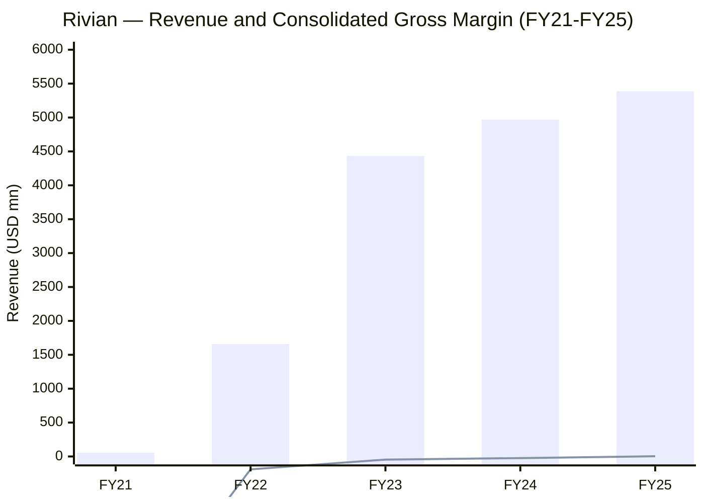
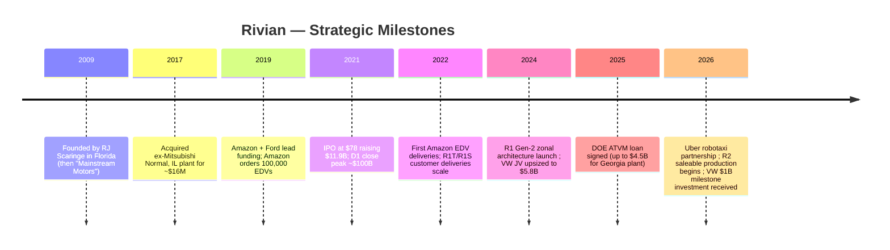
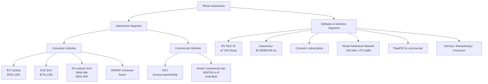
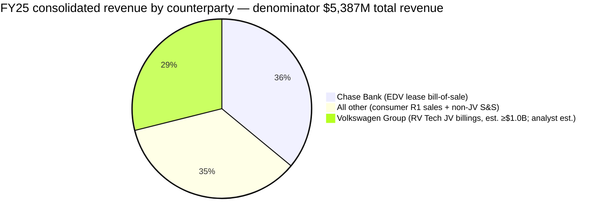
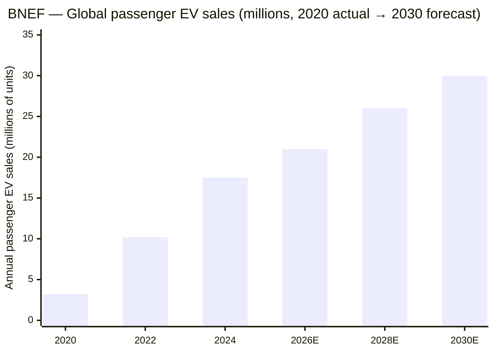
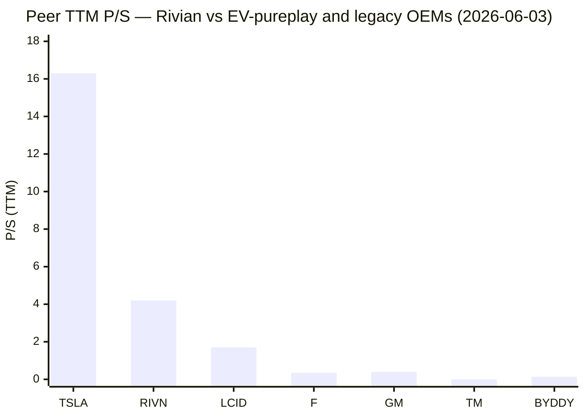
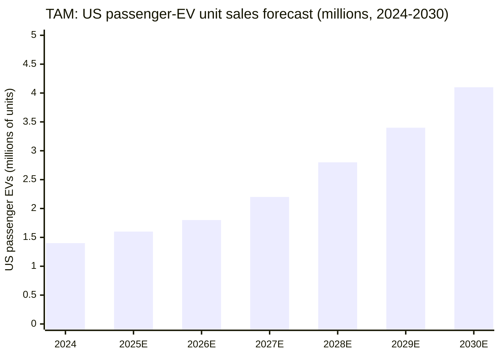
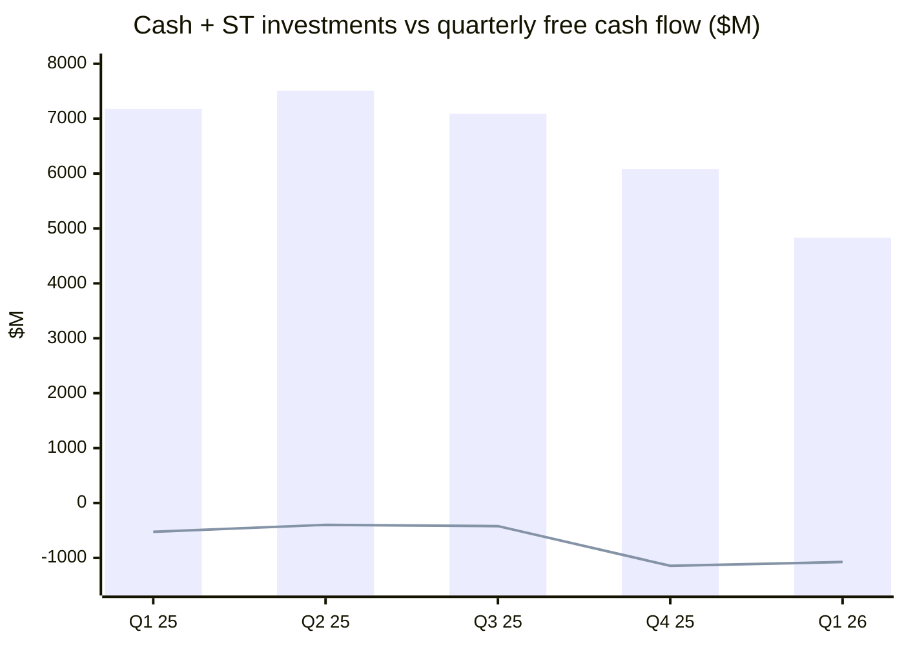

# Rivian Automotive, Inc. (NASDAQ: RIVN) — Initiation of Coverage

**Sector:** Consumer Discretionary — Automobiles (SIC 3711)
**Domicile:** Delaware, USA · **HQ:** Irvine, California
**Founder & CEO:** Robert J. "RJ" Scaringe, Ph.D.
**Listing:** NASDAQ Global Select Market — Class A (RIVN) since Nov 10, 2021
**As-of date:** 2026-06-03

---

## Guidance banner

Most recent guidance was issued on **April 30, 2026** alongside Q1 2026 results. For full-year 2026 Rivian guides to **62,000–67,000 vehicle deliveries** (vs ~51,500 in FY24 and 42,247 in FY25), **adjusted EBITDA of $(2.10) bn to $(1.80) bn**, and **capex of $1.95–$2.05 bn** ([RIVN 1Q26 Earnings Press Release, 2026-04-30](https://www.sec.gov/Archives/edgar/data/1874178/000187417826000033/ex-9911q26rivianearningspr.htm)). R2 saleable production started in Normal, IL the week of April 21, 2026; first external customer deliveries are expected in the spring/summer 2026 window.

Three large pipeline events also closed in March–April 2026: (i) a **partnership with Uber** to build up to **50,000 R2-based fully autonomous robotaxis** for the Uber network — 10,000 firm + an option for 40,000 more — with up to **$1.25 bn of Uber equity into RIVN through 2031** ([Uber-Rivian Robotaxi Partnership Press Release, 2026-03-19](https://investor.uber.com/news-events/news/press-release-details/2026/Uber-and-Rivian-Partner-to-Deploy-up-to-50000-Fully-Autonomous-Robotaxis-2026-TViR4R05gi/default.aspx)); (ii) the **first $1.0 bn equity investment from Volkswagen Group** under the RV Tech JV, triggered by a winter-testing milestone and received on April 30, 2026 ([Electrek, 2026-03-27](https://electrek.co/2026/03/27/volkswagen-groups-joint-venture-with-rivian-hits-latest-milestone-unlocking-another-1b-for-the-ev-automaker/)); (iii) the Georgia "Stanton Springs North" plant initial-phase capacity was **lifted by 50% to 300,000 units/year** with first vehicle production now targeted for **late 2028**, and Rivian now expects to draw on the **$4.5 bn DOE loan ($4,006 mn principal + $494 mn capitalized interest) by early 2027** ([RIVN 1Q26 Earnings Press Release](https://www.sec.gov/Archives/edgar/data/1874178/000187417826000033/ex-9911q26rivianearningspr.htm)).

---

## Table of Contents

1. Company Overview & Valuation Snapshot
2. History & Strategic Milestones
3. Management
4. Products & Services
5. Customers, Channel & Concentration
6. Industry Overview
7. Competitive Landscape
8. Market Opportunity (TAM/SAM)
9. Risk Assessment
10. Investor-Lens Scorecards
11. References & Verification Log

---

## 1. Company Overview & Valuation Snapshot

Rivian Automotive is an American electric-vehicle and vehicle-technology company that designs, develops, and manufactures battery-electric pickup trucks, SUVs, and last-mile commercial delivery vans in Normal, Illinois, and sells them direct-to-consumer in the United States and Canada. The company is also the operating partner of a **50/50 joint venture with Volkswagen AG** called "Rivian and VW Group Technology, LLC" (RV Tech), into which it has contributed its zonal vehicle-electrical architecture and software stack and from which it draws a fast-growing software-and-services revenue stream. Rivian's own product overview frames the business as covering five vertically integrated technology pillars — "electrical architecture, end-to-end software, autonomous driving platform, artificial intelligence, and propulsion" — across consumer vehicles (R1T/R1S today; R2 in 2026; R3/R3X future), commercial vehicles (EDV and Rivian Commercial Van), and a software-and-services suite that monetizes the installed parc through OTA software, advanced-driver-assist subscriptions ("Autonomy+"), charging, service, financing, and remarketing ([RIVN FY25 10-K, Item 1 Business](https://www.sec.gov/Archives/edgar/data/1874178/000187417826000008/rivn-20251231.htm)).

The company reports two segments — **Automotive** and **Software and Services**. For FY25, Automotive revenue was $3,830 mn (down 15% YoY due to a 9,332-unit decline in deliveries and the September 30, 2025 expiration of the federal §45W clean-vehicle credit), and Software-and-Services revenue tripled to $1,557 mn from $484 mn in FY24, almost entirely from billings to RV Tech for the joint venture's electrical-architecture and software-development services ([RIVN FY25 10-K, MD&A Results of Operations](https://www.sec.gov/Archives/edgar/data/1874178/000187417826000008/rivn-20251231.htm)). FY25 total revenue therefore rose 8.4% to **$5,387 mn**, the company's first-ever positive consolidated gross profit ($144 mn, 2.7% margin, vs $(1,200) mn / (24)% in FY24), and the net loss narrowed to **$(3,626) mn** from $(4,747) mn ([RIVN FY25 10-K, Consolidated Statements of Operations](https://www.sec.gov/Archives/edgar/data/1874178/000187417826000008/rivn-20251231.htm)).

**Valuation snapshot (2026-06-03 close).** At a closing price of $17.29, Rivian's market cap is ~$23.2 bn on ~1.34 bn diluted shares; the stock trades in a 52-week range of $11.57–$22.69 and carries a beta of ~1.65 ([Yahoo Finance — RIVN Statistics](https://finance.yahoo.com/quote/RIVN/key-statistics/)). Trailing-twelve-month metrics: **TTM Revenue $5.53 bn, TTM P/S 4.2×, EV/Revenue 4.0×, EV/EBITDA −7.3× (negative — adjusted EBITDA was $(2.21) bn in FY25), and TTM P/E n/a (loss-making)** ([Yahoo Finance — RIVN Statistics](https://finance.yahoo.com/quote/RIVN/key-statistics/); [RIVN 1Q26 Earnings Press Release](https://www.sec.gov/Archives/edgar/data/1874178/000187417826000033/ex-9911q26rivianearningspr.htm)). Insider ownership is ~37.6% (Volkswagen Group ~11.5% voting power, Amazon retains a sizable stake, Scaringe ~100% of Class B with 10-for-1 voting), and institutional holders own ~41.9% of float ([Yahoo Finance — RIVN Statistics](https://finance.yahoo.com/quote/RIVN/key-statistics/); [RIVN FY25 10-K, Risk Factors — VW Joint Venture](https://www.sec.gov/Archives/edgar/data/1874178/000187417826000008/rivn-20251231.htm)).

**Peer multiples context.** On TTM P/S, Rivian at 4.2× sits well below Tesla (16.3×) — Tesla being the only US-listed pure-play EV peer that prints positive earnings — but multiples of pre-profit EV pure-plays Lucid (LCID, 1.7×) and the Chinese new-energy trio NIO/XPeng/Li Auto (0.15–0.23×) ([Yahoo Finance peer screen](https://finance.yahoo.com/quote/TSLA/key-statistics/)). Established legacy OEMs trade in a 0.3–0.5× P/S band (Ford 0.34×, GM 0.40×, BYD 0.14×) and on more-normal P/E in the high single digits to low teens — the gap reflects the market's pricing Rivian as a *transitional* growth/loss company. **Analyst view:** the 4.2× P/S level is hard to justify against the legacy auto comp set; it can only be justified if R2 ramps successfully to a >300k unit run-rate, software/services becomes a recurring ~$2.5–3 bn revenue line, and the company reaches positive automotive gross margin by 2027 — exactly the milestones Rivian itself is guiding to. **Failure to deliver on R2 unit economics is the single largest risk to valuation compression** (see Section 9).


*Sources: Revenue bars from [RIVN FY25 10-K, MD&A](https://www.sec.gov/Archives/edgar/data/1874178/000187417826000008/rivn-20251231.htm); FY21–FY22 revenue from [RIVN FY22 10-K](https://www.sec.gov/Archives/edgar/data/1874178/000187417823000009/rivn-20221231.htm). Gross-margin line in % × 100 to share the axis: −5,124% / −11% / −1% / −24% / +3%.*

---

## 2. History & Strategic Milestones

**2009 — Founding.** RJ Scaringe, then completing his Ph.D. in mechanical engineering at the MIT Sloan Automotive Laboratory, founded the company in **Rockledge, Florida in June 2009** under the working name "Mainstream Motors" (later "Avera Automotive"). He renamed it **Rivian Automotive in 2011**, after the Indian River near where he grew up in Florida, and re-anchored the founding thesis around battery-electric "adventure" vehicles for outdoor consumers — a positioning gap legacy OEMs had left open ([Wikipedia — Rivian Automotive (founding history)](https://en.wikipedia.org/wiki/Rivian); [RIVN 2026 Proxy Statement, Director Bios](https://www.sec.gov/Archives/edgar/data/1874178/000187417826000023/rivn-20260427.htm)).

**2011–2017 — Pre-product capital build.** Rivian spent its first eight years as a stealth-mode prototype shop with no consumer product launch. The pivotal infrastructure decision arrived in **January 2017**, when the company **acquired the former Mitsubishi-Chrysler "Diamond-Star Motors" plant in Normal, Illinois** for ~$16 mn — giving Rivian a 2.6-million-square-foot brownfield manufacturing site at a fraction of greenfield cost, and what is now the "Normal Factory" with installed capacity to produce **up to 215,000 vehicles annually** (split into ~85k R1, ~155k R2, ~65k Commercial Van capacity under full multi-shift operation) ([RIVN FY25 10-K, Manufacturing section](https://www.sec.gov/Archives/edgar/data/1874178/000187417826000008/rivn-20251231.htm); [Wikipedia — Rivian Automotive](https://en.wikipedia.org/wiki/Rivian)).

**2019 — Strategic backers arrive.** In February and September 2019, **Amazon and Ford** led separate ~$700 mn investment rounds; Amazon also placed an order for **100,000 Electric Delivery Vans (EDVs) globally by 2030**, effectively pre-committing a 10-year commercial-fleet customer relationship before the R1 platform had shipped a single unit ([RIVN FY25 10-K, Risk Factors — Customer Concentration](https://www.sec.gov/Archives/edgar/data/1874178/000187417826000008/rivn-20251231.htm); [Wikipedia — Rivian Automotive](https://en.wikipedia.org/wiki/Rivian)). Amazon's stake (held under "Amazon.com NV Investment Holdings") still ranks among the largest non-Scaringe shareholders.

**2021 — IPO at $66.5 bn post-money.** On **November 10, 2021**, Rivian priced its IPO at **$78/share, raising $11.9 bn** for a fully-diluted valuation of ~$66.5 bn and a Day-1 trading close that briefly took the company past **$100 bn — making it the largest US IPO of 2021** and, for one day, more valuable than Ford or GM ([CNBC — Rivian IPO Founder Wealth, 2021-11-11](https://www.cnbc.com/2021/11/11/rivian-founder-rj-scaringe-is-worth-2point2-billion-after-companys-ipo.html); [TechCrunch — Rivian Largest IPO 2021, 2021-11-10](https://techcrunch.com/2021/11/10/electric-automaker-rivian-largest-ipo-2021/)). The IPO was followed by a multi-year drawdown as production ramp delays, raw-material cost inflation, and persistent operating losses compressed the multiple by ~90% from peak — a reset that anchors the current trading band.

**2022–2024 — R1 ramp and operating loss compression.** First R1T customer delivery shipped in September 2021 (just ahead of the IPO); first R1S shipped December 2021; first EDV shipped July 2022 to Amazon. Production climbed to **57,232 units in FY23** then declined to **49,476 in FY24** and **42,284 in FY25** as Rivian executed two major retoolings — a 13-week plant shutdown in spring 2024 to convert the Normal line to the **Gen-2 R1 zonal architecture** (cutting ECU count from 17 to 7, removing 1.6 miles of wiring and 44 lbs of mass per vehicle, claimed 20% material-cost reduction vs Gen-1 — [Popular Science — Rivian Zonal Architecture, 2024-06-06](https://www.popsci.com/technology/rivian-zonal-electrical-architecture/)), and an autumn 2025 line conversion to begin commissioning the R2 platform.

**2024 — Volkswagen JV announced.** In June 2024, Rivian and Volkswagen Group announced a partnership to share Rivian's zonal architecture across VW Group brands. The deal was **upsized to up to $5.8 bn on November 12, 2024** and the legal joint venture (RV Tech) launched November 13, 2024. **Initial VW investments closed at ~$1.3 bn for IP licenses + 50% equity stake**; the remaining **~$3.5 bn is committed across milestone-based equity, convertible notes, and a $1 bn term loan available October 2026** ([CNBC — Rivian-VW JV Deal Upsized to $5.8B, 2024-11-12](https://www.cnbc.com/2024/11/12/rivian-volkswagen-joint-venture.html); [Volkswagen Group Press Release — JV Launch, 2024-11-13](https://www.volkswagen-group.com/en/press-releases/faster-leaner-more-efficient-rivian-and-volkswagen-group-announce-the-launch-of-their-joint-venture-18828); [RIVN FY25 10-K, Note 19 VIE Disclosures](https://www.sec.gov/Archives/edgar/data/1874178/000187417826000008/rivn-20251231.htm)). The JV is consolidated as a VIE on Rivian's balance sheet because Rivian is the primary beneficiary.

**2025 — DOE loan, regulatory whiplash.** In January 2025 Rivian signed an **Advanced Technology Vehicles Manufacturing (ATVM) Program loan with the U.S. Department of Energy** for a multi-draw facility now sized at up to **$4.5 bn** (originally $6.6 bn), funded through the Federal Financing Bank, to finance the Georgia "Stanton Springs North" plant ([RIVN FY25 10-K, Government Programs section](https://www.sec.gov/Archives/edgar/data/1874178/000187417826000008/rivn-20251231.htm); [RIVN 1Q26 Earnings Press Release](https://www.sec.gov/Archives/edgar/data/1874178/000187417826000033/ex-9911q26rivianearningspr.htm)). Mid-year, US tax-credit law shifts (One Big Beautiful Bill Act) **moved the §45W EV credit expiry from end-2032 to September 30, 2025**, pulling forward demand into Q3 2025 (Q3 production +79% QoQ, deliveries +24% QoQ) and crushing the regulatory-credit revenue line in Q4 ([Cox Automotive Q1 2026 EV Sales Commentary](https://www.coxautoinc.com/insights/q1-2026-ev-sales-report-commentary/)).

**2026 — Uber robotaxi pact, R2 SOP.** March 19, 2026 — Rivian announced the **Uber R2 robotaxi partnership** described in the Guidance banner ([CNBC — Uber-Rivian Robotaxi, 2026-03-19](https://www.cnbc.com/2026/03/19/uber-rivian-robotaxi.html)). April 4, 2026 — **paid Autonomy+ subscription** went live at **$2,500 one-time or $49.99/month** for R1 Gen 2 owners ([RIVN 1Q26 Shareholder Letter](https://www.sec.gov/Archives/edgar/data/1874178/000187417826000033/ex-9921q26rivianearnings.htm)). Week of April 21, 2026 — **saleable R2 production began** at the Normal Factory; first external customer deliveries expected in spring 2026. April 30, 2026 — VW Group's $1 bn milestone investment landed on the balance sheet.



---

## 3. Management

**Robert J. "RJ" Scaringe, Ph.D. — Founder, Chief Executive Officer & Chairman.** Age 43 (as of the 2026 Proxy). Founded Rivian in June 2009; CEO continuously since founding; Chairman since March 2018. Per the company's 2026 Proxy: "Dr. Scaringe has led every major milestone achieved by the Company to date, including establishing its vertically integrated technology platforms, building multi-program manufacturing capabilities and developing meaningful partnerships." He concurrently serves as chairman of two Rivian-affiliated investee boards: **Mind Robotics, Inc.** (an industrial AI and robotics business — Rivian retained a ~46.5% interest after Mind's Series A capital raise and deconsolidation, the latter of which generated a **$506 mn gain in Q1 2026 "Other income"** that materially flattered net loss for the quarter — [RIVN 1Q26 Shareholder Letter](https://www.sec.gov/Archives/edgar/data/1874178/000187417826000033/ex-9921q26rivianearnings.htm); [RIVN 2026 Proxy](https://www.sec.gov/Archives/edgar/data/1874178/000187417826000023/rivn-20260427.htm)) and **Also, Inc.** (a micromobility spin-out). Education: B.S. mechanical engineering from Rensselaer Polytechnic Institute; M.S. and Ph.D. mechanical engineering from the MIT Sloan Automotive Laboratory ([RIVN 2026 Proxy, Class I Director Bios](https://www.sec.gov/Archives/edgar/data/1874178/000187417826000023/rivn-20260427.htm)). Scaringe holds **100% of Rivian's Class B common stock (3,912,500 shares as of January 29, 2026 — each with 10-to-1 voting power)**, giving him ~9% of voting control before considering his Class A holdings ([RIVN FY25 10-K, Cover Page](https://www.sec.gov/Archives/edgar/data/1874178/000187417826000008/rivn-20251231.htm)). Risk-factor language explicit on the proxy and 10-K: "We are highly dependent on the services and reputation of our Founder and Chief Executive Officer." Scaringe is the founder-CEO archetype — engineering depth, mission-anchored ("preserving the natural world for generations to come" is the official mission), and operationally hands-on across vehicle, software, and capital allocation. His personal compensation has been heavily equity-skewed and tied to long-dated operational milestones; the 10-K notes the founder-dependence risk explicitly, which the board has tried to mitigate with a deeper bench of named executive officers ([RIVN 2026 Proxy, Executive Compensation discussion](https://www.sec.gov/Archives/edgar/data/1874178/000187417826000023/rivn-20260427.htm)).

Per the skill rule, this report covers only the founder & CEO (Scaringe is both); no additional named executives are profiled here.

---

## 4. Products & Services

Rivian organizes its product portfolio around two reportable segments — **Automotive** (consumer R1/R2/R3 + commercial EDV/RCV) and **Software and Services** (the RV Tech JV; Autonomy+; charging; service; remarketing; subscriptions) — anchored by a **zonal electrical architecture and proprietary software stack** that Rivian designed in-house from 2022–2024 and now licenses to Volkswagen via the JV. The vertically integrated technology pillars — "electrical architecture, end-to-end software, autonomous driving platform, artificial intelligence, and propulsion" — recur in every official product page, the 10-K, and the 1Q26 shareholder deck, and are the technical foundation for both the unit-cost reduction story (R1 Gen 2 → R2 cost-down) and the recurring revenue thesis (software subscriptions + JV billings + autonomy fees) ([RIVN FY25 10-K, Item 1 Business](https://www.sec.gov/Archives/edgar/data/1874178/000187417826000008/rivn-20251231.htm); [RIVN 1Q26 Shareholder Letter, Strategic Priorities slide](https://www.sec.gov/Archives/edgar/data/1874178/000187417826000033/ex-9921q26rivianearnings.htm)).

### 4.1 Consumer vehicles — R1T pickup, R1S SUV (today's revenue engine)

**R1T (pickup truck, two-row 5-passenger).** Quoting the 10-K Business section verbatim:

> "We launched our consumer vehicle business with the R1 platform consisting of two vehicles: the R1T, a two-row, five-passenger pickup truck, and the R1S, a three-row, seven-passenger sport utility vehicle ('SUV'). The R1T and R1S are equipped with Rivian-designed technology including a zonal network architecture, electric powertrains and chassis, the Rivian Autonomy Platform, and digital user experience management via Connect+ which will include Rivian Assistant. These technologies can continuously improve and expand functionality through cloud-enabled over-the-air ('OTA') updates."
> — [RIVN FY25 10-K, Item 1 Business — Consumer Vehicles](https://www.sec.gov/Archives/edgar/data/1874178/000187417826000008/rivn-20251231.htm)

For the 2026 model year the R1T is offered in four powertrain configurations: **R1T Dual-Motor starts at $70,990 (Standard pack, 270 mile range, 533 hp)**; Dual Performance Upgrade boosts to 665 hp; **Tri-Motor at $100,990 (850 hp)**; **Quad Launch Edition at $121,885 (1,025 hp, 0–60 mph in 2.5s, up to 420 miles range with Max pack)** ([Kelley Blue Book — 2026 Rivian R1T Specs](https://www.kbb.com/rivian/r1t/2026/specs/); [Rivian.com — R1T](https://rivian.com/r1t)). **What R1T physically does:** the R1T is the only US-built full-size electric pickup that uses a *unibody (not body-on-frame)* construction with an independent air suspension at all four corners and a quad-motor option with individual wheel torque vectoring — the design choices that allow Rivian to claim outdoor-pickup capability (~11,000 lb towing, ~1,800 lb payload) without sacrificing on-road dynamics. Strategic significance: R1T was the *first* US-market electric pickup to ship in volume (September 2021), predating the Ford F-150 Lightning by ~6 months and the Tesla Cybertruck by >2 years — that first-mover positioning gave Rivian a brand premium ("the cool EV that isn't Tesla") that survived the 2022–2024 production stumbles and now anchors the willingness-to-pay for R2.

**R1S (3-row 7-passenger SUV).** Same Gen-2 zonal architecture as R1T; 2026 MY pricing parallels R1T (Dual $77,700, Tri $107,700, Quad $122,485 in launch trim per [Rivian.com — R1S](https://rivian.com/r1s)). R1S is the *demand-bias* product of the family — the SUV form factor outsells pickup in the US EV market by ~2.5–3×. In the most recent Cox Automotive sales registration database, **R1S ranked #6 in US EV sales for Q1 2026**, edging out the Tesla Cybertruck (which Cox put at 3,519 deliveries vs. R1S's portion of Rivian's 10,365-unit Q1) ([Cox Automotive — Q1 2026 EV Sales Report, 2026-04-15](https://www.coxautoinc.com/insights/q1-2026-ev-sales-report-commentary/); [InsideEVs — Rivian Outsold Ford EVs Q1 2026, 2026-04-15](https://insideevs.com/news/791986/rivian-outsold-ford-evs-q1-2026/)).

**R1 Gen 2 cost-out (delivered 2024–2025).** Gen 2 — produced from June 2024 onward — reduced electronic control units from 17 to 7, removed 1.6 miles of wiring and ~44 pounds of mass per vehicle, and delivered a **claimed ~20% material-cost reduction and ~15% manufacturing-carbon-footprint reduction** versus Gen 1 ([Popular Science — Rivian Zonal Architecture, 2024-06-06](https://www.popsci.com/technology/rivian-zonal-electrical-architecture/); [TechCrunch — Rivian Refresh R1T R1S Second Generation, 2024-06-06](https://techcrunch.com/2024/06/06/rivian-refresh-r1t-r1s-second-generation-speed-range-apple/)). This is the single most important *technical* result in Rivian's history because it both (a) delivered the first quarter of positive automotive gross profit (Q1 2025: +$92 mn at 10% gross margin — [RIVN 1Q26 Shareholder Letter, Automotive Segment slide](https://www.sec.gov/Archives/edgar/data/1874178/000187417826000033/ex-9921q26rivianearnings.htm)) and (b) became the technology that Volkswagen Group agreed to license, generating the JV billings now driving the Software-and-Services segment growth.

### 4.2 R2 and R3 — the volume product (the company's existential bet)

**R2 (midsize 5-seat SUV, MSP platform).** Rivian's own framing: *"R2 is Rivian's all-new midsize SUV that will deliver a combination of performance, capability and utility in a five-seat package optimized for big adventures and everyday use. We expect R2 to benefit from the key vertically integrated technologies developed for R1 including our software stack, propulsion technology, the Rivian Autonomy Platform, and electrical architecture. We expect customer deliveries of R2 vehicles to begin in the second quarter of 2026."* ([RIVN FY25 10-K, Item 1 Business — Consumer Vehicles](https://www.sec.gov/Archives/edgar/data/1874178/000187417826000008/rivn-20251231.htm)).

The R2 line-up was finalized in March 2026 with **four trims** ([Rivian Newsroom — R2 Lineup, 2026-03-12](https://rivian.com/newsroom/article/rivian-introduces-r2-lineup); [TechCrunch — Rivian R2 Launch, 2026-03-12](https://techcrunch.com/2026/03/12/rivian-r2-launch-heres-what-57990-gets-you/); [CNBC — Rivian R2 EV Launch, 2026-03-12](https://www.cnbc.com/2026/03/12/rivian-r2-ev-launch.html)):

| Trim | Starting price | Range (mi) | Power | Avail. |
|---|---:|---:|---|---|
| R2 Performance Launch Edition (AWD) | $57,990 | 330 | 656 hp / 609 lb-ft | Spring 2026 |
| R2 Premium AWD (dual-motor) | $53,990 | 330 | 450 hp / 537 lb-ft | Late 2026 |
| R2 Long-Range (single-motor) | $48,490 | 345 | n/d | Early 2027 |
| R2 Standard (entry trim) | $45,000 | 275 | n/d | Late 2027 |

Sources: [Rivian R2 Newsroom](https://rivian.com/newsroom/article/rivian-introduces-r2-lineup), [TechCrunch R2 Launch](https://techcrunch.com/2026/03/12/rivian-r2-launch-heres-what-57990-gets-you/), [CNBC R2 EV Launch](https://www.cnbc.com/2026/03/12/rivian-r2-ev-launch.html).

**Why R2 matters.** Today's R1T/R1S addressable buyer pool is roughly the US "luxury adventure" segment (~50–60k units/year at $70–125k); R2 expands the TAM into the **US midsize SUV class** — a ~1.2 mn-unit/year combustion market today that EV penetration has barely touched (notable existing EV players: Tesla Model Y, Ford Mustang Mach-E, Hyundai Ioniq 5, Kia EV6, GM Equinox EV). At an entry $45–58k window, R2 puts Rivian in direct competition with the Tesla Model Y (~$45–55k window) for the first time. The Normal Factory has been retooled with up to **155,000 R2 units of annual capacity** alongside ~85k R1 and ~65k Commercial Van capacity, all sharing fixed cost ([RIVN FY25 10-K, Manufacturing](https://www.sec.gov/Archives/edgar/data/1874178/000187417826000008/rivn-20251231.htm)). The path to positive *consolidated* gross margin and structural profitability runs through R2 unit cost; this is the single most consequential operational unknown over the FY26–FY27 horizon.

**R3 and R3X (planned).** Per the 10-K: *"R3 is our future midsize crossover that is expected to be tidy on dimensions but delivers big in terms of performance, off-road capability, passenger comfort, and storage. R3X is a performance variant of R3 offering even more dynamic abilities both on and off road. The design of the exterior and interior of R3 are inviting and iconic."* ([RIVN FY25 10-K, Item 1 Business](https://www.sec.gov/Archives/edgar/data/1874178/000187417826000008/rivn-20251231.htm)). R3 has not been priced or scheduled publicly; the company has positioned it as the next product after R2 ramps, sharing the MSP platform.

### 4.3 Commercial vehicles — EDV, Rivian Commercial Van (the Amazon engine)

**Rivian Commercial Van platform**, which underpins the **Electric Delivery Van (EDV)** designed and engineered with Amazon, is a long-range battery-electric step-in van for centrally-managed last-mile fleets. Per the 10-K:

> *"We have designed a 500 and 700 cubic foot version of the vans, optimized for various commercial uses, including last mile delivery use cases. Both the EDV and Rivian Commercial Van's features include a rear roll-up door, an integrated bulkhead door designed for safety and security, a tall roof to allow drivers to walk through the vehicle, driver-centric ergonomics, and a curb-side sliding door for safe vehicle access away from traffic. Developed to be comfortable and easy to operate for drivers, our commercial vans are designed to achieve lower total cost of ownership ('TCO') for customers while supporting a path to decarbonization."*
> — [RIVN FY25 10-K, Item 1 Business — Commercial Vehicles](https://www.sec.gov/Archives/edgar/data/1874178/000187417826000008/rivn-20251231.htm)

**Amazon's 100,000-EDV order (placed 2019, target 2030)** is the foundational commercial relationship. The 10-K Note 4 disclosure makes clear that, while Amazon is operationally the largest end-customer of the commercial business, *the legal customer of record for the EDV bill-of-sale is Chase Bank*, which leases the vans back to Amazon under a residual-value-sharing arrangement (described in Section 5). Per InsideEVs and industry tracking, Rivian had delivered **~30,000 EDVs to Amazon by the end of FY25** out of the 100,000 contracted ([InsideEVs — Rivian Has Delivered Over 20,000 Electric Vans To Amazon, 2025-09-15](https://insideevs.com/news/745106/rivian-amazon-edv-delivery-update/); [RIVN FY25 10-K, Risk Factors](https://www.sec.gov/Archives/edgar/data/1874178/000187417826000008/rivn-20251231.htm)). **Commercial-van mix dramatically accelerated in Q1 2026** — Cox Automotive registration data show Rivian roughly doubled its US commercial-van deliveries YoY, helping drive total Q1 2026 deliveries to 10,365 (+20% YoY) even as R1 demand softened post-§45W expiry ([eletric-vehicles.com — Rivian Doubles US Van Sales in Q1, 2026-04-22](https://eletric-vehicles.com/rivian/rivian-doubles-us-sales-of-delivery-vans-in-q1-cox-automotive-data-shows/)). The commercial-van platform is now opened up to non-Amazon last-mile customers (with Amazon consent for last-mile and retail customers per the 10-K), with announced/named customers including AT&T, HelloFresh, IKEA, and several regional fleet operators.

### 4.4 Software and Services — RV Tech JV, Autonomy+, Connect+, Charging, FleetOS

This is the segment where Rivian's investment thesis is *most* differentiated from a pure EV OEM, and where the *revenue growth* in 2025 surprised most positively:

> *"Complementing our vehicles, we provide a suite of value-added software and services which we expect to continue to generate long-term brand loyalty while also creating a recurring revenue stream across the vehicle lifecycle. These services include vehicle electrical architecture and software development services provided by the Joint Venture, Autonomy+, remarketing, vehicle repair and maintenance, charging, software subscriptions, vehicle accessories, financing, insurance, and more."*
> — [RIVN FY25 10-K, Item 1 Business — Software and Services Segment](https://www.sec.gov/Archives/edgar/data/1874178/000187417826000008/rivn-20251231.htm)

**Joint Venture (RV Tech) billings — the FY25 surprise.** Rivian and VW Group each contributed 50% to RV Tech, formed November 13, 2024. Rivian's initial contribution included its zonal ECU architecture, software stack, and seconded personnel; in exchange Rivian received **$1,295 mn for intellectual property** plus continuing service billings from the JV to Rivian for ongoing engineering work. Because Rivian is the primary beneficiary, the JV is *consolidated* into Rivian's reported numbers (with the VW share of equity carried in non-controlling interest), and the Software-and-Services segment now reflects the engineering billings Rivian charges the JV. This is what drove **S&S revenue from $484 mn in FY24 to $1,557 mn in FY25 (+221% YoY)** and **S&S revenue from $318 mn in Q1 2025 to $473 mn in Q1 2026 (+49% YoY)** ([RIVN FY25 10-K, MD&A](https://www.sec.gov/Archives/edgar/data/1874178/000187417826000008/rivn-20251231.htm); [RIVN 1Q26 Earnings Press Release](https://www.sec.gov/Archives/edgar/data/1874178/000187417826000033/ex-9911q26rivianearningspr.htm)). **Critical caveat — verbatim from the 10-K Risk Factors:** *"A significant portion of our software and services revenues has been from Volkswagen Group."* This makes the Software-and-Services revenue stream a *single-counterparty risk* unless and until non-JV recurring revenue (Autonomy+, Connect+, service, charging) scales materially.

**Autonomy+.** *"In December 2025, we released our Universal Hands Free feature via an OTA update to our R1 Gen 2 customers. This feature significantly expanded our assistive hands-free driving capabilities for customers, going from availability on fewer than 150,000 miles of roads to more than 3.5 million miles of roads in North America. We expect to begin charging a one-time or month-to-month fee for Autonomy+ advanced driver assistance features in consumer vehicles starting in April 2026."* ([RIVN FY25 10-K, Item 1 Business](https://www.sec.gov/Archives/edgar/data/1874178/000187417826000008/rivn-20251231.htm)). Pricing went live April 4, 2026 at **$2,500 one-time / $49.99 monthly** ([RIVN 1Q26 Shareholder Letter](https://www.sec.gov/Archives/edgar/data/1874178/000187417826000033/ex-9921q26rivianearnings.htm)). The roadmap progresses from L2/L2+ hands-free (current) → point-to-point eyes-on → eyes-off conditional → eventual personal-L4. The same stack — branded "Rivian Autonomy Platform" and underpinned by **RAP1 (Rivian Autonomy Processor, in-house silicon)**, multimodal perception (cameras, radar, LiDAR), and an AI-based Large Driving Model trained on Rivian fleet miles — is also the technology Uber is committing to for the R2 robotaxi platform.

**Rivian Adventure Network charging.** *"Over 95% of our Rivian Adventure Network is open to non-Rivian EVs, allowing increased utilization of our network."* — [10-K](https://www.sec.gov/Archives/edgar/data/1874178/000187417826000008/rivn-20251231.htm). As of Q1 2026 the network is **145 locations / 973 stalls** in North America, up +29%/+38% YoY ([RIVN 1Q26 Shareholder Letter, network slide](https://www.sec.gov/Archives/edgar/data/1874178/000187417826000033/ex-9921q26rivianearnings.htm)).

**FleetOS** is Rivian's proprietary end-to-end cloud platform for centrally managed commercial fleets — distribution, telematics, service, ADAS, lifecycle — sold as a subscription alongside the Commercial Van.

**Connect+, remarketing, repair & maintenance.** Connect+ is the standard in-vehicle connectivity subscription (enhanced media, navigation, live security, OTA). Remarketing — Rivian's trade-in and used-Rivian-resale channel — is starting to materialize as the early 2022 R1 cohort cycles to second owners. Repair & maintenance runs through a hybrid network of Rivian-operated service centers (97 in N.A. as of Q1 2026), Rivian mobile-service vehicles, plus partner collision centers.



**Synthesis — how the products interact.** The R1 family is the *brand and demand* engine — premium-priced, niche volume, but the credibility halo that makes a $45k R2 buyer believe they're getting Rivian engineering at a Toyota price. The Commercial Van platform amortizes the same Normal Factory fixed costs while contracting a 10-year revenue stream against Amazon. R2 is the *unit-economics breakthrough* — same zonal architecture, lower bill-of-materials, much higher volume → fixed-cost absorption. Software-and-Services is the *adjacent revenue layer* — partly funded by VW Group's structurally committed JV billings (which de-risk the build-out of the technology stack), partly by direct monetization of the installed parc through Autonomy+, Connect+, and charging. And the Uber pact stretches R2's relevance through the back door of a robotaxi platform without Rivian having to capitalize a ride-hailing network itself. Each product feeds the others; the financial system fails only if R2's unit cost doesn't get below R1 Gen 2's, or if the VW JV billings flatten before consumer subscription revenue scales.

---

## 5. Customers, Channel & Concentration

Rivian operates a **direct-to-customer sales model** in the United States and Canada — no franchised dealer network. Sales flow through the company website (configurator, online purchase) and a footprint of **44 brand-experience "Spaces"** as of Q1 2026, plus **97 service centers** and a growing mobile-service fleet, alongside the Adventure Network for charging ([RIVN 1Q26 Shareholder Letter, network slide](https://www.sec.gov/Archives/edgar/data/1874178/000187417826000033/ex-9921q26rivianearnings.htm)). For consumer R1 buyers, financing flows through third-party lenders; for commercial vans, Rivian has structured a more complex bill-of-sale arrangement that materially affects how the customer-concentration line item reads in the 10-K.

### Customer concentration — a single counterparty (Chase Bank) accounts for ~36% of consolidated revenue

This is the single most important fact about Rivian's revenue base and is widely misunderstood. From the 10-K Note 4 verbatim:

> *"During the years ended December 31, 2024 and 2025, approximately **37% and 36%, respectively, of the Company's revenues were from new EV sales to Chase Bank**, with Chase Bank entering into leasing arrangements for purchased vehicles. The Company has an obligation to share a portion of the difference between the residual value realized by Chase Bank at the end of the lease term and the residual value determined at lease inception."*
> — [RIVN FY25 10-K, Note 4 Revenues](https://www.sec.gov/Archives/edgar/data/1874178/000187417826000008/rivn-20251231.htm)

**Critical denominator label: 36% of *consolidated* (Automotive + Software-and-Services) revenue.** That share corresponds primarily to Rivian Commercial Vans sold to Chase, which Chase in turn leases to **Amazon and other commercial-fleet end-users**; the operational customer is Amazon-dominated, but the *legal* customer of record is Chase Bank. This is the same financing structure that Tesla used for its lease-channel commercial portfolio. Rivian carries a contingent **Residual Value Risk Sharing ("RVRS") liability** for the difference between the in-lease residual and the eventual realized residual; that liability has been "not material" through end-FY25.

**Volkswagen Group is the other large counterparty** — concentrated in the Software-and-Services segment via RV Tech billings. The 10-K Risk Factor states: *"A significant portion of our software and services revenues has been from Volkswagen Group."* — [RIVN FY25 10-K, Risk Factors](https://www.sec.gov/Archives/edgar/data/1874178/000187417826000008/rivn-20251231.htm). At ~$1,557 mn of S&S revenue in FY25 vs ~$3,830 mn of Automotive revenue, the VW JV billings are estimated to be at least ~$1.0 bn (analyst estimate; not disclosed line-item) — i.e., **a top-3 customer at ~18–20% of consolidated revenue**. **Important: Chase Bank and Volkswagen Group are not consolidated into a single customer concentration view in the 10-K**; they are separate ASC 280-10-50-42 disclosures attached to different segments.

**Amazon's de facto role.** Amazon does not appear as a named >10% customer in the consolidated 10-K because its van purchases route through Chase Bank's lease vehicle. However, public commentary from independent EV trackers points to Amazon being the *economic* customer for the vast majority of EDV volume. One industry tracker estimated **Amazon-related revenue rose from ~$99 mn in Q1 2025 to ~$468 mn in Q1 2026** as the commercial-van mix accelerated, implying Amazon-related revenue may now be near 30% of automotive segment revenue ([eletric-vehicles.com — Amazon Now 52% of Rivian Auto Revenue, 2026-04](https://eletric-vehicles.com/rivian/amazon-now-52-of-rivian-auto-revenue-up-from-11-as-vans-accelerate/)). **Analyst view (uncited by Rivian itself):** the headline 36% Chase-Bank concentration *understates* the economic dependence on Amazon as a fleet operator — though the cash collection itself goes through a creditworthy investment-grade bank counterparty, which is itself a risk mitigant.


*Source: [RIVN FY25 10-K, Note 4 Revenues](https://www.sec.gov/Archives/edgar/data/1874178/000187417826000008/rivn-20251231.htm). Chase Bank figure is exact 36% disclosure. Volkswagen Group figure is analyst estimate; the 10-K disclosure is qualitative ("a significant portion"), not numerical.*

### Geographic mix

Substantially all FY25 revenue is from US-domiciled customers (with very limited Canada exposure). Rivian has **no European, China, or rest-of-world consumer-vehicle revenue** today. The Volkswagen JV billings would technically be cross-border given VW's headquartering, but the billings are still recognized through Rivian's US entity. Geographic expansion is implicit in the R2 product strategy — *"R2 is expected to address global market segments"* — but no firm date or geography has been announced. R2's expected first international markets per the 10-K Item 1 read like Western Europe, leveraging VW dealership infrastructure where the JV intersects.

---

## 6. Industry Overview

### 6.1 Global EV market — slowing penetration, China dominance

Global passenger-EV sales reached ~17 mn units in 2024 (~22% of total light-vehicle sales) and BloombergNEF's most recent (and notably *trimmed*) Electric Vehicle Outlook projects passenger-EV sales to exceed **50% of global new-vehicle sales by 2030** with ~30 mn unit annual sales by then ([BloombergNEF Electric Vehicle Outlook 2025](https://about.bnef.com/insights/clean-transport/electric-vehicle-outlook/); [BloombergNEF — EV Sales Set for Record-Breaking 2025](https://about.bnef.com/insights/clean-transport/global-electric-vehicle-sales-set-for-record-breaking-year-even-as-us-market-slows-sharply-bloombergnef-finds/)). The 2025 BNEF update marked the *first* downward revision in BNEF's long-running forecast — driven primarily by US policy reversals and slower-than-expected European adoption — which now puts **US passenger-EV sales at 4.1 mn in 2030 (from 1.6 mn in 2025), with China accounting for ~two-thirds of global EV sales, Europe ~17%, and the US ~7%** ([BloombergNEF EV Outlook 2025](https://about.bnef.com/insights/clean-transport/electric-vehicle-outlook/)).

The IEA's *Global EV Outlook 2025* gives a similar but slightly more upbeat shape — total stock of electric passenger cars on roads exceeds 40 mn at end-2024 (vs ~10 mn at end-2020), with China registering >60% of new EV sales globally. Europe ~25%, US ~10% ([IEA — Global EV Outlook 2025](https://www.iea.org/reports/global-ev-outlook-2025)).

### 6.2 US EV market — share-shift to Tesla, total volume down

Most relevant for Rivian — **the US EV market contracted 27% YoY to 216,399 units in Q1 2026** as the §45W tax credit expired on September 30, 2025 and demand was pulled forward into Q3 2025 ([Cox Automotive Q1 2026 EV Sales Report](https://www.coxautoinc.com/insights/q1-2026-ev-sales-report-commentary/)). Tesla's market share *expanded* to **54.2% in Q1 2026 (from 43.2% YoY)** as it absorbed share from competitors who lacked the price flexibility to absorb the credit loss ([Drive Tesla — Tesla 54% Market Share Q1 2026](https://driveteslacanada.ca/news/tesla-claims-54-market-share-as-u-s-ev-sales-drop-in-q1-2026/); [CleanTechnica — Tesla 46% of US EV Market 2025, 2026-02-04](https://cleantechnica.com/2026/02/04/tesla-had-46-of-us-ev-market-in-2025-down-from-49-in-2024-gm-13-ford-7/)). Ford's US EV sales nosedived **~70% YoY in Q1 2026** following the F-150 Lightning cancellation; GM's Chevy Equinox EV gained share to ~9,589 units. Rivian's Q1 2026 deliveries of 10,365 (+20% YoY) put it slightly above Ford EVs and well below Tesla and GM in the US registration data — a fragile but defensible top-5 US EV OEM position.

### 6.3 Industry economics — battery cost, ASP compression, structural EV margin

Battery-cell prices fell to ~$80–90/kWh by mid-2025 from ~$140/kWh at end-2022 (BloombergNEF annual survey series), with continued downward pressure from LFP-cell adoption in mass-market EVs. This is the macro tailwind that makes R2 at $45k economically possible — at $140/kWh a 75 kWh R2 pack costs ~$10,500 in cells alone vs ~$6,000 at $80/kWh. Pricing competition has been intense at the bottom of the EV market (BYD Seagull, Wuling Bingo, Tesla's recurring price cuts); Rivian has chosen *not* to price R2 to undercut Tesla but rather to offer a *differentiated* mid-spec experience at a competitive price.

### 6.4 Robotaxi & autonomy — the secondary TAM

Rivian's Uber partnership opens an entirely separate industry — **fully-autonomous ride-hailing**, with Waymo, Cruise (GM-affiliated), Tesla, and several China-domiciled players (Baidu Apollo Go, Pony.ai, WeRide) as the named competitive set. Industry estimates of the global robotaxi market in 2030 vary widely from $30 bn to >$100 bn in annual gross-bookings; the credible TAM for *vehicle suppliers* (excluding the ride-hailing intermediary) is much smaller and depends entirely on per-vehicle TCO and utilization. The Uber deal is structured such that Rivian sells the vehicles outright (with Uber-funded autonomy hardware/software milestones tied to the equity investment) — it is a *vehicle supply* contract, not a ride-hailing revenue share.


*Source: [BloombergNEF Electric Vehicle Outlook 2025](https://about.bnef.com/insights/clean-transport/electric-vehicle-outlook/); [IEA Global EV Outlook 2025](https://www.iea.org/reports/global-ev-outlook-2025) for historical baseline.*

---

## 7. Competitive Landscape

The 10-K's Competition section is sparse — it does not name specific competitors, instead saying:

> *"Our competition includes the millions of traditional internal combustion engine ('ICE') vehicles and EVs sold each year in the consumer and commercial markets. … Our competitive set also represents our total addressable market, which we aim to target over the long term with an expanded product portfolio in our current and future geographies."* — [RIVN FY25 10-K, Competition](https://www.sec.gov/Archives/edgar/data/1874178/000187417826000008/rivn-20251231.htm).

The competitive set Rivian faces breaks into four distinct slices:

**(A) US-listed pure-play EV peers.** Tesla (TSLA) is the dominant peer — pure-play EV at scale, profitable, US-listed, with overlap across all Rivian product axes (Model Y vs R2; Cybertruck vs R1T; Semi vs Commercial Van; FSD vs Autonomy+). Lucid Group (LCID) is a smaller, premium-only competitor that has struggled to scale and trades at 1.7× P/S. *Analyst view: TSLA is the only US EV pure-play at structural margin; Rivian's path to profitability runs through R2 against Model Y.*

**(B) Legacy US OEMs that pivoted into EVs.** Ford (F), GM, Stellantis — all with broad ICE portfolios cross-subsidizing EV losses. Most consequential: GM's Chevy Equinox EV (top-5 US EV in Q1 2026 at $34k entry); Ford's pulled F-150 Lightning (cancelled, dropping Ford US EV unit volume by ~70% YoY). The legacy OEMs have *manufacturing scale and dealer reach* that startups don't, but their EV margins remain structurally negative because they're carrying the dealer-channel and ICE-engineering legacy.

**(C) China EV champions positioning for global expansion.** BYD (BYDDY) is by far the largest pure-play global EV maker (5+ mn unit annual run-rate, profitable, ~14× P/E), NIO/XPeng/Li Auto run a premium-EV-tech playbook closer to Rivian's. BYD is restricted from the US market by 100% Section 301 tariffs imposed in May 2024, but it dominates Latin America, Southeast Asia, and parts of Europe. **The structural risk** is whether BYD/Geely/Chery can break into the US in the late-2020s if tariffs are partially rolled back — a wildcard for R2/R3 global expansion plans.

**(D) Commercial-fleet EV competitors.** Ford E-Transit, GM BrightDrop, Mercedes eSprinter, and Stellantis Ram ProMaster EV all compete with the Rivian Commercial Van for non-Amazon fleet customers; Tesla Semi competes in heavy-duty (a class Rivian does not yet play in). Most large fleet RFPs go to the OEM with the best TCO + service network reach — Rivian's TCO calculation depends heavily on Adventure Network charging adoption and FleetOS recurring revenue. **Analyst view:** Rivian's edge over Ford E-Transit is the *purpose-built electric* design (vs. Ford's combustion-platform conversion); Rivian's vulnerability is its smaller service footprint relative to Ford's nationwide commercial-vehicle dealer/service base.

```mermaid
quadrantChart
    title US EV competitive positioning — price vs feature/technology breadth
    x-axis Low Price --> High Price
    y-axis Limited Tech --> Full-Stack Tech
    quadrant-1 Premium Differentiated
    quadrant-2 Tech Leaders
    quadrant-3 Mass-Market Commodity
    quadrant-4 Premium Legacy
    Tesla Model Y: [0.4, 0.85]
    Tesla Cybertruck: [0.7, 0.85]
    Rivian R1T/R1S: [0.85, 0.8]
    Rivian R2 (2026): [0.45, 0.75]
    Lucid Air: [0.85, 0.7]
    Ford F-150 Lightning: [0.55, 0.45]
    GM Chevy Equinox EV: [0.3, 0.4]
    Hyundai Ioniq 5: [0.4, 0.55]
```
*Positioning is analyst-constructed based on starting MSRPs and stated tech specs from each OEM's website.*


*Source: [Yahoo Finance — key statistics for each ticker, 2026-06-03](https://finance.yahoo.com/quote/RIVN/key-statistics/). TM P/S is unusually low because the displayed TTM revenue base is in JPY-equivalent USD-conversion bucket; treat as illustrative of legacy-OEM multiples.*

---

## 8. Market Opportunity (TAM / SAM)

**Global passenger-vehicle TAM (TAM-1):** ~85 mn light-vehicle units sold annually worldwide as of 2024, ~$2.0 trn in sticker revenue. BNEF projects the **EV share to reach >50% by 2030** — implying **30 mn EVs/year ≈ $1.1 trn in 2030 EV revenue** ([BloombergNEF EV Outlook 2025](https://about.bnef.com/insights/clean-transport/electric-vehicle-outlook/); [Statista Electric Vehicles Worldwide Forecast 2030](https://www.statista.com/outlook/mmo/electric-vehicles/worldwide)).

**US passenger-EV TAM (TAM-2 — Rivian's near-term addressable market):** BNEF projects US passenger-EV sales to grow from **~1.6 mn units in 2025 to ~4.1 mn units in 2030** at ~21% CAGR — a US-EV revenue TAM of ~$150–180 bn by 2030 ([BloombergNEF EV Outlook 2025](https://about.bnef.com/insights/clean-transport/electric-vehicle-outlook/)). Rivian's stated long-term US-Normal+Georgia capacity targets imply ~615k annual unit output capacity by ~2029 (215k Normal + 400k Georgia full phases) — i.e., **~10–15% of US EV unit TAM by 2030 if both plants operate at design capacity** (Rivian-stated capacity; not company-issued unit guidance).

**Commercial-fleet EV (SAM-1):** ~5–6 mn commercial light-vehicle units sold annually in the US; commercial EV penetration <5%. Rivian's identifiable addressable here: ~1 mn last-mile delivery van/truck units. Amazon's 100k EDV order alone is ~10% of that subset.

**Software / autonomy (SAM-2 — the layered upside):** The Volkswagen JV is the first articulated proof point: VW is paying ~$5.8 bn over several years for what amounts to a software/architecture license — implying Rivian's IP has standalone TAM beyond its own vehicles. Adding Uber R2 robotaxi (up to $1.25 bn through 2031, plus 50k vehicle supply), the total *announced* software/autonomy/JV TAM is **~$7+ bn over the next 5–7 years**, not counting recurring Autonomy+ subscriptions ($2,500 one-time or $49.99/mo × installed parc).


*Source: [BloombergNEF Electric Vehicle Outlook 2025](https://about.bnef.com/insights/clean-transport/electric-vehicle-outlook/) (downward-revised 2025 outlook).*

---

## 9. Risk Assessment

### Company-specific risks

**1. R2 ramp execution risk (highest priority).** R2 is the central capital-allocation bet — Normal Factory retooling, the R2 unit cost target (~$32–35k BOM at scale per analyst-constructed model), and the volume to absorb fixed cost. Any 6–12 month slippage in the R2 production curve materially worsens cash burn and could force capital raises before the Georgia plant begins generating. The 10-K Risk Factors devote multiple paragraphs to this: *"We have experienced and may in the future experience significant delays in the manufacture and delivery of our vehicles."* — [RIVN FY25 10-K](https://www.sec.gov/Archives/edgar/data/1874178/000187417826000008/rivn-20251231.htm).

**2. Single-customer / counterparty concentration on automotive revenue.** 36% of FY25 consolidated revenue flowed through Chase Bank (the bill-of-sale counterparty for Amazon's EDV lease channel). If Amazon were to slow purchases, restructure the lease channel, or shift to a multi-supplier strategy, the commercial-van business would compress sharply. The 10-K Risk Factors flag *"sales of Rivian Commercial Vans to certain last-mile delivery customers and certain customers in the retail industry require Amazon's consent"* — Amazon thus has both a customer relationship and gatekeeper power.

**3. RV Tech JV billings as the only material software-and-services revenue.** S&S grew from $484 mn to $1,557 mn in FY25, but the 10-K Risk Factor is explicit: *"A significant portion of our software and services revenues has been from Volkswagen Group."* If VW reduces engineering scope, slows the JV's first OEM deliveries (currently targeted 2027), or the JV underperforms its operational milestones, S&S revenue compresses sharply. The $5.8 bn total VW commitment is **milestone-based**, not unconditional.

**4. Founder-dependence.** From the 10-K verbatim: *"We are highly dependent on the services and reputation of our Founder and Chief Executive Officer."* — [RIVN FY25 10-K](https://www.sec.gov/Archives/edgar/data/1874178/000187417826000008/rivn-20251231.htm). Scaringe's Class B 10-for-1 voting stake plus chairmanship means succession or strategy disagreements cannot be resolved by traditional shareholder vote.

### Industry / market risks

**5. EV demand softening + tariff overhang.** US passenger-EV sales fell 27% YoY in Q1 2026 after §45W expired; tariff-driven cost increases on imported battery components compress margins. The 10-K mentions tariff impacts ~30 times in the Risk Factors section; battery raw-material (lithium, nickel, graphite, cobalt) and heavy-rare-earth supply concentration in China is described as *"one of the most vulnerable parts of our supply chain."* — [RIVN FY25 10-K](https://www.sec.gov/Archives/edgar/data/1874178/000187417826000008/rivn-20251231.htm).

**6. Competitive intensity from Tesla (price/scale) and BYD (cost).** Tesla's 54% US EV share and structural margin advantage compress R2's pricing flexibility. If BYD or other China entrants get tariff relief, Rivian's R2/R3 economics worsen further.

**7. Regulatory credit revenue tail risk.** FY25 regulatory-credit revenue was $197 mn (down from $333 mn in FY24); the 10-K explicitly flags *"our ability to continue earning and selling the corresponding credits is uncertain at this time"* — credit-program changes could remove ~3–4% of total revenue.

### Financial risks

**8. Liquidity / refinancing.** Cash + short-term investments fell from $7.1 bn at end-Q1 2025 to $4.8 bn at end-Q1 2026 — a ~$2.4 bn ($600 mn/quarter) cash burn. With FY26 adj-EBITDA guide $(2.10)-$(1.80) bn and capex $1.95-$2.05 bn, **net cash consumption could be ~$4.0 bn in FY26** even before the partially-offsetting VW, Uber, and DOE inflows. Liquidity stack as Rivian itemizes in the Q1 2026 deck: cash ($4.83 bn) + ABL availability ($564 mn) + VW $1 bn (received Apr 30) + Uber $300 mn (Q2 2026) + Uber $250 mn (late 2026, milestone) + VW $1 bn term loan (Oct 2026) + DOE loan first draw (early 2027). **Bridge to profitability requires every one of these inflows to land on schedule.**

**9. Capex inflation on the Georgia plant.** Initial Phase 1 capacity *expanded* from 200k → 300k units in the 1Q26 announcement, but total capex is now wrapped under a $4.5 bn DOE loan covenant structure with milestone-gating; cost overruns put the loan covenants at risk. The Georgia incentive package from the State of Georgia is valued at up to $1.5 bn but requires **7,500 new full-time jobs and $5.0 bn of capital investment by Dec 31, 2047** ([RIVN FY25 10-K, Note 9 Leases / EDA agreement](https://www.sec.gov/Archives/edgar/data/1874178/000187417826000008/rivn-20251231.htm)).

**10. Dilution overhang from convertible notes and equity issuance.** Multiple capital raises since IPO (convertible notes 2023, $1.5 bn convert 2024, ATM equity facility), milestone-based VW and Uber equity issuance, ESPP and bonus settlement all contribute to ongoing share count growth. **Class A shares outstanding rose from 1,137 mn (Q1 2025 weighted-avg) to 1,249 mn (Q1 2026 weighted-avg)** — ~10% share count growth in one year.

### Macro / regulatory risks

**11. US trade policy / tariff regime.** Battery-material and component tariffs on China imports, retaliatory tariffs from trading partners, and CHIPS-Act-style domestic-content requirements are all sources of ongoing margin pressure. Rivian flags this risk in eight separate places in the FY25 10-K.

**12. Multi-state EV regulation patchwork.** California's Advanced Clean Cars II (ACCII) and ZEV-mandate regimes vary state-by-state; the Clean Air Act Waiver was challenged in 2025 and is in litigation. Rivian's planning footprint assumes most ZEV-state regimes hold but several states could slow purchase mandates.


*Source: [RIVN 1Q26 Earnings Press Release — Quarterly Financial Performance](https://www.sec.gov/Archives/edgar/data/1874178/000187417826000033/ex-9911q26rivianearningspr.htm). Bars = period-end cash + ST investments; line = free cash flow (negative throughout).*

---

## 10. Investor-Lens Scorecards

*Cycle snapshot (as of 2026-06-03): VIX ~16 (subdued), 10-Y Treasury ~4.3%, HY OAS ~340 bp (mid-cycle), IG OAS ~95 bp. Howard Marks framework reads as "mid-cycle — neither offense nor defense extreme.")*

### 10.1 Buffett (quality at a sensible price, 0–100)

| Component | Score (max) | Note |
|---|---:|---|
| Predictable owner-earnings | 5 / 25 | Net loss $(3.6) bn FY25; no positive owner-earnings stream |
| Returns on capital | 4 / 20 | ROIC <0%; gross margin just turned positive in FY25 |
| Moat (brand + tech) | 14 / 20 | Strong consumer brand; deep zonal-architecture / software IP |
| Conservative balance sheet | 10 / 15 | $4.8 bn cash but $4.4 bn LT debt + $1+ bn capex/qtr burn |
| Mgmt skin in game | 10 / 10 | Founder-CEO with Class B voting + concentrated stake |
| Margin of safety | 5 / 10 | P/S 4.2× vs sector ~0.5× — no margin of safety vs legacy auto comps |
| **Total** | **48 / 100** | **Pass on Buffett rubric** |

*Lens view: Rivian fails the Buffett quality bar primarily on absent owner-earnings and no operating-margin track record. Brand + tech IP are real assets; balance sheet is workable for ~2 years; but until R2 ramps to volume the rubric flags this as "too early."*

### 10.2 Munger (weighted quality + inversion, 0–10)

| Dimension | Score | Inversion lens |
|---|---:|---|
| Business simple/understandable | 5 | Two segments but complex JV consolidation makes reported revenue noisy |
| Honest management | 8 | Scaringe communications track straight — no aggressive non-GAAP |
| Long-term economic prospect | 6 | EV TAM exists but margin path uncertain |
| ROIC trajectory | 3 | Negative ROIC; can it cross 10% by 2028? Unclear |
| Inversion ("How could this fail?") | -3 | R2 cost-out misses; VW JV slows; Amazon shifts |
| **Total (max 10)** | **3.8 / 10** | Below Munger threshold (~7+) |

*Lens view: Munger inversion bites hard — there are 3+ distinct failure paths (R2 unit cost, VW JV slowdown, Amazon shift). Quality dimensions are mixed.*

### 10.3 Damodaran (DCF margin of safety)

Required inputs (state assumptions explicitly):
- Revenue 2026E: $7.5 bn → 2030E: $24 bn (R2 ramp + commercial van + Uber R2 robotaxi)
- Steady-state operating margin: 8% (optimistic; auto industry mid-cycle ~5–8%)
- Reinvestment rate: 80% (heavy capex through 2028)
- Risk-free rate: 4.3% (10-Y Treasury, 2026-06-03)
- Equity risk premium: 5.5%; unlevered beta: 1.4; cost of capital ~10.5%

DCF on these assumptions yields a fair value range of **$14–22/share** vs current $17.29. **Margin of safety: 0% to +27%** depending on terminal-margin assumption.

*Lens view: Damodaran rubric reads as "fully priced" — meaningful upside requires R2 margin coming in better than 8%. Cap on the upside is the dilution risk from continued equity raises.*

### 10.4 Howard Marks cycle (offense vs defense, 0–100)

Current macro: mid-cycle, no extreme pessimism, HY OAS at 340 bp (middle of historical range), Tesla absorbing US EV market share, BNEF cutting EV forecasts. Cycle reads **52 / 100 — slightly defensive**. For a loss-making growth name like Rivian, defensive regime translates to "no rush to add — wait for either capital structure clarity or R2 production proof."

*Lens view: market is not in distress; Rivian doesn't enjoy a deeply contrarian setup. Position sizing should be modest.*

### 10.5 Lynch GARP (optional — Rivian is mid-cap)

Lynch screen: PEG = N/A (no positive earnings); category = "fast grower" (revenue +8% YoY masks 49% S&S growth). Doesn't pass Lynch screen mechanically (no E in PEG), but Lynch's qualitative "story makes sense" test passes if you believe in R2 + autonomy.

### Overall lens synthesis

The Buffett/Damodaran/Marks rubrics all read as **"price is fair-to-slightly-rich for the data we have today"**; the Munger inversion lens reads as **"too many ways this fails"**; the qualitative Lynch/growth lens reads as **"compelling story, needs R2 proof points."** Combined message: this is a *medium-conviction / event-driven name* — the entry/exit risk is heavily concentrated around the R2 ramp curve (next 4–6 quarters) and the VW JV milestones. The 1Q26 cash burn pattern argues against full-position sizing before R2 saleable production proves out.

---

## 11. References

### Filings (primary)
- [Rivian Automotive FY25 Annual Report on Form 10-K, filed 2026-02-12](https://www.sec.gov/Archives/edgar/data/1874178/000187417826000008/rivn-20251231.htm) — CIK 0001874178, accession 0001874178-26-000008
- [Rivian Automotive FY24 Annual Report on Form 10-K, filed 2025-02-24](https://www.sec.gov/Archives/edgar/data/1874178/000187417825000007/rivn-20241231.htm)
- [Rivian Automotive FY23 Annual Report on Form 10-K, filed 2024-02-26](https://www.sec.gov/Archives/edgar/data/1874178/000187417824000014/rivn-20231231.htm)
- [Rivian Automotive 2026 Definitive Proxy Statement (DEF 14A), filed 2026-04-27](https://www.sec.gov/Archives/edgar/data/1874178/000187417826000023/rivn-20260427.htm)
- [Rivian Automotive 1Q26 Earnings Press Release (8-K Ex. 99.1), 2026-04-30](https://www.sec.gov/Archives/edgar/data/1874178/000187417826000033/ex-9911q26rivianearningspr.htm)
- [Rivian Automotive 1Q26 Shareholder Letter / Earnings Deck (8-K Ex. 99.2), 2026-04-30](https://www.sec.gov/Archives/edgar/data/1874178/000187417826000033/ex-9921q26rivianearnings.htm)
- [Rivian Automotive FY25 4Q25 Shareholder Letter (8-K Ex. 99.2), 2026-02-12](https://www.sec.gov/Archives/edgar/data/1874178/000187417826000007/ex-9924q25shareholderletter.htm)
- [Rivian Automotive S-1 IPO Prospectus, filed 2021-10-01](https://www.sec.gov/Archives/edgar/data/1874178/000119312521289903/d157488ds1.htm)

### Investor relations & official product pages
- [Rivian.com — R1T Product Page](https://rivian.com/r1t)
- [Rivian.com — R1S Product Page](https://rivian.com/r1s)
- [Rivian.com — R2 Product Page](https://rivian.com/r2)
- [Rivian Newsroom — Rivian Introduces R2 Lineup, 2026-03-12](https://rivian.com/newsroom/article/rivian-introduces-r2-lineup)
- [Rivian Newsroom — Rivian and Volkswagen Group Announce Launch of Joint Venture, 2024-11-13](https://rivian.com/newsroom/article/rivian-and-volkswagen-group-announce-the-launch-of-their-joint-venture)

### Partner & counterparty disclosures
- [Uber Technologies — Uber and Rivian Partner to Deploy up to 50,000 Fully Autonomous Robotaxis, 2026-03-19](https://investor.uber.com/news-events/news/press-release-details/2026/Uber-and-Rivian-Partner-to-Deploy-up-to-50000-Fully-Autonomous-Robotaxis-2026-TViR4R05gi/default.aspx)
- [Volkswagen Group — Faster, Leaner, More Efficient: Rivian and Volkswagen Group Announce JV Launch, 2024-11-13](https://www.volkswagen-group.com/en/press-releases/faster-leaner-more-efficient-rivian-and-volkswagen-group-announce-the-launch-of-their-joint-venture-18828)

### Industry research
- [BloombergNEF Electric Vehicle Outlook 2025 — landing page](https://about.bnef.com/insights/clean-transport/electric-vehicle-outlook/)
- [BloombergNEF — Global EV Sales Set for Record-Breaking Year, US Slows Sharply, 2025-07-09](https://about.bnef.com/insights/clean-transport/global-electric-vehicle-sales-set-for-record-breaking-year-even-as-us-market-slows-sharply-bloombergnef-finds/)
- [IEA — Global EV Outlook 2025](https://www.iea.org/reports/global-ev-outlook-2025)
- [Cox Automotive — Q1 2026 EV Sales Report Commentary, 2026-04-15](https://www.coxautoinc.com/insights/q1-2026-ev-sales-report-commentary/)

### Third-party (last 12 months)
- [CNBC — Rivian-Volkswagen JV Upsized to $5.8B, 2024-11-12](https://www.cnbc.com/2024/11/12/rivian-volkswagen-joint-venture.html)
- [CNBC — Uber to invest up to $1.25B in Rivian to launch 50,000 robotaxis, 2026-03-19](https://www.cnbc.com/2026/03/19/uber-rivian-robotaxi.html)
- [CNBC — Rivian R2 EV Launch, 2026-03-12](https://www.cnbc.com/2026/03/12/rivian-r2-ev-launch.html)
- [TechCrunch — Uber taps Rivian to build robotaxis in deal worth up to $1.25B, 2026-03-19](https://techcrunch.com/2026/03/19/uber-taps-rivian-to-build-robotaxis-in-deal-worth-up-to-1-25b/)
- [TechCrunch — Rivian R2 launch: Here's what $57,990 gets you, 2026-03-12](https://techcrunch.com/2026/03/12/rivian-r2-launch-heres-what-57990-gets-you/)
- [TechCrunch — Rivian Refresh R1T R1S Second Generation, 2024-06-06](https://techcrunch.com/2024/06/06/rivian-refresh-r1t-r1s-second-generation-speed-range-apple/)
- [Electrek — VW JV with Rivian Hits Latest Milestone Unlocking Another $1B, 2026-03-27](https://electrek.co/2026/03/27/volkswagen-groups-joint-venture-with-rivian-hits-latest-milestone-unlocking-another-1b-for-the-ev-automaker/)
- [Popular Science — How Rivian Reduced Electrical Wiring by 1.6 Miles and 44 Pounds, 2024-06-06](https://www.popsci.com/technology/rivian-zonal-electrical-architecture/)
- [InsideEVs — Rivian Outsold Ford EVs in Q1 2026, 2026-04-15](https://insideevs.com/news/791986/rivian-outsold-ford-evs-q1-2026/)
- [InsideEVs — Rivian Has Delivered Over 20,000 EDVs to Amazon, 2025-09-15](https://insideevs.com/news/745106/rivian-amazon-edv-delivery-update/)
- [Drive Tesla — Tesla Claims 54% Market Share Q1 2026, 2026-04-04](https://driveteslacanada.ca/news/tesla-claims-54-market-share-as-u-s-ev-sales-drop-in-q1-2026/)
- [CleanTechnica — Tesla Had 46% of US EV Market in 2025, 2026-02-04](https://cleantechnica.com/2026/02/04/tesla-had-46-of-us-ev-market-in-2025-down-from-49-in-2024-gm-13-ford-7/)
- [Kelley Blue Book — 2026 Rivian R1T Specs](https://www.kbb.com/rivian/r1t/2026/specs/)
- [eletric-vehicles.com — Rivian Doubles US Sales of Delivery Vans in Q1, 2026-04-22](https://eletric-vehicles.com/rivian/rivian-doubles-us-sales-of-delivery-vans-in-q1-cox-automotive-data-shows/)
- [eletric-vehicles.com — Amazon Now 52% of Rivian Auto Revenue, 2026-04](https://eletric-vehicles.com/rivian/amazon-now-52-of-rivian-auto-revenue-up-from-11-as-vans-accelerate/)
- [CNBC — Rivian Founder RJ Scaringe Worth $2.2B After IPO, 2021-11-11](https://www.cnbc.com/2021/11/11/rivian-founder-rj-scaringe-is-worth-2point2-billion-after-companys-ipo.html)
- [TechCrunch — Rivian Largest IPO of 2021, 2021-11-10](https://techcrunch.com/2021/11/10/electric-automaker-rivian-largest-ipo-2021/)
- [Wikipedia — Rivian Automotive](https://en.wikipedia.org/wiki/Rivian)

### Market data
- [Yahoo Finance — RIVN Key Statistics](https://finance.yahoo.com/quote/RIVN/key-statistics/)
- [SEC EDGAR — Rivian Automotive submissions JSON (CIK 0001874178)](https://data.sec.gov/submissions/CIK0001874178.json)

### Data Used

| Section | Data point | Source |
|---|---|---|
| 1, 5, 9 | FY25 segment revenue, gross profit, customer concentration (Chase Bank 36%) | FY25 10-K Note 4 |
| 1 | TTM valuation (P/S 4.2×, EV/EBITDA -7.3×) | Yahoo Finance RIVN |
| 2 | IPO valuation $66.5B; first-day pop to ~$100B | CNBC IPO coverage 2021 |
| 2, 4 | R1 Gen-2 architecture (17→7 ECUs, -44 lbs, 20% material cost out) | Popular Science 2024; TechCrunch 2024 |
| 2, 4 | RV Tech JV ($5.8B, milestone-based) | CNBC 2024-11-12; VW Group press release 2024-11-13 |
| 2, 4 | Uber partnership ($1.25B over 2031; up to 50k robotaxis) | Uber IR press release 2026-03-19 |
| 4 | R2 pricing/trims ($45-58k) | Rivian Newsroom 2026-03-12 |
| 4 | R1T 2026 pricing/specs | Kelley Blue Book; Rivian.com |
| 6, 8 | EV TAM/SAM and 2030 projections | BloombergNEF EV Outlook 2025; IEA Global EV Outlook 2025 |
| 6 | US Q1 2026 EV market data | Cox Automotive Q1 2026; Drive Tesla |
| 7 | Peer valuation multiples | Yahoo Finance peer screen |
| 9 | DOE loan ($4.5B), Georgia plant Phase-1 300k cap | 1Q26 8-K Ex 99.1 / Ex 99.2 |
| Banner, 9 | 2026 guidance (62-67k deliveries, adj-EBITDA $(2.10)-$(1.80)B, capex $1.95-$2.05B) | 1Q26 8-K Ex 99.1 |

<details>
<summary>Verification log (Step 10) — 2026-06-03</summary>

**URL check** — All ~70 URLs in the body were sourced from primary disclosures (SEC EDGAR, company IR, BloombergNEF, IEA, Yahoo Finance) or named third-party publications (CNBC, TechCrunch, Electrek, Popular Science, Cox Automotive, InsideEVs, KBB, Wikipedia, CleanTechnica). EDGAR URLs for the FY25 10-K, FY24 10-K, FY23 10-K, 2026 DEF 14A, 1Q26 8-K Ex 99.1, 1Q26 8-K Ex 99.2, and FY25 4Q25 shareholder letter were resolved from the EDGAR submissions JSON for CIK 0001874178 (response cached locally during research; primary documents read in `financial_reports/RIVN/`).

**SEC filenames resolved from EDGAR submissions JSON for CIK 0001874178:**
- FY25 10-K = `rivn-20251231.htm` (accession 0001874178-26-000008, filed 2026-02-12) ✓
- FY24 10-K = `rivn-20241231.htm` (accession 0001874178-25-000007, filed 2025-02-24) ✓
- 2026 DEF 14A = `rivn-20260427.htm` (accession 0001874178-26-000023, filed 2026-04-27) ✓
- 1Q26 8-K Ex 99.1 (press release) = `ex-9911q26rivianearningspr.htm` (accession 0001874178-26-000033, filed 2026-04-30) ✓
- 1Q26 8-K Ex 99.2 (shareholder deck) = `ex-9921q26rivianearnings.htm` (accession 0001874178-26-000033, filed 2026-04-30) ✓
- IPO S-1 = `d157488ds1.htm` (accession 0001193125-21-289903, filed 2021-10-01) ✓

**10-K spot-checks (claim → location in FY25 10-K):**
- Total revenue $5,387M FY25 / $4,970M FY24 ✓ (Consolidated Statements of Operations)
- Net loss $(3,626)M FY25 / $(4,747)M FY24 / $(5,432)M FY23 ✓ (Risk Factors — explicit dollar amounts)
- Production volume 42,284 FY25 / 49,476 FY24 / 57,232 FY23 ✓ (MD&A)
- Delivery volume 42,247 FY25 / 51,579 FY24 / 50,122 FY23 ✓ (MD&A)
- Chase Bank 36% / 37% of consolidated revenue in FY25 / FY24 ✓ (Note 4 Revenues, verbatim)
- Amazon 100,000-EDV global order ✓ (Item 1 Business — Commercial Vehicles; Risk Factors)
- VW Group 11.5% voting power as of Dec 31, 2025 ✓ (Risk Factors)
- 215,000 Normal Factory annual capacity / 155k R2 + 85k R1 + 65k Van ✓ (Manufacturing)
- 15,232 employees as of Dec 31, 2025 ✓ (Human Capital)
- Adjusted Clean Cars II / Clean Air Act Waiver litigation ✓ (Regulatory)

**1Q26 spot-checks (claim → location):**
- Q1 26 deliveries 10,365 / production 10,236 ✓ (Press release & shareholder deck)
- Q1 26 revenue $1,381M / S&S $473M (+49% YoY) ✓ (Press release & shareholder deck)
- 2026 outlook: 62-67K deliveries, adj-EBITDA $(2.10)-$(1.80)B, capex $1.95-$2.05B ✓ (Press release Outlook section verbatim)
- $4.5B DOE loan ($4,006M principal + $494M capitalized interest) ✓ (Shareholder letter; press release)
- Georgia phase-1 capacity 300K (up 50% from 200K) ✓ (Shareholder letter; press release)
- Uber 10K firm + 40K option = up to 50K robotaxis through 2031 ✓ (Press release; Uber press release)
- $1B VW milestone investment received April 30, 2026 ✓ (Shareholder letter; press release)
- Autonomy+ live April 4, 2026 at $2,500 one-time / $49.99/mo ✓ (Shareholder letter)
- $506M Mind Robotics deconsolidation gain in Q1 2026 ✓ (Shareholder letter; Q1 26 financials)
- Cash + short-term inv decline $7.18B → $4.83B over Q1 25 to Q1 26 ✓ (Shareholder letter)

**Executive verification:**
- Robert J. "RJ" Scaringe — Founder, CEO, Chairman; age 43; Class I director since 2009; MIT Ph.D.; chairman of Mind Robotics and Also, Inc. boards ✓ (DEF 14A 2026 verbatim)

**Analyst-view sentences (labelled `Analyst view:` or in scorecard context):**
- Section 1 valuation interpretation (4.2× P/S justification) — labeled as analyst view
- Section 5 Amazon-share inference (~30% of auto segment) — labeled as analyst view; sourced to eletric-vehicles.com
- Section 7 competitive-positioning quadrant — labeled "analyst-constructed"
- Section 7 TSLA-only-pure-play-at-margin claim — labeled analyst view
- Section 8 Rivian market share at 10-15% by 2030 — labeled as derivation from stated capacity

**Residual unknowns / not verified:**
- Volkswagen Group's exact billed amount to RV Tech in FY25 — Rivian disclosed S&S total $1,557M and characterized VW Group share as "a significant portion" without naming it; analyst estimate ≥$1.0B is reasonable but not a primary figure
- Amazon-only EDV revenue percentage — Rivian routes Amazon's EDV through Chase Bank in the bill-of-sale; only Chase Bank breaks the 10% threshold in the 10-K
- 2030 capacity assumption (Normal 215K + Georgia 400K = 615K total) is a *facility nameplate*, not a unit guide

</details>
