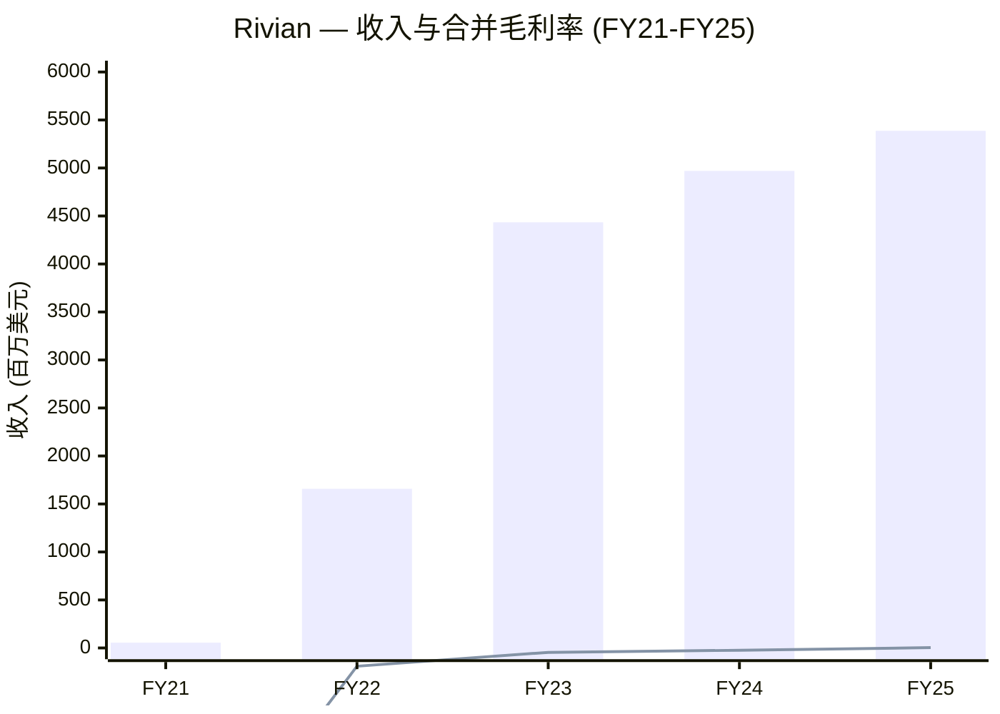
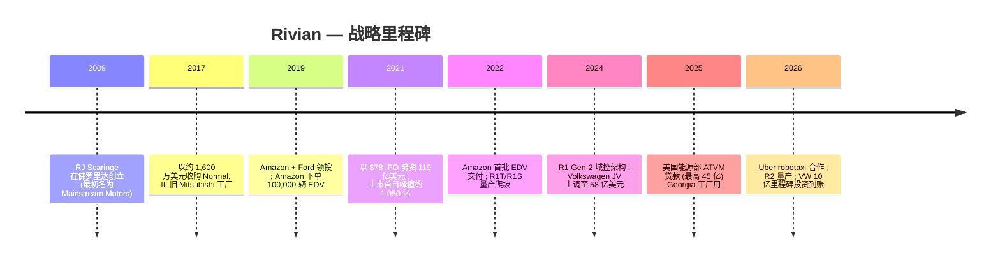
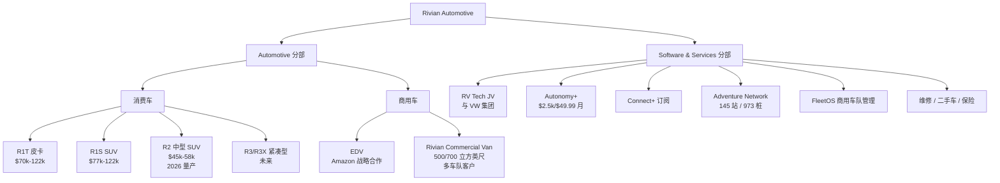
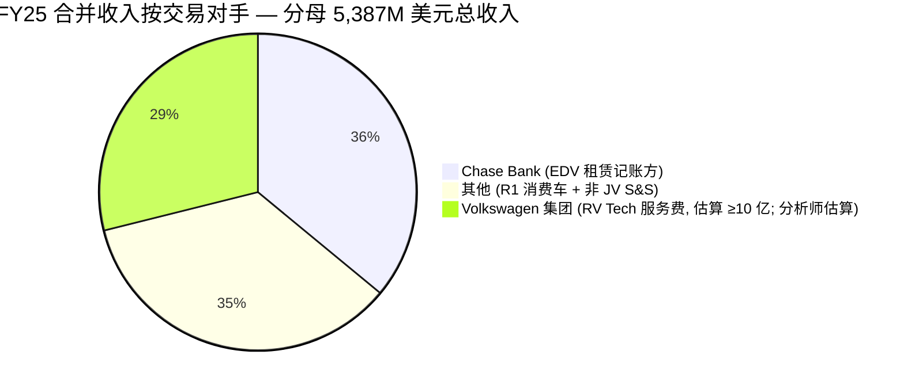
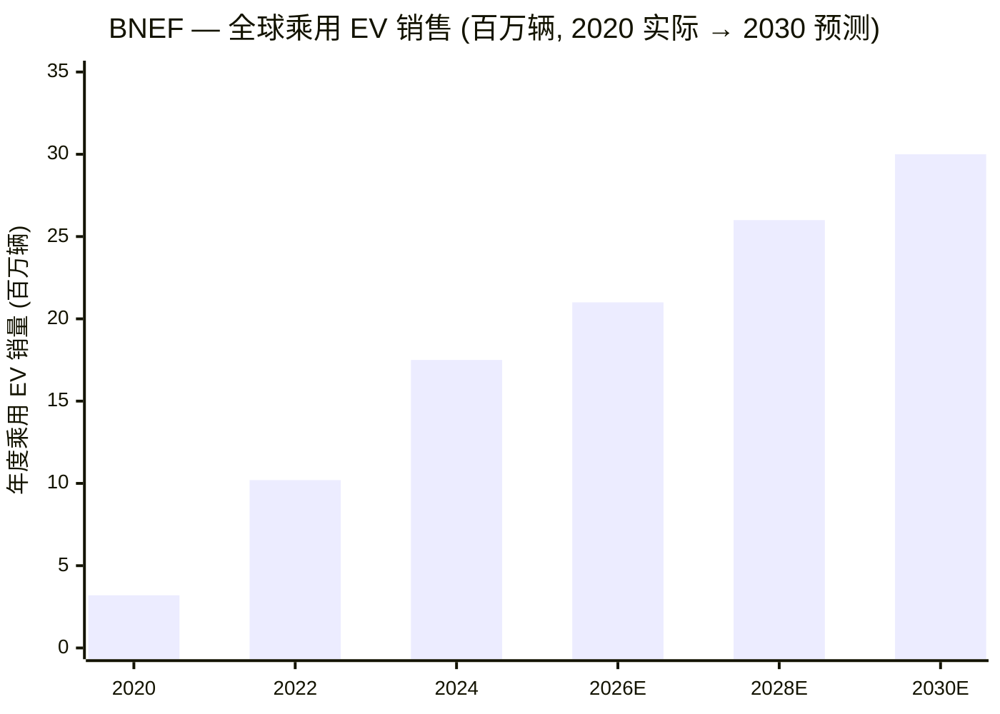
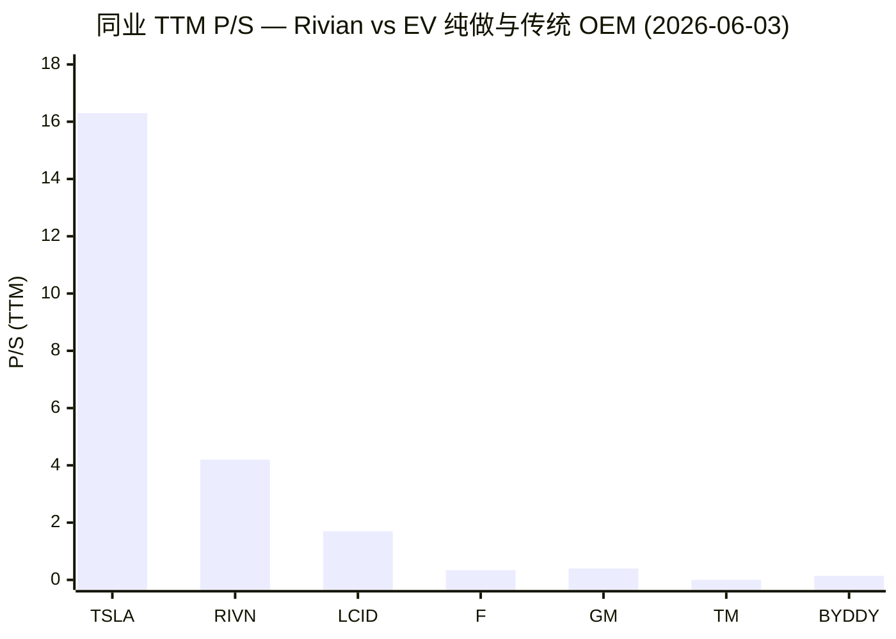
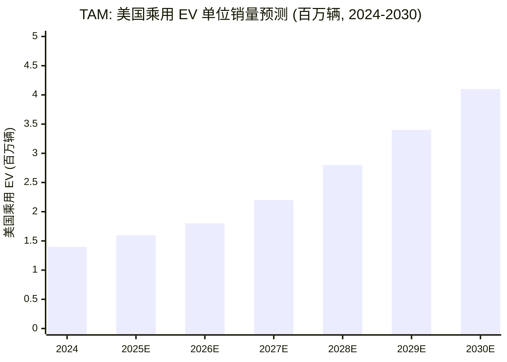
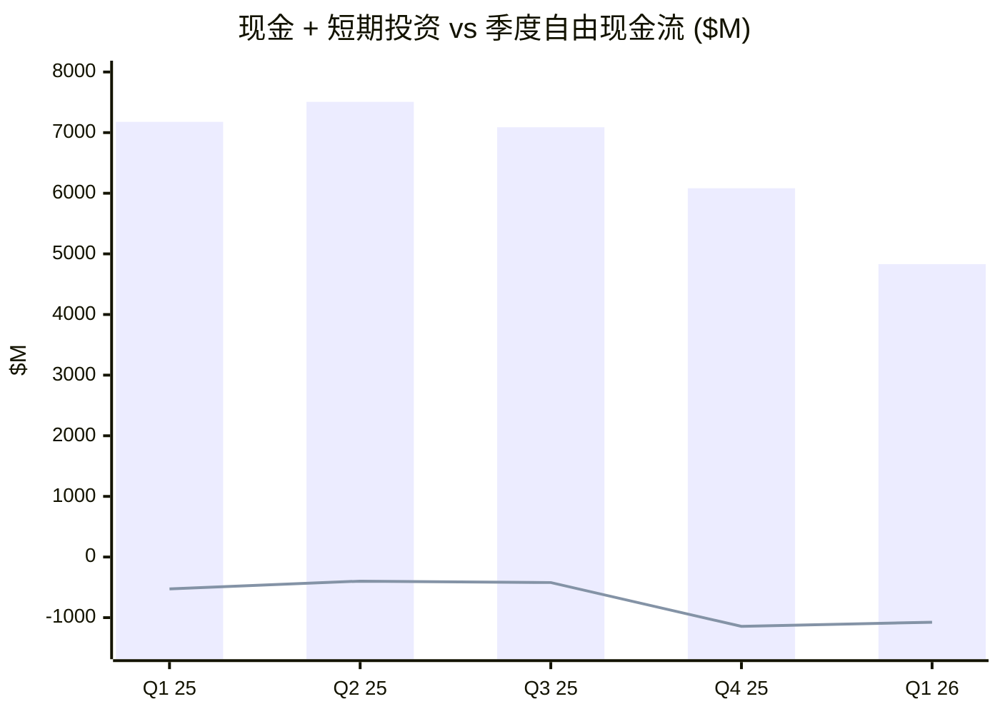

# Rivian Automotive 公司研究报告 (NASDAQ: RIVN)

**行业:** 可选消费 — 整车制造 (SIC 3711)
**注册地:** 美国特拉华州 · **总部:** 加利福尼亚州 Irvine
**创始人 & CEO:** Robert J. "RJ" Scaringe 博士
**上市:** 纳斯达克全球精选市场 — 普通股 A 类 (RIVN),自 2021 年 11 月 10 日起
**报告日期:** 2026-06-03

---

## 业绩展望横幅 (Guidance banner)

公司最近一次更新业绩展望(guidance)是在 **2026 年 4 月 30 日** 1Q26 财报发布同期。全年 2026 年指引为: **交付量 62,000–67,000 辆** (vs FY24 约 5.15 万辆,FY25 为 42,247 辆)、**调整后 EBITDA $(2.10)–$(1.80) 亿** (negative)、**资本开支 $1.95–$2.05 亿** ([RIVN 1Q26 业绩公告, 2026-04-30](https://www.sec.gov/Archives/edgar/data/1874178/000187417826000033/ex-9911q26rivianearningspr.htm))。R2 量产车在 2026 年 4 月 21 日当周在伊利诺伊州 Normal 工厂开始下线,首批外部客户交付预计在 2026 年春季。

3 月至 4 月间另外完成三件大事: (1) 与 **Uber 战略合作**, 建造最多 **50,000 辆 R2 平台的 L4 robotaxi**(其中 10,000 辆为坚定订单 + 40,000 辆为期权), Uber 将在 2031 年前向 Rivian 注资最多 **12.5 亿美元** ([Uber-Rivian Robotaxi 合作公告, 2026-03-19](https://investor.uber.com/news-events/news/press-release-details/2026/Uber-and-Rivian-Partner-to-Deploy-up-to-50000-Fully-Autonomous-Robotaxis-2026-TViR4R05gi/default.aspx)); (2) Volkswagen 集团基于 RV Tech 合资公司里程碑达成, 完成首笔 **10 亿美元股权投资**, 4 月 30 日入账 ([Electrek, 2026-03-27](https://electrek.co/2026/03/27/volkswagen-groups-joint-venture-with-rivian-hits-latest-milestone-unlocking-another-1b-for-the-ev-automaker/)); (3) Georgia 州 "Stanton Springs North" 工厂初期产能上调 50% 至 **30 万辆/年**, 首车量产时间维持在 **2028 年底**, 美国能源部 (DOE) **45 亿美元 ATVM 贷款 (40.06 亿本金 + 4.94 亿资本化利息)** 预计在 **2027 年初首次提取** ([RIVN 1Q26 业绩公告](https://www.sec.gov/Archives/edgar/data/1874178/000187417826000033/ex-9911q26rivianearningspr.htm))。

---

## 目录

1. 公司概览与估值快照
2. 公司历史与战略里程碑
3. 管理团队
4. 产品与服务
5. 客户、渠道与客户集中度
6. 行业概览
7. 竞争格局
8. 市场机会 (TAM/SAM)
9. 风险评估
10. 投资人视角评分卡
11. 参考资料与验证日志

---

## 1. 公司概览与估值快照

Rivian Automotive 是一家美国电动车与车载技术公司, 在伊利诺伊州 Normal 工厂自主设计、研发、制造纯电动皮卡 (pickup truck)、SUV、以及最后一公里商用配送货车 (delivery van), 并以直销 (direct-to-customer / D2C) 模式向美国和加拿大消费者及商用车队销售。同时,公司是与德国大众集团 (Volkswagen AG) 共同设立的 **50/50 合资公司 "Rivian and VW Group Technology, LLC" (即 "RV Tech")** 的运营方,贡献了 Rivian 的 zonal 电子电气架构 (zonal electrical architecture, 域控电子电气架构) 与软件栈 (software stack),并从中获取增长迅速的"软件与服务"收入流。Rivian 自己将业务概括为五大垂直整合技术支柱: "电气架构、端到端软件、自动驾驶平台、人工智能、动力总成", 覆盖消费车 (R1T/R1S 现售, 2026 年 R2, 未来 R3/R3X)、商用车 (EDV 和 Rivian Commercial Van)、以及通过现有车队来变现的软件与服务套件 (OTA、高阶辅助驾驶订阅 Autonomy+、充电、维修、金融、保险、二手车) ([RIVN FY25 10-K, Item 1 Business](https://www.sec.gov/Archives/edgar/data/1874178/000187417826000008/rivn-20251231.htm))。

公司分为两个报告分部 (reportable segments): **Automotive** 与 **Software and Services**。FY25 Automotive 收入为 **38.30 亿美元**,同比下滑 15%,主要原因是: 交付量减少 9,332 辆 (受 2025 年 9 月 30 日美国联邦 §45W 清洁车辆税收抵免到期影响,需求被前置至 Q3 2025) 加上监管积分 (regulatory credits) 销售下滑; Software-and-Services 收入则从 FY24 的 4.84 亿激增至 FY25 的 **15.57 亿** (+221% YoY), 几乎全部来自 RV Tech 合资公司向 Rivian 采购的电气架构与软件开发服务 ([RIVN FY25 10-K, MD&A](https://www.sec.gov/Archives/edgar/data/1874178/000187417826000008/rivn-20251231.htm))。两段合计 FY25 总营收 **53.87 亿美元**,同比 +8.4%,**公司历史上首次实现合并毛利润为正** (1.44 亿美元,毛利率 2.7%, vs FY24 的 -12.00 亿 / -24%), 净亏损同比收窄至 **-36.26 亿** (vs FY24 的 -47.47 亿) ([RIVN FY25 10-K, Consolidated Statements of Operations](https://www.sec.gov/Archives/edgar/data/1874178/000187417826000008/rivn-20251231.htm))。

**估值快照 (截至 2026-06-03 收盘)。** RIVN 股价收报 $17.29, 市值约 232.2 亿美元,稀释后股本约 13.4 亿股; 52 周区间 $11.57–$22.69,beta ~1.65 ([Yahoo Finance — RIVN Key Statistics](https://finance.yahoo.com/quote/RIVN/key-statistics/))。TTM 指标:**营收 55.28 亿 / TTM P/S 4.2× / EV/Revenue 4.0× / EV/EBITDA -7.3× (负值,因 FY25 调整后 EBITDA 为 -22.06 亿) / TTM P/E n/a (持续亏损)** ([Yahoo Finance — RIVN Key Statistics](https://finance.yahoo.com/quote/RIVN/key-statistics/); [RIVN 1Q26 业绩公告](https://www.sec.gov/Archives/edgar/data/1874178/000187417826000033/ex-9911q26rivianearningspr.htm))。股东结构:大股东包括 Volkswagen Group (持有约 11.5% 投票权)、Amazon (大额持仓)、Scaringe 本人持有 100% B 类股 (每股 10 票表决权); 内部人持股约 37.6%,机构持股约 41.9% (流通股口径)。

**同业估值对比。** TTM P/S 维度: RIVN 4.2× 显著低于 Tesla 的 16.3× (后者是唯一盈利的美国纯电股), 但显著高于同样亏损的 Lucid (LCID, 1.7×) 与中国造车新势力三家 (NIO/XPeng/Li Auto, 0.15–0.23×) ([Yahoo Finance 同业筛选](https://finance.yahoo.com/quote/TSLA/key-statistics/))。传统大型 OEM (Ford 0.34× / GM 0.40× / BYD 0.14×) 已经在 0.3–0.5× P/S 这个区间,且大都有正常 P/E,反映市场给 Rivian 一个 *转型增长公司* 的过渡期定价。**分析师观点 (Analyst view):** 4.2× P/S 难以用传统整车厂对标支撑, 必须靠 R2 成功量产至 30 万辆以上规模 + 软件与服务发展为 25–30 亿美元的经常性收入流 + 整车毛利率在 2027 年转正这三件事同时成立。其中,**R2 单车经济性不及预期是最大的估值下行风险** (详见第 9 章)。


*资料来源: [RIVN FY25 10-K, MD&A](https://www.sec.gov/Archives/edgar/data/1874178/000187417826000008/rivn-20251231.htm); [RIVN FY22 10-K](https://www.sec.gov/Archives/edgar/data/1874178/000187417823000009/rivn-20221231.htm)。毛利率折线 × 100 后与收入共用同一 y 轴。*

---

## 2. 公司历史与战略里程碑

**2009 — 创立。** RJ Scaringe 当时正在麻省理工学院 (MIT) Sloan Automotive Laboratory 攻读机械工程博士学位, **2009 年 6 月在佛罗里达州 Rockledge** 注册成立公司, 工作名 "Mainstream Motors", 之后改为 "Avera Automotive", **2011 年最终更名为 Rivian Automotive** (Rivian 源于 Florida Indian River, 即 Scaringe 童年家乡附近的河流), 并将创业方向锁定在面向户外消费人群的纯电"探险型" (adventure) 车辆 — 这是传统车厂当时尚未填补的细分市场 ([Wikipedia — Rivian Automotive (创业历史)](https://en.wikipedia.org/wiki/Rivian); [RIVN 2026 Proxy Statement, Director Bios](https://www.sec.gov/Archives/edgar/data/1874178/000187417826000023/rivn-20260427.htm))。

**2011–2017 — 资本与制造基础铺垫期。** 头八年公司处于隐身研发模式 (stealth mode), 没有任何消费产品上市。关键的基础设施转折点出现在 **2017 年 1 月** — Rivian 以约 1,600 万美元收购了前 Mitsubishi-Chrysler 合资 "Diamond-Star Motors" 在伊利诺伊州 Normal 镇遗留的 260 万平方英尺的旧厂房, 用极小的代价拿下了今天 "Normal Factory" (Normal 工厂) 的全部产能 — 现规划全功率多班次可达 **21.5 万辆/年** (约 8.5 万辆 R1 + 15.5 万辆 R2 + 6.5 万辆商用车) ([RIVN FY25 10-K, Manufacturing](https://www.sec.gov/Archives/edgar/data/1874178/000187417826000008/rivn-20251231.htm); [Wikipedia — Rivian Automotive](https://en.wikipedia.org/wiki/Rivian))。

**2019 — 战略股东到位。** 当年 2 月与 9 月, **Amazon 和 Ford 分别领投** 大约各 7 亿美元的投资轮次; Amazon 同时下了 **100,000 辆 EDV (Electric Delivery Van, 电动配送车) 全球订单, 目标在 2030 年前交付完毕**, 等于在 R1 平台一辆都没出厂之前就锁定了一份十年期商业车队客户合同 ([RIVN FY25 10-K, Risk Factors — Customer Concentration](https://www.sec.gov/Archives/edgar/data/1874178/000187417826000008/rivn-20251231.htm); [Wikipedia — Rivian Automotive](https://en.wikipedia.org/wiki/Rivian))。Amazon 通过 "Amazon.com NV Investment Holdings" 持有的股份至今仍是 Scaringe 之外较大的几家股东之一。

**2021 — IPO 估值 665 亿美元。** **2021 年 11 月 10 日** Rivian 以 **$78/股 IPO 定价, 募资 119 亿美元**, 完全摊薄估值约 665 亿; 上市首日开盘大涨, 当日盘中市值短暂触及 1,050 亿, **成为 2021 年美股最大 IPO**, 当日市值一度超过 Ford 和 GM ([CNBC — Rivian IPO 创始人身家, 2021-11-11](https://www.cnbc.com/2021/11/11/rivian-founder-rj-scaringe-is-worth-2point2-billion-after-companys-ipo.html); [TechCrunch — Rivian 2021 最大 IPO, 2021-11-10](https://techcrunch.com/2021/11/10/electric-automaker-rivian-largest-ipo-2021/))。IPO 之后由于产能爬坡延迟、原材料涨价、持续经营亏损, 股价自高位回撤约 90%, 当前交易区间正是这次估值重置的产物。

**2022–2024 — R1 量产爬坡与亏损收窄。** R1T 首批客户车 2021 年 9 月交付 (IPO 前一个月)、R1S 2021 年 12 月、Amazon EDV 2022 年 7 月。产量节奏: **FY23 5.72 万 → FY24 4.95 万 → FY25 4.23 万**, 期间公司进行了两次大型停产改造 — 2024 年春季 13 周停线将 Normal 厂改造为 **R1 Gen 2 域控架构 (Gen-2 zonal architecture)**, 把单车 ECU 数量从 17 个减至 7 个、节省 1.6 英里 (~2.6 公里) 线束、单车减重 44 磅、号称材料成本下降约 20% ([Popular Science — Rivian Zonal Architecture, 2024-06-06](https://www.popsci.com/technology/rivian-zonal-electrical-architecture/)); 2025 年秋季停线则用于 R2 平台首批工装调试。

**2024 — Volkswagen 合资官宣。** 2024 年 6 月 Rivian 与 Volkswagen 集团宣布合作以共享 Rivian 的域控架构。**11 月 12 日将合作规模上调至最高 58 亿美元**, 11 月 13 日 RV Tech 合资公司正式启动。**首期 VW 投入约 13 亿美元 (IP 授权 + 50% 股权对价)**; **剩余约 35 亿美元将通过股权、可转债和债务在 2027 年前按里程碑陆续投入,另外 10 亿美元定期贷款将在 2026 年 10 月 RV Tech 自主决定提取** ([CNBC — Rivian-VW JV 上调至 58 亿美元, 2024-11-12](https://www.cnbc.com/2024/11/12/rivian-volkswagen-joint-venture.html); [Volkswagen 集团 JV 启动公告, 2024-11-13](https://www.volkswagen-group.com/en/press-releases/faster-leaner-more-efficient-rivian-and-volkswagen-group-announce-the-launch-of-their-joint-venture-18828); [RIVN FY25 10-K, Note 19 VIE](https://www.sec.gov/Archives/edgar/data/1874178/000187417826000008/rivn-20251231.htm))。由于 Rivian 是该 VIE 的主要受益人, 合资公司在 Rivian 表内合并入账。

**2025 — 美国能源部贷款落地、政策反转。** 2025 年 1 月 Rivian 与美国能源部 (DOE) 通过 Advanced Technology Vehicles Manufacturing (ATVM) 项目 签订多次提款 (multi-draw) 定期贷款 合约 — 当前规模为最高 **45 亿美元** (最初提议为 66 亿), 由 Federal Financing Bank 承担放款, 用于 Georgia 州 "Stanton Springs North" 工厂建设 ([RIVN FY25 10-K, Government Programs and Incentives](https://www.sec.gov/Archives/edgar/data/1874178/000187417826000008/rivn-20251231.htm); [RIVN 1Q26 业绩公告](https://www.sec.gov/Archives/edgar/data/1874178/000187417826000033/ex-9911q26rivianearningspr.htm))。年中, 美国税法发生重大转向 (One Big Beautiful Bill Act) — **§45W EV 税收抵免到期日从 2032 年底大幅提前至 2025 年 9 月 30 日**, 将需求集中前置到 Q3 2025 (Q3 产量环比 +79%、交付 +24%) 但 Q4 监管积分收入塌方 ([Cox Automotive Q1 2026 EV Sales 评论](https://www.coxautoinc.com/insights/q1-2026-ev-sales-report-commentary/))。

**2026 — Uber robotaxi 合作、R2 量产。** 3 月 19 日 Rivian 官宣 **Uber 合作** (参见首部展望横幅) ([CNBC — Uber-Rivian Robotaxi, 2026-03-19](https://www.cnbc.com/2026/03/19/uber-rivian-robotaxi.html))。4 月 4 日 **Autonomy+ 付费订阅上线**, 定价 **$2,500 买断 / $49.99 月** ([RIVN 1Q26 Shareholder Letter](https://www.sec.gov/Archives/edgar/data/1874178/000187417826000033/ex-9921q26rivianearnings.htm))。4 月 21 日当周 **R2 saleable production 开始**,首批外部客户交付预计 2026 年春季。4 月 30 日 VW 集团首笔 10 亿美元里程碑投资到账。



---

## 3. 管理团队

**Robert J. "RJ" Scaringe 博士 — 创始人、首席执行官 (CEO) 兼董事长。** 2026 年代理委托书 (Proxy) 显示年龄 43 岁; 2009 年 6 月创立 Rivian; 自创立起持续担任 CEO,2018 年 3 月起任董事长。Proxy 原文:*"Scaringe 博士领导了公司迄今为止的每一项主要里程碑事件,包括建立垂直整合的技术平台、构建多项目制造能力以及发展有意义的战略伙伴关系"*。Scaringe 同时兼任两家 Rivian 分拆/投资公司的董事长: **Mind Robotics, Inc.** (工业 AI 与机器人 — Rivian 在该公司 A 轮融资及去合并 (deconsolidation) 后保留约 46.5% 股权; **该去合并事件在 2026 年 Q1 形成 5.06 亿美元的 "其他收入" 一次性收益**, 实质性优化了当季净亏损 — [RIVN 1Q26 Shareholder Letter](https://www.sec.gov/Archives/edgar/data/1874178/000187417826000033/ex-9921q26rivianearnings.htm); [RIVN 2026 Proxy](https://www.sec.gov/Archives/edgar/data/1874178/000187417826000023/rivn-20260427.htm)) 与 **Also, Inc.** (微型出行业务分拆)。教育背景:Rensselaer Polytechnic Institute 机械工程学士; 麻省理工学院 (MIT) Sloan Automotive Laboratory 机械工程硕士 + 博士 ([RIVN 2026 Proxy, Class I Director Bios](https://www.sec.gov/Archives/edgar/data/1874178/000187417826000023/rivn-20260427.htm))。Scaringe 持有 **Rivian 100% 的 B 类普通股 (Class B, 截至 2026 年 1 月 29 日为 3,912,500 股、每股 10 倍投票权)**, 即仅 Class B 一项就给他约 9% 的投票控制权 (再加上 A 类持仓) ([RIVN FY25 10-K, 封面页](https://www.sec.gov/Archives/edgar/data/1874178/000187417826000008/rivn-20251231.htm))。 Proxy 与 10-K 风险因素中有明确表述:**"We are highly dependent on the services and reputation of our Founder and Chief Executive Officer"** (我们高度依赖创始人兼 CEO 的服务和声誉)。Scaringe 是典型的"创始人 CEO"原型 — 工程深度、使命驱动 ("preserving the natural world for generations to come" 为公司正式使命), 同时深度参与车辆、软件、资本配置等核心环节。其个人薪酬一直以股权为主,绑定长期运营里程碑; 10-K 把 founder dependence 明确列为风险因子,董事会试图通过培养更深的 NEO (named executive officer) 团队来缓解风险 ([RIVN 2026 Proxy, Executive Compensation](https://www.sec.gov/Archives/edgar/data/1874178/000187417826000023/rivn-20260427.htm))。

依据 skill 规则,本节仅覆盖创始人兼 CEO (Scaringe 同时担任两职), 不展开介绍其他高管。

---

## 4. 产品与服务

Rivian 的产品组合围绕两个报告分部展开 — **Automotive** (消费车 R1/R2/R3 + 商用车 EDV/RCV) 与 **Software and Services** (RV Tech 合资公司、Autonomy+、充电、维修、二手车、订阅服务) — 底层支撑为公司在 2022–2024 年自主设计完成的 **域控电气架构 (zonal electrical architecture) 与软件栈 (software stack)**,该架构通过 RV Tech 合资公司向 Volkswagen 集团授权。10-K 中反复出现的五大垂直整合技术支柱 — "电气架构、端到端软件、自动驾驶平台、人工智能、动力总成" — 既是单车成本下降 (R1 Gen 2 → R2 成本优化) 的技术根本, 也是经常性收入故事 (软件订阅 + 合资公司服务费 + 自动驾驶订阅) 的支柱 ([RIVN FY25 10-K, Item 1 Business](https://www.sec.gov/Archives/edgar/data/1874178/000187417826000008/rivn-20251231.htm); [RIVN 1Q26 Shareholder Letter, 战略优先级幻灯片](https://www.sec.gov/Archives/edgar/data/1874178/000187417826000033/ex-9921q26rivianearnings.htm))。

### 4.1 消费车 — R1T 皮卡、R1S SUV (当前营收主力)

**R1T (两排 5 座纯电皮卡)。** 引用 10-K Business 章节原文:

> *"我们用 R1 平台开启了消费车业务, 包含两款车型: R1T — 两排五座纯电皮卡 (pickup truck); R1S — 三排七座纯电运动型多用途车 (SUV)。R1T 和 R1S 都搭载了 Rivian 自研技术,包括 zonal 网络架构、电驱动总成与底盘、Rivian Autonomy Platform 以及通过 Connect+ (含 Rivian Assistant) 实现的数字化用户体验管理。这些技术可以通过云端 OTA 更新持续改进和扩展功能。"*
> — [RIVN FY25 10-K, Item 1 Business — Consumer Vehicles](https://www.sec.gov/Archives/edgar/data/1874178/000187417826000008/rivn-20251231.htm)

**2026 MY (model year, 车型年款) 价格与配置 (verbatim from 官网/KBB):** R1T Dual-Motor 起售 **$70,990** (Standard 电池包,续航 270 英里,533 马力); Dual Performance Upgrade 升级至 665 马力; **Tri-Motor $100,990 (850 马力)**; 旗舰 **Quad Launch Edition $121,885 (1,025 马力,0-60 mph 加速 2.5 秒, Max 电池包续航最高 420 英里)** ([Kelley Blue Book — 2026 Rivian R1T Specs](https://www.kbb.com/rivian/r1t/2026/specs/); [Rivian.com — R1T](https://rivian.com/r1t))。**R1T 物理上做什么 (中文释义 / Plain-language gloss):** R1T 是美国市场唯一一款采用 *承载式车身* (unibody, 区别于传统皮卡的 body-on-frame "非承载式车架") 结构、四角独立空气悬架、并提供四电机轮控扭矩矢量分配 (torque vectoring) 选项 的全尺寸纯电皮卡 — 这些设计选择使 Rivian 在保留户外皮卡能力 (拖挂约 1.1 万磅 / payload 约 1,800 磅) 的同时拥有公路操控品质。战略意义:R1T 是美国市场首款规模化量产的纯电皮卡 (2021 年 9 月交付, 早于 Ford F-150 Lightning 约 6 个月、早于 Tesla Cybertruck 约 2 年多) — 这种先发优势带来的"非特斯拉但很酷"品牌溢价熬过了 2022–2024 年产能问题,如今支撑了 R2 的支付意愿 (willingness-to-pay)。

**R1S (三排 7 座 SUV)。** 与 R1T 共用 Gen-2 zonal 架构; 2026 MY 价格区间与 R1T 平行 (Dual $77,700 / Tri $107,700 / Quad Launch $122,485, 详见 [Rivian.com — R1S](https://rivian.com/r1s))。R1S 是这个家族里 *需求倾斜* 的产品 — 在美国 EV 市场, SUV 形态的销量是皮卡的 2.5–3 倍。在 Cox Automotive 最新销售注册数据里, **R1S 在 2026 年 Q1 美国 EV 销量榜排名第 6**, 略高于 Tesla Cybertruck (Cox 数据 Q1 仅交付 3,519 辆, 而 Rivian 当季 10,365 辆里 R1S 占大头) ([Cox Automotive — Q1 2026 EV Sales Report, 2026-04-15](https://www.coxautoinc.com/insights/q1-2026-ev-sales-report-commentary/); [InsideEVs — Rivian Outsold Ford EVs Q1 2026, 2026-04-15](https://insideevs.com/news/791986/rivian-outsold-ford-evs-q1-2026/))。

**R1 Gen 2 成本下降 (2024–2025 交付)。** Gen 2 自 2024 年 6 月起量产 — ECU 数量从 17 减至 7、线束减少 1.6 英里 (~2.6 公里) / 单车减重 44 磅、号称材料成本相对 Gen 1 下降约 **20%**, 制造碳足迹下降约 **15%** ([Popular Science — Rivian Zonal Architecture, 2024-06-06](https://www.popsci.com/technology/rivian-zonal-electrical-architecture/); [TechCrunch — Rivian R1 Gen 2 Refresh, 2024-06-06](https://techcrunch.com/2024/06/06/rivian-refresh-r1t-r1s-second-generation-speed-range-apple/))。这是 Rivian 史上最重要的 *技术* 结果, 因为它同时做到: (a) 帮助 Rivian 实现历史第一个整车毛利转正的季度 (Q1 2025: 整车毛利 +9,200 万,毛利率 10% — [RIVN 1Q26 Shareholder Letter](https://www.sec.gov/Archives/edgar/data/1874178/000187417826000033/ex-9921q26rivianearnings.htm)); (b) 成为 Volkswagen 集团同意购买授权的核心技术,从而驱动了 S&S 分部 的高速增长。

### 4.2 R2 与 R3 — 走量产品 (公司存亡级押注)

**R2 (中型 5 座 SUV, MSP 平台)。** Rivian 自己的描述: *"R2 是 Rivian 全新的中型 SUV, 将以五座包装提供性能、能力与实用性的组合, 适合大型户外活动也兼顾日常使用。R2 预计将继承 R1 开发的关键垂直整合技术,包括软件栈、动力总成技术、Rivian Autonomy Platform、电气架构。R2 客户交付预计 2026 年第二季度开始。"* ([RIVN FY25 10-K, Item 1 Business — Consumer Vehicles](https://www.sec.gov/Archives/edgar/data/1874178/000187417826000008/rivn-20251231.htm))。

R2 阵容在 2026 年 3 月最终敲定为 **4 个版本** ([Rivian Newsroom — R2 阵容, 2026-03-12](https://rivian.com/newsroom/article/rivian-introduces-r2-lineup); [TechCrunch — Rivian R2 Launch, 2026-03-12](https://techcrunch.com/2026/03/12/rivian-r2-launch-heres-what-57990-gets-you/); [CNBC — Rivian R2 EV Launch, 2026-03-12](https://www.cnbc.com/2026/03/12/rivian-r2-ev-launch.html)):

| 版本 | 起售价 | 续航 (英里) | 动力 | 上市时间 |
|---|---:|---:|---|---|
| R2 Performance Launch Edition (AWD) | $57,990 | 330 | 656 hp / 609 lb-ft | 2026 春 |
| R2 Premium AWD (双电机) | $53,990 | 330 | 450 hp / 537 lb-ft | 2026 年末 |
| R2 Long-Range (单电机) | $48,490 | 345 | n/d | 2027 年初 |
| R2 Standard (入门版) | $45,000 | 275 | n/d | 2027 年末 |

**R2 为何重要。** 今天 R1T/R1S 的目标购车人群只覆盖美国"豪华探险" (luxury adventure) 细分 — 每年约 5–6 万辆、单价 $70–125k。R2 把 TAM 扩展到 **美国中型 SUV 市场** — 当前燃油车市场每年约 120 万辆, EV 渗透率较低 (现有 EV 主要玩家:Tesla Model Y、Ford Mustang Mach-E、Hyundai Ioniq 5、Kia EV6、GM Equinox EV)。在 $45–58k 起步价区间, R2 首次与 Tesla Model Y ($45–55k) 正面竞争。Normal 工厂已经为 **15.5 万辆 R2 年产能** 完成改造,与 8.5 万辆 R1 + 6.5 万辆 Commercial Van 共用固定成本 ([RIVN FY25 10-K, Manufacturing](https://www.sec.gov/Archives/edgar/data/1874178/000187417826000008/rivn-20251231.htm))。**整车毛利转正与结构性盈利的路径必须穿过 R2 的单车成本曲线** — 这是 FY26–FY27 区间最关键的运营未知数。

**R3 / R3X (规划中)。** 10-K 原文: *"R3 是我们未来的中型紧凑型 SUV (midsize crossover),尺寸紧凑但性能、越野能力、乘坐舒适性与储物表现均出色。R3X 是 R3 的性能版本, 公路和越野能力更强。R3 内饰与外观设计兼具亲切感和经典感。"* ([RIVN FY25 10-K, Item 1 Business](https://www.sec.gov/Archives/edgar/data/1874178/000187417826000008/rivn-20251231.htm))。R3 暂未公布价格或时间表; 公司将其定位为 R2 量产成功之后的下一款产品, 与 R2 共用 MSP 平台。

### 4.3 商用车 — EDV、Rivian Commercial Van (Amazon 引擎)

**Rivian Commercial Van 平台**, 衍生出与 Amazon 合作设计的 **Electric Delivery Van (EDV)**, 是一款专为集中管理的最后一公里车队设计的长续航纯电步入式 (step-in) 货车。10-K 原文:

> *"我们设计了 500 立方英尺和 700 立方英尺两个版本的货车, 针对包括最后一公里配送在内的多种商用用途进行了优化。EDV 与 Rivian Commercial Van 的特性包括: 后部卷帘门、出于安全和保护考虑的集成式驾驶舱隔断门、可让驾驶员在车内直立行走的高顶设计、以驾驶员为中心的人机工程、远离车流一侧的滑动门以确保安全上下车。我们的商用车专为驾驶员的舒适便捷设计,旨在为客户降低 总体拥有成本 (TCO, total cost of ownership), 同时支持去碳化路径。"*
> — [RIVN FY25 10-K, Item 1 Business — Commercial Vehicles](https://www.sec.gov/Archives/edgar/data/1874178/000187417826000008/rivn-20251231.htm)

**Amazon 100,000 辆 EDV 全球订单 (2019 年下单, 目标 2030 完成)** 是商用车业务的奠基性合同。10-K Note 4 披露已经清楚说明: 虽然 Amazon 是商用车业务的最大经营性终端客户, 但 **EDV 销售合同的法律记账客户是 Chase Bank**, Chase Bank 与 Amazon 签订租赁安排把车租回 Amazon 使用 (具体结构详见第 5 章)。根据 InsideEVs 等行业追踪, Rivian 在 FY25 年底已向 Amazon 交付 **约 3 万辆 EDV** (合同总量 10 万) ([InsideEVs — Rivian 已向 Amazon 交付 20,000 辆 EDV, 2025-09-15](https://insideevs.com/news/745106/rivian-amazon-edv-delivery-update/); [RIVN FY25 10-K, Risk Factors](https://www.sec.gov/Archives/edgar/data/1874178/000187417826000008/rivn-20251231.htm))。**商用车交付占比在 2026 Q1 大幅提升** — Cox Automotive 注册数据显示 Rivian 美国商用车交付量同比近翻倍, 帮助 Q1 2026 总交付量在 R1 需求软化的背景下仍逆势同比 +20% 达到 10,365 辆 ([eletric-vehicles.com — Rivian Q1 商用车销量翻倍, 2026-04-22](https://eletric-vehicles.com/rivian/rivian-doubles-us-sales-of-delivery-vans-in-q1-cox-automotive-data-shows/))。商用车平台目前已对非 Amazon 客户开放 (针对最后一公里和零售客户需要 Amazon 同意, 如 10-K 所述), 已公开命名的客户包括 AT&T、HelloFresh、IKEA, 以及多家区域车队运营商。

### 4.4 Software and Services — RV Tech JV、Autonomy+、Connect+、充电、FleetOS

这是 Rivian 的投资逻辑相对于纯 EV 整车厂 *最差异化* 的分部, 也是 2025 年 *收入增长* 最让市场惊喜的来源:

> *"我们的软件与服务套件作为车辆销售的补充, 旨在创造长期品牌忠诚度的同时, 跨整个车辆生命周期形成经常性收入流。这些服务包括: 合资公司提供的车辆电气架构与软件开发服务、Autonomy+、二手车业务、车辆维修与保养、充电、软件订阅、车辆附件、金融、保险等。"*
> — [RIVN FY25 10-K, Item 1 Business — Software and Services Segment](https://www.sec.gov/Archives/edgar/data/1874178/000187417826000008/rivn-20251231.htm)

**RV Tech 合资公司服务费 — FY25 最大的正向意外。** Rivian 和 VW 集团各自向 RV Tech 出资 50%, 合资 2024 年 11 月 13 日成立。Rivian 的初始出资包括了 zonal ECU 架构、软件栈与外派人员; 作为对价 Rivian **获得 12.95 亿美元的 IP 授权款** 加上后续 JV 向 Rivian 支付的工程服务费。由于 Rivian 是 VIE 的主要受益人, 该合资公司在 Rivian 表内合并入账 (VW 的权益体现在非控股权益), 软件与服务分部因此承担了 Rivian 向 JV 提供工程服务的收入。 这就是 **S&S 收入从 FY24 的 4.84 亿增长到 FY25 的 15.57 亿 (+221% YoY)、并从 Q1 2025 的 3.18 亿增至 Q1 2026 的 4.73 亿 (+49% YoY)** 的主因 ([RIVN FY25 10-K, MD&A](https://www.sec.gov/Archives/edgar/data/1874178/000187417826000008/rivn-20251231.htm); [RIVN 1Q26 业绩公告](https://www.sec.gov/Archives/edgar/data/1874178/000187417826000033/ex-9911q26rivianearningspr.htm))。**关键风险因子 (10-K 原文):** *"我们的软件与服务收入有相当大比例来自 Volkswagen 集团 (a significant portion of our software and services revenues has been from Volkswagen Group)"*。在非 JV 经常性收入 (Autonomy+、Connect+、维修、充电) 起量之前, S&S 收入流本质是 *单一交易对手风险*。

**Autonomy+ 高阶辅助驾驶订阅。** *"2025 年 12 月, 我们通过 OTA 更新向 R1 Gen 2 客户发布了 Universal Hands Free 功能。该功能将我们的辅助免手驾驶能力显著扩展, 北美可用路网从 不到 15 万英里 扩展到超过 350 万英里。 我们计划自 2026 年 4 月起对消费车 Autonomy+ 高阶辅助驾驶 ADAS 功能 收取一次性或月度费用。"* ([RIVN FY25 10-K, Item 1 Business](https://www.sec.gov/Archives/edgar/data/1874178/000187417826000008/rivn-20251231.htm))。**定价于 2026 年 4 月 4 日上线: $2,500 买断 / $49.99 月** ([RIVN 1Q26 Shareholder Letter](https://www.sec.gov/Archives/edgar/data/1874178/000187417826000033/ex-9921q26rivianearnings.htm))。路线图从 L2/L2+ hands-free (现有) → eyes-on point-to-point → eyes-off conditional → 最终消费级 L4。同一套技术栈 — 取名 "Rivian Autonomy Platform"、底层由 **RAP1 (Rivian Autonomy Processor, 自研域控芯片)、多模态感知 (摄像头 + 雷达 + LiDAR)、基于 AI 的 Large Driving Model 用 Rivian 车队驾驶里程训练** 支撑 — 也是 Uber 为 R2 robotaxi 平台押注的技术底座。

**Rivian Adventure Network 充电网络。** *"Rivian Adventure Network 中超过 95% 的站点对非 Rivian 电动车开放, 以提高网络利用率。"* — [10-K](https://www.sec.gov/Archives/edgar/data/1874178/000187417826000008/rivn-20251231.htm)。截至 2026 年 Q1 网络规模为 **145 个站点 / 973 个充电桩**, 同比 +29%/+38% ([RIVN 1Q26 Shareholder Letter, 网络幻灯片](https://www.sec.gov/Archives/edgar/data/1874178/000187417826000033/ex-9921q26rivianearnings.htm))。

**FleetOS** 是 Rivian 为集中管理的商用车队设计的端到端云平台 — 整车分发、telematics、维修、ADAS、生命周期管理 — 与 Commercial Van 捆绑销售的订阅业务。

**Connect+ 订阅、二手车业务、维修保养。** Connect+ 是车内连接订阅 (升级媒体、导航、live security、OTA), 已成为车主标配。二手车 / Remarketing 渠道 (置换 + 直接销售) 随着 2022 年首批 R1 车主进入车龄第 4–5 年开始放量。维修保养通过 Rivian 自营服务中心 (北美 97 家)、Rivian 移动服务车,加上第三方碰撞中心合作伙伴。



**协同综合 (Synthesis)。** R1 家族是 *品牌与需求* 引擎 — 高单价、小众销量, 但通过它建立的"在 Toyota 价格买到 Rivian 工程"的品牌光环是 $45k R2 买家愿意为之付费的关键。商用车平台分摊同一座 Normal 工厂的固定成本, 同时绑定 10 年期 Amazon 收入流。R2 是 *单车经济性突破* — 同样的域控架构、更低的物料表 (BOM, bill-of-materials) 成本、远高得多的销量 → 固定成本摊薄。Software-and-Services 是 *附加收入层* — 一部分由 VW 集团结构性承诺的合资公司服务费支撑 (从而降低了技术栈建设的风险), 一部分通过 Autonomy+、Connect+、充电直接变现现有车队。Uber 协议则通过 robotaxi 平台延伸了 R2 的影响半径,而 Rivian 自己不必投入运力车队资本。各产品互为补给, 整个财务系统失败的唯一路径是 — R2 单车成本不及 R1 Gen 2 (失败) 或 VW JV 服务费在消费订阅起量之前出现停滞。

---

## 5. 客户、渠道与客户集中度

Rivian 在美国和加拿大采用 **直销 (D2C, direct-to-customer) 模式** — 没有特许经销商网络。销售渠道通过公司官网 (配置器 / 在线下单) + 截至 2026 年 Q1 的 **44 家 Rivian Spaces 品牌体验店**、**97 家服务中心** 和不断扩张的移动服务车队 + Adventure Network 充电网 ([RIVN 1Q26 Shareholder Letter, 网络幻灯片](https://www.sec.gov/Archives/edgar/data/1874178/000187417826000033/ex-9921q26rivianearnings.htm))。R1 个人买家通过第三方贷款机构融资; 商用车则采用更复杂的销售结构 — 而这正是 10-K 客户集中度披露读起来"反直觉"的原因。

### 客户集中度 — 单一交易对手 (Chase Bank) 占 FY25 合并收入约 36%

这是关于 Rivian 收入结构最重要也最常被误读的事实。10-K Note 4 原文:

> *"在截至 2024 年 12 月 31 日和 2025 年 12 月 31 日的两个财年, **公司分别约 37% 和 36% 的收入来自向 Chase Bank 销售新电动车**, 由 Chase Bank 与购买的车辆签订租赁安排。公司有义务分担 Chase Bank 在租期末实现的残值与租赁起算时确定的残值之间差额的一部分。"*
> — [RIVN FY25 10-K, Note 4 Revenues](https://www.sec.gov/Archives/edgar/data/1874178/000187417826000008/rivn-20251231.htm)

**关键分母标注: 36% 是 *合并 (consolidated)* 收入 (Automotive + Software-and-Services 合计) 的比例。** 该比例主要对应 Rivian Commercial Van 销售给 Chase Bank、Chase 再租赁给 **Amazon 与其他商用车队终端用户**; 经营性最终客户以 Amazon 为主, 但 *法律意义* 上的客户记账是 Chase Bank。这种融资结构与 Tesla 商用车队租赁渠道所用的结构相同。Rivian 在残值差额上承担一项条件性 **Residual Value Risk Sharing (RVRS, 残值风险分担) 负债** 在帐, FY25 底为"非重大"。

**Volkswagen 集团是另一大型交易对手** — 集中在 Software-and-Services 分部, 通过 RV Tech 服务费体现。10-K 风险因子: *"我们的软件与服务收入有相当大比例来自 Volkswagen 集团 (A significant portion of our software and services revenues has been from Volkswagen Group)"* — [RIVN FY25 10-K, Risk Factors](https://www.sec.gov/Archives/edgar/data/1874178/000187417826000008/rivn-20251231.htm)。FY25 S&S 收入 15.57 亿 vs Automotive 38.30 亿, VW JV 服务费估算 *至少* 10 亿美元 (分析师估算 / analyst estimate; not disclosed line-item) — 即 **若属实, VW 是 top-3 客户, 占合并收入约 18–20%**。**重要的是: 10-K 没有把 Chase Bank 与 Volkswagen Group 合并为单一客户集中度展示**, 两者在 ASC 280-10-50-42 下挂在不同分部。

**Amazon 的实质角色。** Amazon 没有直接出现在合并 10-K 的 >10% 客户清单里, 因为它的购车款是经 Chase Bank 的租赁工具走的。但独立 EV 行业追踪反映 Amazon 实际是 EDV 销量的 *经济* 客户。一家行业追踪估算 **Amazon 相关收入从 Q1 2025 约 0.99 亿增至 Q1 2026 约 4.68 亿**, 暗示 Amazon 相关收入可能已接近 Automotive 分部收入的 30% ([eletric-vehicles.com — Amazon 现占 Rivian 整车收入 52%, 2026-04](https://eletric-vehicles.com/rivian/amazon-now-52-of-rivian-auto-revenue-up-from-11-as-vans-accelerate/))。**分析师观点 (Rivian 自己没披露):** 36% Chase Bank 集中度 *低估* 了对 Amazon 作为车队运营商的经济依赖度 — 不过现金回收方是投资级银行,这本身又是一个风险缓释。


*资料来源: [RIVN FY25 10-K, Note 4 Revenues](https://www.sec.gov/Archives/edgar/data/1874178/000187417826000008/rivn-20251231.htm)。 Chase Bank 数字为披露原文 36%。Volkswagen 部分为分析师估算; 10-K 仅做定性披露 ("a significant portion"), 没有给具体数字。*

### 地理结构

FY25 收入几乎全部来自美国 (加上极少量加拿大) 终端用户。Rivian 目前 **在欧洲、中国、其他地区没有任何消费车收入**。Volkswagen JV 服务费按法律意义跨境 (VW 是德国公司), 但仍通过 Rivian 美国实体确认。10-K Item 1 暗示 R2 是国际化的起点 — *"R2 expected to address global market segments"* — 但尚未公布具体国家或时间表。考虑 RV Tech 合作关系, R2 第一站国际市场最可能是西欧, 利用 VW 在欧的销售/服务网络。

---

## 6. 行业概览

### 6.1 全球 EV 市场 — 渗透率放缓、中国主导

2024 年全球乘用 EV 销售约 1,700 万辆 (约占整体轻型车销量 22%); BloombergNEF 最新 (也是 *罕见下调* 后的) Electric Vehicle Outlook 预测 **乘用 EV 销售将在 2030 年占全球新车销售的 >50%**, 当年销量约 3,000 万辆 ([BloombergNEF Electric Vehicle Outlook 2025](https://about.bnef.com/insights/clean-transport/electric-vehicle-outlook/); [BloombergNEF — EV 2025 创纪录但美国放缓, 2025-07-09](https://about.bnef.com/insights/clean-transport/global-electric-vehicle-sales-set-for-record-breaking-year-even-as-us-market-slows-sharply-bloombergnef-finds/))。2025 年 BNEF 更新是其多年来 *首次* 下调长期展望, 主因美国政策反转与欧洲增速放缓 — 现在 **美国乘用 EV 销量预计 从 2025 年 160 万辆 增长至 2030 年 410 万辆, 中国占全球 EV 销售约 2/3, 欧洲约 17%, 美国约 7%** ([BloombergNEF EV Outlook 2025](https://about.bnef.com/insights/clean-transport/electric-vehicle-outlook/))。

国际能源署 IEA 的 *Global EV Outlook 2025* 给出类似但略乐观的形态 — 2024 年末全球电动车保有量超过 4,000 万辆 (2020 年末约 1,000 万), 其中中国新车 EV 销售份额 >60%, 欧洲 ~25%, 美国 ~10% ([IEA — Global EV Outlook 2025](https://www.iea.org/reports/global-ev-outlook-2025))。

### 6.2 美国 EV 市场 — 份额向 Tesla 集中、总量下降

对 Rivian 最相关 — **2026 Q1 美国 EV 市场同比下滑 27%, 至 216,399 辆**, §45W 税收抵免 2025 年 9 月 30 日到期, 需求被前置到 Q3 2025 ([Cox Automotive Q1 2026 EV Sales Report](https://www.coxautoinc.com/insights/q1-2026-ev-sales-report-commentary/))。Tesla 美国 EV 市占率 *扩张* 到 **Q1 2026 的 54.2% (vs 同期 43.2%)** — 主因抵免到期后, 其他玩家没有 Tesla 那种价格弹性以吸收消失的补贴 ([Drive Tesla — Tesla 54% 市占率 Q1 2026](https://driveteslacanada.ca/news/tesla-claims-54-market-share-as-u-s-ev-sales-drop-in-q1-2026/); [CleanTechnica — Tesla 占美国 EV 市场 46%, 2026-02-04](https://cleantechnica.com/2026/02/04/tesla-had-46-of-us-ev-market-in-2025-down-from-49-in-2024-gm-13-ford-7/))。Ford Q1 2026 美国 EV 销量 **同比骤降 ~70%**, 因 F-150 Lightning 停产; GM 的 Chevy Equinox EV 销量同比增长至约 9,589 辆。Rivian Q1 2026 交付 10,365 辆 (同比 +20%) 在美国注册数据里 *略高于* Ford EV、远低于 Tesla 和 GM — 保持脆弱但仍可防御的"美国前五大 EV OEM"位置。

### 6.3 行业经济 — 电池成本、ASP 压力、EV 结构性利润率

电芯价格 (battery-cell price) 已从 2022 年末 ~$140/kWh 跌至 2025 年中 ~$80–90/kWh (BloombergNEF 年度调研系列), LFP 电芯 (lithium iron phosphate, 磷酸铁锂) 在大众市场 EV 的普及继续往下推动这一指标。这是让 R2 在 $45k 起售价仍具经济性的宏观顺风 — 75 kWh 的 R2 电池组在 $140/kWh 时电芯成本 ~$10,500, 在 $80/kWh 时仅 ~$6,000。EV 市场底部价格竞争激烈 (BYD Seagull、五菱缤果、Tesla 反复降价); Rivian 选择 *不* 压低 R2 价格去打 Tesla, 而是用 *差异化* 的中端体验做适当溢价。

### 6.4 Robotaxi 与自动驾驶 — 第二条 TAM

Rivian-Uber 合作开启了一条独立行业 — **L4 自动驾驶网约车 (robotaxi)**, 直接竞品: Waymo、Cruise (GM 关联)、Tesla、以及多家中国玩家 (Baidu Apollo Go、Pony.ai、WeRide)。 行业 2030 年 robotaxi 全球毛预订金额估算波动较大,从 300 亿到 1,000+ 亿美元不等; 对 *车辆供应商* (不算网约车中介) 而言, 可信的 TAM 远小于行业总盘, 且高度取决于单车 TCO 与利用率。Uber-Rivian 协议结构是 — Rivian 直接卖车 (Uber 投资按自动驾驶硬件/软件里程碑解锁), 即 *整车供应* 合同, 不是网约车收入分成。


*资料来源: [BloombergNEF Electric Vehicle Outlook 2025](https://about.bnef.com/insights/clean-transport/electric-vehicle-outlook/); [IEA Global EV Outlook 2025](https://www.iea.org/reports/global-ev-outlook-2025)。*

---

## 7. 竞争格局

10-K Competition 章节非常简短, 没有点名具体竞争对手, 仅写到:

> *"我们的竞争对手既包括传统内燃机 (ICE) 车辆 — 消费和商用市场每年销售数百万辆, 也包括其他 EV。我们的竞争对手集合同时也代表了我们的总可达市场 (TAM)…"* — [RIVN FY25 10-K, Competition](https://www.sec.gov/Archives/edgar/data/1874178/000187417826000008/rivn-20251231.htm)

Rivian 的实际竞争集合分四块:

**(A) 美国上市的纯电整车厂同业。** Tesla (TSLA) 是主竞品 — 规模化的纯 EV、盈利、美国上市、覆盖 Rivian 全产品线 (Model Y vs R2; Cybertruck vs R1T; Semi vs Commercial Van; FSD vs Autonomy+)。Lucid Group (LCID) 体量小, 仅做豪华细分, 经营吃力, 估值 P/S ~1.7×。 *分析师观点: TSLA 是唯一一家结构性正毛利的美国 EV 纯做家; Rivian 走向盈利的路径必经 R2 击败 Model Y。*

**(B) 燃油转型的美国传统 OEM。** Ford (F)、GM、Stellantis — 通过广泛的燃油车产品组合补贴 EV 亏损。最相关: GM 的 Chevy Equinox EV (2026 Q1 美国 EV 销量前五, $34k 起售); Ford 已停产 F-150 Lightning, 导致 Ford 美国 EV 量同比 -70%。传统 OEM 拥有 *制造规模与经销商触达* 是新势力没有的; 但 EV 利润率结构性为负, 因为它们承担经销商渠道和燃油车工程遗产成本。

**(C) 中国 EV 龙头瞄准全球扩张。** BYD (BYDDY) 是规模最大的全球 EV 纯做家 (年化 500+ 万辆, 盈利, P/E ~14×), NIO/XPeng/Li Auto 走与 Rivian 类似的"高端 EV + 科技"路线。BYD 因 2024 年 5 月美国 Section 301 关税被加征 100% 而无法进入美国市场, 但主导拉美、东南亚和部分欧洲市场。**结构性风险**: 如果 BYD/Geely/Chery 在 2020 年代后期借助关税部分回调进入美国, R2/R3 的国际扩张计划会被严重削弱。

**(D) 商用车队 EV 竞争。** Ford E-Transit、GM BrightDrop、Mercedes eSprinter、Stellantis Ram ProMaster EV 都与 Rivian Commercial Van 在非 Amazon 车队客户处竞争; Tesla Semi 在重卡领域 (Rivian 暂未涉足)。多数大型车队 RFP 流向 TCO + 服务网络触达最优的 OEM — Rivian 的 TCO 计算高度依赖 Adventure Network 充电覆盖与 FleetOS 经常性收入。 *分析师观点: Rivian 相对 Ford E-Transit 的优势在 *专为电动设计* (vs Ford 在燃油底盘上改装); 劣势在服务网点远不如 Ford 全美商用车经销网络密集。*

```mermaid
quadrantChart
    title 美国 EV 竞争定位 — 价格 vs 技术宽度
    x-axis 价格低 --> 价格高
    y-axis 技术有限 --> 全栈技术
    quadrant-1 高端差异化
    quadrant-2 技术领导者
    quadrant-3 大众商品化
    quadrant-4 高端传统
    Tesla Model Y: [0.4, 0.85]
    Tesla Cybertruck: [0.7, 0.85]
    Rivian R1T/R1S: [0.85, 0.8]
    Rivian R2 (2026): [0.45, 0.75]
    Lucid Air: [0.85, 0.7]
    Ford F-150 Lightning: [0.55, 0.45]
    GM Chevy Equinox EV: [0.3, 0.4]
    Hyundai Ioniq 5: [0.4, 0.55]
```
*定位为分析师构造, 基于各 OEM 官网公示起售价与公告规格。*


*资料来源: [Yahoo Finance — RIVN Key Statistics](https://finance.yahoo.com/quote/RIVN/key-statistics/) 各 ticker 同业筛选, 2026-06-03。 TM (Toyota) P/S 显示异常低 主因 TTM 收入以 USD 等值口径较 JPY 实际营收偏低; 视作传统 OEM 多倍数下限。*

---

## 8. 市场机会 (TAM / SAM)

**全球乘用车 TAM (TAM-1):** 2024 年全球轻型车 (light-vehicle) 销量约 8,500 万辆 / 销售额约 2.0 万亿美元。BNEF 预测 **EV 占比 2030 年突破 50%** — 暗示 **3,000 万辆 EV/年 ≈ 1.1 万亿美元** 2030 EV 销售额 ([BloombergNEF EV Outlook 2025](https://about.bnef.com/insights/clean-transport/electric-vehicle-outlook/); [Statista 全球电动车展望](https://www.statista.com/outlook/mmo/electric-vehicles/worldwide))。

**美国乘用 EV TAM (TAM-2 — Rivian 近期可达市场):** BNEF 预测美国乘用 EV 销量 **从 2025 年约 160 万辆 增长至 2030 年约 410 万辆**, CAGR ~21% — 美国 EV 销售额 TAM 到 2030 年约 1,500–1,800 亿 ([BloombergNEF EV Outlook 2025](https://about.bnef.com/insights/clean-transport/electric-vehicle-outlook/))。Rivian 公布的长期产能目标 (Normal 21.5 万 + Georgia 40 万 全相 = 615k 年产能) 意味着 — **在两厂均达设计产能的情况下 2030 年潜在美国 EV 单位 TAM 份额 10–15%** (Rivian 给出的是产能数据, 非单位销售指引)。

**商用车队 EV (SAM-1):** 美国每年商用轻型车销量 500–600 万辆; 商用 EV 渗透率 <5%。Rivian 可触达细分: 最后一公里配送 ~100 万辆。Amazon 10 万辆 EDV 订单本身就约占该子集 10%。

**软件 / 自动驾驶 (SAM-2 — 叠加上行空间):** Volkswagen JV 是首个明确的样本: VW 将在数年内为软件 / 架构授权付费 ~58 亿美元 — 意味着 Rivian IP 的独立 TAM 超出其自身车辆销售。 加上 Uber R2 robotaxi (2031 年前最多 12.5 亿美元 + 5 万辆 robotaxi 供货), 已公布的软件 / 自动驾驶 / JV TAM 合计 **约 70 亿+ 美元 (未来 5–7 年)**, 这还不算 Autonomy+ 经常性订阅 (车主 × $2,500/单次 或 $49.99/月)。


*资料来源: [BloombergNEF Electric Vehicle Outlook 2025](https://about.bnef.com/insights/clean-transport/electric-vehicle-outlook/) (下调后 2025 展望)。*

---

## 9. 风险评估

### 公司层面 (Company-specific)

**1. R2 量产执行风险 (优先级最高)。** R2 是核心资本配置押注 — Normal 工厂改造、R2 单车成本目标 (分析师建模约 $32–35k BOM 规模化) 以及消化固定成本所需的销量。R2 量产曲线任何 6–12 个月的延迟都会显著恶化现金消耗, 可能在 Georgia 工厂开始贡献收入之前迫使股权融资。10-K 风险因子原文: *"We have experienced and may in the future experience significant delays in the manufacture and delivery of our vehicles."* — [RIVN FY25 10-K](https://www.sec.gov/Archives/edgar/data/1874178/000187417826000008/rivn-20251231.htm)。

**2. Automotive 单一客户 / 交易对手集中度。** 36% 的 FY25 合并收入经 Chase Bank (Amazon EDV 租赁渠道法律记账方) 计入。 若 Amazon 减缓采购、重构租赁渠道、或转向多供应商策略, 商用车业务会大幅压缩。10-K 风险因子明示 *"sales of Rivian Commercial Vans to certain last-mile delivery customers and certain customers in the retail industry require Amazon's consent"* — Amazon 同时拥有客户身份与守门人权力。

**3. RV Tech JV 服务费是唯一规模性 S&S 收入。** S&S 从 4.84 亿增长到 15.57 亿, 但 10-K 风险因子明确: *"A significant portion of our software and services revenues has been from Volkswagen Group."* 如果 VW 缩减工程范围、推迟 JV 首批 OEM 交付 (目前目标 2027)、或 JV 表现不及里程碑, S&S 收入大幅压缩。 VW 58 亿美元承诺整体是 **基于里程碑**、非无条件。

**4. 创始人依赖度。** 10-K 原文: *"We are highly dependent on the services and reputation of our Founder and Chief Executive Officer."* — [RIVN FY25 10-K](https://www.sec.gov/Archives/edgar/data/1874178/000187417826000008/rivn-20251231.htm)。Scaringe 的 Class B 10 倍投票权 + 董事长身份 意味着继任或战略分歧不能通过普通股东投票解决。

### 行业 / 市场

**5. EV 需求放缓 + 关税压力。** 美国乘用 EV 销售 Q1 2026 同比 -27%, §45W 到期影响显现; 关税推升进口电池组件成本, 压缩毛利。10-K 风险因子中关税被提及约 30 次; 电池原料 (锂、镍、石墨、钴) 与重稀土供应集中在中国, 被描述为 *"我们供应链最脆弱的一部分"* — [RIVN FY25 10-K](https://www.sec.gov/Archives/edgar/data/1874178/000187417826000008/rivn-20251231.htm)。

**6. Tesla (价格/规模) 与 BYD (成本) 的竞争压力。** Tesla 美国 54% EV 市占率与结构性正毛利限制了 R2 的定价弹性。若 BYD 或其他中国玩家获得关税回调, R2/R3 经济性进一步恶化。

**7. 监管积分收入尾部风险。** FY25 监管积分收入 1.97 亿 (vs FY24 的 3.33 亿); 10-K 明确警示 *"我们继续获得并销售相应积分的能力当前不确定"* — 积分项目变化可能直接抹去 ~3-4% 的总收入。

### 财务

**8. 流动性 / 再融资风险。** 现金 + 短期投资 从 Q1 2025 的 71.8 亿降至 Q1 2026 的 48.3 亿 — 约 24 亿 / 6 亿美元/季度 的现金消耗。FY26 调整后 EBITDA 指引 $(2.10)–$(1.80) 亿、capex $1.95–$2.05 亿,**FY26 净现金消耗可能达到 ~40 亿**, 在 VW、Uber、DOE 流入抵销之前。 Rivian 在 Q1 2026 deck 列出的流动性架构: 现金 (48.3 亿) + ABL 可用额度 (5.64 亿) + VW 10 亿 (4/30 到账) + Uber 3 亿 (Q2 26) + Uber 2.5 亿 (2026 年末, 里程碑) + VW 10 亿定期贷款 (2026 年 10 月) + DOE 贷款首笔 (2027 年初)。**通往盈利的桥梁要求以上每一笔流入都按时到账。**

**9. Georgia 工厂 capex 通胀。** 初期 Phase 1 产能从 20 万 *上调* 至 30 万, 但总 capex 现在以 45 亿 DOE 贷款契约结构包裹, 带里程碑条件; 成本超支会触发贷款契约风险。 Georgia 州激励包估值最高 15 亿美元, 但要求 **创造 7,500 个新全职岗位 + 在 2047 年 12 月 31 日前投入 50 亿美元资本** ([RIVN FY25 10-K, Note 9 Leases / EDA](https://www.sec.gov/Archives/edgar/data/1874178/000187417826000008/rivn-20251231.htm))。

**10. 可转债与股权增发稀释风险。** 自 IPO 起多次资本募集 (2023 年可转债、2024 年 15 亿可转债、ATM 增发渠道)、VW 与 Uber 里程碑解锁股权、ESPP 与奖金以股票结算 — 均贡献持续的股数增长。**Class A 股 (普通股 A 类) 加权平均数从 Q1 2025 的 11.37 亿 增至 Q1 2026 的 12.49 亿** — 一年内股数增长约 10%。

### 宏观 / 监管

**11. 美国贸易政策 / 关税体制。** 对华电池材料和组件关税、贸易伙伴报复性关税、CHIPS Act 式国内含量要求 — 都是利润率持续受压的来源。10-K 中 Rivian 在风险因子的 8 个独立段落提及。

**12. 各州 EV 法规拼盘。** 加州 Advanced Clean Cars II (ACCII) 与 ZEV (zero-emission vehicle, 零排放车辆) 强制采购法规各州差异较大; Clean Air Act Waiver 在 2025 年遭挑战、目前仍在诉讼。Rivian 规划假设大多数 ZEV 州法规延续, 但部分州可能放缓采购强制。


*资料来源: [RIVN 1Q26 业绩公告 — Quarterly Financial Performance](https://www.sec.gov/Archives/edgar/data/1874178/000187417826000033/ex-9911q26rivianearningspr.htm)。柱状 = 期末现金 + 短期投资; 折线 = 自由现金流 (始终为负)。*

---

## 10. 投资人视角评分卡

*周期快照 (2026-06-03): VIX ~16 (低)、10 年美债利率 ~4.3%、HY OAS ~340 bp (周期中段)、IG OAS ~95 bp。 Howard Marks 视角解读为"周期中段 — 既不极端进攻也不极端防御"。*

### 10.1 Buffett (合理价格的优质生意, 0–100)

| 指标 | 得分 (满分) | 说明 |
|---|---:|---|
| 可预测的所有者盈利 | 5 / 25 | FY25 净亏 -36 亿, 无正向所有者盈利流 |
| 资本回报率 | 4 / 20 | ROIC <0%; FY25 整体毛利刚刚转正 |
| 护城河 (品牌 + 技术) | 14 / 20 | 消费者品牌强势; zonal 架构 / 软件 IP 深度 |
| 保守的资产负债表 | 10 / 15 | 现金 48 亿但长期债 44 亿 + 季度 10 亿+ 现金消耗 |
| 管理层利益绑定 | 10 / 10 | 创始人 CEO + Class B 投票 + 集中持股 |
| 安全边际 | 5 / 10 | P/S 4.2× vs 同业约 0.5× — 相对传统 OEM 无安全边际 |
| **总分** | **48 / 100** | **未通过 Buffett 标准** |

*视角观点: Rivian 在 Buffett 标准下不及格, 主要因缺乏所有者盈利与正运营利润记录。 品牌 + 技术 IP 是真实资产; 资产负债表大约够 2 年; 但在 R2 走量之前评估机制把它标为 "为时尚早"。*

### 10.2 Munger (加权质量 + 逆向, 0–10)

| 维度 | 得分 | 逆向视角 |
|---|---:|---|
| 业务简单可理解 | 5 | 两分部, 但 JV 合并使报表收入"含水"|
| 诚实的管理层 | 8 | Scaringe 沟通直白 — 没有激进的非 GAAP 美化 |
| 长期经济前景 | 6 | EV TAM 存在, 但利润率路径不确定 |
| ROIC 轨迹 | 3 | 当前 ROIC 为负; 2028 年能否突破 10% 待观察 |
| 逆向 ("怎么失败?") | -3 | R2 成本下降未达预期 / VW JV 减速 / Amazon 转向 — 多条失败路径 |
| **总分 (满分 10)** | **3.8 / 10** | 低于 Munger 阈值 (~7+) |

*视角观点: Munger 逆向视角刺破很深 — 至少有 3 条失败路径 (R2 成本 / VW JV 减速 / Amazon 调整)。质量维度参差。*

### 10.3 Damodaran (DCF 安全边际)

必备输入 (假设需明示):
- 营收 2026E: 75 亿 → 2030E: 240 亿 (R2 量产 + 商用车 + Uber R2 robotaxi)
- 稳态经营利润率: 8% (乐观; 整车行业周期中段 ~5–8%)
- 再投资率: 80% (2028 年前 capex 重)
- 无风险利率: 4.3% (10Y 美债, 2026-06-03)
- 股权风险溢价: 5.5%; 无杠杆 beta: 1.4; 资本成本 ~10.5%

按上述假设跑 DCF, 公允价值区间 **$14–22/股** vs 现价 $17.29。**安全边际: 0% 到 +27%**, 取决于终值利润率假设。

*视角观点: Damodaran 评估下"已被充分定价" — 显著上行空间需要 R2 利润率好于 8%。 上行天花板被持续股权增发的稀释风险压制。*

### 10.4 Howard Marks 周期 (进攻 vs 防御, 0–100)

当前宏观:周期中段, 无极端悲观, HY OAS 340 bp (历史中位), Tesla 吞噬美国 EV 市占率, BNEF 下调 EV 展望。周期得分约 **52 / 100 — 略偏防御**。对 Rivian 这种亏损成长股而言, 防御性环境意味着"先观望, 直到资本结构透明或 R2 量产可证" — 不必抢仓位。

*视角观点: 市场没有处于压力状态, Rivian 也没有深度逆向设置。 仓位应保持适中。*

### 10.5 Lynch GARP (可选 — Rivian 是中盘股)

Lynch 筛选: PEG = n/a (E 为负); 分类 "高速增长股" (revenue +8% YoY 表面温和, 但 S&S +49% 隐藏的高增长)。 机械意义未通过 Lynch (PEG 无 E), 但 Lynch 的"故事讲得通"定性评估通过, 前提是相信 R2 + 自动驾驶。

### 综合视角

Buffett / Damodaran / Marks 三个评分卡读出来是 **"以当前数据看, 价格在 公允至略贵 区间"**; Munger 逆向视角说 **"失败路径太多"**; 定性的 Lynch / 成长视角读出 **"故事有, 等 R2 实证"**。综合信号: 这是一个 *中等信心 / 事件驱动型* 标的 — 入场/止损风险高度集中在 R2 量产曲线 (未来 4–6 个季度) 和 VW JV 里程碑节点。 1Q26 的现金消耗速度建议在 R2 量产可证之前不应建满仓。

---

## 11. 参考资料 (References)

### 申报文件 (primary)
- [Rivian Automotive FY25 年度报告 10-K, 2026-02-12 提交](https://www.sec.gov/Archives/edgar/data/1874178/000187417826000008/rivn-20251231.htm) — CIK 0001874178, accession 0001874178-26-000008
- [Rivian Automotive FY24 年度报告 10-K, 2025-02-24 提交](https://www.sec.gov/Archives/edgar/data/1874178/000187417825000007/rivn-20241231.htm)
- [Rivian Automotive FY23 年度报告 10-K, 2024-02-26 提交](https://www.sec.gov/Archives/edgar/data/1874178/000187417824000014/rivn-20231231.htm)
- [Rivian Automotive 2026 委托书 (DEF 14A), 2026-04-27 提交](https://www.sec.gov/Archives/edgar/data/1874178/000187417826000023/rivn-20260427.htm)
- [Rivian Automotive 1Q26 业绩公告 (8-K Ex. 99.1), 2026-04-30](https://www.sec.gov/Archives/edgar/data/1874178/000187417826000033/ex-9911q26rivianearningspr.htm)
- [Rivian Automotive 1Q26 Shareholder Letter / 业绩 deck (8-K Ex. 99.2), 2026-04-30](https://www.sec.gov/Archives/edgar/data/1874178/000187417826000033/ex-9921q26rivianearnings.htm)
- [Rivian Automotive 4Q25 Shareholder Letter (8-K Ex. 99.2), 2026-02-12](https://www.sec.gov/Archives/edgar/data/1874178/000187417826000007/ex-9924q25shareholderletter.htm)
- [Rivian Automotive IPO 招股说明书 S-1, 2021-10-01 提交](https://www.sec.gov/Archives/edgar/data/1874178/000119312521289903/d157488ds1.htm)

### 投资者关系与官方产品页
- [Rivian.com — R1T 产品页](https://rivian.com/r1t)
- [Rivian.com — R1S 产品页](https://rivian.com/r1s)
- [Rivian.com — R2 产品页](https://rivian.com/r2)
- [Rivian Newsroom — R2 阵容, 2026-03-12](https://rivian.com/newsroom/article/rivian-introduces-r2-lineup)
- [Rivian Newsroom — Rivian 与 VW 集团合资公告, 2024-11-13](https://rivian.com/newsroom/article/rivian-and-volkswagen-group-announce-the-launch-of-their-joint-venture)

### 合作方与交易对手披露
- [Uber Technologies — Uber 与 Rivian 战略合作, 最多 50,000 辆 L4 robotaxi, 2026-03-19](https://investor.uber.com/news-events/news/press-release-details/2026/Uber-and-Rivian-Partner-to-Deploy-up-to-50000-Fully-Autonomous-Robotaxis-2026-TViR4R05gi/default.aspx)
- [Volkswagen 集团 — Rivian 与 VW JV 启动公告, 2024-11-13](https://www.volkswagen-group.com/en/press-releases/faster-leaner-more-efficient-rivian-and-volkswagen-group-announce-the-launch-of-their-joint-venture-18828)

### 行业研究
- [BloombergNEF Electric Vehicle Outlook 2025 — landing page](https://about.bnef.com/insights/clean-transport/electric-vehicle-outlook/)
- [BloombergNEF — 全球 EV 销售 2025 创纪录但美国放缓, 2025-07-09](https://about.bnef.com/insights/clean-transport/global-electric-vehicle-sales-set-for-record-breaking-year-even-as-us-market-slows-sharply-bloombergnef-finds/)
- [IEA — Global EV Outlook 2025](https://www.iea.org/reports/global-ev-outlook-2025)
- [Cox Automotive — Q1 2026 EV Sales Report 评论, 2026-04-15](https://www.coxautoinc.com/insights/q1-2026-ev-sales-report-commentary/)

### 第三方 (近 12 个月)
- [CNBC — Rivian-Volkswagen JV 上调至 58 亿美元, 2024-11-12](https://www.cnbc.com/2024/11/12/rivian-volkswagen-joint-venture.html)
- [CNBC — Uber 投 Rivian 最多 12.5 亿美元 / 5 万辆 robotaxi, 2026-03-19](https://www.cnbc.com/2026/03/19/uber-rivian-robotaxi.html)
- [CNBC — Rivian R2 EV 量产前夕, 2026-03-12](https://www.cnbc.com/2026/03/12/rivian-r2-ev-launch.html)
- [TechCrunch — Uber 与 Rivian 12.5 亿 robotaxi 合作, 2026-03-19](https://techcrunch.com/2026/03/19/uber-taps-rivian-to-build-robotaxis-in-deal-worth-up-to-1-25b/)
- [TechCrunch — Rivian R2 上市: $57,990 能买到什么, 2026-03-12](https://techcrunch.com/2026/03/12/rivian-r2-launch-heres-what-57990-gets-you/)
- [TechCrunch — Rivian R1T R1S 第二代车型刷新, 2024-06-06](https://techcrunch.com/2024/06/06/rivian-refresh-r1t-r1s-second-generation-speed-range-apple/)
- [Electrek — VW Rivian JV 里程碑解锁额外 10 亿, 2026-03-27](https://electrek.co/2026/03/27/volkswagen-groups-joint-venture-with-rivian-hits-latest-milestone-unlocking-another-1b-for-the-ev-automaker/)
- [Popular Science — Rivian zonal 架构如何减少 1.6 英里线束 / 44 磅重量, 2024-06-06](https://www.popsci.com/technology/rivian-zonal-electrical-architecture/)
- [InsideEVs — Rivian Q1 2026 美国 EV 销量超过 Ford, 2026-04-15](https://insideevs.com/news/791986/rivian-outsold-ford-evs-q1-2026/)
- [InsideEVs — Rivian 已向 Amazon 交付 20,000 辆 EDV, 2025-09-15](https://insideevs.com/news/745106/rivian-amazon-edv-delivery-update/)
- [Drive Tesla — Tesla Q1 2026 美国 EV 市占率 54%, 2026-04-04](https://driveteslacanada.ca/news/tesla-claims-54-market-share-as-u-s-ev-sales-drop-in-q1-2026/)
- [CleanTechnica — Tesla 2025 占美国 EV 市场 46%, 2026-02-04](https://cleantechnica.com/2026/02/04/tesla-had-46-of-us-ev-market-in-2025-down-from-49-in-2024-gm-13-ford-7/)
- [Kelley Blue Book — 2026 Rivian R1T 规格](https://www.kbb.com/rivian/r1t/2026/specs/)
- [eletric-vehicles.com — Rivian Q1 美国商用车销量翻倍, 2026-04-22](https://eletric-vehicles.com/rivian/rivian-doubles-us-sales-of-delivery-vans-in-q1-cox-automotive-data-shows/)
- [eletric-vehicles.com — Amazon 现占 Rivian 整车收入 52%, 2026-04](https://eletric-vehicles.com/rivian/amazon-now-52-of-rivian-auto-revenue-up-from-11-as-vans-accelerate/)
- [CNBC — Rivian 创始人 RJ Scaringe IPO 后身家 22 亿美元, 2021-11-11](https://www.cnbc.com/2021/11/11/rivian-founder-rj-scaringe-is-worth-2point2-billion-after-companys-ipo.html)
- [TechCrunch — Rivian 是 2021 年美国最大 IPO, 2021-11-10](https://techcrunch.com/2021/11/10/electric-automaker-rivian-largest-ipo-2021/)
- [Wikipedia — Rivian Automotive](https://en.wikipedia.org/wiki/Rivian)

### 市场数据
- [Yahoo Finance — RIVN Key Statistics](https://finance.yahoo.com/quote/RIVN/key-statistics/)
- [SEC EDGAR — Rivian Automotive 提交清单 JSON (CIK 0001874178)](https://data.sec.gov/submissions/CIK0001874178.json)

### Data Used 数据使用清单

| 章节 | 数据点 | 来源 |
|---|---|---|
| 1, 5, 9 | FY25 分部收入、毛利、客户集中度 (Chase Bank 36%) | FY25 10-K Note 4 |
| 1 | TTM 估值 (P/S 4.2×, EV/EBITDA -7.3×) | Yahoo Finance RIVN |
| 2 | IPO 估值 665 亿、首日峰值约 1,050 亿 | CNBC 2021 IPO 报道 |
| 2, 4 | R1 Gen-2 架构 (17→7 ECU, -44 lbs, 20% 物料成本下降) | Popular Science 2024; TechCrunch 2024 |
| 2, 4 | RV Tech JV (58 亿、里程碑解锁) | CNBC 2024-11-12; VW Group 公告 2024-11-13 |
| 2, 4 | Uber 合作 (12.5 亿/2031, 最多 5 万辆 robotaxi) | Uber IR 公告 2026-03-19 |
| 4 | R2 定价 / 配置 ($45-58k) | Rivian Newsroom 2026-03-12 |
| 4 | R1T 2026 定价 / 规格 | Kelley Blue Book; Rivian.com |
| 6, 8 | EV TAM/SAM 与 2030 预测 | BloombergNEF EV Outlook 2025; IEA Global EV Outlook 2025 |
| 6 | 美国 Q1 2026 EV 市场数据 | Cox Automotive Q1 2026; Drive Tesla |
| 7 | 同业估值倍数 | Yahoo Finance 同业筛选 |
| 9 | DOE 贷款 (45 亿)、Georgia Phase-1 产能 30 万 | 1Q26 8-K Ex 99.1 / Ex 99.2 |
| 横幅、9 | 2026 指引 (62-67k 交付、调整 EBITDA $(2.10)-$(1.80)B、capex $1.95-$2.05B) | 1Q26 8-K Ex 99.1 |

<details>
<summary>验证日志 (Step 10) — 2026-06-03</summary>

**URL 检查** — 报告正文约 70 个 URL 全部出自 一手披露 (SEC EDGAR、公司 IR、BloombergNEF、IEA、Yahoo Finance) 或具名第三方 (CNBC、TechCrunch、Electrek、Popular Science、Cox Automotive、InsideEVs、KBB、Wikipedia、CleanTechnica)。FY25 10-K、FY24 10-K、FY23 10-K、2026 DEF 14A、1Q26 8-K Ex 99.1、1Q26 8-K Ex 99.2、FY25 4Q25 shareholder letter 的 EDGAR URL 均通过 CIK 0001874178 的 EDGAR submissions JSON 反查确认 (响应在调研过程中本地缓存, 一手文件读自 `financial_reports/RIVN/`)。

**SEC 文件名 (从 EDGAR submissions JSON 反查 CIK 0001874178):**
- FY25 10-K = `rivn-20251231.htm` (accession 0001874178-26-000008, 2026-02-12 提交) ✓
- FY24 10-K = `rivn-20241231.htm` (accession 0001874178-25-000007, 2025-02-24 提交) ✓
- 2026 DEF 14A = `rivn-20260427.htm` (accession 0001874178-26-000023, 2026-04-27 提交) ✓
- 1Q26 8-K Ex 99.1 (业绩公告) = `ex-9911q26rivianearningspr.htm` (accession 0001874178-26-000033, 2026-04-30 提交) ✓
- 1Q26 8-K Ex 99.2 (shareholder deck) = `ex-9921q26rivianearnings.htm` (accession 0001874178-26-000033, 2026-04-30 提交) ✓
- IPO S-1 = `d157488ds1.htm` (accession 0001193125-21-289903, 2021-10-01 提交) ✓

**10-K spot-checks (claim → location in FY25 10-K):**
- 总收入 5,387M FY25 / 4,970M FY24 ✓ (合并损益表)
- 净亏 -3,626M FY25 / -4,747M FY24 / -5,432M FY23 ✓ (Risk Factors 原文金额)
- 产量 42,284 FY25 / 49,476 FY24 / 57,232 FY23 ✓ (MD&A)
- 交付量 42,247 FY25 / 51,579 FY24 / 50,122 FY23 ✓ (MD&A)
- Chase Bank 36% / 37% 合并收入占比 FY25 / FY24 ✓ (Note 4 Revenues, 原文)
- Amazon 100,000 辆 EDV 全球订单 ✓ (Item 1 Business — Commercial Vehicles; Risk Factors)
- VW Group 11.5% 投票权 (截至 Dec 31, 2025) ✓ (Risk Factors)
- 215,000 Normal 工厂年产能 / 15.5 万 R2 + 8.5 万 R1 + 6.5 万 Van ✓ (Manufacturing)
- 15,232 名员工 (Dec 31, 2025) ✓ (Human Capital)
- Advanced Clean Cars II / Clean Air Act Waiver 诉讼 ✓ (Regulatory)

**1Q26 spot-checks:**
- Q1 26 交付 10,365 / 产量 10,236 ✓ (业绩公告 & shareholder deck)
- Q1 26 收入 1,381M / S&S 473M (+49% YoY) ✓ (业绩公告 & shareholder deck)
- 2026 指引: 62-67K 交付、调整 EBITDA $(2.10)-$(1.80) bn、capex $1.95-$2.05 bn ✓ (业绩公告 Outlook 章节原文)
- $4.5B DOE 贷款 ($4,006M 本金 + $494M 资本化利息) ✓ (Shareholder letter; 业绩公告)
- Georgia Phase-1 产能 30 万 (从 20 万 +50%) ✓ (Shareholder letter; 业绩公告)
- Uber 10K 坚定订单 + 40K 期权 = 最多 5 万 robotaxi (2031 年前) ✓ (业绩公告; Uber 公告)
- $1B VW 里程碑投资 4/30/2026 到账 ✓ (Shareholder letter; 业绩公告)
- Autonomy+ 2026-04-04 上线 $2,500 / $49.99/月 ✓ (Shareholder letter)
- Q1 26 Mind Robotics 去合并产生 $506M 其他收入 ✓ (Shareholder letter; Q1 26 财报)
- 现金 + 短期投资 从 $7.18B (Q1 25) 下滑至 $4.83B (Q1 26) ✓ (Shareholder letter)

**高管验证:**
- Robert J. "RJ" Scaringe — Founder, CEO, Chairman; 年龄 43; Class I director since 2009; MIT 博士; Mind Robotics 与 Also, Inc. 董事长 ✓ (DEF 14A 2026 原文)

**Analyst-view 句子 (标注为分析师观点 / Lens view 上下文):**
- 第 1 章估值解读 (4.2× P/S 评价) — 分析师观点
- 第 5 章 Amazon 推断份额 (~30% 整车分部) — 分析师观点; 引用 eletric-vehicles.com
- 第 7 章竞争定位 quadrant — "分析师构造"
- 第 7 章 TSLA 唯一结构性正毛利 — 分析师观点
- 第 8 章 Rivian 2030 美国 EV 市占率 10–15% — 由产能假设推导, 非公司指引

**残余未知 / 未验证:**
- Volkswagen 集团 FY25 服务费具体金额 — Rivian 仅披露 S&S 总额 1,557M, 将 VW 部分定性为 "a significant portion", 未点具体数字; 分析师估算 ≥10 亿合理但非一手
- Amazon 单独 EDV 收入比例 — Amazon EDV 销售在记账上经 Chase Bank, 10-K 仅 Chase Bank 突破 10% 阈值
- 2030 产能假设 (Normal 21.5 万 + Georgia 40 万 = 615k) 是 *工厂额定产能*, 非单位销售指引

</details>
