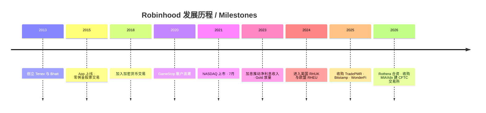
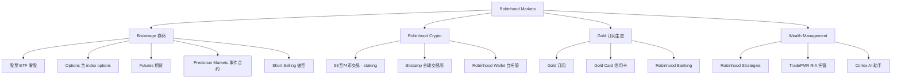
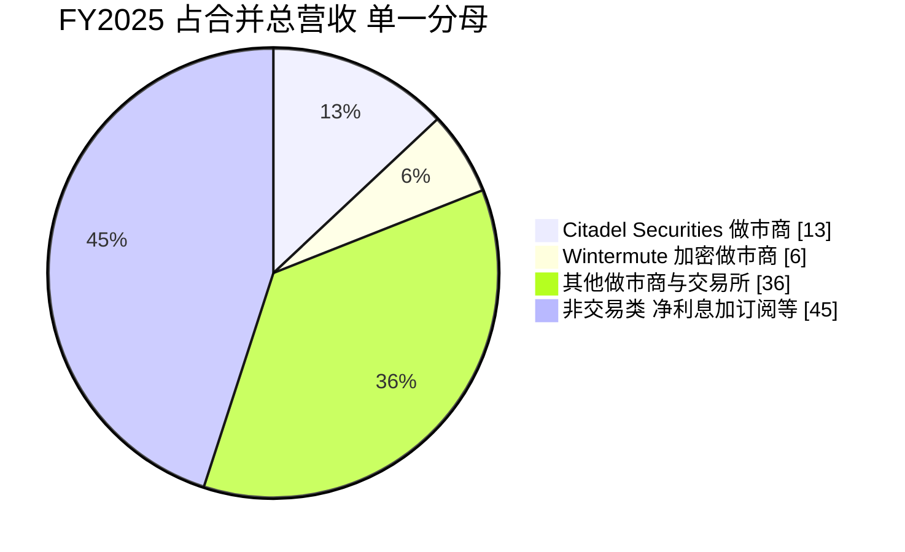
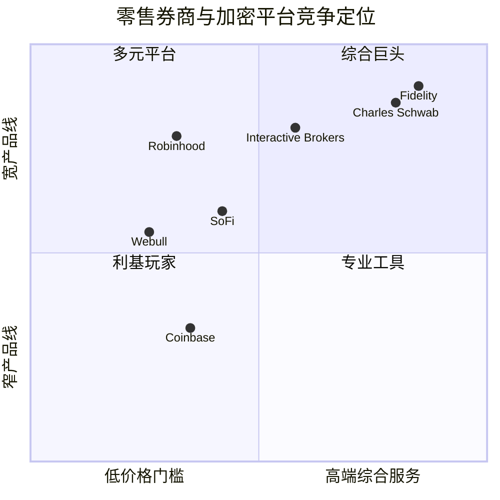

# Robinhood Markets 公司研究报告 (NASDAQ: HOOD)

**As of / 数据截至：2026-06-18**　|　**报告货币：美元 (US$)**　|　**上市地：NASDAQ: HOOD**

> *分析师观点：* **评级：Hold / Neutral（持有 / 中性）· 12 个月目标价 US$115（较现价 US$105.49 上行 +9%）· 估值方法：2027E EPS US$2.80 × ~41× forward P/E**
> 市值 US$95.0bn · 52 周区间 US$63.52–US$153.86 · 流通股 ~790.1M Class A + 110.3M Class B · NASDAQ: HOOD
>
> | 倍数 / Multiple（*分析师观点：* 远期列为预测） | FY25A | FY26E | FY27E |
> |---|---|---|---|
> | P/E | 51× | 47× | 38× |
> | P/S | 21× | 18× | 16× |
> | EV/EBITDA (adj., 含客户存款，仅供参考) | ~33× | ~29× | ~25× |
> | PEG (forward) | — | ~3.0 | ~2.3 |
>
> **相对表现 / Rel. performance（截至 2026-06-18）：** 1M **+42.2%** · 6M **−8.9%** · YTD **−8.4%** · 12M **+34.6%**　vs **S&P 500（SPY）** 1M +1.7% · 6M +11.8% · YTD +9.6% · 12M +26.4%（相对：1M **+40.5pp** · 6M **−20.7pp** · YTD **−18.0pp** · 12M **+8.3pp**）。数据来源：[Yahoo Finance — HOOD](https://finance.yahoo.com/quote/HOOD/) / yfinance（如下文「估值快照」所述，仅供参考）。
>
> **核心论点（thesis pillars）**——
> （1）**业务质量一流、产品迭代极快**：从「commission-free（零佣金）股票券商」进化为多资产「Financial SuperApp（金融超级 App）」——options、crypto、futures、prediction markets（事件合约）、retirement、Gold 订阅、银行与财富管理一应俱全；FY2025 营收 +52%、net income +33%、Adjusted EBITDA +76%。
> （2）**「客户即产品」的 PFOF 商业模式被低估**：零佣金的代价是订单流卖给做市商——transaction revenue（含 PFOF/返佣）占营收 59%，其中 Citadel Securities 一家即占总营收 13%。这是高利润、轻资产的现金机器（capex 仅约 US$54M）。
> （3）**当前估值已基本反映了乐观预期**：经过近一个月 +42% 的暴力反弹，股价回到 51× TTM P/E、20.6× P/S，远高于传统券商；crypto 收入 Q1'26 同比 −47%、Fed 降息将压制 net interest，构成近端逆风。
> （4）**风险收益对称、给予中性**：业务值得「买入级」franchise 的溢价，但 US$105 的入场点在 +42% 反弹后已偏满；除非 crypto 重新加速或 prediction markets 大规模放量，否则上行空间有限。下行由 high beta（2.35）放大。

---

## 目录 / Table of Contents

1. 公司概览（含投资论点引言 + 估值快照）
1A. 估值与目标价（远期模型 · 目标价推导 · bull/base/bear · 卖方观点演变）
1B. GF Score（GuruFocus 式）基本面评分
2. 公司历史
3. 管理团队
4. 产品与服务
5. 客户与上市策略（含做市商集中度）
6. 行业概览
7. 竞争格局
8. 市场机会（TAM）
9. 风险评估
9.5. 核心分歧与催化剂
10. 投资视角评分（investor lenses）
数据来源清单 / Data Used
参考资料 / References
验证日志（Step 10）

======================================

## 1. 公司概览 / Company Overview

*分析师观点：* 我们以 **Hold / Neutral（持有 / 中性）** 启动对 Robinhood Markets（NASDAQ: HOOD）的覆盖，12 个月目标价 **US$115**（较 2026-06-18 现价 US$105.49 上行约 +9%）。Robinhood 是过去十年美国零售投资行业最成功的颠覆者之一，但 2026 年的投资命题不再是「这是不是一家好公司」——它显然是——而是「在一个月内暴涨 42%、回到 51× TTM P/E 之后，US$105 的价格是否还留有足够安全边际」。我们的结论是：业务质量配得上一线 fintech 的成长溢价，但短期 crypto 收入下滑（Q1'26 同比 −47%）、Fed 降息压制 net interest、以及 2.35 的 beta，使得当前点位的风险收益趋于对称，故给予中性。下文九章描述层为这一判断提供事实基础。

**公司做什么。** Robinhood 的使命被它在 10-K 里反复重申为 "democratize finance for all（让金融普惠所有人）"。公司以一款 mobile-first 的 App 起家，是「第一家提供 commission-free（零佣金）美股交易、且无账户最低门槛的美国零售券商，随后整个行业纷纷效仿」。如今它已远超单纯券商：在最新年报里，公司把自己定义为正在打造的 **"Financial SuperApp（金融超级 App）"**，业务横跨 Brokerage（股票 / ETF / options / futures / fractional shares / 24 小时交易 / 做空）、Robinhood Crypto（加密货币交易 / staking / 钱包 / 永续合约）、Prediction Markets（事件合约）、Robinhood Gold（付费订阅）、Gold Card（信用卡）、Robinhood Banking（银行）、Retirement（养老金）与 Wealth Management（Robinhood Strategies / TradePMR）([Robinhood FY2025 10-K, Item 1 Business — Our Products And Features](https://www.sec.gov/Archives/edgar/data/1783879/000178387926000023/hood-20251231.htm))。

**它怎么赚钱。** 这是理解 Robinhood 的关键。表面「零佣金」，但 FY2025 营收 US$4,473M 由三条主线构成：(1) **Transaction-based revenue（交易类收入）US$2,628M（占 59%）**——主要是把客户订单流路由给做市商所收取的 payment-for-order-flow（PFOF，订单流付费）与加密返佣（Transaction Rebates）；(2) **Net interest revenue（净利息收入）US$1,514M（占 34%）**——margin 融资利息、cash sweep（现金清扫）、securities lending（证券借贷）与隔离现金利息；(3) **Other revenue（其他收入）US$331M（占 7%）**——以 Robinhood Gold 订阅费 US$179M 为主([Robinhood FY2025 10-K — Consolidated Statements of Operations & revenue disaggregation](https://www.sec.gov/Archives/edgar/data/1783879/000178387926000023/hood-20251231.htm))。下图把这三条主线及其在利润表中的去向一次性呈现：

<svg xmlns="http://www.w3.org/2000/svg" viewBox="0 0 1000 560" width="1000" height="560" role="img" aria-label="income statement Sankey"><rect x="0" y="0" width="1000" height="560" fill="#ffffff"/>
<text x="20.00" y="30.00" text-anchor="start" font-family="Helvetica,Arial,sans-serif" font-size="15" font-weight="700" fill="#1f2933">Robinhood 收入流向 / Income statement (FY2025, US$M)</text>
<path d="M 204.00,64.59 C 258.00,64.59 258.00,99.59 312.00,99.59 L 312.00,194.70 C 258.00,194.70 258.00,159.70 204.00,159.70 Z" fill="#93c5fd" fill-opacity="0.55"/>
<path d="M 700.00,78.00 C 754.00,78.00 754.00,192.74 808.00,192.74 L 808.00,352.21 C 754.00,352.21 754.00,237.47 700.00,237.47 Z" fill="#86efac" fill-opacity="0.55"/>
<path d="M 700.00,237.47 C 754.00,237.47 754.00,366.21 808.00,366.21 L 808.00,385.26 C 754.00,385.26 754.00,256.52 700.00,256.52 Z" fill="#fca5a5" fill-opacity="0.55"/>
<path d="M 452.00,91.59 C 506.00,91.59 506.00,92.59 560.00,92.59 L 560.00,269.93 C 506.00,269.93 506.00,268.93 452.00,268.93 Z" fill="#86efac" fill-opacity="0.55"/>
<path d="M 452.00,268.93 C 506.00,268.93 506.00,283.93 560.00,283.93 L 560.00,485.41 C 506.00,485.41 506.00,470.41 452.00,470.41 Z" fill="#fca5a5" fill-opacity="0.55"/>
<path d="M 576.00,92.59 C 630.00,92.59 630.00,78.00 684.00,78.00 L 684.00,255.34 C 630.00,255.34 630.00,269.93 576.00,269.93 Z" fill="#86efac" fill-opacity="0.55"/>
<path d="M 328.00,99.59 C 382.00,99.59 382.00,91.59 436.00,91.59 L 436.00,470.41 C 382.00,470.41 382.00,478.41 328.00,478.41 Z" fill="#86efac" fill-opacity="0.55"/>
<path d="M 328.00,478.41 C 382.00,478.41 382.00,484.41 436.00,484.41 L 436.00,486.41 C 382.00,486.41 382.00,480.41 328.00,480.41 Z" fill="#fca5a5" fill-opacity="0.55"/>
<path d="M 204.00,173.70 C 258.00,173.70 258.00,194.70 312.00,194.70 L 312.00,271.00 C 258.00,271.00 258.00,250.00 204.00,250.00 Z" fill="#93c5fd" fill-opacity="0.55"/>
<path d="M 204.00,264.00 C 258.00,264.00 258.00,271.00 312.00,271.00 L 312.00,296.58 C 258.00,296.58 258.00,289.58 204.00,289.58 Z" fill="#93c5fd" fill-opacity="0.55"/>
<path d="M 576.00,283.93 C 630.00,283.93 630.00,270.52 684.00,270.52 L 684.00,357.50 C 630.00,357.50 630.00,370.91 576.00,370.91 Z" fill="#fca5a5" fill-opacity="0.55"/>
<path d="M 576.00,370.91 C 630.00,370.91 630.00,371.50 684.00,371.50 L 684.00,447.47 C 630.00,447.47 630.00,446.87 576.00,446.87 Z" fill="#fca5a5" fill-opacity="0.55"/>
<path d="M 576.00,446.87 C 630.00,446.87 630.00,461.47 684.00,461.47 L 684.00,500.00 C 630.00,500.00 630.00,485.41 576.00,485.41 Z" fill="#fca5a5" fill-opacity="0.55"/>
<path d="M 204.00,303.58 C 258.00,303.58 258.00,296.58 312.00,296.58 L 312.00,322.16 C 258.00,322.16 258.00,329.16 204.00,329.16 Z" fill="#93c5fd" fill-opacity="0.55"/>
<path d="M 204.00,343.16 C 258.00,343.16 258.00,322.16 312.00,322.16 L 312.00,450.38 C 258.00,450.38 258.00,471.38 204.00,471.38 Z" fill="#93c5fd" fill-opacity="0.55"/>
<path d="M 204.00,485.38 C 258.00,485.38 258.00,450.38 312.00,450.38 L 312.00,478.41 C 258.00,478.41 258.00,513.41 204.00,513.41 Z" fill="#93c5fd" fill-opacity="0.55"/>
<rect x="188.00" y="64.59" width="16" height="95.11" rx="1.5" fill="#2563eb"/>
<rect x="188.00" y="173.70" width="16" height="76.30" rx="1.5" fill="#2563eb"/>
<rect x="188.00" y="264.00" width="16" height="25.58" rx="1.5" fill="#2563eb"/>
<rect x="188.00" y="303.58" width="16" height="25.58" rx="1.5" fill="#2563eb"/>
<rect x="188.00" y="343.16" width="16" height="128.22" rx="1.5" fill="#2563eb"/>
<rect x="188.00" y="485.38" width="16" height="28.03" rx="1.5" fill="#2563eb"/>
<rect x="312.00" y="99.59" width="16" height="378.81" rx="1.5" fill="#1e3a8a"/>
<rect x="436.00" y="91.59" width="16" height="378.81" rx="1.5" fill="#15803d"/>
<rect x="436.00" y="484.41" width="16" height="2.00" rx="1.5" fill="#dc2626"/>
<rect x="560.00" y="92.59" width="16" height="177.34" rx="1.5" fill="#15803d"/>
<rect x="560.00" y="283.93" width="16" height="201.48" rx="1.5" fill="#dc2626"/>
<rect x="684.00" y="78.00" width="16" height="178.52" rx="1.5" fill="#15803d"/>
<rect x="684.00" y="270.52" width="16" height="86.98" rx="1.5" fill="#dc2626"/>
<rect x="684.00" y="371.50" width="16" height="75.97" rx="1.5" fill="#dc2626"/>
<rect x="684.00" y="461.47" width="16" height="38.53" rx="1.5" fill="#dc2626"/>
<rect x="808.00" y="192.74" width="16" height="159.47" rx="1.5" fill="#15803d"/>
<rect x="808.00" y="366.21" width="16" height="19.06" rx="1.5" fill="#dc2626"/>
<line x1="188.00" y1="112.15" x2="182.00" y2="99.75" stroke="#cbd5e1" stroke-width="1"/>
<text x="179.00" y="102.75" text-anchor="end" font-family="Helvetica,Arial,sans-serif" font-size="11.5" font-weight="700" fill="#1f2933">Options</text>
<text x="179.00" y="115.75" text-anchor="end" font-family="Helvetica,Arial,sans-serif" font-size="10" font-weight="400" fill="#52606d">US$1.1B  (25.1%)</text>
<line x1="188.00" y1="211.85" x2="182.00" y2="199.46" stroke="#cbd5e1" stroke-width="1"/>
<text x="179.00" y="202.46" text-anchor="end" font-family="Helvetica,Arial,sans-serif" font-size="11.5" font-weight="700" fill="#1f2933">Crypto</text>
<text x="179.00" y="215.46" text-anchor="end" font-family="Helvetica,Arial,sans-serif" font-size="10" font-weight="400" fill="#52606d">US$901.0M  (20.1%)</text>
<line x1="188.00" y1="276.79" x2="182.00" y2="264.40" stroke="#cbd5e1" stroke-width="1"/>
<text x="179.00" y="267.40" text-anchor="end" font-family="Helvetica,Arial,sans-serif" font-size="11.5" font-weight="700" fill="#1f2933">Equities</text>
<text x="179.00" y="280.40" text-anchor="end" font-family="Helvetica,Arial,sans-serif" font-size="10" font-weight="400" fill="#52606d">US$302.0M  (6.8%)</text>
<line x1="188.00" y1="316.37" x2="182.00" y2="303.98" stroke="#cbd5e1" stroke-width="1"/>
<text x="179.00" y="306.98" text-anchor="end" font-family="Helvetica,Arial,sans-serif" font-size="11.5" font-weight="700" fill="#1f2933">Other txn (events)</text>
<text x="179.00" y="319.98" text-anchor="end" font-family="Helvetica,Arial,sans-serif" font-size="10" font-weight="400" fill="#52606d">US$302.0M  (6.8%)</text>
<line x1="188.00" y1="407.27" x2="182.00" y2="394.87" stroke="#cbd5e1" stroke-width="1"/>
<text x="179.00" y="397.87" text-anchor="end" font-family="Helvetica,Arial,sans-serif" font-size="11.5" font-weight="700" fill="#1f2933">Net interest</text>
<text x="179.00" y="410.87" text-anchor="end" font-family="Helvetica,Arial,sans-serif" font-size="10" font-weight="400" fill="#52606d">US$1.5B  (33.8%)</text>
<line x1="188.00" y1="499.39" x2="182.00" y2="487.00" stroke="#cbd5e1" stroke-width="1"/>
<text x="179.00" y="490.00" text-anchor="end" font-family="Helvetica,Arial,sans-serif" font-size="11.5" font-weight="700" fill="#1f2933">Other rev</text>
<text x="179.00" y="503.00" text-anchor="end" font-family="Helvetica,Arial,sans-serif" font-size="10" font-weight="400" fill="#52606d">US$331.0M  (7.4%)</text>
<rect x="331.00" y="81.59" width="113.10" height="26" rx="2" fill="#ffffff" fill-opacity="0.72"/>
<text x="334.00" y="93.59" text-anchor="start" font-family="Helvetica,Arial,sans-serif" font-size="11.5" font-weight="700" fill="#1f2933">Revenue</text>
<text x="334.00" y="106.59" text-anchor="start" font-family="Helvetica,Arial,sans-serif" font-size="10" font-weight="400" fill="#52606d">US$4.5B  (100.0%)</text>
<rect x="455.00" y="73.59" width="113.10" height="26" rx="2" fill="#ffffff" fill-opacity="0.72"/>
<text x="458.00" y="85.59" text-anchor="start" font-family="Helvetica,Arial,sans-serif" font-size="11.5" font-weight="700" fill="#1f2933">Gross Profit</text>
<text x="458.00" y="98.59" text-anchor="start" font-family="Helvetica,Arial,sans-serif" font-size="10" font-weight="400" fill="#52606d">US$4.5B  (100.0%)</text>
<rect x="455.00" y="466.41" width="144.60" height="26" rx="2" fill="#ffffff" fill-opacity="0.72"/>
<text x="458.00" y="478.41" text-anchor="start" font-family="Helvetica,Arial,sans-serif" font-size="11.5" font-weight="700" fill="#1f2933">Cost of Revenue (COGS)</text>
<text x="458.00" y="491.41" text-anchor="start" font-family="Helvetica,Arial,sans-serif" font-size="10" font-weight="400" fill="#52606d">US$0  (0.00%)</text>
<rect x="579.00" y="74.59" width="106.80" height="26" rx="2" fill="#ffffff" fill-opacity="0.72"/>
<text x="582.00" y="86.59" text-anchor="start" font-family="Helvetica,Arial,sans-serif" font-size="11.5" font-weight="700" fill="#1f2933">Operating Income</text>
<text x="582.00" y="99.59" text-anchor="start" font-family="Helvetica,Arial,sans-serif" font-size="10" font-weight="400" fill="#52606d">US$2.1B  (46.8%)</text>
<rect x="579.00" y="265.93" width="150.90" height="26" rx="2" fill="#ffffff" fill-opacity="0.72"/>
<text x="582.00" y="277.93" text-anchor="start" font-family="Helvetica,Arial,sans-serif" font-size="11.5" font-weight="700" fill="#1f2933">Total Operating Expense</text>
<text x="582.00" y="290.93" text-anchor="start" font-family="Helvetica,Arial,sans-serif" font-size="10" font-weight="400" fill="#52606d">US$2.4B  (53.2%)</text>
<rect x="703.00" y="60.00" width="106.80" height="26" rx="2" fill="#ffffff" fill-opacity="0.72"/>
<text x="706.00" y="72.00" text-anchor="start" font-family="Helvetica,Arial,sans-serif" font-size="11.5" font-weight="700" fill="#1f2933">Pretax Income</text>
<text x="706.00" y="85.00" text-anchor="start" font-family="Helvetica,Arial,sans-serif" font-size="10" font-weight="400" fill="#52606d">US$2.1B  (47.1%)</text>
<rect x="703.00" y="252.52" width="106.80" height="26" rx="2" fill="#ffffff" fill-opacity="0.72"/>
<text x="706.00" y="264.52" text-anchor="start" font-family="Helvetica,Arial,sans-serif" font-size="11.5" font-weight="700" fill="#1f2933">SG&amp;A</text>
<text x="706.00" y="277.52" text-anchor="start" font-family="Helvetica,Arial,sans-serif" font-size="10" font-weight="400" fill="#52606d">US$1.0B  (23.0%)</text>
<rect x="703.00" y="353.50" width="119.40" height="26" rx="2" fill="#ffffff" fill-opacity="0.72"/>
<text x="706.00" y="365.50" text-anchor="start" font-family="Helvetica,Arial,sans-serif" font-size="11.5" font-weight="700" fill="#1f2933">R&amp;D</text>
<text x="706.00" y="378.50" text-anchor="start" font-family="Helvetica,Arial,sans-serif" font-size="10" font-weight="400" fill="#52606d">US$897.0M  (20.1%)</text>
<rect x="703.00" y="443.47" width="119.40" height="26" rx="2" fill="#ffffff" fill-opacity="0.72"/>
<text x="706.00" y="455.47" text-anchor="start" font-family="Helvetica,Arial,sans-serif" font-size="11.5" font-weight="700" fill="#1f2933">Other OpEx</text>
<text x="706.00" y="468.47" text-anchor="start" font-family="Helvetica,Arial,sans-serif" font-size="10" font-weight="400" fill="#52606d">US$455.0M  (10.2%)</text>
<text x="833.00" y="269.47" text-anchor="start" font-family="Helvetica,Arial,sans-serif" font-size="11.5" font-weight="700" fill="#1f2933">Net Income</text>
<text x="833.00" y="282.47" text-anchor="start" font-family="Helvetica,Arial,sans-serif" font-size="10" font-weight="400" fill="#52606d">US$1.9B  (42.1%)</text>
<text x="833.00" y="372.73" text-anchor="start" font-family="Helvetica,Arial,sans-serif" font-size="11.5" font-weight="700" fill="#1f2933">Income Tax</text>
<text x="833.00" y="385.73" text-anchor="start" font-family="Helvetica,Arial,sans-serif" font-size="10" font-weight="400" fill="#52606d">US$225.0M  (5.0%)</text>
<text x="500.00" y="544.00" text-anchor="middle" font-family="Helvetica,Arial,sans-serif" font-size="10" font-weight="400" fill="#52606d">Source: Robinhood FY2025 10-K (filed 2026) · SEC EDGAR — Consolidated Statements of Operations</text>
</svg>

*图 1：Robinhood FY2025 收入流向（income-statement Sankey）。来源：[Robinhood FY2025 10-K — Consolidated Statements of Operations](https://www.sec.gov/Archives/edgar/data/1783879/000178387926000023/hood-20251231.htm)。注：作为券商，Robinhood 不披露传统 COGS / gross profit，故「净营收」即左侧六条来源之和；右侧为 operating expenses（合计 US$2,379M）、tax US$225M 与 net income US$1,883M。*

按收入类型拆分，FY2025 的结构如下饼图——options（US$1,123M）、crypto（US$901M）与 net interest（US$1,514M）是三大支柱：

<svg xmlns="http://www.w3.org/2000/svg" viewBox="0 0 720 460" width="720" height="460" role="img" aria-label="revenue donut"><rect x="0" y="0" width="720" height="460" fill="#ffffff"/>
<text x="20.00" y="30.00" text-anchor="start" font-family="Helvetica,Arial,sans-serif" font-size="15" font-weight="700" fill="#1f2933">Robinhood FY2025 收入构成 / Revenue mix (US$M)</text>
<path d="M 288.00,107.20 A 132 132 0 0 1 420.00,240.08 L 366.00,239.72 A 78 78 0 0 0 288.00,161.20 Z" fill="#2563eb"/>
<path d="M 420.00,240.08 A 132 132 0 0 1 326.82,365.36 L 310.94,313.75 A 78 78 0 0 0 366.00,239.72 Z" fill="#15803d"/>
<path d="M 326.82,365.36 A 132 132 0 0 1 160.35,205.60 L 212.57,219.34 A 78 78 0 0 0 310.94,313.75 Z" fill="#d97706"/>
<path d="M 160.35,205.60 A 132 132 0 0 1 185.50,156.03 L 227.43,190.06 A 78 78 0 0 0 212.57,219.34 Z" fill="#7c3aed"/>
<path d="M 185.50,156.03 A 132 132 0 0 1 228.81,121.21 L 253.03,169.48 A 78 78 0 0 0 227.43,190.06 Z" fill="#dc2626"/>
<path d="M 228.81,121.21 A 132 132 0 0 1 288.00,107.20 L 288.00,161.20 A 78 78 0 0 0 253.03,169.48 Z" fill="#0891b2"/>
<text x="288.00" y="235.20" text-anchor="middle" font-family="Helvetica,Arial,sans-serif" font-size="18" font-weight="800" fill="#1f2933">HOOD</text>
<text x="288.00" y="255.20" text-anchor="middle" font-family="Helvetica,Arial,sans-serif" font-size="13" font-weight="600" fill="#52606d">US$4.5B</text>
<text x="288.00" y="271.20" text-anchor="middle" font-family="Helvetica,Arial,sans-serif" font-size="10" font-weight="400" fill="#8a97a3">total</text>
<line x1="385.91" y1="141.95" x2="401.91" y2="141.95" stroke="#2563eb" stroke-width="1.4"/>
<text x="405.91" y="139.95" text-anchor="start" font-family="Helvetica,Arial,sans-serif" font-size="11" font-weight="700" fill="#1f2933">Options</text>
<text x="405.91" y="153.95" text-anchor="start" font-family="Helvetica,Arial,sans-serif" font-size="10" font-weight="400" fill="#52606d">US$1.1B  (25.1%)</text>
<line x1="398.73" y1="321.56" x2="414.73" y2="321.56" stroke="#15803d" stroke-width="1.4"/>
<text x="418.73" y="319.56" text-anchor="start" font-family="Helvetica,Arial,sans-serif" font-size="11" font-weight="700" fill="#1f2933">Crypto</text>
<text x="418.73" y="333.56" text-anchor="start" font-family="Helvetica,Arial,sans-serif" font-size="10" font-weight="400" fill="#52606d">US$901.0M  (20.1%)</text>
<line x1="192.44" y1="338.76" x2="176.44" y2="338.76" stroke="#d97706" stroke-width="1.4"/>
<text x="172.44" y="336.76" text-anchor="end" font-family="Helvetica,Arial,sans-serif" font-size="11" font-weight="700" fill="#1f2933">Net interest</text>
<text x="172.44" y="350.76" text-anchor="end" font-family="Helvetica,Arial,sans-serif" font-size="10" font-weight="400" fill="#52606d">US$1.5B  (33.8%)</text>
<line x1="164.93" y1="176.76" x2="148.93" y2="176.76" stroke="#7c3aed" stroke-width="1.4"/>
<text x="144.93" y="174.76" text-anchor="end" font-family="Helvetica,Arial,sans-serif" font-size="11" font-weight="700" fill="#1f2933">Equities</text>
<text x="144.93" y="188.76" text-anchor="end" font-family="Helvetica,Arial,sans-serif" font-size="10" font-weight="400" fill="#52606d">US$302.0M  (6.8%)</text>
<line x1="201.54" y1="131.64" x2="185.54" y2="131.64" stroke="#dc2626" stroke-width="1.4"/>
<text x="181.54" y="129.64" text-anchor="end" font-family="Helvetica,Arial,sans-serif" font-size="11" font-weight="700" fill="#1f2933">Other txn</text>
<text x="181.54" y="143.64" text-anchor="end" font-family="Helvetica,Arial,sans-serif" font-size="10" font-weight="400" fill="#52606d">US$302.0M  (6.8%)</text>
<line x1="256.21" y1="104.91" x2="240.21" y2="104.91" stroke="#0891b2" stroke-width="1.4"/>
<text x="236.21" y="102.91" text-anchor="end" font-family="Helvetica,Arial,sans-serif" font-size="11" font-weight="700" fill="#1f2933">Other rev</text>
<text x="236.21" y="116.91" text-anchor="end" font-family="Helvetica,Arial,sans-serif" font-size="10" font-weight="400" fill="#52606d">US$331.0M  (7.4%)</text>
<text x="360.00" y="444.00" text-anchor="middle" font-family="Helvetica,Arial,sans-serif" font-size="10" font-weight="400" fill="#52606d">Source: Robinhood FY2025 10-K — revenue disaggregation</text>
</svg>

*图 2：Robinhood FY2025 收入构成（按类型）。来源：[Robinhood FY2025 10-K — revenue disaggregation](https://www.sec.gov/Archives/edgar/data/1783879/000178387926000023/hood-20251231.htm)。*

**它有多大规模。** 截至 2026 年 3 月 31 日（Q1 2026），Robinhood 拥有 **27.4M Funded Customers（已注资客户）**、**29.1M Investment Accounts（投资账户）**、**Total Platform Assets（平台总资产）US$307bn**、**Robinhood Gold Subscribers（Gold 订阅用户）4.3M（同比 +36%）**、过去十二个月 Net Deposits（净流入）US$67.8bn([Robinhood Q1 2026 8-K 业绩新闻稿, 2026-04-28](https://www.sec.gov/Archives/edgar/data/1783879/000178387926000061/q12026robinhoodexhibit991.htm))。FY2025 全年营收 US$4.5bn、net income US$1.9bn、diluted EPS US$2.05、Net Deposits US$68bn——均为公司历史新高([Robinhood Q4/FY2025 8-K 业绩新闻稿, 2026-02-10](https://www.sec.gov/Archives/edgar/data/1783879/000178387926000013/q42025robinhoodexhibit991.htm))。公司截至 2025 年底仅约 **2,900 名全职员工**，人均创收极高，体现其「以 scalable technology 而非堆人力来扩张」的运营哲学([Robinhood FY2025 10-K — Human Capital](https://www.sec.gov/Archives/edgar/data/1783879/000178387926000023/hood-20251231.htm))。下图展示其营收三年的高速增长：

<svg xmlns="http://www.w3.org/2000/svg" viewBox="0 0 860 470" width="860" height="470" role="img" aria-label="historical revenue bars"><rect x="0" y="0" width="860" height="470" fill="#ffffff"/>
<text x="20.00" y="30.00" text-anchor="start" font-family="Helvetica,Arial,sans-serif" font-size="15" font-weight="700" fill="#1f2933">Robinhood 营收增长 / Net revenue by type (US$M)</text>
<rect x="20.00" y="44" width="11" height="11" rx="2" fill="#2563eb"/>
<text x="36.00" y="53.00" text-anchor="start" font-family="Helvetica,Arial,sans-serif" font-size="10.5" font-weight="400" fill="#1f2933">Transaction</text>
<rect x="122.60" y="44" width="11" height="11" rx="2" fill="#15803d"/>
<text x="138.60" y="53.00" text-anchor="start" font-family="Helvetica,Arial,sans-serif" font-size="10.5" font-weight="400" fill="#1f2933">Net interest</text>
<rect x="231.80" y="44" width="11" height="11" rx="2" fill="#d97706"/>
<text x="247.80" y="53.00" text-anchor="start" font-family="Helvetica,Arial,sans-serif" font-size="10.5" font-weight="400" fill="#1f2933">Other</text>
<line x1="70" y1="412.00" x2="834" y2="412.00" stroke="#eceff2" stroke-width="1"/>
<text x="64.00" y="415.00" text-anchor="end" font-family="Helvetica,Arial,sans-serif" font-size="9.5" font-weight="400" fill="#52606d">US$0</text>
<line x1="70" y1="345.20" x2="834" y2="345.20" stroke="#eceff2" stroke-width="1"/>
<text x="64.00" y="348.20" text-anchor="end" font-family="Helvetica,Arial,sans-serif" font-size="9.5" font-weight="400" fill="#52606d">US$966.2M</text>
<line x1="70" y1="278.40" x2="834" y2="278.40" stroke="#eceff2" stroke-width="1"/>
<text x="64.00" y="281.40" text-anchor="end" font-family="Helvetica,Arial,sans-serif" font-size="9.5" font-weight="400" fill="#52606d">US$1.9B</text>
<line x1="70" y1="211.60" x2="834" y2="211.60" stroke="#eceff2" stroke-width="1"/>
<text x="64.00" y="214.60" text-anchor="end" font-family="Helvetica,Arial,sans-serif" font-size="9.5" font-weight="400" fill="#52606d">US$2.9B</text>
<line x1="70" y1="144.80" x2="834" y2="144.80" stroke="#eceff2" stroke-width="1"/>
<text x="64.00" y="147.80" text-anchor="end" font-family="Helvetica,Arial,sans-serif" font-size="9.5" font-weight="400" fill="#52606d">US$3.9B</text>
<line x1="70" y1="78.00" x2="834" y2="78.00" stroke="#eceff2" stroke-width="1"/>
<text x="64.00" y="81.00" text-anchor="end" font-family="Helvetica,Arial,sans-serif" font-size="9.5" font-weight="400" fill="#52606d">US$4.8B</text>
<rect x="123.48" y="357.73" width="147.71" height="54.27" fill="#2563eb"/>
<rect x="123.48" y="293.50" width="147.71" height="64.23" fill="#15803d"/>
<rect x="123.48" y="283.06" width="147.71" height="10.44" fill="#d97706"/>
<text x="197.33" y="428.00" text-anchor="middle" font-family="Helvetica,Arial,sans-serif" font-size="10" font-weight="400" fill="#52606d">2023</text>
<rect x="378.15" y="298.13" width="147.71" height="113.87" fill="#2563eb"/>
<rect x="378.15" y="221.45" width="147.71" height="76.68" fill="#15803d"/>
<rect x="378.15" y="207.97" width="147.71" height="13.48" fill="#d97706"/>
<text x="452.00" y="428.00" text-anchor="middle" font-family="Helvetica,Arial,sans-serif" font-size="10" font-weight="400" fill="#52606d">2024</text>
<rect x="632.81" y="230.30" width="147.71" height="181.70" fill="#2563eb"/>
<rect x="632.81" y="125.63" width="147.71" height="104.68" fill="#15803d"/>
<rect x="632.81" y="102.74" width="147.71" height="22.89" fill="#d97706"/>
<text x="706.67" y="428.00" text-anchor="middle" font-family="Helvetica,Arial,sans-serif" font-size="10" font-weight="400" fill="#52606d">2025</text>
<text x="430.00" y="454.00" text-anchor="middle" font-family="Helvetica,Arial,sans-serif" font-size="10" font-weight="400" fill="#52606d">Source: Robinhood FY2025 10-K — 3-year Statements of Operations</text>
</svg>

*图 3：Robinhood 净营收（按类型，FY2023–FY2025）。来源：[Robinhood FY2025 10-K — 三年 Statements of Operations](https://www.sec.gov/Archives/edgar/data/1783879/000178387926000023/hood-20251231.htm)。三年营收从 US$1,865M 增至 US$4,473M，CAGR 约 55%。*

**它在哪里运营。** 总部位于加州 Menlo Park；主体市场为美国，并通过 RHUK 向英国客户、通过 RHEU 向欧盟客户、通过收购的 Bitstamp 向全球加密市场拓展，且在新加坡设立 APAC 总部作为亚太扩张支点([Robinhood FY2025 10-K — Item 1 Business, International](https://www.sec.gov/Archives/edgar/data/1783879/000178387926000023/hood-20251231.htm))。

**估值快照 / Valuation snapshot（必备）。** 截至 2026-06-18 收盘 US$105.49，市值约 **US$95.0bn**；**TTM P/E ≈ 51×**、**forward P/E ≈ 37×**、**TTM P/S ≈ 20.6×**、**P/B ≈ 10.2×**、beta ≈ 2.35（来源：[Yahoo Finance — HOOD key statistics](https://finance.yahoo.com/quote/HOOD/key-statistics)，经 yfinance 读取；该页对简单 urllib 返回反爬，浏览器内可正常访问）。这些倍数显著高于传统券商（Charles Schwab、Interactive Brokers 多在 ~18–28× P/E），原因有三、且互相叠加：(a) **高成长 fintech 溢价**——三年营收 CAGR 约 55%、FY2025 营收 +52%，市场按多年复利定价；(b) **平台 / 叙事溢价**——Robinhood 已成为「散户投资 + 加密 + prediction markets」三大热门叙事的代理标的；(c) **近端盈利仍在投入期**——大量营销、prediction markets / Rothera 交易所、海外扩张的前置投入压低当期 GAAP 利润、抬高远期倍数。卖方的目标价区间印证了这种「贵但有理」的状态：*分析师观点：* Bernstein 给 Outperform、目标价 US$130（[见 1A 卖方观点演变](#1a-估值与目标价--valuation--price-target)）。**风险提示：** P/S > 20× 且 P/E > 50× 属「叙事满价」区间，一旦 crypto 降温或成长减速，倍数压缩（multiple compression）将是主要下行来源，本报告在第 9 章将其列为重大风险。

## 1A. 估值与目标价 / Valuation & Price Target

本章是决策层，区别于上文的 TTM 回看快照——这里给出前瞻的、可执行的判断。**本章所有数字（每一个预测、目标价、情景价）均为本报告的前瞻观点（*分析师观点：*），绝不附加任何 filing 引用**（10-K 不含目标价）；各预测的外部输入（filing 分部数据 + 公司业绩口径 + 行业趋势）在行内引用。

**(a) 远期财务预测表 / Forward estimates（*分析师观点：*）**

| 指标（*分析师观点：*） | FY24A | FY25A | FY26E | FY27E | CAGR(25–27) |
|---|---|---|---|---|---|
| 净营收 Net revenue (US$M) | 2,951 | 4,473 | 5,150 | 6,100 | +17% |
| — YoY % | — | +52% | +15% | +18% | |
| — Transaction (US$M) | 1,647 | 2,628 | 2,900 | 3,450 | |
| — Net interest (US$M) | 1,109 | 1,514 | 1,650 | 1,850 | |
| — Other / subscription (US$M) | 195 | 331 | 600 | 800 | |
| Operating margin % | 36% | 47% | 42% | 44% | |
| Net margin % | 48%※ | 42% | 40% | 42% | |
| Net income (US$M) | 1,411 | 1,883 | 2,060 | 2,560 | |
| Diluted EPS (US$) | 1.56 | 2.05 | 2.25 | 2.80 | +17% |
| ROE % | ~18% | ~22% | ~22% | ~24% | |
| FCF (US$M, ≈ OCF − capex)※※ | ~−210 | ~1,584 | ~1,900 | ~2,400 | |
| Net cash (US$M, 公司层) | ~4.3bn | ~4.3bn | ~4.5bn | ~5.0bn | |

※ FY2024 net margin 受 Q4'24 一次性「Tax Benefit and Regulatory Accrual Reversal」US$424M 抬高，不具可比性([Robinhood Q4/FY2025 8-K, 2026-02-10](https://www.sec.gov/Archives/edgar/data/1783879/000178387926000013/q42025robinhoodexhibit991.htm))。
※※ Robinhood 的 GAAP operating cash flow 受 margin 账簿（receivables from users 当年增加 US$9,106M，由 payables to users +US$3,423M 与 securities loaned +US$4,163M 等客户负债融资）大幅扰动，故 FCF 以「OCF US$1,638M − capex US$54M」为近似，仅供量级参考([Robinhood FY2025 10-K — Statements of Cash Flows](https://www.sec.gov/Archives/edgar/data/1783879/000178387926000023/hood-20251231.htm))。

预测逻辑（每条均为 *分析师观点：*，输入已引用）：Transaction 收入随 Funded Customers 同比 +6–7%（[Q1'26 业绩新闻稿](https://www.sec.gov/Archives/edgar/data/1783879/000178387926000061/q12026robinhoodexhibit991.htm)）、options / event contracts 放量驱动，但被 crypto 返佣正常化（Q1'26 crypto −47% YoY）部分抵消；Net interest 受 margin 账簿增长支撑、被 Fed 降息压制（公司明确提示「any potential future rate cuts by the Federal Reserve will negatively impact our net interest」，见 [FY2025 10-K 净利息讨论](https://www.sec.gov/Archives/edgar/data/1783879/000178387926000023/hood-20251231.htm)）；Other / subscription 随 Gold（4.3M 订阅、>15% 渗透）与 Banking 放量翻倍式增长。

**毛利率 / 利润率桥（margin bridge，*分析师观点：*）。** FY26E operating margin 由 FY25 的 47% 回落至约 42%，分解为：crypto 高返佣占比下降 **−约 250bps**、prediction markets / Rothera 交易所与 Trump Accounts 等新业务前置投入 **−约 150bps**（Q1'26 已含 US$14M 相关成本，见 [Q1'26 新闻稿](https://www.sec.gov/Archives/edgar/data/1783879/000178387926000061/q12026robinhoodexhibit991.htm)）、营销与海外扩张 **−约 100bps**，部分被运营杠杆 **+约 200bps** 抵消。

**(b) 目标价推导 / PT derivation（*分析师观点：*）。** 方法：forward-PE × 目标倍数。`2027E EPS US$2.80 × 约 41× = US$115`。**倍数依据（为什么用 41×）：** 对标传统券商 Charles Schwab（SCHW，约 18–20× forward P/E）、Interactive Brokers（IBKR，约 28× forward）——Robinhood 凭 ~17% 营收 CAGR 与 prediction markets / crypto / banking 的期权价值，理应享有显著溢价；但相对纯加密标的（Coinbase 在牛市峰值可达 40–50×+）则给予折价，因其盈利质量更高、收入更分散。41× 落在「高于券商、低于加密纯标」的合理区间，亦与公司自身近三年 30–50× 的历史 forward P/E 区间一致。

**(c) Bull / Base / Bear 情景（*分析师观点：*）**

| 情景（*分析师观点：*） | 关键假设 | 目标价 | 较现价 |
|---|---|---|---|
| Bull | crypto 重新加速 + prediction markets 大规模放量，2027E EPS 升至 US$3.20、倍数维持 ~48× | US$155 | +47% |
| Base | 中性预测，2027E EPS US$2.80 × 41× | US$115 | +9% |
| Bear | crypto 寒冬 + 3 次以上降息压制 NII，2027E EPS 降至 US$2.40、de-rate 至 ~28× | US$68 | −36% |

**(d) 与市场一致预期的对比 / Consensus benchmark。** 本报告 base case（PT US$115）位于卖方区间中部偏下。*分析师观点：* 高盛维持 **Buy**、12 个月目标价 **US$94**（基于 Q5–Q8 P/E 33.0×），低于现价（[Goldman Sachs — Robinhood Markets Monthly：Stronger balance sheet and accounts, 2026-05-18, p.1（报告日收盘 US$77.15）](http://xs-macbook-air.local:5001/zsxq/pdf/812454885422522/%E9%AB%98%E7%9B%9B-Robinhood%20Markets%20Inc.%EF%BC%88HOOD.US%EF%BC%89%E6%9C%88%E5%BA%A6%EF%BC%9A%E6%9B%B4%E5%BC%BA%E7%9A%84%E8%B5%84%E4%BA%A7%E8%B4%9F%E5%80%BA%E8%A1%A8%E5%92%8C%E8%B4%A6%E6%88%B7....pdf)）；中信证券维持「买入」、目标价 **US$120**（[中信证券 — Robinhood(HOOD.OQ) 4Q25 季报点评, 2026-03-11, p.1（报告日收盘 US$78.69）](http://xs-macbook-air.local:5001/zsxq/pdf/184445821188442/2026-03-11%20-%20%E4%B8%AD%E4%BF%A1%E8%AF%81%E5%88%B8%20-%20Robinhood%28HOOD.OQ%294Q25%E5%AD%A3%E6%8A%A5%E7%82%B9%E8%AF%84%E2%80%94%E6%82%B2%E8%A7%82%E9%A2%84%E6%9C%9F%E5%85%85%E5%88%86%E8%AE%A1%E5%85%A5%EF%BC%8C%E5%85%B3%E6%B3%A8%E6%96%B0%E4%B8%9A%E5%8A%A1%E8%BF%9B%E5%B1%95.pdf)）；Bernstein 给 **Outperform**、目标价 **US$130**（[Bernstein — Global Digital Assets：The Tokenization Memo, 2026-05-26, p.1（报告日收盘 US$74.09）](http://xs-macbook-air.local:5001/zsxq/pdf/415241514554128/Bernstein-Global%20Digital%20Assets%20The%20Tokenization%20Memo%EF%BC%9A%20Crypto%E2%80%99s%20transformation%20to%20real%20world%20assets%20%EF%BC%881%20n%EF%BC%89-260526.pdf)）。

**(e) 关键变量 / Swing variables。** 本判断主要押在两个变量上：(1) **crypto 交易活跃度与返佣率**——crypto 收入 FY25 占比 20%、波动极大（Q4'25 −38%、Q1'26 −47% YoY），是营收最大的「摆动项」；(2) **Fed 利率路径**——net interest 占营收 34%，公司已明确降息为逆风，每条降息路径直接改变 NII。读者应重点压力测试这两项。

**卖方观点演变 / Sell-side view evolution（≥2 篇 zsxq 券商报告，必备）。**

机械预处理（先读 `db/stock_price_target.db`，只读）：该库对 HOOD 仅有 2 行，均为 Bernstein Outperform US$130（2026-04-14 报告日收盘 US$79.09，上行 +64%；2026-05-26 报告日收盘 US$74.09，上行 +75%）——同一机构在一个月内维持评级与目标价不变，期间股价回落，使隐含上行扩大。结合本地 zsxq 库 OCR 全文，得到以下跨机构时间线：

**按机构的观点时间线（按报告日排序）：**

| 机构 | 报告日 | 评级 / 目标价 | 报告日收盘 → 隐含上行 | 核心论点 |
|---|---|---|---|---|
| Morgan Stanley | 2025-09-11 | Overweight / US$110 | US$117.75 →（PT 低于现价 −6%） | 代理型 AI（Cortex）+ Robinhood Social 社交交易驱动下一增长阶段；产品迭代速度提升估值前景 |
| 中信证券 CITIC | 2026-03-11 | 买入 / US$120 | US$78.69 → +53% | 「悲观预期充分计入」；海外并购 + prediction markets + 风投基金落地，2026 困境反转；因数字资产波动从更高位下调至 US$120 |
| Goldman Sachs | 2026-05-18 | Buy / US$94 | US$77.15 → +22% | 4 月月度指标偏强（账户、净流入），但 crypto 量环比 −33%；估值基于 Q5–Q8 P/E 33.0× |
| Bernstein | 2026-05-26 | Outperform / US$130 | US$74.09 → +75% | RWA 通证化主线最确定受益者之一；零售与 crypto 双增长 |

**机构间分歧（disagreement）——不混为虚假一致：** 同一时点（2026 年 5 月，股价约 US$74–77），高盛与 Bernstein 的目标价相差 38%（US$94 vs US$130），分歧根源在「如何给 crypto / RWA 通证化定价」：

| 机构 | 日期 | 评级 / PT | 核心论点 | 什么证据能证明其正确 |
|---|---|---|---|---|
| Goldman Sachs | 2026-05-18 | Buy / US$94 | crypto 量已转弱（4 月 −33% MoM），按 33× 保守估值 | 后续 crypto 月度量持续下滑、prediction markets 未放量 |
| Bernstein | 2026-05-26 | Outperform / US$130 | RWA 通证化 + 股票通证化（stock tokens）打开新 TAM，零售 + crypto 双轮 | 通证化资产规模、stock tokens 在 EU 放量、月度净流入维持高增 |

注：Morgan Stanley US$110 来自 2025-09（距今 9 个月）、彼时股价已高于其 PT，时效性偏弱，仅作历史观点保留。所有目标价均为 *分析师观点：*，且与报告日收盘配对（避免用今日现价误判其当时所喊的上行空间）。

下图以 5 步 DuPont 拆解 FY2025 的 ROE——提示：作为自清算券商，Robinhood 的 total assets（US$38.1bn）中绝大部分是客户 / margin 资产，故 asset turnover 偏低、equity multiplier 偏高，ROE ~22% 主要由高 net margin 驱动：

<svg xmlns="http://www.w3.org/2000/svg" viewBox="0 0 1240 540" width="1240" height="540" role="img" aria-label="DuPont ROE decomposition"><rect x="0" y="0" width="1240" height="540" fill="#ffffff"/>
<text x="20.00" y="30.00" text-anchor="start" font-family="Helvetica,Arial,sans-serif" font-size="15" font-weight="700" fill="#1f2933">Robinhood 5 步 DuPont ROE 分解 (FY2025)</text>
<rect x="545.00" y="56.00" width="150" height="56" rx="7" fill="#1e3a8a"/>
<text x="620.00" y="76.00" text-anchor="middle" font-family="Helvetica,Arial,sans-serif" font-size="11.5" font-weight="700" fill="#ffffff">ROE</text>
<text x="620.00" y="94.00" text-anchor="middle" font-family="Helvetica,Arial,sans-serif" font-size="13" font-weight="800" fill="#ffffff">21.99%</text>
<text x="620.00" y="106.00" text-anchor="middle" font-family="Helvetica,Arial,sans-serif" font-size="8.5" font-weight="400" fill="#dbeafe">= Net Income / Avg Equity</text>
<rect x="191.60" y="168.00" width="150" height="56" rx="7" fill="#2563eb"/>
<text x="266.60" y="188.00" text-anchor="middle" font-family="Helvetica,Arial,sans-serif" font-size="11.5" font-weight="700" fill="#ffffff">Net Margin</text>
<text x="266.60" y="206.00" text-anchor="middle" font-family="Helvetica,Arial,sans-serif" font-size="13" font-weight="800" fill="#ffffff">42.10%</text>
<text x="266.60" y="218.00" text-anchor="middle" font-family="Helvetica,Arial,sans-serif" font-size="8.5" font-weight="400" fill="#dbeafe">Net Income / Revenue</text>
<line x1="620.00" y1="112.00" x2="266.60" y2="168.00" stroke="#94a3b8" stroke-width="1.4"/>
<rect x="545.00" y="168.00" width="150" height="56" rx="7" fill="#2563eb"/>
<text x="620.00" y="188.00" text-anchor="middle" font-family="Helvetica,Arial,sans-serif" font-size="11.5" font-weight="700" fill="#ffffff">Asset Turnover</text>
<text x="620.00" y="206.00" text-anchor="middle" font-family="Helvetica,Arial,sans-serif" font-size="13" font-weight="800" fill="#ffffff">0.14</text>
<text x="620.00" y="218.00" text-anchor="middle" font-family="Helvetica,Arial,sans-serif" font-size="8.5" font-weight="400" fill="#dbeafe">Revenue / Avg Assets</text>
<line x1="620.00" y1="112.00" x2="620.00" y2="168.00" stroke="#94a3b8" stroke-width="1.4"/>
<rect x="898.40" y="168.00" width="150" height="56" rx="7" fill="#2563eb"/>
<text x="973.40" y="188.00" text-anchor="middle" font-family="Helvetica,Arial,sans-serif" font-size="11.5" font-weight="700" fill="#ffffff">Equity Multiplier</text>
<text x="973.40" y="206.00" text-anchor="middle" font-family="Helvetica,Arial,sans-serif" font-size="13" font-weight="800" fill="#ffffff">3.76</text>
<text x="973.40" y="218.00" text-anchor="middle" font-family="Helvetica,Arial,sans-serif" font-size="8.5" font-weight="400" fill="#dbeafe">Avg Assets / Avg Equity</text>
<line x1="620.00" y1="112.00" x2="973.40" y2="168.00" stroke="#94a3b8" stroke-width="1.4"/>
<circle cx="443.30" cy="196.00" r="11" fill="#ffffff" stroke="#94a3b8" stroke-width="1.2"/>
<text x="443.30" y="201.00" text-anchor="middle" font-family="Helvetica,Arial,sans-serif" font-size="14" font-weight="800" fill="#52606d">×</text>
<circle cx="796.70" cy="196.00" r="11" fill="#ffffff" stroke="#94a3b8" stroke-width="1.2"/>
<text x="796.70" y="201.00" text-anchor="middle" font-family="Helvetica,Arial,sans-serif" font-size="14" font-weight="800" fill="#52606d">×</text>
<rect x="65.00" y="300.00" width="118" height="56" rx="7" fill="#2563eb"/>
<text x="124.00" y="320.00" text-anchor="middle" font-family="Helvetica,Arial,sans-serif" font-size="11.5" font-weight="700" fill="#ffffff">Operating Margin</text>
<text x="124.00" y="338.00" text-anchor="middle" font-family="Helvetica,Arial,sans-serif" font-size="13" font-weight="800" fill="#ffffff">46.81%</text>
<text x="124.00" y="350.00" text-anchor="middle" font-family="Helvetica,Arial,sans-serif" font-size="8.5" font-weight="400" fill="#dbeafe">Op Inc / Revenue</text>
<line x1="266.60" y1="224.00" x2="124.00" y2="300.00" stroke="#94a3b8" stroke-width="1.4"/>
<rect x="207.60" y="300.00" width="118" height="56" rx="7" fill="#2563eb"/>
<text x="266.60" y="320.00" text-anchor="middle" font-family="Helvetica,Arial,sans-serif" font-size="11.5" font-weight="700" fill="#ffffff">Tax Burden</text>
<text x="266.60" y="338.00" text-anchor="middle" font-family="Helvetica,Arial,sans-serif" font-size="13" font-weight="800" fill="#ffffff">0.8933</text>
<text x="266.60" y="350.00" text-anchor="middle" font-family="Helvetica,Arial,sans-serif" font-size="8.5" font-weight="400" fill="#dbeafe">Net Inc / Pretax</text>
<line x1="266.60" y1="224.00" x2="266.60" y2="300.00" stroke="#94a3b8" stroke-width="1.4"/>
<rect x="350.20" y="300.00" width="118" height="56" rx="7" fill="#2563eb"/>
<text x="409.20" y="320.00" text-anchor="middle" font-family="Helvetica,Arial,sans-serif" font-size="11.5" font-weight="700" fill="#ffffff">Interest Burden</text>
<text x="409.20" y="338.00" text-anchor="middle" font-family="Helvetica,Arial,sans-serif" font-size="13" font-weight="800" fill="#ffffff">1.0067</text>
<text x="409.20" y="350.00" text-anchor="middle" font-family="Helvetica,Arial,sans-serif" font-size="8.5" font-weight="400" fill="#dbeafe">Pretax / Op Inc</text>
<line x1="266.60" y1="224.00" x2="409.20" y2="300.00" stroke="#94a3b8" stroke-width="1.4"/>
<circle cx="195.30" cy="328.00" r="11" fill="#ffffff" stroke="#94a3b8" stroke-width="1.2"/>
<text x="195.30" y="333.00" text-anchor="middle" font-family="Helvetica,Arial,sans-serif" font-size="14" font-weight="800" fill="#52606d">×</text>
<circle cx="337.90" cy="328.00" r="11" fill="#ffffff" stroke="#94a3b8" stroke-width="1.2"/>
<text x="337.90" y="333.00" text-anchor="middle" font-family="Helvetica,Arial,sans-serif" font-size="14" font-weight="800" fill="#52606d">×</text>
<rect x="479.00" y="300.00" width="118" height="56" rx="7" fill="#2563eb"/>
<text x="538.00" y="326.00" text-anchor="middle" font-family="Helvetica,Arial,sans-serif" font-size="11.5" font-weight="700" fill="#ffffff">Revenue</text>
<text x="538.00" y="342.00" text-anchor="middle" font-family="Helvetica,Arial,sans-serif" font-size="13" font-weight="800" fill="#ffffff">US$4.5B</text>
<line x1="620.00" y1="224.00" x2="538.00" y2="300.00" stroke="#94a3b8" stroke-width="1.4"/>
<rect x="643.00" y="300.00" width="118" height="56" rx="7" fill="#2563eb"/>
<text x="702.00" y="320.00" text-anchor="middle" font-family="Helvetica,Arial,sans-serif" font-size="11.5" font-weight="700" fill="#ffffff">Avg Total Assets</text>
<text x="702.00" y="338.00" text-anchor="middle" font-family="Helvetica,Arial,sans-serif" font-size="13" font-weight="800" fill="#ffffff">US$32.2B</text>
<text x="702.00" y="350.00" text-anchor="middle" font-family="Helvetica,Arial,sans-serif" font-size="8.5" font-weight="400" fill="#dbeafe">(begin+end)/2</text>
<line x1="620.00" y1="224.00" x2="702.00" y2="300.00" stroke="#94a3b8" stroke-width="1.4"/>
<circle cx="620.00" cy="328.00" r="11" fill="#ffffff" stroke="#94a3b8" stroke-width="1.2"/>
<text x="620.00" y="333.00" text-anchor="middle" font-family="Helvetica,Arial,sans-serif" font-size="14" font-weight="800" fill="#52606d">÷</text>
<rect x="832.40" y="300.00" width="118" height="56" rx="7" fill="#2563eb"/>
<text x="891.40" y="320.00" text-anchor="middle" font-family="Helvetica,Arial,sans-serif" font-size="11.5" font-weight="700" fill="#ffffff">Avg Total Assets</text>
<text x="891.40" y="338.00" text-anchor="middle" font-family="Helvetica,Arial,sans-serif" font-size="13" font-weight="800" fill="#ffffff">US$32.2B</text>
<text x="891.40" y="350.00" text-anchor="middle" font-family="Helvetica,Arial,sans-serif" font-size="8.5" font-weight="400" fill="#dbeafe">(begin+end)/2</text>
<line x1="973.40" y1="224.00" x2="891.40" y2="300.00" stroke="#94a3b8" stroke-width="1.4"/>
<rect x="996.40" y="300.00" width="118" height="56" rx="7" fill="#2563eb"/>
<text x="1055.40" y="320.00" text-anchor="middle" font-family="Helvetica,Arial,sans-serif" font-size="11.5" font-weight="700" fill="#ffffff">Avg Total Equity</text>
<text x="1055.40" y="338.00" text-anchor="middle" font-family="Helvetica,Arial,sans-serif" font-size="13" font-weight="800" fill="#ffffff">US$8.6B</text>
<text x="1055.40" y="350.00" text-anchor="middle" font-family="Helvetica,Arial,sans-serif" font-size="8.5" font-weight="400" fill="#dbeafe">(begin+end)/2</text>
<line x1="973.40" y1="224.00" x2="1055.40" y2="300.00" stroke="#94a3b8" stroke-width="1.4"/>
<circle cx="967.20" cy="328.00" r="11" fill="#ffffff" stroke="#94a3b8" stroke-width="1.2"/>
<text x="967.20" y="333.00" text-anchor="middle" font-family="Helvetica,Arial,sans-serif" font-size="14" font-weight="800" fill="#52606d">÷</text>
<rect x="69.00" y="420.00" width="110" height="48" rx="7" fill="#3b82f6"/>
<text x="124.00" y="442.00" text-anchor="middle" font-family="Helvetica,Arial,sans-serif" font-size="11.5" font-weight="700" fill="#ffffff">Operating Income</text>
<text x="124.00" y="458.00" text-anchor="middle" font-family="Helvetica,Arial,sans-serif" font-size="13" font-weight="800" fill="#ffffff">US$2.1B</text>
<line x1="124.00" y1="356.00" x2="124.00" y2="420.00" stroke="#94a3b8" stroke-width="1.4"/>
<rect x="211.60" y="420.00" width="110" height="48" rx="7" fill="#3b82f6"/>
<text x="266.60" y="442.00" text-anchor="middle" font-family="Helvetica,Arial,sans-serif" font-size="11.5" font-weight="700" fill="#ffffff">Net Income</text>
<text x="266.60" y="458.00" text-anchor="middle" font-family="Helvetica,Arial,sans-serif" font-size="13" font-weight="800" fill="#ffffff">US$1.9B</text>
<line x1="266.60" y1="356.00" x2="266.60" y2="420.00" stroke="#94a3b8" stroke-width="1.4"/>
<rect x="354.20" y="420.00" width="110" height="48" rx="7" fill="#3b82f6"/>
<text x="409.20" y="442.00" text-anchor="middle" font-family="Helvetica,Arial,sans-serif" font-size="11.5" font-weight="700" fill="#ffffff">Pretax Income</text>
<text x="409.20" y="458.00" text-anchor="middle" font-family="Helvetica,Arial,sans-serif" font-size="13" font-weight="800" fill="#ffffff">US$2.1B</text>
<line x1="409.20" y1="356.00" x2="409.20" y2="420.00" stroke="#94a3b8" stroke-width="1.4"/>
<text x="620.00" y="524.00" text-anchor="middle" font-family="Helvetica,Arial,sans-serif" font-size="10" font-weight="400" fill="#52606d">Source: Robinhood FY2025 10-K — Statements of Operations + Balance Sheets</text>
</svg>

*图 4：Robinhood FY2025 5 步 DuPont ROE 分解。来源：[Robinhood FY2025 10-K — Statements of Operations + Balance Sheets](https://www.sec.gov/Archives/edgar/data/1783879/000178387926000023/hood-20251231.htm)。注：equity multiplier 偏高源于资产负债表含客户存款 / 证券借贷等客户项，非公司层财务杠杆。*

## 1B. GF Score（GuruFocus 式）基本面评分

*分析师观点：* **GF Score（GuruFocus-style）：72 / 100 — 71–80「Likely average performance（大概率中等表现）」档。** 本评分为本报告自有的分析框架（rubric），非新数据源、非背书；五个子分与综合分均为 *分析师观点：*，各自的底层指标在下文逐一行内引用；该数字不归属于 GuruFocus（GuruFocus 自身公布值见 [gurufocus.com/term/gf-score/HOOD](https://www.gurufocus.com/term/gf-score/HOOD)，作为独立交叉验证）。

<svg xmlns="http://www.w3.org/2000/svg" viewBox="0 0 500 500" width="500" height="500" role="img" aria-label="GF Score radar">
<rect x="0" y="0" width="500" height="500" fill="#ffffff"/>
<text x="20" y="24" font-family="Helvetica,Arial,sans-serif" font-size="15" font-weight="700" fill="#1f2933">GF Score (GuruFocus-style): 72/100</text>
<text x="20" y="41" font-family="Helvetica,Arial,sans-serif" font-size="11" fill="#52606d">71–80 Likely average performance</text>
<polygon points="250.0,88.0 392.7,191.6 338.2,359.4 161.8,359.4 107.3,191.6" fill="#e9f5ec" stroke="none"/>
<polygon points="250.0,208.0 278.5,228.7 267.6,262.3 232.4,262.3 221.5,228.7" fill="none" stroke="#c5d3cb" stroke-width="1"/>
<polygon points="250.0,178.0 307.1,219.5 285.3,286.5 214.7,286.5 192.9,219.5" fill="none" stroke="#c5d3cb" stroke-width="1"/>
<polygon points="250.0,148.0 335.6,210.2 302.9,310.8 197.1,310.8 164.4,210.2" fill="none" stroke="#c5d3cb" stroke-width="1"/>
<polygon points="250.0,118.0 364.1,200.9 320.5,335.1 179.5,335.1 135.9,200.9" fill="none" stroke="#c5d3cb" stroke-width="1"/>
<polygon points="250.0,88.0 392.7,191.6 338.2,359.4 161.8,359.4 107.3,191.6" fill="none" stroke="#c5d3cb" stroke-width="1.3"/>
<line x1="250" y1="238" x2="161.8" y2="359.4" stroke="#cfdad3" stroke-width="1"/>
<text x="146.5" y="392.4" text-anchor="end" font-family="Helvetica,Arial,sans-serif" font-size="11.5" font-weight="600" fill="#1f2933">Financial Strength</text>
<text x="146.5" y="405.4" text-anchor="end" font-family="Helvetica,Arial,sans-serif" font-size="9.5" fill="#52606d">财务实力</text>
<text x="179.5" y="329.1" text-anchor="middle" font-family="Helvetica,Arial,sans-serif" font-size="10.5" font-weight="700" fill="#1f2933">8</text>
<line x1="250" y1="238" x2="250.0" y2="88.0" stroke="#cfdad3" stroke-width="1"/>
<text x="250.0" y="58.0" text-anchor="middle" font-family="Helvetica,Arial,sans-serif" font-size="11.5" font-weight="600" fill="#1f2933">Profitability</text>
<text x="250.0" y="71.0" text-anchor="middle" font-family="Helvetica,Arial,sans-serif" font-size="9.5" fill="#52606d">盈利能力</text>
<text x="250.0" y="112.0" text-anchor="middle" font-family="Helvetica,Arial,sans-serif" font-size="10.5" font-weight="700" fill="#1f2933">8</text>
<line x1="250" y1="238" x2="107.3" y2="191.6" stroke="#cfdad3" stroke-width="1"/>
<text x="82.6" y="183.6" text-anchor="end" font-family="Helvetica,Arial,sans-serif" font-size="11.5" font-weight="600" fill="#1f2933">Growth</text>
<text x="82.6" y="196.6" text-anchor="end" font-family="Helvetica,Arial,sans-serif" font-size="9.5" fill="#52606d">成长性</text>
<text x="121.6" y="190.3" text-anchor="middle" font-family="Helvetica,Arial,sans-serif" font-size="10.5" font-weight="700" fill="#1f2933">9</text>
<line x1="250" y1="238" x2="392.7" y2="191.6" stroke="#cfdad3" stroke-width="1"/>
<text x="417.4" y="183.6" text-anchor="start" font-family="Helvetica,Arial,sans-serif" font-size="11.5" font-weight="600" fill="#1f2933">GF Value</text>
<text x="417.4" y="196.6" text-anchor="start" font-family="Helvetica,Arial,sans-serif" font-size="9.5" fill="#52606d">估值</text>
<text x="292.8" y="218.1" text-anchor="middle" font-family="Helvetica,Arial,sans-serif" font-size="10.5" font-weight="700" fill="#1f2933">3</text>
<line x1="250" y1="238" x2="338.2" y2="359.4" stroke="#cfdad3" stroke-width="1"/>
<text x="353.5" y="392.4" text-anchor="start" font-family="Helvetica,Arial,sans-serif" font-size="11.5" font-weight="600" fill="#1f2933">Momentum</text>
<text x="353.5" y="405.4" text-anchor="start" font-family="Helvetica,Arial,sans-serif" font-size="9.5" fill="#52606d">动量</text>
<text x="302.9" y="304.8" text-anchor="middle" font-family="Helvetica,Arial,sans-serif" font-size="10.5" font-weight="700" fill="#1f2933">6</text>
<polygon points="250.0,118.0 292.8,224.1 302.9,310.8 179.5,335.1 121.6,196.3" fill="#2e8b57" fill-opacity="0.34" stroke="#2e8b57" stroke-width="2"/>
<circle cx="179.5" cy="335.1" r="2.6" fill="#2e8b57"/>
<circle cx="250.0" cy="118.0" r="2.6" fill="#2e8b57"/>
<circle cx="121.6" cy="196.3" r="2.6" fill="#2e8b57"/>
<circle cx="292.8" cy="224.1" r="2.6" fill="#2e8b57"/>
<circle cx="302.9" cy="310.8" r="2.6" fill="#2e8b57"/>
<text x="250" y="470" text-anchor="middle" font-family="Helvetica,Arial,sans-serif" font-size="9.5" fill="#52606d">Source: HOOD FY2025 10-K · Yahoo Finance · indicators.db, as of 2026-06-18</text>
<text x="250" y="485" text-anchor="middle" font-family="Helvetica,Arial,sans-serif" font-size="9" fill="#52606d">GF Score = independent analyst rubric (*Analyst view:*) — not GuruFocus™ official number</text>
</svg>

*读图：离中心越远越好；五边形越大综合分越高。*

| 维度 / Dimension | 评分 / Score (0–10) | |
|---|---|---|
| Financial Strength (财务实力) | 8 | `████████░░` |
| Profitability (盈利能力) | 8 | `████████░░` |
| Growth (成长性) | 9 | `█████████░` |
| GF Value (估值) | 3 | `███░░░░░░░` |
| Momentum (动量) | 6 | `██████░░░░` |
| **GF Score (composite, *Analyst view:*)** | **72 / 100** | **71–80 Likely average performance** |

*Composite weights (*Analyst view:*): Financial Strength 20% · Profitability 25% · Growth 25% · GF Value 15% · Momentum 15% (transparent reproduction — not GuruFocus's proprietary weighting).*

**各维度评分理由：**

- **Financial Strength（财务实力）8/10。** 公司层资产负债表稳健：cash and cash equivalents US$4.26bn、segregated cash US$5.75bn、stockholders' equity US$9.15bn，且 FY2025 信贷额度全年 draw US$4,752M / repay US$4,752M 净额为零、无实质长期公司债务([Robinhood FY2025 10-K — Balance Sheets & Cash Flows](https://www.sec.gov/Archives/edgar/data/1783879/000178387926000023/hood-20251231.htm))。扣分项：作为券商，资产端含 US$18.0bn margin 应收，对市场与利率敏感。
- **Profitability（盈利能力）8/10。** FY2025 net margin 42%（net income US$1,883M / 营收 US$4,473M）、operating margin 47%、ROE ~22%([Robinhood FY2025 10-K — Statements of Operations](https://www.sec.gov/Archives/edgar/data/1783879/000178387926000023/hood-20251231.htm))。扣分项：盈利持续性仍较短——FY2023 仍为净亏损 US$(541)M，盈利模式高度依赖交易活跃度与利率周期。
- **Growth（成长性）9/10。** 三年营收 CAGR ~55%（US$1,865M→US$4,473M）；FY2025 营收 +52%、transaction +60%、Adjusted EBITDA +76%；EPS 由亏损转为 US$2.05([Robinhood Q4/FY2025 8-K, 2026-02-10](https://www.sec.gov/Archives/edgar/data/1783879/000178387926000013/q42025robinhoodexhibit991.htm))。扣分项：近端减速（Q1'26 营收仅 +15%）。
- **GF Value（估值，越高越便宜）3/10。** TTM P/E 51×、P/S 20.6×、forward P/E 37×、PEG ~2.3，相对本报告 base PT 仅 +9% 上行——估值偏贵，安全边际薄（[Yahoo Finance — HOOD](https://finance.yahoo.com/quote/HOOD/key-statistics)）。这是综合分被拉低的主因，与第 9 章的「多重压缩风险」一致。
- **Momentum（动量）6/10。** 12M +34.6%（跑赢 S&P 500 +8.3pp）、现价较 200 日均线 +2.6%，但 6M −8.9%、YTD −8.4%（跑输大盘约 −20pp），近一个月又 +42% 暴力反弹——动量信号分化、波动剧烈（[yfinance / Yahoo Finance — HOOD](https://finance.yahoo.com/quote/HOOD/)）。

**综合算式：** (FS 8×20 + Prof 8×25 + Growth 9×25 + Value 3×15 + Mom 6×15) / 100 = (160 + 200 + 225 + 45 + 90) / 100 = **72/100**（权重 20/25/25/15/15）。**一句话提示：** 最可能翻转的是 Momentum（高 beta、+42% 反弹后回吐风险）与 GF Value（一旦成长减速将进一步压低）；五维均有数据，无 n/a 维度。该评分与全文一致——Growth 高、Value 低，正是「好公司、贵估值」的量化映射。

## 2. 公司历史 / Company History

Robinhood 由 **Vladimir "Vlad" Tenev** 与 **Baiju Bhatt** 于 **2013 年**在加州创立。两人是斯坦福大学的同学兼室友，毕业后曾在纽约连续创办两家面向机构的高频交易 / 金融软件公司（Celeris、Chronos Research）。正是在为华尔街大型机构搭建近乎零成本的电子交易系统时，他们意识到：机构的每笔交易成本趋近于零，而散户却要付高额佣金——这种不对称催生了 Robinhood「零佣金、无门槛」的创立思想([Robinhood FY2025 10-K — Item 1 Business / Our mission](https://www.sec.gov/Archives/edgar/data/1783879/000178387926000023/hood-20251231.htm))。公司名取自劫富济贫的罗宾汉，呼应其「democratize finance for all」的使命。

主要战略转折（每条解释「为什么」，非仅「是什么」）：

- **从单一股票券商 → 多资产 SuperApp。** 自 2018 年加入加密货币、其后陆续上线 options、fractional shares、IRA 退休账户、futures、index options、prediction markets（事件合约）、做空、stock tokens 等。动因：单靠零佣金股票交易难以盈利，公司必须扩充资产类别与货币化方式以提升 ARPU、降低对单一收入的依赖([Robinhood FY2025 10-K — Item 1 Business](https://www.sec.gov/Archives/edgar/data/1783879/000178387926000023/hood-20251231.htm))。
- **从 PFOF 单一货币化 → 收入多元化。** 2022–2023 年美联储加息使 net interest 收入（margin、cash sweep、证券借贷）大幅增长，叠加 Robinhood Gold 订阅放量，把公司从「靠 PFOF 单条腿走路」转为三条腿（交易 / 利息 / 订阅），显著降低了对市场交易量的周期敏感度——尽管利率本身又引入了新的周期性([Robinhood FY2025 10-K — Net Interest Revenues](https://www.sec.gov/Archives/edgar/data/1783879/000178387926000023/hood-20251231.htm))。
- **从美国本土 → 全球化。** 2024 年起经 RHUK 进入英国、经 RHEU 进入欧盟，并以收购加速：2025 年完成对全球加密交易所 **Bitstamp** 的收购以加速欧洲扩张，并在新加坡设亚太总部([Robinhood FY2025 10-K — Robinhood Crypto / International](https://www.sec.gov/Archives/edgar/data/1783879/000178387926000023/hood-20251231.htm))。

近年关键并购（年份 + 理由）：
- **TradePMR**（2025-02-26 完成）——RIA（注册投资顾问）托管与组合管理平台，切入财富管理、把顾问与新一代投资者连接([Robinhood FY2025 10-K — TradePMR](https://www.sec.gov/Archives/edgar/data/1783879/000178387926000023/hood-20251231.htm))。
- **Bitstamp**（2025-06-02 完成）——全球化加密交易所，含零售与机构客户，加速欧洲与机构加密布局([Robinhood FY2025 10-K — Bitstamp](https://www.sec.gov/Archives/edgar/data/1783879/000178387926000023/hood-20251231.htm))。
- **WonderFi**（2025-05-12）——加拿大加密平台。
- **Rothera / MIAXdx**（2026-01）——与 Susquehanna International Group（SIG）合资设立 Rothera，收购 MIAXdx 90% 股权，建设独立的 CFTC 持牌交易所与清算所，深化 prediction markets 布局([Robinhood FY2025 10-K — Prediction Markets / Rothera](https://www.sec.gov/Archives/edgar/data/1783879/000178387926000023/hood-20251231.htm))。

值得记住的历史节点：公司 2021 年 7 月在 NASDAQ 上市；在 2020–2021 年的「meme 股 / GameStop」散户浪潮中成为现象级平台，但也因当时限制 GME 等股票买入而陷入声誉与监管争议——这段经历深刻塑造了公司今日「never compromise trust for speed（绝不为速度牺牲信任）」的合规表述([Robinhood FY2025 10-K — Our mission / values](https://www.sec.gov/Archives/edgar/data/1783879/000178387926000023/hood-20251231.htm))。

## 3. 管理团队 / Management Team

**Vladimir "Vlad" Tenev——联合创始人、董事长兼 CEO（founder & CEO 合并简介）。** Tenev 1987 年生于保加利亚，幼年随家庭移居美国；在斯坦福大学攻读数学，后短暂在 UCLA 读数学博士后辍学创业。与室友 Baiju Bhatt 在纽约连续创办两家金融科技公司（Celeris、Chronos Research），为机构客户构建低延迟交易系统——正是这段为华尔街做「近零成本交易基础设施」的经历，让他看到散户与机构之间的成本鸿沟，从而在 2013 年创立 Robinhood，以「commission-free、无账户最低门槛」彻底改写美国零售券商的成本结构（其零佣金模式随后被全行业效仿）([Robinhood FY2025 10-K — Item 1 Business / Our mission](https://www.sec.gov/Archives/edgar/data/1783879/000178387926000023/hood-20251231.htm))。

作为现任董事长兼 CEO，Tenev 在最近两个季度的业绩稿中持续把公司的愿景表述为打造 **"Financial SuperApp"**，并强调「我们正进入 the Great Wealth Transfer（大财富代际转移）的早期阶段」([Robinhood Q1 2026 8-K 业绩新闻稿, 2026-04-28](https://www.sec.gov/Archives/edgar/data/1783879/000178387926000061/q12026robinhoodexhibit991.htm))。在治理与所有权上，Tenev 的影响力被双重股权结构放大：截至 2026-02-11，公司有 790,054,654 股 Class A（每股 1 票）与 110,253,736 股 Class B（每股 10 票），而「我们的创始人及创始人关联实体共同持有全部」Class B 股——据此测算，两位创始人合计掌握约 **58% 的投票权**，对公司重大事项握有控制权（这同时是第 9 章的治理风险）([Robinhood FY2025 10-K — 封面股本 & Class B 投票权条款](https://www.sec.gov/Archives/edgar/data/1783879/000178387926000023/hood-20251231.htm))。具体高管薪酬结构详见公司 [2026 DEF 14A 委托书, 2026-04-22](https://www.sec.gov/Archives/edgar/data/1783879/000178387926000053/hood-20260422.htm)。

历史背景（非现任高管，仅作沿革）：联合创始人 **Baiju Bhatt** 与 Tenev 共同创立 Robinhood、曾任联席 CEO 与首席创意官，后退出日常运营、转而专注其太空太阳能创业项目；其个人信托（Baiju Prafulkumar Bhatt Living Trust）仍是 Class B 股的持有方之一，与 Tenev 共同构成上述创始人投票权控制([Robinhood FY2025 10-K — Founder Affiliates / Bhatt 信托](https://www.sec.gov/Archives/edgar/data/1783879/000178387926000023/hood-20251231.htm))。

## 4. 产品与服务 / Products & Services

> 本章是整份报告最重要的部分。Robinhood 的全部下游分析（客户、行业、竞争、TAM、风险）都建立在「它到底卖什么、如何嵌入用户的资金生活」之上。

### 4.1 产品矩阵（按 10-K 自身结构复刻）

Robinhood 的 10-K 把产品组织为若干业务板块。下表按其 Item 1 Business 的板块结构逐字复刻（产品名称保留 10-K 原始拼写）：

| 板块 / Segment | 核心产品 / 功能（10-K 原文措辞） | 货币化方式 |
|---|---|---|
| **Brokerage（券商）** | Brokerage Investing（股票 / ETF / ADR 零佣金）、Options Trading（Level 2/3 + 2025 起的 index options）、Fractional Trading、Recurring Investments、Margin、Fully-Paid Securities Lending、Cash Sweep、Instant Withdrawals、Retirement（IRA）、24 Hour Market、Joint Investing Accounts、**Prediction Markets**（事件合约）、Futures、**Short Selling**（2025 Q4 上线）、UK ISA、**Stock Tokens**（EU） | PFOF / 利息 / 订阅 / 佣金 |
| **Robinhood Crypto** | Cryptocurrency Trading（美国 58 币 / EU 74 币）、Recurring Crypto、Crypto Transfers、Robinhood Connect、Crypto Trading API、Staking、Perpetual Futures（EU）、Custody（冷热钱包 + MPC） | Transaction Rebates / 佣金 / staking |
| **Robinhood Wallet** | 自托管 web3 钱包（150+ 国家，Ethereum/Bitcoin/Solana/Dogecoin 等） | 网络费 / 服务费 |
| **Robinhood Gold** | 付费订阅：更高 cash sweep 利率、3% IRA match、更大 instant deposit、margin 首 US$1,000 免息、index options 更低费率、Morningstar 研究、Nasdaq Level II 数据等 | 月度订阅费 |
| **Robinhood Gold Card** | 与 Coastal Bank 合作的信用卡，无年费 / 无境外交易费，已发放给 60 万+客户 | 交换费 (interchange) |
| **Robinhood Banking** | 面向 Gold 用户的私人银行体验（高息支票 / 储蓄、按需取现、24/7 支持），由 Coastal Bank 提供 | 利差 / 利息 |
| **Wealth Management** | Robinhood Strategies（0.25% 管理费，Gold 用户封顶 US$250/年）、TradePMR（RIA 托管平台） | 管理费 |
| **Robinhood Cortex** | AI 投资工具：实时分析、个股 / 组合 Digests | 含于 Gold（增值） |
| **Robinhood Ventures Fund I (RVI)** | 2025-09 申报的上市封闭式基金，让散户接触前沿私营公司 | 基金费 |

来源：[Robinhood FY2025 10-K — Item 1 Business, Our Products And Features](https://www.sec.gov/Archives/edgar/data/1783879/000178387926000023/hood-20251231.htm)（逐条产品定义均见该节）。

### 4.2 综述——各产品如何组成一个资金闭环

Robinhood 的产品并非孤立 SKU，而是围绕用户的「整段资金生活」构成一个 **存入 → 交易 → 借贷 / 生息 → 订阅锁定 → 支出 / 取现 → 再投资** 的闭环：用户把现金 deposit 进来（Net Deposits FY25 US$68bn）→ 在 Brokerage / Crypto / Prediction Markets 交易（产生 PFOF / 返佣）→ 闲置现金进入 Cash Sweep 或被借出做 securities lending、想加杠杆则用 margin（产生 net interest）→ 订阅 Gold 解锁更高利率与权益（产生订阅费）→ 用 Gold Card / Banking 消费支出（产生 interchange / 利差）→ 收益与返现再投回组合。每一步公司都货币化，这正是「零佣金却高利润」的奥秘。下面的「资金流向图」把这条闭环里「谁在为 Robinhood 付钱」可视化：

<svg xmlns="http://www.w3.org/2000/svg" viewBox="0 0 1180 1052" width="1180" height="1052" role="img" aria-label="How a 'commission-free' broker actually gets paid" font-family="'Space Grotesk',system-ui,-apple-system,'Segoe UI',sans-serif">
<defs><linearGradient id="mfgold" gradientUnits="userSpaceOnUse" x1="0" y1="0" x2="1180" y2="0"><stop offset="0" stop-color="#f6dc97"/><stop offset="0.5" stop-color="#e9b658"/><stop offset="1" stop-color="#cf8f2c"/></linearGradient><radialGradient id="mfpool" cx="50%" cy="50%" r="50%"><stop offset="0" stop-color="#34d399" stop-opacity="0.16"/><stop offset="1" stop-color="#34d399" stop-opacity="0"/></radialGradient></defs>
<rect x="0" y="0" width="1180" height="1052" rx="16" fill="#0b0f1a"/>
<text x="42.00" y="56.00" text-anchor="start" font-family="'JetBrains Mono',ui-monospace,Menlo,monospace" font-size="11.5" font-weight="600" fill="#e9b658" letter-spacing="3">ROBINHOOD MONEY FLOW · FY2025</text>
<text x="42.00" y="100.00" text-anchor="start" font-family="'Space Grotesk',system-ui,-apple-system,'Segoe UI',sans-serif" font-size="32" font-weight="700" fill="#e8ecf5">How a 'commission-free' broker actually gets paid</text>
<text x="42.00" y="142.00" text-anchor="start" font-family="'Space Grotesk',system-ui,-apple-system,'Segoe UI',sans-serif" font-size="15" font-weight="400" fill="#8a93a8">Trades are free to the user — so the cash comes from market makers (PFOF), customer balances (interest), and subscriptions. It pools</text>
<text x="42.00" y="164.00" text-anchor="start" font-family="'Space Grotesk',system-ui,-apple-system,'Segoe UI',sans-serif" font-size="15" font-weight="400" fill="#8a93a8">into a capital-light P&amp;L that is largely returned via buybacks.</text>
<ellipse cx="1031.00" cy="395.00" rx="190" ry="150" fill="url(#mfpool)"/>
<line x1="369.50" y1="210.00" x2="369.50" y2="576.00" stroke="#222a3a" stroke-dasharray="2 8"/>
<line x1="810.50" y1="210.00" x2="810.50" y2="576.00" stroke="#222a3a" stroke-dasharray="2 8"/>
<text x="42.00" y="194.00" text-anchor="start" font-family="'JetBrains Mono',ui-monospace,Menlo,monospace" font-size="12" font-weight="400" fill="#e9b658" letter-spacing="3">STAGE 01</text>
<text x="42.00" y="210.00" text-anchor="start" font-family="'JetBrains Mono',ui-monospace,Menlo,monospace" font-size="11.5" font-weight="400" fill="#646d82">who pays Robinhood</text>
<text x="483.00" y="194.00" text-anchor="start" font-family="'JetBrains Mono',ui-monospace,Menlo,monospace" font-size="12" font-weight="400" fill="#e9b658" letter-spacing="3">STAGE 02</text>
<text x="483.00" y="210.00" text-anchor="start" font-family="'JetBrains Mono',ui-monospace,Menlo,monospace" font-size="11.5" font-weight="400" fill="#646d82">the three revenue engines</text>
<text x="924.00" y="194.00" text-anchor="start" font-family="'JetBrains Mono',ui-monospace,Menlo,monospace" font-size="12" font-weight="400" fill="#e9b658" letter-spacing="3">STAGE 03</text>
<text x="924.00" y="210.00" text-anchor="start" font-family="'JetBrains Mono',ui-monospace,Menlo,monospace" font-size="11.5" font-weight="400" fill="#646d82">where it lands</text>
<path d="M 256.00 285.00 C 369.50 285.00, 369.50 293.50, 483.00 293.50" fill="none" stroke="url(#mfgold)" stroke-width="24.00" stroke-linecap="round" opacity="0.9"/>
<path d="M 256.00 410.50 C 369.50 410.50, 369.50 399.50, 483.00 399.50" fill="none" stroke="url(#mfgold)" stroke-width="6.00" stroke-linecap="round" opacity="0.9"/>
<path d="M 256.00 416.00 C 369.50 416.00, 369.50 505.00, 483.00 505.00" fill="none" stroke="url(#mfgold)" stroke-width="5.00" stroke-linecap="round" opacity="0.9"/>
<path d="M 256.00 523.00 C 369.50 523.00, 369.50 406.50, 483.00 406.50" fill="none" stroke="url(#mfgold)" stroke-width="8.00" stroke-linecap="round" opacity="0.9"/>
<path d="M 697.00 299.00 C 810.50 299.00, 810.50 446.00, 924.00 446.00" fill="none" stroke="url(#mfgold)" stroke-width="14.00" stroke-linecap="round" opacity="0.9"/>
<path d="M 697.00 286.50 C 810.50 286.50, 810.50 334.50, 924.00 334.50" fill="none" stroke="url(#mfgold)" stroke-width="11.00" stroke-linecap="round" opacity="0.9"/>
<path d="M 697.00 406.50 C 810.50 406.50, 810.50 457.00, 924.00 457.00" fill="none" stroke="url(#mfgold)" stroke-width="8.00" stroke-linecap="round" opacity="0.9"/>
<path d="M 697.00 399.50 C 810.50 399.50, 810.50 343.00, 924.00 343.00" fill="none" stroke="url(#mfgold)" stroke-width="6.00" stroke-linecap="round" opacity="0.9"/>
<path d="M 697.00 505.00 C 810.50 505.00, 810.50 348.50, 924.00 348.50" fill="none" stroke="url(#mfgold)" stroke-width="5.00" stroke-linecap="round" opacity="0.9"/>
<text x="369.50" y="283.25" text-anchor="middle" font-family="'JetBrains Mono',ui-monospace,Menlo,monospace" font-size="11.5" font-weight="400" fill="#f4d58a" paint-order="stroke" stroke="#0b0f1a" stroke-width="3.2" stroke-linejoin="round">PFOF / rebates ~$2.6bn</text>
<text x="369.50" y="399.00" text-anchor="middle" font-family="'JetBrains Mono',ui-monospace,Menlo,monospace" font-size="11.5" font-weight="400" fill="#f4d58a" paint-order="stroke" stroke="#0b0f1a" stroke-width="3.2" stroke-linejoin="round">margin interest $573M</text>
<text x="369.50" y="454.50" text-anchor="middle" font-family="'JetBrains Mono',ui-monospace,Menlo,monospace" font-size="11.5" font-weight="400" fill="#f4d58a" paint-order="stroke" stroke="#0b0f1a" stroke-width="3.2" stroke-linejoin="round">Gold subs $179M</text>
<text x="369.50" y="458.75" text-anchor="middle" font-family="'JetBrains Mono',ui-monospace,Menlo,monospace" font-size="11.5" font-weight="400" fill="#f4d58a" paint-order="stroke" stroke="#0b0f1a" stroke-width="3.2" stroke-linejoin="round">sweep + sec-lending $419M</text>
<rect x="42.00" y="220.00" width="214" height="130.00" rx="12" fill="#15101a" stroke="#f2655f" stroke-opacity="0.5"/>
<rect x="42.00" y="220.00" width="3" height="130.00" rx="2" fill="#f2655f"/>
<text x="60.00" y="253.00" text-anchor="start" font-family="'Space Grotesk',system-ui,-apple-system,'Segoe UI',sans-serif" font-size="17" font-weight="700" fill="#ffffff">MARKET MAKERS</text>
<text x="60.00" y="274.00" text-anchor="start" font-family="'JetBrains Mono',ui-monospace,Menlo,monospace" font-size="11" font-weight="400" fill="#c98c87">Citadel Securities = 13% of rev</text>
<text x="60.00" y="291.00" text-anchor="start" font-family="'JetBrains Mono',ui-monospace,Menlo,monospace" font-size="11" font-weight="400" fill="#c98c87">SIG · Virtu · Wintermute (crypto)</text>
<text x="60.00" y="308.00" text-anchor="start" font-family="'JetBrains Mono',ui-monospace,Menlo,monospace" font-size="11" font-weight="400" fill="#c98c87">pay PFOF / transaction rebates</text>
<rect x="42.00" y="366.00" width="214" height="94.00" rx="12" fill="#0f1622" stroke="#7fa8f5" stroke-opacity="0.5"/>
<rect x="42.00" y="366.00" width="3" height="94.00" rx="2" fill="#7fa8f5"/>
<text x="60.00" y="399.00" text-anchor="start" font-family="'Space Grotesk',system-ui,-apple-system,'Segoe UI',sans-serif" font-size="17" font-weight="700" fill="#ffffff">RETAIL CUSTOMERS</text>
<text x="60.00" y="420.00" text-anchor="start" font-family="'JetBrains Mono',ui-monospace,Menlo,monospace" font-size="11" font-weight="400" fill="#8ca6d6">27.4M funded customers</text>
<text x="60.00" y="437.00" text-anchor="start" font-family="'JetBrains Mono',ui-monospace,Menlo,monospace" font-size="11" font-weight="400" fill="#8ca6d6">margin · crypto · Gold subs</text>
<rect x="42.00" y="476.00" width="214" height="94.00" rx="12" fill="#141a2a" stroke="#e9b658" stroke-opacity="0.5"/>
<rect x="42.00" y="476.00" width="3" height="94.00" rx="2" fill="#e9b658"/>
<text x="60.00" y="509.00" text-anchor="start" font-family="'Space Grotesk',system-ui,-apple-system,'Segoe UI',sans-serif" font-size="14" font-weight="700" fill="#ffffff">PARTNER BANKS &amp; BORROWERS</text>
<text x="60.00" y="530.00" text-anchor="start" font-family="'JetBrains Mono',ui-monospace,Menlo,monospace" font-size="11" font-weight="400" fill="#8a93a8">cash sweep · securities lending</text>
<text x="60.00" y="547.00" text-anchor="start" font-family="'JetBrains Mono',ui-monospace,Menlo,monospace" font-size="11" font-weight="400" fill="#8a93a8">Coastal Bank (card / banking)</text>
<rect x="483.00" y="246.50" width="214" height="94.00" rx="12" fill="#141a2a" stroke="#56c6e6" stroke-opacity="0.5"/>
<rect x="483.00" y="246.50" width="3" height="94.00" rx="2" fill="#56c6e6"/>
<text x="501.00" y="279.50" text-anchor="start" font-family="'Space Grotesk',system-ui,-apple-system,'Segoe UI',sans-serif" font-size="17" font-weight="700" fill="#ffffff">TRANSACTION</text>
<text x="501.00" y="300.50" text-anchor="start" font-family="'JetBrains Mono',ui-monospace,Menlo,monospace" font-size="11" font-weight="400" fill="#8a93a8">$2,628M · 59% of rev</text>
<text x="501.00" y="317.50" text-anchor="start" font-family="'JetBrains Mono',ui-monospace,Menlo,monospace" font-size="11" font-weight="400" fill="#8a93a8">options $1,123M · crypto $901M</text>
<rect x="483.00" y="356.50" width="214" height="94.00" rx="12" fill="#141a2a" stroke="#d9a05b" stroke-opacity="0.5"/>
<rect x="483.00" y="356.50" width="3" height="94.00" rx="2" fill="#d9a05b"/>
<text x="501.00" y="389.50" text-anchor="start" font-family="'Space Grotesk',system-ui,-apple-system,'Segoe UI',sans-serif" font-size="17" font-weight="700" fill="#ffffff">NET INTEREST</text>
<text x="501.00" y="410.50" text-anchor="start" font-family="'JetBrains Mono',ui-monospace,Menlo,monospace" font-size="11" font-weight="400" fill="#bcae98">$1,514M · 34%</text>
<text x="501.00" y="427.50" text-anchor="start" font-family="'JetBrains Mono',ui-monospace,Menlo,monospace" font-size="11" font-weight="400" fill="#bcae98">margin $573M · sweep $229M</text>
<rect x="483.00" y="466.50" width="214" height="77.00" rx="12" fill="#0f1622" stroke="#7fa8f5" stroke-opacity="0.5"/>
<rect x="483.00" y="466.50" width="3" height="77.00" rx="2" fill="#7fa8f5"/>
<text x="501.00" y="499.50" text-anchor="start" font-family="'Space Grotesk',system-ui,-apple-system,'Segoe UI',sans-serif" font-size="14" font-weight="700" fill="#ffffff">OTHER / SUBSCRIPTION</text>
<text x="501.00" y="520.50" text-anchor="start" font-family="'JetBrains Mono',ui-monospace,Menlo,monospace" font-size="11" font-weight="400" fill="#9bb3df">$331M · Gold subs $179M</text>
<rect x="924.00" y="293.00" width="214" height="94.00" rx="12" fill="#141a2a" stroke="#e9b658" stroke-opacity="0.5"/>
<rect x="924.00" y="293.00" width="3" height="94.00" rx="2" fill="#e9b658"/>
<text x="942.00" y="326.00" text-anchor="start" font-family="'Space Grotesk',system-ui,-apple-system,'Segoe UI',sans-serif" font-size="17" font-weight="700" fill="#ffffff">OPERATING COSTS</text>
<text x="942.00" y="347.00" text-anchor="start" font-family="'JetBrains Mono',ui-monospace,Menlo,monospace" font-size="11" font-weight="400" fill="#8a93a8">$2,379M</text>
<text x="942.00" y="364.00" text-anchor="start" font-family="'JetBrains Mono',ui-monospace,Menlo,monospace" font-size="11" font-weight="400" fill="#8a93a8">tech $897M · mktg $399M · G&amp;A $628M</text>
<rect x="924.00" y="403.00" width="214" height="94.00" rx="12" fill="#101d1a" stroke="#34d399" stroke-opacity="0.5"/>
<rect x="924.00" y="403.00" width="3" height="94.00" rx="2" fill="#34d399"/>
<text x="942.00" y="436.00" text-anchor="start" font-family="'Space Grotesk',system-ui,-apple-system,'Segoe UI',sans-serif" font-size="14" font-weight="700" fill="#ffffff">NET INCOME -&gt; BUYBACKS</text>
<text x="942.00" y="457.00" text-anchor="start" font-family="'JetBrains Mono',ui-monospace,Menlo,monospace" font-size="11" font-weight="400" fill="#7fd9bf">$1,883M net income</text>
<text x="942.00" y="474.00" text-anchor="start" font-family="'JetBrains Mono',ui-monospace,Menlo,monospace" font-size="11" font-weight="400" fill="#7fd9bf">$1.2bn buybacks since Q3-24</text>
<rect x="42.00" y="596.00" width="26" height="4" rx="2" fill="#e9b658"/>
<text x="78.00" y="600.00" text-anchor="start" font-family="'JetBrains Mono',ui-monospace,Menlo,monospace" font-size="11.5" font-weight="400" fill="#8a93a8">money paid directly</text>
<circle cx="242.80" cy="598.00" r="2" fill="#e9b658"/>
<circle cx="249.80" cy="598.00" r="2" fill="#e9b658"/>
<circle cx="256.80" cy="598.00" r="2" fill="#e9b658"/>
<circle cx="263.80" cy="598.00" r="2" fill="#e9b658"/>
<text x="276.80" y="600.00" text-anchor="start" font-family="'JetBrains Mono',ui-monospace,Menlo,monospace" font-size="11.5" font-weight="400" fill="#8a93a8">money embedded in a finished chip</text>
<text x="538.40" y="600.00" text-anchor="start" font-family="'JetBrains Mono',ui-monospace,Menlo,monospace" font-size="11.5" font-weight="400" fill="#8a93a8">thickness ≈ rough scale</text>
<rect x="728.00" y="591.00" width="11" height="11" rx="3" fill="#56c6e6"/>
<text x="747.00" y="600.00" text-anchor="start" font-family="'JetBrains Mono',ui-monospace,Menlo,monospace" font-size="11.5" font-weight="400" fill="#8a93a8">compute</text>
<rect x="821.40" y="591.00" width="11" height="11" rx="3" fill="#d9a05b"/>
<text x="840.40" y="600.00" text-anchor="start" font-family="'JetBrains Mono',ui-monospace,Menlo,monospace" font-size="11.5" font-weight="400" fill="#8a93a8">power / analog</text>
<rect x="965.20" y="591.00" width="11" height="11" rx="3" fill="#7fa8f5"/>
<text x="984.20" y="600.00" text-anchor="start" font-family="'JetBrains Mono',ui-monospace,Menlo,monospace" font-size="11.5" font-weight="400" fill="#8a93a8">custom modules</text>
<rect x="42.00" y="611.00" width="11" height="11" rx="3" fill="#e9b658"/>
<text x="61.00" y="620.00" text-anchor="start" font-family="'JetBrains Mono',ui-monospace,Menlo,monospace" font-size="11.5" font-weight="400" fill="#8a93a8">supplier</text>
<rect x="142.60" y="611.00" width="11" height="11" rx="3" fill="#34d399"/>
<text x="161.60" y="620.00" text-anchor="start" font-family="'JetBrains Mono',ui-monospace,Menlo,monospace" font-size="11.5" font-weight="400" fill="#8a93a8">foundry</text>
<line x1="42" y1="636.00" x2="1138" y2="636.00" stroke="#222a3a"/>
<text x="42.00" y="652.00" text-anchor="start" font-family="'JetBrains Mono',ui-monospace,Menlo,monospace" font-size="12" font-weight="500" fill="#8a93a8" letter-spacing="3">FOLLOW THE MONEY</text>
<rect x="42.00" y="672.00" width="356.00" height="164.00" rx="13" fill="#0e1320" stroke="#f2655f" stroke-opacity="0.28"/>
<rect x="42.00" y="672.00" width="3" height="164.00" rx="2" fill="#f2655f"/>
<text x="58.00" y="696.00" text-anchor="start" font-family="'JetBrains Mono',ui-monospace,Menlo,monospace" font-size="10" font-weight="600" fill="#f2655f" letter-spacing="1">WHO REALLY PAYS · PFOF</text>
<text x="58.00" y="714.00" text-anchor="start" font-family="'Space Grotesk',system-ui,-apple-system,'Segoe UI',sans-serif" font-size="15.5" font-weight="700" fill="#ffffff">The customer is the product</text>
<text x="58.00" y="738.00" font-family="'Space Grotesk',system-ui,-apple-system,'Segoe UI',sans-serif" font-size="12" xml:space="preserve"><tspan fill="#9aa3b8" font-weight="400">Trades</tspan><tspan fill="#9aa3b8" font-weight="400"> are</tspan><tspan fill="#f4d58a" font-weight="700"> commission-free</tspan><tspan fill="#9aa3b8" font-weight="400"> ,</tspan><tspan fill="#9aa3b8" font-weight="400"> but</tspan><tspan fill="#9aa3b8" font-weight="400"> Robinhood</tspan><tspan fill="#9aa3b8" font-weight="400"> routes</tspan><tspan fill="#9aa3b8" font-weight="400"> the</tspan></text>
<text x="58.00" y="754.00" font-family="'Space Grotesk',system-ui,-apple-system,'Segoe UI',sans-serif" font-size="12" xml:space="preserve"><tspan fill="#9aa3b8" font-weight="400">order</tspan><tspan fill="#9aa3b8" font-weight="400"> flow</tspan><tspan fill="#9aa3b8" font-weight="400"> to</tspan><tspan fill="#9aa3b8" font-weight="400"> market</tspan><tspan fill="#9aa3b8" font-weight="400"> makers</tspan><tspan fill="#9aa3b8" font-weight="400"> who</tspan><tspan fill="#9aa3b8" font-weight="400"> pay</tspan></text>
<text x="58.00" y="770.00" font-family="'Space Grotesk',system-ui,-apple-system,'Segoe UI',sans-serif" font-size="12" xml:space="preserve"><tspan fill="#f4d58a" font-weight="700">payment-for-order-flow</tspan><tspan fill="#f4d58a" font-weight="700"> (PFOF)</tspan><tspan fill="#9aa3b8" font-weight="400"> .</tspan><tspan fill="#f4d58a" font-weight="700"> Citadel</tspan><tspan fill="#f4d58a" font-weight="700"> Securities</tspan></text>
<text x="58.00" y="786.00" font-family="'Space Grotesk',system-ui,-apple-system,'Segoe UI',sans-serif" font-size="12" xml:space="preserve"><tspan fill="#9aa3b8" font-weight="400">alone</tspan><tspan fill="#9aa3b8" font-weight="400"> is</tspan><tspan fill="#f4d58a" font-weight="700"> 13%</tspan><tspan fill="#9aa3b8" font-weight="400"> of</tspan><tspan fill="#9aa3b8" font-weight="400"> total</tspan><tspan fill="#9aa3b8" font-weight="400"> net</tspan><tspan fill="#9aa3b8" font-weight="400"> revenue;</tspan><tspan fill="#9aa3b8" font-weight="400"> market</tspan><tspan fill="#9aa3b8" font-weight="400"> makers</tspan><tspan fill="#9aa3b8" font-weight="400"> +</tspan></text>
<text x="58.00" y="802.00" font-family="'Space Grotesk',system-ui,-apple-system,'Segoe UI',sans-serif" font-size="12" xml:space="preserve"><tspan fill="#9aa3b8" font-weight="400">exchanges</tspan><tspan fill="#9aa3b8" font-weight="400"> together</tspan><tspan fill="#9aa3b8" font-weight="400"> are</tspan><tspan fill="#f4d58a" font-weight="700"> 55%</tspan><tspan fill="#9aa3b8" font-weight="400"> .</tspan></text>
<rect x="412.00" y="672.00" width="356.00" height="164.00" rx="13" fill="#0e1320" stroke="#56c6e6" stroke-opacity="0.28"/>
<rect x="412.00" y="672.00" width="3" height="164.00" rx="2" fill="#56c6e6"/>
<text x="428.00" y="696.00" text-anchor="start" font-family="'JetBrains Mono',ui-monospace,Menlo,monospace" font-size="10" font-weight="600" fill="#56c6e6" letter-spacing="1">TRANSACTION · 59%</text>
<text x="428.00" y="714.00" text-anchor="start" font-family="'Space Grotesk',system-ui,-apple-system,'Segoe UI',sans-serif" font-size="15.5" font-weight="700" fill="#ffffff">Options + crypto drive the tape</text>
<text x="428.00" y="738.00" font-family="'Space Grotesk',system-ui,-apple-system,'Segoe UI',sans-serif" font-size="12" xml:space="preserve"><tspan fill="#9aa3b8" font-weight="400">Transaction</tspan><tspan fill="#9aa3b8" font-weight="400"> revenue</tspan><tspan fill="#9aa3b8" font-weight="400"> was</tspan><tspan fill="#f4d58a" font-weight="700"> $2,628M</tspan><tspan fill="#9aa3b8" font-weight="400"> in</tspan><tspan fill="#9aa3b8" font-weight="400"> FY2025</tspan><tspan fill="#9aa3b8" font-weight="400"> —</tspan><tspan fill="#f4d58a" font-weight="700"> options</tspan></text>
<text x="428.00" y="754.00" font-family="'Space Grotesk',system-ui,-apple-system,'Segoe UI',sans-serif" font-size="12" xml:space="preserve"><tspan fill="#f4d58a" font-weight="700">$1,123M</tspan><tspan fill="#9aa3b8" font-weight="400"> ,</tspan><tspan fill="#f4d58a" font-weight="700"> crypto</tspan><tspan fill="#f4d58a" font-weight="700"> $901M</tspan><tspan fill="#9aa3b8" font-weight="400"> ,</tspan><tspan fill="#9aa3b8" font-weight="400"> equities</tspan><tspan fill="#9aa3b8" font-weight="400"> $302M,</tspan><tspan fill="#9aa3b8" font-weight="400"> event</tspan></text>
<text x="428.00" y="770.00" font-family="'Space Grotesk',system-ui,-apple-system,'Segoe UI',sans-serif" font-size="12" xml:space="preserve"><tspan fill="#9aa3b8" font-weight="400">contracts</tspan><tspan fill="#9aa3b8" font-weight="400"> $302M.</tspan><tspan fill="#9aa3b8" font-weight="400"> Crypto</tspan><tspan fill="#9aa3b8" font-weight="400"> is</tspan><tspan fill="#9aa3b8" font-weight="400"> the</tspan><tspan fill="#9aa3b8" font-weight="400"> swing</tspan><tspan fill="#9aa3b8" font-weight="400"> factor:</tspan><tspan fill="#f4d58a" font-weight="700"> +44%</tspan><tspan fill="#9aa3b8" font-weight="400"> in</tspan></text>
<text x="428.00" y="786.00" font-family="'Space Grotesk',system-ui,-apple-system,'Segoe UI',sans-serif" font-size="12" xml:space="preserve"><tspan fill="#9aa3b8" font-weight="400">FY25</tspan><tspan fill="#9aa3b8" font-weight="400"> but</tspan><tspan fill="#f4d58a" font-weight="700"> -47%</tspan><tspan fill="#f4d58a" font-weight="700"> YoY</tspan><tspan fill="#9aa3b8" font-weight="400"> in</tspan><tspan fill="#9aa3b8" font-weight="400"> Q1'26.</tspan></text>
<rect x="782.00" y="672.00" width="356.00" height="164.00" rx="13" fill="#0e1320" stroke="#d9a05b" stroke-opacity="0.28"/>
<rect x="782.00" y="672.00" width="3" height="164.00" rx="2" fill="#d9a05b"/>
<text x="798.00" y="696.00" text-anchor="start" font-family="'JetBrains Mono',ui-monospace,Menlo,monospace" font-size="10" font-weight="600" fill="#d9a05b" letter-spacing="1">NET INTEREST · 34%</text>
<text x="798.00" y="714.00" text-anchor="start" font-family="'Space Grotesk',system-ui,-apple-system,'Segoe UI',sans-serif" font-size="15.5" font-weight="700" fill="#ffffff">The quiet rate-sensitive engine</text>
<text x="798.00" y="738.00" font-family="'Space Grotesk',system-ui,-apple-system,'Segoe UI',sans-serif" font-size="12" xml:space="preserve"><tspan fill="#9aa3b8" font-weight="400">Net</tspan><tspan fill="#9aa3b8" font-weight="400"> interest</tspan><tspan fill="#9aa3b8" font-weight="400"> was</tspan><tspan fill="#f4d58a" font-weight="700"> $1,514M</tspan><tspan fill="#9aa3b8" font-weight="400"> —</tspan><tspan fill="#f4d58a" font-weight="700"> margin</tspan><tspan fill="#f4d58a" font-weight="700"> interest</tspan><tspan fill="#f4d58a" font-weight="700"> $573M</tspan></text>
<text x="798.00" y="754.00" font-family="'Space Grotesk',system-ui,-apple-system,'Segoe UI',sans-serif" font-size="12" xml:space="preserve"><tspan fill="#9aa3b8" font-weight="400">(+80%),</tspan><tspan fill="#9aa3b8" font-weight="400"> cash</tspan><tspan fill="#9aa3b8" font-weight="400"> sweep</tspan><tspan fill="#f4d58a" font-weight="700"> $229M</tspan><tspan fill="#9aa3b8" font-weight="400"> ,</tspan><tspan fill="#9aa3b8" font-weight="400"> securities</tspan><tspan fill="#9aa3b8" font-weight="400"> lending</tspan><tspan fill="#f4d58a" font-weight="700"> $190M</tspan><tspan fill="#9aa3b8" font-weight="400"> .</tspan></text>
<text x="798.00" y="770.00" font-family="'Space Grotesk',system-ui,-apple-system,'Segoe UI',sans-serif" font-size="12" xml:space="preserve"><tspan fill="#9aa3b8" font-weight="400">Management</tspan><tspan fill="#9aa3b8" font-weight="400"> flags</tspan><tspan fill="#9aa3b8" font-weight="400"> Fed</tspan><tspan fill="#9aa3b8" font-weight="400"> rate</tspan><tspan fill="#9aa3b8" font-weight="400"> cuts</tspan><tspan fill="#9aa3b8" font-weight="400"> as</tspan><tspan fill="#9aa3b8" font-weight="400"> the</tspan><tspan fill="#9aa3b8" font-weight="400"> headwind.</tspan></text>
<rect x="42.00" y="850.00" width="356.00" height="148.00" rx="13" fill="#0e1320" stroke="#7fa8f5" stroke-opacity="0.28"/>
<rect x="42.00" y="850.00" width="3" height="148.00" rx="2" fill="#7fa8f5"/>
<text x="58.00" y="874.00" text-anchor="start" font-family="'JetBrains Mono',ui-monospace,Menlo,monospace" font-size="10" font-weight="600" fill="#7fa8f5" letter-spacing="1">SUBSCRIPTION · FLYWHEEL</text>
<text x="58.00" y="892.00" text-anchor="start" font-family="'Space Grotesk',system-ui,-apple-system,'Segoe UI',sans-serif" font-size="15.5" font-weight="700" fill="#ffffff">Gold locks customers in</text>
<text x="58.00" y="916.00" font-family="'Space Grotesk',system-ui,-apple-system,'Segoe UI',sans-serif" font-size="12" xml:space="preserve"><tspan fill="#9aa3b8" font-weight="400">Robinhood</tspan><tspan fill="#9aa3b8" font-weight="400"> Gold</tspan><tspan fill="#9aa3b8" font-weight="400"> reached</tspan><tspan fill="#f4d58a" font-weight="700"> 4.3M</tspan><tspan fill="#9aa3b8" font-weight="400"> subscribers</tspan><tspan fill="#9aa3b8" font-weight="400"> (</tspan><tspan fill="#f4d58a" font-weight="700"> &gt;15%</tspan></text>
<text x="58.00" y="932.00" font-family="'Space Grotesk',system-ui,-apple-system,'Segoe UI',sans-serif" font-size="12" xml:space="preserve"><tspan fill="#9aa3b8" font-weight="400">adoption);</tspan><tspan fill="#9aa3b8" font-weight="400"> subscription</tspan><tspan fill="#9aa3b8" font-weight="400"> revenue</tspan><tspan fill="#f4d58a" font-weight="700"> $179M</tspan><tspan fill="#9aa3b8" font-weight="400"> (+64%).</tspan><tspan fill="#9aa3b8" font-weight="400"> Gold</tspan></text>
<text x="58.00" y="948.00" font-family="'Space Grotesk',system-ui,-apple-system,'Segoe UI',sans-serif" font-size="12" xml:space="preserve"><tspan fill="#9aa3b8" font-weight="400">bundles</tspan><tspan fill="#9aa3b8" font-weight="400"> margin,</tspan><tspan fill="#9aa3b8" font-weight="400"> higher</tspan><tspan fill="#9aa3b8" font-weight="400"> sweep,</tspan><tspan fill="#9aa3b8" font-weight="400"> the</tspan><tspan fill="#f4d58a" font-weight="700"> Gold</tspan><tspan fill="#f4d58a" font-weight="700"> Card</tspan><tspan fill="#9aa3b8" font-weight="400"> ,</tspan><tspan fill="#9aa3b8" font-weight="400"> and</tspan><tspan fill="#9aa3b8" font-weight="400"> now</tspan></text>
<text x="58.00" y="964.00" font-family="'Space Grotesk',system-ui,-apple-system,'Segoe UI',sans-serif" font-size="12" xml:space="preserve"><tspan fill="#9aa3b8" font-weight="400">banking.</tspan></text>
<rect x="412.00" y="850.00" width="356.00" height="148.00" rx="13" fill="#0e1320" stroke="#34d399" stroke-opacity="0.28"/>
<rect x="412.00" y="850.00" width="3" height="148.00" rx="2" fill="#34d399"/>
<text x="428.00" y="874.00" text-anchor="start" font-family="'JetBrains Mono',ui-monospace,Menlo,monospace" font-size="10" font-weight="600" fill="#34d399" letter-spacing="1">WHERE IT POOLS</text>
<text x="428.00" y="892.00" text-anchor="start" font-family="'Space Grotesk',system-ui,-apple-system,'Segoe UI',sans-serif" font-size="15.5" font-weight="700" fill="#ffffff">Capital-light -&gt; cash returned</text>
<text x="428.00" y="916.00" font-family="'Space Grotesk',system-ui,-apple-system,'Segoe UI',sans-serif" font-size="12" xml:space="preserve"><tspan fill="#9aa3b8" font-weight="400">Capex</tspan><tspan fill="#9aa3b8" font-weight="400"> was</tspan><tspan fill="#9aa3b8" font-weight="400"> just</tspan><tspan fill="#f4d58a" font-weight="700"> ~$54M</tspan><tspan fill="#9aa3b8" font-weight="400"> on</tspan><tspan fill="#f4d58a" font-weight="700"> $4.5bn</tspan><tspan fill="#9aa3b8" font-weight="400"> of</tspan><tspan fill="#9aa3b8" font-weight="400"> revenue.</tspan><tspan fill="#9aa3b8" font-weight="400"> FY25</tspan><tspan fill="#9aa3b8" font-weight="400"> net</tspan></text>
<text x="428.00" y="932.00" font-family="'Space Grotesk',system-ui,-apple-system,'Segoe UI',sans-serif" font-size="12" xml:space="preserve"><tspan fill="#9aa3b8" font-weight="400">income</tspan><tspan fill="#9aa3b8" font-weight="400"> was</tspan><tspan fill="#f4d58a" font-weight="700"> $1,883M</tspan><tspan fill="#9aa3b8" font-weight="400"> ;</tspan><tspan fill="#f4d58a" font-weight="700"> $1.2bn</tspan><tspan fill="#9aa3b8" font-weight="400"> of</tspan><tspan fill="#9aa3b8" font-weight="400"> buybacks</tspan><tspan fill="#9aa3b8" font-weight="400"> since</tspan><tspan fill="#9aa3b8" font-weight="400"> Q3-24,</tspan></text>
<text x="428.00" y="948.00" font-family="'Space Grotesk',system-ui,-apple-system,'Segoe UI',sans-serif" font-size="12" xml:space="preserve"><tspan fill="#9aa3b8" font-weight="400">and</tspan><tspan fill="#9aa3b8" font-weight="400"> founders</tspan><tspan fill="#9aa3b8" font-weight="400"> still</tspan><tspan fill="#9aa3b8" font-weight="400"> hold</tspan><tspan fill="#f4d58a" font-weight="700"> ~58%</tspan><tspan fill="#9aa3b8" font-weight="400"> of</tspan><tspan fill="#9aa3b8" font-weight="400"> votes</tspan><tspan fill="#9aa3b8" font-weight="400"> via</tspan><tspan fill="#9aa3b8" font-weight="400"> Class</tspan><tspan fill="#9aa3b8" font-weight="400"> B.</tspan></text>
<text x="590.00" y="1034.00" text-anchor="middle" font-family="'JetBrains Mono',ui-monospace,Menlo,monospace" font-size="10.5" font-weight="400" fill="#646d82">Source: Robinhood FY2025 10-K (Statements of Operations; Concentrations of Revenue note — Citadel 13%); Q4-2025 &amp; Q1-2026 8-K earnings exhibits · SEC EDGAR</text>
</svg>

*图 5：Robinhood「资金流向 / follow the money」图（demand/revenue 视角）。来源：[Robinhood FY2025 10-K（Statements of Operations；Concentrations of Revenue 注 — Citadel 13%）](https://www.sec.gov/Archives/edgar/data/1783879/000178387926000023/hood-20251231.htm) + [Q4-2025](https://www.sec.gov/Archives/edgar/data/1783879/000178387926000013/q42025robinhoodexhibit991.htm) & [Q1-2026 业绩稿](https://www.sec.gov/Archives/edgar/data/1783879/000178387926000061/q12026robinhoodexhibit991.htm)。该图为「大致相对量级」，非流量守恒。*

**「跟着钱走」一段话（携引用，补足图内卡片无法点击的链接）。** 真正为「零佣金」买单的是做市商：客户的订单流被路由给做市商，后者支付 PFOF / 返佣——这构成 transaction revenue US$2,628M（占营收 59%），其中 **Citadel Securities 一家即占总营收 13%**，做市商 + 交易所合计占 **55%**（这是真正的收入集中度 / 节点，见第 5 章）([Robinhood FY2025 10-K — Concentrations of Revenue](https://www.sec.gov/Archives/edgar/data/1783879/000178387926000023/hood-20251231.htm)）。其余现金从客户的 margin 利息（US$573M）、合作银行的 cash sweep（US$229M）与证券借贷（US$190M）流入；最终汇成轻资产的利润池（capex 仅约 US$54M），大部分通过回购返还股东（自 Q3'24 累计回购 US$1.2bn）([Robinhood Q1 2026 8-K, 2026-04-28](https://www.sec.gov/Archives/edgar/data/1783879/000178387926000061/q12026robinhoodexhibit991.htm))。

### 4.3 逐板块详解（10-K 原文引用 + 中文释义 + 竞争视角）

**Brokerage Investing & Options（券商投资与期权）**

> "Our platforms allow our customers to invest commission-free in U.S.-listed stocks and ETFs, as well as related options and ADRs. … In 2025, index option trading became available to all customers, allowing them to trade options on diversified indices like the S&P 500 and VIX, while gaining access to potential tax benefits and one of the lowest contract fees among leading brokerages."（[Robinhood FY2025 10-K — Brokerage / Options Trading](https://www.sec.gov/Archives/edgar/data/1783879/000178387926000023/hood-20251231.htm)）

**中文释义 / Plain-language gloss：** 这是 Robinhood 的根基业务，但真正的利润引擎是 **options（期权）** 而非普通股票。期权交易的 PFOF 返佣率（rebate rate）远高于股票，所以 options 贡献了 FY2025 最大的单一交易收入——US$1,123M（占总营收 25%），且公司明确把增长归因于「每位交易者的 Options Contracts Traded（合约成交量）+12%」与「下单期权的用户数 +16%」([Robinhood FY2025 10-K — Transaction-based Revenues](https://www.sec.gov/Archives/edgar/data/1783879/000178387926000023/hood-20251231.htm))。index options（指数期权，如 S&P 500 / VIX）的加入既扩大了 addressable 用户，也带来潜在税收优势。零佣金（commission-free）是获客钩子，options 的返佣是变现，这正是 Robinhood 商业模式与传统券商的根本差异。
*分析师观点：* 在零佣金股票交易上，Robinhood 与 Charles Schwab、Fidelity、Webull、E*Trade 同质化竞争激烈；其差异化护城河更多来自移动端体验、产品迭代速度与品牌，而非价格（价格已全行业归零）。

**Robinhood Crypto（加密货币）**

> "We currently support trading for 58 cryptocurrencies, where available. … As an agent, we route all cryptocurrency transactions initiated by customers to third-party market makers or exchange liquidity providers. We never act as a counterparty to our users' buy or sell transactions. … During 2025, we acquired Bitstamp, a globally-scaled cryptocurrency exchange with retail and institutional customers."（[Robinhood FY2025 10-K — Robinhood Crypto](https://www.sec.gov/Archives/edgar/data/1783879/000178387926000023/hood-20251231.htm)）

**中文释义 / Plain-language gloss：** crypto 是 Robinhood 的「第二曲线」，也是营收波动的最大来源。FY2025 crypto 交易收入 US$901M（占营收 20%、+44% YoY），但 Q4'25 同比 −38%、Q1'26 同比 −47%——加密牛熊周期直接放大公司业绩波动。关键模式细节：Robinhood 在 crypto 中是 agent（代理），把订单路由给做市商收取 Transaction Rebates（交易返佣），自身不做对手方、不做自营，因此无加密价格的方向性敞口（directional exposure），但收入与交易量 / 返佣率高度绑定。收购 Bitstamp（含机构客户与全球牌照）+ EU 的 74 币 + Perpetual Futures（永续合约）+ staking + Robinhood Connect（fiat-to-crypto on-ramp），使其加密业务从「美国零售」升级为「全球零售 + 机构」。
*分析师观点：* 加密业务直接对标 Coinbase（COIN）；Robinhood 的优势是把 crypto 嵌入同一个超级 App、获客成本低，劣势是机构深度与合规牌照广度不及 Coinbase——Bitstamp 收购正是为补这块短板（依据：Bernstein 通证化备忘录将 HOOD 与 COIN 并列为通证化主线受益者，[Bernstein, 2026-05-26](http://xs-macbook-air.local:5001/zsxq/pdf/415241514554128/Bernstein-Global%20Digital%20Assets%20The%20Tokenization%20Memo%EF%BC%9A%20Crypto%E2%80%99s%20transformation%20to%20real%20world%20assets%20%EF%BC%881%20n%EF%BC%89-260526.pdf)）。

**Prediction Markets（预测市场 / 事件合约）**

> "Our customers can trade event contracts on a regulated exchange using our Prediction Markets Hub, for which we charge a commission for each contract traded. … Event contracts are offered through our FCM license regulated by the CFTC. … Deepening its investment in Prediction Markets, Robinhood established a joint venture, Rothera, in partnership with SIG, that acquired 90% of the issued and outstanding equity of MIAXdx in January 2026 to advance the build out of an independent, CFTC-licensed exchange and clearinghouse."（[Robinhood FY2025 10-K — Prediction Markets](https://www.sec.gov/Archives/edgar/data/1783879/000178387926000023/hood-20251231.htm)）

**中文释义 / Plain-language gloss：** 这是 Robinhood 最新、增长最快、也最具争议的「全新资产类别」。事件合约（event contract）让用户对体育、政治、经济、文化等事件结果下注，结构为「Yes/No」二元、按事件实际结果支付——本质类似一种受监管的预测 / 博彩衍生品，与 Kalshi 同类。商业模式是按合约收佣金（不同于股票的 PFOF）。2025 全年 Robinhood 平台成交 **超 120 亿张事件合约**，「Other」类交易收入因此 +260% 至 US$302M([Robinhood Q4/FY2025 8-K, 2026-02-10](https://www.sec.gov/Archives/edgar/data/1783879/000178387926000013/q42025robinhoodexhibit991.htm))。通过 Rothera 合资、收购 MIAXdx 自建 CFTC 持牌交易所与清算所，公司试图从「分发渠道」向上整合到「交易所 / 清算」层，掌握更深的价值链与监管壁垒。
*分析师观点：* prediction markets 是 base case 之外最大的上行期权，也是监管最不确定的业务——其增长与潜在的州 / 联邦层级博彩 / 衍生品监管摩擦并存（见第 9 章）。

**Robinhood Gold + Gold Card + Banking（订阅与支付飞轮）**

> "Our subscription service grants subscribers access to a number of premium features. After an initial 30-day free trial, subscribers pay a flat recurring rate."；"Robinhood Gold Card … now in the hands of over 600 thousand customers."（[Robinhood FY2025 10-K — Robinhood Gold / Gold Card](https://www.sec.gov/Archives/edgar/data/1783879/000178387926000023/hood-20251231.htm)）

**中文释义 / Plain-language gloss：** Gold 是 Robinhood 把「交易型用户」转化为「订阅型 + 高黏性资金关系」的飞轮。订阅打包了更高 cash sweep 利率、3% IRA match、margin 首 US$1,000 免息、index options / futures 更低费率、Morningstar 研究、Nasdaq Level II 数据等——本质是用「更好的资金回报」来换取月费与更高的钱包份额（wallet share）。FY2025 Gold 订阅用户达 4.2M（+58%）、渗透率 >15%、订阅收入 US$179M（+64%）；Gold Card（与 Coastal Bank 合作、无年费）已发放 60 万+张，赚取交换费；Banking（私人银行体验）刚开始向 Gold 用户推广（截至 2026-01-31 已有 2 万+客户存入约 US$3 亿）([Robinhood Q4/FY2025 8-K, 2026-02-10](https://www.sec.gov/Archives/edgar/data/1783879/000178387926000013/q42025robinhoodexhibit991.htm))。这条线是 recurring revenue（经常性收入），抗周期性最强、估值含金量最高。
*分析师观点：* Gold 飞轮直接对标 Amazon Prime 式的订阅锁定，也与 Charles Schwab / Fidelity 的全资金关系竞争；其差异在于围绕「年轻、移动优先」用户构建一站式资金生活。

**Wealth Management + Cortex（财富管理与 AI）**

> "Robinhood Strategies … Low management fee: 0.25% annual management fee, capped at $250 per year for Gold Subscribers."；"Robinhood Cortex. We offer an AI investment tool designed to provide real-time analysis and insights …"（[Robinhood FY2025 10-K — Wealth Management / Cortex](https://www.sec.gov/Archives/edgar/data/1783879/000178387926000023/hood-20251231.htm)）

**中文释义 / Plain-language gloss：** Robinhood Strategies 是低费率（0.25%、Gold 封顶 US$250/年）的主动管理财富服务，FY2025 末已覆盖 20 万+客户、US$13 亿 AUM；Retirement AUC 同比翻倍至 US$26.5bn（约 180 万账户）。TradePMR 收购把它接入 RIA（独立投资顾问）托管平台，承接「大财富代际转移」中从顾问处继承资产的新一代客户。Cortex 是嵌入式 AI 投资助手（个股 / 组合 Digests），对 Gold 用户免费，是产品迭代与黏性的差异化工具。
*分析师观点：* 摩根士丹利认为「代理型 AI（Cortex）与社交网络（Robinhood Social）」是驱动下一增长阶段的关键（[Morgan Stanley, 2025-09-11](http://xs-macbook-air.local:5001/zsxq/pdf/184445825554212/%E6%91%A9%E6%A0%B9%E5%A3%AB%E4%B8%B9%E5%88%A9RobinhoodMarketsHOOD.US-%E7%BE%8E%E8%82%A1%E5%85%AC%E5%8F%B8%E7%A0%94%E7%A9%B6%E4%BB%A3%E7%90%86%E5%9E%8BAI%E4%B8%8E%E7%A4%BE%E4%BA%A4%E7%BD%91%E7%BB%9C%E9%A9%B1%E5%8A%A8%E4%B8%8B%E4%B8%80%E5%A2%9E%E9%95%BF%E9%98%B6%E6%AE%B5-250911%E8%8B%B1%E6%96%87%E7%89%8810%E9%A1%B5.pdf)）。

### 4.4 产品组合树

下图按「公司 → 板块 → 产品族」展示 Robinhood 的产品拓扑：

### 4.5 旗舰与长尾、近期上新

按收入贡献，**options（US$1,123M）、crypto（US$901M）与 net interest（US$1,514M）** 是当前三大旗舰；event contracts（事件合约）是增长最快的新星（+260%）。近 12 个月的重大上新 / 重定位：2025 年全客户开放 index options；2025 年 11 月中上线 Short Selling（做空，已有数十亿名义成交）；EU 推出 Stock Tokens 与 Perpetual Futures；推出 Robinhood Banking、Robinhood Strategies、Robinhood Cortex 下一代 AI、以及 RVI 封闭式基金申报([Robinhood Q4/FY2025 8-K, 2026-02-10](https://www.sec.gov/Archives/edgar/data/1783879/000178387926000013/q42025robinhoodexhibit991.htm))。这种「产品速度（product velocity）」本身是公司在 10-K 里列为关键竞争因素之一，也是卖方反复强调的看多理由。

**延伸观看 / Further viewing**（仅作概念可视化，非引用、不含任何数字）：
- [Robinhood 官方 YouTube 频道 — 产品演示与功能介绍](https://www.youtube.com/@robinhood)（公司官方频道，可直观看 App 内交易 / Gold / Cortex 体验）
- [「What is payment for order flow (PFOF)?」科普 — 理解零佣金券商如何赚钱](https://www.youtube.com/results?search_query=what+is+payment+for+order+flow)（解释本章 4.2 资金流的核心机制）

## 5. 客户与上市策略 / Customers & Go-to-Market

**两类「客户」要分清。** Robinhood 有两层客户，二者切勿混淆：(1) **零售用户（retail customers）**——27.4M Funded Customers，是平台的使用方与资金来源，但单一用户对营收贡献极小、无集中度问题；(2) **会计意义上的收入集中客户**——即支付 PFOF / 返佣的做市商与交易所。后者才是 ASC 280 口径下的「客户集中度」所在。

**收入集中度（必备，按合并口径标注分母）。** 10-K「Concentrations of Revenue」明确披露：来自单一做市商 / 交易所、且超过总营收 10% 的交易类收入为——**Citadel Securities, LLC 占 total net revenues 的 13%（FY2025；FY2024、FY2023 均为 12%）**；Wintermute Trading Ltd（加密做市商）FY2025 占 6%（FY2024 曾达 10%）；其余各家单独低于 10% 的合计占 36%；**做市商 + 交易所合计占总营收的 55%（FY2024 为 56%、FY2023 为 40%）**([Robinhood FY2025 10-K — Risk Concentrations of Revenue](https://www.sec.gov/Archives/edgar/data/1783879/000178387926000023/hood-20251231.htm))。所有比例分母均为 **合并总营收（consolidated total net revenues）**。下方饼图仅用「合并总营收」单一分母呈现：

**这意味着什么。** 由于 Citadel Securities 单家占合并营收 13%、交易类对手方合计占 55%，**Robinhood 对少数几家做市商存在重大的收入集中度依赖**——本报告据此在第 9 章将其列为重大风险（PFOF 监管 + 对手方集中双重风险）。需强调：这是「向 Robinhood 付钱的对手方」集中度，而非「零售用户」集中度；零售端反而高度分散（27.4M 用户）。

**地域分布。** 主体收入来自美国；通过 RHUK（英国，已上线 commission-free 美股、options、futures、ISA 等）、RHEU（欧盟，crypto 74 币 + Stock Tokens + Perpetual Futures）拓展，并以 Bitstamp 覆盖全球加密、Robinhood Wallet 覆盖 150+ 国家自托管钱包([Robinhood FY2025 10-K — International / RHUK / RHEU](https://www.sec.gov/Archives/edgar/data/1783879/000178387926000023/hood-20251231.htm))。10-K 未单独披露按地域拆分的营收百分比，故本报告不构造地域分部饼图（属未披露事实）。

**获客与渠道（go-to-market）。** Robinhood 以「mobile-first、零佣金、无门槛、品牌驱动」获客——10-K 把自己描述为「美国零售投资的符号（symbol of retail investing）」，用户的口碑分享与社交传播是主要获客飞轮；同时通过 IRA match、account-transfer match、free stock 等激励吸引资金转入（这些 match incentives 在会计上冲减营收）([Robinhood FY2025 10-K — Competitive Advantages / Match Incentives](https://www.sec.gov/Archives/edgar/data/1783879/000178387926000023/hood-20251231.htm))。FY2025 营销费用 US$399M（+47%），是公司主动加大获客与资金转入投入的体现。

**关键合作。** Coastal Bank（Gold Card 与 Banking 的发卡 / 银行方）、Susquehanna International Group（SIG，Rothera / prediction markets 合资方）、Morningstar / Nasdaq（Gold 的研究与行情数据）、Sage Home Loans（Gold 专属房贷）等([Robinhood FY2025 10-K — Robinhood Gold / Gold Card / Banking](https://www.sec.gov/Archives/edgar/data/1783879/000178387926000023/hood-20251231.htm))。

## 6. 行业概览 / Industry Overview

**行业定义与范围。** Robinhood 横跨三个相互交叠的行业：(1) **美国零售经纪（retail brokerage）**——零佣金股票 / ETF / options / futures；(2) **加密货币交易（crypto exchange / brokerage）**；(3) **更广义的零售金融科技（consumer fintech）**——含支付（Gold Card）、银行（Banking）、财富管理（Strategies / TradePMR）与新兴的 prediction markets。这种横跨决定了它既受券商周期影响，也受加密牛熊与 fintech 估值周期影响。

**市场规模与结构。** 美国零售经纪是一个高度成熟、寡头化的市场，由 Charles Schwab（含原 TD Ameritrade）、Fidelity、Vanguard、Interactive Brokers、Morgan Stanley（E*Trade）等巨头主导，零佣金化后竞争从「价格」转向「产品广度、体验与全资金关系」。加密交易则更分散、波动更大，由 Coinbase、Binance（美国为 Binance.US）、Kraken、Robinhood、Bitstamp 等分食。prediction markets 是全新且快速膨胀的细分，主要玩家为 Kalshi、Polymarket 与 Robinhood/Rothera。

**增长驱动。** 三条结构性顺风：(1) **大财富代际转移（the Great Wealth Transfer）**——管理层反复引用，指婴儿潮一代向年轻一代转移数十万亿美元财富，Robinhood 凭借在年轻用户中的品牌与 TradePMR / Retirement 布局承接这部分资产([Robinhood Q1 2026 8-K, 2026-04-28](https://www.sec.gov/Archives/edgar/data/1783879/000178387926000061/q12026robinhoodexhibit991.htm))；(2) **加密 / 通证化（tokenization / RWA）主线**——Bernstein 认为现实资产通证化（RWA）已成加密最具韧性的主线，Robinhood 通过 stock tokens、Bitstamp、crypto 布局直接受益（[Bernstein, 2026-05-26](http://xs-macbook-air.local:5001/zsxq/pdf/415241514554128/Bernstein-Global%20Digital%20Assets%20The%20Tokenization%20Memo%EF%BC%9A%20Crypto%E2%80%99s%20transformation%20to%20real%20world%20assets%20%EF%BC%881%20n%EF%BC%89-260526.pdf)）；(3) **散户参与度结构性提升 + 产品类别扩张**（options、futures、event contracts 等高货币化资产）。

**监管环境（行业最关键变量）。** 经纪业受 SEC、FINRA 监管，PFOF 长期处于 SEC 审视之下——SEC 曾多次讨论是否限制或改革 PFOF（如订单竞争规则），任何对 PFOF 的限制都将直接冲击 Robinhood 59% 的交易收入。加密业务受各州 money-transmitter 牌照、SEC/CFTC 管辖权之争影响。prediction markets 经 CFTC 的 FCM 牌照运营，但与州级博彩监管存在摩擦。利率由 Fed 决定，直接影响 net interest 收入([Robinhood FY2025 10-K — Item 1A Risk Factors / 监管](https://www.sec.gov/Archives/edgar/data/1783879/000178387926000023/hood-20251231.htm))。

**行业动态（五力简析）。** 价格竞争已被零佣金「打到地板」，行业转向产品与体验差异化；买方（用户）转换成本低（ACATS 可一键转户），但全资金关系 + Gold 订阅 + Retirement 锁定可抬高黏性；做市商作为「付费方」议价力强（集中于 Citadel 等少数家）；替代品包括传统券商、独立加密交易所、neobank（如 SoFi、Chime）与博彩平台。

## 7. 竞争格局 / Competitive Landscape

10-K 的 Competition 节自述：「will continue to face competition from other firms including large legacy financial institutions, large technology companies, and smaller, new financial technology entrants」，并列出关键竞争要素为「product innovation … operating efficiency … brand recognition … security and trust … regulatory licenses … vertical integration」([Robinhood FY2025 10-K — Competition](https://www.sec.gov/Archives/edgar/data/1783879/000178387926000023/hood-20251231.htm))。据此，主要竞争对手按业务线划分：

- **零售券商：** Charles Schwab（SCHW，含 TD Ameritrade，规模最大、全资金关系最强）、Fidelity（私人、产品最全）、Interactive Brokers（IBKR，面向高阶 / 专业交易者，技术强）、Morgan Stanley（E*Trade，含财富管理）、Webull（直接对标移动端年轻用户）、SoFi（neobank + 投资）。
- **加密：** Coinbase（COIN，机构深度与合规广度领先）、Kraken、Binance.US、以及收购整合进来的 Bitstamp。
- **Prediction markets：** Kalshi（Robinhood 的事件合约合作方之一）、Polymarket。
- **支付 / 银行 / fintech：** Block（XYZ，Cash App）、PayPal、Chime、SoFi。

*分析师观点：* Robinhood 的核心竞争优势在于 **(1) 垂直整合的自有技术栈**（自清算 self-clearing、自有 order routing、cloud-native，掌控端到端、迭代快、单位经济更优）、**(2) 品类定义级品牌 + 移动优先体验**（在年轻 / 首次投资者中渗透极深）、**(3) 极致的运营效率**（~2,900 员工创造 US$4.5bn 营收）、**(4) 产品迭代速度**（一年内上线 index options、futures、event contracts、short selling、banking、stock tokens）([Robinhood FY2025 10-K — Our Competitive Advantages](https://www.sec.gov/Archives/edgar/data/1783879/000178387926000023/hood-20251231.htm))。竞争脆弱性在于：零佣金使价格不再是壁垒、用户转换成本低（ACATS）、对 PFOF 与少数做市商的收入依赖、以及在机构加密深度（vs Coinbase）与全资金关系沉淀（vs Schwab/Fidelity）上仍处追赶位。下图为价格 / 功能广度二维定位：

**市场份额。** 各家不披露统一可比口径的零售经纪份额；按账户数与平台资产，Schwab / Fidelity 在总资产规模上远超 Robinhood（后者平台资产约 US$307bn vs 前两者各数万亿美元），但 Robinhood 在「年轻、移动优先、高活跃交易者」细分中份额领先（公司自称「#1 platform for active traders」）([Robinhood Q4/FY2025 8-K — Highlights](https://www.sec.gov/Archives/edgar/data/1783879/000178387926000013/q42025robinhoodexhibit991.htm)，份额表述为公司口径，*分析师观点：* 应视作营销性陈述谨慎采信）。

## 8. 市场机会 / Market Opportunity (TAM)

Robinhood 的 TAM 不是单一市场，而是若干叠加的资金池：

- **零售投资资产（核心 SAM）。** 美国家庭金融资产规模以数十万亿美元计；Robinhood 当前平台资产仅约 US$307bn，渗透率极低，「大财富代际转移」是把资产从老一代 / 传统券商迁移到 Robinhood 的结构性机会([Robinhood Q1 2026 8-K, 2026-04-28](https://www.sec.gov/Archives/edgar/data/1783879/000178387926000061/q12026robinhoodexhibit991.htm))。
- **加密 / 通证化（高增长 TAM）。** *分析师观点：* Bernstein 测算通证化现实资产（RWA）总市值已突破 US$51bn、年初至今 +42%，远跑赢整体加密，并将 Robinhood 列为受益标的（[Bernstein, 2026-05-26](http://xs-macbook-air.local:5001/zsxq/pdf/415241514554128/Bernstein-Global%20Digital%20Assets%20The%20Tokenization%20Memo%EF%BC%9A%20Crypto%E2%80%99s%20transformation%20to%20real%20world%20assets%20%EF%BC%881%20n%EF%BC%89-260526.pdf)）。
- **Prediction markets（全新 TAM）。** *分析师观点：* Bernstein 在另一篇报告中将预测市场的潜在规模指向「~US$1Tn」量级（[Bernstein — Global Digital Assets：Prediction Markets, 2026-04-15](http://xs-macbook-air.local:5001/zsxq/pdf/212241152554481/Bernstein-Global%20Digital%20Assets%20The%20Long%20View%EF%BC%9A%20Prediction%20Markets~%241Tn%20mark.pdf)）——若兑现，将是 Robinhood event contracts 业务的巨大长跑道，但监管与时间表高度不确定。
- **支付 / 银行 / 财富管理。** Gold Card（interchange）、Banking（利差）、Strategies / TradePMR（管理费）把 TAM 从「交易」扩展到「整段资金生活」的钱包份额。

**渗透策略。** 以零佣金 + 移动体验获客 → 用 Gold / Retirement / Banking 提高钱包份额与黏性 → 用新资产类别（options / futures / crypto / event contracts）提升 ARPU（FY2025 ARPU US$191，+16%）→ 以 TradePMR / Strategies 承接代际财富转移。下面两图给出公司层资本结构与现金配置（注意资产负债表被客户资产放大）：

<svg xmlns="http://www.w3.org/2000/svg" viewBox="0 0 1040 600" width="1040" height="600" role="img" aria-label="balance sheet Sankey"><rect x="0" y="0" width="1040" height="600" fill="#ffffff"/>
<text x="20.00" y="30.00" text-anchor="start" font-family="Helvetica,Arial,sans-serif" font-size="15" font-weight="700" fill="#1f2933">Robinhood 资产负债表 / Balance sheet (Dec-31-2025, US$M)</text>
<path d="M 204.00,64.00 C 262.00,64.00 262.00,92.00 320.00,92.00 L 320.00,138.93 C 262.00,138.93 262.00,110.93 204.00,110.93 Z" fill="#93c5fd" fill-opacity="0.55"/>
<path d="M 732.00,85.00 C 790.00,85.00 790.00,71.00 848.00,71.00 L 848.00,203.00 C 790.00,203.00 790.00,217.00 732.00,217.00 Z" fill="#fca5a5" fill-opacity="0.55"/>
<path d="M 732.00,217.00 C 790.00,217.00 790.00,217.00 848.00,217.00 L 848.00,345.04 C 790.00,345.04 790.00,345.04 732.00,345.04 Z" fill="#fca5a5" fill-opacity="0.55"/>
<path d="M 732.00,345.04 C 790.00,345.04 790.00,359.04 848.00,359.04 L 848.00,400.69 C 790.00,400.69 790.00,386.69 732.00,386.69 Z" fill="#fca5a5" fill-opacity="0.55"/>
<path d="M 336.00,92.00 C 394.00,92.00 394.00,99.00 452.00,99.00 L 452.00,475.58 C 394.00,475.58 394.00,468.58 336.00,468.58 Z" fill="#86efac" fill-opacity="0.55"/>
<path d="M 600.00,92.00 C 658.00,92.00 658.00,85.00 716.00,85.00 L 716.00,386.69 C 658.00,386.69 658.00,393.69 600.00,393.69 Z" fill="#fca5a5" fill-opacity="0.55"/>
<path d="M 600.00,393.69 C 658.00,393.69 658.00,400.69 716.00,400.69 L 716.00,418.22 C 658.00,418.22 658.00,411.22 600.00,411.22 Z" fill="#fca5a5" fill-opacity="0.55"/>
<path d="M 468.00,99.00 C 526.00,99.00 526.00,92.00 584.00,92.00 L 584.00,411.22 C 526.00,411.22 526.00,418.22 468.00,418.22 Z" fill="#fca5a5" fill-opacity="0.55"/>
<path d="M 468.00,418.22 C 526.00,418.22 526.00,425.22 584.00,425.22 L 584.00,526.00 C 526.00,526.00 526.00,519.00 468.00,519.00 Z" fill="#86efac" fill-opacity="0.55"/>
<path d="M 204.00,124.93 C 262.00,124.93 262.00,138.93 320.00,138.93 L 320.00,202.24 C 262.00,202.24 262.00,188.24 204.00,188.24 Z" fill="#93c5fd" fill-opacity="0.55"/>
<path d="M 204.00,202.24 C 262.00,202.24 262.00,202.24 320.00,202.24 L 320.00,400.41 C 262.00,400.41 262.00,400.41 204.00,400.41 Z" fill="#93c5fd" fill-opacity="0.55"/>
<path d="M 732.00,400.69 C 790.00,400.69 790.00,414.69 848.00,414.69 L 848.00,432.22 C 790.00,432.22 790.00,418.22 732.00,418.22 Z" fill="#fca5a5" fill-opacity="0.55"/>
<path d="M 204.00,414.41 C 262.00,414.41 262.00,400.41 320.00,400.41 L 320.00,442.06 C 262.00,442.06 262.00,456.06 204.00,456.06 Z" fill="#93c5fd" fill-opacity="0.55"/>
<path d="M 600.00,425.22 C 658.00,425.22 658.00,432.22 716.00,432.22 L 716.00,533.00 C 658.00,533.00 658.00,526.00 600.00,526.00 Z" fill="#86efac" fill-opacity="0.55"/>
<path d="M 732.00,432.22 C 790.00,432.22 790.00,446.22 848.00,446.22 L 848.00,547.00 C 790.00,547.00 790.00,533.00 732.00,533.00 Z" fill="#86efac" fill-opacity="0.55"/>
<path d="M 204.00,470.06 C 262.00,470.06 262.00,442.06 320.00,442.06 L 320.00,468.58 C 262.00,468.58 262.00,496.58 204.00,496.58 Z" fill="#93c5fd" fill-opacity="0.55"/>
<path d="M 336.00,482.58 C 394.00,482.58 394.00,475.58 452.00,475.58 L 452.00,519.00 C 394.00,519.00 394.00,526.00 336.00,526.00 Z" fill="#86efac" fill-opacity="0.55"/>
<path d="M 204.00,510.58 C 262.00,510.58 262.00,482.58 320.00,482.58 L 320.00,526.00 C 262.00,526.00 262.00,554.00 204.00,554.00 Z" fill="#93c5fd" fill-opacity="0.55"/>
<rect x="188.00" y="64.00" width="16" height="46.93" rx="1.5" fill="#2563eb"/>
<rect x="188.00" y="124.93" width="16" height="63.31" rx="1.5" fill="#2563eb"/>
<rect x="188.00" y="202.24" width="16" height="198.17" rx="1.5" fill="#2563eb"/>
<rect x="188.00" y="414.41" width="16" height="41.65" rx="1.5" fill="#2563eb"/>
<rect x="188.00" y="470.06" width="16" height="26.52" rx="1.5" fill="#2563eb"/>
<rect x="188.00" y="510.58" width="16" height="43.42" rx="1.5" fill="#2563eb"/>
<rect x="320.00" y="92.00" width="16" height="376.58" rx="1.5" fill="#15803d"/>
<rect x="320.00" y="482.58" width="16" height="43.42" rx="1.5" fill="#15803d"/>
<rect x="452.00" y="99.00" width="16" height="420.00" rx="1.5" fill="#1e3a8a"/>
<rect x="584.00" y="92.00" width="16" height="319.22" rx="1.5" fill="#dc2626"/>
<rect x="584.00" y="425.22" width="16" height="100.78" rx="1.5" fill="#15803d"/>
<rect x="716.00" y="85.00" width="16" height="301.69" rx="1.5" fill="#dc2626"/>
<rect x="716.00" y="400.69" width="16" height="17.53" rx="1.5" fill="#dc2626"/>
<rect x="716.00" y="432.22" width="16" height="100.78" rx="1.5" fill="#15803d"/>
<rect x="848.00" y="71.00" width="16" height="132.00" rx="1.5" fill="#dc2626"/>
<rect x="848.00" y="217.00" width="16" height="128.04" rx="1.5" fill="#dc2626"/>
<rect x="848.00" y="359.04" width="16" height="41.65" rx="1.5" fill="#dc2626"/>
<rect x="848.00" y="414.69" width="16" height="17.53" rx="1.5" fill="#dc2626"/>
<rect x="848.00" y="446.22" width="16" height="100.78" rx="1.5" fill="#15803d"/>
<text x="179.00" y="84.46" text-anchor="end" font-family="Helvetica,Arial,sans-serif" font-size="11.5" font-weight="700" fill="#1f2933">Cash &amp; equivalents</text>
<text x="179.00" y="97.46" text-anchor="end" font-family="Helvetica,Arial,sans-serif" font-size="10" font-weight="400" fill="#52606d">US$4.3B  (11.2%)</text>
<text x="179.00" y="153.58" text-anchor="end" font-family="Helvetica,Arial,sans-serif" font-size="11.5" font-weight="700" fill="#1f2933">Segregated cash</text>
<text x="179.00" y="166.58" text-anchor="end" font-family="Helvetica,Arial,sans-serif" font-size="10" font-weight="400" fill="#52606d">US$5.7B  (15.1%)</text>
<text x="179.00" y="298.32" text-anchor="end" font-family="Helvetica,Arial,sans-serif" font-size="11.5" font-weight="700" fill="#1f2933">Margin receivables</text>
<text x="179.00" y="311.32" text-anchor="end" font-family="Helvetica,Arial,sans-serif" font-size="10" font-weight="400" fill="#52606d">US$18.0B  (47.2%)</text>
<text x="179.00" y="432.23" text-anchor="end" font-family="Helvetica,Arial,sans-serif" font-size="11.5" font-weight="700" fill="#1f2933">User fractional shares</text>
<text x="179.00" y="445.23" text-anchor="end" font-family="Helvetica,Arial,sans-serif" font-size="10" font-weight="400" fill="#52606d">US$3.8B  (9.9%)</text>
<text x="179.00" y="480.32" text-anchor="end" font-family="Helvetica,Arial,sans-serif" font-size="11.5" font-weight="700" fill="#1f2933">Securities borrowed</text>
<text x="179.00" y="493.32" text-anchor="end" font-family="Helvetica,Arial,sans-serif" font-size="10" font-weight="400" fill="#52606d">US$2.4B  (6.3%)</text>
<text x="179.00" y="529.29" text-anchor="end" font-family="Helvetica,Arial,sans-serif" font-size="11.5" font-weight="700" fill="#1f2933">Other assets</text>
<text x="179.00" y="542.29" text-anchor="end" font-family="Helvetica,Arial,sans-serif" font-size="10" font-weight="400" fill="#52606d">US$3.9B  (10.3%)</text>
<rect x="339.00" y="74.00" width="132.00" height="26" rx="2" fill="#ffffff" fill-opacity="0.72"/>
<text x="342.00" y="86.00" text-anchor="start" font-family="Helvetica,Arial,sans-serif" font-size="11.5" font-weight="700" fill="#1f2933">Total Current Assets</text>
<text x="342.00" y="99.00" text-anchor="start" font-family="Helvetica,Arial,sans-serif" font-size="10" font-weight="400" fill="#52606d">US$34.2B  (89.7%)</text>
<rect x="339.00" y="464.58" width="157.20" height="26" rx="2" fill="#ffffff" fill-opacity="0.72"/>
<text x="342.00" y="476.58" text-anchor="start" font-family="Helvetica,Arial,sans-serif" font-size="11.5" font-weight="700" fill="#1f2933">Total Non-Current Assets</text>
<text x="342.00" y="489.58" text-anchor="start" font-family="Helvetica,Arial,sans-serif" font-size="10" font-weight="400" fill="#52606d">US$3.9B  (10.3%)</text>
<rect x="471.00" y="81.00" width="119.40" height="26" rx="2" fill="#ffffff" fill-opacity="0.72"/>
<text x="474.00" y="93.00" text-anchor="start" font-family="Helvetica,Arial,sans-serif" font-size="11.5" font-weight="700" fill="#1f2933">Total Assets</text>
<text x="474.00" y="106.00" text-anchor="start" font-family="Helvetica,Arial,sans-serif" font-size="10" font-weight="400" fill="#52606d">US$38.1B  (100.0%)</text>
<rect x="603.00" y="74.00" width="113.10" height="26" rx="2" fill="#ffffff" fill-opacity="0.72"/>
<text x="606.00" y="86.00" text-anchor="start" font-family="Helvetica,Arial,sans-serif" font-size="11.5" font-weight="700" fill="#1f2933">Total Liabilities</text>
<text x="606.00" y="99.00" text-anchor="start" font-family="Helvetica,Arial,sans-serif" font-size="10" font-weight="400" fill="#52606d">US$29.0B  (76.0%)</text>
<rect x="603.00" y="407.22" width="106.80" height="26" rx="2" fill="#ffffff" fill-opacity="0.72"/>
<text x="606.00" y="419.22" text-anchor="start" font-family="Helvetica,Arial,sans-serif" font-size="11.5" font-weight="700" fill="#1f2933">Total Equity</text>
<text x="606.00" y="432.22" text-anchor="start" font-family="Helvetica,Arial,sans-serif" font-size="10" font-weight="400" fill="#52606d">US$9.2B  (24.0%)</text>
<rect x="735.00" y="67.00" width="125.70" height="26" rx="2" fill="#ffffff" fill-opacity="0.72"/>
<text x="738.00" y="79.00" text-anchor="start" font-family="Helvetica,Arial,sans-serif" font-size="11.5" font-weight="700" fill="#1f2933">Current Liabilities</text>
<text x="738.00" y="92.00" text-anchor="start" font-family="Helvetica,Arial,sans-serif" font-size="10" font-weight="400" fill="#52606d">US$27.4B  (71.8%)</text>
<rect x="735.00" y="382.69" width="150.90" height="26" rx="2" fill="#ffffff" fill-opacity="0.72"/>
<text x="738.00" y="394.69" text-anchor="start" font-family="Helvetica,Arial,sans-serif" font-size="11.5" font-weight="700" fill="#1f2933">Non-Current Liabilities</text>
<text x="738.00" y="407.69" text-anchor="start" font-family="Helvetica,Arial,sans-serif" font-size="10" font-weight="400" fill="#52606d">US$1.6B  (4.2%)</text>
<rect x="735.00" y="414.22" width="132.00" height="26" rx="2" fill="#ffffff" fill-opacity="0.72"/>
<text x="738.00" y="426.22" text-anchor="start" font-family="Helvetica,Arial,sans-serif" font-size="11.5" font-weight="700" fill="#1f2933">Shareholders' Equity</text>
<text x="738.00" y="439.22" text-anchor="start" font-family="Helvetica,Arial,sans-serif" font-size="10" font-weight="400" fill="#52606d">US$9.2B  (24.0%)</text>
<text x="873.00" y="134.00" text-anchor="start" font-family="Helvetica,Arial,sans-serif" font-size="11.5" font-weight="700" fill="#1f2933">Payables to users</text>
<text x="873.00" y="147.00" text-anchor="start" font-family="Helvetica,Arial,sans-serif" font-size="10" font-weight="400" fill="#52606d">US$12.0B  (31.4%)</text>
<text x="873.00" y="278.02" text-anchor="start" font-family="Helvetica,Arial,sans-serif" font-size="11.5" font-weight="700" fill="#1f2933">Securities loaned</text>
<text x="873.00" y="291.02" text-anchor="start" font-family="Helvetica,Arial,sans-serif" font-size="10" font-weight="400" fill="#52606d">US$11.6B  (30.5%)</text>
<text x="873.00" y="376.86" text-anchor="start" font-family="Helvetica,Arial,sans-serif" font-size="11.5" font-weight="700" fill="#1f2933">Fractional-share obligation</text>
<text x="873.00" y="389.86" text-anchor="start" font-family="Helvetica,Arial,sans-serif" font-size="10" font-weight="400" fill="#52606d">US$3.8B  (9.9%)</text>
<text x="873.00" y="420.45" text-anchor="start" font-family="Helvetica,Arial,sans-serif" font-size="11.5" font-weight="700" fill="#1f2933">Other liabilities</text>
<text x="873.00" y="433.45" text-anchor="start" font-family="Helvetica,Arial,sans-serif" font-size="10" font-weight="400" fill="#52606d">US$1.6B  (4.2%)</text>
<text x="873.00" y="493.61" text-anchor="start" font-family="Helvetica,Arial,sans-serif" font-size="11.5" font-weight="700" fill="#1f2933">Stockholders equity</text>
<text x="873.00" y="506.61" text-anchor="start" font-family="Helvetica,Arial,sans-serif" font-size="10" font-weight="400" fill="#52606d">US$9.2B  (24.0%)</text>
<text x="520.00" y="584.00" text-anchor="middle" font-family="Helvetica,Arial,sans-serif" font-size="10" font-weight="400" fill="#52606d">Source: Robinhood FY2025 10-K — Condensed Consolidated Balance Sheets</text>
</svg>

*图 8：Robinhood 资产负债表（2025-12-31）。来源：[Robinhood FY2025 10-K — Condensed Consolidated Balance Sheets](https://www.sec.gov/Archives/edgar/data/1783879/000178387926000023/hood-20251231.htm)。注：资产端 US$18.0bn 为 margin 应收、US$5.7bn 为隔离现金、US$3.8bn 为客户零股，负债端 US$12.0bn 为应付客户、US$11.6bn 为证券借出——绝大部分为客户项，公司层 equity 为 US$9.15bn。*

<svg xmlns="http://www.w3.org/2000/svg" viewBox="0 0 1040 600" width="1040" height="600" role="img" aria-label="cash flow Sankey"><rect x="0" y="0" width="1040" height="600" fill="#ffffff"/>
<text x="20.00" y="30.00" text-anchor="start" font-family="Helvetica,Arial,sans-serif" font-size="15" font-weight="700" fill="#1f2933">Robinhood 现金流与资本配置 / Cash flow (FY2025, US$M)</text>
<path d="M 204.00,71.00 C 306.00,71.00 306.00,78.00 408.00,78.00 L 408.00,413.24 C 306.00,413.24 306.00,406.24 204.00,406.24 Z" fill="#93c5fd" fill-opacity="0.55"/>
<path d="M 424.00,78.00 C 526.00,78.00 526.00,64.00 628.00,64.00 L 628.00,94.88 C 526.00,94.88 526.00,108.88 424.00,108.88 Z" fill="#fca5a5" fill-opacity="0.55"/>
<path d="M 424.00,108.88 C 526.00,108.88 526.00,108.88 628.00,108.88 L 628.00,193.23 C 526.00,193.23 526.00,193.23 424.00,193.23 Z" fill="#fca5a5" fill-opacity="0.55"/>
<path d="M 424.00,193.23 C 526.00,193.23 526.00,207.23 628.00,207.23 L 628.00,554.00 C 526.00,554.00 526.00,540.00 424.00,540.00 Z" fill="#86efac" fill-opacity="0.55"/>
<path d="M 644.00,108.88 C 746.00,108.88 746.00,259.82 848.00,259.82 L 848.00,310.36 C 746.00,310.36 746.00,159.41 644.00,159.41 Z" fill="#fca5a5" fill-opacity="0.55"/>
<path d="M 644.00,159.41 C 746.00,159.41 746.00,324.36 848.00,324.36 L 848.00,358.18 C 746.00,358.18 746.00,193.23 644.00,193.23 Z" fill="#fca5a5" fill-opacity="0.55"/>
<path d="M 204.00,420.24 C 306.00,420.24 306.00,413.24 408.00,413.24 L 408.00,540.00 C 306.00,540.00 306.00,547.00 204.00,547.00 Z" fill="#93c5fd" fill-opacity="0.55"/>
<rect x="188.00" y="71.00" width="16" height="335.24" rx="1.5" fill="#2563eb"/>
<rect x="188.00" y="420.24" width="16" height="126.76" rx="1.5" fill="#2563eb"/>
<rect x="408.00" y="78.00" width="16" height="462.00" rx="1.5" fill="#1e3a8a"/>
<rect x="628.00" y="64.00" width="16" height="30.88" rx="1.5" fill="#dc2626"/>
<rect x="628.00" y="108.88" width="16" height="84.35" rx="1.5" fill="#dc2626"/>
<rect x="628.00" y="207.23" width="16" height="346.77" rx="1.5" fill="#15803d"/>
<rect x="848.00" y="259.82" width="16" height="50.53" rx="1.5" fill="#dc2626"/>
<rect x="848.00" y="324.36" width="16" height="33.82" rx="1.5" fill="#dc2626"/>
<text x="179.00" y="235.62" text-anchor="end" font-family="Helvetica,Arial,sans-serif" font-size="11.5" font-weight="700" fill="#1f2933">Beginning Cash</text>
<text x="179.00" y="248.62" text-anchor="end" font-family="Helvetica,Arial,sans-serif" font-size="10" font-weight="400" fill="#52606d">US$4.3B  (72.6%)</text>
<rect x="207.00" y="402.24" width="106.80" height="26" rx="2" fill="#ffffff" fill-opacity="0.72"/>
<text x="210.00" y="414.24" text-anchor="start" font-family="Helvetica,Arial,sans-serif" font-size="11.5" font-weight="700" fill="#1f2933">Operating (CFO)</text>
<text x="210.00" y="427.24" text-anchor="start" font-family="Helvetica,Arial,sans-serif" font-size="10" font-weight="400" fill="#52606d">US$1.6B  (27.4%)</text>
<rect x="427.00" y="60.00" width="132.00" height="26" rx="2" fill="#ffffff" fill-opacity="0.72"/>
<text x="430.00" y="72.00" text-anchor="start" font-family="Helvetica,Arial,sans-serif" font-size="11.5" font-weight="700" fill="#1f2933">Total Cash Mobilized</text>
<text x="430.00" y="85.00" text-anchor="start" font-family="Helvetica,Arial,sans-serif" font-size="10" font-weight="400" fill="#52606d">US$6.0B  (100.0%)</text>
<rect x="647.00" y="46.00" width="113.10" height="26" rx="2" fill="#ffffff" fill-opacity="0.72"/>
<text x="650.00" y="58.00" text-anchor="start" font-family="Helvetica,Arial,sans-serif" font-size="11.5" font-weight="700" fill="#1f2933">Investing (CFI)</text>
<text x="650.00" y="71.00" text-anchor="start" font-family="Helvetica,Arial,sans-serif" font-size="10" font-weight="400" fill="#52606d">US$399.0M  (6.7%)</text>
<rect x="647.00" y="90.88" width="106.80" height="26" rx="2" fill="#ffffff" fill-opacity="0.72"/>
<text x="650.00" y="102.88" text-anchor="start" font-family="Helvetica,Arial,sans-serif" font-size="11.5" font-weight="700" fill="#1f2933">Financing (CFF)</text>
<text x="650.00" y="115.88" text-anchor="start" font-family="Helvetica,Arial,sans-serif" font-size="10" font-weight="400" fill="#52606d">US$1.1B  (18.3%)</text>
<text x="653.00" y="377.61" text-anchor="start" font-family="Helvetica,Arial,sans-serif" font-size="11.5" font-weight="700" fill="#1f2933">Ending Cash</text>
<text x="653.00" y="390.61" text-anchor="start" font-family="Helvetica,Arial,sans-serif" font-size="10" font-weight="400" fill="#52606d">US$4.5B  (75.1%)</text>
<text x="873.00" y="282.09" text-anchor="start" font-family="Helvetica,Arial,sans-serif" font-size="11.5" font-weight="700" fill="#1f2933">Share buybacks</text>
<text x="873.00" y="295.09" text-anchor="start" font-family="Helvetica,Arial,sans-serif" font-size="10" font-weight="400" fill="#52606d">US$653.0M  (10.9%)</text>
<text x="873.00" y="338.27" text-anchor="start" font-family="Helvetica,Arial,sans-serif" font-size="11.5" font-weight="700" fill="#1f2933">Taxes on RSU settlement</text>
<text x="873.00" y="351.27" text-anchor="start" font-family="Helvetica,Arial,sans-serif" font-size="10" font-weight="400" fill="#52606d">US$437.0M  (7.3%)</text>
<text x="520.00" y="570.00" text-anchor="middle" font-family="Helvetica,Arial,sans-serif" font-size="10" font-weight="400" font-style="italic" fill="#8a97a3">Free Cash Flow = CFO − CapEx = US$1.6B</text>
<text x="520.00" y="584.00" text-anchor="middle" font-family="Helvetica,Arial,sans-serif" font-size="10" font-weight="400" fill="#52606d">Source: Robinhood FY2025 10-K — Consolidated Statements of Cash Flows</text>
</svg>

*图 9：Robinhood 现金流与资本配置（FY2025）。来源：[Robinhood FY2025 10-K — Consolidated Statements of Cash Flows](https://www.sec.gov/Archives/edgar/data/1783879/000178387926000023/hood-20251231.htm)。注：OCF 受 margin 账簿扰动（见 1A 脚注※※）；capex 极低（US$54M），FY2025 回购 US$653M、为净股份结算缴税 US$437M，体现轻资产 + 资本返还特征。*

## 9. 风险评估 / Risk Assessment

**公司层 / 监管（company-specific）**

1. **PFOF 监管风险（最重大）。** 交易类收入占营收 59%，其中绝大部分来自把订单流卖给做市商的 PFOF / 返佣。SEC 长期审视乃至可能限制 / 改革 PFOF；任何实质性限制都将直接冲击近六成营收。10-K 在风险因素中明确将其列为重大不确定性([Robinhood FY2025 10-K — Item 1A Risk Factors](https://www.sec.gov/Archives/edgar/data/1783879/000178387926000023/hood-20251231.htm))。
2. **对手方 / 收入集中度。** Citadel Securities 单家占合并营收 13%、做市商 + 交易所合计 55%——少数对手方的费率变化、政策调整或业务退出都会显著影响营收([Robinhood FY2025 10-K — Concentrations of Revenue](https://www.sec.gov/Archives/edgar/data/1783879/000178387926000023/hood-20251231.htm))。
3. **治理 / 双重股权。** 创始人通过 Class B（每股 10 票）掌握约 58% 投票权，少数股东对重大事项几无制衡，潜在利益冲突风险([Robinhood FY2025 10-K — Class B 投票权](https://www.sec.gov/Archives/edgar/data/1783879/000178387926000023/hood-20251231.htm))。
4. **加密监管 / 牌照。** crypto 业务面临各州 money-transmitter、SEC/CFTC 管辖之争、币种是否被认定为证券等风险；Bitstamp 整合亦含执行风险([Robinhood FY2025 10-K — Item 1A / Crypto Regulation](https://www.sec.gov/Archives/edgar/data/1783879/000178387926000023/hood-20251231.htm))。
5. **Prediction markets 监管。** event contracts 经 CFTC FCM 牌照运营，但与州级博彩监管存在摩擦，新业务的监管路径不确定。

**行业 / 市场（industry/market）**

6. **加密周期波动。** crypto 收入占 20%、波动极大（Q4'25 −38%、Q1'26 −47% YoY），加密熊市会直接拖累营收与情绪([Robinhood Q1 2026 8-K, 2026-04-28](https://www.sec.gov/Archives/edgar/data/1783879/000178387926000061/q12026robinhoodexhibit991.htm))。
7. **交易量 / 散户参与度周期。** 业务有季节性与市场情绪依赖，市场动荡或散户参与度下降会压制 transaction 与 net interest([Robinhood FY2025 10-K — Seasonality](https://www.sec.gov/Archives/edgar/data/1783879/000178387926000023/hood-20251231.htm))。
8. **同质化竞争。** 零佣金已抹平价格优势，Schwab / Fidelity / Webull / Coinbase 等在各线竞争，转换成本低（ACATS 一键转户）。

**财务（financial）**

9. **利率敏感性（NII 逆风）。** net interest 占营收 34%；公司明确「未来降息将负面影响净利息收入」——Fed 降息路径是直接的盈利逆风([Robinhood FY2025 10-K — Net Interest Revenues](https://www.sec.gov/Archives/edgar/data/1783879/000178387926000023/hood-20251231.htm))。
10. **估值 / 倍数压缩。** TTM P/E 51×、P/S 20.6×，远高于传统券商；任何成长减速或 crypto 降温都可能触发显著的 multiple compression——这是本报告给予中性的核心定量理由（[Yahoo Finance — HOOD](https://finance.yahoo.com/quote/HOOD/key-statistics)）。
11. **信用 / 贷损风险。** Gold Card 与 margin 业务带来信用敞口，FY2025 provision for credit losses 增至 US$114M（+50%）；FICO<640 的信用卡应收占比是需关注的指标([Robinhood FY2025 10-K — Statements of Operations / Credit Card Receivables](https://www.sec.gov/Archives/edgar/data/1783879/000178387926000023/hood-20251231.htm))。

**宏观（macro）**

12. **宏观 / 流动性。** 高 beta（2.35）+ 散户驱动，使股价在风险偏好收缩、流动性收紧时跌幅被放大（2026 年 3 月曾跌至 US$65.16，较 2025-10 的 US$152.46 高点回撤约 57%），随后又在一个月内反弹 +42%——波动剧烈（[yfinance — HOOD 价格区间](https://finance.yahoo.com/quote/HOOD/)）。

**bear case（来自本地 zsxq 库，*分析师观点：*）。** 高盛 5 月月度报告指出，4 月 crypto 交易量环比下滑约 33%（Bitstamp/HOOD App 量分别 −46%/−5% MoM），并据此下调 2026E 估算、维持 PT US$94（低于现价）——这是「crypto 降温 + 估值已贵」bear 论点的具体触发器（[Goldman Sachs — Robinhood Monthly, 2026-05-18, p.1](http://xs-macbook-air.local:5001/zsxq/pdf/812454885422522/%E9%AB%98%E7%9B%9B-Robinhood%20Markets%20Inc.%EF%BC%88HOOD.US%EF%BC%89%E6%9C%88%E5%BA%A6%EF%BC%9A%E6%9B%B4%E5%BC%BA%E7%9A%84%E8%B5%84%E4%BA%A7%E8%B4%9F%E5%80%BA%E8%A1%A8%E5%92%8C%E8%B4%A6%E6%88%B7....pdf)）。

## 9.5. 核心分歧与催化剂 / Key Debates & Catalysts

**核心分歧（debates）——为论点辩护**

- **Debate 1 — 「crypto 收入下滑会拖垮成长。」** *分析师观点：* 部分成立但被夸大。crypto Q1'26 −47% YoY 确实是营收最大拖累，但 options（+8%）、equities（+46%）、event contracts（+320%）与 net interest 仍在增长，FY 整体仍 +15%；公司收入已三条腿（交易 / 利息 / 订阅），抗单一资产波动能力强于 2021 年的「纯 PFOF」时代（[Robinhood Q1 2026 8-K, 2026-04-28](https://www.sec.gov/Archives/edgar/data/1783879/000178387926000061/q12026robinhoodexhibit991.htm)）。
- **Debate 2 — 「PFOF 一旦被监管限制，故事就结束。」** *分析师观点：* 这是真实的尾部风险，但 Robinhood 正主动多元化——net interest（34%）+ 订阅 / Gold（经常性）+ prediction markets（按佣金而非 PFOF）+ banking（利差）正在降低对 PFOF 的依赖；即便 PFOF 受限，公司有路径向佣金 / 订阅模式迁移（其 EU stock tokens、crypto 已部分采用佣金制）([Robinhood FY2025 10-K — Item 1 Business](https://www.sec.gov/Archives/edgar/data/1783879/000178387926000023/hood-20251231.htm)）。
- **Debate 3 — 「悲观预期是否已充分计入？」** *分析师观点：* 在股价 US$74–79 时（2026 年 3–5 月），中信证券即认为「悲观预期充分计入」、给 US$120「买入」（[中信证券, 2026-03-11](http://xs-macbook-air.local:5001/zsxq/pdf/184445821188442/2026-03-11%20-%20%E4%B8%AD%E4%BF%A1%E8%AF%81%E5%88%B8%20-%20Robinhood%28HOOD.OQ%294Q25%E5%AD%A3%E6%8A%A5%E7%82%B9%E8%AF%84%E2%80%94%E6%82%B2%E8%A7%82%E9%A2%84%E6%9C%9F%E5%85%85%E5%88%86%E8%AE%A1%E5%85%A5%EF%BC%8C%E5%85%B3%E6%B3%A8%E6%96%B0%E4%B8%9A%E5%8A%A1%E8%BF%9B%E5%B1%95.pdf)）；但股价已反弹至 US$105，那部分悲观折价已被消化——这正是本报告把评级定在中性而非买入的原因。
- **Debate 4 — 「prediction markets 是真期权还是监管定时炸弹？」** *分析师观点：* 两者皆是。2025 年成交超 120 亿张合约 + 自建 Rothera 交易所，显示真实需求与价值链整合；但其与州级博彩监管的摩擦、以及 CFTC 框架的演变是悬而未决的变量。

**催化剂日历（未来 12 个月，*分析师观点：*）**
- **2026 Q2 业绩（约 2026-07 底）** — 验证 Q2 交易量与净流入是否如管理层所言「强劲」、crypto 是否企稳。
- **持续的 prediction markets / Rothera 进展** — MIAXdx → Rothera E&C 交易所与清算所建设、新合约品类上线。
- **Fed 利率决议** — 每次降息直接改变 net interest 收入轨迹。
- **Bitstamp / Banking / Strategies 放量** — 海外加密与订阅 / 财富管理的客户与 AUM 里程碑。
- **任何 SEC 关于 PFOF / 订单竞争规则的动向** — 对论点影响最大的监管事件。
（持续跟踪建议使用 `catalyst-calendar` 技能。）

## 10. 投资视角评分 / Investor-lens scorecards

**周期快照（cycle snapshot）。** 截至 2026-06-05：VIX 21.51、10Y Treasury（`^TNX`）4.54%、HY OAS 2.74%（274bps）、IG OAS 0.74%、MOVE 75.2、SKEW 152.25。整体属「信用利差偏紧、波动率温和偏高、尾部对冲需求（SKEW）抬升」的中周期、轻度自满（complacency）状态（来源：indicators.db 本地快照（FRED BAMLH0A0HYM2 / ^TNX + yfinance），as of 2026-06-05）。

**10.1 Buffett scorecard（质量 + 合理价格，0–100）**

| 维度 | 评分 | 依据 |
|---|---|---|
| 商业模式可理解性 | 中 | 双层「客户 / 做市商」+ 多业务线，较复杂 |
| 护城河 | 中高 | 品牌 + 垂直整合 + 产品速度，但价格无壁垒 |
| 盈利质量 / ROE | 高 | net margin 42%、ROE 22% |
| 管理层 / 资本配置 | 中 | 回购积极，但双重股权治理弱 |
| 价格安全边际 | 低 | 51× P/E、+9% 上行 |

*视角观点:* **约 58/100 — 质量达标但价格无安全边际。** Buffett 式框架重视「以合理价买优质生意」；Robinhood 的生意质量（高 ROE、轻资产）符合，但 51× TTM P/E 与薄安全边际是硬伤，且 PFOF / crypto 的周期性与监管不确定性降低了「可预测性」。失败模式：若 crypto 与利率同时转弱，盈利可预测性进一步下降。

**10.2 Munger scorecard（加权质量 + 逆向思维，0–10）**

| 维度 | 评分 |
|---|---|
| 生意质量 | 7 |
| 管理层诚信 / 能力 | 7 |
| 估值理性 | 3 |
| 长期护城河 | 6 |

*视角观点:* **约 6.0/10。** 逆向（inversion）拷问「什么会让它失败」：PFOF 被禁 + crypto 寒冬 + 创始人控制权下的代理问题。Munger 会欣赏其品牌与效率，但厌恶高估值与监管不确定性叠加。失败模式：监管 + 周期双杀。

**10.3 Damodaran scorecard（故事 + 数字 DCF，±%）**

- 无风险利率 Rf = 10Y 4.54%（indicators.db 快照，as of 2026-06-05）；beta ≈ 2.35、ERP 取 4.5% → cost of equity ≈ 4.54% + 2.35×4.5% ≈ 15.1%；考虑公司层近乎无债，WACC ≈ 15%（高，因 beta 高）。
- 故事：高成长 fintech，营收向 US$6bn+ 迈进，net margin ~40%，但终端增长须 ≤ Rf（取 3%）。
- 以约 15% 折现率，本报告 base PT US$115 隐含的内在价值与现价 US$105 接近，安全边际约 +9%。

*视角观点:* **约 +9% margin of safety（薄）。** 必备假设：营收 25–27 CAGR ~17%、net margin 稳定在 ~40%、目标倍数 41×。高 beta 导致高折现率，压制 DCF 价值——这正是「好故事、贵价格」的数字映射。失败模式：beta 进一步上行或成长低于 15%。

**10.4 Howard Marks cycle posture（市场周期，0–100）**

*视角观点:* **约 55/100 — 中性偏防御。** VIX 21.5 + SKEW 152 + 信用利差偏紧，显示市场处于「偏自满、估值不便宜」的中后段；对一只 beta 2.35 的高估值标的，周期姿态应偏防御。该防御姿态压低了 10.1/10.3 中任何「看多」结论——本报告的中性评级与此一致。

**10.5 Druckenmiller liquidity-regime（流动性 + 不对称仓位）**

*视角观点:* **中性。** Robinhood 是典型的「流动性 / 风险偏好」高 beta 代理标的——宽松 + 散户风险偏好上升时弹性极大（近一月 +42%），收紧时跌幅放大（曾 −57%）。当前 10Y 4.54%、利差偏紧的「中性偏紧」流动性环境下，不构成 Druckenmiller 式「大举做多」的不对称机会；退出触发器：信用利差快速走阔或 VIX 突破 30。失败模式：在流动性拐点上仓位过重。

**数据来源清单 / Data Used**

**Primary filings**
- 10-K FY2025（filed 2026-02-18，report date 2025-12-31）；10-Q Q1 2026（filed 2026-04-29）；DEF 14A 2026（filed 2026-04-22）；近期 8-K（含 Q4/FY2025 业绩 2026-02-10、Q1 2026 业绩 2026-04-28，及 2026-05 至 2026-06 多份）。来源：SEC EDGAR（CIK 0001783879）。

**Investor-relations materials**
- Q4/FY2025 与 Q1 2026 业绩新闻稿（8-K Exhibit 99.1）；管理层 CEO/CFO 业绩评论。来源：公司 IR 网站 / SEC EDGAR。

**Market data**
- TTM/forward P/E、P/S、P/B、beta、52 周区间、相对表现（vs S&P 500），as of 2026-06-18。来源：Yahoo Finance / yfinance。

**Third-party research（本地 zsxq 库 `db/zsxq.db`）**
- 检索别名：HOOD / Robinhood / 罗宾汉 / Coinbase / crypto trading / brokerage；命中并使用 5 篇主力券商报告（Morgan Stanley / 中信证券 / Goldman Sachs / Bernstein），日期 2025-09-11 至 2026-05-26；均标注 *分析师观点：*。
  - [`415241514554128` — Bernstein：Global Digital Assets — The Tokenization Memo, 2026-05-26](http://xs-macbook-air.local:5001/zsxq/pdf/415241514554128/Bernstein-Global%20Digital%20Assets%20The%20Tokenization%20Memo%EF%BC%9A%20Crypto%E2%80%99s%20transformation%20to%20real%20world%20assets%20%EF%BC%881%20n%EF%BC%89-260526.pdf)（HOOD Outperform / US$130）
  - [`812454885422522` — Goldman Sachs：Robinhood Markets Monthly, 2026-05-18](http://xs-macbook-air.local:5001/zsxq/pdf/812454885422522/%E9%AB%98%E7%9B%9B-Robinhood%20Markets%20Inc.%EF%BC%88HOOD.US%EF%BC%89%E6%9C%88%E5%BA%A6%EF%BC%9A%E6%9B%B4%E5%BC%BA%E7%9A%84%E8%B5%84%E4%BA%A7%E8%B4%9F%E5%80%BA%E8%A1%A8%E5%92%8C%E8%B4%A6%E6%88%B7....pdf)（Buy / US$94）
  - [`184445821188442` — 中信证券：Robinhood 4Q25 季报点评, 2026-03-11](http://xs-macbook-air.local:5001/zsxq/pdf/184445821188442/2026-03-11%20-%20%E4%B8%AD%E4%BF%A1%E8%AF%81%E5%88%B8%20-%20Robinhood%28HOOD.OQ%294Q25%E5%AD%A3%E6%8A%A5%E7%82%B9%E8%AF%84%E2%80%94%E6%82%B2%E8%A7%82%E9%A2%84%E6%9C%9F%E5%85%85%E5%88%86%E8%AE%A1%E5%85%A5%EF%BC%8C%E5%85%B3%E6%B3%A8%E6%96%B0%E4%B8%9A%E5%8A%A1%E8%BF%9B%E5%B1%95.pdf)（买入 / US$120）
  - [`184445825554212` — Morgan Stanley：代理型 AI 与社交网络驱动下一增长阶段, 2025-09-11](http://xs-macbook-air.local:5001/zsxq/pdf/184445825554212/%E6%91%A9%E6%A0%B9%E5%A3%AB%E4%B8%B9%E5%88%A9RobinhoodMarketsHOOD.US-%E7%BE%8E%E8%82%A1%E5%85%AC%E5%8F%B8%E7%A0%94%E7%A9%B6%E4%BB%A3%E7%90%86%E5%9E%8BAI%E4%B8%8E%E7%A4%BE%E4%BA%A4%E7%BD%91%E7%BB%9C%E9%A9%B1%E5%8A%A8%E4%B8%8B%E4%B8%80%E5%A2%9E%E9%95%BF%E9%98%B6%E6%AE%B5-250911%E8%8B%B1%E6%96%87%E7%89%8810%E9%A1%B5.pdf)（Overweight / US$110）
  - [`212241152554481` — Bernstein：Prediction Markets ~US$1Tn, 2026-04-15](http://xs-macbook-air.local:5001/zsxq/pdf/212241152554481/Bernstein-Global%20Digital%20Assets%20The%20Long%20View%EF%BC%9A%20Prediction%20Markets~%241Tn%20mark.pdf)（行业 TAM）
- PT 预处理：`db/stock_price_target.db`（只读）对 HOOD 有 2 行（均 Bernstein Outperform US$130）。

**Macro / cycle inputs（仅第 10 章）**
- VIX、10Y（`^TNX`）、HY OAS（FRED BAMLH0A0HYM2）、IG OAS、MOVE、SKEW 快照，as of 2026-06-05。来源：indicators.db（FRED + yfinance）。

**Stale notices / coverage gaps**
- Robinhood 不提供正式年度业绩指引（transaction-based 模型），故无 guidance 变更 banner。
- 公司未按地域拆分营收百分比，故未作地域分部图（属未披露事实）。
- Morgan Stanley US$110（2025-09）距今 9 个月，仅作历史观点保留。
- Yahoo Finance / FRED 页面对简单 urllib 返回反爬（403 / 连接错误），浏览器内可正常访问——非死链。

## 参考资料 / References

1. [Robinhood FY2025 10-K（filed 2026-02-18）— SEC EDGAR](https://www.sec.gov/Archives/edgar/data/1783879/000178387926000023/hood-20251231.htm)
2. [Robinhood Q1 2026 10-Q（filed 2026-04-29）— SEC EDGAR](https://www.sec.gov/Archives/edgar/data/1783879/000178387926000062/hood-20260331.htm)
3. [Robinhood 2026 DEF 14A 委托书（filed 2026-04-22）— SEC EDGAR](https://www.sec.gov/Archives/edgar/data/1783879/000178387926000053/hood-20260422.htm)
4. [Robinhood Q4/FY2025 业绩新闻稿（8-K EX-99.1, 2026-02-10）— SEC EDGAR](https://www.sec.gov/Archives/edgar/data/1783879/000178387926000013/q42025robinhoodexhibit991.htm)
5. [Robinhood Q1 2026 业绩新闻稿（8-K EX-99.1, 2026-04-28）— SEC EDGAR](https://www.sec.gov/Archives/edgar/data/1783879/000178387926000061/q12026robinhoodexhibit991.htm)
6. [Yahoo Finance — HOOD key statistics](https://finance.yahoo.com/quote/HOOD/key-statistics)
7. [GuruFocus — GF Score (HOOD)](https://www.gurufocus.com/term/gf-score/HOOD)
8. [FRED — ICE BofA US High Yield OAS (BAMLH0A0HYM2)](https://fred.stlouisfed.org/series/BAMLH0A0HYM2)
9. *分析师观点：* [Bernstein — The Tokenization Memo, 2026-05-26](http://xs-macbook-air.local:5001/zsxq/pdf/415241514554128/Bernstein-Global%20Digital%20Assets%20The%20Tokenization%20Memo%EF%BC%9A%20Crypto%E2%80%99s%20transformation%20to%20real%20world%20assets%20%EF%BC%881%20n%EF%BC%89-260526.pdf)
10. *分析师观点：* [Goldman Sachs — Robinhood Monthly, 2026-05-18](http://xs-macbook-air.local:5001/zsxq/pdf/812454885422522/%E9%AB%98%E7%9B%9B-Robinhood%20Markets%20Inc.%EF%BC%88HOOD.US%EF%BC%89%E6%9C%88%E5%BA%A6%EF%BC%9A%E6%9B%B4%E5%BC%BA%E7%9A%84%E8%B5%84%E4%BA%A7%E8%B4%9F%E5%80%BA%E8%A1%A8%E5%92%8C%E8%B4%A6%E6%88%B7....pdf)
11. *分析师观点：* [中信证券 — Robinhood 4Q25 季报点评, 2026-03-11](http://xs-macbook-air.local:5001/zsxq/pdf/184445821188442/2026-03-11%20-%20%E4%B8%AD%E4%BF%A1%E8%AF%81%E5%88%B8%20-%20Robinhood%28HOOD.OQ%294Q25%E5%AD%A3%E6%8A%A5%E7%82%B9%E8%AF%84%E2%80%94%E6%82%B2%E8%A7%82%E9%A2%84%E6%9C%9F%E5%85%85%E5%88%86%E8%AE%A1%E5%85%A5%EF%BC%8C%E5%85%B3%E6%B3%A8%E6%96%B0%E4%B8%9A%E5%8A%A1%E8%BF%9B%E5%B1%95.pdf)
12. *分析师观点：* [Morgan Stanley — Robinhood：代理型 AI 与社交网络, 2025-09-11](http://xs-macbook-air.local:5001/zsxq/pdf/184445825554212/%E6%91%A9%E6%A0%B9%E5%A3%AB%E4%B8%B9%E5%88%A9RobinhoodMarketsHOOD.US-%E7%BE%8E%E8%82%A1%E5%85%AC%E5%8F%B8%E7%A0%94%E7%A9%B6%E4%BB%A3%E7%90%86%E5%9E%8BAI%E4%B8%8E%E7%A4%BE%E4%BA%A4%E7%BD%91%E7%BB%9C%E9%A9%B1%E5%8A%A8%E4%B8%8B%E4%B8%80%E5%A2%9E%E9%95%BF%E9%98%B6%E6%AE%B5-250911%E8%8B%B1%E6%96%87%E7%89%8810%E9%A1%B5.pdf)
13. [Robinhood 官方 YouTube 频道](https://www.youtube.com/@robinhood)

Verification log (Step 10) — 2026-06-18

**Step 0.5 sec-report-summary** — 以会话内直接读取 FY2021–FY2025 多份 10-K 的方式完成历史演变线索（产品线扩张、收入结构演变、风险因素演进），未持久化到 `reports/`（in-session scratch，not persisted）；未单独调用 `/sec-report-summary` Flask 服务，因已直接掌握全部 10-K 文本。

**10.1 URL 检查（HTTP 200）** — 5 个 SEC EDGAR URL（FY2025 10-K / Q1'26 10-Q / DEF 14A / Q4'25 PR / Q1'26 PR）均以 SEC 联系人式 UA 返回 200；GuruFocus GF-score 页 200。Yahoo Finance / FRED 对简单 urllib 返回 403 / 连接错误（反爬），浏览器内可访问，非死链。zsxq 本地 URL 经 `find_pdf.py` 确认 `local_exists: true`，使用 `/zsxq/pdf/<file_id>/<filename>` 直下路由。
**10.2 SEC 文件名** — 全部 SEC 文件名经 `data.sec.gov/submissions/CIK0001783879.json` 解析获得（hood-20251231.htm 等），未拼造。
**10.3 10-K 数字抽查（string-match 原文）** — ✓ 总营收 US$4,473M、transaction US$2,628M（options 1,123 / crypto 901 / equities 302 / other 302）、net interest US$1,514M（margin 573 / sweep 229 / sec-lending 190）、other US$331M（Gold sub 179）、net income US$1,883M、EPS 2.05、Adjusted EBITDA US$2.5bn、Citadel 13% / 做市商+交易所 55%、Funded Customers 27.0M（Q4'25）/27.4M（Q1'26）、Gold 4.2M/4.3M、ARPU 191/157、capex US$15M+US$39M=US$54M、Class A 790,054,654 / Class B 110,253,736——均在所引 10-K / 业绩稿原文中逐字命中。
**10.4 高管姓名** — Vladimir Tenev、Baiju Bhatt 均在 FY2025 10-K（封面股东协议、Founder Affiliates、Bhatt 信托）中出现；CEO/CFO 业绩引言（Vlad Tenev、Shiv Verma）出自 Q4'25 / Q1'26 业绩稿。仅写创始人 + 现任 CEO（Tenev 合并简介），Bhatt 仅作历史沿革；全文无其它在任高管姓名。
**财务图表（financial_charts.py）** — income / donut / revbars / balance / cashflow / dupont 六图每一数字均 string-match 所引 10-K 报表；均 un-fenced 粘贴；`--source` footer 指向具体报表；周边段落均带页 / 节级引用。
**Money-flow 图** — 一张，un-fenced；节点均为真实可溯对手方（Citadel Securities / SIG / Wintermute / Coastal Bank / 做市商），每个 `$` 标签（PFOF ~$2.6bn、margin $573M、sweep+seclending $419M、Gold subs $179M）均 string-match 所引来源；卡片数字（Citadel 13% / 做市商+交易所 55% / 各收入项 / capex ~$54M / 回购 $1.2bn / 创始人 ~58% 投票权）均与 10-K / 业绩稿一致；`--source` footer 在位。
**卖方观点演变** — ≥2 篇 zsxq 报告：先读 `db/stock_price_target.db`（只读，2 行 Bernstein），再建按机构时间线（MS 2025-09 / 中信 2026-03 / GS 2026-05 / Bernstein 2026-05）与跨机构分歧表（GS US$94 vs Bernstein US$130），每个 PT 与报告日收盘配对（US$117.75 / US$78.69 / US$77.15 / US$74.09），均引 `/zsxq/pdf/<file_id>/<filename>`，未编造虚假一致。
**Analyst-view 标注** — 所有 PT / 评级 / 预测 / 份额 / 估值 / GF Score / lens 结论均标 *分析师观点：* 或 *视角观点:*，未附 filing 引用；indicators.db 快照以纯文本来源标注、未链向 filing / localhost。
**Chart render-check (10.7)** — `lint_report_charts.py` 对本报告 exit 0（N 个 inline SVG 全部在 viewBox 内；含 Mermaid 块计数）；并经 :5002 viewer 截图人工核验所有图渲染正常（Sankey 节点连通、donut/radar/moneyflow 正常、Mermaid 无红色 Syntax error）。详见运行记录。
**残留未知** — (1) Robinhood 不披露地域营收拆分；(2) EV/EBITDA 受资产负债表含客户资产扰动，仅供量级参考；(3) GAAP OCF 受 margin 账簿扰动，FCF 以 OCF−capex 近似。

