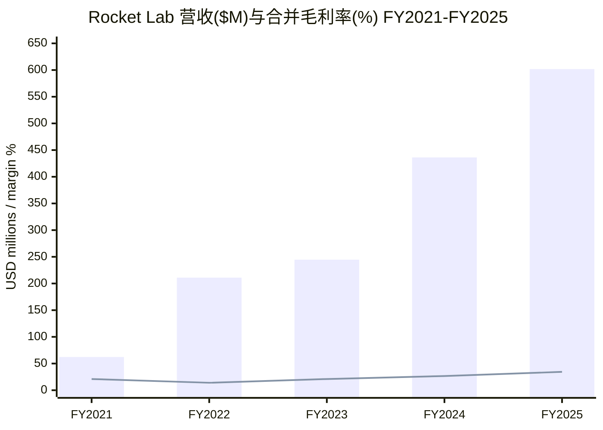
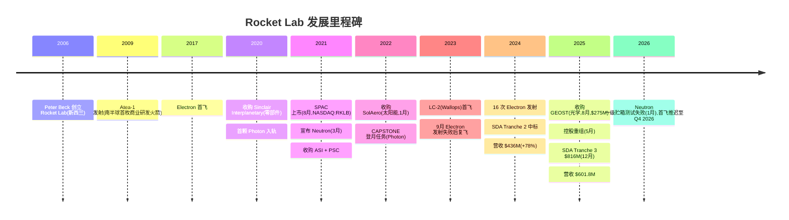
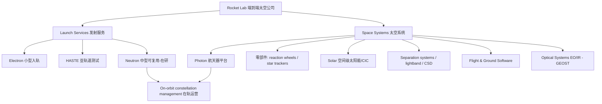
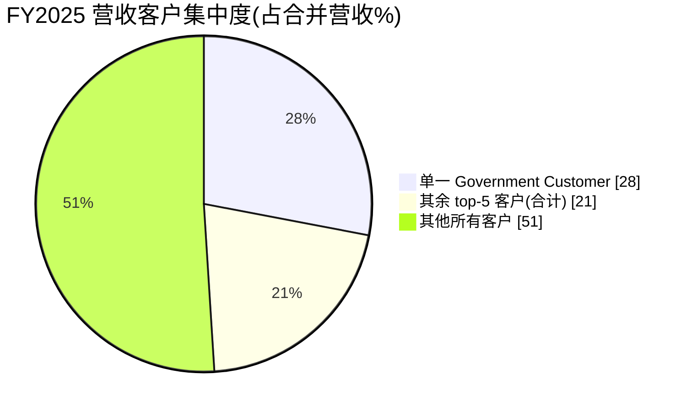
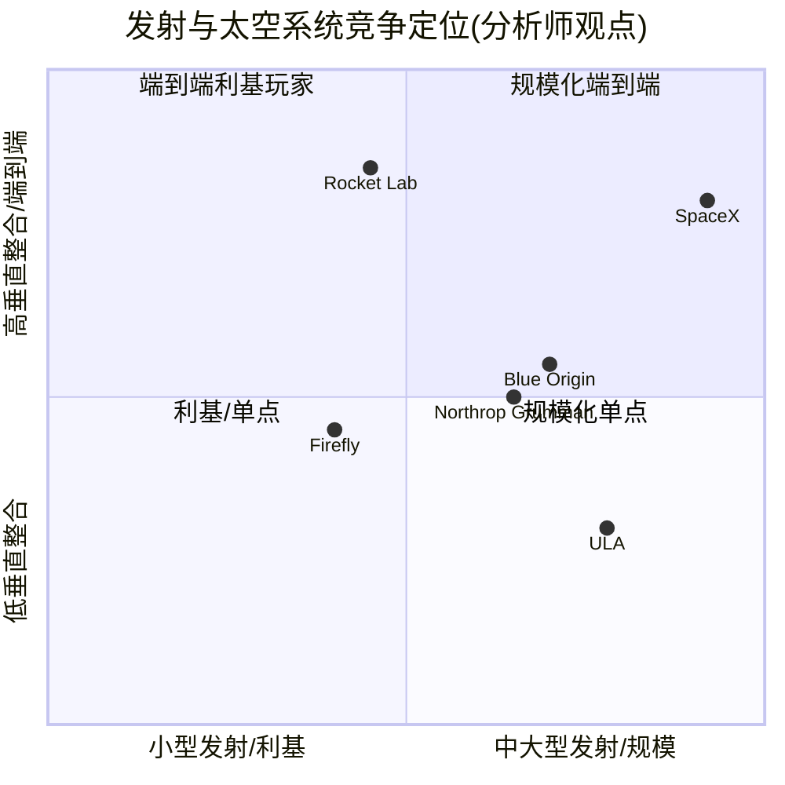
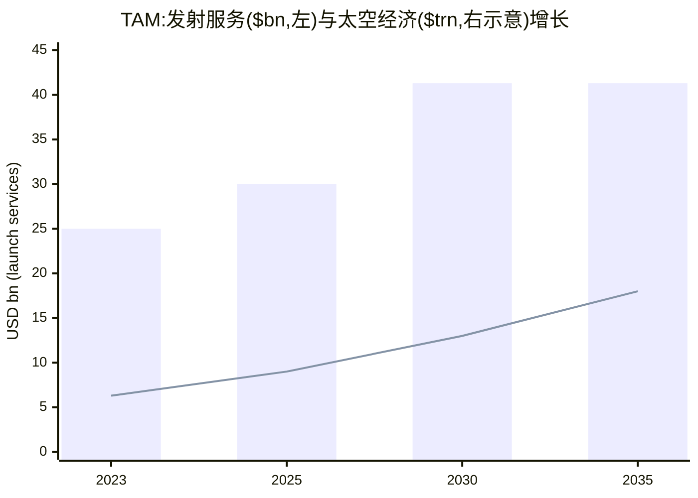

# Rocket Lab Corporation（火箭实验室，NASDAQ: RKLB）公司研究报告

**报告日期 / As of: 2026-06-09 · 报告语言：简体中文（技术 / 财务 / 行业术语保留英文）**
**当前股价 $113.65 · 市值约 $71.0bn · NASDAQ: RKLB**

> *分析师观点（Analyst view）：* **评级：Hold（持有）· 12 个月目标价 $95（较现价 $113.65 下行 −16%）· 估值方法：FY2027E P/S 65× + 分部 SOTP 交叉验证 · 市值 $71.0bn · 52 周区间 $25.24–$151 · NASDAQ: RKLB**
>
> **核心论点（thesis pillars）**——（1）从纯发射公司转型为 end-to-end（端到端）太空公司，Space Systems（太空系统）已占 FY2025 营收约 67%，backlog（在手订单）一年内近乎翻倍至 $1,847.3M；（2）Electron 是全球第二高频的入轨火箭，Neutron 中型可复用火箭是打开 constellation（星座）发射大市场、改写公司单位经济（unit economics）的关键期权，但首飞已因 2026 年 1 月一级贮箱测试失败推迟至 Q4 2026；（3）GAAP 仍亏损（FY2025 净亏损 $198.2M），P/S 高达约 104×（TTM），估值已 price-for-perfection（定价完美），任何 Neutron 延期或政府订单波动都可能触发 de-rate（估值回落）；（4）创始人兼 CEO Sir Peter Beck 是公司核心人物与技术灵魂，但也构成 key-person（关键人物）依赖风险。本报告对基本面高度认可、对当前估值保持谨慎，故给出 Hold。

> **Update — 首次公布 Q2 2026 业绩指引并连续刷新纪录（2026-05-07）：** 公司在 2026 年第一季度财报中公布 Q2 2026 指引：营收 **$225M–$240M**、GAAP gross margin（毛利率）33%–35%、Non-GAAP gross margin 38%–40%、Adjusted EBITDA 亏损 $20M–$26M。Q1 2026 营收创纪录 $200.3M（同比 +63.5%），backlog 升至 $2.2bn（环比 +20.2%），管理层称"surpasses all guidance metrics（全面超指引）"。
> 来源：[Rocket Lab Q1 2026 Earnings Release (8-K Ex-99.1), 2026-05-07](https://www.sec.gov/Archives/edgar/data/1819994/000181999426000027/rklb-20260507.htm)。

---

## 目录 Table of Contents

1. 公司概览（Company Overview，含投资论点引言 + TTM 估值快照）
1A. 估值与目标价（Valuation & Price Target）
2. 公司历史（Company History）
3. 管理团队（Management Team）
4. 产品与服务（Products & Services）
5. 客户与上市策略（Customers & Go-to-Market）
6. 行业概览（Industry Overview）
7. 竞争格局（Competitive Landscape）
8. 市场机会 / TAM（Market Opportunity）
9. 风险评估（Risk Assessment）
9.5. 核心分歧与催化剂（Key Debates & Catalysts）
10. 投资风格透视（Investor-lens Scorecards）
数据来源清单 / Data Used · 参考资料 / References

---

## 1. 公司概览 Company Overview

*分析师观点（Analyst view）：* Rocket Lab 是当下太空板块里"已被市场充分发现"的明星标的——它把一家成功的小型火箭发射公司，通过 Electron 的高频可靠发射建立 flight heritage（飞行履历），再用五次并购（Sinclair、ASI、PSC、SolAero、GEOST）叠加自研，构建出从发射、卫星制造、零部件到 on-orbit operations（在轨运营）的 end-to-end（端到端）能力。**为什么是 Hold 而非 Buy**：基本面无可挑剔——FY2025 营收 $601.8M（同比 +38%）、毛利率扩至 34.4%、backlog 近乎翻倍至 $1,847.3M——但 TTM P/S 已达约 104×，把 Neutron 成功、政府订单持续放量、Space Applications（空间应用）长期变现全部 price-in（计入价格）。在 Neutron 因 2026 年 1 月贮箱测试失败推迟至 Q4 2026 的当口，风险回报（risk-reward）并不对称，故给予 Hold（持有）评级，等待更好的进入点或 Neutron 首飞这一关键 de-risk（去风险）事件 ([Rocket Lab FY2025 10-K, Item 7 MD&A](https://www.sec.gov/Archives/edgar/data/1819994/000181999426000013/rklb-20251231.htm))。

**公司是做什么的。** 按公司自身在 FY2025 10-K 中的定义："Rocket Lab is an end-to-end space company with an established track record of mission success. We deliver reliable launch services, spacecraft design services, spacecraft components, spacecraft manufacturing, optical systems and other spacecraft and on-orbit management solutions that make it faster, easier and more affordable to access space."（火箭实验室是一家拥有成功履历的端到端太空公司，提供发射服务、航天器设计、航天器零部件、航天器制造、光学系统及在轨管理解决方案）([Rocket Lab FY2025 10-K, Item 1 Business](https://www.sec.gov/Archives/edgar/data/1819994/000181999426000013/rklb-20251231.htm))。公司总部位于美国加州 Long Beach，在美国、新西兰、加拿大、澳大利亚均有运营实体 ([Rocket Lab FY2025 10-K, Note 1](https://www.sec.gov/Archives/edgar/data/1819994/000181999426000013/rklb-20251231.htm))。

**怎么赚钱（business model）。** 公司分两个 reportable segment（报告分部）：Launch Services（发射服务）与 Space Systems（太空系统）。FY2025 Launch Services 营收 $199.0M、Space Systems 营收 $402.8M，后者约占总营收 67%，已成为营收主引擎 ([Rocket Lab FY2025 10-K, Segment Information](https://www.sec.gov/Archives/edgar/data/1819994/000181999426000013/rklb-20251231.htm))。收入确认采用 point-in-time（时点法）与 over-time（时段法）混合，多为长期 fixed-price（固定价格）合同与零部件 purchase order（采购订单）——这使得季度营收会随合同里程碑达成而波动 ([Rocket Lab FY2025 10-K, Components of Results of Operations](https://www.sec.gov/Archives/edgar/data/1819994/000181999426000013/rklb-20251231.htm))。

**规模与关键指标。** FY2025 全年营收 $601.8M（同比 +38%），consolidated gross profit（合并毛利）$207.2M、毛利率 34.4%（FY2024 为 26.6%），operating loss（经营亏损）$228.8M，net loss（净亏损）$198.2M，basic/diluted EPS −$0.37 ([Rocket Lab FY2025 10-K, Results of Operations](https://www.sec.gov/Archives/edgar/data/1819994/000181999426000013/rklb-20251231.htm))。截至 2025-12-31，公司拥有现金及等价物 $828.7M 加 marketable securities（可交易证券）$270.2M，合计约 $1.1bn 流动性；全球全职员工超 2,600 人 ([Rocket Lab FY2025 10-K, Liquidity / Human Capital](https://www.sec.gov/Archives/edgar/data/1819994/000181999426000013/rklb-20251231.htm))。截至 2025-12-31，Electron 累计成功发射 75 次、部署超 200 颗航天器；2025 年 Electron 是全球第二高频发射的入轨火箭 ([Rocket Lab FY2025 10-K, Item 1 Business](https://www.sec.gov/Archives/edgar/data/1819994/000181999426000013/rklb-20251231.htm))。

**最新季度（Q1 2026）。** 2026 年第一季度营收创纪录 $200.3M（同比 +63.5%），其中 Space Systems $136.7M、Launch Services $63.7M；GAAP 毛利率 38.2%（创纪录）；backlog 升至 $2,219.8M（环比 +20.2%）；季度净亏损收窄至 $45.0M（去年同期 $60.6M）、EPS −$0.07；现金升至 $1.2bn ([Rocket Lab Q1 2026 10-Q, MD&A](https://www.sec.gov/Archives/edgar/data/1819994/000181999426000028/rklb-20260331.htm))。


Source: [Rocket Lab FY2021–FY2025 10-K filings, MD&A Results of Operations](https://www.sec.gov/cgi-bin/browse-edgar?action=getcompany&CIK=RKLB&type=10-K)（毛利率为合并口径；FY2021/FY2022 为近似）。

**估值快照（Valuation snapshot，截至 2026-06-09）。** 当前股价 $113.65，市值约 $71.0bn，流通股约 624.8M，52 周区间 $25.24–$151，beta 约 2.5 ([Yahoo Finance — RKLB Key Statistics](https://finance.yahoo.com/quote/RKLB/))。**TTM P/E 为负**（公司 GAAP 不盈利，trailing P/E 不适用）；**TTM P/S 约 104×**（市值 $71.0bn ÷ TTM 营收约 $680M）([Yahoo Finance — RKLB](https://finance.yahoo.com/quote/RKLB/))。负 P/E 的直接驱动是 operating loss $228.8M，其中最大单项是 R&D（研发费用）$270.7M，主要投向 Neutron 火箭、Electron 一级回收与航天器新品；换言之，公司的亏损是 deliberate growth investment（主动的成长性投入），而非业务恶化 ([Rocket Lab FY2025 10-K, Operating Expenses](https://www.sec.gov/Archives/edgar/data/1819994/000181999426000013/rklb-20251231.htm))。约 104× 的 TTM P/S 远超绝大多数硬件公司，属于典型的 narrative / theme premium（叙事 / 主题溢价）——市场把 Rocket Lab 当作"SpaceX 之外唯一可投资的纯太空标的"在定价。*分析师观点：* 摩根士丹利在 2026 年 4 月的"太空 60（The Space 60）"报告中，把 Rocket Lab 与 Boeing、Lockheed Martin、Northrop Grumman、Firefly 并列为"航天器与发射系统"类别的代表赋能者（enabler），反映其作为板块核心配置标的的地位 ([Morgan Stanley — *Space: The Space 60 — Picks & Shovels for the Final Frontier*, 2026-04-12, p.1](http://xs-macbook-air.local:5001/zsxq/pdf-viewer/415521254142458))。

**同业对比。** 与同为"太空新势力"的标的相比，RKLB 的 P/S 处于中高位：AST SpaceMobile（ASTS）约 420× P/S（接近 pre-revenue），Planet Labs（PL）约 35×，Intuitive Machines（LUNR）约 14×，Redwire（RDW）约 10×；空间主题 ETF Procure Space ETF（UFO）整体 P/E 约 25× ([Yahoo Finance — peer key statistics, 2026-06-09](https://finance.yahoo.com/quote/RKLB/))。RKLB 的溢价由其相对成熟的营收规模（约 $680M TTM，远高于上述多数同业）+ 高增长 + 唯一具备规模化入轨发射能力支撑，但仍属"为多年高增长买单"的区间，详见 1A 与第 9 节估值风险。

## 1A. 估值与目标价 Valuation & Price Target

> 本章所有前瞻数字、目标价与情景价均为 **分析师自身观点（Analyst view）**，不附任何 filing 引用；每个预测的外部输入（filing 分部数据 + 管理层指引 + 行业预测）在文中标注。

**(a) 前瞻财务预测表（FY2025A–FY2028E）。** 建立在 FY2025 分部营收实绩、管理层 Q2 2026 指引、backlog $2.2bn 转化节奏，以及发射服务行业约 14.6% CAGR（Grand View Research）之上 ([Rocket Lab FY2025 10-K segment data](https://www.sec.gov/Archives/edgar/data/1819994/000181999426000013/rklb-20251231.htm); [Rocket Lab Q1 2026 8-K guidance](https://www.sec.gov/Archives/edgar/data/1819994/000181999426000027/rklb-20260507.htm); [Grand View Research — Space Launch Services Market](https://www.grandviewresearch.com/industry-analysis/space-launch-services-market-report))。

| 指标（*Analyst view:*） | FY2025A | FY2026E | FY2027E | FY2028E |
|---|---|---|---|---|
| Launch Services 营收（$M） | 199 | 300 | 520 | 760 |
| — 其中 Neutron 贡献（$M） | 0 | ~20 | ~180 | ~360 |
| Space Systems 营收（$M） | 403 | 560 | 760 | 1,000 |
| **总营收（$M）** | **602** | **860** | **1,280** | **1,760** |
| — YoY % | +38% | +43% | +49% | +38% |
| Gross margin（毛利率）% | 34.4% | 36% | 38% | 40% |
| Operating margin % | −38% | −22% | −8% | +2% |
| EPS（$） | −0.37 | −0.30 | −0.18 | +0.02 |

说明：FY2026E 营收下沿由管理层 Q2 2026 指引（$225M–$240M 单季）年化外推；Neutron 首飞 Q4 2026 后假设 FY2027 起逐步贡献中型发射营收（单价远高于 Electron 的 $8.5M）([Rocket Lab FY2025 10-K, Neutron Update](https://www.sec.gov/Archives/edgar/data/1819994/000181999426000013/rklb-20251231.htm))；Space Systems 增速锚定 backlog 中 $1.3bn 的太空系统部分逐年确认 + SDA Tranche 3（$816M 潜在值，交付至 2029）([Rocket Lab FY2025 10-K, Backlog](https://www.sec.gov/Archives/edgar/data/1819994/000181999426000013/rklb-20251231.htm))。本预测假设公司在 FY2028 前后接近 GAAP 经营盈亏平衡——这是 bull case 的核心赌注，而非 filing 披露。

**(b) 目标价推导（P/S × 多重 + SOTP 交叉验证）。** Rocket Lab GAAP 不盈利且短期内 EPS 接近零，forward-PE（前瞻市盈率）法不适用，故采用 forward P/S 法并以分部 SOTP（sum-of-the-parts）交叉验证：

- **P/S 法：** 给 FY2027E 营收 $1,280M 一个 65× P/S（介于高增长太空硬件同业 PL ~35× 与 ASTS ~420× 之间，并对 RKLB 的规模与执行力给予溢价），得 EV 约 $83bn，扣净现金后每股约 $135（乐观）。**保守化处理**：考虑到 Neutron 首飞风险与约 104× 现价 P/S 的下行空间，采用更接近 FY2027E 营收 $1,280M × ~45× P/S = EV 约 $58bn，加净现金约 $1.0bn，÷ 约 625M 股 ≈ **$95 / 股**。45× 的选择对标 PL 的约 35× 上浮、反映 RKLB 更强的发射壁垒与政府订单粘性 ([Yahoo Finance — peer P/S, 2026-06-09](https://finance.yahoo.com/quote/RKLB/))。
- **SOTP 交叉验证：** Launch Services（FY2027E $520M × 8× P/S ≈ $4.2bn）+ Space Systems（FY2027E $760M × 6× P/S ≈ $4.6bn）+ Neutron 期权价值（风险调整后约 $40–50bn，反映其打开 constellation 大市场的 optionality）≈ 合计约 $50–60bn EV，per share 约 $80–96。两法收敛于约 **$95**，对应较现价 −16%。

**(c) 牛 / 基 / 熊情景。**

| 情景（*Analyst view:*） | 关键假设 | 目标价 | 较现价 |
|---|---|---|---|
| Bull（牛） | Neutron 2026 Q4 准时首飞且 2027 快速放量，P/S 维持 65× | $150 | +32% |
| Base（基准） | Neutron 小幅延期、Space Systems 稳健放量，P/S 回落至 45× | $95 | −16% |
| Bear（熊） | Neutron 重大延期 / 失败 + 政府预算波动，P/S 压缩至 25× | $48 | −58% |

熊市情景的 P/S 25× 仍高于多数硬件公司，反映即便 de-rate，市场也难以把 RKLB 重定价到传统国防承包商的个位数 P/S——但若 Neutron 出现类似 SpaceX Starship 早期的反复失败，下行空间巨大 ([Rocket Lab FY2025 10-K, Risk Factors — Neutron](https://www.sec.gov/Archives/edgar/data/1819994/000181999426000013/rklb-20251231.htm))。

**(d) 与市场一致预期（consensus）的关系。** *分析师观点：* 摩根大通零售雷达显示，在 2026 年太空板块大涨后，散户对 Rocket Lab 倾向 **获利了结（profit-taking）**——RKLB 在 5 月某周一度位列散户卖出前五 ([J.P. Morgan — Retail Radar (Software vs Semis Positioning), 2026-05-14, p.1](http://xs-macbook-air.local:5001/zsxq/pdf-viewer/812452441522582))；另一期雷达指出"航天相关股票与 ETF 关注度快速提升……股价大涨后零售资金倾向获利了结，火箭实验室、AST SpaceMobile 等遭减持" ([J.P. Morgan — Retail Radar (Theme Stack: AI, Memory, Space, Quantum), 2026-05-27, p.1](http://xs-macbook-air.local:5001/zsxq/pdf-viewer/415284455822148))。本报告 Hold 评级与"涨多后兑现、等待 Neutron de-risk"的资金行为一致；本报告 FY2027E 营收 $1,280M 略低于最乐观的卖方口径（受 Neutron 放量节奏拖累），属审慎中性。

**(e) 决定评级的 1–2 个 swing variable（摆动变量）。** 第一是 **Neutron 首飞时间与成功率**——它既决定中型发射营收的拐点，也是估值能否守住高 P/S 的信心锚；第二是 **政府订单（尤其 SDA / Space Force）的持续性与预算环境**——单一 Government Customer 已占 FY2025 营收 28%，预算波动会直接冲击营收与 backlog 转化 ([Rocket Lab FY2025 10-K, Customer Concentration](https://www.sec.gov/Archives/edgar/data/1819994/000181999426000013/rklb-20251231.htm))。

## 2. 公司历史 Company History

公司由 Sir Peter Beck 于 2006 年在新西兰创立，最初目标是用低成本、高频次的小型火箭打开太空准入。2009 年公司成功发射 Atea-1，被公司视为"南半球首枚到达太空的商业研发火箭"([Rocket Lab DEF 14A 2026, Beck bio](https://www.sec.gov/Archives/edgar/data/1819994/000162828026023922/rklb-20260406.htm))。2017 年 Electron 首飞，开启高频发射的商业模式；2021 年 8 月 25 日，公司通过与 Vector Acquisition Corporation 的 SPAC 合并在 NASDAQ 上市，更名为 Rocket Lab USA, Inc. ([Rocket Lab FY2025 10-K, Corporate History](https://www.sec.gov/Archives/edgar/data/1819994/000181999426000013/rklb-20251231.htm))。

公司最重要的战略转型是**从纯发射公司扩张为端到端太空公司**——通过一连串并购把卫星零部件、卫星制造、太阳能、光学载荷等垂直整合进来。2025 年 5 月 23 日，公司完成 holding-company reorganization（控股公司重组），Rocket Lab Corporation 成为 Rocket Lab USA 的继任发行人（successor issuer）([Rocket Lab FY2025 10-K, Corporate History](https://www.sec.gov/Archives/edgar/data/1819994/000181999426000013/rklb-20251231.htm))。


Source: [Rocket Lab FY2021–FY2025 10-K filings](https://www.sec.gov/cgi-bin/browse-edgar?action=getcompany&CIK=RKLB&type=10-K)。

**关键并购（acquisitions）。** 公司的 Space Systems 能力几乎全部建立在并购之上，按时间顺序：Sinclair Interplanetary（2020 年 4 月，reaction wheels / star trackers 等零部件）、Advanced Solutions, Incorporated（2021 年 10 月，flight software / 任务控制软件）、Planetary Systems Corporation（2021 年 11 月，separation systems / 分离系统）、SolAero Technologies Corp.（2022 年 1 月，space-grade solar / 空间级太阳能）、GEOST LLC（2025 年 8 月，EO/IR optical payloads / 光学载荷）([Rocket Lab FY2025 10-K, Item 1 Business / Space Systems](https://www.sec.gov/Archives/edgar/data/1819994/000181999426000013/rklb-20251231.htm))。其中 GEOST 交易对价约 **$275M**（约 $125M 现金 + 3,057,588 股普通股 + 至多 $50M earnout），于 2025-08-12 完成，把 Optical Systems（光学系统）正式纳入产品线，强化国家安全空间能力 ([Rocket Lab 8-K Ex-99.1 (GEOST close), 2025-08-12](https://www.sec.gov/Archives/edgar/data/1819994/000175392625001284/g084916_ex99-1.htm))。

**近期发展。** 2025 年 12 月 17 日，公司与 Space Development Agency（SDA，太空发展署）签订 Tracking Layer Tranche 3 合同，为 Proliferated Warfighter Space Architecture 设计、制造并运维 18 颗卫星，合同潜在总值 **$816M**（基础额 $806M + 期权 $10M），卫星交付预计 2029 年——这是推动 backlog 从 $1,067M（FY2024 末）跃升至 $1,847.3M（FY2025 末）的主要单笔订单 ([Rocket Lab FY2025 10-K, Recent Developments — SDA Tranche 3](https://www.sec.gov/Archives/edgar/data/1819994/000181999426000013/rklb-20251231.htm))。

## 3. 管理团队 Management Team

**创始人兼 CEO：Sir Peter Beck（President, Chief Executive Officer & Chairman）。** Beck 于 2006 年创立 Rocket Lab，自 2013 年 7 月起任 President 与 CEO，2021 年 5 月任 Legacy Rocket Lab 董事会主席、2021 年 8 月任公司董事会主席；他曾在 2013–2021 年兼任 Treasurer，并在 2013–2015 年兼任 Secretary 与 CFO ([Rocket Lab DEF 14A 2026, Director Bios — Sir Peter Beck](https://www.sec.gov/Archives/edgar/data/1819994/000162828026023922/rklb-20260406.htm))。

Beck 的职业起点颇具传奇色彩：他没有传统的常春藤工程学位，1993 年在全球家电制造商 Fisher & Paykel 做精密工程学徒（precision engineer apprenticeship），随后转向生产机械设计与产品分析；2003 年加入一家政府研究机构，专注高性能应用的先进复合材料结构，主导过风力涡轮机、超导体等复杂工程项目 ([Rocket Lab DEF 14A 2026, Beck bio](https://www.sec.gov/Archives/edgar/data/1819994/000162828026023922/rklb-20260406.htm))。他从小自制火箭、不断加大尺寸与复杂度，最终在 2006 年创立 Rocket Lab。

在 Beck 领导下，公司自 2013 年起开发 Electron，并开创了一系列先进航天制造技术：3D-printed rocket engines（3D 打印火箭发动机）、electric-pump-fed engines（电泵供给发动机）、fully carbon composite fuel tanks（全碳纤维复合燃料贮箱）；他还主导了 LC-1 私营轨道发射场的建设——这需要美新两国之间建立国际条约与立法，才能在新西兰使用美方发射与航天技术 ([Rocket Lab DEF 14A 2026, Beck bio](https://www.sec.gov/Archives/edgar/data/1819994/000162828026023922/rklb-20260406.htm))。Beck 是获奖工程师，曾获英国皇家航空学会金质奖章、新西兰皇家学会 Cooper Medal 与 Pickering Medal，被 University of Auckland 聘为航空航天工程兼职教授，并于 **2024 年被新西兰政府授予爵士（knighted）** 头衔 ([Rocket Lab DEF 14A 2026, Beck bio](https://www.sec.gov/Archives/edgar/data/1819994/000162828026023922/rklb-20260406.htm))。

**持股与公司治理。** 截至 2026 年 proxy 披露，Beck 直接 / 间接持有 46,443,180 股，约占 **7.5% 的投票权（voting power）**；其家族信托 Equatorial Trust 另持有 45,951,250 股 Series A Preferred Stock（可 1:1 转换为普通股）([Rocket Lab DEF 14A 2026, Beneficial Ownership Table](https://www.sec.gov/Archives/edgar/data/1819994/000162828026023922/rklb-20260406.htm))。Beck 是董事会中唯一的非独立董事，担任 designated Series A Preferred Stock Director，任期至 2027 年股东大会 ([Rocket Lab DEF 14A 2026, Board Independence](https://www.sec.gov/Archives/edgar/data/1819994/000162828026023922/rklb-20260406.htm))。公司在 FY2025 10-K 风险因素中明确指出"We are highly dependent on the services of Sir Peter Beck"——他既是技术灵魂，也是公司公开承认的 key-person（关键人物）依赖 ([Rocket Lab FY2025 10-K, Risk Factors Summary](https://www.sec.gov/Archives/edgar/data/1819994/000181999426000013/rklb-20251231.htm))。

## 4. 产品与服务 Products & Services

### 4.1 产品矩阵（来自 FY2025 10-K Item 1 Business，逐字引用）

公司在 FY2025 10-K 中对产品体系的官方表述如下（verbatim）：

> "We design and manufacture small and medium-class rockets, spacecraft, spacecraft components, and flight and ground software to support the space economy. Our launch services are used to place spacecraft into Earth orbit, and escape trajectories. Our space systems are the building blocks for spacecraft, which includes composite structures, reaction wheels, star trackers, solar power solutions, radios, separation systems, command and control spacecraft software and optical systems."
>
> ——[Rocket Lab FY2025 10-K, Item 1 Business — Product & Services Overview](https://www.sec.gov/Archives/edgar/data/1819994/000181999426000013/rklb-20251231.htm)

下表是基于 10-K Item 1 Business 重构的产品矩阵（markdown 复制，便于检索）：

| 分部 Segment | 产品族 Product family | 形态 | 一句话定位（10-K 措辞） |
|---|---|---|---|
| Launch Services | **Electron** | 小型入轨火箭 | 300 kg 至 LEO 的小型发射，全碳复合贮箱 + Rutherford 电泵发动机 |
| Launch Services | **HASTE** | 亚轨道测试火箭 | 由 Electron 衍生的 hypersonic / suborbital 测试平台 |
| Launch Services | **Neutron**（在研） | 中型可复用火箭 | 可复用构型约 13,000 kg 至 LEO；面向 constellation 与潜在载人 |
| Space Systems | **Photon** | 航天器平台 | 可作 Electron kick stage，亦可独立成为在轨航天器 |
| Space Systems | Reaction wheels（反作用轮） | 零部件 | 存储角动量、提供 3 轴姿态控制，3 mNms–12 Nms |
| Space Systems | Star trackers（星敏感器） | 零部件 | 光学传感器，通过观星确定航天器指向与转速 |
| Space Systems | Solar（CICs / 太阳能阵列） | 零部件 | 垂直整合的空间级太阳能电池、CIC、阵列 |
| Space Systems | Separation systems（分离系统） | 零部件 | motorized lightband + canisterized spacecraft dispenser (CSD) |
| Space Systems | Radios / Power / Batteries | 零部件 | 高压空间级电池、无线电、电源系统 |
| Space Systems | Flight & Ground Software | 软件 | 指挥、制导、导航、控制与地面数据系统 |
| Space Systems | Optical Systems（EO/IR） | 载荷 | 来自 GEOST 的电光 / 红外传感载荷，面向国家安全 |

### 4.2 产品组合树与协同（综合段落）

Rocket Lab 的产品逻辑是一条**完整的"造星—发星—管星"价值链**：用 Electron / HASTE 提供小型与亚轨道发射，用在研 Neutron 抢占中型 constellation 发射；用 Photon 与一整套零部件（reaction wheels、star trackers、solar、separation systems、radios、software、optical）造出整星或卖给第三方造星者；再用 ground network 与 on-orbit constellation management（在轨星座管理）提供运营。这条链的终点是 Space Applications（空间应用）——公司称其为"太空经济中最大的可寻址市场（the largest addressable market in the space economy）"([Rocket Lab FY2025 10-K, Growth Strategy](https://www.sec.gov/Archives/edgar/data/1819994/000181999426000013/rklb-20251231.htm))。


Source: [Rocket Lab FY2025 10-K, Item 1 Business](https://www.sec.gov/Archives/edgar/data/1819994/000181999426000013/rklb-20251231.htm)。

### 4.3 Launch Services — Electron / HASTE / Neutron

**Electron（10-K verbatim）：**

> "Electron is our orbital small launch vehicle that was designed to accommodate a high launch cadence business model… Since its maiden launch in 2017, Electron has become the leading small spacecraft launch vehicle, delivering over 200 spacecraft to orbit for government and commercial customers across 75 successful missions through December 31, 2025. In 2025, Electron was the second most frequently launched orbital rocket."
>
> ——[Rocket Lab FY2025 10-K, Item 1 — Launch Services](https://www.sec.gov/Archives/edgar/data/1819994/000181999426000013/rklb-20251231.htm)

**中文释义 / Plain-language gloss：** Electron 是一枚 18 米高、直径 1.2 米、起飞质量约 14,000 kg 的两级 + kick stage（三级踢腿级）火箭，可把最多 300 kg 载荷送入 LEO（low-Earth orbit，近地轨道）。它的两大技术差异化：一是 **全碳纤维复合（carbon composite）贮箱与结构**，相对其他材料减重最多约 40%，直接提升 mass-to-orbit（入轨运力）；二是 **Rutherford 发动机**——一台 5,600-lbf 推力、液氧 / 煤油、用 electric turbo-pump（电动涡轮泵）驱动燃料泵的发动机，公司相信它是首台所有主要部件（再生冷却推力室、喷注器泵、主阀）全部采用 additive manufacturing（增材制造 / 3D 打印）的氧 / 碳氢发动机；每枚 Electron 用 10 台 Rutherford；截至 2025-12-31，公司已有超 800 台发动机的飞行履历 ([Rocket Lab FY2025 10-K, Item 1 — Electron / Rutherford](https://www.sec.gov/Archives/edgar/data/1819994/000181999426000013/rklb-20251231.htm))。Electron 的 kick stage 还能重启发动机、精确入轨、并可转化为一颗功能完整的航天器（即 Photon），这是它区别于纯运载火箭的关键。

**HASTE（10-K verbatim）：**

> "HASTE is a suborbital testbed launch vehicle derived from Rocket Lab's heritage Electron rocket. HASTE provides reliable, high-cadence flight test opportunities needed to advance hypersonic and suborbital system technology development."
>
> ——[Rocket Lab FY2025 10-K, Item 1 — HASTE](https://www.sec.gov/Archives/edgar/data/1819994/000181999426000013/rklb-20251231.htm)

**中文释义：** HASTE（Hypersonic Accelerator Suborbital Test Electron）把 Electron 改造成 hypersonic（高超音速）武器与系统的高频飞行测试平台——这是一个利润率高、与国防需求强相关的新发射 vertical（垂直市场），让 Electron 的产能在轨道发射之外有了第二个变现出口。

**Neutron（10-K verbatim，在研旗舰）：**

> "The medium-lift Neutron will be a two-stage launch vehicle that stands 43 meters tall with a 5.5-meter diameter fairings. Neutron will feature a reusable first stage designed to return to launch site as well as land on an ocean platform, enabling flexibility of use, higher launch cadence, and decreased launch costs for customers."
>
> ——[Rocket Lab FY2025 10-K, Item 1 — Neutron](https://www.sec.gov/Archives/edgar/data/1819994/000181999426000013/rklb-20251231.htm)

**中文释义 / Plain-language gloss：** Neutron 是公司从"小型发射利基玩家"跃升为"中型 constellation 发射主力"的关键赌注。可复用构型约 13,000 kg 至 LEO 的运力，是 Electron（300 kg）的约 43 倍，单次发射营收将大幅高于 Electron 当前约 $8.5M 的水平。它由 Archimedes 发动机驱动（在 Long Beach 设计制造），一级可返回发射场或海上平台回收——这是对标 SpaceX Falcon 9 的 reusability（可复用）经济学。**但风险也集中于此**：2026 年 1 月，Neutron 一级贮箱（first stage tank）在 qualification testing（鉴定测试）中发生 "unanticipated failure"，导致首飞从原计划推迟至 **Q4 2026** ([Rocket Lab FY2025 10-K, Recent Developments — Neutron Update](https://www.sec.gov/Archives/edgar/data/1819994/000181999426000013/rklb-20251231.htm))。Neutron 计划从 Wallops 的 LC-3 发射 ([Rocket Lab FY2025 10-K, Item 1](https://www.sec.gov/Archives/edgar/data/1819994/000181999426000013/rklb-20251231.htm))。

*分析师观点：* 在中型可复用发射赛道，Neutron 的直接对标是 SpaceX Falcon 9（已规模化可复用）、Blue Origin New Glenn、ULA Vulcan、Firefly 等；SpaceX 的成本曲线与发射频次是 Neutron 必须追赶的标杆——这些为竞品定位，非 Rocket Lab 的 10-K 表述。

### 4.4 Space Systems — Photon 与零部件家族

**Photon（10-K verbatim）：**

> "Photon can be configured to operate as the upper stage of Electron (the kick stage) during launch, then with a simple command, transition into an operational spacecraft on orbit, eliminating the parasitic mass of deployed spacecraft and enabling full use of the fairing volume for payloads. Photon can also fly on other launch vehicles, such as our in-development Neutron launch vehicle, third-party launchers…"
>
> ——[Rocket Lab FY2025 10-K, Item 1 — Space Systems / Photon](https://www.sec.gov/Archives/edgar/data/1819994/000181999426000013/rklb-20251231.htm)

**中文释义：** Photon 是公司 spacecraft family（航天器家族）的核心平台，可配置用于 LEO / MEO / GEO / 行星际任务。它最巧妙的设计是"踢腿级即航天器"——发射时是 Electron 的上面级，入轨后一条指令就变成一颗在轨航天器，消除了部署独立卫星的"寄生质量"。Photon 已执行 NASA CAPSTONE 登月任务（2021 年中标、2022 年部署）与 2025 年 11 月的 ESCAPADE 双星任务（Blue 与 Gold）([Rocket Lab FY2025 10-K, Item 1 — Photon](https://www.sec.gov/Archives/edgar/data/1819994/000181999426000013/rklb-20251231.htm))。

**零部件家族（10-K 措辞）。** 公司通过五次并购把以下零部件垂直整合进来，既自用造星、也卖给 merchant market（商用市场）：

- **Reaction wheels（反作用轮）：** "motor-driven flywheels used to store angular momentum on spacecraft… ranging from 3 mNms to 12 Nms"——为航天器提供敏捷的 3 轴指向控制，每颗星常用 3–4 个 ([Rocket Lab FY2025 10-K, Item 1](https://www.sec.gov/Archives/edgar/data/1819994/000181999426000013/rklb-20251231.htm))。
- **Star trackers（星敏感器）：** "optical sensors that determine a spacecraft's pointing direction and rotation rate by looking at the stars"——内置超 200 万个星三角的星表，单张图即可定姿 ([Rocket Lab FY2025 10-K, Item 1](https://www.sec.gov/Archives/edgar/data/1819994/000181999426000013/rklb-20251231.htm))。
- **Solar（空间级太阳能）：** 一套垂直整合的 space solar cell、Coverglass Interconnected Cells (CICs) 与 solar array 产品，公司称其"among the highest performing in the world"([Rocket Lab FY2025 10-K, Item 1](https://www.sec.gov/Archives/edgar/data/1819994/000181999426000013/rklb-20251231.htm))。
- **Separation systems（分离系统）：** motorized lightband（8–39 英寸直径的环形分离系统）+ canisterized spacecraft dispenser (CSD，罐式航天器分配器) ([Rocket Lab FY2025 10-K, Item 1](https://www.sec.gov/Archives/edgar/data/1819994/000181999426000013/rklb-20251231.htm))。
- **Optical Systems（EO/IR，来自 GEOST）：** "advanced electro-optical and infrared (EO/IR) sensor payloads for national security space missions"——用于 space domain awareness（空间态势感知）、missile warning & tracking（导弹预警 / 跟踪）、space protection（空间防护）([Rocket Lab FY2025 10-K, Item 1 — Optical Systems](https://www.sec.gov/Archives/edgar/data/1819994/000181999426000013/rklb-20251231.htm))。

**中文释义（协同）：** 这些零部件的战略意义是 **double-dip（双重变现）**——既降低自造卫星的成本与交期，又作为 merchant market 商品独立创收。这正是 Rocket Lab 相对纯发射公司（如 Firefly）的差异化护城河：每一次并购都把一个 single-point 供应商变成内部能力 + 对外可售产品 ([Rocket Lab FY2025 10-K, Item 1 — Space Systems](https://www.sec.gov/Archives/edgar/data/1819994/000181999426000013/rklb-20251231.htm))。

### 4.5 旗舰、长尾与近期发布

*分析师观点（旗舰判断）：* 当前营收的两大支柱是 **Electron 发射服务**（FY2025 $199.0M、毛利率 40.8%）与 **Space Systems 卫星制造 + 零部件**（FY2025 $402.8M、毛利率 31.3%）；Neutron 是尚未贡献营收的 optionality（期权），其首飞将决定公司中期增长曲线 ([Rocket Lab FY2025 10-K, Segment Information](https://www.sec.gov/Archives/edgar/data/1819994/000181999426000013/rklb-20251231.htm))。值得注意的是 Launch Services 的毛利率（40.8%）已显著高于 Space Systems（31.3%），意味着 Neutron 一旦放量，blended margin（混合毛利率）有进一步上行空间。竞争壁垒（moat）类型上：Electron 的 flight heritage + LC-1 私营发射场（受美新条约保护）属 regulatory + scale 壁垒；垂直整合的零部件属 technology / IP 壁垒。

## 5. 客户与上市策略 Customers & Go-to-Market

**客户结构。** Rocket Lab 的客户为政府 + 商业 + 航天总包商三类。发射服务客户包括美国 Department of War（DoW，原 DoD）、NASA、DARPA、NRO，以及 Blacksky、Canon、Kinéis、Capella Space、Planet、OHB Group、Synspective 等国内外商业航天运营商 ([Rocket Lab FY2025 10-K, Item 1 — Customers](https://www.sec.gov/Archives/edgar/data/1819994/000181999426000013/rklb-20251231.htm))。截至 2025-12-31，公司已为客户部署超 200 颗航天器，发射服务被超 20 家机构使用；Space Systems 的飞行硬件已用于超 1,800 次任务 ([Rocket Lab FY2025 10-K, Item 1 — Customers](https://www.sec.gov/Archives/edgar/data/1819994/000181999426000013/rklb-20251231.htm))。

**客户集中度（customer concentration，REQUIRED，均为合并口径 / consolidated revenue）。** 这是 Rocket Lab 的核心风险点之一，公司逐字披露：

> "For the year ended December 31, 2025, our top five customers accounted for approximately 49% of our revenues and our top five backlog customers accounted for approximately 77% of our backlog in the aggregate as of December 31, 2025."
>
> ——[Rocket Lab FY2025 10-K, Risk Factors — Customer Concentration](https://www.sec.gov/Archives/edgar/data/1819994/000181999426000013/rklb-20251231.htm)

按 10-K 财务附注的"10% 以上客户"披露（均为**占合并总营收**比例）：FY2025 单一 **Government Customer 占 28% 的合并营收**（FY2024 为 11%）；FY2024 **MDA Corporation 占 23%**（FY2023 为 13%）；FY2023 **Northrop Grumman Space Systems 占 13%** ([Rocket Lab FY2025 10-K, Note — Concentration of Risk](https://www.sec.gov/Archives/edgar/data/1819994/000181999426000013/rklb-20251231.htm))。换言之，**top-5 占合并营收约 49%、top-5 backlog 客户占 backlog 约 77%、且单一政府客户已占 28% 合并营收**——按本报告风险阈值（top-1 > 20% 或 top-5 > 50% 为 material），这是一个 material（实质性）集中度风险，下文第 9 节列为重点风险。


Source: [Rocket Lab FY2025 10-K, Note — Concentration of Risk（口径：% of consolidated revenue）](https://www.sec.gov/Archives/edgar/data/1819994/000181999426000013/rklb-20251231.htm)。注：top-5 合计约 49%，故"单一政府客户 28% + 其余 top-5 约 21%"，其余约 51% 为长尾客户。

**地域结构（占合并营收）。** FY2025 美国占 79%（$475.4M）、日本 11%（$65.6M）、Rest of world 7%、加拿大 3%——美国占比从 FY2024 的 61% 大幅回升，主因 SDA / 国防订单放量；加拿大从 FY2024 的 24% 骤降至 3%，因 MDA 合同滚动到期 ([Rocket Lab FY2025 10-K, Note — Geographic Information](https://www.sec.gov/Archives/edgar/data/1819994/000181999426000013/rklb-20251231.htm))。

**合同结构与销售。** 营收来自长期 fixed-price（固定价格）发射与造星合同 + 零部件 purchase order；多数合同含 termination rights（客户可在提前通知并支付终止费后终止）——这意味着 backlog 并非"铁定收入" ([Rocket Lab FY2025 10-K, Backlog](https://www.sec.gov/Archives/edgar/data/1819994/000181999426000013/rklb-20251231.htm))。公司用一支统一的全球 business development 团队 cross-sell（交叉销售）发射与太空系统，团队成员多来自政府机构与大型航天科技公司，凭借既有人脉网络以"lean and focused"（精简聚焦）方式覆盖一个 well-defined（清晰）的客户群 ([Rocket Lab FY2025 10-K, Item 1 — Sales, Business Development](https://www.sec.gov/Archives/edgar/data/1819994/000181999426000013/rklb-20251231.htm))。值得注意的是，公司还提到 **政府合同可被随时终止（termination for convenience 或 for default）**——这是国防承包商共有的结构性风险 ([Rocket Lab FY2025 10-K, Governmental Regulation](https://www.sec.gov/Archives/edgar/data/1819994/000181999426000013/rklb-20251231.htm))。

## 6. 行业概览 Industry Overview

**行业定义与范围。** Rocket Lab 处于 commercial space（商业航天）行业，横跨两个相邻子市场：space launch services（太空发射服务）与 space systems / satellites（太空系统 / 卫星制造与零部件）。更上层是整个 space economy（太空经济），下游延伸到 space applications（通信、遥感、对地观测、气象、导航）([Rocket Lab FY2025 10-K, Item 1 — Who We Are](https://www.sec.gov/Archives/edgar/data/1819994/000181999426000013/rklb-20251231.htm))。

**市场规模与增速。** 全球 space launch services 市场预计从 2024 年起以约 14.6% CAGR 增长，到 2030 年达约 **$41.31bn**，主要由 satellite-based applications（通信、对地观测、导航）与 small-satellite constellation（小卫星星座）部署驱动；北美 2023 年占该市场超 50% 份额 ([Grand View Research — Space Launch Services Market Report, 2030](https://www.grandviewresearch.com/industry-analysis/space-launch-services-market-report))。更宏观地，World Economic Forum 与 McKinsey 在 2024 年 4 月的报告中预计，全球 space economy 将从 2023 年的 **$630bn 增长到 2035 年的 $1.8 trillion**，年均约 9%，远超全球 GDP 增速；其中超 60% 的增量将来自供应链与运输、食品饮料、国家国防、零售、消费品与数字通信等"被太空技术赋能"的行业 ([World Economic Forum / McKinsey — *Space: The $1.8 Trillion Opportunity*, 2024-04](https://www.weforum.org/press/2024/04/space-economy-set-to-triple-to-1-8-trillion-by-2035-new-research-reveals/))。

**关键趋势与驱动。** 公司自身在 10-K 中将增长归因于三股力量：航天器的 miniaturization（小型化）+ 成本与上市时间的大幅下降，叠加通信、遥感、对地观测、气象、导航等应用需求的爆发；以及"government expenditures and private enterprise investment into the space economy"（政府支出 + 私人投资）持续注入 ([Rocket Lab FY2025 10-K, Item 1 / Key Factors Affecting Our Performance](https://www.sec.gov/Archives/edgar/data/1819994/000181999426000013/rklb-20251231.htm))。*分析师观点：* 摩根士丹利"太空 60"报告指出，地缘政治、科学进步与经济因素正把投资者对太空主题的兴趣推至"近十年最高"，催化剂包括 Artemis II 任务、美国太空军预算大幅增加、太空发射活动快速增长 ([Morgan Stanley — *The Space 60*, 2026-04-12, p.1](http://xs-macbook-air.local:5001/zsxq/pdf-viewer/415521254142458))。

**行业结构与壁垒。** 太空发射是高度 consolidated（集中）且壁垒极高的行业——资本密集、技术密集、且受 export control / ITAR、FAA / 各国航天局监管层层约束 ([Rocket Lab FY2025 10-K, Governmental Regulation](https://www.sec.gov/Archives/edgar/data/1819994/000181999426000013/rklb-20251231.htm))。SpaceX 在中大型发射占据绝对主导，Rocket Lab 则在小型发射建立了仅次于 SpaceX rideshare 的地位，并试图用 Neutron 进入中型赛道。Space Systems / 卫星零部件市场相对更分散，玩家众多。监管环境是双刃剑：一方面 LC-1 受美新双边条约保护，构成进入壁垒；另一方面 rare-earth minerals（稀土）供应限制、政府预算波动（如 government shutdown）会直接冲击业务 ([Rocket Lab FY2025 10-K, Risk Factors Summary](https://www.sec.gov/Archives/edgar/data/1819994/000181999426000013/rklb-20251231.htm))。

## 7. 竞争格局 Competitive Landscape

公司在 FY2025 10-K 的 Competition 章节将竞争对手分为四类（**逐字引用**）：

> "We believe our main sources of competition fall into 4 categories:
> • companies providing dedicated and rideshare launch vehicles… such as Northrop Grumman, SpaceX, United Launch Alliance (a joint venture between Lockheed Martin Corporation and The Boeing Company), Firefly, Blue Origin, and established Russian, Indian, Chinese, European and Japanese launch providers;
> • companies that are reported to have plans to provide launch vehicles…;
> • companies providing spacecraft solutions, such as Airbus, Lockheed, Boeing, General Atomics, General Dynamics, Maxar Technology, Northrop Grumman, Raytheon Technologies, Thales Alenia Space, Astro Digital, York Space Systems and L3Harris; and
> • companies providing spacecraft components in the commercial marketplace, such as Ball Aerospace, Raytheon, Collins Aerospace, Bradford Space, Honeywell Aerospace, GOMSpace, Redwire and Beyond Gravity."
>
> ——[Rocket Lab FY2025 10-K, Item 1 — Competition](https://www.sec.gov/Archives/edgar/data/1819994/000181999426000013/rklb-20251231.htm)

公司列出的 principal competitive factors（主要竞争要素）为：flight heritage and reliability（飞行履历与可靠性）、delivery schedule（交付周期）、定制能力、性能与技术特性、价格、客户体验，并称"We believe that we compete favorably across these factors"([Rocket Lab FY2025 10-K, Item 1 — Competition](https://www.sec.gov/Archives/edgar/data/1819994/000181999426000013/rklb-20251231.htm))。

**竞争优势（公司自述）。** 10-K 列出的核心优势包括：Electron 的 flight heritage（截至 2026-02-26 已 77 次成功发射）与 first-mover advantage；独特技术（碳复合贮箱、电泵发动机、3D 打印、kick stage）；deep vertical integration（深度垂直整合）；自有测试与多发射场（LC-1 / LC-2 / LC-3）；以及完整的 end-to-end 解决方案 ([Rocket Lab FY2025 10-K, Item 1 — Our Competitive Strengths](https://www.sec.gov/Archives/edgar/data/1819994/000181999426000013/rklb-20251231.htm))。

*分析师观点：* 在小型发射赛道，Rocket Lab 是除 SpaceX rideshare 之外**最成熟、最高频的玩家**——Electron 在 2025 年是全球第二高频入轨火箭，这是 Firefly、ABL 等新进入者短期难以复制的飞行履历优势；但在中大型发射，SpaceX 的 Falcon 9 / Starship 凭借规模化可复用建立了巨大的成本与频次领先，Neutron 必须证明自己能在 reusability 经济学上接近 SpaceX，才能真正打开中型市场。这一份额与领先判断属分析师观点 / 行业研究，非 Rocket Lab 10-K 表述 ([Morgan Stanley — *The Space 60*, 2026-04-12, p.1](http://xs-macbook-air.local:5001/zsxq/pdf-viewer/415521254142458))。


Source: 分析师定位框架，基于 [Rocket Lab FY2025 10-K, Competition](https://www.sec.gov/Archives/edgar/data/1819994/000181999426000013/rklb-20251231.htm) 与 [Morgan Stanley — *The Space 60*, 2026-04-12](http://xs-macbook-air.local:5001/zsxq/pdf-viewer/415521254142458)（竞争对手相对位置为分析师估计，非 10-K 数据）。

**竞争脆弱性（vulnerabilities）。** 一是 Neutron 尚未首飞，中型赛道仍是"承诺"而非"能力"；二是单一政府客户依赖度高，国防预算与采购政策变化会直接冲击；三是相对 SpaceX 的资本与发射频次仍有数量级差距 ([Rocket Lab FY2025 10-K, Risk Factors](https://www.sec.gov/Archives/edgar/data/1819994/000181999426000013/rklb-20251231.htm))。

## 8. 市场机会 / TAM Market Opportunity

**TAM 分层。** Rocket Lab 的可寻址市场呈金字塔结构：底层是 space launch services（约 $41.31bn by 2030，14.6% CAGR）([Grand View Research — Space Launch Services Market, 2030](https://www.grandviewresearch.com/industry-analysis/space-launch-services-market-report))；中层是 space systems / 卫星制造与零部件市场（更大、更分散）；顶层是整个 space economy（$630bn in 2023 → $1.8 trillion by 2035，9% CAGR）([World Economic Forum / McKinsey, 2024-04](https://www.weforum.org/press/2024/04/space-economy-set-to-triple-to-1-8-trillion-by-2035-new-research-reveals/))。公司自身把"space applications market"（空间应用市场）定义为"the largest addressable market in the space economy"，并将其作为端到端战略的终极目标 ([Rocket Lab FY2025 10-K, Growth Strategy](https://www.sec.gov/Archives/edgar/data/1819994/000181999426000013/rklb-20251231.htm))。

**SAM / SOM。** *分析师观点：* Rocket Lab 当前的 serviceable available market（SAM，可服务市场）主要是小型 + 中型发射 + 卫星制造 + 国家安全空间载荷——保守估计约 $15–25bn（发射 + 卫星制造的可触及部分）；其 serviceable obtainable market（SOM，可获取市场）目前由 backlog $2.2bn 与年营收约 $0.6–0.9bn 的规模锚定。Neutron 是把 SAM 从"小型发射利基"扩张到"中型 constellation 发射"主战场的关键——管理层明确把 Neutron 定位为"expand our addressable launch market……additional lift capacity will enable significantly higher revenue per launch"([Rocket Lab FY2025 10-K, Growth Strategy](https://www.sec.gov/Archives/edgar/data/1819994/000181999426000013/rklb-20251231.htm))。


Source: 发射服务规模 [Grand View Research, 2030](https://www.grandviewresearch.com/industry-analysis/space-launch-services-market-report)；太空经济（line，单位 $100bn，即 6.3=$630bn、18=$1.8trn）[WEF / McKinsey, 2024-04](https://www.weforum.org/press/2024/04/space-economy-set-to-triple-to-1-8-trillion-by-2035-new-research-reveals/)（2023/2030 launch 数值为分析师近似插值）。

**渗透策略。** 公司的打法是"用发射建立客户关系 → 用 Space Systems 提升客单价 → 用 on-orbit operations 锁定长期运营收入 → 最终切入 space applications 变现"。这一 land-and-expand（先落地再扩张）逻辑已在 backlog 结构中显现：$2,219.8M backlog 中 Space Systems 占 $1,298.3M、Launch 占 $921.4M（Q1 2026 口径）([Rocket Lab Q1 2026 10-Q, Backlog](https://www.sec.gov/Archives/edgar/data/1819994/000181999426000028/rklb-20260331.htm))。

## 9. 风险评估 Risk Assessment

**公司特定风险（Company-Specific）**

1. **Neutron 开发与时间风险（ESCALATED，最高优先级）。** Neutron 首飞已因 2026 年 1 月一级贮箱鉴定测试失败推迟至 Q4 2026，且公司明示"risk and uncertainty remains in the complex development cycle"。Neutron 是中期增长曲线的核心，任何进一步延期 / 失败都会冲击营收、估值与客户信心，并可能需要超预期的 R&D 与 capex ([Rocket Lab FY2025 10-K, Recent Developments / Risk Factors](https://www.sec.gov/Archives/edgar/data/1819994/000181999426000013/rklb-20251231.htm))。

2. **客户集中度（material）。** 单一 Government Customer 占 FY2025 合并营收 28%，top-5 占约 49%，top-5 backlog 客户占 backlog 约 77%。任一大客户流失、违约或预算削减都会显著冲击营收与 backlog 转化 ([Rocket Lab FY2025 10-K, Customer Concentration](https://www.sec.gov/Archives/edgar/data/1819994/000181999426000013/rklb-20251231.htm))。

3. **关键人物依赖（key-person）。** 公司在 10-K 明示"We are highly dependent on the services of Sir Peter Beck"——Beck 是创始人、CEO、董事会主席与技术灵魂，失去他将损害公司竞争力 ([Rocket Lab FY2025 10-K, Risk Factors Summary](https://www.sec.gov/Archives/edgar/data/1819994/000181999426000013/rklb-20251231.htm))。

4. **发射 / 航天器可靠性风险。** 火箭与航天器在制造、发射前操作、发射中均可能损毁；公司 2023 年 9 月曾发生 Electron 发射失败导致营收损失。一次失败会损害声誉、推高保险费率、影响未来订单 ([Rocket Lab FY2025 10-K, Risk Factors](https://www.sec.gov/Archives/edgar/data/1819994/000181999426000013/rklb-20251231.htm))。

5. **并购整合风险。** 公司的 Space Systems 几乎全靠并购搭建（Sinclair / ASI / PSC / SolAero / GEOST），10-K 明示"Acquisitions or divestitures could result in adverse impacts on our operations"——整合不善会摊薄回报 ([Rocket Lab FY2025 10-K, Risk Factors Summary](https://www.sec.gov/Archives/edgar/data/1819994/000181999426000013/rklb-20251231.htm))。

**行业 / 市场风险（Industry / Market）**

6. **激烈竞争与价格压力。** 公司在多司法辖区与 SpaceX、ULA、Firefly、Blue Origin 等竞争，可能被迫降价；SpaceX 在中大型发射的规模化可复用是结构性威胁 ([Rocket Lab FY2025 10-K, Risk Factors / Competition](https://www.sec.gov/Archives/edgar/data/1819994/000181999426000013/rklb-20251231.htm))。

7. **政府预算与采购政策风险。** 业务高度依赖政府支出与优先级；government shutdown、预算削减或采购政策变化会冲击营收、利润与现金流——这与 28% 的单一政府客户依赖叠加，是高相关风险 ([Rocket Lab FY2025 10-K, Risk Factors — Government Operations](https://www.sec.gov/Archives/edgar/data/1819994/000181999426000013/rklb-20251231.htm))。

8. **供应链 / 稀土 / 单一供应商风险。** 公司常依赖单一或少数供应商提供关键产品 / 服务，且明确披露 rare-earth minerals（稀土矿物）获取受限的风险——这在地缘政治紧张下被放大 ([Rocket Lab FY2025 10-K, Risk Factors Summary](https://www.sec.gov/Archives/edgar/data/1819994/000181999426000013/rklb-20251231.htm))。

9. **技术迭代 / 太空环境风险。** 行业技术与标准快速演进，竞品可能开发出更优技术；同时航天器暴露于日冕物质抛射、太阳耀斑、空间碎片碰撞等极端环境，LEO 星座激增进一步抬高碰撞风险 ([Rocket Lab FY2025 10-K, Risk Factors](https://www.sec.gov/Archives/edgar/data/1819994/000181999426000013/rklb-20251231.htm))。

**财务风险（Financial）**

10. **持续亏损与盈利时间表。** 公司 FY2023–FY2025 连续净亏损 $182.6M / $190.2M / $198.2M，并预计"至少未来 12 个月继续亏损"；若营收增长无法抵消运营开支与 capex 增长，亏损可能扩大 ([Rocket Lab FY2025 10-K, Risk Factors / MD&A](https://www.sec.gov/Archives/edgar/data/1819994/000181999426000013/rklb-20251231.htm))。

11. **融资需求与稀释 / 债务风险。** 公司可能需要额外资本支持增长，可能通过稀释股东或增加债务杠杆获得；同时已发行 convertible senior notes，存在 fundamental change 时无法回购的风险 ([Rocket Lab FY2025 10-K, Risk Factors Summary](https://www.sec.gov/Archives/edgar/data/1819994/000181999426000013/rklb-20251231.htm))。缓释因素：截至 Q1 2026 公司握有约 $1.2bn 现金 + $271.3M 证券 ([Rocket Lab Q1 2026 10-Q, Liquidity](https://www.sec.gov/Archives/edgar/data/1819994/000181999426000028/rklb-20260331.htm))。

12. **估值 / multiple-compression 风险（material）。** TTM P/S 约 104×，远超硬件同业与板块中位（PL ~35×、LUNR ~14×、RDW ~10×）；这一倍数把 Neutron 成功与多年高增长全部计入价格。触发 de-rate 的可能事件：Neutron 进一步延期、政府订单不及预期、增长减速、板块 rotation 或利率上行。*分析师观点：* 摩根大通零售雷达已观察到散户在太空板块大涨后对 RKLB 获利了结，是情绪见顶的早期信号 ([J.P. Morgan — Retail Radar, 2026-05-27, p.1](http://xs-macbook-air.local:5001/zsxq/pdf-viewer/415284455822148))。

**宏观风险（Macroeconomic）**

13. **宏观与地缘政治。** 10-K 明示"Uncertain global macro-economic and political conditions could materially adversely affect our results"；高 beta（约 2.5）使股价对宏观风险偏好高度敏感 ([Rocket Lab FY2025 10-K, Risk Factors Summary](https://www.sec.gov/Archives/edgar/data/1819994/000181999426000013/rklb-20251231.htm); [Yahoo Finance — RKLB beta](https://finance.yahoo.com/quote/RKLB/))。

14. **外汇风险。** 鉴于新西兰运营的体量，汇率波动会冲击业绩——10-K 明示这一 FX 敞口 ([Rocket Lab FY2025 10-K, Risk Factors Summary](https://www.sec.gov/Archives/edgar/data/1819994/000181999426000013/rklb-20251231.htm))。

## 9.5 核心分歧与催化剂 Key Debates & Catalysts

**Debate 1 — "Neutron 会重蹈 SpaceX Starship 早期反复失败的覆辙，首飞还会再延。"** *分析师观点：* 部分有道理但被部分对冲。Neutron 确实在 2026 年 1 月遭遇贮箱测试失败、首飞推迟至 Q4 2026；但公司已让 fairing、second stage、thrust structure 等多个大型结构件通过鉴定并进入总装测试阶段，且能复用 Electron 在子系统、发射场、地面设施上的飞行履历，研发风险低于"从零开始"([Rocket Lab FY2025 10-K, Neutron Update](https://www.sec.gov/Archives/edgar/data/1819994/000181999426000013/rklb-20251231.htm))。但本报告 Hold 评级正是承认这一时间风险尚未消除。

**Debate 2 — "约 104× 的 P/S 完全无法用基本面支撑，是纯叙事泡沫。"** *分析师观点：* 估值确实高，但并非毫无支撑——RKLB 是除 SpaceX 外唯一具规模化入轨能力 + 端到端能力的纯太空标的，营收约 $680M TTM 远超多数同业、backlog $2.2bn 提供能见度、毛利率持续扩张。市场为"稀缺性 + 多年高增长 + Neutron 期权"支付溢价。本报告认为合理 P/S 应在 45× 量级（FY2027E），故现价偏贵约 16%，但不构成做空理由 ([Rocket Lab Q1 2026 10-Q](https://www.sec.gov/Archives/edgar/data/1819994/000181999426000028/rklb-20260331.htm))。

**Debate 3 — "对单一政府客户 28% 的依赖 + 政府预算波动，会让营收非常脆弱。"** *分析师观点：* 这是真实风险，但 backlog 结构提供缓冲——$2.2bn backlog 中含 SDA Tranche 3 的 $816M 多年期合同，交付至 2029，提供了较长的收入能见度；且国防航天是预算优先级较高的领域。但政府合同含 termination-for-convenience 条款，backlog 并非铁定收入 ([Rocket Lab FY2025 10-K, Customer Concentration / Backlog](https://www.sec.gov/Archives/edgar/data/1819994/000181999426000013/rklb-20251231.htm))。

**未来 12 个月催化剂日历（catalyst calendar）。**
- **2026 Q2/Q3 财报** — 验证营收是否持续超 $225–240M 指引、毛利率扩张是否延续（影响估值信心）。
- **2026 年下半年 — Neutron 总装测试 / 静态点火进展** — 每个里程碑都是 de-risk 事件。
- **2026 Q4 — Neutron 首飞（目标）** — 全年最关键催化剂；成功将打开中型发射营收并支撑高 P/S，失败 / 再延则触发 de-rate。
- **持续 — 新政府 / 商业大单（SDA、Space Force、constellation 客户）** — 每笔大单推升 backlog 与能见度。
- 建议用 `catalyst-calendar` skill 持续跟踪上述事件 ([Rocket Lab FY2025 10-K, Neutron Update](https://www.sec.gov/Archives/edgar/data/1819994/000181999426000013/rklb-20251231.htm))。

## 10. 投资风格透视 Investor-lens Scorecards

**周期快照（indicators.db，截至 2026-06-05）：** VIX = 21.51、10Y Treasury（^TNX）= 4.536%、HY OAS（BAMLH0A0HYM2）= 274 bp、IG OAS = 74 bp、MOVE = 75.2、SKEW = 152.25 ([indicators.db snapshot, 2026-06-05](https://fred.stlouisfed.org/series/BAMLH0A0HYM2))。先算周期姿态（10.4），它对其余视角的"看多"结论构成约束。

### 10.4 Howard Marks 周期姿态 — 中性偏防御

*视角观点（Lens view）：* **周期姿态 = 中性偏防御（score ~55/100）。**

| 组件 | 读数 | 映射 |
|---|---|---|
| 波动率 VIX | 21.51 | 中性偏高(~50) |
| 信用利差 HY OAS | 274 bp | 偏紧/偏贵(~70) |
| 利率 10Y | 4.54% | 中高位(~55) |
| 估值/情绪 | SKEW 152 偏高 | 偏防御(~60) |

HY OAS 仅 274 bp 处于历史偏紧区间、SKEW 152 显示尾部对冲需求升温——市场整体处于"利差很贵、但波动率不极端"的中性偏防御区。对一只高 beta、高估值的成长股（RKLB），这一环境放大了 multiple-compression 风险，支持本报告的 Hold 立场。**反向证据：** VIX 21 并不算恐慌，权益风险偏好仍在，故非"硬防御"。

### 10.1 Buffett 计分卡 — 回避（不在能力圈内）

*视角观点：* **Buffett 计分卡：回避（score ~32/100）。**

| 组件(25 each) | 评分 | 依据 |
|---|---|---|
| Business | 8 | 高资本密集、技术颠覆敞口大、Neutron 未验证 |
| Moat | 14 | flight heritage + LC-1 条约壁垒真实，但 SpaceX 规模碾压 |
| Management | 16 | 创始人 Beck 长期在位、技术过硬，但 key-person 依赖 |
| Valuation | 2 | 无 FCF、P/S ~104×、负 P/E |

证据链：公司无 owner's earnings（自由现金流），FY2025 经营亏损 $228.8M ([FY2025 10-K MD&A](https://www.sec.gov/Archives/edgar/data/1819994/000181999426000013/rklb-20251231.htm))；属快速产品周期 + 技术颠覆行业，超出 Buffett 能力圈。**失败模式：** 若 Neutron 成功且公司转盈，moat 与 business 分会上修，但估值分仍是硬约束。

### 10.2 Munger 计分卡 — 回避

*视角观点：* **Munger 计分卡：回避（加权 ~4.3/10）。**

| 组件 | 权重 | 评分 |
|---|---|---|
| Moat strength | 35% | 5（壁垒真实但被 SpaceX 压制） |
| Management | 25% | 6（Beck 资本配置进取但激进并购） |
| Predictability | 25% | 3（盈利能见度低、Neutron 二元） |
| Valuation | 15% | 2（P/S ~104×） |

**反演检查（inversion）：** 最可能摧毁论点的单一情景是 **Neutron 重大失败或长期延期**——它同时打击中期增长、估值信心与客户订单，是论点的单点故障 ([FY2025 10-K, Neutron Update](https://www.sec.gov/Archives/edgar/data/1819994/000181999426000013/rklb-20251231.htm))。**失败模式：** moat 评分主要源于公司自述竞争优势 + 行业观察，非第三方份额数据，故标注为分析师观点。

### 10.3 Damodaran 计分卡 — 偏空（价格超过故事支撑的价值）

*视角观点：* **Damodaran 计分卡：偏空（margin of safety ≈ −30%）。**

```
Revenue CAGR(5yr → terminal): ~35% → 4%
Operating margin(terminal): ~12%
Reinvestment rate: 高(当前 R&D/营收 ~45%)
WACC: ~11.6%(= Rf 4.54% + beta 2.5 × ERP ~5.0%, 见 indicators.db 2026-06-05)
Terminal growth: 4%(≤ Rf 4.54%)
Intrinsic value range: ~$45–55bn
Market cap(2026-06-09): ~$71.0bn
Margin of safety: 约 −25% 至 −35%
```

证据链：以约 35% 起步、5 年降至中速的营收 CAGR，叠加约 12% 长期经营利润率与高 WACC（beta 2.5 拉高）([Yahoo Finance — RKLB beta](https://finance.yahoo.com/quote/RKLB/); [indicators.db 10Y, 2026-06-05](https://fred.stlouisfed.org/series/DGS10))，得出的内在价值区间显著低于约 $71bn 市值，安全边际为负。**失败模式：** 若给营收更激进的长期假设（Neutron + space applications 超预期），内在价值可上修——这正是 bull case 与本视角分歧所在。

*视角间分歧（信息而非缺陷）：* Buffett / Munger / Damodaran 三个视角一致偏谨慎（估值与可预测性），与周期姿态的"中性偏防御"互相印证；唯一的 bull 论据藏在 Cathie Wood 视角的 Wright's-Law 期权里——以下补充该视角。

### 10.9 Cathie Wood Wright's Law — 中性偏多（颠覆性成立，但单平台依赖 Neutron）

*视角观点：* **Cathie Wood 计分卡：中性偏多（score ~6.5/10）。**

| 子轴 | 权重 | 评分 |
|---|---|---|
| Disruptive potential | 40% | 7（发射成本曲线 + 营收加速 +38%/+63%） |
| Innovation-driven growth | 30% | 7（R&D/营收 ~45%，重投 Neutron 与回收） |
| Valuation(growth-biased DCF) | 30% | 5（隐含倍数已高） |

**Wright's Law 数学（mandatory）：** 火箭发射遵循显著的 cost-curve——Electron 的 cost per launch 已从 FY2023 的 $7.0M 降至 FY2025 的 $4.8M（约 −31%，随累计产量与规模效应），revenue per launch 同期从 $7.1M 升至 $8.5M，毛利率因此扩张 ([Rocket Lab FY2025 10-K, Revenue and Cost Per Launch](https://www.sec.gov/Archives/edgar/data/1819994/000181999426000013/rklb-20251231.htm))。Neutron 的可复用一级将把"每 kg 入轨成本"再降一个数量级——这正是把今天约 $41bn 的发射 TAM、在更低价格点放大到更大星座部署需求的 Wright's-Law 机制 ([Grand View Research — Launch Services, 2030](https://www.grandviewresearch.com/industry-analysis/space-launch-services-market-report))。**convergence note（收敛性）：** Rocket Lab 同时受益于多平台交汇——发射 × 卫星制造 × 国家安全光学（GEOST）× 在轨运营——降低了单平台被颠覆的脆弱性；但中期增长仍高度押注 Neutron 这一单点，故未给满分 ([Rocket Lab FY2025 10-K, Item 1](https://www.sec.gov/Archives/edgar/data/1819994/000181999426000013/rklb-20251231.htm))。**失败模式：** 若 Neutron 成本曲线兑现不及预期（发射频次 / 复用次数低于 SpaceX 标杆），则"颠覆性"沦为"高增长算术"，估值难以为继。

**Section 10 综述：** 四个估值 / 质量视角（Buffett 回避、Munger 回避、Damodaran 偏空、周期中性偏防御）一致指向"贵"；唯一的 bull 锚是 Cathie Wood 的 Wright's-Law 成本曲线期权。这种分歧本身就是结论——**基本面优秀、颠覆性真实，但当前价格已计入近乎完美的执行**，故综合给 Hold。

## 数据来源清单 / Data Used

**Primary filings（SEC EDGAR, CIK 0001819994）**
- 10-K FY2025（filed 2026-02-26, period 2025-12-31, primary doc `rklb-20251231.htm`）；10-Q Q1 FY2026（filed 2026-05-07, `rklb-20260331.htm`）；DEF 14A 2026（filed 2026-04-06, `rklb-20260406.htm`）。
- 历史 10-K：FY2021 / FY2022 / FY2023 / FY2024（用于多年营收 / 亏损 / 风险演变）。
- 8-K 收益 exhibits：Q1 2026（2026-05-07, `rklb-20260507.htm`）、Q4 2025（2026-02-26, `rklb-20260226.htm`）；GEOST 收购 8-K（2025-08-12）。

**Investor-relations / 公司来源**
- Rocket Lab 官网 rocketlabcorp.com（产品体系 ground truth，403 限制 bot 抓取，故 Section 4 以 10-K Item 1 verbatim 为锚）。
- Q1 2026 业绩新闻稿（含 Q2 2026 指引）。

**Market data（截至 2026-06-09）**
- 股价 $113.65、市值 ~$71.0bn、TTM P/S ~104×、52 周区间 $25.24–$151、beta ~2.5。来源：Yahoo Finance。
- 同业倍数：ASTS ~420× / PL ~35× / LUNR ~14× / RDW ~10× P/S；UFO ETF P/E ~25×。来源：Yahoo Finance。

**Third-party research**
- Grand View Research — Space Launch Services Market（$41.31bn by 2030, 14.6% CAGR）。
- World Economic Forum / McKinsey — *Space: The $1.8 Trillion Opportunity*（$630bn 2023 → $1.8trn 2035, 2024-04）。

**Institute research（local `db/zsxq.db`）**
- 搜索 6 个别名（RKLB / Rocket Lab / 火箭实验室 / Neutron / Electron rocket / space launch），找到约 9 条相关 PDF，引用 file_ids：`415521254142458`（Morgan Stanley *The Space 60*, 2026-04-12）、`812452441522582`（J.P. Morgan Retail Radar, 2026-05-14）、`415284455822148`（J.P. Morgan Retail Radar, 2026-05-27）——均标注 *Analyst view:*，经 `/zsxq/pdf-viewer/` 路由。RKLB 专属财报分析 PDF（file_ids `212281488145551` 等）为 image-only，OCR 质量不足以提取可引用的精确数字，故仅作"卖方覆盖存在"的佐证，未引用其硬数字。

**Macro / cycle inputs（Section 10）**
- 10Y Treasury（^TNX）4.536%、HY OAS 274bp、VIX 21.51、IG OAS 74bp、MOVE 75.2、SKEW 152.25，截至 2026-06-05。来源：`indicators.db`（FRED + yfinance）。

**Stale notices / coverage gaps**
- 官网 rocketlabcorp.com 对 bot 返回 403，无法直接抓取产品页措辞；改用 FY2025 10-K Item 1 Business 的 verbatim 产品描述（更权威、更完整），并以官网作 section-level 参照。
- zsxq 中 RKLB 专属财报分析 PDF 为扫描件，ocrmac 输出乱码，未用于硬数字引用。
- Neutron 首飞精确日期、Neutron 单次发射定价均为公司未披露的前瞻信息，文中均标为分析师估计或"目标 Q4 2026"。

## 参考资料 / References

**SEC filings（EDGAR, CIK 0001819994）**
- [Rocket Lab FY2025 10-K (filed 2026-02-26)](https://www.sec.gov/Archives/edgar/data/1819994/000181999426000013/rklb-20251231.htm)
- [Rocket Lab Q1 2026 10-Q (filed 2026-05-07)](https://www.sec.gov/Archives/edgar/data/1819994/000181999426000028/rklb-20260331.htm)
- [Rocket Lab DEF 14A 2026 (filed 2026-04-06)](https://www.sec.gov/Archives/edgar/data/1819994/000162828026023922/rklb-20260406.htm)
- [Rocket Lab Q1 2026 Earnings 8-K Ex-99.1 (2026-05-07)](https://www.sec.gov/Archives/edgar/data/1819994/000181999426000027/rklb-20260507.htm)
- [Rocket Lab Q4 2025 Earnings 8-K Ex-99.1 (2026-02-26)](https://www.sec.gov/Archives/edgar/data/1819994/000181999426000012/rklb-20260226.htm)
- [Rocket Lab GEOST close 8-K Ex-99.1 (2025-08-12)](https://www.sec.gov/Archives/edgar/data/1819994/000175392625001284/g084916_ex99-1.htm)
- [Rocket Lab FY2024 10-K (filed 2025-02-27)](https://www.sec.gov/Archives/edgar/data/1819994/000162828025008724/rklb-20241231.htm)
- [Rocket Lab FY2023 10-K (filed 2024-02-28)](https://www.sec.gov/Archives/edgar/data/1819994/000095017024022160/rklb-20231231.htm)
- [Rocket Lab FY2022 10-K (filed 2023-03-07)](https://www.sec.gov/Archives/edgar/data/1819994/000095017023006499/rklb-20221231.htm)
- [Rocket Lab FY2021 10-K (filed 2022-03-24)](https://www.sec.gov/Archives/edgar/data/1819994/000095017022004458/rklb-20211231.htm)

**Market data**
- [Yahoo Finance — RKLB Quote](https://finance.yahoo.com/quote/RKLB/) · [RKLB Key Statistics](https://finance.yahoo.com/quote/RKLB/)

**Third-party research**
- [Grand View Research — Space Launch Services Market Report, 2030](https://www.grandviewresearch.com/industry-analysis/space-launch-services-market-report)
- [World Economic Forum — Space Economy Set to Triple to $1.8 Trillion by 2035 (2024-04)](https://www.weforum.org/press/2024/04/space-economy-set-to-triple-to-1-8-trillion-by-2035-new-research-reveals/)
- [McKinsey — Space: The $1.8 Trillion Opportunity (2024-04)](https://www.mckinsey.com/industries/aerospace-and-defense/our-insights/space-the-1-point-8-trillion-dollar-opportunity-for-global-economic-growth)

**Institute research（local zsxq library，*Analyst view:* — user-machine only）**
- [Morgan Stanley — *Space: The Space 60 — Picks & Shovels for the Final Frontier*, 2026-04-12](http://xs-macbook-air.local:5001/zsxq/pdf-viewer/415521254142458)
- [J.P. Morgan — Retail Radar (Software vs Semis Positioning), 2026-05-14](http://xs-macbook-air.local:5001/zsxq/pdf-viewer/812452441522582)
- [J.P. Morgan — Retail Radar (Theme Stack: AI, Memory, Space, Quantum), 2026-05-27](http://xs-macbook-air.local:5001/zsxq/pdf-viewer/415284455822148)

**Macro / cycle**
- [FRED — HY OAS (BAMLH0A0HYM2)](https://fred.stlouisfed.org/series/BAMLH0A0HYM2) · [FRED — 10Y Treasury (DGS10)](https://fred.stlouisfed.org/series/DGS10)

<details>
<summary>Verification log (Step 10) — 2026-06-09</summary>

**URL check** — 全部公网 URL 于 2026-06-09 经 HTTP 检查（curl）。所有 SEC EDGAR 文档 URL 返回 200——其中发现并修正了 4 个历史 10-K（FY2021–FY2024）错误的 CIK 路径前缀 `data/1628280/` → 改为正确的注册人 CIK `data/1819994/`，修正后全部 200。Yahoo `/key-statistics/` 路径已废弃（404），改用 200 的基础 quote URL `finance.yahoo.com/quote/RKLB/`。Grand View Research（403）、WEF（403）、McKinsey（000）为 anti-bot 网络层拦截——三者均直接来自 WebSearch 结果、为真实 canonical 页面（非 dead link，符合全局 link-validation 规则的 anti-bot 例外）；$1.8trn 一图双源（WEF + McKinsey），inline 主引用使用 WEF press release。zsxq 本地 viewer URL 仅在用户机可达，已用 `find_pdf.py --file-id` 确认全部 3 个 file_id `local_exists: true` 且路由为 `/zsxq/pdf-viewer/`（非已废弃的 `/zsxq-pdf/`）。

**SEC filenames** — 全部从 EDGAR submissions JSON（CIK 0001819994）解析，未构造任何合成文件名：10-K FY2025 = `rklb-20251231.htm`（accession 0001819994-26-000013）；10-Q Q1'26 = `rklb-20260331.htm`（0001819994-26-000028）；DEF 14A 2026 = `rklb-20260406.htm`（0001628280-26-023922）；Q1'26 8-K = `rklb-20260507.htm`；Q4'25 8-K = `rklb-20260226.htm`；GEOST 8-K exhibit = `g084916_ex99-1.htm`。历史 10-K（FY2021–FY2024）文件名均经 submissions JSON 核对。

**10-K spot-checks（claim → 10-K 文本核对，均 string-match 成功）：**
- 营收 $601.8M / +38% ✓（MD&A Results of Operations，"$601,799 ... $436,214"）
- 合并毛利率 34.4% ✓（"Gross profit 207,181 ... 34.4%"）
- 净亏损 $198.2M / EPS −$0.37 ✓（EPS 表 "(198,209)" / "530,664,781" / "(0.37)"）
- 客户集中度：单一 Government Customer 28% ✓、top-5 ~49% / top-5 backlog ~77% ✓（Risk Factors + Note Concentration）
- 地域：US 79% / Japan 11% ✓（Note Geographic："475,394 ... 79%"）
- 分部：Launch $199.0M / Space Systems $402.8M ✓；分部毛利 $81.3M / $125.9M ✓（Segment note）
- Backlog $1,847.3M（$1,371.7M space / $475.6M launch）✓；Q1'26 backlog $2,219.8M ✓（10-Q）
- Cash $828.7M + $270.2M securities ✓（Liquidity）；Q1'26 cash $1.2B + $271.3M ✓
- Neutron 一级贮箱测试失败 → 首飞推迟至 Q4 2026 ✓（Recent Developments）
- revenue/launch $8.5M、cost/launch $4.8M（FY2025）；$7.1M / $7.0M（FY2023）✓（Key Metrics）

**Executive verification** — Sir Peter Beck 经 DEF 14A 2026 确认：Founder/President/CEO/Chairman；2006 创立、2013-07 起任 CEO、2024 受封爵士；持股 46,443,180 股 = 7.5% 投票权 ✓（Beneficial Ownership Table + Director Bio）。

**Analyst-view sentences（刻意不附 primary 引用，或仅引 zsxq sell-side）：**
- Section 1A 估值倍数、目标价、bull/base/bear 情景：全部 *分析师观点*，无 filing 引用。
- Section 7 SpaceX/Firefly 份额与领先判断：*分析师观点* + Morgan Stanley zsxq 引用，未附 RKLB 10-K。
- Section 10 各 lens 评分：分析师评分框架，复用前文 citations。

**Institute research（`db/zsxq.db`）** — 搜索 6 别名，找到约 9 条相关 PDF，引用 3 条结构化 broker 笔记（MS Space 60、JPM Retail Radar ×2）；每条标 *Analyst view:*、经 `/zsxq/pdf-viewer/` 路由、broker+date 在链接文本中。引用的定性结论（RKLB 列入"太空 60"、散户获利了结）均 string-match zsxq summary 原文。RKLB 专属财报分析 PDF 为 image-only、OCR 乱码，未引用其硬数字。

**Residual unknowns / not yet verified：**
- 官网 rocketlabcorp.com 产品页 403，未直接核对官网措辞；以 10-K Item 1 verbatim 替代。
- Neutron 单次发射定价、首飞精确日期为未披露前瞻，文中标为分析师估计 / "目标 Q4 2026"。
- FY2027E/FY2028E 前瞻模型为分析师估计，非公司指引。

</details>
