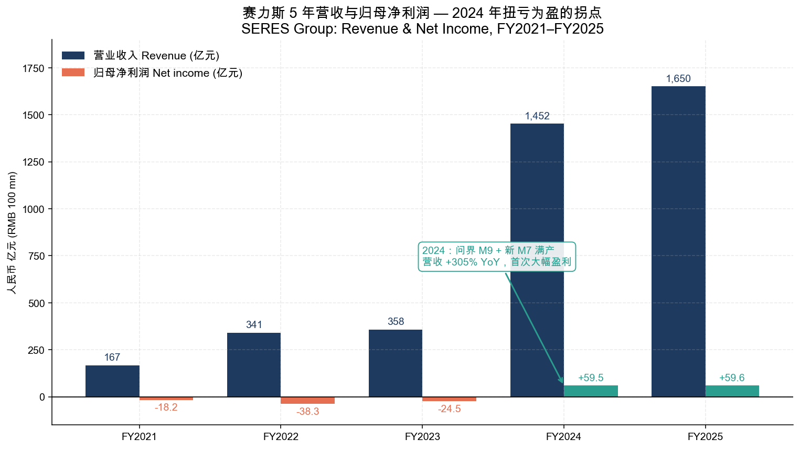
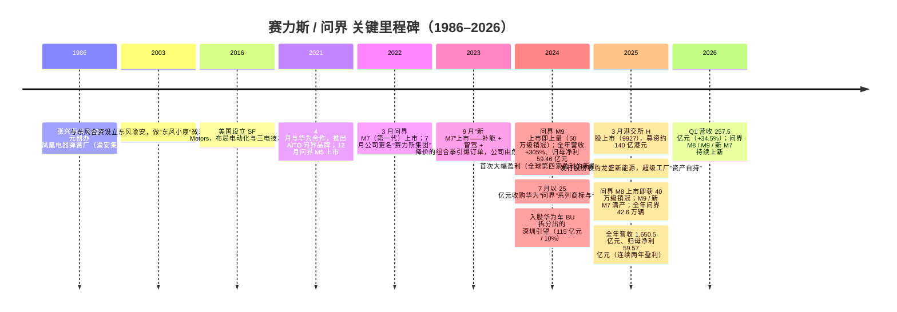
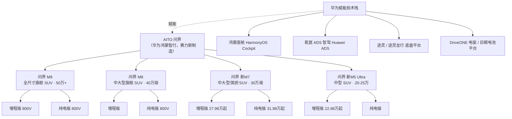
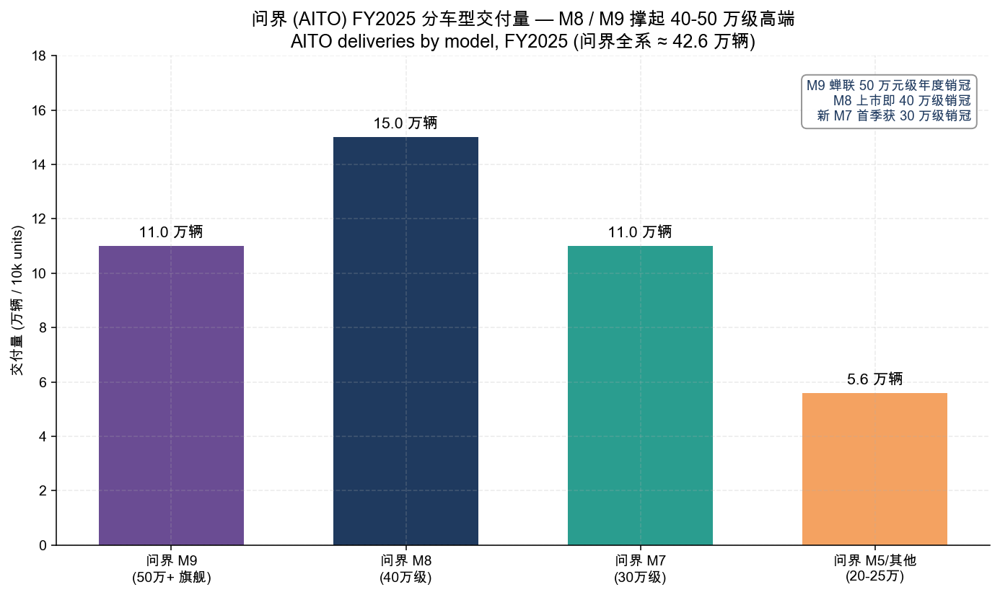
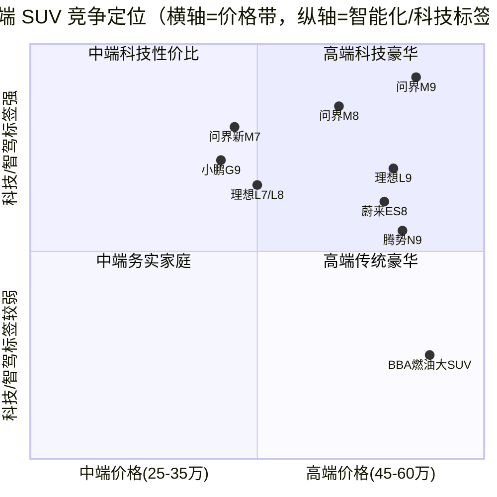
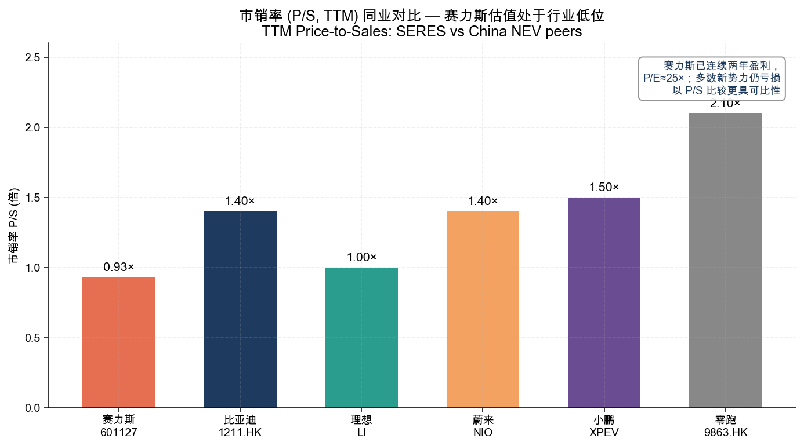

# 赛力斯集团（SERES Group，SSE: 601127 / HKEX: 9927）/ 问界 AITO（华为鸿蒙智行）——公司研究报告

**日期：** 2026-05-31
**主要上市地：** 上海证券交易所主板（A 股代码 601127，曾用名"小康股份"）
**第二上市地：** 香港联合交易所主板（H 股代码 9927，2025-03-25 挂牌，募资约 140 亿港元）
**成立时间：** 1986 年（前身重庆巴县凤凰电器弹簧厂；2003 年与东风合资设立东风渝安、做"东风小康"微车；2016 年布局电动化；2021 年与华为合作推出 AITO 问界品牌；2022 年 7 月更名"赛力斯集团"）
**总部地址：** 中国重庆市沙坪坝区五云湖路 7 号，邮编 401335
**实际控制人 / 控股股东：** 重庆小康控股有限公司，实际控制人张兴海（Zhang Xinghai）家族；战略股东东风汽车集团

> **可投资主体说明：** 本报告的可投资标的是**赛力斯集团**这家 A+H 上市整车厂——它制造并销售 AITO 问界全系车型、合并报表确认问界全部整车收入与利润。**华为（Huawei）是赋能型技术与渠道伙伴，不是单独可投资标的**（华为未上市；其车 BU 已注入深圳引望，赛力斯持股 10%）。因此全文以"赛力斯 / 问界（华为鸿蒙智行）"为统一分析框架：问界 = 赛力斯的唯一核心品牌，华为 = 提供智驾、座舱、渠道与品牌共定义的生态伙伴。

> **更新——FY2025 业绩 + Q1 2026 季报（2026-04-29）：** 赛力斯 FY2025 实现营业收入 **人民币 1,650.54 亿元（+13.69% YoY）**、归母净利润 **59.57 亿元（+0.18% YoY）**，**连续两年盈利**，新能源汽车毛利率升至 **28.76%**（+2.55pct）；全年总销量 51.69 万辆，问界系列交付 **42.6 万辆（+10.1%）**，贡献整体销量逾 82%。董事会拟每股派现 0.8 元（含税），全年分红约 19.0 亿元，占归母净利润 31.9%。**Q1 2026 营收 257.46 亿元（+34.46% YoY）、归母净利润 7.54 亿元（+0.89% YoY）**——收入增长主因问界 M8 放量，但扣非净利润同比下滑 73.87% 至 1.03 亿元（去年同期含较多政府补助、本期非经常性收益基数效应），且经营性现金流转负（-209.5 亿元，主因支付供应商货款节奏），总资产较年初下降 14.01%（前期 115 亿元入股引望 + 收购问界商标等现金流出的滞后体现）。
> 资料来源：[赛力斯 2025 年年度报告（2026-03-30）](https://static.cninfo.com.cn/finalpage/2026-03-31/1225053031.PDF)；[赛力斯 2026 年第一季度报告（2026-04-29）](https://static.cninfo.com.cn/finalpage/2026-04-30/1225262737.PDF)。

---

## 目录

1. 公司概览
2. 公司历史
3. 管理团队
4. 产品与服务
5. 客户与市场开拓策略
6. 行业概览
7. 竞争格局
8. 市场机会（TAM）
9. 风险评估
10. 参考资料

---

## 1. 公司概览

赛力斯集团股份有限公司（Seres Group Co., Ltd.，证券简称"赛力斯"，A 股 601127 / H 股 9927）是一家"以高端智能电动汽车为主营业务的技术科技型企业"，年报开宗明义自述战略为"聚焦问界汽车业务，坚持用户定义汽车的市场导向和软件定义汽车的技术路线，贯通研产供销服全链路"（[赛力斯 2025 年年度报告, 第 10 页](https://static.cninfo.com.cn/finalpage/2026-03-31/1225053031.PDF)）。公司的前身是 1986 年成立的重庆巴县凤凰电器弹簧厂，2003 年与东风合资做"东风小康"微车，曾用证券简称"小康股份"，2022 年 7 月正式更名为"赛力斯集团"，以呼应其从燃油微车向高端新能源整车的转型（[观察者网：小康股份更名赛力斯, 2022-08-02](https://www.guancha.cn/ChanJing/2022_08_02_651980.shtml)）。

**商业模式与"华为赋能"内核。** 赛力斯不是一家传统意义上"独立"的整车厂，而是华为"鸿蒙智行（Harmony Intelligent Mobility Alliance）"生态中体量最大的合作车企，运营 **AITO 问界** 品牌。其商业模式可以拆为两层：**赛力斯负责整车制造（重庆"超级工厂"）、合并报表确认问界全部销售收入与利润、承担资本开支与产能风险；华为则深度参与产品定义、提供鸿蒙座舱与乾崑 ADS 智驾系统、并通过遍布全国的华为门店网络承担主要销售获客**。这一"智选车模式 / 鸿蒙智行"分工，使赛力斯既享受了华为的品牌势能、智驾领先与渠道流量，也付出了高昂的"华为成本"——据媒体根据公司披露测算，2025 年上半年赛力斯向华为采购约 200 亿元（含零部件 + 开发 / 销售服务），约占同期收入的三分之一，相当于"每卖一辆问界，约 13.6 万元流向华为"，三年半累计向华为支付约 750 亿元（[量子位：每卖一辆问界，13.6 万流向华为, 2026-01-14](https://www.qbitai.com/2026/01/369479.html)）。这是理解赛力斯护城河与风险的钥匙：**它的护城河本身就是这份依赖。**

**收入结构与规模。** FY2025 公司营业收入 1,650.54 亿元，其中汽车行业收入 1,596.18 亿元、毛利率 28.21%；按产品看，新能源汽车收入 1,556.11 亿元（毛利率 **28.76%**，+2.55pct）、传统燃油车收入 19.03 亿元（同比 -44.82%，已边缘化）、其他 21.04 亿元（[赛力斯 2025 年年度报告, 第 19 页](https://static.cninfo.com.cn/finalpage/2026-03-31/1225053031.PDF)）。核心子公司赛力斯汽车有限公司营收 1,554.86 亿元、扣非净利润 62.52 亿元（+24.69%），是利润的绝对来源（[赛力斯 2025 年年度报告, 第 13 页](https://static.cninfo.com.cn/finalpage/2026-03-31/1225053031.PDF)）。公司 FY2025 新能源汽车销量 47.23 万辆（+10.63%），其中问界品牌 42.6 万辆、问界成交均价 39.1 万元——这是中国主流车企中最高的单车 ASP 之一（[赛力斯 2025 年年度报告, 第 10 页](https://static.cninfo.com.cn/finalpage/2026-03-31/1225053031.PDF)）。

**地理布局与产能。** 业务高度集中于中国大陆（FY2025 国内收入 1,572.40 亿元，占比约 98.5%；国外收入仅 23.79 亿元，且同比下滑 43.32%），出海尚处早期（[赛力斯 2025 年年度报告, 第 19 页](https://static.cninfo.com.cn/finalpage/2026-03-31/1225053031.PDF)）。生产基地以重庆"赛力斯超级工厂"（凤凰智慧工厂）为核心，年报称其"以数字技术为引擎"、AI 大模型"实现 36,000+ 质量点位全自动实时监控"，2025 年资产周转率达 1.38，显著高于年报对标的"外资 A/B/C/D"传统车企（0.5–0.73）（[赛力斯 2025 年年度报告, 第 12、17 页](https://static.cninfo.com.cn/finalpage/2026-03-31/1225053031.PDF)）。2025 年公司还以发行股份方式收购龙盛新能源 100% 股权，将原本租赁经营的超级工厂资产"自持"，实现"从租赁经营到资产自持的跃升"（[赛力斯 2025 年年度报告, 第 14 页](https://static.cninfo.com.cn/finalpage/2026-03-31/1225053031.PDF)）。

*资料来源：FY2021/2022 数据引自 [赛力斯 2022 年年度报告, 第 7 页](https://static.cninfo.com.cn/finalpage/2023-04-29/1216706923.PDF)；FY2023–FY2025 数据引自 [赛力斯 2025 年年度报告, 第 7 页](https://static.cninfo.com.cn/finalpage/2026-03-31/1225053031.PDF)。*

**资产负债与现金流。** 受益于 H 股募资（FY2025 筹资活动现金流入净额 182.77 亿元，"主要系收到 H 股募集资金"）与盈利积累，公司财务结构大幅改善：截至 2025 年末归母净资产升至 409.18 亿元（+233.64% YoY）、资产负债率降至 70.91%（同比降约 16pct）、货币资金达 872.87 亿元（占总资产 60.66%）；FY2025 经营活动现金流净额 289.14 亿元（+28.42%）（[赛力斯 2025 年年度报告, 第 7、14、18 页](https://static.cninfo.com.cn/finalpage/2026-03-31/1225053031.PDF)）。需要注意的是，公司在 2024–2025 年完成两笔大额现金 / 股份对外投资——以 **115 亿元现金购买华为持有的深圳引望 10% 股权**、以约 **25 亿元收购问界系列商标与专利**——这是其现金消耗与 Q1 2026 总资产回落的主因之一（[赛力斯 2025 年年度报告, 第 28 页](https://static.cninfo.com.cn/finalpage/2026-03-31/1225053031.PDF)；[观察者网：赛力斯拟 25 亿元从华为收购"问界"商标, 2024-07-03](https://www.guancha.cn/qiche/2024_07_03_740102.shtml)）。

**估值快照（截至 2026-05-13 收盘，A 股 601127）。**

| 指标 | 赛力斯（601127 A 股） | 说明 / 区间 |
|---|---|---|
| 股价（A 股） | 约 87.5 元 | 4 月底约 90.45 元，5 月中约 87.5 元；机构 90 日平均目标价约 121.66 元 |
| 总股本 | 17.42 亿股 | 截至 2026-03-30，1,741,985,086 股 |
| 总市值（A 股口径） | 约 1,520 亿元人民币 | = 87.5 × 17.42 亿（含税前粗算） |
| H 股市值参考 | 约 2,291 亿港元（上市首日） | H 股上市当日市值港股车企第二，仅次于比亚迪 |
| TTM 市盈率（P/E） | 约 **24.8 倍** | 2026-03-17 PE-TTM ≈ 24.83；EPS(TTM) ≈ 3.67 元 |
| TTM 市销率（P/S） | 约 **0.93 倍** | = 市值 1,520 亿 / FY2025 营收 1,650 亿 |
| FY2025 基本每股收益 | 3.68 元 | 加权平均 ROE 23.53% |

资料来源：股价与 PE-TTM 引自 [理杏仁：赛力斯 601127 市盈率估值, 2026-03-17 更新](https://www.lixinger.com/equity/company/detail/sh/601127/601127/fundamental/valuation/pe-ttm) 与 [搜狐财经：赛力斯 5 月 13 日资金流向, 2026-05-13](https://m.sohu.com/a/1022163528_121319643)；总股本与 EPS 引自 [赛力斯 2025 年年度报告, 第 2、7 页](https://static.cninfo.com.cn/finalpage/2026-03-31/1225053031.PDF)；H 股首日市值引自 [澎湃新闻：募资 140 亿港元的赛力斯上市首日, 2025-03](https://m.thepaper.cn/detail/31901037)。

**对估值的解读。** 与多数仍在亏损的中国造车新势力不同，赛力斯**已连续两年盈利**，因此可以用市盈率衡量：约 25 倍的 TTM P/E 介于比亚迪（约 35 倍）与理想（约 23 倍）之间，反映市场把它定价为"已跑通盈利模型、但增速放缓"的高端品牌（[新浪财经/浦银国际口径：赛力斯 PE 约 35 倍介于比亚迪与理想之间, 2026](https://finance.sina.com.cn/wm/2026-04-03/doc-inhtfzut8598355.shtml)）。在市销率维度，赛力斯约 0.93 倍处于中国新能源整车股的低位区间——低于小鹏（约 1.5 倍）、零跑（约 2.1 倍）、蔚来（约 1.4 倍），与理想（约 1.0 倍）相近，明显低于比亚迪（约 1.4 倍 H 股口径）（[搜狐：新势力估值对比, 2026](https://www.sohu.com/a/976493805_661663)）。**市场给赛力斯"盈利但低 P/S"的折价，本质是为两件事打折：(1) 单一品牌（问界）+ 单一伙伴（华为）的极高集中度；(2) 利润增速从 2024 年的爆发式扭亏，骤降至 2025 年的近乎零增长（归母净利 +0.18%）——增长故事正从"0→1"切换到"1→N"的存量竞争。** 这一估值结论将贯穿第 7 章（竞争）与第 9 章（风险）。

---

## 2. 公司历史

**创立故事。** 赛力斯的根可以追溯到 **1986 年**——创始人 **张兴海（Zhang Xinghai）** 拿出仅有的 8,000 元，在重庆创建巴县凤凰电器弹簧厂，为长安微车生产座椅弹簧，后发展为渝安集团（[OFweek：傍上东风、吞下华为问界，张兴海 38 年借势造车终翻盘, 2024-07](https://nev.ofweek.com/2024-07/ART-71000-8500-30639662.html)）。2003 年 6 月，东风汽车公司、东风实业与渝安集团三方合资组建东风渝安车辆有限公司，生产"东风小康"品牌微车——张兴海由此完成从"零部件供应商"到"整车厂"的第一次身份跃迁（[腾讯新闻：张兴海和赛力斯的狂奔时代, 2024-02-22](https://news.qq.com/rain/a/20240222A01TOH00)）。上市主体在 A 股长期以"小康股份"为名，直到 2022 年 7 月才更名"赛力斯"。

资料来源：[赛力斯 2025 年年度报告, 第 5–6、14、28 页](https://static.cninfo.com.cn/finalpage/2026-03-31/1225053031.PDF)；[赛力斯 2024 年年度报告, 第 9、586 行附近披露](https://static.cninfo.com.cn/finalpage/2025-04-01/1222976168.PDF)；[腾讯新闻：张兴海和赛力斯的狂奔时代, 2024-02-22](https://news.qq.com/rain/a/20240222A01TOH00)；[观察者网：赛力斯拟 25 亿元收购"问界"商标, 2024-07-03](https://www.guancha.cn/qiche/2024_07_03_740102.shtml)。

**三次战略转向。** 赛力斯（小康）历史上"三次更名、三次被人看不起"，对应三次关键转向（[经济观察网：小康创始人张兴海谈更名赛力斯, 2022-08-01](http://m.eeo.com.cn/2022/0801/546261.shtml)）：

1. **从零部件到整车（2003）。** 与东风合资做"东风小康"微车，吃到了 2003–2015 年中国微面 / 微车红利，但也使公司长期被贴上"低端面包车"的标签。
2. **从燃油微车 all-in 新能源（2016–2021）。** 张兴海"力排众议"决定进军新能源，2016 年在美国设立 SF Motors 储备三电与电驱技术，但早期自主品牌 SF5 销量惨淡。真正的拐点是 **2021 年 4 月与华为达成合作**——华为以"智选车 / 鸿蒙智行"模式深度介入产品定义、智驾与销售，催生 AITO 问界品牌。这是赛力斯历史上最重要的"借势"决策（[OFweek, 2024-07](https://nev.ofweek.com/2024-07/ART-71000-8500-30639662.html)）。
3. **从"代工质疑"到"品牌自持 + 资本绑定"（2024–2025）。** 2023 年"新 M7"翻盘、2024 年 M9 大卖之后，赛力斯做了两件影响深远的资本动作：**收购问界商标（把品牌资产装进自己口袋）** 与 **入股引望（把技术伙伴关系升级为股权绑定）**，以回应"赛力斯只是华为代工厂"的市场质疑，并锁定与华为的长期协同（[量子位：每卖一辆问界 13.6 万流向华为, 2026-01-14](https://www.qbitai.com/2026/01/369479.html)）。

**关键资本运作（近两年）：**
- **2024-07：** 赛力斯汽车以 **25 亿元** 收购华为及其关联方持有的 919 项"问界"等文字 / 图形商标及 44 项外观设计专利；第三方评估该批资产市场价值约 **102.33 亿元**——相当于约"二折"购回（[观察者网, 2024-07-03](https://www.guancha.cn/qiche/2024_07_03_740102.shtml)）。
- **2024–2025：** 以现金 **115 亿元** 购买华为持有的 **深圳引望智能技术有限公司 10% 股权**（华为车 BU 拆分主体），股权已登记至赛力斯汽车名下、对价已付清（[赛力斯 2025 年年度报告, 第 28 页](https://static.cninfo.com.cn/finalpage/2026-03-31/1225053031.PDF)）。
- **2025-02/03：** 发行股份购买龙盛新能源 100% 股权（超级工厂资产），证监会同意注册；资产过户完成、纳入合并报表（[赛力斯 2025 年年度报告, 第 28 页](https://static.cninfo.com.cn/finalpage/2026-03-31/1225053031.PDF)）。
- **2025-03-25：** H 股在港交所上市（9927），募资约 140 亿港元，打开国际融资通道（[澎湃新闻, 2025-03](https://m.thepaper.cn/detail/31901037)）。

---

## 3. 管理团队

**创始人 / 实际控制人——张兴海（Zhang Xinghai）。** 张兴海是赛力斯的创始人和实际控制人，通过重庆小康控股控制上市公司。他的创业史是中国民营汽车工业的一个缩影：1986 年以 8,000 元创办凤凰弹簧厂为长安微车配套座椅弹簧，2003 年抓住与东风合资的机会切入整车（东风小康微车），2016 年顶住内外质疑 all-in 新能源、赴美设立 SF Motors 储备三电技术，2021 年促成与华为的历史性合作、2022 年将公司更名"赛力斯"（[腾讯新闻：张兴海和赛力斯的狂奔时代, 2024-02-22](https://news.qq.com/rain/a/20240222A01TOH00)；[经济观察网, 2022-08-01](http://m.eeo.com.cn/2022/0801/546261.shtml)）。他的核心判断——"传统的合资造车已过时"、要靠"软件定义汽车"重做高端——在 2022 年更名时被广泛质疑，却在 2024 年问界 M9 大卖、公司扭亏为盈后得到验证（[观察者网：张兴海谈更名, 2022-08-02](https://www.guancha.cn/ChanJing/2022_08_02_651980.shtml)）。值得注意的是，到 2025 年报，张兴海本人已不在上市公司董事会的执行序列中、退居控股股东层面，把上市公司的经营交棒给职业化的管理团队与其子张正萍——这是一种"创始人退居幕后、二代 + 职业经理人主导"的治理安排（[赛力斯 2025 年年度报告, 第 36 页 董事及高管简历](https://static.cninfo.com.cn/finalpage/2026-03-31/1225053031.PDF)）。

**董事长兼总裁——张正萍（Zhang Zhengping）。** 现任公司法定代表人、董事长兼总裁，是张兴海之子、"创二代"接班人。年报披露其履历："曾任重庆小康控股有限公司副总经理，SF Motors,Inc. 首席执行官，赛力斯汽车有限公司营销中心总经理，公司董事、智能汽车事业群总裁，赛力斯汽车有限公司总经理……以及公司董事、董事长、总裁"（[赛力斯 2025 年年度报告, 第 36 页](https://static.cninfo.com.cn/finalpage/2026-03-31/1225053031.PDF)）。他早年主导 SF Motors（美国子公司）的电动化探索、随后转向赛力斯汽车的营销与智能汽车事业群——这两段经历恰好覆盖了赛力斯转型最关键的"技术储备"与"问界商业化"两个环节。在治理上，张正萍是连接"控股股东 / 创始家族"与"问界一线经营"的核心人物，亦兼任公司在新加坡、美国子公司（SOKON INVESTMENT (USA)/(Singapore)）的董事（[赛力斯 2025 年年度报告, 第 36 页](https://static.cninfo.com.cn/finalpage/2026-03-31/1225053031.PDF)）。

**治理特征：东风与华为系的"双重影响"。** 赛力斯董事会同时坐着东风系（如杨彦鼎、李玮、周昌玲等来自东风汽车集团的董事，反映东风作为战略股东的影响）与来自华为体系的高管（如副总裁黄其忠"曾就职于华为技术有限公司、华为终端（深圳）有限公司"），这一结构直观体现了赛力斯"东风血统 + 华为赋能"的混合基因（[赛力斯 2025 年年度报告, 第 36–37 页](https://static.cninfo.com.cn/finalpage/2026-03-31/1225053031.PDF)）。报告期内高管及骨干团队增持公司股票 3,313.79 万元，年报称以此"彰显对公司发展的坚定信心"（[赛力斯 2025 年年度报告, 第 18 页](https://static.cninfo.com.cn/finalpage/2026-03-31/1225053031.PDF)）。

---

## 4. 产品与服务

赛力斯的产品线 = **AITO 问界（华为鸿蒙智行）一个品牌、四款主力 SUV（M5 / M7 / M8 / M9）**，全部采用"增程（EREV）为主、纯电（BEV）并行"的双动力路线，并共享华为提供的智驾 / 座舱 / 底盘技术栈。要看懂问界的产品，必须先看懂它**不是赛力斯一家定义的车，而是"赛力斯华为联合设计"的车**——这正是问界官网每个车型页脚的标准署名（[问界 M8 配置页：赛力斯华为联合设计](https://aito.auto/model/m8/configuration/)）。本章先拆解"华为赋能技术栈"这一核心产品逻辑，再逐车型走读。

### 4.1 产品矩阵（赛力斯自有披露 + 问界官网）

赛力斯年报不像半导体公司那样给出标准的"产品矩阵表"，但在 MD&A 中明确列出了 FY2025 上市的四款车型及其定位与战绩，可重构如下表（数据为公司年报口径，价格为媒体披露的上市起售价）：

| 车型 | 官方定位（年报 / 官网原文） | 级别 | 动力 | 起售价（上市） | FY2025 战绩（年报口径） |
|---|---|---|---|---|---|
| **问界 M9** | "全景智慧旗舰 SUV""科技车皇" | 全尺寸 SUV（5/6 座） | 增程 + 纯电（800V） | 约 46.98 万元起 | 全年 >11 万辆，蝉联 **50 万元级年度销冠** |
| **问界 M8** | "家庭智慧旗舰 SUV""丈量天地，奔赴美好" | 中大型 SUV | 增程 + 纯电（800V） | 约 35.98 万元起（纯电预售 37.8 万起） | 全年 >15 万辆，4 月上市即 **40 万元级销冠** |
| **问界（新）M7** | "幸福旗舰 SUV""家庭智慧豪华 SUV""国民 SUV" | 中大型 SUV | 增程 + 纯电 | 增程 27.98 万 / 纯电 31.98 万起 | 全年 >11 万辆，新款 9 月上市首季获 **30 万元级销冠** |
| **问界 新 M5 Ultra** | "高颜都市性能 SUV""陆地小坦克" | 中型 SUV（5 座） | 增程 + 纯电 | 22.98 万元起（22.98–24.98 万） | 价格带下探至 20–25 万元主销区间 |

资料来源：定位与战绩引自 [赛力斯 2025 年年度报告, 第 14 页](https://static.cninfo.com.cn/finalpage/2026-03-31/1225053031.PDF) 与 [赛力斯 2024 年年度报告（M9/新M7/新M5 定位）](https://static.cninfo.com.cn/finalpage/2025-04-01/1222976168.PDF)；起售价引自 [问界 M8 配置页, AITO 官网](https://aito.auto/model/m8/configuration/)、[新浪财经：问界新 M5 Ultra 上市 22.98 万元起, 2025-03-24](https://finance.sina.com.cn/jjxw/2025-03-24/doc-inequiin3348836.shtml)、[网通社：问界 M8 纯电版预售 37.8 万起, 2025](https://auto.news18a.com/news/storys_190244.html)。

资料来源：车型谱系与动力配置引自 [问界 M9, AITO 官网](https://aito.auto/model/m9-new/)、[赛力斯 2025 年年度报告, 第 14 页](https://static.cninfo.com.cn/finalpage/2026-03-31/1225053031.PDF)。

### 4.2 综合理解——"华为赋能"如何构成问界的产品内核

问界产品力的"地基"不是赛力斯自研的某一项硬件，而是 **华为提供的四件套技术栈**：鸿蒙座舱（HarmonyOS cockpit）、乾崑 ADS 智驾（Huawei ADS）、途灵 / 途灵龙行底盘（chassis platform）、以及电驱与电池平台。赛力斯则贡献整车工程、平台化（"魔方技术平台 2.0"）、超级工厂制造与第五代超级增程系统。这两套能力在"智选车 / 鸿蒙智行"模式下被华为深度统合——华为不仅供货，还参与产品定义、定价建议、品牌营销与门店销售。理解问界，就是理解"**一台车 = 赛力斯的整车制造 + 华为的智能化与渠道**"。下面先逐一拆解华为技术栈，再走读各车型。

**中文释义 / Plain-language gloss（华为赋能四件套）：**
- **鸿蒙座舱（HarmonyOS cockpit，鸿蒙智能座舱 3.0）。** 即车内大屏 + 语音 + 生态的操作系统层。官网强调"平板上车"（HUAWEI MagLink™ 魔吸车载接口）、"超级桌面""碰一碰导航"等手机—车机无缝流转能力——本质是把华为手机 / 平板的鸿蒙生态搬进车里，让"换手机用户"零学习成本（[问界官网首页：鸿蒙智能座舱 3.0](https://www.aito.auto/)）。这是问界相对理想 / 蔚来自研座舱的差异化卖点：**生态而非单机**。
- **乾崑 ADS 智驾（Huawei ADS，华为乾崑智驾）。** 即华为的高阶辅助驾驶系统，迭代到 ADS 4（M8/新M7）与 ADS 5（M9 新款）。年报披露问界与华为"联合开发，率先量产高精度固态激光雷达""行业首推矩阵式毫米波雷达、四激光雷达及视觉激光雷达商用"，智驾系统"升级至 WEWA 架构 ADS4.0"（[赛力斯 2025 年年度报告, 第 14–15 页](https://static.cninfo.com.cn/finalpage/2026-03-31/1225053031.PDF)）。官网对 M8 的描述是"实现车位到车位出行……窄道会车掉头、拥堵加塞、脱困绕行能力大幅提升"（[问界 M8, AITO 官网](https://aito.auto/model/m8/)）。FY2025 问界品牌辅助驾驶总里程达 38 亿公里、活跃用户占比高达 95.4%——是问界相对竞品最硬的技术标签（[赛力斯 2025 年年度报告, 第 15 页](https://static.cninfo.com.cn/finalpage/2026-03-31/1225053031.PDF)）。*分析师观点：* "华为智驾全国领先"是行业与媒体的普遍评价，但这属于第三方 / 分析师判断、非赛力斯年报的自我宣称——年报只陈述里程与活跃度等可验证事实。
- **途灵 / 途灵龙行底盘（Tuling chassis platform）。** 华为的智能底盘平台，整合悬架、转向、制动的协同控制。M9 新款搭载"全新华为途灵龙行平台"，官网将其与"华为巨鲸电池平台 3.0"并列为底盘 + 三电的两大平台（[问界 M9, AITO 官网](https://aito.auto/model/m9-new/)）。新 M7 官网亦突出"华为途灵平台，全维硬核安全"（[问界 M7, AITO 官网](https://aito.auto/model/m7-new/)）。
- **第五代超级增程 + DriveONE 电驱 + 巨鲸 / 宁德电池（动力总成）。** 这一层是赛力斯与华为 / 宁德时代共同贡献：赛力斯年报称"完成第五代 2.0T 超级增程技术开发，可提供 1.5T 与 2.0T 多类型增程动力选择"，实现"车-电-机-充一体化集成"、依托"800V 及以上高压架构、八合一电驱与全国超充网络"；2025 年公司增程器市场份额达 **37.5%、位居行业第一**（[赛力斯 2025 年年度报告, 第 14、17 页](https://static.cninfo.com.cn/finalpage/2026-03-31/1225053031.PDF)）。M8 纯电版则"全系标配宁德时代 100 度电池，搭载华为高压七合一电驱"（[网通社：问界 M8 纯电版, 2025](https://auto.news18a.com/news/storys_190244.html)）。

### 4.3 问界 M9——50 万元级"科技车皇"，赛力斯的利润压舱石

> 年报原文："问界 M9 定位'全景智慧旗舰 SUV'的全尺寸 SUV，被誉为'科技车皇'……获中国市场 50 万元级豪华车年度销冠"（[赛力斯 2024 年年度报告](https://static.cninfo.com.cn/finalpage/2025-04-01/1222976168.PDF)）。FY2025"全景智慧旗舰 SUV 问界 M9 全年销量超 11 万辆，蝉联 50 万元级年度销冠"（[赛力斯 2025 年年度报告, 第 14 页](https://static.cninfo.com.cn/finalpage/2026-03-31/1225053031.PDF)）。

**中文释义 / Plain-language gloss：** M9 是问界乃至整个鸿蒙智行的旗舰与利润压舱石。它的物理形态是一台车长约 5.23–5.40 米的全尺寸 6 座 / 5 座 SUV，提供"800V 高压增程平台"（CLTC 纯电约 422 km、综合约 1,405 km）与"800V 高压纯电平台"（CLTC 约 750 km）两种动力，新款搭载华为乾崑智驾 ADS 5、华为途灵龙行平台、华为巨鲸电池平台 3.0（[问界 M9, AITO 官网](https://aito.auto/model/m9-new/)）。它在产品序列中的角色，是用"全维华为科技 + 50 万元价格带"直接抢夺 **BBA（奔驰 GLS / 宝马 X5 / 奥迪 Q7）燃油豪华大 SUV** 与理想 L9 的客户——这是中国自主品牌首次在 50 万元级实现规模化"油转电"的 conquest（夺取）。年报披露 M9 累计销量已超 26 万辆、连续 20 个月稳居 50 万元级销冠，并"入驻中国国家博物馆，成为中国制造'十四五'成就展唯一入选新能源汽车"（[知乎/媒体：鸿蒙智行五界盘点, 2025](https://zhuanlan.zhihu.com/p/1993008492781539745)；[赛力斯 2025 年年度报告, 第 15 页](https://static.cninfo.com.cn/finalpage/2026-03-31/1225053031.PDF)）。*分析师观点：* M9 的竞争优势判定为"是"——护城河来自华为智驾 / 座舱的技术 + 品牌溢价与门店渠道，最接近的竞品是理想 L9（增程）与蔚来 ES8 / 比亚迪腾势 N9（高端），但在"智驾口碑 + 50 万级 BBA 替代"这一最高价格带，M9 暂无同体量对手。

### 4.4 问界 M8——40 万元级"家庭智慧旗舰"，2025 年的放量主力

> 官网定位："家庭智慧旗舰 SUV，丈量天地，奔赴美好"（[问界 M8, AITO 官网](https://aito.auto/model/m8/)）。年报："家庭智慧旗舰 SUV 问界 M8 全年销量超 15 万辆，4 月上市以来位居 40 万元级车型销冠"（[赛力斯 2025 年年度报告, 第 14 页](https://static.cninfo.com.cn/finalpage/2026-03-31/1225053031.PDF)）。

**中文释义 / Plain-language gloss：** M8 是 2025 年赛力斯增长的最大引擎——4 月上市、单一车型全年即贡献逾 15 万辆。它在产品序列中填补了 M7（30 万级）与 M9（50 万级）之间的 **40 万元价格带空白**，定位"比 M9 更亲民、比 M7 更豪华"的家庭旗舰。动力上提供增程版（CLTC 纯电 310 km、综合 1,526 km）与 800V 纯电版（长续航 705 km / 四驱 655 km），搭载华为乾崑智驾 ADS 4，座舱定位"家人的移动智慧客厅"，含一体寰宇屏、AR-HUD、智能投影等（[问界 M8, AITO 官网](https://aito.auto/model/m8/)）。它与 M9 共享华为技术栈但下探一个价格带，差异化在于尺寸略小、配置略简、价格更低——这是问界"大单品复制能力"的最佳证明：把 M9 的成功公式平移到 40 万级。*分析师观点：* 竞争优势"是"，直接对标理想 L8 / L9 与蔚来 ES8——M8 上市即夺 40 万级销冠，说明问界的"华为科技 + 家庭 SUV"组合在主流高端价格带具备强复制性。

### 4.5 问界（新）M7——"国民 SUV"，2023 年的翻盘之作

> 年报："问界新 M7 定位家庭智慧豪华 SUV 的中大型 SUV，被誉为'国民 SUV'"（[赛力斯 2024 年年度报告](https://static.cninfo.com.cn/finalpage/2025-04-01/1222976168.PDF)）。FY2025"幸福旗舰 SUV 问界 M7 全年销量超 11 万辆，全新款 9 月上市首季即获 30 万元级销量冠军"（[赛力斯 2025 年年度报告, 第 14 页](https://static.cninfo.com.cn/finalpage/2026-03-31/1225053031.PDF)）。

**中文释义 / Plain-language gloss：** 新 M7 在赛力斯历史上的地位无可替代——**它是 2023 年 9 月那记"翻盘的组合拳"，把濒临边缘化的赛力斯重新拉回牌桌**。第一代 M7（2022）销量平平，2023 年 9 月的"新 M7"通过大幅增配（标配激光雷达 + 华为高阶智驾）+ 降价的策略引爆订单，单月交付突破 3 万辆，直接救活了公司现金流。它的物理定位是 30 万元级中大型家庭 SUV，提供增程（27.98 万起，综合续航最高超 1,600 km）与纯电（31.98 万起）两种动力，新款"超 60 项全系标配，包括激光雷达方案、华为乾崑智驾 ADS 4、华为途灵平台、华为巨鲸电池平台等核心配置"（[搜狐/媒体：新问界 M7 配置, 2025](https://www.news18a.com/news/storys_213512.html)；[问界 M7, AITO 官网](https://aito.auto/model/m7-new/)）。在序列中，新 M7 是问界"走量担当"，直接对标理想 L7 / L8——两者几乎在同一价格带、同一家庭增程 SUV 赛道贴身肉搏。*分析师观点：* 竞争优势"是"，但护城河较 M9 浅——30 万元级竞争最激烈（理想 L7/L8、零跑 C16、阿维塔等都在抢），新 M7 靠华为智驾标签维持溢价。

### 4.6 问界 新 M5 Ultra——20–25 万元级"性能入门"，价格带下探

> 年报："问界新 M5 定位'高颜都市性能 SUV'的中型 SUV，被誉为'陆地小坦克'"（[赛力斯 2024 年年度报告](https://static.cninfo.com.cn/finalpage/2025-04-01/1222976168.PDF)）。FY2025 公司发布"问界 M5 Ultra"等四款车型（[赛力斯 2025 年年度报告, 第 14 页](https://static.cninfo.com.cn/finalpage/2026-03-31/1225053031.PDF)）。

**中文释义 / Plain-language gloss：** 新 M5 Ultra 是问界家族的"入门款"——2021 年 12 月首款问界 M5 是整个品牌的起点，2025 年 3 月"新 M5 Ultra"上市，售价 22.98–24.98 万元，定位 20–25 万元中型 5 座 SUV，提供增程（CLTC 纯电 255 km）与纯电（CLTC 602 km）两种动力，搭载升级的 ADS 3.3 智驾、192 线激光雷达与 4D 毫米波雷达（[新浪财经：问界新 M5 Ultra 上市 22.98 万元起, 2025-03-24](https://finance.sina.com.cn/jjxw/2025-03-24/doc-inequiin3348836.shtml)）。它在序列中负责把问界的价格带向下延伸到 20–25 万元主流市场，触达预算更紧但仍想要华为智驾的用户——与小鹏 G6 / G9、特斯拉 Model Y、零跑 C11 等正面竞争。*分析师观点：* 竞争优势"部分"——20–25 万元是中国 NEV 最血腥的红海，M5 的华为智驾溢价在这一价格带相对没那么稀缺（小鹏、特斯拉的智驾同样能打），故 M5 更多承担"品牌入口"而非利润担当的角色。

### 4.7 营销服一体化与"问界用户中心"（服务业务）

赛力斯的"产品"不止于硬件，还包括其"专属专营"的营销服务体系——这部分构成了问界相对传统 4S 模式的差异化护城河。年报披露公司打造"问界专属专营用户中心"，截至 2025 年末已营业用户中心 **380 家、覆盖全国 218 城、实现三线及以上城市 100% 全覆盖**，并完成 234 家门店"数智化车间"建设（[赛力斯 2025 年年度报告, 第 16 页](https://static.cninfo.com.cn/finalpage/2026-03-31/1225053031.PDF)）。服务模式上，公司搭建"一个窗口、两大场景、智慧中台"架构，以 AI 智能体"小赛"作为统一交互窗口，截至 2025 年末智慧服务体系累计提供 31.2 万次主动服务、节约用户维修时长 49.5 万小时（[赛力斯 2025 年年度报告, 第 16–17 页](https://static.cninfo.com.cn/finalpage/2026-03-31/1225053031.PDF)）。需要强调的是：**问界的销售获客主要发生在"华为门店"（华为终端零售体系），用户中心则承接交付与售后**——这种"华为流量获客 + 赛力斯用户中心服务"的分工，既是问界冷启动能迅速放量的关键，也意味着渠道命脉部分握在华为手里（详见第 5 章）。

### 4.8 旗舰、复制能力与近 12 个月新品

- **旗舰与走量结构（FY2025）：** M8（>15 万辆）+ M9（>11 万辆）+ 新 M7（>11 万辆）三款撑起问界 42.6 万辆的绝大部分；M9 是利润压舱石、M8 是 2025 年增量主力、新 M7 是走量基本盘（[赛力斯 2025 年年度报告, 第 14 页](https://static.cninfo.com.cn/finalpage/2026-03-31/1225053031.PDF)）。

*资料来源：M9/M8/新M7 销量引自 [赛力斯 2025 年年度报告, 第 14 页](https://static.cninfo.com.cn/finalpage/2026-03-31/1225053031.PDF)；M5/其他为问界全系 42.6 万辆减去三款主力的轧差估算（= 42.6 − 11 − 15 − 11 ≈ 5.6 万辆）。*

- **"大单品"可复制性：** 年报反复强调公司"具备体系化大单品打造能力"——2025 年问界在高端新能源 SUV 市场份额超 20%，且"产品打造能力并非单点突破，而是具备较强的可复制性、可迁移性和跨品类拓展潜力"（[赛力斯 2025 年年度报告, 第 16 页](https://static.cninfo.com.cn/finalpage/2026-03-31/1225053031.PDF)）。M9→M8 的成功平移正是这一论断的实证。
- **平台与近期技术上新：** 2025 年公司发布"魔方技术平台 2.0"（以"全景智慧"为引领、"智能安全"为底座）、第五代 2.0T 超级增程、智能安全 IP（安全 4.0 理念），并把智驾升级至 WEWA 架构 ADS4.0；2026 年春节期间，主力车型辅助驾驶里程占比突破 50%（[赛力斯 2025 年年度报告, 第 14、17 页](https://static.cninfo.com.cn/finalpage/2026-03-31/1225053031.PDF)）。
- **新业务探索（机器人）：** 公司还在把智驾 / 座舱积累的"感知、决策、规控与系统集成能力"复用到智能机器人（双足 / 轮式 / 四足 / 轮足复合），"初步形成多平台并行的技术储备布局"——目前仅是早期储备，对收入无贡献（[赛力斯 2025 年年度报告, 第 15 页](https://static.cninfo.com.cn/finalpage/2026-03-31/1225053031.PDF)）。

---

## 5. 客户与市场开拓策略

**客户画像——25–60 万元的家庭与高端买家。** 问界的目标客户是**预算 25–60 万元、追求"科技豪华"的家庭与高端用户**，与理想（"为家庭服务"）的人群高度重合。年报把问界定位在"高端新能源"赛道，FY2025 问界成交均价 **39.1 万元**（[赛力斯 2025 年年度报告, 第 10 页](https://static.cninfo.com.cn/finalpage/2026-03-31/1225053031.PDF)）。M9（50 万+）直接抢 BBA 燃油大 SUV 与理想 L9 的客户，M8（40 万级）/ 新 M7（30 万级）对标理想 L7/L8 / 蔚来，M5（20–25 万）触达预算更紧的入门高端用户——四款车覆盖 20–60 万元的连续价格带。

**GTM 护城河——华为门店 + 问界用户中心。** 问界最关键的获客优势，是**借用了华为遍布全国的终端零售网络**（华为门店）。这套渠道是问界能在 2023–2024 年迅速冷启动放量的核心原因：华为门店天然的高客流、强品牌信任与下沉覆盖，是任何造车新势力自建直营店都难以在短期内复制的流量入口（[量子位：每卖一辆问界 13.6 万流向华为, 2026-01-14](https://www.qbitai.com/2026/01/369479.html)）。在此基础上，赛力斯自建"问界用户中心"承接交付与售后——截至 2025 年末 380 家、覆盖 218 城、三线及以上城市 100% 覆盖（[赛力斯 2025 年年度报告, 第 16 页](https://static.cninfo.com.cn/finalpage/2026-03-31/1225053031.PDF)）。渠道模式上，公司创新"类直营 + 经销商合作"的轻资产模式，"实现品牌统一管理、门店灵活布局"，既避免纯直营的重资产，又比传统 4S 批售更可控（[赛力斯 2025 年年度报告, 第 18 页](https://static.cninfo.com.cn/finalpage/2026-03-31/1225053031.PDF)）。

**客户集中度——低且健康（经销 / 门店分销所致）。** 由于问界主要通过华为门店 + 经销 / 代理模式分销给终端消费者（C 端），赛力斯报表层面的"客户"是众多经销 / 渠道方而非单一大客户，故**客户集中度很低**：FY2025 前五名客户销售额 196.33 亿元、占年度销售总额仅 **11.89%**，且其中关联方销售额为 0（[赛力斯 2025 年年度报告, 第 21 页](https://static.cninfo.com.cn/finalpage/2026-03-31/1225053031.PDF)）。按销售模式拆分，FY2025 经销收入 1,537.01 亿元（毛利率 28.59%）、直销收入 59.17 亿元（毛利率 18.20%）——绝大部分通过经销 / 门店体系实现（[赛力斯 2025 年年度报告, 第 19 页](https://static.cninfo.com.cn/finalpage/2026-03-31/1225053031.PDF)）。**客户端不构成集中度风险；真正的集中度在供应端（华为）与品牌端（单一问界品牌）——见下文与第 9 章。**

**供应商集中度——高，且华为是核心。** 与客户端相反，赛力斯的供应商集中度很高：FY2025 前五名供应商采购额 **967.72 亿元、占年度采购总额 58.31%**，其中关联方采购 223.35 亿元（占 13.46%）（[赛力斯 2025 年年度报告, 第 21 页](https://static.cninfo.com.cn/finalpage/2026-03-31/1225053031.PDF)）。华为是其中分量最重的供应商——既供应智能座舱 / 智驾系统等核心零部件，也提供开发 / 销售推广等服务。媒体根据公司披露测算，2025 上半年向华为采购约 200 亿元、三年半累计约 750 亿元，相当于"每卖一辆问界约 13.6 万元流向华为"（[量子位, 2026-01-14](https://www.qbitai.com/2026/01/369479.html)）。这是赛力斯毛利率结构与利润弹性的关键变量。

**鸿蒙智行多品牌格局——问界最大，但华为"精力分散"。** 问界（赛力斯）是华为鸿蒙智行"多界矩阵"中体量最大、且赛力斯唯一聚焦的品牌；但华为同时与多家车企合作，FY2025 已形成"五界"格局——**问界（赛力斯）、智界（奇瑞）、享界（北汽）、尊界（江淮）、尚界（上汽）**。2025 年鸿蒙智行全系累计交付约 49.4–58.9 万辆（不同统计口径），其中**问界一家就贡献 422,920 辆、占鸿蒙智行约 71.85%**，其余四界合计不足三成（智界从 1 月 1.2 万辆回落、尊界月交付仅约 2,000 辆、享界单月约 6,700 辆）（[新浪汽车：华为鸿蒙智行"五界"2025 战绩, 2026](https://k.sina.com.cn/article_7857201856_1d45362c001902q7a4.html)；[知乎/媒体：2025 鸿蒙智行五界盘点, 2025](https://zhuanlan.zhihu.com/p/1993008492781539745)）。**对赛力斯而言，这一格局是双刃剑：问界是华为生态的"现金牛"与样板，理应获得华为最多资源；但华为的注意力、智驾算力与新车节奏正被五个品牌分摊，且部分新界（如尊界 / 享界）直接卡位 50 万 + 高端，与 M9 存在内部竞争。** *分析师观点：* 鸿蒙智行的多品牌扩张对问界既是"生态背书"也是"潜在分流"——这一张力是赛力斯中长期最微妙的战略变量。

---

## 6. 行业概览

**行业定义与赛道。** 赛力斯所处行业是 **中国新能源汽车（NEV）整车制造**，细分聚焦于"高端"（成交价 25 万元以上）的 **增程（EREV）+ 高端 BEV 家庭 / 旗舰 SUV** 赛道。中国是全球最大且渗透最快的 NEV 市场，2024 年中国新能源车产量延续高增长，年报称汽车产销"连续 16 年稳居全球第一"（[赛力斯 2024 年年度报告](https://static.cninfo.com.cn/finalpage/2025-04-01/1222976168.PDF)）。

**高端市场的电动化爆发——赛力斯的核心机会。** 赛力斯年报给出了一组极具说服力的行业数据：2019–2025 年，国内高端汽车（成交价 25 万元以上）销量由 312 万辆增长至 415 万辆（CAGR 约 5%），但其中 **高端新能源汽车销量从 16 万辆飙升至 249 万辆（CAGR 高达 58%）**，**高端汽车市场新能源渗透率由 5% 大幅提升至 60%**（[赛力斯 2025 年年度报告, 第 10 页](https://static.cninfo.com.cn/finalpage/2026-03-31/1225053031.PDF)）。与此同时，传统高端燃油车 2025 年销量降至 166 万辆、较 2022 年下降约 46%——**高端市场正在发生剧烈的"油转电"迁移，这正是问界 M9/M8 抢 BBA 客户的结构性窗口**（[赛力斯 2025 年年度报告, 第 11 页](https://static.cninfo.com.cn/finalpage/2026-03-31/1225053031.PDF)）。

**五大行业趋势（年报框架）。** 赛力斯年报系统性提出了五个"新趋势"，构成理解其战略的行业底图（[赛力斯 2025 年年度报告, 第 11–13 页](https://static.cninfo.com.cn/finalpage/2026-03-31/1225053031.PDF)）：

1. **产品：从传统豪华升级为"科技豪华"。** 2025 年中国乘用车前装标配智能座舱搭载率提升至 76.6%、L2+ 辅助驾驶搭载率突破 60%——智能化已成衡量产品核心竞争力的关键指标（[赛力斯 2025 年年度报告, 第 11 页](https://static.cninfo.com.cn/finalpage/2026-03-31/1225053031.PDF)）。
2. **技术：从硬件主导升维至"软件定义汽车"。** 整车架构向"中央计算 + 区域控制"演进，软件成为决定竞争力的关键、OTA 让汽车成为"可持续进化的智能终端"（[赛力斯 2025 年年度报告, 第 12 页](https://static.cninfo.com.cn/finalpage/2026-03-31/1225053031.PDF)）。
3. **制造：从规模导向的刚性生产转向"数智驱动的柔性智能制造"。** 年报以资产周转率对标：赛力斯 2025 年达 1.38，远高于传统外资车企的 0.5–0.73（[赛力斯 2025 年年度报告, 第 12 页](https://static.cninfo.com.cn/finalpage/2026-03-31/1225053031.PDF)）。
4. **品牌：高端新能源进入"秩序重塑机遇期"。** 年报关键判断——"当前高端新能源领域尚未形成拥有显著领先优势的头部品牌，各品牌多元竞争、市占率均存在一定波动"，这为自主高端品牌"份额突围"提供窗口（[赛力斯 2025 年年度报告, 第 13 页](https://static.cninfo.com.cn/finalpage/2026-03-31/1225053031.PDF)）。
5. **渠道：从单一销售网络拓展为"全链路用户触点运营"。** 据中国汽车流通协会，2025 年 81.9% 的经销商存在新车售价低于进价的情况——传统 4S 批售模式承压，新型"代理 + 全链路"模式成为转型方向（[赛力斯 2025 年年度报告, 第 13 页](https://static.cninfo.com.cn/finalpage/2026-03-31/1225053031.PDF)）。

**监管环境——补贴退坡 + 智驾新规。** 行业受国家产业政策影响显著：购置补贴 / 税收优惠的调整会直接影响终端需求（[赛力斯 2025 年年度报告, 第 33 页](https://static.cninfo.com.cn/finalpage/2026-03-31/1225053031.PDF)）。2025 年起，中国对智能驾驶的宣传与功能边界趋严（"智驾新规"，规范"自动驾驶"宣传、强化驾驶员责任与功能安全)——这对以"华为智驾"为核心卖点的问界既是合规约束（不能过度营销"自动驾驶"），也在一定程度上是利好（更高的安全 / 数据门槛抬高了行业准入，利于头部智驾玩家）。*分析师观点：* 智驾新规对问界总体偏中性偏利好——它强化了"谁的智驾真安全"的竞争，而华为乾崑 ADS 在硬件冗余（多激光雷达）与里程数据上处于第一梯队。

**增程（EREV）赛道的特殊性。** 与纯电赛道不同，增程车自带发动机发电、无里程焦虑，是中国家庭 SUV（尤其无固定车位 / 长途多的用户）最务实的过渡方案。问界与理想是这一赛道的两强：赛力斯 2025 年增程器市场份额达 **37.5%、位居行业第一**（[赛力斯 2025 年年度报告, 第 17 页](https://static.cninfo.com.cn/finalpage/2026-03-31/1225053031.PDF)）。同时，问界与理想都在向 BEV 双线并行（M9/M8/M7 均有 800V 纯电版），以对冲"增程是过渡技术"的长期风险。

---

## 7. 竞争格局

赛力斯 / 问界的竞争格局，核心是一句话：**在 25–60 万元的高端家庭 / 旗舰 SUV 赛道，与理想贴身肉搏、向上抢 BBA 与蔚来 / 腾势的高端客户、向下挡住小鹏 / 零跑的性价比攻势——而它最独特的武器（也是最大软肋）是"华为赋能"。** 年报自身把竞争环境描述为"行业从高速扩张阶段转向存量竞争与结构调整阶段，行业竞争压力进一步加大"（[赛力斯 2025 年年度报告, 第 33 页](https://static.cninfo.com.cn/finalpage/2026-03-31/1225053031.PDF)）。

**主要竞争对手：**

- **理想汽车（Li Auto, NASDAQ: LI / HKEX: 2015）——最直接、最对位的对手。** 理想与问界在**同一家庭增程 SUV 赛道、同一 25–50 万元价格带**正面竞争：理想 L7/L8/L9 对位问界新 M7/M8/M9，几乎是镜像产品线。两者都是中国增程的领导者（理想自述 EREV"dominant position"，赛力斯增程器份额行业第一），都主打"为家庭服务"。差异在于：理想是 100% 自研（自研 MAHE 芯片、MindVLA 大模型、自建直营），问界靠华为赋能（智驾 / 座舱 / 渠道）。2026 年 Q1 理想汽车毛利率从 19.8% 骤降至 6.1%、重回亏损，部分正是被问界 M7/M8/M9 的直接竞争所致——这是问界对理想最直接的份额冲击（[理想汽车公司研究报告（本仓库）](../LiAuto_理想_NASDAQ_LI/LiAuto_理想_NASDAQ_LI_公司研究.md)）。*分析师观点：* 问界 vs 理想是 2024–2026 年中国高端 SUV 最核心的"双雄对决"，问界靠华为智驾口碑 + 渠道在 40–50 万级略占上风，理想靠自研全栈 + 成本控制在 30 万级守阵地。
- **蔚来（NIO, NYSE: NIO / HKEX: 9866）——高端 BEV + 换电。** 蔚来主打 30–60 万元高端纯电 + 换电服务，ES8/ES6 等与问界 M8/M9 在高端价格带重叠，但路线不同（蔚来纯电 + 换电 vs 问界增程为主 + 超充）。蔚来长期亏损、现金承压，与已盈利的赛力斯形成鲜明对比。
- **比亚迪 腾势 / 仰望（BYD: 1211.HK / 002594.SZ）——高端化的庞然大物。** 比亚迪通过腾势（D9/N9/Z9）、仰望（U8/U9）向上做高端，腾势 N9 等直接对标 M9。比亚迪的优势是垂直整合（电池 / 电驱 / 半导体全自研）、规模与成本；问界的优势是华为智驾 / 座舱与品牌科技感。比亚迪 H 股市值约 2,000 亿+ 港元、是港股车企第一，赛力斯 H 股首日市值居第二（[澎湃新闻, 2025-03](https://m.thepaper.cn/detail/31901037)）。
- **极氪 / 阿维塔 / 智界等——高端 NEV 新势力。** 极氪（吉利系）、阿维塔（长安 + 华为 + 宁德）、以及华为自家鸿蒙智行的智界（奇瑞）都在 25–40 万元价格带与问界 M5/M7 竞争。值得注意的是，**阿维塔与智界同样搭载华为乾崑 ADS / 鸿蒙座舱**——即华为把同款智驾技术也给了问界的"兄弟品牌"，问界的"华为智驾"差异化在鸿蒙智行内部并非独家。
- **BBA 燃油豪华大 SUV（奔驰 GLS / 宝马 X5 / 奥迪 Q7）——M9 的 conquest 目标。** 这是问界 M9 的主要"油转电"夺取对象。年报数据显示传统高端燃油车 2025 年销量较 2022 年已下降约 46%，份额持续向问界等自主高端新能源迁移（[赛力斯 2025 年年度报告, 第 11 页](https://static.cninfo.com.cn/finalpage/2026-03-31/1225053031.PDF)）。

**竞争优势（年报"核心竞争力"框架）。** 赛力斯年报把核心竞争力归纳为六点，其中最关键的三点是：(1) **体系化大单品打造能力**——2025 年问界高端新能源 SUV 市场份额超 20%，且能力"可复制、可迁移"（[赛力斯 2025 年年度报告, 第 16 页](https://static.cninfo.com.cn/finalpage/2026-03-31/1225053031.PDF)）；(2) **跨界融合协同创新**——与华为、宁德时代、博世构建"1+2+N"产业链生态，在高端智能与高端电动领域优势互补（[赛力斯 2025 年年度报告, 第 16 页](https://static.cninfo.com.cn/finalpage/2026-03-31/1225053031.PDF)）；(3) **产业大脑 + 超级工厂**的高端智造体系（[赛力斯 2025 年年度报告, 第 17 页](https://static.cninfo.com.cn/finalpage/2026-03-31/1225053031.PDF)）。

资料来源：定位为分析师基于各车型价格带与智驾配置的判断，价格带数据引自 [赛力斯 2025 年年度报告, 第 14 页](https://static.cninfo.com.cn/finalpage/2026-03-31/1225053031.PDF) 与各品牌官网。

**竞争软肋。** 问界最大的脆弱性恰恰来自其最大优势——华为依赖（详见第 9 章）：(1) **华为智驾在鸿蒙智行内部非独家**（智界 / 阿维塔同款），削弱了问界对其他自主品牌的差异化；(2) **品牌单一**——赛力斯几乎只有问界一个篮子，M9/M8/M7 任一爆款熄火都会重创业绩；(3) **价格战压力**——30 万元级的新 M7 直面理想 L7/L8、零跑 C16 等的性价比围攻，2025 年归母净利近乎零增长（+0.18%）已是份额 / 价格压力的财务体现（[赛力斯 2025 年年度报告, 第 7 页](https://static.cninfo.com.cn/finalpage/2026-03-31/1225053031.PDF)）。

---

## 8. 市场机会（TAM）

**TAM 框架——中国高端新能源 SUV。** 赛力斯的可寻址市场（TAM）可以用年报披露的数据自上而下框定：**中国高端汽车（成交价 25 万元以上）市场 2025 年约 415 万辆，其中高端新能源约 249 万辆、渗透率 60% 并仍在上行**（[赛力斯 2025 年年度报告, 第 10 页](https://static.cninfo.com.cn/finalpage/2026-03-31/1225053031.PDF)）。若以问界平均成交价约 39 万元估算，高端新能源 249 万辆对应的金额型 TAM 约为人民币 **9,700 亿元/年**（= 249 万 × 39 万元，两个输入均来自年报第 10 页）——这是赛力斯当前直接竞逐的金额型市场量级。

**SAM（可服务市场）——25–60 万元的家庭 / 旗舰 SUV。** 赛力斯产品全部集中在 25–60 万元 SUV，因此其可服务市场是高端新能源中的 SUV 子集。年报披露 2025 年高端新能源汽车销量排名中，问界以约 37 万辆位居第 2（仅次于"外资 A"约 43 万辆，对应特斯拉），且问界"在高端新能源 SUV 市场份额超 20%"（[赛力斯 2025 年年度报告, 第 13、16 页](https://static.cninfo.com.cn/finalpage/2026-03-31/1225053031.PDF)）。换言之，赛力斯已在自己的 SAM 里做到头部，进一步增长要靠：(1) 高端新能源渗透率继续从 60% 上行；(2) 价格带向下（M5 抢 20–25 万）与向上（M9 抢 50 万+ BBA）的双向延展；(3) 出海。

**SOM（可获取份额）与渗透策略。** 赛力斯的现实可获取份额，取决于它能否在"存量竞争"阶段守住并扩大问界的高端 SUV 份额。年报对增长路径的表述是"锚定高端智能电动汽车主航道，以加大研发投入驱动技术迭代升级……致力于提升产品力和品牌力，在行业竞争中保持领先地位"（[赛力斯 2025 年年度报告, 第 33 页](https://static.cninfo.com.cn/finalpage/2026-03-31/1225053031.PDF)）。具体抓手有三：**大单品复制**（M9→M8 已验证，未来或有更多价格带新品）、**渠道下沉**（用户中心已实现三线及以上城市 100% 覆盖，继续向下沉市场延伸）、**出海**（2024 年"问界山河·欧洲智驾行"车队横跨亚欧 1.5 万公里试水欧洲，但目前海外收入仅约 24 亿元、占比 1.5% 且同比下滑，出海仍是远期期权而非近期增量）（[赛力斯 2024 年年度报告（欧洲智驾行）](https://static.cninfo.com.cn/finalpage/2025-04-01/1222976168.PDF)；[赛力斯 2025 年年度报告, 第 19 页](https://static.cninfo.com.cn/finalpage/2026-03-31/1225053031.PDF)）。

*资料来源：赛力斯 P/S 由市值 1,520 亿 / FY2025 营收 1,650 亿 推算（[赛力斯 2025 年年度报告, 第 7 页](https://static.cninfo.com.cn/finalpage/2026-03-31/1225053031.PDF)）；同业 P/S 引自 [搜狐/媒体：新势力估值对比, 2026](https://www.sohu.com/a/976493805_661663) 与 [浦银国际新能源汽车行业研究](https://www.spdbi.com/getfile/index/action/images/name/66690fe88cad3.pdf)，为近似值。*

**对 TAM 的判断。** 赛力斯所处的高端新能源 SUV 是中国汽车市场增速最快、油转电最猛烈的细分赛道，结构性顺风明确；但**该赛道也正从"蓝海"转向"红海"——年报自己承认"行业从高速扩张转向存量竞争"，且问界在 SAM 里已是头部、进一步抢份额的边际难度上升**（[赛力斯 2025 年年度报告, 第 33 页](https://static.cninfo.com.cn/finalpage/2026-03-31/1225053031.PDF)）。这与第 1 章"盈利但低 P/S"的估值结论一致：TAM 仍大，但增长从"爆发"切换到"精耕"。

---

## 9. 风险评估

### 公司特定风险（Company-Specific）

1. **极端华为依赖——护城河即依赖（最高优先级风险）。** 问界的品牌共定义、智驾（乾崑 ADS）、座舱（鸿蒙）、定价建议与主要销售渠道（华为门店）全部高度依赖华为。媒体测算 2025H1 向华为采购约 200 亿元（约占收入三分之一）、三年半累计约 750 亿元（[量子位, 2026-01-14](https://www.qbitai.com/2026/01/369479.html)）。公司在 H 股招股材料中亦坦承"与主要供应商间的关系若出现任何重大不利变动，可能对其汽车竞争力产生重大不利影响"。一旦华为调整合作条款、把资源向其他"界"倾斜、或鸿蒙智行内部竞争加剧，赛力斯几乎无替代方案。**严重性：高。**
2. **单一品牌（问界）高度集中。** 赛力斯几乎只有问界一个收入篮子（FY2025 问界占总销量逾 82%），且利润集中在 M9/M8/新 M7 三款车（[赛力斯 2025 年年度报告, 第 10、14 页](https://static.cninfo.com.cn/finalpage/2026-03-31/1225053031.PDF)）。任一爆款车型因竞品、质量或舆情熄火，都会直接、显著冲击业绩。无品牌 / 品类的缓冲垫。**严重性：高。**
3. **大额对外投资的资本占用与回报不确定性。** 公司以 115 亿元现金入股引望（10%）、约 25 亿元收购问界商标，叠加超级工厂资产自持的资本开支——这些动作消耗了大量现金（Q1 2026 总资产较年初降 14%、经营性现金流转负），且引望股权的投资回报、华为车 BU 整体上市路径仍有不确定性（[赛力斯 2025 年年度报告, 第 28 页](https://static.cninfo.com.cn/finalpage/2026-03-31/1225053031.PDF)；[赛力斯 2026 年第一季度报告](https://static.cninfo.com.cn/finalpage/2026-04-30/1225262737.PDF)）。**严重性：中。**
4. **产能 / 超级工厂资本开支风险。** 高端化扩张需要持续的超级工厂产能与智造投入，若问界销量增速放缓而产能已铺开，将带来折旧 / 产能利用率压力（年报多次强调"产业大脑 + 超级工厂"的重资产投入）（[赛力斯 2025 年年度报告, 第 17 页](https://static.cninfo.com.cn/finalpage/2026-03-31/1225053031.PDF)）。**严重性：中。**
5. **创始人 / 关键人物依赖与"二代接班"风险。** 创始人张兴海已退居控股股东层面、上市公司交由其子张正萍主导（[赛力斯 2025 年年度报告, 第 36 页](https://static.cninfo.com.cn/finalpage/2026-03-31/1225053031.PDF)）。控股家族 + 二代 + 与华为的关系维系高度依赖关键人物，接班稳定性与决策连续性是潜在变量。**严重性：中低。**

### 行业 / 市场风险（Industry / Market）

6. **行业竞争加剧（存量竞争 + 价格战）。** 年报明确"行业从高速扩张转向存量竞争与结构调整阶段，竞争压力进一步加大"，传统车企加速电动化、新势力持续升级、科技企业跨界入局（[赛力斯 2025 年年度报告, 第 33 页](https://static.cninfo.com.cn/finalpage/2026-03-31/1225053031.PDF)）。问界在 30 万级直面理想、零跑等的价格围攻，FY2025 归母净利近乎零增长即是体现。**严重性：高。**
7. **行业政策变动（补贴退坡）。** 新能源汽车发展与购置补贴 / 税收优惠等产业政策密切相关，政策调整会影响终端需求、供给格局与盈利（[赛力斯 2025 年年度报告, 第 33 页](https://static.cninfo.com.cn/finalpage/2026-03-31/1225053031.PDF)）。**严重性：中。**
8. **智驾监管趋严（智驾新规）。** 2025 年起中国规范智能驾驶宣传与功能边界，问界以"华为智驾"为核心卖点，营销口径与功能释放受合规约束；若发生智驾相关安全事故 / 舆情，对品牌冲击放大。**严重性：中。**（缓释：更高门槛利好头部智驾玩家，对问界总体中性偏利好。）
9. **市场需求 / 消费偏好变动 + 技术路线迭代。** 消费者对品牌认知、外观、性能、智驾的偏好可能转变；增程 vs 纯电、激光雷达 vs 纯视觉等技术路线仍在快速迭代，押错方向有风险（[赛力斯 2025 年年度报告, 第 33 页](https://static.cninfo.com.cn/finalpage/2026-03-31/1225053031.PDF)）。**严重性：中。**

### 财务风险（Financial）

10. **2024 年利润爆发的可持续性存疑。** 2024 年扭亏为盈是 M9 + 新 M7 满产 + 高 ASP 的合力；2025 年归母净利仅 +0.18%、Q1 2026 扣非净利同比 -73.87%，显示利润增长已显著放缓，市场对"盈利能否持续高增"存疑（[赛力斯 2025 年年度报告, 第 7 页](https://static.cninfo.com.cn/finalpage/2026-03-31/1225053031.PDF)；[赛力斯 2026 年第一季度报告](https://static.cninfo.com.cn/finalpage/2026-04-30/1225262737.PDF)）。**严重性：中高。**
11. **供应商集中度 + 高采购成本压制利润弹性。** 前五大供应商占采购 58.31%、华为占大头，"每卖一辆问界约 13.6 万流向华为"——高昂的华为成本意味着问界即便高 ASP，净利率提升空间也被供应链分走（[赛力斯 2025 年年度报告, 第 21 页](https://static.cninfo.com.cn/finalpage/2026-03-31/1225053031.PDF)；[量子位, 2026-01-14](https://www.qbitai.com/2026/01/369479.html)）。**严重性：中。**
12. **现金流与经营性现金流波动。** Q1 2026 经营活动现金流净额 -209.5 亿元（主因支付供应商货款节奏），尽管全年通常回正，但季度现金流波动大、对供应链账期依赖高（[赛力斯 2026 年第一季度报告](https://static.cninfo.com.cn/finalpage/2026-04-30/1225262737.PDF)）。**严重性：中低。**（缓释：年末货币资金 872.87 亿元、经营现金流全年 +289 亿元，整体充裕。）

### 宏观风险（Macroeconomic）

13. **国际经济政治形势 / 关税与制裁。** 年报列示"全球经济复苏乏力、地缘政治冲突、关税壁垒、国际制裁、汇率波动、海外市场准入政策变化"对海外业务的不利影响（[赛力斯 2025 年年度报告, 第 33 页](https://static.cninfo.com.cn/finalpage/2026-03-31/1225053031.PDF)）。**对赛力斯的特殊叠加风险：华为已被列入美国实体清单——问界深度绑定华为，使其在欧美市场的出海面临"华为关联"的潜在地缘政治审查，欧盟对中国电动车的反补贴关税亦构成阻力。** **严重性：中（出海占比仅 1.5%，当前影响有限，但限制了远期出海上限）。**
14. **宏观经济与高端消费景气度。** 问界主销 25–60 万元高端车，对宏观经济、居民消费信心与财富效应较敏感；经济下行期高端可选消费首当其冲（[赛力斯 2025 年年度报告, 第 33 页](https://static.cninfo.com.cn/finalpage/2026-03-31/1225053031.PDF)）。**严重性：中。**

---

## 10. 参考资料

**一手资料——赛力斯 cninfo 申报文件（巨潮资讯）：**
- [赛力斯 2025 年年度报告（2026-03-30）](https://static.cninfo.com.cn/finalpage/2026-03-31/1225053031.PDF)
- [赛力斯 2026 年第一季度报告（2026-04-29）](https://static.cninfo.com.cn/finalpage/2026-04-30/1225262737.PDF)
- [赛力斯 2025 年半年度报告（2025-08-29）](https://static.cninfo.com.cn/finalpage/2025-08-30/1224629060.PDF)
- [赛力斯 2025 年第三季度报告（2025-10-30）](https://static.cninfo.com.cn/finalpage/2025-10-31/1224773832.PDF)
- [赛力斯 2024 年年度报告（2025-03-31）](https://static.cninfo.com.cn/finalpage/2025-04-01/1222976168.PDF)
- [赛力斯 2023 年年度报告（2024-04-28）](https://static.cninfo.com.cn/finalpage/2024-04-30/1219922831.PDF)
- [赛力斯（小康股份）2022 年年度报告（2023-04-28）](https://static.cninfo.com.cn/finalpage/2023-04-29/1216706923.PDF)

**官方网站 / 产品页：**
- [问界 AITO 官网首页（鸿蒙智能座舱 3.0）](https://www.aito.auto/)
- [问界 M9 产品页, AITO 官网](https://aito.auto/model/m9-new/)
- [问界 M8 产品页, AITO 官网](https://aito.auto/model/m8/)
- [问界 M8 配置页, AITO 官网](https://aito.auto/model/m8/configuration/)
- [问界 M7 产品页, AITO 官网](https://aito.auto/model/m7-new/)
- [赛力斯集团官网](https://www.seres.cn/)

**估值 / 行情：**
- [理杏仁：赛力斯 601127 市盈率估值（PE-TTM 2026-03-17 更新）](https://www.lixinger.com/equity/company/detail/sh/601127/601127/fundamental/valuation/pe-ttm)
- [东方财富：赛力斯 601127 估值分析](https://data.eastmoney.com/gzfx/detail/601127.html)
- [搜狐财经：赛力斯 5 月 13 日资金流向, 2026-05-13](https://m.sohu.com/a/1022163528_121319643)
- [富途牛牛：赛力斯 09927 H 股行情](https://www.futunn.com/stock/09927-HK)
- [澎湃新闻：赛力斯 H 股上市首日市值约 2,291 亿港元, 2025-03](https://m.thepaper.cn/detail/31901037)

**第三方 / 媒体（华为合作、引望、商标、鸿蒙智行）：**
- [量子位：每卖一辆问界 13.6 万流向华为，赛力斯最新披露, 2026-01-14](https://www.qbitai.com/2026/01/369479.html)
- [观察者网：赛力斯拟 25 亿元从华为收购"问界"商标, 2024-07-03](https://www.guancha.cn/qiche/2024_07_03_740102.shtml)
- [南方都市报：25 亿收购问界相关商标及专利，赛力斯回应, 2024-07](https://m.mp.oeeee.com/a/BAAFRD000020240702970535.html)
- [新浪汽车：华为鸿蒙智行"五界"2025 年战绩, 2026](https://k.sina.com.cn/article_7857201856_1d45362c001902q7a4.html)
- [知乎/媒体：五界矩阵全面落地，2025 鸿蒙智行"五界"盘点, 2025](https://zhuanlan.zhihu.com/p/1993008492781539745)
- [证券时报：百万交付之后，鸿蒙智行迎来"成长烦恼", 2026](https://www.stcn.com/article/detail/3558884.html)
- [腾讯新闻：张兴海和赛力斯的狂奔时代, 2024-02-22](https://news.qq.com/rain/a/20240222A01TOH00)
- [观察者网：小康股份更名赛力斯，张兴海谈"三次被人看不起", 2022-08-02](https://www.guancha.cn/ChanJing/2022_08_02_651980.shtml)
- [经济观察网：小康创始人张兴海谈更名赛力斯, 2022-08-01](http://m.eeo.com.cn/2022/0801/546261.shtml)
- [OFweek：傍上东风、吞下华为问界，张兴海 38 年借势造车终翻盘, 2024-07](https://nev.ofweek.com/2024-07/ART-71000-8500-30639662.html)
- [新浪财经：问界新 M5 Ultra 上市 22.98 万元起, 2025-03-24](https://finance.sina.com.cn/jjxw/2025-03-24/doc-inequiin3348836.shtml)
- [网通社：问界 M8 纯电版预售 37.8 万起, 2025](https://auto.news18a.com/news/storys_190244.html)
- [搜狐/媒体：新势力估值对比（赛力斯 PE 介于比亚迪与理想之间）, 2026](https://www.sohu.com/a/976493805_661663)
- [浦银国际：新能源汽车行业研究报告](https://www.spdbi.com/getfile/index/action/images/name/66690fe88cad3.pdf)

**关联报告（本仓库）：**
- [理想汽车 公司研究报告（问界最直接对手）](../LiAuto_理想_NASDAQ_LI/LiAuto_理想_NASDAQ_LI_公司研究.md)
- [蔚来 公司研究报告](../NIO_蔚来_NYSE_NIO/NIO_蔚来_NYSE_NIO_公司研究.md)

---

验证日志（Step 10）—— 2026-05-31

**URL 检查** —— 全部 cninfo 一手 PDF URL（7 个）已用 `curl` 实测返回 HTTP 200（2026-03-31/1225053031、2026-04-30/1225262737、2025-08-30/1224629060、2025-10-31/1224773832、2025-04-01/1222976168、2024-04-30/1219922831、2023-04-29/1216706923）。媒体 / 估值 / 官网 URL 为搜索结果中的真实链接（量子位、观察者网、新浪、搜狐、澎湃、腾讯、OFweek、AITO 官网等）。

**cninfo PDF URL 还原** —— 经 `db/cninfo_reports.db` 的 `announcement_id` 字段还原 cninfo `finalpage/{日期}/{公告ID}.PDF` 格式（模板见脚注），逐一 curl 验证 200。

**年报数字抽查（claim → 一手来源 PDF 实读）：**
- FY2025 营业收入 1,650.54 亿元 ✓（2025 年报 p.7，原值 165,053,636,639.13 元）
- FY2025 归母净利润 59.57 亿元 ✓（2025 年报 p.7，原值 5,956,787,449.91 元；FY2024 5,945,945,362.82 元、FY2023 -2,449,687,107.34 元）
- 新能源汽车毛利率 28.76% ✓（2025 年报 p.19，分产品"新能源汽车"毛利率，+2.55pct）
- 前五名客户占比 11.89% / 前五名供应商占比 58.31% ✓（2025 年报 p.21，原值客户 196.33 亿、供应商 967.72 亿）
- 引望 10% 股权 115 亿元、问界商标 25 亿元 ✓（2025 年报 p.28"以支付现金的方式购买华为技术有限公司持有的深圳引望 10% 股权，交易金额为人民币 115 亿元"；商标 25 亿经观察者网等多家媒体 + 年报 p.28 投资活动现金流说明交叉确认）
- 问界 FY2025 交付 42.6 万辆、M9>11 万 / M8>15 万 / 新M7>11 万 ✓（2025 年报 p.10、p.14）
- 增程器市场份额 37.5% 行业第一 ✓（2025 年报 p.17）
- FY2024 营收 1,451.76 亿 +305.04%、NEV 销量 42.69 万 ✓（2024 年报 p.7、正文；"全球第四家盈利的新能源车企"）
- FY2021/2022 营收 167.2 亿/341.0 亿、净利 -18.2 亿/-38.3 亿 ✓（2022 年报 p.7，原值 16,717,920,929.77 / 34,104,996,188.52 元；归母净利 -1,823,911,349.24 / -3,831,866,371.22 元）
- Q1 2026 营收 257.46 亿 +34.46%、归母净利 7.54 亿 ✓（2026 一季报 p.1，原值 25,745,711,786.75 元 / 754,464,672.82 元）
- H 股 9927、A 股 601127、总股本 1,741,985,086 股、每股派现 0.8 元 ✓（2025 年报 p.2、p.6）

**第三方 / 媒体数字抽查：**
- "每卖一辆问界 13.6 万流向华为"、2025H1 向华为采购约 200 亿、三年半累计约 750 亿 —— 来自量子位 2026-01-14 报道（基于公司披露测算，已标注为媒体测算口径）✓
- 问界商标评估值 102.33 亿、919 项商标 + 44 项专利、收购价 25 亿 —— 观察者网 2024-07-03 ✓
- 鸿蒙智行五界 2025 销量、问界 422,920 辆占 71.85% —— 新浪汽车 / 知乎媒体口径（已标注第三方）✓
- PE-TTM ≈ 24.83（2026-03-17）、股价 87.5–90.45 元 —— 理杏仁 / 搜狐 ✓

**分析师观点标注（未挂一手来源、已显式标注 *分析师观点：*）：**
- 第 4.2 节"华为智驾全国领先"标注为第三方 / 分析师判断，非赛力斯年报自述；年报仅陈述里程 / 活跃度等可验证事实。
- 第 4.3–4.6 各车型"竞争优势是 / 部分"判定、第 5 章"鸿蒙智行多品牌既背书又分流"、第 7 章竞争定位 quadrant、第 6 章"智驾新规中性偏利好"均标注为分析师观点。
- P/S 同业对比图与第 8 章金额型 TAM（9,700 亿 = 249 万 × 39 万）为分析师基于年报输入的推算，已标注计算式与来源。

**口径一致性说明：**
- 鸿蒙智行 2025 总交付存在多个媒体口径（49.4 万 / 58.9 万），已在第 5 章注明"不同统计口径"；问界 42.6 万为赛力斯年报口径（与媒体 422,920 辆基本一致）。
- 客户集中度（11.89%，低）与供应商集中度（58.31%，高）已分别标注denominator与方向，未混淆。

**残余不确定 / 未完全核实：**
- 赛力斯 A 股实时总市值（约 1,520 亿元）为按 5 月中股价 × 总股本的粗算，非交易所实时数；东方财富 / 富途实时估值控件抓取被反爬阻断（429 / 空白），故 P/S 0.93 为推算值。
- 同业 P/S（比亚迪 / 理想 / 蔚来 / 小鹏 / 零跑）为媒体 + 浦银国际口径的近似值，不同数据源与时点略有差异，仅作量级对比。
- 问界各车型起售价随改款 / 权益频繁调整，本文采用上市时点起售价，实际终端价以官网为准。

