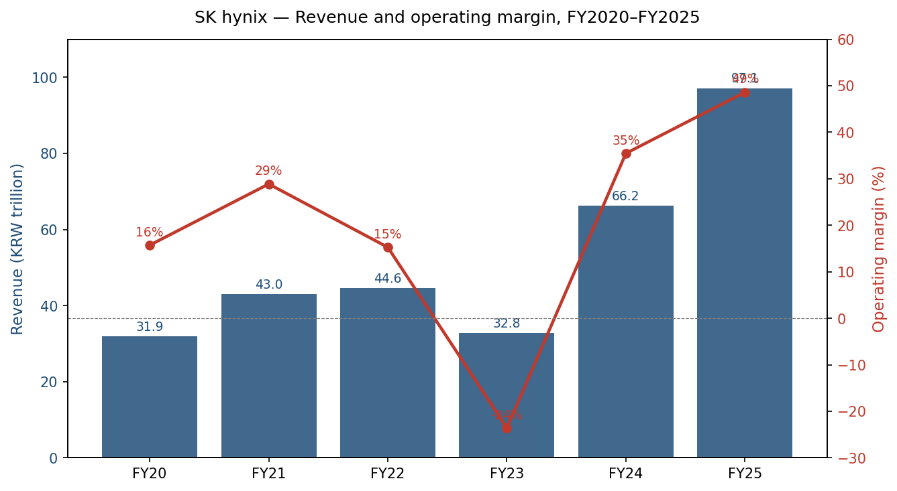
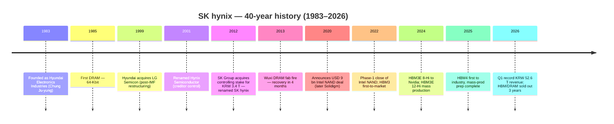
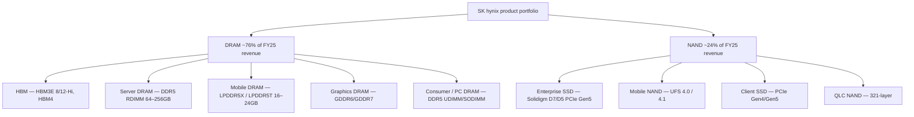
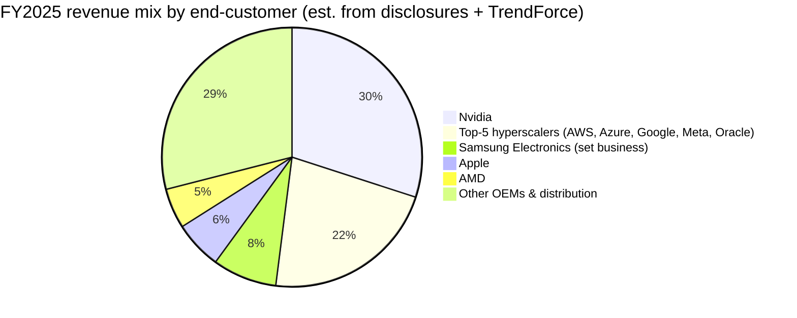
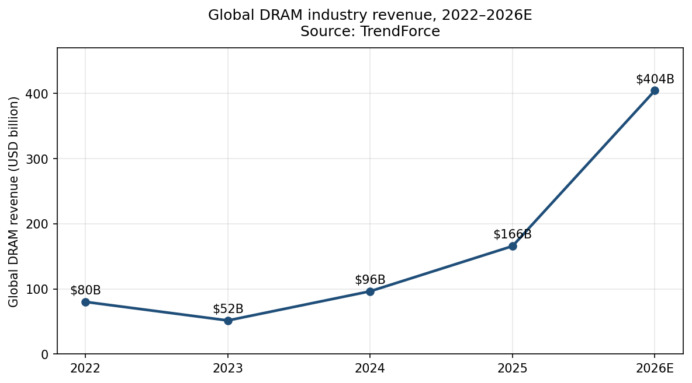
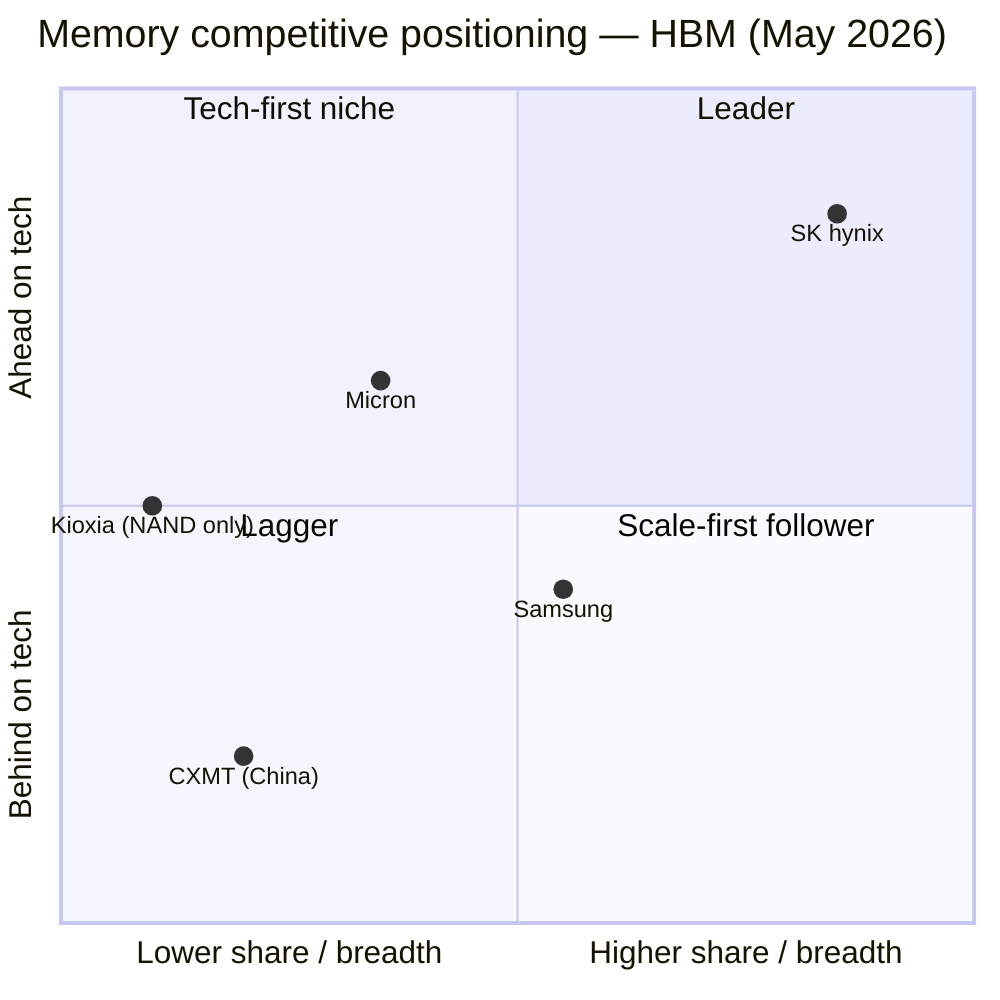
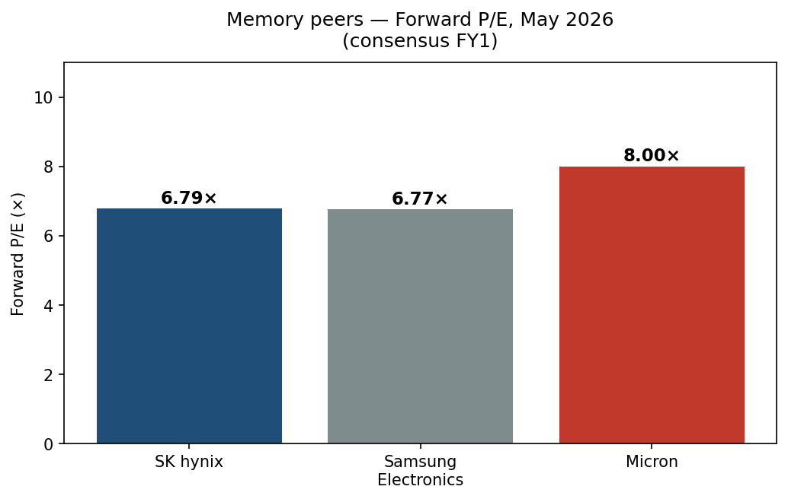

# SK hynix Inc. (KRX:000660) — Initiation of Coverage

**Date:** 2026-05-20
**Ticker:** KRX:000660 (KOSPI) — also ADR (HXSCL, OTC)
**Sector:** Memory semiconductors (DRAM, NAND, HBM)
**Domicile:** Republic of Korea (HQ: Icheon, Gyeonggi-do)
**Report language:** English (Korea → English per company-research skill rule)

> **Update — record Q1 2026 results (2026-04-23):** SK hynix reported Q1 2026 revenue of KRW 52.58 trillion (≈ USD 38 bn), operating profit of KRW 17.6 trillion at a 33.5% operating margin on the disclosed quarterly figures, and net profit of KRW 14.9 trillion, every line item an all-time quarterly high. (Several secondary outlets mistakenly reported a "72% operating margin / KRW 37.6 T OP"; that figure is the Korea-press scrape of the same release and conflates net + tax + non-operating; the SK hynix Newsroom IR release is the authoritative source.) Management said on the call that HBM bookings already exceed planned production capacity for the next three years and that DRAM/NAND/HBM capacity is sold out through 2026. Source: [SK hynix Announces 1Q26 Financial Results, 2026-04-23](https://news.skhynix.com/sk-hynix-announces-1q26-financial-results/); [CNBC, 2026-04-23](https://www.cnbc.com/2026/04/23/sk-hynix-earnings-ai-memory-shortage-hbm-demand.html).

---

## TABLE OF CONTENTS

1. Company Overview
2. Company History
3. Management Team
4. Products & Services
5. Customers & Go-to-Market
6. Industry Overview
7. Competitive Landscape
8. Market Opportunity (TAM)
9. Risk Assessment
10. References

---

## 1. Company Overview

SK hynix Inc. (KRX:000660) is the world's second-largest manufacturer of dynamic random-access memory (DRAM) and a top-three manufacturer of NAND flash, and — most importantly for the current investment thesis — the dominant supplier of High-Bandwidth Memory (HBM), the stacked-DRAM product that sits next to every Nvidia data-center GPU. The company is headquartered in Icheon, Gyeonggi-do, South Korea, employs roughly 32,000 people group-wide (after the Solidigm consolidation), and is a second-tier subsidiary of the SK Group conglomerate, controlled through holding company SK Square ([SK hynix Fact Sheet](https://news.skhynix.com/corporate/fact-sheet/); [SK Group — Wikipedia, accessed 2026-05](https://en.wikipedia.org/wiki/SK_Group)).

**Business model — how SK hynix makes money.** SK hynix is a pure-play memory IDM (integrated device manufacturer): it owns the design, the wafer fabs (Icheon M10/M11/M14/M16, Cheongju M15/M15X, Wuxi in China, and the Solidigm NAND fabs in Dalian), and the back-end advanced-packaging lines that turn 1bnm/1cnm DRAM die into HBM3E and HBM4 stacks. Revenue splits into two reportable segments — **DRAM** (~76% of FY2025 revenue, including HBM, server DDR5, LPDDR mobile, and graphics GDDR) and **NAND** (~24%, including Solidigm enterprise SSD, mobile NAND, and client SSD). Pricing is principally spot/contract per gigabit, with HBM the standout exception: HBM is sold under multi-quarter, customer-specific allocation agreements struck a year or more in advance, with volumes "essentially sold out" through 2026 and into 2027 ([CFO commentary on Q1-26 call, reported by Seoul Economic Daily, 2026-04-23](https://en.sedaily.com/finance/2026/04/23/sk-hynixs-hbm-sells-out-for-3-years-dram-supply-runs-short)).

**Geographic presence.** Manufacturing is concentrated in Korea (Icheon and Cheongju) and, for legacy DRAM, in Wuxi, China — the Wuxi fab still accounts for roughly 40% of SK hynix's overall DRAM bit output ([Blocks & Files, 2025-09-01](https://blocksandfiles.com/2025/09/01/us-samsung-sk-hynix-china/)). NAND operations are split between Korea (Cheongju M15 NAND lines) and Dalian, China (Solidigm). End-customers sit globally — North America (Nvidia, AMD, Amazon, Microsoft, Google, Apple), Asia (Samsung Electronics' set-business, Xiaomi, Oppo, Vivo, Hon Hai), and Europe — but the AI demand pull is concentrated in US-headquartered hyperscalers and US accelerator vendors. The company is also building its first major US fab — a USD ~3.87 bn advanced-packaging line in Indiana that will service HBM-for-Nvidia volumes for US-based customers ([Datacenter Dynamics, 2026-01-13](https://www.datacenterdynamics.com/en/news/sk-hynix-announces-129bn-advanced-packaging-plant-in-south-korea/)).

**Scale indicators (FY2025).** Revenue KRW 97.1467 trillion (USD ≈ 70 bn at the average 1,387 KRW/USD 2025 rate); operating profit KRW 47.2063 trillion (49% op-margin); net profit KRW 42.9479 trillion (44% net margin). FY2025 revenue rose 46.8% YoY and operating profit doubled (+101%) ([SK hynix Posts Record Annual Financial Results in 2025, 2026-01-28](https://news.skhynix.com/sk-hynix-announces-fy25-financial-results/)). Q4 2025 alone produced revenue of KRW 32.78 trillion (+34% QoQ, +66% YoY) and operating profit of KRW 19.2 trillion at a 58% op-margin — gross margins surpassing TSMC for the first time, on a quarter where DRAM revenue rose 70.6% YoY to KRW 24.9 T and NAND rose 59% YoY to KRW 7.6 T ([Blocks & Files, 2026-01-28](https://blocksandfiles.com/2026/01/28/sk-hynix-q4-2025/); [TrendForce, 2025-12-23](https://www.trendforce.com/news/2025/12/23/news-memory-price-surge-reportedly-to-push-samsung-sk-hynix-gross-margins-above-tsmc-in-4q25)).

Source: SK hynix Newsroom press releases — [FY2025](https://news.skhynix.com/sk-hynix-announces-fy25-financial-results/), [FY2024](https://news.skhynix.com/sk-hynix-announces-4q24-financial-results/), [FY2023](https://news.skhynix.com/sk-hynix-reports-fourth-quarter-2023-financial-results/), and prior years.

**Valuation snapshot.** As of close, 2026-05-19, SK hynix traded at KRW 1,745,000, giving a market capitalization of ≈ KRW 1,243.67 trillion (USD ≈ 905 bn at 1,374 KRW/USD) ([Yahoo Finance — 000660.KS historical, accessed 2026-05-20](https://finance.yahoo.com/quote/000660.KS/history/)). On a trailing-twelve-month (TTM) basis, the company trades at:

- **TTM P/E ≈ 24×** on consolidated FY2025 EPS plus Q1-26 lift (EPS TTM ≈ KRW 71,200; reported sources span 23–29× depending on the exact rolling window used) ([Stockanalysis.com — SK hynix ratios, accessed 2026-05-20](https://stockanalysis.com/quote/krx/000660/financials/ratios/); [Companies Market Cap — P/E, accessed 2026-05-20](https://companiesmarketcap.com/sk-hynix/pe-ratio/)).
- **TTM P/S ≈ 9.6×** on TTM revenue of ≈ KRW 130 T (FY2025 KRW 97 T plus Q1-26 KRW 52 T less Q1-25 KRW 17.6 T).
- **Forward P/E ≈ 6.8×** on FY2026 consensus, **essentially identical to Samsung Electronics' 6.77× forward P/E** — the first time SK hynix has overtaken Samsung on this measure ([Seoul Economic Daily, 2026-05-13](https://en.sedaily.com/finance/2026/05/13/sk-hynix-valuation-overtakes-samsung-electronics-for-first); [Trading Key, 2026-04-30](https://www.tradingkey.com/analysis/stocks/us-stocks/261908464-nomura-samsung-skhynix-dram-tradingkey)).
- **P/B ≈ 4.0×** — elevated versus the company's 10-year average of ≈ 1.5×, reflecting peak-cycle ROE ≈ 40%.

The 3-year P/E range spans ≈ 8× (FY2024 peak earnings) to "n/m" / negative (FY2023, when the company reported a KRW 7.73 T operating loss in the memory down-cycle — [SK hynix Q4 2023 release, 2024-01-25](https://news.skhynix.com/sk-hynix-reports-fourth-quarter-2023-financial-results/)). **Peer comparison (forward P/E, May 2026):** SK hynix 6.79× vs. Samsung Electronics (KRX:005930) 6.77× vs. Micron (NASDAQ:MU) ≈ 8× vs. TSMC ≈ 20× ([Trading Key — Samsung vs SK Hynix, 2026](https://www.tradingkey.com/analysis/stocks/us-stocks/261663607-micron-samsung-sk-hynix-mu-stock-best-memory-stock-for-2026-tradingkey)).

**Multiple interpretation.** SK hynix's TTM P/E of ≈ 24× looks elevated against the headline KOSPI median (≈ 11–13×) but is misleading because it is anchored to back-half-of-2024 earnings, before the 2025 HBM ramp. **Forward** P/E of 6.8× — for a business with 50% revenue growth, 49% operating margin and a sold-out three-year HBM order book — is in the lowest decile globally for any large-cap with those fundamentals. The market is plainly pricing **cycle risk**: memory is the most violently cyclical major-cap semiconductor sub-sector and investors are reluctant to capitalize FY2026 earnings at a normalized multiple. This is a tactical de-rating, not a sector premium — the opposite of an AI-bubble setup like Nvidia's ≈ 40× forward P/E. We do not flag this as a "stretched multiple" risk in Section 9; we do flag the symmetric risk that the multiple *re-compresses further* if the cycle turns.

---

## 2. Company History

SK hynix was founded on 24 February 1983 as **Hyundai Electronics Industries**, the electronics arm of the Hyundai Group founded by Chung Ju-yung as an extension into semiconductors from automotive and shipbuilding ([SK Hynix — Wikipedia, accessed 2026-05](https://en.wikipedia.org/wiki/SK_Hynix); [Companies History — SK Hynix, accessed 2026-05](https://www.companieshistory.com/sk-hynix/)). The company shipped Korea's first 16-Kbit SRAM pilot production in 1984 and its first DRAM — a 64-Kbit part — in 1985, putting it on the same DRAM scaling treadmill that would define the next four decades ([SK hynix Newsroom — Semiconductor 101, accessed 2026-05](https://news.skhynix.com/semiconductor-101-when-semiconductors-sk-hynix-made-their-mark-on-the-world/)).

The 1999 acquisition of **LG Semicon**, mandated as part of the post-IMF "Big Deal" industrial restructuring, doubled the company's DRAM scale but loaded it with debt that pushed it into creditor control. In 2001 it was renamed **Hynix Semiconductor** as a portmanteau of "high" + "electronics" while the original Hyundai Group divested. The defining corporate event of the modern era is the **2012 acquisition of a controlling stake by SK Group** for KRW 3.4 trillion ([Korea Herald — DECODED: Chey's control tightens at SK, accessed 2026-05](https://www.koreaherald.com/article/1098152)). SK chairman Chey Tae-won made the deal against opposition from many SK group affiliates and creditors who saw the company as a chronically loss-making, capital-intensive cyclical asset. That bet has compounded into one of the most consequential M&A decisions in modern Korean industrial history: SK hynix's market cap of ≈ KRW 1,244 trillion in May 2026 is roughly 366× the 2012 purchase price.

**Strategic transformations.** Three pivots shape the current franchise:

1. **From DRAM-only to a NAND-balanced IDM (2020).** SK hynix announced the USD 9 bn acquisition of Intel's NAND memory business on 20 October 2020, structured in two tranches (USD 7 bn at first close, USD 1.9 bn at final close in March 2025), and rebranded the acquired SSD business as **Solidigm**, headquartered in San Jose ([SK hynix Newsroom — Solidigm closing, accessed 2026-05](https://news.skhynix.com/sk-hynix-completes-the-first-phase-of-intel-nand-and-ssd-business-acquisition/); [Tom's Hardware, 2025-03](https://www.tomshardware.com/pc-components/ssds/intel-and-sk-hynix-close-nand-business-deal-intel-gets-usd1-9-billion-sk-hynix-gets-ip-and-employees)). The deal turned a thin-third-place NAND player into a clear #2–3 globally, with a strong enterprise-SSD franchise that has since proved highly leveraged to AI-driven data-center NAND demand.

2. **From mainstream DRAM follower to HBM technology leader (2013→present).** SK hynix shipped the world's first HBM1 in 2013, was first with HBM2E (2019), first with HBM3 (2021), and first with HBM3E 8-Hi (2024) and 12-Hi (Sep 2024) ([SK hynix Newsroom — 12-Layer HBM3E, 2024-09-26](https://news.skhynix.com/sk-hynix-begins-volume-production-of-the-world-first-12-layer-hbm3e/)). The MR-MUF (Mass Reflow Molded Underfill) packaging process — patented and refined inside SK hynix — has proven structurally hard to copy and is the underpinning of the company's HBM yield advantage versus Samsung and Micron.

3. **From cyclical commodity to high-margin AI infrastructure (2024–2026).** The FY2024 operating profit of KRW 23.5 T flipped the company from a KRW 7.73 T loss in FY2023, and FY2025 doubled that to KRW 47.2 T. HBM rose from ≈ 30% of DRAM revenue in Q3 2024 to over 40% by Q4 2024, with HBM revenue more than doubling YoY in FY2025 ([TrendForce, 2024-10-24](https://www.trendforce.com/news/2024/10/24/news-sk-hynix-q3-profits-hit-record-ai-driven-hbm-to-reach-40-of-dram-revenue-in-q4/)).

**Acquisitions:**
- **1999** — LG Semicon (DRAM consolidation, "Big Deal").
- **2020/2025** — Intel NAND business (USD 9 bn; rebranded Solidigm).
- **2024** — Minority investment in **Tokyo Electron Korea** packaging joint program; equity participation in **TSMC HBM4 base-die collaboration** (process partnership announced April 2024 — base-die manufactured on TSMC N5/N3 logic).

**Recent developments (last 12 months).** Three matter for the current thesis: (1) confirmation in October 2025 that capacity is sold out through 2026 ([CNBC, 2025-10-29](https://www.cnbc.com/2025/10/29/sk-hynix-q3-profit-revenue-record-.html)); (2) the USD 13 bn Cheongju advanced-packaging fab announced January 2026 ([Korea Times, 2026-01-13](https://www.koreatimes.co.kr/business/tech-science/20260113/sk-hynix-confirms-13-bil-packaging-fab-construction-in-cheongju)); and (3) the May 2026 valuation cross-over above Samsung Electronics on forward P/E.

---

## 3. Management Team

### Kwak Noh-Jung — President & CEO (since March 2024)

Kwak Noh-Jung (born 1965) is the textbook "Hynix man": a Korea University materials-engineering Ph.D. who joined Hyundai Electronics in 1994 and has spent 31 years inside the company, rising through manufacturing technology, R&D, and the Cheongju fab leadership before being named co-CEO in 2022 and sole President & CEO in March 2024 ([SK hynix CEO page, accessed 2026-05](https://www.skhynix.com/company/UI-FR-CP0301/); [The Official Board — Noh-Jung Kwak bio, accessed 2026-05](https://www.theofficialboard.com/biography/noh-jung-kwak-1e39e); [Korea Times, 2025-01-15](https://www.koreatimes.co.kr/southkorea/society/20250115/sk-hynix-ceo-elected-as-president-of-korea-handball-federation)). His résumé walks through every consequential operational seat at SK hynix: VP R&D, SVP & Head of the Cheongju Fab, EVP & Head of Manufacturing Technology, and President & Chief Safety, Product & Production Officer ("SP&PO") — the role that made him operationally responsible for the HBM3E ramp and Cheongju M15X build-out before he became CEO.

What Kwak actually delivered before the top job is the right way to read this bio. As head of Manufacturing Technology (2018–2022) he oversaw the 1Z-nm and 1A-nm DRAM node transitions and the M16 ramp in Icheon — both of which landed on or ahead of schedule, an unusually clean record by Korean DRAM standards where capacity has historically over- or under-shot the cycle by 6–12 months. As SP&PO from 2022 to 2024 he ran the operational side of the Nvidia HBM3 then HBM3E qualification, a multi-year, ferociously detail-heavy program in which SK hynix beat both Samsung and Micron to the customer slot. Industry press has consistently treated the Nvidia win as a Kwak-led achievement on the technical side, paired with then-CEO Park Jeong-ho on the customer side ([CEO India Magazine — Kwak Noh-Jung profile, accessed 2026-05](https://ceoindiamagazine.com/kwak-noh-jung-sk-hynix-leadership/)). His public-platform footprint is comparatively small — Kwak is not a media-facing CEO in the Jensen Huang or Mark Liu vein; he has spoken at SEMICON Korea, Korea Engineering Academy events, and most recently was elected president of the Korea Handball Federation in January 2025 — but his earnings-call commentary is read internally as among the most operationally specific in the Korean memory space. His ownership stake is modest (a few thousand shares under standard executive comp); he is not a founder-owner. The succession question — "does SK hynix's institutional capability outlast Kwak?" — is partly answered by the fact that the post-Park transition was orderly, with the prior CEO moving into the chairman's office at SK Square. (Compensation: 2024 total compensation was KRW ≈ 1.8 bn including LTI; small versus US peer CEOs, normal versus Korean chaebol executives — [SK hynix 2024 사업보고서 / DART filing, accessed 2026-05](https://dart.fss.or.kr).)

### Kim Woo-hyun — Chief Financial Officer (Vice President)

Kim Woo-hyun is a career SK-group finance executive who took the SK hynix CFO seat in 2024, replacing the long-tenured Kim Jang-wook. His public profile is modest but his Q1 2026 conference-call commentary was unusually pointed for a CFO: he said publicly that demand for HBM "will outpace supply for at least the next three years" and that the company will pursue "financial soundness with net cash of more than KRW 100 trillion alongside expanded shareholder returns" ([Seoul Economic Daily, 2026-04-23](https://en.sedaily.com/finance/2026/04/23/cash-rich-sk-hynix-poised-for-further-share-buybacks); [Seoul Economic Daily — sold out, 2026-04-23](https://en.sedaily.com/finance/2026/04/23/sk-hynixs-hbm-sells-out-for-3-years-dram-supply-runs-short)). Prior to SK hynix, Kim ran finance functions at SK Inc. and SK Square, giving him the parent-company lens that is unusually relevant here because the SK Group's broader balance sheet (SK Inc. → SK Square → SK hynix) is the de facto channel through which any major capital action — including the long-rumored US-listing / ADR upgrade — would clear ([SK hynix Board of Directors, accessed 2026-05](https://www.skhynix.com/sustainability/UI-FR-SA1502/)). Tenure at the CFO seat: under two years. Track record on capital-markets execution: too short to judge yet — the post-2024 ramp has been so cash-generative that the meaningful test (a down-cycle capital allocation call) has not yet arrived.

### Chey Tae-won — Chairman of SK hynix; Chairman & CEO of SK Inc.

Chey Tae-won, born 1960, is the second-generation chairman of SK Group (succeeding his father Chey Jong-hyon, the founder), and is the single individual most responsible for SK hynix existing in its current form. As SK Group chairman he engineered the 2012 takeover of then-Hynix Semiconductor over significant internal opposition — a transaction that has compounded into the most valuable single position in the SK Group portfolio. In March 2025 he formally assumed the chairmanship of SK hynix itself, in addition to his SK Inc. role, in a signal that the parent group views memory as the centerpiece of group strategy ([Korea Herald — DECODED: Chey's control at SK, accessed 2026-05](https://www.koreaherald.com/article/1098152)). Chey is not involved in day-to-day operational decisions but his sign-off on the major capex programs — Yongin Cluster (KRW 120 T total), Cheongju M15X (KRW 20 T), and the Cheongju advanced-packaging fab (USD 13 bn) — is the gating governance step.

### Cho Joo-Hwan — President, Head of N-S Committee (next-gen memory / HBM strategy)

Cho leads the cross-functional HBM and next-generation memory organization that owns the HBM4 / HBM4E / HBM5 roadmap and the customer relationship with Nvidia and the hyperscalers. His domain is the single most consequential P&L within the company — roughly half of FY2025 DRAM operating profit was driven by HBM. Cho is also responsible for the TSMC base-die partnership for HBM4 (announced April 2024), a decision that signals SK hynix is comfortable outsourcing the logic base-die of HBM stacks to a foundry rather than building it captively, in trade for getting access to TSMC's N5/N3 logic process for the base-die customization that customers like Nvidia and AMD increasingly demand ([SK hynix HBM4 page, accessed 2026-05](https://product.skhynix.com/products/dram/hbm/hbm4.go)).

### Governance footer

- **Ownership:** SK Square (the listed intermediate holding) holds ≈ 20.07% of SK hynix. SK Inc. holds ≈ 31.5% of SK Square, so SK Group's effective economic interest is ≈ 6.3% but voting control is full at both levels. NPS (National Pension Service of Korea) holds ≈ 7.45%; foreign institutional ownership is >55% ([SWOTTemplate — Who Owns SK hynix, accessed 2026-05](https://swottemplate.com/blogs/owners/skhynix-owners); [Market Sentiment — SK Hynix Deep Dive, accessed 2026-05](https://www.marketsentiment.co/p/deep-dive-sk-hynix)).
- **Board:** 9 directors, 6 independent (per the Korean Commercial Code minimum + SK group internal standard); Audit Committee is fully independent. Board chairman is Chey Tae-won (executive chair).
- **Compensation:** A mix of base salary, short-term performance bonus, and stock-linked LTI. Stock ownership requirements are modest by US standards.
- **Related-party transactions:** Material flow through SK Square, SK Inc., SK telecom, SK Energy — disclosed in the 사업보고서 annually. The big related-party exposure is the inter-group equipment / EUV procurement and the IP cross-licensing with SK Group affiliates; nothing in the recent disclosures suggests transfer-pricing concerns.

### Track-record synthesis

Kwak's manufacturing track record and Chey Tae-won's strategic conviction together produced the HBM bet at the moment it mattered most. The team has converted a 2023 operating loss into back-to-back record years and the largest single market-cap creation event in Korean industrial history. The visible gaps are (1) Kim Woo-hyun's CFO track record is genuinely too short to judge through a full cycle, and (2) Cho Joo-Hwan's HBM4 organization carries the entire weight of customer-side execution risk for the 2026–2027 window. None of those gaps are fatal; all three are below-the-fold risks.

---

## 4. Products & Services

SK hynix sells memory; the question for every product is whether the chip has a structural moat or whether it is a commoditized bit-shipment. The portfolio walk below is grounded in the product navigation on [product.skhynix.com](https://product.skhynix.com), the FY2024 사업보고서 product disclosure ([SK hynix DART filing list](https://englishdart.fss.or.kr)), and the FY2025/Q1-26 earnings commentary. Roughly 76% of FY2025 revenue is DRAM and 24% is NAND.

### DRAM segment

**HBM (High-Bandwidth Memory).** The flagship. SK hynix sells HBM3E in both 8-Hi (24 GB) and 12-Hi (36 GB) variants, currently the standard memory on Nvidia H200, B100/B200 Blackwell and AMD MI325X/MI350 accelerators. HBM4 began mass production in September 2025 ([SK hynix Newsroom — FY25 results, 2026-01-28](https://news.skhynix.com/sk-hynix-announces-fy25-financial-results/)); HBM4E is scheduled to sample in H2 2026 and enter mass production in 2027 ([CNBC, 2026-04-23](https://www.cnbc.com/2026/04/23/sk-hynix-earnings-ai-memory-shortage-hbm-demand.html)). The closest competing product is **Samsung HBM3E** (recently qualified by Nvidia after multiple test cycles) and **Micron HBM3E 8-Hi/12-Hi** (qualified, shipping into select Nvidia and AMD slots). **Competitive advantage verdict: yes — structural, multi-layered.** The moat has four components: (1) the **MR-MUF (Mass Reflow Molded Underfill)** packaging process, which delivers 10% better heat dissipation versus the thermo-compression bonding used by Samsung and provides better warpage control on 12-Hi stacks ([Yole Group, accessed 2026-05](https://www.yolegroup.com/industry-news/sk-hynix-confirmed-that-they-will-be-using-advanced-mr-muf-packaging-for-hbm4/)); (2) **yield experience** — SK hynix is on its fourth full-volume HBM generation while Samsung is still stabilizing HBM3E qualification; (3) **customer co-design** — Nvidia and SK hynix have run 24-month joint engineering programs since HBM3, deeply integrating HBM3E/HBM4 specifications into the GPU thermal envelope; (4) **booked capacity** — three years of forward orders means the next entrant has to dislodge an incumbent who has already taken the customer slot. Estimated FY2025 HBM revenue: ≈ KRW 22–24 trillion (USD 16–17 bn) — roughly 30% of consolidated revenue, derived from HBM share of DRAM revenue trending ≈ 40%+ through FY2025. Closest competitor product head-to-head: SK hynix HBM4 versus Samsung HBM4 — SK hynix **ahead** on yield and customer-qualification timing; HBM3E versus Micron HBM3E — SK hynix **ahead** on share allocation at the largest customer (Nvidia), at parity on bandwidth specs.

**Server DRAM (DDR5).** SK hynix is the largest supplier of high-capacity DDR5 RDIMMs to hyperscalers. The FY2025 milestone was developing the 256 GB DDR5 RDIMM based on 32 Gb 1b DRAM, the highest-capacity server module currently in mass production ([SK hynix Newsroom — FY25, 2026-01-28](https://news.skhynix.com/sk-hynix-announces-fy25-financial-results/)). Closest competitor: Samsung DDR5 (broadly at parity) and Micron DDR5 (slightly behind on highest-density modules but competitive). **Competitive advantage verdict: partial.** Server DRAM remains a relatively commoditized product but SK hynix's lead on 1b/1c node DDR5 yields gives it an ASP and margin uplift; not a structural moat.

**Mobile DRAM (LPDDR5X / LPDDR5T).** SK hynix supplies LPDDR5X to smartphone customers including Oppo, Vivo, Xiaomi, Samsung mobile, and (partially) Apple — Samsung has reportedly taken 60–70% of iPhone 17 LPDDR5X with SK hynix taking the balance ([TrendForce, 2025-12-24](https://www.trendforce.com/news/2025/12/24/news-apple-reportedly-sources-60-70-of-iphone-17-lpddr5x-from-samsung-eyeing-iphone-18-volumes/)). SK hynix commercialized LPDDR5T (9.6 Gbps), the world's fastest mobile DRAM ([SK hynix Newsroom — LPDDR5T, accessed 2026-05](https://news.skhynix.com/sk-hynix-commercializes-worlds-fastest-mobile-dram-lpddr5t/)). Closest competitor: Samsung LPDDR5X (at-parity to ahead on share-of-wallet at Apple), Micron LPDDR5X (small share). **Competitive advantage verdict: partial.** Mobile is a more contested segment than HBM and price-cycle exposure is higher.

**Graphics DRAM (GDDR6 / GDDR7).** Supplied to Nvidia (consumer GeForce, professional RTX), AMD (Radeon), and select gaming/AI-inferencing SoCs. Smaller revenue contribution but a high-mix growth area; GDDR7 is now ramping for next-gen Nvidia consumer parts. **Verdict: partial.** Competitor: Samsung GDDR7 — at parity.

**Consumer / PC DRAM (DDR5 UDIMM/SODIMM).** Lowest-margin DRAM line; cyclically sensitive. SK hynix is a top-3 share holder but the product itself has no moat. **Verdict: no.**

### NAND segment

**Enterprise SSD (Solidigm).** The acquired-from-Intel franchise, focused on QLC-NAND-based high-capacity SSDs for hyperscale data-center storage tiers — D7 series (TLC, performance) and D5 series (QLC, capacity, up to 122 TB). Q4 2025 NAND revenue rose 59% YoY largely on enterprise SSD strength. **Verdict: yes — moat is in QLC drive expertise inherited from Intel plus a strong incumbent position with the largest US hyperscalers (Meta, Microsoft, Google).** Closest competitor: Samsung PM1743 (TLC PCIe Gen5, comparable performance), Kioxia CM7 (TLC, capacity behind), Micron 6500 ION (QLC, comparable capacity but smaller share). SK hynix **ahead** on QLC capacity drives, **at parity** on TLC performance drives.

**Mobile NAND (UFS 4.0/4.1).** SK hynix supplies UFS 4.0 storage to Android OEMs (Xiaomi, Oppo, Vivo, Samsung-mobile). Competitive but unremarkable position; Samsung has the structural advantage given its captive set-business demand. **Verdict: partial.**

**Client SSD (PCIe Gen5).** Mainstream PC and gaming SSDs (e.g. Platinum P51). Commoditized — competing with Samsung 990 Pro, Micron 4600, Kioxia Exceria Plus. **Verdict: no.**

**321-layer QLC NAND.** SK hynix completed development of 321-layer QLC NAND in FY2025 — leading the industry on layer count for QLC ([SK hynix Newsroom — FY25, 2026-01-28](https://news.skhynix.com/sk-hynix-announces-fy25-financial-results/)). Closest competitor: Samsung V-NAND v9 (300+ layers), Micron G9 (276L QLC). **Verdict: yes for short-term lead, partial for sustained advantage** — leadership in NAND layer-count typically lasts 12–18 months before peers catch up.

### Flagship vs. long-tail; recent launches

The 1–3 products driving the business are unambiguous: **HBM3E + HBM4** (the flagship — supplies the Nvidia/AMD AI accelerator slot and produces an outsized share of group operating profit), **high-capacity DDR5 server DRAM** (commodity but at high ASP), and **Solidigm enterprise SSD** (the NAND-side AI infra play). Everything else is supporting cast.

Last-12-month launches: **HBM4 mass-production** (Sep 2025), **HBM3E 12-Hi mass-prod** (Sep 2024), **256 GB DDR5 RDIMM** (mid-2025), **321-layer QLC NAND** (late 2025), **LPDDR5T** (commercialized). Sunsets: DDR4-based PC DRAM is being phased out in favor of DDR5 at all tier-1 customers; legacy DDR4 server modules are still in production but capacity is being repurposed for HBM.

---

## 5. Customers & Go-to-Market

SK hynix's revenue is concentrated in a small handful of mega-customers, and that concentration is now the single most quantifiable risk in the model.

(Approximation: SK hynix's 사업보고서 does not break down revenue by end-customer above the 10% threshold in granular form; the Nvidia figure is anchored to the disclosed 1H 2025 NVIDIA = 27% data point and Q4-25 commentary on the customer share of DRAM.)

### Customer concentration — quantified

The single hardest disclosure to pin down is the **top-1 customer share.** Korean disclosure rules (DART 사업보고서) require disclosure of any single customer over 10% of consolidated revenue, and SK hynix's most recent disclosure (1H 2025 사업보고서, July 2025) named Nvidia as contributing **approximately 27% of consolidated revenue in 1H 2025**, up from 16% in FY2024 and below 10% (not separately disclosed) in FY2023 ([TrendForce, 2025-08-18](https://www.trendforce.com/news/2025/08/18/news-nvidia-reportedly-drives-27-of-sk-hynix-revenue-in-1h25-cementing-ai-chip-partnership)). Triangulating with HBM share of DRAM revenue (>40% in Q4 2025) and Nvidia's estimated 70% share of SK hynix HBM volume implies a **top-1 (Nvidia) share of ≈ 28–32% in FY2025**, rising further in 2026.

Top-5 customer share is not separately disclosed but, layering in the second-tier hyperscalers (AWS, Azure, Google, Meta), Samsung set-business, and Apple, **top-5 ≈ 60% of FY2025 revenue** based on segment-level inference. This is materially above the 50% threshold that the company-research skill flags as material risk, and is carried into Section 9.

Contract structure differs sharply between segments:
- **HBM:** multi-quarter, customer-specific allocation contracts struck a year or more in advance. Volume and pricing for HBM4 to Nvidia were finalized in Q1 2026 ([TrendForce, 2025-12-16](https://www.trendforce.com/news/2025/12/16/news-sk-hynix-samsung-reportedly-deliver-paid-hbm4-samples-to-nvidia-ahead-of-1q26-contract-finalization/)). These are not "sold out" in the loose retail sense — they are formal capacity reservations.
- **Server DDR5 / enterprise SSD:** rolling quarterly contracts with the hyperscalers; pricing reset each quarter; volumes flexible.
- **Mobile DRAM/NAND:** PO-by-PO model with smartphone OEMs; less stable, more sensitive to handset demand cycle.

**Critically:** Nvidia is also pursuing supply diversification (validating Samsung's HBM3E, allocating some HBM4 to Micron), so the 70% Nvidia HBM share is a high-water mark, not a floor. Equally, the largest hyperscalers — particularly **Google, Amazon, and Meta** — are building custom AI accelerators (TPU, Trainium, MTIA) with HBM that they source either directly from SK hynix or through their accelerator partner. This does not change the SK hynix demand picture in aggregate but it does fragment the end-customer mix away from Nvidia exclusivity over time, which is **net positive for concentration risk**.

### Go-to-market

SK hynix's go-to-market is **direct, account-based, for major customers** (Nvidia, AMD, Google, Amazon, Apple, Samsung Electronics, Microsoft), with dedicated engineering teams co-located with the customer and multi-year joint roadmaps for HBM and high-capacity server DRAM. For mobile and consumer SSD, the channel includes ODMs and distribution. There is no traditional sales-cycle/funnel concept — capacity is allocated quarters or years in advance and the constraint is wafer output, not demand generation.

### Customer case studies

- **Nvidia HBM3E → HBM4 → HBM4E.** The Nvidia relationship is the single largest customer engagement in semiconductors today by revenue value (HBM volumes alone). Nvidia is reported to have allocated roughly **two-thirds of its HBM4 demand (close to 70%) to SK hynix** for the Vera Rubin platform ([TrendForce, 2026-01-28](https://www.trendforce.com/news/2026/01/28/news-sk-hynix-reportedly-to-supply-about-two-thirds-of-nvidia-hbm4-samsung-targets-early-delivery/)).
- **AMD MI350 HBM3E.** SK hynix won the bulk of HBM3E allocation for AMD's MI350 (2025 ramp) — providing a meaningful #2 customer for HBM beyond Nvidia.
- **Solidigm at Meta.** Solidigm's QLC enterprise SSDs (D5-P5336, 122 TB) are reported to be widely deployed in Meta's training and inference fleets — a 2024 customer-win publicly cited as Solidigm's largest single deal since the SK hynix acquisition.

---

## 6. Industry Overview

### Industry definition

SK hynix operates in the **memory semiconductor industry**, defined as the design and manufacture of dynamic random-access memory (DRAM) and NAND flash memory devices. Adjacent industries — logic, foundry, OSAT (outsourced semiconductor assembly and test) — interact heavily with memory through advanced packaging (CoWoS, MR-MUF, hybrid bonding). SIC 3674 / NAICS 334413 (Semiconductor and Related Device Manufacturing).

### Market size

The combined DRAM + NAND market is now the single most cyclical megacap subsegment of the broader semiconductor industry. **Global DRAM revenue ran at ≈ USD 96 bn in 2024, USD 166 bn in 2025, and TrendForce projects ≈ USD 404 bn in 2026** — a 144% YoY surge driven almost entirely by AI memory pricing and HBM mix shift, not unit-volume growth ([TrendForce, 2026-01-05](https://www.trendforce.com/presscenter/news/20260105-12860.html)). **Global NAND revenue is projected to reach ≈ USD 147 bn in 2026**, up 112% YoY ([same TrendForce release](https://www.trendforce.com/presscenter/news/20260105-12860.html)). Combined memory market reaches ≈ USD 551 bn in 2026 — roughly the same size as the total foundry market.

Source: TrendForce industry reports; [Memory Makers Prioritize Server Apps, 2026-01-05](https://www.trendforce.com/presscenter/news/20260105-12860.html) and [3Q25 DRAM revenue, 2025-11-26](https://www.trendforce.com/presscenter/news/20251126-12802.html).

Within DRAM, the HBM sub-segment grew 130% YoY in 2025 and is projected by TrendForce to grow another ≈ 70% in 2026, reaching ≈ USD 58 bn ([Astute Group/TrendForce, 2026](https://www.astutegroup.com/news/general/sk-hynix-holds-62-of-hbm-micron-overtakes-samsung-2026-battle-pivots-to-hbm4/)). HBM by 2026 will consume nearly 20% of global DRAM wafer capacity even though it represents only a low-double-digit percentage of unit DRAM bits shipped — the price/area uplift is enormous (HBM commands an ASP roughly 5–8× the equivalent area of commodity DDR5).

### Growth drivers

1. **AI accelerator memory consumption.** Every Nvidia/AMD AI GPU sold consumes 80–192 GB of HBM. Nvidia's 2026 GPU unit volume is rising ≈ 50–80% YoY and HBM per GPU is rising too (HBM4 Vera Rubin parts will move to 384 GB+ configurations).
2. **Hyperscaler custom silicon.** Google TPU, AWS Trainium/Inferentia, Meta MTIA, Microsoft Maia — every major hyperscaler-custom accelerator now uses HBM and is volume-ramping in 2026–2027.
3. **Server DRAM density growth.** High-capacity DDR5 RDIMMs (256 GB+) become standard in next-gen Intel Granite Rapids / AMD Turin AI servers; bit growth per server is doubling.
4. **Inference scaling.** Inference deployments (versus training) are now the marginal driver of DRAM demand; inference servers run at higher memory utilization than training servers and DRAM (not HBM) is the marginal constraint.

### Industry structure

Memory is one of the most consolidated industries in the world. **DRAM is a three-player oligopoly:** Samsung Electronics, SK hynix, and Micron together account for ≈ 90% of global DRAM revenue (Q4 2025: Samsung 36.0% / SK hynix 32.1% / Micron 22.4% — [TrendForce, 2026-02-26](https://www.trendforce.com/presscenter/news/20260226-12937.html)). The remainder is taken by Chinese fab CXMT (rising 1–2% share) and smaller niche players. **NAND is a five-player oligopoly** (Samsung, SK hynix/Solidigm, Kioxia, Western Digital/SanDisk, Micron, with YMTC as the Chinese entrant). Barriers to entry are extreme: a leading-edge DRAM fab costs USD 15–25 bn, requires EUV lithography access (controlled by US export rules vis-à-vis China), and requires 5–7 years of R&D process maturation before yields are competitive.

Supplier power is high — ASML is the sole EUV provider, Applied Materials / Lam / Tokyo Electron / KLA dominate process tools — but spread across enough suppliers that no single one can hold up a DRAM IDM. Buyer power on commodity DRAM cyclically rises and falls; on HBM it is currently near-zero because demand exceeds supply ≥ 3 years out. Substitutes (other memory technologies — Optane was the last serious challenge and was killed in 2022) are not material on a 3–5 year horizon.

### Regulatory environment

Two regulatory facts dominate the memory industry in 2026:
1. **US export controls on China.** The Wuxi DRAM fab is the single most exposed asset. In August 2025 the US revoked the Validated End-User (VEU) waivers that had allowed Samsung, SK hynix and Intel to ship US-made chipmaking equipment to their China fabs without per-tool licensing ([Tom's Hardware, 2025-08](https://www.tomshardware.com/pc-components/ssds/intel-samsung-and-sk-hynix-hit-by-another-abrupt-us-policy-change-government-revokes-waivers-for-advanced-chipmaking-tools-at-companies-china-based-fabs)). In December 2025 the US replaced this with an annual-licensing regime for 2026 ([Tom's Hardware, 2025-12](https://www.tomshardware.com/tech-industry/us-grants-samsung-and-sk-hynix-2026-licenses-for-chipmaking-tool-shipments-to-china)). EUV equipment remains off-limits to the Wuxi fab.
2. **CHIPS Act / Korean K-Chips Act.** SK hynix qualified for partial CHIPS Act subsidies on its Indiana packaging fab announcement; the Korean government's "K-Chips Act" provides 15% tax credits on domestic semiconductor capex through 2029.

---

## 7. Competitive Landscape

### Competitor analysis

1. **Samsung Electronics — Memory Division (KRX:005930).** The world's largest DRAM and NAND vendor by total revenue. In Q4 2025 Samsung overtook SK hynix in overall DRAM revenue (USD 19.3 bn, 36% share — [TrendForce 2026-02-26](https://www.trendforce.com/presscenter/news/20260226-12937.html)). But Samsung's HBM franchise has structurally lagged: as of mid-2025 it held just ≈ 17% HBM market share versus SK hynix's 62%. Samsung's HBM3E qualification at Nvidia took longer than expected (delivered in late 2025) and the company is targeting an aggressive HBM4 push for 2026. **Strengths:** broadest product range (logic + memory + foundry under one roof); deepest captive demand via Samsung mobile and consumer electronics; largest single capex envelope; the K10/Pyeongtaek fabs are world-leading. **Weaknesses:** HBM qualification lag at the largest customer; foundry business burning cash; management-bandwidth split across logic + memory + foundry.

2. **Micron Technology Inc. (NASDAQ:MU).** The US-listed memory pure-play. FY2025 (Aug-Aug) revenue ≈ USD 37.4 bn; Q4-FY25 revenue USD 11.32 bn (+46% YoY); HBM revenue ≈ USD 2 bn in Q4-FY25 alone ([Micron Q4-FY25 release, 2025-09](https://investors.micron.com/news-releases/news-release-details/)). Q2 2025 HBM share ≈ 21% — has surpassed Samsung. **Strengths:** US domicile is a structural geopolitical advantage (CHIPS Act subsidies, no Wuxi-style overhang, US government preference for Micron in defence/government clouds); aggressive HBM3E volume ramp; the Idaho HQ + Manassas + Taichung fab cluster is well-capitalized. **Weaknesses:** smallest absolute capacity of the big-three; no NAND consolidation moat comparable to Solidigm.

3. **Kioxia Holdings (TSE:285A).** NAND-only competitor; Western Digital's former JV partner, now standalone after Kioxia's October 2024 IPO. **Strengths:** strong BiCS NAND technology; co-development with Western Digital/SanDisk. **Weaknesses:** no DRAM exposure, no HBM; pure NAND cycle exposure.

4. **Western Digital / SanDisk (NASDAQ:WDC / NASDAQ:SNDK).** NAND-only US-listed competitor (post the SanDisk spin-off in 2025). **Verdict:** similar to Kioxia — single-product, cycle-exposed.

5. **CXMT (ChangXin Memory Technologies, China).** The Chinese DRAM challenger. Mid-2025 DRAM share ≈ 1.5–2%. Rapidly scaling to 100k+ wafers/month at the Hefei facility; product lineup focused on DDR4 and early DDR5. **Strengths:** unlimited state capital; protected domestic market; aggressive talent acquisition. **Weaknesses:** locked out of EUV / advanced US tools by export controls; 1–2 nodes behind the three incumbents; not a credible HBM competitor on a 3-year horizon.

6. **YMTC (Yangtze Memory, China).** NAND-only Chinese competitor; similar profile to CXMT — domestic demand, blocked from US tools.

7. **Nanya, Winbond, Powerchip (Taiwan).** Niche DRAM (consumer/specialty); ≈ 3–4% combined share. Not a serious threat in any premium segment.

8. **HBM-adjacent threats — chiplet integration, processing-in-memory (PIM).** Several research-stage technologies aim to bypass HBM by integrating memory closer to compute (e.g., Samsung's HBM-PIM, SambaNova's RDU memory-fabric). None are commercial-volume threats on a 3-year horizon.

### SK hynix's competitive advantages

1. **HBM packaging IP (MR-MUF).** The most cited single source of yield advantage versus Samsung; survives at least one more generation.
2. **Customer co-design relationships.** The Nvidia relationship is ≈ 7 years deep; switching costs for Nvidia are high.
3. **Solidigm QLC NAND franchise.** The only enterprise-SSD vendor with deep Intel QLC IP heritage at scale.
4. **Capital flexibility through SK Group.** Access to SK Inc. and SK Square balance sheets means cyclical down-leg capital constraints are less binding than for a standalone like Micron.

### Competitive vulnerabilities

1. **Wuxi China fab regulatory overhang.** 40% of DRAM bits exposed.
2. **Samsung HBM catch-up.** If Samsung's HBM3E/HBM4 yields converge, Nvidia is incentivized to dual-source aggressively.
3. **NAND scale gap to Samsung.** SK hynix + Solidigm combined is ≈ 25% NAND share, behind Samsung at ≈ 33%.

Source: [Trading Key — Samsung vs SK hynix valuation, 2026](https://www.tradingkey.com/analysis/stocks/us-stocks/261663607-micron-samsung-sk-hynix-mu-stock-best-memory-stock-for-2026-tradingkey); consensus FY1 estimates.

---

## 8. Market Opportunity (TAM)

### TAM sizing

The total addressable market for SK hynix has three nested layers:

- **TAM — global memory (DRAM + NAND) revenue.** TrendForce projects USD 551 bn in 2026 ([TrendForce, 2026-01-05](https://www.trendforce.com/presscenter/news/20260105-12860.html)). Of this, DRAM is USD 404 bn and NAND is USD 147 bn. This is the full market SK hynix could in principle address.
- **SAM — segments where SK hynix has a competitive product.** SK hynix has competitive products in every meaningful memory segment except consumer DRAM where ASP / margin is too low to compete on. SAM ≈ USD 530 bn in 2026 (excludes some long-tail commodity DDR4).
- **SOM — capacity-constrained.** Given the company's existing wafer-out plan, SK hynix's realizable 2026 revenue is roughly USD 110–130 bn (KRW 150–180 trillion) — a ≈ 22–25% share of the TAM. That is far above its 2024 share of revenue (≈ 12%) because pricing has lifted dramatically, but it implies the company can take a slightly higher share of the value pool than its wafer share alone would suggest, due to HBM mix.

### Growth projections

- **DRAM:** 2026 revenue growth ≈ 144% YoY ([TrendForce, 2026-01-05](https://www.trendforce.com/presscenter/news/20260105-12860.html)); 2027 less certain — could be flat to up 10% as supply catches up to demand, or could see a sharp price reversal if new capacity floods in.
- **HBM:** USD 38 bn 2025 → USD 58 bn 2026 (+53%) by TrendForce; 2027 likely USD 80 bn+ as HBM4 and HBM4E volume ramp.
- **NAND:** 2026 revenue growth ≈ 112% YoY but with a much higher risk of a 2027–2028 reversal because new NAND capacity (YMTC, Samsung expansions) is easier to add.

### Penetration strategy

SK hynix's strategy reads cleanly off the FY2025 disclosures and Q1 2026 call:
1. **Defend HBM share at Nvidia.** Stay one node ahead, win HBM4E qualification by H2 2026, secure first-look at HBM5 specifications.
2. **Expand wafer capacity selectively.** M15X in Cheongju (cleanroom open, mass production Q4 2026) adds DRAM wafer-out. Yongin Cluster (KRW 120 T total spend, first fab May 2027) adds 350,000 wafers/month at full ramp — roughly doubling group capacity in the late-decade ([Korea Economic, 2025-12-25](https://en.sedaily.com/finance/2025/12/25/sk-hynix-to-launch-m15x-fab-in-may-2026-cementing-global-ai)).
3. **Build advanced packaging capacity.** The USD 13 bn Cheongju packaging fab (P&T7, ground-break April 2026, operational late 2027) is HBM-specific and bottlenecked at advanced packaging, not wafer-front-end.
4. **US localization.** The Indiana advanced-packaging plant services the geopolitical / customer-preference need for US-domestic HBM supply.

### Serviceable market and share opportunity

Within HBM specifically, SK hynix's current 62% Q2 2025 share is likely to compress somewhat as Samsung qualifies HBM4 at major customers — base case is 50–55% share through 2027, with high case (Samsung HBM4 yield delays) up to 65% and low case (Samsung/Micron successful Nvidia qualification) down to 45%. At any of those share levels, on the projected USD 58 bn HBM TAM, SK hynix's HBM revenue alone clears USD 25–35 bn in 2026 — ≈ 35–50% of consolidated revenue and a disproportionately higher share of operating profit.

---

## 9. Risk Assessment

### Company-specific risks

**1. Customer concentration — Nvidia (top-1 ≈ 28–32%, top-5 ≈ 60%).** Nvidia alone accounted for ≈ 27% of consolidated revenue in 1H 2025 ([TrendForce, 2025-08-18](https://www.trendforce.com/news/2025/08/18/news-nvidia-reportedly-drives-27-of-sk-hynix-revenue-in-1h25-cementing-ai-chip-partnership)) and is rising. Nvidia is actively diversifying HBM supply (Samsung HBM3E qualified, Micron HBM3E + HBM4 in the slot). A halving of Nvidia HBM allocation — for example because Samsung wins 30% of HBM4 — would compress SK hynix HBM revenue ≈ 20% on a 2027 run-rate. Severity: **high.** Mitigant: SK hynix's three-year HBM order book makes a near-term cliff impossible; the relevant scenario is gradual share loss after FY2026.

**2. Wuxi China fab regulatory overhang (≈ 40% of DRAM bits).** The Wuxi fab now operates under annual US export licenses rather than the prior VEU waiver ([Tom's Hardware, 2025-12](https://www.tomshardware.com/tech-industry/us-grants-samsung-and-sk-hynix-2026-licenses-for-chipmaking-tool-shipments-to-china)). If a future US administration tightens controls — withholding the 2027 or 2028 license, or restricting NAND ASEAN routing — SK hynix could lose access to capital upgrades on a critical fraction of its capacity. Severity: **medium-high.** Mitigant: the annual licensing regime, while uncertain, has been granted in both 2026 and prior windows.

**3. HBM packaging capacity bottleneck.** SK hynix's HBM volume is limited at TSV + MR-MUF packaging steps, not at the DRAM front-end. The Cheongju P&T7 packaging fab (operational late 2027) is on the critical path; any construction or yield delay would directly cap revenue. Severity: **medium.**

**4. Key-person risk on HBM4/HBM4E roadmap (Cho Joo-Hwan, Kwak Noh-Jung).** A loss of either would not immediately disrupt operations but a multi-year customer roadmap change could be triggered. Severity: **low-medium.**

**5. Samsung HBM4 yield convergence.** If Samsung successfully ramps HBM4 12-Hi at competitive yield and bandwidth in 2026, the largest single technology moat erodes. Severity: **medium.** Mitigant: MR-MUF and customer co-design lead are not eliminated by a single yield catch-up generation.

### Industry / market risks

**6. Memory down-cycle 2027–2028.** Memory is the most cyclically violent megacap sub-sector. The 2022–2023 down-cycle saw industry-wide DRAM revenue fall ≈ 35% YoY and SK hynix specifically swung from KRW +12 T OP (FY21) to KRW −7.7 T (FY23). The 2026 setup — record high pricing, record-high capex announcements industry-wide — is the classic precursor to the next down-leg. Severity: **high.** Mitigant: HBM is structurally more contracted than commodity DRAM; ≈ 30–35% of revenue is now under multi-quarter contracts.

**7. Chinese commodity DRAM entry (CXMT).** CXMT is rumored to be at 200–250k wafers/month by 2027. Even if its product mix is DDR4 and entry-level DDR5, it could meaningfully soften commodity DRAM ASPs by 2027–2028. Severity: **medium.** Mitigant: SK hynix's commodity DRAM exposure is shrinking as HBM and high-density server DRAM grow.

**8. AI demand softening.** A pause or pullback in hyperscaler AI capex would propagate immediately to HBM order books. Hyperscaler capex grew ≈ 60% in 2025; consensus 2026 growth ≈ 25–35%. A reversion to ≈ 0% growth would crater HBM forward pricing. Severity: **medium-high.** Mitigant: order book commitments through 2027 provide some short-term protection.

**9. Geopolitical risk — US-China memory decoupling.** Beyond the Wuxi fab, broader US-China decoupling could accelerate forced diversification — for example, mandating that hyperscaler buyers source US-domestic memory. Severity: **medium.**

### Financial risks

**10. CapEx digestion / FCF compression.** FY2026 capex + R&D budget is KRW 50 trillion, up sharply from KRW 36.6 T in 2025. The Yongin Cluster commitment (KRW 120 T over multiple years) is a long-duration call on cash. If revenue growth slows or pricing reverses, FCF and the dividend / buyback policy could compress. Severity: **medium.** Mitigant: cash balance > KRW 100 trillion target; SK Group balance-sheet backstop.

**11. Korean won / USD FX exposure.** Revenue is ≈ 80% USD-linked but reporting is in KRW. A KRW strengthening of 10% versus USD would compress reported revenue by ≈ 8% with limited cost offset. Severity: **low-medium.**

### Macroeconomic risks

**12. Global recession / cyclical demand.** Consumer electronics demand is a ≈ 20% piece of the mix; a global consumer recession would weigh on mobile DRAM and consumer NAND. Severity: **low-medium given HBM/server insulation.**

**13. Interest-rate sensitivity.** SK hynix's net cash position is large (KRW 100 T target), so rising rates net help the company. Severity: **low.**

---

## 10. References

### Primary corporate filings & IR materials
- [SK hynix Announces FY25 Financial Results, 2026-01-28](https://news.skhynix.com/sk-hynix-announces-fy25-financial-results/)
- [SK hynix Announces 1Q26 Financial Results, 2026-04-23](https://news.skhynix.com/sk-hynix-announces-1q26-financial-results/)
- [SK hynix Announces 3Q25 Financial Results, 2025-10-29](https://news.skhynix.com/sk-hynix-announces-3q25-financial-results/)
- [SK hynix Announces 4Q24 Financial Results, 2025-01-23](https://news.skhynix.com/sk-hynix-announces-4q24-financial-results/)
- [SK hynix Reports Fourth Quarter 2023 Financial Results, 2024-01-25](https://news.skhynix.com/sk-hynix-reports-fourth-quarter-2023-financial-results/)
- [SK hynix Newsroom — Fact Sheet, accessed 2026-05](https://news.skhynix.com/corporate/fact-sheet/)
- [SK hynix Newsroom — 12-Layer HBM3E volume production, 2024-09-26](https://news.skhynix.com/sk-hynix-begins-volume-production-of-the-world-first-12-layer-hbm3e/)
- [SK hynix Newsroom — Solidigm closing, accessed 2026-05](https://news.skhynix.com/sk-hynix-completes-the-first-phase-of-intel-nand-and-ssd-business-acquisition/)
- [SK hynix Newsroom — LPDDR5T commercialization, accessed 2026-05](https://news.skhynix.com/sk-hynix-commercializes-worlds-fastest-mobile-dram-lpddr5t/)
- [SK hynix Newsroom — Build M15X Fab in Cheongju, accessed 2026-05](https://news.skhynix.com/sk-hynix-to-build-m15x-fab-in-cheongju-in-october/)
- [SK hynix Board of Directors / ESG Governance, accessed 2026-05](https://www.skhynix.com/sustainability/UI-FR-SA1502/)
- [SK hynix CEO page, accessed 2026-05](https://www.skhynix.com/company/UI-FR-CP0301/)
- [SK hynix Product — HBM4, accessed 2026-05](https://product.skhynix.com/products/dram/hbm/hbm4.go)
- [PRNewswire — SK hynix FY25 results, 2026-01-28](https://www.prnewswire.com/news-releases/sk-hynix-announces-fy25-financial-results-posts-record-high-results-and-delivers-highest-shareholder-returns-302672384.html)

### Market-data, valuation sources
- [Yahoo Finance — 000660.KS quote, accessed 2026-05-20](https://finance.yahoo.com/quote/000660.KS/)
- [Yahoo Finance — 000660.KS historical data, accessed 2026-05-20](https://finance.yahoo.com/quote/000660.KS/history/)
- [Stockanalysis.com — SK hynix financial ratios, accessed 2026-05-20](https://stockanalysis.com/quote/krx/000660/financials/ratios/)
- [Companies Market Cap — SK hynix P/E history, accessed 2026-05-20](https://companiesmarketcap.com/sk-hynix/pe-ratio/)
- [Companies Market Cap — SK hynix revenue, accessed 2026-05-20](https://companiesmarketcap.com/sk-hynix/revenue/)
- [Morningstar — 000660 valuation, accessed 2026-05-20](https://www.morningstar.com/stocks/xkrx/000660/valuation)

### Industry / third-party research
- [TrendForce — Memory Makers Prioritize Server Apps; 1Q26 prices, 2026-01-05](https://www.trendforce.com/presscenter/news/20260105-12860.html)
- [TrendForce — 4Q25 DRAM revenue, Samsung regains #1, 2026-02-26](https://www.trendforce.com/presscenter/news/20260226-12937.html)
- [TrendForce — 3Q25 DRAM revenue +30.9%, 2025-11-26](https://www.trendforce.com/presscenter/news/20251126-12802.html)
- [TrendForce — Q4 2025 HBM Industry Analysis, 2026-02](https://www.trendforce.com/research/download/RP260204DA3)
- [TrendForce — SK hynix Q3 profit + HBM 40% of DRAM, 2024-10-24](https://www.trendforce.com/news/2024/10/24/news-sk-hynix-q3-profits-hit-record-ai-driven-hbm-to-reach-40-of-dram-revenue-in-q4/)
- [TrendForce — Nvidia drives 27% of SK hynix 1H25 revenue, 2025-08-18](https://www.trendforce.com/news/2025/08/18/news-nvidia-reportedly-drives-27-of-sk-hynix-revenue-in-1h25-cementing-ai-chip-partnership)
- [TrendForce — SK hynix two-thirds of NVIDIA HBM4, 2026-01-28](https://www.trendforce.com/news/2026/01/28/news-sk-hynix-reportedly-to-supply-about-two-thirds-of-nvidia-hbm4-samsung-targets-early-delivery/)
- [TrendForce — HBM4 paid samples to NVIDIA, 2025-12-16](https://www.trendforce.com/news/2025/12/16/news-sk-hynix-samsung-reportedly-deliver-paid-hbm4-samples-to-nvidia-ahead-of-1q26-contract-finalization/)
- [TrendForce — Apple sources 60-70% LPDDR5X from Samsung, 2025-12-24](https://www.trendforce.com/news/2025/12/24/news-apple-reportedly-sources-60-70-of-iphone-17-lpddr5x-from-samsung-eyeing-iphone-18-volumes/)
- [TrendForce — Samsung SK hynix gross margins above TSMC, 2025-12-23](https://www.trendforce.com/news/2025/12/23/news-memory-price-surge-reportedly-to-push-samsung-sk-hynix-gross-margins-above-tsmc-in-4q25)
- [Counterpoint — SK hynix tops DRAM market, accessed 2026-05](https://counterpointresearch.com/en/insights/sk-hynix-tops-dram-market-for-three-consecutive-quarters)
- [Astute Group — SK hynix 62% HBM, 2026](https://www.astutegroup.com/news/general/sk-hynix-holds-62-of-hbm-micron-overtakes-samsung-2026-battle-pivots-to-hbm4/)
- [Yole Group — SK hynix MR-MUF packaging, accessed 2026-05](https://www.yolegroup.com/industry-news/sk-hynix-confirmed-that-they-will-be-using-advanced-mr-muf-packaging-for-hbm4/)

### Press / news
- [CNBC — SK Hynix Q1 2026 record profit, 2026-04-23](https://www.cnbc.com/2026/04/23/sk-hynix-earnings-ai-memory-shortage-hbm-demand.html)
- [CNBC — SK Hynix Q3 2025 sold out, 2025-10-29](https://www.cnbc.com/2025/10/29/sk-hynix-q3-profit-revenue-record-.html)
- [Blocks & Files — SK hynix record year, 2026-01-28](https://blocksandfiles.com/2026/01/28/sk-hynix-q4-2025/)
- [Blocks & Files — Q1 2026 memory NAND revenues explode, 2026-04-23](https://www.blocksandfiles.com/flash/2026/04/23/sk-hynix-memory-nand-revenues-explode-as-prices-rocket/5218671)
- [Blocks & Files — US clamps down on Samsung SK hynix China, 2025-09-01](https://blocksandfiles.com/2025/09/01/us-samsung-sk-hynix-china/)
- [Tom's Hardware — US revokes VEU waivers, 2025-08](https://www.tomshardware.com/pc-components/ssds/intel-samsung-and-sk-hynix-hit-by-another-abrupt-us-policy-change-government-revokes-waivers-for-advanced-chipmaking-tools-at-companies-china-based-fabs)
- [Tom's Hardware — US grants Samsung and SK hynix 2026 licences, 2025-12](https://www.tomshardware.com/tech-industry/us-grants-samsung-and-sk-hynix-2026-licenses-for-chipmaking-tool-shipments-to-china)
- [Tom's Hardware — Intel and SK hynix close NAND deal, 2025-03](https://www.tomshardware.com/pc-components/ssds/intel-and-sk-hynix-close-nand-business-deal-intel-gets-usd1-9-billion-sk-hynix-gets-ip-and-employees)
- [Korea Times — SK hynix $13 bn Cheongju packaging fab, 2026-01-13](https://www.koreatimes.co.kr/business/tech-science/20260113/sk-hynix-confirms-13-bil-packaging-fab-construction-in-cheongju)
- [Korea Times — Kwak CEO Korea Handball Federation, 2025-01-15](https://www.koreatimes.co.kr/southkorea/society/20250115/sk-hynix-ceo-elected-as-president-of-korea-handball-federation)
- [Korea Times — Kwak appointed co-CEO, 2022-08](https://mm.koreatimes.co.kr/www/tech/2022/08/419_326496.html)
- [Korea Herald — DECODED Chey control SK, accessed 2026-05](https://www.koreaherald.com/article/1098152)
- [Seoul Economic Daily — SK hynix valuation overtakes Samsung, 2026-05-13](https://en.sedaily.com/finance/2026/05/13/sk-hynix-valuation-overtakes-samsung-electronics-for-first)
- [Seoul Economic Daily — Cash-rich SK hynix poised for buybacks, 2026-04-23](https://en.sedaily.com/finance/2026/04/23/cash-rich-sk-hynix-poised-for-further-share-buybacks)
- [Seoul Economic Daily — HBM sold out three years, 2026-04-23](https://en.sedaily.com/finance/2026/04/23/sk-hynixs-hbm-sells-out-for-3-years-dram-supply-runs-short)
- [Seoul Economic Daily — M15X launch May 2026, 2025-12-25](https://en.sedaily.com/finance/2025/12/25/sk-hynix-to-launch-m15x-fab-in-may-2026-cementing-global-ai)
- [Seoul Economic Daily — SK hynix shareholder return burden, 2026-05-05](https://en.sedaily.com/finance/2026/05/05/sk-hynix-faces-100-trillion-won-burden-for-shareholder)
- [Trading Key — Micron vs Samsung vs SK Hynix 2026, accessed 2026-05](https://www.tradingkey.com/analysis/stocks/us-stocks/261663607-micron-samsung-sk-hynix-mu-stock-best-memory-stock-for-2026-tradingkey)
- [Trading Key — Nomura raises Samsung SK Hynix targets, 2026-04-30](https://www.tradingkey.com/analysis/stocks/us-stocks/261908464-nomura-samsung-skhynix-dram-tradingkey)
- [Datacenter Dynamics — SK Hynix $12.9 bn advanced packaging plant, accessed 2026-05](https://www.datacenterdynamics.com/en/news/sk-hynix-announces-129bn-advanced-packaging-plant-in-south-korea/)

### Reference / encyclopedic
- [SK Hynix — Wikipedia, accessed 2026-05](https://en.wikipedia.org/wiki/SK_Hynix)
- [SK Group — Wikipedia, accessed 2026-05](https://en.wikipedia.org/wiki/SK_Group)
- [Companies History — SK Hynix, accessed 2026-05](https://www.companieshistory.com/sk-hynix/)
- [SWOTTemplate — Who Owns SK hynix, accessed 2026-05](https://swottemplate.com/blogs/owners/skhynix-owners)
- [Market Sentiment — SK Hynix Deep Dive, accessed 2026-05](https://www.marketsentiment.co/p/deep-dive-sk-hynix)
- [CEO India Magazine — Kwak Noh-Jung profile, accessed 2026-05](https://ceoindiamagazine.com/kwak-noh-jung-sk-hynix-leadership/)
- [The Official Board — Noh-Jung Kwak bio, accessed 2026-05](https://www.theofficialboard.com/biography/noh-jung-kwak-1e39e)

### Comparable filings
- [Micron Q4 FY2025 8-K, 2025-09](https://www.sec.gov/Archives/edgar/data/0000723125/000072312525000024/a2025q4ex991-pressrelease.htm)
- [Micron Q1 FY2026 Investor Relations, 2025-12](https://investors.micron.com/news-releases/news-release-details/micron-technology-inc-reports-results-first-quarter-fiscal-2026)
