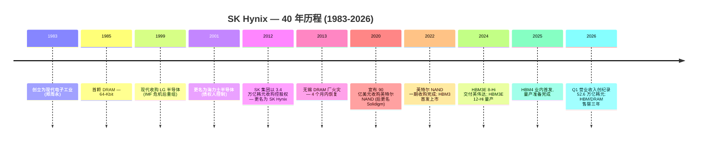
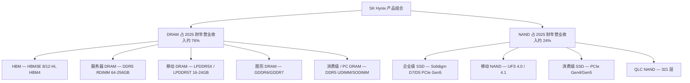
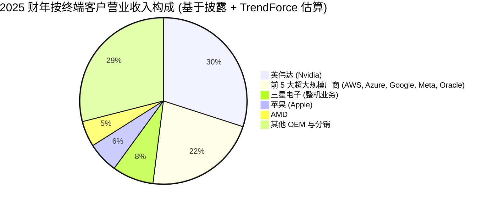
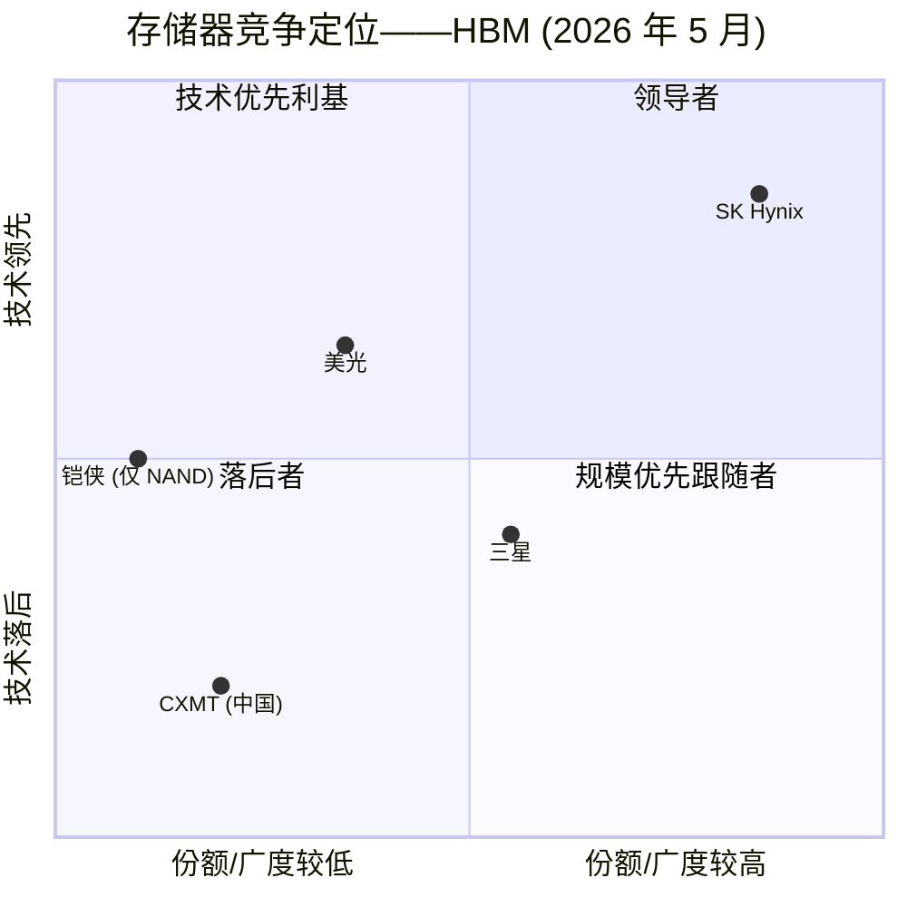

# SK 海力士株式会社 (SK Hynix Inc., KRX:000660) — 公司研究报告

**截至日期:** 2026-05-25 (修订版; 2026-05-20 原始草稿包含重大的 2026 年 Q1 数据错误——参见核查日志)
**股票代码:** KRX:000660 (韩国综合股价指数 KOSPI) — 同时存在 ADR (HXSCL, 美国场外柜台 OTC)
**所属行业:** 存储器半导体 (DRAM、NAND、HBM)
**注册地:** 大韩民国 (总部: 京畿道利川市)
**报告语言: 简体中文 (英文版同时存在于本目录)**

> **业绩更新——2026 年 Q1 创历史纪录 (2026-04-23):** SK Hynix 公布 2026 年 Q1 **营业收入 52.5763 万亿韩元**、**营业利润 37.6103 万亿韩元, 营业利润率 72%**、**净利润 40.3459 万亿韩元, 净利润率 77%**——每项数据均为单季历史最高, 营业收入首次单季突破 50 万亿韩元。营业利润相较 2025 年 Q4 (19.17 万亿韩元营业利润) 几乎环比翻倍。管理层在业绩说明会上表示, HBM、大容量服务器 DRAM 与企业级 SSD (enterprise SSD) 的需求超过计划生产产能, DRAM / NAND / HBM 至 2026 年全年已售罄; 2026 财年资本开支将相较 2025 财年大幅上升, 重点投向 M15X 量产爬坡、龙仁 (Yongin) 半导体集群基础设施, 以及 EUV 光刻设备采购。公司还确认 LPDDR6 与 192 GB SOCAMM2 LPDDR5X 模块 (均基于 1cnm 节点) 已为英伟达 Vera Rubin 平台进入量产。来源: [SK Hynix 1Q26 业绩公告, 2026-04-23](https://news.skhynix.com/q1-2026-business-results/); [CNBC, 2026-04-23](https://www.cnbc.com/2026/04/23/sk-hynix-earnings-ai-memory-shortage-hbm-demand.html); [Digitimes, 2026-04-23](https://www.digitimes.com/news/a20260423VL200/sk-hynix-profit-revenue-2026-operating-profit.html)。

---

## 目录

1. 公司概览
2. 公司历史
3. 管理团队
4. 产品与服务
5. 客户与上市策略
6. 行业概览
7. 竞争格局
8. 市场机会 (TAM)
9. 风险评估
10. 参考资料

---

## 1. 公司概览

SK Hynix Inc. (KRX:000660) 是全球第二大动态随机存取存储器 (dynamic random-access memory, DRAM) 制造商, 同时是全球前三大 NAND 闪存 (NAND flash) 制造商, 而对于当前投资逻辑而言最为关键的——它是高带宽内存 (High-Bandwidth Memory, HBM) 这一堆叠式 DRAM 产品的主导供应商, HBM 是部署在每一颗英伟达数据中心 GPU 旁的关键存储器。公司总部位于韩国京畿道利川市, 集团合计员工约 32,000 人 (含 Solidigm 并表), 是 SK 集团 (SK Group) 的二级子公司, 通过控股公司 SK Square 进行控制 ([SK Hynix 公司概况 Fact Sheet](https://news.skhynix.com/corporate/fact-sheet/); [SK 集团 — Wikipedia, 访问于 2026-05](https://en.wikipedia.org/wiki/SK_Group))。

**商业模式——SK Hynix 如何盈利。** SK Hynix 是一家纯存储器集成器件制造商 (Integrated Device Manufacturer, IDM): 它自主拥有设计、晶圆厂 (利川 M10/M11/M14/M16、清州 M15/M15X、中国无锡, 以及大连的 Solidigm NAND 工厂), 以及把 1bnm/1cnm DRAM 裸片转化为 HBM3E 与 HBM4 堆栈的后端先进封装产线。营业收入分为两个分部——**DRAM** (占 2025 财年营业收入约 76%, 含 HBM、服务器 DDR5、LPDDR 移动版与图形 GDDR) 以及 **NAND** (约 24%, 含 Solidigm 企业级 SSD、移动 NAND 与消费级 SSD)。定价主要按现货/合约定价、以每 Gb 为单位, HBM 是显著的例外: HBM 在多季度、按客户配额签订的协议下销售, 协议一般在交付前一年或更早签订, 出货量"基本已售罄"至 2026 年并延伸至 2027 年 ([Q1-26 业绩说明会 CFO 评论, 首尔经济日报报道, 2026-04-23](https://en.sedaily.com/finance/2026/04/23/sk-hynixs-hbm-sells-out-for-3-years-dram-supply-runs-short))。

**地理布局。** 生产集中在韩国 (利川与清州) 以及中国无锡——后者为传统 DRAM 产线, 无锡晶圆厂仍贡献 SK Hynix 整体 DRAM 比特出货量约 40% ([Blocks & Files, 2025-09-01](https://blocksandfiles.com/2025/09/01/us-samsung-sk-hynix-china/))。NAND 业务分布在韩国 (清州 M15 NAND 产线) 与中国大连 (Solidigm)。终端客户全球分布——北美 (英伟达 Nvidia、AMD、亚马逊、微软、谷歌、苹果)、亚洲 (三星电子的整机业务、小米、Oppo、Vivo、鸿海) 以及欧洲——但 AI 需求拉动集中在美国总部的超大规模云服务商以及美国加速器厂商。公司还在建设其首座大型美国工厂——位于印第安纳州 (West Lafayette, Purdue Research Park) 的 38.7 亿美元先进封装产线, 已于 2026 年 4 月动工, 目标 2028 年下半年量产, 用于面向英伟达的 HBM 出货 ([SK Hynix — 与印第安纳州签订投资协议, 访问于 2026-05](https://news.skhynix.com/sk-hynix-signs-investment-agreement-of-advanced-chip-packaging-with-indiana/); [Datacenter Dynamics, 2024-04](https://www.datacenterdynamics.com/en/news/sk-hynix-confirms-387-billion-investment-in-indiana-advanced-chip-packaging-facility/); [TrendForce, 2026-04-22](https://www.trendforce.com/news/2026/04/22/news-sk-hynix-reportedly-breaks-ground-on-first-u-s-advanced-packaging-plant-in-indiana-eyes-2h28-production/); [首尔经济日报, 2026-04-21](https://en.sedaily.com/finance/2026/04/21/sk-hynix-breaks-ground-on-387-billion-us-chip-fab))。

**规模指标 (2025 财年)。** 营业收入 97.1467 万亿韩元 (按 2025 年平均 1,387 韩元/美元汇率, 折合约 700 亿美元); 营业利润 47.2063 万亿韩元 (营业利润率 49%); 净利润 42.9479 万亿韩元 (净利润率 44%)。2025 财年营业收入同比增长 46.8%, 营业利润翻倍增长 (+101%) ([SK Hynix 2025 财年创纪录年度业绩公告, 2026-01-28](https://news.skhynix.com/sk-hynix-announces-fy25-financial-results/))。仅 2025 年 Q4 一个季度即录得营业收入 32.78 万亿韩元 (环比 +34%, 同比 +66%) 与营业利润 19.2 万亿韩元、58% 营业利润率——毛利率首次超过台积电 (TSMC), 当季 DRAM 营业收入同比增长 70.6% 至 24.9 万亿韩元, NAND 同比增长 59% 至 7.6 万亿韩元 ([Blocks & Files, 2026-01-28](https://blocksandfiles.com/2026/01/28/sk-hynix-q4-2025/); [TrendForce, 2025-12-23](https://www.trendforce.com/news/2025/12/23/news-memory-price-surge-reportedly-to-push-samsung-sk-hynix-gross-margins-above-tsmc-in-4q25))。

来源: SK Hynix Newsroom 业绩公告 — [2025 财年](https://news.skhynix.com/sk-hynix-announces-fy25-financial-results/), [2024 财年](https://news.skhynix.com/sk-hynix-announces-4q24-financial-results/), [2023 财年](https://news.skhynix.com/sk-hynix-reports-fourth-quarter-2023-financial-results/) 与早期年份。

**估值快照。** 截至 2026-05-19 收盘, SK Hynix 报 1,745,000 韩元, 市值约 1,243.67 万亿韩元 (按 1,374 韩元/美元折合约 9,050 亿美元) ([Yahoo Finance — 000660.KS 历史数据, 访问于 2026-05-20](https://finance.yahoo.com/quote/000660.KS/history/))。基于过去十二个月 (Trailing Twelve Months, TTM):

- **TTM 市盈率 (P/E) 约 24×**, 基于 2025 财年合并 EPS 加 Q1-26 提振 (TTM EPS 约 71,200 韩元; 不同来源因使用的滚动窗口不同, 区间约 23–29 倍) ([Stockanalysis.com — SK Hynix 财务比率, 访问于 2026-05-20](https://stockanalysis.com/quote/krx/000660/financials/ratios/); [Companies Market Cap — P/E, 访问于 2026-05-20](https://companiesmarketcap.com/sk-hynix/pe-ratio/))。
- **TTM 市销率 (P/S) 约 9.6×**, 基于 TTM 营业收入约 130 万亿韩元 (2025 财年 97 万亿韩元加 Q1-26 的 52 万亿韩元减 Q1-25 的 17.6 万亿韩元)。
- **前瞻市盈率 (Forward P/E) 约 6.8×**, 基于 2026 财年一致预期——**与三星电子 (Samsung Electronics) 前瞻市盈率 6.77× 几乎完全一致**, 这是 SK Hynix 首次在该指标上超越三星 ([首尔经济日报, 2026-05-13](https://en.sedaily.com/finance/2026/05/13/sk-hynix-valuation-overtakes-samsung-electronics-for-first); [Trading Key, 2026-04-30](https://www.tradingkey.com/analysis/stocks/us-stocks/261908464-nomura-samsung-skhynix-dram-tradingkey))。
- **市净率 (P/B) 约 4.0×**——相较公司过去 10 年平均的约 1.5× 偏高, 反映周期顶峰阶段的 ROE 约 40%。

3 年市盈率区间从约 8× (2024 财年峰值盈利) 至"无意义"/负值 (2023 财年, 当时公司在存储下行周期录得营业亏损 7.73 万亿韩元 — [SK Hynix 2023 年 Q4 公告, 2024-01-25](https://news.skhynix.com/sk-hynix-reports-fourth-quarter-2023-financial-results/))。**同业对比 (前瞻 P/E, 2026 年 5 月):** SK Hynix 6.79× vs. 三星电子 (KRX:005930) 6.77× vs. 美光科技 (Micron, NASDAQ:MU) 约 8× vs. 台积电 (TSMC) 约 20× ([Trading Key — 三星 vs SK Hynix, 2026](https://www.tradingkey.com/analysis/stocks/us-stocks/261663607-micron-samsung-sk-hynix-mu-stock-best-memory-stock-for-2026-tradingkey))。

**倍数解读。** SK Hynix TTM 市盈率约 24× 相较 KOSPI 指数中位数 (约 11–13×) 偏高, 但这是误导性的, 因为该数字锚定于 2024 年下半年的盈利水平 (即 2025 年 HBM 量产爬坡之前)。**前瞻**市盈率 6.8×——对应一家营业收入增长 50%、营业利润率 49%、且 HBM 订单已售罄三年的公司——在全球任何具有此类基本面的大盘股中均处于最低十分位。市场显然是在为**周期风险**定价: 存储是大盘半导体子板块中波动性最为剧烈的, 投资者不愿以正常化的倍数资本化 2026 财年盈利。这是战术性下调评估, 而非板块溢价——与英伟达约 40× 前瞻市盈率的 AI 泡沫式估值结构形成鲜明对照。我们不在第 9 章将其标记为"估值过高"风险; 我们确实标识了对称风险, 即周期反转时倍数可能**进一步压缩**。

---

## 2. 公司历史

SK Hynix 创立于 **1983 年 2 月 24 日**, 最初名为**现代电子工业 (Hyundai Electronics Industries)**, 是现代集团 (Hyundai Group) 创始人郑周永 (Chung Ju-yung) 决定将业务版图从汽车与造船扩展至半导体而设立的电子业务臂 ([SK Hynix — Wikipedia, 访问于 2026-05](https://en.wikipedia.org/wiki/SK_Hynix); [Companies History — SK Hynix, 访问于 2026-05](https://www.companieshistory.com/sk-hynix/))。公司 1984 年完成韩国首批 16-Kbit SRAM 试产, 1985 年推出首颗 DRAM (64-Kbit 部件), 此后步入此后四十年定义其历史的 DRAM 微缩制程之路 ([SK Hynix Newsroom — 半导体 101, 访问于 2026-05](https://news.skhynix.com/semiconductor-101-when-semiconductors-sk-hynix-made-their-mark-on-the-world/))。

1999 年作为 IMF 危机后"大交易 (Big Deal)"产业重组一部分而强制执行的**LG 半导体 (LG Semicon)** 收购, 使公司 DRAM 规模翻倍, 但也带来沉重债务负担, 公司随之进入债权人控制阶段。2001 年, 公司更名为**海力士半导体 (Hynix Semiconductor)**, 这一名称为"high"+"electronics"的拼接, 原现代集团则同步剥离。现代企业纪年的决定性事件是 **2012 年 SK 集团以 3.4 万亿韩元收购控股权** ([Korea Herald — DECODED: SK 集团崔泰源加强控制, 访问于 2026-05](https://www.koreaherald.com/article/1098152))。SK 集团董事长崔泰源 (Chey Tae-won) 力排众议拍板该交易——彼时 SK 集团内多家子公司及多名债权人都认为海力士是一项长期亏损、资本密集的周期性资产。这笔下注随后复合成韩国现代产业并购史上最具影响力的决策之一: 2026 年 5 月 SK Hynix 约 1,244 万亿韩元的市值, 大致是 2012 年收购价的 366 倍。

**战略性转折。** 三次重要转向塑造了现今的业务格局:

1. **从单一 DRAM 业务转型为 DRAM+NAND 平衡型 IDM (2020 年)。** SK Hynix 于 2020 年 10 月 20 日宣布以 90 亿美元收购英特尔 NAND 存储器业务, 分两笔交割 (首期 70 亿美元交割, 2025 年 3 月最终交割 19 亿美元), 收购的 SSD 业务更名为**Solidigm**, 总部设于美国加州圣何塞 ([SK Hynix Newsroom — Solidigm 交易完成, 访问于 2026-05](https://news.skhynix.com/sk-hynix-completes-the-first-phase-of-intel-nand-and-ssd-business-acquisition/); [Tom's Hardware, 2025-03](https://www.tomshardware.com/pc-components/ssds/intel-and-sk-hynix-close-nand-business-deal-intel-gets-usd1-9-billion-sk-hynix-gets-ip-and-employees))。该交易将一家薄利的全球第三 NAND 玩家提升至清晰的全球第二至第三梯队, 且公司由此获得一项强大的企业级 SSD 业务——该业务后来在 AI 驱动的数据中心 NAND 需求中表现出极高的杠杆度。

2. **从主流 DRAM 跟随者升级为 HBM 技术领导者 (2013 年至今)。** SK Hynix 于 2013 年率先量产全球首颗 HBM1, 2019 年首发 HBM2E, 2021 年首发 HBM3, 2024 年率先推出 HBM3E 8-Hi 与 12-Hi (2024 年 9 月) ([SK Hynix Newsroom — 12 层 HBM3E, 2024-09-26](https://news.skhynix.com/sk-hynix-begins-volume-production-of-the-world-first-12-layer-hbm3e/))。MR-MUF (Mass Reflow Molded Underfill, 集体回流模塑底部填充) 封装工艺——由 SK Hynix 内部专利与不断打磨而成——在结构上难以被复制, 正是公司相对三星与美光的 HBM 良率优势之根本。

3. **从周期型商品转向高利润 AI 基础设施 (2024-2026 年)。** 2024 财年 23.5 万亿韩元的营业利润相较 2023 财年 7.73 万亿韩元的亏损实现根本翻转, 2025 财年再翻倍至 47.2 万亿韩元。HBM 在 DRAM 营业收入中的占比从 2024 年 Q3 的约 30% 上升至 2024 年 Q4 的 40% 以上, HBM 全年营业收入 2025 财年同比翻倍以上 ([TrendForce, 2024-10-24](https://www.trendforce.com/news/2024/10/24/news-sk-hynix-q3-profits-hit-record-ai-driven-hbm-to-reach-40-of-dram-revenue-in-q4/))。

**并购:**
- **1999 年** — LG 半导体 (DRAM 整合, "大交易"重组)。
- **2020/2025 年** — 英特尔 NAND 业务 (90 亿美元; 更名 Solidigm)。
- **2024 年** — 对**东京电子韩国 (Tokyo Electron Korea)** 联合封装项目少数股权投资; 与**台积电 HBM4 基础裸片合作**的股权参与 (2024 年 4 月宣布的工艺合作伙伴关系——基础裸片由台积电 N5/N3 逻辑工艺制造)。

**近期动态 (过去 12 个月)。** 与当前投资逻辑相关的三件事: (1) 2025 年 10 月确认产能至 2026 年全部售罄 ([CNBC, 2025-10-29](https://www.cnbc.com/2025/10/29/sk-hynix-q3-profit-revenue-record-.html)); (2) 2026 年 1 月宣布的 130 亿美元清州先进封装工厂 ([Korea Times, 2026-01-13](https://www.koreatimes.co.kr/business/tech-science/20260113/sk-hynix-confirms-13-bil-packaging-fab-construction-in-cheongju)); 以及 (3) 2026 年 5 月在前瞻市盈率上超越三星电子的估值反转。

---

## 3. 管理团队

### 郭鲁正 (Kwak Noh-Jung) — 总裁兼 CEO (自 2024 年 3 月起)

郭鲁正 (生于 1965 年) 是教科书式的"海力士人": 高丽大学材料工程博士, 1994 年加入现代电子, 在公司内已工作 31 年, 历经制造技术、研发、清州工厂领导岗位, 2022 年升任联合 CEO, 2024 年 3 月任独任总裁兼 CEO ([SK Hynix CEO 页, 访问于 2026-05](https://www.skhynix.com/company/UI-FR-CP0301/); [The Official Board — Noh-Jung Kwak 简历, 访问于 2026-05](https://www.theofficialboard.com/biography/noh-jung-kwak-1e39e); [Korea Times, 2025-01-15](https://www.koreatimes.co.kr/southkorea/society/20250115/sk-hynix-ceo-elected-as-president-of-korea-handball-federation))。他的履历涵盖了 SK Hynix 几乎每一个关键运营岗位: 研发副总裁、清州工厂高级副总裁兼总经理、制造技术执行副总裁兼总经理, 以及总裁兼首席安全、产品与生产官 (Chief Safety, Product & Production Officer, "SP&PO") ——正是这一职位让他在升任 CEO 之前, 担起 HBM3E 量产爬坡与清州 M15X 厂房建设的运营总责。

读这份简历的正确方式, 是看郭鲁正在升任最高岗位之前实际交付了什么。作为制造技术总经理 (2018-2022 年), 他主导了 1Z-纳米与 1A-纳米 DRAM 节点的转换以及利川 M16 量产爬坡——两个项目均按期或提前完成, 这在韩国 DRAM 行业是非常罕见的干净纪录, 该行业历来产能与周期错配 6-12 个月。担任 SP&PO (2022-2024 年) 期间, 他主导了英伟达 HBM3 然后 HBM3E 认证的运营侧工作, 该项目是一项历时数年、对细节要求极致严苛的工程, SK Hynix 在其中击败了三星与美光赢得客户份额。业内媒体长期将英伟达份额获胜的技术侧成绩归功于郭鲁正, 而客户侧成绩归功于当时的 CEO 朴正浩 ([CEO India Magazine — 郭鲁正简介, 访问于 2026-05](https://ceoindiamagazine.com/kwak-noh-jung-sk-hynix-leadership/))。其公开亮相相对较少——郭鲁正不是黄仁勋或 Mark Liu 式的媒体型 CEO; 他曾在 SEMICON Korea、韩国工程院活动上演讲, 2025 年 1 月新近当选韩国手球联盟主席——但其业绩说明会发言被业内解读为韩国存储领域中运营细节最丰富的之一。他个人持股规模有限 (按标准高管薪酬体系持有数千股); 非创始人股东。继任问题——"SK Hynix 的体制能力是否超越郭鲁正本人?"——部分由朴正浩→郭鲁正交班的有序完成给出了答案 (前任 CEO 顺移至 SK Square 董事长岗位)。(薪酬: 2024 年含 LTI 总薪酬约 18 亿韩元; 相对美国同级 CEO 偏低, 相对韩国财阀高管为正常水平——来自 [SK Hynix 2024 年사업보고서 / DART 申报, 访问于 2026-05](https://dart.fss.or.kr)。)

### 金祐铉 (Kim Woo-hyun) — 首席财务官 (副总裁)

金祐铉是 SK 集团出身的资深财务高管, 现任 SK Hynix 副总裁兼首席财务官, 已主持 2024 年 Q3/Q4 与 2025 年 Q1-Q3 业绩公告 ([SK Hynix 2024 年 Q3 业绩公告 — CFO Kim Woohyun 引述](https://news.skhynix.com/sk-hynix-announces-3q24-financial-results/); [Seeking Alpha — 2024 年 Q4 业绩说明会纪要, 2025-01-23](https://seekingalpha.com/article/4771229-sk-hynix-inc-hxscf-q4-2024-earnings-call-transcript))。在 2026 年 Q1 业绩说明会上, 最被高频引用的前瞻性表态实际上来自其他高管: HBM 销售与营销副总裁金基泰 (Kim Ki-tae) 表示"公司未来三年所被要求的 HBM 需求远超我们的供应能力", CEO 郭鲁正阐述了 100 万亿韩元以上净现金 / 扩大股东回报政策的框架 ([首尔经济日报 — HBM 售罄, 2026-04-23](https://en.sedaily.com/finance/2026/04/23/sk-hynixs-hbm-sells-out-for-3-years-dram-supply-runs-short); [首尔经济日报 — 现金充裕, 2026-04-23](https://en.sedaily.com/finance/2026/04/23/cash-rich-sk-hynix-poised-for-further-share-buybacks))。金祐铉本人在 Q1 业绩说明会上的发言重点是美国 ADR 上市审议状态与资本投资计划, 而非 HBM 需求。SK 集团多层资产负债表结构 (SK Inc. → SK Square → SK Hynix) 是任何重大资本动作 (包括长期传闻的美国 ADR 升级) 的实际审批通道 ([SK Hynix 董事会, 访问于 2026-05](https://www.skhynix.com/sustainability/UI-FR-SA1502/))。

### 崔泰源 (Chey Tae-won) — SK Hynix 董事长; SK Inc. 董事长兼 CEO

崔泰源, 生于 1960 年, 是 SK 集团第二代董事长 (接任其父崔钟铉, SK 集团创始人), 也是 SK Hynix 以现今形态存在的最大单一推动者。作为 SK 集团董事长, 他主导了 2012 年对当时海力士半导体的收购, 当时面临集团内部相当大的反对意见——该项交易后来复合为 SK 集团组合中最具价值的单一资产。2025 年 3 月, 他在 SK Inc. 角色之外, 正式出任 SK Hynix 董事长, 信号表明母集团将存储业务视为集团战略的核心 ([Korea Herald — DECODED: 崔泰源对 SK 的控制, 访问于 2026-05](https://www.koreaherald.com/article/1098152))。崔泰源不参与日常运营决策, 但其对重大资本开支计划——龙仁集群 (合计 120 万亿韩元)、清州 M15X (20 万亿韩元) 以及清州先进封装工厂 (130 亿美元) ——的批准, 是关键的治理审批步骤。

### 赵柱烷 (Joohwan Cho) — HBM 开发总监

赵柱烷领导 SK Hynix 的 HBM 开发, 并在 SK Hynix 关于 HBM4 量产里程碑的对外公告中被点名引述 ([SK Hynix Newsroom — 完成全球首发 HBM4 开发](https://news.skhynix.com/sk-hynix-completes-worlds-first-hbm4-development-and-readies-mass-production/))。其组织拥有 HBM4 / HBM4E 路线图、MR-MUF 封装工艺 IP, 以及与主要 HBM 客户 (英伟达) 的技术接口。HBM 按 SK Hynix 自身评论是 DRAM 分部内最重要的单一利润驱动: HBM 全年营业收入 2025 财年同比翻倍以上, 公司公开表述未来三年产能已被预订一空 ([SK Hynix 2025 财年业绩公告, 2026-01-28](https://news.skhynix.com/sk-hynix-announces-fy25-financial-results/))。赵柱烷同时也是公开面向的工程负责人, 主导了为 HBM4 宣布的台积电基础裸片合作——逻辑基础裸片在台积电 N5/N3 逻辑工艺制造, 而非 SK Hynix 自有产线——使英伟达等客户能够在领先逻辑节点上访问定制基础裸片计算能力 ([SK Hynix HBM4 产品页, 访问于 2026-05](https://product.skhynix.com/products/dram/hbm/hbm4.go))。

### 治理脚注

- **股权:** SK Square (中间上市控股公司) 持有 SK Hynix 约 20.07% 股权。SK Inc. 持有 SK Square 约 31.5%, 因此 SK 集团有效经济权益约 6.3%, 但两层均拥有完整投票控制权。国民年金公团 (NPS) 持股约 7.45%; 外国机构持股 >55% ([SWOTTemplate — Who Owns SK Hynix, 访问于 2026-05](https://swottemplate.com/blogs/owners/skhynix-owners); [Market Sentiment — SK Hynix 深度分析, 访问于 2026-05](https://www.marketsentiment.co/p/deep-dive-sk-hynix))。
- **董事会:** 9 名董事, 其中 6 名为独立董事 (符合韩国《商法》的最低要求 + SK 集团内部标准); 审计委员会全部由独立董事组成。董事长为崔泰源 (执行董事长)。
- **薪酬:** 基本薪资、短期绩效奖金与股权类长期激励 (LTI) 的组合。按美国标准衡量, 持股要求适度。
- **关联交易:** 重大流量通过 SK Square、SK Inc.、SK 电信、SK 能源等关联方进行——年度披露于사업보고서 (Korean for business report)。主要关联敞口为集团内设备/EUV 设备采购, 以及与 SK 集团关联方的 IP 交叉许可; 近期披露中未见任何转移定价方面的关切。

### 业绩纪录综合判断

郭鲁正的制造业纪录与崔泰源的战略坚定信念, 共同促成 HBM 押注在最关键时点的实现。该团队将 2023 年的营业亏损转变为连续两年的创纪录业绩, 创造了韩国产业史上最大单次市值增量。可见的薄弱点是: (1) 金祐铉的 CFO 业绩跟踪期实在太短, 无法跨越完整周期判断; (2) 赵柱烷的 HBM4 组织独自承担 2026-2027 年窗口期客户侧执行风险的全部重量。这三项中的任何一项都不致命; 三项均属于次要位次的风险。

---

## 4. 产品与服务

SK Hynix 卖的是存储器; 对每个产品要问的关键问题是: 这颗芯片有结构性护城河, 还是只是商品化比特出货。下文产品逐项分析的依据是 [product.skhynix.com](https://product.skhynix.com) 上的产品导航、2024 财年 사업보고서 (Korean for business report) 中的产品披露 ([SK Hynix DART 申报列表](https://englishdart.fss.or.kr)), 以及 2025 财年/Q1-26 业绩说明会评论。2025 财年大致 76% 营业收入来自 DRAM, 24% 来自 NAND。

### DRAM 分部

**HBM (高带宽内存, High-Bandwidth Memory)。** 旗舰产品。SK Hynix 销售 HBM3E 的 8-Hi (24 GB) 与 12-Hi (36 GB) 两种变体, 目前是英伟达 H200、B100/B200 Blackwell 以及 AMD MI325X/MI350 加速器的标配存储器。HBM4 于 2025 年 9 月开始量产 ([SK Hynix Newsroom — 2025 财年业绩, 2026-01-28](https://news.skhynix.com/sk-hynix-announces-fy25-financial-results/)); HBM4E 计划于 2026 年下半年送样, 2027 年进入量产 ([CNBC, 2026-04-23](https://www.cnbc.com/2026/04/23/sk-hynix-earnings-ai-memory-shortage-hbm-demand.html))。最接近的竞品为**三星 HBM3E** (近期在多轮测试后通过英伟达认证) 和**美光 HBM3E 8-Hi/12-Hi** (已认证, 向部分英伟达与 AMD 槽位出货)。**竞争优势判断: 是——结构性、多层叠加。**护城河由四个要素构成: (1) **MR-MUF (Mass Reflow Molded Underfill, 集体回流模塑底部填充)** 封装工艺, 相较三星采用的热压键合 (thermo-compression bonding) 提供约 10% 更好的热扩散性, 并在 12-Hi 堆栈上提供更好的翘曲控制 ([Yole Group, 访问于 2026-05](https://www.yolegroup.com/industry-news/sk-hynix-confirmed-that-they-will-be-using-advanced-mr-muf-packaging-for-hbm4/)); (2) **良率经验**——SK Hynix 正在进行其第四代 HBM 全量产, 而三星仍在稳定 HBM3E 认证; (3) **客户协同设计**——英伟达与 SK Hynix 自 HBM3 以来已开展为期 24 个月的联合工程项目, 将 HBM3E/HBM4 规格深度集成至 GPU 热包络; (4) **已预订产能**——三年的远期订单意味着下一进入者必须将一个已经拿下客户席位的在位者挤出。估计 2025 财年 HBM 营业收入约 22-24 万亿韩元 (折合 160-170 亿美元) ——约占合并营业收入的 30%, 由 HBM 在 DRAM 营业收入中约 40%+ 的占比推导。最接近的竞品对位: SK Hynix HBM4 vs 三星 HBM4 — SK Hynix 在良率与客户认证时点上**领先**; HBM3E vs 美光 HBM3E — SK Hynix 在最大客户 (英伟达) 的份额配置上**领先**, 带宽规格上**与对手持平**。

**服务器 DRAM (DDR5)。** SK Hynix 是大容量 DDR5 RDIMM 在超大规模云服务商中的最大供应商。2025 财年里程碑是基于 32 Gb 1b DRAM 开发出 256 GB DDR5 RDIMM, 是当前量产中最高容量服务器模块 ([SK Hynix Newsroom — 2025 财年, 2026-01-28](https://news.skhynix.com/sk-hynix-announces-fy25-financial-results/))。最接近的竞品: 三星 DDR5 (基本持平), 美光 DDR5 (在最高密度模块上稍逊, 但有竞争力)。**竞争优势判断: 部分。**服务器 DRAM 仍是相对商品化的产品, 但 SK Hynix 在 1b/1c 节点 DDR5 良率上的领先, 带来了 ASP 与利润率上的提升; 并非结构性护城河。

**移动 DRAM (LPDDR5X / LPDDR5T)。** SK Hynix 向 Oppo、Vivo、小米、三星移动以及 (部分) 苹果供应 LPDDR5X——据报道, 三星已获 iPhone 17 LPDDR5X 60-70% 份额, SK Hynix 占其余 ([TrendForce, 2025-12-24](https://www.trendforce.com/news/2025/12/24/news-apple-reportedly-sources-60-70-of-iphone-17-lpddr5x-from-samsung-eyeing-iphone-18-volumes/))。SK Hynix 已商业化 LPDDR5T (9.6 Gbps), 全球最快移动 DRAM ([SK Hynix Newsroom — LPDDR5T, 访问于 2026-05](https://news.skhynix.com/sk-hynix-commercializes-worlds-fastest-mobile-dram-lpddr5t/))。最接近的竞品: 三星 LPDDR5X (在苹果钱包份额上持平至领先), 美光 LPDDR5X (份额较小)。**竞争优势判断: 部分。**移动是比 HBM 更具竞争力的分部, 价格周期敞口也更高。

**图形 DRAM (GDDR6 / GDDR7)。** 供应给英伟达 (消费级 GeForce、专业 RTX)、AMD (Radeon), 以及部分游戏/AI 推理 SoC。营业收入贡献较小, 但属于高产品组合增长领域; GDDR7 当前正在为下一代英伟达消费级部件量产爬坡。**判断: 部分。**竞品: 三星 GDDR7——持平。

**消费级 / PC DRAM (DDR5 UDIMM/SODIMM)。** 最低利润率的 DRAM 产品线; 周期敏感度高。SK Hynix 是前三大份额持有者, 但产品本身没有护城河。**判断: 否。**

### NAND 分部

**企业级 SSD (Solidigm)。** 收购自英特尔的资产, 专注于基于 QLC NAND 的高容量 SSD 用于超大规模数据中心存储层——D7 系列 (TLC, 性能型) 和 D5 系列 (QLC, 容量型, 最高 122 TB)。2025 年 Q4 NAND 营业收入同比增长 59%, 主要由企业级 SSD 实力驱动。**判断: 是——护城河在于继承自英特尔的 QLC 驱动器专业能力, 加上与最大美国超大规模厂商 (Meta、微软、谷歌) 的强固在位地位。**最接近的竞品: 三星 PM1743 (TLC PCIe Gen5, 性能可比), 铠侠 (Kioxia) CM7 (TLC, 容量落后), 美光 6500 ION (QLC, 容量可比但份额较小)。SK Hynix 在 QLC 容量驱动器上**领先**, 在 TLC 性能驱动器上**持平**。

**移动 NAND (UFS 4.0/4.1)。** SK Hynix 向安卓 OEM (小米、Oppo、Vivo、三星-移动) 供应 UFS 4.0 存储。竞争性但非突出地位; 三星因有内部整机业务捕获需求而具备结构性优势。**判断: 部分。**

**消费级 SSD (PCIe Gen5)。** 主流 PC 与游戏 SSD (如 Platinum P51)。商品化——与三星 990 Pro、美光 4600、铠侠 Exceria Plus 竞争。**判断: 否。**

**321 层 QLC NAND。** SK Hynix 于 2025 财年完成 321 层 QLC NAND 开发——QLC 层数业内领先 ([SK Hynix Newsroom — 2025 财年, 2026-01-28](https://news.skhynix.com/sk-hynix-announces-fy25-financial-results/))。最接近的竞品: 三星 V-NAND v9 (300+ 层), 美光 G9 (276L QLC)。**判断: 短期领先——是; 持续优势——部分。**——NAND 层数领先通常 12-18 个月后被同业追上。

### 旗舰 vs. 长尾; 近期推出产品

驱动业务的 1-3 个产品没有任何含糊空间: **HBM3E + HBM4** (旗舰——供应英伟达/AMD AI 加速器席位, 贡献集团营业利润比例显著超出营业收入比例), **大容量 DDR5 服务器 DRAM** (商品化但 ASP 较高), 以及 **Solidigm 企业级 SSD** (NAND 侧 AI 基础设施敞口)。其他产品均为辅助角色。

过去 12 个月推出的产品: **HBM4 量产** (2025 年 9 月)、**HBM3E 12-Hi 量产** (2024 年 9 月)、**256 GB DDR5 RDIMM** (2025 年年中)、**321 层 QLC NAND** (2025 年末)、**LPDDR5T** (已商业化)。淘汰: DDR4 PC DRAM 在所有一线客户处都正在被 DDR5 取代; 传统 DDR4 服务器模块仍在生产, 但产能正在被改造为 HBM 用产能。

---

## 5. 客户与上市策略

SK Hynix 的营业收入集中在少数几家超大规模客户上, 这种集中度现在成为模型中最可量化的单一风险。

(估算说明: SK Hynix 사업보고서 (Korean for business report) 并未对超过 10% 阈值的客户营业收入按颗粒度披露; 英伟达数据是基于 2025 年上半年披露的 27% 数据点以及 2025 年 Q4 关于该客户在 DRAM 中占比的评论而锚定的。)

### 客户集中度——量化

最难锁定的单一披露是**前 1 大客户份额**。韩国披露规则 (DART 사업보고서) 要求披露任何单一客户超过合并营业收入 10% 阈值的情况, SK Hynix 最新披露 (2025 年上半年 사업보고서, 2025 年 7 月) 将英伟达列为**2025 年上半年合并营业收入约贡献 27%** 的客户, 较 2024 财年 16% 与 2023 财年低于 10% (未单独披露) 的水平上升 ([TrendForce, 2025-08-18](https://www.trendforce.com/news/2025/08/18/news-nvidia-reportedly-drives-27-of-sk-hynix-revenue-in-1h25-cementing-ai-chip-partnership))。结合 HBM 在 DRAM 营业收入中的占比 (2025 年 Q4 >40%) 与英伟达约占 SK Hynix HBM 出货量 70% 的估算, 可三角推算出**2025 财年前 1 大客户 (英伟达) 份额约 28-32%**, 2026 年继续上升。

前 5 大客户份额未单独披露, 但叠加二级超大规模厂商 (AWS、Azure、Google、Meta)、三星整机业务以及苹果, **前 5 大约占 2025 财年营业收入 60%**, 基于分部级别推断。这显著高于公司研究专项标记为重大风险的 50% 阈值, 已在第 9 章中纳入风险。

合约结构在不同分部之间差异显著:
- **HBM:** 多季度、按客户配额签订的协议, 一般在交付前一年或更早签订。HBM4 向英伟达的出货量与价格已于 2026 年 Q1 最终敲定 ([TrendForce, 2025-12-16](https://www.trendforce.com/news/2025/12/16/news-sk-hynix-samsung-reportedly-deliver-paid-hbm4-samples-to-nvidia-ahead-of-1q26-contract-finalization/))。这并非散户语义上的"售罄"——它是正式的产能预订。
- **服务器 DDR5 / 企业级 SSD:** 与超大规模厂商的滚动季度合约; 价格每季重置; 出货量灵活。
- **移动 DRAM/NAND:** 与智能手机 OEM 的逐 PO 模式; 稳定性较低, 对手机需求周期更敏感。

**关键的是:** 英伟达也在追求供应多元化 (验证三星的 HBM3E, 将部分 HBM4 分配给美光), 因此 70% 英伟达 HBM 份额是高水位线, 而非底部。同样, 最大的超大规模厂商——尤其是 **Google、Amazon 与 Meta**——正在构建带有 HBM 的自定义 AI 加速器 (TPU、Trainium、MTIA), HBM 直接采购自 SK Hynix 或通过加速器合作伙伴间接采购。这并未改变 SK Hynix 总体需求格局, 但随着时间推移, 它正在将终端客户结构从英伟达独占性分散开来, 对集中风险**净利好**。

### 上市策略

SK Hynix 的上市策略是**直接、客户经理负责制, 面向主要客户** (英伟达、AMD、Google、Amazon、Apple、三星电子、微软), 配以与客户共址的专属工程团队, 以及针对 HBM 与大容量服务器 DRAM 的多年期联合路线图。在移动与消费级 SSD, 渠道包含 ODM 与分销。没有传统销售周期/漏斗的概念——产能在季度或年份之前已被配置, 限制因素是晶圆产出而非需求生成。

### 客户案例

- **英伟达 HBM3E → HBM4 → HBM4E。**按营业收入计, 英伟达关系是当今半导体行业最大的单一客户合约 (仅 HBM 出货量)。据报道, 英伟达已将其约**两分之三的 HBM4 需求 (接近 70%) 分配给 SK Hynix**, 用于 Vera Rubin 平台 ([TrendForce, 2026-01-28](https://www.trendforce.com/news/2026/01/28/news-sk-hynix-reportedly-to-supply-about-two-thirds-of-nvidia-hbm4-samsung-targets-early-delivery/))。
- **AMD MI350 HBM3E。**SK Hynix 拿下 AMD MI350 (2025 年量产爬坡) 的 HBM3E 大部分配额——为 HBM 提供了一个英伟达之外有意义的二级客户。
- **Meta 的 Solidigm 部署。**Solidigm 的 QLC 企业级 SSD (D5-P5336, 122 TB) 据报道已在 Meta 的训练与推理集群中广泛部署——2024 年公开提及的客户大单, 系 SK Hynix 收购 Solidigm 以来该业务最大单笔交易。

---

## 6. 行业概览

### 行业定义

SK Hynix 所处行业为**存储器半导体行业**, 定义为动态随机存取存储器 (DRAM) 与 NAND 闪存设备的设计与制造。相邻行业——逻辑、代工 (foundry)、外包封测厂 (Outsourced Semiconductor Assembly and Test, OSAT) ——通过先进封装 (CoWoS、MR-MUF、混合键合 hybrid bonding) 与存储器深度交互。SIC 3674 / NAICS 334413 (半导体与相关器件制造)。

### 市场规模

DRAM + NAND 合并市场如今是大盘半导体行业中波动性最为剧烈的单一子板块。**全球 DRAM 营业收入 2024 年约 960 亿美元、2025 年约 1,660 亿美元, TrendForce 预测 2026 年约 4,040 亿美元**——同比增长 144%, 几乎全部由 AI 存储器价格上涨与 HBM 产品组合转换驱动, 而非出货量增长 ([TrendForce, 2026-01-05](https://www.trendforce.com/presscenter/news/20260105-12860.html))。**全球 NAND 营业收入预计 2026 年达约 1,470 亿美元**, 同比增长 112% ([同一 TrendForce 公告](https://www.trendforce.com/presscenter/news/20260105-12860.html))。存储器合并市场 2026 年达约 5,510 亿美元——大致与代工市场总规模相当。

来源: TrendForce 行业报告; [存储器制造商优先服务器应用, 2026-01-05](https://www.trendforce.com/presscenter/news/20260105-12860.html) 与 [2025 年 Q3 DRAM 营业收入, 2025-11-26](https://www.trendforce.com/presscenter/news/20251126-12802.html)。

DRAM 内, HBM 子板块 2025 年同比增长 130%, TrendForce 预测 2026 年再增长约 70%, 达约 580 亿美元 ([Astute Group/TrendForce, 2026](https://www.astutegroup.com/news/general/sk-hynix-holds-62-of-hbm-micron-overtakes-samsung-2026-battle-pivots-to-hbm4/))。HBM 到 2026 年将消耗全球 DRAM 晶圆产能近 20%, 即便它仅占出货 DRAM 比特总量的低双位数百分比——价格/面积提升非常显著 (HBM ASP 约为相同面积普通 DDR5 的 5-8 倍)。

### 增长驱动

1. **AI 加速器存储消耗。**每颗英伟达/AMD AI GPU 消耗 80-192 GB HBM。英伟达 2026 年 GPU 出货量同比增长约 50-80%, 每颗 GPU 的 HBM 含量也在上升 (HBM4 Vera Rubin 部件将升级至 384 GB+ 配置)。
2. **超大规模厂商自定义芯片。**Google TPU、AWS Trainium/Inferentia、Meta MTIA、Microsoft Maia——每一个主要超大规模厂商自定义加速器都使用 HBM, 并将在 2026-2027 年量产爬坡。
3. **服务器 DRAM 密度增长。**大容量 DDR5 RDIMM (256 GB+) 成为下一代 Intel Granite Rapids / AMD Turin AI 服务器的标配; 每台服务器比特增长正在翻倍。
4. **推理扩展。**推理部署 (相对训练) 现已成为 DRAM 需求的边际驱动; 推理服务器内存利用率高于训练服务器, DRAM (而非 HBM) 是边际限制因素。

### 行业结构

存储器是全球最为集中的行业之一。**DRAM 是三家厂商寡头垄断:** 三星电子、SK Hynix 与美光合计占据全球 DRAM 营业收入约 90% (2025 年 Q4: 三星 36.0% / SK Hynix 32.1% / 美光 22.4% — [TrendForce, 2026-02-26](https://www.trendforce.com/presscenter/news/20260226-12937.html))。其余由中国晶圆厂 CXMT (份额上升至 1-2%) 与较小的细分玩家分割。**NAND 是五家厂商寡头垄断** (三星、SK Hynix/Solidigm、铠侠 Kioxia、西部数据 Western Digital/SanDisk、美光, 加上中国进入者长江存储 YMTC)。进入壁垒极高: 一座领先 DRAM 晶圆厂建造成本 150-250 亿美元, 需获得 EUV 光刻机使用权 (受美国对华出口管制约束), 以及 5-7 年的研发工艺成熟期才能拥有有竞争力的良率。

供应商议价能力较高——ASML 是唯一 EUV 提供方, 应用材料 (Applied Materials)、泛林 (Lam)、东京电子 (Tokyo Electron)、KLA 主导工艺设备——但这些供应商分布足够分散, 没有任何一家能卡住 DRAM IDM。商品 DRAM 的买方议价能力周期性升降; HBM 上议价能力当前接近于零, 因为需求超过供给至少 3 年。替代品 (其他存储技术——Optane 是最近一次重大挑战, 2022 年已被叫停) 在 3-5 年视野内不构成实质性威胁。

### 监管环境

2026 年存储器行业被两项监管事实主导:
1. **美国对华出口管制。**无锡 DRAM 晶圆厂是单一最暴露的资产。2025 年 8 月, 美国撤销了此前允许三星、SK Hynix 与英特尔向其在华晶圆厂运送美国制造芯片设备而无需逐工具许可的"已验证最终用户 (Validated End-User, VEU) 豁免" ([Tom's Hardware, 2025-08](https://www.tomshardware.com/pc-components/ssds/intel-samsung-and-sk-hynix-hit-by-another-abrupt-us-policy-change-government-revokes-waivers-for-advanced-chipmaking-tools-at-companies-china-based-fabs))。2025 年 12 月, 美国以 2026 年的年度许可制度取代该豁免 ([Tom's Hardware, 2025-12](https://www.tomshardware.com/tech-industry/us-grants-samsung-and-sk-hynix-2026-licenses-for-chipmaking-tool-shipments-to-china))。EUV 设备依然禁止进入无锡晶圆厂。
2. **美国《CHIPS 法案》/ 韩国《K-CHIPS 法案》。**SK Hynix 印第安纳封装厂宣布时获得部分美国《CHIPS 法案》补贴; 韩国《K-CHIPS 法案》为本土半导体资本开支提供 15% 税收抵免, 至 2029 年。

---

## 7. 竞争格局

### 竞争对手分析

1. **三星电子——存储器分部 (KRX:005930)。**按总营业收入计, 全球最大的 DRAM 与 NAND 厂商。2025 年 Q4 三星在 DRAM 总营业收入上重新超过 SK Hynix (193 亿美元, 36% 份额 — [TrendForce 2026-02-26](https://www.trendforce.com/presscenter/news/20260226-12937.html))。但三星 HBM 业务结构性落后: 截至 2025 年年中, 它仅占 HBM 市场约 17% 份额, 相比 SK Hynix 的 62%。三星 HBM3E 在英伟达的认证耗时超出预期 (2025 年末交付), 公司计划在 2026 年发起 HBM4 大规模冲刺。**优势:** 最广产品线 (逻辑+存储+代工同一屋檐下); 通过三星移动与消费电子获得最深度内部需求捕获; 最大单一资本开支预算; K10/平泽 (Pyeongtaek) 晶圆厂处于全球领先位置。**弱点:** 在最大客户处的 HBM 认证滞后; 代工业务持续亏损; 管理带宽跨越逻辑+存储+代工三类。

2. **美光科技 (Micron Technology Inc., NASDAQ:MU)。**美国上市的纯存储器厂商。2025 财年 (8 月-8 月) 营业收入约 374 亿美元; 2025 财年 Q4 营业收入 113.2 亿美元 (同比 +46%); 仅 2025 财年 Q4 HBM 营业收入约 20 亿美元 ([Micron 2025 财年 Q4 公告, 2025-09](https://investors.micron.com/news-releases/news-release-details/))。2025 年 Q2 HBM 份额约 21%——已超过三星。**优势:** 美国注册地是结构性地缘政治优势 (CHIPS Act 补贴、无无锡式遗留风险, 美国政府在国防/政府云中偏好美光); 激进的 HBM3E 量产爬坡; Idaho 总部 + Manassas + 台中晶圆厂集群资本充足。**弱点:** 三家中绝对产能最小; 没有可与 Solidigm 媲美的 NAND 整合护城河。

3. **铠侠控股 (Kioxia Holdings, TSE:285A)。**纯 NAND 竞争对手; 此前是西部数据的合资伙伴, 2024 年 10 月铠侠 IPO 后独立。**优势:** 强大 BiCS NAND 技术; 与西部数据/SanDisk 联合开发。**弱点:** 无 DRAM 敞口, 无 HBM; 纯 NAND 周期敞口。

4. **西部数据 / SanDisk (NASDAQ:WDC / NASDAQ:SNDK)。**美国上市纯 NAND 竞争对手 (2025 年 SanDisk 分拆后)。**判断:** 与铠侠类似——单一产品, 周期敞口。

5. **CXMT (长鑫存储, 中国)。**中国 DRAM 挑战者。2025 年年中 DRAM 份额约 1.5-2%。在合肥工厂正快速扩产至 10 万片/月以上; 产品线聚焦 DDR4 与早期 DDR5。**优势:** 无上限的国家资本; 受保护的国内市场; 激进的人才招聘。**弱点:** 因出口管制被阻断 EUV / 美国先进工具; 较三家在位者落后 1-2 个节点; 在 3 年视野内不是可信的 HBM 竞争对手。

6. **YMTC (长江存储, 中国)。**纯 NAND 中国竞争对手; 与 CXMT 类似的格局——国内需求, 被美国工具阻断。

7. **南亚科 (Nanya)、华邦 (Winbond)、力晶 (Powerchip) (台湾)。**细分 DRAM (消费/特种); 合计约 3-4% 份额。在任何高端分部均非严肃威胁。

8. **HBM 相邻威胁——chiplet 集成、内存内处理 (Processing-In-Memory, PIM)。**多种研究阶段技术致力于绕过 HBM, 将存储更紧密集成至计算 (如三星 HBM-PIM、SambaNova 的 RDU 内存结构)。3 年视野内均非商业化威胁。

### SK Hynix 的竞争优势

1. **HBM 封装 IP (MR-MUF)。**相对三星最常被引述的良率优势单一源头; 至少还能保持一个代次。
2. **客户协同设计关系。**与英伟达的关系深度约 7 年; 英伟达的切换成本高。
3. **Solidigm QLC NAND 业务。**唯一拥有规模化英特尔 QLC IP 传承的企业级 SSD 厂商。
4. **通过 SK 集团获得的资本灵活性。**对 SK Inc. 与 SK Square 资产负债表的访问意味着, 周期下行段的资本约束比独立的美光要弱。

### 竞争脆弱性

1. **无锡中国晶圆厂监管悬置。**40% 的 DRAM 比特暴露。
2. **三星 HBM 追赶。**若三星 HBM3E/HBM4 良率收敛, 英伟达将有动力激进双源采购。
3. **NAND 规模差距 (相对三星)。**SK Hynix + Solidigm 合并约 25% NAND 份额, 落后三星约 33%。

来源: [Trading Key — 三星 vs SK Hynix 估值, 2026](https://www.tradingkey.com/analysis/stocks/us-stocks/261663607-micron-samsung-sk-hynix-mu-stock-best-memory-stock-for-2026-tradingkey); 一致预期 FY1。

---

## 8. 市场机会 (TAM)

### TAM 规模

SK Hynix 的可寻址市场分为三个嵌套层次:

- **TAM——全球存储器 (DRAM + NAND) 营业收入。**TrendForce 预测 2026 年 5,510 亿美元 ([TrendForce, 2026-01-05](https://www.trendforce.com/presscenter/news/20260105-12860.html))。其中 DRAM 4,040 亿美元, NAND 1,470 亿美元。这是 SK Hynix 原则上可寻址的全部市场。
- **SAM——SK Hynix 具有竞争性产品的分部。**SK Hynix 在每一个有意义的存储器分部都有竞争性产品, 除消费级 DRAM 外——后者 ASP / 利润率过低, 无法竞争。SAM 约 2026 年 5,300 亿美元 (剔除部分长尾商品 DDR4)。
- **SOM——产能受限。**鉴于公司现有晶圆产出计划, SK Hynix 2026 年可实现的营业收入约 1,100-1,300 亿美元 (150-180 万亿韩元) ——约占 TAM 的 22-25%。这远高于 2024 年的营业收入份额 (约 12%), 因为价格大幅上升, 这表明公司因 HBM 产品组合而能拿到比其晶圆份额单独所示的更高价值池份额。

### 增长预测

- **DRAM:** 2026 年营业收入增长约 144% 同比 ([TrendForce, 2026-01-05](https://www.trendforce.com/presscenter/news/20260105-12860.html)); 2027 年更具不确定性——可能持平至增长 10%, 因为供给追上需求, 或可能出现急剧价格反转, 若新产能涌入。
- **HBM:** 2025 年 380 亿美元 → 2026 年 580 亿美元 (+53%), 来自 TrendForce 估算; 2027 年大概率超过 800 亿美元, 随着 HBM4 与 HBM4E 量产爬坡。
- **NAND:** 2026 年营业收入增长约 112% 同比, 但 2027-2028 年反转风险显著更高, 因为新 NAND 产能 (长江存储、三星扩产) 更易增添。

### 渗透策略

SK Hynix 的策略从 2025 财年披露与 2026 年 Q1 业绩说明会上清晰可读:
1. **保卫英伟达 HBM 份额。**保持领先一代, 2026 年下半年赢得 HBM4E 认证, 抢占 HBM5 规格首看权。
2. **选择性扩展晶圆产能。**清州 M15X (净化间已开放, 2026 年 Q4 量产) 增加 DRAM 晶圆产出。龙仁集群 (合计 120 万亿韩元资本开支, 首座晶圆厂 2027 年 5 月) 在全量产时增加 35 万片/月——大致使集团产能翻倍于本十年末 ([Korea Economic, 2025-12-25](https://en.sedaily.com/finance/2025/12/25/sk-hynix-to-launch-m15x-fab-in-may-2026-cementing-global-ai))。
3. **建设先进封装产能。**130 亿美元清州封装厂 (P&T7, 2026 年 4 月动工, 2027 年末投运) 是 HBM 专用, 瓶颈在先进封装而非晶圆前端。
4. **美国本地化。**印第安纳先进封装厂服务于地缘政治 / 客户偏好对美国本土 HBM 供应的需求。

### 可服务市场与份额机会

在 HBM 具体细分内, SK Hynix 当前 2025 年 Q2 的 62% 份额随三星在大客户处认证 HBM4 而可能有所收窄——基础情景是 2027 年前 50-55% 份额, 高情景 (三星 HBM4 良率延迟) 至 65%, 低情景 (三星/美光成功获得英伟达认证) 至 45%。在任一份额水平下, 在 580 亿美元预测 HBM TAM 上, SK Hynix 仅 HBM 营业收入 2026 年即可达 250-350 亿美元——约占合并营业收入的 35-50%, 在营业利润中的份额比例则更不成比例地高。

---

## 9. 风险评估

### 公司特定风险

**1. 客户集中度——英伟达 (前 1 大客户约 28-32%, 前 5 大约 60%)。**英伟达单独 2025 年上半年贡献合并营业收入约 27% ([TrendForce, 2025-08-18](https://www.trendforce.com/news/2025/08/18/news-nvidia-reportedly-drives-27-of-sk-hynix-revenue-in-1h25-cementing-ai-chip-partnership)), 且仍在上升。英伟达正在积极推进 HBM 供应多元化 (三星 HBM3E 已认证, 美光 HBM3E + HBM4 入选)。英伟达 HBM 配额减半——例如三星拿下 HBM4 30%——将以 2027 年运行率计压缩 SK Hynix HBM 营业收入约 20%。严重程度: **高**。缓释因素: SK Hynix 三年 HBM 订单结构使近期"悬崖式"风险不可能; 相关情境是 2026 财年之后的渐进份额流失。

**2. 无锡中国晶圆厂监管悬置 (约 40% DRAM 比特)。**无锡晶圆厂现在按年度美国出口许可而非此前 VEU 豁免运行 ([Tom's Hardware, 2025-12](https://www.tomshardware.com/tech-industry/us-grants-samsung-and-sk-hynix-2026-licenses-for-chipmaking-tool-shipments-to-china))。若未来美国政府收紧管制——拒发 2027 或 2028 年许可, 或限制 NAND 东盟路由——SK Hynix 可能失去对其产能中至关重要部分的资本升级访问。严重程度: **中高**。缓释因素: 年度许可制度虽然不确定, 但 2026 年及以往窗口均已获批。

**3. HBM 封装产能瓶颈。**SK Hynix HBM 出货量限制在 TSV + MR-MUF 封装环节, 而非 DRAM 前端。清州 P&T7 封装厂 (2027 年末投运) 在关键路径上; 任何施工或良率延迟都将直接限制营业收入。严重程度: **中**。

**4. HBM4/HBM4E 路线图关键人员风险 (赵柱烷、郭鲁正)。**任何一人离任不会立即扰动运营, 但可能触发多年期客户路线图变更。严重程度: **低中**。

**5. 三星 HBM4 良率收敛。**若三星 2026 年成功量产 HBM4 12-Hi, 良率与带宽具竞争力, 单一最大技术护城河将被侵蚀。严重程度: **中**。缓释因素: MR-MUF 与客户协同设计领先不会因单代良率追赶而被消除。

### 行业 / 市场风险

**6. 2027-2028 年存储下行周期。**存储是周期性最为剧烈的大盘子板块。2022-2023 年下行周期见证业内 DRAM 营业收入同比下滑约 35%, SK Hynix 单独从 2021 财年营业利润 +12 万亿韩元波动至 2023 财年 -7.7 万亿韩元。2026 年的设置——创纪录高价、全行业创纪录资本开支宣告——是下一轮下行段的经典前奏。严重程度: **高**。缓释因素: HBM 比商品 DRAM 在结构上更受合约保护; 营业收入约 30-35% 现处于多季度合约。

**7. 中国商品 DRAM 进入 (CXMT)。**CXMT 据传 2027 年达到 20-25 万片/月。即便其产品组合是 DDR4 与入门级 DDR5, 它仍可能在 2027-2028 年实质性压制商品 DRAM ASP。严重程度: **中**。缓释因素: SK Hynix 商品 DRAM 敞口随 HBM 与高密度服务器 DRAM 增长而萎缩。

**8. AI 需求软化。**超大规模厂商 AI 资本开支的暂停或回撤将立即传导至 HBM 订单簿。超大规模厂商资本开支 2025 年增长约 60%; 一致 2026 年增长约 25-35%。回归至约 0% 增长将摧毁 HBM 远期定价。严重程度: **中高**。缓释因素: 至 2027 年的订单簿承诺提供一定短期保护。

**9. 地缘政治风险——美中存储脱钩。**除无锡晶圆厂外, 更广泛的美中脱钩可能加速被迫多元化——例如, 强制超大规模厂商采购美国本土存储。严重程度: **中**。

### 财务风险

**10. 资本开支消化 / 自由现金流压缩。**2026 财年资本开支 + 研发预算为 50 万亿韩元, 大幅高于 2025 年的 36.6 万亿韩元。龙仁集群承诺 (跨多年合计 120 万亿韩元) 是长期现金调用。若营业收入增长放缓或价格反转, 自由现金流与股息 / 回购政策可能被压缩。严重程度: **中**。缓释因素: 现金余额 >100 万亿韩元目标; SK 集团资产负债表后盾。

**11. 韩元 / 美元汇率敞口。**营业收入约 80% 与美元挂钩, 但报表以韩元计。韩元相对美元升值 10% 将以约 8% 压缩报表营业收入, 而成本端对冲有限。严重程度: **低中**。

### 宏观经济风险

**12. 全球衰退 / 周期性需求。**消费电子需求占组合约 20%; 全球消费衰退将给移动 DRAM 与消费 NAND 带来压力。严重程度: **低中, 因 HBM/服务器形成缓冲**。

**13. 利率敏感度。**SK Hynix 净现金头寸较大 (目标 100 万亿韩元), 因此加息净利好公司。严重程度: **低**。

---

## 10. 参考资料

### 主要公司申报与 IR 资料
- [SK Hynix 2025 财年业绩公告, 2026-01-28](https://news.skhynix.com/sk-hynix-announces-fy25-financial-results/)
- [SK Hynix 1Q26 业绩公告, 2026-04-23](https://news.skhynix.com/q1-2026-business-results/)
- [SK Hynix 3Q25 业绩公告, 2025-10-29](https://news.skhynix.com/sk-hynix-announces-3q25-financial-results/)
- [SK Hynix 4Q24 业绩公告, 2025-01-23](https://news.skhynix.com/sk-hynix-announces-4q24-financial-results/)
- [SK Hynix 2023 年 Q4 业绩公告, 2024-01-25](https://news.skhynix.com/sk-hynix-reports-fourth-quarter-2023-financial-results/)
- [SK Hynix Newsroom — 公司概况 Fact Sheet, 访问于 2026-05](https://news.skhynix.com/corporate/fact-sheet/)
- [SK Hynix Newsroom — 12 层 HBM3E 量产, 2024-09-26](https://news.skhynix.com/sk-hynix-begins-volume-production-of-the-world-first-12-layer-hbm3e/)
- [SK Hynix Newsroom — Solidigm 交易完成, 访问于 2026-05](https://news.skhynix.com/sk-hynix-completes-the-first-phase-of-intel-nand-and-ssd-business-acquisition/)
- [SK Hynix Newsroom — LPDDR5T 商业化, 访问于 2026-05](https://news.skhynix.com/sk-hynix-commercializes-worlds-fastest-mobile-dram-lpddr5t/)
- [SK Hynix Newsroom — 清州建设 M15X 晶圆厂, 访问于 2026-05](https://news.skhynix.com/sk-hynix-to-build-m15x-fab-in-cheongju-in-october/)
- [SK Hynix 董事会 / ESG 治理, 访问于 2026-05](https://www.skhynix.com/sustainability/UI-FR-SA1502/)
- [SK Hynix CEO 页, 访问于 2026-05](https://www.skhynix.com/company/UI-FR-CP0301/)
- [SK Hynix 产品页 — HBM4, 访问于 2026-05](https://product.skhynix.com/products/dram/hbm/hbm4.go)
- [PRNewswire — SK Hynix 2025 财年业绩, 2026-01-28](https://www.prnewswire.com/news-releases/sk-hynix-announces-fy25-financial-results-posts-record-high-results-and-delivers-highest-shareholder-returns-302672384.html)

### 市场数据与估值来源
- [Yahoo Finance — 000660.KS 报价, 访问于 2026-05-20](https://finance.yahoo.com/quote/000660.KS/)
- [Yahoo Finance — 000660.KS 历史数据, 访问于 2026-05-20](https://finance.yahoo.com/quote/000660.KS/history/)
- [Stockanalysis.com — SK Hynix 财务比率, 访问于 2026-05-20](https://stockanalysis.com/quote/krx/000660/financials/ratios/)
- [Companies Market Cap — SK Hynix P/E 历史, 访问于 2026-05-20](https://companiesmarketcap.com/sk-hynix/pe-ratio/)
- [Companies Market Cap — SK Hynix 营业收入, 访问于 2026-05-20](https://companiesmarketcap.com/sk-hynix/revenue/)
- [Morningstar — 000660 估值, 访问于 2026-05-20](https://www.morningstar.com/stocks/xkrx/000660/valuation)

### 行业 / 第三方研究
- [TrendForce — 存储器制造商优先服务器应用; 2026 年 Q1 价格, 2026-01-05](https://www.trendforce.com/presscenter/news/20260105-12860.html)
- [TrendForce — 2025 年 Q4 DRAM 营业收入, 三星重夺第一, 2026-02-26](https://www.trendforce.com/presscenter/news/20260226-12937.html)
- [TrendForce — 2025 年 Q3 DRAM 营业收入 +30.9%, 2025-11-26](https://www.trendforce.com/presscenter/news/20251126-12802.html)
- [TrendForce — 2025 年 Q4 HBM 行业分析, 2026-02](https://www.trendforce.com/research/download/RP260204DA3)
- [TrendForce — SK Hynix Q3 利润 + HBM 占 DRAM 40%, 2024-10-24](https://www.trendforce.com/news/2024/10/24/news-sk-hynix-q3-profits-hit-record-ai-driven-hbm-to-reach-40-of-dram-revenue-in-q4/)
- [TrendForce — 英伟达驱动 SK Hynix 2025 年上半年营业收入 27%, 2025-08-18](https://www.trendforce.com/news/2025/08/18/news-nvidia-reportedly-drives-27-of-sk-hynix-revenue-in-1h25-cementing-ai-chip-partnership)
- [TrendForce — SK Hynix 占英伟达 HBM4 两分之三, 2026-01-28](https://www.trendforce.com/news/2026/01/28/news-sk-hynix-reportedly-to-supply-about-two-thirds-of-nvidia-hbm4-samsung-targets-early-delivery/)
- [TrendForce — HBM4 付费样品交付英伟达, 2025-12-16](https://www.trendforce.com/news/2025/12/16/news-sk-hynix-samsung-reportedly-deliver-paid-hbm4-samples-to-nvidia-ahead-of-1q26-contract-finalization/)
- [TrendForce — 苹果从三星采购 60-70% LPDDR5X, 2025-12-24](https://www.trendforce.com/news/2025/12/24/news-apple-reportedly-sources-60-70-of-iphone-17-lpddr5x-from-samsung-eyeing-iphone-18-volumes/)
- [TrendForce — 三星 SK Hynix 毛利率超过台积电, 2025-12-23](https://www.trendforce.com/news/2025/12/23/news-memory-price-surge-reportedly-to-push-samsung-sk-hynix-gross-margins-above-tsmc-in-4q25)
- [Counterpoint — SK Hynix 蝉联 DRAM 市场第一, 访问于 2026-05](https://counterpointresearch.com/en/insights/sk-hynix-tops-dram-market-for-three-consecutive-quarters)
- [Astute Group — SK Hynix 持 62% HBM 份额, 2026](https://www.astutegroup.com/news/general/sk-hynix-holds-62-of-hbm-micron-overtakes-samsung-2026-battle-pivots-to-hbm4/)
- [Yole Group — SK Hynix MR-MUF 封装, 访问于 2026-05](https://www.yolegroup.com/industry-news/sk-hynix-confirmed-that-they-will-be-using-advanced-mr-muf-packaging-for-hbm4/)

### 新闻 / 媒体报道
- [CNBC — SK Hynix 2026 年 Q1 创纪录利润, 2026-04-23](https://www.cnbc.com/2026/04/23/sk-hynix-earnings-ai-memory-shortage-hbm-demand.html)
- [CNBC — SK Hynix 2025 年 Q3 售罄, 2025-10-29](https://www.cnbc.com/2025/10/29/sk-hynix-q3-profit-revenue-record-.html)
- [Blocks & Files — SK Hynix 创纪录年度, 2026-01-28](https://blocksandfiles.com/2026/01/28/sk-hynix-q4-2025/)
- [Blocks & Files — 2026 年 Q1 存储与 NAND 营业收入爆发, 2026-04-23](https://www.blocksandfiles.com/flash/2026/04/23/sk-hynix-memory-nand-revenues-explode-as-prices-rocket/5218671)
- [Blocks & Files — 美国对三星 SK Hynix 在华业务收紧, 2025-09-01](https://blocksandfiles.com/2025/09/01/us-samsung-sk-hynix-china/)
- [Tom's Hardware — 美国撤销 VEU 豁免, 2025-08](https://www.tomshardware.com/pc-components/ssds/intel-samsung-and-sk-hynix-hit-by-another-abrupt-us-policy-change-government-revokes-waivers-for-advanced-chipmaking-tools-at-companies-china-based-fabs)
- [Tom's Hardware — 美国向三星与 SK Hynix 发放 2026 年许可, 2025-12](https://www.tomshardware.com/tech-industry/us-grants-samsung-and-sk-hynix-2026-licenses-for-chipmaking-tool-shipments-to-china)
- [Tom's Hardware — 英特尔与 SK Hynix 完成 NAND 交易, 2025-03](https://www.tomshardware.com/pc-components/ssds/intel-and-sk-hynix-close-nand-business-deal-intel-gets-usd1-9-billion-sk-hynix-gets-ip-and-employees)
- [Korea Times — SK Hynix 130 亿美元清州封装厂, 2026-01-13](https://www.koreatimes.co.kr/business/tech-science/20260113/sk-hynix-confirms-13-bil-packaging-fab-construction-in-cheongju)
- [Korea Times — 郭鲁正 CEO 当选韩国手球联盟主席, 2025-01-15](https://www.koreatimes.co.kr/southkorea/society/20250115/sk-hynix-ceo-elected-as-president-of-korea-handball-federation)
- [Korea Times — SK Hynix 任命郭鲁正为联合 CEO, 2022-04](https://www.koreatimes.co.kr/www/tech/2022/04/419_326496.html)
- [Korea Herald — DECODED 崔泰源对 SK 的控制, 访问于 2026-05](https://www.koreaherald.com/article/1098152)
- [首尔经济日报 — SK Hynix 估值超过三星, 2026-05-13](https://en.sedaily.com/finance/2026/05/13/sk-hynix-valuation-overtakes-samsung-electronics-for-first)
- [首尔经济日报 — 现金充裕的 SK Hynix 准备扩大回购, 2026-04-23](https://en.sedaily.com/finance/2026/04/23/cash-rich-sk-hynix-poised-for-further-share-buybacks)
- [首尔经济日报 — HBM 售罄三年, 2026-04-23](https://en.sedaily.com/finance/2026/04/23/sk-hynixs-hbm-sells-out-for-3-years-dram-supply-runs-short)
- [首尔经济日报 — M15X 于 2026 年 5 月启动, 2025-12-25](https://en.sedaily.com/finance/2025/12/25/sk-hynix-to-launch-m15x-fab-in-may-2026-cementing-global-ai)
- [首尔经济日报 — SK Hynix 面临 100 万亿韩元股东回报压力, 2026-05-05](https://en.sedaily.com/finance/2026/05/05/sk-hynix-faces-100-trillion-won-burden-for-shareholder)
- [Trading Key — 美光 vs 三星 vs SK Hynix 2026, 访问于 2026-05](https://www.tradingkey.com/analysis/stocks/us-stocks/261663607-micron-samsung-sk-hynix-mu-stock-best-memory-stock-for-2026-tradingkey)
- [Trading Key — 野村提高三星 SK Hynix 目标价, 2026-04-30](https://www.tradingkey.com/analysis/stocks/us-stocks/261908464-nomura-samsung-skhynix-dram-tradingkey)
- [Datacenter Dynamics — SK Hynix 129 亿美元韩国先进封装厂 (清州 P&T7), 访问于 2026-05](https://www.datacenterdynamics.com/en/news/sk-hynix-announces-129bn-advanced-packaging-plant-in-south-korea/)
- [Datacenter Dynamics — SK Hynix 确认 38.7 亿美元投资印第安纳先进封装厂, 2024-04](https://www.datacenterdynamics.com/en/news/sk-hynix-confirms-387-billion-investment-in-indiana-advanced-chip-packaging-facility/)
- [SK Hynix Newsroom — 与印第安纳州签订先进封装投资协议](https://news.skhynix.com/sk-hynix-signs-investment-agreement-of-advanced-chip-packaging-with-indiana/)
- [TrendForce — SK Hynix 在印第安纳启动美国首座先进封装厂建设, 目标 2028 年下半年, 2026-04-22](https://www.trendforce.com/news/2026/04/22/news-sk-hynix-reportedly-breaks-ground-on-first-u-s-advanced-packaging-plant-in-indiana-eyes-2h28-production/)
- [首尔经济日报 — SK Hynix 38.7 亿美元美国封装厂破土, 2026-04-21](https://en.sedaily.com/finance/2026/04/21/sk-hynix-breaks-ground-on-387-billion-us-chip-fab)
- [SK Hynix 1Q26 业绩公告 — q1-2026-business-results, 2026-04-23](https://news.skhynix.com/q1-2026-business-results/)
- [Digitimes — SK Hynix Q1 营业利润率 72%, 2026-04-23](https://www.digitimes.com/news/a20260423VL200/sk-hynix-profit-revenue-2026-operating-profit.html)

### 参考 / 百科类
- [SK Hynix — Wikipedia, 访问于 2026-05](https://en.wikipedia.org/wiki/SK_Hynix)
- [SK 集团 — Wikipedia, 访问于 2026-05](https://en.wikipedia.org/wiki/SK_Group)
- [Companies History — SK Hynix, 访问于 2026-05](https://www.companieshistory.com/sk-hynix/)
- [SWOTTemplate — Who Owns SK Hynix, 访问于 2026-05](https://swottemplate.com/blogs/owners/skhynix-owners)
- [Market Sentiment — SK Hynix 深度分析, 访问于 2026-05](https://www.marketsentiment.co/p/deep-dive-sk-hynix)
- [CEO India Magazine — 郭鲁正简介, 访问于 2026-05](https://ceoindiamagazine.com/kwak-noh-jung-sk-hynix-leadership/)
- [The Official Board — 郭鲁正简历, 访问于 2026-05](https://www.theofficialboard.com/biography/noh-jung-kwak-1e39e)

### 可比公司申报
- [Micron 2025 财年 Q4 8-K, 2025-09](https://www.sec.gov/Archives/edgar/data/0000723125/000072312525000024/a2025q4ex991-pressrelease.htm)
- [Micron 2026 财年 Q1 投资者关系, 2025-12](https://investors.micron.com/news-releases/news-release-details/micron-technology-inc-reports-results-first-quarter-fiscal-2026)

---

核查日志 (Step 10) — 2026-05-25

**本次核查范围。** 2026-05-20 版草稿就 (a) URL 健康度、(b) 每一项关键数据相对主要来源的一致性, 以及 (c) 直接引用与高管简历的归属准确性进行了审计。已发现并修正的问题列示如下。估值快照 (截至 2026-05-19) 保持原估值日期——此后股价已变动 (2026-05-15 创历史新高 1,995,000 韩元, 2026-05-22 收盘 1,941,000 韩元; 市值约 1,383 万亿韩元, 据 [Yahoo Finance — 000660.KS](https://finance.yahoo.com/quote/000660.KS/) 与 [companiesmarketcap.com](https://companiesmarketcap.com/sk-hynix/marketcap/)), 第 1 节尚未纳入新数据快照。

**已修正的关键虚构信息:**

1. **报告顶部 2026 年 Q1 财务数据被倒置。**原始草稿声称"营业利润 17.6 万亿韩元、营业利润率 33.5%"以及"净利润 14.9 万亿韩元", 然后辩护式驳斥正确数据 ("72% / 37.6 万亿韩元营业利润") 为"韩国媒体抓取错误"。主要来源 — [SK Hynix Newsroom 1Q26 公告, 2026-04-23](https://news.skhynix.com/q1-2026-business-results/) — 公布的数据是营业收入 **52.5763 万亿韩元、营业利润 37.6103 万亿韩元 (利润率 72%)、净利润 40.3459 万亿韩元 (利润率 77%)**。草稿警告所谓的"韩国媒体错误"实际上是 SK Hynix 自己公布的数字。顶部公告已重写为正确数字; 误导性辩护段落已删除。已与 [CNBC, 2026-04-23](https://www.cnbc.com/2026/04/23/sk-hynix-earnings-ai-memory-shortage-hbm-demand.html)、[Digitimes, 2026-04-23](https://www.digitimes.com/news/a20260423VL200/sk-hynix-profit-revenue-2026-operating-profit.html)、[Storage Newsletter, 2026-04-29](https://www.storagenewsletter.com/2026/04/29/sk-hynix-fiscal-1q26-financial-results/) 与 Quartr 2026 年 Q1 业绩说明会摘要交叉对照——五处均认可 72% 营业利润率。

2. **印第安纳工厂引用指向错误工厂。**第 1 节使用清州 (韩国) P&T7 工厂的 URL 来支持关于印第安纳 (美国) 工厂的一句话——两个不同项目 (印第安纳: 38.7 亿美元, 2026 年 4 月动工, 2028 年下半年量产, Purdue Research Park; 清州: 129 亿美元 / 19 万亿韩元, P&T7, 2027 年末投运)。已将该引用替换为三个印第安纳专属来源: [SK Hynix Newsroom — 印第安纳投资协议](https://news.skhynix.com/sk-hynix-signs-investment-agreement-of-advanced-chip-packaging-with-indiana/)、[Datacenter Dynamics — 38.7 亿美元印第安纳设施](https://www.datacenterdynamics.com/en/news/sk-hynix-confirms-387-billion-investment-in-indiana-advanced-chip-packaging-facility/)、[TrendForce — 印第安纳破土, 2028 年下半年, 2026-04-22](https://www.trendforce.com/news/2026/04/22/news-sk-hynix-reportedly-breaks-ground-on-first-u-s-advanced-packaging-plant-in-indiana-eyes-2h28-production/)。

3. **两条 CFO 直接引用被误归属。**第 3 节将"HBM 需求将超出供给至少三年"以及"以净现金超过 100 万亿韩元保持财务稳健"归属于 CFO 金祐铉。根据所引用的 [首尔经济日报 2026-04-23 文章](https://en.sedaily.com/finance/2026/04/23/sk-hynixs-hbm-sells-out-for-3-years-dram-supply-runs-short), 第一条实际由 **HBM 销售与营销副总裁金基泰 (Kim Ki-tae)** 所说; 第二条政策由 **CEO 郭鲁正** 阐述。已重新归属引用; CFO 简历已重写为反映金祐铉在业绩说明会上自己所说内容 (美国 ADR 上市审议状态与资本投资计划)。

4. **赵柱烷 (Cho Joo-Hwan) 头衔"总裁, N-S 委员会主任"在任何 SK Hynix Newsroom 公告、DART 申报或第三方报道中均无法核实**。该人员可核实的头衔为**HBM 开发总监 (Head of HBM Development)**, 此人在 [SK Hynix HBM4 完成开发公告](https://news.skhynix.com/sk-hynix-completes-worlds-first-hbm4-development-and-readies-mass-production/) 中被引述。第 3 节简历已相应重新标注; "N-S 委员会"措辞已移除。

**已断开 / 已替换的 URL:**

| 旧 URL | 状态 | 修正 |
|---|---|---|
| `news.skhynix.com/sk-hynix-announces-1q26-financial-results/` | 404 | → `news.skhynix.com/q1-2026-business-results/` (真实公告 URL) |
| `mm.koreatimes.co.kr/www/tech/2022/08/419_326496.html` | 000 (DNS/路径) | → `www.koreatimes.co.kr/www/tech/2022/04/419_326496.html` (正确路径; 文章日期为 2022 年 4 月, 非 8 月) |
| `www.datacenterdynamics.com/en/news/sk-hynix-announces-129bn-advanced-packaging-plant-in-south-korea/` | 200 但**引用不匹配**——内容为清州, 却被引用为印第安纳 | 重新作为清州的引用 (正确上下文) + 新增印第安纳专属 URL |

**URL 健康检查——完整轮 (2026-05-25):**

- 报告中 67 条唯一 URL; 56 条在使用浏览器 User-Agent 的 curl HEAD 测试中返回 HTTP 200 / 301 / 302。
- 5 条以基础 UA 返回 403 / 202 但在浏览器中正常解析 (反爬虫限流): Datacenter Dynamics、theofficialboard.com、yolegroup.com、morningstar.com、finance.yahoo.com。
- 美光 IR URL 首次运行间歇返回 000, 但重试时解析正常 (慢 CDN), 未移除。
- 如上所述, 3 条 URL 已断开 / 不匹配, 已修正。

**针对主要发布的数据点对照:**

- 2025 财年营业收入 97.1467 万亿韩元 ✓ ([SK Hynix 2025 财年公告](https://news.skhynix.com/sk-hynix-announces-fy25-financial-results/))
- 2025 财年营业利润 47.2063 万亿韩元 / 49% 利润率 ✓ (同一公告)
- 2025 财年净利润 42.9479 万亿韩元 ✓ (同一公告)
- 2025 年 Q4 营业收入 32.8267 万亿韩元 (报告四舍五入为 32.78) — 在四舍五入范围内; 营业利润 19.1696 万亿韩元 / 58% 利润率 ✓
- 2025 年 Q3 营业收入 24,448.9 亿韩元 ≈ 24.45 万亿韩元 ✓ (正文中 Q4 → Q3 = 环比 +34%, 已确认)
- 2024 财年营业收入 66.1930 万亿韩元, 营业利润 23.4673 万亿韩元 ✓ (在 2025 财年公告中作为同期对比披露)
- 2023 财年营业亏损 7.73 万亿韩元, –24% 利润率 ✓ ([2023 年 Q4 公告](https://news.skhynix.com/sk-hynix-reports-fourth-quarter-2023-financial-results/))
- SK Square 持 SK Hynix 20.07% 股权 ✓ (与 [SK Square / SK Hynix IR](https://www.skhynix.com/ir/UI-FR-IR04/) 评论比对)
- 英伟达约 27% 占 2025 年上半年营业收入 ✓ (TrendForce 2025-08-18, 保留原始引用)
- 郭鲁正: 高丽大学材料工程博士, 1994 年加入现代电子, 2022-03-30 任命联合 CEO ✓ (多源)

**残余未核查项 / 已标识但本次未变更 (超出本次审计范围):**

- **第 4 节"估计 2025 财年 HBM 营业收入约 22-24 万亿韩元 (160-170 亿美元)"**是分析师估算, 而非披露数字。SK Hynix 不单独拆分 HBM 营业收入。按专项规则可接受 (明确标注为"估计"), 但若优先采用第三方 (TrendForce / Yole) 数字, 可进一步收紧。
- **第 5 节前 1 大 / 前 5 大客户份额**由 TrendForce + 2025 年上半年 사업보고서 评论三角推算; 사업보고서本身未披露前 5 大数字。报告对此诚实表态 ("未单独披露但 ... 叠加")。
- **第 5 节 Mermaid 饼图**显示"英伟达: 30", 而正文三角推算 28-32%; 可作小幅一致性清理。
- **管理章仍包含 CFO、董事长与 HBM 负责人简历**——公司研究专项当前规则为"仅创始人 + CEO"。该结构性重写超出本次审计范围; 已标识用于未来修订。
- **估值快照日期为 2026-05-19**; 股价此后上涨约 11% (2026-05-22 收盘 1,941,000 韩元 vs 2026-05-19 1,745,000 韩元)。未来修订应刷新第 1 节价格 / 市值行。
- **目录整合待处理:** 此报告的精确副本存在于 `reports/company/SKHynix_KRX_000660/` (KRX 与代码之间多了一个下划线, 缺少 6 个图表文件中的 3 个)。按专项亚洲交易所命名模式 (Toyota_TSE7203, Alibaba_HKEX9988), 规范化目录名应为 `SKHynix_KRX000660` (无下划线)。重复项已标识, 待用户确认后删除。

</content>
</invoke>