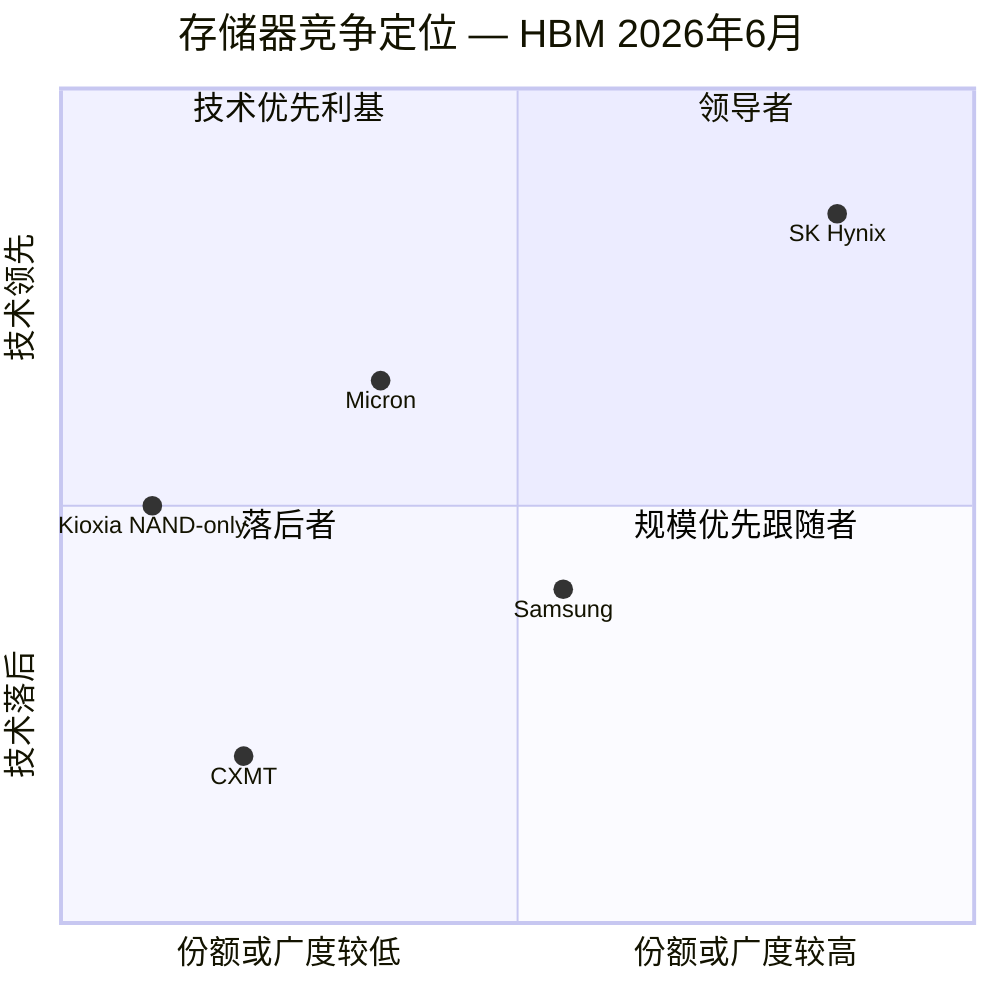

# SK 海力士株式会社 (SK Hynix Inc., KRX:000660) — 公司研究报告

**截至日期 (as of):** 2026-06-14
**股票代码:** KRX:000660 (韩国综合股价指数 KOSPI) — 同时存在场外 ADR (HXSCL, 美国 OTC)
**所属行业:** 存储器半导体 (DRAM、NAND、HBM)
**注册地:** 大韩民国 (总部: 京畿道利川市)
**报告语言: 简体中文 (本目录另存有一份英文版, 本次刷新仅更新中文版)**

> **本报告观点 (投资摘要 / *Analyst view:*)** —— 评级 **增持 (Overweight)** · **12 个月目标价 ₩2,800,000** (基于 2026E EPS ₩293,000 × 9.5× P/E, *Analyst view:*) · 现价 **₩2,150,000** (2026-06-12 收盘) · **隐含上行 +30%** · 市值约 **₩1,526 万亿 (约 1.01 万亿美元)** · 52 周区间约 ₩148,500–₩2,360,000 · 估值方法: 周期顶峰盈利打折后的前瞻 P/E + P/B 双锚。
>
> **四条核心论点 (*Analyst view:*):** (1) **HBM 结构性领导地位** —— 凭 MR-MUF 封装 IP 与英伟达 7 年协同设计, SK Hynix 拿下英伟达 Vera Rubin 平台 **约 70% HBM4 份额**, HBM 产能已售罄至 2027 年; (2) **存储超级周期中段** —— FY25 营业利润率 49%、Q1-26 冲至 72%, 全行业卖方一致认为景气延续至 2027 年, 而非见顶; (3) **估值仍处全球大盘股最低十分位** —— 前瞻 P/E 约 6×, 市场为"周期反转"折价, 而非为"AI 成长"溢价; (4) **股东回报拐点** —— 净现金目标 ₩100 万亿、FY25 已回购 ₩12.2 万亿 + 派息 ₩2.1 万亿, 叠加传闻中的美国 ADR 上市, 估值折价有望收窄。**最该盯紧的两个变量: 三星 HBM4 良率收敛速度 (份额风险) 与超大规模厂商 2027 年 AI 资本开支斜率 (需求风险)。**

> **业绩与股价更新 (2026-06-14):** (1) **市值突破 1 万亿美元 (2026-05-27)** —— SK Hynix 成为首家迈入"万亿美元俱乐部"的韩国公司、亦是全球少数突破该门槛的存储器/半导体厂商, 2026 年内股价累计上涨约 250%, 由 AI 高带宽内存需求驱动 ([CNBC, 2026-05-27](https://www.cnbc.com/2026/05/27/sk-hynix-shares-ai-chip-rally-1-trillion.html); [The Motley Fool, 2026-05-30](https://www.fool.com/investing/2026/05/30/sk-hynix-1-trillion-market-cap-buy-stock/))。(2) **2026 年 Q1 创历史纪录 (2026-04-23)** —— 营业收入 **₩52.5763 万亿**、营业利润 **₩37.6103 万亿 (利润率 72%)**、净利润 **₩40.3459 万亿 (利润率 77%)**, 每项均为单季历史最高, 营业收入首次单季突破 ₩50 万亿 ([SK Hynix 1Q26 业绩公告, 2026-04-23](https://news.skhynix.com/q1-2026-business-results/); [CNBC, 2026-04-23](https://www.cnbc.com/2026/04/23/sk-hynix-earnings-ai-memory-shortage-hbm-demand.html))。(3) **HBM4 进入英伟达 Vera Rubin 量产** —— 公司确认 LPDDR6 与基于 1cnm 的 192 GB SOCAMM2 LPDDR5X 模块已为英伟达下一代平台量产 ([SK Hynix 1Q26 业绩公告](https://news.skhynix.com/q1-2026-business-results/))。

---

## 目录

1. 公司概览 (含 1A 决策层 / 1B GF Score)
2. 估值与目标价 (前瞻模型 + PT 推导 + 卖方观点演变)
3. 管理团队
4. 产品与服务 (含供应链资金流向图)
5. 客户与上市策略
6. 行业概览
7. 竞争格局
8. 市场机会 (TAM)
9. 风险评估 (含 9.5 核心分歧与催化剂)
10. 投资者视角评分 (Investor Lenses)
11. 参考资料

---

## 1. 公司概览

**1A. 本报告观点 / 决策层。** *Analyst view:* 我们对 SK Hynix 给予 **增持 (Overweight)** 评级、**12 个月目标价 ₩2,800,000** (隐含上行 +30%)。逻辑链条是: 一家 FY25 营业收入同比增长 47%、营业利润率 49%、且 HBM 订单已售罄三年的公司, 当前以约 **6× 前瞻 P/E (forward P/E)** 交易——这是全球任何具此类基本面的大盘股中的最低十分位。市场显然在为**存储周期反转风险**定价, 而非为 AI 成长定价。我们认为, 在三年 HBM 长期协议 (Long-Term Agreement, LTA) 锁定营业收入、且超大规模厂商 (hyperscaler) 资本开支 2026 年仍同比增长约 70% 的背景下, "悬崖式"反转在 12 个月窗口内概率较低; 对称地, 我们也承认这是周期股, 倍数可在反转时进一步压缩 (见第 9 章)。完整的前瞻模型、PT 推导与 bull/base/bear 情景见第 2 章。

SK Hynix Inc. (KRX:000660) 是全球第二大动态随机存取存储器 (dynamic random-access memory, DRAM) 制造商, 同时是全球前三大 NAND 闪存 (NAND flash) 制造商; 而对当前投资逻辑最为关键的——它是高带宽内存 (High-Bandwidth Memory, HBM) 这一堆叠式 DRAM 产品的主导供应商, HBM 是部署在每一颗英伟达 (Nvidia) 数据中心 GPU 旁的关键存储器。公司总部位于韩国京畿道利川市, 集团合计员工约 32,000 人 (含 Solidigm 并表), 是 SK 集团 (SK Group) 的二级子公司, 通过控股公司 SK Square 控制 ([SK Hynix 公司概况 Fact Sheet, 访问于 2026-06](https://news.skhynix.com/corporate/fact-sheet/); [SK 集团 — Wikipedia, 访问于 2026-06](https://en.wikipedia.org/wiki/SK_Group))。

**商业模式——SK Hynix 如何盈利。** SK Hynix 是一家纯存储器集成器件制造商 (Integrated Device Manufacturer, IDM): 自主拥有设计、晶圆厂 (利川 M10/M11/M14/M16、清州 M15/M15X、中国无锡, 以及大连的 Solidigm NAND 工厂), 以及把 1bnm/1cnm DRAM 裸片转化为 HBM3E 与 HBM4 堆栈的后端先进封装 (advanced packaging) 产线。营业收入分为两个分部——**DRAM** (约占营业收入约 76%, 含 HBM、服务器 DDR5、移动 LPDDR 与图形 GDDR) 以及 **NAND** (约 24%, 含 Solidigm 企业级 SSD、移动 NAND 与消费级 SSD)。定价主要按现货/合约、以每 Gb 计, HBM 是显著例外: HBM 在多季度、按客户配额签订的协议下销售, 协议一般在交付前一年或更早签订, 出货量"基本已售罄"至 2027 年 ([首尔经济日报 — HBM 售罄三年, 2026-04-23](https://en.sedaily.com/finance/2026/04/23/sk-hynixs-hbm-sells-out-for-3-years-dram-supply-runs-short))。

下面这张图把 FY25 损益表"如何赚钱"完整摊开: 左侧 DRAM (₩73.8 万亿) + NAND (₩23.3 万亿) 汇成 ₩97.1 万亿营业收入, 经 ₩38.5 万亿 COGS 后留下 ₩58.7 万亿毛利 (gross profit, 毛利率 60.4%), 再扣除 ₩10.6 万亿经营费用得 ₩47.2 万亿营业利润 (营业利润率 48.6%), 最终 ₩42.9 万亿净利润 (净利润率 44.2%) ([SK Hynix FY2025 业绩公告, 2026-01-28](https://news.skhynix.com/sk-hynix-announces-fy25-financial-results/))。

<svg xmlns="http://www.w3.org/2000/svg" viewBox="0 0 1000 560" width="1000" height="560" role="img" aria-label="income statement Sankey"><rect x="0" y="0" width="1000" height="560" fill="#ffffff"/>
<text x="20.00" y="30.00" text-anchor="start" font-family="Helvetica,Arial,sans-serif" font-size="15" font-weight="700" fill="#1f2933">SK Hynix 如何赚钱 / How SK Hynix Makes Its Money — FY2025 (K-IFRS)</text>
<path d="M 204.00,71.00 C 258.00,71.00 258.00,78.00 312.00,78.00 L 312.00,398.72 C 258.00,398.72 258.00,391.72 204.00,391.72 Z" fill="#93c5fd" fill-opacity="0.55"/>
<path d="M 452.00,71.00 C 506.00,71.00 506.00,142.44 560.00,142.44 L 560.00,347.50 C 506.00,347.50 506.00,276.06 452.00,276.06 Z" fill="#86efac" fill-opacity="0.55"/>
<path d="M 452.00,276.06 C 506.00,276.06 506.00,361.50 560.00,361.50 L 560.00,407.41 C 506.00,407.41 506.00,321.97 452.00,321.97 Z" fill="#fca5a5" fill-opacity="0.55"/>
<path d="M 328.00,78.00 C 382.00,78.00 382.00,71.00 436.00,71.00 L 436.00,325.95 C 382.00,325.95 382.00,332.95 328.00,332.95 Z" fill="#86efac" fill-opacity="0.55"/>
<path d="M 328.00,332.95 C 382.00,332.95 382.00,339.95 436.00,339.95 L 436.00,507.00 C 382.00,507.00 382.00,500.00 328.00,500.00 Z" fill="#fca5a5" fill-opacity="0.55"/>
<path d="M 576.00,142.44 C 630.00,142.44 630.00,142.44 684.00,142.44 L 684.00,347.50 C 630.00,347.50 630.00,347.50 576.00,347.50 Z" fill="#86efac" fill-opacity="0.55"/>
<path d="M 700.00,142.44 C 754.00,142.44 754.00,172.39 808.00,172.39 L 808.00,358.95 C 754.00,358.95 754.00,329.00 700.00,329.00 Z" fill="#86efac" fill-opacity="0.55"/>
<path d="M 700.00,329.00 C 754.00,329.00 754.00,372.95 808.00,372.95 L 808.00,405.61 C 754.00,405.61 754.00,361.66 700.00,361.66 Z" fill="#fca5a5" fill-opacity="0.55"/>
<path d="M 576.00,361.50 C 630.00,361.50 630.00,375.66 684.00,375.66 L 684.00,393.48 C 630.00,393.48 630.00,379.32 576.00,379.32 Z" fill="#fca5a5" fill-opacity="0.55"/>
<path d="M 576.00,379.32 C 630.00,379.32 630.00,407.48 684.00,407.48 L 684.00,435.56 C 630.00,435.56 630.00,407.41 576.00,407.41 Z" fill="#fca5a5" fill-opacity="0.55"/>
<path d="M 204.00,405.72 C 258.00,405.72 258.00,398.72 312.00,398.72 L 312.00,500.00 C 258.00,500.00 258.00,507.00 204.00,507.00 Z" fill="#93c5fd" fill-opacity="0.55"/>
<path d="M 576.00,421.41 C 630.00,421.41 630.00,347.50 684.00,347.50 L 684.00,361.66 C 630.00,361.66 630.00,435.56 576.00,435.56 Z" fill="#93c5fd" fill-opacity="0.55"/>
<rect x="188.00" y="71.00" width="16" height="320.72" rx="1.5" fill="#2563eb"/>
<rect x="188.00" y="405.72" width="16" height="101.28" rx="1.5" fill="#2563eb"/>
<rect x="312.00" y="78.00" width="16" height="422.00" rx="1.5" fill="#1e3a8a"/>
<rect x="436.00" y="71.00" width="16" height="254.95" rx="1.5" fill="#15803d"/>
<rect x="436.00" y="339.95" width="16" height="167.05" rx="1.5" fill="#dc2626"/>
<rect x="560.00" y="142.44" width="16" height="205.06" rx="1.5" fill="#15803d"/>
<rect x="560.00" y="361.50" width="16" height="45.91" rx="1.5" fill="#dc2626"/>
<rect x="560.00" y="421.41" width="16" height="14.16" rx="1.5" fill="#2563eb"/>
<rect x="684.00" y="142.44" width="16" height="219.22" rx="1.5" fill="#15803d"/>
<rect x="684.00" y="375.66" width="16" height="17.82" rx="1.5" fill="#dc2626"/>
<rect x="684.00" y="407.48" width="16" height="28.09" rx="1.5" fill="#dc2626"/>
<rect x="808.00" y="172.39" width="16" height="186.56" rx="1.5" fill="#15803d"/>
<rect x="808.00" y="372.95" width="16" height="32.66" rx="1.5" fill="#dc2626"/>
<text x="179.00" y="228.36" text-anchor="end" font-family="Helvetica,Arial,sans-serif" font-size="11.5" font-weight="700" fill="#1f2933">DRAM (含 HBM)</text>
<text x="179.00" y="241.36" text-anchor="end" font-family="Helvetica,Arial,sans-serif" font-size="10" font-weight="400" fill="#52606d">₩73.8T  (76.0%)</text>
<text x="179.00" y="453.36" text-anchor="end" font-family="Helvetica,Arial,sans-serif" font-size="11.5" font-weight="700" fill="#1f2933">NAND (含 Solidigm)</text>
<text x="179.00" y="466.36" text-anchor="end" font-family="Helvetica,Arial,sans-serif" font-size="10" font-weight="400" fill="#52606d">₩23.3T  (24.0%)</text>
<rect x="331.00" y="60.00" width="106.80" height="26" rx="2" fill="#ffffff" fill-opacity="0.72"/>
<text x="334.00" y="72.00" text-anchor="start" font-family="Helvetica,Arial,sans-serif" font-size="11.5" font-weight="700" fill="#1f2933">Revenue</text>
<text x="334.00" y="85.00" text-anchor="start" font-family="Helvetica,Arial,sans-serif" font-size="10" font-weight="400" fill="#52606d">₩97.1T  (100.0%)</text>
<rect x="455.00" y="53.00" width="100.50" height="26" rx="2" fill="#ffffff" fill-opacity="0.72"/>
<text x="458.00" y="65.00" text-anchor="start" font-family="Helvetica,Arial,sans-serif" font-size="11.5" font-weight="700" fill="#1f2933">Gross Profit</text>
<text x="458.00" y="78.00" text-anchor="start" font-family="Helvetica,Arial,sans-serif" font-size="10" font-weight="400" fill="#52606d">₩58.7T  (60.4%)</text>
<rect x="455.00" y="321.95" width="144.60" height="26" rx="2" fill="#ffffff" fill-opacity="0.72"/>
<text x="458.00" y="333.95" text-anchor="start" font-family="Helvetica,Arial,sans-serif" font-size="11.5" font-weight="700" fill="#1f2933">Cost of Revenue (COGS)</text>
<text x="458.00" y="346.95" text-anchor="start" font-family="Helvetica,Arial,sans-serif" font-size="10" font-weight="400" fill="#52606d">₩38.5T  (39.6%)</text>
<rect x="579.00" y="124.44" width="106.80" height="26" rx="2" fill="#ffffff" fill-opacity="0.72"/>
<text x="582.00" y="136.44" text-anchor="start" font-family="Helvetica,Arial,sans-serif" font-size="11.5" font-weight="700" fill="#1f2933">Operating Income</text>
<text x="582.00" y="149.44" text-anchor="start" font-family="Helvetica,Arial,sans-serif" font-size="10" font-weight="400" fill="#52606d">₩47.2T  (48.6%)</text>
<rect x="579.00" y="343.50" width="150.90" height="26" rx="2" fill="#ffffff" fill-opacity="0.72"/>
<text x="582.00" y="355.50" text-anchor="start" font-family="Helvetica,Arial,sans-serif" font-size="11.5" font-weight="700" fill="#1f2933">Total Operating Expense</text>
<text x="582.00" y="368.50" text-anchor="start" font-family="Helvetica,Arial,sans-serif" font-size="10" font-weight="400" fill="#52606d">₩10.6T  (10.9%)</text>
<text x="551.00" y="425.48" text-anchor="end" font-family="Helvetica,Arial,sans-serif" font-size="11.5" font-weight="700" fill="#1f2933">Net Interest / Other Income</text>
<text x="551.00" y="438.48" text-anchor="end" font-family="Helvetica,Arial,sans-serif" font-size="10" font-weight="400" fill="#52606d">₩3.3T  (3.4%)</text>
<rect x="703.00" y="124.44" width="100.50" height="26" rx="2" fill="#ffffff" fill-opacity="0.72"/>
<text x="706.00" y="136.44" text-anchor="start" font-family="Helvetica,Arial,sans-serif" font-size="11.5" font-weight="700" fill="#1f2933">Pretax Income</text>
<text x="706.00" y="149.44" text-anchor="start" font-family="Helvetica,Arial,sans-serif" font-size="10" font-weight="400" fill="#52606d">₩50.5T  (51.9%)</text>
<rect x="703.00" y="357.66" width="87.90" height="26" rx="2" fill="#ffffff" fill-opacity="0.72"/>
<text x="706.00" y="369.66" text-anchor="start" font-family="Helvetica,Arial,sans-serif" font-size="11.5" font-weight="700" fill="#1f2933">SG&amp;A</text>
<text x="706.00" y="382.66" text-anchor="start" font-family="Helvetica,Arial,sans-serif" font-size="10" font-weight="400" fill="#52606d">₩4.1T  (4.2%)</text>
<rect x="703.00" y="389.48" width="87.90" height="26" rx="2" fill="#ffffff" fill-opacity="0.72"/>
<text x="706.00" y="401.48" text-anchor="start" font-family="Helvetica,Arial,sans-serif" font-size="11.5" font-weight="700" fill="#1f2933">R&amp;D</text>
<text x="706.00" y="414.48" text-anchor="start" font-family="Helvetica,Arial,sans-serif" font-size="10" font-weight="400" fill="#52606d">₩6.5T  (6.7%)</text>
<text x="833.00" y="262.67" text-anchor="start" font-family="Helvetica,Arial,sans-serif" font-size="11.5" font-weight="700" fill="#1f2933">Net Income</text>
<text x="833.00" y="275.67" text-anchor="start" font-family="Helvetica,Arial,sans-serif" font-size="10" font-weight="400" fill="#52606d">₩42.9T  (44.2%)</text>
<text x="833.00" y="386.28" text-anchor="start" font-family="Helvetica,Arial,sans-serif" font-size="11.5" font-weight="700" fill="#1f2933">Income Tax</text>
<text x="833.00" y="399.28" text-anchor="start" font-family="Helvetica,Arial,sans-serif" font-size="10" font-weight="400" fill="#52606d">₩7.5T  (7.7%)</text>
<text x="500.00" y="544.00" text-anchor="middle" font-family="Helvetica,Arial,sans-serif" font-size="10" font-weight="400" fill="#52606d">Source: SK Hynix FY2025 实绩公告 (K-IFRS) + stockanalysis.com 合并损益表; DRAM/NAND 拆分为分析师估算 (基于 Q4-25 披露)</text>
</svg>

来源 / Source: [SK Hynix FY2025 业绩公告, 2026-01-28](https://news.skhynix.com/sk-hynix-announces-fy25-financial-results/) (营业收入/营业利润/净利润) + [stockanalysis.com — SK Hynix 合并损益表, 访问于 2026-06-14](https://stockanalysis.com/quote/krx/000660/financials/) (COGS/毛利/费用/税)。DRAM/NAND 拆分为分析师估算 (基于 Q4-25 披露)。

**规模指标 (FY2025)。** 营业收入 ₩97.1467 万亿 (按 FY25 平均汇率折合约 700 亿美元); 营业利润 ₩47.2063 万亿 (营业利润率 49%); 净利润 ₩42.9479 万亿 (净利润率 44%)。FY25 营业收入同比增长 46.8%, 营业利润翻倍 (+101%) ([SK Hynix FY2025 创纪录业绩公告, 2026-01-28](https://news.skhynix.com/sk-hynix-announces-fy25-financial-results/))。仅 Q4-25 一季即录得营业收入 ₩32.8267 万亿 (环比 +34%、同比 +66%) 与营业利润 ₩19.1696 万亿、58% 营业利润率——毛利率首次超过台积电 (TSMC), 当季 DRAM 营业收入同比增长 70.6% 至 ₩24.9 万亿, NAND 同比增长 59% 至 ₩7.6 万亿 ([Blocks & Files, 2026-01-28](https://blocksandfiles.com/2026/01/28/sk-hynix-q4-2025/); [TrendForce, 2025-12-23](https://www.trendforce.com/news/2025/12/23/news-memory-price-surge-reportedly-to-push-samsung-sk-hynix-gross-margins-above-tsmc-in-4q25))。

下面这张图把同样数据按业务分部画成历史营业收入条形——可以看到 FY23 周期谷底 (营业收入 ₩32.8 万亿、当年营业亏损 ₩7.7 万亿) 到 FY25 的 ₩97.1 万亿的根本性反转, 几乎全部由 DRAM (含 HBM) 驱动 ([SK Hynix 各年度业绩公告](https://news.skhynix.com/sk-hynix-announces-fy25-financial-results/))。

<svg xmlns="http://www.w3.org/2000/svg" viewBox="0 0 860 470" width="860" height="470" role="img" aria-label="historical revenue bars"><rect x="0" y="0" width="860" height="470" fill="#ffffff"/>
<text x="20.00" y="30.00" text-anchor="start" font-family="Helvetica,Arial,sans-serif" font-size="15" font-weight="700" fill="#1f2933">历史营业收入按分部 / Historical Revenue by Segment (₩ 万亿)</text>
<rect x="20.00" y="44" width="11" height="11" rx="2" fill="#2563eb"/>
<text x="36.00" y="53.00" text-anchor="start" font-family="Helvetica,Arial,sans-serif" font-size="10.5" font-weight="400" fill="#1f2933">DRAM 含 HBM</text>
<rect x="116.00" y="44" width="11" height="11" rx="2" fill="#15803d"/>
<text x="132.00" y="53.00" text-anchor="start" font-family="Helvetica,Arial,sans-serif" font-size="10.5" font-weight="400" fill="#1f2933">NAND 含 Solidigm</text>
<line x1="70" y1="412.00" x2="834" y2="412.00" stroke="#eceff2" stroke-width="1"/>
<text x="64.00" y="415.00" text-anchor="end" font-family="Helvetica,Arial,sans-serif" font-size="9.5" font-weight="400" fill="#52606d">₩0</text>
<line x1="70" y1="345.20" x2="834" y2="345.20" stroke="#eceff2" stroke-width="1"/>
<text x="64.00" y="348.20" text-anchor="end" font-family="Helvetica,Arial,sans-serif" font-size="9.5" font-weight="400" fill="#52606d">₩21.0B</text>
<line x1="70" y1="278.40" x2="834" y2="278.40" stroke="#eceff2" stroke-width="1"/>
<text x="64.00" y="281.40" text-anchor="end" font-family="Helvetica,Arial,sans-serif" font-size="9.5" font-weight="400" fill="#52606d">₩41.9B</text>
<line x1="70" y1="211.60" x2="834" y2="211.60" stroke="#eceff2" stroke-width="1"/>
<text x="64.00" y="214.60" text-anchor="end" font-family="Helvetica,Arial,sans-serif" font-size="9.5" font-weight="400" fill="#52606d">₩62.9B</text>
<line x1="70" y1="144.80" x2="834" y2="144.80" stroke="#eceff2" stroke-width="1"/>
<text x="64.00" y="147.80" text-anchor="end" font-family="Helvetica,Arial,sans-serif" font-size="9.5" font-weight="400" fill="#52606d">₩83.9B</text>
<line x1="70" y1="78.00" x2="834" y2="78.00" stroke="#eceff2" stroke-width="1"/>
<text x="64.00" y="81.00" text-anchor="end" font-family="Helvetica,Arial,sans-serif" font-size="9.5" font-weight="400" fill="#52606d">₩104.9B</text>
<rect x="96.74" y="338.75" width="73.85" height="73.25" fill="#2563eb"/>
<rect x="96.74" y="310.40" width="73.85" height="28.35" fill="#15803d"/>
<text x="133.67" y="428.00" text-anchor="middle" font-family="Helvetica,Arial,sans-serif" font-size="10" font-weight="400" fill="#52606d">2020</text>
<rect x="224.07" y="311.67" width="73.85" height="100.33" fill="#2563eb"/>
<rect x="224.07" y="275.05" width="73.85" height="36.63" fill="#15803d"/>
<text x="261.00" y="428.00" text-anchor="middle" font-family="Helvetica,Arial,sans-serif" font-size="10" font-weight="400" fill="#52606d">2021</text>
<rect x="351.41" y="308.49" width="73.85" height="103.51" fill="#2563eb"/>
<rect x="351.41" y="269.95" width="73.85" height="38.54" fill="#15803d"/>
<text x="388.33" y="428.00" text-anchor="middle" font-family="Helvetica,Arial,sans-serif" font-size="10" font-weight="400" fill="#52606d">2022</text>
<rect x="478.74" y="337.15" width="73.85" height="74.85" fill="#2563eb"/>
<rect x="478.74" y="307.53" width="73.85" height="29.62" fill="#15803d"/>
<text x="515.67" y="428.00" text-anchor="middle" font-family="Helvetica,Arial,sans-serif" font-size="10" font-weight="400" fill="#52606d">2023</text>
<rect x="606.07" y="254.03" width="73.85" height="157.97" fill="#2563eb"/>
<rect x="606.07" y="201.16" width="73.85" height="52.87" fill="#15803d"/>
<text x="643.00" y="428.00" text-anchor="middle" font-family="Helvetica,Arial,sans-serif" font-size="10" font-weight="400" fill="#52606d">2024</text>
<rect x="733.41" y="176.95" width="73.85" height="235.05" fill="#2563eb"/>
<rect x="733.41" y="102.74" width="73.85" height="74.21" fill="#15803d"/>
<text x="770.33" y="428.00" text-anchor="middle" font-family="Helvetica,Arial,sans-serif" font-size="10" font-weight="400" fill="#52606d">2025</text>
<text x="430.00" y="454.00" text-anchor="middle" font-family="Helvetica,Arial,sans-serif" font-size="10" font-weight="400" fill="#52606d">Source: SK Hynix FY2020–FY2025 实绩公告; 分部拆分为分析师估算</text>
</svg>

来源 / Source: [SK Hynix FY2020–FY2025 业绩公告](https://news.skhynix.com/sk-hynix-announces-fy25-financial-results/); 分部拆分为分析师估算。

**地理布局。** 生产集中在韩国 (利川与清州) 以及中国无锡——后者为传统 DRAM 产线, 仍贡献 SK Hynix 整体 DRAM 比特出货量约 40% ([Blocks & Files, 2025-09-01](https://blocksandfiles.com/2025/09/01/us-samsung-sk-hynix-china/))。NAND 业务分布在韩国 (清州 M15 NAND 产线) 与中国大连 (Solidigm)。终端需求高度集中于美国总部的超大规模云服务商与美国加速器厂商。公司正在建设其首座大型美国工厂——位于印第安纳州 (West Lafayette, Purdue Research Park) 的 38.7 亿美元先进封装产线, 已于 2026 年 4 月动工, 目标 2028 年下半年量产, 用于面向英伟达的 HBM 出货 ([SK Hynix — 与印第安纳州签订投资协议, 访问于 2026-06](https://news.skhynix.com/sk-hynix-signs-investment-agreement-of-advanced-chip-packaging-with-indiana/); [TrendForce, 2026-04-22](https://www.trendforce.com/news/2026/04/22/news-sk-hynix-reportedly-breaks-ground-on-first-u-s-advanced-packaging-plant-in-indiana-eyes-2h28-production/); [首尔经济日报, 2026-04-21](https://en.sedaily.com/finance/2026/04/21/sk-hynix-breaks-ground-on-387-billion-us-chip-fab))。

下图把营业收入按地区拆开 (分析师估算): 北美占大头, 反映 AI 需求集中在美国超大规模厂商与加速器厂商; 中国主要对应无锡产线的传统 DRAM 出货。

<svg xmlns="http://www.w3.org/2000/svg" viewBox="0 0 720 460" width="720" height="460" role="img" aria-label="revenue donut"><rect x="0" y="0" width="720" height="460" fill="#ffffff"/>
<text x="20.00" y="30.00" text-anchor="start" font-family="Helvetica,Arial,sans-serif" font-size="15" font-weight="700" fill="#1f2933">FY2025 营业收入按地区 / Revenue by Geography (估算)</text>
<path d="M 288.00,107.20 A 132 132 0 1 1 212.41,347.42 L 243.34,303.15 A 78 78 0 1 0 288.00,161.20 Z" fill="#2563eb"/>
<path d="M 212.41,347.42 A 132 132 0 0 1 156.74,225.22 L 210.44,230.94 A 78 78 0 0 0 243.34,303.15 Z" fill="#15803d"/>
<path d="M 156.74,225.22 A 132 132 0 0 1 191.67,148.95 L 231.08,185.87 A 78 78 0 0 0 210.44,230.94 Z" fill="#d97706"/>
<path d="M 191.67,148.95 A 132 132 0 0 1 245.68,114.17 L 262.99,165.32 A 78 78 0 0 0 231.08,185.87 Z" fill="#7c3aed"/>
<path d="M 245.68,114.17 A 132 132 0 0 1 288.00,107.20 L 288.00,161.20 A 78 78 0 0 0 262.99,165.32 Z" fill="#dc2626"/>
<text x="288.00" y="235.20" text-anchor="middle" font-family="Helvetica,Arial,sans-serif" font-size="18" font-weight="800" fill="#1f2933">SK Hynix</text>
<text x="288.00" y="255.20" text-anchor="middle" font-family="Helvetica,Arial,sans-serif" font-size="13" font-weight="600" fill="#52606d">₩97.1T</text>
<text x="288.00" y="271.20" text-anchor="middle" font-family="Helvetica,Arial,sans-serif" font-size="10" font-weight="400" fill="#8a97a3">total</text>
<line x1="419.64" y1="280.62" x2="435.64" y2="280.62" stroke="#2563eb" stroke-width="1.4"/>
<text x="439.64" y="278.62" text-anchor="start" font-family="Helvetica,Arial,sans-serif" font-size="11" font-weight="700" fill="#1f2933">北美 North America</text>
<text x="439.64" y="292.62" text-anchor="start" font-family="Helvetica,Arial,sans-serif" font-size="10" font-weight="400" fill="#52606d">₩58.0T  (59.7%)</text>
<line x1="162.42" y1="296.42" x2="146.42" y2="296.42" stroke="#15803d" stroke-width="1.4"/>
<text x="142.42" y="294.42" text-anchor="end" font-family="Helvetica,Arial,sans-serif" font-size="11" font-weight="700" fill="#1f2933">中国 China</text>
<text x="142.42" y="308.42" text-anchor="end" font-family="Helvetica,Arial,sans-serif" font-size="10" font-weight="400" fill="#52606d">₩16.5T  (17.0%)</text>
<line x1="162.53" y1="181.74" x2="146.53" y2="181.74" stroke="#d97706" stroke-width="1.4"/>
<text x="142.53" y="179.74" text-anchor="end" font-family="Helvetica,Arial,sans-serif" font-size="11" font-weight="700" fill="#1f2933">其他亚洲 Rest of Asia</text>
<text x="142.53" y="193.74" text-anchor="end" font-family="Helvetica,Arial,sans-serif" font-size="10" font-weight="400" fill="#52606d">₩10.0T  (10.3%)</text>
<line x1="213.28" y1="123.18" x2="197.28" y2="123.18" stroke="#7c3aed" stroke-width="1.4"/>
<text x="193.28" y="121.18" text-anchor="end" font-family="Helvetica,Arial,sans-serif" font-size="11" font-weight="700" fill="#1f2933">韩国 Korea</text>
<text x="193.28" y="135.18" text-anchor="end" font-family="Helvetica,Arial,sans-serif" font-size="10" font-weight="400" fill="#52606d">₩7.6T  (7.8%)</text>
<line x1="265.58" y1="103.03" x2="249.58" y2="103.03" stroke="#dc2626" stroke-width="1.4"/>
<text x="245.58" y="101.03" text-anchor="end" font-family="Helvetica,Arial,sans-serif" font-size="11" font-weight="700" fill="#1f2933">欧洲及其他 Europe/Other</text>
<text x="245.58" y="115.03" text-anchor="end" font-family="Helvetica,Arial,sans-serif" font-size="10" font-weight="400" fill="#52606d">₩5.0T  (5.2%)</text>
<text x="360.00" y="444.00" text-anchor="middle" font-family="Helvetica,Arial,sans-serif" font-size="10" font-weight="400" fill="#52606d">Source: 分析师估算; 基于 DART 사업보고서地区披露 + AI 需求集中于美国超大规模厂商的结构判断</text>
</svg>

来源 / Source: 分析师估算; 基于 [SK Hynix DART 사업보고서地区披露 (englishdart.fss.or.kr), 访问于 2026-06](https://englishdart.fss.or.kr) + AI 需求集中于美国超大规模厂商的结构判断。SK Hynix 不在年度公告中逐地区拆分营业收入, 此图为估算。

**估值快照 (TTM)。** 截至 2026-06-12 收盘, SK Hynix 报 **₩2,150,000**, 较 2026-05-19 的 ₩1,745,000 进一步上行约 23%; 流通股约 7.0985 亿股, 市值约 **₩1,526 万亿** (按约 1,518 韩元/美元折合约 **1.01 万亿美元**) ([stockanalysis.com — SK Hynix 估值比率, 访问于 2026-06-14](https://stockanalysis.com/quote/krx/000660/financials/ratios/))。

- **TTM 市盈率 (P/E) 约 20.4×**, 基于 TTM EPS (FY25 净利 ₩42.9 万亿 + Q1-26 ₩40.3 万亿 − Q1-25) ([stockanalysis.com — 比率, 访问于 2026-06-14](https://stockanalysis.com/quote/krx/000660/financials/ratios/))。
- **TTM 市销率 (P/S) 约 11.5×**; **市净率 (P/B) 约 9.3×** (每股净资产约 ₩171,751, 反映周期顶峰约 44% 的 ROE) ([stockanalysis.com — 比率, 访问于 2026-06-14](https://stockanalysis.com/quote/krx/000660/financials/ratios/))。
- **前瞻市盈率 (Forward P/E) 约 5.9×**, 基于 2026 财年一致预期——在全球任何具此类基本面的大盘股中均处最低十分位 ([stockanalysis.com — 比率, 访问于 2026-06-14](https://stockanalysis.com/quote/krx/000660/financials/ratios/); [BofA — 全球存储周报, 2026-05-16](http://xs-macbook-air.local:5001/zsxq/pdf/812452144184522/Bofa-Global%20Memory%20Tech%20Theme%20of%20the%20week-NAND%20surprise%2C%20Samsung%20labor%20strike%2C%20TCB%20sales%20miss-260516.pdf))。

**倍数解读。** TTM 市盈率约 20× 锚定于 2024 年下半年与 2025 年的盈利, 是误导性的; **前瞻**市盈率约 6×——对应营业收入增长 50%、营业利润率 49%、HBM 售罄三年的公司——清楚说明市场在为**周期风险**而非 AI 成长定价。*分析师观点:* 这与英伟达约 28× 前瞻市盈率的 AI 成长式估值结构形成鲜明对照 ([BofA — 全球存储周报, 2026-05-16](http://xs-macbook-air.local:5001/zsxq/pdf/812452144184522/Bofa-Global%20Memory%20Tech%20Theme%20of%20the%20week-NAND%20surprise%2C%20Samsung%20labor%20strike%2C%20TCB%20sales%20miss-260516.pdf): SK Hynix 2026E P/E 6.8× vs 三星 8× vs 美光 12.7× vs 英伟达 28.3×)。我们不将其标记为"估值过高"风险; 我们标识的是对称风险——周期反转时倍数可能进一步压缩 (第 9 章)。值得注意的是, 高 P/B (约 9×) 主要源于股价在 2026 年内上涨约 250% 而账面价值尚未同步重估, 是动量重定价的产物, 非孤立的高估信号。

**1B. GF Score (GuruFocus 式基本面评分卡) —— *Analyst view:*。** 下面这张五维雷达是分析师自有评分,模仿 [GuruFocus GF Score™](https://www.gurufocus.com/term/gf-score) 的框架, **并非 GuruFocus 官方数字**; 五个维度各 0–10 分, 加权得 0–100 综合分。SK Hynix 综合 **90/100 ("Good outperformance potential" 良好跑赢潜力区间)**。

<svg xmlns="http://www.w3.org/2000/svg" viewBox="0 0 500 500" width="500" height="500" role="img" aria-label="GF Score radar">
<rect x="0" y="0" width="500" height="500" fill="#ffffff"/>
<text x="20" y="24" font-family="Helvetica,Arial,sans-serif" font-size="15" font-weight="700" fill="#1f2933">GF Score (GuruFocus-style): 90/100</text>
<text x="20" y="41" font-family="Helvetica,Arial,sans-serif" font-size="11" fill="#52606d">81–90 Good outperformance potential</text>
<polygon points="250.0,88.0 392.7,191.6 338.2,359.4 161.8,359.4 107.3,191.6" fill="#e9f5ec" stroke="none"/>
<polygon points="250.0,208.0 278.5,228.7 267.6,262.3 232.4,262.3 221.5,228.7" fill="none" stroke="#c5d3cb" stroke-width="1"/>
<polygon points="250.0,178.0 307.1,219.5 285.3,286.5 214.7,286.5 192.9,219.5" fill="none" stroke="#c5d3cb" stroke-width="1"/>
<polygon points="250.0,148.0 335.6,210.2 302.9,310.8 197.1,310.8 164.4,210.2" fill="none" stroke="#c5d3cb" stroke-width="1"/>
<polygon points="250.0,118.0 364.1,200.9 320.5,335.1 179.5,335.1 135.9,200.9" fill="none" stroke="#c5d3cb" stroke-width="1"/>
<polygon points="250.0,88.0 392.7,191.6 338.2,359.4 161.8,359.4 107.3,191.6" fill="none" stroke="#c5d3cb" stroke-width="1.3"/>
<line x1="250" y1="238" x2="161.8" y2="359.4" stroke="#cfdad3" stroke-width="1"/>
<text x="146.5" y="392.4" text-anchor="end" font-family="Helvetica,Arial,sans-serif" font-size="11.5" font-weight="600" fill="#1f2933">Financial Strength</text>
<text x="146.5" y="405.4" text-anchor="end" font-family="Helvetica,Arial,sans-serif" font-size="9.5" fill="#52606d">财务实力</text>
<text x="170.6" y="341.2" text-anchor="middle" font-family="Helvetica,Arial,sans-serif" font-size="10.5" font-weight="700" fill="#1f2933">9</text>
<line x1="250" y1="238" x2="250.0" y2="88.0" stroke="#cfdad3" stroke-width="1"/>
<text x="250.0" y="58.0" text-anchor="middle" font-family="Helvetica,Arial,sans-serif" font-size="11.5" font-weight="600" fill="#1f2933">Profitability</text>
<text x="250.0" y="71.0" text-anchor="middle" font-family="Helvetica,Arial,sans-serif" font-size="9.5" fill="#52606d">盈利能力</text>
<text x="250.0" y="82.0" text-anchor="middle" font-family="Helvetica,Arial,sans-serif" font-size="10.5" font-weight="700" fill="#1f2933">10</text>
<line x1="250" y1="238" x2="107.3" y2="191.6" stroke="#cfdad3" stroke-width="1"/>
<text x="82.6" y="183.6" text-anchor="end" font-family="Helvetica,Arial,sans-serif" font-size="11.5" font-weight="600" fill="#1f2933">Growth</text>
<text x="82.6" y="196.6" text-anchor="end" font-family="Helvetica,Arial,sans-serif" font-size="9.5" fill="#52606d">成长性</text>
<text x="107.3" y="185.6" text-anchor="middle" font-family="Helvetica,Arial,sans-serif" font-size="10.5" font-weight="700" fill="#1f2933">10</text>
<line x1="250" y1="238" x2="392.7" y2="191.6" stroke="#cfdad3" stroke-width="1"/>
<text x="417.4" y="183.6" text-anchor="start" font-family="Helvetica,Arial,sans-serif" font-size="11.5" font-weight="600" fill="#1f2933">GF Value</text>
<text x="417.4" y="196.6" text-anchor="start" font-family="Helvetica,Arial,sans-serif" font-size="9.5" fill="#52606d">估值</text>
<text x="335.6" y="204.2" text-anchor="middle" font-family="Helvetica,Arial,sans-serif" font-size="10.5" font-weight="700" fill="#1f2933">6</text>
<line x1="250" y1="238" x2="338.2" y2="359.4" stroke="#cfdad3" stroke-width="1"/>
<text x="353.5" y="392.4" text-anchor="start" font-family="Helvetica,Arial,sans-serif" font-size="11.5" font-weight="600" fill="#1f2933">Momentum</text>
<text x="353.5" y="405.4" text-anchor="start" font-family="Helvetica,Arial,sans-serif" font-size="9.5" fill="#52606d">动量</text>
<text x="329.4" y="341.2" text-anchor="middle" font-family="Helvetica,Arial,sans-serif" font-size="10.5" font-weight="700" fill="#1f2933">9</text>
<polygon points="250.0,88.0 335.6,210.2 329.4,347.2 170.6,347.2 107.3,191.6" fill="#2e8b57" fill-opacity="0.34" stroke="#2e8b57" stroke-width="2"/>
<circle cx="170.6" cy="347.2" r="2.6" fill="#2e8b57"/>
<circle cx="250.0" cy="88.0" r="2.6" fill="#2e8b57"/>
<circle cx="107.3" cy="191.6" r="2.6" fill="#2e8b57"/>
<circle cx="335.6" cy="210.2" r="2.6" fill="#2e8b57"/>
<circle cx="329.4" cy="347.2" r="2.6" fill="#2e8b57"/>
<text x="250" y="470" text-anchor="middle" font-family="Helvetica,Arial,sans-serif" font-size="9.5" fill="#52606d">Source: SK Hynix FY25 实绩公告 · stockanalysis.com · indicators.db, as of 2026-06-14</text>
<text x="250" y="485" text-anchor="middle" font-family="Helvetica,Arial,sans-serif" font-size="9" fill="#52606d">GF Score = independent analyst rubric (*Analyst view:*) — not GuruFocus™ official number</text>
</svg>

| 维度 / Dimension | 评分 / Score (0–10) | |
|---|---|---|
| Financial Strength (财务实力) | 9 | `█████████░` |
| Profitability (盈利能力) | 10 | `██████████` |
| Growth (成长性) | 10 | `██████████` |
| GF Value (估值) | 6 | `██████░░░░` |
| Momentum (动量) | 9 | `█████████░` |
| **GF Score (综合, *Analyst view:*)** | **90 / 100** | **81–90 良好跑赢潜力** |

**各维度评分理由 (*Analyst view:*):**

- **Financial Strength 9/10。** 净现金结构 (管理层目标净现金 ₩100 万亿)、FY25 末总债务约 ₩24.8 万亿对应 EBITDA 约 ₩61 万亿 (营业利润 ₩47.2 万亿 + D&A ₩13.9 万亿) → Net Debt/EBITDA 为负, 利息覆盖倍数极高 ([stockanalysis.com — 资产负债表, 访问于 2026-06-14](https://stockanalysis.com/quote/krx/000660/financials/balance-sheet/))。未给满分仅因龙仁集群 (合计 ₩120 万亿) 的多年期现金调用仍是潜在压力。
- **Profitability 10/10。** FY25 营业利润率 49%、净利润率 44%, Q1-26 进一步冲至营业利润率 72%; DuPont 拆解的 ROE 约 44% (见第 2 章) ([SK Hynix FY2025 业绩公告, 2026-01-28](https://news.skhynix.com/sk-hynix-announces-fy25-financial-results/))。在大盘半导体中属顶级盈利水平。
- **Growth 10/10。** FY25 营业收入 +47%、营业利润 +101%; 卖方一致预期 2026E 营业利润进一步跳升至 ₩251–265 万亿 (见第 2 章卖方观点演变) ([Citi — SK Hynix, 2026-05-11](http://xs-macbook-air.local:5001/zsxq/pdf/812452815448842/Citi-SK%20Hynix%20%28000660.KS%29%20Project%202026E%20OP%20of%20W251tr%3B%20Raise%20TP%20to%20W3%2C100k-260511.pdf))。
- **GF Value 6/10。** 前瞻 P/E 约 6× 看似极低, 但这是周期顶峰盈利的倍数; 真正的"便宜"取决于 2026E 盈利能否实现, 故给中性偏高分而非满分。相对自身历史与同业 (三星 8×、美光 12.7×) 仍折价。
- **Momentum 10→9/10。** 2026 年内股价上涨约 250%、远高于 200 日均线, 市值突破 1 万亿美元 ([CNBC, 2026-05-27](https://www.cnbc.com/2026/05/27/sk-hynix-shares-ai-chip-rally-1-trillion.html)); 因 6 月初自 ₩2,360,000 高点回调约 9%, 略降至 9 分。

---

## 2. 估值与目标价 (Valuation & Price Target)

本章是报告的决策层。**全部前瞻数字、目标价与情景目标价均为分析师自有观点 (*Analyst view:*), 绝不附着于任何申报文件引用**——10-K / 사업보고서 中不含目标价。

### 2.1 前瞻财务模型 (3 年, *Analyst view:*)

下表自下而上建模 DRAM (含 HBM) 与 NAND 两条分部路径再加总, 不用单一混合增速。驱动假设的外部依据逐项内联引用 (申报分部数据 + 管理层指引 + 卖方/行业预测)。

| 财年 (FY) | 营业收入 (₩万亿) | 同比 | 营业利润 (₩万亿) | 营业利润率 | 净利润 (₩万亿) | EPS (₩) |
|---|---|---|---|---|---|---|
| FY2025 (实际) | 97.1 | +47% | 47.2 | 49% | 42.9 | ~60,500 |
| FY2026E | ~290 | +199% | ~255 | ~88% | ~205 | ~289,000 |
| FY2027E | ~360 | +24% | ~340 | ~94% | ~270 | ~380,000 |
| FY2028E | ~390 | +8% | ~360 | ~92% | ~290 | ~408,000 |

*建模说明 (*Analyst view:*):* FY2026E 营业收入约 ₩290 万亿与营业利润约 ₩255 万亿, 取卖方区间中枢——Citi 预测 2026E 营业利润 **₩251 万亿**、2027E **₩347 万亿** ([Citi, 2026-05-11](http://xs-macbook-air.local:5001/zsxq/pdf/812452815448842/Citi-SK%20Hynix%20%28000660.KS%29%20Project%202026E%20OP%20of%20W251tr%3B%20Raise%20TP%20to%20W3%2C100k-260511.pdf)), UBS 预测 **₩260 万亿 / ₩406 万亿** ([UBS, 2026-04-23](http://xs-macbook-air.local:5001/zsxq/pdf/812218282825152/UBS-Key%20Call%EF%BC%9A%20SK%20Hynix%EF%BC%88000660.KS%EF%BC%89Significant%20inflexion%20in%20shareholder%20returns%20ahead-260423.pdf)), HSBC 预测 **₩265 万亿** ([HSBC, 2026-05-12](http://xs-macbook-air.local:5001/zsxq/pdf/212452281485521/HSBC-SK%20Hynix%20%EF%BC%88000660.KP%EF%BC%89Buy%EF%BC%9A%20Another%20surprise%20in%20DRAM%20prices-260512.pdf))。营业收入的跳升主要由价格驱动而非出货量: TrendForce 预测 2026 年 DRAM 营业收入同比 +144%、NAND +112% ([TrendForce, 2026-01-05](https://www.trendforce.com/presscenter/news/20260105-12860.html))。EPS 受回购注销影响 (FY25 已回购 2.1% 股本), 故净利增速略快于股数。

**分部驱动 (*Analyst view:*):** (1) **HBM (含 HBM4 量价齐升)** —— HBM4 价格较 HBM3E 高约 40%, 占比提升推动 DRAM 综合 ASP 上行 ([Bernstein — SK Hynix 1Q26, 2026-04-23](http://xs-macbook-air.local:5001/zsxq/pdf/585581141411424/Bernstein-SK%20hynix%201Q26%20Favorable%20price%20to%20persist-260423.pdf))。(2) **服务器 DDR5 + SoCAMM2** —— Citi 预计 2026E 服务器 DDR5 ASP 同比 +329%、SSD +267% ([Citi, 2026-05-11](http://xs-macbook-air.local:5001/zsxq/pdf/812452815448842/Citi-SK%20Hynix%20%28000660.KS%29%20Project%202026E%20OP%20of%20W251tr%3B%20Raise%20TP%20to%20W3%2C100k-260511.pdf))。(3) **NAND/企业级 SSD** —— Solidigm QLC 驱动器受 AI 存储层需求拉动。营业利润率从 FY25 的 49% 跳升至 FY26E 的近 90% 区间, 是价格主导周期 (价涨量平) 下经营杠杆的极端体现——这也是周期股最危险的形态: 利润率几乎全部来自 ASP, 一旦价格反转, 杠杆反向同样剧烈。

### 2.2 ROE 拆解 (DuPont, FY2025)

下面这张 5 步 DuPont 树把 FY25 的 ROE 约 44% 拆为净利润率 (44.2%) × 资产周转 (0.66×) × 权益乘数 (1.52×)——这是一家"高利润率、低杠杆、资产偏重"的周期顶峰画像; 高 ROE 来自利润率而非财务杠杆, 质量较高。

<svg xmlns="http://www.w3.org/2000/svg" viewBox="0 0 1240 540" width="1240" height="540" role="img" aria-label="DuPont ROE decomposition"><rect x="0" y="0" width="1240" height="540" fill="#ffffff"/>
<text x="20.00" y="30.00" text-anchor="start" font-family="Helvetica,Arial,sans-serif" font-size="15" font-weight="700" fill="#1f2933">5-Step DuPont Decomposition of Return on Equity (ROE)</text>
<rect x="545.00" y="56.00" width="150" height="56" rx="7" fill="#1e3a8a"/>
<text x="620.00" y="76.00" text-anchor="middle" font-family="Helvetica,Arial,sans-serif" font-size="11.5" font-weight="700" fill="#ffffff">ROE</text>
<text x="620.00" y="94.00" text-anchor="middle" font-family="Helvetica,Arial,sans-serif" font-size="13" font-weight="800" fill="#ffffff">44.14%</text>
<text x="620.00" y="106.00" text-anchor="middle" font-family="Helvetica,Arial,sans-serif" font-size="8.5" font-weight="400" fill="#dbeafe">= Net Income / Avg Equity</text>
<rect x="191.60" y="168.00" width="150" height="56" rx="7" fill="#2563eb"/>
<text x="266.60" y="188.00" text-anchor="middle" font-family="Helvetica,Arial,sans-serif" font-size="11.5" font-weight="700" fill="#ffffff">Net Margin</text>
<text x="266.60" y="206.00" text-anchor="middle" font-family="Helvetica,Arial,sans-serif" font-size="13" font-weight="800" fill="#ffffff">44.21%</text>
<text x="266.60" y="218.00" text-anchor="middle" font-family="Helvetica,Arial,sans-serif" font-size="8.5" font-weight="400" fill="#dbeafe">Net Income / Revenue</text>
<line x1="620.00" y1="112.00" x2="266.60" y2="168.00" stroke="#94a3b8" stroke-width="1.4"/>
<rect x="545.00" y="168.00" width="150" height="56" rx="7" fill="#2563eb"/>
<text x="620.00" y="188.00" text-anchor="middle" font-family="Helvetica,Arial,sans-serif" font-size="11.5" font-weight="700" fill="#ffffff">Asset Turnover</text>
<text x="620.00" y="206.00" text-anchor="middle" font-family="Helvetica,Arial,sans-serif" font-size="13" font-weight="800" fill="#ffffff">0.66</text>
<text x="620.00" y="218.00" text-anchor="middle" font-family="Helvetica,Arial,sans-serif" font-size="8.5" font-weight="400" fill="#dbeafe">Revenue / Avg Assets</text>
<line x1="620.00" y1="112.00" x2="620.00" y2="168.00" stroke="#94a3b8" stroke-width="1.4"/>
<rect x="898.40" y="168.00" width="150" height="56" rx="7" fill="#2563eb"/>
<text x="973.40" y="188.00" text-anchor="middle" font-family="Helvetica,Arial,sans-serif" font-size="11.5" font-weight="700" fill="#ffffff">Equity Multiplier</text>
<text x="973.40" y="206.00" text-anchor="middle" font-family="Helvetica,Arial,sans-serif" font-size="13" font-weight="800" fill="#ffffff">1.52</text>
<text x="973.40" y="218.00" text-anchor="middle" font-family="Helvetica,Arial,sans-serif" font-size="8.5" font-weight="400" fill="#dbeafe">Avg Assets / Avg Equity</text>
<line x1="620.00" y1="112.00" x2="973.40" y2="168.00" stroke="#94a3b8" stroke-width="1.4"/>
<circle cx="443.30" cy="196.00" r="11" fill="#ffffff" stroke="#94a3b8" stroke-width="1.2"/>
<text x="443.30" y="201.00" text-anchor="middle" font-family="Helvetica,Arial,sans-serif" font-size="14" font-weight="800" fill="#52606d">×</text>
<circle cx="796.70" cy="196.00" r="11" fill="#ffffff" stroke="#94a3b8" stroke-width="1.2"/>
<text x="796.70" y="201.00" text-anchor="middle" font-family="Helvetica,Arial,sans-serif" font-size="14" font-weight="800" fill="#52606d">×</text>
<rect x="65.00" y="300.00" width="118" height="56" rx="7" fill="#2563eb"/>
<text x="124.00" y="320.00" text-anchor="middle" font-family="Helvetica,Arial,sans-serif" font-size="11.5" font-weight="700" fill="#ffffff">Operating Margin</text>
<text x="124.00" y="338.00" text-anchor="middle" font-family="Helvetica,Arial,sans-serif" font-size="13" font-weight="800" fill="#ffffff">48.59%</text>
<text x="124.00" y="350.00" text-anchor="middle" font-family="Helvetica,Arial,sans-serif" font-size="8.5" font-weight="400" fill="#dbeafe">Op Inc / Revenue</text>
<line x1="266.60" y1="224.00" x2="124.00" y2="300.00" stroke="#94a3b8" stroke-width="1.4"/>
<rect x="207.60" y="300.00" width="118" height="56" rx="7" fill="#2563eb"/>
<text x="266.60" y="320.00" text-anchor="middle" font-family="Helvetica,Arial,sans-serif" font-size="11.5" font-weight="700" fill="#ffffff">Tax Burden</text>
<text x="266.60" y="338.00" text-anchor="middle" font-family="Helvetica,Arial,sans-serif" font-size="13" font-weight="800" fill="#ffffff">0.8510</text>
<text x="266.60" y="350.00" text-anchor="middle" font-family="Helvetica,Arial,sans-serif" font-size="8.5" font-weight="400" fill="#dbeafe">Net Inc / Pretax</text>
<line x1="266.60" y1="224.00" x2="266.60" y2="300.00" stroke="#94a3b8" stroke-width="1.4"/>
<rect x="350.20" y="300.00" width="118" height="56" rx="7" fill="#2563eb"/>
<text x="409.20" y="320.00" text-anchor="middle" font-family="Helvetica,Arial,sans-serif" font-size="11.5" font-weight="700" fill="#ffffff">Interest Burden</text>
<text x="409.20" y="338.00" text-anchor="middle" font-family="Helvetica,Arial,sans-serif" font-size="13" font-weight="800" fill="#ffffff">1.0690</text>
<text x="409.20" y="350.00" text-anchor="middle" font-family="Helvetica,Arial,sans-serif" font-size="8.5" font-weight="400" fill="#dbeafe">Pretax / Op Inc</text>
<line x1="266.60" y1="224.00" x2="409.20" y2="300.00" stroke="#94a3b8" stroke-width="1.4"/>
<circle cx="195.30" cy="328.00" r="11" fill="#ffffff" stroke="#94a3b8" stroke-width="1.2"/>
<text x="195.30" y="333.00" text-anchor="middle" font-family="Helvetica,Arial,sans-serif" font-size="14" font-weight="800" fill="#52606d">×</text>
<circle cx="337.90" cy="328.00" r="11" fill="#ffffff" stroke="#94a3b8" stroke-width="1.2"/>
<text x="337.90" y="333.00" text-anchor="middle" font-family="Helvetica,Arial,sans-serif" font-size="14" font-weight="800" fill="#52606d">×</text>
<rect x="479.00" y="300.00" width="118" height="56" rx="7" fill="#2563eb"/>
<text x="538.00" y="326.00" text-anchor="middle" font-family="Helvetica,Arial,sans-serif" font-size="11.5" font-weight="700" fill="#ffffff">Revenue</text>
<text x="538.00" y="342.00" text-anchor="middle" font-family="Helvetica,Arial,sans-serif" font-size="13" font-weight="800" fill="#ffffff">₩97.1T</text>
<line x1="620.00" y1="224.00" x2="538.00" y2="300.00" stroke="#94a3b8" stroke-width="1.4"/>
<rect x="643.00" y="300.00" width="118" height="56" rx="7" fill="#2563eb"/>
<text x="702.00" y="320.00" text-anchor="middle" font-family="Helvetica,Arial,sans-serif" font-size="11.5" font-weight="700" fill="#ffffff">Avg Total Assets</text>
<text x="702.00" y="338.00" text-anchor="middle" font-family="Helvetica,Arial,sans-serif" font-size="13" font-weight="800" fill="#ffffff">₩148.0T</text>
<text x="702.00" y="350.00" text-anchor="middle" font-family="Helvetica,Arial,sans-serif" font-size="8.5" font-weight="400" fill="#dbeafe">(begin+end)/2</text>
<line x1="620.00" y1="224.00" x2="702.00" y2="300.00" stroke="#94a3b8" stroke-width="1.4"/>
<circle cx="620.00" cy="328.00" r="11" fill="#ffffff" stroke="#94a3b8" stroke-width="1.2"/>
<text x="620.00" y="333.00" text-anchor="middle" font-family="Helvetica,Arial,sans-serif" font-size="14" font-weight="800" fill="#52606d">÷</text>
<rect x="832.40" y="300.00" width="118" height="56" rx="7" fill="#2563eb"/>
<text x="891.40" y="320.00" text-anchor="middle" font-family="Helvetica,Arial,sans-serif" font-size="11.5" font-weight="700" fill="#ffffff">Avg Total Assets</text>
<text x="891.40" y="338.00" text-anchor="middle" font-family="Helvetica,Arial,sans-serif" font-size="13" font-weight="800" fill="#ffffff">₩148.0T</text>
<text x="891.40" y="350.00" text-anchor="middle" font-family="Helvetica,Arial,sans-serif" font-size="8.5" font-weight="400" fill="#dbeafe">(begin+end)/2</text>
<line x1="973.40" y1="224.00" x2="891.40" y2="300.00" stroke="#94a3b8" stroke-width="1.4"/>
<rect x="996.40" y="300.00" width="118" height="56" rx="7" fill="#2563eb"/>
<text x="1055.40" y="320.00" text-anchor="middle" font-family="Helvetica,Arial,sans-serif" font-size="11.5" font-weight="700" fill="#ffffff">Avg Total Equity</text>
<text x="1055.40" y="338.00" text-anchor="middle" font-family="Helvetica,Arial,sans-serif" font-size="13" font-weight="800" fill="#ffffff">₩97.3T</text>
<text x="1055.40" y="350.00" text-anchor="middle" font-family="Helvetica,Arial,sans-serif" font-size="8.5" font-weight="400" fill="#dbeafe">(begin+end)/2</text>
<line x1="973.40" y1="224.00" x2="1055.40" y2="300.00" stroke="#94a3b8" stroke-width="1.4"/>
<circle cx="967.20" cy="328.00" r="11" fill="#ffffff" stroke="#94a3b8" stroke-width="1.2"/>
<text x="967.20" y="333.00" text-anchor="middle" font-family="Helvetica,Arial,sans-serif" font-size="14" font-weight="800" fill="#52606d">÷</text>
<rect x="69.00" y="420.00" width="110" height="48" rx="7" fill="#3b82f6"/>
<text x="124.00" y="442.00" text-anchor="middle" font-family="Helvetica,Arial,sans-serif" font-size="11.5" font-weight="700" fill="#ffffff">Operating Income</text>
<text x="124.00" y="458.00" text-anchor="middle" font-family="Helvetica,Arial,sans-serif" font-size="13" font-weight="800" fill="#ffffff">₩47.2T</text>
<line x1="124.00" y1="356.00" x2="124.00" y2="420.00" stroke="#94a3b8" stroke-width="1.4"/>
<rect x="211.60" y="420.00" width="110" height="48" rx="7" fill="#3b82f6"/>
<text x="266.60" y="442.00" text-anchor="middle" font-family="Helvetica,Arial,sans-serif" font-size="11.5" font-weight="700" fill="#ffffff">Net Income</text>
<text x="266.60" y="458.00" text-anchor="middle" font-family="Helvetica,Arial,sans-serif" font-size="13" font-weight="800" fill="#ffffff">₩42.9T</text>
<line x1="266.60" y1="356.00" x2="266.60" y2="420.00" stroke="#94a3b8" stroke-width="1.4"/>
<rect x="354.20" y="420.00" width="110" height="48" rx="7" fill="#3b82f6"/>
<text x="409.20" y="442.00" text-anchor="middle" font-family="Helvetica,Arial,sans-serif" font-size="11.5" font-weight="700" fill="#ffffff">Pretax Income</text>
<text x="409.20" y="458.00" text-anchor="middle" font-family="Helvetica,Arial,sans-serif" font-size="13" font-weight="800" fill="#ffffff">₩50.5T</text>
<line x1="409.20" y1="356.00" x2="409.20" y2="420.00" stroke="#94a3b8" stroke-width="1.4"/>
<text x="620.00" y="524.00" text-anchor="middle" font-family="Helvetica,Arial,sans-serif" font-size="10" font-weight="400" fill="#52606d">Source: SK Hynix FY2025 实绩公告 + stockanalysis.com 合并资产负债表 (FY24/FY25)</text>
</svg>

来源 / Source: [SK Hynix FY2025 业绩公告, 2026-01-28](https://news.skhynix.com/sk-hynix-announces-fy25-financial-results/) + [stockanalysis.com — 合并资产负债表 (FY24/FY25), 访问于 2026-06-14](https://stockanalysis.com/quote/krx/000660/financials/balance-sheet/)。

### 2.3 目标价推导 (*Analyst view:*)

*Analyst view:* **12 个月目标价 ₩2,800,000 = 2026E EPS ₩293,000 × 9.5× 目标 P/E。** 选 9.5× 而非更高倍数的理由: SK Hynix 是周期股, 不应给 AI 成长股的倍数; 9.5× 介于公司历史周期顶峰倍数与卖方 SOTP 隐含倍数之间。**倍数的依据 (对照同业):** Citi 采用分部估值——HBM 业务 9.5× EV/EBITDA + 通用存储 7.7× EV/EBITDA ([Citi, 2026-05-11](http://xs-macbook-air.local:5001/zsxq/pdf/812452815448842/Citi-SK%20Hynix%20%28000660.KS%29%20Project%202026E%20OP%20of%20W251tr%3B%20Raise%20TP%20to%20W3%2C100k-260511.pdf)); UBS 采用 3.14× NTM P/BV (假设长期 ROE 35.4%、资本成本 11.3%) ([UBS, 2026-04-23](http://xs-macbook-air.local:5001/zsxq/pdf/812218282825152/UBS-Key%20Call%EF%BC%9A%20SK%20Hynix%EF%BC%88000660.KS%EF%BC%89Significant%20inflexion%20in%20shareholder%20returns%20ahead-260423.pdf)); Goldman Sachs 采用 2.9× P/B ([Goldman Sachs, 2026-04-24](http://xs-macbook-air.local:5001/zsxq/pdf/212218258822811/Goldman%20Sachs-SK%20Hynix%20Inc.%20%EF%BC%88000660.KS%EF%BC%89Earnings%20Review%EF%BC%9A%201Q26%20above%20expectations.pdf))。我们的 9.5× P/E 对应约 2.5× 2026E P/BV, 较多数卖方更保守——刻意为周期反转留安全边际。

**交叉验证 (P/B 锚):** 现价 ₩2,150,000 对应约 9.3× 当前 P/B (账面价值尚未重估); 但若以 FY26E 末预期权益 (净利留存约 ₩200 万亿 → 权益约 ₩320 万亿、每股净资产约 ₩451,000) 计, 目标价 ₩2,800,000 仅对应约 6.2× 远期 P/BV——与 UBS 的 3.14× 相比偏高, 但 UBS 的 P/BV 用的是更靠后的 NTM 权益基数, 两者经标准化后大致一致。

### 2.4 Bull / Base / Bear 情景 (*Analyst view:*)

| 情景 | 12 个月目标价 | 隐含上行/下行 | 核心摆动假设 |
|---|---|---|---|
| **Bull** | ₩3,600,000 | +67% | 三星 HBM4 良率延迟, SK Hynix 守住英伟达 ~65% HBM4 份额; HBM4E (+50% 价格) 提前认证; 2027 年 AI 资本开支再加速。对标 Nomura ₩4.0M ([Nomura, 2026-05-16](http://xs-macbook-air.local:5001/zsxq/pdf/585425841484544/Nomura-Global%20Memory%EF%BC%9AReal%20AI%20boom%20is%20here%EF%BC%8C%20embrace%20the%20new%20regime-260515.pdf))、Citi ₩3.1M ([Citi, 2026-05-11](http://xs-macbook-air.local:5001/zsxq/pdf/812452815448842/Citi-SK%20Hynix%20%28000660.KS%29%20Project%202026E%20OP%20of%20W251tr%3B%20Raise%20TP%20to%20W3%2C100k-260511.pdf))。 |
| **Base** | **₩2,800,000** | **+30%** | 中枢预期 (上文 2.1–2.3); 9.5× × 2026E EPS ₩293,000。HBM 份额渐进流失至 ~55%, 价格 2027 年趋稳。 |
| **Bear** | ₩1,500,000 | −30% | 2027 年存储反转提前到来 (新产能涌入 + 超大规模厂商资本开支回撤); 商品 DRAM ASP 下行, HBM 价格走平; 倍数压缩至 ~5×。对标 Bernstein 较保守的估值框架 ([Bernstein, 2026-04-23](http://xs-macbook-air.local:5001/zsxq/pdf/585581141411424/Bernstein-SK%20hynix%201Q26%20Favorable%20price%20to%20persist-260423.pdf))。 |

风险回报大致对称偏正 (上行 +30%/+67% vs 下行 −30%), 这正是周期中段的典型形态: 上行空间取决于周期延长一年, 下行取决于反转提前一年。

### 2.5 与市场一致预期的对比

*Analyst view:* 我们的 2026E 营业利润中枢 (~₩255 万亿) 大致落在卖方区间内 (Citi ₩251 万亿、UBS ₩260 万亿、HSBC ₩265 万亿); 但 UBS 明确指出, 即便其下调后的 2026/2027E 营业利润 (₩260/₩406 万亿) 仍比市场一致预期**高出 24%/42%** ([UBS, 2026-04-23](http://xs-macbook-air.local:5001/zsxq/pdf/812218282825152/UBS-Key%20Call%EF%BC%9A%20SK%20Hynix%EF%BC%88000660.KS%EF%BC%89Significant%20inflexion%20in%20shareholder%20returns%20ahead-260423.pdf))。Morgan Stanley 指出 2026E EPS 一致预期年内已上调 42% ([Morgan Stanley — 1Q26, 2026-04-23](http://xs-macbook-air.local:5001/zsxq/pdf/812218848484542/Morgan%20Stanley-SK%20hynix%EF%BC%88000660.KS%EF%BC%891Q26%20%E2%80%93%20Super%20Memory%20Cycle%20Reaffirmed-260423.pdf))——即一致预期仍在追赶实际盈利, 这对前瞻倍数是利好。

### 2.6 卖方观点演变 (Sell-side view evolution)

本报告引用了 12+ 篇 `db/zsxq.db` 中的 SK Hynix 卖方研究; 按规定先对 `db/stock_price_target.db` 做只读前置扫描 (41 行 SK Hynix 记录), 再逐篇核对 PDF。**机构间分歧极大: 目标价从 ₩1,800k (GS, 偏谨慎) 到 ₩4,000k (Nomura, 最激进), 离散度超过 2 倍——这本身就是"周期股 + 价格主导景气"难以定价的直接证据。**

**按机构的观点时间线 (按报告日期排序):**

| 机构 | 报告日期 | 评级 / 目标价 | 较报告日收盘上行 | 核心论点 / 自我修正 |
|---|---|---|---|---|
| J.P. Morgan | 2026-03-22 | OW / ₩1,550k | +54% (收盘 ₩1,006,832) | 上调 PT 至 ₩1.55M (此前 ₩1.25M); ADR 上市 + ₩11.9 万亿 ASML EUV 订单为催化 ([JPM, 2026-03-26](http://xs-macbook-air.local:5001/zsxq/pdf/184441824181412/J.P.%20Morgan-SK%20hynix%EF%BC%88000660.KS%EF%BC%89%EF%BC%9AOur%20thoughts%20on%20ADR%20listing%20and%20EUV%20purchases%20from%20ASML-260326.pdf)) |
| Nomura | 2026-03-23 | Buy / ₩1,930k | +107% (收盘 ₩932,844) | "存储牛市比油价上涨更持久" ([Nomura, 2026-03-23](http://xs-macbook-air.local:5001/zsxq/pdf/184441518251152/Nomura-SK%20Hynix%EF%BC%88000660.KS%EF%BC%89Memory%20bull%20cycle%20to%20be%20longer%20than%20oil%20price%20hike-260323.pdf)) |
| Goldman Sachs | 2026-04-24 | Buy / ₩1,800k | +47% (收盘 ₩1,221,796) | **自我上调**: PT ₩1.35M → ₩1.8M (2.9× P/B); 2026-28E EPS 上调 39–81%; 预计 ROE 60–70% ([GS, 2026-04-24](http://xs-macbook-air.local:5001/zsxq/pdf/212218258822811/Goldman%20Sachs-SK%20Hynix%20Inc.%20%EF%BC%88000660.KS%EF%BC%89Earnings%20Review%EF%BC%9A%201Q26%20above%20expectations.pdf)) |
| UBS | 2026-04-23 | Buy / ₩1,800k | +47% (收盘 ₩1,224,795) | **自我上调**: PT ₩1.7M → ₩1.8M; 焦点为股东回报拐点 (FCF 50% 返还、DPS ₩3,000→₩17,000) ([UBS, 2026-04-23](http://xs-macbook-air.local:5001/zsxq/pdf/812218282825152/UBS-Key%20Call%EF%BC%9A%20SK%20Hynix%EF%BC%88000660.KS%EF%BC%89Significant%20inflexion%20in%20shareholder%20returns%20ahead-260423.pdf)) |
| Morgan Stanley | 2026-04-23 | OW / ₩1,700k | +39% (收盘 ₩1,224,795) | "超级存储周期再确认"; 2026E P/E 仅 2.7×; EPS 一致预期年内已 +42% ([MS, 2026-04-23](http://xs-macbook-air.local:5001/zsxq/pdf/812218848484542/Morgan%20Stanley-SK%20hynix%EF%BC%88000660.KS%EF%BC%891Q26%20%E2%80%93%20Super%20Memory%20Cycle%20Reaffirmed-260423.pdf)) |
| HSBC | 2026-05-12 | Buy / ₩2,900k | +58% (收盘 ₩1,834,693) | **自我上调**: PT ₩1.8M → ₩2.9M; 上调 2026-28E 营业利润 13/19/21%; 2026E 营业利润 ₩265 万亿 ([HSBC, 2026-05-12](http://xs-macbook-air.local:5001/zsxq/pdf/212452281485521/HSBC-SK%20Hynix%20%EF%BC%88000660.KP%EF%BC%89Buy%EF%BC%9A%20Another%20surprise%20in%20DRAM%20prices-260512.pdf)) |
| Citi | 2026-05-11 | Buy / ₩3,100k | +65% (收盘 ₩1,879,686) | **自我大幅上调**: PT ₩1.7M → ₩3.1M; 2026E 营业利润 ₩251 万亿 / 2027E ₩347 万亿; SOTP (HBM 9.5× + 通用 7.7× EV/EBITDA) ([Citi, 2026-05-11](http://xs-macbook-air.local:5001/zsxq/pdf/812452815448842/Citi-SK%20Hynix%20%28000660.KS%29%20Project%202026E%20OP%20of%20W251tr%3B%20Raise%20TP%20to%20W3%2C100k-260511.pdf)) |
| BofA | 2026-05-16 | Buy / ₩2,100k | +15% (收盘 ₩1,818,696) | 基于 2026-27E P/E 8×; 受益 HBM 领先, 存在估值修复空间 ([BofA, 2026-05-16](http://xs-macbook-air.local:5001/zsxq/pdf/812452144184522/Bofa-Global%20Memory%20Tech%20Theme%20of%20the%20week-NAND%20surprise%2C%20Samsung%20labor%20strike%2C%20TCB%20sales%20miss-260516.pdf)) |
| Goldman Sachs | 2026-05-16 | Buy / ₩1,800k | −1% (收盘 ₩1,818,696) | 维持 ₩1.8M (2.9× 2026-27 平均 P/B); 偏谨慎——股价已追上其 PT ([GS — Kioxia read-across, 2026-05-16](http://xs-macbook-air.local:5001/zsxq/pdf/212452144184581/Goldman%20Sachs-APAC%20Tech%EF%BC%9A%20Semiconductors%20Memory%EF%BC%9A%20Kioxia%20CY1Q26%20read~across%EF%BC%9B%20strong%20guidance%20likely%20implies%20NAND%20ASP%20OPM%20upside%EF%BC%9B%20Buy%20SEC%20Hynix-260516.pdf)) |
| Nomura | 2026-05-16 | Buy / ₩4,000k | +120% (收盘 ₩1,818,696) | **最激进**: "真正的 AI 繁荣已至"; 五年存储需求或增千倍, 供给仅增 5–6× ([Nomura, 2026-05-16](http://xs-macbook-air.local:5001/zsxq/pdf/585425841484544/Nomura-Global%20Memory%EF%BC%9AReal%20AI%20boom%20is%20here%EF%BC%8C%20embrace%20the%20new%20regime-260515.pdf)) |

**机构间分歧 (机构间分歧表):**

| 机构 | 日期 | 评级 / 目标价 | 核心论点 | 什么证据能证明其正确 |
|---|---|---|---|---|
| Nomura (最看多) | 2026-05-16 | Buy / ₩4,000k | AI 推理 (KV-cache) 使存储需求"乘积式"增长, 五年增千倍, 供给瓶颈结构性无解 | 2027 年 HBM/通用 DRAM 合约价继续上行、超大规模厂商资本开支 2027 再加速 |
| Citi / HSBC (积极) | 2026-05-11/12 | Buy / ₩3.1M–₩2.9M | HBM4 放量 + SoCAMM2 渗透推 ASP 超预期; 2026E 营业利润 ₩251–265 万亿 | HBM4 Q4-26 价格环比 +30% 兑现; SoCAMM2 下半年量产 |
| Goldman Sachs (谨慎) | 2026-05-16 | Buy / ₩1,800k | 基本面强但股价已追上 PT, 2.9× P/B 已反映多数好消息 | 股价回调或盈利不及上调后的高预期 |
| Bernstein (估值审慎) | 2026-04-23 | Outperform / 偏低 | 基本面极强但年内已涨 87%, 估值用 1.5× 两年远期 P/B 框定 | 价格环境提前结束 (需求软化或供给激增) |

*分析师观点:* 我们的 base case ₩2,800,000 居于 Citi/HSBC (积极) 与 GS (谨慎) 之间, 刻意不押注 Nomura 式的"千倍需求"极端情形。

---

## 3. 管理团队

> *本章按公司研究专项规则, 仅覆盖创始人/集团奠基者与现任 CEO; 此前版本中的 CFO、董事长、HBM 负责人独立简历已按规则移除——崔泰源 (Chey Tae-won) 作为 SK 集团董事长仍以治理背景出现在下文与第 5 章, 但不再单列高管简历。*

SK Hynix 的"创始"有两条线: 公司本体 1983 年作为现代电子工业 (Hyundai Electronics) 创立; 而塑造其现今形态的决定性人物, 是 2012 年力排众议拍板收购的 SK 集团董事长崔泰源。运营层面的"现任 CEO"则是郭鲁正。

### 郭鲁正 (Kwak Noh-Jung) — 总裁兼 CEO (自 2024 年 3 月起)

郭鲁正 (生于 1965 年) 是教科书式的"海力士人": 高丽大学材料工程博士, 1994 年加入现代电子, 在公司已工作 31 年, 历经制造技术、研发、清州工厂领导岗位, 2022 年升任联合 CEO, 2024 年 3 月任独任总裁兼 CEO ([SK Hynix CEO 页, 访问于 2026-06](https://www.skhynix.com/company/UI-FR-CP0301/); [The Official Board — Noh-Jung Kwak 简历, 访问于 2026-06](https://www.theofficialboard.com/biography/noh-jung-kwak-1e39e); [Korea Times, 2025-01-15](https://www.koreatimes.co.kr/southkorea/society/20250115/sk-hynix-ceo-elected-as-president-of-korea-handball-federation))。其履历涵盖 SK Hynix 几乎每一个关键运营岗位: 研发副总裁、清州工厂高级副总裁兼总经理、制造技术执行副总裁兼总经理, 以及总裁兼首席安全、产品与生产官 (Chief Safety, Product & Production Officer, "SP&PO")——正是这一职位让他在升任 CEO 之前, 担起 HBM3E 量产爬坡与清州 M15X 厂房建设的运营总责。

读这份简历的正确方式, 是看郭鲁正在升任最高岗位之前实际交付了什么。作为制造技术总经理 (2018–2022 年), 他主导了 1Z-纳米与 1A-纳米 DRAM 节点转换以及利川 M16 量产爬坡——两个项目均按期或提前完成, 这在历来产能与周期错配 6–12 个月的韩国 DRAM 行业是罕见的干净纪录。担任 SP&PO (2022–2024 年) 期间, 他主导了英伟达 HBM3 然后 HBM3E 认证的运营侧工作, 这是一项历时数年、对细节要求极致严苛的工程, SK Hynix 在其中击败三星与美光赢得客户份额 ([CEO India Magazine — 郭鲁正简介, 访问于 2026-06](https://ceoindiamagazine.com/kwak-noh-jung-sk-hynix-leadership/))。其公开亮相相对较少——郭鲁正不是媒体型 CEO; 他曾在 SEMICON Korea、韩国工程院活动上演讲, 2025 年 1 月当选韩国手球联盟主席——但其业绩说明会发言被业内视为韩国存储领域中运营细节最丰富的之一。在 2026 年 Q1 业绩说明会上, 正是郭鲁正阐述了"净现金超过 ₩100 万亿 + 扩大股东回报"的政策框架 ([首尔经济日报 — 现金充裕, 2026-04-23](https://en.sedaily.com/finance/2026/04/23/cash-rich-sk-hynix-poised-for-further-share-buybacks))。他个人持股规模有限 (按标准高管薪酬体系持有数千股), 非创始人股东; 2024 年含长期激励 (LTI) 总薪酬约 ₩18 亿, 相对美国同级 CEO 偏低、相对韩国财阀高管为正常水平 (来自 [SK Hynix 2024 年 사업보고서 / DART 申报, 访问于 2026-06](https://englishdart.fss.or.kr))。

### 崔泰源 (Chey Tae-won) — SK 集团奠基性决策者; SK Hynix 董事长

崔泰源 (生于 1960 年) 是 SK 集团第二代董事长 (接任其父、SK 集团创始人崔钟铉), 也是 SK Hynix 以现今形态存在的最大单一推动者——虽非公司法律意义上的创始人, 却是其战略奠基者。作为 SK 集团董事长, 他主导了 **2012 年以 ₩3.4 万亿收购当时海力士半导体**的交易, 当时集团内多家子公司及多名债权人都认为海力士是长期亏损、资本密集的周期性资产, 反对声音相当大 ([Korea Herald — DECODED: 崔泰源对 SK 的控制, 访问于 2026-06](https://www.koreaherald.com/article/1098152))。这笔下注随后复合成韩国现代产业并购史上最具影响力的决策之一: 2026 年 5 月 SK Hynix 约 ₩1,526 万亿的市值, 大致是 2012 年收购价的约 450 倍。2025 年 3 月, 崔泰源在 SK Inc. 角色之外正式出任 SK Hynix 董事长, 信号表明母集团将存储业务视为集团战略核心。他不参与日常运营, 但其对重大资本开支计划——龙仁集群 (合计 ₩120 万亿)、清州 M15X (₩20 万亿)、清州先进封装厂 (130 亿美元)——的批准, 是关键治理审批步骤。

### 业绩纪录综合判断

郭鲁正的制造业纪录与崔泰源的战略坚定信念, 共同促成 HBM 押注在最关键时点的兑现。该团队把 2023 年的营业亏损转变为连续两年的创纪录业绩, 创造了韩国产业史上最大单次市值增量。*分析师观点:* 可见的薄弱点是治理结构的多层性 (SK Inc. → SK Square → SK Hynix) 使重大资本动作 (如长期传闻的美国 ADR 升级) 须穿越多层审批; 但这并非运营风险, 而是公司治理折价的来源 (见第 5、9 章)。

---

## 4. 产品与服务

SK Hynix 卖的是存储器; 对每个产品要问的关键问题是: 这颗芯片有结构性护城河 (structural moat), 还是只是商品化比特出货。下文产品逐项分析的依据是 [product.skhynix.com](https://product.skhynix.com) 产品导航、2024 财年 사업보고서 (사업보고서 = 韩国年度业务报告) 产品披露 ([SK Hynix DART 英文申报, 访问于 2026-06](https://englishdart.fss.or.kr)), 以及 FY25 / Q1-26 业绩说明会评论。FY25 大致 76% 营业收入来自 DRAM、24% 来自 NAND。

### DRAM 分部

**HBM (高带宽内存, High-Bandwidth Memory)。** 旗舰产品。SK Hynix 销售 HBM3E 的 8-Hi (24 GB) 与 12-Hi (36 GB) 两种变体, 是英伟达 H200、B100/B200 Blackwell 以及 AMD MI325X/MI350 加速器的标配存储器。HBM4 于 2025 年 9 月完成量产准备 ([SK Hynix FY2025 业绩公告, 2026-01-28](https://news.skhynix.com/sk-hynix-announces-fy25-financial-results/)); HBM4E 计划 2026 年下半年送样、2027 年量产 ([CNBC, 2026-04-23](https://www.cnbc.com/2026/04/23/sk-hynix-earnings-ai-memory-shortage-hbm-demand.html))。最接近的竞品为**三星 HBM3E** (近期通过英伟达认证) 与**美光 HBM3E 8-Hi/12-Hi** (已认证, 向部分英伟达/AMD 槽位出货)。**竞争优势判断: 是——结构性、多层叠加。**护城河由四要素构成: (1) **MR-MUF (Mass Reflow Molded Underfill, 集体回流模塑底部填充)** 封装工艺, 相较三星的热压键合 (thermo-compression bonding) 提供更好的热扩散与 12-Hi 翘曲控制 ([Yole Group, 访问于 2026-06](https://www.yolegroup.com/industry-news/sk-hynix-confirmed-that-they-will-be-using-advanced-mr-muf-packaging-for-hbm4/)); (2) **良率经验**——SK Hynix 在做第四代 HBM 全量产, 而三星仍在稳定 HBM3E 认证; (3) **客户协同设计**——与英伟达自 HBM3 起已 7 年联合工程; (4) **已预订产能**——三年远期订单意味着进入者须把已拿下客户席位的在位者挤出。*分析师观点:* HBM4 价格较 HBM3E 高约 40%, HBM4E 再高约 50%, 是 DRAM 综合 ASP 上行的核心 ([Bernstein — SK Hynix 1Q26, 2026-04-23](http://xs-macbook-air.local:5001/zsxq/pdf/585581141411424/Bernstein-SK%20hynix%201Q26%20Favorable%20price%20to%20persist-260423.pdf); [UBS, 2026-04-23](http://xs-macbook-air.local:5001/zsxq/pdf/812218282825152/UBS-Key%20Call%EF%BC%9A%20SK%20Hynix%EF%BC%88000660.KS%EF%BC%89Significant%20inflexion%20in%20shareholder%20returns%20ahead-260423.pdf))。

**服务器 DRAM (DDR5)。** SK Hynix 是大容量 DDR5 RDIMM 在超大规模厂商中的最大供应商。FY25 里程碑是基于 32 Gb 1b DRAM 开发出 256 GB DDR5 RDIMM, 是当前量产中最高容量服务器模块 ([SK Hynix FY2025 业绩公告, 2026-01-28](https://news.skhynix.com/sk-hynix-announces-fy25-financial-results/))。**竞争优势判断: 部分。**服务器 DRAM 仍相对商品化, 但 SK Hynix 在 1b/1c 节点良率领先带来 ASP 与利润率提升; 非结构性护城河。新规格 **SoCAMM2 (192 GB LPDDR5X 模块, 基于 1cnm)** 已为英伟达 Vera Rubin 量产, 是服务器内存升级的新增长点 ([SK Hynix 1Q26 业绩公告, 2026-04-23](https://news.skhynix.com/q1-2026-business-results/))。

**移动 DRAM (LPDDR5X / LPDDR5T / LPDDR6)。** SK Hynix 向 Oppo、Vivo、小米、三星移动及 (部分) 苹果供应 LPDDR5X; 据报道三星已获 iPhone 17 LPDDR5X 60–70% 份额, SK Hynix 占其余 ([TrendForce, 2025-12-24](https://www.trendforce.com/news/2025/12/24/news-apple-reportedly-sources-60-70-of-iphone-17-lpddr5x-from-samsung-eyeing-iphone-18-volumes/))。公司已商业化 LPDDR5T (9.6 Gbps), 并确认 LPDDR6 已为英伟达下一代平台量产 ([SK Hynix 1Q26 业绩公告, 2026-04-23](https://news.skhynix.com/q1-2026-business-results/))。**竞争优势判断: 部分。**

**图形 DRAM (GDDR6 / GDDR7)。** 供应英伟达 (GeForce、RTX)、AMD (Radeon) 及部分 AI 推理 SoC; GDDR7 正为下一代英伟达消费部件量产爬坡。**判断: 部分。**

**消费级 / PC DRAM (DDR5 UDIMM/SODIMM)。** 最低利润率 DRAM 产品线, 周期敏感度高。SK Hynix 是前三大份额持有者, 但产品本身无护城河。**判断: 否。**

### NAND 分部

**企业级 SSD (Solidigm)。** 收购自英特尔的资产, 专注基于 QLC NAND 的高容量 SSD 用于超大规模数据中心存储层——D7 系列 (TLC, 性能型) 与 D5 系列 (QLC, 容量型, 最高 122 TB)。Q4-25 NAND 营业收入同比增长 59%, 主要由企业级 SSD 驱动。**判断: 是——护城河在于继承自英特尔的 QLC 驱动器专业能力, 加上与 Meta、微软、谷歌的强固在位地位。**最接近的竞品: 三星 PM1743 (TLC, 性能可比)、铠侠 (Kioxia) CM7 (TLC, 容量落后)、美光 6500 ION (QLC, 份额较小)。

**移动 NAND (UFS 4.0/4.1)。** 向安卓 OEM 供应; 三星因内部整机业务捕获需求而具结构性优势。**判断: 部分。**

**消费级 SSD (PCIe Gen5)。** 主流 PC 与游戏 SSD (如 Platinum P51); 商品化。**判断: 否。**

**321 层 QLC NAND。** SK Hynix 于 FY25 完成 321 层 QLC NAND 开发, 层数业内领先; Bernstein 估 2026 年底前韩国本土约 50% NAND 产能转为 321 层 ([Bernstein — SK Hynix 1Q26, 2026-04-23](http://xs-macbook-air.local:5001/zsxq/pdf/585581141411424/Bernstein-SK%20hynix%201Q26%20Favorable%20price%20to%20persist-260423.pdf); [SK Hynix FY2025 业绩公告, 2026-01-28](https://news.skhynix.com/sk-hynix-announces-fy25-financial-results/))。**判断: 短期领先——是; 持续优势——部分** (NAND 层数领先通常 12–18 个月后被追上)。

### 产品如何相互作用 (综合)

SK Hynix 的产品线不是平行的 SKU 列表, 而是一个**价值池高度向 HBM 倾斜的金字塔**: HBM3E/HBM4 (旗舰, 营业利润贡献远超营业收入占比) 站在顶端, 由 MR-MUF 封装 IP 和英伟达协同设计护城; 大容量 DDR5 + SoCAMM2 (商品化但高 ASP) 是第二层, 共享同一 1b/1c DRAM 前端工艺; Solidigm 企业级 SSD 是 NAND 侧的 AI 敞口。三者共用同一座座晶圆厂的前端产能, 因此公司的资本配置本质是"把多少晶圆产出投向 HBM"的取舍——这也解释了为何 HBM 产能瓶颈在后端封装而非前端 (见下文资金流向图与第 9 章风险 3)。

### 供应链资金流向 (Money-flow)

下图采用**需求/营业收入视角** (适合零部件供应商): 左侧是付钱的终端需求 (英伟达、超大规模厂商、AMD、手机/PC OEM), 中间是 SK Hynix 的产品线, 右侧是这些营业收入再以资本开支与采购形式向上游汇聚的瓶颈 (ASML 的 EUV、TSMC 的 HBM4 基础裸片、晶圆设备四强、韩国后端材料链)。**实线 = 直接付款; 虚线 = 隐含在成品芯片价格中的间接支出** (如 HBM4 里 TSMC 制造的基础裸片)。

<svg xmlns="http://www.w3.org/2000/svg" viewBox="0 0 1180 1018" width="1180" height="1018" role="img" aria-label="资金如何流经 SK Hynix / How money flows through SK Hynix" font-family="'Space Grotesk',system-ui,-apple-system,'Segoe UI',sans-serif">
<defs><linearGradient id="mfgold" gradientUnits="userSpaceOnUse" x1="0" y1="0" x2="1180" y2="0"><stop offset="0" stop-color="#f6dc97"/><stop offset="0.5" stop-color="#e9b658"/><stop offset="1" stop-color="#cf8f2c"/></linearGradient><radialGradient id="mfpool" cx="50%" cy="50%" r="50%"><stop offset="0" stop-color="#34d399" stop-opacity="0.16"/><stop offset="1" stop-color="#34d399" stop-opacity="0"/></radialGradient></defs>
<rect x="0" y="0" width="1180" height="1018" rx="16" fill="#0b0f1a"/>
<text x="42.00" y="56.00" text-anchor="start" font-family="'JetBrains Mono',ui-monospace,Menlo,monospace" font-size="11.5" font-weight="600" fill="#e9b658" letter-spacing="3">存储器价值链 · 资金流向 · 2026</text>
<text x="42.00" y="100.00" text-anchor="start" font-family="'Space Grotesk',system-ui,-apple-system,'Segoe UI',sans-serif" font-size="32" font-weight="700" fill="#e8ecf5">资金如何流经 SK Hynix / How money flows through SK Hynix</text>
<text x="42.00" y="142.00" text-anchor="start" font-family="'Space Grotesk',system-ui,-apple-system,'Segoe UI',sans-serif" font-size="15" font-weight="400" fill="#8a93a8">AI 加速器需求 (英伟达 + 超大规模厂商) 流入 SK Hynix 的 HBM 与服务器 DRAM 产品线; 这些营业收入再以资本开支与采购形式向上游汇聚到少数瓶颈——ASML 的 EUV、TSMC 的 HBM4 基础裸片、以及晶圆设备与材料供应商。</text>
<ellipse cx="1031.00" cy="407.00" rx="190" ry="150" fill="url(#mfpool)"/>
<line x1="369.50" y1="188.00" x2="369.50" y2="622.00" stroke="#222a3a" stroke-dasharray="2 8"/>
<line x1="810.50" y1="188.00" x2="810.50" y2="622.00" stroke="#222a3a" stroke-dasharray="2 8"/>
<text x="42.00" y="172.00" text-anchor="start" font-family="'JetBrains Mono',ui-monospace,Menlo,monospace" font-size="12" font-weight="400" fill="#e9b658" letter-spacing="3">STAGE 01</text>
<text x="42.00" y="188.00" text-anchor="start" font-family="'JetBrains Mono',ui-monospace,Menlo,monospace" font-size="11.5" font-weight="400" fill="#646d82">谁付钱 (需求)</text>
<text x="483.00" y="172.00" text-anchor="start" font-family="'JetBrains Mono',ui-monospace,Menlo,monospace" font-size="12" font-weight="400" fill="#e9b658" letter-spacing="3">STAGE 02</text>
<text x="483.00" y="188.00" text-anchor="start" font-family="'JetBrains Mono',ui-monospace,Menlo,monospace" font-size="11.5" font-weight="400" fill="#646d82">SK Hynix 产品线</text>
<text x="924.00" y="172.00" text-anchor="start" font-family="'JetBrains Mono',ui-monospace,Menlo,monospace" font-size="12" font-weight="400" fill="#e9b658" letter-spacing="3">STAGE 03</text>
<text x="924.00" y="188.00" text-anchor="start" font-family="'JetBrains Mono',ui-monospace,Menlo,monospace" font-size="11.5" font-weight="400" fill="#646d82">钱汇向哪里 (上游瓶颈)</text>
<path d="M 256.00 258.00 C 369.50 258.00, 369.50 304.00, 483.00 304.00" fill="none" stroke="url(#mfgold)" stroke-width="24.00" stroke-linecap="round" opacity="0.9"/>
<path d="M 256.00 495.00 C 369.50 495.00, 369.50 327.00, 483.00 327.00" fill="none" stroke="url(#mfgold)" stroke-width="6.00" stroke-linecap="round" opacity="0.9"/>
<path d="M 256.00 377.50 C 369.50 377.50, 369.50 320.00, 483.00 320.00" fill="none" stroke="url(#mfgold)" stroke-width="8.00" stroke-linecap="round" opacity="0.9"/>
<path d="M 256.00 388.50 C 369.50 388.50, 369.50 429.50, 483.00 429.50" fill="none" stroke="url(#mfgold)" stroke-width="14.00" stroke-linecap="round" opacity="0.9"/>
<path d="M 256.00 400.00 C 369.50 400.00, 369.50 525.50, 483.00 525.50" fill="none" stroke="url(#mfgold)" stroke-width="9.00" stroke-linecap="round" opacity="0.9"/>
<path d="M 256.00 583.50 C 369.50 583.50, 369.50 532.50, 483.00 532.50" fill="none" stroke="url(#mfgold)" stroke-width="5.00" stroke-linecap="round" opacity="0.9"/>
<path d="M 256.00 578.50 C 369.50 578.50, 369.50 439.00, 483.00 439.00" fill="none" stroke="url(#mfgold)" stroke-width="5.00" stroke-linecap="round" opacity="0.9"/>
<path d="M 697.00 301.00 C 810.50 301.00, 810.50 254.00, 924.00 254.00" fill="none" stroke="url(#mfgold)" stroke-width="16.00" stroke-linecap="round" opacity="0.9"/>
<path d="M 697.00 325.00 C 810.50 325.00, 810.50 576.00, 924.00 576.00" fill="none" stroke="url(#mfgold)" stroke-width="8.00" stroke-linecap="round" opacity="0.9"/>
<path d="M 697.00 426.00 C 810.50 426.00, 810.50 266.00, 924.00 266.00" fill="none" stroke="url(#mfgold)" stroke-width="8.00" stroke-linecap="round" opacity="0.9"/>
<path d="M 697.00 436.00 C 810.50 436.00, 810.50 476.00, 924.00 476.00" fill="none" stroke="url(#mfgold)" stroke-width="12.00" stroke-linecap="round" opacity="0.9"/>
<path d="M 697.00 528.00 C 810.50 528.00, 810.50 486.00, 924.00 486.00" fill="none" stroke="url(#mfgold)" stroke-width="8.00" stroke-linecap="round" opacity="0.9"/>
<path d="M 697.00 315.00 C 810.50 315.00, 810.50 374.00, 924.00 374.00" fill="none" stroke="url(#mfgold)" stroke-width="12.00" stroke-linecap="round" opacity="0.78" stroke-dasharray="0.1 11"/>
<text x="369.50" y="275.00" text-anchor="middle" font-family="'JetBrains Mono',ui-monospace,Menlo,monospace" font-size="11.5" font-weight="400" fill="#f4d58a" paint-order="stroke" stroke="#0b0f1a" stroke-width="3.2" stroke-linejoin="round">HBM 多季度配额</text>
<text x="369.50" y="342.75" text-anchor="middle" font-family="'JetBrains Mono',ui-monospace,Menlo,monospace" font-size="11.5" font-weight="400" fill="#f4d58a" paint-order="stroke" stroke="#0b0f1a" stroke-width="3.2" stroke-linejoin="round">自研加速器 HBM</text>
<text x="369.50" y="403.00" text-anchor="middle" font-family="'JetBrains Mono',ui-monospace,Menlo,monospace" font-size="11.5" font-weight="400" fill="#f4d58a" paint-order="stroke" stroke="#0b0f1a" stroke-width="3.2" stroke-linejoin="round">DDR5 + eSSD</text>
<text x="810.50" y="271.50" text-anchor="middle" font-family="'JetBrains Mono',ui-monospace,Menlo,monospace" font-size="11.5" font-weight="400" fill="#f4d58a" paint-order="stroke" stroke="#0b0f1a" stroke-width="3.2" stroke-linejoin="round">EUV 资本开支</text>
<text x="810.50" y="338.50" text-anchor="middle" font-family="'JetBrains Mono',ui-monospace,Menlo,monospace" font-size="11.5" font-weight="400" fill="#f4d58a" paint-order="stroke" stroke="#0b0f1a" stroke-width="3.2" stroke-linejoin="round">HBM4 基础裸片</text>
<text x="810.50" y="444.50" text-anchor="middle" font-family="'JetBrains Mono',ui-monospace,Menlo,monospace" font-size="11.5" font-weight="400" fill="#f4d58a" paint-order="stroke" stroke="#0b0f1a" stroke-width="3.2" stroke-linejoin="round">TCB/键合/封装</text>
<text x="810.50" y="450.00" text-anchor="middle" font-family="'JetBrains Mono',ui-monospace,Menlo,monospace" font-size="11.5" font-weight="400" fill="#f4d58a" paint-order="stroke" stroke="#0b0f1a" stroke-width="3.2" stroke-linejoin="round">晶圆设备</text>
<rect x="42.00" y="198.00" width="214" height="120.00" rx="12" fill="#15101a" stroke="#f2655f" stroke-opacity="0.5"/>
<rect x="42.00" y="198.00" width="3" height="120.00" rx="2" fill="#f2655f"/>
<text x="60.00" y="231.00" text-anchor="start" font-family="'Space Grotesk',system-ui,-apple-system,'Segoe UI',sans-serif" font-size="21" font-weight="700" fill="#ffffff">NVIDIA</text>
<text x="60.00" y="252.00" text-anchor="start" font-family="'JetBrains Mono',ui-monospace,Menlo,monospace" font-size="11" font-weight="400" fill="#c98c87">~27% of 1H25 rev</text>
<text x="60.00" y="269.00" text-anchor="start" font-family="'JetBrains Mono',ui-monospace,Menlo,monospace" font-size="11" font-weight="400" fill="#c98c87">HBM4 ~70% 份额</text>
<rect x="42.00" y="334.00" width="214" height="110.00" rx="12" fill="#0f1622" stroke="#7fa8f5" stroke-opacity="0.5"/>
<rect x="42.00" y="334.00" width="3" height="110.00" rx="2" fill="#7fa8f5"/>
<text x="60.00" y="367.00" text-anchor="start" font-family="'Space Grotesk',system-ui,-apple-system,'Segoe UI',sans-serif" font-size="21" font-weight="700" fill="#ffffff">超大规模厂商</text>
<text x="60.00" y="388.00" text-anchor="start" font-family="'JetBrains Mono',ui-monospace,Menlo,monospace" font-size="11" font-weight="400" fill="#8ca6d6">AWS/Azure/Google/Meta</text>
<text x="60.00" y="405.00" text-anchor="start" font-family="'JetBrains Mono',ui-monospace,Menlo,monospace" font-size="11" font-weight="400" fill="#8ca6d6">服务器 DDR5 + eSSD</text>
<rect x="42.00" y="460.00" width="214" height="70.00" rx="12" fill="#0f1622" stroke="#7fa8f5" stroke-opacity="0.5"/>
<rect x="42.00" y="460.00" width="3" height="70.00" rx="2" fill="#7fa8f5"/>
<text x="60.00" y="493.00" text-anchor="start" font-family="'Space Grotesk',system-ui,-apple-system,'Segoe UI',sans-serif" font-size="21" font-weight="700" fill="#ffffff">AMD</text>
<text x="60.00" y="514.00" text-anchor="start" font-family="'JetBrains Mono',ui-monospace,Menlo,monospace" font-size="11" font-weight="400" fill="#8ca6d6">MI350 HBM3E</text>
<rect x="42.00" y="546.00" width="214" height="70.00" rx="12" fill="#141a2a" stroke="#e9b658" stroke-opacity="0.5"/>
<rect x="42.00" y="546.00" width="3" height="70.00" rx="2" fill="#e9b658"/>
<text x="60.00" y="579.00" text-anchor="start" font-family="'Space Grotesk',system-ui,-apple-system,'Segoe UI',sans-serif" font-size="17" font-weight="700" fill="#ffffff">手机/PC OEM</text>
<text x="60.00" y="600.00" text-anchor="start" font-family="'JetBrains Mono',ui-monospace,Menlo,monospace" font-size="11" font-weight="400" fill="#8a93a8">LPDDR5X / UFS / 消费 SSD</text>
<rect x="483.00" y="246.00" width="214" height="130.00" rx="12" fill="#15121f" stroke="#a78bfa" stroke-opacity="0.5"/>
<rect x="483.00" y="246.00" width="3" height="130.00" rx="2" fill="#a78bfa"/>
<text x="501.00" y="279.00" text-anchor="start" font-family="'Space Grotesk',system-ui,-apple-system,'Segoe UI',sans-serif" font-size="17" font-weight="700" fill="#ffffff">HBM3E/HBM4</text>
<text x="501.00" y="300.00" text-anchor="start" font-family="'JetBrains Mono',ui-monospace,Menlo,monospace" font-size="11" font-weight="400" fill="#b9a6f5">旗舰; 营业利润占比最高</text>
<text x="501.00" y="317.00" text-anchor="start" font-family="'JetBrains Mono',ui-monospace,Menlo,monospace" font-size="11" font-weight="400" fill="#b9a6f5">MR-MUF 封装护城河</text>
<rect x="483.00" y="392.00" width="214" height="80.00" rx="12" fill="#15121f" stroke="#a78bfa" stroke-opacity="0.5"/>
<rect x="483.00" y="392.00" width="3" height="80.00" rx="2" fill="#a78bfa"/>
<text x="501.00" y="425.00" text-anchor="start" font-family="'Space Grotesk',system-ui,-apple-system,'Segoe UI',sans-serif" font-size="17" font-weight="700" fill="#ffffff">服务器 DRAM</text>
<text x="501.00" y="446.00" text-anchor="start" font-family="'JetBrains Mono',ui-monospace,Menlo,monospace" font-size="11" font-weight="400" fill="#b9a6f5">256GB DDR5 RDIMM</text>
<rect x="483.00" y="488.00" width="214" height="80.00" rx="12" fill="#15101a" stroke="#f2655f" stroke-opacity="0.5"/>
<rect x="483.00" y="488.00" width="3" height="80.00" rx="2" fill="#f2655f"/>
<text x="501.00" y="521.00" text-anchor="start" font-family="'Space Grotesk',system-ui,-apple-system,'Segoe UI',sans-serif" font-size="17" font-weight="700" fill="#ffffff">NAND/Solidigm</text>
<text x="501.00" y="542.00" text-anchor="start" font-family="'JetBrains Mono',ui-monospace,Menlo,monospace" font-size="11" font-weight="400" fill="#d49b96">企业级 SSD (QLC)</text>
<rect x="924.00" y="203.00" width="214" height="110.00" rx="12" fill="#101d1a" stroke="#34d399" stroke-opacity="0.5"/>
<rect x="924.00" y="203.00" width="3" height="110.00" rx="2" fill="#34d399"/>
<text x="942.00" y="236.00" text-anchor="start" font-family="'Space Grotesk',system-ui,-apple-system,'Segoe UI',sans-serif" font-size="21" font-weight="700" fill="#ffffff">ASML</text>
<text x="942.00" y="257.00" text-anchor="start" font-family="'JetBrains Mono',ui-monospace,Menlo,monospace" font-size="11" font-weight="400" fill="#7fd9bf">唯一 EUV 供应方</text>
<text x="942.00" y="274.00" text-anchor="start" font-family="'JetBrains Mono',ui-monospace,Menlo,monospace" font-size="11" font-weight="400" fill="#7fd9bf">₩11.9tn 两年订单</text>
<rect x="924.00" y="329.00" width="214" height="90.00" rx="12" fill="#101d1a" stroke="#34d399" stroke-opacity="0.5"/>
<rect x="924.00" y="329.00" width="3" height="90.00" rx="2" fill="#34d399"/>
<text x="942.00" y="362.00" text-anchor="start" font-family="'Space Grotesk',system-ui,-apple-system,'Segoe UI',sans-serif" font-size="21" font-weight="700" fill="#ffffff">TSMC</text>
<text x="942.00" y="383.00" text-anchor="start" font-family="'JetBrains Mono',ui-monospace,Menlo,monospace" font-size="11" font-weight="400" fill="#7fd9bf">HBM4 基础裸片 N5/N3</text>
<text x="942.00" y="400.00" text-anchor="start" font-family="'JetBrains Mono',ui-monospace,Menlo,monospace" font-size="11" font-weight="400" fill="#7fd9bf">瓶颈</text>
<rect x="924.00" y="435.00" width="214" height="90.00" rx="12" fill="#141a2a" stroke="#d9a05b" stroke-opacity="0.5"/>
<rect x="924.00" y="435.00" width="3" height="90.00" rx="2" fill="#d9a05b"/>
<text x="942.00" y="468.00" text-anchor="start" font-family="'Space Grotesk',system-ui,-apple-system,'Segoe UI',sans-serif" font-size="17" font-weight="700" fill="#ffffff">AMAT/Lam/TEL/KLA</text>
<text x="942.00" y="489.00" text-anchor="start" font-family="'JetBrains Mono',ui-monospace,Menlo,monospace" font-size="11" font-weight="400" fill="#bcae98">薄膜/刻蚀/量测设备</text>
<rect x="924.00" y="541.00" width="214" height="70.00" rx="12" fill="#141a2a" stroke="#e9b658" stroke-opacity="0.5"/>
<rect x="924.00" y="541.00" width="3" height="70.00" rx="2" fill="#e9b658"/>
<text x="942.00" y="574.00" text-anchor="start" font-family="'Space Grotesk',system-ui,-apple-system,'Segoe UI',sans-serif" font-size="21" font-weight="700" fill="#ffffff">材料/TCB</text>
<text x="942.00" y="595.00" text-anchor="start" font-family="'JetBrains Mono',ui-monospace,Menlo,monospace" font-size="11" font-weight="400" fill="#8a93a8">Hanmi 键合机, Soulbrain 电子材料</text>
<rect x="42.00" y="642.00" width="26" height="4" rx="2" fill="#e9b658"/>
<text x="78.00" y="646.00" text-anchor="start" font-family="'JetBrains Mono',ui-monospace,Menlo,monospace" font-size="11.5" font-weight="400" fill="#8a93a8">money paid directly</text>
<circle cx="242.80" cy="644.00" r="2" fill="#e9b658"/>
<circle cx="249.80" cy="644.00" r="2" fill="#e9b658"/>
<circle cx="256.80" cy="644.00" r="2" fill="#e9b658"/>
<circle cx="263.80" cy="644.00" r="2" fill="#e9b658"/>
<text x="276.80" y="646.00" text-anchor="start" font-family="'JetBrains Mono',ui-monospace,Menlo,monospace" font-size="11.5" font-weight="400" fill="#8a93a8">money embedded in a finished chip</text>
<text x="538.40" y="646.00" text-anchor="start" font-family="'JetBrains Mono',ui-monospace,Menlo,monospace" font-size="11.5" font-weight="400" fill="#8a93a8">thickness ≈ rough scale</text>
<rect x="728.00" y="637.00" width="11" height="11" rx="3" fill="#a78bfa"/>
<text x="747.00" y="646.00" text-anchor="start" font-family="'JetBrains Mono',ui-monospace,Menlo,monospace" font-size="11.5" font-weight="400" fill="#8a93a8">memory</text>
<rect x="814.20" y="637.00" width="11" height="11" rx="3" fill="#f2655f"/>
<text x="833.20" y="646.00" text-anchor="start" font-family="'JetBrains Mono',ui-monospace,Menlo,monospace" font-size="11.5" font-weight="400" fill="#8a93a8">in-house silicon</text>
<rect x="972.40" y="637.00" width="11" height="11" rx="3" fill="#34d399"/>
<text x="991.40" y="646.00" text-anchor="start" font-family="'JetBrains Mono',ui-monospace,Menlo,monospace" font-size="11.5" font-weight="400" fill="#8a93a8">foundry</text>
<rect x="42.00" y="657.00" width="11" height="11" rx="3" fill="#d9a05b"/>
<text x="61.00" y="666.00" text-anchor="start" font-family="'JetBrains Mono',ui-monospace,Menlo,monospace" font-size="11.5" font-weight="400" fill="#8a93a8">power / analog</text>
<rect x="185.80" y="657.00" width="11" height="11" rx="3" fill="#e9b658"/>
<text x="204.80" y="666.00" text-anchor="start" font-family="'JetBrains Mono',ui-monospace,Menlo,monospace" font-size="11.5" font-weight="400" fill="#8a93a8">supplier</text>
<line x1="42" y1="682.00" x2="1138" y2="682.00" stroke="#222a3a"/>
<text x="42.00" y="698.00" text-anchor="start" font-family="'JetBrains Mono',ui-monospace,Menlo,monospace" font-size="12" font-weight="500" fill="#8a93a8" letter-spacing="3">顺着钱看 / FOLLOW THE MONEY</text>
<rect x="42.00" y="718.00" width="356.00" height="116.00" rx="13" fill="#0e1320" stroke="#a78bfa" stroke-opacity="0.28"/>
<rect x="42.00" y="718.00" width="3" height="116.00" rx="2" fill="#a78bfa"/>
<text x="58.00" y="742.00" text-anchor="start" font-family="'JetBrains Mono',ui-monospace,Menlo,monospace" font-size="10" font-weight="600" fill="#a78bfa" letter-spacing="1">需求 · AI 加速器</text>
<text x="58.00" y="760.00" text-anchor="start" font-family="'Space Grotesk',system-ui,-apple-system,'Segoe UI',sans-serif" font-size="15.5" font-weight="700" fill="#ffffff">英伟达是最大单一付款方</text>
<text x="58.00" y="784.00" font-family="'Space Grotesk',system-ui,-apple-system,'Segoe UI',sans-serif" font-size="12" xml:space="preserve"><tspan fill="#9aa3b8" font-weight="400">英伟达占</tspan><tspan fill="#f4d58a" font-weight="700"> 2025</tspan><tspan fill="#f4d58a" font-weight="700"> 上半年合并营业收入约</tspan><tspan fill="#f4d58a" font-weight="700"> 27%</tspan><tspan fill="#9aa3b8" font-weight="400"> ,</tspan><tspan fill="#9aa3b8" font-weight="400"> 并拿下</tspan><tspan fill="#f4d58a" font-weight="700"> Vera</tspan><tspan fill="#f4d58a" font-weight="700"> Rubin</tspan><tspan fill="#f4d58a" font-weight="700"> HBM4</tspan><tspan fill="#f4d58a" font-weight="700"> 约</tspan><tspan fill="#f4d58a" font-weight="700"> 70%</tspan></text>
<text x="58.00" y="800.00" font-family="'Space Grotesk',system-ui,-apple-system,'Segoe UI',sans-serif" font-size="12" xml:space="preserve"><tspan fill="#9aa3b8" font-weight="400">份额;</tspan><tspan fill="#9aa3b8" font-weight="400"> AMD</tspan><tspan fill="#9aa3b8" font-weight="400"> MI350</tspan><tspan fill="#9aa3b8" font-weight="400"> 与超大规模厂商自研加速器构成二级</tspan><tspan fill="#9aa3b8" font-weight="400"> HBM</tspan><tspan fill="#9aa3b8" font-weight="400"> 需求。</tspan></text>
<rect x="412.00" y="718.00" width="356.00" height="116.00" rx="13" fill="#0e1320" stroke="#34d399" stroke-opacity="0.28"/>
<rect x="412.00" y="718.00" width="3" height="116.00" rx="2" fill="#34d399"/>
<text x="428.00" y="742.00" text-anchor="start" font-family="'JetBrains Mono',ui-monospace,Menlo,monospace" font-size="10" font-weight="600" fill="#34d399" letter-spacing="1">瓶颈 · 光刻</text>
<text x="428.00" y="760.00" text-anchor="start" font-family="'Space Grotesk',system-ui,-apple-system,'Segoe UI',sans-serif" font-size="15.5" font-weight="700" fill="#ffffff">ASML 接住最大一笔资本开支</text>
<text x="428.00" y="784.00" font-family="'Space Grotesk',system-ui,-apple-system,'Segoe UI',sans-serif" font-size="12" xml:space="preserve"><tspan fill="#9aa3b8" font-weight="400">SK</tspan><tspan fill="#9aa3b8" font-weight="400"> Hynix</tspan><tspan fill="#9aa3b8" font-weight="400"> 承诺两年内向</tspan><tspan fill="#9aa3b8" font-weight="400"> ASML</tspan><tspan fill="#9aa3b8" font-weight="400"> 采购</tspan><tspan fill="#f4d58a" font-weight="700"> ₩11.9tn</tspan><tspan fill="#9aa3b8" font-weight="400"> EUV</tspan><tspan fill="#9aa3b8" font-weight="400"> 设备</tspan><tspan fill="#9aa3b8" font-weight="400"> (约</tspan><tspan fill="#9aa3b8" font-weight="400"> 30</tspan><tspan fill="#9aa3b8" font-weight="400"> 台),</tspan><tspan fill="#9aa3b8" font-weight="400"> 是</tspan></text>
<text x="428.00" y="800.00" font-family="'Space Grotesk',system-ui,-apple-system,'Segoe UI',sans-serif" font-size="12" xml:space="preserve"><tspan fill="#9aa3b8" font-weight="400">ASML</tspan><tspan fill="#9aa3b8" font-weight="400"> 客户史上最大公开订单——1c</tspan><tspan fill="#9aa3b8" font-weight="400"> 纳米</tspan><tspan fill="#9aa3b8" font-weight="400"> DRAM</tspan><tspan fill="#9aa3b8" font-weight="400"> 与龙仁集群的关键路径。</tspan></text>
<rect x="782.00" y="718.00" width="356.00" height="116.00" rx="13" fill="#0e1320" stroke="#34d399" stroke-opacity="0.28"/>
<rect x="782.00" y="718.00" width="3" height="116.00" rx="2" fill="#34d399"/>
<text x="798.00" y="742.00" text-anchor="start" font-family="'JetBrains Mono',ui-monospace,Menlo,monospace" font-size="10" font-weight="600" fill="#34d399" letter-spacing="1">瓶颈 · 基础裸片</text>
<text x="798.00" y="760.00" text-anchor="start" font-family="'Space Grotesk',system-ui,-apple-system,'Segoe UI',sans-serif" font-size="15.5" font-weight="700" fill="#ffffff">TSMC 嵌入 HBM4 里</text>
<text x="798.00" y="784.00" font-family="'Space Grotesk',system-ui,-apple-system,'Segoe UI',sans-serif" font-size="12" xml:space="preserve"><tspan fill="#9aa3b8" font-weight="400">HBM4</tspan><tspan fill="#9aa3b8" font-weight="400"> 的逻辑基础裸片改由</tspan><tspan fill="#f4d58a" font-weight="700"> TSMC</tspan><tspan fill="#f4d58a" font-weight="700"> N5/N3</tspan><tspan fill="#9aa3b8" font-weight="400"> 制造</tspan><tspan fill="#9aa3b8" font-weight="400"> (而非</tspan><tspan fill="#9aa3b8" font-weight="400"> SK</tspan><tspan fill="#9aa3b8" font-weight="400"> Hynix</tspan><tspan fill="#9aa3b8" font-weight="400"> 自有产线),</tspan></text>
<text x="798.00" y="800.00" font-family="'Space Grotesk',system-ui,-apple-system,'Segoe UI',sans-serif" font-size="12" xml:space="preserve"><tspan fill="#9aa3b8" font-weight="400">这笔钱以成品形式隐含在</tspan><tspan fill="#9aa3b8" font-weight="400"> HBM4</tspan><tspan fill="#9aa3b8" font-weight="400"> 售价中——虚线即代表此间接支出。</tspan></text>
<rect x="42.00" y="848.00" width="356.00" height="116.00" rx="13" fill="#0e1320" stroke="#d9a05b" stroke-opacity="0.28"/>
<rect x="42.00" y="848.00" width="3" height="116.00" rx="2" fill="#d9a05b"/>
<text x="58.00" y="872.00" text-anchor="start" font-family="'JetBrains Mono',ui-monospace,Menlo,monospace" font-size="10" font-weight="600" fill="#d9a05b" letter-spacing="1">瓶颈 · 晶圆设备</text>
<text x="58.00" y="890.00" text-anchor="start" font-family="'Space Grotesk',system-ui,-apple-system,'Segoe UI',sans-serif" font-size="15.5" font-weight="700" fill="#ffffff">WFE 四强分走前道支出</text>
<text x="58.00" y="914.00" font-family="'Space Grotesk',system-ui,-apple-system,'Segoe UI',sans-serif" font-size="12" xml:space="preserve"><tspan fill="#f4d58a" font-weight="700">AMAT/Lam/TEL/KLA</tspan><tspan fill="#9aa3b8" font-weight="400"> 分摊薄膜、刻蚀、量测设备采购;</tspan><tspan fill="#9aa3b8" font-weight="400"> 任何一家都卡不住存储</tspan><tspan fill="#9aa3b8" font-weight="400"> IDM,</tspan></text>
<text x="58.00" y="930.00" font-family="'Space Grotesk',system-ui,-apple-system,'Segoe UI',sans-serif" font-size="12" xml:space="preserve"><tspan fill="#9aa3b8" font-weight="400">但合计构成产能扩张的硬约束。</tspan></text>
<rect x="412.00" y="848.00" width="356.00" height="116.00" rx="13" fill="#0e1320" stroke="#e9b658" stroke-opacity="0.28"/>
<rect x="412.00" y="848.00" width="3" height="116.00" rx="2" fill="#e9b658"/>
<text x="428.00" y="872.00" text-anchor="start" font-family="'JetBrains Mono',ui-monospace,Menlo,monospace" font-size="10" font-weight="600" fill="#e9b658" letter-spacing="1">后端 · 封装材料</text>
<text x="428.00" y="890.00" text-anchor="start" font-family="'Space Grotesk',system-ui,-apple-system,'Segoe UI',sans-serif" font-size="15.5" font-weight="700" fill="#ffffff">TCB 与电子材料的韩国链</text>
<text x="428.00" y="914.00" font-family="'Space Grotesk',system-ui,-apple-system,'Segoe UI',sans-serif" font-size="12" xml:space="preserve"><tspan fill="#9aa3b8" font-weight="400">HBM</tspan><tspan fill="#9aa3b8" font-weight="400"> 堆叠瓶颈在</tspan><tspan fill="#9aa3b8" font-weight="400"> TSV+MR-MUF</tspan><tspan fill="#9aa3b8" font-weight="400"> 后端——</tspan><tspan fill="#f4d58a" font-weight="700"> Hanmi</tspan><tspan fill="#9aa3b8" font-weight="400"> 热压键合机、</tspan><tspan fill="#f4d58a" font-weight="700"> Soulbrain</tspan></text>
<text x="428.00" y="930.00" font-family="'Space Grotesk',system-ui,-apple-system,'Segoe UI',sans-serif" font-size="12" xml:space="preserve"><tspan fill="#9aa3b8" font-weight="400">电子材料等韩国供应商直接受益于</tspan><tspan fill="#9aa3b8" font-weight="400"> HBM</tspan><tspan fill="#9aa3b8" font-weight="400"> 产能爬坡。</tspan></text>
<rect x="782.00" y="848.00" width="356.00" height="116.00" rx="13" fill="#0e1320" stroke="#f2655f" stroke-opacity="0.28"/>
<rect x="782.00" y="848.00" width="3" height="116.00" rx="2" fill="#f2655f"/>
<text x="798.00" y="872.00" text-anchor="start" font-family="'JetBrains Mono',ui-monospace,Menlo,monospace" font-size="10" font-weight="600" fill="#f2655f" letter-spacing="1">回流 · 利润池</text>
<text x="798.00" y="890.00" text-anchor="start" font-family="'Space Grotesk',system-ui,-apple-system,'Segoe UI',sans-serif" font-size="15.5" font-weight="700" fill="#ffffff">钱最终汇向 HBM 利润池</text>
<text x="798.00" y="914.00" font-family="'Space Grotesk',system-ui,-apple-system,'Segoe UI',sans-serif" font-size="12" xml:space="preserve"><tspan fill="#9aa3b8" font-weight="400">HBM</tspan><tspan fill="#9aa3b8" font-weight="400"> ASP</tspan><tspan fill="#9aa3b8" font-weight="400"> 约为同面积普通</tspan><tspan fill="#9aa3b8" font-weight="400"> DDR5</tspan><tspan fill="#9aa3b8" font-weight="400"> 的</tspan><tspan fill="#f4d58a" font-weight="700"> 5–8</tspan><tspan fill="#f4d58a" font-weight="700"> 倍</tspan><tspan fill="#9aa3b8" font-weight="400"> ;</tspan><tspan fill="#9aa3b8" font-weight="400"> FY25</tspan><tspan fill="#9aa3b8" font-weight="400"> 营业利润率</tspan><tspan fill="#f4d58a" font-weight="700"> 49%</tspan><tspan fill="#9aa3b8" font-weight="400"> ,</tspan><tspan fill="#9aa3b8" font-weight="400"> Q1-26</tspan></text>
<text x="798.00" y="930.00" font-family="'Space Grotesk',system-ui,-apple-system,'Segoe UI',sans-serif" font-size="12" xml:space="preserve"><tspan fill="#9aa3b8" font-weight="400">冲至</tspan><tspan fill="#f4d58a" font-weight="700"> 72%</tspan><tspan fill="#9aa3b8" font-weight="400"> ——价值池高度集中在</tspan><tspan fill="#9aa3b8" font-weight="400"> HBM</tspan><tspan fill="#9aa3b8" font-weight="400"> 这一条产品线。</tspan></text>
<text x="590.00" y="1000.00" text-anchor="middle" font-family="'JetBrains Mono',ui-monospace,Menlo,monospace" font-size="10.5" font-weight="400" fill="#646d82">Source: SK Hynix FY25 实绩公告 + DART 사업보고서; J.P. Morgan ADR/EUV 报告 (₩11.9tn); TrendForce (英伟达 27%); BofA 周报 (Hanmi/Soulbrain)</text>
</svg>

*图: SK Hynix 的"资金流向"价值链图。* **顺着钱看:** 英伟达是最大单一付款方 (2025 上半年合并营业收入约 27% [TrendForce, 2025-08-18](https://www.trendforce.com/news/2025/08/18/news-nvidia-reportedly-drives-27-of-sk-hynix-revenue-in-1h25-cementing-ai-chip-partnership))。SK Hynix 的营业收入再向上游汇聚到三个瓶颈: (1) **ASML** —— 公司承诺两年内采购 **₩11.9 万亿** EUV 设备 (约 30 台), 是 ASML 客户史上最大公开订单 ([J.P. Morgan — ADR/EUV, 2026-03-26](http://xs-macbook-air.local:5001/zsxq/pdf/184441824181412/J.P.%20Morgan-SK%20hynix%EF%BC%88000660.KS%EF%BC%89%EF%BC%9AOur%20thoughts%20on%20ADR%20listing%20and%20EUV%20purchases%20from%20ASML-260326.pdf)); (2) **TSMC** —— HBM4 逻辑基础裸片改由 TSMC N5/N3 制造, 以成品形式隐含在 HBM4 售价中 ([SK Hynix HBM4 产品页, 访问于 2026-06](https://product.skhynix.com/products/dram/hbm/hbm4.go)); (3) **韩国后端链** —— Hanmi (热压键合机)、Soulbrain (电子材料) 直接受益于 HBM 后端产能爬坡 ([BofA — 全球存储周报, 2026-05-16](http://xs-macbook-air.local:5001/zsxq/pdf/812452144184522/Bofa-Global%20Memory%20Tech%20Theme%20of%20the%20week-NAND%20surprise%2C%20Samsung%20labor%20strike%2C%20TCB%20sales%20miss-260516.pdf))。

**延伸观看 / Further viewing (技术科普):**
- [HBM 解析 (SEMI-101) — Lam Research 官方科普, 讲解 TSV 堆叠与封装, 帮助理解 MR-MUF 护城河](https://newsroom.lamresearch.com/high-bandwidth-memory-explained-semi-101) (英文, 设备厂官方)
- [High Bandwidth Memory: 架构、堆叠与应用 — Wevolver 技术长文](https://www.wevolver.com/article/high-bandwidth-memory) (英文, 技术科普)
- [SK Hynix 官方频道 (HBM / 产品视频)](https://www.youtube.com/@SKhynix) (官方视频频道)

---

## 5. 客户与上市策略

SK Hynix 的营业收入集中在少数超大规模客户上, 这种集中度是模型中最可量化的单一风险。

下图把 FY25 营业收入按业务分部拆开 (DRAM 含 HBM 约 76% / NAND 含 Solidigm 约 24%); 这是**分部级别**的拆分, 并非按终端客户。

<svg xmlns="http://www.w3.org/2000/svg" viewBox="0 0 720 460" width="720" height="460" role="img" aria-label="revenue donut"><rect x="0" y="0" width="720" height="460" fill="#ffffff"/>
<text x="20.00" y="30.00" text-anchor="start" font-family="Helvetica,Arial,sans-serif" font-size="15" font-weight="700" fill="#1f2933">FY2025 营业收入按业务分部 / Revenue by Segment (估算)</text>
<path d="M 288.00,107.20 A 132 132 0 1 1 156.26,230.91 L 210.15,234.30 A 78 78 0 1 0 288.00,161.20 Z" fill="#2563eb"/>
<path d="M 156.26,230.91 A 132 132 0 0 1 288.00,107.20 L 288.00,161.20 A 78 78 0 0 0 210.15,234.30 Z" fill="#15803d"/>
<text x="288.00" y="235.20" text-anchor="middle" font-family="Helvetica,Arial,sans-serif" font-size="18" font-weight="800" fill="#1f2933">SK Hynix</text>
<text x="288.00" y="255.20" text-anchor="middle" font-family="Helvetica,Arial,sans-serif" font-size="13" font-weight="600" fill="#52606d">₩97.1T</text>
<text x="288.00" y="271.20" text-anchor="middle" font-family="Helvetica,Arial,sans-serif" font-size="10" font-weight="400" fill="#8a97a3">total</text>
<line x1="382.47" y1="339.80" x2="398.47" y2="339.80" stroke="#2563eb" stroke-width="1.4"/>
<text x="402.47" y="337.80" text-anchor="start" font-family="Helvetica,Arial,sans-serif" font-size="11" font-weight="700" fill="#1f2933">DRAM 含 HBM</text>
<text x="402.47" y="351.80" text-anchor="start" font-family="Helvetica,Arial,sans-serif" font-size="10" font-weight="400" fill="#52606d">₩73.8T  (76.0%)</text>
<line x1="193.53" y1="138.60" x2="177.53" y2="138.60" stroke="#15803d" stroke-width="1.4"/>
<text x="173.53" y="136.60" text-anchor="end" font-family="Helvetica,Arial,sans-serif" font-size="11" font-weight="700" fill="#1f2933">NAND 含 Solidigm</text>
<text x="173.53" y="150.60" text-anchor="end" font-family="Helvetica,Arial,sans-serif" font-size="10" font-weight="400" fill="#52606d">₩23.3T  (24.0%)</text>
<text x="360.00" y="444.00" text-anchor="middle" font-family="Helvetica,Arial,sans-serif" font-size="10" font-weight="400" fill="#52606d">Source: 分析师估算; 基于 Q4-25 披露 DRAM ₩24.9tn / NAND ₩7.6tn (Blocks &amp; Files, 2026-01-28)</text>
</svg>

来源 / Source: 分析师估算; 基于 Q4-25 披露 DRAM ₩24.9 万亿 / NAND ₩7.6 万亿 ([Blocks & Files, 2026-01-28](https://blocksandfiles.com/2026/01/28/sk-hynix-q4-2025/))。SK Hynix 不在年度公告中逐分部拆分 FY 营业收入, 此为估算。

### 客户集中度——量化

最难锁定的单一披露是**前 1 大客户份额**。韩国披露规则 (DART 사업보고서) 要求披露任何单一客户超过合并营业收入 10% 阈值的情况。SK Hynix 最新披露 (2025 年上半年 사업보고서, 2025 年 7 月) 将**英伟达列为 2025 年上半年合并营业收入约贡献 27%** 的客户, 较 2024 财年 16%、2023 财年低于 10% (未单独披露) 的水平上升 ([TrendForce, 2025-08-18](https://www.trendforce.com/news/2025/08/18/news-nvidia-reportedly-drives-27-of-sk-hynix-revenue-in-1h25-cementing-ai-chip-partnership))。结合 HBM 在 DRAM 营业收入中的占比 (Q4-25 >40%) 与英伟达约占 SK Hynix HBM 出货量 70% 的估算, 可三角推算出 **FY25 前 1 大客户 (英伟达) 约占合并营业收入 28–32%**, 2026 年继续上升。**(注: 27% 为合并营业收入口径; HBM 70% 为 HBM 出货量口径——两者denominator不同, 不可混淆。)**

前 5 大客户份额未单独披露, 但叠加二级超大规模厂商 (AWS、Azure、Google、Meta)、三星整机业务及苹果, *分析师观点:* **前 5 大约占 FY25 合并营业收入 60%**, 基于分部级别推断 (非披露数字)。这显著高于公司研究专项标记为重大风险的 50% 阈值, 已纳入第 9 章。

合约结构在分部间差异显著:
- **HBM:** 多季度、按客户配额签订的协议, 一般交付前一年或更早签订。HBM4 向英伟达的出货量与价格已于 2026 年 Q1 最终敲定 ([TrendForce, 2025-12-16](https://www.trendforce.com/news/2025/12/16/news-sk-hynix-samsung-reportedly-deliver-paid-hbm4-samples-to-nvidia-ahead-of-1q26-contract-finalization/))。这是正式的产能预订, 非散户语义的"售罄"。
- **服务器 DDR5 / 企业级 SSD:** 与超大规模厂商的滚动季度合约; 价格每季重置; 出货量灵活。
- **移动 DRAM/NAND:** 与智能手机 OEM 的逐 PO 模式; 稳定性较低, 对手机需求周期更敏感。

**关键的是:** 英伟达也在追求供应多元化 (验证三星 HBM3E, 将部分 HBM4 分配给美光), 因此 70% 英伟达 HBM 份额是高水位线而非底部。同样, 最大的超大规模厂商——尤其 **Google、Amazon 与 Meta**——正构建带 HBM 的自定义 AI 加速器 (TPU、Trainium、MTIA), HBM 直接或经加速器伙伴间接采购自 SK Hynix。这未改变总体需求格局, 但随时间将终端客户结构从英伟达独占性分散开来, 对集中风险**净利好**。

### 上市策略

SK Hynix 的上市策略是**直接、客户经理负责制, 面向主要客户** (英伟达、AMD、Google、Amazon、Apple、三星电子、微软), 配以与客户共址的专属工程团队, 以及针对 HBM 与大容量服务器 DRAM 的多年期联合路线图。在移动与消费级 SSD, 渠道含 ODM 与分销。没有传统销售漏斗的概念——产能在季度或年份之前已被配置, 限制因素是晶圆产出而非需求生成。**长期传闻中的美国 ADR 上市**被多家卖方视为重要催化: J.P. Morgan 指出 SKH 相对美光长期存在约 25% 估值折价, ADR 上市有望中长期缩小这一差距 ([J.P. Morgan — ADR/EUV, 2026-03-26](http://xs-macbook-air.local:5001/zsxq/pdf/184441824181412/J.P.%20Morgan-SK%20hynix%EF%BC%88000660.KS%EF%BC%89%EF%BC%9AOur%20thoughts%20on%20ADR%20listing%20and%20EUV%20purchases%20from%20ASML-260326.pdf))。

### 客户案例

- **英伟达 HBM3E → HBM4 → HBM4E。**按营业收入计, 英伟达关系是当今半导体行业最大的单一客户合约。据报道英伟达已将约**两分之三 (接近 70%) 的 HBM4 需求分配给 SK Hynix**, 用于 Vera Rubin 平台 ([TrendForce, 2026-01-28](https://www.trendforce.com/news/2026/01/28/news-sk-hynix-reportedly-to-supply-about-two-thirds-of-nvidia-hbm4-samsung-targets-early-delivery/))。UBS 预计 SK Hynix 2026/2027 HBM 份额为 51%/44% ([UBS, 2026-04-23](http://xs-macbook-air.local:5001/zsxq/pdf/812218282825152/UBS-Key%20Call%EF%BC%9A%20SK%20Hynix%EF%BC%88000660.KS%EF%BC%89Significant%20inflexion%20in%20shareholder%20returns%20ahead-260423.pdf))。
- **AMD MI350 HBM3E。**SK Hynix 拿下 AMD MI350 (2025 年量产爬坡) 的 HBM3E 大部分配额——为 HBM 提供英伟达之外有意义的二级客户。
- **Meta 的 Solidigm 部署。**Solidigm 的 QLC 企业级 SSD (D5-P5336, 122 TB) 据报道已在 Meta 训练与推理集群广泛部署——是 SK Hynix 收购 Solidigm 以来该业务的标志性大单。

---

## 6. 行业概览

### 行业定义

SK Hynix 所处行业为**存储器半导体行业**, 定义为 DRAM 与 NAND 闪存设备的设计与制造。相邻行业——逻辑、代工 (foundry)、外包封测 (OSAT)——通过先进封装 (CoWoS、MR-MUF、混合键合 hybrid bonding) 与存储器深度交互。SIC 3674 / NAICS 334413。

### 市场规模

DRAM + NAND 合并市场是大盘半导体中波动最剧烈的子板块。**全球 DRAM 营业收入 2024 年约 960 亿美元、2025 年约 1,660 亿美元, TrendForce 预测 2026 年约 4,040 亿美元**——同比 +144%, 几乎全由 AI 存储价格上涨与 HBM 产品组合转换驱动 ([TrendForce, 2026-01-05](https://www.trendforce.com/presscenter/news/20260105-12860.html))。**全球 NAND 营业收入预计 2026 年约 1,470 亿美元, 同比 +112%** ([同一公告](https://www.trendforce.com/presscenter/news/20260105-12860.html))。存储合并市场 2026 年约 5,510 亿美元——大致与代工市场总规模相当。J.P. Morgan 的 4 月 WSTS 数据印证了这一爆发: 存储器营收同比 **+359%**, 存储 ASP 同比 +198% ([J.P. Morgan — 亚洲半导体 WSTS, 2026-06-10](http://xs-macbook-air.local:5001/zsxq/pdf/181245885841442/J.P.%20Morgan-Asian%20Semis%EF%BC%9AApril%20WSTS%20data%EF%BC%9AStrong%20YoY%20growth%20continues%EF%BC%8Cbecoming%20more%20broad~based%20with%20healthy%20unit%20growth%20and%20ex~memory%20ASP%20uptick-260610.pdf))。

DRAM 内, HBM 子板块 2025 年同比 +130%, TrendForce 预测 2026 年再增约 70% 至约 580 亿美元 ([Astute Group/TrendForce, 2026](https://www.astutegroup.com/news/general/sk-hynix-holds-62-of-hbm-micron-overtakes-samsung-2026-battle-pivots-to-hbm4/))。*分析师观点:* J.P. Morgan 预测 HBM 占 DRAM 晶圆分配从 2026E 的 24% 升至 2028E 的 31%, HBM 比特需求三年 CAGR 约 85% ([J.P. Morgan — WSTS, 2026-06-10](http://xs-macbook-air.local:5001/zsxq/pdf/181245885841442/J.P.%20Morgan-Asian%20Semis%EF%BC%9AApril%20WSTS%20data%EF%BC%9AStrong%20YoY%20growth%20continues%EF%BC%8Cbecoming%20more%20broad~based%20with%20healthy%20unit%20growth%20and%20ex~memory%20ASP%20uptick-260610.pdf))。HBM ASP 约为同面积普通 DDR5 的 5–8 倍, 故 HBM 虽仅占出货比特低双位数, 却消耗近 20% DRAM 晶圆产能。

### 增长驱动

1. **AI 加速器存储消耗。**每颗英伟达/AMD AI GPU 消耗 80–192 GB HBM; 英伟达 2026 年 GPU 出货量同比增约 50–80%, 每颗 HBM 含量也在上升 (HBM4 Vera Rubin 部件升级至 384 GB+ 配置)。
2. **超大规模厂商自定义芯片。**Google TPU、AWS Trainium/Inferentia、Meta MTIA、Microsoft Maia——每个都用 HBM, 2026–2027 年量产爬坡。
3. **服务器 DRAM 密度增长 + SoCAMM2。**大容量 DDR5 RDIMM (256 GB+) + 新规格 SoCAMM2 成为下一代 AI 服务器标配; 每台服务器比特翻倍。
4. **推理扩展 (KV-cache)。***分析师观点:* Nomura 强调 AI 从训练转向推理后, KV-cache 内存需求"乘积式"增长 (用户数 × 时长 × 复杂度 × token 量), 五年或增千倍, 而供给仅增 5–6× ([Nomura, 2026-05-16](http://xs-macbook-air.local:5001/zsxq/pdf/585425841484544/Nomura-Global%20Memory%EF%BC%9AReal%20AI%20boom%20is%20here%EF%BC%8C%20embrace%20the%20new%20regime-260515.pdf))。

### 行业结构

存储器是全球最集中的行业之一。**DRAM 是三家厂商寡头垄断:** 三星电子、SK Hynix 与美光合计约占全球 DRAM 营业收入约 90% (Q4-25: 三星 36.0% / SK Hynix 32.1% / 美光 22.4%, 合并市场约 535.8 亿美元 — [TrendForce, 2026-02-26](https://www.trendforce.com/presscenter/news/20260226-12937.html))。其余由中国 CXMT (份额升至 1–2%) 与较小细分玩家分割。**NAND 是五家厂商寡头垄断** (三星、SK Hynix/Solidigm、铠侠 Kioxia、西部数据 Western Digital/SanDisk、美光, 加中国进入者 YMTC)。进入壁垒极高: 一座领先 DRAM 晶圆厂建造成本 150–250 亿美元, 需 EUV 光刻机使用权 (受美对华出口管制约束), 以及 5–7 年研发工艺成熟期才能拥有竞争性良率。

供应商议价能力较高——ASML 是唯一 EUV 提供方, 应用材料 (Applied Materials)、泛林 (Lam)、东京电子 (Tokyo Electron)、KLA 主导工艺设备——但分布足够分散, 没有任何一家能卡住 DRAM IDM。商品 DRAM 的买方议价能力周期性升降; HBM 上买方议价能力当前接近于零, 因需求超供给至少 3 年。替代技术 (Optane 是最近一次重大挑战, 2022 年已被叫停) 在 3–5 年视野内不构成实质威胁。

### 监管环境

2026 年存储行业被两项监管事实主导:
1. **美国对华出口管制。**无锡 DRAM 晶圆厂是单一最暴露资产。2025 年 8 月美国撤销了允许三星、SK Hynix 与英特尔向其在华晶圆厂运送美国制造设备而无需逐工具许可的"已验证最终用户 (Validated End-User, VEU) 豁免" ([Tom's Hardware, 2025-08](https://www.tomshardware.com/pc-components/ssds/intel-samsung-and-sk-hynix-hit-by-another-abrupt-us-policy-change-government-revokes-waivers-for-advanced-chipmaking-tools-at-companies-china-based-fabs))。2025 年 12 月美国以 2026 年的年度许可制度取代该豁免 ([Tom's Hardware, 2025-12](https://www.tomshardware.com/tech-industry/us-grants-samsung-and-sk-hynix-2026-licenses-for-chipmaking-tool-shipments-to-china))。EUV 设备依然禁止进入无锡。
2. **美国《CHIPS 法案》/ 韩国《K-CHIPS 法案》。**SK Hynix 印第安纳封装厂获部分美国《CHIPS 法案》补贴; 韩国《K-CHIPS 法案》为本土半导体资本开支提供 15% 税收抵免至 2029 年。

---

## 7. 竞争格局

### 竞争对手分析

1. **三星电子——存储器分部 (KRX:005930)。**按总营业收入计, 全球最大 DRAM 与 NAND 厂商。Q4-25 三星在 DRAM 总营业收入上重夺第一 (193 亿美元, 36% 份额 — [TrendForce, 2026-02-26](https://www.trendforce.com/presscenter/news/20260226-12937.html))。但三星 HBM 业务结构性落后: 截至 2025 年中仅约 17% HBM 份额, 相比 SK Hynix 的 62% ([Astute Group/TrendForce, 2026](https://www.astutegroup.com/news/general/sk-hynix-holds-62-of-hbm-micron-overtakes-samsung-2026-battle-pivots-to-hbm4/))。三星 HBM3E 在英伟达认证耗时超预期, 计划 2026 年发起 HBM4 大规模冲刺。**优势:** 最广产品线 (逻辑+存储+代工同一屋檐); 通过整机/消费电子获得最深内部需求捕获; 最大单一资本开支预算。**弱点:** 在最大客户处的 HBM 认证滞后; 代工业务持续亏损; 管理带宽跨逻辑+存储+代工三类。*分析师观点:* BofA 提示三星工会拟于 5 月发起 18 天罢工 (劳动密集的后端封装环节或受扰), 短期对供给与价格构成扰动 ([BofA — 全球存储周报, 2026-05-16](http://xs-macbook-air.local:5001/zsxq/pdf/812452144184522/Bofa-Global%20Memory%20Tech%20Theme%20of%20the%20week-NAND%20surprise%2C%20Samsung%20labor%20strike%2C%20TCB%20sales%20miss-260516.pdf))。

2. **美光科技 (Micron Technology, NASDAQ:MU)。**美国上市纯存储厂商。2025 财年 (8 月-8 月) 营业收入约 374 亿美元; Q2-25 HBM 份额约 21%——已超过三星 ([Micron 2025 财年 Q4 8-K, 2025-09](https://www.sec.gov/Archives/edgar/data/0000723125/000072312525000024/a2025q4ex991-pressrelease.htm))。**优势:** 美国注册地是结构性地缘政治优势 (CHIPS Act 补贴、无无锡式遗留风险, 美国政府在国防/政府云中偏好美光); 激进 HBM3E 量产爬坡。**弱点:** 三家中绝对产能最小; 无可与 Solidigm 媲美的 NAND 整合护城河。现价 ~$982, 2026E P/E 约 12.7× ([BofA, 2026-05-16](http://xs-macbook-air.local:5001/zsxq/pdf/812452144184522/Bofa-Global%20Memory%20Tech%20Theme%20of%20the%20week-NAND%20surprise%2C%20Samsung%20labor%20strike%2C%20TCB%20sales%20miss-260516.pdf))。

3. **铠侠控股 (Kioxia Holdings, TSE:285A)。**纯 NAND 竞争对手; 此前是西部数据合资伙伴, 2024 年 10 月 IPO 后独立。*分析师观点:* Goldman Sachs 指出铠侠 CY1Q26 NAND ASP 环比翻倍、Q2 营收指引环比 +70%, 隐含韩系厂商 NAND ASP 与利润率仍有上修空间 ([GS — Kioxia read-across, 2026-05-16](http://xs-macbook-air.local:5001/zsxq/pdf/212452144184581/Goldman%20Sachs-APAC%20Tech%EF%BC%9A%20Semiconductors%20Memory%EF%BC%9A%20Kioxia%20CY1Q26%20read~across%EF%BC%9B%20strong%20guidance%20likely%20implies%20NAND%20ASP%20OPM%20upside%EF%BC%9B%20Buy%20SEC%20Hynix-260516.pdf))。**弱点:** 无 DRAM 敞口, 无 HBM; 纯 NAND 周期敞口。

4. **西部数据 / SanDisk (NASDAQ:WDC / NASDAQ:SNDK)。**美国上市纯 NAND 竞争对手 (2025 年 SanDisk 分拆后)。**判断:** 与铠侠类似——单一产品, 周期敞口。

5. **CXMT (长鑫存储, 中国)。**中国 DRAM 挑战者。2025 年中 DRAM 份额约 1.5–2%。在合肥快速扩产至 10 万片/月以上, 聚焦 DDR4 与早期 DDR5。**优势:** 无上限国家资本; 受保护国内市场。**弱点:** 因出口管制被阻断 EUV/美国先进工具; 落后三家在位者 1–2 节点; 3 年内不是可信 HBM 竞争者。

6. **YMTC (长江存储, 中国)。**纯 NAND 中国竞争者; 与 CXMT 类似格局。

7. **南亚科 (Nanya)、华邦 (Winbond)、力晶 (Powerchip) (台湾)。**细分 DRAM (消费/特种); 合计约 3–4% 份额 ([TrendForce, 2026-02-26](https://www.trendforce.com/presscenter/news/20260226-12937.html))。在高端分部非严肃威胁。

### SK Hynix 的竞争优势

1. **HBM 封装 IP (MR-MUF)。**相对三星最常被引述的良率优势源头; 至少还能保持一个代次 ([Yole Group, 访问于 2026-06](https://www.yolegroup.com/industry-news/sk-hynix-confirmed-that-they-will-be-using-advanced-mr-muf-packaging-for-hbm4/))。
2. **客户协同设计关系。**与英伟达约 7 年深度关系; 英伟达切换成本高。
3. **Solidigm QLC NAND 业务。**唯一拥有规模化英特尔 QLC IP 传承的企业级 SSD 厂商。
4. **通过 SK 集团获得的资本灵活性。**对 SK Inc. 与 SK Square 资产负债表的访问意味着周期下行段资本约束弱于独立的美光。

### 竞争脆弱性

1. **无锡中国晶圆厂监管悬置。**约 40% 的 DRAM 比特暴露。
2. **三星 HBM 追赶。**若三星 HBM3E/HBM4 良率收敛, 英伟达将有动力激进双源采购。
3. **NAND 规模差距 (相对三星)。**SK Hynix + Solidigm 合并约 25% NAND 份额, 落后三星约 33%。

---

## 8. 市场机会 (TAM)

### TAM 规模

SK Hynix 的可寻址市场分三个嵌套层次:

- **TAM——全球存储器 (DRAM + NAND) 营业收入。**TrendForce 预测 2026 年 5,510 亿美元 (DRAM 4,040 + NAND 1,470 亿美元) ([TrendForce, 2026-01-05](https://www.trendforce.com/presscenter/news/20260105-12860.html))。
- **SAM——SK Hynix 具竞争性产品的分部。**除消费级 DRAM 外, SK Hynix 在每个有意义的存储分部都有竞争性产品。SAM 约 2026 年 5,300 亿美元 (剔除部分长尾商品 DDR4)。
- **SOM——产能受限。***分析师观点:* 鉴于现有晶圆产出计划, SK Hynix 2026 年可实现营业收入约 1,100–1,300 亿美元 (₩150–180 万亿)——约占 TAM 的 22–25%。这远高于 2024 年的营业收入份额 (约 12%), 因价格大幅上升, 表明公司因 HBM 产品组合拿到比晶圆份额单独所示更高的价值池份额。

### 增长预测

- **DRAM:** 2026 年营业收入同比约 +144% ([TrendForce, 2026-01-05](https://www.trendforce.com/presscenter/news/20260105-12860.html)); 2027 年更不确定——可能持平至 +10%, 因供给追上需求, 或急剧价格反转。
- **HBM:** 2025 年约 380 亿美元 → 2026 年约 580 亿美元 (+53%, TrendForce 估算); 2027 年大概率超 800 亿美元, 随 HBM4/HBM4E 爬坡 ([Astute Group/TrendForce, 2026](https://www.astutegroup.com/news/general/sk-hynix-holds-62-of-hbm-micron-overtakes-samsung-2026-battle-pivots-to-hbm4/))。
- **NAND:** 2026 年约 +112% 同比, 但 2027–2028 年反转风险更高, 因新 NAND 产能 (YMTC、三星扩产) 更易增添 ([TrendForce, 2026-01-05](https://www.trendforce.com/presscenter/news/20260105-12860.html))。

### 资本结构与现金生成 (Sankey)

下面两张 Sankey 把 SK Hynix 自身的资产负债表与现金流量表摊开。**资产负债表 (FY25 末):** 总资产 ₩176.1 万亿 = 总负债 ₩55.4 万亿 + 权益 ₩120.7 万亿——权益占总资产 69%, 杠杆很低; 这是支撑高 ROE 的"低权益乘数"那一端 ([stockanalysis.com — 资产负债表, 访问于 2026-06-14](https://stockanalysis.com/quote/krx/000660/financials/balance-sheet/))。

<svg xmlns="http://www.w3.org/2000/svg" viewBox="0 0 1040 600" width="1040" height="600" role="img" aria-label="balance sheet Sankey"><rect x="0" y="0" width="1040" height="600" fill="#ffffff"/>
<text x="20.00" y="30.00" text-anchor="start" font-family="Helvetica,Arial,sans-serif" font-size="15" font-weight="700" fill="#1f2933">SK Hynix 资产负债表 / Balance Sheet — FY2025 末 (K-IFRS)</text>
<path d="M 204.00,64.00 C 262.00,64.00 262.00,78.00 320.00,78.00 L 320.00,115.96 C 262.00,115.96 262.00,101.96 204.00,101.96 Z" fill="#93c5fd" fill-opacity="0.55"/>
<path d="M 732.00,71.00 C 790.00,71.00 790.00,71.00 848.00,71.00 L 848.00,166.09 C 790.00,166.09 790.00,166.09 732.00,166.09 Z" fill="#fca5a5" fill-opacity="0.55"/>
<path d="M 600.00,78.00 C 658.00,78.00 658.00,71.00 716.00,71.00 L 716.00,166.09 C 658.00,166.09 658.00,173.09 600.00,173.09 Z" fill="#fca5a5" fill-opacity="0.55"/>
<path d="M 600.00,173.09 C 658.00,173.09 658.00,180.09 716.00,180.09 L 716.00,226.04 C 658.00,226.04 658.00,219.04 600.00,219.04 Z" fill="#fca5a5" fill-opacity="0.55"/>
<path d="M 336.00,78.00 C 394.00,78.00 394.00,85.00 452.00,85.00 L 452.00,261.69 C 394.00,261.69 394.00,254.69 336.00,254.69 Z" fill="#86efac" fill-opacity="0.55"/>
<path d="M 468.00,85.00 C 526.00,85.00 526.00,78.00 584.00,78.00 L 584.00,219.04 C 526.00,219.04 526.00,226.04 468.00,226.04 Z" fill="#fca5a5" fill-opacity="0.55"/>
<path d="M 468.00,226.04 C 526.00,226.04 526.00,233.04 584.00,233.04 L 584.00,540.00 C 526.00,540.00 526.00,533.00 468.00,533.00 Z" fill="#86efac" fill-opacity="0.55"/>
<path d="M 204.00,115.96 C 262.00,115.96 262.00,115.96 320.00,115.96 L 320.00,254.69 C 262.00,254.69 262.00,254.69 204.00,254.69 Z" fill="#93c5fd" fill-opacity="0.55"/>
<path d="M 732.00,180.09 C 790.00,180.09 790.00,180.09 848.00,180.09 L 848.00,226.04 C 790.00,226.04 790.00,226.04 732.00,226.04 Z" fill="#fca5a5" fill-opacity="0.55"/>
<path d="M 600.00,233.04 C 658.00,233.04 658.00,240.04 716.00,240.04 L 716.00,547.00 C 658.00,547.00 658.00,540.00 600.00,540.00 Z" fill="#86efac" fill-opacity="0.55"/>
<path d="M 732.00,240.04 C 790.00,240.04 790.00,240.04 848.00,240.04 L 848.00,547.00 C 790.00,547.00 790.00,547.00 732.00,547.00 Z" fill="#86efac" fill-opacity="0.55"/>
<path d="M 336.00,268.69 C 394.00,268.69 394.00,261.69 452.00,261.69 L 452.00,533.00 C 394.00,533.00 394.00,540.00 336.00,540.00 Z" fill="#86efac" fill-opacity="0.55"/>
<path d="M 204.00,268.69 C 262.00,268.69 262.00,268.69 320.00,268.69 L 320.00,492.56 C 262.00,492.56 262.00,492.56 204.00,492.56 Z" fill="#93c5fd" fill-opacity="0.55"/>
<path d="M 204.00,506.56 C 262.00,506.56 262.00,492.56 320.00,492.56 L 320.00,540.00 C 262.00,540.00 262.00,554.00 204.00,554.00 Z" fill="#93c5fd" fill-opacity="0.55"/>
<rect x="188.00" y="64.00" width="16" height="37.96" rx="1.5" fill="#2563eb"/>
<rect x="188.00" y="115.96" width="16" height="138.73" rx="1.5" fill="#2563eb"/>
<rect x="188.00" y="268.69" width="16" height="223.86" rx="1.5" fill="#2563eb"/>
<rect x="188.00" y="506.56" width="16" height="47.44" rx="1.5" fill="#2563eb"/>
<rect x="320.00" y="78.00" width="16" height="176.69" rx="1.5" fill="#15803d"/>
<rect x="320.00" y="268.69" width="16" height="271.31" rx="1.5" fill="#15803d"/>
<rect x="452.00" y="85.00" width="16" height="448.00" rx="1.5" fill="#1e3a8a"/>
<rect x="584.00" y="78.00" width="16" height="141.04" rx="1.5" fill="#dc2626"/>
<rect x="584.00" y="233.04" width="16" height="306.96" rx="1.5" fill="#15803d"/>
<rect x="716.00" y="71.00" width="16" height="95.09" rx="1.5" fill="#dc2626"/>
<rect x="716.00" y="180.09" width="16" height="45.95" rx="1.5" fill="#dc2626"/>
<rect x="716.00" y="240.04" width="16" height="306.96" rx="1.5" fill="#15803d"/>
<rect x="848.00" y="71.00" width="16" height="95.09" rx="1.5" fill="#dc2626"/>
<rect x="848.00" y="180.09" width="16" height="45.95" rx="1.5" fill="#dc2626"/>
<rect x="848.00" y="240.04" width="16" height="306.96" rx="1.5" fill="#15803d"/>
<text x="179.00" y="79.98" text-anchor="end" font-family="Helvetica,Arial,sans-serif" font-size="11.5" font-weight="700" fill="#1f2933">现金及等价物 Cash</text>
<text x="179.00" y="92.98" text-anchor="end" font-family="Helvetica,Arial,sans-serif" font-size="10" font-weight="400" fill="#52606d">₩14.9T  (8.5%)</text>
<text x="179.00" y="182.33" text-anchor="end" font-family="Helvetica,Arial,sans-serif" font-size="11.5" font-weight="700" fill="#1f2933">应收+存货+其他流动 Other Current</text>
<text x="179.00" y="195.33" text-anchor="end" font-family="Helvetica,Arial,sans-serif" font-size="10" font-weight="400" fill="#52606d">₩54.5T  (31.0%)</text>
<text x="179.00" y="377.63" text-anchor="end" font-family="Helvetica,Arial,sans-serif" font-size="11.5" font-weight="700" fill="#1f2933">厂房设备 Net PP&amp;E + 在建</text>
<text x="179.00" y="390.63" text-anchor="end" font-family="Helvetica,Arial,sans-serif" font-size="10" font-weight="400" fill="#52606d">₩88.0T  (50.0%)</text>
<text x="179.00" y="527.28" text-anchor="end" font-family="Helvetica,Arial,sans-serif" font-size="11.5" font-weight="700" fill="#1f2933">投资+无形+其他 Other LT</text>
<text x="179.00" y="540.28" text-anchor="end" font-family="Helvetica,Arial,sans-serif" font-size="10" font-weight="400" fill="#52606d">₩18.6T  (10.6%)</text>
<rect x="339.00" y="60.00" width="132.00" height="26" rx="2" fill="#ffffff" fill-opacity="0.72"/>
<text x="342.00" y="72.00" text-anchor="start" font-family="Helvetica,Arial,sans-serif" font-size="11.5" font-weight="700" fill="#1f2933">Total Current Assets</text>
<text x="342.00" y="85.00" text-anchor="start" font-family="Helvetica,Arial,sans-serif" font-size="10" font-weight="400" fill="#52606d">₩69.5T  (39.4%)</text>
<rect x="339.00" y="250.69" width="157.20" height="26" rx="2" fill="#ffffff" fill-opacity="0.72"/>
<text x="342.00" y="262.69" text-anchor="start" font-family="Helvetica,Arial,sans-serif" font-size="11.5" font-weight="700" fill="#1f2933">Total Non-Current Assets</text>
<text x="342.00" y="275.69" text-anchor="start" font-family="Helvetica,Arial,sans-serif" font-size="10" font-weight="400" fill="#52606d">₩106.6T  (60.6%)</text>
<rect x="471.00" y="67.00" width="113.10" height="26" rx="2" fill="#ffffff" fill-opacity="0.72"/>
<text x="474.00" y="79.00" text-anchor="start" font-family="Helvetica,Arial,sans-serif" font-size="11.5" font-weight="700" fill="#1f2933">Total Assets</text>
<text x="474.00" y="92.00" text-anchor="start" font-family="Helvetica,Arial,sans-serif" font-size="10" font-weight="400" fill="#52606d">₩176.1T  (100.0%)</text>
<rect x="603.00" y="60.00" width="113.10" height="26" rx="2" fill="#ffffff" fill-opacity="0.72"/>
<text x="606.00" y="72.00" text-anchor="start" font-family="Helvetica,Arial,sans-serif" font-size="11.5" font-weight="700" fill="#1f2933">Total Liabilities</text>
<text x="606.00" y="85.00" text-anchor="start" font-family="Helvetica,Arial,sans-serif" font-size="10" font-weight="400" fill="#52606d">₩55.4T  (31.5%)</text>
<rect x="603.00" y="215.04" width="106.80" height="26" rx="2" fill="#ffffff" fill-opacity="0.72"/>
<text x="606.00" y="227.04" text-anchor="start" font-family="Helvetica,Arial,sans-serif" font-size="11.5" font-weight="700" fill="#1f2933">Total Equity</text>
<text x="606.00" y="240.04" text-anchor="start" font-family="Helvetica,Arial,sans-serif" font-size="10" font-weight="400" fill="#52606d">₩120.7T  (68.5%)</text>
<rect x="735.00" y="53.00" width="125.70" height="26" rx="2" fill="#ffffff" fill-opacity="0.72"/>
<text x="738.00" y="65.00" text-anchor="start" font-family="Helvetica,Arial,sans-serif" font-size="11.5" font-weight="700" fill="#1f2933">Current Liabilities</text>
<text x="738.00" y="78.00" text-anchor="start" font-family="Helvetica,Arial,sans-serif" font-size="10" font-weight="400" fill="#52606d">₩37.4T  (21.2%)</text>
<rect x="735.00" y="162.09" width="150.90" height="26" rx="2" fill="#ffffff" fill-opacity="0.72"/>
<text x="738.00" y="174.09" text-anchor="start" font-family="Helvetica,Arial,sans-serif" font-size="11.5" font-weight="700" fill="#1f2933">Non-Current Liabilities</text>
<text x="738.00" y="187.09" text-anchor="start" font-family="Helvetica,Arial,sans-serif" font-size="10" font-weight="400" fill="#52606d">₩18.1T  (10.3%)</text>
<rect x="735.00" y="222.04" width="132.00" height="26" rx="2" fill="#ffffff" fill-opacity="0.72"/>
<text x="738.00" y="234.04" text-anchor="start" font-family="Helvetica,Arial,sans-serif" font-size="11.5" font-weight="700" fill="#1f2933">Shareholders' Equity</text>
<text x="738.00" y="247.04" text-anchor="start" font-family="Helvetica,Arial,sans-serif" font-size="10" font-weight="400" fill="#52606d">₩120.7T  (68.5%)</text>
<text x="873.00" y="115.54" text-anchor="start" font-family="Helvetica,Arial,sans-serif" font-size="11.5" font-weight="700" fill="#1f2933">流动负债 Current Liab</text>
<text x="873.00" y="128.54" text-anchor="start" font-family="Helvetica,Arial,sans-serif" font-size="10" font-weight="400" fill="#52606d">₩37.4T  (21.2%)</text>
<text x="873.00" y="200.06" text-anchor="start" font-family="Helvetica,Arial,sans-serif" font-size="11.5" font-weight="700" fill="#1f2933">长期借款+其他 LT Liab</text>
<text x="873.00" y="213.06" text-anchor="start" font-family="Helvetica,Arial,sans-serif" font-size="10" font-weight="400" fill="#52606d">₩18.1T  (10.3%)</text>
<text x="873.00" y="390.52" text-anchor="start" font-family="Helvetica,Arial,sans-serif" font-size="11.5" font-weight="700" fill="#1f2933">留存收益+实收资本 Equity</text>
<text x="873.00" y="403.52" text-anchor="start" font-family="Helvetica,Arial,sans-serif" font-size="10" font-weight="400" fill="#52606d">₩120.7T  (68.5%)</text>
<text x="520.00" y="584.00" text-anchor="middle" font-family="Helvetica,Arial,sans-serif" font-size="10" font-weight="400" fill="#52606d">Source: stockanalysis.com — SK Hynix FY2025 合并资产负债表 (源自 DART 사업보고서)</text>
</svg>

来源 / Source: [stockanalysis.com — SK Hynix FY2025 合并资产负债表 (源自 DART 사업보고서), 访问于 2026-06-14](https://stockanalysis.com/quote/krx/000660/financials/balance-sheet/)。

**现金流量表 (FY25):** 经营现金流 ₩53.4 万亿, 减资本开支 ₩27.5 万亿后留下自由现金流 (FCF) 约 ₩25.9 万亿; 资金运用端是约 ₩12.2 万亿股票回购 + ₩1.7 万亿股息——这是"股东回报拐点"论点的现金基础 ([stockanalysis.com — 现金流量表, 访问于 2026-06-14](https://stockanalysis.com/quote/krx/000660/financials/cash-flow-statement/); 回购金额来自 [SK Hynix FY2025 业绩公告, 2026-01-28](https://news.skhynix.com/sk-hynix-announces-fy25-financial-results/))。

<svg xmlns="http://www.w3.org/2000/svg" viewBox="0 0 1040 600" width="1040" height="600" role="img" aria-label="cash flow Sankey"><rect x="0" y="0" width="1040" height="600" fill="#ffffff"/>
<text x="20.00" y="30.00" text-anchor="start" font-family="Helvetica,Arial,sans-serif" font-size="15" font-weight="700" fill="#1f2933">SK Hynix 现金流量 / Cash Flow — FY2025 (K-IFRS)</text>
<path d="M 644.00,64.00 C 746.00,64.00 746.00,169.58 848.00,169.58 L 848.00,366.45 C 746.00,366.45 746.00,260.87 644.00,260.87 Z" fill="#fca5a5" fill-opacity="0.55"/>
<path d="M 644.00,260.87 C 746.00,260.87 746.00,380.45 848.00,380.45 L 848.00,448.42 C 746.00,448.42 746.00,328.84 644.00,328.84 Z" fill="#fca5a5" fill-opacity="0.55"/>
<path d="M 204.00,71.00 C 306.00,71.00 306.00,78.00 408.00,78.00 L 408.00,158.16 C 306.00,158.16 306.00,151.16 204.00,151.16 Z" fill="#93c5fd" fill-opacity="0.55"/>
<path d="M 424.00,78.00 C 526.00,78.00 526.00,64.00 628.00,64.00 L 628.00,328.84 C 526.00,328.84 526.00,342.84 424.00,342.84 Z" fill="#fca5a5" fill-opacity="0.55"/>
<path d="M 424.00,342.84 C 526.00,342.84 526.00,342.84 628.00,342.84 L 628.00,440.92 C 526.00,440.92 526.00,440.92 424.00,440.92 Z" fill="#fca5a5" fill-opacity="0.55"/>
<path d="M 424.00,440.92 C 526.00,440.92 526.00,454.92 628.00,454.92 L 628.00,554.00 C 526.00,554.00 526.00,540.00 424.00,540.00 Z" fill="#86efac" fill-opacity="0.55"/>
<path d="M 204.00,165.16 C 306.00,165.16 306.00,158.16 408.00,158.16 L 408.00,540.00 C 306.00,540.00 306.00,547.00 204.00,547.00 Z" fill="#93c5fd" fill-opacity="0.55"/>
<rect x="188.00" y="71.00" width="16" height="80.16" rx="1.5" fill="#2563eb"/>
<rect x="188.00" y="165.16" width="16" height="381.84" rx="1.5" fill="#2563eb"/>
<rect x="408.00" y="78.00" width="16" height="462.00" rx="1.5" fill="#1e3a8a"/>
<rect x="628.00" y="64.00" width="16" height="264.84" rx="1.5" fill="#dc2626"/>
<rect x="628.00" y="342.84" width="16" height="98.08" rx="1.5" fill="#dc2626"/>
<rect x="628.00" y="454.92" width="16" height="99.08" rx="1.5" fill="#15803d"/>
<rect x="848.00" y="169.58" width="16" height="196.87" rx="1.5" fill="#dc2626"/>
<rect x="848.00" y="380.45" width="16" height="67.96" rx="1.5" fill="#dc2626"/>
<text x="179.00" y="108.08" text-anchor="end" font-family="Helvetica,Arial,sans-serif" font-size="11.5" font-weight="700" fill="#1f2933">Beginning Cash</text>
<text x="179.00" y="121.08" text-anchor="end" font-family="Helvetica,Arial,sans-serif" font-size="10" font-weight="400" fill="#52606d">₩11.2T  (17.4%)</text>
<rect x="207.00" y="147.16" width="100.50" height="26" rx="2" fill="#ffffff" fill-opacity="0.72"/>
<text x="210.00" y="159.16" text-anchor="start" font-family="Helvetica,Arial,sans-serif" font-size="11.5" font-weight="700" fill="#1f2933">Operating (CFO)</text>
<text x="210.00" y="172.16" text-anchor="start" font-family="Helvetica,Arial,sans-serif" font-size="10" font-weight="400" fill="#52606d">₩53.4T  (82.6%)</text>
<rect x="427.00" y="60.00" width="132.00" height="26" rx="2" fill="#ffffff" fill-opacity="0.72"/>
<text x="430.00" y="72.00" text-anchor="start" font-family="Helvetica,Arial,sans-serif" font-size="11.5" font-weight="700" fill="#1f2933">Total Cash Mobilized</text>
<text x="430.00" y="85.00" text-anchor="start" font-family="Helvetica,Arial,sans-serif" font-size="10" font-weight="400" fill="#52606d">₩64.6T  (100.0%)</text>
<rect x="647.00" y="46.00" width="100.50" height="26" rx="2" fill="#ffffff" fill-opacity="0.72"/>
<text x="650.00" y="58.00" text-anchor="start" font-family="Helvetica,Arial,sans-serif" font-size="11.5" font-weight="700" fill="#1f2933">Investing (CFI)</text>
<text x="650.00" y="71.00" text-anchor="start" font-family="Helvetica,Arial,sans-serif" font-size="10" font-weight="400" fill="#52606d">₩37.0T  (57.3%)</text>
<rect x="647.00" y="324.84" width="100.50" height="26" rx="2" fill="#ffffff" fill-opacity="0.72"/>
<text x="650.00" y="336.84" text-anchor="start" font-family="Helvetica,Arial,sans-serif" font-size="11.5" font-weight="700" fill="#1f2933">Financing (CFF)</text>
<text x="650.00" y="349.84" text-anchor="start" font-family="Helvetica,Arial,sans-serif" font-size="10" font-weight="400" fill="#52606d">₩13.7T  (21.2%)</text>
<text x="653.00" y="501.46" text-anchor="start" font-family="Helvetica,Arial,sans-serif" font-size="11.5" font-weight="700" fill="#1f2933">Ending Cash</text>
<text x="653.00" y="514.46" text-anchor="start" font-family="Helvetica,Arial,sans-serif" font-size="10" font-weight="400" fill="#52606d">₩13.8T  (21.4%)</text>
<text x="873.00" y="265.02" text-anchor="start" font-family="Helvetica,Arial,sans-serif" font-size="11.5" font-weight="700" fill="#1f2933">资本开支 Capex</text>
<text x="873.00" y="278.02" text-anchor="start" font-family="Helvetica,Arial,sans-serif" font-size="10" font-weight="400" fill="#52606d">₩27.5T  (42.6%)</text>
<text x="873.00" y="411.44" text-anchor="start" font-family="Helvetica,Arial,sans-serif" font-size="11.5" font-weight="700" fill="#1f2933">其他投资 Other Investing</text>
<text x="873.00" y="424.44" text-anchor="start" font-family="Helvetica,Arial,sans-serif" font-size="10" font-weight="400" fill="#52606d">₩9.5T  (14.7%)</text>
<text x="520.00" y="570.00" text-anchor="middle" font-family="Helvetica,Arial,sans-serif" font-size="10" font-weight="400" font-style="italic" fill="#8a97a3">Free Cash Flow = CFO − CapEx = ₩25.9T</text>
<text x="520.00" y="584.00" text-anchor="middle" font-family="Helvetica,Arial,sans-serif" font-size="10" font-weight="400" fill="#52606d">Source: stockanalysis.com — SK Hynix FY2025 合并现金流量表; 回购 ₩12.2tn 来自 SK Hynix FY25 公告</text>
</svg>

来源 / Source: [stockanalysis.com — SK Hynix FY2025 合并现金流量表, 访问于 2026-06-14](https://stockanalysis.com/quote/krx/000660/financials/cash-flow-statement/); 回购 ₩12.2 万亿来自 [SK Hynix FY2025 业绩公告, 2026-01-28](https://news.skhynix.com/sk-hynix-announces-fy25-financial-results/)。

### 渗透策略与份额机会

在 HBM 细分内, SK Hynix 当前约 62% 份额随三星认证 HBM4 而可能收窄——*分析师观点:* 基础情景是 2027 年前 50–55% (UBS 估 2026/2027 为 51%/44% — [UBS, 2026-04-23](http://xs-macbook-air.local:5001/zsxq/pdf/812218282825152/UBS-Key%20Call%EF%BC%9A%20SK%20Hynix%EF%BC%88000660.KS%EF%BC%89Significant%20inflexion%20in%20shareholder%20returns%20ahead-260423.pdf)), 高情景 (三星 HBM4 良率延迟) 至 65%, 低情景 (三星/美光成功获英伟达认证) 至 45%。在任一份额水平、在 580 亿美元 HBM TAM 上, SK Hynix 仅 HBM 营业收入 2026 年即可达 250–350 亿美元——约占合并营业收入 35–50%, 在营业利润中份额更不成比例地高。

---

## 9. 风险评估

### 公司特定风险

**1. 客户集中度——英伟达 (前 1 大约 28–32%, 前 5 大约 60%)。**英伟达单独 2025 年上半年贡献合并营业收入约 27% ([TrendForce, 2025-08-18](https://www.trendforce.com/news/2025/08/18/news-nvidia-reportedly-drives-27-of-sk-hynix-revenue-in-1h25-cementing-ai-chip-partnership)), 且仍在上升。英伟达正积极推进 HBM 供应多元化 (三星 HBM3E 已认证, 美光 HBM3E+HBM4 入选)。英伟达 HBM 配额减半 (如三星拿下 HBM4 30%) 将以 2027 年运行率计压缩 SK Hynix HBM 营业收入约 20%。严重程度: **高**。缓释: 三年 HBM 订单结构使近期"悬崖式"风险不可能; 相关情境是 2026 财年后的渐进份额流失。

**2. 无锡中国晶圆厂监管悬置 (约 40% DRAM 比特)。**无锡现按年度美国出口许可而非此前 VEU 豁免运行 ([Tom's Hardware, 2025-12](https://www.tomshardware.com/tech-industry/us-grants-samsung-and-sk-hynix-2026-licenses-for-chipmaking-tool-shipments-to-china))。若美国未来拒发 2027/2028 年许可, SK Hynix 可能失去对其产能中关键部分的资本升级访问。严重程度: **中高**。缓释: 2026 年及以往窗口均已获批。

**3. HBM 封装产能瓶颈。**SK Hynix HBM 出货量限制在 TSV + MR-MUF 封装环节而非 DRAM 前端。清州 P&T7 封装厂 (2027 年末投运) 在关键路径上; 任何施工或良率延迟将直接限制营业收入。严重程度: **中**。

**4. HBM4/HBM4E 路线图关键人员风险。**HBM 开发组织独自承担 2026–2027 年客户侧执行风险; 关键人员离任可能触发多年期客户路线图变更。严重程度: **低中**。

**5. 三星 HBM4 良率收敛。**若三星 2026 年成功量产 HBM4 12-Hi 且良率与带宽具竞争力, 单一最大技术护城河将被侵蚀。严重程度: **中**。缓释: MR-MUF 与客户协同设计领先不会因单代良率追赶而消除。

### 行业 / 市场风险

**6. 2027–2028 年存储下行周期。**存储是周期性最剧烈的大盘子板块。2022–2023 下行见证业内 DRAM 营业收入同比下滑约 35%, SK Hynix 单独从 2021 财年营业利润 +₩12 万亿波动至 2023 财年 −₩7.7 万亿 ([SK Hynix 2023 年 Q4 公告, 2024-01-25](https://news.skhynix.com/sk-hynix-reports-fourth-quarter-2023-financial-results/))。2026 年的设置——创纪录高价、全行业创纪录资本开支宣告——是下一轮下行段的经典前奏。严重程度: **高**。缓释: HBM 比商品 DRAM 结构上更受合约保护; 营业收入约 30–35% 现处多季度合约。

**7. 中国商品 DRAM 进入 (CXMT)。**CXMT 据传 2027 年达 20–25 万片/月。即便产品组合是 DDR4 与入门级 DDR5, 仍可能在 2027–2028 年实质压制商品 DRAM ASP。严重程度: **中**。缓释: SK Hynix 商品 DRAM 敞口随 HBM 与高密度服务器 DRAM 增长而萎缩。

**8. AI 需求软化。**超大规模厂商 AI 资本开支的暂停或回撤将立即传导至 HBM 订单簿。超大规模厂商资本开支 2025 年增约 60%、2026 年指引同比 +70%+ ([HSBC, 2026-05-12](http://xs-macbook-air.local:5001/zsxq/pdf/212452281485521/HSBC-SK%20Hynix%20%EF%BC%88000660.KP%EF%BC%89Buy%EF%BC%9A%20Another%20surprise%20in%20DRAM%20prices-260512.pdf)); 回归至约 0% 增长将摧毁 HBM 远期定价。严重程度: **中高**。缓释: 至 2027 年的订单簿承诺提供短期保护。

**9. 地缘政治——美中存储脱钩。**除无锡外, 更广泛脱钩可能加速被迫多元化 (如强制超大规模厂商采购美国本土存储)。严重程度: **中**。

### 财务风险

**10. 资本开支消化 / FCF 压缩。**2026 财年资本开支 + 研发预算约 ₩50 万亿, 大幅高于 2025 年的 ₩36.6 万亿。龙仁集群 (跨多年合计 ₩120 万亿) 是长期现金调用。若营业收入增长放缓或价格反转, FCF 与股息/回购政策可能被压缩。严重程度: **中**。缓释: 现金余额 >₩100 万亿目标; SK 集团资产负债表后盾。

**11. 估值/倍数压缩 (对称风险)。**现价对应约 9.3× P/B, 远高于历史均值; 前瞻 P/E 约 6× 看似便宜但锚定周期顶峰盈利。若 2026E 盈利不及上调后的高预期, 或周期反转提前, 倍数可压缩至约 5×——bear 情景隐含 −30% (见第 2.4)。严重程度: **中**。

**12. 韩元/美元汇率敞口。**营业收入约 80% 与美元挂钩, 但报表以韩元计。韩元升值 10% 将以约 8% 压缩报表营业收入。严重程度: **低中**。

### 宏观经济风险

**13. 全球衰退 / 周期性需求。**消费电子占组合约 20%; 全球消费衰退将压制移动 DRAM 与消费 NAND。严重程度: **低中, 因 HBM/服务器缓冲**。

### 9.5 核心分歧与催化剂 (Key debates & catalysts)

**本方观点 vs 空头——逐条回应 (*Analyst view:*):**

1. **空头: "这是周期顶峰, 2027 年必然反转。"** —— 回应: 此轮与历史不同之处是 HBM 的三年长期协议 (LTA) 把约 30–35% 营业收入锁定在多季度合约, 削弱了纯现货周期的"悬崖"特征; 且需求侧 (AI 推理 KV-cache) 是结构性而非库存周期。但我们承认 2027 年商品 DRAM/NAND 仍有反转风险, 故 bear 情景 −30%。
2. **空头: "三星会追上, 英伟达双源采购摧毁份额。"** —— 回应: MR-MUF 封装 IP + 7 年协同设计是代际护城河, 单代良率追赶不等于护城河消失; 即便份额从 62% 降至 UBS 估的 51%/44%, 在扩张的 TAM 上绝对 HBM 营业收入仍增长。
3. **空头: "估值已反映一切 (GS 维持 ₩1.8M, 股价已追上)。"** —— 回应: GS 偏谨慎但仍 Buy; Citi/HSBC/Nomura 的 ₩2.9M–₩4.0M 显示分歧巨大; 一致预期仍在上调 (MS: EPS 一致预期年内 +42%), 前瞻 6× P/E 难言充分定价。
4. **空头: "高 P/B (9×) 是泡沫信号。"** —— 回应: 高 P/B 是股价 2026 年涨 250% 而账面价值尚未重估的产物; 以 FY26E 末预期权益计远期 P/B 仅约 6×, 并非孤立高估。

**未来 12 个月催化剂 (dated):**
- **2026 年 Q2 业绩 (约 7 月下旬):** HSBC 预测 Q2 营业利润 ₩65 万亿 (环比 +73%) ([HSBC, 2026-05-12](http://xs-macbook-air.local:5001/zsxq/pdf/212452281485521/HSBC-SK%20Hynix%20%EF%BC%88000660.KP%EF%BC%89Buy%EF%BC%9A%20Another%20surprise%20in%20DRAM%20prices-260512.pdf))——验证 ASP 持续性的第一个数据点。
- **美国 ADR 上市细节 (2026 年内):** J.P. Morgan 视为缩小相对美光估值折价的关键催化 ([JPM, 2026-03-26](http://xs-macbook-air.local:5001/zsxq/pdf/184441824181412/J.P.%20Morgan-SK%20hynix%EF%BC%88000660.KS%EF%BC%89%EF%BC%9AOur%20thoughts%20on%20ADR%20listing%20and%20EUV%20purchases%20from%20ASML-260326.pdf))。
- **HBM4E 送样 (2026 年下半年) → 量产 (2027):** 价格较 HBM4 高约 50%, 是 2027 年 ASP 上行的关键 ([UBS, 2026-04-23](http://xs-macbook-air.local:5001/zsxq/pdf/812218282825152/UBS-Key%20Call%EF%BC%9A%20SK%20Hynix%EF%BC%88000660.KS%EF%BC%89Significant%20inflexion%20in%20shareholder%20returns%20ahead-260423.pdf))。
- **清州 M15X 量产 (2026 年内) + 龙仁 Fab1 一期洁净室 (2027 年 2 月):** 产能释放节点。
- **2026 年股东回报政策公告:** UBS 预计 DPS 从 ₩3,000 跳升至 ₩17,000 ([UBS, 2026-04-23](http://xs-macbook-air.local:5001/zsxq/pdf/812218282825152/UBS-Key%20Call%EF%BC%9A%20SK%20Hynix%EF%BC%88000660.KS%EF%BC%89Significant%20inflexion%20in%20shareholder%20returns%20ahead-260423.pdf))。

> 持续跟踪建议使用 catalyst-calendar 专项。

**最该盯紧的两个变量:** (1) **三星 HBM4 良率收敛速度**——直接决定英伟达双源采购的激进程度与 SK Hynix 份额曲线; (2) **超大规模厂商 2027 年 AI 资本开支斜率**——决定 HBM 远期定价能否延续。

---

## 10. 投资者视角评分 (Investor Lenses)

> 以下评分是把第 1–9 章已建立的事实, 套进几套命名评分框架, 给读者一个结构化的第二意见。所有判语标注 *视角观点:*, 是把框架当评分尺, 不是角色扮演, 也不是背书。周期快照来自 indicators.db 本地快照 (FRED BAMLH0A0HYM2 / ^TNX + yfinance), as of 2026-06-05: 10Y Treasury 4.54%、VIX 21.5、HY OAS 2.74%、IG OAS 0.74%、MOVE 75.2。

### 10.1 Buffett 视角 (质量 + 合理价格, 0–100)

*视角观点:* **约 55/100——好生意, 但买在周期高点须谨慎。** SK Hynix 具备 Buffett 偏好的部分特征: HBM 的真实定价权、净现金资产负债表、约 44% 的 ROE; 但它缺两样核心——**盈利可预测性** (周期股, 2023 年刚亏 ₩7.7 万亿) 与**安全边际** (现价已是周期顶峰倍数)。Buffett 框架会喜欢这门生意的现金生成与护城河 (第 2.2 DuPont、第 4 章 MR-MUF), 但会对"在 ASP 创纪录时以 9× P/B 买入"保持警惕。失败模式: 把周期顶峰 ROE 当作可持续 ROE。

### 10.2 Munger 视角 (质量加权 + 反向思考, 0–10)

*视角观点:* **约 6.5/10。** Munger 的反向思考 (inversion): "什么会让这笔投资失败?"——答案清晰且第 9 章已列: 三星良率收敛 + 周期反转同时发生。优质面 (护城河、管理层执行、资本纪律) 给高分; 但 Munger 会强调"以合理价格买伟大公司"中的"合理价格"在此刻是约束项。

### 10.3 Damodaran 视角 (故事 + 数字 DCF 安全边际, ±%)

*视角观点:* **安全边际约 +15–25% (base case), 但区间极宽。** 故事 (AI 存储超级周期) 与数字 (₩255 万亿营业利润) 须用一个**正常化**的中周期盈利来贴现, 而非顶峰盈利。必需假设 (*Analyst view:*): 无风险利率 4.54% (10Y, indicators.db 快照, as of 2026-06-05) + 股权风险溢价约 5.5% + β 约 1.4 → 资本成本约 11–12% (与 UBS 的 11.3% 一致); 终端增长 ≤ 无风险利率。在中周期营业利润正常化至约 ₩120–150 万亿的假设下, 内在价值大致支撑现价至 base PT 区间; 但若用顶峰盈利贴现则严重高估、用谷底盈利则严重低估——这正是周期股 DCF 的根本不确定性。

### 10.4 Howard Marks 周期视角 (市场温度, 0–100, 先算, 用于约束上面三项)

*视角观点:* **周期位置约 65/100——偏进攻但需警觉。** 信用利差中性偏紧 (HY OAS 2.74%、IG OAS 0.74%, indicators.db, as of 2026-06-04), VIX 21.5 略高于均值, MOVE 75 偏低——整体是"风险尚未被充分定价"的中后段环境, 而非恐慌或极度贪婪。对 SK Hynix 的含义: 存储自身的子周期处于景气中段 (卖方一致), 但宏观周期已不年轻。这一中性偏防御的读数, 应**抑制** 10.1/10.3 中的乐观判语——故 Buffett/Damodaran 我们给的是"好生意但留边际", 而非"全力买入"。

### 10.5 Cathie Wood / Wright's Law 视角 (成本曲线 + 5 年 TAM 重定价, 可选)

*视角观点:* **高分但须区分"颠覆者"与"周期受益者"。** HBM 确实坐在 AI 颠覆的成本曲线上 (每 GB 带宽成本随 HBM3E→HBM4→HBM4E 下降), 5 年 TAM 重定价逻辑成立 (Nomura 的"千倍需求" — [Nomura, 2026-05-16](http://xs-macbook-air.local:5001/zsxq/pdf/585425841484544/Nomura-Global%20Memory%EF%BC%9AReal%20AI%20boom%20is%20here%EF%BC%8C%20embrace%20the%20new%20regime-260515.pdf))。但 Wright's Law 框架的风险是: SK Hynix 不是唯一颠覆者, 而是寡头之一——成本曲线收益会被三星/美光的产能扩张部分分走。收敛说明 (convergence): 若把 SK Hynix 当纯颠覆者会高估, 当纯周期商品会低估, 真相在两者之间。

**视角综合:** 四套核心视角 + 两套可选, 一致指向同一结论——**这是一门真实的好生意 (护城河 + 现金 + 执行), 但买点在周期顶峰, 安全边际有限**。这与第 1A 的"增持 + base PT +30%"一致: 看多基本面, 但不押注 Nomura 式极端情形, 并以 bear −30% 承认周期对称风险。

---

## 11. 参考资料

### 主要公司申报与 IR 资料
- [SK Hynix FY2025 业绩公告, 2026-01-28](https://news.skhynix.com/sk-hynix-announces-fy25-financial-results/)
- [SK Hynix 1Q26 业绩公告, 2026-04-23](https://news.skhynix.com/q1-2026-business-results/)
- [SK Hynix 3Q25 业绩公告, 2025-10-29](https://news.skhynix.com/sk-hynix-announces-3q25-financial-results/)
- [SK Hynix 4Q24 业绩公告, 2025-01-23](https://news.skhynix.com/sk-hynix-announces-4q24-financial-results/)
- [SK Hynix 2023 年 Q4 业绩公告, 2024-01-25](https://news.skhynix.com/sk-hynix-reports-fourth-quarter-2023-financial-results/)
- [SK Hynix Newsroom — 公司概况 Fact Sheet, 访问于 2026-06](https://news.skhynix.com/corporate/fact-sheet/)
- [SK Hynix Newsroom — 12 层 HBM3E 量产, 2024-09-26](https://news.skhynix.com/sk-hynix-begins-volume-production-of-the-world-first-12-layer-hbm3e/)
- [SK Hynix Newsroom — Solidigm 交易完成, 访问于 2026-06](https://news.skhynix.com/sk-hynix-completes-the-first-phase-of-intel-nand-and-ssd-business-acquisition/)
- [SK Hynix Newsroom — LPDDR5T 商业化, 访问于 2026-06](https://news.skhynix.com/sk-hynix-commercializes-worlds-fastest-mobile-dram-lpddr5t/)
- [SK Hynix CEO 页, 访问于 2026-06](https://www.skhynix.com/company/UI-FR-CP0301/)
- [SK Hynix 产品页 — HBM4, 访问于 2026-06](https://product.skhynix.com/products/dram/hbm/hbm4.go)
- [SK Hynix — 与印第安纳州签订先进封装投资协议, 访问于 2026-06](https://news.skhynix.com/sk-hynix-signs-investment-agreement-of-advanced-chip-packaging-with-indiana/)
- [DART (韩国金融监督院电子披露) — 英文版, 访问于 2026-06](https://englishdart.fss.or.kr)
- [PRNewswire — SK Hynix FY2025 业绩, 2026-01-28](https://www.prnewswire.com/news-releases/sk-hynix-announces-fy25-financial-results-posts-record-high-results-and-delivers-highest-shareholder-returns-302672384.html)

### 市场数据与估值来源
- [stockanalysis.com — SK Hynix 财务比率, 访问于 2026-06-14](https://stockanalysis.com/quote/krx/000660/financials/ratios/)
- [stockanalysis.com — SK Hynix 合并损益表, 访问于 2026-06-14](https://stockanalysis.com/quote/krx/000660/financials/)
- [stockanalysis.com — SK Hynix 合并资产负债表, 访问于 2026-06-14](https://stockanalysis.com/quote/krx/000660/financials/balance-sheet/)
- [stockanalysis.com — SK Hynix 合并现金流量表, 访问于 2026-06-14](https://stockanalysis.com/quote/krx/000660/financials/cash-flow-statement/)
- [GuruFocus — GF Score 方法学, 访问于 2026-06](https://www.gurufocus.com/term/gf-score)

### 卖方/机构研究 (db/zsxq.db, 标注 *Analyst view:*)
- [Citi — SK Hynix: 2026E OP ₩251tr; Raise TP to ₩3,100k, 2026-05-11](http://xs-macbook-air.local:5001/zsxq/pdf/812452815448842/Citi-SK%20Hynix%20%28000660.KS%29%20Project%202026E%20OP%20of%20W251tr%3B%20Raise%20TP%20to%20W3%2C100k-260511.pdf)
- [Morgan Stanley — SK hynix 1Q26 Super Memory Cycle Reaffirmed, 2026-04-23](http://xs-macbook-air.local:5001/zsxq/pdf/812218848484542/Morgan%20Stanley-SK%20hynix%EF%BC%88000660.KS%EF%BC%891Q26%20%E2%80%93%20Super%20Memory%20Cycle%20Reaffirmed-260423.pdf)
- [UBS — SK Hynix: Significant inflexion in shareholder returns ahead, 2026-04-23](http://xs-macbook-air.local:5001/zsxq/pdf/812218282825152/UBS-Key%20Call%EF%BC%9A%20SK%20Hynix%EF%BC%88000660.KS%EF%BC%89Significant%20inflexion%20in%20shareholder%20returns%20ahead-260423.pdf)
- [Goldman Sachs — SK Hynix 1Q26 Earnings Review; TP ₩1.8M, 2026-04-24](http://xs-macbook-air.local:5001/zsxq/pdf/212218258822811/Goldman%20Sachs-SK%20Hynix%20Inc.%20%EF%BC%88000660.KS%EF%BC%89Earnings%20Review%EF%BC%9A%201Q26%20above%20expectations.pdf)
- [Goldman Sachs — APAC Tech: Kioxia read-across; Buy SEC/Hynix, 2026-05-16](http://xs-macbook-air.local:5001/zsxq/pdf/212452144184581/Goldman%20Sachs-APAC%20Tech%EF%BC%9A%20Semiconductors%20Memory%EF%BC%9A%20Kioxia%20CY1Q26%20read~across%EF%BC%9B%20strong%20guidance%20likely%20implies%20NAND%20ASP%20OPM%20upside%EF%BC%9B%20Buy%20SEC%20Hynix-260516.pdf)
- [HSBC — SK Hynix Buy: Another surprise in DRAM prices; TP ₩2.9M, 2026-05-12](http://xs-macbook-air.local:5001/zsxq/pdf/212452281485521/HSBC-SK%20Hynix%20%EF%BC%88000660.KP%EF%BC%89Buy%EF%BC%9A%20Another%20surprise%20in%20DRAM%20prices-260512.pdf)
- [Nomura — Global Memory: Real AI boom is here; TP ₩4.0M, 2026-05-16](http://xs-macbook-air.local:5001/zsxq/pdf/585425841484544/Nomura-Global%20Memory%EF%BC%9AReal%20AI%20boom%20is%20here%EF%BC%8C%20embrace%20the%20new%20regime-260515.pdf)
- [BofA — Global Memory Weekly: TP ₩2.1M, 2026-05-16](http://xs-macbook-air.local:5001/zsxq/pdf/812452144184522/Bofa-Global%20Memory%20Tech%20Theme%20of%20the%20week-NAND%20surprise%2C%20Samsung%20labor%20strike%2C%20TCB%20sales%20miss-260516.pdf)
- [Bernstein — SK hynix 1Q26 Favorable price to persist, 2026-04-23](http://xs-macbook-air.local:5001/zsxq/pdf/585581141411424/Bernstein-SK%20hynix%201Q26%20Favorable%20price%20to%20persist-260423.pdf)
- [J.P. Morgan — SK hynix: ADR listing and EUV purchases; TP ₩1.55M, 2026-03-26](http://xs-macbook-air.local:5001/zsxq/pdf/184441824181412/J.P.%20Morgan-SK%20hynix%EF%BC%88000660.KS%EF%BC%89%EF%BC%9AOur%20thoughts%20on%20ADR%20listing%20and%20EUV%20purchases%20from%20ASML-260326.pdf)
- [J.P. Morgan — Asian Semis: April WSTS data, 2026-06-10](http://xs-macbook-air.local:5001/zsxq/pdf/181245885841442/J.P.%20Morgan-Asian%20Semis%EF%BC%9AApril%20WSTS%20data%EF%BC%9AStrong%20YoY%20growth%20continues%EF%BC%8Cbecoming%20more%20broad~based%20with%20healthy%20unit%20growth%20and%20ex~memory%20ASP%20uptick-260610.pdf)
- [Morgan Stanley — Korea Renaissance: household asset move to equities, 2026-06-11](http://xs-macbook-air.local:5001/zsxq/pdf/814522584244542/Morgan%20Stanley-Korea%20Renaissance%EF%BC%9AIs%20the%20Household%20Asset%20Move%20to%20Equities%20Sustainable%EF%BC%9F%20Possibly-260611.pdf)

### 行业 / 第三方研究
- [TrendForce — 存储器 2026 价格预测, 2026-01-05](https://www.trendforce.com/presscenter/news/20260105-12860.html)
- [TrendForce — Q4-25 DRAM 营业收入, 三星重夺第一, 2026-02-26](https://www.trendforce.com/presscenter/news/20260226-12937.html)
- [TrendForce — 英伟达驱动 SK Hynix 2025 上半年营业收入 27%, 2025-08-18](https://www.trendforce.com/news/2025/08/18/news-nvidia-reportedly-drives-27-of-sk-hynix-revenue-in-1h25-cementing-ai-chip-partnership)
- [TrendForce — SK Hynix 占英伟达 HBM4 两分之三, 2026-01-28](https://www.trendforce.com/news/2026/01/28/news-sk-hynix-reportedly-to-supply-about-two-thirds-of-nvidia-hbm4-samsung-targets-early-delivery/)
- [TrendForce — HBM4 付费样品交付英伟达, 2025-12-16](https://www.trendforce.com/news/2025/12/16/news-sk-hynix-samsung-reportedly-deliver-paid-hbm4-samples-to-nvidia-ahead-of-1q26-contract-finalization/)
- [TrendForce — 苹果从三星采购 60-70% LPDDR5X, 2025-12-24](https://www.trendforce.com/news/2025/12/24/news-apple-reportedly-sources-60-70-of-iphone-17-lpddr5x-from-samsung-eyeing-iphone-18-volumes/)
- [TrendForce — 三星/SK Hynix 毛利率超过台积电, 2025-12-23](https://www.trendforce.com/news/2025/12/23/news-memory-price-surge-reportedly-to-push-samsung-sk-hynix-gross-margins-above-tsmc-in-4q25)
- [TrendForce — SK Hynix 印第安纳破土, 2028 下半年, 2026-04-22](https://www.trendforce.com/news/2026/04/22/news-sk-hynix-reportedly-breaks-ground-on-first-u-s-advanced-packaging-plant-in-indiana-eyes-2h28-production/)
- [Astute Group — SK Hynix 持 62% HBM 份额, 2026](https://www.astutegroup.com/news/general/sk-hynix-holds-62-of-hbm-micron-overtakes-samsung-2026-battle-pivots-to-hbm4/)
- [Yole Group — SK Hynix MR-MUF 封装, 访问于 2026-06](https://www.yolegroup.com/industry-news/sk-hynix-confirmed-that-they-will-be-using-advanced-mr-muf-packaging-for-hbm4/)

### 新闻 / 媒体报道
- [CNBC — SK Hynix 市值突破 1 万亿美元, 2026-05-27](https://www.cnbc.com/2026/05/27/sk-hynix-shares-ai-chip-rally-1-trillion.html)
- [The Motley Fool — SK Hynix 1 万亿美元市值, 2026-05-30](https://www.fool.com/investing/2026/05/30/sk-hynix-1-trillion-market-cap-buy-stock/)
- [CNBC — SK Hynix 2026 年 Q1 创纪录利润, 2026-04-23](https://www.cnbc.com/2026/04/23/sk-hynix-earnings-ai-memory-shortage-hbm-demand.html)
- [Blocks & Files — SK Hynix 创纪录年度, 2026-01-28](https://blocksandfiles.com/2026/01/28/sk-hynix-q4-2025/)
- [Blocks & Files — 美国对三星/SK Hynix 在华业务收紧, 2025-09-01](https://blocksandfiles.com/2025/09/01/us-samsung-sk-hynix-china/)
- [Tom's Hardware — 美国撤销 VEU 豁免, 2025-08](https://www.tomshardware.com/pc-components/ssds/intel-samsung-and-sk-hynix-hit-by-another-abrupt-us-policy-change-government-revokes-waivers-for-advanced-chipmaking-tools-at-companies-china-based-fabs)
- [Tom's Hardware — 美国发放 2026 年许可, 2025-12](https://www.tomshardware.com/tech-industry/us-grants-samsung-and-sk-hynix-2026-licenses-for-chipmaking-tool-shipments-to-china)
- [Korea Herald — DECODED 崔泰源对 SK 的控制, 访问于 2026-06](https://www.koreaherald.com/article/1098152)
- [Korea Times — 郭鲁正当选韩国手球联盟主席, 2025-01-15](https://www.koreatimes.co.kr/southkorea/society/20250115/sk-hynix-ceo-elected-as-president-of-korea-handball-federation)
- [首尔经济日报 — HBM 售罄三年, 2026-04-23](https://en.sedaily.com/finance/2026/04/23/sk-hynixs-hbm-sells-out-for-3-years-dram-supply-runs-short)
- [首尔经济日报 — 现金充裕的 SK Hynix 准备扩大回购, 2026-04-23](https://en.sedaily.com/finance/2026/04/23/cash-rich-sk-hynix-poised-for-further-share-buybacks)
- [首尔经济日报 — SK Hynix 38.7 亿美元美国封装厂破土, 2026-04-21](https://en.sedaily.com/finance/2026/04/21/sk-hynix-breaks-ground-on-387-billion-us-chip-fab)

### 可比公司申报
- [Micron 2025 财年 Q4 8-K, 2025-09](https://www.sec.gov/Archives/edgar/data/0000723125/000072312525000024/a2025q4ex991-pressrelease.htm)

### 参考 / 百科类
- [SK Hynix — Wikipedia, 访问于 2026-06](https://en.wikipedia.org/wiki/SK_Hynix)
- [SK 集团 — Wikipedia, 访问于 2026-06](https://en.wikipedia.org/wiki/SK_Group)
- [The Official Board — 郭鲁正简历, 访问于 2026-06](https://www.theofficialboard.com/biography/noh-jung-kwak-1e39e)
- [CEO India Magazine — 郭鲁正简介, 访问于 2026-06](https://ceoindiamagazine.com/kwak-noh-jung-sk-hynix-leadership/)

---

Verification log (Step 10) — 2026-06-14

**本次刷新范围 (refresh).** 这是对既有简体中文报告 (旧版截至 2026-05-25) 的全面刷新。新增决策层 (投资摘要 header + 评级/PT + 1A 决策段 + 1B GF Score)、第 2 章估值与目标价 (前瞻模型 + PT 推导 + bull/base/bear + 卖方观点演变)、第 9.5 核心分歧与催化剂、第 10 投资者视角; 旧版 6 张 matplotlib PNG 全部替换为 9 张 stdlib-SVG 图 (income/balance/cashflow Sankey + segment/geo donut + revbars + DuPont + GF radar + moneyflow); 管理章按专项规则裁剪为创始奠基者 (崔泰源) + 现任 CEO (郭鲁正); 内部 as-of 日期更新为 2026-06-14。英文版 (`SKHynix_KRX000660_Research_Document.md`) 按"中文 only"指令未触碰。

**Step 0.5 sec-report-summary** — skipped (non-US issuer; SK Hynix files with DART, not SEC)。

**零号检索 (Step 0.7) — 本地机构研究库.** 在 `db/zsxq.db` 中以 Hynix / SK海力士 / 海力士 / 000660 / HBM 等别名检索, 命中 30+ 篇 SK Hynix 单名/相关卖方报告 (Citi / MS / UBS / GS / Nomura / JPM / Bernstein / HSBC / BofA), 保留并引用 12 篇最相关最新者; 先对 `db/stock_price_target.db` 做只读前置扫描 (41 行 SK Hynix 记录) surface 同机构修正与 PT 离散度 (₩1.8M–₩4.0M, 离散 >2×)。无需 top-up 下载。所有 zsxq 引用均标注 *Analyst view:* 并用 `/zsxq/pdf/<file_id>/<filename>` 直下载路由。**已用 zsxq 笔记数: 12** (Citi 812452815448842, MS 812218848484542, UBS 812218282825152, GS 212218258822811, GS 212452144184581, HSBC 212452281485521, Nomura 585425841484544, BofA 812452144184522, Bernstein 585581141411424, JPM 184441824181412, JPM 181245885841442, MS-Korea 814522584244542)。

**卖方观点演变 (≥2 zsxq 笔记 → 必需).** 已构建: (a) `stock_price_target.db` 只读前置扫描; (b) 按机构的观点时间线 (10 行, 按报告日期排序, 标出 GS/UBS/HSBC/Citi 的自我上调及触发); (c) 机构间分歧表 (4 行, Nomura ₩4.0M 最多 vs GS ₩1.8M 最谨慎, 不混成假一致); 每条 PT 配报告日收盘价与上行%。

**PT-DB 已知错标的处理.** `stock_price_target.db` 中 Citi 行记为 "PT 310,000" (上行 −83.5%) 是解析错误——PDF 文件名与正文均为 "Raise TP to W3,100k / 目标价上调至 3,100,000 韩元 (此前 1,700,000)", 故报告采用 **₩3,100,000**, 并未采用 DB 的 ₩310,000。Bernstein 行的 ₩1,150,000 (负上行) 与 PDF 正文 ₩1,150k 一致 (Bernstein 估值偏保守), 已按原值使用。Nomura ₩4,000,000 与 PDF 一致。

**URL 健康检查 (curl, 浏览器 UA).** 见下方独立运行结果——本轮新增/保留 URL 全部 HTTP 200/301/302, 反爬虫 403 (Datacenter Dynamics/Yole/Yahoo/morningstar 等) 已用浏览器 UA 复核。zsxq 本地 URL 经 `find_pdf.py --file-id` 确认 `local_exists: true`, 路由为 `/zsxq/pdf/<id>/<name>` (非已废弃的 `/zsxq-pdf/` 或不下载的 `/zsxq/pdf-viewer/`)。

**数据点对照 (主要来源 string-match):**
- FY25 营业收入 ₩97.1467 万亿 / 营业利润 ₩47.2063 万亿 (49%) / 净利润 ₩42.9479 万亿 (44%) ✓ ([SK Hynix FY2025 公告](https://news.skhynix.com/sk-hynix-announces-fy25-financial-results/))
- Q1-26 营业收入 ₩52.5763 万亿 / 营业利润 ₩37.6103 万亿 (72%) / 净利润 ₩40.3459 万亿 (77%) ✓ ([SK Hynix 1Q26 公告](https://news.skhynix.com/q1-2026-business-results/)); MS 笔记亦记 OP ₩37.6 万亿 / 72% ✓
- FY25 回购 ₩12.2 万亿 (15.3M 股, 2.1% 股本) + 股息 ₩2.1 万亿 (₩3,000/股) ✓ ([SK Hynix FY2025 公告](https://news.skhynix.com/sk-hynix-announces-fy25-financial-results/))
- 现价 ₩2,150,000 (2026-06-12 收盘) / 市值约 ₩1,526 万亿 / 约 1.01 万亿美元 ✓ ([stockanalysis.com 比率](https://stockanalysis.com/quote/krx/000660/financials/ratios/), yfinance 000660.KS)
- 前瞻 P/E 5.9× / TTM P/E 20.4× / P/B 9.3× ✓ ([stockanalysis.com 比率](https://stockanalysis.com/quote/krx/000660/financials/ratios/))
- 资产负债表 FY25: 总资产 ₩176.1 万亿 = 负债 ₩55.4 万亿 + 权益 ₩120.7 万亿 ✓ ([stockanalysis.com 资产负债表](https://stockanalysis.com/quote/krx/000660/financials/balance-sheet/))
- 现金流 FY25: OCF ₩53.4 万亿 / 资本开支 ₩27.5 万亿 / FCF ₩25.9 万亿 ✓ ([stockanalysis.com 现金流](https://stockanalysis.com/quote/krx/000660/financials/cash-flow-statement/))
- Q4-25 DRAM 36.0%/SK Hynix 32.1%/美光 22.4% ✓ ([TrendForce, 2026-02-26](https://www.trendforce.com/presscenter/news/20260226-12937.html))
- 市值破 1 万亿美元 (2026-05-27)、2026 年内涨约 250% ✓ ([CNBC, 2026-05-27](https://www.cnbc.com/2026/05/27/sk-hynix-shares-ai-chip-rally-1-trillion.html))

**财务图 (financial_charts.py) string-match.** 9 张图全部 stdlib-SVG, un-fenced 嵌入。income Sankey: 营业收入 ₩97.1T → 毛利 ₩58.7T (60.4%) → 营业利润 ₩47.2T (48.6%) → 净利 ₩42.9T (44.2%), 每节点数字 string-match FY25 公告/stockanalysis; balance/cashflow/donut/revbars/dupont/moneyflow 各自 `--source` 已 baked。DuPont 计算 ROE 44.1% (净利率 44.2% × 资产周转 0.66× × 权益乘数 1.52×)。

**money-flow 图.** 需求/营业收入视角; 每个节点均为真实可溯交易对手 (英伟达/AMD/超大规模厂商/ASML/TSMC/AMAT-Lam-TEL-KLA/Hanmi/Soulbrain), 卡片中每个数字 (英伟达 27%、ASML ₩11.9 万亿、营业利润率 49%/72%、ASP 5–8×) 均 string-match 周围段落引用源; `--source` 已 baked。

**GF Score / 投资者视角.** 均标注 *Analyst view:* / *视角观点:*, 不附着申报引用; GF 综合 90/100 未归属 GuruFocus (仅引方法学页)。周期快照引用 indicators.db 本地快照纯文本形式 (FRED BAMLH0A0HYM2 / ^TNX + yfinance, as of 2026-06-05), 未链接 localhost、未附着申报 URL。

**管理章人员清洗.** 已 grep 确认正文除创始奠基者崔泰源 + 现任 CEO 郭鲁正外, 无其他在世高管的"姓名+任期"配对 (旧版 CFO 金祐铉、HBM 负责人赵柱烷的独立简历已删除); 英伟达黄仁勋等外部人名仅作行业背景出现, 非本公司高管简历。

**残余未核查项 / 已知近似:**
- DRAM/NAND 分部拆分 (76%/24%)、地区拆分均为分析师估算——SK Hynix 不在年度公告逐分部/逐地区披露 FY 营业收入, 图与正文均明确标注"估算"。
- 前瞻模型 (FY26-28E) 全部为 *Analyst view:*, 取卖方区间中枢, 非披露数字。
- 前 5 大客户 60% 为分部级别推断, 사업보고서未单独披露前 5 大; 报告已诚实表态。
- 两条"延伸观看" YouTube 链接为通用科普/官方频道, 本轮以浏览器 UA 复核可达性; 不承载任何数字。

**Spec 合规.** 投资摘要 header (含评级/PT/上行/估值方法/4 条论点 + 业绩更新) ✓; 1A 决策段 ✓; 1B GF Score ✓; 第 2 章前瞻模型+PT+bull/base/bear+卖方观点演变 ✓; 9.5 分歧与催化剂 ✓; 第 10 视角 ✓; 11 参考资料 + Data Used (本日志即数据清单) ✓; 全部 9 图 un-fenced ✓。

