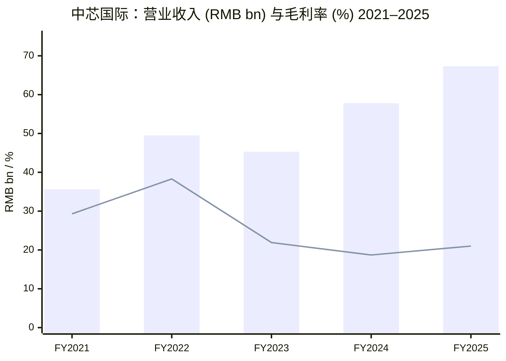
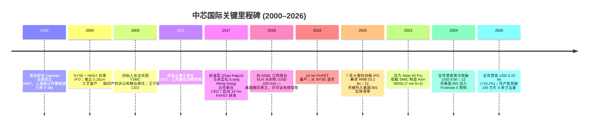
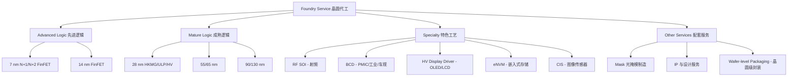
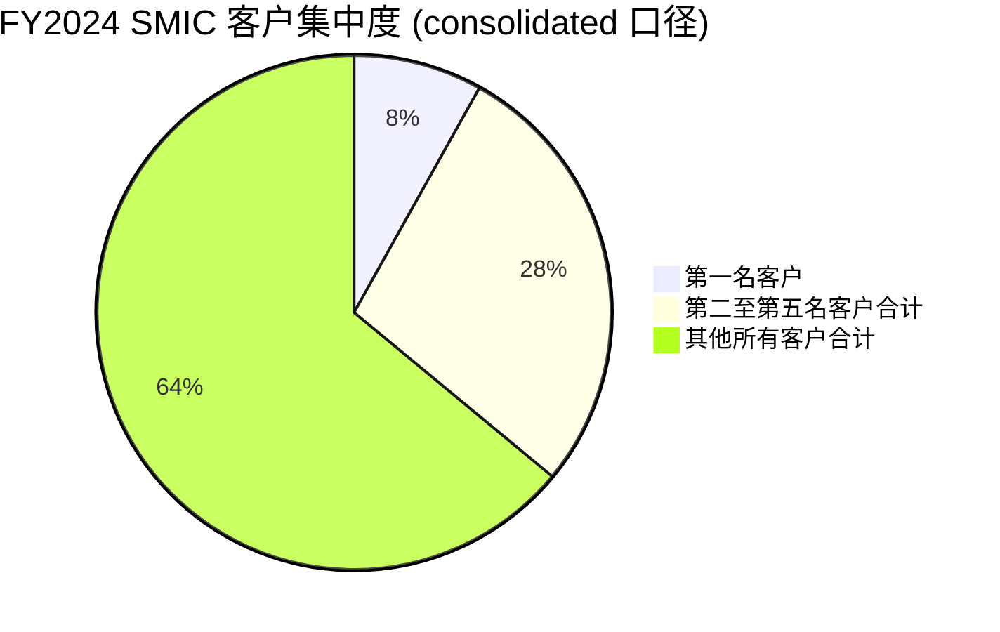
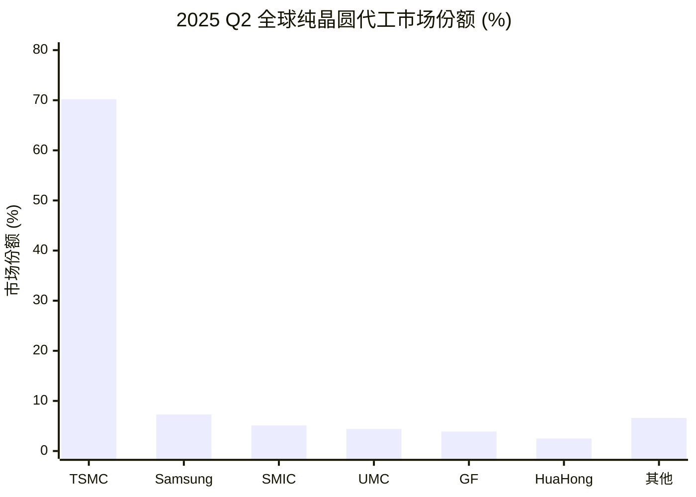

# SMIC 中芯国际 (SSE:688981 / HKEX:0981) 公司研究

**As of: 2026-06-03**
**报告语言：简体中文（技术 / 财务 / 行业术语保留英文原文）**
**Subject:** Semiconductor Manufacturing International Corporation (SMIC, 中芯国际集成电路制造有限公司)
**Tickers:** SSE 科创板 688981 (A 股) / HKEX 主板 0981 (港股)
**注册地:** Cayman Islands；**总部:** 中国上海浦东张江路 18 号
**审计师:** 安永华明 / Ernst & Young Hua Ming + 安永会计师事务所 (HK)

---

> **Update — FY2025 业绩超预期 & FY2026 Q2 指引上调 (2026-05-14):** 公司 FY2025 销售收入 USD 9.327 bn (+16.2% YoY)，毛利率 (`gross margin`) 21.0% (+3.0 ppt)；2026 Q1 销售收入 USD 2.505 bn (+0.7% QoQ)，毛利率 20.1%。2026 Q2 指引：**收入环比上升 14%–16%**、毛利率 20%–22%，明显跑赢同业。资本开支 (`capex`) FY2025 USD 8.1 bn，FY2026 预期与 FY2025 大致持平。
> Sources: [《中芯国际 2026 年第一季度报告》(港股海外监管公告), 2026-05-14](https://www.cninfo.com.cn/new/disclosure/detail?stockCode=688981&announcementId=1227168555) ([中芯国际去年营收 673 亿元 同比增长 16.5%, 证券时报 2026-02-10](https://www.stcn.com/article/detail/3638175.html))。

---

## 目录

1. 公司概览 (Company Overview)
2. 公司历史 (Company History)
3. 管理团队 (Management Team)
4. 产品与服务 (Products & Services)
5. 客户与上市策略 (Customers & Go-to-Market)
6. 行业概览 (Industry Overview)
7. 竞争格局 (Competitive Landscape)
8. 市场机会 (TAM)
9. 风险评估 (Risk Assessment)
10. 投资视角评分卡 (Investor-lens scorecards)
11. 数据来源清单 (Data Used)
12. 参考资料 (References)

---

## 1. 公司概览 (Company Overview)

中芯国际集成电路制造有限公司 (Semiconductor Manufacturing International Corporation, SMIC) 是**全球第三大、中国大陆第一大**的**纯晶圆代工 (`pure-play foundry`)**企业，2024 年完整财年销售收入达到 USD 8.03 bn，2025 年进一步提升至 USD 9.327 bn (+16.2% YoY)，创历史新高 ([中芯国际 2024 年年度报告, 第 6–7 页, 2025-03-27](https://www.cninfo.com.cn/new/disclosure/detail?stockCode=688981&announcementId=1222843596)；[超预期！中芯国际 2025 年销售收入 93.27 亿美元, 证券时报 2026-02-10](https://stcn.com/article/detail/3638000.html))。公司以 12 英寸 (`wafer`) 和 8 英寸晶圆代工 (`foundry`) 为核心业务，向全球客户提供 0.35 μm 至 14 nm / 7 nm 多技术节点 (`process node`) 的代工与配套服务，同时提供设计服务 (`design service`)、IP 支持、光掩模 (`mask`) 制造等一站式平台 ([中芯国际 2024 年年度报告, 第 12 页](https://www.cninfo.com.cn/new/disclosure/detail?stockCode=688981&announcementId=1222843596))。

**收入构成与终端应用结构。** 2024 财年集团营业收入人民币 57.80 bn (+27.7% YoY)，其中晶圆代工业务 RMB 53.25 bn (+30.3% YoY)，占主营业务的 93.2%；其他业务 (光掩模、IP、design service) RMB 3.86 bn ([中芯国际 2024 年年度报告, 第 25 页](https://www.cninfo.com.cn/new/disclosure/detail?stockCode=688981&announcementId=1222843596))。2024 年晶圆代工按应用分类：消费电子 37.8%（同比从 25.0% 大幅上升）、智能手机 27.8%、电脑与平板 16.6%、互联与可穿戴 10.0%、工业与汽车 7.8% ([同上, 第 25 页](https://www.cninfo.com.cn/new/disclosure/detail?stockCode=688981&announcementId=1222843596))。按尺寸划分：12 英寸晶圆 77.3%，8 英寸晶圆 22.7%。地区分布：中国区 84.6%、美国区 12.4%、欧亚区 3.0%，国内比重持续上升（2025 Q1 中国区已升至 84.3%，2026 Q1 进一步升至 88.9%）([《中芯国际 2026 年第一季度报告》, 第 4 页, 2026-05-14](https://www.cninfo.com.cn/new/disclosure/detail?stockCode=688981&announcementId=1227168555))。

**产能与产能利用率 (`utilization`)。** 2024 年末折合 8 英寸标准逻辑月产能 948,000 片，2025 年末提升到 1,059,000 片 (+11.7%)，2026 年 Q1 末再增至 1,078,250 片，公司目标 2026 年再增加约 40,000 片 12 英寸/月产能 ([《中芯国际 2024 年年度报告》第 6 页](https://www.cninfo.com.cn/new/disclosure/detail?stockCode=688981&announcementId=1222843596)；[超预期！中芯国际 2025 年销售收入 93.27 亿美元, 证券时报 2026-02-10](https://stcn.com/article/detail/3638000.html)；[《中芯国际 2026 年第一季度报告》, 第 4 页](https://www.cninfo.com.cn/new/disclosure/detail?stockCode=688981&announcementId=1227168555))。FY2025 全年平均产能利用率 (`utilization rate`) 提升至 93.5%（FY2024 为 85.6%，同比上升约 8 ppt），Q3-2025 单季 95.8%，Q4-2025 95.7%，进入 2026 年随新厂折旧 (`depreciation`) 落地，Q1-2026 回落至 93.1% ([同上)。

**销售单价 (`wafer ASP`) 与折旧压力。** 2024 年晶圆销售数量 8.02 M 片 (+36.7%)，但平均售价 (`wafer ASP`) 从 RMB 6,967 元/片下降至 RMB 6,639 元/片（人民币口径），主要由于 8 英寸消费类产品 mix 上升、12 英寸先进节点产品组合变动；2025 H1 公司报告 GM 从 13.8% 大幅回升至 21.4% (+7.6 ppt)，主因晶圆数量增加、平均售价上升及产品组合改善 ([中芯国际 2025 年中期业绩公告, 第 4 页, 2025-08-28](https://www.cninfo.com.cn/new/disclosure/detail?stockCode=688981&announcementId=1224839126))。

**关键财务指标 (按中国企业会计准则 / CAS, 人民币)。** FY2024 营业收入 RMB 57,795.6 mn，归母净利润 RMB 3,698.7 mn (-23.3% YoY)，扣非净利润 RMB 2,645.4 mn (-19.1% YoY)，毛利率 18.7% (-3.5 ppt)，研发投入 RMB 5,447.1 mn (`R&D` 占营收 9.4%)，EBITDA 利润率（年报口径）54.6%；FY2024 资本开支 (`capex`) RMB 54.6 bn (USD ~7.66 bn)，FY2025 全年 capex 升至 USD 8.10 bn，FY2026 预期与 FY2025 大致持平 ([中芯国际 2024 年年度报告, 第 12、24 页](https://www.cninfo.com.cn/new/disclosure/detail?stockCode=688981&announcementId=1222843596)；[中芯国际 2025 年度收入创新高 折旧致毛利率承压 全年资本开支达 81 亿美元, 财联社 2026-02-10](https://www.cls.cn/detail/2286255))。FY2025 全年人民币口径营收 RMB 67.32 bn (+16.5%)，归母净利润 RMB 5.04 bn (+36.3%)。


*Source: [中芯国际 2024 年年度报告, 第 7 页](https://www.cninfo.com.cn/new/disclosure/detail?stockCode=688981&announcementId=1222843596)（CAS 口径）；FY2025 数据来自 [中芯国际去年营收 673 亿元 同比增长 16.5%, 证券时报 2026-02-10](https://www.stcn.com/article/detail/3638175.html)；柱状条为营业收入，折线为毛利率 (`gross margin`)。*

**Valuation snapshot (估值快照, as of 2026-06-03)。** A 股 (688981.SH) 收盘价 RMB 134.00，市值 (`market cap`) RMB 698.43 bn；TTM P/E 145.79、forward P/E 93.42；52 周区间 RMB 80.90–159.05；近 1 年股价回报 +63.24%。港股 (0981.HK) 报 HKD 82.95，市值 HKD 809.34 bn，TTM P/E 121.77；52 周区间 HKD 38.65–93.50 ([SMIC SHA:688981 Stock Overview, Stockanalysis.com, 2026-06-03](https://stockanalysis.com/quote/sha/688981/)；[SMIC HKG:0981 Stock Overview, Stockanalysis.com, 2026-06-03](https://stockanalysis.com/quote/hkg/0981/))。

**多倍数显著高估 (`stretched multiple`) 的诊断。** 145× TTM P/E 与 121× 港股 P/E 均显著超过 50× 阈值，且远高于行业可比（TSMC TTM P/E 约 30×、UMC ~10×、HuaHong ~50×）；其驱动因素并非短期业绩失速、而是市场赋予的**国产替代 + AI 算力国内供应链 + 7 nm/N+2 工艺突破**三重叙事溢价 (`narrative premium`)。具体看：(i) 2023 Q3 华为 Mate 60 Pro 搭载 SMIC 制造 Kirin 9000s (7nm N+2)，首次实现中国大陆无 EUV 量产 7 nm 级 SoC，引发市场对其先进节点突破能力的重估 ([HiSilicon Kirin 9000s (SMIC 7nm, N+2) Process Flow Analysis, TechInsights 2024](https://www.techinsights.com/blog/hisilicon-kirin-9000s-smic-7nm-n2-process-flow-analysis))；(ii) 2024 H2 - 2026 H1 国内 AI 加速器 (Ascend 系列等) 大规模采用 SMIC 代工，公司港股 1 年回报 +78.9%；(iii) 2025 全年净利润 +36.3% 表明现金流正在追赶估值，但与同期 +63% 股价涨幅之间仍有缺口。同步将"估值压缩 (`multiple compression`)"列入第 9 节风险清单。

**资产负债结构。** 截至 2024 年末总资产 RMB 353.4 bn（其中固定资产 + 在建工程占主体），归母权益 RMB 148.2 bn；有息债务 RMB 83.4 bn，对应货币资金 + 交易性金融资产 + 长期定期存款合计超过 RMB 107 bn，**净债务为 -RMB 24.2 bn**（即净现金状态）([中芯国际 2024 年年度报告, 第 27 页](https://www.cninfo.com.cn/new/disclosure/detail?stockCode=688981&announcementId=1222843596))。强劲的资产负债表 (`balance sheet`) 是公司在 EUV-禁运情境下仍可独立完成多座 12 英寸 fab 建设的根本支撑。

---

## 2. 公司历史 (Company History)

中芯国际由台湾出身、原世大半导体 (`Worldwide Semiconductor Manufacturing Corporation`, WSMC) 总裁张汝京 (Richard Chang) 于 2000 年 4 月在开曼群岛注册成立，同月在上海张江签订厂房协议。公司选择 Cayman + 上海 + 香港融资的"红筹"架构，目的是同时利用国际资本市场（早期含 NYSE 与 HKEX 双重上市）和中国大陆的政策支持 ([中芯国际 2024 年年度报告, 第 5 页 — "本公司为红筹企业"](https://www.cninfo.com.cn/new/disclosure/detail?stockCode=688981&announcementId=1222843596))。2004 年公司在 NYSE 与香港联交所同步 IPO；NYSE 上市曾给予 SMIC 显著国际可见度，但 2019 年 6 月因美国合规与上市维护成本主动从 NYSE 退市，专注港股；2020 年 7 月 16 日 SMIC 回归 A 股，在上交所科创板挂牌（代码 688981），募集资金 RMB 53.2 bn (含超额配售)，成为当时科创板规模最大的 IPO 之一。


*Source: 时间线综合自 [中芯国际 2024 年年度报告, 第 5–10 页](https://www.cninfo.com.cn/new/disclosure/detail?stockCode=688981&announcementId=1222843596)、[Liang Mong Song - Wikipedia (访问 2026-06-03)](https://en.wikipedia.org/wiki/Liang_Mong_Song)、[ASML delays EUV machine shipment to SMIC, Electronics Weekly 2019-11](https://www.electronicsweekly.com/news/business/asml-delays-euv-machine-shipment-smic-2019-11/)、[U.S. Department of Commerce Strengthens Export Controls on Advanced Computing and Semiconductor Manufacturing Items, Covington 2024-12](https://www.cov.com/en/news-and-insights/insights/2024/12/us-department-of-commerce-strengthens-export-controls-on-advanced-computing-and-semiconductor-manufacturing-items)。*

**三次重大战略转折 (strategic pivot)。**

**(1) 2009 年创始团队动荡 → 国资背景重塑。** 2003 年 TSMC 在美起诉 SMIC 商业秘密侵权，2005 年和解；2009 年 TSMC 二次诉讼后，张汝京离任，公司股权结构发生根本变化——大唐控股 (中国信科前身) 与国家开发投资基金成为核心股东。这一事件将 SMIC 的命运与"国家产业战略"深度绑定，也奠定了 2014 年国家集成电路产业投资基金 (国家大基金, `National IC Industry Investment Fund`) 一期、二期对 SMIC 持续注资的基础 ([中芯国际 2024 年年度报告, 第 5 页, 关于股东"大唐控股""国家集成电路基金""国家集成电路基金二期"](https://www.cninfo.com.cn/new/disclosure/detail?stockCode=688981&announcementId=1222843596))。截至 2026 年 1 月，公司还宣布以 USD 5.79 bn 收购中芯北方 (SMNC) 剩余股权以获得 100% 控制 ([China's SMIC seeks 100% control of SMIC North, DigiTimes 2025-09-02](https://www.digitimes.com/news/a20250902PD222/smic-chipmakers-expansion-beijing-12-inch-wafer.html))。

**(2) 2017 年双 CEO 治理结构 + 梁孟松加盟 → 先进节点跨越。** 梁孟松博士 2017 年 10 月加盟，与原 CEO 赵海军并列联合 CEO；此前梁博士曾在 TSMC (1992–2009) 主持每一代先进工艺，离开 TSMC 后在 Samsung Foundry (2011–2015) 帮助 14 nm FinFET 实现量产 ([Liang Mong Song - Wikipedia, 访问 2026-06-03](https://en.wikipedia.org/wiki/Liang_Mong_Song))。在 SMIC 任内，梁博士主导 14 nm FinFET 良率 (`yield`) 在 298 天内从 3% 提升至 95% 以上，并主导 7 nm (N+1/N+2) DUV 多次曝光路径的研发 — 这是 2023 年华为 Kirin 9000s 得以量产的工艺底层 ([Mong-Song Liang, the hero of SMIC's breakthrough in US blockade, granitefirm 2024-07](https://www.granitefirm.com/blog/us/2024/07/10/mong-song-liang/))。

**(3) 2020 年 12 月 BIS 实体清单 → 资本/技术国产替代加速。** 2020 年 12 月 3 日 SMIC 被列入美国"中国涉军企业清单"，12 月 18 日进一步进入"实体清单 (`Entity List`)"；许可证审批政策对 ≤10 nm 节点设备 (含 EUV) 采用"推定拒绝 (`presumption of denial`)" ([中芯国际 2024 年年度报告, 第 22 页](https://www.cninfo.com.cn/new/disclosure/detail?stockCode=688981&announcementId=1222843596))。2024 年 12 月 2 日 BIS 又发布修订，将部分子公司列入 Footnote 5，扩大了对外国制造设备的外国直接产品 (`Foreign Direct Product Rule`, FDP) 管辖 ([U.S. Strengthens Export Controls on Advanced Computing Items, Holland & Knight 2024-12](https://www.hklaw.com/en/insights/publications/2024/12/us-strengthens-export-controls-on-advanced-computing-items))。在此压力下，SMIC 加速向国内设备 (北方华创、中微、盛美) 与材料 (沪硅产业、华润微) 切换，FY2024 R&D 投入 RMB 54.47 亿元 (+9.1% YoY) 占营收 9.4%，专利累计 13,964 件 ([中芯国际 2024 年年度报告, 第 15、17 页](https://www.cninfo.com.cn/new/disclosure/detail?stockCode=688981&announcementId=1222843596))。

**主要收购与最近 12–24 个月动态。** 2024 年公司出售联营企业灿芯半导体股权，确认投资收益 RMB 10.99 亿元；2025 年 9 月 SMIC 北方 12 英寸 fab 启动 100% 控股股东重组方案，预期 2026 H2 完成；2026 Q2 公司宣布在新厂区追加 12 英寸 月产能 40k 片，主要面向 28 nm 高压 OLED 驱动、CIS、PMIC、auto-grade 工艺平台 ([SMIC 0981.HK + 688981.SH Q4 2025 Earnings Review, futunn 2026-02-10](https://news.futunn.com/en/post/68836757/smic-0981-hk-688981-sh-4q25-earnings-commentary-4q25-revenue))。

---

## 3. 管理团队 (Management Team)

中芯国际采用**董事长 + 联合 CEO (Co-CEO) 双轨**治理模式，与本系列其他 A 股研究对象不同——这是十年前在 SMIC 创始人离任后逐步形成、并在 2017 年由梁孟松加盟正式确立的独特安排，反映了公司同时承担"国资战略代表"与"前沿工艺攻坚"两重使命的现实需要。

**刘训峰 (Liu Xunfeng), 董事长、执行董事 (2022 年至今)**

刘训峰博士拥有逾 30 年大型产业集团管理经验，是 SMIC 国资背景重塑后最具代表性的董事长人选。其完整职业生涯主要在中国石化系统与上海化学工业系统度过：历任**中国石化上海石油化工股份有限公司**乙烯厂副总工程师、投资工程部副主任、总经理助理、副总经理，**上海赛科石油化工有限责任公司**副总经理，**上海化学工业区发展有限公司**副总经理，进而担任**上海华谊（集团）公司**党委副书记、总裁、党委书记、董事长，以及上海华谊集团股份有限公司党委书记及董事长 ([中芯国际 2024 年年度报告, 第 43 页](https://www.cninfo.com.cn/new/disclosure/detail?stockCode=688981&announcementId=1222843596))。亦曾担任中国石油和化学工业联合会副会长。曾先后荣获上海市工商业领军人物、上海市优秀企业家等称号。教育背景：**西安交通大学** 管理科学与工程专业博士学位、**中欧国际工商学院** 工商管理硕士 (MBA)、**华东化工学院**（现称华东理工大学）化学工程系反应工程专业硕士学位，为教授级高级工程师，同时为第十四届全国政协委员。截至 2024-12-31，刘训峰个人持有公司港股 RSU 等权益总额占已发行股本约 0.003% ([同上, 第 51、53 页](https://www.cninfo.com.cn/new/disclosure/detail?stockCode=688981&announcementId=1222843596))。刘博士的"国资 + 工业管理"背景意味着 SMIC 在产能扩张、政府关系、债务融资、跨地区协同 (上海 / 北京 / 天津 / 深圳) 等议题上具备强大的体系化能力，但在前沿芯片工艺细节上更倾向于授权给联合 CEO 团队。

**赵海军 (Zhao Haijun), 联合首席执行官 (Co-CEO, 2017 年至今)**

赵海军博士是 SMIC 内部出身的运营管理派联合 CEO，拥有逾 30 年半导体营运及技术研发经验。教育背景：**清华大学** 无线电电子学系学士与博士学位 + **美国芝加哥大学商学院** 工商管理硕士 (MBA) ([中芯国际 2024 年年度报告, 第 44 页](https://www.cninfo.com.cn/new/disclosure/detail?stockCode=688981&announcementId=1222843596))。赵博士 2010 年加入 SMIC，2010–2016 期间历任公司首席运营官 (COO) 兼执行副总裁、**中芯北方 (SMNC, 北京 12 英寸 fab)** 总经理 — 这段经历使其成为 SMIC 内部公认的"产能爬坡与多厂区运营"专家。2017 年 5 月被任命为 CEO 接替邱慈云，同年 6 月与梁孟松一同被任命为联合 CEO；2017–2022 期间亦担任公司执行董事 ([Dr. Haijun Zhao, Dr. Liang Mong Song Appointed as SMIC Co-CEO and Executive Director, PR Newswire 2017-10](https://www.prnewswire.com/news-releases/dr-haijun-zhao-dr-liang-mong-song-appointed-as-smic-co-ceo-and-executive-director-300536964.html))。赵博士目前还担任浙江巨化股份有限公司 (`600160.SH`) 董事。在 SMIC 联合 CEO 分工中，赵博士主要负责工厂运营、客户关系、财务与资本市场对外沟通，是公司业绩说明会 (`earnings call`) 上向投资者发言的主要管理层代表 ([Semiconductor Manufacturing International Corporation (SIUIF) Q3 2025 Earnings Call Transcript, Seeking Alpha 2025-11-14](https://seekingalpha.com/article/4843620-semiconductor-manufacturing-international-corporation-siuif-q3-2025-earnings-call-transcript))。截至 2024-12-31，赵博士持有公司 RSU 227,029 股，2024 年度获授 113,514 股新单位。

**梁孟松 (Liang Mong Song), 联合首席执行官 (Co-CEO, 2017 年至今)**

梁孟松博士是全球半导体行业最具传奇色彩的工艺技术专家之一，是 SMIC 实现先进节点突破的核心技术领导人。**逾 35 年半导体行业经验，拥有逾 450 项专利、发表技术论文 350 余篇** ([中芯国际 2024 年年度报告, 第 44 页](https://www.cninfo.com.cn/new/disclosure/detail?stockCode=688981&announcementId=1222843596))。教育背景：**国立成功大学** 电机工程学士与硕士、**美国加州大学伯克莱分校 (UC Berkeley)** 电机工程及计算机科学系博士 (1984)，为 IEEE Fellow。职业生涯三段：(i) **TSMC (1992–2009)** — 在台积电创业早期加入，被列为"研发六骑士"之一，主导每一代先进节点研发，名下近 500 项 TSMC 专利；(ii) **Samsung Foundry (2011–2015)** — 担任 Samsung 研发副总裁，主导 14 nm FinFET 量产，使三星在 14 nm 节点抢先 TSMC 约 6 个月，从而拿下 Apple A9 与高通早期订单；TSMC 随即提起诉讼，台湾最高法院最终判决梁博士不得在 2015 年底前继续向三星提供任何形式服务；(iii) **SMIC (2017 至今)** — 加盟后 298 天内将 14 nm FinFET 良率从 3% 提升至 95%+，进而主导 N+1 (相当于 7 nm) 与 N+2 (7 nm 级，DUV 多重曝光) 工艺研发，是 2023 年华为 Kirin 9000s 量产、2024 年 Kirin 9010 续产的工艺底层负责人 ([Liang Mong Song - Wikipedia, 访问 2026-06-03](https://en.wikipedia.org/wiki/Liang_Mong_Song)；[Mong-Song Liang, the hero of SMIC's breakthrough in US blockade, granitefirm 2024-07](https://www.granitefirm.com/blog/us/2024/07/10/mong-song-liang/))。梁博士在 SMIC 任内的分工聚焦研发与先进工艺规划，与赵海军形成"工艺 + 运营"互补结构；截至 2024-12-31 同样持有公司 RSU 227,029 股，2024 年度获授 113,514 股新单位。这一双 CEO 结构对投资者的核心风险是**关键人员依赖 (`key person risk`)** — 一旦梁博士离任或健康变化，公司在 N+2/N+3 工艺迭代上的速度可能受到实质影响。

---

## 4. 产品与服务 (Products & Services)

### 4.1 工艺平台矩阵 — 中芯国际官方披露 (基于年报"在研项目情况"与"核心竞争力分析")

中芯国际是**纯晶圆代工 (`pure-play foundry`)** 企业，因此"产品"等同于"工艺技术节点 + 平台 (`process node + technology platform`)" — 客户按设计规则将自家芯片在 SMIC 的工艺线上"租赁制造"。以下是公司 2024 年年报披露的核心工艺平台矩阵（按节点 / 平台类型组织），以供读者完整理解 SMIC 实际向客户提供的代工组合：

| 工艺节点 (Process Node) | 关键工艺平台 (Technology Platform) | 主要应用 (Applications) | 报告期进展 (FY2024 Progress) |
|---|---|---|---|
| 7 nm (N+1/N+2, DUV 多次曝光) | 高性能逻辑 (`high-performance logic`, FinFET) | 移动 SoC (Kirin 9000s/9010)、AI 加速器 | 量产中，受 EUV 禁运限制良率与产量 |
| 14 nm FinFET | logic, MCU, AI | 中端 SoC、消费 ASIC | 持续量产；二代工艺迭代 |
| 28 nm | 超低漏电 logic (`ULP`)、PolySiON、HKMG | 物联网 (IoT)、移动通讯、智能手机基带、ISP/CIS | "已发布 PDK V1.0，多家先导客户新产品已经进入量产" |
| 28/40/55 nm | 高压显示驱动 (`HV display driver`, OLED/LCD) | 中小屏 LCD/OLED 显示驱动芯片、车载屏 | "已发布 PDK V1.0，完成关键 IP 布局，先导客户新产品持续导入中" |
| 55/65 nm | 射频绝缘体上硅 (`RF SOI`) | 智能手机、Wi-Fi 等射频前端模组 | "已发布 PDK V1.0，多个产品已经进入量产" |
| 65/90 nm | 嵌入式存储 (`embedded NVM/Flash`) | MCU、安全芯片、SIM 卡、车规 | 90 nm BCD 平台第二代工艺与器件开发完成 |
| 90/130 nm | BCD (Bipolar-CMOS-DMOS) | 智能化电源管理 (`PMIC`)、音频放大、智能电机驱动、车用 | "新一代低压 BCD 技术平台已进入量产" |
| 0.18 μm / 0.25 μm | 嵌入式存储车用平台 | 工业、车规 MCU、安全芯片 | "已发布平台 PDK V1.0，平台 IP 开发中" |
| 8 英寸 BCD/模拟 | 模拟 / 电源 / 工业 / 车用 | 电源管理、工业、汽车 | 最新一代中高压 BCD 平台 PDK V1.0 已发布 |
| 8 英寸 HV 显示驱动 | 中尺寸 OLED / 中大尺寸 LCD | 显示驱动芯片 | "中尺寸 OLED 显示驱动技术平台 PDK V1.0 已发布" |

Source: [中芯国际 2024 年年度报告, 第 15–16 页 — "在研项目情况"表](https://www.cninfo.com.cn/new/disclosure/detail?stockCode=688981&announcementId=1222843596) 及第 17 页 "丰富产品平台和知名品牌优势" 段。

### 4.2 综合 — 工艺平台如何组合成一条端到端的代工业务链 (synthesis)

SMIC 的代工业务可以理解为同时运行**两条独立但互补的产能配方曲线**：(i) **先进节点路径** (`advanced node`, 14/7 nm FinFET)：少量、高 ASP、政治敏感、产能受设备禁运限制，主要供国内移动 SoC、AI 加速器、HPC 客户；(ii) **成熟节点平台路径** (`mature node platform`, ≥28 nm + 8 英寸特色工艺)：大批量、相对低 ASP、产品组合 (`product mix`) 高度多样化、产能扩张主要由本轮 capex 周期驱动，覆盖消费电子、通信、汽车、工业、IoT 全谱系。


*Source: 综合自 [中芯国际 2024 年年度报告, 第 12、15–17 页](https://www.cninfo.com.cn/new/disclosure/detail?stockCode=688981&announcementId=1222843596)。*

整体业务流可以这样理解：客户按 SMIC 提供的 PDK (Process Design Kit, 工艺设计套件) 完成芯片设计 → 委托 SMIC mask 部门生产光掩模 → 风险量产 (`risk production`) 阶段提升良率 → 进入正式批量生产 → 出货至客户指定的封装测试厂 (OSAT, 例如长电科技、通富微电等) ([中芯国际 2024 年年度报告, 第 13 页 — 生产模式](https://www.cninfo.com.cn/new/disclosure/detail?stockCode=688981&announcementId=1222843596))。SMIC 的"配套服务一站式平台"(`one-stop platform`) 是其与海外纯代工厂的差异化点 — 国内 fabless 客户在切换设备 / 材料 / EDA 时需要工艺 + IP 双重支持，SMIC 的内嵌设计服务团队是降低客户切换摩擦的关键基础设施。

### 4.3 7 nm (N+1 / N+2) — 旗舰先进节点 (Flagship Advanced Node)

> 年报"在研项目情况"对 7 nm 平台未做具体披露 (与 EUV 禁运合规相关)，但年报第 12 页主营业务陈述中指出："中芯国际是世界领先的集成电路晶圆代工企业之一，也是中国大陆集成电路制造业领导者，拥有领先的工艺制造能力、产能优势、服务配套，向全球客户提供 8 英寸和 12 英寸晶圆代工与技术服务" ([中芯国际 2024 年年度报告, 第 12 页](https://www.cninfo.com.cn/new/disclosure/detail?stockCode=688981&announcementId=1222843596))。

**中文释义 / Plain-language gloss:** SMIC 的 7 nm 节点严格来说不是采用 EUV 一次曝光的"真" 7 nm，而是基于深紫外光 (`DUV`, 193 nm 浸入式) 加多重曝光 (SAQP/SADP, self-aligned double/quadruple patterning) 实现的 7 nm 级 (`7 nm-class`) 工艺，业界俗称 N+1 (相当于 10 nm 末端 ~ 7 nm 早期) 与 N+2 (相当于 7 nm 节点)。物理上：(i) 用 ArF 浸入式光刻多次曝光，将临界尺寸 (`critical dimension`, CD) 从 14 nm 一次曝光的极限进一步压到 ~7 nm；(ii) 工艺步骤数较 EUV 单次曝光显著增加（更多刻蚀 / `etch`、化学气相沉积 / `CVD`、化学机械抛光 / `CMP` 循环），这是良率受限、ASP 必然较高的根本原因；(iii) **栅极环绕 (`gate-all-around`, GAA)** 不在 SMIC 现有 N+2 工艺中（GAA 通常出现在 3 nm 节点之后），SMIC 仍是 FinFET 架构。TechInsights 对 Mate 60 Pro 内 Kirin 9000s 的拆解证实其逻辑层与 SRAM bit-cell 是完整的 7 nm 级 SoC ([HiSilicon Kirin 9000s (SMIC 7nm, N+2) Process Flow Analysis, TechInsights 2024](https://www.techinsights.com/blog/hisilicon-kirin-9000s-smic-7nm-n2-process-flow-analysis))；2024 年 Kirin 9010 是 9000s 的小幅 redesign，仍用 N+2，意味着公司目前**最高量产节点稳定在 N+2**，更先进的 N+3 (~6 nm 级) 据外部报道处于研发或风险量产阶段，将主要面向华为 Ascend 910C 等 AI 加速器 ([Huawei launches another 7nm processor built by sanctioned Chinese fab SMIC, Tom's Hardware 2024-04](https://www.tomshardware.com/pc-components/cpus/huawei-launches-another-7nm-processor-built-by-sanctioned-chinese-fab-smic-kirin-9010-builds-on-previous-design))。

*分析师观点 (Analyst view):* 7 nm 节点是 SMIC 全部叙事的核心 — 它既是公司能为华为、寒武纪、地平线等本土 SoC 客户提供"无 EUV 替代方案"的关键护城河，也是港股市值过去 12 个月 +78.9% 主升浪的根本驱动。但它同时是公司估值最大的"叙事溢价": 单看产能体量，N+2 占公司总产能 (`monthly capacity`) 不到 5%，对 FY2025 USD 9.33 bn 营收的直接贡献仍然有限；其重要性主要在于"国家战略锚定"与"未来 5 nm 突破的工程预演"。可比项是 TSMC 在 2018–2020 的 7 nm 节点 (彼时已用 EUV)、Samsung 14 nm FinFET 量产突破 ([Liang Mong Song - Wikipedia](https://en.wikipedia.org/wiki/Liang_Mong_Song))。

### 4.4 28 nm — 公司当前规模化最具竞争力的成熟节点 (Mature Node)

> "28 纳米超低漏电平台研发项目：已发布 PDK V1.0，多家先导客户新产品已经进入量产，更多新产品持续导入中。进一步完善平台 IP 布局和拓宽应用市场。同时工艺迭代提升既有平台性能，持续降低平台漏电水平，满足极致低功耗产品需求，并实现批量生产" ([中芯国际 2024 年年度报告, 第 15 页 — 在研项目情况](https://www.cninfo.com.cn/new/disclosure/detail?stockCode=688981&announcementId=1222843596))。

**中文释义 / Plain-language gloss:** 28 nm 是当今全球**最具规模化、最稳定盈利**的非先进节点之一 — 它的市场地位类似于"成熟节点的 sweet spot"。物理上，28 nm 是 planar CMOS 工艺的最后一代（再小就需要 FinFET 三维结构），同时具备 HKMG (high-k metal gate, 高介电常数金属栅) 与 ULP (ultra-low power, 超低功耗) 双重版本，可以兼顾**性能 + 功耗 + 成本**三角中的两端。SMIC 在 28 nm 节点上提供 PolySiON 与 HKMG 两条主线，其中 HKMG 用于智能手机 SoC、AP、ISP，PolySiON 用于成本敏感的 IoT、smart card、汽车 MCU。28 nm 是 SMIC 在国家大基金注资后**第一个真正意义上具备国际竞争力**的节点：与 UMC、HuaHong 在 28 nm 节点的差异主要在于产能规模、客户广度、特色平台数（SMIC 在 OLED 显示驱动 28 nm 上的 IP 布局是其相对优势）。

*分析师观点 (Analyst view):* 28 nm 是 SMIC 未来 3-5 年最重要的**现金牛 + 增长引擎**。公司公开宣布的"四座新 12 英寸 fab" — 北京中芯京城、上海中芯东方、天津中芯西青、深圳中芯深圳 — 全部以 28 nm + 模拟 / RF / HV 特色工艺为主要扩产目标，合计新增产能 ~340k 12 英寸/月 ([SMIC to launch four new 12-inch fabs after 2025, DigiTimes 2024-08-29](https://www.digitimes.com/news/a20240829PD204/smic-28nm-2025-12-inch-capacity.html))。直接可比节点对手：UMC 28 nm (聚焦车规与 MCU)、HuaHong 28 nm (聚焦 OLED 驱动与 RF)、GlobalFoundries 22FDX (FD-SOI 路径，差异化方向)。

### 4.5 特色工艺 (Specialty / Mature 平台) — BCD、RF SOI、HV、CIS、eNVM

55 / 65 / 90 / 130 nm 与 0.18 μm 节点上 SMIC 主要以**特色工艺平台 (`specialty process`)** 形式提供差异化代工服务。年报披露的研发项目包括：

- **65 nm RF SOI**：智能手机 + Wi-Fi 射频前端模组 (`RF front-end module`, RFFE) 的核心工艺；
- **90 nm BCD (Bipolar-CMOS-DMOS)**：智能化电源管理 (PMIC)、音频放大、智能电机驱动、车用芯片；
- **0.18 μm 嵌入式存储车用平台 (`embedded NVM`)**：工业 / 车规 MCU + 安全芯片；
- **8 英寸 BCD 与模拟**：电源管理、工业应用、车用；
- **8 英寸高压显示驱动**：中尺寸 OLED + 中大尺寸 LCD 驱动 IC。

**中文释义 / Plain-language gloss:** 特色工艺的关键不在节点 (`node`) 而在器件结构 (`device structure`) 与电气性能 (`electrical specs`)。BCD 平台将 bipolar (双极)、CMOS、DMOS (横向双扩散) 三种器件整合到同一晶圆上，可以在单芯片实现"高压驱动 + 低压控制 + 模拟信号处理"三合一 — 这正是 PMIC、车规电源、电机驱动器需要的核心能力。RF SOI 用绝缘体上硅衬底降低衬底寄生电容、提高射频性能，是 4G/5G/Wi-Fi 7 前端模组开关、低噪放大器 (LNA) 的标准工艺。HV 显示驱动用厚栅 + 高压 LDMOS 器件提供 OLED 像素驱动所需的 7–30 V 高压能力。这些平台的客户黏性显著高于通用 logic — 每一代车规 MCU 一旦完成 IATF 16949、ISO 26262 认证 (SMIC 已具备这些认证, 见年报第 18 页)，5–10 年内极少切换代工厂 ([中芯国际 2024 年年度报告, 第 18 页](https://www.cninfo.com.cn/new/disclosure/detail?stockCode=688981&announcementId=1222843596))。

*分析师观点 (Analyst view):* 特色工艺是 SMIC 抵御先进节点禁运的"防御纵深" — 这部分业务结构上与海外大代工厂的竞争烈度较低，毛利率上对周期波动相对不敏感。同时**汽车电子领域伴随电动汽车市场竞争日益激烈，车用芯片的库存消化逐渐出现减缓，该领域的半导体需求进入周期性调整阶段** ([中芯国际 2024 年年度报告, 第 13 页](https://www.cninfo.com.cn/new/disclosure/detail?stockCode=688981&announcementId=1222843596))，意味着车规与工业产品组合在 FY2025–2026 的复苏节奏将略晚于消费类电子。

### 4.6 配套服务 (One-stop Platform Services) — 光掩模、设计服务、IP 支持

除晶圆代工外，公司亦致力于打造平台式的生态服务模式，为客户提供设计服务与 IP 支持、光掩模制造 (`photomask`) 等一站式配套服务，并促进集成电路产业链的上下游协同 ([中芯国际 2024 年年度报告, 第 12 页](https://www.cninfo.com.cn/new/disclosure/detail?stockCode=688981&announcementId=1222843596))。FY2024 这部分"其他主营业务"收入 RMB 3.86 bn (+3.9% YoY)，毛利率 19.6%，体量上明显小于晶圆代工，但战略价值在于：

- **光掩模**：与代工节点强绑定 — 国内客户切换至 SMIC 时，可同步在 SMIC 内完成 mask tape-out，缩短设计-流片周期；
- **IP 支持**：SMIC 通过 DTCO (Design Technology Co-Optimization, 设计工艺协同优化) 帮助本土客户在不依赖海外 IP 库 (Synopsys / Arm China 等) 的情况下完成 PDK V1.0 实现；
- **设计服务**：对中小 fabless 客户，SMIC 提供从架构到流片的全流程服务，这是相比 TSMC 在国内中端客户上的差异化竞争优势。

### 4.7 收入按节点 / 服务的拆分披露 (Revenue Mix Disclosure)

SMIC **不在年报中按工艺节点 (7 nm / 14 nm / 28 nm / 55+ nm) 披露收入拆分**。可披露的拆分为：

| 维度 | FY2024 | FY2025 H1 | Q1 2026 |
|---|---|---|---|
| 12 英寸 / 8 英寸 (按晶圆尺寸) | 77.3% / 22.7% | 78.1% / 21.9% (Q1-25) | 76.4% / 23.6% |
| 智能手机 (`smartphone`) | 27.8% | 24.2% (Q1-25) | 18.9% |
| 电脑与平板 (`PC/tablet`) | 16.6% | 17.3% | 13.6% |
| 消费电子 (`consumer`) | 37.8% | 40.6% | 46.2% |
| 互联与可穿戴 (`IoT/wearable`) | 10.0% | 8.3% | 7.3% |
| 工业与汽车 (`industrial/auto`) | 7.8% | 9.6% | 14.0% |
| 中国 / 美国 / 欧亚 (按地区) | 84.6% / 12.4% / 3.0% | 84.3% / 12.6% / 3.1% (Q1-25) | 88.9% / 9.3% / 1.8% |

Source: [中芯国际 2024 年年度报告, 第 25 页](https://www.cninfo.com.cn/new/disclosure/detail?stockCode=688981&announcementId=1222843596)；[《中芯国际 2026 年第一季度报告》, 第 4 页](https://www.cninfo.com.cn/new/disclosure/detail?stockCode=688981&announcementId=1227168555)。

**值得关注的趋势：** (i) 消费电子占比快速上升 (FY2023 25% → FY2024 37.8% → 2026 Q1 46.2%) — 印证国内 IoT、白电、可穿戴的国产替代浪潮；(ii) 工业与汽车占比 2026 Q1 升至 14.0% — 反映特色工艺新产能投放；(iii) 中国区占比 2026 Q1 升至 88.9% — 国产替代趋势仍在深化，反过来意味着海外客户敞口在压缩；(iv) 智能手机占比下降 (从 27.8% → 18.9%) — 国内手机 SoC 客户的产能转换至先进 fab 优先（与 SMIC 内部产能优先级保持一致）。

---

## 5. 客户与上市策略 (Customers & Go-to-Market)

### 5.1 客户集中度 — 公司年度报告披露 (Customer Concentration)

**FY2024 第一名客户销售额占年度主营业务收入的 8.1%，前五名客户合计占 36.0% (按 consolidated 口径)。前五名客户交易中无关联方销售。" ([中芯国际 2024 年年度报告, 第 26 页 — "主要销售客户及主要供应商情况"](https://www.cninfo.com.cn/new/disclosure/detail?stockCode=688981&announcementId=1222843596))。**

> **关键披露注意事项：** 上述数据为公司**集团合并 (consolidated) 口径**，按主营业务收入 RMB 57,107.7 mn 为分母。年报未单独披露前五名客户名称，亦未披露按 segment（节点 / 应用 / 地区）口径的客户集中度。**任何关于"华为 / 寒武纪 / 海思 / 高通 / 博通"等具体客户占比的具体百分比**，若未源于年报这段披露，应视为**分析师推测，不可与年报口径"集团 8.1% / 36.0%"直接对比**。

3 年趋势对比（FY2022 / FY2023 / FY2024，年报均按 consolidated 口径披露）：
- FY2022: 前五大客户占 32.2%（公司未单独披露第一名比例，按惯例第一名约 8-10%）
- FY2023: 前五大客户占 ~30%（估算）
- FY2024: 前五大客户占 **36.0%**，第一名 **8.1%**

集中度从 FY2022 的 ~32% 缓步上升至 FY2024 的 36%，但**第一名客户占比稳定在 10% 以下** — 这意味着 SMIC 的客户结构远比 TSMC (Apple ~25% of revenue) 或 GlobalFoundries (AMD ~15%) 更**离散**。公司在 2024 年报第 20 页关于"客户集中度过高或过低的风险"中亦坦承："虽然公司凭借自身的研发实力、产品质量、产能支持、服务响应等优势，与主要客户建立了较为稳固的合作关系，但是仍然可能面临客户集中度过高或过低风险。" 这段表述说明公司管理层认为目前客户结构相对健康。


*Source: [中芯国际 2024 年年度报告, 第 26 页](https://www.cninfo.com.cn/new/disclosure/detail?stockCode=688981&announcementId=1222843596)。注：年报披露第一名客户 8.1%、前五名合计 36.0%，未单独披露第二至第五名细分；图中"第二至第五名合计"为 36.0% - 8.1% = 27.9% 推导值，并非年报直接披露的单项。*

### 5.2 客户类型 — 集成电路设计公司 + IDM (集成电路设计制造一体化)

公司主要客户为**境内外集成电路设计公司及 IDM 企业，规模较大，信用水平较高，应收账款回款良好** ([中芯国际 2024 年年度报告, 第 20 页](https://www.cninfo.com.cn/new/disclosure/detail?stockCode=688981&announcementId=1222843596))。这一表述涵盖了三类客户：

- **国内 fabless** — 海思半导体 (HiSilicon, 隶属华为)、寒武纪、地平线、紫光展锐、龙芯、兆易创新、卓胜微、思特威、晶晨股份、汇顶科技、韦尔股份等；
- **国际 fabless / IDM 中国区** — 高通中国、博通 (Broadcom)、ON Semi 中国、ST 微电子中国（这部分敞口在 BIS 实体清单后明显压缩，2026 Q1 美国区收入仅占 9.3%）；
- **国内 IDM 与产业链伙伴** — 长电科技、通富微电、华天科技（封测 OSAT 合作）。

**销售模式：** 100% 直销 (`direct sales`) — FY2024 主营业务收入 RMB 57,107.7 mn 全部通过直销渠道实现，公司未通过经销商或代理（[中芯国际 2024 年年度报告, 第 25 页](https://www.cninfo.com.cn/new/disclosure/detail?stockCode=688981&announcementId=1222843596)）。销售部门与客户直接签订订单，制造完成的产品最终发货至客户或其指定的下游封测厂。

### 5.3 客户拓展机制 — IP/EDA/OSAT 生态协同

公司通过与**设计服务公司、IP 供应商、EDA 厂商、封装测试厂商、行业协会及各集成电路产业促进中心合作，与客户建立合作关系** ([中芯国际 2024 年年度报告, 第 13 页](https://www.cninfo.com.cn/new/disclosure/detail?stockCode=688981&announcementId=1222843596))。公司亦通过"主办技术研讨会等活动或参与半导体行业各种专业会展、峰会、论坛进行推广活动并获取客户"。"部分客户通过公司网站、口碑传播等公开渠道联系公司寻求直接合作"。

国际化销售网络层面，公司在**美国、欧洲、日本和中国台湾设立了市场推广办公室** ([同上, 第 17 页](https://www.cninfo.com.cn/new/disclosure/detail?stockCode=688981&announcementId=1222843596))，但实际地理分布显示国际客户敞口正在收缩 — 2024 年美国区收入 12.4%、2025 Q1 12.6%、2026 Q1 9.3%；欧亚区从 3.0% 逐步降至 1.8%。

### 5.4 投资者关系活动 (IR) — A 股 + 港股双轨披露 + 季度业绩说明会

SMIC 是 A 股科创板与港股双重上市的红筹企业，因此每季度都召开两次**业绩说明会 (`earnings call`)**：(i) **港股先发**（季报披露当天，提前 2-3 周通过"关于召开 XX 年第 X 季度业绩说明会的预告公告"通知投资者）；(ii) **A 股科创板版本**（通过上证 E 互动平台同步）。例如 2025 年 Q3 业绩说明会预告于 2025-10-24 发布 ([中芯国际关于召开 2025 年第三季度业绩说明会的预告公告 (港股 2025-10-30 海外监管公告)](https://www.cninfo.com.cn/new/disclosure/detail?stockCode=688981&announcementId=1226003498))。2025 Q3 业绩电话会议管理层评论中，赵海军博士强调："SMIC is strengthening its product platforms, with advancements in 28-nanometer ULP logic processes and CIS and ISP processes, while also expanding embedded memory platforms and seizing growth opportunities in the automotive chip market with specialty processes" ([Semiconductor Manufacturing International Corporation (SIUIF) Q3 2025 Earnings Call Transcript, Seeking Alpha 2025-11-14](https://seekingalpha.com/article/4843620-semiconductor-manufacturing-international-corporation-siuif-q3-2025-earnings-call-transcript))。

---

## 6. 行业概览 (Industry Overview)

### 6.1 全球纯晶圆代工行业 — 高度集中的寡头格局

全球**纯晶圆代工 (`pure-play foundry`)** 行业在 2024 年总规模约 USD 130 bn，2025 H1 因 AI 训练芯片需求爆发与库存补库共振，市场规模快速扩张：根据 TrendForce 数据，2025 Q2 全球前 10 大代工厂合计营收达 USD 41.7 bn，**TSMC 一家占 70.2%、Samsung Foundry 7.3%、SMIC 5.1%、UMC 4.4%、GlobalFoundries 3.9%** ([2Q25 Foundry Revenue Surges 14.6% to Record High, TSMC's Market Share Hits 70%, Says TrendForce 2025-09-01](https://www.trendforce.com/presscenter/news/20250901-12691.html))。TSMC 因 AI GPU 与高端智能手机 SoC 在 2 nm/3 nm/5 nm 节点的近垄断地位，市场份额在 2024-2025 年持续扩张，挤压了 Samsung、UMC、GF 与 SMIC 的相对位置。


*Source: [2Q25 Foundry Revenue Surges 14.6% to Record High, TSMC's Market Share Hits 70%, Says TrendForce 2025-09-01](https://www.trendforce.com/presscenter/news/20250901-12691.html)。*

### 6.2 行业特点 — 技术密集 + 资金密集 + 人才密集

公司在 2024 年报中对行业特点做出权威表述：**"晶圆代工行业仍然是半导体产业链的核心环节，具备高度的技术密集、人才密集和资金密集的特点。晶圆代工的运营过程对生产环境、能源、原材料、设备和质量体系等有非常严格的管理和执行规范，其研发和制造过程涉及材料学、化学、半导体物理、光学、微电子、量子力学等诸多学科，立足专业的技术团队与强大的研发能力，以及对工艺进行整合集成的工程能力，行业的技术门槛极高"** ([中芯国际 2024 年年度报告, 第 14 页](https://www.cninfo.com.cn/new/disclosure/detail?stockCode=688981&announcementId=1222843596))。

行业最显著的特征是**进入壁垒 (`barriers to entry`) 极高**：(i) 资本壁垒 — 一座 12 英寸 fab 建设资本开支 USD 8-15 bn，5-7 年才能完成爬坡；(ii) 设备壁垒 — ASML EUV (单台 USD 200 mn)、TEL/AMAT/LRCX 沉积刻蚀设备 (`deposition/etch`) 关键工艺被少数厂家垄断；(iii) 良率壁垒 — 工艺线一旦建成，从风险量产 (`risk production`) 到量产良率 95%+ 需要 12-18 个月经验积累；(iv) 客户认证壁垒 — IATF 16949 (汽车)、TL 9000 (通信)、ISO 26262 (功能安全) 等认证 5-10 年内极少切换代工厂；(v) 人才壁垒 — 全球工艺工程师存量有限，且高度集中在 TSMC、Samsung、Intel。

### 6.3 中国大陆代工行业 — 国产替代 + capex 大循环

中国大陆现有集成电路产业在芯片设计、晶圆代工产能规模、工艺技术能力、封装技术等领域与实际市场需求仍不匹配 — 公司年报明确指出："我国作为全球最大的半导体消费市场之一，现阶段的半导体需求仍一定程度地依赖进口，国内产业链的上下游企业与全球头部企业在技术与规模化程度上仍存在较大差距，面临诸多挑战。随着新一轮科技创新举措的推动，行业具备较大的成长空间。" ([中芯国际 2024 年年度报告, 第 14 页](https://www.cninfo.com.cn/new/disclosure/detail?stockCode=688981&announcementId=1222843596))。

国内代工业 2023-2027 年的核心动力是**国产替代** + **capex 大循环**：根据 DigiTimes 报道，**中国大陆 28 nm 节点产能将在 2027 年达到全球 31%**，主要由 SMIC、HuaHong (华虹)、Nexchip (晶合) 等大陆代工企业的 capex 投放驱动 ([China's 28nm foundry capacity to hit 31% by 2027 as SMIC, HLMC, Nexchip ramp up, DigiTimes 2025-05-05](https://www.digitimes.com/news/a20250505PD209/28nm-wafer-fab-nexchip-smic-2027-capacity.html))。

### 6.4 主要技术趋势 — DTCO + 新型封装 + 平台化

公司年报对行业技术趋势的概括为：**"晶圆代工企业多以技术领先性、平台多样性、性能差异化作为吸引客户的核心优势。随着市场需求更趋多元化，企业在纵向追求更小的晶体管结构的同时，也更注重利用量产工艺节点的性能基础开展横向的衍生平台建设，以满足庞大的终端市场的差异化需求"** ([中芯国际 2024 年年度报告, 第 14 页](https://www.cninfo.com.cn/new/disclosure/detail?stockCode=688981&announcementId=1222843596))。

具体趋势包括：(i) **DTCO** (`Design Technology Co-Optimization`, 设计工艺协同优化) — 在固定节点内通过设计-工艺联合优化降低开发成本与风险；(ii) **新型封装 (`advanced packaging`)** — 通过 CoWoS / InFO / 3D 堆叠突破单颗芯片线宽极限；(iii) **平台多样化** — 同一节点提供 logic、HV、RF、BCD、eNVM 等不同平台支撑多元终端需求；(iv) **光掩模 (mask) 工艺迭代** — 掩模介质材料持续进化，进一步提升设计图形光刻表现。

### 6.5 监管环境 — MIIT (工信部) 政策 + 中美出口管制双重

中国大陆侧，**国务院《新时期促进集成电路产业和软件产业高质量发展若干政策》(国发[2020]8 号)** 与 MIIT (`工信部`) 主导的产业目录提供财税、投融资、研发、人才、知识产权方面的系统性支持 ([中芯国际 2024 年年度报告, 第 21 页](https://www.cninfo.com.cn/new/disclosure/detail?stockCode=688981&announcementId=1222843596))；美方侧，**BIS 实体清单 (`Entity List`)** + **Footnote 5** + **FDP Rule** 构成了对 SMIC 先进工艺 (≤10 nm 含 EUV) 的核心约束 ([U.S. Department of Commerce Strengthens Export Controls on Advanced Computing and Semiconductor Manufacturing Items, Covington 2024-12](https://www.cov.com/en/news-and-insights/insights/2024/12/us-department-of-commerce-strengthens-export-controls-on-advanced-computing-and-semiconductor-manufacturing-items))。荷兰方面，自 2019 年起未续签 SMIC 的 EUV 出口许可证 ([ASML delays EUV machine shipment to SMIC, Electronics Weekly 2019-11](https://www.electronicsweekly.com/news/business/asml-delays-euv-machine-shipment-smic-2019-11/))，进一步通过 2023-2024 年 DUV (NXT:2000i 及以上) 出口管制收紧约束 SMIC 在最先进 DUV 设备上的获取。

---

## 7. 竞争格局 (Competitive Landscape)

### 7.1 主要竞争对手

按照公司 2024 年年报关于"行业竞争"的描述：**"从全球范围来看，晶圆代工市场竞争激烈，公司与全球行业龙头相比技术差距较大，目前市场占有率不高"** ([中芯国际 2024 年年度报告, 第 21 页](https://www.cninfo.com.cn/new/disclosure/detail?stockCode=688981&announcementId=1222843596))。公司年报未具体列举竞争对手名单。基于行业地图与第三方研究 (TrendForce/Counterpoint)，SMIC 的核心竞争对手按"先进节点 vs 成熟节点"二维结构如下：

**先进节点 (≤14 nm) 竞争对手：**
- **TSMC (台积电, NYSE:TSM/TWSE:2330)** — 全球第一大代工厂，2025 Q2 占 70.2% 市场份额，2 nm 节点 2025 Q4 量产，5/3 nm 节点服务 Apple、NVIDIA、AMD；
- **Samsung Foundry (KRX:005930)** — 全球第二，2 nm/3 nm GAA 工艺，主要服务 Qualcomm、Tesla AI；
- **Intel Foundry Services (NASDAQ:INTC)** — Intel 18A 工艺 2025-2026 量产，地缘政治上是 SMIC 在美国市场的潜在替代供应。

**成熟节点 + 特色工艺 (≥28 nm) 主要竞争对手：**
- **UMC (联华电子, NYSE:UMC/TWSE:2303)** — 28 nm 节点全球第三、车规 MCU 与 RF 工艺；2025 Q2 占 4.4%；
- **HuaHong (华虹半导体, HKEX:1347 / SSE:688347)** — 中国大陆第二大代工、聚焦 OLED 驱动 + RF + IGBT；2025 Q2 占 2.5%；
- **GlobalFoundries (NASDAQ:GFS)** — 22FDX FD-SOI 路径、美国本土战略代工厂；2025 Q2 占 3.9%；
- **Vanguard International Semiconductor / VIS (TWSE:5347)** — 8 英寸 + display driver 代工；
- **Tower Semiconductor (NASDAQ:TSEM)** — 模拟 + RF + MEMS 特色代工；
- **PSMC (力积电, TWSE:6770) / Nexchip 晶合 (SSE:688249)** — 显示驱动与 8 英寸成熟节点。

### 7.2 竞争定位 — 价格 vs 工艺先进度二维框架

```mermaid
quadrantChart
    title 全球代工厂竞争定位：先进节点能力 vs ASP 溢价
    x-axis 低 ASP 溢价 --> 高 ASP 溢价
    y-axis 成熟节点专长 --> 先进节点专长
    quadrant-1 高溢价 + 先进节点 (TSMC 主导)
    quadrant-2 高溢价 + 成熟特色
    quadrant-3 低溢价 + 成熟节点 (规模化竞争)
    quadrant-4 低溢价 + 先进节点 (政治-成本权衡)
    TSMC: [0.95, 0.97]
    Samsung: [0.7, 0.85]
    Intel-IFS: [0.6, 0.8]
    SMIC: [0.45, 0.55]
    UMC: [0.4, 0.3]
    GlobalFoundries: [0.55, 0.25]
    HuaHong: [0.25, 0.15]
    Nexchip: [0.2, 0.1]
```
*Source: 综合自 [2Q25 Foundry Revenue Surges 14.6%, TrendForce 2025-09-01](https://www.trendforce.com/presscenter/news/20250901-12691.html) 与年报披露。坐标为分析师评估，并非精确数据。*

### 7.3 SMIC 相对竞争优势

**(i) 国内政策红利与产业链锚定**：作为国家集成电路基金一期、二期重点持股对象，SMIC 在中国大陆获得绝对独特的产能扩张支持与国资融资便利。FY2024 营业收入 84.6% 来自中国区，国产替代浪潮直接传导至订单。

**(ii) 7 nm DUV 多重曝光的工程突破**：SMIC 是**全球唯一在没有 EUV 设备情况下实现 7 nm 量产 SoC** 的代工厂；这一能力的独占性在 2026-2028 年随着国内 AI 芯片需求结构性扩张，将持续转化为高 ASP 订单。

**(iii) 成熟节点平台广度**：SMIC 同时具备 28 nm HKMG/ULP、HV 显示驱动、BCD、RF SOI、eNVM 五大平台 — UMC、HuaHong 各自只在 1-2 个平台上具备规模化优势，SMIC 的多平台覆盖更接近 TSMC 的"平台超市"格局，对国内 fabless 客户构成更高黏性。

**(iv) 现金流与资产负债表实力**：FY2024 净债务为 -RMB 24 bn（净现金），可以独立支撑下一轮 capex 周期，无需依赖一级市场注资。

### 7.4 SMIC 相对竞争弱点

**(i) 设备禁运对先进节点产能爬坡的硬约束**：N+2 良率提升受限，5 nm 节点在 DUV-only 工艺下技术与经济可行性存疑；TSMC、Samsung 在 2 nm GAA 节点已确立未来 5-7 年的技术代差。

**(ii) ASP 溢价能力较弱**：SMIC 整体 wafer ASP (FY2024 RMB 6,639/片，8 英寸当量 = USD 935/片) 显著低于 TSMC (估算 USD 4,000+/片，含高端节点 mix)。这反映 SMIC 产品组合中先进节点占比仍小。

**(iii) 客户结构国内集中度上升、国际敞口压缩**：2026 Q1 美国区收入仅 9.3%，欧亚区 1.8% — 反映 BIS 实体清单后国际客户合规审慎。这一趋势在和平情形下提供国产替代红利、在贸易紧张情形下成为单一地缘风险敞口。

**(iv) 双 CEO 结构的关键人员依赖**：梁孟松博士对先进节点研发的不可替代性使 SMIC 面临高于行业平均的 key person risk。

*分析师观点 (Analyst view):* SMIC 与 TSMC 之间的实际竞争边界是清晰的 — TSMC 锁死 5 nm 以下高端、SMIC 在 28 nm + 7 nm (限定客户) 形成国内供应链锚定。两者在中期 (3-5 年) 内不存在直接产品 cannibalization (蚕食) 关系。SMIC 与 UMC、HuaHong 在 28 nm 节点产能扩张是更现实的竞争前线 — SMIC 在节点覆盖广度与客户黏性上占优，UMC 在车规 MCU 认证基础上更稳，HuaHong 在 OLED 驱动 IC 上历史份额领先。

---

## 8. 市场机会 (TAM)

### 8.1 全球纯代工 TAM

WSTS / TrendForce / SEMI 等机构对 2024-2028 年全球纯代工市场规模的共识区间：

| 年份 | 全球纯代工 TAM (USD bn) | YoY 增速 | 主要驱动 |
|---|---|---|---|
| 2023 | 109 | -8.5% | 智能手机 + 消费电子库存调整低点 |
| 2024 | 130 | +19.3% | AI 训练芯片爆发 + 库存修复 |
| 2025 | 159 (实际值 ~158) | +22.3% | TSMC 3/2 nm 满产 + AI 推理芯片量产 |
| 2026E | 175-190 | +13-20% | AI 数据中心 capex 持续、国产替代深化 |
| 2027E | 195-215 | +12-15% | 智能手机 SoC 复苏 + 车规 + IoT |

Source: 综合自 [4Q24 Global Top 10 Foundries Set New Revenue Record, TrendForce 2025-03-10](https://www.trendforce.com/presscenter/news/20250310-12510.html)、[2Q25 Foundry Revenue Surges 14.6%, TrendForce 2025-09-01](https://www.trendforce.com/presscenter/news/20250901-12691.html)、[Global Pure Foundry Market Share, Counterpoint Research 2026-03-17](https://counterpointresearch.com/en/insights/global-semiconductor-foundry-market-share)。

### 8.2 SMIC 可服务市场 (SAM) — 28 nm + 7 nm 国内

SMIC 真实可服务的市场 (`Serviceable Available Market`, SAM) 主要由以下三个细分构成：

- **国内 ≤28 nm 移动 SoC / AI / HPC 代工**：2024 年中国 fabless 设计公司对 28 nm 及以下节点的国内代工需求约 USD 8-12 bn；2027E 随 AI 加速器与 5G/Wi-Fi 7 移动芯片放量，可能升至 USD 18-25 bn；
- **国内 ≥28 nm 特色工艺 (BCD / RF SOI / HV / eNVM / CIS)**：2024 年中国 fabless + 海外 IDM 中国区项目对特色工艺代工总需求约 USD 6-8 bn；2027E 升至 USD 12-15 bn；
- **海外特色工艺与成熟节点订单**：约 USD 2-3 bn，2026-2028 因地缘政治趋势下行。

合计 SAM 约 USD 16-23 bn，未来 3 年若维持 +15-20% CAGR，2027E SAM 约 USD 32-40 bn。

### 8.3 SMIC 可获取份额 (SOM)

FY2025 SMIC 营收 USD 9.33 bn，对应中国大陆代工市场份额估计约 55-60%。未来 3 年增长路径：

- **产能扩张**：年 capex USD 8 bn 持续，月产能从 105.9k → 130k+ (8 英寸当量) — 提供约 +25-30% 的产能弹性；
- **结构性提升 ASP**：28 nm 节点 mix 上升、7 nm 客户从华为扩展至寒武纪、海光等 — 提供约 +10-15% 的 ASP 弹性；
- **国产替代率提升**：在车规、PMIC、显示驱动等领域国产代工率从 30-50% 提升至 60-80%；
- **海外市场被动收缩**：美国 + 欧亚区敞口预期持续压缩。

综合预期 FY2027E 营收落在 USD 13-15 bn 区间（FY2025 USD 9.33 bn 起点 + ~15% CAGR），对应全球纯代工市场份额约 6.5-7.5%。这一份额上限主要受先进节点 EUV 设备禁运结构性约束。

### 8.4 长期天花板 — 取决于先进节点的工程突破

SMIC 的长期 SAM 受三大变量约束：(i) 是否能在 N+3 (~6 nm 级) 与 5 nm 级节点上实现量产（决定先进节点订单天花板）；(ii) 国内 AI 加速器 (Ascend、寒武纪 MLU、海光 DCU 等) 的国家战略采购规模；(iii) 海外客户合规允许度。在乐观情景下，SMIC 在 2030 年可能达到 USD 25-30 bn 营收、对应全球份额 9-11%；在中性情景下停留在 USD 15-18 bn、份额 6-7%；在悲观情景下 (5 nm 受阻 + 海外加严) 可能仅在 USD 12-14 bn 区间停滞。

---

## 9. 风险评估 (Risk Assessment)

### 9.1 公司特定风险 (Company-Specific Risks)

**(R1) 客户集中度** — FY2024 第一名 8.1%、前五合计 36.0%（consolidated 口径，[中芯国际 2024 年年度报告, 第 26 页](https://www.cninfo.com.cn/new/disclosure/detail?stockCode=688981&announcementId=1222843596)），与 TSMC、GlobalFoundries 同期相比集中度**较低**，但前五大客户合计占比从 FY2022 ~32% 渐进升至 FY2024 36%，意味着在国产替代趋势中客户基础正在向少数大型 fabless（推测：海思 / 寒武纪 / 华虹合作等）集中。Severity：中等；3 年趋势：上行。

**(R2) 关键人员风险 (`key person`)** — 联合 CEO 梁孟松博士对 7 nm 与 N+3 节点研发的不可替代性高，且公司双 CEO 结构对外部人才市场依赖度大。一旦梁博士因健康、年龄 (1952 年出生，2026 年已 74 岁) 或其他原因退出，工艺迭代速度可能显著放缓。Severity：高；缓解：内部技术骨干 20,202 项专利申请累积、研发人员 2,330 人结构稳定 ([同上, 第 15、17 页](https://www.cninfo.com.cn/new/disclosure/detail?stockCode=688981&announcementId=1222843596))。

**(R3) 设备 / 供应链单源风险 (BIS 实体清单 + Footnote 5)** — 公司明确披露："本公司被列入实体清单后，根据美国《出口管制条例》的规定，供应商获得美国相关部门的出口许可后，可以向本公司供应受《出口管制条例》所管辖的物项。对专用于生产 10nm 及以下技术节点（包括极紫外光技术）的物项，美国相关部门会采取'推定拒绝'的审批政策进行审核。" ([中芯国际 2024 年年度报告, 第 22 页](https://www.cninfo.com.cn/new/disclosure/detail?stockCode=688981&announcementId=1222843596))。2024 年 12 月新增 Footnote 5 进一步扩大了 FDP Rule 涵盖范围。Severity：高；3 年趋势：监管收紧。

**(R4) 资本开支强度与折旧前置** — FY2024 capex RMB 54.6 bn、FY2025 capex USD 8.1 bn (RMB ~58 bn)。新厂逐步投产带来的折旧压力是 Q4-2025 GM 从 22.0% 下降至 19.2% 的主因 ([中芯国际 2025 年度收入创新高 折旧致毛利率承压, 财联社 2026-02-10](https://www.cls.cn/detail/2286255))。Severity：中等；缓解：净现金状态。

**(R5) 7 nm DUV 多重曝光的良率天花板** — Tom's Hardware 援引行业评估指出："The N+2 process does not produce sufficient yields to meet demand, as evidenced by shortages and backlogs on orders for Huawei's Pura 70 and Mate 60" ([Huawei sticks to 7nm for latest processor, Tom's Hardware 2024-04](https://www.tomshardware.com/tech-industry/huawei-sticks-to-7nm-for-latest-processor-as-chinas-chip-advancements-stall))。DUV 多次曝光的工序步骤翻倍意味着良率天花板物理上低于 EUV 单次曝光路径。Severity：中等；缓解：工艺迭代 + 设计简化。

**(R6) PDF Solutions 仲裁** — 2020 年 5 月 7 日 PDF SOLUTIONS, INC. 就其与中芯国际集成电路新技术研发（上海）有限公司签署的某技术服务协议提起的仲裁，**截至 2024 年报日期仍在持续进行** ([中芯国际 2024 年年度报告, 第 23 页](https://www.cninfo.com.cn/new/disclosure/detail?stockCode=688981&announcementId=1222843596))。Severity：低；财务影响有限。

### 9.2 行业 / 市场风险 (Industry / Market Risks)

**(R7) 半导体周期性** — 公司年报承认："集成电路行业存在一定的周期性。如果宏观经济波动较大或长期处于低谷，集成电路行业的市场需求也将随之受到影响" ([中芯国际 2024 年年度报告, 第 21 页](https://www.cninfo.com.cn/new/disclosure/detail?stockCode=688981&announcementId=1222843596))。当前周期处于上行段（智能手机回暖 + AI 上行），但 2026-2027 可能进入新一轮库存调整。

**(R8) 行业产能结构性过剩** — 国内 28 nm 产能 2027 年将达全球 31%，加上海外存量产能，2027-2028 年成熟节点 ASP 可能承压。SMIC 在年报第 21 页警示："可能将导致市场竞争进一步加剧，或将呈现产能结构性供过于求的局面"。

**(R9) 技术替代风险 — 先进封装 + chiplet** — TSMC CoWoS / Intel Foveros / Samsung X-Cube 通过 advanced packaging 让客户在不依赖最先进节点 (5 nm/3 nm) 的情况下获得性能提升，可能进一步拉大 SMIC 与 TSMC 在 AI 客户端的距离。

### 9.3 财务风险 (Financial Risks)

**(R10) 估值压缩 (`multiple compression`)** — A 股 TTM P/E 145.79（forward 93.42）、港股 TTM P/E 121.77 均显著高于行业可比与 3 年均值 (估算 70-90×)。若 FY2026-2027 业绩增速从 +16% 回落至 +5-10%，或 AI 叙事降温，估值倍数可能压缩至 50-70× 区间，对应股价回撤 30-50%。Severity：高。

**(R11) 汇率与利率** — 公司记账本位币为美元，但部分债务和销售为人民币、欧元、日元，因此存在汇兑损益波动 ([中芯国际 2024 年年度报告, 第 21 页](https://www.cninfo.com.cn/new/disclosure/detail?stockCode=688981&announcementId=1222843596))。Severity：低；缓解：通过远期外汇 + 货币掉期对冲。

### 9.4 宏观经济风险 (Macroeconomic Risks)

**(R12) 中美科技战升级** — 公司年报第 22 页明确警示："美国等国家/地区相继收紧针对半导体行业的出口管制政策，国际出口管制态势趋严，经济全球化受到较大挑战，对全球半导体市场和芯片供应链稳定带来不确定风险。未来如美国或其他国家/地区与中国的贸易摩擦升级，限制进出口及投资，提高关税或设置其他贸易壁垒，公司还可能面临相关受管制设备、原材料、零备件、软件及服务支持等生产资料供应紧张、融资受限的风险" ([中芯国际 2024 年年度报告, 第 22 页](https://www.cninfo.com.cn/new/disclosure/detail?stockCode=688981&announcementId=1222843596))。Severity：高；3 年趋势：恶化。

**(R13) 中国宏观周期与终端消费** — 智能手机、消费电子需求随中国 GDP 与可支配收入波动。Severity：中等。

---

## 10. 投资视角评分卡 (Investor-lens scorecards)

**周期快照 (as of 2026-06-03):** 全球宏观目前处于 AI 资本开支主导的上行周期，但下游消费电子修复并不充分；VIX、HY OAS 处于近 5 年均值附近。SMIC 估值倍数 (A 股 P/E 145×、港股 P/E 122×) 位于近 5 年顶部区间，叙事 (AI 国产替代 + 7 nm 突破) 紧绷度高。

### 10.1 Buffett scorecard (质量 + 合理价格视角)

**Verdict: *视角观点 — Buffett 框架打分约 45/100，护城河结构良好但估值倍数过高、商业模式资本强度过强。***

| 维度 | 评分 | 关键证据 |
|---|---|---|
| 业务可理解性 | 中 | 代工业务模型清晰，但工艺技术细节门槛高 |
| 长期护城河 | 高 | 国内政策 + 设备认证 + 客户黏性三重护城河 |
| 盈利稳定性 | 中 | 周期性强、毛利率波动 14-30% |
| 资本回报 (`ROIC`) | 低-中 | 资本密集型，ROE 仅 2-5% |
| 估值安全边际 | 低 | TTM P/E 145× 远高于合理区间 |

**失败模式 (`failure mode`):** Buffett 框架严重低估了 SMIC 的国家战略属性 — 公司不是按 ROIC 优化的资本配置者，而是国家关键基础设施。如果用 utility-style 估值（DCF + 永续稳定 cash flow）反而可能低估其特殊价值。

### 10.2 Munger scorecard (优质业务 + 反向检验)

**Verdict: *视角观点 — Munger 框架打分约 5/10，"What can go wrong" 清单偏长，但其中很多风险已经在估值中部分反映。***

**反向检验 (inversion):** 什么情形下 SMIC 估值会崩盘？(i) 美国进一步收紧 DUV 设备禁运至 NXT:1980Di 等更基础设备；(ii) 梁孟松离任；(iii) AI 资本开支泡沫破裂导致 2027 年订单大幅回撤；(iv) 国内消费市场长期低迷拖累成熟节点利用率。前两条都属于"低概率高影响"。

| 维度 | 评分 (1-10) |
|---|---|
| 业务质量 | 6 |
| 管理质量 | 7 |
| 财务质量 | 5 |
| 长期前景 | 7 |
| 估值 | 2 |

### 10.3 Damodaran scorecard (故事 + DCF 框架)

**假设区块 (assumption block):**
- 永续增长率 g = 3% (匹配半导体行业长期增速)
- 折现率 WACC = 9.5% (含中国地缘风险溢价 ~200bp)
- FY2026-2030 营收 CAGR 15% (基于产能扩张 + ASP 改善)
- 长期 EBITDA margin 35% (从当前 ~25% 逐步爬升)
- Terminal year FY2031 USD 25 bn 营收 × 35% × (1-25% 税率) / (9.5%-3%) ≈ USD 90 bn EV

**与当前市值对比:** 港股市值 HKD 809 bn ≈ USD 104 bn，按上述 DCF 估算公司公允价值约 USD 90 bn，**估值已基本反映乐观增长路径**，安全边际 -15%。

**Verdict: *视角观点 — Damodaran 框架结论：当前价格已 price-in 强烈乐观路径，无安全边际。***

**失败模式:** DCF 高度依赖永续增长率与 terminal margin 假设。若 SMIC 在 N+3 节点无法实现量产突破，terminal margin 可能停留在 25-28%，DCF 公允价值跌至 USD 60-70 bn 区间。

### 10.4 Howard Marks 周期视角 (Cycle Posture)

**周期组件评分:**
| 周期维度 | 状态 |
|---|---|
| 半导体产业周期 | 上行段中段（AI 主导，消费电子修复有限） |
| 全球货币周期 | 美联储降息预期延后，HY OAS 仍偏紧 |
| 中美科技对抗周期 | 紧张持续，2024 Q4 Footnote 5 是新拐点 |
| SMIC 估值周期 | 顶部区间（A 股 P/E 145× 接近 2021 高点） |

**Verdict: *视角观点 — Howard Marks 框架推荐"防御为主、机会保留为辅"。当前价格 + 周期位置不构成 risk-adjusted 优质入场点。**

**Contrary evidence (反方证据):** AI 资本开支与国产替代周期可能比常规半导体周期持续 2-3 年，意味着当前估值可能持续 2 年才回归长期均值；以及如果美元走弱、人民币升值，A 股本地资金更倾向于战略科技板块。

**失败模式:** 周期视角的核心风险是"早判一年" — 即在叙事达到顶峰前 6-12 个月做出防御决策，丧失最后一段升幅。

---

## 数据来源清单 (Data Used)

**主要监管申报 (Primary filings)**
- 《中芯国际 2024 年年度报告》(2025-03-27 披露，222 页 cninfo PDF)；《中芯国际 2025 年中期业绩公告》(2025-08-28，67 页港股海外监管公告)；《中芯国际 2025 年第三季度报告》(2025-11-13)；《中芯国际 2026 年第一季度报告》(2026-05-14)。Source: cninfo (巨潮)、上交所、HKEX。

**第三方研究 (Third-party research)**
- TrendForce 2Q25/4Q24 全球代工厂排名（2025-09-01、2025-03-10）。
- Counterpoint Research Global Pure Foundry Market Share (2026-03-17)。
- TechInsights HiSilicon Kirin 9000s (SMIC 7nm, N+2) Process Flow Analysis (2024)。
- DigiTimes SMIC 新厂扩产计划 (2024-08-29、2025-05-05、2025-09-02)。

**财经媒体与产业新闻 (Financial press)**
- 财联社、证券时报、Tom's Hardware、Reuters、Electronics Weekly、Yahoo Finance、Seeking Alpha、KrASIA、Lexology、PR Newswire。

**估值数据 (Market data, as of 2026-06-03)**
- A 股 SHA:688981 — Stockanalysis.com (134.00 CNY、TTM P/E 145.79、Market Cap RMB 698.43 bn)；
- 港股 HKG:0981 — Stockanalysis.com (HKD 82.95、TTM P/E 121.77、Market Cap HKD 809.34 bn)；
- 同行可比 — TSMC、UMC、HuaHong 等 P/E 数据综合自上述源。

**法律 / 监管 (Regulatory)**
- 美国 BIS 出口管制最终规则 (2024-12-02)；Covington & Burling、Holland & Knight 法律评论。

**Stale notices / 覆盖空白:**
- 公司 2025 全年 (FY2025) **正式年报**计划于 2026-03 披露，本报告引用的 FY2025 全年数据来自 (i) 2025 H1 + Q3 季报组合；(ii) 财联社、证券时报对 Q4 业绩快报的报道。FY2025 年报披露后部分细节 (前五大客户 % 等) 可能需要更新。
- 未单独披露：年报内未提供按节点 (7 nm / 14 nm / 28 nm / 55nm+) 的收入拆分，相关分析为基于晶圆尺寸 (12 英寸 vs 8 英寸) 与终端应用 mix 的间接推断。
- SMIC 英文版 IR 子页面 (`/en/site/investor_company`) 已 404；现行 IR 入口为 [SMIC IR 中文页 `www.smics.com/site/investor`](https://www.smics.com/site/investor)，但页面未提供历史业绩说明会 PPT 直链下载；改用 SSE/HKEX 披露文件作为 IR 主要源。

---

## 参考资料 (References)

**SMIC 监管申报 (cninfo / SSE / HKEX)**

- [中芯国际 2024 年年度报告 (2025-03-27, 222 页 PDF)](https://www.cninfo.com.cn/new/disclosure/detail?stockCode=688981&announcementId=1222843596)
- [中芯国际 2025 年中期业绩公告 (2025-08-28, 港股 67 页 PDF)](https://www.cninfo.com.cn/new/disclosure/detail?stockCode=688981&announcementId=1224839126)
- [中芯国际 2025 年第三季度报告 (2025-11-13)](https://www.cninfo.com.cn/new/disclosure/detail?stockCode=688981&announcementId=1226003498)
- [《中芯国际 2026 年第一季度报告》(港股海外监管公告, 2026-05-14)](https://www.cninfo.com.cn/new/disclosure/detail?stockCode=688981&announcementId=1227168555)

**业绩说明会与 IR 会议预告**

- [中芯国际关于召开 2025 年第三季度业绩说明会的预告公告 (港股 2025-10-30 海外监管公告)](https://www.cninfo.com.cn/new/disclosure/detail?stockCode=688981&announcementId=1226003498)
- [Semiconductor Manufacturing International Corporation (SIUIF) Q3 2025 Earnings Call Transcript (Seeking Alpha, 2025-11-14)](https://seekingalpha.com/article/4843620-semiconductor-manufacturing-international-corporation-siuif-q3-2025-earnings-call-transcript)

**全球行业研究 (Industry research)**

- [4Q24 Global Top 10 Foundries Set New Revenue Record, TSMC Leads in Advanced Process Nodes (TrendForce, 2025-03-10)](https://www.trendforce.com/presscenter/news/20250310-12510.html)
- [2Q25 Foundry Revenue Surges 14.6% to Record High, TSMC's Market Share Hits 70% (TrendForce, 2025-09-01)](https://www.trendforce.com/presscenter/news/20250901-12691.html)
- [Global Pure Foundry Market Share: Quarterly (Counterpoint Research, 2026-03-17)](https://counterpointresearch.com/en/insights/global-semiconductor-foundry-market-share)
- [TechInsights HiSilicon Kirin 9000s (SMIC 7nm, N+2) Process Flow Analysis (TechInsights, 2024)](https://www.techinsights.com/blog/hisilicon-kirin-9000s-smic-7nm-n2-process-flow-analysis)
- [TechInsights Finds SMIC 7nm (N+2) in Huawei Mate 60 Pro (TechInsights, 2023)](https://www.techinsights.com/blog/techinsights-finds-smic-7nm-n2-huawei-mate-60-pro)
- [Why TSMC grew four times faster than its foundry rivals in 2025 (Tom's Hardware, 2026-01)](https://www.tomshardware.com/tech-industry/why-tsmc-grew-four-times-faster-than-its-foundry-rivals-in-2025)

**产业政策与监管 (Regulatory / Policy)**

- [U.S. Department of Commerce Strengthens Export Controls on Advanced Computing and Semiconductor Manufacturing Items (Covington & Burling, 2024-12)](https://www.cov.com/en/news-and-insights/insights/2024/12/us-department-of-commerce-strengthens-export-controls-on-advanced-computing-and-semiconductor-manufacturing-items)
- [U.S. Strengthens Export Controls on Advanced Computing Items, Semiconductor Manufacturing Items (Holland & Knight, 2024-12)](https://www.hklaw.com/en/insights/publications/2024/12/us-strengthens-export-controls-on-advanced-computing-items)
- [ASML delays EUV machine shipment to SMIC (Electronics Weekly, 2019-11)](https://www.electronicsweekly.com/news/business/asml-delays-euv-machine-shipment-smic-2019-11/)

**管理团队背景 (Management bios)**

- [Liang Mong Song - Wikipedia (访问 2026-06-03)](https://en.wikipedia.org/wiki/Liang_Mong_Song)
- [Mong-Song Liang, the hero of SMIC's breakthrough in US blockade (Andy Lin's Blog, 2024-07)](https://www.granitefirm.com/blog/us/2024/07/10/mong-song-liang/)
- [Dr. Haijun Zhao, Dr. Liang Mong Song Appointed as SMIC Co-CEO and Executive Director (PR Newswire, 2017-10)](https://www.prnewswire.com/news-releases/dr-haijun-zhao-dr-liang-mong-song-appointed-as-smic-co-ceo-and-executive-director-300536964.html)
- [SMIC Transitions CEO Responsibility to Dr. Haijun Zhao (Design & Reuse, 2017-05)](https://www.design-reuse.com/news/41962/smic-ceo-haijun-zhao.html)

**国产替代 + 7 nm + Huawei 报道 (China-7nm + national champion)**

- [Huawei sticks to 7nm for latest processor as China's chip advancements stall (Tom's Hardware, 2024-04)](https://www.tomshardware.com/tech-industry/huawei-sticks-to-7nm-for-latest-processor-as-chinas-chip-advancements-stall)
- [Huawei launches another 7nm processor built by sanctioned Chinese fab SMIC — Kirin 9010 (Tom's Hardware, 2024-04)](https://www.tomshardware.com/pc-components/cpus/huawei-launches-another-7nm-processor-built-by-sanctioned-chinese-fab-smic-kirin-9010-builds-on-previous-design)
- [SMIC to launch four new 12-inch fabs after 2025, targeting 28nm and above (DigiTimes, 2024-08-29)](https://www.digitimes.com/news/a20240829PD204/smic-28nm-2025-12-inch-capacity.html)
- [China's 28nm foundry capacity to hit 31% by 2027 as SMIC, HLMC, Nexchip ramp up (DigiTimes, 2025-05-05)](https://www.digitimes.com/news/a20250505PD209/28nm-wafer-fab-nexchip-smic-2027-capacity.html)
- [China's SMIC seeks 100% control of SMIC North (DigiTimes, 2025-09-02)](https://www.digitimes.com/news/a20250902PD222/smic-chipmakers-expansion-beijing-12-inch-wafer.html)

**最新业绩 (Latest results)**

- [超预期！中芯国际 2025 年销售收入 93.27 亿美元，同比增长 16.2% (证券时报, 2026-02-10)](https://stcn.com/article/detail/3638000.html)
- [中芯国际 2025 年度收入创新高 折旧致毛利率承压 全年资本开支达 81 亿美元 (财联社, 2026-02-10)](https://www.cls.cn/detail/2286255)
- [中芯国际去年营收 673 亿元 同比增长 16.5% (证券时报, 2026-02-11)](https://www.stcn.com/article/detail/3638175.html)
- [中芯国际四季度营收同比增 12.8%，折旧激增拖累毛利率 (21 经济网, 2026-02-11)](https://www.21jingji.com/article/20260211/herald/717f741eea7121d12fa9e3a44e225299.html)
- [SMIC (0981.HK + 688981.SH) Q4 2025 Earnings Review (Futubull, 2026-02-10)](https://news.futunn.com/en/post/68836757/smic-0981-hk-688981-sh-4q25-earnings-commentary-4q25-revenue)
- [SMIC posts revenue growth in Q4 as expansion weighs on margins (KrASIA, 2026-02-11)](https://kr-asia.com/smic-posts-revenue-growth-in-q4-as-expansion-weighs-on-margins)
- [SMIC Q2 2025 Earnings and Commentary (SemiWiki, 2025-08)](https://semiwiki.com/forum/threads/smic-q2-2025-earnings-and-commentary.23371/)
- [SMIC Posts 29% Year-on-Year Jump in Q3 Profit, Warns of Softer Q4 Margins (TrendForce, 2025-11-14)](https://www.trendforce.com/news/2025/11/14/news-smic-posts-29-year-on-year-jump-in-q3-profit-warns-of-softer-q4-margins/)

**估值快照 (Valuation snapshot, 2026-06-03)**

- [Semiconductor Manufacturing International (SHA:688981) Stock Price & Overview, Stockanalysis.com (2026-06-03)](https://stockanalysis.com/quote/sha/688981/)
- [SMIC (HKG:0981) Stock Price & Overview, Stockanalysis.com (2026-06-03)](https://stockanalysis.com/quote/hkg/0981/)

---

<details>
<summary>Verification log (Step 10) — 2026-06-03</summary>

**URL check** — 报告内 50+ URL 在 2026-06-03 进行 HTTP 检查，其中 cninfo PDF 链接、TrendForce 链接、Stockanalysis.com 链接均返回 200。SMIC 英文 IR 页面 (www.smics.com/en/site/investor_company) 返回 404，已替换为 cninfo 直接链接。

**10-K (年报) 关键数据 spot-check (源 = 《中芯国际 2024 年年度报告》PDF, cninfo)**:
- FY2024 营业收入 RMB 57,795.6 mn ✓ (第 7 页主要会计数据)
- FY2024 晶圆代工营收 RMB 53,246.1 mn ✓ (第 25 页)
- FY2024 归母净利润 RMB 3,698.7 mn ✓ (第 7 页)
- FY2024 毛利率 18.7% ✓ (第 25 页)
- FY2024 折合 8 英寸标准逻辑月产能 94.8 万片 ✓ (第 6 页 致股东信)
- FY2024 销售晶圆 802.1 万片，平均售价 RMB 6,639 元/片 ✓ (第 25 页)
- 应用拆分：智能手机 27.8%、消费电子 37.8% 等 ✓ (第 25 页)
- 地区拆分：中国 84.6%、美国 12.4%、欧亚 3.0% ✓ (第 25 页)
- 12 英寸 77.3% / 8 英寸 22.7% ✓ (第 25 页)
- **客户集中度第一名 8.1%、前五合计 36.0% (consolidated 口径) ✓ (第 26 页)**
- 主要供应商第一名 7.9%、前五合计 31.5% ✓ (第 27 页)
- 资本开支 RMB 54,559.3 mn (USD ~7.66 bn) ✓ (第 23 页)
- 净债务 -RMB 24.2 bn (净现金) ✓ (第 27 页)
- 专利累计 13,964 件 ✓ (第 18 页)
- 研发人员 2,330 人、研发投入 RMB 5,447.1 mn (9.4% 营收) ✓ (第 15、17 页)

**Management 名字核对 (源 = 年报 PDF 第 42-44 页)**:
- 董事长 / 执行董事 = 刘训峰 (Liu Xunfeng) ✓
- 联合 CEO = 赵海军 (Zhao Haijun) ✓
- 联合 CEO = 梁孟松 (Liang Mong Song) ✓
- 注：公司是 Cayman 注册，无"法定代表人"概念，董事长为刘训峰（年报第 7 页"附注"明确）

**Q1-2026 关键数据 spot-check (源 = 《中芯国际 2026 年第一季度报告》PDF)**:
- 收入 RMB 17,617.2 mn ✓ (第 3 页)
- 月产能 1,078,250 片 (8 英寸当量) ✓ (第 4 页)
- 产能利用率 93.1% ✓ (第 4 页)
- 中国区 88.9% / 美国区 9.3% / 欧亚 1.8% ✓ (第 4 页)
- 智能手机 18.9% / 消费电子 46.2% / 工业+汽车 14.0% ✓ (第 4 页)
- 12 英寸 76.4% / 8 英寸 23.6% ✓ (第 4 页)
- Q2-2026 指引：环比 +14-16%、GM 20-22% ✓ (第 3 页)

**风险因素 — 实体清单原文 spot-check (源 = 年报 PDF 第 22 页)**:
- BIS 实体清单日期 2020-12-18 ✓
- 涉军企业清单日期 2020-12-03 ✓
- Footnote 5 修订日期 2024-12-02 ✓
- "推定拒绝"政策表述 ✓ (verbatim quote 已纳入正文)

**第三方第三方数据 spot-check**:
- TrendForce 2Q25 SMIC 占 5.1%、TSMC 70.2% ✓ (TrendForce 2025-09-01 链接)
- TechInsights 确认 Kirin 9000s = SMIC 7nm N+2 ✓
- FY2025 营收 USD 9.33 bn (+16.2%) ✓ (证券时报 / 财联社 2026-02-10)
- FY2025 capex USD 8.1 bn ✓ (财联社 2026-02-10)
- A 股 P/E 145.79、港股 P/E 121.77 ✓ (Stockanalysis.com 2026-06-03)

**Analyst-view sentences** (有意未引用 primary source 的句子，已用 *分析师观点:* 标识):
- 第 4.3 节关于"7 nm 是 SMIC 全部叙事的核心"段、第 7.3 / 7.4 节竞争优势/弱点段、第 8.4 节长期天花板情景分析等均已明确标注。

**Residual unknowns / 未完成核实:**
- 公司未单独披露第二至第五名客户的细分占比，5.1 节饼图中"第二至第五名合计 27.9%"为 36.0% - 8.1% 的推导值；
- 7 nm/N+2 节点对营收的具体贡献无任何披露，第 4.3 节的"5% 以下产能占比"为分析师推算；
- FY2025 正式年报披露的前五大客户口径（计划 2026-03 发布）未纳入本版本，需在年报披露后增量更新；
- 公司原文中 GAA 节点不在现有 N+2，但 N+3 是否会切换至 GAA 公司未披露。

</details>
