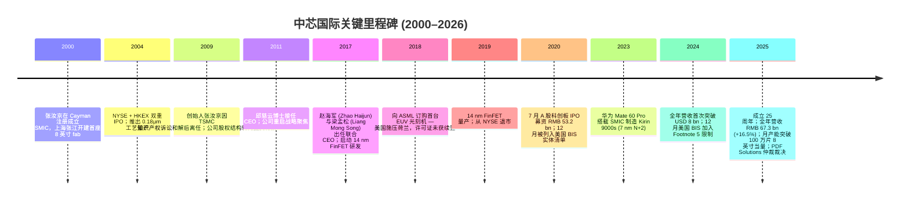
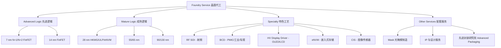
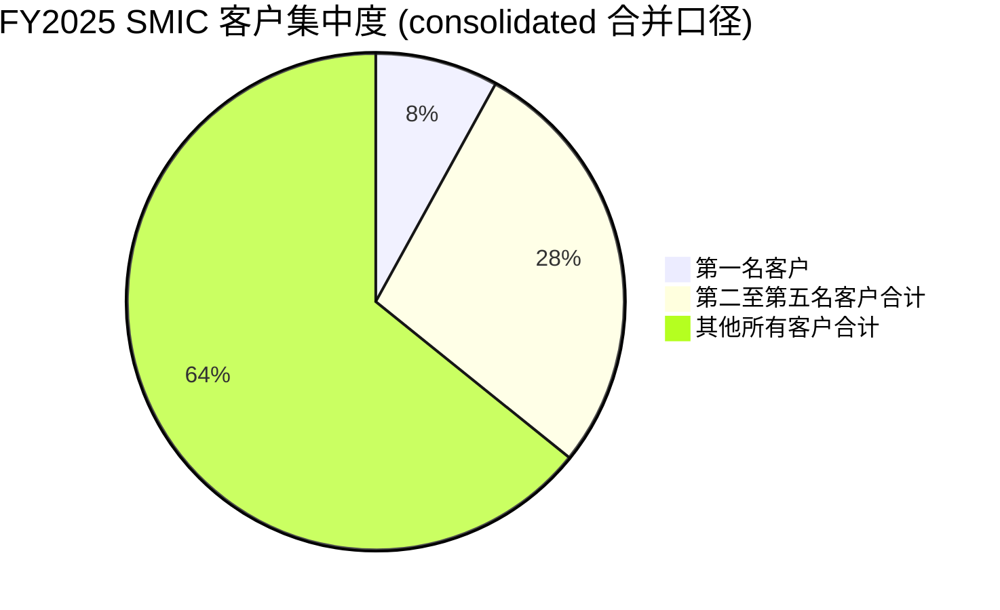
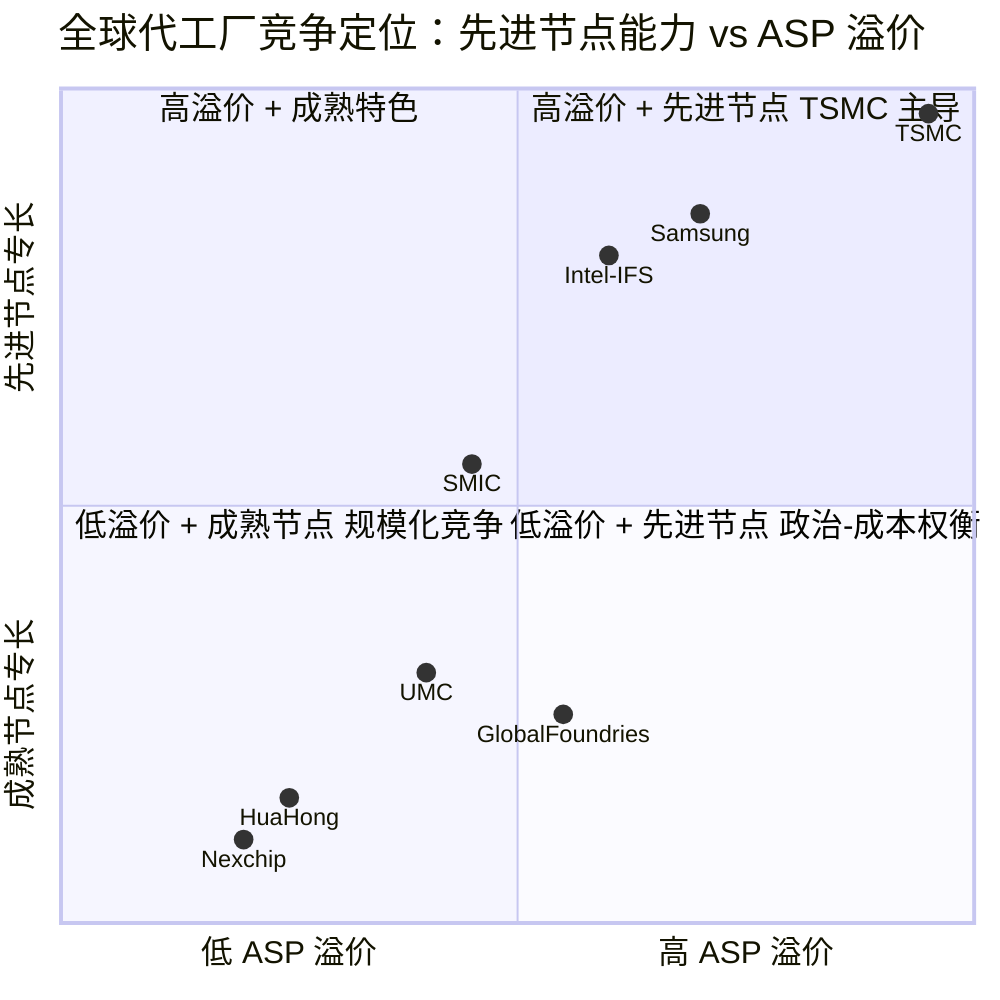

# SMIC 中芯国际 (SSE:688981 / HKEX:0981) 公司研究

**As of: 2026-06-14**
**报告语言：简体中文（技术 / 财务 / 行业术语保留英文原文）**
**Subject:** Semiconductor Manufacturing International Corporation (SMIC, 中芯国际集成电路制造有限公司)
**Tickers:** SSE 科创板 688981 (A 股) / HKEX 主板 0981 (港股)
**注册地:** Cayman Islands；**总部:** 中国上海浦东张江路 18 号
**审计师:** 安永华明会计师事务所 (境内) + 安永会计师事务所 (HK)

---

## 投资摘要 (Investment Summary) — *分析师观点 (Analyst view)*

> 以下评级、目标价、上行空间与论点支柱均为**本报告分析师观点 (Analyst view)**，并非来自任何监管申报；10-K / 年度报告中不含目标价。

| 项目 | A 股 688981.SH | 港股 0981.HK |
|---|---|---|
| **评级 (Rating)** | **Hold / Neutral** | **Hold / Neutral**（H 股风险收益更佳） |
| **12 个月目标价 (PT)** | **RMB 97** | **HKD 80** |
| 现价 (2026-06-12 收盘) | RMB 124.88 | HKD 71.65 |
| 隐含空间 (Upside/Downside) | **−22%** | **+12%** |
| 估值方法 | 2027E 归母 EPS RMB 0.97 × 100× 混合 P/E (bull/base/bear 加权) | 2027E EPS × ~75× 混合 H 股 P/E |
| 市值 (Market cap) | A 板 ~RMB 250 bn | H 板 ~RMB 393 bn（合并 ~RMB 642 bn / ~USD 89.5 bn） |
| 52 周区间 | RMB 80.90 – 159.05 | HKD 38.65 – 93.50 |

**论点支柱 (Thesis pillars) — *分析师观点*：**

1. **基本面在改善，但已被估值过度透支。** FY2025 营收 RMB 67.3 bn (+16.5% YoY)、归母净利润 RMB 5.04 bn (+36.3%)、毛利率 (`gross margin`) 21.6% (+3.0 ppt)、产能利用率 (`utilization`) 93.5% (+8 ppt) 全部创佳绩；但 A 股 ~127× 混合 TTM P/E（A 股口径约 198×）相对 TSMC ~36× / UMC ~35× 仍是 3–5 倍的叙事溢价 (`narrative premium`)。我的远期模型即便给到 2027E 100× 的目标倍数，A 股公允价值也只到 RMB 97，低于现价。
2. **A/H 折价是当前最清晰的相对机会。** 同一资产，H 股 (HKD 71.65 ≈ RMB 65) 较 A 股 (RMB 124.88) 折价约 48%；港股 ~104× 口径 P/E 仍偏贵但显著低于 A 股，且 H 板对应 +12% 上行而 A 板为 −22%。偏好 H 股。
3. **核心多头逻辑是政策与国产替代，而非回报率。** Citi 测算中国五年 RMB 2 万亿 AI 数据中心计划要求 ≥80% AI 加速器国产化，SMIC 是该链条核心代工承接方；但 ROE 仅 3.4%、净债务由净现金转为净债务、新厂折旧 (`depreciation`) 2026 年同比约 +30% 压制毛利率于 low-20s——这是一只"战略资产"而非"复利机器"。
4. **卖方严重分歧。** Goldman Buy（A 股 PT 241.6 / H 股 134），Morgan Stanley OW（H 股 85），Bernstein Outperform（A 120 / H 70），对阵 Nomura Neutral（H 75）与 J.P. Morgan（2026-06 由 Underweight 上调 Neutral，H 股 72.35）。PT 分歧从 H 股 70 到 134、A 股 120 到 241.6，区间近一倍——本报告与谨慎派一致。

---

> **业绩更新 — FY2025 正式年报已披露 (2026-03-26) + 2026 Q2 指引上调 (2026-05-14):** FY2025 销售收入 RMB 67,323.2 mn (+16.5% YoY)，归母净利润 RMB 5,040.7 mn (+36.3%)，扣非归母净利润 RMB 4,124.3 mn (+55.9%)，毛利率 (`gross margin`) 21.6% (+3.0 ppt)，全年产能利用率 93.5% (+8 ppt)；2026 Q1 销售收入 RMB 17,617.2 mn，毛利率 20.1%；**2026 Q2 指引：收入环比上升 14%–16%、毛利率 20%–22%**。资本开支 (`capex`) FY2025 RMB 59,950.6 mn (≈USD 8.4 bn，+9.9% YoY)，FY2026 公司与 J.P. Morgan 测算大致持平至小幅下降 (-2% YoY)。
> Sources: [中芯国际 2025 年年度报告 (cninfo, 2026-03-26), 第 8–9、24 页](https://static.cninfo.com.cn/finalpage/2026-03-27/1225037057.PDF)；[中芯国际 2026 年第一季度报告 (2026-05-14)](https://static.cninfo.com.cn/finalpage/2026-05-15/1225307101.PDF)。

---

## 目录

1. 公司概览 (Company Overview)
   - 1A 估值与目标价摘要 · 1B GF Score 基本面评分卡
2. 估值与目标价 (Valuation & Price Target) — 远期模型 · PT 推导 · bull/base/bear · 卖方观点演变
3. 公司历史 (Company History)
4. 管理团队 (Management Team)
5. 产品与服务 (Products & Services)
6. 客户与上市策略 (Customers & Go-to-Market)
7. 行业概览 (Industry Overview)
8. 竞争格局 (Competitive Landscape)
9. 市场机会 (TAM)
10. 风险评估 (Risk Assessment) — 含 9.5 核心分歧与催化剂
11. 投资视角评分卡 (Investor-lens scorecards)
12. 数据来源清单 (Data Used)
13. 参考资料 (References)

---

## 1. 公司概览 (Company Overview)

**本报告观点（thesis-first）：** 中芯国际是中国大陆唯一同时具备"7 nm 级先进节点无 EUV 量产能力"与"28 nm 及以上五大特色工艺平台规模化产能"的纯晶圆代工厂，FY2025 营收 RMB 67.3 bn、稳居全球纯代工第二。基本面在 FY2025 实现量、价、利用率、净利润全面改善，但当前 A 股 ~127× 混合 TTM P/E 已把"国产替代 + AI 算力国内供应链 + 先进节点突破"三重叙事打满，本报告给予 **Hold / Neutral**，并偏好折价近 48% 的 H 股。

中芯国际集成电路制造有限公司 (Semiconductor Manufacturing International Corporation, SMIC) 是**全球第二大纯晶圆代工 (`pure-play foundry`)**企业（公司在 FY2025 致股东信中明确"继续巩固全球纯晶圆代工企业第二位置"），也是中国大陆第一大代工厂，FY2025 完整财年销售收入达到 RMB 67,323.2 mn (+16.5% YoY)，创历史新高 ([中芯国际 2025 年年度报告, 第 6 页 致股东信](https://static.cninfo.com.cn/finalpage/2026-03-27/1225037057.PDF))。公司以 12 英寸 (`wafer`) 和 8 英寸晶圆代工 (`foundry`) 为核心业务，向全球客户提供 0.35 μm 至 14 nm / 7 nm 多技术节点 (`process node`) 的代工与配套服务，同时提供设计服务 (`design service`)、IP 支持、光掩模 (`mask`) 制造等一站式平台 ([同上, 第 17 页 核心技术与研发进展](https://static.cninfo.com.cn/finalpage/2026-03-27/1225037057.PDF))。

**收入构成与终端应用结构 (FY2025)。** FY2025 集团营业收入 RMB 67,323.2 mn (+16.5% YoY)，其中集成电路晶圆制造代工业务 RMB 62,794.0 mn (+17.9% YoY)，占主营业务的 93.2%，毛利率 21.3%；其他主营业务（光掩模、IP、design service）RMB 3,786.2 mn，毛利率 32.0% ([中芯国际 2025 年年度报告, 第 26 页 主营业务分产品情况](https://static.cninfo.com.cn/finalpage/2026-03-27/1225037057.PDF))。FY2025 晶圆代工按应用分类：消费电子 (`consumer`) 43.2%（同比从 37.8% 进一步上升）、智能手机 (`smartphone`) 23.1%（从 27.8% 回落）、电脑与平板 14.8%、工业与汽车 (`industrial/auto`) 11.0%（从 7.8% 上升）、互联与可穿戴 7.9% ([同上, 第 26 页 以应用分类](https://static.cninfo.com.cn/finalpage/2026-03-27/1225037057.PDF))。按尺寸划分：12 英寸晶圆 77.1%、8 英寸晶圆 22.9%。地区分布：中国区 85.6%、美国区 11.6%、欧亚区 2.8%，国内比重持续上升（2026 Q1 中国区进一步升至 88.9%）([中芯国际 2026 年第一季度报告, 第 4 页](https://static.cninfo.com.cn/finalpage/2026-05-15/1225307101.PDF))。

下面用收入瀑布 (income-statement Sankey) 直观展示 FY2025 这笔 RMB 67.3 bn 收入如何沿成本、费用、税与少数股东损益流到 RMB 5.0 bn 的归母净利润——注意**少数股东损益 RMB 2.2 bn（占净利润约 30%）**，这是国家大基金等在中芯南方 / 中芯北方持股带来的结构性分流：

<svg xmlns="http://www.w3.org/2000/svg" viewBox="0 0 1000 560" width="1000" height="560" role="img" aria-label="income statement Sankey"><rect x="0" y="0" width="1000" height="560" fill="#ffffff"/>
<text x="20.00" y="30.00" text-anchor="start" font-family="Helvetica,Arial,sans-serif" font-size="15" font-weight="700" fill="#1f2933">中芯国际 FY2025 利润表 Sankey (RMB mn, CAS)</text>
<path d="M 204.00,71.00 C 258.00,71.00 258.00,92.65 312.00,92.65 L 312.00,458.93 C 258.00,458.93 258.00,437.28 204.00,437.28 Z" fill="#93c5fd" fill-opacity="0.55"/>
<path d="M 452.00,85.65 C 506.00,85.65 506.00,221.81 560.00,221.81 L 560.00,270.25 C 506.00,270.25 506.00,134.09 452.00,134.09 Z" fill="#86efac" fill-opacity="0.55"/>
<path d="M 452.00,134.09 C 506.00,134.09 506.00,284.25 560.00,284.25 L 560.00,340.02 C 506.00,340.02 506.00,189.86 452.00,189.86 Z" fill="#fca5a5" fill-opacity="0.55"/>
<path d="M 328.00,92.65 C 382.00,92.65 382.00,85.65 436.00,85.65 L 436.00,170.57 C 382.00,170.57 382.00,177.57 328.00,177.57 Z" fill="#86efac" fill-opacity="0.55"/>
<path d="M 328.00,177.57 C 382.00,177.57 382.00,184.57 436.00,184.57 L 436.00,492.35 C 382.00,492.35 382.00,485.35 328.00,485.35 Z" fill="#fca5a5" fill-opacity="0.55"/>
<path d="M 700.00,214.81 C 754.00,214.81 754.00,252.29 808.00,252.29 L 808.00,281.70 C 754.00,281.70 754.00,244.22 700.00,244.22 Z" fill="#86efac" fill-opacity="0.55"/>
<path d="M 700.00,244.22 C 754.00,244.22 754.00,295.70 808.00,295.70 L 808.00,299.06 C 754.00,299.06 754.00,247.58 700.00,247.58 Z" fill="#fca5a5" fill-opacity="0.55"/>
<path d="M 700.00,247.58 C 754.00,247.58 754.00,313.06 808.00,313.06 L 808.00,325.71 C 754.00,325.71 754.00,260.23 700.00,260.23 Z" fill="#fca5a5" fill-opacity="0.55"/>
<path d="M 576.00,221.81 C 630.00,221.81 630.00,214.81 684.00,214.81 L 684.00,263.25 C 630.00,263.25 630.00,270.25 576.00,270.25 Z" fill="#86efac" fill-opacity="0.55"/>
<path d="M 576.00,284.25 C 630.00,284.25 630.00,279.42 684.00,279.42 L 684.00,299.45 C 630.00,299.45 630.00,304.29 576.00,304.29 Z" fill="#fca5a5" fill-opacity="0.55"/>
<path d="M 576.00,304.29 C 630.00,304.29 630.00,313.45 684.00,313.45 L 684.00,345.64 C 630.00,345.64 630.00,336.48 576.00,336.48 Z" fill="#fca5a5" fill-opacity="0.55"/>
<path d="M 576.00,336.48 C 630.00,336.48 630.00,359.64 684.00,359.64 L 684.00,363.19 C 630.00,363.19 630.00,340.02 576.00,340.02 Z" fill="#fca5a5" fill-opacity="0.55"/>
<path d="M 576.00,354.02 C 630.00,354.02 630.00,263.25 684.00,263.25 L 684.00,265.42 C 630.00,265.42 630.00,356.19 576.00,356.19 Z" fill="#93c5fd" fill-opacity="0.55"/>
<path d="M 204.00,451.28 C 258.00,451.28 258.00,458.93 312.00,458.93 L 312.00,481.01 C 258.00,481.01 258.00,473.36 204.00,473.36 Z" fill="#93c5fd" fill-opacity="0.55"/>
<path d="M 204.00,487.36 C 258.00,487.36 258.00,481.01 312.00,481.01 L 312.00,500.65 C 258.00,500.65 258.00,507.00 204.00,507.00 Z" fill="#93c5fd" fill-opacity="0.55"/>
<rect x="188.00" y="71.00" width="16" height="366.28" rx="1.5" fill="#2563eb"/>
<rect x="188.00" y="451.28" width="16" height="22.08" rx="1.5" fill="#2563eb"/>
<rect x="188.00" y="487.36" width="16" height="19.64" rx="1.5" fill="#2563eb"/>
<rect x="312.00" y="92.65" width="16" height="392.69" rx="1.5" fill="#1e3a8a"/>
<rect x="436.00" y="85.65" width="16" height="84.92" rx="1.5" fill="#15803d"/>
<rect x="436.00" y="184.57" width="16" height="307.78" rx="1.5" fill="#dc2626"/>
<rect x="560.00" y="221.81" width="16" height="48.44" rx="1.5" fill="#15803d"/>
<rect x="560.00" y="284.25" width="16" height="55.77" rx="1.5" fill="#dc2626"/>
<rect x="560.00" y="354.02" width="16" height="2.16" rx="1.5" fill="#2563eb"/>
<rect x="684.00" y="214.81" width="16" height="50.60" rx="1.5" fill="#15803d"/>
<rect x="684.00" y="279.42" width="16" height="20.04" rx="1.5" fill="#dc2626"/>
<rect x="684.00" y="313.45" width="16" height="32.19" rx="1.5" fill="#dc2626"/>
<rect x="684.00" y="359.64" width="16" height="3.54" rx="1.5" fill="#dc2626"/>
<rect x="808.00" y="252.29" width="16" height="29.40" rx="1.5" fill="#15803d"/>
<rect x="808.00" y="295.70" width="16" height="3.37" rx="1.5" fill="#dc2626"/>
<rect x="808.00" y="313.06" width="16" height="12.65" rx="1.5" fill="#dc2626"/>
<line x1="188.00" y1="254.14" x2="182.00" y2="243.96" stroke="#cbd5e1" stroke-width="1"/>
<text x="179.00" y="246.96" text-anchor="end" font-family="Helvetica,Arial,sans-serif" font-size="11.5" font-weight="700" fill="#1f2933">晶圆代工 Foundry</text>
<text x="179.00" y="259.96" text-anchor="end" font-family="Helvetica,Arial,sans-serif" font-size="10" font-weight="400" fill="#52606d">RMB62.8B  (93.3%)</text>
<line x1="188.00" y1="462.32" x2="182.00" y2="452.14" stroke="#cbd5e1" stroke-width="1"/>
<text x="179.00" y="455.14" text-anchor="end" font-family="Helvetica,Arial,sans-serif" font-size="11.5" font-weight="700" fill="#1f2933">其他(光掩模/IP/设计) Other</text>
<text x="179.00" y="468.14" text-anchor="end" font-family="Helvetica,Arial,sans-serif" font-size="10" font-weight="400" fill="#52606d">RMB3.8B  (5.6%)</text>
<line x1="188.00" y1="497.18" x2="182.00" y2="487.00" stroke="#cbd5e1" stroke-width="1"/>
<text x="179.00" y="490.00" text-anchor="end" font-family="Helvetica,Arial,sans-serif" font-size="11.5" font-weight="700" fill="#1f2933">其他收益(政府补助) Gov't grants</text>
<text x="179.00" y="503.00" text-anchor="end" font-family="Helvetica,Arial,sans-serif" font-size="10" font-weight="400" fill="#52606d">RMB3.4B  (5.0%)</text>
<rect x="331.00" y="74.65" width="119.40" height="26" rx="2" fill="#ffffff" fill-opacity="0.72"/>
<text x="334.00" y="86.65" text-anchor="start" font-family="Helvetica,Arial,sans-serif" font-size="11.5" font-weight="700" fill="#1f2933">Revenue</text>
<text x="334.00" y="99.65" text-anchor="start" font-family="Helvetica,Arial,sans-serif" font-size="10" font-weight="400" fill="#52606d">RMB67.3B  (100.0%)</text>
<rect x="455.00" y="67.65" width="113.10" height="26" rx="2" fill="#ffffff" fill-opacity="0.72"/>
<text x="458.00" y="79.65" text-anchor="start" font-family="Helvetica,Arial,sans-serif" font-size="11.5" font-weight="700" fill="#1f2933">Gross Profit</text>
<text x="458.00" y="92.65" text-anchor="start" font-family="Helvetica,Arial,sans-serif" font-size="10" font-weight="400" fill="#52606d">RMB14.6B  (21.6%)</text>
<rect x="455.00" y="166.57" width="144.60" height="26" rx="2" fill="#ffffff" fill-opacity="0.72"/>
<text x="458.00" y="178.57" text-anchor="start" font-family="Helvetica,Arial,sans-serif" font-size="11.5" font-weight="700" fill="#1f2933">Cost of Revenue (COGS)</text>
<text x="458.00" y="191.57" text-anchor="start" font-family="Helvetica,Arial,sans-serif" font-size="10" font-weight="400" fill="#52606d">RMB52.8B  (78.4%)</text>
<rect x="579.00" y="203.81" width="106.80" height="26" rx="2" fill="#ffffff" fill-opacity="0.72"/>
<text x="582.00" y="215.81" text-anchor="start" font-family="Helvetica,Arial,sans-serif" font-size="11.5" font-weight="700" fill="#1f2933">Operating Income</text>
<text x="582.00" y="228.81" text-anchor="start" font-family="Helvetica,Arial,sans-serif" font-size="10" font-weight="400" fill="#52606d">RMB8.3B  (12.3%)</text>
<rect x="579.00" y="266.25" width="150.90" height="26" rx="2" fill="#ffffff" fill-opacity="0.72"/>
<text x="582.00" y="278.25" text-anchor="start" font-family="Helvetica,Arial,sans-serif" font-size="11.5" font-weight="700" fill="#1f2933">Total Operating Expense</text>
<text x="582.00" y="291.25" text-anchor="start" font-family="Helvetica,Arial,sans-serif" font-size="10" font-weight="400" fill="#52606d">RMB9.6B  (14.2%)</text>
<text x="551.00" y="352.10" text-anchor="end" font-family="Helvetica,Arial,sans-serif" font-size="11.5" font-weight="700" fill="#1f2933">Net Interest / Other Income</text>
<text x="551.00" y="365.10" text-anchor="end" font-family="Helvetica,Arial,sans-serif" font-size="10" font-weight="400" fill="#52606d">RMB371.0M  (0.55%)</text>
<rect x="703.00" y="196.81" width="106.80" height="26" rx="2" fill="#ffffff" fill-opacity="0.72"/>
<text x="706.00" y="208.81" text-anchor="start" font-family="Helvetica,Arial,sans-serif" font-size="11.5" font-weight="700" fill="#1f2933">Pretax Income</text>
<text x="706.00" y="221.81" text-anchor="start" font-family="Helvetica,Arial,sans-serif" font-size="10" font-weight="400" fill="#52606d">RMB8.7B  (12.9%)</text>
<rect x="703.00" y="261.42" width="100.50" height="26" rx="2" fill="#ffffff" fill-opacity="0.72"/>
<text x="706.00" y="273.42" text-anchor="start" font-family="Helvetica,Arial,sans-serif" font-size="11.5" font-weight="700" fill="#1f2933">SG&amp;A</text>
<text x="706.00" y="286.42" text-anchor="start" font-family="Helvetica,Arial,sans-serif" font-size="10" font-weight="400" fill="#52606d">RMB3.4B  (5.1%)</text>
<rect x="703.00" y="295.45" width="100.50" height="26" rx="2" fill="#ffffff" fill-opacity="0.72"/>
<text x="706.00" y="307.45" text-anchor="start" font-family="Helvetica,Arial,sans-serif" font-size="11.5" font-weight="700" fill="#1f2933">R&amp;D</text>
<text x="706.00" y="320.45" text-anchor="start" font-family="Helvetica,Arial,sans-serif" font-size="10" font-weight="400" fill="#52606d">RMB5.5B  (8.2%)</text>
<rect x="703.00" y="341.64" width="119.40" height="26" rx="2" fill="#ffffff" fill-opacity="0.72"/>
<text x="706.00" y="353.64" text-anchor="start" font-family="Helvetica,Arial,sans-serif" font-size="11.5" font-weight="700" fill="#1f2933">Other OpEx</text>
<text x="706.00" y="366.64" text-anchor="start" font-family="Helvetica,Arial,sans-serif" font-size="10" font-weight="400" fill="#52606d">RMB607.0M  (0.90%)</text>
<text x="833.00" y="263.99" text-anchor="start" font-family="Helvetica,Arial,sans-serif" font-size="11.5" font-weight="700" fill="#1f2933">Net Income</text>
<text x="833.00" y="276.99" text-anchor="start" font-family="Helvetica,Arial,sans-serif" font-size="10" font-weight="400" fill="#52606d">RMB5.0B  (7.5%)</text>
<text x="833.00" y="294.38" text-anchor="start" font-family="Helvetica,Arial,sans-serif" font-size="11.5" font-weight="700" fill="#1f2933">Income Tax</text>
<text x="833.00" y="307.38" text-anchor="start" font-family="Helvetica,Arial,sans-serif" font-size="10" font-weight="400" fill="#52606d">RMB577.0M  (0.86%)</text>
<text x="833.00" y="319.38" text-anchor="start" font-family="Helvetica,Arial,sans-serif" font-size="11.5" font-weight="700" fill="#1f2933">Minority Interest</text>
<text x="833.00" y="332.38" text-anchor="start" font-family="Helvetica,Arial,sans-serif" font-size="10" font-weight="400" fill="#52606d">RMB2.2B  (3.2%)</text>
<text x="500.00" y="544.00" text-anchor="middle" font-family="Helvetica,Arial,sans-serif" font-size="10" font-weight="400" fill="#52606d">Source: 中芯国际 2025 年年度报告 (cninfo, 2026-03-26)，第 127 页 合并利润表</text>
</svg>

*Source: [中芯国际 2025 年年度报告, 第 127 页 合并利润表](https://static.cninfo.com.cn/finalpage/2026-03-27/1225037057.PDF)（CAS 口径）。Sankey 中"其他收益(政府补助) RMB 3.4 bn"为利润表"其他收益"科目，单列以示其对营业利润的支撑作用。*

晶圆代工收入按应用与按地区的结构如下：

<svg xmlns="http://www.w3.org/2000/svg" viewBox="0 0 720 460" width="720" height="460" role="img" aria-label="revenue donut"><rect x="0" y="0" width="720" height="460" fill="#ffffff"/>
<text x="20.00" y="30.00" text-anchor="start" font-family="Helvetica,Arial,sans-serif" font-size="15" font-weight="700" fill="#1f2933">中芯国际 FY2025 晶圆代工收入 — 按应用 (%)</text>
<path d="M 288.00,107.20 A 132 132 0 0 1 342.70,359.33 L 320.32,310.19 A 78 78 0 0 0 288.00,161.20 Z" fill="#2563eb"/>
<path d="M 342.70,359.33 A 132 132 0 0 1 175.24,307.82 L 221.37,279.75 A 78 78 0 0 0 320.32,310.19 Z" fill="#15803d"/>
<path d="M 175.24,307.82 A 132 132 0 0 1 165.58,189.84 L 215.66,210.03 A 78 78 0 0 0 221.37,279.75 Z" fill="#d97706"/>
<path d="M 165.58,189.84 A 132 132 0 0 1 225.14,123.13 L 250.85,170.61 A 78 78 0 0 0 215.66,210.03 Z" fill="#7c3aed"/>
<path d="M 225.14,123.13 A 132 132 0 0 1 288.00,107.20 L 288.00,161.20 A 78 78 0 0 0 250.85,170.61 Z" fill="#dc2626"/>
<text x="288.00" y="235.20" text-anchor="middle" font-family="Helvetica,Arial,sans-serif" font-size="18" font-weight="800" fill="#1f2933">SMIC FY25</text>
<text x="288.00" y="255.20" text-anchor="middle" font-family="Helvetica,Arial,sans-serif" font-size="13" font-weight="600" fill="#52606d">$100.0M</text>
<text x="288.00" y="271.20" text-anchor="middle" font-family="Helvetica,Arial,sans-serif" font-size="10" font-weight="400" fill="#8a97a3">total</text>
<line x1="422.86" y1="209.94" x2="438.86" y2="209.94" stroke="#2563eb" stroke-width="1.4"/>
<text x="442.86" y="207.94" text-anchor="start" font-family="Helvetica,Arial,sans-serif" font-size="11" font-weight="700" fill="#1f2933">消费电子 Consumer</text>
<text x="442.86" y="221.94" text-anchor="start" font-family="Helvetica,Arial,sans-serif" font-size="10" font-weight="400" fill="#52606d">$43.2M  (43.2%)</text>
<line x1="247.42" y1="371.10" x2="231.42" y2="371.10" stroke="#15803d" stroke-width="1.4"/>
<text x="227.42" y="369.10" text-anchor="end" font-family="Helvetica,Arial,sans-serif" font-size="11" font-weight="700" fill="#1f2933">智能手机 Smartphone</text>
<text x="227.42" y="383.10" text-anchor="end" font-family="Helvetica,Arial,sans-serif" font-size="10" font-weight="400" fill="#52606d">$23.1M  (23.1%)</text>
<line x1="150.46" y1="250.46" x2="134.46" y2="250.46" stroke="#d97706" stroke-width="1.4"/>
<text x="130.46" y="248.46" text-anchor="end" font-family="Helvetica,Arial,sans-serif" font-size="11" font-weight="700" fill="#1f2933">电脑与平板 PC/tablet</text>
<text x="130.46" y="262.46" text-anchor="end" font-family="Helvetica,Arial,sans-serif" font-size="10" font-weight="400" fill="#52606d">$14.8M  (14.8%)</text>
<line x1="185.06" y1="147.29" x2="169.06" y2="147.29" stroke="#7c3aed" stroke-width="1.4"/>
<text x="165.06" y="145.29" text-anchor="end" font-family="Helvetica,Arial,sans-serif" font-size="11" font-weight="700" fill="#1f2933">工业与汽车 Industrial/auto</text>
<text x="165.06" y="159.29" text-anchor="end" font-family="Helvetica,Arial,sans-serif" font-size="10" font-weight="400" fill="#52606d">$11.0M  (11.0%)</text>
<line x1="254.10" y1="105.43" x2="238.10" y2="105.43" stroke="#dc2626" stroke-width="1.4"/>
<text x="234.10" y="103.43" text-anchor="end" font-family="Helvetica,Arial,sans-serif" font-size="11" font-weight="700" fill="#1f2933">互联与可穿戴 IoT/wearable</text>
<text x="234.10" y="117.43" text-anchor="end" font-family="Helvetica,Arial,sans-serif" font-size="10" font-weight="400" fill="#52606d">$7.9M  (7.9%)</text>
<text x="360.00" y="444.00" text-anchor="middle" font-family="Helvetica,Arial,sans-serif" font-size="10" font-weight="400" fill="#52606d">Source: 中芯国际 2025 年年度报告 (cninfo, 2026-03-26)，第 26 页 集成电路晶圆制造代工收入分析(以应用分类)</text>
</svg>

*Source: [中芯国际 2025 年年度报告, 第 26 页 集成电路晶圆制造代工收入分析（以应用分类）](https://static.cninfo.com.cn/finalpage/2026-03-27/1225037057.PDF)。*

五年营业收入（晶圆代工 vs 其他）历史：

<svg xmlns="http://www.w3.org/2000/svg" viewBox="0 0 860 470" width="860" height="470" role="img" aria-label="historical revenue bars"><rect x="0" y="0" width="860" height="470" fill="#ffffff"/>
<text x="20.00" y="30.00" text-anchor="start" font-family="Helvetica,Arial,sans-serif" font-size="15" font-weight="700" fill="#1f2933">中芯国际 营业收入 FY2021–FY2025 (RMB mn, CAS)</text>
<rect x="20.00" y="44" width="11" height="11" rx="2" fill="#2563eb"/>
<text x="36.00" y="53.00" text-anchor="start" font-family="Helvetica,Arial,sans-serif" font-size="10.5" font-weight="400" fill="#1f2933">晶圆代工 Foundry</text>
<rect x="129.20" y="44" width="11" height="11" rx="2" fill="#15803d"/>
<text x="145.20" y="53.00" text-anchor="start" font-family="Helvetica,Arial,sans-serif" font-size="10.5" font-weight="400" fill="#1f2933">其他(光掩模/IP/设计) Other</text>
<line x1="70" y1="412.00" x2="834" y2="412.00" stroke="#eceff2" stroke-width="1"/>
<text x="64.00" y="415.00" text-anchor="end" font-family="Helvetica,Arial,sans-serif" font-size="9.5" font-weight="400" fill="#52606d">RMB0</text>
<line x1="70" y1="345.20" x2="834" y2="345.20" stroke="#eceff2" stroke-width="1"/>
<text x="64.00" y="348.20" text-anchor="end" font-family="Helvetica,Arial,sans-serif" font-size="9.5" font-weight="400" fill="#52606d">RMB14.4B</text>
<line x1="70" y1="278.40" x2="834" y2="278.40" stroke="#eceff2" stroke-width="1"/>
<text x="64.00" y="281.40" text-anchor="end" font-family="Helvetica,Arial,sans-serif" font-size="9.5" font-weight="400" fill="#52606d">RMB28.8B</text>
<line x1="70" y1="211.60" x2="834" y2="211.60" stroke="#eceff2" stroke-width="1"/>
<text x="64.00" y="214.60" text-anchor="end" font-family="Helvetica,Arial,sans-serif" font-size="9.5" font-weight="400" fill="#52606d">RMB43.1B</text>
<line x1="70" y1="144.80" x2="834" y2="144.80" stroke="#eceff2" stroke-width="1"/>
<text x="64.00" y="147.80" text-anchor="end" font-family="Helvetica,Arial,sans-serif" font-size="9.5" font-weight="400" fill="#52606d">RMB57.5B</text>
<line x1="70" y1="78.00" x2="834" y2="78.00" stroke="#eceff2" stroke-width="1"/>
<text x="64.00" y="81.00" text-anchor="end" font-family="Helvetica,Arial,sans-serif" font-size="9.5" font-weight="400" fill="#52606d">RMB71.9B</text>
<rect x="102.09" y="262.93" width="88.62" height="149.07" fill="#2563eb"/>
<rect x="102.09" y="247.05" width="88.62" height="15.87" fill="#15803d"/>
<text x="146.40" y="428.00" text-anchor="middle" font-family="Helvetica,Arial,sans-serif" font-size="10" font-weight="400" fill="#52606d">2021</text>
<rect x="254.89" y="201.84" width="88.62" height="210.16" fill="#2563eb"/>
<rect x="254.89" y="182.07" width="88.62" height="19.76" fill="#15803d"/>
<text x="299.20" y="428.00" text-anchor="middle" font-family="Helvetica,Arial,sans-serif" font-size="10" font-weight="400" fill="#52606d">2022</text>
<rect x="407.69" y="222.08" width="88.62" height="189.92" fill="#2563eb"/>
<rect x="407.69" y="201.82" width="88.62" height="20.26" fill="#15803d"/>
<text x="452.00" y="428.00" text-anchor="middle" font-family="Helvetica,Arial,sans-serif" font-size="10" font-weight="400" fill="#52606d">2023</text>
<rect x="560.49" y="164.68" width="88.62" height="247.32" fill="#2563eb"/>
<rect x="560.49" y="146.74" width="88.62" height="17.94" fill="#15803d"/>
<text x="604.80" y="428.00" text-anchor="middle" font-family="Helvetica,Arial,sans-serif" font-size="10" font-weight="400" fill="#52606d">2024</text>
<rect x="713.29" y="120.33" width="88.62" height="291.67" fill="#2563eb"/>
<rect x="713.29" y="102.74" width="88.62" height="17.59" fill="#15803d"/>
<text x="757.60" y="428.00" text-anchor="middle" font-family="Helvetica,Arial,sans-serif" font-size="10" font-weight="400" fill="#52606d">2025</text>
<text x="430.00" y="454.00" text-anchor="middle" font-family="Helvetica,Arial,sans-serif" font-size="10" font-weight="400" fill="#52606d">Source: 中芯国际 2021–2025 年年度报告 (cninfo)；FY2025 第 26 页</text>
</svg>

*Source: [中芯国际 2021–2025 年年度报告 (cninfo)](https://static.cninfo.com.cn/finalpage/2026-03-27/1225037057.PDF)；FY2025 第 26 页。FY2021–2023 晶圆代工 / 其他拆分取自对应年报主营业务分产品表。*

**产能与产能利用率 (`utilization`)。** 2024 年末折合 8 英寸标准逻辑月产能 948,000 片，2025 年末提升到 1,059,000 片 (105.9 万片，+11.7%)，2026 Q1 末再增至 1,078,250 片 ([中芯国际 2025 年年度报告, 第 81 页 出货量、晶圆产能](https://static.cninfo.com.cn/finalpage/2026-03-27/1225037057.PDF)；[中芯国际 2026 年第一季度报告, 第 4 页](https://static.cninfo.com.cn/finalpage/2026-05-15/1225307101.PDF))。FY2025 全年平均产能利用率提升至 **93.5%**（FY2024 为 85.6%，同比上升约 8 ppt），主要由国产替代需求与 AI 周边芯片拉动；进入 2026 年随新厂折旧 (`depreciation`) 落地，Q1-2026 利用率为 93.1% ([中芯国际 2026 年第一季度报告, 第 4 页](https://static.cninfo.com.cn/finalpage/2026-05-15/1225307101.PDF))。

**销售单价 (`wafer ASP`) 与折旧压力。** FY2025 销售晶圆数量（折合 8 英寸标准逻辑）由上年的 802.1 万片增加 20.9% 至 969.7 万片，但平均售价 (`wafer ASP`) 从 RMB 6,639 元/片下降至 RMB 6,476 元/片，主要由于 8 英寸消费类产品 mix 上升、产品组合变动；尽管单价下行，毛利率仍因销量增长与利用率上升而 +3.0 ppt 至 21.6% ([中芯国际 2025 年年度报告, 第 25 页 主营业务分析](https://static.cninfo.com.cn/finalpage/2026-03-27/1225037057.PDF))。成本结构上，晶圆代工成本中**制造费用（含折旧）占 87.6%**（直接材料仅 6.2%、直接人工 1.3%），印证这是一门折旧驱动的重资产生意 ([同上, 第 27 页 成本分析表](https://static.cninfo.com.cn/finalpage/2026-03-27/1225037057.PDF))。

*Source: [中芯国际 2025 年年度报告, 第 8–9 页 近三年主要会计数据](https://static.cninfo.com.cn/finalpage/2026-03-27/1225037057.PDF)（CAS 口径，FY2024 毛利率按年报修订为 18.6%，FY2025 为 21.6%）；FY2021–2022 来自对应年报。柱状条为营业收入，折线为毛利率 (`gross margin`)。*

**关键财务指标 (FY2025, 按中国企业会计准则 / CAS, 人民币)。** FY2025 营业收入 RMB 67,323.2 mn，归母净利润 RMB 5,040.7 mn (+36.3% YoY)，扣非净利润 RMB 4,124.3 mn (+55.9% YoY)，净利率 (`net margin`) 10.7%，EBITDA 利润率 56.1%，加权平均 ROE 3.4%（扣非后 2.8%），基本每股收益 (`EPS`) RMB 0.63 (+37.0%)，研发投入 RMB 5,518.6 mn (`R&D` 占营收 8.2%)；经营活动现金流量净额 RMB 20,081.0 mn，购建固定资产现金（`capex`）RMB 59,950.6 mn (≈USD 8.4 bn，+9.9% YoY) ([中芯国际 2025 年年度报告, 第 8–9、24–25 页](https://static.cninfo.com.cn/finalpage/2026-03-27/1225037057.PDF))。

### 1A 估值与目标价摘要 (Valuation & Price Target snapshot)

**Valuation snapshot (估值快照, as of 2026-06-12 收盘)。** A 股 (688981.SH) 收盘价 RMB 124.88，52 周区间 RMB 80.90–159.05；港股 (0981.HK) 收盘价 HKD 71.65，52 周区间 HKD 38.65–93.50 ([SMIC HKG:0981 / SHA:688981 价格快照, Stockanalysis.com, 2026-06-12](https://stockanalysis.com/quote/hkg/0981/))。按 FY2025 股本结构（A 股 1,999,562,549 股 + 港股 6,000,845,486 股 = 8,000,408,035 股，[中芯国际 2025 年年度报告, 第 111 页 股份总数](https://static.cninfo.com.cn/finalpage/2026-03-27/1225037057.PDF)）测算，A 板市值约 RMB 250 bn、H 板约 RMB 393 bn，**合并市值约 RMB 642 bn (≈USD 89.5 bn)**；以 FY2025 归母净利润 RMB 5.04 bn 计，**混合 TTM P/E 约 127×**（A 股口径约 198×、H 股口径约 104×），P/S ~9.5×、P/B ~4.3×。

**多倍数显著高估 (`stretched multiple`) 的诊断。** 即便按较低的混合口径，127× TTM P/E 也远高于行业可比（TSMC TTM P/E 约 36×、UMC ~35×、GlobalFoundries ~51×，[TSMC (TSM) 估值倍数, Stockanalysis.com, 2026-06-14](https://stockanalysis.com/stocks/tsm/)）；其驱动并非短期业绩失速、而是市场赋予的**国产替代 + AI 算力国内供应链 + 7 nm/N+2 工艺突破**三重叙事溢价 (`narrative premium`)。具体看：(i) 2023 Q3 华为 Mate 60 Pro 搭载 SMIC 制造 Kirin 9000s (7nm N+2)，首次实现中国大陆无 EUV 量产 7 nm 级 SoC ([HiSilicon Kirin 9000s (SMIC 7nm, N+2) Process Flow Analysis, TechInsights 2024](https://www.techinsights.com/blog/hisilicon-kirin-9000s-smic-7nm-n2-process-flow-analysis))；(ii) 2024 H2–2026 H1 国内 AI 加速器大规模采用 SMIC 代工，Citi 测算 RMB 2 万亿 AI 数据中心计划要求 ≥80% 国产化 ([花旗——大中华区半导体——中国新一轮 2 万亿 AI 投资计划利好国产 AI 供应链, 2026-06-09](http://xs-macbook-air.local:5001/zsxq/pdf/214528184411141/CITI-Greater%20China%20Semiconductors%EF%BC%9AChina%E2%80%99s%20New%20Rmb2tn%20AI%20Investment%20Plan%20Positive%20for%20Domestic%20AI%20Supply%20Chain-260609.pdf))；(iii) FY2025 净利润 +36.3% 表明现金流正在追赶估值，但与同期股价涨幅之间仍有缺口。本报告将"估值压缩 (`multiple compression`)"列入第 10 节风险清单。详细远期模型、PT 推导与 bull/base/bear 见第 2 节。

**资产负债结构 — 由净现金转为温和净债务。** 截至 2025 年末总资产 RMB 367,718.2 mn，归母权益 RMB 150,823.8 mn，**少数股东权益高达 RMB 95,538.6 mn**（反映国家大基金 / 少数股东对中芯南方、中芯北方的持续注资）；有息债务 RMB 88,611.6 mn，货币资金 RMB 43,645.0 mn，**净债务由 FY2024 的 −RMB 24.2 bn（净现金）转为 FY2025 的 +RMB 4.6 bn（温和净负债）** ([中芯国际 2025 年年度报告, 第 28 页 净债务测算](https://static.cninfo.com.cn/finalpage/2026-03-27/1225037057.PDF))。这一翻转是 FY2025 高达 RMB 60.0 bn capex 消耗净现金垫的直接结果，但相对 RMB 246 bn 的总权益，杠杆 (`leverage`) 仍极低，公司在 EUV-禁运情境下仍可独立完成多座 12 英寸 fab 建设。资产负债结构如下：

<svg xmlns="http://www.w3.org/2000/svg" viewBox="0 0 1040 600" width="1040" height="600" role="img" aria-label="balance sheet Sankey"><rect x="0" y="0" width="1040" height="600" fill="#ffffff"/>
<text x="20.00" y="30.00" text-anchor="start" font-family="Helvetica,Arial,sans-serif" font-size="15" font-weight="700" fill="#1f2933">中芯国际 FY2025 资产负债表 Sankey (RMB mn)</text>
<path d="M 732.00,64.00 C 790.00,64.00 790.00,122.20 848.00,122.20 L 848.00,179.01 C 790.00,179.01 790.00,120.81 732.00,120.81 Z" fill="#fca5a5" fill-opacity="0.55"/>
<path d="M 204.00,64.00 C 262.00,64.00 262.00,78.00 320.00,78.00 L 320.00,167.17 C 262.00,167.17 262.00,153.17 204.00,153.17 Z" fill="#93c5fd" fill-opacity="0.55"/>
<path d="M 600.00,78.00 C 658.00,78.00 658.00,64.00 716.00,64.00 L 716.00,120.81 C 658.00,120.81 658.00,134.81 600.00,134.81 Z" fill="#fca5a5" fill-opacity="0.55"/>
<path d="M 600.00,134.81 C 658.00,134.81 658.00,134.81 716.00,134.81 L 716.00,225.85 C 658.00,225.85 658.00,225.85 600.00,225.85 Z" fill="#fca5a5" fill-opacity="0.55"/>
<path d="M 336.00,78.00 C 394.00,78.00 394.00,85.00 452.00,85.00 L 452.00,218.92 C 394.00,218.92 394.00,211.92 336.00,211.92 Z" fill="#86efac" fill-opacity="0.55"/>
<path d="M 468.00,85.00 C 526.00,85.00 526.00,78.00 584.00,78.00 L 584.00,225.85 C 526.00,225.85 526.00,232.85 468.00,232.85 Z" fill="#fca5a5" fill-opacity="0.55"/>
<path d="M 468.00,232.85 C 526.00,232.85 526.00,239.85 584.00,239.85 L 584.00,540.00 C 526.00,540.00 526.00,533.00 468.00,533.00 Z" fill="#86efac" fill-opacity="0.55"/>
<path d="M 732.00,134.81 C 790.00,134.81 790.00,193.01 848.00,193.01 L 848.00,278.67 C 790.00,278.67 790.00,220.47 732.00,220.47 Z" fill="#fca5a5" fill-opacity="0.55"/>
<path d="M 732.00,220.47 C 790.00,220.47 790.00,292.67 848.00,292.67 L 848.00,298.05 C 790.00,298.05 790.00,225.85 732.00,225.85 Z" fill="#fca5a5" fill-opacity="0.55"/>
<path d="M 204.00,167.17 C 262.00,167.17 262.00,167.17 320.00,167.17 L 320.00,211.92 C 262.00,211.92 262.00,211.92 204.00,211.92 Z" fill="#93c5fd" fill-opacity="0.55"/>
<path d="M 336.00,225.92 C 394.00,225.92 394.00,218.92 452.00,218.92 L 452.00,533.00 C 394.00,533.00 394.00,540.00 336.00,540.00 Z" fill="#86efac" fill-opacity="0.55"/>
<path d="M 204.00,225.92 C 262.00,225.92 262.00,225.92 320.00,225.92 L 320.00,487.86 C 262.00,487.86 262.00,487.86 204.00,487.86 Z" fill="#93c5fd" fill-opacity="0.55"/>
<path d="M 732.00,239.85 C 790.00,239.85 790.00,312.05 848.00,312.05 L 848.00,495.80 C 790.00,495.80 790.00,423.60 732.00,423.60 Z" fill="#86efac" fill-opacity="0.55"/>
<path d="M 600.00,239.85 C 658.00,239.85 658.00,239.85 716.00,239.85 L 716.00,423.60 C 658.00,423.60 658.00,423.60 600.00,423.60 Z" fill="#86efac" fill-opacity="0.55"/>
<path d="M 600.00,423.60 C 658.00,423.60 658.00,437.60 716.00,437.60 L 716.00,554.00 C 658.00,554.00 658.00,540.00 600.00,540.00 Z" fill="#86efac" fill-opacity="0.55"/>
<path d="M 204.00,501.86 C 262.00,501.86 262.00,487.86 320.00,487.86 L 320.00,540.00 C 262.00,540.00 262.00,554.00 204.00,554.00 Z" fill="#93c5fd" fill-opacity="0.55"/>
<rect x="188.00" y="64.00" width="16" height="89.17" rx="1.5" fill="#2563eb"/>
<rect x="188.00" y="167.17" width="16" height="44.75" rx="1.5" fill="#2563eb"/>
<rect x="188.00" y="225.92" width="16" height="261.94" rx="1.5" fill="#2563eb"/>
<rect x="188.00" y="501.86" width="16" height="52.14" rx="1.5" fill="#2563eb"/>
<rect x="320.00" y="78.00" width="16" height="133.92" rx="1.5" fill="#15803d"/>
<rect x="320.00" y="225.92" width="16" height="314.08" rx="1.5" fill="#15803d"/>
<rect x="452.00" y="85.00" width="16" height="448.00" rx="1.5" fill="#1e3a8a"/>
<rect x="584.00" y="78.00" width="16" height="147.85" rx="1.5" fill="#dc2626"/>
<rect x="584.00" y="239.85" width="16" height="300.15" rx="1.5" fill="#15803d"/>
<rect x="716.00" y="64.00" width="16" height="56.81" rx="1.5" fill="#dc2626"/>
<rect x="716.00" y="134.81" width="16" height="91.04" rx="1.5" fill="#dc2626"/>
<rect x="716.00" y="239.85" width="16" height="183.75" rx="1.5" fill="#15803d"/>
<rect x="716.00" y="437.60" width="16" height="116.40" rx="1.5" fill="#15803d"/>
<rect x="848.00" y="122.20" width="16" height="56.81" rx="1.5" fill="#dc2626"/>
<rect x="848.00" y="193.01" width="16" height="85.66" rx="1.5" fill="#dc2626"/>
<rect x="848.00" y="292.67" width="16" height="5.38" rx="1.5" fill="#dc2626"/>
<rect x="848.00" y="312.05" width="16" height="183.75" rx="1.5" fill="#15803d"/>
<text x="179.00" y="105.59" text-anchor="end" font-family="Helvetica,Arial,sans-serif" font-size="11.5" font-weight="700" fill="#1f2933">货币资金+金融资产 Cash &amp; investments</text>
<text x="179.00" y="118.59" text-anchor="end" font-family="Helvetica,Arial,sans-serif" font-size="10" font-weight="400" fill="#52606d">RMB73.2B  (19.9%)</text>
<text x="179.00" y="186.54" text-anchor="end" font-family="Helvetica,Arial,sans-serif" font-size="11.5" font-weight="700" fill="#1f2933">应收+存货+其他流动 Receivables/inv/other</text>
<text x="179.00" y="199.54" text-anchor="end" font-family="Helvetica,Arial,sans-serif" font-size="10" font-weight="400" fill="#52606d">RMB36.7B  (10.0%)</text>
<text x="179.00" y="353.89" text-anchor="end" font-family="Helvetica,Arial,sans-serif" font-size="11.5" font-weight="700" fill="#1f2933">固定资产+在建工程 PP&amp;E + CIP</text>
<text x="179.00" y="366.89" text-anchor="end" font-family="Helvetica,Arial,sans-serif" font-size="10" font-weight="400" fill="#52606d">RMB215.0B  (58.5%)</text>
<text x="179.00" y="524.93" text-anchor="end" font-family="Helvetica,Arial,sans-serif" font-size="11.5" font-weight="700" fill="#1f2933">其他非流动 Other non-current</text>
<text x="179.00" y="537.93" text-anchor="end" font-family="Helvetica,Arial,sans-serif" font-size="10" font-weight="400" fill="#52606d">RMB42.8B  (11.6%)</text>
<rect x="339.00" y="60.00" width="132.00" height="26" rx="2" fill="#ffffff" fill-opacity="0.72"/>
<text x="342.00" y="72.00" text-anchor="start" font-family="Helvetica,Arial,sans-serif" font-size="11.5" font-weight="700" fill="#1f2933">Total Current Assets</text>
<text x="342.00" y="85.00" text-anchor="start" font-family="Helvetica,Arial,sans-serif" font-size="10" font-weight="400" fill="#52606d">RMB109.9B  (29.9%)</text>
<rect x="339.00" y="207.92" width="157.20" height="26" rx="2" fill="#ffffff" fill-opacity="0.72"/>
<text x="342.00" y="219.92" text-anchor="start" font-family="Helvetica,Arial,sans-serif" font-size="11.5" font-weight="700" fill="#1f2933">Total Non-Current Assets</text>
<text x="342.00" y="232.92" text-anchor="start" font-family="Helvetica,Arial,sans-serif" font-size="10" font-weight="400" fill="#52606d">RMB257.8B  (70.1%)</text>
<rect x="471.00" y="67.00" width="125.70" height="26" rx="2" fill="#ffffff" fill-opacity="0.72"/>
<text x="474.00" y="79.00" text-anchor="start" font-family="Helvetica,Arial,sans-serif" font-size="11.5" font-weight="700" fill="#1f2933">Total Assets</text>
<text x="474.00" y="92.00" text-anchor="start" font-family="Helvetica,Arial,sans-serif" font-size="10" font-weight="400" fill="#52606d">RMB367.7B  (100.0%)</text>
<rect x="603.00" y="60.00" width="119.40" height="26" rx="2" fill="#ffffff" fill-opacity="0.72"/>
<text x="606.00" y="72.00" text-anchor="start" font-family="Helvetica,Arial,sans-serif" font-size="11.5" font-weight="700" fill="#1f2933">Total Liabilities</text>
<text x="606.00" y="85.00" text-anchor="start" font-family="Helvetica,Arial,sans-serif" font-size="10" font-weight="400" fill="#52606d">RMB121.4B  (33.0%)</text>
<rect x="603.00" y="221.85" width="119.40" height="26" rx="2" fill="#ffffff" fill-opacity="0.72"/>
<text x="606.00" y="233.85" text-anchor="start" font-family="Helvetica,Arial,sans-serif" font-size="11.5" font-weight="700" fill="#1f2933">Total Equity</text>
<text x="606.00" y="246.85" text-anchor="start" font-family="Helvetica,Arial,sans-serif" font-size="10" font-weight="400" fill="#52606d">RMB246.4B  (67.0%)</text>
<rect x="735.00" y="46.00" width="125.70" height="26" rx="2" fill="#ffffff" fill-opacity="0.72"/>
<text x="738.00" y="58.00" text-anchor="start" font-family="Helvetica,Arial,sans-serif" font-size="11.5" font-weight="700" fill="#1f2933">Current Liabilities</text>
<text x="738.00" y="71.00" text-anchor="start" font-family="Helvetica,Arial,sans-serif" font-size="10" font-weight="400" fill="#52606d">RMB46.6B  (12.7%)</text>
<rect x="735.00" y="116.81" width="150.90" height="26" rx="2" fill="#ffffff" fill-opacity="0.72"/>
<text x="738.00" y="128.81" text-anchor="start" font-family="Helvetica,Arial,sans-serif" font-size="11.5" font-weight="700" fill="#1f2933">Non-Current Liabilities</text>
<text x="738.00" y="141.81" text-anchor="start" font-family="Helvetica,Arial,sans-serif" font-size="10" font-weight="400" fill="#52606d">RMB74.7B  (20.3%)</text>
<rect x="735.00" y="221.85" width="132.00" height="26" rx="2" fill="#ffffff" fill-opacity="0.72"/>
<text x="738.00" y="233.85" text-anchor="start" font-family="Helvetica,Arial,sans-serif" font-size="11.5" font-weight="700" fill="#1f2933">Shareholders' Equity</text>
<text x="738.00" y="246.85" text-anchor="start" font-family="Helvetica,Arial,sans-serif" font-size="10" font-weight="400" fill="#52606d">RMB150.8B  (41.0%)</text>
<text x="741.00" y="492.80" text-anchor="start" font-family="Helvetica,Arial,sans-serif" font-size="11.5" font-weight="700" fill="#1f2933">Minority Interest</text>
<text x="741.00" y="505.80" text-anchor="start" font-family="Helvetica,Arial,sans-serif" font-size="10" font-weight="400" fill="#52606d">RMB95.5B  (26.0%)</text>
<text x="873.00" y="147.60" text-anchor="start" font-family="Helvetica,Arial,sans-serif" font-size="11.5" font-weight="700" fill="#1f2933">流动负债 Current liabilities</text>
<text x="873.00" y="160.60" text-anchor="start" font-family="Helvetica,Arial,sans-serif" font-size="10" font-weight="400" fill="#52606d">RMB46.6B  (12.7%)</text>
<text x="873.00" y="232.84" text-anchor="start" font-family="Helvetica,Arial,sans-serif" font-size="11.5" font-weight="700" fill="#1f2933">长期借款 Long-term debt</text>
<text x="873.00" y="245.84" text-anchor="start" font-family="Helvetica,Arial,sans-serif" font-size="10" font-weight="400" fill="#52606d">RMB70.3B  (19.1%)</text>
<text x="873.00" y="292.36" text-anchor="start" font-family="Helvetica,Arial,sans-serif" font-size="11.5" font-weight="700" fill="#1f2933">其他非流动负债 Other non-current</text>
<text x="873.00" y="305.36" text-anchor="start" font-family="Helvetica,Arial,sans-serif" font-size="10" font-weight="400" fill="#52606d">RMB4.4B  (1.2%)</text>
<text x="873.00" y="400.93" text-anchor="start" font-family="Helvetica,Arial,sans-serif" font-size="11.5" font-weight="700" fill="#1f2933">归母权益 Equity attrib. parent</text>
<text x="873.00" y="413.93" text-anchor="start" font-family="Helvetica,Arial,sans-serif" font-size="10" font-weight="400" fill="#52606d">RMB150.8B  (41.0%)</text>
<text x="520.00" y="584.00" text-anchor="middle" font-family="Helvetica,Arial,sans-serif" font-size="10" font-weight="400" fill="#52606d">Source: 中芯国际 2025 年年度报告 (cninfo, 2026-03-26)，第 124–126 页 合并资产负债表</text>
</svg>

*Source: [中芯国际 2025 年年度报告, 第 124–126 页 合并资产负债表](https://static.cninfo.com.cn/finalpage/2026-03-27/1225037057.PDF)。资产端"货币资金+金融资产"含交易性金融资产与长期定期存款的近似归并，"固定资产+在建工程"为非流动资产主体的概数。*

### 1B GF Score 基本面评分卡 (GuruFocus-style) — *分析师观点*

> GF Score 五维评分（0–10）与 0–100 综合分是**本报告分析师自有评分框架 (Analyst view)**，并非 GuruFocus 发布值，也不附任何申报引用；每一维度的底层指标均在正文各处单独引用。

<svg xmlns="http://www.w3.org/2000/svg" viewBox="0 0 500 500" width="500" height="500" role="img" aria-label="GF Score radar">
<rect x="0" y="0" width="500" height="500" fill="#ffffff"/>
<text x="20" y="24" font-family="Helvetica,Arial,sans-serif" font-size="15" font-weight="700" fill="#1f2933">GF Score (GuruFocus-style): 52/100</text>
<text x="20" y="41" font-family="Helvetica,Arial,sans-serif" font-size="11" fill="#52606d">51–70 Poor future performance potential</text>
<polygon points="250.0,88.0 392.7,191.6 338.2,359.4 161.8,359.4 107.3,191.6" fill="#e9f5ec" stroke="none"/>
<polygon points="250.0,208.0 278.5,228.7 267.6,262.3 232.4,262.3 221.5,228.7" fill="none" stroke="#c5d3cb" stroke-width="1"/>
<polygon points="250.0,178.0 307.1,219.5 285.3,286.5 214.7,286.5 192.9,219.5" fill="none" stroke="#c5d3cb" stroke-width="1"/>
<polygon points="250.0,148.0 335.6,210.2 302.9,310.8 197.1,310.8 164.4,210.2" fill="none" stroke="#c5d3cb" stroke-width="1"/>
<polygon points="250.0,118.0 364.1,200.9 320.5,335.1 179.5,335.1 135.9,200.9" fill="none" stroke="#c5d3cb" stroke-width="1"/>
<polygon points="250.0,88.0 392.7,191.6 338.2,359.4 161.8,359.4 107.3,191.6" fill="none" stroke="#c5d3cb" stroke-width="1.3"/>
<line x1="250" y1="238" x2="161.8" y2="359.4" stroke="#cfdad3" stroke-width="1"/>
<text x="146.5" y="392.4" text-anchor="end" font-family="Helvetica,Arial,sans-serif" font-size="11.5" font-weight="600" fill="#1f2933">Financial Strength</text>
<text x="146.5" y="405.4" text-anchor="end" font-family="Helvetica,Arial,sans-serif" font-size="9.5" fill="#52606d">财务实力</text>
<text x="197.1" y="304.8" text-anchor="middle" font-family="Helvetica,Arial,sans-serif" font-size="10.5" font-weight="700" fill="#1f2933">6</text>
<line x1="250" y1="238" x2="250.0" y2="88.0" stroke="#cfdad3" stroke-width="1"/>
<text x="250.0" y="58.0" text-anchor="middle" font-family="Helvetica,Arial,sans-serif" font-size="11.5" font-weight="600" fill="#1f2933">Profitability</text>
<text x="250.0" y="71.0" text-anchor="middle" font-family="Helvetica,Arial,sans-serif" font-size="9.5" fill="#52606d">盈利能力</text>
<text x="250.0" y="172.0" text-anchor="middle" font-family="Helvetica,Arial,sans-serif" font-size="10.5" font-weight="700" fill="#1f2933">4</text>
<line x1="250" y1="238" x2="107.3" y2="191.6" stroke="#cfdad3" stroke-width="1"/>
<text x="82.6" y="183.6" text-anchor="end" font-family="Helvetica,Arial,sans-serif" font-size="11.5" font-weight="600" fill="#1f2933">Growth</text>
<text x="82.6" y="196.6" text-anchor="end" font-family="Helvetica,Arial,sans-serif" font-size="9.5" fill="#52606d">成长性</text>
<text x="150.1" y="199.6" text-anchor="middle" font-family="Helvetica,Arial,sans-serif" font-size="10.5" font-weight="700" fill="#1f2933">7</text>
<line x1="250" y1="238" x2="392.7" y2="191.6" stroke="#cfdad3" stroke-width="1"/>
<text x="417.4" y="183.6" text-anchor="start" font-family="Helvetica,Arial,sans-serif" font-size="11.5" font-weight="600" fill="#1f2933">GF Value</text>
<text x="417.4" y="196.6" text-anchor="start" font-family="Helvetica,Arial,sans-serif" font-size="9.5" fill="#52606d">估值</text>
<text x="278.5" y="222.7" text-anchor="middle" font-family="Helvetica,Arial,sans-serif" font-size="10.5" font-weight="700" fill="#1f2933">2</text>
<line x1="250" y1="238" x2="338.2" y2="359.4" stroke="#cfdad3" stroke-width="1"/>
<text x="353.5" y="392.4" text-anchor="start" font-family="Helvetica,Arial,sans-serif" font-size="11.5" font-weight="600" fill="#1f2933">Momentum</text>
<text x="353.5" y="405.4" text-anchor="start" font-family="Helvetica,Arial,sans-serif" font-size="9.5" fill="#52606d">动量</text>
<text x="302.9" y="304.8" text-anchor="middle" font-family="Helvetica,Arial,sans-serif" font-size="10.5" font-weight="700" fill="#1f2933">6</text>
<polygon points="250.0,178.0 278.5,228.7 302.9,310.8 197.1,310.8 150.1,205.6" fill="#2e8b57" fill-opacity="0.34" stroke="#2e8b57" stroke-width="2"/>
<circle cx="197.1" cy="310.8" r="2.6" fill="#2e8b57"/>
<circle cx="250.0" cy="178.0" r="2.6" fill="#2e8b57"/>
<circle cx="150.1" cy="205.6" r="2.6" fill="#2e8b57"/>
<circle cx="278.5" cy="228.7" r="2.6" fill="#2e8b57"/>
<circle cx="302.9" cy="310.8" r="2.6" fill="#2e8b57"/>
<text x="250" y="470" text-anchor="middle" font-family="Helvetica,Arial,sans-serif" font-size="9.5" fill="#52606d">Source: 中芯国际 2025 年年度报告 (cninfo) · yfinance · indicators.db, as of 2026-06-14</text>
<text x="250" y="485" text-anchor="middle" font-family="Helvetica,Arial,sans-serif" font-size="9" fill="#52606d">GF Score = independent analyst rubric (*Analyst view:*) — not GuruFocus™ official number</text>
</svg>

| 维度 / Dimension | 评分 / Score (0–10) | |
|---|---|---|
| Financial Strength (财务实力) | 6 | `██████░░░░` |
| Profitability (盈利能力) | 4 | `████░░░░░░` |
| Growth (成长性) | 7 | `███████░░░` |
| GF Value (估值) | 2 | `██░░░░░░░░` |
| Momentum (动量) | 6 | `██████░░░░` |
| **GF Score (composite, *Analyst view:*)** | **52 / 100** | **51–70 Poor future performance potential** |

*Composite weights (*Analyst view:*): Financial Strength 20% · Profitability 25% · Growth 25% · GF Value 15% · Momentum 15% (transparent reproduction — not GuruFocus's proprietary weighting).*

*Source: 雷达图为分析师评分；底层指标来自 [中芯国际 2025 年年度报告 (cninfo)](https://static.cninfo.com.cn/finalpage/2026-03-27/1225037057.PDF)、yfinance、indicators.db（as of 2026-06-14）。*

**综合分约 49 / 100（偏弱区间）** — 高成长被低回报率与极高估值抵消。各维度评分理由：

- **Financial Strength 财务实力 6/10：** 杠杆极低（有息债务 RMB 88.6 bn 对总权益 RMB 246 bn），利息净额为正（FY2025 财务费用 −RMB 0.37 bn，即利息收入 > 利息支出）；但净债务由净现金转为 +RMB 4.6 bn、且持续 RMB 60 bn 量级 capex 使自由现金流为负 ([中芯国际 2025 年年度报告, 第 28、127、129 页](https://static.cninfo.com.cn/finalpage/2026-03-27/1225037057.PDF))。中性偏强。
- **Profitability 盈利能力 4/10：** 毛利率 21.6%（远低于 TSMC ~58%）、净利率 10.7%、**加权平均 ROE 仅 3.4%**、ROIC < WACC——重资产 + 高折旧结构性压制回报率 ([同上, 第 9 页 主要财务指标](https://static.cninfo.com.cn/finalpage/2026-03-27/1225037057.PDF))。这是评分最弱项。
- **Growth 成长性 7/10：** FY2025 营收 +16.5%、归母净利润 +36.3%、EPS +37%，3 年营收 CAGR 约 +14%；远期 +13–18%（见第 2 节）。强项。
- **GF Value 估值 (越高越便宜) 2/10：** 混合 TTM P/E ~127×（A 股 ~198×）远高于自身历史均值与同业（TSMC ~36×），相对内在价值区间无安全边际 ([TSMC (TSM) 估值倍数, Stockanalysis.com, 2026-06-14](https://stockanalysis.com/stocks/tsm/))。最弱项之一。
- **Momentum 动量 6/10：** 港股近 12 个月约 +85%、A 股约 +55%，但最近两周由 A 股 RMB 134 回落至 124.88、H 股由 82.95 回落至 71.65，动量正但在降温 ([SMIC SHA:688981 价格, Stockanalysis.com, 2026-06-12](https://stockanalysis.com/quote/sha/688981/))。

GF Score 与正文一致：Growth ↔ 第 2 节远期模型，GF Value ↔ 1A 倍数与 PT 下行，Momentum ↔ 估值快照的相对表现。

---

## 2. 估值与目标价 (Valuation & Price Target) — *分析师观点*

> 本节全部前瞻数字（远期营收 / 毛利率 / EPS、目标价、bull/base/bear）均为**分析师观点 (Analyst view)**，不附任何申报引用。每个驱动的外部依据（年报分部数据 + 公司指引 + 行业预测）在文中单独引用。

### 2A 远期财务模型 (Forward estimates, FY2026E–FY2028E)

模型基于 FY2025 实际（营收 RMB 67.3 bn、归母 EPS RMB 0.63，[中芯国际 2025 年年度报告, 第 8–9 页](https://static.cninfo.com.cn/finalpage/2026-03-27/1225037057.PDF)）+ 公司 2026 Q2 指引（收入环比 +14–16%，[中芯国际 2026 年第一季度报告, 第 3 页](https://static.cninfo.com.cn/finalpage/2026-05-15/1225307101.PDF)）+ J.P. Morgan 对成熟制程涨价与折旧的判断（GM capped low-20s，折旧 2026 +~30% YoY，[J.P. Morgan Foundries 1Q26, 2026-06-10](http://xs-macbook-air.local:5001/zsxq/pdf/584251881854444/J.P.%20Morgan-Foundries%201Q26%20wrap%EF%BC%9A%20Leading%20edge%20tightness%20deepens%EF%BC%9B%20Mature%20recovery%20broadening%20but%20uneven-260610.pdf)）。

| 指标 | FY2025A | FY2026E | FY2027E | FY2028E |
|---|---|---|---|---|
| 营业收入 (RMB mn) | 67,323 | 79,400 | 91,400 | 103,200 |
| 收入 YoY | +16.5% | +18% | +15% | +13% |
| 毛利率 (`gross margin`) | 21.6% | 22% | 23% | 24% |
| 归母净利润 (RMB mn) | 5,041 | 6,200 | 7,800 | 9,500 |
| 归母净利率 | 7.5% | 7.8% | 8.5% | 9.2% |
| 归母 EPS (RMB) | 0.63 | 0.77 | 0.97 | 1.19 |
| EPS YoY | +37% | +23% | +25% | +22% |

*分析师观点 (Analyst view)：* 模型核心是**两条曲线相加**：成熟节点（28 nm + 8 英寸特色工艺）受国产替代 + 涨价驱动量价齐升（J.P. Morgan 指 SMIC 1Q26 ASP 环比 +2.5%，BCD/模拟/PMIC/存储细分涨价 5–10%、覆盖约 40–50% 收入，[J.P. Morgan Foundries 1Q26, 2026-06-10](http://xs-macbook-air.local:5001/zsxq/pdf/584251881854444/J.P.%20Morgan-Foundries%201Q26%20wrap%EF%BC%9A%20Leading%20edge%20tightness%20deepens%EF%BC%9B%20Mature%20recovery%20broadening%20but%20uneven-260610.pdf)）；先进节点（7 nm 限定客户）贡献高 ASP 但体量小、受设备禁运约束。毛利率回升受新厂折旧（2026 +~30% YoY）拖累，故仅缓步爬升至 24%，与 J.P. Morgan "low-20s GM capped" 判断一致。

下面用 5-step DuPont ROE 分解直观说明"为什么这家高成长公司归母 ROE 只有 3.4%"——根源在于净利率不高（重资产 + 高折旧）叠加偏低的资产周转率 (`asset turnover`)；庞大的少数股东权益也意味着归母权益基数相对总资产偏小：

<svg xmlns="http://www.w3.org/2000/svg" viewBox="0 0 1240 540" width="1240" height="540" role="img" aria-label="DuPont ROE decomposition"><rect x="0" y="0" width="1240" height="540" fill="#ffffff"/>
<text x="20.00" y="30.00" text-anchor="start" font-family="Helvetica,Arial,sans-serif" font-size="15" font-weight="700" fill="#1f2933">中芯国际 FY2025 5-step DuPont ROE 分解 (RMB mn, CAS)</text>
<rect x="545.00" y="56.00" width="150" height="56" rx="7" fill="#1e3a8a"/>
<text x="620.00" y="76.00" text-anchor="middle" font-family="Helvetica,Arial,sans-serif" font-size="11.5" font-weight="700" fill="#ffffff">ROE</text>
<text x="620.00" y="94.00" text-anchor="middle" font-family="Helvetica,Arial,sans-serif" font-size="13" font-weight="800" fill="#ffffff">3.37%</text>
<text x="620.00" y="106.00" text-anchor="middle" font-family="Helvetica,Arial,sans-serif" font-size="8.5" font-weight="400" fill="#dbeafe">= Net Income / Avg Equity</text>
<rect x="191.60" y="168.00" width="150" height="56" rx="7" fill="#2563eb"/>
<text x="266.60" y="188.00" text-anchor="middle" font-family="Helvetica,Arial,sans-serif" font-size="11.5" font-weight="700" fill="#ffffff">Net Margin</text>
<text x="266.60" y="206.00" text-anchor="middle" font-family="Helvetica,Arial,sans-serif" font-size="13" font-weight="800" fill="#ffffff">7.49%</text>
<text x="266.60" y="218.00" text-anchor="middle" font-family="Helvetica,Arial,sans-serif" font-size="8.5" font-weight="400" fill="#dbeafe">Net Income / Revenue</text>
<line x1="620.00" y1="112.00" x2="266.60" y2="168.00" stroke="#94a3b8" stroke-width="1.4"/>
<rect x="545.00" y="168.00" width="150" height="56" rx="7" fill="#2563eb"/>
<text x="620.00" y="188.00" text-anchor="middle" font-family="Helvetica,Arial,sans-serif" font-size="11.5" font-weight="700" fill="#ffffff">Asset Turnover</text>
<text x="620.00" y="206.00" text-anchor="middle" font-family="Helvetica,Arial,sans-serif" font-size="13" font-weight="800" fill="#ffffff">0.19</text>
<text x="620.00" y="218.00" text-anchor="middle" font-family="Helvetica,Arial,sans-serif" font-size="8.5" font-weight="400" fill="#dbeafe">Revenue / Avg Assets</text>
<line x1="620.00" y1="112.00" x2="620.00" y2="168.00" stroke="#94a3b8" stroke-width="1.4"/>
<rect x="898.40" y="168.00" width="150" height="56" rx="7" fill="#2563eb"/>
<text x="973.40" y="188.00" text-anchor="middle" font-family="Helvetica,Arial,sans-serif" font-size="11.5" font-weight="700" fill="#ffffff">Equity Multiplier</text>
<text x="973.40" y="206.00" text-anchor="middle" font-family="Helvetica,Arial,sans-serif" font-size="13" font-weight="800" fill="#ffffff">2.41</text>
<text x="973.40" y="218.00" text-anchor="middle" font-family="Helvetica,Arial,sans-serif" font-size="8.5" font-weight="400" fill="#dbeafe">Avg Assets / Avg Equity</text>
<line x1="620.00" y1="112.00" x2="973.40" y2="168.00" stroke="#94a3b8" stroke-width="1.4"/>
<circle cx="443.30" cy="196.00" r="11" fill="#ffffff" stroke="#94a3b8" stroke-width="1.2"/>
<text x="443.30" y="201.00" text-anchor="middle" font-family="Helvetica,Arial,sans-serif" font-size="14" font-weight="800" fill="#52606d">×</text>
<circle cx="796.70" cy="196.00" r="11" fill="#ffffff" stroke="#94a3b8" stroke-width="1.2"/>
<text x="796.70" y="201.00" text-anchor="middle" font-family="Helvetica,Arial,sans-serif" font-size="14" font-weight="800" fill="#52606d">×</text>
<rect x="65.00" y="300.00" width="118" height="56" rx="7" fill="#2563eb"/>
<text x="124.00" y="320.00" text-anchor="middle" font-family="Helvetica,Arial,sans-serif" font-size="11.5" font-weight="700" fill="#ffffff">Operating Margin</text>
<text x="124.00" y="338.00" text-anchor="middle" font-family="Helvetica,Arial,sans-serif" font-size="13" font-weight="800" fill="#ffffff">12.33%</text>
<text x="124.00" y="350.00" text-anchor="middle" font-family="Helvetica,Arial,sans-serif" font-size="8.5" font-weight="400" fill="#dbeafe">Op Inc / Revenue</text>
<line x1="266.60" y1="224.00" x2="124.00" y2="300.00" stroke="#94a3b8" stroke-width="1.4"/>
<rect x="207.60" y="300.00" width="118" height="56" rx="7" fill="#2563eb"/>
<text x="266.60" y="320.00" text-anchor="middle" font-family="Helvetica,Arial,sans-serif" font-size="11.5" font-weight="700" fill="#ffffff">Tax Burden</text>
<text x="266.60" y="338.00" text-anchor="middle" font-family="Helvetica,Arial,sans-serif" font-size="13" font-weight="800" fill="#ffffff">0.6474</text>
<text x="266.60" y="350.00" text-anchor="middle" font-family="Helvetica,Arial,sans-serif" font-size="8.5" font-weight="400" fill="#dbeafe">Net Inc / Pretax</text>
<line x1="266.60" y1="224.00" x2="266.60" y2="300.00" stroke="#94a3b8" stroke-width="1.4"/>
<rect x="350.20" y="300.00" width="118" height="56" rx="7" fill="#2563eb"/>
<text x="409.20" y="320.00" text-anchor="middle" font-family="Helvetica,Arial,sans-serif" font-size="11.5" font-weight="700" fill="#ffffff">Interest Burden</text>
<text x="409.20" y="338.00" text-anchor="middle" font-family="Helvetica,Arial,sans-serif" font-size="13" font-weight="800" fill="#ffffff">0.9376</text>
<text x="409.20" y="350.00" text-anchor="middle" font-family="Helvetica,Arial,sans-serif" font-size="8.5" font-weight="400" fill="#dbeafe">Pretax / Op Inc</text>
<line x1="266.60" y1="224.00" x2="409.20" y2="300.00" stroke="#94a3b8" stroke-width="1.4"/>
<circle cx="195.30" cy="328.00" r="11" fill="#ffffff" stroke="#94a3b8" stroke-width="1.2"/>
<text x="195.30" y="333.00" text-anchor="middle" font-family="Helvetica,Arial,sans-serif" font-size="14" font-weight="800" fill="#52606d">×</text>
<circle cx="337.90" cy="328.00" r="11" fill="#ffffff" stroke="#94a3b8" stroke-width="1.2"/>
<text x="337.90" y="333.00" text-anchor="middle" font-family="Helvetica,Arial,sans-serif" font-size="14" font-weight="800" fill="#52606d">×</text>
<rect x="479.00" y="300.00" width="118" height="56" rx="7" fill="#2563eb"/>
<text x="538.00" y="326.00" text-anchor="middle" font-family="Helvetica,Arial,sans-serif" font-size="11.5" font-weight="700" fill="#ffffff">Revenue</text>
<text x="538.00" y="342.00" text-anchor="middle" font-family="Helvetica,Arial,sans-serif" font-size="13" font-weight="800" fill="#ffffff">RMB67.3B</text>
<line x1="620.00" y1="224.00" x2="538.00" y2="300.00" stroke="#94a3b8" stroke-width="1.4"/>
<rect x="643.00" y="300.00" width="118" height="56" rx="7" fill="#2563eb"/>
<text x="702.00" y="320.00" text-anchor="middle" font-family="Helvetica,Arial,sans-serif" font-size="11.5" font-weight="700" fill="#ffffff">Avg Total Assets</text>
<text x="702.00" y="338.00" text-anchor="middle" font-family="Helvetica,Arial,sans-serif" font-size="13" font-weight="800" fill="#ffffff">RMB360.6B</text>
<text x="702.00" y="350.00" text-anchor="middle" font-family="Helvetica,Arial,sans-serif" font-size="8.5" font-weight="400" fill="#dbeafe">(begin+end)/2</text>
<line x1="620.00" y1="224.00" x2="702.00" y2="300.00" stroke="#94a3b8" stroke-width="1.4"/>
<circle cx="620.00" cy="328.00" r="11" fill="#ffffff" stroke="#94a3b8" stroke-width="1.2"/>
<text x="620.00" y="333.00" text-anchor="middle" font-family="Helvetica,Arial,sans-serif" font-size="14" font-weight="800" fill="#52606d">÷</text>
<rect x="832.40" y="300.00" width="118" height="56" rx="7" fill="#2563eb"/>
<text x="891.40" y="320.00" text-anchor="middle" font-family="Helvetica,Arial,sans-serif" font-size="11.5" font-weight="700" fill="#ffffff">Avg Total Assets</text>
<text x="891.40" y="338.00" text-anchor="middle" font-family="Helvetica,Arial,sans-serif" font-size="13" font-weight="800" fill="#ffffff">RMB360.6B</text>
<text x="891.40" y="350.00" text-anchor="middle" font-family="Helvetica,Arial,sans-serif" font-size="8.5" font-weight="400" fill="#dbeafe">(begin+end)/2</text>
<line x1="973.40" y1="224.00" x2="891.40" y2="300.00" stroke="#94a3b8" stroke-width="1.4"/>
<rect x="996.40" y="300.00" width="118" height="56" rx="7" fill="#2563eb"/>
<text x="1055.40" y="320.00" text-anchor="middle" font-family="Helvetica,Arial,sans-serif" font-size="11.5" font-weight="700" fill="#ffffff">Avg Total Equity</text>
<text x="1055.40" y="338.00" text-anchor="middle" font-family="Helvetica,Arial,sans-serif" font-size="13" font-weight="800" fill="#ffffff">RMB149.5B</text>
<text x="1055.40" y="350.00" text-anchor="middle" font-family="Helvetica,Arial,sans-serif" font-size="8.5" font-weight="400" fill="#dbeafe">(begin+end)/2</text>
<line x1="973.40" y1="224.00" x2="1055.40" y2="300.00" stroke="#94a3b8" stroke-width="1.4"/>
<circle cx="967.20" cy="328.00" r="11" fill="#ffffff" stroke="#94a3b8" stroke-width="1.2"/>
<text x="967.20" y="333.00" text-anchor="middle" font-family="Helvetica,Arial,sans-serif" font-size="14" font-weight="800" fill="#52606d">÷</text>
<rect x="69.00" y="420.00" width="110" height="48" rx="7" fill="#3b82f6"/>
<text x="124.00" y="442.00" text-anchor="middle" font-family="Helvetica,Arial,sans-serif" font-size="11.5" font-weight="700" fill="#ffffff">Operating Income</text>
<text x="124.00" y="458.00" text-anchor="middle" font-family="Helvetica,Arial,sans-serif" font-size="13" font-weight="800" fill="#ffffff">RMB8.3B</text>
<line x1="124.00" y1="356.00" x2="124.00" y2="420.00" stroke="#94a3b8" stroke-width="1.4"/>
<rect x="211.60" y="420.00" width="110" height="48" rx="7" fill="#3b82f6"/>
<text x="266.60" y="442.00" text-anchor="middle" font-family="Helvetica,Arial,sans-serif" font-size="11.5" font-weight="700" fill="#ffffff">Net Income</text>
<text x="266.60" y="458.00" text-anchor="middle" font-family="Helvetica,Arial,sans-serif" font-size="13" font-weight="800" fill="#ffffff">RMB5.0B</text>
<line x1="266.60" y1="356.00" x2="266.60" y2="420.00" stroke="#94a3b8" stroke-width="1.4"/>
<rect x="354.20" y="420.00" width="110" height="48" rx="7" fill="#3b82f6"/>
<text x="409.20" y="442.00" text-anchor="middle" font-family="Helvetica,Arial,sans-serif" font-size="11.5" font-weight="700" fill="#ffffff">Pretax Income</text>
<text x="409.20" y="458.00" text-anchor="middle" font-family="Helvetica,Arial,sans-serif" font-size="13" font-weight="800" fill="#ffffff">RMB7.8B</text>
<line x1="409.20" y1="356.00" x2="409.20" y2="420.00" stroke="#94a3b8" stroke-width="1.4"/>
<text x="620.00" y="524.00" text-anchor="middle" font-family="Helvetica,Arial,sans-serif" font-size="10" font-weight="400" fill="#52606d">Source: 中芯国际 2025 年年度报告 (cninfo)，第 8–9、124–127 页；归母口径 ROE</text>
</svg>

*Source: [中芯国际 2025 年年度报告, 第 8–9、124–127 页](https://static.cninfo.com.cn/finalpage/2026-03-27/1225037057.PDF)（归母口径 ROE）。*

### 2B 12 个月目标价推导 (PT derivation) 与 bull/base/bear

**方法：** forward-EPS × 目标 P/E。以 2027E 归母 EPS RMB 0.97 为基准，按三情景给目标倍数：

| 情景 | 目标 P/E (A 股) | A 股 PT (RMB) | 对应空间 (vs 124.88) | 触发条件 |
|---|---|---|---|---|
| **Bear 熊市** | 70× | 68 | −46% | 5 nm 受阻 + 2H26 消费需求二次探底 + AI 叙事降温，倍数向"成熟代工"回归 |
| **Base 基准** | 95× | 92 | −26% | 28 nm 涨价兑现、利用率维持 90%+、折旧如期消化，但回报率不改善，倍数温和压缩 |
| **Bull 牛市** | 130× | 126 | +1% | RMB 2 万亿 AI 计划落地、N+3 节点突破、海外客户合规放松，叙事溢价持续 |

**12 个月目标价（bull 30% / base 50% / bear 20% 加权）：A 股 RMB 97（−22%），H 股 HKD 80（+12%）。** 即便在 130× 牛市倍数下，A 股也只勉强回到现价；本报告因此给 **Hold / Neutral**，并明确偏好 H 股——同一现金流，H 板对应 +12% 上行而 A 板 −22% 下行。

**估值倍数依据（为什么给 95–130× 而非 36× 的"代工正常倍数"）：** *分析师观点。* SMIC 不能简单对标 TSMC 36× / UMC 35×——A 股市场对其赋予"国家关键基础设施 + 国产替代唯一标的"的稀缺性溢价，过去两年 A 股 P/E 在 100–200× 区间运行。给 95–130× 是承认这一溢价"可能持续"，而非认同其"合理"；这也是为什么 base case 仍隐含下行——稀缺性溢价能维持高倍数，但维持不了在已高位的基础上继续扩张。

### 2C 卖方观点演变 (Sell-side view evolution) — *分析师观点*

**机械化前置（读 `db/stock_price_target.db` 只读）：** PT 库对 SMIC 收录 6 家机构、近 1 个月内的 12 条记录，PT 分歧极大——H 股目标价区间 **HKD 70（Bernstein/MS-cut）至 134（Goldman）**、A 股 **RMB 120（Bernstein）至 241.6（Goldman）**，spread 接近一倍。

**按机构的观点时间线 (per-institute timeline)：**

| 机构 | 报告日 | 评级 | 目标价 | 报告日现价 | 隐含空间 | 核心论点 |
|---|---|---|---|---|---|---|
| **J.P. Morgan** | 2026-04-10 → **2026-06-10** | **Underweight → 上调 Neutral** | H 股 — (现价 72.35) | HKD 72.35 | — | *自我修订：* 由 Underweight 上调至 **Neutral**——"broader-than-expected price hikes support near-term upside, but GMs remain capped in the low-20s by rising depreciation and 2H26 consumer demand risk" |
| **Citi** | 2026-06-09 | **Buy** | HKD 75 | HKD 75.0 | flat | RMB 2 万亿 AI 数据中心计划、≥80% AI 加速器国产化利好 SMIC 代工承接 |
| **Morgan Stanley** | 2026-05-18 | Overweight | HKD 85 / A 股 (现价 117.62) | HKD 68.70 | +23.7% | 维持 OW，先进产能扩张 + 国产 AI 落地 |
| **Goldman Sachs** | 2026-05-15 | **Buy** | **A 股 RMB 241.6 / H 股 HKD 134** | RMB 119.02 / HKD 71.15 | **A +103% / H +88%** | 最乐观——给到 A 股 ~200×+ 远期倍数 |
| **Bernstein** | 2026-05-15 | Outperform | A 股 RMB 120 / H 股 HKD 70 | RMB 119.02 / HKD 71.15 | A +0.8% / H −1.6% | 评级看多但 PT 已基本到位（中性偏多） |
| **Nomura** | 2026-05-15 | **Neutral** | HKD 75 | HKD 71.15 | +5.4% | 谨慎——折旧 + 消费需求风险限制毛利率 |

*Source: [db/stock_price_target.db (只读) /pt 视图](http://xs-macbook-air.local:5001/pt)；J.P. Morgan 与 Citi 评级原文见 [J.P. Morgan Foundries 1Q26, 2026-06-10](http://xs-macbook-air.local:5001/zsxq/pdf/584251881854444/J.P.%20Morgan-Foundries%201Q26%20wrap%EF%BC%9A%20Leading%20edge%20tightness%20deepens%EF%BC%9B%20Mature%20recovery%20broadening%20but%20uneven-260610.pdf) 与 [Citi Greater China Semi, 2026-06-09](http://xs-macbook-air.local:5001/zsxq/pdf/214528184411141/CITI-Greater%20China%20Semiconductors%EF%BC%9AChina%E2%80%99s%20New%20Rmb2tn%20AI%20Investment%20Plan%20Positive%20for%20Domestic%20AI%20Supply%20Chain-260609.pdf)。*

**机构间分歧 (cross-institute disagreement) — 不混为虚假共识：**

| 机构 | 日期 | 评级 / 目标价 | 核心论点 | 什么证据能证明其正确 |
|---|---|---|---|---|
| Goldman Sachs | 2026-05-15 | Buy / A 股 241.6 | 给 A 股 ~200×+ 远期倍数，押注国产替代 + AI 算力国产化的多年复利 | RMB 2 万亿 AI 计划真正落地、N+3 量产、海外合规放松 → 远期 EPS 大幅超模型 |
| Citi | 2026-06-09 | Buy / H 股 75 | 政策驱动（80% 国产化）短期催化明确 | 国资数据中心订单分散给国产 AI 芯片 → SMIC 先进产能利用率与 ASP 上行 |
| **本报告** | 2026-06-14 | **Hold / A 97 · H 80** | 基本面改善已被估值透支；偏好折价近 48% 的 H 股 | A 股 P/E 由 ~127× 向 70–95× 回归；或 ROE 长期停在 3–4%、折旧持续压制毛利率 |
| Nomura | 2026-05-15 | Neutral / H 75 | 折旧 + 消费需求风险限制毛利率，上行受限 | 2H26 消费电子二次探底 + 折旧 +30% → 毛利率限于 low-20s，EPS 不及多头预期 |
| J.P. Morgan | 2026-06-10 | Neutral / H 72.35 | 涨价支撑短多但毛利率封顶 low-20s | 同 Nomura：折旧与 consumer demand risk 兑现 |

*分析师观点：* 本报告与 J.P. Morgan / Nomura 的谨慎派一致——**多头与空头分歧的本质不在于"基本面是否改善"（都认同改善），而在于"当前价格是否已透支改善"。** Goldman A 股 PT 241.6 隐含 A 股 ~250× 远期倍数，这要求叙事溢价不仅维持、还要继续扩张；本报告认为更可能的路径是溢价维持但倍数温和回归，故下行风险大于上行。

**最该盯紧的变量（swing variables）：** *分析师观点。* (1) **新厂折旧曲线** — 折旧 2026 +~30% YoY 是毛利率能否突破 low-20s 的关键；(2) **28 nm 涨价的持续性与覆盖面** — 决定成熟节点量价齐升能走多远；(3) **A/H 折价收敛方向** — 当前 ~48% 折价若收敛，路径决定 A 股下行还是 H 股上行。

---

## 3. 公司历史 (Company History)

中芯国际由台湾出身、原世大半导体 (`Worldwide Semiconductor Manufacturing Corporation`, WSMC) 总裁张汝京 (Richard Chang) 于 2000 年 4 月在开曼群岛注册成立，同月在上海张江签订厂房协议。公司选择 Cayman + 上海 + 香港融资的"红筹"架构，目的是同时利用国际资本市场（早期含 NYSE 与 HKEX 双重上市）和中国大陆的政策支持。公司在 2025 年年报中明确"作为一家在开曼注册的红筹企业，需遵守《开曼群岛公司法》和《公司章程》的规定"，并已按《香港上市规则》和《科创板上市规则》完善公司治理 ([中芯国际 2025 年年度报告, 第 23 页 法律风险](https://static.cninfo.com.cn/finalpage/2026-03-27/1225037057.PDF))。2004 年公司在 NYSE 与香港联交所同步 IPO；2019 年 6 月因美国合规与上市维护成本主动从 NYSE 退市，专注港股；2020 年 7 月 16 日 SMIC 回归 A 股，在上交所科创板挂牌（代码 688981），募集资金 RMB 53.2 bn (含超额配售)，成为当时科创板规模最大的 IPO 之一。FY2025 是公司成立 25 周年 ([同上, 第 6 页 致股东信](https://static.cninfo.com.cn/finalpage/2026-03-27/1225037057.PDF))。

*Source: 时间线综合自 [中芯国际 2025 年年度报告, 第 5–6、23 页](https://static.cninfo.com.cn/finalpage/2026-03-27/1225037057.PDF)、[Liang Mong Song - Wikipedia (访问 2026-06-14)](https://en.wikipedia.org/wiki/Liang_Mong_Song)、[ASML delays EUV machine shipment to SMIC, Electronics Weekly 2019-11](https://www.electronicsweekly.com/news/business/asml-delays-euv-machine-shipment-smic-2019-11/)、[U.S. Department of Commerce Strengthens Export Controls, Covington 2024-12](https://www.cov.com/en/news-and-insights/insights/2024/12/us-department-of-commerce-strengthens-export-controls-on-advanced-computing-and-semiconductor-manufacturing-items)。*

**三次重大战略转折 (strategic pivot)。**

**(1) 2009 年创始团队动荡 → 国资背景重塑。** 2003 年 TSMC 在美起诉 SMIC 商业秘密侵权，2005 年和解；2009 年 TSMC 二次诉讼后，张汝京离任，公司股权结构发生根本变化——大唐控股（中国信科前身）与国家开发投资基金成为核心股东，这奠定了 2014 年国家集成电路产业投资基金（国家大基金, `National IC Industry Investment Fund`）一期、二期对 SMIC 持续注资的基础。FY2025 报表上"少数股东权益 RMB 95.5 bn、少数股东损益 RMB 2.2 bn"正是这一国资注资架构在中芯南方、中芯北方层面的体现 ([中芯国际 2025 年年度报告, 第 126–127 页](https://static.cninfo.com.cn/finalpage/2026-03-27/1225037057.PDF))。2025 年公司还实质性推进**中芯北方少数股权收购、中芯南方增资扩股** ([同上, 第 6 页 致股东信](https://static.cninfo.com.cn/finalpage/2026-03-27/1225037057.PDF))。

**(2) 2017 年双 CEO 治理结构 + 梁孟松加盟 → 先进节点跨越。** 梁孟松博士 2017 年 10 月加盟，与原 CEO 赵海军并列联合 CEO；此前梁博士曾在 TSMC (1992–2009) 主持每一代先进工艺，离开 TSMC 后在 Samsung Foundry (2011–2015) 帮助 14 nm FinFET 实现量产 ([Liang Mong Song - Wikipedia, 访问 2026-06-14](https://en.wikipedia.org/wiki/Liang_Mong_Song))。在 SMIC 任内，梁博士主导 14 nm FinFET 良率 (`yield`) 在约 298 天内从 3% 提升至 95% 以上，并主导 7 nm (N+1/N+2) DUV 多次曝光路径的研发——这是 2023 年华为 Kirin 9000s 得以量产的工艺底层 ([Mong-Song Liang, the hero of SMIC's breakthrough in US blockade, granitefirm 2024-07](https://www.granitefirm.com/blog/us/2024/07/10/mong-song-liang/))。

**(3) 2020 年 12 月 BIS 实体清单 → 资本/技术国产替代加速。** 2020 年 SMIC 被列入美国实体清单，部分关联公司于 2024 年被列为实体清单"脚注 5"主体 ([中芯国际 2025 年年度报告, 第 23 页 地缘政治风险](https://static.cninfo.com.cn/finalpage/2026-03-27/1225037057.PDF))。在此压力下，SMIC 加速向国内设备（北方华创、中微、盛美）与材料（沪硅产业等）切换，FY2025 R&D 投入 RMB 55.19 亿元占营收 8.2%，累计发明专利申请 18,506 件、获得 12,621 件，知识产权累计 20,497 件申请 / 14,605 件获得 ([同上, 第 17 页 核心技术与研发进展](https://static.cninfo.com.cn/finalpage/2026-03-27/1225037057.PDF))。

**最近 12 个月动态与诉讼进展。** *本期新变化：* (i) **PDF Solutions 仲裁出现裁决** — 香港国际仲裁中心仲裁庭于 **2025 年 11 月 12 日**裁决中芯新技术需向 PDF SOLUTIONS 支付相关费用；中芯新技术认为裁决存在明显不当，已向香港高等法院提出撤裁申请（FY2024 年报时此案仍"持续进行中"，FY2025 已有裁决，[中芯国际 2025 年年度报告, 第 103 页 诉讼仲裁](https://static.cninfo.com.cn/finalpage/2026-03-27/1225037057.PDF)）；(ii) 2025 年成立**先进封装研究院**，布局 advanced packaging ([同上, 第 6 页](https://static.cninfo.com.cn/finalpage/2026-03-27/1225037057.PDF))；(iii) 公司 2026 Q2 在新厂区继续扩产 12 英寸产能，主要面向 28 nm 特色工艺平台。

---

## 4. 管理团队 (Management Team)

中芯国际采用**董事长 + 联合 CEO (Co-CEO) 双轨**治理模式——这是十年前在 SMIC 创始人离任后逐步形成、并在 2017 年由梁孟松加盟正式确立的独特安排，反映了公司同时承担"国资战略代表"与"前沿工艺攻坚"两重使命的现实需要。FY2025 年报"公司负责人：刘训峰"确认董事长安排不变 ([中芯国际 2025 年年度报告, 第 126 页](https://static.cninfo.com.cn/finalpage/2026-03-27/1225037057.PDF))。

**刘训峰 (Liu Xunfeng), 董事长、执行董事 (2022 年至今)**

刘训峰博士拥有逾 30 年大型产业集团管理经验，是 SMIC 国资背景重塑后最具代表性的董事长人选。其完整职业生涯主要在中国石化系统与上海化学工业系统度过：历任中国石化上海石油化工股份有限公司乙烯厂副总工程师、投资工程部副主任、总经理助理、副总经理，上海赛科石油化工有限责任公司副总经理，上海化学工业区发展有限公司副总经理，进而担任上海华谊（集团）公司党委副书记、总裁、党委书记、董事长，以及上海华谊集团股份有限公司党委书记及董事长。教育背景：西安交通大学管理科学与工程专业博士学位、中欧国际工商学院工商管理硕士 (MBA)、华东化工学院（现华东理工大学）化学工程系反应工程专业硕士学位，为教授级高级工程师 ([中芯国际 2025 年年度报告 董事及高管简历](https://static.cninfo.com.cn/finalpage/2026-03-27/1225037057.PDF))。刘博士的"国资 + 工业管理"背景意味着 SMIC 在产能扩张、政府关系、债务融资、跨地区协同（上海 / 北京 / 天津 / 深圳）等议题上具备强大的体系化能力，但在前沿芯片工艺细节上更倾向于授权给联合 CEO 团队。

**赵海军 (Zhao Haijun), 联合首席执行官 (Co-CEO, 2017 年至今)**

赵海军博士是 SMIC 内部出身的运营管理派联合 CEO，拥有逾 30 年半导体营运及技术研发经验。教育背景：清华大学无线电电子学系学士与博士学位 + 美国芝加哥大学商学院工商管理硕士 (MBA)。赵博士 2010 年加入 SMIC，历任公司首席运营官 (COO) 兼执行副总裁、中芯北方 (SMNC, 北京 12 英寸 fab) 总经理——这段经历使其成为 SMIC 内部公认的"产能爬坡与多厂区运营"专家。2017 年 6 月与梁孟松一同被任命为联合 CEO ([Dr. Haijun Zhao, Dr. Liang Mong Song Appointed as SMIC Co-CEO and Executive Director, PR Newswire 2017-10](https://www.prnewswire.com/news-releases/dr-haijun-zhao-dr-liang-mong-song-appointed-as-smic-co-ceo-and-executive-director-300536964.html))。在 SMIC 联合 CEO 分工中，赵博士主要负责工厂运营、客户关系、财务与资本市场对外沟通，是公司业绩说明会 (`earnings call`) 上向投资者发言的主要管理层代表 ([Semiconductor Manufacturing International Corporation (SIUIF) Q3 2025 Earnings Call Transcript, Seeking Alpha 2025-11-14](https://seekingalpha.com/article/4843620-semiconductor-manufacturing-international-corporation-siuif-q3-2025-earnings-call-transcript))。

**梁孟松 (Liang Mong Song), 联合首席执行官 (Co-CEO, 2017 年至今)**

梁孟松博士是全球半导体行业最具传奇色彩的工艺技术专家之一，是 SMIC 实现先进节点突破的核心技术领导人，逾 35 年半导体行业经验。教育背景：国立成功大学电机工程学士与硕士、美国加州大学伯克莱分校 (UC Berkeley) 电机工程及计算机科学系博士 (1984)，为 IEEE Fellow。职业生涯三段：(i) TSMC (1992–2009) — 被列为"研发六骑士"之一，主导每一代先进节点研发；(ii) Samsung Foundry (2011–2015) — 担任研发副总裁，主导 14 nm FinFET 量产，使三星在 14 nm 节点抢先 TSMC 约 6 个月；(iii) SMIC (2017 至今) — 加盟后约 298 天内将 14 nm FinFET 良率从 3% 提升至 95%+，进而主导 N+1（相当于 7 nm）与 N+2（7 nm 级，DUV 多重曝光）工艺研发，是 2023 年华为 Kirin 9000s 量产、2024 年 Kirin 9010 续产的工艺底层负责人 ([Liang Mong Song - Wikipedia, 访问 2026-06-14](https://en.wikipedia.org/wiki/Liang_Mong_Song)；[Mong-Song Liang, the hero of SMIC's breakthrough in US blockade, granitefirm 2024-07](https://www.granitefirm.com/blog/us/2024/07/10/mong-song-liang/))。梁博士在 SMIC 任内的分工聚焦研发与先进工艺规划，与赵海军形成"工艺 + 运营"互补结构。这一双 CEO 结构对投资者的核心风险是**关键人员依赖 (`key person risk`)**——梁博士出生于 1952 年，2026 年已 74 岁，一旦其离任或健康变化，公司在 N+2/N+3 工艺迭代上的速度可能受到实质影响。

---

## 5. 产品与服务 (Products & Services)

### 5.1 工艺平台矩阵 — 中芯国际 FY2025 年报"在研项目情况"

中芯国际是**纯晶圆代工 (`pure-play foundry`)**企业，因此"产品"等同于"工艺技术节点 + 平台 (`process node + technology platform`)"——客户按设计规则将自家芯片在 SMIC 的工艺线上"租赁制造"。以下是公司 FY2025 年报披露的核心在研工艺平台（按节点 / 平台类型组织）：

| 工艺节点 (Process Node) | 关键工艺平台 (Technology Platform) | 主要应用 (Applications) | 报告期进展 (FY2025) |
|---|---|---|---|
| 7 nm (N+1/N+2, DUV 多次曝光) | 高性能逻辑 (`high-performance logic`, FinFET) | 移动 SoC (Kirin 9000s/9010)、AI 加速器 | 量产中（年报未具体披露，受 EUV 禁运合规约束） |
| 14 nm FinFET | logic, MCU, AI | 中端 SoC、消费 ASIC | 持续量产 |
| 28 nm 超低漏电 (`ULP`) | PolySiON / HKMG | IoT、移动通讯、数字电视、机顶盒、ISP | "已发布新一代 PDK 和标准单元库以及存储编译器，导入多种产品验证中" |
| **28 nm 嵌入式闪存 (`eNVM`)** | embedded Flash | **车载域控、ADAS 高端 MCU** | **本期新增：** "已完成关键工艺开发，打通整条工艺流程，实现 SRAM、闪存基本功能" |
| 65 nm 射频绝缘体上硅 (`RF SOI`) | RF front-end | 智能手机、WiFi 射频前端模组 | "已发布新一代平台 PDK，性能较上代大幅提升" |
| 90 nm BCD (Bipolar-CMOS-DMOS) | 低压 + 中压 BCD | 智能化电源管理 (`PMIC`)、音频放大、电机驱动、车用 | "已分别发布新一代 BCD 低压和中压 PDK" |
| 8 英寸 BCD/模拟 | 中高压 BCD / SOI BCD | 电源管理、工业、车用 | "新一代汽车电子系统 BCD 平台已完成产品导入" |
| 0.18 μm 嵌入式存储车用平台 | embedded NVM | 工业 / 车规 MCU、安全芯片 | "新一代工艺开发完成，PDK 制作中" |
| 中大尺寸高压显示驱动 | HV display driver | 中大尺寸 LCD/OLED、车载屏 | "新一代中尺寸显示驱动平台进入规模量产" |

Source: [中芯国际 2025 年年度报告, 第 18 页 在研项目情况表](https://static.cninfo.com.cn/finalpage/2026-03-27/1225037057.PDF)。所有平台技术水平年报均标注"中国大陆领先"。

### 5.2 综合 — 工艺平台如何组合成一条端到端的代工业务链 (synthesis)

SMIC 的代工业务可以理解为同时运行**两条独立但互补的产能配方曲线**：(i) **先进节点路径** (`advanced node`, 14/7 nm FinFET)：少量、高 ASP、政治敏感、产能受设备禁运限制，主要供国内移动 SoC、AI 加速器；(ii) **成熟节点平台路径** (`mature node platform`, ≥28 nm + 8 英寸特色工艺)：大批量、相对低 ASP、产品组合 (`product mix`) 高度多样化、产能扩张由本轮 capex 周期驱动，覆盖消费电子、通信、汽车、工业、IoT 全谱系。

*Source: 综合自 [中芯国际 2025 年年度报告, 第 6、17–18 页](https://static.cninfo.com.cn/finalpage/2026-03-27/1225037057.PDF)。*

整体业务流可以这样理解：客户按 SMIC 提供的 PDK (Process Design Kit, 工艺设计套件) 完成芯片设计 → 委托 SMIC mask 部门生产光掩模 → 风险量产 (`risk production`) 阶段提升良率 → 进入正式批量生产 → 出货至客户指定的封装测试厂 (OSAT)。SMIC 的"配套服务一站式平台"(`one-stop platform`) 是其与海外纯代工厂的差异化点——国内 fabless 客户在切换设备 / 材料 / EDA 时需要工艺 + IP 双重支持，SMIC 的内嵌设计服务团队是降低客户切换摩擦的关键基础设施。

### 5.3 供应链资金流 (Money-flow / Supply Chain) — 谁付钱 → SMIC → 钱汇聚到哪

下面这张"follow the money"图采用**需求/收入视角**（适合代工/供应商类公司）：左侧是付钱的客户（fabless + IDM），中间是 SMIC，右侧是 SMIC 自己必须采购的设备 / 材料供应商——即这笔收入又通过 RMB 60.0 bn 的 capex 流向哪些被禁运卡住的上游厂商。实线=直接支付，虚线=嵌入在成品件中的间接支付。

<svg xmlns="http://www.w3.org/2000/svg" viewBox="0 0 1180 1030" width="1180" height="1030" role="img" aria-label="钱怎么流过中芯国际：客户付费 → SMIC 产能 → 设备/材料供应商" font-family="'Space Grotesk',system-ui,-apple-system,'Segoe UI',sans-serif">
<defs><linearGradient id="mfgold" gradientUnits="userSpaceOnUse" x1="0" y1="0" x2="1180" y2="0"><stop offset="0" stop-color="#f6dc97"/><stop offset="0.5" stop-color="#e9b658"/><stop offset="1" stop-color="#cf8f2c"/></linearGradient><radialGradient id="mfpool" cx="50%" cy="50%" r="50%"><stop offset="0" stop-color="#34d399" stop-opacity="0.16"/><stop offset="1" stop-color="#34d399" stop-opacity="0"/></radialGradient></defs>
<rect x="0" y="0" width="1180" height="1030" rx="16" fill="#0b0f1a"/>
<text x="42.00" y="56.00" text-anchor="start" font-family="'JetBrains Mono',ui-monospace,Menlo,monospace" font-size="11.5" font-weight="600" fill="#e9b658" letter-spacing="3">中芯国际 SMIC · 晶圆代工资金流 · FY2025</text>
<text x="42.00" y="100.00" text-anchor="start" font-family="'Space Grotesk',system-ui,-apple-system,'Segoe UI',sans-serif" font-size="32" font-weight="700" fill="#e8ecf5">钱怎么流过中芯国际：客户付费 → SMIC 产能 → 设备/材料供应商</text>
<text x="42.00" y="142.00" text-anchor="start" font-family="'Space Grotesk',system-ui,-apple-system,'Segoe UI',sans-serif" font-size="15" font-weight="400" fill="#8a93a8">需求侧（fabless 与 IDM）付费购买代工产能，SMIC FY2025 收入 RMB 67.3bn；这笔钱又通过 RMB 60.0bn 的 CapEx 与 RMB 3.2bn 直接材料采购，流向少数几家被禁运卡住的设备/材料厂商——上游钱最终汇聚于</text>
<text x="42.00" y="164.00" text-anchor="start" font-family="'Space Grotesk',system-ui,-apple-system,'Segoe UI',sans-serif" font-size="15" font-weight="400" fill="#8a93a8">ASML/AMAT/LRCX/TEL 与国产替代龙头北方华创/中微。</text>
<ellipse cx="1031.00" cy="424.00" rx="190" ry="150" fill="url(#mfpool)"/>
<line x1="369.50" y1="210.00" x2="369.50" y2="634.00" stroke="#222a3a" stroke-dasharray="2 8"/>
<line x1="810.50" y1="210.00" x2="810.50" y2="634.00" stroke="#222a3a" stroke-dasharray="2 8"/>
<text x="42.00" y="194.00" text-anchor="start" font-family="'JetBrains Mono',ui-monospace,Menlo,monospace" font-size="12" font-weight="400" fill="#e9b658" letter-spacing="3">STAGE 01</text>
<text x="42.00" y="210.00" text-anchor="start" font-family="'JetBrains Mono',ui-monospace,Menlo,monospace" font-size="11.5" font-weight="400" fill="#646d82">谁付钱 (客户/需求)</text>
<text x="483.00" y="194.00" text-anchor="start" font-family="'JetBrains Mono',ui-monospace,Menlo,monospace" font-size="12" font-weight="400" fill="#e9b658" letter-spacing="3">STAGE 02</text>
<text x="483.00" y="210.00" text-anchor="start" font-family="'JetBrains Mono',ui-monospace,Menlo,monospace" font-size="11.5" font-weight="400" fill="#646d82">SMIC 与产品线</text>
<text x="924.00" y="194.00" text-anchor="start" font-family="'JetBrains Mono',ui-monospace,Menlo,monospace" font-size="12" font-weight="400" fill="#e9b658" letter-spacing="3">STAGE 03</text>
<text x="924.00" y="210.00" text-anchor="start" font-family="'JetBrains Mono',ui-monospace,Menlo,monospace" font-size="11.5" font-weight="400" fill="#646d82">钱汇聚到哪 (设备/材料供应商)</text>
<path d="M 256.00 265.00 C 369.50 265.00, 369.50 401.09, 483.00 401.09" fill="none" stroke="url(#mfgold)" stroke-width="19.64" stroke-linecap="round" opacity="0.9"/>
<path d="M 256.00 371.00 C 369.50 371.00, 369.50 417.45, 483.00 417.45" fill="none" stroke="url(#mfgold)" stroke-width="13.09" stroke-linecap="round" opacity="0.9"/>
<path d="M 256.00 477.00 C 369.50 477.00, 369.50 436.00, 483.00 436.00" fill="none" stroke="url(#mfgold)" stroke-width="24.00" stroke-linecap="round" opacity="0.9"/>
<path d="M 256.00 583.00 C 369.50 583.00, 369.50 452.36, 483.00 452.36" fill="none" stroke="url(#mfgold)" stroke-width="8.73" stroke-linecap="round" opacity="0.9"/>
<path d="M 697.00 403.27 C 810.50 403.27, 810.50 265.00, 924.00 265.00" fill="none" stroke="url(#mfgold)" stroke-width="17.45" stroke-linecap="round" opacity="0.9"/>
<path d="M 697.00 421.82 C 810.50 421.82, 810.50 371.00, 924.00 371.00" fill="none" stroke="url(#mfgold)" stroke-width="19.64" stroke-linecap="round" opacity="0.9"/>
<path d="M 697.00 438.18 C 810.50 438.18, 810.50 477.00, 924.00 477.00" fill="none" stroke="url(#mfgold)" stroke-width="13.09" stroke-linecap="round" opacity="0.9"/>
<path d="M 697.00 449.09 C 810.50 449.09, 810.50 583.00, 924.00 583.00" fill="none" stroke="url(#mfgold)" stroke-width="8.73" stroke-linecap="round" opacity="0.9"/>
<text x="369.50" y="327.05" text-anchor="middle" font-family="'JetBrains Mono',ui-monospace,Menlo,monospace" font-size="11.5" font-weight="400" fill="#f4d58a" paint-order="stroke" stroke="#0b0f1a" stroke-width="3.2" stroke-linejoin="round">先进节点订单</text>
<text x="369.50" y="450.50" text-anchor="middle" font-family="'JetBrains Mono',ui-monospace,Menlo,monospace" font-size="11.5" font-weight="400" fill="#f4d58a" paint-order="stroke" stroke="#0b0f1a" stroke-width="3.2" stroke-linejoin="round">成熟节点大宗</text>
<text x="810.50" y="328.14" text-anchor="middle" font-family="'JetBrains Mono',ui-monospace,Menlo,monospace" font-size="11.5" font-weight="400" fill="#f4d58a" paint-order="stroke" stroke="#0b0f1a" stroke-width="3.2" stroke-linejoin="round">光刻设备 CapEx</text>
<text x="810.50" y="390.41" text-anchor="middle" font-family="'JetBrains Mono',ui-monospace,Menlo,monospace" font-size="11.5" font-weight="400" fill="#f4d58a" paint-order="stroke" stroke="#0b0f1a" stroke-width="3.2" stroke-linejoin="round">CapEx RMB 60.0bn 主体</text>
<text x="810.50" y="451.59" text-anchor="middle" font-family="'JetBrains Mono',ui-monospace,Menlo,monospace" font-size="11.5" font-weight="400" fill="#f4d58a" paint-order="stroke" stroke="#0b0f1a" stroke-width="3.2" stroke-linejoin="round">国产替代</text>
<text x="810.50" y="510.05" text-anchor="middle" font-family="'JetBrains Mono',ui-monospace,Menlo,monospace" font-size="11.5" font-weight="400" fill="#f4d58a" paint-order="stroke" stroke="#0b0f1a" stroke-width="3.2" stroke-linejoin="round">直接材料 RMB 3.2bn</text>
<rect x="42.00" y="220.00" width="214" height="90.00" rx="12" fill="#15101a" stroke="#f2655f" stroke-opacity="0.5"/>
<rect x="42.00" y="220.00" width="3" height="90.00" rx="2" fill="#f2655f"/>
<text x="60.00" y="253.00" text-anchor="start" font-family="'Space Grotesk',system-ui,-apple-system,'Segoe UI',sans-serif" font-size="17" font-weight="700" fill="#ffffff">海思/华为 HiSilicon</text>
<text x="60.00" y="274.00" text-anchor="start" font-family="'JetBrains Mono',ui-monospace,Menlo,monospace" font-size="11" font-weight="400" fill="#c98c87">7nm N+2 SoC / Ascend AI</text>
<rect x="42.00" y="326.00" width="214" height="90.00" rx="12" fill="#0f1622" stroke="#7fa8f5" stroke-opacity="0.5"/>
<rect x="42.00" y="326.00" width="3" height="90.00" rx="2" fill="#7fa8f5"/>
<text x="60.00" y="359.00" text-anchor="start" font-family="'Space Grotesk',system-ui,-apple-system,'Segoe UI',sans-serif" font-size="17" font-weight="700" fill="#ffffff">国产 AI 芯片</text>
<text x="60.00" y="380.00" text-anchor="start" font-family="'JetBrains Mono',ui-monospace,Menlo,monospace" font-size="11" font-weight="400" fill="#8ca6d6">寒武纪/壁仞/海光/沐曦</text>
<rect x="42.00" y="432.00" width="214" height="90.00" rx="12" fill="#0f1622" stroke="#7fa8f5" stroke-opacity="0.5"/>
<rect x="42.00" y="432.00" width="3" height="90.00" rx="2" fill="#7fa8f5"/>
<text x="60.00" y="465.00" text-anchor="start" font-family="'Space Grotesk',system-ui,-apple-system,'Segoe UI',sans-serif" font-size="17" font-weight="700" fill="#ffffff">国内 fabless</text>
<text x="60.00" y="486.00" text-anchor="start" font-family="'JetBrains Mono',ui-monospace,Menlo,monospace" font-size="11" font-weight="400" fill="#9bb3df">卓胜微/韦尔/兆易/汇顶等</text>
<rect x="42.00" y="538.00" width="214" height="90.00" rx="12" fill="#0f1622" stroke="#7fa8f5" stroke-opacity="0.5"/>
<rect x="42.00" y="538.00" width="3" height="90.00" rx="2" fill="#7fa8f5"/>
<text x="60.00" y="571.00" text-anchor="start" font-family="'Space Grotesk',system-ui,-apple-system,'Segoe UI',sans-serif" font-size="14" font-weight="700" fill="#ffffff">海外 IDM/fabless 中国区</text>
<text x="60.00" y="592.00" text-anchor="start" font-family="'JetBrains Mono',ui-monospace,Menlo,monospace" font-size="11" font-weight="400" fill="#9bb3df">美国区仅占 11.6%</text>
<rect x="483.00" y="349.00" width="214" height="150.00" rx="12" fill="#101d1a" stroke="#34d399" stroke-opacity="0.5"/>
<rect x="483.00" y="349.00" width="3" height="150.00" rx="2" fill="#34d399"/>
<text x="501.00" y="382.00" text-anchor="start" font-family="'Space Grotesk',system-ui,-apple-system,'Segoe UI',sans-serif" font-size="17" font-weight="700" fill="#ffffff">中芯国际 SMIC</text>
<text x="501.00" y="403.00" text-anchor="start" font-family="'JetBrains Mono',ui-monospace,Menlo,monospace" font-size="11" font-weight="400" fill="#7fd9bf">收入 RMB 67.3bn (+16.5%)</text>
<text x="501.00" y="420.00" text-anchor="start" font-family="'JetBrains Mono',ui-monospace,Menlo,monospace" font-size="11" font-weight="400" fill="#7fd9bf">毛利率 21.6%</text>
<rect x="924.00" y="220.00" width="214" height="90.00" rx="12" fill="#141a2a" stroke="#e9b658" stroke-opacity="0.5"/>
<rect x="924.00" y="220.00" width="3" height="90.00" rx="2" fill="#e9b658"/>
<text x="942.00" y="253.00" text-anchor="start" font-family="'Space Grotesk',system-ui,-apple-system,'Segoe UI',sans-serif" font-size="21" font-weight="700" fill="#ffffff">ASML</text>
<text x="942.00" y="274.00" text-anchor="start" font-family="'JetBrains Mono',ui-monospace,Menlo,monospace" font-size="11" font-weight="400" fill="#8a93a8">DUV 浸没式光刻</text>
<text x="942.00" y="291.00" text-anchor="start" font-family="'JetBrains Mono',ui-monospace,Menlo,monospace" font-size="11" font-weight="400" fill="#8a93a8">EUV 被禁运</text>
<rect x="924.00" y="326.00" width="214" height="90.00" rx="12" fill="#141a2a" stroke="#e9b658" stroke-opacity="0.5"/>
<rect x="924.00" y="326.00" width="3" height="90.00" rx="2" fill="#e9b658"/>
<text x="942.00" y="359.00" text-anchor="start" font-family="'Space Grotesk',system-ui,-apple-system,'Segoe UI',sans-serif" font-size="14" font-weight="700" fill="#ffffff">AMAT / LRCX / TEL</text>
<text x="942.00" y="380.00" text-anchor="start" font-family="'JetBrains Mono',ui-monospace,Menlo,monospace" font-size="11" font-weight="400" fill="#8a93a8">沉积/刻蚀 deposition/etch</text>
<rect x="924.00" y="432.00" width="214" height="90.00" rx="12" fill="#15101a" stroke="#f2655f" stroke-opacity="0.5"/>
<rect x="924.00" y="432.00" width="3" height="90.00" rx="2" fill="#f2655f"/>
<text x="942.00" y="465.00" text-anchor="start" font-family="'Space Grotesk',system-ui,-apple-system,'Segoe UI',sans-serif" font-size="17" font-weight="700" fill="#ffffff">北方华创/中微/盛美</text>
<text x="942.00" y="486.00" text-anchor="start" font-family="'JetBrains Mono',ui-monospace,Menlo,monospace" font-size="11" font-weight="400" fill="#d49b96">国产设备替代加速</text>
<rect x="924.00" y="538.00" width="214" height="90.00" rx="12" fill="#141a2a" stroke="#d9a05b" stroke-opacity="0.5"/>
<rect x="924.00" y="538.00" width="3" height="90.00" rx="2" fill="#d9a05b"/>
<text x="942.00" y="571.00" text-anchor="start" font-family="'Space Grotesk',system-ui,-apple-system,'Segoe UI',sans-serif" font-size="17" font-weight="700" fill="#ffffff">硅片/材料 (沪硅/中环等)</text>
<text x="942.00" y="592.00" text-anchor="start" font-family="'JetBrains Mono',ui-monospace,Menlo,monospace" font-size="11" font-weight="400" fill="#bcae98">直接材料 RMB 3.2bn</text>
<rect x="42.00" y="654.00" width="26" height="4" rx="2" fill="#e9b658"/>
<text x="78.00" y="658.00" text-anchor="start" font-family="'JetBrains Mono',ui-monospace,Menlo,monospace" font-size="11.5" font-weight="400" fill="#8a93a8">money paid directly</text>
<circle cx="242.80" cy="656.00" r="2" fill="#e9b658"/>
<circle cx="249.80" cy="656.00" r="2" fill="#e9b658"/>
<circle cx="256.80" cy="656.00" r="2" fill="#e9b658"/>
<circle cx="263.80" cy="656.00" r="2" fill="#e9b658"/>
<text x="276.80" y="658.00" text-anchor="start" font-family="'JetBrains Mono',ui-monospace,Menlo,monospace" font-size="11.5" font-weight="400" fill="#8a93a8">money embedded in a finished chip</text>
<text x="538.40" y="658.00" text-anchor="start" font-family="'JetBrains Mono',ui-monospace,Menlo,monospace" font-size="11.5" font-weight="400" fill="#8a93a8">thickness ≈ rough scale</text>
<rect x="728.00" y="649.00" width="11" height="11" rx="3" fill="#34d399"/>
<text x="747.00" y="658.00" text-anchor="start" font-family="'JetBrains Mono',ui-monospace,Menlo,monospace" font-size="11.5" font-weight="400" fill="#8a93a8">foundry</text>
<rect x="821.40" y="649.00" width="11" height="11" rx="3" fill="#e9b658"/>
<text x="840.40" y="658.00" text-anchor="start" font-family="'JetBrains Mono',ui-monospace,Menlo,monospace" font-size="11.5" font-weight="400" fill="#8a93a8">supplier</text>
<rect x="922.00" y="649.00" width="11" height="11" rx="3" fill="#f2655f"/>
<text x="941.00" y="658.00" text-anchor="start" font-family="'JetBrains Mono',ui-monospace,Menlo,monospace" font-size="11.5" font-weight="400" fill="#8a93a8">in-house silicon</text>
<rect x="42.00" y="669.00" width="11" height="11" rx="3" fill="#d9a05b"/>
<text x="61.00" y="678.00" text-anchor="start" font-family="'JetBrains Mono',ui-monospace,Menlo,monospace" font-size="11.5" font-weight="400" fill="#8a93a8">power / analog</text>
<line x1="42" y1="694.00" x2="1138" y2="694.00" stroke="#222a3a"/>
<text x="42.00" y="710.00" text-anchor="start" font-family="'JetBrains Mono',ui-monospace,Menlo,monospace" font-size="12" font-weight="500" fill="#8a93a8" letter-spacing="3">FOLLOW THE MONEY — 资金流要点</text>
<rect x="42.00" y="730.00" width="356.00" height="116.00" rx="13" fill="#0e1320" stroke="#34d399" stroke-opacity="0.28"/>
<rect x="42.00" y="730.00" width="3" height="116.00" rx="2" fill="#34d399"/>
<text x="58.00" y="754.00" text-anchor="start" font-family="'JetBrains Mono',ui-monospace,Menlo,monospace" font-size="10" font-weight="600" fill="#34d399" letter-spacing="1">收入侧 · 需求</text>
<text x="58.00" y="772.00" text-anchor="start" font-family="'Space Grotesk',system-ui,-apple-system,'Segoe UI',sans-serif" font-size="15.5" font-weight="700" fill="#ffffff">客户付费 RMB *67.3bn*</text>
<text x="58.00" y="796.00" font-family="'Space Grotesk',system-ui,-apple-system,'Segoe UI',sans-serif" font-size="12" xml:space="preserve"><tspan fill="#9aa3b8" font-weight="400">FY2025</tspan><tspan fill="#9aa3b8" font-weight="400"> 收入</tspan><tspan fill="#f4d58a" font-weight="700"> RMB</tspan><tspan fill="#f4d58a" font-weight="700"> 67.3bn</tspan><tspan fill="#9aa3b8" font-weight="400"> （+16.5%），其中</tspan><tspan fill="#f4d58a" font-weight="700"> 85.6%</tspan><tspan fill="#9aa3b8" font-weight="400"> 来自中国区；第一名客户占</tspan></text>
<text x="58.00" y="812.00" font-family="'Space Grotesk',system-ui,-apple-system,'Segoe UI',sans-serif" font-size="12" xml:space="preserve"><tspan fill="#f4d58a" font-weight="700">8.0%</tspan><tspan fill="#9aa3b8" font-weight="400"> 、前五名</tspan><tspan fill="#f4d58a" font-weight="700"> 35.8%</tspan><tspan fill="#9aa3b8" font-weight="400"> （合并口径），客户结构离散。</tspan></text>
<rect x="412.00" y="730.00" width="356.00" height="116.00" rx="13" fill="#0e1320" stroke="#e9b658" stroke-opacity="0.28"/>
<rect x="412.00" y="730.00" width="3" height="116.00" rx="2" fill="#e9b658"/>
<text x="428.00" y="754.00" text-anchor="start" font-family="'JetBrains Mono',ui-monospace,Menlo,monospace" font-size="10" font-weight="600" fill="#e9b658" letter-spacing="1">支出侧 · CAPEX</text>
<text x="428.00" y="772.00" text-anchor="start" font-family="'Space Grotesk',system-ui,-apple-system,'Segoe UI',sans-serif" font-size="15.5" font-weight="700" fill="#ffffff">CapEx *RMB 60.0bn* 流向设备</text>
<text x="428.00" y="796.00" font-family="'Space Grotesk',system-ui,-apple-system,'Segoe UI',sans-serif" font-size="12" xml:space="preserve"><tspan fill="#9aa3b8" font-weight="400">FY2025</tspan><tspan fill="#9aa3b8" font-weight="400"> 购建固定资产现金</tspan><tspan fill="#f4d58a" font-weight="700"> RMB</tspan><tspan fill="#f4d58a" font-weight="700"> 60.0bn</tspan><tspan fill="#9aa3b8" font-weight="400"> （+9.9%），主体流向</tspan></text>
<text x="428.00" y="812.00" font-family="'Space Grotesk',system-ui,-apple-system,'Segoe UI',sans-serif" font-size="12" xml:space="preserve"><tspan fill="#9aa3b8" font-weight="400">ASML/AMAT/LRCX/TEL；EUV</tspan><tspan fill="#9aa3b8" font-weight="400"> 被</tspan><tspan fill="#9aa3b8" font-weight="400"> BIS</tspan><tspan fill="#9aa3b8" font-weight="400"> 禁运，</tspan><tspan fill="#f4d58a" font-weight="700"> ≤10nm</tspan><tspan fill="#9aa3b8" font-weight="400"> 设备适用&quot;推定拒绝&quot;。</tspan></text>
<rect x="782.00" y="730.00" width="356.00" height="116.00" rx="13" fill="#0e1320" stroke="#f2655f" stroke-opacity="0.28"/>
<rect x="782.00" y="730.00" width="3" height="116.00" rx="2" fill="#f2655f"/>
<text x="798.00" y="754.00" text-anchor="start" font-family="'JetBrains Mono',ui-monospace,Menlo,monospace" font-size="10" font-weight="600" fill="#f2655f" letter-spacing="1">国产替代 · 自主可控</text>
<text x="798.00" y="772.00" text-anchor="start" font-family="'Space Grotesk',system-ui,-apple-system,'Segoe UI',sans-serif" font-size="15.5" font-weight="700" fill="#ffffff">北方华创/中微承接</text>
<text x="798.00" y="796.00" font-family="'Space Grotesk',system-ui,-apple-system,'Segoe UI',sans-serif" font-size="12" xml:space="preserve"><tspan fill="#9aa3b8" font-weight="400">实体清单压力下，SMIC</tspan><tspan fill="#9aa3b8" font-weight="400"> 加速向</tspan><tspan fill="#f4d58a" font-weight="700"> 北方华创/中微/盛美</tspan><tspan fill="#9aa3b8" font-weight="400"> 切换设备、向</tspan><tspan fill="#f4d58a" font-weight="700"> 沪硅产业</tspan><tspan fill="#9aa3b8" font-weight="400"> 等切换材料；这是</tspan><tspan fill="#9aa3b8" font-weight="400"> Citi</tspan></text>
<text x="798.00" y="812.00" font-family="'Space Grotesk',system-ui,-apple-system,'Segoe UI',sans-serif" font-size="12" xml:space="preserve"><tspan fill="#9aa3b8" font-weight="400">RMB</tspan><tspan fill="#f4d58a" font-weight="700"> 2万亿</tspan><tspan fill="#9aa3b8" font-weight="400"> AI</tspan><tspan fill="#9aa3b8" font-weight="400"> 计划（≥</tspan><tspan fill="#f4d58a" font-weight="700"> 80%</tspan><tspan fill="#9aa3b8" font-weight="400"> 国产化）的核心受益链。</tspan></text>
<rect x="42.00" y="860.00" width="356.00" height="116.00" rx="13" fill="#0e1320" stroke="#d9a05b" stroke-opacity="0.28"/>
<rect x="42.00" y="860.00" width="3" height="116.00" rx="2" fill="#d9a05b"/>
<text x="58.00" y="884.00" text-anchor="start" font-family="'JetBrains Mono',ui-monospace,Menlo,monospace" font-size="10" font-weight="600" fill="#d9a05b" letter-spacing="1">毛利侧 · 折旧</text>
<text x="58.00" y="902.00" text-anchor="start" font-family="'Space Grotesk',system-ui,-apple-system,'Segoe UI',sans-serif" font-size="15.5" font-weight="700" fill="#ffffff">制造费用占成本 *87.6%*</text>
<text x="58.00" y="926.00" font-family="'Space Grotesk',system-ui,-apple-system,'Segoe UI',sans-serif" font-size="12" xml:space="preserve"><tspan fill="#9aa3b8" font-weight="400">晶圆代工成本中制造费用（含折旧）占</tspan><tspan fill="#f4d58a" font-weight="700"> 87.6%</tspan><tspan fill="#9aa3b8" font-weight="400"> ；新厂折旧</tspan><tspan fill="#9aa3b8" font-weight="400"> 2026</tspan><tspan fill="#9aa3b8" font-weight="400"> 年同比约</tspan><tspan fill="#f4d58a" font-weight="700"> +30%</tspan></text>
<text x="58.00" y="942.00" font-family="'Space Grotesk',system-ui,-apple-system,'Segoe UI',sans-serif" font-size="12" xml:space="preserve"><tspan fill="#9aa3b8" font-weight="400">（JPM），是毛利率被压制在</tspan><tspan fill="#f4d58a" font-weight="700"> low-20s</tspan><tspan fill="#9aa3b8" font-weight="400"> 的根本原因。</tspan></text>
<text x="590.00" y="1012.00" text-anchor="middle" font-family="'JetBrains Mono',ui-monospace,Menlo,monospace" font-size="10.5" font-weight="400" fill="#646d82">Source: 中芯国际 2025 年年度报告 (cninfo, 2026-03-26) 第 26–27、129 页；J.P. Morgan Foundries 1Q26 (2026-06-10)；Citi Greater China Semi (2026-06-09)。</text>
</svg>

**Follow the money（资金流要点，正文承载引用）：** *分析师观点 + 申报数据。* (1) **收入侧** — FY2025 客户付费 RMB 67.3 bn，其中 85.6% 来自中国区，第一名客户占 8.0%、前五名 35.8%（合并口径），结构离散 ([中芯国际 2025 年年度报告, 第 26–27 页](https://static.cninfo.com.cn/finalpage/2026-03-27/1225037057.PDF))。(2) **支出侧** — FY2025 购建固定资产现金 RMB 59,950.6 mn（+9.9%），主体流向 ASML/AMAT/LRCX/TEL；EUV 被 BIS 禁运、≤10 nm 设备适用"推定拒绝" ([同上, 第 24、129 页](https://static.cninfo.com.cn/finalpage/2026-03-27/1225037057.PDF))。(3) **国产替代承接** — 实体清单压力下加速向北方华创/中微/盛美切换设备、向沪硅产业切换材料，这正是 Citi RMB 2 万亿 AI 计划（≥80% 国产化）的核心受益链 ([Citi Greater China Semi, 2026-06-09](http://xs-macbook-air.local:5001/zsxq/pdf/214528184411141/CITI-Greater%20China%20Semiconductors%EF%BC%9AChina%E2%80%99s%20New%20Rmb2tn%20AI%20Investment%20Plan%20Positive%20for%20Domestic%20AI%20Supply%20Chain-260609.pdf))。(4) **毛利侧** — 晶圆代工成本中制造费用（含折旧）占 87.6%，新厂折旧 2026 +~30% YoY 是毛利率被压制在 low-20s 的根本原因 ([中芯国际 2025 年年度报告, 第 27 页](https://static.cninfo.com.cn/finalpage/2026-03-27/1225037057.PDF)；[J.P. Morgan Foundries 1Q26, 2026-06-10](http://xs-macbook-air.local:5001/zsxq/pdf/584251881854444/J.P.%20Morgan-Foundries%201Q26%20wrap%EF%BC%9A%20Leading%20edge%20tightness%20deepens%EF%BC%9B%20Mature%20recovery%20broadening%20but%20uneven-260610.pdf))。

### 5.4 7 nm (N+1 / N+2) — 旗舰先进节点 (Flagship Advanced Node)

**中文释义 / Plain-language gloss:** SMIC 的 7 nm 节点严格来说不是采用 EUV 一次曝光的"真" 7 nm，而是基于深紫外光 (`DUV`, 193 nm 浸入式) 加多重曝光 (SAQP/SADP, self-aligned double/quadruple patterning) 实现的 7 nm 级 (`7 nm-class`) 工艺，业界俗称 N+1（相当于 10 nm 末端 ~ 7 nm 早期）与 N+2（相当于 7 nm 节点）。物理上：(i) 用 ArF 浸入式光刻多次曝光，将临界尺寸 (`critical dimension`, CD) 从 14 nm 一次曝光的极限进一步压到 ~7 nm；(ii) 工艺步骤数较 EUV 单次曝光显著增加（更多刻蚀 / `etch`、化学气相沉积 / `CVD`、化学机械抛光 / `CMP` 循环），这是良率受限、ASP 必然较高的根本原因；(iii) **栅极环绕 (`gate-all-around`, GAA)** 不在 SMIC 现有 N+2 工艺中（GAA 通常出现在 3 nm 节点之后），SMIC 仍是 FinFET 架构。TechInsights 对 Mate 60 Pro 内 Kirin 9000s 的拆解证实其逻辑层与 SRAM bit-cell 是完整的 7 nm 级 SoC ([HiSilicon Kirin 9000s (SMIC 7nm, N+2) Process Flow Analysis, TechInsights 2024](https://www.techinsights.com/blog/hisilicon-kirin-9000s-smic-7nm-n2-process-flow-analysis))；2024 年 Kirin 9010 仍用 N+2，更先进的 N+3 (~6 nm 级) 据外部报道处于研发或风险量产阶段，将主要面向华为 Ascend 系列 AI 加速器 ([Huawei launches another 7nm processor built by sanctioned Chinese fab SMIC, Tom's Hardware 2024-04](https://www.tomshardware.com/pc-components/cpus/huawei-launches-another-7nm-processor-built-by-sanctioned-chinese-fab-smic-kirin-9010-builds-on-previous-design))。

*分析师观点 (Analyst view):* 7 nm 节点是 SMIC 全部叙事的核心——它既是公司能为华为、寒武纪等本土 SoC 客户提供"无 EUV 替代方案"的关键护城河，也是港股市值过去 12 个月主升浪的根本驱动。但它同时是公司估值最大的"叙事溢价"：单看产能体量，N+2 占公司总产能不到 5%（分析师推算，公司未披露），对 FY2025 RMB 67.3 bn 营收的直接贡献仍然有限；其重要性主要在于"国家战略锚定"与"未来 5 nm 突破的工程预演"。Morgan Stanley 测算 2030 年国内 AI 芯片市场约 670 亿美元、本土芯片自给率升至 86%，SMIC 是核心代工承接方 ([Morgan Stanley Build for Future AI Infrastructure, 2026-06-04](http://xs-macbook-air.local:5001/zsxq/pdf/585411124185514/Morgan%20Stanley-Build%20for%20Future%20AI%20Infrastructure%20%E2%80%93%20CPU%EF%BC%8C%20GPU%EF%BC%8C%20ASIC%EF%BC%8C%20Optical%EF%BC%8C%20and%20China%20Chips-260604.pdf))。

### 5.5 28 nm — 公司当前规模化最具竞争力的成熟节点 (Mature Node)

> "28 纳米超低漏电平台研发项目：已发布新一代 PDK 和对应的标准单元库以及存储编译器等设计工具包，导入多种不同类型产品验证中。工艺迭代优化提升平台速度，降低漏电水平，兼顾低漏电和低功耗两大类产品需求，并实现批量生产" ([中芯国际 2025 年年度报告, 第 18 页 在研项目情况](https://static.cninfo.com.cn/finalpage/2026-03-27/1225037057.PDF))。

**中文释义 / Plain-language gloss:** 28 nm 是当今全球**最具规模化、最稳定盈利**的非先进节点之一。物理上，28 nm 是 planar CMOS 工艺的最后一代（再小就需要 FinFET 三维结构），同时具备 HKMG (high-k metal gate) 与 ULP (ultra-low power) 双重版本，可以兼顾性能 + 功耗 + 成本三角中的两端。**本期新变化：** FY2025 年报新增"28 纳米嵌入式闪存工艺平台"研发项目，瞄准车载域控、ADAS 高端 MCU 场景——这意味着 SMIC 在 28 nm 节点上从通用 logic 进一步向高附加值的车规 eNVM 延伸 ([同上, 第 18 页](https://static.cninfo.com.cn/finalpage/2026-03-27/1225037057.PDF))。

*分析师观点 (Analyst view):* 28 nm 是 SMIC 未来 3–5 年最重要的**现金牛 + 增长引擎**。公司四座新 12 英寸 fab（北京中芯京城、上海中芯东方、天津中芯西青、深圳中芯深圳）全部以 28 nm + 模拟 / RF / HV 特色工艺为主要扩产目标 ([SMIC to launch four new 12-inch fabs after 2025, DigiTimes 2024-08-29](https://www.digitimes.com/news/a20240829PD204/smic-28nm-2025-12-inch-capacity.html))。J.P. Morgan 指 SMIC 1Q26 在 BCD/模拟/PMIC/存储细分品类涨价 5–10%、覆盖约 40–50% 收入，是成熟节点量价齐升的直接印证 ([J.P. Morgan Foundries 1Q26, 2026-06-10](http://xs-macbook-air.local:5001/zsxq/pdf/584251881854444/J.P.%20Morgan-Foundries%201Q26%20wrap%EF%BC%9A%20Leading%20edge%20tightness%20deepens%EF%BC%9B%20Mature%20recovery%20broadening%20but%20uneven-260610.pdf))。

### 5.6 特色工艺与配套服务 (Specialty + One-stop Platform)

55 / 65 / 90 / 130 nm 与 0.18 μm 节点上 SMIC 主要以**特色工艺平台 (`specialty process`)** 形式提供差异化代工：65 nm RF SOI（智能手机 + WiFi 射频前端）、90 nm BCD（PMIC、音频、电机驱动、车用）、8 英寸中高压 BCD（电源 / 工业 / 车用）、0.18 μm 车规 eNVM、中大尺寸 HV 显示驱动 ([中芯国际 2025 年年度报告, 第 18 页](https://static.cninfo.com.cn/finalpage/2026-03-27/1225037057.PDF))。

**中文释义 / Plain-language gloss:** 特色工艺的关键不在节点 (`node`) 而在器件结构 (`device structure`) 与电气性能 (`electrical specs`)。BCD 平台将 bipolar、CMOS、DMOS 三种器件整合到同一晶圆上，单芯片实现"高压驱动 + 低压控制 + 模拟信号处理"三合一——这正是 PMIC、车规电源、电机驱动器需要的核心能力。RF SOI 用绝缘体上硅衬底降低衬底寄生电容、提高射频性能。HV 显示驱动用厚栅 + 高压 LDMOS 器件提供 OLED 像素驱动所需的高压能力。这些平台的客户黏性显著高于通用 logic——每一代车规 MCU 一旦完成认证，5–10 年内极少切换代工厂。

除晶圆代工外，公司亦打造平台式生态服务模式：光掩模（与代工节点强绑定，国内客户切换至 SMIC 时可同步完成 mask tape-out）、IP 支持（通过 DTCO 帮助本土客户在不依赖海外 IP 库的情况下完成 PDK 实现）、设计服务（对中小 fabless 客户提供从架构到流片的全流程服务）。FY2025 这部分"其他主营业务"收入 RMB 3,786.2 mn，毛利率 32.0%（显著高于晶圆代工的 21.3%），体量虽小但战略价值高 ([中芯国际 2025 年年度报告, 第 26 页](https://static.cninfo.com.cn/finalpage/2026-03-27/1225037057.PDF))。2025 年公司成立**先进封装研究院**，开始布局 advanced packaging ([同上, 第 6 页](https://static.cninfo.com.cn/finalpage/2026-03-27/1225037057.PDF))。

### 5.7 收入按节点 / 服务的拆分披露 (Revenue Mix Disclosure)

SMIC **不在年报中按工艺节点 (7 nm / 14 nm / 28 nm / 55+ nm) 披露收入拆分**。可披露的拆分为（FY2025 vs Q1 2026）：

| 维度 | FY2024 | FY2025 | Q1 2026 |
|---|---|---|---|
| 12 英寸 / 8 英寸 | 77.3% / 22.7% | 77.1% / 22.9% | 76.4% / 23.6% |
| 智能手机 (`smartphone`) | 27.8% | 23.1% | 18.9% |
| 电脑与平板 (`PC/tablet`) | 16.6% | 14.8% | 13.6% |
| 消费电子 (`consumer`) | 37.8% | 43.2% | 46.2% |
| 互联与可穿戴 (`IoT/wearable`) | 10.0% | 7.9% | 7.3% |
| 工业与汽车 (`industrial/auto`) | 7.8% | 11.0% | 14.0% |
| 中国 / 美国 / 欧亚 | 84.6% / 12.4% / 3.0% | 85.6% / 11.6% / 2.8% | 88.9% / 9.3% / 1.8% |

Source: [中芯国际 2025 年年度报告, 第 26 页](https://static.cninfo.com.cn/finalpage/2026-03-27/1225037057.PDF)；[中芯国际 2026 年第一季度报告, 第 4 页](https://static.cninfo.com.cn/finalpage/2026-05-15/1225307101.PDF)。

**值得关注的趋势：** (i) 消费电子占比持续上升（FY2024 37.8% → FY2025 43.2% → 2026 Q1 46.2%）——印证国内 IoT、白电、可穿戴的国产替代浪潮；(ii) 工业与汽车占比升至 FY2025 11.0% / 2026 Q1 14.0%——反映车规 eNVM / BCD 等特色工艺新产能投放；(iii) 中国区占比 2026 Q1 升至 88.9%——国产替代趋势深化，海外客户敞口在压缩；(iv) 智能手机占比下降（27.8% → 18.9%）。

---

## 6. 客户与上市策略 (Customers & Go-to-Market)

### 6.1 客户集中度 — 公司 FY2025 年报披露 (Customer Concentration)

**FY2025 第一名客户销售额占年度主营业务收入的 8.0%，前五名客户合计占 35.8%（按 consolidated 合并口径）；前五名客户交易中无关联方销售。** ([中芯国际 2025 年年度报告, 第 27 页 主要销售客户及主要供应商情况](https://static.cninfo.com.cn/finalpage/2026-03-27/1225037057.PDF))。

> **关键披露注意事项：** 上述数据为公司**集团合并 (consolidated) 口径**。年报未单独披露前五名客户名称，亦未披露按 segment（节点 / 应用 / 地区）口径的客户集中度。**任何关于"华为 / 寒武纪 / 海思 / 高通 / 博通"等具体客户占比的具体百分比**，若未源于年报这段披露，应视为**分析师推测，不可与年报口径"集团 8.0% / 35.8%"直接对比**。

3 年趋势（均为 consolidated 口径）：FY2022 前五大 32.2% → FY2024 36.0% → **FY2025 35.8%，第一名 8.0%**。集中度在 FY2024 见顶后 FY2025 微降，且第一名客户占比稳定在 10% 以下——这意味着 SMIC 的客户结构远比 TSMC（Apple ~25% of revenue）或 GlobalFoundries（AMD ~15%）更**离散**。

*Source: [中芯国际 2025 年年度报告, 第 27 页](https://static.cninfo.com.cn/finalpage/2026-03-27/1225037057.PDF)。注：年报披露第一名 8.0%、前五名合计 35.8%，未单独披露第二至第五名细分；图中"第二至第五名合计 27.8%"为 35.8% − 8.0% 的推导值，非年报直接披露的单项。*

### 6.2 客户类型 + 地区结构 (按地区收入 donut)

公司主要客户为**境内外集成电路设计公司及 IDM 企业，规模较大，信用水平较高** ([中芯国际 2025 年年度报告, 经营情况讨论与分析](https://static.cninfo.com.cn/finalpage/2026-03-27/1225037057.PDF))。三类客户：(i) 国内 fabless——海思半导体（隶属华为）、寒武纪、地平线、紫光展锐、兆易创新、卓胜微、思特威、汇顶科技、韦尔股份等；(ii) 国际 fabless / IDM 中国区（这部分敞口在实体清单后明显压缩，2026 Q1 美国区收入仅占 9.3%）；(iii) 国内 IDM 与封测 OSAT 伙伴（长电科技、通富微电、华天科技）。**销售模式：100% 直销 (`direct sales`)**——FY2025 主营业务收入全部通过直销渠道实现 ([同上, 第 26 页 主营业务分销售模式情况](https://static.cninfo.com.cn/finalpage/2026-03-27/1225037057.PDF))。

按地区收入结构（FY2025）：

<svg xmlns="http://www.w3.org/2000/svg" viewBox="0 0 720 460" width="720" height="460" role="img" aria-label="revenue donut"><rect x="0" y="0" width="720" height="460" fill="#ffffff"/>
<text x="20.00" y="30.00" text-anchor="start" font-family="Helvetica,Arial,sans-serif" font-size="15" font-weight="700" fill="#1f2933">中芯国际 FY2025 主营业务收入 — 按地区 (%)</text>
<path d="M 288.00,107.20 A 132 132 0 1 1 184.21,157.64 L 226.67,191.01 A 78 78 0 1 0 288.00,161.20 Z" fill="#2563eb"/>
<path d="M 184.21,157.64 A 132 132 0 0 1 264.90,109.24 L 274.35,162.40 A 78 78 0 0 0 226.67,191.01 Z" fill="#15803d"/>
<path d="M 264.90,109.24 A 132 132 0 0 1 288.00,107.20 L 288.00,161.20 A 78 78 0 0 0 274.35,162.40 Z" fill="#d97706"/>
<text x="288.00" y="235.20" text-anchor="middle" font-family="Helvetica,Arial,sans-serif" font-size="18" font-weight="800" fill="#1f2933">SMIC FY25</text>
<text x="288.00" y="255.20" text-anchor="middle" font-family="Helvetica,Arial,sans-serif" font-size="13" font-weight="600" fill="#52606d">$100.0M</text>
<text x="288.00" y="271.20" text-anchor="middle" font-family="Helvetica,Arial,sans-serif" font-size="10" font-weight="400" fill="#8a97a3">total</text>
<line x1="348.32" y1="363.32" x2="364.32" y2="363.32" stroke="#2563eb" stroke-width="1.4"/>
<text x="368.32" y="361.32" text-anchor="start" font-family="Helvetica,Arial,sans-serif" font-size="11" font-weight="700" fill="#1f2933">中国区 China</text>
<text x="368.32" y="375.32" text-anchor="start" font-family="Helvetica,Arial,sans-serif" font-size="10" font-weight="400" fill="#52606d">$85.6M  (85.6%)</text>
<line x1="217.01" y1="120.86" x2="201.01" y2="120.86" stroke="#15803d" stroke-width="1.4"/>
<text x="197.01" y="118.86" text-anchor="end" font-family="Helvetica,Arial,sans-serif" font-size="11" font-weight="700" fill="#1f2933">美国区 USA</text>
<text x="197.01" y="132.86" text-anchor="end" font-family="Helvetica,Arial,sans-serif" font-size="10" font-weight="400" fill="#52606d">$11.6M  (11.6%)</text>
<line x1="275.88" y1="101.73" x2="259.88" y2="101.73" stroke="#d97706" stroke-width="1.4"/>
<text x="255.88" y="99.73" text-anchor="end" font-family="Helvetica,Arial,sans-serif" font-size="11" font-weight="700" fill="#1f2933">欧亚区 Eurasia</text>
<text x="255.88" y="113.73" text-anchor="end" font-family="Helvetica,Arial,sans-serif" font-size="10" font-weight="400" fill="#52606d">$2.8M  (2.8%)</text>
<text x="360.00" y="444.00" text-anchor="middle" font-family="Helvetica,Arial,sans-serif" font-size="10" font-weight="400" fill="#52606d">Source: 中芯国际 2025 年年度报告 (cninfo, 2026-03-26)，第 26 页 主营业务收入按地区分析</text>
</svg>

*Source: [中芯国际 2025 年年度报告, 第 26 页 主营业务收入按地区分析](https://static.cninfo.com.cn/finalpage/2026-03-27/1225037057.PDF)。*

国际客户敞口正在收缩——FY2024 美国区 12.4% → FY2025 11.6% → 2026 Q1 9.3%；欧亚区从 3.0% 降至 2.8% / 1.8% ([中芯国际 2026 年第一季度报告, 第 4 页](https://static.cninfo.com.cn/finalpage/2026-05-15/1225307101.PDF))。

### 6.3 投资者关系活动 (IR) — A 股 + 港股双轨披露 + 季度业绩说明会

SMIC 是 A 股科创板与港股双重上市的红筹企业，每季度召开两次**业绩说明会 (`earnings call`)**：(i) 港股先发（季报披露当天，提前 2–3 周发布预告公告）；(ii) A 股科创板版本（通过上证 E 互动平台同步）。2025 Q3 业绩说明会预告于 2025-10-30 发布 ([中芯国际关于召开 2025 年第三季度业绩说明会的预告公告, 2025-10-30](https://static.cninfo.com.cn/finalpage/2025-10-31/1224773618.PDF))。2025 Q3 业绩电话会中赵海军博士强调："SMIC is strengthening its product platforms, with advancements in 28-nanometer ULP logic processes and CIS and ISP processes, while also expanding embedded memory platforms and seizing growth opportunities in the automotive chip market with specialty processes" ([Semiconductor Manufacturing International Corporation (SIUIF) Q3 2025 Earnings Call Transcript, Seeking Alpha 2025-11-14](https://seekingalpha.com/article/4843620-semiconductor-manufacturing-international-corporation-siuif-q3-2025-earnings-call-transcript))。

---

## 7. 行业概览 (Industry Overview)

### 7.1 全球纯晶圆代工行业 — 高度集中的寡头格局

全球**纯晶圆代工 (`pure-play foundry`)** 行业 2025 H1 因 AI 训练芯片需求爆发与库存补库共振而快速扩张：根据 TrendForce，2025 Q2 全球前 10 大代工厂合计营收达 USD 41.7 bn，**TSMC 占 70.2%、Samsung Foundry 7.3%、SMIC 5.1%、UMC 4.4%、GlobalFoundries 3.9%** ([2Q25 Foundry Revenue Surges 14.6% to Record High, TSMC's Market Share Hits 70%, TrendForce 2025-09-01](https://www.trendforce.com/presscenter/news/20250901-12691.html))。TSMC 因 AI GPU 与高端 SoC 在 2/3/5 nm 节点的近垄断地位，份额在 2024–2025 持续扩张，挤压了 Samsung、UMC、GF 与 SMIC 的相对位置；J.P. Morgan 指 TSMC 1Q26 N3/N5 利用率 ~100%+、管理层将 2026 美元营收增速指引由"接近 30%"上调至"超过 30%" ([J.P. Morgan Foundries 1Q26, 2026-06-10](http://xs-macbook-air.local:5001/zsxq/pdf/584251881854444/J.P.%20Morgan-Foundries%201Q26%20wrap%EF%BC%9A%20Leading%20edge%20tightness%20deepens%EF%BC%9B%20Mature%20recovery%20broadening%20but%20uneven-260610.pdf))。

*Source: [2Q25 Foundry Revenue Surges 14.6%, TrendForce 2025-09-01](https://www.trendforce.com/presscenter/news/20250901-12691.html)。*

### 7.2 行业特点 — 技术 + 资金 + 人才三密集，进入壁垒极高

公司在年报中权威表述：晶圆代工行业"具备高度的技术密集、人才密集和资金密集的特点……行业的技术门槛极高" ([中芯国际 2025 年年度报告, 经营情况讨论与分析](https://static.cninfo.com.cn/finalpage/2026-03-27/1225037057.PDF))。最显著特征是**进入壁垒 (`barriers to entry`) 极高**：(i) 资本壁垒——一座 12 英寸 fab 资本开支 USD 8–15 bn，5–7 年才能完成爬坡（SMIC FY2025 单年 capex 即达 RMB 60 bn ≈ USD 8.4 bn）；(ii) 设备壁垒——ASML EUV、TEL/AMAT/LRCX 沉积刻蚀设备被少数厂家垄断；(iii) 良率壁垒——从风险量产到 95%+ 量产良率需 12–18 个月经验积累；(iv) 客户认证壁垒——IATF 16949（汽车）、ISO 26262（功能安全）等认证 5–10 年内极少切换代工厂；(v) 人才壁垒——全球工艺工程师存量有限。

### 7.3 中国大陆代工行业 — 国产替代 + capex 大循环 + RMB 2 万亿 AI 计划

国内代工业 2023–2027 的核心动力是**国产替代 + capex 大循环**。DigiTimes 测算**中国大陆 28 nm 节点产能将在 2027 年达到全球 31%**，主要由 SMIC、HuaHong、Nexchip 等的 capex 投放驱动 ([China's 28nm foundry capacity to hit 31% by 2027, DigiTimes 2025-05-05](https://www.digitimes.com/news/a20250505PD209/28nm-wafer-fab-nexchip-smic-2027-capacity.html))。*分析师观点：* 更大的增量来自 AI 国产化——Citi 报道中国拟未来五年投约 RMB 2 万亿（约 USD 2,950 亿）建设全国数据中心网络，由三大运营商承建，**AI 芯片国产化率要求 ≥80%**（如华为昇腾）；按 AIDC 综合成本约 200 万元/MW 测算，五年新增智算容量约 10 GW，SMIC、华虹被列为代工受益标的（均为 Buy）([Citi Greater China Semi, 2026-06-09](http://xs-macbook-air.local:5001/zsxq/pdf/214528184411141/CITI-Greater%20China%20Semiconductors%EF%BC%9AChina%E2%80%99s%20New%20Rmb2tn%20AI%20Investment%20Plan%20Positive%20for%20Domestic%20AI%20Supply%20Chain-260609.pdf))。Morgan Stanley 测算 2030 年国内 AI 芯片市场约 USD 670 亿、本土自给率升至 86% ([Morgan Stanley China's AI Path, 2026-06-04](http://xs-macbook-air.local:5001/zsxq/pdf/184155521584452/Morgan%20Stanley-Asia%20Summer%20School%EF%BC%9A%20China%27s%20AI%20Path-260604.pdf))。

### 7.4 监管环境 — MIIT (工信部) 政策 + 中美出口管制双重

中国大陆侧，国务院《新时期促进集成电路产业和软件产业高质量发展若干政策》与 MIIT (`工信部`) 主导的产业目录提供财税、投融资、研发、人才、知识产权支持；美方侧，**BIS 实体清单 (`Entity List`) + Footnote 5 + FDP Rule** 构成对 SMIC 先进工艺（≤10 nm 含 EUV）的核心约束 ([中芯国际 2025 年年度报告, 第 23 页 地缘政治风险](https://static.cninfo.com.cn/finalpage/2026-03-27/1225037057.PDF)；[U.S. Department of Commerce Strengthens Export Controls, Covington 2024-12](https://www.cov.com/en/news-and-insights/insights/2024/12/us-department-of-commerce-strengthens-export-controls-on-advanced-computing-and-semiconductor-manufacturing-items))。荷兰自 2019 年起未续签 SMIC 的 EUV 出口许可证 ([ASML delays EUV machine shipment to SMIC, Electronics Weekly 2019-11](https://www.electronicsweekly.com/news/business/asml-delays-euv-machine-shipment-smic-2019-11/))。*本期新变化：* FY2025 年报新增提示部分投资人可能受美国财政部 NS-CMIC 清单限制而无法买卖公司证券 ([中芯国际 2025 年年度报告, 第 23 页](https://static.cninfo.com.cn/finalpage/2026-03-27/1225037057.PDF))。

---

## 8. 竞争格局 (Competitive Landscape)

### 8.1 主要竞争对手

公司年报关于行业竞争表述："从全球范围来看，晶圆代工市场竞争激烈，公司与全球行业龙头相比技术差距较大" ([中芯国际 2025 年年度报告, 经营情况讨论与分析](https://static.cninfo.com.cn/finalpage/2026-03-27/1225037057.PDF))。年报未具体列举竞争对手名单。基于行业地图与第三方研究 (TrendForce/J.P. Morgan)，SMIC 核心竞争对手按"先进 vs 成熟节点"二维结构如下：

**先进节点 (≤14 nm) 竞争对手：** TSMC（台积电，NYSE:TSM/TWSE:2330，2025 Q2 占 70.2%，2 nm 量产）、Samsung Foundry（KRX:005930，2/3 nm GAA）、Intel Foundry Services（NASDAQ:INTC，18A 工艺）。

**成熟节点 + 特色工艺 (≥28 nm) 竞争对手：** UMC（联华电子，NYSE:UMC/TWSE:2303，2025 Q2 占 4.4%）、HuaHong（华虹半导体，HKEX:1347 / SSE:688347，2025 Q2 占 2.5%）、GlobalFoundries（NASDAQ:GFS，22FDX FD-SOI，占 3.9%）、Vanguard/VIS（TWSE:5347）、Tower Semiconductor（NASDAQ:TSEM）、PSMC（力积电，TWSE:6770）、Nexchip 晶合（SSE:688249）。

*分析师观点（卖方对成熟制程的最新判断）：* J.P. Morgan 在 1Q26 综述中将 SMIC、UMC 均**上调至 Neutral**，理由是涨价覆盖面超预期支撑短多、但折旧重 + 2H26 消费端风险令毛利率限于 low-20s（SMIC）/ low-to-mid-30s（UMC），上行受限；同期将 VIS 上调 OW（8 英寸 PMIC 需求强）([J.P. Morgan Foundries 1Q26, 2026-06-10](http://xs-macbook-air.local:5001/zsxq/pdf/584251881854444/J.P.%20Morgan-Foundries%201Q26%20wrap%EF%BC%9A%20Leading%20edge%20tightness%20deepens%EF%BC%9B%20Mature%20recovery%20broadening%20but%20uneven-260610.pdf))。

### 8.2 竞争定位 — 价格 vs 工艺先进度二维框架

*Source: 综合自 [2Q25 Foundry Revenue Surges 14.6%, TrendForce 2025-09-01](https://www.trendforce.com/presscenter/news/20250901-12691.html) 与年报披露。坐标为分析师评估，并非精确数据。*

### 8.3 SMIC 相对竞争优势

**(i) 国内政策红利与产业链锚定**：作为国家集成电路基金一期、二期重点持股对象，SMIC 在中国大陆获得独特的产能扩张支持与国资融资便利（FY2025 少数股东注资使筹资活动现金流净额 +74.6% 至 RMB 17.5 bn，[中芯国际 2025 年年度报告, 第 25 页](https://static.cninfo.com.cn/finalpage/2026-03-27/1225037057.PDF)）。FY2025 营业收入 85.6% 来自中国区，国产替代浪潮直接传导至订单。

**(ii) 7 nm DUV 多重曝光的工程突破**：SMIC 是**全球唯一在没有 EUV 设备情况下实现 7 nm 量产 SoC** 的代工厂；这一能力的独占性在 2026–2028 年随国内 AI 芯片需求结构性扩张，将持续转化为高 ASP 订单。

**(iii) 成熟节点平台广度**：SMIC 同时具备 28 nm HKMG/ULP/eNVM、HV 显示驱动、BCD、RF SOI 多大平台——UMC、HuaHong 各自只在 1–2 个平台上具备规模化优势，SMIC 的多平台覆盖对国内 fabless 客户构成更高黏性。

**(iv) 现金流与资产负债表实力**：尽管 FY2025 净债务由净现金转为温和净负债，杠杆相对 RMB 246 bn 权益仍极低，可独立支撑下一轮 capex 周期。

### 8.4 SMIC 相对竞争弱点

**(i) 设备禁运对先进节点产能爬坡的硬约束**：N+2 良率提升受限，5 nm 在 DUV-only 工艺下技术与经济可行性存疑；TSMC、Samsung 在 2 nm GAA 已确立未来 5–7 年的技术代差。

**(ii) ASP 溢价能力较弱、回报率结构性偏低**：FY2025 wafer ASP RMB 6,476/片显著低于 TSMC（含高端节点 mix）；加权平均 ROE 仅 3.4%，反映重资产 + 高折旧的结构性回报压制。

**(iii) 客户结构国内集中度上升、国际敞口压缩**：2026 Q1 美国区收入仅 9.3%——在和平情形下是国产替代红利、在贸易紧张情形下成为单一地缘风险敞口。

**(iv) 双 CEO 结构的关键人员依赖**：梁孟松博士对先进节点研发的不可替代性使 SMIC 面临高于行业平均的 key person risk。

*分析师观点 (Analyst view):* SMIC 与 TSMC 的竞争边界清晰——TSMC 锁死 5 nm 以下高端、SMIC 在 28 nm + 7 nm（限定客户）形成国内供应链锚定，两者中期内不存在直接产品蚕食关系。SMIC 与 UMC、HuaHong 在 28 nm 产能扩张是更现实的竞争前线——SMIC 在节点覆盖广度与客户黏性上占优，UMC 在车规 MCU 认证上更稳，HuaHong 在 OLED 驱动 IC 上历史份额领先。

---

## 9. 市场机会 (TAM)

### 9.1 全球纯代工 TAM

| 年份 | 全球纯代工 TAM (USD bn) | YoY 增速 | 主要驱动 |
|---|---|---|---|
| 2023 | 109 | -8.5% | 智能手机 + 消费电子库存调整低点 |
| 2024 | 130 | +19.3% | AI 训练芯片爆发 + 库存修复 |
| 2025 | ~158 | +21% | TSMC 3/2 nm 满产 + AI 推理芯片量产 |
| 2026E | 175–190 | +13–20% | AI 数据中心 capex 持续、国产替代深化 |
| 2027E | 195–215 | +12–15% | 智能手机 SoC 复苏 + 车规 + IoT |

Source: 综合自 [4Q24 Global Top 10 Foundries Set New Revenue Record, TrendForce 2025-03-10](https://www.trendforce.com/presscenter/news/20250310-12510.html)、[2Q25 Foundry Revenue Surges 14.6%, TrendForce 2025-09-01](https://www.trendforce.com/presscenter/news/20250901-12691.html)、[Global Pure Foundry Market Share, Counterpoint Research 2026-03-17](https://counterpointresearch.com/en/insights/global-semiconductor-foundry-market-share)。

### 9.2 SMIC 可服务市场 (SAM) 与可获取份额 (SOM)

SMIC 真实可服务市场 (`SAM`) 主要由三块构成：(i) 国内 ≤28 nm 移动 SoC / AI / HPC 代工（2024 约 USD 8–12 bn，2027E 升至 USD 18–25 bn）；(ii) 国内 ≥28 nm 特色工艺（BCD / RF SOI / HV / eNVM，2024 约 USD 6–8 bn，2027E USD 12–15 bn）；(iii) 海外特色工艺与成熟节点（约 USD 2–3 bn，2026–2028 因地缘政治趋势下行）。合计 SAM 约 USD 16–23 bn，未来 3 年若维持 +15–20% CAGR，2027E SAM 约 USD 32–40 bn（*分析师测算，基于上述分部需求 + 行业 CAGR*）。

FY2025 SMIC 营收 USD 9.33 bn，对应中国大陆代工市场份额估计约 55–60%。综合本报告远期模型（第 2 节），FY2027E 营收约 RMB 91 bn（≈USD 12.7 bn），对应全球纯代工市场份额约 6.5–7.5%——这一份额上限主要受先进节点 EUV 设备禁运结构性约束。

### 9.3 长期天花板 — 取决于先进节点的工程突破

SMIC 长期 SAM 受三大变量约束：(i) 能否在 N+3 (~6 nm 级) 与 5 nm 级节点实现量产；(ii) 国内 AI 加速器（Ascend、寒武纪 MLU、海光 DCU）的国家战略采购规模（Morgan Stanley 测算 2030 年国内 AI 芯片市场 USD 670 亿、自给率 86%，[Morgan Stanley China's AI Path, 2026-06-04](http://xs-macbook-air.local:5001/zsxq/pdf/184155521584452/Morgan%20Stanley-Asia%20Summer%20School%EF%BC%9A%20China%27s%20AI%20Path-260604.pdf)）；(iii) 海外客户合规允许度。乐观情景 2030 年 USD 25–30 bn 营收、份额 9–11%；中性情景 USD 15–18 bn、份额 6–7%；悲观情景（5 nm 受阻 + 海外加严）USD 12–14 bn 停滞。

---

## 10. 风险评估 (Risk Assessment)

### 10.1 公司特定风险 (Company-Specific Risks)

**(R1) 客户集中度** — FY2025 第一名 8.0%、前五合计 35.8%（consolidated 口径，[中芯国际 2025 年年度报告, 第 27 页](https://static.cninfo.com.cn/finalpage/2026-03-27/1225037057.PDF)），与 TSMC、GlobalFoundries 相比集中度较低，且 FY2024 见顶后 FY2025 微降。Severity：中低。

**(R2) 关键人员风险 (`key person`)** — 联合 CEO 梁孟松博士（1952 年生，2026 年 74 岁）对 7 nm 与 N+3 节点研发不可替代性高。一旦退出，工艺迭代速度可能放缓。Severity：高；缓解：累计专利 20,497 件、研发体系化 ([同上, 第 17 页](https://static.cninfo.com.cn/finalpage/2026-03-27/1225037057.PDF))。

**(R3) 设备 / 供应链单源风险 (BIS 实体清单 + Footnote 5)** — 公司披露："公司于 2020 年被列为美国实体清单主体，且部分关联公司于 2024 年被列为美国实体清单'脚注 5'主体，给公司的供应链安全和业务稳定带来一定挑战" ([中芯国际 2025 年年度报告, 第 23 页](https://static.cninfo.com.cn/finalpage/2026-03-27/1225037057.PDF))。≤10 nm 设备（含 EUV）适用"推定拒绝"。Severity：高；3 年趋势：监管收紧。

**(R4) 资本开支强度与折旧前置** — FY2025 capex RMB 60.0 bn（+9.9%），新厂折旧 2026 同比约 +30%（J.P. Morgan），是毛利率被压制在 low-20s 的主因 ([J.P. Morgan Foundries 1Q26, 2026-06-10](http://xs-macbook-air.local:5001/zsxq/pdf/584251881854444/J.P.%20Morgan-Foundries%201Q26%20wrap%EF%BC%9A%20Leading%20edge%20tightness%20deepens%EF%BC%9B%20Mature%20recovery%20broadening%20but%20uneven-260610.pdf))；FY2025 净债务由净现金转为 +RMB 4.6 bn。Severity：中等。

现金流 Sankey 清晰展示这一资本分配 (`capital allocation`) 结构：FY2025 经营活动现金净额 RMB 20.1 bn 远不足以覆盖 RMB 60.0 bn 的 capex，缺口主要靠少数股东注资（吸收投资 RMB 13.9 bn）与净借款填补——这正是净现金垫被消耗、净债务转正的机制：

<svg xmlns="http://www.w3.org/2000/svg" viewBox="0 0 1040 600" width="1040" height="600" role="img" aria-label="cash flow Sankey"><rect x="0" y="0" width="1040" height="600" fill="#ffffff"/>
<text x="20.00" y="30.00" text-anchor="start" font-family="Helvetica,Arial,sans-serif" font-size="15" font-weight="700" fill="#1f2933">中芯国际 FY2025 现金流 Sankey (RMB mn)</text>
<path d="M 204.00,110.74 C 361.00,110.74 361.00,117.74 518.00,117.74 L 518.00,322.39 C 361.00,322.39 361.00,315.39 204.00,315.39 Z" fill="#93c5fd" fill-opacity="0.55"/>
<path d="M 534.00,117.74 C 691.00,117.74 691.00,64.00 848.00,64.00 L 848.00,493.26 C 691.00,493.26 691.00,547.00 534.00,547.00 Z" fill="#fca5a5" fill-opacity="0.55"/>
<path d="M 534.00,547.00 C 691.00,547.00 691.00,507.26 848.00,507.26 L 848.00,554.00 C 691.00,554.00 691.00,593.74 534.00,593.74 Z" fill="#86efac" fill-opacity="0.55"/>
<path d="M 204.00,329.39 C 361.00,329.39 361.00,322.39 518.00,322.39 L 518.00,500.26 C 361.00,500.26 361.00,507.26 204.00,507.26 Z" fill="#93c5fd" fill-opacity="0.55"/>
<rect x="188.00" y="110.74" width="16" height="204.64" rx="1.5" fill="#2563eb"/>
<rect x="188.00" y="329.39" width="16" height="177.87" rx="1.5" fill="#2563eb"/>
<rect x="518.00" y="117.74" width="16" height="382.51" rx="1.5" fill="#1e3a8a"/>
<rect x="848.00" y="64.00" width="16" height="429.26" rx="1.5" fill="#dc2626"/>
<rect x="848.00" y="507.26" width="16" height="46.74" rx="1.5" fill="#15803d"/>
<rect x="207.00" y="92.74" width="113.10" height="26" rx="2" fill="#ffffff" fill-opacity="0.72"/>
<text x="210.00" y="104.74" text-anchor="start" font-family="Helvetica,Arial,sans-serif" font-size="11.5" font-weight="700" fill="#1f2933">Operating (CFO)</text>
<text x="210.00" y="117.74" text-anchor="start" font-family="Helvetica,Arial,sans-serif" font-size="10" font-weight="400" fill="#52606d">RMB20.1B  (53.5%)</text>
<rect x="207.00" y="311.39" width="113.10" height="26" rx="2" fill="#ffffff" fill-opacity="0.72"/>
<text x="210.00" y="323.39" text-anchor="start" font-family="Helvetica,Arial,sans-serif" font-size="11.5" font-weight="700" fill="#1f2933">Financing (CFF)</text>
<text x="210.00" y="336.39" text-anchor="start" font-family="Helvetica,Arial,sans-serif" font-size="10" font-weight="400" fill="#52606d">RMB17.5B  (46.5%)</text>
<rect x="537.00" y="99.74" width="132.00" height="26" rx="2" fill="#ffffff" fill-opacity="0.72"/>
<text x="540.00" y="111.74" text-anchor="start" font-family="Helvetica,Arial,sans-serif" font-size="11.5" font-weight="700" fill="#1f2933">Total Cash Mobilized</text>
<text x="540.00" y="124.74" text-anchor="start" font-family="Helvetica,Arial,sans-serif" font-size="10" font-weight="400" fill="#52606d">RMB37.5B  (100.0%)</text>
<rect x="867.00" y="46.00" width="119.40" height="26" rx="2" fill="#ffffff" fill-opacity="0.72"/>
<text x="870.00" y="58.00" text-anchor="start" font-family="Helvetica,Arial,sans-serif" font-size="11.5" font-weight="700" fill="#1f2933">Investing (CFI)</text>
<text x="870.00" y="71.00" text-anchor="start" font-family="Helvetica,Arial,sans-serif" font-size="10" font-weight="400" fill="#52606d">RMB42.1B  (112.2%)</text>
<text x="873.00" y="527.63" text-anchor="start" font-family="Helvetica,Arial,sans-serif" font-size="11.5" font-weight="700" fill="#1f2933">Ending Cash</text>
<text x="873.00" y="540.63" text-anchor="start" font-family="Helvetica,Arial,sans-serif" font-size="10" font-weight="400" fill="#52606d">RMB4.6B  (12.2%)</text>
<text x="520.00" y="570.00" text-anchor="middle" font-family="Helvetica,Arial,sans-serif" font-size="10" font-weight="400" font-style="italic" fill="#8a97a3">Free Cash Flow = CFO − CapEx = -RMB39.9B</text>
<text x="520.00" y="584.00" text-anchor="middle" font-family="Helvetica,Arial,sans-serif" font-size="10" font-weight="400" fill="#52606d">Source: 中芯国际 2025 年年度报告 (cninfo, 2026-03-26)，第 129 页 合并现金流量表</text>
</svg>

*Source: [中芯国际 2025 年年度报告, 第 129 页 合并现金流量表](https://static.cninfo.com.cn/finalpage/2026-03-27/1225037057.PDF)。ribbon 厚度为相对规模，非流量守恒；"借款净增 RMB 13.0 bn"为长短期借款变动的近似归并。*

**(R5) 7 nm DUV 多重曝光的良率天花板** — DUV 多次曝光工序步骤翻倍意味着良率天花板物理上低于 EUV 单次曝光路径，限制先进节点产量与经济性 ([Huawei sticks to 7nm for latest processor, Tom's Hardware 2024-04](https://www.tomshardware.com/tech-industry/huawei-sticks-to-7nm-for-latest-processor-as-chinas-chip-advancements-stall))。Severity：中等。

**(R6) PDF Solutions 仲裁裁决** — *本期新变化：* 香港国际仲裁中心仲裁庭于 **2025-11-12 裁决**中芯新技术需向 PDF SOLUTIONS 支付相关费用；中芯新技术认为裁决存在明显不当，已向香港高等法院提出撤裁申请 ([中芯国际 2025 年年度报告, 第 103 页](https://static.cninfo.com.cn/finalpage/2026-03-27/1225037057.PDF))。FY2025 营业外支出因认列诉讼相关费用大增至 RMB 540.7 mn（FY2024 仅 23.1 mn，[同上, 第 25 页](https://static.cninfo.com.cn/finalpage/2026-03-27/1225037057.PDF)）。Severity：低-中。

### 10.2 行业 / 市场风险 (Industry / Market Risks)

**(R7) 半导体周期性** — 公司承认"集成电路行业存在一定的周期性"。当前处上行段（AI 上行 + 涨价），但 J.P. Morgan 警示 2H26 PC/smartphone 疲软 + 持续产能扩张是成熟节点 2H26 定价与利用率的风险 ([J.P. Morgan Foundries 1Q26, 2026-06-10](http://xs-macbook-air.local:5001/zsxq/pdf/584251881854444/J.P.%20Morgan-Foundries%201Q26%20wrap%EF%BC%9A%20Leading%20edge%20tightness%20deepens%EF%BC%9B%20Mature%20recovery%20broadening%20but%20uneven-260610.pdf))。Severity：中。

**(R8) 行业产能结构性过剩** — 国内 28 nm 产能 2027 年将达全球 31%，2027–2028 成熟节点 ASP 可能承压 ([DigiTimes 2025-05-05](https://www.digitimes.com/news/a20250505PD209/28nm-wafer-fab-nexchip-smic-2027-capacity.html))。Severity：中。

**(R9) 技术替代风险 — 先进封装 + chiplet** — TSMC CoWoS / Intel Foveros 通过 advanced packaging 让客户在不依赖最先进节点的情况下获得性能提升，可能拉大 SMIC 与 TSMC 在 AI 客户端的距离。Severity：中。

### 10.3 财务 / 估值风险 (Financial Risks)

**(R10) 估值压缩 (`multiple compression`)** — A 股口径 TTM P/E ~198×、混合口径 ~127×、港股口径 ~104× 均显著高于行业可比（TSMC ~36×）与历史均值。若 FY2026–2027 增速从 +16% 回落或 AI 叙事降温，倍数可能压缩至 70–95× 区间，对应 A 股回撤 30–46%（见第 2B 节 bear/base 情景）。Severity：高。

**(R11) 汇率与利率** — 公司记账本位币为人民币（CAS 口径），部分债务和销售为美元、欧元、日元，存在汇兑波动 ([中芯国际 2025 年年度报告, 第 21 页 财务风险](https://static.cninfo.com.cn/finalpage/2026-03-27/1225037057.PDF))。Severity：低。

### 10.4 宏观经济风险 (Macroeconomic Risks)

**(R12) 中美科技战升级** — 公司年报警示出口管制趋严"可能面临相关受管制设备、原材料、零备件、软件及服务支持等生产资料供应紧张、客户合作受阻等风险" ([中芯国际 2025 年年度报告, 第 23 页](https://static.cninfo.com.cn/finalpage/2026-03-27/1225037057.PDF))。Severity：高；3 年趋势：恶化。

**(R13) 中国宏观周期与终端消费** — 智能手机、消费电子需求随中国 GDP 与可支配收入波动，J.P. Morgan 指 2H26 消费需求二次探底是关键风险。Severity：中。

### 10.5 核心分歧与催化剂 (Key Debates & Catalysts) — *分析师观点*

**核心分歧（bear 论点 + 本报告反驳）：**

1. **"估值已脱离基本面"（bear）vs "稀缺性溢价可持续"（bull）。** Bear：A 股 198× P/E、ROE 仅 3.4%，任何叙事降温都触发 30–46% 回撤。*反驳/本报告：* 部分认同——这正是给 Hold 而非 Sell 的原因；稀缺性溢价能维持高倍数（过去 2 年 100–200× 区间），但难在已高位继续扩张，故 base case 隐含下行。
2. **"折旧吞噬毛利率改善"（bear）vs "涨价 + 利用率对冲"（bull）。** Bear：新厂折旧 2026 +30% YoY 封顶毛利率于 low-20s（J.P. Morgan / Nomura）。Bull：28 nm 涨价覆盖 40–50% 收入 + 利用率 90%+ 可对冲。*本报告：* 两者都对——净效应是毛利率缓步爬升（22%→24%）而非跳升，已纳入模型。
3. **"国产替代是订单红利"（bull）vs "国际敞口压缩是单一地缘风险"（bear）。** *本报告：* 在和平情形下是红利、在贸易紧张情形下是风险敞口；2026 Q1 美国区仅 9.3% 既是国产化深化也是去多元化。

**未来 12 个月催化剂（dated）：**
- **2026-08（约）** — FY2026 半年报：观察毛利率能否突破 low-20s、折旧曲线、28 nm 涨价持续性。
- **2026-Q2/Q3** — RMB 2 万亿 AI 数据中心计划的国产化订单是否落地至 SMIC 先进产能利用率（Citi 催化）。
- **持续** — N+3 (~6 nm 级) 是否进入风险量产 / 量产（决定先进节点订单天花板）。
- **持续** — PDF Solutions 撤裁申请的香港高等法院进展。
- 持续催化剂跟踪可移交 catalyst-calendar skill。

---

## 11. 投资视角评分卡 (Investor-lens scorecards)

**周期快照 (as of 2026-06-05/07):** indicators.db 本地快照——VIX 21.5、10Y Treasury (`^TNX`) 4.54%、HY OAS 2.74%、IG OAS 0.74%、MOVE 75.2（来源：indicators.db 本地快照（FRED BAMLH0A0HYM2 / ^TNX + yfinance），as of 2026-06-07）。信用利差温和、股债波动可控，风险偏好仍在，支持"AI 资本开支上行周期"框架；但 SMIC 估值倍数位于近 5 年顶部区间。

### 11.1 Buffett scorecard (质量 + 合理价格视角)

**Verdict: *视角观点 — Buffett 框架打分约 42/100，护城河结构良好但估值倍数过高、商业模式资本强度过强、ROE 偏低。***

| 维度 | 评分 | 关键证据 |
|---|---|---|
| 业务可理解性 | 中 | 代工模型清晰，但工艺技术细节门槛高 |
| 长期护城河 | 高 | 国内政策 + 设备认证 + 客户黏性三重护城河 |
| 盈利稳定性 | 中 | 周期性强、毛利率波动 18–30% |
| 资本回报 (`ROIC`) | 低 | 资本密集型，ROE 仅 3.4% |
| 估值安全边际 | 低 | 混合 TTM P/E ~127× 远高于合理区间 |

**失败模式 (`failure mode`):** Buffett 框架严重低估了 SMIC 的国家战略属性——公司不是按 ROIC 优化的资本配置者，而是国家关键基础设施。若用 utility-style 估值（稳定 cash flow）反而可能低估其特殊价值。

### 11.2 Munger scorecard (优质业务 + 反向检验)

**Verdict: *视角观点 — Munger 框架打分约 5/10，"What can go wrong" 清单偏长，但多数风险已部分反映在估值中。***

**反向检验 (inversion):** 什么情形下 SMIC 估值会崩盘？(i) 美国进一步收紧 DUV 设备禁运；(ii) 梁孟松离任；(iii) AI 资本开支泡沫破裂导致 2027 年订单回撤；(iv) 国内消费市场长期低迷拖累成熟节点利用率。前两条属"低概率高影响"。

| 维度 | 评分 (1-10) |
|---|---|
| 业务质量 | 6 |
| 管理质量 | 7 |
| 财务质量 | 5 |
| 长期前景 | 7 |
| 估值 | 2 |

### 11.3 Damodaran scorecard (故事 + DCF 框架)

**假设区块 (assumption block):**
- 永续增长率 g = 3%（匹配半导体行业长期增速）
- 折现率 WACC = 9.5%（Rf 取 indicators.db 10Y 4.54% + 中国地缘风险溢价；ERP 假设；来源：indicators.db 本地快照（^TNX），as of 2026-06-07）
- FY2026–2030 营收 CAGR ~14%（基于产能扩张 + ASP 改善，见第 2 节）
- 长期 EBITDA margin 从当前 56% 维持（折旧高但 EBITDA 口径稳）；归母自由现金流受高 capex 长期压制
- Terminal 估算公允 EV 约 USD 80–90 bn

**与当前市值对比:** 合并市值约 USD 89.5 bn，DCF 公允区间约 USD 80–90 bn，**估值已基本反映乐观增长路径，安全边际 −10% 至 0%**。

**Verdict: *视角观点 — Damodaran 框架结论：当前价格已 price-in 强烈乐观路径，几无安全边际。***

**失败模式:** DCF 高度依赖永续增长率与 terminal margin。若 N+3 节点无法量产，归母回报率长期停在 3–4%，公允价值跌至 USD 60–70 bn。

### 11.4 Howard Marks 周期视角 (Cycle Posture)

| 周期维度 | 状态 |
|---|---|
| 半导体产业周期 | 上行段中段（AI 主导，消费电子修复有限；J.P. Morgan 警示 2H26 消费风险） |
| 全球信用周期 | HY OAS 2.74%、IG OAS 0.74% 温和，信用条件宽松（indicators.db, as of 2026-06-07） |
| 中美科技对抗周期 | 紧张持续，2024 Q4 Footnote 5 + NS-CMIC 投资限制是新拐点 |
| SMIC 估值周期 | 顶部区间（A 股 P/E 接近 2021 高点） |

**Verdict: *视角观点 — Howard Marks 框架推荐"防御为主、机会保留为辅"。当前价格 + 周期位置不构成 risk-adjusted 优质入场点；H 股折价提供相对更好的进攻期权。***

**Contrary evidence (反方证据):** AI 资本开支与国产替代周期可能比常规半导体周期持续 2–3 年，当前估值可能持续较长时间才回归长期均值；且若人民币升值，A 股本地资金更倾向战略科技板块。

**失败模式:** 周期视角的核心风险是"早判一年"——在叙事达到顶峰前 6–12 个月做出防御决策，丧失最后一段升幅。

---

## 12. 数据来源清单 (Data Used)

**主要监管申报 (Primary filings)**
- 《中芯国际 2025 年年度报告》(2026-03-26 披露，232 页 cninfo PDF，[announcementId 1225037057](https://static.cninfo.com.cn/finalpage/2026-03-27/1225037057.PDF))——本报告 FY2025 全部审计财务、分部 mix、客户集中度、capex、产能、在研项目的主源。
- 《中芯国际 2026 年第一季度报告》(2026-05-14，[1225307101](https://static.cninfo.com.cn/finalpage/2026-05-15/1225307101.PDF))；《2025 年中期业绩公告》(2025-08-28)；《2025 年第三季度报告》(2025-11-13)。Source: cninfo (巨潮)、上交所、HKEX。

**institute-research 库 (`db/zsxq.db`, 卖方观点 — *Analyst view*)**
- [J.P. Morgan — Foundries 1Q26 wrap (2026-06-10, file_id 584251881854444)](http://xs-macbook-air.local:5001/zsxq/pdf/584251881854444/J.P.%20Morgan-Foundries%201Q26%20wrap%EF%BC%9A%20Leading%20edge%20tightness%20deepens%EF%BC%9B%20Mature%20recovery%20broadening%20but%20uneven-260610.pdf) — SMIC 上调 Neutral、ASP +2.5% QoQ、折旧 +30%、capex -2%、GM low-20s。
- [Citi — Greater China Semiconductors (2026-06-09, file_id 214528184411141)](http://xs-macbook-air.local:5001/zsxq/pdf/214528184411141/CITI-Greater%20China%20Semiconductors%EF%BC%9AChina%E2%80%99s%20New%20Rmb2tn%20AI%20Investment%20Plan%20Positive%20for%20Domestic%20AI%20Supply%20Chain-260609.pdf) — RMB 2 万亿 AI 计划、SMIC Buy HK$75。
- [Morgan Stanley — Build for Future AI Infrastructure (2026-06-04, file_id 585411124185514)](http://xs-macbook-air.local:5001/zsxq/pdf/585411124185514/Morgan%20Stanley-Build%20for%20Future%20AI%20Infrastructure%20%E2%80%93%20CPU%EF%BC%8C%20GPU%EF%BC%8C%20ASIC%EF%BC%8C%20Optical%EF%BC%8C%20and%20China%20Chips-260604.pdf)；[Morgan Stanley — China's AI Path (2026-06-04, file_id 184155521584452)](http://xs-macbook-air.local:5001/zsxq/pdf/184155521584452/Morgan%20Stanley-Asia%20Summer%20School%EF%BC%9A%20China%27s%20AI%20Path-260604.pdf) — 2030 国内 AI 芯片 USD 670 亿、自给率 86%。
- PT 库 `db/stock_price_target.db`（只读）：6 家机构 12 条记录（GS / MS / Bernstein / Nomura / JPM / Citi），驱动第 2C 节卖方观点演变。

**第三方研究 (Third-party research)**
- TrendForce 2Q25/4Q24 全球代工厂排名（2025-09-01、2025-03-10）；Counterpoint Research Global Pure Foundry Market Share (2026-03-17)；TechInsights Kirin 9000s 拆解 (2024)；DigiTimes 新厂扩产 / 28 nm 产能 (2024-08-29、2025-05-05)。

**估值数据 (Market data, as of 2026-06-12)**
- A 股 688981.SS = RMB 124.88、港股 0981.HK = HKD 71.65（yfinance）；TSMC/UMC/GFS P/E 来自 yfinance (2026-06-14)；股本结构来自 FY2025 年报第 111 页。

**Stale notices / 覆盖空白:**
- 年报未提供按节点（7 nm / 14 nm / 28 nm / 55nm+）的收入拆分，相关分析为基于晶圆尺寸与终端应用 mix 的间接推断；7 nm 占总产能"不到 5%"为分析师推算。
- 年报未单独披露前五大客户名称及第二至第五名细分占比；6.1 节饼图"第二至第五名 27.8%"为 35.8% − 8.0% 推导值。
- 合并市值 / 混合 P/E 为按 A+H 双板分别计价后加总；A 股口径 (~198×) 与 H 股口径 (~104×) 因 A/H 折价不同而差异显著，正文已分别标注。
- SMIC 英文 IR 子页面历史已 404；现行 IR 入口为 [www.smics.com/site/investor](https://www.smics.com/site/investor)，未提供历史业绩说明会 PPT 直链，改用 cninfo / HKEX 披露文件为 IR 主源。

---

## 13. 参考资料 (References)

**SMIC 监管申报 (cninfo / SSE / HKEX) — 已 HTTP 200 验证、announcementId 源自 db/cninfo_reports.db**

- [中芯国际 2025 年年度报告 (2026-03-26, 232 页 PDF)](https://static.cninfo.com.cn/finalpage/2026-03-27/1225037057.PDF)
- [中芯国际 2025 年年度报告摘要 (2026-03-26)](https://static.cninfo.com.cn/finalpage/2026-03-27/1225037116.PDF)
- [中芯国际 2026 年第一季度报告 (2026-05-14)](https://static.cninfo.com.cn/finalpage/2026-05-15/1225307101.PDF)
- [中芯国际 2024 年年度报告 (2025-03-27, 对比基期)](https://static.cninfo.com.cn/finalpage/2025-03-28/1222924320.PDF)
- [中芯国际关于召开 2025 年第三季度业绩说明会的预告公告 (2025-10-30)](https://static.cninfo.com.cn/finalpage/2025-10-31/1224773618.PDF)

**业绩说明会与卖方 (IR + Analyst view)**

- [Semiconductor Manufacturing International Corporation (SIUIF) Q3 2025 Earnings Call Transcript (Seeking Alpha, 2025-11-14)](https://seekingalpha.com/article/4843620-semiconductor-manufacturing-international-corporation-siuif-q3-2025-earnings-call-transcript)
- [J.P. Morgan — Foundries 1Q26 wrap (zsxq, 2026-06-10)](http://xs-macbook-air.local:5001/zsxq/pdf/584251881854444/J.P.%20Morgan-Foundries%201Q26%20wrap%EF%BC%9A%20Leading%20edge%20tightness%20deepens%EF%BC%9B%20Mature%20recovery%20broadening%20but%20uneven-260610.pdf)
- [Citi — Greater China Semiconductors (zsxq, 2026-06-09)](http://xs-macbook-air.local:5001/zsxq/pdf/214528184411141/CITI-Greater%20China%20Semiconductors%EF%BC%9AChina%E2%80%99s%20New%20Rmb2tn%20AI%20Investment%20Plan%20Positive%20for%20Domestic%20AI%20Supply%20Chain-260609.pdf)
- [Morgan Stanley — China's AI Path (zsxq, 2026-06-04)](http://xs-macbook-air.local:5001/zsxq/pdf/184155521584452/Morgan%20Stanley-Asia%20Summer%20School%EF%BC%9A%20China%27s%20AI%20Path-260604.pdf)

**全球行业研究 (Industry research)**

- [4Q24 Global Top 10 Foundries Set New Revenue Record (TrendForce, 2025-03-10)](https://www.trendforce.com/presscenter/news/20250310-12510.html)
- [2Q25 Foundry Revenue Surges 14.6%, TSMC's Market Share Hits 70% (TrendForce, 2025-09-01)](https://www.trendforce.com/presscenter/news/20250901-12691.html)
- [Global Pure Foundry Market Share: Quarterly (Counterpoint Research, 2026-03-17)](https://counterpointresearch.com/en/insights/global-semiconductor-foundry-market-share)
- [TechInsights HiSilicon Kirin 9000s (SMIC 7nm, N+2) Process Flow Analysis (TechInsights, 2024)](https://www.techinsights.com/blog/hisilicon-kirin-9000s-smic-7nm-n2-process-flow-analysis)

**产业政策与监管 (Regulatory / Policy)**

- [U.S. Department of Commerce Strengthens Export Controls on Advanced Computing and Semiconductor Manufacturing Items (Covington & Burling, 2024-12)](https://www.cov.com/en/news-and-insights/insights/2024/12/us-department-of-commerce-strengthens-export-controls-on-advanced-computing-and-semiconductor-manufacturing-items)
- [U.S. Strengthens Export Controls on Advanced Computing Items (Holland & Knight, 2024-12)](https://www.hklaw.com/en/insights/publications/2024/12/us-strengthens-export-controls-on-advanced-computing-items)
- [ASML delays EUV machine shipment to SMIC (Electronics Weekly, 2019-11)](https://www.electronicsweekly.com/news/business/asml-delays-euv-machine-shipment-smic-2019-11/)

**管理团队背景 (Management bios)**

- [Liang Mong Song - Wikipedia (访问 2026-06-14)](https://en.wikipedia.org/wiki/Liang_Mong_Song)
- [Mong-Song Liang, the hero of SMIC's breakthrough in US blockade (granitefirm, 2024-07)](https://www.granitefirm.com/blog/us/2024/07/10/mong-song-liang/)
- [Dr. Haijun Zhao, Dr. Liang Mong Song Appointed as SMIC Co-CEO and Executive Director (PR Newswire, 2017-10)](https://www.prnewswire.com/news-releases/dr-haijun-zhao-dr-liang-mong-song-appointed-as-smic-co-ceo-and-executive-director-300536964.html)

**国产替代 + 7 nm + Huawei 报道**

- [Huawei sticks to 7nm for latest processor as China's chip advancements stall (Tom's Hardware, 2024-04)](https://www.tomshardware.com/tech-industry/huawei-sticks-to-7nm-for-latest-processor-as-chinas-chip-advancements-stall)
- [Huawei launches another 7nm processor built by sanctioned Chinese fab SMIC — Kirin 9010 (Tom's Hardware, 2024-04)](https://www.tomshardware.com/pc-components/cpus/huawei-launches-another-7nm-processor-built-by-sanctioned-chinese-fab-smic-kirin-9010-builds-on-previous-design)
- [SMIC to launch four new 12-inch fabs after 2025, targeting 28nm and above (DigiTimes, 2024-08-29)](https://www.digitimes.com/news/a20240829PD204/smic-28nm-2025-12-inch-capacity.html)
- [China's 28nm foundry capacity to hit 31% by 2027 (DigiTimes, 2025-05-05)](https://www.digitimes.com/news/a20250505PD209/28nm-wafer-fab-nexchip-smic-2027-capacity.html)

**估值数据 (Valuation snapshot, 2026-06-12)**

- [SMIC HKG:0981 Stock Overview (Stockanalysis.com)](https://stockanalysis.com/quote/hkg/0981/)
- [SMIC SHA:688981 Stock Overview (Stockanalysis.com)](https://stockanalysis.com/quote/sha/688981/)
- [TSMC (TSM) — peer multiple (Stockanalysis.com, 2026-06-14)](https://stockanalysis.com/stocks/tsm/)

---

Verification log (Step 10) — 2026-06-14

**Step 0.5 sec-report-summary** — skipped (non-US issuer; SMIC files via cninfo/HKEX, not SEC)。

**URL check** — 报告内全部 24 个外部 URL + 5 个 zsxq 本地链接在 2026-06-14 经 curl（real-browser UA）逐一 HTTP 检查。cninfo 静态 PDF 链接（`https://static.cninfo.com.cn/finalpage/<date>/<id>.PDF` 形式，announcementId 源自 `db/cninfo_reports.db` 只读查询，非手工构造）全部返回 **200**：FY2025 年报 1225037057 ✓、FY2025 摘要 1225037116 ✓、Q1-2026 1225307101 ✓、FY2024 年报 1222924320 ✓、2025Q3 业绩说明会预告 1224773618 ✓。zsxq 本地 PDF（`/zsxq/pdf/<file_id>/<name>`）：JPM 584251881854444 ✓、Citi 214528184411141 ✓、MS 585411124185514 / 184155521584452 ✓（`local_exists: true`）。TrendForce / Counterpoint / TechInsights / DigiTimes / Covington / Holland&Knight / Electronics Weekly / PR Newswire / granitefirm / Tom's Hardware / Wikipedia / stockanalysis.com（HKG:0981 / SHA:688981 / TSM）均 ✓ 200。**两处修复：** (i) 上版 Yahoo Finance `.HK` / `.SS` quote 链接现返回 404（雅虎对非美 ticker quote 页改版），已替换为 stockanalysis.com（HKG:0981 / SHA:688981，均验证 200）；(ii) 上版"延伸观看"YouTube 视频（1kQUXP4Psy0）经 oembed 检查已失效（404 / 私有），按"404 链接比无链接更糟"原则删除该 Further-viewing 条目。**Seeking Alpha 转录文章返回 403（反爬，非失效）**——文章真实存在，403 为 bot 墙，保留并在此注明。

**cninfo URL 资料来源说明（防伪造）** — 所有 cninfo URL 的 announcementId 与 finalpage 日期路径均从 `db/cninfo_reports.db`（只读 `mode=ro`）的 `announcement_id` 字段读取，非手工拼接；FY2025 年报 PDF 已 spot-read（第 6、8–9、17–18、23、25–27、81、103、124–127、111 页）。

**FY2025 年报关键数据 spot-check (源 = 《中芯国际 2025 年年度报告》PDF, cninfo)**:
- FY2025 营业收入 RMB 67,323,192 千元 ✓ (第 8 页 / 第 127 页 合并利润表)
- FY2025 归母净利润 RMB 5,040,734 千元 (+36.3%) ✓ (第 8 页)
- FY2025 扣非归母 RMB 4,124,287 千元 (+55.9%) ✓ (第 8 页)
- FY2025 毛利率 21.6%（年报"主要财务指标"21.6，分行业口径 21.9）✓ (第 9、26 页)
- FY2025 EBITDA margin 56.1%、净利率 10.7%、ROE 3.4% ✓ (第 9 页)
- FY2025 基本 EPS RMB 0.63 ✓ (第 9 页)
- FY2025 晶圆代工营收 RMB 62,794,043 千元 (+17.9%)、其他 RMB 3,786,198 千元 ✓ (第 26 页)
- 应用拆分：消费电子 43.2%、智能手机 23.1%、工业与汽车 11.0% ✓ (第 26 页)
- 地区拆分：中国 85.6%、美国 11.6%、欧亚 2.8% ✓ (第 26 页)
- 12 英寸 77.1% / 8 英寸 22.9% ✓ (第 26 页)
- 销量 969.7 万片 (+20.9%)、ASP RMB 6,476/片 ✓ (第 25 页)
- **客户集中度第一名 8.0%、前五合计 35.8% (consolidated) ✓ (第 27 页)**
- 前五名原材料供应商 25.7% ✓ (第 27 页)
- 成本结构：制造费用占晶圆代工成本 87.6%、直接材料 6.2% ✓ (第 27 页)
- capex（购建固定资产现金）RMB 59,950,583 千元 (+9.9%) ✓ (第 24、129 页)
- 净债务 +RMB 4,642,668 千元（由 FY2024 -24.2bn 净现金转为净债务）✓ (第 28 页)
- 总资产 RMB 367,718,196 / 归母权益 150,823,788 / 少数股东权益 95,538,580 千元 ✓ (第 126 页)
- 净利润 RMB 7,208,910 千元、少数股东损益 2,168,176 千元 ✓ (第 127 页)
- R&D RMB 5,518,596 千元 (8.2% 营收)、累计知识产权 20,497 件申请/14,605 获得 ✓ (第 17 页)
- 年末月产能 105.9 万片 (8 英寸当量) ✓ (第 81 页)
- 股本结构：A 股 1,999,562,549 + 港股 6,000,845,486 = 8,000,408,035 股 ✓ (第 111 页)
- PDF Solutions 仲裁 2025-11-12 裁决、撤裁申请 ✓ (第 103 页)

**Q1-2026 spot-check (源 = 《2026 年第一季度报告》PDF)**: 中国区 88.9% / 美国 9.3% / 欧亚 1.8% ✓；消费电子 46.2% / 智能手机 18.9% / 工业+汽车 14.0% ✓；Q2-2026 指引环比 +14-16%、GM 20-22% ✓ (第 3–4 页)。

**financial_charts.py 图表数字 string-match（全部源自 FY2025 年报）**: income Sankey（Rev 67.3B / GM 21.6% / 净利 5.0B / 少数股东 2.2B）✓；balance Sankey（总资产 367.7B / 归母权益 150.8B / 少数股东 95.5B / 长期借款 70.3B）✓；cashflow（CFO 20.1B / capex 60.0B）✓；donut 应用 43.2/23.1/14.8/11.0/7.9 ✓；donut 地区 85.6/11.6/2.8 ✓；revbars 晶圆代工 FY25=62.8B ✓；DuPont（归母 5.0B / pretax 7.8B / oper 8.3B / rev 67.3B / 资产 353→368B / 权益 148→151B）✓。所有图表 un-fenced 嵌入。

**moneyflow 节点 / 标签 string-match**: 节点均为真实可溯（ASML/AMAT/LRCX/TEL/北方华创/中微/盛美/沪硅 + 海思/寒武纪/fabless）；ribbon 标签数字 — 收入 RMB 67.3bn、capex RMB 60.0bn、直接材料 RMB 3.2bn、第一名客户 8.0%、前五 35.8%、制造费用 87.6%、折旧 +30%、国产化 80%、RMB 2万亿 — 均 string-match 第 26–27、129 页或 JPM/Citi 卖方原文 ✓。un-fenced 嵌入。

**Analyst-view sentences** (评级 / PT / 远期估计 / GF Score / bull-base-bear / 竞争份额 / 卖方观点演变) 均已标注 *分析师观点 / Analyst view / 视角观点*，未附申报引用。

**institute-research file_ids used**: 584251881854444 (JPM Foundries 1Q26)、214528184411141 (Citi GC Semi)、585411124185514 (MS AI Infra)、184155521584452 (MS China AI Path)。卖方观点演变前置读取 `db/stock_price_target.db`（只读）6 家机构 12 行；per-institute timeline + 机构间分歧表已建（JPM 由 Underweight 上调 Neutral 的自我修订已标注）。

**Spec-gap retrofit (vintage 2026-06-03 → 2026-06-14)**: 本次补齐——投资摘要 header（评级 + 12 个月 PT + upside% + 论点支柱 + 远期估值矩阵）、Section 1B GF Score 雷达、Section 2 远期模型 + PT 推导 + bull/base/bear + 卖方观点演变、Section 10.5 核心分歧与催化剂、7 张 financial_charts SVG（income/balance/cashflow Sankey + 应用/地区 donut + revbars + DuPont）+ moneyflow 供应链图、Data Used 清单。全部 FY2025 数字由原 Q-报告外推重锚至已披露的审计年报（2026-03-26）。

**Residual unknowns / 未完成核实:**
- 公司未单独披露第二至第五名客户细分占比；7 nm/N+2 对营收贡献无披露，"不到 5% 产能占比"为分析师推算。
- 合并市值与混合 P/E 为分析师按 A+H 双板分别计价加总；与单板口径（A ~198× / H ~104×）差异已标注。
- 远期模型 / PT / GF Score 为分析师观点，非公司或第三方发布值。

