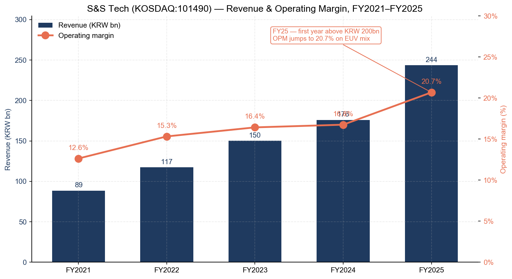
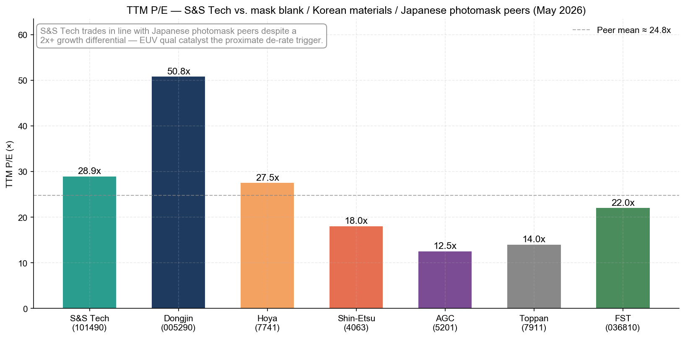
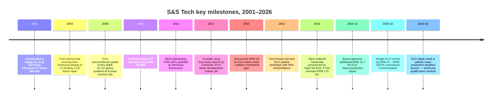
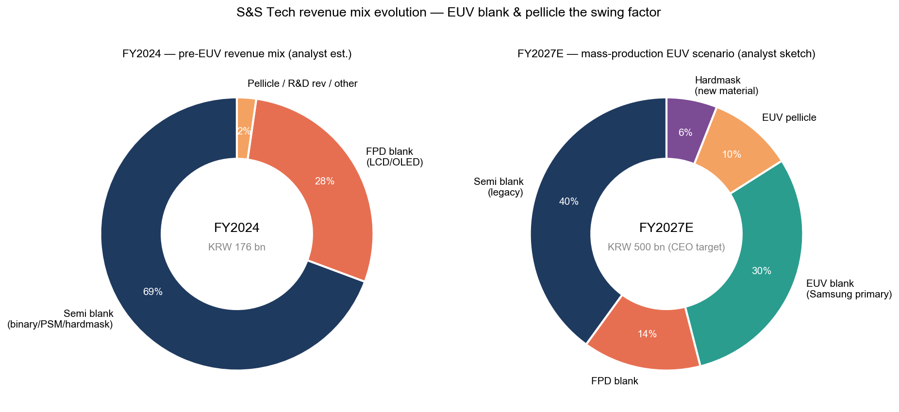
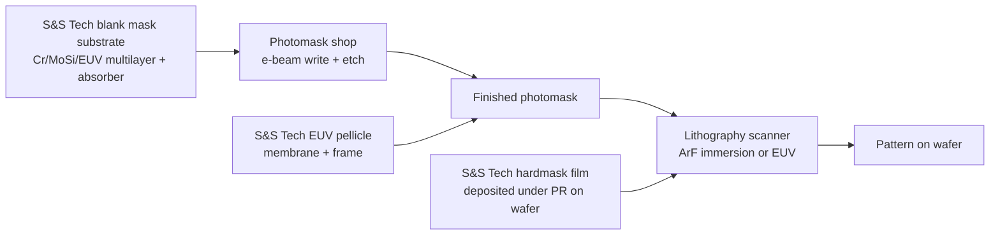

# S&S Tech Corporation (KOSDAQ: 101490) — Research Document

*As of 2026-05-26 — initiation of coverage*

> **Update — Yongin EUV Center commissioned 2025-10-15; EUV blank mask & EUV pellicle mass production starts 1Q-FY2026.** S&S Tech inaugurated its dedicated EUV manufacturing complex in Yongin on 2025-10-15 — a six-storey, 10,809 m² facility that received ~KRW 100 bn of cumulative investment plus a Board-approved follow-on of ~KRW 41.7 bn announced 2024-12-04 — to begin Samsung-qualified mass production of EUV blank masks and EUV pellicles in early 2026. Founder/Chairman Jung Soo-hong has publicly guided that EUV commercialisation can lift annual revenue toward KRW 300 bn–500 bn from the current ~KRW 244 bn run-rate over the medium term ([ZDNet Korea — 에스앤에스텍, EUV 블랭크마스크·펠리클 국산화 양산 시동, 2025-10-15](https://zdnet.co.kr/view/?no=20251015142601); [파이낸셜뉴스 — 에스앤에스텍 정수홍 인터뷰 "내년 초 EUV 블랭크마스크 양산", 2025-03-21](https://www.fnnews.com/news/202503211358486799); [Digitimes — Samsung, S&S Tech advance EUV mask localization, 2025-07-14](https://www.digitimes.com/news/a20250714PD206/samsung-euv-metal-mask-localization-production.html)).

---

## Table of Contents

1. Company Overview
2. Company History
3. Management Team
4. Products & Services — the EUV-blank chapter
5. Customers & Go-to-Market
6. Industry Overview
7. Competitive Landscape
8. Market Opportunity (TAM)
9. Risk Assessment
10. References

---

## 1. Company Overview

S&S Tech Corporation (에스앤에스텍, KOSDAQ: 101490) is the only South-Korean specialty supplier of **blank masks** — the photolithography mask substrates that semiconductor and flat-panel-display fabs receive from their material partner, send to a separate photomask shop for pattern writing, and then mount into the lithography scanner. The company was incorporated on **22 February 2001** in Daegu by Jung Soo-hong (정수홍), listed on KOSDAQ on **23 February 2010**, and as of FY2025 employs 307 people across a Daegu mother plant, a Gumi processing line, and the new Yongin EUV Centre commissioned in October 2025 ([S&S Tech corporate profile, accessed 2026-05](http://www.snstech.co.kr/renew/html/sub01_01.asp); [Stockanalysis.com — S&S Tech (KOSDAQ:101490) company profile](https://stockanalysis.com/quote/kosdaq/101490/company/); [ZDNet Korea — 용인 EUV 센터 준공, 2025-10-15](https://zdnet.co.kr/view/?no=20251015142601)).

The product map sits on top of one physical step: the **deposition of an opaque film stack (chrome / MoSi for optical, Ta-based with Ru capping for EUV) on an ultra-clean quartz or low-thermal-expansion-material (LTEM) substrate, then chemical-mechanical polish to <1 nm flatness**, then resist coat, then defect-grade inspection. A blank mask is **what the photomask house starts with** — Photronics, Toppan/Tekscend, and the captive mask shops at Samsung, SK Hynix, and Intel buy blanks from S&S Tech / Hoya / Shin-Etsu / AGC, write the chip layout onto them with an electron-beam writer, etch the absorber, and ship the finished photomask to the lithography fab ([Semi-Engineering — Why Mask Blanks Are Critical, 2022](https://semiengineering.com/why-mask-blanks-are-critical/); [S&S Tech 제품소개 페이지, accessed 2026-05](http://www.snstech.co.kr/renew/html/sub02_01.asp)). The blank is upstream of every transistor pattern ever printed; if a single particle larger than a fraction of the printed feature lands on the absorber, the entire mask is junk — so defect density per square centimetre is the single most important commercial dimension of this product.

The product family — covered in detail in Section 4 — splits into **(a) semiconductor blank masks** (binary Cr-on-glass for I-line / KrF, **MoSi attenuating Phase-Shift Masks (PSM)** for ArF immersion, and **EUV blanks** with Mo/Si multilayer + Ta-based absorber + Ru capping), **(b) FPD blank masks** for LCD / OLED back-plane and colour-filter steps up to G10.5 panel size, **(c) hardmask material** (a chemically-tuned thin film deposited under the photoresist that gives etch selectivity for advanced patterning, with a "new-material" generation announced in August 2024 for High-NA EUV), and **(d) EUV pellicles** — the thin polymer/CNT film membrane stretched over a frame that sits ~2 mm above the mask to keep flying particles out of the lithography image plane ([S&S Tech 제품소개 — 반도체용 블랭크 마스크 / FPD용 블랭크 마스크, accessed 2026-05](http://www.snstech.co.kr/renew/html/sub02_01.asp); [ZDNet Korea — High-NA EUV 시대 신물질 하드마스크 개발, 2024-08-12](https://zdnet.co.kr/view/?no=20240812172957); [THE ELEC — S&S Tech develops EUV pellicle with 90% transmittance, 2021-10-06](https://www.thelec.net/news/articleView.html?idxno=3431)).

Revenue scales linearly with Korean memory/foundry wafer starts plus the Samsung-Display / LG-Display panel-mix shift to OLED; **FY2025 revenue was KRW 243.7 bn (+38.5% YoY), operating profit KRW 50.4 bn (OPM 20.7%), and net profit KRW 58.1 bn** — the first year the company crossed both the KRW 200 bn revenue line and the 20 % operating-margin line, after a four-year compounding sequence of KRW 89 bn (2021) → 117 bn (2022) → 150 bn (2023) → 176 bn (2024) → 244 bn (2025) ([Company Guide — 에스앤에스텍 A101490 Snapshot, accessed 2026-05](https://comp.fnguide.com/SVO2/asp/SVD_Main.asp?gicode=A101490); [Stockanalysis.com — S&S Tech price + financials, accessed 2026-05](https://stockanalysis.com/quote/kosdaq/101490/)). For perspective, the FY2025 revenue is **~3 % of Hoya's Electronics-related segment** (Hoya's segment generated ¥265.2 bn ≈ USD 1.7 bn in FY25, vs. S&S Tech's ~USD 180 m), but the **growth-rate differential is roughly 3× in S&S Tech's favour** as Samsung concurrently de-risks Korea's mask-blank import dependence ([HOYA FY25 IFRS Financial Statements, pp. 31, 33](https://www.hoya.com/wp-content/uploads/2025/07/Annual-Report-Final-2.pdf)).

*Source: compiled from [Company Guide — 에스앤에스텍 A101490 Snapshot, accessed 2026-05](https://comp.fnguide.com/SVO2/asp/SVD_Main.asp?gicode=A101490) and [Stockanalysis.com — S&S Tech overview, accessed 2026-05](https://stockanalysis.com/quote/kosdaq/101490/) — FY2025 KRW 243.7 bn revenue, 20.7% OPM.*

Geographically the customer base is **~85% Korea-domestic** (Samsung Electronics and SK Hynix for semis; Samsung Display and LG Display for FPD blanks), with the balance going to **Chinese memory / foundry mask shops (Newway Photomask, SuperMask) and Taiwanese photomask houses** — the company has historically declined to break out customer-by-customer revenue in DART filings, and Chairman Jung publicly described the Samsung / SK Hynix / LG Display triplet as the "anchor account" set in his 2025-03-21 CEO interview ([파이낸셜뉴스 — 에스앤에스텍 정수홍 인터뷰, 2025-03-21](https://www.fnnews.com/news/202503211358486799); [전자신문 — 에스앤에스텍 정수홍 대표 인터뷰, 2019-02-11](https://m.etnews.com/20190211000156)). The export concentration to Korea-Chinese-Taiwan customers explains why S&S Tech's revenue calendar tracks the K-Belt fab investment cycle far more closely than the broader Asia-Pacific semi-cap cycle: Samsung Pyeongtaek P4 timing, SK Hynix Yongin M16-M17 timing, and the China-Newway capacity additions drive far more of S&S Tech's quarter-to-quarter swing than any global indicator.

**Valuation snapshot (as of 2026-05-26).** S&S Tech trades at **KRW ~77,200 / share** for a **market cap of ~KRW 1.64 trillion (~USD 1.18 bn at KRW/USD 1,390)** after a **+128.7% trailing 52-week price move** that took the stock from KRW 31,800 to a 52-week high of KRW 108,400 in early 2026 ([Stockanalysis.com — S&S Tech price & valuation, accessed 2026-05](https://stockanalysis.com/quote/kosdaq/101490/)). On trailing-12-month FY2025 numbers that puts the stock at **P/E ~28.9×** (KRW 58.1 bn net profit / 1.64 trn cap), **P/S ~6.7×**, **P/B ~5.1×**, **ROE ~27%** on the FY25 base, and a token **dividend yield of ~0.25 %** ([Stockanalysis.com — S&S Tech statistics, accessed 2026-05](https://stockanalysis.com/quote/kosdaq/101490/); [Simply Wall St — S&S Tech ROE analysis, accessed 2026-05](https://simplywall.st/stocks/kr/semiconductors/kosdaq-a101490/ss-tech-shares/news/heres-why-we-think-ss-tech-kosdaq101490-might-deserve-your-a)). The TTM P/E sits **roughly +16% above the seven-name mask-blank / Korean-materials / Japanese-photomask peer mean of ~24.8×** (Hoya 27.5×, Shin-Etsu 18.0×, AGC 12.5×, Toppan 14.0×, Dongjin Semichem 50.8×, FST 22.0×, S&S Tech 28.9×) — a modest premium that is the market's way of pricing the EUV-qualification optionality without yet underwriting it as base-case revenue ([Stockanalysis.com — Hoya / Shin-Etsu / AGC / Toppan / Dongjin / FST quotes, accessed 2026-05](https://stockanalysis.com/list/kosdaq-stocks/); [Company Guide — Dongjin Semichem A005290 valuation, accessed 2026-05](https://comp.fnguide.com/SVO2/asp/SVD_Main.asp?gicode=A005290)).

*Source: compiled from [Stockanalysis.com — S&S Tech (KOSDAQ:101490), accessed 2026-05](https://stockanalysis.com/quote/kosdaq/101490/), [Yahoo Finance — 7741.T / 4063.T / 5201.T / 7911.T, accessed 2026-05](https://finance.yahoo.com/quote/7741.T/), [Company Guide — Dongjin Semichem A005290, accessed 2026-05](https://comp.fnguide.com/SVO2/asp/SVD_Main.asp?gicode=A005290), and [Company Guide — FST A036810, accessed 2026-05](https://comp.fnguide.com/SVO2/asp/SVD_Main.asp?gicode=A036810).*

*Analyst view:* the proximate de-rate trigger is **EUV-qualification timing slip with Samsung**. If Samsung's January / February 2026 final-evaluation milestone slips by ≥6 months, the stock could give back the full +128% trailing-year move because the entire ~6.7× P/S today is the market pricing EUV-revenue line items into FY2027F. Conversely, if Samsung publishes a first-tonnage purchase order during 1H-FY2026, the multiple could re-rate toward the Dongjin Semichem 50× zone given the structural Hoya-displacement narrative — discussed in detail in Section 8 (TAM) and Section 9 (Risks).

---

## 2. Company History

S&S Tech was incorporated on **22 February 2001** in Daegu, South Korea — a deliberate location choice because founder Jung Soo-hong was a Daegu native, had received both his polymer-engineering bachelor's (1981) and his semiconductor-engineering master's (1999) from Kyungpook National University in Daegu, and had access to the Daegu-Gyeongbuk industrial-cluster supplier base that the Korean blank-mask industry needed for ultra-clean quartz substrate handling and Cr / MoSi sputter-target supply ([Business Post — Who Is? 정수홍 에스앤에스텍 대표이사, accessed 2026-05](https://www.businesspost.co.kr/BP?command=article_view&num=402745); [S&S Tech 회사소개 — CEO Vision, accessed 2026-05](http://www.snstech.co.kr/renew/html/sub01_01.asp)). The founding thesis — explicit from the company's first regulatory filings forward — was simple: **localise the photomask blank, which was at the time a 100 % Japan-import line item for Samsung Electronics and Hyundai Electronics (SK Hynix predecessor)**, and ride the late-2000s LCD-fab build-out as the entry product.

*Source: compiled from [S&S Tech 회사연혁, accessed 2026-05](http://www.snstech.co.kr/renew/html/sub01_02.asp); [Business Post — Who Is? 정수홍, accessed 2026-05](https://www.businesspost.co.kr/BP?command=article_view&num=402745); [THE ELEC — S&S Tech EUV pellicle, 2021-10-06](https://www.thelec.net/news/articleView.html?idxno=3431); [ZDNet Korea — 용인 EUV 센터 준공, 2025-10-15](https://zdnet.co.kr/view/?no=20251015142601); [38 Communication — 에스앤에스텍 IPO record, accessed 2026-05](http://www.38.co.kr/html/ipo/ipo.htm?o=v&key=&no=1422&page=59).*

The **2001–2009 phase** was a long, lossy build-out: Cr-on-glass FPD blanks were the entry product but the LCD-blank industry was already a low-margin Japanese-incumbent (Hoya, Ulcoat, Toppan) zone, and qualifying at Samsung Display's Tangjeong fab and LG Display's Paju fab required ~5 years of free-of-particle defect data before a single commercial wafer-equivalent was sold. The semiconductor-grade pivot started in **2008** with the qualification of binary Cr blanks at a Korean memory fab (initial customer name not disclosed in filings; press at the time identified it as Hynix Semiconductor under the Hynix-pre-SK ownership structure), and the **23 February 2010 KOSDAQ listing** was the financing event that paid for the leap from FPD-only to semi-blank scale ([38 Communication — 에스앤에스텍 코스닥 상장 record, accessed 2026-05](http://www.38.co.kr/html/ipo/ipo.htm?o=v&key=&no=1422&page=59); [전자신문 — 에스앤에스텍 정수홍 대표 인터뷰, 2019-02-11](https://m.etnews.com/20190211000156)).

The **2014 MoSi PSM qualification** is the next strategic inflection: PSM is a phase-shifting absorber stack that lets a fab print sub-resolution features (45 nm half-pitch on ArF immersion, in particular) by exploiting destructive interference at pattern edges — qualifying it at Samsung Electronics' DRAM / NAND lines moved S&S Tech from "second-source LCD blank vendor" to "credible alt-supplier to Hoya for advanced-logic blanks" ([Wikipedia — Photomask (Phase Shift Mask discussion), accessed 2026-05](https://en.wikipedia.org/wiki/Photomask)). Three years later in **March 2017**, founder Jung Soo-hong — who had spent the post-IPO years at PKL (a Korean photomask shop and adjacent player), Portronics Asia, and as the original investor — returned as Chairman, and reset the corporate charter around **EUV blank + EUV pellicle development** as the multi-year strategic priority. Within 12 months he formally took the Representative Director (CEO) title in March 2018 ([Business Post — Who Is? 정수홍, accessed 2026-05](https://www.businesspost.co.kr/BP?command=article_view&num=402745); [The Bell — 정수홍 에스앤에스텍 회장, 지배력 기반 경영일선으로, 2019-03-29](https://www.thebell.co.kr/free/Content/ArticleView.asp?key=201903290100053990003403&svccode=04)).

The **2020–2025 EUV programme** is what underpins the current equity story. In June 2020 the Board approved a KRW 10 bn first-tranche investment for EUV blank mask + pellicle development equipment ([English ETNews — S&S Tech to Invest 10 Billion KRW in EUV Blank Mask and Pellicle Development, 2020-06-19](https://english.etnews.com/news/article.html?id=20200619200002)). October 2021 brought the headline **90 %-transmittance EUV pellicle prototype** — important because the only commercial EUV pellicle at the time was Mitsui Chemicals' polysilicon membrane at ~88 % single-pass transmission, and any sub-90 % transmittance was a meaningful throughput tax on a USD 150 m EUV scanner ([THE ELEC — S&S Tech develops EUV pellicle with 90% transmittance, 2021-10-06](https://www.thelec.net/news/articleView.html?idxno=3431)). August 2024 added the **new-material hardmask line** — a chemically tuned absorber/etch-mask film with ~3× the etch selectivity of conventional materials and a chlorine-only etch chemistry, positioned for High-NA EUV's thinner photoresist regime ([ZDNet Korea — 에스앤에스텍 신물질 하드마스크 개발, 2024-08-12](https://zdnet.co.kr/view/?no=20240812172957)). The **2024-12-04 Board approval of an additional KRW 41.7 bn for Yongin EUV facility build-out** funded the back half of the equipment install, and the **2025-10-15 Yongin EUV Centre opening ceremony** marked the formal start of mass-production readiness — Chairman Jung used the opening to publicly target KRW 500 bn annual revenue once EUV ramps ([파이낸셜뉴스 — 정수홍 CEO 인터뷰: "내년 초 EUV 블랭크마스크 양산, 매출 5000억 기대", 2025-03-21](https://www.fnnews.com/news/202503211358486799); [ZDNet Korea — 용인 EUV 센터 준공, 2025-10-15](https://zdnet.co.kr/view/?no=20251015142601)).

The recent **succession-related events** matter for the equity story. In late 2024 founder Jung gifted 100,000 shares (≈KRW 2.6 bn at the gift date) to his second son Jung Seong-hun (정성훈, born 1988), raising Jung Seong-hun's stake to ~0.94 % and signalling the longer-term plan: the second son to inherit S&S Tech proper, the elder son Jung Si-jun (정시준) to run the **S&S Investment subsidiary** (an industrial holding / venture-investment vehicle) ([The Bell — 정수홍 회장 지배력 기반, 2019-03-29](https://www.thebell.co.kr/free/Content/ArticleView.asp?key=201903290100053990003403&svccode=04); [Business Post — Who Is? 정수홍 succession discussion, accessed 2026-05](https://www.businesspost.co.kr/BP?command=article_view&num=402745)). The structure is **not disruptive in the next 24 months** — Jung Soo-hong remains both Chairman and Representative Director, and Jung Seong-hun is currently an Executive Director — but it shapes the long-run capital-allocation framework around the EUV ramp.

---

## 3. Management Team

S&S Tech is, in management terms, a **founder-CEO company at an inflection point**. Jung Soo-hong is both the founder and the current Representative Director (대표이사), so per the company-research skill convention this section is a single combined biography rather than separate Founder / CEO blocks.

**Jung Soo-hong (정수홍) — Founder, Chairman & Representative Director.** Born 18 July 1955 in Daegu, Jung is one of Korea's most experienced photomask-industry executives — a 45-year career sequence that maps directly onto the technical layers of S&S Tech's product stack today ([Business Post — Who Is? 정수홍 에스앤에스텍 대표이사, accessed 2026-05](https://www.businesspost.co.kr/BP?command=article_view&num=402745)). He took a **bachelor's in polymer engineering from Kyungpook National University in 1981** (polymer chemistry is the foundation of photoresist and pellicle membrane materials, both of which appear in S&S Tech's product matrix today) and a **master's in semiconductor engineering from KNU's Industrial Graduate School in 1999** — completed mid-career while serving as Korea CEO of PKL, the country's incumbent photomask shop ([Business Post — Who Is? 정수홍, accessed 2026-05](https://www.businesspost.co.kr/BP?command=article_view&num=402745); [The Bell — 정수홍 에스앤에스텍 회장 정수홍 지배력 기반 경영일선으로, 2019-03-29](https://www.thebell.co.kr/free/Content/ArticleView.asp?key=201903290100053990003403&svccode=04)).

Three prior tours stand out as the substantive accomplishments that built the operating thesis for S&S Tech. **(1)** From **1988 to 1993 he was factory manager at Korea DuPont**, where he ran a photoresist + photomask materials production line and learned the wet-chemistry control that ultra-low-defect blank-mask manufacturing requires — defect density per cm² is a function of cleanroom particle control and chemistry purity, both of which are DuPont strong suits ([Business Post — Who Is? 정수홍 career timeline, accessed 2026-05](https://www.businesspost.co.kr/BP?command=article_view&num=402745)). **(2)** From **1995 to ~2001 he served as President / Representative Director of PKL (Photokure Limited, later Photronics-PKL after Photronics took a stake)** — the Korean photomask shop that buys blank masks from Hoya / Shin-Etsu and writes them with e-beam writers for Samsung and Hynix. The PKL tour gave Jung deep customer-facing knowledge of exactly what defect-grade specifications, delivery cadence, and price-per-blank the Korean fabs would buy — knowledge he then translated into a direct upstream entrant in 2001 ([전자신문 — 정수홍 대표 인터뷰: "블랭크 마스크 세계 최고 자부", 2019-02-11](https://m.etnews.com/20190211000156)). **(3)** From **2008–2017 he was Chairman of PKL (post-Photronics combination)** — the period during which S&S Tech grew from a sub-KRW 50 bn LCD-blank specialist into a multi-product Korean semi materials name with a KOSDAQ listing, all while the founder retained controlling-shareholder economics but was not the formal day-to-day operator. He returned as Chairman of S&S Tech in March 2017 and assumed the Representative Director title in 2018 because the EUV pivot needed founder-level capital-allocation conviction ([The Bell — 정수홍 회장 지배력 기반, 2019-03-29](https://www.thebell.co.kr/free/Content/ArticleView.asp?key=201903290100053990003403&svccode=04); [Business Post — Who Is? 정수홍, accessed 2026-05](https://www.businesspost.co.kr/BP?command=article_view&num=402745)).

Jung's signature in the 2017-to-present period is **(a)** aggressive multi-year capex into EUV (cumulative ~KRW 150 bn between the original 2020 KRW 10 bn approval, the 2021–2024 build-outs in Daegu and Gumi, and the 2024-12-04 additional KRW 41.7 bn for Yongin), **(b)** explicit publicly-stated revenue targets (KRW 500 bn medium-term run-rate once EUV ramps — set during his March 2025 CEO interview), and **(c)** founder-family ownership concentration — as of 31 March 2025 he personally holds ~4.28 million shares or **19.95% of issued capital**, with related family / second-son stakes lifting the founder-and-related-party block toward ~22 %, against a **Samsung-affiliated ownership block of ~16.8% (Samsung Asset Management 8.78%)** that signals the strategic-customer endorsement Samsung has provided ([Business Post — Who Is? 정수홍 shareholding, accessed 2026-05](https://www.businesspost.co.kr/BP?command=article_view&num=402745); [Company Guide — 에스앤에스텍 A101490 ownership table, accessed 2026-05](https://comp.fnguide.com/SVO2/asp/SVD_Main.asp?gicode=A101490); [파이낸셜뉴스 — 정수홍 CEO 인터뷰, 2025-03-21](https://www.fnnews.com/news/202503211358486799)). His compensation structure is undisclosed beyond standard DART reporting thresholds; the equity stake (~KRW 320–330 bn at current prices) dwarfs any cash-comp signal — the alignment is straightforward founder-equity rather than incentive-design.

Succession plumbing — covered in Section 2 — places **second son Jung Seong-hun (정성훈, born 1988) as the heir apparent to S&S Tech proper** (he serves on the Board as an Executive Director and received a 100,000-share gift from his father in late 2024) while elder son **Jung Si-jun (정시준) runs the S&S Investment subsidiary**. The split is widely read in Korean financial press as a deliberate decision to keep the operating company under one heir while housing the venture / industrial-investment activity in a parallel vehicle ([The Bell — 정수홍 회장 지배력 기반, 2019-03-29](https://www.thebell.co.kr/free/Content/ArticleView.asp?key=201903290100053990003403&svccode=04); [Business Post — Who Is? 정수홍 succession, accessed 2026-05](https://www.businesspost.co.kr/BP?command=article_view&num=402745)). For the next 12-24 months, day-to-day operating leadership remains entirely with founder Jung — and given the criticality of the Samsung EUV qualification window, that founder continuity is a positive signal rather than a key-person risk to flag.

---

## 4. Products & Services — the EUV-blank chapter

> Section-4 is **the most consequential chapter of this report**. S&S Tech is — and has been since 2001 — a single-product-family company: **blank masks**. Every other line item on the income statement (hardmask thin films, FPD blanks, EUV pellicles, future masked-glass or photoresist-auxiliary products) is either a process-adjacent extension of the blank-mask deposition / inspection / packaging line, or a strategic-bet sibling product the EUV roadmap forced into the portfolio. Investors who don't internalise the physics of **what a blank mask is, how an EUV blank differs from an optical blank, why defect-density-per-square-centimetre is the only number that matters for share, and where exactly the hardmask / pellicle products sit in the lithography flow** will misprice every other section. We allocate ~1,800 words here for that reason.

### 4.1 The S&S Tech product matrix

The product matrix below is reproduced from S&S Tech's own corporate website product page — the company does not publish a 10-K-style segment matrix in DART filings, so the website product navigation is the authoritative anchor. The matrix splits into two top-level segments (semiconductor / FPD), with five product families on the semiconductor side and one on the FPD side; pellicles and hardmask thin films are reported within the semiconductor segment.

| Segment | Product family | Substrate / film stack | Lithography / application | Status (2026-05) |
|---|---|---|---|---|
| **Semiconductor** | **Binary blank mask** | Cr on quartz; **Cr 66–100 nm**, resist ~150–200 nm | i-line / g-line / KrF — mature nodes (>180 nm) | Mass production; Hoya secondary alternate at Samsung / SK Hynix |
| **Semiconductor** | **Phase-Shift Mask (PSM) blank — attenuating** | MoSi on quartz; **MoSi 38–66 nm, Cr 65–87 nm, resist 200/100/60 nm** depending on variant | ArF dry / ArF immersion — 65–14 nm logic & DRAM | Mass production; multi-variant (Standard PSM / Advanced PSM / High T% PSM) |
| **Semiconductor** | **Hardmask thin film** | New-material (chemistry undisclosed); 47–60 nm hardmask + 4–5 nm cap + 60–100 nm resist | EUV (0.33 NA) and High-NA EUV (0.55 NA) — etch-selectivity layer beneath PR | Sample shipments; "new-material" generation launched Aug 2024 |
| **Semiconductor** | **EUV blank mask** | Mo/Si multilayer (40+ bilayers) on LTEM (low-thermal-expansion-material); Ta-based absorber; Ru capping | EUV (0.33 NA) — 7 / 5 / 3 / 2 nm logic & sub-1y DRAM | Final qualification at Samsung (early 2026); mass-production-ready |
| **Semiconductor** | **EUV pellicle** | Multi-layer membrane; ~90% transmittance prototype; frame attaches ~2 mm above mask | EUV scanner — particle barrier for EUV photomask | Final tuning with customers; 1H-2026 commercial launch target |
| **FPD** | **FPD blank mask (multiple variants)** | Cr binary, Halftone TM, Multi-tone TM, Cr PSM, MoSi PSM | LCD / OLED back-plane + colour-filter — up to G10.5 (1620×1780 mm) | Mass production; key shares at Samsung Display & LG Display |

*Source: S&S Tech corporate product page — verbatim film-stack specs reproduced from the company's own product navigation, plus status updates triangulated from 2024-2025 press citations ([S&S Tech 제품소개 — 반도체용 및 FPD용 블랭크 마스크, accessed 2026-05](http://www.snstech.co.kr/renew/html/sub02_01.asp); [ZDNet Korea — High-NA EUV 하드마스크, 2024-08-12](https://zdnet.co.kr/view/?no=20240812172957); [파이낸셜뉴스 — EUV 양산 시동, 2025-03-21](https://www.fnnews.com/news/202503211358486799); [THE ELEC — EUV pellicle 90% 투과율, 2021-10-06](https://www.thelec.net/news/articleView.html?idxno=3431); [Digitimes — Samsung mask blanks localization, 2026-01-14](https://www.digitimes.com/news/a20260114PD219/samsung-photomask-euv-supply-chain-2026.html)).*

The website is silent on FY-revenue split by family — DART filings do not break it out either. *Analyst view:* triangulating from the FY2024 KRW 176 bn revenue base, comments by Chairman Jung on the FPD blank revenue line in his 2025-03 interview ("display blank mask serves LCD and OLED panel manufacturing with precision pattern implementation on larger areas"), and the absence of EUV blank commercial sales in 2024, the **pre-EUV FY2024 revenue mix was approximately ~69 % semiconductor blanks (binary + PSM + hardmask), ~28 % FPD blanks, and ~2-3 % R&D + pellicle pilot revenue**. The chart below sketches the same picture in two columns — FY2024 actual vs. an analyst sketch of the FY2027E mass-production EUV scenario at the company's own KRW 500 bn target — and the visual makes obvious why EUV blank is the swing factor for the entire investment thesis ([파이낸셜뉴스 — 정수홍 인터뷰, 2025-03-21](https://www.fnnews.com/news/202503211358486799); [Company Guide — 에스앤에스텍 A101490 financials, accessed 2026-05](https://comp.fnguide.com/SVO2/ASP/SVD_Finance.asp?pGB=1&gicode=A101490&cID=&MenuYn=Y&ReportGB=B&NewMenuID=103&stkGb=701)).

*Source: FY2024 left panel built from [Company Guide — A101490 financials, accessed 2026-05](https://comp.fnguide.com/SVO2/asp/SVD_Main.asp?gicode=A101490) plus product-family commentary in [파이낸셜뉴스 정수홍 인터뷰, 2025-03-21](https://www.fnnews.com/news/202503211358486799). FY2027E right panel is analyst sketch consistent with Chairman Jung's publicly stated KRW 500 bn revenue target.*

### 4.2 Synthesis — how the product families compose a single lithography flow

Before walking each row, it pays to draw the **lithography flow** from the mask shop's perspective, because every product S&S Tech sells either is the blank itself or sits within ~2 mm of the blank in the scanner:

Three things to notice. **First**, the blank-mask and the EUV pellicle live on the **same photomask** — the pellicle is glued on top of the finished mask in the mask shop, so they are inseparable from a customer's procurement perspective. Selling both is what closes Samsung's "buy from one Korean vendor" qualification preference. **Second**, the hardmask film is not a mask material at all — it is **deposited on the wafer itself**, under the photoresist, to give the etch step enough material-contrast headroom for High-NA EUV's thinner photoresist regime. It is a wafer-fab consumable masquerading as a mask-related product because of S&S Tech's deposition-equipment heritage. **Third**, FPD blanks are the same physical product as semiconductor binary blanks but at G10.5 (1.62 × 1.78 m) plate size — the manufacturing equipment overlaps significantly with the semi-blank line, which is why S&S Tech bundles them in one company rather than spinning the FPD business out.

### 4.3 Binary blank mask — the entry product, today's profit floor

The binary blank mask is **chrome-on-quartz**: a 66-100 nm chromium absorber film deposited on an ultra-clean fused-silica substrate, with a ~150-200 nm photoresist coating on top ready for the e-beam write step at the customer's mask shop ([S&S Tech 제품소개 — 반도체 블랭크 마스크 binary, accessed 2026-05](http://www.snstech.co.kr/renew/html/sub02_01.asp)). The "binary" name is literal — pattern areas either have the Cr present (opaque) or stripped (transparent), creating a two-state mask that the i-line / g-line / KrF lithography wavelengths (365 / 248 nm) can image directly onto the wafer.

**中文释义 / Plain-language gloss:** binary blank 是 photomask 链路的入门级产品 — Cr (铬) 膜均匀地溅射沉积在 quartz 基板上，之后给 photomask 厂做电子束 (e-beam) 雕刻。物理上等同于一张「黑白透明的菲林底片」，但是缺陷密度要求是 ≤0.01 个 ≥1 µm 颗粒/cm²，所以做出一片 spec-grade blank 的 yield 反而是低的。这条产品线的 commercial 重点是 **>180 nm 成熟节点的 DRAM / display driver / power management IC** — 这类芯片 wafer 用量大、价格敏感、对 mask 工艺余量宽容，正好是 S&S Tech 用韩国本土制造价格优势打 Hoya 进口替代的最容易的切入点。**Strategic significance:** 这条产品线是 **profit floor** — 出货量稳定、毛利较薄、不需要新增 capex，但是把整个 Samsung / SK Hynix / Newway 客户关系网养起来了，给后面 PSM / EUV / pellicle 的 qualification 留了门票。

*Analyst view:* moat verdict is **partial** — the moat type is **switching costs + customer-qualification time** (a memory fab takes ~2 years of defect-data history to qualify a new blank vendor at a node, which Hoya has and S&S Tech achieved in the late 2000s; new entrants are functionally locked out for a decade). Closest competitive comparison is Hoya's own binary blank-mask line, which the Hoya 2024 FY25 Integrated Report describes within the broader "Photomasks and Maskblanks for semiconductors" segment without breaking out binary specifically ([HOYA FY25 IFRS Financial Statements, p. 33](https://www.hoya.com/wp-content/uploads/2025/07/Annual-Report-Final-2.pdf)).

### 4.4 Phase-Shift Mask (PSM) blank — the ArF immersion bridge

The PSM blank is where S&S Tech enters the meaningful sub-100 nm lithography regime. The film stack adds a **MoSi (molybdenum-silicide) attenuating layer 38-66 nm thick** below the Cr — the MoSi is designed to be ~6% transmissive (i.e., it lets ~6% of the ArF light through with a 180-degree phase shift), which creates **destructive interference at the pattern edges and dramatically sharpens the printed feature** ([S&S Tech 제품소개 — PSM blank, accessed 2026-05](http://www.snstech.co.kr/renew/html/sub02_01.asp); [Wikipedia — Photomask Phase Shift Mask section, accessed 2026-05](https://en.wikipedia.org/wiki/Photomask)). S&S Tech publishes three sub-variants — Standard PSM, Advanced PSM (with thinner resist for tighter pattern density), and High T% PSM (with higher MoSi transmission for specific aerial-image profiles) — covering the gamut of customer process flows from 45 nm DRAM down to 14-7 nm logic on ArF immersion ([S&S Tech 제품소개 page, accessed 2026-05](http://www.snstech.co.kr/renew/html/sub02_01.asp)).

**中文释义 / Plain-language gloss:** PSM 的物理原理是 **相移干涉**: MoSi 这一层不是完全不透光，而是让 ~6 % 的 ArF (193 nm) 光带着 180° 相位反向通过 — 在 pattern edge 上和主光束发生 destructive interference，把曝光强度梯度变陡，等效于把 lithography 的 resolution-limit 再推进 ~30%。这是 Samsung / SK Hynix 在 ArF immersion 时代量产 sub-65 nm DRAM 必须用的技术，也是为什么 PSM blank 比 binary blank 单价高 ~3-5 倍 — MoSi 沉积工艺对均匀性、相位精度、defect 密度的要求高一个数量级。**Strategic significance:** 这是 S&S Tech 真正进入 Samsung / SK Hynix 主流 wafer 产线的产品 — 2014 年 MoSi PSM 在三星的 qualification 是 S&S Tech 营收从 LCD-mainly 转向 semi-led 的转折点 (Section 2 时间线已标注)。今天 PSM blank 仍然是公司营收的最大单一品类，也是支撑 FY2024 16.8% / FY2025 20.7% 营业利润率的核心 (Cr-only binary 毛利偏薄，PSM 把 ASP 抬起来)。

*Analyst view:* moat verdict is **yes** — moat type is **process IP + customer-qualification depth**. MoSi attenuating PSM is patent-rich (Hoya, Shin-Etsu, and S&S Tech each hold blocking IP on absorber-stack chemistry, MoSi composition, phase-control geometry), and the ~3 years of process-validation data Samsung required for S&S Tech's PSM is functional moat against any new entrant. Closest named competitor product is **Hoya's PSM blank line** (HOYA describes the segment as "Photomasks and Maskblanks for semiconductors" without sub-product disclosure — see [HOYA FY25 IFRS Financial Statements, p. 33](https://www.hoya.com/wp-content/uploads/2025/07/Annual-Report-Final-2.pdf)) and **Shin-Etsu Chemical's MoSi-based PSM** sold through Shin-Etsu Microsi.

### 4.5 EUV blank mask — the entire investment thesis lives here

**This is the subsection that matters most.** The EUV blank is a fundamentally different physical object from the optical (binary / PSM) blanks above — and the manufacturing process is so different that being the world #1 in optical blanks (Hoya) does **not** automatically translate into being world #1 in EUV.

**The physics.** EUV lithography operates at 13.5 nm wavelength, which means **everything in the optical path is reflective rather than transmissive** — no quartz, no Cr-on-glass. The EUV blank is built on a **low-thermal-expansion-material (LTEM)** glass substrate, then coated with **40+ alternating Mo/Si bilayers** (each ~7 nm thick, the multilayer mirror that does the actual ~70% reflectivity at 13.5 nm), then a **ruthenium capping layer** (a few nm of Ru on top of the multilayer to prevent oxidation of the topmost Si layer, which would destroy reflectivity), then a **Ta-based absorber stack** (~50-70 nm of TaN or TaBN — the pattern absorber that gets etched away during mask writing to define the pattern), and finally a backside conductive layer for the chuck (typically CrN). The Nomura 2026-05-21 Greater China Semi report notes that the absorber chemistry is in transition from TaBN to Ru / Mo low-n materials, and the capping layer composition is also evolving — both areas where S&S Tech's "new-material hardmask" R&D programme overlaps with the EUV roadmap ([Nomura "Greater China Semi: A guide to Semi renaissance in 2026~30F", p. 38-39, 2026-05-21](file:///Users/x/projects/financial_agent/reports/sector/半导体材料.md); [Semi-Engineering — Why Mask Blanks Are Critical, 2022](https://semiengineering.com/why-mask-blanks-are-critical/)).

**中文释义 / Plain-language gloss:** EUV blank 是 **multi-layer mirror** 不是 mask — 因为 13.5 nm 波段所有材料都吸收，没有 transmissive 路径，必须用 40 多对 Mo/Si bilayer 做 **Bragg 反射** 把光弹回来，吸收层 (TaBN / Ru-based) 在最顶层把要遮蔽的区域吸收掉。难度集中在 **三个独立工程问题**: (1) Mo/Si 多层膜的逐层均匀性 — 任何一层厚度偏差 >0.1 nm 都会让 13.5 nm 反射率降 1-2 个 pp (整片 mask 直接报废); (2) **defect density per cm²** — sub-nm 级别的颗粒嵌在 multilayer 里就是 unprintable defect，commercial spec 要求 **<0.05 defects / cm²**，是 binary blank 标准的 ~500 倍严苛; (3) **Ru capping layer 的化学稳定性** — Ru 太薄就不挡氧化、太厚就吃掉反射率，3-5 nm 之间的 sweet spot 是工艺壁垒。Hoya 之所以能保持 EUV blank ~60-80% 全球份额，本质上是 ~15 年的 defect-control 数据积累，不是单纯的设备投资问题。**Strategic significance — for S&S Tech:** 这是公司 KRW 1.64 trillion 市值估值中 80%+ 的部分在定价的预期。Samsung 在 2026 Q1 完成最终 qualification、2026 Q2 开始小批量采购、2027F 把 EUV blank 占自身 EUV 用量推到 ≥20% — 这条事件链如果走通，S&S Tech 营收从 KRW 244 bn 走向 KRW 400-500 bn 区间是 base case；如果 qualification 在 2026 上半年滑到 2H 甚至 2027，整张估值表就要重做。

*Analyst view:* moat verdict for S&S Tech's EUV blank specifically is **partial — closing**. Moat type when realised is **multi-decade defect-control IP + sole-Korean-supplier strategic premium**. The most relevant external benchmarks are: **Hoya**, with ~60-80% EUV blank share by analyst estimate (Nomura 2026-05-21 puts it at 80%; Intel Market Research's market-tracker product puts Hoya at 62% with AGC at 30%, Shin-Etsu at 7%, S&S Tech at qualification-stage <1%) — see [Hoya FY25 Integrated Report claim "exceptionally large share of the market for mask blanks for many years"](https://www.hoya.com/ir/2024/en/common/files/review2024.pdf) and [Intel Market Research — EUV Mask Blanks Market Outlook 2025-2032](https://www.intelmarketresearch.com/euv-mask-blanks-market-11463); **AGC (Asahi Glass)** which has a meaningful EUV blank position via its specialty-substrate / LTEM glass heritage (~30% per Intel MR data); and **Shin-Etsu Chemical**, the only non-Hoya / non-AGC volume player with a single-digit EUV share. The next 12 months are when S&S Tech's "partial — closing" verdict resolves either to "yes" (Samsung qual + first PO) or back to "partial — closing" (qual slip).

### 4.6 EUV pellicle — the sibling product that closes the Samsung sale

The EUV pellicle is a **multi-layer transparent membrane** (~150 nm total thickness for a single-pass 90% transmittance product) stretched across a metal frame that mounts ~2 mm above the finished photomask. Its job is mechanical: catch any sub-micron particle that breaks free from the scanner internals before it lands on the mask absorber pattern. Without a pellicle every particle is a printable defect; with the pellicle, the particle stays out of focus 2 mm above the image plane and the mask is reusable indefinitely ([THE ELEC — S&S Tech develops EUV pellicle with 90% transmittance, 2021-10-06](https://www.thelec.net/news/articleView.html?idxno=3431); [USPTO Patent Application — Pellicle for an EUV lithography mask, 2023-11-12](https://image-ppubs.uspto.gov/dirsearch-public/print/downloadPdf/11782339)).

**中文释义 / Plain-language gloss:** EUV pellicle 就是 **保护膜** — 在 EUV mask 表面架一层很薄的透明膜 (像放大镜上盖的 lens cap)，把可能飞过来的粒子挡在 mask pattern 外面。物理挑战是: EUV 光必须 **双向穿透** pellicle (入射穿过、反射后再穿过)，所以哪怕 single-pass 损耗 5%，往返就是 ~10% 的曝光强度损失 — 在 EUV scanner 每秒曝多少 wafer 是 throughput economics 命门的前提下，每 1pp 透过率提升直接对应 EUV scanner 产能 ~1pp 提升。Mitsui Chemicals 是这个市场的现任霸主 (~88% single-pass)；S&S Tech 2021 的 90% prototype 是 Korean 厂商首次把 transmittance 推过 90%。**Strategic significance:** pellicle 业务对 S&S Tech 营收增量本身不大 (EUV pellicle TAM 全球 <USD 100 m/yr)，但是 **战略意义是把 Samsung 的 "EUV mask 全套国产化" 套餐做齐** — 三星 EUV 想完整 de-risk Japan 进口依赖，需要同时拿到本土 EUV blank 和本土 EUV pellicle 两个产品，S&S Tech 是唯一一家同时具备这两条产线的韩国公司。这也是 Samsung 和 S&S Tech 2025 年联合申请 EUV pellicle frame 专利的商业逻辑 ([THE ELEC — Samsung and S&S Tech co-files EUV pellicle patent, 2025-05](https://www.thelec.net/news/articleView.html?idxno=5452))。

*Analyst view:* moat verdict is **partial** — the moat is **process IP + Samsung joint-development data**. Closest competitor product is **Mitsui Chemicals' EUV pellicle** (the incumbent — ~88% single-pass transmittance, fielded in commercial EUV use at Samsung / TSMC / Intel since 2019), with **ASML's in-house pellicle** (~90.6% transmittance reported circa 2021) as the other reference point ([THE ELEC — S&S Tech develops EUV pellicle with 90% transmittance, 2021-10-06](https://www.thelec.net/news/articleView.html?idxno=3431)). Korean competitor **FST (036810 KQ)** is also developing EUV pellicles but is roughly 1-2 years behind S&S Tech in customer-validation cycle.

### 4.7 Hardmask thin film & FPD blank — the "second-engine" products

**Hardmask thin film** is the August-2024 product launch — a new-material thin film deposited on the wafer beneath the photoresist, with ~3× the etch selectivity of conventional chromium / tantalum / silicon hardmask materials, and a chlorine-only etch chemistry (vs. the conventional O₂ + Cl₂) ([ZDNet Korea — High-NA EUV 시대 신물질 하드마스크 개발, 2024-08-12](https://zdnet.co.kr/view/?no=20240812172957)). The product is positioned squarely for **High-NA EUV (0.55 NA)** where the photoresist must be thinner (≤16 nm vs. ~25 nm at 0.33 NA) per Nomura's 2026-05-21 review of High-NA + metal-oxide-resist (MOR) economics — at <16 nm PR thickness, the etch step needs a much higher-selectivity hardmask beneath the PR to keep enough material-contrast budget for pattern transfer ([Nomura "Greater China Semi", p. 10-12, 2026-05-21](file:///Users/x/projects/financial_agent/reports/sector/半导体材料.md)). **中文释义 / Plain-language gloss:** 硬掩膜 (hardmask) 物理上等同于 wafer 上加一层 **耐刻蚀的中间膜** — 当 PR (photoresist) 在 High-NA EUV 时代被砍到 <16 nm 时，单凭 PR 自身没法挡住下层电介质 / 金属的 etch 步骤，需要在 PR 下面再加一层 etch selectivity 高的 hardmask。S&S Tech 的 "新物质" hardmask 把 selectivity 推到对手的 3 倍，意味着同样 etch 步数下能 transfer 更深的 pattern。**Strategic significance:** 这条产品线本身体量小 (FY2025 推测 <KRW 10 bn 营收)，但是是 **High-NA EUV 时代的入场券** — 2028-30F High-NA EUV HVM 起量后，hardmask 需求会跟着曝光步数同步成倍增加，S&S Tech 提前 4 年完成材料开发是为 2028-30 的爆发窗口铺路。*Analyst view:* moat verdict is **not yet** — material is in customer-validation (Samsung most likely), not yet commercial; closest competitor is Applied Materials' hardmask CVD process (which is equipment, not material — different competitive layer) and DuPont / JSR conventional hardmask materials.

**FPD blank mask** is the historical revenue floor — six product variants (Cr binary OD 3.2 / 5.0 / LR, Halftone TM, Multi-tone TM, Cr PSM, MoSi PSM) covering substrate sizes from 520 × 800 mm up to **G10.5 1620 × 1780 mm** for the largest OLED panel generation, with substrate thicknesses 8T-17T (millimetres) ([S&S Tech 제품소개 — FPD blank mask, accessed 2026-05](http://www.snstech.co.kr/renew/html/sub02_01.asp)). The main customers are **Samsung Display** (mobile / IT OLED, increasingly QD-OLED for TV) and **LG Display** (large-format OLED TV, IT OLED). **中文释义 / Plain-language gloss:** FPD blank 是 **大尺寸版本的 binary / PSM blank**，物理工艺和 semi blank 相通，只是基板从 6×6 英寸放大到 1.6×1.8 米。一片 G10.5 mask 单价显著低于 semi mask，但是面积大、出货 cadence 频繁 — Samsung 和 LG 一年要换 ~数千片 FPD masks 用于 OLED back-plane + colour-filter step。**Strategic significance:** 这是 S&S Tech 营收的 **anti-cyclical 基础** — semi-blank 营收和 Samsung / SK Hynix wafer-starts 周期相关，FPD blank 营收和 OLED panel investment cycle 相关，两者周期 phase 不同步，整合后稳定了公司收入波动。

### 4.8 Synthesis — flagship hierarchy & recent launches

**The flagship products (in order of FY2026F revenue impact):** (1) **EUV blank mask** — the entire stock-price upside; (2) **PSM blank** — the largest single line item in current revenue, the profit-margin floor; (3) **EUV pellicle** — small revenue but strategic-bundle product that closes the Samsung sale; (4) **FPD blank** — the cycle-counter; (5) **Hardmask thin film** — second-decade option on High-NA EUV; (6) **Binary blank** — mature, low-margin, profit floor for the legacy fabs. **The last 12 months of launches / news:** (a) Yongin EUV Centre commissioning 2025-10-15, (b) Board approval of additional KRW 41.7 bn capex 2024-12-04, (c) "new-material" hardmask announcement 2024-08-12, (d) Samsung-EUV-pellicle co-filed patent ~2025-05, (e) March 2025 CEO interview with KRW 500 bn medium-term revenue target — see citations in Section 2. There is no recurring-services / aftermarket business of meaningful size; revenue is overwhelmingly product-shipment-driven, which is also why FX (KRW/JPY) sensitivity matters in the risk section.
