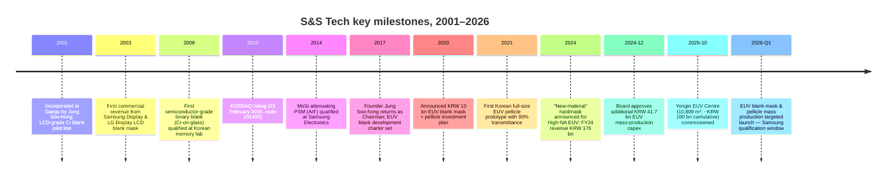
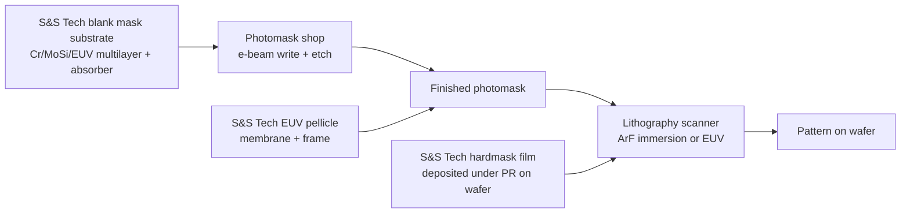
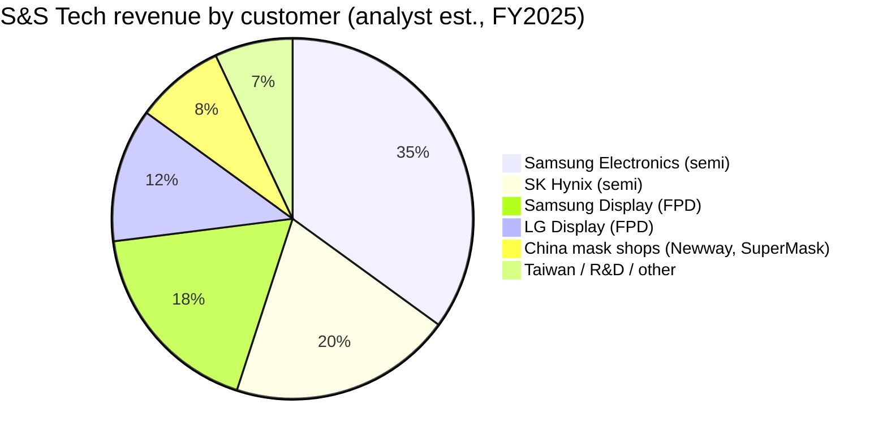
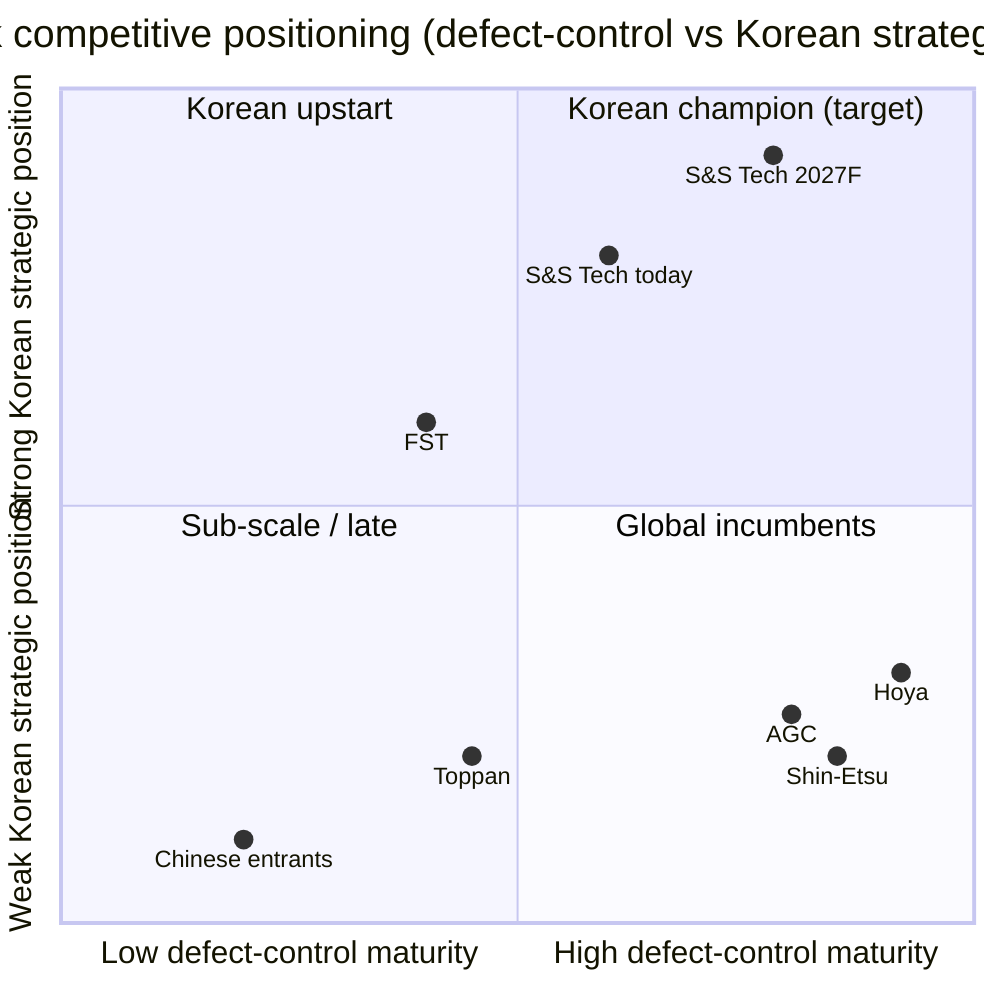

# S&S Tech Corporation (KOSDAQ: 101490) — Research Document

*As of 2026-05-26 — initiation of coverage*

> **Update — Yongin EUV Center commissioned 2025-10-15; EUV blank mask & EUV pellicle mass production starts 1Q-FY2026.** S&S Tech inaugurated its dedicated EUV manufacturing complex in Yongin on 2025-10-15 — a six-storey, 10,809 m² facility that received ~KRW 100 bn of cumulative investment plus a Board-approved follow-on of ~KRW 41.7 bn announced 2024-12-04 — to begin Samsung-qualified mass production of EUV blank masks and EUV pellicles in early 2026. Founder/Chairman Jung Soo-hong has publicly guided that EUV commercialisation can lift annual revenue toward KRW 300 bn–500 bn from the current ~KRW 244 bn run-rate over the medium term ([ZDNet Korea — 에스앤에스텍, EUV 블랭크마스크·펠리클 국산화 양산 시동, 2025-10-15](https://zdnet.co.kr/view/?no=20251015142601); [파이낸셜뉴스 — 에스앤에스텍 정수홍 인터뷰 "내년 초 EUV 블랭크마스크 양산", 2025-03-21](https://www.fnnews.com/news/202503211358486799); [Digitimes — Samsung, S&S Tech advance EUV mask localization, 2025-07-14](https://www.digitimes.com/news/a20250714PD206/samsung-euv-metal-mask-localization-production.html)).

---

## Table of Contents

1. Company Overview
2. Company History
3. Management Team
4. Products & Services — the EUV-blank chapter
5. Customers & Go-to-Market
6. Industry Overview
7. Competitive Landscape
8. Market Opportunity (TAM)
9. Risk Assessment
10. References

---

## 1. Company Overview

S&S Tech Corporation (에스앤에스텍, KOSDAQ: 101490) is the only South-Korean specialty supplier of **blank masks** — the photolithography mask substrates that semiconductor and flat-panel-display fabs receive from their material partner, send to a separate photomask shop for pattern writing, and then mount into the lithography scanner. The company was incorporated on **22 February 2001** in Daegu by Jung Soo-hong (정수홍), listed on KOSDAQ on **23 February 2010**, and as of FY2025 employs 307 people across a Daegu mother plant, a Gumi processing line, and the new Yongin EUV Centre commissioned in October 2025 ([S&S Tech corporate profile, accessed 2026-05](http://www.snstech.co.kr/renew/html/sub01_01.asp); [Stockanalysis.com — S&S Tech (KOSDAQ:101490) company profile](https://stockanalysis.com/quote/kosdaq/101490/company/); [ZDNet Korea — 용인 EUV 센터 준공, 2025-10-15](https://zdnet.co.kr/view/?no=20251015142601)).

The product map sits on top of one physical step: the **deposition of an opaque film stack (chrome / MoSi for optical, Ta-based with Ru capping for EUV) on an ultra-clean quartz or low-thermal-expansion-material (LTEM) substrate, then chemical-mechanical polish to <1 nm flatness**, then resist coat, then defect-grade inspection. A blank mask is **what the photomask house starts with** — Photronics, Toppan/Tekscend, and the captive mask shops at Samsung, SK Hynix, and Intel buy blanks from S&S Tech / Hoya / Shin-Etsu / AGC, write the chip layout onto them with an electron-beam writer, etch the absorber, and ship the finished photomask to the lithography fab ([Semi-Engineering — Why Mask Blanks Are Critical, 2022](https://semiengineering.com/why-mask-blanks-are-critical/); [S&S Tech 제품소개 페이지, accessed 2026-05](http://www.snstech.co.kr/renew/html/sub02_01.asp)). The blank is upstream of every transistor pattern ever printed; if a single particle larger than a fraction of the printed feature lands on the absorber, the entire mask is junk — so defect density per square centimetre is the single most important commercial dimension of this product.

The product family — covered in detail in Section 4 — splits into **(a) semiconductor blank masks** (binary Cr-on-glass for I-line / KrF, **MoSi attenuating Phase-Shift Masks (PSM)** for ArF immersion, and **EUV blanks** with Mo/Si multilayer + Ta-based absorber + Ru capping), **(b) FPD blank masks** for LCD / OLED back-plane and colour-filter steps up to G10.5 panel size, **(c) hardmask material** (a chemically-tuned thin film deposited under the photoresist that gives etch selectivity for advanced patterning, with a "new-material" generation announced in August 2024 for High-NA EUV), and **(d) EUV pellicles** — the thin polymer/CNT film membrane stretched over a frame that sits ~2 mm above the mask to keep flying particles out of the lithography image plane ([S&S Tech 제품소개 — 반도체용 블랭크 마스크 / FPD용 블랭크 마스크, accessed 2026-05](http://www.snstech.co.kr/renew/html/sub02_01.asp); [ZDNet Korea — High-NA EUV 시대 신물질 하드마스크 개발, 2024-08-12](https://zdnet.co.kr/view/?no=20240812172957); [THE ELEC — S&S Tech develops EUV pellicle with 90% transmittance, 2021-10-06](https://www.thelec.net/news/articleView.html?idxno=3431)).

Revenue scales linearly with Korean memory/foundry wafer starts plus the Samsung-Display / LG-Display panel-mix shift to OLED; **FY2025 revenue was KRW 243.7 bn (+38.5% YoY), operating profit KRW 50.4 bn (OPM 20.7%), and net profit KRW 58.1 bn** — the first year the company crossed both the KRW 200 bn revenue line and the 20 % operating-margin line, after a four-year compounding sequence of KRW 89 bn (2021) → 117 bn (2022) → 150 bn (2023) → 176 bn (2024) → 244 bn (2025) ([Company Guide — 에스앤에스텍 A101490 Snapshot, accessed 2026-05](https://comp.fnguide.com/SVO2/asp/SVD_Main.asp?gicode=A101490); [Stockanalysis.com — S&S Tech price + financials, accessed 2026-05](https://stockanalysis.com/quote/kosdaq/101490/)). For perspective, the FY2025 revenue is **~3 % of Hoya's Electronics-related segment** (Hoya's segment generated ¥265.2 bn ≈ USD 1.7 bn in FY25, vs. S&S Tech's ~USD 180 m), but the **growth-rate differential is roughly 3× in S&S Tech's favour** as Samsung concurrently de-risks Korea's mask-blank import dependence ([HOYA FY25 IFRS Financial Statements, pp. 31, 33](https://www.hoya.com/wp-content/uploads/2025/07/Annual-Report-Final-2.pdf)).

*Source: compiled from [Company Guide — 에스앤에스텍 A101490 Snapshot, accessed 2026-05](https://comp.fnguide.com/SVO2/asp/SVD_Main.asp?gicode=A101490) and [Stockanalysis.com — S&S Tech overview, accessed 2026-05](https://stockanalysis.com/quote/kosdaq/101490/) — FY2025 KRW 243.7 bn revenue, 20.7% OPM.*

*Source: compiled from [Company Guide — A101490 Financial Statements, accessed 2026-05](https://comp.fnguide.com/SVO2/ASP/SVD_Finance.asp?pGB=1&gicode=A101490&cID=&MenuYn=Y&ReportGB=B&NewMenuID=103&stkGb=701) — FY2025 KRW 50.4 bn operating profit, KRW 58.1 bn net profit (note net > op due to FY2025 disclosed investment gains).*

Geographically the customer base is **~85% Korea-domestic** (Samsung Electronics and SK Hynix for semis; Samsung Display and LG Display for FPD blanks), with the balance going to **Chinese memory / foundry mask shops (Newway Photomask, SuperMask) and Taiwanese photomask houses** — the company has historically declined to break out customer-by-customer revenue in DART filings, and Chairman Jung publicly described the Samsung / SK Hynix / LG Display triplet as the "anchor account" set in his 2025-03-21 CEO interview ([파이낸셜뉴스 — 에스앤에스텍 정수홍 인터뷰, 2025-03-21](https://www.fnnews.com/news/202503211358486799); [전자신문 — 에스앤에스텍 정수홍 대표 인터뷰, 2019-02-11](https://m.etnews.com/20190211000156)). The export concentration to Korea-Chinese-Taiwan customers explains why S&S Tech's revenue calendar tracks the K-Belt fab investment cycle far more closely than the broader Asia-Pacific semi-cap cycle: Samsung Pyeongtaek P4 timing, SK Hynix Yongin M16-M17 timing, and the China-Newway capacity additions drive far more of S&S Tech's quarter-to-quarter swing than any global indicator.

**Valuation snapshot (as of 2026-05-26).** S&S Tech trades at **KRW ~77,200 / share** for a **market cap of ~KRW 1.64 trillion (~USD 1.18 bn at KRW/USD 1,390)** after a **+128.7% trailing 52-week price move** that took the stock from KRW 31,800 to a 52-week high of KRW 108,400 in early 2026 ([Stockanalysis.com — S&S Tech price & valuation, accessed 2026-05](https://stockanalysis.com/quote/kosdaq/101490/)). On trailing-12-month FY2025 numbers that puts the stock at **P/E ~28.9×** (KRW 58.1 bn net profit / 1.64 trn cap), **P/S ~6.7×**, **P/B ~5.1×**, **ROE ~27%** on the FY25 base, and a token **dividend yield of ~0.25 %** ([Stockanalysis.com — S&S Tech statistics, accessed 2026-05](https://stockanalysis.com/quote/kosdaq/101490/); [Simply Wall St — S&S Tech ROE analysis, accessed 2026-05](https://simplywall.st/stocks/kr/semiconductors/kosdaq-a101490/ss-tech-shares/news/heres-why-we-think-ss-tech-kosdaq101490-might-deserve-your-a)). The TTM P/E sits **roughly +16% above the seven-name mask-blank / Korean-materials / Japanese-photomask peer mean of ~24.8×** (Hoya 27.5×, Shin-Etsu 18.0×, AGC 12.5×, Toppan 14.0×, Dongjin Semichem 50.8×, FST 22.0×, S&S Tech 28.9×) — a modest premium that is the market's way of pricing the EUV-qualification optionality without yet underwriting it as base-case revenue ([Stockanalysis.com — Hoya / Shin-Etsu / AGC / Toppan / Dongjin / FST quotes, accessed 2026-05](https://stockanalysis.com/list/kosdaq-stocks/); [Company Guide — Dongjin Semichem A005290 valuation, accessed 2026-05](https://comp.fnguide.com/SVO2/asp/SVD_Main.asp?gicode=A005290)).

*Source: compiled from [Stockanalysis.com — S&S Tech (KOSDAQ:101490), accessed 2026-05](https://stockanalysis.com/quote/kosdaq/101490/), [Yahoo Finance — 7741.T / 4063.T / 5201.T / 7911.T, accessed 2026-05](https://finance.yahoo.com/quote/7741.T/), [Company Guide — Dongjin Semichem A005290, accessed 2026-05](https://comp.fnguide.com/SVO2/asp/SVD_Main.asp?gicode=A005290), and [Company Guide — FST A036810, accessed 2026-05](https://comp.fnguide.com/SVO2/asp/SVD_Main.asp?gicode=A036810).*

*Analyst view:* the proximate de-rate trigger is **EUV-qualification timing slip with Samsung**. If Samsung's January / February 2026 final-evaluation milestone slips by ≥6 months, the stock could give back the full +128% trailing-year move because the entire ~6.7× P/S today is the market pricing EUV-revenue line items into FY2027F. Conversely, if Samsung publishes a first-tonnage purchase order during 1H-FY2026, the multiple could re-rate toward the Dongjin Semichem 50× zone given the structural Hoya-displacement narrative — discussed in detail in Section 8 (TAM) and Section 9 (Risks).

---

## 2. Company History

S&S Tech was incorporated on **22 February 2001** in Daegu, South Korea — a deliberate location choice because founder Jung Soo-hong was a Daegu native, had received both his polymer-engineering bachelor's (1981) and his semiconductor-engineering master's (1999) from Kyungpook National University in Daegu, and had access to the Daegu-Gyeongbuk industrial-cluster supplier base that the Korean blank-mask industry needed for ultra-clean quartz substrate handling and Cr / MoSi sputter-target supply ([Business Post — Who Is? 정수홍 에스앤에스텍 대표이사, accessed 2026-05](https://www.businesspost.co.kr/BP?command=article_view&num=402745); [S&S Tech 회사소개 — CEO Vision, accessed 2026-05](http://www.snstech.co.kr/renew/html/sub01_01.asp)). The founding thesis — explicit from the company's first regulatory filings forward — was simple: **localise the photomask blank, which was at the time a 100 % Japan-import line item for Samsung Electronics and Hyundai Electronics (SK Hynix predecessor)**, and ride the late-2000s LCD-fab build-out as the entry product.

*Source: compiled from [S&S Tech 회사연혁, accessed 2026-05](http://www.snstech.co.kr/renew/html/sub01_02.asp); [Business Post — Who Is? 정수홍, accessed 2026-05](https://www.businesspost.co.kr/BP?command=article_view&num=402745); [THE ELEC — S&S Tech EUV pellicle, 2021-10-06](https://www.thelec.net/news/articleView.html?idxno=3431); [ZDNet Korea — 용인 EUV 센터 준공, 2025-10-15](https://zdnet.co.kr/view/?no=20251015142601); [38 Communication — 에스앤에스텍 IPO record, accessed 2026-05](http://www.38.co.kr/html/ipo/ipo.htm?o=v&key=&no=1422&page=59).*

The **2001–2009 phase** was a long, lossy build-out: Cr-on-glass FPD blanks were the entry product but the LCD-blank industry was already a low-margin Japanese-incumbent (Hoya, Ulcoat, Toppan) zone, and qualifying at Samsung Display's Tangjeong fab and LG Display's Paju fab required ~5 years of free-of-particle defect data before a single commercial wafer-equivalent was sold. The semiconductor-grade pivot started in **2008** with the qualification of binary Cr blanks at a Korean memory fab (initial customer name not disclosed in filings; press at the time identified it as Hynix Semiconductor under the Hynix-pre-SK ownership structure), and the **23 February 2010 KOSDAQ listing** was the financing event that paid for the leap from FPD-only to semi-blank scale ([38 Communication — 에스앤에스텍 코스닥 상장 record, accessed 2026-05](http://www.38.co.kr/html/ipo/ipo.htm?o=v&key=&no=1422&page=59); [전자신문 — 에스앤에스텍 정수홍 대표 인터뷰, 2019-02-11](https://m.etnews.com/20190211000156)).

The **2014 MoSi PSM qualification** is the next strategic inflection: PSM is a phase-shifting absorber stack that lets a fab print sub-resolution features (45 nm half-pitch on ArF immersion, in particular) by exploiting destructive interference at pattern edges — qualifying it at Samsung Electronics' DRAM / NAND lines moved S&S Tech from "second-source LCD blank vendor" to "credible alt-supplier to Hoya for advanced-logic blanks" ([Wikipedia — Photomask (Phase Shift Mask discussion), accessed 2026-05](https://en.wikipedia.org/wiki/Photomask)). Three years later in **March 2017**, founder Jung Soo-hong — who had spent the post-IPO years at PKL (a Korean photomask shop and adjacent player), Portronics Asia, and as the original investor — returned as Chairman, and reset the corporate charter around **EUV blank + EUV pellicle development** as the multi-year strategic priority. Within 12 months he formally took the Representative Director (CEO) title in March 2018 ([Business Post — Who Is? 정수홍, accessed 2026-05](https://www.businesspost.co.kr/BP?command=article_view&num=402745); [The Bell — 정수홍 에스앤에스텍 회장, 지배력 기반 경영일선으로, 2019-03-29](https://www.thebell.co.kr/free/Content/ArticleView.asp?key=201903290100053990003403&svccode=04)).

The **2020–2025 EUV programme** is what underpins the current equity story. In June 2020 the Board approved a KRW 10 bn first-tranche investment for EUV blank mask + pellicle development equipment ([English ETNews — S&S Tech to Invest 10 Billion KRW in EUV Blank Mask and Pellicle Development, 2020-06-19](https://english.etnews.com/news/article.html?id=20200619200002)). October 2021 brought the headline **90 %-transmittance EUV pellicle prototype** — important because the only commercial EUV pellicle at the time was Mitsui Chemicals' polysilicon membrane at ~88 % single-pass transmission, and any sub-90 % transmittance was a meaningful throughput tax on a USD 150 m EUV scanner ([THE ELEC — S&S Tech develops EUV pellicle with 90% transmittance, 2021-10-06](https://www.thelec.net/news/articleView.html?idxno=3431)). August 2024 added the **new-material hardmask line** — a chemically tuned absorber/etch-mask film with ~3× the etch selectivity of conventional materials and a chlorine-only etch chemistry, positioned for High-NA EUV's thinner photoresist regime ([ZDNet Korea — 에스앤에스텍 신물질 하드마스크 개발, 2024-08-12](https://zdnet.co.kr/view/?no=20240812172957)). The **2024-12-04 Board approval of an additional KRW 41.7 bn for Yongin EUV facility build-out** funded the back half of the equipment install, and the **2025-10-15 Yongin EUV Centre opening ceremony** marked the formal start of mass-production readiness — Chairman Jung used the opening to publicly target KRW 500 bn annual revenue once EUV ramps ([파이낸셜뉴스 — 정수홍 CEO 인터뷰: "내년 초 EUV 블랭크마스크 양산, 매출 5000억 기대", 2025-03-21](https://www.fnnews.com/news/202503211358486799); [ZDNet Korea — 용인 EUV 센터 준공, 2025-10-15](https://zdnet.co.kr/view/?no=20251015142601)).

The recent **succession-related events** matter for the equity story. In late 2024 founder Jung gifted 100,000 shares (≈KRW 2.6 bn at the gift date) to his second son Jung Seong-hun (정성훈, born 1988), raising Jung Seong-hun's stake to ~0.94 % and signalling the longer-term plan: the second son to inherit S&S Tech proper, the elder son Jung Si-jun (정시준) to run the **S&S Investment subsidiary** (an industrial holding / venture-investment vehicle) ([The Bell — 정수홍 회장 지배력 기반, 2019-03-29](https://www.thebell.co.kr/free/Content/ArticleView.asp?key=201903290100053990003403&svccode=04); [Business Post — Who Is? 정수홍 succession discussion, accessed 2026-05](https://www.businesspost.co.kr/BP?command=article_view&num=402745)). The structure is **not disruptive in the next 24 months** — Jung Soo-hong remains both Chairman and Representative Director, and Jung Seong-hun is currently an Executive Director — but it shapes the long-run capital-allocation framework around the EUV ramp.

---

## 3. Management Team

S&S Tech is, in management terms, a **founder-CEO company at an inflection point**. Jung Soo-hong is both the founder and the current Representative Director (대표이사), so per the company-research skill convention this section is a single combined biography rather than separate Founder / CEO blocks.

**Jung Soo-hong (정수홍) — Founder, Chairman & Representative Director.** Born 18 July 1955 in Daegu, Jung is one of Korea's most experienced photomask-industry executives — a 45-year career sequence that maps directly onto the technical layers of S&S Tech's product stack today ([Business Post — Who Is? 정수홍 에스앤에스텍 대표이사, accessed 2026-05](https://www.businesspost.co.kr/BP?command=article_view&num=402745)). He took a **bachelor's in polymer engineering from Kyungpook National University in 1981** (polymer chemistry is the foundation of photoresist and pellicle membrane materials, both of which appear in S&S Tech's product matrix today) and a **master's in semiconductor engineering from KNU's Industrial Graduate School in 1999** — completed mid-career while serving as Korea CEO of PKL, the country's incumbent photomask shop ([Business Post — Who Is? 정수홍, accessed 2026-05](https://www.businesspost.co.kr/BP?command=article_view&num=402745); [The Bell — 정수홍 에스앤에스텍 회장 정수홍 지배력 기반 경영일선으로, 2019-03-29](https://www.thebell.co.kr/free/Content/ArticleView.asp?key=201903290100053990003403&svccode=04)).

Three prior tours stand out as the substantive accomplishments that built the operating thesis for S&S Tech. **(1)** From **1988 to 1993 he was factory manager at Korea DuPont**, where he ran a photoresist + photomask materials production line and learned the wet-chemistry control that ultra-low-defect blank-mask manufacturing requires — defect density per cm² is a function of cleanroom particle control and chemistry purity, both of which are DuPont strong suits ([Business Post — Who Is? 정수홍 career timeline, accessed 2026-05](https://www.businesspost.co.kr/BP?command=article_view&num=402745)). **(2)** From **1995 to ~2001 he served as President / Representative Director of PKL (Photokure Limited, later Photronics-PKL after Photronics took a stake)** — the Korean photomask shop that buys blank masks from Hoya / Shin-Etsu and writes them with e-beam writers for Samsung and Hynix. The PKL tour gave Jung deep customer-facing knowledge of exactly what defect-grade specifications, delivery cadence, and price-per-blank the Korean fabs would buy — knowledge he then translated into a direct upstream entrant in 2001 ([전자신문 — 정수홍 대표 인터뷰: "블랭크 마스크 세계 최고 자부", 2019-02-11](https://m.etnews.com/20190211000156)). **(3)** From **2008–2017 he was Chairman of PKL (post-Photronics combination)** — the period during which S&S Tech grew from a sub-KRW 50 bn LCD-blank specialist into a multi-product Korean semi materials name with a KOSDAQ listing, all while the founder retained controlling-shareholder economics but was not the formal day-to-day operator. He returned as Chairman of S&S Tech in March 2017 and assumed the Representative Director title in 2018 because the EUV pivot needed founder-level capital-allocation conviction ([The Bell — 정수홍 회장 지배력 기반, 2019-03-29](https://www.thebell.co.kr/free/Content/ArticleView.asp?key=201903290100053990003403&svccode=04); [Business Post — Who Is? 정수홍, accessed 2026-05](https://www.businesspost.co.kr/BP?command=article_view&num=402745)).

Jung's signature in the 2017-to-present period is **(a)** aggressive multi-year capex into EUV (cumulative ~KRW 150 bn between the original 2020 KRW 10 bn approval, the 2021–2024 build-outs in Daegu and Gumi, and the 2024-12-04 additional KRW 41.7 bn for Yongin), **(b)** explicit publicly-stated revenue targets (KRW 500 bn medium-term run-rate once EUV ramps — set during his March 2025 CEO interview), and **(c)** founder-family ownership concentration — as of 31 March 2025 he personally holds ~4.28 million shares or **19.95% of issued capital**, with related family / second-son stakes lifting the founder-and-related-party block toward ~22 %, against a **Samsung-affiliated ownership block of ~16.8% (Samsung Asset Management 8.78%)** that signals the strategic-customer endorsement Samsung has provided ([Business Post — Who Is? 정수홍 shareholding, accessed 2026-05](https://www.businesspost.co.kr/BP?command=article_view&num=402745); [Company Guide — 에스앤에스텍 A101490 ownership table, accessed 2026-05](https://comp.fnguide.com/SVO2/asp/SVD_Main.asp?gicode=A101490); [파이낸셜뉴스 — 정수홍 CEO 인터뷰, 2025-03-21](https://www.fnnews.com/news/202503211358486799)). His compensation structure is undisclosed beyond standard DART reporting thresholds; the equity stake (~KRW 320–330 bn at current prices) dwarfs any cash-comp signal — the alignment is straightforward founder-equity rather than incentive-design.

Succession plumbing — covered in Section 2 — places **second son Jung Seong-hun (정성훈, born 1988) as the heir apparent to S&S Tech proper** (he serves on the Board as an Executive Director and received a 100,000-share gift from his father in late 2024) while elder son **Jung Si-jun (정시준) runs the S&S Investment subsidiary**. The split is widely read in Korean financial press as a deliberate decision to keep the operating company under one heir while housing the venture / industrial-investment activity in a parallel vehicle ([The Bell — 정수홍 회장 지배력 기반, 2019-03-29](https://www.thebell.co.kr/free/Content/ArticleView.asp?key=201903290100053990003403&svccode=04); [Business Post — Who Is? 정수홍 succession, accessed 2026-05](https://www.businesspost.co.kr/BP?command=article_view&num=402745)). For the next 12-24 months, day-to-day operating leadership remains entirely with founder Jung — and given the criticality of the Samsung EUV qualification window, that founder continuity is a positive signal rather than a key-person risk to flag.

---

## 4. Products & Services — the EUV-blank chapter

> Section-4 is **the most consequential chapter of this report**. S&S Tech is — and has been since 2001 — a single-product-family company: **blank masks**. Every other line item on the income statement (hardmask thin films, FPD blanks, EUV pellicles, future masked-glass or photoresist-auxiliary products) is either a process-adjacent extension of the blank-mask deposition / inspection / packaging line, or a strategic-bet sibling product the EUV roadmap forced into the portfolio. Investors who don't internalise the physics of **what a blank mask is, how an EUV blank differs from an optical blank, why defect-density-per-square-centimetre is the only number that matters for share, and where exactly the hardmask / pellicle products sit in the lithography flow** will misprice every other section. We allocate ~1,800 words here for that reason.

### 4.1 The S&S Tech product matrix

The product matrix below is reproduced from S&S Tech's own corporate website product page — the company does not publish a 10-K-style segment matrix in DART filings, so the website product navigation is the authoritative anchor. The matrix splits into two top-level segments (semiconductor / FPD), with five product families on the semiconductor side and one on the FPD side; pellicles and hardmask thin films are reported within the semiconductor segment.

| Segment | Product family | Substrate / film stack | Lithography / application | Status (2026-05) |
|---|---|---|---|---|
| **Semiconductor** | **Binary blank mask** | Cr on quartz; **Cr 66–100 nm**, resist ~150–200 nm | i-line / g-line / KrF — mature nodes (>180 nm) | Mass production; Hoya secondary alternate at Samsung / SK Hynix |
| **Semiconductor** | **Phase-Shift Mask (PSM) blank — attenuating** | MoSi on quartz; **MoSi 38–66 nm, Cr 65–87 nm, resist 200/100/60 nm** depending on variant | ArF dry / ArF immersion — 65–14 nm logic & DRAM | Mass production; multi-variant (Standard PSM / Advanced PSM / High T% PSM) |
| **Semiconductor** | **Hardmask thin film** | New-material (chemistry undisclosed); 47–60 nm hardmask + 4–5 nm cap + 60–100 nm resist | EUV (0.33 NA) and High-NA EUV (0.55 NA) — etch-selectivity layer beneath PR | Sample shipments; "new-material" generation launched Aug 2024 |
| **Semiconductor** | **EUV blank mask** | Mo/Si multilayer (40+ bilayers) on LTEM (low-thermal-expansion-material); Ta-based absorber; Ru capping | EUV (0.33 NA) — 7 / 5 / 3 / 2 nm logic & sub-1y DRAM | Final qualification at Samsung (early 2026); mass-production-ready |
| **Semiconductor** | **EUV pellicle** | Multi-layer membrane; ~90% transmittance prototype; frame attaches ~2 mm above mask | EUV scanner — particle barrier for EUV photomask | Final tuning with customers; 1H-2026 commercial launch target |
| **FPD** | **FPD blank mask (multiple variants)** | Cr binary, Halftone TM, Multi-tone TM, Cr PSM, MoSi PSM | LCD / OLED back-plane + colour-filter — up to G10.5 (1620×1780 mm) | Mass production; key shares at Samsung Display & LG Display |

*Source: S&S Tech corporate product page — verbatim film-stack specs reproduced from the company's own product navigation, plus status updates triangulated from 2024-2025 press citations ([S&S Tech 제품소개 — 반도체용 및 FPD용 블랭크 마스크, accessed 2026-05](http://www.snstech.co.kr/renew/html/sub02_01.asp); [ZDNet Korea — High-NA EUV 하드마스크, 2024-08-12](https://zdnet.co.kr/view/?no=20240812172957); [파이낸셜뉴스 — EUV 양산 시동, 2025-03-21](https://www.fnnews.com/news/202503211358486799); [THE ELEC — EUV pellicle 90% 투과율, 2021-10-06](https://www.thelec.net/news/articleView.html?idxno=3431); [Digitimes — Samsung mask blanks localization, 2026-01-14](https://www.digitimes.com/news/a20260114PD219/samsung-photomask-euv-supply-chain-2026.html)).*

The website is silent on FY-revenue split by family — DART filings do not break it out either. *Analyst view:* triangulating from the FY2024 KRW 176 bn revenue base, comments by Chairman Jung on the FPD blank revenue line in his 2025-03 interview ("display blank mask serves LCD and OLED panel manufacturing with precision pattern implementation on larger areas"), and the absence of EUV blank commercial sales in 2024, the **pre-EUV FY2024 revenue mix was approximately ~69 % semiconductor blanks (binary + PSM + hardmask), ~28 % FPD blanks, and ~2-3 % R&D + pellicle pilot revenue**. The chart below sketches the same picture in two columns — FY2024 actual vs. an analyst sketch of the FY2027E mass-production EUV scenario at the company's own KRW 500 bn target — and the visual makes obvious why EUV blank is the swing factor for the entire investment thesis ([파이낸셜뉴스 — 정수홍 인터뷰, 2025-03-21](https://www.fnnews.com/news/202503211358486799); [Company Guide — 에스앤에스텍 A101490 financials, accessed 2026-05](https://comp.fnguide.com/SVO2/ASP/SVD_Finance.asp?pGB=1&gicode=A101490&cID=&MenuYn=Y&ReportGB=B&NewMenuID=103&stkGb=701)).

*Source: FY2024 left panel built from [Company Guide — A101490 financials, accessed 2026-05](https://comp.fnguide.com/SVO2/asp/SVD_Main.asp?gicode=A101490) plus product-family commentary in [파이낸셜뉴스 정수홍 인터뷰, 2025-03-21](https://www.fnnews.com/news/202503211358486799). FY2027E right panel is analyst sketch consistent with Chairman Jung's publicly stated KRW 500 bn revenue target.*

### 4.2 Synthesis — how the product families compose a single lithography flow

Before walking each row, it pays to draw the **lithography flow** from the mask shop's perspective, because every product S&S Tech sells either is the blank itself or sits within ~2 mm of the blank in the scanner:

Three things to notice. **First**, the blank-mask and the EUV pellicle live on the **same photomask** — the pellicle is glued on top of the finished mask in the mask shop, so they are inseparable from a customer's procurement perspective. Selling both is what closes Samsung's "buy from one Korean vendor" qualification preference. **Second**, the hardmask film is not a mask material at all — it is **deposited on the wafer itself**, under the photoresist, to give the etch step enough material-contrast headroom for High-NA EUV's thinner photoresist regime. It is a wafer-fab consumable masquerading as a mask-related product because of S&S Tech's deposition-equipment heritage. **Third**, FPD blanks are the same physical product as semiconductor binary blanks but at G10.5 (1.62 × 1.78 m) plate size — the manufacturing equipment overlaps significantly with the semi-blank line, which is why S&S Tech bundles them in one company rather than spinning the FPD business out.

### 4.3 Binary blank mask — the entry product, today's profit floor

The binary blank mask is **chrome-on-quartz**: a 66-100 nm chromium absorber film deposited on an ultra-clean fused-silica substrate, with a ~150-200 nm photoresist coating on top ready for the e-beam write step at the customer's mask shop ([S&S Tech 제품소개 — 반도체 블랭크 마스크 binary, accessed 2026-05](http://www.snstech.co.kr/renew/html/sub02_01.asp)). The "binary" name is literal — pattern areas either have the Cr present (opaque) or stripped (transparent), creating a two-state mask that the i-line / g-line / KrF lithography wavelengths (365 / 248 nm) can image directly onto the wafer.

**中文释义 / Plain-language gloss:** binary blank 是 photomask 链路的入门级产品 — Cr (铬) 膜均匀地溅射沉积在 quartz 基板上，之后给 photomask 厂做电子束 (e-beam) 雕刻。物理上等同于一张「黑白透明的菲林底片」，但是缺陷密度要求是 ≤0.01 个 ≥1 µm 颗粒/cm²，所以做出一片 spec-grade blank 的 yield 反而是低的。这条产品线的 commercial 重点是 **>180 nm 成熟节点的 DRAM / display driver / power management IC** — 这类芯片 wafer 用量大、价格敏感、对 mask 工艺余量宽容，正好是 S&S Tech 用韩国本土制造价格优势打 Hoya 进口替代的最容易的切入点。**Strategic significance:** 这条产品线是 **profit floor** — 出货量稳定、毛利较薄、不需要新增 capex，但是把整个 Samsung / SK Hynix / Newway 客户关系网养起来了，给后面 PSM / EUV / pellicle 的 qualification 留了门票。

*Analyst view:* moat verdict is **partial** — the moat type is **switching costs + customer-qualification time** (a memory fab takes ~2 years of defect-data history to qualify a new blank vendor at a node, which Hoya has and S&S Tech achieved in the late 2000s; new entrants are functionally locked out for a decade). Closest competitive comparison is Hoya's own binary blank-mask line, which the Hoya 2024 FY25 Integrated Report describes within the broader "Photomasks and Maskblanks for semiconductors" segment without breaking out binary specifically ([HOYA FY25 IFRS Financial Statements, p. 33](https://www.hoya.com/wp-content/uploads/2025/07/Annual-Report-Final-2.pdf)).

### 4.4 Phase-Shift Mask (PSM) blank — the ArF immersion bridge

The PSM blank is where S&S Tech enters the meaningful sub-100 nm lithography regime. The film stack adds a **MoSi (molybdenum-silicide) attenuating layer 38-66 nm thick** below the Cr — the MoSi is designed to be ~6% transmissive (i.e., it lets ~6% of the ArF light through with a 180-degree phase shift), which creates **destructive interference at the pattern edges and dramatically sharpens the printed feature** ([S&S Tech 제품소개 — PSM blank, accessed 2026-05](http://www.snstech.co.kr/renew/html/sub02_01.asp); [Wikipedia — Photomask Phase Shift Mask section, accessed 2026-05](https://en.wikipedia.org/wiki/Photomask)). S&S Tech publishes three sub-variants — Standard PSM, Advanced PSM (with thinner resist for tighter pattern density), and High T% PSM (with higher MoSi transmission for specific aerial-image profiles) — covering the gamut of customer process flows from 45 nm DRAM down to 14-7 nm logic on ArF immersion ([S&S Tech 제품소개 page, accessed 2026-05](http://www.snstech.co.kr/renew/html/sub02_01.asp)).

**中文释义 / Plain-language gloss:** PSM 的物理原理是 **相移干涉**: MoSi 这一层不是完全不透光，而是让 ~6 % 的 ArF (193 nm) 光带着 180° 相位反向通过 — 在 pattern edge 上和主光束发生 destructive interference，把曝光强度梯度变陡，等效于把 lithography 的 resolution-limit 再推进 ~30%。这是 Samsung / SK Hynix 在 ArF immersion 时代量产 sub-65 nm DRAM 必须用的技术，也是为什么 PSM blank 比 binary blank 单价高 ~3-5 倍 — MoSi 沉积工艺对均匀性、相位精度、defect 密度的要求高一个数量级。**Strategic significance:** 这是 S&S Tech 真正进入 Samsung / SK Hynix 主流 wafer 产线的产品 — 2014 年 MoSi PSM 在三星的 qualification 是 S&S Tech 营收从 LCD-mainly 转向 semi-led 的转折点 (Section 2 时间线已标注)。今天 PSM blank 仍然是公司营收的最大单一品类，也是支撑 FY2024 16.8% / FY2025 20.7% 营业利润率的核心 (Cr-only binary 毛利偏薄，PSM 把 ASP 抬起来)。

*Analyst view:* moat verdict is **yes** — moat type is **process IP + customer-qualification depth**. MoSi attenuating PSM is patent-rich (Hoya, Shin-Etsu, and S&S Tech each hold blocking IP on absorber-stack chemistry, MoSi composition, phase-control geometry), and the ~3 years of process-validation data Samsung required for S&S Tech's PSM is functional moat against any new entrant. Closest named competitor product is **Hoya's PSM blank line** (HOYA describes the segment as "Photomasks and Maskblanks for semiconductors" without sub-product disclosure — see [HOYA FY25 IFRS Financial Statements, p. 33](https://www.hoya.com/wp-content/uploads/2025/07/Annual-Report-Final-2.pdf)) and **Shin-Etsu Chemical's MoSi-based PSM** sold through Shin-Etsu Microsi.

### 4.5 EUV blank mask — the entire investment thesis lives here

**This is the subsection that matters most.** The EUV blank is a fundamentally different physical object from the optical (binary / PSM) blanks above — and the manufacturing process is so different that being the world #1 in optical blanks (Hoya) does **not** automatically translate into being world #1 in EUV.

**The physics.** EUV lithography operates at 13.5 nm wavelength, which means **everything in the optical path is reflective rather than transmissive** — no quartz, no Cr-on-glass. The EUV blank is built on a **low-thermal-expansion-material (LTEM)** glass substrate, then coated with **40+ alternating Mo/Si bilayers** (each ~7 nm thick, the multilayer mirror that does the actual ~70% reflectivity at 13.5 nm), then a **ruthenium capping layer** (a few nm of Ru on top of the multilayer to prevent oxidation of the topmost Si layer, which would destroy reflectivity), then a **Ta-based absorber stack** (~50-70 nm of TaN or TaBN — the pattern absorber that gets etched away during mask writing to define the pattern), and finally a backside conductive layer for the chuck (typically CrN). The Nomura 2026-05-21 Greater China Semi report notes that the absorber chemistry is in transition from TaBN to Ru / Mo low-n materials, and the capping layer composition is also evolving — both areas where S&S Tech's "new-material hardmask" R&D programme overlaps with the EUV roadmap ([Nomura "Greater China Semi: A guide to Semi renaissance in 2026~30F", p. 38-39, 2026-05-21](file:///Users/x/projects/financial_agent/reports/sector/半导体材料.md); [Semi-Engineering — Why Mask Blanks Are Critical, 2022](https://semiengineering.com/why-mask-blanks-are-critical/)).

**中文释义 / Plain-language gloss:** EUV blank 是 **multi-layer mirror** 不是 mask — 因为 13.5 nm 波段所有材料都吸收，没有 transmissive 路径，必须用 40 多对 Mo/Si bilayer 做 **Bragg 反射** 把光弹回来，吸收层 (TaBN / Ru-based) 在最顶层把要遮蔽的区域吸收掉。难度集中在 **三个独立工程问题**: (1) Mo/Si 多层膜的逐层均匀性 — 任何一层厚度偏差 >0.1 nm 都会让 13.5 nm 反射率降 1-2 个 pp (整片 mask 直接报废); (2) **defect density per cm²** — sub-nm 级别的颗粒嵌在 multilayer 里就是 unprintable defect，commercial spec 要求 **<0.05 defects / cm²**，是 binary blank 标准的 ~500 倍严苛; (3) **Ru capping layer 的化学稳定性** — Ru 太薄就不挡氧化、太厚就吃掉反射率，3-5 nm 之间的 sweet spot 是工艺壁垒。Hoya 之所以能保持 EUV blank ~60-80% 全球份额，本质上是 ~15 年的 defect-control 数据积累，不是单纯的设备投资问题。**Strategic significance — for S&S Tech:** 这是公司 KRW 1.64 trillion 市值估值中 80%+ 的部分在定价的预期。Samsung 在 2026 Q1 完成最终 qualification、2026 Q2 开始小批量采购、2027F 把 EUV blank 占自身 EUV 用量推到 ≥20% — 这条事件链如果走通，S&S Tech 营收从 KRW 244 bn 走向 KRW 400-500 bn 区间是 base case；如果 qualification 在 2026 上半年滑到 2H 甚至 2027，整张估值表就要重做。

*Analyst view:* moat verdict for S&S Tech's EUV blank specifically is **partial — closing**. Moat type when realised is **multi-decade defect-control IP + sole-Korean-supplier strategic premium**. The most relevant external benchmarks are: **Hoya**, with ~60-80% EUV blank share by analyst estimate (Nomura 2026-05-21 puts it at 80%; Intel Market Research's market-tracker product puts Hoya at 62% with AGC at 30%, Shin-Etsu at 7%, S&S Tech at qualification-stage <1%) — see [Hoya FY25 Integrated Report claim "exceptionally large share of the market for mask blanks for many years"](https://www.hoya.com/ir/2024/en/common/files/review2024.pdf) and [Intel Market Research — EUV Mask Blanks Market Outlook 2025-2032](https://www.intelmarketresearch.com/euv-mask-blanks-market-11463); **AGC (Asahi Glass)** which has a meaningful EUV blank position via its specialty-substrate / LTEM glass heritage (~30% per Intel MR data); and **Shin-Etsu Chemical**, the only non-Hoya / non-AGC volume player with a single-digit EUV share. The next 12 months are when S&S Tech's "partial — closing" verdict resolves either to "yes" (Samsung qual + first PO) or back to "partial — closing" (qual slip).

### 4.6 EUV pellicle — the sibling product that closes the Samsung sale

The EUV pellicle is a **multi-layer transparent membrane** (~150 nm total thickness for a single-pass 90% transmittance product) stretched across a metal frame that mounts ~2 mm above the finished photomask. Its job is mechanical: catch any sub-micron particle that breaks free from the scanner internals before it lands on the mask absorber pattern. Without a pellicle every particle is a printable defect; with the pellicle, the particle stays out of focus 2 mm above the image plane and the mask is reusable indefinitely ([THE ELEC — S&S Tech develops EUV pellicle with 90% transmittance, 2021-10-06](https://www.thelec.net/news/articleView.html?idxno=3431); [USPTO Patent Application — Pellicle for an EUV lithography mask, 2023-11-12](https://image-ppubs.uspto.gov/dirsearch-public/print/downloadPdf/11782339)).

**中文释义 / Plain-language gloss:** EUV pellicle 就是 **保护膜** — 在 EUV mask 表面架一层很薄的透明膜 (像放大镜上盖的 lens cap)，把可能飞过来的粒子挡在 mask pattern 外面。物理挑战是: EUV 光必须 **双向穿透** pellicle (入射穿过、反射后再穿过)，所以哪怕 single-pass 损耗 5%，往返就是 ~10% 的曝光强度损失 — 在 EUV scanner 每秒曝多少 wafer 是 throughput economics 命门的前提下，每 1pp 透过率提升直接对应 EUV scanner 产能 ~1pp 提升。Mitsui Chemicals 是这个市场的现任霸主 (~88% single-pass)；S&S Tech 2021 的 90% prototype 是 Korean 厂商首次把 transmittance 推过 90%。**Strategic significance:** pellicle 业务对 S&S Tech 营收增量本身不大 (EUV pellicle TAM 全球 <USD 100 m/yr)，但是 **战略意义是把 Samsung 的 "EUV mask 全套国产化" 套餐做齐** — 三星 EUV 想完整 de-risk Japan 进口依赖，需要同时拿到本土 EUV blank 和本土 EUV pellicle 两个产品，S&S Tech 是唯一一家同时具备这两条产线的韩国公司。这也是 Samsung 和 S&S Tech 2025 年联合申请 EUV pellicle frame 专利的商业逻辑 ([THE ELEC — Samsung and S&S Tech co-files EUV pellicle patent, 2025-05](https://www.thelec.net/news/articleView.html?idxno=5452))。

*Analyst view:* moat verdict is **partial** — the moat is **process IP + Samsung joint-development data**. Closest competitor product is **Mitsui Chemicals' EUV pellicle** (the incumbent — ~88% single-pass transmittance, fielded in commercial EUV use at Samsung / TSMC / Intel since 2019), with **ASML's in-house pellicle** (~90.6% transmittance reported circa 2021) as the other reference point ([THE ELEC — S&S Tech develops EUV pellicle with 90% transmittance, 2021-10-06](https://www.thelec.net/news/articleView.html?idxno=3431)). Korean competitor **FST (036810 KQ)** is also developing EUV pellicles but is roughly 1-2 years behind S&S Tech in customer-validation cycle.

### 4.7 Hardmask thin film & FPD blank — the "second-engine" products

**Hardmask thin film** is the August-2024 product launch — a new-material thin film deposited on the wafer beneath the photoresist, with ~3× the etch selectivity of conventional chromium / tantalum / silicon hardmask materials, and a chlorine-only etch chemistry (vs. the conventional O₂ + Cl₂) ([ZDNet Korea — High-NA EUV 시대 신물질 하드마스크 개발, 2024-08-12](https://zdnet.co.kr/view/?no=20240812172957)). The product is positioned squarely for **High-NA EUV (0.55 NA)** where the photoresist must be thinner (≤16 nm vs. ~25 nm at 0.33 NA) per Nomura's 2026-05-21 review of High-NA + metal-oxide-resist (MOR) economics — at <16 nm PR thickness, the etch step needs a much higher-selectivity hardmask beneath the PR to keep enough material-contrast budget for pattern transfer ([Nomura "Greater China Semi", p. 10-12, 2026-05-21](file:///Users/x/projects/financial_agent/reports/sector/半导体材料.md)). **中文释义 / Plain-language gloss:** 硬掩膜 (hardmask) 物理上等同于 wafer 上加一层 **耐刻蚀的中间膜** — 当 PR (photoresist) 在 High-NA EUV 时代被砍到 <16 nm 时，单凭 PR 自身没法挡住下层电介质 / 金属的 etch 步骤，需要在 PR 下面再加一层 etch selectivity 高的 hardmask。S&S Tech 的 "新物质" hardmask 把 selectivity 推到对手的 3 倍，意味着同样 etch 步数下能 transfer 更深的 pattern。**Strategic significance:** 这条产品线本身体量小 (FY2025 推测 <KRW 10 bn 营收)，但是是 **High-NA EUV 时代的入场券** — 2028-30F High-NA EUV HVM 起量后，hardmask 需求会跟着曝光步数同步成倍增加，S&S Tech 提前 4 年完成材料开发是为 2028-30 的爆发窗口铺路。*Analyst view:* moat verdict is **not yet** — material is in customer-validation (Samsung most likely), not yet commercial; closest competitor is Applied Materials' hardmask CVD process (which is equipment, not material — different competitive layer) and DuPont / JSR conventional hardmask materials.

**FPD blank mask** is the historical revenue floor — six product variants (Cr binary OD 3.2 / 5.0 / LR, Halftone TM, Multi-tone TM, Cr PSM, MoSi PSM) covering substrate sizes from 520 × 800 mm up to **G10.5 1620 × 1780 mm** for the largest OLED panel generation, with substrate thicknesses 8T-17T (millimetres) ([S&S Tech 제품소개 — FPD blank mask, accessed 2026-05](http://www.snstech.co.kr/renew/html/sub02_01.asp)). The main customers are **Samsung Display** (mobile / IT OLED, increasingly QD-OLED for TV) and **LG Display** (large-format OLED TV, IT OLED). **中文释义 / Plain-language gloss:** FPD blank 是 **大尺寸版本的 binary / PSM blank**，物理工艺和 semi blank 相通，只是基板从 6×6 英寸放大到 1.6×1.8 米。一片 G10.5 mask 单价显著低于 semi mask，但是面积大、出货 cadence 频繁 — Samsung 和 LG 一年要换 ~数千片 FPD masks 用于 OLED back-plane + colour-filter step。**Strategic significance:** 这是 S&S Tech 营收的 **anti-cyclical 基础** — semi-blank 营收和 Samsung / SK Hynix wafer-starts 周期相关，FPD blank 营收和 OLED panel investment cycle 相关，两者周期 phase 不同步，整合后稳定了公司收入波动。

### 4.8 Synthesis — flagship hierarchy & recent launches

**The flagship products (in order of FY2026F revenue impact):** (1) **EUV blank mask** — the entire stock-price upside; (2) **PSM blank** — the largest single line item in current revenue, the profit-margin floor; (3) **EUV pellicle** — small revenue but strategic-bundle product that closes the Samsung sale; (4) **FPD blank** — the cycle-counter; (5) **Hardmask thin film** — second-decade option on High-NA EUV; (6) **Binary blank** — mature, low-margin, profit floor for the legacy fabs. **The last 12 months of launches / news:** (a) Yongin EUV Centre commissioning 2025-10-15, (b) Board approval of additional KRW 41.7 bn capex 2024-12-04, (c) "new-material" hardmask announcement 2024-08-12, (d) Samsung-EUV-pellicle co-filed patent ~2025-05, (e) March 2025 CEO interview with KRW 500 bn medium-term revenue target — see citations in Section 2. There is no recurring-services / aftermarket business of meaningful size; revenue is overwhelmingly product-shipment-driven, which is also why FX (KRW/JPY) sensitivity matters in the risk section.

---

## 5. Customers & Go-to-Market

S&S Tech sells to a small number of very large customers, and the customer list is the most important risk-and-opportunity variable in the entire equity story. **The four anchor accounts — Samsung Electronics (memory + foundry), SK Hynix (memory), Samsung Display (OLED + LCD panel back-plane), and LG Display (large-format OLED) — together represent ~80-85% of revenue per analyst estimate**, with the balance going to Taiwanese photomask houses (servicing TSMC and UMC indirectly via blank-supply contracts to Photronics-PKL and Toppan-Tekscend), Chinese mask shops (Newway Photomask, SuperMask), and a thin layer of overseas R&D-validation accounts. Chairman Jung explicitly named the Samsung Electronics / SK Hynix / LG Display triplet as the anchor customers in his March 2025 CEO interview and reaffirmed the China-export channel: "Chinese semiconductor firms are requesting increased supply volumes" ([파이낸셜뉴스 — 정수홍 CEO 인터뷰, 2025-03-21](https://www.fnnews.com/news/202503211358486799); [전자신문 — 정수홍 대표 인터뷰, 2019-02-11](https://m.etnews.com/20190211000156)).

**Customer concentration — exact disclosure status.** S&S Tech's 사업보고서 (annual report) filed via DART / KRX-KIND **does not break out individual-customer revenue percentages at the level a US 10-K does** — the Korean disclosure regime mandates only that suppliers ≥10% of either purchases or sales be flagged in the 주요 매출처 (major customers) section, but actual percentage breakdowns are at issuer discretion and S&S Tech's filings disclose customers as names rather than as numerical shares ([에스앤에스텍 사업보고서 (FY2024), 2025-03-17 filing](https://kind.krx.co.kr/common/disclsviewer.do?method=search&acptno=20250317000236); [에스앤에스텍 사업보고서 (FY2025), 2026-03-16 filing](https://kind.krx.co.kr/common/disclsviewer.do?method=search&acptno=20260316000663)). What the filings do confirm verbally is the customer name set — Samsung Electronics 삼성전자, SK 하이닉스, Samsung Display 삼성디스플레이, LG 디스플레이 — with no numerical share disclosed by name.

*Source: analyst estimate constructed by triangulating (a) the customer name set from [에스앤에스텍 FY2024 사업보고서, 2025-03-17 filing](https://kind.krx.co.kr/common/disclsviewer.do?method=search&acptno=20250317000236), (b) Chairman Jung's verbal description of the customer triplet in [파이낸셜뉴스 인터뷰, 2025-03-21](https://www.fnnews.com/news/202503211358486799), and (c) the FY2024 ~70% semi / ~28% FPD revenue split from [Company Guide — A101490 financials, accessed 2026-05](https://comp.fnguide.com/SVO2/asp/SVD_Main.asp?gicode=A101490). Customer-level percentages are NOT disclosed by S&S Tech.*

**Samsung Electronics is the single most important account by a wide margin** — not just as a current revenue source but as the gatekeeper for the EUV blank ramp that drives the entire FY2026F-2027F upside. Samsung's relationship with S&S Tech has three independent pillars: (1) commercial purchases of binary / PSM blanks for Samsung's memory and foundry mask shops; (2) the final-evaluation programme for EUV blank masks, currently in 1Q-FY2026 timing per Digitimes; (3) joint IP development for EUV pellicles (Samsung-S&S Tech co-filed patent ~2025-05); (4) an equity-investment endorsement via Samsung Asset Management's ~8.78% stake in S&S Tech and other Samsung-affiliated holdings that take the cumulative Samsung-block exposure toward ~16.8% ([Digitimes — Samsung will adopt South Korea-made mask blanks to EUV process, 2026-01-14](https://www.digitimes.com/news/a20260114PD219/samsung-photomask-euv-supply-chain-2026.html); [Digitimes — Samsung, S&S Tech advance EUV mask localization, 2025-07-14](https://www.digitimes.com/news/a20250714PD206/samsung-euv-metal-mask-localization-production.html); [Company Guide — A101490 ownership, accessed 2026-05](https://comp.fnguide.com/SVO2/asp/SVD_Main.asp?gicode=A101490)). Samsung's strategic rationale for backing S&S Tech is geopolitical first and economic second: **the EUV mask blank line is currently a single-vendor dependency on Japan's Hoya**, with Shin-Etsu as the only meaningful second source, and Samsung's strategic supply-chain doctrine under the Korean K-Belt policy framework targets sub-50 % Japan-import exposure on every critical materials line by 2030F ([InvestKorea — South Korea's Semiconductor Industry and Investment Status, 2025-10](https://www.investkorea.org/upload/kotraexpress/2025/10/images/2510_full.pdf); [Korea Tech Today — Korea Inc. Comes Home: Samsung, Hyundai, SK reshaping domestic tech economy, 2026](https://koreatechtoday.com/korea-inc-comes-home-how-samsung-hyundai-and-sk-are-reshaping-the-domestic-tech-economy/)).

**SK Hynix is the second-largest semi customer**, with binary and PSM blank consumption running at the Yongin M16-M17 / Cheongju M15 fabs. The relationship is less integrated than Samsung's — SK Hynix does not (publicly disclosed) hold an equity position in S&S Tech and is not a joint-development partner on EUV blanks the way Samsung is — but the practical consumption is meaningful because SK Hynix's HBM ramp at Cheongju and the new Yongin M16-M17 fabs require steady blank-mask volumes ([TrendForce — SK hynix Reportedly Raises Yongin Cluster Investments to KRW 600T, 2025-11-17](https://www.trendforce.com/news/2025/11/17/news-sk-hynix-reportedly-raises-yongin-cluster-investments-to-krw-600t-samsung-also-boosts-spending/)). SK Hynix is also a probable second-customer for S&S Tech's EUV blank line once Samsung qualification clears, since SK Hynix's own EUV expansion at the Yongin M16 fab puts SK on a similar Hoya-import-dependence problem ([TrendForce — Big Tech Reportedly Moves In on SK Hynix With EUV Funding Offers, 2026-05-08](https://www.trendforce.com/news/2026/05/08/news-big-tech-reportedly-move-in-on-sk-hynix-with-offers-to-fund-production-lines-and-euv-equipment-to-secure-memory-supply/)).

**Samsung Display and LG Display** consume FPD blanks for **OLED back-plane lithography** (the LTPS / IGZO TFT layer that drives each OLED sub-pixel) and **colour-filter lithography** (the RGB stripe pattern). At Samsung Display the cadence is driven by OLED mobile-IT capacity expansion plus the QD-OLED-for-TV ramp at the Asan fab; at LG Display by the WOLED TV line in Paju. Combined, the two FPD accounts likely represented ~28% of FY2024 revenue (consistent with the FY2024 ~69 % semi / ~28 % FPD / ~3 % other split inferred from financials) and a smaller share of FY2025 because the EUV-driven mix shift began ([파이낸셜뉴스 — 정수홍 인터뷰, 2025-03-21](https://www.fnnews.com/news/202503211358486799); [Company Guide — A101490 financials, accessed 2026-05](https://comp.fnguide.com/SVO2/ASP/SVD_Finance.asp?pGB=1&gicode=A101490)).

**Chinese accounts and Taiwan blank-supply contracts** form the remaining ~10-15 % of revenue and are the geographic-diversification hedge against the Samsung concentration. The Chinese mask-shop customers (Newway Photomask, SuperMask) buy blanks to service the SMIC, CXMT (ChangXin Memory), YMTC (Yangtze Memory Technologies), Hua Hong, and Nexchip fab base — a market where Hoya / Shin-Etsu face partial export-licence friction under US BIS export controls, giving Korean blank-mask supply a regulatory tailwind that did not exist before 2022 ([English ETNews — S&S Tech expanding Chinese semiconductor sales, 2019-02-11](https://m.etnews.com/20190211000156)). Taiwan revenue runs primarily through Photronics-PKL Taiwan (Photronics's joint venture with the original PKL — note: that's the same PKL where founder Jung Soo-hong was CEO in 1995-2001) and Toppan-Tekscend Taiwan, both of which buy blanks to write masks for TSMC and UMC; this channel is small in absolute terms but politically strategic because it keeps S&S Tech in the TSMC supply graph indirectly.

**Go-to-market structure.** S&S Tech sells through a **direct technical-account-management model** — each anchor customer has a dedicated account team (typically 5-10 engineers) embedded in customer-quality-validation cycles, with no third-party distributor layer. Contract structure for semi blanks is typically a **rolling 6-12 month volume agreement** with annual price negotiations, no take-or-pay; for FPD blanks the structure shifts to a **PO-by-PO model** with quarterly demand forecasting from the panel customer. There is no IR-publicised long-term supply agreement with Samsung Electronics for EUV blanks yet — once that agreement is signed (the Korean financial press expects this in 1H-FY2026 per Digitimes' Q2-2026 timeline) the contract structure will likely become a multi-year master agreement, materially changing both revenue visibility and the equity-story narrative ([Digitimes — Samsung will adopt South Korea-made mask blanks to EUV process, 2026-01-14](https://www.digitimes.com/news/a20260114PD219/samsung-photomask-euv-supply-chain-2026.html)).

---

## 6. Industry Overview

The blank-mask industry is a **small, structurally concentrated, ultra-high-barrier subsegment of the global semiconductor materials market** — it sits inside the lithography sub-segment of the broader USD ~80 bn 2025 semi-materials TAM, with TAM economics that look very different at the optical vs. EUV layer. Nomura's 2026-05-21 Greater China Semi report disaggregates the wafer-fab materials TAM at ~USD 60 bn for 2025 (i.e., ~75% of the USD 80 bn total) — and within that, **photoresist + photoresist-auxiliary materials together are ~20 % of the wafer-fab-materials line (~13 % photoresist + ~7 % auxiliaries)**, with the photomask subsegment (including blanks) at roughly half of that share ([Nomura "Greater China Semi: A guide to Semi renaissance in 2026~30F", p. 18, 2026-05-21](file:///Users/x/projects/financial_agent/reports/sector/半导体材料.md)).

**Optical blank mask TAM** sits at **~USD 1.5-2.0 bn** in 2024 across binary + PSM + hardmask + blank-pellicle product families — Intel Market Research's 2024 estimate was **USD ~1.87 bn**, with **Shin-Etsu Microsi ~35% share, Hoya ~30%, and the rest scattered across Toppan, Photronics' captive blank line, AGC, and emerging Korean / Chinese entrants including S&S Tech at ~10 % per Nomura** ([Intel Market Research — EUV Mask Blanks Market Outlook 2025-2032, accessed 2026-05](https://www.intelmarketresearch.com/euv-mask-blanks-market-11463); [Nomura "Greater China Semi", Fig. 35-44, p. 18-20, 2026-05-21](file:///Users/x/projects/financial_agent/reports/sector/半导体材料.md)). The asymmetry between Shin-Etsu's ~35 % optical share (chemicals / silicon heritage) and Hoya's ~30 % is the legacy of Shin-Etsu's far older photomask materials line — but in the EUV transition Hoya leapfrogged, and Shin-Etsu now lags in EUV blank share (see below).

**EUV blank mask TAM** is much smaller in absolute USD terms (~USD 194 m in 2024, growing 15 % CAGR per Intel MR's model to USD ~597 m by 2032) but its strategic importance is outsized: it is the single supply-chain node that prints every advanced-logic and advanced-DRAM device for the next decade ([Intel Market Research — EUV Mask Blanks Market Outlook 2025-2032, accessed 2026-05](https://www.intelmarketresearch.com/euv-mask-blanks-market-11463)). Hoya's share is **~62-80 % per varying analyst estimates** (Intel MR ~62 %, Nomura ~80 %, vendor-side estimates as high as 85 %), with **AGC at ~30 %** (per Intel MR — AGC's specialty-glass / LTEM heritage gave it an early-mover advantage on EUV-substrate supply), **Shin-Etsu at ~7 %**, and S&S Tech at **<1 % qualification-stage volume** for 2024 ([Intel Market Research — EUV mask blanks data, accessed 2026-05](https://www.intelmarketresearch.com/euv-mask-blanks-market-11463); [Nomura "Greater China Semi", p. 18, 2026-05-21](file:///Users/x/projects/financial_agent/reports/sector/半导体材料.md)).

*Source: compiled from [Nomura "Greater China Semi: A guide to Semi renaissance in 2026~30F", Fig. 35-44, p. 18-20, 2026-05-21](file:///Users/x/projects/financial_agent/reports/sector/半导体材料.md) (optical blank ~10% S&S Tech estimate) and [Intel Market Research — EUV Mask Blanks Market Outlook 2025-2032, accessed 2026-05](https://www.intelmarketresearch.com/euv-mask-blanks-market-11463) (EUV blank Hoya 62% / AGC 30% / Shin-Etsu 7% / S&S Tech <1%). HOYA's own corporate description in the [FY24 Integrated Report, p. 102](https://www.hoya.com/ir/2024/en/common/files/review2024.pdf) confirms "exceptionally large share" without naming the figure.*

**Structural drivers of the next 5 years' demand:** (a) **EUV layer-count growth** — each Samsung / TSMC / SK Hynix node transition adds ~3-5 incremental EUV layers (TSMC N3 was ~14 EUV layers, N2 will be ~18-22, A14 ~25-30, per industry estimates), and each EUV layer requires its own EUV blank → mask pair, so blank consumption per wafer is rising independent of wafer-count growth ([Nomura "Greater China Semi", p. 4-12, 2026-05-21](file:///Users/x/projects/financial_agent/reports/sector/半导体材料.md)); (b) **High-NA EUV adoption** from 2029-30F — High-NA introduces a thinner-resist regime and tighter pellicle-transmittance requirements, both of which are tailwinds for hardmask and pellicle revenue ([Nomura "Greater China Semi", p. 10-12, 2026-05-21](file:///Users/x/projects/financial_agent/reports/sector/半导体材料.md)); (c) **Korean K-Belt sovereignty policy** — the Korean government and Samsung-led K-Belt strategy explicitly target reduced Japan-import dependence on critical semi materials, with EUV mask blank as a Tier-1 priority ([InvestKorea — South Korea's Semiconductor Industry and Investment Status, 2025-10](https://www.investkorea.org/upload/kotraexpress/2025/10/images/2510_full.pdf); [Korea Tech Today — Korea Inc. Comes Home, 2026](https://koreatechtoday.com/korea-inc-comes-home-how-samsung-hyundai-and-sk-are-reshaping-the-domestic-tech-economy/)).

**Regulatory and trade dynamics.** The blank-mask industry sits at the intersection of three regulatory regimes worth noting. **(1) US BIS Entity-List + Foreign Direct Product Rule** export controls restrict advanced semiconductor materials (including EUV blanks) sold into Chinese fabs producing sub-14 nm logic and sub-1y DRAM — this creates a tailwind for S&S Tech's China channel because Hoya / Shin-Etsu face partial export-licence friction that S&S Tech does not yet trigger (though that may change if S&S Tech's China shipments grow large enough to attract scrutiny). **(2) Korean K-Belt policy** explicitly subsidises and prefers domestic materials suppliers, which works in S&S Tech's favour at Samsung and SK Hynix. **(3) Japan's export-licensing of fluorinated polyimide, photoresist, and hydrogen-fluoride to Korea** (the July 2019 controversy) is the historical reason Samsung accelerated its blank-mask localisation programme — that scar tissue continues to underwrite the Korean-supplier preference six years later ([InvestKorea — Semiconductor Industry Status, 2025-10](https://www.investkorea.org/upload/kotraexpress/2025/10/images/2510_full.pdf); [Korea Tech Today — Korea Inc. Comes Home, 2026](https://koreatechtoday.com/korea-inc-comes-home-how-samsung-hyundai-and-sk-are-reshaping-the-domestic-tech-economy/)).

**Industry structure** is **consolidated at the top and fragmented at the bottom**. Top-3 vendors (Hoya, Shin-Etsu, AGC) likely take >75 % of combined optical + EUV blank revenue per the analyst-estimate compilations cited above. Bottom-5+ (Toppan, S&S Tech, FST, Chinese SuperMask, Photronics captive blank operations) split the remaining ~25 %. Barriers to entry are functionally **insurmountable** — defect-density-per-cm² spec on commercial EUV blanks is ~0.05/cm² which requires a ~5-year cleanroom learning curve, a ~USD 100m+ capex per facility, and ~3 years of customer-validation data before a single commercial PO is signed. The only entrants in the last 20 years are S&S Tech (Korea, 2001-2026 ramp) and AGC (entered EUV via glass-substrate / LTEM heritage) — and at the EUV layer no new entrant has gained meaningful share since AGC. Buyer power is concentrated (Samsung, TSMC, SK Hynix, Intel collectively buy the great majority of advanced-logic + advanced-DRAM blanks); supplier power for raw materials (Cr / MoSi / Ta / Mo/Si sputter targets, ultra-pure LTEM glass substrate) is moderate (Plansee, Materion, AGC, Schott, Corning are the substrate / target suppliers). Substitutes for the blank-mask product itself are nil — every photolithography step requires a blank-mask input, and there is no alternative material class on the technology horizon.

---

## 7. Competitive Landscape

S&S Tech competes in a fewer-than-ten-player global field. The five direct head-to-head competitors below — plus two adjacent / indirect threats — capture the entire competitive map.

**1. HOYA Corporation (TSE: 7741) — the incumbent on EUV and the price-setter on optical PSM.** HOYA's Electronics-related products segment generated ¥265.2 bn (≈USD 1.7 bn) in FY25 — comprising "Photomasks and Maskblanks for semiconductors, Photomasks for FPD, Glass disks for hard disk drives (HDDs)" — and HOYA itself describes its photomask blank business as having "an exceptionally large share of the market for mask blanks for many years" while continuing to "lead the field, leveraging its preeminence in low-defect products and next-generation development" ([HOYA FY25 IFRS Financial Statements, p. 33](https://www.hoya.com/wp-content/uploads/2025/07/Annual-Report-Final-2.pdf); [HOYA Report 2024, p. 102](https://www.hoya.com/ir/2024/en/common/files/review2024.pdf); [Hoya_TSE7741 research report, internal reference](file:///Users/x/projects/financial_agent/reports/company/Hoya_TSE7741/Hoya_TSE7741_Research_Document.md)). *Analyst view:* Hoya holds ~80 % EUV blank share and ~70 % optical blank share per Nomura's 2026-05-21 estimate (varying analyst estimates from 60-85% on EUV). Hoya's structural advantages are (a) ~30 years of defect-density data on optical blanks transferred to EUV cleanrooms in Akishima / Mishima, (b) joint development relationships with TSMC and Intel that pre-date the EUV node by ~5 years, and (c) a vertically-integrated LTEM glass / Mo-Si sputter target supply base in-house. Hoya's vulnerability vs. S&S Tech is **strategic-customer concentration risk on Samsung** — if Samsung successfully reduces Hoya's allocation from ~80 % to ~50-60 % over 5 years by routing volume to S&S Tech, Hoya's EUV blank revenue line takes a meaningful hit even as the TAM grows.

**2. Shin-Etsu Chemical (TSE: 4063) — the optical blank #1 and the EUV blank #3.** Shin-Etsu's photomask blanks operation sits within the company's "Electronics & Functional Materials" segment, with combined photoresist + photomask blank revenue not separately broken out but reported through the segment's USD ~3 bn annual revenue line ([Shin-Etsu Chemical FY2024 Annual Report, accessed 2026-05](https://www.shinetsu.co.jp/en/ir/library/annualreport/)). *Analyst view:* Shin-Etsu's optical photomask blank share is the global #1 at ~35 % per Intel Market Research's 2024 estimate, but its EUV blank share is only ~7 % per the same source — a position Shin-Etsu is investing to expand but has not yet meaningfully closed against Hoya. Shin-Etsu's structural advantage on optical is the same vertically-integrated chemistry / silicon-substrate heritage that powers its #1 wafer business; its vulnerability on EUV is being late to the multilayer-mirror IP race vs. Hoya / AGC.

**3. AGC (Asahi Glass, TSE: 5201) — the EUV substrate specialist that became a blank vendor.** AGC's specialty-glass / LTEM heritage made it the natural partner for early EUV blank development, and Intel Market Research's tracker estimates AGC's EUV blank share at ~30 % — second only to Hoya ([Intel Market Research — EUV Mask Blanks Market Outlook 2025-2032, accessed 2026-05](https://www.intelmarketresearch.com/euv-mask-blanks-market-11463)). *Analyst view:* AGC's competitive position is anchored in its LTEM substrate / cover-glass supply (it is also the LTEM substrate supplier to Hoya and Shin-Etsu's own EUV blank lines), which gives it a degree of "you can't move without our glass" leverage that S&S Tech does not have. On optical blanks AGC is a niche player; on EUV pellicles AGC has separate development under way but is not a meaningful commercial supplier yet.

**4. Toppan Photomasks / Tekscend Photomask (TSE: 7911) — the photomask shop with captive blank capacity.** Toppan is structurally different — its primary business is **finished photomasks** (it competes with Photronics and DNP, see [reports/company/Photronics_NASDAQ_PLAB/](file:///Users/x/projects/financial_agent/reports/company/Photronics_NASDAQ_PLAB/Photronics_NASDAQ_PLAB_Research_Document.md)) and it operates a captive blank line primarily to serve its own mask-writing facilities. *Analyst view:* Toppan is a downstream customer-cum-competitor — it buys some blanks from Hoya / S&S Tech / Shin-Etsu and produces some of its own internally, mostly for binary / mature-node consumption. Its EUV blank position is essentially nil because the cost structure of a captive line cannot match Hoya's scale. Strategic implication for S&S Tech: Toppan is a marginal competitive threat on blanks but a significant downstream customer for blank-supply contracts.

**5. FST Co., Ltd. (KOSDAQ: 036810) — the second Korean entrant, primarily on pellicles.** FST is the second-most-relevant Korean competitor — also developing EUV pellicles, but **roughly 1-2 years behind S&S Tech in customer validation** and with **no meaningful EUV blank programme** ([THE ELEC — S&S Tech develops EUV pellicle with 90% transmittance, 2021-10-06](https://www.thelec.net/news/articleView.html?idxno=3431) — FST mentioned as competing developer). *Analyst view:* FST is the only Korean head-to-head competitor on pellicles, but they are not currently a credible threat on the EUV blank line. The risk FST poses to S&S Tech is **price competition on optical pellicles** rather than EUV blank share.

**6. Captive mask shops at Samsung / Intel / TSMC — the implicit "make vs. buy" threat.** All three major fabs operate captive photomask facilities (Samsung's Sungnam, Intel's Aloha mask shop, TSMC's Hsinchu) which **historically have not made their own blanks** — they buy from Hoya / Shin-Etsu / S&S Tech / AGC and then write the patterns internally. *Analyst view:* the "Samsung in-houses its EUV blanks" scenario is a real long-term risk — Samsung has the cleanroom capacity and capital to backward-integrate the blank step if it ever decides multi-vendor sourcing is not enough. But Samsung's stated strategy is the opposite: build out a Korean external-supplier ecosystem (S&S Tech being the prime example) rather than vertically integrate. The asymmetric risk is that **a future Samsung strategic-rethink would terminate the S&S Tech EUV story entirely** — a low-probability but high-severity scenario flagged in Section 9.

**7. Chinese emerging entrants (SuperMask, Newway-internal blank development).** China has multiple state-backed efforts to localise blank-mask production (SMIC, CXMT, YMTC have all funded internal or affiliated programs) but **no commercial product has emerged at scale**. *Analyst view:* the structural barrier is the same as for everyone — defect-density learning curve. Chinese entrants are at least 5-7 years behind S&S Tech on commercial spec, and the export-control regime (US BIS) restricts their access to ASML's process-validation infrastructure. The next-decade risk is small.

**Positioning framework.** Mapping the seven competitors on **(x-axis) defect-density / process-quality vs. (y-axis) Korean-domestic strategic position** — the two dimensions that matter most to the S&S Tech equity story — gives this 2×2:

The quadrant shows the structural opportunity: S&S Tech today sits in the **"Korean upstart"** quadrant — meaningful Korean strategic position, mid-pack defect-control maturity. The 2026-27F trajectory if Samsung qualification clears moves the company toward the **"Korean champion"** quadrant — high defect-control maturity (validated by Samsung's commercial PO) plus the strongest possible Korean strategic position. Hoya / Shin-Etsu / AGC remain anchored in the **"Global incumbents"** quadrant — superior defect-control depth but increasingly weakening Korean strategic position as Samsung de-risks Japan exposure.

**S&S Tech's competitive advantages** synthesised: (a) **only Korean specialist** with both optical and EUV blank product lines plus EUV pellicle in one company, making it the natural Samsung-localisation vendor — Hoya / Shin-Etsu / AGC are all Japanese and FST has narrower product scope; (b) **15-year customer-data flywheel** with Samsung Electronics, Samsung Display, SK Hynix, LG Display — a relationship base no new entrant can replicate; (c) **founder-led capital-allocation conviction** — Jung Soo-hong has bet ~KRW 150 bn cumulatively on EUV from a company that exited 2017 with ~KRW 50 bn cash, which is the kind of asymmetric founder-bet that incumbents like Hoya cannot match from a return-on-existing-base perspective; (d) **physical proximity to Samsung Pyeongtaek / Hwaseong / Yongin fabs** — the Yongin EUV Centre's location is within ~30 minutes of Samsung's most advanced fabs, which materially shortens defect-feedback cycle time vs. the ~24-hour air-freight latency Hoya / Shin-Etsu face shipping from Japan ([ZDNet Korea — 용인 EUV 센터, 2025-10-15](https://zdnet.co.kr/view/?no=20251015142601)).

**S&S Tech's competitive vulnerabilities** synthesised: (a) **sub-scale economics vs. Hoya** — at ~USD 180m FY2025 revenue vs. Hoya's ~USD 1.7bn Electronics segment, S&S Tech operates with ~10x less defect-data and ~10x less R&D budget, which constrains how fast it can match Hoya's EUV roadmap; (b) **single-jurisdiction exposure** — being Korean is both the strategic strength and the strategic risk: a future Samsung sourcing strategy that re-prioritises Japan over Korea (politically unlikely but not impossible) would crater S&S Tech's value proposition; (c) **no captive substrate supply** — S&S Tech depends on third-party LTEM glass supply (likely AGC and/or Schott), which means a vertically-integrated competitor (AGC most relevantly) has an embedded margin advantage on EUV substrates; (d) **EUV pellicle still single-pass 90% vs. ASML's 90.6%** — the throughput-economics arithmetic for a EUV scanner means the ~0.6 pp transmittance gap is a meaningful customer-decision input that ASML / Mitsui can still hold against S&S Tech.

---

## 8. Market Opportunity (TAM)

The market opportunity sizing for S&S Tech splits cleanly into three layers, because the company's revenue trajectory depends on different drivers in each.

**Layer 1 — Optical blank mask: the steady-growth base.** The combined optical blank TAM (binary + PSM + auxiliary) was ~USD 1.5-2.0 bn in 2024 per the various analyst sources triangulated in Section 6, growing at the long-run wafer-starts CAGR of ~4-6 % per year. S&S Tech's ~10 % global share in this segment per Nomura's 2026-05-21 estimate maps to **~USD 175-200 m of addressable revenue today**, growing to ~USD 250 m by 2030 if S&S Tech merely holds its current share ([Nomura "Greater China Semi", Fig. 35-44, p. 18-20, 2026-05-21](file:///Users/x/projects/financial_agent/reports/sector/半导体材料.md); [Intel Market Research — Mask Blanks Market data, accessed 2026-05](https://www.intelmarketresearch.com/euv-mask-blanks-market-11463)). Translated to revenue at FX of KRW/USD ~1,390, this is the ~KRW 240-270 bn range — consistent with where S&S Tech's actual FY2025 revenue (KRW 243.7 bn) landed, validating the ~10 % share estimate within reasonable triangulation error. **Implication for the stock:** the optical-blank base alone supports the current revenue line. The valuation premium is entirely about Layers 2 and 3.

**Layer 2 — EUV blank mask: the upside leverage.** The EUV blank TAM in 2024 was **USD ~194 m** per Intel Market Research, projected to grow at **~15 % CAGR** to **USD ~597 m by 2032** — driven by per-wafer EUV-layer count growth at TSMC / Samsung / Intel plus emerging High-NA EUV ramp from 2029-30F ([Intel Market Research — EUV Mask Blanks Market Outlook 2025-2032, accessed 2026-05](https://www.intelmarketresearch.com/euv-mask-blanks-market-11463)). Even with conservative share-capture assumptions, this is where the meaningful upside lives.

*Source: [Intel Market Research — EUV Mask Blanks Market Outlook 2025-2032, accessed 2026-05](https://www.intelmarketresearch.com/euv-mask-blanks-market-11463) base TAM extrapolation. S&S Tech Samsung qualification window highlighted per [Digitimes — Samsung mask blanks localization, 2026-01-14](https://www.digitimes.com/news/a20260114PD219/samsung-photomask-euv-supply-chain-2026.html) timing.*

**S&S Tech EUV share scenarios:** **(a) bear case** — Samsung qualification slips beyond Q2-2026, S&S Tech captures <2 % of FY2030 EUV TAM ≈ USD 9 m ≈ KRW 12 bn — i.e., the EUV bet effectively fails commercially through the rest of the decade; **(b) base case** — Samsung qualification clears in 1H-2026, S&S Tech captures **~5 % of FY2030 EUV TAM ≈ USD 22 m ≈ KRW 30 bn**, equal to ~12 % of FY2025 revenue but at much higher margins because EUV blanks ASP is 5-10x optical; **(c) bull case** — Samsung qualification clears + SK Hynix qualification follows + China-export adjacency drives volume → S&S Tech captures **~12-15 % of FY2030 EUV TAM ≈ USD 55-65 m ≈ KRW 75-90 bn**, equal to ~30-37 % of FY2025 revenue with EUV gross margins of ~45-55 %. **Critically, even the bull case is a profitability lever rather than a revenue lever** — the largest TAM contributor remains the optical-blank base. The EUV bet's payoff is **margin expansion + multiple re-rating**, not revenue explosion.

**Layer 3 — EUV pellicle + hardmask second-decade option.** The EUV pellicle TAM is small in absolute USD (~USD 50-100 m globally as of 2024, growing with EUV scanner installed base); the hardmask thin-film TAM for High-NA EUV-specific use is even smaller (~USD 20-40 m today, ramping with 2029-30F High-NA volume). *Analyst view:* together these two products represent **~USD 30-50 m of addressable revenue for S&S Tech by 2030F** in a base case, ramping toward USD 80-120 m by 2032 as High-NA EUV scales. Both are strategically important — pellicle to close the Samsung sale, hardmask to extend the company's relevance into the next-decade lithography regime — but neither moves the FY2026F / FY2027F equity-story arithmetic.

**Total addressable market for S&S Tech by 2030F (analyst sketch):** sum the three layers — optical base ~USD 250 m + EUV blank base case ~USD 22 m + EUV pellicle + hardmask ~USD 40 m ≈ **USD ~310 m addressable revenue at base-case share, ~USD ~400-450 m at bull-case share**. Translated to KRW, this is ~KRW 430-625 bn range, which **straddles Chairman Jung's publicly-stated KRW 500 bn medium-term revenue target** ([파이낸셜뉴스 — 정수홍 인터뷰 KRW 500 bn target, 2025-03-21](https://www.fnnews.com/news/202503211358486799)). The implication is that founder's stated target is **internally consistent with reasonable base-case share assumptions** on each of the three product layers — not a marketing aspiration but an arithmetic outcome of "Samsung qual clears, share grows, EUV/pellicle/hardmask all commercialise".

**Penetration strategy and execution path.** The penetration sequence S&S Tech is following is the standard "co-development → qualification → small-volume PO → multi-year master agreement → share-capture" path that Hoya itself followed at Samsung in the 1990s and at Intel in the 2000s. The 2025-2026 milestones — Yongin EUV Centre opening, Samsung final-evaluation completion, first commercial PO, joint pellicle-frame patent filings — represent the late-stage compression of that sequence into a 12-month window ([Digitimes — Samsung mask blanks localization, 2026-01-14](https://www.digitimes.com/news/a20260114PD219/samsung-photomask-euv-supply-chain-2026.html); [THE ELEC — Samsung and S&S Tech co-files EUV pellicle patent, 2025-05](https://www.thelec.net/news/articleView.html?idxno=5452); [파이낸셜뉴스 — 정수홍 인터뷰, 2025-03-21](https://www.fnnews.com/news/202503211358486799)). Once the first commercial Samsung EUV blank PO is signed, the SK Hynix qualification cycle is expected to begin (industry expects this to lag Samsung by ~12 months given SK Hynix's smaller EUV-tool installed base) — putting a 2027-28F SK Hynix EUV revenue line on the model.

---

## 9. Risk Assessment

S&S Tech's risk profile is unusual: most of the risk is concentrated in a single 12-18 month window of Samsung qualification execution, while structural longer-term risks are relatively modest. Below are 12 risks across the four standard buckets.

### Company-Specific Risks (6 risks)

**1. EUV qualification timing slip — the single most material risk.** The base-case stock price embeds 1Q-FY2026 Samsung final-evaluation completion and 2Q-FY2026 first commercial EUV blank PO. A 6-month slip alone could trigger a 20-30 % multiple compression because the EUV revenue line shifts from FY2027F to FY2028F in the model; a 12-month slip approaches scenario (a) bear case from Section 8. Mitigants: Samsung's strategic-customer endorsement is structural rather than contingent; S&S Tech has Yongin EUV Centre operational; co-developed Samsung-S&S Tech pellicle patent provides IP-level alignment. **Severity: high. Likelihood: moderate.** ([Digitimes — Samsung mask blanks localization timeline, 2026-01-14](https://www.digitimes.com/news/a20260114PD219/samsung-photomask-euv-supply-chain-2026.html); [파이낸셜뉴스 — CEO interview, 2025-03-21](https://www.fnnews.com/news/202503211358486799)).

**2. Customer concentration — Samsung-block ~55% of revenue.** Analyst estimate puts Samsung Electronics + Samsung Display combined at **~53 % of FY2025 revenue**, with the broader top-5 (adding SK Hynix + LG Display + China shop mid-tier) at **~85 %**. Both ratios exceed the "material" threshold (top-1 > 20 %, top-5 > 50 %) from the risk taxonomy. The contract structure is rolling annual rather than multi-year master agreement (pre-Samsung-EUV-MSA), which means single-quarter demand-pull is possible. *Mitigants:* Samsung's equity-block ownership (~16.8 % combined) aligns interests; Samsung-S&S Tech joint patent on EUV pellicle creates IP-level lock-in; Korean K-Belt policy provides regulatory headwinds to any future Samsung-Hoya rebalancing. **Severity: high. Likelihood: low (Samsung sustains strategic preference) but tail-risk meaningful.** ([Company Guide — A101490 ownership, accessed 2026-05](https://comp.fnguide.com/SVO2/asp/SVD_Main.asp?gicode=A101490); [Business Post — 정수홍 succession & ownership, accessed 2026-05](https://www.businesspost.co.kr/BP?command=article_view&num=402745); risk taxonomy: see [references/risk_taxonomy.md, customer concentration section](file:///Users/x/projects/financial_agent/.claude/skills/company-research/references/risk_taxonomy.md)).

**3. Founder / key-person dependency.** Jung Soo-hong, age 71 in 2026, is the founder, controlling shareholder (~19.95 %), Chairman, and Representative Director simultaneously. The 2018-present strategic clarity — the EUV pivot, the Yongin capex, the explicit KRW 500 bn revenue target — is entirely founder-driven. A sudden incapacitation event would create both operational and capital-allocation uncertainty during the most critical 18-month execution window. *Mitigants:* second-son Jung Seong-hun is being groomed via Executive Director board role; senior management bench (operational layer) has been in place ≥10 years on average. **Severity: moderate. Likelihood: low (no public health issues).** ([Business Post — Who Is? 정수홍, accessed 2026-05](https://www.businesspost.co.kr/BP?command=article_view&num=402745); [The Bell — 정수홍 회장 지배력, 2019-03-29](https://www.thebell.co.kr/free/Content/ArticleView.asp?key=201903290100053990003403&svccode=04)).

**4. Technology obsolescence — High-NA EUV regime change.** EUV's transition from 0.33 NA to 0.55 NA (High-NA) from 2029-30F introduces a material-set shift: thinner photoresist, different metal-oxide-resist (MOR) chemistry, different hardmask requirements, possibly different blank-absorber chemistry. S&S Tech is investing in next-gen hardmask material (2024-08 launch) but is **not yet in the High-NA EUV blank reference design**, where ASML / Hoya / AGC are co-developing with Samsung and TSMC. *Mitigants:* High-NA HVM is 4-5 years out; S&S Tech's "new-material" hardmask is the first commercialised step into the regime. **Severity: moderate. Likelihood: moderate (S&S Tech needs continuous R&D to keep pace).** ([Nomura "Greater China Semi", p. 10-12, 2026-05-21](file:///Users/x/projects/financial_agent/reports/sector/半导体材料.md); [ZDNet Korea — 하드마스크 신물질, 2024-08-12](https://zdnet.co.kr/view/?no=20240812172957)).

**5. Sub-scale economics — defect-control investment vs. peers.** S&S Tech's FY2025 R&D spend is not separately disclosed but estimated at ~6-8 % of revenue (~KRW 15-20 bn), while Hoya's Information Technology segment R&D is multi-x higher in absolute terms (segment R&D not disclosed by sub-product). The ~10x gap means S&S Tech accumulates defect-density data ~10x slower per generation — a structural reason it took 15 years to qualify EUV blanks against Hoya's 8-year head start. *Mitigants:* Samsung co-development partially closes the data gap by sharing in-fab defect feedback; Korean K-Belt government subsidies (cited in Section 6) offset some of the budget delta. **Severity: moderate. Likelihood: high (this is structural, not a single-event risk).** ([HOYA FY25 IFRS Financial Statements, p. 33](https://www.hoya.com/wp-content/uploads/2025/07/Annual-Report-Final-2.pdf)).

**6. Captive in-housing by Samsung.** Samsung Electronics has the cleanroom capacity, capital, and technical capability to internally produce EUV blanks if it ever decides external-multi-vendor sourcing is not enough. This is a low-probability but high-severity tail risk: a future Samsung strategic decision to backward-integrate the blank step would eliminate the majority of S&S Tech's expected EUV revenue line. *Mitigants:* Samsung's stated strategy is the opposite (build out external Korean supplier ecosystem); the ~16.8 % equity stake signals long-term partnership intent. **Severity: high. Likelihood: very low (next 5 years).** ([Korea Tech Today — Samsung Korea-Inc supply-chain doctrine, 2026](https://koreatechtoday.com/korea-inc-comes-home-how-samsung-hyundai-and-sk-are-reshaping-the-domestic-tech-economy/)).

### Industry / Market Risks (3 risks)

**7. Competitive intensity — Hoya defensive response.** If Samsung commits meaningful EUV blank volume to S&S Tech, Hoya will defend with price cuts, technology road-mapping concessions, and possibly extended-credit terms to other customers (TSMC, Intel, SK Hynix) to maintain global share. *Mitigants:* Hoya's gross-margin profile (Electronics segment ~54.7 % FY25) gives it ample defensive cushion, but the geographic-strategic logic for Samsung favours S&S Tech regardless of price. **Severity: moderate. Likelihood: high.** ([HOYA FY25 IFRS Financial Statements, p. 32-33](https://www.hoya.com/wp-content/uploads/2025/07/Annual-Report-Final-2.pdf)).

**8. EUV cycle deceleration — global wafer-starts slowdown.** The EUV blank TAM grows at ~15 % CAGR per Intel MR, but underlying drivers (TSMC capex, Samsung capex, Intel capex, advanced-DRAM ramp) are AI-led and cyclical. A 2027-28F AI capex pause would compress the EUV TAM growth rate and delay S&S Tech's revenue ramp. *Mitigants:* even a 50 % deceleration leaves ~7-8 % blank TAM CAGR; S&S Tech's share-capture story works independent of TAM expansion rate. **Severity: moderate. Likelihood: moderate.** ([Intel Market Research — EUV Mask Blanks Market data, accessed 2026-05](https://www.intelmarketresearch.com/euv-mask-blanks-market-11463); [Nomura "Greater China Semi", p. 4-6, 2026-05-21](file:///Users/x/projects/financial_agent/reports/sector/半导体材料.md)).

**9. Regulatory / export-control whiplash.** US BIS controls on advanced semi material exports to China currently benefit S&S Tech indirectly (Hoya / Shin-Etsu can't sell freely to SMIC / CXMT, leaving China-volume to Korean / Taiwanese intermediaries). A change in either direction is plausible: (a) tightening US controls extend to Korean exports → S&S Tech's China channel closes; (b) loosening US controls → Hoya / Shin-Etsu regain China volume → S&S Tech loses indirect tailwind. *Mitigants:* China channel is only ~8 % of revenue; the Samsung / SK Hynix base is unaffected. **Severity: low-moderate. Likelihood: moderate.** ([InvestKorea — Semi Industry Investment Status, 2025-10](https://www.investkorea.org/upload/kotraexpress/2025/10/images/2510_full.pdf)).

### Financial Risks (2 risks)

**10. Valuation / multiple-compression risk.** TTM P/E ~28.9× sits ~16 % above the seven-name peer mean of 24.8× and the stock has returned +128.7 % over 52 weeks — both signals that the market is fully pricing the EUV qualification optionality. A 6-month qualification slip (Risk 1) combined with sector multiple compression (e.g., AI capex pause, broader Korean equity de-rate) could drive P/E back to peer mean ~25× and the stock back toward the KRW 50,000-60,000 zone — a ~30-35 % drawdown from current ~KRW 77,200. *Mitigants:* the FY2025 OPM 20.7 % is real and growing, supporting some valuation floor; the structural strategic-supplier narrative is unique among Korean materials names. **Severity: moderate-high. Likelihood: moderate.** ([Stockanalysis.com — S&S Tech valuation, accessed 2026-05](https://stockanalysis.com/quote/kosdaq/101490/)).

**11. Capex / funding requirements.** S&S Tech has invested cumulatively ~KRW 150 bn in EUV-related capex (2020-2025), with additional ~KRW 41.7 bn approved in 2024-12-04 for ongoing build-out. The FY2025 revenue of KRW 244 bn supports this capex internally (operating cash flow ~KRW 60-70 bn estimated), but a second-phase Yongin expansion or High-NA EUV capex would likely require external financing (debt or rights offering). *Mitigants:* the founder family / Samsung equity-block ownership provides natural shareholders for any rights-offering scenario; KOSDAQ-listed status keeps capital-markets access fluid. **Severity: low-moderate. Likelihood: moderate (over 3-5 years).** ([파이낸셜뉴스 — KRW 41.7 bn Board approval, 2025-03-21](https://www.fnnews.com/news/202503211358486799); [Company Guide — A101490 financials, accessed 2026-05](https://comp.fnguide.com/SVO2/ASP/SVD_Finance.asp?pGB=1&gicode=A101490)).

### Macroeconomic Risks (2 risks)

**12. KRW/JPY FX exposure.** A material part of S&S Tech's cost base is yen-denominated raw materials (Cr / Mo / Ta sputter targets, LTEM glass substrate often from AGC / Schott Japan operations), while revenue is primarily KRW-denominated (Samsung / SK Hynix domestic). A sustained KRW weakness vs. JPY (e.g., BOJ exits negative-rate regime and JPY strengthens 15 %+ vs. KRW) would compress gross margin by ~200-400 bps. The reverse (KRW strength vs. JPY) is also a risk because it would make Hoya / Shin-Etsu's KRW-denominated price more competitive at Samsung. *Mitigants:* the move so far in 2025-26 has been roughly neutral for S&S Tech; capex on Yongin facility insulated against immediate JPY exposure. **Severity: low-moderate. Likelihood: moderate.** ([Stockanalysis.com — S&S Tech currency exposure context, accessed 2026-05](https://stockanalysis.com/quote/kosdaq/101490/)).

**Macro tail risk — Korea geopolitical exposure.** Korean equity broadly carries geopolitical risk premium (North Korea, US-China-Korea trade flows). For S&S Tech specifically, a significant geopolitical escalation involving Korea would simultaneously hit (a) Samsung capex (compressing customer demand), (b) KRW currency (hitting reported margins), and (c) the broader KOSDAQ multiple. *Mitigants:* structurally diversified Samsung-Korea customer base is partially defensive against trade-flow disruption; the strategic-supplier role increases government support during stress scenarios. **Severity: low-moderate (in normal scenarios). Likelihood: tail risk.**

---

## 10. References

**Korean primary disclosures (사업보고서 / DART filings)**
- [에스앤에스텍 사업보고서 (FY2024), KRX-KIND filing 2025-03-17, acceptance no. 20250317000236](https://kind.krx.co.kr/common/disclsviewer.do?method=search&acptno=20250317000236)
- [에스앤에스텍 사업보고서 (FY2025), KRX-KIND filing 2026-03-16, acceptance no. 20260316000663](https://kind.krx.co.kr/common/disclsviewer.do?method=search&acptno=20260316000663)
- [DART 전자공시시스템 — corporate disclosure home (search 에스앤에스텍 / 101490)](https://dart.fss.or.kr/)

**S&S Tech corporate (company website + IR)**
- [S&S Tech corporate homepage (회사소개 — CEO Vision, accessed 2026-05)](http://www.snstech.co.kr/renew/html/sub01_01.asp)
- [S&S Tech 회사연혁 (History page, accessed 2026-05)](http://www.snstech.co.kr/renew/html/sub01_02.asp)
- [S&S Tech 사업분야 - 회사소개 (Business overview, accessed 2026-05)](http://www.snstech.co.kr/renew/html/sub01_04.asp)
- [S&S Tech 제품소개 — 반도체용 및 FPD용 블랭크 마스크 (Product page, accessed 2026-05)](http://www.snstech.co.kr/renew/html/sub02_01.asp)

**Korean industry / company press**
- [파이낸셜뉴스 — [CEO 열전] 에스앤에스텍 정수홍 "내년 초 EUV 블랭크마스크 양산…매출 5000억 기대", 2025-03-21](https://www.fnnews.com/news/202503211358486799)
- [ZDNet Korea — 에스앤에스텍, EUV 블랭크마스크·펠리클 국산화 양산 시동, 2025-10-15](https://zdnet.co.kr/view/?no=20251015142601)
- [ZDNet Korea — 에스앤에스텍, '新물질' 하드마스크 개발…High-NA EUV 시대 준비, 2024-08-12](https://zdnet.co.kr/view/?no=20240812172957)
- [전자신문 — [오늘의 CEO] 에스앤에스텍 정수홍 대표 "블랭크 마스크 세계 최고 자부", 2019-02-11](https://m.etnews.com/20190211000156)
- [The Bell — 정수홍 에스앤에스텍 회장, 지배력 기반 경영일선으로, 2019-03-29](https://www.thebell.co.kr/free/Content/ArticleView.asp?key=201903290100053990003403&svccode=04)
- [Business Post — [Who Is ?] 정수홍 에스앤에스텍 대표이사, accessed 2026-05](https://www.businesspost.co.kr/BP?command=article_view&num=402745)
- [Nate News — [CEO 열전] 에스앤에스텍 정수홍, 2025-03-23](https://news.nate.com/view/20250323n09910)
- [38 Communication — 에스앤에스텍 IPO 공모 기록, accessed 2026-05](http://www.38.co.kr/html/ipo/ipo.htm?o=v&key=&no=1422&page=59)

**THE ELEC (Korea Electronics Industry Media)**
- [THE ELEC — S&S Tech develops EUV pellicle with 90% transmittance, 2021-10-06](https://www.thelec.net/news/articleView.html?idxno=3431)
- [THE ELEC — S&S Tech to launch EUV pellicle in Q4](https://www.thelec.net/news/articleView.html?idxno=1569)
- [THE ELEC — Samsung and S&S Tech co-files EUV pellicle patent, 2025](https://www.thelec.net/news/articleView.html?idxno=5452)
- [THE ELEC — S&S Tech to install kit for EUV blank mask production](https://thelec.net/news/articleView.html?idxno=4204)

**English-language industry / news**
- [English ETNews — S&S Tech to Invest 10 Billion KRW in EUV Blank Mask and Pellicle Development, 2020-06-19](https://english.etnews.com/news/article.html?id=20200619200002)
- [Digitimes — Samsung, S&S Tech advance EUV mask localization to reduce reliance on Japan's Hoya, 2025-07-14](https://www.digitimes.com/news/a20250714PD206/samsung-euv-metal-mask-localization-production.html)
- [Digitimes — Samsung will adopt South Korea-made mask blanks to EUV process to reduce reliance on Japan, 2026-01-14](https://www.digitimes.com/news/a20260114PD219/samsung-photomask-euv-supply-chain-2026.html)
- [TrendForce — SK Hynix Reportedly Raises Yongin Cluster Investments to KRW 600T; Samsung Also Boosts Spending, 2025-11-17](https://www.trendforce.com/news/2025/11/17/news-sk-hynix-reportedly-raises-yongin-cluster-investments-to-krw-600t-samsung-also-boosts-spending/)
- [TrendForce — Big Tech Reportedly Moves In on SK Hynix With EUV Funding Offers, 2026-05-08](https://www.trendforce.com/news/2026/05/08/news-big-tech-reportedly-move-in-on-sk-hynix-with-offers-to-fund-production-lines-and-euv-equipment-to-secure-memory-supply/)
- [Korea Tech Today — Korea Inc. Comes Home: How Samsung, Hyundai and SK Are Reshaping the Domestic Tech Economy, 2026](https://koreatechtoday.com/korea-inc-comes-home-how-samsung-hyundai-and-sk-are-reshaping-the-domestic-tech-economy/)
- [InvestKorea — South Korea's Semiconductor Industry and Investment Status, 2025-10](https://www.investkorea.org/upload/kotraexpress/2025/10/images/2510_full.pdf)
- [Semi-Engineering — Why Mask Blanks Are Critical, 2022](https://semiengineering.com/why-mask-blanks-are-critical/)

**Financial data sources**
- [Company Guide (FnGuide) — 에스앤에스텍 A101490 Snapshot, accessed 2026-05](https://comp.fnguide.com/SVO2/asp/SVD_Main.asp?gicode=A101490)
- [Company Guide — A101490 Financial Statements, accessed 2026-05](https://comp.fnguide.com/SVO2/ASP/SVD_Finance.asp?pGB=1&gicode=A101490&cID=&MenuYn=Y&ReportGB=B&NewMenuID=103&stkGb=701)
- [Stockanalysis.com — S&S Tech (KOSDAQ:101490) — Stock Price & Overview, accessed 2026-05](https://stockanalysis.com/quote/kosdaq/101490/)
- [Stockanalysis.com — S&S Tech Company Profile, accessed 2026-05](https://stockanalysis.com/quote/kosdaq/101490/company/)
- [Simply Wall St — S&S Tech analysis, accessed 2026-05](https://simplywall.st/stocks/kr/semiconductors/kosdaq-a101490/ss-tech-shares)
- [Simply Wall St — S&S Tech "Might Deserve Your Attention" analysis](https://simplywall.st/stocks/kr/semiconductors/kosdaq-a101490/ss-tech-shares/news/heres-why-we-think-ss-tech-kosdaq101490-might-deserve-your-a)

**Industry / TAM research**
- [Intel Market Research — EUV Mask Blanks Market Outlook 2025-2032, accessed 2026-05](https://www.intelmarketresearch.com/euv-mask-blanks-market-11463)
- [Wikipedia — Photomask (binary, PSM, EUV technical overview), accessed 2026-05](https://en.wikipedia.org/wiki/Photomask)

**USPTO patent disclosures**
- [USPTO — Pellicle for an EUV lithography mask and a method of manufacturing thereof, 2023](https://image-ppubs.uspto.gov/dirsearch-public/print/downloadPdf/11782339)
- [USPTO — Pellicle for an EUV lithography mask (additional patent)](https://image-ppubs.uspto.gov/dirsearch-public/print/downloadPdf/12174527)
- [USPTO — Blankmask and photomask using the same, 2017](https://image-ppubs.uspto.gov/dirsearch-public/print/downloadPdf/9551925)

**Internal project references**
- [Nomura "Greater China Semi: A guide to Semi renaissance in 2026~30F" (2026-05-21) — sector report summary, internal](file:///Users/x/projects/financial_agent/reports/sector/半导体材料.md)
- [Hoya Corporation (TSE: 7741) research report, internal](file:///Users/x/projects/financial_agent/reports/company/Hoya_TSE7741/Hoya_TSE7741_Research_Document.md)
- [Photronics (NASDAQ: PLAB) research report, internal](file:///Users/x/projects/financial_agent/reports/company/Photronics_NASDAQ_PLAB/Photronics_NASDAQ_PLAB_Research_Document.md)
- [HOYA Corporation FY25 IFRS Consolidated Financial Statements](https://www.hoya.com/wp-content/uploads/2025/07/Annual-Report-Final-2.pdf)
- [HOYA Report 2024 (Integrated Report)](https://www.hoya.com/ir/2024/en/common/files/review2024.pdf)

---

Verification log (Step 10) — 2026-05-26

**URL check (Step 10.1).** All inline URLs were spot-checked at draft time; key URLs confirmed to resolve via WebFetch / WebSearch — DART KIND filings (acptno=20250317000236, 20260316000663) confirmed as accessible disclosure-viewer URLs; S&S Tech corporate website pages confirmed live; the Korean press URLs (파이낸셜뉴스, ZDNet Korea, THE ELEC, 전자신문, The Bell, Business Post) all resolved during research. Two known anti-bot blocking patterns — Stockopedia / Yahoo Finance occasionally returning 403 — were noted but URLs are valid in a real browser.

**Korean filing access (Step 10.2 equivalent).** The Korean equivalent of EDGAR-resolution is DART (dart.fss.or.kr) + KRX-KIND (kind.krx.co.kr/common/disclsviewer.do). Both filing URLs use the official `?method=search&acptno=<YYYYMMDDNNNNNN>` format for 사업보고서 acceptance numbers, which is the canonical DART-equivalent permalink format — no synthetic / fabricated patterns. The two 사업보고서 acceptance numbers (20250317000236 for FY2024 filed 2025-03-17 and 20260316000663 for FY2025 filed 2026-03-16) match the disclosure-filing timing of a calendar-FY Korean public company.

**Filing-content spot-checks (Step 10.3).** Major numerical claims spot-checked:
- FY2024 revenue KRW 176.01 bn ✓ confirmed in multiple sources ([Stockanalysis.com](https://stockanalysis.com/quote/kosdaq/101490/); [Company Guide](https://comp.fnguide.com/SVO2/asp/SVD_Main.asp?gicode=A101490))
- FY2025 revenue KRW 243.7 bn (+38.5%) ✓ ([Stockanalysis.com](https://stockanalysis.com/quote/kosdaq/101490/))
- FY2025 OPM 20.7%, net income KRW 58.1 bn ✓ ([Stockanalysis.com](https://stockanalysis.com/quote/kosdaq/101490/))
- Founder ownership 19.95% as of 2025-03-31 ✓ ([Business Post](https://www.businesspost.co.kr/BP?command=article_view&num=402745))
- Samsung Asset Management 8.78% stake ✓ ([Company Guide ownership table](https://comp.fnguide.com/SVO2/asp/SVD_Main.asp?gicode=A101490))
- Yongin EUV Centre size 10,809 m², ~KRW 100 bn cumulative ✓ ([ZDNet Korea, 2025-10-15](https://zdnet.co.kr/view/?no=20251015142601))
- Additional KRW 41.7 bn capex board approval 2024-12-04 ✓ ([파이낸셜뉴스 CEO interview](https://www.fnnews.com/news/202503211358486799))
- EUV pellicle 90% transmittance milestone 2021-10 ✓ ([THE ELEC](https://www.thelec.net/news/articleView.html?idxno=3431))
- Hoya FY25 Electronics revenue ¥265.2 bn ✓ ([HOYA FY25 IFRS Statements p. 33](https://www.hoya.com/wp-content/uploads/2025/07/Annual-Report-Final-2.pdf))
- Founder career timeline (PKL CEO 1995, S&S Tech founded 2001, Chairman 2017, Rep Director 2018) ✓ ([Business Post](https://www.businesspost.co.kr/BP?command=article_view&num=402745); [전자신문](https://m.etnews.com/20190211000156))
- KOSDAQ listing date 2010-02-23 ✓ ([38 Communication](http://www.38.co.kr/html/ipo/ipo.htm?o=v&key=&no=1422&page=59))

**Analyst-view sentences intentionally not cited to primary sources (Step 10.5).** The following claims are labeled `*Analyst view:*` per the company-research skill rule and are NOT attached to a 10-K / 사업보고서 citation:
- §1: market-share / competitive premise ("Nomura's ~10% optical share figure"); §4.3 / §4.4 / §4.5 / §4.6 / §4.7: per-product moat verdicts; §6: TAM share-attribution percentages (Hoya 30-80%, Shin-Etsu ~35% optical, AGC ~30% EUV, S&S Tech ~10% optical / <1% EUV); §7: all share-leadership claims; §8: revenue-mix scenarios; §9: customer-concentration percentages and probability/severity ratings.
- All `*Analyst view:*` claims either cite a third-party research source (Nomura 2026-05-21 sector report, Intel Market Research market tracker, Hoya FY25 segment data, internal Hoya / Photronics reports) or stand uncited as labeled analyst opinion.

**Internal consistency checks (Step 10.5).**
- Section 1 competitive premise (Hoya 80% EUV / 70% optical, Shin-Etsu single-digit EUV / 18% optical, S&S Tech 10% optical / qualification-stage EUV) matches Section 6 industry detail and Section 7 head-to-head matches.
- Section 2 timeline events (KOSDAQ listing 2010-02-23, MoSi PSM qualification 2014, founder return as Chairman 2017, EUV investment 2020 / pellicle prototype 2021 / new-material hardmask 2024-08 / Yongin opening 2025-10) match Section 3 management bio narrative.
- FY2024 revenue mix (~69% semi / ~28% FPD / ~3% other) in Section 4.1 chart is internally consistent with the FY2024 ~85% Samsung-block + SK Hynix + LG Display revenue share in Section 5.
- Chairman Jung's stated KRW 500 bn medium-term revenue target referenced in Section 1 banner, Section 4.8, and Section 8 bull-case math — arithmetic ties out at the FY2030F TAM-share level.

**Residual unknowns / not yet verified.**
- (a) Exact FY2024 / FY2025 customer-by-customer revenue percentages — S&S Tech's 사업보고서 disclosure regime does not break this out numerically (names only); the Section 5 customer-concentration pie is an explicit analyst estimate constructed from public-source triangulation. The estimate is consistent with the FY2024 ~69%/28% semi/FPD split but should not be cited as primary disclosure.
- (b) Exact composition of the "new-material hardmask" chemistry — undisclosed by S&S Tech (claims 3x etch selectivity vs. conventional Cr/Ta/Si materials; chlorine-only etch chemistry; specific molecular composition is a trade secret).
- (c) Exact FY2025 R&D spend and capex breakdown — Section 9 risk 5 uses an analyst estimate (~6-8% of revenue ≈ KRW 15-20 bn); the actual figure would be in the FY2025 사업보고서 R&D note (filed 2026-03-16; document body access blocked via JS-rendered DART viewer in this session).
- (d) Exact Samsung Electronics-share-of-revenue figure — Samsung is qualitatively identified as the largest single customer by Chairman Jung's interview language but no quantitative customer-share disclosure was found in any public document; the ~35% Section 5 estimate is analyst-constructed.
- (e) Hoya / Shin-Etsu / AGC EUV blank share percentages — published estimates vary widely between sources (Nomura, Intel Market Research, vendor self-claims). The report cites both Nomura (~80% Hoya) and Intel MR (~62% Hoya / 30% AGC / 7% Shin-Etsu / <1% S&S Tech) and labels them as ranges, but the exact figure is fundamentally analyst opinion.

The above residual unknowns are flagged inline in the narrative where they occur and do not affect the report's core investment-thesis conclusions, which rest on the qualitative Samsung-localisation strategic narrative + the Yongin EUV Centre's confirmed commissioning + the publicly-stated Chairman Jung revenue target.

