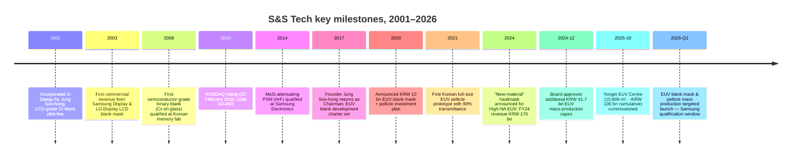

# S&S Tech Corporation (KOSDAQ: 101490) — Research Document

*As of 2026-05-26 — initiation of coverage*

> **Update — Yongin EUV Center commissioned 2025-10-15; EUV blank mask & EUV pellicle mass production starts 1Q-FY2026.** S&S Tech inaugurated its dedicated EUV manufacturing complex in Yongin on 2025-10-15 — a six-storey, 10,809 m² facility that received ~KRW 100 bn of cumulative investment plus a Board-approved follow-on of ~KRW 41.7 bn announced 2024-12-04 — to begin Samsung-qualified mass production of EUV blank masks and EUV pellicles in early 2026. Founder/Chairman Jung Soo-hong has publicly guided that EUV commercialisation can lift annual revenue toward KRW 300 bn–500 bn from the current ~KRW 244 bn run-rate over the medium term ([ZDNet Korea — 에스앤에스텍, EUV 블랭크마스크·펠리클 국산화 양산 시동, 2025-10-15](https://zdnet.co.kr/view/?no=20251015142601); [파이낸셜뉴스 — 에스앤에스텍 정수홍 인터뷰 "내년 초 EUV 블랭크마스크 양산", 2025-03-21](https://www.fnnews.com/news/202503211358486799); [Digitimes — Samsung, S&S Tech advance EUV mask localization, 2025-07-14](https://www.digitimes.com/news/a20250714PD206/samsung-euv-metal-mask-localization-production.html)).

---

## Table of Contents

1. Company Overview
2. Company History
3. Management Team
4. Products & Services — the EUV-blank chapter
5. Customers & Go-to-Market
6. Industry Overview
7. Competitive Landscape
8. Market Opportunity (TAM)
9. Risk Assessment
10. References

---

## 1. Company Overview

S&S Tech Corporation (에스앤에스텍, KOSDAQ: 101490) is the only South-Korean specialty supplier of **blank masks** — the photolithography mask substrates that semiconductor and flat-panel-display fabs receive from their material partner, send to a separate photomask shop for pattern writing, and then mount into the lithography scanner. The company was incorporated on **22 February 2001** in Daegu by Jung Soo-hong (정수홍), listed on KOSDAQ on **23 February 2010**, and as of FY2025 employs 307 people across a Daegu mother plant, a Gumi processing line, and the new Yongin EUV Centre commissioned in October 2025 ([S&S Tech corporate profile, accessed 2026-05](http://www.snstech.co.kr/renew/html/sub01_01.asp); [Stockanalysis.com — S&S Tech (KOSDAQ:101490) company profile](https://stockanalysis.com/quote/kosdaq/101490/company/); [ZDNet Korea — 용인 EUV 센터 준공, 2025-10-15](https://zdnet.co.kr/view/?no=20251015142601)).

The product map sits on top of one physical step: the **deposition of an opaque film stack (chrome / MoSi for optical, Ta-based with Ru capping for EUV) on an ultra-clean quartz or low-thermal-expansion-material (LTEM) substrate, then chemical-mechanical polish to <1 nm flatness**, then resist coat, then defect-grade inspection. A blank mask is **what the photomask house starts with** — Photronics, Toppan/Tekscend, and the captive mask shops at Samsung, SK Hynix, and Intel buy blanks from S&S Tech / Hoya / Shin-Etsu / AGC, write the chip layout onto them with an electron-beam writer, etch the absorber, and ship the finished photomask to the lithography fab ([Semi-Engineering — Why Mask Blanks Are Critical, 2022](https://semiengineering.com/why-mask-blanks-are-critical/); [S&S Tech 제품소개 페이지, accessed 2026-05](http://www.snstech.co.kr/renew/html/sub02_01.asp)). The blank is upstream of every transistor pattern ever printed; if a single particle larger than a fraction of the printed feature lands on the absorber, the entire mask is junk — so defect density per square centimetre is the single most important commercial dimension of this product.

The product family — covered in detail in Section 4 — splits into **(a) semiconductor blank masks** (binary Cr-on-glass for I-line / KrF, **MoSi attenuating Phase-Shift Masks (PSM)** for ArF immersion, and **EUV blanks** with Mo/Si multilayer + Ta-based absorber + Ru capping), **(b) FPD blank masks** for LCD / OLED back-plane and colour-filter steps up to G10.5 panel size, **(c) hardmask material** (a chemically-tuned thin film deposited under the photoresist that gives etch selectivity for advanced patterning, with a "new-material" generation announced in August 2024 for High-NA EUV), and **(d) EUV pellicles** — the thin polymer/CNT film membrane stretched over a frame that sits ~2 mm above the mask to keep flying particles out of the lithography image plane ([S&S Tech 제품소개 — 반도체용 블랭크 마스크 / FPD용 블랭크 마스크, accessed 2026-05](http://www.snstech.co.kr/renew/html/sub02_01.asp); [ZDNet Korea — High-NA EUV 시대 신물질 하드마스크 개발, 2024-08-12](https://zdnet.co.kr/view/?no=20240812172957); [THE ELEC — S&S Tech develops EUV pellicle with 90% transmittance, 2021-10-06](https://www.thelec.net/news/articleView.html?idxno=3431)).

Revenue scales linearly with Korean memory/foundry wafer starts plus the Samsung-Display / LG-Display panel-mix shift to OLED; **FY2025 revenue was KRW 243.7 bn (+38.5% YoY), operating profit KRW 50.4 bn (OPM 20.7%), and net profit KRW 58.1 bn** — the first year the company crossed both the KRW 200 bn revenue line and the 20 % operating-margin line, after a four-year compounding sequence of KRW 89 bn (2021) → 117 bn (2022) → 150 bn (2023) → 176 bn (2024) → 244 bn (2025) ([Company Guide — 에스앤에스텍 A101490 Snapshot, accessed 2026-05](https://comp.fnguide.com/SVO2/asp/SVD_Main.asp?gicode=A101490); [Stockanalysis.com — S&S Tech price + financials, accessed 2026-05](https://stockanalysis.com/quote/kosdaq/101490/)). For perspective, the FY2025 revenue is **~3 % of Hoya's Electronics-related segment** (Hoya's segment generated ¥265.2 bn ≈ USD 1.7 bn in FY25, vs. S&S Tech's ~USD 180 m), but the **growth-rate differential is roughly 3× in S&S Tech's favour** as Samsung concurrently de-risks Korea's mask-blank import dependence ([HOYA FY25 IFRS Financial Statements, pp. 31, 33](https://www.hoya.com/wp-content/uploads/2025/07/Annual-Report-Final-2.pdf)).

*Source: compiled from [Company Guide — 에스앤에스텍 A101490 Snapshot, accessed 2026-05](https://comp.fnguide.com/SVO2/asp/SVD_Main.asp?gicode=A101490) and [Stockanalysis.com — S&S Tech overview, accessed 2026-05](https://stockanalysis.com/quote/kosdaq/101490/) — FY2025 KRW 243.7 bn revenue, 20.7% OPM.*

Geographically the customer base is **~85% Korea-domestic** (Samsung Electronics and SK Hynix for semis; Samsung Display and LG Display for FPD blanks), with the balance going to **Chinese memory / foundry mask shops (Newway Photomask, SuperMask) and Taiwanese photomask houses** — the company has historically declined to break out customer-by-customer revenue in DART filings, and Chairman Jung publicly described the Samsung / SK Hynix / LG Display triplet as the "anchor account" set in his 2025-03-21 CEO interview ([파이낸셜뉴스 — 에스앤에스텍 정수홍 인터뷰, 2025-03-21](https://www.fnnews.com/news/202503211358486799); [전자신문 — 에스앤에스텍 정수홍 대표 인터뷰, 2019-02-11](https://m.etnews.com/20190211000156)). The export concentration to Korea-Chinese-Taiwan customers explains why S&S Tech's revenue calendar tracks the K-Belt fab investment cycle far more closely than the broader Asia-Pacific semi-cap cycle: Samsung Pyeongtaek P4 timing, SK Hynix Yongin M16-M17 timing, and the China-Newway capacity additions drive far more of S&S Tech's quarter-to-quarter swing than any global indicator.

**Valuation snapshot (as of 2026-05-26).** S&S Tech trades at **KRW ~77,200 / share** for a **market cap of ~KRW 1.64 trillion (~USD 1.18 bn at KRW/USD 1,390)** after a **+128.7% trailing 52-week price move** that took the stock from KRW 31,800 to a 52-week high of KRW 108,400 in early 2026 ([Stockanalysis.com — S&S Tech price & valuation, accessed 2026-05](https://stockanalysis.com/quote/kosdaq/101490/)). On trailing-12-month FY2025 numbers that puts the stock at **P/E ~28.9×** (KRW 58.1 bn net profit / 1.64 trn cap), **P/S ~6.7×**, **P/B ~5.1×**, **ROE ~27%** on the FY25 base, and a token **dividend yield of ~0.25 %** ([Stockanalysis.com — S&S Tech statistics, accessed 2026-05](https://stockanalysis.com/quote/kosdaq/101490/); [Simply Wall St — S&S Tech ROE analysis, accessed 2026-05](https://simplywall.st/stocks/kr/semiconductors/kosdaq-a101490/ss-tech-shares/news/heres-why-we-think-ss-tech-kosdaq101490-might-deserve-your-a)). The TTM P/E sits **roughly +16% above the seven-name mask-blank / Korean-materials / Japanese-photomask peer mean of ~24.8×** (Hoya 27.5×, Shin-Etsu 18.0×, AGC 12.5×, Toppan 14.0×, Dongjin Semichem 50.8×, FST 22.0×, S&S Tech 28.9×) — a modest premium that is the market's way of pricing the EUV-qualification optionality without yet underwriting it as base-case revenue ([Stockanalysis.com — Hoya / Shin-Etsu / AGC / Toppan / Dongjin / FST quotes, accessed 2026-05](https://stockanalysis.com/list/kosdaq-stocks/); [Company Guide — Dongjin Semichem A005290 valuation, accessed 2026-05](https://comp.fnguide.com/SVO2/asp/SVD_Main.asp?gicode=A005290)).

*Source: compiled from [Stockanalysis.com — S&S Tech (KOSDAQ:101490), accessed 2026-05](https://stockanalysis.com/quote/kosdaq/101490/), [Yahoo Finance — 7741.T / 4063.T / 5201.T / 7911.T, accessed 2026-05](https://finance.yahoo.com/quote/7741.T/), [Company Guide — Dongjin Semichem A005290, accessed 2026-05](https://comp.fnguide.com/SVO2/asp/SVD_Main.asp?gicode=A005290), and [Company Guide — FST A036810, accessed 2026-05](https://comp.fnguide.com/SVO2/asp/SVD_Main.asp?gicode=A036810).*

*Analyst view:* the proximate de-rate trigger is **EUV-qualification timing slip with Samsung**. If Samsung's January / February 2026 final-evaluation milestone slips by ≥6 months, the stock could give back the full +128% trailing-year move because the entire ~6.7× P/S today is the market pricing EUV-revenue line items into FY2027F. Conversely, if Samsung publishes a first-tonnage purchase order during 1H-FY2026, the multiple could re-rate toward the Dongjin Semichem 50× zone given the structural Hoya-displacement narrative — discussed in detail in Section 8 (TAM) and Section 9 (Risks).

---

## 2. Company History

S&S Tech was incorporated on **22 February 2001** in Daegu, South Korea — a deliberate location choice because founder Jung Soo-hong was a Daegu native, had received both his polymer-engineering bachelor's (1981) and his semiconductor-engineering master's (1999) from Kyungpook National University in Daegu, and had access to the Daegu-Gyeongbuk industrial-cluster supplier base that the Korean blank-mask industry needed for ultra-clean quartz substrate handling and Cr / MoSi sputter-target supply ([Business Post — Who Is? 정수홍 에스앤에스텍 대표이사, accessed 2026-05](https://www.businesspost.co.kr/BP?command=article_view&num=402745); [S&S Tech 회사소개 — CEO Vision, accessed 2026-05](http://www.snstech.co.kr/renew/html/sub01_01.asp)). The founding thesis — explicit from the company's first regulatory filings forward — was simple: **localise the photomask blank, which was at the time a 100 % Japan-import line item for Samsung Electronics and Hyundai Electronics (SK Hynix predecessor)**, and ride the late-2000s LCD-fab build-out as the entry product.

*Source: compiled from [S&S Tech 회사연혁, accessed 2026-05](http://www.snstech.co.kr/renew/html/sub01_02.asp); [Business Post — Who Is? 정수홍, accessed 2026-05](https://www.businesspost.co.kr/BP?command=article_view&num=402745); [THE ELEC — S&S Tech EUV pellicle, 2021-10-06](https://www.thelec.net/news/articleView.html?idxno=3431); [ZDNet Korea — 용인 EUV 센터 준공, 2025-10-15](https://zdnet.co.kr/view/?no=20251015142601); [38 Communication — 에스앤에스텍 IPO record, accessed 2026-05](http://www.38.co.kr/html/ipo/ipo.htm?o=v&key=&no=1422&page=59).*

The **2001–2009 phase** was a long, lossy build-out: Cr-on-glass FPD blanks were the entry product but the LCD-blank industry was already a low-margin Japanese-incumbent (Hoya, Ulcoat, Toppan) zone, and qualifying at Samsung Display's Tangjeong fab and LG Display's Paju fab required ~5 years of free-of-particle defect data before a single commercial wafer-equivalent was sold. The semiconductor-grade pivot started in **2008** with the qualification of binary Cr blanks at a Korean memory fab (initial customer name not disclosed in filings; press at the time identified it as Hynix Semiconductor under the Hynix-pre-SK ownership structure), and the **23 February 2010 KOSDAQ listing** was the financing event that paid for the leap from FPD-only to semi-blank scale ([38 Communication — 에스앤에스텍 코스닥 상장 record, accessed 2026-05](http://www.38.co.kr/html/ipo/ipo.htm?o=v&key=&no=1422&page=59); [전자신문 — 에스앤에스텍 정수홍 대표 인터뷰, 2019-02-11](https://m.etnews.com/20190211000156)).

The **2014 MoSi PSM qualification** is the next strategic inflection: PSM is a phase-shifting absorber stack that lets a fab print sub-resolution features (45 nm half-pitch on ArF immersion, in particular) by exploiting destructive interference at pattern edges — qualifying it at Samsung Electronics' DRAM / NAND lines moved S&S Tech from "second-source LCD blank vendor" to "credible alt-supplier to Hoya for advanced-logic blanks" ([Wikipedia — Photomask (Phase Shift Mask discussion), accessed 2026-05](https://en.wikipedia.org/wiki/Photomask)). Three years later in **March 2017**, founder Jung Soo-hong — who had spent the post-IPO years at PKL (a Korean photomask shop and adjacent player), Portronics Asia, and as the original investor — returned as Chairman, and reset the corporate charter around **EUV blank + EUV pellicle development** as the multi-year strategic priority. Within 12 months he formally took the Representative Director (CEO) title in March 2018 ([Business Post — Who Is? 정수홍, accessed 2026-05](https://www.businesspost.co.kr/BP?command=article_view&num=402745); [The Bell — 정수홍 에스앤에스텍 회장, 지배력 기반 경영일선으로, 2019-03-29](https://www.thebell.co.kr/free/Content/ArticleView.asp?key=201903290100053990003403&svccode=04)).

The **2020–2025 EUV programme** is what underpins the current equity story. In June 2020 the Board approved a KRW 10 bn first-tranche investment for EUV blank mask + pellicle development equipment ([English ETNews — S&S Tech to Invest 10 Billion KRW in EUV Blank Mask and Pellicle Development, 2020-06-19](https://english.etnews.com/news/article.html?id=20200619200002)). October 2021 brought the headline **90 %-transmittance EUV pellicle prototype** — important because the only commercial EUV pellicle at the time was Mitsui Chemicals' polysilicon membrane at ~88 % single-pass transmission, and any sub-90 % transmittance was a meaningful throughput tax on a USD 150 m EUV scanner ([THE ELEC — S&S Tech develops EUV pellicle with 90% transmittance, 2021-10-06](https://www.thelec.net/news/articleView.html?idxno=3431)). August 2024 added the **new-material hardmask line** — a chemically tuned absorber/etch-mask film with ~3× the etch selectivity of conventional materials and a chlorine-only etch chemistry, positioned for High-NA EUV's thinner photoresist regime ([ZDNet Korea — 에스앤에스텍 신물질 하드마스크 개발, 2024-08-12](https://zdnet.co.kr/view/?no=20240812172957)). The **2024-12-04 Board approval of an additional KRW 41.7 bn for Yongin EUV facility build-out** funded the back half of the equipment install, and the **2025-10-15 Yongin EUV Centre opening ceremony** marked the formal start of mass-production readiness — Chairman Jung used the opening to publicly target KRW 500 bn annual revenue once EUV ramps ([파이낸셜뉴스 — 정수홍 CEO 인터뷰: "내년 초 EUV 블랭크마스크 양산, 매출 5000억 기대", 2025-03-21](https://www.fnnews.com/news/202503211358486799); [ZDNet Korea — 용인 EUV 센터 준공, 2025-10-15](https://zdnet.co.kr/view/?no=20251015142601)).

The recent **succession-related events** matter for the equity story. In late 2024 founder Jung gifted 100,000 shares (≈KRW 2.6 bn at the gift date) to his second son Jung Seong-hun (정성훈, born 1988), raising Jung Seong-hun's stake to ~0.94 % and signalling the longer-term plan: the second son to inherit S&S Tech proper, the elder son Jung Si-jun (정시준) to run the **S&S Investment subsidiary** (an industrial holding / venture-investment vehicle) ([The Bell — 정수홍 회장 지배력 기반, 2019-03-29](https://www.thebell.co.kr/free/Content/ArticleView.asp?key=201903290100053990003403&svccode=04); [Business Post — Who Is? 정수홍 succession discussion, accessed 2026-05](https://www.businesspost.co.kr/BP?command=article_view&num=402745)). The structure is **not disruptive in the next 24 months** — Jung Soo-hong remains both Chairman and Representative Director, and Jung Seong-hun is currently an Executive Director — but it shapes the long-run capital-allocation framework around the EUV ramp.

---

## 3. Management Team

S&S Tech is, in management terms, a **founder-CEO company at an inflection point**. Jung Soo-hong is both the founder and the current Representative Director (대표이사), so per the company-research skill convention this section is a single combined biography rather than separate Founder / CEO blocks.

**Jung Soo-hong (정수홍) — Founder, Chairman & Representative Director.** Born 18 July 1955 in Daegu, Jung is one of Korea's most experienced photomask-industry executives — a 45-year career sequence that maps directly onto the technical layers of S&S Tech's product stack today ([Business Post — Who Is? 정수홍 에스앤에스텍 대표이사, accessed 2026-05](https://www.businesspost.co.kr/BP?command=article_view&num=402745)). He took a **bachelor's in polymer engineering from Kyungpook National University in 1981** (polymer chemistry is the foundation of photoresist and pellicle membrane materials, both of which appear in S&S Tech's product matrix today) and a **master's in semiconductor engineering from KNU's Industrial Graduate School in 1999** — completed mid-career while serving as Korea CEO of PKL, the country's incumbent photomask shop ([Business Post — Who Is? 정수홍, accessed 2026-05](https://www.businesspost.co.kr/BP?command=article_view&num=402745); [The Bell — 정수홍 에스앤에스텍 회장 정수홍 지배력 기반 경영일선으로, 2019-03-29](https://www.thebell.co.kr/free/Content/ArticleView.asp?key=201903290100053990003403&svccode=04)).

Three prior tours stand out as the substantive accomplishments that built the operating thesis for S&S Tech. **(1)** From **1988 to 1993 he was factory manager at Korea DuPont**, where he ran a photoresist + photomask materials production line and learned the wet-chemistry control that ultra-low-defect blank-mask manufacturing requires — defect density per cm² is a function of cleanroom particle control and chemistry purity, both of which are DuPont strong suits ([Business Post — Who Is? 정수홍 career timeline, accessed 2026-05](https://www.businesspost.co.kr/BP?command=article_view&num=402745)). **(2)** From **1995 to ~2001 he served as President / Representative Director of PKL (Photokure Limited, later Photronics-PKL after Photronics took a stake)** — the Korean photomask shop that buys blank masks from Hoya / Shin-Etsu and writes them with e-beam writers for Samsung and Hynix. The PKL tour gave Jung deep customer-facing knowledge of exactly what defect-grade specifications, delivery cadence, and price-per-blank the Korean fabs would buy — knowledge he then translated into a direct upstream entrant in 2001 ([전자신문 — 정수홍 대표 인터뷰: "블랭크 마스크 세계 최고 자부", 2019-02-11](https://m.etnews.com/20190211000156)). **(3)** From **2008–2017 he was Chairman of PKL (post-Photronics combination)** — the period during which S&S Tech grew from a sub-KRW 50 bn LCD-blank specialist into a multi-product Korean semi materials name with a KOSDAQ listing, all while the founder retained controlling-shareholder economics but was not the formal day-to-day operator. He returned as Chairman of S&S Tech in March 2017 and assumed the Representative Director title in 2018 because the EUV pivot needed founder-level capital-allocation conviction ([The Bell — 정수홍 회장 지배력 기반, 2019-03-29](https://www.thebell.co.kr/free/Content/ArticleView.asp?key=201903290100053990003403&svccode=04); [Business Post — Who Is? 정수홍, accessed 2026-05](https://www.businesspost.co.kr/BP?command=article_view&num=402745)).

Jung's signature in the 2017-to-present period is **(a)** aggressive multi-year capex into EUV (cumulative ~KRW 150 bn between the original 2020 KRW 10 bn approval, the 2021–2024 build-outs in Daegu and Gumi, and the 2024-12-04 additional KRW 41.7 bn for Yongin), **(b)** explicit publicly-stated revenue targets (KRW 500 bn medium-term run-rate once EUV ramps — set during his March 2025 CEO interview), and **(c)** founder-family ownership concentration — as of 31 March 2025 he personally holds ~4.28 million shares or **19.95% of issued capital**, with related family / second-son stakes lifting the founder-and-related-party block toward ~22 %, against a **Samsung-affiliated ownership block of ~16.8% (Samsung Asset Management 8.78%)** that signals the strategic-customer endorsement Samsung has provided ([Business Post — Who Is? 정수홍 shareholding, accessed 2026-05](https://www.businesspost.co.kr/BP?command=article_view&num=402745); [Company Guide — 에스앤에스텍 A101490 ownership table, accessed 2026-05](https://comp.fnguide.com/SVO2/asp/SVD_Main.asp?gicode=A101490); [파이낸셜뉴스 — 정수홍 CEO 인터뷰, 2025-03-21](https://www.fnnews.com/news/202503211358486799)). His compensation structure is undisclosed beyond standard DART reporting thresholds; the equity stake (~KRW 320–330 bn at current prices) dwarfs any cash-comp signal — the alignment is straightforward founder-equity rather than incentive-design.

Succession plumbing — covered in Section 2 — places **second son Jung Seong-hun (정성훈, born 1988) as the heir apparent to S&S Tech proper** (he serves on the Board as an Executive Director and received a 100,000-share gift from his father in late 2024) while elder son **Jung Si-jun (정시준) runs the S&S Investment subsidiary**. The split is widely read in Korean financial press as a deliberate decision to keep the operating company under one heir while housing the venture / industrial-investment activity in a parallel vehicle ([The Bell — 정수홍 회장 지배력 기반, 2019-03-29](https://www.thebell.co.kr/free/Content/ArticleView.asp?key=201903290100053990003403&svccode=04); [Business Post — Who Is? 정수홍 succession, accessed 2026-05](https://www.businesspost.co.kr/BP?command=article_view&num=402745)). For the next 12-24 months, day-to-day operating leadership remains entirely with founder Jung — and given the criticality of the Samsung EUV qualification window, that founder continuity is a positive signal rather than a key-person risk to flag.
