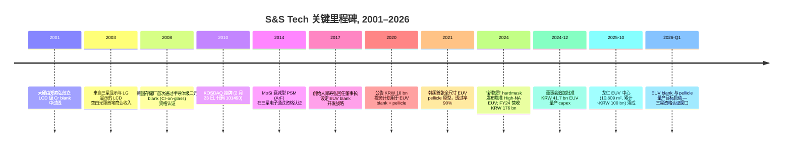
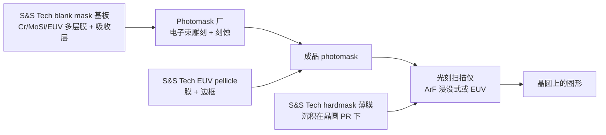

# S&S Tech (에스앤에스텍, KOSDAQ: 101490) — 公司研究

*截至 2026-05-26 — 首次覆盖*

> **更新 — 龙仁 (Yongin) EUV 中心 2025-10-15 落成，EUV 空白光罩 / 光罩坯料 (blank mask) 与 EUV 防尘薄膜 (EUV pellicle) 量产从 FY2026 一季度启动。** S&S Tech 于 2025-10-15 在京畿道龙仁举行专属 EUV 制造园区开幕仪式 — 一座六层、10,809 m² 的厂房，累计投入约 KRW 100 bn (~USD 72 m)，再叠加董事会 2024-12-04 决议追加的约 KRW 41.7 bn 资本支出 — 目标是在 2026 年初启动通过三星 (Samsung) 资格认证的 EUV 空白光罩与 EUV 防尘薄膜量产。创始人兼董事长郑寿弘 (정수홍, Jung Soo-hong) 已公开指引，EUV 商业化中长期可推动年营收从当前 KRW ~244 bn 量级上行至 KRW 300 bn–500 bn 区间 ([ZDNet Korea — 에스앤에스텍, EUV 블랭크마스크·펠리클 국산화 양산 시동, 2025-10-15](https://zdnet.co.kr/view/?no=20251015142601); [파이낸셜뉴스 — 에스앤에스텍 정수홍 인터뷰 "내년 초 EUV 블랭크마스크 양산", 2025-03-21](https://www.fnnews.com/news/202503211358486799); [Digitimes — Samsung, S&S Tech advance EUV mask localization, 2025-07-14](https://www.digitimes.com/news/a20250714PD206/samsung-euv-metal-mask-localization-production.html))。

---

## 目录

1. 公司概览
2. 公司历史
3. 管理团队
4. 产品与服务 — EUV 空白光罩重点章节
5. 客户与上市策略
6. 行业概览
7. 竞争格局
8. 市场机会 (TAM)
9. 风险评估
10. 参考资料

---

## 1. 公司概览

S&S Tech (에스앤에스텍，KOSDAQ: 101490) 是韩国唯一一家专注于 **空白光罩 / 光罩坯料 (blank mask)** 的特种材料供应商 — 这是半导体与平板显示晶圆厂将光刻图形写到硅片之前的最上游物理材料。空白光罩从材料厂运到独立的 photomask 厂 (光罩厂) 做电子束 (e-beam) 雕刻，之后再装到曝光机 (lithography scanner) 里完成图形转移。公司 **2001 年 2 月 22 日**在大邱 (Daegu) 由郑寿弘 (정수홍) 创立，2010 年 2 月 23 日在 KOSDAQ 上市，FY2025 期末共有 307 名员工，分布在大邱母厂、龟尾 (Gumi) 加工线，以及 2025 年 10 月落成的新建龙仁 EUV 中心 ([S&S Tech 公司简介, accessed 2026-05](http://www.snstech.co.kr/renew/html/sub01_01.asp); [Stockanalysis.com — S&S Tech (KOSDAQ:101490) company profile](https://stockanalysis.com/quote/kosdaq/101490/company/); [ZDNet Korea — 용인 EUV 센터 준공, 2025-10-15](https://zdnet.co.kr/view/?no=20251015142601))。

产品矩阵的底层物理工序只有一个步骤: **在超净石英基板或低热膨胀材料 (LTEM, low-thermal-expansion material) 基板上沉积一层不透光的吸收膜栈 (光学版用 Cr / MoSi、EUV 版用 Ta 基吸收层加 Ru 钌覆盖层)，之后做化学机械抛光 (CMP) 把表面平整度推到 <1 nm，再涂光刻胶 (PR, photoresist) 并做缺陷检测**。空白光罩就是 photomask 厂的起点 — Photronics、Toppan/Tekscend、三星 / SK 海力士 / Intel 的自有光罩厂从 S&S Tech / Hoya / Shin-Etsu / AGC 采购 blank，用电子束写入芯片版图、刻蚀吸收层，再把成品 photomask 出货给晶圆厂 ([Semi-Engineering — Why Mask Blanks Are Critical, 2022](https://semiengineering.com/why-mask-blanks-are-critical/); [S&S Tech 제품소개 페이지, accessed 2026-05](http://www.snstech.co.kr/renew/html/sub02_01.asp))。Blank 处于每一个 transistor 图形的最上游 — 如果哪怕一个略大于印制特征尺寸几分之一的粒子落在吸收层上，整张光罩就会报废 — 这也是为什么 **每平方厘米缺陷密度 (defects/cm²)** 是这一产品最重要的商业维度。

产品族 — 详见第 4 节 — 分为 **(a) 半导体空白光罩** (含成熟节点 i-line / KrF 用的 **二元光罩 (binary blank)**、ArF 浸没式光刻用的 **MoSi 衰减型相移光罩 (phase-shift mask, PSM)**，以及含 Mo/Si 多层膜加 Ta 基吸收层加 Ru 覆盖层的 **EUV 空白光罩 (EUV blank)**)，**(b) FPD 用空白光罩** (覆盖 G10.5 尺寸的 LCD / OLED 背板与彩色滤光片步骤)，**(c) 硬掩膜材料 (hardmask)** (一种在光刻胶下面化学定制的薄膜，能为先进图形提供刻蚀选择比，2024 年 8 月针对 High-NA EUV 推出了"新物质"代际)，以及 **(d) EUV 防尘薄膜 (EUV pellicle)** — 一张张在 mask 上方约 2 mm 处的高分子 / CNT 透明膜，挡住可能飞落在曝光像面上的颗粒 ([S&S Tech 제품소개 — 반도체용 블랭크 마스크 / FPD용 블랭크 마스크, accessed 2026-05](http://www.snstech.co.kr/renew/html/sub02_01.asp); [ZDNet Korea — High-NA EUV 시대 신물질 하드마스크 개발, 2024-08-12](https://zdnet.co.kr/view/?no=20240812172957); [THE ELEC — S&S Tech develops EUV pellicle with 90% transmittance, 2021-10-06](https://www.thelec.net/news/articleView.html?idxno=3431))。

营收随韩国存储 / 代工厂晶圆投片量线性变化，同时叠加三星显示 (Samsung Display) / LG 显示 (LG Display) 面板向 OLED 切换的结构性增量; **FY2025 营收为 KRW 243.7 bn (+38.5% YoY)，营业利润 KRW 50.4 bn (OPM 20.7%)，净利 KRW 58.1 bn** — 这是公司同时跨过 KRW 200 bn 营收线和 20% 营业利润率线的第一个年度，对应过去四年的复合序列 KRW 89 bn (2021) → 117 bn (2022) → 150 bn (2023) → 176 bn (2024) → 244 bn (2025) ([Company Guide — 에스앤에스텍 A101490 Snapshot, accessed 2026-05](https://comp.fnguide.com/SVO2/asp/SVD_Main.asp?gicode=A101490); [Stockanalysis.com — S&S Tech 价格 + 财务, accessed 2026-05](https://stockanalysis.com/quote/kosdaq/101490/))。作对比参考，FY2025 营收**约相当于 Hoya 电子相关板块的 3%** (Hoya 该板块 FY25 营收 ¥265.2 bn ≈ USD 1.7 bn vs. S&S Tech 的 ~USD 180 m)，**但增速差异约 3 倍倾向 S&S Tech**，反映三星正在同步降低韩国对进口 mask blank 的依赖 ([HOYA FY25 IFRS Financial Statements, pp. 31, 33](https://www.hoya.com/wp-content/uploads/2025/07/Annual-Report-Final-2.pdf))。

*资料来源: 基于 [Company Guide — 에스앤에스텍 A101490 Snapshot, accessed 2026-05](https://comp.fnguide.com/SVO2/asp/SVD_Main.asp?gicode=A101490) 与 [Stockanalysis.com — S&S Tech overview, accessed 2026-05](https://stockanalysis.com/quote/kosdaq/101490/) 整理 — FY2025 KRW 243.7 bn 营收，OPM 20.7%。*

*资料来源: 基于 [Company Guide — A101490 Financial Statements, accessed 2026-05](https://comp.fnguide.com/SVO2/ASP/SVD_Finance.asp?pGB=1&gicode=A101490&cID=&MenuYn=Y&ReportGB=B&NewMenuID=103&stkGb=701) 整理 — FY2025 营业利润 KRW 50.4 bn，净利 KRW 58.1 bn (净利 > 营业利润反映 FY2025 披露的投资性损益)。*

地理结构方面，客户基础**约 85% 韩国国内** (半导体侧为三星电子与 SK 海力士; FPD 侧为三星显示与 LG 显示)，剩余部分销往**中国存储 / 代工厂光罩厂 (Newway Photomask, SuperMask) 及台湾 photomask 厂** — 公司历史上不在 DART 披露按客户分项收入，董事长郑寿弘在 2025-03-21 CEO 访谈中口头描述三星 / SK 海力士 / LG 显示三家为"锚定客户" ([파이낸셜뉴스 — 에스앤에스텍 정수홍 인터뷰, 2025-03-21](https://www.fnnews.com/news/202503211358486799); [전자신문 — 에스앤에스텍 정수홍 대표 인터뷰, 2019-02-11](https://m.etnews.com/20190211000156))。出货集中在韩国—中国—台湾客户群，意味着 S&S Tech 的营收节奏跟着 **K-半导体战略 (K-Belt 半导体主权战略)** 的晶圆厂资本周期走得比全球泛亚太 semi-cap 周期更紧 — 三星平泽 P4 时点、SK 海力士龙仁 M16-M17 时点、以及中国 Newway 扩产节奏对其季度波动的影响远大于任何全球性指标。

**估值快照 (截至 2026-05-26)。** S&S Tech 当前股价 **KRW ~77,200 / 股**，市值约 **KRW 1.64 万亿 (~USD 1.18 bn，按 KRW/USD 1,390)**，过去 52 周累计上涨 **+128.7%**，股价从 KRW 31,800 涨至 2026 年初 52 周高点 KRW 108,400 ([Stockanalysis.com — S&S Tech 价格与估值, accessed 2026-05](https://stockanalysis.com/quote/kosdaq/101490/))。基于 TTM (FY2025) 业绩，股票当前估值为 **P/E ~28.9×** (KRW 58.1 bn 净利 / 1.64 万亿市值)、**P/S ~6.7×**、**P/B ~5.1×**、**ROE ~27%** (基于 FY25 基数)，股息率约 **0.25%** ([Stockanalysis.com — S&S Tech statistics, accessed 2026-05](https://stockanalysis.com/quote/kosdaq/101490/); [Simply Wall St — S&S Tech ROE analysis, accessed 2026-05](https://simplywall.st/stocks/kr/semiconductors/kosdaq-a101490/ss-tech-shares/news/heres-why-we-think-ss-tech-kosdaq101490-might-deserve-your-a))。TTM P/E 较七家可比 (mask-blank / 韩国材料 / 日本 photomask) 公司均值 ~24.8× **高约 +16%** (Hoya 27.5×, Shin-Etsu 18.0×, AGC 12.5×, Toppan 14.0×, Dongjin Semichem 50.8×, FST 22.0×, S&S Tech 28.9×) — 这一温和溢价是市场为 EUV 资格认证 (qualification) 的可选性付费，但还没把它当作 base case 收入来定价 ([Stockanalysis.com — Hoya / Shin-Etsu / AGC / Toppan / Dongjin / FST 行情, accessed 2026-05](https://stockanalysis.com/list/kosdaq-stocks/); [Company Guide — Dongjin Semichem A005290 valuation, accessed 2026-05](https://comp.fnguide.com/SVO2/asp/SVD_Main.asp?gicode=A005290))。

*资料来源: 基于 [Stockanalysis.com — S&S Tech (KOSDAQ:101490), accessed 2026-05](https://stockanalysis.com/quote/kosdaq/101490/), [Yahoo Finance — 7741.T / 4063.T / 5201.T / 7911.T, accessed 2026-05](https://finance.yahoo.com/quote/7741.T/), [Company Guide — Dongjin Semichem A005290, accessed 2026-05](https://comp.fnguide.com/SVO2/asp/SVD_Main.asp?gicode=A005290), 与 [Company Guide — FST A036810, accessed 2026-05](https://comp.fnguide.com/SVO2/asp/SVD_Main.asp?gicode=A036810) 整理。*

*分析师观点 (Analyst view):* 近端 de-rate 触发因素是 **三星 EUV 资格认证 (qualification) 时点滑动**。如果三星 2026 年 1 / 2 月的最终评估里程碑滑后 ≥6 个月，股价可能回吐过去一年 +128% 涨幅，因为当前 ~6.7× P/S 估值已经把 EUV 收入计入 FY2027F。反之，如果三星在 1H-FY2026 发出首批吨数级采购订单 (PO)，估值倍数可能向 Dongjin Semichem 50× 区间上行 — 详见第 8 节 (TAM) 与第 9 节 (风险)。

---

## 2. 公司历史

S&S Tech 于 **2001 年 2 月 22 日**在韩国大邱成立 — 选址大邱是创始人郑寿弘的本籍地，他在大邱本地的庆北国立大学 (Kyungpook National University, KNU) 取得了 1981 年高分子工学 (polymer engineering) 学士与 1999 年半导体工程硕士学位，同时大邱—庆北 (Daegu-Gyeongbuk) 工业集群供应链能就近提供超净石英基板搬运、Cr / MoSi 溅射靶材等关键配套，这是早期空白光罩产线的硬约束 ([Business Post — Who Is? 정수홍 에스앤에스텍 대표이사, accessed 2026-05](https://www.businesspost.co.kr/BP?command=article_view&num=402745); [S&S Tech 회사소개 — CEO Vision, accessed 2026-05](http://www.snstech.co.kr/renew/html/sub01_01.asp))。创业初衷 — 从公司首批监管备案文件起就明确写出 — 非常简单: **把当时三星电子和现代电子 (SK 海力士前身) 100% 从日本进口的 photomask blank 国产化**，并以 2000 年代末韩国 LCD 厂扩产周期作为切入点的入门级产品。

*资料来源: 基于 [S&S Tech 회사연혁, accessed 2026-05](http://www.snstech.co.kr/renew/html/sub01_02.asp); [Business Post — Who Is? 정수홍, accessed 2026-05](https://www.businesspost.co.kr/BP?command=article_view&num=402745); [THE ELEC — S&S Tech EUV pellicle, 2021-10-06](https://www.thelec.net/news/articleView.html?idxno=3431); [ZDNet Korea — 용인 EUV 센터 준공, 2025-10-15](https://zdnet.co.kr/view/?no=20251015142601); [38 Communication — 에스앤에스텍 IPO record, accessed 2026-05](http://www.38.co.kr/html/ipo/ipo.htm?o=v&key=&no=1422&page=59) 整理。*

**2001–2009 阶段** 是一段漫长、烧钱的爬坡期: Cr-on-glass FPD blank 作为入门产品切入，但 LCD blank 行业当时已经是日本在位玩家 (Hoya、Ulcoat、Toppan) 主导的低毛利赛道，要在三星显示牙山 (Tangjeong) 厂和 LG 显示坡州 (Paju) 厂通过资格认证，需要先积累约 5 年的零粒子缺陷数据才能售出一片对等晶圆量的商业 mask。半导体级转型从 **2008 年**开始 — 二元 Cr blank 在韩国某家存储厂通过资格认证 (申报文件未披露首位客户名称，当时业内传闻是当时仍处于 Hynix-pre-SK 控股结构下的海力士半导体)，**2010 年 2 月 23 日 KOSDAQ 上市**是支撑公司从 FPD-only 跨入 semi-blank 规模的关键融资事件 ([38 Communication — 에스앤에스텍 코스닥 상장 record, accessed 2026-05](http://www.38.co.kr/html/ipo/ipo.htm?o=v&key=&no=1422&page=59); [전자신문 — 에스앤에스텍 정수홍 대표 인터뷰, 2019-02-11](https://m.etnews.com/20190211000156))。

**2014 年 MoSi PSM 资格认证**是接下来的战略拐点: PSM 是一种相移吸收膜栈，让晶圆厂在 ArF 浸没式光刻上通过 pattern 边缘的相消干涉印出亚解析度特征 (典型场景为 45 nm 半节距 DRAM) — 在三星电子的 DRAM / NAND 产线上通过这一品类资格认证，让 S&S Tech 从"二号 LCD blank 供应商"升级到"先进逻辑 blank 上对 Hoya 可信的备选供应商" ([Wikipedia — Photomask (Phase Shift Mask 讨论), accessed 2026-05](https://en.wikipedia.org/wiki/Photomask))。三年后的 **2017 年 3 月**，创始人郑寿弘 — 此前的 IPO 后年份分别在 PKL (韩国 photomask 厂、相邻产业玩家)、Portronics Asia 任职，并以原始投资人身份回到公司视野 — 回任董事长，并把公司战略章程重置为以 **EUV blank + EUV pellicle 开发**为多年战略优先级。一年内的 2018 年 3 月，他正式接任 Representative Director (代表理事 / CEO) 头衔 ([Business Post — Who Is? 정수홍, accessed 2026-05](https://www.businesspost.co.kr/BP?command=article_view&num=402745); [The Bell — 정수홍 에스앤에스텍 회장, 지배력 기반 경영일선으로, 2019-03-29](https://www.thebell.co.kr/free/Content/ArticleView.asp?key=201903290100053990003403&svccode=04))。

**2020–2025 EUV 计划**是当前股价故事的承托。2020 年 6 月董事会通过首期 KRW 10 bn 投资用于 EUV blank + pellicle 开发设备 ([English ETNews — S&S Tech to Invest 10 Billion KRW in EUV Blank Mask and Pellicle Development, 2020-06-19](https://english.etnews.com/news/article.html?id=20200619200002))。2021 年 10 月公司公布**单程透过率 90% 的 EUV pellicle 原型** — 这一数字之所以重要，是因为当时唯一商业化的 EUV pellicle 是三井化学 (Mitsui Chemicals) 多晶硅膜，单程透过率 ~88%，而单程透过率每低 1 pp 都意味着在一台 USD 150 m 的 EUV 扫描仪上扣减一笔可观的产能税 ([THE ELEC — S&S Tech develops EUV pellicle with 90% transmittance, 2021-10-06](https://www.thelec.net/news/articleView.html?idxno=3431))。2024 年 8 月又新增 **新物质 hardmask 产品线** — 一种化学定制的吸收 / 刻蚀掩膜薄膜，相对常规材料的刻蚀选择比提升约 3 倍，并采用纯氯刻蚀化学，定位 High-NA EUV 时代更薄光刻胶的工艺需求 ([ZDNet Korea — 에스앤에스텍 신물질 하드마스크 개발, 2024-08-12](https://zdnet.co.kr/view/?no=20240812172957))。**2024-12-04 董事会批准追加 KRW 41.7 bn 用于龙仁 EUV 厂建设**，资助了设备安装的后半段; **2025-10-15 龙仁 EUV 中心开幕仪式**正式标志量产准备就位 — 董事长郑寿弘在开幕现场公开把"EUV 量产后年营收 5,000 亿韩元 (KRW 500 bn)"作为公司中长期目标 ([파이낸셜뉴스 — 정수홍 CEO 인터뷰: "내년 초 EUV 블랭크마스크 양산, 매출 5000억 기대", 2025-03-21](https://www.fnnews.com/news/202503211358486799); [ZDNet Korea — 용인 EUV 센터 준공, 2025-10-15](https://zdnet.co.kr/view/?no=20251015142601))。

近期的**接班相关事件**对股权故事有意义。2024 年下半年创始人郑寿弘将 10 万股 (按当时市价约 KRW 2.6 bn) 赠与次子郑成勋 (정성훈, Jung Seong-hun, 1988 年生)，把次子持股比例提升至约 0.94%，并对外释放长期接班结构信号: **次子接 S&S Tech 主体，长子郑时俊 (정시준, Jung Si-jun) 接 S&S Investment 子公司** (一家工业控股 / 风险投资载体) ([The Bell — 정수홍 회장 지배력 기반, 2019-03-29](https://www.thebell.co.kr/free/Content/ArticleView.asp?key=201903290100053990003403&svccode=04); [Business Post — Who Is? 정수홍 succession discussion, accessed 2026-05](https://www.businesspost.co.kr/BP?command=article_view&num=402745))。这一结构在**未来 24 个月内不构成颠覆性变量** — 郑寿弘仍同时担任董事长与代表理事，次子目前为执行董事 (Executive Director) — 但它锁定了 EUV 爬坡背后的长期资本配置框架。

---

## 3. 管理团队

S&S Tech 在管理层面是一家**处于拐点上的创始人 CEO 公司**。郑寿弘既是创始人，也是当前的代表理事 (대표이사) — 按 company-research 流程惯例，本节将"创始人"与"CEO"合并为一条人物履历，而不是拆成两个分块。

**郑寿弘 (정수홍, Jung Soo-hong) — 创始人、董事长兼代表理事。** 1955 年 7 月 18 日生于大邱，郑寿弘是韩国 photomask 行业最资深的高管之一 — 一段长达 45 年的职业序列与 S&S Tech 今日产品矩阵的技术层级几乎一一映射 ([Business Post — Who Is? 정수홍 에스앤에스텍 대표이사, accessed 2026-05](https://www.businesspost.co.kr/BP?command=article_view&num=402745))。他 **1981 年获庆北国立大学高分子工学学士学位** (高分子化学是 photoresist 与 pellicle 膜材的基础，两者今天都出现在 S&S Tech 的产品矩阵中)，**1999 年获 KNU 产业研究生院半导体工程硕士** — 这是他职业中段在出任 PKL 韩国 CEO 期间完成的进修 ([Business Post — Who Is? 정수홍, accessed 2026-05](https://www.businesspost.co.kr/BP?command=article_view&num=402745); [The Bell — 정수홍 에스앤에스텍 회장 지배력 기반 경영일선으로, 2019-03-29](https://www.thebell.co.kr/free/Content/ArticleView.asp?key=201903290100053990003403&svccode=04))。

值得展开的三段重要从业经历，每一段都对应今天 S&S Tech 运营论点中的某一层。**(1)** **1988-1993 年任 Korea DuPont 工厂厂长**，主管 photoresist 加 photomask 材料生产线，学到了支撑超低缺陷 blank-mask 制造所需的**湿化学工艺控制** — defects/cm² 缺陷密度归根到底是洁净室微粒控制与化学品纯度的函数，这两块都是 DuPont 的看家本领 ([Business Post — Who Is? 정수홍 career timeline, accessed 2026-05](https://www.businesspost.co.kr/BP?command=article_view&num=402745))。**(2)** **1995-约 2001 年任 PKL (Photokure Limited，后与 Photronics 合资为 Photronics-PKL) 总裁 / 代表理事** — 这是一家从 Hoya / Shin-Etsu 采购 blank、为三星和海力士做电子束雕刻的韩国 photomask 厂。在 PKL 的这一任让郑寿弘从客户一侧吃透了**韩国晶圆厂愿意为什么样的缺陷规格、交期 cadence 与 blank 单价买单**，他随后把这些理解直接翻译成 2001 年的上游新进入者 ([전자신문 — 정수홍 대표 인터뷰: "블랭크 마스크 세계 최고 자부", 2019-02-11](https://m.etnews.com/20190211000156))。**(3)** **2008-2017 年任 PKL (Photronics 合资后) 董事长** — 这一时期 S&S Tech 从一家 sub-KRW 50 bn 的 LCD-blank 专业户长大为多品类的韩国 semi-材料公司，并完成 KOSDAQ 上市; 创始人在期间保留控股股东经济权益但未直接出任日常运营。2017 年 3 月他作为董事长回任 S&S Tech，2018 年加冠代表理事头衔，是因为 EUV 转型需要创始人级别的资本配置决断 ([The Bell — 정수홍 회장 지배력 기반, 2019-03-29](https://www.thebell.co.kr/free/Content/ArticleView.asp?key=201903290100053990003403&svccode=04); [Business Post — Who Is? 정수홍, accessed 2026-05](https://www.businesspost.co.kr/BP?command=article_view&num=402745))。

郑寿弘 2017 年至今的执掌签字风格集中体现在 **(a)** 多年期 EUV capex 重金投入 (2020 年 KRW 10 bn 首期批准、2021-2024 年大邱与龟尾建设、2024-12-04 龙仁追加 KRW 41.7 bn，累计约 KRW 150 bn)，**(b)** 对外明示的营收目标 (2025 年 3 月访谈中宣告"EUV 量产后年营收 5,000 亿韩元中长期目标")，以及 **(c)** 创始人家族持股集中 — 截至 2025-03-31 他个人持有约 4.28 百万股 (约 **占总股本 19.95%**)，加上家族 / 次子相关方持股块约 22%，对位 **三星关联持股块约 16.8%** (其中三星资产管理 8.78%)，后者是三星作为战略客户给予的资本侧背书 ([Business Post — Who Is? 정수홍 shareholding, accessed 2026-05](https://www.businesspost.co.kr/BP?command=article_view&num=402745); [Company Guide — 에스앤에스텍 A101490 ownership table, accessed 2026-05](https://comp.fnguide.com/SVO2/asp/SVD_Main.asp?gicode=A101490); [파이낸셜뉴스 — 정수홍 CEO 인터뷰, 2025-03-21](https://www.fnnews.com/news/202503211358486799))。薪酬结构在 DART 标准披露门槛外没有更多细节; 股权敞口 (按当前价计算约 KRW 320–330 bn) 远大于任何现金薪酬信号 — 这是一种典型的创始人股权对齐，而不是激励设计层面的对齐。

接班结构 — 在第 2 节有提到 — 把**次子郑成勋 (정성훈, 1988 年生) 定位为 S&S Tech 主体的接班人** (他作为执行董事在董事会任职，并在 2024 年下半年获得创始人 10 万股赠与)，**长子郑时俊 (정시준) 主导 S&S Investment 子公司**。这种切分被韩国财经媒体普遍解读为一种刻意安排: 主营运营公司由一位继承人接班，而风险 / 工业投资活动放在平行载体里 ([The Bell — 정수홍 회장 지배력 기반, 2019-03-29](https://www.thebell.co.kr/free/Content/ArticleView.asp?key=201903290100053990003403&svccode=04); [Business Post — Who Is? 정수홍 succession, accessed 2026-05](https://www.businesspost.co.kr/BP?command=article_view&num=402745))。未来 12-24 个月，日常运营领导权完全保留在创始人手上 — 考虑到三星 EUV 资格认证窗口的关键性，这种创始人连续性是正面信号，而不是需要刻意提示的关键人风险。

---

## 4. 产品与服务 — EUV 空白光罩重点章节

> 第 4 节是**本报告最关键的一章**。S&S Tech 自 2001 年成立以来就是一家**单一产品族公司**: 空白光罩 (blank mask)。损益表上其他每一行 (hardmask 薄膜、FPD blank、EUV pellicle、未来的 masked-glass 或 photoresist 配套产品) 要么是 blank-mask 沉积 / 检测 / 封装产线的工艺延伸，要么是 EUV 路线图倒逼进入组合的战略并行产品。如果投资者没有内化**什么是 blank mask、EUV blank 与光学 blank 在物理结构上有何根本差异、为什么每平方厘米缺陷密度是决定份额的唯一商业变量、hardmask 与 pellicle 在光刻流程中的具体位置**，就会错配后面每一节的估值。因此本节配置约 1,800 字 (中文计算约 3,000 字)。

### 4.1 S&S Tech 产品矩阵

下表的产品矩阵照搬自 S&S Tech 官网的产品页 — 公司未在 DART 备案中按 10-K 式的分段披露收入，因此官网产品导航是权威锚点。矩阵分两大门类 (半导体 / FPD)，半导体侧含五个产品族，FPD 侧含一个产品族; pellicle 与 hardmask 薄膜归入半导体段披露。

| 段 | 产品族 | 基板 / 膜栈 | 光刻 / 应用 | 状态 (2026-05) |
|---|---|---|---|---|
| **半导体** | **二元光罩 (binary blank)** | 石英基板上 Cr; **Cr 66–100 nm**, PR ~150–200 nm | i-line / g-line / KrF — 成熟节点 (>180 nm) | 量产; 在三星 / SK 海力士做 Hoya 二号备选 |
| **半导体** | **相移光罩 (PSM) — 衰减型** | 石英基板上 MoSi; **MoSi 38–66 nm, Cr 65–87 nm, PR 200/100/60 nm** 因变型而异 | ArF 干式 / ArF 浸没式 — 65-14 nm 逻辑与 DRAM | 量产; 多变型 (Standard / Advanced / High T% PSM) |
| **半导体** | **Hardmask 薄膜** | 新物质 (化学成分未披露); 47–60 nm hardmask + 4–5 nm cap + 60–100 nm PR | EUV (0.33 NA) 与 High-NA EUV (0.55 NA) — PR 下的刻蚀选择层 | 送样; 2024 年 8 月推出"新物质"代际 |
| **半导体** | **EUV 空白光罩 (EUV blank)** | LTEM 基板上 Mo/Si 多层膜 (40+ 对); Ta 基吸收层; Ru 覆盖层 | EUV (0.33 NA) — 7 / 5 / 3 / 2 nm 逻辑与 sub-1y DRAM | 三星最终资格认证中 (2026 年初); 量产 ready |
| **半导体** | **EUV 防尘薄膜 (EUV pellicle)** | 多层膜; ~90% 透过率原型; 边框装在 mask 上方 ~2 mm | EUV 扫描仪 — 防颗粒落到 photomask 上 | 客户调谐中; 1H-2026 商业化目标 |
| **FPD** | **FPD 用空白光罩 (多种变型)** | Cr binary、Halftone TM、Multi-tone TM、Cr PSM、MoSi PSM | LCD / OLED 背板与彩色滤光片 — 最大 G10.5 (1620×1780 mm) | 量产; 三星显示与 LG 显示重点份额 |

*资料来源: S&S Tech 官网产品页 — 上述膜栈规格逐字照抄自公司产品导航，并以 2024-2025 年新闻条目交叉确认状态 ([S&S Tech 제품소개 — 반도체용 및 FPD용 블랭크 마스크, accessed 2026-05](http://www.snstech.co.kr/renew/html/sub02_01.asp); [ZDNet Korea — High-NA EUV 하드마스크, 2024-08-12](https://zdnet.co.kr/view/?no=20240812172957); [파이낸셜뉴스 — EUV 양산 시동, 2025-03-21](https://www.fnnews.com/news/202503211358486799); [THE ELEC — EUV pellicle 90% 투과율, 2021-10-06](https://www.thelec.net/news/articleView.html?idxno=3431); [Digitimes — Samsung mask blanks localization, 2026-01-14](https://www.digitimes.com/news/a20260114PD219/samsung-photomask-euv-supply-chain-2026.html))。*

官网没披露按产品族的 FY 收入拆分，DART 备案亦无。*分析师观点 (Analyst view):* 从 FY2024 KRW 176 bn 营收基数、董事长 2025-03 访谈中关于 FPD blank 业务的描述 ("display 用 blank mask 服务 LCD 与 OLED 面板制造，在更大面积上实现精密图形")，以及 2024 年没有 EUV blank 商业收入这一事实三角化推断，**EUV 前的 FY2024 营收结构大致为: 半导体 blank (binary + PSM + hardmask) ~69%、FPD blank ~28%、R&D + pellicle 中试 ~2-3%**。下图把同一画面用两列简化呈现 — FY2024 实际 vs. 分析师草图勾勒的 FY2027E 量产 EUV 情形 (基于公司自报的 KRW 500 bn 目标) — 视觉上清楚说明为什么 EUV blank 是整个投资论点的关键变量 ([파이낸셜뉴스 — 정수홍 인터뷰, 2025-03-21](https://www.fnnews.com/news/202503211358486799); [Company Guide — 에스앤에스텍 A101490 financials, accessed 2026-05](https://comp.fnguide.com/SVO2/ASP/SVD_Finance.asp?pGB=1&gicode=A101490&cID=&MenuYn=Y&ReportGB=B&NewMenuID=103&stkGb=701))。

*资料来源: 左侧 FY2024 基于 [Company Guide — A101490 financials, accessed 2026-05](https://comp.fnguide.com/SVO2/asp/SVD_Main.asp?gicode=A101490) 与 [파이낸셜뉴스 정수홍 인터뷰, 2025-03-21](https://www.fnnews.com/news/202503211358486799) 中的产品族评论构建。右侧 FY2027E 为分析师草图，对齐董事长郑寿弘公开宣称的 KRW 500 bn 营收目标。*

### 4.2 综合 — 各产品族如何组成一条光刻流程

走完每一行之前，先画一遍**从光罩厂视角出发的光刻流程图**，因为 S&S Tech 销售的每一类产品要么就是 blank 本身，要么处于扫描仪内距离 blank 约 2 mm 的距离内:

需要注意三件事。**第一**，blank mask 和 EUV pellicle 装在**同一张 photomask 上** — pellicle 在光罩厂里贴在成品 mask 顶部，从客户采购视角它们是一体的产品，能两个一起卖正是三星"从一家韩国厂商采购"资格认证偏好的成交关键。**第二**，hardmask 薄膜根本不是 mask 材料 — 它**沉积在晶圆本身**上，在 PR 下方，为 High-NA EUV 的更薄光刻胶提供刻蚀步骤所需的材料对比度余量。它本质是晶圆厂 consumable，挂在 mask 相关产品下面是因为 S&S Tech 沉积设备的工艺基础和 blank 同源。**第三**，FPD blank 与半导体二元 blank 是物理上同一类产品，只是基板尺寸放大到 G10.5 (1.62 × 1.78 m); 制造设备显著重合，正是公司没把 FPD 业务剥离单独拆分的原因。

### 4.3 二元光罩 — 入门产品、今日利润底盘

二元光罩 (binary blank) 物理上是 **chrome-on-quartz**: 在超净熔融石英基板上沉积 66-100 nm 的铬 (Cr) 吸收膜，再涂上一层 ~150-200 nm 的光刻胶，等客户的光罩厂做电子束雕刻 ([S&S Tech 제품소개 — 반도체 블랭크 마스크 binary, accessed 2026-05](http://www.snstech.co.kr/renew/html/sub02_01.asp))。"二元"是字面意义 — pattern 区域 Cr 要么留存 (不透光)、要么剥离 (透光)，形成两态 mask，让 i-line / g-line / KrF 光刻波长 (365 / 248 nm) 可以直接成像到晶圆。

**通俗解释 / Plain-language gloss:** 二元 blank 是 photomask 链路的入门级产品 — Cr (铬) 膜均匀地溅射沉积在 quartz 基板上，之后给 photomask 厂做电子束 (e-beam) 雕刻。物理上等同于一张"黑白透明的菲林底片"，但缺陷密度规格是 ≤0.01 个 ≥1 µm 颗粒/cm²，所以做出一片 spec-grade blank 的良率反而是低的。这条产品线的商业重点是 **>180 nm 成熟节点的 DRAM / 显示驱动 IC / 电源管理芯片** — 这类芯片晶圆用量大、价格敏感、对 mask 工艺余量宽容，正好是 S&S Tech 用韩国本土制造价格优势打 Hoya 进口替代的最容易切入点。**战略意义:** 这条产品线是公司**利润底盘 (profit floor)** — 出货量稳定、毛利较薄、不需要新增 capex，但把整个三星 / SK 海力士 / Newway 的客户关系网络养起来了，给后面 PSM / EUV / pellicle 的资格认证留了门票。

*分析师观点 (Analyst view):* moat 判断是 **partial**，moat 类型是**切换成本 + 客户资格认证时间** (存储厂在一个节点上要积累约 2 年的缺陷数据才能资格认证一家新的 blank 供应商，Hoya 早就有，S&S Tech 在 2000 年代末才取得; 新进入者在十年量级上被功能性锁出)。最接近的竞争对标是 Hoya 自己的二元 blank 线，Hoya FY25 综合报告将其归入"半导体用 Photomasks and Maskblanks"宽口径段披露，未单拎二元 ([HOYA FY25 IFRS Financial Statements, p. 33](https://www.hoya.com/wp-content/uploads/2025/07/Annual-Report-Final-2.pdf))。

### 4.4 相移光罩 (PSM) — ArF 浸没式光刻的桥梁产品

PSM blank 是 S&S Tech 进入有意义的亚 100 nm 光刻领域的入口产品。膜栈在 Cr 下加了一层 **38-66 nm 厚的 MoSi (molybdenum-silicide) 衰减层** — MoSi 设计为约 6% 透过率 (即让 ~6% 的 ArF 光以 180 度相移通过)，由此在 pattern 边缘产生**相消干涉，显著锐化印制特征** ([S&S Tech 제품소개 — PSM blank, accessed 2026-05](http://www.snstech.co.kr/renew/html/sub02_01.asp); [Wikipedia — Photomask Phase Shift Mask section, accessed 2026-05](https://en.wikipedia.org/wiki/Photomask))。S&S Tech 发布三种子变型 — Standard PSM、Advanced PSM (更薄 PR 用于更密 pattern 密度)、High T% PSM (更高 MoSi 透过率用于特定 aerial-image 形貌) — 覆盖从 45 nm DRAM 到 14-7 nm 逻辑在 ArF 浸没式光刻上的整条工艺谱 ([S&S Tech 제품소개 page, accessed 2026-05](http://www.snstech.co.kr/renew/html/sub02_01.asp))。

**通俗解释 / Plain-language gloss:** PSM 的物理原理是**相移干涉**: MoSi 这一层不是完全不透光，而是让 ~6% 的 ArF (193 nm) 光带着 180° 相位反向通过 — 在 pattern edge 上和主光束发生 destructive interference，把曝光强度梯度变陡，等效于把光刻的分辨率极限再推进约 30%。这是三星 / SK 海力士在 ArF 浸没式光刻时代量产 sub-65 nm DRAM 必须用的技术，也是为什么 PSM blank 比二元 blank 单价高约 3-5 倍 — MoSi 沉积工艺对均匀性、相位精度、缺陷密度的要求高一个数量级。**战略意义:** 这是 S&S Tech 真正进入三星 / SK 海力士主流晶圆产线的产品 — 2014 年 MoSi PSM 在三星的资格认证是公司营收从 LCD-mainly 转向 semi-led 的转折点 (第 2 节时间线已标注)。今天 PSM blank 仍是公司营收最大单一品类，也是支撑 FY2024 16.8% / FY2025 20.7% 营业利润率的核心 (Cr-only binary 毛利偏薄，PSM 把 ASP 抬起来)。

*分析师观点 (Analyst view):* moat 判断是 **yes**，moat 类型是**工艺 IP + 客户资格认证深度**。MoSi 衰减型 PSM 是 IP 密集型 (Hoya、Shin-Etsu、S&S Tech 各自持有吸收膜栈化学、MoSi 组分、相位控制几何的阻断性专利)，且三星对 S&S Tech 的 PSM 走完约 3 年工艺验证数据所构成的护城河对新进入者具有功能性阻拦。最接近的具名竞品是 **Hoya 的 PSM blank 线** (Hoya 将该段口径定为"半导体用 Photomasks and Maskblanks"未细分子产品 — 参见 [HOYA FY25 IFRS Financial Statements, p. 33](https://www.hoya.com/wp-content/uploads/2025/07/Annual-Report-Final-2.pdf)) 与 **Shin-Etsu Chemical 的 MoSi 基 PSM** (通过 Shin-Etsu Microsi 分销渠道)。

### 4.5 EUV 空白光罩 — 整个投资论点的承托

**这是本节最重要的子节。** EUV blank 与上面的光学 (二元 / PSM) blank 在物理上是**根本不同的产品** — 制造工艺差异之大，以至于在光学 blank 上世界第一 (Hoya) 也**不会自动**转化为在 EUV blank 上世界第一。

**物理原理。** EUV 光刻工作波长 13.5 nm，意味着**光路中所有元件都必须是反射式而不是透射式** — 没有 quartz，没有 Cr-on-glass。EUV blank 建立在**低热膨胀材料 (LTEM, low-thermal-expansion-material)** 玻璃基板上，先沉积 **40+ 对交替 Mo/Si 双层膜** (每层约 7 nm，做 13.5 nm 下约 70% 反射率的多层 mirror)，再叠**钌覆盖层 (Ru capping)** (Ru 几纳米厚，防止顶层 Si 氧化破坏反射率)，然后是 **Ta 基吸收膜栈** (50-70 nm 的 TaN 或 TaBN — 写 mask 时被刻蚀掉以定义 pattern 的吸收层)，最后是供卡盘吸附的背面导电层 (通常是 CrN)。Nomura 2026-05-21 大中华半导体报告指出，吸收层化学正在从 TaBN 切向 Ru / Mo low-n 材料过渡，覆盖层成分也在演进 — 这两个领域恰好是 S&S Tech 的"新物质 hardmask"R&D 计划与 EUV 路线图的重叠区 ([Nomura "Greater China Semi: A guide to Semi renaissance in 2026~30F", p. 38-39, 2026-05-21](file:///Users/x/projects/financial_agent/reports/sector/半导体材料.md); [Semi-Engineering — Why Mask Blanks Are Critical, 2022](https://semiengineering.com/why-mask-blanks-are-critical/))。

**通俗解释 / Plain-language gloss:** EUV blank 是 **multi-layer mirror** 而不是传统 mask — 因为 13.5 nm 波段所有材料都吸收，没有 transmissive 路径，必须用 40 多对 Mo/Si bilayer 做 **Bragg 反射**把光弹回来，吸收层 (TaBN / Ru-based) 在最顶层把要遮蔽的区域吸收掉。难度集中在**三个独立工程问题**: (1) Mo/Si 多层膜的逐层均匀性 — 任何一层厚度偏差 >0.1 nm 都会让 13.5 nm 反射率降 1-2 个 pp (整片 mask 直接报废); (2) **每平方厘米缺陷密度 (defects/cm²)** — sub-nm 级别的颗粒嵌在 multilayer 里就是 unprintable defect，商业规格要求 **<0.05 defects / cm²**，比二元 blank 严苛约 500 倍; (3) **Ru capping layer 的化学稳定性** — Ru 太薄就不挡氧化、太厚就吃掉反射率，3-5 nm 之间的 sweet spot 是工艺壁垒。Hoya 能保持 EUV blank 全球约 60-80% 份额，本质上是约 15 年的缺陷控制数据积累，不是单纯的设备投资问题。**战略意义 — 对 S&S Tech 而言:** 这是公司 KRW 1.64 万亿市值中 80%+ 部分在定价的预期。三星 2026 Q1 完成最终资格认证、2026 Q2 启动小批量采购、2027F 把 EUV blank 占自身 EUV 用量推到 ≥20% — 这条事件链若走通，公司营收从 KRW 244 bn 走向 KRW 400-500 bn 区间是 base case; 如果资格认证在 2026 上半年滑到 2H 甚至 2027，整张估值表需要重做。

*分析师观点 (Analyst view):* 针对 S&S Tech EUV blank 这一具体产品，moat 判断是 **partial — closing**。一旦兑现，moat 类型是**数十年缺陷控制 IP + 韩国唯一供应商战略溢价**。最相关的外部基准是: **Hoya**，依据 Nomura 2026-05-21 估计 EUV blank 全球份额约 80% (其他分析师在 60-85% 区间)，而 Intel Market Research 的市场跟踪产品给出 Hoya 62% / AGC 30% / Shin-Etsu 7% / S&S Tech 资格认证阶段 <1% — 参见 [Hoya FY25 综合报告对"长年来在 mask blank 市场拥有 exceptionally large share"的描述](https://www.hoya.com/ir/2024/en/common/files/review2024.pdf) 与 [Intel Market Research — EUV Mask Blanks Market Outlook 2025-2032](https://www.intelmarketresearch.com/euv-mask-blanks-market-11463); **AGC (旭硝子)** 凭借特种基板 / LTEM 玻璃底子在 EUV blank 上有约 30% 份额; **Shin-Etsu Chemical** 是除 Hoya / AGC 之外唯一有量的 EUV blank 玩家，但份额仅个位数。未来 12 个月就是 S&S Tech 的"partial — closing"判定能否兑现到"yes"(三星资格认证 + 首批 PO) 或退回到"partial — closing"(资格认证滑动) 的时间窗口。

### 4.6 EUV 防尘薄膜 (EUV pellicle) — 锁定三星订单的姐妹产品

EUV pellicle 是一张**多层透明膜** (单程透过率 90% 的产品总厚度约 150 nm)，绷在金属边框上、装在成品 photomask 上方约 2 mm。它的功能是机械防护: 把扫描仪内部脱落的亚微米颗粒挡在 mask 吸收 pattern 之外。没有 pellicle，每个粒子都会变成可印刷缺陷; 有 pellicle，粒子在距离像面 2 mm 之上、处于离焦状态，mask 可无限次复用 ([THE ELEC — S&S Tech develops EUV pellicle with 90% transmittance, 2021-10-06](https://www.thelec.net/news/articleView.html?idxno=3431); [USPTO Patent Application — Pellicle for an EUV lithography mask, 2023-11-12](https://image-ppubs.uspto.gov/dirsearch-public/print/downloadPdf/11782339))。

**通俗解释 / Plain-language gloss:** EUV pellicle 就是**保护膜** — 在 EUV mask 表面架一层很薄的透明膜 (就像放大镜上盖的 lens cap)，把可能飞过来的粒子挡在 mask pattern 外面。物理挑战是: EUV 光必须**双向穿透** pellicle (入射穿过、反射后再穿过)，所以单程损耗 5% 往返就是 ~10% 的曝光强度损失 — 在 EUV scanner 每秒曝多少 wafer 是 throughput economics 命门的前提下，每 1pp 透过率提升直接对应 EUV scanner 产能 ~1pp 提升。三井化学是这一市场的现任霸主 (~88% 单程透过率); S&S Tech 2021 年的 90% 原型是韩国厂商首次把透过率推过 90%。**战略意义:** pellicle 业务对 S&S Tech 自身营收增量并不大 (EUV pellicle 全球 TAM <USD 100 m/yr)，但**战略意义在于把三星"EUV mask 全套国产化"套餐凑齐** — 三星 EUV 要彻底降低对日本进口的依赖，需要同时拿到本土 EUV blank 和本土 EUV pellicle 两个产品，S&S Tech 是唯一同时具备这两条产线的韩国公司。这也是三星与 S&S Tech 2025 年联合申请 EUV pellicle 边框专利的商业逻辑 ([THE ELEC — Samsung and S&S Tech co-files EUV pellicle patent, 2025-05](https://www.thelec.net/news/articleView.html?idxno=5452))。

*分析师观点 (Analyst view):* moat 判断是 **partial**，moat 类型是**工艺 IP + 三星联合研发数据**。最接近的竞品是**三井化学的 EUV pellicle** (在位玩家 — 单程透过率约 88%，2019 年起在三星 / TSMC / Intel 商用 EUV 上服役)，**ASML 自研 pellicle** (2021 年附近报出约 90.6% 透过率) 作为另一基准 ([THE ELEC — S&S Tech develops EUV pellicle with 90% transmittance, 2021-10-06](https://www.thelec.net/news/articleView.html?idxno=3431))。韩国竞争对手 **FST (KOSDAQ: 036810)** 也在开发 EUV pellicle，但客户验证周期落后 S&S Tech 约 1-2 年。

### 4.7 Hardmask 薄膜与 FPD blank — "第二引擎"产品

**Hardmask 薄膜**是 2024 年 8 月的新产品 — 一种沉积在晶圆 PR 下方的新物质薄膜，相对常规铬 / 钽 / 硅 hardmask 材料刻蚀选择比提升约 3 倍，且采用纯氯刻蚀化学 (对比传统 O₂ + Cl₂) ([ZDNet Korea — High-NA EUV 시대 신물질 하드마스크 개발, 2024-08-12](https://zdnet.co.kr/view/?no=20240812172957))。产品定位直接对准 **High-NA EUV (0.55 NA)** 时代 — Nomura 2026-05-21 报告对 High-NA + 金属氧化光刻胶 (MOR) 经济性的回顾指出，0.55 NA 下 PR 厚度必须减薄至 ≤16 nm (0.33 NA 下约 25 nm)，PR 厚度 <16 nm 时刻蚀步骤需要选择比远更高的下层 hardmask 来保留足够的图形转移材料预算 ([Nomura "Greater China Semi", p. 10-12, 2026-05-21](file:///Users/x/projects/financial_agent/reports/sector/半导体材料.md))。**通俗解释 / Plain-language gloss:** 硬掩膜 (hardmask) 物理上等同于在 wafer 上加一层**耐刻蚀的中间膜** — 当 PR (photoresist) 在 High-NA EUV 时代被砍到 <16 nm 时，单凭 PR 自身没法挡住下层电介质 / 金属的 etch 步骤，需要在 PR 下面再加一层 etch selectivity 高的 hardmask。S&S Tech 的"新物质"hardmask 把 selectivity 推到对手 3 倍，意味着同样 etch 步数下能 transfer 更深的 pattern。**战略意义:** 这条产品线本身体量小 (FY2025 估算 <KRW 10 bn 营收)，但是**High-NA EUV 时代的入场券** — 2028-30F High-NA EUV HVM 起量后，hardmask 需求会跟随曝光步数成倍增加，S&S Tech 提前 4 年完成材料开发是为 2028-30 的爆发窗口铺路。*分析师观点 (Analyst view):* moat 判断是 **not yet** — 材料在客户验证阶段 (大概率是三星)，尚未商业化; 最接近的对手是 Applied Materials 的 hardmask CVD 工艺 (是设备而非材料 — 不同竞争层次) 与 DuPont / JSR 的常规 hardmask 材料。

**FPD blank mask** 是公司历史营收底盘 — 六种产品变型 (Cr binary OD 3.2 / 5.0 / LR、Halftone TM、Multi-tone TM、Cr PSM、MoSi PSM) 覆盖从 520 × 800 mm 到最大 **G10.5 1620 × 1780 mm** OLED 大尺寸代际的基板，基板厚度 8T-17T (mm) ([S&S Tech 제품소개 — FPD blank mask, accessed 2026-05](http://www.snstech.co.kr/renew/html/sub02_01.asp))。主要客户为**三星显示** (手机 / IT OLED, 越来越多的电视用 QD-OLED) 与 **LG 显示** (坡州大尺寸 WOLED 电视、IT OLED)。**通俗解释 / Plain-language gloss:** FPD blank 是**放大版的 binary / PSM blank**，物理工艺和 semi blank 相通，只是基板从 6×6 英寸放大到 1.6×1.8 米。一片 G10.5 mask 单价显著低于 semi mask，但面积大、出货 cadence 频繁 — 三星和 LG 一年要换约数千片 FPD mask 用于 OLED 背板 + 彩色滤光片步骤。**战略意义:** 这是 S&S Tech 营收的**反周期基础** — semi-blank 营收与三星 / SK 海力士晶圆投片周期相关，FPD blank 营收与 OLED 面板投资周期相关，两者周期相位不同步，整合后稳定了公司营收波动。

### 4.8 综合 — 旗舰排序与近期发布

**旗舰产品 (按 FY2026F 营收影响排序):** (1) **EUV blank** — 整个股价上行预期; (2) **PSM blank** — 当前营收最大单一品类、利润率底盘; (3) **EUV pellicle** — 营收增量小，但是锁定三星的"打包产品"; (4) **FPD blank** — 周期反相产品; (5) **Hardmask 薄膜** — High-NA EUV 第二个十年的可选性; (6) **二元 blank** — 成熟、低毛利、为老节点晶圆厂留住底盘。**最近 12 个月发布 / 新闻:** (a) 龙仁 EUV 中心 2025-10-15 落成; (b) 2024-12-04 董事会追加批准 KRW 41.7 bn capex; (c) 2024-08-12 "新物质"hardmask 发布; (d) 2025-05 前后三星 - S&S Tech 联合申请 EUV pellicle 专利; (e) 2025 年 3 月 CEO 访谈中提出 KRW 500 bn 中长期营收目标 — 参见第 2 节引用。公司没有有意义规模的循环服务 / 售后业务，营收几乎全部由产品出货驱动 — 这也是为什么 KRW/JPY 汇率敏感性在风险章节里要单独列出。

---
