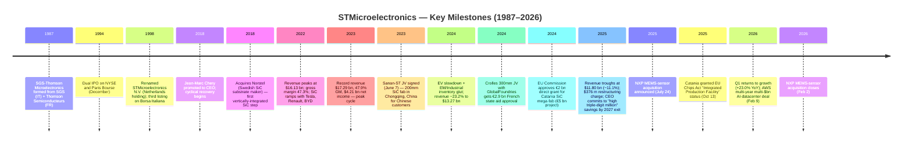
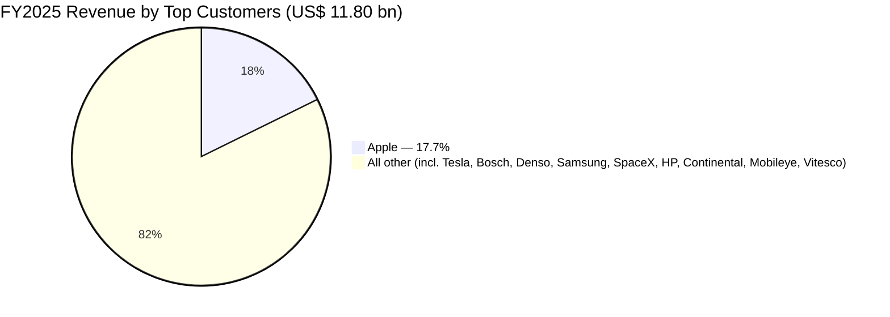
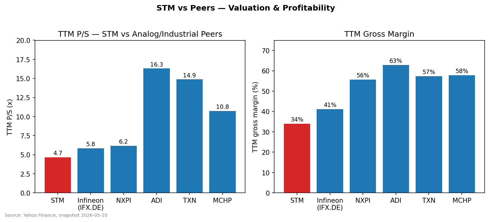
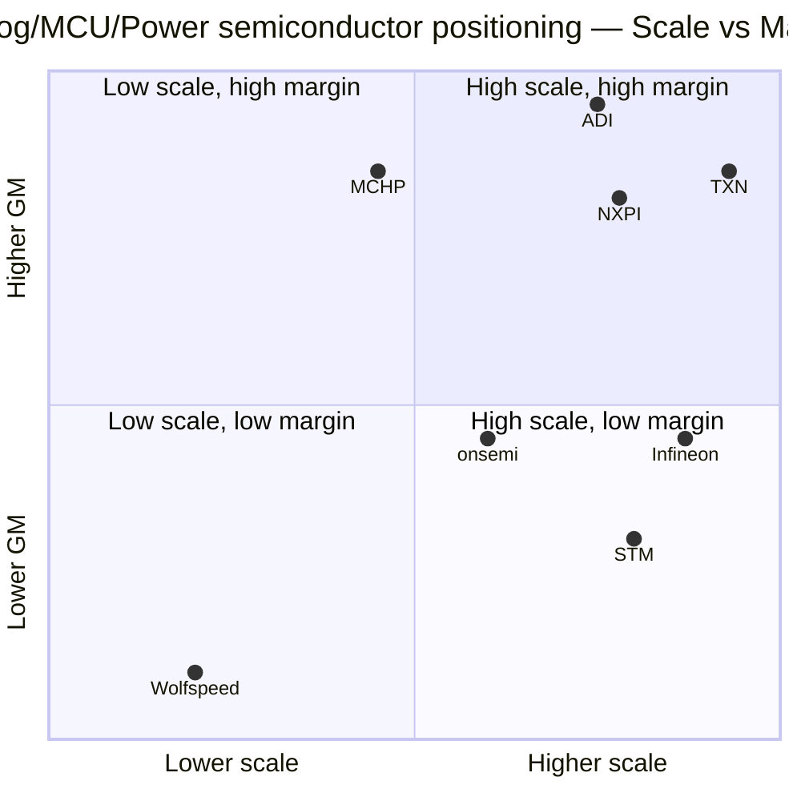

# COMPANY RESEARCH REPORT: STMicroelectronics N.V. (NYSE: STM)

**Report date:** 2026-05-20
**Coverage:** Initiation — analog / power / MCU / sensor IDM with European industrial-policy backing
**Primary listings:** NYSE: STM (ADR), Euronext Paris: STMPA, Borsa Italiana Milan: STM
**Fiscal year:** calendar year ending 31 December

> **Update — FY2025 trough confirmed; Q1 2026 inflection (2026-04-23):** STM Q1 2026 net revenues came in at **$3,095 m**, **+23.0% YoY** (the first quarter of YoY growth after seven down-quarters) and **+21.4% YoY** excluding the just-closed NXP MEMS-sensor acquisition. Q2 2026 mid-point guidance: **$3.45 bn** net revenues (+11.6% sequential, +24.9% YoY) and **34.8% gross margin** (100 bps of remaining unused-capacity charges). CEO Jean-Marc Chery confirmed **datacenter revenue "nicely above $500 m for 2026 and well above $1 bn for 2027"**, anchored by the multi-year multi-billion-dollar AWS engagement disclosed 2026-02-09. Source: [Q1 2026 earnings press release, 2026-04-23](https://www.sec.gov/cgi-bin/browse-edgar?action=getcompany&CIK=0000932787&type=6-K).

---

## Table of Contents

1. Company Overview
2. Company History
3. Management Team
4. Products & Services
5. Customers & Go-to-Market
6. Industry Overview
7. Competitive Landscape
8. Market Opportunity (TAM)
9. Risk Assessment
10. References

---

## 1. Company Overview

STMicroelectronics N.V. ("ST", NYSE: STM, Euronext Paris: STMPA) is a global integrated device manufacturer ("IDM") with FY2025 net revenues of **US$11.80 bn**, ~48,000 employees and 14 main manufacturing sites across France, Italy, Singapore, Malaysia, Morocco and China ([STM 2025 Form 20-F, Item 4](https://www.sec.gov/cgi-bin/browse-edgar?action=getcompany&CIK=0000932787&type=20-F)). The company is the seventh-largest semiconductor maker by revenue and the largest European chipmaker after Infineon, designing and manufacturing analog, mixed-signal, power, MEMS and microcontroller ("MCU") devices serving four end-markets: **Automotive, Industrial, Personal Electronics, and Communications Equipment / Computers & Peripherals ("CECP")** ([20-F, Item 4 — Information on the Company](https://www.sec.gov/cgi-bin/browse-edgar?action=getcompany&CIK=0000932787&type=20-F)). The Company was formed in 1987 by merging Italy's SGS Microelettronica with the non-military semiconductor business of France's Thomson-CSF and IPO'd in December 1994 ([20-F, Item 4 — History and Development](https://www.sec.gov/cgi-bin/browse-edgar?action=getcompany&CIK=0000932787&type=20-F)).

**How ST makes money.** ST sells discrete and integrated semiconductors to ~200,000 customers worldwide; its 2025 mix was 72% direct to OEMs and 28% via distribution ([20-F, Table — Net revenues by market channel](https://www.sec.gov/cgi-bin/browse-edgar?action=getcompany&CIK=0000932787&type=20-F)). The reportable-segment structure was overhauled in 2024 and refined again in Q1 2025 into four segments grouped under two product groups:

- **APMS (Analog, Power & Discrete, MEMS and Sensors product group) — FY2025 revenue $6,770 m, 57% of total:**
  - **AM&S (Analog products, MEMS and Sensors) — $5,085 m (43% of total), operating income $623 m (12.3% margin)**
  - **P&D (Power & Discrete — silicon and SiC MOSFETs, IGBTs) — $1,685 m (14% of total), operating loss $(275) m**
- **MDRF (Microcontrollers, Digital ICs & RF product group) — FY2025 revenue $5,016 m, 43% of total:**
  - **EMP (Embedded Processing — STM32 general-purpose MCUs + Stellar automotive MCUs + automotive ADAS SoCs) — $3,580 m (30% of total), operating income $536 m (15.0% margin)**
  - **RFOC (RF Optical Communications — space, BiCMOS, silicon-photonics, in-cabin radio) — $1,436 m (12% of total), operating income $265 m (18.5% margin)**

Source: [STM 2025 Form 20-F, Note — Net revenues by reportable segment](https://www.sec.gov/cgi-bin/browse-edgar?action=getcompany&CIK=0000932787&type=20-F).

**Where ST operates.** Revenues are heavily Asia-Pacific weighted: Asia Pacific (excluding China is broken out internally) accounted for **$7,455 m / 63.2%** of FY2025 sales, EMEA **$2,449 m / 20.8%** and Americas **$1,896 m / 16.1%** ([20-F Table — Net revenues by location of shipment](https://www.sec.gov/cgi-bin/browse-edgar?action=getcompany&CIK=0000932787&type=20-F)). Crucially, this reflects shipment destination — many Asia revenues fulfill orders placed by US, Korean and European customers (Apple's Foxconn assembly hubs, Tesla's Shanghai Gigafactory) and a smaller share is genuine China end-demand.

**Scale and capital intensity.** ST runs at ~140,000 200mm-equivalent wafer starts per week across 14 main fabs ([20-F, Item 4](https://www.sec.gov/cgi-bin/browse-edgar?action=getcompany&CIK=0000932787&type=20-F)). FY2025 net capex was **$1,844 m (16% of sales)**, down from $2,642 m in 2024 and a 2023 peak above $4 bn — the 2023–25 average capex-to-revenue ratio was ~20%, reflecting two simultaneous capacity builds: the **Crolles, France** 300mm joint venture with GlobalFoundries (total €7.5 bn project, up to €2.9 bn French state aid) and the **Catania, Italy** integrated 200mm SiC substrate / device "mega-fab" (€5 bn capex, €2 bn direct Italian grant — granted EU Chips Act "Integrated Production Facility" status on 2025-10-13) ([20-F, Public Funding section](https://www.sec.gov/cgi-bin/browse-edgar?action=getcompany&CIK=0000932787&type=20-F)).

*Source: [STM 2025 Form 20-F, Item 5 — Results of Operations](https://www.sec.gov/cgi-bin/browse-edgar?action=getcompany&CIK=0000932787&type=20-F).*

**Valuation snapshot (2026-05-20 close):**

| Metric | STM | 3-yr range (approx.) | Peer median* |
|---|---|---|---|
| Last price | US$64.87 | $21.11 – $65.31 (52-wk) | — |
| Market cap | US$57.7 bn | — | — |
| **TTM P/E** | **405.4x** (depressed by impairments) | 7x – 16x in 2022–23 | 51.5x (TXN), 29.5x (NXPI), 71.8x (ADI), 82.9x (IFX), 425x (MCHP) |
| Forward P/E (FY26E consensus) | **29.1x** | — | 26.4x (IFX), 17.5x (NXPI), 29.6x (ADI), 32.0x (TXN), 22.9x (MCHP) |
| **TTM P/S** | **4.66x** | ~3x at June-25 lows, ~6x at 2024 high | 5.84x (IFX), 6.17x (NXPI), 16.30x (ADI), 14.88x (TXN), 10.75x (MCHP) |
| TTM EV/EBITDA | 21.3x | — | 22.4x (IFX), 17.3x (NXPI), 37.9x (ADI), 32.8x (TXN) |
| Dividend yield | 0.59% | — | — |
| TTM gross margin | 33.96% | 47.9% in 2023 | 41.2% (IFX), 55.6% (NXPI), 62.8% (ADI), 57.3% (TXN), 57.7% (MCHP) |

\*Source: [Yahoo Finance, 2026-05-20 snapshot, STM key statistics](https://finance.yahoo.com/quote/STM/key-statistics/) and equivalent pages for [IFX.DE](https://finance.yahoo.com/quote/IFX.DE/key-statistics/), [NXPI](https://finance.yahoo.com/quote/NXPI/key-statistics/), [ADI](https://finance.yahoo.com/quote/ADI/key-statistics/), [TXN](https://finance.yahoo.com/quote/TXN/key-statistics/), [MCHP](https://finance.yahoo.com/quote/MCHP/key-statistics/).

**Interpreting the 405x TTM P/E.** This is not a high-growth premium — it is **cyclical trough earnings**. FY2025 GAAP net income collapsed to **$166 m / $0.18 diluted EPS** from $1,557 m / $1.66 in 2024 and $4,211 m / $4.46 in 2023, the bulk of which is the combined effect of (i) **540 bps gross-margin compression** to 33.9% (from 47.9% peak in 2023) driven by unused capacity charges as ADAS, SiC and IGBT volumes fell sharply, and (ii) **$376 m of impairment / restructuring / phase-out charges** in 2025 tied to a company-wide manufacturing footprint reshape announced October 2024 ([20-F, Item 5 — Operating income](https://www.sec.gov/cgi-bin/browse-edgar?action=getcompany&CIK=0000932787&type=20-F)). Non-GAAP net income (excluding the impairment/restructuring) was $486 m / $0.53 diluted EPS — implying a non-GAAP P/E nearer 122x, still elevated but interpretable as cyclical-trough.

The **forward P/E of 29.1x** is the more relevant anchor and prices ST roughly in line with Infineon (26.4x), at a premium to NXPI (17.5x) and at a discount to TXN (32.0x) — a reasonable mid-cycle multiple. The TTM P/S of 4.66x is the **lowest in the analog/industrial peer set** other than at extreme distress, reflecting both the trough revenue base and the structural gross-margin gap (33.9% vs. 55%+ at TXN/NXPI/MCHP). The stock has more than tripled from its 52-week low of $21.11 (June 2025) to today's $65, indicating the market has already begun pricing in the recovery — incremental upside now depends on execution of the SiC ramp, AWS data-center revenues hitting the $1 bn 2027 target, and the manufacturing-footprint program delivering the promised "high triple-digit million-dollar" annual cost savings exiting 2027 ([Supervisory Board statement, 2025-04-10](https://www.sec.gov/cgi-bin/browse-edgar?action=getcompany&CIK=0000932787&type=6-K)).

**Apple concentration drives a major sensitivity.** ST's single largest customer, **Apple, accounted for 17.7% of FY2025 revenues** (up from 14.5% in 2024 and 12.3% in 2023 — ironically, Apple's share rose precisely because non-Apple business fell faster) ([20-F, Item 4 — Customer concentration](https://www.sec.gov/cgi-bin/browse-edgar?action=getcompany&CIK=0000932787&type=20-F)). The relationship spans Time-of-Flight (ToF) optical sensors (in iPhone Pro / Pro Max), MEMS gyroscopes / accelerometers, and select power-management ICs. ST is a sole-source supplier on several iPhone sockets but Apple has a multi-year history of insourcing or dual-sourcing displaced components — see Section 5 risk discussion.

---

## 2. Company History

ST has a 39-year history shaped by the marriage of an Italian semiconductor company (SGS Microelettronica, owned by state holding S.T.E.T.) and the non-military semiconductor business of French defense electronics group Thomson-CSF (now Thales) in June 1987 ([20-F, Item 4 — History and Development](https://www.sec.gov/cgi-bin/browse-edgar?action=getcompany&CIK=0000932787&type=20-F)). That deliberately cross-border, state-supported structure persists today: the **STMicroelectronics Holding N.V.** vehicle, jointly controlled by the Italian Ministry of Economy and Finance ("MEF") and France's Bpifrance, owns **27.5% of common shares as of 31 December 2025** — the French and Italian governments together hold ~13.9% of total equity ([20-F, Item 7 — Major Shareholders](https://www.sec.gov/cgi-bin/browse-edgar?action=getcompany&CIK=0000932787&type=20-F)). ST is a **strategic asset of the EU's industrial policy** and a primary recipient of EU Chips Act funding.

Source: [STM 2025 Form 20-F, Item 4 — History and recent developments](https://www.sec.gov/cgi-bin/browse-edgar?action=getcompany&CIK=0000932787&type=20-F).

**Three strategic pivots that define today's ST.**

1. **From commodity memory to differentiated analog/MCU (early 2000s).** ST spun out its flash-memory business into Numonyx (later sold to Micron) and refocused on analog, smart-power, MEMS and MCUs — areas with longer product cycles, less price erosion and structurally higher margins. This pivot enabled the STM32 microcontroller franchise (launched 2007) to grow into ST's single most valuable product family.

2. **Becoming the wide-bandgap power-device leader (2018–2023).** ST committed early to silicon carbide ("SiC") power devices, acquiring Swedish substrate maker Norstel in 2019 for vertical integration. By 2022, ST was the largest SiC supplier into the EV traction-inverter market with Tesla as anchor customer. The Catania, Italy "mega-fab" project announced in 2022 and the Sanan ST JV in Chongqing (June 2023) extended this ambition. The 2024–25 EV slowdown later reversed much of the near-term P&L benefit, but the cumulative capex created a fully-integrated SiC supply chain from 150mm wafer to packaged device — a moat competitors are still building.

3. **Manufacturing footprint reshape (announced October 2024, detailed April 2025).** Following the cyclical downturn, the Supervisory Board approved a multi-year program to **migrate front-end capacity to 300mm silicon and 200mm SiC** and consolidate higher-cost legacy 150/200mm fabs. The target is annual cost savings in the "high triple-digit million-dollar range exiting 2027." This includes a comprehensive impairment test ($189 m of impairment in 2025, plus $176 m restructuring) and is the operational analog of Infineon's earlier 300mm power migration. ([Supervisory Board statement, 2025-04-10](https://www.sec.gov/cgi-bin/browse-edgar?action=getcompany&CIK=0000932787&type=6-K)).

**Key recent acquisitions and partnerships (2023–2026).**

- **Sanan-ST JV (Chongqing, June 2023)** — 200mm SiC device fab in China, dedicated foundry for ST's Chinese customers using ST process tech; total $3.2 bn project ($2.4 bn capex over 5 years) with Chinese regional-government support ([20-F, Item 4](https://www.sec.gov/cgi-bin/browse-edgar?action=getcompany&CIK=0000932787&type=20-F)).
- **GlobalFoundries Crolles 300mm JV (2024–)** — joint 300mm fab in Crolles, France, total €7.5 bn project capex, up to €2.9 bn French state aid approved 28 April 2023; in 2025 ST received €126 m cash and recognized €72 m in grants ([20-F, Public Funding](https://www.sec.gov/cgi-bin/browse-edgar?action=getcompany&CIK=0000932787&type=20-F)).
- **Catania, Italy SiC integrated mega-fab (announced 2022, EU approved 2024-05-31, IPF status 2025-10-13)** — €5 bn project, €2 bn direct grant from Italian Recovery and Resilience Plan; first integrated 200mm SiC substrate-to-device plant in Europe.
- **NXP MEMS-sensor business acquisition (announced 2025-07-24, closed 2026-02-02)** — automotive safety / non-safety MEMS plus industrial sensors; closing payment $895 m in Q1 2026; ~$40 m revenue contribution in Q1 2026. Strategic logic: scale automotive MEMS in a fragmented sub-market and bolt on a meaningful design-in base ([Q1 2026 6-K, 2026-04-23](https://www.sec.gov/cgi-bin/browse-edgar?action=getcompany&CIK=0000932787&type=6-K)).
- **AWS commercial engagement (announced 2026-02-09)** — multi-year, multi-billion-dollar engagement spanning multiple product categories to enable AWS data-center / AI compute infrastructure; the anchor under management's "$500 m DC revenue in 2026 / >$1 bn in 2027" target ([6-K filing, 2026-02-09](https://www.sec.gov/cgi-bin/browse-edgar?action=getcompany&CIK=0000932787&type=6-K)).
- **Qualcomm wireless connectivity partnership (2024) — ST67W module (Wi-Fi 6 + BLE 5.4 + Matter)** mass production began in 2025, addressing wireless connectivity for STM32 MCU systems ([20-F, Item 4](https://www.sec.gov/cgi-bin/browse-edgar?action=getcompany&CIK=0000932787&type=20-F)).
- **Innoscience GaN partnership (2025-03-31)** — agreement on GaN-on-Si development & manufacturing with Innoscience, the world leader in 8" GaN-on-Si manufacturing; ST also owns a $127 m fair-value equity stake in Innoscience (HKEX-listed since 2024) generating a $76 m unrealized gain in 2025 ([20-F, Note — Equity securities](https://www.sec.gov/cgi-bin/browse-edgar?action=getcompany&CIK=0000932787&type=20-F)).

---

## 3. Management Team

ST's senior management is a deeply tenured European-engineering bench: most members of the Executive Committee have 25–40 years inside SGS-Thomson / ST. This continuity is double-edged — institutional knowledge of the IDM cost structure, customer base and EU industrial-policy machinery is unmatched, but the management team has been criticized in the Italian press for slow strategic adjustment during the 2024–25 downturn ([Supervisory Board response to Italian press allegations, 2025-04-10](https://www.sec.gov/cgi-bin/browse-edgar?action=getcompany&CIK=0000932787&type=6-K)). The Supervisory Board publicly reaffirmed support for Chery and Grandi in April 2025 in the face of a class-action lawsuit and Italian press accusations of insider trading on the eve of earnings releases (the Board confirmed the trades were automatic / blackout-period and compliant).

### Jean-Marc Chery — President & Chief Executive Officer (since May 2018)

Jean-Marc Chery is ST's seventh-year CEO and the architect of both the SiC strategy and the in-progress 300mm/200mm manufacturing footprint reshape. Born in Orleans, France, in 1960, he is a graduate of the **École Nationale Supérieure d'Arts et Métiers (ENSAM)** engineering school in Paris. Chery began his career in the Quality function at **Matra** (French engineering / defense group) and joined Thomson Semiconducteurs (which became ST in 1987) in 1986 — meaning he has spent **40 years inside ST**, virtually his entire career.

His rise was through operations and manufacturing: he ran ST's wafer fabs in Tours and Rousset, France, then led the company-wide 6-inch (150mm) wafer restructuring program in 2005 — eerily similar in shape to the program he is now executing as CEO. From 2005 he took charge of front-end manufacturing in Asia Pacific. He was named **Chief Technology Officer** in 2008, layered manufacturing and quality responsibility in 2011, the digital product sector in 2012, then was promoted to **Chief Operating Officer** in 2014 and **Deputy CEO** in July 2017 before assuming the CEO role in May 2018 ([20-F, Item 6 — Senior Management Biographies](https://www.sec.gov/cgi-bin/browse-edgar?action=getcompany&CIK=0000932787&type=20-F)).

External roles indicate his stature in the European semiconductor ecosystem: he **chairs the Global Semiconductor Alliance (GSA)**, sits on the boards of **Legrand** and **Capgemini** (both CAC-40 companies), and previously served as president of the **European Semiconductor Industry Association** (2019–2021). He was promoted **Knight of the Legion of Honor** by France's Ministry of Economy and Finance in July 2019.

Chery's track record under analysis: he took ST from $9.66 bn revenue / 39.7% gross margin in 2018 to a peak of $17.29 bn / 47.9% in 2023 — a near-doubling of revenue with 800 bps of margin expansion — by leaning hard into automotive electrification (SiC and MCUs), MEMS share gains at Apple, and the embedded-processing build-out. The 2024–25 cyclical reversal has tarnished but not destroyed this record: peak-to-trough revenue is −31.7% and peak-to-trough GAAP operating income is −96.2%, both worse than peer Infineon (−14% revenue, −41% op income across the same window) and broadly in line with the cyclical EV/industrial cohort. The Q1 2026 inflection and the AWS engagement are early evidence the strategic positioning into data-center / AI compute is opening a non-automotive, non-industrial growth lane that the prior management generation did not target. The CEO Agreement (Swiss-law contract, 6-month notice if terminated by Company, 3 months by him) carries a severance of 2× annual base salary plus 3-year average short-term incentive ([20-F, Item 6 — CEO Agreements](https://www.sec.gov/cgi-bin/browse-edgar?action=getcompany&CIK=0000932787&type=20-F)).

### Lorenzo Grandi — President & Chief Financial Officer (since 2018)

Lorenzo Grandi, age ~64, has been ST's CFO since 2018 and has spent his entire 38-year career at the company. Born in Sondrio, Italy in 1961, he graduated **cum laude in Physics from the University of Modena** and holds an **MBA from SDA Bocconi** in Milan. He joined SGS-Thomson in 1987 as an R&D process engineer — like Chery, an unusually operations-rooted financial background. He moved to ST's memory product group as financial analyst in 1990, eventually becoming group controller for the (then large) flash memory business. He joined corporate finance in 2005 and was promoted to Corporate Vice President in charge of corporate control in 2012 before becoming CFO in 2018 ([20-F, Item 6](https://www.sec.gov/cgi-bin/browse-edgar?action=getcompany&CIK=0000932787&type=20-F)).

In his CFO tenure, Grandi has managed: (i) the 2020 $1.5 bn convertible-bond issuance (Tranche A redeemed August 2025) and ongoing capital-markets work, (ii) the $1.1 bn 3-year share-buyback program launched in 2024 ($367 m executed in 2025, $184 m in 2024), and (iii) the structural capex commitment — net capex peaked at $4.1 bn in 2023, ran at $2.6 bn in 2024 and stepped down to $1.8 bn in 2025 as restructuring took hold. Despite the trough year, ST ended FY2025 with a **net cash position of $2.79 bn** ($2.84 bn cash + $1.10 bn short-term deposits + $985 m marketable securities, less $2.13 bn financial debt) and **$4.92 bn total liquidity** ([20-F, Item 5 — Liquidity](https://www.sec.gov/cgi-bin/browse-edgar?action=getcompany&CIK=0000932787&type=20-F)). His CFO scope now also covers digital transformation, IT, global procurement, supply chain and enterprise risk — an unusually broad mandate. The class-action allegations relating to pre-earnings stock sales were addressed publicly by the Supervisory Board on 2025-04-10 and Grandi remains in role.

### Remi El-Ouazzane — President, Microcontrollers, Digital ICs and RF Group ("MDRF") (since February 2024)

El-Ouazzane is one of two product-group presidents and arguably the most thesis-relevant hire ST has made in the past two years. Born in Neuilly-sur-Seine, France in 1973, he is a graduate of **Grenoble Institute of Technology** (1996) and **Grenoble Sciences Po** (1997), with a **Harvard Business School General Management Program** (2004). He spent 1997–2013 at **Texas Instruments**, rising to VP and GM of the OMAP multimedia applications platform. He was then **CEO of Movidius** (vision/AI processor startup) from 2013, sold the company to **Intel in 2016**, and stayed at Intel as VP/GM of the New Technology Group, then **COO of Intel's AI Products Group (2018–2020)** and **Chief Strategy Officer of Intel's Datacenter Platform Group (2020–2024)** ([20-F, Item 6](https://www.sec.gov/cgi-bin/browse-edgar?action=getcompany&CIK=0000932787&type=20-F)).

Hiring an Intel datacenter / AI executive to run ST's MCU + RF + ADAS combined business unit is the most direct signal that ST's strategy now points beyond automotive and industrial into AI infrastructure. The AWS commercial engagement disclosed February 2026 falls into his segment (the RFOC sub-group covers BiCMOS for cloud optical interconnect and silicon-photonics, and Embedded Processing now spans STM32 microcontrollers that increasingly include neural-network accelerators — the **STM32N6** with embedded "neural-ART accelerator" and the **STM32V8** built on 18nm FD-SOI with embedded Phase Change Memory).

### Marco Cassis — President, Analog, Power & Discrete, MEMS and Sensors Group ("APMS") (since February 2024)

Cassis runs the other product group, which contains both the highest-margin business (analog / MEMS / sensors / imaging — AM&S) and ST's most challenged business (SiC and silicon power — P&D, which posted a $275 m operating loss in 2025). Born in Treviso, Italy, in 1963, he graduated from the **Polytechnic of Milan** in Electronic Engineering and has spent his entire 38-year career at ST. He started as a car-radio chip designer in 1987, ran ST's Japan operations in the 2000s, was promoted to President of ST's Asia Pacific region in 2016, then **President, Global Sales and Marketing** in 2017. He also oversees ST's corporate strategy development, system research and applications, and innovation office — making him the de-facto strategy chief alongside Chery.

### Governance footer

- **Supervisory Board:** 9 members as of December 31, 2025 ([20-F, Item 6](https://www.sec.gov/cgi-bin/browse-edgar?action=getcompany&CIK=0000932787&type=20-F)). Chair: **Nicolas Dufourcq**, CEO of **Bpifrance** (the French state development bank, which is part of ST Holding's ownership structure) — a clear signal of French state representation at the board level. Vice-chair: **Armando Varricchio**, a senior Italian diplomat (former ambassador to Germany and the US, appointed 2025-12-18). Board diversity includes independent members from banking, energy and law backgrounds. Audit Committee and Compensation Committee composition disclosed; in 2025 the board met **12 times with 90% attendance**.
- **Managing Board (= executive):** 2 members — **Jean-Marc Chery (President & CEO)** and **Lorenzo Grandi (President & CFO)**, both with Swiss employment contracts and operating from the Geneva HQ.
- **Controlling shareholder:** **STMicroelectronics Holding N.V. ("ST Holding")** owned **27.5%** (250,704,754 shares) of issued common shares as of 31 December 2025, jointly controlled by the **Italian MEF** and **Bpifrance**. BlackRock owned 5.2% (47,511,809 shares). The remainder is widely held, with **84.9% of float traded on Euronext Paris / Borsa Italiana** and **15.1% on NYSE** ([20-F, Item 7](https://www.sec.gov/cgi-bin/browse-edgar?action=getcompany&CIK=0000932787&type=20-F)). The dual government ownership is a **double-edged shareholder feature**: it provides stability, EU industrial-policy alignment and access to ~€5+ bn of public funding, but also constrains pure shareholder-return optimization.
- **Compensation:** standard European structure with base salary + short-term incentive + 3-year cliff-vested performance shares. In 2025, approximately one-half of awarded shares were performance-contingent. Stock-based comp expense was $193 m in 2025, $222 m in 2024, $236 m in 2023.
- **Capital return:** $0.36 annual dividend (split into four quarterly $0.09 payments) for 2025; $367 m of buybacks executed in 2025 against the $1.1 bn 3-year authorization launched in 2024.

### Management track record synthesis

Chery and Grandi have shepherded ST through one full cycle: 2018–2023 was an unambiguous compounding success, with revenue +79%, GM +800 bps and net income up roughly 9x. The 2024–25 downturn — sharp, painful, and arguably late to be addressed — saw a 32% peak-to-trough revenue decline that materially erased the operating-leverage gains. The current verdict: the team is execution-strong but cyclically reactive rather than anticipatory. The El-Ouazzane hire (Intel data-center / AI) and the AWS deal are the most credible signs that the management team has read the next cycle correctly. The class-action and Italian-press incident (April 2025) is an idiosyncratic governance flag but the Supervisory Board's public defense and ongoing capital deployment suggest no immediate operational concern.

---

## 4. Products & Services

ST is one of the broadest semiconductor product portfolios outside the very largest US peers. **The product walk below enumerates every material product family disclosed by ST as of 31 December 2025**, grouped by the four reportable segments. Sources: [20-F, Item 4 — Information on the Company](https://www.sec.gov/cgi-bin/browse-edgar?action=getcompany&CIK=0000932787&type=20-F) and the [ST corporate product navigation tree at st.com/products](https://www.st.com/en/products.html).

```mermaid
graph TD
    ST[STMicroelectronics<br/>FY2025 rev $11.80 bn] --> APMS[APMS Product Group<br/>$6.77 bn / 57%]
    ST --> MDRF[MDRF Product Group<br/>$5.02 bn / 43%]
    APMS --> AMS[AM&S — Analog, MEMS, Sensors<br/>$5.09 bn]
    APMS --> PD[P&D — Power & Discrete<br/>$1.69 bn]
    MDRF --> EMP[EMP — Embedded Processing<br/>$3.58 bn]
    MDRF --> RFOC[RFOC — RF & Optical Comms<br/>$1.44 bn]
    AMS --> AMS1[Smart-power / Analog ICs<br/>BCD, VIPpower]
    AMS --> AMS2[Motion MEMS<br/>accelerometers, gyros]
    AMS --> AMS3[Environmental / bio MEMS]
    AMS --> AMS4[MEMS actuators<br/>print heads, AF, mLED]
    AMS --> AMS5[Optical Sensors<br/>FlightSense ToF, BrightSense, SafeSense]
    AMS --> AMS6[Imaging<br/>iPhone ToF, in-cabin]
    PD --> PD1[Silicon MOSFETs]
    PD --> PD2[SiC MOSFETs / modules]
    PD --> PD3[IGBTs]
    PD --> PD4[Thyristors, rectifiers]
    PD --> PD5[GaN-on-Si power transistors]
    PD --> PD6[ESD / surge protection]
    EMP --> EMP1[STM32 general-purpose MCUs<br/>ARM Cortex-M0 through M85]
    EMP --> EMP2[Stellar automotive MCUs<br/>ASIL-D, zonal, x-in-1]
    EMP --> EMP3[STM32MP microprocessors<br/>Cortex-A35, Linux]
    EMP --> EMP4[Secure MCUs / NFC / eSIM<br/>ST25, STSECURE]
    EMP --> EMP5[Custom ADAS SoCs<br/>Mobileye co-design]
    EMP --> EMP6[EEPROM / non-volatile mem]
    RFOC --> RFOC1[Space-tech ASICs<br/>BiCMOS, FD-SOI for LEO]
    RFOC --> RFOC2[RF / mmWave components<br/>5G beamforming]
    RFOC --> RFOC3[Cloud optical interconnect<br/>SiPho / BiCMOS for AI DC]
    RFOC --> RFOC4[Digital audio amplifiers<br/>car infotainment]
    RFOC --> RFOC5[GNSS positioning ICs<br/>Teseo]
    RFOC --> RFOC6[Wi-Fi / BLE module<br/>ST67W w/ Qualcomm]
```

### AM&S — Analog, MEMS and Sensors (FY2025 revenue $5.085 bn; operating margin 12.3%)

The AM&S segment is **ST's most strategically important and Apple-leveraged business**. It contains four sub-groups:

1. **Smart-power and analog ICs** — based on ST's proprietary **BCD** (BiCMOS-DMOS) and **VIPpower** technologies. Products include battery-management ICs, traction-engine controllers, braking-system drivers, airbag drivers, eFuses, ECU power management, USB-PD controllers, MasterGaN/VIPerGaN integrated GaN+driver families, AC-DC and DC-DC converters, gate drivers for MOSFET / IGBT / SiC / GaN, intelligent power switches, LED drivers, real-time clocks, operational amplifiers and current-sense amplifiers. **Competitive verdict: partial moat.** BCD process technology is ST-proprietary and yields cost / integration advantages on the high-voltage / mixed-signal nodes (the same trick Texas Instruments leverages on LBC8/LBC9). Direct competitors: Infineon (smart power), onsemi, NXP, ROHM. Comparison: at parity on most product families; ahead in automotive smart power / VIPpower; behind ADI / TXN in best-in-class precision analog.
2. **MEMS sensors and actuators** — motion MEMS (accelerometers, gyroscopes, magnetometers — leadership in 6-axis IMUs), environmental MEMS (pressure, temperature, presence), biosensors, and **MEMS actuators** including piezoelectric autofocus for smartphone cameras, MEMS loudspeakers and MEMS print heads. **Competitive verdict: yes — moat from scale and design-in.** ST is one of three globally credible automotive-MEMS suppliers (Bosch, ST, NXP), and the recent NXP MEMS acquisition closed February 2026 consolidates ST into a clearer #2 globally behind Bosch in automotive safety MEMS. Competitor product: Bosch SMI260 / SMI230 IMU vs. ST ASM330LHH — at parity on automotive-grade specs.
3. **Optical sensing** — **FlightSense** (proprietary Time-of-Flight ranging), **BrightSense** (ambient light), **SafeSense** (in-cabin / occupant detection). FlightSense is the workhorse on iPhone Pro/Pro Max ToF, dToF for LiDAR scanners and on Android flagships. **Competitive verdict: yes — strong moat via Apple sole-source on ToF.** Closest competitor: ams OSRAM (Vienna, AT) on ToF and ambient-light, and Sony on consumer-grade ranging — ST ahead on dToF and in-cabin certification, at parity on ambient light. ams OSRAM has been a structurally weaker competitor since its TrueLight cutbacks in 2024.
4. **Imaging** — global-shutter image sensors and dedicated ASICs for time-of-flight / 3D depth, primarily into Apple (iPhone ToF) and growing into automotive (in-cabin monitoring). Imaging was the best-performing AM&S sub-group in Q4 2025 ([20-F, Item 5 — Q4 segment commentary](https://www.sec.gov/cgi-bin/browse-edgar?action=getcompany&CIK=0000932787&type=20-F)).

**Flagship: STM's MEMS-and-optical-sensing combination is the structural margin anchor of AM&S** — without it, AM&S would not have delivered 12.3% operating margin in a trough year.

### P&D — Power & Discrete (FY2025 revenue $1.685 bn; operating loss −$275 m; 16.3% margin loss)

P&D is **ST's most-cyclical and most-discussed business**. It comprises:

1. **Silicon MOSFETs** — STripFET, STrongIRFET (legacy IR portfolio absorbed via Infineon's 2015 IR acquisition, ST runs the second-source business).
2. **SiC MOSFETs and power modules** — **the strategic asset**: ST is the #1 SiC supplier globally to EV traction-inverter OEMs, with Tesla as anchor customer (Model 3/Y main inverter uses ST SiC). Other named SiC customers include Geely, Renault, BYD and a host of Chinese OEMs (sourced via Sanan ST JV). The SiC franchise is supported by a fully vertically-integrated supply chain: **Norstel substrate (Norrköping, Sweden), 150mm SiC device fab at Catania (Italy), 200mm transition under construction at the Catania mega-fab (€5 bn capex, IPF status), 200mm SiC at Crolles (France) and 200mm SiC at Chongqing (Sanan ST JV, China)** ([20-F, Item 4 — Manufacturing facilities table](https://www.sec.gov/cgi-bin/browse-edgar?action=getcompany&CIK=0000932787&type=20-F)).
3. **IGBTs** — for industrial and hybrid-EV applications.
4. **Thyristors, rectifiers, power bipolar transistors, GaN-on-Si power transistors** (the Innoscience partnership announced 2025-03-31 supplements ST's internal GaN R&D).
5. **Protection devices** — ESD, surge, lightning, automotive protection (Transil, Trisil).

**Competitive verdict: SiC = yes (technology+integration moat); silicon power = partial; protection = no.** Direct competitors: **Infineon** (the dominant SiC challenger after acquiring fab capacity from various sources), **Wolfspeed** (US-listed pure-play SiC, in extreme financial distress through 2024–25), **onsemi** (rising SiC challenger), **ROHM** (Japanese SiC), **Mitsubishi Electric** (modules), **Toshiba**, **CREE/Wolfspeed substrates**. Comparison: ST is ahead of Wolfspeed and onsemi on integrated vol manufacturing; at parity with Infineon on module-level SiC for EV traction; behind Infineon on automotive design-in breadth.

The P&D operating loss of $275 m in 2025 reflects the harsh combination of (i) **29% ASP decline on P&D** as SiC pricing collapsed under Chinese competition and EV slowdown, (ii) **unused capacity charges** from the half-built Catania ramp, and (iii) **less favorable product mix** as low-margin silicon power held up better than high-margin SiC ([20-F, Item 5 — P&D segment commentary](https://www.sec.gov/cgi-bin/browse-edgar?action=getcompany&CIK=0000932787&type=20-F)). The 2026 thesis depends critically on whether SiC pricing stabilizes and the Catania ramp turns from cost-center to profit-center.

### EMP — Embedded Processing (FY2025 revenue $3.58 bn; operating margin 15.0%)

EMP combines ST's general-purpose and automotive MCUs with custom ADAS SoCs and secure MCUs. Sub-groups:

1. **STM32 general-purpose MCUs** — the single most strategically important franchise in ST's portfolio outside Apple sensors. ST32 spans ARM Cortex-M0/M0+/M3/M4/M33/M55/M7/M85 cores. The 2025 portfolio additions are noteworthy: **STM32N6** with embedded "neural-ART accelerator" NPU (ST's proprietary NN engine), and **STM32V8** — "world's first microcontroller built on the most advanced 18nm FD-SOI process technology, featuring embedded Phase Change Memory (PCM) and a powerful Cortex-M85 core" ([20-F, Item 4 — EMP product description](https://www.sec.gov/cgi-bin/browse-edgar?action=getcompany&CIK=0000932787&type=20-F)). The **STM32U3** ultra-low-power series leverages near-threshold technology to push battery life into multi-year ranges for IoT/sensor nodes. The supporting ecosystem (STM32Cube IDE, STM32 AI model zoo with 140+ pre-built models, TouchGFX graphics framework) is a substantial moat — STM32 is widely regarded as the dominant 32-bit ARM MCU in the European hobbyist / startup / industrial market and has overtaken NXP and Renesas in unit share in this category over the past decade. **Competitive verdict: yes — major moat from ecosystem lock-in and design-in installed base.** Closest competitors: NXP LPC / Kinetis / i.MX RT, Renesas RA / RX, Microchip PIC32 / SAM, Nordic nRF52/53/91 (BLE-only), Espressif ESP32 (Wi-Fi / value tier). STM32 is ahead in mid-range industrial / motor-control and breadth; at parity in ultra-low-power vs. Nordic and Ambiq; behind NXP and Renesas in the highest-end real-time MCU + automotive cross-domain controllers.
2. **Stellar automotive MCUs** — ARM-based, ASIL-D, optimized for electrification including x-in-1 vehicle motion control, zonal architectures and safety-companion MCUs for ADAS subsystems. The 2025 launch of "Stellar MCUs with extensible memory" leveraging ST's proprietary 28nm FD-SOI Phase Change Memory is genuinely differentiated — ST claims to be the first to ship automotive-qualified PCM-embedded MCUs ([20-F, Item 4](https://www.sec.gov/cgi-bin/browse-edgar?action=getcompany&CIK=0000932787&type=20-F)). **Competitive verdict: yes.** Closest competitor: **NXP S32 (ex-Freescale)**, **Infineon AURIX TC3xx / TC4xx**, **Renesas R-Car / RH850**, **Texas Instruments AM2x**. ST is ahead on PCM-embedded automotive; at parity on ASIL-D scalability; behind NXP and Infineon in installed-base / Tier-1 design-ins.
3. **STM32MP microprocessors** — 64-bit Cortex-A35 industrial processors with dedicated Linux distribution.
4. **Secure MCUs / NFC / eSIM** — STSECURE and ST25 portfolios — payment, identification, contactless transactions; ST claims **first secure ST25DA-C chip supporting NFC Matter tap-to-pair**, and completed certification of **ST4SIM-300 eSIM to GSMA SGP.32 IoT standard** in 2025. ST has 30+ years in security ICs.
5. **Custom Processing (Automotive ADAS SoCs)** — ST is a longstanding co-design partner of **Mobileye** on EyeQ chips (custom 28/22/5nm process integration), an unusually defensible IP relationship.
6. **EEPROM** — the **serial EEPROM** family (1 Kbit to 32 Mbit) celebrated "20 years as global leading supplier and 40 billion units shipped" in 2025; market-share leader since 2005.

### RFOC — RF Optical Communications (FY2025 revenue $1.436 bn; operating margin 18.5%)

The smallest segment but the highest margin and the most exciting growth vector. Sub-groups:

1. **Space-tech ASICs and RF/digital mixed-signal ICs** — based on ST's proprietary FD-SOI, RF-SOI, BiCMOS technologies. ST has ESA qualifications since the agency's inception and added American QML-V certification later. Key wins: **SpaceX** (named customer; LEO satellite constellations); broader European Space Agency programs.
2. **RF / mmWave components for 5G / massive MIMO** beamforming.
3. **Cloud optical interconnect** — BiCMOS and SiPho (silicon photonics) ICs for data-center optical transceivers; **the AWS commercial engagement directly populates this sub-group**, and is the foundation of the "$500 m DC revenue in 2026 / >$1 bn 2027" target.
4. **Digital audio amplifiers** for car infotainment — ST is the leader in audio amps from head units to premium audio, telematics, AVAS.
5. **GNSS positioning** (Teseo SoC family).
6. **Wi-Fi / BLE module** — **ST67W** combining Wi-Fi 6 + BLE 5.4 + Matter, the first product of the 2024 Qualcomm collaboration, entered mass production in 2025.
7. **Ultra-wideband, 60GHz contactless point-to-point** — emerging.

**Competitive verdict for RFOC: yes — moat in space and cloud SiPho.** Closest competitors: **Inphi/Marvell, MaxLinear** (cloud optical), **Texas Instruments** (audio amps), **u-blox, Quectel** (GNSS), **Cobham, Teledyne e2v** (space-grade ASICs). Cloud SiPho is the highest-incremental-margin opportunity ST has — analog of Marvell's $4+ bn AI-networking franchise but executed via a different IDM path.

### Flagship vs. long-tail summary

The three flagship product families driving ST's enterprise value are: **(1) Apple-led sensors (FlightSense ToF + MEMS + imaging) inside AM&S**, **(2) STM32 microcontrollers inside EMP**, and **(3) SiC power devices inside P&D**. Long-tail businesses (general-purpose silicon MOSFETs, legacy thyristors, GNSS, audio amplifiers) are profitable but structurally low-growth.

### Last-12-month launches / sunsets

- **2025:** STM32N6 (with neural-ART NPU), STM32V8 (18nm FD-SOI with PCM, world-first), STM32U3 (near-threshold ultra-low-power), STM32 AI model zoo expansion to 140+ models, Stellar automotive PCM-MCU, ST25DA-C NFC Matter, ST4SIM-300 eSIM, ST67W Wi-Fi 6/BLE/Matter mass production.
- **2025–2026 strategic adds:** NXP MEMS-sensor business acquisition (closed Feb 2026, ~$40 m Q1 contribution), AWS multi-year multi-$bn engagement (announced Feb 2026).
- **Sunsets:** the manufacturing footprint program is consolidating older 150mm and small 200mm fabs in favor of 300mm Si and 200mm SiC ([Supervisory Board statement, 2025-04-10](https://www.sec.gov/cgi-bin/browse-edgar?action=getcompany&CIK=0000932787&type=6-K)). Specific fab closures not yet disclosed at granular level.

---

## 5. Customers & Go-to-Market

ST serves **over 200,000 customers** globally; the named "major customers" list disclosed in the 20-F includes (alphabetically): **Apple, Bosch, Continental, Denso, HP, Mobileye, Samsung, SpaceX, Tesla and Vitesco** ([20-F, Item 4 — Customers](https://www.sec.gov/cgi-bin/browse-edgar?action=getcompany&CIK=0000932787&type=20-F)).

### Customer concentration — Apple-dominated

ST is unusually concentrated for an analog/MCU IDM. **Apple alone was 17.7% of FY2025 revenues**, up from 14.5% in 2024 and 12.3% in 2023 — the share has risen for **three consecutive years**, partly because Apple has added new ST sockets (notably ToF and MEMS for newer iPhone generations) and partly because non-Apple revenue contracted faster than Apple revenue during the downturn ([20-F, Item 4 — Customer concentration](https://www.sec.gov/cgi-bin/browse-edgar?action=getcompany&CIK=0000932787&type=20-F)).

Source: [STM 2025 Form 20-F, Item 4](https://www.sec.gov/cgi-bin/browse-edgar?action=getcompany&CIK=0000932787&type=20-F). ST does not disclose specific revenue for the other named major customers.

The Apple relationship is structurally important and structurally fragile:

- **Structurally important:** ST is sole-source on iPhone Pro / Pro Max **Time-of-Flight (FlightSense)** sensors (used for LiDAR camera focus assist and AR depth) and on several MEMS sockets (accelerometer/gyroscope). The Apple win was a multi-generation socket build-up that took ~5 years to establish.
- **Structurally fragile:** Apple has a long history of consolidating, displacing or in-housing key components after multi-year supplier relationships (TSMC retained AP processors, Qualcomm modems are being displaced by Apple's own modem starting C1 chip, InvenSense MEMS displaced by Bosch / ST cycling, ams OSRAM ambient-light was de-prioritized). Apple has been investing in **internal MEMS and image-sensor R&D** for years; any in-housing of ToF or motion MEMS would be a multi-hundred-million-dollar revenue event for ST.

**No other customer is disclosed as >10%, but the Tesla SiC relationship is the second most-watched.** Tesla uses ST SiC MOSFETs in the Model 3/Y traction inverter (the original 24-device per-inverter configuration). Tesla's transition to a "more efficient drive unit" with reduced SiC content (announced at Tesla Investor Day 2023) was one of the catalysts for the 2024–25 P&D revenue collapse. While not directly disclosed, sell-side estimates have historically pegged Tesla at 4–6% of ST revenue at the SiC peak.

### Customer alliances and structural co-design

ST's customer alliances are unusually deep for a merchant-semiconductor company — closer to the Apple-TSMC or NVIDIA-AWS model than to the broad-distribution analog model:

- **Mobileye** — co-design partner for EyeQ ADAS SoCs (custom ASIC integration on ST process tech). This is a 20+ year relationship.
- **Apple** — multi-socket, multi-product-generation; sole-source on key ToF, MEMS and selected PMICs.
- **Qualcomm (2024–)** — joint development of wireless connectivity modules for STM32 ecosystem (ST67W).
- **GlobalFoundries** — joint 300mm fab in Crolles (capacity-sharing, not customer-supplier).
- **AWS (2026-02-09)** — multi-year, multi-billion-dollar engagement spanning several product categories ([6-K filing, 2026-02-09](https://www.sec.gov/cgi-bin/browse-edgar?action=getcompany&CIK=0000932787&type=6-K)).
- **SpaceX** — named as a major customer; supplies BiCMOS / FD-SOI / RF-SOI ICs for LEO satellites (Starlink constellation).
- **Innoscience (HKEX-listed)** — GaN-on-Si manufacturing and development partner; ST owns a $127 m fair-value equity stake.

### Distribution and sales structure

By channel: **72% direct OEM, 28% distribution** in FY2025 (vs. 73%/27% in 2024 and 66%/34% in 2023 — distribution share fell sharply in 2024 as the channel destocked). ST runs four regional sales orgs: Americas, Asia Pacific excluding China ("APeC", run by Hiroshi Noguchi), China (Henry Cao, ex-Dell), and EMEA (Michael Anfang, ex-Siemens). In Q1 2024, ST layered a new **Segment Marketing and Application ("SM&A")** organization on top — five segment programs (Industrial PE, Industrial SI, Automotive, Personal Electronics, CECP) intended to offer customers end-to-end system solutions; full rollout began in 2025 ([20-F, Item 4 — Sales structure](https://www.sec.gov/cgi-bin/browse-edgar?action=getcompany&CIK=0000932787&type=20-F)).

### Customer case studies and named wins

- **Apple iPhone Pro/Pro Max LiDAR / FlightSense ToF** — sole-source for several generations.
- **Tesla Model 3/Y main traction inverter** — anchor SiC customer (~24 SiC MOSFETs per inverter on legacy config).
- **Mobileye EyeQ ADAS** — long-running ASIC co-design.
- **SpaceX Starlink** — RF / mixed-signal ICs.
- **Hesai LiDAR (Chinese auto)** — sensor and analog supplier (per public design-ins).
- **AWS data-center optical interconnect / AI compute (Feb 2026)** — multi-year, multi-product-category.

*Source: [STM 2025 Form 20-F, Net revenues by location of shipment](https://www.sec.gov/cgi-bin/browse-edgar?action=getcompany&CIK=0000932787&type=20-F).*

---

## 6. Industry Overview

ST competes in the **broad analog / mixed-signal / power / sensor / MCU semiconductor** market, plus the niche **wide-bandgap power-device** sub-market (SiC and GaN). The relevant total available market ("TAM") and ST's serviceable available market ("SAM") frameworks are disclosed by ST quarterly using **WSTS (World Semiconductor Trade Statistics)** data:

- **Global semiconductor TAM (WSTS, full-year 2025) ≈ US$792 bn**, up ~26% YoY (heavily driven by AI-memory and AI-logic).
- **ST's SAM (the analog / power / sensor / MCU portion) ≈ US$279 bn**, up ~15% YoY ([20-F, Item 5 — Industry overview](https://www.sec.gov/cgi-bin/browse-edgar?action=getcompany&CIK=0000932787&type=20-F)).

ST therefore has a ~4.2% share of its SAM and ~1.5% of total semiconductor TAM. Across the SAM, ST is one of six "mid-tier broadline" suppliers behind only TXN, Analog Devices and onsemi by revenue (and broadly equal with Infineon and NXP).

### Industry growth drivers

1. **Automotive electrification and digitalization.** EVs and hybrids contain 2–3× the semiconductor content of an internal-combustion vehicle. ADAS (advanced driver-assistance systems) is moving from Level 2 to Level 2+/3 broadly. SiC and GaN displace silicon power for higher efficiency. EV adoption in China continued through 2025; Europe and US slowed materially. WSTS estimates **automotive semiconductors at ~$80 bn in 2025**, projected to grow at high-single-digit CAGR through 2030.
2. **Industrial automation, factory robotics, energy infrastructure.** ST's STM32 MCUs and analog power management address this entire stack. Industrial demand troughed in 2024–25 and is rebounding in 2026 (per ST Q1 2026 commentary: "improving demand with strong booking and normalized inventory in distribution") ([Q1 2026 6-K](https://www.sec.gov/cgi-bin/browse-edgar?action=getcompany&CIK=0000932787&type=6-K)).
3. **Personal electronics / smartphones / wearables.** Mature category. Driver is content-per-device (more sensors, more PMICs, more secure elements) rather than unit growth.
4. **AI infrastructure / data centers.** The fastest-growing semi sub-segment. ST is positioned through (a) RFOC silicon-photonics and BiCMOS optical interconnect, (b) power-management ICs for AI server boards, and (c) the AWS engagement. Management target: **>$1 bn FY2027 revenue from data centers**, up from low-hundred-million 2024 base ([Q1 2026 6-K, CEO commentary](https://www.sec.gov/cgi-bin/browse-edgar?action=getcompany&CIK=0000932787&type=6-K)).
5. **LEO satellite communications.** ST RF ASICs serve SpaceX and other LEO constellations — small absolute revenue but high-margin and growing 30%+.
6. **Humanoid robotics.** Management has explicitly flagged humanoid robotics as a growth lane spanning STM32 MCUs, MEMS, optical sensors, GNSS and power management ([20-F, Item 4](https://www.sec.gov/cgi-bin/browse-edgar?action=getcompany&CIK=0000932787&type=20-F)).

### Industry structure

The analog / power / MCU industry is moderately concentrated:

- **Top tier (>$15 bn rev, broadline):** Texas Instruments ($18.4 bn TTM), Analog Devices ($11.8 bn TTM), Infineon ($15.1 bn TTM revenue).
- **Mid-tier ($10–14 bn rev):** STMicroelectronics ($12.4 bn TTM), NXP Semiconductors ($12.6 bn TTM), Microchip Technology ($4.7 bn TTM — well below the others), Renesas (~$10–11 bn equivalent), onsemi (~$7 bn TTM).
- **SiC-focused / niche:** Wolfspeed (in distress through 2024–25), ROHM, Mitsubishi Electric (modules).

Yahoo Finance TTM figures: [TXN](https://finance.yahoo.com/quote/TXN/), [ADI](https://finance.yahoo.com/quote/ADI/), [IFX.DE](https://finance.yahoo.com/quote/IFX.DE/), [NXPI](https://finance.yahoo.com/quote/NXPI/), [MCHP](https://finance.yahoo.com/quote/MCHP/), [STM](https://finance.yahoo.com/quote/STM/).

### Regulatory and industrial-policy environment

This is where ST's structural advantage is greatest and the risk profile most differentiated from peers:

- **EU Chips Act.** ST is the largest single beneficiary of EU and member-state semiconductor funding. €2 bn direct grant from Italy for Catania SiC; €2.9 bn from France for the GlobalFoundries / ST Crolles JV; €266.1 m IPCEI ME Nano2022 in France; €789 m IPCEI ME allocation in Italy; €500 m EIB financing tranche signed December 2025 (part of a €1 bn credit line); €126 m cash received from Crolles program in 2025 alone ([20-F, Item 4 — Public Funding](https://www.sec.gov/cgi-bin/browse-edgar?action=getcompany&CIK=0000932787&type=20-F)).
- **US-China trade controls.** The Sanan ST JV in Chongqing is a hedge against US/China decoupling — by manufacturing for Chinese customers in China, ST avoids most export-control friction. But the JV is also exposed to potential further US restrictions on US technology embedded in ST process IP.
- **Trade tariffs.** The 20-F flags **"100% tariff on imported, foreign-produced semiconductor chips threatened by the current U.S. administration"** as a material risk; ST has manufacturing in 14 sites globally, including the Coppell, Texas back-end and Phoenix R&D, which provide partial inoculation against US import tariffs ([20-F, Item 3 — Trade tariff risks](https://www.sec.gov/cgi-bin/browse-edgar?action=getcompany&CIK=0000932787&type=20-F)).
- **Section 232 investigation (April 2025)** by the US Department of Commerce into national-security impacts of imported semiconductors and equipment — outcome pending.

### Cyclicality

The 2024–25 downturn was one of the sharpest in the analog/industrial cohort since 2001 — ST revenue declined 31.7% peak-to-trough and gross margin contracted 14 percentage points. The cycle bottomed Q2/Q3 2025 and Q1 2026 is the first quarter of YoY growth. Industry consensus (WSTS, SIA): **global semis TAM +9% in 2026, +12% in 2027**, with analog/power/sensor SAM growing in low-to-mid-double-digits as inventory normalizes and AI/EV demand reaccelerates.

---

## 7. Competitive Landscape

ST competes against five core peers in the broadline analog/power/MCU/sensor space, plus a fragmented long tail of SiC-focused and niche analog/RF specialists.

*Source: [Yahoo Finance — STM key statistics, snapshot 2026-05-20](https://finance.yahoo.com/quote/STM/key-statistics/).*

### Direct peers

1. **Infineon Technologies (FRA: IFX, ETR; market cap €88.3 bn; TTM rev €15.1 bn; TTM GM 41.2%; TTM P/S 5.84x; forward P/E 26.4x).** ST's most direct rival. Same product overlap (analog, power, MEMS, MCU, security), same European industrial-policy backing, similar customer base. Infineon is ahead in: automotive design-in breadth (especially Tier-1 share via the original Cypress/IR acquisitions), industrial power modules, and AURIX automotive MCUs. ST is ahead in: smartphone sensors / Apple share, STM32 general-purpose MCU ecosystem, and (debated) SiC integrated supply chain. Infineon's TTM GM is **725 bps higher** than ST's, reflecting (i) earlier 300mm transition, (ii) less unused-capacity exposure, and (iii) richer automotive-MCU mix.
2. **NXP Semiconductors (NASDAQ: NXPI; market cap $77.8 bn; TTM rev $12.6 bn; TTM GM 55.6%; TTM P/S 6.17x; forward P/E 17.5x).** Direct competitor in automotive (S32 MCUs), automotive radar, NFC and secure ICs. NXP has structurally higher gross margins (~22 percentage points above ST) due to a fabless-heavy front-end model (TSMC partnership) and higher automotive-MCU mix. ST has just acquired NXP's MEMS-sensor business (closed Feb 2026), reducing direct overlap on MEMS but increasing direct overlap on automotive sensors.
3. **Analog Devices (NASDAQ: ADI; market cap $191.7 bn; TTM rev $11.8 bn; TTM GM 62.8%; TTM P/S 16.30x; forward P/E 29.6x).** The gold-standard precision-analog peer. ADI is ahead of ST in: precision data converters, RF/microwave, instrumentation analog. ST is ahead in: power management, MEMS, MCU. ADI's TTM GM is **29 percentage points higher** than ST's — reflects a fundamentally different business mix (high-end, low-volume, design-intensive vs. ST's broader-volume IDM model).
4. **Texas Instruments (NASDAQ: TXN; market cap $274.4 bn; TTM rev $18.4 bn; TTM GM 57.3%; TTM P/S 14.88x; forward P/E 32.0x).** The volume leader in analog. TXN's structurally higher margins (57% TTM GM, similar IDM model to ST but at 1.5× the scale and on US-domiciled 300mm capacity) make TXN the cleanest "what ST aspires to" benchmark on profitability. ST is at parity or ahead on MEMS, sensors, automotive MCUs and SiC; behind on industrial / general-purpose analog breadth.
5. **Microchip Technology (NASDAQ: MCHP; market cap $50.7 bn; TTM rev $4.7 bn; TTM GM 57.7%; TTM P/S 10.75x; forward P/E 22.9x).** Smaller-scale MCU + analog peer. MCHP is ahead in 8/16-bit legacy MCU (PIC family) and FPGA. ST is dramatically ahead in 32-bit ARM-based MCUs (STM32 vs. SAM).

### SiC-focused / niche competitors

- **Wolfspeed (NYSE: WOLF)** — US SiC pure-play that has been in severe financial distress through 2024–25 (going-concern doubts disclosed in filings). Effectively a diminished threat in the SiC merchant market through 2026.
- **onsemi (NASDAQ: ON)** — rising SiC challenger, recently announced major Tier-1 EV wins.
- **ROHM (TSE: 6963)** — Japanese SiC, strong in domestic OEMs.
- **Mitsubishi Electric (TSE: 6503)** — power modules for industrial / rail.

### Sensor / MEMS competitors

- **Bosch Sensortec / Bosch Automotive Electronics** — the dominant automotive-MEMS supplier globally; ST/Bosch are the two-horse race in automotive safety MEMS. ST's NXP MEMS acquisition (Feb 2026) was specifically to narrow this gap.
- **InvenSense (acquired by TDK)** — consumer motion MEMS.
- **ams OSRAM (SIX: AMS)** — optical sensing, ambient light, ToF. Weaker since 2024 cost-cutting.

### Competitive positioning framework

Source: positioning based on FY2025 / TTM revenue and gross margin from [Yahoo Finance](https://finance.yahoo.com/quote/STM/) and respective 20-F / 10-K filings.

### ST's competitive advantages

1. **Vertically integrated SiC supply chain.** Norstel substrate + Catania / Crolles / Sanan ST device fabs = end-to-end SiC. Only Infineon comes close among Western competitors; Wolfspeed is in distress; ROHM has substrate but smaller device scale.
2. **STM32 MCU ecosystem and installed base.** Multi-decade lock-in via STM32Cube IDE, TouchGFX, STM32 AI model zoo, third-party software ecosystem.
3. **Apple sole-source / multi-socket position.** Hard to dislodge in the near term; vulnerable in the long term.
4. **European industrial-policy backing.** €5+ bn in non-dilutive public funding committed; EU Chips Act IPF status for Catania; strategic asset of French + Italian governments.
5. **Customer alliances with named flagships:** Mobileye, Apple, Qualcomm, AWS, GlobalFoundries.
6. **18nm FD-SOI process leadership.** Only large analog/MCU IDM with embedded PCM at 18nm/28nm.

### ST's competitive vulnerabilities

1. **Structurally lower gross margins** than US analog peers (33.96% TTM vs. 57–63% at TXN/ADI/NXPI/MCHP). Driven by IDM cost base, 200mm legacy capacity and product mix.
2. **Higher capital intensity** than fabless or hybrid peers — 20% capex/revenue across 2023–25.
3. **Customer concentration on Apple** (17.7% of FY2025 revenue, rising).
4. **EV / SiC over-exposure.** P&D operating loss of $275 m in 2025 reflects the cyclicality.
5. **Dual government ownership** — operationally stable but limits aggressive shareholder-return optimization (no Buffett-style buyback program; cash partly tied to manufacturing commitments).
6. **Euro cost base** with USD revenue — currency hedging mitigates but does not eliminate exposure.

### Market share estimates

ST's positions (sell-side / industry-report consensus, exact share figures rarely disclosed by ST):

- **#2 global MCU shipper by units** behind NXP (ST32 dominant in 32-bit ARM mid-range; behind NXP in automotive).
- **#1 or #2 in automotive MEMS** (with Bosch, after NXP acquisition close).
- **#1 in merchant SiC power devices** (with Infineon close behind; Wolfspeed declining).
- **#1 in iPhone Time-of-Flight sensors** (sole-source).
- **Top 3 in automotive analog** (with TXN, NXP, Infineon).

---

## 8. Market Opportunity (TAM)

### Total Addressable Market

The serviceable semiconductor market for ST's product portfolio (analog / power / sensor / MCU / RF) was **~$279 bn in 2025** per WSTS, growing ~15% YoY in 2025 ([20-F, Item 5](https://www.sec.gov/cgi-bin/browse-edgar?action=getcompany&CIK=0000932787&type=20-F)). Sub-segment breakdowns (industry-consensus estimates):

- **Analog (signal chain, power management, interface) — $80–85 bn 2025**, low-double-digit CAGR through 2030.
- **Discrete and power semiconductor (MOSFETs, IGBTs, SiC, GaN) — $35–40 bn 2025**, mid-teens CAGR driven by EV traction and renewable energy.
- **MCU — $25–30 bn 2025**, high-single-digit CAGR.
- **MEMS sensors and actuators — $15–18 bn 2025**, low-double-digit CAGR.
- **Optical sensors / image sensors — combined ~$25 bn 2025**.
- **RF / connectivity / GNSS — $20+ bn 2025**.

ST's ~$11.8 bn 2025 revenue represents **~4.2% of SAM**, with the most defensible share concentrations in MEMS (Apple), MCU (STM32 mid-range), and SiC merchant.

### Specific growth opportunities

1. **EV traction-inverter SiC.** Per ST's WSTS-aligned framework, the EV-specific SiC TAM is **$5–6 bn 2025 → ~$15 bn 2030** (mid-20s% CAGR). ST currently holds ~30% share; even share maintenance implies ST's SiC traction revenue grows from ~$1.5 bn 2025 to ~$4.5 bn 2030.
2. **Data-center AI compute + optical interconnect.** ST has guided to **>$1 bn 2027 data-center revenue** from ~$200 m 2024. The AWS engagement is multi-billion across several product categories. SiPho / BiCMOS / power management for AI servers is the entry vector.
3. **STM32 MCU + edge AI.** Edge-AI MCUs (NPUs embedded in MCUs) is a **$3–5 bn 2025 sub-market** growing at 25%+ CAGR. STM32N6 (with neural-ART NPU) and STM32V8 (18nm FD-SOI + PCM) place ST in the top tier.
4. **Humanoid robotics.** Management cites this as a key growth lane — spanning MCUs (motor control), MEMS (IMUs), optical sensors (depth / vision), GNSS (positioning), and power management. Industry estimates of humanoid-robot semiconductor content: $1–2 k per unit at scale, with multi-million unit run rates plausible by 2030.
5. **LEO satellite RF ICs.** SpaceX Starlink + competitors. ST RFOC sub-segment grew **+34% YoY in Q1 2026**, driven partly by space; LEO satellite content is structurally high-margin.
6. **Manufacturing footprint efficiency.** The April 2025 program targets "high triple-digit million-dollar" annual cost savings exiting 2027 — independent of TAM growth, this should add ~600–800 bps to gross margin over 3 years if executed.

### Penetration strategy

ST's stated penetration strategy is **(a) deepen Apple sockets** (extend MEMS / ToF / imaging into new device categories — AR/VR, watches, in-cabin), **(b) build out Tier-1 automotive design-ins** via the segment marketing & application (SM&A) organization launched 2024, **(c) ramp data centers via AWS-anchored multi-product engagement**, and **(d) consolidate MEMS share via NXP acquisition + organic Bosch displacement**. The 2027 financial-model implied target is non-GAAP operating margin **>20%** (vs. 4.7% non-GAAP FY2025) at a revenue base of ~$15 bn — implying low-teens revenue CAGR from 2025 trough and ~1,500 bps of operating-margin expansion.

---

## 9. Risk Assessment

### Company-Specific Risks

**1. Apple customer concentration (17.7% of FY2025 revenue, rising).** ST is sole-source on key iPhone sockets (ToF, MEMS, select PMICs) but Apple has a multi-decade pattern of insourcing or dual-sourcing. Any in-housing of ToF or motion MEMS would be a multi-hundred-million-dollar revenue event. Apple share has risen for three consecutive years (12.3% → 14.5% → 17.7%), which both reinforces dependency and signals Apple's expanding socket-set. **Quantified impact:** loss of half the Apple business would equate to ~$1 bn revenue / ~9% of FY2025 sales. **Mitigant:** sole-source for several generations; ST is investing in next-gen ToF and AR-relevant 3D sensing; NXP MEMS acquisition diversifies the MEMS customer base ([20-F, Item 4](https://www.sec.gov/cgi-bin/browse-edgar?action=getcompany&CIK=0000932787&type=20-F)).

**2. SiC ramp execution risk.** Catania €5 bn integrated mega-fab and the Crolles €7.5 bn JV need to ramp to design utilization on schedule. P&D posted a $275 m operating loss in 2025 with significant unused-capacity charges; further delays could compound losses. **Mitigant:** €2 bn Italian + €2.9 bn French state aid de-risks the cash side; Sanan ST JV in China provides Chinese-market hedge.

**3. EV demand reversal in Europe/US.** ST's SiC franchise is heavily anchored to EV traction inverters (Tesla, Renault, Geely, BYD). The 2024–25 EV slowdown drove 31.5% P&D revenue decline. Further policy changes (e.g., reduced US EV tax credits, slower European EV adoption) would extend the trough. **Quantified impact:** every 10% decline in EV traction-inverter demand ~= $100–150 m P&D revenue.

**4. Manufacturing footprint reshape execution.** Promised $700M+ annual savings exiting 2027 require successful migration to 300mm Si and 200mm SiC and closure of legacy 150mm/200mm capacity. The $376 m of 2025 impairment / restructuring is only the first wave. Footprint reshapes frequently take longer and cost more than disclosed.

**5. Class-action litigation / governance event.** Italian press in April 2025 alleged insider trading by Managing Board members on the eve of earnings. The Supervisory Board defended the trades as automatic blackout-period sales under Swiss tax rules. A class-action lawsuit is ongoing. Adverse outcome unlikely to be material to financials but could distract management and pressure the CEO/CFO relationship ([Supervisory Board statement, 2025-04-10](https://www.sec.gov/cgi-bin/browse-edgar?action=getcompany&CIK=0000932787&type=6-K)).

**6. R&D-spend deceleration risk.** ST R&D ran 17.3% of revenue in 2025 ($2.044 bn, net of tax credits) — high in absolute terms but trending down with revenue. If the trough lasts longer, R&D could be cut and erode the competitive position in STM32 / SiC / SiPho where the technology gap is hard-won.

### Industry / Market Risks

**7. Semiconductor cyclicality.** The 2024–25 downturn was severe — peak-to-trough revenue decline of 31.7%. Even with Q1 2026 inflection, history (2001, 2008–9, 2019, 2023–25) shows that semiconductor recoveries can be interrupted. WSTS estimates of $792 bn TAM in 2025 already represent a record; comp pressure for 2026/27 is high.

**8. US-China trade controls / tariffs.** The 20-F flags "100% tariff on imported, foreign-produced semiconductor chips threatened by the current U.S. administration" as a material risk, plus the April 2025 Section 232 DOC investigation. ST's diversified manufacturing footprint (14 sites, including US back-end at Coppell, Texas) provides partial inoculation; the Sanan ST China JV further hedges. But any sector-specific 100% tariff on Asia-shipped chips entering the US would be a multi-hundred-million-dollar incremental cost.

**9. Competitive intensification from Infineon and onsemi in SiC.** Infineon's 300mm SiC migration and onsemi's recent Tier-1 wins compress ST's pricing power in EV power devices. ST P&D ASPs declined ~29% in 2025.

**10. Apple in-house chip strategy.** Apple is internalizing more silicon design (modem, more SoC blocks). Any move into MEMS or ToF would be material (see Risk 1).

### Financial Risks

**11. USD / EUR exposure.** Revenue is largely USD; cost base is heavily EUR (manufacturing in France and Italy). The 20-F discloses €1.36 bn of hedged manufacturing costs and €733 m of hedged operating expenses, average rate ~$1.16/€; spot at year-end 2025 was ~$1.18/€. A sustained EUR appreciation above $1.20 would erode reported margins by 100–300 bps despite hedging ([20-F, Item 5 — FX exposure](https://www.sec.gov/cgi-bin/browse-edgar?action=getcompany&CIK=0000932787&type=20-F)).

**12. Capital-intensity and ROIC compression.** Net capex averaged 20% of revenue 2023–25 ($1.84 bn in 2025; $2.64 bn 2024; $4.11 bn 2023). At trough operating-income levels, ROIC has compressed dramatically (FY2025 GAAP ROE = 0.91% per Yahoo). Continued elevated capex (€5 bn at Catania, €7.5 bn at Crolles) extends the period of ROIC compression.

**13. Valuation re-rating risk.** Stock is up ~3x from June 2025 lows of $21 to $65 — the easy recovery trade is done. TTM P/E of 405x is uninterpretable; forward P/E of 29x is in line with peers but leaves no room for execution misses. If 2027 op-margin target slips, multiple compression on a still-recovering EPS is plausible.

### Macroeconomic Risks

**14. European industrial-policy reversal.** ST's €5+ bn of EU/state aid creates a structural advantage but also a structural dependency. Any rollback of EU Chips Act funding, change in French / Italian government posture, or competition-policy challenge to the public funding would materially affect the SiC and 300mm projects.

**15. Geopolitical: France-Italy ownership tension.** The dual-government ownership has historically been stable but periodic France-Italy political friction (e.g., disputes over governance, board representation, industrial location) could surface. The April 2025 Italian press episode hints at this dynamic.

---

## 10. References

### Primary filings — SEC EDGAR

- [STM 2025 Form 20-F, filed early 2026 (accession 0000932787-26-000009)](https://www.sec.gov/cgi-bin/browse-edgar?action=getcompany&CIK=0000932787&type=20-F) — primary source for FY2025 financials, segment breakdown, customer concentration, capex, manufacturing footprint, management bios, governance, risk factors and public funding.
- [STM Q1 2026 6-K, dated 2026-04-23](https://www.sec.gov/cgi-bin/browse-edgar?action=getcompany&CIK=0000932787&type=6-K) — Q1 2026 earnings press release; Q2 2026 guidance; AWS data-center revenue commentary; NXP MEMS contribution.
- [STM 6-K, 2026-02-09 — AWS commercial engagement announcement](https://www.sec.gov/cgi-bin/browse-edgar?action=getcompany&CIK=0000932787&type=6-K).
- [STM 6-K, 2026-02-02 — NXP MEMS sensor acquisition closing](https://www.sec.gov/cgi-bin/browse-edgar?action=getcompany&CIK=0000932787&type=6-K).
- [STM 6-K, 2025-04-10 — Manufacturing footprint reshape, Supervisory Board response to Italian press](https://www.sec.gov/cgi-bin/browse-edgar?action=getcompany&CIK=0000932787&type=6-K).
- [STM 2024 Form 20-F (FY2024)](https://www.sec.gov/cgi-bin/browse-edgar?action=getcompany&CIK=0000932787&type=20-F) — multi-year capex baseline.
- [STM EDGAR filings index, CIK 0000932787](https://www.sec.gov/cgi-bin/browse-edgar?action=getcompany&CIK=0000932787) — full filings history.

### Market data

- [Yahoo Finance — STM Key Statistics, 2026-05-20](https://finance.yahoo.com/quote/STM/key-statistics/) — TTM P/E, P/S, P/B, EV/EBITDA, gross margin, profit margin, dividend yield, 52-week range, market cap.
- [Yahoo Finance — IFX.DE](https://finance.yahoo.com/quote/IFX.DE/key-statistics/), [NXPI](https://finance.yahoo.com/quote/NXPI/key-statistics/), [ADI](https://finance.yahoo.com/quote/ADI/key-statistics/), [TXN](https://finance.yahoo.com/quote/TXN/key-statistics/), [MCHP](https://finance.yahoo.com/quote/MCHP/key-statistics/) — peer comparables, same snapshot date.

### Company website / IR

- [STMicroelectronics corporate site](https://www.st.com) — product navigation, technology and IR pages.
- [ST investor relations](https://investors.st.com) — quarterly press releases, presentations, transcripts.
- [ST product portfolio](https://www.st.com/en/products.html) — full product enumeration used in Section 4.

### Industry / market sources

- WSTS (World Semiconductor Trade Statistics) — referenced via STM 20-F, Item 5 ($792 bn TAM, $279 bn SAM 2025).
- [European Commission — State Aid SA.107061 Italy SiC fab Catania, approved 2024-05-31](https://ec.europa.eu/competition/state_aid/cases1/) — €2 bn grant, €5 bn project.
- [European Commission — State Aid France GlobalFoundries / ST Crolles 300mm fab, approved 2023-04-28](https://ec.europa.eu/competition/state_aid/cases1/) — €2.9 bn aid, €7.5 bn project.

### Notes on data freshness

All financial data is as of FY2025 (period ending 2025-12-31), as disclosed in the STM 2025 Form 20-F filed early 2026, supplemented by the Q1 2026 6-K dated 2026-04-23 for the most recent quarter and forward guidance. Valuation multiples are snapshotted as of 2026-05-20 from Yahoo Finance. No web sources older than 12 months are cited except for historical / founding facts (1987 formation, 1994 IPO, etc.). Filing-vintage exemption applied per project citation rules.
