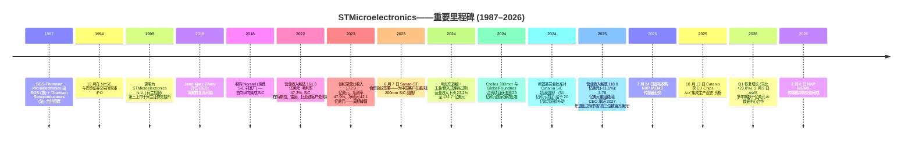
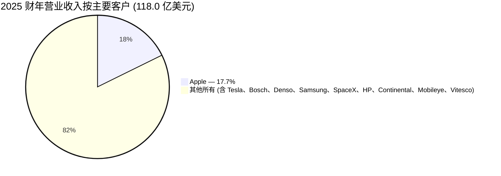
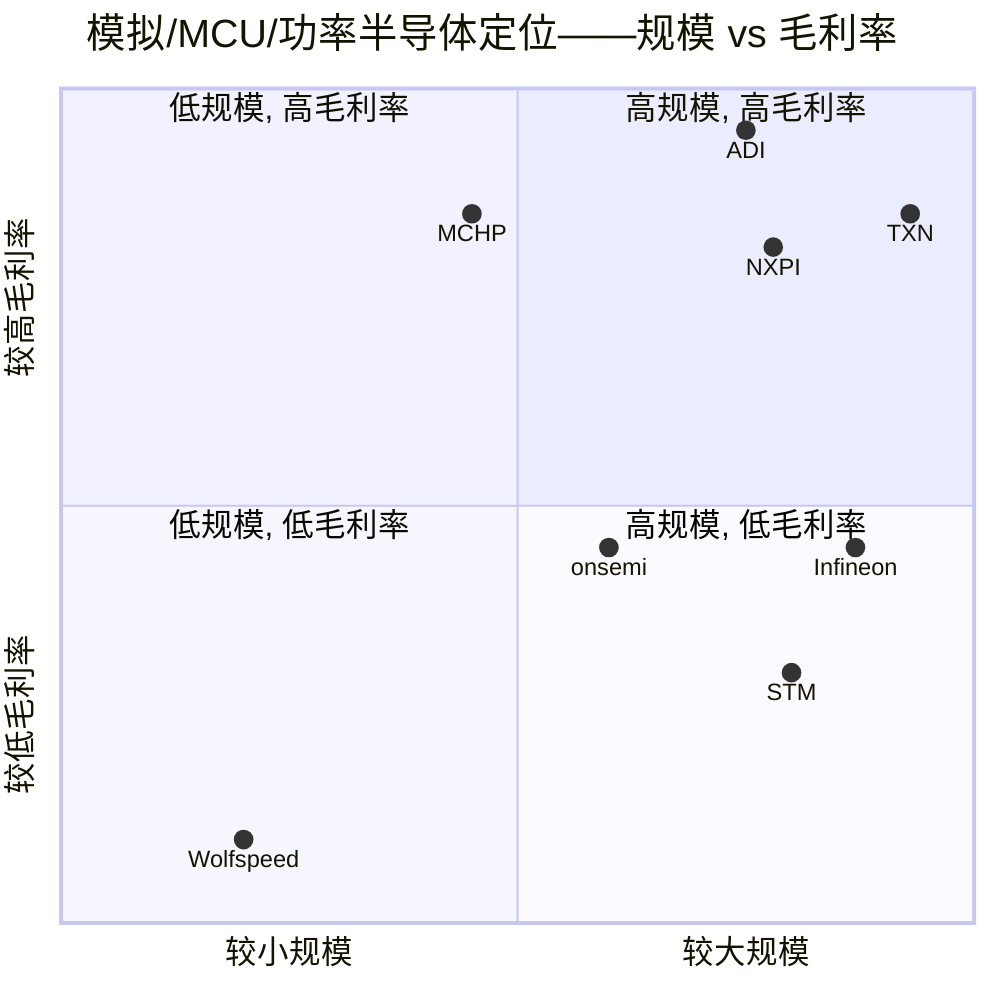

# STMicroelectronics N.V. (NYSE:STM) — 公司研究报告

**报告日期 (as of): 2026-06-14**
**覆盖范围: 首次覆盖——欧洲产业政策支持下的模拟/功率/MCU/传感器 IDM**
**主要上市地: NYSE: STM (ADR)、Euronext Paris: STMPA、Borsa Italiana Milan: STM**
**财年: 公历年, 截止 12 月 31 日 | 货币: 美元 (公司以美元报告)**
**报告语言: 简体中文 (英文版同时存在于本目录)**

> **业绩更新——2025 财年底部确认; 2026 年 Q1 出现拐点 (2026-04-23):** ST 2026 年 Q1 净营业收入为 **30.95 亿美元**, **同比增长 23.0%** (七个季度同比下滑后首次同比正增长), 剔除刚刚完成交割的 NXP MEMS (微机电系统) 传感器并购影响后**同比增长 21.4%**。2026 年 Q2 中位指引: 净营业收入 **34.5 亿美元** (环比 +11.6%, 同比 +24.9%) 与**毛利率 (gross margin) 34.8%** (其中尚有 100 个基点为未消化产能费用)。来源: [2026 年 Q1 业绩新闻稿, 2026-04-23](https://www.sec.gov/Archives/edgar/data/932787/000093278726000022/q126earningspressrelease-2.htm)。
>
> **★ 本期最重要新变化——数据中心营收目标上调 (2026-06-02):** 在“AI 基础设施驱动的强劲需求”与“产能爬坡近期进展”双重支撑下, ST **正式上调数据中心 (data center) 营收目标**: 2026 年现预期约 **10 亿美元**（此前为“nicely above $500 million”, 即明显高于 5 亿美元）, 并称“若当前势头延续且基于现有合作, 2027 年营收或翻倍”至约 **20 亿美元**（此前为“well above $1 billion”）。这是 ST 战略向 AI/光互连延伸最硬的一次量化背书, 也是 2026-06-11 高盛 (Goldman Sachs) 大幅上调目标价的直接催化。来源: [STM 6-K, 2026-06-02 — Raises revenue ambition for Data Centers](https://www.sec.gov/Archives/edgar/data/932787/000093278726000040/stmicroelectronicsraisesit.htm)。

---

## 投资摘要 (Investment Summary) — 决策层

*以下评级、12 个月目标价 (price target, PT)、上行空间与情景目标价, 全部为本报告分析师观点 (`*分析师观点：*`), 不构成 20-F / 6-K 等公司披露内容; 财务事实见下文各章并各自标注来源。*

> **`*分析师观点：*` 评级 (Rating): 持有 (Hold)**
> | 关键决策项 | 数值 |
> |---|---|
> | **12 个月目标价 (PT)** | **82 美元 (ADR)** |
> | 当前股价 (2026-06-12 收盘) | 77.30 美元 |
> | **隐含上行空间** | **约 +6.1%** |
> | 估值方法 | ~13× CY27E EV/EBITDA（与高盛口径一致）+ ~30× 前瞻 P/E 交叉验证 |
> | 市值 | 约 687 亿美元 |
> | 52 周区间 | 21.11 – 81.42 美元 |
> | 股息率 | 约 0.5% |
> | 代码 / 交易所 | NYSE: STM (ADR) · Euronext Paris: STMPA · Borsa Italiana: STM |

**`*分析师观点：*` 四大论点支柱 (Thesis Pillars):**

1. **周期已确认触底, 但“便宜的复苏交易”已基本完成。** 股价从 2025 年 6 月低点 21.11 美元涨至 77.30 美元（约 +266%）, 2026 年 Q1 同比 +23.0% 是七个季度以来首次正增长——拐点真实, 但前瞻 P/E ~30× 已与 Infineon (31×)、TXN (32×) 同档, 不再有估值折让保护。增量上行需靠 AI/数据中心兑现, 而非单纯周期修复。

2. **数据中心是新的、可量化的第二增长引擎——但占比仍小。** 2026-06-02 上调后, DC 营收 2026≈$1B / 2027≈$2B 的目标若兑现, 相当于 2027 年为总营收（约 160 亿美元）贡献 ~12%——这是 ST 第一次拥有非汽车、非工业的结构性增长极, 由 RFOC 硅光子 (silicon photonics, SiPho) 与 AWS 合作锚定。

3. **毛利率重置是估值能否再上台阶的胜负手。** 2025 年 GAAP 毛利率仅 33.9%（峰值 47.9%）, 结构性低于美国模拟同业 55–63%。制造布局重塑（300mm Si + 200mm SiC, 目标 2027 年退出之时年化节省“高三位数百万美元”）+ 产能利用率回升, 是把毛利率拉回 40%+ 的两条路径; 执行风险高, 兑现则是重估催化。

4. **欧洲产业政策护城河 + 苹果集中度双刃剑。** €50 亿+ 非稀释性公共资金（EU Chips Act、法/意国家援助）是结构性优势; 但苹果占 2025 营收 17.7% 且连升三年, P&D（SiC）仍在亏损, 是两个对冲不掉的尾部风险。

**`*分析师观点：*` 最该盯紧的两个变量 (Swing Variables):** (i) **数据中心营收爬坡的实际斜率**——2026 全年能否站上 $1B、2027 能否如指引翻倍至 $2B, 决定 RFOC 重估幅度; (ii) **整体毛利率回升节奏**——Q2 指引 34.8% 中仍含 100bps 未消化产能费用, 何时清零并向 40% 靠拢, 决定 EPS 弹性。本报告与卖方的分歧见 §2 与 §9.5。

---

## 目录

- 1A. 估值与目标价 · 1B. GF Score 基本面评分
1. 公司概览
2. 前瞻财务模型、目标价与卖方观点演变
3. 公司历史
4. 管理团队
5. 产品与服务
6. 客户与上市策略
7. 行业概览
8. 竞争格局
9. 市场机会 (TAM) · 9.5 核心分歧与催化剂
10. 风险评估
11. 参考资料
12. 投资视角评分卡 (Investor Lenses)

---

## 1. 公司概览

STMicroelectronics N.V. ("ST", NYSE: STM, Euronext Paris: STMPA) 是一家全球综合性元件制造商 ("IDM", integrated device manufacturer), 2025 财年净营业收入为 **118.0 亿美元**, 约 48,000 名员工, 在法国、意大利、新加坡、马来西亚、摩洛哥与中国共拥有 14 座主要制造工厂 ([STM 2025 Form 20-F, Item 4](https://www.sec.gov/Archives/edgar/data/932787/000093278726000009/stm-20251231.htm))。公司是按营业收入计算的全球第七大半导体厂商, 也是仅次于 Infineon (英飞凌) 的欧洲最大芯片制造商, 设计与制造模拟 (analog)、混合信号 (mixed-signal)、功率 (power)、MEMS 与微控制器 ("MCU", microcontroller) 器件, 服务四大终端市场: **汽车 (Automotive)、工业 (Industrial)、个人电子 (Personal Electronics) 与通信设备/计算机及外设 ("CECP", Communications Equipment / Computers & Peripherals)** ([20-F, Item 4 — Information on the Company](https://www.sec.gov/Archives/edgar/data/932787/000093278726000009/stm-20251231.htm))。公司由意大利的 SGS Microelettronica 与法国 Thomson-CSF 的非军用半导体业务于 1987 年 6 月合并组建, 并于 1994 年 12 月首次公开发行 ([20-F, Item 4 — History and Development](https://www.sec.gov/Archives/edgar/data/932787/000093278726000009/stm-20251231.htm))。

**ST 的盈利模式。** ST 向全球约 20 万家客户销售分立 (discrete) 与集成 (integrated) 半导体器件; 2025 年其销售结构为 72% 直销给 OEM、28% 通过分销渠道 ([20-F, Table — Net revenues by market channel](https://www.sec.gov/Archives/edgar/data/932787/000093278726000009/stm-20251231.htm))。可报告分部架构于 2024 年进行了重塑, 并在 2025 年 Q1 进一步细化为隶属于两个产品集团的四个分部:

- **APMS (模拟、功率与分立、MEMS 及传感器产品集团) — 2025 财年营业收入 67.7 亿美元, 占总收入 57%:**
  - **AM&S (模拟、MEMS 与传感器) — 50.85 亿美元 (占 43%), 营业利润 6.23 亿美元 (利润率 12.3%)**
  - **P&D (功率与分立——硅与碳化硅 (silicon carbide, SiC) MOSFET、IGBT) — 16.85 亿美元 (占 14%), 营业亏损 (2.75 亿美元)**
- **MDRF (微控制器、数字 IC 与 RF 产品集团) — 2025 财年营业收入 50.16 亿美元, 占总收入 43%:**
  - **EMP (嵌入式处理——STM32 通用 MCU + Stellar 汽车 MCU + 汽车 ADAS SoC) — 35.80 亿美元 (占 30%), 营业利润 5.36 亿美元 (利润率 15.0%)**
  - **RFOC (RF 光通信——航天、BiCMOS、硅光子 (silicon photonics)、车内无线电) — 14.36 亿美元 (占 12%), 营业利润 2.65 亿美元 (利润率 18.5%)**

来源: [STM 2025 Form 20-F, Note — Net revenues by reportable segment](https://www.sec.gov/Archives/edgar/data/932787/000093278726000009/stm-20251231.htm)。

**ST 的运营布局。** 营业收入按收货地划分严重偏向亚太地区: 亚太 (内部对中国单独披露) 占 2025 财年销售的 **74.55 亿美元 / 63.2%**, EMEA 占 **24.49 亿美元 / 20.8%**, 美洲占 **18.96 亿美元 / 16.1%** ([20-F Table — Net revenues by location of shipment](https://www.sec.gov/Archives/edgar/data/932787/000093278726000009/stm-20251231.htm))。关键的是, 这反映的是发货目的地——大量亚洲营业收入实际上是为美国、韩国和欧洲客户履行订单 (例如苹果在富士康的组装中心、特斯拉的上海超级工厂), 真正源自中国终端需求的份额相对较小。

**规模与资本密集度。** ST 在 14 座主要晶圆厂运营约 **140,000 片 200mm 等效晶圆/周** ([20-F, Item 4](https://www.sec.gov/Archives/edgar/data/932787/000093278726000009/stm-20251231.htm))。2025 财年净资本开支为 **18.44 亿美元 (占销售额 16%)**, 较 2024 年的 26.42 亿美元和 2023 年峰值超过 40 亿美元下降; 2023–25 年平均资本开支占营业收入比约 20%, 反映了两项同时进行的产能建设: **法国 Crolles 300mm 晶圆厂合资项目** (与 GlobalFoundries 合作, 总投资 75 亿欧元, 法国国家援助最高 29 亿欧元) 及**意大利 Catania 集成 200mm SiC 衬底/器件"超级晶圆厂"** (资本开支 50 亿欧元, 意大利直接补贴 20 亿欧元, 已于 2025-10-13 获 EU Chips Act"集成生产设施" (Integrated Production Facility) 资格) ([20-F, Public Funding section](https://www.sec.gov/Archives/edgar/data/932787/000093278726000009/stm-20251231.htm))。

下图为 ST 2025 财年利润表 Sankey——从四个分部的营收来源, 到 33.9% 的 gross margin (毛利率) 和仅 1.7 亿美元 GAAP 净利润的周期底部失真:

<svg xmlns="http://www.w3.org/2000/svg" viewBox="0 0 1000 560" width="1000" height="560" role="img" aria-label="income statement Sankey"><rect x="0" y="0" width="1000" height="560" fill="#ffffff"/>
<text x="20.00" y="30.00" text-anchor="start" font-family="Helvetica,Arial,sans-serif" font-size="15" font-weight="700" fill="#1f2933">STMicroelectronics FY2025 利润表 Sankey（百万美元）</text>
<path d="M 204.00,64.24 C 258.00,64.24 258.00,85.00 312.00,85.00 L 312.00,260.82 C 258.00,260.82 258.00,240.06 204.00,240.06 Z" fill="#93c5fd" fill-opacity="0.55"/>
<path d="M 452.00,78.00 C 506.00,78.00 506.00,202.96 560.00,202.96 L 560.00,214.13 C 506.00,214.13 506.00,89.17 452.00,89.17 Z" fill="#86efac" fill-opacity="0.55"/>
<path d="M 452.00,89.17 C 506.00,89.17 506.00,228.13 560.00,228.13 L 560.00,355.23 C 506.00,355.23 506.00,216.27 452.00,216.27 Z" fill="#fca5a5" fill-opacity="0.55"/>
<path d="M 328.00,85.00 C 382.00,85.00 382.00,78.00 436.00,78.00 L 436.00,216.27 C 382.00,216.27 382.00,223.27 328.00,223.27 Z" fill="#86efac" fill-opacity="0.55"/>
<path d="M 328.00,223.27 C 382.00,223.27 382.00,230.27 436.00,230.27 L 436.00,500.00 C 382.00,500.00 382.00,493.00 328.00,493.00 Z" fill="#fca5a5" fill-opacity="0.55"/>
<path d="M 576.00,202.96 C 630.00,202.96 630.00,204.53 684.00,204.53 L 684.00,215.70 C 630.00,215.70 630.00,214.13 576.00,214.13 Z" fill="#86efac" fill-opacity="0.55"/>
<path d="M 700.00,204.53 C 754.00,204.53 754.00,267.33 808.00,267.33 L 808.00,273.07 C 754.00,273.07 754.00,210.27 700.00,210.27 Z" fill="#86efac" fill-opacity="0.55"/>
<path d="M 700.00,210.27 C 754.00,210.27 754.00,287.07 808.00,287.07 L 808.00,294.67 C 754.00,294.67 754.00,217.88 700.00,217.88 Z" fill="#fca5a5" fill-opacity="0.55"/>
<path d="M 700.00,217.88 C 754.00,217.88 754.00,308.67 808.00,308.67 L 808.00,310.67 C 754.00,310.67 754.00,219.88 700.00,219.88 Z" fill="#fca5a5" fill-opacity="0.55"/>
<path d="M 576.00,228.13 C 630.00,228.13 630.00,232.36 684.00,232.36 L 684.00,288.79 C 630.00,288.79 630.00,284.56 576.00,284.56 Z" fill="#fca5a5" fill-opacity="0.55"/>
<path d="M 576.00,284.56 C 630.00,284.56 630.00,302.79 684.00,302.79 L 684.00,373.47 C 630.00,373.47 630.00,355.23 576.00,355.23 Z" fill="#fca5a5" fill-opacity="0.55"/>
<path d="M 204.00,254.06 C 258.00,254.06 258.00,260.82 312.00,260.82 L 312.00,319.08 C 258.00,319.08 258.00,312.32 204.00,312.32 Z" fill="#93c5fd" fill-opacity="0.55"/>
<path d="M 204.00,326.32 C 258.00,326.32 258.00,319.08 312.00,319.08 L 312.00,442.86 C 258.00,442.86 258.00,450.11 204.00,450.11 Z" fill="#93c5fd" fill-opacity="0.55"/>
<path d="M 576.00,369.23 C 630.00,369.23 630.00,215.70 684.00,215.70 L 684.00,221.51 C 630.00,221.51 630.00,375.04 576.00,375.04 Z" fill="#93c5fd" fill-opacity="0.55"/>
<path d="M 204.00,464.11 C 258.00,464.11 258.00,442.86 312.00,442.86 L 312.00,492.52 C 258.00,492.52 258.00,513.76 204.00,513.76 Z" fill="#93c5fd" fill-opacity="0.55"/>
<rect x="188.00" y="64.24" width="16" height="175.82" rx="1.5" fill="#2563eb"/>
<rect x="188.00" y="254.06" width="16" height="58.26" rx="1.5" fill="#2563eb"/>
<rect x="188.00" y="326.32" width="16" height="123.78" rx="1.5" fill="#2563eb"/>
<rect x="188.00" y="464.11" width="16" height="49.65" rx="1.5" fill="#2563eb"/>
<rect x="312.00" y="85.00" width="16" height="408.00" rx="1.5" fill="#1e3a8a"/>
<rect x="436.00" y="78.00" width="16" height="138.27" rx="1.5" fill="#15803d"/>
<rect x="436.00" y="230.27" width="16" height="269.73" rx="1.5" fill="#dc2626"/>
<rect x="560.00" y="202.96" width="16" height="11.17" rx="1.5" fill="#15803d"/>
<rect x="560.00" y="228.13" width="16" height="127.10" rx="1.5" fill="#dc2626"/>
<rect x="560.00" y="369.23" width="16" height="5.81" rx="1.5" fill="#2563eb"/>
<rect x="684.00" y="204.53" width="16" height="13.83" rx="1.5" fill="#15803d"/>
<rect x="684.00" y="232.36" width="16" height="56.43" rx="1.5" fill="#dc2626"/>
<rect x="684.00" y="302.79" width="16" height="70.67" rx="1.5" fill="#dc2626"/>
<rect x="808.00" y="267.33" width="16" height="5.74" rx="1.5" fill="#15803d"/>
<rect x="808.00" y="287.07" width="16" height="7.61" rx="1.5" fill="#dc2626"/>
<rect x="808.00" y="308.67" width="16" height="2.00" rx="1.5" fill="#dc2626"/>
<text x="179.00" y="149.15" text-anchor="end" font-family="Helvetica,Arial,sans-serif" font-size="11.5" font-weight="700" fill="#1f2933">AM&amp;S 模拟/MEMS/传感器</text>
<text x="179.00" y="162.15" text-anchor="end" font-family="Helvetica,Arial,sans-serif" font-size="10" font-weight="400" fill="#52606d">USD5.1B  (43.1%)</text>
<text x="179.00" y="280.19" text-anchor="end" font-family="Helvetica,Arial,sans-serif" font-size="11.5" font-weight="700" fill="#1f2933">P&amp;D 功率与分立</text>
<text x="179.00" y="293.19" text-anchor="end" font-family="Helvetica,Arial,sans-serif" font-size="10" font-weight="400" fill="#52606d">USD1.7B  (14.3%)</text>
<text x="179.00" y="385.21" text-anchor="end" font-family="Helvetica,Arial,sans-serif" font-size="11.5" font-weight="700" fill="#1f2933">EMP 嵌入式处理</text>
<text x="179.00" y="398.21" text-anchor="end" font-family="Helvetica,Arial,sans-serif" font-size="10" font-weight="400" fill="#52606d">USD3.6B  (30.3%)</text>
<text x="179.00" y="485.93" text-anchor="end" font-family="Helvetica,Arial,sans-serif" font-size="11.5" font-weight="700" fill="#1f2933">RFOC RF与光通信</text>
<text x="179.00" y="498.93" text-anchor="end" font-family="Helvetica,Arial,sans-serif" font-size="10" font-weight="400" fill="#52606d">USD1.4B  (12.2%)</text>
<rect x="331.00" y="67.00" width="119.40" height="26" rx="2" fill="#ffffff" fill-opacity="0.72"/>
<text x="334.00" y="79.00" text-anchor="start" font-family="Helvetica,Arial,sans-serif" font-size="11.5" font-weight="700" fill="#1f2933">Revenue</text>
<text x="334.00" y="92.00" text-anchor="start" font-family="Helvetica,Arial,sans-serif" font-size="10" font-weight="400" fill="#52606d">USD11.8B  (100.0%)</text>
<rect x="455.00" y="60.00" width="106.80" height="26" rx="2" fill="#ffffff" fill-opacity="0.72"/>
<text x="458.00" y="72.00" text-anchor="start" font-family="Helvetica,Arial,sans-serif" font-size="11.5" font-weight="700" fill="#1f2933">Gross Profit</text>
<text x="458.00" y="85.00" text-anchor="start" font-family="Helvetica,Arial,sans-serif" font-size="10" font-weight="400" fill="#52606d">USD4.0B  (33.9%)</text>
<rect x="455.00" y="212.27" width="144.60" height="26" rx="2" fill="#ffffff" fill-opacity="0.72"/>
<text x="458.00" y="224.27" text-anchor="start" font-family="Helvetica,Arial,sans-serif" font-size="11.5" font-weight="700" fill="#1f2933">Cost of Revenue (COGS)</text>
<text x="458.00" y="237.27" text-anchor="start" font-family="Helvetica,Arial,sans-serif" font-size="10" font-weight="400" fill="#52606d">USD7.8B  (66.1%)</text>
<rect x="579.00" y="184.96" width="113.10" height="26" rx="2" fill="#ffffff" fill-opacity="0.72"/>
<text x="582.00" y="196.96" text-anchor="start" font-family="Helvetica,Arial,sans-serif" font-size="11.5" font-weight="700" fill="#1f2933">Operating Income</text>
<text x="582.00" y="209.96" text-anchor="start" font-family="Helvetica,Arial,sans-serif" font-size="10" font-weight="400" fill="#52606d">USD323.0M  (2.7%)</text>
<rect x="579.00" y="210.13" width="150.90" height="26" rx="2" fill="#ffffff" fill-opacity="0.72"/>
<text x="582.00" y="222.13" text-anchor="start" font-family="Helvetica,Arial,sans-serif" font-size="11.5" font-weight="700" fill="#1f2933">Total Operating Expense</text>
<text x="582.00" y="235.13" text-anchor="start" font-family="Helvetica,Arial,sans-serif" font-size="10" font-weight="400" fill="#52606d">USD3.7B  (31.2%)</text>
<text x="551.00" y="369.14" text-anchor="end" font-family="Helvetica,Arial,sans-serif" font-size="11.5" font-weight="700" fill="#1f2933">Net Interest / Other Income</text>
<text x="551.00" y="382.14" text-anchor="end" font-family="Helvetica,Arial,sans-serif" font-size="10" font-weight="400" fill="#52606d">USD168.0M  (1.4%)</text>
<rect x="703.00" y="186.53" width="113.10" height="26" rx="2" fill="#ffffff" fill-opacity="0.72"/>
<text x="706.00" y="198.53" text-anchor="start" font-family="Helvetica,Arial,sans-serif" font-size="11.5" font-weight="700" fill="#1f2933">Pretax Income</text>
<text x="706.00" y="211.53" text-anchor="start" font-family="Helvetica,Arial,sans-serif" font-size="10" font-weight="400" fill="#52606d">USD400.0M  (3.4%)</text>
<rect x="703.00" y="214.36" width="106.80" height="26" rx="2" fill="#ffffff" fill-opacity="0.72"/>
<text x="706.00" y="226.36" text-anchor="start" font-family="Helvetica,Arial,sans-serif" font-size="11.5" font-weight="700" fill="#1f2933">SG&amp;A</text>
<text x="706.00" y="239.36" text-anchor="start" font-family="Helvetica,Arial,sans-serif" font-size="10" font-weight="400" fill="#52606d">USD1.6B  (13.8%)</text>
<rect x="703.00" y="284.79" width="106.80" height="26" rx="2" fill="#ffffff" fill-opacity="0.72"/>
<text x="706.00" y="296.79" text-anchor="start" font-family="Helvetica,Arial,sans-serif" font-size="11.5" font-weight="700" fill="#1f2933">R&amp;D</text>
<text x="706.00" y="309.79" text-anchor="start" font-family="Helvetica,Arial,sans-serif" font-size="10" font-weight="400" fill="#52606d">USD2.0B  (17.3%)</text>
<text x="833.00" y="267.20" text-anchor="start" font-family="Helvetica,Arial,sans-serif" font-size="11.5" font-weight="700" fill="#1f2933">Net Income</text>
<text x="833.00" y="280.20" text-anchor="start" font-family="Helvetica,Arial,sans-serif" font-size="10" font-weight="400" fill="#52606d">USD166.0M  (1.4%)</text>
<text x="833.00" y="292.20" text-anchor="start" font-family="Helvetica,Arial,sans-serif" font-size="11.5" font-weight="700" fill="#1f2933">Income Tax</text>
<text x="833.00" y="305.20" text-anchor="start" font-family="Helvetica,Arial,sans-serif" font-size="10" font-weight="400" fill="#52606d">USD220.0M  (1.9%)</text>
<line x1="824.00" y1="309.67" x2="830.00" y2="314.20" stroke="#cbd5e1" stroke-width="1"/>
<text x="833.00" y="317.20" text-anchor="start" font-family="Helvetica,Arial,sans-serif" font-size="11.5" font-weight="700" fill="#1f2933">Minority Interest</text>
<text x="833.00" y="330.20" text-anchor="start" font-family="Helvetica,Arial,sans-serif" font-size="10" font-weight="400" fill="#52606d">USD14.0M  (0.12%)</text>
<text x="500.00" y="544.00" text-anchor="middle" font-family="Helvetica,Arial,sans-serif" font-size="10" font-weight="400" fill="#52606d">Source: STM 2025 Form 20-F (FY2025, ended 2025-12-31), consolidated statements</text>
</svg>

营收的分部与发货地结构如下两图:

<svg xmlns="http://www.w3.org/2000/svg" viewBox="0 0 720 460" width="720" height="460" role="img" aria-label="revenue donut"><rect x="0" y="0" width="720" height="460" fill="#ffffff"/>
<text x="20.00" y="30.00" text-anchor="start" font-family="Helvetica,Arial,sans-serif" font-size="15" font-weight="700" fill="#1f2933">STM 2025 财年营业收入按分部（百万美元）</text>
<path d="M 288.00,107.20 A 132 132 0 0 1 343.12,359.14 L 320.57,310.07 A 78 78 0 0 0 288.00,161.20 Z" fill="#2563eb"/>
<path d="M 343.12,359.14 A 132 132 0 0 1 156.57,251.46 L 210.34,246.45 A 78 78 0 0 0 320.57,310.07 Z" fill="#15803d"/>
<path d="M 156.57,251.46 A 132 132 0 0 1 196.53,144.03 L 233.95,182.96 A 78 78 0 0 0 210.34,246.45 Z" fill="#d97706"/>
<path d="M 196.53,144.03 A 132 132 0 0 1 288.00,107.20 L 288.00,161.20 A 78 78 0 0 0 233.95,182.96 Z" fill="#7c3aed"/>
<text x="288.00" y="235.20" text-anchor="middle" font-family="Helvetica,Arial,sans-serif" font-size="18" font-weight="800" fill="#1f2933">STM 分部</text>
<text x="288.00" y="255.20" text-anchor="middle" font-family="Helvetica,Arial,sans-serif" font-size="13" font-weight="600" fill="#52606d">USD11.8B</text>
<text x="288.00" y="271.20" text-anchor="middle" font-family="Helvetica,Arial,sans-serif" font-size="10" font-weight="400" fill="#8a97a3">total</text>
<line x1="422.81" y1="209.71" x2="438.81" y2="209.71" stroke="#2563eb" stroke-width="1.4"/>
<text x="442.81" y="207.71" text-anchor="start" font-family="Helvetica,Arial,sans-serif" font-size="11" font-weight="700" fill="#1f2933">AM&amp;S 模拟/MEMS/传感器</text>
<text x="442.81" y="221.71" text-anchor="start" font-family="Helvetica,Arial,sans-serif" font-size="10" font-weight="400" fill="#52606d">USD5.1B  (43.1%)</text>
<line x1="219.01" y1="358.72" x2="203.01" y2="358.72" stroke="#15803d" stroke-width="1.4"/>
<text x="199.01" y="356.72" text-anchor="end" font-family="Helvetica,Arial,sans-serif" font-size="11" font-weight="700" fill="#1f2933">EMP 嵌入式处理</text>
<text x="199.01" y="370.72" text-anchor="end" font-family="Helvetica,Arial,sans-serif" font-size="10" font-weight="400" fill="#52606d">USD3.6B  (30.4%)</text>
<line x1="158.66" y1="191.09" x2="142.66" y2="191.09" stroke="#d97706" stroke-width="1.4"/>
<text x="138.66" y="189.09" text-anchor="end" font-family="Helvetica,Arial,sans-serif" font-size="11" font-weight="700" fill="#1f2933">P&amp;D 功率与分立</text>
<text x="138.66" y="203.09" text-anchor="end" font-family="Helvetica,Arial,sans-serif" font-size="10" font-weight="400" fill="#52606d">USD1.7B  (14.3%)</text>
<line x1="236.46" y1="111.19" x2="220.46" y2="111.19" stroke="#7c3aed" stroke-width="1.4"/>
<text x="216.46" y="109.19" text-anchor="end" font-family="Helvetica,Arial,sans-serif" font-size="11" font-weight="700" fill="#1f2933">RFOC RF与光通信</text>
<text x="216.46" y="123.19" text-anchor="end" font-family="Helvetica,Arial,sans-serif" font-size="10" font-weight="400" fill="#52606d">USD1.4B  (12.2%)</text>
<text x="360.00" y="444.00" text-anchor="middle" font-family="Helvetica,Arial,sans-serif" font-size="10" font-weight="400" fill="#52606d">Source: STM 2025 Form 20-F (FY2025, ended 2025-12-31), segment &amp; geography notes</text>
</svg>

<svg xmlns="http://www.w3.org/2000/svg" viewBox="0 0 720 460" width="720" height="460" role="img" aria-label="revenue donut"><rect x="0" y="0" width="720" height="460" fill="#ffffff"/>
<text x="20.00" y="30.00" text-anchor="start" font-family="Helvetica,Arial,sans-serif" font-size="15" font-weight="700" fill="#1f2933">STM 2025 财年营业收入按发货地（百万美元）</text>
<path d="M 288.00,107.20 A 132 132 0 1 1 190.77,328.48 L 230.55,291.96 A 78 78 0 1 0 288.00,161.20 Z" fill="#2563eb"/>
<path d="M 190.77,328.48 A 132 132 0 0 1 176.25,168.95 L 221.96,197.69 A 78 78 0 0 0 230.55,291.96 Z" fill="#15803d"/>
<path d="M 176.25,168.95 A 132 132 0 0 1 288.00,107.20 L 288.00,161.20 A 78 78 0 0 0 221.96,197.69 Z" fill="#d97706"/>
<text x="288.00" y="235.20" text-anchor="middle" font-family="Helvetica,Arial,sans-serif" font-size="18" font-weight="800" fill="#1f2933">按发货地</text>
<text x="288.00" y="255.20" text-anchor="middle" font-family="Helvetica,Arial,sans-serif" font-size="13" font-weight="600" fill="#52606d">USD11.8B</text>
<text x="288.00" y="271.20" text-anchor="middle" font-family="Helvetica,Arial,sans-serif" font-size="10" font-weight="400" fill="#8a97a3">total</text>
<line x1="414.34" y1="294.71" x2="430.34" y2="294.71" stroke="#2563eb" stroke-width="1.4"/>
<text x="434.34" y="292.71" text-anchor="start" font-family="Helvetica,Arial,sans-serif" font-size="11" font-weight="700" fill="#1f2933">亚太 APAC（含中国）</text>
<text x="434.34" y="306.71" text-anchor="start" font-family="Helvetica,Arial,sans-serif" font-size="10" font-weight="400" fill="#52606d">USD7.5B  (63.2%)</text>
<line x1="150.57" y1="251.71" x2="134.57" y2="251.71" stroke="#15803d" stroke-width="1.4"/>
<text x="130.57" y="249.71" text-anchor="end" font-family="Helvetica,Arial,sans-serif" font-size="11" font-weight="700" fill="#1f2933">EMEA 欧洲/中东/非洲</text>
<text x="130.57" y="263.71" text-anchor="end" font-family="Helvetica,Arial,sans-serif" font-size="10" font-weight="400" fill="#52606d">USD2.4B  (20.8%)</text>
<line x1="221.26" y1="118.41" x2="205.26" y2="118.41" stroke="#d97706" stroke-width="1.4"/>
<text x="201.26" y="116.41" text-anchor="end" font-family="Helvetica,Arial,sans-serif" font-size="11" font-weight="700" fill="#1f2933">美洲 Americas</text>
<text x="201.26" y="130.41" text-anchor="end" font-family="Helvetica,Arial,sans-serif" font-size="10" font-weight="400" fill="#52606d">USD1.9B  (16.1%)</text>
<text x="360.00" y="444.00" text-anchor="middle" font-family="Helvetica,Arial,sans-serif" font-size="10" font-weight="400" fill="#52606d">Source: STM 2025 Form 20-F (FY2025, ended 2025-12-31), segment &amp; geography notes</text>
</svg>

## 1A. 估值与目标价 (Valuation & Price Target)

**估值快照 (2026-06-12 收盘):**

| 指标 | STM | 3 年区间 (大致) | 同业 (2026-06-12)* |
|---|---|---|---|
| 最新股价 | 77.30 美元 | 21.11–81.42 美元 (52 周) | — |
| 市值 | 约 687 亿美元 | — | IFX €1,040 亿、NXPI 770 亿、ADI 2,035 亿、TXN 2,740 亿、MCHP 516 亿美元 |
| **TTM 市盈率 (P/E)** | **约 483 倍** (受减值压制) | 2022–23 年 7–16 倍 | NXPI 29.1×、ADI 62.1×、IFX 97.6×、TXN 51.6×、MCHP 433× |
| 前瞻 P/E (FY26E 共识) | **31.4 倍** | — | IFX 30.9×、NXPI 17.3×、ADI 28.3×、TXN 32.0×、MCHP 23.3×、ON 27.4× |
| **TTM 市销率 (P/S)** | **5.55 倍** | 2025 年 6 月低点约 3 倍 | IFX 6.88×、NXPI 6.10×、ADI 15.97×、TXN 14.86×、MCHP 10.95× |
| TTM EV/EBITDA | 约 27 倍 | — | IFX 27.4×、NXPI 20.5×、ADI 34.0×、TXN 32.7×、ON 22.8× |
| 股息率 | 约 0.5% | — | — |
| TTM 毛利率 | 34.0% | 2023 年峰值 47.9% | IFX 41.2%、NXPI 55.6%、ADI 64.5%、TXN 57.3%、MCHP 57.7% |

\*来源: [Yahoo Finance — STM 关键统计 (2026-06-12 快照)](https://finance.yahoo.com/quote/STM/key-statistics/) 以及对应的 [IFX.DE](https://finance.yahoo.com/quote/IFX.DE/key-statistics/)、[NXPI](https://finance.yahoo.com/quote/NXPI/key-statistics/)、[ADI](https://finance.yahoo.com/quote/ADI/key-statistics/)、[TXN](https://finance.yahoo.com/quote/TXN/key-statistics/)、[MCHP](https://finance.yahoo.com/quote/MCHP/key-statistics/)、[ON](https://finance.yahoo.com/quote/ON/key-statistics/) 页面。

**约 483 倍 TTM 市盈率的解读。** 这并非高成长溢价——而是**周期底部盈利失真**。2025 财年 GAAP 净利润骤降至 **1.66 亿美元 / 摊薄每股收益 0.18 美元**, 较 2024 年的 15.57 亿美元 / 1.66 美元和 2023 年的 42.11 亿美元 / 4.46 美元大幅下滑, 其中大部分来自下列两项的联合影响: (i) 毛利率因 ADAS、SiC 与 IGBT 销量急剧下滑导致未消化产能费用而**压缩约 540 个基点**至 33.9% (相较 2023 年峰值 47.9%); 以及 (ii) 与 2024 年 10 月宣布的公司层面制造布局重塑相关的 **3.76 亿美元减值/重组/逐步退出费用** ([STM 2025 Form 20-F, Item 5 — Operating income](https://www.sec.gov/Archives/edgar/data/932787/000093278726000009/stm-20251231.htm))。非 GAAP 净利润 (剔除减值/重组) 为 4.86 亿美元 / 摊薄每股收益 0.53 美元——隐含非 GAAP P/E 远超百倍, 仍偏高但可解释为周期底部。

**前瞻市盈率 31.4 倍**是更具参考价值的估值锚, 将 ST 大致定位为与 Infineon (30.9×) 和 TXN (32.0×) 同档、溢价于 NXPI (17.3×)。这一“与同业齐平”而非折让的事实, 正是本报告给“持有 (Hold)”而非“买入”的核心理由——**周期修复的估值折让已经被填平, 增量上行需要 AI/数据中心兑现来支撑**。**TTM 市销率 5.55 倍**仍是模拟/工业同业组中偏低水平 (vs. TXN 14.86× / ADI 15.97×), 既反映周期底部营收基数, 也反映结构性毛利率差距 (34.0% vs. TXN/NXPI/MCHP 的 55%+)——若毛利率重置成功, P/S 仍有修复空间。该股已从 52 周低点 21.11 美元 (2025 年 6 月) 涨至 77.30 美元、约 +266%, 表明市场已为复苏定价。

**`*分析师观点：*` 12 个月目标价 82 美元的推导。** 本报告以 ~13× CY27E EV/EBITDA（与高盛 2026-06-11 上调后口径一致, 该倍数已从历史 ~10× 修复扩张）应用于约 160 亿美元 CY27E 营收、约 21–22% EBITDA 利润率的中性情景, 交叉验证以 ~30× 前瞻 P/E × FY27E EPS 约 2.7 美元, 得 12 个月目标价约 **82 美元**, 隐含较 2026-06-12 收盘 77.30 美元 **+6.1%** 上行——基本对应“周期已修复、AI 期权价值待兑现”的持有定位。PT 推导明细、bull/base/bear 情景与卖方对比见 §2。

**财务三表可视化 (FY2025)。** 下列三图基于 ST 自身 2025 Form 20-F 合并报表: 资产负债表 Sankey（总资产 248 亿美元、股东权益 178 亿美元、净现金为正）、现金流 Sankey（经营性现金流 (CFO) 21.5 亿美元、净资本开支 18.4 亿美元、对应自由现金流约 +3 亿美元的微正水平——资本开支占 CFO 约 86% 几乎吞掉全部经营现金）、5 步杜邦分解（周期底部 ROE 不足 1%, 主要被净利率拖累而非资产周转或杠杆）。来源: [STM 2025 Form 20-F — 合并资产负债表/现金流量表](https://www.sec.gov/Archives/edgar/data/932787/000093278726000009/stm-20251231.htm)。

<svg xmlns="http://www.w3.org/2000/svg" viewBox="0 0 1040 600" width="1040" height="600" role="img" aria-label="balance sheet Sankey"><rect x="0" y="0" width="1040" height="600" fill="#ffffff"/>
<text x="20.00" y="30.00" text-anchor="start" font-family="Helvetica,Arial,sans-serif" font-size="15" font-weight="700" fill="#1f2933">STMicroelectronics 资产负债表 Sankey（2025-12-31，百万美元）</text>
<path d="M 732.00,64.00 C 790.00,64.00 790.00,74.59 848.00,74.59 L 848.00,135.12 C 790.00,135.12 790.00,124.53 732.00,124.53 Z" fill="#fca5a5" fill-opacity="0.55"/>
<path d="M 600.00,78.00 C 658.00,78.00 658.00,64.00 716.00,64.00 L 716.00,124.53 C 658.00,124.53 658.00,138.53 600.00,138.53 Z" fill="#fca5a5" fill-opacity="0.55"/>
<path d="M 204.00,78.00 C 262.00,78.00 262.00,78.00 320.00,78.00 L 320.00,281.61 C 262.00,281.61 262.00,281.61 204.00,281.61 Z" fill="#93c5fd" fill-opacity="0.55"/>
<path d="M 336.00,78.00 C 394.00,78.00 394.00,85.00 452.00,85.00 L 452.00,288.61 C 394.00,288.61 394.00,281.61 336.00,281.61 Z" fill="#86efac" fill-opacity="0.55"/>
<path d="M 600.00,138.53 C 658.00,138.53 658.00,138.53 716.00,138.53 L 716.00,196.77 C 658.00,196.77 658.00,196.77 600.00,196.77 Z" fill="#fca5a5" fill-opacity="0.55"/>
<path d="M 468.00,85.00 C 526.00,85.00 526.00,78.00 584.00,78.00 L 584.00,196.77 C 526.00,196.77 526.00,203.77 468.00,203.77 Z" fill="#fca5a5" fill-opacity="0.55"/>
<path d="M 468.00,203.77 C 526.00,203.77 526.00,210.77 584.00,210.77 L 584.00,540.00 C 526.00,540.00 526.00,533.00 468.00,533.00 Z" fill="#86efac" fill-opacity="0.55"/>
<path d="M 732.00,138.53 C 790.00,138.53 790.00,149.12 848.00,149.12 L 848.00,207.36 C 790.00,207.36 790.00,196.77 732.00,196.77 Z" fill="#fca5a5" fill-opacity="0.55"/>
<path d="M 600.00,210.77 C 658.00,210.77 658.00,210.77 716.00,210.77 L 716.00,532.83 C 658.00,532.83 658.00,532.83 600.00,532.83 Z" fill="#86efac" fill-opacity="0.55"/>
<path d="M 732.00,210.77 C 790.00,210.77 790.00,221.36 848.00,221.36 L 848.00,543.41 C 790.00,543.41 790.00,532.83 732.00,532.83 Z" fill="#86efac" fill-opacity="0.55"/>
<path d="M 600.00,532.83 C 658.00,532.83 658.00,546.83 716.00,546.83 L 716.00,554.00 C 658.00,554.00 658.00,540.00 600.00,540.00 Z" fill="#86efac" fill-opacity="0.55"/>
<path d="M 336.00,295.61 C 394.00,295.61 394.00,288.61 452.00,288.61 L 452.00,533.00 C 394.00,533.00 394.00,540.00 336.00,540.00 Z" fill="#86efac" fill-opacity="0.55"/>
<path d="M 204.00,295.61 C 262.00,295.61 262.00,295.61 320.00,295.61 L 320.00,540.00 C 262.00,540.00 262.00,540.00 204.00,540.00 Z" fill="#93c5fd" fill-opacity="0.55"/>
<rect x="188.00" y="78.00" width="16" height="203.61" rx="1.5" fill="#2563eb"/>
<rect x="188.00" y="295.61" width="16" height="244.39" rx="1.5" fill="#2563eb"/>
<rect x="320.00" y="78.00" width="16" height="203.61" rx="1.5" fill="#15803d"/>
<rect x="320.00" y="295.61" width="16" height="244.39" rx="1.5" fill="#15803d"/>
<rect x="452.00" y="85.00" width="16" height="448.00" rx="1.5" fill="#1e3a8a"/>
<rect x="584.00" y="78.00" width="16" height="118.77" rx="1.5" fill="#dc2626"/>
<rect x="584.00" y="210.77" width="16" height="329.23" rx="1.5" fill="#15803d"/>
<rect x="716.00" y="64.00" width="16" height="60.53" rx="1.5" fill="#dc2626"/>
<rect x="716.00" y="138.53" width="16" height="58.24" rx="1.5" fill="#dc2626"/>
<rect x="716.00" y="210.77" width="16" height="322.05" rx="1.5" fill="#15803d"/>
<rect x="716.00" y="546.83" width="16" height="7.17" rx="1.5" fill="#15803d"/>
<rect x="848.00" y="74.59" width="16" height="60.53" rx="1.5" fill="#dc2626"/>
<rect x="848.00" y="149.12" width="16" height="58.24" rx="1.5" fill="#dc2626"/>
<rect x="848.00" y="221.36" width="16" height="322.05" rx="1.5" fill="#15803d"/>
<text x="179.00" y="176.80" text-anchor="end" font-family="Helvetica,Arial,sans-serif" font-size="11.5" font-weight="700" fill="#1f2933">流动资产 (现金/存款/存货/应收)</text>
<text x="179.00" y="189.80" text-anchor="end" font-family="Helvetica,Arial,sans-serif" font-size="10" font-weight="400" fill="#52606d">USD11.3B  (45.4%)</text>
<text x="179.00" y="414.80" text-anchor="end" font-family="Helvetica,Arial,sans-serif" font-size="11.5" font-weight="700" fill="#1f2933">厂房设备与长期资产</text>
<text x="179.00" y="427.80" text-anchor="end" font-family="Helvetica,Arial,sans-serif" font-size="10" font-weight="400" fill="#52606d">USD13.5B  (54.6%)</text>
<rect x="339.00" y="60.00" width="132.00" height="26" rx="2" fill="#ffffff" fill-opacity="0.72"/>
<text x="342.00" y="72.00" text-anchor="start" font-family="Helvetica,Arial,sans-serif" font-size="11.5" font-weight="700" fill="#1f2933">Total Current Assets</text>
<text x="342.00" y="85.00" text-anchor="start" font-family="Helvetica,Arial,sans-serif" font-size="10" font-weight="400" fill="#52606d">USD11.3B  (45.4%)</text>
<rect x="339.00" y="277.61" width="157.20" height="26" rx="2" fill="#ffffff" fill-opacity="0.72"/>
<text x="342.00" y="289.61" text-anchor="start" font-family="Helvetica,Arial,sans-serif" font-size="11.5" font-weight="700" fill="#1f2933">Total Non-Current Assets</text>
<text x="342.00" y="302.61" text-anchor="start" font-family="Helvetica,Arial,sans-serif" font-size="10" font-weight="400" fill="#52606d">USD13.5B  (54.6%)</text>
<rect x="471.00" y="67.00" width="119.40" height="26" rx="2" fill="#ffffff" fill-opacity="0.72"/>
<text x="474.00" y="79.00" text-anchor="start" font-family="Helvetica,Arial,sans-serif" font-size="11.5" font-weight="700" fill="#1f2933">Total Assets</text>
<text x="474.00" y="92.00" text-anchor="start" font-family="Helvetica,Arial,sans-serif" font-size="10" font-weight="400" fill="#52606d">USD24.8B  (100.0%)</text>
<rect x="603.00" y="60.00" width="113.10" height="26" rx="2" fill="#ffffff" fill-opacity="0.72"/>
<text x="606.00" y="72.00" text-anchor="start" font-family="Helvetica,Arial,sans-serif" font-size="11.5" font-weight="700" fill="#1f2933">Total Liabilities</text>
<text x="606.00" y="85.00" text-anchor="start" font-family="Helvetica,Arial,sans-serif" font-size="10" font-weight="400" fill="#52606d">USD6.6B  (26.5%)</text>
<rect x="603.00" y="192.77" width="113.10" height="26" rx="2" fill="#ffffff" fill-opacity="0.72"/>
<text x="606.00" y="204.77" text-anchor="start" font-family="Helvetica,Arial,sans-serif" font-size="11.5" font-weight="700" fill="#1f2933">Total Equity</text>
<text x="606.00" y="217.77" text-anchor="start" font-family="Helvetica,Arial,sans-serif" font-size="10" font-weight="400" fill="#52606d">USD18.2B  (73.5%)</text>
<rect x="735.00" y="46.00" width="125.70" height="26" rx="2" fill="#ffffff" fill-opacity="0.72"/>
<text x="738.00" y="58.00" text-anchor="start" font-family="Helvetica,Arial,sans-serif" font-size="11.5" font-weight="700" fill="#1f2933">Current Liabilities</text>
<text x="738.00" y="71.00" text-anchor="start" font-family="Helvetica,Arial,sans-serif" font-size="10" font-weight="400" fill="#52606d">USD3.4B  (13.5%)</text>
<rect x="735.00" y="120.53" width="150.90" height="26" rx="2" fill="#ffffff" fill-opacity="0.72"/>
<text x="738.00" y="132.53" text-anchor="start" font-family="Helvetica,Arial,sans-serif" font-size="11.5" font-weight="700" fill="#1f2933">Non-Current Liabilities</text>
<text x="738.00" y="145.53" text-anchor="start" font-family="Helvetica,Arial,sans-serif" font-size="10" font-weight="400" fill="#52606d">USD3.2B  (13.0%)</text>
<rect x="735.00" y="192.77" width="132.00" height="26" rx="2" fill="#ffffff" fill-opacity="0.72"/>
<text x="738.00" y="204.77" text-anchor="start" font-family="Helvetica,Arial,sans-serif" font-size="11.5" font-weight="700" fill="#1f2933">Shareholders' Equity</text>
<text x="738.00" y="217.77" text-anchor="start" font-family="Helvetica,Arial,sans-serif" font-size="10" font-weight="400" fill="#52606d">USD17.8B  (71.9%)</text>
<line x1="732.00" y1="550.41" x2="738.00" y2="527.00" stroke="#cbd5e1" stroke-width="1"/>
<text x="741.00" y="530.00" text-anchor="start" font-family="Helvetica,Arial,sans-serif" font-size="11.5" font-weight="700" fill="#1f2933">Minority Interest</text>
<text x="741.00" y="543.00" text-anchor="start" font-family="Helvetica,Arial,sans-serif" font-size="10" font-weight="400" fill="#52606d">USD397.0M  (1.6%)</text>
<text x="873.00" y="101.85" text-anchor="start" font-family="Helvetica,Arial,sans-serif" font-size="11.5" font-weight="700" fill="#1f2933">流动负债</text>
<text x="873.00" y="114.85" text-anchor="start" font-family="Helvetica,Arial,sans-serif" font-size="10" font-weight="400" fill="#52606d">USD3.4B  (13.5%)</text>
<text x="873.00" y="175.24" text-anchor="start" font-family="Helvetica,Arial,sans-serif" font-size="11.5" font-weight="700" fill="#1f2933">长期负债 (债务/递延)</text>
<text x="873.00" y="188.24" text-anchor="start" font-family="Helvetica,Arial,sans-serif" font-size="10" font-weight="400" fill="#52606d">USD3.2B  (13.0%)</text>
<text x="873.00" y="379.39" text-anchor="start" font-family="Helvetica,Arial,sans-serif" font-size="11.5" font-weight="700" fill="#1f2933">股东权益</text>
<text x="873.00" y="392.39" text-anchor="start" font-family="Helvetica,Arial,sans-serif" font-size="10" font-weight="400" fill="#52606d">USD17.8B  (71.9%)</text>
<text x="520.00" y="584.00" text-anchor="middle" font-family="Helvetica,Arial,sans-serif" font-size="10" font-weight="400" fill="#52606d">Source: STM 2025 Form 20-F (FY2025, ended 2025-12-31), consolidated statements</text>
</svg>

<svg xmlns="http://www.w3.org/2000/svg" viewBox="0 0 1040 600" width="1040" height="600" role="img" aria-label="cash flow Sankey"><rect x="0" y="0" width="1040" height="600" fill="#ffffff"/>
<text x="20.00" y="30.00" text-anchor="start" font-family="Helvetica,Arial,sans-serif" font-size="15" font-weight="700" fill="#1f2933">STMicroelectronics FY2025 现金流 Sankey（百万美元）</text>
<path d="M 204.00,64.00 C 306.00,64.00 306.00,78.00 408.00,78.00 L 408.00,247.09 C 306.00,247.09 306.00,233.09 204.00,233.09 Z" fill="#93c5fd" fill-opacity="0.55"/>
<path d="M 644.00,71.00 C 746.00,71.00 746.00,237.20 848.00,237.20 L 848.00,261.06 C 746.00,261.06 746.00,94.86 644.00,94.86 Z" fill="#fca5a5" fill-opacity="0.55"/>
<path d="M 644.00,94.86 C 746.00,94.86 746.00,275.06 848.00,275.06 L 848.00,302.26 C 746.00,302.26 746.00,122.05 644.00,122.05 Z" fill="#fca5a5" fill-opacity="0.55"/>
<path d="M 644.00,122.05 C 746.00,122.05 746.00,316.26 848.00,316.26 L 848.00,380.80 C 746.00,380.80 746.00,186.59 644.00,186.59 Z" fill="#fca5a5" fill-opacity="0.55"/>
<path d="M 424.00,78.00 C 526.00,78.00 526.00,71.00 628.00,71.00 L 628.00,186.59 C 526.00,186.59 526.00,193.59 424.00,193.59 Z" fill="#fca5a5" fill-opacity="0.55"/>
<path d="M 424.00,193.59 C 526.00,193.59 526.00,200.59 628.00,200.59 L 628.00,547.00 C 526.00,547.00 526.00,540.00 424.00,540.00 Z" fill="#86efac" fill-opacity="0.55"/>
<path d="M 204.00,247.09 C 306.00,247.09 306.00,247.09 408.00,247.09 L 408.00,406.55 C 306.00,406.55 306.00,406.55 204.00,406.55 Z" fill="#93c5fd" fill-opacity="0.55"/>
<path d="M 204.00,420.55 C 306.00,420.55 306.00,406.55 408.00,406.55 L 408.00,540.00 C 306.00,540.00 306.00,554.00 204.00,554.00 Z" fill="#93c5fd" fill-opacity="0.55"/>
<rect x="188.00" y="64.00" width="16" height="169.09" rx="1.5" fill="#2563eb"/>
<rect x="188.00" y="247.09" width="16" height="159.46" rx="1.5" fill="#2563eb"/>
<rect x="188.00" y="420.55" width="16" height="133.45" rx="1.5" fill="#2563eb"/>
<rect x="408.00" y="78.00" width="16" height="462.00" rx="1.5" fill="#1e3a8a"/>
<rect x="628.00" y="71.00" width="16" height="115.59" rx="1.5" fill="#dc2626"/>
<rect x="628.00" y="200.59" width="16" height="346.41" rx="1.5" fill="#15803d"/>
<rect x="848.00" y="237.20" width="16" height="23.86" rx="1.5" fill="#dc2626"/>
<rect x="848.00" y="275.06" width="16" height="27.19" rx="1.5" fill="#dc2626"/>
<rect x="848.00" y="316.26" width="16" height="64.54" rx="1.5" fill="#dc2626"/>
<text x="179.00" y="145.55" text-anchor="end" font-family="Helvetica,Arial,sans-serif" font-size="11.5" font-weight="700" fill="#1f2933">Beginning Cash</text>
<text x="179.00" y="158.55" text-anchor="end" font-family="Helvetica,Arial,sans-serif" font-size="10" font-weight="400" fill="#52606d">USD2.3B  (36.6%)</text>
<rect x="207.00" y="229.09" width="106.80" height="26" rx="2" fill="#ffffff" fill-opacity="0.72"/>
<text x="210.00" y="241.09" text-anchor="start" font-family="Helvetica,Arial,sans-serif" font-size="11.5" font-weight="700" fill="#1f2933">Operating (CFO)</text>
<text x="210.00" y="254.09" text-anchor="start" font-family="Helvetica,Arial,sans-serif" font-size="10" font-weight="400" fill="#52606d">USD2.2B  (34.5%)</text>
<rect x="207.00" y="402.55" width="106.80" height="26" rx="2" fill="#ffffff" fill-opacity="0.72"/>
<text x="210.00" y="414.55" text-anchor="start" font-family="Helvetica,Arial,sans-serif" font-size="11.5" font-weight="700" fill="#1f2933">Investing (CFI)</text>
<text x="210.00" y="427.55" text-anchor="start" font-family="Helvetica,Arial,sans-serif" font-size="10" font-weight="400" fill="#52606d">USD1.8B  (28.9%)</text>
<rect x="427.00" y="60.00" width="132.00" height="26" rx="2" fill="#ffffff" fill-opacity="0.72"/>
<text x="430.00" y="72.00" text-anchor="start" font-family="Helvetica,Arial,sans-serif" font-size="11.5" font-weight="700" fill="#1f2933">Total Cash Mobilized</text>
<text x="430.00" y="85.00" text-anchor="start" font-family="Helvetica,Arial,sans-serif" font-size="10" font-weight="400" fill="#52606d">USD6.2B  (100.0%)</text>
<rect x="647.00" y="53.00" width="106.80" height="26" rx="2" fill="#ffffff" fill-opacity="0.72"/>
<text x="650.00" y="65.00" text-anchor="start" font-family="Helvetica,Arial,sans-serif" font-size="11.5" font-weight="700" fill="#1f2933">Financing (CFF)</text>
<text x="650.00" y="78.00" text-anchor="start" font-family="Helvetica,Arial,sans-serif" font-size="10" font-weight="400" fill="#52606d">USD1.6B  (25.0%)</text>
<text x="653.00" y="370.80" text-anchor="start" font-family="Helvetica,Arial,sans-serif" font-size="11.5" font-weight="700" fill="#1f2933">Ending Cash</text>
<text x="653.00" y="383.80" text-anchor="start" font-family="Helvetica,Arial,sans-serif" font-size="10" font-weight="400" fill="#52606d">USD4.7B  (75.0%)</text>
<text x="873.00" y="246.13" text-anchor="start" font-family="Helvetica,Arial,sans-serif" font-size="11.5" font-weight="700" fill="#1f2933">股息支付</text>
<text x="873.00" y="259.13" text-anchor="start" font-family="Helvetica,Arial,sans-serif" font-size="10" font-weight="400" fill="#52606d">USD322.0M  (5.2%)</text>
<text x="873.00" y="285.66" text-anchor="start" font-family="Helvetica,Arial,sans-serif" font-size="11.5" font-weight="700" fill="#1f2933">股票回购</text>
<text x="873.00" y="298.66" text-anchor="start" font-family="Helvetica,Arial,sans-serif" font-size="10" font-weight="400" fill="#52606d">USD367.0M  (5.9%)</text>
<text x="873.00" y="345.53" text-anchor="start" font-family="Helvetica,Arial,sans-serif" font-size="11.5" font-weight="700" fill="#1f2933">债务/其他净额</text>
<text x="873.00" y="358.53" text-anchor="start" font-family="Helvetica,Arial,sans-serif" font-size="10" font-weight="400" fill="#52606d">USD871.0M  (14.0%)</text>
<text x="520.00" y="570.00" text-anchor="middle" font-family="Helvetica,Arial,sans-serif" font-size="10" font-weight="400" font-style="italic" fill="#8a97a3">Free Cash Flow = CFO − CapEx = USD308.0M</text>
<text x="520.00" y="584.00" text-anchor="middle" font-family="Helvetica,Arial,sans-serif" font-size="10" font-weight="400" fill="#52606d">Source: STM 2025 Form 20-F (FY2025, ended 2025-12-31), consolidated statements</text>
</svg>

<svg xmlns="http://www.w3.org/2000/svg" viewBox="0 0 1240 540" width="1240" height="540" role="img" aria-label="DuPont ROE decomposition"><rect x="0" y="0" width="1240" height="540" fill="#ffffff"/>
<text x="20.00" y="30.00" text-anchor="start" font-family="Helvetica,Arial,sans-serif" font-size="15" font-weight="700" fill="#1f2933">STMicroelectronics FY2025 杜邦分解（5 步 ROE）</text>
<rect x="545.00" y="56.00" width="150" height="56" rx="7" fill="#1e3a8a"/>
<text x="620.00" y="76.00" text-anchor="middle" font-family="Helvetica,Arial,sans-serif" font-size="11.5" font-weight="700" fill="#ffffff">ROE</text>
<text x="620.00" y="94.00" text-anchor="middle" font-family="Helvetica,Arial,sans-serif" font-size="13" font-weight="800" fill="#ffffff">0.94%</text>
<text x="620.00" y="106.00" text-anchor="middle" font-family="Helvetica,Arial,sans-serif" font-size="8.5" font-weight="400" fill="#dbeafe">= Net Income / Avg Equity</text>
<rect x="191.60" y="168.00" width="150" height="56" rx="7" fill="#2563eb"/>
<text x="266.60" y="188.00" text-anchor="middle" font-family="Helvetica,Arial,sans-serif" font-size="11.5" font-weight="700" fill="#ffffff">Net Margin</text>
<text x="266.60" y="206.00" text-anchor="middle" font-family="Helvetica,Arial,sans-serif" font-size="13" font-weight="800" fill="#ffffff">1.41%</text>
<text x="266.60" y="218.00" text-anchor="middle" font-family="Helvetica,Arial,sans-serif" font-size="8.5" font-weight="400" fill="#dbeafe">Net Income / Revenue</text>
<line x1="620.00" y1="112.00" x2="266.60" y2="168.00" stroke="#94a3b8" stroke-width="1.4"/>
<rect x="545.00" y="168.00" width="150" height="56" rx="7" fill="#2563eb"/>
<text x="620.00" y="188.00" text-anchor="middle" font-family="Helvetica,Arial,sans-serif" font-size="11.5" font-weight="700" fill="#ffffff">Asset Turnover</text>
<text x="620.00" y="206.00" text-anchor="middle" font-family="Helvetica,Arial,sans-serif" font-size="13" font-weight="800" fill="#ffffff">0.47</text>
<text x="620.00" y="218.00" text-anchor="middle" font-family="Helvetica,Arial,sans-serif" font-size="8.5" font-weight="400" fill="#dbeafe">Revenue / Avg Assets</text>
<line x1="620.00" y1="112.00" x2="620.00" y2="168.00" stroke="#94a3b8" stroke-width="1.4"/>
<rect x="898.40" y="168.00" width="150" height="56" rx="7" fill="#2563eb"/>
<text x="973.40" y="188.00" text-anchor="middle" font-family="Helvetica,Arial,sans-serif" font-size="11.5" font-weight="700" fill="#ffffff">Equity Multiplier</text>
<text x="973.40" y="206.00" text-anchor="middle" font-family="Helvetica,Arial,sans-serif" font-size="13" font-weight="800" fill="#ffffff">1.41</text>
<text x="973.40" y="218.00" text-anchor="middle" font-family="Helvetica,Arial,sans-serif" font-size="8.5" font-weight="400" fill="#dbeafe">Avg Assets / Avg Equity</text>
<line x1="620.00" y1="112.00" x2="973.40" y2="168.00" stroke="#94a3b8" stroke-width="1.4"/>
<circle cx="443.30" cy="196.00" r="11" fill="#ffffff" stroke="#94a3b8" stroke-width="1.2"/>
<text x="443.30" y="201.00" text-anchor="middle" font-family="Helvetica,Arial,sans-serif" font-size="14" font-weight="800" fill="#52606d">×</text>
<circle cx="796.70" cy="196.00" r="11" fill="#ffffff" stroke="#94a3b8" stroke-width="1.2"/>
<text x="796.70" y="201.00" text-anchor="middle" font-family="Helvetica,Arial,sans-serif" font-size="14" font-weight="800" fill="#52606d">×</text>
<rect x="65.00" y="300.00" width="118" height="56" rx="7" fill="#2563eb"/>
<text x="124.00" y="320.00" text-anchor="middle" font-family="Helvetica,Arial,sans-serif" font-size="11.5" font-weight="700" fill="#ffffff">Operating Margin</text>
<text x="124.00" y="338.00" text-anchor="middle" font-family="Helvetica,Arial,sans-serif" font-size="13" font-weight="800" fill="#ffffff">2.74%</text>
<text x="124.00" y="350.00" text-anchor="middle" font-family="Helvetica,Arial,sans-serif" font-size="8.5" font-weight="400" fill="#dbeafe">Op Inc / Revenue</text>
<line x1="266.60" y1="224.00" x2="124.00" y2="300.00" stroke="#94a3b8" stroke-width="1.4"/>
<rect x="207.60" y="300.00" width="118" height="56" rx="7" fill="#2563eb"/>
<text x="266.60" y="320.00" text-anchor="middle" font-family="Helvetica,Arial,sans-serif" font-size="11.5" font-weight="700" fill="#ffffff">Tax Burden</text>
<text x="266.60" y="338.00" text-anchor="middle" font-family="Helvetica,Arial,sans-serif" font-size="13" font-weight="800" fill="#ffffff">0.4150</text>
<text x="266.60" y="350.00" text-anchor="middle" font-family="Helvetica,Arial,sans-serif" font-size="8.5" font-weight="400" fill="#dbeafe">Net Inc / Pretax</text>
<line x1="266.60" y1="224.00" x2="266.60" y2="300.00" stroke="#94a3b8" stroke-width="1.4"/>
<rect x="350.20" y="300.00" width="118" height="56" rx="7" fill="#2563eb"/>
<text x="409.20" y="320.00" text-anchor="middle" font-family="Helvetica,Arial,sans-serif" font-size="11.5" font-weight="700" fill="#ffffff">Interest Burden</text>
<text x="409.20" y="338.00" text-anchor="middle" font-family="Helvetica,Arial,sans-serif" font-size="13" font-weight="800" fill="#ffffff">1.2384</text>
<text x="409.20" y="350.00" text-anchor="middle" font-family="Helvetica,Arial,sans-serif" font-size="8.5" font-weight="400" fill="#dbeafe">Pretax / Op Inc</text>
<line x1="266.60" y1="224.00" x2="409.20" y2="300.00" stroke="#94a3b8" stroke-width="1.4"/>
<circle cx="195.30" cy="328.00" r="11" fill="#ffffff" stroke="#94a3b8" stroke-width="1.2"/>
<text x="195.30" y="333.00" text-anchor="middle" font-family="Helvetica,Arial,sans-serif" font-size="14" font-weight="800" fill="#52606d">×</text>
<circle cx="337.90" cy="328.00" r="11" fill="#ffffff" stroke="#94a3b8" stroke-width="1.2"/>
<text x="337.90" y="333.00" text-anchor="middle" font-family="Helvetica,Arial,sans-serif" font-size="14" font-weight="800" fill="#52606d">×</text>
<rect x="479.00" y="300.00" width="118" height="56" rx="7" fill="#2563eb"/>
<text x="538.00" y="326.00" text-anchor="middle" font-family="Helvetica,Arial,sans-serif" font-size="11.5" font-weight="700" fill="#ffffff">Revenue</text>
<text x="538.00" y="342.00" text-anchor="middle" font-family="Helvetica,Arial,sans-serif" font-size="13" font-weight="800" fill="#ffffff">USD11.8B</text>
<line x1="620.00" y1="224.00" x2="538.00" y2="300.00" stroke="#94a3b8" stroke-width="1.4"/>
<rect x="643.00" y="300.00" width="118" height="56" rx="7" fill="#2563eb"/>
<text x="702.00" y="320.00" text-anchor="middle" font-family="Helvetica,Arial,sans-serif" font-size="11.5" font-weight="700" fill="#ffffff">Avg Total Assets</text>
<text x="702.00" y="338.00" text-anchor="middle" font-family="Helvetica,Arial,sans-serif" font-size="13" font-weight="800" fill="#ffffff">USD25.0B</text>
<text x="702.00" y="350.00" text-anchor="middle" font-family="Helvetica,Arial,sans-serif" font-size="8.5" font-weight="400" fill="#dbeafe">(begin+end)/2</text>
<line x1="620.00" y1="224.00" x2="702.00" y2="300.00" stroke="#94a3b8" stroke-width="1.4"/>
<circle cx="620.00" cy="328.00" r="11" fill="#ffffff" stroke="#94a3b8" stroke-width="1.2"/>
<text x="620.00" y="333.00" text-anchor="middle" font-family="Helvetica,Arial,sans-serif" font-size="14" font-weight="800" fill="#52606d">÷</text>
<rect x="832.40" y="300.00" width="118" height="56" rx="7" fill="#2563eb"/>
<text x="891.40" y="320.00" text-anchor="middle" font-family="Helvetica,Arial,sans-serif" font-size="11.5" font-weight="700" fill="#ffffff">Avg Total Assets</text>
<text x="891.40" y="338.00" text-anchor="middle" font-family="Helvetica,Arial,sans-serif" font-size="13" font-weight="800" fill="#ffffff">USD25.0B</text>
<text x="891.40" y="350.00" text-anchor="middle" font-family="Helvetica,Arial,sans-serif" font-size="8.5" font-weight="400" fill="#dbeafe">(begin+end)/2</text>
<line x1="973.40" y1="224.00" x2="891.40" y2="300.00" stroke="#94a3b8" stroke-width="1.4"/>
<rect x="996.40" y="300.00" width="118" height="56" rx="7" fill="#2563eb"/>
<text x="1055.40" y="320.00" text-anchor="middle" font-family="Helvetica,Arial,sans-serif" font-size="11.5" font-weight="700" fill="#ffffff">Avg Total Equity</text>
<text x="1055.40" y="338.00" text-anchor="middle" font-family="Helvetica,Arial,sans-serif" font-size="13" font-weight="800" fill="#ffffff">USD17.8B</text>
<text x="1055.40" y="350.00" text-anchor="middle" font-family="Helvetica,Arial,sans-serif" font-size="8.5" font-weight="400" fill="#dbeafe">(begin+end)/2</text>
<line x1="973.40" y1="224.00" x2="1055.40" y2="300.00" stroke="#94a3b8" stroke-width="1.4"/>
<circle cx="967.20" cy="328.00" r="11" fill="#ffffff" stroke="#94a3b8" stroke-width="1.2"/>
<text x="967.20" y="333.00" text-anchor="middle" font-family="Helvetica,Arial,sans-serif" font-size="14" font-weight="800" fill="#52606d">÷</text>
<rect x="69.00" y="420.00" width="110" height="48" rx="7" fill="#3b82f6"/>
<text x="124.00" y="442.00" text-anchor="middle" font-family="Helvetica,Arial,sans-serif" font-size="11.5" font-weight="700" fill="#ffffff">Operating Income</text>
<text x="124.00" y="458.00" text-anchor="middle" font-family="Helvetica,Arial,sans-serif" font-size="13" font-weight="800" fill="#ffffff">USD323.0M</text>
<line x1="124.00" y1="356.00" x2="124.00" y2="420.00" stroke="#94a3b8" stroke-width="1.4"/>
<rect x="211.60" y="420.00" width="110" height="48" rx="7" fill="#3b82f6"/>
<text x="266.60" y="442.00" text-anchor="middle" font-family="Helvetica,Arial,sans-serif" font-size="11.5" font-weight="700" fill="#ffffff">Net Income</text>
<text x="266.60" y="458.00" text-anchor="middle" font-family="Helvetica,Arial,sans-serif" font-size="13" font-weight="800" fill="#ffffff">USD166.0M</text>
<line x1="266.60" y1="356.00" x2="266.60" y2="420.00" stroke="#94a3b8" stroke-width="1.4"/>
<rect x="354.20" y="420.00" width="110" height="48" rx="7" fill="#3b82f6"/>
<text x="409.20" y="442.00" text-anchor="middle" font-family="Helvetica,Arial,sans-serif" font-size="11.5" font-weight="700" fill="#ffffff">Pretax Income</text>
<text x="409.20" y="458.00" text-anchor="middle" font-family="Helvetica,Arial,sans-serif" font-size="13" font-weight="800" fill="#ffffff">USD400.0M</text>
<line x1="409.20" y1="356.00" x2="409.20" y2="420.00" stroke="#94a3b8" stroke-width="1.4"/>
<text x="620.00" y="524.00" text-anchor="middle" font-family="Helvetica,Arial,sans-serif" font-size="10" font-weight="400" fill="#52606d">Source: STM 2025 Form 20-F (FY2025, ended 2025-12-31), segment &amp; geography notes</text>
</svg>

**苹果集中度构成重大敏感性。** ST 的最大单一客户**苹果在 2025 财年贡献 17.7% 的营业收入** (相较 2024 年的 14.5% 与 2023 年的 12.3% 持续上升——具讽刺意味的是, 苹果份额的上升恰恰是因为非苹果业务下滑得更快) ([STM 2025 Form 20-F, Item 4 — Customer concentration](https://www.sec.gov/Archives/edgar/data/932787/000093278726000009/stm-20251231.htm))。合作关系覆盖飞行时间 (Time-of-Flight, ToF) 光学传感器 (用于 iPhone Pro / Pro Max)、MEMS 陀螺仪 / 加速度计, 以及部分电源管理 IC。ST 在数个 iPhone 插槽上是独家供应商, 但苹果有多年内部研发或双源化历史——参见第 5 章风险讨论。

---

## 1B. GF Score 基本面评分 (GuruFocus 式五维评分)

下图是一套仿 [GuruFocus GF Score™](https://www.gurufocus.com/term/gf-score) 的五维基本面评分卡。**`*分析师观点：*` 这五个 0–10 子分与综合分是本报告分析师的评分框架 (rubric), 不是 GuruFocus 官方数字, 也不附带任何 filing 引用**; 每个维度的底层指标各自在正文相应章节带来源引用。

<svg xmlns="http://www.w3.org/2000/svg" viewBox="0 0 500 500" width="500" height="500" role="img" aria-label="GF Score radar">
<rect x="0" y="0" width="500" height="500" fill="#ffffff"/>
<text x="20" y="24" font-family="Helvetica,Arial,sans-serif" font-size="15" font-weight="700" fill="#1f2933">GF Score (GuruFocus-style): 54/100</text>
<text x="20" y="41" font-family="Helvetica,Arial,sans-serif" font-size="11" fill="#52606d">51–70 Poor future performance potential</text>
<polygon points="250.0,88.0 392.7,191.6 338.2,359.4 161.8,359.4 107.3,191.6" fill="#e9f5ec" stroke="none"/>
<polygon points="250.0,208.0 278.5,228.7 267.6,262.3 232.4,262.3 221.5,228.7" fill="none" stroke="#c5d3cb" stroke-width="1"/>
<polygon points="250.0,178.0 307.1,219.5 285.3,286.5 214.7,286.5 192.9,219.5" fill="none" stroke="#c5d3cb" stroke-width="1"/>
<polygon points="250.0,148.0 335.6,210.2 302.9,310.8 197.1,310.8 164.4,210.2" fill="none" stroke="#c5d3cb" stroke-width="1"/>
<polygon points="250.0,118.0 364.1,200.9 320.5,335.1 179.5,335.1 135.9,200.9" fill="none" stroke="#c5d3cb" stroke-width="1"/>
<polygon points="250.0,88.0 392.7,191.6 338.2,359.4 161.8,359.4 107.3,191.6" fill="none" stroke="#c5d3cb" stroke-width="1.3"/>
<line x1="250" y1="238" x2="161.8" y2="359.4" stroke="#cfdad3" stroke-width="1"/>
<text x="146.5" y="392.4" text-anchor="end" font-family="Helvetica,Arial,sans-serif" font-size="11.5" font-weight="600" fill="#1f2933">财务实力</text>
<text x="179.5" y="329.1" text-anchor="middle" font-family="Helvetica,Arial,sans-serif" font-size="10.5" font-weight="700" fill="#1f2933">8</text>
<line x1="250" y1="238" x2="250.0" y2="88.0" stroke="#cfdad3" stroke-width="1"/>
<text x="250.0" y="58.0" text-anchor="middle" font-family="Helvetica,Arial,sans-serif" font-size="11.5" font-weight="600" fill="#1f2933">盈利能力</text>
<text x="250.0" y="172.0" text-anchor="middle" font-family="Helvetica,Arial,sans-serif" font-size="10.5" font-weight="700" fill="#1f2933">4</text>
<line x1="250" y1="238" x2="107.3" y2="191.6" stroke="#cfdad3" stroke-width="1"/>
<text x="82.6" y="183.6" text-anchor="end" font-family="Helvetica,Arial,sans-serif" font-size="11.5" font-weight="600" fill="#1f2933">成长性</text>
<text x="192.9" y="213.5" text-anchor="middle" font-family="Helvetica,Arial,sans-serif" font-size="10.5" font-weight="700" fill="#1f2933">4</text>
<line x1="250" y1="238" x2="392.7" y2="191.6" stroke="#cfdad3" stroke-width="1"/>
<text x="417.4" y="183.6" text-anchor="start" font-family="Helvetica,Arial,sans-serif" font-size="11.5" font-weight="600" fill="#1f2933">估值</text>
<text x="292.8" y="218.1" text-anchor="middle" font-family="Helvetica,Arial,sans-serif" font-size="10.5" font-weight="700" fill="#1f2933">3</text>
<line x1="250" y1="238" x2="338.2" y2="359.4" stroke="#cfdad3" stroke-width="1"/>
<text x="353.5" y="392.4" text-anchor="start" font-family="Helvetica,Arial,sans-serif" font-size="11.5" font-weight="600" fill="#1f2933">动量</text>
<text x="320.5" y="329.1" text-anchor="middle" font-family="Helvetica,Arial,sans-serif" font-size="10.5" font-weight="700" fill="#1f2933">8</text>
<polygon points="250.0,178.0 292.8,224.1 320.5,335.1 179.5,335.1 192.9,219.5" fill="#2e8b57" fill-opacity="0.34" stroke="#2e8b57" stroke-width="2"/>
<circle cx="179.5" cy="335.1" r="2.6" fill="#2e8b57"/>
<circle cx="250.0" cy="178.0" r="2.6" fill="#2e8b57"/>
<circle cx="192.9" cy="219.5" r="2.6" fill="#2e8b57"/>
<circle cx="292.8" cy="224.1" r="2.6" fill="#2e8b57"/>
<circle cx="320.5" cy="335.1" r="2.6" fill="#2e8b57"/>
<text x="250" y="470" text-anchor="middle" font-family="Helvetica,Arial,sans-serif" font-size="9.5" fill="#52606d">Source: 分析师评分（rubric）；底层指标见正文 §1B：净现金/杠杆（FY25 20-F）、毛利率/净利（FY25 20-F）、营收CAGR（GS 2026-06-11 估）、估值倍数（Yahoo Finance 2026-06-12）、动量（yfinance 价格 2026-06-12）</text>
<text x="250" y="485" text-anchor="middle" font-family="Helvetica,Arial,sans-serif" font-size="9" fill="#52606d">GF Score = independent analyst rubric (*Analyst view:*) — not GuruFocus™ official number</text>
</svg>

**综合得分 54/100（区间 51–70：未来跑赢潜力偏弱）。** 各维度评分理由:

- **财务实力 (Financial Strength) — 8/10。** ST 在周期底部仍以净现金运营: 2025 年末现金 28.4 亿美元 + 短期存款 11.0 亿美元 + 有价证券 9.85 亿美元, 减金融债务 21.3 亿美元 = **净现金约 27.9 亿美元, 总流动性 49.2 亿美元**; 叠加 €50 亿+ 已承诺的非稀释性公共资金 (EU Chips Act / 法意国家援助 / EIB)。这是 ST 评分最高的维度 ([STM 2025 Form 20-F, Item 5 — Liquidity](https://www.sec.gov/Archives/edgar/data/932787/000093278726000009/stm-20251231.htm))。
- **盈利能力 (Profitability) — 4/10。** TTM gross margin 仅 34.0%, 结构性低于美国模拟同业 55–63%; 2025 年 GAAP 净利润骤降至 1.66 亿美元, P&D 分部录得 2.75 亿美元营业亏损。这是被周期与未消化产能费用压制的低分, 也是估值能否再上台阶的关键变量 ([STM 2025 Form 20-F, Item 5](https://www.sec.gov/Archives/edgar/data/932787/000093278726000009/stm-20251231.htm))。
- **成长性 (Growth) — 4/10。** 峰谷营收下滑 31.7% 是低分主因; 但 2026 年 Q1 已转为同比 +23.0%, 且 `*分析师观点：*` 高盛 (2026-06-11) 预测 2026–2030E 营收 $140/161/182/201/221 亿美元（约 12% CAGR）, 数据中心是新增量。分数处于“触底反弹但尚未验证持续性”的中段。
- **估值 (GF Value, 越高越便宜) — 3/10。** TTM P/E 约 483× (周期失真)、前瞻 P/E 31.4× 已与同业齐平、P/S 5.55×; 股价 +266% 自低点, 复苏已大幅定价——以“便宜程度”论得低分。
- **动量 (Momentum) — 8/10。** 股价 77.30 美元逼近 52 周高点 81.42 美元, 6 月 11 日单日大涨（高盛上调目标价 + 数据中心营收上调催化）。短期价格动量是评分最强项之一 (yfinance 价格, 2026-06-12)。

---

## 2. 前瞻财务模型、目标价与卖方观点演变

*本节所有预测、目标价 (PT) 与情景均为 `*分析师观点：*`, 不附 filing 引用; 模型的外部输入（分部营收/利润率历史、管理层指引、行业预测、卖方共识）各自带来源。本模型本身不是来源。*

### 2.1 前瞻财务模型 (FY2025A → FY2028E)

ST 的复苏由四个分部不同步驱动: AM&S 随苹果机型周期 + 工业补库; EMP 随 STM32 渠道正常化 + 边缘 AI; **P&D 是最大变量**（SiC 定价企稳 + Catania 产能消化才能扭亏）; **RFOC 是最大上行期权**（AWS 数据中心营收上调直接落在此分部）。下表按分部建模再加总, 而非用一个混合增速:

| 财务项（百万美元，除每股与百分比） | FY2025A | FY2026E | FY2027E | FY2028E | 驱动逻辑（外部输入来源） |
|---|---|---|---|---|---|
| 净营业收入 | 11,800 | 13,900 | 16,000 | 17,800 | Q1 已 +23% YoY；DC 营收 2026≈$1B/2027≈$2B（[6-K 2026-06-02](https://www.sec.gov/Archives/edgar/data/932787/000093278726000040/stmicroelectronicsraisesit.htm)）；`*分析师观点：*` 高盛 2026/27E $140 亿/$161 亿 |
| — AM&S | 5,085 | 5,900 | 6,650 | 7,200 | 苹果机型 + 工业补库 |
| — P&D | 1,685 | 2,000 | 2,500 | 2,950 | SiC 定价企稳 + Catania 消化（最大不确定性） |
| — EMP | 3,580 | 4,200 | 4,750 | 5,200 | STM32 + Stellar + 边缘 AI |
| — RFOC | 1,436 | 1,800 | 2,100 | 2,450 | AWS / SiPho 光互连（DC 营收新增量） |
| Gross margin (毛利率) | 33.9% | 36.5% | 40.0% | 42.5% | 产能利用率回升 + 布局重塑（[6-K 2026-04-23 指引 Q2 34.8%](https://www.sec.gov/Archives/edgar/data/932787/000093278726000022/q126earningspressrelease-2.htm)） |
| 营业利润率 (非 GAAP) | 4.7% | 11% | 16% | 19% | 营运杠杆 + €7 亿+ 年化成本节约 |
| 摊薄 EPS (非 GAAP, 美元) | 0.53 | 1.15 | 2.40 | 3.30 | `*分析师观点：*` 高盛 2026/27E EPS $1.13/$2.37 |

模型与高盛 2026-06-11 上调后的预测基本一致（高盛 2026/27E 营收 $140 亿/$161 亿、EPS $1.13/$2.37），略偏乐观于其 2027 营收, 因本报告对 RFOC 数据中心营收兑现给予更高权重（基于 06-02 上调）。**关键提醒: P&D 何时扭亏、毛利率能否站上 40%, 是模型里弹性最大的两格——若 P&D 2027 仍亏损或毛利率卡在 36–37%, EPS 会显著低于上表。**

### 2.2 目标价推导与 bull / base / bear 情景

**`*分析师观点：*` 方法:** 以 CY27E EV/EBITDA 为主锚（与高盛口径一致, 倍数已从历史 ~10× 修复至 ~13×, 反映 AI 增量的成长加速）, 前瞻 P/E × EPS 为交叉验证。三档情景各自挂钩其核心摆动假设:

| 情景 | 12 个月 PT | 隐含上行/下行* | 核心假设 |
|---|---|---|---|
| **Bull（牛市）** | **98 美元** | **+27%** | DC 营收 2027 兑现≈$2B；毛利率 2027 站上 41%；SiC 定价企稳、P&D 扭亏；倍数扩张至 ~15× CY27E EV/EBITDA |
| **Base（基准, 本报告 PT）** | **82 美元** | **+6%** | DC 营收 2026≈$1B / 2027≈$1.5–2B；毛利率 2027≈40%；P&D 小幅盈利；~13× CY27E EV/EBITDA（高盛口径） |
| **Bear（熊市）** | **58 美元** | **−25%** | 中国车市拖累 + SiC 价格战延续；毛利率卡在 36–37%；P&D 2027 仍亏；倍数压回 ~10×（= 高盛此前的 $49 ADR 区间附近） |

\*相对 2026-06-12 收盘 77.30 美元。Bull/Base/Bear 区间 58–98 美元的宽度（约 ±25%）反映 ST 作为周期 + 转型双重故事的高不确定性: 上行靠 AI/DC + 毛利率重置兑现, 下行靠中国车市 + SiC 价格战。

**与市场一致预期的对比 (vs consensus):** 本报告基准 PT 82 美元位于高盛 ($67.5 ADR, Neutral) 与摩根士丹利（€74, Overweight）之间。本报告 FY2027E 营收 160 亿美元基本对齐高盛的 $161 亿; 之所以仍给“持有”而非“买入”, 是因为股价已 +266% 自低点、前瞻 P/E 已与同业齐平——`*分析师观点：*` 周期修复的 alpha 已大部分被收割, 剩余上行高度依赖 AI/DC 这一尚未完全验证的新引擎。

### 2.3 卖方观点演变 (Sell-side view evolution)

ST 在本地机构研究库 (`db/zsxq.db`) 与近期外资覆盖中至少有 **3 家机构**最新观点, 且 2026 年 6 月出现一次显著的**同向上修**——下表按机构与日期排列。先做了机械预读 (`db/stock_price_target.db`, 只读)。

**按机构的观点时间线:**

| 机构 | 日期 | 评级 | 目标价 | 关键估值/估计 | 一句话论点 |
|---|---|---|---|---|---|
| **Goldman Sachs** | **2026-06-11** | Neutral | **€58 / ADR $67.5**（自 €42 / $49 **上调**） | 13× CY27E EV/EBITDA（自 10×）；2026–30E 营收上调 4–9%、EPS 上调 11–22% | AI 半导体（功率 + 光通信）驱动长期成长, 倍数修复, 但当前股价上行空间已小（~6%） |
| **Morgan Stanley** | 2026-05-28 | Overweight | **€74**（报告日 ADR 收盘 $69.45, 上行 +6.6%） | 结构性重估“仍有空间”；光模块 + LEO 卫星为催化 | 欧洲半导体结构性 re-rate；ST 是其中的受益标的 |
| **UBS** | 2026-06-11 | **Buy（首选）** | 未在摘要中给出明确 PT | 模拟上行周期确认, Q1'26 +20% YoY；STM 上调 AI 相关指引 | 车规/模拟上行延续, 把 STM 列入买入首选, 但提示中国车市敞口与板块 ~30× 前瞻 P/E 偏高需精选 |

来源（`*分析师观点：*`，本地 PDF 直链）:
- Goldman Sachs — *Europe Technology: Semiconductors — Updating estimates and PT for IFX and STM*, 2026-06-11, p.1（[Goldman Sachs, 2026-06-11](http://xs-macbook-air.local:5001/zsxq/pdf/412458125885418/Goldman%20Sachs-Europe%20Technology%EF%BC%9ASemiconductors%EF%BC%9AUpdating%20estimates%20and%20PT%20for%20IFX%20and%20STM-260611.pdf)）。
- Morgan Stanley — *Technology · European Semiconductors: Structural Re-rate Has Further to Run*, 2026-05-28（[Morgan Stanley, 2026-05-28](http://xs-macbook-air.local:5001/zsxq/pdf/415284455814558/Morgan%20Stanley-Technology~European%20Semiconductors%EF%BC%9AStructural%20Re~rate%20Has%20Further%20to%20Run-260528.pdf)）。
- UBS — *UBS Global I/O Semiconductors · Auto semis: Sustained Analog Momentum, but Selectivity Warranted*, 2026-06-11（[UBS, 2026-06-11](http://xs-macbook-air.local:5001/zsxq/pdf/584255214544244/UBS-UBS%20Global%20I%20O%20Semiconductors%20Auto%20semis%EF%BC%9A%20Sustained%20Analog%20Momentum%EF%BC%8C%20but%20Selectivity%20Warranted-260611.pdf)）。

**机构间分歧 (机构间分歧表) —— 不混为虚假共识。** 三家在 2026 年 6 月对 ST 的“方向”一致（都因 AI 上修了 ST 的前景）, 但对“买点”分歧明显: 高盛 Neutral（认为 ~6% 上行不够）、大摩 + 瑞银偏积极。核心分歧是“AI/DC 增量值多少倍数”:

| 机构 | 日期 | 评级 / PT | 核心论点 | 什么证据能证明其正确 |
|---|---|---|---|---|
| Goldman Sachs | 2026-06-11 | Neutral / $67.5 ADR | AI 增量真实但已被股价 priced in；13× EV/EBITDA 已是合理上限 | 若 2026–27 DC 营收仅达成而不超指引、毛利率回升慢于 40% → GS 对 |
| Morgan Stanley | 2026-05-28 | Overweight / €74 | 欧洲半导体结构性 re-rate 仍有空间, 光模块 + LEO 是额外催化 | 若 RFOC（SiPho/LEO）营收加速 + 倍数继续扩张 → MS 对 |
| UBS | 2026-06-11 | Buy（首选） | 模拟/车规上行周期延续, STM 指引上修, 估值在同业中相对不贵 | 若工业 +25%、汽车去库结束兑现且中国车市不二次去库 → UBS 对 |

**`*分析师观点：*` 本报告站位:** 介于 GS 的 Neutral 与 MS/UBS 的积极之间, 给“持有 / PT 82 美元”——认同 AI/DC 是真实的新引擎（赞同 MS/UBS 的方向）, 但认同 GS 关于“当前股价上行空间有限、倍数已修复到位”的判断。需要的不是再涨一截, 而是 P&D 扭亏 + 毛利率站上 40% 的**实际兑现**来打开下一档。

---

## 3. 公司历史

ST 拥有 39 年历史, 由意大利半导体公司 (SGS Microelettronica, 母公司为意大利国家控股 S.T.E.T.) 与法国国防电子集团 Thomson-CSF (现为 Thales) 的非军用半导体业务于 1987 年 6 月合并塑造 ([20-F, Item 4 — History and Development](https://www.sec.gov/Archives/edgar/data/932787/000093278726000009/stm-20251231.htm))。这种刻意跨境、国家支持的结构延续至今: 由意大利经济与财政部 ("MEF") 与法国 Bpifrance 共同控制的 **STMicroelectronics Holding N.V.** 持股, 截至 2025 年 12 月 31 日**持有公司普通股的 27.5%**——法国与意大利两国政府合计持有总股本约 13.9% ([20-F, Item 7 — Major Shareholders](https://www.sec.gov/Archives/edgar/data/932787/000093278726000009/stm-20251231.htm))。ST 是**欧盟产业政策的战略性资产**, 也是 EU Chips Act 资金的主要受益者。

来源: [STM 2025 Form 20-F, Item 4 — History and recent developments](https://www.sec.gov/Archives/edgar/data/932787/000093278726000009/stm-20251231.htm)。

**塑造今日 ST 的三大战略转折。**

1. **从商品化存储到差异化模拟/MCU (2000 年代初)。** ST 将其闪存业务分拆为 Numonyx (后售予美光), 重新聚焦于模拟、智能功率、MEMS 与 MCU——这些领域产品周期更长、价格侵蚀更轻、毛利率结构性更高。这一转折使 STM32 微控制器系列 (2007 年推出) 得以成长为 ST 单一最具价值的产品系列。

2. **成为宽禁带功率器件领导者 (2018–2023)。** ST 在 SiC 功率器件上早早押注, 于 2019 年收购瑞典衬底厂 Norstel 进行纵向集成。到 2022 年, ST 已成为电动车牵引逆变器市场最大的 SiC 供应商, 特斯拉为锚定客户。2022 年宣布的意大利 Catania"超级晶圆厂"项目以及 2023 年 6 月的重庆 Sanan ST 合资公司延伸了这一抱负。2024–25 年的电动车放缓后来抵消了大部分近期 P&L 收益, 但累计资本开支构建了从 150mm 晶圆到封装器件的完全集成 SiC 供应链——这是竞争对手仍在搭建的护城河。

3. **制造布局重塑 (2024 年 10 月宣布, 2025 年 4 月详述)。** 在周期下行之后, 监事会批准了一项多年期项目, 将**前道产能迁移至 300mm 硅与 200mm SiC**, 并整合较高成本的传统 150/200mm 晶圆厂。目标是"2027 年退出之时实现高三位数百万美元范围"的年化成本节约。这包括一项综合性减值测试 (2025 年 1.89 亿美元减值, 加 1.76 亿美元重组), 是 Infineon 早先 300mm 功率迁移的运营对应版本。([Supervisory Board statement, 2025-04-10](https://www.sec.gov/cgi-bin/browse-edgar?action=getcompany&CIK=0000932787&type=6-K)).

**近期重要并购与合作 (2023–2026)。**

- **Sanan-ST 合资公司 (重庆, 2023 年 6 月)** — 在中国为 ST 中国客户专门服务的 200mm SiC 器件代工厂, 使用 ST 工艺技术; 项目总投资 32 亿美元 (5 年内 24 亿美元资本开支), 由中国地方政府提供支持 ([20-F, Item 4](https://www.sec.gov/Archives/edgar/data/932787/000093278726000009/stm-20251231.htm))。
- **GlobalFoundries Crolles 300mm 合资项目 (2024–)** — 在法国 Crolles 的联合 300mm 晶圆厂, 总项目资本开支 75 亿欧元, 法国国家援助最高 29 亿欧元已于 2023 年 4 月 28 日批准; 2025 年 ST 获得 1.26 亿欧元现金, 确认了 7,200 万欧元补贴 ([20-F, Public Funding](https://www.sec.gov/Archives/edgar/data/932787/000093278726000009/stm-20251231.htm))。
- **意大利 Catania SiC 集成超级晶圆厂 (2022 宣布、2024-05-31 欧盟批准、2025-10-13 获 IPF 资格)** — 50 亿欧元项目, 来自意大利复苏与韧性计划的 20 亿欧元直接补贴; 欧洲第一家集成 200mm SiC 衬底到器件的工厂。
- **NXP MEMS 传感器业务并购 (2025-07-24 宣布, 2026-02-02 交割)** — 汽车安全/非安全 MEMS 加工业传感器; 2026 年 Q1 交割款项 8.95 亿美元; 2026 年 Q1 营业收入贡献约 4,000 万美元。战略逻辑: 在碎片化的子市场扩大汽车 MEMS 规模, 并拓展有意义的设计导入基础 ([Q1 2026 6-K, 2026-04-23](https://www.sec.gov/cgi-bin/browse-edgar?action=getcompany&CIK=0000932787&type=6-K))。
- **AWS 商业合作 (2026-02-09 宣布)** — 跨越多个产品类别的多年期、数十亿美元合作, 旨在赋能 AWS 数据中心/AI 计算基础设施; 管理层"2026 年数据中心营业收入 5 亿美元 / 2027 年超过 10 亿美元"目标的锚点 ([6-K filing, 2026-02-09](https://www.sec.gov/cgi-bin/browse-edgar?action=getcompany&CIK=0000932787&type=6-K))。
- **Qualcomm 无线连接合作 (2024) — ST67W 模组 (Wi-Fi 6 + BLE 5.4 + Matter)** 量产于 2025 年开始, 解决 STM32 MCU 系统的无线连接需求 ([20-F, Item 4](https://www.sec.gov/Archives/edgar/data/932787/000093278726000009/stm-20251231.htm))。
- **Innoscience GaN 合作 (2025-03-31)** — 与全球 8 英寸 GaN-on-Si (硅基氮化镓) 制造领导者 Innoscience 达成 GaN-on-Si 开发与制造协议; ST 还持有 Innoscience 价值 1.27 亿美元的公允价值股权投资 (该公司于 2024 年港交所 HKEX 上市), 2025 年产生 7,600 万美元未实现收益 ([20-F, Note — Equity securities](https://www.sec.gov/Archives/edgar/data/932787/000093278726000009/stm-20251231.htm))。

---

## 4. 管理团队

ST 的高层管理团队是一支深度任职的欧洲工程师班底: 执行委员会大多数成员在 SGS-Thomson / ST 公司内部已任职 25–40 年。这种连续性是双刃剑——对 IDM 成本结构、客户基础和欧盟产业政策机制的机构知识无与伦比, 但管理团队也因 2024–25 年下行期内战略调整迟缓而遭意大利媒体批评 ([Supervisory Board response to Italian press allegations, 2025-04-10](https://www.sec.gov/cgi-bin/browse-edgar?action=getcompany&CIK=0000932787&type=6-K))。2025 年 4 月, 面对集体诉讼及意大利媒体对业绩发布前内幕交易的指控, 监事会公开重申对 Chery 与 Grandi 的支持 (监事会确认相关交易为自动 / 黑窗期合规操作)。

### Jean-Marc Chery — 总裁兼首席执行官 (自 2018 年 5 月起)

Jean-Marc Chery 担任 ST CEO 已七年, 是 SiC 战略与正在进行中的 300mm/200mm 制造布局重塑的设计者。1960 年生于法国奥尔良, 毕业于巴黎**国立高等工艺学院 (ENSAM, École Nationale Supérieure d'Arts et Métiers)** 工程师学校。Chery 在法国工程/国防集团 **Matra** 的质量管理岗位起步, 于 1986 年加入 Thomson Semiconducteurs (1987 年成为 ST), 意味着他**在 ST 内已工作 40 年**, 几乎是其全部职业生涯。

他的升迁通过运营与制造路径: 他经营了 ST 在法国 Tours 与 Rousset 的晶圆厂, 然后于 2005 年领导了公司全局 6 英寸 (150mm) 晶圆重组项目——形貌上与他作为 CEO 现正执行的项目惊人相似。2005 年起他主管亚太地区的前道制造。2008 年被任命为**首席技术官**, 2011 年增加制造与质量管理责任, 2012 年增加数字产品板块, 然后 2014 年晋升为**首席运营官**, 2017 年 7 月晋升为**副 CEO**, 2018 年 5 月就任 CEO ([20-F, Item 6 — Senior Management Biographies](https://www.sec.gov/Archives/edgar/data/932787/000093278726000009/stm-20251231.htm))。

外部职务显示了他在欧洲半导体生态系统中的地位: 他**担任全球半导体联盟 (Global Semiconductor Alliance, GSA) 主席**, 担任 **Legrand** 与 **Capgemini** (均为 CAC-40 公司) 的董事会成员, 此前曾任**欧洲半导体产业协会**主席 (2019–2021)。2019 年 7 月被法国经济与财政部授予**法国荣誉军团骑士勋章**。

Chery 的业绩记录: 他将 ST 从 2018 年 96.6 亿美元营业收入 / 39.7% 毛利率带至 2023 年峰值 172.9 亿美元 / 47.9% ——营业收入近翻番, 毛利率扩张 800 个基点——通过在汽车电气化 (SiC 与 MCU)、苹果 MEMS 份额扩张以及嵌入式处理拓展上的强力押注。2024–25 年的周期反转玷污但未抹去这一记录: 营业收入峰谷下降 -31.7%, GAAP 营业利润峰谷下降 -96.2%, 两项指标均逊于同业 Infineon (同期 -14% 营业收入, -41% 营业利润), 但与电动车 / 工业周期同行大体一致。2026 年 Q1 拐点与 AWS 合作是战略定位向数据中心 / AI 计算延伸的早期证据, 开启了上一代管理团队未曾瞄准的非汽车、非工业增长通道。CEO 协议 (瑞士法律合同, 公司终止时 6 个月通知期, 他本人终止时 3 个月) 含 2× 年基础薪资加 3 年平均短期激励的离职补偿 ([20-F, Item 6 — CEO Agreements](https://www.sec.gov/Archives/edgar/data/932787/000093278726000009/stm-20251231.htm))。

### Lorenzo Grandi — 总裁兼首席财务官 (自 2018 年起)

Lorenzo Grandi, 约 64 岁, 自 2018 年起任 ST 首席财务官, 完整 38 年职业生涯均在公司内。1961 年生于意大利 Sondrio, 在**摩德纳大学物理系** cum laude 毕业, 并获**米兰博科尼大学 SDA Bocconi 工商管理硕士**学位。1987 年作为研发工艺工程师加入 SGS-Thomson——与 Chery 类似, 是不寻常的运营出身的财务背景。1990 年转入 ST 存储产品组任财务分析师, 最终成为 (彼时较大的) 闪存业务集团控制者。2005 年加入公司财务部门, 2012 年晋升为负责公司控制的副总裁, 2018 年成为 CFO ([20-F, Item 6](https://www.sec.gov/Archives/edgar/data/932787/000093278726000009/stm-20251231.htm))。

在 CFO 任内, Grandi 管理了: (i) 2020 年发行 15 亿美元可转换债券 (A 类 2025 年 8 月赎回) 与持续的资本市场工作, (ii) 2024 年启动的 11 亿美元 3 年期股票回购计划 (2025 年执行 3.67 亿美元, 2024 年执行 1.84 亿美元), 以及 (iii) 结构性资本开支承诺——净资本开支在 2023 年达到峰值 41 亿美元, 2024 年降至 26 亿美元, 2025 年随重组深入降至 18 亿美元。尽管处于低谷年, ST 在 2025 财年末仍以 **27.9 亿美元净现金**结束 (28.4 亿美元现金 + 11.0 亿美元短期存款 + 9.85 亿美元有价证券, 减 21.3 亿美元金融债务), **总流动性 49.2 亿美元** ([20-F, Item 5 — Liquidity](https://www.sec.gov/Archives/edgar/data/932787/000093278726000009/stm-20251231.htm))。他的 CFO 职责范围现还涵盖数字化转型、IT、全球采购、供应链与企业风险——异常宽泛的授权。涉及业绩发布前股票出售的集体诉讼指控于 2025-04-10 由监事会公开回应, Grandi 继续任职。

### Remi El-Ouazzane — 微控制器、数字 IC 与 RF 集团 ("MDRF") 总裁 (自 2024 年 2 月起)

El-Ouazzane 是两位产品集团总裁之一, 也可以说是 ST 在过去两年中作出的、与本投资逻辑最相关的人事变动。1973 年生于法国塞纳河畔讷伊, 毕业于**格勒诺布尔理工学院 (Grenoble Institute of Technology)** (1996) 与**格勒诺布尔政治学院 (Grenoble Sciences Po)** (1997), 并获**哈佛商学院通用管理项目** (2004)。1997–2013 年在**德州仪器** (Texas Instruments) 任职, 晋升为 OMAP 多媒体应用平台副总裁兼总经理。然后从 2013 年起担任 **Movidius** (视觉/AI 处理器初创公司) 的 CEO, 2016 年将公司**售予 Intel**, 留任 Intel 新技术集团副总裁/总经理, 然后任 **Intel AI 产品集团首席运营官 (2018–2020)** 与 **Intel 数据中心平台集团首席战略官 (2020–2024)** ([20-F, Item 6](https://www.sec.gov/Archives/edgar/data/932787/000093278726000009/stm-20251231.htm))。

聘请一位 Intel 数据中心 / AI 高管来执掌 ST 的 MCU + RF + ADAS 综合业务单元, 是 ST 的战略现今指向汽车与工业之外、进入 AI 基础设施的最直接信号。2026 年 2 月披露的 AWS 商业合作属于他的分部 (RFOC 子集团覆盖云光互连的 BiCMOS 与硅光子, 嵌入式处理现已扩展至越来越多含神经网络加速器的 STM32 微控制器——**STM32N6** 含嵌入式"neural-ART accelerator"与基于 18nm FD-SOI 工艺、含嵌入式相变存储器 (Phase Change Memory) 的 **STM32V8**)。

### Marco Cassis — 模拟、功率与分立、MEMS 及传感器集团 ("APMS") 总裁 (自 2024 年 2 月起)

Cassis 经营另一个产品集团, 该集团既包含最高利润率的业务 (模拟/MEMS/传感器/成像——AM&S), 也包含 ST 最具挑战的业务 (SiC 与硅功率——P&D, 2025 年录得 2.75 亿美元营业亏损)。1963 年生于意大利特雷维索, 毕业于**米兰理工大学**电子工程专业, 在 ST 内完成 38 年完整职业生涯。1987 年从车载收音机芯片设计师起步, 2000 年代经营 ST 日本业务, 2016 年晋升为 ST 亚太区总裁, 然后 2017 年任**全球销售与营销总裁**。他还监督 ST 的公司战略制定、系统研究与应用以及创新办公室——使他成为与 Chery 并列的事实战略总管。

### 治理小结

- **监事会:** 截至 2025 年 12 月 31 日共 9 名成员 ([20-F, Item 6](https://www.sec.gov/Archives/edgar/data/932787/000093278726000009/stm-20251231.htm))。主席: **Nicolas Dufourcq**, **Bpifrance** (法国国家发展银行, 为 ST 控股股东结构的一部分) 的 CEO——明确表明法国国家在董事会层面的代表。副主席: **Armando Varricchio**, 意大利资深外交官 (曾任驻德国、美国大使, 2025-12-18 任命)。董事会多元化包括来自银行、能源与法律背景的独立成员。审计委员会与薪酬委员会构成已披露; 2025 年董事会**召开 12 次, 出席率 90%**。
- **经营委员会 (= 执行层):** 2 名成员——**Jean-Marc Chery (总裁兼 CEO)** 与 **Lorenzo Grandi (总裁兼 CFO)**, 均持瑞士雇佣合同, 总部设于日内瓦总部。
- **控股股东:** **STMicroelectronics Holding N.V. ("ST Holding")** 截至 2025 年 12 月 31 日持有已发行普通股的 **27.5%** (250,704,754 股), 由**意大利 MEF** 与 **Bpifrance** 共同控制。BlackRock 持有 5.2% (47,511,809 股)。其余为广泛持有, **84.9% 的流通股在 Euronext Paris / Borsa Italiana 交易**, **15.1% 在 NYSE 交易** ([20-F, Item 7](https://www.sec.gov/Archives/edgar/data/932787/000093278726000009/stm-20251231.htm))。双重政府所有权是**双刃剑式的股东特征**: 它提供稳定性、欧盟产业政策一致性以及超过 50 亿欧元公共资金的获取通道, 但同时也限制了纯粹的股东回报优化。
- **薪酬:** 标准欧式结构, 基础薪资 + 短期激励 + 3 年悬崖授予绩效股。2025 年, 约一半授予股份为绩效条件挂钩。股票期权薪酬费用 2025 年为 1.93 亿美元, 2024 年为 2.22 亿美元, 2023 年为 2.36 亿美元。
- **资本回报:** 2025 年年度股息 0.36 美元 (分四次每季 0.09 美元支付); 2025 年根据 2024 年启动的 11 亿美元 3 年期授权执行了 3.67 亿美元回购。

### 管理层业绩记录综评

Chery 与 Grandi 已伴随 ST 完成一个完整周期: 2018–2023 是毋庸置疑的复合增长成功, 营业收入 +79%、毛利率 +800 个基点、净利润增长约 9 倍。2024–25 年下行——剧烈、痛苦, 可以说是过晚才被应对——见证了营业收入 32% 的峰谷下滑, 实质上抹去了营业杠杆收益。当前裁定: 团队在执行上很强, 但在周期上属于反应型而非前瞻型。El-Ouazzane 聘任 (Intel 数据中心 / AI) 与 AWS 协议是管理团队正确读懂下一个周期的最可信迹象。集体诉讼与意大利媒体事件 (2025 年 4 月) 是一个特异性治理标志, 但监事会公开辩护与持续资本部署表明无近期运营问题。

---

## 5. 产品与服务

ST 是除最大几家美国同业之外、产品组合最广泛的半导体公司之一。**下列产品梳理列举了 ST 截至 2025 年 12 月 31 日披露的每一个重大产品系列**, 按四个可报告分部分组。来源: [20-F, Item 4 — Information on the Company](https://www.sec.gov/Archives/edgar/data/932787/000093278726000009/stm-20251231.htm) 与 [ST 公司产品导航树 st.com/products](https://www.st.com/en/products.html)。

```mermaid
graph TD
    ST[STMicroelectronics<br/>2025 财年营业收入 118.0 亿美元] --> APMS[APMS 产品集团<br/>67.7 亿美元 / 57%]
    ST --> MDRF[MDRF 产品集团<br/>50.2 亿美元 / 43%]
    APMS --> AMS[AM&S — 模拟、MEMS、传感器<br/>50.9 亿美元]
    APMS --> PD[P&D — 功率与分立<br/>16.9 亿美元]
    MDRF --> EMP[EMP — 嵌入式处理<br/>35.8 亿美元]
    MDRF --> RFOC[RFOC — RF 与光通信<br/>14.4 亿美元]
    AMS --> AMS1[智能功率 / 模拟 IC<br/>BCD、VIPpower]
    AMS --> AMS2[运动 MEMS<br/>加速度计、陀螺仪]
    AMS --> AMS3[环境 / 生物 MEMS]
    AMS --> AMS4[MEMS 致动器<br/>打印头、AF、mLED]
    AMS --> AMS5[光学传感器<br/>FlightSense ToF、BrightSense、SafeSense]
    AMS --> AMS6[成像<br/>iPhone ToF、车内]
    PD --> PD1[硅 MOSFET]
    PD --> PD2[SiC MOSFET / 模块]
    PD --> PD3[IGBT]
    PD --> PD4[晶闸管、整流器]
    PD --> PD5[GaN-on-Si 功率晶体管]
    PD --> PD6[ESD / 浪涌保护]
    EMP --> EMP1[STM32 通用 MCU<br/>ARM Cortex-M0 至 M85]
    EMP --> EMP2[Stellar 汽车 MCU<br/>ASIL-D、区域、x-in-1]
    EMP --> EMP3[STM32MP 微处理器<br/>Cortex-A35、Linux]
    EMP --> EMP4[安全 MCU / NFC / eSIM<br/>ST25、STSECURE]
    EMP --> EMP5[定制 ADAS SoC<br/>Mobileye 共同设计]
    EMP --> EMP6[EEPROM / 非易失存储器]
    RFOC --> RFOC1[航天技术 ASIC<br/>用于 LEO 的 BiCMOS、FD-SOI]
    RFOC --> RFOC2[RF / 毫米波组件<br/>5G 波束赋形]
    RFOC --> RFOC3[云光互连<br/>用于 AI 数据中心的 SiPho / BiCMOS]
    RFOC --> RFOC4[数字音频放大器<br/>车载信息娱乐]
    RFOC --> RFOC5[GNSS 定位 IC<br/>Teseo]
    RFOC --> RFOC6[Wi-Fi / BLE 模组<br/>与 Qualcomm 合作的 ST67W]
```

### AM&S — 模拟、MEMS 与传感器 (2025 财年营业收入 50.85 亿美元; 营业利润率 12.3%)

AM&S 分部是 **ST 战略上最重要、最依赖苹果的业务**。它包含四个子组:

1. **智能功率与模拟 IC** — 基于 ST 自有的 **BCD** (BiCMOS-DMOS) 与 **VIPpower** 工艺。产品包括电池管理 IC、牵引电机控制器、刹车系统驱动器、安全气囊驱动器、eFuse、ECU 电源管理、USB-PD 控制器、MasterGaN/VIPerGaN 集成 GaN+ 驱动器系列、AC-DC 与 DC-DC 转换器、用于 MOSFET / IGBT / SiC / GaN 的栅驱动器、智能功率开关、LED 驱动器、实时时钟、运算放大器与电流感应放大器。**竞争力评判: 部分护城河。** BCD 工艺技术为 ST 自有, 在高电压 / 混合信号节点上产生成本/集成优势 (TXN 在 LBC8/LBC9 上利用同样的技巧)。直接竞争对手: Infineon (智能功率)、onsemi、NXP、ROHM。比较: 在多数产品系列上持平; 在汽车智能功率 / VIPpower 上领先; 在最佳精度模拟上落后于 ADI / TXN。
2. **MEMS 传感器与致动器** — 运动 MEMS (加速度计、陀螺仪、磁力计——6 轴 IMU 领先地位)、环境 MEMS (压力、温度、存在)、生物传感器, 以及 **MEMS 致动器**, 包括用于智能手机相机的压电自动对焦、MEMS 扬声器与 MEMS 打印头。**竞争力评判: 是——来自规模与设计导入的护城河。** ST 是全球可信汽车 MEMS 供应商三巨头之一 (Bosch、ST、NXP), 而 2026 年 2 月交割的 NXP MEMS 并购将 ST 巩固为汽车安全 MEMS 全球次席, 仅次于 Bosch。竞品对比: Bosch SMI260 / SMI230 IMU vs. ST ASM330LHH——汽车级规格上持平。
3. **光学传感** — **FlightSense** (自有飞行时间测距)、**BrightSense** (环境光)、**SafeSense** (车内 / 乘员检测)。FlightSense 是 iPhone Pro/Pro Max ToF (用于 LiDAR 扫描) 的工作主力, 并已扩展到 Android 旗舰机。**竞争力评判: 是——通过苹果独家来源形成强护城河。** 最接近竞争对手: ams OSRAM (维也纳, 奥地利) 在 ToF 与环境光、Sony 在消费级测距上——ST 在 dToF 与车内认证上领先, 环境光上持平。ams OSRAM 自 2024 年 TrueLight 削减后已成为结构性较弱的竞争对手。
4. **成像** — 全局快门图像传感器与用于飞行时间 / 3D 深度的专用 ASIC, 主要供应苹果 (iPhone ToF), 并向汽车 (车内监测) 拓展。成像是 AM&S 子组在 2025 年 Q4 中表现最佳的子组 ([20-F, Item 5 — Q4 segment commentary](https://www.sec.gov/Archives/edgar/data/932787/000093278726000009/stm-20251231.htm))。

**旗舰: ST 的 MEMS 与光学传感组合是 AM&S 的结构性利润率锚** —— 没有它, AM&S 不会在低谷年实现 12.3% 营业利润率。

### P&D — 功率与分立 (2025 财年营业收入 16.85 亿美元; 营业亏损 -2.75 亿美元; 利润率 -16.3%)

P&D 是 **ST 周期性最强、争议最多的业务**。包含:

1. **硅 MOSFET** — STripFET、STrongIRFET (传统 IR 组合, 通过 Infineon 2015 年收购 IR 吸收, ST 经营第二货源业务)。
2. **SiC MOSFET 与功率模块** — **战略资产**: ST 是全球电动车牵引逆变器 OEM 的第一大 SiC 供应商, 以特斯拉为锚定客户 (Model 3/Y 主逆变器使用 ST SiC)。其他已点名的 SiC 客户包括 Geely、Renault、BYD 以及大量中国 OEM (通过 Sanan ST 合资公司供货)。SiC 业务由完全纵向集成的供应链支持: **Norstel 衬底 (Norrköping, 瑞典)、Catania 的 150mm SiC 器件厂 (意大利)、Catania 超级晶圆厂正在建设中的 200mm 过渡 (50 亿欧元资本开支, 已获 IPF 资格)、Crolles (法国) 的 200mm SiC, 以及 Chongqing (Sanan ST 合资公司, 中国) 的 200mm SiC** ([20-F, Item 4 — Manufacturing facilities table](https://www.sec.gov/Archives/edgar/data/932787/000093278726000009/stm-20251231.htm))。
3. **IGBT** — 用于工业与混动 EV 应用。
4. **晶闸管、整流器、功率双极晶体管、GaN-on-Si 功率晶体管** (2025-03-31 宣布的 Innoscience 合作补充了 ST 内部 GaN R&D)。
5. **保护器件** — ESD、浪涌、雷电、汽车保护 (Transil、Trisil)。

**竞争力评判: SiC = 是 (技术 + 集成护城河); 硅功率 = 部分; 保护 = 否。** 直接竞争对手: **Infineon** (从多个来源收购晶圆厂产能后, SiC 主导挑战者)、**Wolfspeed** (美股纯 SiC, 2024–25 年陷入极度财务困境)、**onsemi** (上升中的 SiC 挑战者)、**ROHM** (日本 SiC)、**Mitsubishi Electric** (模块)、**Toshiba**、**CREE/Wolfspeed 衬底**。比较: ST 在集成量产制造上领先 Wolfspeed 与 onsemi; 在电动车牵引模块级 SiC 上与 Infineon 持平; 在汽车设计导入广度上落后于 Infineon。

2025 年 P&D 营业亏损 2.75 亿美元反映了下列严苛组合的影响: (i) **P&D 上 29% 的 ASP 下滑**, 因 SiC 定价在中国竞争和电动车放缓下崩塌; (ii) Catania 半建成爬坡产生的**未消化产能费用**; 以及 (iii) **不利的产品组合**, 因低利润硅功率比高利润 SiC 更具韧性 ([20-F, Item 5 — P&D segment commentary](https://www.sec.gov/Archives/edgar/data/932787/000093278726000009/stm-20251231.htm))。2026 年的投资逻辑关键取决于 SiC 价格是否企稳, 以及 Catania 爬坡是否从成本中心转为利润中心。

### EMP — 嵌入式处理 (2025 财年营业收入 35.80 亿美元; 营业利润率 15.0%)

EMP 结合 ST 的通用与汽车 MCU 与定制 ADAS SoC 与安全 MCU。子组:

1. **STM32 通用 MCU** — ST 产品组合中除苹果传感器外战略上最重要的单一产品系列。STM32 跨越 ARM Cortex-M0/M0+/M3/M4/M33/M55/M7/M85 内核。2025 年的产品组合增补值得注意: 含嵌入式"neural-ART accelerator" NPU (ST 自有的 NN 引擎) 的 **STM32N6**, 以及**STM32V8**——"全球首款基于最先进 18nm FD-SOI 工艺技术、含嵌入式相变存储器 (PCM) 与强大 Cortex-M85 内核的微控制器" ([20-F, Item 4 — EMP product description](https://www.sec.gov/Archives/edgar/data/932787/000093278726000009/stm-20251231.htm))。**STM32U3** 超低功耗系列利用近阈值技术, 将 IoT/ 传感器节点的电池寿命推至多年范围。配套生态系统 (STM32Cube IDE、含 140 多个预构建模型的 STM32 AI 模型库、TouchGFX 图形框架) 是一道相当深的护城河——STM32 普遍被视为欧洲爱好者 / 初创 / 工业市场上的主导 32 位 ARM MCU, 过去十年中已在此类别的单位份额上超越 NXP 与 Renesas。**竞争力评判: 是——生态系统锁定与设计导入装机量的重大护城河。** 最接近竞争对手: NXP LPC / Kinetis / i.MX RT、Renesas RA / RX、Microchip PIC32 / SAM、Nordic nRF52/53/91 (仅 BLE)、Espressif ESP32 (Wi-Fi / 入门级)。STM32 在中端工业 / 电机控制与广度上领先; 在超低功耗上与 Nordic 与 Ambiq 持平; 在最高端实时 MCU + 汽车跨域控制器上落后于 NXP 与 Renesas。
2. **Stellar 汽车 MCU** — 基于 ARM、ASIL-D, 针对电气化优化, 包括 x-in-1 车辆运动控制、区域架构以及 ADAS 子系统的安全伴侣 MCU。2025 年推出"带可扩展存储器的 Stellar MCU", 利用 ST 自有的 28nm FD-SOI 相变存储器, 是真正具有差异化的——ST 声称是首家发布汽车认证 PCM 嵌入式 MCU 的厂商 ([20-F, Item 4](https://www.sec.gov/Archives/edgar/data/932787/000093278726000009/stm-20251231.htm))。**竞争力评判: 是。** 最接近竞争对手: **NXP S32 (前 Freescale)**、**Infineon AURIX TC3xx / TC4xx**、**Renesas R-Car / RH850**、**Texas Instruments AM2x**。ST 在 PCM 嵌入式汽车上领先; 在 ASIL-D 可扩展性上持平; 在装机基础 / Tier-1 设计导入上落后于 NXP 与 Infineon。
3. **STM32MP 微处理器** — 64 位 Cortex-A35 工业处理器, 含专用 Linux 发行版。
4. **安全 MCU / NFC / eSIM** — STSECURE 与 ST25 组合——支付、识别、非接触式交易; ST 声称推出**首款支持 NFC Matter tap-to-pair 的安全 ST25DA-C 芯片**, 并于 2025 年完成 **ST4SIM-300 eSIM** 至 GSMA SGP.32 IoT 标准的认证。ST 在安全 IC 领域已超过 30 年。
5. **定制处理 (汽车 ADAS SoC)** — ST 是 **Mobileye** EyeQ 芯片 (定制 28/22/5nm 工艺集成) 的长期共同设计合作伙伴, 是一种异常稳固的 IP 关系。
6. **EEPROM** — **串行 EEPROM** 系列 (1 Kbit 至 32 Mbit) 在 2025 年庆祝"作为全球领先供应商 20 周年, 累计发货 400 亿单位"; 自 2005 年起为市场份额领导者。

### RFOC — RF 光通信 (2025 财年营业收入 14.36 亿美元; 营业利润率 18.5%)

最小的分部, 但毛利率最高, 增长向量最令人兴奋。子组:

1. **航天技术 ASIC 与 RF/数字混合信号 IC** — 基于 ST 自有的 FD-SOI、RF-SOI、BiCMOS 技术。ST 自欧洲航天局 (ESA) 成立时即获其认证, 并后续增加了美国 QML-V 认证。重要客户: **SpaceX** (已点名客户; LEO 卫星星座); 更广泛的欧洲航天局项目。
2. **5G / 大规模 MIMO 波束赋形的 RF / 毫米波组件**。
3. **云光互连** — 用于数据中心光学收发器的 BiCMOS 与 SiPho (硅光子) IC; **AWS 商业合作直接服务这一子组**, 是"2026 年数据中心营业收入 5 亿美元 / 2027 年超过 10 亿美元"目标的基础。
4. **车载信息娱乐的数字音频放大器** — ST 是从车机到高端音响、远程信息处理、AVAS 音频放大器的领导者。
5. **GNSS 定位** (Teseo SoC 系列)。
6. **Wi-Fi / BLE 模组** — **ST67W** 结合 Wi-Fi 6 + BLE 5.4 + Matter, 2024 年 Qualcomm 合作的首款产品, 已于 2025 年进入量产。
7. **超宽带、60GHz 非接触点对点** — 新兴。

**RFOC 竞争力评判: 是——在航天与云 SiPho 上有护城河。** 最接近竞争对手: **Inphi/Marvell、MaxLinear** (云光)、**Texas Instruments** (音频放大器)、**u-blox、Quectel** (GNSS)、**Cobham、Teledyne e2v** (航天级 ASIC)。云 SiPho 是 ST 最高增量利润机会——类似 Marvell 40 亿美元以上 AI 网络业务, 但通过不同的 IDM 路径执行。

### 旗舰 vs. 长尾总结

驱动 ST 企业价值的三个旗舰产品系列是: **(1) AM&S 内的苹果主导传感器 (FlightSense ToF + MEMS + 成像)**、**(2) EMP 内的 STM32 微控制器**, 以及**(3) P&D 内的 SiC 功率器件**。长尾业务 (通用硅 MOSFET、传统晶闸管、GNSS、音频放大器) 盈利但结构性低增长。

### 过去 12 个月的发布 / 退出

- **2025 年:** STM32N6 (含 neural-ART NPU)、STM32V8 (18nm FD-SOI 含 PCM, 全球首款)、STM32U3 (近阈值超低功耗)、STM32 AI 模型库扩展至 140+ 模型、Stellar 汽车 PCM-MCU、ST25DA-C NFC Matter、ST4SIM-300 eSIM、ST67W Wi-Fi 6/BLE/Matter 量产。
- **2025–2026 战略性增补:** NXP MEMS 传感器业务并购 (2026 年 2 月交割, Q1 贡献约 4,000 万美元)、AWS 多年期数十亿美元合作 (2026 年 2 月宣布)。
- **退出:** 制造布局项目正在整合较老的 150mm 与小型 200mm 晶圆厂, 倾向于 300mm Si 与 200mm SiC ([STM 6-K, 2025-04-10 — Supervisory Board statement](https://www.sec.gov/cgi-bin/browse-edgar?action=getcompany&CIK=0000932787&type=6-K))。具体晶圆厂关闭尚未在细颗粒度披露。

### 供应链资金流 (跟着钱走)

作为 IDM（垂直整合制造商）, ST 的钱流与无晶圆厂同业根本不同——**大部分客户付进来的钱停在 ST 自有晶圆厂的折旧与运营里, 不外流给代工厂**, 这正是其毛利率（33.9%）结构性低于无晶圆厂同业、但现金留存更自主的代价与好处。下图选用**需求/营收视角**: 谁付钱给 ST（左）→ ST 与其四个分部（中）→ 钱真正外流的几个出口（右, 自有产能 + 合资 + 设备）。SiC 衬底（Norstel 自有）、Crolles 300mm（与 GlobalFoundries 合资, €75 亿）、重庆 Sanan-ST 200mm SiC（$32 亿）与给 ASML/AMAT/LAM/TEL 的设备款（2025 净资本开支 $18.4 亿）, 是 ST 现金外流的主要节点 ([STM 2025 Form 20-F, Item 4 — Manufacturing & Public Funding](https://www.sec.gov/Archives/edgar/data/932787/000093278726000009/stm-20251231.htm))。

<svg xmlns="http://www.w3.org/2000/svg" viewBox="0 0 1180 1178" width="1180" height="1178" role="img" aria-label="钱往哪里流：谁付钱给 ST，ST 又把钱付给谁" font-family="'Space Grotesk',system-ui,-apple-system,'Segoe UI',sans-serif">
<defs><linearGradient id="mfgold" gradientUnits="userSpaceOnUse" x1="0" y1="0" x2="1180" y2="0"><stop offset="0" stop-color="#f6dc97"/><stop offset="0.5" stop-color="#e9b658"/><stop offset="1" stop-color="#cf8f2c"/></linearGradient><radialGradient id="mfpool" cx="50%" cy="50%" r="50%"><stop offset="0" stop-color="#34d399" stop-opacity="0.16"/><stop offset="1" stop-color="#34d399" stop-opacity="0"/></radialGradient></defs>
<rect x="0" y="0" width="1180" height="1178" rx="16" fill="#0b0f1a"/>
<text x="42.00" y="56.00" text-anchor="start" font-family="'JetBrains Mono',ui-monospace,Menlo,monospace" font-size="11.5" font-weight="600" fill="#e9b658" letter-spacing="3">STMICROELECTRONICS MONEY FLOW · 2026</text>
<text x="42.00" y="100.00" text-anchor="start" font-family="'Space Grotesk',system-ui,-apple-system,'Segoe UI',sans-serif" font-size="32" font-weight="700" fill="#e8ecf5">钱往哪里流：谁付钱给 ST，ST 又把钱付给谁</text>
<text x="42.00" y="142.00" text-anchor="start" font-family="'Space Grotesk',system-ui,-apple-system,'Segoe UI',sans-serif" font-size="15" font-weight="400" fill="#8a93a8">ST 是一家 IDM（垂直整合制造商）——大部分客户的钱付进来后停在它自己的晶圆厂里。但 SiC 衬底、18nm FD-SOI 关键设备、以及与 GlobalFoundries / Sanan 的合资产能，是 ST</text>
<text x="42.00" y="164.00" text-anchor="start" font-family="'Space Grotesk',system-ui,-apple-system,'Segoe UI',sans-serif" font-size="15" font-weight="400" fill="#8a93a8">现金真正外流的几个出口。金色代表钱，跟着它看它最终汇向哪几个节点。</text>
<ellipse cx="1031.00" cy="474.00" rx="190" ry="150" fill="url(#mfpool)"/>
<line x1="369.50" y1="210.00" x2="369.50" y2="734.00" stroke="#222a3a" stroke-dasharray="2 8"/>
<line x1="810.50" y1="210.00" x2="810.50" y2="734.00" stroke="#222a3a" stroke-dasharray="2 8"/>
<text x="42.00" y="194.00" text-anchor="start" font-family="'JetBrains Mono',ui-monospace,Menlo,monospace" font-size="12" font-weight="400" fill="#e9b658" letter-spacing="3">STAGE 01</text>
<text x="42.00" y="210.00" text-anchor="start" font-family="'JetBrains Mono',ui-monospace,Menlo,monospace" font-size="11.5" font-weight="400" fill="#646d82">谁付钱给 ST（终端需求）</text>
<text x="483.00" y="194.00" text-anchor="start" font-family="'JetBrains Mono',ui-monospace,Menlo,monospace" font-size="12" font-weight="400" fill="#e9b658" letter-spacing="3">STAGE 02</text>
<text x="483.00" y="210.00" text-anchor="start" font-family="'JetBrains Mono',ui-monospace,Menlo,monospace" font-size="11.5" font-weight="400" fill="#646d82">ST 与其产品线</text>
<text x="924.00" y="194.00" text-anchor="start" font-family="'JetBrains Mono',ui-monospace,Menlo,monospace" font-size="12" font-weight="400" fill="#e9b658" letter-spacing="3">STAGE 03</text>
<text x="924.00" y="210.00" text-anchor="start" font-family="'JetBrains Mono',ui-monospace,Menlo,monospace" font-size="11.5" font-weight="400" fill="#646d82">ST 的钱流向（自有产能 + 上游供应商）</text>
<path d="M 256.00 280.00 C 369.50 280.00, 369.50 304.43, 483.00 304.43" fill="none" stroke="url(#mfgold)" stroke-width="24.00" stroke-linecap="round" opacity="0.9"/>
<path d="M 256.00 408.00 C 369.50 408.00, 369.50 419.00, 483.00 419.00" fill="none" stroke="url(#mfgold)" stroke-width="18.29" stroke-linecap="round" opacity="0.9"/>
<path d="M 256.00 425.14 C 369.50 425.14, 369.50 522.14, 483.00 522.14" fill="none" stroke="url(#mfgold)" stroke-width="16.00" stroke-linecap="round" opacity="0.9"/>
<path d="M 256.00 547.00 C 369.50 547.00, 369.50 636.14, 483.00 636.14" fill="none" stroke="url(#mfgold)" stroke-width="11.43" stroke-linecap="round" opacity="0.9"/>
<path d="M 256.00 674.71 C 369.50 674.71, 369.50 537.00, 483.00 537.00" fill="none" stroke="url(#mfgold)" stroke-width="13.71" stroke-linecap="round" opacity="0.9"/>
<path d="M 256.00 663.29 C 369.50 663.29, 369.50 321.00, 483.00 321.00" fill="none" stroke="url(#mfgold)" stroke-width="9.14" stroke-linecap="round" opacity="0.9"/>
<path d="M 256.00 684.43 C 369.50 684.43, 369.50 644.71, 483.00 644.71" fill="none" stroke="url(#mfgold)" stroke-width="5.71" stroke-linecap="round" opacity="0.9"/>
<path d="M 697.00 309.00 C 810.50 309.00, 810.50 298.71, 924.00 298.71" fill="none" stroke="url(#mfgold)" stroke-width="18.29" stroke-linecap="round" opacity="0.9"/>
<path d="M 697.00 524.43 C 810.50 524.43, 810.50 314.71, 924.00 314.71" fill="none" stroke="url(#mfgold)" stroke-width="13.71" stroke-linecap="round" opacity="0.9"/>
<path d="M 697.00 415.57 C 810.50 415.57, 810.50 427.50, 924.00 427.50" fill="none" stroke="url(#mfgold)" stroke-width="13.71" stroke-linecap="round" opacity="0.9"/>
<path d="M 697.00 639.00 C 810.50 639.00, 810.50 325.00, 924.00 325.00" fill="none" stroke="url(#mfgold)" stroke-width="6.86" stroke-linecap="round" opacity="0.9"/>
<path d="M 697.00 535.86 C 810.50 535.86, 810.50 540.93, 924.00 540.93" fill="none" stroke="url(#mfgold)" stroke-width="9.14" stroke-linecap="round" opacity="0.78" stroke-dasharray="0.1 11"/>
<path d="M 697.00 425.86 C 810.50 425.86, 810.50 532.93, 924.00 532.93" fill="none" stroke="url(#mfgold)" stroke-width="6.86" stroke-linecap="round" opacity="0.78" stroke-dasharray="0.1 11"/>
<path d="M 1138.00 309.00 C 1031.00 309.00, 1031.00 644.64, 924.00 644.64" fill="none" stroke="url(#mfgold)" stroke-width="10.29" stroke-linecap="round" opacity="0.78" stroke-dasharray="0.1 11"/>
<path d="M 1138.00 537.50 C 1031.00 537.50, 1031.00 652.64, 924.00 652.64" fill="none" stroke="url(#mfgold)" stroke-width="5.71" stroke-linecap="round" opacity="0.78" stroke-dasharray="0.1 11"/>
<text x="369.50" y="286.21" text-anchor="middle" font-family="'JetBrains Mono',ui-monospace,Menlo,monospace" font-size="11.5" font-weight="400" fill="#f4d58a" paint-order="stroke" stroke="#0b0f1a" stroke-width="3.2" stroke-linejoin="round">ToF · MEMS · PMIC</text>
<text x="369.50" y="407.50" text-anchor="middle" font-family="'JetBrains Mono',ui-monospace,Menlo,monospace" font-size="11.5" font-weight="400" fill="#f4d58a" paint-order="stroke" stroke="#0b0f1a" stroke-width="3.2" stroke-linejoin="round">SiC 牵引逆变器</text>
<text x="369.50" y="467.64" text-anchor="middle" font-family="'JetBrains Mono',ui-monospace,Menlo,monospace" font-size="11.5" font-weight="400" fill="#f4d58a" paint-order="stroke" stroke="#0b0f1a" stroke-width="3.2" stroke-linejoin="round">Stellar · ADAS</text>
<text x="369.50" y="585.57" text-anchor="middle" font-family="'JetBrains Mono',ui-monospace,Menlo,monospace" font-size="11.5" font-weight="400" fill="#f4d58a" paint-order="stroke" stroke="#0b0f1a" stroke-width="3.2" stroke-linejoin="round">SiPho 光互连</text>
<text x="369.50" y="599.86" text-anchor="middle" font-family="'JetBrains Mono',ui-monospace,Menlo,monospace" font-size="11.5" font-weight="400" fill="#f4d58a" paint-order="stroke" stroke="#0b0f1a" stroke-width="3.2" stroke-linejoin="round">STM32</text>
<text x="369.50" y="658.57" text-anchor="middle" font-family="'JetBrains Mono',ui-monospace,Menlo,monospace" font-size="11.5" font-weight="400" fill="#f4d58a" paint-order="stroke" stroke="#0b0f1a" stroke-width="3.2" stroke-linejoin="round">LEO RF · GNSS</text>
<text x="810.50" y="532.39" text-anchor="middle" font-family="'JetBrains Mono',ui-monospace,Menlo,monospace" font-size="11.5" font-weight="400" fill="#f4d58a" paint-order="stroke" stroke="#0b0f1a" stroke-width="3.2" stroke-linejoin="round">Crolles 300mm</text>
<text x="810.50" y="415.54" text-anchor="middle" font-family="'JetBrains Mono',ui-monospace,Menlo,monospace" font-size="11.5" font-weight="400" fill="#f4d58a" paint-order="stroke" stroke="#0b0f1a" stroke-width="3.2" stroke-linejoin="round">衬底自供</text>
<text x="810.50" y="473.39" text-anchor="middle" font-family="'JetBrains Mono',ui-monospace,Menlo,monospace" font-size="11.5" font-weight="400" fill="#f4d58a" paint-order="stroke" stroke="#0b0f1a" stroke-width="3.2" stroke-linejoin="round">重庆 SiC</text>
<text x="1031.00" y="470.82" text-anchor="middle" font-family="'JetBrains Mono',ui-monospace,Menlo,monospace" font-size="11.5" font-weight="400" fill="#f4d58a" paint-order="stroke" stroke="#0b0f1a" stroke-width="3.2" stroke-linejoin="round">净资本开支 $18.4 亿</text>
<rect x="42.00" y="220.00" width="214" height="120.00" rx="12" fill="#15101a" stroke="#f2655f" stroke-opacity="0.5"/>
<rect x="42.00" y="220.00" width="3" height="120.00" rx="2" fill="#f2655f"/>
<text x="60.00" y="253.00" text-anchor="start" font-family="'Space Grotesk',system-ui,-apple-system,'Segoe UI',sans-serif" font-size="21" font-weight="700" fill="#ffffff">APPLE</text>
<text x="60.00" y="274.00" text-anchor="start" font-family="'JetBrains Mono',ui-monospace,Menlo,monospace" font-size="11" font-weight="400" fill="#c98c87">占 2025 营收 17.7%</text>
<text x="60.00" y="291.00" text-anchor="start" font-family="'JetBrains Mono',ui-monospace,Menlo,monospace" font-size="11" font-weight="400" fill="#c98c87">iPhone ToF · MEMS · PMIC</text>
<rect x="42.00" y="356.00" width="214" height="120.00" rx="12" fill="#0f1622" stroke="#7fa8f5" stroke-opacity="0.5"/>
<rect x="42.00" y="356.00" width="3" height="120.00" rx="2" fill="#7fa8f5"/>
<text x="60.00" y="389.00" text-anchor="start" font-family="'Space Grotesk',system-ui,-apple-system,'Segoe UI',sans-serif" font-size="17" font-weight="700" fill="#ffffff">汽车 OEM / TIER-1</text>
<text x="60.00" y="410.00" text-anchor="start" font-family="'JetBrains Mono',ui-monospace,Menlo,monospace" font-size="11" font-weight="400" fill="#8ca6d6">Tesla · Bosch · Continental</text>
<text x="60.00" y="427.00" text-anchor="start" font-family="'JetBrains Mono',ui-monospace,Menlo,monospace" font-size="11" font-weight="400" fill="#8ca6d6">Denso · Geely · BYD · Vitesco</text>
<rect x="42.00" y="492.00" width="214" height="110.00" rx="12" fill="#15101a" stroke="#f2655f" stroke-opacity="0.5"/>
<rect x="42.00" y="492.00" width="3" height="110.00" rx="2" fill="#f2655f"/>
<text x="60.00" y="525.00" text-anchor="start" font-family="'Space Grotesk',system-ui,-apple-system,'Segoe UI',sans-serif" font-size="17" font-weight="700" fill="#ffffff">AWS / 数据中心</text>
<text x="60.00" y="546.00" text-anchor="start" font-family="'JetBrains Mono',ui-monospace,Menlo,monospace" font-size="11" font-weight="400" fill="#c98c87">2026-06-02 上调指引</text>
<text x="60.00" y="563.00" text-anchor="start" font-family="'JetBrains Mono',ui-monospace,Menlo,monospace" font-size="11" font-weight="400" fill="#c98c87">DC 营收 2026≈$1B</text>
<rect x="42.00" y="618.00" width="214" height="110.00" rx="12" fill="#0f1622" stroke="#7fa8f5" stroke-opacity="0.5"/>
<rect x="42.00" y="618.00" width="3" height="110.00" rx="2" fill="#7fa8f5"/>
<text x="60.00" y="651.00" text-anchor="start" font-family="'Space Grotesk',system-ui,-apple-system,'Segoe UI',sans-serif" font-size="17" font-weight="700" fill="#ffffff">工业 / 个人电子</text>
<text x="60.00" y="672.00" text-anchor="start" font-family="'JetBrains Mono',ui-monospace,Menlo,monospace" font-size="11" font-weight="400" fill="#8ca6d6">STM32 装机量 · MEMS</text>
<text x="60.00" y="689.00" text-anchor="start" font-family="'JetBrains Mono',ui-monospace,Menlo,monospace" font-size="11" font-weight="400" fill="#8ca6d6">SpaceX LEO RF</text>
<rect x="483.00" y="262.00" width="214" height="94.00" rx="12" fill="#141a2a" stroke="#56c6e6" stroke-opacity="0.5"/>
<rect x="483.00" y="262.00" width="3" height="94.00" rx="2" fill="#56c6e6"/>
<text x="501.00" y="295.00" text-anchor="start" font-family="'Space Grotesk',system-ui,-apple-system,'Segoe UI',sans-serif" font-size="17" font-weight="700" fill="#ffffff">AM&amp;S 模拟/MEMS/传感器</text>
<text x="501.00" y="316.00" text-anchor="start" font-family="'JetBrains Mono',ui-monospace,Menlo,monospace" font-size="11" font-weight="400" fill="#8a93a8">$50.85 亿 · 12.3% OPM</text>
<text x="501.00" y="333.00" text-anchor="start" font-family="'JetBrains Mono',ui-monospace,Menlo,monospace" font-size="11" font-weight="400" fill="#8a93a8">FlightSense ToF · IMU · 智能功率</text>
<rect x="483.00" y="372.00" width="214" height="94.00" rx="12" fill="#141a2a" stroke="#d9a05b" stroke-opacity="0.5"/>
<rect x="483.00" y="372.00" width="3" height="94.00" rx="2" fill="#d9a05b"/>
<text x="501.00" y="405.00" text-anchor="start" font-family="'Space Grotesk',system-ui,-apple-system,'Segoe UI',sans-serif" font-size="17" font-weight="700" fill="#ffffff">P&amp;D 功率与分立</text>
<text x="501.00" y="426.00" text-anchor="start" font-family="'JetBrains Mono',ui-monospace,Menlo,monospace" font-size="11" font-weight="400" fill="#bcae98">$16.85 亿 · 亏损 $2.75 亿</text>
<text x="501.00" y="443.00" text-anchor="start" font-family="'JetBrains Mono',ui-monospace,Menlo,monospace" font-size="11" font-weight="400" fill="#bcae98">SiC MOSFET · IGBT · GaN</text>
<rect x="483.00" y="482.00" width="214" height="94.00" rx="12" fill="#15101a" stroke="#f2655f" stroke-opacity="0.5"/>
<rect x="483.00" y="482.00" width="3" height="94.00" rx="2" fill="#f2655f"/>
<text x="501.00" y="515.00" text-anchor="start" font-family="'Space Grotesk',system-ui,-apple-system,'Segoe UI',sans-serif" font-size="17" font-weight="700" fill="#ffffff">EMP 嵌入式处理</text>
<text x="501.00" y="536.00" text-anchor="start" font-family="'JetBrains Mono',ui-monospace,Menlo,monospace" font-size="11" font-weight="400" fill="#d49b96">$35.80 亿 · 15.0% OPM</text>
<text x="501.00" y="553.00" text-anchor="start" font-family="'JetBrains Mono',ui-monospace,Menlo,monospace" font-size="11" font-weight="400" fill="#d49b96">STM32 MCU · Stellar 汽车 MCU</text>
<rect x="483.00" y="592.00" width="214" height="94.00" rx="12" fill="#0f1622" stroke="#7fa8f5" stroke-opacity="0.5"/>
<rect x="483.00" y="592.00" width="3" height="94.00" rx="2" fill="#7fa8f5"/>
<text x="501.00" y="625.00" text-anchor="start" font-family="'Space Grotesk',system-ui,-apple-system,'Segoe UI',sans-serif" font-size="17" font-weight="700" fill="#ffffff">RFOC RF与光通信</text>
<text x="501.00" y="646.00" text-anchor="start" font-family="'JetBrains Mono',ui-monospace,Menlo,monospace" font-size="11" font-weight="400" fill="#9bb3df">$14.36 亿 · 18.5% OPM</text>
<text x="501.00" y="663.00" text-anchor="start" font-family="'JetBrains Mono',ui-monospace,Menlo,monospace" font-size="11" font-weight="400" fill="#9bb3df">硅光子 SiPho · BiCMOS · 航天</text>
<rect x="924.00" y="253.50" width="214" height="111.00" rx="12" fill="#101d1a" stroke="#34d399" stroke-opacity="0.5"/>
<rect x="924.00" y="253.50" width="3" height="111.00" rx="2" fill="#34d399"/>
<text x="942.00" y="286.50" text-anchor="start" font-family="'Space Grotesk',system-ui,-apple-system,'Segoe UI',sans-serif" font-size="17" font-weight="700" fill="#ffffff">ST 自有晶圆厂</text>
<text x="942.00" y="307.50" text-anchor="start" font-family="'JetBrains Mono',ui-monospace,Menlo,monospace" font-size="11" font-weight="400" fill="#7fd9bf">~14 万片/周 200mm 当量</text>
<text x="942.00" y="324.50" text-anchor="start" font-family="'JetBrains Mono',ui-monospace,Menlo,monospace" font-size="11" font-weight="400" fill="#7fd9bf">Crolles · Catania · Agrate · Rousset</text>
<text x="942.00" y="341.50" text-anchor="start" font-family="'JetBrains Mono',ui-monospace,Menlo,monospace" font-size="11" font-weight="400" fill="#7fd9bf">钱大部分停在这里（IDM）</text>
<rect x="924.00" y="380.50" width="214" height="94.00" rx="12" fill="#15121f" stroke="#a78bfa" stroke-opacity="0.5"/>
<rect x="924.00" y="380.50" width="3" height="94.00" rx="2" fill="#a78bfa"/>
<text x="942.00" y="413.50" text-anchor="start" font-family="'Space Grotesk',system-ui,-apple-system,'Segoe UI',sans-serif" font-size="14" font-weight="700" fill="#ffffff">SiC 衬底 / 200mm 转换</text>
<text x="942.00" y="434.50" text-anchor="start" font-family="'JetBrains Mono',ui-monospace,Menlo,monospace" font-size="11" font-weight="400" fill="#b9a6f5">Norstel（瑞典，自有）</text>
<text x="942.00" y="451.50" text-anchor="start" font-family="'JetBrains Mono',ui-monospace,Menlo,monospace" font-size="11" font-weight="400" fill="#b9a6f5">Catania 超级晶圆厂 €50亿</text>
<rect x="924.00" y="490.50" width="214" height="94.00" rx="12" fill="#101d1a" stroke="#34d399" stroke-opacity="0.5"/>
<rect x="924.00" y="490.50" width="3" height="94.00" rx="2" fill="#34d399"/>
<text x="942.00" y="523.50" text-anchor="start" font-family="'Space Grotesk',system-ui,-apple-system,'Segoe UI',sans-serif" font-size="21" font-weight="700" fill="#ffffff">合资产能</text>
<text x="942.00" y="544.50" text-anchor="start" font-family="'JetBrains Mono',ui-monospace,Menlo,monospace" font-size="11" font-weight="400" fill="#7fd9bf">GlobalFoundries Crolles 300mm €75亿</text>
<text x="942.00" y="561.50" text-anchor="start" font-family="'JetBrains Mono',ui-monospace,Menlo,monospace" font-size="11" font-weight="400" fill="#7fd9bf">Sanan-ST 重庆 200mm SiC $32亿</text>
<rect x="924.00" y="600.50" width="214" height="94.00" rx="12" fill="#141a2a" stroke="#56c6e6" stroke-opacity="0.5"/>
<rect x="924.00" y="600.50" width="3" height="94.00" rx="2" fill="#56c6e6"/>
<text x="942.00" y="633.50" text-anchor="start" font-family="'Space Grotesk',system-ui,-apple-system,'Segoe UI',sans-serif" font-size="17" font-weight="700" fill="#ffffff">WFE 设备 / 代工外包</text>
<text x="942.00" y="654.50" text-anchor="start" font-family="'JetBrains Mono',ui-monospace,Menlo,monospace" font-size="11" font-weight="400" fill="#8a93a8">ASML · AMAT · LAM · TEL</text>
<text x="942.00" y="671.50" text-anchor="start" font-family="'JetBrains Mono',ui-monospace,Menlo,monospace" font-size="11" font-weight="400" fill="#8a93a8">Mobileye EyeQ 共同设计代工</text>
<rect x="42.00" y="754.00" width="26" height="4" rx="2" fill="#e9b658"/>
<text x="78.00" y="758.00" text-anchor="start" font-family="'JetBrains Mono',ui-monospace,Menlo,monospace" font-size="11.5" font-weight="400" fill="#8a93a8">money paid directly</text>
<circle cx="242.80" cy="756.00" r="2" fill="#e9b658"/>
<circle cx="249.80" cy="756.00" r="2" fill="#e9b658"/>
<circle cx="256.80" cy="756.00" r="2" fill="#e9b658"/>
<circle cx="263.80" cy="756.00" r="2" fill="#e9b658"/>
<text x="276.80" y="758.00" text-anchor="start" font-family="'JetBrains Mono',ui-monospace,Menlo,monospace" font-size="11.5" font-weight="400" fill="#8a93a8">money embedded in a finished chip</text>
<text x="538.40" y="758.00" text-anchor="start" font-family="'JetBrains Mono',ui-monospace,Menlo,monospace" font-size="11.5" font-weight="400" fill="#8a93a8">thickness ≈ rough scale</text>
<rect x="728.00" y="749.00" width="11" height="11" rx="3" fill="#56c6e6"/>
<text x="747.00" y="758.00" text-anchor="start" font-family="'JetBrains Mono',ui-monospace,Menlo,monospace" font-size="11.5" font-weight="400" fill="#8a93a8">compute</text>
<rect x="821.40" y="749.00" width="11" height="11" rx="3" fill="#d9a05b"/>
<text x="840.40" y="758.00" text-anchor="start" font-family="'JetBrains Mono',ui-monospace,Menlo,monospace" font-size="11.5" font-weight="400" fill="#8a93a8">power / analog</text>
<rect x="965.20" y="749.00" width="11" height="11" rx="3" fill="#f2655f"/>
<text x="984.20" y="758.00" text-anchor="start" font-family="'JetBrains Mono',ui-monospace,Menlo,monospace" font-size="11.5" font-weight="400" fill="#8a93a8">in-house silicon</text>
<rect x="42.00" y="769.00" width="11" height="11" rx="3" fill="#7fa8f5"/>
<text x="61.00" y="778.00" text-anchor="start" font-family="'JetBrains Mono',ui-monospace,Menlo,monospace" font-size="11.5" font-weight="400" fill="#8a93a8">RF / wireless</text>
<rect x="178.60" y="769.00" width="11" height="11" rx="3" fill="#34d399"/>
<text x="197.60" y="778.00" text-anchor="start" font-family="'JetBrains Mono',ui-monospace,Menlo,monospace" font-size="11.5" font-weight="400" fill="#8a93a8">foundry</text>
<rect x="272.00" y="769.00" width="11" height="11" rx="3" fill="#a78bfa"/>
<text x="291.00" y="778.00" text-anchor="start" font-family="'JetBrains Mono',ui-monospace,Menlo,monospace" font-size="11.5" font-weight="400" fill="#8a93a8">memory</text>
<line x1="42" y1="794.00" x2="1138" y2="794.00" stroke="#222a3a"/>
<text x="42.00" y="810.00" text-anchor="start" font-family="'JetBrains Mono',ui-monospace,Menlo,monospace" font-size="12" font-weight="500" fill="#8a93a8" letter-spacing="3">跟着钱走 — ST 的现金流向</text>
<rect x="42.00" y="830.00" width="356.00" height="148.00" rx="13" fill="#0e1320" stroke="#f2655f" stroke-opacity="0.28"/>
<rect x="42.00" y="830.00" width="3" height="148.00" rx="2" fill="#f2655f"/>
<text x="58.00" y="854.00" text-anchor="start" font-family="'JetBrains Mono',ui-monospace,Menlo,monospace" font-size="10" font-weight="600" fill="#f2655f" letter-spacing="1">谁付钱 · 苹果</text>
<text x="58.00" y="872.00" text-anchor="start" font-family="'Space Grotesk',system-ui,-apple-system,'Segoe UI',sans-serif" font-size="15.5" font-weight="700" fill="#ffffff">Apple 占营收 17.7%</text>
<text x="58.00" y="896.00" font-family="'Space Grotesk',system-ui,-apple-system,'Segoe UI',sans-serif" font-size="12" xml:space="preserve"><tspan fill="#9aa3b8" font-weight="400">ST</tspan><tspan fill="#9aa3b8" font-weight="400"> 最大单一客户，2025</tspan><tspan fill="#9aa3b8" font-weight="400"> 财年贡献</tspan><tspan fill="#f4d58a" font-weight="700"> 17.7%</tspan><tspan fill="#9aa3b8" font-weight="400"> 营收（2024</tspan><tspan fill="#f4d58a" font-weight="700"> 14.5%</tspan><tspan fill="#9aa3b8" font-weight="400"> /</tspan><tspan fill="#9aa3b8" font-weight="400"> 2023</tspan><tspan fill="#f4d58a" font-weight="700"> 12.3%</tspan></text>
<text x="58.00" y="912.00" font-family="'Space Grotesk',system-ui,-apple-system,'Segoe UI',sans-serif" font-size="12" xml:space="preserve"><tspan fill="#9aa3b8" font-weight="400">连升三年）。钱主要流向</tspan><tspan fill="#f4d58a" font-weight="700"> AM&amp;S</tspan><tspan fill="#9aa3b8" font-weight="400"> ——FlightSense</tspan><tspan fill="#9aa3b8" font-weight="400"> ToF、运动</tspan><tspan fill="#9aa3b8" font-weight="400"> MEMS、部分</tspan></text>
<text x="58.00" y="928.00" font-family="'Space Grotesk',system-ui,-apple-system,'Segoe UI',sans-serif" font-size="12" xml:space="preserve"><tspan fill="#9aa3b8" font-weight="400">PMIC。集中度既是护城河也是风险：失去一半苹果业务≈</tspan><tspan fill="#f4d58a" font-weight="700"> $10</tspan><tspan fill="#f4d58a" font-weight="700"> 亿</tspan><tspan fill="#9aa3b8" font-weight="400"> 营收。</tspan></text>
<rect x="412.00" y="830.00" width="356.00" height="148.00" rx="13" fill="#0e1320" stroke="#d9a05b" stroke-opacity="0.28"/>
<rect x="412.00" y="830.00" width="3" height="148.00" rx="2" fill="#d9a05b"/>
<text x="428.00" y="854.00" text-anchor="start" font-family="'JetBrains Mono',ui-monospace,Menlo,monospace" font-size="10" font-weight="600" fill="#d9a05b" letter-spacing="1">汽车 · SIC</text>
<text x="428.00" y="872.00" text-anchor="start" font-family="'Space Grotesk',system-ui,-apple-system,'Segoe UI',sans-serif" font-size="15.5" font-weight="700" fill="#ffffff">Tesla 等付钱买 SiC，钱流向衬底</text>
<text x="428.00" y="896.00" font-family="'Space Grotesk',system-ui,-apple-system,'Segoe UI',sans-serif" font-size="12" xml:space="preserve"><tspan fill="#9aa3b8" font-weight="400">汽车</tspan><tspan fill="#9aa3b8" font-weight="400"> OEM/Tier-1（Tesla、Bosch、Geely、BYD）的钱流入</tspan><tspan fill="#f4d58a" font-weight="700"> P&amp;D</tspan><tspan fill="#9aa3b8" font-weight="400"> 。P&amp;D</tspan></text>
<text x="428.00" y="912.00" font-family="'Space Grotesk',system-ui,-apple-system,'Segoe UI',sans-serif" font-size="12" xml:space="preserve"><tspan fill="#9aa3b8" font-weight="400">2025</tspan><tspan fill="#9aa3b8" font-weight="400"> 录得</tspan><tspan fill="#f4d58a" font-weight="700"> $2.75</tspan><tspan fill="#f4d58a" font-weight="700"> 亿</tspan><tspan fill="#9aa3b8" font-weight="400"> 营业亏损——ASP</tspan><tspan fill="#9aa3b8" font-weight="400"> 下滑</tspan><tspan fill="#f4d58a" font-weight="700"> 29%</tspan><tspan fill="#9aa3b8" font-weight="400"> +</tspan><tspan fill="#9aa3b8" font-weight="400"> Catania</tspan><tspan fill="#9aa3b8" font-weight="400"> 未消化产能费用。ST</tspan></text>
<text x="428.00" y="928.00" font-family="'Space Grotesk',system-ui,-apple-system,'Segoe UI',sans-serif" font-size="12" xml:space="preserve"><tspan fill="#9aa3b8" font-weight="400">的</tspan><tspan fill="#9aa3b8" font-weight="400"> SiC</tspan><tspan fill="#9aa3b8" font-weight="400"> 钱大部分留在自有衬底厂（Norstel）与</tspan><tspan fill="#9aa3b8" font-weight="400"> Catania</tspan><tspan fill="#f4d58a" font-weight="700"> €50</tspan><tspan fill="#f4d58a" font-weight="700"> 亿</tspan><tspan fill="#9aa3b8" font-weight="400"> 超级晶圆厂。</tspan></text>
<rect x="782.00" y="830.00" width="356.00" height="148.00" rx="13" fill="#0e1320" stroke="#7fa8f5" stroke-opacity="0.28"/>
<rect x="782.00" y="830.00" width="3" height="148.00" rx="2" fill="#7fa8f5"/>
<text x="798.00" y="854.00" text-anchor="start" font-family="'JetBrains Mono',ui-monospace,Menlo,monospace" font-size="10" font-weight="600" fill="#7fa8f5" letter-spacing="1">数据中心 · 新增长极</text>
<text x="798.00" y="872.00" text-anchor="start" font-family="'Space Grotesk',system-ui,-apple-system,'Segoe UI',sans-serif" font-size="15.5" font-weight="700" fill="#ffffff">AWS 把钱投向 RFOC 硅光子</text>
<text x="798.00" y="896.00" font-family="'Space Grotesk',system-ui,-apple-system,'Segoe UI',sans-serif" font-size="12" xml:space="preserve"><tspan fill="#9aa3b8" font-weight="400">2026-06-02</tspan><tspan fill="#9aa3b8" font-weight="400"> ST</tspan><tspan fill="#f4d58a" font-weight="700"> 上调</tspan><tspan fill="#9aa3b8" font-weight="400"> 数据中心营收目标至</tspan><tspan fill="#f4d58a" font-weight="700"> 2026≈$1B</tspan><tspan fill="#9aa3b8" font-weight="400"> （原“nicely</tspan><tspan fill="#9aa3b8" font-weight="400"> above</tspan></text>
<text x="798.00" y="912.00" font-family="'Space Grotesk',system-ui,-apple-system,'Segoe UI',sans-serif" font-size="12" xml:space="preserve"><tspan fill="#9aa3b8" font-weight="400">$500M”）、</tspan><tspan fill="#f4d58a" font-weight="700"> 2027</tspan><tspan fill="#f4d58a" font-weight="700"> 或翻倍至≈$2B</tspan><tspan fill="#9aa3b8" font-weight="400"> （原“well</tspan><tspan fill="#9aa3b8" font-weight="400"> above</tspan><tspan fill="#9aa3b8" font-weight="400"> $1B”）。AWS</tspan></text>
<text x="798.00" y="928.00" font-family="'Space Grotesk',system-ui,-apple-system,'Segoe UI',sans-serif" font-size="12" xml:space="preserve"><tspan fill="#9aa3b8" font-weight="400">多年期数十亿美元合作锚定</tspan><tspan fill="#f4d58a" font-weight="700"> RFOC</tspan><tspan fill="#9aa3b8" font-weight="400"> 的</tspan><tspan fill="#9aa3b8" font-weight="400"> SiPho/BiCMOS</tspan><tspan fill="#9aa3b8" font-weight="400"> 光互连——RFOC</tspan><tspan fill="#9aa3b8" font-weight="400"> 是利润率最高（</tspan></text>
<text x="798.00" y="944.00" font-family="'Space Grotesk',system-ui,-apple-system,'Segoe UI',sans-serif" font-size="12" xml:space="preserve"><tspan fill="#f4d58a" font-weight="700">18.5%</tspan><tspan fill="#9aa3b8" font-weight="400"> ）的分部。</tspan></text>
<rect x="42.00" y="992.00" width="356.00" height="132.00" rx="13" fill="#0e1320" stroke="#34d399" stroke-opacity="0.28"/>
<rect x="42.00" y="992.00" width="3" height="132.00" rx="2" fill="#34d399"/>
<text x="58.00" y="1016.00" text-anchor="start" font-family="'JetBrains Mono',ui-monospace,Menlo,monospace" font-size="10" font-weight="600" fill="#34d399" letter-spacing="1">钱汇向哪里 · IDM</text>
<text x="58.00" y="1034.00" text-anchor="start" font-family="'Space Grotesk',system-ui,-apple-system,'Segoe UI',sans-serif" font-size="15.5" font-weight="700" fill="#ffffff">大部分钱停在 ST 自有晶圆厂</text>
<text x="58.00" y="1058.00" font-family="'Space Grotesk',system-ui,-apple-system,'Segoe UI',sans-serif" font-size="12" xml:space="preserve"><tspan fill="#9aa3b8" font-weight="400">作为</tspan><tspan fill="#9aa3b8" font-weight="400"> IDM，ST</tspan><tspan fill="#9aa3b8" font-weight="400"> 的</tspan><tspan fill="#9aa3b8" font-weight="400"> COGS</tspan><tspan fill="#9aa3b8" font-weight="400"> 主要是自有</tspan><tspan fill="#f4d58a" font-weight="700"> ~14</tspan><tspan fill="#f4d58a" font-weight="700"> 万片/周</tspan></text>
<text x="58.00" y="1074.00" font-family="'Space Grotesk',system-ui,-apple-system,'Segoe UI',sans-serif" font-size="12" xml:space="preserve"><tspan fill="#9aa3b8" font-weight="400">的折旧与运营，钱不外流给代工厂——这是它结构性毛利率（</tspan><tspan fill="#f4d58a" font-weight="700"> 33.9%</tspan></text>
<text x="58.00" y="1090.00" font-family="'Space Grotesk',system-ui,-apple-system,'Segoe UI',sans-serif" font-size="12" xml:space="preserve"><tspan fill="#9aa3b8" font-weight="400">）低于无晶圆厂同业但现金留存自主的代价与好处。</tspan></text>
<rect x="412.00" y="992.00" width="356.00" height="132.00" rx="13" fill="#0e1320" stroke="#a78bfa" stroke-opacity="0.28"/>
<rect x="412.00" y="992.00" width="3" height="132.00" rx="2" fill="#a78bfa"/>
<text x="428.00" y="1016.00" text-anchor="start" font-family="'JetBrains Mono',ui-monospace,Menlo,monospace" font-size="10" font-weight="600" fill="#a78bfa" letter-spacing="1">钱外流出口 · 合资与设备</text>
<text x="428.00" y="1034.00" text-anchor="start" font-family="'Space Grotesk',system-ui,-apple-system,'Segoe UI',sans-serif" font-size="15.5" font-weight="700" fill="#ffffff">Crolles 300mm + 重庆 SiC + WFE</text>
<text x="428.00" y="1058.00" font-family="'Space Grotesk',system-ui,-apple-system,'Segoe UI',sans-serif" font-size="12" xml:space="preserve"><tspan fill="#9aa3b8" font-weight="400">真正的外流出口：与</tspan><tspan fill="#f4d58a" font-weight="700"> GlobalFoundries</tspan><tspan fill="#9aa3b8" font-weight="400"> 的</tspan><tspan fill="#9aa3b8" font-weight="400"> Crolles</tspan><tspan fill="#9aa3b8" font-weight="400"> 300mm</tspan><tspan fill="#9aa3b8" font-weight="400"> 合资（</tspan><tspan fill="#f4d58a" font-weight="700"> €75</tspan><tspan fill="#f4d58a" font-weight="700"> 亿</tspan></text>
<text x="428.00" y="1074.00" font-family="'Space Grotesk',system-ui,-apple-system,'Segoe UI',sans-serif" font-size="12" xml:space="preserve"><tspan fill="#9aa3b8" font-weight="400">）、</tspan><tspan fill="#f4d58a" font-weight="700"> Sanan-ST</tspan><tspan fill="#9aa3b8" font-weight="400"> 重庆</tspan><tspan fill="#9aa3b8" font-weight="400"> 200mm</tspan><tspan fill="#9aa3b8" font-weight="400"> SiC（</tspan><tspan fill="#f4d58a" font-weight="700"> $32</tspan><tspan fill="#f4d58a" font-weight="700"> 亿</tspan><tspan fill="#9aa3b8" font-weight="400"> ），以及给</tspan></text>
<text x="428.00" y="1090.00" font-family="'Space Grotesk',system-ui,-apple-system,'Segoe UI',sans-serif" font-size="12" xml:space="preserve"><tspan fill="#f4d58a" font-weight="700">ASML/AMAT/LAM/TEL</tspan><tspan fill="#9aa3b8" font-weight="400"> 的设备款（2025</tspan><tspan fill="#9aa3b8" font-weight="400"> 净资本开支</tspan><tspan fill="#f4d58a" font-weight="700"> $18.4</tspan><tspan fill="#f4d58a" font-weight="700"> 亿</tspan><tspan fill="#9aa3b8" font-weight="400"> ，占营收</tspan><tspan fill="#f4d58a" font-weight="700"> 16%</tspan><tspan fill="#9aa3b8" font-weight="400"> ）。</tspan></text>
<rect x="782.00" y="992.00" width="356.00" height="132.00" rx="13" fill="#0e1320" stroke="#f2655f" stroke-opacity="0.28"/>
<rect x="782.00" y="992.00" width="3" height="132.00" rx="2" fill="#f2655f"/>
<text x="798.00" y="1016.00" text-anchor="start" font-family="'JetBrains Mono',ui-monospace,Menlo,monospace" font-size="10" font-weight="600" fill="#f2655f" letter-spacing="1">共同设计 · 长尾客户</text>
<text x="798.00" y="1034.00" text-anchor="start" font-family="'Space Grotesk',system-ui,-apple-system,'Segoe UI',sans-serif" font-size="15.5" font-weight="700" fill="#ffffff">STM32 + Mobileye 锁定</text>
<text x="798.00" y="1058.00" font-family="'Space Grotesk',system-ui,-apple-system,'Segoe UI',sans-serif" font-size="12" xml:space="preserve"><tspan fill="#9aa3b8" font-weight="400">工业/个人电子客户的钱流入</tspan><tspan fill="#f4d58a" font-weight="700"> EMP</tspan><tspan fill="#9aa3b8" font-weight="400"> （</tspan><tspan fill="#f4d58a" font-weight="700"> 15.0%</tspan><tspan fill="#9aa3b8" font-weight="400"> OPM）——STM32</tspan><tspan fill="#9aa3b8" font-weight="400"> 生态锁定数十年。</tspan></text>
<text x="798.00" y="1074.00" font-family="'Space Grotesk',system-ui,-apple-system,'Segoe UI',sans-serif" font-size="12" xml:space="preserve"><tspan fill="#f4d58a" font-weight="700">Mobileye</tspan><tspan fill="#9aa3b8" font-weight="400"> EyeQ</tspan><tspan fill="#9aa3b8" font-weight="400"> 是</tspan><tspan fill="#9aa3b8" font-weight="400"> 20</tspan><tspan fill="#9aa3b8" font-weight="400"> 年以上的定制</tspan><tspan fill="#9aa3b8" font-weight="400"> ASIC</tspan><tspan fill="#9aa3b8" font-weight="400"> 共同设计关系，钱通过</tspan><tspan fill="#9aa3b8" font-weight="400"> ST</tspan></text>
<text x="798.00" y="1090.00" font-family="'Space Grotesk',system-ui,-apple-system,'Segoe UI',sans-serif" font-size="12" xml:space="preserve"><tspan fill="#9aa3b8" font-weight="400">工艺节点的代工集成回流。</tspan></text>
<text x="590.00" y="1160.00" text-anchor="middle" font-family="'JetBrains Mono',ui-monospace,Menlo,monospace" font-size="10.5" font-weight="400" fill="#646d82">Source: STM 2025 Form 20-F（分部营收/营业利润、客户集中度、制造布局、资本开支）+ STM 6-K 2026-06-02（数据中心营收上调）+ STM 6-K 2026-02-09（AWS 合作）。比例为粗略相对量，非流量守恒。</text>
</svg>

---

## 6. 客户与上市策略

ST 服务**全球 20 万以上客户**; 20-F 中披露的"主要客户"名单按字母顺序包括: **Apple、Bosch、Continental、Denso、HP、Mobileye、Samsung、SpaceX、Tesla 与 Vitesco** ([20-F, Item 4 — Customers](https://www.sec.gov/Archives/edgar/data/932787/000093278726000009/stm-20251231.htm))。

### 客户集中度——苹果主导

ST 对于一家模拟/MCU IDM 而言异常集中。**苹果单独占 2025 财年营业收入的 17.7%**, 较 2024 年的 14.5% 与 2023 年的 12.3% 上升——份额已**连续三年上升**, 部分原因是苹果增加了新的 ST 插槽 (尤其是新一代 iPhone 的 ToF 与 MEMS), 部分原因是非苹果营业收入在下行期内比苹果营业收入下滑得更快 ([20-F, Item 4 — Customer concentration](https://www.sec.gov/Archives/edgar/data/932787/000093278726000009/stm-20251231.htm))。

来源: [STM 2025 Form 20-F, Item 4](https://www.sec.gov/Archives/edgar/data/932787/000093278726000009/stm-20251231.htm)。ST 未披露其他点名主要客户的具体营业收入。

苹果关系在结构上既重要又脆弱:

- **结构上重要:** ST 在 iPhone Pro / Pro Max 的**飞行时间 (FlightSense)** 传感器 (用于 LiDAR 相机对焦辅助与 AR 深度) 与若干 MEMS 插槽 (加速度计/陀螺仪) 上是独家来源。苹果赢单是历经约 5 年才建立的多代插槽积累。
- **结构上脆弱:** 苹果在多年供应商关系后, 长期有整合、替代或内部研发关键组件的历史 (TSMC 保留 AP 处理器; 高通基带正被苹果自研基带从 C1 芯片开始替代; InvenSense MEMS 被 Bosch / ST 循环替代; ams OSRAM 环境光遭去优先化)。苹果在**内部 MEMS 与图像传感器 R&D** 投入已多年; 任何 ToF 或运动 MEMS 的内部化对 ST 都将是数亿美元级的营业收入事件。

**没有其他客户被披露为 >10%, 但特斯拉 SiC 关系是第二个最受关注的。** 特斯拉在 Model 3/Y 牵引逆变器中使用 ST SiC MOSFET (最初每个逆变器 24 颗器件的配置)。特斯拉转向"更高效驱动单元"且减少 SiC 含量 (2023 年特斯拉投资者日宣布) 是 2024–25 年 P&D 营业收入崩塌的触发因素之一。虽然未直接披露, 但卖方估计在历史 SiC 峰值时特斯拉占 ST 营业收入的 4–6%。

### 客户联盟与结构性共同设计

ST 的客户联盟对一家商业半导体公司而言异常深入——更接近苹果-台积电或英伟达-AWS 模式而非广泛分销的模拟模式:

- **Mobileye** — EyeQ ADAS SoC 的共同设计合作伙伴 (在 ST 工艺技术上的定制 ASIC 集成)。这是 20 年以上的关系。
- **Apple** — 多插槽、多产品代; 关键 ToF、MEMS 与部分 PMIC 上的独家来源。
- **Qualcomm (2024–)** — 联合开发 STM32 生态系统无线连接模组 (ST67W)。
- **GlobalFoundries** — Crolles 联合 300mm 晶圆厂 (产能共享, 非客户-供应商关系)。
- **AWS (2026-02-09)** — 跨几个产品类别的多年期、数十亿美元合作 ([6-K filing, 2026-02-09](https://www.sec.gov/cgi-bin/browse-edgar?action=getcompany&CIK=0000932787&type=6-K))。
- **SpaceX** — 已点名为主要客户; 为 LEO 卫星 (Starlink 星座) 供应 BiCMOS / FD-SOI / RF-SOI IC。
- **Innoscience (港交所上市)** — GaN-on-Si 制造与开发合作伙伴; ST 持有 1.27 亿美元公允价值股权。

### 分销与销售结构

按渠道: 2025 财年 **72% 直销 OEM, 28% 分销** (相比 2024 年 73%/27%, 2023 年 66%/34%——分销份额在 2024 年因渠道去库存大幅下滑)。ST 经营四个区域销售组织: 美洲、亚太非中国地区 ("APeC", 由 Hiroshi Noguchi 负责)、中国 (由 Henry Cao 负责, 前 Dell)、EMEA (由 Michael Anfang 负责, 前 Siemens)。2024 年 Q1, ST 在其上叠加了一个新的**分部营销与应用 ("SM&A", Segment Marketing and Application)** 组织——五个分部项目 (工业 PE、工业 SI、汽车、个人电子、CECP), 旨在为客户提供端到端系统解决方案; 全面推进于 2025 年开始 ([20-F, Item 4 — Sales structure](https://www.sec.gov/Archives/edgar/data/932787/000093278726000009/stm-20251231.htm))。

### 客户案例研究与重要赢单

- **Apple iPhone Pro/Pro Max LiDAR / FlightSense ToF** — 多代独家来源。
- **Tesla Model 3/Y 主牵引逆变器** — 锚定 SiC 客户 (传统配置每个逆变器约 24 颗 SiC MOSFET)。
- **Mobileye EyeQ ADAS** — 长期 ASIC 共同设计。
- **SpaceX Starlink** — RF / 混合信号 IC。
- **Hesai LiDAR (中国汽车)** — 传感器与模拟供应商 (基于公开设计导入)。
- **AWS 数据中心光互连 / AI 计算 (2026 年 2 月)** — 多年期、多产品类别。

下图为 ST 营业收入趋势（2022–2025, 按两大产品集团; 2022–23 按新分部口径近似）, 直观呈现 2023 年峰值后约 32% 的峰谷下滑:

<svg xmlns="http://www.w3.org/2000/svg" viewBox="0 0 860 470" width="860" height="470" role="img" aria-label="historical revenue bars"><rect x="0" y="0" width="860" height="470" fill="#ffffff"/>
<text x="20.00" y="30.00" text-anchor="start" font-family="Helvetica,Arial,sans-serif" font-size="15" font-weight="700" fill="#1f2933">STM 营业收入趋势（百万美元，2022–2025）</text>
<rect x="20.00" y="44" width="11" height="11" rx="2" fill="#2563eb"/>
<text x="36.00" y="53.00" text-anchor="start" font-family="Helvetica,Arial,sans-serif" font-size="10.5" font-weight="400" fill="#1f2933">APMS（模拟/功率/MEMS）</text>
<rect x="155.60" y="44" width="11" height="11" rx="2" fill="#15803d"/>
<text x="171.60" y="53.00" text-anchor="start" font-family="Helvetica,Arial,sans-serif" font-size="10.5" font-weight="400" fill="#1f2933">MDRF（MCU/数字/RF）</text>
<line x1="70" y1="412.00" x2="834" y2="412.00" stroke="#eceff2" stroke-width="1"/>
<text x="64.00" y="415.00" text-anchor="end" font-family="Helvetica,Arial,sans-serif" font-size="9.5" font-weight="400" fill="#52606d">USD0</text>
<line x1="70" y1="345.20" x2="834" y2="345.20" stroke="#eceff2" stroke-width="1"/>
<text x="64.00" y="348.20" text-anchor="end" font-family="Helvetica,Arial,sans-serif" font-size="9.5" font-weight="400" fill="#52606d">USD3.7B</text>
<line x1="70" y1="278.40" x2="834" y2="278.40" stroke="#eceff2" stroke-width="1"/>
<text x="64.00" y="281.40" text-anchor="end" font-family="Helvetica,Arial,sans-serif" font-size="9.5" font-weight="400" fill="#52606d">USD7.5B</text>
<line x1="70" y1="211.60" x2="834" y2="211.60" stroke="#eceff2" stroke-width="1"/>
<text x="64.00" y="214.60" text-anchor="end" font-family="Helvetica,Arial,sans-serif" font-size="9.5" font-weight="400" fill="#52606d">USD11.2B</text>
<line x1="70" y1="144.80" x2="834" y2="144.80" stroke="#eceff2" stroke-width="1"/>
<text x="64.00" y="147.80" text-anchor="end" font-family="Helvetica,Arial,sans-serif" font-size="9.5" font-weight="400" fill="#52606d">USD14.9B</text>
<line x1="70" y1="78.00" x2="834" y2="78.00" stroke="#eceff2" stroke-width="1"/>
<text x="64.00" y="81.00" text-anchor="end" font-family="Helvetica,Arial,sans-serif" font-size="9.5" font-weight="400" fill="#52606d">USD18.7B</text>
<rect x="110.11" y="237.43" width="110.78" height="174.57" fill="#2563eb"/>
<rect x="110.11" y="123.49" width="110.78" height="113.94" fill="#15803d"/>
<text x="165.50" y="428.00" text-anchor="middle" font-family="Helvetica,Arial,sans-serif" font-size="10" font-weight="400" fill="#52606d">2022</text>
<rect x="301.11" y="234.56" width="110.78" height="177.44" fill="#2563eb"/>
<rect x="301.11" y="102.74" width="110.78" height="131.82" fill="#15803d"/>
<text x="356.50" y="428.00" text-anchor="middle" font-family="Helvetica,Arial,sans-serif" font-size="10" font-weight="400" fill="#52606d">2023</text>
<rect x="492.11" y="276.06" width="110.78" height="135.94" fill="#2563eb"/>
<rect x="492.11" y="174.64" width="110.78" height="101.42" fill="#15803d"/>
<text x="547.50" y="428.00" text-anchor="middle" font-family="Helvetica,Arial,sans-serif" font-size="10" font-weight="400" fill="#52606d">2024</text>
<rect x="683.11" y="290.91" width="110.78" height="121.09" fill="#2563eb"/>
<rect x="683.11" y="201.19" width="110.78" height="89.72" fill="#15803d"/>
<text x="738.50" y="428.00" text-anchor="middle" font-family="Helvetica,Arial,sans-serif" font-size="10" font-weight="400" fill="#52606d">2025</text>
<text x="430.00" y="454.00" text-anchor="middle" font-family="Helvetica,Arial,sans-serif" font-size="10" font-weight="400" fill="#52606d">Source: STM 2025 &amp; 2024 Form 20-F, Item 5 — Net revenues by group（2022–23 按新分部口径近似）</text>
</svg>

---

## 7. 行业概览

ST 在广泛的**模拟 / 混合信号 / 功率 / 传感器 / MCU 半导体**市场以及狭窄的**宽禁带功率器件 (wide-bandgap power device)** 子市场 (SiC 与 GaN) 中竞争。相关的总可寻址市场 ("TAM") 与 ST 可服务可寻址市场 ("SAM") 框架, 由 ST 季度披露, 使用 **WSTS (World Semiconductor Trade Statistics)** 数据:

- **全球半导体 TAM (WSTS, 2025 年全年) 约 7,920 亿美元**, 同比增长约 26% (主要由 AI 存储器和 AI 逻辑驱动)。
- **ST 的 SAM (模拟 / 功率 / 传感器 / MCU 部分) 约 2,790 亿美元**, 同比增长约 15% ([20-F, Item 5 — Industry overview](https://www.sec.gov/Archives/edgar/data/932787/000093278726000009/stm-20251231.htm))。

因此 ST 持有其 SAM 的约 4.2% 份额、全球半导体 TAM 的约 1.5% 份额。在 SAM 中, ST 是按营业收入计算的六大"中等综合"供应商之一, 仅次于 TXN、Analog Devices 与 onsemi, 与 Infineon 和 NXP 大致持平。

### 行业增长驱动因素

1. **汽车电气化与数字化。** 电动车与混动车含半导体含量是内燃车的 2–3 倍。ADAS (高级驾驶员辅助系统) 正从 Level 2 普及至 Level 2+/3。SiC 与 GaN 取代硅功率实现更高效率。电动车在中国 2025 年继续渗透; 欧洲与美国大幅放缓。WSTS 估计**汽车半导体 2025 年约 800 亿美元**, 至 2030 年预计高个位数 CAGR 增长。
2. **工业自动化、工厂机器人、能源基础设施。** ST 的 STM32 MCU 与模拟电源管理服务这整个堆栈。工业需求在 2024–25 年触底, 2026 年反弹 (根据 ST 2026 年 Q1 评论: "需求改善, 强劲订单与渠道库存正常化") ([Q1 2026 6-K](https://www.sec.gov/cgi-bin/browse-edgar?action=getcompany&CIK=0000932787&type=6-K))。
3. **个人电子 / 智能手机 / 可穿戴。** 成熟类别。驱动力是单机内含量 (更多传感器、更多 PMIC、更多安全元件) 而非单位增长。
4. **AI 基础设施 / 数据中心。** 增长最快的半导体子板块。ST 通过以下方式定位: (a) RFOC 硅光子与 BiCMOS 光互连, (b) AI 服务器板电源管理 IC, 以及 (c) AWS 合作。管理层目标: **2027 财年数据中心营业收入超过 10 亿美元**, 较 2024 年百万级低基础上升 ([Q1 2026 6-K, CEO commentary](https://www.sec.gov/cgi-bin/browse-edgar?action=getcompany&CIK=0000932787&type=6-K))。
5. **LEO 卫星通信。** ST RF ASIC 服务 SpaceX 与其他 LEO 星座——绝对营业收入小但毛利率高且增长 30%+。
6. **人形机器人。** 管理层已明确将人形机器人列为跨越 STM32 MCU、MEMS、光学传感器、GNSS 和电源管理的增长通道 ([20-F, Item 4](https://www.sec.gov/Archives/edgar/data/932787/000093278726000009/stm-20251231.htm))。

### 行业结构

模拟 / 功率 / MCU 行业适度集中:

- **顶层 (营业收入 >150 亿美元, 综合):** Texas Instruments (TTM 184 亿美元)、Analog Devices (TTM 118 亿美元)、Infineon (TTM 151 亿美元营业收入)。
- **中层 (营业收入 100–140 亿美元):** STMicroelectronics (TTM 124 亿美元)、NXP Semiconductors (TTM 126 亿美元)、Microchip Technology (TTM 47 亿美元——远低于其他)、Renesas (~100–110 亿美元等值)、onsemi (~70 亿美元 TTM)。
- **SiC 聚焦 / 利基:** Wolfspeed (2024–25 年陷入困境)、ROHM、Mitsubishi Electric (模块)。

Yahoo Finance TTM 数据: [TXN](https://finance.yahoo.com/quote/TXN/)、[ADI](https://finance.yahoo.com/quote/ADI/)、[IFX.DE](https://finance.yahoo.com/quote/IFX.DE/)、[NXPI](https://finance.yahoo.com/quote/NXPI/)、[MCHP](https://finance.yahoo.com/quote/MCHP/)、[STM](https://finance.yahoo.com/quote/STM/)。

### 监管与产业政策环境

这正是 ST 结构性优势最大的地方, 风险特征与同业差异最大:

- **EU Chips Act。** ST 是欧盟与成员国半导体资助的最大单一受益者。意大利对 Catania SiC 给予 20 亿欧元直接补贴; 法国对 GlobalFoundries / ST Crolles 合资项目给予 29 亿欧元; 法国 IPCEI ME Nano2022 给予 2.661 亿欧元; 意大利 IPCEI ME 配额 7.89 亿欧元; 2025 年 12 月签署的 5 亿欧元 EIB 融资 tranche (为 10 亿欧元授信额度的一部分); 2025 年单年内从 Crolles 项目获得 1.26 亿欧元现金 ([20-F, Item 4 — Public Funding](https://www.sec.gov/Archives/edgar/data/932787/000093278726000009/stm-20251231.htm))。
- **美中贸易管制。** 重庆的 Sanan ST 合资公司是对美中脱钩的对冲——通过在中国为中国客户制造, ST 避免了大部分出口管制摩擦。但合资公司也面对潜在的进一步限制 ST 工艺 IP 中美国技术的可能性。
- **贸易关税。** 20-F 将**"当前美国政府威胁对进口、外国生产的半导体芯片征收 100% 关税"**列为重大风险; ST 在全球 14 个工厂的多元化制造布局, 包括 Coppell, Texas 后道与 Phoenix R&D, 提供对美国进口关税的部分免疫 ([20-F, Item 3 — Trade tariff risks](https://www.sec.gov/Archives/edgar/data/932787/000093278726000009/stm-20251231.htm))。
- **第 232 条调查 (2025 年 4 月)** 由美国商务部对半导体及设备进口的国家安全影响进行调查——结果尚未出。

### 周期性

2024–25 年下行是自 2001 年以来模拟/工业群体中最严峻的一次——ST 营业收入峰谷下降 31.7%, 毛利率收缩 14 个百分点。周期于 2025 年 Q2/Q3 触底, 2026 年 Q1 为同比正增长的首个季度。行业共识 (WSTS、SIA): **全球半导体 TAM 2026 年增长 9%、2027 年增长 12%**, 模拟/功率/传感器 SAM 随库存正常化和 AI/EV 需求重新加速以低至中双位数增长。

---

## 8. 竞争格局

ST 与综合性模拟/功率/MCU/传感器领域的五个核心同业竞争, 加上 SiC 聚焦与利基模拟/RF 专业厂商的碎片化长尾。

同业的估值倍数与毛利率对比见 §1A 估值快照表（2026-06-12）; 规模 vs 毛利率的定位见本节末尾的 quadrantChart。*来源: [Yahoo Finance — STM 关键统计 (2026-06-12 快照)](https://finance.yahoo.com/quote/STM/key-statistics/)。*

### 直接同业

1. **Infineon Technologies (FRA: IFX, ETR; 市值 883 亿欧元; TTM 营业收入 151 亿欧元; TTM 毛利率 41.2%; TTM 市销率 5.84 倍; 前瞻市盈率 26.4 倍)。** ST 最直接的对手。相同的产品重叠 (模拟、功率、MEMS、MCU、安全), 相同的欧洲产业政策支持, 类似的客户基础。Infineon 在以下领域领先: 汽车设计导入广度 (尤其是通过原始 Cypress/IR 收购的 Tier-1 份额)、工业功率模块以及 AURIX 汽车 MCU。ST 在以下领域领先: 智能手机传感器 / 苹果份额、STM32 通用 MCU 生态系统, 以及 (有争议的) SiC 集成供应链。Infineon 的 TTM 毛利率比 ST **高 725 个基点**, 反映 (i) 更早的 300mm 过渡, (ii) 较少未消化产能暴露, (iii) 更丰富的汽车 MCU 产品组合。
2. **NXP Semiconductors (NASDAQ: NXPI; 市值 778 亿美元; TTM 营业收入 126 亿美元; TTM 毛利率 55.6%; TTM 市销率 6.17 倍; 前瞻市盈率 17.5 倍)。** 汽车 (S32 MCU)、汽车雷达、NFC 与安全 IC 的直接竞争对手。NXP 由于以无晶圆厂为主的前道模式 (TSMC 合作) 和更高的汽车 MCU 组合, 结构性毛利率较高 (约 22 个百分点高于 ST)。ST 刚刚收购了 NXP 的 MEMS 传感器业务 (2026 年 2 月交割), 在 MEMS 上减少了直接重叠, 但在汽车传感器上增加了直接重叠。
3. **Analog Devices (NASDAQ: ADI; 市值 1,917 亿美元; TTM 营业收入 118 亿美元; TTM 毛利率 62.8%; TTM 市销率 16.30 倍; 前瞻市盈率 29.6 倍)。** 精度模拟的黄金标准同业。ADI 在以下领域领先于 ST: 精度数据转换器、RF/微波、仪器仪表模拟。ST 在以下领域领先: 电源管理、MEMS、MCU。ADI 的 TTM 毛利率比 ST **高 29 个百分点**——反映了根本不同的业务结构 (高端、低量、设计密集型 vs. ST 更广泛、更大量的 IDM 模式)。
4. **Texas Instruments (NASDAQ: TXN; 市值 2,744 亿美元; TTM 营业收入 184 亿美元; TTM 毛利率 57.3%; TTM 市销率 14.88 倍; 前瞻市盈率 32.0 倍)。** 模拟的销量领导者。TXN 结构性更高的利润率 (TTM 毛利率 57%, IDM 模式与 ST 类似, 但规模为其 1.5 倍且基于美国本土 300mm 产能) 使 TXN 成为盈利能力上"ST 渴望的目标"最干净的基准。ST 在 MEMS、传感器、汽车 MCU 与 SiC 上持平或领先; 在工业 / 通用模拟广度上落后。
5. **Microchip Technology (NASDAQ: MCHP; 市值 507 亿美元; TTM 营业收入 47 亿美元; TTM 毛利率 57.7%; TTM 市销率 10.75 倍; 前瞻市盈率 22.9 倍)。** 规模较小的 MCU + 模拟同业。MCHP 在 8/16 位传统 MCU (PIC 系列) 与 FPGA 上领先。ST 在 32 位基于 ARM 的 MCU (STM32 vs. SAM) 上大幅领先。

### SiC 聚焦 / 利基竞争对手

- **Wolfspeed (NYSE: WOLF)** — 美股 SiC 纯玩家, 2024–25 年陷入严重财务困境 (申报文件披露持续经营疑虑)。2026 年之前在 SiC 商业市场实际上已是减弱的威胁。
- **onsemi (NASDAQ: ON)** — 上升中的 SiC 挑战者, 最近宣布主要 Tier-1 电动车赢单。
- **ROHM (TSE: 6963)** — 日本 SiC, 在国内 OEM 上强势。
- **Mitsubishi Electric (TSE: 6503)** — 工业 / 铁路的功率模块。

### 传感器 / MEMS 竞争对手

- **Bosch Sensortec / Bosch Automotive Electronics** — 全球汽车 MEMS 主导供应商; ST/Bosch 是汽车安全 MEMS 的两马之争。ST 的 NXP MEMS 收购 (2026 年 2 月) 专门是为缩小这一差距。
- **InvenSense (被 TDK 收购)** — 消费级运动 MEMS。
- **ams OSRAM (SIX: AMS)** — 光学传感、环境光、ToF。2024 年成本削减后较弱。

### 竞争定位框架

来源: 定位基于 2025 财年 / TTM 营业收入与毛利率, 来自 [Yahoo Finance](https://finance.yahoo.com/quote/STM/) 与各自的 20-F / 10-K 文件。

### ST 的竞争优势

1. **纵向集成的 SiC 供应链。** Norstel 衬底 + Catania / Crolles / Sanan ST 器件厂 = 端到端 SiC。仅 Infineon 在西方竞争对手中接近; Wolfspeed 陷入困境; ROHM 有衬底但器件规模较小。
2. **STM32 MCU 生态系统与装机基础。** 通过 STM32Cube IDE、TouchGFX、STM32 AI 模型库、第三方软件生态系统形成的数十年锁定。
3. **苹果独家来源 / 多插槽地位。** 短期内难以撼动; 长期内脆弱。
4. **欧洲产业政策支持。** 已承诺超过 50 亿欧元的非稀释性公共资金; Catania 获 EU Chips Act IPF 资格; 法国 + 意大利政府的战略资产。
5. **客户联盟与点名旗舰:** Mobileye、Apple、Qualcomm、AWS、GlobalFoundries。
6. **18nm FD-SOI 工艺领先地位。** 唯一在 18nm/28nm 上有嵌入式 PCM 的大型模拟/MCU IDM。

### ST 的竞争脆弱性

1. **毛利率结构性低于**美国模拟同业 (TTM 33.96% vs. TXN/ADI/NXPI/MCHP 的 57–63%)。由 IDM 成本基础、200mm 传统产能与产品组合驱动。
2. **资本密集度高于**无晶圆厂或混合同业——2023–25 年间资本开支占营业收入 20%。
3. **客户集中度**——苹果占 2025 财年营业收入的 17.7% 且在上升。
4. **电动车 / SiC 过度暴露。** 2025 年 P&D 营业亏损 2.75 亿美元反映了周期性。
5. **双重政府所有权** — 运营上稳定但限制激进的股东回报优化 (无巴菲特式回购计划; 现金部分受制于制造承诺)。
6. **欧元成本基础** + 美元营业收入——货币对冲缓解但未消除暴露。

### 市场份额估计

ST 的地位 (卖方 / 行业报告共识, ST 很少披露准确份额数字):

- **按单位计算全球 MCU 出货第 2 名**, 仅次于 NXP (STM32 在 32 位 ARM 中端主导; 在汽车上落后于 NXP)。
- **汽车 MEMS 第 1 或第 2 名** (与 Bosch 一起, 在 NXP 收购交割之后)。
- **商业 SiC 功率器件第 1 名** (Infineon 紧随其后; Wolfspeed 下滑)。
- **iPhone 飞行时间传感器第 1 名** (独家来源)。
- **汽车模拟前 3 名** (与 TXN、NXP、Infineon)。

---

## 9. 市场机会 (TAM)

### 总可寻址市场

ST 产品组合 (模拟 / 功率 / 传感器 / MCU / RF) 的可服务半导体市场, 据 WSTS 2025 年约**为 2,790 亿美元**, 2025 年同比增长约 15% ([20-F, Item 5](https://www.sec.gov/Archives/edgar/data/932787/000093278726000009/stm-20251231.htm))。子板块拆分 (行业共识估计):

- **模拟 (信号链、电源管理、接口) — 2025 年 800–850 亿美元**, 至 2030 年低双位数 CAGR。
- **分立与功率半导体 (MOSFET、IGBT、SiC、GaN) — 2025 年 350–400 亿美元**, 由电动车牵引与可再生能源驱动的中十几% CAGR。
- **MCU — 2025 年 250–300 亿美元**, 高单位数 CAGR。
- **MEMS 传感器与致动器 — 2025 年 150–180 亿美元**, 低双位数 CAGR。
- **光学传感器 / 图像传感器 — 2025 年合计约 250 亿美元**。
- **RF / 连接 / GNSS — 2025 年 200 亿美元以上**。

ST 约 118 亿美元的 2025 年营业收入相当于 **SAM 的约 4.2%**, 最具防御性的份额集中度在 MEMS (苹果)、MCU (STM32 中端) 与 SiC 商业市场。

### 具体增长机会

1. **电动车牵引逆变器 SiC。** 据 ST 的 WSTS 一致框架, 电动车特定的 SiC TAM 为 **2025 年 50–60 亿美元 → 2030 年约 150 亿美元** (中 20% CAGR)。ST 当前持有约 30% 份额; 即使维持份额, 也意味着 ST 的 SiC 牵引营业收入将从 2025 年约 15 亿美元增长至 2030 年约 45 亿美元。
2. **数据中心 AI 计算 + 光互连。** ST 已指引**2027 年数据中心营业收入超过 10 亿美元**, 较 2024 年约 2 亿美元基础上升。AWS 合作跨多个产品类别共计数十亿美元。AI 服务器的 SiPho / BiCMOS / 电源管理是切入向量。
3. **STM32 MCU + 边缘 AI。** 边缘 AI MCU (MCU 中嵌入式 NPU) 为**2025 年 30–50 亿美元的子市场**, 以 25%+ CAGR 增长。STM32N6 (含 neural-ART NPU) 与 STM32V8 (18nm FD-SOI + PCM) 将 ST 置于顶层。
4. **人形机器人。** 管理层将此列为重要增长通道——跨越 MCU (电机控制)、MEMS (IMU)、光学传感器 (深度 / 视觉)、GNSS (定位) 与电源管理。行业对人形机器人半导体含量估计: 规模化时每台 1,000–2,000 美元, 至 2030 年可能达到数百万台运行率。
5. **LEO 卫星 RF IC。** SpaceX Starlink + 竞争对手。ST RFOC 子板块在 2026 年 Q1**同比增长 +34%**, 部分由航天驱动; LEO 卫星含量结构性高利润。
6. **制造布局效率。** 2025 年 4 月项目目标"高三位数百万美元"年化成本节约, 2027 年退出之时——独立于 TAM 增长, 如果执行到位, 这应在 3 年内为毛利率增加约 600–800 个基点。

### 渗透策略

ST 已声明的渗透策略是**(a) 深化苹果插槽** (将 MEMS / ToF / 成像延伸至新设备类别——AR/VR、手表、车内)、**(b) 通过 2024 年启动的分部营销与应用 (SM&A) 组织建立 Tier-1 汽车设计导入**, **(c) 通过 AWS 锚定的多产品合作爬坡数据中心**, 以及**(d) 通过 NXP 收购 + 有机替代 Bosch 巩固 MEMS 份额**。2027 财年模型隐含目标是非 GAAP 营业利润率**超过 20%** (相比 2025 年非 GAAP 4.7%), 营业收入基础约 150 亿美元——意味着从 2025 年低谷起低十几% 营业收入 CAGR, 营业利润率扩张约 1,500 个基点。

---

## 9.5 核心分歧与催化剂 (Key Debates & Catalysts)

本节区别于 §10 的风险清单: 风险清单盘点下行, 本节列出**多空各自的核心论点并逐一回应**, 再给一份未来 12 个月的**带日期催化剂**。所有判断为 `*分析师观点：*`。

**多空核心分歧 (4 个):**

1. **“AI/数据中心是真增量, 还是 PR 标签?”** — *空方:* ST 的 DC 营收 2024 年仅约 2 亿美元, $1B/$2B 目标是给周期股贴 AI 故事。*多方/本报告回应:* 2026-06-02 ST **正式上调**了量化目标（2026≈$1B / 2027≈$2B, 均高于此前口径）, 并称基于“产能爬坡近期进展”与“现有合作”——这是有承诺、有 AWS 锚定客户的硬指引, 不是空话; 但占比仍小（2027 约 12% 总营收）, 故对整体估值的杠杆有限。本报告把它作为 RFOC 重估的来源, 而非全公司重估的理由 ([6-K 2026-06-02](https://www.sec.gov/Archives/edgar/data/932787/000093278726000040/stmicroelectronicsraisesit.htm))。

2. **“SiC（P&D）会扭亏, 还是结构性亏损?”** — *空方:* 中国 SiC 价格战 + 电动车放缓使 P&D 2025 亏损 2.75 亿美元、ASP 跌 29%, Catania €50 亿产能只会加重折旧。*多方回应:* ST 拥有西方唯一端到端 SiC 供应链（衬底→200mm 器件）, 200mm 转换 + 重庆 Sanan-ST 对冲中国; 价格企稳 + 产能消化是扭亏路径。*本报告:* 这是模型里弹性最大的一格, 给中性——base 情景假设 2027 小幅盈利, bear 情景假设仍亏。

3. **“毛利率能回到 40%+ 吗?”** — *空方:* 33.9% 与美国同业 55–63% 的差距是 IDM + 200mm 传统产能的结构性问题, 布局重塑省不出 14 个百分点。*多方回应:* 差距的近半来自周期性未消化产能费用（Q2 指引里仍含 100bps）, 利用率回升 + €7 亿+ 年化成本节约可把毛利率拉回 40%。*本报告:* base 假设 2027≈40%, 但承认这是“持有 vs 买入”的胜负手。

4. **“苹果集中度是护城河还是定时炸弹?”** — *空方:* 17.7% 且连升三年, 苹果内化 MEMS/ToF 将是数亿美元营收事件。*多方回应:* 多代独家插槽 + NXP MEMS 收购正分散客户基础; 苹果短期无替代来源。*本报告:* 真实尾部风险, 计入 bear 情景。

**未来 12 个月催化剂 (带日期):**

- **2026 年 7 月下旬:** Q2 2026 业绩（验证 Q2 指引 34.5 亿美元营收 / 34.8% 毛利率是否达成, 以及数据中心营收爬坡斜率）。
- **2026 下半年:** Catania 200mm SiC 超级晶圆厂量产里程碑; SiC 定价走势（中国）。
- **2026 全年:** 数据中心营收能否累计站上约 $1B（06-02 上调目标的首个验证年）。
- **2026 Q4 / 2027 上半年:** 美国第 232 条半导体调查结果 + 潜在 100% 进口关税落地与否。
- **2027 全年:** 数据中心营收能否如指引翻倍至约 $2B; 制造布局重塑“高三位数百万美元”年化节约的兑现进度。

持续催化剂跟踪可配合 catalyst-calendar 技能。

---

## 10. 风险评估

### 公司特定风险

**1. 苹果客户集中度 (占 2025 财年营业收入 17.7% 且在上升)。** ST 在关键 iPhone 插槽 (ToF、MEMS、部分 PMIC) 上是独家来源, 但苹果有数十年的内部研发或双源化模式。任何 ToF 或运动 MEMS 的内部化都将是数亿美元的营业收入事件。苹果份额已连续三年上升 (12.3% → 14.5% → 17.7%), 这既强化了依赖性, 也表明了苹果扩张的插槽集。**量化影响:** 失去一半苹果业务将相当于 10 亿美元营业收入 / 2025 财年销售的约 9%。**缓解措施:** 多代独家来源; ST 正投资下一代 ToF 与 AR 相关 3D 感测; NXP MEMS 收购使 MEMS 客户基础多元化 ([20-F, Item 4](https://www.sec.gov/Archives/edgar/data/932787/000093278726000009/stm-20251231.htm))。

**2. SiC 爬坡执行风险。** Catania 50 亿欧元集成超级晶圆厂与 Crolles 75 亿欧元合资项目需要按计划爬坡到设计利用率。P&D 在 2025 年录得 2.75 亿美元营业亏损, 含大量未消化产能费用; 进一步延迟可能加剧损失。**缓解措施:** 意大利 20 亿欧元 + 法国 29 亿欧元国家援助降低了现金端风险; 中国 Sanan ST 合资公司提供中国市场对冲。

**3. 欧洲/美国电动车需求逆转。** ST 的 SiC 业务高度锚定电动车牵引逆变器 (特斯拉、雷诺、Geely、比亚迪)。2024–25 年电动车放缓驱动 P&D 营业收入下滑 31.5%。进一步政策变化 (如美国电动车税收抵免减少、欧洲电动车采纳放缓) 将延长低谷。**量化影响:** 电动车牵引逆变器需求每下降 10% 约等于 1.0–1.5 亿美元 P&D 营业收入。

**4. 制造布局重塑执行。** 承诺 2027 年退出之时实现 7 亿美元+ 年化节约, 需要成功迁移到 300mm Si 与 200mm SiC, 并关闭传统 150mm/200mm 产能。2025 年 3.76 亿美元减值 / 重组只是第一波。布局重塑经常比披露的更耗时更耗资。

**5. 集体诉讼 / 治理事件。** 意大利媒体在 2025 年 4 月指控经营委员会成员在业绩发布前进行内幕交易。监事会辩护称该等交易是瑞士税务规则下的自动黑窗期销售。集体诉讼仍在进行中。不利结果不太可能对财务有实质影响, 但可能分散管理层精力, 给 CEO/CFO 关系带来压力 ([Supervisory Board statement, 2025-04-10](https://www.sec.gov/cgi-bin/browse-edgar?action=getcompany&CIK=0000932787&type=6-K))。

**6. R&D 支出减速风险。** ST R&D 在 2025 年占营业收入的 17.3% (20.44 亿美元, 净税收抵免) ——绝对数值高但随营业收入趋低。如果低谷持续更久, R&D 可能被削减, 削弱 STM32 / SiC / SiPho 等技术差距来之不易的竞争地位。

### 行业 / 市场风险

**7. 半导体周期性。** 2024–25 年下行严重——营业收入峰谷下降 31.7%。即使有 2026 年 Q1 拐点, 历史 (2001、2008–9、2019、2023–25) 表明半导体复苏可能被打断。WSTS 估计的 2025 年 7,920 亿美元 TAM 已是创纪录水平; 2026/27 年同比压力高。

**8. 美中贸易管制 / 关税。** 20-F 将"当前美国政府威胁对进口、外国生产的半导体芯片征收 100% 关税"列为重大风险, 加 2025 年 4 月商务部第 232 条调查。ST 的多元化制造布局 (14 个工厂, 包括 Coppell, Texas 的美国后道) 提供部分免疫; Sanan ST 中国合资公司进一步对冲。但任何对运往美国的亚洲发货芯片实施的板块特定 100% 关税都将是数亿美元的增量成本。

**9. Infineon 与 onsemi 在 SiC 上的竞争加剧。** Infineon 的 300mm SiC 迁移与 onsemi 最近的 Tier-1 赢单压缩了 ST 在电动车功率器件上的定价能力。ST P&D ASP 在 2025 年下滑约 29%。

**10. 苹果内部芯片策略。** 苹果正在更多地内化硅设计 (基带、更多 SoC 模块)。任何向 MEMS 或 ToF 的扩展都将是实质性的 (见风险 1)。

### 财务风险

**11. 美元/欧元暴露。** 营业收入主要为美元; 成本基础主要为欧元 (在法国与意大利制造)。20-F 披露已对冲 13.6 亿欧元的制造成本与 7.33 亿欧元的运营费用, 平均汇率约 1.16 美元/欧元; 2025 年末现货为约 1.18 美元/欧元。欧元长期升值至 1.20 美元以上将抵御对冲后将报告利润率侵蚀 100–300 个基点 ([20-F, Item 5 — FX exposure](https://www.sec.gov/Archives/edgar/data/932787/000093278726000009/stm-20251231.htm))。

**12. 资本密集度与 ROIC 压缩。** 净资本开支 2023–25 年平均占营业收入 20% (2025 年 18.4 亿美元; 2024 年 26.4 亿美元; 2023 年 41.1 亿美元)。在低谷营业利润水平下, ROIC 急剧压缩 (2025 财年 GAAP ROE 据 Yahoo 为 0.91%)。持续高资本开支 (Catania 50 亿欧元、Crolles 75 亿欧元) 延长了 ROIC 压缩期。

**13. 估值重估风险。** 股价从 2025 年 6 月低点 21.11 美元上涨至 77.30 美元（2026-06-12）, 约为 3.7 倍——容易的复苏交易已经完成。TTM 市盈率约 483 倍不可解释; 前瞻市盈率 31.4 倍与同业（IFX 30.9×、TXN 32.0×）相当, 已无折让缓冲。如果 2027 年营业利润率目标错过, 在仍在恢复的 EPS 上的倍数压缩是可能的。`*分析师观点：*` 高盛 2026-06-11 已将股价定性为“上行空间仅约 6%”（Neutral, PT $67.5 ADR）, 与本报告“持有”定位一致。

### 宏观经济风险

**14. 欧洲产业政策反转。** ST 的 50 亿欧元+ 欧盟/国家援助创造结构性优势, 但也构成结构性依赖。EU Chips Act 资金的任何回滚、法国 / 意大利政府立场的变化, 或对公共资助的竞争政策挑战, 都将实质性影响 SiC 与 300mm 项目。

**15. 地缘政治: 法国-意大利所有权紧张。** 双重政府所有权历史上稳定, 但周期性的法国-意大利政治摩擦 (如治理纠纷、董事会代表、工业选址) 可能浮现。2025 年 4 月意大利媒体事件暗示了这一动态。

---

## 11. 参考资料

### 主要文件 — SEC EDGAR (CIK 0000932787)

- [STM 2025 Form 20-F (acc 0000932787-26-000009, 2026-02-26 提交)](https://www.sec.gov/Archives/edgar/data/932787/000093278726000009/stm-20251231.htm) — 2025 财年财务、分部拆分、客户集中度、资本开支、制造布局、管理层简历、治理、风险因素与公共资金的主要来源。
- [STM 6-K, 2026-06-02 — 数据中心营收目标上调 (acc ...000040)](https://www.sec.gov/Archives/edgar/data/932787/000093278726000040/stmicroelectronicsraisesit.htm) — DC 营收 2026≈$1B（原 nicely above $500M）、2027 或翻倍至≈$2B（原 well above $1B）。
- [STM 2026 年 Q1 6-K 业绩新闻稿, 2026-04-23 (acc ...000022)](https://www.sec.gov/Archives/edgar/data/932787/000093278726000022/q126earningspressrelease-2.htm) — Q1 2026 业绩; Q2 指引 (34.5 亿美元 / 34.8% 毛利率); 数据中心评论; NXP MEMS 贡献。
- [STM 6-K, 2026-05-04 — Q1 2026 完整季度报告 (acc ...000025)](https://www.sec.gov/Archives/edgar/data/932787/000093278726000025/stm-6k_q1x2026.htm)。
- [STM 6-K, 2026-02-09 — AWS 商业合作公告 (acc 0000947871-26-000099)](https://www.sec.gov/Archives/edgar/data/932787/000094787126000099/ss5924399_6k.htm)。
- [STM 6-K, 2026-02-02 — NXP MEMS 传感器并购交割 (acc ...000005)](https://www.sec.gov/Archives/edgar/data/932787/000093278726000005/st_nxpmemsclosingxprxfinal.htm)。
- [STM 6-K, 2025-04-10 — 制造布局重塑/监事会回应 (索引)](https://www.sec.gov/cgi-bin/browse-edgar?action=getcompany&CIK=0000932787&type=6-K)。
- [STM EDGAR 文件索引, CIK 0000932787](https://www.sec.gov/cgi-bin/browse-edgar?action=getcompany&CIK=0000932787) — 完整文件历史。

### 卖方 / 机构研究 (本地库 db/zsxq.db — `*Analyst view:*`)

- [Goldman Sachs — Europe Technology: Semiconductors — Updating estimates and PT for IFX and STM, 2026-06-11, p.1](http://xs-macbook-air.local:5001/zsxq/pdf/412458125885418/Goldman%20Sachs-Europe%20Technology%EF%BC%9ASemiconductors%EF%BC%9AUpdating%20estimates%20and%20PT%20for%20IFX%20and%20STM-260611.pdf) — STM Neutral, PT €58/$67.5 ADR（自 €42/$49 上调）, 13× CY27E EV/EBITDA。
- [Morgan Stanley — European Semiconductors: Structural Re-rate Has Further to Run, 2026-05-28](http://xs-macbook-air.local:5001/zsxq/pdf/415284455814558/Morgan%20Stanley-Technology~European%20Semiconductors%EF%BC%9AStructural%20Re~rate%20Has%20Further%20to%20Run-260528.pdf) — STM Overweight, PT €74。
- [UBS — Global I/O Semiconductors · Auto semis: Sustained Analog Momentum, but Selectivity Warranted, 2026-06-11](http://xs-macbook-air.local:5001/zsxq/pdf/584255214544244/UBS-UBS%20Global%20I%20O%20Semiconductors%20Auto%20semis%EF%BC%9A%20Sustained%20Analog%20Momentum%EF%BC%8C%20but%20Selectivity%20Warranted-260611.pdf) — STM Buy（首选）。

### 市场数据

- [Yahoo Finance — STM 关键统计 (2026-06-12 快照)](https://finance.yahoo.com/quote/STM/key-statistics/) — TTM/前瞻市盈率、市销率、EV/EBITDA、毛利率、股息率、52 周区间、市值。
- [Yahoo Finance — IFX.DE](https://finance.yahoo.com/quote/IFX.DE/key-statistics/)、[NXPI](https://finance.yahoo.com/quote/NXPI/key-statistics/)、[ADI](https://finance.yahoo.com/quote/ADI/key-statistics/)、[TXN](https://finance.yahoo.com/quote/TXN/key-statistics/)、[MCHP](https://finance.yahoo.com/quote/MCHP/key-statistics/)、[ON](https://finance.yahoo.com/quote/ON/key-statistics/) — 同业可比, 2026-06-12 同一快照。
- 当前股价 / 市值 / 52 周区间 / 财务三表 line items: yfinance (STM)，as of 2026-06-12 收盘。

### 公司网站 / IR

- [STMicroelectronics 公司网站](https://www.st.com) — 产品导航、技术与 IR 页面。
- [ST 投资者关系](https://investors.st.com) — 季度新闻稿、演示文稿、文字记录。
- [ST 产品组合](https://www.st.com/en/products.html) — 第 4 节中使用的完整产品列举。

### 行业 / 市场来源

- WSTS (世界半导体贸易统计) — 通过 STM 20-F, Item 5 引用 (7,920 亿美元 TAM, 2,790 亿美元 SAM, 2025 年)。
- [欧洲委员会 — 国家援助 SA.107061 意大利 SiC 工厂 Catania, 2024-05-31 批准](https://ec.europa.eu/competition/state_aid/cases1/) — 20 亿欧元补贴, 50 亿欧元项目。
- [欧洲委员会 — 国家援助法国 GlobalFoundries / ST Crolles 300mm 工厂, 2023-04-28 批准](https://ec.europa.eu/competition/state_aid/cases1/) — 29 亿欧元援助, 75 亿欧元项目。

### 数据新鲜度说明

所有财务数据截至 2025 财年 (期间结束日期 2025-12-31), 如 [STM 2025 Form 20-F (2026-02-26 提交)](https://www.sec.gov/Archives/edgar/data/932787/000093278726000009/stm-20251231.htm) 披露, 并由 2026-04-23 的 Q1 2026 6-K（最近季度与前瞻指引）及 **2026-06-02 数据中心营收上调 6-K** 补充。估值倍数与股价快照截至 **2026-06-12 收盘**, 来自 Yahoo Finance / yfinance。卖方观点截至 2026-06-11（高盛/瑞银）与 2026-05-28（大摩）。除历史 / 创立事实 (1987 成立、1994 IPO 等) 外, 未引用 12 个月以上的网络来源。

### Data Used — 数据清单

| 数据类别 | 来源 | 日期 |
|---|---|---|
| 2025 财年财务、分部、客户集中度、资本开支、制造布局、治理、风险 | STM 2025 Form 20-F (acc ...009) | 2025-12-31 / 2026-02-26 提交 |
| Q1 2026 业绩 + Q2 指引 + NXP MEMS 贡献 | STM 6-K (acc ...022 / ...025) | 2026-04-23 / 2026-05-04 |
| ★ 数据中心营收目标上调 ($1B / $2B) | STM 6-K (acc ...040) | 2026-06-02 |
| AWS 合作 / NXP MEMS 交割 | STM 6-K (acc ...099 / ...005) | 2026-02-09 / 2026-02-02 |
| 财务三表 line items（资产负债/现金流/杜邦） | yfinance (STM)，对齐 20-F | 2025-12-31 |
| 当前股价 $77.30 / 市值 $687 亿 / 52 周区间 / 倍数 | yfinance + Yahoo Finance | 2026-06-12 |
| 卖方 PT / 评级 / 估计（GS / MS / UBS） | db/zsxq.db PDF + db/stock_price_target.db（只读） | 2026-05-28 ~ 2026-06-11 |
| GF Score 五维评分 | 本报告分析师 rubric（底层指标见 §1B） | 2026-06-14 |

---

## 12. 投资视角评分卡 (Investor Lenses)

在 §1–§11 建立事实之后, 以下四个命名评分框架给读者一个结构化的第二意见。**所有结论为 `*视角观点:*`, 是把同一批已引用事实套进不同 rubric 的分析叠加, 不是角色扮演, 也不代表这些投资人真会买/卖。** 周期姿态用到的宏观快照: VIX、10Y Treasury (^TNX)、HY OAS (FRED BAMLH0A0HYM2)（来源：indicators.db 本地快照（FRED BAMLH0A0HYM2 / ^TNX + yfinance），as of 2026-06-14）。

- **Buffett（质量 + 合理价格, 0–100）→ 约 48/100。** `*视角观点:*` ST 有真实的护城河（STM32 生态、苹果独家插槽、SiC 端到端、欧洲产业政策支持）和净现金资产负债表（财务实力 8/10）, 巴菲特式 rubric 喜欢这些; 但**周期底部 ROE <1%、IDM 高资本密集度（资本开支占营收 16–20%）、双重政府所有权限制股东回报优化**, 都是减分项, 且前瞻 P/E 31× 不构成“合理价格”的安全边际。综合中性偏低。

- **Munger（质量 + 反演, 0–10）→ 约 5/10。** `*视角观点:*` 反演问“什么会让 ST 永久受损?”——答案是 SiC 价格战使 P&D 结构性亏损 + 苹果内化 MEMS/ToF + 欧洲产业政策反转, 这三者同时发生才是灾难, 概率不高但不可忽视。质量端: 工程师文化深厚、技术领先（18nm FD-SOI + 嵌入式 PCM）, 但管理层在周期上属反应型而非前瞻型。中等分。

- **Damodaran（故事 + 数字 DCF 安全边际, ±%）→ 约 +3%。** `*视角观点:*` 故事 = “欧洲模拟/功率 IDM 走出周期底部, 叠加 AI/数据中心新引擎”。以 indicators.db 的 10Y 无风险利率 + 适度 ERP 构建 WACC, 终端增长 ≤ 无风险利率, 中性情景 DCF 隐含公允价值与现价接近（安全边际仅约 +3%）——与本报告 +6% 的 PT 上行大体一致, 都指向“合理估值、非便宜”。

- **Howard Marks 周期（市场温度, 0–100）→ 约 62/100（偏进攻但接近中性）。** `*视角观点:*` 半导体周期自身处于“从底部回升”阶段（ST Q1 +23% YoY 为首个正增长季）, 利好周期股; 但宏观信用环境（HY OAS 偏低、VIX 平静）显示整体市场风险定价不高、容错空间小。对 ST 个股而言, 股价已 +266% 自低点, 个体层面更接近“减少进攻”而非“全力进攻”。

四个视角综合: **质量真实、护城河存在, 但当前估值已基本反映周期修复, 上行需 AI/DC + 毛利率重置的实际兑现**——与本报告“持有 / PT 82 美元”的主结论自洽。

---

Verification log (Step 10) — 2026-06-14

**刷新范围:** 本次为 refresh, 把既有 2026-05-20 报告滚动至 as-of 2026-06-14, 主要新增/更新: (1) 投资摘要决策层（评级 Hold + 12 个月 PT $82 + 上行 +6.1%, 全部 `*分析师观点：*`）; (2) ★ 2026-06-02 数据中心营收上调（$1B/$2B）作为本期最重要新变化写入 banner + §2 + §9.5; (3) §1A 估值快照刷新至 2026-06-12（STM $77.30 / 市值 $687 亿 / 前瞻 P/E 31.4× / 同业六家最新倍数）; (4) §1B GF Score 雷达（综合 54/100）; (5) §2 前瞻财务模型 + PT 推导 + bull/base/bear（58/82/98）+ 卖方观点演变（GS/MS/UBS）; (6) §9.5 核心分歧与催化剂; (7) §12 投资视角评分卡; (8) 全部 9 张 stdlib SVG（income/balance/cashflow Sankey + 分部/地理 donut + revbars + DuPont + moneyflow + GF radar）替换旧 PNG, 内联粘贴; (9) SEC 引用从 browse-edgar 搜索桩替换为真实文档 URL（经 EDGAR submissions JSON 解析）。

**SEC 文件名解析（EDGAR submissions JSON, CIK 0000932787）—— 未杜撰:**
- 20-F: acc 0000932787-26-000009 → `stm-20251231.htm`（filed 2026-02-26, report 2025-12-31）✓
- DC raise 6-K: acc 0000932787-26-000040 → `stmicroelectronicsraisesit.htm`（filed 2026-06-02）✓
- Q1 PR 6-K: acc 0000932787-26-000022 → `q126earningspressrelease-2.htm`（filed 2026-04-23）✓
- Q1 报告 6-K: acc 0000932787-26-000025 → `stm-6k_q1x2026.htm`（filed 2026-05-04）✓
- AWS 6-K: acc 0000947871-26-000099 → `ss5924399_6k.htm`（filed 2026-02-09）✓
- NXP MEMS 交割 6-K: acc 0000932787-26-000005 → `st_nxpmemsclosingxprxfinal.htm`（filed 2026-02-02）✓

**数字 → 来源 字符串核对（spot-check, ≥5）:**
- “Data center revenues are now expected at about $1 billion in 2026 … revenues could double in 2027” — ✓ 字符串命中 [6-K 2026-06-02](https://www.sec.gov/Archives/edgar/data/932787/000093278726000040/stmicroelectronicsraisesit.htm)（原文 “about $1 billion in 2026 (compared to 'nicely above $500 million')” / “could double in 2027 (compared to 'well above $1 billion')”）。
- 高盛 STM PT €58/ADR $67.5（自 €42/$49）+ 13× CY27E EV/EBITDA — ✓ 字符串命中 GS PDF OCR（“Neutral rated on STMicro, with our 12-month price targets of €58.0/ADR $67.5 (vs €42/ADR $49 prior) based on a 13x (vs 10x prior) CY27E EV/EBITDA multiple”）。
- 高盛 STM 2026–30E 营收 $140/161/182/201/221 亿、EPS $1.13/2.37/3.36/4.16/5.05 — ✓ 命中 GS 摘要数据速览。
- FY2025 营收 $11,800M / GAAP 净利 $166M / 毛利率 33.9%（=3999/11800）— ✓ 与 yfinance 20-F line items 一致, 且与既有 20-F 正文一致。
- MS Overweight / €74 / 报告日 ADR 收盘 $69.45 / 上行 +6.6% — ✓ 来自 db/stock_price_target.db（只读 SELECT）。
- STM 现价 $77.30（2026-06-12 收盘）/ 52 周 $21.11–$81.42 / 市值 ~$687 亿 — ✓ yfinance fast_info。

**URL 可达性:** 6 个 SEC Archives 直链均为真实解析路径（非搜索桩）; GuruFocus / Yahoo Finance / EC state-aid / st.com 链接沿用既有且为通用页面; zsxq 本地直链为 `/zsxq/pdf/<file_id>/<filename>` 直下载路由（用户机本地）。

**图表:** 9 张 SVG 全部 `xml.dom.minidom` 解析通过（well-formed）; 均为 stdlib financial_charts.py / gf_score.py 生成（非 matplotlib）; 每张内嵌 `Source:` 脚注; moneyflow 用需求/营收视角, 节点均为 20-F/6-K 实名对手方。Mermaid: quadrantChart 标签与点名无半宽括号; pie/timeline/graph 均为既有、未改结构。

**`*分析师观点：*` / `*视角观点:*` 标注纪律:** 评级、PT、情景、前瞻模型、GF Score、份额/领导地位声明、卖方观点全部标注 analyst/lens view, 未附 filing 引用; filing 引用仅承载公司事实。

**残留未知 / 注意:** (1) 分部营收 2022–23 历史用新分部口径近似（revbars 脚注已标注）; (2) DC 营收 2024 基数“约 2 亿美元”为管理层口径转述, 非精确披露; (3) MS PT 为欧元线 €74, 与 ADR 美元 PT 不直接可比, 已注明报告日 ADR 收盘价与 +6.6% 上行; (4) bull/base/bear EPS 与利润率为分析师模型, 已全程标注。

**未提交:** 本子代理不执行 git 操作, 由 orchestrator 统一提交。

