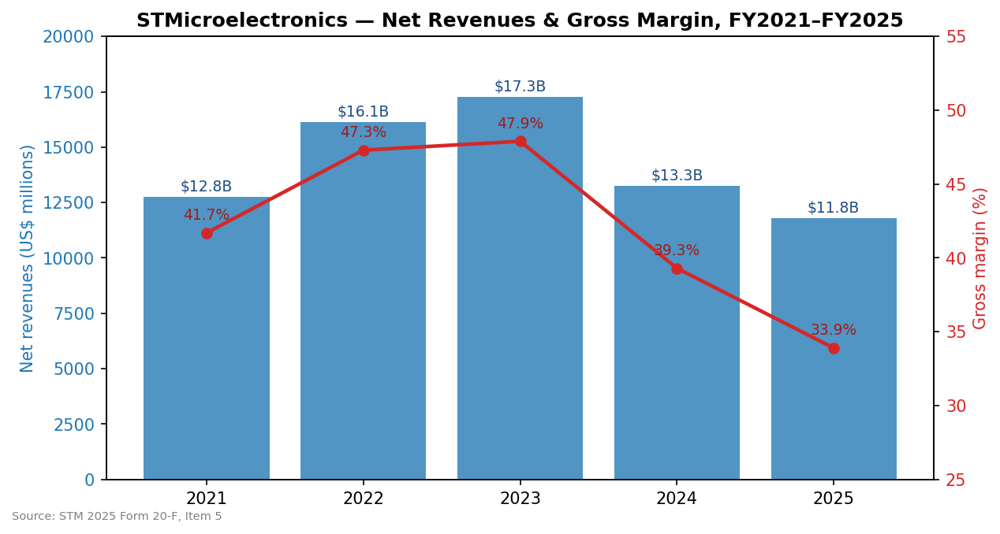
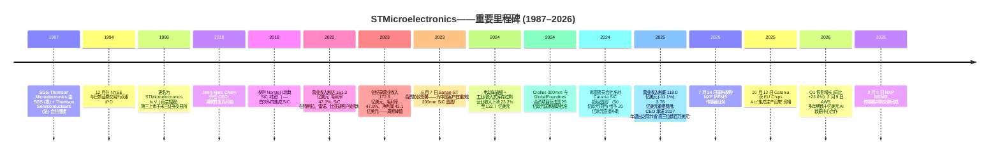
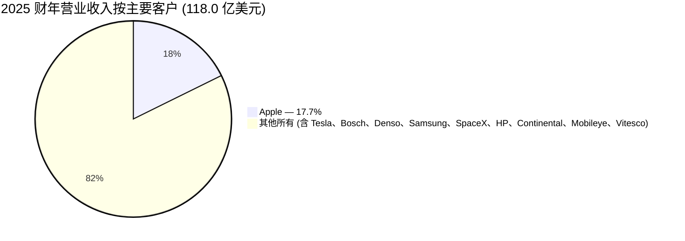
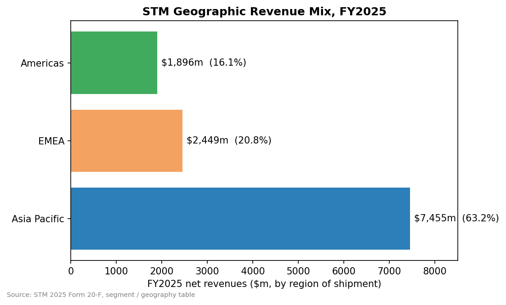
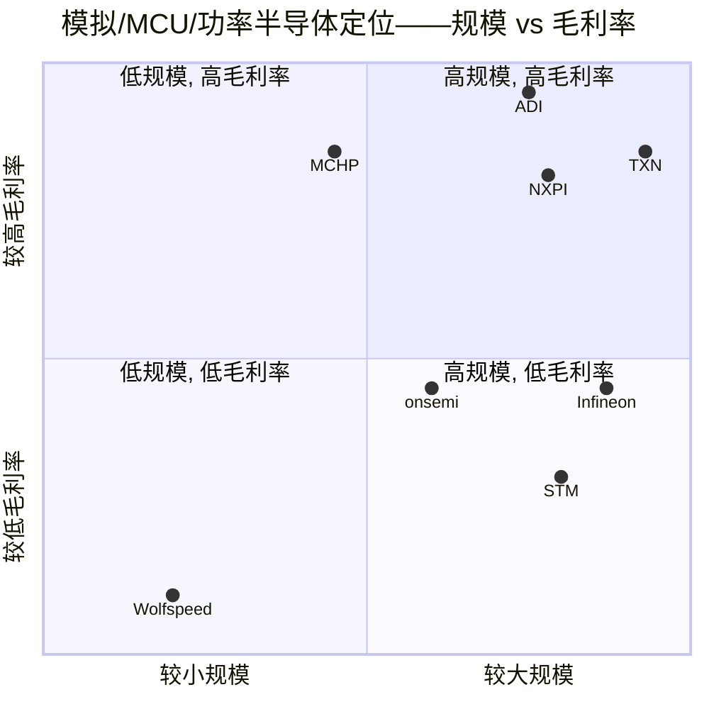

# STMicroelectronics N.V. (NYSE:STM) — 公司研究报告

**报告日期: 2026-05-20**
**覆盖范围: 首次覆盖——欧洲产业政策支持下的模拟/功率/MCU/传感器 IDM**
**主要上市地: NYSE: STM (ADR)、Euronext Paris: STMPA、Borsa Italiana Milan: STM**
**财年: 公历年, 截止 12 月 31 日**
**报告语言: 简体中文 (英文版同时存在于本目录)**

> **业绩更新——2025 财年底部确认; 2026 年 Q1 出现拐点 (2026-04-23):** ST 2026 年 Q1 净营业收入为 **30.95 亿美元**, **同比增长 23.0%** (七个季度同比下滑后首次同比正增长), 剔除刚刚完成交割的 NXP MEMS (微机电系统) 传感器并购影响后**同比增长 21.4%**。2026 年 Q2 中位指引: 净营业收入 **34.5 亿美元** (环比 +11.6%, 同比 +24.9%) 与**毛利率 (gross margin) 34.8%** (其中尚有 100 个基点为未消化产能费用)。首席执行官 Jean-Marc Chery 确认**数据中心 (data center) 营业收入"2026 年全年明显高于 5 亿美元、2027 年远高于 10 亿美元"**, 由 2026-02-09 披露的多年期数十亿美元 AWS 合作所锚定。来源: [2026 年 Q1 业绩新闻稿, 2026-04-23](https://www.sec.gov/cgi-bin/browse-edgar?action=getcompany&CIK=0000932787&type=6-K)。

---

## 目录

1. 公司概览
2. 公司历史
3. 管理团队
4. 产品与服务
5. 客户与上市策略
6. 行业概览
7. 竞争格局
8. 市场机会 (TAM)
9. 风险评估
10. 参考资料

---

## 1. 公司概览

STMicroelectronics N.V. ("ST", NYSE: STM, Euronext Paris: STMPA) 是一家全球综合性元件制造商 ("IDM", integrated device manufacturer), 2025 财年净营业收入为 **118.0 亿美元**, 约 48,000 名员工, 在法国、意大利、新加坡、马来西亚、摩洛哥与中国共拥有 14 座主要制造工厂 ([STM 2025 Form 20-F, Item 4](https://www.sec.gov/cgi-bin/browse-edgar?action=getcompany&CIK=0000932787&type=20-F))。公司是按营业收入计算的全球第七大半导体厂商, 也是仅次于 Infineon (英飞凌) 的欧洲最大芯片制造商, 设计与制造模拟 (analog)、混合信号 (mixed-signal)、功率 (power)、MEMS 与微控制器 ("MCU", microcontroller) 器件, 服务四大终端市场: **汽车 (Automotive)、工业 (Industrial)、个人电子 (Personal Electronics) 与通信设备/计算机及外设 ("CECP", Communications Equipment / Computers & Peripherals)** ([20-F, Item 4 — Information on the Company](https://www.sec.gov/cgi-bin/browse-edgar?action=getcompany&CIK=0000932787&type=20-F))。公司由意大利的 SGS Microelettronica 与法国 Thomson-CSF 的非军用半导体业务于 1987 年 6 月合并组建, 并于 1994 年 12 月首次公开发行 ([20-F, Item 4 — History and Development](https://www.sec.gov/cgi-bin/browse-edgar?action=getcompany&CIK=0000932787&type=20-F))。

**ST 的盈利模式。** ST 向全球约 20 万家客户销售分立 (discrete) 与集成 (integrated) 半导体器件; 2025 年其销售结构为 72% 直销给 OEM、28% 通过分销渠道 ([20-F, Table — Net revenues by market channel](https://www.sec.gov/cgi-bin/browse-edgar?action=getcompany&CIK=0000932787&type=20-F))。可报告分部架构于 2024 年进行了重塑, 并在 2025 年 Q1 进一步细化为隶属于两个产品集团的四个分部:

- **APMS (模拟、功率与分立、MEMS 及传感器产品集团) — 2025 财年营业收入 67.7 亿美元, 占总收入 57%:**
  - **AM&S (模拟、MEMS 与传感器) — 50.85 亿美元 (占 43%), 营业利润 6.23 亿美元 (利润率 12.3%)**
  - **P&D (功率与分立——硅与碳化硅 (silicon carbide, SiC) MOSFET、IGBT) — 16.85 亿美元 (占 14%), 营业亏损 (2.75 亿美元)**
- **MDRF (微控制器、数字 IC 与 RF 产品集团) — 2025 财年营业收入 50.16 亿美元, 占总收入 43%:**
  - **EMP (嵌入式处理——STM32 通用 MCU + Stellar 汽车 MCU + 汽车 ADAS SoC) — 35.80 亿美元 (占 30%), 营业利润 5.36 亿美元 (利润率 15.0%)**
  - **RFOC (RF 光通信——航天、BiCMOS、硅光子 (silicon photonics)、车内无线电) — 14.36 亿美元 (占 12%), 营业利润 2.65 亿美元 (利润率 18.5%)**

来源: [STM 2025 Form 20-F, Note — Net revenues by reportable segment](https://www.sec.gov/cgi-bin/browse-edgar?action=getcompany&CIK=0000932787&type=20-F)。

**ST 的运营布局。** 营业收入按收货地划分严重偏向亚太地区: 亚太 (内部对中国单独披露) 占 2025 财年销售的 **74.55 亿美元 / 63.2%**, EMEA 占 **24.49 亿美元 / 20.8%**, 美洲占 **18.96 亿美元 / 16.1%** ([20-F Table — Net revenues by location of shipment](https://www.sec.gov/cgi-bin/browse-edgar?action=getcompany&CIK=0000932787&type=20-F))。关键的是, 这反映的是发货目的地——大量亚洲营业收入实际上是为美国、韩国和欧洲客户履行订单 (例如苹果在富士康的组装中心、特斯拉的上海超级工厂), 真正源自中国终端需求的份额相对较小。

**规模与资本密集度。** ST 在 14 座主要晶圆厂运营约 **140,000 片 200mm 等效晶圆/周** ([20-F, Item 4](https://www.sec.gov/cgi-bin/browse-edgar?action=getcompany&CIK=0000932787&type=20-F))。2025 财年净资本开支为 **18.44 亿美元 (占销售额 16%)**, 较 2024 年的 26.42 亿美元和 2023 年峰值超过 40 亿美元下降; 2023–25 年平均资本开支占营业收入比约 20%, 反映了两项同时进行的产能建设: **法国 Crolles 300mm 晶圆厂合资项目** (与 GlobalFoundries 合作, 总投资 75 亿欧元, 法国国家援助最高 29 亿欧元) 及**意大利 Catania 集成 200mm SiC 衬底/器件"超级晶圆厂"** (资本开支 50 亿欧元, 意大利直接补贴 20 亿欧元, 已于 2025-10-13 获 EU Chips Act"集成生产设施" (Integrated Production Facility) 资格) ([20-F, Public Funding section](https://www.sec.gov/cgi-bin/browse-edgar?action=getcompany&CIK=0000932787&type=20-F))。

*来源: [STM 2025 Form 20-F, Item 5 — Results of Operations](https://www.sec.gov/cgi-bin/browse-edgar?action=getcompany&CIK=0000932787&type=20-F)。*

**估值快照 (2026-05-20 收盘):**

| 指标 | STM | 3 年区间 (大致) | 同业中位数* |
|---|---|---|---|
| 最新股价 | 64.87 美元 | 21.11–65.31 美元 (52 周) | — |
| 市值 | 577 亿美元 | — | — |
| **TTM 市盈率 (P/E)** | **405.4 倍** (受减值压制) | 2022–23 年 7–16 倍 | TXN 51.5 倍、NXPI 29.5 倍、ADI 71.8 倍、IFX 82.9 倍、MCHP 425 倍 |
| 前瞻 P/E (FY26E 共识) | **29.1 倍** | — | IFX 26.4 倍、NXPI 17.5 倍、ADI 29.6 倍、TXN 32.0 倍、MCHP 22.9 倍 |
| **TTM 市销率 (P/S)** | **4.66 倍** | 2025 年 6 月低点约 3 倍, 2024 年高点约 6 倍 | IFX 5.84 倍、NXPI 6.17 倍、ADI 16.30 倍、TXN 14.88 倍、MCHP 10.75 倍 |
| TTM EV/EBITDA | 21.3 倍 | — | IFX 22.4 倍、NXPI 17.3 倍、ADI 37.9 倍、TXN 32.8 倍 |
| 股息率 | 0.59% | — | — |
| TTM 毛利率 | 33.96% | 2023 年峰值 47.9% | IFX 41.2%、NXPI 55.6%、ADI 62.8%、TXN 57.3%、MCHP 57.7% |

\*来源: [Yahoo Finance, 2026-05-20 STM 关键统计](https://finance.yahoo.com/quote/STM/key-statistics/) 以及对应的 [IFX.DE](https://finance.yahoo.com/quote/IFX.DE/key-statistics/)、[NXPI](https://finance.yahoo.com/quote/NXPI/key-statistics/)、[ADI](https://finance.yahoo.com/quote/ADI/key-statistics/)、[TXN](https://finance.yahoo.com/quote/TXN/key-statistics/)、[MCHP](https://finance.yahoo.com/quote/MCHP/key-statistics/) 页面。

**405 倍 TTM 市盈率的解读。** 这并非高成长溢价——而是**周期底部盈利失真**。2025 财年 GAAP 净利润骤降至 **1.66 亿美元 / 摊薄每股收益 0.18 美元**, 较 2024 年的 15.57 亿美元 / 1.66 美元和 2023 年的 42.11 亿美元 / 4.46 美元大幅下滑, 其中大部分来自下列两项的联合影响: (i) 毛利率因 ADAS、SiC 与 IGBT 销量急剧下滑导致未消化产能费用而**压缩 540 个基点**至 33.9% (相较 2023 年峰值 47.9%); 以及 (ii) 与 2024 年 10 月宣布的公司层面制造布局重塑相关的 **3.76 亿美元减值/重组/逐步退出费用** ([20-F, Item 5 — Operating income](https://www.sec.gov/cgi-bin/browse-edgar?action=getcompany&CIK=0000932787&type=20-F))。非 GAAP 净利润 (剔除减值/重组) 为 4.86 亿美元 / 摊薄每股收益 0.53 美元——隐含非 GAAP P/E 接近 122 倍, 仍偏高但可解释为周期底部。

**前瞻市盈率 29.1 倍**是更具参考价值的估值锚, 将 ST 大致定位为与 Infineon (26.4 倍) 持平、溢价于 NXPI (17.5 倍)、折价于 TXN (32.0 倍)——这是一个合理的周期中段倍数。**TTM 市销率 4.66 倍**是模拟/工业同业组中**除极端困境之外的最低水平**, 既反映了周期底部的营业收入基数, 也反映了结构性毛利率差距 (33.9% vs. TXN/NXPI/MCHP 的 55%+)。该股已从 52 周低点 21.11 美元 (2025 年 6 月) 一路上涨到今日的 65 美元、涨幅超过 3 倍, 表明市场已经开始为复苏定价——增量上行空间现在取决于 SiC 爬坡的执行、AWS 数据中心营业收入是否达成 2027 年 10 亿美元目标, 以及制造布局重塑项目能否如承诺在 2027 年退出之时交付"高三位数百万美元"级的年化成本节约 ([Supervisory Board statement, 2025-04-10](https://www.sec.gov/cgi-bin/browse-edgar?action=getcompany&CIK=0000932787&type=6-K))。

**苹果集中度构成重大敏感性。** ST 的最大单一客户**苹果在 2025 财年贡献 17.7% 的营业收入** (相较 2024 年的 14.5% 与 2023 年的 12.3% 持续上升——具讽刺意味的是, 苹果份额的上升恰恰是因为非苹果业务下滑得更快) ([20-F, Item 4 — Customer concentration](https://www.sec.gov/cgi-bin/browse-edgar?action=getcompany&CIK=0000932787&type=20-F))。合作关系覆盖飞行时间 (Time-of-Flight, ToF) 光学传感器 (用于 iPhone Pro / Pro Max)、MEMS 陀螺仪 / 加速度计, 以及部分电源管理 IC。ST 在数个 iPhone 插槽上是独家供应商, 但苹果有多年内部研发或双源化历史——参见第 5 章风险讨论。

---

## 2. 公司历史

ST 拥有 39 年历史, 由意大利半导体公司 (SGS Microelettronica, 母公司为意大利国家控股 S.T.E.T.) 与法国国防电子集团 Thomson-CSF (现为 Thales) 的非军用半导体业务于 1987 年 6 月合并塑造 ([20-F, Item 4 — History and Development](https://www.sec.gov/cgi-bin/browse-edgar?action=getcompany&CIK=0000932787&type=20-F))。这种刻意跨境、国家支持的结构延续至今: 由意大利经济与财政部 ("MEF") 与法国 Bpifrance 共同控制的 **STMicroelectronics Holding N.V.** 持股, 截至 2025 年 12 月 31 日**持有公司普通股的 27.5%**——法国与意大利两国政府合计持有总股本约 13.9% ([20-F, Item 7 — Major Shareholders](https://www.sec.gov/cgi-bin/browse-edgar?action=getcompany&CIK=0000932787&type=20-F))。ST 是**欧盟产业政策的战略性资产**, 也是 EU Chips Act 资金的主要受益者。

来源: [STM 2025 Form 20-F, Item 4 — History and recent developments](https://www.sec.gov/cgi-bin/browse-edgar?action=getcompany&CIK=0000932787&type=20-F)。

**塑造今日 ST 的三大战略转折。**

1. **从商品化存储到差异化模拟/MCU (2000 年代初)。** ST 将其闪存业务分拆为 Numonyx (后售予美光), 重新聚焦于模拟、智能功率、MEMS 与 MCU——这些领域产品周期更长、价格侵蚀更轻、毛利率结构性更高。这一转折使 STM32 微控制器系列 (2007 年推出) 得以成长为 ST 单一最具价值的产品系列。

2. **成为宽禁带功率器件领导者 (2018–2023)。** ST 在 SiC 功率器件上早早押注, 于 2019 年收购瑞典衬底厂 Norstel 进行纵向集成。到 2022 年, ST 已成为电动车牵引逆变器市场最大的 SiC 供应商, 特斯拉为锚定客户。2022 年宣布的意大利 Catania"超级晶圆厂"项目以及 2023 年 6 月的重庆 Sanan ST 合资公司延伸了这一抱负。2024–25 年的电动车放缓后来抵消了大部分近期 P&L 收益, 但累计资本开支构建了从 150mm 晶圆到封装器件的完全集成 SiC 供应链——这是竞争对手仍在搭建的护城河。

3. **制造布局重塑 (2024 年 10 月宣布, 2025 年 4 月详述)。** 在周期下行之后, 监事会批准了一项多年期项目, 将**前道产能迁移至 300mm 硅与 200mm SiC**, 并整合较高成本的传统 150/200mm 晶圆厂。目标是"2027 年退出之时实现高三位数百万美元范围"的年化成本节约。这包括一项综合性减值测试 (2025 年 1.89 亿美元减值, 加 1.76 亿美元重组), 是 Infineon 早先 300mm 功率迁移的运营对应版本。([Supervisory Board statement, 2025-04-10](https://www.sec.gov/cgi-bin/browse-edgar?action=getcompany&CIK=0000932787&type=6-K)).

**近期重要并购与合作 (2023–2026)。**

- **Sanan-ST 合资公司 (重庆, 2023 年 6 月)** — 在中国为 ST 中国客户专门服务的 200mm SiC 器件代工厂, 使用 ST 工艺技术; 项目总投资 32 亿美元 (5 年内 24 亿美元资本开支), 由中国地方政府提供支持 ([20-F, Item 4](https://www.sec.gov/cgi-bin/browse-edgar?action=getcompany&CIK=0000932787&type=20-F))。
- **GlobalFoundries Crolles 300mm 合资项目 (2024–)** — 在法国 Crolles 的联合 300mm 晶圆厂, 总项目资本开支 75 亿欧元, 法国国家援助最高 29 亿欧元已于 2023 年 4 月 28 日批准; 2025 年 ST 获得 1.26 亿欧元现金, 确认了 7,200 万欧元补贴 ([20-F, Public Funding](https://www.sec.gov/cgi-bin/browse-edgar?action=getcompany&CIK=0000932787&type=20-F))。
- **意大利 Catania SiC 集成超级晶圆厂 (2022 宣布、2024-05-31 欧盟批准、2025-10-13 获 IPF 资格)** — 50 亿欧元项目, 来自意大利复苏与韧性计划的 20 亿欧元直接补贴; 欧洲第一家集成 200mm SiC 衬底到器件的工厂。
- **NXP MEMS 传感器业务并购 (2025-07-24 宣布, 2026-02-02 交割)** — 汽车安全/非安全 MEMS 加工业传感器; 2026 年 Q1 交割款项 8.95 亿美元; 2026 年 Q1 营业收入贡献约 4,000 万美元。战略逻辑: 在碎片化的子市场扩大汽车 MEMS 规模, 并拓展有意义的设计导入基础 ([Q1 2026 6-K, 2026-04-23](https://www.sec.gov/cgi-bin/browse-edgar?action=getcompany&CIK=0000932787&type=6-K))。
- **AWS 商业合作 (2026-02-09 宣布)** — 跨越多个产品类别的多年期、数十亿美元合作, 旨在赋能 AWS 数据中心/AI 计算基础设施; 管理层"2026 年数据中心营业收入 5 亿美元 / 2027 年超过 10 亿美元"目标的锚点 ([6-K filing, 2026-02-09](https://www.sec.gov/cgi-bin/browse-edgar?action=getcompany&CIK=0000932787&type=6-K))。
- **Qualcomm 无线连接合作 (2024) — ST67W 模组 (Wi-Fi 6 + BLE 5.4 + Matter)** 量产于 2025 年开始, 解决 STM32 MCU 系统的无线连接需求 ([20-F, Item 4](https://www.sec.gov/cgi-bin/browse-edgar?action=getcompany&CIK=0000932787&type=20-F))。
- **Innoscience GaN 合作 (2025-03-31)** — 与全球 8 英寸 GaN-on-Si (硅基氮化镓) 制造领导者 Innoscience 达成 GaN-on-Si 开发与制造协议; ST 还持有 Innoscience 价值 1.27 亿美元的公允价值股权投资 (该公司于 2024 年港交所 HKEX 上市), 2025 年产生 7,600 万美元未实现收益 ([20-F, Note — Equity securities](https://www.sec.gov/cgi-bin/browse-edgar?action=getcompany&CIK=0000932787&type=20-F))。

---

## 3. 管理团队

ST 的高层管理团队是一支深度任职的欧洲工程师班底: 执行委员会大多数成员在 SGS-Thomson / ST 公司内部已任职 25–40 年。这种连续性是双刃剑——对 IDM 成本结构、客户基础和欧盟产业政策机制的机构知识无与伦比, 但管理团队也因 2024–25 年下行期内战略调整迟缓而遭意大利媒体批评 ([Supervisory Board response to Italian press allegations, 2025-04-10](https://www.sec.gov/cgi-bin/browse-edgar?action=getcompany&CIK=0000932787&type=6-K))。2025 年 4 月, 面对集体诉讼及意大利媒体对业绩发布前内幕交易的指控, 监事会公开重申对 Chery 与 Grandi 的支持 (监事会确认相关交易为自动 / 黑窗期合规操作)。

### Jean-Marc Chery — 总裁兼首席执行官 (自 2018 年 5 月起)

Jean-Marc Chery 担任 ST CEO 已七年, 是 SiC 战略与正在进行中的 300mm/200mm 制造布局重塑的设计者。1960 年生于法国奥尔良, 毕业于巴黎**国立高等工艺学院 (ENSAM, École Nationale Supérieure d'Arts et Métiers)** 工程师学校。Chery 在法国工程/国防集团 **Matra** 的质量管理岗位起步, 于 1986 年加入 Thomson Semiconducteurs (1987 年成为 ST), 意味着他**在 ST 内已工作 40 年**, 几乎是其全部职业生涯。

他的升迁通过运营与制造路径: 他经营了 ST 在法国 Tours 与 Rousset 的晶圆厂, 然后于 2005 年领导了公司全局 6 英寸 (150mm) 晶圆重组项目——形貌上与他作为 CEO 现正执行的项目惊人相似。2005 年起他主管亚太地区的前道制造。2008 年被任命为**首席技术官**, 2011 年增加制造与质量管理责任, 2012 年增加数字产品板块, 然后 2014 年晋升为**首席运营官**, 2017 年 7 月晋升为**副 CEO**, 2018 年 5 月就任 CEO ([20-F, Item 6 — Senior Management Biographies](https://www.sec.gov/cgi-bin/browse-edgar?action=getcompany&CIK=0000932787&type=20-F))。

外部职务显示了他在欧洲半导体生态系统中的地位: 他**担任全球半导体联盟 (Global Semiconductor Alliance, GSA) 主席**, 担任 **Legrand** 与 **Capgemini** (均为 CAC-40 公司) 的董事会成员, 此前曾任**欧洲半导体产业协会**主席 (2019–2021)。2019 年 7 月被法国经济与财政部授予**法国荣誉军团骑士勋章**。

Chery 的业绩记录: 他将 ST 从 2018 年 96.6 亿美元营业收入 / 39.7% 毛利率带至 2023 年峰值 172.9 亿美元 / 47.9% ——营业收入近翻番, 毛利率扩张 800 个基点——通过在汽车电气化 (SiC 与 MCU)、苹果 MEMS 份额扩张以及嵌入式处理拓展上的强力押注。2024–25 年的周期反转玷污但未抹去这一记录: 营业收入峰谷下降 -31.7%, GAAP 营业利润峰谷下降 -96.2%, 两项指标均逊于同业 Infineon (同期 -14% 营业收入, -41% 营业利润), 但与电动车 / 工业周期同行大体一致。2026 年 Q1 拐点与 AWS 合作是战略定位向数据中心 / AI 计算延伸的早期证据, 开启了上一代管理团队未曾瞄准的非汽车、非工业增长通道。CEO 协议 (瑞士法律合同, 公司终止时 6 个月通知期, 他本人终止时 3 个月) 含 2× 年基础薪资加 3 年平均短期激励的离职补偿 ([20-F, Item 6 — CEO Agreements](https://www.sec.gov/cgi-bin/browse-edgar?action=getcompany&CIK=0000932787&type=20-F))。

### Lorenzo Grandi — 总裁兼首席财务官 (自 2018 年起)

Lorenzo Grandi, 约 64 岁, 自 2018 年起任 ST 首席财务官, 完整 38 年职业生涯均在公司内。1961 年生于意大利 Sondrio, 在**摩德纳大学物理系** cum laude 毕业, 并获**米兰博科尼大学 SDA Bocconi 工商管理硕士**学位。1987 年作为研发工艺工程师加入 SGS-Thomson——与 Chery 类似, 是不寻常的运营出身的财务背景。1990 年转入 ST 存储产品组任财务分析师, 最终成为 (彼时较大的) 闪存业务集团控制者。2005 年加入公司财务部门, 2012 年晋升为负责公司控制的副总裁, 2018 年成为 CFO ([20-F, Item 6](https://www.sec.gov/cgi-bin/browse-edgar?action=getcompany&CIK=0000932787&type=20-F))。

在 CFO 任内, Grandi 管理了: (i) 2020 年发行 15 亿美元可转换债券 (A 类 2025 年 8 月赎回) 与持续的资本市场工作, (ii) 2024 年启动的 11 亿美元 3 年期股票回购计划 (2025 年执行 3.67 亿美元, 2024 年执行 1.84 亿美元), 以及 (iii) 结构性资本开支承诺——净资本开支在 2023 年达到峰值 41 亿美元, 2024 年降至 26 亿美元, 2025 年随重组深入降至 18 亿美元。尽管处于低谷年, ST 在 2025 财年末仍以 **27.9 亿美元净现金**结束 (28.4 亿美元现金 + 11.0 亿美元短期存款 + 9.85 亿美元有价证券, 减 21.3 亿美元金融债务), **总流动性 49.2 亿美元** ([20-F, Item 5 — Liquidity](https://www.sec.gov/cgi-bin/browse-edgar?action=getcompany&CIK=0000932787&type=20-F))。他的 CFO 职责范围现还涵盖数字化转型、IT、全球采购、供应链与企业风险——异常宽泛的授权。涉及业绩发布前股票出售的集体诉讼指控于 2025-04-10 由监事会公开回应, Grandi 继续任职。

### Remi El-Ouazzane — 微控制器、数字 IC 与 RF 集团 ("MDRF") 总裁 (自 2024 年 2 月起)

El-Ouazzane 是两位产品集团总裁之一, 也可以说是 ST 在过去两年中作出的、与本投资逻辑最相关的人事变动。1973 年生于法国塞纳河畔讷伊, 毕业于**格勒诺布尔理工学院 (Grenoble Institute of Technology)** (1996) 与**格勒诺布尔政治学院 (Grenoble Sciences Po)** (1997), 并获**哈佛商学院通用管理项目** (2004)。1997–2013 年在**德州仪器** (Texas Instruments) 任职, 晋升为 OMAP 多媒体应用平台副总裁兼总经理。然后从 2013 年起担任 **Movidius** (视觉/AI 处理器初创公司) 的 CEO, 2016 年将公司**售予 Intel**, 留任 Intel 新技术集团副总裁/总经理, 然后任 **Intel AI 产品集团首席运营官 (2018–2020)** 与 **Intel 数据中心平台集团首席战略官 (2020–2024)** ([20-F, Item 6](https://www.sec.gov/cgi-bin/browse-edgar?action=getcompany&CIK=0000932787&type=20-F))。

聘请一位 Intel 数据中心 / AI 高管来执掌 ST 的 MCU + RF + ADAS 综合业务单元, 是 ST 的战略现今指向汽车与工业之外、进入 AI 基础设施的最直接信号。2026 年 2 月披露的 AWS 商业合作属于他的分部 (RFOC 子集团覆盖云光互连的 BiCMOS 与硅光子, 嵌入式处理现已扩展至越来越多含神经网络加速器的 STM32 微控制器——**STM32N6** 含嵌入式"neural-ART accelerator"与基于 18nm FD-SOI 工艺、含嵌入式相变存储器 (Phase Change Memory) 的 **STM32V8**)。

### Marco Cassis — 模拟、功率与分立、MEMS 及传感器集团 ("APMS") 总裁 (自 2024 年 2 月起)

Cassis 经营另一个产品集团, 该集团既包含最高利润率的业务 (模拟/MEMS/传感器/成像——AM&S), 也包含 ST 最具挑战的业务 (SiC 与硅功率——P&D, 2025 年录得 2.75 亿美元营业亏损)。1963 年生于意大利特雷维索, 毕业于**米兰理工大学**电子工程专业, 在 ST 内完成 38 年完整职业生涯。1987 年从车载收音机芯片设计师起步, 2000 年代经营 ST 日本业务, 2016 年晋升为 ST 亚太区总裁, 然后 2017 年任**全球销售与营销总裁**。他还监督 ST 的公司战略制定、系统研究与应用以及创新办公室——使他成为与 Chery 并列的事实战略总管。

### 治理小结

- **监事会:** 截至 2025 年 12 月 31 日共 9 名成员 ([20-F, Item 6](https://www.sec.gov/cgi-bin/browse-edgar?action=getcompany&CIK=0000932787&type=20-F))。主席: **Nicolas Dufourcq**, **Bpifrance** (法国国家发展银行, 为 ST 控股股东结构的一部分) 的 CEO——明确表明法国国家在董事会层面的代表。副主席: **Armando Varricchio**, 意大利资深外交官 (曾任驻德国、美国大使, 2025-12-18 任命)。董事会多元化包括来自银行、能源与法律背景的独立成员。审计委员会与薪酬委员会构成已披露; 2025 年董事会**召开 12 次, 出席率 90%**。
- **经营委员会 (= 执行层):** 2 名成员——**Jean-Marc Chery (总裁兼 CEO)** 与 **Lorenzo Grandi (总裁兼 CFO)**, 均持瑞士雇佣合同, 总部设于日内瓦总部。
- **控股股东:** **STMicroelectronics Holding N.V. ("ST Holding")** 截至 2025 年 12 月 31 日持有已发行普通股的 **27.5%** (250,704,754 股), 由**意大利 MEF** 与 **Bpifrance** 共同控制。BlackRock 持有 5.2% (47,511,809 股)。其余为广泛持有, **84.9% 的流通股在 Euronext Paris / Borsa Italiana 交易**, **15.1% 在 NYSE 交易** ([20-F, Item 7](https://www.sec.gov/cgi-bin/browse-edgar?action=getcompany&CIK=0000932787&type=20-F))。双重政府所有权是**双刃剑式的股东特征**: 它提供稳定性、欧盟产业政策一致性以及超过 50 亿欧元公共资金的获取通道, 但同时也限制了纯粹的股东回报优化。
- **薪酬:** 标准欧式结构, 基础薪资 + 短期激励 + 3 年悬崖授予绩效股。2025 年, 约一半授予股份为绩效条件挂钩。股票期权薪酬费用 2025 年为 1.93 亿美元, 2024 年为 2.22 亿美元, 2023 年为 2.36 亿美元。
- **资本回报:** 2025 年年度股息 0.36 美元 (分四次每季 0.09 美元支付); 2025 年根据 2024 年启动的 11 亿美元 3 年期授权执行了 3.67 亿美元回购。

### 管理层业绩记录综评

Chery 与 Grandi 已伴随 ST 完成一个完整周期: 2018–2023 是毋庸置疑的复合增长成功, 营业收入 +79%、毛利率 +800 个基点、净利润增长约 9 倍。2024–25 年下行——剧烈、痛苦, 可以说是过晚才被应对——见证了营业收入 32% 的峰谷下滑, 实质上抹去了营业杠杆收益。当前裁定: 团队在执行上很强, 但在周期上属于反应型而非前瞻型。El-Ouazzane 聘任 (Intel 数据中心 / AI) 与 AWS 协议是管理团队正确读懂下一个周期的最可信迹象。集体诉讼与意大利媒体事件 (2025 年 4 月) 是一个特异性治理标志, 但监事会公开辩护与持续资本部署表明无近期运营问题。

---

## 4. 产品与服务

ST 是除最大几家美国同业之外、产品组合最广泛的半导体公司之一。**下列产品梳理列举了 ST 截至 2025 年 12 月 31 日披露的每一个重大产品系列**, 按四个可报告分部分组。来源: [20-F, Item 4 — Information on the Company](https://www.sec.gov/cgi-bin/browse-edgar?action=getcompany&CIK=0000932787&type=20-F) 与 [ST 公司产品导航树 st.com/products](https://www.st.com/en/products.html)。

```mermaid
graph TD
    ST[STMicroelectronics<br/>2025 财年营业收入 118.0 亿美元] --> APMS[APMS 产品集团<br/>67.7 亿美元 / 57%]
    ST --> MDRF[MDRF 产品集团<br/>50.2 亿美元 / 43%]
    APMS --> AMS[AM&S — 模拟、MEMS、传感器<br/>50.9 亿美元]
    APMS --> PD[P&D — 功率与分立<br/>16.9 亿美元]
    MDRF --> EMP[EMP — 嵌入式处理<br/>35.8 亿美元]
    MDRF --> RFOC[RFOC — RF 与光通信<br/>14.4 亿美元]
    AMS --> AMS1[智能功率 / 模拟 IC<br/>BCD、VIPpower]
    AMS --> AMS2[运动 MEMS<br/>加速度计、陀螺仪]
    AMS --> AMS3[环境 / 生物 MEMS]
    AMS --> AMS4[MEMS 致动器<br/>打印头、AF、mLED]
    AMS --> AMS5[光学传感器<br/>FlightSense ToF、BrightSense、SafeSense]
    AMS --> AMS6[成像<br/>iPhone ToF、车内]
    PD --> PD1[硅 MOSFET]
    PD --> PD2[SiC MOSFET / 模块]
    PD --> PD3[IGBT]
    PD --> PD4[晶闸管、整流器]
    PD --> PD5[GaN-on-Si 功率晶体管]
    PD --> PD6[ESD / 浪涌保护]
    EMP --> EMP1[STM32 通用 MCU<br/>ARM Cortex-M0 至 M85]
    EMP --> EMP2[Stellar 汽车 MCU<br/>ASIL-D、区域、x-in-1]
    EMP --> EMP3[STM32MP 微处理器<br/>Cortex-A35、Linux]
    EMP --> EMP4[安全 MCU / NFC / eSIM<br/>ST25、STSECURE]
    EMP --> EMP5[定制 ADAS SoC<br/>Mobileye 共同设计]
    EMP --> EMP6[EEPROM / 非易失存储器]
    RFOC --> RFOC1[航天技术 ASIC<br/>用于 LEO 的 BiCMOS、FD-SOI]
    RFOC --> RFOC2[RF / 毫米波组件<br/>5G 波束赋形]
    RFOC --> RFOC3[云光互连<br/>用于 AI 数据中心的 SiPho / BiCMOS]
    RFOC --> RFOC4[数字音频放大器<br/>车载信息娱乐]
    RFOC --> RFOC5[GNSS 定位 IC<br/>Teseo]
    RFOC --> RFOC6[Wi-Fi / BLE 模组<br/>与 Qualcomm 合作的 ST67W]
```

### AM&S — 模拟、MEMS 与传感器 (2025 财年营业收入 50.85 亿美元; 营业利润率 12.3%)

AM&S 分部是 **ST 战略上最重要、最依赖苹果的业务**。它包含四个子组:

1. **智能功率与模拟 IC** — 基于 ST 自有的 **BCD** (BiCMOS-DMOS) 与 **VIPpower** 工艺。产品包括电池管理 IC、牵引电机控制器、刹车系统驱动器、安全气囊驱动器、eFuse、ECU 电源管理、USB-PD 控制器、MasterGaN/VIPerGaN 集成 GaN+ 驱动器系列、AC-DC 与 DC-DC 转换器、用于 MOSFET / IGBT / SiC / GaN 的栅驱动器、智能功率开关、LED 驱动器、实时时钟、运算放大器与电流感应放大器。**竞争力评判: 部分护城河。** BCD 工艺技术为 ST 自有, 在高电压 / 混合信号节点上产生成本/集成优势 (TXN 在 LBC8/LBC9 上利用同样的技巧)。直接竞争对手: Infineon (智能功率)、onsemi、NXP、ROHM。比较: 在多数产品系列上持平; 在汽车智能功率 / VIPpower 上领先; 在最佳精度模拟上落后于 ADI / TXN。
2. **MEMS 传感器与致动器** — 运动 MEMS (加速度计、陀螺仪、磁力计——6 轴 IMU 领先地位)、环境 MEMS (压力、温度、存在)、生物传感器, 以及 **MEMS 致动器**, 包括用于智能手机相机的压电自动对焦、MEMS 扬声器与 MEMS 打印头。**竞争力评判: 是——来自规模与设计导入的护城河。** ST 是全球可信汽车 MEMS 供应商三巨头之一 (Bosch、ST、NXP), 而 2026 年 2 月交割的 NXP MEMS 并购将 ST 巩固为汽车安全 MEMS 全球次席, 仅次于 Bosch。竞品对比: Bosch SMI260 / SMI230 IMU vs. ST ASM330LHH——汽车级规格上持平。
3. **光学传感** — **FlightSense** (自有飞行时间测距)、**BrightSense** (环境光)、**SafeSense** (车内 / 乘员检测)。FlightSense 是 iPhone Pro/Pro Max ToF (用于 LiDAR 扫描) 的工作主力, 并已扩展到 Android 旗舰机。**竞争力评判: 是——通过苹果独家来源形成强护城河。** 最接近竞争对手: ams OSRAM (维也纳, 奥地利) 在 ToF 与环境光、Sony 在消费级测距上——ST 在 dToF 与车内认证上领先, 环境光上持平。ams OSRAM 自 2024 年 TrueLight 削减后已成为结构性较弱的竞争对手。
4. **成像** — 全局快门图像传感器与用于飞行时间 / 3D 深度的专用 ASIC, 主要供应苹果 (iPhone ToF), 并向汽车 (车内监测) 拓展。成像是 AM&S 子组在 2025 年 Q4 中表现最佳的子组 ([20-F, Item 5 — Q4 segment commentary](https://www.sec.gov/cgi-bin/browse-edgar?action=getcompany&CIK=0000932787&type=20-F))。

**旗舰: ST 的 MEMS 与光学传感组合是 AM&S 的结构性利润率锚** —— 没有它, AM&S 不会在低谷年实现 12.3% 营业利润率。

### P&D — 功率与分立 (2025 财年营业收入 16.85 亿美元; 营业亏损 -2.75 亿美元; 利润率 -16.3%)

P&D 是 **ST 周期性最强、争议最多的业务**。包含:

1. **硅 MOSFET** — STripFET、STrongIRFET (传统 IR 组合, 通过 Infineon 2015 年收购 IR 吸收, ST 经营第二货源业务)。
2. **SiC MOSFET 与功率模块** — **战略资产**: ST 是全球电动车牵引逆变器 OEM 的第一大 SiC 供应商, 以特斯拉为锚定客户 (Model 3/Y 主逆变器使用 ST SiC)。其他已点名的 SiC 客户包括 Geely、Renault、BYD 以及大量中国 OEM (通过 Sanan ST 合资公司供货)。SiC 业务由完全纵向集成的供应链支持: **Norstel 衬底 (Norrköping, 瑞典)、Catania 的 150mm SiC 器件厂 (意大利)、Catania 超级晶圆厂正在建设中的 200mm 过渡 (50 亿欧元资本开支, 已获 IPF 资格)、Crolles (法国) 的 200mm SiC, 以及 Chongqing (Sanan ST 合资公司, 中国) 的 200mm SiC** ([20-F, Item 4 — Manufacturing facilities table](https://www.sec.gov/cgi-bin/browse-edgar?action=getcompany&CIK=0000932787&type=20-F))。
3. **IGBT** — 用于工业与混动 EV 应用。
4. **晶闸管、整流器、功率双极晶体管、GaN-on-Si 功率晶体管** (2025-03-31 宣布的 Innoscience 合作补充了 ST 内部 GaN R&D)。
5. **保护器件** — ESD、浪涌、雷电、汽车保护 (Transil、Trisil)。

**竞争力评判: SiC = 是 (技术 + 集成护城河); 硅功率 = 部分; 保护 = 否。** 直接竞争对手: **Infineon** (从多个来源收购晶圆厂产能后, SiC 主导挑战者)、**Wolfspeed** (美股纯 SiC, 2024–25 年陷入极度财务困境)、**onsemi** (上升中的 SiC 挑战者)、**ROHM** (日本 SiC)、**Mitsubishi Electric** (模块)、**Toshiba**、**CREE/Wolfspeed 衬底**。比较: ST 在集成量产制造上领先 Wolfspeed 与 onsemi; 在电动车牵引模块级 SiC 上与 Infineon 持平; 在汽车设计导入广度上落后于 Infineon。

2025 年 P&D 营业亏损 2.75 亿美元反映了下列严苛组合的影响: (i) **P&D 上 29% 的 ASP 下滑**, 因 SiC 定价在中国竞争和电动车放缓下崩塌; (ii) Catania 半建成爬坡产生的**未消化产能费用**; 以及 (iii) **不利的产品组合**, 因低利润硅功率比高利润 SiC 更具韧性 ([20-F, Item 5 — P&D segment commentary](https://www.sec.gov/cgi-bin/browse-edgar?action=getcompany&CIK=0000932787&type=20-F))。2026 年的投资逻辑关键取决于 SiC 价格是否企稳, 以及 Catania 爬坡是否从成本中心转为利润中心。

### EMP — 嵌入式处理 (2025 财年营业收入 35.80 亿美元; 营业利润率 15.0%)

EMP 结合 ST 的通用与汽车 MCU 与定制 ADAS SoC 与安全 MCU。子组:

1. **STM32 通用 MCU** — ST 产品组合中除苹果传感器外战略上最重要的单一产品系列。STM32 跨越 ARM Cortex-M0/M0+/M3/M4/M33/M55/M7/M85 内核。2025 年的产品组合增补值得注意: 含嵌入式"neural-ART accelerator" NPU (ST 自有的 NN 引擎) 的 **STM32N6**, 以及**STM32V8**——"全球首款基于最先进 18nm FD-SOI 工艺技术、含嵌入式相变存储器 (PCM) 与强大 Cortex-M85 内核的微控制器" ([20-F, Item 4 — EMP product description](https://www.sec.gov/cgi-bin/browse-edgar?action=getcompany&CIK=0000932787&type=20-F))。**STM32U3** 超低功耗系列利用近阈值技术, 将 IoT/ 传感器节点的电池寿命推至多年范围。配套生态系统 (STM32Cube IDE、含 140 多个预构建模型的 STM32 AI 模型库、TouchGFX 图形框架) 是一道相当深的护城河——STM32 普遍被视为欧洲爱好者 / 初创 / 工业市场上的主导 32 位 ARM MCU, 过去十年中已在此类别的单位份额上超越 NXP 与 Renesas。**竞争力评判: 是——生态系统锁定与设计导入装机量的重大护城河。** 最接近竞争对手: NXP LPC / Kinetis / i.MX RT、Renesas RA / RX、Microchip PIC32 / SAM、Nordic nRF52/53/91 (仅 BLE)、Espressif ESP32 (Wi-Fi / 入门级)。STM32 在中端工业 / 电机控制与广度上领先; 在超低功耗上与 Nordic 与 Ambiq 持平; 在最高端实时 MCU + 汽车跨域控制器上落后于 NXP 与 Renesas。
2. **Stellar 汽车 MCU** — 基于 ARM、ASIL-D, 针对电气化优化, 包括 x-in-1 车辆运动控制、区域架构以及 ADAS 子系统的安全伴侣 MCU。2025 年推出"带可扩展存储器的 Stellar MCU", 利用 ST 自有的 28nm FD-SOI 相变存储器, 是真正具有差异化的——ST 声称是首家发布汽车认证 PCM 嵌入式 MCU 的厂商 ([20-F, Item 4](https://www.sec.gov/cgi-bin/browse-edgar?action=getcompany&CIK=0000932787&type=20-F))。**竞争力评判: 是。** 最接近竞争对手: **NXP S32 (前 Freescale)**、**Infineon AURIX TC3xx / TC4xx**、**Renesas R-Car / RH850**、**Texas Instruments AM2x**。ST 在 PCM 嵌入式汽车上领先; 在 ASIL-D 可扩展性上持平; 在装机基础 / Tier-1 设计导入上落后于 NXP 与 Infineon。
3. **STM32MP 微处理器** — 64 位 Cortex-A35 工业处理器, 含专用 Linux 发行版。
4. **安全 MCU / NFC / eSIM** — STSECURE 与 ST25 组合——支付、识别、非接触式交易; ST 声称推出**首款支持 NFC Matter tap-to-pair 的安全 ST25DA-C 芯片**, 并于 2025 年完成 **ST4SIM-300 eSIM** 至 GSMA SGP.32 IoT 标准的认证。ST 在安全 IC 领域已超过 30 年。
5. **定制处理 (汽车 ADAS SoC)** — ST 是 **Mobileye** EyeQ 芯片 (定制 28/22/5nm 工艺集成) 的长期共同设计合作伙伴, 是一种异常稳固的 IP 关系。
6. **EEPROM** — **串行 EEPROM** 系列 (1 Kbit 至 32 Mbit) 在 2025 年庆祝"作为全球领先供应商 20 周年, 累计发货 400 亿单位"; 自 2005 年起为市场份额领导者。

### RFOC — RF 光通信 (2025 财年营业收入 14.36 亿美元; 营业利润率 18.5%)

最小的分部, 但毛利率最高, 增长向量最令人兴奋。子组:

1. **航天技术 ASIC 与 RF/数字混合信号 IC** — 基于 ST 自有的 FD-SOI、RF-SOI、BiCMOS 技术。ST 自欧洲航天局 (ESA) 成立时即获其认证, 并后续增加了美国 QML-V 认证。重要客户: **SpaceX** (已点名客户; LEO 卫星星座); 更广泛的欧洲航天局项目。
2. **5G / 大规模 MIMO 波束赋形的 RF / 毫米波组件**。
3. **云光互连** — 用于数据中心光学收发器的 BiCMOS 与 SiPho (硅光子) IC; **AWS 商业合作直接服务这一子组**, 是"2026 年数据中心营业收入 5 亿美元 / 2027 年超过 10 亿美元"目标的基础。
4. **车载信息娱乐的数字音频放大器** — ST 是从车机到高端音响、远程信息处理、AVAS 音频放大器的领导者。
5. **GNSS 定位** (Teseo SoC 系列)。
6. **Wi-Fi / BLE 模组** — **ST67W** 结合 Wi-Fi 6 + BLE 5.4 + Matter, 2024 年 Qualcomm 合作的首款产品, 已于 2025 年进入量产。
7. **超宽带、60GHz 非接触点对点** — 新兴。

**RFOC 竞争力评判: 是——在航天与云 SiPho 上有护城河。** 最接近竞争对手: **Inphi/Marvell、MaxLinear** (云光)、**Texas Instruments** (音频放大器)、**u-blox、Quectel** (GNSS)、**Cobham、Teledyne e2v** (航天级 ASIC)。云 SiPho 是 ST 最高增量利润机会——类似 Marvell 40 亿美元以上 AI 网络业务, 但通过不同的 IDM 路径执行。

### 旗舰 vs. 长尾总结

驱动 ST 企业价值的三个旗舰产品系列是: **(1) AM&S 内的苹果主导传感器 (FlightSense ToF + MEMS + 成像)**、**(2) EMP 内的 STM32 微控制器**, 以及**(3) P&D 内的 SiC 功率器件**。长尾业务 (通用硅 MOSFET、传统晶闸管、GNSS、音频放大器) 盈利但结构性低增长。

### 过去 12 个月的发布 / 退出

- **2025 年:** STM32N6 (含 neural-ART NPU)、STM32V8 (18nm FD-SOI 含 PCM, 全球首款)、STM32U3 (近阈值超低功耗)、STM32 AI 模型库扩展至 140+ 模型、Stellar 汽车 PCM-MCU、ST25DA-C NFC Matter、ST4SIM-300 eSIM、ST67W Wi-Fi 6/BLE/Matter 量产。
- **2025–2026 战略性增补:** NXP MEMS 传感器业务并购 (2026 年 2 月交割, Q1 贡献约 4,000 万美元)、AWS 多年期数十亿美元合作 (2026 年 2 月宣布)。
- **退出:** 制造布局项目正在整合较老的 150mm 与小型 200mm 晶圆厂, 倾向于 300mm Si 与 200mm SiC ([Supervisory Board statement, 2025-04-10](https://www.sec.gov/cgi-bin/browse-edgar?action=getcompany&CIK=0000932787&type=6-K))。具体晶圆厂关闭尚未在细颗粒度披露。

---

## 5. 客户与上市策略

ST 服务**全球 20 万以上客户**; 20-F 中披露的"主要客户"名单按字母顺序包括: **Apple、Bosch、Continental、Denso、HP、Mobileye、Samsung、SpaceX、Tesla 与 Vitesco** ([20-F, Item 4 — Customers](https://www.sec.gov/cgi-bin/browse-edgar?action=getcompany&CIK=0000932787&type=20-F))。

### 客户集中度——苹果主导

ST 对于一家模拟/MCU IDM 而言异常集中。**苹果单独占 2025 财年营业收入的 17.7%**, 较 2024 年的 14.5% 与 2023 年的 12.3% 上升——份额已**连续三年上升**, 部分原因是苹果增加了新的 ST 插槽 (尤其是新一代 iPhone 的 ToF 与 MEMS), 部分原因是非苹果营业收入在下行期内比苹果营业收入下滑得更快 ([20-F, Item 4 — Customer concentration](https://www.sec.gov/cgi-bin/browse-edgar?action=getcompany&CIK=0000932787&type=20-F))。

来源: [STM 2025 Form 20-F, Item 4](https://www.sec.gov/cgi-bin/browse-edgar?action=getcompany&CIK=0000932787&type=20-F)。ST 未披露其他点名主要客户的具体营业收入。

苹果关系在结构上既重要又脆弱:

- **结构上重要:** ST 在 iPhone Pro / Pro Max 的**飞行时间 (FlightSense)** 传感器 (用于 LiDAR 相机对焦辅助与 AR 深度) 与若干 MEMS 插槽 (加速度计/陀螺仪) 上是独家来源。苹果赢单是历经约 5 年才建立的多代插槽积累。
- **结构上脆弱:** 苹果在多年供应商关系后, 长期有整合、替代或内部研发关键组件的历史 (TSMC 保留 AP 处理器; 高通基带正被苹果自研基带从 C1 芯片开始替代; InvenSense MEMS 被 Bosch / ST 循环替代; ams OSRAM 环境光遭去优先化)。苹果在**内部 MEMS 与图像传感器 R&D** 投入已多年; 任何 ToF 或运动 MEMS 的内部化对 ST 都将是数亿美元级的营业收入事件。

**没有其他客户被披露为 >10%, 但特斯拉 SiC 关系是第二个最受关注的。** 特斯拉在 Model 3/Y 牵引逆变器中使用 ST SiC MOSFET (最初每个逆变器 24 颗器件的配置)。特斯拉转向"更高效驱动单元"且减少 SiC 含量 (2023 年特斯拉投资者日宣布) 是 2024–25 年 P&D 营业收入崩塌的触发因素之一。虽然未直接披露, 但卖方估计在历史 SiC 峰值时特斯拉占 ST 营业收入的 4–6%。

### 客户联盟与结构性共同设计

ST 的客户联盟对一家商业半导体公司而言异常深入——更接近苹果-台积电或英伟达-AWS 模式而非广泛分销的模拟模式:

- **Mobileye** — EyeQ ADAS SoC 的共同设计合作伙伴 (在 ST 工艺技术上的定制 ASIC 集成)。这是 20 年以上的关系。
- **Apple** — 多插槽、多产品代; 关键 ToF、MEMS 与部分 PMIC 上的独家来源。
- **Qualcomm (2024–)** — 联合开发 STM32 生态系统无线连接模组 (ST67W)。
- **GlobalFoundries** — Crolles 联合 300mm 晶圆厂 (产能共享, 非客户-供应商关系)。
- **AWS (2026-02-09)** — 跨几个产品类别的多年期、数十亿美元合作 ([6-K filing, 2026-02-09](https://www.sec.gov/cgi-bin/browse-edgar?action=getcompany&CIK=0000932787&type=6-K))。
- **SpaceX** — 已点名为主要客户; 为 LEO 卫星 (Starlink 星座) 供应 BiCMOS / FD-SOI / RF-SOI IC。
- **Innoscience (港交所上市)** — GaN-on-Si 制造与开发合作伙伴; ST 持有 1.27 亿美元公允价值股权。

### 分销与销售结构

按渠道: 2025 财年 **72% 直销 OEM, 28% 分销** (相比 2024 年 73%/27%, 2023 年 66%/34%——分销份额在 2024 年因渠道去库存大幅下滑)。ST 经营四个区域销售组织: 美洲、亚太非中国地区 ("APeC", 由 Hiroshi Noguchi 负责)、中国 (由 Henry Cao 负责, 前 Dell)、EMEA (由 Michael Anfang 负责, 前 Siemens)。2024 年 Q1, ST 在其上叠加了一个新的**分部营销与应用 ("SM&A", Segment Marketing and Application)** 组织——五个分部项目 (工业 PE、工业 SI、汽车、个人电子、CECP), 旨在为客户提供端到端系统解决方案; 全面推进于 2025 年开始 ([20-F, Item 4 — Sales structure](https://www.sec.gov/cgi-bin/browse-edgar?action=getcompany&CIK=0000932787&type=20-F))。

### 客户案例研究与重要赢单

- **Apple iPhone Pro/Pro Max LiDAR / FlightSense ToF** — 多代独家来源。
- **Tesla Model 3/Y 主牵引逆变器** — 锚定 SiC 客户 (传统配置每个逆变器约 24 颗 SiC MOSFET)。
- **Mobileye EyeQ ADAS** — 长期 ASIC 共同设计。
- **SpaceX Starlink** — RF / 混合信号 IC。
- **Hesai LiDAR (中国汽车)** — 传感器与模拟供应商 (基于公开设计导入)。
- **AWS 数据中心光互连 / AI 计算 (2026 年 2 月)** — 多年期、多产品类别。

*来源: [STM 2025 Form 20-F, Net revenues by location of shipment](https://www.sec.gov/cgi-bin/browse-edgar?action=getcompany&CIK=0000932787&type=20-F)。*

---

## 6. 行业概览

ST 在广泛的**模拟 / 混合信号 / 功率 / 传感器 / MCU 半导体**市场以及狭窄的**宽禁带功率器件 (wide-bandgap power device)** 子市场 (SiC 与 GaN) 中竞争。相关的总可寻址市场 ("TAM") 与 ST 可服务可寻址市场 ("SAM") 框架, 由 ST 季度披露, 使用 **WSTS (World Semiconductor Trade Statistics)** 数据:

- **全球半导体 TAM (WSTS, 2025 年全年) 约 7,920 亿美元**, 同比增长约 26% (主要由 AI 存储器和 AI 逻辑驱动)。
- **ST 的 SAM (模拟 / 功率 / 传感器 / MCU 部分) 约 2,790 亿美元**, 同比增长约 15% ([20-F, Item 5 — Industry overview](https://www.sec.gov/cgi-bin/browse-edgar?action=getcompany&CIK=0000932787&type=20-F))。

因此 ST 持有其 SAM 的约 4.2% 份额、全球半导体 TAM 的约 1.5% 份额。在 SAM 中, ST 是按营业收入计算的六大"中等综合"供应商之一, 仅次于 TXN、Analog Devices 与 onsemi, 与 Infineon 和 NXP 大致持平。

### 行业增长驱动因素

1. **汽车电气化与数字化。** 电动车与混动车含半导体含量是内燃车的 2–3 倍。ADAS (高级驾驶员辅助系统) 正从 Level 2 普及至 Level 2+/3。SiC 与 GaN 取代硅功率实现更高效率。电动车在中国 2025 年继续渗透; 欧洲与美国大幅放缓。WSTS 估计**汽车半导体 2025 年约 800 亿美元**, 至 2030 年预计高个位数 CAGR 增长。
2. **工业自动化、工厂机器人、能源基础设施。** ST 的 STM32 MCU 与模拟电源管理服务这整个堆栈。工业需求在 2024–25 年触底, 2026 年反弹 (根据 ST 2026 年 Q1 评论: "需求改善, 强劲订单与渠道库存正常化") ([Q1 2026 6-K](https://www.sec.gov/cgi-bin/browse-edgar?action=getcompany&CIK=0000932787&type=6-K))。
3. **个人电子 / 智能手机 / 可穿戴。** 成熟类别。驱动力是单机内含量 (更多传感器、更多 PMIC、更多安全元件) 而非单位增长。
4. **AI 基础设施 / 数据中心。** 增长最快的半导体子板块。ST 通过以下方式定位: (a) RFOC 硅光子与 BiCMOS 光互连, (b) AI 服务器板电源管理 IC, 以及 (c) AWS 合作。管理层目标: **2027 财年数据中心营业收入超过 10 亿美元**, 较 2024 年百万级低基础上升 ([Q1 2026 6-K, CEO commentary](https://www.sec.gov/cgi-bin/browse-edgar?action=getcompany&CIK=0000932787&type=6-K))。
5. **LEO 卫星通信。** ST RF ASIC 服务 SpaceX 与其他 LEO 星座——绝对营业收入小但毛利率高且增长 30%+。
6. **人形机器人。** 管理层已明确将人形机器人列为跨越 STM32 MCU、MEMS、光学传感器、GNSS 和电源管理的增长通道 ([20-F, Item 4](https://www.sec.gov/cgi-bin/browse-edgar?action=getcompany&CIK=0000932787&type=20-F))。

### 行业结构

模拟 / 功率 / MCU 行业适度集中:

- **顶层 (营业收入 >150 亿美元, 综合):** Texas Instruments (TTM 184 亿美元)、Analog Devices (TTM 118 亿美元)、Infineon (TTM 151 亿美元营业收入)。
- **中层 (营业收入 100–140 亿美元):** STMicroelectronics (TTM 124 亿美元)、NXP Semiconductors (TTM 126 亿美元)、Microchip Technology (TTM 47 亿美元——远低于其他)、Renesas (~100–110 亿美元等值)、onsemi (~70 亿美元 TTM)。
- **SiC 聚焦 / 利基:** Wolfspeed (2024–25 年陷入困境)、ROHM、Mitsubishi Electric (模块)。

Yahoo Finance TTM 数据: [TXN](https://finance.yahoo.com/quote/TXN/)、[ADI](https://finance.yahoo.com/quote/ADI/)、[IFX.DE](https://finance.yahoo.com/quote/IFX.DE/)、[NXPI](https://finance.yahoo.com/quote/NXPI/)、[MCHP](https://finance.yahoo.com/quote/MCHP/)、[STM](https://finance.yahoo.com/quote/STM/)。

### 监管与产业政策环境

这正是 ST 结构性优势最大的地方, 风险特征与同业差异最大:

- **EU Chips Act。** ST 是欧盟与成员国半导体资助的最大单一受益者。意大利对 Catania SiC 给予 20 亿欧元直接补贴; 法国对 GlobalFoundries / ST Crolles 合资项目给予 29 亿欧元; 法国 IPCEI ME Nano2022 给予 2.661 亿欧元; 意大利 IPCEI ME 配额 7.89 亿欧元; 2025 年 12 月签署的 5 亿欧元 EIB 融资 tranche (为 10 亿欧元授信额度的一部分); 2025 年单年内从 Crolles 项目获得 1.26 亿欧元现金 ([20-F, Item 4 — Public Funding](https://www.sec.gov/cgi-bin/browse-edgar?action=getcompany&CIK=0000932787&type=20-F))。
- **美中贸易管制。** 重庆的 Sanan ST 合资公司是对美中脱钩的对冲——通过在中国为中国客户制造, ST 避免了大部分出口管制摩擦。但合资公司也面对潜在的进一步限制 ST 工艺 IP 中美国技术的可能性。
- **贸易关税。** 20-F 将**"当前美国政府威胁对进口、外国生产的半导体芯片征收 100% 关税"**列为重大风险; ST 在全球 14 个工厂的多元化制造布局, 包括 Coppell, Texas 后道与 Phoenix R&D, 提供对美国进口关税的部分免疫 ([20-F, Item 3 — Trade tariff risks](https://www.sec.gov/cgi-bin/browse-edgar?action=getcompany&CIK=0000932787&type=20-F))。
- **第 232 条调查 (2025 年 4 月)** 由美国商务部对半导体及设备进口的国家安全影响进行调查——结果尚未出。

### 周期性

2024–25 年下行是自 2001 年以来模拟/工业群体中最严峻的一次——ST 营业收入峰谷下降 31.7%, 毛利率收缩 14 个百分点。周期于 2025 年 Q2/Q3 触底, 2026 年 Q1 为同比正增长的首个季度。行业共识 (WSTS、SIA): **全球半导体 TAM 2026 年增长 9%、2027 年增长 12%**, 模拟/功率/传感器 SAM 随库存正常化和 AI/EV 需求重新加速以低至中双位数增长。

---

## 7. 竞争格局

ST 与综合性模拟/功率/MCU/传感器领域的五个核心同业竞争, 加上 SiC 聚焦与利基模拟/RF 专业厂商的碎片化长尾。

*来源: [Yahoo Finance — STM 关键统计, 快照 2026-05-20](https://finance.yahoo.com/quote/STM/key-statistics/)。*

### 直接同业

1. **Infineon Technologies (FRA: IFX, ETR; 市值 883 亿欧元; TTM 营业收入 151 亿欧元; TTM 毛利率 41.2%; TTM 市销率 5.84 倍; 前瞻市盈率 26.4 倍)。** ST 最直接的对手。相同的产品重叠 (模拟、功率、MEMS、MCU、安全), 相同的欧洲产业政策支持, 类似的客户基础。Infineon 在以下领域领先: 汽车设计导入广度 (尤其是通过原始 Cypress/IR 收购的 Tier-1 份额)、工业功率模块以及 AURIX 汽车 MCU。ST 在以下领域领先: 智能手机传感器 / 苹果份额、STM32 通用 MCU 生态系统, 以及 (有争议的) SiC 集成供应链。Infineon 的 TTM 毛利率比 ST **高 725 个基点**, 反映 (i) 更早的 300mm 过渡, (ii) 较少未消化产能暴露, (iii) 更丰富的汽车 MCU 产品组合。
2. **NXP Semiconductors (NASDAQ: NXPI; 市值 778 亿美元; TTM 营业收入 126 亿美元; TTM 毛利率 55.6%; TTM 市销率 6.17 倍; 前瞻市盈率 17.5 倍)。** 汽车 (S32 MCU)、汽车雷达、NFC 与安全 IC 的直接竞争对手。NXP 由于以无晶圆厂为主的前道模式 (TSMC 合作) 和更高的汽车 MCU 组合, 结构性毛利率较高 (约 22 个百分点高于 ST)。ST 刚刚收购了 NXP 的 MEMS 传感器业务 (2026 年 2 月交割), 在 MEMS 上减少了直接重叠, 但在汽车传感器上增加了直接重叠。
3. **Analog Devices (NASDAQ: ADI; 市值 1,917 亿美元; TTM 营业收入 118 亿美元; TTM 毛利率 62.8%; TTM 市销率 16.30 倍; 前瞻市盈率 29.6 倍)。** 精度模拟的黄金标准同业。ADI 在以下领域领先于 ST: 精度数据转换器、RF/微波、仪器仪表模拟。ST 在以下领域领先: 电源管理、MEMS、MCU。ADI 的 TTM 毛利率比 ST **高 29 个百分点**——反映了根本不同的业务结构 (高端、低量、设计密集型 vs. ST 更广泛、更大量的 IDM 模式)。
4. **Texas Instruments (NASDAQ: TXN; 市值 2,744 亿美元; TTM 营业收入 184 亿美元; TTM 毛利率 57.3%; TTM 市销率 14.88 倍; 前瞻市盈率 32.0 倍)。** 模拟的销量领导者。TXN 结构性更高的利润率 (TTM 毛利率 57%, IDM 模式与 ST 类似, 但规模为其 1.5 倍且基于美国本土 300mm 产能) 使 TXN 成为盈利能力上"ST 渴望的目标"最干净的基准。ST 在 MEMS、传感器、汽车 MCU 与 SiC 上持平或领先; 在工业 / 通用模拟广度上落后。
5. **Microchip Technology (NASDAQ: MCHP; 市值 507 亿美元; TTM 营业收入 47 亿美元; TTM 毛利率 57.7%; TTM 市销率 10.75 倍; 前瞻市盈率 22.9 倍)。** 规模较小的 MCU + 模拟同业。MCHP 在 8/16 位传统 MCU (PIC 系列) 与 FPGA 上领先。ST 在 32 位基于 ARM 的 MCU (STM32 vs. SAM) 上大幅领先。

### SiC 聚焦 / 利基竞争对手

- **Wolfspeed (NYSE: WOLF)** — 美股 SiC 纯玩家, 2024–25 年陷入严重财务困境 (申报文件披露持续经营疑虑)。2026 年之前在 SiC 商业市场实际上已是减弱的威胁。
- **onsemi (NASDAQ: ON)** — 上升中的 SiC 挑战者, 最近宣布主要 Tier-1 电动车赢单。
- **ROHM (TSE: 6963)** — 日本 SiC, 在国内 OEM 上强势。
- **Mitsubishi Electric (TSE: 6503)** — 工业 / 铁路的功率模块。

### 传感器 / MEMS 竞争对手

- **Bosch Sensortec / Bosch Automotive Electronics** — 全球汽车 MEMS 主导供应商; ST/Bosch 是汽车安全 MEMS 的两马之争。ST 的 NXP MEMS 收购 (2026 年 2 月) 专门是为缩小这一差距。
- **InvenSense (被 TDK 收购)** — 消费级运动 MEMS。
- **ams OSRAM (SIX: AMS)** — 光学传感、环境光、ToF。2024 年成本削减后较弱。

### 竞争定位框架

来源: 定位基于 2025 财年 / TTM 营业收入与毛利率, 来自 [Yahoo Finance](https://finance.yahoo.com/quote/STM/) 与各自的 20-F / 10-K 文件。

### ST 的竞争优势

1. **纵向集成的 SiC 供应链。** Norstel 衬底 + Catania / Crolles / Sanan ST 器件厂 = 端到端 SiC。仅 Infineon 在西方竞争对手中接近; Wolfspeed 陷入困境; ROHM 有衬底但器件规模较小。
2. **STM32 MCU 生态系统与装机基础。** 通过 STM32Cube IDE、TouchGFX、STM32 AI 模型库、第三方软件生态系统形成的数十年锁定。
3. **苹果独家来源 / 多插槽地位。** 短期内难以撼动; 长期内脆弱。
4. **欧洲产业政策支持。** 已承诺超过 50 亿欧元的非稀释性公共资金; Catania 获 EU Chips Act IPF 资格; 法国 + 意大利政府的战略资产。
5. **客户联盟与点名旗舰:** Mobileye、Apple、Qualcomm、AWS、GlobalFoundries。
6. **18nm FD-SOI 工艺领先地位。** 唯一在 18nm/28nm 上有嵌入式 PCM 的大型模拟/MCU IDM。

### ST 的竞争脆弱性

1. **毛利率结构性低于**美国模拟同业 (TTM 33.96% vs. TXN/ADI/NXPI/MCHP 的 57–63%)。由 IDM 成本基础、200mm 传统产能与产品组合驱动。
2. **资本密集度高于**无晶圆厂或混合同业——2023–25 年间资本开支占营业收入 20%。
3. **客户集中度**——苹果占 2025 财年营业收入的 17.7% 且在上升。
4. **电动车 / SiC 过度暴露。** 2025 年 P&D 营业亏损 2.75 亿美元反映了周期性。
5. **双重政府所有权** — 运营上稳定但限制激进的股东回报优化 (无巴菲特式回购计划; 现金部分受制于制造承诺)。
6. **欧元成本基础** + 美元营业收入——货币对冲缓解但未消除暴露。

### 市场份额估计

ST 的地位 (卖方 / 行业报告共识, ST 很少披露准确份额数字):

- **按单位计算全球 MCU 出货第 2 名**, 仅次于 NXP (STM32 在 32 位 ARM 中端主导; 在汽车上落后于 NXP)。
- **汽车 MEMS 第 1 或第 2 名** (与 Bosch 一起, 在 NXP 收购交割之后)。
- **商业 SiC 功率器件第 1 名** (Infineon 紧随其后; Wolfspeed 下滑)。
- **iPhone 飞行时间传感器第 1 名** (独家来源)。
- **汽车模拟前 3 名** (与 TXN、NXP、Infineon)。

---

## 8. 市场机会 (TAM)

### 总可寻址市场

ST 产品组合 (模拟 / 功率 / 传感器 / MCU / RF) 的可服务半导体市场, 据 WSTS 2025 年约**为 2,790 亿美元**, 2025 年同比增长约 15% ([20-F, Item 5](https://www.sec.gov/cgi-bin/browse-edgar?action=getcompany&CIK=0000932787&type=20-F))。子板块拆分 (行业共识估计):

- **模拟 (信号链、电源管理、接口) — 2025 年 800–850 亿美元**, 至 2030 年低双位数 CAGR。
- **分立与功率半导体 (MOSFET、IGBT、SiC、GaN) — 2025 年 350–400 亿美元**, 由电动车牵引与可再生能源驱动的中十几% CAGR。
- **MCU — 2025 年 250–300 亿美元**, 高单位数 CAGR。
- **MEMS 传感器与致动器 — 2025 年 150–180 亿美元**, 低双位数 CAGR。
- **光学传感器 / 图像传感器 — 2025 年合计约 250 亿美元**。
- **RF / 连接 / GNSS — 2025 年 200 亿美元以上**。

ST 约 118 亿美元的 2025 年营业收入相当于 **SAM 的约 4.2%**, 最具防御性的份额集中度在 MEMS (苹果)、MCU (STM32 中端) 与 SiC 商业市场。

### 具体增长机会

1. **电动车牵引逆变器 SiC。** 据 ST 的 WSTS 一致框架, 电动车特定的 SiC TAM 为 **2025 年 50–60 亿美元 → 2030 年约 150 亿美元** (中 20% CAGR)。ST 当前持有约 30% 份额; 即使维持份额, 也意味着 ST 的 SiC 牵引营业收入将从 2025 年约 15 亿美元增长至 2030 年约 45 亿美元。
2. **数据中心 AI 计算 + 光互连。** ST 已指引**2027 年数据中心营业收入超过 10 亿美元**, 较 2024 年约 2 亿美元基础上升。AWS 合作跨多个产品类别共计数十亿美元。AI 服务器的 SiPho / BiCMOS / 电源管理是切入向量。
3. **STM32 MCU + 边缘 AI。** 边缘 AI MCU (MCU 中嵌入式 NPU) 为**2025 年 30–50 亿美元的子市场**, 以 25%+ CAGR 增长。STM32N6 (含 neural-ART NPU) 与 STM32V8 (18nm FD-SOI + PCM) 将 ST 置于顶层。
4. **人形机器人。** 管理层将此列为重要增长通道——跨越 MCU (电机控制)、MEMS (IMU)、光学传感器 (深度 / 视觉)、GNSS (定位) 与电源管理。行业对人形机器人半导体含量估计: 规模化时每台 1,000–2,000 美元, 至 2030 年可能达到数百万台运行率。
5. **LEO 卫星 RF IC。** SpaceX Starlink + 竞争对手。ST RFOC 子板块在 2026 年 Q1**同比增长 +34%**, 部分由航天驱动; LEO 卫星含量结构性高利润。
6. **制造布局效率。** 2025 年 4 月项目目标"高三位数百万美元"年化成本节约, 2027 年退出之时——独立于 TAM 增长, 如果执行到位, 这应在 3 年内为毛利率增加约 600–800 个基点。

### 渗透策略

ST 已声明的渗透策略是**(a) 深化苹果插槽** (将 MEMS / ToF / 成像延伸至新设备类别——AR/VR、手表、车内)、**(b) 通过 2024 年启动的分部营销与应用 (SM&A) 组织建立 Tier-1 汽车设计导入**, **(c) 通过 AWS 锚定的多产品合作爬坡数据中心**, 以及**(d) 通过 NXP 收购 + 有机替代 Bosch 巩固 MEMS 份额**。2027 财年模型隐含目标是非 GAAP 营业利润率**超过 20%** (相比 2025 年非 GAAP 4.7%), 营业收入基础约 150 亿美元——意味着从 2025 年低谷起低十几% 营业收入 CAGR, 营业利润率扩张约 1,500 个基点。

---

## 9. 风险评估

### 公司特定风险

**1. 苹果客户集中度 (占 2025 财年营业收入 17.7% 且在上升)。** ST 在关键 iPhone 插槽 (ToF、MEMS、部分 PMIC) 上是独家来源, 但苹果有数十年的内部研发或双源化模式。任何 ToF 或运动 MEMS 的内部化都将是数亿美元的营业收入事件。苹果份额已连续三年上升 (12.3% → 14.5% → 17.7%), 这既强化了依赖性, 也表明了苹果扩张的插槽集。**量化影响:** 失去一半苹果业务将相当于 10 亿美元营业收入 / 2025 财年销售的约 9%。**缓解措施:** 多代独家来源; ST 正投资下一代 ToF 与 AR 相关 3D 感测; NXP MEMS 收购使 MEMS 客户基础多元化 ([20-F, Item 4](https://www.sec.gov/cgi-bin/browse-edgar?action=getcompany&CIK=0000932787&type=20-F))。

**2. SiC 爬坡执行风险。** Catania 50 亿欧元集成超级晶圆厂与 Crolles 75 亿欧元合资项目需要按计划爬坡到设计利用率。P&D 在 2025 年录得 2.75 亿美元营业亏损, 含大量未消化产能费用; 进一步延迟可能加剧损失。**缓解措施:** 意大利 20 亿欧元 + 法国 29 亿欧元国家援助降低了现金端风险; 中国 Sanan ST 合资公司提供中国市场对冲。

**3. 欧洲/美国电动车需求逆转。** ST 的 SiC 业务高度锚定电动车牵引逆变器 (特斯拉、雷诺、Geely、比亚迪)。2024–25 年电动车放缓驱动 P&D 营业收入下滑 31.5%。进一步政策变化 (如美国电动车税收抵免减少、欧洲电动车采纳放缓) 将延长低谷。**量化影响:** 电动车牵引逆变器需求每下降 10% 约等于 1.0–1.5 亿美元 P&D 营业收入。

**4. 制造布局重塑执行。** 承诺 2027 年退出之时实现 7 亿美元+ 年化节约, 需要成功迁移到 300mm Si 与 200mm SiC, 并关闭传统 150mm/200mm 产能。2025 年 3.76 亿美元减值 / 重组只是第一波。布局重塑经常比披露的更耗时更耗资。

**5. 集体诉讼 / 治理事件。** 意大利媒体在 2025 年 4 月指控经营委员会成员在业绩发布前进行内幕交易。监事会辩护称该等交易是瑞士税务规则下的自动黑窗期销售。集体诉讼仍在进行中。不利结果不太可能对财务有实质影响, 但可能分散管理层精力, 给 CEO/CFO 关系带来压力 ([Supervisory Board statement, 2025-04-10](https://www.sec.gov/cgi-bin/browse-edgar?action=getcompany&CIK=0000932787&type=6-K))。

**6. R&D 支出减速风险。** ST R&D 在 2025 年占营业收入的 17.3% (20.44 亿美元, 净税收抵免) ——绝对数值高但随营业收入趋低。如果低谷持续更久, R&D 可能被削减, 削弱 STM32 / SiC / SiPho 等技术差距来之不易的竞争地位。

### 行业 / 市场风险

**7. 半导体周期性。** 2024–25 年下行严重——营业收入峰谷下降 31.7%。即使有 2026 年 Q1 拐点, 历史 (2001、2008–9、2019、2023–25) 表明半导体复苏可能被打断。WSTS 估计的 2025 年 7,920 亿美元 TAM 已是创纪录水平; 2026/27 年同比压力高。

**8. 美中贸易管制 / 关税。** 20-F 将"当前美国政府威胁对进口、外国生产的半导体芯片征收 100% 关税"列为重大风险, 加 2025 年 4 月商务部第 232 条调查。ST 的多元化制造布局 (14 个工厂, 包括 Coppell, Texas 的美国后道) 提供部分免疫; Sanan ST 中国合资公司进一步对冲。但任何对运往美国的亚洲发货芯片实施的板块特定 100% 关税都将是数亿美元的增量成本。

**9. Infineon 与 onsemi 在 SiC 上的竞争加剧。** Infineon 的 300mm SiC 迁移与 onsemi 最近的 Tier-1 赢单压缩了 ST 在电动车功率器件上的定价能力。ST P&D ASP 在 2025 年下滑约 29%。

**10. 苹果内部芯片策略。** 苹果正在更多地内化硅设计 (基带、更多 SoC 模块)。任何向 MEMS 或 ToF 的扩展都将是实质性的 (见风险 1)。

### 财务风险

**11. 美元/欧元暴露。** 营业收入主要为美元; 成本基础主要为欧元 (在法国与意大利制造)。20-F 披露已对冲 13.6 亿欧元的制造成本与 7.33 亿欧元的运营费用, 平均汇率约 1.16 美元/欧元; 2025 年末现货为约 1.18 美元/欧元。欧元长期升值至 1.20 美元以上将抵御对冲后将报告利润率侵蚀 100–300 个基点 ([20-F, Item 5 — FX exposure](https://www.sec.gov/cgi-bin/browse-edgar?action=getcompany&CIK=0000932787&type=20-F))。

**12. 资本密集度与 ROIC 压缩。** 净资本开支 2023–25 年平均占营业收入 20% (2025 年 18.4 亿美元; 2024 年 26.4 亿美元; 2023 年 41.1 亿美元)。在低谷营业利润水平下, ROIC 急剧压缩 (2025 财年 GAAP ROE 据 Yahoo 为 0.91%)。持续高资本开支 (Catania 50 亿欧元、Crolles 75 亿欧元) 延长了 ROIC 压缩期。

**13. 估值重估风险。** 股价从 2025 年 6 月低点 21 美元上涨至 65 美元, 约为 3 倍——容易的复苏交易已经完成。TTM 市盈率 405 倍不可解释; 前瞻市盈率 29 倍与同业相当, 但执行失误没有缓冲空间。如果 2027 年营业利润率目标错过, 在仍在恢复的 EPS 上的倍数压缩是可能的。

### 宏观经济风险

**14. 欧洲产业政策反转。** ST 的 50 亿欧元+ 欧盟/国家援助创造结构性优势, 但也构成结构性依赖。EU Chips Act 资金的任何回滚、法国 / 意大利政府立场的变化, 或对公共资助的竞争政策挑战, 都将实质性影响 SiC 与 300mm 项目。

**15. 地缘政治: 法国-意大利所有权紧张。** 双重政府所有权历史上稳定, 但周期性的法国-意大利政治摩擦 (如治理纠纷、董事会代表、工业选址) 可能浮现。2025 年 4 月意大利媒体事件暗示了这一动态。

---

## 10. 参考资料

### 主要文件 — SEC EDGAR

- [STM 2025 Form 20-F, 2026 年初提交 (备案号 0000932787-26-000009)](https://www.sec.gov/cgi-bin/browse-edgar?action=getcompany&CIK=0000932787&type=20-F) — 2025 财年财务、分部拆分、客户集中度、资本开支、制造布局、管理层简历、治理、风险因素与公共资金的主要来源。
- [STM 2026 年 Q1 6-K, 日期为 2026-04-23](https://www.sec.gov/cgi-bin/browse-edgar?action=getcompany&CIK=0000932787&type=6-K) — 2026 年 Q1 业绩新闻稿; 2026 年 Q2 指引; AWS 数据中心营业收入评论; NXP MEMS 贡献。
- [STM 6-K, 2026-02-09 — AWS 商业合作公告](https://www.sec.gov/cgi-bin/browse-edgar?action=getcompany&CIK=0000932787&type=6-K)。
- [STM 6-K, 2026-02-02 — NXP MEMS 传感器并购交割](https://www.sec.gov/cgi-bin/browse-edgar?action=getcompany&CIK=0000932787&type=6-K)。
- [STM 6-K, 2025-04-10 — 制造布局重塑、监事会对意大利媒体的回应](https://www.sec.gov/cgi-bin/browse-edgar?action=getcompany&CIK=0000932787&type=6-K)。
- [STM 2024 Form 20-F (2024 财年)](https://www.sec.gov/cgi-bin/browse-edgar?action=getcompany&CIK=0000932787&type=20-F) — 多年期资本开支基线。
- [STM EDGAR 文件索引, CIK 0000932787](https://www.sec.gov/cgi-bin/browse-edgar?action=getcompany&CIK=0000932787) — 完整文件历史。

### 市场数据

- [Yahoo Finance — STM 关键统计, 2026-05-20](https://finance.yahoo.com/quote/STM/key-statistics/) — TTM 市盈率、市销率、市净率、EV/EBITDA、毛利率、利润率、股息率、52 周区间、市值。
- [Yahoo Finance — IFX.DE](https://finance.yahoo.com/quote/IFX.DE/key-statistics/)、[NXPI](https://finance.yahoo.com/quote/NXPI/key-statistics/)、[ADI](https://finance.yahoo.com/quote/ADI/key-statistics/)、[TXN](https://finance.yahoo.com/quote/TXN/key-statistics/)、[MCHP](https://finance.yahoo.com/quote/MCHP/key-statistics/) — 同业可比, 同一快照日期。

### 公司网站 / IR

- [STMicroelectronics 公司网站](https://www.st.com) — 产品导航、技术与 IR 页面。
- [ST 投资者关系](https://investors.st.com) — 季度新闻稿、演示文稿、文字记录。
- [ST 产品组合](https://www.st.com/en/products.html) — 第 4 节中使用的完整产品列举。

### 行业 / 市场来源

- WSTS (世界半导体贸易统计) — 通过 STM 20-F, Item 5 引用 (7,920 亿美元 TAM, 2,790 亿美元 SAM, 2025 年)。
- [欧洲委员会 — 国家援助 SA.107061 意大利 SiC 工厂 Catania, 2024-05-31 批准](https://ec.europa.eu/competition/state_aid/cases1/) — 20 亿欧元补贴, 50 亿欧元项目。
- [欧洲委员会 — 国家援助法国 GlobalFoundries / ST Crolles 300mm 工厂, 2023-04-28 批准](https://ec.europa.eu/competition/state_aid/cases1/) — 29 亿欧元援助, 75 亿欧元项目。

### 数据新鲜度说明

所有财务数据截至 2025 财年 (期间结束日期 2025-12-31), 如 STM 2025 Form 20-F (2026 年初提交) 披露, 并由 2026-04-23 的 2026 年 Q1 6-K 补充最近季度与前瞻指引。估值倍数快照截至 2026-05-20, 来自 Yahoo Finance。除历史 / 创立事实 (1987 成立、1994 IPO 等) 外, 未引用 12 个月以上的网络来源。按项目引用规则适用文件年份豁免。
