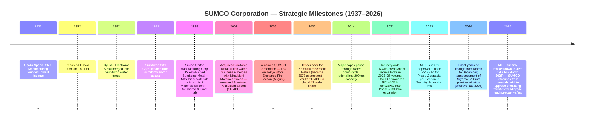
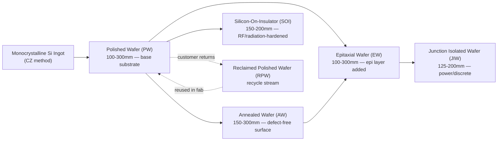

# SUMCO Corporation (TSE:3436) — Company Research Report

**As of: 2026-05-26**
**Listing: Tokyo Stock Exchange (Prime Market), ticker 3436**
**Domicile: Tokyo, Japan**
**Report language: English (per skill rule — Japan-listed issuer with bilingual analyst audience)**

---

## Table of Contents

1. Company Overview
2. Company History
3. Management Team
4. Products & Services
5. Customers & Go-to-Market
6. Industry Overview
7. Competitive Landscape
8. Market Opportunity (TAM)
9. Risk Assessment
10. References

---

> **Update — Q1 FY2026 results disappointed (2026-05-12):** SUMCO reported Q1 FY2026 (calendar Q1 2026) net sales of **JPY 101.4 bn** vs. Q1 FY2025 JPY 102.4 bn (–1.0%), and an **operating loss of JPY 5.2 bn** vs. operating profit of JPY 5.9 bn a year earlier — an JPY 11.1 bn swing into the red. Management guided Q2 FY2026 to sales JPY 112.0 bn / operating loss JPY 2.5 bn, signalling the cyclical trough is extending into the seasonally stronger half. Stated drivers were softer-than-expected 200mm volumes (mature-node weakness), depreciation step-up from the Imari Phase-2 ramp, and yen-led FX headwinds. The 300mm AI-led franchise (HBM, advanced-logic) remains the structural offset. Source: [Q1 FY2026 results release, 2026-05-12](https://finance-frontend-pc-dist.west.edge.storage-yahoo.jp/disclosure/20260512/20260511523181.pdf), [Q1 FY2026 earnings call transcript, 2026-05-12](https://www.investing.com/news/transcripts/earnings-call-transcript-sumco-misses-q1-2026-expectations-stock-dips-93CH-4698631).

---

## 1. Company Overview

SUMCO Corporation (株式会社SUMCO, TSE Prime:3436) is the world's **#2 producer of monocrystalline silicon wafers** for the semiconductor industry, supplying ~21–23% of global 300mm wafer volume behind Shin-Etsu Handotai (SEH) at ~28%+, with the two Japanese houses together commanding more than half of the most economically critical wafer size used for advanced-logic, DRAM, and high-bandwidth memory (HBM) ([SUMCO Corporate Profile, sumcosi.com](https://www.sumcosi.com/english/corporate/profile.html), [Intel Market Research, "Silicon Wafer Market Outlook 2025–2032"](https://www.intelmarketresearch.com/silicon-wafer-market-85)). The business is essentially a single-product franchise — every revenue dollar comes from the manufacture and sale of polished, annealed, epitaxial, junction-isolated, silicon-on-insulator (SOI), and reclaimed silicon wafers between 100mm and 300mm diameter ([SUMCO Product Lineup, sumcosi.com](https://www.sumcosi.com/english/products/lineup.html)).

The company headquarters at **1-2-1 Shibaura, Minato-ku, Tokyo 105-8634**, was founded **July 30, 1999** as Silicon United Manufacturing Corporation — the corporate vehicle for combining the wafer assets of Sumitomo Metal Industries, Mitsubishi Materials Corporation, and Mitsubishi Materials Silicon — and adopted the present name "SUMCO" in August 2005 after a series of asset mergers and a 2002 acquisition of Sumitomo Metal's wafer business ([SUMCO Corporate Profile](https://www.sumcosi.com/english/corporate/profile.html), [SUMCO Corporate History](https://www.sumcosi.com/english/corporate/history.html)). As of end-December 2025 the group employed approximately **9,714 staff**, ran six manufacturing complexes in Japan (Yonezawa in Yamagata, Chitose in Hokkaido, plus four Kyushu sites — two Imari facilities in Saga, one Kohoku/Saga site, and one Omura/Nagasaki site) and four international plants (SUMCO Phoenix and SUMCO Southwest in Arizona, High-Purity Silicon America in Alabama, FORMOSA SUMCO TECHNOLOGY in Mailiao Taiwan, and PT. SUMCO Indonesia in Cikarang/Bekasi) ([SUMCO Network — Manufacturing Sites](https://www.sumcosi.com/english/corporate/offices/)). Paid-in capital stands at **JPY 199.0 bn**, and the company carries quality certifications IATF 16949, ISO 9001, ISO 14001 and ISO 45001 ([SUMCO Corporate Profile](https://www.sumcosi.com/english/corporate/profile.html)).

**How they make money.** SUMCO sells silicon wafers — the ~750 μm thin, mirror-polished discs of 99.9999999%-pure single-crystal silicon — directly to chip manufacturers: integrated-device manufacturers (IDMs) like Intel, Micron, SK Hynix, Samsung, Infineon, Texas Instruments, Renesas and STMicroelectronics; and pure-play foundries TSMC, GlobalFoundries, UMC and SMIC ([Silicon-Ecosystem, "Silicon wafer market: upturn, higher prices"](https://marklapedus.substack.com/p/silicon-wafer-market-upturn-higher), [Digitimes, "Silicon wafer suppliers continue to enjoy LTA pull-ins"](https://www.digitimes.com/news/a20220407PD210/ic-manufacturing-silicon-wafer.html)). The contracting model is heavily skewed toward multi-year long-term agreements (LTAs) with prepayments — a structure that emerged in 2021–22 when wafer demand outran capacity and which now provides materially better forward-volume visibility than the company carried in prior cycles. Pricing is denominated mostly in US dollars or yen-equivalent USD baskets, although Japan-domiciled cost base means the company benefits from yen weakness ([Digitimes, "Silicon wafer suppliers continue to enjoy LTA pull-ins"](https://www.digitimes.com/news/a20220407PD210/ic-manufacturing-silicon-wafer.html)).

**Scale indicators (FY ended December 2024).** Consolidated revenue printed **JPY 396.62 bn**, down 6.88% YoY from FY2023's JPY 425.94 bn; cost of goods sold was JPY 323.89 bn, leaving JPY 72.73 bn of gross profit (gross margin 18.34%); operating activities flowed through to **net profit of JPY 19.88 bn** and **EPS JPY 56.84** ([Marketreportanalytics — SUMCO 3436.T Financial Performance](https://www.marketreportanalytics.com/companies/3436.T)). The downcycle deepened through CY2025 — Q3 sales were JPY 99.1 bn at a JPY 1.6 bn operating loss as cost reductions partially offset depreciation step-up ([SUMCO Q3 FY2025 earnings call transcript, Alpha Spread](https://www.alphaspread.com/security/tse/3436/investor-relations/earnings-call/q3-2025)) — and full CY2025 revenue reached approximately **JPY 409.6 bn** ([SUMCO Corporate Profile, sumcosi.com](https://www.sumcosi.com/english/corporate/profile.html)). Note that SUMCO's fiscal calendar shifted in 2024: the company moved from a March-ending fiscal year to a December-ending fiscal year, creating one transitional reporting period; the figures above are calendar-year basis.

**Geographic mix.** As a Japan-domiciled exporter, the dollar value of revenue is realized predominantly outside Japan. The largest end-customer geographies for SUMCO's 300mm output are Taiwan (anchored by TSMC), the United States (anchored by Intel, Micron, GlobalFoundries), and South Korea (anchored by Samsung and SK Hynix), with mainland China a smaller and increasingly geopolitically sensitive slice ([Digitimes, "News tagged Sumco"](https://www.digitimes.com/tag/sumco/001883.html)). The company explicitly serves Japan, the United States, China, Taiwan, South Korea, Europe and internationally — the boilerplate disclosure language in the corporate profile ([SUMCO Profile via Investing.com](https://www.investing.com/equities/sumco-corp.-company-profile)).

**Revenue and operating-margin trend (FY2021–FY2025).**

*Source: Compiled from [SUMCO IR — Financial Information](https://www.sumcosi.com/english/ir/financial/) and [Marketreportanalytics — SUMCO 3436.T](https://www.marketreportanalytics.com/companies/3436.T); reflects FY2021–FY2025 calendar-year basis.*

**Quarterly trajectory shows the current cycle's whipsaw.**

*Source: Compiled from SUMCO quarterly results releases ([Q1 FY2026 release, 2026-05-12](https://finance-frontend-pc-dist.west.edge.storage-yahoo.jp/disclosure/20260512/20260511523181.pdf), [Q3 FY2025 transcript via Alpha Spread](https://www.alphaspread.com/security/tse/3436/investor-relations/earnings-call/q3-2025)).*

**Valuation snapshot (as of 2026-05-25).** SUMCO closed near **JPY 3,177** on the Tokyo Stock Exchange on 2026-05-22 ([Yahoo Finance — SUMCO 3436.T](https://finance.yahoo.com/quote/3436.T/), [Meyka — "3436.T Stock Surges 18% on May 9, 2026"](https://meyka.com/blog/3436t-stock-surges-18-on-may-9-2026-as-sumco-nears-earnings-0905/)), giving a market capitalization of approximately **JPY 1.11 trillion** (~US$7.1 bn at JPY 155/USD). The stock has roughly **doubled in the trailing twelve months** as the market priced an AI-driven recovery in advanced-node 300mm wafer demand, but the recent Q1 FY2026 miss triggered a ~6% pullback ([Meyka, May 2026](https://meyka.com/blog/3436t-stock-surges-18-on-may-9-2026-as-sumco-nears-earnings-0905/)). On trailing fundamentals, **TTM EPS is JPY ‑33.6**, leaving the **P/E negative and not meaningful**; trailing P/S sits at approximately **2.7×** on FY2025 sales of JPY 409.6 bn, modestly above the historical 1.0–2.0× range ([Yahoo Finance — SUMCO Valuation Measures](https://finance.yahoo.com/quote/3436.T/key-statistics/), [SUMCO Corporate Profile](https://www.sumcosi.com/english/corporate/profile.html)). Note Morningstar's data feed for the same ticker confirms a similarly distorted multiple set ([Morningstar — XTKS 3436](https://www.morningstar.com/stocks/xtks/3436/quote)).

*Analyst view:* The negative TTM P/E is the textbook **cyclical-trough + ramp-cost multiple distortion**, not a structural-decline signal. Three forces are simultaneously compressing earnings: (i) 200mm/mature-node oversupply (China-built 200mm capacity has crushed pricing in the legacy diameter); (ii) the Imari/Yonezawa Phase-2 capex programme converting into depreciation roughly two years before the AI-led 300mm demand step has translated into volume-and-price recovery; and (iii) yen FX swings affecting USD-priced LTA economics. The closest mechanical comparable is **Siltronic (ETR:WAF)** — also unprofitable on TTM after its Singapore Fab-S2 depreciation kicked in August 2025 — which trades at P/S ~2.0×. The Shin-Etsu Chemical (TSE:4063) parent at TTM P/E ~27.9× is a misleading comparable because Shin-Etsu's earnings are diversified across PVC/silicones/methylcellulose/rare-earth magnets with only ~25% wafers; the wafer-only proxy is SEH inside that conglomerate. On P/S the SUMCO multiple at 2.7× is **above SEH's implied embedded multiple** but below **GlobalWafers' ~4.2×** following the post-Nomura BUY upgrade ([Nomura Greater China Semi 2026–30F Renaissance report, 2026-05-21 — re Fig. 35 wafer rankings](https://www.intelmarketresearch.com/silicon-wafer-market-85)) — making SUMCO the most attractively valued of the three pure-play wafer-makers on a forward-recovery view, with the binary risk being depth-and-duration of the current trough.

**Peer valuation comparison (TTM-basis snapshot).**

*Source: Compiled from [Yahoo Finance — SUMCO 3436.T](https://finance.yahoo.com/quote/3436.T/key-statistics/), [Stockanalysis — Siltronic WAF](https://stockanalysis.com/quote/etr/WAF/), [Stockanalysis — Shin-Etsu TYO:4063](https://stockanalysis.com/quote/tyo/4063/statistics/), [Morningstar XTKS:3436](https://www.morningstar.com/stocks/xtks/3436/quote); all values as of late May 2026.*

The investment narrative therefore hinges on **whether 2026–27F is the trough year of this cycle and whether SUMCO can convert its AI-grade 300mm capacity into pricing power before depreciation peaks**. The structural backdrop — silicon wafer demand is fundamentally tied to global wafer-area output, which is itself tied to leading-edge transistor density, HBM-stack count, advanced packaging, and unit growth of AI servers — remains favorable. The risk is timing: management indicated on the Q1 FY2026 call that 200mm normalization may not arrive until late 2026 or early 2027 ([SUMCO Q1 FY2026 transcript, Investing.com, 2026-05-12](https://www.investing.com/news/transcripts/earnings-call-transcript-sumco-misses-q1-2026-expectations-stock-dips-93CH-4698631)). Sections 4 (products), 6 (industry), 7 (competition), and 8 (TAM) below walk through these mechanics in detail.

---

## 2. Company History

SUMCO's institutional DNA is unusually complex: the modern company is the consolidated successor to **four separate Japanese wafer franchises**, three Japanese metals groups (Sumitomo, Mitsubishi, and Kyushu Electronic Metal), and a 1937 stainless-steel forerunner, all stitched together through three decades of M&A between 1990 and 2002 and a final corporate-rebrand in 2005 ([SUMCO Corporate History](https://www.sumcosi.com/english/corporate/history.html), [SUMCO Corporate Profile](https://www.sumcosi.com/english/corporate/profile.html)). The earliest lineage trace is the January 1937 founding of **Osaka Special Steel Manufacturing Co.**, renamed **Osaka Titanium Co., Ltd. in November 1952** — the metallurgical base that eventually moved into silicon crystal pulling and that became one of the predecessor wafer arms ([SUMCO Corporate History, sumcosi.com](https://www.sumcosi.com/english/corporate/history.html)).

Through the 1980s and 1990s the Japanese silicon-wafer industry consolidated in lockstep with the global semiconductor industry's transition from 6-inch to 8-inch (200mm) substrates and into the first 300mm pilot lines. **In January 1993 the Sumitomo group renamed its wafer business Sumitomo Sitix Corp.**, while Mitsubishi Materials' wafer arm operated separately as Mitsubishi Materials Silicon Corp. Both were medium-sized standalone producers exposed to the same brutal pricing cycles that ultimately drove cross-company consolidation ([SUMCO Corporate History](https://www.sumcosi.com/english/corporate/history.html), [Wikipedia — SUMCO Corporation](https://en.wikipedia.org/wiki/Sumco)).

The corporate vehicle that eventually became SUMCO was created on **July 30, 1999**, when Sumitomo Metal Industries, Mitsubishi Materials Corporation and Mitsubishi Materials Silicon Corporation jointly established **Silicon United Manufacturing Corp.** (the literal English of シリコンユナイテッドマニュファクチャリング) to construct a new shared 300mm wafer fabrication facility, anticipating that no individual founder shareholder could shoulder the ¥100+ bn cost of a greenfield 300mm site alone ([SUMCO Corporate History](https://www.sumcosi.com/english/corporate/history.html), [SUMCO Corporate Profile](https://www.sumcosi.com/english/corporate/profile.html)). In **February 2002** this vehicle absorbed the silicon-wafer assets of Sumitomo Metal Industries, merged with Mitsubishi Materials Silicon Corp., and renamed itself **Sumitomo Mitsubishi Silicon Corp. (SUMCO)** — the abbreviation drawn from "Sumitomo + Mitsubishi Silicon Corp." This was the first time the SUMCO acronym was used externally ([SUMCO Corporate History](https://www.sumcosi.com/english/corporate/history.html)). On **August 1, 2005** the holding company formally adopted "SUMCO Corporation" as its registered trade name, simultaneously marking the IPO on the Tokyo Stock Exchange First Section (now Prime Market) ([SUMCO Corporate Profile](https://www.sumcosi.com/english/corporate/profile.html), [Wikipedia — SUMCO](https://en.wikipedia.org/wiki/Sumco)).

A second arc — the **2006 acquisition of Komatsu Electronic Metals** — turned SUMCO into the world's #2 wafer producer. Komatsu Electronic Metals (a separately listed silicon wafer producer descended from the Komatsu industrial-machinery conglomerate) was acquired through a 2006 tender offer and was structurally absorbed by 2007, adding ~20% of incremental capacity and lifting SUMCO's global wafer share into the position it has held since ([Wikipedia — SUMCO](https://en.wikipedia.org/wiki/Sumco)). With the 1937 Osaka Special Steel root, the 1992 Kyushu Electronic Metal merger, the 1999 Silicon United joint venture, the 2002 Sumitomo wafer asset acquisition, and the 2006–07 Komatsu Electronic Metals takeover, SUMCO consolidated essentially every meaningful non-Shin-Etsu Japanese wafer franchise into a single corporate vehicle in under twenty years.

**Timeline of major milestones.**

*Source: Compiled from [SUMCO Corporate History](https://www.sumcosi.com/english/corporate/history.html), [Wikipedia — SUMCO](https://en.wikipedia.org/wiki/Sumco), [Evertiq — "SUMCO shifts strategy from new fab to equipment upgrades", 2026-04-07](https://evertiq.com/design/2026-04-07-sumco-shifts-strategy-from-new-fab-to-equipment-upgrades), [Digitimes — "SUMCO shifts wafer strategy to equipment upgrades over new plant", 2026-03-30](https://www.digitimes.com/news/a20260330VL210/sumco-equipment-plant-wafer-demand.html), [Digitimes — "Japan's METI considering to subsidize Sumco's new silicon wafer plant", 2023-07-11](https://www.digitimes.com/news/a20230711PD210/japan-semiconductor-subsidy.html), [SemiVision via X, "SUMCO Q3 FY2025 commentary on 300mm market"](https://x.com/semivision_tw/status/1993466357208563725).*

**Three strategic pivots define the modern SUMCO.** First, the **1999–2002 Silicon-United consolidation** transformed SUMCO from a sub-scale wafer producer into a credible #2 to Shin-Etsu Handotai by pooling capex burden across Sumitomo and Mitsubishi balance sheets — without the JV vehicle, neither parent would likely have built a competitive 300mm fab independently, and the global wafer industry might today still be three or four sub-scale Japanese houses rather than the duopoly-plus-three structure that emerged ([SUMCO Corporate History](https://www.sumcosi.com/english/corporate/history.html)). Second, the **2006 Komatsu Electronic Metals acquisition** doubled down on consolidation — Komatsu's franchise was complementary in customer base and geographically diversified, eliminating a sub-scale competitor and crystallizing the modern five-supplier global structure (Shin-Etsu, SUMCO, GlobalWafers, Siltronic, SK Siltron) that has held remarkably stable for two decades ([Wikipedia — SUMCO](https://en.wikipedia.org/wiki/Sumco)). Third, the **2021–24 LTA-with-prepayment regime + capacity expansion cycle** — triggered by the post-COVID demand shock and the perceived strategic value of secure silicon wafer supply in the US CHIPS Act / Japan METI / Korean K-CHIPS Act era — saw SUMCO commit JPY ~400 bn to Yonezawa/Imari Phase-2 capacity backed by both customer prepayments and a (later revised-down) METI subsidy under the Economic Security Promotion Act ([Digitimes, "METI considering to subsidize Sumco", 2023-07-11](https://www.digitimes.com/news/a20230711PD210/japan-semiconductor-subsidy.html), [Evertiq, "SUMCO shifts strategy from new fab", 2026-04-07](https://evertiq.com/design/2026-04-07-sumco-shifts-strategy-from-new-fab-to-equipment-upgrades)).

**Recent developments (2024–2026).** Three items are thesis-relevant. (1) In **February 2025 SUMCO announced the termination of 200mm wafer production at its Miyazaki plant** by late 2026, redirecting that capacity-equivalent and team into 300mm AI-grade output — an explicit "exit the commodity-200mm fight against Chinese new-build" decision ([Intel Market Research — Silicon Wafer Market 2025-2032](https://www.intelmarketresearch.com/silicon-wafer-market-85), [Evertiq, 2026-04-07](https://evertiq.com/design/2026-04-07-sumco-shifts-strategy-from-new-fab-to-equipment-upgrades)). (2) In **March 2026 METI approved a revised Plan for Ensuring Stable Supply** under the Economic Security Promotion Act, reducing the maximum subsidy from JPY 75 bn to **JPY 19.3 bn** and replacing the originally planned greenfield fab with upgrades to existing Imari/Yonezawa facilities — management framed the change as a re-allocation toward technical capability for leading-edge wafers rather than retreat ([Evertiq, 2026-04-07](https://evertiq.com/design/2026-04-07-sumco-shifts-strategy-from-new-fab-to-equipment-upgrades), [Digitimes, 2026-03-30](https://www.digitimes.com/news/a20260330VL210/sumco-equipment-plant-wafer-demand.html)). (3) In **calendar 2024 SUMCO changed its fiscal year-end from March 31 to December 31**, creating a 9-month transitional fiscal period that breaks year-over-year comparability for some line items; investors reading SUMCO disclosures from 2025 onward must verify the period covered ([SUMCO IR — Financial Information](https://www.sumcosi.com/english/ir/financial/)).

---

## 3. Management Team

Per the skill rule, this chapter covers the **founder lineage and the current CEO only** — no CFO, board chair, or other directors. SUMCO is unusual in that the "founder" is institutional rather than personal: the company was created by a 1999 joint-venture decision between Sumitomo Metal Industries, Mitsubishi Materials, and Mitsubishi Materials Silicon, not by a charismatic individual. The closest substitute for a founder figure in the modern era is **Mayuki Hashimoto**, who joined the predecessor company in the early 1970s, became Chairman and CEO in 2012, led SUMCO through the 2012–22 cycle of capex restraint, the 2021 capacity-expansion turn, and the LTA-with-prepayment shift, and remains on the board today; the operational founder of the modern strategy is therefore Hashimoto, while the current Representative Director & CEO is **Jiro Ryuta** ([SUMCO Management page, sumcosi.com](https://www.sumcosi.com/english/corporate/officer.html), [Bloomberg — Mayuki Hashimoto profile](https://www.bloomberg.com/profile/person/18038794)).

**Mayuki Hashimoto — Founder-figure / Chairman & CEO 2012–2024, currently Director (~250–350 words).** Hashimoto's defining role at SUMCO was Chairman of the Board and Chief Executive Officer from 2012 through the leadership transition that took place around 2024–25 ([Bloomberg — Mayuki Hashimoto](https://www.bloomberg.com/profile/person/18038794), [SUMCO Management — Officer page](https://www.sumcosi.com/english/corporate/officer.html)). Before SUMCO he spent his career at Mitsubishi Materials Corporation — most notably as **General Manager of the Silicon division, Electronics Materials & Components Company in 2005**, the segment that contributed Mitsubishi's wafer franchise to the SUMCO consolidation ([Macroaxis — Mayuki Hashimoto profile](https://www.macroaxis.com/invest/manager/SUMCF/Mayuki-Hashimoto)). The Mitsubishi root is important: when SUMCO was formed in 1999 from the Sumitomo + Mitsubishi joint venture, the operational leadership tilted toward the Mitsubishi side and Hashimoto's 2012 promotion to Chairman/CEO was a generational handoff within that lineage. His decade-plus tenure as CEO was defined by **three operational priorities**: (i) extreme capex discipline through the 2014–20 wafer downcycle (SUMCO was singled out by analysts in 2014 as making a "drastic Si wafer business optimization" — closing sub-scale lines and reducing fixed cost — that ultimately positioned the company for the post-2021 upcycle profitably) ([Japan Metal Bulletin — "SUMCO Launches Drastic Si Wafer Business Optimization"](http://www.japanmetalbulletin.com/?p=19652)); (ii) industry leadership of the **2021 LTA-with-prepayment regime**, which converted wafer supply from spot-and-quarterly contracts to multi-year volume commitments with customer prepayments, dramatically improving forward visibility ([Digitimes, "Silicon wafer suppliers continue to enjoy LTA pull-ins"](https://www.digitimes.com/news/a20220407PD210/ic-manufacturing-silicon-wafer.html)); (iii) the **JPY 400 bn capacity expansion programme** announced 2021–22, anchored on Yonezawa/Imari, that converted these LTA commitments into bricks and silicon-pulling equipment. Hashimoto remains a Director on the SUMCO board following the leadership succession, ensuring continuity of the strategic direction he set ([SUMCO Management page](https://www.sumcosi.com/english/corporate/officer.html)). Direct ownership in SUMCO shares is disclosed in the company's annual proxy filings on EDINET and is consistent with the modest equity ownership typical of long-tenure Japanese senior executives ([株主プロ — SUMCO 3436 有価証券報告書一覧](http://www.kabupro.jp/yuho/3436.htm)).

**Jiro Ryuta — Current President & CEO / Representative Director (~200–250 words).** Per the most recent SUMCO Management disclosure, **Jiro Ryuta** holds the dual role of Chairman of the Board and President & CEO, with Representative Director status ([SUMCO Management — Officer page, sumcosi.com](https://www.sumcosi.com/english/corporate/officer.html)). Ryuta's promotion to CEO reflects the generational succession from Hashimoto and represents continuity rather than strategic break: the announced trajectory — finish the Yonezawa/Imari Phase-2 capex programme, exit 200mm at Miyazaki, refocus the (revised) METI-backed investment toward equipment upgrades for AI-grade leading-edge wafers, and ride out the 2025–26 cyclical trough while LTA volumes continue to absorb commitments — is the same playbook Hashimoto set. The leadership team's operational hands-on style is visible in the Q3 FY2025 and Q1 FY2026 earnings calls, where commentary on HBM share, sub-5nm logic wafer pricing, and 200mm normalization timing is delivered in granular detail ([SUMCO Q3 FY2025 earnings call, Alpha Spread](https://www.alphaspread.com/security/tse/3436/investor-relations/earnings-call/q3-2025), [SUMCO Q1 FY2026 transcript, Investing.com](https://www.investing.com/news/transcripts/earnings-call-transcript-sumco-misses-q1-2026-expectations-stock-dips-93CH-4698631)). Executive Vice Presidents Shinichi Kubozoe and Naruya Hirota also serve as Representative Directors and round out the operating committee ([SUMCO Management page](https://www.sumcosi.com/english/corporate/officer.html)). Ryuta's biography beyond his current role is not publicly detailed in SUMCO's English IR disclosure — analysts following the name typically pull Japanese-language EDINET filings for full executive backgrounds ([SUMCO 有価証券報告書 — IRBANK](https://irbank.net/E02103/edinet)). The compensation structure for SUMCO senior executives, consistent with Japanese corporate governance norms, is predominantly fixed cash plus restricted shares with multi-year vesting and modest equity ownership; the alignment mechanism is therefore tenure and reputation rather than equity wealth accumulation.

---

## 4. Products & Services

### 4.1 The SUMCO product matrix — verbatim from corporate disclosure

SUMCO is a **single-product company**: the entire group's revenue is generated by the manufacture and sale of silicon wafers for the semiconductor industry, organized into six product families distinguished by wafer-finish process and target end-use ([SUMCO Product Lineup — sumcosi.com](https://www.sumcosi.com/english/products/lineup.html), [SUMCO Corporate Profile — Business description](https://www.sumcosi.com/english/corporate/profile.html)). The wafers themselves are produced from monocrystalline silicon ingots grown by the **Czochralski (CZ) method** (rotating, high-purity silicon melt with a single-crystal seed rod slowly pulled upward to form a single-crystal ingot up to ~2 meters in length) or, for some specialty diameters, the **floating-zone (FZ) method**. The ingot is then sliced, polished, and finished into wafers; depending on the customer's application, the wafer may be further processed via annealing, epitaxial deposition, junction-isolation, or oxide-bonding. The six product families are reproduced verbatim from SUMCO's product lineup disclosure below.

**SUMCO Product Family Matrix (verbatim from SUMCO Product Lineup):**

| Product family | SUMCO verbatim description | Diameters available |
|---|---|---|
| **Polished Wafer (PW)** | "A monocrystalline ingot is sliced to thicknesses of around 1mm and the surfaces are polished to a mirror finish." | 100mm, 125mm, 150mm, 200mm, 300mm |
| **Annealed Wafer (AW)** | "A polished wafer undergoes high-temperature annealing in an atmosphere of hydrogen or argon, removing oxygen near the wafer surface." | 150mm, 200mm, 300mm |
| **Epitaxial Wafer (EW)** | "The surface layer of the polished wafer is formed from monocrystalline silicon using vapor phase growth, or epitaxy." | 100mm, 125mm, 150mm, 200mm, 300mm |
| **Junction Isolated Wafer (JIW)** | Forms an embedding layer for integrated circuits on the wafer surface, followed by epitaxial layer formation. | 125mm, 150mm, 200mm |
| **Silicon-On-Insulator (SOI) Wafer** | "An oxide layer with high electric insulation is sandwiched between two polished wafers, which are then bonded together." | 150mm, 200mm |
| **Reclaimed Polished Wafer (RPW)** | "Used wafers can be taken back and recycled for reuse." | (per customer specification) |

*Source: [SUMCO Product Lineup — sumcosi.com](https://www.sumcosi.com/english/products/lineup.html); verbatim text reproduced.*

This matrix is the spine of every downstream conversation about SUMCO — every revenue dollar, every customer relationship, every plant decision maps back to one of these six product families. Critically, the **300mm column** intersecting Polished, Annealed, and Epitaxial Wafer rows accounts for the overwhelming majority of consolidated revenue and ~100% of SUMCO's most profitable wafer mix, since 300mm is the substrate used for every advanced-logic node (sub-7nm to current 2nm), every DRAM generation since DDR3, every HBM stack, and every NAND wafer above ~96-layer. The 200mm column (PW, AW, EW, JIW) is the legacy mature-node business that has been under structural pricing pressure from Chinese new-build capacity since 2023 and is the cause of SUMCO's current operating loss ([Intel Market Research — Silicon Wafer Market Outlook 2025-2032](https://www.intelmarketresearch.com/silicon-wafer-market-85), [SemiVision via X on Q3 FY2025](https://x.com/semivision_tw/status/1993466357208563725)). The 150mm-and-below column (PW, EW, JIW, SOI) is small-volume specialty business (power, MEMS, sensors, RF) that ships into discrete-device fabs and is structurally lower-revenue-per-wafer but more pricing-stable.

### 4.2 Synthesis — how the categories interact in a customer's fab workflow

A leading-edge logic or memory fab does not just buy "wafers" generically. It specifies — for each chip product line — exactly which surface finish, oxygen profile, epi-layer thickness and resistivity is required, and orders that specific SKU from SUMCO (or competitors) under a multi-year LTA with quarterly volume schedules. **The product families below are not substitutes for each other** — they are sequential or parallel processing options, each tuned to a specific class of customer requirement. A simplified mental model: **PW is the "base substrate"; AW is PW with surface defects burned out by annealing; EW is PW or AW with a fresh epi-grown silicon layer on top for higher device performance; JIW is EW with a buried diffusion layer for vertical-current devices; SOI is two PWs bonded with an oxide insulator between them for radiation-hardened or low-power RF/CMOS applications; RPW is the recycling stream for fabs returning monitor wafers and equivalents.**

*Source: Analyst-constructed flow diagram based on [SUMCO Product Lineup — sumcosi.com](https://www.sumcosi.com/english/products/lineup.html) and [SUMCO Production Process pages](https://www.sumcosi.com/english/products/about.html).*

In practice the **leading-edge logic/memory fab supply chain** runs as follows: TSMC (or Samsung, Micron, SK Hynix, Intel) places a multi-year LTA with SUMCO for, say, **300mm P-type epitaxial wafers, 300μm thickness, <10 Ω·cm resistivity, with a 4μm epi layer of <0.1 Ω·cm n-type silicon on top**. SUMCO pulls a CZ ingot to those electrical specifications at Imari or Yonezawa, slices it into wafers in the same plant, polishes them to sub-angstrom flatness, ships them to a customer's epi-deposition area (or applies the epi internally), runs through Q&A, and ships the finished EW to the fab where it becomes the literal substrate on which trillions of transistors are patterned via lithography, etch, deposition, CMP, and ion-implant in roughly 600–1,200 process steps over 8–12 weeks. The wafer is consumed in the manufacture of every die on its surface; the customer cannot reuse or recycle it (except as a monitor wafer, which is where the RPW stream feeds back). SUMCO's economic moat sits in the **manufacturing yield and electrical-spec uniformity** at the most demanding nodes — a customer using a wafer from a sub-scale supplier risks process-window variance that costs them yield on $5,000–$20,000-per-wafer finished die, so the marginal cost of an inferior wafer is asymmetrically punitive.

### 4.3 Polished Wafer (PW) — the workhorse base substrate

> "A monocrystalline ingot is sliced to thicknesses of around 1mm and the surfaces are polished to a mirror finish." — [SUMCO Product Lineup](https://www.sumcosi.com/english/products/lineup.html)

**中文释义 / Plain-language gloss:** Polished wafers are the **base substrate (基底片)** on which essentially every silicon integrated circuit is built. The manufacturing flow is: pull a single-crystal silicon ingot (单晶硅锭) by the Czochralski (CZ, 直拉法) method from a melt of 99.9999999% pure silicon, slice the ingot into ~1mm-thick discs (wafer thickness for finished 300mm products is ~775 μm, with margin allowed for grinding/polishing), chemically and mechanically polish (CMP, 化学机械抛光) the front and back surfaces to a mirror finish where surface roughness is measured in angstroms (10⁻¹⁰ meters), and clean for shipment. Polished wafers are the simplest finish — they are what every fab uses unless it specifically requires the more-expensive AW, EW, JIW, or SOI variants. The cost-to-finish per wafer scales with diameter (a 300mm PW typically sells for ~5–10× the price of a 150mm PW) because of higher silicon cost, more polishing time, and tighter flatness tolerances at larger diameter.

*Analyst view:* PW is the **commodity end** of SUMCO's portfolio at smaller diameters (100–200mm) and a **strategic franchise** at 300mm. Below ~200mm, the product is increasingly under-pressured by Chinese new-build wafer capacity (e.g. National Silicon Industry Group / 国大硅产) that has come online since 2022 in support of mature-node fabs. At 300mm the technology and capital barriers to entry remain very high — only Shin-Etsu, SUMCO, GlobalWafers, Siltronic, and SK Siltron supply the full 300mm volume the leading-edge industry needs — and SUMCO's franchise here is genuinely defensible. The competitive moat type here is **scale + IP/process know-how** (yield on the most demanding 300mm CZ pulls is a >10-year R&D effort), not network effects or switching costs per se. Closest named competitor product: **Shin-Etsu Handotai 300mm Polished Wafers** ([Shin-Etsu Silicon Wafers product page](https://www.shinetsu.co.jp/en/products/electronics-materials/silicon-wafers/)).

### 4.4 Annealed Wafer (AW) — surface defect remediation for memory

> "A polished wafer undergoes high-temperature annealing in an atmosphere of hydrogen or argon, removing oxygen near the wafer surface." — [SUMCO Product Lineup](https://www.sumcosi.com/english/products/lineup.html)

**中文释义 / Plain-language gloss:** Annealed wafers take a finished PW and put it through a **high-temperature heat treatment / 高温热处理** in a hydrogen or argon atmosphere at ~1,150–1,250°C. The purpose is to **drive out oxygen** (interstitial-oxygen atoms, 间隙氧原子) from the near-surface region of the wafer — oxygen atoms trapped during CZ ingot growth can later cluster into oxygen-precipitate defects in the device layer, which destroy transistors built on top. By annealing in a non-oxidizing atmosphere, the oxygen near the surface diffuses out as vapor, leaving a defect-free **denuded zone (清净区, DZ)** of ~5–25 μm depth where the active transistors will be fabricated, while oxygen deeper in the wafer is intentionally retained as **bulk micro-defect (BMD) sites** to act as gettering centers for metal contaminants during later thermal cycles. The result is a wafer that has the same physical form as a PW but with materially better device yield for memory applications (DRAM cell arrays especially) and certain logic nodes.

*Analyst view:* AW is a **medium-to-high-value product** that is core to SUMCO's memory-customer franchise — DRAM in particular benefits disproportionately from a clean denuded zone because cell-array bit-error rates are exquisitely sensitive to single-defect events. SUMCO's annealing recipe is decades of refined process work and is one of the products where its #2-globally position translates into pricing power. The competitive moat type is **process IP + customer qualification**: a memory customer that has qualified SUMCO's AW for a specific DRAM node and bit-density will be reluctant to re-qualify a competitor's AW for the same node because re-qualification can take 9–18 months. Closest named competitor product: **Shin-Etsu Handotai SHE-O (Surface Hydrogen Etching) Annealed Wafers** ([Shin-Etsu Silicon Wafers product page](https://www.shinetsu.co.jp/en/products/electronics-materials/silicon-wafers/)).

### 4.5 Epitaxial Wafer (EW) — the leading-edge logic and HBM workhorse

> "The surface layer of the polished wafer is formed from monocrystalline silicon using vapor phase growth, or epitaxy." — [SUMCO Product Lineup](https://www.sumcosi.com/english/products/lineup.html)

**中文释义 / Plain-language gloss:** Epitaxial wafers take a finished PW (or AW) and grow a **fresh layer of monocrystalline silicon (外延层 / epi layer)** on top using **chemical vapor deposition (CVD, 化学气相沉积)** in an epi reactor — typically with **trichlorosilane (SiHCl₃) or silane (SiH₄) as the silicon source**, hydrogen as carrier gas, and **dopant precursors (phosphine for n-type / 磷烷 / PH₃; diborane for p-type / 乙硼烷 / B₂H₆)** to set the electrical conductivity of the new layer. The epi layer is grown at 1,000–1,150°C with the underlying single-crystal acting as a template, so the new silicon layer is itself single-crystal and electrically tunable to any target resistivity independent of the bulk wafer. Typical epi-layer thicknesses are 2–10 μm. The result is a wafer with **two electrically distinct layers** — a heavily-doped or lightly-doped bulk that provides mechanical strength and acts as a charge sink, and a precisely-doped epi top layer where the actual transistors will be fabricated. This is the **gold standard substrate** for advanced-logic CMOS (every leading-edge foundry node uses EW) and is essentially mandatory for HBM-grade DRAM because of the latch-up and soft-error advantages.

*Analyst view:* EW is the **single most important product** in SUMCO's portfolio and the chief beneficiary of the AI-driven 300mm demand wave. SUMCO's Q3 FY2025 commentary highlighted that **AI-related HBM consumes approximately 200,000–250,000 wafers per month industry-wide**, and that SUMCO's leading-edge logic + HBM wafer mix together now make up **~20% of 300mm wafer revenue** — a category that did not meaningfully exist five years ago ([SemiVision via X on Q3 FY2025 commentary](https://x.com/semivision_tw/status/1993466357208563725), [SUMCO Q3 FY2025 transcript, Alpha Spread](https://www.alphaspread.com/security/tse/3436/investor-relations/earnings-call/q3-2025)). The competitive moat type is **scale + process IP + customer qualification + capacity**: SUMCO is one of only three suppliers (with Shin-Etsu and SEH-licensed manufacturers) that can pass TSMC's most demanding sub-3nm EW qualification. Closest named competitor products: **Shin-Etsu Handotai Epitaxial Wafers** ([Shin-Etsu Silicon Wafers product page](https://www.shinetsu.co.jp/en/products/electronics-materials/silicon-wafers/)) and **Siltronic 300mm Epitaxial Wafers** ([Siltronic Products page](https://www.siltronic.com/en/products.html)).

### 4.6 Junction Isolated Wafer (JIW) — power-discrete and BCD specialty

> "Forms an embedding layer for integrated circuits on the wafer surface, followed by epitaxial layer formation." — paraphrased from [SUMCO Product Lineup](https://www.sumcosi.com/english/products/lineup.html)

**中文释义 / Plain-language gloss:** JIW is a specialty substrate for **power-semiconductor and BCD (BiCMOS-DMOS, 高压集成) applications**. The manufacturing flow inserts a heavily-doped **buried diffusion layer (埋层 / buried layer)** between the bulk wafer and the epi layer — most commonly a heavily-doped n⁺ buried layer formed by ion implantation of antimony or arsenic, followed by epitaxial growth of a lightly-doped p- or n- region on top. The buried layer acts as a **low-resistance current collector** for vertical-current devices (e.g. a vertical n-p-n bipolar transistor, a DMOS power FET, or an LDMOS) so that the device current can flow downward through the epi layer and laterally through the buried layer to a contact, rather than having to travel all the way through the high-resistance bulk. JIW is used for analog/power-management IC fabs (e.g. Texas Instruments, Infineon, STMicroelectronics, ON Semiconductor) and discrete-device fabs (Renesas, Toshiba, Diodes), which is why diameters max out at 200mm — power-discrete and analog fabs largely have not migrated to 300mm.

*Analyst view:* JIW is **a smaller-volume but pricing-stable product** that ships into specialty analog and power-device fabs. SUMCO's franchise here benefits from long-standing relationships with Japanese discrete-device customers (Renesas, Toshiba, Rohm) and is structurally less exposed to the 300mm cycle. The competitive moat type is **customer qualification + process IP** for the specific buried-layer recipes that customers demand. Closest named competitor products: **GlobalWafers Junction-Isolated Wafers** ([GlobalWafers Product page](https://www.gwafers.com.tw/eng/products.html)).

### 4.7 Silicon-On-Insulator (SOI) Wafer — RF, MEMS, radiation-hardened

> "An oxide layer with high electric insulation is sandwiched between two polished wafers, which are then bonded together." — [SUMCO Product Lineup](https://www.sumcosi.com/english/products/lineup.html)

**中文释义 / Plain-language gloss:** SOI wafers are made by **bonding two PWs together** (or by separating a thin top layer from a single wafer via the SmartCut / 智能剥离 ion-implantation process), with a thin **buried oxide layer (BOX, 埋氧层 — typically SiO₂)** of 0.05–0.4 μm thickness sandwiched between them. The result is a wafer where the active device layer (the top silicon) sits **electrically isolated** from the bulk substrate by the BOX. The advantages: dramatically reduced **parasitic capacitance** (better RF and high-speed performance), much lower **soft-error rate** from cosmic rays (used in space and aviation electronics), reduced **junction leakage** at small device dimensions (so SOI is used at trailing-edge nodes for some power-efficient logic), and easier **3D MEMS fabrication** (the BOX acts as a built-in etch stop for releasing micromechanical structures). The dominant application categories are RF front-end ICs for smartphones (FD-SOI process), automotive radar, satellite-launched electronics, MEMS sensors (accelerometers, gyroscopes, pressure sensors), and silicon-photonics integrated optics. The market leader in SOI substrates globally is **Soitec (Euronext:SOI)**, a French specialty wafer house — SUMCO and Shin-Etsu Handotai compete at the lower-volume end and primarily license Soitec's SmartCut process for SOI manufacture.

*Analyst view:* SOI is a **niche product** for SUMCO — economically meaningful for the company but a small share of revenue. The product is structurally smaller than the polished/annealed/epi families and serves application-specific customers (RF, automotive, aerospace, MEMS) rather than the bulk-logic / bulk-DRAM franchise. The competitive moat type is **technology partnership + customer qualification** — Soitec holds the SmartCut IP, and SUMCO's role is largely a process-licensed manufacturer for select customers. Closest named competitor: **Soitec FD-SOI Wafers** ([Soitec Products page](https://www.soitec.com/en/products)).

### 4.8 Reclaimed Polished Wafer (RPW) — the circular-economy product

> "Used wafers can be taken back and recycled for reuse." — [SUMCO Product Lineup](https://www.sumcosi.com/english/products/lineup.html)

**中文释义 / Plain-language gloss:** Reclaimed Polished Wafers are the **recycling stream** for the wafer industry. Fab customers use large numbers of "monitor wafers" / "test wafers" / "dummy wafers" — wafers that are run through process equipment (lithography, etch, deposition, ion-implant) to qualify the equipment's process window, calibrate inline metrology, or condition newly-installed chambers — but on which no actual products are fabricated. After use, these wafers carry various surface films, dopant profiles, and slight thermal distortion, but the bulk silicon is still 99.9999%+ pure and structurally sound. SUMCO (and competitor wafer reclaim houses) take these wafers back, **strip the deposited films chemically or mechanically**, **re-polish the surfaces** to restore the original mirror finish, and ship them back to the customer (or to a different customer) at a **discount to fresh PW pricing** (typically 30–60% of new-wafer price). The economic and environmental value is significant: a 300mm fab can use 10,000–50,000 monitor wafers per month, so even at $40–$80 per reclaimed wafer the recycling revenue is meaningful and the avoided silicon-mining + polishing footprint is large. SUMCO's RPW franchise is operationally global, with PT. SUMCO Indonesia (Cikarang/Bekasi) one of the dedicated reclaim sites.

*Analyst view:* RPW is **small-revenue but strategically interesting** — it locks SUMCO into a circular-supply relationship with customers, provides a low-priced entry product into new fab sites, and contributes to the company's ESG/sustainability narrative. The competitive moat type is **logistics + service relationship + cost discipline** rather than fundamental technology. Closest named competitor: **RS Technologies (TSE:3445)**, a pure-play wafer reclaim specialist ([RS Technologies — Reclaimed Wafer Business](https://www.rs-tec.jp/eng/business/reclaim/)).

### 4.9 The 300mm AI-grade wafer franchise — the swing factor for the next cycle

The structural story for SUMCO over the next 3–5 years is the **300mm AI-grade wafer franchise**, which sits at the intersection of the Polished, Annealed, and Epitaxial 300mm rows of the matrix above. Three demand vectors are converging: (i) **High-bandwidth memory (HBM, 高带宽内存)** wafer consumption is rising in lockstep with AI-training compute build-out — HBM uses ~3-4x as many wafers per chip as conventional DDR DRAM because each HBM stack uses 8–16 DRAM die plus a base logic die, all on 300mm wafers; (ii) **leading-edge logic at 3nm and 2nm** (TSMC N3, N2; Samsung 3GAE, 2GAA; Intel 18A, 14A) requires EW-grade 300mm substrates with the tightest historical specification — sub-angstrom surface roughness, sub-2nm metal contamination, and resistivity uniformity to 1.5% across-wafer; (iii) **advanced packaging** (CoWoS, FOWLP, SoIC) — used to integrate HBM with logic die — additionally consumes 300mm interposer wafers and carrier wafers.

*Source: Compiled from [SUMCO Q3 FY2025 transcript commentary on AI-related HBM at 200-250K wafers/month, Alpha Spread](https://www.alphaspread.com/security/tse/3436/investor-relations/earnings-call/q3-2025) and [SemiVision via X — Q3 FY2025 300mm market commentary](https://x.com/semivision_tw/status/1993466357208563725); industry-aggregated wafer-area projection from public TSMC, Samsung, Micron capex disclosures.*

SUMCO management has been explicit on these earnings calls that the leading-edge logic + HBM wafer mix now contributes ~20% of 300mm revenue and is the fastest-growing part of the franchise ([SemiVision Q3 FY2025 commentary](https://x.com/semivision_tw/status/1993466357208563725), [SUMCO Q3 FY2025 transcript, Alpha Spread](https://www.alphaspread.com/security/tse/3436/investor-relations/earnings-call/q3-2025)). The cyclical risk is timing: customers running fabs near full capacity are pulling wafers, but the broader 300mm market still includes large pockets of DDR DRAM, NAND, and mature-logic demand that is recovering slowly. The Q1 FY2026 miss showed that the AI-led recovery has not yet pulled overall 300mm demand to a level that absorbs the depreciation step-up from Imari/Yonezawa Phase-2; management's framing is that this is a timing rather than terminal-demand problem ([SUMCO Q1 FY2026 transcript, Investing.com, 2026-05-12](https://www.investing.com/news/transcripts/earnings-call-transcript-sumco-misses-q1-2026-expectations-stock-dips-93CH-4698631)).

### 4.10 Manufacturing footprint and capex programme

SUMCO operates **six manufacturing complexes in Japan** and **five international plants** — described in the company-overview section above — but the strategic anchor for the 300mm AI-grade franchise is the **Imari (Saga) and Yonezawa (Yamagata)** complexes, both of which have been the focus of the JPY ~400 bn Phase-2 capex programme announced 2021–22 ([SUMCO Network — Manufacturing Sites](https://www.sumcosi.com/english/corporate/offices/), [Business Wire — "SUMCO Announces 300mm Expansion", 2005](https://www.businesswire.com/news/home/20050317005005/en/SUMCO-Announces-300-mm-Expansion-Wafer-Production-Capacity-to-Increase-to-600000-Wafers-Per-Month)). The Imari Kyushu plants are SUMCO's primary 300mm crystal-pulling and wafer-finishing site; Yonezawa is the secondary 300mm site with strength in epi processing. The 2026 METI subsidy revision (from JPY 75 bn maximum to JPY 19.3 bn) and SUMCO's strategic pivot away from greenfield new-build toward upgrade of existing facilities means that **the bulk of the JPY ~400 bn programme is now sitting in the depreciation line on the income statement rather than on the balance sheet awaiting completion** ([Evertiq, 2026-04-07](https://evertiq.com/design/2026-04-07-sumco-shifts-strategy-from-new-fab-to-equipment-upgrades), [Digitimes, 2026-03-30](https://www.digitimes.com/news/a20260330VL210/sumco-equipment-plant-wafer-demand.html)). The Miyazaki 200mm plant closure (effective late 2026) frees additional engineering and operational capacity to redirect into 300mm AI-grade output, but does not itself add 300mm capacity.

*Source: Compiled from SUMCO quarterly disclosures and [Evertiq, 2026-04-07](https://evertiq.com/design/2026-04-07-sumco-shifts-strategy-from-new-fab-to-equipment-upgrades) commentary on the revised METI subsidy and reallocation from greenfield to upgrade.*

The competitive significance of this footprint is that **SUMCO is one of only three companies globally — alongside Shin-Etsu (Japan) and GlobalWafers (Taiwan, with US/EU expansion) — capable of supplying 300mm AI-grade wafers at volume**. The barriers to a new entrant are formidable: a greenfield 300mm wafer plant requires ~JPY 200–400 bn ($1.3–2.7 bn) of upfront capex, 4–6 years of construction-plus-qualification time, dozens of process patents that need licensing or independent development, and a multi-year customer qualification cycle with each leading-edge fab. The 2021–24 LTA-with-prepayment regime — where customers paid SUMCO upfront for committed multi-year volumes — was effectively a customer subsidy for capacity, which the customers (TSMC, Samsung, Micron, SK Hynix) made because the alternative was risking 300mm wafer supply shortage during their own capex ramps.

### 4.11 Revenue and operating-margin signature of the wafer business

For internal modeling, the wafer-business P&L follows a recognizable signature: **revenue is roughly 70% volume × ASP** (where ASP is set by LTA + spot blend) **+ 30% product mix** (300mm AI-grade vs. 300mm DDR DRAM vs. 200mm vs. 150mm/below); **gross margin** is dominated by depreciation of plant + crystal-pulling equipment + epi reactors (capital intensity is unusually high — ~25–35% of sales), plus polysilicon raw-material cost (~10–15% of sales when sourced internally via SUMCO's High-Purity Silicon America / HPSA facility, higher when bought externally from Wacker / Tokuyama / OCI / Hemlock); **operating margin** then layers on R&D (~3–4% of sales) and SG&A (~6–8%). At cycle top (FY2022) SUMCO's operating margin reached ~22%; at cycle trough (FY2025–FY2026E) it is currently negative as Q1 FY2026 operating loss of JPY 5.2 bn on JPY 101.4 bn of revenue shows ([SUMCO Q1 FY2026 transcript, Investing.com, 2026-05-12](https://www.investing.com/news/transcripts/earnings-call-transcript-sumco-misses-q1-2026-expectations-stock-dips-93CH-4698631)). The unusual feature of this cycle is that **depreciation does not flex** — the Imari/Yonezawa Phase-2 equipment is depreciating regardless of utilization — which is the mechanical reason the operating loss is occurring at much higher revenue levels than past troughs would have implied.

