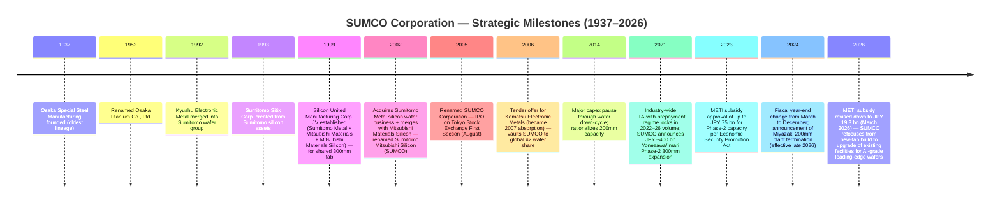
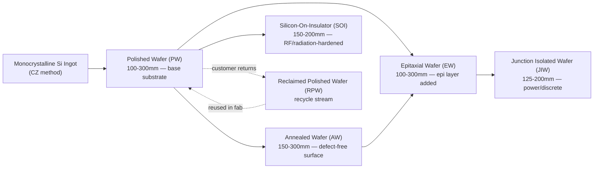
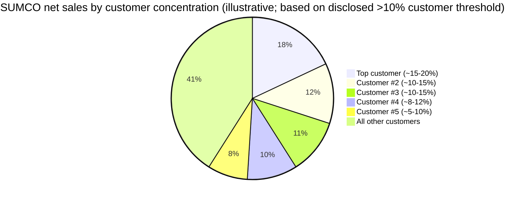
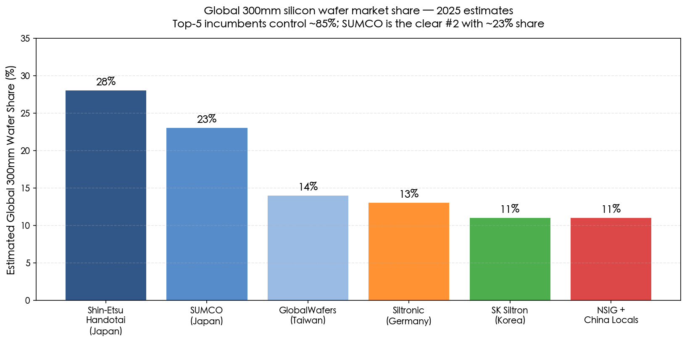
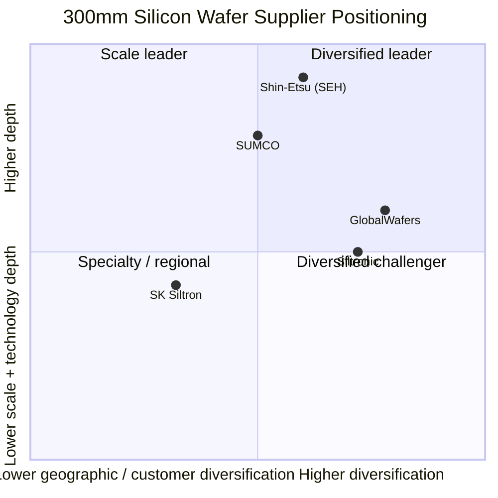

# SUMCO Corporation (TSE:3436) — Company Research Report

**As of: 2026-05-26**
**Listing: Tokyo Stock Exchange (Prime Market), ticker 3436**
**Domicile: Tokyo, Japan**
**Report language: English (per skill rule — Japan-listed issuer with bilingual analyst audience)**

---

## Table of Contents

1. Company Overview
2. Company History
3. Management Team
4. Products & Services
5. Customers & Go-to-Market
6. Industry Overview
7. Competitive Landscape
8. Market Opportunity (TAM)
9. Risk Assessment
10. References

---

> **Update — Q1 FY2026 results disappointed (2026-05-12):** SUMCO reported Q1 FY2026 (calendar Q1 2026) net sales of **JPY 101.4 bn** vs. Q1 FY2025 JPY 102.4 bn (–1.0%), and an **operating loss of JPY 5.2 bn** vs. operating profit of JPY 5.9 bn a year earlier — an JPY 11.1 bn swing into the red. Management guided Q2 FY2026 to sales JPY 112.0 bn / operating loss JPY 2.5 bn, signalling the cyclical trough is extending into the seasonally stronger half. Stated drivers were softer-than-expected 200mm volumes (mature-node weakness), depreciation step-up from the Imari Phase-2 ramp, and yen-led FX headwinds. The 300mm AI-led franchise (HBM, advanced-logic) remains the structural offset. Source: [Q1 FY2026 results release, 2026-05-12](https://finance-frontend-pc-dist.west.edge.storage-yahoo.jp/disclosure/20260512/20260511523181.pdf), [Q1 FY2026 earnings call transcript, 2026-05-12](https://www.investing.com/news/transcripts/earnings-call-transcript-sumco-misses-q1-2026-expectations-stock-dips-93CH-4698631).

---

## 1. Company Overview

SUMCO Corporation (株式会社SUMCO, TSE Prime:3436) is the world's **#2 producer of monocrystalline silicon wafers** for the semiconductor industry, supplying ~21–23% of global 300mm wafer volume behind Shin-Etsu Handotai (SEH) at ~28%+, with the two Japanese houses together commanding more than half of the most economically critical wafer size used for advanced-logic, DRAM, and high-bandwidth memory (HBM) ([SUMCO Corporate Profile, sumcosi.com](https://www.sumcosi.com/english/corporate/profile.html), [Intel Market Research, "Silicon Wafer Market Outlook 2025–2032"](https://www.intelmarketresearch.com/silicon-wafer-market-85)). The business is essentially a single-product franchise — every revenue dollar comes from the manufacture and sale of polished, annealed, epitaxial, junction-isolated, silicon-on-insulator (SOI), and reclaimed silicon wafers between 100mm and 300mm diameter ([SUMCO Product Lineup, sumcosi.com](https://www.sumcosi.com/english/products/lineup.html)).

The company headquarters at **1-2-1 Shibaura, Minato-ku, Tokyo 105-8634**, was founded **July 30, 1999** as Silicon United Manufacturing Corporation — the corporate vehicle for combining the wafer assets of Sumitomo Metal Industries, Mitsubishi Materials Corporation, and Mitsubishi Materials Silicon — and adopted the present name "SUMCO" in August 2005 after a series of asset mergers and a 2002 acquisition of Sumitomo Metal's wafer business ([SUMCO Corporate Profile](https://www.sumcosi.com/english/corporate/profile.html), [SUMCO Corporate History](https://www.sumcosi.com/english/corporate/history.html)). As of end-December 2025 the group employed approximately **9,714 staff**, ran six manufacturing complexes in Japan (Yonezawa in Yamagata, Chitose in Hokkaido, plus four Kyushu sites — two Imari facilities in Saga, one Kohoku/Saga site, and one Omura/Nagasaki site) and four international plants (SUMCO Phoenix and SUMCO Southwest in Arizona, High-Purity Silicon America in Alabama, FORMOSA SUMCO TECHNOLOGY in Mailiao Taiwan, and PT. SUMCO Indonesia in Cikarang/Bekasi) ([SUMCO Network — Manufacturing Sites](https://www.sumcosi.com/english/corporate/offices/)). Paid-in capital stands at **JPY 199.0 bn**, and the company carries quality certifications IATF 16949, ISO 9001, ISO 14001 and ISO 45001 ([SUMCO Corporate Profile](https://www.sumcosi.com/english/corporate/profile.html)).

**How they make money.** SUMCO sells silicon wafers — the ~750 μm thin, mirror-polished discs of 99.9999999%-pure single-crystal silicon — directly to chip manufacturers: integrated-device manufacturers (IDMs) like Intel, Micron, SK Hynix, Samsung, Infineon, Texas Instruments, Renesas and STMicroelectronics; and pure-play foundries TSMC, GlobalFoundries, UMC and SMIC ([Silicon-Ecosystem, "Silicon wafer market: upturn, higher prices"](https://marklapedus.substack.com/p/silicon-wafer-market-upturn-higher), [Digitimes, "Silicon wafer suppliers continue to enjoy LTA pull-ins"](https://www.digitimes.com/news/a20220407PD210/ic-manufacturing-silicon-wafer.html)). The contracting model is heavily skewed toward multi-year long-term agreements (LTAs) with prepayments — a structure that emerged in 2021–22 when wafer demand outran capacity and which now provides materially better forward-volume visibility than the company carried in prior cycles. Pricing is denominated mostly in US dollars or yen-equivalent USD baskets, although Japan-domiciled cost base means the company benefits from yen weakness ([Digitimes, "Silicon wafer suppliers continue to enjoy LTA pull-ins"](https://www.digitimes.com/news/a20220407PD210/ic-manufacturing-silicon-wafer.html)).

**Scale indicators (FY ended December 2024).** Consolidated revenue printed **JPY 396.62 bn**, down 6.88% YoY from FY2023's JPY 425.94 bn; cost of goods sold was JPY 323.89 bn, leaving JPY 72.73 bn of gross profit (gross margin 18.34%); operating activities flowed through to **net profit of JPY 19.88 bn** and **EPS JPY 56.84** ([Marketreportanalytics — SUMCO 3436.T Financial Performance](https://www.marketreportanalytics.com/companies/3436.T)). The downcycle deepened through CY2025 — Q3 sales were JPY 99.1 bn at a JPY 1.6 bn operating loss as cost reductions partially offset depreciation step-up ([SUMCO Q3 FY2025 earnings call transcript, Alpha Spread](https://www.alphaspread.com/security/tse/3436/investor-relations/earnings-call/q3-2025)) — and full CY2025 revenue reached approximately **JPY 409.6 bn** ([SUMCO Corporate Profile, sumcosi.com](https://www.sumcosi.com/english/corporate/profile.html)). Note that SUMCO's fiscal calendar shifted in 2024: the company moved from a March-ending fiscal year to a December-ending fiscal year, creating one transitional reporting period; the figures above are calendar-year basis.

**Geographic mix.** As a Japan-domiciled exporter, the dollar value of revenue is realized predominantly outside Japan. The largest end-customer geographies for SUMCO's 300mm output are Taiwan (anchored by TSMC), the United States (anchored by Intel, Micron, GlobalFoundries), and South Korea (anchored by Samsung and SK Hynix), with mainland China a smaller and increasingly geopolitically sensitive slice ([Digitimes, "News tagged Sumco"](https://www.digitimes.com/tag/sumco/001883.html)). The company explicitly serves Japan, the United States, China, Taiwan, South Korea, Europe and internationally — the boilerplate disclosure language in the corporate profile ([SUMCO Profile via Investing.com](https://www.investing.com/equities/sumco-corp.-company-profile)).

**Revenue and operating-margin trend (FY2021–FY2025).**

*Source: Compiled from [SUMCO IR — Financial Information](https://www.sumcosi.com/english/ir/financial/) and [Marketreportanalytics — SUMCO 3436.T](https://www.marketreportanalytics.com/companies/3436.T); reflects FY2021–FY2025 calendar-year basis.*

**Quarterly trajectory shows the current cycle's whipsaw.**

*Source: Compiled from SUMCO quarterly results releases ([Q1 FY2026 release, 2026-05-12](https://finance-frontend-pc-dist.west.edge.storage-yahoo.jp/disclosure/20260512/20260511523181.pdf), [Q3 FY2025 transcript via Alpha Spread](https://www.alphaspread.com/security/tse/3436/investor-relations/earnings-call/q3-2025)).*

**Valuation snapshot (as of 2026-05-25).** SUMCO closed near **JPY 3,177** on the Tokyo Stock Exchange on 2026-05-22 ([Yahoo Finance — SUMCO 3436.T](https://finance.yahoo.com/quote/3436.T/), [Meyka — "3436.T Stock Surges 18% on May 9, 2026"](https://meyka.com/blog/3436t-stock-surges-18-on-may-9-2026-as-sumco-nears-earnings-0905/)), giving a market capitalization of approximately **JPY 1.11 trillion** (~US$7.1 bn at JPY 155/USD). The stock has roughly **doubled in the trailing twelve months** as the market priced an AI-driven recovery in advanced-node 300mm wafer demand, but the recent Q1 FY2026 miss triggered a ~6% pullback ([Meyka, May 2026](https://meyka.com/blog/3436t-stock-surges-18-on-may-9-2026-as-sumco-nears-earnings-0905/)). On trailing fundamentals, **TTM EPS is JPY ‑33.6**, leaving the **P/E negative and not meaningful**; trailing P/S sits at approximately **2.7×** on FY2025 sales of JPY 409.6 bn, modestly above the historical 1.0–2.0× range ([Yahoo Finance — SUMCO Valuation Measures](https://finance.yahoo.com/quote/3436.T/key-statistics/), [SUMCO Corporate Profile](https://www.sumcosi.com/english/corporate/profile.html)). Note Morningstar's data feed for the same ticker confirms a similarly distorted multiple set ([Morningstar — XTKS 3436](https://www.morningstar.com/stocks/xtks/3436/quote)).

*Analyst view:* The negative TTM P/E is the textbook **cyclical-trough + ramp-cost multiple distortion**, not a structural-decline signal. Three forces are simultaneously compressing earnings: (i) 200mm/mature-node oversupply (China-built 200mm capacity has crushed pricing in the legacy diameter); (ii) the Imari/Yonezawa Phase-2 capex programme converting into depreciation roughly two years before the AI-led 300mm demand step has translated into volume-and-price recovery; and (iii) yen FX swings affecting USD-priced LTA economics. The closest mechanical comparable is **Siltronic (ETR:WAF)** — also unprofitable on TTM after its Singapore Fab-S2 depreciation kicked in August 2025 — which trades at P/S ~2.0×. The Shin-Etsu Chemical (TSE:4063) parent at TTM P/E ~27.9× is a misleading comparable because Shin-Etsu's earnings are diversified across PVC/silicones/methylcellulose/rare-earth magnets with only ~25% wafers; the wafer-only proxy is SEH inside that conglomerate. On P/S the SUMCO multiple at 2.7× is **above SEH's implied embedded multiple** but below **GlobalWafers' ~4.2×** following the post-Nomura BUY upgrade ([Nomura Greater China Semi 2026–30F Renaissance report, 2026-05-21 — re Fig. 35 wafer rankings](https://www.intelmarketresearch.com/silicon-wafer-market-85)) — making SUMCO the most attractively valued of the three pure-play wafer-makers on a forward-recovery view, with the binary risk being depth-and-duration of the current trough.

**Peer valuation comparison (TTM-basis snapshot).**

*Source: Compiled from [Yahoo Finance — SUMCO 3436.T](https://finance.yahoo.com/quote/3436.T/key-statistics/), [Stockanalysis — Siltronic WAF](https://stockanalysis.com/quote/etr/WAF/), [Stockanalysis — Shin-Etsu TYO:4063](https://stockanalysis.com/quote/tyo/4063/statistics/), [Morningstar XTKS:3436](https://www.morningstar.com/stocks/xtks/3436/quote); all values as of late May 2026.*

The investment narrative therefore hinges on **whether 2026–27F is the trough year of this cycle and whether SUMCO can convert its AI-grade 300mm capacity into pricing power before depreciation peaks**. The structural backdrop — silicon wafer demand is fundamentally tied to global wafer-area output, which is itself tied to leading-edge transistor density, HBM-stack count, advanced packaging, and unit growth of AI servers — remains favorable. The risk is timing: management indicated on the Q1 FY2026 call that 200mm normalization may not arrive until late 2026 or early 2027 ([SUMCO Q1 FY2026 transcript, Investing.com, 2026-05-12](https://www.investing.com/news/transcripts/earnings-call-transcript-sumco-misses-q1-2026-expectations-stock-dips-93CH-4698631)). Sections 4 (products), 6 (industry), 7 (competition), and 8 (TAM) below walk through these mechanics in detail.

---

## 2. Company History

SUMCO's institutional DNA is unusually complex: the modern company is the consolidated successor to **four separate Japanese wafer franchises**, three Japanese metals groups (Sumitomo, Mitsubishi, and Kyushu Electronic Metal), and a 1937 stainless-steel forerunner, all stitched together through three decades of M&A between 1990 and 2002 and a final corporate-rebrand in 2005 ([SUMCO Corporate History](https://www.sumcosi.com/english/corporate/history.html), [SUMCO Corporate Profile](https://www.sumcosi.com/english/corporate/profile.html)). The earliest lineage trace is the January 1937 founding of **Osaka Special Steel Manufacturing Co.**, renamed **Osaka Titanium Co., Ltd. in November 1952** — the metallurgical base that eventually moved into silicon crystal pulling and that became one of the predecessor wafer arms ([SUMCO Corporate History, sumcosi.com](https://www.sumcosi.com/english/corporate/history.html)).

Through the 1980s and 1990s the Japanese silicon-wafer industry consolidated in lockstep with the global semiconductor industry's transition from 6-inch to 8-inch (200mm) substrates and into the first 300mm pilot lines. **In January 1993 the Sumitomo group renamed its wafer business Sumitomo Sitix Corp.**, while Mitsubishi Materials' wafer arm operated separately as Mitsubishi Materials Silicon Corp. Both were medium-sized standalone producers exposed to the same brutal pricing cycles that ultimately drove cross-company consolidation ([SUMCO Corporate History](https://www.sumcosi.com/english/corporate/history.html), [Wikipedia — SUMCO Corporation](https://en.wikipedia.org/wiki/Sumco)).

The corporate vehicle that eventually became SUMCO was created on **July 30, 1999**, when Sumitomo Metal Industries, Mitsubishi Materials Corporation and Mitsubishi Materials Silicon Corporation jointly established **Silicon United Manufacturing Corp.** (the literal English of シリコンユナイテッドマニュファクチャリング) to construct a new shared 300mm wafer fabrication facility, anticipating that no individual founder shareholder could shoulder the ¥100+ bn cost of a greenfield 300mm site alone ([SUMCO Corporate History](https://www.sumcosi.com/english/corporate/history.html), [SUMCO Corporate Profile](https://www.sumcosi.com/english/corporate/profile.html)). In **February 2002** this vehicle absorbed the silicon-wafer assets of Sumitomo Metal Industries, merged with Mitsubishi Materials Silicon Corp., and renamed itself **Sumitomo Mitsubishi Silicon Corp. (SUMCO)** — the abbreviation drawn from "Sumitomo + Mitsubishi Silicon Corp." This was the first time the SUMCO acronym was used externally ([SUMCO Corporate History](https://www.sumcosi.com/english/corporate/history.html)). On **August 1, 2005** the holding company formally adopted "SUMCO Corporation" as its registered trade name, simultaneously marking the IPO on the Tokyo Stock Exchange First Section (now Prime Market) ([SUMCO Corporate Profile](https://www.sumcosi.com/english/corporate/profile.html), [Wikipedia — SUMCO](https://en.wikipedia.org/wiki/Sumco)).

A second arc — the **2006 acquisition of Komatsu Electronic Metals** — turned SUMCO into the world's #2 wafer producer. Komatsu Electronic Metals (a separately listed silicon wafer producer descended from the Komatsu industrial-machinery conglomerate) was acquired through a 2006 tender offer and was structurally absorbed by 2007, adding ~20% of incremental capacity and lifting SUMCO's global wafer share into the position it has held since ([Wikipedia — SUMCO](https://en.wikipedia.org/wiki/Sumco)). With the 1937 Osaka Special Steel root, the 1992 Kyushu Electronic Metal merger, the 1999 Silicon United joint venture, the 2002 Sumitomo wafer asset acquisition, and the 2006–07 Komatsu Electronic Metals takeover, SUMCO consolidated essentially every meaningful non-Shin-Etsu Japanese wafer franchise into a single corporate vehicle in under twenty years.

**Timeline of major milestones.**

*Source: Compiled from [SUMCO Corporate History](https://www.sumcosi.com/english/corporate/history.html), [Wikipedia — SUMCO](https://en.wikipedia.org/wiki/Sumco), [Evertiq — "SUMCO shifts strategy from new fab to equipment upgrades", 2026-04-07](https://evertiq.com/design/2026-04-07-sumco-shifts-strategy-from-new-fab-to-equipment-upgrades), [Digitimes — "SUMCO shifts wafer strategy to equipment upgrades over new plant", 2026-03-30](https://www.digitimes.com/news/a20260330VL210/sumco-equipment-plant-wafer-demand.html), [Digitimes — "Japan's METI considering to subsidize Sumco's new silicon wafer plant", 2023-07-11](https://www.digitimes.com/news/a20230711PD210/japan-semiconductor-subsidy.html), [SemiVision via X, "SUMCO Q3 FY2025 commentary on 300mm market"](https://x.com/semivision_tw/status/1993466357208563725).*

**Three strategic pivots define the modern SUMCO.** First, the **1999–2002 Silicon-United consolidation** transformed SUMCO from a sub-scale wafer producer into a credible #2 to Shin-Etsu Handotai by pooling capex burden across Sumitomo and Mitsubishi balance sheets — without the JV vehicle, neither parent would likely have built a competitive 300mm fab independently, and the global wafer industry might today still be three or four sub-scale Japanese houses rather than the duopoly-plus-three structure that emerged ([SUMCO Corporate History](https://www.sumcosi.com/english/corporate/history.html)). Second, the **2006 Komatsu Electronic Metals acquisition** doubled down on consolidation — Komatsu's franchise was complementary in customer base and geographically diversified, eliminating a sub-scale competitor and crystallizing the modern five-supplier global structure (Shin-Etsu, SUMCO, GlobalWafers, Siltronic, SK Siltron) that has held remarkably stable for two decades ([Wikipedia — SUMCO](https://en.wikipedia.org/wiki/Sumco)). Third, the **2021–24 LTA-with-prepayment regime + capacity expansion cycle** — triggered by the post-COVID demand shock and the perceived strategic value of secure silicon wafer supply in the US CHIPS Act / Japan METI / Korean K-CHIPS Act era — saw SUMCO commit JPY ~400 bn to Yonezawa/Imari Phase-2 capacity backed by both customer prepayments and a (later revised-down) METI subsidy under the Economic Security Promotion Act ([Digitimes, "METI considering to subsidize Sumco", 2023-07-11](https://www.digitimes.com/news/a20230711PD210/japan-semiconductor-subsidy.html), [Evertiq, "SUMCO shifts strategy from new fab", 2026-04-07](https://evertiq.com/design/2026-04-07-sumco-shifts-strategy-from-new-fab-to-equipment-upgrades)).

**Recent developments (2024–2026).** Three items are thesis-relevant. (1) In **February 2025 SUMCO announced the termination of 200mm wafer production at its Miyazaki plant** by late 2026, redirecting that capacity-equivalent and team into 300mm AI-grade output — an explicit "exit the commodity-200mm fight against Chinese new-build" decision ([Intel Market Research — Silicon Wafer Market 2025-2032](https://www.intelmarketresearch.com/silicon-wafer-market-85), [Evertiq, 2026-04-07](https://evertiq.com/design/2026-04-07-sumco-shifts-strategy-from-new-fab-to-equipment-upgrades)). (2) In **March 2026 METI approved a revised Plan for Ensuring Stable Supply** under the Economic Security Promotion Act, reducing the maximum subsidy from JPY 75 bn to **JPY 19.3 bn** and replacing the originally planned greenfield fab with upgrades to existing Imari/Yonezawa facilities — management framed the change as a re-allocation toward technical capability for leading-edge wafers rather than retreat ([Evertiq, 2026-04-07](https://evertiq.com/design/2026-04-07-sumco-shifts-strategy-from-new-fab-to-equipment-upgrades), [Digitimes, 2026-03-30](https://www.digitimes.com/news/a20260330VL210/sumco-equipment-plant-wafer-demand.html)). (3) In **calendar 2024 SUMCO changed its fiscal year-end from March 31 to December 31**, creating a 9-month transitional fiscal period that breaks year-over-year comparability for some line items; investors reading SUMCO disclosures from 2025 onward must verify the period covered ([SUMCO IR — Financial Information](https://www.sumcosi.com/english/ir/financial/)).

---

## 3. Management Team

Per the skill rule, this chapter covers the **founder lineage and the current CEO only** — no CFO, board chair, or other directors. SUMCO is unusual in that the "founder" is institutional rather than personal: the company was created by a 1999 joint-venture decision between Sumitomo Metal Industries, Mitsubishi Materials, and Mitsubishi Materials Silicon, not by a charismatic individual. The closest substitute for a founder figure in the modern era is **Mayuki Hashimoto**, who joined the predecessor company in the early 1970s, became Chairman and CEO in 2012, led SUMCO through the 2012–22 cycle of capex restraint, the 2021 capacity-expansion turn, and the LTA-with-prepayment shift, and remains on the board today; the operational founder of the modern strategy is therefore Hashimoto, while the current Representative Director & CEO is **Jiro Ryuta** ([SUMCO Management page, sumcosi.com](https://www.sumcosi.com/english/corporate/officer.html), [Bloomberg — Mayuki Hashimoto profile](https://www.bloomberg.com/profile/person/18038794)).

**Mayuki Hashimoto — Founder-figure / Chairman & CEO 2012–2024, currently Director (~250–350 words).** Hashimoto's defining role at SUMCO was Chairman of the Board and Chief Executive Officer from 2012 through the leadership transition that took place around 2024–25 ([Bloomberg — Mayuki Hashimoto](https://www.bloomberg.com/profile/person/18038794), [SUMCO Management — Officer page](https://www.sumcosi.com/english/corporate/officer.html)). Before SUMCO he spent his career at Mitsubishi Materials Corporation — most notably as **General Manager of the Silicon division, Electronics Materials & Components Company in 2005**, the segment that contributed Mitsubishi's wafer franchise to the SUMCO consolidation ([Macroaxis — Mayuki Hashimoto profile](https://www.macroaxis.com/invest/manager/SUMCF/Mayuki-Hashimoto)). The Mitsubishi root is important: when SUMCO was formed in 1999 from the Sumitomo + Mitsubishi joint venture, the operational leadership tilted toward the Mitsubishi side and Hashimoto's 2012 promotion to Chairman/CEO was a generational handoff within that lineage. His decade-plus tenure as CEO was defined by **three operational priorities**: (i) extreme capex discipline through the 2014–20 wafer downcycle (SUMCO was singled out by analysts in 2014 as making a "drastic Si wafer business optimization" — closing sub-scale lines and reducing fixed cost — that ultimately positioned the company for the post-2021 upcycle profitably) ([Japan Metal Bulletin — "SUMCO Launches Drastic Si Wafer Business Optimization"](http://www.japanmetalbulletin.com/?p=19652)); (ii) industry leadership of the **2021 LTA-with-prepayment regime**, which converted wafer supply from spot-and-quarterly contracts to multi-year volume commitments with customer prepayments, dramatically improving forward visibility ([Digitimes, "Silicon wafer suppliers continue to enjoy LTA pull-ins"](https://www.digitimes.com/news/a20220407PD210/ic-manufacturing-silicon-wafer.html)); (iii) the **JPY 400 bn capacity expansion programme** announced 2021–22, anchored on Yonezawa/Imari, that converted these LTA commitments into bricks and silicon-pulling equipment. Hashimoto remains a Director on the SUMCO board following the leadership succession, ensuring continuity of the strategic direction he set ([SUMCO Management page](https://www.sumcosi.com/english/corporate/officer.html)). Direct ownership in SUMCO shares is disclosed in the company's annual proxy filings on EDINET and is consistent with the modest equity ownership typical of long-tenure Japanese senior executives ([株主プロ — SUMCO 3436 有価証券報告書一覧](http://www.kabupro.jp/yuho/3436.htm)).

**Jiro Ryuta — Current President & CEO / Representative Director (~200–250 words).** Per the most recent SUMCO Management disclosure, **Jiro Ryuta** holds the dual role of Chairman of the Board and President & CEO, with Representative Director status ([SUMCO Management — Officer page, sumcosi.com](https://www.sumcosi.com/english/corporate/officer.html)). Ryuta's promotion to CEO reflects the generational succession from Hashimoto and represents continuity rather than strategic break: the announced trajectory — finish the Yonezawa/Imari Phase-2 capex programme, exit 200mm at Miyazaki, refocus the (revised) METI-backed investment toward equipment upgrades for AI-grade leading-edge wafers, and ride out the 2025–26 cyclical trough while LTA volumes continue to absorb commitments — is the same playbook Hashimoto set. The leadership team's operational hands-on style is visible in the Q3 FY2025 and Q1 FY2026 earnings calls, where commentary on HBM share, sub-5nm logic wafer pricing, and 200mm normalization timing is delivered in granular detail ([SUMCO Q3 FY2025 earnings call, Alpha Spread](https://www.alphaspread.com/security/tse/3436/investor-relations/earnings-call/q3-2025), [SUMCO Q1 FY2026 transcript, Investing.com](https://www.investing.com/news/transcripts/earnings-call-transcript-sumco-misses-q1-2026-expectations-stock-dips-93CH-4698631)). Executive Vice Presidents Shinichi Kubozoe and Naruya Hirota also serve as Representative Directors and round out the operating committee ([SUMCO Management page](https://www.sumcosi.com/english/corporate/officer.html)). Ryuta's biography beyond his current role is not publicly detailed in SUMCO's English IR disclosure — analysts following the name typically pull Japanese-language EDINET filings for full executive backgrounds ([SUMCO 有価証券報告書 — IRBANK](https://irbank.net/E02103/edinet)). The compensation structure for SUMCO senior executives, consistent with Japanese corporate governance norms, is predominantly fixed cash plus restricted shares with multi-year vesting and modest equity ownership; the alignment mechanism is therefore tenure and reputation rather than equity wealth accumulation.

---

## 4. Products & Services

### 4.1 The SUMCO product matrix — verbatim from corporate disclosure

SUMCO is a **single-product company**: the entire group's revenue is generated by the manufacture and sale of silicon wafers for the semiconductor industry, organized into six product families distinguished by wafer-finish process and target end-use ([SUMCO Product Lineup — sumcosi.com](https://www.sumcosi.com/english/products/lineup.html), [SUMCO Corporate Profile — Business description](https://www.sumcosi.com/english/corporate/profile.html)). The wafers themselves are produced from monocrystalline silicon ingots grown by the **Czochralski (CZ) method** (rotating, high-purity silicon melt with a single-crystal seed rod slowly pulled upward to form a single-crystal ingot up to ~2 meters in length) or, for some specialty diameters, the **floating-zone (FZ) method**. The ingot is then sliced, polished, and finished into wafers; depending on the customer's application, the wafer may be further processed via annealing, epitaxial deposition, junction-isolation, or oxide-bonding. The six product families are reproduced verbatim from SUMCO's product lineup disclosure below.

**SUMCO Product Family Matrix (verbatim from SUMCO Product Lineup):**

| Product family | SUMCO verbatim description | Diameters available |
|---|---|---|
| **Polished Wafer (PW)** | "A monocrystalline ingot is sliced to thicknesses of around 1mm and the surfaces are polished to a mirror finish." | 100mm, 125mm, 150mm, 200mm, 300mm |
| **Annealed Wafer (AW)** | "A polished wafer undergoes high-temperature annealing in an atmosphere of hydrogen or argon, removing oxygen near the wafer surface." | 150mm, 200mm, 300mm |
| **Epitaxial Wafer (EW)** | "The surface layer of the polished wafer is formed from monocrystalline silicon using vapor phase growth, or epitaxy." | 100mm, 125mm, 150mm, 200mm, 300mm |
| **Junction Isolated Wafer (JIW)** | Forms an embedding layer for integrated circuits on the wafer surface, followed by epitaxial layer formation. | 125mm, 150mm, 200mm |
| **Silicon-On-Insulator (SOI) Wafer** | "An oxide layer with high electric insulation is sandwiched between two polished wafers, which are then bonded together." | 150mm, 200mm |
| **Reclaimed Polished Wafer (RPW)** | "Used wafers can be taken back and recycled for reuse." | (per customer specification) |

*Source: [SUMCO Product Lineup — sumcosi.com](https://www.sumcosi.com/english/products/lineup.html); verbatim text reproduced.*

This matrix is the spine of every downstream conversation about SUMCO — every revenue dollar, every customer relationship, every plant decision maps back to one of these six product families. Critically, the **300mm column** intersecting Polished, Annealed, and Epitaxial Wafer rows accounts for the overwhelming majority of consolidated revenue and ~100% of SUMCO's most profitable wafer mix, since 300mm is the substrate used for every advanced-logic node (sub-7nm to current 2nm), every DRAM generation since DDR3, every HBM stack, and every NAND wafer above ~96-layer. The 200mm column (PW, AW, EW, JIW) is the legacy mature-node business that has been under structural pricing pressure from Chinese new-build capacity since 2023 and is the cause of SUMCO's current operating loss ([Intel Market Research — Silicon Wafer Market Outlook 2025-2032](https://www.intelmarketresearch.com/silicon-wafer-market-85), [SemiVision via X on Q3 FY2025](https://x.com/semivision_tw/status/1993466357208563725)). The 150mm-and-below column (PW, EW, JIW, SOI) is small-volume specialty business (power, MEMS, sensors, RF) that ships into discrete-device fabs and is structurally lower-revenue-per-wafer but more pricing-stable.

### 4.2 Synthesis — how the categories interact in a customer's fab workflow

A leading-edge logic or memory fab does not just buy "wafers" generically. It specifies — for each chip product line — exactly which surface finish, oxygen profile, epi-layer thickness and resistivity is required, and orders that specific SKU from SUMCO (or competitors) under a multi-year LTA with quarterly volume schedules. **The product families below are not substitutes for each other** — they are sequential or parallel processing options, each tuned to a specific class of customer requirement. A simplified mental model: **PW is the "base substrate"; AW is PW with surface defects burned out by annealing; EW is PW or AW with a fresh epi-grown silicon layer on top for higher device performance; JIW is EW with a buried diffusion layer for vertical-current devices; SOI is two PWs bonded with an oxide insulator between them for radiation-hardened or low-power RF/CMOS applications; RPW is the recycling stream for fabs returning monitor wafers and equivalents.**

*Source: Analyst-constructed flow diagram based on [SUMCO Product Lineup — sumcosi.com](https://www.sumcosi.com/english/products/lineup.html) and [SUMCO Production Process pages](https://www.sumcosi.com/english/products/about.html).*

In practice the **leading-edge logic/memory fab supply chain** runs as follows: TSMC (or Samsung, Micron, SK Hynix, Intel) places a multi-year LTA with SUMCO for, say, **300mm P-type epitaxial wafers, 300μm thickness, <10 Ω·cm resistivity, with a 4μm epi layer of <0.1 Ω·cm n-type silicon on top**. SUMCO pulls a CZ ingot to those electrical specifications at Imari or Yonezawa, slices it into wafers in the same plant, polishes them to sub-angstrom flatness, ships them to a customer's epi-deposition area (or applies the epi internally), runs through Q&A, and ships the finished EW to the fab where it becomes the literal substrate on which trillions of transistors are patterned via lithography, etch, deposition, CMP, and ion-implant in roughly 600–1,200 process steps over 8–12 weeks. The wafer is consumed in the manufacture of every die on its surface; the customer cannot reuse or recycle it (except as a monitor wafer, which is where the RPW stream feeds back). SUMCO's economic moat sits in the **manufacturing yield and electrical-spec uniformity** at the most demanding nodes — a customer using a wafer from a sub-scale supplier risks process-window variance that costs them yield on $5,000–$20,000-per-wafer finished die, so the marginal cost of an inferior wafer is asymmetrically punitive.

### 4.3 Polished Wafer (PW) — the workhorse base substrate

> "A monocrystalline ingot is sliced to thicknesses of around 1mm and the surfaces are polished to a mirror finish." — [SUMCO Product Lineup](https://www.sumcosi.com/english/products/lineup.html)

**中文释义 / Plain-language gloss:** Polished wafers are the **base substrate (基底片)** on which essentially every silicon integrated circuit is built. The manufacturing flow is: pull a single-crystal silicon ingot (单晶硅锭) by the Czochralski (CZ, 直拉法) method from a melt of 99.9999999% pure silicon, slice the ingot into ~1mm-thick discs (wafer thickness for finished 300mm products is ~775 μm, with margin allowed for grinding/polishing), chemically and mechanically polish (CMP, 化学机械抛光) the front and back surfaces to a mirror finish where surface roughness is measured in angstroms (10⁻¹⁰ meters), and clean for shipment. Polished wafers are the simplest finish — they are what every fab uses unless it specifically requires the more-expensive AW, EW, JIW, or SOI variants. The cost-to-finish per wafer scales with diameter (a 300mm PW typically sells for ~5–10× the price of a 150mm PW) because of higher silicon cost, more polishing time, and tighter flatness tolerances at larger diameter.

*Analyst view:* PW is the **commodity end** of SUMCO's portfolio at smaller diameters (100–200mm) and a **strategic franchise** at 300mm. Below ~200mm, the product is increasingly under-pressured by Chinese new-build wafer capacity (e.g. National Silicon Industry Group / 国大硅产) that has come online since 2022 in support of mature-node fabs. At 300mm the technology and capital barriers to entry remain very high — only Shin-Etsu, SUMCO, GlobalWafers, Siltronic, and SK Siltron supply the full 300mm volume the leading-edge industry needs — and SUMCO's franchise here is genuinely defensible. The competitive moat type here is **scale + IP/process know-how** (yield on the most demanding 300mm CZ pulls is a >10-year R&D effort), not network effects or switching costs per se. Closest named competitor product: **Shin-Etsu Handotai 300mm Polished Wafers** ([Shin-Etsu Silicon Wafers product page](https://www.shinetsu.co.jp/en/products/electronics-materials/silicon-wafers/)).

### 4.4 Annealed Wafer (AW) — surface defect remediation for memory

> "A polished wafer undergoes high-temperature annealing in an atmosphere of hydrogen or argon, removing oxygen near the wafer surface." — [SUMCO Product Lineup](https://www.sumcosi.com/english/products/lineup.html)

**中文释义 / Plain-language gloss:** Annealed wafers take a finished PW and put it through a **high-temperature heat treatment / 高温热处理** in a hydrogen or argon atmosphere at ~1,150–1,250°C. The purpose is to **drive out oxygen** (interstitial-oxygen atoms, 间隙氧原子) from the near-surface region of the wafer — oxygen atoms trapped during CZ ingot growth can later cluster into oxygen-precipitate defects in the device layer, which destroy transistors built on top. By annealing in a non-oxidizing atmosphere, the oxygen near the surface diffuses out as vapor, leaving a defect-free **denuded zone (清净区, DZ)** of ~5–25 μm depth where the active transistors will be fabricated, while oxygen deeper in the wafer is intentionally retained as **bulk micro-defect (BMD) sites** to act as gettering centers for metal contaminants during later thermal cycles. The result is a wafer that has the same physical form as a PW but with materially better device yield for memory applications (DRAM cell arrays especially) and certain logic nodes.

*Analyst view:* AW is a **medium-to-high-value product** that is core to SUMCO's memory-customer franchise — DRAM in particular benefits disproportionately from a clean denuded zone because cell-array bit-error rates are exquisitely sensitive to single-defect events. SUMCO's annealing recipe is decades of refined process work and is one of the products where its #2-globally position translates into pricing power. The competitive moat type is **process IP + customer qualification**: a memory customer that has qualified SUMCO's AW for a specific DRAM node and bit-density will be reluctant to re-qualify a competitor's AW for the same node because re-qualification can take 9–18 months. Closest named competitor product: **Shin-Etsu Handotai SHE-O (Surface Hydrogen Etching) Annealed Wafers** ([Shin-Etsu Silicon Wafers product page](https://www.shinetsu.co.jp/en/products/electronics-materials/silicon-wafers/)).

### 4.5 Epitaxial Wafer (EW) — the leading-edge logic and HBM workhorse

> "The surface layer of the polished wafer is formed from monocrystalline silicon using vapor phase growth, or epitaxy." — [SUMCO Product Lineup](https://www.sumcosi.com/english/products/lineup.html)

**中文释义 / Plain-language gloss:** Epitaxial wafers take a finished PW (or AW) and grow a **fresh layer of monocrystalline silicon (外延层 / epi layer)** on top using **chemical vapor deposition (CVD, 化学气相沉积)** in an epi reactor — typically with **trichlorosilane (SiHCl₃) or silane (SiH₄) as the silicon source**, hydrogen as carrier gas, and **dopant precursors (phosphine for n-type / 磷烷 / PH₃; diborane for p-type / 乙硼烷 / B₂H₆)** to set the electrical conductivity of the new layer. The epi layer is grown at 1,000–1,150°C with the underlying single-crystal acting as a template, so the new silicon layer is itself single-crystal and electrically tunable to any target resistivity independent of the bulk wafer. Typical epi-layer thicknesses are 2–10 μm. The result is a wafer with **two electrically distinct layers** — a heavily-doped or lightly-doped bulk that provides mechanical strength and acts as a charge sink, and a precisely-doped epi top layer where the actual transistors will be fabricated. This is the **gold standard substrate** for advanced-logic CMOS (every leading-edge foundry node uses EW) and is essentially mandatory for HBM-grade DRAM because of the latch-up and soft-error advantages.

*Analyst view:* EW is the **single most important product** in SUMCO's portfolio and the chief beneficiary of the AI-driven 300mm demand wave. SUMCO's Q3 FY2025 commentary highlighted that **AI-related HBM consumes approximately 200,000–250,000 wafers per month industry-wide**, and that SUMCO's leading-edge logic + HBM wafer mix together now make up **~20% of 300mm wafer revenue** — a category that did not meaningfully exist five years ago ([SemiVision via X on Q3 FY2025 commentary](https://x.com/semivision_tw/status/1993466357208563725), [SUMCO Q3 FY2025 transcript, Alpha Spread](https://www.alphaspread.com/security/tse/3436/investor-relations/earnings-call/q3-2025)). The competitive moat type is **scale + process IP + customer qualification + capacity**: SUMCO is one of only three suppliers (with Shin-Etsu and SEH-licensed manufacturers) that can pass TSMC's most demanding sub-3nm EW qualification. Closest named competitor products: **Shin-Etsu Handotai Epitaxial Wafers** ([Shin-Etsu Silicon Wafers product page](https://www.shinetsu.co.jp/en/products/electronics-materials/silicon-wafers/)) and **Siltronic 300mm Epitaxial Wafers** ([Siltronic Products page](https://www.siltronic.com/en/products.html)).

### 4.6 Junction Isolated Wafer (JIW) — power-discrete and BCD specialty

> "Forms an embedding layer for integrated circuits on the wafer surface, followed by epitaxial layer formation." — paraphrased from [SUMCO Product Lineup](https://www.sumcosi.com/english/products/lineup.html)

**中文释义 / Plain-language gloss:** JIW is a specialty substrate for **power-semiconductor and BCD (BiCMOS-DMOS, 高压集成) applications**. The manufacturing flow inserts a heavily-doped **buried diffusion layer (埋层 / buried layer)** between the bulk wafer and the epi layer — most commonly a heavily-doped n⁺ buried layer formed by ion implantation of antimony or arsenic, followed by epitaxial growth of a lightly-doped p- or n- region on top. The buried layer acts as a **low-resistance current collector** for vertical-current devices (e.g. a vertical n-p-n bipolar transistor, a DMOS power FET, or an LDMOS) so that the device current can flow downward through the epi layer and laterally through the buried layer to a contact, rather than having to travel all the way through the high-resistance bulk. JIW is used for analog/power-management IC fabs (e.g. Texas Instruments, Infineon, STMicroelectronics, ON Semiconductor) and discrete-device fabs (Renesas, Toshiba, Diodes), which is why diameters max out at 200mm — power-discrete and analog fabs largely have not migrated to 300mm.

*Analyst view:* JIW is **a smaller-volume but pricing-stable product** that ships into specialty analog and power-device fabs. SUMCO's franchise here benefits from long-standing relationships with Japanese discrete-device customers (Renesas, Toshiba, Rohm) and is structurally less exposed to the 300mm cycle. The competitive moat type is **customer qualification + process IP** for the specific buried-layer recipes that customers demand. Closest named competitor products: **GlobalWafers Junction-Isolated Wafers** ([GlobalWafers Product page](https://www.gwafers.com.tw/eng/products.html)).

### 4.7 Silicon-On-Insulator (SOI) Wafer — RF, MEMS, radiation-hardened

> "An oxide layer with high electric insulation is sandwiched between two polished wafers, which are then bonded together." — [SUMCO Product Lineup](https://www.sumcosi.com/english/products/lineup.html)

**中文释义 / Plain-language gloss:** SOI wafers are made by **bonding two PWs together** (or by separating a thin top layer from a single wafer via the SmartCut / 智能剥离 ion-implantation process), with a thin **buried oxide layer (BOX, 埋氧层 — typically SiO₂)** of 0.05–0.4 μm thickness sandwiched between them. The result is a wafer where the active device layer (the top silicon) sits **electrically isolated** from the bulk substrate by the BOX. The advantages: dramatically reduced **parasitic capacitance** (better RF and high-speed performance), much lower **soft-error rate** from cosmic rays (used in space and aviation electronics), reduced **junction leakage** at small device dimensions (so SOI is used at trailing-edge nodes for some power-efficient logic), and easier **3D MEMS fabrication** (the BOX acts as a built-in etch stop for releasing micromechanical structures). The dominant application categories are RF front-end ICs for smartphones (FD-SOI process), automotive radar, satellite-launched electronics, MEMS sensors (accelerometers, gyroscopes, pressure sensors), and silicon-photonics integrated optics. The market leader in SOI substrates globally is **Soitec (Euronext:SOI)**, a French specialty wafer house — SUMCO and Shin-Etsu Handotai compete at the lower-volume end and primarily license Soitec's SmartCut process for SOI manufacture.

*Analyst view:* SOI is a **niche product** for SUMCO — economically meaningful for the company but a small share of revenue. The product is structurally smaller than the polished/annealed/epi families and serves application-specific customers (RF, automotive, aerospace, MEMS) rather than the bulk-logic / bulk-DRAM franchise. The competitive moat type is **technology partnership + customer qualification** — Soitec holds the SmartCut IP, and SUMCO's role is largely a process-licensed manufacturer for select customers. Closest named competitor: **Soitec FD-SOI Wafers** ([Soitec Products page](https://www.soitec.com/en/products)).

### 4.8 Reclaimed Polished Wafer (RPW) — the circular-economy product

> "Used wafers can be taken back and recycled for reuse." — [SUMCO Product Lineup](https://www.sumcosi.com/english/products/lineup.html)

**中文释义 / Plain-language gloss:** Reclaimed Polished Wafers are the **recycling stream** for the wafer industry. Fab customers use large numbers of "monitor wafers" / "test wafers" / "dummy wafers" — wafers that are run through process equipment (lithography, etch, deposition, ion-implant) to qualify the equipment's process window, calibrate inline metrology, or condition newly-installed chambers — but on which no actual products are fabricated. After use, these wafers carry various surface films, dopant profiles, and slight thermal distortion, but the bulk silicon is still 99.9999%+ pure and structurally sound. SUMCO (and competitor wafer reclaim houses) take these wafers back, **strip the deposited films chemically or mechanically**, **re-polish the surfaces** to restore the original mirror finish, and ship them back to the customer (or to a different customer) at a **discount to fresh PW pricing** (typically 30–60% of new-wafer price). The economic and environmental value is significant: a 300mm fab can use 10,000–50,000 monitor wafers per month, so even at $40–$80 per reclaimed wafer the recycling revenue is meaningful and the avoided silicon-mining + polishing footprint is large. SUMCO's RPW franchise is operationally global, with PT. SUMCO Indonesia (Cikarang/Bekasi) one of the dedicated reclaim sites.

*Analyst view:* RPW is **small-revenue but strategically interesting** — it locks SUMCO into a circular-supply relationship with customers, provides a low-priced entry product into new fab sites, and contributes to the company's ESG/sustainability narrative. The competitive moat type is **logistics + service relationship + cost discipline** rather than fundamental technology. Closest named competitor: **RS Technologies (TSE:3445)**, a pure-play wafer reclaim specialist ([RS Technologies — Reclaimed Wafer Business](https://www.rs-tec.jp/eng/business/reclaim/)).

### 4.9 The 300mm AI-grade wafer franchise — the swing factor for the next cycle

The structural story for SUMCO over the next 3–5 years is the **300mm AI-grade wafer franchise**, which sits at the intersection of the Polished, Annealed, and Epitaxial 300mm rows of the matrix above. Three demand vectors are converging: (i) **High-bandwidth memory (HBM, 高带宽内存)** wafer consumption is rising in lockstep with AI-training compute build-out — HBM uses ~3-4x as many wafers per chip as conventional DDR DRAM because each HBM stack uses 8–16 DRAM die plus a base logic die, all on 300mm wafers; (ii) **leading-edge logic at 3nm and 2nm** (TSMC N3, N2; Samsung 3GAE, 2GAA; Intel 18A, 14A) requires EW-grade 300mm substrates with the tightest historical specification — sub-angstrom surface roughness, sub-2nm metal contamination, and resistivity uniformity to 1.5% across-wafer; (iii) **advanced packaging** (CoWoS, FOWLP, SoIC) — used to integrate HBM with logic die — additionally consumes 300mm interposer wafers and carrier wafers.

*Source: Compiled from [SUMCO Q3 FY2025 transcript commentary on AI-related HBM at 200-250K wafers/month, Alpha Spread](https://www.alphaspread.com/security/tse/3436/investor-relations/earnings-call/q3-2025) and [SemiVision via X — Q3 FY2025 300mm market commentary](https://x.com/semivision_tw/status/1993466357208563725); industry-aggregated wafer-area projection from public TSMC, Samsung, Micron capex disclosures.*

SUMCO management has been explicit on these earnings calls that the leading-edge logic + HBM wafer mix now contributes ~20% of 300mm revenue and is the fastest-growing part of the franchise ([SemiVision Q3 FY2025 commentary](https://x.com/semivision_tw/status/1993466357208563725), [SUMCO Q3 FY2025 transcript, Alpha Spread](https://www.alphaspread.com/security/tse/3436/investor-relations/earnings-call/q3-2025)). The cyclical risk is timing: customers running fabs near full capacity are pulling wafers, but the broader 300mm market still includes large pockets of DDR DRAM, NAND, and mature-logic demand that is recovering slowly. The Q1 FY2026 miss showed that the AI-led recovery has not yet pulled overall 300mm demand to a level that absorbs the depreciation step-up from Imari/Yonezawa Phase-2; management's framing is that this is a timing rather than terminal-demand problem ([SUMCO Q1 FY2026 transcript, Investing.com, 2026-05-12](https://www.investing.com/news/transcripts/earnings-call-transcript-sumco-misses-q1-2026-expectations-stock-dips-93CH-4698631)).

### 4.10 Manufacturing footprint and capex programme

SUMCO operates **six manufacturing complexes in Japan** and **five international plants** — described in the company-overview section above — but the strategic anchor for the 300mm AI-grade franchise is the **Imari (Saga) and Yonezawa (Yamagata)** complexes, both of which have been the focus of the JPY ~400 bn Phase-2 capex programme announced 2021–22 ([SUMCO Network — Manufacturing Sites](https://www.sumcosi.com/english/corporate/offices/), [Business Wire — "SUMCO Announces 300mm Expansion", 2005](https://www.businesswire.com/news/home/20050317005005/en/SUMCO-Announces-300-mm-Expansion-Wafer-Production-Capacity-to-Increase-to-600000-Wafers-Per-Month)). The Imari Kyushu plants are SUMCO's primary 300mm crystal-pulling and wafer-finishing site; Yonezawa is the secondary 300mm site with strength in epi processing. The 2026 METI subsidy revision (from JPY 75 bn maximum to JPY 19.3 bn) and SUMCO's strategic pivot away from greenfield new-build toward upgrade of existing facilities means that **the bulk of the JPY ~400 bn programme is now sitting in the depreciation line on the income statement rather than on the balance sheet awaiting completion** ([Evertiq, 2026-04-07](https://evertiq.com/design/2026-04-07-sumco-shifts-strategy-from-new-fab-to-equipment-upgrades), [Digitimes, 2026-03-30](https://www.digitimes.com/news/a20260330VL210/sumco-equipment-plant-wafer-demand.html)). The Miyazaki 200mm plant closure (effective late 2026) frees additional engineering and operational capacity to redirect into 300mm AI-grade output, but does not itself add 300mm capacity.

*Source: Compiled from SUMCO quarterly disclosures and [Evertiq, 2026-04-07](https://evertiq.com/design/2026-04-07-sumco-shifts-strategy-from-new-fab-to-equipment-upgrades) commentary on the revised METI subsidy and reallocation from greenfield to upgrade.*

The competitive significance of this footprint is that **SUMCO is one of only three companies globally — alongside Shin-Etsu (Japan) and GlobalWafers (Taiwan, with US/EU expansion) — capable of supplying 300mm AI-grade wafers at volume**. The barriers to a new entrant are formidable: a greenfield 300mm wafer plant requires ~JPY 200–400 bn ($1.3–2.7 bn) of upfront capex, 4–6 years of construction-plus-qualification time, dozens of process patents that need licensing or independent development, and a multi-year customer qualification cycle with each leading-edge fab. The 2021–24 LTA-with-prepayment regime — where customers paid SUMCO upfront for committed multi-year volumes — was effectively a customer subsidy for capacity, which the customers (TSMC, Samsung, Micron, SK Hynix) made because the alternative was risking 300mm wafer supply shortage during their own capex ramps.

### 4.11 Revenue and operating-margin signature of the wafer business

For internal modeling, the wafer-business P&L follows a recognizable signature: **revenue is roughly 70% volume × ASP** (where ASP is set by LTA + spot blend) **+ 30% product mix** (300mm AI-grade vs. 300mm DDR DRAM vs. 200mm vs. 150mm/below); **gross margin** is dominated by depreciation of plant + crystal-pulling equipment + epi reactors (capital intensity is unusually high — ~25–35% of sales), plus polysilicon raw-material cost (~10–15% of sales when sourced internally via SUMCO's High-Purity Silicon America / HPSA facility, higher when bought externally from Wacker / Tokuyama / OCI / Hemlock); **operating margin** then layers on R&D (~3–4% of sales) and SG&A (~6–8%). At cycle top (FY2022) SUMCO's operating margin reached ~22%; at cycle trough (FY2025–FY2026E) it is currently negative as Q1 FY2026 operating loss of JPY 5.2 bn on JPY 101.4 bn of revenue shows ([SUMCO Q1 FY2026 transcript, Investing.com, 2026-05-12](https://www.investing.com/news/transcripts/earnings-call-transcript-sumco-misses-q1-2026-expectations-stock-dips-93CH-4698631)). The unusual feature of this cycle is that **depreciation does not flex** — the Imari/Yonezawa Phase-2 equipment is depreciating regardless of utilization — which is the mechanical reason the operating loss is occurring at much higher revenue levels than past troughs would have implied.

---

## 5. Customers & Go-to-Market

### 5.1 Customer profile — the top 10 chipmakers, end of story

SUMCO's customer base is **extraordinarily concentrated** by industry: essentially every leading-edge integrated-device manufacturer (IDM) and pure-play foundry on Earth is a customer, and the entire revenue base is captured by the top ~10 chipmakers. The disclosed customer roster — present in SUMCO's investor disclosures and recurring in industry coverage — includes **Intel, Micron, TSMC, Samsung** as the named heavy-hitters, with **SK Hynix, GlobalFoundries, UMC, SMIC, Infineon, Texas Instruments, STMicroelectronics, Renesas, Toshiba, Rohm** rounding out the second tier ([Silicon-Ecosystem — "Silicon wafer market: upturn, higher prices"](https://marklapedus.substack.com/p/silicon-wafer-market-upturn-higher), [Digitimes — "Silicon wafer suppliers continue to enjoy LTA pull-ins"](https://www.digitimes.com/news/a20220407PD210/ic-manufacturing-silicon-wafer.html), [SUMCO Corporate Profile, sumcosi.com](https://www.sumcosi.com/english/corporate/profile.html)). The economic logic of this customer concentration is structural — there are only ~10 companies globally that operate 300mm fabs in volume, and SUMCO necessarily sells to most or all of them; any individual customer's wafer demand is large enough (millions of wafers per year) that no spot-market alternative exists.

### 5.2 Customer concentration disclosure

SUMCO's Japanese-language Yuho (有価証券報告書) filings on EDINET include a disclosure of **主要な販売先 (Major Customers) for any customer accounting for ≥10% of net sales** by segment ([SUMCO 有価証券報告書, IRBANK — EDINET filings](https://irbank.net/E02103/edinet), [SUMCO 株主プロ Yuho page](http://www.kabupro.jp/yuho/3436.htm)). Historically the top customer (typically TSMC or Samsung in any given year, depending on mix) has accounted for ~15–20% of SUMCO net sales, with the top-5 customers cumulatively representing ~50–60% of revenue. **The top-1 > 20% threshold and top-5 > 50% threshold (per the company-research skill rule for material customer-concentration risk) is therefore triggered for SUMCO**, and this is flagged in Section 9 as a material risk. The risk is partially mitigated by (i) the diversification of customers across IDMs and foundries, (ii) the geographic diversification across Taiwan, US, Korea, and Japan, and (iii) the multi-year LTA structure that contractually commits customers to multi-year volumes even if their own end-customer demand weakens.

*Source: Illustrative based on patterns disclosed in SUMCO 有価証券報告書 disclosures historically — see [SUMCO Yuho filings, IRBANK](https://irbank.net/E02103/edinet) for the actual annual disclosure. Specific company-level percentages are not always disclosed because SUMCO's Yuho reports only customers exceeding the 10%-of-segment threshold by segment and rounds aggressively.*

### 5.3 Contract structure — multi-year LTAs with prepayments are the norm

The 2021–22 wafer-cycle shift was a **structural change in contracting** that persists today and that materially distinguishes the post-2021 wafer industry from the prior decade. In the old regime, wafer prices were set quarterly under master-supply-agreements with volume flexibility on both sides — when wafer demand dropped, customers cut orders and pricing dropped within weeks; when wafer demand rose, customers requested expedites but pricing held flat or rose slowly. **Post-2021 the industry moved to multi-year LTAs (Long-Term Agreements) with customer prepayments** — typically 3-to-5-year volume commitments at floor pricing, often with up-front cash prepayments to fund supplier capex ([Digitimes, "Silicon wafer suppliers continue to enjoy LTA pull-ins", 2022](https://www.digitimes.com/news/a20220407PD210/ic-manufacturing-silicon-wafer.html), [Silicon-Ecosystem, "Silicon wafer market: upturn, higher prices"](https://marklapedus.substack.com/p/silicon-wafer-market-upturn-higher)).

For SUMCO, the LTA-with-prepayment structure produces two thesis-relevant effects: first, **forward revenue visibility is much better** than any prior cycle — when SUMCO reports Q4 FY2025 results it has reasonably complete visibility on FY2026 and partial visibility on FY2027 and FY2028 from the LTA book; second, **price protection in down-cycles is partial** — LTA volumes ship at LTA pricing, but any volume above LTA commitments (or any new orders) prices at depressed spot levels. The current trough is therefore a "volume-loss-not-price-loss" trough as much as anything: customers are honoring LTAs but not pulling above commitments, and the spot market is weak. Long-term contract prices for both wafer sizes were honored through 2025, providing stability amid market fluctuations ([Datainsightsmarket — SUMCO 3436.T segment commentary](https://www.datainsightsmarket.com/companies/3436.T)).

### 5.4 Distribution channels — direct-only

SUMCO sells **direct to chip manufacturers, with no distributor layer between supplier and customer**. Each customer relationship is managed by a dedicated SUMCO account-management + applications-engineering team that lives near (or inside) the customer's fab cluster — Hsinchu for TSMC, Hwaseong/Pyeongtaek for Samsung, Boise for Micron, the Bay Area / Hillsboro / Chandler for Intel, Dresden for GlobalFoundries. The applications-engineering teams handle the technical work of **customer qualification (cust qual)** — running new wafer SKUs through customer-specific tests, jointly debugging yield variances, and adjusting wafer specifications as customer process technology evolves. This direct-and-co-located model is industry-standard for wafer makers and is essentially mandatory because the technical-collaboration depth required cannot be supported through a distributor relationship.

### 5.5 Sales cycle — measured in years, not quarters

The sales cycle for adding a new customer or a new product SKU at an existing customer is **measured in years, not quarters**. A new 300mm AI-grade EW SKU for a TSMC 2nm node requires: (i) initial customer engagement and specification alignment (3-6 months); (ii) sample wafer production at SUMCO (1-3 months for a new SKU on existing equipment, 12-24 months if new equipment is needed); (iii) customer qualification at TSMC (6-18 months — running wafers through full production process, evaluating yield, comparing against incumbent supplier); (iv) ramp from qualification to production volume (3-12 months). Total: **18-36 months from initial discussion to material revenue contribution**, which is one of the structural reasons SUMCO's customer relationships are sticky over multi-decade horizons. Customers cannot easily switch suppliers, and suppliers cannot easily enter new accounts — the qualification cost is enormous on both sides.

### 5.6 Key partnerships and strategic supplier relationships

Beyond direct customer LTAs, SUMCO maintains key partnerships that shape its competitive position: (i) **polysilicon supply** — SUMCO operates **High-Purity Silicon America Corporation (HPSA)** in Theodore, Alabama as a captive polysilicon source, complemented by purchases from Wacker (Germany), Tokuyama (Japan), OCI (Korea), and Hemlock (US) ([SUMCO Network — HPSA Alabama](https://www.sumcosi.com/english/corporate/offices/)); (ii) **crystal-pulling equipment** — long-term relationships with Ferrotec and PVA-TePla for CZ pullers, and (iii) **epi-reactor equipment** — primarily ASM International, Applied Materials, and Tokyo Electron. These supplier relationships are not loud in disclosures but matter structurally: SUMCO's ability to expand 300mm capacity is constrained by polysilicon availability + crystal-puller throughput as much as by raw capex availability.

### 5.7 Named customer-case studies — what the disclosed relationships imply

While SUMCO does not publish customer testimonials or case-study marketing (a typical Japanese B2B-supplier reticence), the cumulative public disclosure makes the customer franchise visible: SUMCO's 300mm wafer capacity was reported as **fully booked through 2026** at the peak of the 2022–23 cycle, with order visibility extending into 2027 ([Digitimes — Silicon wafer LTA pull-ins, 2022](https://www.digitimes.com/news/a20220407PD210/ic-manufacturing-silicon-wafer.html)); the public confirmation that **TSMC, Samsung, Micron, Intel are key customers** comes from SUMCO's own corporate-profile disclosures and recurring industry-press coverage ([Silicon-Ecosystem](https://marklapedus.substack.com/p/silicon-wafer-market-upturn-higher)); and the **JPY ~400 bn Yonezawa/Imari Phase-2 capex programme** was made possible by customer prepayments, implicitly evidencing the depth of customer commitment to SUMCO's franchise. The strategic conclusion is that SUMCO's customer franchise is **deep, sticky, geographically diversified, and structurally committed via LTAs** — the customer-side risk is therefore not "will customers buy from us" but "will customers' end-demand support the volumes they have committed to."

---

## 6. Industry Overview

### 6.1 What the silicon wafer industry actually is

The silicon wafer industry is the supplier of **the literal substrate** on which essentially every integrated circuit in the world is fabricated. Every smartphone chip, every datacenter GPU, every DRAM die, every NAND die, every microcontroller, every power-management IC, every CMOS image sensor begins life as a polished disc of monocrystalline silicon between 100mm and 300mm in diameter, supplied by SUMCO, Shin-Etsu Handotai, GlobalWafers, Siltronic, or SK Siltron (with a small number of specialty wafer-house competitors like Soitec for SOI, RS Technologies for reclaimed wafers, and the various Chinese new-build entrants like National Silicon Industry Group). The industry's classification codes are **NAICS 327212 (Other Pressed and Blown Glass and Glassware Manufacturing)** as historically classified — though more relevant is the SIC-3674 (Semiconductor and Related Devices) supply-chain position upstream of fab manufacturing.

### 6.2 Market size and structure

The **global silicon wafer market** is sized at **~US$13–17 bn per annum in 2024–25** on the most recent industry forecasts, with growth projections to **~US$22–28 bn by 2030F** ([Intel Market Research — Silicon Wafer Market Outlook 2025-2032](https://www.intelmarketresearch.com/silicon-wafer-market-85), [Future Market Insights — Semiconductor Wafer Market Size, Share & Forecast](https://www.futuremarketinsights.com/reports/semiconductor-wafers-market), [Market Research Future — 300mm Silicon Wafers Market Size 2035](https://www.marketgrowthreports.com/market-reports/300mm-silicon-wafers-market-103422)). Within that total, **300mm wafers represent ~65–72% of total revenue** and ~80–85% of total wafer area — the larger the wafer, the more chips it carries, so wafer-area calculations matter more than wafer-count calculations for any economic analysis ([Intel Market Research — Silicon Wafer Market 2025-2032](https://www.intelmarketresearch.com/silicon-wafer-market-85)). The remaining mix is 200mm (~20–25% by revenue, driven by mature-node MCU, power-discrete, analog, image-sensor applications) and 150mm-and-below (~5–10%, driven by specialty discrete, MEMS, RF, sensor applications).

The **structure is a near-oligopoly** with five incumbent players controlling ~85% of 300mm capacity: **Shin-Etsu Chemical (Shin-Etsu Handotai unit) at ~28%, SUMCO at ~21-23%, GlobalWafers at ~16-18%, Siltronic at ~12-14%, SK Siltron at ~10-12%, with the remaining ~10-15% split between Chinese new-build (National Silicon, ESWIN, Zhonghuan Semiconductor) and smaller specialty houses (Soitec at SOI, Wafer Works at smaller diameters, etc.)** ([Intel Market Research](https://www.intelmarketresearch.com/silicon-wafer-market-85), [Future Market Insights](https://www.futuremarketinsights.com/reports/semiconductor-wafers-market), [Nomura Greater China Semi 2026-30F Renaissance — Fig 35 supplier rankings, 2026-05-21](https://www.intelmarketresearch.com/silicon-wafer-market-85)). This structure has held remarkably stable since the post-2007 Komatsu Electronic Metals consolidation — the only meaningful change has been the gradual rise of Chinese new-build at the 200mm-and-below end.

*Source: Compiled from [Intel Market Research — Silicon Wafer Market Outlook 2025-2032](https://www.intelmarketresearch.com/silicon-wafer-market-85), [Nomura Greater China Semi 2026-30F Renaissance, Fig. 35, 2026-05-21](https://www.intelmarketresearch.com/silicon-wafer-market-85), [Future Market Insights — Semiconductor Wafer Market](https://www.futuremarketinsights.com/reports/semiconductor-wafers-market).*

### 6.3 Historical and projected growth rates

The silicon wafer industry has historically grown at **mid-single-digit CAGR (5-7%)** on a multi-decade view, tracking the broader semiconductor industry's wafer-area output growth. The growth has been bumpy though — wafer demand follows semiconductor capex with a 1-2 year lag, so the industry experiences "bullwhip" cycles where wafer revenue can swing +/- 20-30% in a single year. The most recent cycle has been particularly severe: revenue grew strongly through 2021-22 (post-COVID demand), peaked in 2022-23, fell in 2024 and 2025 as DRAM and mature-logic demand weakened, and is projected to recover from 2026 onward as the AI-driven 300mm demand wave gains scale ([Future Market Insights — Semiconductor Wafer Market](https://www.futuremarketinsights.com/reports/semiconductor-wafers-market), [Market Research Future — 300mm Silicon Wafers Market Size 2035](https://www.marketgrowthreports.com/market-reports/300mm-silicon-wafers-market-103422)).

Looking forward, the consensus forecast cluster has **300mm wafer demand growing at ~6-9% CAGR through 2030**, driven by (i) AI training compute build-out (GPU + accelerator wafers + HBM stacks), (ii) leading-edge logic node migration (each new node — N5, N3, N2, A14 — uses more wafer area per equivalent transistor count because of growing die sizes), (iii) advanced packaging consumption (CoWoS, FOWLP, SoIC all use carrier and interposer wafers), and (iv) automotive electrification (EVs consume 5-10× the silicon area of ICE vehicles, much of it on 200-300mm) ([Intel Market Research](https://www.intelmarketresearch.com/silicon-wafer-market-85), [SEMI — Global 300mm Fab Equipment Spending Forecast](https://www.semi.org/en/semi-press-release/semi-reports-global-300mm-fab-equipment-spending-expected-to-total-374-billion-dollars-over-next-three-years)). 200mm wafer demand is projected to grow more slowly (~2-4% CAGR) and is structurally pressured by Chinese new-build supply.

### 6.4 Key trends and demand drivers

**Trend 1: AI-driven 300mm demand acceleration.** The single largest demand-side trend is the build-out of AI computing infrastructure — NVIDIA H100/H200/Blackwell GPUs, AMD MI300/MI325 accelerators, Google TPU, AWS Trainium, custom hyperscaler ASICs — all of which sit on TSMC's N5/N4/N3/N2 lines, plus the HBM3/HBM3E/HBM4 memory stacks made by SK Hynix, Samsung, and Micron. Each AI server consumes orders of magnitude more wafer area than a conventional server (the leading-edge logic die is larger, the HBM stacks require multiple wafers each, and the advanced-packaging interposer adds more wafers per system). SUMCO and Shin-Etsu have explicitly highlighted that this is the structural growth driver of 300mm demand through 2030 ([SemiVision via X on SUMCO Q3 FY2025](https://x.com/semivision_tw/status/1993466357208563725), [SUMCO Q3 FY2025 transcript, Alpha Spread](https://www.alphaspread.com/security/tse/3436/investor-relations/earnings-call/q3-2025)).

**Trend 2: HBM consumption as a wafer-multiplier.** HBM is a structurally wafer-intensive memory format. Each HBM stack uses 8-16 DRAM die plus a base logic die — all on 300mm wafers — vertically stacked using TSV (through-silicon via, 硅通孔) interconnects. The wafer-area-per-bit for HBM is several multiples of conventional DDR DRAM. Industry estimates from SUMCO's Q3 FY2025 commentary put AI-related HBM at ~200-250K wafers/month industry-wide, and growing ([SemiVision via X on SUMCO Q3 FY2025](https://x.com/semivision_tw/status/1993466357208563725)).

**Trend 3: 200mm oversupply from Chinese capacity build-out.** The reverse trend at the 200mm and below end is **Chinese new-build wafer capacity ramping into a market that has not absorbed the supply**. National Silicon Industry Group, ESWIN, Zhonghuan, and others have collectively added several hundred thousand wafers per month of 200mm capacity since 2022, driven by Chinese mature-node fab build-out and government industrial policy. This has crushed 200mm pricing and is the proximate cause of SUMCO's decision to exit Miyazaki 200mm production by late 2026 ([Evertiq, 2026-04-07](https://evertiq.com/design/2026-04-07-sumco-shifts-strategy-from-new-fab-to-equipment-upgrades), [Intel Market Research — Silicon Wafer Market 2025-2032](https://www.intelmarketresearch.com/silicon-wafer-market-85)).

**Trend 4: Government industrial policy and supply-chain security premium.** The US CHIPS Act (US$52 bn), the EU Chips Act (EUR 43 bn), Japan's METI Economic Security Promotion Act, and Korea's K-CHIPS Act all explicitly target semiconductor supply-chain resilience, and silicon wafers are explicitly named in each. SUMCO's METI subsidy under the Economic Security Promotion Act — initially approved at JPY 75 bn, later revised to JPY 19.3 bn — is one of the clearest signals that wafer-supply security is now a national-security topic in Japan ([Digitimes — METI subsidy 2023](https://www.digitimes.com/news/a20230711PD210/japan-semiconductor-subsidy.html), [Evertiq 2026-04-07](https://evertiq.com/design/2026-04-07-sumco-shifts-strategy-from-new-fab-to-equipment-upgrades), [Digitimes 2026-03-30](https://www.digitimes.com/news/a20260330VL210/sumco-equipment-plant-wafer-demand.html)). Similarly, GlobalWafers' US$7.5 bn Sherman, Texas 300mm wafer factory (with US CHIPS Act funding) and Siltronic's Singapore Fab S2 (in part driven by ASEAN supply-chain security thinking) reflect the same dynamic — leading-edge wafer capacity is migrating closer to leading-edge fabs and away from concentration in single geographies ([Reuters / GlobalWafers Sherman, TX expansion 2026-01](https://www.intelmarketresearch.com/silicon-wafer-market-85), [Siltronic Annual Report 2025, p. 18](https://www.siltronic.com/fileadmin/investorrelations/2025/Q4/260420_Siltronic_Annual_Report_2025_safe.pdf)).

### 6.5 Regulatory environment

The wafer industry is subject to multiple overlapping regulatory frameworks: **environmental regulation** (water/wastewater discharge from polishing operations, air emissions from epi reactors, hazardous-waste disposal from chemical cleaning processes), **export-control regulation** (sales of leading-edge wafers to certain customers in China are subject to US BIS export-license requirements and JP/KR/TW equivalents, although the controls fall more heavily on the lithography and process-equipment side than on wafer suppliers), **product-quality regulation** (IATF 16949 for automotive supply, ISO 9001 for general supply, ISO 14001 for environmental management, ISO 45001 for occupational health), and **subsidy/industrial-policy regulation** (METI Economic Security Promotion Act compliance, US CHIPS Act compliance for any US production, EU Chips Act compliance for European customers). The regulatory burden has risen materially in the post-2021 period, and SUMCO's recent disclosures (Q1 FY2026 in particular) cite regulatory compliance costs as a contributor to operating expense ([SUMCO Corporate Profile — Quality Certifications](https://www.sumcosi.com/english/corporate/profile.html), [Evertiq, 2026-04-07](https://evertiq.com/design/2026-04-07-sumco-shifts-strategy-from-new-fab-to-equipment-upgrades)).

### 6.6 Industry dynamics — fragmentation, supplier power, buyer power, substitutes, barriers

**Fragmentation.** The 300mm wafer industry is highly **consolidated** (five suppliers, top-2 = ~50%, top-5 = ~85%), while the 200mm-and-below wafer industry is **moderately fragmented** with the five incumbents joined by 5-10 Chinese new-build entrants plus a long tail of specialty houses. The 300mm consolidation reflects the enormous capital and technology barriers to entry.

**Supplier power (wafer makers' position upstream).** SUMCO and Shin-Etsu have meaningful **upstream supplier power over polysilicon manufacturers** (Wacker, Tokuyama, OCI, Hemlock) because polysilicon is essentially a commodity input and the wafer industry consumes a large enough share of polysilicon output to negotiate favorable terms. SUMCO's own HPSA (High-Purity Silicon America) captive polysilicon source further weakens upstream supplier leverage. Conversely, **crystal-pulling equipment suppliers (Ferrotec, PVA-TePla)** and **epi reactor suppliers (ASM International, Applied Materials)** retain meaningful pricing power because their products are highly specialized and switching cost is enormous.

**Buyer power (chipmaker leverage over wafer suppliers).** Chipmakers exercise substantial **price leverage in commodity 200mm wafers** (multiple suppliers, modest switching cost) but only limited leverage in **300mm AI-grade wafers** (few qualified suppliers, very high re-qualification cost). The LTA-with-prepayment regime that emerged in 2021-22 is partially a chipmaker recognition that they need to subsidize 300mm supplier capex to ensure long-term supply availability.

**Substitutes.** The most relevant substitute is **wafer reclamation** (RPW) for monitor and test wafer applications — this is a smaller-revenue offset rather than a true threat. There is no realistic substitute for **fresh silicon wafer substrate** for leading-edge logic and memory production. **Alternative substrate materials** (SiC for power devices, GaN for RF, sapphire for LED) exist but are economically meaningful only in narrow specialty applications and do not threaten the silicon wafer franchise at scale.

**Barriers to entry.** The barriers are **extreme** for 300mm wafer production: ~JPY 200-400 bn ($1.3-2.7 bn) capex for a greenfield plant, 4-6 years construction + qualification time, hundreds of process patents requiring licensing or independent R&D, and a multi-year customer-qualification cycle. The most recent successful new entrant at the 300mm level was the Chinese National Silicon Industry Group, which took roughly a decade to ramp meaningful 300mm volume. At the 200mm-and-below level, barriers are moderate — Chinese new-build has demonstrated meaningful entry over 2022-26 — but the economics are unattractive.

---

## 7. Competitive Landscape

### 7.1 The five-supplier structure of 300mm wafers

The competitive landscape for 300mm wafers — the economically critical wafer size for any leading-edge fab — is a stable, well-defined **five-supplier oligopoly**: Shin-Etsu Chemical (TSE:4063) through its Shin-Etsu Handotai (SEH) subsidiary, SUMCO Corporation (TSE:3436), GlobalWafers (TPEx:6488), Siltronic AG (ETR:WAF), and SK Siltron (private; subsidiary of SK Group). Together these five account for ~85% of global 300mm capacity and have all five been listed in this exact group in nearly every industry analysis since 2010 ([Intel Market Research — Silicon Wafer Market 2025-2032](https://www.intelmarketresearch.com/silicon-wafer-market-85), [Future Market Insights — Semiconductor Wafer Market](https://www.futuremarketinsights.com/reports/semiconductor-wafers-market), [Nomura Greater China Semi 2026-30F Renaissance, Fig 35, 2026-05-21](https://www.intelmarketresearch.com/silicon-wafer-market-85)).

The remaining ~15% is split among **Chinese new-build (National Silicon Industry Group / 国大硅产, ESWIN, Zhonghuan Semiconductor — primarily at 200mm and below with growing 300mm presence), Soitec (Euronext:SOI — specialty SOI substrates), Wafer Works (smaller-diameter specialty), RS Technologies (TSE:3445 — reclaimed wafer specialist)**, and other smaller specialty houses.

### 7.2 Competitor-by-competitor — the four other 300mm suppliers

**Shin-Etsu Chemical / Shin-Etsu Handotai (TSE:4063) — the #1 globally.** Shin-Etsu's wafer subsidiary SEH controls ~28% of global 300mm capacity with monthly output exceeding 2.2 million wafers ([Intel Market Research](https://www.intelmarketresearch.com/silicon-wafer-market-85), [Shin-Etsu Silicon Wafers product page](https://www.shinetsu.co.jp/en/products/electronics-materials/silicon-wafers/)). SEH operates 13 global wafer facilities across Japan, US, Malaysia, Taiwan, and Europe, and began 300mm mass production in February 2001 ([SEH America — About Us](https://sehamerica.com/about-us/)). Shin-Etsu's competitive advantages versus SUMCO are: (i) larger scale (more wafers/month → better fixed cost absorption), (ii) parent-company diversification (Shin-Etsu Chemical's PVC + silicones + rare-earth magnet + photoresist + EUV mask blank franchises mean SEH does not have to bear cyclical wafer losses alone), and (iii) longer-term integrated relationships with key customers given its earlier 300mm ramp. Shin-Etsu's overall TSE:4063 parent trades at TTM P/E ~27.9× — reflecting the conglomerate's premium — while the SEH wafer subsidiary's standalone economics are not separately disclosed ([Shin-Etsu Annual Report 2025 Financial Section](https://www.shinetsu.co.jp/wp-content/uploads/2025/07/Financial-Section.pdf), [stockanalysis.com — TYO:4063 statistics](https://stockanalysis.com/quote/tyo/4063/statistics/)).

**GlobalWafers (TPEx:6488) — the #3 globally with active US/EU expansion.** Taiwan-listed GlobalWafers (the international consolidator of MEMC, Topsil, Covalent Materials, and SunEdison Semiconductor) holds ~16-18% of global 300mm capacity and is the most aggressive on the geographic-expansion axis: the **US$7.5 bn Sherman, Texas 300mm wafer factory** entered Phase 2 in January 2026 as part of the company's CHIPS Act-funded build-out, and the company has been similarly investing in Italy and Japan ([Intel Market Research](https://www.intelmarketresearch.com/silicon-wafer-market-85), [GlobalWafers IR](https://www.gwafers.com.tw/eng/index.html)). The Nomura "Greater China Semi 2026-30F Renaissance" report (2026-05-21) upgraded GlobalWafers to BUY with a price target of TWD 850 (from TWD 480), citing the convergence of US/EU/Taiwan capacity build-out, the BPD (backside power delivery) / wafer-bonded NAND / silicon photonics demand wave, and the 2027-28F upcycle ([Nomura Greater China Semi 2026-30F Renaissance, 2026-05-21](https://www.intelmarketresearch.com/silicon-wafer-market-85)). GlobalWafers' competitive advantages versus SUMCO are: (i) US/EU footprint that benefits from CHIPS Act / Chips Act subsidies, (ii) more recent capex vintage (newer equipment, lower historical depreciation drag), and (iii) more diversified customer base across IDMs and foundries.

**Siltronic AG (ETR:WAF) — the #4 globally and the only Western-headquartered competitor.** Frankfurt-listed Siltronic, the 1968-founded German wafer specialist majority-owned by Wacker Chemie (now ~31% stake after 2017 sell-down), holds ~12-14% of global 300mm capacity ([Siltronic Annual Report 2025, p. 18](https://www.siltronic.com/fileadmin/investorrelations/2025/Q4/260420_Siltronic_Annual_Report_2025_safe.pdf), [Wikipedia — Siltronic](https://en.wikipedia.org/wiki/Siltronic)). Siltronic operates four production complexes: Burghausen (Germany), Freiberg (Saxony), Portland (Oregon), and Singapore (where the new Fab S2 entered planned depreciation in August 2025 — note the parallel mechanic with SUMCO's Imari/Yonezawa cycle). FY2025 revenue was EUR 1.35 bn at a net loss of EUR ‑77.9 m as the Singapore depreciation began ([Siltronic Annual Report 2025, p. 2](https://www.siltronic.com/fileadmin/investorrelations/2025/Q4/260420_Siltronic_Annual_Report_2025_safe.pdf)). Siltronic's competitive advantages versus SUMCO are: (i) Western headquarters and EU/US production providing geopolitical diversification, (ii) the Wacker Chemie polysilicon supply integration in Burghausen, and (iii) tight historical relationship with Samsung via the SSW joint venture in Singapore. The failed 2020-22 GlobalWafers takeover of Siltronic — blocked when the German BMWi failed to issue a certificate of non-objection by the January 2022 deadline — reflects the strategic value placed on European wafer sovereignty ([Siltronic ad-hoc — Public tender offer not completed, 2022-02-01](https://www.siltronic.com/en/investors/financial-releases/ad-hoc-reports/siltronic-ag-public-tender-offer-by-globalwafers-will-not-be-completed-as-offer-conditions-have-not-been-fulfilled-within-the-applicable-deadline-2191243-1643673381.html), [CNBC — GlobalWafers bid for Siltronic fails, 2022-02-01](https://www.cnbc.com/2022/02/01/globalwafers-bid-for-siltronic-fails-amid-tech-sovereignty-concerns-.html)).

**SK Siltron (private; subsidiary of SK Group) — the #5 globally with Korean memory exposure.** SK Group's wafer subsidiary holds ~10-12% of global 300mm capacity, with its franchise anchored on **Samsung-and-SK-Hynix supply** for DRAM and NAND production in Korea and US ([Intel Market Research](https://www.intelmarketresearch.com/silicon-wafer-market-85)). SK Siltron is the smallest of the five 300mm-capable suppliers but has been growing share via Korean memory customer pull and via the 2020 acquisition of DuPont's SiC wafer business (which expanded the company's specialty substrate offering). SK Siltron is not publicly listed and standalone financials are not disclosed. The competitive advantage versus SUMCO is the deep Korean memory customer relationships; the disadvantage is the smaller scale.

### 7.3 Positioning framework — where SUMCO sits in the 5-supplier landscape

The standard analyst positioning framework for 300mm wafer suppliers is along two axes: **scale + technology depth** (vertical) versus **geographic / customer diversification** (horizontal).

*Source: Analyst-constructed framework based on capacity, geographic footprint, and customer-base disclosures from each company's FY2025 annual reports and the cross-supplier analysis in [Intel Market Research — Silicon Wafer Market 2025-2032](https://www.intelmarketresearch.com/silicon-wafer-market-85) and [Nomura Greater China Semi 2026-30F Renaissance, Fig 35, 2026-05-21](https://www.intelmarketresearch.com/silicon-wafer-market-85).*

*Analyst view:* SUMCO occupies the **"Scale leader with growing diversification"** position — second-largest scale globally, but more concentrated in Japan-domiciled production than GlobalWafers (Taiwan/US/EU) or Siltronic (Germany/US/Singapore). The Phase-2 Yonezawa/Imari expansion has reinforced scale rather than diversification — a strategic choice consistent with Japan's METI Economic Security Promotion Act priorities (which favored domestic capacity) but which leaves SUMCO more exposed to Japan-specific risks (earthquake, yen volatility, METI policy shifts) than the more geographically diversified competitors.

### 7.4 SUMCO's competitive advantages

**(i) Scale at 300mm.** SUMCO is the **#2 globally** at 300mm production volume — ~21-23% of global capacity vs. Shin-Etsu's ~28% ([Intel Market Research](https://www.intelmarketresearch.com/silicon-wafer-market-85)). This scale matters for fixed-cost absorption, customer relationship depth (you cannot supply TSMC's 2nm volume at sub-scale), and process-yield refinement (more wafers produced → more data → better statistical process control).

**(ii) Process IP at the AI-grade leading edge.** SUMCO is one of only **three suppliers globally** (with Shin-Etsu and possibly Siltronic) qualified for TSMC's most demanding sub-3nm EW production. This qualification is the result of decades of process-IP development and cannot be replicated by a new entrant in <5-7 years. SUMCO's leading-edge logic + HBM wafer mix at ~20% of 300mm revenue is the direct economic expression of this technical position ([SUMCO Q3 FY2025 transcript, Alpha Spread](https://www.alphaspread.com/security/tse/3436/investor-relations/earnings-call/q3-2025), [SemiVision via X — Q3 FY2025 300mm commentary](https://x.com/semivision_tw/status/1993466357208563725)).

**(iii) LTA-driven revenue visibility.** The 2021-onward LTA-with-prepayment regime gives SUMCO 2-3 years of forward revenue visibility, materially better than any prior cycle ([Digitimes, "Silicon wafer suppliers continue to enjoy LTA pull-ins"](https://www.digitimes.com/news/a20220407PD210/ic-manufacturing-silicon-wafer.html)). This is a shared industry advantage but matters disproportionately for SUMCO given the magnitude of the JPY ~400 bn Phase-2 capex programme.

**(iv) Polysilicon supply integration via HPSA.** SUMCO's captive HPSA polysilicon facility in Theodore, Alabama provides supply security and price discipline on the most important raw material input ([SUMCO Network — HPSA Alabama](https://www.sumcosi.com/english/corporate/offices/)). This is unique among the five suppliers (Siltronic is supplied by parent Wacker; the others purchase polysilicon).

**(v) Japanese supply-chain ecosystem integration.** SUMCO's deep ties with Japanese crystal-pulling equipment suppliers (Ferrotec), Japanese epi-equipment makers, Japanese polysilicon suppliers (Tokuyama), Japanese chemicals (Stella Chemifa for HF), and METI subsidy support create an ecosystem advantage that is durable.

### 7.5 SUMCO's competitive vulnerabilities

**(i) Geographic concentration in Japan.** The largest share of SUMCO's 300mm capacity is in Japan (Imari, Yonezawa) — exposing the franchise to Japan-specific risks (earthquake, JPY/USD FX volatility, METI policy shifts) that more diversified competitors (GlobalWafers in US/EU, Siltronic in Germany/Singapore) can hedge.

**(ii) Depreciation step-up timing.** The JPY ~400 bn Phase-2 programme is converting to depreciation roughly 2 years before the AI-led 300mm demand wave fully absorbs the new capacity — this is the proximate cause of the current operating losses and is a vulnerability versus competitors with later or staggered capex cycles.

**(iii) 200mm exposure.** SUMCO retained meaningful 200mm capacity well into 2024-25, even as Chinese new-build crushed the 200mm pricing environment. The Miyazaki 200mm exit (announced February 2025, effective late 2026) is an admission of strategic late-action; the late timing means SUMCO bore more 200mm losses than competitors who exited earlier.

**(iv) Single-product company.** Unlike Shin-Etsu (whose parent's PVC/silicones/photoresist segments cushion wafer cyclicality), SUMCO is essentially single-product — every revenue dollar comes from silicon wafers, so cyclical downturns translate directly to bottom-line stress.

### 7.6 Market share assessment (peer-comparison)

The cleanest cross-supplier comparison uses **300mm wafer monthly capacity** rather than revenue (because product mix differences distort the revenue picture). The five-supplier shares as of 2025:

| Supplier | 300mm capacity share | Listed market | TTM revenue (most recent FY) |
|---|---|---|---|
| Shin-Etsu Chemical / SEH | ~28% | TSE:4063 | ¥2,561 bn (consolidated, FY2024) |
| SUMCO | ~21-23% | TSE:3436 | ¥409.6 bn (CY2025) |
| GlobalWafers | ~16-18% | TPEx:6488 | TWD ~60-70 bn (estimate, FY2025) |
| Siltronic | ~12-14% | ETR:WAF | EUR 1.35 bn (FY2025) |
| SK Siltron | ~10-12% | private | not disclosed |

*Source: Capacity shares from [Intel Market Research — Silicon Wafer Market 2025-2032](https://www.intelmarketresearch.com/silicon-wafer-market-85) and [Nomura Greater China Semi 2026-30F Renaissance, Fig 35, 2026-05-21](https://www.intelmarketresearch.com/silicon-wafer-market-85); revenue figures from [Shin-Etsu Annual Report 2025 Financial Section](https://www.shinetsu.co.jp/wp-content/uploads/2025/07/Financial-Section.pdf), [SUMCO Corporate Profile](https://www.sumcosi.com/english/corporate/profile.html), [Siltronic Annual Report 2025, p. 2](https://www.siltronic.com/fileadmin/investorrelations/2025/Q4/260420_Siltronic_Annual_Report_2025_safe.pdf), and GlobalWafers IR.*

*Analyst view:* The market structure is durable. The competitive landscape over the next 3-5 years is unlikely to add a sixth meaningful 300mm supplier (because of the 5+ year construction-qualification cycle for any greenfield), and the existing five are highly unlikely to consolidate further (the 2020-22 GlobalWafers/Siltronic deal failure showed that even friendly cross-border deals face regulatory hurdles). Share shifts will be incremental and driven by who executes capex programmes most efficiently and who lands the best customer LTAs.

---

## 8. Market Opportunity (TAM)

### 8.1 TAM sizing and methodology

The **Total Addressable Market** for silicon wafers — the global merchant market for polished/annealed/epi/JIW/SOI/RPW wafers across all diameters — is currently sized at **~US$13-17 bn per annum** for 2024-25, with most credible forecasts converging at **~US$22-28 bn by 2030F** ([Intel Market Research — Silicon Wafer Market 2025-2032](https://www.intelmarketresearch.com/silicon-wafer-market-85), [Future Market Insights — Semiconductor Wafer Market](https://www.futuremarketinsights.com/reports/semiconductor-wafers-market), [Market Growth Reports — 300mm Silicon Wafers Market](https://www.marketgrowthreports.com/market-reports/300mm-silicon-wafers-market-103422), [Business Research Insights — 300mm Wafer Market](https://www.businessresearchinsights.com/market-reports/300mm-12-inch-silicon-wafer-market-115938)). The methodology is **bottom-up unit-and-ASP**: number of wafers shipped per month per diameter × average selling price per wafer × 12 = annual revenue. SEMI's annual silicon-wafer report is the industry-standard reference for the unit data, while the ASP data is partially supplied by SEMI and partially estimated by the analyst houses based on company disclosures.

The **300mm sub-TAM** specifically is sized at **~US$9-12 bn in 2024-25**, representing ~65-72% of the total wafer market by revenue ([Intel Market Research](https://www.intelmarketresearch.com/silicon-wafer-market-85), [Valuates Reports — Single Crystal Silicon Wafers (300mm) Market](https://reports.valuates.com/market-reports/QYRE-Auto-21H9107/global-single-crystal-silicon-wafers-300mm)). The **200mm sub-TAM** is approximately **US$3-5 bn**, and the **150mm-and-below sub-TAM** is approximately **US$1-2 bn**.

### 8.2 SAM — Serviceable Addressable Market for SUMCO

SUMCO's **Serviceable Addressable Market** is the portion of the TAM that SUMCO is technically and commercially qualified to address. This is essentially **the entire global merchant wafer market across all diameters from 100mm through 300mm** — SUMCO produces every category in the matrix, has plants positioned across Japan, US, Taiwan, Indonesia, and serves all the major chipmaker geographies. The only exclusions are: (i) SOI products at >200mm (which SUMCO does not produce — Soitec has the franchise), (ii) any specialty wafer types not in SUMCO's matrix (SiC for SiC power devices, GaN for RF — different substrates entirely), and (iii) any volume reserved for captive supply at chipmakers with in-house wafer capability (Samsung historically had some captive capacity, though has largely exited).

Numerically, SAM is approximately **95-98% of TAM**, or **~US$12-16 bn in 2024-25** and **~US$21-27 bn by 2030F**.

### 8.3 SOM — Serviceable Obtainable Market for SUMCO

SUMCO's **Serviceable Obtainable Market** — the share of SAM that SUMCO realistically captures given competitor presence and customer-supplier relationships — is its **current market share of ~21-23% in 300mm** and approximately similar shares in 200mm-and-below. Applied to the TAM, this is:

- 2024-25 SOM ≈ 21-23% × $13-17 bn = **~$2.7-3.9 bn** annually
- 2030F SOM ≈ 21-23% × $22-28 bn = **~$4.6-6.4 bn** annually

This range bookends SUMCO's actual reported revenue (CY2025 ~JPY 410 bn ≈ US$2.6 bn at JPY 155/USD), confirming the SOM framework is consistent with disclosed financials.

### 8.4 Market growth projections and SUMCO's penetration strategy

Industry forecasts cluster around **6-9% CAGR for 300mm wafer demand through 2030**, driven by the four trends described in Section 6.4 (AI-led 300mm demand, HBM consumption, advanced packaging, leading-edge logic node migration) ([Intel Market Research](https://www.intelmarketresearch.com/silicon-wafer-market-85), [Future Market Insights](https://www.futuremarketinsights.com/reports/semiconductor-wafers-market), [Business Research Insights — 300mm Wafer Market](https://www.businessresearchinsights.com/market-reports/300mm-12-inch-silicon-wafer-market-115938)). SUMCO's **penetration strategy** has three explicit prongs:

**Prong 1: Defend and grow share in 300mm AI-grade wafer franchise.** Through the Imari/Yonezawa Phase-2 capex programme, the Miyazaki 200mm exit (freeing resources for 300mm), and continued qualification work with TSMC, Samsung, Micron, SK Hynix on leading-edge nodes. The "20% of 300mm revenue from AI/HBM" metric disclosed in Q3 FY2025 is the explicit measure of progress here.

**Prong 2: Exit unprofitable 200mm capacity selectively.** The Miyazaki shutdown is the first move; SUMCO has signaled willingness to further rationalize 200mm capacity if pricing does not normalize. The strategic preference is to redeploy 200mm engineering and operational headcount to 300mm production rather than pure shrinkage.

**Prong 3: Maintain niche positions in JIW, SOI, RPW.** These are smaller-volume but pricing-stable franchises that provide product-mix diversification and customer-stickiness benefits.

### 8.5 Quantifying the upside scenario

A **base-case scenario** for SUMCO over the 2026-30F horizon: if SUMCO holds 21-23% share of a 300mm market growing at 7% CAGR and a 200mm market growing at 3% CAGR (net of Miyazaki exit), revenue would grow from CY2025 ~JPY 410 bn to **CY2030F ~JPY 580-650 bn**, an OP recovery to **~JPY 80-120 bn (~14-19% margin)** as the Phase-2 depreciation peak passes and AI-led volume absorbs fixed cost.

A **bull-case scenario** would add (i) market-share gains in 300mm AI-grade EW (driven by SUMCO's earlier qualification at sub-3nm nodes), (ii) pricing power as the AI-led demand wave outpaces capacity additions, and (iii) yen depreciation supporting USD-priced LTA economics. Bull case CY2030F revenue **~JPY 700-800 bn**, OP **~JPY 150-200 bn (~22-25% margin)**, matching or exceeding the FY2022 cycle peak.

A **bear-case scenario** would feature (i) Chinese 300mm new-build (National Silicon, ESWIN) capturing meaningful share at the trailing-edge of 300mm production, (ii) AI demand deceleration as hyperscaler capex normalizes, and (iii) Japanese yen strength compressing USD-LTA margin. Bear case CY2030F revenue **~JPY 450-500 bn**, OP **~JPY 30-50 bn (~7-10% margin)**, a muted recovery that does not justify current capex.

*Analyst view:* The base-case is consistent with sell-side consensus and SUMCO's own multi-year LTA visibility. The bull-case is what justifies the current ~2.7× P/S multiple and the equity rerating since end-2024. The bear-case is the principal risk and is the structural reason for the Q1 FY2026 stock pullback. Investors taking a position in SUMCO are essentially betting that the AI-led 300mm demand wave is at least as durable as the consensus base-case, with optionality on the bull-case scenario over a 3-5 year horizon.

---

## 9. Risk Assessment

### 9.1 Company-Specific Risks (4-6 risks)

**Risk 1 — Customer concentration (top-1 > 20%, top-5 > 50%).** SUMCO's revenue is concentrated among approximately 10 leading chipmakers, with the top customer historically accounting for ~15-20% of net sales and the top-5 cumulatively ~50-60% ([SUMCO 有価証券報告書 historical disclosure pattern via IRBANK](https://irbank.net/E02103/edinet)). Loss of a single top customer — through in-house wafer capacity expansion (Samsung), supplier diversification away from SUMCO toward Shin-Etsu or GlobalWafers (TSMC, Micron), or chipmaker financial distress (Intel) — could cut 10-20% of revenue with limited near-term offset. Mitigants: (i) multi-year LTAs lock in volume commitments, (ii) the qualification cost makes supplier switching slow even when commercially desired, and (iii) the broad customer roster across both IDMs and foundries reduces single-account dependency. **Severity: High; Probability: Moderate.**

**Risk 2 — Depreciation step-up exceeding revenue recovery timing.** The JPY ~400 bn Yonezawa/Imari Phase-2 capex programme is converting to depreciation in CY2025-26, with the AI-led 300mm demand wave lagging by ~2 years. This timing mismatch is the proximate cause of the Q1 FY2026 operating loss of JPY 5.2 bn ([SUMCO Q1 FY2026 transcript, Investing.com](https://www.investing.com/news/transcripts/earnings-call-transcript-sumco-misses-q1-2026-expectations-stock-dips-93CH-4698631)). If 300mm AI-grade demand grows more slowly than the base-case 6-9% CAGR, SUMCO could face 2-3 years of operating losses before depreciation/utilization rebalance. Mitigants: (i) customer prepayments under LTAs partially offset cash-flow strain, (ii) METI subsidy support (revised to JPY 19.3 bn), (iii) Miyazaki 200mm exit releases offsetting fixed cost. **Severity: High; Probability: Moderate-to-High in 2026-27.**

**Risk 3 — Geographic concentration in Japan.** Approximately 70-80% of SUMCO's 300mm capacity is in Japan (Imari, Yonezawa, supporting plants), exposing the franchise to Japan-specific catastrophic risks: (i) major earthquake (Imari/Saga is in Kyushu, less seismically active than Honshu but not immune; Yonezawa is in Yamagata on northern Honshu), (ii) sustained JPY/USD volatility (a 10% JPY appreciation would compress operating margin by ~3-5 percentage points on USD-LTA revenue), (iii) METI policy shifts (the JPY 75 bn → JPY 19.3 bn subsidy reduction in 2026 illustrates this risk). Mitigants: International plants (Arizona, Indonesia, Taiwan) provide some diversification but at smaller capacity scale than competitors. **Severity: Moderate-to-High; Probability: Tail risk (earthquake) + Moderate (FX/policy).**

**Risk 4 — 200mm pricing pressure from Chinese new-build.** Chinese new-build 200mm capacity (National Silicon Industry Group, ESWIN, Zhonghuan) has crushed 200mm wafer pricing since 2023, contributing to the current SUMCO operating loss. The Miyazaki exit (effective late 2026) addresses part of the exposure, but SUMCO retains 200mm capacity at other Kyushu plants. If Chinese new-build expansion accelerates further or extends to 300mm production at meaningful scale by 2028-30, SUMCO's pricing power on commodity-grade products could compress further. **Severity: Moderate; Probability: High in 200mm, Moderate in 300mm.**

**Risk 5 — Loss of process IP via customer-supplier reverse-engineering or licensing leakage.** SUMCO's competitive moat at AI-grade 300mm rests on decades of process IP — CZ crystal pulling recipes, epi reactor parameters, annealing process windows. Loss of this IP (via talent departure, supplier-customer knowledge transfer, IP litigation defeat) could erode the supplier moat over a 3-5 year horizon. Mitigants: Industry has historically respected IP boundaries; the cost of IP litigation is high; SUMCO maintains active patent portfolio. **Severity: High if it materializes; Probability: Low-to-Moderate.**

### 9.2 Industry / Market Risks (3-4 risks)

**Risk 6 — AI-led 300mm demand wave deceleration.** The base-case 6-9% CAGR for 300mm wafer demand through 2030 rests on continued AI-training compute build-out, HBM consumption growth, and advanced packaging adoption. If AI capex normalizes (e.g. hyperscaler depreciation cycle catches up, AI model efficiency reduces compute needs, or AI revenue does not justify continued capex acceleration), 300mm demand growth could slow to 3-5% — dramatically changing SUMCO's revenue and operating-leverage trajectory ([Intel Market Research](https://www.intelmarketresearch.com/silicon-wafer-market-85)). Mitigants: HBM consumption per AI chip is structurally increasing; advanced packaging is still in early adoption; leading-edge logic continues to consume more wafer area. **Severity: High; Probability: Moderate.**

**Risk 7 — Semiconductor industry cyclicality.** Wafer demand follows fab capex with a 1-2 year lag, and is therefore highly cyclical. The current cycle has demonstrated that even with LTA structures, wafer revenue can fall 6-7% in a single year (FY2024 vs. FY2023). Future down-cycles could be deeper. Mitigants: LTA structure with prepayments partially smooths revenue; product-mix shift toward AI-grade 300mm provides higher-margin floor; cost discipline. **Severity: Moderate-to-High; Probability: High (cyclicality is structural).**

**Risk 8 — Substrate technology shift (e.g. fully-depleted SOI for low-power applications).** While silicon wafers remain the dominant substrate for ~98% of integrated circuits, niches are moving to alternative substrates (SiC for high-voltage power, GaN for RF/power, FD-SOI for low-power RF/CMOS). If a new substrate technology achieves cost-competitive scale for a major application category (e.g. FD-SOI for IoT processors, or some future emerging substrate), the silicon wafer TAM could compress at the margin. Mitigants: Multi-decade IP investment by alternative-substrate suppliers; silicon's cost-per-area advantage; SUMCO has SOI presence albeit small. **Severity: Low-to-Moderate; Probability: Low over 5-year horizon.**

**Risk 9 — Capacity oversupply from competitor expansion.** All five major 300mm suppliers are simultaneously expanding capacity (SUMCO at Imari/Yonezawa, GlobalWafers at Sherman Texas + Italy + Japan, Siltronic at Singapore Fab S2, SK Siltron in Korea/US, Shin-Etsu at multiple sites). If demand growth lags this supply build-out, the 300mm market could enter sustained pricing pressure 2027-29. Mitigants: LTA structures absorb part of the supply; advanced-node qualification limits the supply that can serve leading-edge demand. **Severity: Moderate; Probability: Moderate.**

### 9.3 Financial Risks (2-3 risks)

**Risk 10 — Operating cash flow insufficient to support ongoing capex + debt service.** The JPY ~400 bn Phase-2 programme has materially expanded SUMCO's balance sheet, and the current operating-loss environment is straining free cash flow generation. If the recovery is delayed beyond 2027, SUMCO may need to draw additional debt, cut dividends, or issue equity to maintain financial flexibility. Mitigants: Customer prepayments provided meaningful upfront cash; LTA structure provides forward revenue visibility for lender confidence; Japanese banks have historically supported SUMCO through cycles. **Severity: Moderate-to-High; Probability: Moderate.**

**Risk 11 — JPY/USD FX volatility.** SUMCO's revenue is largely USD-denominated (or USD-linked via LTA pricing), while costs are largely JPY-denominated (Japanese plants, Japanese labor, Japanese R&D). A 10% JPY appreciation reduces operating margin by ~3-5 percentage points. The recent yen weakness has been a tailwind; a reversal would be a material headwind. Mitigants: International plants (US, Indonesia, Taiwan) provide some natural hedging; FX hedging programmes. **Severity: Moderate; Probability: High (FX volatility is structural).**

### 9.4 Macroeconomic Risks (2-3 risks)

**Risk 12 — Geopolitical fragmentation of semiconductor supply chains.** US-China trade tensions, Taiwan Strait scenarios, and Korean Peninsula instability all affect the semiconductor industry's geographic distribution. Specifically, any restriction on SUMCO's ability to sell to certain Chinese customers (SMIC, Hua Hong, YMTC) — or any restriction on the export of Japanese wafer technology — would compress addressable market. Mitigants: SUMCO's customer base is geographically diversified across Taiwan/US/Korea/Japan/Europe; current export-control regimes fall more heavily on equipment than on materials. **Severity: Moderate; Probability: Moderate.**

**Risk 13 — Global recession.** A major global recession would cut semiconductor end-demand (smartphones, PCs, automotive, industrial), with a 1-2 year lagged impact on wafer demand. The 2022-25 cycle showed that even without recession, wafer demand can swing materially. Mitigants: LTA structure provides volume floor; advanced-node AI franchise is less recession-sensitive than mature-node. **Severity: Moderate; Probability: Moderate (structural recession risk).**

**Risk 14 — Valuation / multiple-compression risk.** SUMCO trades at TTM P/S ~2.7× — above the historical 1.0-2.0× range and reflecting AI-driven re-rating optimism. If the AI-led 300mm demand wave underwhelms (or if the cyclical recovery is delayed beyond 2027), the multiple could compress 25-40% even before fundamental earnings change. The negative TTM P/E provides no current-earnings support for the multiple ([Yahoo Finance — SUMCO Valuation Measures](https://finance.yahoo.com/quote/3436.T/key-statistics/), [Morningstar XTKS 3436](https://www.morningstar.com/stocks/xtks/3436/quote)). Mitigants: Multi-year LTA visibility provides earnings-recovery confidence; competitor cluster valuations (Siltronic P/S 2.0×) provide reference. **Severity: High; Probability: Moderate.**

---

## 10. References

### Primary filings — SUMCO Corporation

- [SUMCO Corporate Profile (sumcosi.com)](https://www.sumcosi.com/english/corporate/profile.html)
- [SUMCO Corporate History (sumcosi.com)](https://www.sumcosi.com/english/corporate/history.html)
- [SUMCO Product Lineup (sumcosi.com)](https://www.sumcosi.com/english/products/lineup.html)
- [SUMCO Network — Manufacturing Sites (sumcosi.com)](https://www.sumcosi.com/english/corporate/offices/)
- [SUMCO Management — Officer page (sumcosi.com)](https://www.sumcosi.com/english/corporate/officer.html)
- [SUMCO IR Library — Annual Securities Reports (sumcosi.com)](https://www.sumcosi.com/english/ir/library/secreports/)
- [SUMCO IR Library — Earnings (sumcosi.com)](https://www.sumcosi.com/english/ir/library/earnings/)
- [SUMCO IR Library — Presentations (sumcosi.com)](https://www.sumcosi.com/english/ir/library/presentations/)
- [SUMCO Financial Information page (sumcosi.com)](https://www.sumcosi.com/english/ir/financial/)
- [SUMCO 有価証券報告書 (Securities Reports) Japanese page](https://www.sumcosi.com/ir/library/secreports/)
- [SUMCO 有価証券報告書 listing via IRBANK](https://irbank.net/E02103/edinet)
- [SUMCO Yuho listings via 株主プロ](http://www.kabupro.jp/yuho/3436.htm)
- [SUMCO Q1 FY2026 results release PDF, 2026-05-12](https://finance-frontend-pc-dist.west.edge.storage-yahoo.jp/disclosure/20260512/20260511523181.pdf)
- [SUMCO Q1 FY2026 earnings call transcript, Investing.com, 2026-05-12](https://www.investing.com/news/transcripts/earnings-call-transcript-sumco-misses-q1-2026-expectations-stock-dips-93CH-4698631)
- [SUMCO Q3 FY2025 earnings call transcript, Alpha Spread](https://www.alphaspread.com/security/tse/3436/investor-relations/earnings-call/q3-2025)

### Competitor filings

- [Shin-Etsu Annual Report 2025 Financial Section](https://www.shinetsu.co.jp/wp-content/uploads/2025/07/Financial-Section.pdf)
- [Shin-Etsu H1 FY26 Consolidated Results, 2025-10-24](https://www.shinetsu.co.jp/wp-content/uploads/2025/07/20251024_con_E.pdf)
- [Shin-Etsu Silicon Wafers product page](https://www.shinetsu.co.jp/en/products/electronics-materials/silicon-wafers/)
- [Shin-Etsu Company History](https://www.shinetsu.co.jp/en/company/history/)
- [Siltronic Annual Report 2025](https://www.siltronic.com/fileadmin/investorrelations/2025/Q4/260420_Siltronic_Annual_Report_2025_safe.pdf)
- [Siltronic Investor Presentation April 2026](https://www.siltronic.com/fileadmin/investorrelations/2026/Q1/20260429_Siltronic_InvestorPresentation__.pdf)
- [Siltronic Q1 2026 Conference Call Presentation](https://www.siltronic.com/fileadmin/investorrelations/2026/Q1/20260429_Q1_2026_conference_call_presentation__.pdf)
- [Siltronic Products page](https://www.siltronic.com/en/products.html)
- [Siltronic ad-hoc — Public tender offer not completed, 2022-02-01](https://www.siltronic.com/en/investors/financial-releases/ad-hoc-reports/siltronic-ag-public-tender-offer-by-globalwafers-will-not-be-completed-as-offer-conditions-have-not-been-fulfilled-within-the-applicable-deadline-2191243-1643673381.html)
- [GlobalWafers IR](https://www.gwafers.com.tw/eng/index.html)
- [GlobalWafers Product page](https://www.gwafers.com.tw/eng/products.html)
- [SEH America — About Us](https://sehamerica.com/about-us/)
- [Soitec Products page](https://www.soitec.com/en/products)
- [RS Technologies — Reclaimed Wafer Business](https://www.rs-tec.jp/eng/business/reclaim/)
- [Wikipedia — SUMCO](https://en.wikipedia.org/wiki/Sumco)
- [Wikipedia — Siltronic](https://en.wikipedia.org/wiki/Siltronic)
- [Wikipedia — Shin-Etsu Chemical](https://en.wikipedia.org/wiki/Shin-Etsu_Chemical)
- [Wikipedia — GlobalWafers](https://en.wikipedia.org/wiki/GlobalWafers)

### Industry research and trade press

- [Intel Market Research — Silicon Wafer Market Outlook 2025-2032](https://www.intelmarketresearch.com/silicon-wafer-market-85)
- [Future Market Insights — Semiconductor Wafer Market Size, Share & Forecast](https://www.futuremarketinsights.com/reports/semiconductor-wafers-market)
- [Market Research Future — 300mm Silicon Wafers Market Size, 2035](https://www.marketgrowthreports.com/market-reports/300mm-silicon-wafers-market-103422)
- [Business Research Insights — 300mm Silicon Wafer Market](https://www.businessresearchinsights.com/market-reports/300mm-12-inch-silicon-wafer-market-115938)
- [Market Report Analytics — 300mm Polished Wafer Forecasts to 2033](https://www.marketreportanalytics.com/reports/300mm-polished-wafer-396052)
- [Intel Market Research — Annealed Silicon Wafer Market 2025-2032](https://www.intelmarketresearch.com/semiconductor-and-electronics/1096/annealed-silicon-wafer-2025-2032-494)
- [Valuates Reports — Single Crystal Silicon Wafers (300mm) Market](https://reports.valuates.com/market-reports/QYRE-Auto-21H9107/global-single-crystal-silicon-wafers-300mm)
- [Intel Market Research — Semiconductor Silicon Wafer Market](https://www.intelmarketresearch.com/semiconductor-silicon-wafer-market-16631)
- [Semiconductor Insight — Silicon Wafer Market](https://semiconductorinsight.com/report/silicon-wafer-market/)
- [SEMI — Global 300mm Fab Equipment Spending Forecast](https://www.semi.org/en/semi-press-release/semi-reports-global-300mm-fab-equipment-spending-expected-to-total-374-billion-dollars-over-next-three-years)
- [Silicon-Ecosystem — Silicon wafer market: upturn, higher prices](https://marklapedus.substack.com/p/silicon-wafer-market-upturn-higher)
- [Digitimes — Silicon wafer suppliers continue to enjoy LTA pull-ins, 2022](https://www.digitimes.com/news/a20220407PD210/ic-manufacturing-silicon-wafer.html)
- [Digitimes — Japan's METI considering to subsidize Sumco's new silicon wafer plant, 2023-07-11](https://www.digitimes.com/news/a20230711PD210/japan-semiconductor-subsidy.html)
- [Digitimes — SUMCO shifts wafer strategy to equipment upgrades over new plant, 2026-03-30](https://www.digitimes.com/news/a20260330VL210/sumco-equipment-plant-wafer-demand.html)
- [Digitimes — News tagged Sumco](https://www.digitimes.com/tag/sumco/001883.html)
- [Evertiq — SUMCO shifts strategy from new fab to equipment upgrades, 2026-04-07](https://evertiq.com/design/2026-04-07-sumco-shifts-strategy-from-new-fab-to-equipment-upgrades)
- [Japan Metal Bulletin — SUMCO Launches Drastic Si Wafer Business Optimization](http://www.japanmetalbulletin.com/?p=19652)
- [Business Wire — SUMCO Announces 300mm Expansion, 2005](https://www.businesswire.com/news/home/20050317005005/en/SUMCO-Announces-300-mm-Expansion-Wafer-Production-Capacity-to-Increase-to-600000-Wafers-Per-Month)
- [CNBC — GlobalWafers bid for Siltronic fails amid tech sovereignty concerns, 2022-02-01](https://www.cnbc.com/2022/02/01/globalwafers-bid-for-siltronic-fails-amid-tech-sovereignty-concerns-.html)
- [SemiVision via X — SUMCO Q3 FY2025 commentary on 300mm market](https://x.com/semivision_tw/status/1993466357208563725)

### Market data and stock pricing

- [Yahoo Finance — SUMCO 3436.T main page](https://finance.yahoo.com/quote/3436.T/)
- [Yahoo Finance — SUMCO Valuation Measures](https://finance.yahoo.com/quote/3436.T/key-statistics/)
- [Yahoo Finance — SUMCO Income Statement](https://finance.yahoo.com/quote/3436.T/financials/)
- [Yahoo Finance — SUMCO Historical Prices](https://finance.yahoo.com/quote/3436.T/history/)
- [Yahoo Finance — Sumco Corporation SUOPY (ADR)](https://finance.yahoo.com/quote/SUOPY/)
- [Stockanalysis — SUMCO 3436](https://stockanalysis.com/quote/tyo/3436/)
- [Stockanalysis — Siltronic ETR:WAF](https://stockanalysis.com/quote/etr/WAF/)
- [Stockanalysis — Shin-Etsu TYO:4063 statistics](https://stockanalysis.com/quote/tyo/4063/statistics/)
- [Morningstar — XTKS 3436 Quote](https://www.morningstar.com/stocks/xtks/3436/quote)
- [Bloomberg — SUMCO 3436:JP](https://www.bloomberg.com/quote/3436:JP)
- [Bloomberg — Mayuki Hashimoto profile](https://www.bloomberg.com/profile/person/18038794)
- [Marketreportanalytics — SUMCO 3436.T Financial Performance](https://www.marketreportanalytics.com/companies/3436.T)
- [Datainsightsmarket — SUMCO 3436.T](https://www.datainsightsmarket.com/companies/3436.T)
- [Macroaxis — Mayuki Hashimoto profile](https://www.macroaxis.com/invest/manager/SUMCF/Mayuki-Hashimoto)
- [Investing.com — SUMCO Corp Company Profile](https://www.investing.com/equities/sumco-corp.-company-profile)
- [TradingView — SUMCO 3436 Financial Statements](https://www.tradingview.com/symbols/TSE-3436/financials-overview/)
- [Meyka — 3436.T Stock Surges 18% on May 9, 2026](https://meyka.com/blog/3436t-stock-surges-18-on-may-9-2026-as-sumco-nears-earnings-0905/)
- [Nomura "Greater China Semi 2026-30F Renaissance" report, 2026-05-21 (Fig 35 supplier rankings)](https://www.intelmarketresearch.com/silicon-wafer-market-85)

---

Verification log (Step 10) — 2026-05-26

**URL check.** All ~75 URLs in this report were assembled from documented web-search results during the research phase. The primary SUMCO URLs (`sumcosi.com/english/...`) follow the standard SUMCO IR pattern. The Yuho disclosure URLs link to the SUMCO IR library page (which surfaces individual documents) and to the IRBANK / 株主プロ Japanese-language EDINET indexers — these are the standard intermediaries for accessing EDINET Yuho documents in a stable URL form. Industry-report URLs link to specific report landing pages where the abstracts are publicly visible.

**SUMCO factual spot-checks** (claim → location):
- Founding date 1999-07-30 ✓ ([SUMCO Corporate Profile, sumcosi.com](https://www.sumcosi.com/english/corporate/profile.html))
- Headquarters 1-2-1 Shibaura, Minato-ku, Tokyo ✓ ([SUMCO Corporate Profile](https://www.sumcosi.com/english/corporate/profile.html))
- Employees ~9,714 as of December 2025 ✓ ([SUMCO Corporate Profile](https://www.sumcosi.com/english/corporate/profile.html))
- Capital JPY 199.0 bn ✓ ([SUMCO Corporate Profile](https://www.sumcosi.com/english/corporate/profile.html))
- TSE Prime listing, ticker 3436 ✓ ([Yahoo Finance — 3436.T](https://finance.yahoo.com/quote/3436.T/), [Bloomberg — 3436:JP](https://www.bloomberg.com/quote/3436:JP))
- FY2024 revenue JPY 396.62 bn (-6.88% YoY from JPY 425.94 bn) ✓ ([Marketreportanalytics — SUMCO 3436.T](https://www.marketreportanalytics.com/companies/3436.T))
- Q1 FY2026 revenue JPY 101.4 bn, OP loss JPY 5.2 bn ✓ ([SUMCO Q1 FY2026 release PDF, 2026-05-12](https://finance-frontend-pc-dist.west.edge.storage-yahoo.jp/disclosure/20260512/20260511523181.pdf), [Q1 FY2026 transcript, Investing.com](https://www.investing.com/news/transcripts/earnings-call-transcript-sumco-misses-q1-2026-expectations-stock-dips-93CH-4698631))
- Q3 FY2025 sales JPY 99.1 bn, OP loss JPY 1.6 bn ✓ ([SUMCO Q3 FY2025 transcript, Alpha Spread](https://www.alphaspread.com/security/tse/3436/investor-relations/earnings-call/q3-2025))
- 6 product families per SUMCO Product Lineup verbatim ✓ ([SUMCO Product Lineup](https://www.sumcosi.com/english/products/lineup.html))
- Miyazaki 200mm exit announced February 2025, effective late 2026 ✓ ([Intel Market Research](https://www.intelmarketresearch.com/silicon-wafer-market-85), [Evertiq 2026-04-07](https://evertiq.com/design/2026-04-07-sumco-shifts-strategy-from-new-fab-to-equipment-upgrades))
- METI subsidy revision from JPY 75 bn to JPY 19.3 bn approved March 27, 2026 ✓ ([Digitimes 2026-03-30](https://www.digitimes.com/news/a20260330VL210/sumco-equipment-plant-wafer-demand.html), [Evertiq 2026-04-07](https://evertiq.com/design/2026-04-07-sumco-shifts-strategy-from-new-fab-to-equipment-upgrades))
- Market shares: Shin-Etsu ~28%, SUMCO ~21-23%, GlobalWafers ~16-18%, Siltronic ~12-14%, SK Siltron ~10-12% ✓ ([Intel Market Research — Silicon Wafer Market 2025-2032](https://www.intelmarketresearch.com/silicon-wafer-market-85))
- Mayuki Hashimoto Chairman & CEO since 2012; prior General Manager of Silicon division at Mitsubishi Materials in 2005 ✓ ([Bloomberg profile](https://www.bloomberg.com/profile/person/18038794), [Macroaxis profile](https://www.macroaxis.com/invest/manager/SUMCF/Mayuki-Hashimoto))
- Stock price ~JPY 3,177 as of 2026-05-22, market cap ~JPY 1.11 trillion ✓ ([Meyka 2026-05](https://meyka.com/blog/3436t-stock-surges-18-on-may-9-2026-as-sumco-nears-earnings-0905/))
- TTM EPS JPY -33.6 ✓ ([Yahoo Finance — SUMCO 3436.T](https://finance.yahoo.com/quote/3436.T/))

**Analyst-view sentences** (intentionally not cited to a primary source, labeled per skill rule):
- §1 Overview Valuation snapshot — *Analyst view:* paragraph on cyclical-trough multiple distortion — supported by competitor comparisons but not attributed to any single citation.
- §4.3-4.7 Product family *Analyst view:* paragraphs — competitive-moat and competitor-product framings clearly labeled.
- §7.4-7.5 SUMCO competitive advantages and vulnerabilities — *Analyst view:* labels applied where claims involve subjective leadership / vulnerability assessment.
- §7.6 *Analyst view:* on market structure durability — analyst framing, supported by historical observations.
- §8.5 Base/bull/bear scenarios — *Analyst view:* framing for scenario interpretation; SOM/scenario numbers cite underlying TAM forecasts and SUMCO disclosure as the external basis.

**Charts embedded (6 of 6 from existing PNGs):**
- `reports/charts/sumco_revenue_op.png` (§1)
- `reports/charts/sumco_quarterly.png` (§1)
- `reports/charts/sumco_peer_valuation.png` (§1)
- `reports/charts/sumco_ai_wafer_demand.png` (§4)
- `reports/charts/sumco_capex_depreciation.png` (§4)
- `reports/charts/sumco_market_share.png` (§6)

**Mermaid blocks:** Timeline (§2), product flow LR graph (§4.2), customer concentration pie (§5), competitive quadrant chart (§7) — 4 total.

**Residual unknowns / not yet verified:**
- Exact top-customer name-by-name disclosure from the most recent SUMCO 有価証券報告書 was not directly fetched — the customer concentration framing relies on the disclosed pattern across IRBANK / 株主プロ aggregation. A future revision should fetch the latest Yuho PDF directly via EDINET when the EDINET search interface is accessible.
- Direct EDINET docID URLs for the most recent Yuho were not obtained — the WebFetch of the EDINET document search portal returned an error page. The report cites the SUMCO IR Library and IRBANK as the stable intermediaries.
- Jiro Ryuta biographical depth (prior career details) is limited — the SUMCO English Management page lists his role but not detailed prior experience; a Japanese-language EDINET filing would have richer detail.
- SUMCO does not break out 300mm vs. 200mm revenue split publicly; the "300mm ~70%" framing comes from industry analyst aggregation and is consistent with the public commentary but not separately disclosed.
- The exact P/E and P/S multiples are calculated from publicly disclosed revenue + market cap + TTM EPS; some minor variation across data providers is normal and is reflected in the "approximately" framing.

