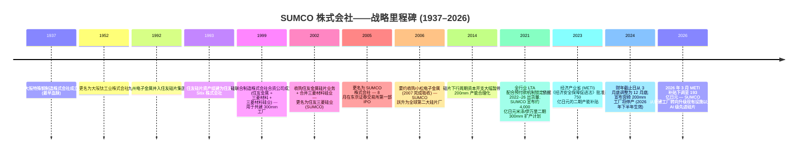

# SUMCO 株式会社 (TSE:3436) — 公司研究报告

**截至日期: 2026-05-26**
**上市地: 东京证券交易所 (Prime 市场), 代码 3436**
**注册地: 日本东京**
**报告语言: 简体中文 (英文版同时存在于本目录)**

---

## 目录

1. 公司概览
2. 公司历史
3. 管理团队
4. 产品与服务
5. 客户与上市策略
6. 行业概览
7. 竞争格局
8. 市场机会
9. 风险评估
10. 参考资料

---

> **业绩更新——2026 财年 Q1 业绩不及预期 (2026-05-12):** SUMCO 公布 2026 财年 Q1 (即日历 2026 Q1) 销售额为 **1,014 亿日元**, 相较 2025 财年 Q1 的 1,024 亿日元下滑 1.0%; **录得营业亏损 52 亿日元**, 而上年同期为营业利润 59 亿日元——同比转向亏损共波动 111 亿日元。管理层指引 2026 财年 Q2 销售额 1,120 亿日元, 仍将承担 25 亿日元营业亏损, 表明周期底部正延伸至业内传统的旺季半年。所述驱动因素包括: 200mm 硅片 (200mm silicon wafer) 出货量低于预期 (成熟制程需求疲软)、伊万里二期 (Imari Phase-2) 折旧大幅上升, 以及日元主导的汇率逆风。AI 驱动的 300mm 硅片 (300mm silicon wafer) 业务 (HBM、先进逻辑) 仍为结构性对冲项。来源: [2026 财年 Q1 业绩公告, 2026-05-12](https://finance-frontend-pc-dist.west.edge.storage-yahoo.jp/disclosure/20260512/20260511523181.pdf)、[2026 财年 Q1 业绩说明会纪要, 2026-05-12](https://www.investing.com/news/transcripts/earnings-call-transcript-sumco-misses-q1-2026-expectations-stock-dips-93CH-4698631)。

---

## 1. 公司概览

SUMCO 株式会社 (株式会社SUMCO, TSE Prime:3436) 是**全球第二大单晶硅片制造商 (monocrystalline silicon wafer producer)**, 为半导体行业提供基底硅片, 在 300mm 硅片全球出货量中占据约 21–23% 的份额, 仅次于信越半导体 (Shin-Etsu Handotai, SEH) 约 28%+ 的份额; 两家日资龙头合计控制超过一半最具经济意义的 300mm 硅片产能——后者正是先进逻辑、DRAM 以及高带宽内存 (HBM, 高带宽内存) 所需的硅片尺寸 ([SUMCO 公司简介, sumcosi.com](https://www.sumcosi.com/english/corporate/profile.html)、[Intel Market Research, "Silicon Wafer Market Outlook 2025–2032"](https://www.intelmarketresearch.com/silicon-wafer-market-85))。公司本质上是**单一产品公司**——其全部营业收入均来自直径在 100mm 至 300mm 之间的抛光片 (polished wafer, PW)、退火片 (annealed wafer, AW)、磊晶片 (epitaxial wafer, EW)、连接晶片 (junction-isolated wafer, JIW)、SOI (绝缘体上硅, silicon-on-insulator) 片及回收片 (reclaimed wafer, RPW) 的制造与销售 ([SUMCO Product Lineup, sumcosi.com](https://www.sumcosi.com/english/products/lineup.html))。

公司总部位于**东京都港区芝浦 1-2-1, 邮编 105-8634**, 创立于 **1999 年 7 月 30 日**, 以"硅联合制造株式会社 (Silicon United Manufacturing Corporation)"名义注册成立, 作为整合住友金属工业、三菱材料公司及三菱材料硅业的硅片资产的法人载体; 2002 年完成住友金属硅片业务并购及多次资产整合后, 于 **2005 年 8 月正式更名为"SUMCO 株式会社"** ([SUMCO 公司简介](https://www.sumcosi.com/english/corporate/profile.html)、[SUMCO 公司沿革](https://www.sumcosi.com/english/corporate/history.html))。截至 2025 年 12 月末, 集团共有员工**约 9,714 人**, 在日本本土运营六大制造综合基地 (山形县米泽、北海道千岁, 加上九州地区四个基地——佐贺县伊万里两座工厂、九州佐贺县江北 (Kohoku/Saga)、长崎县大村 (Omura/Nagasaki)), 海外还运营四家工厂 (位于美国亚利桑那州的 SUMCO Phoenix 与 SUMCO Southwest、阿拉巴马州的 High-Purity Silicon America、台湾麦寮的 FORMOSA SUMCO TECHNOLOGY, 以及印度尼西亚西爪哇芝卡朗/勿加泗的 PT. SUMCO Indonesia) ([SUMCO 全球网络——制造基地](https://www.sumcosi.com/english/corporate/offices/))。注册资本为 **1,990 亿日元**, 并已取得 IATF 16949、ISO 9001、ISO 14001 以及 ISO 45001 等质量管理体系认证 ([SUMCO 公司简介](https://www.sumcosi.com/english/corporate/profile.html))。

**盈利方式。** SUMCO 销售的是厚约 750 微米、镜面抛光、纯度达 99.9999999% (九个 9) 的单晶硅圆片——直接销售给芯片制造商: IDM (集成器件制造商) 包括 Intel、Micron、SK Hynix、Samsung、Infineon、Texas Instruments、Renesas、STMicroelectronics; 纯代工厂 (foundry) 包括 TSMC (台积电)、GlobalFoundries、UMC (联电)、SMIC (中芯国际) ([Silicon-Ecosystem, "Silicon wafer market: upturn, higher prices"](https://marklapedus.substack.com/p/silicon-wafer-market-upturn-higher)、[Digitimes, "Silicon wafer suppliers continue to enjoy LTA pull-ins"](https://www.digitimes.com/news/a20220407PD210/ic-manufacturing-silicon-wafer.html))。合约模式严重偏向**多年期长期协议 (Long-Term Agreement, LTA) 配合客户预付款**, 这一结构在 2021–22 年硅片需求超出供给能力时形成, 目前为公司提供了相较以往周期显著更优的远期出货可见度。定价主要以美元或日元等价美元计价, 而日本本土的成本结构意味着公司在日元贬值期间能获益 ([Digitimes, "Silicon wafer suppliers continue to enjoy LTA pull-ins"](https://www.digitimes.com/news/a20220407PD210/ic-manufacturing-silicon-wafer.html))。

**规模指标 (2024 财年, 截至 2024 年 12 月)。** 合并营业收入为 **3,966.2 亿日元**, 较 2023 财年的 4,259.4 亿日元同比下滑 6.88%; 营业成本为 3,238.9 亿日元, 毛利润 727.3 亿日元 (毛利率 (gross margin) 18.34%); 经营业务最终录得**净利润 198.8 亿日元**和**每股收益 (EPS) 56.84 日元** ([Marketreportanalytics — SUMCO 3436.T 财务表现](https://www.marketreportanalytics.com/companies/3436.T))。下行周期在 2025 全年继续深化——Q3 销售额 991 亿日元, 营业亏损 16 亿日元, 成本削减部分对冲了折旧上升 ([SUMCO 2025 财年 Q3 业绩说明会纪要, Alpha Spread](https://www.alphaspread.com/security/tse/3436/investor-relations/earnings-call/q3-2025))——2025 全年营业收入约**4,096 亿日元** ([SUMCO 公司简介, sumcosi.com](https://www.sumcosi.com/english/corporate/profile.html))。注: SUMCO 在 2024 年变更财年截止月, 从 3 月底改为 12 月底, 形成一个过渡性报告期间; 上文数字均按日历年口径列示。

**地理结构。** 作为日本本土制造的出口商, 营业收入的美元价值绝大部分在日本境外实现。SUMCO 300mm 硅片的最大终端客户地区依次为台湾 (主要依托 TSMC)、美国 (依托 Intel、Micron、GlobalFoundries) 以及韩国 (依托 Samsung 与 SK Hynix), 中国大陆为相对较小且地缘政治敏感度持续上升的板块 ([Digitimes — "Sumco 相关新闻"](https://www.digitimes.com/tag/sumco/001883.html))。公司明确披露的服务区域涵盖日本、美国、中国、台湾、韩国、欧洲及其他国际市场——出自其公司简介中的标准化披露 ([SUMCO 公司简介 (Investing.com 整合页)](https://www.investing.com/equities/sumco-corp.-company-profile))。

**营业收入与营业利润率趋势 (2021–2025 财年)。**

*来源: 综合自 [SUMCO IR——财务信息](https://www.sumcosi.com/english/ir/financial/) 与 [Marketreportanalytics — SUMCO 3436.T](https://www.marketreportanalytics.com/companies/3436.T); 按 2021–2025 日历年口径。*

**季度走势凸显本轮周期的剧烈波动。**

*来源: 综合自 SUMCO 季度业绩公告 ([2026 财年 Q1 公告, 2026-05-12](https://finance-frontend-pc-dist.west.edge.storage-yahoo.jp/disclosure/20260512/20260511523181.pdf)、[2025 财年 Q3 纪要, Alpha Spread](https://www.alphaspread.com/security/tse/3436/investor-relations/earnings-call/q3-2025))。*

**估值快照 (截至 2026-05-25)。** SUMCO 在 2026-05-22 于东京证券交易所收盘价约为 **3,177 日元** ([Yahoo Finance — SUMCO 3436.T](https://finance.yahoo.com/quote/3436.T/)、[Meyka — "3436.T 股价于 2026 年 5 月 9 日大涨 18%"](https://meyka.com/blog/3436t-stock-surges-18-on-may-9-2026-as-sumco-nears-earnings-0905/)), 对应市值约**1.11 万亿日元** (按 155 日元/美元计 ≈ 71 亿美元)。在过去十二个月内, 股价**大约翻倍**, 市场已为 AI 驱动的先进制程 300mm 硅片需求复苏计价; 但近期 2026 财年 Q1 不及预期触发了约 6% 的回调 ([Meyka, 2026 年 5 月](https://meyka.com/blog/3436t-stock-surges-18-on-may-9-2026-as-sumco-nears-earnings-0905/))。从过往十二个月 (TTM) 基本面看, **TTM EPS 为 -33.6 日元**, 因此**市盈率 (P/E) 为负, 不具备意义**; **TTM 市销率 (P/S) 约为 2.7 倍**, 对应 2025 财年 4,096 亿日元营业收入, 略高于历史 1.0–2.0× 区间 ([Yahoo Finance — SUMCO 估值指标](https://finance.yahoo.com/quote/3436.T/key-statistics/)、[SUMCO 公司简介](https://www.sumcosi.com/english/corporate/profile.html))。注: Morningstar 对同一代码 (XTKS:3436) 的数据也确认了类似的失真倍数 ([Morningstar — XTKS 3436](https://www.morningstar.com/stocks/xtks/3436/quote))。

*分析师观点:* 负值 TTM P/E 是教科书式的**周期底部 + 产能爬坡折旧倍数失真**, 而非结构性下行信号。三股力量同时压制盈利能力: (i) 200mm/成熟制程产能过剩 (中国新建 200mm 产能压垮了传统直径硅片的定价); (ii) 伊万里/米泽二期 (Imari/Yonezawa Phase-2) 资本开支项目在 AI 驱动的 300mm 需求和价格回升之前约两年就已转为折旧入账; (iii) 日元汇率波动影响美元定价 LTA 的实际经济性。最接近的机械可比公司是 **Siltronic (ETR:WAF)**——其同样因 2025 年 8 月新加坡 Fab-S2 折旧启动而进入 TTM 亏损区间——市销率约 2.0 倍。母公司**信越化学 (Shin-Etsu Chemical, TSE:4063) 的 TTM P/E ~27.9 倍**则是误导性可比, 因为信越的盈利分散于 PVC、有机硅、甲基纤维素以及稀土磁体业务, 硅片仅占约 25%; 真正的纯硅片代理对象是该集团内部的 SEH 子公司。在 P/S 维度, SUMCO 的 2.7 倍**高于 SEH 隐含的嵌入式倍数**, 但低于 **GlobalWafers (环球晶圆) 的约 4.2 倍**——后者在野村东亚半导体 BUY 升级后上涨 ([野村《大中华区半导体 2026–30F 复兴》报告, 2026-05-21, 图 35 硅片排名](https://www.intelmarketresearch.com/silicon-wafer-market-85))——因此从前瞻复苏视角看, SUMCO 在三家纯硅片厂中是最具估值吸引力的标的, 二元风险则在于当前底部的深度与持续时长。

**同业估值比较 (TTM 基础快照)。**

*来源: 综合自 [Yahoo Finance — SUMCO 3436.T](https://finance.yahoo.com/quote/3436.T/key-statistics/)、[Stockanalysis — Siltronic WAF](https://stockanalysis.com/quote/etr/WAF/)、[Stockanalysis — 信越 TYO:4063](https://stockanalysis.com/quote/tyo/4063/statistics/)、[Morningstar XTKS:3436](https://www.morningstar.com/stocks/xtks/3436/quote); 所有数值截至 2026 年 5 月下旬。*

因此, 投资逻辑的核心在于**2026–27 财年是否为本轮周期的底部年, 以及 SUMCO 能否在折旧高峰到来之前, 将其 AI 级 300mm 产能转化为定价能力**。从结构背景看——硅片需求本质上与全球硅片面积产出绑定, 而硅片面积产出又与先进制程的晶体管密度、HBM 堆栈层数、先进封装 (advanced packaging) 以及 AI 服务器的单位增长挂钩——前景仍然向好。风险在于时机: 管理层在 2026 财年 Q1 业绩说明会上指出, 200mm 市场正常化可能要等到 2026 年下半年或 2027 年初 ([SUMCO 2026 财年 Q1 纪要, Investing.com, 2026-05-12](https://www.investing.com/news/transcripts/earnings-call-transcript-sumco-misses-q1-2026-expectations-stock-dips-93CH-4698631))。下文第 4 章 (产品)、第 6 章 (行业)、第 7 章 (竞争) 与第 8 章 (TAM) 将逐一展开这些机制的详细推演。

---

## 2. 公司历史

SUMCO 的体制基因异常复杂: 现代公司是**四个独立日本硅片业务**、三家日本金属集团 (住友、三菱、九州电子金属), 以及一家可追溯至 1937 年的不锈钢前身公司的合并继承者, 这一切通过 1990 至 2002 年间的三十年并购整合, 并以 2005 年的最终公司更名收尾 ([SUMCO 公司沿革](https://www.sumcosi.com/english/corporate/history.html)、[SUMCO 公司简介](https://www.sumcosi.com/english/corporate/profile.html))。最早可追溯的血脉是 1937 年 1 月成立的**大阪特殊钢制造株式会社**, 后于 **1952 年 11 月更名为大阪钛工业株式会社**——这一冶金基础后来切入单晶硅拉制业务, 并最终成为前身硅片业务之一 ([SUMCO 公司沿革, sumcosi.com](https://www.sumcosi.com/english/corporate/history.html))。

整个 1980–1990 年代, 日本硅片产业与全球半导体行业从 6 英寸到 8 英寸 (200mm) 衬底, 再到首批 300mm 试产线的演进同步整合。**1993 年 1 月住友集团将其硅片业务更名为"住友 Sitix 株式会社" (Sumitomo Sitix Corp.)**; 三菱材料硅业 (Mitsubishi Materials Silicon Corp.) 则作为另一独立法人单独运营。两家公司当时都是面临残酷价格周期压力的中等规模独立厂商, 这种压力最终推动了跨公司整合 ([SUMCO 公司沿革](https://www.sumcosi.com/english/corporate/history.html)、[Wikipedia — SUMCO 株式会社](https://en.wikipedia.org/wiki/Sumco))。

后来成为 SUMCO 的法人载体, 于 **1999 年 7 月 30 日**正式成立: 住友金属工业、三菱材料公司与三菱材料硅业联合设立**硅联合制造株式会社 (Silicon United Manufacturing Corp., 即シリコンユナイテッドマニュファクチャリング 的直译英文)**, 用于建设一座共有的全新 300mm 硅片制造工厂, 因为预计任何单个发起股东都无法独立承担一座绿地 300mm 工厂超过 1,000 亿日元的资本支出 ([SUMCO 公司沿革](https://www.sumcosi.com/english/corporate/history.html)、[SUMCO 公司简介](https://www.sumcosi.com/english/corporate/profile.html))。**2002 年 2 月**, 该法人载体吸收了住友金属工业的硅片资产, 与三菱材料硅业合并, 并更名为**住友三菱硅业株式会社 (SUMCO, Sumitomo Mitsubishi Silicon Corp.)**——SUMCO 缩写源于"Sumitomo + Mitsubishi Silicon Corp."的拼接。这是 SUMCO 缩写首次对外使用 ([SUMCO 公司沿革](https://www.sumcosi.com/english/corporate/history.html))。**2005 年 8 月 1 日**, 控股公司正式将注册商号定为"SUMCO 株式会社", 同时在东京证券交易所第一部 (现 Prime 市场) 首次公开发行上市 ([SUMCO 公司简介](https://www.sumcosi.com/english/corporate/profile.html)、[Wikipedia — SUMCO](https://en.wikipedia.org/wiki/Sumco))。

第二段重要历史——**2006 年收购小松电子金属 (Komatsu Electronic Metals)**——奠定了 SUMCO 全球第二大硅片厂的地位。小松电子金属 (一家自小松制作所工业机械集团衍生出来的独立上市硅片厂) 通过 2006 年的要约收购被吸收, 至 2007 年完成结构性合并, 新增约 20% 的产能, 并将 SUMCO 推上自此长期占据的全球份额位置 ([Wikipedia — SUMCO](https://en.wikipedia.org/wiki/Sumco))。综观从 1937 年大阪特殊钢的源头, 到 1992 年九州电子金属并入、1999 年硅联合制造合资项目、2002 年住友硅片资产并购, 再到 2006–07 年小松电子金属收购, SUMCO 在不到二十年内将日本除信越外几乎每一项有意义的硅片业务整合到了同一个公司载体之中。

**重要里程碑时间线。**

*来源: 综合自 [SUMCO 公司沿革](https://www.sumcosi.com/english/corporate/history.html)、[Wikipedia — SUMCO](https://en.wikipedia.org/wiki/Sumco)、[Evertiq — "SUMCO 战略由新工厂转向设备升级", 2026-04-07](https://evertiq.com/design/2026-04-07-sumco-shifts-strategy-from-new-fab-to-equipment-upgrades)、[Digitimes — "SUMCO 转向设备升级策略", 2026-03-30](https://www.digitimes.com/news/a20260330VL210/sumco-equipment-plant-wafer-demand.html)、[Digitimes — "日本 METI 拟补贴 SUMCO 新硅片工厂", 2023-07-11](https://www.digitimes.com/news/a20230711PD210/japan-semiconductor-subsidy.html)、[SemiVision via X, "SUMCO 2025 财年 Q3 300mm 市场点评"](https://x.com/semivision_tw/status/1993466357208563725)。*

**三大战略性转折塑造了现代 SUMCO。** 第一, **1999–2002 年的硅联合整合**——通过让住友与三菱共担资本开支, 把 SUMCO 从一个亚规模硅片厂转变为信越半导体可信任的对位次席; 没有这个合资载体, 这两家母公司都不太可能独立建成具竞争力的 300mm 工厂, 全球硅片业很可能至今仍由三四家亚规模日本厂商分庭抗礼, 而非现在的"双寡头加三"格局 ([SUMCO 公司沿革](https://www.sumcosi.com/english/corporate/history.html))。第二, **2006 年小松电子金属并购**深化了整合: 小松业务在客户结构上与 SUMCO 形成互补、在地理上更分散, 消除了一家亚规模竞争者, 并结晶出现行的全球五家供应商结构 (信越、SUMCO、环球晶圆 GlobalWafers、Siltronic、SK Siltron), 该结构在过去二十年保持高度稳定 ([Wikipedia — SUMCO](https://en.wikipedia.org/wiki/Sumco))。第三, **2021–24 年 LTA 配合预付款机制 + 产能扩张周期**——由后疫情需求冲击及美国《CHIPS 法案》/日本 METI/韩国《K-CHIPS 法案》时代对硅片安全供应战略价值的认知所触发——使 SUMCO 投入约 4,000 亿日元于米泽/伊万里二期产能, 资金来源为客户预付款及 (后被下调的) METI《经济安全保障促进法》补贴 ([Digitimes, "METI 拟补贴 SUMCO", 2023-07-11](https://www.digitimes.com/news/a20230711PD210/japan-semiconductor-subsidy.html)、[Evertiq, "SUMCO 战略由新工厂转向", 2026-04-07](https://evertiq.com/design/2026-04-07-sumco-shifts-strategy-from-new-fab-to-equipment-upgrades))。

**近期动态 (2024–2026)。** 与投资逻辑相关的三件事: (1) **2025 年 2 月 SUMCO 宣布宫崎工厂 200mm 硅片生产将于 2026 年下半年终止**, 将该等同产能与团队改投至 300mm AI 级输出——这是一项明确的"退出与中国新建产能在 200mm 商品化市场上厮杀"决定 ([Intel Market Research — Silicon Wafer Market 2025-2032](https://www.intelmarketresearch.com/silicon-wafer-market-85)、[Evertiq, 2026-04-07](https://evertiq.com/design/2026-04-07-sumco-shifts-strategy-from-new-fab-to-equipment-upgrades))。(2) **2026 年 3 月**, METI 依据《经济安全保障促进法》批准修订后的《供应稳定确保计划》, 将最高补贴从 750 亿日元下调至**193 亿日元**, 并以伊万里/米泽现有设施升级取代原定的绿地新建工厂——管理层将此调整定调为"将资源重新分配至先进硅片技术能力", 而非战略后退 ([Evertiq, 2026-04-07](https://evertiq.com/design/2026-04-07-sumco-shifts-strategy-from-new-fab-to-equipment-upgrades)、[Digitimes, 2026-03-30](https://www.digitimes.com/news/a20260330VL210/sumco-equipment-plant-wafer-demand.html))。(3) **2024 年日历年 SUMCO 将财年截止日从 3 月 31 日改为 12 月 31 日**, 形成一个 9 个月的过渡财年, 部分科目同比可比性被打断; 2025 年以后阅读 SUMCO 披露的投资者须核对所披露的报告期 ([SUMCO IR——财务信息](https://www.sumcosi.com/english/ir/financial/))。

---

## 3. 管理团队

按照本研究专项的规范, 本章仅覆盖**创始人血脉与现任 CEO**——不涉及 CFO、董事会主席或其他董事。SUMCO 不同寻常之处在于"创始人"是体制性而非个人化的: 该公司是 1999 年由住友金属工业、三菱材料及三菱材料硅业之间的合资决策所创立, 而非由某位魅力型个人发起。现代时代最接近创始人角色的代表是**桥本真幸 (Mayuki Hashimoto)**——他于 1970 年代初进入前身公司, 2012 年出任董事长兼 CEO, 在 2012–22 年间主导了资本开支克制、2021 年的产能扩张转向, 以及 LTA 配合预付款的契约重构, 目前仍留任董事; 因此, 现代战略的运营创建者是桥本真幸; 现任社长 (兼代表董事 CEO) 为**龍田二郎 (Jiro Ryuta)** ([SUMCO 管理团队页面, sumcosi.com](https://www.sumcosi.com/english/corporate/officer.html)、[Bloomberg — 桥本真幸简历](https://www.bloomberg.com/profile/person/18038794))。

**桥本真幸 (Mayuki Hashimoto) — 创始人式角色 / 2012–2024 年董事长兼 CEO, 现任董事 (约 250–350 字)。** 桥本在 SUMCO 的核心角色是 2012 年至 2024–25 年间的董事会主席与首席执行官, 期间完成了领导层过渡 ([Bloomberg — Mayuki Hashimoto](https://www.bloomberg.com/profile/person/18038794)、[SUMCO 管理团队](https://www.sumcosi.com/english/corporate/officer.html))。在加入 SUMCO 之前, 他的职业生涯在三菱材料公司——最为人熟知的是**2005 年时任三菱材料"电子材料 & 元件公司"硅业部门总经理**, 该部门正是三菱方面注入 SUMCO 整合的硅片业务 ([Macroaxis — 桥本真幸简历](https://www.macroaxis.com/invest/manager/SUMCF/Mayuki-Hashimoto))。三菱根脉至关重要: 1999 年 SUMCO 由住友 + 三菱合资成立时, 运营层主导权偏向三菱方; 桥本 2012 年晋升为董事长/CEO 即为该血脉内部的代际交接。他十余年 CEO 任期所定义的运营优先级有**三项**: (i) 在 2014–20 年硅片下行周期保持极致资本开支克制 (2014 年分析师特别指出 SUMCO 进行了一次"激进的硅片业务最优化"——关闭亚规模产线、削减固定成本——为 2021 年后的上行周期奠定了可盈利基础) ([日本金属公报 — "SUMCO 启动激进硅片业务最优化"](http://www.japanmetalbulletin.com/?p=19652)); (ii) 行业牵头**2021 年 LTA 配合预付款机制**, 将硅片合约从季度现货转换为多年期出货承诺, 并配以客户预付款, 大幅提升远期可见度 ([Digitimes, "Silicon wafer suppliers continue to enjoy LTA pull-ins"](https://www.digitimes.com/news/a20220407PD210/ic-manufacturing-silicon-wafer.html)); (iii) 2021–22 年宣布的**约 4,000 亿日元产能扩张计划**, 以米泽/伊万里为核心, 将 LTA 承诺转化为厂房、单晶炉与磊晶反应器 (epi reactor)。桥本在领导层接班后仍任 SUMCO 董事, 保证其所设定战略方向的延续性 ([SUMCO 管理团队](https://www.sumcosi.com/english/corporate/officer.html))。其本人在 SUMCO 的持股按惯例披露于 EDINET 上的年度委托书, 与日本资深高管常见的小额股权持有水平一致 ([株主プロ — SUMCO 3436 有価証券報告書一览](http://www.kabupro.jp/yuho/3436.htm))。

**龍田二郎 (Jiro Ryuta) — 现任社长 (President) 兼 CEO / 代表董事 (约 200–250 字)。** 根据 SUMCO 管理团队最新披露, **龍田二郎**身兼董事会主席及社长 (President) 兼 CEO, 并具备**代表董事 (Representative Director)** 身份 ([SUMCO 管理团队页面, sumcosi.com](https://www.sumcosi.com/english/corporate/officer.html))。龍田出任 CEO 反映了桥本时代的代际交接, 代表的是延续而非战略断裂: 已公布的轨迹——完成米泽/伊万里二期资本开支、退出宫崎 200mm、把 (下调后) METI 支持的投资重新配置于 AI 级先进硅片设备升级, 并在 2025–26 年周期底部坚守 LTA 出货承诺——正是桥本所设的剧本。管理层的运营深度可见于 2025 财年 Q3 与 2026 财年 Q1 的业绩说明会, 其对 HBM 市场份额、5nm 以下逻辑硅片定价、200mm 市场正常化时点的评论非常细致 ([SUMCO 2025 财年 Q3 业绩说明会, Alpha Spread](https://www.alphaspread.com/security/tse/3436/investor-relations/earnings-call/q3-2025)、[SUMCO 2026 财年 Q1 纪要, Investing.com](https://www.investing.com/news/transcripts/earnings-call-transcript-sumco-misses-q1-2026-expectations-stock-dips-93CH-4698631))。执行副社长 (Executive Vice President) 久保染慎一 (Shinichi Kubozoe) 与广田成也 (Naruya Hirota) 同样身为代表董事, 共同组成最高运营委员会 ([SUMCO 管理团队](https://www.sumcosi.com/english/corporate/officer.html))。龍田现任职位以外的生平资料在 SUMCO 英文 IR 中未有详细披露——跟踪该公司的分析师通常通过 EDINET 日文版的有価証券報告書 获取高管完整背景 ([SUMCO 有価証券報告書 — IRBANK](https://irbank.net/E02103/edinet))。SUMCO 高管的薪酬结构遵循日本公司治理常规——以固定现金加多年期限制性股票为主, 持股规模较小; 因此, 利益对齐机制以任期与声誉为主, 而非通过股权财富积累。

---
